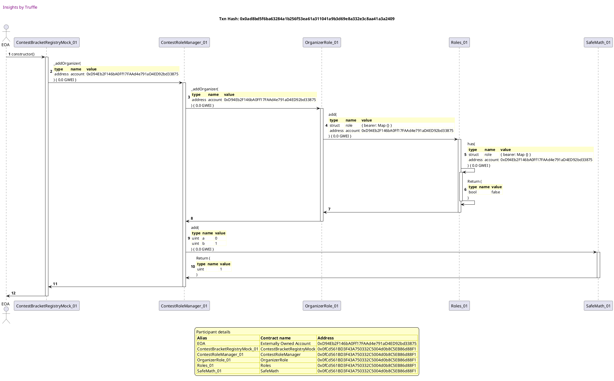
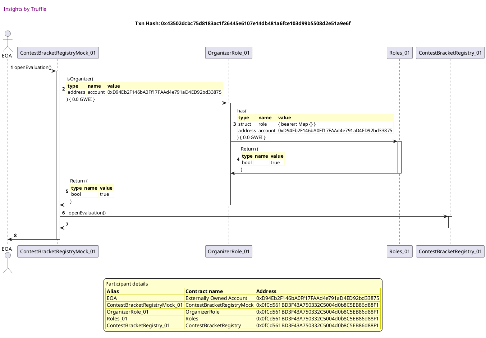
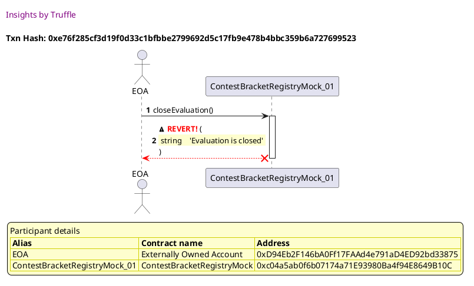
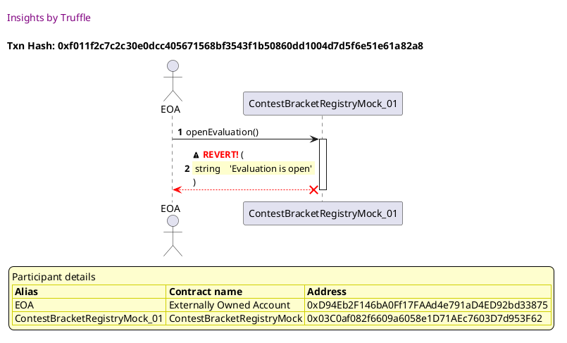
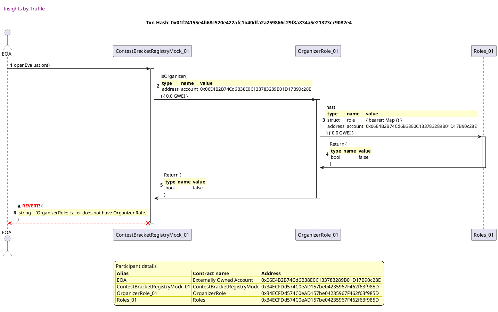
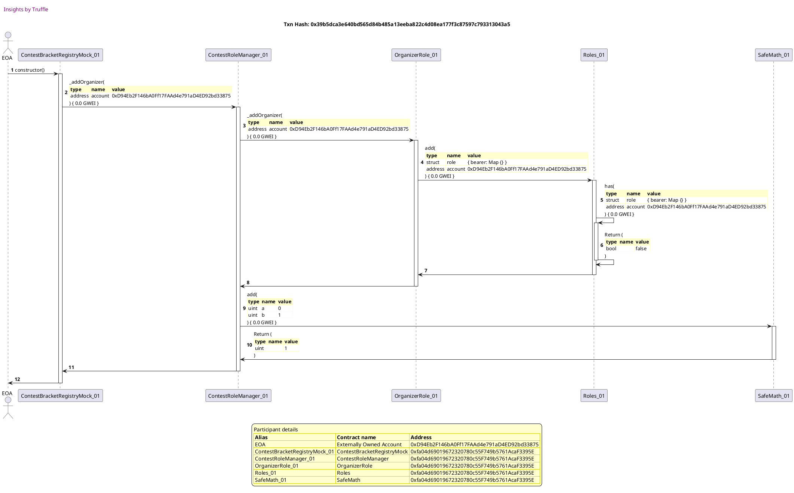

Test date: 2021 Mar 11


## creates contract and checks initial status
[link to test...](http://github.com/fodisi/hackapay/blob/1746d2fc3fafc73d8b2843f0fed53fbd26643dc8/test/core/ContestTeamRegistry.test.js#L29)

##### d1, tx: 0x9d7e0b46e41c9d8a3f6d24e5ef1c2bd524bfb2c51053431220eeef2c0b5562cc

[SVG :telescope:](https://www.planttext.com/api/plantuml/svg/tLPjJzim4FxkNt5YNq2CpNdhcnYYB-dW0m81qhuW8ITnqWZNgHndQodyzrtIjAGlj1hLf6bL6zldk-VkkLvy9kGyrKpfR2W8OPbEP3Rqk2BfKon7JB4X21vn6NIO_nIf99D1Dn69Wazzj-zsNK9EKpqH_8n0yHbm5d05qt89S96e-3cHcecsY2Cvv58ZOgWN2dtSd46ECZKIV6dZBdxcODWBsGqBWbX6OD1Iz5gCfr_B84Zf_rAcSJJGANWJk5TP628kqR4M7Ex74YvOEcW17JU3EgUUNUEsuJU31hF2Mc3QtE6XuPjUu9Ys5tgcxnZKiMpBC4tAEGzDdtgEKpDzds3AV8sXkzTjO2aSu7X0C6qwzkCHGwfT9C5JtL6OFgvlUHIdMask4l_faHg5oLQDZM2tYU1NJBA8gnMGvPrbusiLCOdfLBdIt6vLk6oI2zEvwdonh7B7GlIe1tEjolg0a28VS7AsYoKS7xV0JoJAiZoVXqTabqK5T8Lr0VQ8XR8WT_WW7yXfMR6Vo_7ivHleoOW3Zf8DY_4d4nbESlKNG0J5qnHmvljO-1fdTDnhsgvdzWsxvhLfFpJg_NOxi7czQR2UxVQQM3QMrQWxCvGZc0BzGk7x3_SIQ_MzY7CoQt_5lynZFTYSmg94Yj3HxyS2dbK1HgaG3uSfU9mfhbfmnKOmVONNlqdjZSGwfG5B_oTA9oSjkEKwKn8-HijB4e7nuJTa8Yt5HwiEDnGBEdwlYDvxHGgJBUzFzUJPh_wokCWwopE_8lFmPsnEyfB_7KJsIdePIYMIhNdPTOvMyxhji9qTvRascTq8o4sb3mHSirYa5JOzsgEKvcomyMDhm4dk1Jte1Q_slDWNTcSlHI_5vrXp9PaG4xZ-9Na0xG-z3bNWxRrustxXjDankerktQHMFGWit-zr6bR33Lt3SPs0rkfXfs7QpHnfWzELdhr9leUJjTw-8je3Ud47AATxG5Nl2c-hFmN4oYlhZvpZ4--jlm40)


## Opens/Closes evaluation, updates state and emits events
[link to test...](http://github.com/fodisi/hackapay/blob/1746d2fc3fafc73d8b2843f0fed53fbd26643dc8/test/core/ContestBracketRegistry.test.js#L47)

##### d1, tx: 0x0ad8bd5f6ba63284a1b256f53ea61a311041a9b3d69e8a332e3c8aa41a3a2409

[SVG :telescope:](https://www.planttext.com/api/plantuml/svg/tLPjRzem4FxkNt7glhJgkZaaWO0wLChBsWzLgxRIlbIgBea3KOE376U3qlxtNKAWuQMW5KsQXY2sptVFtNDSV6RiBD6eT3gC6CDKnp8TkaAnv2cK8rGuX4ZqXVJFqNlggpYLVZkEOWMVUjrUjzrbx3JHaqWq6UIVWK1VA9WMIu2BM8NFiTGOjQAmBuT2Qa8Cz4AXHvipo56gHf5OshWBdmKOra9sWxuVoZuOl12zvkFfro88LlY_b4dO7-W4t0dSgpG829VfK4S2xiSIBZ0PD82FEVgEwzj1rSMgMN4iDDoANGriKs3LGDCmk6LWtJNzQbquQ9eLONeE8WbDh5YypYXbdgRGkzSjm0GEQ3nWb3OTUk48YMgRI8X4dojAdz2teXycMaskOk_faHkvoLQDZM2tSIIkK69Vg1MGvPrbuslLHqdfL9dIt6vLk6oI2PEvwdonh7A70NdKWxbMQNt0M9uFE6dkOWd7nmtmOacoDClduH7RPL42NM6TWprIeIp87Jx81tPQLEpdOco-V0Cz6GcWKU8m7tzYbD8aKty1Gb0YIO1cdaU5hsd6nvswrNKhFSEgkYtU2unQhzNoBL6h6zYnkfrwnVLDqwdPCvGZc0B_mk7xZ-ubrUfx4MTarlwAVvd7Uh0PXKM9vA6Jtuy5FAi2Yb8H7WrJS0KgeHfmXIEOliBhtwJsHcATqW2J_udIoKa3ReLEbOIFqNBZEABuw1jWb1JYerM76ug57BzNHE-z8hd9blUdVFBiLtzfc6STiyolo5pw6PkJlEH_1v6zabw4KefaQrvsdQFbl6uxR6T7UQRDPZS2TbFg0xxG64P9YKs7TpZd6Hjg_DGQQ99v8GzwmQirB_Q5NVCbxwNq76kX94RH1Av_IU53wqElGnbuUo_UjfyxvK7Rjwl6USViMMQhPdEw3xHjpYsVkqxRxfuxLTznUiP6foizUvDy3oThlNr5j0VquWvGJFU0AjyLtbP_2aYLLzGVEwCdtLj_0m00)




##### d2, tx: 0x43502dcbc75d8183ac1f26445e6107e14db481a6fce103d99b5508d2e51a9e6f

[SVG :telescope:](https://www.planttext.com/api/plantuml/svg/jLPHJzim47xthpYn5n1ZSvgaJIjM4Tfay81036alICY9dJOYTIhRsLeA_tsNDEqeq590H57EETlVVT_bV0eXHzemPOfHHWWhJ2wBKIGKqRUf73F5Hf29WP3ycCMt0vKNalVoB5Vm9Gp2e1SGSgZDD1DT0jKr58mB1RFw5U0aL-bTBWtB_2mTo96G1X4JirmGukGSSboeSIPM9dwbTm8iP-cxO9odSW0MhLqFbJtyNfCWTVnJgTF1q6Y8fd2bYYH1N69IamcucaWuONhO0JfnR9SsU1p5BPTxbcUps4eQJSTnHTEYBM4vF78yYpMJM5ZKvkrsvBhKumtXMgmjcWd1bCK6gGVdFZ0DEsXt2ARDf74wPYYrXoA4DiSAqoVCfHYasgZfMHxVtb2hsh9nnIhOkHemYHbHbtac5lkVEbUtb4wzMBfusORYPdeL2Adama7tDH6mlz-1V2nay8Tb1JDfBdVto6kRIjnduYgeL2_zkzVocXpMnVYrjjtx7s2cOm5e9HjLjeoCWtBvFM0LAQ4ru2YEiQODZkYattQ2g15QJZFoQPXOhT3tkIDQROlrdQ3VRaJSjhsMEqVPWndGRnH-_WvEiGnVe5eAMAQy8Zva-ds4CJ55NB9KY8Tc1f5WIgWEdB4np1xWuJEb_HVnyZSvEEZ0fJ25al0-UL6UPyWJRzHPU_VMfVIrilaaCbjKw_gpKdtzcssFm5kaRaLiVaxBrMJUpSd5emR0XM5ffXzbga_xbD8oKzYqiGlWe8o24SmoP_wYq9RxklTL7yJdn0WbMPPDuVol51pyTvNYO-3DVNJJV1MK9ZtkDgtZlXqwjjzogMqtUYwb3gUHrtE3Ow_9FI-qLeC-wxTFN1-0NlRbUlW1gFNzUztSMuDXmTHbGuxmYRyA_m00)




##### d3, tx: 0x34a669d485b140f3f246e3be609811f68ef13ea948e093e920ae5906b3d0abe3

[SVG :telescope:](https://www.planttext.com/api/plantuml/svg/jLPHJwD047xVNp7nNZIUTqkX51gliRPm-c0qdiczc9W5XfP8bsPPxbgh__q6IdjMRQqQ2M6MsTrllc-OdS3OKQw5qiKePKmKEfF5A435yjj4ZeKI8qXnW38w5k7jG6M5Z7fPcYduudk-r_COEyprDCKEW-eQeeXGmQn-1JZ9L7ANIItIRfeCv0Yb9iHOBnVuD3c771TgdEBAnA_a3i6mbhuB4KM97831QzT3PG-_roHO7VzKvibWg7C8fd2bYZWcNAOJdI9SJIISY7pO1ZunBM7RRcGvpS2mU6p63Sj6Cq2RkuvXnBQ3iM6YS2q7kMkYs-02cowt0pFY8a2JKSf2JTIzyow877R8xZ1Acqx2P2n8Qez4OAwF5QKFzIKEabohwLaMtjvmezgoSSKgsBaQ24aPKPTPYelzJvshMqfdlbYwUDc6ucPw5GYhvC91vpKHiB_VXZ3DSlJ-YBGGEidaxXvxRLS9_4nTXPNaI__kjRncXtKrVgrjv_u7wEaOWQmKeygMaMbGBhy7AYE5UGuq2aCgQaqZFkcxbXSqVCEoWoxtOwFbTxkHXItN47tBwxkD839DfzMSe-p13FWt3Zz_UwTKXozGBGKiSruH7uhyVOGfCKLOibI4HsO60Gg5gWrdOWop1tZuJ6d_HRpyJGuEsd29kb0ItYSloBAKUD9DEcllthgKlbOsdqHcYsfTVrYght-pzHbuYzQjcCrFQhcQpVivktZK0YBK8adpHwdgypxdl4mLjMtg0pGeer04lKnQTr5fotsT-weJqdEYKKcHfbCu_oinWkwxQl4nyEPEkcc-2ihZNjIqZUE-wLjcjzNafjdeDJct8XuulQPtxDYHu_Z6Qj1d7VU9wmFGoyvS3py0jRw3hvjxQp0gcBfis14zwMVX7m00)


## closeEvaluation reverts if evaluation is already closed
[link to test...](http://github.com/fodisi/hackapay/blob/1746d2fc3fafc73d8b2843f0fed53fbd26643dc8/test/core/ContestBracketRegistry.test.js#L64)

##### d1, tx: 0x40fc2eddb600b6128f477add16c11a0e271489926d7c7e5370b99b80de72205f

[SVG :telescope:](https://www.planttext.com/api/plantuml/svg/tLPjJzim4FxkNt5YNq2CpGvfqrIieY_fu0C20TA-824dSTA8rAaSPsif_FTTqhIaBxGQrQHfLLlRvxldxhbSV2RaFDLSwMmO4y8pdSXiw0f5qgT8ZhZYGuX5AAJVuTvJg99C-jqaJXHywZjzf-iGSfRgIInQ18hFG71VA9YMIu2BH4NFYTGyRiTHA8T2QaGCz4AXZvipo56cHh5OshYBdWKmSo6xuRuVoH0OBKMlnNZsjGo2bFulPHg50vs2Eu5xbGK1uX8TwLZ0_LZ21Ky7JQ1ZamQU8NpVhLFgrfdH24pBGXUixZ76gJ0iPZPiswZxbcU9sgb5NTjs6zGNbc7GMa0mPPx6q9thDl0K3d0y89Ws7NdHY2FLBf8GgUueJ9_GjoACKgqcLudtz4XPOR9LOoFORHABAovvADGAoFBEil6r2hd4TAfSQMwtAbmsoONfN7M-M5Qvum5wr8EvLcLzG4YH3pXfxM89nyTDy1A9iYpFv-4HsMLH0LrXNO0zubDSa3jya0_ahApOp-NOUla6UZ8IWAFamsByoUCC9xdw2o224caAEFCyB7oDCphksQRZ6drcrjqsxGVCwhVRlYaic_6UwVHim_LFJnjMROPo15EWNoXy_-5SOgs-5t5EPkrH_CiyreFDAInAf0WT_Nuiu5aLO9GAyN2OWYku4ge9Ltm4qrTu_PlKtaYiKnhmz7-YT7BIX5kXCoNXOxJS98anFlm6F4vByT6gmmt5WexVAwBtNf72PClxKprvzgk_B2goplFChyXS_B7DILxoluF8NaalGwb4iZKlkyxHQbwt7RQpeppN9hCR0Rcfz05VQ1x5QOLDZ_OefJaRRFpO6d2IUq4FUi6hFI_sXLthfUYb-3_MGaaUnnEu_YM53-qFlGvLuEszUDj-uTIZ9gznbmPrbrhCChd57FlKRj0EDmCCg54txGwZtOrELths9laUJjPw-ufe3-Z57Q2SxW5LlIkyhVuK42klh3zoZlzuR_qD)


##### d2, tx: 0xe76f285cf3d19f0d33c1bfbbe2799692d5c17fb9e478b4bbc359b6a727699523

[SVG :telescope:](https://www.planttext.com/api/plantuml/svg/XLDTJzim57tthxW3QK0PmadJf4PTHDgcOWyJgAlsCgR9ZfrYaJgLxK0BtN_VRHinU84eifFxSUxnkTU4N3hFhMyM5I6yyRLf5a9PukwrMNBB5r2fkJ9oo8lxkQqR8qTrLLiudEIJV9GJCd1-NQcKmEwvKrmg2y_jBy1LRVLJRJoliahFpK8PZuYbVmcOe7CFkMpiib9l73_qau8WUh7TS2crcKD0MzFVtJuuRqcGjlutu_JypZiGQvZPfYmHbtZjAmMpbO4hxkukWAvK4fTXlrUKNHcmaifkjmX4AOGA4yPY5ifU4IIbO2fA-Y8IekZsc8Xv4YOnOxsmIr2omYFr_3e3xk00zmE2idbTw2N7euxm4ChveKNvb9-gkNRUhh_NnVqV6knItequ86I72MVfHv5mUde1HLKxbJ_mgk5Ur-RuX7oKjJhxTMYL_BqjiAzqTW63pu_S6XGwXK6nRpV6f9tEDF-PJsUVEft1-SwUml6jkIM3TXg-j7kw0IooRTG6y3twpmYqsvEKHx3PffuGgL13_S2z-bYC_IoIcrSAI-Mvhjmh3cCwffIccw-08uSIuySM5p4z6BvGMqCcfLKEVIzvo7dRHLnNNbd3gseDruz6ISYA0kVUeukknYpAHJW9ebXaT586oIJBPAGI5l1nb8zPA728-adlBV3xK_2UVrUqe17lSK7BMD0aI2AU13dhiZuTygX4GlquOiE0Zh0egjDgH2vnnLlz3m00)





## openEvaluation reverts if evaluation is already open
[link to test...](http://github.com/fodisi/hackapay/blob/1746d2fc3fafc73d8b2843f0fed53fbd26643dc8/test/core/ContestBracketRegistry.test.js#L68)

##### d1, tx: 0xf66bff35eb78c9d76156aec1a9cfd093df26bc4a1688085fb07282d353b4af11

[SVG :telescope:](https://www.planttext.com/api/plantuml/svg/tLPjRzem4FxkNt7glhJgkZa4ye8wr1J2sWzLgxRIlbIgdCG9KOE376U3qlxtNKAWuQMW5KsQXY2sptVFtNDSV2RaB5DCgdoO4C9obOfyw759igTOZ9XaGqXun4LmplodIAQv2Bffaahur7VxRjSbv3HJauHt29IV0MS1bp2jbW0NgOoVKw5OuYHn98PSA4GCrKAXZvipo54kHmbVshYBdpbepONiXWL1B2BGQ2LwBSVJhrKGfF9_AR8u6gWCl0dSopmC4PUeM2KSxiS2BbWsQ0CTXuRXXQ7Uufvf-NPW6bhBODpNcEs70RNr86mOdjzacc5Pr6g57ZKRLYFGMxhNPA6c4KoPhp1qzze1bi41ZWS4qwPYFnunfDf54ZnJvnBJnzKjZ-9CoSbLwZyzKgqqsQgn4UmsJVWL4opYSWLaUMVP-5f6J60wPQ4qjriLBfiKmcokEbyigzon43sgmLohjZuWfCm7d7HsiOJZupRugK1PNkJpy8ZiigY1hh0kmHwnK1Ra3X_40pcjAlPpDNPUle6QZ3ZWADYm77-o9CT9eVu2Y21vbW7EV1yBN-6CZdjsq_KQVQrfU0xjXvhPTvoWoKrROxscsxCRNg3hbjcQeHp15EWN2jz_k9TOg-z5N91P-ol-PHxhmHOK5YLIXev-FnRmh0emIebuE4p1uqnosOOhDeBfAxp-JMfl9DOf3LZsFr4wEMd3BLUv5F0nMbwQ9XWVVaEMP9NuQDNXXc91n-yLqNklI6covVsfdppxrLyUbrbdHUPNP1x-jCr9NlA_WyXUIQz2gKMoDI-xpj5wNhSTjhEZlD0cini1kQdrWO0h5YTPZKsFzYYb1Hji_DWQS59uGGzgmSkP5_l2hlDIzb9yZXMNWYN91Av_2Hw0yw7NeGwylHTlso-TKhrBMKYj1juQgCqCshAurZCrn_LDW-ezCx1RUjzeR7IwqhCtoVTmijRRLqHxG2_k0DLq3wZwNU5jzQU0M7bL_P4pVEAzzJS0)


##### d2, tx: 0x5ab0aa0ada673f0e7f4cbe83d77005850857b204318912491aee6d019f6032ff

[SVG :telescope:](https://www.planttext.com/api/plantuml/svg/jLPHJzim47xthpYn5n1ZSveqQIfM4Tfay81036alICX9d3GYTIhRsLeA_tsNDEqeq590L5NEETlVtNS-VmeXHqepgSjHJWWhTI7AKSWbKRUP63F9Hf3pb8luc4MtgInA4VUBl93m9V03l-yJSgZqDESz0lLlo5dC9SoQLu2JGcPtXT0iz_8i5ICkD28cUhaWmCavvBYKuvolJFpAxZWOrj9tmU8u4oaOj74zrFRmUvC4QUAV2fMbGwqWdCALB9C4SOdETCxXQYBWXAbX5-YapKBA66KninqpeTn9h2Za7JDs74hRdJRjj9smHItJwBX6ot8DnhaTKyDDR6gsaeHWoIADgVld7Z05EsXt29PDPr4sPaYrZoIuqiSIoyVr9KypfUNqh8XkRwXHRzcuOXNiNAPCO4NaPP7pnVwdpjKjbLCjbYvUjabnSter2Adfma7lDHAmlz-5Oio5_uVb9TDP8NRto6kRAjndv6geJ2tzkzVYcXmspVYriRtx7w2dOmve1HlLjegCWshvFM0NIQuKu2YAiASrZkXau5f-s0eComuz6YI64tXUR747ZtrW-GEt5SQcsN7QSvGzc07zHk7dR_yKs_25L2i2ovBNYG-PUb_2M9WoghAKY8Tc1Y5daiikdB4np1xWuJEf_IVnyfaS77JXakjI2dWVlR0eSimJ_yYpyUwjA-bhRVD9oMpHhUllIdtwDzjUWRTGtIgn-JsjLfEvcfEBHm8GSysoN3sgr80EAALLfL2qKGLmK4N127fPCs_HQCjzlVjQ1_4vqLmAbkTJEFyhU0pUkrhnCV1c7TqqNmUbPf-oX7PQYMrJbzaexjmOE8RdHmvA-S29tROPsAtLeC_qzedh0z1BNMw67u1Qhz_hvjuQ31kcQHjoX4_yLFW7)


##### d3, tx: 0xf011f2c7c2c30e0dcc405671568bf3543f1b50860dd1004d7d5f6e51e61a82a8

[SVG :telescope:](https://www.planttext.com/api/plantuml/svg/XLDTJzim57tthxW3QK0PmivtKHSHcaJiOG8nj9SnJKxi58lKgHm7MkZ--sxJg8CNY28xkH_d7fzxJSXvQxcntRmcX7UsqTsya8Qq3qelkE5pgELCQd71ouUPQJejfatT6DZFipoRPeHCMhkgPKoWV-ub5zB0o_0BSDaOzTneo-kaLZCzbzeYOcLt0Jawjv2BpYng-SRnGprBODxETis5K7e6Z0wcl_q-EHr8aA7-DzsgsRrjeLZ1hUcg2d69LRQMSBlKSCdR-pEWoueoLZbbM3gbIoKLPUbHFmYP7qH5vVgUMx72fr50XM2KUY8KVXL8dyc0ySZX4K79IelKiwi4U0jxkEyHbCsgKYqu7dMAXv2jlJ0edxGtSgPQQrRVc_BX3sLzohiHUuJqc70IVnG9nyTdq2oapXvvtN6h6druH3vAMfxysZTI_DxWRmkTdC7aynCt6dMEOL9kkuqnyMXqa_tCRcu_ZKQJqzuUm-6TlYEJOHY-37ky1YoowTCQy3tupmXKstCyWFKcyOW8YGAgHsxbnqfi1v5Slv9NICjLtRvYaDAKKXgllmBE6-gB7njSnBIW-Lnk38aGHhRes-KXuqqBSLrQQJIlwnLSFMaf82bB77gBBhfCnrvME3dpWYAXUSN2F4c49yCnuwcNfMEd4AuRXVvRuFT7u3r_NvIwKyeh6ZbL4D0n3wWVIPQ6BCdACA1k6egnx-Q1WqLHdK4ZSeuhNkb_)





## openEvaluation reverts if not organizer
[link to test...](http://github.com/fodisi/hackapay/blob/1746d2fc3fafc73d8b2843f0fed53fbd26643dc8/test/core/ContestBracketRegistry.test.js#L73)

##### d1, tx: 0x9ca2031ec4ccb7b44251b0dd8731c7601ccf5a85a9b19f621efa21e8686568bd

[SVG :telescope:](https://www.planttext.com/api/plantuml/svg/tLPjJzim4FxkNt5YNq2CBMdpqbIi8ZJ9u0C20TA-824dSTA8rAaSPsif_FTTqhIaBxGQrQHfLHlRvxldxhbUV2RaB9TKo6AO4a8BcV5Yw3D1ygU4ZwYWGqXPp7XuJeEdM6G53_jPcWduvBcUstS9EStb96Kz0jLdm6Z814ph9S159fBdZ4kQscaIyo7Z4X4ZkL3mS7C6EIh4A6LB6tV9CmDLMyXkQ1WcF0PLgKMlrNZwjGw2rFulUPx40vc3Fu5xKKGHuXAPo9J1_PZ31Sq7NL36La1RIbjbWHO4lkbhMajNVIKCEsPR3Kn3KOCWqcb7fvQlMf7HKbb4yT4nEePkTFoGOCe2YQ6xrpRG70vmF22ODfa4oOWYrJwIOBay5vW-9czPdEHIJAwouEbHKIkJhHeRmMwpb5rHJcCcLa2MTvQDhqLCEQPJb4fpkrNXiaafpEUgyyMooXsDqACSpBKQwmD2gdp0IMyNIpW-xaAGSPGLPJuFZyWkYmRe2kiAx14BPK7ky84_aDEwOZ_NO-_b6yZ9Y06Ed0whyITD2voKwY-028BbEU0i2B3m9SwKiMDfhj_oLCtmRSMBLDEpxL1ZfgLIHtCTg-M7xNR7r6SeHp05vOi2tt-ubrYhxqLSabdxA_vb7kl1bXGM9LA5Zdu_5l2i2Z1AWNWuJC5dL33HXIiwWkahlFvDQcyarYaDQFu_KJevwS8jauNWy35QVfQb61z-8vhcjVXerU66Oa77xnNHUwz8PRBb_McUFFlLNv5KMQTbvbTaFlxKpKbUyh-3o5v9hqDfHB8rBxlEqMPUjnssiwEyr2Qp6m6vQVI1a4cQf7c3ZQCuYgAKRB3nOsl0IUa5FSW5BtjUx0kxtalLI_4vbanmcgOJkFx5MGZsXrw79l3sNhnjltBQrjo-vuIwgVKLPZkgRlfCqLfjtJ9CJpDQaT6Eh8xkR7IwqhCtoVTmijRRLqHxG2_k0FLq3wZcNU5jzQU0M7br_P4pVEAzzJS0)


##### d2, tx: 0x01f24155e4b68c520e422afc1b40dfa2a259866c29f8a834a5e21323cc9082e4

[SVG :telescope:](https://www.planttext.com/api/plantuml/svg/jLNRRjim37tNLt0jiFMohl8jSO8iQ2xEkeUXGrPi3zimA3QT6dNaG9BRf9T_7-quMTDRi0uB0bEcfCD3YZfcx4WReKm-IHaJkSbaFXcXOleyaLEXn0HI7AECkY8y7wiibr4lIpC5suDW4FG2nbhQp5DiCoX_PoWYL71TlG8SPogvogGHQITDndA2qX1YR5OB1ZIvW9pcQfhYsiINv0h1SbU-poAA4Za6YrUkszAs3YiIh8h_KUfaV6OqZEPmgl8u9bnc4fCYdCua70jzrWG-urPikvRdeJkg-Q5dStHjMyIXDN9v50jRs5x3hzL2kn7xmdTSuQ5jEROJXWtks-WoAbbeY7fmqW6XOOli5gEocIHCfe9IxL4Ig4rNKVdG376SQAFcdxBm_1UtoYtFhbW7Er5Z8QaYQfYbkDn_txc-fN3gvTBbonPZ9LCuQ6-A3_lxJSYcA8CBaUR299dSsMMRDXMu3tYLK8bU-NT-o1-iLVNHsygsRzw3cKyHo4enAMqHcGR5yXkW1b2eDT0e3AaT3Ote86k1sxMxTRSNrRgE7_2UvJXrtx7zHfTRVQlURV3GzeC5oYvS0t_7uSEtu2Drq2DKYmHMrIg9dmdzCi9Kc3miM2h28tCD8nGALHC-YIbStyBj_qpjJnAFdyd1GHE6Q78buMNfZR8i9PxqZqMgA_VkKpNTr3V_Yys6kBE3xziAevy5nSN582AjrvT2ILARDhJ2XURHclRUtZ3u6WnFN-tjjGvBV_ifiiNP5sfL4dgpLf4cX29DIQcY33N8p523NU2V6rvUt7TlbWb4I3gJN0Y36mM3BVIQVRwZ0X4QaQJw3iK-xtFEYtgIB9CsqA309KopgcndsO-hVPHIeNJqd1bKaZAOmycbn0WwB-hOky3FA-LpysLGnmrwWtxaKLIEdRxbrKV8NTln6hNwmAtPSSs96xxNNm_wG57lkVu1UgMyrV1leUWCgvDaH_Iax_Dl)





## closeEvaluation reverts if not organizer
[link to test...](http://github.com/fodisi/hackapay/blob/1746d2fc3fafc73d8b2843f0fed53fbd26643dc8/test/core/ContestBracketRegistry.test.js#L80)

##### d1, tx: 0x701f6e3be8a3f870b673f8e7d1c13e531990a6f42458ad4496ffd941a7a112b3

[SVG :telescope:](https://www.planttext.com/api/plantuml/svg/tLRVRzem47xtNt7gNbfrtMmI244TQYYmzg5grLRQIwNAIPmGDJZ8SJOexV--ImWq_2XeHPEc8SZPv_DtznqNdmavIpLNEXl6XF1C9p8RkaAHz2cI8wxu468H2kbtkFSKgYIJ_daI9me-zNlztdcFaDDKJsBH9b1y1eBxGi6qd09S92fwJgJciHD7eHmAgH4nq0k3FYxE84UP6iLYQU4kUXR0p8NkXlj-94DWj5Iz5lBqQna4AVrVoZGA1pe5TmBtAWi2n2Kwqh60-x642vuEMa375cL1GnYkQ78ZQ5hKRLWeXUKpZncYRZ3RfhmHc3MptkI-QTgD8F1jat6BCrPp3O8fypI6thjsWATmWFA0ODfqv4KZZbJFaOH8TKTX-eI-5M6KQZMvIhodHygABLijDeBT9h6uufA7Ggs0BAyiRxvM8PUOJfKRpVUjAfUtvCfqRZgVB9lSyG0zwi7SgZ8_8AJ81voqTx64u-CMU8b4NPRdy_28xDfH0LrXNO0zOg4io1q-o0ToMbRivrAsNxw1dem4e9HyMCYVFCvma9k_028eaQQ08y_3mjSuekEkRVRSMf-P3TUX_O1PVSVnJM7PZ7VDNjUkkRvXDAtw3EK8fa2_KFZ-etU9jVfUn3cPjR_YN-Qn7cnEOL4YHUZezsC1pwe0erI8Xs8Ahk1Ag1PSyH5CN-7rRr9x8x5EQS3J_udIoKaBReNEb8IFqNAJ9CRuy1lmE2tLHwiEDnGBEdwlYDvxHOejMzwVwicpN_rbKP5rdcT-HUVYZsrEyfB_7KJsIdePIYMIhNdPTOvMyxhji9qTvRarcTq8o4sb3_X2yoXEAsowj4ifpTbWuyVMW8FS2thG2rxElDWN-zelHI_5vrWB9NaSJ-3wbnG-E1zw7Qh0stlnjlN2AJNhBciswdNg1ABkTIohswqP5gtHJizrJIRifaaDPcnqkjApD-dtSBBMsrTKUq0lxW3bS0-ewbtXRVQdW5XvPVsHCtpYlVKt)


##### d2, tx: 0xd3bc77bfe9ee3e906752ec48f890aecb707618d1e8d3d9fa01ba6f756914285d

[SVG :telescope:](https://www.planttext.com/api/plantuml/svg/jLPHJwD047xVNp7nNZIUTqiB1HglaLfw-c0qdiczc9W5XfP8bsPPxbgh__q6IdjMRQqQ2M6MsTrllc-OdS3OKQw5qiKePKmKEfF5A435yjj4ZeKI8qXnW3BgYl1seB92HiTPcYduqlVx_h7Fs66kfobs65JN44M42cRrAy19ffAxJ6gHUcaoa2EKcX1ZlLpGfyavvBXGunHN9dubTmY6kVHTY2XAv00CNhiUAdlulIR1wlYdCay6Gvr3C8KhLSGnuJATw1JXQYBXHEJ3Dl19r0n2smvYT16RwFAMRJKmD9tOSRd0CB2vtJASo40dQaPkBBWHY5PiMotNC1kE5J5AMQY9kd_kWSXXX-mEexJf94p6WgGUamZCTLTH-b1VuY39jPgUPU7j3JUgBHjNh8ATgu6Gb15rcQMusF_KkRgbTEQBfOkNRIXkfbU1i4ek77HU4m7x-st8nYZzFo8jX4uokRl7NjjKuZuJLq4b-TA_UoslsM5TZ5zhsxd_0NewHY0hnQYoPMGQbCllWQf8OPu3ZSAGQbhJY4zwhka7ZRvXjWAFzsF3xdjUPABj6g9d-Zst4KJDfcDRSvGzc07_nk7dR_-Kol05ggM0PSehuaEHluym9QO8IvQAyCZC842XKBNXJ8nXzW0FdodjluYNlyd1GHikKHTAmlla1LcM4a-wIMVjtLkNqjVAvfF8R56jwyzAzVLljZq2Rv6w5R7vEIrNitatPnUF6a24MYHf_YXJFTxZd9UPegPDNO06PHIAe9SvynQ5jjpNkQ_w83qd6fKKQJg5yxyI8_3ULOgFWJVtqKtpLL1kMe7Xj2oBUp5QOTUsUxr6q-ODtlM3m3JGTKpUD9ghGP_rsoUk3q0l-t8z_03K-lwzRkwjmQXWwh9XH_IaNuL_)


##### d3, tx: 0xc227c6b8f232afa0b3513e48ddc6f0e606fcb651e1dcad96d0fa81f2390afe6d

[SVG :telescope:](https://www.planttext.com/api/plantuml/svg/jLLHRzCm47xthpY61DjWu2Hjcawbecapu05jAXCy049EVEcYfKvbEwDbxBzpITDktM0LGrHLpZcVFtztFdzXxBMnGjjocZCcIbkeSXgZPkOyKpEXnHHodA2IeKZE9xeebHmMUQ7XyL5q50qZndh6BdBiCwX_PoWaQhXiNW7U5ZhxKIWhya6UJTGKbIN4rAu3ZcXo2JahzIp7ZOaFsGy4fxNsdGWfCpK1XpUkgzhsNZOaMBF_EsMooPar42_WL9TfIhZCPZP7E9qhU2lCsI7mUUAwdSIFWzJrN94A7djjnyDM86NYfnnzxgT9xBSTT6GYPDUNF1M1Gz5TBbBq9QEI9PQeHyS340PsoEumAflDacmcADKX9O76XfhAXtQCaynOlNXV9EVVk5ClkJTY4-nOJuIYYkXnaUDg_MtdvfBAQLQXgvSTncgcSD3VjZyyUtO8ILuOZ2v4NWgR5MftZsrRLG7V8LPZPMRjt_sYlh1UqqZF6zl_-GhiOeP0LebfRQkTQL25_mJg08t608sIXFhHqeZFkH-rGZVij8RI3xqWuaF7ypg1vmRTa3iZfnDsUU86qH9b3ow1l-3mvbFqZbheDrIh1DRbgecV2VCmmbIOCgbOQi8ZSman2etw4DwB6LnUmTN_JEqwYT-VoS718OpHbbh1mzABYo8ddlHFHMuQzzwVQhgjR_uNcotxpWy-FzOelrOKbpU3YFIUV1TQaTpqePSiHOzY-llxu-XZD3vzjB_VUrdx-tyYMvrz9LSreQSR5Q5R9VASf4eMQ40LbXhi0g-lU7rpNpnT9I2HX2Qx41QtAWPR2ZOxkI434gt8SdE3ueYFEETLFKcNIHneKE4IfbrNTh3gn_KwIgcIEdhEBMf56IpW-Bj22OC7TUnDuFkbyhxvvQQjTkm4VhlD1ocsax3J6OrShyDT7aPnt7Am6xIuvtYRczwHr5kkVu1UIsyp_5ieEiFc9DbhUj87-XS0)


## openSubmission reverts if not organizer
[link to test...](http://github.com/fodisi/hackapay/blob/1746d2fc3fafc73d8b2843f0fed53fbd26643dc8/test/core/ContestBracketRegistry.test.js#L88)

##### d1, tx: 0x39b5dca3e640bd565d84b485a13eeba822c4d08ea177f3c87597c793313043a5

[SVG :telescope:](https://www.planttext.com/api/plantuml/svg/tLRVJzim47xtNt5YBo36vZH9qrGC4MWoU40WGDeB4d8I9ur8dSfnjfR2_xvBcfRq1wr6DMbQrSRs-Uwx-wuNdmavpHMJgXYaXB12PQ8O-5oI_2aHGoRP058USn6UiU0fbbaXmlCipIHyybpFFNS9ESxLEEKd1AfFdxEGIvZKIu2BJ2RFcL0iTT8a5WCk5296QgxWuUOKSbZ8OSeNDkwIPmwQCPVTi31CH0mQhKMlrNZyjGw2rFulHPx4VPM3FuPxMKGHuXALg9J3_KZ01SlxNQ0ZtVRDC60wRnlK3yss6NOCt-YOJDCvzrcdrGgCa7OuqomhqeEEPTfMODcwhkdKq9b9C6M1mj3TQmTO3diuxX5Ccqg2PCYGwZcIuBawavW-hcvvdEHAZg-ouEcHQfN9HesrOBTPog-OO36NIo2BEul6rp9c0jCfIwMPtR9mqQGKvZFLsM9HvOv5w57rPrgDzHuXLJxWw6GRIpWyx4AG2PGLPJxt3yWsYmRe4kiAx14BPKvk_q4yaEEwOZ_NuydBDr3Z8GSS1HjKuq-M5ZWfrLy04IJFSy1P463XAvpHKSysNB_bQKRRTwWNQPRdEA71BLjZFSFjsIq_r7Kib2dA0Ko0Vg7m_OTxYRNwNiGbcPM_ub_ciHfiIM5U8bNewFTZ0K-h0AEKY8V317pE99TTk693cBp2wz-azaPYbLAVvVyJfQEZBjnoLKW17wFbPrcAyU4tOcbUYm-M7Quf5dJyNX6zzufK9XlUd-R9irlz5KcLTLPcVadcuqzRd-G5_rk8x9JqEfH691lpikqSRUPrqs4xFSfBRJAz4P2RHXy8kM99cZVOz6YFKbgomSQFhG4dfHVqeEQyd5cnp-rENgfUYi-HubAmD1t3zI_1Gt0-z3eqWJVtuatxbTE8KIDisrIpsrPBRr6hGmFJz2m3Bn5MMtC2vkcwRRfhdIxrx7No7PoizFObqGxGypj0FTq1gdbNU5lzAI1MNbr_v1IVU6_z3G00)




##### d2, tx: 0x3f0774537acab54238b7259ca58e118db7ceea080ef068cb243fe6a4f92b64ea

[SVG :telescope:](https://www.planttext.com/api/plantuml/svg/jLLjRzCm4FxkNt5i4ko5WVFI9grAHTkbR1_GK3V11uQGarowQAbJsSxMClRVkQHfzxwA8QegvvpFZvyxdvymzb4ReKmnoHWJXSbbCGbHCNsUogbGOW8PZb76VH6TZrLUo7YGPxc2pM4m30O1OnrjvXbs6LI_CnGnAhYgNm4ESfN-ogKHMIzBntA2qX1YObO1GvfSG4uBDStmpiHn-Wl1SbU-BoAEKpa6YzUkwyfstjSaMBt_eTJf-Cne2ETmeeea8LncKfCXdCma70XzrWO-SnBkUMx3yKGamePhEtxesOrM91e-MfOVXrw4ABZFCU5DFmfjrqcmAToaPOTD5mMZaaM6g0T7FH0QDiXkC2gRIQDqAYZL0IM1slGLbG_D2CUfDch-EO_EVtAhMl9in5sm8pKMaYgYHdc6o_NtdNUNb4wz35s-R31MCOMzxhhzONUt3VaKvN4HJbAjqrnkRRDrYqhS1xmgg5Il_5kdyfHrwZvwMzlkxmzWvbC4ib9CAdiXie86PVXle0PGg3NGA8ge7GsD-8mt0xTlzprt43VxZX_mWUKudk_OVglFhNtBwxTuPFl10cKRhe2_u_3fMt187VG8rJA1LRKgucT2lumm5QQ8IfQAyCXSGOX2eMh3Pp65gsku_f-ftIJn-9dixRLXXAPG4bwMNfZd6V6aVo8oNRktdwhfkhxvNspMx3lR-xwfCFvHKbnS32BIUNqfb2IrwK8dMcWUnNHtTaR1rs1qycfdf_E-ydUV8bkUVQbM5Q4tTohIXaXa6IbLdAC6cHjgi0kykU7LnNttPfb0ZAGpwOKmk5Oms4AlsPTRAX2Z4MccRr7Sv_kSyxAU9Cka3JGeSGdJh2hRM_RZQXsbL2eTFMS6bQGCvd1qAJ66teiwzZRmyqhvt7orQIAu6pTRt6erFTknkUVpgD4OUcuhR7XDgnU9eUEq6lSsVQ2ezrp_0BrItdhujr1qXlL9ie_qfE_p7m00)


## closeSubmission reverts if not organizer
[link to test...](http://github.com/fodisi/hackapay/blob/1746d2fc3fafc73d8b2843f0fed53fbd26643dc8/test/core/ContestBracketRegistry.test.js#L95)

##### d1, tx: 0x551699cd0153e00564e59ea5538f61ad9e2ad5d3b0e1dc7240d33b9ba4d033ca

[SVG :telescope:](https://www.planttext.com/api/plantuml/svg/tLPjJzim4FxkNt5YNq2CpI5lJSKg0cq77n08aFO52JcncqQaJkKuMqlXl--IfYLzeTMe9ashsjW-tprtp_NYCo6dcMPAvuE449RhLEQ3G2YIFSLoo1GRG28Y8VaP2vyYbUQIdwT9gk1JjzFjd7S8ESdqE14j0kMdBnWN2YRL4k0YLV5pAZLB_2IEv418ZOWzFLVeukOKSfYhOI8MDkxYPm66DPVTCCvZ6O51Az5hEPvyhO8WbVzBcSLHNsSGZE5UvRqUuX8TwqJ0_KZ21SlwJQ0ZspOSpmivDMnJK6exbh0zmMpRRFGSWt5F73DkSpEWmk2XUsnHRfg15p2BKzCC6S6KXHf3xrpxm3BOmt6FODfq7CP3XbJFaOJ8z9d2z0bzAw8uqsfybOPFZzGeJJPgh0MxJHDnnIIBX5e2MTnPDBvM4PEOJbKepUoMXOicXJ2RgSuMYofth8SUTN-cLLll4LBc0uvQsrZ2uM4JmbIYB2_okNz0jbdKG9TObs2FM2XpSliFye6SL1NxkHfRBzz0ZuS2S9HiK8u_MPBZf51_0KHG8ii0Ps68XQznHaTjp-e4nrt3SWAVTdk6s_LzRWdNCrZRwhIzum1BfE7QKvG3c03zGk7xZyubrkfx4HTaLlwAVvd7Qh05XNc9bA6Ztuy5FAq2Z58X7WuJ20HJGZNXYWrXyWglVvFQ6ubLIdsM_K-KZewQS2jqhYHyZ5QGfWd6XzyUIx9AVB3iS4sneEFtYkYzLwGqsV3-r4-UtUelZykiioBpIx80VyRw92_utq9afwHNeTGYsPYNRUTeFQ-R3jlfKLvea-cDWDpK-W0NciL9LcFJfcrAQS466p-s1fmKNj23dlFoPyK-jskzbBqKdoCjb6H9CeRhNr9my3_qEjI1D_VYJVkbKy_rMCFoEgRWDgMEwpHS9x1SqtO2wWlRTCzCOGMikzRfKizU9z_1oKflNnBj03s_0rJJ7Q3gTuMtrPy2OkLLzKTEyOdtrjy0)


##### d2, tx: 0x4ce62eff74cec41a9d76465f20477e716f6d4c6fb4062d302b29a314c42128c3

[SVG :telescope:](https://www.planttext.com/api/plantuml/svg/jLPHJwD047xVNp7nNZIUTmjieJHU8rfw-c0qQd8l9cQ1fHBfqkmkTwtL_tu3fJrRM_Kq4i8CixCptmpVJY3aG1kkJ3dC2U6bAMGvZ8GY-YwJ8wxu478n438vvF7TG1MbJ8wAl53mfH_smwEGa7rj9hde4gYlMy4JeM3Ql08S5ogxBwJXUP1d0paKqc34r2mS-hWu2pagrIWNImkNsRq0Yorivpn9CZa0YpQcnrhkVsz0a2R_YTJPuDPeY2PmfSeqnRZ4P2ONS3MMSCprRGVecCN2jKMQUgZ4pE9-uhdCRQKsPPudFCjDtOJ5RXenwjg9G-t8zhbZiPZPbjsE7O8jYmr23yy2u1gsK6uHR9l9ucp4iTGZB49eSwYmVS9SY46cZPgS5l7T3RNgBIzwB0SxKmCkiIFgeiZ5VF-gSNbBPTHpr_dBMeXNWW_dsLUmhInj4L8N2dlTr-33xcu7Yf6GbsKqpBJE2hczGrxRLCLzLbOTAjCB-_Qrl2Rx3Gs_DhBxy0FCP2G0fUJ3MlxcUObAvVu0o1ybj0RKuXZPR52ZuvxFmiZkMyoD0jfFBQyV10aJdc_n7WjxlXqbZjFsMhCeEp05-et2pr_X2H9m3TIgW4MpQ-2tNByFC3QcZ2kK2kEXc48ak1Ag0wTy1DD7UFpCqluLiVwRxErru4AOKabuNtbHKUI84s-iix7kR6hfQxJv931lOEk6Wr9_-fkD_7_c_iOYtmHfTa8hRpARuEJyoQ5FXE5Phf_qg4TxbDAgHpYeyV2ZKcN136RHhM1EiSM-xaCz-_0vDa99dkSJEFiZHGB1kqZuDF3Bi_EbzJgfx_cypVpG4KcBKjTpsvuRCSzfkH4DHCln3Xt18jvVJlfingwOFX1wCOiRzGEXDipijGl_cmQfqX267E0JVmp-0W00)


##### d3, tx: 0x69299d5f5ac97cdc27bf8982e07e4948957206a7f344485c0c56425571d48331

[SVG :telescope:](https://www.planttext.com/api/plantuml/svg/jLLjJzim4FxkNt5ZqdZPsDpc7NKLRGc33mXKqFPXcoOdkPQ8rAbi1rfU_likQLeeCAenhQfopldy-Bdp-GbZkze8POfHnfWeJ2wBKOIAwOjKZeKI8yXmY3BfYlXYgF929hqyonMytG_tmrx8M4kRQOPj1jNl74M22cxgLu23NANNkJGYwsJfK8vG6a8Sc4N0FatE8CU56cUuD76QNYCqx8NlH2H9AeVGuBNhhhAjJpK9Lkz_A7KwF3SQeYcSgM8m85ncKfCXd4qa70XzlWDyuWRD84YSWIFYm8kJkEb50p_mcyWzj0FR3noloLtX3IpRjdqdvh7Zsat7yHg9xLjMWr79OaFKm-CE20rhPDSObSsaSJeMb6gFaa1jkehAXwQFmrGRDJtAuujVl54jUJ5Y6UnO3OMaYgX-dk5y_MFdyfBIgUUXyvSrnYgciDrUjJ-yVxy3SPPhF2sYKQfrcikDJRPgLGdyX5Y5bUg5V-E7_C5QTIDzg6txzZEOwHY1h1IZobwAhA116NuBr04AjGOQnJ7rew4Hdt0tjBlDhcVt4hTh-I7lDIpBywsc7tHvOw_XTGCUD_rmXh89Dy0_SlZoBJoa5dg6Qfd0ebmLyNEXNqUO2bF49Kj5U6Hk84AXKEt0aHZ3pHtS_S_KxfDu_aosjtUWZwPG4bwNNfJd6V6a_q1akdPl_gccg_hcVx5PiUza-_jRXSdFakBiPX2HrhiheIJ9JHjQyKpqAAQzjTKFluRzipTRMwrFbR_z9xBbsPToLH5QNwe8tIgHPIHLIOuQP6wemIxn_efND_VZ-Zo114beqajXSALYi9bWivC7Cf2W4Mcc7r3SutkSyxAUfCia3ZGeSGdJB2hRcVVZOXsbL4eTFIS6bQGCfd1y9J61pgiwzY7morBvqdorQU05mhU3qCB4uTprNDzp8zkp73VY7NGihskX7OdzvKsVIEeZrpz0BwIt7luj59rXVP9ibvxqWVuD)


## openEvaluation reverts if not organizer
[link to test...](http://github.com/fodisi/hackapay/blob/1746d2fc3fafc73d8b2843f0fed53fbd26643dc8/test/core/ContestBracketRegistry.test.js#L73)

##### d1, tx: 0x00674ca722b3ba0f2485b40fe9901e6431be49e77e2894ac08497b9307f38924

[SVG :telescope:](https://www.planttext.com/api/plantuml/svg/tLPjRzem4FxkNt7glhJgkZal9GdgK2c4jH-gLcsbVQbKEOaJeWO7ESu6XVxtNKAWuQMW5KsQXY2sptVFtNDSV2RaF5DCgdoG4C9obOfyu759ikTO39ba0qXun4LmmVpdIAQv23ffaahur7DxRiSbv2nJuuIt29IVFcS1bp2fbW2NgOnVKg5OqaxYI0ouK8WOgeL23pTdaCDS3XE-j74Vlt3Gp8NibWL1B2BGQ2LwBSUphrKGfF9_9R8uwgiCl34yo3mC4PUeM2KS7aO2BbdMRm8TKTgmJ9zPkkuP7gEXRjgddab3xZXKumtJq3nkEjook6ux9lEfRJgMvnZK2WtRqKs2AVCLXkxUj85bS83Z0S6qgTYFXmofTf04pzI5nFHnTSUZE5DoV9twpqzKAqssQcm4kqiJViq4YxXS0LdUMJQ-aH4Jc4vPACtjLeNB9eKmcwlE5yigzon4Zwe_rwgj3mWfym4dhLqiuVYu2NugK9ON-Jmy8hiiQg0hh4km9ooK1Rd3H_58pggA_LoDhUatKECX1nm56vJZJvRaE2dKfu08acSPuCptiV0LpkYewvYkf_Sqi-6rQI_Kh5wx7PZSSZJMDTsketk1OTZMwGpb22P0lr3u_iEzmbfzB-A2pDfVyI_pM0-seB0eaJ9qzFknW6TLW55AnCDX0XvdaiicNBCXJ5xXzMzIUoEnJgdFil-9qib94-wuogM0Zz7oqZJ1-F0RiYIhn4Uh3ZSK2pf-huZUUqLAaotlJ_tasQ_-yhZCEYioloBpyATjJlAI_nr4zafw5KejagrvsNMErlEwxR2T7UM5DfdT2CXjhGy4NB4uoMfikhHBAItOOEF7re2JmWjwK0jUxNcnB-nQqxANudEak1GiISPmyqlm0DeVUXtgmDjxyRRzqcaGNDY1RMcKTJgkTcgQrBAwbjtJ_Avl1AvdSweR8MjiTBhIipV9zt2orjjNH7j0B-u0rNGFgFfTuMtrfu1OULNzaNDyuhtrDm00)


##### d2, tx: 0x3345e7d659eb62fc599317ba7ffb3dca1b13dfefd135c2bee60c030c7ff0d7a1

[SVG :telescope:](https://www.planttext.com/api/plantuml/svg/jLLjRzem4FxkNt7hfFLbQ-iG880OQe5qsuUf4wks3-iqEVQ5HWqEifqMslM_xn82AtifMgSYb7FEzdFFdSzF63koJXYNJrB6HEuodKyYDCnU9degZ9X0YcFKgY_avTXakLQ3BCqCF3y9Jy91o5ZNkdcAFGRbxmA5GWEtrIl0symaDvbs8ZrEax6Ue7Q46BlLWXEQN41ESpDDSMtYOtA3uDLNlWz2gKIFmUELwwwqtSEA1AlYlzCs6Lyu2z4SpamUnuJBNE9IXBEPXhV2NdI0pto_ti10DHjjZ9grM3RQRTyB8X74SUGhARp8yrMCiVByXgn5Y4qkkSybpNCL28zHoQGZwk7fCGWBMsIt69ND9JAP2afrG4cWTNr3vKCtmd5YdPc_p-JbD-wLMnvSiGvsQiP2KqNCA4jnkVzNv_gMmccNIvSlMuoLJ66_joa-l7pPWMoAEhmIQIvSakcTNRPfKu7x6wyIAh4h_ywvFcVTgezULRRt_JMu-HI1h1QJqXQHQL0i_mxK00Qj1Hf9IUteQCHdl1dM-xL-K1-ePjzlXNpW-NxGyckjTfzxGo_ejxcijS85oYxS0Z_WyEPp-8uww0zKYmHMrIg9NmZxEC9Kc5mMB0tXaRc528L1qu7tOWgtTt3tbAdzJEBFPxA_tu4HkjneU5nwKPQbn9F-iKXjvTxzMqqtzSrJiTaGTxR_vRb1zRMWkBWOHAJxubeOJMhJWwvSQ1wjwUtjZS9FuUZisTvUzx3qz_v6jZZxGgrAGjjh5Uc056bAIgKojA0pHmrsXJzlU7bn3xQN2IWadKckXCEDWi4MUiq-t5C1XKuagRr7SSY7dFEYdYJBf0qqA709qwqgUxpinzK-IgbGEdhE71fD6SpXz5gZWkD7TUnzu8ULyg7vCgXI_PPg1HuNWq7eDUfr7WJ3e7NYoQ7qLHYraDVyM3JNW_wcgB-u_WDwfRpLy5-Xw0ohasH7zAJlymy0)


```plantuml


@startuml

autonumber
skinparam legendBackgroundColor #FEFECE

<style>
      header {
        HorizontalAlignment left
        FontColor purple
        FontSize 14
        Padding 10
      }
    </style>

header Insights by Truffle

title Txn Hash: 0x3345e7d659eb62fc599317ba7ffb3dca1b13dfefd135c2bee60c030c7ff0d7a1


actor EOA as "EOA"
participant ContestBracketRegistryMock_01 as "ContestBracketRegistryMock_01"
participant OrganizerRole_01 as "OrganizerRole_01"
participant Roles_01 as "Roles_01"

"EOA" -> "ContestBracketRegistryMock_01" ++: openEvaluation()
"ContestBracketRegistryMock_01" -> "OrganizerRole_01" ++: isOrganizer(\n\
<#FEFECE,#FEFECE>|= type |= name |= value |\n\
| address | account | 0x06E4B2B74Cd6B38E0C133783289B01D17B90c28E |\n\
) { 0.0 GWEI }
"OrganizerRole_01" -> "Roles_01" ++: has(\n\
<#FEFECE,#FEFECE>|= type |= name |= value |\n\
| struct | role | { bearer: Map {} } |\n\
| address | account | 0x06E4B2B74Cd6B38E0C133783289B01D17B90c28E |\n\
) { 0.0 GWEI }
"Roles_01" -> "OrganizerRole_01" --: Return (\n\
<#FEFECE,#FEFECE>|= type |= name |= value |\n\
| bool |  | false |\n\
)
"OrganizerRole_01" -> "ContestBracketRegistryMock_01" --: Return (\n\
<#FEFECE,#FEFECE>|= type |= name |= value |\n\
| bool |  | false |\n\
)
"ContestBracketRegistryMock_01" x-[#red]-> "EOA" --: <&warning> <color #red>**REVERT!**</color> (\n\
<#FEFECE,#FEFECE>| string |  | 'OrganizerRole: caller does not have Organizer Role.' |\n\
)
deactivate "ContestBracketRegistryMock_01"

legend
Participant details
<#FEFECE,#D0D000>|= Alias |= Contract name |= Address |
<#FEFECE>| EOA | Externally Owned Account | 0x06E4B2B74Cd6B38E0C133783289B01D17B90c28E |
<#FEFECE>| ContestBracketRegistryMock_01 | ContestBracketRegistryMock | 0xddB8d8710aCCE1544077D78F1cDc3dEb8e023fa6 |
<#FEFECE>| OrganizerRole_01 | OrganizerRole | 0xddB8d8710aCCE1544077D78F1cDc3dEb8e023fa6 |
<#FEFECE>| Roles_01 | Roles | 0xddB8d8710aCCE1544077D78F1cDc3dEb8e023fa6 |
endlegend

@enduml
```


## closeEvaluation reverts if not organizer
[link to test...](http://github.com/fodisi/hackapay/blob/1746d2fc3fafc73d8b2843f0fed53fbd26643dc8/test/core/ContestBracketRegistry.test.js#L80)

##### d1, tx: 0x25716f9a41ba356d6e61ffc68f2320b412f63808d205a00596ea38229017bbd1

[SVG :telescope:](https://www.planttext.com/api/plantuml/svg/tLRVRzem47xtNt7gNbfrtPmG0a4TQah2seUgLLjfBvKg9t52rE0WnzcWjF_xBY7GyAEW5KsQXY2sptVVtNTSV2RaB5DCgdoO4C9obOfyw759igTOZ9XaGqXun4LmplodIAQv27ffaahur7VxRiybv3HJauHt2PIV0MS1bp2jbW0NgOoVKw5OOYTn98PSA4GCrKAXZvipo54kHmbVshYBdpbena9smu8W5X5ej1AzbkFfroe8Klc_55aS3LG6tWJkPHw6Y4jKh18EzsC15omRT82EzMPBCqEB6Ph76aqpCBcfXQ5ljaEzeLFFqFJGRBHfEz1far7Qj4pE6crTjwZMyhn08vWoNs7exhKDB8C370y8fat5VZnYIBM797YcpYMcZwjR7iMPafEhr7zwf5ffibLZ8zXjcl0h9bZ4vGh8yiwoyRMCcC1qoa9fRhSgN3OfXDbSTRvOLhbZ8NfKWxbMRNr0I9aFEEdkOWd7nntmKu6olCZduH7PPL43NM5TWZrYeIp87Jw81t9QLUpdQko-V0Cr6N70KR1XEVvaIOwJGlq5447oB0ES-JuMli8P7JkMuNfwNpDCpwRzK6lrRJimUClIc6EuZgLxGQFHRZLdA4Sm1Vg5mlSVxYNMwdiH5sJM_ef_cSTwi0M5HOcKeQFVZmKygmACKY8U3bFmE9DSTk2AZM3w2gz_azeRYNLA0vRzJvHEJZfmorKk1NoCbfUc2SQ7tv0bMIK-MdMueLZGyNj5zDuhKffiUN_g9yz-zPV7PTPPaVaLcOS_RNEIb_pl8B9NqgjGQf5ipSkkSxIUrss7xUmeBxJ9x4P0Rcfz8E2AnKbMO-DGXr9QiC76Zwq19uKNzA0MlEnviI_ikYzbByNdM74fM99CuFgNu07O7teTwi3RU_6s_TAfxkYQxhG3yxpLxnc6spDvkzLkEWsg-NPmRbeMxrcjiB7HwKhFtYJVmybQRryHxG6zk0DKqpsWwdU5jzMV0cBbLVL7pl29zzRV)


```plantuml


@startuml

autonumber
skinparam legendBackgroundColor #FEFECE

<style>
      header {
        HorizontalAlignment left
        FontColor purple
        FontSize 14
        Padding 10
      }
    </style>

header Insights by Truffle

title Txn Hash: 0x25716f9a41ba356d6e61ffc68f2320b412f63808d205a00596ea38229017bbd1


actor EOA as "EOA"
participant ContestBracketRegistryMock_01 as "ContestBracketRegistryMock_01"
participant ContestRoleManager_01 as "ContestRoleManager_01"
participant OrganizerRole_01 as "OrganizerRole_01"
participant Roles_01 as "Roles_01"
participant SafeMath_01 as "SafeMath_01"

"EOA" -> "ContestBracketRegistryMock_01" ++: constructor()
"ContestBracketRegistryMock_01" -> "ContestRoleManager_01" ++: _addOrganizer(\n\
<#FEFECE,#FEFECE>|= type |= name |= value |\n\
| address | account | 0xD94Eb2F146bA0Ff17FAAd4e791aD4ED92bd33875 |\n\
) { 0.0 GWEI }
"ContestRoleManager_01" -> "OrganizerRole_01" ++: _addOrganizer(\n\
<#FEFECE,#FEFECE>|= type |= name |= value |\n\
| address | account | 0xD94Eb2F146bA0Ff17FAAd4e791aD4ED92bd33875 |\n\
) { 0.0 GWEI }
"OrganizerRole_01" -> "Roles_01" ++: add(\n\
<#FEFECE,#FEFECE>|= type |= name |= value |\n\
| struct | role | { bearer: Map {} } |\n\
| address | account | 0xD94Eb2F146bA0Ff17FAAd4e791aD4ED92bd33875 |\n\
) { 0.0 GWEI }
"Roles_01" -> "Roles_01" ++: has(\n\
<#FEFECE,#FEFECE>|= type |= name |= value |\n\
| struct | role | { bearer: Map {} } |\n\
| address | account | 0xD94Eb2F146bA0Ff17FAAd4e791aD4ED92bd33875 |\n\
) { 0.0 GWEI }
"Roles_01" -> "Roles_01" --: Return (\n\
<#FEFECE,#FEFECE>|= type |= name |= value |\n\
| bool |  | false |\n\
)
"Roles_01" -> "OrganizerRole_01" --: 
"OrganizerRole_01" -> "ContestRoleManager_01" --: 
"ContestRoleManager_01" -> "SafeMath_01" ++: add(\n\
<#FEFECE,#FEFECE>|= type |= name |= value |\n\
| uint | a | 0 |\n\
| uint | b | 1 |\n\
) { 0.0 GWEI }
"SafeMath_01" -> "ContestRoleManager_01" --: Return (\n\
<#FEFECE,#FEFECE>|= type |= name |= value |\n\
| uint |  | 1 |\n\
)
"ContestRoleManager_01" -> "ContestBracketRegistryMock_01" --: 
"ContestBracketRegistryMock_01" -> "EOA" --: 

legend
Participant details
<#FEFECE,#D0D000>|= Alias |= Contract name |= Address |
<#FEFECE>| EOA | Externally Owned Account | 0xD94Eb2F146bA0Ff17FAAd4e791aD4ED92bd33875 |
<#FEFECE>| ContestBracketRegistryMock_01 | ContestBracketRegistryMock | 0x2D212D8d6B7FC44EC6e8785D301cAdB699eC97f3 |
<#FEFECE>| ContestRoleManager_01 | ContestRoleManager | 0x2D212D8d6B7FC44EC6e8785D301cAdB699eC97f3 |
<#FEFECE>| OrganizerRole_01 | OrganizerRole | 0x2D212D8d6B7FC44EC6e8785D301cAdB699eC97f3 |
<#FEFECE>| Roles_01 | Roles | 0x2D212D8d6B7FC44EC6e8785D301cAdB699eC97f3 |
<#FEFECE>| SafeMath_01 | SafeMath | 0x2D212D8d6B7FC44EC6e8785D301cAdB699eC97f3 |
endlegend

@enduml
```

##### d2, tx: 0x9968bd58dca970766006e384afdf9faa5210a70609bc38f1d3a5532e0d6a5794

[SVG :telescope:](https://www.planttext.com/api/plantuml/svg/jLRVJzim47xtNt5YBo36vZHfVbIi8ZJfu0616D9Ua90JEsr4wbIEixKK_lTTqhIZG4i14KKvvsn_ztsNyoc471MQALsECa9OgNDPZYAXI76RoZ5JR0IP60Z9ZrbyEr1vANalpt85N_fXF-o5X1mMUfg9Be7w6Wh6XO9PymfmaglqBfUQPNwM3kH8I8s8YLukwEFa779Sgd4cLYP-fNS236lfks2Sft801crS3xKz_DwG84tyKrcaWw4k89h2bIgJ1769JdKcu6eYuOGLmmxGYUVPRiJRBe-Pvr37jYcrXUbQBE69bp3MRXcKETIcNXIRRc9maxNRPajGRhEsura4KnPhf1wU-y0As46xGp1jEetJCKEfFHGX2dsiC7r2Nuf1McWrFSlZsnjgr5ishbW5ErS39Z4ZwZBFn6B_K-VgbifPB9OkNhQXk9bU3K9gkN3GVKq4xEzt81yB6VvXMSbqcilTFVBQfWhtcRWQAYsM_jrhUKqEcsBysjZk_G_Gqx40j9ADQbj5na6r_1wmYfGe2i1H76DDQnpHIU1POTJg6vOT-RIV64xVzxab7CzWWHK6NYlYfkawxJdA7io0VgFmytTuYcNu0jLAm3BbDV4XAzv761DJnXLBXNXePX09feJgm1aRm-m17ZvJsdyHBt-JWuCEN0fTAWdlanVbUOOyyKQTZNTlNKfVAvjF8hD5jQu_A_NNlzds2Bn5wbR4vkUqMatctPnSF6e0N6YMPiMZJ0Kqe9HMcSAcZLq01rKKZA2NEVCNXRRSrxsl-o0-9reeoR9i2kT_fU3WlwiK7mDlxgERvkkWhQ1bj0ANsyTElsTPOSyMhkEs0vCQiS-FRSyJFSz9pDMWp_hj4zS7e9TzkHb-06fz_rutzzPWM31DsP0ZVEAlmZy0)


```plantuml


@startuml

autonumber
skinparam legendBackgroundColor #FEFECE

<style>
      header {
        HorizontalAlignment left
        FontColor purple
        FontSize 14
        Padding 10
      }
    </style>

header Insights by Truffle

title Txn Hash: 0x9968bd58dca970766006e384afdf9faa5210a70609bc38f1d3a5532e0d6a5794


actor EOA as "EOA"
participant ContestBracketRegistryMock_01 as "ContestBracketRegistryMock_01"
participant OrganizerRole_01 as "OrganizerRole_01"
participant Roles_01 as "Roles_01"
participant ContestBracketRegistry_01 as "ContestBracketRegistry_01"

"EOA" -> "ContestBracketRegistryMock_01" ++: openEvaluation()
"ContestBracketRegistryMock_01" -> "OrganizerRole_01" ++: isOrganizer(\n\
<#FEFECE,#FEFECE>|= type |= name |= value |\n\
| address | account | 0xD94Eb2F146bA0Ff17FAAd4e791aD4ED92bd33875 |\n\
) { 0.0 GWEI }
"OrganizerRole_01" -> "Roles_01" ++: has(\n\
<#FEFECE,#FEFECE>|= type |= name |= value |\n\
| struct | role | { bearer: Map {} } |\n\
| address | account | 0xD94Eb2F146bA0Ff17FAAd4e791aD4ED92bd33875 |\n\
) { 0.0 GWEI }
"Roles_01" -> "OrganizerRole_01" --: Return (\n\
<#FEFECE,#FEFECE>|= type |= name |= value |\n\
| bool |  | true |\n\
)
"OrganizerRole_01" -> "ContestBracketRegistryMock_01" --: Return (\n\
<#FEFECE,#FEFECE>|= type |= name |= value |\n\
| bool |  | true |\n\
)
"ContestBracketRegistryMock_01" -> "ContestBracketRegistry_01" ++: _openEvaluation()
"ContestBracketRegistry_01" -> "ContestBracketRegistryMock_01" --: 
"ContestBracketRegistryMock_01" -> "EOA" --: 

legend
Participant details
<#FEFECE,#D0D000>|= Alias |= Contract name |= Address |
<#FEFECE>| EOA | Externally Owned Account | 0xD94Eb2F146bA0Ff17FAAd4e791aD4ED92bd33875 |
<#FEFECE>| ContestBracketRegistryMock_01 | ContestBracketRegistryMock | 0x2D212D8d6B7FC44EC6e8785D301cAdB699eC97f3 |
<#FEFECE>| OrganizerRole_01 | OrganizerRole | 0x2D212D8d6B7FC44EC6e8785D301cAdB699eC97f3 |
<#FEFECE>| Roles_01 | Roles | 0x2D212D8d6B7FC44EC6e8785D301cAdB699eC97f3 |
<#FEFECE>| ContestBracketRegistry_01 | ContestBracketRegistry | 0x2D212D8d6B7FC44EC6e8785D301cAdB699eC97f3 |
endlegend

@enduml
```

##### d3, tx: 0x1c50c53da389221d0fb34bac9fb85e72f979afda73ac6c701aaa942b31918746

[SVG :telescope:](https://www.planttext.com/api/plantuml/svg/jLLjJzim4FxkNt43QK1PmKdQ9gcwYhwaWmy8rA7jmvWcDt7QYDIfR0TQ2lzzbpGjbBTgJ5HLpZdRpprtFZyXv4Xf9dKwZWbXgKv4EXvmITHL92PCiZ74VCX5q6R-rL0cgGWwIPn8sEvvFQ_Z4T9GUXRp9e7yD-8iu1BcnIl0SIAZsqHe5hVYQ2Z6N6X43FLgGGyd5v2JL4vYlZRnFRhbO5HMldCM194OWa4Brtrk6uS52LB4Fn4g6ewqWi4CBcGQXeXBTAHZ3XTJ0STCZUf0fuPVfNxL2fZbkAPf13GSM9K1yzrmu5IvROQkxR8mOBR5_9flKuCnvbRCWMMuXcDNQWHBvckaxfsrW2dOGhj5i6mwygC9mrGxc0HNkYsnV5pt-J1IMivE4__g3pNoBM-kM0SxaqCci2AodyHykV-fStrBvbJBfSkNBK9ofb1kReeF-_jryED4SU-QnIdJKI9szyYcNHdmCs8vLgHM_jrBSKaQHIDzAMppxYlesOG3Mi76kSqYuo1RVWVO0P8h1JZoVUn7ZICwfJMlqZRRTgKJrDgMuz6EOLcsOvcEswP6rx3RBlLDnrkWxC4Sw065Rp-z4soX5wXc2QpAbHCVCVK-mbYOrCzOIiH3CuS1PvBBEfoo2SpluVuZKtj8ukKpAPVhqESwbGBUbzuWIMBaYV-GnQfmxxrMqqrzyr5iDiITbdzjInxypYWkRWOIQNo-OLAWt3IXuIz43zSqIwM-zyFhNtmgbHg7kR_v6jdix3EvoWdjh5K4RnMBOvIg8E4AHAAnmQxvmnNFR-x1pZA1WAFGHDTCyusAGHQ2JSuVoK30DOjYzOXYbtOffLazKPTH772GuIAcNbMsjUp7rJvCAPCwV4urbm8pcC7PZU01jDxLiO-1tvRAj-Rpe6RNDCokWn7jNgTIyJerxjXEjMjHmsy5xPhhyevhXzPwq6UI-iJr7z0hwIs6_mg5PrYS93d29twW_m80)


```plantuml


@startuml

autonumber
skinparam legendBackgroundColor #FEFECE

<style>
      header {
        HorizontalAlignment left
        FontColor purple
        FontSize 14
        Padding 10
      }
    </style>

header Insights by Truffle

title Txn Hash: 0x1c50c53da389221d0fb34bac9fb85e72f979afda73ac6c701aaa942b31918746


actor EOA as "EOA"
participant ContestBracketRegistryMock_01 as "ContestBracketRegistryMock_01"
participant OrganizerRole_01 as "OrganizerRole_01"
participant Roles_01 as "Roles_01"

"EOA" -> "ContestBracketRegistryMock_01" ++: closeEvaluation()
"ContestBracketRegistryMock_01" -> "OrganizerRole_01" ++: isOrganizer(\n\
<#FEFECE,#FEFECE>|= type |= name |= value |\n\
| address | account | 0x06E4B2B74Cd6B38E0C133783289B01D17B90c28E |\n\
) { 0.0 GWEI }
"OrganizerRole_01" -> "Roles_01" ++: has(\n\
<#FEFECE,#FEFECE>|= type |= name |= value |\n\
| struct | role | { bearer: Map {} } |\n\
| address | account | 0x06E4B2B74Cd6B38E0C133783289B01D17B90c28E |\n\
) { 0.0 GWEI }
"Roles_01" -> "OrganizerRole_01" --: Return (\n\
<#FEFECE,#FEFECE>|= type |= name |= value |\n\
| bool |  | false |\n\
)
"OrganizerRole_01" -> "ContestBracketRegistryMock_01" --: Return (\n\
<#FEFECE,#FEFECE>|= type |= name |= value |\n\
| bool |  | false |\n\
)
"ContestBracketRegistryMock_01" x-[#red]-> "EOA" --: <&warning> <color #red>**REVERT!**</color> (\n\
<#FEFECE,#FEFECE>| string |  | 'OrganizerRole: caller does not have Organizer Role.' |\n\
)
deactivate "ContestBracketRegistryMock_01"

legend
Participant details
<#FEFECE,#D0D000>|= Alias |= Contract name |= Address |
<#FEFECE>| EOA | Externally Owned Account | 0x06E4B2B74Cd6B38E0C133783289B01D17B90c28E |
<#FEFECE>| ContestBracketRegistryMock_01 | ContestBracketRegistryMock | 0x2D212D8d6B7FC44EC6e8785D301cAdB699eC97f3 |
<#FEFECE>| OrganizerRole_01 | OrganizerRole | 0x2D212D8d6B7FC44EC6e8785D301cAdB699eC97f3 |
<#FEFECE>| Roles_01 | Roles | 0x2D212D8d6B7FC44EC6e8785D301cAdB699eC97f3 |
endlegend

@enduml
```


## reverts if submission is not open
[link to test...](http://github.com/fodisi/hackapay/blob/1746d2fc3fafc73d8b2843f0fed53fbd26643dc8/test/core/ContestBracketRegistry.test.js#L128)

##### d1, tx: 0xd27197a270d4763dff2af9fb898daf1a8f07e9741f9df7f37ffdf76dcd78a2d1

[SVG :telescope:](https://www.planttext.com/api/plantuml/svg/tLRVRzem47xtNt7gNbfrtH88XA0EDPImzg5grLRQIwNAYUqGDJZ8SJOexV--ImWq_2XeHPEc8SZPv_DtznqNdmavIpLLEXl6XD1C9p8R-boHz2cI8whe468USicwD7WALP99Tfx4YO9FVQ_ldNk4dAPw4lCEWU8pu9Hn1TDo2d2HgEWvaPh6RXo5SiYbHaIX5mPzN9n1ZZ8rYldImbtqpC6q5heRobWaGp2DKlLQoDElPH2az7yfqoWSw1Jy2TohJ0Z49JhICOVxiOGBcWxQO8nPpJOTczPiWrbsiyw4g57X2B_bj1WL9cq9m-QERPd2OS8MTLi8b4qMCBj5QymacB90O-ZUjGiqXGEK1mJJfgCW6b6aUeuaUAgx2jF7zIqFerIhoLKIF3qQPh5bgyL6iDiavbTKqf2h5P3bbUNDroga4jEfSgFvlbNbyfPScSvDvvDbapigqACUpAqgymD2Ydp0IMSNIpW-RaEGIDHbUJuFZyYk7HNG5TO5s2CMoeBSuODy8ATbnNukPUVb6-Z9Y0DAIOU5_4dZ30Uv-GiWWk9f2ZWA0YnyZIDZt7Cipw_rJQlfkqPVc7RVTPd5RSUaFSlhEJMVrUijkp53EO8f65yC-Fx3kyHQVI_YdCpQN_4lyrWFDgUmA94YTFJxiO1dLO1HAiH3CGMVKyLL6wxe2AQlyFetgRsHMASqeEd_HEdaf0stN6TAmiTe-KaIOtpu5JHEI_NHgiCDnOAEtokYzrwHOikMzwTwyknNVrbKP9tccL_H-VWpDoTvoVyE8diblGob4idMlEmwHwjvtNROpexot9hCRWJafj876DSqYjCAcvxHCmmZPuED7ri33d8lw44lUBdpOb_iwxmKlHIVOysLf74yWUjVaZDmF_GwL86tz-9jwuLJWtfre-u43RmKj9n6rsauljNqMAzk6lL-r-cPvhdjkTv6foizUvD-3oThlNr5jGVquWvG3lU0gjuLtcP_2eYLLzOVESCdtbj_0m00)


```plantuml


@startuml

autonumber
skinparam legendBackgroundColor #FEFECE

<style>
      header {
        HorizontalAlignment left
        FontColor purple
        FontSize 14
        Padding 10
      }
    </style>

header Insights by Truffle

title Txn Hash: 0xd27197a270d4763dff2af9fb898daf1a8f07e9741f9df7f37ffdf76dcd78a2d1


actor EOA as "EOA"
participant ContestBracketRegistryMock_01 as "ContestBracketRegistryMock_01"
participant ContestRoleManager_01 as "ContestRoleManager_01"
participant OrganizerRole_01 as "OrganizerRole_01"
participant Roles_01 as "Roles_01"
participant SafeMath_01 as "SafeMath_01"

"EOA" -> "ContestBracketRegistryMock_01" ++: constructor()
"ContestBracketRegistryMock_01" -> "ContestRoleManager_01" ++: _addOrganizer(\n\
<#FEFECE,#FEFECE>|= type |= name |= value |\n\
| address | account | 0xD94Eb2F146bA0Ff17FAAd4e791aD4ED92bd33875 |\n\
) { 0.0 GWEI }
"ContestRoleManager_01" -> "OrganizerRole_01" ++: _addOrganizer(\n\
<#FEFECE,#FEFECE>|= type |= name |= value |\n\
| address | account | 0xD94Eb2F146bA0Ff17FAAd4e791aD4ED92bd33875 |\n\
) { 0.0 GWEI }
"OrganizerRole_01" -> "Roles_01" ++: add(\n\
<#FEFECE,#FEFECE>|= type |= name |= value |\n\
| struct | role | { bearer: Map {} } |\n\
| address | account | 0xD94Eb2F146bA0Ff17FAAd4e791aD4ED92bd33875 |\n\
) { 0.0 GWEI }
"Roles_01" -> "Roles_01" ++: has(\n\
<#FEFECE,#FEFECE>|= type |= name |= value |\n\
| struct | role | { bearer: Map {} } |\n\
| address | account | 0xD94Eb2F146bA0Ff17FAAd4e791aD4ED92bd33875 |\n\
) { 0.0 GWEI }
"Roles_01" -> "Roles_01" --: Return (\n\
<#FEFECE,#FEFECE>|= type |= name |= value |\n\
| bool |  | false |\n\
)
"Roles_01" -> "OrganizerRole_01" --: 
"OrganizerRole_01" -> "ContestRoleManager_01" --: 
"ContestRoleManager_01" -> "SafeMath_01" ++: add(\n\
<#FEFECE,#FEFECE>|= type |= name |= value |\n\
| uint | a | 0 |\n\
| uint | b | 1 |\n\
) { 0.0 GWEI }
"SafeMath_01" -> "ContestRoleManager_01" --: Return (\n\
<#FEFECE,#FEFECE>|= type |= name |= value |\n\
| uint |  | 1 |\n\
)
"ContestRoleManager_01" -> "ContestBracketRegistryMock_01" --: 
"ContestBracketRegistryMock_01" -> "EOA" --: 

legend
Participant details
<#FEFECE,#D0D000>|= Alias |= Contract name |= Address |
<#FEFECE>| EOA | Externally Owned Account | 0xD94Eb2F146bA0Ff17FAAd4e791aD4ED92bd33875 |
<#FEFECE>| ContestBracketRegistryMock_01 | ContestBracketRegistryMock | 0x0aE3039c5f07895B959b46EdD3103FB9D11C7EAE |
<#FEFECE>| ContestRoleManager_01 | ContestRoleManager | 0x0aE3039c5f07895B959b46EdD3103FB9D11C7EAE |
<#FEFECE>| OrganizerRole_01 | OrganizerRole | 0x0aE3039c5f07895B959b46EdD3103FB9D11C7EAE |
<#FEFECE>| Roles_01 | Roles | 0x0aE3039c5f07895B959b46EdD3103FB9D11C7EAE |
<#FEFECE>| SafeMath_01 | SafeMath | 0x0aE3039c5f07895B959b46EdD3103FB9D11C7EAE |
endlegend

@enduml
```

##### d2, tx: 0xd2f54691124c534d429bdb63361943ef5733c79249e7d1b685682e964c401861

[SVG :telescope:](https://www.planttext.com/api/plantuml/svg/jLRVJzim47xtNt5YBw2DpMv-DHMhIDjqy81036alICX9t3OYTIhRsLeA__ikQThHKWe34KKvvyxttNUNyoc476l3bId66I6yCBainf5GHD-cSi8L7qCcXa8c7HxV3bLUoAIRPxc2J_sm7tP3GewqcMMYJQ2wHe8dGi6yVWKuoLLwbql3io1BXt8if474WLbjwADn0Jafr2GJQuQVwPq0Pgzq5pn9KZa4HclLGoMFljKaI1t_LEfqE38QeXbSgM8mG5nYKfC9k9fAEE5wr08wJHe3ntPznXfsx5XsOZVyA8bSotAPRrjYu7YM5Nj-m_Q5bx38RJfkio5yruvjofek8rYos23ry3m0hc4FvHx1ifaqJYSSK-rY4aARZiBo2NCfXgasQdQMnxStb5KkEtUiWvsh8PTO4NMPPsBflwbSTocLUhbr-RALufNWusNq3MuRfZr2gaJXiFqIVVZykGNvHCZQm4sQo_q3yf9RYVmaiGeirIlz_hMy9aTr8twfPVl-EvZPH01AoSUL_Csp0XVbzdl03b92Qy1L76C_6rpHQS-tmwZHPxOR1RG_O5u_219RU3xZFJli-OqeiQocvonG3c0Ez2k57x_2Ksp1BLJB15RbheYFk7uROInC4PSi5UAXc4Cak1Ag1MTy0lC7UFZ8rFubiVsR71wsu5AOGabuMtfHdcV84s_CizOUF5VIbzhcWyYyebkVEIhLfx_PSGAUEBmopLUHMfpISZTPJ75oyUZW9yBmDDEFgjIZFKffMIKSrZW0S556mGXcLQzWsMGhl_PzDV_mEJL2IPvbCpZ_8qK2mPlQy37mxlcvoru5fJoqgEN7pe1wJT_f-8uVsMwOz2n6hNx7xp7MzS8WN0_wPCvkgDu1lPh7zV8TKC_CxQs6_ms3hL8t33d69_uS_0K0)


```plantuml


@startuml

autonumber
skinparam legendBackgroundColor #FEFECE

<style>
      header {
        HorizontalAlignment left
        FontColor purple
        FontSize 14
        Padding 10
      }
    </style>

header Insights by Truffle

title Txn Hash: 0xd2f54691124c534d429bdb63361943ef5733c79249e7d1b685682e964c401861


actor EOA as "EOA"
participant ContestBracketRegistryMock_01 as "ContestBracketRegistryMock_01"
participant OrganizerRole_01 as "OrganizerRole_01"
participant Roles_01 as "Roles_01"
participant ContestTeamRegistry_01 as "ContestTeamRegistry_01"

"EOA" -> "ContestBracketRegistryMock_01" ++: openRegistration()
"ContestBracketRegistryMock_01" -> "OrganizerRole_01" ++: isOrganizer(\n\
<#FEFECE,#FEFECE>|= type |= name |= value |\n\
| address | account | 0xD94Eb2F146bA0Ff17FAAd4e791aD4ED92bd33875 |\n\
) { 0.0 GWEI }
"OrganizerRole_01" -> "Roles_01" ++: has(\n\
<#FEFECE,#FEFECE>|= type |= name |= value |\n\
| struct | role | { bearer: Map {} } |\n\
| address | account | 0xD94Eb2F146bA0Ff17FAAd4e791aD4ED92bd33875 |\n\
) { 0.0 GWEI }
"Roles_01" -> "OrganizerRole_01" --: Return (\n\
<#FEFECE,#FEFECE>|= type |= name |= value |\n\
| bool |  | true |\n\
)
"OrganizerRole_01" -> "ContestBracketRegistryMock_01" --: Return (\n\
<#FEFECE,#FEFECE>|= type |= name |= value |\n\
| bool |  | true |\n\
)
"ContestBracketRegistryMock_01" -> "ContestTeamRegistry_01" ++: _openRegistration()
"ContestTeamRegistry_01" -> "ContestBracketRegistryMock_01" --: 
"ContestBracketRegistryMock_01" -> "EOA" --: 

legend
Participant details
<#FEFECE,#D0D000>|= Alias |= Contract name |= Address |
<#FEFECE>| EOA | Externally Owned Account | 0xD94Eb2F146bA0Ff17FAAd4e791aD4ED92bd33875 |
<#FEFECE>| ContestBracketRegistryMock_01 | ContestBracketRegistryMock | 0x0aE3039c5f07895B959b46EdD3103FB9D11C7EAE |
<#FEFECE>| OrganizerRole_01 | OrganizerRole | 0x0aE3039c5f07895B959b46EdD3103FB9D11C7EAE |
<#FEFECE>| Roles_01 | Roles | 0x0aE3039c5f07895B959b46EdD3103FB9D11C7EAE |
<#FEFECE>| ContestTeamRegistry_01 | ContestTeamRegistry | 0x0aE3039c5f07895B959b46EdD3103FB9D11C7EAE |
endlegend

@enduml
```

##### d3, tx: 0xc85df4755757fb2f90980bd147ac33c4936186ede6b4c0b8b684b280fec17026

[SVG :telescope:](https://www.planttext.com/api/plantuml/svg/jLPHJwD047xVNp7nNZIUTqk10etNI5jw-c0qdiczc9W5bfP8bsPtkMjj_UytKDgpQclLI0YppEv-ytt3x0H2JfHcKXUZZ11Mw5mKev1BekvICMQIZI3Z0oxY3elk1Z8lHDpDirp2btxG3xe18STAJpFU9b1TGyvYBc5MlmASvZAzpuLccP-b0p7YGYDYebSB-ZYvW1mNSfpnjObVwJq7mrhvBbaSfs801grT3vKz_bwJ87NyCw7ImL0h2ATmBOiaGLoYKvrnk9u8E6Lgs08wYLmxJYp7jXtRIS96ub7FfM5iM0wBJ3EoFBDfk4qUysPeHJHqmwPhXGsN9Zmo7Dfe4anPf95wSE43Kx27TezWsdGQfME6KhieWYlTaPW-hg_u85LQJi_pwEwM6jMMhIlMmIxaW0dCYBpACxxS_zIvlgLqgkNIvSik5BVJgq189HUEsg-9WCF35kHZBe8_B2kOJdEnVq1UsrJYFXDNGQLgvT-_4JVak2x6hxLjpt-0deuve1LiLDaoCWxAvNF0Af9SAS1H565DQnpHIS-pWh3HDwncwDD-OZXztuyjxdW6wrb1psk4iMcwZhr0EO0Pq6yKVluEph0CNw1Q2bYbl28-PEfzX34nHLIob8Y7PWOXPvBB5fopCSmUuE4pfVqNyV8tEJfgmHNNXHJmFdbXdcV84s_KMNiFDgNqjRBv938xLElcir9z_TjTZy1RfEv4R75EozLaqSt9vQC647FDqamzobIFzYYbPQQmQMCNm44P1IFeLSxyPQ6jzhNdLH_4vqHpALYMJU7Yh-0n-EygnSV0s_lejlagA6M1IKqliXFgk9xTyMmlj9f1t3CDQlOxNiymkaxW1-j1d_NR9wuFGA_wSZty0DJc_hrfxgt1i63giY4d-CHVXNy0)


```plantuml


@startuml

autonumber
skinparam legendBackgroundColor #FEFECE

<style>
      header {
        HorizontalAlignment left
        FontColor purple
        FontSize 14
        Padding 10
      }
    </style>

header Insights by Truffle

title Txn Hash: 0xc85df4755757fb2f90980bd147ac33c4936186ede6b4c0b8b684b280fec17026


actor EOA as "EOA"
participant ContestBracketRegistryMock_01 as "ContestBracketRegistryMock_01"
participant OrganizerRole_01 as "OrganizerRole_01"
participant Roles_01 as "Roles_01"
participant ContestBracketRegistry_01 as "ContestBracketRegistry_01"

"EOA" -> "ContestBracketRegistryMock_01" ++: openEvaluation()
"ContestBracketRegistryMock_01" -> "OrganizerRole_01" ++: isOrganizer(\n\
<#FEFECE,#FEFECE>|= type |= name |= value |\n\
| address | account | 0xD94Eb2F146bA0Ff17FAAd4e791aD4ED92bd33875 |\n\
) { 0.0 GWEI }
"OrganizerRole_01" -> "Roles_01" ++: has(\n\
<#FEFECE,#FEFECE>|= type |= name |= value |\n\
| struct | role | { bearer: Map {} } |\n\
| address | account | 0xD94Eb2F146bA0Ff17FAAd4e791aD4ED92bd33875 |\n\
) { 0.0 GWEI }
"Roles_01" -> "OrganizerRole_01" --: Return (\n\
<#FEFECE,#FEFECE>|= type |= name |= value |\n\
| bool |  | true |\n\
)
"OrganizerRole_01" -> "ContestBracketRegistryMock_01" --: Return (\n\
<#FEFECE,#FEFECE>|= type |= name |= value |\n\
| bool |  | true |\n\
)
"ContestBracketRegistryMock_01" -> "ContestBracketRegistry_01" ++: _openEvaluation()
"ContestBracketRegistry_01" -> "ContestBracketRegistryMock_01" --: 
"ContestBracketRegistryMock_01" -> "EOA" --: 

legend
Participant details
<#FEFECE,#D0D000>|= Alias |= Contract name |= Address |
<#FEFECE>| EOA | Externally Owned Account | 0xD94Eb2F146bA0Ff17FAAd4e791aD4ED92bd33875 |
<#FEFECE>| ContestBracketRegistryMock_01 | ContestBracketRegistryMock | 0x0aE3039c5f07895B959b46EdD3103FB9D11C7EAE |
<#FEFECE>| OrganizerRole_01 | OrganizerRole | 0x0aE3039c5f07895B959b46EdD3103FB9D11C7EAE |
<#FEFECE>| Roles_01 | Roles | 0x0aE3039c5f07895B959b46EdD3103FB9D11C7EAE |
<#FEFECE>| ContestBracketRegistry_01 | ContestBracketRegistry | 0x0aE3039c5f07895B959b46EdD3103FB9D11C7EAE |
endlegend

@enduml
```

##### d4, tx: 0x8a7121f7ac38413e52275fa4d5008f879f63f2bb42eec8e00fea9950e4dd7e3e

[SVG :telescope:](https://www.planttext.com/api/plantuml/svg/rLTjJzim4FxkNs6nBqCRc_FI9a4CqRJfO1820TA-824dSTA8rAaSPsif_FTTGbgIq1P6G6DL6zjd--vvBkUh3w63L58Xit6C4CramhEnomHAhoC-eOAESSn2ndsRUjUXI3BkzvCu4VZ3q1awVGUXlLJEOhQFSF4PCUepWUVb4EF3H4Gt2PSqxiLHoCUCIz0OoEM28KpUgvnaOXApsiHvTCEmeYzbfzJt8nvYXPIYkwBT-rg2GANz8vv6uKYcs9tX2v450UX5Cf8nmnTJZWzfEjh5P6fIGr6LmA2UPkgAnZggQdG2gliTGip0DAoWgmMgw-egOvx920aOjQmEORhl6qm3dOXw4g0x9prCKxm5xHO2jyd8YoOKgFQ114kbBS1zJ9wnC4gbc1qdtlKLKOej6rVKbPs8a7BmY3XBOhROtnJMj-J2TB5qCNWEnCtmrYd9BHnJJaCc6WhgC_NDFp8_P5LELK5zwJaDG8qSBLPMnbi85Vx7E_jFUHL_-hIB8PGAEnyl-INQA-FvSzdkttx3SZPX65fEnqNxYyOPTFBbj_bkmT8KGy_pu5X8w94fwJgwhTg6tlUxjcOwfAzecc5ggcdPH1aeXcqHJpMTUotRU8x95uA__tIE89AV0ftpUlIs2ofHkfI_9fk1fJkkEbJqhjiZmq0nXhsUhpF3KkX0TmQMwlgQPXgTrMmUGyq9B6Em03wYwSi0WsCoBqSfG1yqS-moAfZOnSTqWkTt-EujgJsGMFrETdPsyHcJcU3uPVJS98a19to1PodTNkVIfyBcZS0y8rhN9u_YxL_zBqUmIQYHpDuvcIRQd4WjmxvN_7MGZxC7sFmtsQCThNhsU2S9yMqelMBk2MYSFYIVki56e83HLS6pxZWKopUSbUeTertSPL7XRPfxl25puQUiTcxD_XD4MZcxX591ij4lct9bxbDqNpcWqyhzpMUIHd5QmJOW0q98ZWqA1BZIGITN34hb4cLl4RBBVVktnPqRdbF91ATnFCCdlpdpSUz5__9LnPllx9lcxqyITJIYMLud88PfTMohOxbwr_47caAqeMqD5ALlE3sdRlJHtRuXQg5wMGEKtHQgrjSAw-RQ6slK5AlaBOpKQe_Ai8NAQetoCFfRXN1oolE33k09zVaV)


```plantuml


@startuml

autonumber
skinparam legendBackgroundColor #FEFECE

<style>
      header {
        HorizontalAlignment left
        FontColor purple
        FontSize 14
        Padding 10
      }
    </style>

header Insights by Truffle

title Txn Hash: 0x8a7121f7ac38413e52275fa4d5008f879f63f2bb42eec8e00fea9950e4dd7e3e


actor EOA as "EOA"
participant ContestBracketRegistryMock_01 as "ContestBracketRegistryMock_01"
participant OrganizerRole_01 as "OrganizerRole_01"
participant Roles_01 as "Roles_01"
participant ContestBracketRegistry_01 as "ContestBracketRegistry_01"
participant ContestRoleManager_01 as "ContestRoleManager_01"
participant JudgeRole_01 as "JudgeRole_01"
participant SafeMath_01 as "SafeMath_01"

"EOA" -> "ContestBracketRegistryMock_01" ++: addJudge(\n\
<#FEFECE,#FEFECE>|= type |= name |= value |\n\
| address | account | 0x06E4B2B74Cd6B38E0C133783289B01D17B90c28E |\n\
) { 0.0 GWEI }
"ContestBracketRegistryMock_01" -> "OrganizerRole_01" ++: isOrganizer(\n\
<#FEFECE,#FEFECE>|= type |= name |= value |\n\
| address | account | 0xD94Eb2F146bA0Ff17FAAd4e791aD4ED92bd33875 |\n\
) { 0.0 GWEI }
"OrganizerRole_01" -> "Roles_01" ++: has(\n\
<#FEFECE,#FEFECE>|= type |= name |= value |\n\
| struct | role | { bearer: Map {} } |\n\
| address | account | 0xD94Eb2F146bA0Ff17FAAd4e791aD4ED92bd33875 |\n\
) { 0.0 GWEI }
"Roles_01" -> "OrganizerRole_01" --: Return (\n\
<#FEFECE,#FEFECE>|= type |= name |= value |\n\
| bool |  | true |\n\
)
"OrganizerRole_01" -> "ContestBracketRegistryMock_01" --: Return (\n\
<#FEFECE,#FEFECE>|= type |= name |= value |\n\
| bool |  | true |\n\
)
"ContestBracketRegistryMock_01" -> "ContestBracketRegistry_01" ++: _addJudge(\n\
<#FEFECE,#FEFECE>|= type |= name |= value |\n\
| address | account | 0x06E4B2B74Cd6B38E0C133783289B01D17B90c28E |\n\
) { 0.0 GWEI }
"ContestBracketRegistry_01" -> "ContestRoleManager_01" ++: _addJudge(\n\
<#FEFECE,#FEFECE>|= type |= name |= value |\n\
| address | account | 0x06E4B2B74Cd6B38E0C133783289B01D17B90c28E |\n\
) { 0.0 GWEI }
"ContestRoleManager_01" -> "JudgeRole_01" ++: _addJudge(\n\
<#FEFECE,#FEFECE>|= type |= name |= value |\n\
| address | account | 0x06E4B2B74Cd6B38E0C133783289B01D17B90c28E |\n\
) { 0.0 GWEI }
"JudgeRole_01" -> "Roles_01" ++: add(\n\
<#FEFECE,#FEFECE>|= type |= name |= value |\n\
| struct | role | { bearer: Map {} } |\n\
| address | account | 0x06E4B2B74Cd6B38E0C133783289B01D17B90c28E |\n\
) { 0.0 GWEI }
"Roles_01" -> "Roles_01" ++: has(\n\
<#FEFECE,#FEFECE>|= type |= name |= value |\n\
| struct | role | { bearer: Map {} } |\n\
| address | account | 0x06E4B2B74Cd6B38E0C133783289B01D17B90c28E |\n\
) { 0.0 GWEI }
"Roles_01" -> "Roles_01" --: Return (\n\
<#FEFECE,#FEFECE>|= type |= name |= value |\n\
| bool |  | false |\n\
)
"Roles_01" -> "JudgeRole_01" --: 
"JudgeRole_01" -> "ContestRoleManager_01" --: 
"ContestRoleManager_01" -> "SafeMath_01" ++: add(\n\
<#FEFECE,#FEFECE>|= type |= name |= value |\n\
| uint | a | 0 |\n\
| uint | b | 1 |\n\
) { 0.0 GWEI }
"SafeMath_01" -> "ContestRoleManager_01" --: Return (\n\
<#FEFECE,#FEFECE>|= type |= name |= value |\n\
| uint |  | 1 |\n\
)
"ContestRoleManager_01" -> "ContestBracketRegistry_01" --: 

legend
Participant details
<#FEFECE,#D0D000>|= Alias |= Contract name |= Address |
<#FEFECE>| EOA | Externally Owned Account | 0xD94Eb2F146bA0Ff17FAAd4e791aD4ED92bd33875 |
<#FEFECE>| ContestBracketRegistryMock_01 | ContestBracketRegistryMock | 0x0aE3039c5f07895B959b46EdD3103FB9D11C7EAE |
<#FEFECE>| OrganizerRole_01 | OrganizerRole | 0x0aE3039c5f07895B959b46EdD3103FB9D11C7EAE |
<#FEFECE>| Roles_01 | Roles | 0x0aE3039c5f07895B959b46EdD3103FB9D11C7EAE |
<#FEFECE>| ContestBracketRegistry_01 | ContestBracketRegistry | 0x0aE3039c5f07895B959b46EdD3103FB9D11C7EAE |
<#FEFECE>| ContestRoleManager_01 | ContestRoleManager | 0x0aE3039c5f07895B959b46EdD3103FB9D11C7EAE |
<#FEFECE>| JudgeRole_01 | JudgeRole | 0x0aE3039c5f07895B959b46EdD3103FB9D11C7EAE |
<#FEFECE>| SafeMath_01 | SafeMath | 0x0aE3039c5f07895B959b46EdD3103FB9D11C7EAE |
endlegend

@enduml
```

##### d5, tx: 0x03e0e9f8b442f4fc38e17c03e6623414774b7ee28c1621682b6bd7b3046f0461

[SVG :telescope:](https://www.planttext.com/api/plantuml/svg/jLPHJzim47xthpYn5n1ZSveqQIfMaT9qy81036alICX9d3R2TIhRsLeA_tsNDEqeq590H4tEETlVVT_bV2eXHzemPOgH88GL9fV5AEAAwDjCZfbY8n1ym6NIPV7jGEM5J8vpaIluqW_xuN58oA4sKy4x1Afho5d25SpgLu2JN6LtkJHC128Ro16N1X5JirpGnyavvBXGOy5N9dvbTnmiP-cxO4cIoG5Oj7OzLFRmUqs2rF5FfSu6GwCXciALAj8KSOd9ZE1mDP5mmlIm3NH2RKwvdxOYnscaJXhRBMvvCNfTjs4xbkDvJkHntcZ5bjkmt5OZSgF4Yspgk2dU5i6KnGQfX-S1C0qxQ7S8firaSJPcAFKOHN1jkWhJnyqb7sJQgEbP7j_UKAlQid75AjYv6Z296L6NkU2B_K-TgrjAfruiNRniGt4plGg4L7BXeFEQ2DZVRqCiSit3FqmKp6IvtDqZh-qgWP-fgx0olVJlNijhSbXNuzVQTkv_W9cEEQ2LR5JPCZ8EokNtW6MakDQ0epZ6eZOuefEUxuHHesyvRXJGVcfv_I187Exv5kivOSzlH8bjjxpc76KFPa2_KVZvEpp5Edo1QYbWcVEA-93fzn76n1HnoL8X7fePH9mfhjfmniOmUu27pvJsNyJBt-JWe0sNt1HAmllaHNaka2V-K6VjtLkNqjVAvfF8R56jwmzBzVLljZu3Rz6w5RFvIIrNata_9nUFMa323Sk4VfIg7krHIijKOTl6Fe23CWf6CCka1OjAM-xht5UT49yJmvLaGapX_A_a2GJlgiN7m9ixwQRvAYXbeKrjFswcr6lvpQxVz2F73PEURL6xt_LxbdNiXK6u6lHPnttY-W3qiZFNmmz0hU_Ww-RU6WmBfYuRSeHF_BFm3m00)


```plantuml


@startuml

autonumber
skinparam legendBackgroundColor #FEFECE

<style>
      header {
        HorizontalAlignment left
        FontColor purple
        FontSize 14
        Padding 10
      }
    </style>

header Insights by Truffle

title Txn Hash: 0x03e0e9f8b442f4fc38e17c03e6623414774b7ee28c1621682b6bd7b3046f0461


actor EOA as "EOA"
participant ContestBracketRegistryMock_01 as "ContestBracketRegistryMock_01"
participant OrganizerRole_01 as "OrganizerRole_01"
participant Roles_01 as "Roles_01"
participant ContestBracketRegistry_01 as "ContestBracketRegistry_01"

"EOA" -> "ContestBracketRegistryMock_01" ++: closeEvaluation()
"ContestBracketRegistryMock_01" -> "OrganizerRole_01" ++: isOrganizer(\n\
<#FEFECE,#FEFECE>|= type |= name |= value |\n\
| address | account | 0xD94Eb2F146bA0Ff17FAAd4e791aD4ED92bd33875 |\n\
) { 0.0 GWEI }
"OrganizerRole_01" -> "Roles_01" ++: has(\n\
<#FEFECE,#FEFECE>|= type |= name |= value |\n\
| struct | role | { bearer: Map {} } |\n\
| address | account | 0xD94Eb2F146bA0Ff17FAAd4e791aD4ED92bd33875 |\n\
) { 0.0 GWEI }
"Roles_01" -> "OrganizerRole_01" --: Return (\n\
<#FEFECE,#FEFECE>|= type |= name |= value |\n\
| bool |  | true |\n\
)
"OrganizerRole_01" -> "ContestBracketRegistryMock_01" --: Return (\n\
<#FEFECE,#FEFECE>|= type |= name |= value |\n\
| bool |  | true |\n\
)
"ContestBracketRegistryMock_01" -> "ContestBracketRegistry_01" ++: _closeEvaluation()
"ContestBracketRegistry_01" -> "ContestBracketRegistryMock_01" --: 
"ContestBracketRegistryMock_01" -> "EOA" --: 

legend
Participant details
<#FEFECE,#D0D000>|= Alias |= Contract name |= Address |
<#FEFECE>| EOA | Externally Owned Account | 0xD94Eb2F146bA0Ff17FAAd4e791aD4ED92bd33875 |
<#FEFECE>| ContestBracketRegistryMock_01 | ContestBracketRegistryMock | 0x0aE3039c5f07895B959b46EdD3103FB9D11C7EAE |
<#FEFECE>| OrganizerRole_01 | OrganizerRole | 0x0aE3039c5f07895B959b46EdD3103FB9D11C7EAE |
<#FEFECE>| Roles_01 | Roles | 0x0aE3039c5f07895B959b46EdD3103FB9D11C7EAE |
<#FEFECE>| ContestBracketRegistry_01 | ContestBracketRegistry | 0x0aE3039c5f07895B959b46EdD3103FB9D11C7EAE |
endlegend

@enduml
```

##### d6, tx: 0xdfb6d5ed50eba5e63076b537d20c616b69e2910501df955e8e0cb5d2944ad4a1

[SVG :telescope:](https://www.planttext.com/api/plantuml/svg/XLHjJzim4FxkNt43QMnbR4xpqWPr5KsR0Xyc44FR1q2J4r-BHUfKjWCjTFzzbpRgGDeWYdoEdtjzxXp6ZgmJnbMpWZ5HkL9NimmDitTApuKHCoXmYbec8h-RchBISbWMfO7TSJfEXobZFUkM1VOPh9zR518DF3MV02UbKO-bTg8O56ggPwWTUPouhSAOm8tBUMNc1Ru0lgj712_OdfqBAPMUWiURezzhsVlI9C6Q-AVQgkcjiv0juT9KamdvPKwv0k5oeU54sDj3u0ivoI8PeWmvPYB4oEUTA0lzZcppFFAYB8gn7Niyv9wSn668NUHv5ifs70H21i9ZH5dkAFNqR032mWx97KQqEPMhkQ1IXrG4MfSOeW_T1KwLTMRvhSplVd5lRVAgnWvZQvzmq7zB4_Rt3y5MsKovz5uKbN2gr1-kzJNhDRtwrCZ-wYkuvHo1f1QpjQmjQ5Ehhq0O8vQm0eTYTYejxQvk_eKT6oBxEVmHde1_vd3yCpsbrhoLyUBWQjUWlAcBsrHvS0Yzzm_2Q6fo7thvPjH8fzzgNQG_qelBTwrMxylwl0__gGueI3qaAw1txoyPe2paHMbHxZNfCedKFtKl7BxTYCqzOEVFkYlH2LNOPpcC-8XpNZDCuqxjfKtjbtowBTS3AGrQmhPsb7CzGRGk71ejYc89PmyQ9GpodEwS8uWlU9G6IJlf14CP9NutvKFFzpjTlzsD4-wDl4uIyxpTJLywVdq2NyCtGKNgSp_EmmdlTECmYSCu2w9KZdoF--Ca7ddUi9CEwg34JiCHEwAL_YX_0000)


```plantuml


@startuml

autonumber
skinparam legendBackgroundColor #FEFECE

<style>
      header {
        HorizontalAlignment left
        FontColor purple
        FontSize 14
        Padding 10
      }
    </style>

header Insights by Truffle

title Txn Hash: 0xdfb6d5ed50eba5e63076b537d20c616b69e2910501df955e8e0cb5d2944ad4a1


actor EOA as "EOA"
participant ContestBracketRegistryMock_01 as "ContestBracketRegistryMock_01"

"EOA" -> "ContestBracketRegistryMock_01" ++: submitEvaluation(\n\
<#FEFECE,#FEFECE>|= type |= name |= value |\n\
| array | teamIds | [] |\n\
| array | teamGrades | [] |\n\
) { 0.0 GWEI }
"ContestBracketRegistryMock_01" x-[#red]-> "EOA" --: <&warning> <color #red>**REVERT!**</color> (\n\
<#FEFECE,#FEFECE>| string |  | 'Evaluation is closed' |\n\
)
deactivate "ContestBracketRegistryMock_01"

legend
Participant details
<#FEFECE,#D0D000>|= Alias |= Contract name |= Address |
<#FEFECE>| EOA | Externally Owned Account | 0x06E4B2B74Cd6B38E0C133783289B01D17B90c28E |
<#FEFECE>| ContestBracketRegistryMock_01 | ContestBracketRegistryMock | 0x0aE3039c5f07895B959b46EdD3103FB9D11C7EAE |
endlegend

@enduml
```


## reverts if not judge
[link to test...](http://github.com/fodisi/hackapay/blob/1746d2fc3fafc73d8b2843f0fed53fbd26643dc8/test/core/ContestBracketRegistry.test.js#L133)

##### d1, tx: 0xc0b860bb07a3c3c5979797d6552866aea171ebf8c9bfe00fabd911c7acbc4dad

[SVG :telescope:](https://www.planttext.com/api/plantuml/svg/tLPjJzim4FxkNt5YNq2CpQ5vQIfM4MWx-810WBGlICXEd3GYTIh7sLeA_tsND2tf2wr6DMbQtsoVxvwxvthncP3JJ3Ebyq522CjrAlC15ufaJx4SCiK6a8X8oE2C-K-HIdCPdAT9gk1JhzlhddS9ESdqE15j0kMhBrWW54og9S15gkBdL6gMU4aSoO6G6X53FLVeuUOKSfYhOI8MDkxYPm66EPVTi228PGG6hKIlvNZojGg2LFulPHP7VPq17yEzoiCGSOcETIBWVYJXWcNz5j2HJtdJffnJXpNyXc-vJl4ERCiwRjes4ynm3C73fk_oK50QCXwuXk4xpEU-6R20OCfyZQ5thprW6UpXk4SmRJhsuo53gkT8GcJwJ67wXBuLKPnfDRvA_QT7QfGc6pNMWjscYRXYaaL2BO4ixYmQNwk8IKodAfHcTil2HPD2cCrKPuj5bJiMeaVTdsdLrdk4bFc0e_Osbd1us08_bIZBYtpk7v1j5ZNG9TObs2CMofpS_eDy82TLnNwknlRBDz3ZeG0S9HkKuq-Mv3Wfr5y04PJ8Ci2PxsFXQvpHKSSrk_ouPvWszsWlD9oUvmMcS5o3TSnknptcGQFHTAmfoW5CW7wXyFr7zn9hzRs82p8hVyM_p6Crs8B2l4JAqD7lnmAULW56gH0FXmbmmPHGBRXYGvYymklVfFP6OfLIdsN_4wMZenRS2fqh2H-ZnTCqmVZm4x8agyG7omxN50iwVg-8tdj4IfCDpq_zvDcj_lAup3ehChyau_WrrYTvmVyM8ZiblGgb5id6l6mxH-jvtNJOJe_oGfjCRmJafjO70g5Pd6GrDXtQePGMRB3nOsl0IU45FUWvBszMx7ExzalPI_5tf8MIB4d6SFrBYW2y3pqETU3DlNZJVkdKD0F7yhXdEjorRTDs6WtkSnhOxfd5BVlCjwrcsEZOQvqkzUnryXsShFJs9T4EqFCxG3NT0Qf-LtXR_IaWLbvLV-GKV_7U-Xi0)


```plantuml


@startuml

autonumber
skinparam legendBackgroundColor #FEFECE

<style>
      header {
        HorizontalAlignment left
        FontColor purple
        FontSize 14
        Padding 10
      }
    </style>

header Insights by Truffle

title Txn Hash: 0xc0b860bb07a3c3c5979797d6552866aea171ebf8c9bfe00fabd911c7acbc4dad


actor EOA as "EOA"
participant ContestBracketRegistryMock_01 as "ContestBracketRegistryMock_01"
participant ContestRoleManager_01 as "ContestRoleManager_01"
participant OrganizerRole_01 as "OrganizerRole_01"
participant Roles_01 as "Roles_01"
participant SafeMath_01 as "SafeMath_01"

"EOA" -> "ContestBracketRegistryMock_01" ++: constructor()
"ContestBracketRegistryMock_01" -> "ContestRoleManager_01" ++: _addOrganizer(\n\
<#FEFECE,#FEFECE>|= type |= name |= value |\n\
| address | account | 0xD94Eb2F146bA0Ff17FAAd4e791aD4ED92bd33875 |\n\
) { 0.0 GWEI }
"ContestRoleManager_01" -> "OrganizerRole_01" ++: _addOrganizer(\n\
<#FEFECE,#FEFECE>|= type |= name |= value |\n\
| address | account | 0xD94Eb2F146bA0Ff17FAAd4e791aD4ED92bd33875 |\n\
) { 0.0 GWEI }
"OrganizerRole_01" -> "Roles_01" ++: add(\n\
<#FEFECE,#FEFECE>|= type |= name |= value |\n\
| struct | role | { bearer: Map {} } |\n\
| address | account | 0xD94Eb2F146bA0Ff17FAAd4e791aD4ED92bd33875 |\n\
) { 0.0 GWEI }
"Roles_01" -> "Roles_01" ++: has(\n\
<#FEFECE,#FEFECE>|= type |= name |= value |\n\
| struct | role | { bearer: Map {} } |\n\
| address | account | 0xD94Eb2F146bA0Ff17FAAd4e791aD4ED92bd33875 |\n\
) { 0.0 GWEI }
"Roles_01" -> "Roles_01" --: Return (\n\
<#FEFECE,#FEFECE>|= type |= name |= value |\n\
| bool |  | false |\n\
)
"Roles_01" -> "OrganizerRole_01" --: 
"OrganizerRole_01" -> "ContestRoleManager_01" --: 
"ContestRoleManager_01" -> "SafeMath_01" ++: add(\n\
<#FEFECE,#FEFECE>|= type |= name |= value |\n\
| uint | a | 0 |\n\
| uint | b | 1 |\n\
) { 0.0 GWEI }
"SafeMath_01" -> "ContestRoleManager_01" --: Return (\n\
<#FEFECE,#FEFECE>|= type |= name |= value |\n\
| uint |  | 1 |\n\
)
"ContestRoleManager_01" -> "ContestBracketRegistryMock_01" --: 
"ContestBracketRegistryMock_01" -> "EOA" --: 

legend
Participant details
<#FEFECE,#D0D000>|= Alias |= Contract name |= Address |
<#FEFECE>| EOA | Externally Owned Account | 0xD94Eb2F146bA0Ff17FAAd4e791aD4ED92bd33875 |
<#FEFECE>| ContestBracketRegistryMock_01 | ContestBracketRegistryMock | 0x44d75AbA47b96646733bcb0d69B5b56Bc658f3D6 |
<#FEFECE>| ContestRoleManager_01 | ContestRoleManager | 0x44d75AbA47b96646733bcb0d69B5b56Bc658f3D6 |
<#FEFECE>| OrganizerRole_01 | OrganizerRole | 0x44d75AbA47b96646733bcb0d69B5b56Bc658f3D6 |
<#FEFECE>| Roles_01 | Roles | 0x44d75AbA47b96646733bcb0d69B5b56Bc658f3D6 |
<#FEFECE>| SafeMath_01 | SafeMath | 0x44d75AbA47b96646733bcb0d69B5b56Bc658f3D6 |
endlegend

@enduml
```

##### d2, tx: 0xb75455fab40fb442af84b0447b272b95b68311a5833bd24ff651d05d990440c3

[SVG :telescope:](https://www.planttext.com/api/plantuml/svg/jLRVJzim47xtNt5YBw2DpMcTfAbOHQ3ju0616D9Ua92TE6r4wbIsixKK_lTTqhIZfHG6egfwpltuxhlB-LH23etbsXQZZ11Us5mL8o4rCRUf6dFDHv39WLJn4Ozk1pelL7oSPxc6J_rUltVS8-J0s6acEmIgpr3oM6gOrOy09xbExt9bUHPcwK2DfBA8cDYbGn-DSyXneSUPN37yJEyaE6ofk-1ndAe1EBHMFLJou5jDWjJvJvL91qDhG4pXIXT9WhZ4fZQJS3LHSCBDi0rq8doNkMx21QE9OAp1anOJb35VDFo625pXjPgEmzrMiodY1aiIptLYwiP1W4uqQX9iMMIHUkyy16vW1-KEmRRPD4h774iznYAaiKSQsoVjfHoankhfMHxTtb2d2jdgiGfshWTSOKVqPPx9HVowSZMaL9g5w-9X8yKhoKUBx6lSramxX5I5mdxd9Vhm-NCRyh5KjO7RD5UxU-Ibi1BvIM4LM6gM-jrhTKqEwa7yKilE_NUmqx44b8gFAlcRPmKUIlTxm0dIqXZ0KnJXF5iyqKatO3tHw3lC4o7j9uxV3yEOIJzmU9Vrka53nCrcotVdA7im0_gLmezVlLCSmGrKomAMxQw83xbv6s5iJ16LB3NYePY1a5nBtOOpFeRP0pnyP6d_YjZyJlRtst0fRQ4LlAqyaUSPyiGlrbbhzvvhwKjZyq5aNZ6jproLwjNVRBa1Jm9UMUQhICrlQUbDvbkSN3ow-B6qFCtCeovrQPTIMdO9bpKk03oKMJ23NVOhN0pPCgvpN-q__9rOgHNFiYcS_r4oXl1DO_WOUFl-t6QlaZ8M-sueGjpeWUSnpyT57WaQUy6HArplAFBSLjBiUgj9d-pPDTKxe9Vxk3w-0-gPlRtHyBzfS5JgWI67-8j_3lu2)


```plantuml


@startuml

autonumber
skinparam legendBackgroundColor #FEFECE

<style>
      header {
        HorizontalAlignment left
        FontColor purple
        FontSize 14
        Padding 10
      }
    </style>

header Insights by Truffle

title Txn Hash: 0xb75455fab40fb442af84b0447b272b95b68311a5833bd24ff651d05d990440c3


actor EOA as "EOA"
participant ContestBracketRegistryMock_01 as "ContestBracketRegistryMock_01"
participant OrganizerRole_01 as "OrganizerRole_01"
participant Roles_01 as "Roles_01"
participant ContestTeamRegistry_01 as "ContestTeamRegistry_01"

"EOA" -> "ContestBracketRegistryMock_01" ++: openRegistration()
"ContestBracketRegistryMock_01" -> "OrganizerRole_01" ++: isOrganizer(\n\
<#FEFECE,#FEFECE>|= type |= name |= value |\n\
| address | account | 0xD94Eb2F146bA0Ff17FAAd4e791aD4ED92bd33875 |\n\
) { 0.0 GWEI }
"OrganizerRole_01" -> "Roles_01" ++: has(\n\
<#FEFECE,#FEFECE>|= type |= name |= value |\n\
| struct | role | { bearer: Map {} } |\n\
| address | account | 0xD94Eb2F146bA0Ff17FAAd4e791aD4ED92bd33875 |\n\
) { 0.0 GWEI }
"Roles_01" -> "OrganizerRole_01" --: Return (\n\
<#FEFECE,#FEFECE>|= type |= name |= value |\n\
| bool |  | true |\n\
)
"OrganizerRole_01" -> "ContestBracketRegistryMock_01" --: Return (\n\
<#FEFECE,#FEFECE>|= type |= name |= value |\n\
| bool |  | true |\n\
)
"ContestBracketRegistryMock_01" -> "ContestTeamRegistry_01" ++: _openRegistration()
"ContestTeamRegistry_01" -> "ContestBracketRegistryMock_01" --: 
"ContestBracketRegistryMock_01" -> "EOA" --: 

legend
Participant details
<#FEFECE,#D0D000>|= Alias |= Contract name |= Address |
<#FEFECE>| EOA | Externally Owned Account | 0xD94Eb2F146bA0Ff17FAAd4e791aD4ED92bd33875 |
<#FEFECE>| ContestBracketRegistryMock_01 | ContestBracketRegistryMock | 0x44d75AbA47b96646733bcb0d69B5b56Bc658f3D6 |
<#FEFECE>| OrganizerRole_01 | OrganizerRole | 0x44d75AbA47b96646733bcb0d69B5b56Bc658f3D6 |
<#FEFECE>| Roles_01 | Roles | 0x44d75AbA47b96646733bcb0d69B5b56Bc658f3D6 |
<#FEFECE>| ContestTeamRegistry_01 | ContestTeamRegistry | 0x44d75AbA47b96646733bcb0d69B5b56Bc658f3D6 |
endlegend

@enduml
```

##### d3, tx: 0xd825c8f899a92089704c9e56506bc915bf9e4df8b84b34b07b36e7e18558092e

[SVG :telescope:](https://www.planttext.com/api/plantuml/svg/jLRVJzim47xtNt5YBo36vhJvMR6AbAQ31mHYI7j1GdRYj16fKpdErbButtT9qum2BGL45EMSi_tTzrtEfn1ob6kcT35E2M65pcGnvaAH_3QH4wRO658n53BgiV1sgB92HiTPcYduCWW6mN50o66kPwde4gYkaM2HK32lNm5ECfNSPLApr4-JeHmBgH4nris20Kuk82U5cgHYPU9NSYV0C1lV1OkYH0x1eBNheRA7tsiIf8v_AlDaED8vy1bSgIAE4PVeHAS2hgOIJbW-wW2THcxB2jtOzJpcjQZhETGCFM7P5hLvw1aMZprXHh7BNPEtJKuTthQ58mpNibpgjH2Ji50ZzU3S1vR33jeTWcdJIPXC64ezHX4Yrps5wHFwKWoJNAlPMHRUtb2Zsh9nnIhOkHeoYHbHbragblkVEbUtbCvykNJviWt5pVGg45B9XOFkQo9WVxy3sKJ8u0zB2wQJJExkaTSsbRZFn5LGITxuTw_bDJciY_5hRRltFq3F9WBGIZQkR1aP1-NoUy0gKYBF0KTXY3MjSKIdVSyCU6jWc3RtwI0sd87lHwPmF8FrpQ3ljNZKRhkEjK3PWpdGRnH-_WvEiGnVe5eAQ59U4H-n_7s4CJ55MB9KY8Tc3bmm9LG7pjW4vW_my9dI_eju-PiS77JWKkX2INYVF9vbAVB46tNMthrrANsjR3w9p1RLklwiL5__PjiZy1QfMn5RdDDoDLbqStBng054GhCapHzbga_xbD8oKzYqiGlWe8o24NIJCtzPQCs-xdtL1_4vrK99bgOpEFyhHGJ-kqhnCV3cFhfflWfgcf5Z-Tmt7UxPjcaxxJOFEOrihsTno-w5jkN6xRwz6lHPlttY-W1qqvVhuGUWrlVlTNDl3OO5KvSDES8d_Yhy0m00)


```plantuml


@startuml

autonumber
skinparam legendBackgroundColor #FEFECE

<style>
      header {
        HorizontalAlignment left
        FontColor purple
        FontSize 14
        Padding 10
      }
    </style>

header Insights by Truffle

title Txn Hash: 0xd825c8f899a92089704c9e56506bc915bf9e4df8b84b34b07b36e7e18558092e


actor EOA as "EOA"
participant ContestBracketRegistryMock_01 as "ContestBracketRegistryMock_01"
participant OrganizerRole_01 as "OrganizerRole_01"
participant Roles_01 as "Roles_01"
participant ContestBracketRegistry_01 as "ContestBracketRegistry_01"

"EOA" -> "ContestBracketRegistryMock_01" ++: openEvaluation()
"ContestBracketRegistryMock_01" -> "OrganizerRole_01" ++: isOrganizer(\n\
<#FEFECE,#FEFECE>|= type |= name |= value |\n\
| address | account | 0xD94Eb2F146bA0Ff17FAAd4e791aD4ED92bd33875 |\n\
) { 0.0 GWEI }
"OrganizerRole_01" -> "Roles_01" ++: has(\n\
<#FEFECE,#FEFECE>|= type |= name |= value |\n\
| struct | role | { bearer: Map {} } |\n\
| address | account | 0xD94Eb2F146bA0Ff17FAAd4e791aD4ED92bd33875 |\n\
) { 0.0 GWEI }
"Roles_01" -> "OrganizerRole_01" --: Return (\n\
<#FEFECE,#FEFECE>|= type |= name |= value |\n\
| bool |  | true |\n\
)
"OrganizerRole_01" -> "ContestBracketRegistryMock_01" --: Return (\n\
<#FEFECE,#FEFECE>|= type |= name |= value |\n\
| bool |  | true |\n\
)
"ContestBracketRegistryMock_01" -> "ContestBracketRegistry_01" ++: _openEvaluation()
"ContestBracketRegistry_01" -> "ContestBracketRegistryMock_01" --: 
"ContestBracketRegistryMock_01" -> "EOA" --: 

legend
Participant details
<#FEFECE,#D0D000>|= Alias |= Contract name |= Address |
<#FEFECE>| EOA | Externally Owned Account | 0xD94Eb2F146bA0Ff17FAAd4e791aD4ED92bd33875 |
<#FEFECE>| ContestBracketRegistryMock_01 | ContestBracketRegistryMock | 0x44d75AbA47b96646733bcb0d69B5b56Bc658f3D6 |
<#FEFECE>| OrganizerRole_01 | OrganizerRole | 0x44d75AbA47b96646733bcb0d69B5b56Bc658f3D6 |
<#FEFECE>| Roles_01 | Roles | 0x44d75AbA47b96646733bcb0d69B5b56Bc658f3D6 |
<#FEFECE>| ContestBracketRegistry_01 | ContestBracketRegistry | 0x44d75AbA47b96646733bcb0d69B5b56Bc658f3D6 |
endlegend

@enduml
```

##### d4, tx: 0x16d62e5492ac152052d28377631e26a249cc91964a4efb32e07e46f9c28ba440

[SVG :telescope:](https://www.planttext.com/api/plantuml/svg/rLTHJzim47xthx3OowQDpKdSf44CBMdJZKa814XxGK9EugGHgLCvpaO7_FTTGbgIq1P6GMDL6zjd--xxBkUh3w4lkM9I5PCK8LQeJ1GJdqkKNoHYoYIRu9J7N8Gk2ovYcHKY76Hf9l6RaJVo1Xv2kxcQfNmFuUepvYpa4b_LGuo_PJBvdGd5KYTDOZ7XGe76I2qMZ63oLkMqaDEKjoPEajySQtGXEs9Xc8WOQwGMtLJjxgSQ1AhjxuiyYSSgn_uCdyeYYa0lKebAEJwz5FWRoySxc5ngPcZgl4TjdGLQJoSzFTJxXcMPXiPra-dK3W9RiqtAA8zyG-V4ujICx43l-unIWi1bWGBetg63MOwteDr2u3QL1CcK0TK1aE2vSYMuZwjZ7YUvahE3BBWu9rgrPUsAjh936JC17f77MShd-xl2zfPIcC-NpWUFWRWUtYebfOK39bZCPKT1UwQz-NiHnhp9gIbeBprX4QXHu_dAndWBeSh_U7ll8Q_Yz-ztC8HIPUVjcJX3ktKyVwZRlUlFMCsc74ChsAHgVxAqW4wv_BhSBNcUO-W50HmB1JroIKoFkhfhqK5ekaRV8mFDCAo-eVTjbsX3pN9j0i7ZtMfvXwym-KZmrn_UFaJoGw1BNlVUTaKboHVovsGpjAddwoEDchv3Hf5cZHmdfDooDJQatj3M_T0m-bPlEPlxK4i2YnYiW8zP_ZJ0u9WYA55Aq0VD5VOvarpku0CsnLSt-EObgTsHMFvEjhTty35NXHJuQVJyB4i19to1Porzjygb3uND2u5vHBIkJXxLsp__NuvWbr0dcRroCbsq9P5MXdsj-DiWxsSFiFbliiTcjDhPuvKan9UXz8ov9s9fVfTysWOxWG96bmNFgkDGBLzpLfftZCtYhaWgRxFIunsP3pzjkNDRzXyWif6pQoWD96lziYvNbZv5jvK3EchStqAkM9Bc3Mn3CYI4bDYWG80h7NHAnQ1KBL0wyv1TxDkxhkxSyBnKN0gMfZDy-4lm43jF-fTlAbv_PrytNncbDBHwZkzGoxTDavgMOVY1JqBJTdj-ptG3izUFZA7PDdhlRjyHRQ1wKGFKtGrKhQuLLirjRgnJKooJRs2aLNiqXXkeRDOeTwE_LGWdfpu_w0iyeJx_0m00)


```plantuml


@startuml

autonumber
skinparam legendBackgroundColor #FEFECE

<style>
      header {
        HorizontalAlignment left
        FontColor purple
        FontSize 14
        Padding 10
      }
    </style>

header Insights by Truffle

title Txn Hash: 0x16d62e5492ac152052d28377631e26a249cc91964a4efb32e07e46f9c28ba440


actor EOA as "EOA"
participant ContestBracketRegistryMock_01 as "ContestBracketRegistryMock_01"
participant OrganizerRole_01 as "OrganizerRole_01"
participant Roles_01 as "Roles_01"
participant ContestBracketRegistry_01 as "ContestBracketRegistry_01"
participant ContestRoleManager_01 as "ContestRoleManager_01"
participant JudgeRole_01 as "JudgeRole_01"
participant SafeMath_01 as "SafeMath_01"

"EOA" -> "ContestBracketRegistryMock_01" ++: addJudge(\n\
<#FEFECE,#FEFECE>|= type |= name |= value |\n\
| address | account | 0x06E4B2B74Cd6B38E0C133783289B01D17B90c28E |\n\
) { 0.0 GWEI }
"ContestBracketRegistryMock_01" -> "OrganizerRole_01" ++: isOrganizer(\n\
<#FEFECE,#FEFECE>|= type |= name |= value |\n\
| address | account | 0xD94Eb2F146bA0Ff17FAAd4e791aD4ED92bd33875 |\n\
) { 0.0 GWEI }
"OrganizerRole_01" -> "Roles_01" ++: has(\n\
<#FEFECE,#FEFECE>|= type |= name |= value |\n\
| struct | role | { bearer: Map {} } |\n\
| address | account | 0xD94Eb2F146bA0Ff17FAAd4e791aD4ED92bd33875 |\n\
) { 0.0 GWEI }
"Roles_01" -> "OrganizerRole_01" --: Return (\n\
<#FEFECE,#FEFECE>|= type |= name |= value |\n\
| bool |  | true |\n\
)
"OrganizerRole_01" -> "ContestBracketRegistryMock_01" --: Return (\n\
<#FEFECE,#FEFECE>|= type |= name |= value |\n\
| bool |  | true |\n\
)
"ContestBracketRegistryMock_01" -> "ContestBracketRegistry_01" ++: _addJudge(\n\
<#FEFECE,#FEFECE>|= type |= name |= value |\n\
| address | account | 0x06E4B2B74Cd6B38E0C133783289B01D17B90c28E |\n\
) { 0.0 GWEI }
"ContestBracketRegistry_01" -> "ContestRoleManager_01" ++: _addJudge(\n\
<#FEFECE,#FEFECE>|= type |= name |= value |\n\
| address | account | 0x06E4B2B74Cd6B38E0C133783289B01D17B90c28E |\n\
) { 0.0 GWEI }
"ContestRoleManager_01" -> "JudgeRole_01" ++: _addJudge(\n\
<#FEFECE,#FEFECE>|= type |= name |= value |\n\
| address | account | 0x06E4B2B74Cd6B38E0C133783289B01D17B90c28E |\n\
) { 0.0 GWEI }
"JudgeRole_01" -> "Roles_01" ++: add(\n\
<#FEFECE,#FEFECE>|= type |= name |= value |\n\
| struct | role | { bearer: Map {} } |\n\
| address | account | 0x06E4B2B74Cd6B38E0C133783289B01D17B90c28E |\n\
) { 0.0 GWEI }
"Roles_01" -> "Roles_01" ++: has(\n\
<#FEFECE,#FEFECE>|= type |= name |= value |\n\
| struct | role | { bearer: Map {} } |\n\
| address | account | 0x06E4B2B74Cd6B38E0C133783289B01D17B90c28E |\n\
) { 0.0 GWEI }
"Roles_01" -> "Roles_01" --: Return (\n\
<#FEFECE,#FEFECE>|= type |= name |= value |\n\
| bool |  | false |\n\
)
"Roles_01" -> "JudgeRole_01" --: 
"JudgeRole_01" -> "ContestRoleManager_01" --: 
"ContestRoleManager_01" -> "SafeMath_01" ++: add(\n\
<#FEFECE,#FEFECE>|= type |= name |= value |\n\
| uint | a | 0 |\n\
| uint | b | 1 |\n\
) { 0.0 GWEI }
"SafeMath_01" -> "ContestRoleManager_01" --: Return (\n\
<#FEFECE,#FEFECE>|= type |= name |= value |\n\
| uint |  | 1 |\n\
)
"ContestRoleManager_01" -> "ContestBracketRegistry_01" --: 

legend
Participant details
<#FEFECE,#D0D000>|= Alias |= Contract name |= Address |
<#FEFECE>| EOA | Externally Owned Account | 0xD94Eb2F146bA0Ff17FAAd4e791aD4ED92bd33875 |
<#FEFECE>| ContestBracketRegistryMock_01 | ContestBracketRegistryMock | 0x44d75AbA47b96646733bcb0d69B5b56Bc658f3D6 |
<#FEFECE>| OrganizerRole_01 | OrganizerRole | 0x44d75AbA47b96646733bcb0d69B5b56Bc658f3D6 |
<#FEFECE>| Roles_01 | Roles | 0x44d75AbA47b96646733bcb0d69B5b56Bc658f3D6 |
<#FEFECE>| ContestBracketRegistry_01 | ContestBracketRegistry | 0x44d75AbA47b96646733bcb0d69B5b56Bc658f3D6 |
<#FEFECE>| ContestRoleManager_01 | ContestRoleManager | 0x44d75AbA47b96646733bcb0d69B5b56Bc658f3D6 |
<#FEFECE>| JudgeRole_01 | JudgeRole | 0x44d75AbA47b96646733bcb0d69B5b56Bc658f3D6 |
<#FEFECE>| SafeMath_01 | SafeMath | 0x44d75AbA47b96646733bcb0d69B5b56Bc658f3D6 |
endlegend

@enduml
```

##### d5, tx: 0x6ca092876db6503b5d76c19f3ba0ef2c9a5f11625e9beffb858552d097cbdea2

[SVG :telescope:](https://www.planttext.com/api/plantuml/svg/jLLjRzem4FxkNt7hf6tjHfT0NWXYQA64jPEgLgpQFhJLPCSEZHeSP3iTzEM_xn82Wxsq6jCGoZbtvxldxkmdXBpNXYfJJ392Q65oMKoOK4HVft9A5Pr09iP2yZwDhySgBoG_oBDSmVDXD8mE8aAwsimpqIDG_Qu4vKB1NVqAS9Yhz3QNXcPXbexbH4Y34HEpSXYYSH5oMgXf9ZOCdz9R0RQpqfrIpbCv1jkgLG-LxBwjGP0w_v7KwVZAQ61pE5D5ac1SObAJ2JYRIJYa-ge3rioBgHKqsxx7cUTQBUPotulj86anQeca6GVKJMpRQxeYO299MDjjkswJMu4VCoveas3BOeFGevCGg8OTb3i4ssRIE9rIBFK0Yn3Qz1MsJvYH6AVQgFbn7bz_jUngowCUcy4-5dmiHdacbdlN5PkkfL8ltPOlEuHK2A7HUoell7xT0LsmIMgY6veLrAIvV7KXBqYtdloRMlRktu6PJmMWb7HIoN87BahtUw1AqJdSWn5qSiGrhiulVsVxe71qw-PTk0Dhtu8FNw8Z7FHJYCkYDXfIrP3gIhSbTCwLq2Kc6iTuzWskhDaWS2BM7DgEnq9hcDZ-C0ov8_p0fWCd6WHDnbkjjk_-lefDY2NerNWgm5TKRmSMcr749KA5yL3S0HDK2TM1Opg5kmTu-9zb_IZYrpaq6XqO2LCe2TkLnl8yGupuJsYcQ_NkpxsSDSwVAy4lIm2BOuvvko--KIMHCthGZHVCXJwzlRrHz3aQdJtRs-k-hVIzFs4h6rjoJfN_vIfb1sAQPSWrFCTJAtE3axiHYpjQNR_zbqkSI1MnIM-e4JzVsNNB4qH05ZnCJjTkEHU6ffbU0psm1fPbbGr5kiMxZuioBiOqgzQ6o_6lzc6H9OFXSsQ4abZN74w-IS4XtEg0h0T-d04VirT97OVxRiX2nsU1vpcUtsgnc5dS2_ekSxr-xBdjf3NmDfDkCENQwp-4N35glVpRK3YxUeBaFJxnU_iT)


```plantuml


@startuml

autonumber
skinparam legendBackgroundColor #FEFECE

<style>
      header {
        HorizontalAlignment left
        FontColor purple
        FontSize 14
        Padding 10
      }
    </style>

header Insights by Truffle

title Txn Hash: 0x6ca092876db6503b5d76c19f3ba0ef2c9a5f11625e9beffb858552d097cbdea2


actor EOA as "EOA"
participant ContestBracketRegistryMock_01 as "ContestBracketRegistryMock_01"
participant JudgeRole_01 as "JudgeRole_01"
participant Roles_01 as "Roles_01"

"EOA" -> "ContestBracketRegistryMock_01" ++: submitEvaluation(\n\
<#FEFECE,#FEFECE>|= type |= name |= value |\n\
| array | teamIds | [] |\n\
| array | teamGrades | [] |\n\
) { 0.0 GWEI }
"ContestBracketRegistryMock_01" -> "JudgeRole_01" ++: isJudge(\n\
<#FEFECE,#FEFECE>|= type |= name |= value |\n\
| address | account | 0xD94Eb2F146bA0Ff17FAAd4e791aD4ED92bd33875 |\n\
) { 0.0 GWEI }
"JudgeRole_01" -> "Roles_01" ++: has(\n\
<#FEFECE,#FEFECE>|= type |= name |= value |\n\
| struct | role | { bearer: Map {} } |\n\
| address | account | 0xD94Eb2F146bA0Ff17FAAd4e791aD4ED92bd33875 |\n\
) { 0.0 GWEI }
"Roles_01" -> "JudgeRole_01" --: Return (\n\
<#FEFECE,#FEFECE>|= type |= name |= value |\n\
| bool |  | false |\n\
)
"JudgeRole_01" x-[#red]-> "EOA" --: <&warning> <color #red>**REVERT!**</color> (\n\
<#FEFECE,#FEFECE>| string |  | 'JudgeRole: caller does not have Judge Role.' |\n\
)
deactivate "JudgeRole_01"
deactivate "ContestBracketRegistryMock_01"

legend
Participant details
<#FEFECE,#D0D000>|= Alias |= Contract name |= Address |
<#FEFECE>| EOA | Externally Owned Account | 0xD94Eb2F146bA0Ff17FAAd4e791aD4ED92bd33875 |
<#FEFECE>| ContestBracketRegistryMock_01 | ContestBracketRegistryMock | 0x44d75AbA47b96646733bcb0d69B5b56Bc658f3D6 |
<#FEFECE>| JudgeRole_01 | JudgeRole | 0x44d75AbA47b96646733bcb0d69B5b56Bc658f3D6 |
<#FEFECE>| Roles_01 | Roles | 0x44d75AbA47b96646733bcb0d69B5b56Bc658f3D6 |
endlegend

@enduml
```


## reverts if length of id and grade arrays differ
[link to test...](http://github.com/fodisi/hackapay/blob/1746d2fc3fafc73d8b2843f0fed53fbd26643dc8/test/core/ContestBracketRegistry.test.js#L140)

##### d1, tx: 0x1cabd1f1c2f7cbd78c993331e7f38f9f2082fd00bb8e4eac7973238f97185fbc

[SVG :telescope:](https://www.planttext.com/api/plantuml/svg/tLRVJzim47xtNt5YBo36vYGjIIfM4MWxU40WGDeB4h8J9ur8dSfnjfR2_xvBcfRq1wr6DMbQrSRs-Uwx-wuNdmavpJHJEXyaXB1Sfp8VSA58zXJB8LDi08c8X0pEcFyKgJINmNcQf0e-zRgzxdcNa9DCZnFH9b1--e85Gi6aMW9Sf2f-JgLcYPV4aHm8gH4nr7E57cvE8OUv6YPYOUCkVXPWDEQo6nO4iOp0e9NejHnFlbP1aCh_fSpYgAypu6EuLtaO8YxHiKu4t8yaNB2itm8wCdp60oCqV3EqVHxOZk-wbcKPmWuj9tH3apfc653AkICQWlcsQrjciMCRJZFaFi6K-Hf3xrvxm3BOmt6FODfqxCT3XbJFaOJ8z9d2z0bzAw8uqsfybVfFZzGeJJPgh0MxJHDnnIIBX5e2MTnPDBvM4PEOJbKepUoMXOicXJ2RgSuMYoftB4IFkZ_Jggtt22dp0KVjRIpXyB05VYfHbXVvt3yWsonge4kiIx17B9GvkVq7-K1EgehzN8tjbs-WnqC1E4esACUVBCbnKgY_028eaMM0Cz_7mjSuewEEs-XoisSqZhb7Uw5XzpmlQ0ZRDLYdqUsu9Wyiox6RKvG3c03zGk7xZ-ubrkfx4HTaLlwAVvd7Qh05XNc9bA6Ztuy5FAq2Z58X7WuJu88feLfmnOOmUONNlqdjZSGgfJxB_YTAHqSjk1KwLn8-HekdQOBnuJTaILQ93vOThYaMTFnU4RttYfGc6zwV-icpM_tbSPbrLcH-ISRnPwnFyeB_BKHsIdeLIYsIZNdPTexMyxhfi9qUvOKscTu8o4sj3mH2ipZ9Qcmwj4CfBTXWuyVMW9F22thGSrxUhDZdTksNifVYSwI5aYn9nd3zIue0l0-z3dNWpRruqtxfj6a8vXmBnsgQd5es3nrcT0pxtFQQTiSstS09BQj9pRLEbthsElaEJbPw-v9e1-Zv7Q2QxW1LlokyhVuK42klgZzoYa-yj_u6)


```plantuml


@startuml

autonumber
skinparam legendBackgroundColor #FEFECE

<style>
      header {
        HorizontalAlignment left
        FontColor purple
        FontSize 14
        Padding 10
      }
    </style>

header Insights by Truffle

title Txn Hash: 0x1cabd1f1c2f7cbd78c993331e7f38f9f2082fd00bb8e4eac7973238f97185fbc


actor EOA as "EOA"
participant ContestBracketRegistryMock_01 as "ContestBracketRegistryMock_01"
participant ContestRoleManager_01 as "ContestRoleManager_01"
participant OrganizerRole_01 as "OrganizerRole_01"
participant Roles_01 as "Roles_01"
participant SafeMath_01 as "SafeMath_01"

"EOA" -> "ContestBracketRegistryMock_01" ++: constructor()
"ContestBracketRegistryMock_01" -> "ContestRoleManager_01" ++: _addOrganizer(\n\
<#FEFECE,#FEFECE>|= type |= name |= value |\n\
| address | account | 0xD94Eb2F146bA0Ff17FAAd4e791aD4ED92bd33875 |\n\
) { 0.0 GWEI }
"ContestRoleManager_01" -> "OrganizerRole_01" ++: _addOrganizer(\n\
<#FEFECE,#FEFECE>|= type |= name |= value |\n\
| address | account | 0xD94Eb2F146bA0Ff17FAAd4e791aD4ED92bd33875 |\n\
) { 0.0 GWEI }
"OrganizerRole_01" -> "Roles_01" ++: add(\n\
<#FEFECE,#FEFECE>|= type |= name |= value |\n\
| struct | role | { bearer: Map {} } |\n\
| address | account | 0xD94Eb2F146bA0Ff17FAAd4e791aD4ED92bd33875 |\n\
) { 0.0 GWEI }
"Roles_01" -> "Roles_01" ++: has(\n\
<#FEFECE,#FEFECE>|= type |= name |= value |\n\
| struct | role | { bearer: Map {} } |\n\
| address | account | 0xD94Eb2F146bA0Ff17FAAd4e791aD4ED92bd33875 |\n\
) { 0.0 GWEI }
"Roles_01" -> "Roles_01" --: Return (\n\
<#FEFECE,#FEFECE>|= type |= name |= value |\n\
| bool |  | false |\n\
)
"Roles_01" -> "OrganizerRole_01" --: 
"OrganizerRole_01" -> "ContestRoleManager_01" --: 
"ContestRoleManager_01" -> "SafeMath_01" ++: add(\n\
<#FEFECE,#FEFECE>|= type |= name |= value |\n\
| uint | a | 0 |\n\
| uint | b | 1 |\n\
) { 0.0 GWEI }
"SafeMath_01" -> "ContestRoleManager_01" --: Return (\n\
<#FEFECE,#FEFECE>|= type |= name |= value |\n\
| uint |  | 1 |\n\
)
"ContestRoleManager_01" -> "ContestBracketRegistryMock_01" --: 
"ContestBracketRegistryMock_01" -> "EOA" --: 

legend
Participant details
<#FEFECE,#D0D000>|= Alias |= Contract name |= Address |
<#FEFECE>| EOA | Externally Owned Account | 0xD94Eb2F146bA0Ff17FAAd4e791aD4ED92bd33875 |
<#FEFECE>| ContestBracketRegistryMock_01 | ContestBracketRegistryMock | 0x51ea86e8352b037bf8a1D17C7A57D729d8f33502 |
<#FEFECE>| ContestRoleManager_01 | ContestRoleManager | 0x51ea86e8352b037bf8a1D17C7A57D729d8f33502 |
<#FEFECE>| OrganizerRole_01 | OrganizerRole | 0x51ea86e8352b037bf8a1D17C7A57D729d8f33502 |
<#FEFECE>| Roles_01 | Roles | 0x51ea86e8352b037bf8a1D17C7A57D729d8f33502 |
<#FEFECE>| SafeMath_01 | SafeMath | 0x51ea86e8352b037bf8a1D17C7A57D729d8f33502 |
endlegend

@enduml
```

##### d2, tx: 0x443c0ccb3244aafdd2444ba005d40c7bfbd9c557474577f8935848a33901dc59

[SVG :telescope:](https://www.planttext.com/api/plantuml/svg/jLRVJzim47xtNt5YBw2DpMaIabIi8lJ7u0616D9Ua90JEsr4wbIsixKK_lTTqZIZfHG68efopftlk-ykvrC8ETA6ALECCq9OON9PZ2EXYBvDvOGfDePC38Nanoo-7QgyaBoRPxc2JuF-eD_j4tAepImJ7GBLDHAC2mNp-XNW95VfNIuDoy8i7Sgna0OH4zDi6A1n0Jafr2GJAuQVwPq0osbq5uppL0x1ehNgePA7tseIf8v_AdKw71aDqGokL94aY4jCQZ81LrC99qoFsa2dZcF7D8uZk-KuZ2MSetGYHgdB7HfxKHBn87PTp_4Sr_CIFx1Tt_6PRGVKuh4R42nPR91w_pm4fc47vGx1ifaqJYSCK-rY4aAROuNb4-PI35DjrEmiZszlg5MvRDsn2dQkXanYHTHbdecb_xforQLKwkNMvSj6YbU2ZPVHrxYjcNO8gHA5_SvBzE7pvpRa4o5h0pDfBdVto4jk9VAJn2gmL3VwtMjvJGxhHlnIoyxzTp2pYG2Kaeqh-Pjb1IxAxVU07QI4re2hECP-DhYYqrxWzAFMm78Eef0E4iiRX25tX1TOhEVqUq4huhRjU-u2PG_cGBzI-F6hVuejk85gcK1JxehuYEct4SR25779KY4UYZb4WYcXsd369Z1_W8UFJErV4fk_oVv-6ow5API4jwKNvNc6FF76F6ljtdCbVQbjFeZCAxhrcQDIVVgRBIVWYSChqtmLgSKfBNUJnHGd5uyEFXU6fPb-LAKUxL5AoohXiCO1W8io2aOmJRt2PPCrVftxQlxXSsg4aYpBPd3-HmeEuPlQy37mzlcvpLu5TIt1_0FXssuheZOET9zPFSlhUg7hzRnMmFt4jbtQMWtwPCwkgTu1tSpZUlaEg6VczaR3_uR1LgaRXXpX4tyE_W80)


```plantuml


@startuml

autonumber
skinparam legendBackgroundColor #FEFECE

<style>
      header {
        HorizontalAlignment left
        FontColor purple
        FontSize 14
        Padding 10
      }
    </style>

header Insights by Truffle

title Txn Hash: 0x443c0ccb3244aafdd2444ba005d40c7bfbd9c557474577f8935848a33901dc59


actor EOA as "EOA"
participant ContestBracketRegistryMock_01 as "ContestBracketRegistryMock_01"
participant OrganizerRole_01 as "OrganizerRole_01"
participant Roles_01 as "Roles_01"
participant ContestTeamRegistry_01 as "ContestTeamRegistry_01"

"EOA" -> "ContestBracketRegistryMock_01" ++: openRegistration()
"ContestBracketRegistryMock_01" -> "OrganizerRole_01" ++: isOrganizer(\n\
<#FEFECE,#FEFECE>|= type |= name |= value |\n\
| address | account | 0xD94Eb2F146bA0Ff17FAAd4e791aD4ED92bd33875 |\n\
) { 0.0 GWEI }
"OrganizerRole_01" -> "Roles_01" ++: has(\n\
<#FEFECE,#FEFECE>|= type |= name |= value |\n\
| struct | role | { bearer: Map {} } |\n\
| address | account | 0xD94Eb2F146bA0Ff17FAAd4e791aD4ED92bd33875 |\n\
) { 0.0 GWEI }
"Roles_01" -> "OrganizerRole_01" --: Return (\n\
<#FEFECE,#FEFECE>|= type |= name |= value |\n\
| bool |  | true |\n\
)
"OrganizerRole_01" -> "ContestBracketRegistryMock_01" --: Return (\n\
<#FEFECE,#FEFECE>|= type |= name |= value |\n\
| bool |  | true |\n\
)
"ContestBracketRegistryMock_01" -> "ContestTeamRegistry_01" ++: _openRegistration()
"ContestTeamRegistry_01" -> "ContestBracketRegistryMock_01" --: 
"ContestBracketRegistryMock_01" -> "EOA" --: 

legend
Participant details
<#FEFECE,#D0D000>|= Alias |= Contract name |= Address |
<#FEFECE>| EOA | Externally Owned Account | 0xD94Eb2F146bA0Ff17FAAd4e791aD4ED92bd33875 |
<#FEFECE>| ContestBracketRegistryMock_01 | ContestBracketRegistryMock | 0x51ea86e8352b037bf8a1D17C7A57D729d8f33502 |
<#FEFECE>| OrganizerRole_01 | OrganizerRole | 0x51ea86e8352b037bf8a1D17C7A57D729d8f33502 |
<#FEFECE>| Roles_01 | Roles | 0x51ea86e8352b037bf8a1D17C7A57D729d8f33502 |
<#FEFECE>| ContestTeamRegistry_01 | ContestTeamRegistry | 0x51ea86e8352b037bf8a1D17C7A57D729d8f33502 |
endlegend

@enduml
```

##### d3, tx: 0x2413b487b3158d57fbf001712ab968959cecf2f0c61699ba4701c2f906661323

[SVG :telescope:](https://www.planttext.com/api/plantuml/svg/jLPjJzim4FxkNt5YNq2CpSvxAbOH-ZBuW40CQL-Ga9CuRKJgL8wpjHJ--ovfsb6WfO28efnpjfzxdilv54AE2isLBaSP8RpKkIn7eL2ak4tbc2i-WamCX8oFUNGxK7afuqwUvGg-z7lzNgT7o66Xfvbe4wYleU2nK31hNW5ESfNUvLBpBCZIWHm9gH4nqSi5VPoSGuvBDSx4oiIlz4u0ivQ-2nx7gHm0eutheRQ7tniIf8b_AejqCDG5X5EuKcMI82xHgSu4N4qadF1Ys08wCIncXfRdXYQplTXsap2XbBdCuA7lUBxjHo9AZ8H63dDyF-IMIrba93vr78UPXaamPP56whtp07W1EsXt2APDfr4wvYYrWo94eOyLfa_eIp582wscPtbqUqDPlMNZYbMmSpNW4ZEYBlDCBFO_TQvkgPp5OkdYPHkAc-dL8AIM2mVjrqJ0_duByh6GlJyyAxbESxcxHrxRLE4-4rT3fSNIltijhybXKunV6zk-_m5wEXQ0Ll9HRQl8EAYMtmDMaH950JYA8gnfZICwwVfMBpJwp7B2WFOJvlQ38BQ4wpFUjNfTtmXZq_HSUuwo1pEWtoZy_DqxnJ9yWMebO9doclYG5-yZZ8afeugbGZmqCmW5LqAru8oFOVO03vyfxR-8bx_9mK4BBeKkbOJtoGlpF4EUUAFEnhktBgMlbSqdaTcYMjUVbVhhtsnx1DuYTIjYytDQhIRpRauk7ZM0M6YUPiMZJ7Lfbr9QPGgRDdO175HHC89UvYnO5DfoN_k-xeFud6YX9C-oAPp_bIA6u5sb-1XuSn_TD5y7jPdWdYCyqpP2QhfXud7MPMx73Motwnf-x2McQLDZDUYpVll4zG7ePLzkXX-0Mj-_ryszDHWMJ5Csv0YV-Alm3m00)


```plantuml


@startuml

autonumber
skinparam legendBackgroundColor #FEFECE

<style>
      header {
        HorizontalAlignment left
        FontColor purple
        FontSize 14
        Padding 10
      }
    </style>

header Insights by Truffle

title Txn Hash: 0x2413b487b3158d57fbf001712ab968959cecf2f0c61699ba4701c2f906661323


actor EOA as "EOA"
participant ContestBracketRegistryMock_01 as "ContestBracketRegistryMock_01"
participant OrganizerRole_01 as "OrganizerRole_01"
participant Roles_01 as "Roles_01"
participant ContestBracketRegistry_01 as "ContestBracketRegistry_01"

"EOA" -> "ContestBracketRegistryMock_01" ++: openEvaluation()
"ContestBracketRegistryMock_01" -> "OrganizerRole_01" ++: isOrganizer(\n\
<#FEFECE,#FEFECE>|= type |= name |= value |\n\
| address | account | 0xD94Eb2F146bA0Ff17FAAd4e791aD4ED92bd33875 |\n\
) { 0.0 GWEI }
"OrganizerRole_01" -> "Roles_01" ++: has(\n\
<#FEFECE,#FEFECE>|= type |= name |= value |\n\
| struct | role | { bearer: Map {} } |\n\
| address | account | 0xD94Eb2F146bA0Ff17FAAd4e791aD4ED92bd33875 |\n\
) { 0.0 GWEI }
"Roles_01" -> "OrganizerRole_01" --: Return (\n\
<#FEFECE,#FEFECE>|= type |= name |= value |\n\
| bool |  | true |\n\
)
"OrganizerRole_01" -> "ContestBracketRegistryMock_01" --: Return (\n\
<#FEFECE,#FEFECE>|= type |= name |= value |\n\
| bool |  | true |\n\
)
"ContestBracketRegistryMock_01" -> "ContestBracketRegistry_01" ++: _openEvaluation()
"ContestBracketRegistry_01" -> "ContestBracketRegistryMock_01" --: 
"ContestBracketRegistryMock_01" -> "EOA" --: 

legend
Participant details
<#FEFECE,#D0D000>|= Alias |= Contract name |= Address |
<#FEFECE>| EOA | Externally Owned Account | 0xD94Eb2F146bA0Ff17FAAd4e791aD4ED92bd33875 |
<#FEFECE>| ContestBracketRegistryMock_01 | ContestBracketRegistryMock | 0x51ea86e8352b037bf8a1D17C7A57D729d8f33502 |
<#FEFECE>| OrganizerRole_01 | OrganizerRole | 0x51ea86e8352b037bf8a1D17C7A57D729d8f33502 |
<#FEFECE>| Roles_01 | Roles | 0x51ea86e8352b037bf8a1D17C7A57D729d8f33502 |
<#FEFECE>| ContestBracketRegistry_01 | ContestBracketRegistry | 0x51ea86e8352b037bf8a1D17C7A57D729d8f33502 |
endlegend

@enduml
```

##### d4, tx: 0x531a17736e681fc9a393b7e7b9416bebaf40c0671e6692f678641749d9505f0a

[SVG :telescope:](https://www.planttext.com/api/plantuml/svg/rLTjRvim4FxkNs5rNpPjtMmW6AgkMbx8rabLgxRIlaoQ31Y2IanapDQixN_VGKaAD4ctPjMwAC7ssRvxdkDyyI7q8TTSwMAQ8iGBdSbYwWk5yej4phZYKvoAMCXmm8EBM6M538TPcYdyOkoDlQ67q7wkvwauGBZwJ0GFXS9NzH3ZJvbAVcPIyxIV9h6S2gb1OwIN2yOmUQjoLgXPAbeJPybFWQcrb9tmC4naZ2cfHJTLk_-k1e5g-uSoJ-A9ph4_n-UgY2BGYtIYKu7FBoN-nFF97YQNFPDoofXf2zkXKU1oqpLz9fZlMjJsXSyZYmJ4PbJOjcj4DdDiYpBB3TqUwKM48t1Pe06wTzp7FCSxqEuWS9jEWcJ6WUeGI8XS3nIuJ-XJ4IUvLlEZBBZuHcYrPUEAjh9Z5NC97b6dMIeM-xl2zfPIc2-MBWQ_0t4pl7LAIWj7NF9Og8w2zanxy-SYZ4MJKrFGNdh68r2Z9ukLZV4EGfN_yUx1Grx5hr_lOGYboixBh_8hsg_Z-KtT7bo_nte-4nXQoQTL-vsd1NJAvTVbRYNo74Cl2E1OQEYHIs9xri0OC6iOsWFJySYGcYPpJCDn1uIEA1ku930SxrRBAto5oLk2Ftxn3Y6I7m9TyhhtjYigIRwK_qqs8zVoV6DCBTllat54sRZV3ot1NCf7bZTo3JyqJOVrLhEv3xKai8p12lY4vuy338ufWXAb0dtGN65VS2NK7ZxYCtnrWs-UajeTYTNlP7Tt3vyANIY97qVFpx8KSC8NUDRIL-jS-b3OF16OtuZMzScZUllV_fSZs2NKIMRFd4mNRKcabM6VA_usoFlP0sp-c-on7QrszdWc2V5fAFt5t1FnDBzBFcs3dK01ewk2Pzrng9PlE2lDEyPsSLSabRTvwV6Ep8SVNUtSblq7Y6pbx1fA0yb6lspAbQLFqMtbW4uQzxTGQ9waUGFRY8m88IKsA13WIWUTKZ4erKkK_KN8BlSTN5TtRdXUQg4aJzCvFluXHOZxZ_gNRohUV6VVD5yPxL717LiuPi_mYSdyoE7b-HcoVe-DcE66JcIQFMAqZTwxstT4MwXUrW1rTmjLwsk5TNFR6-lK5AlaMnXfrHwDuHOgcpNAtUXF5SB9gSyF-W1FgCz_0G00)


```plantuml


@startuml

autonumber
skinparam legendBackgroundColor #FEFECE

<style>
      header {
        HorizontalAlignment left
        FontColor purple
        FontSize 14
        Padding 10
      }
    </style>

header Insights by Truffle

title Txn Hash: 0x531a17736e681fc9a393b7e7b9416bebaf40c0671e6692f678641749d9505f0a


actor EOA as "EOA"
participant ContestBracketRegistryMock_01 as "ContestBracketRegistryMock_01"
participant OrganizerRole_01 as "OrganizerRole_01"
participant Roles_01 as "Roles_01"
participant ContestBracketRegistry_01 as "ContestBracketRegistry_01"
participant ContestRoleManager_01 as "ContestRoleManager_01"
participant JudgeRole_01 as "JudgeRole_01"
participant SafeMath_01 as "SafeMath_01"

"EOA" -> "ContestBracketRegistryMock_01" ++: addJudge(\n\
<#FEFECE,#FEFECE>|= type |= name |= value |\n\
| address | account | 0x06E4B2B74Cd6B38E0C133783289B01D17B90c28E |\n\
) { 0.0 GWEI }
"ContestBracketRegistryMock_01" -> "OrganizerRole_01" ++: isOrganizer(\n\
<#FEFECE,#FEFECE>|= type |= name |= value |\n\
| address | account | 0xD94Eb2F146bA0Ff17FAAd4e791aD4ED92bd33875 |\n\
) { 0.0 GWEI }
"OrganizerRole_01" -> "Roles_01" ++: has(\n\
<#FEFECE,#FEFECE>|= type |= name |= value |\n\
| struct | role | { bearer: Map {} } |\n\
| address | account | 0xD94Eb2F146bA0Ff17FAAd4e791aD4ED92bd33875 |\n\
) { 0.0 GWEI }
"Roles_01" -> "OrganizerRole_01" --: Return (\n\
<#FEFECE,#FEFECE>|= type |= name |= value |\n\
| bool |  | true |\n\
)
"OrganizerRole_01" -> "ContestBracketRegistryMock_01" --: Return (\n\
<#FEFECE,#FEFECE>|= type |= name |= value |\n\
| bool |  | true |\n\
)
"ContestBracketRegistryMock_01" -> "ContestBracketRegistry_01" ++: _addJudge(\n\
<#FEFECE,#FEFECE>|= type |= name |= value |\n\
| address | account | 0x06E4B2B74Cd6B38E0C133783289B01D17B90c28E |\n\
) { 0.0 GWEI }
"ContestBracketRegistry_01" -> "ContestRoleManager_01" ++: _addJudge(\n\
<#FEFECE,#FEFECE>|= type |= name |= value |\n\
| address | account | 0x06E4B2B74Cd6B38E0C133783289B01D17B90c28E |\n\
) { 0.0 GWEI }
"ContestRoleManager_01" -> "JudgeRole_01" ++: _addJudge(\n\
<#FEFECE,#FEFECE>|= type |= name |= value |\n\
| address | account | 0x06E4B2B74Cd6B38E0C133783289B01D17B90c28E |\n\
) { 0.0 GWEI }
"JudgeRole_01" -> "Roles_01" ++: add(\n\
<#FEFECE,#FEFECE>|= type |= name |= value |\n\
| struct | role | { bearer: Map {} } |\n\
| address | account | 0x06E4B2B74Cd6B38E0C133783289B01D17B90c28E |\n\
) { 0.0 GWEI }
"Roles_01" -> "Roles_01" ++: has(\n\
<#FEFECE,#FEFECE>|= type |= name |= value |\n\
| struct | role | { bearer: Map {} } |\n\
| address | account | 0x06E4B2B74Cd6B38E0C133783289B01D17B90c28E |\n\
) { 0.0 GWEI }
"Roles_01" -> "Roles_01" --: Return (\n\
<#FEFECE,#FEFECE>|= type |= name |= value |\n\
| bool |  | false |\n\
)
"Roles_01" -> "JudgeRole_01" --: 
"JudgeRole_01" -> "ContestRoleManager_01" --: 
"ContestRoleManager_01" -> "SafeMath_01" ++: add(\n\
<#FEFECE,#FEFECE>|= type |= name |= value |\n\
| uint | a | 0 |\n\
| uint | b | 1 |\n\
) { 0.0 GWEI }
"SafeMath_01" -> "ContestRoleManager_01" --: Return (\n\
<#FEFECE,#FEFECE>|= type |= name |= value |\n\
| uint |  | 1 |\n\
)
"ContestRoleManager_01" -> "ContestBracketRegistry_01" --: 

legend
Participant details
<#FEFECE,#D0D000>|= Alias |= Contract name |= Address |
<#FEFECE>| EOA | Externally Owned Account | 0xD94Eb2F146bA0Ff17FAAd4e791aD4ED92bd33875 |
<#FEFECE>| ContestBracketRegistryMock_01 | ContestBracketRegistryMock | 0x51ea86e8352b037bf8a1D17C7A57D729d8f33502 |
<#FEFECE>| OrganizerRole_01 | OrganizerRole | 0x51ea86e8352b037bf8a1D17C7A57D729d8f33502 |
<#FEFECE>| Roles_01 | Roles | 0x51ea86e8352b037bf8a1D17C7A57D729d8f33502 |
<#FEFECE>| ContestBracketRegistry_01 | ContestBracketRegistry | 0x51ea86e8352b037bf8a1D17C7A57D729d8f33502 |
<#FEFECE>| ContestRoleManager_01 | ContestRoleManager | 0x51ea86e8352b037bf8a1D17C7A57D729d8f33502 |
<#FEFECE>| JudgeRole_01 | JudgeRole | 0x51ea86e8352b037bf8a1D17C7A57D729d8f33502 |
<#FEFECE>| SafeMath_01 | SafeMath | 0x51ea86e8352b037bf8a1D17C7A57D729d8f33502 |
endlegend

@enduml
```

##### d5, tx: 0xf8ffc1b010fea4918095b2b175e585644a146e297b3bb3620b612ef6a1ae180c

[SVG :telescope:](https://www.planttext.com/api/plantuml/svg/jLLjRzCm4FxkNt4C2TXWu2Hjaqwbekqo6682bGa-04ANvD96IvrYEwDbst_dahxGyhA98VeXPv_FTy-z-AaGpun5RSj9BWIMjb3b928jp5ccfgXn0ZcDI2LzZCz6kYXLCYZoGiFTe_0e78H2T8oTvzGLKF_6X0bfk5Xk0LuKEljMA8jvByz6QaBAiiVKhWsE-73XSbhgQKvR1s-pRmHEOwrxWqcIgH4uSgcwgcNdoHA4MCO_LYORZQs1Q0wdkanJzYjiPdE2qvc25sZ61o1dQP2ciHD9HwQ4ZROJo7OpSYF7Rr8pQBOQ3NGQBNBRVkH5aTToPTHoN4fRw22nSIouPB5bwE7h7g217POxWijcipYR8gSwu2J8sBxcyf4TqYWpLizFYlZiitJgAzTQR3jxMIOZ6XOvhUvkAhPDAwLPcQqsEqBK266_UrDSUFZm04mPJJ8RdcDUeiqAzU2Z-YWwoyu_MihkvLEmyoa1IuMJMbOtU56PNm9gZNEu14iuEKuChpw0V0GEVFgTnNFD3LmOjLSMkt01yh64v-_3O-xuJT2hxBOgKoUJcLftonoIH9EfO64SyoEml98psGeRVRVlDmP9g-y5eHmudkS7dXkq-z8vTFn-MyPk4Fu-Yss85UXrdsh0OpIt0yl5AECAeMP_B2uW8jIa3-04ft1n1LV_CwqVIVpQX_tz0nYIBRM2swKM5KNE6AjPqIljxi-bdEr_kAif-LJ5NumxX-tS-ufQCNTqeHCl68njkdjxm_1TE3ozixVNULBhkt-2LjMrufuw_FrNf4Ps34LQJwq1LCdc_DOZRM1I6ilL1_fIOdv_XJSXPeti72tz_8GtJsuW1h7WPV5cuzKdP37BpGRuGtaefQpgolJBNC2BoY_xjEiAzrPJiBx7oLQCnj-P9Qqmp-Vm-gkY17gtcfDDnzSpudNdTT2cGnYqAF2QRYGzFqe3h48D_5xJF_JTTXAadjUKxdRGBURSsFw3opN3BfT_wufxj-oWUCPV_l_z3W00)


```plantuml


@startuml

autonumber
skinparam legendBackgroundColor #FEFECE

<style>
      header {
        HorizontalAlignment left
        FontColor purple
        FontSize 14
        Padding 10
      }
    </style>

header Insights by Truffle

title Txn Hash: 0xf8ffc1b010fea4918095b2b175e585644a146e297b3bb3620b612ef6a1ae180c


actor EOA as "EOA"
participant ContestBracketRegistryMock_01 as "ContestBracketRegistryMock_01"
participant JudgeRole_01 as "JudgeRole_01"
participant Roles_01 as "Roles_01"

"EOA" -> "ContestBracketRegistryMock_01" ++: submitEvaluation(\n\
<#FEFECE,#FEFECE>|= type |= name |= value |\n\
| array | teamIds | [ 0, 1 ] |\n\
| array | teamGrades | [ 9 ] |\n\
) { 0.0 GWEI }
"ContestBracketRegistryMock_01" -> "JudgeRole_01" ++: isJudge(\n\
<#FEFECE,#FEFECE>|= type |= name |= value |\n\
| address | account | 0x06E4B2B74Cd6B38E0C133783289B01D17B90c28E |\n\
) { 0.0 GWEI }
"JudgeRole_01" -> "Roles_01" ++: has(\n\
<#FEFECE,#FEFECE>|= type |= name |= value |\n\
| struct | role | { bearer: Map {} } |\n\
| address | account | 0x06E4B2B74Cd6B38E0C133783289B01D17B90c28E |\n\
) { 0.0 GWEI }
"Roles_01" -> "JudgeRole_01" --: Return (\n\
<#FEFECE,#FEFECE>|= type |= name |= value |\n\
| bool |  | true |\n\
)
"JudgeRole_01" x-[#red]-> "EOA" --: <&warning> <color #red>**REVERT!**</color> (\n\
<#FEFECE,#FEFECE>| string |  | 'Length of teams and teamGrades arrays must be equal' |\n\
)
deactivate "JudgeRole_01"
deactivate "ContestBracketRegistryMock_01"

legend
Participant details
<#FEFECE,#D0D000>|= Alias |= Contract name |= Address |
<#FEFECE>| EOA | Externally Owned Account | 0x06E4B2B74Cd6B38E0C133783289B01D17B90c28E |
<#FEFECE>| ContestBracketRegistryMock_01 | ContestBracketRegistryMock | 0x51ea86e8352b037bf8a1D17C7A57D729d8f33502 |
<#FEFECE>| JudgeRole_01 | JudgeRole | 0x51ea86e8352b037bf8a1D17C7A57D729d8f33502 |
<#FEFECE>| Roles_01 | Roles | 0x51ea86e8352b037bf8a1D17C7A57D729d8f33502 |
endlegend

@enduml
```


## reverts if length of id and grade arrays differ from approvedTeamCount
[link to test...](http://github.com/fodisi/hackapay/blob/1746d2fc3fafc73d8b2843f0fed53fbd26643dc8/test/core/ContestBracketRegistry.test.js#L147)

##### d1, tx: 0xb4cf64fc3f9f39af665c6e6109e5dccda902442154d4989429fb790031ccb86a

[SVG :telescope:](https://www.planttext.com/api/plantuml/svg/tLRVRzem47xtNt7gNbfrtPmG0a4TQWh9seUgLLjfBvKg9t52rE0WnzcWjF_xBY7GyAEW5KsQXY2sptVVtNTSV2RaB5DCgdoO4C9obOfyw759igTOZ9XaGqXun4LmplodIAQv27ffaahuv3gkqtC8EStK9E5T0kLdm5d09Koh9S15AkFdL2YMs4aSYI4N2X53jL1mSNC6EShbAE5B6tVnCmVDMCXkM1348WADLgBNSZpzMWL1Al-N8ekZWSh0cy2zpCCGSOcALSBXVYpWWcM33j2nP_YXQOH-8xJ2XiL2qspw9ZSrQl5cuFi1iwXk6BhMD0B3Qbk6ReLUowAqeVc-rpOPmPJv2aDthcrW6HpWU40mRIhsun53gZqamJDrBZ5zNDtoACwKd5ob_jCZrKgJhHeRmMxJX5ynmI8kLq2MTvQDhsN41APJ5afpkrNXiaaXpEQgyyMooXqBqQCQpBLgwmD2odp0INSNIpW-xe2V2fJbHJuFZyWkYnhe2kiIx14BPK7ky44yaDEgOZzNO_Vb6wZ9Y0EEWWtByITBSfmKwY-0299d6U3Czx7m5Sxek6yPZgUxcc5wDdL3hUNQTc3mbgMnlk7qBTqB6ersgpb3EO8fq2yKllzmBh5Mtuku8BFsL_pBFDQ3BIWiIgGC7Vr-BE1P5M2K4l5mc8B7cUIo0rTi1DDNUFsRrDv8h5CQiEn_edHoqe5Rhd8fu6Eql3HDC3xyXYp9Al7HgiCDnOAEtokYzrwHqcJB-rC_UVQhlpmkiywApA_8FFnfcvEyv7y7aRsINeLIYsHhNdQTe_MyRZjiPqTveKrcDm9oK-i30LSiJh8QcpxjKqeBDjZuiJNWfF227jI2bpqlzeLTzwNifVWSAou5Iv89NFyIF03xGwz37NXxBzwsNphrUYsJzXljjc7PFQQPJSjekdgJzyvrIpTPGtSyWmRKtUXqfMTlak_XPAsthuZsW5xS0Qhf7b3rkyBRway1iVAg-YDd-CHxwsy0)


```plantuml


@startuml

autonumber
skinparam legendBackgroundColor #FEFECE

<style>
      header {
        HorizontalAlignment left
        FontColor purple
        FontSize 14
        Padding 10
      }
    </style>

header Insights by Truffle

title Txn Hash: 0xb4cf64fc3f9f39af665c6e6109e5dccda902442154d4989429fb790031ccb86a


actor EOA as "EOA"
participant ContestBracketRegistryMock_01 as "ContestBracketRegistryMock_01"
participant ContestRoleManager_01 as "ContestRoleManager_01"
participant OrganizerRole_01 as "OrganizerRole_01"
participant Roles_01 as "Roles_01"
participant SafeMath_01 as "SafeMath_01"

"EOA" -> "ContestBracketRegistryMock_01" ++: constructor()
"ContestBracketRegistryMock_01" -> "ContestRoleManager_01" ++: _addOrganizer(\n\
<#FEFECE,#FEFECE>|= type |= name |= value |\n\
| address | account | 0xD94Eb2F146bA0Ff17FAAd4e791aD4ED92bd33875 |\n\
) { 0.0 GWEI }
"ContestRoleManager_01" -> "OrganizerRole_01" ++: _addOrganizer(\n\
<#FEFECE,#FEFECE>|= type |= name |= value |\n\
| address | account | 0xD94Eb2F146bA0Ff17FAAd4e791aD4ED92bd33875 |\n\
) { 0.0 GWEI }
"OrganizerRole_01" -> "Roles_01" ++: add(\n\
<#FEFECE,#FEFECE>|= type |= name |= value |\n\
| struct | role | { bearer: Map {} } |\n\
| address | account | 0xD94Eb2F146bA0Ff17FAAd4e791aD4ED92bd33875 |\n\
) { 0.0 GWEI }
"Roles_01" -> "Roles_01" ++: has(\n\
<#FEFECE,#FEFECE>|= type |= name |= value |\n\
| struct | role | { bearer: Map {} } |\n\
| address | account | 0xD94Eb2F146bA0Ff17FAAd4e791aD4ED92bd33875 |\n\
) { 0.0 GWEI }
"Roles_01" -> "Roles_01" --: Return (\n\
<#FEFECE,#FEFECE>|= type |= name |= value |\n\
| bool |  | false |\n\
)
"Roles_01" -> "OrganizerRole_01" --: 
"OrganizerRole_01" -> "ContestRoleManager_01" --: 
"ContestRoleManager_01" -> "SafeMath_01" ++: add(\n\
<#FEFECE,#FEFECE>|= type |= name |= value |\n\
| uint | a | 0 |\n\
| uint | b | 1 |\n\
) { 0.0 GWEI }
"SafeMath_01" -> "ContestRoleManager_01" --: Return (\n\
<#FEFECE,#FEFECE>|= type |= name |= value |\n\
| uint |  | 1 |\n\
)
"ContestRoleManager_01" -> "ContestBracketRegistryMock_01" --: 
"ContestBracketRegistryMock_01" -> "EOA" --: 

legend
Participant details
<#FEFECE,#D0D000>|= Alias |= Contract name |= Address |
<#FEFECE>| EOA | Externally Owned Account | 0xD94Eb2F146bA0Ff17FAAd4e791aD4ED92bd33875 |
<#FEFECE>| ContestBracketRegistryMock_01 | ContestBracketRegistryMock | 0xbC760D38849ACa165945F25eCB2926a32Eb40d0F |
<#FEFECE>| ContestRoleManager_01 | ContestRoleManager | 0xbC760D38849ACa165945F25eCB2926a32Eb40d0F |
<#FEFECE>| OrganizerRole_01 | OrganizerRole | 0xbC760D38849ACa165945F25eCB2926a32Eb40d0F |
<#FEFECE>| Roles_01 | Roles | 0xbC760D38849ACa165945F25eCB2926a32Eb40d0F |
<#FEFECE>| SafeMath_01 | SafeMath | 0xbC760D38849ACa165945F25eCB2926a32Eb40d0F |
endlegend

@enduml
```

##### d2, tx: 0x61e963fd524047f31fcc5ebf1a81a63d15277147b7c75b88ebc75ee879fae8c1

[SVG :telescope:](https://www.planttext.com/api/plantuml/svg/jLPHJwD047xVNp7nNZIUTq2XGECrOWkd3qRZcToBYLbWQ8bqQPR5Qwt-zniexTbQgwUH46QPsVdccs5s0cD7XU9IbQECCLwgN9IZ42KhRbCnvfAF8CC1YlYOHxS3cPSYxkLPBk5Bu0T-psVii53J3BiCwck8F4O9i-OLu2INwNqk5C-yB1s84Gf5Y8bQRWZ8E8SSbtASuOhXLtgFe9jBtGMFurGCGDSQrMCj3xyt95WJ_rGKwM2e2WYdS2NB925SfbAL8LnD19pmOjW1RTBMqMstajWoJCsqavQUH965OQ9pH-VjLgnRXcthfXtQaMs5ZeCXIKJ7TXEEJgGpAbcaYBf_xW4lO8Va3gEogJHAnvnIxL4IMAXZIUL3TOc3j51oUfP7jpUQNhjitR4ATYu7N515v6MUuS9_NRdgKYcBnTR5oqQALyX7Y-XhtDPCEupLYS91zpNwiB_VWNoCeZ5mbUPYTu-zvbOXFqki1akBfNxtMbopmwOHlpQo-_03r7ICG5BmKItlU5RIejh-0DH14ei2Q1L5rC-ALjgaxvf-Q0IwsGuzBKXqE_2ys4JRrNdVzFkk4SQjbcDRSvGzc87sJOEVl_rJQi4DLAi4bkMkYGzvyJx2L9WogbXAmYCnWn2vHDc1Cpw6sICyVcPg_vBO_4qE3ZfmYQgK0jwNNfZd6V6ac_9ij7ilbVIrjlaaCc_erXUEIltfRxQSW6SERqppJQJcfxJQpUPJd5qyEVWnAfvcnPCgzRM-fcbLbMXOqm2WHHM58gXblRn5aotzkW_r_AFdHA4KFCkcSFv7O0pUkzhmAV3s-RdDNWSDUtPRwxSSntIz7jVRbcjQWM5XxzXmZJPl6NveQh4Mh0PzDcVNL1-0NixZPla1g1VczaR3_uQXLcaQXXtHatuE_W80)


```plantuml


@startuml

autonumber
skinparam legendBackgroundColor #FEFECE

<style>
      header {
        HorizontalAlignment left
        FontColor purple
        FontSize 14
        Padding 10
      }
    </style>

header Insights by Truffle

title Txn Hash: 0x61e963fd524047f31fcc5ebf1a81a63d15277147b7c75b88ebc75ee879fae8c1


actor EOA as "EOA"
participant ContestBracketRegistryMock_01 as "ContestBracketRegistryMock_01"
participant OrganizerRole_01 as "OrganizerRole_01"
participant Roles_01 as "Roles_01"
participant ContestTeamRegistry_01 as "ContestTeamRegistry_01"

"EOA" -> "ContestBracketRegistryMock_01" ++: openRegistration()
"ContestBracketRegistryMock_01" -> "OrganizerRole_01" ++: isOrganizer(\n\
<#FEFECE,#FEFECE>|= type |= name |= value |\n\
| address | account | 0xD94Eb2F146bA0Ff17FAAd4e791aD4ED92bd33875 |\n\
) { 0.0 GWEI }
"OrganizerRole_01" -> "Roles_01" ++: has(\n\
<#FEFECE,#FEFECE>|= type |= name |= value |\n\
| struct | role | { bearer: Map {} } |\n\
| address | account | 0xD94Eb2F146bA0Ff17FAAd4e791aD4ED92bd33875 |\n\
) { 0.0 GWEI }
"Roles_01" -> "OrganizerRole_01" --: Return (\n\
<#FEFECE,#FEFECE>|= type |= name |= value |\n\
| bool |  | true |\n\
)
"OrganizerRole_01" -> "ContestBracketRegistryMock_01" --: Return (\n\
<#FEFECE,#FEFECE>|= type |= name |= value |\n\
| bool |  | true |\n\
)
"ContestBracketRegistryMock_01" -> "ContestTeamRegistry_01" ++: _openRegistration()
"ContestTeamRegistry_01" -> "ContestBracketRegistryMock_01" --: 
"ContestBracketRegistryMock_01" -> "EOA" --: 

legend
Participant details
<#FEFECE,#D0D000>|= Alias |= Contract name |= Address |
<#FEFECE>| EOA | Externally Owned Account | 0xD94Eb2F146bA0Ff17FAAd4e791aD4ED92bd33875 |
<#FEFECE>| ContestBracketRegistryMock_01 | ContestBracketRegistryMock | 0xbC760D38849ACa165945F25eCB2926a32Eb40d0F |
<#FEFECE>| OrganizerRole_01 | OrganizerRole | 0xbC760D38849ACa165945F25eCB2926a32Eb40d0F |
<#FEFECE>| Roles_01 | Roles | 0xbC760D38849ACa165945F25eCB2926a32Eb40d0F |
<#FEFECE>| ContestTeamRegistry_01 | ContestTeamRegistry | 0xbC760D38849ACa165945F25eCB2926a32Eb40d0F |
endlegend

@enduml
```

##### d3, tx: 0x2e2f6943685d310f0e213941998cfafd0ff79e67a78b7c2200602fb70164395a

[SVG :telescope:](https://www.planttext.com/api/plantuml/svg/jLRVJzim47xtNt5YBo36vlneqbIi8hJ9u0616D9Ua92JE6r4wbIsixKK_lTTqhIZG4i14KKvvsn_ztsNyoc472dDf2v7EI6ir8KeHn6NHDrcOima6q7E1rmanoo-7SYY54clo0i9Ny8W37e18OTAJtFU9L1VGyuIBc7Ml0AS53AxAuHckPzd0p7YGYDYgfSBGfoSGuvBESxvoiIlx8w3OIzz5on9CZ40WpQkXzeUVcz8a2R-gL3POAWLH5EuacMQ8YxHcSuvN4q4d30rx02TcDnC7S-sd7OhiGoQKcuQbcSRdjUEKvOcD4rTZpikSzkH6vicfGurqyYbXcDRNeiHJ5ciaNfmxWDJi8DsXs3QT1PdOuPIUoY2AtqiCNrSN_91fhISdXNnxGqrwYqRLwo2dSi14vWHULdaVB7_gNDrI-LKYwMBbsqeRgPNWv1QBXnqNnC1-_iTACPS17zONZAT5M9tZxosgS9z9gw6ojJIltijhibXKunV6zkz_m5wEkQ0Lh1HRQl8EAYMtmDMaUHA0OxY66jQuuXE-fuTH6Pes4xaqp0rtD3t4vkxdi7wTj3tp2YnhBRRcgFimGpeDme_VmUdM8OlKAq4B5DU4nyozJx2c9WohbXAn4CpWuWpoMK7pjWOPW_my9dI_eju-PiS77JWakjI2dYVlAWeSkI9D-fil7lhKlfQsNmIcIsgTVrPgR_-pRP7u2rIjo8sFwVLQZBlvkJYKGD8k6PPhXvbga_xbD8gKzYqiGlWe8g24VGoP_wYq9RxklTr7yJdH7CfM9vFuVolu0duxoh5ny2R--Yc-Jfer7CTshVQRTlpUynmMfxT2iqMxnsRdkamommYcoOqN0twhDy-SNq0UjcNc-47eDRtxtLpRms61TEK3Jd29_ug_0C0)


```plantuml


@startuml

autonumber
skinparam legendBackgroundColor #FEFECE

<style>
      header {
        HorizontalAlignment left
        FontColor purple
        FontSize 14
        Padding 10
      }
    </style>

header Insights by Truffle

title Txn Hash: 0x2e2f6943685d310f0e213941998cfafd0ff79e67a78b7c2200602fb70164395a


actor EOA as "EOA"
participant ContestBracketRegistryMock_01 as "ContestBracketRegistryMock_01"
participant OrganizerRole_01 as "OrganizerRole_01"
participant Roles_01 as "Roles_01"
participant ContestBracketRegistry_01 as "ContestBracketRegistry_01"

"EOA" -> "ContestBracketRegistryMock_01" ++: openEvaluation()
"ContestBracketRegistryMock_01" -> "OrganizerRole_01" ++: isOrganizer(\n\
<#FEFECE,#FEFECE>|= type |= name |= value |\n\
| address | account | 0xD94Eb2F146bA0Ff17FAAd4e791aD4ED92bd33875 |\n\
) { 0.0 GWEI }
"OrganizerRole_01" -> "Roles_01" ++: has(\n\
<#FEFECE,#FEFECE>|= type |= name |= value |\n\
| struct | role | { bearer: Map {} } |\n\
| address | account | 0xD94Eb2F146bA0Ff17FAAd4e791aD4ED92bd33875 |\n\
) { 0.0 GWEI }
"Roles_01" -> "OrganizerRole_01" --: Return (\n\
<#FEFECE,#FEFECE>|= type |= name |= value |\n\
| bool |  | true |\n\
)
"OrganizerRole_01" -> "ContestBracketRegistryMock_01" --: Return (\n\
<#FEFECE,#FEFECE>|= type |= name |= value |\n\
| bool |  | true |\n\
)
"ContestBracketRegistryMock_01" -> "ContestBracketRegistry_01" ++: _openEvaluation()
"ContestBracketRegistry_01" -> "ContestBracketRegistryMock_01" --: 
"ContestBracketRegistryMock_01" -> "EOA" --: 

legend
Participant details
<#FEFECE,#D0D000>|= Alias |= Contract name |= Address |
<#FEFECE>| EOA | Externally Owned Account | 0xD94Eb2F146bA0Ff17FAAd4e791aD4ED92bd33875 |
<#FEFECE>| ContestBracketRegistryMock_01 | ContestBracketRegistryMock | 0xbC760D38849ACa165945F25eCB2926a32Eb40d0F |
<#FEFECE>| OrganizerRole_01 | OrganizerRole | 0xbC760D38849ACa165945F25eCB2926a32Eb40d0F |
<#FEFECE>| Roles_01 | Roles | 0xbC760D38849ACa165945F25eCB2926a32Eb40d0F |
<#FEFECE>| ContestBracketRegistry_01 | ContestBracketRegistry | 0xbC760D38849ACa165945F25eCB2926a32Eb40d0F |
endlegend

@enduml
```

##### d4, tx: 0x8aa880ef868bbe89c9716a1a2f0db9d241148abf874c73b7a432d071a04a0a97

[SVG :telescope:](https://www.planttext.com/api/plantuml/svg/rLTjJzim4FxkNs6nBvisDkU59gbOjRwa6vCG293sPHAw94uQaJgLusnqm7_V9QGb2MtPA6YiQcFxRDyzp-LyzH7oALCWLJvD285SfIAVUboIx28MCv0mfGcFk0W6u5z4Cir5C4oJLD9NOtVi3br2zZCrJtYFqF8puH1mIQ-g8QLVKXd_IeM2f9_4aPXoeL1Zg9OBnZXvgtAMord26nEdyIzEDNCfEuOWY4L4DLQ9Rifs_qC5WbJs3qGMHnELKMzEpsGUXgYNg5Wbd9vT2le5iacNiaiRmBOP3-sExNdSTdp7qZgWWHwom7C2tTGqqmOlj2tJjmpF0jFG0sPfm4nWu5W4NUOhXEuUzIbaT0VR7O9kKx4Vpm2f3f44pzH0elkuEk5Hd2avFqpzYtEcbLishcWgEv8H2FI8F4aJljZV5ZQt5C9iiNGn-1E8c-6jKr9OE0G14PSj1SsPvkQlUH3nEgUweBdq549KeoQBbRNn3Y6b_-bkxo6lqhTlknH3gRJp-hluJlQhU7vNjRthZrJDPvnYAs1QjZyWoR5JBBykTakUPHHxle_7Gc6FNRAEQmxqWMKEWyx0i5qsr0p3iWtTTWPC6sdMm66-RhktMjxGAyhUC_hvctk0aVmGw8BNlRTTKecpfVmfsOmSq_NqiMPsl3uRXverxlS3arkE1YFJ7Jcw5nY6RUsjPdCVQa5W6OCby0baZmECZidz0gL4VTXSKO-3vB9B3s56hsxepNDIkoEn-ftixdRf2LUv5FHnzBmqJH0dVf5d9NsppgKFXSqpWVc3Q5sVFCgtV_w_7C4seLOoU-5ascWB8eqC-rBnDq7UpnveyzzaZ-reDRF72qc8pqFf2NDF24bsbtoQ1bk1WaPN1S-wur0ktt1MwdUCxU8kZqjlG-7nbip3dxRQkGtx3n3PojaLb1gIZNxPb2iBdvBRoe4Sr-vl0LSG9raDsuYD66C5DYmGy4g7dK8nAbLBbFr5o2xtzQxBEpS-BnMN0f9aJez-2XxG_gF-vUkADz_PDysNHhsXrM4ZmxPDfpy4hRFdc7jZVOyF1xgZTy3GNSza0HitZTwxsxT4MwXUrW1LTmjLwsk5TNFR6slL5AlaMnXfr1wruHOgwpNAtUXl5UB9gSuF-OHFhCz_0m00)


```plantuml


@startuml

autonumber
skinparam legendBackgroundColor #FEFECE

<style>
      header {
        HorizontalAlignment left
        FontColor purple
        FontSize 14
        Padding 10
      }
    </style>

header Insights by Truffle

title Txn Hash: 0x8aa880ef868bbe89c9716a1a2f0db9d241148abf874c73b7a432d071a04a0a97


actor EOA as "EOA"
participant ContestBracketRegistryMock_01 as "ContestBracketRegistryMock_01"
participant OrganizerRole_01 as "OrganizerRole_01"
participant Roles_01 as "Roles_01"
participant ContestBracketRegistry_01 as "ContestBracketRegistry_01"
participant ContestRoleManager_01 as "ContestRoleManager_01"
participant JudgeRole_01 as "JudgeRole_01"
participant SafeMath_01 as "SafeMath_01"

"EOA" -> "ContestBracketRegistryMock_01" ++: addJudge(\n\
<#FEFECE,#FEFECE>|= type |= name |= value |\n\
| address | account | 0x06E4B2B74Cd6B38E0C133783289B01D17B90c28E |\n\
) { 0.0 GWEI }
"ContestBracketRegistryMock_01" -> "OrganizerRole_01" ++: isOrganizer(\n\
<#FEFECE,#FEFECE>|= type |= name |= value |\n\
| address | account | 0xD94Eb2F146bA0Ff17FAAd4e791aD4ED92bd33875 |\n\
) { 0.0 GWEI }
"OrganizerRole_01" -> "Roles_01" ++: has(\n\
<#FEFECE,#FEFECE>|= type |= name |= value |\n\
| struct | role | { bearer: Map {} } |\n\
| address | account | 0xD94Eb2F146bA0Ff17FAAd4e791aD4ED92bd33875 |\n\
) { 0.0 GWEI }
"Roles_01" -> "OrganizerRole_01" --: Return (\n\
<#FEFECE,#FEFECE>|= type |= name |= value |\n\
| bool |  | true |\n\
)
"OrganizerRole_01" -> "ContestBracketRegistryMock_01" --: Return (\n\
<#FEFECE,#FEFECE>|= type |= name |= value |\n\
| bool |  | true |\n\
)
"ContestBracketRegistryMock_01" -> "ContestBracketRegistry_01" ++: _addJudge(\n\
<#FEFECE,#FEFECE>|= type |= name |= value |\n\
| address | account | 0x06E4B2B74Cd6B38E0C133783289B01D17B90c28E |\n\
) { 0.0 GWEI }
"ContestBracketRegistry_01" -> "ContestRoleManager_01" ++: _addJudge(\n\
<#FEFECE,#FEFECE>|= type |= name |= value |\n\
| address | account | 0x06E4B2B74Cd6B38E0C133783289B01D17B90c28E |\n\
) { 0.0 GWEI }
"ContestRoleManager_01" -> "JudgeRole_01" ++: _addJudge(\n\
<#FEFECE,#FEFECE>|= type |= name |= value |\n\
| address | account | 0x06E4B2B74Cd6B38E0C133783289B01D17B90c28E |\n\
) { 0.0 GWEI }
"JudgeRole_01" -> "Roles_01" ++: add(\n\
<#FEFECE,#FEFECE>|= type |= name |= value |\n\
| struct | role | { bearer: Map {} } |\n\
| address | account | 0x06E4B2B74Cd6B38E0C133783289B01D17B90c28E |\n\
) { 0.0 GWEI }
"Roles_01" -> "Roles_01" ++: has(\n\
<#FEFECE,#FEFECE>|= type |= name |= value |\n\
| struct | role | { bearer: Map {} } |\n\
| address | account | 0x06E4B2B74Cd6B38E0C133783289B01D17B90c28E |\n\
) { 0.0 GWEI }
"Roles_01" -> "Roles_01" --: Return (\n\
<#FEFECE,#FEFECE>|= type |= name |= value |\n\
| bool |  | false |\n\
)
"Roles_01" -> "JudgeRole_01" --: 
"JudgeRole_01" -> "ContestRoleManager_01" --: 
"ContestRoleManager_01" -> "SafeMath_01" ++: add(\n\
<#FEFECE,#FEFECE>|= type |= name |= value |\n\
| uint | a | 0 |\n\
| uint | b | 1 |\n\
) { 0.0 GWEI }
"SafeMath_01" -> "ContestRoleManager_01" --: Return (\n\
<#FEFECE,#FEFECE>|= type |= name |= value |\n\
| uint |  | 1 |\n\
)
"ContestRoleManager_01" -> "ContestBracketRegistry_01" --: 

legend
Participant details
<#FEFECE,#D0D000>|= Alias |= Contract name |= Address |
<#FEFECE>| EOA | Externally Owned Account | 0xD94Eb2F146bA0Ff17FAAd4e791aD4ED92bd33875 |
<#FEFECE>| ContestBracketRegistryMock_01 | ContestBracketRegistryMock | 0xbC760D38849ACa165945F25eCB2926a32Eb40d0F |
<#FEFECE>| OrganizerRole_01 | OrganizerRole | 0xbC760D38849ACa165945F25eCB2926a32Eb40d0F |
<#FEFECE>| Roles_01 | Roles | 0xbC760D38849ACa165945F25eCB2926a32Eb40d0F |
<#FEFECE>| ContestBracketRegistry_01 | ContestBracketRegistry | 0xbC760D38849ACa165945F25eCB2926a32Eb40d0F |
<#FEFECE>| ContestRoleManager_01 | ContestRoleManager | 0xbC760D38849ACa165945F25eCB2926a32Eb40d0F |
<#FEFECE>| JudgeRole_01 | JudgeRole | 0xbC760D38849ACa165945F25eCB2926a32Eb40d0F |
<#FEFECE>| SafeMath_01 | SafeMath | 0xbC760D38849ACa165945F25eCB2926a32Eb40d0F |
endlegend

@enduml
```

##### d5, tx: 0xe75fff58836d3d593e0ccd7c647d078289fbdb9284cc18e2b6d53a2bfc7a86f9

[SVG :telescope:](https://www.planttext.com/api/plantuml/svg/jLLjJzim4FxkNt43QHimDZTfyuAwQcr9WKa8rA7j0qoJ4pjjHEfKjWCjB_zzv_HbBMEWCQqVSlRvVFVSYvyIyaaRfamvoWbXfIbaEOg58leoasEcs0XoCH2ITrXoEL15ANcto0i5cxse5tKZGfhQJ7FH8b3zXe9neU1slWKuB5HsKqZ3ydQU3UH8I8CUKxCqwE7XpEMuLEDSh1ryoMu4rEfBtIdZF9C3gD6vwhwIpGzp46GU_qZgR30q6k8fdAaoJT4lCPd91PnD91moFTm3EX5-8qtJHX2u7dTv8tG5JHBk9rxTvzGFd21COnw7Jb1FabeWdDZZ3PSvSPhuBF3Ia6394eFGevCsC0qRA3S8biraIJPcc6eNan3QT1IMJvY-66JQgEbnaLp-eBNgofCMwyu-btmW-aKk5dTN5UkcLgaNPelD1Y4LGjXjFHSNTdRsG9VnA3FH5SjBPh92lhsG5wGvx_oxkMpTVGGp7Gj0ATcealO6Bgpv7J2bs1Jkm0WsEk8QL-T0uVjZnmSAkpUp21SMMt0Bz3s5Ws_H4RRxETmsjRMoL9bakjAzC07EbT0M5aiIV046LtH2lQZUSJf-lSkzZXj4j5jpNJzmSMWwjBPVypiXJPmWUZoBTOWMzB995U0Xqoy3YyKe4ujGeJyKjn0BfeJQWsCsXjjxkF-VQVrAulS-xExkGL-OKabuMMfnKUI8qSwAMcYt7fPoidk-gGJ_RkFFPXt3DbzVCoMHE5hGJ6RqXJQjxUr-z3NgdxtQtcv-gFIjFq6pTRN4KuL_OsTLsrbcaiDWDhIy05aO636J3C4C1LGrjNUA5DXuh8ehmQifrsyMsBb0-iYkc14Ft_BgoJCCGMO4JKvNdZyNXcMvNabad-vJIcsDaOUH571X_Q9FiwnsUp4HotkOkAKs_4wCK9Bb-HHEhYKcqdxHpAmwVfeQdpglWiPTtwFxRX3KmtQNrRn6M6_qd8ReTfpGyPZhH76TSjfR3xf6eIlRVt2vfDhvyczTOU_c7IIVy8j_n3y1)


```plantuml


@startuml

autonumber
skinparam legendBackgroundColor #FEFECE

<style>
      header {
        HorizontalAlignment left
        FontColor purple
        FontSize 14
        Padding 10
      }
    </style>

header Insights by Truffle

title Txn Hash: 0xe75fff58836d3d593e0ccd7c647d078289fbdb9284cc18e2b6d53a2bfc7a86f9


actor EOA as "EOA"
participant ContestBracketRegistryMock_01 as "ContestBracketRegistryMock_01"
participant JudgeRole_01 as "JudgeRole_01"
participant Roles_01 as "Roles_01"

"EOA" -> "ContestBracketRegistryMock_01" ++: submitEvaluation(\n\
<#FEFECE,#FEFECE>|= type |= name |= value |\n\
| array | teamIds | [ 0 ] |\n\
| array | teamGrades | [ 9 ] |\n\
) { 0.0 GWEI }
"ContestBracketRegistryMock_01" -> "JudgeRole_01" ++: isJudge(\n\
<#FEFECE,#FEFECE>|= type |= name |= value |\n\
| address | account | 0x06E4B2B74Cd6B38E0C133783289B01D17B90c28E |\n\
) { 0.0 GWEI }
"JudgeRole_01" -> "Roles_01" ++: has(\n\
<#FEFECE,#FEFECE>|= type |= name |= value |\n\
| struct | role | { bearer: Map {} } |\n\
| address | account | 0x06E4B2B74Cd6B38E0C133783289B01D17B90c28E |\n\
) { 0.0 GWEI }
"Roles_01" -> "JudgeRole_01" --: Return (\n\
<#FEFECE,#FEFECE>|= type |= name |= value |\n\
| bool |  | true |\n\
)
"JudgeRole_01" x-[#red]-> "EOA" --: <&warning> <color #red>**REVERT!**</color> (\n\
<#FEFECE,#FEFECE>| string |  | 'teamsIds and grades do not match the counting of approved teams' |\n\
)
deactivate "JudgeRole_01"
deactivate "ContestBracketRegistryMock_01"

legend
Participant details
<#FEFECE,#D0D000>|= Alias |= Contract name |= Address |
<#FEFECE>| EOA | Externally Owned Account | 0x06E4B2B74Cd6B38E0C133783289B01D17B90c28E |
<#FEFECE>| ContestBracketRegistryMock_01 | ContestBracketRegistryMock | 0xbC760D38849ACa165945F25eCB2926a32Eb40d0F |
<#FEFECE>| JudgeRole_01 | JudgeRole | 0xbC760D38849ACa165945F25eCB2926a32Eb40d0F |
<#FEFECE>| Roles_01 | Roles | 0xbC760D38849ACa165945F25eCB2926a32Eb40d0F |
endlegend

@enduml
```


## reverts if there's no approved team
[link to test...](http://github.com/fodisi/hackapay/blob/1746d2fc3fafc73d8b2843f0fed53fbd26643dc8/test/core/ContestBracketRegistry.test.js#L154)

##### d1, tx: 0x603e373669e52506bf4a2259ead633d86193058c9a214b5f16ac3aaf4d6600f2

[SVG :telescope:](https://www.planttext.com/api/plantuml/svg/tLPjJzim4FxkNt5YNq2CpNbjKp54eEdW0m81qhuW8ITnqeZKgHndQodyzrtIjAGlj1hLf6bL6zldk-VkkLvy9kGqLqogOf0ImWgLYMBWSqdofqGCcMG3I7dCHNZ6WgTOPeK8pxCqa_2fv_MySu-GuroDKtv2eFhqEGkvX4cz1BZ8PFAS2SLIDqrYCU128MAavWezt9n23WivJFd2nbtop44pvx8R5eQ9Y46ZjUYr6e-_ra6Gsl-bo9EuhtBmnt0lYoX2NA8IbNAu7mcuO7c_0tHaKuCRBSEs7Mxf5hNzo6IwRZa8OXj6sBOrnw1MEt2Ohfc-5Mas2mp68ZEqRKeZdM3A0eMXUzSki1psSDmZc3QL1CcG8TLp9C5pTIOnVLpTyZZ9bHnVPS7J8zKgauqQQy5kivHVCS5YBfT05dSMZQzbp0IcKvPACxjbuQ99ASndghF5eieTYz2Zwi-q6kizGgfymD79DfPmUDY181CeAyfyxX-GRHODq2NM5TWZ5igStFw3U237TSL-hiUJbs-WnaCEE0esgCQVB2rmKgg_0298dkU0io30mbSuewEkOtg-tjDCstTfBz9QFTSDJTvoDDOrlQwZ-w5Xj5lM5EK09a2_KFZ-mxl4MdqlufBCob_nB_DO3RQaC2-HAdJq-x60frM0KKh4ms42FcUIomvSiI5CNk7rRr9x8x5AgS_o_udIqL47Rhagf82FqVApBCNuy1knDA_51yiErnGBEdwlYDvxHIgJ3UzFy-JPhVwAfCewApE_9FFnfwrFyeB_BKHsIdeTIYEIZNdPTeusyxhfi9qUvQKscTu8o4sZ3uHSiIJD6sowj4ifBTbWuyVMW9FI2tfGSrxkhDZdTYSlLI_5vqXnALYQZk7wb-0Xk1zw7Ph0ctlnfltAgMuR5cqvdkSuPfVQpB4qsy7RWwjnlUNfbjyzq_LUkxtMwLBFNYVVmSbARryIxG0zlmFKqnsWcdU5jzMV0cBbrVL7Jl69zzRV)


```plantuml


@startuml

autonumber
skinparam legendBackgroundColor #FEFECE

<style>
      header {
        HorizontalAlignment left
        FontColor purple
        FontSize 14
        Padding 10
      }
    </style>

header Insights by Truffle

title Txn Hash: 0x603e373669e52506bf4a2259ead633d86193058c9a214b5f16ac3aaf4d6600f2


actor EOA as "EOA"
participant ContestBracketRegistryMock_01 as "ContestBracketRegistryMock_01"
participant ContestRoleManager_01 as "ContestRoleManager_01"
participant OrganizerRole_01 as "OrganizerRole_01"
participant Roles_01 as "Roles_01"
participant SafeMath_01 as "SafeMath_01"

"EOA" -> "ContestBracketRegistryMock_01" ++: constructor()
"ContestBracketRegistryMock_01" -> "ContestRoleManager_01" ++: _addOrganizer(\n\
<#FEFECE,#FEFECE>|= type |= name |= value |\n\
| address | account | 0xD94Eb2F146bA0Ff17FAAd4e791aD4ED92bd33875 |\n\
) { 0.0 GWEI }
"ContestRoleManager_01" -> "OrganizerRole_01" ++: _addOrganizer(\n\
<#FEFECE,#FEFECE>|= type |= name |= value |\n\
| address | account | 0xD94Eb2F146bA0Ff17FAAd4e791aD4ED92bd33875 |\n\
) { 0.0 GWEI }
"OrganizerRole_01" -> "Roles_01" ++: add(\n\
<#FEFECE,#FEFECE>|= type |= name |= value |\n\
| struct | role | { bearer: Map {} } |\n\
| address | account | 0xD94Eb2F146bA0Ff17FAAd4e791aD4ED92bd33875 |\n\
) { 0.0 GWEI }
"Roles_01" -> "Roles_01" ++: has(\n\
<#FEFECE,#FEFECE>|= type |= name |= value |\n\
| struct | role | { bearer: Map {} } |\n\
| address | account | 0xD94Eb2F146bA0Ff17FAAd4e791aD4ED92bd33875 |\n\
) { 0.0 GWEI }
"Roles_01" -> "Roles_01" --: Return (\n\
<#FEFECE,#FEFECE>|= type |= name |= value |\n\
| bool |  | false |\n\
)
"Roles_01" -> "OrganizerRole_01" --: 
"OrganizerRole_01" -> "ContestRoleManager_01" --: 
"ContestRoleManager_01" -> "SafeMath_01" ++: add(\n\
<#FEFECE,#FEFECE>|= type |= name |= value |\n\
| uint | a | 0 |\n\
| uint | b | 1 |\n\
) { 0.0 GWEI }
"SafeMath_01" -> "ContestRoleManager_01" --: Return (\n\
<#FEFECE,#FEFECE>|= type |= name |= value |\n\
| uint |  | 1 |\n\
)
"ContestRoleManager_01" -> "ContestBracketRegistryMock_01" --: 
"ContestBracketRegistryMock_01" -> "EOA" --: 

legend
Participant details
<#FEFECE,#D0D000>|= Alias |= Contract name |= Address |
<#FEFECE>| EOA | Externally Owned Account | 0xD94Eb2F146bA0Ff17FAAd4e791aD4ED92bd33875 |
<#FEFECE>| ContestBracketRegistryMock_01 | ContestBracketRegistryMock | 0x2635079EE994D06a95169373A1e27E25bDB22F88 |
<#FEFECE>| ContestRoleManager_01 | ContestRoleManager | 0x2635079EE994D06a95169373A1e27E25bDB22F88 |
<#FEFECE>| OrganizerRole_01 | OrganizerRole | 0x2635079EE994D06a95169373A1e27E25bDB22F88 |
<#FEFECE>| Roles_01 | Roles | 0x2635079EE994D06a95169373A1e27E25bDB22F88 |
<#FEFECE>| SafeMath_01 | SafeMath | 0x2635079EE994D06a95169373A1e27E25bDB22F88 |
endlegend

@enduml
```

##### d2, tx: 0x09d5976b2b87e3ff220f6b892ae102e7b45f2cd8d87cce0a84cb6faa3fd091e6

[SVG :telescope:](https://www.planttext.com/api/plantuml/svg/jLRVJzj037w_ly9YBw2DxPAc-L6nYa3JmGC2CQIz8A5BuhGHwQMwNBQMmly-9qqxMafX8A8eljZdpvyTdnN63Wijb2v76MEYrBaiHo4gLjocSYoK64660vJnaOXk1oelPNoSPxc2J_sW7nm7Z1qKUffXbq5z3L74g63Ml0ASv2gzowKMcP-b0pb2gGanqSiDVJBE8SUb6cUuOlYPtY4Orb9t8U8ubGCmUADwgEN1juO4Q-AVoY8T37K1uHIkL9aaXCjqgZE4guc44r4CEy0dt8lRdcE7PkWws4eIq-I97RgUAT3W9ZgXrKxCA7PZruaYvCArej1EX6WbCVSCj1cLBD94FJZtGHImGtA7KTbq6gLZGQaUKn9Ow2D5vKDzYOEqq6fwbaUtDzoeNRRkM0KxLmCXgIBgCizmuR-kN7MfbCLYw-9b8yKh5AD5z3LkQwOTnkf4OR_x4dtu_Ba3-HXbOn0wpUNk7dl9hK9-abWDbXPB_Uwrl6O7JID-QMJt_ZlewHY1f1IZMluMMKcBQlizK0SfB0gWLHHHFsjQyKdFiuBGx1kM7VgydnXEt_TZ2ntF43qhw7bc6BTQhjEUe-p13FXN3Zz-1QVKWXkeLWaiorqJ7uhYROIfC6LKiLI4Hs868Gg5gWDdOWop1tZuoDJ-9R7vc-plT-0ITQaal2szCCypuaatvTbezvuhwKjjyq5aNj6jpnoL-jFVR3a1JnnUcUQhICrFQRMRpQSuktXqy6FK8isAHrNgyHxdlAeI3MiQ0BIeeb04lQoNlsYofL_tlfv_z9neL59asHJE_qYCmNzJ6pu6tZu_jzdheARTQdF72mBFithS5bxRiBsMq_8DD9t0R8Uz8zFik-vgq2TpTatr3kZbF6wMxu1wPcvlDFnl66gLfc7O8Jtfv-0l)


```plantuml


@startuml

autonumber
skinparam legendBackgroundColor #FEFECE

<style>
      header {
        HorizontalAlignment left
        FontColor purple
        FontSize 14
        Padding 10
      }
    </style>

header Insights by Truffle

title Txn Hash: 0x09d5976b2b87e3ff220f6b892ae102e7b45f2cd8d87cce0a84cb6faa3fd091e6


actor EOA as "EOA"
participant ContestBracketRegistryMock_01 as "ContestBracketRegistryMock_01"
participant OrganizerRole_01 as "OrganizerRole_01"
participant Roles_01 as "Roles_01"
participant ContestTeamRegistry_01 as "ContestTeamRegistry_01"

"EOA" -> "ContestBracketRegistryMock_01" ++: openRegistration()
"ContestBracketRegistryMock_01" -> "OrganizerRole_01" ++: isOrganizer(\n\
<#FEFECE,#FEFECE>|= type |= name |= value |\n\
| address | account | 0xD94Eb2F146bA0Ff17FAAd4e791aD4ED92bd33875 |\n\
) { 0.0 GWEI }
"OrganizerRole_01" -> "Roles_01" ++: has(\n\
<#FEFECE,#FEFECE>|= type |= name |= value |\n\
| struct | role | { bearer: Map {} } |\n\
| address | account | 0xD94Eb2F146bA0Ff17FAAd4e791aD4ED92bd33875 |\n\
) { 0.0 GWEI }
"Roles_01" -> "OrganizerRole_01" --: Return (\n\
<#FEFECE,#FEFECE>|= type |= name |= value |\n\
| bool |  | true |\n\
)
"OrganizerRole_01" -> "ContestBracketRegistryMock_01" --: Return (\n\
<#FEFECE,#FEFECE>|= type |= name |= value |\n\
| bool |  | true |\n\
)
"ContestBracketRegistryMock_01" -> "ContestTeamRegistry_01" ++: _openRegistration()
"ContestTeamRegistry_01" -> "ContestBracketRegistryMock_01" --: 
"ContestBracketRegistryMock_01" -> "EOA" --: 

legend
Participant details
<#FEFECE,#D0D000>|= Alias |= Contract name |= Address |
<#FEFECE>| EOA | Externally Owned Account | 0xD94Eb2F146bA0Ff17FAAd4e791aD4ED92bd33875 |
<#FEFECE>| ContestBracketRegistryMock_01 | ContestBracketRegistryMock | 0x2635079EE994D06a95169373A1e27E25bDB22F88 |
<#FEFECE>| OrganizerRole_01 | OrganizerRole | 0x2635079EE994D06a95169373A1e27E25bDB22F88 |
<#FEFECE>| Roles_01 | Roles | 0x2635079EE994D06a95169373A1e27E25bDB22F88 |
<#FEFECE>| ContestTeamRegistry_01 | ContestTeamRegistry | 0x2635079EE994D06a95169373A1e27E25bDB22F88 |
endlegend

@enduml
```

##### d3, tx: 0x234a8fd78fa32e66e4b2bb8678ab7bb74bb94204e523a2b5bca8598cc3b67210

[SVG :telescope:](https://www.planttext.com/api/plantuml/svg/jLPjJzim4FxkNt5YNq2CBM_DIyKg0aq67n288UqB4h8Jjur8dSfsjfQM_xvBcdOKQ2aWeYZddEtddkToFeMG8wMfrEKm9uIMkX3ba759r5qcHbJI8UIypqLwJ9ExlYnAaPuKUI7XInp5qKb4oA7Iavnt2DJNWDEKIvWshm2dXSpk2w5f7kPPNmovq8ZOqyi5CKxE8KUb7ELyPU9NTi_1T9Q-IvgccUY3QJIkXzeUVcz8a2R-cL1PVw0Li0bSoxBNGroYCvrpk1uBEALgq0PZRDaEzNkfv_UeRN7NvGwp6FDTpwVCOynp60iSot1uoxAfnLeieNuhy9F4Pgvd8GbCMQAHUdGH0bMmWtQ7ODfqbcGZYb9FK0HN-bXY-hY-ulrCQJavBvAxMyEijsnSiGfs8VjKO4RaLP7pnVwdpjKjbLCjbYvUjg6ucLuDGcgvSD1vJGJixxUX674H_Q5vINLMYDqzyjgc2lUPk1egKql_xesu8OTDCNvjR6Vs0_Han06jeCFQLf5nK2sV0LQHv4e1Zf84QrhZo1Xt0oTYLcmwBWkDk6TwSHYc3lS2atQTg1jOBBLjtslDKVPW2iOt0tx-Ziwm35-WMWbOfhmcFg3gVOGnCMLIiPI8XsOAZ5F9PHlEwGYc3_3mcTB-YtZvcnmSjE6Awr8AU9yyLXGvyiGRTJRUlNKfVQriFedC5jMw_gpKN_zssoFm5gbR4PkVqsercNTpSlce0QHSqonNZpBLDRg6OLIPmgQDNG07LHICe9Sv2nU5jjpNcTLz49zZpQMWUJw1Yx-2fn2-gnGV0s_kevlcww2MQxSCBuYY872wXak3bka6jcU79hUyo6gnxh5bnRw_6lHPlttY-W3qiYytmmz0hU_Vw-RU6WmBfYaRSeHF_5Nu1m00)


```plantuml


@startuml

autonumber
skinparam legendBackgroundColor #FEFECE

<style>
      header {
        HorizontalAlignment left
        FontColor purple
        FontSize 14
        Padding 10
      }
    </style>

header Insights by Truffle

title Txn Hash: 0x234a8fd78fa32e66e4b2bb8678ab7bb74bb94204e523a2b5bca8598cc3b67210


actor EOA as "EOA"
participant ContestBracketRegistryMock_01 as "ContestBracketRegistryMock_01"
participant OrganizerRole_01 as "OrganizerRole_01"
participant Roles_01 as "Roles_01"
participant ContestBracketRegistry_01 as "ContestBracketRegistry_01"

"EOA" -> "ContestBracketRegistryMock_01" ++: openEvaluation()
"ContestBracketRegistryMock_01" -> "OrganizerRole_01" ++: isOrganizer(\n\
<#FEFECE,#FEFECE>|= type |= name |= value |\n\
| address | account | 0xD94Eb2F146bA0Ff17FAAd4e791aD4ED92bd33875 |\n\
) { 0.0 GWEI }
"OrganizerRole_01" -> "Roles_01" ++: has(\n\
<#FEFECE,#FEFECE>|= type |= name |= value |\n\
| struct | role | { bearer: Map {} } |\n\
| address | account | 0xD94Eb2F146bA0Ff17FAAd4e791aD4ED92bd33875 |\n\
) { 0.0 GWEI }
"Roles_01" -> "OrganizerRole_01" --: Return (\n\
<#FEFECE,#FEFECE>|= type |= name |= value |\n\
| bool |  | true |\n\
)
"OrganizerRole_01" -> "ContestBracketRegistryMock_01" --: Return (\n\
<#FEFECE,#FEFECE>|= type |= name |= value |\n\
| bool |  | true |\n\
)
"ContestBracketRegistryMock_01" -> "ContestBracketRegistry_01" ++: _openEvaluation()
"ContestBracketRegistry_01" -> "ContestBracketRegistryMock_01" --: 
"ContestBracketRegistryMock_01" -> "EOA" --: 

legend
Participant details
<#FEFECE,#D0D000>|= Alias |= Contract name |= Address |
<#FEFECE>| EOA | Externally Owned Account | 0xD94Eb2F146bA0Ff17FAAd4e791aD4ED92bd33875 |
<#FEFECE>| ContestBracketRegistryMock_01 | ContestBracketRegistryMock | 0x2635079EE994D06a95169373A1e27E25bDB22F88 |
<#FEFECE>| OrganizerRole_01 | OrganizerRole | 0x2635079EE994D06a95169373A1e27E25bDB22F88 |
<#FEFECE>| Roles_01 | Roles | 0x2635079EE994D06a95169373A1e27E25bDB22F88 |
<#FEFECE>| ContestBracketRegistry_01 | ContestBracketRegistry | 0x2635079EE994D06a95169373A1e27E25bDB22F88 |
endlegend

@enduml
```

##### d4, tx: 0x1636ecfa18c9690aa73f5812ba3225763934f44f65adf47fb013afc8fcac0a9e

[SVG :telescope:](https://www.planttext.com/api/plantuml/svg/rLTjRzCm4FxkNs6DBo0OE2_DopGc-fB2aAPDsoI-8A5BugJHKgTo75ZPzj-vP6cNP6q7AnEZQcFxRDyzp-LyzH7o8LSWLJ5D2O52PQAO-boI_28HCv0mfIcFkGW745p4CYj4ECpIJD8NOs_i3Jr2zdCrJ_a1eTLdmY7aabxLGqe_PJBvcGa5QJzDOZ7bGg76I2qNZ77oLkMiaBEKjoREaf-SQkPITW9Xc8YOQgmMtLJj_hiQ1Adj7ueyYISgf_wSdiiYYb0lKObAEJs_5FGJv9CzoYurox1u487c1AxbCW3RY7gEfljWw7hFjWpNC2FJZAmUX95fHpxJ38W29meWOE2YJWA1GkZUSPz2JdUmtI7eDfK4oGoGwX19y5mD9BgFgrCU9xcIywCikFZ6j6hBnXLjPSSo1e4UaQTPoXVxkyBsbbAOBvOk1hy3SJEyTKfA2qSW8EQoew0zqzxykGXZtkJK5BINda64QjHaiR8ntY6ayZ_TFNZ8g_JrwpsAeLJPUVbLV2NxTJo_gTk3w_TKpMUSOYjWMhNV8IsmKow_BdTBdkSKUq60nq9XZrqoopC7-i0sXw4rC1oF3JN3i1r3Tzm1qqQQFN1Pe3lUhPPNz8gojun-_E8TOYG_1BhaTUzjLrIIV2d_csn6hkdv-bWpBR_Fnf5cZ_lzqEIsgy78z4QkxeU6uTYzrMpkGoq9B6Em0Zw1_760qJ55KAAKg0-RA-fpa5pkqIEOqQiRUlEKrEv8h7udkxjxz9IhGWhwE7f-bgM84x_8ivQ-MkVIXyBcYS3yHhIkJnxLs__slnp1Bg5ECdlcPBfeIoAj3FjSyRT1tiyUQFFVP8_jQBMpnpD9Y4z3wI_cdWZI_2xvj0rs0WMDhWgUTSUXMhxXh3Jl6Dl5NP5KteRIunsPZpzjjNDRzXyWifMpQoWD91lziYbNbZubjvK3EMdStqAk84dp1hOH6p76IcnO8E2L3ZkbObIgbYZxYv1TxZkuhkxS-BnKN0f8qpaz_Y5uIFkF-fTlAjvyPzyqNndLBQF7RDVpNDSSCGlSdcQvXctqDQxRdjxpHmDT7pjEs-Yzktr7j8NgPGrGTxTGjRvMM3UtlR5EJR5AleMHLktH66wXibcZt8t-L26UdFhya0_unFhy5m00)


```plantuml


@startuml

autonumber
skinparam legendBackgroundColor #FEFECE

<style>
      header {
        HorizontalAlignment left
        FontColor purple
        FontSize 14
        Padding 10
      }
    </style>

header Insights by Truffle

title Txn Hash: 0x1636ecfa18c9690aa73f5812ba3225763934f44f65adf47fb013afc8fcac0a9e


actor EOA as "EOA"
participant ContestBracketRegistryMock_01 as "ContestBracketRegistryMock_01"
participant OrganizerRole_01 as "OrganizerRole_01"
participant Roles_01 as "Roles_01"
participant ContestBracketRegistry_01 as "ContestBracketRegistry_01"
participant ContestRoleManager_01 as "ContestRoleManager_01"
participant JudgeRole_01 as "JudgeRole_01"
participant SafeMath_01 as "SafeMath_01"

"EOA" -> "ContestBracketRegistryMock_01" ++: addJudge(\n\
<#FEFECE,#FEFECE>|= type |= name |= value |\n\
| address | account | 0x06E4B2B74Cd6B38E0C133783289B01D17B90c28E |\n\
) { 0.0 GWEI }
"ContestBracketRegistryMock_01" -> "OrganizerRole_01" ++: isOrganizer(\n\
<#FEFECE,#FEFECE>|= type |= name |= value |\n\
| address | account | 0xD94Eb2F146bA0Ff17FAAd4e791aD4ED92bd33875 |\n\
) { 0.0 GWEI }
"OrganizerRole_01" -> "Roles_01" ++: has(\n\
<#FEFECE,#FEFECE>|= type |= name |= value |\n\
| struct | role | { bearer: Map {} } |\n\
| address | account | 0xD94Eb2F146bA0Ff17FAAd4e791aD4ED92bd33875 |\n\
) { 0.0 GWEI }
"Roles_01" -> "OrganizerRole_01" --: Return (\n\
<#FEFECE,#FEFECE>|= type |= name |= value |\n\
| bool |  | true |\n\
)
"OrganizerRole_01" -> "ContestBracketRegistryMock_01" --: Return (\n\
<#FEFECE,#FEFECE>|= type |= name |= value |\n\
| bool |  | true |\n\
)
"ContestBracketRegistryMock_01" -> "ContestBracketRegistry_01" ++: _addJudge(\n\
<#FEFECE,#FEFECE>|= type |= name |= value |\n\
| address | account | 0x06E4B2B74Cd6B38E0C133783289B01D17B90c28E |\n\
) { 0.0 GWEI }
"ContestBracketRegistry_01" -> "ContestRoleManager_01" ++: _addJudge(\n\
<#FEFECE,#FEFECE>|= type |= name |= value |\n\
| address | account | 0x06E4B2B74Cd6B38E0C133783289B01D17B90c28E |\n\
) { 0.0 GWEI }
"ContestRoleManager_01" -> "JudgeRole_01" ++: _addJudge(\n\
<#FEFECE,#FEFECE>|= type |= name |= value |\n\
| address | account | 0x06E4B2B74Cd6B38E0C133783289B01D17B90c28E |\n\
) { 0.0 GWEI }
"JudgeRole_01" -> "Roles_01" ++: add(\n\
<#FEFECE,#FEFECE>|= type |= name |= value |\n\
| struct | role | { bearer: Map {} } |\n\
| address | account | 0x06E4B2B74Cd6B38E0C133783289B01D17B90c28E |\n\
) { 0.0 GWEI }
"Roles_01" -> "Roles_01" ++: has(\n\
<#FEFECE,#FEFECE>|= type |= name |= value |\n\
| struct | role | { bearer: Map {} } |\n\
| address | account | 0x06E4B2B74Cd6B38E0C133783289B01D17B90c28E |\n\
) { 0.0 GWEI }
"Roles_01" -> "Roles_01" --: Return (\n\
<#FEFECE,#FEFECE>|= type |= name |= value |\n\
| bool |  | false |\n\
)
"Roles_01" -> "JudgeRole_01" --: 
"JudgeRole_01" -> "ContestRoleManager_01" --: 
"ContestRoleManager_01" -> "SafeMath_01" ++: add(\n\
<#FEFECE,#FEFECE>|= type |= name |= value |\n\
| uint | a | 0 |\n\
| uint | b | 1 |\n\
) { 0.0 GWEI }
"SafeMath_01" -> "ContestRoleManager_01" --: Return (\n\
<#FEFECE,#FEFECE>|= type |= name |= value |\n\
| uint |  | 1 |\n\
)
"ContestRoleManager_01" -> "ContestBracketRegistry_01" --: 

legend
Participant details
<#FEFECE,#D0D000>|= Alias |= Contract name |= Address |
<#FEFECE>| EOA | Externally Owned Account | 0xD94Eb2F146bA0Ff17FAAd4e791aD4ED92bd33875 |
<#FEFECE>| ContestBracketRegistryMock_01 | ContestBracketRegistryMock | 0x2635079EE994D06a95169373A1e27E25bDB22F88 |
<#FEFECE>| OrganizerRole_01 | OrganizerRole | 0x2635079EE994D06a95169373A1e27E25bDB22F88 |
<#FEFECE>| Roles_01 | Roles | 0x2635079EE994D06a95169373A1e27E25bDB22F88 |
<#FEFECE>| ContestBracketRegistry_01 | ContestBracketRegistry | 0x2635079EE994D06a95169373A1e27E25bDB22F88 |
<#FEFECE>| ContestRoleManager_01 | ContestRoleManager | 0x2635079EE994D06a95169373A1e27E25bDB22F88 |
<#FEFECE>| JudgeRole_01 | JudgeRole | 0x2635079EE994D06a95169373A1e27E25bDB22F88 |
<#FEFECE>| SafeMath_01 | SafeMath | 0x2635079EE994D06a95169373A1e27E25bDB22F88 |
endlegend

@enduml
```

##### d5, tx: 0x19c654cffdecc9ce7c4e0948155ad06d91334b7bd162e0c883b5bd33043c1f37

[SVG :telescope:](https://www.planttext.com/api/plantuml/svg/jLLPRziu47xdhvXDWHxfPaiTjgJ0DUf3QRD0ci8DkWzjiQ38iID4fWoIIkmc-Uyxae_QFH9iYlf1GyuCPxuvpTWhwuHnrRHWJ5IkrDKqGyFiHQvdmeWf53X1hVf2NanCMMarA8lImAEZz2WTf8nrh5iKs6NG_CvHA3HmlRe2l2bD_gNKJXIz8f_eAMf75iTket14mgN9MMLc1Uu8tkTV4BnmmtidbChr13o-OjqsjFDY1OAj_1zhcq_EdOLi0MUc6e_9BdEvAn3EvXhU27j-27pk9RBT2kLuh53AH68aG-H967kjbb2yhH8l2C8iofJNzf7BE0woLgQ2W8U1zCP1n2XbqX7qzBG7mi8UqJr6QNEvp6U2GXrG46XTtr3wq8rmabjd5YUblFYNUysJEpLsZVrTgGcEoWBNRxSPkwerqwxLrfSznXg4SD2zpoyyVtu8jigckKilHL49bvVwwIVzYNLMbVzpHRitBy4jPWX4jPWsj7v1Xrhz1eGnOW4tu51CZvMbqyVFFvAzDbIwRV4pk0R-5uVN_wJ7LEZx4DT1xIIaYI6t3U-1q9KoQ6jCGahgVKSdFkVjDEpx_IWSg7O_Y5C-e3Q9ui2FapxtXbxKJxZqu_J7KUn2h45lojC0FXVsOM0f6PMi4HgoH-GQCXG6pI6SY1bStyBjxmphQn3Vr-7Wu116w2gZuM6XPMLP4CQwKSoQ--pRLCuFFZuog3xN_fTTJcuxZw-4qRGokj2HoyL5Ejtz_L7w8HsT_R6_ttdHyBi_WrRdjLuvZVidRqiGivafBr4rJMl1bO3B2S4dQsGAQItabyJwTaQt9VTCFbikNlPkQwmLEf4NTWlca0yvvtK6QR_IiDEXjaistIQNlNMzD-yeh7fbqNVkq6XH50iulT8KLEz17R5j-EwLTvUySUgtWnQFaZHDad38so9fUUqaY8AUXtwK-grisFVzepZUTRgp6hUkls1oiq9Nn_zhYcgtgY1xHL_wW_qF)


```plantuml


@startuml

autonumber
skinparam legendBackgroundColor #FEFECE

<style>
      header {
        HorizontalAlignment left
        FontColor purple
        FontSize 14
        Padding 10
      }
    </style>

header Insights by Truffle

title Txn Hash: 0x19c654cffdecc9ce7c4e0948155ad06d91334b7bd162e0c883b5bd33043c1f37


actor EOA as "EOA"
participant ContestBracketRegistryMock_01 as "ContestBracketRegistryMock_01"
participant JudgeRole_01 as "JudgeRole_01"
participant Roles_01 as "Roles_01"

"EOA" -> "ContestBracketRegistryMock_01" ++: submitEvaluation(\n\
<#FEFECE,#FEFECE>|= type |= name |= value |\n\
| array | teamIds | [] |\n\
| array | teamGrades | [] |\n\
) { 0.0 GWEI }
"ContestBracketRegistryMock_01" -> "JudgeRole_01" ++: isJudge(\n\
<#FEFECE,#FEFECE>|= type |= name |= value |\n\
| address | account | 0x06E4B2B74Cd6B38E0C133783289B01D17B90c28E |\n\
) { 0.0 GWEI }
"JudgeRole_01" -> "Roles_01" ++: has(\n\
<#FEFECE,#FEFECE>|= type |= name |= value |\n\
| struct | role | { bearer: Map {} } |\n\
| address | account | 0x06E4B2B74Cd6B38E0C133783289B01D17B90c28E |\n\
) { 0.0 GWEI }
"Roles_01" -> "JudgeRole_01" --: Return (\n\
<#FEFECE,#FEFECE>|= type |= name |= value |\n\
| bool |  | true |\n\
)
"JudgeRole_01" x-[#red]-> "EOA" --: <&warning> <color #red>**REVERT!**</color> (\n\
<#FEFECE,#FEFECE>| string |  | 'No approved teams to evaluate' |\n\
)
deactivate "JudgeRole_01"
deactivate "ContestBracketRegistryMock_01"

legend
Participant details
<#FEFECE,#D0D000>|= Alias |= Contract name |= Address |
<#FEFECE>| EOA | Externally Owned Account | 0x06E4B2B74Cd6B38E0C133783289B01D17B90c28E |
<#FEFECE>| ContestBracketRegistryMock_01 | ContestBracketRegistryMock | 0x2635079EE994D06a95169373A1e27E25bDB22F88 |
<#FEFECE>| JudgeRole_01 | JudgeRole | 0x2635079EE994D06a95169373A1e27E25bDB22F88 |
<#FEFECE>| Roles_01 | Roles | 0x2635079EE994D06a95169373A1e27E25bDB22F88 |
endlegend

@enduml
```


## reverts if invalid team id
[link to test...](http://github.com/fodisi/hackapay/blob/1746d2fc3fafc73d8b2843f0fed53fbd26643dc8/test/core/ContestBracketRegistry.test.js#L158)

##### d1, tx: 0xbd0ef94504bf8efe38bc5719b7524fb3013b9ac8e40c505a58c4435faa13c143

[SVG :telescope:](https://www.planttext.com/api/plantuml/svg/tLPjJzim4FxkNt5YNq2CpMcIlebLXBuCFY0G8EqB4heaJXkHEfNZR2s5_xvBcfRqXLQZcZIjQcFxVFVSFTUBpuoT9HgLJeSHOvZgMAP3LoYMF8LoX0g748c-aFuvUazz5QVIRyTHhE1JhzlhjhkCdIPw4eaMW_mp4EWB1TDY2N0Hg_0vbXeZ9mhxSYYa9iH0BnHwj3c37ALg58cbZRlmMO1XBMGtwFkXx8F12z5hFfv-BO9WXVzBcOJzWKx0dS2zIeE0S9aETIJWVYpX0fD14_ZOzRa86fRDBJUeYq2OTTUpQqR3hTaLAt1DRfXk0xswiBXdSnljkcTPfXqW6gPdM2QZb7cQGkzUEu097D1um2XjElJ24HBLDf4GYJvNb3wXRqK_JBIQNCNUqoCtSfEj6Xl1RkD8NA74lb0h8CixoyRNge-IqgaofRdTgd3P91CcSzNvObdb3WFog0TphTBwWB4y7t3IsiKIZe-RuCMIP6cMpyCZjikY1Bh2EWTxf49Pa3jya0_ijAZOpyNOUla6UZ8IGAF4OJx-n2YbIQR-0eIWH980pJoF2b_JZ8yx3QlhLdg6LNKTtWkCMiznV4lK6WPsh6wdKN5zqwpNx1dA4Ko1V-7m_KVtachrlOWpCcj_nR_COptOZCAYHFBGoU_70fvL0KMf28-6ARW2bL1DkC8HJ5_XzMzIUoEnJcc0oVz4wUIa2RT2fqh2nsYvSHnHVFGDC4eAyT6gmmt5GexVAwBtNf7SPClxKpvvzgk_DCopZbdcLsGk_OpDILxoluF8NaalGYb5iZKlkyxHSbwt7RQpeppJPhCR0RifzG5VQ0oZfCIcmpkSyumDDNvg3JJ9l907lU3bp8jzOTTwoNifFSTQA8bHD87hNrBuu7peTIW3R-_5s_PpfzsQKJMTUiDi1xw30Lf-bTTiarUvLN7hjKhRDz7hL8EDJbTwzYRv7axMUlkAQ0_enHsWcEu1LRuhlAt-590ghwW_TaPFkhV-1W00)


```plantuml


@startuml

autonumber
skinparam legendBackgroundColor #FEFECE

<style>
      header {
        HorizontalAlignment left
        FontColor purple
        FontSize 14
        Padding 10
      }
    </style>

header Insights by Truffle

title Txn Hash: 0xbd0ef94504bf8efe38bc5719b7524fb3013b9ac8e40c505a58c4435faa13c143


actor EOA as "EOA"
participant ContestBracketRegistryMock_01 as "ContestBracketRegistryMock_01"
participant ContestRoleManager_01 as "ContestRoleManager_01"
participant OrganizerRole_01 as "OrganizerRole_01"
participant Roles_01 as "Roles_01"
participant SafeMath_01 as "SafeMath_01"

"EOA" -> "ContestBracketRegistryMock_01" ++: constructor()
"ContestBracketRegistryMock_01" -> "ContestRoleManager_01" ++: _addOrganizer(\n\
<#FEFECE,#FEFECE>|= type |= name |= value |\n\
| address | account | 0xD94Eb2F146bA0Ff17FAAd4e791aD4ED92bd33875 |\n\
) { 0.0 GWEI }
"ContestRoleManager_01" -> "OrganizerRole_01" ++: _addOrganizer(\n\
<#FEFECE,#FEFECE>|= type |= name |= value |\n\
| address | account | 0xD94Eb2F146bA0Ff17FAAd4e791aD4ED92bd33875 |\n\
) { 0.0 GWEI }
"OrganizerRole_01" -> "Roles_01" ++: add(\n\
<#FEFECE,#FEFECE>|= type |= name |= value |\n\
| struct | role | { bearer: Map {} } |\n\
| address | account | 0xD94Eb2F146bA0Ff17FAAd4e791aD4ED92bd33875 |\n\
) { 0.0 GWEI }
"Roles_01" -> "Roles_01" ++: has(\n\
<#FEFECE,#FEFECE>|= type |= name |= value |\n\
| struct | role | { bearer: Map {} } |\n\
| address | account | 0xD94Eb2F146bA0Ff17FAAd4e791aD4ED92bd33875 |\n\
) { 0.0 GWEI }
"Roles_01" -> "Roles_01" --: Return (\n\
<#FEFECE,#FEFECE>|= type |= name |= value |\n\
| bool |  | false |\n\
)
"Roles_01" -> "OrganizerRole_01" --: 
"OrganizerRole_01" -> "ContestRoleManager_01" --: 
"ContestRoleManager_01" -> "SafeMath_01" ++: add(\n\
<#FEFECE,#FEFECE>|= type |= name |= value |\n\
| uint | a | 0 |\n\
| uint | b | 1 |\n\
) { 0.0 GWEI }
"SafeMath_01" -> "ContestRoleManager_01" --: Return (\n\
<#FEFECE,#FEFECE>|= type |= name |= value |\n\
| uint |  | 1 |\n\
)
"ContestRoleManager_01" -> "ContestBracketRegistryMock_01" --: 
"ContestBracketRegistryMock_01" -> "EOA" --: 

legend
Participant details
<#FEFECE,#D0D000>|= Alias |= Contract name |= Address |
<#FEFECE>| EOA | Externally Owned Account | 0xD94Eb2F146bA0Ff17FAAd4e791aD4ED92bd33875 |
<#FEFECE>| ContestBracketRegistryMock_01 | ContestBracketRegistryMock | 0xE7163A893CfdAafa4d6075306042b872Cd3acD6f |
<#FEFECE>| ContestRoleManager_01 | ContestRoleManager | 0xE7163A893CfdAafa4d6075306042b872Cd3acD6f |
<#FEFECE>| OrganizerRole_01 | OrganizerRole | 0xE7163A893CfdAafa4d6075306042b872Cd3acD6f |
<#FEFECE>| Roles_01 | Roles | 0xE7163A893CfdAafa4d6075306042b872Cd3acD6f |
<#FEFECE>| SafeMath_01 | SafeMath | 0xE7163A893CfdAafa4d6075306042b872Cd3acD6f |
endlegend

@enduml
```

##### d2, tx: 0x03ffbbc807ffbdfcff23c19362d869c1809a1294cab14c953e2a2e522d3ca15a

[SVG :telescope:](https://www.planttext.com/api/plantuml/svg/jLPjJzim4FxkNt5YNq0Rc_FIbrIi8hJfu0C2CQHzGKAExRGHgLFPpjPI-E-xf6b7ItaPY2ZAENU-vvwxd4yXvD1OfcqnpWXXXSrLCOwb9kOcLHEcsHWoEPHA735-CzHveKGlpt8DdmRH8Ef5X1mOEyjabq1rZIGJKiEyVWKupdLwcolBiZ1BXseibKN4nAus3D2uW9mKUfB9DSFFz5Q2uwzqvqo8L0t1eRNglf87tseIf8v_eamw75a3yGmkTP4aY4jiQZC9brC5nyoCEa2dr4kIEEPjsa8f4fuahiUTm6kwejqCkDEc0NFSmESiTdmUD3pfCbSsN5Tud3aDHh1at2Brw2m4Pc07vGx1ijcKfnE6gVOm2MdiaSRoINiXXwcnUdQQyvjhwbGkp-vO1plJGwQm8leYp-JIVrEvxb8gpNBhycKhnKl9nile6zmsJ3k4L8d2VlSb-l3vSmVoYLIrWTaqLxjxv2Mt4lbHOXLOQbRwtIjrHGxgHlnIo-xTTx2pYGIKYeqh-Pjb1IxAxNU07QIbCO0hph6VBQxej1_uKUmE7ByPXtIGEAr160fVjWA7zVse7xYnyBnsgx50sOCvqAyKVloAJh05jr0j4rYLko8-OkPjXB4m1IzPQiH3COTOCYrr1qxP1ERtSF-HgVrBOlitsT_lm8MqXLRmjlJYFC-G9zwOPwtTUwgaBxND1v5vHRS-SLIgJt_zp0buvF3AD5z5Qd5AozraCSN9-OE3BwHbQMOULAbF-vJIiaeuh740uAACWX7igbxXiibMVjsxQlxXSsgbLYpBPd3sHqa1uPlQy27my_FpENiLD6evJIzi1rul4I5Bc2-QjDNmQ9FwRjnkkJtXCTvl9kj17ytP3TKxe5Vpk5w-0-g9kRtLyBzXi5NgXY67-CIVWxy0)


```plantuml


@startuml

autonumber
skinparam legendBackgroundColor #FEFECE

<style>
      header {
        HorizontalAlignment left
        FontColor purple
        FontSize 14
        Padding 10
      }
    </style>

header Insights by Truffle

title Txn Hash: 0x03ffbbc807ffbdfcff23c19362d869c1809a1294cab14c953e2a2e522d3ca15a


actor EOA as "EOA"
participant ContestBracketRegistryMock_01 as "ContestBracketRegistryMock_01"
participant OrganizerRole_01 as "OrganizerRole_01"
participant Roles_01 as "Roles_01"
participant ContestTeamRegistry_01 as "ContestTeamRegistry_01"

"EOA" -> "ContestBracketRegistryMock_01" ++: openRegistration()
"ContestBracketRegistryMock_01" -> "OrganizerRole_01" ++: isOrganizer(\n\
<#FEFECE,#FEFECE>|= type |= name |= value |\n\
| address | account | 0xD94Eb2F146bA0Ff17FAAd4e791aD4ED92bd33875 |\n\
) { 0.0 GWEI }
"OrganizerRole_01" -> "Roles_01" ++: has(\n\
<#FEFECE,#FEFECE>|= type |= name |= value |\n\
| struct | role | { bearer: Map {} } |\n\
| address | account | 0xD94Eb2F146bA0Ff17FAAd4e791aD4ED92bd33875 |\n\
) { 0.0 GWEI }
"Roles_01" -> "OrganizerRole_01" --: Return (\n\
<#FEFECE,#FEFECE>|= type |= name |= value |\n\
| bool |  | true |\n\
)
"OrganizerRole_01" -> "ContestBracketRegistryMock_01" --: Return (\n\
<#FEFECE,#FEFECE>|= type |= name |= value |\n\
| bool |  | true |\n\
)
"ContestBracketRegistryMock_01" -> "ContestTeamRegistry_01" ++: _openRegistration()
"ContestTeamRegistry_01" -> "ContestBracketRegistryMock_01" --: 
"ContestBracketRegistryMock_01" -> "EOA" --: 

legend
Participant details
<#FEFECE,#D0D000>|= Alias |= Contract name |= Address |
<#FEFECE>| EOA | Externally Owned Account | 0xD94Eb2F146bA0Ff17FAAd4e791aD4ED92bd33875 |
<#FEFECE>| ContestBracketRegistryMock_01 | ContestBracketRegistryMock | 0xE7163A893CfdAafa4d6075306042b872Cd3acD6f |
<#FEFECE>| OrganizerRole_01 | OrganizerRole | 0xE7163A893CfdAafa4d6075306042b872Cd3acD6f |
<#FEFECE>| Roles_01 | Roles | 0xE7163A893CfdAafa4d6075306042b872Cd3acD6f |
<#FEFECE>| ContestTeamRegistry_01 | ContestTeamRegistry | 0xE7163A893CfdAafa4d6075306042b872Cd3acD6f |
endlegend

@enduml
```

##### d3, tx: 0xc6789f8ba32b7de10a33144fae7474d4ae391b10b7875ecb00ba3ccfeaab867c

[SVG :telescope:](https://www.planttext.com/api/plantuml/svg/jLPHJ-9047xVNp7nNZIUTrjQAH2FMA6SFXYDPt8l9cRQRg6nRCdkzWu4__jDI-541L4Z8PtjxEmttqo_JihOiJQeJ3vC6SFSP38V1a8nVPV84IeSGYhwGaOd6DxrLPRBg9EbcO8lFR_dTtp6ZhIPfABDeFmD14P2mRIw1JZDL7AVIOEfboPzEHJI469ibW4zsfn3Zd8rIiNAng_aNe3bB7sN64M9x8F5AzT3QO--LoHObVzCwgG_C1g22LohF8u9bvd4f0Aknn9EKGzQmCTXtMqquqQ0TYrm8s5nj6tBSM8KhkCwaOF2Rbg1nGEtuHwACE2SGiCm5eX1e-w6Z5eM6gBkNtY06dR8xZ1gcqd2P8HKQeUA4DgSA6gVC5UYdsYZ9kTPU7VBhVB8neXLi0lLHqaTKLTPAXRddpfNZnHElGXTt6n3SJEz4eILvS91-xKYO7-_1Tb8IFyFfZcQ99ExU-orGmNki-9Ag4Gl_RityeOTLMByMjdsx0UOoKW0MOd3qXQPQL64pu1Kf8JMGAim94qRMl5nj-duGQrdEVN0uxtOSdkU5pd2RLhOTVnkinP4jar2cAFimHJuDmu_V_jd9CCNg1O5B5jU4X-WVXzXQamU5YmLuP6PGY1G2TM2Snp1z04UFhEq_qMy_4mE3bfm9Kok9Boll23BKk99VwgpykwjQ-bhilaaCbkeTVsxKZxzssrVWRUKkXMn-NjQHBFvD6UNZmP090mcgNxKgIxlSiwBJj7GfYb0Yo8BPJ3BddaBeItFjMVb7AJhs0WbCKqdSF5NYWYyTqdnCV3cERfflqpgkrRTzXfDknD77iReH7Nk7jgypfrQq71hdSZ6i5kFLvC-cxTFN1-0NixbQla1gFNpUztUMvEHO2hPi6EwqgV2Fm00)


```plantuml


@startuml

autonumber
skinparam legendBackgroundColor #FEFECE

<style>
      header {
        HorizontalAlignment left
        FontColor purple
        FontSize 14
        Padding 10
      }
    </style>

header Insights by Truffle

title Txn Hash: 0xc6789f8ba32b7de10a33144fae7474d4ae391b10b7875ecb00ba3ccfeaab867c


actor EOA as "EOA"
participant ContestBracketRegistryMock_01 as "ContestBracketRegistryMock_01"
participant OrganizerRole_01 as "OrganizerRole_01"
participant Roles_01 as "Roles_01"
participant ContestBracketRegistry_01 as "ContestBracketRegistry_01"

"EOA" -> "ContestBracketRegistryMock_01" ++: openEvaluation()
"ContestBracketRegistryMock_01" -> "OrganizerRole_01" ++: isOrganizer(\n\
<#FEFECE,#FEFECE>|= type |= name |= value |\n\
| address | account | 0xD94Eb2F146bA0Ff17FAAd4e791aD4ED92bd33875 |\n\
) { 0.0 GWEI }
"OrganizerRole_01" -> "Roles_01" ++: has(\n\
<#FEFECE,#FEFECE>|= type |= name |= value |\n\
| struct | role | { bearer: Map {} } |\n\
| address | account | 0xD94Eb2F146bA0Ff17FAAd4e791aD4ED92bd33875 |\n\
) { 0.0 GWEI }
"Roles_01" -> "OrganizerRole_01" --: Return (\n\
<#FEFECE,#FEFECE>|= type |= name |= value |\n\
| bool |  | true |\n\
)
"OrganizerRole_01" -> "ContestBracketRegistryMock_01" --: Return (\n\
<#FEFECE,#FEFECE>|= type |= name |= value |\n\
| bool |  | true |\n\
)
"ContestBracketRegistryMock_01" -> "ContestBracketRegistry_01" ++: _openEvaluation()
"ContestBracketRegistry_01" -> "ContestBracketRegistryMock_01" --: 
"ContestBracketRegistryMock_01" -> "EOA" --: 

legend
Participant details
<#FEFECE,#D0D000>|= Alias |= Contract name |= Address |
<#FEFECE>| EOA | Externally Owned Account | 0xD94Eb2F146bA0Ff17FAAd4e791aD4ED92bd33875 |
<#FEFECE>| ContestBracketRegistryMock_01 | ContestBracketRegistryMock | 0xE7163A893CfdAafa4d6075306042b872Cd3acD6f |
<#FEFECE>| OrganizerRole_01 | OrganizerRole | 0xE7163A893CfdAafa4d6075306042b872Cd3acD6f |
<#FEFECE>| Roles_01 | Roles | 0xE7163A893CfdAafa4d6075306042b872Cd3acD6f |
<#FEFECE>| ContestBracketRegistry_01 | ContestBracketRegistry | 0xE7163A893CfdAafa4d6075306042b872Cd3acD6f |
endlegend

@enduml
```

##### d4, tx: 0xb0198a5aee6880393f2bc96bec52b96b6c44997c215ca755b8e808585ec5de0a

[SVG :telescope:](https://www.planttext.com/api/plantuml/svg/rLTjJzim4FxkNs6nBqCRc_EU88P8stGm2O40QL-Ga9CuQKJgL8wpKLx--ouXBKbe2wEWiQgDxVFvxdakvwkDq5ukgP35E4M85ZBZnTXd0kMN2PzGGSSuPJ7ZOOy6bx782XxsipGJ-CFG6tfz3w6TN4vJjejmzHan6ZA1R-eXnlkPIAupBcdgfadCnunBi1Z9kS8G9kzDJWenILbhuZIvPbZHvx9Z6eO9Zx52Qj5TrUvyhK6Wsly1pvDu97FiJ_6PAA88x2APo9JXiokEzsa-siRaoYUAOrE3CcRQDj4SBLBzm35z5XYg3wqPwBhZM86g606r3CEtcKrimpP08MI48WXP806wT-HYckCDQ3SGX4qcGJAXGBKF95WkUmB2n-G9YvDSYkbX5bnU4ALQibAZRUn8n9H3HCH9bhBP-gwmlQGKvZFLsU0v45V3MsQaz718EOsPw1XepxGN_oZ2c3KvDGLjrLCQWHavccasnXi8LV77MxjFHHL_-hID8PKgFn_F-JdQgVFvSztktdx3SZfX65fEnrNxYwO5T4hrstArO7cEeHS4i2qazCWLCJszf_OilH-QFStsI5_HDClMLDlf4MMWM3s71AhjtLlPn3UOV27u-q_l03BvAT0bhqTlkwAIv7FvQx8PEBhdgqD5DtsN32F56hfkg3FBKUX0zmQEweUQPbl6OZQFePO4vZbO0H_H_6M08J15KA8KO0-Q6-mpAfZOneTqWc_kyDrRKdiWiVYTR6rjunCc2y7no-ZvMPO2JlW2prgwkIoaJwND6u5vHhOkBnxLsx_uNxPWbr2dcBrpCbsq9P5MXNsl-DiW7rSFyFblgiTwjDhLuvqKnBUXz8gr9w9f_b1ysWuxYG9E5oNFikrGgQ_OAyqpndfvLoHLj6aPyOxCXv-oEBWj_qyGMIlODPG6afLnMLKhovYY-vi3EcwStq8cQPBc3Mm3CY24bDZWWW17EkYKXi6edADqPoaxNxTxMvsvuNabcU0qJQVuw3Td8NPVz2_VDBpwpBvgldBgMOgfkRQZzQFGfH7LGvDOXaPCegk-RQdzKAF1m8pQJX-TxJkYDKpFxm1rTmrJo-yAo-RMTzQvKooIh-6aTVTe3DSmsRoZF8p-rY3id7h_e3rumlty3m00)


```plantuml


@startuml

autonumber
skinparam legendBackgroundColor #FEFECE

<style>
      header {
        HorizontalAlignment left
        FontColor purple
        FontSize 14
        Padding 10
      }
    </style>

header Insights by Truffle

title Txn Hash: 0xb0198a5aee6880393f2bc96bec52b96b6c44997c215ca755b8e808585ec5de0a


actor EOA as "EOA"
participant ContestBracketRegistryMock_01 as "ContestBracketRegistryMock_01"
participant OrganizerRole_01 as "OrganizerRole_01"
participant Roles_01 as "Roles_01"
participant ContestBracketRegistry_01 as "ContestBracketRegistry_01"
participant ContestRoleManager_01 as "ContestRoleManager_01"
participant JudgeRole_01 as "JudgeRole_01"
participant SafeMath_01 as "SafeMath_01"

"EOA" -> "ContestBracketRegistryMock_01" ++: addJudge(\n\
<#FEFECE,#FEFECE>|= type |= name |= value |\n\
| address | account | 0x06E4B2B74Cd6B38E0C133783289B01D17B90c28E |\n\
) { 0.0 GWEI }
"ContestBracketRegistryMock_01" -> "OrganizerRole_01" ++: isOrganizer(\n\
<#FEFECE,#FEFECE>|= type |= name |= value |\n\
| address | account | 0xD94Eb2F146bA0Ff17FAAd4e791aD4ED92bd33875 |\n\
) { 0.0 GWEI }
"OrganizerRole_01" -> "Roles_01" ++: has(\n\
<#FEFECE,#FEFECE>|= type |= name |= value |\n\
| struct | role | { bearer: Map {} } |\n\
| address | account | 0xD94Eb2F146bA0Ff17FAAd4e791aD4ED92bd33875 |\n\
) { 0.0 GWEI }
"Roles_01" -> "OrganizerRole_01" --: Return (\n\
<#FEFECE,#FEFECE>|= type |= name |= value |\n\
| bool |  | true |\n\
)
"OrganizerRole_01" -> "ContestBracketRegistryMock_01" --: Return (\n\
<#FEFECE,#FEFECE>|= type |= name |= value |\n\
| bool |  | true |\n\
)
"ContestBracketRegistryMock_01" -> "ContestBracketRegistry_01" ++: _addJudge(\n\
<#FEFECE,#FEFECE>|= type |= name |= value |\n\
| address | account | 0x06E4B2B74Cd6B38E0C133783289B01D17B90c28E |\n\
) { 0.0 GWEI }
"ContestBracketRegistry_01" -> "ContestRoleManager_01" ++: _addJudge(\n\
<#FEFECE,#FEFECE>|= type |= name |= value |\n\
| address | account | 0x06E4B2B74Cd6B38E0C133783289B01D17B90c28E |\n\
) { 0.0 GWEI }
"ContestRoleManager_01" -> "JudgeRole_01" ++: _addJudge(\n\
<#FEFECE,#FEFECE>|= type |= name |= value |\n\
| address | account | 0x06E4B2B74Cd6B38E0C133783289B01D17B90c28E |\n\
) { 0.0 GWEI }
"JudgeRole_01" -> "Roles_01" ++: add(\n\
<#FEFECE,#FEFECE>|= type |= name |= value |\n\
| struct | role | { bearer: Map {} } |\n\
| address | account | 0x06E4B2B74Cd6B38E0C133783289B01D17B90c28E |\n\
) { 0.0 GWEI }
"Roles_01" -> "Roles_01" ++: has(\n\
<#FEFECE,#FEFECE>|= type |= name |= value |\n\
| struct | role | { bearer: Map {} } |\n\
| address | account | 0x06E4B2B74Cd6B38E0C133783289B01D17B90c28E |\n\
) { 0.0 GWEI }
"Roles_01" -> "Roles_01" --: Return (\n\
<#FEFECE,#FEFECE>|= type |= name |= value |\n\
| bool |  | false |\n\
)
"Roles_01" -> "JudgeRole_01" --: 
"JudgeRole_01" -> "ContestRoleManager_01" --: 
"ContestRoleManager_01" -> "SafeMath_01" ++: add(\n\
<#FEFECE,#FEFECE>|= type |= name |= value |\n\
| uint | a | 0 |\n\
| uint | b | 1 |\n\
) { 0.0 GWEI }
"SafeMath_01" -> "ContestRoleManager_01" --: Return (\n\
<#FEFECE,#FEFECE>|= type |= name |= value |\n\
| uint |  | 1 |\n\
)
"ContestRoleManager_01" -> "ContestBracketRegistry_01" --: 

legend
Participant details
<#FEFECE,#D0D000>|= Alias |= Contract name |= Address |
<#FEFECE>| EOA | Externally Owned Account | 0xD94Eb2F146bA0Ff17FAAd4e791aD4ED92bd33875 |
<#FEFECE>| ContestBracketRegistryMock_01 | ContestBracketRegistryMock | 0xE7163A893CfdAafa4d6075306042b872Cd3acD6f |
<#FEFECE>| OrganizerRole_01 | OrganizerRole | 0xE7163A893CfdAafa4d6075306042b872Cd3acD6f |
<#FEFECE>| Roles_01 | Roles | 0xE7163A893CfdAafa4d6075306042b872Cd3acD6f |
<#FEFECE>| ContestBracketRegistry_01 | ContestBracketRegistry | 0xE7163A893CfdAafa4d6075306042b872Cd3acD6f |
<#FEFECE>| ContestRoleManager_01 | ContestRoleManager | 0xE7163A893CfdAafa4d6075306042b872Cd3acD6f |
<#FEFECE>| JudgeRole_01 | JudgeRole | 0xE7163A893CfdAafa4d6075306042b872Cd3acD6f |
<#FEFECE>| SafeMath_01 | SafeMath | 0xE7163A893CfdAafa4d6075306042b872Cd3acD6f |
endlegend

@enduml
```

##### d5, tx: 0x55388cecc09d1dbd88bf3cdd22c268db2caadcee89134c483af814a480da0174

[SVG :telescope:](https://www.planttext.com/api/plantuml/svg/hLN9Rjim4BtpAmRffKMRbbeiqK5gH97j9eSqGHAWbm35cAHi8J9bK5Hh9-w_TomljOCYMoj06gvl7jyCHumTLGwjgyS5OrYxqjJZWRQikitD12sEeT13RTGnojkXBMkZqh8eBRpfz_gzjCVOOULcXUumQ9wHHgKjtA-w02UbpUzAux18YdnenjeuGipSPa6V9fUGazfE2hqpSPNVQV32pTW5AfMR8NXyDVIhiOUVLYJOol-fgVBXo5KmcC6rhRECS9dBNQ7XUchW1AlH0V1fgnK88RMKlAqyDL123B90AkNxqe-46lWIKKcjHTiBGXcA03FXXHWAhf1xSSX8Ckc8Ukyy0QnWZ-mU8zbSBlC9qb5JEeIktB4b-RIxrCEySdPsLihRxznhjZowOXVi2ZDzXcwqthhLtsEiSGxxdQSWuVtx0x3DeBRN6iTlRymDErm5zCFATkQVmSqc6iWQ73Vs1nOrDHRBvwGi-O0vE4BusYmWGICTUP6AMloLpngSmcnrjOPFDZq-ZTk1dteKjdxMwhMIb4TPsat2lgVxNbS8BRfUADeaq0EQ4rjEoWgBBZfS0l7OZxAOziS1aPQle_eExe5_vF3bM--Kal4fwHVHsOvQ4miwxEj2KEUK52JMuZmFnWRqUd-dkEF_6Ucolty0bzhLri0_qTnYz2oTbkdy_vol8yROigAnYwshfRJ3lAYsyBkyIr5Uu5FXejj6ZGLf8kmsdZQ9kTdNcJUrWBvJkbq6Ys86vp-DLf18ITNJlJ29ju4VhoMFpJTEUx4N1Obe1scc4immL16FMm6FUEWFHEodAa3PZR9Tfzirvq_lfO0azqfqTaHV-jdy1W00)


```plantuml


@startuml

autonumber
skinparam legendBackgroundColor #FEFECE

<style>
      header {
        HorizontalAlignment left
        FontColor purple
        FontSize 14
        Padding 10
      }
    </style>

header Insights by Truffle

title Txn Hash: 0x55388cecc09d1dbd88bf3cdd22c268db2caadcee89134c483af814a480da0174


actor EOA as "EOA"
participant ContestBracketRegistryMock_01 as "ContestBracketRegistryMock_01"
participant SafeMath_01 as "SafeMath_01"

"EOA" -> "ContestBracketRegistryMock_01" ++: registerTeam(\n\
<#FEFECE,#FEFECE>|= type |= name |= value |\n\
| bytes | teamName | 0x6e616d6500000000000000000000000000000000000000000000000000000000 |\n\
| address | teamAddress | 0x7932C1388Ff5E5AC06fCDA4F1eF1D88e8D148901 |\n\
| bytes | proposalData | 0x70726f706f73616c000000000000000000000000000000000000000000000000 |\n\
) { 0.0 GWEI }
"ContestBracketRegistryMock_01" -> "SafeMath_01" ++: add(\n\
<#FEFECE,#FEFECE>|= type |= name |= value |\n\
| uint | a | 0 |\n\
| uint | b | 1 |\n\
) { 0.0 GWEI }
"SafeMath_01" -> "ContestBracketRegistryMock_01" --: Return (\n\
<#FEFECE,#FEFECE>|= type |= name |= value |\n\
| uint |  | 1 |\n\
)
"ContestBracketRegistryMock_01" -> "EOA" --: Return (\n\
<#FEFECE,#FEFECE>|= type |= name |= value |\n\
| uint |  | 0 |\n\
)

legend
Participant details
<#FEFECE,#D0D000>|= Alias |= Contract name |= Address |
<#FEFECE>| EOA | Externally Owned Account | 0x7932C1388Ff5E5AC06fCDA4F1eF1D88e8D148901 |
<#FEFECE>| ContestBracketRegistryMock_01 | ContestBracketRegistryMock | 0xE7163A893CfdAafa4d6075306042b872Cd3acD6f |
<#FEFECE>| SafeMath_01 | SafeMath | 0xE7163A893CfdAafa4d6075306042b872Cd3acD6f |
endlegend

@enduml
```

##### d6, tx: 0xd4f6b83b0c78832477429039b045b8d258675c1c52637e0381fe2ed698d20598

[SVG :telescope:](https://www.planttext.com/api/plantuml/svg/jLPjRzCm4FxkNt4CYPV1m7bfaawbekqo6182bGe-049Ex7JMKgUodQrbst_dagQb7TqcYkY7sBuxtprtUN9NGbuRoxGj9paXhBI5AYU9qCISIJLbcaqW5sEXU9-bPsDTb8eFYhpGyF0uFeu7CI4TO-Uvw1AeVwU2SQ7XiZa2l2sq_5aeo_9UBiTg8fH5ZvbT6HoZSk5oMkffBZOKd-HF0Ow_adrad4ir1eSsekjwxRniG90c_eaoSdng3IHp6Eaooz0liTBc0aOp1M-PEJq4EkD-5YIHbz0qZ2BFzSFGTzlKQoVKRoKHTrjH4BPI9ssvWHSAwaLE9bp1WpRgQAiT4InPQX5w_A47pC0Uhdi4osPbAgSCKnrW4iBOliRo2JiKOscidhylqhCVrAclt6cnwUnToSTYMEHYUNTTi6bQ2StIR7dO2cqas6GPzGQc6wezGke4uQ1x7snuzkmGJ9bCf8tFMLuoAmlrv9lwHZeDSPutQ_Vg5TZvL02kYatgjRg1cyhy2fZMR0vNO17C2JUu-meEVD-cVgFnvT-mU0gNG5zGUFCbFa6st8UxIcsZgdKcqjIo7HFWN0jJmM9fYX-GnHsTqI3s-su_z0Syw7jHJ0UEvuL8mgZTfywH4_RRD7MZU7iMcn0hqAjtN0C-PMOti5YCCgqGQlI7ooKaWccX3-4zcyBbDLp_pxH-9_7dUpWuE8IXiALMi5jgIL7aYB7YYbvAdsuhvItiRvZmcUMIZseoxeQZb7Mj5dp6ZNCdKVz0yLyhax7St5QQsS7NXrhmxnM0HHl0k9r75qmhRCbTwAIBmO0stVtzOVmv7euUxEztNjRoxctOAifLBRsE__X4dLVrhQi3aZzUOk426wqyPrRSx7hhcdjwALcCCl9nhGjoOPdCpHgm8tf4AQsAXXCBko5kAh_eqwxArrkIVtKF4wc603vdLcZ5ydmE7owKuD3RwVDOTtpt4BbBNmUDGoVmUb7R6sIynpBcyu26BOy6r7UJA7G7t6FfKP1j1jqODcl7Vt2v6ahDzXzStJAyjYh-DWnIf24AUOrF_6Vq2m00)


```plantuml


@startuml

autonumber
skinparam legendBackgroundColor #FEFECE

<style>
      header {
        HorizontalAlignment left
        FontColor purple
        FontSize 14
        Padding 10
      }
    </style>

header Insights by Truffle

title Txn Hash: 0xd4f6b83b0c78832477429039b045b8d258675c1c52637e0381fe2ed698d20598


actor EOA as "EOA"
participant ContestBracketRegistryMock_01 as "ContestBracketRegistryMock_01"
participant JudgeRole_01 as "JudgeRole_01"
participant Roles_01 as "Roles_01"
participant ContestTeamRegistry_01 as "ContestTeamRegistry_01"

"EOA" -> "ContestBracketRegistryMock_01" ++: submitEvaluation(\n\
<#FEFECE,#FEFECE>|= type |= name |= value |\n\
| array | teamIds | [ 1 ] |\n\
| array | teamGrades | [ 1 ] |\n\
) { 0.0 GWEI }
"ContestBracketRegistryMock_01" -> "JudgeRole_01" ++: isJudge(\n\
<#FEFECE,#FEFECE>|= type |= name |= value |\n\
| address | account | 0x06E4B2B74Cd6B38E0C133783289B01D17B90c28E |\n\
) { 0.0 GWEI }
"JudgeRole_01" -> "Roles_01" ++: has(\n\
<#FEFECE,#FEFECE>|= type |= name |= value |\n\
| struct | role | { bearer: Map {} } |\n\
| address | account | 0x06E4B2B74Cd6B38E0C133783289B01D17B90c28E |\n\
) { 0.0 GWEI }
"Roles_01" -> "JudgeRole_01" --: Return (\n\
<#FEFECE,#FEFECE>|= type |= name |= value |\n\
| bool |  | true |\n\
)
"JudgeRole_01" -> "ContestTeamRegistry_01" ++: isValidTeamId(\n\
<#FEFECE,#FEFECE>|= type |= name |= value |\n\
| uint | teamId | 1 |\n\
) { 0.0 GWEI }
"ContestTeamRegistry_01" -> "JudgeRole_01" --: Return (\n\
<#FEFECE,#FEFECE>|= type |= name |= value |\n\
| bool |  | false |\n\
)
"JudgeRole_01" x-[#red]-> "EOA" --: <&warning> <color #red>**REVERT!**</color> (\n\
<#FEFECE,#FEFECE>| string |  | 'Invalid team id' |\n\
)
deactivate "JudgeRole_01"
deactivate "ContestBracketRegistryMock_01"

legend
Participant details
<#FEFECE,#D0D000>|= Alias |= Contract name |= Address |
<#FEFECE>| EOA | Externally Owned Account | 0x06E4B2B74Cd6B38E0C133783289B01D17B90c28E |
<#FEFECE>| ContestBracketRegistryMock_01 | ContestBracketRegistryMock | 0xE7163A893CfdAafa4d6075306042b872Cd3acD6f |
<#FEFECE>| JudgeRole_01 | JudgeRole | 0xE7163A893CfdAafa4d6075306042b872Cd3acD6f |
<#FEFECE>| Roles_01 | Roles | 0xE7163A893CfdAafa4d6075306042b872Cd3acD6f |
<#FEFECE>| ContestTeamRegistry_01 | ContestTeamRegistry | 0xE7163A893CfdAafa4d6075306042b872Cd3acD6f |
endlegend

@enduml
```


## reverts if team is not approved
[link to test...](http://github.com/fodisi/hackapay/blob/1746d2fc3fafc73d8b2843f0fed53fbd26643dc8/test/core/ContestBracketRegistry.test.js#L164)

##### d1, tx: 0x8595f3229dc7b44362f488e18f39d3d9f3e02c9d2a9092226153badbd9d74bdb

[SVG :telescope:](https://www.planttext.com/api/plantuml/svg/tLPjJzim4FxkNt5YNq2CpNdfIofMKTfqy06106bVa90JEsb4wbIEixKK_likQLhI5rgDQjAqgetjyzrpzrmlFXDobcgcT3QC2M6PJcGsz8GYwLCaHqon8SGY59AVC_yfL4acUJU94mMV-cxVxRg4dAPw4eisWU8p48mB1TDo2N2HgEWvaPh5dJWAvL18ZOY1NYZqSNC6EShKA1PB6tVHim33NiXk6EUH3C6WfUYr64-_ba6Gql-bJADme5Fm9d2liY10NA8Z7Gku7qkuOEcW1NJSh3crm39DX_iDpxQjkXdOpQOmce7bS8ixWIMewJlSP0vrJDEi6pNBOzpZ3c_O7lS8fipN6BfxtG6MmW6E1mJJfYC_6Z6asaKI8jNd2jCdzAq8erIhoLNYFprIep3Pgh4Hx3Q9nHMJB1Hg1MHvPzduMeLCOZfLhZItMnKkc-J2TAuwNoohtB40FUh1NAkoFY2ao0USj7UnXEFZ5lY9H5cMv_FmYEoog82ki2x07h5G5kGE7-G3EIqhzdCvjb--WPwC1E0esR0OVx8umqck_WA8e4IQ0ivy7mjVuuoEUuxjUcRViEjUX_O3ez7lTBWj6ex1UhRRSqoFMrQpKPkX7C4Kw1SAtt-ubrYhxqMSardxA_vb7kl1vXGM9LA4Zdu_5l2i2Z1AXNWuJC4JJ0dLWYisWkahlFvDQcyarYaDMFe_KJevQS6jq9cIy35QNfB461z-0nQdfVXerU66Oa77xnNHUwz8ORBb_QcUFFlLNnOLMMTvvbTa7lwCpKbUyh-3o5v9BqEfHB8rBxlEqMfUjnssiwCyroQp6m6vgVG1BZIBuhJ2faTxbDAS3JP-R0quoRsW1xtWrPaN-yAk_LBqKdoEjL2InV44hdz9mQ7peTUX2hoz5s_RBvoAFZS5xHgk26XWranApMRFEhUSckNN3OTQlkjvDNUpqvMUlKc-XvErthuYsWDwSGSeftj0LUyARwi_1SJAA-kFdE4Jxws_0G00)


```plantuml


@startuml

autonumber
skinparam legendBackgroundColor #FEFECE

<style>
      header {
        HorizontalAlignment left
        FontColor purple
        FontSize 14
        Padding 10
      }
    </style>

header Insights by Truffle

title Txn Hash: 0x8595f3229dc7b44362f488e18f39d3d9f3e02c9d2a9092226153badbd9d74bdb


actor EOA as "EOA"
participant ContestBracketRegistryMock_01 as "ContestBracketRegistryMock_01"
participant ContestRoleManager_01 as "ContestRoleManager_01"
participant OrganizerRole_01 as "OrganizerRole_01"
participant Roles_01 as "Roles_01"
participant SafeMath_01 as "SafeMath_01"

"EOA" -> "ContestBracketRegistryMock_01" ++: constructor()
"ContestBracketRegistryMock_01" -> "ContestRoleManager_01" ++: _addOrganizer(\n\
<#FEFECE,#FEFECE>|= type |= name |= value |\n\
| address | account | 0xD94Eb2F146bA0Ff17FAAd4e791aD4ED92bd33875 |\n\
) { 0.0 GWEI }
"ContestRoleManager_01" -> "OrganizerRole_01" ++: _addOrganizer(\n\
<#FEFECE,#FEFECE>|= type |= name |= value |\n\
| address | account | 0xD94Eb2F146bA0Ff17FAAd4e791aD4ED92bd33875 |\n\
) { 0.0 GWEI }
"OrganizerRole_01" -> "Roles_01" ++: add(\n\
<#FEFECE,#FEFECE>|= type |= name |= value |\n\
| struct | role | { bearer: Map {} } |\n\
| address | account | 0xD94Eb2F146bA0Ff17FAAd4e791aD4ED92bd33875 |\n\
) { 0.0 GWEI }
"Roles_01" -> "Roles_01" ++: has(\n\
<#FEFECE,#FEFECE>|= type |= name |= value |\n\
| struct | role | { bearer: Map {} } |\n\
| address | account | 0xD94Eb2F146bA0Ff17FAAd4e791aD4ED92bd33875 |\n\
) { 0.0 GWEI }
"Roles_01" -> "Roles_01" --: Return (\n\
<#FEFECE,#FEFECE>|= type |= name |= value |\n\
| bool |  | false |\n\
)
"Roles_01" -> "OrganizerRole_01" --: 
"OrganizerRole_01" -> "ContestRoleManager_01" --: 
"ContestRoleManager_01" -> "SafeMath_01" ++: add(\n\
<#FEFECE,#FEFECE>|= type |= name |= value |\n\
| uint | a | 0 |\n\
| uint | b | 1 |\n\
) { 0.0 GWEI }
"SafeMath_01" -> "ContestRoleManager_01" --: Return (\n\
<#FEFECE,#FEFECE>|= type |= name |= value |\n\
| uint |  | 1 |\n\
)
"ContestRoleManager_01" -> "ContestBracketRegistryMock_01" --: 
"ContestBracketRegistryMock_01" -> "EOA" --: 

legend
Participant details
<#FEFECE,#D0D000>|= Alias |= Contract name |= Address |
<#FEFECE>| EOA | Externally Owned Account | 0xD94Eb2F146bA0Ff17FAAd4e791aD4ED92bd33875 |
<#FEFECE>| ContestBracketRegistryMock_01 | ContestBracketRegistryMock | 0xeFd2e0C1Eef0f2520028D3B3953c61903cEbb5E5 |
<#FEFECE>| ContestRoleManager_01 | ContestRoleManager | 0xeFd2e0C1Eef0f2520028D3B3953c61903cEbb5E5 |
<#FEFECE>| OrganizerRole_01 | OrganizerRole | 0xeFd2e0C1Eef0f2520028D3B3953c61903cEbb5E5 |
<#FEFECE>| Roles_01 | Roles | 0xeFd2e0C1Eef0f2520028D3B3953c61903cEbb5E5 |
<#FEFECE>| SafeMath_01 | SafeMath | 0xeFd2e0C1Eef0f2520028D3B3953c61903cEbb5E5 |
endlegend

@enduml
```

##### d2, tx: 0x49f5eecfc9437802c948767551b80bac61a5225e5d27ee126cc5c6d465ae876a

[SVG :telescope:](https://www.planttext.com/api/plantuml/svg/jLRVJ-9047xVlsBYlMZklDkMbWBnY0ZbzC5eF9DxCJ7RTbeQovRiRkz0z7-_QIcS8gAdaH1cEp---MOwEu6nGss4CiKuOqmK9fV5E435z4qg9qA9CMIOe8oEH7YJgBoGKJ_FSWMVXlxGx_kC7MWpox3BeFgCK4IeO5u_0XpdAhtDfH5PBqiJEKPf234sAuSX6HUGaq9DCdna-9dU8bZEIdSkeYYL2LYyLjrNyk1RJOBL-K-aJfEHqH3Cu58LSKoupAGcGxYSIZWMUjG1FdNQiOiOnc7RQNWjRfDiUKtFTQsWnGCHDYtXshQBRcHxY9RT34CtR4PEqnL8Ze9Hoq93rFsp7WWDEoHt6BNDf64w4LHgduf0ROuKjG_D1IQfDcfsceStrzogGhPwF0OxKucGr15raMUuZ5zNFWufbNhfkdpOIF4InNYPVOtRccc7iQfGsE--H1y-V-v0Fa5P6uH9SxcxnruAAv6V55Q1fNgbtxsIL-oW7iGljUpUVGSpco2Gb69SoTyYA-XGkjy1JP12hO5EOKZpREZ4fuEsumVsq7AQGOyFOyiRzdgHWrxR4WF77xJj86eqMfwxGDc3EV2l77xyyaze13TGBGjOjRiYFXBwROIfCKLOibI4Hs8E0Gg5gWEdOWBpUxZ_oDB-5R7vdUplT-02JQ4alAsy8CypuabVghFMxZtNqfV6veF8l69QdxagrQk_td83dWIyiinNaLhSqjARBROuEtzmyICq8itqWouD-81pNdQ9bZKj03gKMIY3MVMhjnooLLpthjf_z3irgAJ8iXcS_P4OGUzDO_WGUFl-t6Qlak8mif7tBHzZ7jkkpRdT6ZIE6cstGSkzpHkX7mIklvRqoPvTKxq3UhMFw-Cxe9xPsniD_vk6HgKU67P8l_Jdu2y0)


```plantuml


@startuml

autonumber
skinparam legendBackgroundColor #FEFECE

<style>
      header {
        HorizontalAlignment left
        FontColor purple
        FontSize 14
        Padding 10
      }
    </style>

header Insights by Truffle

title Txn Hash: 0x49f5eecfc9437802c948767551b80bac61a5225e5d27ee126cc5c6d465ae876a


actor EOA as "EOA"
participant ContestBracketRegistryMock_01 as "ContestBracketRegistryMock_01"
participant OrganizerRole_01 as "OrganizerRole_01"
participant Roles_01 as "Roles_01"
participant ContestTeamRegistry_01 as "ContestTeamRegistry_01"

"EOA" -> "ContestBracketRegistryMock_01" ++: openRegistration()
"ContestBracketRegistryMock_01" -> "OrganizerRole_01" ++: isOrganizer(\n\
<#FEFECE,#FEFECE>|= type |= name |= value |\n\
| address | account | 0xD94Eb2F146bA0Ff17FAAd4e791aD4ED92bd33875 |\n\
) { 0.0 GWEI }
"OrganizerRole_01" -> "Roles_01" ++: has(\n\
<#FEFECE,#FEFECE>|= type |= name |= value |\n\
| struct | role | { bearer: Map {} } |\n\
| address | account | 0xD94Eb2F146bA0Ff17FAAd4e791aD4ED92bd33875 |\n\
) { 0.0 GWEI }
"Roles_01" -> "OrganizerRole_01" --: Return (\n\
<#FEFECE,#FEFECE>|= type |= name |= value |\n\
| bool |  | true |\n\
)
"OrganizerRole_01" -> "ContestBracketRegistryMock_01" --: Return (\n\
<#FEFECE,#FEFECE>|= type |= name |= value |\n\
| bool |  | true |\n\
)
"ContestBracketRegistryMock_01" -> "ContestTeamRegistry_01" ++: _openRegistration()
"ContestTeamRegistry_01" -> "ContestBracketRegistryMock_01" --: 
"ContestBracketRegistryMock_01" -> "EOA" --: 

legend
Participant details
<#FEFECE,#D0D000>|= Alias |= Contract name |= Address |
<#FEFECE>| EOA | Externally Owned Account | 0xD94Eb2F146bA0Ff17FAAd4e791aD4ED92bd33875 |
<#FEFECE>| ContestBracketRegistryMock_01 | ContestBracketRegistryMock | 0xeFd2e0C1Eef0f2520028D3B3953c61903cEbb5E5 |
<#FEFECE>| OrganizerRole_01 | OrganizerRole | 0xeFd2e0C1Eef0f2520028D3B3953c61903cEbb5E5 |
<#FEFECE>| Roles_01 | Roles | 0xeFd2e0C1Eef0f2520028D3B3953c61903cEbb5E5 |
<#FEFECE>| ContestTeamRegistry_01 | ContestTeamRegistry | 0xeFd2e0C1Eef0f2520028D3B3953c61903cEbb5E5 |
endlegend

@enduml
```

##### d3, tx: 0xf55966296d1752fa700615c06328405ec3793c36291fa370a1664abee41af22a

[SVG :telescope:](https://www.planttext.com/api/plantuml/svg/jLRRJjj047tVhnZH5n2bNL-38neH4hlmW40KgIz8Q6sF4mjd7QtNRKBWtpjsd9HRGW0HHPxrxEoPSyRZaHaxBBHGkXnbZ8bIvx8SXQXOSPFAiL1Y11aEKCP78hePgBoKSI_FSWLV0Z_mUpvZ1uMUPjXXKF-6A69KC6jk0OvpbTxcKekicwK3EKAf2J7Hou20DkUGurADCtoqyIkzHJ3ifUzSn74g1s3mndLVsuFl3GdMv3-HHJeOwWB2ALogCaa8b-bKPmYN4md7eXYsWKyIn_5Sr_JSs6WvPY9QdBk64t7NClTjxc1ajJmhiYZ2I8JLui9mNLk4YBOX4jCKZ4eMQQBkdtL15B15TejHsNGQfMD1Kdia0WjzfAXyg2zma1PQJK_pwEQQ6_MHjH6FmSxKG4YgYBh8CroSV-fyVAHo5elGnSqc5DVJgq5OBHVsEg-9WDtTDkHZbFuVaPL2fxdStc6l7QfmducheT9YwT--abVie6d6hutjtFq0FHqZa9LYLDigCosgy3kWBb9O542hAAAUrhJYaxvd-w4P6BORTdcG6AsWsurjR7c6wDj-tpF3sBBsMyuSPGTcmBzn-FdRFw4sV85g9M1PyfhuK1Jl8qo5AQEAfI8yCZC8KIXKRJWLOvZTm_rdIlilukLdihVNXWlKfPBmFdbXdcV4a_wai_7kh2hfQstpIMGswDRLxqhzzAytVGNU8dKZOlFtj8fcysdEpXyCW1YrIBFYGQNwlCyvhof5Gvkc02sgB9H1BslMNJJQybpdhfw3T9reL59asHJE_agCeVkkLdm8l7wEhjklas8GcyXxXey9Jqp7vDpSxrj7bkTOaMjut8hyC7Jy9qcVpTidhWz0B-Toi_m0rEhvlMhlhSceOPgsOOTqfK-5Vm00)


```plantuml


@startuml

autonumber
skinparam legendBackgroundColor #FEFECE

<style>
      header {
        HorizontalAlignment left
        FontColor purple
        FontSize 14
        Padding 10
      }
    </style>

header Insights by Truffle

title Txn Hash: 0xf55966296d1752fa700615c06328405ec3793c36291fa370a1664abee41af22a


actor EOA as "EOA"
participant ContestBracketRegistryMock_01 as "ContestBracketRegistryMock_01"
participant OrganizerRole_01 as "OrganizerRole_01"
participant Roles_01 as "Roles_01"
participant ContestBracketRegistry_01 as "ContestBracketRegistry_01"

"EOA" -> "ContestBracketRegistryMock_01" ++: openEvaluation()
"ContestBracketRegistryMock_01" -> "OrganizerRole_01" ++: isOrganizer(\n\
<#FEFECE,#FEFECE>|= type |= name |= value |\n\
| address | account | 0xD94Eb2F146bA0Ff17FAAd4e791aD4ED92bd33875 |\n\
) { 0.0 GWEI }
"OrganizerRole_01" -> "Roles_01" ++: has(\n\
<#FEFECE,#FEFECE>|= type |= name |= value |\n\
| struct | role | { bearer: Map {} } |\n\
| address | account | 0xD94Eb2F146bA0Ff17FAAd4e791aD4ED92bd33875 |\n\
) { 0.0 GWEI }
"Roles_01" -> "OrganizerRole_01" --: Return (\n\
<#FEFECE,#FEFECE>|= type |= name |= value |\n\
| bool |  | true |\n\
)
"OrganizerRole_01" -> "ContestBracketRegistryMock_01" --: Return (\n\
<#FEFECE,#FEFECE>|= type |= name |= value |\n\
| bool |  | true |\n\
)
"ContestBracketRegistryMock_01" -> "ContestBracketRegistry_01" ++: _openEvaluation()
"ContestBracketRegistry_01" -> "ContestBracketRegistryMock_01" --: 
"ContestBracketRegistryMock_01" -> "EOA" --: 

legend
Participant details
<#FEFECE,#D0D000>|= Alias |= Contract name |= Address |
<#FEFECE>| EOA | Externally Owned Account | 0xD94Eb2F146bA0Ff17FAAd4e791aD4ED92bd33875 |
<#FEFECE>| ContestBracketRegistryMock_01 | ContestBracketRegistryMock | 0xeFd2e0C1Eef0f2520028D3B3953c61903cEbb5E5 |
<#FEFECE>| OrganizerRole_01 | OrganizerRole | 0xeFd2e0C1Eef0f2520028D3B3953c61903cEbb5E5 |
<#FEFECE>| Roles_01 | Roles | 0xeFd2e0C1Eef0f2520028D3B3953c61903cEbb5E5 |
<#FEFECE>| ContestBracketRegistry_01 | ContestBracketRegistry | 0xeFd2e0C1Eef0f2520028D3B3953c61903cEbb5E5 |
endlegend

@enduml
```

##### d4, tx: 0xc7a2545076c52df907f8117c59175cd8b0891d1b6f36c2158df01101071645df

[SVG :telescope:](https://www.planttext.com/api/plantuml/svg/rLTjJzim4FxkNs6nBvisDZilJO8OMb_IZKa814ZxCcboOYUDI9tASJOwuB_l4jAIXBPiT6YiQcFxRDyzp-LyzI7q8TTCwMAQ8iGAdSbY6WY5yej4pfXYKvoAM4W-OE55hB92yc6MPWg_6FjZV-WZj9_hUIeE4Au-4y6uKFYg7cByALF9pqngblRJ99PJ8JLeZFHomHWcRrNE2ZLBHMlYBFafCBMMiXF6UI9ZJ4ajkgdQ_NSr25JRFvHv4azqZeCvFbT5585Uf1ET2dn-AV4dba_sCBaC7MRObasSNcWRFFA84xcKEg7jKSSEkHiGrwES1ht8x8K6jLqU4Ke99GxjMJQF4BWir03TF-vZbkCTQ7SGk4qdOJ9ZG7K894Ik1mhS9_IfY9DSg_bH5bvy8xJQid55MzcnYfa4ZwZJB1MB_LrXUqifp1TB5uFVWRWPtZebfOKZ9baiL4T1UwQz-NF1Oz7ar1Iqbvwn2DJeoM9bOxo3KEL_l7lma5VnwzTx64AfilFog_oAzkjuVbEt1zVliPxF18PMicdLVcTf0Pro-NMvMuaynz0BGpWM6dhaalHyQs0C76l8UmFJzScGcgRZceRh3GWTKMVWaT1m_Lijh_0L9cy9_lZ5FuH8VWXqoUlUswwe9FbI_ZVPZ3pB3umnjNf1dumZwepxVMu9nwDiPFaZpmYuQRgElPhDVQWbWMKCLi0dB7ySO71C4POe5UY3vWe7WYcXzl0Hc-6h6tppbDJkIAn-9xkxU_XKw499_3XwGPQbW1E-mBEMlbhdqeV2ved0_4QqhayUrTl_zhySmIwXJZ9xvcIwQ4iYhGpxNF6tGTxF7c3ptsIFxMYriySpIOXFG-alvfw8fVbTycaRx0GA65qLFEkEGxLymrbftZ6sYxiYgRpDIeztP07yw6hdjkm_G6GhPzTG6aWs-cLJhYnzYcuh1tJIkBzneLcIvWri8p8YX9JOe420AnrqIiMWL2zHzXSXkzntS5tTkU5vgOMIB4td-FY751pt7_KltrIy-Sw-QRuoAiRS471yV16HoB0DGWntP0vCppR37lM86Vf1OFiTe_VkzXtH5ggNDK3TtKBL-bfXtTpsnZernIhv5aPQjKTZk8NAPeroD_fJXN1owlE3Fi0JwlDV)


```plantuml


@startuml

autonumber
skinparam legendBackgroundColor #FEFECE

<style>
      header {
        HorizontalAlignment left
        FontColor purple
        FontSize 14
        Padding 10
      }
    </style>

header Insights by Truffle

title Txn Hash: 0xc7a2545076c52df907f8117c59175cd8b0891d1b6f36c2158df01101071645df


actor EOA as "EOA"
participant ContestBracketRegistryMock_01 as "ContestBracketRegistryMock_01"
participant OrganizerRole_01 as "OrganizerRole_01"
participant Roles_01 as "Roles_01"
participant ContestBracketRegistry_01 as "ContestBracketRegistry_01"
participant ContestRoleManager_01 as "ContestRoleManager_01"
participant JudgeRole_01 as "JudgeRole_01"
participant SafeMath_01 as "SafeMath_01"

"EOA" -> "ContestBracketRegistryMock_01" ++: addJudge(\n\
<#FEFECE,#FEFECE>|= type |= name |= value |\n\
| address | account | 0x06E4B2B74Cd6B38E0C133783289B01D17B90c28E |\n\
) { 0.0 GWEI }
"ContestBracketRegistryMock_01" -> "OrganizerRole_01" ++: isOrganizer(\n\
<#FEFECE,#FEFECE>|= type |= name |= value |\n\
| address | account | 0xD94Eb2F146bA0Ff17FAAd4e791aD4ED92bd33875 |\n\
) { 0.0 GWEI }
"OrganizerRole_01" -> "Roles_01" ++: has(\n\
<#FEFECE,#FEFECE>|= type |= name |= value |\n\
| struct | role | { bearer: Map {} } |\n\
| address | account | 0xD94Eb2F146bA0Ff17FAAd4e791aD4ED92bd33875 |\n\
) { 0.0 GWEI }
"Roles_01" -> "OrganizerRole_01" --: Return (\n\
<#FEFECE,#FEFECE>|= type |= name |= value |\n\
| bool |  | true |\n\
)
"OrganizerRole_01" -> "ContestBracketRegistryMock_01" --: Return (\n\
<#FEFECE,#FEFECE>|= type |= name |= value |\n\
| bool |  | true |\n\
)
"ContestBracketRegistryMock_01" -> "ContestBracketRegistry_01" ++: _addJudge(\n\
<#FEFECE,#FEFECE>|= type |= name |= value |\n\
| address | account | 0x06E4B2B74Cd6B38E0C133783289B01D17B90c28E |\n\
) { 0.0 GWEI }
"ContestBracketRegistry_01" -> "ContestRoleManager_01" ++: _addJudge(\n\
<#FEFECE,#FEFECE>|= type |= name |= value |\n\
| address | account | 0x06E4B2B74Cd6B38E0C133783289B01D17B90c28E |\n\
) { 0.0 GWEI }
"ContestRoleManager_01" -> "JudgeRole_01" ++: _addJudge(\n\
<#FEFECE,#FEFECE>|= type |= name |= value |\n\
| address | account | 0x06E4B2B74Cd6B38E0C133783289B01D17B90c28E |\n\
) { 0.0 GWEI }
"JudgeRole_01" -> "Roles_01" ++: add(\n\
<#FEFECE,#FEFECE>|= type |= name |= value |\n\
| struct | role | { bearer: Map {} } |\n\
| address | account | 0x06E4B2B74Cd6B38E0C133783289B01D17B90c28E |\n\
) { 0.0 GWEI }
"Roles_01" -> "Roles_01" ++: has(\n\
<#FEFECE,#FEFECE>|= type |= name |= value |\n\
| struct | role | { bearer: Map {} } |\n\
| address | account | 0x06E4B2B74Cd6B38E0C133783289B01D17B90c28E |\n\
) { 0.0 GWEI }
"Roles_01" -> "Roles_01" --: Return (\n\
<#FEFECE,#FEFECE>|= type |= name |= value |\n\
| bool |  | false |\n\
)
"Roles_01" -> "JudgeRole_01" --: 
"JudgeRole_01" -> "ContestRoleManager_01" --: 
"ContestRoleManager_01" -> "SafeMath_01" ++: add(\n\
<#FEFECE,#FEFECE>|= type |= name |= value |\n\
| uint | a | 0 |\n\
| uint | b | 1 |\n\
) { 0.0 GWEI }
"SafeMath_01" -> "ContestRoleManager_01" --: Return (\n\
<#FEFECE,#FEFECE>|= type |= name |= value |\n\
| uint |  | 1 |\n\
)
"ContestRoleManager_01" -> "ContestBracketRegistry_01" --: 

legend
Participant details
<#FEFECE,#D0D000>|= Alias |= Contract name |= Address |
<#FEFECE>| EOA | Externally Owned Account | 0xD94Eb2F146bA0Ff17FAAd4e791aD4ED92bd33875 |
<#FEFECE>| ContestBracketRegistryMock_01 | ContestBracketRegistryMock | 0xeFd2e0C1Eef0f2520028D3B3953c61903cEbb5E5 |
<#FEFECE>| OrganizerRole_01 | OrganizerRole | 0xeFd2e0C1Eef0f2520028D3B3953c61903cEbb5E5 |
<#FEFECE>| Roles_01 | Roles | 0xeFd2e0C1Eef0f2520028D3B3953c61903cEbb5E5 |
<#FEFECE>| ContestBracketRegistry_01 | ContestBracketRegistry | 0xeFd2e0C1Eef0f2520028D3B3953c61903cEbb5E5 |
<#FEFECE>| ContestRoleManager_01 | ContestRoleManager | 0xeFd2e0C1Eef0f2520028D3B3953c61903cEbb5E5 |
<#FEFECE>| JudgeRole_01 | JudgeRole | 0xeFd2e0C1Eef0f2520028D3B3953c61903cEbb5E5 |
<#FEFECE>| SafeMath_01 | SafeMath | 0xeFd2e0C1Eef0f2520028D3B3953c61903cEbb5E5 |
endlegend

@enduml
```

##### d5, tx: 0xbe199240d4a190a56984a945cf225d3ceb168234116e678983467734baa4d8aa

[SVG :telescope:](https://www.planttext.com/api/plantuml/svg/hLNRRfj047tVhnYbBwtQjBlS355gnS7Gv25Db4JgIwHgWS56mOkrBAsTkF_UCRuKHrLkBHBCNi-SFJCxC7PK6wbDCoaPausfL3D9KBFwjb1JgUK4IXoXoevbUZlILQEoi2eh3M_YA8x2YB73sinBx3Dedp7A33NShxi09vKkxYfbP3aeYv6Qe3A4c9ljWfWcLv3JHazBt9cuAkuGXBCTkv1PLgWH2BuU-jNQmqzh4cpj_rJLnMXiQaZcSAsRF2TSPWfJ8bpF59p8Udm0V9QW20BBuPaZHS2bwmM-8mF7JNFBSZCxnKHulcKxGdZezVp0jnslrxETH4edywLa95bgY7fqFW1PmnxPFKQocI8jffAE6j8Xi3R7ckH3SucZeZPwVbQbjz-vQBSykc8Nx4hcU2RDUBErqzzZh7KE-_sd8E7z-mFGxI3gQvIJjpVgXXsk0_fXRVkBps3cKmIoIavQ-qEM3JMMonUaBFc01HX2-Dek84599k5bdijV-Mp0ASmQwmtyODlZirvWMw6mVJ_EtSWTXDpBm-70YGN6OkZxw0-5umSaq0EQKrrDgrgMGsda2eZtB2_lqVwUJQJJrr5z1_V0FtBuyYqwfMHyIlfbTBfHQsD1XtrT29g2aeB4MfxdmLX2h_WxnHt_pqYN_Vq3k4JJQ0N_HBF3w5awhTBv_pdVH8onLKLZ5vshbQ6HHLbty8TyI55UubFXejj6ZILf8cosdhQ9kTtNNxIrWBupkbrAbkKSpdygp62GfbGzpGkJk0lyU2rvRBvrYd5c8Gz5X3dFBTVYtFA7zh4Tk7RgKVcpqoX9YCwkqsxD-TDxAI39lHQT7T6NVZQ_0G00)


```plantuml


@startuml

autonumber
skinparam legendBackgroundColor #FEFECE

<style>
      header {
        HorizontalAlignment left
        FontColor purple
        FontSize 14
        Padding 10
      }
    </style>

header Insights by Truffle

title Txn Hash: 0xbe199240d4a190a56984a945cf225d3ceb168234116e678983467734baa4d8aa


actor EOA as "EOA"
participant ContestBracketRegistryMock_01 as "ContestBracketRegistryMock_01"
participant SafeMath_01 as "SafeMath_01"

"EOA" -> "ContestBracketRegistryMock_01" ++: registerTeam(\n\
<#FEFECE,#FEFECE>|= type |= name |= value |\n\
| bytes | teamName | 0x6e616d6500000000000000000000000000000000000000000000000000000000 |\n\
| address | teamAddress | 0x7932C1388Ff5E5AC06fCDA4F1eF1D88e8D148901 |\n\
| bytes | proposalData | 0x70726f706f73616c000000000000000000000000000000000000000000000000 |\n\
) { 0.0 GWEI }
"ContestBracketRegistryMock_01" -> "SafeMath_01" ++: add(\n\
<#FEFECE,#FEFECE>|= type |= name |= value |\n\
| uint | a | 0 |\n\
| uint | b | 1 |\n\
) { 0.0 GWEI }
"SafeMath_01" -> "ContestBracketRegistryMock_01" --: Return (\n\
<#FEFECE,#FEFECE>|= type |= name |= value |\n\
| uint |  | 1 |\n\
)
"ContestBracketRegistryMock_01" -> "EOA" --: Return (\n\
<#FEFECE,#FEFECE>|= type |= name |= value |\n\
| uint |  | 0 |\n\
)

legend
Participant details
<#FEFECE,#D0D000>|= Alias |= Contract name |= Address |
<#FEFECE>| EOA | Externally Owned Account | 0x7932C1388Ff5E5AC06fCDA4F1eF1D88e8D148901 |
<#FEFECE>| ContestBracketRegistryMock_01 | ContestBracketRegistryMock | 0xeFd2e0C1Eef0f2520028D3B3953c61903cEbb5E5 |
<#FEFECE>| SafeMath_01 | SafeMath | 0xeFd2e0C1Eef0f2520028D3B3953c61903cEbb5E5 |
endlegend

@enduml
```

##### d6, tx: 0x4ef1a40ea02f641ada968b10e810e3aca0a327c42c734d9cf7c0f9dded623cef

[SVG :telescope:](https://www.planttext.com/api/plantuml/svg/hLNRKjim47tNL-pGbtOehNnF69eX5wVmG660cRumqr6aTUB1aJsoJ1D8_xqRnma93znQJsHPA-diqTdLXh7ZqWfZgsd6cAXihglf20qhRrDT22EcaE4OjUe9UJisUQLLFyzo0n-6yJ3knumTbNQUOOT1_KnGA3Jmq0m1JdAJtkVQYgoRfMCzHMq9CR6R1KEQN44MbIaot9cuIkyH77zZkn1AfNeC3czCV-h-w6j3WZN-JtMPZYUsXD4ShasL98JBR6epXEkPXXDHJWw1ptnC7E5p5DnDGjyHIhJ3riZXsABc2IcuyDn8-gwCF5-rPH99dhILGXMwdiI4aMJI4lNul0kYX3tgznZ9PbEP5eAEsgT3O6bxXkH3UudZjBHcVfRBsr_SgRSyks8Nx4eaU2RiPBrrQxp7MEqS3ZelGSB-_Y6OseZc6iNquus-OKTDG3ytVMVn3UoyGA1UYsdTtuciee_byWKfIpvW0POGVjGBID0GGoTKOS3V-Qp1ASm6opLyTpFYioYAMiDe96BVZNj1s-qgFrIS-rwRjoBkyy2Hd4SOFwLPcBp8Iv4DX1Kh81wvOH9nQXwHbk-Z-WaUW7_XyFrdV4h9-9Bqo-XiHwsE1HtsVI6eKaeA4ekQyyGsUhGzfRZZ_nNfSd1m29TeAwFXdsZIpsqOlKgdLJh_F-ThEHXRLJHsiNMr55gHPkKM_e0FACfBV2fSTDleOqcQ2DkDfqrYRlPr5dKjeFUCRfSMMJQ7yzyQ5NIbfEfftvZ4sy3FrvBdvckdE5GkyhuJOy8JDt0vTri3h-Ur0q-6JfjxCXwDWZZOTRfTSnv7RmKakHlHsJ6zwS_cBm00)


```plantuml


@startuml

autonumber
skinparam legendBackgroundColor #FEFECE

<style>
      header {
        HorizontalAlignment left
        FontColor purple
        FontSize 14
        Padding 10
      }
    </style>

header Insights by Truffle

title Txn Hash: 0x4ef1a40ea02f641ada968b10e810e3aca0a327c42c734d9cf7c0f9dded623cef


actor EOA as "EOA"
participant ContestBracketRegistryMock_01 as "ContestBracketRegistryMock_01"
participant SafeMath_01 as "SafeMath_01"

"EOA" -> "ContestBracketRegistryMock_01" ++: registerTeam(\n\
<#FEFECE,#FEFECE>|= type |= name |= value |\n\
| bytes | teamName | 0x6e616d6500000000000000000000000000000000000000000000000000000000 |\n\
| address | teamAddress | 0x7778F7baE42EB592Ad46d0043908704051c007eE |\n\
| bytes | proposalData | 0x70726f706f73616c000000000000000000000000000000000000000000000000 |\n\
) { 0.0 GWEI }
"ContestBracketRegistryMock_01" -> "SafeMath_01" ++: add(\n\
<#FEFECE,#FEFECE>|= type |= name |= value |\n\
| uint | a | 1 |\n\
| uint | b | 1 |\n\
) { 0.0 GWEI }
"SafeMath_01" -> "ContestBracketRegistryMock_01" --: Return (\n\
<#FEFECE,#FEFECE>|= type |= name |= value |\n\
| uint |  | 2 |\n\
)
"ContestBracketRegistryMock_01" -> "EOA" --: Return (\n\
<#FEFECE,#FEFECE>|= type |= name |= value |\n\
| uint |  | 1 |\n\
)

legend
Participant details
<#FEFECE,#D0D000>|= Alias |= Contract name |= Address |
<#FEFECE>| EOA | Externally Owned Account | 0x7778F7baE42EB592Ad46d0043908704051c007eE |
<#FEFECE>| ContestBracketRegistryMock_01 | ContestBracketRegistryMock | 0xeFd2e0C1Eef0f2520028D3B3953c61903cEbb5E5 |
<#FEFECE>| SafeMath_01 | SafeMath | 0xeFd2e0C1Eef0f2520028D3B3953c61903cEbb5E5 |
endlegend

@enduml
```

##### d7, tx: 0x09d53d9ab401f58583bd7153245ecce2813737a95487d002bef591e9fe0bbb31

[SVG :telescope:](https://www.planttext.com/api/plantuml/svg/xPRVJzim4CVV_LUSs0D3ZCtvHHl4AW9D1my81DNsWeIS-D96f4dbED12zx_l4jAkxQgYKMbiqYebTdpszpw-I-DZx2ZNGkbYa30c2fsbnI10nVAxE1qA9GQGO0zJUIp2kvxAYbIUP4ccu5t7x_WdFcE7kHuds69G_Vee92fugXy1JZCLFsQf5ecNnBrqWAacnKZF9dJ8-2mvBDGmmGN3TVo8ODYpiKiXPPpsmE3rqFUgFVnKGx3Q_rcQnxs-pY4OGrSLKKIwJCSwGUYEKZWLUVy0-8Yxqh6aAmAR6v7JT9fM81k6OvcsWs68PjEm6bP3k8xTR4ZEpG0ZnpNGZP07GM0PZ48MQaBtBpmGEMnHkyKeR3eEuw6WhPxG9Z3Nnuh2X_eAUt6krVWy2-zkkL4jMJjZfLWNnM0wRqbboRIu_5f4U2vqVxfcxdcBiOeTzbel4S7kxW4e7Ahi7ajtxs_I6tPOlmuVwhOr-GnwF4IWDXM3ghqNIK6TSle4YfY09g19u4nIXpyRTk09-4SENxxvPvJRbr3cQ9TtNc7U_c7ENo1U0epphoA9PRUI_-i8z_OEu0freL9u7LkGPGaXbNXgEhgpIRJAOMzOvLJ-J-W_dT2tO9d_ubNfoejWeoG9kiobiO0kOtNE5lo_1T04A1xb0Je1L2fJvvZdeaSYi3r5gHWqVN1rdAL0VpGL9Td3zcisj76AwmtC1NI5otKl66FFrGkxd3i79MeH9_aSJfktEUSb3XKfT3HIfrGjWp03ywHK52sOpDQr9jMvJ_UHHfMA91d3nKEA4hmmf4gfHEUZjclxWTanxFt0uvt8Q7GyJzhOS0tHjlssQmRIifeDPr5uVTsmpbuvnOuqaPyOFaOyCXsJQfTcspgsNCSAzmsNMw4V18w_skboVR7Ii86R-JhavzFl2b9Mwzoo8xfJ_Ve3)


```plantuml


@startuml

autonumber
skinparam legendBackgroundColor #FEFECE

<style>
      header {
        HorizontalAlignment left
        FontColor purple
        FontSize 14
        Padding 10
      }
    </style>

header Insights by Truffle

title Txn Hash: 0x09d53d9ab401f58583bd7153245ecce2813737a95487d002bef591e9fe0bbb31


actor EOA as "EOA"
participant ContestBracketRegistryMock_01 as "ContestBracketRegistryMock_01"
participant ContestTeamRegistry_01 as "ContestTeamRegistry_01"
participant SafeMath_01 as "SafeMath_01"

"EOA" -> "ContestBracketRegistryMock_01" ++: reproveTeam(\n\
<#FEFECE,#FEFECE>|= type |= name |= value |\n\
| uint | teamId | 0 |\n\
) { 0.0 GWEI }
"ContestBracketRegistryMock_01" -> "ContestTeamRegistry_01" ++: _reproveTeam(\n\
<#FEFECE,#FEFECE>|= type |= name |= value |\n\
| uint | teamId | 0 |\n\
) { 0.0 GWEI }
"ContestTeamRegistry_01" -> "ContestTeamRegistry_01" ++: isValidTeamId(\n\
<#FEFECE,#FEFECE>|= type |= name |= value |\n\
| uint | teamId | 0 |\n\
) { 0.0 GWEI }
"ContestTeamRegistry_01" -> "ContestTeamRegistry_01" --: Return (\n\
<#FEFECE,#FEFECE>|= type |= name |= value |\n\
| bool |  | true |\n\
)
"ContestTeamRegistry_01" -> "ContestTeamRegistry_01" ++: isTeamApproved(\n\
<#FEFECE,#FEFECE>|= type |= name |= value |\n\
| uint | teamId | 0 |\n\
) { 0.0 GWEI }
"ContestTeamRegistry_01" -> "ContestTeamRegistry_01" ++: isValidTeamId(\n\
<#FEFECE,#FEFECE>|= type |= name |= value |\n\
| uint | teamId | 0 |\n\
) { 0.0 GWEI }
"ContestTeamRegistry_01" -> "ContestTeamRegistry_01" --: Return (\n\
<#FEFECE,#FEFECE>|= type |= name |= value |\n\
| bool |  | true |\n\
)
"ContestTeamRegistry_01" -> "ContestTeamRegistry_01" --: Return (\n\
<#FEFECE,#FEFECE>|= type |= name |= value |\n\
| bool |  | true |\n\
)
"ContestTeamRegistry_01" -> "SafeMath_01" ++: sub(\n\
<#FEFECE,#FEFECE>|= type |= name |= value |\n\
| uint | a | 2 |\n\
| uint | b | 1 |\n\
) { 0.0 GWEI }
"SafeMath_01" -> "SafeMath_01" ++: sub(\n\
<#FEFECE,#FEFECE>|= type |= name |= value |\n\
| uint | a | 2 |\n\
| uint | b | 1 |\n\
| string | errorMessage | 'SafeMath: subtraction overflow' |\n\
) { 0.0 GWEI }
"SafeMath_01" -> "SafeMath_01" --: Return (\n\
<#FEFECE,#FEFECE>|= type |= name |= value |\n\
| uint |  | 1 |\n\
)
"SafeMath_01" -> "ContestTeamRegistry_01" --: 

legend
Participant details
<#FEFECE,#D0D000>|= Alias |= Contract name |= Address |
<#FEFECE>| EOA | Externally Owned Account | 0xD94Eb2F146bA0Ff17FAAd4e791aD4ED92bd33875 |
<#FEFECE>| ContestBracketRegistryMock_01 | ContestBracketRegistryMock | 0xeFd2e0C1Eef0f2520028D3B3953c61903cEbb5E5 |
<#FEFECE>| ContestTeamRegistry_01 | ContestTeamRegistry | 0xeFd2e0C1Eef0f2520028D3B3953c61903cEbb5E5 |
<#FEFECE>| SafeMath_01 | SafeMath | 0xeFd2e0C1Eef0f2520028D3B3953c61903cEbb5E5 |
endlegend

@enduml
```

##### d8, tx: 0x9780893ad46d6ba82b29eac9f4c2e5ed962568905d2bfc3ec9630add62ce895c

[SVG :telescope:](https://www.planttext.com/api/plantuml/svg/pLPHRzf847xVNp6NIjSslLmN6nmxub21E6rEgbfng7regzDwTo2hc3LQhrDealz-OsCuI25HgQgM1-zwPdRcczaFpp3s8dV2kcAICYOAbvbYag1b-QKsKs75158Ser4z8I_7DYkCwcTfPk7HMNmMzsF6shcRfzXXKFqkK2YqS5s_0hpAhFwI6IVIRgh7PeB6aSUHMncSaNBXSbhOQOeRYd_q5uH6SoLxAvJIPWmDNejkgxNzl0R1wlZd9jVZ2vT3CeUXBKOZyikSTYd2S6RWbSWlJe3FekEGXv4lL3DGGI92B_4Y538QDQM7BLHHuBM2CE8jvIKZwQEC0fyJXC2J64OjoQXaqX7q-4qNH0u7j1umAflJKay5fTgd931tFKlbGpV0iSwTdR_EvEM_l54TkTTYqzdVXHhZ84jnUNPTi6bQ2lEbsV9bAxGXYiaowXrCTrG7Z5K9mb7d8TZmxDa9v4KoqIw-4caXdCxCau_c8slNnFcZNZitVu6RJn5eDM9IhUK9sfJcDo2i5NEu0KTWpbLEkm_0uTCszKjBbx-mQ2mjdi8ry3yvl7mVdnDR7i9TfhPHrIeJdLUoFHDGoc9UmX9IqX_8qOxFU10tUrxlkDbNGSyFOzvl-Fvnw7jXrEEDqyPnB-BI2-FjMMn2B46lxhW2V27o_S1ICGfP8hJaZvPhI51Oj2VmMapX-XPkVsHQ_oVnzJqS7Pt005rX3UoNMf9bAM4ikMANqgVRIhc3_JKJtebKgs55nlrm5BggrOBFPT7k9UfNA7xTofJYxdHgiolyUQNvzIzlf-u7NUDF8T98fFak9isEFZoog3wL01RzXEAsV_yihA7Ute6sN4mOPDCvF1p4x-B1yBV3m_RpIjxPXQtyTfMpGHN_SPakNJYOp86eIVbu2KXHatVwIZYysqFNDGzqPhOOZDZRjPwgq0cTvcleJlafvxoi7Cq_r5jfK_ebdsvLm-xoKxewHzcK8mKzPmwj4MawXpUV3IhexlMnNNTy_qXodxuAYcVAGueKuuYFl9R7kHUU-Zq_QlaoQ4JSbt6IjEBMPj2DqMNjzJjShaQSUliThdQCGbiLtng6A58JXRsW9ytP_m40)


```plantuml


@startuml

autonumber
skinparam legendBackgroundColor #FEFECE

<style>
      header {
        HorizontalAlignment left
        FontColor purple
        FontSize 14
        Padding 10
      }
    </style>

header Insights by Truffle

title Txn Hash: 0x9780893ad46d6ba82b29eac9f4c2e5ed962568905d2bfc3ec9630add62ce895c


actor EOA as "EOA"
participant ContestBracketRegistryMock_01 as "ContestBracketRegistryMock_01"
participant JudgeRole_01 as "JudgeRole_01"
participant Roles_01 as "Roles_01"
participant ContestTeamRegistry_01 as "ContestTeamRegistry_01"

"EOA" -> "ContestBracketRegistryMock_01" ++: submitEvaluation(\n\
<#FEFECE,#FEFECE>|= type |= name |= value |\n\
| array | teamIds | [ 0 ] |\n\
| array | teamGrades | [ 1 ] |\n\
) { 0.0 GWEI }
"ContestBracketRegistryMock_01" -> "JudgeRole_01" ++: isJudge(\n\
<#FEFECE,#FEFECE>|= type |= name |= value |\n\
| address | account | 0x06E4B2B74Cd6B38E0C133783289B01D17B90c28E |\n\
) { 0.0 GWEI }
"JudgeRole_01" -> "Roles_01" ++: has(\n\
<#FEFECE,#FEFECE>|= type |= name |= value |\n\
| struct | role | { bearer: Map {} } |\n\
| address | account | 0x06E4B2B74Cd6B38E0C133783289B01D17B90c28E |\n\
) { 0.0 GWEI }
"Roles_01" -> "JudgeRole_01" --: Return (\n\
<#FEFECE,#FEFECE>|= type |= name |= value |\n\
| bool |  | true |\n\
)
"JudgeRole_01" -> "ContestTeamRegistry_01" ++: isValidTeamId(\n\
<#FEFECE,#FEFECE>|= type |= name |= value |\n\
| uint | teamId | 0 |\n\
) { 0.0 GWEI }
"ContestTeamRegistry_01" -> "JudgeRole_01" --: Return (\n\
<#FEFECE,#FEFECE>|= type |= name |= value |\n\
| bool |  | true |\n\
)
"JudgeRole_01" -> "ContestTeamRegistry_01" ++: isTeamApproved(\n\
<#FEFECE,#FEFECE>|= type |= name |= value |\n\
| uint | teamId | 0 |\n\
) { 0.0 GWEI }
"ContestTeamRegistry_01" -> "ContestTeamRegistry_01" ++: isValidTeamId(\n\
<#FEFECE,#FEFECE>|= type |= name |= value |\n\
| uint | teamId | 0 |\n\
) { 0.0 GWEI }
"ContestTeamRegistry_01" -> "ContestTeamRegistry_01" --: Return (\n\
<#FEFECE,#FEFECE>|= type |= name |= value |\n\
| bool |  | true |\n\
)
"ContestTeamRegistry_01" -> "JudgeRole_01" --: Return (\n\
<#FEFECE,#FEFECE>|= type |= name |= value |\n\
| bool |  | false |\n\
)
"JudgeRole_01" x-[#red]-> "EOA" --: <&warning> <color #red>**REVERT!**</color> (\n\
<#FEFECE,#FEFECE>| string |  | 'Team is not approved' |\n\
)
deactivate "JudgeRole_01"
deactivate "ContestBracketRegistryMock_01"

legend
Participant details
<#FEFECE,#D0D000>|= Alias |= Contract name |= Address |
<#FEFECE>| EOA | Externally Owned Account | 0x06E4B2B74Cd6B38E0C133783289B01D17B90c28E |
<#FEFECE>| ContestBracketRegistryMock_01 | ContestBracketRegistryMock | 0xeFd2e0C1Eef0f2520028D3B3953c61903cEbb5E5 |
<#FEFECE>| JudgeRole_01 | JudgeRole | 0xeFd2e0C1Eef0f2520028D3B3953c61903cEbb5E5 |
<#FEFECE>| Roles_01 | Roles | 0xeFd2e0C1Eef0f2520028D3B3953c61903cEbb5E5 |
<#FEFECE>| ContestTeamRegistry_01 | ContestTeamRegistry | 0xeFd2e0C1Eef0f2520028D3B3953c61903cEbb5E5 |
endlegend

@enduml
```


## reverts if grade is invalid
[link to test...](http://github.com/fodisi/hackapay/blob/1746d2fc3fafc73d8b2843f0fed53fbd26643dc8/test/core/ContestBracketRegistry.test.js#L173)

##### d1, tx: 0x4e81a8be3095cf1b9e9d6ed93cf9cbffd5acde5d1e4dc4107f2195497b711824

[SVG :telescope:](https://www.planttext.com/api/plantuml/svg/tLRVJzim47xtNt5YBo36PhSfRIg6A6qoU40WGDeB4d9Y9ur8dSfnjfR2_xvBcfRq1wr6DMbQrSRs-Uwx-wuNdmavImtN9Xl4XF3C92eRU5AJz2bIGwxv068PIYNEkVyKwYHJefl4YOPFhkCwNOUGazICOtbAeFZq9HTImwHS0bmaEdfEbE5n9uv2DP3A869WvWekRauXXvaUnd9Xuovwbi2ikUo62n6f41WjHQ_5UFAr38AK_YzL6eLzau8tXdkT1G7Y4XEPMCBzIC45J_jje2DBjXXlUR9ExOOVCC-MjZYMmgxxWUrxGI0Qt1Uo8PYqX6ynsWngp6vOTjDhCjQgMGHJvXiCtRdk04zX3ySzWcapaHyDELBj8WcPcdEDwPFcLePHQlJuAl6V7YahJ3Pgh0MxJM9vnHKFfLu2MTnPDBxM8LUOJfqhpUoMXOickJ2TgSuMYoftF42FfZ_Jggpt22do0KUdsrZ2uM4R_4IXBClpkNz0jbbKG9TO5s2FM2XpSliFwe6Sb1NxkHnFNxw16GybuAZue1X_yZZ3IQx-0eYWPPe2pdmV2z_WZ8vwjkLuDPTPnrw7kW5hkfsEi6JJPhndEJsxvebwlTLiJ54EO0Bq2uNlFvnBhDNt8ix9hFmL_pAFrM1p2lCIAK97lnyBU5e56AL6F1mcu4ckfMx35H_2v1LU_oQrDnAhbFey_Pye7HsruLQQJ2lu62qlIMAC3xy1ZzDIVB3iS4sneEFtYkYzLwGmsV3-L4-UtUelYugiypppIp8FVsnzaXVyRo6oKzBBK2gHRCpBjdEqcjTDX-tqAC-roVH6G6ugVK18mwCuhR3fqHwbD6U3ZHzR0qvoB-Z1p7brPiK-jpjzANefFaT6QiNZU0pNlvGKqFdGwr05tjoBD-qNJjsMQ0hkdbFc2jfjCQldEBp1whJHh5CQo7gDicx3jjOwNUhPw-GxE5dfxKkY7Q3dTu1okWDKzQxmjlfJGAoyilx86JxntleR)


```plantuml


@startuml

autonumber
skinparam legendBackgroundColor #FEFECE

<style>
      header {
        HorizontalAlignment left
        FontColor purple
        FontSize 14
        Padding 10
      }
    </style>

header Insights by Truffle

title Txn Hash: 0x4e81a8be3095cf1b9e9d6ed93cf9cbffd5acde5d1e4dc4107f2195497b711824


actor EOA as "EOA"
participant ContestBracketRegistryMock_01 as "ContestBracketRegistryMock_01"
participant ContestRoleManager_01 as "ContestRoleManager_01"
participant OrganizerRole_01 as "OrganizerRole_01"
participant Roles_01 as "Roles_01"
participant SafeMath_01 as "SafeMath_01"

"EOA" -> "ContestBracketRegistryMock_01" ++: constructor()
"ContestBracketRegistryMock_01" -> "ContestRoleManager_01" ++: _addOrganizer(\n\
<#FEFECE,#FEFECE>|= type |= name |= value |\n\
| address | account | 0xD94Eb2F146bA0Ff17FAAd4e791aD4ED92bd33875 |\n\
) { 0.0 GWEI }
"ContestRoleManager_01" -> "OrganizerRole_01" ++: _addOrganizer(\n\
<#FEFECE,#FEFECE>|= type |= name |= value |\n\
| address | account | 0xD94Eb2F146bA0Ff17FAAd4e791aD4ED92bd33875 |\n\
) { 0.0 GWEI }
"OrganizerRole_01" -> "Roles_01" ++: add(\n\
<#FEFECE,#FEFECE>|= type |= name |= value |\n\
| struct | role | { bearer: Map {} } |\n\
| address | account | 0xD94Eb2F146bA0Ff17FAAd4e791aD4ED92bd33875 |\n\
) { 0.0 GWEI }
"Roles_01" -> "Roles_01" ++: has(\n\
<#FEFECE,#FEFECE>|= type |= name |= value |\n\
| struct | role | { bearer: Map {} } |\n\
| address | account | 0xD94Eb2F146bA0Ff17FAAd4e791aD4ED92bd33875 |\n\
) { 0.0 GWEI }
"Roles_01" -> "Roles_01" --: Return (\n\
<#FEFECE,#FEFECE>|= type |= name |= value |\n\
| bool |  | false |\n\
)
"Roles_01" -> "OrganizerRole_01" --: 
"OrganizerRole_01" -> "ContestRoleManager_01" --: 
"ContestRoleManager_01" -> "SafeMath_01" ++: add(\n\
<#FEFECE,#FEFECE>|= type |= name |= value |\n\
| uint | a | 0 |\n\
| uint | b | 1 |\n\
) { 0.0 GWEI }
"SafeMath_01" -> "ContestRoleManager_01" --: Return (\n\
<#FEFECE,#FEFECE>|= type |= name |= value |\n\
| uint |  | 1 |\n\
)
"ContestRoleManager_01" -> "ContestBracketRegistryMock_01" --: 
"ContestBracketRegistryMock_01" -> "EOA" --: 

legend
Participant details
<#FEFECE,#D0D000>|= Alias |= Contract name |= Address |
<#FEFECE>| EOA | Externally Owned Account | 0xD94Eb2F146bA0Ff17FAAd4e791aD4ED92bd33875 |
<#FEFECE>| ContestBracketRegistryMock_01 | ContestBracketRegistryMock | 0xF8d7daFB01Fd0C814DEEa513057300fe3201C594 |
<#FEFECE>| ContestRoleManager_01 | ContestRoleManager | 0xF8d7daFB01Fd0C814DEEa513057300fe3201C594 |
<#FEFECE>| OrganizerRole_01 | OrganizerRole | 0xF8d7daFB01Fd0C814DEEa513057300fe3201C594 |
<#FEFECE>| Roles_01 | Roles | 0xF8d7daFB01Fd0C814DEEa513057300fe3201C594 |
<#FEFECE>| SafeMath_01 | SafeMath | 0xF8d7daFB01Fd0C814DEEa513057300fe3201C594 |
endlegend

@enduml
```

##### d2, tx: 0x1a4dcd5abc8a9c98f46cf78f922230c62f0c07af321a081146bb4356a8eb3902

[SVG :telescope:](https://www.planttext.com/api/plantuml/svg/jLRVJzj037w_ly9YBo36TldHDgbOHMcJmGC2CQIz824dkRGHwQMwN5XBuN-VawOTBQKm45KLN-ppvyy-dnN6ZdADIXUZb34iT2QBKI0KosyJEKQ58qZ5GCZe6CFRWSeA6VMoD5FmnVTyh-SnTfZhQIew3AhVK60a5CpgLu2JJ2NtcTIOTjDa84T2QaACzNA3JyOvvBXGurIi67ubzm8CUwcxm2XAv00CNgiUAtdulIR1wlYdCay6Gvr3C8KhLSGnuJATw5J0rKJ22UR3Dl29WNOKHWqCGWVTq7LYknd6BITsJTEqUDWqOnxo5iQMQI1t3CDk1e5jDPheYC1okScePA4cwjvv5p277P8xZCgcap0P8wNQeoH4heyLbK_eIp58SgscPrbuUyEDocNhZbMmSpL0IHLHbrag5lxhobMNKfaljYvUDbAy4ZXQH5_ZjcRQOQnA50uwhz67_VqsP6CXQmFg99ExU-mrjnBvMM8LM98lzRlNyfeTretujPQTXn-WfsC192MEAdc7QK6BSli3K0SfaUT0gp2aVjQqufE-Qtk1wPSdtEL-RBJyRZUoHSiri6zxVTSC8ijoMeqvoXxCW7_ZyFEtTqejk85gcS2ot1Nn8URl8qo5ASAIfI8y4ZC812gXsd26OvWzmkDdflOlYSrdSd3GXakX2oNXVUa5MPOIJ_fJdhLsxwMIljOsdqJc3TtwmbMfZlvcomruvl36DDz4QdvBozriFiNPnPEB7mcDIPe_gLAVzpddPPLeMDC0e4KPXIBePRswYoPR-dKUglb7puaMIcAQJk7yZnGHTD_LXa-1jy_FRVOggEz4hGZzOsxu4UyvXjttF6mO5c-qBCvZOPdSw3LSUpNeipcxfle0z78UryiFGBqmjpSQ_ZSCjKhTCEo8dlHny1S0)


```plantuml


@startuml

autonumber
skinparam legendBackgroundColor #FEFECE

<style>
      header {
        HorizontalAlignment left
        FontColor purple
        FontSize 14
        Padding 10
      }
    </style>

header Insights by Truffle

title Txn Hash: 0x1a4dcd5abc8a9c98f46cf78f922230c62f0c07af321a081146bb4356a8eb3902


actor EOA as "EOA"
participant ContestBracketRegistryMock_01 as "ContestBracketRegistryMock_01"
participant OrganizerRole_01 as "OrganizerRole_01"
participant Roles_01 as "Roles_01"
participant ContestTeamRegistry_01 as "ContestTeamRegistry_01"

"EOA" -> "ContestBracketRegistryMock_01" ++: openRegistration()
"ContestBracketRegistryMock_01" -> "OrganizerRole_01" ++: isOrganizer(\n\
<#FEFECE,#FEFECE>|= type |= name |= value |\n\
| address | account | 0xD94Eb2F146bA0Ff17FAAd4e791aD4ED92bd33875 |\n\
) { 0.0 GWEI }
"OrganizerRole_01" -> "Roles_01" ++: has(\n\
<#FEFECE,#FEFECE>|= type |= name |= value |\n\
| struct | role | { bearer: Map {} } |\n\
| address | account | 0xD94Eb2F146bA0Ff17FAAd4e791aD4ED92bd33875 |\n\
) { 0.0 GWEI }
"Roles_01" -> "OrganizerRole_01" --: Return (\n\
<#FEFECE,#FEFECE>|= type |= name |= value |\n\
| bool |  | true |\n\
)
"OrganizerRole_01" -> "ContestBracketRegistryMock_01" --: Return (\n\
<#FEFECE,#FEFECE>|= type |= name |= value |\n\
| bool |  | true |\n\
)
"ContestBracketRegistryMock_01" -> "ContestTeamRegistry_01" ++: _openRegistration()
"ContestTeamRegistry_01" -> "ContestBracketRegistryMock_01" --: 
"ContestBracketRegistryMock_01" -> "EOA" --: 

legend
Participant details
<#FEFECE,#D0D000>|= Alias |= Contract name |= Address |
<#FEFECE>| EOA | Externally Owned Account | 0xD94Eb2F146bA0Ff17FAAd4e791aD4ED92bd33875 |
<#FEFECE>| ContestBracketRegistryMock_01 | ContestBracketRegistryMock | 0xF8d7daFB01Fd0C814DEEa513057300fe3201C594 |
<#FEFECE>| OrganizerRole_01 | OrganizerRole | 0xF8d7daFB01Fd0C814DEEa513057300fe3201C594 |
<#FEFECE>| Roles_01 | Roles | 0xF8d7daFB01Fd0C814DEEa513057300fe3201C594 |
<#FEFECE>| ContestTeamRegistry_01 | ContestTeamRegistry | 0xF8d7daFB01Fd0C814DEEa513057300fe3201C594 |
endlegend

@enduml
```

##### d3, tx: 0x2f22e62383330ae55b18c649047d5c18e4b5f6e0697f1110d46e1ab2a988d2c2

[SVG :telescope:](https://www.planttext.com/api/plantuml/svg/jLRVJzim47xtNt5YBo36PkT7crQiehJ9u0616D9Ua92JE6r4wbIsixKK_lTTqhIZG4i14KKvvsn_ztsNyoc476d3bIb66I6yCBaiHg5GHD-cSimL7q4c1aB6npow7QYya74lpt85Nm8_y7i-8OVQJ3FH8L1TGy5ZeM1MlmASv2gzowNXMJTB1t8af474n2mN13WvXnmNQfo9bObVwPq0vYnz5poEKpa0HclNGsKFlzSaI1t_LEfqC3GQmYbSgI9949UOr6G2hYOIJhWUje5EhCIoHCEoFTksAHUk6p8lQZWjwZHZDsAUS48tQGZQQ3KJnXYDdOPWFBHuo_DYAx88fYmoIDq_xmBNi8DsXs3QJ1gbOuvIUoX2Q7EiC7t2N8f1gesQdkNHxGrbrPQDArR1pjM0Iyo8kimpiTZ_rBcwfNJgnTB5opOKDzEhG4Wb5muwhuc0_Vqsv6CX_JyyAxX9SxcxHrxRLE8-4rT1fNhftxsMr-ImBiQljUtS_m0p7Gj0A_ceicLa79JBxm6hI0cj0KTHX3LjS4Gd_PRZXrR0d4ROfK72ca6t6pkYsMAyx_ZzbXN6jkqrtJdA7io0VgFmyxT_YcNu0jLIm3Bb5V4Xr-yZZ8afefAbGZmqCmW5LqAruOoFOVO03vyfxR-8bx_9mK4RBeKfb8JtoGlpF4EUUAFEshktBgMlbSqdaTcYMjUVbUhhtsnx1DuYTIjYytDQhYRpRauk7ZM0M1YUPlfHflgqJoajCuLD6xi03iee6C4iSzPT5DfoN-U-weFud1YX9C-oAPp_bIA6xhjAyJ7mvZwwQRuA6dXnC-R1CML1J7iUS_g-prrcKxTfKve8swAivxQSrQ3F-kqJrmUWbtsv7du0Qdt_NZVtrc1OC7NPa2Dyug_2Fm00)


```plantuml


@startuml

autonumber
skinparam legendBackgroundColor #FEFECE

<style>
      header {
        HorizontalAlignment left
        FontColor purple
        FontSize 14
        Padding 10
      }
    </style>

header Insights by Truffle

title Txn Hash: 0x2f22e62383330ae55b18c649047d5c18e4b5f6e0697f1110d46e1ab2a988d2c2


actor EOA as "EOA"
participant ContestBracketRegistryMock_01 as "ContestBracketRegistryMock_01"
participant OrganizerRole_01 as "OrganizerRole_01"
participant Roles_01 as "Roles_01"
participant ContestBracketRegistry_01 as "ContestBracketRegistry_01"

"EOA" -> "ContestBracketRegistryMock_01" ++: openEvaluation()
"ContestBracketRegistryMock_01" -> "OrganizerRole_01" ++: isOrganizer(\n\
<#FEFECE,#FEFECE>|= type |= name |= value |\n\
| address | account | 0xD94Eb2F146bA0Ff17FAAd4e791aD4ED92bd33875 |\n\
) { 0.0 GWEI }
"OrganizerRole_01" -> "Roles_01" ++: has(\n\
<#FEFECE,#FEFECE>|= type |= name |= value |\n\
| struct | role | { bearer: Map {} } |\n\
| address | account | 0xD94Eb2F146bA0Ff17FAAd4e791aD4ED92bd33875 |\n\
) { 0.0 GWEI }
"Roles_01" -> "OrganizerRole_01" --: Return (\n\
<#FEFECE,#FEFECE>|= type |= name |= value |\n\
| bool |  | true |\n\
)
"OrganizerRole_01" -> "ContestBracketRegistryMock_01" --: Return (\n\
<#FEFECE,#FEFECE>|= type |= name |= value |\n\
| bool |  | true |\n\
)
"ContestBracketRegistryMock_01" -> "ContestBracketRegistry_01" ++: _openEvaluation()
"ContestBracketRegistry_01" -> "ContestBracketRegistryMock_01" --: 
"ContestBracketRegistryMock_01" -> "EOA" --: 

legend
Participant details
<#FEFECE,#D0D000>|= Alias |= Contract name |= Address |
<#FEFECE>| EOA | Externally Owned Account | 0xD94Eb2F146bA0Ff17FAAd4e791aD4ED92bd33875 |
<#FEFECE>| ContestBracketRegistryMock_01 | ContestBracketRegistryMock | 0xF8d7daFB01Fd0C814DEEa513057300fe3201C594 |
<#FEFECE>| OrganizerRole_01 | OrganizerRole | 0xF8d7daFB01Fd0C814DEEa513057300fe3201C594 |
<#FEFECE>| Roles_01 | Roles | 0xF8d7daFB01Fd0C814DEEa513057300fe3201C594 |
<#FEFECE>| ContestBracketRegistry_01 | ContestBracketRegistry | 0xF8d7daFB01Fd0C814DEEa513057300fe3201C594 |
endlegend

@enduml
```

##### d4, tx: 0x8ea6abf4688f017cff9d2f1dc88d977e520ce61a2c3a3b4f18b3df78f026ea62

[SVG :telescope:](https://www.planttext.com/api/plantuml/svg/rLTjJzim4FxkNs6nBvisDZj9cnGnjBua6vCG293s1GaviPD6f4xbE1iTyDzt2Mb9GbiO1OrLRMoVptVFSpbVROI-P9efdKyIX5YkKvbFVA5GTX7BALDiWXCH2Sa7BBY8L9fBFaoJLE4tdkkvGnUXtKpF4h67SFaP2yQ5mbVL4EDlgOf_frApf9_4aPm8gS5Yg1SA7apUcfpcQfg8niH9_5jWQYraHuppM4QOaafqKxQxdoeGgFA_BxCu6kiC-pDygl8m1Bj8npeH-FHIucyi6-zWSka8rcL-Q7KT9oJK3iAmnusGyi1nUC-sHSSWWUXIPWGcCtqhf8vlyj06PQCBImq48GiqG7SF-vXbU0lQBGHXqt4GJnbG7G89aUc1Wl09VIoYEDDgTf065-U4balMQZID7Qg8IOY8EauJCL_V5ZQN5C9ihZeVF0RYUdYhZ1GU3fXaaL0j0ysPvkBlEOz4dLDTq5GzOI6OqUEvPcsyXL0PVxozzr1KyVltEnXIgVJpzaoUeTqgdpzKxTxrPwndKu6XbMnIjZzPaaEdKBykLYkHPHXwGG3RGaEFN9AkQmsCWMqDUNTWEYuPKjEq7TDmUWD2HzGUz4XWEEwjbNVu2fEF17_zuUv39Zy4kk1rxssNLE9i8NzEDgEUvVg6HwsktoTUI6slt-UMi7kKZIntr3DyRfgEtLdEvZxKWi0Y1qlWOvOz3J049WyAb0hiGNE5VS6KK3luW4tnrGs-UKbgToIMlvFjxHryB7Ik97uQFJzD4y09N-1PIT-j2kb3QVD2O1wHhQkBH_dsp_-NBTWcr2fchvnC6sr1f55XNol-9iZxrGDy_flgiHcjPlLu9GNnPIWzO-q9MPBT5P-cmrQYWDDboRDgEvJgQ_PA_OonMTxbSHbjLaIy9VFXHvS7j-7_0I8R1Rk2KaEoDYxhQcKHKtHxSq17jVCR5vh5ILR3DY8ZGaY13Iu8SAI3Jc4OZEe5oluyPHVhzgxBCpSyBxLGaYN931_-aeBZ_fF-vUk6rv_PrysNJZs7svnvi6iyJeOEjKQkophK91tR92GKfa7eiDEpcaxldUrReWrCB-u0LNS3Kwll2glcDdVMkbCias_Wf77tg0qtC5c_ezoD_jOWx9ng_w0ly8Jx-Hy0)


```plantuml


@startuml

autonumber
skinparam legendBackgroundColor #FEFECE

<style>
      header {
        HorizontalAlignment left
        FontColor purple
        FontSize 14
        Padding 10
      }
    </style>

header Insights by Truffle

title Txn Hash: 0x8ea6abf4688f017cff9d2f1dc88d977e520ce61a2c3a3b4f18b3df78f026ea62


actor EOA as "EOA"
participant ContestBracketRegistryMock_01 as "ContestBracketRegistryMock_01"
participant OrganizerRole_01 as "OrganizerRole_01"
participant Roles_01 as "Roles_01"
participant ContestBracketRegistry_01 as "ContestBracketRegistry_01"
participant ContestRoleManager_01 as "ContestRoleManager_01"
participant JudgeRole_01 as "JudgeRole_01"
participant SafeMath_01 as "SafeMath_01"

"EOA" -> "ContestBracketRegistryMock_01" ++: addJudge(\n\
<#FEFECE,#FEFECE>|= type |= name |= value |\n\
| address | account | 0x06E4B2B74Cd6B38E0C133783289B01D17B90c28E |\n\
) { 0.0 GWEI }
"ContestBracketRegistryMock_01" -> "OrganizerRole_01" ++: isOrganizer(\n\
<#FEFECE,#FEFECE>|= type |= name |= value |\n\
| address | account | 0xD94Eb2F146bA0Ff17FAAd4e791aD4ED92bd33875 |\n\
) { 0.0 GWEI }
"OrganizerRole_01" -> "Roles_01" ++: has(\n\
<#FEFECE,#FEFECE>|= type |= name |= value |\n\
| struct | role | { bearer: Map {} } |\n\
| address | account | 0xD94Eb2F146bA0Ff17FAAd4e791aD4ED92bd33875 |\n\
) { 0.0 GWEI }
"Roles_01" -> "OrganizerRole_01" --: Return (\n\
<#FEFECE,#FEFECE>|= type |= name |= value |\n\
| bool |  | true |\n\
)
"OrganizerRole_01" -> "ContestBracketRegistryMock_01" --: Return (\n\
<#FEFECE,#FEFECE>|= type |= name |= value |\n\
| bool |  | true |\n\
)
"ContestBracketRegistryMock_01" -> "ContestBracketRegistry_01" ++: _addJudge(\n\
<#FEFECE,#FEFECE>|= type |= name |= value |\n\
| address | account | 0x06E4B2B74Cd6B38E0C133783289B01D17B90c28E |\n\
) { 0.0 GWEI }
"ContestBracketRegistry_01" -> "ContestRoleManager_01" ++: _addJudge(\n\
<#FEFECE,#FEFECE>|= type |= name |= value |\n\
| address | account | 0x06E4B2B74Cd6B38E0C133783289B01D17B90c28E |\n\
) { 0.0 GWEI }
"ContestRoleManager_01" -> "JudgeRole_01" ++: _addJudge(\n\
<#FEFECE,#FEFECE>|= type |= name |= value |\n\
| address | account | 0x06E4B2B74Cd6B38E0C133783289B01D17B90c28E |\n\
) { 0.0 GWEI }
"JudgeRole_01" -> "Roles_01" ++: add(\n\
<#FEFECE,#FEFECE>|= type |= name |= value |\n\
| struct | role | { bearer: Map {} } |\n\
| address | account | 0x06E4B2B74Cd6B38E0C133783289B01D17B90c28E |\n\
) { 0.0 GWEI }
"Roles_01" -> "Roles_01" ++: has(\n\
<#FEFECE,#FEFECE>|= type |= name |= value |\n\
| struct | role | { bearer: Map {} } |\n\
| address | account | 0x06E4B2B74Cd6B38E0C133783289B01D17B90c28E |\n\
) { 0.0 GWEI }
"Roles_01" -> "Roles_01" --: Return (\n\
<#FEFECE,#FEFECE>|= type |= name |= value |\n\
| bool |  | false |\n\
)
"Roles_01" -> "JudgeRole_01" --: 
"JudgeRole_01" -> "ContestRoleManager_01" --: 
"ContestRoleManager_01" -> "SafeMath_01" ++: add(\n\
<#FEFECE,#FEFECE>|= type |= name |= value |\n\
| uint | a | 0 |\n\
| uint | b | 1 |\n\
) { 0.0 GWEI }
"SafeMath_01" -> "ContestRoleManager_01" --: Return (\n\
<#FEFECE,#FEFECE>|= type |= name |= value |\n\
| uint |  | 1 |\n\
)
"ContestRoleManager_01" -> "ContestBracketRegistry_01" --: 

legend
Participant details
<#FEFECE,#D0D000>|= Alias |= Contract name |= Address |
<#FEFECE>| EOA | Externally Owned Account | 0xD94Eb2F146bA0Ff17FAAd4e791aD4ED92bd33875 |
<#FEFECE>| ContestBracketRegistryMock_01 | ContestBracketRegistryMock | 0xF8d7daFB01Fd0C814DEEa513057300fe3201C594 |
<#FEFECE>| OrganizerRole_01 | OrganizerRole | 0xF8d7daFB01Fd0C814DEEa513057300fe3201C594 |
<#FEFECE>| Roles_01 | Roles | 0xF8d7daFB01Fd0C814DEEa513057300fe3201C594 |
<#FEFECE>| ContestBracketRegistry_01 | ContestBracketRegistry | 0xF8d7daFB01Fd0C814DEEa513057300fe3201C594 |
<#FEFECE>| ContestRoleManager_01 | ContestRoleManager | 0xF8d7daFB01Fd0C814DEEa513057300fe3201C594 |
<#FEFECE>| JudgeRole_01 | JudgeRole | 0xF8d7daFB01Fd0C814DEEa513057300fe3201C594 |
<#FEFECE>| SafeMath_01 | SafeMath | 0xF8d7daFB01Fd0C814DEEa513057300fe3201C594 |
endlegend

@enduml
```

##### d5, tx: 0x4ee99c5fe61498fd85fd52e8d0024475af2678cf20273b3cd3dc74c35f5a52d1

[SVG :telescope:](https://www.planttext.com/api/plantuml/svg/hLN9Rjim4BtpAmRffKMRbjhb83NYQ6boI1Ca0Ne9KD0YQGkHAO6YMZjn_xrZMNRbeCZM2f26wvl7DyCH8KUrOTeqiu8GrfXIDREnqAI-pLN5D9j18IP2yMEMtKvqsIWUbKMfuKsQf4cK479OcqKXXWJQPoeO5nhkkox0IQdpkr8PLeoAVA9cGXb4b6Qx8CN9DMJLwAeGEnDN-Pq0ozsENJ3ESpK1YtP3lrfx-AaZGJh_fwhE9rDJmtW1rxgH4d69oKqXu7gku8JLqmEWSrU8mI3pfF0jTn1A7dgIUxO8EQMswmOUaxOVX9cqgHquOoVZ3iy2DtCywJ7FvXP1oJA3r9Fp4R0Qzj3k4PJDv5bUCJngX8SGjJdMA9ymbsAIrqOlpihizZkrsYsFhjW5ks9Id34ptMpjzVS8QPt3_l0fI7Z__W1qEoZqjM2pjpVgXXns0VtGsU7oCvX59G2jOhFM_c15WutLyYKgYpvW2GOHlhOBK50VbVIvxz5NFXjm3BCMzGP-jEtHUJ1mxCXomZ2LNkAD8khBA1wvgILIAmv34SQM6mvGe0SqArrMPSsAc1cs1gA1xSi0zmSEaivUH_KTt0FzIE7Bj-GKa_4fwLVHwKUjZGKUzdKXQ79C2XHhTPu7OsDyhRzJtF7_Z7JPtp-0Is4QhU2VQFOOFKkdTJh_F-URY16ohcZaedUrk30iB-eUVanZZF8A7miNtZPih4WZORFrj4tCxRxXigq5-9tZxLAiA1Pm_bC93gCim-ffNfZ4VU37QybZywtJDEG1P-anjL9Eez1ouoHXdkLGBt0ebSAngHLv0tVNQR_c_Ecz513bxaGdH_Z5dyrl)


```plantuml


@startuml

autonumber
skinparam legendBackgroundColor #FEFECE

<style>
      header {
        HorizontalAlignment left
        FontColor purple
        FontSize 14
        Padding 10
      }
    </style>

header Insights by Truffle

title Txn Hash: 0x4ee99c5fe61498fd85fd52e8d0024475af2678cf20273b3cd3dc74c35f5a52d1


actor EOA as "EOA"
participant ContestBracketRegistryMock_01 as "ContestBracketRegistryMock_01"
participant SafeMath_01 as "SafeMath_01"

"EOA" -> "ContestBracketRegistryMock_01" ++: registerTeam(\n\
<#FEFECE,#FEFECE>|= type |= name |= value |\n\
| bytes | teamName | 0x6e616d6500000000000000000000000000000000000000000000000000000000 |\n\
| address | teamAddress | 0x7932C1388Ff5E5AC06fCDA4F1eF1D88e8D148901 |\n\
| bytes | proposalData | 0x70726f706f73616c000000000000000000000000000000000000000000000000 |\n\
) { 0.0 GWEI }
"ContestBracketRegistryMock_01" -> "SafeMath_01" ++: add(\n\
<#FEFECE,#FEFECE>|= type |= name |= value |\n\
| uint | a | 0 |\n\
| uint | b | 1 |\n\
) { 0.0 GWEI }
"SafeMath_01" -> "ContestBracketRegistryMock_01" --: Return (\n\
<#FEFECE,#FEFECE>|= type |= name |= value |\n\
| uint |  | 1 |\n\
)
"ContestBracketRegistryMock_01" -> "EOA" --: Return (\n\
<#FEFECE,#FEFECE>|= type |= name |= value |\n\
| uint |  | 0 |\n\
)

legend
Participant details
<#FEFECE,#D0D000>|= Alias |= Contract name |= Address |
<#FEFECE>| EOA | Externally Owned Account | 0x7932C1388Ff5E5AC06fCDA4F1eF1D88e8D148901 |
<#FEFECE>| ContestBracketRegistryMock_01 | ContestBracketRegistryMock | 0xF8d7daFB01Fd0C814DEEa513057300fe3201C594 |
<#FEFECE>| SafeMath_01 | SafeMath | 0xF8d7daFB01Fd0C814DEEa513057300fe3201C594 |
endlegend

@enduml
```

##### d6, tx: 0xb6ec79dc3ba29eccfc05eb710f368d920d9f1f5d895c09092ac304f0d00c5b6c

[SVG :telescope:](https://www.planttext.com/api/plantuml/svg/pLTjSzeu4FwkNx5jPwxNj6bbp9ip75CWfardCkbmJEz3s-d8aamyCJ8ZoIaqoN-_bJ4KKY1NCfaB7onPkzvzzj7QUY3ahR5CstoS4i9ocwby74bDp4MY9aopCQHo99NeCdunqbckH2zBCmtF-c4_x8M4j8oTfR9DeFYTIoQaXglo5k1zffCVcR8ixQJ9I8sbiXWnjak7FXhd8IUvdgHopV1tyaE2LrskVMH296e47YsNRegnzQO4GShy9yeaetDh89h1KETnZ769JMmgOJXLy9wPyoEWqwWkUICGt8zO9P2SnvpMPDJmQEpNcoAeK174NbmJpQ36QK232kC-hSPKKCfhKPqJf8nRX1wUTO0PU8hZKuAqsOGd4uQbzh08QMnN8ttI3kGeCLRFJZD-yOrwnICxFTQ3VSZ5I0woL2wUNLrOTtMBPk6skDa8RIZPU97r5gPRflzIsUwgYY2aO0aEstVL3YzV7e79et5YmqkMvimccVhpY_f2McNtlIh7zlLVO6SJ2JWgDYv6zmHEdFirCAtP3Ax1OaKdmk3iCr3ukidyJcC7pJqyR-7o0gw0lgRmxf_m17lkBk2kjhMzAKf9JB6sPmL2Q6aSBiOvleOMPtHAws6rM-asgZrHx_hDaFOytsyq_Kepw5Bls6jq0yehpN1p5UiG7UXbfnI0pvdP3ooIaNE7K6Cy7AuWaanBVGIdR09NDt3pa6NzBEBNVJWyF8A1jBbMi5zfKPQbYD4rYrwiljX4vPPtgEo4JonDnB3enlrmv4d1rRoX7Max6_KN58-N6RVScKnqTYd_FseU_-PjjJtGDZxYHjfmoAnkLF51lzS-ZLm47F4y-8tJuE7fYLbgjl4pFVpyJ4lnrG6OdxUOj_N7TwOL2gWsjFXSng5F--1W47uA1yCd1mUjDyLwUniszsbt0gp8__n4NJg6vmGzNo0H4aLHSicilArGLYrtw1uobvtauuha4DAo93Khi8xfCQNKKORg4dK7JbnSZ6cNv7KMHypoEIp32JQyJgtKYgNf3Cw-AocWizSXj1fuj-3RPI-IzfkY8LWV4_G5xJMzwd4Oifhdqrh3fpIMVeLwlLfGNK-w9WnNRkyHSYaWo-azGcqHcXiDzq-pGP1ki_rkCkp7iYl9MxpYNwP_0G00)


```plantuml


@startuml

autonumber
skinparam legendBackgroundColor #FEFECE

<style>
      header {
        HorizontalAlignment left
        FontColor purple
        FontSize 14
        Padding 10
      }
    </style>

header Insights by Truffle

title Txn Hash: 0xb6ec79dc3ba29eccfc05eb710f368d920d9f1f5d895c09092ac304f0d00c5b6c


actor EOA as "EOA"
participant ContestBracketRegistryMock_01 as "ContestBracketRegistryMock_01"
participant JudgeRole_01 as "JudgeRole_01"
participant Roles_01 as "Roles_01"
participant ContestTeamRegistry_01 as "ContestTeamRegistry_01"
participant ContestBracketRegistry_01 as "ContestBracketRegistry_01"

"EOA" -> "ContestBracketRegistryMock_01" ++: submitEvaluation(\n\
<#FEFECE,#FEFECE>|= type |= name |= value |\n\
| array | teamIds | [ 0 ] |\n\
| array | teamGrades | [ 11 ] |\n\
) { 0.0 GWEI }
"ContestBracketRegistryMock_01" -> "JudgeRole_01" ++: isJudge(\n\
<#FEFECE,#FEFECE>|= type |= name |= value |\n\
| address | account | 0x06E4B2B74Cd6B38E0C133783289B01D17B90c28E |\n\
) { 0.0 GWEI }
"JudgeRole_01" -> "Roles_01" ++: has(\n\
<#FEFECE,#FEFECE>|= type |= name |= value |\n\
| struct | role | { bearer: Map {} } |\n\
| address | account | 0x06E4B2B74Cd6B38E0C133783289B01D17B90c28E |\n\
) { 0.0 GWEI }
"Roles_01" -> "JudgeRole_01" --: Return (\n\
<#FEFECE,#FEFECE>|= type |= name |= value |\n\
| bool |  | true |\n\
)
"JudgeRole_01" -> "ContestTeamRegistry_01" ++: isValidTeamId(\n\
<#FEFECE,#FEFECE>|= type |= name |= value |\n\
| uint | teamId | 0 |\n\
) { 0.0 GWEI }
"ContestTeamRegistry_01" -> "JudgeRole_01" --: Return (\n\
<#FEFECE,#FEFECE>|= type |= name |= value |\n\
| bool |  | true |\n\
)
"JudgeRole_01" -> "ContestTeamRegistry_01" ++: isTeamApproved(\n\
<#FEFECE,#FEFECE>|= type |= name |= value |\n\
| uint | teamId | 0 |\n\
) { 0.0 GWEI }
"ContestTeamRegistry_01" -> "ContestTeamRegistry_01" ++: isValidTeamId(\n\
<#FEFECE,#FEFECE>|= type |= name |= value |\n\
| uint | teamId | 0 |\n\
) { 0.0 GWEI }
"ContestTeamRegistry_01" -> "ContestTeamRegistry_01" --: Return (\n\
<#FEFECE,#FEFECE>|= type |= name |= value |\n\
| bool |  | true |\n\
)
"ContestTeamRegistry_01" -> "JudgeRole_01" --: Return (\n\
<#FEFECE,#FEFECE>|= type |= name |= value |\n\
| bool |  | true |\n\
)
"JudgeRole_01" -> "ContestBracketRegistry_01" ++: isValidGrade(\n\
<#FEFECE,#FEFECE>|= type |= name |= value |\n\
| uint | grade | 11 |\n\
) { 0.0 GWEI }
"ContestBracketRegistry_01" -> "JudgeRole_01" --: Return (\n\
<#FEFECE,#FEFECE>|= type |= name |= value |\n\
| bool |  | false |\n\
)
"JudgeRole_01" x-[#red]-> "EOA" --: <&warning> <color #red>**REVERT!**</color> (\n\
<#FEFECE,#FEFECE>| string |  | 'Invalid grade' |\n\
)
deactivate "JudgeRole_01"
deactivate "ContestBracketRegistryMock_01"

legend
Participant details
<#FEFECE,#D0D000>|= Alias |= Contract name |= Address |
<#FEFECE>| EOA | Externally Owned Account | 0x06E4B2B74Cd6B38E0C133783289B01D17B90c28E |
<#FEFECE>| ContestBracketRegistryMock_01 | ContestBracketRegistryMock | 0xF8d7daFB01Fd0C814DEEa513057300fe3201C594 |
<#FEFECE>| JudgeRole_01 | JudgeRole | 0xF8d7daFB01Fd0C814DEEa513057300fe3201C594 |
<#FEFECE>| Roles_01 | Roles | 0xF8d7daFB01Fd0C814DEEa513057300fe3201C594 |
<#FEFECE>| ContestTeamRegistry_01 | ContestTeamRegistry | 0xF8d7daFB01Fd0C814DEEa513057300fe3201C594 |
<#FEFECE>| ContestBracketRegistry_01 | ContestBracketRegistry | 0xF8d7daFB01Fd0C814DEEa513057300fe3201C594 |
endlegend

@enduml
```


## it allows min and max grade values
[link to test...](http://github.com/fodisi/hackapay/blob/1746d2fc3fafc73d8b2843f0fed53fbd26643dc8/test/core/ContestBracketRegistry.test.js#L179)

##### d1, tx: 0x7d411f8fec098dfeca5d5d86f3f84ca072643639cc185936ecff28e150ac36dd

[SVG :telescope:](https://www.planttext.com/api/plantuml/svg/tLRVRzem47xtNt7gNbfrtH8Iae0wr1J2seUgLLjfBvKg9tP2rE0WnzcWjF_xBY7GyAEW5KsQXY1ddy_VtNTSV2RaB5DKgdoO449pbOfyw7D9igTOZAYaGqXun0Kxfy5J9DDSi6wQf18-zRs-r_K8EStK9E4T0kLdm2dZ4gRL5E0YbV5pAXHDt2IEn90BXOYXMXZqSN46EShbAE5B2tVnCmVTNEXkA6EnY43NAjLhAK-_La6Gol-boE9ee3Bm9t0lyp14NA9YbN2u7mkueDcW3ThOPgQkXqx80wtbC1IqoPhCiK8ZTCo0QdR3CWtBQ0M1xZHRXiM3C6muN6zgD30inWYcB50OkdVj0itW0EK1mRIfE8X75AbsaGJFrBd4z75rowCuKt9obGPFZvfURjbgiH7iDatu5HKqud85P7bbUVErZAZ0TCh2QBvlLRcyfL1cSzFvPDdaZeReKGtcLhNv0I5bFk2aiuib71-t8KW5wl8YduT7PDUE6kWAwnBi4GjbGUxmGJoGqwfYFrUoy_8Dr6J40QMWmrB-f4cEWyBy1H11yYm370K15hx2aJRkjKpFR_Hrq_9ThH_gTjzrcSdjbavxfjThDNnc68xTdA4SmHIqBnfy_-5TOgs-5t51Pksl-9Tvh0TRK5YKI1aw-lrOmBCgm2Wbug6OWi-fvB8DLtG4qrTu_PlKtaYiKnhGx7-YT7BIXbkkSYdWOxJyD4qmFlo6DCagzT6gmmt5WexVAwBtNf5oovRtftxox5T_ULncdHQPNz7v-DCt9td9_muYUoMz2gKMoTQyx3f7wtdTTjZEZlB2cink1EIcrWSOLpHEiXgRdjRJDArWWuqVMmCE2Y_eGIrukVDYN-phl9Iz59zZnQMWIJA1wr-2Ct0_z3hKWRVtucthfLFNCfjEJsyOljEtFTjfwgRT2BXZQDsMxJARSMwR3Qk_qUbApzwatyF9MczVKUq1lRW3LCCzeEftXRVPdm9YvLNrHyxmYVVMtm00)


```plantuml


@startuml

autonumber
skinparam legendBackgroundColor #FEFECE

<style>
      header {
        HorizontalAlignment left
        FontColor purple
        FontSize 14
        Padding 10
      }
    </style>

header Insights by Truffle

title Txn Hash: 0x7d411f8fec098dfeca5d5d86f3f84ca072643639cc185936ecff28e150ac36dd


actor EOA as "EOA"
participant ContestBracketRegistryMock_01 as "ContestBracketRegistryMock_01"
participant ContestRoleManager_01 as "ContestRoleManager_01"
participant OrganizerRole_01 as "OrganizerRole_01"
participant Roles_01 as "Roles_01"
participant SafeMath_01 as "SafeMath_01"

"EOA" -> "ContestBracketRegistryMock_01" ++: constructor()
"ContestBracketRegistryMock_01" -> "ContestRoleManager_01" ++: _addOrganizer(\n\
<#FEFECE,#FEFECE>|= type |= name |= value |\n\
| address | account | 0xD94Eb2F146bA0Ff17FAAd4e791aD4ED92bd33875 |\n\
) { 0.0 GWEI }
"ContestRoleManager_01" -> "OrganizerRole_01" ++: _addOrganizer(\n\
<#FEFECE,#FEFECE>|= type |= name |= value |\n\
| address | account | 0xD94Eb2F146bA0Ff17FAAd4e791aD4ED92bd33875 |\n\
) { 0.0 GWEI }
"OrganizerRole_01" -> "Roles_01" ++: add(\n\
<#FEFECE,#FEFECE>|= type |= name |= value |\n\
| struct | role | { bearer: Map {} } |\n\
| address | account | 0xD94Eb2F146bA0Ff17FAAd4e791aD4ED92bd33875 |\n\
) { 0.0 GWEI }
"Roles_01" -> "Roles_01" ++: has(\n\
<#FEFECE,#FEFECE>|= type |= name |= value |\n\
| struct | role | { bearer: Map {} } |\n\
| address | account | 0xD94Eb2F146bA0Ff17FAAd4e791aD4ED92bd33875 |\n\
) { 0.0 GWEI }
"Roles_01" -> "Roles_01" --: Return (\n\
<#FEFECE,#FEFECE>|= type |= name |= value |\n\
| bool |  | false |\n\
)
"Roles_01" -> "OrganizerRole_01" --: 
"OrganizerRole_01" -> "ContestRoleManager_01" --: 
"ContestRoleManager_01" -> "SafeMath_01" ++: add(\n\
<#FEFECE,#FEFECE>|= type |= name |= value |\n\
| uint | a | 0 |\n\
| uint | b | 1 |\n\
) { 0.0 GWEI }
"SafeMath_01" -> "ContestRoleManager_01" --: Return (\n\
<#FEFECE,#FEFECE>|= type |= name |= value |\n\
| uint |  | 1 |\n\
)
"ContestRoleManager_01" -> "ContestBracketRegistryMock_01" --: 
"ContestBracketRegistryMock_01" -> "EOA" --: 

legend
Participant details
<#FEFECE,#D0D000>|= Alias |= Contract name |= Address |
<#FEFECE>| EOA | Externally Owned Account | 0xD94Eb2F146bA0Ff17FAAd4e791aD4ED92bd33875 |
<#FEFECE>| ContestBracketRegistryMock_01 | ContestBracketRegistryMock | 0xA6458D123b8F7E7851472ce830C97Ad7dee7426F |
<#FEFECE>| ContestRoleManager_01 | ContestRoleManager | 0xA6458D123b8F7E7851472ce830C97Ad7dee7426F |
<#FEFECE>| OrganizerRole_01 | OrganizerRole | 0xA6458D123b8F7E7851472ce830C97Ad7dee7426F |
<#FEFECE>| Roles_01 | Roles | 0xA6458D123b8F7E7851472ce830C97Ad7dee7426F |
<#FEFECE>| SafeMath_01 | SafeMath | 0xA6458D123b8F7E7851472ce830C97Ad7dee7426F |
endlegend

@enduml
```

##### d2, tx: 0x5c4f4059857b03212104c30a9f8889f3faca97493342a85b33219c70b6f63c37

[SVG :telescope:](https://www.planttext.com/api/plantuml/svg/jLPjJ-904Fw-lsBYVT5utcrVe2tnY1NQqmz6uvdS5nEpRRVGMBPaT-k1w7-_QIcS8AAdaH1cEo_FF3ETdK38aT9CwdAK4y9ANOXo5759r6qcnaoo4UHym4LopEBRWInAaVIAl93m9Gp2e1SGSgZqDETT0lLdo5d29SoQHu2JGcRtXT0iz_Di84PSQ4HCzT8XHECSSbpASSvN3B-oUmw6lTHTi2J9n00CsgWUQtdulI51clodGcM3eLOGJU5AbccAk4HdEkTmDH5mmjIm0tJIYktKfYtFRJaHjKp3DAWTMvHvgUkwNcgbB6QUOtkMPPlCRKKM-dYnGwDsshPYoo7OibWZzU3S1wPW1-KEmRRfBCx634ljOH5SwME9xUFwaWyofUNqh8XlRwXHXsprM0KxbmCci2FoiiZv8dvTkHfIATN2TV6maU8LPwD5zZLkQwOTGkf2uQ3x6dtOt-z0CUQYCJ2T5M9tZxmMLY4_Awm6ozHIltijhibXCuXV6zbz-05wEkQ0Kh1HBUzONkAXSdy0d239bG8ynJ7EiyOJdVGzEuZCqB3RaK_3r712tqzixdW6wzj1tpEZnB9SfpL7sOCPq6yKVluEJd44Dr2j2bYskoO-PEfzXB4nPLonb8Y7OWOHPvBB3fonCSmUuV4pI_jNnEPtSd3GWKkkIodWVUL5HP4ZJ_nYdOrsxwMMlZOsdqJc3TFwmbMfN_tDbXlmBE2DPRw9rFoMLjvaliN9nPEBdt3DibmzwLAVzYcbLPTmMUC2m4EL1JFePR_ynP0juxeFzVx3tudcKh0ydyBv7y4JyDyrXa-1j-_FRVOwgT-sMsxVCAt83Pt0SLk6xPWnTotQynm_SHBE7TjiXwj9d-tPDTK7e9Vxk3b-0Eg5lRtHyBzfS5IQWI57-8j_3lu2)


```plantuml


@startuml

autonumber
skinparam legendBackgroundColor #FEFECE

<style>
      header {
        HorizontalAlignment left
        FontColor purple
        FontSize 14
        Padding 10
      }
    </style>

header Insights by Truffle

title Txn Hash: 0x5c4f4059857b03212104c30a9f8889f3faca97493342a85b33219c70b6f63c37


actor EOA as "EOA"
participant ContestBracketRegistryMock_01 as "ContestBracketRegistryMock_01"
participant OrganizerRole_01 as "OrganizerRole_01"
participant Roles_01 as "Roles_01"
participant ContestTeamRegistry_01 as "ContestTeamRegistry_01"

"EOA" -> "ContestBracketRegistryMock_01" ++: openRegistration()
"ContestBracketRegistryMock_01" -> "OrganizerRole_01" ++: isOrganizer(\n\
<#FEFECE,#FEFECE>|= type |= name |= value |\n\
| address | account | 0xD94Eb2F146bA0Ff17FAAd4e791aD4ED92bd33875 |\n\
) { 0.0 GWEI }
"OrganizerRole_01" -> "Roles_01" ++: has(\n\
<#FEFECE,#FEFECE>|= type |= name |= value |\n\
| struct | role | { bearer: Map {} } |\n\
| address | account | 0xD94Eb2F146bA0Ff17FAAd4e791aD4ED92bd33875 |\n\
) { 0.0 GWEI }
"Roles_01" -> "OrganizerRole_01" --: Return (\n\
<#FEFECE,#FEFECE>|= type |= name |= value |\n\
| bool |  | true |\n\
)
"OrganizerRole_01" -> "ContestBracketRegistryMock_01" --: Return (\n\
<#FEFECE,#FEFECE>|= type |= name |= value |\n\
| bool |  | true |\n\
)
"ContestBracketRegistryMock_01" -> "ContestTeamRegistry_01" ++: _openRegistration()
"ContestTeamRegistry_01" -> "ContestBracketRegistryMock_01" --: 
"ContestBracketRegistryMock_01" -> "EOA" --: 

legend
Participant details
<#FEFECE,#D0D000>|= Alias |= Contract name |= Address |
<#FEFECE>| EOA | Externally Owned Account | 0xD94Eb2F146bA0Ff17FAAd4e791aD4ED92bd33875 |
<#FEFECE>| ContestBracketRegistryMock_01 | ContestBracketRegistryMock | 0xA6458D123b8F7E7851472ce830C97Ad7dee7426F |
<#FEFECE>| OrganizerRole_01 | OrganizerRole | 0xA6458D123b8F7E7851472ce830C97Ad7dee7426F |
<#FEFECE>| Roles_01 | Roles | 0xA6458D123b8F7E7851472ce830C97Ad7dee7426F |
<#FEFECE>| ContestTeamRegistry_01 | ContestTeamRegistry | 0xA6458D123b8F7E7851472ce830C97Ad7dee7426F |
endlegend

@enduml
```

##### d3, tx: 0x7de1f560945d73b73cc2e0fa4ff2fc60ebdc1d32cd399f2081016c3b04eb394d

[SVG :telescope:](https://www.planttext.com/api/plantuml/svg/jLRVJzim47xtNt5YBo36vlneqrIi8hJ9u0616D9Ua90JEsb4wbIEixKK_lTTqhIZG4i14KKvvsn_ztsNyxM471MQALsECa9OgNDPZaAXI76RoZ5JR0IPI8JanoowJLHUIjxFirp1by0F_BvFo66Xfvde4QYleM1SA9Wrhm0dkKhlSgbPvcLf8aT2QaICzN91W9Dpo76fnfbOcVYLtWamxANlWd6UoWGCshWUQdlulI51clYdiaYJeIuWdCALAkCOSObETIRWQYBXX1N3Bj29muKHjzhKjLlSiKB7YY9Jq9ZPSMp6KPkAa4S6jyo8MwuRcxHZKACTMI6rHMYvDYUOiaWZTV_S0rR03jeTWcdJQPIE6KhjemXHw6E5wHFwKYHfeTNqB8zkRwXHRzcuOXNiN2LCOaRKPPw9nVwdpjKjbRDOB5syR4DnCxqQXDHouQ3tcWZOt-z2FXRI_yEoakaqbxjxvBLD5UupSJLKMYpzkzVocXmsnVYriRtx7w2dOm5e9HlLjegCWshvFM0LAL4KWACemfhMEAAJWMlxeHaOTZlqQ10RJk1vt1QEQx21xGzSC-IMrN5QSvGzc07zHk7dR_yKo_05gfM0PSfhuaDMl8ym9gQCAfOAyT3C81HC2TM5CpQ6sGCyVAQq_o9U_YO71rsu5BfK4judBypp37dYZJeRxzwwbBvMDfz4PejgNNzMwgz_i-qHU8lKhOZDpscrcioxERbur02uq2pDYaUP6j01fRJA53Pjx08ugA9W1BtCcRSejEM-tdtT1_4vqK99bcLJEFyh1GVlNQNu67Xp7zqqNmVrsdQhCp1CA-m4ZkzqMeRjc97eMBJlEXx7tm7Xs6OxM0twhDy-SNq0UjcNc-47eDRtxtLpRms61TEK3Jd29_vL-0S0)


```plantuml


@startuml

autonumber
skinparam legendBackgroundColor #FEFECE

<style>
      header {
        HorizontalAlignment left
        FontColor purple
        FontSize 14
        Padding 10
      }
    </style>

header Insights by Truffle

title Txn Hash: 0x7de1f560945d73b73cc2e0fa4ff2fc60ebdc1d32cd399f2081016c3b04eb394d


actor EOA as "EOA"
participant ContestBracketRegistryMock_01 as "ContestBracketRegistryMock_01"
participant OrganizerRole_01 as "OrganizerRole_01"
participant Roles_01 as "Roles_01"
participant ContestBracketRegistry_01 as "ContestBracketRegistry_01"

"EOA" -> "ContestBracketRegistryMock_01" ++: openEvaluation()
"ContestBracketRegistryMock_01" -> "OrganizerRole_01" ++: isOrganizer(\n\
<#FEFECE,#FEFECE>|= type |= name |= value |\n\
| address | account | 0xD94Eb2F146bA0Ff17FAAd4e791aD4ED92bd33875 |\n\
) { 0.0 GWEI }
"OrganizerRole_01" -> "Roles_01" ++: has(\n\
<#FEFECE,#FEFECE>|= type |= name |= value |\n\
| struct | role | { bearer: Map {} } |\n\
| address | account | 0xD94Eb2F146bA0Ff17FAAd4e791aD4ED92bd33875 |\n\
) { 0.0 GWEI }
"Roles_01" -> "OrganizerRole_01" --: Return (\n\
<#FEFECE,#FEFECE>|= type |= name |= value |\n\
| bool |  | true |\n\
)
"OrganizerRole_01" -> "ContestBracketRegistryMock_01" --: Return (\n\
<#FEFECE,#FEFECE>|= type |= name |= value |\n\
| bool |  | true |\n\
)
"ContestBracketRegistryMock_01" -> "ContestBracketRegistry_01" ++: _openEvaluation()
"ContestBracketRegistry_01" -> "ContestBracketRegistryMock_01" --: 
"ContestBracketRegistryMock_01" -> "EOA" --: 

legend
Participant details
<#FEFECE,#D0D000>|= Alias |= Contract name |= Address |
<#FEFECE>| EOA | Externally Owned Account | 0xD94Eb2F146bA0Ff17FAAd4e791aD4ED92bd33875 |
<#FEFECE>| ContestBracketRegistryMock_01 | ContestBracketRegistryMock | 0xA6458D123b8F7E7851472ce830C97Ad7dee7426F |
<#FEFECE>| OrganizerRole_01 | OrganizerRole | 0xA6458D123b8F7E7851472ce830C97Ad7dee7426F |
<#FEFECE>| Roles_01 | Roles | 0xA6458D123b8F7E7851472ce830C97Ad7dee7426F |
<#FEFECE>| ContestBracketRegistry_01 | ContestBracketRegistry | 0xA6458D123b8F7E7851472ce830C97Ad7dee7426F |
endlegend

@enduml
```

##### d4, tx: 0xb1e5918fc3e314da12e6b4ac1940e72ea1ee74f4b24bb6626f1fcf5dfd0c8af2

[SVG :telescope:](https://www.planttext.com/api/plantuml/svg/rLTjRvj84Fw-lsALVcdLozqkOC1HBYgsSL-aA5LQwRvKgXOOC0fUh6LfuoRvxpSGx02ndLxSg3dBPdTdTsUUPvWTxn3ofj12wNAU4I9AdSjo7e0YnKKg5qA9ESqW0HcDH7YHgBoKqJZFSaLVJFsfF_O9EIxqCeCJGklF34G4YburGqhVvIhzaKijCYzB4pa7gL5ZhDSBfZXvgt9HgaK6dObFwG-Wt5hBFeeeIcL2EMj4DtLx_5S3WZJstyiYJMQweC6IVbPb7ADUebET0VryAUaxKSoEABiCE0o6t8r34qnkHO8RO0UM2FdGOk0O83Y0OyLMO5X1ODk67VCuZ0TH7B7G5R51q6MXHkZ-cKT5GG-mFI3eDfs6wK8WrJ6IW4AF5BeFz3aaQQ7LyZGFBxuoNc_PkQAhx4mbGg97r7cUmMf_NzZTKWcBrTBLu6SWxeQtJKbbuLH8aO3gAUZET3T_AAC4sfpQWkxIJo96DNgsMjaQ7n1I-vyUdZpaLVhwzH75KAhjlFmYlv3Z9fx_QDgJwx-fNYw0OYl5l6w_YQp4JhNykjgje2Wezi8GZuN67hjajc-DZ95ZZIDxPBe-6tFJT5pJS8SZnYVS6GrPQBZ-hPPNz8goFnbz-u__7YFv8T0LhtjlkwQI5clvhsGp6Lf-O4ovPGSUcyRScNfUP84pv69Y-PEX4KIcwJg3pMpkGwq8h6Em1ZuJnUC0esFAi4AfK1ysLpG0eK0TqLEne5StzEOfgTsHsFnE3W-Fw3deKadwE7f1dcU84x_8iv6-skRIXyBcYS3yHBHkJnxrs__wVpc2VKAzPFRCoVJHLaGw6VQvuk-2l9yzqERloHxxqUfcZsUI49-6qY_CFR78YhlaqpNO2nGqkYbujXs7UlcEizA-O-mNTsLQUrjK7k_90lpnpSxjs7-0o5xERg2qaEpqowvSMVcKt5OEv6Fh_XQ15cbMjB1Ds8GnLc730W6lTDYf5ADIlKRfhK9slU_akhvpu_DIWv8YovRqxBk4Y7gF-fTlAzvzPzyrNnlrR6lWJhXX1kxKyHrtm2t72C4rsNZeU94JLJM5OK-xHk_TxNkYFLIlQu2ckuUgxRN2jhdzZVLgYatoFOnqQe_MS0-LxHhbRlHV5UB9QSuFUODFhC__1G00)


```plantuml


@startuml

autonumber
skinparam legendBackgroundColor #FEFECE

<style>
      header {
        HorizontalAlignment left
        FontColor purple
        FontSize 14
        Padding 10
      }
    </style>

header Insights by Truffle

title Txn Hash: 0xb1e5918fc3e314da12e6b4ac1940e72ea1ee74f4b24bb6626f1fcf5dfd0c8af2


actor EOA as "EOA"
participant ContestBracketRegistryMock_01 as "ContestBracketRegistryMock_01"
participant OrganizerRole_01 as "OrganizerRole_01"
participant Roles_01 as "Roles_01"
participant ContestBracketRegistry_01 as "ContestBracketRegistry_01"
participant ContestRoleManager_01 as "ContestRoleManager_01"
participant JudgeRole_01 as "JudgeRole_01"
participant SafeMath_01 as "SafeMath_01"

"EOA" -> "ContestBracketRegistryMock_01" ++: addJudge(\n\
<#FEFECE,#FEFECE>|= type |= name |= value |\n\
| address | account | 0x06E4B2B74Cd6B38E0C133783289B01D17B90c28E |\n\
) { 0.0 GWEI }
"ContestBracketRegistryMock_01" -> "OrganizerRole_01" ++: isOrganizer(\n\
<#FEFECE,#FEFECE>|= type |= name |= value |\n\
| address | account | 0xD94Eb2F146bA0Ff17FAAd4e791aD4ED92bd33875 |\n\
) { 0.0 GWEI }
"OrganizerRole_01" -> "Roles_01" ++: has(\n\
<#FEFECE,#FEFECE>|= type |= name |= value |\n\
| struct | role | { bearer: Map {} } |\n\
| address | account | 0xD94Eb2F146bA0Ff17FAAd4e791aD4ED92bd33875 |\n\
) { 0.0 GWEI }
"Roles_01" -> "OrganizerRole_01" --: Return (\n\
<#FEFECE,#FEFECE>|= type |= name |= value |\n\
| bool |  | true |\n\
)
"OrganizerRole_01" -> "ContestBracketRegistryMock_01" --: Return (\n\
<#FEFECE,#FEFECE>|= type |= name |= value |\n\
| bool |  | true |\n\
)
"ContestBracketRegistryMock_01" -> "ContestBracketRegistry_01" ++: _addJudge(\n\
<#FEFECE,#FEFECE>|= type |= name |= value |\n\
| address | account | 0x06E4B2B74Cd6B38E0C133783289B01D17B90c28E |\n\
) { 0.0 GWEI }
"ContestBracketRegistry_01" -> "ContestRoleManager_01" ++: _addJudge(\n\
<#FEFECE,#FEFECE>|= type |= name |= value |\n\
| address | account | 0x06E4B2B74Cd6B38E0C133783289B01D17B90c28E |\n\
) { 0.0 GWEI }
"ContestRoleManager_01" -> "JudgeRole_01" ++: _addJudge(\n\
<#FEFECE,#FEFECE>|= type |= name |= value |\n\
| address | account | 0x06E4B2B74Cd6B38E0C133783289B01D17B90c28E |\n\
) { 0.0 GWEI }
"JudgeRole_01" -> "Roles_01" ++: add(\n\
<#FEFECE,#FEFECE>|= type |= name |= value |\n\
| struct | role | { bearer: Map {} } |\n\
| address | account | 0x06E4B2B74Cd6B38E0C133783289B01D17B90c28E |\n\
) { 0.0 GWEI }
"Roles_01" -> "Roles_01" ++: has(\n\
<#FEFECE,#FEFECE>|= type |= name |= value |\n\
| struct | role | { bearer: Map {} } |\n\
| address | account | 0x06E4B2B74Cd6B38E0C133783289B01D17B90c28E |\n\
) { 0.0 GWEI }
"Roles_01" -> "Roles_01" --: Return (\n\
<#FEFECE,#FEFECE>|= type |= name |= value |\n\
| bool |  | false |\n\
)
"Roles_01" -> "JudgeRole_01" --: 
"JudgeRole_01" -> "ContestRoleManager_01" --: 
"ContestRoleManager_01" -> "SafeMath_01" ++: add(\n\
<#FEFECE,#FEFECE>|= type |= name |= value |\n\
| uint | a | 0 |\n\
| uint | b | 1 |\n\
) { 0.0 GWEI }
"SafeMath_01" -> "ContestRoleManager_01" --: Return (\n\
<#FEFECE,#FEFECE>|= type |= name |= value |\n\
| uint |  | 1 |\n\
)
"ContestRoleManager_01" -> "ContestBracketRegistry_01" --: 

legend
Participant details
<#FEFECE,#D0D000>|= Alias |= Contract name |= Address |
<#FEFECE>| EOA | Externally Owned Account | 0xD94Eb2F146bA0Ff17FAAd4e791aD4ED92bd33875 |
<#FEFECE>| ContestBracketRegistryMock_01 | ContestBracketRegistryMock | 0xA6458D123b8F7E7851472ce830C97Ad7dee7426F |
<#FEFECE>| OrganizerRole_01 | OrganizerRole | 0xA6458D123b8F7E7851472ce830C97Ad7dee7426F |
<#FEFECE>| Roles_01 | Roles | 0xA6458D123b8F7E7851472ce830C97Ad7dee7426F |
<#FEFECE>| ContestBracketRegistry_01 | ContestBracketRegistry | 0xA6458D123b8F7E7851472ce830C97Ad7dee7426F |
<#FEFECE>| ContestRoleManager_01 | ContestRoleManager | 0xA6458D123b8F7E7851472ce830C97Ad7dee7426F |
<#FEFECE>| JudgeRole_01 | JudgeRole | 0xA6458D123b8F7E7851472ce830C97Ad7dee7426F |
<#FEFECE>| SafeMath_01 | SafeMath | 0xA6458D123b8F7E7851472ce830C97Ad7dee7426F |
endlegend

@enduml
```

##### d5, tx: 0x55df5620e8cf9a4899c3e88af608174198e92a36c355de5d1130f7bba4541d1e

[SVG :telescope:](https://www.planttext.com/api/plantuml/svg/hLLjRvim4FxkNt7glcpQkc7UgRgeb8Ir7xfMRQLzgJGvS2Ien21ZjgJD_likX6Iaclgs8ON3zlcvny-TBumTrLeetSmAnaIZIzdCngXOVPlBIYWnWm8dADDZaTnELDd8D2gBKi6RU1IFeX5ZXxLU53XWq3vJ52agkE-602UbokzAgKKH5lb4pb1gGipqrY6cnJLarQYgm9s5g_mEWTlRkGkHfhcS03UwgL-jFVpKaM1T_5DPvvEfhc6yW6lLP1dXCfth0k5wBk54rDC3CEQEasQEQnhe9raWR3y84WjzNsIkuNFFve6FWIaiDx784vsKSyl8lF5Os8xDKqwOJ2IQg8_EGn0rx97TOoIRpfEy4dJKY0w1jJvM91_gIvpajLQBipAv_MxmTikZ7hjWLoB3Cw6dcwszyHvZRN3O7pm52U_V7u1g9r5TevYzlP4txB1Bw8VE3fQVGIyg1B9Ip5hxGnGDVQpSbwGinO0bQ4BusZgGe2wwt4rTntZbim6dD2kiD_3XTcJClS0o8sxvVfmv8oUC33UBXg4TSupvqFVH7tBA8mdqW6QboggiHJ4KMgo13CzqCu_sUnQHJbv7zHtSW_7HW2_VHgTKZ4z9lyfEFsjjBkYmhqj1arDHa5YhypoO6zEF_vtYJlndbCl-_W5SecwKX7-YsMFqB9tMvVp_WcyonjYwex6BtjLAKOkyg7luGsD8MLxXK-EYsqOVAz94M6yZRGjpks-mR7i1lUTqkwGeYWMS_vIOGfWar3tr2uku3_nuBtbilGqQkhP3mAOrzcDlvFaEjpqpGTyoei0BKoz5z6pJZNU3zdlEdz5B0KdkJdHsH6_wi_aD)


```plantuml


@startuml

autonumber
skinparam legendBackgroundColor #FEFECE

<style>
      header {
        HorizontalAlignment left
        FontColor purple
        FontSize 14
        Padding 10
      }
    </style>

header Insights by Truffle

title Txn Hash: 0x55df5620e8cf9a4899c3e88af608174198e92a36c355de5d1130f7bba4541d1e


actor EOA as "EOA"
participant ContestBracketRegistryMock_01 as "ContestBracketRegistryMock_01"
participant SafeMath_01 as "SafeMath_01"

"EOA" -> "ContestBracketRegistryMock_01" ++: registerTeam(\n\
<#FEFECE,#FEFECE>|= type |= name |= value |\n\
| bytes | teamName | 0x6e616d6500000000000000000000000000000000000000000000000000000000 |\n\
| address | teamAddress | 0x7932C1388Ff5E5AC06fCDA4F1eF1D88e8D148901 |\n\
| bytes | proposalData | 0x70726f706f73616c000000000000000000000000000000000000000000000000 |\n\
) { 0.0 GWEI }
"ContestBracketRegistryMock_01" -> "SafeMath_01" ++: add(\n\
<#FEFECE,#FEFECE>|= type |= name |= value |\n\
| uint | a | 0 |\n\
| uint | b | 1 |\n\
) { 0.0 GWEI }
"SafeMath_01" -> "ContestBracketRegistryMock_01" --: Return (\n\
<#FEFECE,#FEFECE>|= type |= name |= value |\n\
| uint |  | 1 |\n\
)
"ContestBracketRegistryMock_01" -> "EOA" --: Return (\n\
<#FEFECE,#FEFECE>|= type |= name |= value |\n\
| uint |  | 0 |\n\
)

legend
Participant details
<#FEFECE,#D0D000>|= Alias |= Contract name |= Address |
<#FEFECE>| EOA | Externally Owned Account | 0x7932C1388Ff5E5AC06fCDA4F1eF1D88e8D148901 |
<#FEFECE>| ContestBracketRegistryMock_01 | ContestBracketRegistryMock | 0xA6458D123b8F7E7851472ce830C97Ad7dee7426F |
<#FEFECE>| SafeMath_01 | SafeMath | 0xA6458D123b8F7E7851472ce830C97Ad7dee7426F |
endlegend

@enduml
```

##### d6, tx: 0xccaa0a5d5809b1056b473a6a314bddf311be46b7ba7886929e28c2295fa27926

[SVG :telescope:](https://www.planttext.com/api/plantuml/svg/hLNVRvim47xtNt7gNZPjtGm135KNDKt8seUkLLjfBvMc0pi9AZ78c2rfi_zz5qBIf0_zjI70-6n_z_cxyy7OKMNHs7gQCuQrBNGzJPHXrMscIpGuXLoDbPR7cDwEJL5hsI_omi2xOJoC-p5ZXvMTvwhBeBac2gKoSDzs0KuAazqLscBUoxEndYfj2N5aDnE6DBY2B6jJvcfdu2gxK-1u6zi5IfdfCJYyDVrfsiClBGdM-Z_LLJQUs0gIELoRUZGYN6OpcokudcaumMfo07oMfeWSVUc7F4eSxWU99peOOCVn4Yb77ST9b1Sa8a4HXa7aHieDKzUD_16w8d83HfAbbgZ7vpt02lQetMCacytIh4JQQfyseIfxR4W-PI_LEAkicPyLwUrFxZHBdfon2tQ58tM6Th9UkjNVOwnn3llTvo3XuyS3C8rHcMk5q_St-eOTjW7zrBRTnLUmyr81jHgdJViByve-bjCNf2pvW0LOGlZUJ2110nKuWGny_iPh3KvXDgfQm_SsFJuJGeH32aZikV6n7xazwGMISwyJyL1mZ_jEohbGyMEQfIdAei9yW1PNG5oumKXmUZf4EdqRrGzm3_mpXsy_ubDAnkUaNqPdEsfDB6YpRmj1dL5Ia5ZqE8zioOFjCSKT_oz8b_tz0xXKjZOQ_eactMxBw4KwhTBv_pbVoy7OggAnYwsZ9PN5BA-sy0TyG55UubFXejD67qlIHDXkF6qISxEkksXg0RrdTBeqvlaSpdzh9Q6NfbGzxIkJU1luwLhor7ZZj1TuVZXmt4v2lcCH-eudt5I57TwFH4yAgPJmt62uwtIxvZpqNWj8ShUYioDwqy_cBm00)


```plantuml


@startuml

autonumber
skinparam legendBackgroundColor #FEFECE

<style>
      header {
        HorizontalAlignment left
        FontColor purple
        FontSize 14
        Padding 10
      }
    </style>

header Insights by Truffle

title Txn Hash: 0xccaa0a5d5809b1056b473a6a314bddf311be46b7ba7886929e28c2295fa27926


actor EOA as "EOA"
participant ContestBracketRegistryMock_01 as "ContestBracketRegistryMock_01"
participant SafeMath_01 as "SafeMath_01"

"EOA" -> "ContestBracketRegistryMock_01" ++: registerTeam(\n\
<#FEFECE,#FEFECE>|= type |= name |= value |\n\
| bytes | teamName | 0x6e616d6500000000000000000000000000000000000000000000000000000000 |\n\
| address | teamAddress | 0x7778F7baE42EB592Ad46d0043908704051c007eE |\n\
| bytes | proposalData | 0x70726f706f73616c000000000000000000000000000000000000000000000000 |\n\
) { 0.0 GWEI }
"ContestBracketRegistryMock_01" -> "SafeMath_01" ++: add(\n\
<#FEFECE,#FEFECE>|= type |= name |= value |\n\
| uint | a | 1 |\n\
| uint | b | 1 |\n\
) { 0.0 GWEI }
"SafeMath_01" -> "ContestBracketRegistryMock_01" --: Return (\n\
<#FEFECE,#FEFECE>|= type |= name |= value |\n\
| uint |  | 2 |\n\
)
"ContestBracketRegistryMock_01" -> "EOA" --: Return (\n\
<#FEFECE,#FEFECE>|= type |= name |= value |\n\
| uint |  | 1 |\n\
)

legend
Participant details
<#FEFECE,#D0D000>|= Alias |= Contract name |= Address |
<#FEFECE>| EOA | Externally Owned Account | 0x7778F7baE42EB592Ad46d0043908704051c007eE |
<#FEFECE>| ContestBracketRegistryMock_01 | ContestBracketRegistryMock | 0xA6458D123b8F7E7851472ce830C97Ad7dee7426F |
<#FEFECE>| SafeMath_01 | SafeMath | 0xA6458D123b8F7E7851472ce830C97Ad7dee7426F |
endlegend

@enduml
```

##### d7, tx: 0xa5722b014b742ed972b0d33034c5539486aacec6498aab6e0719fe8ed99947b1

[SVG :telescope:](https://www.planttext.com/api/plantuml/svg/xLXDRziu4BtpLmpIonPjkjI7BId81hKTkSq2GOiqQ0_jeg34iKs4bWoAwiPDyjzBAR8jDxApjPkD3z5198V3uPiten58GbvdcYcTZoKXBDTfaeyZL2Ix4Cc4AJO6YKDCU9V55qELvWdlfJ9LyAmVziDUICXXfgSIZmYKpmWPHmLNrH3WRQh4zpJHJ7Qa62PZJBInED1pXRwPl3KvoTL4ujB41_4TmNBdilUCSv4CmQALwAPi3_-iG91g_vCa4yEHpY2QmhdA1mDZbsYX9SBvPG9lMJOw07h9MfvjHzHo8y-raGUU6N37eOuRjrfEuFfjncACssxWCnQraNfMC43VQ0Q1wqKMCPJ5sa0FttM0PR1dsZrYQDCY5XDcNEqP9p3JNMNeGts6Gv5fDJrDuuklr2gNhDLODlPtpeTubagShQqBbbKBOJPJcmqQePqZ6yzs_GdJJrF_nRFrNjqnye4Dy9JfqMnPRRn7I4adx1_THnAyU740MHwDXGw_CPapBTBaZo_95t9OfUdBgZsw_WlqT89WseIDoxPOOJg5-ZKmfTWKha4RrqzuPdgVWRu42_vfqdYZJBOjbEXCwpbS0Nr5uSsdyCIaw7tm2m-NGbaw9B9Ijg4Vd2lC2cWiZirNgqsFNj9sw7RjhkVsUBlh-27jMOxZ-Oxj1rrg7LjUDw2nxOVDNYn3B43F4wi4F6BPPc0D6NbS85J6dcck84AcK1t0APl0rGtSFAHR2oVknc5__m3EKESgWSrSYz9K6en5lgYPz7aJbIi-kIeJFZ8f-7cPavlXo4N9rMrQ5wIjJTGxA7QNcKBScKnK-WqVZvhT3zxAkGSAumudKiC_gHweigPl5QTXOU7UC3N1U4nswh_UaWzJQxUYWIqecCkYrRGixVy0H5G8QW1se0nRJsNuDrAp-y5xAiF_VncsdkfmOnss7hqGM_INqsHnPZ8m2Bczco3lQqTAZfe9cTLm7TDZIcc1goE5EMMQJc7S6DPpX9tPmMA-xkYwFDMRzwL6bJ0ff_3ktmGvT3OwUjGDhxyLM3TVRjffkot_sBAToEzxeUUtBDUpO_GTsWky3lSuekVQxVxofakt1xNX5YRdjmnLTmjJAsuZ6YUstwRXrcBLt1QRrMyt5gDVDMWIl4fpyjgyyx7y0G00)


```plantuml


@startuml

autonumber
skinparam legendBackgroundColor #FEFECE

<style>
      header {
        HorizontalAlignment left
        FontColor purple
        FontSize 14
        Padding 10
      }
    </style>

header Insights by Truffle

title Txn Hash: 0xa5722b014b742ed972b0d33034c5539486aacec6498aab6e0719fe8ed99947b1


actor EOA as "EOA"
participant ContestBracketRegistryMock_01 as "ContestBracketRegistryMock_01"
participant JudgeRole_01 as "JudgeRole_01"
participant Roles_01 as "Roles_01"
participant ContestTeamRegistry_01 as "ContestTeamRegistry_01"
participant ContestBracketRegistry_01 as "ContestBracketRegistry_01"
participant SafeMath_01 as "SafeMath_01"

"EOA" -> "ContestBracketRegistryMock_01" ++: submitEvaluation(\n\
<#FEFECE,#FEFECE>|= type |= name |= value |\n\
| array | teamIds | [ 0, 1 ] |\n\
| array | teamGrades | [ 0, 10 ] |\n\
) { 0.0 GWEI }
"ContestBracketRegistryMock_01" -> "JudgeRole_01" ++: isJudge(\n\
<#FEFECE,#FEFECE>|= type |= name |= value |\n\
| address | account | 0x06E4B2B74Cd6B38E0C133783289B01D17B90c28E |\n\
) { 0.0 GWEI }
"JudgeRole_01" -> "Roles_01" ++: has(\n\
<#FEFECE,#FEFECE>|= type |= name |= value |\n\
| struct | role | { bearer: Map {} } |\n\
| address | account | 0x06E4B2B74Cd6B38E0C133783289B01D17B90c28E |\n\
) { 0.0 GWEI }
"Roles_01" -> "JudgeRole_01" --: Return (\n\
<#FEFECE,#FEFECE>|= type |= name |= value |\n\
| bool |  | true |\n\
)
"JudgeRole_01" -> "ContestTeamRegistry_01" ++: isValidTeamId(\n\
<#FEFECE,#FEFECE>|= type |= name |= value |\n\
| uint | teamId | 0 |\n\
) { 0.0 GWEI }
"ContestTeamRegistry_01" -> "JudgeRole_01" --: Return (\n\
<#FEFECE,#FEFECE>|= type |= name |= value |\n\
| bool |  | true |\n\
)
"JudgeRole_01" -> "ContestTeamRegistry_01" ++: isTeamApproved(\n\
<#FEFECE,#FEFECE>|= type |= name |= value |\n\
| uint | teamId | 0 |\n\
) { 0.0 GWEI }
"ContestTeamRegistry_01" -> "ContestTeamRegistry_01" ++: isValidTeamId(\n\
<#FEFECE,#FEFECE>|= type |= name |= value |\n\
| uint | teamId | 0 |\n\
) { 0.0 GWEI }
"ContestTeamRegistry_01" -> "ContestTeamRegistry_01" --: Return (\n\
<#FEFECE,#FEFECE>|= type |= name |= value |\n\
| bool |  | true |\n\
)
"ContestTeamRegistry_01" -> "JudgeRole_01" --: Return (\n\
<#FEFECE,#FEFECE>|= type |= name |= value |\n\
| bool |  | true |\n\
)
"JudgeRole_01" -> "ContestBracketRegistry_01" ++: isValidGrade(\n\
<#FEFECE,#FEFECE>|= type |= name |= value |\n\
| uint | grade | 0 |\n\
) { 0.0 GWEI }
"ContestBracketRegistry_01" -> "JudgeRole_01" --: Return (\n\
<#FEFECE,#FEFECE>|= type |= name |= value |\n\
| bool |  | true |\n\
)
"JudgeRole_01" -> "SafeMath_01" ++: add(\n\
<#FEFECE,#FEFECE>|= type |= name |= value |\n\
| uint | a | 0 |\n\
| uint | b | 0 |\n\
) { 0.0 GWEI }
"SafeMath_01" -> "JudgeRole_01" --: Return (\n\
<#FEFECE,#FEFECE>|= type |= name |= value |\n\
| uint |  | 0 |\n\
)
"JudgeRole_01" -> "ContestTeamRegistry_01" ++: isValidTeamId(\n\
<#FEFECE,#FEFECE>|= type |= name |= value |\n\
| uint | teamId | 1 |\n\
) { 0.0 GWEI }
"ContestTeamRegistry_01" -> "JudgeRole_01" --: Return (\n\
<#FEFECE,#FEFECE>|= type |= name |= value |\n\
| bool |  | true |\n\
)
"JudgeRole_01" -> "ContestTeamRegistry_01" ++: isTeamApproved(\n\
<#FEFECE,#FEFECE>|= type |= name |= value |\n\
| uint | teamId | 1 |\n\
) { 0.0 GWEI }
"ContestTeamRegistry_01" -> "ContestTeamRegistry_01" ++: isValidTeamId(\n\
<#FEFECE,#FEFECE>|= type |= name |= value |\n\
| uint | teamId | 1 |\n\
) { 0.0 GWEI }
"ContestTeamRegistry_01" -> "ContestTeamRegistry_01" --: Return (\n\
<#FEFECE,#FEFECE>|= type |= name |= value |\n\
| bool |  | true |\n\
)
"ContestTeamRegistry_01" -> "JudgeRole_01" --: Return (\n\
<#FEFECE,#FEFECE>|= type |= name |= value |\n\
| bool |  | true |\n\
)
"JudgeRole_01" -> "ContestBracketRegistry_01" ++: isValidGrade(\n\
<#FEFECE,#FEFECE>|= type |= name |= value |\n\
| uint | grade | 10 |\n\
) { 0.0 GWEI }
"ContestBracketRegistry_01" -> "JudgeRole_01" --: Return (\n\
<#FEFECE,#FEFECE>|= type |= name |= value |\n\
| bool |  | true |\n\
)
"JudgeRole_01" -> "SafeMath_01" ++: add(\n\
<#FEFECE,#FEFECE>|= type |= name |= value |\n\
| uint | a | 0 |\n\
| uint | b | 10 |\n\
) { 0.0 GWEI }
"SafeMath_01" -> "JudgeRole_01" --: Return (\n\
<#FEFECE,#FEFECE>|= type |= name |= value |\n\
| uint |  | 10 |\n\
)
"JudgeRole_01" -> "ContestBracketRegistryMock_01" --: 

legend
Participant details
<#FEFECE,#D0D000>|= Alias |= Contract name |= Address |
<#FEFECE>| EOA | Externally Owned Account | 0x06E4B2B74Cd6B38E0C133783289B01D17B90c28E |
<#FEFECE>| ContestBracketRegistryMock_01 | ContestBracketRegistryMock | 0xA6458D123b8F7E7851472ce830C97Ad7dee7426F |
<#FEFECE>| JudgeRole_01 | JudgeRole | 0xA6458D123b8F7E7851472ce830C97Ad7dee7426F |
<#FEFECE>| Roles_01 | Roles | 0xA6458D123b8F7E7851472ce830C97Ad7dee7426F |
<#FEFECE>| ContestTeamRegistry_01 | ContestTeamRegistry | 0xA6458D123b8F7E7851472ce830C97Ad7dee7426F |
<#FEFECE>| ContestBracketRegistry_01 | ContestBracketRegistry | 0xA6458D123b8F7E7851472ce830C97Ad7dee7426F |
<#FEFECE>| SafeMath_01 | SafeMath | 0xA6458D123b8F7E7851472ce830C97Ad7dee7426F |
endlegend

@enduml
```


## it reverts if judge already voted
[link to test...](http://github.com/fodisi/hackapay/blob/1746d2fc3fafc73d8b2843f0fed53fbd26643dc8/test/core/ContestBracketRegistry.test.js#L188)

##### d1, tx: 0xdb64a2f07295b9ccd4605b74c94148e55f46362788acc591a8125803d78e612f

[SVG :telescope:](https://www.planttext.com/api/plantuml/svg/tLPjJzim4FxkNt5YNq2CBKdprefLX3OPV40WGDeN9EGaJXgHEfNZR2s5_xvBcfRqXLQZcZIjQcFxVFVSFTUBpuISvP8AMGnJGcWXCruCVIP8_fJm4HLq22cB6G_FQV0KYwpWOIzBCm6VFDTpUouXfxcSfAnBeFeC60sPW6cz1BZ8HFASSKbJ9qrYFcHS8c8a5meURiuWHuKOfMnfuovvPg3g2zaD3SE4nw0gjUYr6a-_ra6GslybpvDu87Fm9t0lYYX2N28JcJAu7tEueFcW0yeuz4sTQf5YQMt3RmT1g9kAuLjwqDPLtMQ64UbcozGiswP1OBHLQgkQOIkjqBAPgMeHmPG54aDthnsWEHpWU40mRJ89aX55gZqamN9vBZ1zJDwoECcbc5nbmTEZebOcMpKsWjrcARkYdCPCh80ixomRNukOSaodA9NcTgl2PPDIcCzLvujbbJiQeKSvc6irrWU4LFc0a-ukbd1yt84WuoWhodmU7f5T5WtG5TOLs2CMoeBSuGD_8ATrnNwkn-xBDv2J4GCSEHrMuq-Q5ZWfrLy04GJBSy1P463XIvmfutvRTttDKtNJTnGlKYtFSKATMLWSVTtjjpK_RBLiovYX7C4Kb2yAVF_XNcAjlXTnIMRjh_YNUQm7Mr9Ob4WLElhzMC2pAi0e1UBXC0MVKS541wxe2AQlyFetgRsHMASqeFd_HEdaf0EtJ1Q2myTe-LcMOdpuZMYQr-AZLOSRYWKTlrT4xxqYbScMzwTvyknNVqLIPPsMcL-H-VXJDoTvoVyE8diblGwb4SdMlEmwHvjvtNROpexoKflCRWJafj47GYPfakODDdsbhoXAoGORFxO6d9HUq8DSy7BcnRwmwxvKlHIVOya4fsawWUjVd8NWVEXrQ09lxyNRzcTEFSSABRSLQgvfEjHnc1kwJ3Lwfjqp3LqvLriU2zgjZKvNUlOc-HvErdhxYcWFwCKTe9xk0TMyAxoj_XGGAw-kFtA6Jxot_WO0)


```plantuml


@startuml

autonumber
skinparam legendBackgroundColor #FEFECE

<style>
      header {
        HorizontalAlignment left
        FontColor purple
        FontSize 14
        Padding 10
      }
    </style>

header Insights by Truffle

title Txn Hash: 0xdb64a2f07295b9ccd4605b74c94148e55f46362788acc591a8125803d78e612f


actor EOA as "EOA"
participant ContestBracketRegistryMock_01 as "ContestBracketRegistryMock_01"
participant ContestRoleManager_01 as "ContestRoleManager_01"
participant OrganizerRole_01 as "OrganizerRole_01"
participant Roles_01 as "Roles_01"
participant SafeMath_01 as "SafeMath_01"

"EOA" -> "ContestBracketRegistryMock_01" ++: constructor()
"ContestBracketRegistryMock_01" -> "ContestRoleManager_01" ++: _addOrganizer(\n\
<#FEFECE,#FEFECE>|= type |= name |= value |\n\
| address | account | 0xD94Eb2F146bA0Ff17FAAd4e791aD4ED92bd33875 |\n\
) { 0.0 GWEI }
"ContestRoleManager_01" -> "OrganizerRole_01" ++: _addOrganizer(\n\
<#FEFECE,#FEFECE>|= type |= name |= value |\n\
| address | account | 0xD94Eb2F146bA0Ff17FAAd4e791aD4ED92bd33875 |\n\
) { 0.0 GWEI }
"OrganizerRole_01" -> "Roles_01" ++: add(\n\
<#FEFECE,#FEFECE>|= type |= name |= value |\n\
| struct | role | { bearer: Map {} } |\n\
| address | account | 0xD94Eb2F146bA0Ff17FAAd4e791aD4ED92bd33875 |\n\
) { 0.0 GWEI }
"Roles_01" -> "Roles_01" ++: has(\n\
<#FEFECE,#FEFECE>|= type |= name |= value |\n\
| struct | role | { bearer: Map {} } |\n\
| address | account | 0xD94Eb2F146bA0Ff17FAAd4e791aD4ED92bd33875 |\n\
) { 0.0 GWEI }
"Roles_01" -> "Roles_01" --: Return (\n\
<#FEFECE,#FEFECE>|= type |= name |= value |\n\
| bool |  | false |\n\
)
"Roles_01" -> "OrganizerRole_01" --: 
"OrganizerRole_01" -> "ContestRoleManager_01" --: 
"ContestRoleManager_01" -> "SafeMath_01" ++: add(\n\
<#FEFECE,#FEFECE>|= type |= name |= value |\n\
| uint | a | 0 |\n\
| uint | b | 1 |\n\
) { 0.0 GWEI }
"SafeMath_01" -> "ContestRoleManager_01" --: Return (\n\
<#FEFECE,#FEFECE>|= type |= name |= value |\n\
| uint |  | 1 |\n\
)
"ContestRoleManager_01" -> "ContestBracketRegistryMock_01" --: 
"ContestBracketRegistryMock_01" -> "EOA" --: 

legend
Participant details
<#FEFECE,#D0D000>|= Alias |= Contract name |= Address |
<#FEFECE>| EOA | Externally Owned Account | 0xD94Eb2F146bA0Ff17FAAd4e791aD4ED92bd33875 |
<#FEFECE>| ContestBracketRegistryMock_01 | ContestBracketRegistryMock | 0xDFA7d7E3d2E66AaAAeEdEe15C68C6540B13Fec93 |
<#FEFECE>| ContestRoleManager_01 | ContestRoleManager | 0xDFA7d7E3d2E66AaAAeEdEe15C68C6540B13Fec93 |
<#FEFECE>| OrganizerRole_01 | OrganizerRole | 0xDFA7d7E3d2E66AaAAeEdEe15C68C6540B13Fec93 |
<#FEFECE>| Roles_01 | Roles | 0xDFA7d7E3d2E66AaAAeEdEe15C68C6540B13Fec93 |
<#FEFECE>| SafeMath_01 | SafeMath | 0xDFA7d7E3d2E66AaAAeEdEe15C68C6540B13Fec93 |
endlegend

@enduml
```

##### d2, tx: 0xf42c1a206438f1a79024ff4c05273305274a88a40b7712e6d4ebf4c23f422cb7

[SVG :telescope:](https://www.planttext.com/api/plantuml/svg/jLRVJzim47xtNt5YBo36vlneqrQi8hJ9u0616D9Ua92JE6b4waIsmreA__ikQThHKWe3KLKvvyxttNVdyoc472dDf2x76I6irBaenm6NHDscec2IZI7Z2HVHCGjl4vcN8XhaMIxXY-_vti0Zv53fQSRx1EhVYBE8IvWrhm0dkKplSw5PvcPf8iPSQ4ICzNA3ZyOvP57A8kChXb_fFGV3NkekM1Ib8W63Dgh7MXv-RqYG9lwfK6aoqWg2ALp9CeuHb-XKPnok9W9Ec1hrW4vYsmmDPjAsRNLYWpbTQjfnR8UqPJgMLJrjrkamcmQEOvYy7TayGBDfeQCP1Wx1aeKQgNldBZ05EoXt29PDfs5QC4nrW4bmfOybbe_hIvwaIilfMHxUtb2ZTjcwOnNiN2PCO4NaPPxnXV-wSjMbKgh5riNBHefNd8qNqTUuhPbs2AaJXOF-Q_HXVxy7US55Os0wpSNk7ddDhK9-bbWDbggbVlTQN9F3fX6_DhB_y0FqjE20Kh1nBUzOLkAYslu0s46IAmMu2aFiPuqhEXbsRIymVSDk1oxrOyFnNHTFs-aQR6XxmwuPH9RLSLfpb3sO0Vr6uUTlxnHRS0FLAe5bkMlY8wRUHnWBKuOLIubuA6OGS2QvxC4PAs3s28-VcTg_93QVoS513owvBgM0zwKNv7c6FF6FUJRQlPTA-bhRV1APDtJh2rUbFlgRBJVWcSCRqtmJgVajhNQJ-HGd5qykViGrIpFrf4f3EgIKLbN2OOq301TL58oWb_Lo5qsszEi_rFCFdnFDfM1PDeNpFu97uBwh3Py2Rv-Vs-ppeBxhH8vdHQRNRhlCTRaNUTne3TgTGRjbqsF3yddOjLQ3FfkpQweFG2_dSRFy0DGBStkZuN_3OAiq3KEEy8aV1ty1)


```plantuml


@startuml

autonumber
skinparam legendBackgroundColor #FEFECE

<style>
      header {
        HorizontalAlignment left
        FontColor purple
        FontSize 14
        Padding 10
      }
    </style>

header Insights by Truffle

title Txn Hash: 0xf42c1a206438f1a79024ff4c05273305274a88a40b7712e6d4ebf4c23f422cb7


actor EOA as "EOA"
participant ContestBracketRegistryMock_01 as "ContestBracketRegistryMock_01"
participant OrganizerRole_01 as "OrganizerRole_01"
participant Roles_01 as "Roles_01"
participant ContestTeamRegistry_01 as "ContestTeamRegistry_01"

"EOA" -> "ContestBracketRegistryMock_01" ++: openRegistration()
"ContestBracketRegistryMock_01" -> "OrganizerRole_01" ++: isOrganizer(\n\
<#FEFECE,#FEFECE>|= type |= name |= value |\n\
| address | account | 0xD94Eb2F146bA0Ff17FAAd4e791aD4ED92bd33875 |\n\
) { 0.0 GWEI }
"OrganizerRole_01" -> "Roles_01" ++: has(\n\
<#FEFECE,#FEFECE>|= type |= name |= value |\n\
| struct | role | { bearer: Map {} } |\n\
| address | account | 0xD94Eb2F146bA0Ff17FAAd4e791aD4ED92bd33875 |\n\
) { 0.0 GWEI }
"Roles_01" -> "OrganizerRole_01" --: Return (\n\
<#FEFECE,#FEFECE>|= type |= name |= value |\n\
| bool |  | true |\n\
)
"OrganizerRole_01" -> "ContestBracketRegistryMock_01" --: Return (\n\
<#FEFECE,#FEFECE>|= type |= name |= value |\n\
| bool |  | true |\n\
)
"ContestBracketRegistryMock_01" -> "ContestTeamRegistry_01" ++: _openRegistration()
"ContestTeamRegistry_01" -> "ContestBracketRegistryMock_01" --: 
"ContestBracketRegistryMock_01" -> "EOA" --: 

legend
Participant details
<#FEFECE,#D0D000>|= Alias |= Contract name |= Address |
<#FEFECE>| EOA | Externally Owned Account | 0xD94Eb2F146bA0Ff17FAAd4e791aD4ED92bd33875 |
<#FEFECE>| ContestBracketRegistryMock_01 | ContestBracketRegistryMock | 0xDFA7d7E3d2E66AaAAeEdEe15C68C6540B13Fec93 |
<#FEFECE>| OrganizerRole_01 | OrganizerRole | 0xDFA7d7E3d2E66AaAAeEdEe15C68C6540B13Fec93 |
<#FEFECE>| Roles_01 | Roles | 0xDFA7d7E3d2E66AaAAeEdEe15C68C6540B13Fec93 |
<#FEFECE>| ContestTeamRegistry_01 | ContestTeamRegistry | 0xDFA7d7E3d2E66AaAAeEdEe15C68C6540B13Fec93 |
endlegend

@enduml
```

##### d3, tx: 0x59f3ee68cd1b8b6a0080558e3db8f55fc62d63612fc21bd21daf342a2eeea743

[SVG :telescope:](https://www.planttext.com/api/plantuml/svg/jLRRJjj047tVhnZH5n2bzJqNqGYJE8K71A98VK52Q-yuiN3MqNhT9WJ-lMF7IGcG441ObcSzktlcdF7io8mTvPehNOnIndYXCrcCGbGilqtac2i-WXG7ACKnZsu7AYkaw6Pffk1BF-W7tO2nmrnFK-mmgAuXSe4APlKhm4ccahjCQfxwQJAG8vIQ46EzND2doJdak53Z55ScVYLt2AQpz5rm8H8v0DEeNG-LFVnUas1r_5EP9uEXpY6SmfKgufXmcKvqYd0raN32ys4RZ8dRYcr4hna9Cso67ZUCfk6wJRH5s8nTDuuyItYsPrfnP9cXi4p1Ozknk8M8lE7OZ58MQQ8UdFl0SzWXkyCeRJg9aZ4dgLqIWRa-LfG-r9SuI7AjfcTPT7jZcDMMZIjMmSxLW4lAYBhCKbpiV-fStL8wyyNInSis53VJgq1O9HSEEg-9WFtzDcHZbC4VdXPS9vdStMElRIfnduche99ywT-zbjVii2x6hxNjtFy0FHqZa9LyLDaoCWtAvVT0LQGmpu56KKGrhMbaJ7ej9mYjlkbueM_qOxFHzttXOADbyfuJz5fMA6oxsN3dA7im0-ER0Jz_1wTKXYzGBGKiKruH7_ByVOGfCKLKibI4HsO68NA5gWrdV0op1tZuJ6d_HRpyJGuEsd29kb0ItYSlpBAKUD9DEcllthgKlbOsdqHcYsfTVrQght-pxH5uYzIjYCtFQRcQpRivktZK00HgdgJveqprZ9vX66Mcg6bJ5w116OKYw6NE_4MXBVTrxgi-IC-9HYLvcaxX_Az40VwxIl4nyEO-kcb-7hJlDqGZi8KLU9xFVHy34Q3fThrcrtCTuzYq-nYrxDMWp_hj4zS7e9TzkHv-06fz_rutzzPWL31rsR0ZUjAlmZy0)


```plantuml


@startuml

autonumber
skinparam legendBackgroundColor #FEFECE

<style>
      header {
        HorizontalAlignment left
        FontColor purple
        FontSize 14
        Padding 10
      }
    </style>

header Insights by Truffle

title Txn Hash: 0x59f3ee68cd1b8b6a0080558e3db8f55fc62d63612fc21bd21daf342a2eeea743


actor EOA as "EOA"
participant ContestBracketRegistryMock_01 as "ContestBracketRegistryMock_01"
participant OrganizerRole_01 as "OrganizerRole_01"
participant Roles_01 as "Roles_01"
participant ContestBracketRegistry_01 as "ContestBracketRegistry_01"

"EOA" -> "ContestBracketRegistryMock_01" ++: openEvaluation()
"ContestBracketRegistryMock_01" -> "OrganizerRole_01" ++: isOrganizer(\n\
<#FEFECE,#FEFECE>|= type |= name |= value |\n\
| address | account | 0xD94Eb2F146bA0Ff17FAAd4e791aD4ED92bd33875 |\n\
) { 0.0 GWEI }
"OrganizerRole_01" -> "Roles_01" ++: has(\n\
<#FEFECE,#FEFECE>|= type |= name |= value |\n\
| struct | role | { bearer: Map {} } |\n\
| address | account | 0xD94Eb2F146bA0Ff17FAAd4e791aD4ED92bd33875 |\n\
) { 0.0 GWEI }
"Roles_01" -> "OrganizerRole_01" --: Return (\n\
<#FEFECE,#FEFECE>|= type |= name |= value |\n\
| bool |  | true |\n\
)
"OrganizerRole_01" -> "ContestBracketRegistryMock_01" --: Return (\n\
<#FEFECE,#FEFECE>|= type |= name |= value |\n\
| bool |  | true |\n\
)
"ContestBracketRegistryMock_01" -> "ContestBracketRegistry_01" ++: _openEvaluation()
"ContestBracketRegistry_01" -> "ContestBracketRegistryMock_01" --: 
"ContestBracketRegistryMock_01" -> "EOA" --: 

legend
Participant details
<#FEFECE,#D0D000>|= Alias |= Contract name |= Address |
<#FEFECE>| EOA | Externally Owned Account | 0xD94Eb2F146bA0Ff17FAAd4e791aD4ED92bd33875 |
<#FEFECE>| ContestBracketRegistryMock_01 | ContestBracketRegistryMock | 0xDFA7d7E3d2E66AaAAeEdEe15C68C6540B13Fec93 |
<#FEFECE>| OrganizerRole_01 | OrganizerRole | 0xDFA7d7E3d2E66AaAAeEdEe15C68C6540B13Fec93 |
<#FEFECE>| Roles_01 | Roles | 0xDFA7d7E3d2E66AaAAeEdEe15C68C6540B13Fec93 |
<#FEFECE>| ContestBracketRegistry_01 | ContestBracketRegistry | 0xDFA7d7E3d2E66AaAAeEdEe15C68C6540B13Fec93 |
endlegend

@enduml
```

##### d4, tx: 0xad5d8dfe4bfc4821ba03c6ce7f083390047df9b5541d32d0f10a6c974b47930f

[SVG :telescope:](https://www.planttext.com/api/plantuml/svg/rLTjJzim4FxkNs6nBqCRczEaUK4CaRRfO1820TA-824dTjA8rAaSPwEy_FTTGbgIq1P6GMDL6zjd--vvBkUh3w6zJ56fyd624CrLAlAnpoNABcCnePAESS8ZBbYF1fUHJ7F1-ccIIlnXw0szleVGJgQc2Tz5kFoCE6LSufjgYF5-AkFhL2YQk4aSYJ4N2ZI6QhvW29FtAYUvd2IyCN4QNtEi6NFPCMKi5X7MI2MwAzkThnK8LDa_45aSZLI6_Ia-ataOWbwaOfLmV7Oby3xDHjkON57MPJOBkU67WM5tD9yIFJ03ReN4rdM74CDYeUDtkuR6z0uZeKQe6JYMuHkMevCGWSi21T2z8nVJ36z0ku70RIeEuWa5gdqWmJFLa-0-havu56TAJW_JuFA2QEMMbIkQoevaH0LuH9wa2P_jRmkRMmfXDbiw6pm7ucfuovGK5Wwfe16NBGNDcURc7pcBU9rJNT1SUaf3KAD6ivMryGP2fV_nrkvJNiMVFcrZ2ANIpiTpSOvsgdZ-NBMxjz-mcauuXbRGSTd-eaaEdMBvRR5RyYp3q0i2E1OAUkIAc9xHw_Giey_CdcvxfA_fkcNh7Tlf4MsWMJs711tRkzUoYMym-KBmzv_U0KJoKw0BNe_UTaabpkRorsGpS0pFxmmrm_HTCWmrQ-YwpE2Mez61uGsSZizqtRQwYzayXbeGcCTW2Nn4ivS11iVaGO5IWZveRh3FgUHo6n_I2RwvmtTlIUs1nE9tihMrZK-uogN0BwFdfsa2EE4BF2lfvZANFXKsRmJc6T6wF7cKR__YVpc2RKAjPFREoRJH5aGQ6VQzuc-2V9mzmEQ_oHxhqMfcZtUI4D-6qYlcdf0csKFoQHfi1GeONHGyouv3kNp5MQdVCTQBkpmklKqBZxTaFloqnSvjs7-2o5hEhg3KaApqowfSMVWKtLSEwBXsVsDSqJZ9QjW6P408AR11WG1NEkWKYa6fcgDqPo4xtxTxMzwvuNcbk1GqIQRuwBVW3Bil-fUlArvzPryrVszqw5hCydJMyKpJfQxBFUPnhTitxRxPDKXFquSySFIcqKTt-vPe3TNp6g3ghg5gUQsmR6vzOwsQOf5y3IEDsgCsN4DblKPv6FsjGZWvrVb1U_24-lmF)


```plantuml


@startuml

autonumber
skinparam legendBackgroundColor #FEFECE

<style>
      header {
        HorizontalAlignment left
        FontColor purple
        FontSize 14
        Padding 10
      }
    </style>

header Insights by Truffle

title Txn Hash: 0xad5d8dfe4bfc4821ba03c6ce7f083390047df9b5541d32d0f10a6c974b47930f


actor EOA as "EOA"
participant ContestBracketRegistryMock_01 as "ContestBracketRegistryMock_01"
participant OrganizerRole_01 as "OrganizerRole_01"
participant Roles_01 as "Roles_01"
participant ContestBracketRegistry_01 as "ContestBracketRegistry_01"
participant ContestRoleManager_01 as "ContestRoleManager_01"
participant JudgeRole_01 as "JudgeRole_01"
participant SafeMath_01 as "SafeMath_01"

"EOA" -> "ContestBracketRegistryMock_01" ++: addJudge(\n\
<#FEFECE,#FEFECE>|= type |= name |= value |\n\
| address | account | 0x06E4B2B74Cd6B38E0C133783289B01D17B90c28E |\n\
) { 0.0 GWEI }
"ContestBracketRegistryMock_01" -> "OrganizerRole_01" ++: isOrganizer(\n\
<#FEFECE,#FEFECE>|= type |= name |= value |\n\
| address | account | 0xD94Eb2F146bA0Ff17FAAd4e791aD4ED92bd33875 |\n\
) { 0.0 GWEI }
"OrganizerRole_01" -> "Roles_01" ++: has(\n\
<#FEFECE,#FEFECE>|= type |= name |= value |\n\
| struct | role | { bearer: Map {} } |\n\
| address | account | 0xD94Eb2F146bA0Ff17FAAd4e791aD4ED92bd33875 |\n\
) { 0.0 GWEI }
"Roles_01" -> "OrganizerRole_01" --: Return (\n\
<#FEFECE,#FEFECE>|= type |= name |= value |\n\
| bool |  | true |\n\
)
"OrganizerRole_01" -> "ContestBracketRegistryMock_01" --: Return (\n\
<#FEFECE,#FEFECE>|= type |= name |= value |\n\
| bool |  | true |\n\
)
"ContestBracketRegistryMock_01" -> "ContestBracketRegistry_01" ++: _addJudge(\n\
<#FEFECE,#FEFECE>|= type |= name |= value |\n\
| address | account | 0x06E4B2B74Cd6B38E0C133783289B01D17B90c28E |\n\
) { 0.0 GWEI }
"ContestBracketRegistry_01" -> "ContestRoleManager_01" ++: _addJudge(\n\
<#FEFECE,#FEFECE>|= type |= name |= value |\n\
| address | account | 0x06E4B2B74Cd6B38E0C133783289B01D17B90c28E |\n\
) { 0.0 GWEI }
"ContestRoleManager_01" -> "JudgeRole_01" ++: _addJudge(\n\
<#FEFECE,#FEFECE>|= type |= name |= value |\n\
| address | account | 0x06E4B2B74Cd6B38E0C133783289B01D17B90c28E |\n\
) { 0.0 GWEI }
"JudgeRole_01" -> "Roles_01" ++: add(\n\
<#FEFECE,#FEFECE>|= type |= name |= value |\n\
| struct | role | { bearer: Map {} } |\n\
| address | account | 0x06E4B2B74Cd6B38E0C133783289B01D17B90c28E |\n\
) { 0.0 GWEI }
"Roles_01" -> "Roles_01" ++: has(\n\
<#FEFECE,#FEFECE>|= type |= name |= value |\n\
| struct | role | { bearer: Map {} } |\n\
| address | account | 0x06E4B2B74Cd6B38E0C133783289B01D17B90c28E |\n\
) { 0.0 GWEI }
"Roles_01" -> "Roles_01" --: Return (\n\
<#FEFECE,#FEFECE>|= type |= name |= value |\n\
| bool |  | false |\n\
)
"Roles_01" -> "JudgeRole_01" --: 
"JudgeRole_01" -> "ContestRoleManager_01" --: 
"ContestRoleManager_01" -> "SafeMath_01" ++: add(\n\
<#FEFECE,#FEFECE>|= type |= name |= value |\n\
| uint | a | 0 |\n\
| uint | b | 1 |\n\
) { 0.0 GWEI }
"SafeMath_01" -> "ContestRoleManager_01" --: Return (\n\
<#FEFECE,#FEFECE>|= type |= name |= value |\n\
| uint |  | 1 |\n\
)
"ContestRoleManager_01" -> "ContestBracketRegistry_01" --: 

legend
Participant details
<#FEFECE,#D0D000>|= Alias |= Contract name |= Address |
<#FEFECE>| EOA | Externally Owned Account | 0xD94Eb2F146bA0Ff17FAAd4e791aD4ED92bd33875 |
<#FEFECE>| ContestBracketRegistryMock_01 | ContestBracketRegistryMock | 0xDFA7d7E3d2E66AaAAeEdEe15C68C6540B13Fec93 |
<#FEFECE>| OrganizerRole_01 | OrganizerRole | 0xDFA7d7E3d2E66AaAAeEdEe15C68C6540B13Fec93 |
<#FEFECE>| Roles_01 | Roles | 0xDFA7d7E3d2E66AaAAeEdEe15C68C6540B13Fec93 |
<#FEFECE>| ContestBracketRegistry_01 | ContestBracketRegistry | 0xDFA7d7E3d2E66AaAAeEdEe15C68C6540B13Fec93 |
<#FEFECE>| ContestRoleManager_01 | ContestRoleManager | 0xDFA7d7E3d2E66AaAAeEdEe15C68C6540B13Fec93 |
<#FEFECE>| JudgeRole_01 | JudgeRole | 0xDFA7d7E3d2E66AaAAeEdEe15C68C6540B13Fec93 |
<#FEFECE>| SafeMath_01 | SafeMath | 0xDFA7d7E3d2E66AaAAeEdEe15C68C6540B13Fec93 |
endlegend

@enduml
```

##### d5, tx: 0xda6e1337f748f37bf915b7f33655be6e44c0d04239226f43907b3d392f424419

[SVG :telescope:](https://www.planttext.com/api/plantuml/svg/hLNRRfj047tVhnYbBwtQj63kKMg5S6doa2PA8lKbKhN0OAFW1IrBQoVkltUCiOkZAhSMoGopbpDdpyoE6Jjg59UgdPMCyLPLefqbA5bpMuYQIpw34YSeicEUtavarOeigCfAmfiuYgCWOkomKOiInmowPueyGmdtlGjmKidYhXAAbtvPJCGCXIB4N6qNn3IvXgnRMPUuCt5Lt27evdRiWcTP8IQWQ_tGhyuUVkf9i3x-gMYAoLGra2pWMhPvJhXC5Qf4k9uBEE7Dz02qUSPjr0t3oHtJpGqdoJtTIfpSC6pBIj16qqorJ3D7XZSQsRbfU9gJ61bvkJaoJTrZ95cgY7fqxWDlO8_i7YFPL94MDQUZ1dG8RDIn9FbGNUAaQ9HSd5NfxNTDxxOykc8Nx8hdUCRLTBDruEynrWM7_V5JaF3-_G78RX3bDVBPsnjnmmxxX7xexNZv6TIYHY0h-AopFtZPqiTg-PAKfHYm14K8Nxi59AYDjcvdjgMzyjc0KvebDXjuV-jfSySpHe5kk6wSMv7b1vgT1w5lnZh6UkYww8QwwNeaq0EQjQpggk5bo1LV0saEvTIX_Ov1fDFNKNq7zw1zrE3Bj-YKYl4fwLVP6MQjomKTzdKfQ0ig2X9hTPu7OmdzzBzJt8d_Z7BPtp-0IrIj5F1FD0UCdgNJkfp_N_1DnXXRTpHsCRXQ6IfUbCq0FzH2ol8AdneNtJRwM94cmceRQLkOsttZPTSBw3sdsoLuMIxW_AV03FmqfUwfNbZ4G-37UybZyrtGCFQTp8cCR1JPjizz7wCiGjqAR3UmBLCxreqOKy_O3JhiEN-ybmAItBtex8ZUz6Vp6m00)


```plantuml


@startuml

autonumber
skinparam legendBackgroundColor #FEFECE

<style>
      header {
        HorizontalAlignment left
        FontColor purple
        FontSize 14
        Padding 10
      }
    </style>

header Insights by Truffle

title Txn Hash: 0xda6e1337f748f37bf915b7f33655be6e44c0d04239226f43907b3d392f424419


actor EOA as "EOA"
participant ContestBracketRegistryMock_01 as "ContestBracketRegistryMock_01"
participant SafeMath_01 as "SafeMath_01"

"EOA" -> "ContestBracketRegistryMock_01" ++: registerTeam(\n\
<#FEFECE,#FEFECE>|= type |= name |= value |\n\
| bytes | teamName | 0x6e616d6500000000000000000000000000000000000000000000000000000000 |\n\
| address | teamAddress | 0x7932C1388Ff5E5AC06fCDA4F1eF1D88e8D148901 |\n\
| bytes | proposalData | 0x70726f706f73616c000000000000000000000000000000000000000000000000 |\n\
) { 0.0 GWEI }
"ContestBracketRegistryMock_01" -> "SafeMath_01" ++: add(\n\
<#FEFECE,#FEFECE>|= type |= name |= value |\n\
| uint | a | 0 |\n\
| uint | b | 1 |\n\
) { 0.0 GWEI }
"SafeMath_01" -> "ContestBracketRegistryMock_01" --: Return (\n\
<#FEFECE,#FEFECE>|= type |= name |= value |\n\
| uint |  | 1 |\n\
)
"ContestBracketRegistryMock_01" -> "EOA" --: Return (\n\
<#FEFECE,#FEFECE>|= type |= name |= value |\n\
| uint |  | 0 |\n\
)

legend
Participant details
<#FEFECE,#D0D000>|= Alias |= Contract name |= Address |
<#FEFECE>| EOA | Externally Owned Account | 0x7932C1388Ff5E5AC06fCDA4F1eF1D88e8D148901 |
<#FEFECE>| ContestBracketRegistryMock_01 | ContestBracketRegistryMock | 0xDFA7d7E3d2E66AaAAeEdEe15C68C6540B13Fec93 |
<#FEFECE>| SafeMath_01 | SafeMath | 0xDFA7d7E3d2E66AaAAeEdEe15C68C6540B13Fec93 |
endlegend

@enduml
```

##### d6, tx: 0x7982fd01e8caaec6b6f3a762a422f1915e4704712eb80befe5b823306b853270

[SVG :telescope:](https://www.planttext.com/api/plantuml/svg/hLNVRvim47xtNt7gNZPjtSmlGwekAad8seUkLLjfBvKc0qU2IWmoPclQx7_VXP0qwKD_RGWmFjlVVVxkV31sL1kfJJCh69EDALKpYr6p-YPNbTHo1WLEKAK3cTnCTDceT5WMfOPtusWS3IF63cipBx3FeBscA5FKSDzr0OvBdT-LoiWYBFA9cg4oX9YPpOGn3QuWgqPN1UuCNEPt29QxiPtBDCtL12pUcVwqxU6NZWJh_9-eEfzCJGtn7AvqasM4oqnk2eIhMmN7ifuU0B_rUu6TfTp2894I4n6Bp96-iALhsvdLipnqVUxwbernm6FCq8i3st6uY0FFiNtEIBB44FNeB0HPmnwrUunaCtcILvAsEgHDO6q6ckH3Su6Jl3PwVbecDp-vrIvvSiOksANCy5IQwNhfLd-FiTOvxFUVWuIF7mz0jqRKLoXdxw_LDJli0lgfQ_kBhs3c5GArIixQzfSi6lfOJb-GikG35c08uNixWGGLA2oH2e-_yLg3KvWrrcluSDEZaFb-CFPZ6RbsDF1wTfYw8kNSTNeye5Xnpqeuzp5wJBFIPLNMiXX98rT0tBT5vdDw72ATl8tg1xW7_fd3jn_H2INZSz8lexCTjJOMjDctXQ39AIb8B7giHxRumVQOuex_5wJB_lu1NA1fj89_eacttJ5waKwhTFv_pjToCBQgQEnywsYbQ6HUr5lu8pwYA2_ngN3HQQEF9MaYR3QUDecvMTTVjBM0thTqkfGiYZcS_LQOGfWaL3tDAvDu6_ZfMlBKUEjqD0xzr8-Sr8w426KOOfH6Q7b34Go5v_A1vOmnwJcxJhThpaFljO0aToSwEw8t_Mp-0W00)


```plantuml


@startuml

autonumber
skinparam legendBackgroundColor #FEFECE

<style>
      header {
        HorizontalAlignment left
        FontColor purple
        FontSize 14
        Padding 10
      }
    </style>

header Insights by Truffle

title Txn Hash: 0x7982fd01e8caaec6b6f3a762a422f1915e4704712eb80befe5b823306b853270


actor EOA as "EOA"
participant ContestBracketRegistryMock_01 as "ContestBracketRegistryMock_01"
participant SafeMath_01 as "SafeMath_01"

"EOA" -> "ContestBracketRegistryMock_01" ++: registerTeam(\n\
<#FEFECE,#FEFECE>|= type |= name |= value |\n\
| bytes | teamName | 0x6e616d6500000000000000000000000000000000000000000000000000000000 |\n\
| address | teamAddress | 0x7778F7baE42EB592Ad46d0043908704051c007eE |\n\
| bytes | proposalData | 0x70726f706f73616c000000000000000000000000000000000000000000000000 |\n\
) { 0.0 GWEI }
"ContestBracketRegistryMock_01" -> "SafeMath_01" ++: add(\n\
<#FEFECE,#FEFECE>|= type |= name |= value |\n\
| uint | a | 1 |\n\
| uint | b | 1 |\n\
) { 0.0 GWEI }
"SafeMath_01" -> "ContestBracketRegistryMock_01" --: Return (\n\
<#FEFECE,#FEFECE>|= type |= name |= value |\n\
| uint |  | 2 |\n\
)
"ContestBracketRegistryMock_01" -> "EOA" --: Return (\n\
<#FEFECE,#FEFECE>|= type |= name |= value |\n\
| uint |  | 1 |\n\
)

legend
Participant details
<#FEFECE,#D0D000>|= Alias |= Contract name |= Address |
<#FEFECE>| EOA | Externally Owned Account | 0x7778F7baE42EB592Ad46d0043908704051c007eE |
<#FEFECE>| ContestBracketRegistryMock_01 | ContestBracketRegistryMock | 0xDFA7d7E3d2E66AaAAeEdEe15C68C6540B13Fec93 |
<#FEFECE>| SafeMath_01 | SafeMath | 0xDFA7d7E3d2E66AaAAeEdEe15C68C6540B13Fec93 |
endlegend

@enduml
```

##### d7, tx: 0xef013880d3338004c4f825fa1042c14786461705dd03b20b61b4d5384f7beb31

[SVG :telescope:](https://www.planttext.com/api/plantuml/svg/xLXHJzim47xthpYnbqqRczsaQK0CBItfnYG4Wcfx6DFan6vhuIQLusmKod-V4z8sXRHixHXz80-nVJwVl_lkSf6Dq8T4KwNJWKI8fZgEqa705KekH3IaYWv0yXwFM9E65pqLfn5hnJ9MyABjj_sMZz1UeaUIxoF8dpwdZ2kuBeO0ds8bhk98K-b9qOi6FDB6ObTF5TfcyjRaC5L3oUScpiGL1s9FPIUKCH7rWE12T9EtU-yA4AZO_p1AHA-l4mX6q55fjsli8YsqvD2vZE0JJVgxW2zv5nFBTJ6pBCl5s0xjhbkhTod1TYqaTiDrR8SqS9qnR0Kr73Wai5dTSkrk8-21HP2XBDG6kd_i0KrWoxHRoD2cHIY6rBZQCaxmH3ULeO_hKzuJYLQZepYy-859lcIfnhonpodhyTDOyidQic1UDHCc4xN9e19QXzF1PDSxcEvC_ObdoxswP-ICTlaHrVt9ij9u2w6SJjZUVuWaUFrw5v8q60Zj_wGofLh4qSlpw1pj5MdwfcZtn-z1ZuOSJ1lHGTvcAqmdKny3LOgEO0pQk7x84jFx1lWD4FXUfV5HcMoRAU69rYku1lmMmyUl_g59qOVWPnxEXJ9tI2IvR4K_65CyoQ3HC3HVhJOzV8aTtsxMcWsxnPocvVguHIohuLerTwU9oG5fD7TmM7FzQY_c8MQWfucL0-xJP3MmXemqp10gOyyqrn1mghZQXICwXEiRk7bCjsPEt8_3zlOkd7ATgWXMSos8OsamPlcY9j9NLLGk-EIAJFX2fM2TF2TNmv6AdAlRjCv8Mvgezr1iBZEPs1iELVoJFnqrcn-yXNEF5CODJgIAVr8vK7bDNojElSp2Ws6gWl6Kx9H_lJaVfjQkHGETKJ2L1OjfcTl_4OWe49G0R40P9izb-1zIi_d1Uox3_xyCa-SwN5c7oPCNOeB_EarcPoO30w7RkmbqKZfICgwfa4a9rm4-m1Xdk3mfp2dJT3BZnh2U8lGc1ulfklrnVgetxqlDLKIb7C7nhuWpy5OwUfGDBxyLM3QVRthGzXgiuLkivZkEHpsF-ypdfDvot9PJjt6JM6qUxbZpcyxT7fI6QvYStZ8KtJLCBRYDg9nOVvkAMuj5SsjiLhxTc8t-rg19y2BDqGVpJWVoDm00)


```plantuml


@startuml

autonumber
skinparam legendBackgroundColor #FEFECE

<style>
      header {
        HorizontalAlignment left
        FontColor purple
        FontSize 14
        Padding 10
      }
    </style>

header Insights by Truffle

title Txn Hash: 0xef013880d3338004c4f825fa1042c14786461705dd03b20b61b4d5384f7beb31


actor EOA as "EOA"
participant ContestBracketRegistryMock_01 as "ContestBracketRegistryMock_01"
participant JudgeRole_01 as "JudgeRole_01"
participant Roles_01 as "Roles_01"
participant ContestTeamRegistry_01 as "ContestTeamRegistry_01"
participant ContestBracketRegistry_01 as "ContestBracketRegistry_01"
participant SafeMath_01 as "SafeMath_01"

"EOA" -> "ContestBracketRegistryMock_01" ++: submitEvaluation(\n\
<#FEFECE,#FEFECE>|= type |= name |= value |\n\
| array | teamIds | [ 0, 1 ] |\n\
| array | teamGrades | [ 0, 10 ] |\n\
) { 0.0 GWEI }
"ContestBracketRegistryMock_01" -> "JudgeRole_01" ++: isJudge(\n\
<#FEFECE,#FEFECE>|= type |= name |= value |\n\
| address | account | 0x06E4B2B74Cd6B38E0C133783289B01D17B90c28E |\n\
) { 0.0 GWEI }
"JudgeRole_01" -> "Roles_01" ++: has(\n\
<#FEFECE,#FEFECE>|= type |= name |= value |\n\
| struct | role | { bearer: Map {} } |\n\
| address | account | 0x06E4B2B74Cd6B38E0C133783289B01D17B90c28E |\n\
) { 0.0 GWEI }
"Roles_01" -> "JudgeRole_01" --: Return (\n\
<#FEFECE,#FEFECE>|= type |= name |= value |\n\
| bool |  | true |\n\
)
"JudgeRole_01" -> "ContestTeamRegistry_01" ++: isValidTeamId(\n\
<#FEFECE,#FEFECE>|= type |= name |= value |\n\
| uint | teamId | 0 |\n\
) { 0.0 GWEI }
"ContestTeamRegistry_01" -> "JudgeRole_01" --: Return (\n\
<#FEFECE,#FEFECE>|= type |= name |= value |\n\
| bool |  | true |\n\
)
"JudgeRole_01" -> "ContestTeamRegistry_01" ++: isTeamApproved(\n\
<#FEFECE,#FEFECE>|= type |= name |= value |\n\
| uint | teamId | 0 |\n\
) { 0.0 GWEI }
"ContestTeamRegistry_01" -> "ContestTeamRegistry_01" ++: isValidTeamId(\n\
<#FEFECE,#FEFECE>|= type |= name |= value |\n\
| uint | teamId | 0 |\n\
) { 0.0 GWEI }
"ContestTeamRegistry_01" -> "ContestTeamRegistry_01" --: Return (\n\
<#FEFECE,#FEFECE>|= type |= name |= value |\n\
| bool |  | true |\n\
)
"ContestTeamRegistry_01" -> "JudgeRole_01" --: Return (\n\
<#FEFECE,#FEFECE>|= type |= name |= value |\n\
| bool |  | true |\n\
)
"JudgeRole_01" -> "ContestBracketRegistry_01" ++: isValidGrade(\n\
<#FEFECE,#FEFECE>|= type |= name |= value |\n\
| uint | grade | 0 |\n\
) { 0.0 GWEI }
"ContestBracketRegistry_01" -> "JudgeRole_01" --: Return (\n\
<#FEFECE,#FEFECE>|= type |= name |= value |\n\
| bool |  | true |\n\
)
"JudgeRole_01" -> "SafeMath_01" ++: add(\n\
<#FEFECE,#FEFECE>|= type |= name |= value |\n\
| uint | a | 0 |\n\
| uint | b | 0 |\n\
) { 0.0 GWEI }
"SafeMath_01" -> "JudgeRole_01" --: Return (\n\
<#FEFECE,#FEFECE>|= type |= name |= value |\n\
| uint |  | 0 |\n\
)
"JudgeRole_01" -> "ContestTeamRegistry_01" ++: isValidTeamId(\n\
<#FEFECE,#FEFECE>|= type |= name |= value |\n\
| uint | teamId | 1 |\n\
) { 0.0 GWEI }
"ContestTeamRegistry_01" -> "JudgeRole_01" --: Return (\n\
<#FEFECE,#FEFECE>|= type |= name |= value |\n\
| bool |  | true |\n\
)
"JudgeRole_01" -> "ContestTeamRegistry_01" ++: isTeamApproved(\n\
<#FEFECE,#FEFECE>|= type |= name |= value |\n\
| uint | teamId | 1 |\n\
) { 0.0 GWEI }
"ContestTeamRegistry_01" -> "ContestTeamRegistry_01" ++: isValidTeamId(\n\
<#FEFECE,#FEFECE>|= type |= name |= value |\n\
| uint | teamId | 1 |\n\
) { 0.0 GWEI }
"ContestTeamRegistry_01" -> "ContestTeamRegistry_01" --: Return (\n\
<#FEFECE,#FEFECE>|= type |= name |= value |\n\
| bool |  | true |\n\
)
"ContestTeamRegistry_01" -> "JudgeRole_01" --: Return (\n\
<#FEFECE,#FEFECE>|= type |= name |= value |\n\
| bool |  | true |\n\
)
"JudgeRole_01" -> "ContestBracketRegistry_01" ++: isValidGrade(\n\
<#FEFECE,#FEFECE>|= type |= name |= value |\n\
| uint | grade | 10 |\n\
) { 0.0 GWEI }
"ContestBracketRegistry_01" -> "JudgeRole_01" --: Return (\n\
<#FEFECE,#FEFECE>|= type |= name |= value |\n\
| bool |  | true |\n\
)
"JudgeRole_01" -> "SafeMath_01" ++: add(\n\
<#FEFECE,#FEFECE>|= type |= name |= value |\n\
| uint | a | 0 |\n\
| uint | b | 10 |\n\
) { 0.0 GWEI }
"SafeMath_01" -> "JudgeRole_01" --: Return (\n\
<#FEFECE,#FEFECE>|= type |= name |= value |\n\
| uint |  | 10 |\n\
)
"JudgeRole_01" -> "ContestBracketRegistryMock_01" --: 

legend
Participant details
<#FEFECE,#D0D000>|= Alias |= Contract name |= Address |
<#FEFECE>| EOA | Externally Owned Account | 0x06E4B2B74Cd6B38E0C133783289B01D17B90c28E |
<#FEFECE>| ContestBracketRegistryMock_01 | ContestBracketRegistryMock | 0xDFA7d7E3d2E66AaAAeEdEe15C68C6540B13Fec93 |
<#FEFECE>| JudgeRole_01 | JudgeRole | 0xDFA7d7E3d2E66AaAAeEdEe15C68C6540B13Fec93 |
<#FEFECE>| Roles_01 | Roles | 0xDFA7d7E3d2E66AaAAeEdEe15C68C6540B13Fec93 |
<#FEFECE>| ContestTeamRegistry_01 | ContestTeamRegistry | 0xDFA7d7E3d2E66AaAAeEdEe15C68C6540B13Fec93 |
<#FEFECE>| ContestBracketRegistry_01 | ContestBracketRegistry | 0xDFA7d7E3d2E66AaAAeEdEe15C68C6540B13Fec93 |
<#FEFECE>| SafeMath_01 | SafeMath | 0xDFA7d7E3d2E66AaAAeEdEe15C68C6540B13Fec93 |
endlegend

@enduml
```

##### d8, tx: 0x70cfe8f94bfec70daa7dfffeb34bab1094ed30d8c27ae0e7223e8da51580ac65

[SVG :telescope:](https://www.planttext.com/api/plantuml/svg/jLLHRzD037w_Ns6616mmk3HjaqwbekrI6DAqgKpm00WvEQUBbbwgosMqRFllE5dQjGCsCKGVuZkVp_vidxyAyIQtQ6mnJON0mcQwc8PaH7wMw1aQd49A4z9gWD7Pn6I5LiCipGmy7WMZO1W8qStj8gMUWEftIgZ8m4Mz1NYNcUH7fYsc_JIPw2bfonvZkp8OyU6rorbXPYbj77n8VX0upPNk69LAz0GSMQkkAjbzLOCGTVm3dIUJKvj3k80JKyGn-nKsiId1oLp3EynFzq3EFHd5vCUTPXXJv4c5wAauZYbqco66ZkmqIRbI-L73GvBaDHek-GfRJikN6BLRWaiMMOOU7FK1SzXYkIMuR3Q9aXbogaDEWd8xC5m-icEQ9BarYyCiElicdUhAdHQRpjuNQaBZBANbtNN5fccfp9TcoysM41L2sEtT5nUUFz-3l0YdYGtECItG9fb-zaL_4TswyozgsRjy3NOn8s2fSLh9yWOlIlDBG6Dm0PTW2QS7AkVLPv0lm86llxDuQxY1DqPoQRKD5o1VIdZxAJZWhjy7lynmepfLGabUwHwOXrA6yX8QHX4FWkMLdCjsq1mq1bvpgDe3rm_aq75TptSRVcSWdNt76tHarF23tsUn2R44lUfL1VWKyuU1vM8KKOdGi3yM5n0I6Z9xS8WpkBY2g_-PraqIl_PXTtSFncGBe-5XgOLPbZB6yhsOfNRxTYddkvyV6r9Vo_ZNJvx3TfzyHwEPFthGZQvPZ6rwEplZu6CmFdcqizDzLUbxVu9MrhNadohyqoeaO6gOT1Rrj5XIGAk9URg4fuY98Zb7IxUdTlta7YuGrrGiZjS6NP759CtNiExBVIbbMKPcN1v_NfH-sQTT5RI_RFhg7kTMaXX_vvQCnZHTmD5tpTdq7_GirXtVJO9tdLT1zqTzJtc1gnf1kzt7Vfy25P3J6hRzORlLb0F77L7KSJU3Rf3bslOVNAv8jLx-hIlkNTr1yOQ__9Vx4m00)


```plantuml


@startuml

autonumber
skinparam legendBackgroundColor #FEFECE

<style>
      header {
        HorizontalAlignment left
        FontColor purple
        FontSize 14
        Padding 10
      }
    </style>

header Insights by Truffle

title Txn Hash: 0x70cfe8f94bfec70daa7dfffeb34bab1094ed30d8c27ae0e7223e8da51580ac65


actor EOA as "EOA"
participant ContestBracketRegistryMock_01 as "ContestBracketRegistryMock_01"
participant JudgeRole_01 as "JudgeRole_01"
participant Roles_01 as "Roles_01"

"EOA" -> "ContestBracketRegistryMock_01" ++: submitEvaluation(\n\
<#FEFECE,#FEFECE>|= type |= name |= value |\n\
| array | teamIds | [ 0, 1 ] |\n\
| array | teamGrades | [ 0, 10 ] |\n\
) { 0.0 GWEI }
"ContestBracketRegistryMock_01" -> "JudgeRole_01" ++: isJudge(\n\
<#FEFECE,#FEFECE>|= type |= name |= value |\n\
| address | account | 0x06E4B2B74Cd6B38E0C133783289B01D17B90c28E |\n\
) { 0.0 GWEI }
"JudgeRole_01" -> "Roles_01" ++: has(\n\
<#FEFECE,#FEFECE>|= type |= name |= value |\n\
| struct | role | { bearer: Map {} } |\n\
| address | account | 0x06E4B2B74Cd6B38E0C133783289B01D17B90c28E |\n\
) { 0.0 GWEI }
"Roles_01" -> "JudgeRole_01" --: Return (\n\
<#FEFECE,#FEFECE>|= type |= name |= value |\n\
| bool |  | true |\n\
)
"JudgeRole_01" x-[#red]-> "EOA" --: <&warning> <color #red>**REVERT!**</color> (\n\
<#FEFECE,#FEFECE>| string |  | 'Judge already submitted evaluation' |\n\
)
deactivate "JudgeRole_01"
deactivate "ContestBracketRegistryMock_01"

legend
Participant details
<#FEFECE,#D0D000>|= Alias |= Contract name |= Address |
<#FEFECE>| EOA | Externally Owned Account | 0x06E4B2B74Cd6B38E0C133783289B01D17B90c28E |
<#FEFECE>| ContestBracketRegistryMock_01 | ContestBracketRegistryMock | 0xDFA7d7E3d2E66AaAAeEdEe15C68C6540B13Fec93 |
<#FEFECE>| JudgeRole_01 | JudgeRole | 0xDFA7d7E3d2E66AaAAeEdEe15C68C6540B13Fec93 |
<#FEFECE>| Roles_01 | Roles | 0xDFA7d7E3d2E66AaAAeEdEe15C68C6540B13Fec93 |
endlegend

@enduml
```


## computes grades correctly and saves it into team's struct
[link to test...](http://github.com/fodisi/hackapay/blob/1746d2fc3fafc73d8b2843f0fed53fbd26643dc8/test/core/ContestBracketRegistry.test.js#L201)

##### d1, tx: 0x0faf2ce4117eb555d04f0c844244fdf9a4ee29d6118ea61479fb66493365096a

[SVG :telescope:](https://www.planttext.com/api/plantuml/svg/tLPjJzim4FxkNt5YNq2CpKdpGYg626qp-810WBGlICX9d3GYTIh7sLeA_tsND2tf2wr6DMbQrSRs-UwvUwuNdmavonMJgXYaXB12PQ8O-5oI_2aHGoRP058USn6Ui-0fbbaXmawMPX8-UJslr-aHSfAhSSfF2LIVFcSXbp2fbm0NcKoUCw5OwgP9B0PSA4ICr5p1myqfvB2GmvGlRDmbpnmqOowxOM6OY1WqMejUg_7aQnq4gVrVYZo9-oe7VmptieWYn2KgKIc7-v602vRtsq17D6AH7d13qspkcwOPKYEYmR5Xw8OHXP733Cvr9xGqxPWpIpDi9_8jot1QBSkaZiK8fYnG67hlsWMMmnwEUmJJff8W6JAasa4IF5Vd4jF7rIsFarp9yLKMF3rIhJBPgB4Mx3PB-HKJBEPo2MHnPz7uMiPCO3fbgJIpMnOkcfJ2VAOwMoogtB48FQh-JAkntYEaoWSSdMvZ2OU7RGWoWRAYpEV-0TbcqG1TObs1FMAXpCdjFuW7Sb9NxETwF7tv1ceyv82ZO8Dg_CdI0YUb-WiWWkHv3ZWB0YnyXJCwwZf6pzSzpR1ybtgHPdkk6nhSTZJMDNfTH_V3LklODgSe1p01-eN2zn-zIwpLzo8koQpy5VyoZzLWImhp4gb2HxyV2tXQ1HYbH3mS9k1p9hbimnKRmkGLNlycjJSIgvJwBF-VA1qTjU6Mgq8A-1WjFyjIZ0-_4KlpMdomx71DiQ3ZzuhelLUaCjdm_ZHFdjtghqYghBCoyqio7t_Q-YGl-Dz2PAUarw4q8jcObstdQ3ElcmxRwL5UQfFfZO3SDFf0o1LBqhp1fakxbDAI3JP-R0quARsW1pNdvSwAVMvt-bBrKdoE59U2fUaOhdy97eBxeTUX2Rov5s_QhvpgGMJGZgLtJK_d7UQvjkuxjkUONTttxHQrzA1ZQjnUwtIfPw-Jx-1afRSlYNQ0djy1wkaEKCsxmjlgJm6nykhw8sVun7lhRm00)


```plantuml


@startuml

autonumber
skinparam legendBackgroundColor #FEFECE

<style>
      header {
        HorizontalAlignment left
        FontColor purple
        FontSize 14
        Padding 10
      }
    </style>

header Insights by Truffle

title Txn Hash: 0x0faf2ce4117eb555d04f0c844244fdf9a4ee29d6118ea61479fb66493365096a


actor EOA as "EOA"
participant ContestBracketRegistryMock_01 as "ContestBracketRegistryMock_01"
participant ContestRoleManager_01 as "ContestRoleManager_01"
participant OrganizerRole_01 as "OrganizerRole_01"
participant Roles_01 as "Roles_01"
participant SafeMath_01 as "SafeMath_01"

"EOA" -> "ContestBracketRegistryMock_01" ++: constructor()
"ContestBracketRegistryMock_01" -> "ContestRoleManager_01" ++: _addOrganizer(\n\
<#FEFECE,#FEFECE>|= type |= name |= value |\n\
| address | account | 0xD94Eb2F146bA0Ff17FAAd4e791aD4ED92bd33875 |\n\
) { 0.0 GWEI }
"ContestRoleManager_01" -> "OrganizerRole_01" ++: _addOrganizer(\n\
<#FEFECE,#FEFECE>|= type |= name |= value |\n\
| address | account | 0xD94Eb2F146bA0Ff17FAAd4e791aD4ED92bd33875 |\n\
) { 0.0 GWEI }
"OrganizerRole_01" -> "Roles_01" ++: add(\n\
<#FEFECE,#FEFECE>|= type |= name |= value |\n\
| struct | role | { bearer: Map {} } |\n\
| address | account | 0xD94Eb2F146bA0Ff17FAAd4e791aD4ED92bd33875 |\n\
) { 0.0 GWEI }
"Roles_01" -> "Roles_01" ++: has(\n\
<#FEFECE,#FEFECE>|= type |= name |= value |\n\
| struct | role | { bearer: Map {} } |\n\
| address | account | 0xD94Eb2F146bA0Ff17FAAd4e791aD4ED92bd33875 |\n\
) { 0.0 GWEI }
"Roles_01" -> "Roles_01" --: Return (\n\
<#FEFECE,#FEFECE>|= type |= name |= value |\n\
| bool |  | false |\n\
)
"Roles_01" -> "OrganizerRole_01" --: 
"OrganizerRole_01" -> "ContestRoleManager_01" --: 
"ContestRoleManager_01" -> "SafeMath_01" ++: add(\n\
<#FEFECE,#FEFECE>|= type |= name |= value |\n\
| uint | a | 0 |\n\
| uint | b | 1 |\n\
) { 0.0 GWEI }
"SafeMath_01" -> "ContestRoleManager_01" --: Return (\n\
<#FEFECE,#FEFECE>|= type |= name |= value |\n\
| uint |  | 1 |\n\
)
"ContestRoleManager_01" -> "ContestBracketRegistryMock_01" --: 
"ContestBracketRegistryMock_01" -> "EOA" --: 

legend
Participant details
<#FEFECE,#D0D000>|= Alias |= Contract name |= Address |
<#FEFECE>| EOA | Externally Owned Account | 0xD94Eb2F146bA0Ff17FAAd4e791aD4ED92bd33875 |
<#FEFECE>| ContestBracketRegistryMock_01 | ContestBracketRegistryMock | 0x2cf40C62D5F2eCaFA72b97F95D2bb73062cC51e7 |
<#FEFECE>| ContestRoleManager_01 | ContestRoleManager | 0x2cf40C62D5F2eCaFA72b97F95D2bb73062cC51e7 |
<#FEFECE>| OrganizerRole_01 | OrganizerRole | 0x2cf40C62D5F2eCaFA72b97F95D2bb73062cC51e7 |
<#FEFECE>| Roles_01 | Roles | 0x2cf40C62D5F2eCaFA72b97F95D2bb73062cC51e7 |
<#FEFECE>| SafeMath_01 | SafeMath | 0x2cf40C62D5F2eCaFA72b97F95D2bb73062cC51e7 |
endlegend

@enduml
```

##### d2, tx: 0x73f78f25226adf019e6760dbe9b4baa6233ade987301bb825f93a5de4b4a53eb

[SVG :telescope:](https://www.planttext.com/api/plantuml/svg/jLPjJzj03Fv-ly9YNq0RMrwRfc8LeMq67n288UqB4hfBd3OYlLINozPI-EzpqhIZfRmCH1J55_ly-B7ZiyBOOQ6vqkKuOuoNEfVbMA1YnKqg9rpnCMGuH1aVyUXcgF9InhqyonLy2WVXe3TWxA3Gimox3EfhX3n61VFc5U0uL-bjBZNFWYmToZ5AJOY9Ncq8oRY0d9Hgak6QuMTwYs0wAzqvZ-DK3i4q6jLzBG--DIHO4_z45kbmf0iGCxXKPP8GBjEfpX0kfnAEUJ7gW37rxCHh9vPhMIqU9uRfOyjh6R50NpY2yvPbsmJdjptRC8LeMsxYszoDqH4ETsqKZ4eMQQ8-E0k05x13SeTHsNGQfHDEgVOe2IpqaQBoeRx0OLfeDJlDevjhmwnTdjsn3dQcXbnIHTH5dk7IVrEvxb8fY-NMvSjMYfV8nyle6zmsJ3kCrOd2VlSb-l3vSmVo2Sh6m7MQozqzzf9RXVmeiHeiBLRwtIjvnGwQHlpIoExTTz2p2G99oSUr_CspaXRLzZkW3b9O542hAA9-rhGofdtV6GWhD9sM28mmCRqm2687FT_aVMVGzoqHstRRSnSeUp07uwi1FtuDJgW5jr2j4bYLkoO-uiNR25DXogXYgGYFn1m4SeMg0wTy0lDxkF_8rFubiVsRxEztu09rgIIyBJsHvndnf9loRBHxJvNqfRRv83AlwDOdZahzwQ-VEG6F75wPvgj8BKvfjPijfZWxVt3mOzGypOe7LUeRVSCmgYhHiAO1G8ig2aNGgte5ooPR-NNlwlb7pwb69NcMpU3iZyGOWZUruKFWv-VdS_Owg1KbZj5hMNqtjB37my2pXE-5ljktXA2fthAYdckYjnxqqPpTKBq3UZMFc-Kxe9wOsriD_nk6MgLf67P8J_ev-0i0)


```plantuml


@startuml

autonumber
skinparam legendBackgroundColor #FEFECE

<style>
      header {
        HorizontalAlignment left
        FontColor purple
        FontSize 14
        Padding 10
      }
    </style>

header Insights by Truffle

title Txn Hash: 0x73f78f25226adf019e6760dbe9b4baa6233ade987301bb825f93a5de4b4a53eb


actor EOA as "EOA"
participant ContestBracketRegistryMock_01 as "ContestBracketRegistryMock_01"
participant OrganizerRole_01 as "OrganizerRole_01"
participant Roles_01 as "Roles_01"
participant ContestTeamRegistry_01 as "ContestTeamRegistry_01"

"EOA" -> "ContestBracketRegistryMock_01" ++: openRegistration()
"ContestBracketRegistryMock_01" -> "OrganizerRole_01" ++: isOrganizer(\n\
<#FEFECE,#FEFECE>|= type |= name |= value |\n\
| address | account | 0xD94Eb2F146bA0Ff17FAAd4e791aD4ED92bd33875 |\n\
) { 0.0 GWEI }
"OrganizerRole_01" -> "Roles_01" ++: has(\n\
<#FEFECE,#FEFECE>|= type |= name |= value |\n\
| struct | role | { bearer: Map {} } |\n\
| address | account | 0xD94Eb2F146bA0Ff17FAAd4e791aD4ED92bd33875 |\n\
) { 0.0 GWEI }
"Roles_01" -> "OrganizerRole_01" --: Return (\n\
<#FEFECE,#FEFECE>|= type |= name |= value |\n\
| bool |  | true |\n\
)
"OrganizerRole_01" -> "ContestBracketRegistryMock_01" --: Return (\n\
<#FEFECE,#FEFECE>|= type |= name |= value |\n\
| bool |  | true |\n\
)
"ContestBracketRegistryMock_01" -> "ContestTeamRegistry_01" ++: _openRegistration()
"ContestTeamRegistry_01" -> "ContestBracketRegistryMock_01" --: 
"ContestBracketRegistryMock_01" -> "EOA" --: 

legend
Participant details
<#FEFECE,#D0D000>|= Alias |= Contract name |= Address |
<#FEFECE>| EOA | Externally Owned Account | 0xD94Eb2F146bA0Ff17FAAd4e791aD4ED92bd33875 |
<#FEFECE>| ContestBracketRegistryMock_01 | ContestBracketRegistryMock | 0x2cf40C62D5F2eCaFA72b97F95D2bb73062cC51e7 |
<#FEFECE>| OrganizerRole_01 | OrganizerRole | 0x2cf40C62D5F2eCaFA72b97F95D2bb73062cC51e7 |
<#FEFECE>| Roles_01 | Roles | 0x2cf40C62D5F2eCaFA72b97F95D2bb73062cC51e7 |
<#FEFECE>| ContestTeamRegistry_01 | ContestTeamRegistry | 0x2cf40C62D5F2eCaFA72b97F95D2bb73062cC51e7 |
endlegend

@enduml
```

##### d3, tx: 0x053412b3addc53457686689602b5f02a75164c9606b07556f4e4f6674311957d

[SVG :telescope:](https://www.planttext.com/api/plantuml/svg/jLRVJzim47xtNt5YBo36vgJvGIfM4Tfay81036alICX9d3OYTIhRsLfQ_lTTqhIZG4i14KMvyzd-xhlp-HH2ZfLcKfV3d11MwaAKmuXBekuoCMAI3I7dVIwI4nRVzMLHYgHRv8M4Bs4G1js0a2Eb9pdl4AYV0MS9bp1jXW2dXSpk2w5PxkTPNmovq8YOwkM242VdaADIZdA-Cl4hk-TWM4lR9KkIJFJ1e8tfePP7tniIfF5_9bJM7sW5qGIkPPccY4jqfdCErsC1fqmDsa37r6vPXXcr43L6rNQTGySvz1ngHdPAJURQXcF5E7OYwjgsarhSIXt7jLg6uTbkGZ1biKRgmOKFJC4EoXs2QTDPd8qOXjh58BZI9nBJn_KLxsTAoybv4T_TKgFUid75AjY5x3E16P5NHSuN-vyQLxTKHhLOkXXiGt4plHg4rE72GUUr861_lmt5Y8lW3yjBfhD2xEwHrpPLkC-2gw4ojRJlteWRSjGKuzT6TcO_G4z6750ADgnbvHcLQlaCyBmbLmfGYsEiQOqQ7VSyAuZCqB2SoATXQhYXxoSMTps3zQoWvvbHqceTklOSPG-cGBzH-FaxECCoV85g5S0ovJNn0LFl8uo9AUEAfKGy55E8E9DSjk6SZM3w00-V6Th_85u-auE3DbnnNKe1xmilAeeSUUABSJRMlNKfVQriFedC5jMw_gxKft-xxHLuIwXR4PlVqsercNTpSlce0IHSionNZpBLeprAQPKfRDhO1L2flA07lSoPloYqvRxEhEw3-1rhBWNBymbS_1Ky0VzTfVWOU7CVtJHVEpNZrA9Tn-pPeScxBFHTC_BSqBDxPXIvBUgOSTSskBlgz5c_VMBw0FIoBpVg1w3Mz-zrSszrXWNJb0qvnY_-Alm3)


```plantuml


@startuml

autonumber
skinparam legendBackgroundColor #FEFECE

<style>
      header {
        HorizontalAlignment left
        FontColor purple
        FontSize 14
        Padding 10
      }
    </style>

header Insights by Truffle

title Txn Hash: 0x053412b3addc53457686689602b5f02a75164c9606b07556f4e4f6674311957d


actor EOA as "EOA"
participant ContestBracketRegistryMock_01 as "ContestBracketRegistryMock_01"
participant OrganizerRole_01 as "OrganizerRole_01"
participant Roles_01 as "Roles_01"
participant ContestBracketRegistry_01 as "ContestBracketRegistry_01"

"EOA" -> "ContestBracketRegistryMock_01" ++: openEvaluation()
"ContestBracketRegistryMock_01" -> "OrganizerRole_01" ++: isOrganizer(\n\
<#FEFECE,#FEFECE>|= type |= name |= value |\n\
| address | account | 0xD94Eb2F146bA0Ff17FAAd4e791aD4ED92bd33875 |\n\
) { 0.0 GWEI }
"OrganizerRole_01" -> "Roles_01" ++: has(\n\
<#FEFECE,#FEFECE>|= type |= name |= value |\n\
| struct | role | { bearer: Map {} } |\n\
| address | account | 0xD94Eb2F146bA0Ff17FAAd4e791aD4ED92bd33875 |\n\
) { 0.0 GWEI }
"Roles_01" -> "OrganizerRole_01" --: Return (\n\
<#FEFECE,#FEFECE>|= type |= name |= value |\n\
| bool |  | true |\n\
)
"OrganizerRole_01" -> "ContestBracketRegistryMock_01" --: Return (\n\
<#FEFECE,#FEFECE>|= type |= name |= value |\n\
| bool |  | true |\n\
)
"ContestBracketRegistryMock_01" -> "ContestBracketRegistry_01" ++: _openEvaluation()
"ContestBracketRegistry_01" -> "ContestBracketRegistryMock_01" --: 
"ContestBracketRegistryMock_01" -> "EOA" --: 

legend
Participant details
<#FEFECE,#D0D000>|= Alias |= Contract name |= Address |
<#FEFECE>| EOA | Externally Owned Account | 0xD94Eb2F146bA0Ff17FAAd4e791aD4ED92bd33875 |
<#FEFECE>| ContestBracketRegistryMock_01 | ContestBracketRegistryMock | 0x2cf40C62D5F2eCaFA72b97F95D2bb73062cC51e7 |
<#FEFECE>| OrganizerRole_01 | OrganizerRole | 0x2cf40C62D5F2eCaFA72b97F95D2bb73062cC51e7 |
<#FEFECE>| Roles_01 | Roles | 0x2cf40C62D5F2eCaFA72b97F95D2bb73062cC51e7 |
<#FEFECE>| ContestBracketRegistry_01 | ContestBracketRegistry | 0x2cf40C62D5F2eCaFA72b97F95D2bb73062cC51e7 |
endlegend

@enduml
```

##### d4, tx: 0x17b2dc673eba3879fc6782c9f193adb5cb69a050b9a276c5ef5b187b69f4b297

[SVG :telescope:](https://www.planttext.com/api/plantuml/svg/rLTjJzim4FxkNs6nBqCRc_FIfa4CqPTaC0c106bVa92TE6b4wbIEir5U_lik8Ir9-iOeQAngO_jitptFvNpr8NIGAYfLDeeHefbAH3PYNABqEX9ZAka8nppamkzHxpgKIIRyVX8d4dzm7TVfEmZjfMeIyts4Yy-GKvzBV5SECJvCP7IR24NZRXo5OiI50es1cYrmOV9HvJYJuvZN9iwZMuurSoOxfRuVYH1hf1Gz5EtUrn84AkqVYJGAXoh5R88lP1O4e1UfICKSNzm8V4ZJuIucDvh5TDzhMmPdrEXOTW3zZkxPWMORr6SjZxLjIbg4sLItsbwB1oscTIoG1YRJRGk1opm5q9sJBgOfte9s2u7RLEH5OmfK-q22fwedmNrSdV4mIfMS72VUzHNHYYqhLzILdSYG2l28F4jYFjtV5DQtvC9qkdGwU0x4rV2MASaj75D1GouR2kepzSq_CZ_aLKvLGNtfEGr0ZHfELrR6MmWL_iSx--kyYZzzsiKGIeMTZvVY4ksLyVovRFVlls4r6NCChQ2Zelr5ummw-VBxVBVaQOgXvtbmB1Jqo0rfEsPFxrbcts_tZ8v3-ffXM1r3xzWzeWqqgsSJJ-yuZrgsyHqcNmZ-_jCvWaXU1phdDVUs2ofHEfE_9fk1RJfCTpMppRh43JJBxNPzarksHWUcCx1rvXjmR5gBsSn3pGdCOh00FgJfom23Op8lHob17pHtc74gkTp5ntICxnxmmrjIUoAn-9tixEpYCwuoAV3BwB4aYG4dV85dATrUvj9rOVD6O9uHhSkJH_7sh_wN8zWar4XcxvnC4srEf9PXtol-EiZvx04s_qtss8nMFNkyauJuDfHUCVS4D4wVaa_TO2DGmEYYu5bs78hbAyvAzOwnMTnbKU5jcdky8MFmqnOxjsP_3P6Dd5r2gI1PwPTLkJBtANgi7D1fvVxcSqMZEArW6v018IJ71WK2NEcWaoi6fMg6iZiDsTc-_VlYpWtF6yMbe74ymIU_1VTnzqN_ybN5g-_ig-OBexeNcAJVrWSjL-TzwdOjdTcMQxS6EcEMGTgwrszftAeRdRlRDqGRg9xL06Lt0rNBQuLbSviRQzGKY-GR6AdL7fNX1YghDShJw6yLmiafpmywW2VKvty0)


```plantuml


@startuml

autonumber
skinparam legendBackgroundColor #FEFECE

<style>
      header {
        HorizontalAlignment left
        FontColor purple
        FontSize 14
        Padding 10
      }
    </style>

header Insights by Truffle

title Txn Hash: 0x17b2dc673eba3879fc6782c9f193adb5cb69a050b9a276c5ef5b187b69f4b297


actor EOA as "EOA"
participant ContestBracketRegistryMock_01 as "ContestBracketRegistryMock_01"
participant OrganizerRole_01 as "OrganizerRole_01"
participant Roles_01 as "Roles_01"
participant ContestBracketRegistry_01 as "ContestBracketRegistry_01"
participant ContestRoleManager_01 as "ContestRoleManager_01"
participant JudgeRole_01 as "JudgeRole_01"
participant SafeMath_01 as "SafeMath_01"

"EOA" -> "ContestBracketRegistryMock_01" ++: addJudge(\n\
<#FEFECE,#FEFECE>|= type |= name |= value |\n\
| address | account | 0x06E4B2B74Cd6B38E0C133783289B01D17B90c28E |\n\
) { 0.0 GWEI }
"ContestBracketRegistryMock_01" -> "OrganizerRole_01" ++: isOrganizer(\n\
<#FEFECE,#FEFECE>|= type |= name |= value |\n\
| address | account | 0xD94Eb2F146bA0Ff17FAAd4e791aD4ED92bd33875 |\n\
) { 0.0 GWEI }
"OrganizerRole_01" -> "Roles_01" ++: has(\n\
<#FEFECE,#FEFECE>|= type |= name |= value |\n\
| struct | role | { bearer: Map {} } |\n\
| address | account | 0xD94Eb2F146bA0Ff17FAAd4e791aD4ED92bd33875 |\n\
) { 0.0 GWEI }
"Roles_01" -> "OrganizerRole_01" --: Return (\n\
<#FEFECE,#FEFECE>|= type |= name |= value |\n\
| bool |  | true |\n\
)
"OrganizerRole_01" -> "ContestBracketRegistryMock_01" --: Return (\n\
<#FEFECE,#FEFECE>|= type |= name |= value |\n\
| bool |  | true |\n\
)
"ContestBracketRegistryMock_01" -> "ContestBracketRegistry_01" ++: _addJudge(\n\
<#FEFECE,#FEFECE>|= type |= name |= value |\n\
| address | account | 0x06E4B2B74Cd6B38E0C133783289B01D17B90c28E |\n\
) { 0.0 GWEI }
"ContestBracketRegistry_01" -> "ContestRoleManager_01" ++: _addJudge(\n\
<#FEFECE,#FEFECE>|= type |= name |= value |\n\
| address | account | 0x06E4B2B74Cd6B38E0C133783289B01D17B90c28E |\n\
) { 0.0 GWEI }
"ContestRoleManager_01" -> "JudgeRole_01" ++: _addJudge(\n\
<#FEFECE,#FEFECE>|= type |= name |= value |\n\
| address | account | 0x06E4B2B74Cd6B38E0C133783289B01D17B90c28E |\n\
) { 0.0 GWEI }
"JudgeRole_01" -> "Roles_01" ++: add(\n\
<#FEFECE,#FEFECE>|= type |= name |= value |\n\
| struct | role | { bearer: Map {} } |\n\
| address | account | 0x06E4B2B74Cd6B38E0C133783289B01D17B90c28E |\n\
) { 0.0 GWEI }
"Roles_01" -> "Roles_01" ++: has(\n\
<#FEFECE,#FEFECE>|= type |= name |= value |\n\
| struct | role | { bearer: Map {} } |\n\
| address | account | 0x06E4B2B74Cd6B38E0C133783289B01D17B90c28E |\n\
) { 0.0 GWEI }
"Roles_01" -> "Roles_01" --: Return (\n\
<#FEFECE,#FEFECE>|= type |= name |= value |\n\
| bool |  | false |\n\
)
"Roles_01" -> "JudgeRole_01" --: 
"JudgeRole_01" -> "ContestRoleManager_01" --: 
"ContestRoleManager_01" -> "SafeMath_01" ++: add(\n\
<#FEFECE,#FEFECE>|= type |= name |= value |\n\
| uint | a | 0 |\n\
| uint | b | 1 |\n\
) { 0.0 GWEI }
"SafeMath_01" -> "ContestRoleManager_01" --: Return (\n\
<#FEFECE,#FEFECE>|= type |= name |= value |\n\
| uint |  | 1 |\n\
)
"ContestRoleManager_01" -> "ContestBracketRegistry_01" --: 

legend
Participant details
<#FEFECE,#D0D000>|= Alias |= Contract name |= Address |
<#FEFECE>| EOA | Externally Owned Account | 0xD94Eb2F146bA0Ff17FAAd4e791aD4ED92bd33875 |
<#FEFECE>| ContestBracketRegistryMock_01 | ContestBracketRegistryMock | 0x2cf40C62D5F2eCaFA72b97F95D2bb73062cC51e7 |
<#FEFECE>| OrganizerRole_01 | OrganizerRole | 0x2cf40C62D5F2eCaFA72b97F95D2bb73062cC51e7 |
<#FEFECE>| Roles_01 | Roles | 0x2cf40C62D5F2eCaFA72b97F95D2bb73062cC51e7 |
<#FEFECE>| ContestBracketRegistry_01 | ContestBracketRegistry | 0x2cf40C62D5F2eCaFA72b97F95D2bb73062cC51e7 |
<#FEFECE>| ContestRoleManager_01 | ContestRoleManager | 0x2cf40C62D5F2eCaFA72b97F95D2bb73062cC51e7 |
<#FEFECE>| JudgeRole_01 | JudgeRole | 0x2cf40C62D5F2eCaFA72b97F95D2bb73062cC51e7 |
<#FEFECE>| SafeMath_01 | SafeMath | 0x2cf40C62D5F2eCaFA72b97F95D2bb73062cC51e7 |
endlegend

@enduml
```

##### d5, tx: 0xc87ee02b93ffcd9cc51b40b22acfb7013e32512cbd575b534414e32ce4c1874e

[SVG :telescope:](https://www.planttext.com/api/plantuml/svg/rLTjRvmu4FxkNp5AlxJgvSvu8OGe5vLzeIzIb2gjT5ygLSOO5eKrAsFQR9Fyzni8km6ok-bb6pMtGjWUspFFCundFOIyAGpNffnbXF3IvAgSXLAJuY9LSwxv33API1KDkRX8T5wgQ9HdkOONmIIOZ2Q471TcaSaJ0lLlAdaaDLmrGu1tkKv_vChmpC_IHCsaCgWnDgi50KxUgfoNUfx9piIdz8S4orx9Fl8eIbK25cr4DtLx_5S3WZJstwiYJQQcW701dtKPnwYNcDHa4ZvVAdZ7Y-aHq4jnw4f9MUWDubX4dX2E5TeqP8oBE7IfDP03vbXCX97ZEg4pi6tBHf6Gjh0ENHjr4YuCGf-S-S0BsCDsZw3RJ2hIEKUg8oGX2pFKw3vfpcMI5aOlJdDnyPLQzPQjAxhApdJ25Nf4d-UPNExl2xjRAc6nNBeS_0p4xV0sAQaid7B54wbx2heptSqVoYYHRKvjGNVf9nwZ6ZDThcoDzmYf_G_x9mzv5Lw_FW8CfThEoo_g2pbkulcFfZsv_XlCOYu1MyLdTVkDPoLsgkNNrMujYmAm9mGU2uCzUXauOpiUijXdao4Dc3lm7MeVH1Pr3ptc1Nmqj1qlOlnMooku0ledXRV_JDvZ93y4kk9rxslNLD9Y9V-LRCQUFGbPODa7eK-3s783tuziwNeM7zkJiSV2Q30uT9trREv3hGYiOh06FkN5um2ZOqfHeTIe3vih22NNKX_1AP_3rGtSF2MrEnBhlyd-_X6SIrDg1O-Z5-PvXZZnGPwDzDKcbpuKDay4vYUYTNFogB_-r__B4UmJwYMpPqwcZxOYqicmpnL_5-Jzx84sVq_ss8rMDtiyauJuD9H-OUw9ULRS9P-kmLwWeD5rmRFfEDJBjvoLzXrZjxWhqzhRw4ImUhBmJjPtRiV-0qHsSdO31H_Mp_Bh_B8jLrO-9RUL0_dOkhz5ql0qArhOndHCAQsmOO60LphiL8fHgLcXz9SXkzftSbtVkV5zQQHMFCiMSFPToGZyH_tBjnLllxDlcw-DCX7RT7J0nax0v8W7lei5XXjupfY5eJkW1qoC74kwNQFtxlOzqGwgLpL0qzr1rUPQOTFSxiPwDSKw-Gv6EhL7QxY3odQDSZVwhmhnv3JdXxp1DzRd_m80)


```plantuml


@startuml

autonumber
skinparam legendBackgroundColor #FEFECE

<style>
      header {
        HorizontalAlignment left
        FontColor purple
        FontSize 14
        Padding 10
      }
    </style>

header Insights by Truffle

title Txn Hash: 0xc87ee02b93ffcd9cc51b40b22acfb7013e32512cbd575b534414e32ce4c1874e


actor EOA as "EOA"
participant ContestBracketRegistryMock_01 as "ContestBracketRegistryMock_01"
participant OrganizerRole_01 as "OrganizerRole_01"
participant Roles_01 as "Roles_01"
participant ContestBracketRegistry_01 as "ContestBracketRegistry_01"
participant ContestRoleManager_01 as "ContestRoleManager_01"
participant JudgeRole_01 as "JudgeRole_01"
participant SafeMath_01 as "SafeMath_01"

"EOA" -> "ContestBracketRegistryMock_01" ++: addJudge(\n\
<#FEFECE,#FEFECE>|= type |= name |= value |\n\
| address | account | 0xF5D4fB2fA2EB0F273A5046d1078929FaCB459d2a |\n\
) { 0.0 GWEI }
"ContestBracketRegistryMock_01" -> "OrganizerRole_01" ++: isOrganizer(\n\
<#FEFECE,#FEFECE>|= type |= name |= value |\n\
| address | account | 0xD94Eb2F146bA0Ff17FAAd4e791aD4ED92bd33875 |\n\
) { 0.0 GWEI }
"OrganizerRole_01" -> "Roles_01" ++: has(\n\
<#FEFECE,#FEFECE>|= type |= name |= value |\n\
| struct | role | { bearer: Map {} } |\n\
| address | account | 0xD94Eb2F146bA0Ff17FAAd4e791aD4ED92bd33875 |\n\
) { 0.0 GWEI }
"Roles_01" -> "OrganizerRole_01" --: Return (\n\
<#FEFECE,#FEFECE>|= type |= name |= value |\n\
| bool |  | true |\n\
)
"OrganizerRole_01" -> "ContestBracketRegistryMock_01" --: Return (\n\
<#FEFECE,#FEFECE>|= type |= name |= value |\n\
| bool |  | true |\n\
)
"ContestBracketRegistryMock_01" -> "ContestBracketRegistry_01" ++: _addJudge(\n\
<#FEFECE,#FEFECE>|= type |= name |= value |\n\
| address | account | 0xF5D4fB2fA2EB0F273A5046d1078929FaCB459d2a |\n\
) { 0.0 GWEI }
"ContestBracketRegistry_01" -> "ContestRoleManager_01" ++: _addJudge(\n\
<#FEFECE,#FEFECE>|= type |= name |= value |\n\
| address | account | 0xF5D4fB2fA2EB0F273A5046d1078929FaCB459d2a |\n\
) { 0.0 GWEI }
"ContestRoleManager_01" -> "JudgeRole_01" ++: _addJudge(\n\
<#FEFECE,#FEFECE>|= type |= name |= value |\n\
| address | account | 0xF5D4fB2fA2EB0F273A5046d1078929FaCB459d2a |\n\
) { 0.0 GWEI }
"JudgeRole_01" -> "Roles_01" ++: add(\n\
<#FEFECE,#FEFECE>|= type |= name |= value |\n\
| struct | role | { bearer: Map {} } |\n\
| address | account | 0xF5D4fB2fA2EB0F273A5046d1078929FaCB459d2a |\n\
) { 0.0 GWEI }
"Roles_01" -> "Roles_01" ++: has(\n\
<#FEFECE,#FEFECE>|= type |= name |= value |\n\
| struct | role | { bearer: Map {} } |\n\
| address | account | 0xF5D4fB2fA2EB0F273A5046d1078929FaCB459d2a |\n\
) { 0.0 GWEI }
"Roles_01" -> "Roles_01" --: Return (\n\
<#FEFECE,#FEFECE>|= type |= name |= value |\n\
| bool |  | false |\n\
)
"Roles_01" -> "JudgeRole_01" --: 
"JudgeRole_01" -> "ContestRoleManager_01" --: 
"ContestRoleManager_01" -> "SafeMath_01" ++: add(\n\
<#FEFECE,#FEFECE>|= type |= name |= value |\n\
| uint | a | 1 |\n\
| uint | b | 1 |\n\
) { 0.0 GWEI }
"SafeMath_01" -> "ContestRoleManager_01" --: Return (\n\
<#FEFECE,#FEFECE>|= type |= name |= value |\n\
| uint |  | 2 |\n\
)
"ContestRoleManager_01" -> "ContestBracketRegistry_01" --: 

legend
Participant details
<#FEFECE,#D0D000>|= Alias |= Contract name |= Address |
<#FEFECE>| EOA | Externally Owned Account | 0xD94Eb2F146bA0Ff17FAAd4e791aD4ED92bd33875 |
<#FEFECE>| ContestBracketRegistryMock_01 | ContestBracketRegistryMock | 0x2cf40C62D5F2eCaFA72b97F95D2bb73062cC51e7 |
<#FEFECE>| OrganizerRole_01 | OrganizerRole | 0x2cf40C62D5F2eCaFA72b97F95D2bb73062cC51e7 |
<#FEFECE>| Roles_01 | Roles | 0x2cf40C62D5F2eCaFA72b97F95D2bb73062cC51e7 |
<#FEFECE>| ContestBracketRegistry_01 | ContestBracketRegistry | 0x2cf40C62D5F2eCaFA72b97F95D2bb73062cC51e7 |
<#FEFECE>| ContestRoleManager_01 | ContestRoleManager | 0x2cf40C62D5F2eCaFA72b97F95D2bb73062cC51e7 |
<#FEFECE>| JudgeRole_01 | JudgeRole | 0x2cf40C62D5F2eCaFA72b97F95D2bb73062cC51e7 |
<#FEFECE>| SafeMath_01 | SafeMath | 0x2cf40C62D5F2eCaFA72b97F95D2bb73062cC51e7 |
endlegend

@enduml
```

##### d6, tx: 0x573015546b84547bccac38aed4840768e1a7beede7c20b074d076a17adf97501

[SVG :telescope:](https://www.planttext.com/api/plantuml/svg/hLLjRvim4FxkNt7glcpQkXa2c5HTL0fXxOUkLLjfNofD1eu4bHXap9QqsN_VXRmigQQ-RKZXyDb-xl5pvmjZHusHshIJaZ7PcagramGrQsuBLKij9r3Y25LsBDFRaQvQbOLLMMbu4m_ZOJXaxB0nin873BfdZ3933VUh8S19fOkxIXbP1cKnKXDKXX1piraGq-GIicvrNUBEn5LnXs0v6z-5pB92ZS3YAzUlpXv-Mf5Wg_YdgYb6OzD0CeDhtUOvuJ9Jc1BXUghWH3RZ0-1JL_IuvRgEb_YEwuWaJMNQyoLcZkzmuVbeIP4WPYXIcoTSE1bvfILablU5oor6agM6g0_F0v0Dx97TOoIRATAYbdJKa0w1ZJdM91-QInmLZT6piogz_SwjRikZAtR1hcIEPzACrrktndkCTS5XV_0K9Bn_Vm2wSwA-HZbvUwDksE4geHzMTZ3_36PM8v1LSjBP7x9iwMEnV4xAKWoOWo64hzq24jH3p_8op-MlVDRWb6QDpHe-s8puLFHxTcZrV3_EtQ4RXDpBmoXmOWjZA_9zz2FByViaq0EQjQxggf5b98rS0d5XUxcW_Q97fDFNKNq7zy0_SlZoRNXAnVYKz8liR6UjomKTzdKfQ0ig2X9hSPu7leH-rjyfxiH_Hhdixn_09PfMA_WdcbkCdgNJifp_N_1rnXXRTZHsiNMrCZIoA9ij_8X7bEK5FZKkkctqiI1DXCqcqgOmD_i6ywuNq7jAjql9ifp1-K-56GHfIjtJlB28ju4VxoMFpNT1xJHtUEZPaHlR6Ceu47RI5t7VZUmaeKResMdeMYXsWsxtd3-ZbmAIt2lHsH6zwS_cDm00)


```plantuml


@startuml

autonumber
skinparam legendBackgroundColor #FEFECE

<style>
      header {
        HorizontalAlignment left
        FontColor purple
        FontSize 14
        Padding 10
      }
    </style>

header Insights by Truffle

title Txn Hash: 0x573015546b84547bccac38aed4840768e1a7beede7c20b074d076a17adf97501


actor EOA as "EOA"
participant ContestBracketRegistryMock_01 as "ContestBracketRegistryMock_01"
participant SafeMath_01 as "SafeMath_01"

"EOA" -> "ContestBracketRegistryMock_01" ++: registerTeam(\n\
<#FEFECE,#FEFECE>|= type |= name |= value |\n\
| bytes | teamName | 0x6e616d6500000000000000000000000000000000000000000000000000000000 |\n\
| address | teamAddress | 0x7932C1388Ff5E5AC06fCDA4F1eF1D88e8D148901 |\n\
| bytes | proposalData | 0x70726f706f73616c000000000000000000000000000000000000000000000000 |\n\
) { 0.0 GWEI }
"ContestBracketRegistryMock_01" -> "SafeMath_01" ++: add(\n\
<#FEFECE,#FEFECE>|= type |= name |= value |\n\
| uint | a | 0 |\n\
| uint | b | 1 |\n\
) { 0.0 GWEI }
"SafeMath_01" -> "ContestBracketRegistryMock_01" --: Return (\n\
<#FEFECE,#FEFECE>|= type |= name |= value |\n\
| uint |  | 1 |\n\
)
"ContestBracketRegistryMock_01" -> "EOA" --: Return (\n\
<#FEFECE,#FEFECE>|= type |= name |= value |\n\
| uint |  | 0 |\n\
)

legend
Participant details
<#FEFECE,#D0D000>|= Alias |= Contract name |= Address |
<#FEFECE>| EOA | Externally Owned Account | 0x7932C1388Ff5E5AC06fCDA4F1eF1D88e8D148901 |
<#FEFECE>| ContestBracketRegistryMock_01 | ContestBracketRegistryMock | 0x2cf40C62D5F2eCaFA72b97F95D2bb73062cC51e7 |
<#FEFECE>| SafeMath_01 | SafeMath | 0x2cf40C62D5F2eCaFA72b97F95D2bb73062cC51e7 |
endlegend

@enduml
```

##### d7, tx: 0x77dad68358dcaa5e7d45381216e0e6cd582bd202c857145a03e3b6be6bafa4d3

[SVG :telescope:](https://www.planttext.com/api/plantuml/svg/hLNVJzim47xtNt5YBviOc_ExHQoYjEdWWO40QIz8qoM-jX6fKpaEez3zxxkcQMbvuDSM9N5yjh_x_Dtv8iHXQT7OQf8BWPKjT3L9o8Zo9jDJD3Y1d4QarH6cDoDJL5hrYhmmy64G3-9UBCH1QMSvTGJKrvXGaO67fWjmN9Zilj0MyswUZVI4j6N4eLrF6F3W4d9QcMbEMmENsJs1uwzjvwXKfaVWoCRqfsuFlZOaHEF_H9VPQ6nBI6PmPQhXa765pMnES7MduHZByJx8koXIgCAM5xHKYXXGfFp0Qpck4vAaC5L1oqsKAzsq5KIE7w3qo4l2XC84X-WhJx1agMNgyLaNi8GTRdS4osQpD9iYRxN7cw3I7XcMZ-m5ZRBIcjbfaTxyaawzvDaPss2NEAHJjEFLqet-ZX2rSzZhl0G9kxlxO6eZcIl2oSThVIqEce1-RjhE_1lOsPI0MusJkht5lEAFnVGvAyi-O0wM4NxK4rZGa48dL64Wttcjm3dCXieLV7VTMuGiQWsY16FVZO-2jjjLVgYazBssR4NIbu6JIXbH_9Jcr1JJeiIyZnQNG39oms4a-V6OTFe-gf_W0UGN2Tz_nYUSZ2z9luZEPjJgMF1ctnU2AkEaOB7uSPxOaaVRKufR_b-HBdjx-t11jZ8Q_eactsx3w5KwBTFv_pbVoI74igA9yusZfSXYbfSR-7tPvoWlyBbmyMdZZmLf9cpNdjQ9kLxNcTUrWDztVBeqvlaCpdvhKj1DKwwUzer9l0dyV2rvRhnswgP3N_P2jnyCNEhXe1kvIJiQj8E-coIH9qCtxGKEHTjEDslEO--jW2nt8xeuv3V_RFu2)


```plantuml


@startuml

autonumber
skinparam legendBackgroundColor #FEFECE

<style>
      header {
        HorizontalAlignment left
        FontColor purple
        FontSize 14
        Padding 10
      }
    </style>

header Insights by Truffle

title Txn Hash: 0x77dad68358dcaa5e7d45381216e0e6cd582bd202c857145a03e3b6be6bafa4d3


actor EOA as "EOA"
participant ContestBracketRegistryMock_01 as "ContestBracketRegistryMock_01"
participant SafeMath_01 as "SafeMath_01"

"EOA" -> "ContestBracketRegistryMock_01" ++: registerTeam(\n\
<#FEFECE,#FEFECE>|= type |= name |= value |\n\
| bytes | teamName | 0x6e616d6500000000000000000000000000000000000000000000000000000000 |\n\
| address | teamAddress | 0x7778F7baE42EB592Ad46d0043908704051c007eE |\n\
| bytes | proposalData | 0x70726f706f73616c000000000000000000000000000000000000000000000000 |\n\
) { 0.0 GWEI }
"ContestBracketRegistryMock_01" -> "SafeMath_01" ++: add(\n\
<#FEFECE,#FEFECE>|= type |= name |= value |\n\
| uint | a | 1 |\n\
| uint | b | 1 |\n\
) { 0.0 GWEI }
"SafeMath_01" -> "ContestBracketRegistryMock_01" --: Return (\n\
<#FEFECE,#FEFECE>|= type |= name |= value |\n\
| uint |  | 2 |\n\
)
"ContestBracketRegistryMock_01" -> "EOA" --: Return (\n\
<#FEFECE,#FEFECE>|= type |= name |= value |\n\
| uint |  | 1 |\n\
)

legend
Participant details
<#FEFECE,#D0D000>|= Alias |= Contract name |= Address |
<#FEFECE>| EOA | Externally Owned Account | 0x7778F7baE42EB592Ad46d0043908704051c007eE |
<#FEFECE>| ContestBracketRegistryMock_01 | ContestBracketRegistryMock | 0x2cf40C62D5F2eCaFA72b97F95D2bb73062cC51e7 |
<#FEFECE>| SafeMath_01 | SafeMath | 0x2cf40C62D5F2eCaFA72b97F95D2bb73062cC51e7 |
endlegend

@enduml
```

##### d8, tx: 0xb09d5651bac2325f2c1d473c4dd93395e3c1cb6826072e6cdf5ad97b35f460b6

[SVG :telescope:](https://www.planttext.com/api/plantuml/svg/xLZTJzim47_tNt5YBqF0vYHDqYA6w4SAJ48WgBQ7CKrExBOMRb8v3gDy_EzpGjgcq1Pe1_I1FCJs-Np-tS-NYtm8xSMAI9Nq148aKL6Oz7mcKNp1mpwHf0U2TLX8QoIuwCWe2Maz4f64JqslwTKzX7PYDH1i5q7sT1cXJC9DFWGuY2I_Za95H5NmJjXZeT8MssgaqDIJzoRxYUmBDZ5nngyP6AMHx8HGoiCE63WNtMNjpjSS1ChtFmnZtkcg6Fm1j6JIRckxI74b6BIkGZWWSNSRy9MFAzHsRCCdWMcPTjiC35fohQ14QSMoAZQp0YFmdRBfODTaJa3RDg4LrxViTid1leCqPO7IqBtZAf0OrdIxXZHjYWUyJxIhTUq4YrLDQlgOEcKT7YivE8g2Yp_Oo9RCrPWqzZsX7NOQ2JPSMnHCggR2UAWs74o5rcAaDzpr0QO7Ky_nRBvNZuoSaJOx8gexN5OOho6KqGbRkq-H11iRsn0dVeyhxvA8X2WUXP_FmtEqauVfPjxktdu3DUWpq6r8UbcRhj2TLFqMY9Ha0BUWjEk7DDQzNu0tmO3VqpJsfOwsUoLRA-6XrZhS0Fw2OV-dTwX3z2dugOSJHvavnEDCjg0Vb4eMfz184EYlLkaUliAELwgPDRTKfqxDAdkuRbYMMxRCSgM6ZORXrYeuCClUT2yc8QQWHu6L0UwIU36mcemaI15ARKytD-0p8fdSXYFIXvixk7jDjyPEF3w7hQrjE6KgaI4ivfeVHK9ZJED53gNhqwYSySdbaV2324vRMKmkXYFX6LVtOPsIDZTG7w5ONMPISRNVbz4bUpzgLl_mPiwzqZ6kS21D-ISL3ohBwKkTKoUre5lx9J-3TsUd-ElD-D2vTYaQo3XIHp9_DYqJ-xy24Jc20e0LICF6Hnh-ZzIi_k5zfE6tJyC6_iZ3q_BmB5xUBX6F43m_JCPt9Wq3eVlQ13efN2afKuIBk82hWHiOunHNLN1zozITrBWsh4O8gyEBnMZTxcrsgzVlAyLaI8GOmF7Va56eBdJrA1gUNnMODvzjQWRj4guxPiDkcgnEcbNNz2jkis8tJDztBUoOGTqsc3kvwKJre31SmkIeof1tbp0renenTMBvRQPKBMRDBR5PiRen7htKe0xmFCpHddudFV4F)


```plantuml


@startuml

autonumber
skinparam legendBackgroundColor #FEFECE

<style>
      header {
        HorizontalAlignment left
        FontColor purple
        FontSize 14
        Padding 10
      }
    </style>

header Insights by Truffle

title Txn Hash: 0xb09d5651bac2325f2c1d473c4dd93395e3c1cb6826072e6cdf5ad97b35f460b6


actor EOA as "EOA"
participant ContestBracketRegistryMock_01 as "ContestBracketRegistryMock_01"
participant JudgeRole_01 as "JudgeRole_01"
participant Roles_01 as "Roles_01"
participant ContestTeamRegistry_01 as "ContestTeamRegistry_01"
participant ContestBracketRegistry_01 as "ContestBracketRegistry_01"
participant SafeMath_01 as "SafeMath_01"

"EOA" -> "ContestBracketRegistryMock_01" ++: submitEvaluation(\n\
<#FEFECE,#FEFECE>|= type |= name |= value |\n\
| array | teamIds | [ 0, 1 ] |\n\
| array | teamGrades | [ 5, 10 ] |\n\
) { 0.0 GWEI }
"ContestBracketRegistryMock_01" -> "JudgeRole_01" ++: isJudge(\n\
<#FEFECE,#FEFECE>|= type |= name |= value |\n\
| address | account | 0x06E4B2B74Cd6B38E0C133783289B01D17B90c28E |\n\
) { 0.0 GWEI }
"JudgeRole_01" -> "Roles_01" ++: has(\n\
<#FEFECE,#FEFECE>|= type |= name |= value |\n\
| struct | role | { bearer: Map {} } |\n\
| address | account | 0x06E4B2B74Cd6B38E0C133783289B01D17B90c28E |\n\
) { 0.0 GWEI }
"Roles_01" -> "JudgeRole_01" --: Return (\n\
<#FEFECE,#FEFECE>|= type |= name |= value |\n\
| bool |  | true |\n\
)
"JudgeRole_01" -> "ContestTeamRegistry_01" ++: isValidTeamId(\n\
<#FEFECE,#FEFECE>|= type |= name |= value |\n\
| uint | teamId | 0 |\n\
) { 0.0 GWEI }
"ContestTeamRegistry_01" -> "JudgeRole_01" --: Return (\n\
<#FEFECE,#FEFECE>|= type |= name |= value |\n\
| bool |  | true |\n\
)
"JudgeRole_01" -> "ContestTeamRegistry_01" ++: isTeamApproved(\n\
<#FEFECE,#FEFECE>|= type |= name |= value |\n\
| uint | teamId | 0 |\n\
) { 0.0 GWEI }
"ContestTeamRegistry_01" -> "ContestTeamRegistry_01" ++: isValidTeamId(\n\
<#FEFECE,#FEFECE>|= type |= name |= value |\n\
| uint | teamId | 0 |\n\
) { 0.0 GWEI }
"ContestTeamRegistry_01" -> "ContestTeamRegistry_01" --: Return (\n\
<#FEFECE,#FEFECE>|= type |= name |= value |\n\
| bool |  | true |\n\
)
"ContestTeamRegistry_01" -> "JudgeRole_01" --: Return (\n\
<#FEFECE,#FEFECE>|= type |= name |= value |\n\
| bool |  | true |\n\
)
"JudgeRole_01" -> "ContestBracketRegistry_01" ++: isValidGrade(\n\
<#FEFECE,#FEFECE>|= type |= name |= value |\n\
| uint | grade | 5 |\n\
) { 0.0 GWEI }
"ContestBracketRegistry_01" -> "JudgeRole_01" --: Return (\n\
<#FEFECE,#FEFECE>|= type |= name |= value |\n\
| bool |  | true |\n\
)
"JudgeRole_01" -> "SafeMath_01" ++: add(\n\
<#FEFECE,#FEFECE>|= type |= name |= value |\n\
| uint | a | 0 |\n\
| uint | b | 5 |\n\
) { 0.0 GWEI }
"SafeMath_01" -> "JudgeRole_01" --: Return (\n\
<#FEFECE,#FEFECE>|= type |= name |= value |\n\
| uint |  | 5 |\n\
)
"JudgeRole_01" -> "ContestTeamRegistry_01" ++: isValidTeamId(\n\
<#FEFECE,#FEFECE>|= type |= name |= value |\n\
| uint | teamId | 1 |\n\
) { 0.0 GWEI }
"ContestTeamRegistry_01" -> "JudgeRole_01" --: Return (\n\
<#FEFECE,#FEFECE>|= type |= name |= value |\n\
| bool |  | true |\n\
)
"JudgeRole_01" -> "ContestTeamRegistry_01" ++: isTeamApproved(\n\
<#FEFECE,#FEFECE>|= type |= name |= value |\n\
| uint | teamId | 1 |\n\
) { 0.0 GWEI }
"ContestTeamRegistry_01" -> "ContestTeamRegistry_01" ++: isValidTeamId(\n\
<#FEFECE,#FEFECE>|= type |= name |= value |\n\
| uint | teamId | 1 |\n\
) { 0.0 GWEI }
"ContestTeamRegistry_01" -> "ContestTeamRegistry_01" --: Return (\n\
<#FEFECE,#FEFECE>|= type |= name |= value |\n\
| bool |  | true |\n\
)
"ContestTeamRegistry_01" -> "JudgeRole_01" --: Return (\n\
<#FEFECE,#FEFECE>|= type |= name |= value |\n\
| bool |  | true |\n\
)
"JudgeRole_01" -> "ContestBracketRegistry_01" ++: isValidGrade(\n\
<#FEFECE,#FEFECE>|= type |= name |= value |\n\
| uint | grade | 10 |\n\
) { 0.0 GWEI }
"ContestBracketRegistry_01" -> "JudgeRole_01" --: Return (\n\
<#FEFECE,#FEFECE>|= type |= name |= value |\n\
| bool |  | true |\n\
)
"JudgeRole_01" -> "SafeMath_01" ++: add(\n\
<#FEFECE,#FEFECE>|= type |= name |= value |\n\
| uint | a | 0 |\n\
| uint | b | 10 |\n\
) { 0.0 GWEI }
"SafeMath_01" -> "JudgeRole_01" --: Return (\n\
<#FEFECE,#FEFECE>|= type |= name |= value |\n\
| uint |  | 10 |\n\
)
"JudgeRole_01" -> "ContestBracketRegistryMock_01" --: 

legend
Participant details
<#FEFECE,#D0D000>|= Alias |= Contract name |= Address |
<#FEFECE>| EOA | Externally Owned Account | 0x06E4B2B74Cd6B38E0C133783289B01D17B90c28E |
<#FEFECE>| ContestBracketRegistryMock_01 | ContestBracketRegistryMock | 0x2cf40C62D5F2eCaFA72b97F95D2bb73062cC51e7 |
<#FEFECE>| JudgeRole_01 | JudgeRole | 0x2cf40C62D5F2eCaFA72b97F95D2bb73062cC51e7 |
<#FEFECE>| Roles_01 | Roles | 0x2cf40C62D5F2eCaFA72b97F95D2bb73062cC51e7 |
<#FEFECE>| ContestTeamRegistry_01 | ContestTeamRegistry | 0x2cf40C62D5F2eCaFA72b97F95D2bb73062cC51e7 |
<#FEFECE>| ContestBracketRegistry_01 | ContestBracketRegistry | 0x2cf40C62D5F2eCaFA72b97F95D2bb73062cC51e7 |
<#FEFECE>| SafeMath_01 | SafeMath | 0x2cf40C62D5F2eCaFA72b97F95D2bb73062cC51e7 |
endlegend

@enduml
```

##### d9, tx: 0xe8e07d6ce6de9817534eee02f40317ec7723edbdd1b6500d0f3f38ff64548cc3

[SVG :telescope:](https://www.planttext.com/api/plantuml/svg/xLZVRzis47xdNt78NbQqsIXPikmW2oh_K9i1GOiqs1xMOQ34aqs4bWoAQkCc-Tz7AP8ZDRQxs4lhXnY6IDuTZzzzF9r04l8wqqpfV2O9ORbEatmMeYBPfKZcJB4PI9nWmWSikfoeD4_uC9MfWf-2SJ0UZWavplH2uWc1yZT5nb71TJK4U9igyILDD9E-59DaXeas7cEzD0YCyixbF5TpYIt51_45mNAMilUCSv5CmAALwBPiZt-jG91g_TCa4vEfpY1Sm8NAuzZu9LfeYN1nbS1RbasFW5vX3wd7kn5sEVPxbkTs74IaTkpGZkLXv7bs1td8kHLsNKevZJjnfnV7NSTrUb7K8OQoI1leutS-i0mEJ7j036rQH6BEJAX34mHcUg0CVQZFSI8ohHPdQNJv3xNAAHijsiv-p_a4prE9zToce6rQ2BFQh1wiX7Q1R5Ql-XMchrJ_9RBDKJrmye75UCRqj9xM61yGKj89XoVV8WbUlZo2B0zdGey_CPapBTBavu_9Ht9SfUchgZsv-GtqOevWseJDohQOOJg5-GqmfTW2Ra2Rq4zvPdf_0Nq55lozokADCjbsP-GQ8rfRlO1heBzGUFFd-DIawBVW5n6sjh8CI6IbRCiuE5UO5T1O59ctLfiUlGhSaHCFxDYtnmCQs5x7TwdJvHRrUdsx7x3Xm77xt6QhesX3B40l4wi4F6NPTc0D6NbK85J6dsck8KIcK1t16Pl3zItSFcLOzq4yt8V3moCuHvsh1BOBBKnJQJ0M-Q9gwOjLLAvvvQfC-8D9mI_AdDmEHovAhkxIkY1jOw8-GB6_p1HYVpvNwIVySTJi_-QjrJtHDkvn8gtu9ZKtggpfE-tJfF1WMlSn7uCVpaxpqrloOMhjJZImUmgMid0zBQtrdu282e7vMtH_wh3rN8V_HshsV_EUw_3thyCMVIx4DGUjIhoEcEzNYctww3ovFpKP68JStKwGzur39KVDXCmQk4PqH2ajSFbIc7EcwHJEZMEzHEZNHulbl9ERybnldbSQLSAaNC2xpmboyBSwV3GTRxuNsAGl5xMZsA73hZro0nk7BF0zE-nxGTyTsM7eTMZNZeQkXLvxqTRzGMEuWylbFKFLtS7Lclk8bOhTbrbnRx5EjyDYpVkD-z5Z7Pe4hzASl3RFV2R_1G00)


```plantuml


@startuml

autonumber
skinparam legendBackgroundColor #FEFECE

<style>
      header {
        HorizontalAlignment left
        FontColor purple
        FontSize 14
        Padding 10
      }
    </style>

header Insights by Truffle

title Txn Hash: 0xe8e07d6ce6de9817534eee02f40317ec7723edbdd1b6500d0f3f38ff64548cc3


actor EOA as "EOA"
participant ContestBracketRegistryMock_01 as "ContestBracketRegistryMock_01"
participant JudgeRole_01 as "JudgeRole_01"
participant Roles_01 as "Roles_01"
participant ContestTeamRegistry_01 as "ContestTeamRegistry_01"
participant ContestBracketRegistry_01 as "ContestBracketRegistry_01"
participant SafeMath_01 as "SafeMath_01"

"EOA" -> "ContestBracketRegistryMock_01" ++: submitEvaluation(\n\
<#FEFECE,#FEFECE>|= type |= name |= value |\n\
| array | teamIds | [ 0, 1 ] |\n\
| array | teamGrades | [ 5, 10 ] |\n\
) { 0.0 GWEI }
"ContestBracketRegistryMock_01" -> "JudgeRole_01" ++: isJudge(\n\
<#FEFECE,#FEFECE>|= type |= name |= value |\n\
| address | account | 0xF5D4fB2fA2EB0F273A5046d1078929FaCB459d2a |\n\
) { 0.0 GWEI }
"JudgeRole_01" -> "Roles_01" ++: has(\n\
<#FEFECE,#FEFECE>|= type |= name |= value |\n\
| struct | role | { bearer: Map {} } |\n\
| address | account | 0xF5D4fB2fA2EB0F273A5046d1078929FaCB459d2a |\n\
) { 0.0 GWEI }
"Roles_01" -> "JudgeRole_01" --: Return (\n\
<#FEFECE,#FEFECE>|= type |= name |= value |\n\
| bool |  | true |\n\
)
"JudgeRole_01" -> "ContestTeamRegistry_01" ++: isValidTeamId(\n\
<#FEFECE,#FEFECE>|= type |= name |= value |\n\
| uint | teamId | 0 |\n\
) { 0.0 GWEI }
"ContestTeamRegistry_01" -> "JudgeRole_01" --: Return (\n\
<#FEFECE,#FEFECE>|= type |= name |= value |\n\
| bool |  | true |\n\
)
"JudgeRole_01" -> "ContestTeamRegistry_01" ++: isTeamApproved(\n\
<#FEFECE,#FEFECE>|= type |= name |= value |\n\
| uint | teamId | 0 |\n\
) { 0.0 GWEI }
"ContestTeamRegistry_01" -> "ContestTeamRegistry_01" ++: isValidTeamId(\n\
<#FEFECE,#FEFECE>|= type |= name |= value |\n\
| uint | teamId | 0 |\n\
) { 0.0 GWEI }
"ContestTeamRegistry_01" -> "ContestTeamRegistry_01" --: Return (\n\
<#FEFECE,#FEFECE>|= type |= name |= value |\n\
| bool |  | true |\n\
)
"ContestTeamRegistry_01" -> "JudgeRole_01" --: Return (\n\
<#FEFECE,#FEFECE>|= type |= name |= value |\n\
| bool |  | true |\n\
)
"JudgeRole_01" -> "ContestBracketRegistry_01" ++: isValidGrade(\n\
<#FEFECE,#FEFECE>|= type |= name |= value |\n\
| uint | grade | 5 |\n\
) { 0.0 GWEI }
"ContestBracketRegistry_01" -> "JudgeRole_01" --: Return (\n\
<#FEFECE,#FEFECE>|= type |= name |= value |\n\
| bool |  | true |\n\
)
"JudgeRole_01" -> "SafeMath_01" ++: add(\n\
<#FEFECE,#FEFECE>|= type |= name |= value |\n\
| uint | a | 5 |\n\
| uint | b | 5 |\n\
) { 0.0 GWEI }
"SafeMath_01" -> "JudgeRole_01" --: Return (\n\
<#FEFECE,#FEFECE>|= type |= name |= value |\n\
| uint |  | 10 |\n\
)
"JudgeRole_01" -> "ContestTeamRegistry_01" ++: isValidTeamId(\n\
<#FEFECE,#FEFECE>|= type |= name |= value |\n\
| uint | teamId | 1 |\n\
) { 0.0 GWEI }
"ContestTeamRegistry_01" -> "JudgeRole_01" --: Return (\n\
<#FEFECE,#FEFECE>|= type |= name |= value |\n\
| bool |  | true |\n\
)
"JudgeRole_01" -> "ContestTeamRegistry_01" ++: isTeamApproved(\n\
<#FEFECE,#FEFECE>|= type |= name |= value |\n\
| uint | teamId | 1 |\n\
) { 0.0 GWEI }
"ContestTeamRegistry_01" -> "ContestTeamRegistry_01" ++: isValidTeamId(\n\
<#FEFECE,#FEFECE>|= type |= name |= value |\n\
| uint | teamId | 1 |\n\
) { 0.0 GWEI }
"ContestTeamRegistry_01" -> "ContestTeamRegistry_01" --: Return (\n\
<#FEFECE,#FEFECE>|= type |= name |= value |\n\
| bool |  | true |\n\
)
"ContestTeamRegistry_01" -> "JudgeRole_01" --: Return (\n\
<#FEFECE,#FEFECE>|= type |= name |= value |\n\
| bool |  | true |\n\
)
"JudgeRole_01" -> "ContestBracketRegistry_01" ++: isValidGrade(\n\
<#FEFECE,#FEFECE>|= type |= name |= value |\n\
| uint | grade | 10 |\n\
) { 0.0 GWEI }
"ContestBracketRegistry_01" -> "JudgeRole_01" --: Return (\n\
<#FEFECE,#FEFECE>|= type |= name |= value |\n\
| bool |  | true |\n\
)
"JudgeRole_01" -> "SafeMath_01" ++: add(\n\
<#FEFECE,#FEFECE>|= type |= name |= value |\n\
| uint | a | 10 |\n\
| uint | b | 10 |\n\
) { 0.0 GWEI }
"SafeMath_01" -> "JudgeRole_01" --: Return (\n\
<#FEFECE,#FEFECE>|= type |= name |= value |\n\
| uint |  | 20 |\n\
)
"JudgeRole_01" -> "ContestBracketRegistryMock_01" --: 

legend
Participant details
<#FEFECE,#D0D000>|= Alias |= Contract name |= Address |
<#FEFECE>| EOA | Externally Owned Account | 0xF5D4fB2fA2EB0F273A5046d1078929FaCB459d2a |
<#FEFECE>| ContestBracketRegistryMock_01 | ContestBracketRegistryMock | 0x2cf40C62D5F2eCaFA72b97F95D2bb73062cC51e7 |
<#FEFECE>| JudgeRole_01 | JudgeRole | 0x2cf40C62D5F2eCaFA72b97F95D2bb73062cC51e7 |
<#FEFECE>| Roles_01 | Roles | 0x2cf40C62D5F2eCaFA72b97F95D2bb73062cC51e7 |
<#FEFECE>| ContestTeamRegistry_01 | ContestTeamRegistry | 0x2cf40C62D5F2eCaFA72b97F95D2bb73062cC51e7 |
<#FEFECE>| ContestBracketRegistry_01 | ContestBracketRegistry | 0x2cf40C62D5F2eCaFA72b97F95D2bb73062cC51e7 |
<#FEFECE>| SafeMath_01 | SafeMath | 0x2cf40C62D5F2eCaFA72b97F95D2bb73062cC51e7 |
endlegend

@enduml
```


## reverts if registrationIsOpen, submissionIsOpen or evaluationIsOpen
[link to test...](http://github.com/fodisi/hackapay/blob/1746d2fc3fafc73d8b2843f0fed53fbd26643dc8/test/core/ContestBracketRegistry.test.js#L225)

##### d1, tx: 0x95d69ca2267fcf34f846ac570016943609b256cb8f4330e36bc5b80b94ace008

[SVG :telescope:](https://www.planttext.com/api/plantuml/svg/tLRVRzem47xtNt7gNbfrtHn80a4TQWh9seUgLLjfBvKg9t52rE0WnzcWjF_xBY7GyAEW5KsQXY2sptVVtNTSV2RaB5DCgdoO4C9obOfyw759igTOZ9XaGqXun4LmplodIAQv27ffaahuv3gkqtC8EStK9E5T0kLdm5d09Koh9S15AkFdL2YMs4aSYI4N2X53jL1mSNC6EShbAE5B6tVnCmTDNyXkM1348WADLgBNSZpzMWL1Al-N8ekZWSh0cy2zpCCGSOcALSBXVYpWWcM33j2nPGIcvRD6mso5VjZKmxPkCjzeKQgPbjuqgUKr3DFtsg7UR5BUD3tVyDhKitJcSqhR15FcAmpTkRQ1PN20um71jAdOZqSCgVQG1C_KkSJqSNNBepXJSdAL-a-FL2jDjcfi1BjD4tx518kuN05PtbaslfOH4vXEMIZDxLQ5ooQ5C9khpXVBAdSiH8zgCDUghGy8AVC19zrTBE7uk0D-Ab2M5_ayF2AxB6gWAwnBi4Sib0MvmmVnG4whYlrSZTsNRw0c8muu2ZOinvyioN5IgBy08aYUPO0ptyV2LpYZuxwbErx3rNJJiwaRQYtNjWETjooDzNMdRpMyeDbijumPoX5CWNwXyFs7Sucr-bx41Pcrl-9Vvh4UR45XKI9bwEZtOm7FgW2Zb8Y7mnGypYIN7RXY8vY-mklVfFP6OftIW6N_4wMJamxSSfLB0H-ZvQLfWl7XDsH9LecFLXrkA1Pq_5uHlVUAb2PRtf_woRDV_ULncNLMP7v5vk5Fsvpa9VyxYEoLz2gKMYHRyxBh7AtdTTjXEplA2sqokn6GcreV2BXYSPBLsFHfdr9QiC76Zwq19uKNzA0MlEnviI_ikYzbByNdM74fM99CuFgNu07O7teTwi3RU_6s_TAfRLXDj-5PvqR3S2pRDbfMh-UtNDtHBTFaeQzRv-qsQsnqkjApDydtSBBMsrT4Uq0lxW3LT0-e-btXRVMdW5XvLVsHCtpYlVKt)


```plantuml


@startuml

autonumber
skinparam legendBackgroundColor #FEFECE

<style>
      header {
        HorizontalAlignment left
        FontColor purple
        FontSize 14
        Padding 10
      }
    </style>

header Insights by Truffle

title Txn Hash: 0x95d69ca2267fcf34f846ac570016943609b256cb8f4330e36bc5b80b94ace008


actor EOA as "EOA"
participant ContestBracketRegistryMock_01 as "ContestBracketRegistryMock_01"
participant ContestRoleManager_01 as "ContestRoleManager_01"
participant OrganizerRole_01 as "OrganizerRole_01"
participant Roles_01 as "Roles_01"
participant SafeMath_01 as "SafeMath_01"

"EOA" -> "ContestBracketRegistryMock_01" ++: constructor()
"ContestBracketRegistryMock_01" -> "ContestRoleManager_01" ++: _addOrganizer(\n\
<#FEFECE,#FEFECE>|= type |= name |= value |\n\
| address | account | 0xD94Eb2F146bA0Ff17FAAd4e791aD4ED92bd33875 |\n\
) { 0.0 GWEI }
"ContestRoleManager_01" -> "OrganizerRole_01" ++: _addOrganizer(\n\
<#FEFECE,#FEFECE>|= type |= name |= value |\n\
| address | account | 0xD94Eb2F146bA0Ff17FAAd4e791aD4ED92bd33875 |\n\
) { 0.0 GWEI }
"OrganizerRole_01" -> "Roles_01" ++: add(\n\
<#FEFECE,#FEFECE>|= type |= name |= value |\n\
| struct | role | { bearer: Map {} } |\n\
| address | account | 0xD94Eb2F146bA0Ff17FAAd4e791aD4ED92bd33875 |\n\
) { 0.0 GWEI }
"Roles_01" -> "Roles_01" ++: has(\n\
<#FEFECE,#FEFECE>|= type |= name |= value |\n\
| struct | role | { bearer: Map {} } |\n\
| address | account | 0xD94Eb2F146bA0Ff17FAAd4e791aD4ED92bd33875 |\n\
) { 0.0 GWEI }
"Roles_01" -> "Roles_01" --: Return (\n\
<#FEFECE,#FEFECE>|= type |= name |= value |\n\
| bool |  | false |\n\
)
"Roles_01" -> "OrganizerRole_01" --: 
"OrganizerRole_01" -> "ContestRoleManager_01" --: 
"ContestRoleManager_01" -> "SafeMath_01" ++: add(\n\
<#FEFECE,#FEFECE>|= type |= name |= value |\n\
| uint | a | 0 |\n\
| uint | b | 1 |\n\
) { 0.0 GWEI }
"SafeMath_01" -> "ContestRoleManager_01" --: Return (\n\
<#FEFECE,#FEFECE>|= type |= name |= value |\n\
| uint |  | 1 |\n\
)
"ContestRoleManager_01" -> "ContestBracketRegistryMock_01" --: 
"ContestBracketRegistryMock_01" -> "EOA" --: 

legend
Participant details
<#FEFECE,#D0D000>|= Alias |= Contract name |= Address |
<#FEFECE>| EOA | Externally Owned Account | 0xD94Eb2F146bA0Ff17FAAd4e791aD4ED92bd33875 |
<#FEFECE>| ContestBracketRegistryMock_01 | ContestBracketRegistryMock | 0xA593F2b9B525E9AA579CCc7F4E4966efc49B88a2 |
<#FEFECE>| ContestRoleManager_01 | ContestRoleManager | 0xA593F2b9B525E9AA579CCc7F4E4966efc49B88a2 |
<#FEFECE>| OrganizerRole_01 | OrganizerRole | 0xA593F2b9B525E9AA579CCc7F4E4966efc49B88a2 |
<#FEFECE>| Roles_01 | Roles | 0xA593F2b9B525E9AA579CCc7F4E4966efc49B88a2 |
<#FEFECE>| SafeMath_01 | SafeMath | 0xA593F2b9B525E9AA579CCc7F4E4966efc49B88a2 |
endlegend

@enduml
```

##### d2, tx: 0x530174f5d36cf2bd8ae2f4c28b672a232569d4b5262884d57918df37e0e0ff4d

[SVG :telescope:](https://www.planttext.com/api/plantuml/svg/jLPHJzj037w_Ns6n5z36bgP9crIi8csJmGC2CQIz8A5BuhGHwQMwksmjXVy-9qqxMafX8AegljXd-xFlEokC7IlDfIx66MEyqBaenY5AfcvJCU6IZo738OgunwFReSmB4VVpB9VmAV03l-ypTgJqBCCkW-etGXwZX7dz2d2Io_Gk5vfdNfOEnHY5feY9Ncq8oBW8EIda9CCrmy_q3g5XhNGNF8vJCOI6KQiUAddqhGR1wlodGgN3aLOGpk1A5ab2SPbETOPmDHLmmjMe0yRKRXgDjfNOSRCL9MOOEnpDn8fC9sorJMusJRlbnbPecotJSQpORhiD9qwQRJJGI18hPjIoI1Dq_zm3hc2Fv1wZjkaqIYUSIkrJ4QXqJrBxK5_YC5LQpixowFR6Q5GkEtUi1pkNGowe8_8opt3flwbSTocLQhbr-R8LuXNoyJBx1hODqnvZLQ5ms7q9Fdp-t85yWg8sS9tcOl-0lUHMHdvIM1KiLIlz_hMuPaSr4R_Kidl_7VHiWa1Iy74bV_Eie4Mv_Hw8GHAL0bf54V5PqygO3bpB3ysWORL2pmYIHZlmlDX2Ed0-iFo1I-HeDfsslOXo07CmlXhmuvT_IXJS0hKiODNk2lY8gxS1fiOKKObIKZmISmYHIvGTEECJc3_0mqUMzg-8xMToUDY1IzI55F2syi8ypmWd_QdEMdlmN4jVeiq7WNa5Mv-vAjNHt-ou0KySNbdcgq0jRccvcoscEBjuTF5Zr3pDrACk3Oo1OHXbbsXOqm2WHPc5CkXLlxmboLP-tVjg_j5pgb4AdcKpEFyZC0RlJJHy77Zt_Dnbhv9wjjiCpD3jsQRjkvv74xpVZzg1vLjkguL9PBazn-7cUj8dStP3zOxGgtbSBzyHwfcvlTNmlsc8AZLXs34zwUFWBm00)


```plantuml


@startuml

autonumber
skinparam legendBackgroundColor #FEFECE

<style>
      header {
        HorizontalAlignment left
        FontColor purple
        FontSize 14
        Padding 10
      }
    </style>

header Insights by Truffle

title Txn Hash: 0x530174f5d36cf2bd8ae2f4c28b672a232569d4b5262884d57918df37e0e0ff4d


actor EOA as "EOA"
participant ContestBracketRegistryMock_01 as "ContestBracketRegistryMock_01"
participant OrganizerRole_01 as "OrganizerRole_01"
participant Roles_01 as "Roles_01"
participant ContestTeamRegistry_01 as "ContestTeamRegistry_01"

"EOA" -> "ContestBracketRegistryMock_01" ++: openRegistration()
"ContestBracketRegistryMock_01" -> "OrganizerRole_01" ++: isOrganizer(\n\
<#FEFECE,#FEFECE>|= type |= name |= value |\n\
| address | account | 0xD94Eb2F146bA0Ff17FAAd4e791aD4ED92bd33875 |\n\
) { 0.0 GWEI }
"OrganizerRole_01" -> "Roles_01" ++: has(\n\
<#FEFECE,#FEFECE>|= type |= name |= value |\n\
| struct | role | { bearer: Map {} } |\n\
| address | account | 0xD94Eb2F146bA0Ff17FAAd4e791aD4ED92bd33875 |\n\
) { 0.0 GWEI }
"Roles_01" -> "OrganizerRole_01" --: Return (\n\
<#FEFECE,#FEFECE>|= type |= name |= value |\n\
| bool |  | true |\n\
)
"OrganizerRole_01" -> "ContestBracketRegistryMock_01" --: Return (\n\
<#FEFECE,#FEFECE>|= type |= name |= value |\n\
| bool |  | true |\n\
)
"ContestBracketRegistryMock_01" -> "ContestTeamRegistry_01" ++: _openRegistration()
"ContestTeamRegistry_01" -> "ContestBracketRegistryMock_01" --: 
"ContestBracketRegistryMock_01" -> "EOA" --: 

legend
Participant details
<#FEFECE,#D0D000>|= Alias |= Contract name |= Address |
<#FEFECE>| EOA | Externally Owned Account | 0xD94Eb2F146bA0Ff17FAAd4e791aD4ED92bd33875 |
<#FEFECE>| ContestBracketRegistryMock_01 | ContestBracketRegistryMock | 0xA593F2b9B525E9AA579CCc7F4E4966efc49B88a2 |
<#FEFECE>| OrganizerRole_01 | OrganizerRole | 0xA593F2b9B525E9AA579CCc7F4E4966efc49B88a2 |
<#FEFECE>| Roles_01 | Roles | 0xA593F2b9B525E9AA579CCc7F4E4966efc49B88a2 |
<#FEFECE>| ContestTeamRegistry_01 | ContestTeamRegistry | 0xA593F2b9B525E9AA579CCc7F4E4966efc49B88a2 |
endlegend

@enduml
```

##### d3, tx: 0xd5588135c3d505891085d80d84f2fc9f973c20bc7d45493187d7076f206a1d5b

[SVG :telescope:](https://www.planttext.com/api/plantuml/svg/jLPHJwD047xVNp7nNZIUTmk50etNY2sSFXYDPt8l9cPXbvP8bsPPxbgh__q6IdjMRQqQ2M6MsTrllc-OdK38KQ6PqkKe8uILEfVbA1AA5BUf73F5Hf29WP3ycCMt0vMNalVoB5Vm9Gp2e1SGSbZeQIQw1EfhA1WN2cRDAy19hjAxN6gM-Lawa2CXDI8cUhaWnCavvBXKuqoiJFnAxmGOrj9tmJXFvG0CshWUQdlulI51clYdiaW7Grr0D8KhLIO9uXATwap0rKJ22Ik67Q0JRjkkQxJikCLjQhkUGLsRkvIxLc8ciPTuJYisQHGxtB8jhsMu3dUeqqvCscO6joE2AOirKW_EVM05xA3T8PWsdSRfcA7K7eeGXJvMc3wXByKWBRIQdkNnxGqrwYqRLwo2dQi1avWHTPbdOh7_gNDrI-Ki5aiNBzjGt4ol1Y6rN3ZelYO2zlSxa8-53Fwmh6GwpUNk7dbjKuNxJ5mDbHPB_-wrl2Q7JJ5-RMpt_WVewLW0Mib6jQqYuw1QVWzOHKeK1U0eZh6cDOxefEzPGMI6XjMEV1ecXXFwFhU4unciRmLzpunug-KwzXnb3sP0lr7u-JiunJ9yWMebO9doclYG5UyZZ8afuugbGZmqCuW4Kq9ru8oDOVO03vyfxR-8bx_9mK47BeKkbOJtoOloF4EUUAFEnhktBgMlbSqdaTcYMjUVbVhhtsnx1DuYTIjYytDQhIRpRauk7ZK0BZHBi-9HflgqJocjCeLD6xi03gee644lS-Ol2csvhtjVzq5yJhHGacNP5Cx_Ii71VrSfFWRUt4StpTT1VTjhXMRa7Tkc7NY-RpjUhnSxeHLONhijajZoZbsNcQj1d_NR9wuFG2_xSZFy0DJw_hrkxgt1i62QiY57-CHVXNy0)


```plantuml


@startuml

autonumber
skinparam legendBackgroundColor #FEFECE

<style>
      header {
        HorizontalAlignment left
        FontColor purple
        FontSize 14
        Padding 10
      }
    </style>

header Insights by Truffle

title Txn Hash: 0xd5588135c3d505891085d80d84f2fc9f973c20bc7d45493187d7076f206a1d5b


actor EOA as "EOA"
participant ContestBracketRegistryMock_01 as "ContestBracketRegistryMock_01"
participant OrganizerRole_01 as "OrganizerRole_01"
participant Roles_01 as "Roles_01"
participant ContestBracketRegistry_01 as "ContestBracketRegistry_01"

"EOA" -> "ContestBracketRegistryMock_01" ++: openEvaluation()
"ContestBracketRegistryMock_01" -> "OrganizerRole_01" ++: isOrganizer(\n\
<#FEFECE,#FEFECE>|= type |= name |= value |\n\
| address | account | 0xD94Eb2F146bA0Ff17FAAd4e791aD4ED92bd33875 |\n\
) { 0.0 GWEI }
"OrganizerRole_01" -> "Roles_01" ++: has(\n\
<#FEFECE,#FEFECE>|= type |= name |= value |\n\
| struct | role | { bearer: Map {} } |\n\
| address | account | 0xD94Eb2F146bA0Ff17FAAd4e791aD4ED92bd33875 |\n\
) { 0.0 GWEI }
"Roles_01" -> "OrganizerRole_01" --: Return (\n\
<#FEFECE,#FEFECE>|= type |= name |= value |\n\
| bool |  | true |\n\
)
"OrganizerRole_01" -> "ContestBracketRegistryMock_01" --: Return (\n\
<#FEFECE,#FEFECE>|= type |= name |= value |\n\
| bool |  | true |\n\
)
"ContestBracketRegistryMock_01" -> "ContestBracketRegistry_01" ++: _openEvaluation()
"ContestBracketRegistry_01" -> "ContestBracketRegistryMock_01" --: 
"ContestBracketRegistryMock_01" -> "EOA" --: 

legend
Participant details
<#FEFECE,#D0D000>|= Alias |= Contract name |= Address |
<#FEFECE>| EOA | Externally Owned Account | 0xD94Eb2F146bA0Ff17FAAd4e791aD4ED92bd33875 |
<#FEFECE>| ContestBracketRegistryMock_01 | ContestBracketRegistryMock | 0xA593F2b9B525E9AA579CCc7F4E4966efc49B88a2 |
<#FEFECE>| OrganizerRole_01 | OrganizerRole | 0xA593F2b9B525E9AA579CCc7F4E4966efc49B88a2 |
<#FEFECE>| Roles_01 | Roles | 0xA593F2b9B525E9AA579CCc7F4E4966efc49B88a2 |
<#FEFECE>| ContestBracketRegistry_01 | ContestBracketRegistry | 0xA593F2b9B525E9AA579CCc7F4E4966efc49B88a2 |
endlegend

@enduml
```

##### d4, tx: 0x06a1a3f2442b7edc953a77e0259e0e517825bc3a1ad660f7ba0b10a0b03a771a

[SVG :telescope:](https://www.planttext.com/api/plantuml/svg/rLTjJzim4FxkNs6nBqCRc_FMD1L396qwc8H0WBGlICX9d3GYTIh7sIWl_tsNa9Oaz8LHq5ZLnlRvVFSyb_FLHcW_arJ8V9mWH7EPydpiCO6ogvXFgA1ZdB28yS2X_bKaqfm7_JH91VumT8TktqLeDvFJXEqXN7v6Z0PCuDjgYF51AkARb4kQs4aSyJ7Z4Yo6SgumXCa7avDSJ1BMc3YBRnXMzBdiX0P1p2Eia4fqNxQxNoiGgF9_oBCu6iaCUrDyBl8m1Bj8nZ9X-FoQumEQZNgON9CELQWMghgkUYOBVClGg6aoeXeM8ynGpAvgUBu6Ia6dGqBJeyHJ23n8eQTG127p9K1tZsrCCxm5xHQ2iCdOZoSKgFQ11Cka8o1yJ9woACwac1wb_jKbKSebApMQnev5H3b4H9oc2PkjRmkRImfXDbET3Pu3SJMyPKOA3qUKquY9be7cJ7FnZpo8M9rJNT1KFQCXc96ZcMPjl8LG6N-yixSkglZJfnw6L2hzVBpW5sYtokVFLRjtzmtBwOHXQ3aTb-qlckJGATJlYjM2PHc6dk_3jf3GAnBArHtLCVL-q76qhalwYgQPNKtjMWvH1ehfMCHNk-w3bMryYyaNWh__T0yXazU1BdWzUTibbJYRor-JpS3INKyTAdh7iyamLCoXRGSwCos53dHtOAbUe6bTqrZCvYdKWi0y1qlW8vgz33049lSBb0BiGNEBFKO54pryH2VuzXxVloMrHnABtydEJW-VCfaBZbz6pqlJ17325tXMqkrb8LsNDcy4vXdPkhnub6__yd_PWcr2hMBspicqqHP46XNslU9lWdnQFS3dlwaUcz5gLeztKX3VXj8hrfwG9jbZyMawR2KAE5sKFCksGwc-Og_KpnYRvLqUbz6cHSHRCWz-okBWDlol8R9Hi2ieDIGhuxAgLXOnHGyt1tHIExy5JD8uoMhO1cH022cmmGK1ZdJGAGo3KJb7QSzIThvkxwuySyFpMZB1QP9CyV5lpW9il-XVlcvuzPbzrNpfr3OiRQXwbcEeXclPjc5Q_Rvl3dLNjpeT5lgwvNIxL6qwVNAsRuasC3s_0rJT3KmjloiiczlSMUjEiKY-WPF6tQCstC1a_OxoEFfRWx1pgls3zk49z_C_)


```plantuml


@startuml

autonumber
skinparam legendBackgroundColor #FEFECE

<style>
      header {
        HorizontalAlignment left
        FontColor purple
        FontSize 14
        Padding 10
      }
    </style>

header Insights by Truffle

title Txn Hash: 0x06a1a3f2442b7edc953a77e0259e0e517825bc3a1ad660f7ba0b10a0b03a771a


actor EOA as "EOA"
participant ContestBracketRegistryMock_01 as "ContestBracketRegistryMock_01"
participant OrganizerRole_01 as "OrganizerRole_01"
participant Roles_01 as "Roles_01"
participant ContestBracketRegistry_01 as "ContestBracketRegistry_01"
participant ContestRoleManager_01 as "ContestRoleManager_01"
participant JudgeRole_01 as "JudgeRole_01"
participant SafeMath_01 as "SafeMath_01"

"EOA" -> "ContestBracketRegistryMock_01" ++: addJudge(\n\
<#FEFECE,#FEFECE>|= type |= name |= value |\n\
| address | account | 0x06E4B2B74Cd6B38E0C133783289B01D17B90c28E |\n\
) { 0.0 GWEI }
"ContestBracketRegistryMock_01" -> "OrganizerRole_01" ++: isOrganizer(\n\
<#FEFECE,#FEFECE>|= type |= name |= value |\n\
| address | account | 0xD94Eb2F146bA0Ff17FAAd4e791aD4ED92bd33875 |\n\
) { 0.0 GWEI }
"OrganizerRole_01" -> "Roles_01" ++: has(\n\
<#FEFECE,#FEFECE>|= type |= name |= value |\n\
| struct | role | { bearer: Map {} } |\n\
| address | account | 0xD94Eb2F146bA0Ff17FAAd4e791aD4ED92bd33875 |\n\
) { 0.0 GWEI }
"Roles_01" -> "OrganizerRole_01" --: Return (\n\
<#FEFECE,#FEFECE>|= type |= name |= value |\n\
| bool |  | true |\n\
)
"OrganizerRole_01" -> "ContestBracketRegistryMock_01" --: Return (\n\
<#FEFECE,#FEFECE>|= type |= name |= value |\n\
| bool |  | true |\n\
)
"ContestBracketRegistryMock_01" -> "ContestBracketRegistry_01" ++: _addJudge(\n\
<#FEFECE,#FEFECE>|= type |= name |= value |\n\
| address | account | 0x06E4B2B74Cd6B38E0C133783289B01D17B90c28E |\n\
) { 0.0 GWEI }
"ContestBracketRegistry_01" -> "ContestRoleManager_01" ++: _addJudge(\n\
<#FEFECE,#FEFECE>|= type |= name |= value |\n\
| address | account | 0x06E4B2B74Cd6B38E0C133783289B01D17B90c28E |\n\
) { 0.0 GWEI }
"ContestRoleManager_01" -> "JudgeRole_01" ++: _addJudge(\n\
<#FEFECE,#FEFECE>|= type |= name |= value |\n\
| address | account | 0x06E4B2B74Cd6B38E0C133783289B01D17B90c28E |\n\
) { 0.0 GWEI }
"JudgeRole_01" -> "Roles_01" ++: add(\n\
<#FEFECE,#FEFECE>|= type |= name |= value |\n\
| struct | role | { bearer: Map {} } |\n\
| address | account | 0x06E4B2B74Cd6B38E0C133783289B01D17B90c28E |\n\
) { 0.0 GWEI }
"Roles_01" -> "Roles_01" ++: has(\n\
<#FEFECE,#FEFECE>|= type |= name |= value |\n\
| struct | role | { bearer: Map {} } |\n\
| address | account | 0x06E4B2B74Cd6B38E0C133783289B01D17B90c28E |\n\
) { 0.0 GWEI }
"Roles_01" -> "Roles_01" --: Return (\n\
<#FEFECE,#FEFECE>|= type |= name |= value |\n\
| bool |  | false |\n\
)
"Roles_01" -> "JudgeRole_01" --: 
"JudgeRole_01" -> "ContestRoleManager_01" --: 
"ContestRoleManager_01" -> "SafeMath_01" ++: add(\n\
<#FEFECE,#FEFECE>|= type |= name |= value |\n\
| uint | a | 0 |\n\
| uint | b | 1 |\n\
) { 0.0 GWEI }
"SafeMath_01" -> "ContestRoleManager_01" --: Return (\n\
<#FEFECE,#FEFECE>|= type |= name |= value |\n\
| uint |  | 1 |\n\
)
"ContestRoleManager_01" -> "ContestBracketRegistry_01" --: 

legend
Participant details
<#FEFECE,#D0D000>|= Alias |= Contract name |= Address |
<#FEFECE>| EOA | Externally Owned Account | 0xD94Eb2F146bA0Ff17FAAd4e791aD4ED92bd33875 |
<#FEFECE>| ContestBracketRegistryMock_01 | ContestBracketRegistryMock | 0xA593F2b9B525E9AA579CCc7F4E4966efc49B88a2 |
<#FEFECE>| OrganizerRole_01 | OrganizerRole | 0xA593F2b9B525E9AA579CCc7F4E4966efc49B88a2 |
<#FEFECE>| Roles_01 | Roles | 0xA593F2b9B525E9AA579CCc7F4E4966efc49B88a2 |
<#FEFECE>| ContestBracketRegistry_01 | ContestBracketRegistry | 0xA593F2b9B525E9AA579CCc7F4E4966efc49B88a2 |
<#FEFECE>| ContestRoleManager_01 | ContestRoleManager | 0xA593F2b9B525E9AA579CCc7F4E4966efc49B88a2 |
<#FEFECE>| JudgeRole_01 | JudgeRole | 0xA593F2b9B525E9AA579CCc7F4E4966efc49B88a2 |
<#FEFECE>| SafeMath_01 | SafeMath | 0xA593F2b9B525E9AA579CCc7F4E4966efc49B88a2 |
endlegend

@enduml
```

##### d5, tx: 0x244471b3ccce4864ae076ee22511443a60f369c5a964cb7e4a26fa09bf677370

[SVG :telescope:](https://www.planttext.com/api/plantuml/svg/jLPHJwD047xVNp7nNZIUTq2tK1glaRPm-c0qdiczc9W5bfP8bsPtkMjj_UytKDgpQclLI0YppEv-ytt3x0H2JfHcKXUZZ11Mw5mKev1BekvICMQIZI3Z0oxYBelk1Z8lHDpBirp2by0F_9vFoB7Iqunt25JNaBEOIvZLhm2dkKplSw5PvcNfG8ouq8YOwDM202SNaED2ZZE-Dl4hlUTWqfNlaiLnAWPW6hNheRB7tsiIf8v_9bGw66e5uHIkPP4aY4jqgZCErnC1fqmDss1CB4gfOuQDA8euRTcKSSEnERUifcbIsc2saJHiDseorwPHw73AB3jXXXicjkCq78DWoYADrFqB3vY2FRHx1DEcqoWTCvJQGn5SwQx4z75znGUfqd9wdaTtjuPPRTcwOXtiGWwOm8p8gppZo_rFdUjRIgTQBbs-x49nExqAX5HouQZpcWWuF6n3bEMA-tzOLZ2TvcB_WBosgmH-fgx2IjNAltyZRiXnNOrVQzkP_m0z7ND0AzYeicLa79JBvu1b9BbIWACemgBME38cVPVweHMOr0uz8qXC9_2yc7B7DLcV-dtN2kD6e-Kq5oW7C0FZcm4_V_jdM8SlK2q5h79U4HyozJx2c9WYAbbAn4CpWv0poMKRpjaOPW_my9dI_eju-PiS7RNXYkj22dYVl33FC-I9D-gilGURKlfQsNmIcHsgTVDXgRx-xSvdu2rQTsAsEAdbQhBev-JoKGk8kMPffXwbgc_q3SCeKuLj6_i03iee646lakOjAssrhpElEY4-9vfBmR9i2XT_1O_1UrSjFWRUtactpLT1lQRR2ApGxJQjfkzwNjDnUxt82QXFNTlcIKJTRgl5hFMWpphk4zS7e5UTkHv-06fp1zyqzzPWM31rsP0JVEBFmZy0)


```plantuml


@startuml

autonumber
skinparam legendBackgroundColor #FEFECE

<style>
      header {
        HorizontalAlignment left
        FontColor purple
        FontSize 14
        Padding 10
      }
    </style>

header Insights by Truffle

title Txn Hash: 0x244471b3ccce4864ae076ee22511443a60f369c5a964cb7e4a26fa09bf677370


actor EOA as "EOA"
participant ContestBracketRegistryMock_01 as "ContestBracketRegistryMock_01"
participant OrganizerRole_01 as "OrganizerRole_01"
participant Roles_01 as "Roles_01"
participant ContestBracketRegistry_01 as "ContestBracketRegistry_01"

"EOA" -> "ContestBracketRegistryMock_01" ++: closeEvaluation()
"ContestBracketRegistryMock_01" -> "OrganizerRole_01" ++: isOrganizer(\n\
<#FEFECE,#FEFECE>|= type |= name |= value |\n\
| address | account | 0xD94Eb2F146bA0Ff17FAAd4e791aD4ED92bd33875 |\n\
) { 0.0 GWEI }
"OrganizerRole_01" -> "Roles_01" ++: has(\n\
<#FEFECE,#FEFECE>|= type |= name |= value |\n\
| struct | role | { bearer: Map {} } |\n\
| address | account | 0xD94Eb2F146bA0Ff17FAAd4e791aD4ED92bd33875 |\n\
) { 0.0 GWEI }
"Roles_01" -> "OrganizerRole_01" --: Return (\n\
<#FEFECE,#FEFECE>|= type |= name |= value |\n\
| bool |  | true |\n\
)
"OrganizerRole_01" -> "ContestBracketRegistryMock_01" --: Return (\n\
<#FEFECE,#FEFECE>|= type |= name |= value |\n\
| bool |  | true |\n\
)
"ContestBracketRegistryMock_01" -> "ContestBracketRegistry_01" ++: _closeEvaluation()
"ContestBracketRegistry_01" -> "ContestBracketRegistryMock_01" --: 
"ContestBracketRegistryMock_01" -> "EOA" --: 

legend
Participant details
<#FEFECE,#D0D000>|= Alias |= Contract name |= Address |
<#FEFECE>| EOA | Externally Owned Account | 0xD94Eb2F146bA0Ff17FAAd4e791aD4ED92bd33875 |
<#FEFECE>| ContestBracketRegistryMock_01 | ContestBracketRegistryMock | 0xA593F2b9B525E9AA579CCc7F4E4966efc49B88a2 |
<#FEFECE>| OrganizerRole_01 | OrganizerRole | 0xA593F2b9B525E9AA579CCc7F4E4966efc49B88a2 |
<#FEFECE>| Roles_01 | Roles | 0xA593F2b9B525E9AA579CCc7F4E4966efc49B88a2 |
<#FEFECE>| ContestBracketRegistry_01 | ContestBracketRegistry | 0xA593F2b9B525E9AA579CCc7F4E4966efc49B88a2 |
endlegend

@enduml
```

##### d6, tx: 0xbc67fcdee37284524a392ce85080198f51df96dce9b546bb4c7e5fa3209abc64

[SVG :telescope:](https://www.planttext.com/api/plantuml/svg/XLFVJzim47xtNt43QK0P8acJfaPTHDecOWyJg4Dx6TFas9VMQkfKZWijw_xtNTi8mGj4aPtSZ-_EttrcxBfnmhhLec9Ch5njLei2BMlcsYo55GkeS8f63OMSJsszCcfKLxM5uppBir76sA1ncmeJ1ljdXaAXXR_jBy1DRVLpRPoeqafFpGAD8yJIlGJav3n0BbTsMU4Rnm_zZE27BxOxePGsK_2zrlHllmyksoPOM_-RQVHqvXeeDd1lLsL9kCnfLo7ShmtSY6Ps1TwwaBsub0gn6mVzC0f2qUM1n7xazJsVzyl8LoNlAOcyYC9UKOGongWKtS3ZWd93HfH9Hwrdjoc81eveFs94czDIBmKTTKI7mCODBT67Re9JtJYx-LxB-H_FtwUy6t74s1uJBfAF8k7y_8eeB2hTp2R2p4_Fs4SPwujVnnRLxntueSh55Gm-FmbhYEG41l8mQef9Efr9zZERt7_gT0QNUti2fm_cWGrQ9NnfzsGBL6Gtf2tGUz9M5KxN1dG3zHBD2MntgMTC8V6d7uN3Zuauw93TlM9NeHEwQbxrCFR6dkSbswz0SYDwwME7IvWEZ5ZWpf0gPR4XtqiUzRoR8ArhXzQ8gjh0xPD11QcKf7b7Bcyzvc5M1BbFIaYzlFJZF4rLY37tnJZCnZmeLBVRZwEtmEyhu3t_lcWQyMuU57mO1L76qpIA-MWauppCGjxhOIb3FkptHK15YPsM8tPDAzte_m00)


```plantuml


@startuml

autonumber
skinparam legendBackgroundColor #FEFECE

<style>
      header {
        HorizontalAlignment left
        FontColor purple
        FontSize 14
        Padding 10
      }
    </style>

header Insights by Truffle

title Txn Hash: 0xbc67fcdee37284524a392ce85080198f51df96dce9b546bb4c7e5fa3209abc64


actor EOA as "EOA"
participant ContestBracketRegistryMock_01 as "ContestBracketRegistryMock_01"

"EOA" -> "ContestBracketRegistryMock_01" ++: publishRank()
"ContestBracketRegistryMock_01" x-[#red]-> "EOA" --: <&warning> <color #red>**REVERT!**</color> (\n\
<#FEFECE,#FEFECE>| string |  | 'Registration is open' |\n\
)
deactivate "ContestBracketRegistryMock_01"

legend
Participant details
<#FEFECE,#D0D000>|= Alias |= Contract name |= Address |
<#FEFECE>| EOA | Externally Owned Account | 0xD94Eb2F146bA0Ff17FAAd4e791aD4ED92bd33875 |
<#FEFECE>| ContestBracketRegistryMock_01 | ContestBracketRegistryMock | 0xA593F2b9B525E9AA579CCc7F4E4966efc49B88a2 |
endlegend

@enduml
```

##### d7, tx: 0x60b8c40138e16a6604d385e9c0f07b12612ad2945bd50fcd7c0e4e451078c11d

[SVG :telescope:](https://www.planttext.com/api/plantuml/svg/jLRVJzim47xtNt5YBw2DpKdpis8LQPiC7X288Uq52Jc9sqQaJcKxMqlXVzybJJjQIc4WeYZdtFc---voFeMGOwMPrEKu9uILkX3bEEQIgDjCJ9XaOyZva8kqovBReInAaVQAl93mAGgZi1SISgJqBEST0lKruYpb4kRDAy198RExGcYM1tas56CkD28Ez6f3XCO5vAIKavol6NvcTnmCQwMxO6cQYI4Oj54zrFBeMqE2DF5FXSg68wqWdi6LB0S3n2Kwqpc7gwc04wP6RQ1JXyPUOb6ZvN73OOv3hRJbsTnFw82wiM4wXibIqxViEBNf84dTX7ABMxP1NIynZ9HWoHADrCFp09Y2FPHx1CkcioIRC4orXqbmfRiIoyVr9HzcIilPMP7Stb2ZTjcvOntiN0wPm8h8ooBdI_zDvRfBfLJBhSkNhHIlE1ileszmsp3j4L8d2eUTb-Z3vyzjIF92ySR2T5Q8_GFoaby5_IIp6YrJA_t-jRWcHqqdVcbav_uxwDc40qh1nhNypV8I5zNsUy0Mabmfm5MIO4DhND5ftxV2s8mCoua36WqCDmg2rEAkRx2-5VPzCqvRBS-r5oW7C0VwbSAFN-4fzk0MgbK2gthNn4TClOqm5gPCAfOIyL3C8UPCSjc6CpQ1-GCyV6Hg_vBO_aqE3zjmoNKf1RmjlRWeSkI9D-RPQ0-UA-bBRVD1P5xHhS-SbVhJt-mw0ayyNfddgrWjpccrcopcEBbuTFHJhbcMgqTbwjC-fRGg4uvh706ugA9W1BqgMB3iifLVvxwUWFYSQYu5o_CPdFyHF8NWJNtu67Zt1DrbhuC6jj-ApDZlsgOT-a5WktwlbxYH5Lg-u_11OlbTpsFcUj0datP3zGxerKHkbk-0UcPoRpNyRnXibQPXo34-yVVWBm00)


```plantuml


@startuml

autonumber
skinparam legendBackgroundColor #FEFECE

<style>
      header {
        HorizontalAlignment left
        FontColor purple
        FontSize 14
        Padding 10
      }
    </style>

header Insights by Truffle

title Txn Hash: 0x60b8c40138e16a6604d385e9c0f07b12612ad2945bd50fcd7c0e4e451078c11d


actor EOA as "EOA"
participant ContestBracketRegistryMock_01 as "ContestBracketRegistryMock_01"
participant OrganizerRole_01 as "OrganizerRole_01"
participant Roles_01 as "Roles_01"
participant ContestTeamRegistry_01 as "ContestTeamRegistry_01"

"EOA" -> "ContestBracketRegistryMock_01" ++: closeRegistration()
"ContestBracketRegistryMock_01" -> "OrganizerRole_01" ++: isOrganizer(\n\
<#FEFECE,#FEFECE>|= type |= name |= value |\n\
| address | account | 0xD94Eb2F146bA0Ff17FAAd4e791aD4ED92bd33875 |\n\
) { 0.0 GWEI }
"OrganizerRole_01" -> "Roles_01" ++: has(\n\
<#FEFECE,#FEFECE>|= type |= name |= value |\n\
| struct | role | { bearer: Map {} } |\n\
| address | account | 0xD94Eb2F146bA0Ff17FAAd4e791aD4ED92bd33875 |\n\
) { 0.0 GWEI }
"Roles_01" -> "OrganizerRole_01" --: Return (\n\
<#FEFECE,#FEFECE>|= type |= name |= value |\n\
| bool |  | true |\n\
)
"OrganizerRole_01" -> "ContestBracketRegistryMock_01" --: Return (\n\
<#FEFECE,#FEFECE>|= type |= name |= value |\n\
| bool |  | true |\n\
)
"ContestBracketRegistryMock_01" -> "ContestTeamRegistry_01" ++: _closeRegistration()
"ContestTeamRegistry_01" -> "ContestBracketRegistryMock_01" --: 
"ContestBracketRegistryMock_01" -> "EOA" --: 

legend
Participant details
<#FEFECE,#D0D000>|= Alias |= Contract name |= Address |
<#FEFECE>| EOA | Externally Owned Account | 0xD94Eb2F146bA0Ff17FAAd4e791aD4ED92bd33875 |
<#FEFECE>| ContestBracketRegistryMock_01 | ContestBracketRegistryMock | 0xA593F2b9B525E9AA579CCc7F4E4966efc49B88a2 |
<#FEFECE>| OrganizerRole_01 | OrganizerRole | 0xA593F2b9B525E9AA579CCc7F4E4966efc49B88a2 |
<#FEFECE>| Roles_01 | Roles | 0xA593F2b9B525E9AA579CCc7F4E4966efc49B88a2 |
<#FEFECE>| ContestTeamRegistry_01 | ContestTeamRegistry | 0xA593F2b9B525E9AA579CCc7F4E4966efc49B88a2 |
endlegend

@enduml
```

##### d8, tx: 0x0681526b631dbf3a44154a967a14b10b994cd36456b9567abe087782de64092f

[SVG :telescope:](https://www.planttext.com/api/plantuml/svg/jLPHJ-9047xVNp7nNZIUTstPjfHun0BjwOFHgCczc9Xjkq1ZsPBTxHs8_lURbi89Wd8Q2M6sixFVV3FzTW8X9qepgOjHHWWhT2wAKSGbKVUf63F9Hf3n0HT9XyNt0vaN8kdcMIxXInY4GJSWv5ZfQSRR1AhFaBE4IvZLZm2dkKmVSg5PvcVfG8ouq8ZOryk043VdaED2ZZE-id6TFd0mwT9toP8a5GCmZThrLDdZxpK9KkS_4oeT3BM2Q0etikZt4PVeL6SSRYO2JfaQji2O64xJj2qdSXfc4lKRZ5BJfinpN6RIo3GYpwDnqd2exKIUZTw86qtNRLe9TwZXMNs2BOirKWykV60Azj3k4MoRJkDqpB3KBXR1bUv8R1_NLtoGAYsdvtbyVsUOrP5N8rR1BkI02Uo8lCeplZY_xbmzKZhL8dJni97Y3MUZHVOrRcjRUuHKXS9H-otwS7ZOWdpCnNKHZLAbqbpi7v2t3fMuBygge5ArzE_VYbjoNClmQstRZpz0JySSq0esgknlbXMuACCV0VKZkLA0gpX6DMjS6PEUHuF82atgHBuHzaqtzFs4SjSpMOy6FS-AaaQZwTfpb0EOWV7DW9-_WZCKu0QgPG7BPbV4XqozZp0sfeXBbXBnqCmWuanosO9pDeRP4pnzPcd_YjZyJewEMd35TI45lA-yACypv8bVhBFs7cnhwLko-IGoEwXroqMfNltTLls_2D-no9qepMze6Ktc4vnSFhlq2TSipTIp7lMCdc4OPOzmKEFbnqMP1JFePRVyXSIMvzgFrUp3tudcKh0icyB57y4JyDybmkV0hy_Er_QhfBxjDK8hyZgsPGUUxzkkr-t6RaW3wZaExyVKwpIRp5fD-cB6hha-0BsSnVNo0r1RPlR6ZVzDWrAf1KDEy1V_6Fm5)


```plantuml


@startuml

autonumber
skinparam legendBackgroundColor #FEFECE

<style>
      header {
        HorizontalAlignment left
        FontColor purple
        FontSize 14
        Padding 10
      }
    </style>

header Insights by Truffle

title Txn Hash: 0x0681526b631dbf3a44154a967a14b10b994cd36456b9567abe087782de64092f


actor EOA as "EOA"
participant ContestBracketRegistryMock_01 as "ContestBracketRegistryMock_01"
participant OrganizerRole_01 as "OrganizerRole_01"
participant Roles_01 as "Roles_01"
participant ContestTeamRegistry_01 as "ContestTeamRegistry_01"

"EOA" -> "ContestBracketRegistryMock_01" ++: openSubmission()
"ContestBracketRegistryMock_01" -> "OrganizerRole_01" ++: isOrganizer(\n\
<#FEFECE,#FEFECE>|= type |= name |= value |\n\
| address | account | 0xD94Eb2F146bA0Ff17FAAd4e791aD4ED92bd33875 |\n\
) { 0.0 GWEI }
"OrganizerRole_01" -> "Roles_01" ++: has(\n\
<#FEFECE,#FEFECE>|= type |= name |= value |\n\
| struct | role | { bearer: Map {} } |\n\
| address | account | 0xD94Eb2F146bA0Ff17FAAd4e791aD4ED92bd33875 |\n\
) { 0.0 GWEI }
"Roles_01" -> "OrganizerRole_01" --: Return (\n\
<#FEFECE,#FEFECE>|= type |= name |= value |\n\
| bool |  | true |\n\
)
"OrganizerRole_01" -> "ContestBracketRegistryMock_01" --: Return (\n\
<#FEFECE,#FEFECE>|= type |= name |= value |\n\
| bool |  | true |\n\
)
"ContestBracketRegistryMock_01" -> "ContestTeamRegistry_01" ++: _openSubmission()
"ContestTeamRegistry_01" -> "ContestBracketRegistryMock_01" --: 
"ContestBracketRegistryMock_01" -> "EOA" --: 

legend
Participant details
<#FEFECE,#D0D000>|= Alias |= Contract name |= Address |
<#FEFECE>| EOA | Externally Owned Account | 0xD94Eb2F146bA0Ff17FAAd4e791aD4ED92bd33875 |
<#FEFECE>| ContestBracketRegistryMock_01 | ContestBracketRegistryMock | 0xA593F2b9B525E9AA579CCc7F4E4966efc49B88a2 |
<#FEFECE>| OrganizerRole_01 | OrganizerRole | 0xA593F2b9B525E9AA579CCc7F4E4966efc49B88a2 |
<#FEFECE>| Roles_01 | Roles | 0xA593F2b9B525E9AA579CCc7F4E4966efc49B88a2 |
<#FEFECE>| ContestTeamRegistry_01 | ContestTeamRegistry | 0xA593F2b9B525E9AA579CCc7F4E4966efc49B88a2 |
endlegend

@enduml
```

##### d9, tx: 0x6be7eec95d2aba89d2b750cd0af5d269a22f238061ace78acb40e4553fb2d2d4

[SVG :telescope:](https://www.planttext.com/api/plantuml/svg/XLFVRzem47xtNt5hfRMbgvg4X92AHGsGg7kOMb6qbtMQdFW25i51jhD2n_xt7H1LxGkr8bzyFxuxVtTcxDPOhcsph1ZZZQrLiynHCxEGQiKrNqA5CrHYo8l5JDUD4gEwgZMSPccMZbB61iPkAemPxDSSkK0DVziZm5sjvKkjBA-IIixK4fKbnDA-EcHaF42k6hsgy9tXKRuWkFwhxe4B8TKCNATL_TlBmNLR16lpVrD6pkRMGBw1gMxAad2PbRP2cAuLt74plm5dtSinH2oYG7Wyv_r8U7aOE8LmU4cgNiGzh_IwVQVdyWB3FYzotq4_2BfbxWbF-8meAooLdjudm0sSa3nXH9kLXLnnkkg8Be763ZNHXtQ2CscitdolYyLlnzs77FKuOMoF2LVnHvvmUNb35EQLDFC9Lulp2_PHnFhgvwb6yMi7ViXoTGE3pyzSAo8vXa5nQ3Nvn9tE9FsHJgQVEft1zLuVm_cJUcA3TXA-j3BU0YNPDMaBz9qzDlbI6YDh1T90lK9r1jjTu0KJIEp9FzpYnpGSff0zlE5MeEMoCcyg63jZnt7YxLUWOIDowMU7IvWM55_YJf48eT6GxJMEAjxrZ_QrHQruLMtW_bcXWAGeQE8jcPprEFBJtCjSlvSdJbQwOPOamiSmSldOJyUHbujkjny6xu6Fz_-OVPyq2Q9kvkNHCF22D4gI88n6eoBC_DIFUZqi2pyQzllSewJ4JiiHkwMTtlD_)


```plantuml


@startuml

autonumber
skinparam legendBackgroundColor #FEFECE

<style>
      header {
        HorizontalAlignment left
        FontColor purple
        FontSize 14
        Padding 10
      }
    </style>

header Insights by Truffle

title Txn Hash: 0x6be7eec95d2aba89d2b750cd0af5d269a22f238061ace78acb40e4553fb2d2d4


actor EOA as "EOA"
participant ContestBracketRegistryMock_01 as "ContestBracketRegistryMock_01"

"EOA" -> "ContestBracketRegistryMock_01" ++: publishRank()
"ContestBracketRegistryMock_01" x-[#red]-> "EOA" --: <&warning> <color #red>**REVERT!**</color> (\n\
<#FEFECE,#FEFECE>| string |  | 'Submission is open' |\n\
)
deactivate "ContestBracketRegistryMock_01"

legend
Participant details
<#FEFECE,#D0D000>|= Alias |= Contract name |= Address |
<#FEFECE>| EOA | Externally Owned Account | 0xD94Eb2F146bA0Ff17FAAd4e791aD4ED92bd33875 |
<#FEFECE>| ContestBracketRegistryMock_01 | ContestBracketRegistryMock | 0xA593F2b9B525E9AA579CCc7F4E4966efc49B88a2 |
endlegend

@enduml
```

##### d10, tx: 0x859d199a73121860a333a20dec1b935e5205dc6f8b7a6d1ebe4a07b6b56baafd

[SVG :telescope:](https://www.planttext.com/api/plantuml/svg/jLRVJzim47xtNt5YBo36vlnkAbOHscJmW420j1Sav2Hk6v4wbUriBON_VPSqxMXfWO68efnpT_xkkylv54AEb6PIbwES45RgGfIZc4kYxZ8nPfAD8ES3Bj9ZbjmDP56Aj5laXOGlKHY5tP2GGwMdEUyGgAyXPocNC6jU0KuAcTqNGhCyoBE1676X4R6lbmuH6kUGurAESxvYkChkEHZsKdV1qZGJ0p1eetgivU7tXWHfufyAbGs6Ma4yXMjPzlk8ItIcSmxN4m4dJ0tRG2SjnqyDtsUUPPX6owNCiYncqfGdHknR3dTCwgI9ss_57dDJWyVSPjIBtTXnOyRwAS6I9HgfX-S1C0KxA7S8bardIJPcc6eNa-1A7qii7zUNV90fBQTdHN9tIurwouiUgs3dSi04LaHU5ZbVx5zNhcwfb6hXkdZPIF6Qiz4Y-XgtDTCE8NMYSD1vZJxixxSXoGl5hyfub2cL5M9tZxosgm9-bbUDbQcbVlT6t933fW-_DhBpy0FqTCm1fM2ZMlvcUOcBolq1i84aLmfmbIJOpXfNTDBpxJ0s8yDsuu16VSEBWY2rkUSRh6U7FT-CKyjgUSuSPGzcGBzH-FahFCKEt42rIc1PxPhuaAdt4SR2b4d5KY8UYXd4d4akst36nZ1xXCVFJErV4fk_oS516owvBgM0zwKN5qMEFF76F1ljthQIljOsdqJc3TswvQJKd_vs-m5uvl_6BD_4QNv6Asyod-7auicnJxbcMQwU5Ab7UvJIgaWugl7uuwAAWX7qibp1eiUM-peFzVJ3vqHpALYUJ-7yZ-0f1E_gmgV0Bq_Fb-nrqC3nhSYC_MF7T48_21pFxtOJBx93stTTtazi_xZLOkPgq6TJTatr0UZbD6wM7u3QChKt6lut3BPAqp3a29_uQ_0N)


```plantuml


@startuml

autonumber
skinparam legendBackgroundColor #FEFECE

<style>
      header {
        HorizontalAlignment left
        FontColor purple
        FontSize 14
        Padding 10
      }
    </style>

header Insights by Truffle

title Txn Hash: 0x859d199a73121860a333a20dec1b935e5205dc6f8b7a6d1ebe4a07b6b56baafd


actor EOA as "EOA"
participant ContestBracketRegistryMock_01 as "ContestBracketRegistryMock_01"
participant OrganizerRole_01 as "OrganizerRole_01"
participant Roles_01 as "Roles_01"
participant ContestTeamRegistry_01 as "ContestTeamRegistry_01"

"EOA" -> "ContestBracketRegistryMock_01" ++: closeSubmission()
"ContestBracketRegistryMock_01" -> "OrganizerRole_01" ++: isOrganizer(\n\
<#FEFECE,#FEFECE>|= type |= name |= value |\n\
| address | account | 0xD94Eb2F146bA0Ff17FAAd4e791aD4ED92bd33875 |\n\
) { 0.0 GWEI }
"OrganizerRole_01" -> "Roles_01" ++: has(\n\
<#FEFECE,#FEFECE>|= type |= name |= value |\n\
| struct | role | { bearer: Map {} } |\n\
| address | account | 0xD94Eb2F146bA0Ff17FAAd4e791aD4ED92bd33875 |\n\
) { 0.0 GWEI }
"Roles_01" -> "OrganizerRole_01" --: Return (\n\
<#FEFECE,#FEFECE>|= type |= name |= value |\n\
| bool |  | true |\n\
)
"OrganizerRole_01" -> "ContestBracketRegistryMock_01" --: Return (\n\
<#FEFECE,#FEFECE>|= type |= name |= value |\n\
| bool |  | true |\n\
)
"ContestBracketRegistryMock_01" -> "ContestTeamRegistry_01" ++: _closeSubmission()
"ContestTeamRegistry_01" -> "ContestBracketRegistryMock_01" --: 
"ContestBracketRegistryMock_01" -> "EOA" --: 

legend
Participant details
<#FEFECE,#D0D000>|= Alias |= Contract name |= Address |
<#FEFECE>| EOA | Externally Owned Account | 0xD94Eb2F146bA0Ff17FAAd4e791aD4ED92bd33875 |
<#FEFECE>| ContestBracketRegistryMock_01 | ContestBracketRegistryMock | 0xA593F2b9B525E9AA579CCc7F4E4966efc49B88a2 |
<#FEFECE>| OrganizerRole_01 | OrganizerRole | 0xA593F2b9B525E9AA579CCc7F4E4966efc49B88a2 |
<#FEFECE>| Roles_01 | Roles | 0xA593F2b9B525E9AA579CCc7F4E4966efc49B88a2 |
<#FEFECE>| ContestTeamRegistry_01 | ContestTeamRegistry | 0xA593F2b9B525E9AA579CCc7F4E4966efc49B88a2 |
endlegend

@enduml
```

##### d11, tx: 0x353bbb4cdaef3bf5a45aa57cab00a90229e31ff7f3b3861f81f8917d01ff2101

[SVG :telescope:](https://www.planttext.com/api/plantuml/svg/jLRVJzim47xtNt5YBo36vlngcefLX3OPF20GGzeB4d8Ifur8dSfsjfR2_xvBcdOKQ2aWeYZddEtllkzoFeMG8wMPrEKe9uILkX3bAEAIgDjCZ9ba8yZvW8lacCMt0rcK8kaLUI7XInY4GIyWv53fQSwx1Efho5d29SoQLu2JGcPtXT0iz_Di84PSQ4HCzN91Y9Dpo74fnpbVcVYLtN4mxANlWYL99WPWqCRrKDl3xmq9qiG_5IeR3BM2Q0fNianJn2Kwqpc7guc04wQ67Q0Jox6YABBZXF7KYbA7sGvZZXkpY5BcKTFqk6MagOkJLhjbf6syFSDDA3fDWne4KnPhf1wS-y0KxA3T8PWsdSNPcA7K7ehWIXzBJ1_NbtoGAIsdPqLyUqEDUil65QjWvtB016P4NXOvN-n_wbpTKZdLOkdYPHkAc-dL8AIM2mVTrqJ0_du7YZ4NmH-MbqndXTZT8wzjgd2VYQkXChNqxrwBQtBO5EFNndRlVu2UZZcW5MnKsoeo3ghbzu1L9BbIWACunfhMEAAJlcS7aHaQTYloQPWQRkZxYSrTps1zE-XxPfHOLjjrvYXxC0FwZSBFty4fbk4BL2i1ovJNn8TClOym9gQCAvOIyT3C8E9CSjc1CpQ6sGCyVAQq_o9U_YO71nsuvBgK0judBogA77dYZJeRxzwwbBvMDfz4PejgNNzMwgz_i-qHU8lKhOZDpscrcioxERbur00IhbcMgqUPwjC-fRJA53Pjx08ugA9W1BtCcRyejEM-xdtT1_4vqLmAbkTJEFyhU0B-kqhnCV3cFhfflWxgEvuLcf5tx9XEuFc-utgzNko6Tc1xhHPFOzixRhUPkHhqMRzzule0zB8lDyCFGAtlt-lctXeC2wOf6tA4J_nL-0S0)


```plantuml


@startuml

autonumber
skinparam legendBackgroundColor #FEFECE

<style>
      header {
        HorizontalAlignment left
        FontColor purple
        FontSize 14
        Padding 10
      }
    </style>

header Insights by Truffle

title Txn Hash: 0x353bbb4cdaef3bf5a45aa57cab00a90229e31ff7f3b3861f81f8917d01ff2101


actor EOA as "EOA"
participant ContestBracketRegistryMock_01 as "ContestBracketRegistryMock_01"
participant OrganizerRole_01 as "OrganizerRole_01"
participant Roles_01 as "Roles_01"
participant ContestBracketRegistry_01 as "ContestBracketRegistry_01"

"EOA" -> "ContestBracketRegistryMock_01" ++: openEvaluation()
"ContestBracketRegistryMock_01" -> "OrganizerRole_01" ++: isOrganizer(\n\
<#FEFECE,#FEFECE>|= type |= name |= value |\n\
| address | account | 0xD94Eb2F146bA0Ff17FAAd4e791aD4ED92bd33875 |\n\
) { 0.0 GWEI }
"OrganizerRole_01" -> "Roles_01" ++: has(\n\
<#FEFECE,#FEFECE>|= type |= name |= value |\n\
| struct | role | { bearer: Map {} } |\n\
| address | account | 0xD94Eb2F146bA0Ff17FAAd4e791aD4ED92bd33875 |\n\
) { 0.0 GWEI }
"Roles_01" -> "OrganizerRole_01" --: Return (\n\
<#FEFECE,#FEFECE>|= type |= name |= value |\n\
| bool |  | true |\n\
)
"OrganizerRole_01" -> "ContestBracketRegistryMock_01" --: Return (\n\
<#FEFECE,#FEFECE>|= type |= name |= value |\n\
| bool |  | true |\n\
)
"ContestBracketRegistryMock_01" -> "ContestBracketRegistry_01" ++: _openEvaluation()
"ContestBracketRegistry_01" -> "ContestBracketRegistryMock_01" --: 
"ContestBracketRegistryMock_01" -> "EOA" --: 

legend
Participant details
<#FEFECE,#D0D000>|= Alias |= Contract name |= Address |
<#FEFECE>| EOA | Externally Owned Account | 0xD94Eb2F146bA0Ff17FAAd4e791aD4ED92bd33875 |
<#FEFECE>| ContestBracketRegistryMock_01 | ContestBracketRegistryMock | 0xA593F2b9B525E9AA579CCc7F4E4966efc49B88a2 |
<#FEFECE>| OrganizerRole_01 | OrganizerRole | 0xA593F2b9B525E9AA579CCc7F4E4966efc49B88a2 |
<#FEFECE>| Roles_01 | Roles | 0xA593F2b9B525E9AA579CCc7F4E4966efc49B88a2 |
<#FEFECE>| ContestBracketRegistry_01 | ContestBracketRegistry | 0xA593F2b9B525E9AA579CCc7F4E4966efc49B88a2 |
endlegend

@enduml
```

##### d12, tx: 0xc2356c30f44e4db845744e04a6e1e5f09dbaf0a5e590cbecbcefdf6c540f67eb

[SVG :telescope:](https://www.planttext.com/api/plantuml/svg/XLDjJzim4FxkNt43QK0Pmcdpqg2k8cqJiGyJg4FxCgR9iI-jrTIf70TQrlttNTi8mHUm8fzzBy-TdximTbqxOLspB1aJZQjCiypHidgXpKfOiOGIPsZKICZ5p5QDKUEgh2mSPscMZbF61hNRb3Xai5zp50ej_6sl03ULrS-LSQ9CIZqpIpIE40ltuf2HyG2vQkogn3U67_ePmVDVT7T2AMrcuF5MzMyl1vTj4QpD_ytKUZPtDUGRkBTDKH0kSzgL2FTh0pUYdby1NyjkBmXbZnU-ZxxA-tuGqOdx8aGFWuB7AXS55m46CPSvobnYeOfG1ZulmWXpHfH9HwMdjmc86ev87Z6YpMcfLuAUEgP7OEr6bkX3DyMPhftTVA_auW_tzY7lUXmnjiU4Y-57dd1-VaKKvgMkvrDX5gTdxAE8zSMlOulgzmxyaENY2WQVduGrHF8G1lBGQl8PTZhJz6SwlV_KwGmkz_eXd3wO1pPe9-5BAuTRe2Ix9cs1lfFqKPIDSBeoe6keLcXEOBiBF6CAYJtzA1n-JCDX2jdTAsuLEg7B-bK54pxXd0-tNu66ZSYbmmwNC1qOiSIT8b7AOassbpYgUDS_sjSEhH5bkO7R9uCA4YbfuXsP-7eI-sdUpJm_p1EU5LwK9OdoCOezCV7JITpDLQ_NZuAtmE_t_ptxFcaInBsicyUZe1kaSP84KJmUooZpKpyEGooa7u_wVT6bfCHEon6xfft-v_y0)


```plantuml


@startuml

autonumber
skinparam legendBackgroundColor #FEFECE

<style>
      header {
        HorizontalAlignment left
        FontColor purple
        FontSize 14
        Padding 10
      }
    </style>

header Insights by Truffle

title Txn Hash: 0xc2356c30f44e4db845744e04a6e1e5f09dbaf0a5e590cbecbcefdf6c540f67eb


actor EOA as "EOA"
participant ContestBracketRegistryMock_01 as "ContestBracketRegistryMock_01"

"EOA" -> "ContestBracketRegistryMock_01" ++: publishRank()
"ContestBracketRegistryMock_01" x-[#red]-> "EOA" --: <&warning> <color #red>**REVERT!**</color> (\n\
<#FEFECE,#FEFECE>| string |  | 'Evaluation is open' |\n\
)
deactivate "ContestBracketRegistryMock_01"

legend
Participant details
<#FEFECE,#D0D000>|= Alias |= Contract name |= Address |
<#FEFECE>| EOA | Externally Owned Account | 0xD94Eb2F146bA0Ff17FAAd4e791aD4ED92bd33875 |
<#FEFECE>| ContestBracketRegistryMock_01 | ContestBracketRegistryMock | 0xA593F2b9B525E9AA579CCc7F4E4966efc49B88a2 |
endlegend

@enduml
```


## reverts if tries to publishRank with no teams registered
[link to test...](http://github.com/fodisi/hackapay/blob/1746d2fc3fafc73d8b2843f0fed53fbd26643dc8/test/core/ContestBracketRegistry.test.js#L236)

##### d1, tx: 0x94fe2bbf56663df96436ec22f37142b46c49b19ebc710005fd7e09eeeaaeda9f

[SVG :telescope:](https://www.planttext.com/api/plantuml/svg/tLRVJzim47xtNt5YBo36bgHfGYg6I6axU40WGDeB4dAIIngHEfNZR2s5_tsND2tf3rgDQjAqgetjyzrtzrqlFZDsbYakLJv86EEvIaK-y52ox2aMGoxv01ACK0HjxZz5Cir5S9ucgOHFlMwlUzvbx2HJumHF6PIVFl809Kog9S15AkFdL2YUk4aSYG4AHOYXcYlqQ7CAESpbCC65ZRlu6K4tvx8R7WInY43NAj5hEPvyhO9WbVzBaSLHNsNWZU5Uvc58k4p5Aa6u7mcuu5c_1Th8CKCqF2ziMfRL24B7CXiM-eOHDcpTD3pJyat7qntqV5lNDAqP1ZPg3Y9oZW5tGaOfynM5thrsWMUmH-CUexIfs8-7dAYU4mdCL5jI-b3TOXHdIewlKl_fKTDBauqQQy5kqmIlkE0HoYMGnPr5usiPSK7fb8NIp6vPk6XI2BEPwcong7B7G_Ae-ZEjsdgFiJ8VS7IwZIKS7hR0JmN9yYAV-mTicqKDT8br2VP8XJ8dj_yW7jX9LR6Vg_7qvHkeyH21Hi47vVYJ9pbD2lKN80I9MGOqytqgV4KpRTHnpAvdz7JJyboj5-fsptK34sr7vnspst4CBsWqZktc5EK09g1zqU3xZ-ubrUfx4HTaLlwAVvd7Qh05XNc9bA6Jtuy5FAq2Yb8I7WqJy91Bb2suuaEOlCBhtwJsHcALKfzd_nEbewCMtABAfO2FqVBIDA7uw1lo9Al41yiErnGBENwlYDvxHKgJ3UzF_UJPhVxokCmwBpA_9FFefwzFyeB_BKHsIdeLIYsIZNdPTexMyxhfi9qUvOKsczu8s4sj3mIeU9naDJOThKCjis13ZPzQ0qqAB-H1pNcvisAVsvs-bBsKdYE5Kl0a6SFrBu41k1zw7Uh0ctlnfltIgUMOnvPZwnr7RxIRRSDkMksEOUjEezaqDDrrBQlNCPgzjKwNUlOw-GvELdhxacW7wFaTe9hk05M_Axoj_XIGAg-gFtP6Jxgt_WO0)


```plantuml


@startuml

autonumber
skinparam legendBackgroundColor #FEFECE

<style>
      header {
        HorizontalAlignment left
        FontColor purple
        FontSize 14
        Padding 10
      }
    </style>

header Insights by Truffle

title Txn Hash: 0x94fe2bbf56663df96436ec22f37142b46c49b19ebc710005fd7e09eeeaaeda9f


actor EOA as "EOA"
participant ContestBracketRegistryMock_01 as "ContestBracketRegistryMock_01"
participant ContestRoleManager_01 as "ContestRoleManager_01"
participant OrganizerRole_01 as "OrganizerRole_01"
participant Roles_01 as "Roles_01"
participant SafeMath_01 as "SafeMath_01"

"EOA" -> "ContestBracketRegistryMock_01" ++: constructor()
"ContestBracketRegistryMock_01" -> "ContestRoleManager_01" ++: _addOrganizer(\n\
<#FEFECE,#FEFECE>|= type |= name |= value |\n\
| address | account | 0xD94Eb2F146bA0Ff17FAAd4e791aD4ED92bd33875 |\n\
) { 0.0 GWEI }
"ContestRoleManager_01" -> "OrganizerRole_01" ++: _addOrganizer(\n\
<#FEFECE,#FEFECE>|= type |= name |= value |\n\
| address | account | 0xD94Eb2F146bA0Ff17FAAd4e791aD4ED92bd33875 |\n\
) { 0.0 GWEI }
"OrganizerRole_01" -> "Roles_01" ++: add(\n\
<#FEFECE,#FEFECE>|= type |= name |= value |\n\
| struct | role | { bearer: Map {} } |\n\
| address | account | 0xD94Eb2F146bA0Ff17FAAd4e791aD4ED92bd33875 |\n\
) { 0.0 GWEI }
"Roles_01" -> "Roles_01" ++: has(\n\
<#FEFECE,#FEFECE>|= type |= name |= value |\n\
| struct | role | { bearer: Map {} } |\n\
| address | account | 0xD94Eb2F146bA0Ff17FAAd4e791aD4ED92bd33875 |\n\
) { 0.0 GWEI }
"Roles_01" -> "Roles_01" --: Return (\n\
<#FEFECE,#FEFECE>|= type |= name |= value |\n\
| bool |  | false |\n\
)
"Roles_01" -> "OrganizerRole_01" --: 
"OrganizerRole_01" -> "ContestRoleManager_01" --: 
"ContestRoleManager_01" -> "SafeMath_01" ++: add(\n\
<#FEFECE,#FEFECE>|= type |= name |= value |\n\
| uint | a | 0 |\n\
| uint | b | 1 |\n\
) { 0.0 GWEI }
"SafeMath_01" -> "ContestRoleManager_01" --: Return (\n\
<#FEFECE,#FEFECE>|= type |= name |= value |\n\
| uint |  | 1 |\n\
)
"ContestRoleManager_01" -> "ContestBracketRegistryMock_01" --: 
"ContestBracketRegistryMock_01" -> "EOA" --: 

legend
Participant details
<#FEFECE,#D0D000>|= Alias |= Contract name |= Address |
<#FEFECE>| EOA | Externally Owned Account | 0xD94Eb2F146bA0Ff17FAAd4e791aD4ED92bd33875 |
<#FEFECE>| ContestBracketRegistryMock_01 | ContestBracketRegistryMock | 0x69486971D913B5B2756BD2719355201AA66FD25F |
<#FEFECE>| ContestRoleManager_01 | ContestRoleManager | 0x69486971D913B5B2756BD2719355201AA66FD25F |
<#FEFECE>| OrganizerRole_01 | OrganizerRole | 0x69486971D913B5B2756BD2719355201AA66FD25F |
<#FEFECE>| Roles_01 | Roles | 0x69486971D913B5B2756BD2719355201AA66FD25F |
<#FEFECE>| SafeMath_01 | SafeMath | 0x69486971D913B5B2756BD2719355201AA66FD25F |
endlegend

@enduml
```

##### d2, tx: 0x0ece1e886262800a56acd9373273e606fbe6c6e68b90fd4a53f69304f49d3e7a

[SVG :telescope:](https://www.planttext.com/api/plantuml/svg/jLPjJzj03Fv-ly9YNq0Rs-MbILEnYfGsWmy8n93s1GbT4gUDI2_LvRAr5Fxxd3JjQ2al0n55ySK-Ftxi-AmmTbXeeNGvpXWJfSvbEGvHiU8cbHEXn1Wo7AACUoAw6QgybF5HdkKAFWM3O70qOEoWqBCCkmpgQuGYHWNpvXNWE5VfRIwroFmi7SenIas8YLvj2CYuW9oKQfBXck5dUejWs2lTkOZZL0x1u8tglfO7tneIh8b_8ejqED85X3EuL6MI42xJgSuGBgSIZaKnwW2VSepGm7RRCHsppRbeEIAAFSkrJDT2Xpj9Y4xaeDCEFPx4jcXPYUDPt4viBxRG5OnA5ccYFZZpGHImGtA7KTbq6gKJGQaUKH9Ow9wYyg6-m65QQ3KxpQERQsxKBi_kM0SxKqCXgIBg8izmwR-fN7UfbCLow_9bAyLB5EDbz0rk6wOTnkf4OR_x4dtu_Ba3-GHbOn0wpUNk7dl9hK9-b5WDbXOh_UwLl687JID-QMJtxZlesGI1f1JZMluMMKcBQliTK0SfB0gWLHHHFsjQyMdVimUX6HYs4_eyI0mtyFtOHjSpHDyUz3qpZ2shxROMA7im1_wLmuzVWnDgmIrKgmHMvQw9ZqJnDi9Kc3AgM2h28p6748L2rO5JCO7vFTn_P6h_ajZ-JVRtEt21kbGItfPUcESPyQIRycoqUq-LzAMs-I0oh-ZM9uvA_Ucldpa1ZnnUcUQhI2rEQRMRBQOuEtzmy6FK8isA1rNgypxdlAeI3MiQ0BIeeb04lQgNlsoobL_thfv_z9ngL59asGpE_aYCmNzJ6pu4Vdv-FcUlWpgUtNOyr-XxXjLhzKotvVJwfcjuLgjbSiFt7IVecwrWFUYZERkXUWVqQXutotT0FJ6tjnh-DmorIjCmx92Uz7Fm5m00)


```plantuml


@startuml

autonumber
skinparam legendBackgroundColor #FEFECE

<style>
      header {
        HorizontalAlignment left
        FontColor purple
        FontSize 14
        Padding 10
      }
    </style>

header Insights by Truffle

title Txn Hash: 0x0ece1e886262800a56acd9373273e606fbe6c6e68b90fd4a53f69304f49d3e7a


actor EOA as "EOA"
participant ContestBracketRegistryMock_01 as "ContestBracketRegistryMock_01"
participant OrganizerRole_01 as "OrganizerRole_01"
participant Roles_01 as "Roles_01"
participant ContestTeamRegistry_01 as "ContestTeamRegistry_01"

"EOA" -> "ContestBracketRegistryMock_01" ++: openRegistration()
"ContestBracketRegistryMock_01" -> "OrganizerRole_01" ++: isOrganizer(\n\
<#FEFECE,#FEFECE>|= type |= name |= value |\n\
| address | account | 0xD94Eb2F146bA0Ff17FAAd4e791aD4ED92bd33875 |\n\
) { 0.0 GWEI }
"OrganizerRole_01" -> "Roles_01" ++: has(\n\
<#FEFECE,#FEFECE>|= type |= name |= value |\n\
| struct | role | { bearer: Map {} } |\n\
| address | account | 0xD94Eb2F146bA0Ff17FAAd4e791aD4ED92bd33875 |\n\
) { 0.0 GWEI }
"Roles_01" -> "OrganizerRole_01" --: Return (\n\
<#FEFECE,#FEFECE>|= type |= name |= value |\n\
| bool |  | true |\n\
)
"OrganizerRole_01" -> "ContestBracketRegistryMock_01" --: Return (\n\
<#FEFECE,#FEFECE>|= type |= name |= value |\n\
| bool |  | true |\n\
)
"ContestBracketRegistryMock_01" -> "ContestTeamRegistry_01" ++: _openRegistration()
"ContestTeamRegistry_01" -> "ContestBracketRegistryMock_01" --: 
"ContestBracketRegistryMock_01" -> "EOA" --: 

legend
Participant details
<#FEFECE,#D0D000>|= Alias |= Contract name |= Address |
<#FEFECE>| EOA | Externally Owned Account | 0xD94Eb2F146bA0Ff17FAAd4e791aD4ED92bd33875 |
<#FEFECE>| ContestBracketRegistryMock_01 | ContestBracketRegistryMock | 0x69486971D913B5B2756BD2719355201AA66FD25F |
<#FEFECE>| OrganizerRole_01 | OrganizerRole | 0x69486971D913B5B2756BD2719355201AA66FD25F |
<#FEFECE>| Roles_01 | Roles | 0x69486971D913B5B2756BD2719355201AA66FD25F |
<#FEFECE>| ContestTeamRegistry_01 | ContestTeamRegistry | 0x69486971D913B5B2756BD2719355201AA66FD25F |
endlegend

@enduml
```

##### d3, tx: 0x5566e44f611583c7e04c5d89813c3f6532748e32c660293b936689a76063e5d7

[SVG :telescope:](https://www.planttext.com/api/plantuml/svg/jLRVJwD047xVlsBYlMWyx_YvGECrKe7J1wFnJEx5n2omRObqQPRbhhNwlzz0QS-ghLKZ8Smok_lDzmsp4mWvAXMJgXhbXB1A5Q8QnLoIyZOJOoRP278-u2BjiUHs88jAfCT5NaZu4eLHU1mISbYgQSwx19fho5dA9SpQLu2JGcPtXL0iz_Di84PSA4Jig-M222VdaEDAZdE-Cl4hk-EWMqlV1KlJJ0n0rrhNGsCFlxSaI1l_L9JPOAXAYATm9Qj-7t69obJEuMeYu8ILmmve4zkcb5jMd-gwxPg9mpKhiLFNStKpCVlKDWt7Shbf99HgXcV6dacfwp67QjJaTkeGJ5cYa7fuxWChOGVj3i6qgIp9nWob7gC8NggUnFHnTSa7MQdazAn8RcyqlTcoSSKgsBaSC84PaPT5pXVxdpfNjzJESh5qyR8DnStq6X3Io8M3xciYO7-_0yMOY_0FookciaBixf7NDjMupyGrK5cvzEzUYsjos1RZrzPsxt-0ceuve1LirDWwCWxgvVU0LIHvMGAEaWHhMk58cmIU5SP6f5iqzhMehpkHxwSMTpoT1LOOU4QScgRhs7EKFPY1zas3dx_3Kop35wZM0fOfRuWFMVa-mfYOAgbPIiH3CuEOCybb1yxO66OFyF2PqlwBUFcR71nqu9AhIWfudxouA7BaYJVgRBrxwrBwMjby4fajgdNzMMc-_issH-0jKhSYDZ-dzMeox-Raub43IBbYMLu-obIW1PgcrPd2ferT00Tr58oWbZdp5uMstDUzR_eWFYUAIy7oV0hdVmLFmNzNAJu6tjn7DyqtGQbdkTHpzC3JpPxTCnoRzWB3qJtJjWrDztrAey2mezMWp_hj4zS7e9TzkHr-06fz_rutzzPWM31jsP0ZVEAlmZy0)


```plantuml


@startuml

autonumber
skinparam legendBackgroundColor #FEFECE

<style>
      header {
        HorizontalAlignment left
        FontColor purple
        FontSize 14
        Padding 10
      }
    </style>

header Insights by Truffle

title Txn Hash: 0x5566e44f611583c7e04c5d89813c3f6532748e32c660293b936689a76063e5d7


actor EOA as "EOA"
participant ContestBracketRegistryMock_01 as "ContestBracketRegistryMock_01"
participant OrganizerRole_01 as "OrganizerRole_01"
participant Roles_01 as "Roles_01"
participant ContestBracketRegistry_01 as "ContestBracketRegistry_01"

"EOA" -> "ContestBracketRegistryMock_01" ++: openEvaluation()
"ContestBracketRegistryMock_01" -> "OrganizerRole_01" ++: isOrganizer(\n\
<#FEFECE,#FEFECE>|= type |= name |= value |\n\
| address | account | 0xD94Eb2F146bA0Ff17FAAd4e791aD4ED92bd33875 |\n\
) { 0.0 GWEI }
"OrganizerRole_01" -> "Roles_01" ++: has(\n\
<#FEFECE,#FEFECE>|= type |= name |= value |\n\
| struct | role | { bearer: Map {} } |\n\
| address | account | 0xD94Eb2F146bA0Ff17FAAd4e791aD4ED92bd33875 |\n\
) { 0.0 GWEI }
"Roles_01" -> "OrganizerRole_01" --: Return (\n\
<#FEFECE,#FEFECE>|= type |= name |= value |\n\
| bool |  | true |\n\
)
"OrganizerRole_01" -> "ContestBracketRegistryMock_01" --: Return (\n\
<#FEFECE,#FEFECE>|= type |= name |= value |\n\
| bool |  | true |\n\
)
"ContestBracketRegistryMock_01" -> "ContestBracketRegistry_01" ++: _openEvaluation()
"ContestBracketRegistry_01" -> "ContestBracketRegistryMock_01" --: 
"ContestBracketRegistryMock_01" -> "EOA" --: 

legend
Participant details
<#FEFECE,#D0D000>|= Alias |= Contract name |= Address |
<#FEFECE>| EOA | Externally Owned Account | 0xD94Eb2F146bA0Ff17FAAd4e791aD4ED92bd33875 |
<#FEFECE>| ContestBracketRegistryMock_01 | ContestBracketRegistryMock | 0x69486971D913B5B2756BD2719355201AA66FD25F |
<#FEFECE>| OrganizerRole_01 | OrganizerRole | 0x69486971D913B5B2756BD2719355201AA66FD25F |
<#FEFECE>| Roles_01 | Roles | 0x69486971D913B5B2756BD2719355201AA66FD25F |
<#FEFECE>| ContestBracketRegistry_01 | ContestBracketRegistry | 0x69486971D913B5B2756BD2719355201AA66FD25F |
endlegend

@enduml
```

##### d4, tx: 0xf7713d80f3d46c6b1c78d71f39846665720ef4e0ab901d84bdd9f124d679d89d

[SVG :telescope:](https://www.planttext.com/api/plantuml/svg/rLTjRvim4FxkNs5rNpPjtMmWl5HTDGXaBrBLgPkqBvCcWmr19H0PipLh-zztK982JTAjMRKkIh1zjk-UvpXVV0YzAHMJgffb2B5A5Nar2uL4vLcQpvbaCvo9HEJSOz5P8eigv-CYAoH-CWacmJX0wB1KYqmS8Tnyfe9n8V55EyJuNI7JdqMkMEPcQPBFHAv0OwnM2oOmUQroNibv9deJdzAV0bDZ9Vl8E4_p15FIYgwQzl1L2mArzj_dPPfCLOd31VuigpW6lKYbAXFuytcEtx5oUe39UMnPLESsYNLkc94PqiYokKLZtR4DqpH7baP4R0Z2GeTGRXiXvqvCDOERbiDjXoDmMQG0Ud3YObRYFMZt4BXDfL4wPq1r32H4gJm9xXFgL2HfgUJYk8ZElX7QRDcweg_iH2Oi1u_8qo8Jo_r3ONzBBIoNIvU3tu6u7Tuc9RM5OvQpHCY1WlvCV_E7YYUYowahw2_zn69GewRBbPtn7aAD__7-qLrUnS-V7s08fSREqw_vLtJOnlEBjZswV8tLOYumj3cRDUrtbbNGgPTVrhkbA4iClIY2Ow6WHyw96HYUvbd6c9kURWTaJ7NTidNDTZn2VMfv3eaqExZMyWnVOFAIuBTVWlSGoNU1hddTUjiDbRHSoVyc6zynWb2RKCCCNJA9gJLnNMu8ow7CDmBVqKAkwxOrMi_cDjIQm2e66-1JLjuFC3YcYcgK4lH1Su53mQIG1_YOpV755RvwI6et9DQ_a_tz0tmgL2LpV3zwOL5aW1E-mBELFjlaqhl2ve70_4QqRauUpTl_zhySmI6XGJ9xv6I6Q6iYlGpxMF7tGTxE7c3ptsIFtMZriySZIOWFG-alvfwOPULDykaR70GA65qNF9kEGxDyordftZ5sYxigRRpDQeyFP27yw7hdzkpVGMGdPxTGEaYs-cLRhgnzYguh1_InSt_ZGh4qAplOVE8JGcfiK230bGuwjM9GgbOetMN8hlOTNJPtRdYUAo5pbcKBVF8Z5noxz_gNxohUVcVVDjyODHt3DXsB-WxLlP6dMIFJypMBElfef17gkgOvyRNHf6_qrjr-8Df1zQe6QBixgDfSAsoQsztOeAPO9z_1IA_sw0ntKDcjKMv6VweGJavxVj0RU49z_Wi0)


```plantuml


@startuml

autonumber
skinparam legendBackgroundColor #FEFECE

<style>
      header {
        HorizontalAlignment left
        FontColor purple
        FontSize 14
        Padding 10
      }
    </style>

header Insights by Truffle

title Txn Hash: 0xf7713d80f3d46c6b1c78d71f39846665720ef4e0ab901d84bdd9f124d679d89d


actor EOA as "EOA"
participant ContestBracketRegistryMock_01 as "ContestBracketRegistryMock_01"
participant OrganizerRole_01 as "OrganizerRole_01"
participant Roles_01 as "Roles_01"
participant ContestBracketRegistry_01 as "ContestBracketRegistry_01"
participant ContestRoleManager_01 as "ContestRoleManager_01"
participant JudgeRole_01 as "JudgeRole_01"
participant SafeMath_01 as "SafeMath_01"

"EOA" -> "ContestBracketRegistryMock_01" ++: addJudge(\n\
<#FEFECE,#FEFECE>|= type |= name |= value |\n\
| address | account | 0x06E4B2B74Cd6B38E0C133783289B01D17B90c28E |\n\
) { 0.0 GWEI }
"ContestBracketRegistryMock_01" -> "OrganizerRole_01" ++: isOrganizer(\n\
<#FEFECE,#FEFECE>|= type |= name |= value |\n\
| address | account | 0xD94Eb2F146bA0Ff17FAAd4e791aD4ED92bd33875 |\n\
) { 0.0 GWEI }
"OrganizerRole_01" -> "Roles_01" ++: has(\n\
<#FEFECE,#FEFECE>|= type |= name |= value |\n\
| struct | role | { bearer: Map {} } |\n\
| address | account | 0xD94Eb2F146bA0Ff17FAAd4e791aD4ED92bd33875 |\n\
) { 0.0 GWEI }
"Roles_01" -> "OrganizerRole_01" --: Return (\n\
<#FEFECE,#FEFECE>|= type |= name |= value |\n\
| bool |  | true |\n\
)
"OrganizerRole_01" -> "ContestBracketRegistryMock_01" --: Return (\n\
<#FEFECE,#FEFECE>|= type |= name |= value |\n\
| bool |  | true |\n\
)
"ContestBracketRegistryMock_01" -> "ContestBracketRegistry_01" ++: _addJudge(\n\
<#FEFECE,#FEFECE>|= type |= name |= value |\n\
| address | account | 0x06E4B2B74Cd6B38E0C133783289B01D17B90c28E |\n\
) { 0.0 GWEI }
"ContestBracketRegistry_01" -> "ContestRoleManager_01" ++: _addJudge(\n\
<#FEFECE,#FEFECE>|= type |= name |= value |\n\
| address | account | 0x06E4B2B74Cd6B38E0C133783289B01D17B90c28E |\n\
) { 0.0 GWEI }
"ContestRoleManager_01" -> "JudgeRole_01" ++: _addJudge(\n\
<#FEFECE,#FEFECE>|= type |= name |= value |\n\
| address | account | 0x06E4B2B74Cd6B38E0C133783289B01D17B90c28E |\n\
) { 0.0 GWEI }
"JudgeRole_01" -> "Roles_01" ++: add(\n\
<#FEFECE,#FEFECE>|= type |= name |= value |\n\
| struct | role | { bearer: Map {} } |\n\
| address | account | 0x06E4B2B74Cd6B38E0C133783289B01D17B90c28E |\n\
) { 0.0 GWEI }
"Roles_01" -> "Roles_01" ++: has(\n\
<#FEFECE,#FEFECE>|= type |= name |= value |\n\
| struct | role | { bearer: Map {} } |\n\
| address | account | 0x06E4B2B74Cd6B38E0C133783289B01D17B90c28E |\n\
) { 0.0 GWEI }
"Roles_01" -> "Roles_01" --: Return (\n\
<#FEFECE,#FEFECE>|= type |= name |= value |\n\
| bool |  | false |\n\
)
"Roles_01" -> "JudgeRole_01" --: 
"JudgeRole_01" -> "ContestRoleManager_01" --: 
"ContestRoleManager_01" -> "SafeMath_01" ++: add(\n\
<#FEFECE,#FEFECE>|= type |= name |= value |\n\
| uint | a | 0 |\n\
| uint | b | 1 |\n\
) { 0.0 GWEI }
"SafeMath_01" -> "ContestRoleManager_01" --: Return (\n\
<#FEFECE,#FEFECE>|= type |= name |= value |\n\
| uint |  | 1 |\n\
)
"ContestRoleManager_01" -> "ContestBracketRegistry_01" --: 

legend
Participant details
<#FEFECE,#D0D000>|= Alias |= Contract name |= Address |
<#FEFECE>| EOA | Externally Owned Account | 0xD94Eb2F146bA0Ff17FAAd4e791aD4ED92bd33875 |
<#FEFECE>| ContestBracketRegistryMock_01 | ContestBracketRegistryMock | 0x69486971D913B5B2756BD2719355201AA66FD25F |
<#FEFECE>| OrganizerRole_01 | OrganizerRole | 0x69486971D913B5B2756BD2719355201AA66FD25F |
<#FEFECE>| Roles_01 | Roles | 0x69486971D913B5B2756BD2719355201AA66FD25F |
<#FEFECE>| ContestBracketRegistry_01 | ContestBracketRegistry | 0x69486971D913B5B2756BD2719355201AA66FD25F |
<#FEFECE>| ContestRoleManager_01 | ContestRoleManager | 0x69486971D913B5B2756BD2719355201AA66FD25F |
<#FEFECE>| JudgeRole_01 | JudgeRole | 0x69486971D913B5B2756BD2719355201AA66FD25F |
<#FEFECE>| SafeMath_01 | SafeMath | 0x69486971D913B5B2756BD2719355201AA66FD25F |
endlegend

@enduml
```

##### d5, tx: 0x80d2a458e7f34abe40f7210c16d8191ff6fd280d5076dbbe3f15b4191dfe2c44

[SVG :telescope:](https://www.planttext.com/api/plantuml/svg/jLPjJ-904Fw-lsBYVT5utcrBNoZnYCNIqmz6uvdS5nEpRRVGMBPaT-k1w7-_QIcS8AAdaH1cEo_FF3ETdK38aT9CwdAK4y9ANOXo5759r6qcnaoo4UHym4NIO_7jG1QbI8wBl93m9Uo7_UC-8OTAJtFU9L1_XfmbNCAiUGGuAMHsNmZDSZ_F1cB4XKR4L2yTGZJE8SUb7ETynV0hk-TWM4lT1KkIJ0p0e8tgiPQ7tniIfCb_AbGs66e5qHIkP9ccY4jqfdCELnC19qmDEq0dRPgOpBBRt4rR5ekuHLFND6XiE4dRy8mqTTB4H2URkauIHRoL6dPaeIL9kHbR5i6MnHgfzyzzO0fsKEuGR9lEucpCiDHZB88htPFOFgul-I1JMaxFYlZsXXfro5QFLR1pEM02Eo8lYvmlujULgo6LKYrS5myRALvnDbfaN-EsPjeXf2uK3hglqOVz_Gx4UQ5uOs4wAyJk7dajhe9-LbcDbgcbVlTQN9F3PXA_DhBxy0FqTCm1fM2ZMjwnlCH3vVu0E4AIAmLuYcCSQ8qdEWaygn-PeM4vaK_3r713tqyixde62wn-u9bHqcgrNNkEiWSpeDye_FpTFyKPt42rAc3PxvhuaAdt4SR6b775KY8UYXb4d4akEt36nZ1xXCVFBErV4PlVoS511owvBgM0zvKN5KMEFF6BTJRQlPTQ-jhOV1APDqph2tUbVlKtswx0iuWtrlacLlDxMdcJ-Hud5q-kVi8rotBrf4q13IYbLPjmNUCAm4EL1JFePSFynPGjuxeFzGR4tudcKh0ydyBv7y4JyDyrXq-1js_GRVOwgUDPRSTpZS0pMZsxPxgsqmjCr_1QjcrIm_ST9mnCErnD-cpJhga-0BtSoCtn0r0lREwDXlzDWwFI30mvmb_yU_0N)


```plantuml


@startuml

autonumber
skinparam legendBackgroundColor #FEFECE

<style>
      header {
        HorizontalAlignment left
        FontColor purple
        FontSize 14
        Padding 10
      }
    </style>

header Insights by Truffle

title Txn Hash: 0x80d2a458e7f34abe40f7210c16d8191ff6fd280d5076dbbe3f15b4191dfe2c44


actor EOA as "EOA"
participant ContestBracketRegistryMock_01 as "ContestBracketRegistryMock_01"
participant OrganizerRole_01 as "OrganizerRole_01"
participant Roles_01 as "Roles_01"
participant ContestTeamRegistry_01 as "ContestTeamRegistry_01"

"EOA" -> "ContestBracketRegistryMock_01" ++: closeRegistration()
"ContestBracketRegistryMock_01" -> "OrganizerRole_01" ++: isOrganizer(\n\
<#FEFECE,#FEFECE>|= type |= name |= value |\n\
| address | account | 0xD94Eb2F146bA0Ff17FAAd4e791aD4ED92bd33875 |\n\
) { 0.0 GWEI }
"OrganizerRole_01" -> "Roles_01" ++: has(\n\
<#FEFECE,#FEFECE>|= type |= name |= value |\n\
| struct | role | { bearer: Map {} } |\n\
| address | account | 0xD94Eb2F146bA0Ff17FAAd4e791aD4ED92bd33875 |\n\
) { 0.0 GWEI }
"Roles_01" -> "OrganizerRole_01" --: Return (\n\
<#FEFECE,#FEFECE>|= type |= name |= value |\n\
| bool |  | true |\n\
)
"OrganizerRole_01" -> "ContestBracketRegistryMock_01" --: Return (\n\
<#FEFECE,#FEFECE>|= type |= name |= value |\n\
| bool |  | true |\n\
)
"ContestBracketRegistryMock_01" -> "ContestTeamRegistry_01" ++: _closeRegistration()
"ContestTeamRegistry_01" -> "ContestBracketRegistryMock_01" --: 
"ContestBracketRegistryMock_01" -> "EOA" --: 

legend
Participant details
<#FEFECE,#D0D000>|= Alias |= Contract name |= Address |
<#FEFECE>| EOA | Externally Owned Account | 0xD94Eb2F146bA0Ff17FAAd4e791aD4ED92bd33875 |
<#FEFECE>| ContestBracketRegistryMock_01 | ContestBracketRegistryMock | 0x69486971D913B5B2756BD2719355201AA66FD25F |
<#FEFECE>| OrganizerRole_01 | OrganizerRole | 0x69486971D913B5B2756BD2719355201AA66FD25F |
<#FEFECE>| Roles_01 | Roles | 0x69486971D913B5B2756BD2719355201AA66FD25F |
<#FEFECE>| ContestTeamRegistry_01 | ContestTeamRegistry | 0x69486971D913B5B2756BD2719355201AA66FD25F |
endlegend

@enduml
```

##### d6, tx: 0x904d935e1da1d9da3dee17c318534806c29ac0dfb59d426c6a02a3e898992eb2

[SVG :telescope:](https://www.planttext.com/api/plantuml/svg/jLRVJzim47xtNt5YBo36bjzjAbQHacJmW40CQIz8o8dTDY9rAjlPMWh_-ovfsb6WfO28efnpjh_xlilv54AEbAPIbwES45hgGfIZX4kYRZCnffAE8ES3BbYFfhS3MPI27HTv8U5B7CNHSKJ8eTBJd7S9rDUGKyObp9fNW9D2PdU5q3GFycmWHbneHEphvO8O9-UGurAESxuoyIkxus0wIzy5PImJ0p2DnlLGsyFl3GdIn3yLAXiCjO9a2bUoxFSHb-XCvnok9W9Eg1fsm9ZuXiDys-KceoRp6RKPvsOhjSssQpjjmqijdwO6woUkpnpBIprgMDJcRR_j-nPFB88fIpLIZyu3e0fsqEuGJ9lEqcnCKUenYk1AzoIcZ-jBFiYKbjEp8hszCSnwoyOLgs3dSa05PaHU5ZbVx7_gNDrIETLYwU9b6ugRwTKWf9OB1ztNHC3-VWVIl50y-aFpakgi4BjxvBLT5V0pTJLMffR-tMjnJGwRQlpQsExz3z3JCGUqWevgMqN6GRNy7h2C95SAS9IcMDGQHyOaz9qeiMBJyPB0YFjcAmu2vl2MRzBGYKBVIfXjjrlk76KFPc1yC-3dx-WKw_05gfM0PSvhuaEgtaSO4rEc5Kk9U6Xca70gkUp06Ht3x04UFbFQVn4lVvE3WmvSSbrA0U-JbnH5ZZpnHfsDTszTIbyhcqyYiqMrhZyizTU_sVeCl4NhLipc9xLQJURzd5myQW6CQvhbwb6gGYCq3ADA5RPjx0CugA9W1BrCMh2ejEM-xdtT2V4vqLmAckTJEFyhE8FWNRNu67Xp9zqqNmVrVAVj-Iqpz4sxv_QibklrGgjbOljtBSCC0i-BGykDLuC-wxXFN1-0NdRcPlW1gFKTVDtSMuDXmJHbGuxmYJyB_m00)


```plantuml


@startuml

autonumber
skinparam legendBackgroundColor #FEFECE

<style>
      header {
        HorizontalAlignment left
        FontColor purple
        FontSize 14
        Padding 10
      }
    </style>

header Insights by Truffle

title Txn Hash: 0x904d935e1da1d9da3dee17c318534806c29ac0dfb59d426c6a02a3e898992eb2


actor EOA as "EOA"
participant ContestBracketRegistryMock_01 as "ContestBracketRegistryMock_01"
participant OrganizerRole_01 as "OrganizerRole_01"
participant Roles_01 as "Roles_01"
participant ContestBracketRegistry_01 as "ContestBracketRegistry_01"

"EOA" -> "ContestBracketRegistryMock_01" ++: closeEvaluation()
"ContestBracketRegistryMock_01" -> "OrganizerRole_01" ++: isOrganizer(\n\
<#FEFECE,#FEFECE>|= type |= name |= value |\n\
| address | account | 0xD94Eb2F146bA0Ff17FAAd4e791aD4ED92bd33875 |\n\
) { 0.0 GWEI }
"OrganizerRole_01" -> "Roles_01" ++: has(\n\
<#FEFECE,#FEFECE>|= type |= name |= value |\n\
| struct | role | { bearer: Map {} } |\n\
| address | account | 0xD94Eb2F146bA0Ff17FAAd4e791aD4ED92bd33875 |\n\
) { 0.0 GWEI }
"Roles_01" -> "OrganizerRole_01" --: Return (\n\
<#FEFECE,#FEFECE>|= type |= name |= value |\n\
| bool |  | true |\n\
)
"OrganizerRole_01" -> "ContestBracketRegistryMock_01" --: Return (\n\
<#FEFECE,#FEFECE>|= type |= name |= value |\n\
| bool |  | true |\n\
)
"ContestBracketRegistryMock_01" -> "ContestBracketRegistry_01" ++: _closeEvaluation()
"ContestBracketRegistry_01" -> "ContestBracketRegistryMock_01" --: 
"ContestBracketRegistryMock_01" -> "EOA" --: 

legend
Participant details
<#FEFECE,#D0D000>|= Alias |= Contract name |= Address |
<#FEFECE>| EOA | Externally Owned Account | 0xD94Eb2F146bA0Ff17FAAd4e791aD4ED92bd33875 |
<#FEFECE>| ContestBracketRegistryMock_01 | ContestBracketRegistryMock | 0x69486971D913B5B2756BD2719355201AA66FD25F |
<#FEFECE>| OrganizerRole_01 | OrganizerRole | 0x69486971D913B5B2756BD2719355201AA66FD25F |
<#FEFECE>| Roles_01 | Roles | 0x69486971D913B5B2756BD2719355201AA66FD25F |
<#FEFECE>| ContestBracketRegistry_01 | ContestBracketRegistry | 0x69486971D913B5B2756BD2719355201AA66FD25F |
endlegend

@enduml
```

##### d7, tx: 0x771696bce27487d8a976a54a9f40f6fa1dc8aecd66b50286347fafe9018300af

[SVG :telescope:](https://www.planttext.com/api/plantuml/svg/jLLjRzem4FxkNt5hfRMbOtKW90Gnr532sWzTArPj7zPfSX87eWO7sKuBfVtlkuJ0Ij_GEWsXd7C-F_VSYo-472hDfCx62I4iqwd8nZwNH5t5Oi8a6qF2Xro4NHPS3MMQYV0eJL89stslxnrvXBILdYMyGw3uZJWBkOHv-GfmdChuDXMQ9MuI3yMO2us8aLuPz75p0Jd9v2JXQnjVuriEXhdIdRCmZCKG35ggxWlPFYX9aDB_YL3nSAGL-3Eua5aK8IxHiKuuN4m573CrQW6TshPXEPOVy9fjDksmoHpROWsJEP598ojYHXWq6Gz2o_8RjDQqwgOTiOWxr6ZMAMKHmPG56gbxPoum1LiejmYcJST1F64OwX46mPNkIamVrmC-Z9MMizCqkFf5ZUB8gnRhO6Too0HcH0xIX2_FFrQk7ycLQccwVDaYf60ArSuc_x2_tyB2-4ciHWCchdRtoAOJEUWJKWLEh5RwtKjnITfb4tqePUVk4-ZPX0DAmSQ5l6P9XelS_0wm-f8h1RWA0kn5ZIiwxJccvzVwXcdvBkr7XjrttT3ajcEmdkdrd9eVrkjDkx50sOCvq8yKFd_tJh1zdg6Q1x1ALK5ynDJR26DYiY1dAH4FnHnypYINBJXb4vZVm_t_3ErF4C_Nf5fjmO3hJ0fuMtX-cYR84_yOPwdTUocbczhcFv7Pu7PQ_R4jUVWpPxYu4yYZ_Vw6IO63fWFjO37kqAPJgGoyRzxWubsbqZuez9sNkEQLpmTLmMVdImgQix42MRZd2BQp91Xo727nDTDyuomWYr5CpXzSy91h5YVg0OKUxL5AytJXnCLhZuiS5p7rAd7kijjMvv1oFiJmEKL-WYN93Cvk10_1VLC_FWH-VGY-jbyujHopQJcsqNECUhVHhTaDgzkhsOPJRpHgr71To-htQet-kjCdm_AHwX-WLqErNFuj5DQmh2Gvn2T-Udy3)


```plantuml


@startuml

autonumber
skinparam legendBackgroundColor #FEFECE

<style>
      header {
        HorizontalAlignment left
        FontColor purple
        FontSize 14
        Padding 10
      }
    </style>

header Insights by Truffle

title Txn Hash: 0x771696bce27487d8a976a54a9f40f6fa1dc8aecd66b50286347fafe9018300af


actor EOA as "EOA"
participant ContestBracketRegistryMock_01 as "ContestBracketRegistryMock_01"
participant OrganizerRole_01 as "OrganizerRole_01"
participant Roles_01 as "Roles_01"

"EOA" -> "ContestBracketRegistryMock_01" ++: publishRank()
"ContestBracketRegistryMock_01" -> "OrganizerRole_01" ++: isOrganizer(\n\
<#FEFECE,#FEFECE>|= type |= name |= value |\n\
| address | account | 0xD94Eb2F146bA0Ff17FAAd4e791aD4ED92bd33875 |\n\
) { 0.0 GWEI }
"OrganizerRole_01" -> "Roles_01" ++: has(\n\
<#FEFECE,#FEFECE>|= type |= name |= value |\n\
| struct | role | { bearer: Map {} } |\n\
| address | account | 0xD94Eb2F146bA0Ff17FAAd4e791aD4ED92bd33875 |\n\
) { 0.0 GWEI }
"Roles_01" -> "OrganizerRole_01" --: Return (\n\
<#FEFECE,#FEFECE>|= type |= name |= value |\n\
| bool |  | true |\n\
)
"OrganizerRole_01" -> "ContestBracketRegistryMock_01" --: Return (\n\
<#FEFECE,#FEFECE>|= type |= name |= value |\n\
| bool |  | true |\n\
)
"ContestBracketRegistryMock_01" x-[#red]-> "EOA" --: <&warning> <color #red>**REVERT!**</color> (\n\
<#FEFECE,#FEFECE>| string |  | 'No teams registered' |\n\
)
deactivate "ContestBracketRegistryMock_01"

legend
Participant details
<#FEFECE,#D0D000>|= Alias |= Contract name |= Address |
<#FEFECE>| EOA | Externally Owned Account | 0xD94Eb2F146bA0Ff17FAAd4e791aD4ED92bd33875 |
<#FEFECE>| ContestBracketRegistryMock_01 | ContestBracketRegistryMock | 0x69486971D913B5B2756BD2719355201AA66FD25F |
<#FEFECE>| OrganizerRole_01 | OrganizerRole | 0x69486971D913B5B2756BD2719355201AA66FD25F |
<#FEFECE>| Roles_01 | Roles | 0x69486971D913B5B2756BD2719355201AA66FD25F |
endlegend

@enduml
```


## reverts if rank already published
[link to test...](http://github.com/fodisi/hackapay/blob/1746d2fc3fafc73d8b2843f0fed53fbd26643dc8/test/core/ContestBracketRegistry.test.js#L242)

##### d1, tx: 0xf7c97a2eca72fe350a09506e6c5084a6d0418feb94d9803c4df54d59afc6c472

[SVG :telescope:](https://www.planttext.com/api/plantuml/svg/tLPjJzim4FxkNt5YNq2CpMdJfAbOHUZBu0C20TA-824dST88rwaSPsif_FTTqhIaBxGQrQHfLHlRvxldxhbUV2RaBDLCwMme266PJcGszBWYwLCiHqon8GWUSHcSC_yfKaacWquY4WMV-hr-hzCZv3JL4y7R18hFWBE0AvYMIu2BHCNFYTHCk2AEv91BZOYXNYZqSNC6EShKIF2bZRlucODXBcGtB0XY6O51Iz5hCPv-BOCWfVzBcSRHGAVWJU1UPM68k4J7Md2u7qkuOEcW1NGSshvZinhtcLqBURr16NKQrEAMtw1Dara1DOrco3t739mchVjc43RCeE6mqBTyqwuHJ9clCVJUjGiiXGCS3mYcJST-F698jOCaUAhF5QQFwriUnQbMawl4VtgaHc6oLMCZs6qY-1MJBE9g1MHvPzduMaLCOZfLhZItMnKkc-J2TAuwNoohtB4GFUh1NAkoFY2ao0USj7UnXEFZ5lY9H5cMv_FmYEoog82ki2x07h5G5kGE7-G3EIqhzdCvjb--WPwCEE0esR0OVpAHuIHNVm54K3nD0MU-ZuMlSKR7NSViURM-OLgUI_kXOVTTDp2vxHYiQ_QwJiqBwlMctPYX7C4Kw1SAtt_qBh5Mtuiu9xFsL_pBFDQ3pIaiIgG87Vr-BE1P5M2K2l5mc8B7cUAg1LTi1DDNUFsRrDv8h5CQiFH_edHoqe9RhZCbuMEql2GH61z-GoRIKdoqwd13iQ3ZzuhelLUaCDdo_bHFdltgBukBhBCyyoio3t_6vYGl-Tz1PA-abw5K8jcQbrtdQ3MlsmxRsL6UQvFPZO3SLFf0m3MBHLfXqwLTIcdE1Xi_jWQSv5xGWrxmSkV5lh1hlnIz59zZpPLaGapW-fVa0RWVUXsgmDjxyRRzmccdNtUuIGsZQzKfDPXhMNRJR7QTHgSMD6tFfAv1JPjkTBhIipV9zt2orjjNH7j0B-u0vNGFgEfTuMtrfu1OUMNzaJDyuhtrDm00)


```plantuml


@startuml

autonumber
skinparam legendBackgroundColor #FEFECE

<style>
      header {
        HorizontalAlignment left
        FontColor purple
        FontSize 14
        Padding 10
      }
    </style>

header Insights by Truffle

title Txn Hash: 0xf7c97a2eca72fe350a09506e6c5084a6d0418feb94d9803c4df54d59afc6c472


actor EOA as "EOA"
participant ContestBracketRegistryMock_01 as "ContestBracketRegistryMock_01"
participant ContestRoleManager_01 as "ContestRoleManager_01"
participant OrganizerRole_01 as "OrganizerRole_01"
participant Roles_01 as "Roles_01"
participant SafeMath_01 as "SafeMath_01"

"EOA" -> "ContestBracketRegistryMock_01" ++: constructor()
"ContestBracketRegistryMock_01" -> "ContestRoleManager_01" ++: _addOrganizer(\n\
<#FEFECE,#FEFECE>|= type |= name |= value |\n\
| address | account | 0xD94Eb2F146bA0Ff17FAAd4e791aD4ED92bd33875 |\n\
) { 0.0 GWEI }
"ContestRoleManager_01" -> "OrganizerRole_01" ++: _addOrganizer(\n\
<#FEFECE,#FEFECE>|= type |= name |= value |\n\
| address | account | 0xD94Eb2F146bA0Ff17FAAd4e791aD4ED92bd33875 |\n\
) { 0.0 GWEI }
"OrganizerRole_01" -> "Roles_01" ++: add(\n\
<#FEFECE,#FEFECE>|= type |= name |= value |\n\
| struct | role | { bearer: Map {} } |\n\
| address | account | 0xD94Eb2F146bA0Ff17FAAd4e791aD4ED92bd33875 |\n\
) { 0.0 GWEI }
"Roles_01" -> "Roles_01" ++: has(\n\
<#FEFECE,#FEFECE>|= type |= name |= value |\n\
| struct | role | { bearer: Map {} } |\n\
| address | account | 0xD94Eb2F146bA0Ff17FAAd4e791aD4ED92bd33875 |\n\
) { 0.0 GWEI }
"Roles_01" -> "Roles_01" --: Return (\n\
<#FEFECE,#FEFECE>|= type |= name |= value |\n\
| bool |  | false |\n\
)
"Roles_01" -> "OrganizerRole_01" --: 
"OrganizerRole_01" -> "ContestRoleManager_01" --: 
"ContestRoleManager_01" -> "SafeMath_01" ++: add(\n\
<#FEFECE,#FEFECE>|= type |= name |= value |\n\
| uint | a | 0 |\n\
| uint | b | 1 |\n\
) { 0.0 GWEI }
"SafeMath_01" -> "ContestRoleManager_01" --: Return (\n\
<#FEFECE,#FEFECE>|= type |= name |= value |\n\
| uint |  | 1 |\n\
)
"ContestRoleManager_01" -> "ContestBracketRegistryMock_01" --: 
"ContestBracketRegistryMock_01" -> "EOA" --: 

legend
Participant details
<#FEFECE,#D0D000>|= Alias |= Contract name |= Address |
<#FEFECE>| EOA | Externally Owned Account | 0xD94Eb2F146bA0Ff17FAAd4e791aD4ED92bd33875 |
<#FEFECE>| ContestBracketRegistryMock_01 | ContestBracketRegistryMock | 0xCF39e4011D63001aA667848D95C2d87b40A10470 |
<#FEFECE>| ContestRoleManager_01 | ContestRoleManager | 0xCF39e4011D63001aA667848D95C2d87b40A10470 |
<#FEFECE>| OrganizerRole_01 | OrganizerRole | 0xCF39e4011D63001aA667848D95C2d87b40A10470 |
<#FEFECE>| Roles_01 | Roles | 0xCF39e4011D63001aA667848D95C2d87b40A10470 |
<#FEFECE>| SafeMath_01 | SafeMath | 0xCF39e4011D63001aA667848D95C2d87b40A10470 |
endlegend

@enduml
```

##### d2, tx: 0xda9813769733bf234d04cad2ed304b10ee4240458126660ab3062436dcded355

[SVG :telescope:](https://www.planttext.com/api/plantuml/svg/jLPjJ-904Fw-lsBYVT5utctRfGNY4Iilfn-CnZEvBoPcsrsWiMp9xjO3qVz-qr8uGKHF8o7CTbwUUMOwEu6G8sEvjlae9OJdDbFvA9AQcDj4ZRdc8qZbG2fnpEFRWSvo9TfPccduqklskkqk8OV6JbFP8b1-Xf8BgM5MFGASP3gvpvJbQPWc0pMIoY9YtouTUcYSGuvpFKxbYk5NSY_1OKlT1HSYKGDmQALwBENXzue4gVAVAfCCXjP0D8KhdVVxY4jiObC9LnC59zmCcq0dWZVgZXVuZS3pehxhCK5Pp8KhXKTPv50fcSiegzKTr_TzoYEF-YxpV14BTAdL2BOijaYzUnu2Dx23SeTWssmI9sEEfRQn26diiSRsINif1ucnUdgMnRStr2b3jdgiWfth0LVO4NsPfN8HlwvS3IcKPk6wUDX8yKhoqIBx6hSrqmuXPQ5mq7gDFkplDo4RIrKPk4qojRj7NWiha9yLLe8bPgdVlLRNvB0QnA-LR3ty03iTIq2f-AYKTppDyL2uFm1Ea9R609xY6EVPuebEEWtMZToUm_mefBs-4_J2K30PD1pUOTrEmus4vzM3sXnb3sP0lr7u-RjxYYEuWMfHmBBT9V4XD-yZZ8t9uuAbHZmKCuWarr8tuOoFOVO8ZvzPshyYDh-JWuCcN4gRQmNlAo_AiXHvuXVhhBHxBxNqjR7v939lcDONhahvwc-st81d0MyiyqsavhUqy2RpBKukdbny8IrFKlEaIntQePGMNS9bZGi03qKMp62N_GeNGxQCQpsK-mz_9rPgnTDq2kT_b1GGlciCdm9ltv_Rx6NITizhI4OTf-Dxb3eyzFsWpkgTHgtjYdeGCHewb0LqDUcpFRkc-W3qSXzNnmz0lR2tDnh-DmsEIZKmv0X_yS_1Nm00)


```plantuml


@startuml

autonumber
skinparam legendBackgroundColor #FEFECE

<style>
      header {
        HorizontalAlignment left
        FontColor purple
        FontSize 14
        Padding 10
      }
    </style>

header Insights by Truffle

title Txn Hash: 0xda9813769733bf234d04cad2ed304b10ee4240458126660ab3062436dcded355


actor EOA as "EOA"
participant ContestBracketRegistryMock_01 as "ContestBracketRegistryMock_01"
participant OrganizerRole_01 as "OrganizerRole_01"
participant Roles_01 as "Roles_01"
participant ContestTeamRegistry_01 as "ContestTeamRegistry_01"

"EOA" -> "ContestBracketRegistryMock_01" ++: openRegistration()
"ContestBracketRegistryMock_01" -> "OrganizerRole_01" ++: isOrganizer(\n\
<#FEFECE,#FEFECE>|= type |= name |= value |\n\
| address | account | 0xD94Eb2F146bA0Ff17FAAd4e791aD4ED92bd33875 |\n\
) { 0.0 GWEI }
"OrganizerRole_01" -> "Roles_01" ++: has(\n\
<#FEFECE,#FEFECE>|= type |= name |= value |\n\
| struct | role | { bearer: Map {} } |\n\
| address | account | 0xD94Eb2F146bA0Ff17FAAd4e791aD4ED92bd33875 |\n\
) { 0.0 GWEI }
"Roles_01" -> "OrganizerRole_01" --: Return (\n\
<#FEFECE,#FEFECE>|= type |= name |= value |\n\
| bool |  | true |\n\
)
"OrganizerRole_01" -> "ContestBracketRegistryMock_01" --: Return (\n\
<#FEFECE,#FEFECE>|= type |= name |= value |\n\
| bool |  | true |\n\
)
"ContestBracketRegistryMock_01" -> "ContestTeamRegistry_01" ++: _openRegistration()
"ContestTeamRegistry_01" -> "ContestBracketRegistryMock_01" --: 
"ContestBracketRegistryMock_01" -> "EOA" --: 

legend
Participant details
<#FEFECE,#D0D000>|= Alias |= Contract name |= Address |
<#FEFECE>| EOA | Externally Owned Account | 0xD94Eb2F146bA0Ff17FAAd4e791aD4ED92bd33875 |
<#FEFECE>| ContestBracketRegistryMock_01 | ContestBracketRegistryMock | 0xCF39e4011D63001aA667848D95C2d87b40A10470 |
<#FEFECE>| OrganizerRole_01 | OrganizerRole | 0xCF39e4011D63001aA667848D95C2d87b40A10470 |
<#FEFECE>| Roles_01 | Roles | 0xCF39e4011D63001aA667848D95C2d87b40A10470 |
<#FEFECE>| ContestTeamRegistry_01 | ContestTeamRegistry | 0xCF39e4011D63001aA667848D95C2d87b40A10470 |
endlegend

@enduml
```

##### d3, tx: 0x476206a8e7c5a4bcddd7c3a1d26a6c1e4f1fda96595ae2aa69b32dadaea8cab1

[SVG :telescope:](https://www.planttext.com/api/plantuml/svg/jLPHJzim47xthpYn5n1ZSzeqQIfM4Tfqy81036alIEWIksr4wbIEixKK_likQTfHeAM0YAASSxQ_-xxB-HJ6ZZA3skIZX37CJQhoKIWrosvZDKQD8qZaG2fnZD7jGAUv4fqqIJLywGMze1CmTfYPQIBR3CfhA5583RFg5U0arV5TgWmcVX8Fr4WgGuXzirpGeyavv3ZNuqIkJFoAxoHOzj9tWKB4QW0MhrmFfJtyNf5WLVnJbSM3eSaWdCALpljzmcKcDec4guc24yo6BU0JstLgtC6cTAC6sc4aX72ZEbgYvg0JMTBkMts1djFm6YXhY8uNrci21KfiHXXQZ58M6Q8UdFk06UoGtM6KDXD7yHX9QeT4oCmSQqgVD9To46T6Jy_IwFQ6M-MMZIjMmSxr01LbH5-cYLpiV-fStL8uiyNInSis53VJAq5OAHSEsg-9WFtz5gHZgO8_cEHeubJjxh7NDXMupyILK76szEzUgsjsM1NZrygsxt-0cOuba5KuAcqHcGR5ydkWAj8oou16KKGrRMZ49rtF3i9QpxATqEUzlkNsV5_OqlKixDf1rwk5ebvlkeqvoXxCW7_ZyFDtS4fb-0BLGi0ovINn8MRl8qo9oQE2fIOyCZC89MgfMt26OvWzmCDdIlilukLlSd3GWajfSgtWVVB2D4s89zsai_BkhKlfQsNpIMIsgDRrPwNy-ZVR7e6tIDsAsFoS5glPl9kpYqSDG4Y3SP8zobINTpddHQQeQLCNe44HXIAOPSxyHQ4jzxNlopv8pucHMc6IJE7yhv82_7ULucFWpNrqqtmPjDEhUzBcbjLrwfnRw3kEsxIRNQ_HgOcc6zhSjxZjyjMWp_hj4zS7e9TzkHf-06fz_rutzzPWL31LsR0ZUjAlmZy0)


```plantuml


@startuml

autonumber
skinparam legendBackgroundColor #FEFECE

<style>
      header {
        HorizontalAlignment left
        FontColor purple
        FontSize 14
        Padding 10
      }
    </style>

header Insights by Truffle

title Txn Hash: 0x476206a8e7c5a4bcddd7c3a1d26a6c1e4f1fda96595ae2aa69b32dadaea8cab1


actor EOA as "EOA"
participant ContestBracketRegistryMock_01 as "ContestBracketRegistryMock_01"
participant OrganizerRole_01 as "OrganizerRole_01"
participant Roles_01 as "Roles_01"
participant ContestBracketRegistry_01 as "ContestBracketRegistry_01"

"EOA" -> "ContestBracketRegistryMock_01" ++: openEvaluation()
"ContestBracketRegistryMock_01" -> "OrganizerRole_01" ++: isOrganizer(\n\
<#FEFECE,#FEFECE>|= type |= name |= value |\n\
| address | account | 0xD94Eb2F146bA0Ff17FAAd4e791aD4ED92bd33875 |\n\
) { 0.0 GWEI }
"OrganizerRole_01" -> "Roles_01" ++: has(\n\
<#FEFECE,#FEFECE>|= type |= name |= value |\n\
| struct | role | { bearer: Map {} } |\n\
| address | account | 0xD94Eb2F146bA0Ff17FAAd4e791aD4ED92bd33875 |\n\
) { 0.0 GWEI }
"Roles_01" -> "OrganizerRole_01" --: Return (\n\
<#FEFECE,#FEFECE>|= type |= name |= value |\n\
| bool |  | true |\n\
)
"OrganizerRole_01" -> "ContestBracketRegistryMock_01" --: Return (\n\
<#FEFECE,#FEFECE>|= type |= name |= value |\n\
| bool |  | true |\n\
)
"ContestBracketRegistryMock_01" -> "ContestBracketRegistry_01" ++: _openEvaluation()
"ContestBracketRegistry_01" -> "ContestBracketRegistryMock_01" --: 
"ContestBracketRegistryMock_01" -> "EOA" --: 

legend
Participant details
<#FEFECE,#D0D000>|= Alias |= Contract name |= Address |
<#FEFECE>| EOA | Externally Owned Account | 0xD94Eb2F146bA0Ff17FAAd4e791aD4ED92bd33875 |
<#FEFECE>| ContestBracketRegistryMock_01 | ContestBracketRegistryMock | 0xCF39e4011D63001aA667848D95C2d87b40A10470 |
<#FEFECE>| OrganizerRole_01 | OrganizerRole | 0xCF39e4011D63001aA667848D95C2d87b40A10470 |
<#FEFECE>| Roles_01 | Roles | 0xCF39e4011D63001aA667848D95C2d87b40A10470 |
<#FEFECE>| ContestBracketRegistry_01 | ContestBracketRegistry | 0xCF39e4011D63001aA667848D95C2d87b40A10470 |
endlegend

@enduml
```

##### d4, tx: 0x86b6962e776a9e41fe012999c6388098433072a013c4129a957ddd81645f7776

[SVG :telescope:](https://www.planttext.com/api/plantuml/svg/rLTjJzim4FxkNs6nBqCRcvs4l226IDjqC0c106bVa92Jk6b4wbIEixMy_FTTGbgIq1P6GMDL6zjd--vvBkUh3w7zJ36fyb624CjLAlAHpoNAhc8nPfADSC8ZBi8E2wuYcUOYxAP9Al67ljVtkXv2kvcQ9dmFuV8pv2pa4jzKGumFKXbVfqAnn4tYI8ouKA1neEOB-Z1vhtASot726nDdyJN7r9ZBJbWOnYB2b5IYkxBT_Lg1G9NzGv75qL1bs9_YSvaF1g0NgLWb79zF13vWsN07aubj-gPZQjooJEPmWmuuePhZE86fspPnR4FNYQKnGlN0W0dcR5jX6DhKDBO75cn2uB900NJlsCKimnlGRY1mcug3UCo0QXT8y4nr9BYFgrCUnPcIqwCqkBeajDooSaLJsR6Cc02FoDCquRFzRM5pIo7CPajdW-T0N0rlcPB2mX4JBEAofQ0vqzpy8myZNkTK5pINdh41g573sShQU0EXqlzuQ-yfh-9FdtOmX59fv-E5k42xLJn_hjgzsszOJSSSGolOg6n_iII7Jh7yjjWjUPPXw0K170i5FJ8XfcTqj8vbT4EpeziUwL9TjsnTivqEeJrgTHmIQBPthsKJts3oXU3lFxr3YEIdG1Uy7htjaagSpUMloQRd69wlzQbX-Yxf3wZLTztGu9P3MS_mUexcXxfkMzkBsJo6MX2Ons09VCYobm46n-H1WLA2FcXkiC-Pv7877x4nlhd3Tsz9xO74udUojRM3JxdAfS0le-UdQG8uuGiyA-dcCfS-5JPl1EOPqReyUPHl__9_EO9jGgrazix9jD4MH1ePzhtYRu9yd3t0vh_97klHQcQFTv8GtuRIA-QU0KkoX-JJDDWA532wA7YM7OTo-OgpKhzZh1TtULnwcnKURyby-D75pctOVuB8MiwkeDIGhFJBgbnP-1JTLmxef7P_2xbYSPBLiFL8Zn1IO8C20Qvqq2aKWr8rH-dEGdQ-R--sl7F3SwAu52n9flZuj-0XTb_qBrzNlFhElcg-DDhjwr1B44fxfau8PQvfMhPXzvpjhXRQbcyGbnB38asZZ-xsBT4QgkSrGDLTGzNoMc7PtFh6MZN58laQHXgrHssuXifwZV8m-bk5S7AgyuFsuGdr-Hy0)


```plantuml


@startuml

autonumber
skinparam legendBackgroundColor #FEFECE

<style>
      header {
        HorizontalAlignment left
        FontColor purple
        FontSize 14
        Padding 10
      }
    </style>

header Insights by Truffle

title Txn Hash: 0x86b6962e776a9e41fe012999c6388098433072a013c4129a957ddd81645f7776


actor EOA as "EOA"
participant ContestBracketRegistryMock_01 as "ContestBracketRegistryMock_01"
participant OrganizerRole_01 as "OrganizerRole_01"
participant Roles_01 as "Roles_01"
participant ContestBracketRegistry_01 as "ContestBracketRegistry_01"
participant ContestRoleManager_01 as "ContestRoleManager_01"
participant JudgeRole_01 as "JudgeRole_01"
participant SafeMath_01 as "SafeMath_01"

"EOA" -> "ContestBracketRegistryMock_01" ++: addJudge(\n\
<#FEFECE,#FEFECE>|= type |= name |= value |\n\
| address | account | 0x06E4B2B74Cd6B38E0C133783289B01D17B90c28E |\n\
) { 0.0 GWEI }
"ContestBracketRegistryMock_01" -> "OrganizerRole_01" ++: isOrganizer(\n\
<#FEFECE,#FEFECE>|= type |= name |= value |\n\
| address | account | 0xD94Eb2F146bA0Ff17FAAd4e791aD4ED92bd33875 |\n\
) { 0.0 GWEI }
"OrganizerRole_01" -> "Roles_01" ++: has(\n\
<#FEFECE,#FEFECE>|= type |= name |= value |\n\
| struct | role | { bearer: Map {} } |\n\
| address | account | 0xD94Eb2F146bA0Ff17FAAd4e791aD4ED92bd33875 |\n\
) { 0.0 GWEI }
"Roles_01" -> "OrganizerRole_01" --: Return (\n\
<#FEFECE,#FEFECE>|= type |= name |= value |\n\
| bool |  | true |\n\
)
"OrganizerRole_01" -> "ContestBracketRegistryMock_01" --: Return (\n\
<#FEFECE,#FEFECE>|= type |= name |= value |\n\
| bool |  | true |\n\
)
"ContestBracketRegistryMock_01" -> "ContestBracketRegistry_01" ++: _addJudge(\n\
<#FEFECE,#FEFECE>|= type |= name |= value |\n\
| address | account | 0x06E4B2B74Cd6B38E0C133783289B01D17B90c28E |\n\
) { 0.0 GWEI }
"ContestBracketRegistry_01" -> "ContestRoleManager_01" ++: _addJudge(\n\
<#FEFECE,#FEFECE>|= type |= name |= value |\n\
| address | account | 0x06E4B2B74Cd6B38E0C133783289B01D17B90c28E |\n\
) { 0.0 GWEI }
"ContestRoleManager_01" -> "JudgeRole_01" ++: _addJudge(\n\
<#FEFECE,#FEFECE>|= type |= name |= value |\n\
| address | account | 0x06E4B2B74Cd6B38E0C133783289B01D17B90c28E |\n\
) { 0.0 GWEI }
"JudgeRole_01" -> "Roles_01" ++: add(\n\
<#FEFECE,#FEFECE>|= type |= name |= value |\n\
| struct | role | { bearer: Map {} } |\n\
| address | account | 0x06E4B2B74Cd6B38E0C133783289B01D17B90c28E |\n\
) { 0.0 GWEI }
"Roles_01" -> "Roles_01" ++: has(\n\
<#FEFECE,#FEFECE>|= type |= name |= value |\n\
| struct | role | { bearer: Map {} } |\n\
| address | account | 0x06E4B2B74Cd6B38E0C133783289B01D17B90c28E |\n\
) { 0.0 GWEI }
"Roles_01" -> "Roles_01" --: Return (\n\
<#FEFECE,#FEFECE>|= type |= name |= value |\n\
| bool |  | false |\n\
)
"Roles_01" -> "JudgeRole_01" --: 
"JudgeRole_01" -> "ContestRoleManager_01" --: 
"ContestRoleManager_01" -> "SafeMath_01" ++: add(\n\
<#FEFECE,#FEFECE>|= type |= name |= value |\n\
| uint | a | 0 |\n\
| uint | b | 1 |\n\
) { 0.0 GWEI }
"SafeMath_01" -> "ContestRoleManager_01" --: Return (\n\
<#FEFECE,#FEFECE>|= type |= name |= value |\n\
| uint |  | 1 |\n\
)
"ContestRoleManager_01" -> "ContestBracketRegistry_01" --: 

legend
Participant details
<#FEFECE,#D0D000>|= Alias |= Contract name |= Address |
<#FEFECE>| EOA | Externally Owned Account | 0xD94Eb2F146bA0Ff17FAAd4e791aD4ED92bd33875 |
<#FEFECE>| ContestBracketRegistryMock_01 | ContestBracketRegistryMock | 0xCF39e4011D63001aA667848D95C2d87b40A10470 |
<#FEFECE>| OrganizerRole_01 | OrganizerRole | 0xCF39e4011D63001aA667848D95C2d87b40A10470 |
<#FEFECE>| Roles_01 | Roles | 0xCF39e4011D63001aA667848D95C2d87b40A10470 |
<#FEFECE>| ContestBracketRegistry_01 | ContestBracketRegistry | 0xCF39e4011D63001aA667848D95C2d87b40A10470 |
<#FEFECE>| ContestRoleManager_01 | ContestRoleManager | 0xCF39e4011D63001aA667848D95C2d87b40A10470 |
<#FEFECE>| JudgeRole_01 | JudgeRole | 0xCF39e4011D63001aA667848D95C2d87b40A10470 |
<#FEFECE>| SafeMath_01 | SafeMath | 0xCF39e4011D63001aA667848D95C2d87b40A10470 |
endlegend

@enduml
```

##### d5, tx: 0x85cb279af3a847193a013e8d840a3b958327bcfe09178de3529df04bcd17cdb7

[SVG :telescope:](https://www.planttext.com/api/plantuml/svg/jLPHJzim47xthpYn5n1ZSvgqIIfM4Tfay81036alICY9tJOYTIhRsLeA_tsNDEqeq590H57EETlVVT_bV0eXHzemPOfHHWWhJ2wBKImKqRUf73F5Hf29WP3yc2Mt0vKNadVpB5Vm9GgZi1iISgZDD1CT0jKr58mB1RFw5U0aL-bTBWtBWYmTo96G1X7xPhaWmiavvBXGuqoiJFnAxmHOpj9tmJXFvG0iMhiUAdlulIP1wlYdKgU3eT4GJ-5A5Vq-uXAJcap0rKJ22TF3Dj29rqpYXkkpliqynxLycr7B5Xxt7Chis6zwTiEDaxwWlkLwNDZDXi_xr8aJRha9Zrs2AKiCKW_F0s0QTj3k44oRIPDqp51g5qK8ROuLfa-OIp58jL7JipovlQ5MjMNZYbMmSpLW4ZEYBlDCBFO_TQvkAPrwiNJniWt5pVGg45B9XOFEQo9WVxyDIPPh4VvXMS5CcilTFVBQhXBucReAAzLB_-wrl2Q7TJL-hMtd_WUOwLW0Mib6bIqZuw1SVWzOHafe3JXA4YngWoCwwVbE63SYosd50OtwbXi50NU4wrkivuGzln5ps_RSvXnb3sP0lr7u-JiynJfyWMefO9dpYlYGwVSHniGKISbI8HwQ6SI2AQ7QSCR6C7k0Xy-Kzb_4oz_auA0Dby8KIiBxvCLvdY5Fl55dxTrRbzBNokQJo6nHhUiFI_NrRxO-0s_HkXMp-KajLvDvFoSNZre05uQbcNwKgXxjKKhBL67RnZw0Wp8AHZ3Bf0MBIblkwznNdH2V4oEKP5asXVE_Kd08tbMBZu4tTz9DyrNGRcJxmg6MrMlPb5eiQBLSp_5wVhFRu9uREpImgEFIrQ3FEkuJrmUWbvsv7du0Qdq7NpVtrc1OC7NPa2Dyui_2Fm00)


```plantuml


@startuml

autonumber
skinparam legendBackgroundColor #FEFECE

<style>
      header {
        HorizontalAlignment left
        FontColor purple
        FontSize 14
        Padding 10
      }
    </style>

header Insights by Truffle

title Txn Hash: 0x85cb279af3a847193a013e8d840a3b958327bcfe09178de3529df04bcd17cdb7


actor EOA as "EOA"
participant ContestBracketRegistryMock_01 as "ContestBracketRegistryMock_01"
participant OrganizerRole_01 as "OrganizerRole_01"
participant Roles_01 as "Roles_01"
participant ContestBracketRegistry_01 as "ContestBracketRegistry_01"

"EOA" -> "ContestBracketRegistryMock_01" ++: closeEvaluation()
"ContestBracketRegistryMock_01" -> "OrganizerRole_01" ++: isOrganizer(\n\
<#FEFECE,#FEFECE>|= type |= name |= value |\n\
| address | account | 0xD94Eb2F146bA0Ff17FAAd4e791aD4ED92bd33875 |\n\
) { 0.0 GWEI }
"OrganizerRole_01" -> "Roles_01" ++: has(\n\
<#FEFECE,#FEFECE>|= type |= name |= value |\n\
| struct | role | { bearer: Map {} } |\n\
| address | account | 0xD94Eb2F146bA0Ff17FAAd4e791aD4ED92bd33875 |\n\
) { 0.0 GWEI }
"Roles_01" -> "OrganizerRole_01" --: Return (\n\
<#FEFECE,#FEFECE>|= type |= name |= value |\n\
| bool |  | true |\n\
)
"OrganizerRole_01" -> "ContestBracketRegistryMock_01" --: Return (\n\
<#FEFECE,#FEFECE>|= type |= name |= value |\n\
| bool |  | true |\n\
)
"ContestBracketRegistryMock_01" -> "ContestBracketRegistry_01" ++: _closeEvaluation()
"ContestBracketRegistry_01" -> "ContestBracketRegistryMock_01" --: 
"ContestBracketRegistryMock_01" -> "EOA" --: 

legend
Participant details
<#FEFECE,#D0D000>|= Alias |= Contract name |= Address |
<#FEFECE>| EOA | Externally Owned Account | 0xD94Eb2F146bA0Ff17FAAd4e791aD4ED92bd33875 |
<#FEFECE>| ContestBracketRegistryMock_01 | ContestBracketRegistryMock | 0xCF39e4011D63001aA667848D95C2d87b40A10470 |
<#FEFECE>| OrganizerRole_01 | OrganizerRole | 0xCF39e4011D63001aA667848D95C2d87b40A10470 |
<#FEFECE>| Roles_01 | Roles | 0xCF39e4011D63001aA667848D95C2d87b40A10470 |
<#FEFECE>| ContestBracketRegistry_01 | ContestBracketRegistry | 0xCF39e4011D63001aA667848D95C2d87b40A10470 |
endlegend

@enduml
```

##### d6, tx: 0x0d6b30291df642085eb806514f244c26bc2ae801f25c2faf604859483587f970

[SVG :telescope:](https://www.planttext.com/api/plantuml/svg/hLNRRfj047tVhnYbBwtQjBjSboYrGi1kyf0cIYBr9LArm6AZu0KjIsidxhztZB5hHrLkBHBCNi-SFJCx47BK6A5DEoq94QsfL3jDf2RDRQ5geSKKIZcMAZiMwUrOLwtAeggiDBmP3KV3Q4Z8OMFcfHmGw9w959dKSDzt0KugNTnLoeWoB8kncafb434tcmKZd5n1rgskIxapSLNSIM3EPkn2P5cXni1eF_IhiuUVUXAazt-gcc8yCGqaSxZMRPuZBZ65AILSpnISY6Po07H6Co-ngHMmBFSSYt9N9fnwBdDoot5IoqjIIqXEMMwvgPMBtACETmE7soxtyy2d12LB3L8VdeSW6jX3kqTGDbEaHItmg14UGZRcMADyqbpAST4OFJ-hqjllb7LR7bsn2tObSdacp6IzTQk_HqZd7FO7Jq72-_S7eBj1gQ-bcBwzKJVai0_eXzuE5f_1p6i9Q9MOTlQ7A5jiB9SlK5dq0GimYF2rMu22Uj9ZNkQvz9NF6Xp3h6MpXWytFJhp0zkAcCtvA7U7RXXHBu_Yq1anEM8nvvB7pE412lI0Pgshkcf46GiZLa3KjxpSn_s-ZQJJrr5z1_T0FrBuycruYidubFJBw6n7hOi57lPr8MWBJ0eKQtcU1sC9lkpl57VyFoDTzlSFu5AQLYlu9vfRZ9wbqogT_v_pTSG8MLKqSh5rjJ9fH54sM_WnZJ7AItmiN7ZRiB4aZOJDnjCcCJVx1ekk5k1tXhTBYRASm_bF9JC8qnIhftbX4cy3FrvB7flld4OZEv0EPIpsR4gP23tFvmwF0pUoCkud3WqPTNowwtIxvlpflHGGvUv59qVunP_DRm00)


```plantuml


@startuml

autonumber
skinparam legendBackgroundColor #FEFECE

<style>
      header {
        HorizontalAlignment left
        FontColor purple
        FontSize 14
        Padding 10
      }
    </style>

header Insights by Truffle

title Txn Hash: 0x0d6b30291df642085eb806514f244c26bc2ae801f25c2faf604859483587f970


actor EOA as "EOA"
participant ContestBracketRegistryMock_01 as "ContestBracketRegistryMock_01"
participant SafeMath_01 as "SafeMath_01"

"EOA" -> "ContestBracketRegistryMock_01" ++: registerTeam(\n\
<#FEFECE,#FEFECE>|= type |= name |= value |\n\
| bytes | teamName | 0x6e616d6500000000000000000000000000000000000000000000000000000000 |\n\
| address | teamAddress | 0x7932C1388Ff5E5AC06fCDA4F1eF1D88e8D148901 |\n\
| bytes | proposalData | 0x70726f706f73616c000000000000000000000000000000000000000000000000 |\n\
) { 0.0 GWEI }
"ContestBracketRegistryMock_01" -> "SafeMath_01" ++: add(\n\
<#FEFECE,#FEFECE>|= type |= name |= value |\n\
| uint | a | 0 |\n\
| uint | b | 1 |\n\
) { 0.0 GWEI }
"SafeMath_01" -> "ContestBracketRegistryMock_01" --: Return (\n\
<#FEFECE,#FEFECE>|= type |= name |= value |\n\
| uint |  | 1 |\n\
)
"ContestBracketRegistryMock_01" -> "EOA" --: Return (\n\
<#FEFECE,#FEFECE>|= type |= name |= value |\n\
| uint |  | 0 |\n\
)

legend
Participant details
<#FEFECE,#D0D000>|= Alias |= Contract name |= Address |
<#FEFECE>| EOA | Externally Owned Account | 0x7932C1388Ff5E5AC06fCDA4F1eF1D88e8D148901 |
<#FEFECE>| ContestBracketRegistryMock_01 | ContestBracketRegistryMock | 0xCF39e4011D63001aA667848D95C2d87b40A10470 |
<#FEFECE>| SafeMath_01 | SafeMath | 0xCF39e4011D63001aA667848D95C2d87b40A10470 |
endlegend

@enduml
```

##### d7, tx: 0x6f67009f11edabafc1b5219d6fce304c691b5595b5394b07752fc0f0b7e38d16

[SVG :telescope:](https://www.planttext.com/api/plantuml/svg/jLRVJzim47xtNt5YBo36PhTfqbIi8lJ7u0616D9Ua92JE6s4wrIsmreA__ikQThHKWe34KKvvyxttNUNyoc471dBjSr7aX2Usqpber1eOcvJDUQQZq2AWL3nCOzk1phBLTp9PARXIx_NxtLwX1mQEvMYJQ2yXeB7GiEiUWKuoNHwdodBPI3JWHe9PH4niSiDVJJE8SUv7aknOlYLtWjWpb9tmUCuLGDWj58zblBmUqM2LF5FbKa7GsiWdCALpfC4SObDhHHmDL5mmism1NJY9gv7gPym9c8UyYHYOQF6_DXD8b6dJkJwg6ZuZR1HzvsGUbwZbaGqeQ4dwisOkGHB5bcatZiFW1lOGRb3i6msZT8nnrGxc8GmzbXZ-OIz58FKM3qzowBR6yfAbwqxLi7EzO0hh8Y-pAHO-AyhLrqAfLbiNRnif7Wb-6WHVOtRccc7a39HE6Y_HX_szriGoSo8oi9jcgdTFVAQNm7zBBCIBJLB_UwrkYQ7LIT-hMJxuGVOwLW0IiL7fRpZCiT5iVq1i8MqC0Pm5KNOq1PNTDBrdLvOwpF73GFQJvZN3uBO4PxFUDVfTVrQ6DVhJQynHzc36T1l57x-xfrY3swWMYImh7T9VCZD-mXZOVAeOAaH3yKCGi6rq2quusEOFSBZPwRsBudDt-JWe0MNmkPQmVlI2xDC8a-yCSzAk_TIILzhcqyYyuPkVU6ib9_-PjiHUERnnZpVn6f-JelTP3x7oSMJenyBorDfdfIfIxkKqg9CEAvn1E2YY88HxB9WmQBBbdxjXt82udDYXLPSoYcS_r4YXk1TVVWKUFi4tMOlWtRwTLyubB6kMwUKyS1rlQRJxFgDJYrkUg530qOTZwu6VJPfrrGVW5vEv6hv0QWN9lT6m_-6mLQf6eOSuHD_3_u2)


```plantuml


@startuml

autonumber
skinparam legendBackgroundColor #FEFECE

<style>
      header {
        HorizontalAlignment left
        FontColor purple
        FontSize 14
        Padding 10
      }
    </style>

header Insights by Truffle

title Txn Hash: 0x6f67009f11edabafc1b5219d6fce304c691b5595b5394b07752fc0f0b7e38d16


actor EOA as "EOA"
participant ContestBracketRegistryMock_01 as "ContestBracketRegistryMock_01"
participant OrganizerRole_01 as "OrganizerRole_01"
participant Roles_01 as "Roles_01"
participant ContestTeamRegistry_01 as "ContestTeamRegistry_01"

"EOA" -> "ContestBracketRegistryMock_01" ++: closeRegistration()
"ContestBracketRegistryMock_01" -> "OrganizerRole_01" ++: isOrganizer(\n\
<#FEFECE,#FEFECE>|= type |= name |= value |\n\
| address | account | 0xD94Eb2F146bA0Ff17FAAd4e791aD4ED92bd33875 |\n\
) { 0.0 GWEI }
"OrganizerRole_01" -> "Roles_01" ++: has(\n\
<#FEFECE,#FEFECE>|= type |= name |= value |\n\
| struct | role | { bearer: Map {} } |\n\
| address | account | 0xD94Eb2F146bA0Ff17FAAd4e791aD4ED92bd33875 |\n\
) { 0.0 GWEI }
"Roles_01" -> "OrganizerRole_01" --: Return (\n\
<#FEFECE,#FEFECE>|= type |= name |= value |\n\
| bool |  | true |\n\
)
"OrganizerRole_01" -> "ContestBracketRegistryMock_01" --: Return (\n\
<#FEFECE,#FEFECE>|= type |= name |= value |\n\
| bool |  | true |\n\
)
"ContestBracketRegistryMock_01" -> "ContestTeamRegistry_01" ++: _closeRegistration()
"ContestTeamRegistry_01" -> "ContestBracketRegistryMock_01" --: 
"ContestBracketRegistryMock_01" -> "EOA" --: 

legend
Participant details
<#FEFECE,#D0D000>|= Alias |= Contract name |= Address |
<#FEFECE>| EOA | Externally Owned Account | 0xD94Eb2F146bA0Ff17FAAd4e791aD4ED92bd33875 |
<#FEFECE>| ContestBracketRegistryMock_01 | ContestBracketRegistryMock | 0xCF39e4011D63001aA667848D95C2d87b40A10470 |
<#FEFECE>| OrganizerRole_01 | OrganizerRole | 0xCF39e4011D63001aA667848D95C2d87b40A10470 |
<#FEFECE>| Roles_01 | Roles | 0xCF39e4011D63001aA667848D95C2d87b40A10470 |
<#FEFECE>| ContestTeamRegistry_01 | ContestTeamRegistry | 0xCF39e4011D63001aA667848D95C2d87b40A10470 |
endlegend

@enduml
```

##### d8, tx: 0x97e8bbfb7e1fed25c2e89b7e2380d8898074a08ba965bb622fd6ceeab70d6979

[SVG :telescope:](https://www.planttext.com/api/plantuml/svg/jLRVJzim47xtNt5YBo36vgHfVbIi8hJfu0616D9Ua92JNDk8rAaSPsif_E-xf6b7WPO2egfozjd-xlikvrCOEygrKBeOfOo9GcUo68MeM7wRoB5GOWGf3b36noAw7QYia74dIpC5Ntf1B-W4Z1tcUffYcq7r6wA8KS6idWASP2gvowGMgPyc0pb2gGcnhvSRUhGuXnmNQfpYoiAlv0x1i9Q-2n77YHo0mMlNGsKFlzSaM1t_LER9OAXp2ATmfOf-dt2PJdIAS3MHS2BoOGlun7FG3SD-wA3HnzXiHYQw7itCXijZr_LSxbY2kw7mx6OOsgRPZ-q8KOGEZstFyHYbBD94FJZtGUImGtQ7KTfq4YLZGL8x909pVQmeVQWlSP3aMatFikZsXXlLaOqxLi7ErK18oeYwp59Sd7_gN3rIElF5riLa6ugRwLKWh98B1-tNHC3-VWkoCShWZqWBePDCxkwnrmwLkC_4LL19llJlNijhTbWNuzVQjkz_W9wE4SXACQfi6Pa6vVPxe2fIcET0eoYYcjOqufEkPmMXsJCiE_HvhsyuFT-FBNGyGtIjeEkPOTnek4vpZh87C-3VEFpy7PnI6Rv0jHImJ7b5V2Zozn6cn1HHoL8H7faPX2WKgXQSYJ7C7k3XCwNz5_7oEpauQC4bwa99U9-yCCjIuab_qbbxzzQbzBMo-IGoMrJh-hjIlVsRRQ_0MwHkHMn-JylTRDxDsSMZ1X2Z5acQFyfKbtSvvsMcg6bJ5w116OKYw6NE_4MXBS-rxwi-IC-9HYL5caxX_A_46FntbU9ZuCrzTDDw5RJJQtXeSSFesWtE3U7RjkDQRjThTipOTKAB-mQt7BuQz5c_VUBw0FIoBzV33q2jxz_hrjuQZ0gcBXjsH4_wLFW7)


```plantuml


@startuml

autonumber
skinparam legendBackgroundColor #FEFECE

<style>
      header {
        HorizontalAlignment left
        FontColor purple
        FontSize 14
        Padding 10
      }
    </style>

header Insights by Truffle

title Txn Hash: 0x97e8bbfb7e1fed25c2e89b7e2380d8898074a08ba965bb622fd6ceeab70d6979


actor EOA as "EOA"
participant ContestBracketRegistryMock_01 as "ContestBracketRegistryMock_01"
participant OrganizerRole_01 as "OrganizerRole_01"
participant Roles_01 as "Roles_01"
participant ContestBracketRegistry_01 as "ContestBracketRegistry_01"

"EOA" -> "ContestBracketRegistryMock_01" ++: openEvaluation()
"ContestBracketRegistryMock_01" -> "OrganizerRole_01" ++: isOrganizer(\n\
<#FEFECE,#FEFECE>|= type |= name |= value |\n\
| address | account | 0xD94Eb2F146bA0Ff17FAAd4e791aD4ED92bd33875 |\n\
) { 0.0 GWEI }
"OrganizerRole_01" -> "Roles_01" ++: has(\n\
<#FEFECE,#FEFECE>|= type |= name |= value |\n\
| struct | role | { bearer: Map {} } |\n\
| address | account | 0xD94Eb2F146bA0Ff17FAAd4e791aD4ED92bd33875 |\n\
) { 0.0 GWEI }
"Roles_01" -> "OrganizerRole_01" --: Return (\n\
<#FEFECE,#FEFECE>|= type |= name |= value |\n\
| bool |  | true |\n\
)
"OrganizerRole_01" -> "ContestBracketRegistryMock_01" --: Return (\n\
<#FEFECE,#FEFECE>|= type |= name |= value |\n\
| bool |  | true |\n\
)
"ContestBracketRegistryMock_01" -> "ContestBracketRegistry_01" ++: _openEvaluation()
"ContestBracketRegistry_01" -> "ContestBracketRegistryMock_01" --: 
"ContestBracketRegistryMock_01" -> "EOA" --: 

legend
Participant details
<#FEFECE,#D0D000>|= Alias |= Contract name |= Address |
<#FEFECE>| EOA | Externally Owned Account | 0xD94Eb2F146bA0Ff17FAAd4e791aD4ED92bd33875 |
<#FEFECE>| ContestBracketRegistryMock_01 | ContestBracketRegistryMock | 0xCF39e4011D63001aA667848D95C2d87b40A10470 |
<#FEFECE>| OrganizerRole_01 | OrganizerRole | 0xCF39e4011D63001aA667848D95C2d87b40A10470 |
<#FEFECE>| Roles_01 | Roles | 0xCF39e4011D63001aA667848D95C2d87b40A10470 |
<#FEFECE>| ContestBracketRegistry_01 | ContestBracketRegistry | 0xCF39e4011D63001aA667848D95C2d87b40A10470 |
endlegend

@enduml
```

##### d9, tx: 0x7def3f127d6f28be8ada0cc23dc2d077c0af22936c7d776519823cda028c80e1

[SVG :telescope:](https://www.planttext.com/api/plantuml/svg/pLVVJzim47xtNt5YBqECpKbAabOCqHyfC0c1eDeUnZIviTj6f4dbEAobvN_V9KtR1De2hH3q8MVVdS_VVRx4LqAE8yMaYli-8InMOH3tsqAIwDOB1aooFlYYAm9UO-vjLuPnmEkX7qhur7IQJjqXv31I8ryS4KX_FS6ua33EfW2deVJkmq0nl-fxtQ0l0eKHEshkq4JZDEGWbWDV50pNthq0hJJNNJBElQ0B6irK3way_9Q18Dd-Pq7aTNigWlO8MZBkT30kKPxo1RI60Poog5S1EhIuw1WTJRUusT7jjh0PPzHrTOExEgUMvLBMqVMoOReMjoppG2lRkk6YZswxDXKQGSfSXT2TYogm27PGxX2aJNckDs2OQXsJ496gIQHFg2lHzI8bH-UXU_kNQkcIjHx5O3zYtXLNeIzcQ_EAeckYZ6PkiybIQ2t1-hDT7s5wP7f9PkkpUXBacdN4ELEzsRBSV8UGb4xOFtgE9DZRgq0Kj_kUSkwO7pFbXS7dc-2676Pb-YMJHvFle4O30IW3razbiW87YVi4c9Hi11DGcFePZt3q6oZyMMO-aLXgKmzjxh8BOw1VAPpySiwmE9y3dkHMECGq5IzATHjcmBaKKOABkIw-hmf7T4XDfrJJQrQfpisQOJkqhXc6PHkwNQvHhQ5PjJ9rTTjPdaKHOW9wNb8fu1wBDWEBPCHkWb1YF1HZQ0icXQp0EHl0-04UtZAjHH9Fps5_lm9NGiKoWCrIQuUXZnYJOf4pxUuoAbUyR5ab_6I-nrjfDMw68_PIhgO5dP2sjb2VeFYup2Jgwc0WmplnVjHy_CDRQNkZO_p0XRJaDieVLFf1t-gSkaa4b1fzpMtmxlJaRzsK4FpORiK3MvJgNDTUmqi1m1imaK788tXvcImkQuH1oBGT9fUvBeOBnJm_ok5gq0QbDC65NIysDZX8WcDWDKTOdTreytL7axIHnETG2Hamtn_1nRz0SAXkTEVb0wzlHDVPqqthJQCiIbJJ6gP1gSQgfcdP9RjHFgZhtBRQ9LhLQCcYnKqB3MjkkaN8UMER3RS8jQ81NchOVfibZV8gsnQRvHlgnUor0R70ip8dn_Z4_uR_0G00)


```plantuml


@startuml

autonumber
skinparam legendBackgroundColor #FEFECE

<style>
      header {
        HorizontalAlignment left
        FontColor purple
        FontSize 14
        Padding 10
      }
    </style>

header Insights by Truffle

title Txn Hash: 0x7def3f127d6f28be8ada0cc23dc2d077c0af22936c7d776519823cda028c80e1


actor EOA as "EOA"
participant ContestBracketRegistryMock_01 as "ContestBracketRegistryMock_01"
participant JudgeRole_01 as "JudgeRole_01"
participant Roles_01 as "Roles_01"
participant ContestTeamRegistry_01 as "ContestTeamRegistry_01"
participant ContestBracketRegistry_01 as "ContestBracketRegistry_01"
participant SafeMath_01 as "SafeMath_01"

"EOA" -> "ContestBracketRegistryMock_01" ++: submitEvaluation(\n\
<#FEFECE,#FEFECE>|= type |= name |= value |\n\
| array | teamIds | [ 0 ] |\n\
| array | teamGrades | [ 10 ] |\n\
) { 0.0 GWEI }
"ContestBracketRegistryMock_01" -> "JudgeRole_01" ++: isJudge(\n\
<#FEFECE,#FEFECE>|= type |= name |= value |\n\
| address | account | 0x06E4B2B74Cd6B38E0C133783289B01D17B90c28E |\n\
) { 0.0 GWEI }
"JudgeRole_01" -> "Roles_01" ++: has(\n\
<#FEFECE,#FEFECE>|= type |= name |= value |\n\
| struct | role | { bearer: Map {} } |\n\
| address | account | 0x06E4B2B74Cd6B38E0C133783289B01D17B90c28E |\n\
) { 0.0 GWEI }
"Roles_01" -> "JudgeRole_01" --: Return (\n\
<#FEFECE,#FEFECE>|= type |= name |= value |\n\
| bool |  | true |\n\
)
"JudgeRole_01" -> "ContestTeamRegistry_01" ++: isValidTeamId(\n\
<#FEFECE,#FEFECE>|= type |= name |= value |\n\
| uint | teamId | 0 |\n\
) { 0.0 GWEI }
"ContestTeamRegistry_01" -> "JudgeRole_01" --: Return (\n\
<#FEFECE,#FEFECE>|= type |= name |= value |\n\
| bool |  | true |\n\
)
"JudgeRole_01" -> "ContestTeamRegistry_01" ++: isTeamApproved(\n\
<#FEFECE,#FEFECE>|= type |= name |= value |\n\
| uint | teamId | 0 |\n\
) { 0.0 GWEI }
"ContestTeamRegistry_01" -> "ContestTeamRegistry_01" ++: isValidTeamId(\n\
<#FEFECE,#FEFECE>|= type |= name |= value |\n\
| uint | teamId | 0 |\n\
) { 0.0 GWEI }
"ContestTeamRegistry_01" -> "ContestTeamRegistry_01" --: Return (\n\
<#FEFECE,#FEFECE>|= type |= name |= value |\n\
| bool |  | true |\n\
)
"ContestTeamRegistry_01" -> "JudgeRole_01" --: Return (\n\
<#FEFECE,#FEFECE>|= type |= name |= value |\n\
| bool |  | true |\n\
)
"JudgeRole_01" -> "ContestBracketRegistry_01" ++: isValidGrade(\n\
<#FEFECE,#FEFECE>|= type |= name |= value |\n\
| uint | grade | 10 |\n\
) { 0.0 GWEI }
"ContestBracketRegistry_01" -> "JudgeRole_01" --: Return (\n\
<#FEFECE,#FEFECE>|= type |= name |= value |\n\
| bool |  | true |\n\
)
"JudgeRole_01" -> "SafeMath_01" ++: add(\n\
<#FEFECE,#FEFECE>|= type |= name |= value |\n\
| uint | a | 0 |\n\
| uint | b | 10 |\n\
) { 0.0 GWEI }
"SafeMath_01" -> "JudgeRole_01" --: Return (\n\
<#FEFECE,#FEFECE>|= type |= name |= value |\n\
| uint |  | 10 |\n\
)
"JudgeRole_01" -> "ContestBracketRegistryMock_01" --: 

legend
Participant details
<#FEFECE,#D0D000>|= Alias |= Contract name |= Address |
<#FEFECE>| EOA | Externally Owned Account | 0x06E4B2B74Cd6B38E0C133783289B01D17B90c28E |
<#FEFECE>| ContestBracketRegistryMock_01 | ContestBracketRegistryMock | 0xCF39e4011D63001aA667848D95C2d87b40A10470 |
<#FEFECE>| JudgeRole_01 | JudgeRole | 0xCF39e4011D63001aA667848D95C2d87b40A10470 |
<#FEFECE>| Roles_01 | Roles | 0xCF39e4011D63001aA667848D95C2d87b40A10470 |
<#FEFECE>| ContestTeamRegistry_01 | ContestTeamRegistry | 0xCF39e4011D63001aA667848D95C2d87b40A10470 |
<#FEFECE>| ContestBracketRegistry_01 | ContestBracketRegistry | 0xCF39e4011D63001aA667848D95C2d87b40A10470 |
<#FEFECE>| SafeMath_01 | SafeMath | 0xCF39e4011D63001aA667848D95C2d87b40A10470 |
endlegend

@enduml
```

##### d10, tx: 0xdffae43bb19de9673de8937a0997d9fa7c95508f429553cd65eb92dc8c9d4ec6

[SVG :telescope:](https://www.planttext.com/api/plantuml/svg/jLPHJzim47xthpYn5n1ZSvgqQIfM4Tfay81036alICY9dJOYTIhRsLeA_tsNDEqeq590L5NEETlVVT_vV0eXHzemPOfHHWWhJ2wBKIGKqRUf73F5Hf29WP3ycCMt0vKNalVoB5Vm9Gp2e1SGSgZDD1DT0jLlA1WN2cRrAy19hjAxN1gM-Lawa2CX3I8cPhaWnCavvBXGuqoiJFnAxmHOpj9tmJXFvG0iMhiUAdlulIP1wlYdKgU3eT4GJU5A5Kc2kCIa9XDmDP5mmlIm0tJ2auG9nuuYo-F2Qxas5stFTXdrF9Tx2NDZhzcaxSHfeBLZtcgAo6lmk1rxt15nYs3AOeFKWtCVc8OTj3i4qsRIE1qpbDf34KAROuNf4-PI359jrFGiZszlg5LjsRXY5UnS3PZ4ZAZBF1EB_K-TgrjAfruiNRniGt4plGg4L7BXeFkQ2DZVxq2SvLe4VrXMC9FcSdUFlBQh17wchi9AzTA_UosloM5TZLzhsxt_0MOw5e1Mib5boyWuA9VV0vQH4be3Zk8OYzhWY4xwdXD4ZT1oMf5FmyHoGz_7StOzY_MTeEyr8cxRRRSvHzc36T1l57x-3awn3b-WMWfOvhmYFcJwVOGnCKLSibI8XsO6aM1Ag0wSiJ7C7k3XCwNz5_7ocHmSTE1Ic499U9-yACypv8b_r5bxzzQbzBMo-IGoMrJh-ijIdVxDrdVWBLgtOZQ_gULgCk_dvE9H2-32i3JJZrBLftrAQPagRDlO1t1GHi48PfaqVr5fottT-weJudDYX98iowPm_bSA3lwxQl4nyEPEkcc-2jeBRKyurBBwBPjIY_cjbjjssdslsMlmjXivrBUeuzBLeCywxXFN1w2NdRaUVW1gVGTVD_VMO5WmTTcG8tpYny8_)


```plantuml


@startuml

autonumber
skinparam legendBackgroundColor #FEFECE

<style>
      header {
        HorizontalAlignment left
        FontColor purple
        FontSize 14
        Padding 10
      }
    </style>

header Insights by Truffle

title Txn Hash: 0xdffae43bb19de9673de8937a0997d9fa7c95508f429553cd65eb92dc8c9d4ec6


actor EOA as "EOA"
participant ContestBracketRegistryMock_01 as "ContestBracketRegistryMock_01"
participant OrganizerRole_01 as "OrganizerRole_01"
participant Roles_01 as "Roles_01"
participant ContestBracketRegistry_01 as "ContestBracketRegistry_01"

"EOA" -> "ContestBracketRegistryMock_01" ++: closeEvaluation()
"ContestBracketRegistryMock_01" -> "OrganizerRole_01" ++: isOrganizer(\n\
<#FEFECE,#FEFECE>|= type |= name |= value |\n\
| address | account | 0xD94Eb2F146bA0Ff17FAAd4e791aD4ED92bd33875 |\n\
) { 0.0 GWEI }
"OrganizerRole_01" -> "Roles_01" ++: has(\n\
<#FEFECE,#FEFECE>|= type |= name |= value |\n\
| struct | role | { bearer: Map {} } |\n\
| address | account | 0xD94Eb2F146bA0Ff17FAAd4e791aD4ED92bd33875 |\n\
) { 0.0 GWEI }
"Roles_01" -> "OrganizerRole_01" --: Return (\n\
<#FEFECE,#FEFECE>|= type |= name |= value |\n\
| bool |  | true |\n\
)
"OrganizerRole_01" -> "ContestBracketRegistryMock_01" --: Return (\n\
<#FEFECE,#FEFECE>|= type |= name |= value |\n\
| bool |  | true |\n\
)
"ContestBracketRegistryMock_01" -> "ContestBracketRegistry_01" ++: _closeEvaluation()
"ContestBracketRegistry_01" -> "ContestBracketRegistryMock_01" --: 
"ContestBracketRegistryMock_01" -> "EOA" --: 

legend
Participant details
<#FEFECE,#D0D000>|= Alias |= Contract name |= Address |
<#FEFECE>| EOA | Externally Owned Account | 0xD94Eb2F146bA0Ff17FAAd4e791aD4ED92bd33875 |
<#FEFECE>| ContestBracketRegistryMock_01 | ContestBracketRegistryMock | 0xCF39e4011D63001aA667848D95C2d87b40A10470 |
<#FEFECE>| OrganizerRole_01 | OrganizerRole | 0xCF39e4011D63001aA667848D95C2d87b40A10470 |
<#FEFECE>| Roles_01 | Roles | 0xCF39e4011D63001aA667848D95C2d87b40A10470 |
<#FEFECE>| ContestBracketRegistry_01 | ContestBracketRegistry | 0xCF39e4011D63001aA667848D95C2d87b40A10470 |
endlegend

@enduml
```

##### d11, tx: 0xc42420b826238b70ceda6f624729d2c2cdf0d0018b522bbef0729d2d06c7146d

[SVG :telescope:](https://www.planttext.com/api/plantuml/svg/jLLHJzim47xthpYn5n1ZSzAGf1Mh24qoU42W3calI9CJksrKrwbiXxKK_lkkQTfHOB0nKLMvozdttNTtzeMGOsEPjjL44i8gMwfgaWbDpBXGKwRP1AGO2iLFM3uUwh9Il5VAKiE7D4cJNaB8aR5pARe4wjz8C2uqB9fNWDDI5xUbian6iXYgYL0M4GTsio75nHNajD9JAROMlXMt0XnlOxjad1Tg20vjJFUrFFhSa21D_3DbYk786iZcSAMhmG1nYIsi570rKt3ApAW3T9PxhkVIB7HzjnLc0Sq5P_x0Txt0RNCtTtC-e9nI9ymENJVBn83M2vpwUU1uFYTOijmYzUGY0cPW1-KEmRBP8Y-c35FjOHB2s1EDvHEsBuQ5iNf-NkRZ7zIfNLxSiGrseOTCOKLqlvHYxV_OkEsoD9hrrlNB3Y4rKpZelXOVzlSxs9XC5cRKPsgykqTUyrY2FY5LunHcOz-zLjVag3b47nlPlVi2TZuLW5AnIIrlcAnGMMw_0-o-5iO0QdcEPz6YHcTnsqioDyM6P15D1qwGHX7tHD1sMEmbSTlDUAiL1eShb3rO0Fr4uUltv0oFppDKbmbiIbKJ7p7pDi9Oc2fVijI8Xs81cM1Qw0wSioaixk7-FLFxdSJpFJauw41Vs4ehU5jwMLbAv8b_pBEnxlsffAyTctSYynUdTNKNC3uXgs57BXzS8IuiAwHvG2YcCQLqIGXd6buiL9PHC8BTK8lM_TpuTU_gCO7FcHLQCIddSF5J2GxHcph-4FZbCVFIUXsqbxRQmgEE4_ij77SiylqWzCAuVTXpUHXa7eqSwWLqE-YJSVJ8z1_Gcx7LgFyAXJriEacEyOaVjry0)


```plantuml


@startuml

autonumber
skinparam legendBackgroundColor #FEFECE

<style>
      header {
        HorizontalAlignment left
        FontColor purple
        FontSize 14
        Padding 10
      }
    </style>

header Insights by Truffle

title Txn Hash: 0xc42420b826238b70ceda6f624729d2c2cdf0d0018b522bbef0729d2d06c7146d


actor EOA as "EOA"
participant ContestBracketRegistryMock_01 as "ContestBracketRegistryMock_01"
participant OrganizerRole_01 as "OrganizerRole_01"
participant Roles_01 as "Roles_01"

"EOA" -> "ContestBracketRegistryMock_01" ++: publishRank()
"ContestBracketRegistryMock_01" -> "OrganizerRole_01" ++: isOrganizer(\n\
<#FEFECE,#FEFECE>|= type |= name |= value |\n\
| address | account | 0xD94Eb2F146bA0Ff17FAAd4e791aD4ED92bd33875 |\n\
) { 0.0 GWEI }
"OrganizerRole_01" -> "Roles_01" ++: has(\n\
<#FEFECE,#FEFECE>|= type |= name |= value |\n\
| struct | role | { bearer: Map {} } |\n\
| address | account | 0xD94Eb2F146bA0Ff17FAAd4e791aD4ED92bd33875 |\n\
) { 0.0 GWEI }
"Roles_01" -> "OrganizerRole_01" --: Return (\n\
<#FEFECE,#FEFECE>|= type |= name |= value |\n\
| bool |  | true |\n\
)
"OrganizerRole_01" -> "ContestBracketRegistryMock_01" --: Return (\n\
<#FEFECE,#FEFECE>|= type |= name |= value |\n\
| bool |  | true |\n\
)
"ContestBracketRegistryMock_01" -> "EOA" --: 

legend
Participant details
<#FEFECE,#D0D000>|= Alias |= Contract name |= Address |
<#FEFECE>| EOA | Externally Owned Account | 0xD94Eb2F146bA0Ff17FAAd4e791aD4ED92bd33875 |
<#FEFECE>| ContestBracketRegistryMock_01 | ContestBracketRegistryMock | 0xCF39e4011D63001aA667848D95C2d87b40A10470 |
<#FEFECE>| OrganizerRole_01 | OrganizerRole | 0xCF39e4011D63001aA667848D95C2d87b40A10470 |
<#FEFECE>| Roles_01 | Roles | 0xCF39e4011D63001aA667848D95C2d87b40A10470 |
endlegend

@enduml
```

##### d12, tx: 0x49c4005e18f5322c4e294d7578723fea6d5a79df50717c7bc18dbd10d092636a

[SVG :telescope:](https://www.planttext.com/api/plantuml/svg/jLLTRzem57tthxXhfRMbOtKW488OQWfXxKFLYbNRmpfDJcmWQd2GxRHGsl--cn1OwHTQfoAKwrpRn-T--8IGGssOCkau9eIb9f7fE12AwAj8JfXYOuZ5K4X-nCAheKfIoJj9d2ZOxlazl-CJqj9c5eisWVmt4emB1VFY5U0uKT5j8WsBlJWQoh6G1X47PhMWXvCBo4cg9h5Oc_WMtGgmx9Nld74UoI5Oj73TvxPrK90WnVadKaV3aT4GpE12fOC1uX8JcLZ0nLJ2CTEZ9j2fxOOsfJLXDGQrQgKIsgBYsjofEGsdKXq8LkSrvhXyKAEEvOHE45eD7d2BSkfMwjKw8vYoq21r_ym3fc4BxHR1j9aeZ2OCG-rW44AR8uNf4wOlXf4sQdQQX5U_gPLlUNN5EjYP6ZA96L7z91RB_O-TwriofrukNRvi4P8pXN9xq_cmlz_4mWHnf4Tz9gzszyYc7Hde4r8vJgHN_jrBUKbQHHDzAcpxxWkOsKG0Mid6kRrcSOg3RFaTOFMLq1fm58ROYmP7TDfrRJ-ez2ox7dYqDx2SdkTnMpYknRgsttKh0QzM6qvjWR87Sw2VANpzuPzW-pn3DGjWbQgS-8Zfjn76nAHXnb8X7fev188fePfmoYOmluVxzmpjRn3FrwHSRa9Vc5H9U5juGPB4o1F_66VXtNiffPlQvft8R3XsMlwvhGJ_bJ5St0daqVfumvH4eMb3Arp87Qvfbqfz_xlVl_XGAhKESd_x9QvPvJEXoldiP3S7MAnGd6RBsoJupf8Z5wWYqJKpOgCSa8KQa_C7TvmBmw9OFs3HfLrAQPOn55sy-JZ8S17Jh7BdBHjkjGzPPpg6pwaHIh8udi7PZHGSl3Urv4FWrtNmjVdyq4wlwWgRMbQtNgNKObwzxZJiHjUjTIgyuGGszIngEtJzq2Tw-SZr7z0hNIs6_mg5DImgIGxnYL_VFm00)


```plantuml


@startuml

autonumber
skinparam legendBackgroundColor #FEFECE

<style>
      header {
        HorizontalAlignment left
        FontColor purple
        FontSize 14
        Padding 10
      }
    </style>

header Insights by Truffle

title Txn Hash: 0x49c4005e18f5322c4e294d7578723fea6d5a79df50717c7bc18dbd10d092636a


actor EOA as "EOA"
participant ContestBracketRegistryMock_01 as "ContestBracketRegistryMock_01"
participant OrganizerRole_01 as "OrganizerRole_01"
participant Roles_01 as "Roles_01"

"EOA" -> "ContestBracketRegistryMock_01" ++: publishRank()
"ContestBracketRegistryMock_01" -> "OrganizerRole_01" ++: isOrganizer(\n\
<#FEFECE,#FEFECE>|= type |= name |= value |\n\
| address | account | 0xD94Eb2F146bA0Ff17FAAd4e791aD4ED92bd33875 |\n\
) { 0.0 GWEI }
"OrganizerRole_01" -> "Roles_01" ++: has(\n\
<#FEFECE,#FEFECE>|= type |= name |= value |\n\
| struct | role | { bearer: Map {} } |\n\
| address | account | 0xD94Eb2F146bA0Ff17FAAd4e791aD4ED92bd33875 |\n\
) { 0.0 GWEI }
"Roles_01" -> "OrganizerRole_01" --: Return (\n\
<#FEFECE,#FEFECE>|= type |= name |= value |\n\
| bool |  | true |\n\
)
"OrganizerRole_01" -> "ContestBracketRegistryMock_01" --: Return (\n\
<#FEFECE,#FEFECE>|= type |= name |= value |\n\
| bool |  | true |\n\
)
"ContestBracketRegistryMock_01" x-[#red]-> "EOA" --: <&warning> <color #red>**REVERT!**</color> (\n\
<#FEFECE,#FEFECE>| string |  | 'Rank already published' |\n\
)
deactivate "ContestBracketRegistryMock_01"

legend
Participant details
<#FEFECE,#D0D000>|= Alias |= Contract name |= Address |
<#FEFECE>| EOA | Externally Owned Account | 0xD94Eb2F146bA0Ff17FAAd4e791aD4ED92bd33875 |
<#FEFECE>| ContestBracketRegistryMock_01 | ContestBracketRegistryMock | 0xCF39e4011D63001aA667848D95C2d87b40A10470 |
<#FEFECE>| OrganizerRole_01 | OrganizerRole | 0xCF39e4011D63001aA667848D95C2d87b40A10470 |
<#FEFECE>| Roles_01 | Roles | 0xCF39e4011D63001aA667848D95C2d87b40A10470 |
endlegend

@enduml
```


## calculates and publishes ranking correctly
[link to test...](http://github.com/fodisi/hackapay/blob/1746d2fc3fafc73d8b2843f0fed53fbd26643dc8/test/core/ContestBracketRegistry.test.js#L253)

##### d1, tx: 0x41026cd8fc1292bbf9241d8da21643a54f79003d4cfb0bba1077e4b1890a8781

[SVG :telescope:](https://www.planttext.com/api/plantuml/svg/tLPjJzim4FxkNt5YNq2CpKxI9grOHUdBu0C20TA-824dSTA8rAaSPsif_FTTqhIaBxGQrQHfLHlRvxldxhbUV2RaBDLSwMmO4y8pdSXiw0f5qgT8ZhZYGuX5AAH_phsdK2MPz3j9d2ZurE_rUvqU8QUfdiIYHQ3u30JtXO9fkGIuI5Jqd4ZDutOSXN8ef4R4G2yK-hWvWnnbQXIBfOsxw5a0inQo6-xxaGo1qLBqMeodNyiWIEd_KgPHED0fk1EuLraG82xHaOu5t8ybNF1qq0GwjXWrwfxl11up6eRh1Wt3OhxZSuFLBPFNhC1kK6hwbXUur7KvexOjB9Sv3SeTss44K-Pf3BrttGQUmW6E1mJJfYCl6d6asa4I8jNd2jCdzAq8erIhoLNYFJrILfXirTW8Tfl4uefB7Wgr0hAyisnyhK8kCPqgLvhRhGgNJN9XEbUTBvPLxdY07lLWhbLP7n1Iv0DEMhjOml5n4xn4eYpBytbuH7PPL41NM1TWZrWe2tA73_A1d9OL-xaSMo_VG4z60d2KV5YCFtcSuIHNVm54K29D0MUUXuMlSKR7tORLSuq-i-fkc_O3PlVRRTyITeFnhjNhOXNvfkdOjHdA4Ko1Vg7m_KVl4clrlOXpCcj_nR_COptOdCAYH8hGqU_70fvL0KQf40-7ARY2Aw6QSCL7C7s5rxz9xOt4EgK1J_ydIYSdJRWLEbCIFaRBJP8OuyDlmEEq51-jEjnGBEZulI9wxnKfJBQyFzMJPx_wow8YwppF_8hCnH_RdEGb_pk8x9NqCfHA95lpikiShUPrss4xEyfpRJAx4P2RIX_mXUPHd5ROT6cNKfgpmSQFhG4dkHVqe1UyslDYNzYrNefUYi-n5ahoE9x0zIyfV6X_w7Me0c_lnTls2wVrleCNWVEQQNk1QLFRv1urQSTXZMxDvXOpkZqgcC4tEbtfsPlaUpXPw-qheZsW5tU0She7LFMkyBRwKq2ilBB-o1a-yTxw6m00)


```plantuml


@startuml

autonumber
skinparam legendBackgroundColor #FEFECE

<style>
      header {
        HorizontalAlignment left
        FontColor purple
        FontSize 14
        Padding 10
      }
    </style>

header Insights by Truffle

title Txn Hash: 0x41026cd8fc1292bbf9241d8da21643a54f79003d4cfb0bba1077e4b1890a8781


actor EOA as "EOA"
participant ContestBracketRegistryMock_01 as "ContestBracketRegistryMock_01"
participant ContestRoleManager_01 as "ContestRoleManager_01"
participant OrganizerRole_01 as "OrganizerRole_01"
participant Roles_01 as "Roles_01"
participant SafeMath_01 as "SafeMath_01"

"EOA" -> "ContestBracketRegistryMock_01" ++: constructor()
"ContestBracketRegistryMock_01" -> "ContestRoleManager_01" ++: _addOrganizer(\n\
<#FEFECE,#FEFECE>|= type |= name |= value |\n\
| address | account | 0xD94Eb2F146bA0Ff17FAAd4e791aD4ED92bd33875 |\n\
) { 0.0 GWEI }
"ContestRoleManager_01" -> "OrganizerRole_01" ++: _addOrganizer(\n\
<#FEFECE,#FEFECE>|= type |= name |= value |\n\
| address | account | 0xD94Eb2F146bA0Ff17FAAd4e791aD4ED92bd33875 |\n\
) { 0.0 GWEI }
"OrganizerRole_01" -> "Roles_01" ++: add(\n\
<#FEFECE,#FEFECE>|= type |= name |= value |\n\
| struct | role | { bearer: Map {} } |\n\
| address | account | 0xD94Eb2F146bA0Ff17FAAd4e791aD4ED92bd33875 |\n\
) { 0.0 GWEI }
"Roles_01" -> "Roles_01" ++: has(\n\
<#FEFECE,#FEFECE>|= type |= name |= value |\n\
| struct | role | { bearer: Map {} } |\n\
| address | account | 0xD94Eb2F146bA0Ff17FAAd4e791aD4ED92bd33875 |\n\
) { 0.0 GWEI }
"Roles_01" -> "Roles_01" --: Return (\n\
<#FEFECE,#FEFECE>|= type |= name |= value |\n\
| bool |  | false |\n\
)
"Roles_01" -> "OrganizerRole_01" --: 
"OrganizerRole_01" -> "ContestRoleManager_01" --: 
"ContestRoleManager_01" -> "SafeMath_01" ++: add(\n\
<#FEFECE,#FEFECE>|= type |= name |= value |\n\
| uint | a | 0 |\n\
| uint | b | 1 |\n\
) { 0.0 GWEI }
"SafeMath_01" -> "ContestRoleManager_01" --: Return (\n\
<#FEFECE,#FEFECE>|= type |= name |= value |\n\
| uint |  | 1 |\n\
)
"ContestRoleManager_01" -> "ContestBracketRegistryMock_01" --: 
"ContestBracketRegistryMock_01" -> "EOA" --: 

legend
Participant details
<#FEFECE,#D0D000>|= Alias |= Contract name |= Address |
<#FEFECE>| EOA | Externally Owned Account | 0xD94Eb2F146bA0Ff17FAAd4e791aD4ED92bd33875 |
<#FEFECE>| ContestBracketRegistryMock_01 | ContestBracketRegistryMock | 0x6F8d4cB537cf37073ac030C819D57a412DE0e12a |
<#FEFECE>| ContestRoleManager_01 | ContestRoleManager | 0x6F8d4cB537cf37073ac030C819D57a412DE0e12a |
<#FEFECE>| OrganizerRole_01 | OrganizerRole | 0x6F8d4cB537cf37073ac030C819D57a412DE0e12a |
<#FEFECE>| Roles_01 | Roles | 0x6F8d4cB537cf37073ac030C819D57a412DE0e12a |
<#FEFECE>| SafeMath_01 | SafeMath | 0x6F8d4cB537cf37073ac030C819D57a412DE0e12a |
endlegend

@enduml
```

##### d2, tx: 0x5818a699fca49a49155dfed29e78c84b3f7c2716a7223128e5615ed5528fc599

[SVG :telescope:](https://www.planttext.com/api/plantuml/svg/jLRVJzj037w_ly9YBw2DxVAhIIfMKMWwU40WXhGN97H9d3OYlLINozPI-D_df6b7IoaCH1J55_ly-RFZiyBOOQ65qkKeOqoKEfVbA4J5YjjKZeKI8yXmW38-4j7jGEMbZ8_pB5VmgH_qW-E0iOD2JpFiCAYl8OeO5SoQLu2JNALtkTGYwsRfG8vGQa9Cz793dunpo76fnXck67wcTmY6lTHTY3XEvG0CtgWUQddmhI71clYdiaW7Grr0E8KhLIO9uJATwWpXQYBXH1J3Dl29uncUQFb-4WdRfzjmd3Z1sFJHzIBF3gt4ZKpNQ0dND2t3zD1f6Gx6ZcDwIUJuFgEIHPge1-TT40NiaDnXL3QTHkbOKAh7b0GM-aXH-L1VuY0jj9gUvT7j3JTgbwqxLi7ErK18geYwp3DS-AyhLrqgPR7OkdZPIF4AnMWHVOtRccc7iJfHsE-yH1y-Vsv3FaRP68HESxcxnrvogv2V95Q3fSLIltijhzb1quXV6jcv_mvwEaOWASMebhz5LjAYsduFr44AYm9e5KNKpvfMVDBpxI0q-uRT2hkydnXklzkDRNHzG_JieEUROMnPdklCKVPW1lmhXn-_WbDgmGrKgmIMvQw93qNnDi9Kc3AgM2h28p6348L2rOOpCORP0pnyP6h_ajZyJVRtst29kbGItfPUcESPyQIRycoqUy-LzAMs-I0oh-ZMPuvA_Ubljfo09mwlJFDLfEQdjDhDvbESNJmw-35gaMR5eohrU8zpNbM9XZKD05fKKIY2NjQhksYofL_dlfv_z9neL59asHJE_qYCeVkcDdmCl7r-RhFNGLjzBxQZ8yToeyHokMk9Y5lys3FydkCAsp1x0KV35Aj1dypPDTKxe9Vpk5c-0-gPkRtHyBzXg5MQXc67zAIVWxy0)


```plantuml


@startuml

autonumber
skinparam legendBackgroundColor #FEFECE

<style>
      header {
        HorizontalAlignment left
        FontColor purple
        FontSize 14
        Padding 10
      }
    </style>

header Insights by Truffle

title Txn Hash: 0x5818a699fca49a49155dfed29e78c84b3f7c2716a7223128e5615ed5528fc599


actor EOA as "EOA"
participant ContestBracketRegistryMock_01 as "ContestBracketRegistryMock_01"
participant OrganizerRole_01 as "OrganizerRole_01"
participant Roles_01 as "Roles_01"
participant ContestTeamRegistry_01 as "ContestTeamRegistry_01"

"EOA" -> "ContestBracketRegistryMock_01" ++: openRegistration()
"ContestBracketRegistryMock_01" -> "OrganizerRole_01" ++: isOrganizer(\n\
<#FEFECE,#FEFECE>|= type |= name |= value |\n\
| address | account | 0xD94Eb2F146bA0Ff17FAAd4e791aD4ED92bd33875 |\n\
) { 0.0 GWEI }
"OrganizerRole_01" -> "Roles_01" ++: has(\n\
<#FEFECE,#FEFECE>|= type |= name |= value |\n\
| struct | role | { bearer: Map {} } |\n\
| address | account | 0xD94Eb2F146bA0Ff17FAAd4e791aD4ED92bd33875 |\n\
) { 0.0 GWEI }
"Roles_01" -> "OrganizerRole_01" --: Return (\n\
<#FEFECE,#FEFECE>|= type |= name |= value |\n\
| bool |  | true |\n\
)
"OrganizerRole_01" -> "ContestBracketRegistryMock_01" --: Return (\n\
<#FEFECE,#FEFECE>|= type |= name |= value |\n\
| bool |  | true |\n\
)
"ContestBracketRegistryMock_01" -> "ContestTeamRegistry_01" ++: _openRegistration()
"ContestTeamRegistry_01" -> "ContestBracketRegistryMock_01" --: 
"ContestBracketRegistryMock_01" -> "EOA" --: 

legend
Participant details
<#FEFECE,#D0D000>|= Alias |= Contract name |= Address |
<#FEFECE>| EOA | Externally Owned Account | 0xD94Eb2F146bA0Ff17FAAd4e791aD4ED92bd33875 |
<#FEFECE>| ContestBracketRegistryMock_01 | ContestBracketRegistryMock | 0x6F8d4cB537cf37073ac030C819D57a412DE0e12a |
<#FEFECE>| OrganizerRole_01 | OrganizerRole | 0x6F8d4cB537cf37073ac030C819D57a412DE0e12a |
<#FEFECE>| Roles_01 | Roles | 0x6F8d4cB537cf37073ac030C819D57a412DE0e12a |
<#FEFECE>| ContestTeamRegistry_01 | ContestTeamRegistry | 0x6F8d4cB537cf37073ac030C819D57a412DE0e12a |
endlegend

@enduml
```

##### d3, tx: 0x8b4c764e5effcfc374214fdc66e1d040b4778b0f2beee4707891afb2b837d239

[SVG :telescope:](https://www.planttext.com/api/plantuml/svg/jLRVJ-9047xVlsBYlMWyxxO_e40y8a8vVJ0Qp-HUJCosdK9ZsPBTxHs8_kytBOKJ5KIDX7IsixlVVD_ixAIC7MaZbCb7AMCYDvdCHm4gfcyJEHPAZ2350SheM8It0vNbCkfcQQRWIz_l-rsViKDjfYcs6PI_8Oe85SogLu2JJ2LtcJGYxQJ9G8vG6aACpN91doRdaEDSZLDScVYLt25Oxj9t8Q8eaGEmUELwAEtXzue4g-AVIfqCXaP3C8KhbSSnuJAJc1JXQYBXHEXX2_Ya4RYXLtUnXd4Sng7ZkRRbnb5OhwCLSPS7hkSr0XxR0IAw7lSQJKl4WHqq72-odIQZb8M6gFld7H0QTiZkC4gRIS9aB4XgbqIWDiUAqeVc4WU9DcfwbeMtDzmgjsnSiGfshWP2KaRKPPRYOlzJv-gMmgaNInSlsr3SJAy4OQLSE6Y_9WBszrkGZL7wVqIQ2vDaSdUFlRQfm7qcheHAzDA_UoslsM5LZ5yhsxx_0MOwHY0hnQYqHMGQ5CllWQf8eTP0ep2acZOqufDUq_K3ks-vzQ33-x7bzJkTo4MFphpd-hsc7KIEq_1gSvGzc07_nk7dR_-Kol05geM0PSfBuaEXtqUO4fE71Kj5U6Hc4A1Gg5fm9iOmUu27pvJsNyJBPt9mq89BDBcIy3vvGPQbn9F-fBFoxgrBwMjbyqbajgZMzNUbFFsRRQ_0MwHkHMn-JulLRDxDsSMZ1X2X4Kcg7sMgntkSyo9JrBIf2z2WY48Hp39ddKMXBVUrxyi-IC-9GIL5caxX_A_423hlAiN7m9lxwARvCcYztuZSyBZcU67iK1ztHCWTtcrOpLxD4wvbztoEbYrMWpxhjqzS7u1UzkLg-06ezVrxtTnRWr71L6N3ZkX9dmh_0000)


```plantuml


@startuml

autonumber
skinparam legendBackgroundColor #FEFECE

<style>
      header {
        HorizontalAlignment left
        FontColor purple
        FontSize 14
        Padding 10
      }
    </style>

header Insights by Truffle

title Txn Hash: 0x8b4c764e5effcfc374214fdc66e1d040b4778b0f2beee4707891afb2b837d239


actor EOA as "EOA"
participant ContestBracketRegistryMock_01 as "ContestBracketRegistryMock_01"
participant OrganizerRole_01 as "OrganizerRole_01"
participant Roles_01 as "Roles_01"
participant ContestBracketRegistry_01 as "ContestBracketRegistry_01"

"EOA" -> "ContestBracketRegistryMock_01" ++: openEvaluation()
"ContestBracketRegistryMock_01" -> "OrganizerRole_01" ++: isOrganizer(\n\
<#FEFECE,#FEFECE>|= type |= name |= value |\n\
| address | account | 0xD94Eb2F146bA0Ff17FAAd4e791aD4ED92bd33875 |\n\
) { 0.0 GWEI }
"OrganizerRole_01" -> "Roles_01" ++: has(\n\
<#FEFECE,#FEFECE>|= type |= name |= value |\n\
| struct | role | { bearer: Map {} } |\n\
| address | account | 0xD94Eb2F146bA0Ff17FAAd4e791aD4ED92bd33875 |\n\
) { 0.0 GWEI }
"Roles_01" -> "OrganizerRole_01" --: Return (\n\
<#FEFECE,#FEFECE>|= type |= name |= value |\n\
| bool |  | true |\n\
)
"OrganizerRole_01" -> "ContestBracketRegistryMock_01" --: Return (\n\
<#FEFECE,#FEFECE>|= type |= name |= value |\n\
| bool |  | true |\n\
)
"ContestBracketRegistryMock_01" -> "ContestBracketRegistry_01" ++: _openEvaluation()
"ContestBracketRegistry_01" -> "ContestBracketRegistryMock_01" --: 
"ContestBracketRegistryMock_01" -> "EOA" --: 

legend
Participant details
<#FEFECE,#D0D000>|= Alias |= Contract name |= Address |
<#FEFECE>| EOA | Externally Owned Account | 0xD94Eb2F146bA0Ff17FAAd4e791aD4ED92bd33875 |
<#FEFECE>| ContestBracketRegistryMock_01 | ContestBracketRegistryMock | 0x6F8d4cB537cf37073ac030C819D57a412DE0e12a |
<#FEFECE>| OrganizerRole_01 | OrganizerRole | 0x6F8d4cB537cf37073ac030C819D57a412DE0e12a |
<#FEFECE>| Roles_01 | Roles | 0x6F8d4cB537cf37073ac030C819D57a412DE0e12a |
<#FEFECE>| ContestBracketRegistry_01 | ContestBracketRegistry | 0x6F8d4cB537cf37073ac030C819D57a412DE0e12a |
endlegend

@enduml
```

##### d4, tx: 0x035b944256bc9081d3357fa93b7494a7c8edf9855b9289c78733604b961d0286

[SVG :telescope:](https://www.planttext.com/api/plantuml/svg/rLTjJzim4FxkNs6nBqCRc_FI9gaOeY_fO1820TA-824dSTA8rAaSPwCK_lik8Ir9-iO8QAngO_jyldkUo_bg8tIOI2faEeuGegcCUJfsc439JSWdLD0nZbZ0kDUZxaqWufHx_JYA1Vumj8TstqPeFv7JY1qWd7z6Z7fCu5annFWe5k5Tp2MDkb4Oy37Z4YpwSg4mXCb7avDKJ29McRW8xnXMz8NiZ7fUo0Eia4BqaBVxNmiGgF1_p9Cm6Ca4ErDyALBV1xj8XZ9Y-FAMuoEQZ3gOt1AjvLYwhhRQZciHK_4qhMNurD8SGxTqQhWcytpBR86MQbgkOHgQrYQwOxKLZwXc6q78N0dGxTCkfWdUWNO7GTXaw8OJ2bJxG88biYSWV4oUio1Cf9YUnExDDL7o9HirgiPEHK0vH4ISnn6RhwyBgqioOJ9NdG-U0t4pl7L6CWydbDE0YPg1wanryO_K2rYPKrbGLRsWFfYHexbcQRo3K1v_l7UmBQhuqwSEXbJA_NoyubTelyZdpqLxSFyDo-c4OMWv7UVjBngbqCdKxxFLWYK9XfxhmhQGq8E4QjjwJ-qPUjzhzpJJ9dr5qmnJW-pf4MMW63sBkAffFrhPnJDClX3y_QTz39cy3NJ6Q-bjvrJ2P25_JJO3IxSTTQZeRQTBXhvY3BjTJsU6fT21RWyirO4DOngjrMoMeMO45ZcO0n_Hv6M08J2fcw4KO0-Q6NOO5Knqy0cTuDa3VdXBQayaLh-JlRqEFcSo5Ho_Z9uJnn7WX2_mBAIxwqAwBMtU2CmpidLzySZV_lN_iWNhX6h5x9sJgQFDY5Ggx7l5NmMvN3t0vx-f7ireLQl7Eoc8RqFf5MkFJwFagVXK7TOI1PokIfvrso5Ntx1NocUCPdcNXdcqQHRncio1dx8wk1N_MuWq2dO1fOHaOrmsrSeifkZnve3EIkStZqaQHaa9su0C224PDhWWm94EEfbXC2eNABlpb5siExZFpzpml9LCS1f5KtpwcpCFTr_qBryslFdClca-TzeUcfxkzbgQuVgQGGoDkaGZVLEn1Ys3weewi0bJL5frkdIshuaQc5xS0Ofk0rFhxmhhvfexgzqfLiaREAdSFKh31YRBTvIdqTyQX9rJx1zq24-ud_y1)


```plantuml


@startuml

autonumber
skinparam legendBackgroundColor #FEFECE

<style>
      header {
        HorizontalAlignment left
        FontColor purple
        FontSize 14
        Padding 10
      }
    </style>

header Insights by Truffle

title Txn Hash: 0x035b944256bc9081d3357fa93b7494a7c8edf9855b9289c78733604b961d0286


actor EOA as "EOA"
participant ContestBracketRegistryMock_01 as "ContestBracketRegistryMock_01"
participant OrganizerRole_01 as "OrganizerRole_01"
participant Roles_01 as "Roles_01"
participant ContestBracketRegistry_01 as "ContestBracketRegistry_01"
participant ContestRoleManager_01 as "ContestRoleManager_01"
participant JudgeRole_01 as "JudgeRole_01"
participant SafeMath_01 as "SafeMath_01"

"EOA" -> "ContestBracketRegistryMock_01" ++: addJudge(\n\
<#FEFECE,#FEFECE>|= type |= name |= value |\n\
| address | account | 0x06E4B2B74Cd6B38E0C133783289B01D17B90c28E |\n\
) { 0.0 GWEI }
"ContestBracketRegistryMock_01" -> "OrganizerRole_01" ++: isOrganizer(\n\
<#FEFECE,#FEFECE>|= type |= name |= value |\n\
| address | account | 0xD94Eb2F146bA0Ff17FAAd4e791aD4ED92bd33875 |\n\
) { 0.0 GWEI }
"OrganizerRole_01" -> "Roles_01" ++: has(\n\
<#FEFECE,#FEFECE>|= type |= name |= value |\n\
| struct | role | { bearer: Map {} } |\n\
| address | account | 0xD94Eb2F146bA0Ff17FAAd4e791aD4ED92bd33875 |\n\
) { 0.0 GWEI }
"Roles_01" -> "OrganizerRole_01" --: Return (\n\
<#FEFECE,#FEFECE>|= type |= name |= value |\n\
| bool |  | true |\n\
)
"OrganizerRole_01" -> "ContestBracketRegistryMock_01" --: Return (\n\
<#FEFECE,#FEFECE>|= type |= name |= value |\n\
| bool |  | true |\n\
)
"ContestBracketRegistryMock_01" -> "ContestBracketRegistry_01" ++: _addJudge(\n\
<#FEFECE,#FEFECE>|= type |= name |= value |\n\
| address | account | 0x06E4B2B74Cd6B38E0C133783289B01D17B90c28E |\n\
) { 0.0 GWEI }
"ContestBracketRegistry_01" -> "ContestRoleManager_01" ++: _addJudge(\n\
<#FEFECE,#FEFECE>|= type |= name |= value |\n\
| address | account | 0x06E4B2B74Cd6B38E0C133783289B01D17B90c28E |\n\
) { 0.0 GWEI }
"ContestRoleManager_01" -> "JudgeRole_01" ++: _addJudge(\n\
<#FEFECE,#FEFECE>|= type |= name |= value |\n\
| address | account | 0x06E4B2B74Cd6B38E0C133783289B01D17B90c28E |\n\
) { 0.0 GWEI }
"JudgeRole_01" -> "Roles_01" ++: add(\n\
<#FEFECE,#FEFECE>|= type |= name |= value |\n\
| struct | role | { bearer: Map {} } |\n\
| address | account | 0x06E4B2B74Cd6B38E0C133783289B01D17B90c28E |\n\
) { 0.0 GWEI }
"Roles_01" -> "Roles_01" ++: has(\n\
<#FEFECE,#FEFECE>|= type |= name |= value |\n\
| struct | role | { bearer: Map {} } |\n\
| address | account | 0x06E4B2B74Cd6B38E0C133783289B01D17B90c28E |\n\
) { 0.0 GWEI }
"Roles_01" -> "Roles_01" --: Return (\n\
<#FEFECE,#FEFECE>|= type |= name |= value |\n\
| bool |  | false |\n\
)
"Roles_01" -> "JudgeRole_01" --: 
"JudgeRole_01" -> "ContestRoleManager_01" --: 
"ContestRoleManager_01" -> "SafeMath_01" ++: add(\n\
<#FEFECE,#FEFECE>|= type |= name |= value |\n\
| uint | a | 0 |\n\
| uint | b | 1 |\n\
) { 0.0 GWEI }
"SafeMath_01" -> "ContestRoleManager_01" --: Return (\n\
<#FEFECE,#FEFECE>|= type |= name |= value |\n\
| uint |  | 1 |\n\
)
"ContestRoleManager_01" -> "ContestBracketRegistry_01" --: 

legend
Participant details
<#FEFECE,#D0D000>|= Alias |= Contract name |= Address |
<#FEFECE>| EOA | Externally Owned Account | 0xD94Eb2F146bA0Ff17FAAd4e791aD4ED92bd33875 |
<#FEFECE>| ContestBracketRegistryMock_01 | ContestBracketRegistryMock | 0x6F8d4cB537cf37073ac030C819D57a412DE0e12a |
<#FEFECE>| OrganizerRole_01 | OrganizerRole | 0x6F8d4cB537cf37073ac030C819D57a412DE0e12a |
<#FEFECE>| Roles_01 | Roles | 0x6F8d4cB537cf37073ac030C819D57a412DE0e12a |
<#FEFECE>| ContestBracketRegistry_01 | ContestBracketRegistry | 0x6F8d4cB537cf37073ac030C819D57a412DE0e12a |
<#FEFECE>| ContestRoleManager_01 | ContestRoleManager | 0x6F8d4cB537cf37073ac030C819D57a412DE0e12a |
<#FEFECE>| JudgeRole_01 | JudgeRole | 0x6F8d4cB537cf37073ac030C819D57a412DE0e12a |
<#FEFECE>| SafeMath_01 | SafeMath | 0x6F8d4cB537cf37073ac030C819D57a412DE0e12a |
endlegend

@enduml
```

##### d5, tx: 0xd7390ad9b2e64a7dd32f269856fe7bf1d3f55815975d60349544e10b10749df4

[SVG :telescope:](https://www.planttext.com/api/plantuml/svg/rLTjJzim4FxkNs6nBvisDkUjQH13IzjaOn820TA-824dTjA8rAaSPwC3_lik8Ir9Q0kZeB4gYkspVVSyb_FLXz2NN56fYacA42rK9ef9m2NABn8nfP9ESCfZBjY0XXUnp0h1XbcQIVp6ztnlw26qcwjPolSGhdvZJXcN-AeUOlmjaydlJ2YQkcaIYmaN2ZH6Qh70XybRbTD2JbFUcZX9VdEicGlP4MKi4J7MI2swgThTJpK8LDlV5taIZrMEWna-bKKKWLwa4fLoV7efy3UQZtSmkMIsuH3Ad43dFPFQZ1bwfFUSljMBk1r46ZCYo-fhbcDRh4SCqx5Casiaq8XjEYmo4RWiL03TEtGnpV4Mj5i8tAQIC9bIe3e44ZnN0mdku-gOnqckvEmW2o_EYLPjMRkYhUnGnbI0H-HnblBv_gwmlQKKvlEbyy5Z8Aw7jqf9QU602XfpsL7Gdcbl_bwmc3SvDGNjfISq0ZLgF5_P66yXLFaVR-yzv5Ny_lqEXb2gxBmz4sTejuxd3tMxT_qPgzcKOsW5dLJjJveMq2cNNvUx9Szp3BqmX6EXe4SkVMjaHWCzSdLlG7pTDboBc3q6yT9tTCUdmu5fEKodjrhUuIjCFXByzOUt3v7y4EYIrxslNL59yeNyETcC7DCBT5ypUu5B_4YpVTTb9hSTZOvCR-Je0JEClcqjPtCVQabW4OCLy37DdmOO75E49Ke9-g2vmW6daiiTV42d-Ee6txmajJiIox_9zlOEFkQga08_ZLwGPIdWX0Turj9tgrpwKDYy49X7HElgv55z_VF_vGXs2NMIsIidqqLR4cbbsDUAlmtoVlO0c_ycUsn6gvqzNab2V1bApvXx8fhcTycdRR0JA61qMV2iEWxLyZLdfNd7s2pkYgJoDZWHQnrPS2VhEhTb_m4Y6pcxXWAFtitoo_ooBbUMFaMtbGCwQjpV65SqIVC6jX4P4K9AR50Wm9KEEgLYKAeMADrvo2xsxLrNTsvuNoek1KtJ6Jxy9JZ3xfF-vPkArz_PryrNHdj-dvdXm3BiC39iOXiq90OPzZLdPDdKrFIHHxXMdgIcqNjt-uve0zMB6g3kRg1gTQsmQcvpOvsQOfby0oEjsgCnt41biqQv6_sjGZWvzVb1N-0DzVaV)


```plantuml


@startuml

autonumber
skinparam legendBackgroundColor #FEFECE

<style>
      header {
        HorizontalAlignment left
        FontColor purple
        FontSize 14
        Padding 10
      }
    </style>

header Insights by Truffle

title Txn Hash: 0xd7390ad9b2e64a7dd32f269856fe7bf1d3f55815975d60349544e10b10749df4


actor EOA as "EOA"
participant ContestBracketRegistryMock_01 as "ContestBracketRegistryMock_01"
participant OrganizerRole_01 as "OrganizerRole_01"
participant Roles_01 as "Roles_01"
participant ContestBracketRegistry_01 as "ContestBracketRegistry_01"
participant ContestRoleManager_01 as "ContestRoleManager_01"
participant JudgeRole_01 as "JudgeRole_01"
participant SafeMath_01 as "SafeMath_01"

"EOA" -> "ContestBracketRegistryMock_01" ++: addJudge(\n\
<#FEFECE,#FEFECE>|= type |= name |= value |\n\
| address | account | 0xF5D4fB2fA2EB0F273A5046d1078929FaCB459d2a |\n\
) { 0.0 GWEI }
"ContestBracketRegistryMock_01" -> "OrganizerRole_01" ++: isOrganizer(\n\
<#FEFECE,#FEFECE>|= type |= name |= value |\n\
| address | account | 0xD94Eb2F146bA0Ff17FAAd4e791aD4ED92bd33875 |\n\
) { 0.0 GWEI }
"OrganizerRole_01" -> "Roles_01" ++: has(\n\
<#FEFECE,#FEFECE>|= type |= name |= value |\n\
| struct | role | { bearer: Map {} } |\n\
| address | account | 0xD94Eb2F146bA0Ff17FAAd4e791aD4ED92bd33875 |\n\
) { 0.0 GWEI }
"Roles_01" -> "OrganizerRole_01" --: Return (\n\
<#FEFECE,#FEFECE>|= type |= name |= value |\n\
| bool |  | true |\n\
)
"OrganizerRole_01" -> "ContestBracketRegistryMock_01" --: Return (\n\
<#FEFECE,#FEFECE>|= type |= name |= value |\n\
| bool |  | true |\n\
)
"ContestBracketRegistryMock_01" -> "ContestBracketRegistry_01" ++: _addJudge(\n\
<#FEFECE,#FEFECE>|= type |= name |= value |\n\
| address | account | 0xF5D4fB2fA2EB0F273A5046d1078929FaCB459d2a |\n\
) { 0.0 GWEI }
"ContestBracketRegistry_01" -> "ContestRoleManager_01" ++: _addJudge(\n\
<#FEFECE,#FEFECE>|= type |= name |= value |\n\
| address | account | 0xF5D4fB2fA2EB0F273A5046d1078929FaCB459d2a |\n\
) { 0.0 GWEI }
"ContestRoleManager_01" -> "JudgeRole_01" ++: _addJudge(\n\
<#FEFECE,#FEFECE>|= type |= name |= value |\n\
| address | account | 0xF5D4fB2fA2EB0F273A5046d1078929FaCB459d2a |\n\
) { 0.0 GWEI }
"JudgeRole_01" -> "Roles_01" ++: add(\n\
<#FEFECE,#FEFECE>|= type |= name |= value |\n\
| struct | role | { bearer: Map {} } |\n\
| address | account | 0xF5D4fB2fA2EB0F273A5046d1078929FaCB459d2a |\n\
) { 0.0 GWEI }
"Roles_01" -> "Roles_01" ++: has(\n\
<#FEFECE,#FEFECE>|= type |= name |= value |\n\
| struct | role | { bearer: Map {} } |\n\
| address | account | 0xF5D4fB2fA2EB0F273A5046d1078929FaCB459d2a |\n\
) { 0.0 GWEI }
"Roles_01" -> "Roles_01" --: Return (\n\
<#FEFECE,#FEFECE>|= type |= name |= value |\n\
| bool |  | false |\n\
)
"Roles_01" -> "JudgeRole_01" --: 
"JudgeRole_01" -> "ContestRoleManager_01" --: 
"ContestRoleManager_01" -> "SafeMath_01" ++: add(\n\
<#FEFECE,#FEFECE>|= type |= name |= value |\n\
| uint | a | 1 |\n\
| uint | b | 1 |\n\
) { 0.0 GWEI }
"SafeMath_01" -> "ContestRoleManager_01" --: Return (\n\
<#FEFECE,#FEFECE>|= type |= name |= value |\n\
| uint |  | 2 |\n\
)
"ContestRoleManager_01" -> "ContestBracketRegistry_01" --: 

legend
Participant details
<#FEFECE,#D0D000>|= Alias |= Contract name |= Address |
<#FEFECE>| EOA | Externally Owned Account | 0xD94Eb2F146bA0Ff17FAAd4e791aD4ED92bd33875 |
<#FEFECE>| ContestBracketRegistryMock_01 | ContestBracketRegistryMock | 0x6F8d4cB537cf37073ac030C819D57a412DE0e12a |
<#FEFECE>| OrganizerRole_01 | OrganizerRole | 0x6F8d4cB537cf37073ac030C819D57a412DE0e12a |
<#FEFECE>| Roles_01 | Roles | 0x6F8d4cB537cf37073ac030C819D57a412DE0e12a |
<#FEFECE>| ContestBracketRegistry_01 | ContestBracketRegistry | 0x6F8d4cB537cf37073ac030C819D57a412DE0e12a |
<#FEFECE>| ContestRoleManager_01 | ContestRoleManager | 0x6F8d4cB537cf37073ac030C819D57a412DE0e12a |
<#FEFECE>| JudgeRole_01 | JudgeRole | 0x6F8d4cB537cf37073ac030C819D57a412DE0e12a |
<#FEFECE>| SafeMath_01 | SafeMath | 0x6F8d4cB537cf37073ac030C819D57a412DE0e12a |
endlegend

@enduml
```

##### d6, tx: 0xd851d041f1ab7a4c2d69afd947d87f9d6d333bc98b708e7d55dfeefc2dfb2e75

[SVG :telescope:](https://www.planttext.com/api/plantuml/svg/hLLjRzem4FxkNt7glcpQkjc4l51rg3I1jH-wLcsbVQaqcVW2KOCJESu6BVllEq9WePhwjaKY5zldvnu_TpuOEogjDBQQPOp9okQwcetHiF8srOKqSWOPJb2hOndVJanUQHNcMMxWpMWu6eP3nWvBkyYmpw1-fYWL6hXlXW0dkKdlScrbDiZIYPwXjeIOsAt3Y1RNa4LbYWnt5gxIEmJHtSvTIALIFG71cwbVjJtyr91WJVnJNQQJgIrXl81hKoK9uJARsWpXUgxXH9RJ0-1p5RX2yQv8X1pxiXjtbDUJYUfrVHNuIKzvod6SSTmBnZuFq5UkgnB4XFoISGTzbv5aiINgm_C1o1BsoEunaiscSLf8Ecf8Xy3I7XkI3-qbJjBIciLP7jz-vwBUygZ7BjYLJF1CskbcQskynrWT7FRxJq72-_S7OEf9DDSePszlz0qxR1BweR7zvMUmYmA1h9QpslwGMKKVA_SbAKinO0cM4BxM3YIeXvxmbEVoLpuRS4gpmN83FzYE-DplEPrGE44mIjoXEmYvbuJHe3iIE19H460GYMxG8u4Uq2nCNkIbp29fvHg8-nqlyMc_xn3f-7LKty4zy8ySldmRdb8nFYNzAZljhDMveCE-BWLLIaL1OgtEys1kJ3_nTuexyPzHBllx1t29jZ8Q_ebcYz6pT5gNy_yBliaOO-kEnYvQLqkXbMbMjl0Z7b6ML_ZKkEYsqSUAD16ssqZRmjpkwo_hNa3lETqkBRDi0US_DIeOn35rJ_l28cu3FzvB7bjVtyrHeBhniUluSU9GzJiovWuF0z6BN6f-eXCDEOgEt0tQxZb_HYy59BaRqTaHlUdFvZS0)


```plantuml


@startuml

autonumber
skinparam legendBackgroundColor #FEFECE

<style>
      header {
        HorizontalAlignment left
        FontColor purple
        FontSize 14
        Padding 10
      }
    </style>

header Insights by Truffle

title Txn Hash: 0xd851d041f1ab7a4c2d69afd947d87f9d6d333bc98b708e7d55dfeefc2dfb2e75


actor EOA as "EOA"
participant ContestBracketRegistryMock_01 as "ContestBracketRegistryMock_01"
participant SafeMath_01 as "SafeMath_01"

"EOA" -> "ContestBracketRegistryMock_01" ++: registerTeam(\n\
<#FEFECE,#FEFECE>|= type |= name |= value |\n\
| bytes | teamName | 0x6e616d6500000000000000000000000000000000000000000000000000000000 |\n\
| address | teamAddress | 0x7932C1388Ff5E5AC06fCDA4F1eF1D88e8D148901 |\n\
| bytes | proposalData | 0x70726f706f73616c000000000000000000000000000000000000000000000000 |\n\
) { 0.0 GWEI }
"ContestBracketRegistryMock_01" -> "SafeMath_01" ++: add(\n\
<#FEFECE,#FEFECE>|= type |= name |= value |\n\
| uint | a | 0 |\n\
| uint | b | 1 |\n\
) { 0.0 GWEI }
"SafeMath_01" -> "ContestBracketRegistryMock_01" --: Return (\n\
<#FEFECE,#FEFECE>|= type |= name |= value |\n\
| uint |  | 1 |\n\
)
"ContestBracketRegistryMock_01" -> "EOA" --: Return (\n\
<#FEFECE,#FEFECE>|= type |= name |= value |\n\
| uint |  | 0 |\n\
)

legend
Participant details
<#FEFECE,#D0D000>|= Alias |= Contract name |= Address |
<#FEFECE>| EOA | Externally Owned Account | 0x7932C1388Ff5E5AC06fCDA4F1eF1D88e8D148901 |
<#FEFECE>| ContestBracketRegistryMock_01 | ContestBracketRegistryMock | 0x6F8d4cB537cf37073ac030C819D57a412DE0e12a |
<#FEFECE>| SafeMath_01 | SafeMath | 0x6F8d4cB537cf37073ac030C819D57a412DE0e12a |
endlegend

@enduml
```

##### d7, tx: 0x99fe04b334b8b5e9830da83bd53fe98dcea885953c9857f7f5a838daf6642052

[SVG :telescope:](https://www.planttext.com/api/plantuml/svg/hLLBRzim3BxhLn3TPKFNJNxRHHSq3sVjeMlH5jYbm41RScBKaGDPxf8s--zZ72TDUkXhCspJfAIFr4UAPkouCgXDFIaOmzgKgfuaKhFgDbTJr3Y1Gewa4ZrCRqUwh9NebqMfuSCm7iRzcB6ZoimBsM7GN6E9GcfuQ5M0arBdzwKoM7IBVAGcKXb2pCncmf06Lv3JMayBkJDmbTzBiDoDxGA5oDK8BDwQ_ZJow6iR16lzdweg7urD1SaShdMTPOJBJ6uA2TSp1ITOZG-1pw8eaznD7CTDmiIJKUXmWQ6J2C_9I1Efn33q8iz9ez0BiY3pQ3GKcFc-QtFFPaHPQYZq-BmBMC4UoJr6j9aypQT8M-tJ9cHbUfhea-PIZlBAwFbPcTx-ubQpvDaPks1NcCapDEFrqYrzZx76EHnqNeA4_Vr3q8rHwck9auytweOTjGdztChEuXkO-LG2IOMJHjvXKTF7Slg2c2KVi01323-Q2KIeBttB5xx7ttcjmIdDMbPh-Ev6uxCW2C9Xa63isd7FY-okS7t1kUj4F0ouopqhvJoGyTCmfxgSbXKM0pIu0kA1xMS1fyUXeDFtXVe97e1_uV3zPtnAnVWIzSliR6UjoGLjzdqfg7Cg2YAB7kk9BNcqFGrnn_yhokNWu10kfQcrWdyAaswxZUXLFAtA-VyvNzF1sAgZiOkjeoMamRoejl07V41PNk9JuwBJHX_Be2bWi_6qASpDkiwYwGNqdj7fKbWKSpZ_hQI0RffIzpHlBE9juETxoNFZgxCv38MRzZmdI3E7gj_1b3ky7rhHm0lGjUn1pALbuwxJxPxpgBqLaEXkIMV7zAQVpLy0)


```plantuml


@startuml

autonumber
skinparam legendBackgroundColor #FEFECE

<style>
      header {
        HorizontalAlignment left
        FontColor purple
        FontSize 14
        Padding 10
      }
    </style>

header Insights by Truffle

title Txn Hash: 0x99fe04b334b8b5e9830da83bd53fe98dcea885953c9857f7f5a838daf6642052


actor EOA as "EOA"
participant ContestBracketRegistryMock_01 as "ContestBracketRegistryMock_01"
participant SafeMath_01 as "SafeMath_01"

"EOA" -> "ContestBracketRegistryMock_01" ++: registerTeam(\n\
<#FEFECE,#FEFECE>|= type |= name |= value |\n\
| bytes | teamName | 0x6e616d6500000000000000000000000000000000000000000000000000000000 |\n\
| address | teamAddress | 0x7778F7baE42EB592Ad46d0043908704051c007eE |\n\
| bytes | proposalData | 0x70726f706f73616c000000000000000000000000000000000000000000000000 |\n\
) { 0.0 GWEI }
"ContestBracketRegistryMock_01" -> "SafeMath_01" ++: add(\n\
<#FEFECE,#FEFECE>|= type |= name |= value |\n\
| uint | a | 1 |\n\
| uint | b | 1 |\n\
) { 0.0 GWEI }
"SafeMath_01" -> "ContestBracketRegistryMock_01" --: Return (\n\
<#FEFECE,#FEFECE>|= type |= name |= value |\n\
| uint |  | 2 |\n\
)
"ContestBracketRegistryMock_01" -> "EOA" --: Return (\n\
<#FEFECE,#FEFECE>|= type |= name |= value |\n\
| uint |  | 1 |\n\
)

legend
Participant details
<#FEFECE,#D0D000>|= Alias |= Contract name |= Address |
<#FEFECE>| EOA | Externally Owned Account | 0x7778F7baE42EB592Ad46d0043908704051c007eE |
<#FEFECE>| ContestBracketRegistryMock_01 | ContestBracketRegistryMock | 0x6F8d4cB537cf37073ac030C819D57a412DE0e12a |
<#FEFECE>| SafeMath_01 | SafeMath | 0x6F8d4cB537cf37073ac030C819D57a412DE0e12a |
endlegend

@enduml
```

##### d8, tx: 0xe34f44a175041800d3760b28d76451e473ab650793a25221a2af2323aebf6b2d

[SVG :telescope:](https://www.planttext.com/api/plantuml/svg/hLNRJjj047tVhnZHbrQKThs-8neHahZmG460r1UaQcol4mjdRQtNb43wxvquJfgWYbjhPJtUsvcpPsOdZ1tM1hLffWLZs9XIDTDOQbRVvAf2ZLCev5Ygz0YJcx4k6vKEogBKy2uQHQF1YB63simAsMFGFXE9gTJmq7K1ZakTtvVAOD4lyh6QIcK8CJFh1H5DBY6hHbU5t9gupEybMCvwx1pJD5TZi7WtzAkr1vyx4gppVwBgV3mnDSGpkD9DbX4kCxaf95pTAJZ6Uh8F_4xQJkOuQFakTwo0yzJsFHwB8FKznxMauziOUoxtGnk5AuI50ZDX2njbd7cnI1b9bXYYFZhh0zQmGtQ7aMmcJ_8AwQW3EeIipP4c-QIvaEEyDdfsMYOtFxZLRdbonJRO9MRo5CrajNMZlyDOwnpsUiz1mkxkFkXsKEehYTFtr-gQ7NG1_TZPtlmBc5abWQp2QMjliMZeOx5yJigI3vY38OHlxG8Ir9EUvQKasHkV5JY5MSjw1TzVzoXat0wbqm-vjFnOU3pacHD6gGW3ous2CFCeZlqWyXxJh7HPbJKMGpJO0ldS5rxcSsesaKxUHlK3F03_nE7hzz499UDpqY-YincrDXPqsBU5eCafAKWiQkBHM4pD-Zl5BVylI9UzlNsuaARH2lw99ltiZj6BT5gcy_zpBbREsRAYiVEDgvLAWtbHR-0F-P2YlC2dmaMtZJuMf8cmMNjQ9-PwNs_UrW9wtz7jKbWKCpZxgMGA_IIXwcbUcSIRm4_NagVcbtSp2b8dEN9jFybioduR4sxpGM25GzT7nnB34V4HkErqi-RywRqMaEJkH6U7zAO_czy0)


```plantuml


@startuml

autonumber
skinparam legendBackgroundColor #FEFECE

<style>
      header {
        HorizontalAlignment left
        FontColor purple
        FontSize 14
        Padding 10
      }
    </style>

header Insights by Truffle

title Txn Hash: 0xe34f44a175041800d3760b28d76451e473ab650793a25221a2af2323aebf6b2d


actor EOA as "EOA"
participant ContestBracketRegistryMock_01 as "ContestBracketRegistryMock_01"
participant SafeMath_01 as "SafeMath_01"

"EOA" -> "ContestBracketRegistryMock_01" ++: registerTeam(\n\
<#FEFECE,#FEFECE>|= type |= name |= value |\n\
| bytes | teamName | 0x6e616d6500000000000000000000000000000000000000000000000000000000 |\n\
| address | teamAddress | 0xe039e4A90e17b26090f49Fd29815F89f6180A8F6 |\n\
| bytes | proposalData | 0x70726f706f73616c000000000000000000000000000000000000000000000000 |\n\
) { 0.0 GWEI }
"ContestBracketRegistryMock_01" -> "SafeMath_01" ++: add(\n\
<#FEFECE,#FEFECE>|= type |= name |= value |\n\
| uint | a | 2 |\n\
| uint | b | 1 |\n\
) { 0.0 GWEI }
"SafeMath_01" -> "ContestBracketRegistryMock_01" --: Return (\n\
<#FEFECE,#FEFECE>|= type |= name |= value |\n\
| uint |  | 3 |\n\
)
"ContestBracketRegistryMock_01" -> "EOA" --: Return (\n\
<#FEFECE,#FEFECE>|= type |= name |= value |\n\
| uint |  | 2 |\n\
)

legend
Participant details
<#FEFECE,#D0D000>|= Alias |= Contract name |= Address |
<#FEFECE>| EOA | Externally Owned Account | 0xe039e4A90e17b26090f49Fd29815F89f6180A8F6 |
<#FEFECE>| ContestBracketRegistryMock_01 | ContestBracketRegistryMock | 0x6F8d4cB537cf37073ac030C819D57a412DE0e12a |
<#FEFECE>| SafeMath_01 | SafeMath | 0x6F8d4cB537cf37073ac030C819D57a412DE0e12a |
endlegend

@enduml
```

##### d9, tx: 0x2018819bad0a7fb9daa305e603c59e39503d9a67c9f3f503ed7f060bc9b8f98b

[SVG :telescope:](https://www.planttext.com/api/plantuml/svg/hLNRJjj047tVhnZHbrOjxJg-8neHOgVmG460r1UaQknT9nREsbglsmJIV-_4ST84LTnQA-lntiwSFJCxOUoeDgXDCoqOmyQKgfacKhFwDbSLQfn28STIYMDCRyUwR9GObaMfuSqe7iN3cB73simBsMVGFXE9Gcguxxe09wNExqfbi1WK-LXDfJA4c9dDWX5DhY2hHbU5t9cuokyaMCvcx0A5oDKOBDuD_MhjuQUE1Elydwew7qzC3SaShdMJPOJBJ6uA2TSp1ITOJmw0pthS2W8hJ51mzBCa58WsTwN7xTGDfHswt1OXUduQPdP67IdyZ7iyISCaoC8WOIHPQeXwV3u0h66Fx1uZsKoUvXNIKOTq25cROqtoINCfntbjzFoiJ6-_SwlTykYANR0hpEGPcibwwrP_Zx7MEUptduA4z-yFGBU3KbzBdBwzKJVii0leXyxs5v_1p2i9P1LEM_i3YuO-biiNf2pvW0KOGlZQBY11FUbPdl1S_ifd3KvXrh9UmmysFJuB0pUMsBFH7GQMIFsX9_nXuF783oCSE0v6RXX6ZlMGPgNBggonYD1W2-Hpl-TbFgTc4-dqTLJVmJtmZno-V8jFAHcVaduPdUsejR6Wmxuk14rEIK5YKRCVZ2NKhBzJtF7_Z7JPtp-0IsaQhU2VQDBFwHWzIwTLEly_v_RQELjLD7QnTRM4D9WNzHP-n2EAyXAV2XVTDlfOaYR2PkDfavYRVVr5MmleFQFRfR0evd3-Kqa1WpIbwcbUcCJRm8_NaiVcLtTp50WdFNPjFyrioduRKsvp8X16he-ErOjYBgqUxZhThZb_UYy59BaxqTaHlUdFvZS0)


```plantuml


@startuml

autonumber
skinparam legendBackgroundColor #FEFECE

<style>
      header {
        HorizontalAlignment left
        FontColor purple
        FontSize 14
        Padding 10
      }
    </style>

header Insights by Truffle

title Txn Hash: 0x2018819bad0a7fb9daa305e603c59e39503d9a67c9f3f503ed7f060bc9b8f98b


actor EOA as "EOA"
participant ContestBracketRegistryMock_01 as "ContestBracketRegistryMock_01"
participant SafeMath_01 as "SafeMath_01"

"EOA" -> "ContestBracketRegistryMock_01" ++: registerTeam(\n\
<#FEFECE,#FEFECE>|= type |= name |= value |\n\
| bytes | teamName | 0x6e616d6500000000000000000000000000000000000000000000000000000000 |\n\
| address | teamAddress | 0x985Eea23a5C81dc7C6d7C860D79DaA44aD599D41 |\n\
| bytes | proposalData | 0x70726f706f73616c000000000000000000000000000000000000000000000000 |\n\
) { 0.0 GWEI }
"ContestBracketRegistryMock_01" -> "SafeMath_01" ++: add(\n\
<#FEFECE,#FEFECE>|= type |= name |= value |\n\
| uint | a | 3 |\n\
| uint | b | 1 |\n\
) { 0.0 GWEI }
"SafeMath_01" -> "ContestBracketRegistryMock_01" --: Return (\n\
<#FEFECE,#FEFECE>|= type |= name |= value |\n\
| uint |  | 4 |\n\
)
"ContestBracketRegistryMock_01" -> "EOA" --: Return (\n\
<#FEFECE,#FEFECE>|= type |= name |= value |\n\
| uint |  | 3 |\n\
)

legend
Participant details
<#FEFECE,#D0D000>|= Alias |= Contract name |= Address |
<#FEFECE>| EOA | Externally Owned Account | 0x985Eea23a5C81dc7C6d7C860D79DaA44aD599D41 |
<#FEFECE>| ContestBracketRegistryMock_01 | ContestBracketRegistryMock | 0x6F8d4cB537cf37073ac030C819D57a412DE0e12a |
<#FEFECE>| SafeMath_01 | SafeMath | 0x6F8d4cB537cf37073ac030C819D57a412DE0e12a |
endlegend

@enduml
```

##### d10, tx: 0xab138643293fb196ed86eb4e82fc721a0317021bd703ba627fcd16fc1e4dd029

[SVG :telescope:](https://www.planttext.com/api/plantuml/svg/hLLRJzim57xthpXYBviOcvsaIODOHI_fu86106alIDD9xBGHgLCv3ckX--yxJTEkHHEtBOhj-FQTpzyvFc7ikBHeR3N96SFA5hgQnCgmyZRJKpGuWLoDb9OzJ6v7fgYqx1TvOU3TC1f6_OYnezBESzLXK3zZXL8PU6Yw02U5oUuBRJ7lvjb8JvIsX9ZQpO8XJQuWfvMPvcfduYgxLo2ypTW5Ifdf4GZU3FsgswFF3GdMs3_LPJOQsnBYELoRAaq9bzdCvWgkPnfEi1mV0fzXBDosxxbEwAQn27qbsxwAFTLsqYHm179N1DmHiGou6wFl16aYXPycGdbISYTa95bYYNfqtWKiOO_QFKQosIp9faX7xTCXL6bxXkHJzbADijAQ-LcHtFxWejxov8fTi2jCrHdQyNhhLd-FiTeu77IUWuJz_KCmzQ0ormedxs_q3Jjg7FgnQJkBBs3dKmNKQfpKxHtc5Nqiboz8MR812x24yArUG8BwoXU-z5lyZSyQdDniLBc6xsvwVDQEGx_Rut8G21dso45HgzjoU1Tz3tko9TgH5mfw7zEScc9Qb9WFq68D5F30yTE0Kt69TF8sgX_W0VWd3b-_HwSKZCz9l_JEjjTgNz1Xt-Q2AgEW8B6eU8_6OYhYxnHtxByWN0uE3k5IsSfe-2UQzBOQHY_IQHNE_y-ujpRELXcDNMnTBQaiPdcvXJ_W0_Bo4fyI5zqs-bYI9i9sOsaJc9jzdKMT2wYUqUtIcETpEF-fbOHkab3sjAyCuctWftF9K_EhkpbiIo_fjTmWILsAVXSJxl9-MuI3Le2US0OHLyB1NQFREUTFxxM097SZEZkccduslm40)


```plantuml


@startuml

autonumber
skinparam legendBackgroundColor #FEFECE

<style>
      header {
        HorizontalAlignment left
        FontColor purple
        FontSize 14
        Padding 10
      }
    </style>

header Insights by Truffle

title Txn Hash: 0xab138643293fb196ed86eb4e82fc721a0317021bd703ba627fcd16fc1e4dd029


actor EOA as "EOA"
participant ContestBracketRegistryMock_01 as "ContestBracketRegistryMock_01"
participant SafeMath_01 as "SafeMath_01"

"EOA" -> "ContestBracketRegistryMock_01" ++: registerTeam(\n\
<#FEFECE,#FEFECE>|= type |= name |= value |\n\
| bytes | teamName | 0x6e616d6500000000000000000000000000000000000000000000000000000000 |\n\
| address | teamAddress | 0x8b96AB0dD71d9B031E5A520Aa64aBd518E491491 |\n\
| bytes | proposalData | 0x70726f706f73616c000000000000000000000000000000000000000000000000 |\n\
) { 0.0 GWEI }
"ContestBracketRegistryMock_01" -> "SafeMath_01" ++: add(\n\
<#FEFECE,#FEFECE>|= type |= name |= value |\n\
| uint | a | 4 |\n\
| uint | b | 1 |\n\
) { 0.0 GWEI }
"SafeMath_01" -> "ContestBracketRegistryMock_01" --: Return (\n\
<#FEFECE,#FEFECE>|= type |= name |= value |\n\
| uint |  | 5 |\n\
)
"ContestBracketRegistryMock_01" -> "EOA" --: Return (\n\
<#FEFECE,#FEFECE>|= type |= name |= value |\n\
| uint |  | 4 |\n\
)

legend
Participant details
<#FEFECE,#D0D000>|= Alias |= Contract name |= Address |
<#FEFECE>| EOA | Externally Owned Account | 0x8b96AB0dD71d9B031E5A520Aa64aBd518E491491 |
<#FEFECE>| ContestBracketRegistryMock_01 | ContestBracketRegistryMock | 0x6F8d4cB537cf37073ac030C819D57a412DE0e12a |
<#FEFECE>| SafeMath_01 | SafeMath | 0x6F8d4cB537cf37073ac030C819D57a412DE0e12a |
endlegend

@enduml
```

##### d11, tx: 0x2db8e67857f5a8b49b336b87032b9ae523ccb4d113b133748fbe48ea3848d76e

[SVG :telescope:](https://www.planttext.com/api/plantuml/svg/hLLjRvim4FxkNt7glcpQkfaO3Aswg8GaQpzqhTfA-r9fEi0agCH4ncn9c_ttNGZ9achgsuPY3hyzz_YvyuMnuygYiVMaO0nhM-fw4Yl3gjjSJz7W10erKZhjON8xCcMjqwWiIWDlXeFX81emTbJPUQ6w39fdh31L1kxRBi19QVAxKbiimY8VwOdIbX0pkramfCaLvBGsqqBjJ5pbTmeSTpDsWMcQwn4ul1twrTYZJoq9rle_rLK-6jiAuZbScphB29VPt1OAhcSQJh0Q7mAVTT8uKD8FF3_pC8ZTWrW86GS-5vtu09NN4KaIkwdZYDWHmdU3B5Pke504Rf3waZ0P9fQe3yv3m0hsoEunaitcIJv5Ecf4Xr2LxHcIJzbBDSehQ-PdPNBxdJlDbaTNx89TOQREq8xNMxVwUumrpc6_-nGal7z_2AOPLEPQuUJjZRvXHsr0FxIsk_WCTZvLG5RZfB4_iAZfOxbyGSgI3rY09OIlpG8IL2hfo5Hw_9NF6fp2R5IrXWytFJvpfVGwIToF8XuvGod2J0e_v2Yp7ezb8BWJz0PHw3waEJNbjAomwAF51iZdVaTcFgScY7JoEghlu1xuHmvVlWrEAHcVaduPdUseDR6Wmxuk17LEIK5YKVCUZCNKdBzJtF7_Z7JPtp-4IsLhe-6VQD9FjeoUfTCgdV-VSs_jdAqg6hlOkbgfifWNrHP-d_SfoajyAbnqs-XZIPe8susdJM9kzdKNJIsWzunkbyQYcCFvJwrI29E4ggTzOH9l0pzUInwRNztDOP2wISyJVf89odw12HSy2fo3lkUZwtJw0wwS3kuwtQuvVtel1IIvMz7PCRtfp-Ot)


```plantuml


@startuml

autonumber
skinparam legendBackgroundColor #FEFECE

<style>
      header {
        HorizontalAlignment left
        FontColor purple
        FontSize 14
        Padding 10
      }
    </style>

header Insights by Truffle

title Txn Hash: 0x2db8e67857f5a8b49b336b87032b9ae523ccb4d113b133748fbe48ea3848d76e


actor EOA as "EOA"
participant ContestBracketRegistryMock_01 as "ContestBracketRegistryMock_01"
participant SafeMath_01 as "SafeMath_01"

"EOA" -> "ContestBracketRegistryMock_01" ++: registerTeam(\n\
<#FEFECE,#FEFECE>|= type |= name |= value |\n\
| bytes | teamName | 0x6e616d6500000000000000000000000000000000000000000000000000000000 |\n\
| address | teamAddress | 0x46652cbDCC0C1F63Af637A0a6fB0b683018BECA4 |\n\
| bytes | proposalData | 0x70726f706f73616c000000000000000000000000000000000000000000000000 |\n\
) { 0.0 GWEI }
"ContestBracketRegistryMock_01" -> "SafeMath_01" ++: add(\n\
<#FEFECE,#FEFECE>|= type |= name |= value |\n\
| uint | a | 5 |\n\
| uint | b | 1 |\n\
) { 0.0 GWEI }
"SafeMath_01" -> "ContestBracketRegistryMock_01" --: Return (\n\
<#FEFECE,#FEFECE>|= type |= name |= value |\n\
| uint |  | 6 |\n\
)
"ContestBracketRegistryMock_01" -> "EOA" --: Return (\n\
<#FEFECE,#FEFECE>|= type |= name |= value |\n\
| uint |  | 5 |\n\
)

legend
Participant details
<#FEFECE,#D0D000>|= Alias |= Contract name |= Address |
<#FEFECE>| EOA | Externally Owned Account | 0x46652cbDCC0C1F63Af637A0a6fB0b683018BECA4 |
<#FEFECE>| ContestBracketRegistryMock_01 | ContestBracketRegistryMock | 0x6F8d4cB537cf37073ac030C819D57a412DE0e12a |
<#FEFECE>| SafeMath_01 | SafeMath | 0x6F8d4cB537cf37073ac030C819D57a412DE0e12a |
endlegend

@enduml
```

##### d12, tx: 0xd5cace26c1b6afd059d6c977c8103a6404344e1dd32f157cadf59239c16e6f44

[SVG :telescope:](https://www.planttext.com/api/plantuml/svg/jLPHJzim47xthpYn5z36vZHfqbIiej1qy81036alICYndJOYTIhRsLeA_tsNDEreAOM1YAASS-VxxhlB-HH23erbsXQZZ11Ms5mLerXgOcvJDMQQZI2J0wd44UEt0vqNIXpdMQxXKp_gHySH8GV6JZFP8L1TGyc4r32hNm5ESftUvSgoh9kb0pMIoY9YOfSR-cYSGuuBFSxaYk5dUYV1yPQw2oP4gWRWq5hrKCc3RpK9KiS_LIOT3As1U0fNkaWIn2KsjPc4guc24sQ6RQ0JqUICouRFdTXdYQ3DKFWy30BUSgZBV8zwhkT9HmYtaJZDW3EHDCE66tB7btxYUGHBnYrIZywxm0pieDmXM3QRydJCCDLZJ48QUwInVD9Uoa5gh9wUvVpsXZgLozOTgs3dUi0KLaHVvfbS-AyhLrrAfLbiNRnif7WbsMWHVOtRccc7a2fHsE-yH1y-Vsu3pt8ZQmkpQQvszyXBVYNqaymgjDGizRlNwfeSr9tufPQT--zWfsC9A1KRLV8tomfSbDll0Lj8IsC0LvnZGrjSqKalzAAuqNSyF-xIVk84_MvNU3887TRpebxOY8NhjeBc76KFPa2_KlZnAph57jn0jKnWMU-A-92Pjn76mXIyPAaH3yKCOicqr6quOsEOFS33HwRsBudDtsH_lmsNqXPQmTlIY_CyGvvuOvwrTk-vahxKDXz4vXNT-inPgJxzpROZyCJZbNc-YjNyd9QxoNoEauj7Hrz8ozBCF2fJZ_OefMMPS5pZ2C156GKZs6N1keikM_frxgi9YC-9bLgnB9l2-Hyb1NJVr8UFWRTFq6tsAgZVRmcF7pNTW2TkG0ENSUhIuvOJzfe1yvn6BwBIQR3Le4ycxPhg7T3BYLmltm7rpEJUQFZVCDWgTSEGGtpYxy5V)


```plantuml


@startuml

autonumber
skinparam legendBackgroundColor #FEFECE

<style>
      header {
        HorizontalAlignment left
        FontColor purple
        FontSize 14
        Padding 10
      }
    </style>

header Insights by Truffle

title Txn Hash: 0xd5cace26c1b6afd059d6c977c8103a6404344e1dd32f157cadf59239c16e6f44


actor EOA as "EOA"
participant ContestBracketRegistryMock_01 as "ContestBracketRegistryMock_01"
participant OrganizerRole_01 as "OrganizerRole_01"
participant Roles_01 as "Roles_01"
participant ContestTeamRegistry_01 as "ContestTeamRegistry_01"

"EOA" -> "ContestBracketRegistryMock_01" ++: closeRegistration()
"ContestBracketRegistryMock_01" -> "OrganizerRole_01" ++: isOrganizer(\n\
<#FEFECE,#FEFECE>|= type |= name |= value |\n\
| address | account | 0xD94Eb2F146bA0Ff17FAAd4e791aD4ED92bd33875 |\n\
) { 0.0 GWEI }
"OrganizerRole_01" -> "Roles_01" ++: has(\n\
<#FEFECE,#FEFECE>|= type |= name |= value |\n\
| struct | role | { bearer: Map {} } |\n\
| address | account | 0xD94Eb2F146bA0Ff17FAAd4e791aD4ED92bd33875 |\n\
) { 0.0 GWEI }
"Roles_01" -> "OrganizerRole_01" --: Return (\n\
<#FEFECE,#FEFECE>|= type |= name |= value |\n\
| bool |  | true |\n\
)
"OrganizerRole_01" -> "ContestBracketRegistryMock_01" --: Return (\n\
<#FEFECE,#FEFECE>|= type |= name |= value |\n\
| bool |  | true |\n\
)
"ContestBracketRegistryMock_01" -> "ContestTeamRegistry_01" ++: _closeRegistration()
"ContestTeamRegistry_01" -> "ContestBracketRegistryMock_01" --: 
"ContestBracketRegistryMock_01" -> "EOA" --: 

legend
Participant details
<#FEFECE,#D0D000>|= Alias |= Contract name |= Address |
<#FEFECE>| EOA | Externally Owned Account | 0xD94Eb2F146bA0Ff17FAAd4e791aD4ED92bd33875 |
<#FEFECE>| ContestBracketRegistryMock_01 | ContestBracketRegistryMock | 0x6F8d4cB537cf37073ac030C819D57a412DE0e12a |
<#FEFECE>| OrganizerRole_01 | OrganizerRole | 0x6F8d4cB537cf37073ac030C819D57a412DE0e12a |
<#FEFECE>| Roles_01 | Roles | 0x6F8d4cB537cf37073ac030C819D57a412DE0e12a |
<#FEFECE>| ContestTeamRegistry_01 | ContestTeamRegistry | 0x6F8d4cB537cf37073ac030C819D57a412DE0e12a |
endlegend

@enduml
```

##### d13, tx: 0x4aacc7fc4240450d873ce34325d65e1271d1f01bb0803e85ebfdd6642d3263e2

[SVG :telescope:](https://www.planttext.com/api/plantuml/svg/xLfTRzis57tdhxZ8NbRKsKX9jkGW2-eFfSs0e4KQR0_hC50YRHEH9OEakhX9_lieHNRaHdONsqdq8CCGlo_FFVVgwEKYz4vfAdKwZH2YgKxYT1fmYTILY6TKqYb4VCnZrgVXrLWcQSm6IPH8-EdKF_K7FaB7IiyZVe8W_qquPLp2JJ44-918yIs9DOrwaHZ7KnvhOt6abnjEpUAzoLagPn5VMVWild4WpdBk4sLCn6CWk9YwozlZNmiGgBZ_B5PYFD4AWZbSodGqCdQH5ZhYS7aTmmUg9aU0hnrAmz0TXOxbOAUDcUVQ8RSTssgpJfiJooMCZ3090knXctjj7emOwtGSYzbMn-OMCfI5sa3tF_Q0AZWmxG4oj6aHYXarhWwC4rpflZJqSNt1nq9fEJzFmgj_CCcFRDonQkptb8tvHHBnnTdonEhMR58jjYq6bT0kEPqkRlqEqtTB_yUppLuzClAPZlWvrPF5iTBu0A6SJZWy-H59yFRj4QWqc0hjVwLHIhL8uf-_n5_GSP6chQ8zkVqDz7p6mRGndUPjTi9qikstGAMaSxW5RLm_Oyhq_WBS0j82gmLs2vmMjE7lgjtlfScy-mDkg_WJSzHhGNTnuWtS0Fu5m_i__JEJkZzoA_Dy9SIveqBbSrlwnvZaAeDfCj-ypThqy3Nk-4xVwhlEW7NwjkVZ0R5jrxCjhzl7P4ZSVXU7bkTNUx4ACGEzJBWSy8IgxS0QCj8mGoYDFTFSGC2fvF88pkaCRkxWxZdTUd3YSHmE3u_WWkjKnh2TQq6IH0PZbZjoCVkcYierhsAH2N_GIB3BF5Utmv6AdAlxTCz8svYeZr3KbvbikZURoUGhVprgwX-yjMlF5COQ9rB5jweSg5pVTuhJEBDWMlSf7uDNPwVyISxvC5gx4mtq8LENSy5wMbRkVmOY2WGb03MGOTB8y1wfgN_m6XbkPBYHuTh9iDN8y1wfgN_m6XbkPBYHuTh9iDt8y1wfgN_m6Xb-UHackD7XAXrUnylB2V4IGGsKs6cKU8_Kr3zuZHA_l19xZH1N2R7tsZhirKU6suqCxv6Q-WUlaU6Nb-5k8yDLCjnzRHdkFZb77kff30g4xklPqATI6HBZcef8bM0DyH1ZdC7gHOAg34zct1ZMIu2zHT79yjp9RLu9PfxNcikOHj4SFluRSmQzhSfIoeOtLv9jMiylxPnwp0dxRTiDHxQBNPk6sCO3ZtI7RPSwn1hwc1EBhbwwKd5M6kvWSbcPLdHtCBMcWgroOVThAYhTrgtjS5cv8kvXz5I39i6BD4Vlp3ETHly1)


```plantuml


@startuml

autonumber
skinparam legendBackgroundColor #FEFECE

<style>
      header {
        HorizontalAlignment left
        FontColor purple
        FontSize 14
        Padding 10
      }
    </style>

header Insights by Truffle

title Txn Hash: 0x4aacc7fc4240450d873ce34325d65e1271d1f01bb0803e85ebfdd6642d3263e2


actor EOA as "EOA"
participant ContestBracketRegistryMock_01 as "ContestBracketRegistryMock_01"
participant JudgeRole_01 as "JudgeRole_01"
participant Roles_01 as "Roles_01"
participant ContestTeamRegistry_01 as "ContestTeamRegistry_01"
participant ContestBracketRegistry_01 as "ContestBracketRegistry_01"
participant SafeMath_01 as "SafeMath_01"

"EOA" -> "ContestBracketRegistryMock_01" ++: submitEvaluation(\n\
<#FEFECE,#FEFECE>|= type |= name |= value |\n\
| array | teamIds | [ 0, 1, 2, 3, 4, 5 ] |\n\
| array | teamGrades | [ 7, 7, 7, 10, 8, 9 ] |\n\
) { 0.0 GWEI }
"ContestBracketRegistryMock_01" -> "JudgeRole_01" ++: isJudge(\n\
<#FEFECE,#FEFECE>|= type |= name |= value |\n\
| address | account | 0x06E4B2B74Cd6B38E0C133783289B01D17B90c28E |\n\
) { 0.0 GWEI }
"JudgeRole_01" -> "Roles_01" ++: has(\n\
<#FEFECE,#FEFECE>|= type |= name |= value |\n\
| struct | role | { bearer: Map {} } |\n\
| address | account | 0x06E4B2B74Cd6B38E0C133783289B01D17B90c28E |\n\
) { 0.0 GWEI }
"Roles_01" -> "JudgeRole_01" --: Return (\n\
<#FEFECE,#FEFECE>|= type |= name |= value |\n\
| bool |  | true |\n\
)
"JudgeRole_01" -> "ContestTeamRegistry_01" ++: isValidTeamId(\n\
<#FEFECE,#FEFECE>|= type |= name |= value |\n\
| uint | teamId | 0 |\n\
) { 0.0 GWEI }
"ContestTeamRegistry_01" -> "JudgeRole_01" --: Return (\n\
<#FEFECE,#FEFECE>|= type |= name |= value |\n\
| bool |  | true |\n\
)
"JudgeRole_01" -> "ContestTeamRegistry_01" ++: isTeamApproved(\n\
<#FEFECE,#FEFECE>|= type |= name |= value |\n\
| uint | teamId | 0 |\n\
) { 0.0 GWEI }
"ContestTeamRegistry_01" -> "ContestTeamRegistry_01" ++: isValidTeamId(\n\
<#FEFECE,#FEFECE>|= type |= name |= value |\n\
| uint | teamId | 0 |\n\
) { 0.0 GWEI }
"ContestTeamRegistry_01" -> "ContestTeamRegistry_01" --: Return (\n\
<#FEFECE,#FEFECE>|= type |= name |= value |\n\
| bool |  | true |\n\
)
"ContestTeamRegistry_01" -> "JudgeRole_01" --: Return (\n\
<#FEFECE,#FEFECE>|= type |= name |= value |\n\
| bool |  | true |\n\
)
"JudgeRole_01" -> "ContestBracketRegistry_01" ++: isValidGrade(\n\
<#FEFECE,#FEFECE>|= type |= name |= value |\n\
| uint | grade | 7 |\n\
) { 0.0 GWEI }
"ContestBracketRegistry_01" -> "JudgeRole_01" --: Return (\n\
<#FEFECE,#FEFECE>|= type |= name |= value |\n\
| bool |  | true |\n\
)
"JudgeRole_01" -> "SafeMath_01" ++: add(\n\
<#FEFECE,#FEFECE>|= type |= name |= value |\n\
| uint | a | 0 |\n\
| uint | b | 7 |\n\
) { 0.0 GWEI }
"SafeMath_01" -> "JudgeRole_01" --: Return (\n\
<#FEFECE,#FEFECE>|= type |= name |= value |\n\
| uint |  | 7 |\n\
)
"JudgeRole_01" -> "ContestTeamRegistry_01" ++: isValidTeamId(\n\
<#FEFECE,#FEFECE>|= type |= name |= value |\n\
| uint | teamId | 1 |\n\
) { 0.0 GWEI }
"ContestTeamRegistry_01" -> "JudgeRole_01" --: Return (\n\
<#FEFECE,#FEFECE>|= type |= name |= value |\n\
| bool |  | true |\n\
)
"JudgeRole_01" -> "ContestTeamRegistry_01" ++: isTeamApproved(\n\
<#FEFECE,#FEFECE>|= type |= name |= value |\n\
| uint | teamId | 1 |\n\
) { 0.0 GWEI }
"ContestTeamRegistry_01" -> "ContestTeamRegistry_01" ++: isValidTeamId(\n\
<#FEFECE,#FEFECE>|= type |= name |= value |\n\
| uint | teamId | 1 |\n\
) { 0.0 GWEI }
"ContestTeamRegistry_01" -> "ContestTeamRegistry_01" --: Return (\n\
<#FEFECE,#FEFECE>|= type |= name |= value |\n\
| bool |  | true |\n\
)
"ContestTeamRegistry_01" -> "JudgeRole_01" --: Return (\n\
<#FEFECE,#FEFECE>|= type |= name |= value |\n\
| bool |  | true |\n\
)
"JudgeRole_01" -> "ContestBracketRegistry_01" ++: isValidGrade(\n\
<#FEFECE,#FEFECE>|= type |= name |= value |\n\
| uint | grade | 7 |\n\
) { 0.0 GWEI }
"ContestBracketRegistry_01" -> "JudgeRole_01" --: Return (\n\
<#FEFECE,#FEFECE>|= type |= name |= value |\n\
| bool |  | true |\n\
)
"JudgeRole_01" -> "SafeMath_01" ++: add(\n\
<#FEFECE,#FEFECE>|= type |= name |= value |\n\
| uint | a | 0 |\n\
| uint | b | 7 |\n\
) { 0.0 GWEI }
"SafeMath_01" -> "JudgeRole_01" --: Return (\n\
<#FEFECE,#FEFECE>|= type |= name |= value |\n\
| uint |  | 7 |\n\
)
"JudgeRole_01" -> "ContestTeamRegistry_01" ++: isValidTeamId(\n\
<#FEFECE,#FEFECE>|= type |= name |= value |\n\
| uint | teamId | 2 |\n\
) { 0.0 GWEI }
"ContestTeamRegistry_01" -> "JudgeRole_01" --: Return (\n\
<#FEFECE,#FEFECE>|= type |= name |= value |\n\
| bool |  | true |\n\
)
"JudgeRole_01" -> "ContestTeamRegistry_01" ++: isTeamApproved(\n\
<#FEFECE,#FEFECE>|= type |= name |= value |\n\
| uint | teamId | 2 |\n\
) { 0.0 GWEI }
"ContestTeamRegistry_01" -> "ContestTeamRegistry_01" ++: isValidTeamId(\n\
<#FEFECE,#FEFECE>|= type |= name |= value |\n\
| uint | teamId | 2 |\n\
) { 0.0 GWEI }
"ContestTeamRegistry_01" -> "ContestTeamRegistry_01" --: Return (\n\
<#FEFECE,#FEFECE>|= type |= name |= value |\n\
| bool |  | true |\n\
)
"ContestTeamRegistry_01" -> "JudgeRole_01" --: Return (\n\
<#FEFECE,#FEFECE>|= type |= name |= value |\n\
| bool |  | true |\n\
)
"JudgeRole_01" -> "ContestBracketRegistry_01" ++: isValidGrade(\n\
<#FEFECE,#FEFECE>|= type |= name |= value |\n\
| uint | grade | 7 |\n\
) { 0.0 GWEI }
"ContestBracketRegistry_01" -> "JudgeRole_01" --: Return (\n\
<#FEFECE,#FEFECE>|= type |= name |= value |\n\
| bool |  | true |\n\
)
"JudgeRole_01" -> "SafeMath_01" ++: add(\n\
<#FEFECE,#FEFECE>|= type |= name |= value |\n\
| uint | a | 0 |\n\
| uint | b | 7 |\n\
) { 0.0 GWEI }
"SafeMath_01" -> "JudgeRole_01" --: Return (\n\
<#FEFECE,#FEFECE>|= type |= name |= value |\n\
| uint |  | 7 |\n\
)
"JudgeRole_01" -> "ContestTeamRegistry_01" ++: isValidTeamId(\n\
<#FEFECE,#FEFECE>|= type |= name |= value |\n\
| uint | teamId | 3 |\n\
) { 0.0 GWEI }
"ContestTeamRegistry_01" -> "JudgeRole_01" --: Return (\n\
<#FEFECE,#FEFECE>|= type |= name |= value |\n\
| bool |  | true |\n\
)
"JudgeRole_01" -> "ContestTeamRegistry_01" ++: isTeamApproved(\n\
<#FEFECE,#FEFECE>|= type |= name |= value |\n\
| uint | teamId | 3 |\n\
) { 0.0 GWEI }
"ContestTeamRegistry_01" -> "ContestTeamRegistry_01" ++: isValidTeamId(\n\
<#FEFECE,#FEFECE>|= type |= name |= value |\n\
| uint | teamId | 3 |\n\
) { 0.0 GWEI }
"ContestTeamRegistry_01" -> "ContestTeamRegistry_01" --: Return (\n\
<#FEFECE,#FEFECE>|= type |= name |= value |\n\
| bool |  | true |\n\
)
"ContestTeamRegistry_01" -> "JudgeRole_01" --: Return (\n\
<#FEFECE,#FEFECE>|= type |= name |= value |\n\
| bool |  | true |\n\
)
"JudgeRole_01" -> "ContestBracketRegistry_01" ++: isValidGrade(\n\
<#FEFECE,#FEFECE>|= type |= name |= value |\n\
| uint | grade | 10 |\n\
) { 0.0 GWEI }
"ContestBracketRegistry_01" -> "JudgeRole_01" --: Return (\n\
<#FEFECE,#FEFECE>|= type |= name |= value |\n\
| bool |  | true |\n\
)
"JudgeRole_01" -> "SafeMath_01" ++: add(\n\
<#FEFECE,#FEFECE>|= type |= name |= value |\n\
| uint | a | 0 |\n\
| uint | b | 10 |\n\
) { 0.0 GWEI }
"SafeMath_01" -> "JudgeRole_01" --: Return (\n\
<#FEFECE,#FEFECE>|= type |= name |= value |\n\
| uint |  | 10 |\n\
)
"JudgeRole_01" -> "ContestTeamRegistry_01" ++: isValidTeamId(\n\
<#FEFECE,#FEFECE>|= type |= name |= value |\n\
| uint | teamId | 4 |\n\
) { 0.0 GWEI }
"ContestTeamRegistry_01" -> "JudgeRole_01" --: Return (\n\
<#FEFECE,#FEFECE>|= type |= name |= value |\n\
| bool |  | true |\n\
)
"JudgeRole_01" -> "ContestTeamRegistry_01" ++: isTeamApproved(\n\
<#FEFECE,#FEFECE>|= type |= name |= value |\n\
| uint | teamId | 4 |\n\
) { 0.0 GWEI }
"ContestTeamRegistry_01" -> "ContestTeamRegistry_01" ++: isValidTeamId(\n\
<#FEFECE,#FEFECE>|= type |= name |= value |\n\
| uint | teamId | 4 |\n\
) { 0.0 GWEI }
"ContestTeamRegistry_01" -> "ContestTeamRegistry_01" --: Return (\n\
<#FEFECE,#FEFECE>|= type |= name |= value |\n\
| bool |  | true |\n\
)
"ContestTeamRegistry_01" -> "JudgeRole_01" --: Return (\n\
<#FEFECE,#FEFECE>|= type |= name |= value |\n\
| bool |  | true |\n\
)
"JudgeRole_01" -> "ContestBracketRegistry_01" ++: isValidGrade(\n\
<#FEFECE,#FEFECE>|= type |= name |= value |\n\
| uint | grade | 8 |\n\
) { 0.0 GWEI }
"ContestBracketRegistry_01" -> "JudgeRole_01" --: Return (\n\
<#FEFECE,#FEFECE>|= type |= name |= value |\n\
| bool |  | true |\n\
)
"JudgeRole_01" -> "SafeMath_01" ++: add(\n\
<#FEFECE,#FEFECE>|= type |= name |= value |\n\
| uint | a | 0 |\n\
| uint | b | 8 |\n\
) { 0.0 GWEI }
"SafeMath_01" -> "JudgeRole_01" --: Return (\n\
<#FEFECE,#FEFECE>|= type |= name |= value |\n\
| uint |  | 8 |\n\
)
"JudgeRole_01" -> "ContestTeamRegistry_01" ++: isValidTeamId(\n\
<#FEFECE,#FEFECE>|= type |= name |= value |\n\
| uint | teamId | 5 |\n\
) { 0.0 GWEI }
"ContestTeamRegistry_01" -> "JudgeRole_01" --: Return (\n\
<#FEFECE,#FEFECE>|= type |= name |= value |\n\
| bool |  | true |\n\
)
"JudgeRole_01" -> "ContestTeamRegistry_01" ++: isTeamApproved(\n\
<#FEFECE,#FEFECE>|= type |= name |= value |\n\
| uint | teamId | 5 |\n\
) { 0.0 GWEI }
"ContestTeamRegistry_01" -> "ContestTeamRegistry_01" ++: isValidTeamId(\n\
<#FEFECE,#FEFECE>|= type |= name |= value |\n\
| uint | teamId | 5 |\n\
) { 0.0 GWEI }
"ContestTeamRegistry_01" -> "ContestTeamRegistry_01" --: Return (\n\
<#FEFECE,#FEFECE>|= type |= name |= value |\n\
| bool |  | true |\n\
)
"ContestTeamRegistry_01" -> "JudgeRole_01" --: Return (\n\
<#FEFECE,#FEFECE>|= type |= name |= value |\n\
| bool |  | true |\n\
)
"JudgeRole_01" -> "ContestBracketRegistry_01" ++: isValidGrade(\n\
<#FEFECE,#FEFECE>|= type |= name |= value |\n\
| uint | grade | 9 |\n\
) { 0.0 GWEI }
"ContestBracketRegistry_01" -> "JudgeRole_01" --: Return (\n\
<#FEFECE,#FEFECE>|= type |= name |= value |\n\
| bool |  | true |\n\
)
"JudgeRole_01" -> "SafeMath_01" ++: add(\n\
<#FEFECE,#FEFECE>|= type |= name |= value |\n\
| uint | a | 0 |\n\
| uint | b | 9 |\n\
) { 0.0 GWEI }
"SafeMath_01" -> "JudgeRole_01" --: Return (\n\
<#FEFECE,#FEFECE>|= type |= name |= value |\n\
| uint |  | 9 |\n\
)
"JudgeRole_01" -> "ContestBracketRegistryMock_01" --: 

legend
Participant details
<#FEFECE,#D0D000>|= Alias |= Contract name |= Address |
<#FEFECE>| EOA | Externally Owned Account | 0x06E4B2B74Cd6B38E0C133783289B01D17B90c28E |
<#FEFECE>| ContestBracketRegistryMock_01 | ContestBracketRegistryMock | 0x6F8d4cB537cf37073ac030C819D57a412DE0e12a |
<#FEFECE>| JudgeRole_01 | JudgeRole | 0x6F8d4cB537cf37073ac030C819D57a412DE0e12a |
<#FEFECE>| Roles_01 | Roles | 0x6F8d4cB537cf37073ac030C819D57a412DE0e12a |
<#FEFECE>| ContestTeamRegistry_01 | ContestTeamRegistry | 0x6F8d4cB537cf37073ac030C819D57a412DE0e12a |
<#FEFECE>| ContestBracketRegistry_01 | ContestBracketRegistry | 0x6F8d4cB537cf37073ac030C819D57a412DE0e12a |
<#FEFECE>| SafeMath_01 | SafeMath | 0x6F8d4cB537cf37073ac030C819D57a412DE0e12a |
endlegend

@enduml
```

##### d14, tx: 0xaa6f2514068f520c10eccd490861c8aeafa9aa1b1a3977727160145f0c6cb141

[SVG :telescope:](https://www.planttext.com/api/plantuml/svg/xLfTRvj857sVNt6LVTcgJdS6Wu4e6zMVRLQAMgLHzs6xMbt3OADWi8QX6pV9Vz-1W8CJx6vi9-412p7CrvrppxqS_709UHzB53AP1OHW8gCmcOsv8F6b7yvHu0m2Fk6XsqFdSYAY97JxKH09-6Kq70txGqAEOxa8-0c1x3Vbw781rtaNu6Ca_1zHA37e1luadF5GAekUN2uOgSaxa_D4p0E-Cl75_y61wSknp-YwVZW1HlEXswmz_Yq7GVBpJyFOdqnb3EC5N8Z4yvHT8dqPSBYu2k4ZnjCZe5U87Kypc4uxbcTer66KEuwhszJgCCT2ZXxQY6pCi6sRfgcPh4EPRdZKwJXZfZEYA7EaWZxyr0MCuK2r1qJH9dt7dwDojQ-SuB7i2KKVb-TyuiTIBCuYv_8Voh8j6rUi6liZSIVyF0fuiRSyiBeq7OoBPKMd4je5nrbnwWDC3wR-ZsURlNfav0jw_0pbjDXMwXyGaj49XoS_8mdUlZs2E1dFV3dyZa62qe_2Nx-5tyXndgQjl3sv-HtaOiv1jI7EiZRTeHxIvJU0Gk02Ra0grq_TM3tz1RG5h0LQ2zejq5jWmDzLgpy8bNbt6ynMVZ6rrMg1NUnu0zT0tr7uyEVmLANkpznAFLy9SUQe7sTZM_hdkeB7AKnq7FKsI_L4hqR6GFTwcjVLXZqwqinsrw1wnsNKj6pD7c6_fnksgs6r5wiGKz3BXCi0Jp7U3gmY8t5IX4BPKyqrZ3aABexW3ETmVGktp-dMlHEFut1uU0JdN2OYXErS6qTHe32ckIEAqJTLLAvv5VDC-8g1xrvakReTZiJFkBfBzvIqZOdw24LzcKc7k_EvYBxprwEc_i5RE_TCOQnn8bLygyg1olHzfpXDKWkgDP_oCNXrTigVv8mFfRKxqO3t52p7nkjfMJd_6OZ84QYBwVNHOTRey1wfgN_m6XrkTBZHuVhfiDRey1wfgN_m6XrkTBZHuVhfSBlHuJrIK__WDJhyyZhCQ2F41GShIhoEc9UJOetMHuhrHehtI4tzWzT8ySjBiTKeiLKXnDQh_oNkr4U7ZKQ7zqXD_OFNwF3Bwx3TwB1TeSFsg-kmzUGakQ-gKJ08kQjg8vzBnKWkb-W7SGdNW0uefIckRk1Zd09AZIl3SecmMvIUBFUTt6JrOEf-9Ra8CGWMyEdVaBlGtQeufMnuSptPfldiqCx8SdMdPxHDnskRr6oZGzkqRp5xO9YeCsqmf9mzF7IbxgpKtS7aiZujVzp1r9ewjig9tO-fg7TRDxV3OUMwkFlUKmsg1C_JdBnNzsGM_0S0)


```plantuml


@startuml

autonumber
skinparam legendBackgroundColor #FEFECE

<style>
      header {
        HorizontalAlignment left
        FontColor purple
        FontSize 14
        Padding 10
      }
    </style>

header Insights by Truffle

title Txn Hash: 0xaa6f2514068f520c10eccd490861c8aeafa9aa1b1a3977727160145f0c6cb141


actor EOA as "EOA"
participant ContestBracketRegistryMock_01 as "ContestBracketRegistryMock_01"
participant JudgeRole_01 as "JudgeRole_01"
participant Roles_01 as "Roles_01"
participant ContestTeamRegistry_01 as "ContestTeamRegistry_01"
participant ContestBracketRegistry_01 as "ContestBracketRegistry_01"
participant SafeMath_01 as "SafeMath_01"

"EOA" -> "ContestBracketRegistryMock_01" ++: submitEvaluation(\n\
<#FEFECE,#FEFECE>|= type |= name |= value |\n\
| array | teamIds | [ 0, 1, 2, 3, 4, 5 ] |\n\
| array | teamGrades | [ 7, 7, 7, 10, 8, 9 ] |\n\
) { 0.0 GWEI }
"ContestBracketRegistryMock_01" -> "JudgeRole_01" ++: isJudge(\n\
<#FEFECE,#FEFECE>|= type |= name |= value |\n\
| address | account | 0xF5D4fB2fA2EB0F273A5046d1078929FaCB459d2a |\n\
) { 0.0 GWEI }
"JudgeRole_01" -> "Roles_01" ++: has(\n\
<#FEFECE,#FEFECE>|= type |= name |= value |\n\
| struct | role | { bearer: Map {} } |\n\
| address | account | 0xF5D4fB2fA2EB0F273A5046d1078929FaCB459d2a |\n\
) { 0.0 GWEI }
"Roles_01" -> "JudgeRole_01" --: Return (\n\
<#FEFECE,#FEFECE>|= type |= name |= value |\n\
| bool |  | true |\n\
)
"JudgeRole_01" -> "ContestTeamRegistry_01" ++: isValidTeamId(\n\
<#FEFECE,#FEFECE>|= type |= name |= value |\n\
| uint | teamId | 0 |\n\
) { 0.0 GWEI }
"ContestTeamRegistry_01" -> "JudgeRole_01" --: Return (\n\
<#FEFECE,#FEFECE>|= type |= name |= value |\n\
| bool |  | true |\n\
)
"JudgeRole_01" -> "ContestTeamRegistry_01" ++: isTeamApproved(\n\
<#FEFECE,#FEFECE>|= type |= name |= value |\n\
| uint | teamId | 0 |\n\
) { 0.0 GWEI }
"ContestTeamRegistry_01" -> "ContestTeamRegistry_01" ++: isValidTeamId(\n\
<#FEFECE,#FEFECE>|= type |= name |= value |\n\
| uint | teamId | 0 |\n\
) { 0.0 GWEI }
"ContestTeamRegistry_01" -> "ContestTeamRegistry_01" --: Return (\n\
<#FEFECE,#FEFECE>|= type |= name |= value |\n\
| bool |  | true |\n\
)
"ContestTeamRegistry_01" -> "JudgeRole_01" --: Return (\n\
<#FEFECE,#FEFECE>|= type |= name |= value |\n\
| bool |  | true |\n\
)
"JudgeRole_01" -> "ContestBracketRegistry_01" ++: isValidGrade(\n\
<#FEFECE,#FEFECE>|= type |= name |= value |\n\
| uint | grade | 7 |\n\
) { 0.0 GWEI }
"ContestBracketRegistry_01" -> "JudgeRole_01" --: Return (\n\
<#FEFECE,#FEFECE>|= type |= name |= value |\n\
| bool |  | true |\n\
)
"JudgeRole_01" -> "SafeMath_01" ++: add(\n\
<#FEFECE,#FEFECE>|= type |= name |= value |\n\
| uint | a | 7 |\n\
| uint | b | 7 |\n\
) { 0.0 GWEI }
"SafeMath_01" -> "JudgeRole_01" --: Return (\n\
<#FEFECE,#FEFECE>|= type |= name |= value |\n\
| uint |  | 14 |\n\
)
"JudgeRole_01" -> "ContestTeamRegistry_01" ++: isValidTeamId(\n\
<#FEFECE,#FEFECE>|= type |= name |= value |\n\
| uint | teamId | 1 |\n\
) { 0.0 GWEI }
"ContestTeamRegistry_01" -> "JudgeRole_01" --: Return (\n\
<#FEFECE,#FEFECE>|= type |= name |= value |\n\
| bool |  | true |\n\
)
"JudgeRole_01" -> "ContestTeamRegistry_01" ++: isTeamApproved(\n\
<#FEFECE,#FEFECE>|= type |= name |= value |\n\
| uint | teamId | 1 |\n\
) { 0.0 GWEI }
"ContestTeamRegistry_01" -> "ContestTeamRegistry_01" ++: isValidTeamId(\n\
<#FEFECE,#FEFECE>|= type |= name |= value |\n\
| uint | teamId | 1 |\n\
) { 0.0 GWEI }
"ContestTeamRegistry_01" -> "ContestTeamRegistry_01" --: Return (\n\
<#FEFECE,#FEFECE>|= type |= name |= value |\n\
| bool |  | true |\n\
)
"ContestTeamRegistry_01" -> "JudgeRole_01" --: Return (\n\
<#FEFECE,#FEFECE>|= type |= name |= value |\n\
| bool |  | true |\n\
)
"JudgeRole_01" -> "ContestBracketRegistry_01" ++: isValidGrade(\n\
<#FEFECE,#FEFECE>|= type |= name |= value |\n\
| uint | grade | 7 |\n\
) { 0.0 GWEI }
"ContestBracketRegistry_01" -> "JudgeRole_01" --: Return (\n\
<#FEFECE,#FEFECE>|= type |= name |= value |\n\
| bool |  | true |\n\
)
"JudgeRole_01" -> "SafeMath_01" ++: add(\n\
<#FEFECE,#FEFECE>|= type |= name |= value |\n\
| uint | a | 7 |\n\
| uint | b | 7 |\n\
) { 0.0 GWEI }
"SafeMath_01" -> "JudgeRole_01" --: Return (\n\
<#FEFECE,#FEFECE>|= type |= name |= value |\n\
| uint |  | 14 |\n\
)
"JudgeRole_01" -> "ContestTeamRegistry_01" ++: isValidTeamId(\n\
<#FEFECE,#FEFECE>|= type |= name |= value |\n\
| uint | teamId | 2 |\n\
) { 0.0 GWEI }
"ContestTeamRegistry_01" -> "JudgeRole_01" --: Return (\n\
<#FEFECE,#FEFECE>|= type |= name |= value |\n\
| bool |  | true |\n\
)
"JudgeRole_01" -> "ContestTeamRegistry_01" ++: isTeamApproved(\n\
<#FEFECE,#FEFECE>|= type |= name |= value |\n\
| uint | teamId | 2 |\n\
) { 0.0 GWEI }
"ContestTeamRegistry_01" -> "ContestTeamRegistry_01" ++: isValidTeamId(\n\
<#FEFECE,#FEFECE>|= type |= name |= value |\n\
| uint | teamId | 2 |\n\
) { 0.0 GWEI }
"ContestTeamRegistry_01" -> "ContestTeamRegistry_01" --: Return (\n\
<#FEFECE,#FEFECE>|= type |= name |= value |\n\
| bool |  | true |\n\
)
"ContestTeamRegistry_01" -> "JudgeRole_01" --: Return (\n\
<#FEFECE,#FEFECE>|= type |= name |= value |\n\
| bool |  | true |\n\
)
"JudgeRole_01" -> "ContestBracketRegistry_01" ++: isValidGrade(\n\
<#FEFECE,#FEFECE>|= type |= name |= value |\n\
| uint | grade | 7 |\n\
) { 0.0 GWEI }
"ContestBracketRegistry_01" -> "JudgeRole_01" --: Return (\n\
<#FEFECE,#FEFECE>|= type |= name |= value |\n\
| bool |  | true |\n\
)
"JudgeRole_01" -> "SafeMath_01" ++: add(\n\
<#FEFECE,#FEFECE>|= type |= name |= value |\n\
| uint | a | 7 |\n\
| uint | b | 7 |\n\
) { 0.0 GWEI }
"SafeMath_01" -> "JudgeRole_01" --: Return (\n\
<#FEFECE,#FEFECE>|= type |= name |= value |\n\
| uint |  | 14 |\n\
)
"JudgeRole_01" -> "ContestTeamRegistry_01" ++: isValidTeamId(\n\
<#FEFECE,#FEFECE>|= type |= name |= value |\n\
| uint | teamId | 3 |\n\
) { 0.0 GWEI }
"ContestTeamRegistry_01" -> "JudgeRole_01" --: Return (\n\
<#FEFECE,#FEFECE>|= type |= name |= value |\n\
| bool |  | true |\n\
)
"JudgeRole_01" -> "ContestTeamRegistry_01" ++: isTeamApproved(\n\
<#FEFECE,#FEFECE>|= type |= name |= value |\n\
| uint | teamId | 3 |\n\
) { 0.0 GWEI }
"ContestTeamRegistry_01" -> "ContestTeamRegistry_01" ++: isValidTeamId(\n\
<#FEFECE,#FEFECE>|= type |= name |= value |\n\
| uint | teamId | 3 |\n\
) { 0.0 GWEI }
"ContestTeamRegistry_01" -> "ContestTeamRegistry_01" --: Return (\n\
<#FEFECE,#FEFECE>|= type |= name |= value |\n\
| bool |  | true |\n\
)
"ContestTeamRegistry_01" -> "JudgeRole_01" --: Return (\n\
<#FEFECE,#FEFECE>|= type |= name |= value |\n\
| bool |  | true |\n\
)
"JudgeRole_01" -> "ContestBracketRegistry_01" ++: isValidGrade(\n\
<#FEFECE,#FEFECE>|= type |= name |= value |\n\
| uint | grade | 10 |\n\
) { 0.0 GWEI }
"ContestBracketRegistry_01" -> "JudgeRole_01" --: Return (\n\
<#FEFECE,#FEFECE>|= type |= name |= value |\n\
| bool |  | true |\n\
)
"JudgeRole_01" -> "SafeMath_01" ++: add(\n\
<#FEFECE,#FEFECE>|= type |= name |= value |\n\
| uint | a | 10 |\n\
| uint | b | 10 |\n\
) { 0.0 GWEI }
"SafeMath_01" -> "JudgeRole_01" --: Return (\n\
<#FEFECE,#FEFECE>|= type |= name |= value |\n\
| uint |  | 20 |\n\
)
"JudgeRole_01" -> "ContestTeamRegistry_01" ++: isValidTeamId(\n\
<#FEFECE,#FEFECE>|= type |= name |= value |\n\
| uint | teamId | 4 |\n\
) { 0.0 GWEI }
"ContestTeamRegistry_01" -> "JudgeRole_01" --: Return (\n\
<#FEFECE,#FEFECE>|= type |= name |= value |\n\
| bool |  | true |\n\
)
"JudgeRole_01" -> "ContestTeamRegistry_01" ++: isTeamApproved(\n\
<#FEFECE,#FEFECE>|= type |= name |= value |\n\
| uint | teamId | 4 |\n\
) { 0.0 GWEI }
"ContestTeamRegistry_01" -> "ContestTeamRegistry_01" ++: isValidTeamId(\n\
<#FEFECE,#FEFECE>|= type |= name |= value |\n\
| uint | teamId | 4 |\n\
) { 0.0 GWEI }
"ContestTeamRegistry_01" -> "ContestTeamRegistry_01" --: Return (\n\
<#FEFECE,#FEFECE>|= type |= name |= value |\n\
| bool |  | true |\n\
)
"ContestTeamRegistry_01" -> "JudgeRole_01" --: Return (\n\
<#FEFECE,#FEFECE>|= type |= name |= value |\n\
| bool |  | true |\n\
)
"JudgeRole_01" -> "ContestBracketRegistry_01" ++: isValidGrade(\n\
<#FEFECE,#FEFECE>|= type |= name |= value |\n\
| uint | grade | 8 |\n\
) { 0.0 GWEI }
"ContestBracketRegistry_01" -> "JudgeRole_01" --: Return (\n\
<#FEFECE,#FEFECE>|= type |= name |= value |\n\
| bool |  | true |\n\
)
"JudgeRole_01" -> "SafeMath_01" ++: add(\n\
<#FEFECE,#FEFECE>|= type |= name |= value |\n\
| uint | a | 8 |\n\
| uint | b | 8 |\n\
) { 0.0 GWEI }
"SafeMath_01" -> "JudgeRole_01" --: Return (\n\
<#FEFECE,#FEFECE>|= type |= name |= value |\n\
| uint |  | 16 |\n\
)
"JudgeRole_01" -> "ContestTeamRegistry_01" ++: isValidTeamId(\n\
<#FEFECE,#FEFECE>|= type |= name |= value |\n\
| uint | teamId | 5 |\n\
) { 0.0 GWEI }
"ContestTeamRegistry_01" -> "JudgeRole_01" --: Return (\n\
<#FEFECE,#FEFECE>|= type |= name |= value |\n\
| bool |  | true |\n\
)
"JudgeRole_01" -> "ContestTeamRegistry_01" ++: isTeamApproved(\n\
<#FEFECE,#FEFECE>|= type |= name |= value |\n\
| uint | teamId | 5 |\n\
) { 0.0 GWEI }
"ContestTeamRegistry_01" -> "ContestTeamRegistry_01" ++: isValidTeamId(\n\
<#FEFECE,#FEFECE>|= type |= name |= value |\n\
| uint | teamId | 5 |\n\
) { 0.0 GWEI }
"ContestTeamRegistry_01" -> "ContestTeamRegistry_01" --: Return (\n\
<#FEFECE,#FEFECE>|= type |= name |= value |\n\
| bool |  | true |\n\
)
"ContestTeamRegistry_01" -> "JudgeRole_01" --: Return (\n\
<#FEFECE,#FEFECE>|= type |= name |= value |\n\
| bool |  | true |\n\
)
"JudgeRole_01" -> "ContestBracketRegistry_01" ++: isValidGrade(\n\
<#FEFECE,#FEFECE>|= type |= name |= value |\n\
| uint | grade | 9 |\n\
) { 0.0 GWEI }
"ContestBracketRegistry_01" -> "JudgeRole_01" --: Return (\n\
<#FEFECE,#FEFECE>|= type |= name |= value |\n\
| bool |  | true |\n\
)
"JudgeRole_01" -> "SafeMath_01" ++: add(\n\
<#FEFECE,#FEFECE>|= type |= name |= value |\n\
| uint | a | 9 |\n\
| uint | b | 9 |\n\
) { 0.0 GWEI }
"SafeMath_01" -> "JudgeRole_01" --: Return (\n\
<#FEFECE,#FEFECE>|= type |= name |= value |\n\
| uint |  | 18 |\n\
)
"JudgeRole_01" -> "ContestBracketRegistryMock_01" --: 

legend
Participant details
<#FEFECE,#D0D000>|= Alias |= Contract name |= Address |
<#FEFECE>| EOA | Externally Owned Account | 0xF5D4fB2fA2EB0F273A5046d1078929FaCB459d2a |
<#FEFECE>| ContestBracketRegistryMock_01 | ContestBracketRegistryMock | 0x6F8d4cB537cf37073ac030C819D57a412DE0e12a |
<#FEFECE>| JudgeRole_01 | JudgeRole | 0x6F8d4cB537cf37073ac030C819D57a412DE0e12a |
<#FEFECE>| Roles_01 | Roles | 0x6F8d4cB537cf37073ac030C819D57a412DE0e12a |
<#FEFECE>| ContestTeamRegistry_01 | ContestTeamRegistry | 0x6F8d4cB537cf37073ac030C819D57a412DE0e12a |
<#FEFECE>| ContestBracketRegistry_01 | ContestBracketRegistry | 0x6F8d4cB537cf37073ac030C819D57a412DE0e12a |
<#FEFECE>| SafeMath_01 | SafeMath | 0x6F8d4cB537cf37073ac030C819D57a412DE0e12a |
endlegend

@enduml
```

##### d15, tx: 0x9c84f4e2c6fc2228a3abf503262155fbe73d9460cc3560efa7efd3c89e025c6b

[SVG :telescope:](https://www.planttext.com/api/plantuml/svg/jLRVJzim47xtNt5YBo36vlngsefLb3OPF20GGzeB4d8Sfur8dSfsjfR2_xvBcdOKQ2aWeYZddEtllkzoFeMG8ssOCiKe8uGL9fV5A1AAwDjKZfbY8yZ4GCZucF7RWSeB6VVoB5Vm9Gp2e1SGSgZDD1CT0jKr52mM2cRrAy19hjAxN1gMTRDq84T26aHCp791Y9Dpo76XnfbOcVYLtWcmtANlWiLnAWTWqThrKDd3xpK9KiS_bJeT38s6Q0fNgaWIn2KcDPc0guc44wQ7RQ2J5c-wYIjitaYuRTjDvh0eyQXZDspByv98-4xSSXkKSyThK94mNoInmvijGMsFDoA2AUC6gGVdNM0QTj3k44oRINawPYYrXoA4DiSAqoVCfHYasgZfMSvlRwXLRTcuOXNiN0sOn8oeopmJY_rFdQjRIgTUB5syR4DnCxqAX5HouQ3pcWZOtsy3pt8jWZyiAvX9SxcxHrxRLG8_KrTXfNhftxsMr-ImhiQljUtS_m0p7Gj0AzceicLa79JBxm7BI0cj0KUSOr4R7D59l-K6aHrQRYFgqZ2n_B3RZLtXjopMTuD-ouvYnsdwtXnb3sP0lr7u-JiunJfyWMefO9dpYlYGwVSHniGKl6If40_D32B1b51jE6DZc3t0msTA-o_YvMzoSD26Is4A9U5zyg8ypv0dtgYpzkwjI-bhPVD9PBQerlM7fVhwDrkVWRTetOhP_AIMgycydvEBHoqW5eQbcNwKgZxjKqhBL67RnZw0Wp8AHZ3Bf7KNbRRSrxclEY4-9qOeoR9i2kT_fOYX-wvQV0oykPDkcg-2Di9cxF9Zp_5vulZKTnYd3kqrhLRVyvbhsVs02ijcgq6VTTmdhWz0BpjpFVm0rFeElcxkhS6mOEgo8KVun9-5Vm00)


```plantuml


@startuml

autonumber
skinparam legendBackgroundColor #FEFECE

<style>
      header {
        HorizontalAlignment left
        FontColor purple
        FontSize 14
        Padding 10
      }
    </style>

header Insights by Truffle

title Txn Hash: 0x9c84f4e2c6fc2228a3abf503262155fbe73d9460cc3560efa7efd3c89e025c6b


actor EOA as "EOA"
participant ContestBracketRegistryMock_01 as "ContestBracketRegistryMock_01"
participant OrganizerRole_01 as "OrganizerRole_01"
participant Roles_01 as "Roles_01"
participant ContestBracketRegistry_01 as "ContestBracketRegistry_01"

"EOA" -> "ContestBracketRegistryMock_01" ++: closeEvaluation()
"ContestBracketRegistryMock_01" -> "OrganizerRole_01" ++: isOrganizer(\n\
<#FEFECE,#FEFECE>|= type |= name |= value |\n\
| address | account | 0xD94Eb2F146bA0Ff17FAAd4e791aD4ED92bd33875 |\n\
) { 0.0 GWEI }
"OrganizerRole_01" -> "Roles_01" ++: has(\n\
<#FEFECE,#FEFECE>|= type |= name |= value |\n\
| struct | role | { bearer: Map {} } |\n\
| address | account | 0xD94Eb2F146bA0Ff17FAAd4e791aD4ED92bd33875 |\n\
) { 0.0 GWEI }
"Roles_01" -> "OrganizerRole_01" --: Return (\n\
<#FEFECE,#FEFECE>|= type |= name |= value |\n\
| bool |  | true |\n\
)
"OrganizerRole_01" -> "ContestBracketRegistryMock_01" --: Return (\n\
<#FEFECE,#FEFECE>|= type |= name |= value |\n\
| bool |  | true |\n\
)
"ContestBracketRegistryMock_01" -> "ContestBracketRegistry_01" ++: _closeEvaluation()
"ContestBracketRegistry_01" -> "ContestBracketRegistryMock_01" --: 
"ContestBracketRegistryMock_01" -> "EOA" --: 

legend
Participant details
<#FEFECE,#D0D000>|= Alias |= Contract name |= Address |
<#FEFECE>| EOA | Externally Owned Account | 0xD94Eb2F146bA0Ff17FAAd4e791aD4ED92bd33875 |
<#FEFECE>| ContestBracketRegistryMock_01 | ContestBracketRegistryMock | 0x6F8d4cB537cf37073ac030C819D57a412DE0e12a |
<#FEFECE>| OrganizerRole_01 | OrganizerRole | 0x6F8d4cB537cf37073ac030C819D57a412DE0e12a |
<#FEFECE>| Roles_01 | Roles | 0x6F8d4cB537cf37073ac030C819D57a412DE0e12a |
<#FEFECE>| ContestBracketRegistry_01 | ContestBracketRegistry | 0x6F8d4cB537cf37073ac030C819D57a412DE0e12a |
endlegend

@enduml
```

##### d16, tx: 0xbfc653d8d6e3c48ce036bad066aba053f8ca0f31d177f76147729fcc88946cac

[SVG :telescope:](https://www.planttext.com/api/plantuml/svg/jLNVJzim47xtNt5YBw2DpMdI9ArOHMdJmGC2TKXxGPeSnqcZkavbErjBuN_V9Kqx2Wms9gegTpdRttttmnT2ZerbsfOpIGWhRQ7AMImqCTDSpPbcCv0Y4oevONoQwQ9KoQ2GXOPtesWK3I92ZenTIj4ZKFycWYL2mwfv1JWjT7vJACjaN-QPcWbb4J6rsmqZN5n3paizbs9duMj-8y3njhPBbYIvoi2XZUckbaUV6XAayN-cJ9vDh85u2LUwJ5F49JQtKi3LGi4fCvCkq4MSSh_j9c7Y2vTx8HVKzMEMKDzdCQDjDmqvewdh94uGf87lU47GwgISXs77ypdZ15F6BLAFBlh03EoXt2EODflpVCumr0468OmzqPW-OSSYoutLo_E2JxzJfpxox8vTi0kTCOKPqUD2YitvXyRT8vNHRBPkNlO8gPd2OUyb__3-VHSB4ylSJCPCJVSFo4idAj17f6gSt6pj-zVgcXmrJVIXaRtRps2NSm4e5PlLyWUJ9IhLzbl0wcjX3A36EVQYHOqkXXqlYbiZn_FZFXsbJZ3gznDF11s73Rres6d5YUk6GNkDSW0he1yfVFaMdM7xF46r2c2RgfhuX9dN4SR4bBnYgH4FnGfYmRJGNJXdSrZTmTrRXlOxYAThSdZOXR6mfLRmkl3Yef384_yOPsCz-5DANsgRDoBp5zswlWledv3ri2ENzwvG8YpBfRb7Q4Y7bDAA4Cuql5YeL5xGWzrIws_gkJtNkwt713uNLcZ5f5p2nKyb4kY_gkBtWPyVCy-jrqxzKPXu_AJj1Znr0nguZ5EN3aAdCsm7p7DQmuWAfyLsdJuQHmzC_m6z7LkD-gzGMCEcakGOd_Xn-mK0)


```plantuml


@startuml

autonumber
skinparam legendBackgroundColor #FEFECE

<style>
      header {
        HorizontalAlignment left
        FontColor purple
        FontSize 14
        Padding 10
      }
    </style>

header Insights by Truffle

title Txn Hash: 0xbfc653d8d6e3c48ce036bad066aba053f8ca0f31d177f76147729fcc88946cac


actor EOA as "EOA"
participant ContestBracketRegistryMock_01 as "ContestBracketRegistryMock_01"
participant OrganizerRole_01 as "OrganizerRole_01"
participant Roles_01 as "Roles_01"

"EOA" -> "ContestBracketRegistryMock_01" ++: publishRank()
"ContestBracketRegistryMock_01" -> "OrganizerRole_01" ++: isOrganizer(\n\
<#FEFECE,#FEFECE>|= type |= name |= value |\n\
| address | account | 0xD94Eb2F146bA0Ff17FAAd4e791aD4ED92bd33875 |\n\
) { 0.0 GWEI }
"OrganizerRole_01" -> "Roles_01" ++: has(\n\
<#FEFECE,#FEFECE>|= type |= name |= value |\n\
| struct | role | { bearer: Map {} } |\n\
| address | account | 0xD94Eb2F146bA0Ff17FAAd4e791aD4ED92bd33875 |\n\
) { 0.0 GWEI }
"Roles_01" -> "OrganizerRole_01" --: Return (\n\
<#FEFECE,#FEFECE>|= type |= name |= value |\n\
| bool |  | true |\n\
)
"OrganizerRole_01" -> "ContestBracketRegistryMock_01" --: Return (\n\
<#FEFECE,#FEFECE>|= type |= name |= value |\n\
| bool |  | true |\n\
)
"ContestBracketRegistryMock_01" -> "EOA" --: 

legend
Participant details
<#FEFECE,#D0D000>|= Alias |= Contract name |= Address |
<#FEFECE>| EOA | Externally Owned Account | 0xD94Eb2F146bA0Ff17FAAd4e791aD4ED92bd33875 |
<#FEFECE>| ContestBracketRegistryMock_01 | ContestBracketRegistryMock | 0x6F8d4cB537cf37073ac030C819D57a412DE0e12a |
<#FEFECE>| OrganizerRole_01 | OrganizerRole | 0x6F8d4cB537cf37073ac030C819D57a412DE0e12a |
<#FEFECE>| Roles_01 | Roles | 0x6F8d4cB537cf37073ac030C819D57a412DE0e12a |
endlegend

@enduml
```

