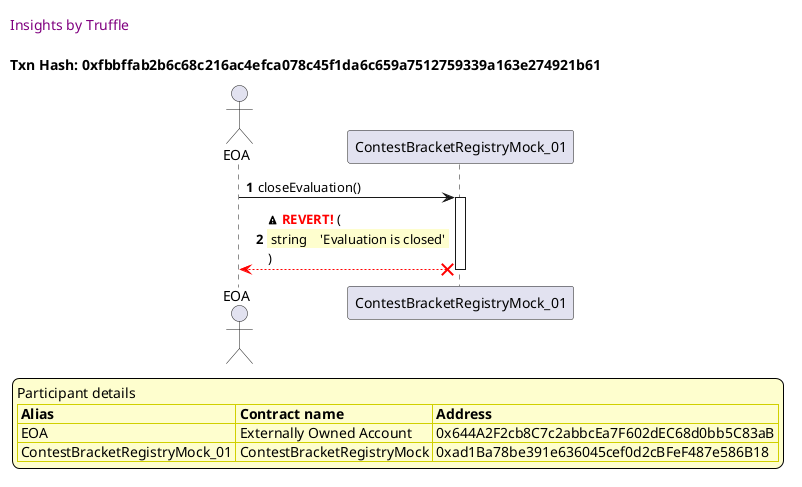
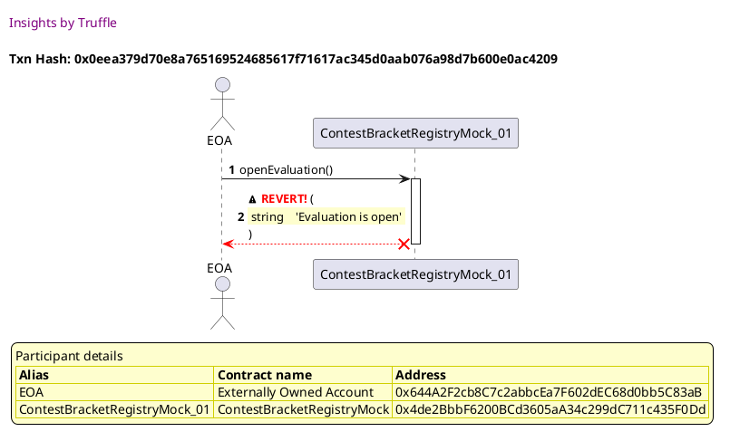
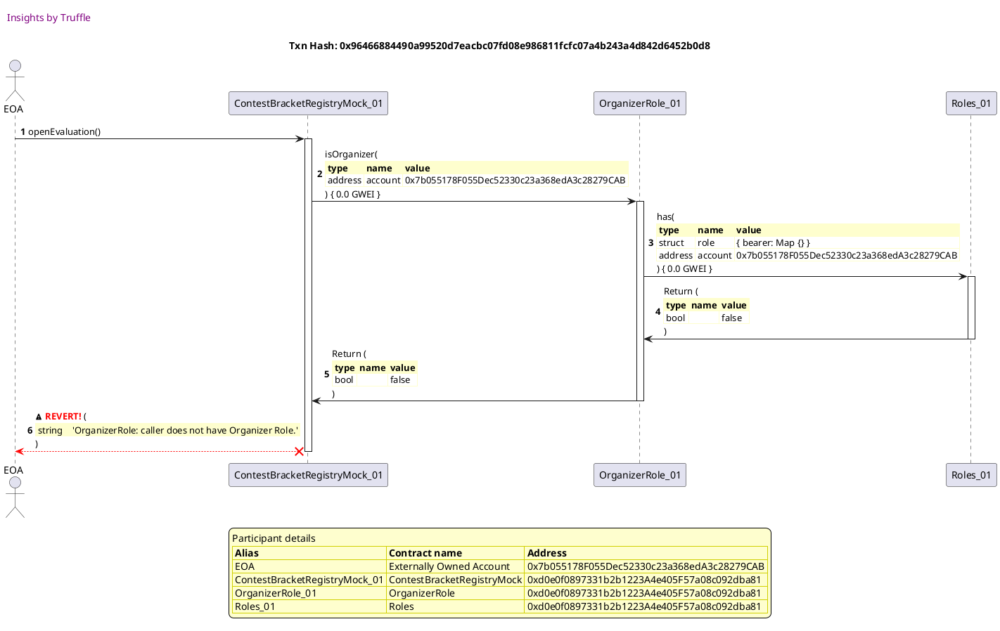
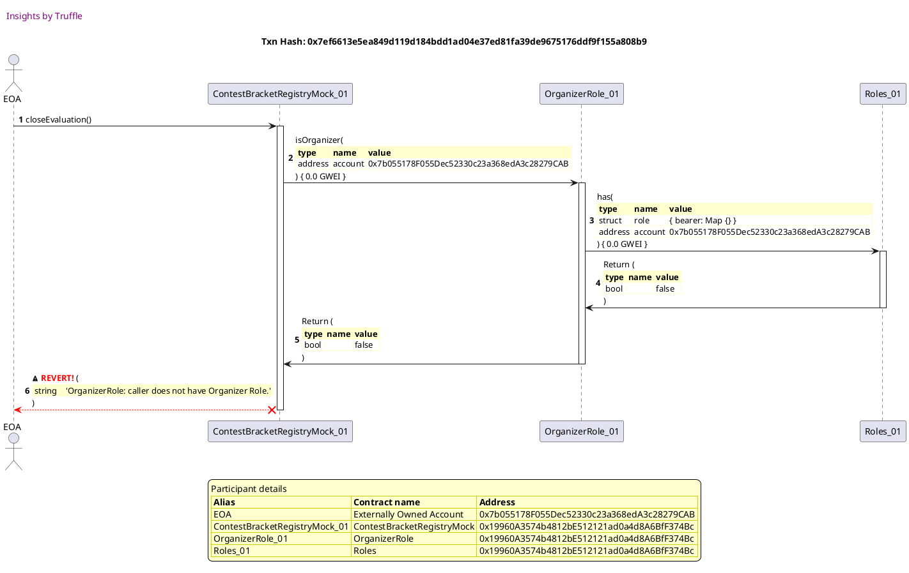
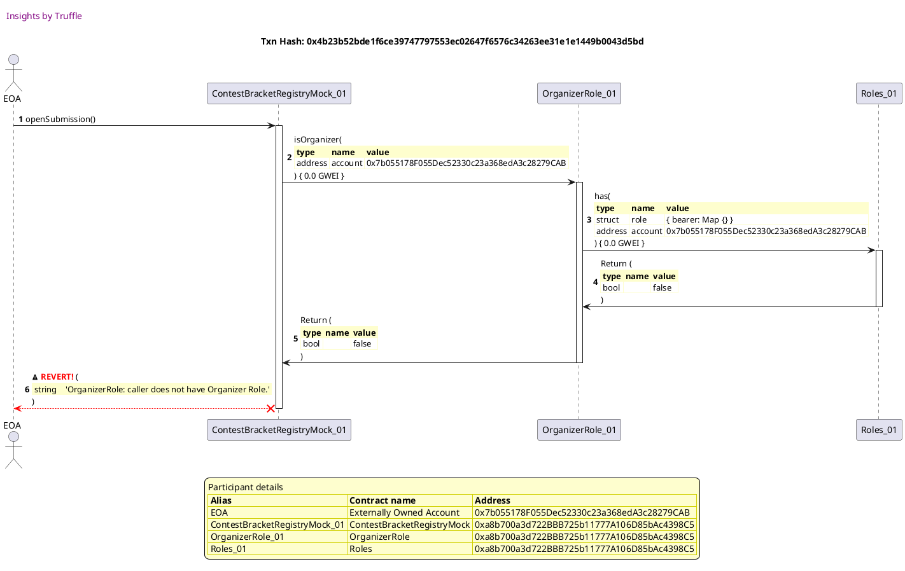
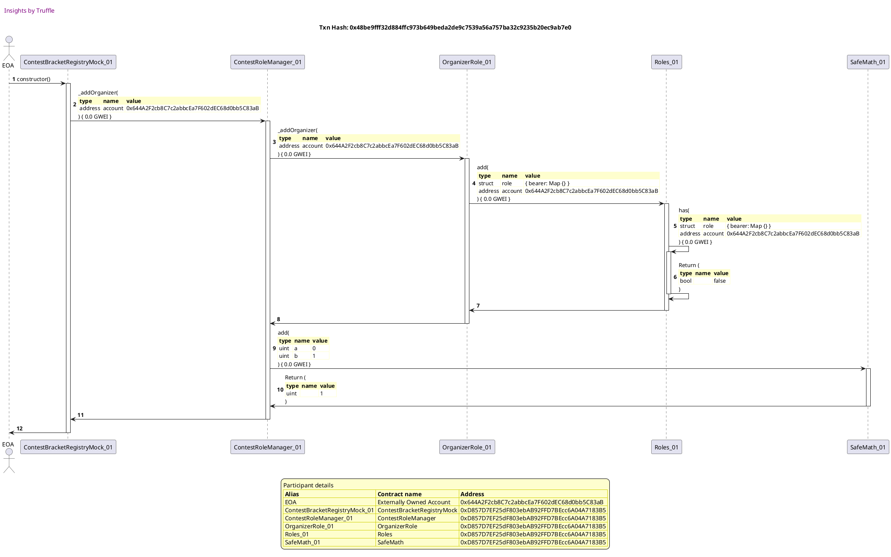
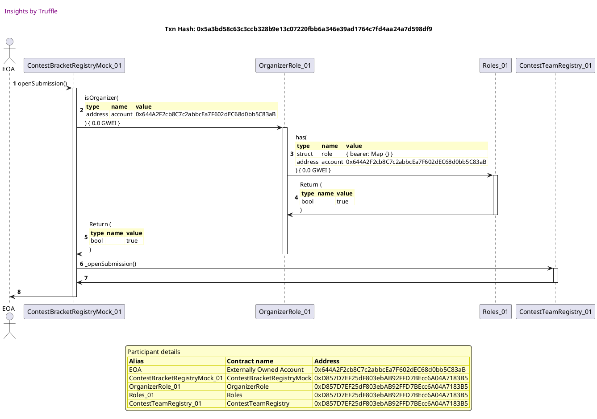

Test date: 2021 Mar 02


## creates contract and checks initial status
[link to test...](http://github.com/fodisi/hackapay/blob/master/test/core/ContestTeamRegistry.test.js#L29)

##### d1, tx: 0x137b93f64dca521c52a63306db5224755778a0d7791b048d418cbd17a0df4a3c

[SVG :telescope:](https://www.planttext.com/api/plantuml/svg/tLPjRzem4FxkNt7glhJgkZal440TAj2mzaFLggsqBvMgIs8WQd2GusnGsl--ImWql1IqeadJ4CJs-UwvUuwBpuoT9HgLJeSHOvZgMAP3JoYMF8LoX0g748c-a44R_QU-YbCPTE8eLl2fwtRTZilOQQ8daMWoo3y3WO5GC2sM01Un2fzZgJ5gHM5V3eNKXDZJ2uKkRSuWHwaQHM9fuovy5c3O2zaD1a4e-s3mGlIQZwTVYo1OuVzI9c5_e1Fm9d2lqbwFS9aETIJWVYpX0fD10_ZOi1olRlMgTk1ZnJJyYebLo-BLmAkOfkrKAevJGnuuJjtmk5qBRAFcUu7XaAnde-KpIfclANJtkWMOm06D1upIfaC_725HxH09aUYselG9VIlwOQBLv2hsdnwvaPjirTW8TXj7uWebzeLQ0LdUMJQ-LdsKb4wLAStjLeNB9famcQlE5yigTzWZZtemrogj3nZBym4dpLqiuVYu0NuiIPPc-JmyOhiiIg0hh7EmHogK1Rd31_d0JekA_LoCpPTle2SZ0JHA7ERZJunIccJgBq08IYG9qCptgV0rpVYuQjijislwNgtZ-2Pwdk-YqwroCt0xrLh0FQ_IgLdOdg4SmHJu5mxVVxYNLAllHPoHMVih_cKUwy5c51ObaeTEVZyMyAmAA4f5U3HCmHEeX6h05OvW-WglVvFQ6ubrIWDC_YTA9oSDk1KwLH8-HikBuuZYesyFewGG7wqwt50ivFYz8dhl5SbDjhm_vPDdl_fBmpphc6L-HURHpzYSv2N_EuZibVGYb58aM_EownmjvtNROJixoZDjDhiHi9jI7mY4nZ1AIcpE-JddF6D3ZPzQ0qqoB-H1BtYrviM-i6k-vBsKdcCjbCGeci3rBoa2Q7teTIW3R-_5s_Ppf-TsrQWxrNCqkUNMqF0jjCnwdGiqUaxGzWFRjbsxnZSwNUdPc-HxE5dhxIkYFQ0NTu1YkWTK-QxmjlfJGAgyelxO6JtftleR)


## Opens/Closes evaluation, updates state and emits events
[link to test...](http://github.com/fodisi/hackapay/blob/master/test/core/ContestBracketRegistry.test.js#L47)

##### d1, tx: 0xd8dfb3fb743a7e7dba89cf6cd921db9f63837f511ef6583f68f496870c08d1bc

[SVG :telescope:](https://www.planttext.com/api/plantuml/svg/tLPjRzem4FxkNt7glhJgkZcy905rg1J2sWzLgxRIlbIgxDY1gC51ZhD1QV_xBY7Gy5BGYYPDGn3RvxldxZakFXDobXYcJJgC266fYLKwv5AJv2bK8wRP42BPbqgSC_-fh-DKYKuSnHe-zRoUr_48EKtC998j0lbd89cG6gR54k0Yrk5ph0oBsb7OLqEf3286Pg7GmyqPv2ZLeqWkRTo5pnAisa9smuG8LHyiMeXUy_7qQn44AVnVgYJi3qm2V0BtEWq2n2KcD964-x622vOCca37mXK1hmRSgLMP8nt1cTlm0ziNZOebU2EmgsxL2UgM9GExxbO3smrg3Tjrg4zTON6VOCfyWw5xrsrW2HpWU40mRIRqmn53gXqa8HDphZ5zqjpAVfWOFRcA_QT7QkKcMpKsWjt6aRnYYlMbNW5PtbasljPzfZ2TEbEQswqAbqqoOJ9NdI-MLUvOW1xDOAvLMXyGakS3JbgxMCBnSHFyMA4ipV9vU4HsMPH0LrZdO8zOA0joXm_gWPmM5Vkv65ilty1CHX9mL6oOZpzPbE8aKty1HD0oIG1dle-5Rt16ntQjrgxqAZvtEuvVOPpx7dDwDgq8hsExWd9UxxXLTZv3EO8fq2yKll_mBh5Mtuiu8xFsL_pBFDQ3pIWiIYGF7Vr-BE1P5M2K6l5mc0ANJ4lTX2isWkahlFvDQcyarYaDMF8_KJevQSAjDAbMy35QF8uZZ0-_0OkIGdoqwd13iQ3ZzuhelLSaDzdo_fHFdltgBmtphBCiyoioZZzhSvAN_EyWibVIYr1AaMpDowvpj9pNROVjx2ZFjCdiHa1kIdr0ICF2A2cnwT8kfJHZWuqVMmDECY_emInujUV5lh1hlUIz59zZ8xLYKJI1wrzA2cX_w7Ke0s_lnTlsSwULMiLgD2ot8-hKysoxphkMPrisxJPatV5jogl2xjdkHgShFNkJV0ydQxrzHRG7zE8EK4ptW2hV5TvMVmg8bLVK7pd39zvRVmC0)


##### d2, tx: 0x3f34423dd4ff88f45d30f9b6ffb7d4ffd3250489fa165b2c7f0b3d1eb56926b5

[SVG :telescope:](https://www.planttext.com/api/plantuml/svg/jLPHJzim47xthpYn5n1ZSz8aJIjMKTfqy81036alICXEd3OYTIhRsLeA_tsNDCqeq590H57EETlVtNSvVmeXHzemPV9nIWZBJIRpCHUAwDj4JfXYOqZ5KCZec8MtGvNbCkfbQQRWoo0O1Bs0a4DjPgde42YlaM2HK32lNW5ECfNSPTAmj9icGpaMqY1YREe50vnSG4voDKd5oiIlv4w0vTI-2nP5YHo2HIlNGsaFlrT9a2h-gTJ9S6Gqy1bSgJoE4PUOnAG2hgOIJfWUjO5E6t73SUn653bnxFknuqOD6hUu5yUyMVYYXkrIns_5pF9SReVDcF96P0dkUYtRuox1aeK6Km_Eky0qxA3T8LWsauJ9X27L7f8GsXmhB9ymbsAOQADcPrbuUqEjSil65QjWvsh895P4NMQfMEv_wbpTKZZrSkdoPPiKDwTNWf2IBXnqNYC1-_jjo2P21dzOcZEJP79tZxosgS1zHgw4IdJjtxsMr-ImQiQlbUtS_m0pcmX0Azcuj4La71JBxm6xI0cj0KTXY3rjS4IddkDqxO4TSh_N36t6UHYmvi2ZTXJqF3-YdBizly6E5oXxC0VwZSBFty4fjk4BgHO4wfANYO-OVb_2M9WyBB9KY8Tc3bmm9LGRpjW4vW_my9dK_fDu-PiS7BJXKfXSINWVFPvbAUQ9D_Ail7lhIlfQstnICbjqw_gpKdxzcssFm5keRfNOufmMgyb2pSd58m68X659gXzLga_xbDAYKYZQg08uAA9W15FNhBjij7fVvxxKGNnEZL2IfUaCplzA4K7tNQtu67YpZcwQBuFQZcsrMfRVYrmQ11wAUTyAFCkZ_PPmcw5NoBetyFpLeC_qzedh0z2rBbV33q2jr-zrSsyDXWrJjGqvmYV-Alm3)


##### d3, tx: 0x46b26c11e63c47a86643794354f308bfcb784bf99082594a9dbe0da6d7441d2a

[SVG :telescope:](https://www.planttext.com/api/plantuml/svg/jLPHJzim47xthpYn5n1ZSzBKJIfMKTfqy81036alICXEt3OYTIhRsLeA_tsNDEqeq590H57EETlVVT_bV0eXHyPoRVDHIWZFRQRoaP2QcDj4ZRdc8qZbGAhuc4Ut0vtbAkvaQQRXIo_iXPsGa4DZfwbi4IYleUInr32hNW5ECftSPShoj9qc0pMIoY9YtouNz71o3ZdEzJYLAnE_aZi9ZhVqNV0uJjG075gv7afx-BqYGQhufyeaWw4r8APmfVD-7t69JMmguMgYu8IROHFen6F2PP7ZI5QBl0Rt6VDgZS2hrRr-ZVgY7uc6xub-453VhGSU3s8XQSnPtF0y9tOvmPH55gc7vstW1dRGxX1CcqsYPCnHQWT5I6EFDQPFsaivI8pLqxCikhsXJhbbuufLi7Czu0epeY-pL2xsFtMkRYcSPh5qyR8DnStqIX1IoeM3rciYO7-_2L6Q6Hd-uMdERPAftJtosgu2-9cw4YinI__kjRecXrKrVgriw_u7sEbO0bh5HwKj8kEWM7uFM4PQ6WCuYY8iQeiZEc6UrtPxRYJyJYDokH1Ho1izHjqux30_faBKEtwD7yzHzc06z1k5dx_3Kwp35wWM0fOvBuaFkNaVOKnC7XKiDUAXcO6GN4lTX3C-Xja3F7ocjFyYNluc1mTDk9GsrmhU9qzaMOeyyKQTbNTlNKfVAvjF8hD5jQu_BENNlzdw3Bn5wrRCvYUrM4tc_PnSF6e1iRGyISsZL7Lfbr9Qf0hRDlO171HHC89T9gszgBJbljPzsGdnER5IAvwcKpZ_gsGCxNVLucFWpPrqqtmPrFLS9mWSlnFNQHWoLXTT9sGEezr0rXiHew8MinxpLuC-wxXFN1-0NdRcQlW1gFKTVDtSMuDXmLHbGuxmYJyB_m00)


## closeEvaluation reverts if evaluation is already closed
[link to test...](http://github.com/fodisi/hackapay/blob/master/test/core/ContestBracketRegistry.test.js#L64)

##### d1, tx: 0x191ff6d40a5ed5ae444f71891a93dd5cb0eb7de0ad497359bb24c9bc2dca2b57

[SVG :telescope:](https://www.planttext.com/api/plantuml/svg/tLRVRzem47xtNt7gNbfrtHm8151N5IYiVQXQjPNsKgawnmv43Gvod0twut_V9GGQAALQqQHf26BxVFVTVSV5PyQE4ul6fgE8CKnjhDEHK8Obzw4Uey4HH6gWjEoWVpymSQfbDuvY0v_wlNwlssFiCB7JI1qno3z3XL8PU2oM0AUn2HzYRJ5gH-50ZvIsX1ZOXKAVDcUGuzIC8xMqSHq-A73SXUmIfGpr01nUY9xpyV1h4GGh_9_f91mCRG9Y2ZSc3GB2PJQqaOARYOPJJ8Oju1EdwGH1NReSQqhMKBck6tXEe-bWiofbpHTS2KygZj9jUjLQKuYAwpU5Nv4-LaJDOvGotrBelOisO08xDEumIfiD_N2CHBLB95HYEuRIf-oL6eI9DTFpsB-_uqvkib5ZBTXL7Abpr3XGPWLaUMVP-C8CK5CwJQOqjriLBfjamcIkEbyigrnZG1xjSAvLMkymbkS33exUOmdx-otmOqsoDCldxXvxpw84ki8w1xkZGbcGsxtLj-omgDZFnNZqz0tiTAo0HesZVFo9KKgJJFq92C6e906Q-JuLlgKPdzHTjrtfLtpHw7f-1ONmU-ZrwxmYUzrwGt8XQjr65Jipb3ru1Fw5m_SVlJEgrRSYpiYy-Yl-PHwlWyqeB4ea3vtyVYpWMHLGb8RmQ7W4eT0equ9p7CFZCpp_JMel95vJ6cBoFr4wE6Z1bRAfqV0nMYAE8ugFlW56II7UMtMufbZ8yLj5zDOhafjiU7_A9yzszPU6UTOno_oAJD3FMP_a9V_l4DagwKKefKWsvkMzSxISrqs7xUmepxJPx4R0BajzG2gBOPIKs9pm4yvvneOQFxK6ccHUo8DTy6hFYtrXT_IKzr9wJgmo6gDe2XU_j9BG_j3hK0RUt8itxUTEKJeTz1f2LPkEgbVhtAtvAk2oudVwgkysF5Lhr3jEOwtJbPwzJhw5arUzVKMq1VJY3b1Cju0gtnLULdyAI9LNr1yxfYVTMty3)


##### d2, tx: 0xfbbffab2b6c68c216ac4efca078c45f1da6c659a7512759339a163e274921b61

[SVG :telescope:](https://www.planttext.com/api/plantuml/svg/XLFRJjj047tVhvY2r48emdPy2qejak28FbGWYlfIgcgyEmuhd7MqNaD2qt_l9B4el81bxTfpEMVspAmGPur3wzfv9GIshZRjl20hcdjj5cXn3XNDoAWnolkPhLkZ9dLLMzYVvjDyaWinRDogeap0zhaZL6JXJ_SBS55R_LGRXzMeqZCp9-COiNJF0LDsxY0NhLrKzChnNJyH-E6pxGgLqcO6ljUP_cxtuKbNXEZulvf6p-vS0yKARcnRbemhd7OLmStIm0KsTwVWBSkYA4iiWYAMSIe3FqOPKYdHIr8PHgMla1tH09F83v9eqEyFq8_x52JX8F2Bs1SicNHSUduv0cnWZ_SzmR8vBVK2-QWJFWGrRcnPFdBNDDEDiwjljRp_xVdRb3SZzeJOOi9nzbua71sTWgpgXl87h5fqkZO7X-AzhENnptrBwjU6OCTqV0h3Zuze3GkTmL3ksiqnMQztdV_8hsy-z7h3awqzWuDRSok6tJHyxlPi3KooQTGQ-FtqloBGpQv8zGdMczH3eOWrr0_ew7qnThCehbuehCYXhfeNDPnxvvxdPUilm2F74lF71fSn7HYSqyOmKifImxxdFAvvqqLUbuwimQfQmUMZ8GKZANdk7RkyPHo6es0Qo2AT93B0ef0v9jFO2rG-YLFb5KKqIViuVWtyzXIyvT-IelB7cAG5zGS-nVtO2oD9fQS2EPxID4mJYj9uxATCokfq6eapNlbM_mC0)





## openEvaluation reverts if evaluation is already open
[link to test...](http://github.com/fodisi/hackapay/blob/master/test/core/ContestBracketRegistry.test.js#L68)

##### d1, tx: 0x467f2d4a800b47bfcf9114b10e95dafc790a5eb785a3f3a590213def303d37ff

[SVG :telescope:](https://www.planttext.com/api/plantuml/svg/tLPjRzem4FxkNt7glhJgkZal441TLQ2mzaFLggsqBvMgI-n0rE0WnzcWB_zzbn1ee9HgHPEc8OZjyzrpznmNdnaxJWrgaurYnZ0pYSf6ljGilO_K63ME89O3gKG7W_k1JZ8bkacSQFZKx_LxtHvZXwcPnlA8GV4PIXHImsEv13XDTFIGA8DnEuu6QYIL8SJGB1Jwj3c376Tw7CkbZUleGOBbBcINA4Ia1c3nKlHSZ8TVoo1OwVzCfT5WQ5Bmft2Zip0aN6OY4qkucIWunNJO0Zvnwrve2nSRdFkkvuT1sBGirxUuRDO4Xe7Nv5YJljUeeHCwM6jostA431tk2CSBGqOf2mo5thje0wQmG-CEexIPA8Z6I5IxH4AcfgCfVT9SoK6K6ZqzJuBxEsuL9Xirre9T9R4yHuK3gLT0bdUMZI_q01MbK-TASxjLuR99BapdglF5iierXkJH3ETQbVKEOqK-uE3eFPQmlz-2854ao_9yxkwnzomge2ki2x0xAfG5kTrRTSiEouhzN8v7Jz_0JCSIQ5GuAiQV66SqoTMVW12qJ5EWMH1GuHkQyKdTTTjstmxyHjSBRFJze8TUlyvjqUlM6uBxVgtRSB0pGzc3H-1VE7p_qJkZMdqhufpCgx_YN-RnEjYSmg94Yj39xyS2dbK1HQa9ZuP7y2LggLjmZcDuV8RdlqdjXSHhIaDC_oTA1mSjk98cqme-HijFafZYes-8SLgAzrOThYaMSlnM4RtrYXGc6zwVwicpNVrbKP5rp3E_8lFfPwrFyfB_TuXibVGob4ea6_FotZbQpUkcmtPsbEVQR7OZO9ULFY2amIXEAsnE-0ddF6T3ZPzQ0qroB-J1B7YrvyM-i3jwAdefFIT6QeLnF8MBNqeAQ7_eTQW2R-x5c_OBfwwGTiVt-tMRyqvNE7LUmxRZ1dQpARgUPGMkK-lp4x7MwKhFNYVVmichthuYsW9wSGSefrj0LUyABwi_1QJAA-kF7TEJxgs_0G00)


##### d2, tx: 0x91e966ced9716c591a36dafa687814cf9054d1266dddd219f1888b6a6d76f712

[SVG :telescope:](https://www.planttext.com/api/plantuml/svg/jLPHJzim47xthpYn5n1ZSzBKJIfMqOPay81036alICY9tJOYTIh7sLeA_tsNDEqeq590H57EETlVVT_bV0eXHxdXsXIZb11Uc4mLeqXgajycQimr7q4g1rA97ezl1pehbF2pDDFm9Gp2m0y8ESpDD9KT0jKrb5n83RFw5U0aqybTfWnFksaoK2Ef32BspN91Y9Dpo76XnwbScVYLt4cmdANlWWkHg05Oj7OzLFRmUqs2rF5FLPuCXYQ7Q0fNkkZt4PUOnAGIhYOAJdW-R0ETU9Rq68kby5eMYvkUnHjCy3vdRikrdBZlqQOZB9inWPTjUNtBTTs8SIPQhD-oR88fYmrI3ywxm7FOGRj3C6qcYPCnHwa-Yf2vwMbCdpINSf3aHa_FilZsXbhLbeqhLi7EzO0hp8Y-p5AvsF_KkRgbTEQBfOkNRIXkfbU1a4ek77HU4m7x-st8nb85VtXQS9DaQdUFlBQfn7qche9AygL_zrfTayEw6B_MjdF_0ynqB06jugFAbf5nK2w_1wmYBVCSS1J7MDC6HtJ27AThXtOSkNuhjdaKnG5lXOpQ8l2PAsWKDNstmNjpb3sO0Vr6uUVlu1JBy0MgfO1boYlYGvw_Zp0cfeXBbXhnqCmWabnBtOOpFeRP0pnyfhJ_8bx-9WS7RRYKfj0AtYSloh8KUUADEcllthgKlbOsdqHcYsfTVrQght-pxH5uYzIjYCtFQRcQpBivkNZK08GqF4dpHvawfiUKqZ9JsBIn2-2WZ88Hp39dtKMXBVTrxgi-YC-9aLhnD9t2-Lyb1NJVLOgFWJVtqKtpLL17IBiNHI6pAUtvei5eatSRJcnxdl1RbXKxZMP8ZyLgq6Vzzedh0z3BlbmFFm2rld-lctjhC2oOkcp84JxnL-4V)


##### d3, tx: 0x0eea379d70e8a765169524685617f71617ac345d0aab076a98d7b600e0ac4209

[SVG :telescope:](https://www.planttext.com/api/plantuml/svg/XLDjJzim4FxkNt43QK0Pmadpqg8keaqJiGyJYA5z6TDqiTrYaJgLuq0BtN_VDOqOV84ekalkvRdpSsV6pck7rZMBaZ5iN6MQHQ4ig--rMQB51PHgheoSeBYVswenCgtAoi9-dkLPcZ4sgjswL0c3zhbJA9M5v-uNuAAo-gao3ijngUTceOmZn9bx2SZ9kODSDdPPgZUE7_f9WHUysAvGIctcuF7EzBVLezEk2TRL_sPgFRzpDHHhkB7DR4Qup6bNAhXP6RZ0-kuC-8ehXVruA6Ek1XX7eHSDGp-81c7anRFO8ucY7uII8nOyZd0ua74HSQuuYi3dGqQK2KUjPvTZm1hsIEyneirfePT8Hqtf4Afs4qlqANUjvhfsTlsz4lT_kDUcl1knnrYB2IV9Hv5mV7m6rLAPx07B1fskpE4H-oXfTV9htohvUuk_AtHo1gFFZsWDyPp0IEocJJ59htUT_SokRpxrUgFJrfx0uQsvPQDk6RvqEja05TdEQGFq7lpl27JTzdW0cstY4PEA2DGFwDJ7JEmMaLszebSgXxgiNtKmvLFEURBv2hHln2zzR749qu71XTeQnb9QLPFl9OywtewGvCefQx0irt3vQ9I4iH2qz8vSV1K5mTZFVL4CqbZuM1GYmpYFk2-pD1f8NXHXEkZZv2tm-olmdhyj6aZbJueYZtpE9wdiHpp4SJyG_d0eqzZpHD0FSpwLL9JOwJXYvoJfIly3)





## openEvaluation reverts if not organizer
[link to test...](http://github.com/fodisi/hackapay/blob/master/test/core/ContestBracketRegistry.test.js#L73)

##### d1, tx: 0x05efa8d47501da0fea8bff1c57b903d6cf4d2adabb700d28622907ff5a0e84da

[SVG :telescope:](https://www.planttext.com/api/plantuml/svg/tLRVRzem47xtNt7gNbfrtPmG8A2kAgMmzg5grLRQIwNg4ZiGDJZ8SJOexV--ImWq_2XeHPEc8OZjyzrtznqNdnaxJGngamuYnZ0riKe7djGiUGhL43KE898zgSGP-ayz7QTAjECerl2fs-bssXt6ZXCpZkG9W_pJboYaXacn1BY8TVWSAuDHAmfxQY2L8SJ0p1Mwj3c57APw6Cc5ZRlmMOBbp6KtA4IeUc3nGlIQZyTVYo1OuVzI9M6lRnBmnd2lqo0WN6P24qcu7ocumAJV13xYLHcWAvnwbLi2UI3HzOB0ygjrhy4hekO7Zh1HeEVLEHUsMxFj1gy7GHMvT1s1Z5Bc6mgzSzq2J62FnZr6QJEX7mwHgBQ9X4pCcQRqINChUs5YzFWgzfyUkPMRRDHO2tORH_8A5VQaNW9Pt5aqljOzL9HEdIdDx9Q5YoQPC9cfpXQBAdSOa4VJdscLrdkCvVc0evDjBE7mi0b-h4YMPldSFs3RB4gWIwnpi4Sgb3cv_GVrm8wBYlrSZ2Slty2CXn9eL3Z8nvyOfJJ9r5-04BHC4g2PxrFX6vhnKSrnMdRNzZstNVTjgWo_W_LkZTkYqwwvWdjUjUrMy6oASW0Ju5yuVF_HkQHQVI_YZCpAN_4lyrWDDgCmBv4yTFBxiO2dLK1HQiAZOGAUH2rr4wvm29DNUFsRrDv8h5BgO_8_KJewQiAjDAbMy35QNXn751zz0uoIGdomx71DiP3ZzuhelLSaDzdm_fHFdjtgBmtph6EM-IMPHpzhVP8N_6yXibFIYr1AaMpCoxPpj9pNJOVjz2ZFjDdqHi1kIdr0I8DXb9JOdFDppdd6XXe_jGQQP5x8WvdpQisAVMvtyfBtKdgEZDGAesWCrx-K5D3wqEjG1jxSYpVjvqu5bppWRgDUgLYUxLcsNMavqk7LRhMEtFLvmnOUkjPQfqizUvry1oShlNr9j0Fq_0vGJ7U0AjyLtbP_2aYLLzGVEwKdtLj_0m00)


##### d2, tx: 0x96466884490a99520d7eacbc07fd08e986811fcfc07a4b243a4d842d6452b0d8

[SVG :telescope:](https://www.planttext.com/api/plantuml/svg/jLLjRzem4FxkNt7hfArbw-Qy004nDDg6jH-gLgpQFcpJvCG7ZHeSP3iTZFQ_xn82BNr3wpI4SixPVkwvy_a9On-D5ThcuvGnaTjCvUC8DJCNYPe8BSQGuWYLt1FnnKXdkPBxMPffUDaF--5-o5Z7s5cANGRbxno5H0tpwXNWCDF9xqnPaVRIPAJ6g2mX3krgGPyc5v2JN4zIN9ludFn6SFoLxrH8cQWHEBnoNPUsyxuYmQhuHyeaetDh89h1cSw7Gy9bDh4fmjbKmQ4mvstWqrR3RpI2mFTRNBHQTPVB9eeuYdbpA7c0hQ0HECum7f93-97hUyANWU_AXbzt8ou3HYMBBL4FJteW36oHtM9KDfl4oKHGglkK11gxfwbyQ0SuIepLi-CillZ9dNBBaolMmKxqI2YgY1vaAIxtttMkRocSPhbq-RB5MCaKThkRuiERDst89gZ2Iv7cmYQPsjvXcpOLkFTubL29MVctlwllh5FrqTlATgy-W9rD4CWgCIvj4Pa6nV8he0RGQ0pGA8wf7IsD-BGPyNhTQGPzCWSOrrtFux7h2QyHeEnviHkupTP-Rs-1iWDpuEyuVFeQ7b47FK2rI61LhPBukJ3F8qo5oUE2fIOyCdE8K6ZKRJWM4vXVm_N_JEqcYOVFP7Ut3GEqkLRmlFIYB4k99_s78ZMLU-Unccxgc__5PaFSwUwtbnhbZuBYuc8GaSwhNq8hKfikTEA5vj6QRgqs2B-4WxCNjLhdVUdlFaQsEFj2hKf2hzSgqePOf2afbSpGWCeiDTWbtjpmykA-UxrCG98isUHIMDme66oXr-pqbWf8j299pIsA1_o0SrxKasIPj8461IvXsbLbUyj-NEsZb0gbe-VKebQKmGnEVYcKq7jMnzu6VbefdvelWqgEVCY3LjFpdCYD7DVrUZxwlDwlDmKFOjvoPIG2PpteFKMzu_e7w9NoLiE_XQ8ph4wIVQGdVP__0000)





## closeEvaluation reverts if not organizer
[link to test...](http://github.com/fodisi/hackapay/blob/master/test/core/ContestBracketRegistry.test.js#L80)

##### d1, tx: 0x16219bdbca2626ccc5f1ab30970b5291478cabc4fef149c327ad24fd19644207

[SVG :telescope:](https://www.planttext.com/api/plantuml/svg/tLPjJzim4FxkNt5YNq2CpKdJDyGGRMa77n08aFO52PqTfur8dSfnDahXl--IfYLzeMXKawRr9RRFv-VkkPnzPkmaiMXiEemOmzJ6EXqAPLZo4EeH6Xn2fFfA-ssK3tqJfzhln55iu5Els-jskemT9NOSgMC6-MUWq5S69iKGu2msuLEiBKQjAEpheTAM40CxL-ZHv1Hob9fHf1OcRi8d1OutbrsXxuUw3mulH2zvU_IrS88Lzizr4lO7DW4nXbkJ1W7XCXlQIC7jeuOpJ0Q7m1-TckiqXIyakZMt9gMi1WwA2c_MkQYwJSUhDoGAwGKgSBochBXrz5qly9rcpVDSNcSKCcd9zUvb2p217Mft68NDXZ8S8L7j40cLsBQXy2bxhVfXOitu8fOFzzp9bspKM0js7KVg0ZNsbLa2MPnPN7nf-gWfd2PJcgrR5YukoOJ9J7KsM5IvmO0isi5CgpJUOIoF1nmSlySIzlSFGSQQP6aMpzqzzjwA4kWIwnpidX9bJcxtJj-neo9ZFnVjyVCtiEEH0cer3lFs9qOfTJBrPo04ev84g2Sb9Rwb7d-a5zzoUwuKZKvTkYY4x6AzL-Ekt-tK6ZuNejffLB0zHTc32V0l7Bx_w9vJhhxbSKPcvLNyopnMdSqep5CaTvtiVipXQHQGbuRmg9c0K6YKEOGB7C7a1Lx-9hLN4gkK1fZyJvGE3WxXMjdKQFWOBH774Vb7lm2Zf13lBHjSaona-AqaUckBv4isx9_ooRDT_gLX7dNC8hya4_HtrWTvmVuxHBOAUk5AoPEDSNdl72t7TTDXEptACsqslH6mgr8Ty9N5C4fAR4xvAUSyOqE5dqe3TJ8hPC7EURLcoJvVT_oSrr9wFbfbD4RH62v_QUL3wqFReGoykHPlci-DEircZRSgrRedl8RZYcxLSUcBFaVFRxHgxQ1NgNjjkTReKirU9z_2o4fjNn9j0Js_0nJTBQ3ATuNNqPy2KkOL-STEw4dtrjy0)


##### d2, tx: 0x45457679bd751d5f1a52a9878bebde50fbf0bfd3d9a587f17aa00c04d14b725a

[SVG :telescope:](https://www.planttext.com/api/plantuml/svg/jLPHJzim47xthpYn5n1ZSzAaIIjMqPPqy81036alICYEdJGYTIh7sLeA_tsNDEqeq590f57EETlVVT_bV2eXHxbXsXIZb11Mc4mL8ouroMyJDMQQZI2LiLIYnyBRM6U54lqipJHy6GI3e1yGSfYRQIex1AfhA9cG6cRrAy19ffExJ1cMTjCaLYEf3296PhbWW9Dpo76XnwbScVYLt4cmdANlWWcHg1WiMhiUAdlulIP1wlYdAa_YeSc1J-5A5r64kCGa9fLmDL5mml9X6-Z4SHtNQtejBZpN4cvaCTTcBT_pkUH2kZJY4UMHQ8WMStqliZp6A0sf8oo7UxRB2AOiD4WzEEy2os47xGx1j9aaJCOCfVPHXCnDJsFwfBcKSP8RFJtBmjiRQbLRDgvO1JlNCLEO4NsPfNAn_wbpTKlfp1TB5o_RKDnChm8XbLmuwBmc0lRtsv2DfGh-iBHW9idKxXvvRLE9-qnS1PNaI__kjRecXtKnVgrjv_u7cEbO0bh5HfKj8-EWN7uFM4LQvZdWA0onfWsEwAJfE5rxO8VSxtkXpJWF0-ODcjGMGR_f2ygvs_SRh3T7sOCPq6yKVluEJh4CNw1Q2bYcl28-PFdx26DYYh1agH4FpGouP5hgDfonCSmUuE4pfVqNyV8tEJXemwKqXLRmFdayorBaYJVghBrxwrBwMjby4fajgdNzMQc-_issH-0jKhSYDZ-dvMeox-Raub434DAm9CqVPUgO7bDAoqnXqyOkW8Co2aOmovnr5uMstDUvh_eWFYT6QiNIT0hdVvKKq7rNAJu6tjn7DyrNGQrMgqcx3TTpkEDRDWzSoyOV4vGvmkysUz6WuJczS3NeitxxnFK1w6LVheSVW5hVlzVDlJKO5anTDkG8d_XNuHy0)


##### d3, tx: 0x7ef6613e5ea849d119d184bdd1ad04e37ed81fa39de9675176ddf9f155a808b9

[SVG :telescope:](https://www.planttext.com/api/plantuml/svg/jLLRKzf057xVNt6gC_LMDI44WaCP0KFrmT6XJljGEvrDzWGpXWspkr7myjzx4WAADwPs19ApETdzzZkN_M1iNnkkJ3PC6EEPIMKs350nVHdB4LTy20aEK8eE3oy7AisawAP9gc2rv_VyhizOKvj9WYq6nUS2kK05j-KZm66gufjK6fwqatWWXoWD8KPcFg57BwUGeqoD4bnuyJs-GR2hSzyf5oAM0x2jqdLVsEPkIOAL-nz97GykZ8PW0cSgYoB2PIOs2SBPMC8XrnTxO8th6DLgjeCkSg_Q4BPDbrSDXB2viAher55uTiITXi16hUxQzPeGKIEoNPTxbXSq6AKiD4JTFsa3rx12TeLHsamSnYDEeNOf2DIceoXzQFeuYBLHa-CqlFnZsSMIDsSiWfse0PUK4TLF4vojV-fSN98xzMpgx665iO8fRBUMxGzRMtiG9gb6_ued6JTnAjStsB9LEV0pOWLMhEV-zNDvpffb8tqfRUlkAvZ9286ivCF2vZlJ89z-1zG12hK66eKXzQEX4LKoi5ogZzSZSu2XMt4SAwmutAbvADfEMF4gzKQttPcYRC0jM3iMVFlf7r4BlK0r3s2UheBu1TVl8qo9oSASfI8yChSG85Uezk2OZ-3s7ku_ChI785wkoVRs7lJHP4h2-y8BqZGXdlIBUA9BzyPhELtMDn_5Pic-u-rVgmh5xvpYz6GGaURdQwuaoKqBck5Kz6XEQtEpx__m-sUVDZURkuM_zHhPlFQvN1M4rXOoGgUA9mb9bKXHWqmDDTWLFXpnukJkhCq244X24rznWqiLWqq5cvq-aW61XiU9VaJnm3gmB2lF9-aoYGCDSbp2DFFCjcVzE5z78ULIH_UnGIKfWWcSN4iKq7vNnpu6VbigttfVR6et6ZMhxRZrQb3rx4hWktQ5lYJal2gyTgqJzPnwjHCkRlfCKf-u_WDwBhtby5-Xg8Pb9Ta-tUaF-Yy0)





## openSubmission reverts if not organizer
[link to test...](http://github.com/fodisi/hackapay/blob/master/test/core/ContestBracketRegistry.test.js#L88)

##### d1, tx: 0x05d5414ded006f85766c88b1eb88ea6b3db8ea7264e38d9514e5bff6c7e5eeed

[SVG :telescope:](https://www.planttext.com/api/plantuml/svg/tLPjJzim4FxkNt5YNq2CpKdpHiKGRMa77n08aFO52Tc9aqQaJkKuMqlXl--IfYLzeTMe9ashsfnzFZztp_NYCo5dcMPAvuE449RhLEO3BXJ9dc8vP8eD816Ha46R-K-HIdCPTD8aLV2fr-rrErr2JZ8zJiGfWVBJ5omG2YRL5E0YLV5pAZLBMaaSoO6G6X53FJVeuU8KSfYhOI8M5kxYPm66DTVTi228PGG6hLIlfJpvMWL1Al-NCekZliw0Z-5UvM68k4J7EX5mFv9mmR9-4-Y8se5j6LOW0agTqBDTn_4zZnk2UvvW3cy47ALhEfPeUC6nRLZ2vc7e-AwmXH01mPJv6aFlNhU0PR27SezWsdJinqE6L3j8GcIwhJ1zGj-AACwq6b-b_jCZDSej6otMWjscYRXYaaL2BO4ihYnklbOHavXELHZDzYqh5xSKocncEfiicjon43tg_iogDjyZfCm779rkOmc7XqtmKucwlCZd_W7PjgC6kiIw17l4GfcJst-G3-IagjZFbJnz-GPwF1I0Kh91AN-o9CT1OVu2YA14bW6EV1yBN-E8ZXpBQfazq-TUn_LDnhdVPMxFeMRGxJXUG3ctErw3jQSe1p01-eN2zn_TIwpLzo8koApy5VyoZzLW2mhp4Yb3HxyV2tXQ1HYbGZmK4-22AQ6QSCM6C7c5rxz9xOt4AgK-o_udIaT7JRWLEbSIFaQBfsc2yU4tP4bMgG-M7Quf5dJyNX6zzugKMpQyF_MJPxVwo-Cowwp8_9AEuyzOd-G5_rk8x9JqAfHQ91lpikqShUTrqs4xFSeBQpAz4P2RMXy8X6PnajNOdDDpIcd11Xi_jWOS55xGWvxpQisAVRxlzANifVWSQQ4aIv8nNF-I8e3MXrw7El3cNhnflNJAFEvIoXg1QvhjTjirRMuOhkks3EgSUpPl-LRZsElOQvqkzUnr-XsShFJs9TKEqFCxG3NS0Qf-LtYR_IaWLbvLV-GCdtXl_Gq0)


##### d2, tx: 0x4b23b52bde1f6ce39747797553ec02647f6576c34263ee31e1e1449b0043d5bd

[SVG :telescope:](https://www.planttext.com/api/plantuml/svg/jLLjRzem4FxkNt5hfVLjxPmt0eYX0gLhFrIjQBLzMAV9IGuQDJZ8Tbheot_V9GHQ-eRMgO1opldy-Bdp-O6nNMs4CjamOKna9fNPC435z6KiHqA98IGuG1crHNWvK6aceqwQf0fMzxlxtKwNiOOsamIR38hF1Oe85ToMhm07gOflKcb4qahYWHoYD8JOD_E0VPgSGeuoDKfmOU8qla6mtBdlH4HHB0TWyT9rNzZ6rv84A_S_b3eUN1WDmGJELDRl4oupiKaGpiOI3eI-g0CVku7j19uTH6ZrAo4wDT_r_PhlUGw6tAwuVh_Y-PNGSUsAW-XOI5_NhGMSkqxa1H6ZaeM6g7UFMo0qh91TOLGs4uVnI52g7Ke2jMahAX-Q7WvYRTJaA0ql_t2hMF9cn2BOiHe8IHLHlJJ1sVgdpiKbkLFFGcSlAumLJ66xkMn_sDggGpf2UPe5mrZhE9Nh6spPeXpt6Qy2AjPp__gvF6UDie--bBPvzmtCP8H0LefXOQz4aj4W3xy3QW25MWEDmf3QqT28Z_s0UvxbL_V9x67esOx3GziHJgMAKSi9xQhjrpgjzXHb0sw1xt3u_hDxI1tq0jKyWNcr2k8NGh-FC1Kc2tEMYl38t4A0Gg6gmv4OmUqzt7zaQWz9l7mcszjrwA79b8JtfHUaQK8ywTSNYIxT6w_LT5dVV1IR9VkEjt-jAen-vnId5uE8D3vV2oL9RPhG2AUQHp7DpSrUzqUtT_PfSxFnjV0tNoERdtskLWMXjOMAr24KIK9A5QMeGQQ66kmA7svuSN5trcO9H4Ww4ry9Wqi5WqtrcfqyKe48ZOWJ_OZY7j_ZdEVr95acRQ11ZakOPbxPrgmVv-iefLpfw3asg2HbC87ZQuaHjDxLiO-1trRAj-QBJKKry3aNJkJRThlTzcqli2pVzriMh-nLlQ0Lkawjsl4MDtscg4zS_m4zLzvo-AzGT8RbIR9TUjB_yry0)





## closeSubmission reverts if not organizer
[link to test...](http://github.com/fodisi/hackapay/blob/master/test/core/ContestBracketRegistry.test.js#L95)

##### d1, tx: 0x48be9fff32d884ffc973b649beda2de9c7539a56a757ba32c9235b20ec9ab7e0

[SVG :telescope:](https://www.planttext.com/api/plantuml/svg/tLRVRzem47xtNt7gNbfrtK8W945TrG39seUgLLjfBvKgEt52rE0WnzcWjF_xBY7GyAEW5KsQXY2sptVVtNTSV2RaF5DKgdoO449pbOfyoBWasLCiHbJI8IGyuYBeKlyfacakWbwQf18-UQxdzbn2JZCrIVWPWV8pu3JW4gRL4k0YbV5pAXHDd2IEn90BXOYXMYXuk3c37ELobF2bZRlucKEZjP3Tq228HGGDhHAzbkFfroe8Klc_55aS3LG6R0BtCWz3n2KgLWc7-x602veDEg2DMnRZTXY6JJsmh5OO-hRPPEsMpNX0zO3RlcaqRMgqgMcOZ3PrtzQR1jCrxjkKcLmZc39VOUZkjGCqWmCS3mYcJSL-FA98jOSaUAQw4jF7rIsFuap9oLNgFprgZT9agyP6iDiquLTKq8ZB5P3bdMNZQnbHWUcKXTBSRbMuR588ixdgVB6iSaT3zAW6SwtQ-e2GCXzmShQB9HmVTy1F1Sho8f-7HsINHGrqXNK9zeY5iY1t-20Uo6bLiP-hyUpb6wZ9Y0EEWWxByITDSfmKwY-0299d6U3Czx7m5SwqSRlLSdHFzvdLCtsTCkQxrFJQcXwulROLQ8mPFQj9kpEK8vY2zaM3xp_SIwpLzo8koApz5VyoZ_LW2mgB4Yb3HxyV2tXM1HYbH3mSfi0ubLnsu8gEOFeAht-JsXk9TKe3clrFb4vEEd3BLIu5V8mMIzC4uyDlI9Ei4X-jEjnGBEZulI9wxnKfJRQyF_MJPx_wo-CowxJ8_8gCuQ-nESbB_dSGsIlfLIYrIBRcPTSvMi_hjiDsTfGNscHs8o0tjJuGS4NZ9AknwMjzJTCADjZuiJNWfF227jI2bpClzeNTsKlPI_4vLbmAcYGJkFubU03EXrw7El3sNhnjltJQjmopRxgURWIUfJKvSxgsxdbzi-lwVjlHMexPi9fTOwFJbPwzIRw7axNUlYBQ0tfn1wYcUq3Lxmflgpy5nCghwe-SunFlhRy1)




##### d2, tx: 0x5a3bd58c63c3ccb328b9e13c07220fbb6a346e39ad1764c7fd4aa24a7d598df9

[SVG :telescope:](https://www.planttext.com/api/plantuml/svg/jLPHJ-9047xVNp7nNZIUTwKjRI4UiK1x-c0qQd8l9cPtks1ZsPBTxHs8_lURbi89WdeQ2M6sixFVV3FzTW8XHzfGPOfHHWWjJ2wB4HEAwBjKZgcY8yZ4KCYaI_dTKEM5J7fvbYlu4aTnr8i8ETHcceaEWUfpAsWY5CpgHu3ZNANtkJGq2xDqA4T26aGSc6L0Z9jpo76XnfbOsRXCxmKqtANld2P9AeVGi6hNOsKFlzSaI9t_HEfqU6iqi2bSgM8mG5nYKfC9k9f8EARwjWtMf4aTbZG3xZdSuPmvTi1Qek5moxTjQy2OHntN4qwB9WtVSxa_I5nARPVwIRCL98CMmPPnWzIZin2eXXsqEmJRPbAUZYcMsiCYX3PTXUqJva8CKstKz3JdTpTMephoOiGgs9aQKeaTKHTv9XRdrvshHqgdNeGk7ZPIl19qjCY-ncrjQuUGgb0uwBn67_Rtsv2FXRmis2ZLEitbxXvvxL29-woi2YhLI__kjRmcXxKClzQsy_03p7Gi0Asaeyh-fbc1YpBy0L0_IcWDkE8SrMnmPKqyrmtjsEOiwFdSfepnYFgnPzb9rFE2n6AisGiSsfsZxC4Ch6yM_FmLdQ00Dr0j2rWsko9-I_Nx26DZ2bwoL8Y7PWPCK2LK6qxf66QFyFYPfVqhOlCxEJXemuKmXPBmll9OdcV84xzOP-tTszRIrsJpIMJUeDOj5wLwzJTRzVyi_8r5ledI_8QMqMG-mSdvaqkV24FJJ3_fKT_gMvPLzWW7DLv-N9HPC8DPTYjSI6nvhlDGpJxydHYX9CsoAPpzaIA1y5qYV0hyyknyQRzAsW-QVj-FOhkPn87b21PsMtOSz_rknBaNMcxeDmAdsrnD-cp6hha-0BsSnVNo0r1RPlR6ZVzDWrAf1KEEy1V_6Fm5)




##### d3, tx: 0x0e9e771922b5da34ea8debdd782bf4f65a4723448010a468933404186eea9541

[SVG :telescope:](https://www.planttext.com/api/plantuml/svg/jLLjRzCm4FxkNt5i4dk13UUjIQTIBLrJu0CQAXDyO0WvoRMBbZgLxMpjnluxbpGjAo-h65fLvPpp-V5pv_CJnewr4SgKavmnKPf2bfCO5TENcPmA9IQGunXbsXF9vLWLfKnFYhnGi3s81j59n5X7ctcENGRrxm95YWfkcrU0juNARWffH1xcsLXEK1f279bLm80c5v3JKarpN9lucDqWMExAzq6aQIR7OF76TLVRpgk616lsVoTrDhum6k8vdAboD29SPZAJ8vpD9BmL-k88-8nZ6ttVQjjsxAN2SL44ASPfwWTsF797BK-ulksuRi0jBjnMq7OSbxjMq48KRS-r69KiCKGzEWr1QDWYkyMeR2PBigcWL4ye2TIcfwXyQ8OuphHHy_T5SlcDM_MI1oFMmKxLM4YgY1eMEIxN_-fSNr8vzJ9q-RB5MCqK3hgRzeSNBuuWoGkD7yjuaccT5N9tZsrQLG7_Hgp6olJAltikprcdQQINZUr-VmrcFaKWAyMajbSYBsbGXNy7wW25MWEDaeJwqT28p_oOUvxb1mCoVKmyst5uOZl2QGMOXavY1xRVFWbx2vGzk0L-oE7Dv-WTjT0Vg5O9hCfL4xyG-d64gJ1bKh5KX4Vc5c8K2jKHl1TJkBs3kwTCxMSIVpwJWuCZ6A8fbOJ7fHSNHKuywJyIkMxSUt-hwQQ-UIes6_QT7NpPLfX-hIWkRWOHwJo_5agIt7IXaon4ZsAw-_l3w5CqF7kslzzvLVkxVoDRdNqbLpMXdRMAqAqIUKvIbHQeGHQ66kmAVrxn-kOUxYmJI9649hiI1ZSg1bi8DljmJmPID2BBzJsAVTxdd5Vr95qcSQ11XKkOPbNPSDcFgtMKKYLrz9mPL98ocCFfjSGKmaTrx7tWXwNoeVbwqtxW-Nq_6jXUEWYuWt7OQzk3GT_lHKdI2haR-bRWzBprJN-Jr5zS_m6zajvc-AzGT8RDIR9ZUj87-WS0)


## openEvaluation reverts if not organizer
[link to test...](http://github.com/fodisi/hackapay/blob/master/test/core/ContestBracketRegistry.test.js#L73)

##### d1, tx: 0x0e672b22db81d370065bf282336c867ec667468580e298524a2c86e959e7ca5d

[SVG :telescope:](https://www.planttext.com/api/plantuml/svg/tLPjRzem4FxkNt7glhJgkfb0Na0TAb1O-w5grLRQbqgLOviGDJZ8SJOexN_V9GGQNWfQqQHf26BxVFVSFSV5PqBE4iEqIOSH8ImriKg7ljGaUGhLY6asX4W6Keasuq-1ZbCbEd4KQ_ZKw_QwdIuXfucPHB998FyC91DImxHO0bp4EdoEbM5HAme3DPJA86BVB1Hwk3c37ALw5CcbZRlmMKAbjf3TC2525K255gBNV3pzMWH12l-NAWc3WKd0dy2zJljzn2KcD964-x622vOC6a37L3gkvLkMyBsAgBgKEhRVjpohMdMuvxYIEuvRSppRezAgUxPLOnRAPTskIvSpMn1C6JSOUlUw1Io10nmF2ARDX3mSCQJQGH8oCMsDwPFcLWPXOlJaAkPFZxIIcspLs0Xs6qVoYYaMIBq2ihopR7oj0wOmdJfJcjkj2fTDCc4oLvqlbbNkM1yzci5SgxG-82JF1vmqTx64u-C6y5YXBCtoUNX4TbcKG5TOvs2FM2WBSeSFwe6S5XNxkHYRBz_0J4OIS5Hic8y_MPJY95D_0KJGCaa0PvnZuHkSqR5JgxMidiLzh-DoY_a-xpAtvr1BT3kE9wZlsnslojepb2EO0lr2uVkFxYNMwdiHPsJM_ef_cSTwi1c5HOdaeQFVZmKygmACKYCU3bFm9TDID-2AZM3w2gz_azeRYNLA0vRyJvHEJXfmAqsg5NoCbX_74SQ7tpwBaa9yjEfmGx6Wu_UAwBrN93VPylwKJvxzwYyDywopBFChCXz_bSr9NlA_WyXUIIz2AKMoDI-xpj5oNhSTjhEZFDCcini1kIdr0I4D2wEanEQSdbDACpRO-B4ru2JpWXxCWbThNkmBk-PBtalnEJPIAnP54xZ-fQI0reTUXpBmzbwyRJztMlTjuTEELSTBGftpgYqSssMLjcUBVjNbRS_pM4Nm-aQdAprxatmF9skzVKMq1_JY3b1Czu0gtnNULdyAY9LNr1yvmoVUMty3)


##### d2, tx: 0x4df7b116efdcd9efa05ae27a5c3c0fa808db9003decb71d7111dcaac42b90249

[SVG :telescope:](https://www.planttext.com/api/plantuml/svg/jLLjRzCm4FxkNt5i4djZczCiIrgLQctN0H_GK9dW0qF8iIzTjDIfR6UqZFrtBcbQLbvMCRIgoZbd-xddpkSdZ9rO9umhnXbZed2vBiOn6cQlKpqHHemXmn5grHFoUcJoGgj-dkK6Diy6PuF-WB6sTRCCEmogtnKAXGPkwrU0rxb9l-NQYQoRfICzHkq8CN7B1MSqEOUS56QIuSh4-_GRWdUqzBqJIgLw11wlNNULRH_M95WT_usswUZAMOXdS66A925SvbAN8LnCDRmMzge5V7gaaZ3sl6DCb5HDJ0GF13P24KXVyaH4F59natDVeOn3JuMUvoafX3ngaBjnr6HKCkc8-k2y2yB21jaDHcLpgKmdWbBjKn9eNSzG-T0DSPHQPsPlStdzXNlLbWTNh8ATcv7GL14pp3DSxF_LkRgbTDh5qiNB1cCLKzZlh8iFUtijo2Ue1pSYAuHBSxszmzPjAd5_urL1fNRftxxKbwnTzz6BsdQ-lmGtco2GrM9SsJ8o3Shbtu4QmA2rG2CfgHqTZVWqZ7aGU65qHkOKPT3mVIuRll2F8rHTNpQYHjZiTtjpb1su1Nx0uTN7mHlge3zGBHDOLgiYVYNiumXJOGfPiZI4H-OMOXG6JGlUYWdSti7TKwRsCua_dyd-VWk6w0gZuN7fnNcU4K_w9oApjNldRpLTrpTFnMPDtEd-fqs3wdD9SNunY4Zx-LTXDAbD1zfohdcqfhExEnny60mldktkjWyhV-TlPCkpBzMg8hIrKf4MI95bf5GgHmiwTzHWD_ZpXbSNzs1haO12qfdqHZXSAnXihjVitJqLKEX4cjbx54_vAUUyh2V9Cca33KfSmdJBodON_RZSHocLIaVFgKEZAOCPd7_LgA3xg8wz3_omKZuqNmLjne6AUR_HF0xYffH-e8w3K7YzA5297yfU54M2nBkv6lGtHVt5zH_GI-MjX_yAHMTOdoGxeITzdty0)


```plantuml


@startuml

autonumber
skinparam legendBackgroundColor #FEFECE

<style>
      header {
        HorizontalAlignment left
        FontColor purple
        FontSize 14
        Padding 10
      }
    </style>

header Insights by Truffle

title Txn Hash: 0x4df7b116efdcd9efa05ae27a5c3c0fa808db9003decb71d7111dcaac42b90249


actor EOA as "EOA"
participant ContestBracketRegistryMock_01 as "ContestBracketRegistryMock_01"
participant OrganizerRole_01 as "OrganizerRole_01"
participant Roles_01 as "Roles_01"

"EOA" -> "ContestBracketRegistryMock_01" ++: openEvaluation()
"ContestBracketRegistryMock_01" -> "OrganizerRole_01" ++: isOrganizer(\n\
<#FEFECE,#FEFECE>|= type |= name |= value |\n\
| address | account | 0x7b055178F055Dec52330c23a368edA3c28279CAB |\n\
) { 0.0 GWEI }
"OrganizerRole_01" -> "Roles_01" ++: has(\n\
<#FEFECE,#FEFECE>|= type |= name |= value |\n\
| struct | role | { bearer: Map {} } |\n\
| address | account | 0x7b055178F055Dec52330c23a368edA3c28279CAB |\n\
) { 0.0 GWEI }
"Roles_01" -> "OrganizerRole_01" --: Return (\n\
<#FEFECE,#FEFECE>|= type |= name |= value |\n\
| bool |  | false |\n\
)
"OrganizerRole_01" -> "ContestBracketRegistryMock_01" --: Return (\n\
<#FEFECE,#FEFECE>|= type |= name |= value |\n\
| bool |  | false |\n\
)
"ContestBracketRegistryMock_01" x-[#red]-> "EOA" --: <&warning> <color #red>**REVERT!**</color> (\n\
<#FEFECE,#FEFECE>| string |  | 'OrganizerRole: caller does not have Organizer Role.' |\n\
)
deactivate "ContestBracketRegistryMock_01"

legend
Participant details
<#FEFECE,#D0D000>|= Alias |= Contract name |= Address |
<#FEFECE>| EOA | Externally Owned Account | 0x7b055178F055Dec52330c23a368edA3c28279CAB |
<#FEFECE>| ContestBracketRegistryMock_01 | ContestBracketRegistryMock | 0x9b5db0C2965b9cc35d657a1B85df37cB888a1dc9 |
<#FEFECE>| OrganizerRole_01 | OrganizerRole | 0x9b5db0C2965b9cc35d657a1B85df37cB888a1dc9 |
<#FEFECE>| Roles_01 | Roles | 0x9b5db0C2965b9cc35d657a1B85df37cB888a1dc9 |
endlegend

@enduml
```


## closeEvaluation reverts if not organizer
[link to test...](http://github.com/fodisi/hackapay/blob/master/test/core/ContestBracketRegistry.test.js#L80)

##### d1, tx: 0x26ed5324e26e0995188b331a9de6a03cecf8b47d82d6c328e270603e524cd35d

[SVG :telescope:](https://www.planttext.com/api/plantuml/svg/tLRVRzem47xtNt7gNbfrtKn2Ga0TAeMmzg5grLRQIwNAYPqGDJZ8SJOexV--ImWq_2XeHPEc8OZjyzrtznqNdmavIpLJEXl6XB1C9p8RUaAHz2cI8wRO468H2idFcVyKgYIJl9l4YO9FVRVlTbr2JbCzYKMRGF4P2CQ5Wccv1BX8LFISICtYJXo5SYYaHiH0BnJwk3c376Lg58kbZRleMK2jlf3TCCuZ6KADbgBNOZpzMWP1Il-NCet2WKx1cy2zoe80SOcET2pWVYpXWgM35j2nOGjkcKPTu8GscrRDSJpJhB4c5pQZfY_ymF7g3UuOtFPDmn56WzhK59PHzxbfSO8fypM6xbvtWALmWEC1mRJfo8z63AbsaOH8zRd2z0bzAy8erMfobVXFZxHMc6pLs0XscyJYYaaM2hK2ihopR7ojGYOndIfNcjkj2fTDSc4wLvqlbbNkM80UzM2kLLaV45Ba0qxQkrZ2yN4B_4IYBClpUNX4TbbKG5TO5s2FM2WBSeSFye6SbXNxkHpRBzz0JqO2S9HiM8m_MPpX95T_0KHG8aq1PxwFXQznHiTslTun-eRlETs6Rp3FyrtMwDlKu6xNTZZrFAlhcEnyXd84Kw1VA7p_uLvYhRuNSKvcxQ_ubtci1vjJM9H84Jhw_LZ0ioh0A1NYuJ05Jp0bL0kks0Ych_3wDwczaLYdD63f_qJfvAG5jq9dIiB7Q7b94cDy-0rOd9RYerM76ue57RzNHE-z8eN9blUdUlBiLtzPL6ITvPbVaNdugsrEyfB_7KJsIdePIYMIhNdPTOvMyxhji9qTvRascTq8o4sb3t2XMHId5JOzsgEKvcomyMDhm4dk1Jte1Q_ElDWNTksNefVYSwo5aYoE9t3zImeEdG-z3bNWxRrustxXrBKSsxIQ_S1WWTciSRldqWRjSzOmcwRLCtjTRh2cg6rqkjApDydtSBBMsrT4Uq0lxW3bT0-ewbtXRVMdW5XvPVsHCtpYlVKt)


```plantuml


@startuml

autonumber
skinparam legendBackgroundColor #FEFECE

<style>
      header {
        HorizontalAlignment left
        FontColor purple
        FontSize 14
        Padding 10
      }
    </style>

header Insights by Truffle

title Txn Hash: 0x26ed5324e26e0995188b331a9de6a03cecf8b47d82d6c328e270603e524cd35d


actor EOA as "EOA"
participant ContestBracketRegistryMock_01 as "ContestBracketRegistryMock_01"
participant ContestRoleManager_01 as "ContestRoleManager_01"
participant OrganizerRole_01 as "OrganizerRole_01"
participant Roles_01 as "Roles_01"
participant SafeMath_01 as "SafeMath_01"

"EOA" -> "ContestBracketRegistryMock_01" ++: constructor()
"ContestBracketRegistryMock_01" -> "ContestRoleManager_01" ++: _addOrganizer(\n\
<#FEFECE,#FEFECE>|= type |= name |= value |\n\
| address | account | 0x644A2F2cb8C7c2abbcEa7F602dEC68d0bb5C83aB |\n\
) { 0.0 GWEI }
"ContestRoleManager_01" -> "OrganizerRole_01" ++: _addOrganizer(\n\
<#FEFECE,#FEFECE>|= type |= name |= value |\n\
| address | account | 0x644A2F2cb8C7c2abbcEa7F602dEC68d0bb5C83aB |\n\
) { 0.0 GWEI }
"OrganizerRole_01" -> "Roles_01" ++: add(\n\
<#FEFECE,#FEFECE>|= type |= name |= value |\n\
| struct | role | { bearer: Map {} } |\n\
| address | account | 0x644A2F2cb8C7c2abbcEa7F602dEC68d0bb5C83aB |\n\
) { 0.0 GWEI }
"Roles_01" -> "Roles_01" ++: has(\n\
<#FEFECE,#FEFECE>|= type |= name |= value |\n\
| struct | role | { bearer: Map {} } |\n\
| address | account | 0x644A2F2cb8C7c2abbcEa7F602dEC68d0bb5C83aB |\n\
) { 0.0 GWEI }
"Roles_01" -> "Roles_01" --: Return (\n\
<#FEFECE,#FEFECE>|= type |= name |= value |\n\
| bool |  | false |\n\
)
"Roles_01" -> "OrganizerRole_01" --: 
"OrganizerRole_01" -> "ContestRoleManager_01" --: 
"ContestRoleManager_01" -> "SafeMath_01" ++: add(\n\
<#FEFECE,#FEFECE>|= type |= name |= value |\n\
| uint | a | 0 |\n\
| uint | b | 1 |\n\
) { 0.0 GWEI }
"SafeMath_01" -> "ContestRoleManager_01" --: Return (\n\
<#FEFECE,#FEFECE>|= type |= name |= value |\n\
| uint |  | 1 |\n\
)
"ContestRoleManager_01" -> "ContestBracketRegistryMock_01" --: 
"ContestBracketRegistryMock_01" -> "EOA" --: 

legend
Participant details
<#FEFECE,#D0D000>|= Alias |= Contract name |= Address |
<#FEFECE>| EOA | Externally Owned Account | 0x644A2F2cb8C7c2abbcEa7F602dEC68d0bb5C83aB |
<#FEFECE>| ContestBracketRegistryMock_01 | ContestBracketRegistryMock | 0xE586359Ff2af391d6DE070Fda73935D3DCd2a9e1 |
<#FEFECE>| ContestRoleManager_01 | ContestRoleManager | 0xE586359Ff2af391d6DE070Fda73935D3DCd2a9e1 |
<#FEFECE>| OrganizerRole_01 | OrganizerRole | 0xE586359Ff2af391d6DE070Fda73935D3DCd2a9e1 |
<#FEFECE>| Roles_01 | Roles | 0xE586359Ff2af391d6DE070Fda73935D3DCd2a9e1 |
<#FEFECE>| SafeMath_01 | SafeMath | 0xE586359Ff2af391d6DE070Fda73935D3DCd2a9e1 |
endlegend

@enduml
```

##### d2, tx: 0x1f23c74317955cb4a94b8844e2c08339616b0e9671fd787a8c79194ae7580af6

[SVG :telescope:](https://www.planttext.com/api/plantuml/svg/jLPjJzim4FxkNt5YNq2CpNbfNYfMKTfay0616DA-824dSTg8rAbiPsif_FTTqhIZG4i14KKvvsm_zpoNyoc472dDf2v7EI6ir8KeHn6NHDrcOima6q7E1rmanoo-7SYY54clo0i9Ny8W37e18OTAJtFU8L1VGyuIBc7Ml0AS53AxAuHcUJVF1cB4XKR4L2yNX3WvXnoNSfppbObVsHq7mrxwBbYIP6801crS3xKz_DwG84tyKw6omL0hYAPm9SiqHLoYCvrpk9e8E65gs0OwCLBJYbtRCbo_rOeZc_bsv7cspSsOUfRbEuOJKUuxhf4chkSoBtPzmxSPTriUPQb3C6MnHkh1UHUOWXsqEmJJfhCu6pEKsaCHNEbZYUdZ-f8FCgNbzAo8Rs-eKM_Pk68Lx5mEcC2CoCiYvulzJvshMogdMYnTl6n3SJEz6eJKSk6Wyve8sDzlGp7c8lZ3yfBfh12xU-IrJHNkCt4rLAQM_jrhSKqEcsBysjZE_G_Gqp47j8ADQbj5na6r_1wmYYHN2d0KnrZJ6aTqujXsrmpDEF9wRcooA8e3veOEDPEWvtW9ZQ9MpxFOyHnb3sP0lr7u-JiunJ9yWMebO9doclYGgVSHniIKSSLI8XwQ6KISIIxRSCR6C7k0Xy-Kzb_4oz_auA0DbroNKi3xv4L5aIDFl55duzrRbzBNokQJo6nHhUlFIltrRxOz0c-HkXMn-JcjLfDvDoSNZnf0mZNBSlKeKttQfvHMcSAcZLq01rKKZA2NEUik2csvhtDVzq5yJZINWkNv5Cx_2fv0zrsb-1XuSn_TD5y73LgUOxNyC3LPQlb6ulG3wj8mOQxbMws-rUyb9lEviHhqMRzzule0zB8lDyCFGAtlt-lctXeC2wOf6tA4J_nL-0S0)


```plantuml


@startuml

autonumber
skinparam legendBackgroundColor #FEFECE

<style>
      header {
        HorizontalAlignment left
        FontColor purple
        FontSize 14
        Padding 10
      }
    </style>

header Insights by Truffle

title Txn Hash: 0x1f23c74317955cb4a94b8844e2c08339616b0e9671fd787a8c79194ae7580af6


actor EOA as "EOA"
participant ContestBracketRegistryMock_01 as "ContestBracketRegistryMock_01"
participant OrganizerRole_01 as "OrganizerRole_01"
participant Roles_01 as "Roles_01"
participant ContestBracketRegistry_01 as "ContestBracketRegistry_01"

"EOA" -> "ContestBracketRegistryMock_01" ++: openEvaluation()
"ContestBracketRegistryMock_01" -> "OrganizerRole_01" ++: isOrganizer(\n\
<#FEFECE,#FEFECE>|= type |= name |= value |\n\
| address | account | 0x644A2F2cb8C7c2abbcEa7F602dEC68d0bb5C83aB |\n\
) { 0.0 GWEI }
"OrganizerRole_01" -> "Roles_01" ++: has(\n\
<#FEFECE,#FEFECE>|= type |= name |= value |\n\
| struct | role | { bearer: Map {} } |\n\
| address | account | 0x644A2F2cb8C7c2abbcEa7F602dEC68d0bb5C83aB |\n\
) { 0.0 GWEI }
"Roles_01" -> "OrganizerRole_01" --: Return (\n\
<#FEFECE,#FEFECE>|= type |= name |= value |\n\
| bool |  | true |\n\
)
"OrganizerRole_01" -> "ContestBracketRegistryMock_01" --: Return (\n\
<#FEFECE,#FEFECE>|= type |= name |= value |\n\
| bool |  | true |\n\
)
"ContestBracketRegistryMock_01" -> "ContestBracketRegistry_01" ++: _openEvaluation()
"ContestBracketRegistry_01" -> "ContestBracketRegistryMock_01" --: 
"ContestBracketRegistryMock_01" -> "EOA" --: 

legend
Participant details
<#FEFECE,#D0D000>|= Alias |= Contract name |= Address |
<#FEFECE>| EOA | Externally Owned Account | 0x644A2F2cb8C7c2abbcEa7F602dEC68d0bb5C83aB |
<#FEFECE>| ContestBracketRegistryMock_01 | ContestBracketRegistryMock | 0xE586359Ff2af391d6DE070Fda73935D3DCd2a9e1 |
<#FEFECE>| OrganizerRole_01 | OrganizerRole | 0xE586359Ff2af391d6DE070Fda73935D3DCd2a9e1 |
<#FEFECE>| Roles_01 | Roles | 0xE586359Ff2af391d6DE070Fda73935D3DCd2a9e1 |
<#FEFECE>| ContestBracketRegistry_01 | ContestBracketRegistry | 0xE586359Ff2af391d6DE070Fda73935D3DCd2a9e1 |
endlegend

@enduml
```

##### d3, tx: 0xa770179f6813aa1e33ad96de95c6de97dcd69a22d7d6d3b30c203159e807d54b

[SVG :telescope:](https://www.planttext.com/api/plantuml/svg/jLLjRzem4FxkNt7hfArbw-gGXX34K2c4jH-gJgpQFcpJPEA3HWqEifqMIllVTmc1bRwXTHf2EUTiF_VS-Vo4iGDZXRRPE65CP3PLsNY0cfcBM4s45cD8S8HA7eheOgJJJCbEcgGQNlV2NjW96MiQEqkmnQ3udQEGg65UlW8SfJg-JfKLIJk9HsgCoXBYqAuMz6Xo0Jd9z2J1jOalyJM2ix_oVHPInce43YzTjuLjxfKaM1d_M9buT6uD36PmfhFXa72PZMs2S3PLS2JCUGFuLFW-T_nWMAixhX0EkgwGGKrYu4NvqvUHh0MYMfM-h4btuFAeobt72x3EVUdj3nYLBB94FJnjWp2mHNQBKTbi7CKJGQbsA0aqzb1J-T3sSHGRgsSdQNJnYpl5bcTNh8ETwf5GL17TJnDSxh_lND-IEyrowV9bYx62AUosDiM7T-yQ42MfmV1I99cmSQgsTzYcNJdm0s85LcnM_kqVwWThbetqlhIjcuzWPnC4iagC2vj7fa6-_0Qe0pGQ0pIA8kf7IoC-zGVSyno_tYFJnSYhklbXkSAjrL6stQXQh_f1ftsuGDc1EV0F73vz2u-fXHwXcYUmAbT1_5oObn6cmcHHpb8J7fav351er0qu4HEOtyBj_qpjJnAFdydkRWFwQ3Eju6Nf3T8q8Pxq7uh4bEwTfsgwgM_-5viDSQUxtrzhb3zpYekRGKIQRww4LYGtBMX62z6ZDQrAfHz-3VjdhogLvbxXRpr5DZ_xNAuAGc_NAaAtIYG9IPLCqO1ABJNO9VwvuiND_V1scO144fhuKbZSg1Xi8TZiynqPa6X5d9Wx5BkyopdFwqcwJE90WnoNCEsgikrbFwxsKKgvrD5pQb4hoc06frSA9RHVrB5tWP-NokVcYw2XLw-vNj0RLiNG3HnPwuRSvpqfV3TmlQxRxSYg2D1P3_f0Kk-v_W5w9Rtby6-Xw0pBasG7zAGFz6y0)


```plantuml


@startuml

autonumber
skinparam legendBackgroundColor #FEFECE

<style>
      header {
        HorizontalAlignment left
        FontColor purple
        FontSize 14
        Padding 10
      }
    </style>

header Insights by Truffle

title Txn Hash: 0xa770179f6813aa1e33ad96de95c6de97dcd69a22d7d6d3b30c203159e807d54b


actor EOA as "EOA"
participant ContestBracketRegistryMock_01 as "ContestBracketRegistryMock_01"
participant OrganizerRole_01 as "OrganizerRole_01"
participant Roles_01 as "Roles_01"

"EOA" -> "ContestBracketRegistryMock_01" ++: closeEvaluation()
"ContestBracketRegistryMock_01" -> "OrganizerRole_01" ++: isOrganizer(\n\
<#FEFECE,#FEFECE>|= type |= name |= value |\n\
| address | account | 0x7b055178F055Dec52330c23a368edA3c28279CAB |\n\
) { 0.0 GWEI }
"OrganizerRole_01" -> "Roles_01" ++: has(\n\
<#FEFECE,#FEFECE>|= type |= name |= value |\n\
| struct | role | { bearer: Map {} } |\n\
| address | account | 0x7b055178F055Dec52330c23a368edA3c28279CAB |\n\
) { 0.0 GWEI }
"Roles_01" -> "OrganizerRole_01" --: Return (\n\
<#FEFECE,#FEFECE>|= type |= name |= value |\n\
| bool |  | false |\n\
)
"OrganizerRole_01" -> "ContestBracketRegistryMock_01" --: Return (\n\
<#FEFECE,#FEFECE>|= type |= name |= value |\n\
| bool |  | false |\n\
)
"ContestBracketRegistryMock_01" x-[#red]-> "EOA" --: <&warning> <color #red>**REVERT!**</color> (\n\
<#FEFECE,#FEFECE>| string |  | 'OrganizerRole: caller does not have Organizer Role.' |\n\
)
deactivate "ContestBracketRegistryMock_01"

legend
Participant details
<#FEFECE,#D0D000>|= Alias |= Contract name |= Address |
<#FEFECE>| EOA | Externally Owned Account | 0x7b055178F055Dec52330c23a368edA3c28279CAB |
<#FEFECE>| ContestBracketRegistryMock_01 | ContestBracketRegistryMock | 0xE586359Ff2af391d6DE070Fda73935D3DCd2a9e1 |
<#FEFECE>| OrganizerRole_01 | OrganizerRole | 0xE586359Ff2af391d6DE070Fda73935D3DCd2a9e1 |
<#FEFECE>| Roles_01 | Roles | 0xE586359Ff2af391d6DE070Fda73935D3DCd2a9e1 |
endlegend

@enduml
```


## reverts if submission is not open
[link to test...](http://github.com/fodisi/hackapay/blob/master/test/core/ContestBracketRegistry.test.js#L128)

##### d1, tx: 0x3d948c04075387b8c0cca097e00b421a9be2dedef5368411a1ab8d1a79c2b187

[SVG :telescope:](https://www.planttext.com/api/plantuml/svg/tLPjRzem4FxkNt7glhJgkZdX9GdgK866jH-gLcsbVQbKNH83KOE376U3qlxtNKAWuQMW5KsQXY2sptVFtNDSV6RiBD6eT3gC6CDKnp8TUaAnv2cK8rGuX4ZqXGpQw3_rLPpAe1D7iO9FNRVhTbp6JXCzYKIJGVuP20o4Wccn1BY8LVWSIurHAmhxSYYa9iIUNYXqQNC6EKhLA19B6tVXim2Zkf3TO124iWy6BqIl-NZwjGY25VulPHBs1pe1RmBtAktr29VfK4S2xiSIBZ0PD82FAu5JjNrUvLQjObiUJNqVkMC9phsgQQ3Z2JCGWUZLAdMxQXXee6S71bgERtg6RJ5AcQyfTFUw1PZ00Oq7ZDAcGpyS8L7j40cHwBQYz0bzA_fXejNaAlQV7hcHcspLs0Xs6qVY2YNsXLe1MTvPDhvMVPIKJfKfpUrMXSiccJ2PgyuNoofts2EFUZ3NAgqF6Clp0IVDNIpX-BW1VYn9bcRvF3nYkonAe2kiSx17AfG5kSC7-S1EYuhzN8pDbs-W9oC1D4eSvkDFZ5AQPEelG0XA90dGpFUfy3ND-BXUhRRChkbxTiVoJVGytqMhM-Tcu7RgTi0zhzQnAzYUeHp15FWN3jz_k9TKg-z5d95P-ol-PHxhmMOK5YMIXqv-FnRmh0eeIaLuD4p14wY4Qi0LZc3w2gz_azeRYNLA0qp-9qed9msu5JfL4Zv6oulZYEAZRm-Zf10VhJhSK2pa-BqYUkyLoKssl3_basU_-al3FEkOPNv5vj7Fs9pa9VyxYEoLz2AKKYHRyxBh72tdTTjXEplACsqskn6mcr8V28J6C4fARCxvEUSyOqEDdre3JJ8lv44lUBNcnRwmQxxalPIUOosKn2YQmFKlAG9eVUXrA0DlxyNRzcTEZLgNksRjtE9MtK6dOrNGwHddVhtYE6R5w9YYWhpjRdIwqhCtoVTmijRRLqHxG2_k0CLq3wZoNU5jzQU0L7b5_R4pUjAzzJS0)


```plantuml


@startuml

autonumber
skinparam legendBackgroundColor #FEFECE

<style>
      header {
        HorizontalAlignment left
        FontColor purple
        FontSize 14
        Padding 10
      }
    </style>

header Insights by Truffle

title Txn Hash: 0x3d948c04075387b8c0cca097e00b421a9be2dedef5368411a1ab8d1a79c2b187


actor EOA as "EOA"
participant ContestBracketRegistryMock_01 as "ContestBracketRegistryMock_01"
participant ContestRoleManager_01 as "ContestRoleManager_01"
participant OrganizerRole_01 as "OrganizerRole_01"
participant Roles_01 as "Roles_01"
participant SafeMath_01 as "SafeMath_01"

"EOA" -> "ContestBracketRegistryMock_01" ++: constructor()
"ContestBracketRegistryMock_01" -> "ContestRoleManager_01" ++: _addOrganizer(\n\
<#FEFECE,#FEFECE>|= type |= name |= value |\n\
| address | account | 0x644A2F2cb8C7c2abbcEa7F602dEC68d0bb5C83aB |\n\
) { 0.0 GWEI }
"ContestRoleManager_01" -> "OrganizerRole_01" ++: _addOrganizer(\n\
<#FEFECE,#FEFECE>|= type |= name |= value |\n\
| address | account | 0x644A2F2cb8C7c2abbcEa7F602dEC68d0bb5C83aB |\n\
) { 0.0 GWEI }
"OrganizerRole_01" -> "Roles_01" ++: add(\n\
<#FEFECE,#FEFECE>|= type |= name |= value |\n\
| struct | role | { bearer: Map {} } |\n\
| address | account | 0x644A2F2cb8C7c2abbcEa7F602dEC68d0bb5C83aB |\n\
) { 0.0 GWEI }
"Roles_01" -> "Roles_01" ++: has(\n\
<#FEFECE,#FEFECE>|= type |= name |= value |\n\
| struct | role | { bearer: Map {} } |\n\
| address | account | 0x644A2F2cb8C7c2abbcEa7F602dEC68d0bb5C83aB |\n\
) { 0.0 GWEI }
"Roles_01" -> "Roles_01" --: Return (\n\
<#FEFECE,#FEFECE>|= type |= name |= value |\n\
| bool |  | false |\n\
)
"Roles_01" -> "OrganizerRole_01" --: 
"OrganizerRole_01" -> "ContestRoleManager_01" --: 
"ContestRoleManager_01" -> "SafeMath_01" ++: add(\n\
<#FEFECE,#FEFECE>|= type |= name |= value |\n\
| uint | a | 0 |\n\
| uint | b | 1 |\n\
) { 0.0 GWEI }
"SafeMath_01" -> "ContestRoleManager_01" --: Return (\n\
<#FEFECE,#FEFECE>|= type |= name |= value |\n\
| uint |  | 1 |\n\
)
"ContestRoleManager_01" -> "ContestBracketRegistryMock_01" --: 
"ContestBracketRegistryMock_01" -> "EOA" --: 

legend
Participant details
<#FEFECE,#D0D000>|= Alias |= Contract name |= Address |
<#FEFECE>| EOA | Externally Owned Account | 0x644A2F2cb8C7c2abbcEa7F602dEC68d0bb5C83aB |
<#FEFECE>| ContestBracketRegistryMock_01 | ContestBracketRegistryMock | 0x615F0E25D70769a9C73a9f1Dc6399231C2e3a0BE |
<#FEFECE>| ContestRoleManager_01 | ContestRoleManager | 0x615F0E25D70769a9C73a9f1Dc6399231C2e3a0BE |
<#FEFECE>| OrganizerRole_01 | OrganizerRole | 0x615F0E25D70769a9C73a9f1Dc6399231C2e3a0BE |
<#FEFECE>| Roles_01 | Roles | 0x615F0E25D70769a9C73a9f1Dc6399231C2e3a0BE |
<#FEFECE>| SafeMath_01 | SafeMath | 0x615F0E25D70769a9C73a9f1Dc6399231C2e3a0BE |
endlegend

@enduml
```

##### d2, tx: 0x013a5ad53de19b39a66585917ad2d018df83e5314feb3b40acb36777e19be1ef

[SVG :telescope:](https://www.planttext.com/api/plantuml/svg/jLRVJ-9047xVlsBYlMZklDksjAN48q8ffmz6uvdSYucPjWiqbYtPRkz0z7-_QIcS8AAdaH1cEp---MOwEu6nuroZqiKuPGmBdSbY70h5yjj4Jb3X658n53BkOdGxL5aXOpzBCmMV-a4_y0F6Zd8zIqMRGVKP2Oo5Wddz272IgUGkanhJJfeCvLX8JOW3lNBeat41EIdK91LhXf_9dG2ZiT9TO1mdSWW6hrKFbJpwLfDWTVvJcIV3aSuXdC6LAWO3mcKwqQc0gwc44yn7BU1JRbXeOsnRiJ2yqFBGSUocxHakncRCZMOyQ5h2jep6G8HMsE0OXPRZkcxfBGmnODIoI1FruBm3cCCUoJr6RTD9b4oGIlMf297hhgBs2NqfXackrUmiYsvlk565xFHO1pjNGvJK4NMPfM8PlwbS3ocL-T9r-R2LufN0yJBx1hSDqnvZLQ5ms7w9Fdp-t89i8cHjG9raSl-0lHHM8Zyfh09ByfL-_rfUiwDw4B_Kidt_7VHi8e2an74bVsDQqA5qlmUQ82No7EWKHJJFcavywZGQ7RDlHc7JToCJmp0AqEqxt8m3tsd6F0njlsbXTu5o07FWNpdy-1MSqWXkeLeMi6ftHNo4-Ti8KsEAg6If28_474A1IgWMdE44vW_my96b_IjY-pivF6p1fT25al2syi8iIuadVQdEMdlmN4jV6fiF8lEAQNtcgbIl_cR73NWIyCeoNqLgSKjBRxROukpYqSMFXSOapHzrgSTxdFEoIxIiQG7GeSn26VIgNvtbaAtYslVL_gFVgHPAOfhEuFoF535qtZI6Zu5txyzTzaLIm-xpmBHxBdST3ptVjT0R6Bt8iJpFj0pV51RoRh2UzCcUtL2z0tgrZ-lZEw2UsTjR3V-RXaQb7XXsJB_qv-0l)


```plantuml


@startuml

autonumber
skinparam legendBackgroundColor #FEFECE

<style>
      header {
        HorizontalAlignment left
        FontColor purple
        FontSize 14
        Padding 10
      }
    </style>

header Insights by Truffle

title Txn Hash: 0x013a5ad53de19b39a66585917ad2d018df83e5314feb3b40acb36777e19be1ef


actor EOA as "EOA"
participant ContestBracketRegistryMock_01 as "ContestBracketRegistryMock_01"
participant OrganizerRole_01 as "OrganizerRole_01"
participant Roles_01 as "Roles_01"
participant ContestTeamRegistry_01 as "ContestTeamRegistry_01"

"EOA" -> "ContestBracketRegistryMock_01" ++: openRegistration()
"ContestBracketRegistryMock_01" -> "OrganizerRole_01" ++: isOrganizer(\n\
<#FEFECE,#FEFECE>|= type |= name |= value |\n\
| address | account | 0x644A2F2cb8C7c2abbcEa7F602dEC68d0bb5C83aB |\n\
) { 0.0 GWEI }
"OrganizerRole_01" -> "Roles_01" ++: has(\n\
<#FEFECE,#FEFECE>|= type |= name |= value |\n\
| struct | role | { bearer: Map {} } |\n\
| address | account | 0x644A2F2cb8C7c2abbcEa7F602dEC68d0bb5C83aB |\n\
) { 0.0 GWEI }
"Roles_01" -> "OrganizerRole_01" --: Return (\n\
<#FEFECE,#FEFECE>|= type |= name |= value |\n\
| bool |  | true |\n\
)
"OrganizerRole_01" -> "ContestBracketRegistryMock_01" --: Return (\n\
<#FEFECE,#FEFECE>|= type |= name |= value |\n\
| bool |  | true |\n\
)
"ContestBracketRegistryMock_01" -> "ContestTeamRegistry_01" ++: _openRegistration()
"ContestTeamRegistry_01" -> "ContestBracketRegistryMock_01" --: 
"ContestBracketRegistryMock_01" -> "EOA" --: 

legend
Participant details
<#FEFECE,#D0D000>|= Alias |= Contract name |= Address |
<#FEFECE>| EOA | Externally Owned Account | 0x644A2F2cb8C7c2abbcEa7F602dEC68d0bb5C83aB |
<#FEFECE>| ContestBracketRegistryMock_01 | ContestBracketRegistryMock | 0x615F0E25D70769a9C73a9f1Dc6399231C2e3a0BE |
<#FEFECE>| OrganizerRole_01 | OrganizerRole | 0x615F0E25D70769a9C73a9f1Dc6399231C2e3a0BE |
<#FEFECE>| Roles_01 | Roles | 0x615F0E25D70769a9C73a9f1Dc6399231C2e3a0BE |
<#FEFECE>| ContestTeamRegistry_01 | ContestTeamRegistry | 0x615F0E25D70769a9C73a9f1Dc6399231C2e3a0BE |
endlegend

@enduml
```

##### d3, tx: 0xc7679220c9e6c2343ce62adddce23438b00a8b6f03eb7b5837ff39c31b89894b

[SVG :telescope:](https://www.planttext.com/api/plantuml/svg/jLRVJzim47xtNt5YBo36vYPjVbIieatJmGC2CQIz827RSTk8rAaSPsjf-TztITEE0Yq5H5NbdBFztVUTpwSGSf8Pfaq-IWXXkKbLFk9Ia-mkLcEcsGWIEP0gwZ1nDz1fhg8WJL8DNtfXBmn2GeupCqraYq3v6qeMIGspwXNWDDNnVQeCIzf9F50ZgGmYzirgGGyd5v3ZN8yJkJRnAxwNKAklV9SiYc8rW1gjN0-bFVvUaI1L_3ELnOEXoO1FuLhd_JxY4XERHCBrHC4fouPDe1FXEgvlMLJuqX6MNRU5T2mC4GbPl7cSKkPnfqzjoLtUy6ottxTzOTUuvtj-dHDCcJ18FRne0yjW3-qUmRIPMCHZXb83524pqz6OFcckv23EZ9wUf-BkbjRABLjNh8DTw05Jc15zbIPokV-fStrBuSoMIvSlkr3SJgy48QLSE6gz9W8E3vkGZgKA_x0aPoPErVu1UMrJWVjCN0aLPol__esw8STLCNwjR6l-0ynqB06jOgFI5f5nK2oV0nwnbba6E182QzhWY4wSUhrjzIp1lS0L5kDSXCpjETIAmi3n8ifv8_1irbcW7C0Cw3SAFt-7PrY6Br0j1AnINX8ViknzX34nkIXOQiH3CmCkcPQw2UTi3BC7UFXCQVz5l7mcHqTDk98crmhU9u-dQO8yyOywA-_1ffI-LZQVH6Q7QjryLyhJlztr2hn5wax45lUqM4qMtPnSFce0aJGiJh97cUhIBgMqo1GsRUm2E2YYO0IpobbxMMYhVQrvsGVnEJ5IAvOaKxZugsG4xNULucFWxNrqs_mYQAtHew7LwBhKTNpc1wxD_7wjAnpRzosx5bZIPhGJhWTzrc-Vk3u0lUhBrV03K9lxzwQvjmR3WgdAXfpW4pyL_W40)


```plantuml


@startuml

autonumber
skinparam legendBackgroundColor #FEFECE

<style>
      header {
        HorizontalAlignment left
        FontColor purple
        FontSize 14
        Padding 10
      }
    </style>

header Insights by Truffle

title Txn Hash: 0xc7679220c9e6c2343ce62adddce23438b00a8b6f03eb7b5837ff39c31b89894b


actor EOA as "EOA"
participant ContestBracketRegistryMock_01 as "ContestBracketRegistryMock_01"
participant OrganizerRole_01 as "OrganizerRole_01"
participant Roles_01 as "Roles_01"
participant ContestBracketRegistry_01 as "ContestBracketRegistry_01"

"EOA" -> "ContestBracketRegistryMock_01" ++: openEvaluation()
"ContestBracketRegistryMock_01" -> "OrganizerRole_01" ++: isOrganizer(\n\
<#FEFECE,#FEFECE>|= type |= name |= value |\n\
| address | account | 0x644A2F2cb8C7c2abbcEa7F602dEC68d0bb5C83aB |\n\
) { 0.0 GWEI }
"OrganizerRole_01" -> "Roles_01" ++: has(\n\
<#FEFECE,#FEFECE>|= type |= name |= value |\n\
| struct | role | { bearer: Map {} } |\n\
| address | account | 0x644A2F2cb8C7c2abbcEa7F602dEC68d0bb5C83aB |\n\
) { 0.0 GWEI }
"Roles_01" -> "OrganizerRole_01" --: Return (\n\
<#FEFECE,#FEFECE>|= type |= name |= value |\n\
| bool |  | true |\n\
)
"OrganizerRole_01" -> "ContestBracketRegistryMock_01" --: Return (\n\
<#FEFECE,#FEFECE>|= type |= name |= value |\n\
| bool |  | true |\n\
)
"ContestBracketRegistryMock_01" -> "ContestBracketRegistry_01" ++: _openEvaluation()
"ContestBracketRegistry_01" -> "ContestBracketRegistryMock_01" --: 
"ContestBracketRegistryMock_01" -> "EOA" --: 

legend
Participant details
<#FEFECE,#D0D000>|= Alias |= Contract name |= Address |
<#FEFECE>| EOA | Externally Owned Account | 0x644A2F2cb8C7c2abbcEa7F602dEC68d0bb5C83aB |
<#FEFECE>| ContestBracketRegistryMock_01 | ContestBracketRegistryMock | 0x615F0E25D70769a9C73a9f1Dc6399231C2e3a0BE |
<#FEFECE>| OrganizerRole_01 | OrganizerRole | 0x615F0E25D70769a9C73a9f1Dc6399231C2e3a0BE |
<#FEFECE>| Roles_01 | Roles | 0x615F0E25D70769a9C73a9f1Dc6399231C2e3a0BE |
<#FEFECE>| ContestBracketRegistry_01 | ContestBracketRegistry | 0x615F0E25D70769a9C73a9f1Dc6399231C2e3a0BE |
endlegend

@enduml
```

##### d4, tx: 0x6ff5bfe3a44b287f2bcd0eebe7748ed562b955f0af90959d555f7dc2a2a44655

[SVG :telescope:](https://www.planttext.com/api/plantuml/svg/rLTjJzim4FxkNs6nBqCRcviqILEnYfAcWqa814ZxWeISn4aZKgTodAsbyDztITEIf6-CWiQgDhRFzjqzJyvN7q97YQH2fiC88PhAcAT3XmcKt8LyH0KTueW5Z7l7rBqBH9nopugZME0FVRjlMpP2XucSHAo3SFuPCEenWQV54EEJM8JtCPSqwaPXm8UCIz3eoyM2FapEL8vICOfOPU8gl6UuqLp8BgZdXJp03LA87lFsy6lX12hid_8a30OomSu4NulKzq4lag6C6BuUStn2aq4Rax7k-vhZCvKscuxICdp5SJt2cCCCezbYdgOhZgbfFg6-IKpDz3GO69whK0Lsw9g6W39NWklsUHVJ1Ez1kuU0DXcwuOW2L0j0i4GU2w2FoKiMX8aKaxFOlRibZNpBnXLLPUSYe1mO4PTnnERxwyBgbaoOp9VE1yznSRDxwvHa5iuefm4JDGNLcUhc7waNi3Acig2wz8hwe4OEvYjBups4SlxnGMSRg_ZJfpQ6KChjVBpXD-YmYEVFHTjv-8RbPCGmj9mEy_ONZLBePCiVijs29Gc6dkl2iP3G8sF38PhMC5fzQ7hCrHHL9QwYKbM7SEgghj9I3DFg7i-qxECf9by8_lxJFeL8tkPqXclfRUTGmcGXVqqqUhFPLVgAwxGi0uBUSLoR6dsTA9vjwIsFE8vcjLIw1isognc0HGpcZWzeyZA7WPZKpRmKe0-QANOO5KoqyHaTuUaZVdnBQ4yWLh-JWuCslcGo5Ho_39uJnn7u2L_0MKZtrr6wBMpUo9bdHElwv96__Tl_vGZM0TMIsJi7K_Ss0rB9iE_L_wgJoza3RFwRxB4Rh6hsU2S9yMqWlMBkyMcKF2MVgi5Qe83HLS6pxZZaopUSbV8TOxUuIyESRPenNfCvy6ki9hTYVmkGdSWkN2bvif6NJRcopEcMPBhfV-jP_pApIr-s6irg5NHHkZ5wJD8mIafiz4YF49An0IK9N2AXara12tB1ItT-I1RxEW_vBH-UOya4fr4qmUU_EVDmzqNtYhBYpLN2flcPqORM9xQYzGnYw2OrBKEbfj_ekRfgcehQi1GeSSYnNJMwL4tKH3keNbGTHNS7LUkhatLpknkhLJ6hv3iOgLGxfU4EAijLqTFeRnN2oIdE3pg2PpgC_W00)


```plantuml


@startuml

autonumber
skinparam legendBackgroundColor #FEFECE

<style>
      header {
        HorizontalAlignment left
        FontColor purple
        FontSize 14
        Padding 10
      }
    </style>

header Insights by Truffle

title Txn Hash: 0x6ff5bfe3a44b287f2bcd0eebe7748ed562b955f0af90959d555f7dc2a2a44655


actor EOA as "EOA"
participant ContestBracketRegistryMock_01 as "ContestBracketRegistryMock_01"
participant OrganizerRole_01 as "OrganizerRole_01"
participant Roles_01 as "Roles_01"
participant ContestBracketRegistry_01 as "ContestBracketRegistry_01"
participant ContestRoleManager_01 as "ContestRoleManager_01"
participant JudgeRole_01 as "JudgeRole_01"
participant SafeMath_01 as "SafeMath_01"

"EOA" -> "ContestBracketRegistryMock_01" ++: addJudge(\n\
<#FEFECE,#FEFECE>|= type |= name |= value |\n\
| address | account | 0x7b055178F055Dec52330c23a368edA3c28279CAB |\n\
) { 0.0 GWEI }
"ContestBracketRegistryMock_01" -> "OrganizerRole_01" ++: isOrganizer(\n\
<#FEFECE,#FEFECE>|= type |= name |= value |\n\
| address | account | 0x644A2F2cb8C7c2abbcEa7F602dEC68d0bb5C83aB |\n\
) { 0.0 GWEI }
"OrganizerRole_01" -> "Roles_01" ++: has(\n\
<#FEFECE,#FEFECE>|= type |= name |= value |\n\
| struct | role | { bearer: Map {} } |\n\
| address | account | 0x644A2F2cb8C7c2abbcEa7F602dEC68d0bb5C83aB |\n\
) { 0.0 GWEI }
"Roles_01" -> "OrganizerRole_01" --: Return (\n\
<#FEFECE,#FEFECE>|= type |= name |= value |\n\
| bool |  | true |\n\
)
"OrganizerRole_01" -> "ContestBracketRegistryMock_01" --: Return (\n\
<#FEFECE,#FEFECE>|= type |= name |= value |\n\
| bool |  | true |\n\
)
"ContestBracketRegistryMock_01" -> "ContestBracketRegistry_01" ++: _addJudge(\n\
<#FEFECE,#FEFECE>|= type |= name |= value |\n\
| address | account | 0x7b055178F055Dec52330c23a368edA3c28279CAB |\n\
) { 0.0 GWEI }
"ContestBracketRegistry_01" -> "ContestRoleManager_01" ++: _addJudge(\n\
<#FEFECE,#FEFECE>|= type |= name |= value |\n\
| address | account | 0x7b055178F055Dec52330c23a368edA3c28279CAB |\n\
) { 0.0 GWEI }
"ContestRoleManager_01" -> "JudgeRole_01" ++: _addJudge(\n\
<#FEFECE,#FEFECE>|= type |= name |= value |\n\
| address | account | 0x7b055178F055Dec52330c23a368edA3c28279CAB |\n\
) { 0.0 GWEI }
"JudgeRole_01" -> "Roles_01" ++: add(\n\
<#FEFECE,#FEFECE>|= type |= name |= value |\n\
| struct | role | { bearer: Map {} } |\n\
| address | account | 0x7b055178F055Dec52330c23a368edA3c28279CAB |\n\
) { 0.0 GWEI }
"Roles_01" -> "Roles_01" ++: has(\n\
<#FEFECE,#FEFECE>|= type |= name |= value |\n\
| struct | role | { bearer: Map {} } |\n\
| address | account | 0x7b055178F055Dec52330c23a368edA3c28279CAB |\n\
) { 0.0 GWEI }
"Roles_01" -> "Roles_01" --: Return (\n\
<#FEFECE,#FEFECE>|= type |= name |= value |\n\
| bool |  | false |\n\
)
"Roles_01" -> "JudgeRole_01" --: 
"JudgeRole_01" -> "ContestRoleManager_01" --: 
"ContestRoleManager_01" -> "SafeMath_01" ++: add(\n\
<#FEFECE,#FEFECE>|= type |= name |= value |\n\
| uint | a | 0 |\n\
| uint | b | 1 |\n\
) { 0.0 GWEI }
"SafeMath_01" -> "ContestRoleManager_01" --: Return (\n\
<#FEFECE,#FEFECE>|= type |= name |= value |\n\
| uint |  | 1 |\n\
)
"ContestRoleManager_01" -> "ContestBracketRegistry_01" --: 
"ContestBracketRegistry_01" -> "ContestBracketRegistryMock_01" --: 
"ContestBracketRegistryMock_01" -> "EOA" --: 

legend
Participant details
<#FEFECE,#D0D000>|= Alias |= Contract name |= Address |
<#FEFECE>| EOA | Externally Owned Account | 0x644A2F2cb8C7c2abbcEa7F602dEC68d0bb5C83aB |
<#FEFECE>| ContestBracketRegistryMock_01 | ContestBracketRegistryMock | 0x615F0E25D70769a9C73a9f1Dc6399231C2e3a0BE |
<#FEFECE>| OrganizerRole_01 | OrganizerRole | 0x615F0E25D70769a9C73a9f1Dc6399231C2e3a0BE |
<#FEFECE>| Roles_01 | Roles | 0x615F0E25D70769a9C73a9f1Dc6399231C2e3a0BE |
<#FEFECE>| ContestBracketRegistry_01 | ContestBracketRegistry | 0x615F0E25D70769a9C73a9f1Dc6399231C2e3a0BE |
<#FEFECE>| ContestRoleManager_01 | ContestRoleManager | 0x615F0E25D70769a9C73a9f1Dc6399231C2e3a0BE |
<#FEFECE>| JudgeRole_01 | JudgeRole | 0x615F0E25D70769a9C73a9f1Dc6399231C2e3a0BE |
<#FEFECE>| SafeMath_01 | SafeMath | 0x615F0E25D70769a9C73a9f1Dc6399231C2e3a0BE |
endlegend

@enduml
```

##### d5, tx: 0x1480dfb7b8003ff1a1a6ee9343ce195ede424577c88edcafb2978ca60e0a3e79

[SVG :telescope:](https://www.planttext.com/api/plantuml/svg/jLPHJzim47xthpYn5n1ZSvAsIIfMqOPqy81036alICXnBcr4wbIsixKK_lkSDEqeq590H57EETlVVT_bV0eXHqepgOjHHWWhT2wAKOIIgDjKZ9ba8yXmW2BkCNuxa7aXuY3FSWbV-c4_34923fMUPjWXK5r3P35AcDMl02UvJEzoeLdMpTA16A7G1Z7HomLzCpc771TodE7AnA_q3i5gB7qNB8vJCG2Brgw7oXv-hqcGElwfKEbWg1L4KxYIHP8ONA9JdI5SJGISC3Li0vrO3O_6IUH67gLEabZCOYr4tsau72s_YJ4sx4RJTRddOSnP4jc-wt7MeaYPWwvFJCguDjJ3youm1Jl6xX2JDftoTCoCrC28GALxqgGFzIKEKgNbz2pdjpVKghPiNB4ATYu7J9YCoCiymyN-fyxLBQLJBPOkNhQXk9bU1K8gkN3GUKq4xE-tWMUvml0Fomgcqrpixf7NTfN0pzHLMAbQ-dUlnJKvhAlnQsqxzpz0JyS8nWesgcmPsGpAvVTWoaYYKc16d9kYrcP49wr6esltRHvvWSjj5aKyP6w_HUqu35fUJAEe6NWEwyrHzc06z1k5dx_3KrE7Br0j1InpNX4VClK-mYOn1IzPIeDdp0mYP19b6yxO66OFyF2PqlwBUFcR71oquH9r8GMyJrwKvvdXQMwZi_RkhKlfQsNpIMIsgDRrXwNw-ZTRdu6tQDsAsVoabgl9l9-JYqSj84RDqamzIjKnFQQKbgaoRTlq0JCeevW8UfcqxgBIbliwzrKdDC-9HYbObatX_A_06BhlgiN7m9ixwQRvUL2hsQUXtJnsgTlocH-u3lCJwvYt7D-t7IkmqM6q5wu6VTPndxW-0BtipFNm0r3hE_YwkRS6CmLJbmqvCa_pi_0F)


```plantuml


@startuml

autonumber
skinparam legendBackgroundColor #FEFECE

<style>
      header {
        HorizontalAlignment left
        FontColor purple
        FontSize 14
        Padding 10
      }
    </style>

header Insights by Truffle

title Txn Hash: 0x1480dfb7b8003ff1a1a6ee9343ce195ede424577c88edcafb2978ca60e0a3e79


actor EOA as "EOA"
participant ContestBracketRegistryMock_01 as "ContestBracketRegistryMock_01"
participant OrganizerRole_01 as "OrganizerRole_01"
participant Roles_01 as "Roles_01"
participant ContestBracketRegistry_01 as "ContestBracketRegistry_01"

"EOA" -> "ContestBracketRegistryMock_01" ++: closeEvaluation()
"ContestBracketRegistryMock_01" -> "OrganizerRole_01" ++: isOrganizer(\n\
<#FEFECE,#FEFECE>|= type |= name |= value |\n\
| address | account | 0x644A2F2cb8C7c2abbcEa7F602dEC68d0bb5C83aB |\n\
) { 0.0 GWEI }
"OrganizerRole_01" -> "Roles_01" ++: has(\n\
<#FEFECE,#FEFECE>|= type |= name |= value |\n\
| struct | role | { bearer: Map {} } |\n\
| address | account | 0x644A2F2cb8C7c2abbcEa7F602dEC68d0bb5C83aB |\n\
) { 0.0 GWEI }
"Roles_01" -> "OrganizerRole_01" --: Return (\n\
<#FEFECE,#FEFECE>|= type |= name |= value |\n\
| bool |  | true |\n\
)
"OrganizerRole_01" -> "ContestBracketRegistryMock_01" --: Return (\n\
<#FEFECE,#FEFECE>|= type |= name |= value |\n\
| bool |  | true |\n\
)
"ContestBracketRegistryMock_01" -> "ContestBracketRegistry_01" ++: _closeEvaluation()
"ContestBracketRegistry_01" -> "ContestBracketRegistryMock_01" --: 
"ContestBracketRegistryMock_01" -> "EOA" --: 

legend
Participant details
<#FEFECE,#D0D000>|= Alias |= Contract name |= Address |
<#FEFECE>| EOA | Externally Owned Account | 0x644A2F2cb8C7c2abbcEa7F602dEC68d0bb5C83aB |
<#FEFECE>| ContestBracketRegistryMock_01 | ContestBracketRegistryMock | 0x615F0E25D70769a9C73a9f1Dc6399231C2e3a0BE |
<#FEFECE>| OrganizerRole_01 | OrganizerRole | 0x615F0E25D70769a9C73a9f1Dc6399231C2e3a0BE |
<#FEFECE>| Roles_01 | Roles | 0x615F0E25D70769a9C73a9f1Dc6399231C2e3a0BE |
<#FEFECE>| ContestBracketRegistry_01 | ContestBracketRegistry | 0x615F0E25D70769a9C73a9f1Dc6399231C2e3a0BE |
endlegend

@enduml
```

##### d6, tx: 0x40d5541b7163d2b331b207614b698e17c16c77bdfd5580f8784981c93e3c987c

[SVG :telescope:](https://www.planttext.com/api/plantuml/svg/XLHjJzim4FxkNt43QMnbR4xIlA6keYyfy642CRHz03GvjbiiKgUo7MYX---xf547qWPHv7DyvtjvdhiGScGTCwwQ5uImofMwckVI47kdz88PDeT2pgGMGyRlPgQij1YLHMbWTv9Dib56IC-wLI7x19hdLZ8X3Jordm0dfL6FfNQi61HgfkTIE_GuTLk32IetBXULMHJoXUAxUfJWTRTdvqm8fMVWqVReToDxNzeaI1l_L5irktKMyXLSccewHR_4ALT8k5ngE67szX3eiaj567QzFFQYGFXv47YvJ-F8w-PHcaWlvbx4upWNKpHBw3I9aswQU3mDPC3J9EO48UCEKy_E1i0ixA3S8GYRKrmj69OwmYAaTKE3y4bt8MVAEhFwLlAxNzHhhhngiKD8unCE-czPmlx-8TWgdokNtREYOawL-iErlYQzbgjFhUollu9RBIIWr6pUoFe6RchpDJ1Zs0hMu2IRdmgBkwkRV-cE3OBzNFqHde1-fd3yCpj5QjxAU7bmjMkakAcBsrHvS0Yzzm_CQ2Iv3ps-QJMqwNSw5zcFxEBoNQVJ-zASz-4_rG46gPja3VZk_GK3b0LUb5QAlJPT8YJof-wPasyJiPa3SlwCNI4TKuLzbiEOZYcbDSBOxaWlRcg_wDDjiHu8OQH5tVOUvbnt4AvB9urcHR62imSj1GmunvbpgABBEATXwCN91CLOyj0F0ihzW0LH8iKWu7xYn-beC7pf-FKEV4tV18syS48pFnp7E1WfIqTnmDAfD-PHaAP-u8ry6J0wp30eejDYH8vmnJ_A7m00)


```plantuml


@startuml

autonumber
skinparam legendBackgroundColor #FEFECE

<style>
      header {
        HorizontalAlignment left
        FontColor purple
        FontSize 14
        Padding 10
      }
    </style>

header Insights by Truffle

title Txn Hash: 0x40d5541b7163d2b331b207614b698e17c16c77bdfd5580f8784981c93e3c987c


actor EOA as "EOA"
participant ContestBracketRegistryMock_01 as "ContestBracketRegistryMock_01"

"EOA" -> "ContestBracketRegistryMock_01" ++: submitEvaluation(\n\
<#FEFECE,#FEFECE>|= type |= name |= value |\n\
| array | teamIds | [] |\n\
| array | teamGrades | [] |\n\
) { 0.0 GWEI }
"ContestBracketRegistryMock_01" x-[#red]-> "EOA" --: <&warning> <color #red>**REVERT!**</color> (\n\
<#FEFECE,#FEFECE>| string |  | 'Evaluation is closed' |\n\
)
deactivate "ContestBracketRegistryMock_01"

legend
Participant details
<#FEFECE,#D0D000>|= Alias |= Contract name |= Address |
<#FEFECE>| EOA | Externally Owned Account | 0x7b055178F055Dec52330c23a368edA3c28279CAB |
<#FEFECE>| ContestBracketRegistryMock_01 | ContestBracketRegistryMock | 0x615F0E25D70769a9C73a9f1Dc6399231C2e3a0BE |
endlegend

@enduml
```


## reverts if not judge
[link to test...](http://github.com/fodisi/hackapay/blob/master/test/core/ContestBracketRegistry.test.js#L133)

##### d1, tx: 0x56be1c6425ec6dc9bbfe33b1d2c348393c60d2083ff72c10a3757a838116ce90

[SVG :telescope:](https://www.planttext.com/api/plantuml/svg/tLRVJzim47xtNt5YBo36vYHDcbOCKKewU40WGDeB4d8S9ur8dSfnjfR2_xvBcfRq1wr6DMbQrSRs-Uwx-wuNdmavpJHJEXyaXB1Sfp8V-4AHx2cMGwRO018H2HcSCVuKgJINGJTDKWMVUbxFwtg476Twd8WJ0kMdBrWW54og9S15gkBdL6gMT98uaWCXDIA6UgxGmyqfv31NmqGiRDp5pmACnbnsmu8WbX4Oj1AzbkFnroe8Klc_b5aSzNK6_XZkLHw6Y4jqh1C1zoC95ophju6ERCSN1dSQfYsu4_2MxuV2idmZCBdLSAsMnHqQcDIrmh1fSeCogsatcMkvXk5mqQ84KyOrXkvTTu1bi8VZ7i6qwPZ7GuPKkqX2PFfCOVg4lXLHd6arlahvqoCrIfED6cl1RjD4N3798g6MG1Pt5eslLSGafbCLIZExPU6YII7CPggpnQBA7GlHe-xFj6hhFKBAVC3HoJQMS7ZO1fvAbEL5FlSFo3QB6kWIwnBi4GjbJcx_GJwGuwfYFrVZoSitqEEX01mb6vJZJvRaE2dKNm0HbCWom1ddMFWQPtJaD1eTisTot-qskSbydtkisNEe6NXTnmsexzjTrs9dKvG3c03zGk7x3-yIQ_MzY0ioAt_5lynZDTY2mhn4oj3HxyS2dbO1HgaG3uS9-88feTfmnOOmUONNlqdjZSGgfJxB_YTAHqTjk1KwLn8-HijFqmJZms_8agmI7omxN5CiwFYz8dhl5IbDDhm_zPDdj_hBupBhhCZyaip7dx4-oGl-jn3PAUbLABL8DkPbspbQp-kcmtPwb1VQP7eZ83UrFX08pU8agx4vf-UKqe8DDdvi3JWflA07FUVLcHNxtExafUob-1nfeIHBaZ5S_v8YWCw7NeSwyEPUl6c_T6fHlqLxwC8st9vztknO3PDPkB1R8GzSn_4n6CFsrZfTwjdhv3iuMUdjIw8TeETtW6gw0rJzhl2s-bD0hBog_iWfFl7U-Xi0)


```plantuml


@startuml

autonumber
skinparam legendBackgroundColor #FEFECE

<style>
      header {
        HorizontalAlignment left
        FontColor purple
        FontSize 14
        Padding 10
      }
    </style>

header Insights by Truffle

title Txn Hash: 0x56be1c6425ec6dc9bbfe33b1d2c348393c60d2083ff72c10a3757a838116ce90


actor EOA as "EOA"
participant ContestBracketRegistryMock_01 as "ContestBracketRegistryMock_01"
participant ContestRoleManager_01 as "ContestRoleManager_01"
participant OrganizerRole_01 as "OrganizerRole_01"
participant Roles_01 as "Roles_01"
participant SafeMath_01 as "SafeMath_01"

"EOA" -> "ContestBracketRegistryMock_01" ++: constructor()
"ContestBracketRegistryMock_01" -> "ContestRoleManager_01" ++: _addOrganizer(\n\
<#FEFECE,#FEFECE>|= type |= name |= value |\n\
| address | account | 0x644A2F2cb8C7c2abbcEa7F602dEC68d0bb5C83aB |\n\
) { 0.0 GWEI }
"ContestRoleManager_01" -> "OrganizerRole_01" ++: _addOrganizer(\n\
<#FEFECE,#FEFECE>|= type |= name |= value |\n\
| address | account | 0x644A2F2cb8C7c2abbcEa7F602dEC68d0bb5C83aB |\n\
) { 0.0 GWEI }
"OrganizerRole_01" -> "Roles_01" ++: add(\n\
<#FEFECE,#FEFECE>|= type |= name |= value |\n\
| struct | role | { bearer: Map {} } |\n\
| address | account | 0x644A2F2cb8C7c2abbcEa7F602dEC68d0bb5C83aB |\n\
) { 0.0 GWEI }
"Roles_01" -> "Roles_01" ++: has(\n\
<#FEFECE,#FEFECE>|= type |= name |= value |\n\
| struct | role | { bearer: Map {} } |\n\
| address | account | 0x644A2F2cb8C7c2abbcEa7F602dEC68d0bb5C83aB |\n\
) { 0.0 GWEI }
"Roles_01" -> "Roles_01" --: Return (\n\
<#FEFECE,#FEFECE>|= type |= name |= value |\n\
| bool |  | false |\n\
)
"Roles_01" -> "OrganizerRole_01" --: 
"OrganizerRole_01" -> "ContestRoleManager_01" --: 
"ContestRoleManager_01" -> "SafeMath_01" ++: add(\n\
<#FEFECE,#FEFECE>|= type |= name |= value |\n\
| uint | a | 0 |\n\
| uint | b | 1 |\n\
) { 0.0 GWEI }
"SafeMath_01" -> "ContestRoleManager_01" --: Return (\n\
<#FEFECE,#FEFECE>|= type |= name |= value |\n\
| uint |  | 1 |\n\
)
"ContestRoleManager_01" -> "ContestBracketRegistryMock_01" --: 
"ContestBracketRegistryMock_01" -> "EOA" --: 

legend
Participant details
<#FEFECE,#D0D000>|= Alias |= Contract name |= Address |
<#FEFECE>| EOA | Externally Owned Account | 0x644A2F2cb8C7c2abbcEa7F602dEC68d0bb5C83aB |
<#FEFECE>| ContestBracketRegistryMock_01 | ContestBracketRegistryMock | 0x30b90F2dE518F5D7A342a351859fcd866bC7c15E |
<#FEFECE>| ContestRoleManager_01 | ContestRoleManager | 0x30b90F2dE518F5D7A342a351859fcd866bC7c15E |
<#FEFECE>| OrganizerRole_01 | OrganizerRole | 0x30b90F2dE518F5D7A342a351859fcd866bC7c15E |
<#FEFECE>| Roles_01 | Roles | 0x30b90F2dE518F5D7A342a351859fcd866bC7c15E |
<#FEFECE>| SafeMath_01 | SafeMath | 0x30b90F2dE518F5D7A342a351859fcd866bC7c15E |
endlegend

@enduml
```

##### d2, tx: 0x8e877441c1aa47ad10a9f641c06482cf91b528128a1c1258146a4be53232fa25

[SVG :telescope:](https://www.planttext.com/api/plantuml/svg/jLPVJzj037-_Js6n5z36TacJDArOHId9u0616D9Ua92JNDk8z5BTNRQMmdUVawOTBQKm45KL-_ptPyTdXR53RL2POfGnXeN9PJ6AX6BwDfLZL3Y2J0o4J8umlXsel919Byzo1P_280nw0MC7sampqM5G_OO24w5WLXy1JdALtkNIODRDqe4S2MaeOjyi3K9IpaEE2pNEn8hYPtedm7AMiWjCabGEmEArwA6Y1zzg4ApEVofrEXWQ3T4KhbJHxrDSPbAJ2RYQI3X1FMm3d_Z2RpOTnuejHAU9YSMnrVVep3t7j-D-oufSsxTi7yd4TdtByT29XDkm6tOVRPTHos93q8FpBg267Q8xZDfcqZWT8vNQeoA4DaUAsYVCfHYasgZfMHxVtd2hSjbgiHhiN0rGKaVKPPw9XV-wSDMb5Eg5wUAm4UALmD4Y-ngsDTKEOrMXiDzv2Jvy_jo6V2nahK2Jvd9tZxtaLaP-KbWLBDLB-Uwrl6O7zI1-gMdd_ZkOwLW0KOcZYlx6h22cDBy7cY0bj0RYufZcsH379vxZTEtGZYE_runjZA8um6ReSJi9UfwVy2XoUtu3Z-PHzc06_2k77x-2Knh13L3B0fRjhe0FKRyDC3McY4kKYk8HcK4aK0dLXZCSm-m17Zwoj7z5R7ud-_jjk1IcK1BULbwKvndXf3_LMKltdclfIsFpGM1UCQtFN9NgrTzikG5F75vPvgj0pMzfQStcMvnTFBhuYJ2OPlfHbuxvCUUyx18jQre0n9HPA8DPzgkx6BAbN-U-sd_qd1YX96RP5Cx_I950zqrZ-3ZmzlsvJLybRV2enKDAuLf-w1utkmt7nWOTt5O_JdpFYmYCvGQhIP_isJNHEq8lzt7DlYFKCtjxe-9_qz2er0F33kb97mT_0G00)


```plantuml


@startuml

autonumber
skinparam legendBackgroundColor #FEFECE

<style>
      header {
        HorizontalAlignment left
        FontColor purple
        FontSize 14
        Padding 10
      }
    </style>

header Insights by Truffle

title Txn Hash: 0x8e877441c1aa47ad10a9f641c06482cf91b528128a1c1258146a4be53232fa25


actor EOA as "EOA"
participant ContestBracketRegistryMock_01 as "ContestBracketRegistryMock_01"
participant OrganizerRole_01 as "OrganizerRole_01"
participant Roles_01 as "Roles_01"
participant ContestTeamRegistry_01 as "ContestTeamRegistry_01"

"EOA" -> "ContestBracketRegistryMock_01" ++: openRegistration()
"ContestBracketRegistryMock_01" -> "OrganizerRole_01" ++: isOrganizer(\n\
<#FEFECE,#FEFECE>|= type |= name |= value |\n\
| address | account | 0x644A2F2cb8C7c2abbcEa7F602dEC68d0bb5C83aB |\n\
) { 0.0 GWEI }
"OrganizerRole_01" -> "Roles_01" ++: has(\n\
<#FEFECE,#FEFECE>|= type |= name |= value |\n\
| struct | role | { bearer: Map {} } |\n\
| address | account | 0x644A2F2cb8C7c2abbcEa7F602dEC68d0bb5C83aB |\n\
) { 0.0 GWEI }
"Roles_01" -> "OrganizerRole_01" --: Return (\n\
<#FEFECE,#FEFECE>|= type |= name |= value |\n\
| bool |  | true |\n\
)
"OrganizerRole_01" -> "ContestBracketRegistryMock_01" --: Return (\n\
<#FEFECE,#FEFECE>|= type |= name |= value |\n\
| bool |  | true |\n\
)
"ContestBracketRegistryMock_01" -> "ContestTeamRegistry_01" ++: _openRegistration()
"ContestTeamRegistry_01" -> "ContestBracketRegistryMock_01" --: 
"ContestBracketRegistryMock_01" -> "EOA" --: 

legend
Participant details
<#FEFECE,#D0D000>|= Alias |= Contract name |= Address |
<#FEFECE>| EOA | Externally Owned Account | 0x644A2F2cb8C7c2abbcEa7F602dEC68d0bb5C83aB |
<#FEFECE>| ContestBracketRegistryMock_01 | ContestBracketRegistryMock | 0x30b90F2dE518F5D7A342a351859fcd866bC7c15E |
<#FEFECE>| OrganizerRole_01 | OrganizerRole | 0x30b90F2dE518F5D7A342a351859fcd866bC7c15E |
<#FEFECE>| Roles_01 | Roles | 0x30b90F2dE518F5D7A342a351859fcd866bC7c15E |
<#FEFECE>| ContestTeamRegistry_01 | ContestTeamRegistry | 0x30b90F2dE518F5D7A342a351859fcd866bC7c15E |
endlegend

@enduml
```

##### d3, tx: 0x7e7b5196168cd0167d4b3ddc9b8cef70e4d160e127469a57cdf7f1742f893aef

[SVG :telescope:](https://www.planttext.com/api/plantuml/svg/jLPHJzim47xthpYn5n1ZSzeqIIjMKKewU40WXhGN9EJOJXkHEfNjR2qj_tsNDEqeq590L5NEFjlVVT_bV0eXHyOoRVDXIWZBRQRoOIGrCNU96Z7DXf3AlbJYcF6xlivo9RfPccduqWjxOJSavD3OIIhR1ChVG38XDKohAS1fffFxJ5cMTjAahuPIMKICxN933nVdaADSZrAvil0hkPVWk4lV9HCYKNrmQELwAEtXzue4gUAVAPFq1zP0D85hdSSnuXARs5J2zLZ1AJE35j2nB_seuJGznmkue8xd2pUg2y6RKS1bx5Ff2iUZqgdvhjTa3P-Bs8yTtwt5GRFEP4mmPTmYzV2Y0yp03jeTWccp2Kz63ALsKOGqzbXZ-gIzalt4M3qvp_ZTBNNA8njth89Tw3vJc15zbQLoSVwfS_L8uJIBhOl9DXGtqoj1I2aN3jglYO3z_HPa8wd2FopDcKqojRj7NZjKu3uJLq8bPkdVlL4tvB0gng-LRSz-W9sC9A1LR5ZQ8Z8EYkqpm2hIqXZ04UTOqnP7TEovRgVMg_4ewFgyngA8XyplURGcmguN21f5ZMvGPyTpb3sO0lr6uUVly0pBy0MgXO1boalY0sRUHnWJa_E2fKOyD5E89DDIj-2SZM3w00-VAUs_Y9VVoS512wwapRM2zycBiYn5dlX7dPLtRrrANokRJoApHRMklolbsx_TzWgyHUfMnERtjDXDvjsSN3vg049QbgJcKQPEw0cbjCWKDcti0ZWeec04kynPPr5eotFjMTa7yJcsKYkMfXEu-AkaWCwxIl4nyEO-kccz35gdKPFsC4J32NgD4xzJTskiZfD6C-OYyBm8oJYDS3NeitxxnFK1w6LVheOVW5hVlzUjlJKO5anLDkG8d_Yfy0y0)


```plantuml


@startuml

autonumber
skinparam legendBackgroundColor #FEFECE

<style>
      header {
        HorizontalAlignment left
        FontColor purple
        FontSize 14
        Padding 10
      }
    </style>

header Insights by Truffle

title Txn Hash: 0x7e7b5196168cd0167d4b3ddc9b8cef70e4d160e127469a57cdf7f1742f893aef


actor EOA as "EOA"
participant ContestBracketRegistryMock_01 as "ContestBracketRegistryMock_01"
participant OrganizerRole_01 as "OrganizerRole_01"
participant Roles_01 as "Roles_01"
participant ContestBracketRegistry_01 as "ContestBracketRegistry_01"

"EOA" -> "ContestBracketRegistryMock_01" ++: openEvaluation()
"ContestBracketRegistryMock_01" -> "OrganizerRole_01" ++: isOrganizer(\n\
<#FEFECE,#FEFECE>|= type |= name |= value |\n\
| address | account | 0x644A2F2cb8C7c2abbcEa7F602dEC68d0bb5C83aB |\n\
) { 0.0 GWEI }
"OrganizerRole_01" -> "Roles_01" ++: has(\n\
<#FEFECE,#FEFECE>|= type |= name |= value |\n\
| struct | role | { bearer: Map {} } |\n\
| address | account | 0x644A2F2cb8C7c2abbcEa7F602dEC68d0bb5C83aB |\n\
) { 0.0 GWEI }
"Roles_01" -> "OrganizerRole_01" --: Return (\n\
<#FEFECE,#FEFECE>|= type |= name |= value |\n\
| bool |  | true |\n\
)
"OrganizerRole_01" -> "ContestBracketRegistryMock_01" --: Return (\n\
<#FEFECE,#FEFECE>|= type |= name |= value |\n\
| bool |  | true |\n\
)
"ContestBracketRegistryMock_01" -> "ContestBracketRegistry_01" ++: _openEvaluation()
"ContestBracketRegistry_01" -> "ContestBracketRegistryMock_01" --: 
"ContestBracketRegistryMock_01" -> "EOA" --: 

legend
Participant details
<#FEFECE,#D0D000>|= Alias |= Contract name |= Address |
<#FEFECE>| EOA | Externally Owned Account | 0x644A2F2cb8C7c2abbcEa7F602dEC68d0bb5C83aB |
<#FEFECE>| ContestBracketRegistryMock_01 | ContestBracketRegistryMock | 0x30b90F2dE518F5D7A342a351859fcd866bC7c15E |
<#FEFECE>| OrganizerRole_01 | OrganizerRole | 0x30b90F2dE518F5D7A342a351859fcd866bC7c15E |
<#FEFECE>| Roles_01 | Roles | 0x30b90F2dE518F5D7A342a351859fcd866bC7c15E |
<#FEFECE>| ContestBracketRegistry_01 | ContestBracketRegistry | 0x30b90F2dE518F5D7A342a351859fcd866bC7c15E |
endlegend

@enduml
```

##### d4, tx: 0x9892be08d89ce4409ff3cea798acbcc37b3b508f49976b0044a20fa5d58c1f46

[SVG :telescope:](https://www.planttext.com/api/plantuml/svg/rLTRRziw37xNhn1wNZRiT5DyYUsYAvQcoRO351sw0NiPC52ox1Xrv42MjwQN_tverqbjjqcwPiMw8B4aIYBvVQOOaP1tkG5jYcbA21GcKyMKIqtoiqJDGCEKfZAMAZm4SHRhh53XC4ipJVyPZyQZuOYG_TpCKtb0QFMPI0YbffVraD8FcKukCcKW7QH9hAPI6TGOcUM2CKxUg9mLUfRAriJdv4BIdhEKVO8mJ5HCUwmMNLVj_flQ2LBR_wZo99wOdF8v_QABA4Azn2GcbVJBkQ8V89_iKNOU-8759VD3Fn3ISLWGHRQGu0K-22w4xN6RkyoFd23m-fmnnm6BHU26hYzwaTCdI9amwFheP40XfplOxX2apIGYcG527I88cPj3ZVH9SohZ93TwVfo9i--iLsrPkwAjx4J7e90HVPgbSh6_AsnlAONvOkbYy10NrxktIabfuHWKn59t5BHdsfl_Ay9ODZ4r1Usbdo52DMQoMDaOxn1IyKzt3pQnIb-zsgCOIfMT5z_KDx9Vn_E_TNjmzPQQ-KnIR1LCg_O7f0LsokLNvMujyvnYJmWy5WPxxDpZp7LxdZ_6vaWArx9j9YmRxBulmu4jBD_oWk7Wy4RBItf9sMj6ttyTVSH8tkHqYUlEswwW9FbI_ZlHz1rdO8qjmVsX9opWN8p06_UP5Ow6VJzadBj3tuOLQEwwMW9Onc3b-0JonpcCn1IYz5AZFcmkAPUWfTwZnp2ZbzVq-YcXtOAu_vtixkxHKsaAhUZZuF4iIz5F_2BEMlfo5QMRmkQ9d7b0jAvE7jNR__wt7C4ke4uoU-PWkjwMG5ePzhdwttRoRlP0ctycUsm7gvqzdab2V1f8lp7tH93cjycdRR0JA6Zqlk1PTHogvMlEIlEEiLtS5Kd5DfICTsGSVxtxoMtPtm1aAx9hLngUhELbNQviSheXcQxxtthGlypDfQzSJMvg5VAfSMCCfO4apHji7B4ZnbZ91fOaU8d4Jca5BPWbBuF58LdkExYgRlduF3TIAqZJEJtvgMH81u-wLpGLhwyIrirNHct60pP64sxF7xj7ti1sBB1nu0QH2Fr-dwCpFNVKDdgdckY8jb2zh3hgxXQgLbSdg-QsDzQfOkwJRs6aLUqqXbkeR5P5jwDVLOWdfpu_v1q-YsdwFm00)


```plantuml


@startuml

autonumber
skinparam legendBackgroundColor #FEFECE

<style>
      header {
        HorizontalAlignment left
        FontColor purple
        FontSize 14
        Padding 10
      }
    </style>

header Insights by Truffle

title Txn Hash: 0x9892be08d89ce4409ff3cea798acbcc37b3b508f49976b0044a20fa5d58c1f46


actor EOA as "EOA"
participant ContestBracketRegistryMock_01 as "ContestBracketRegistryMock_01"
participant OrganizerRole_01 as "OrganizerRole_01"
participant Roles_01 as "Roles_01"
participant ContestBracketRegistry_01 as "ContestBracketRegistry_01"
participant ContestRoleManager_01 as "ContestRoleManager_01"
participant JudgeRole_01 as "JudgeRole_01"
participant SafeMath_01 as "SafeMath_01"

"EOA" -> "ContestBracketRegistryMock_01" ++: addJudge(\n\
<#FEFECE,#FEFECE>|= type |= name |= value |\n\
| address | account | 0x7b055178F055Dec52330c23a368edA3c28279CAB |\n\
) { 0.0 GWEI }
"ContestBracketRegistryMock_01" -> "OrganizerRole_01" ++: isOrganizer(\n\
<#FEFECE,#FEFECE>|= type |= name |= value |\n\
| address | account | 0x644A2F2cb8C7c2abbcEa7F602dEC68d0bb5C83aB |\n\
) { 0.0 GWEI }
"OrganizerRole_01" -> "Roles_01" ++: has(\n\
<#FEFECE,#FEFECE>|= type |= name |= value |\n\
| struct | role | { bearer: Map {} } |\n\
| address | account | 0x644A2F2cb8C7c2abbcEa7F602dEC68d0bb5C83aB |\n\
) { 0.0 GWEI }
"Roles_01" -> "OrganizerRole_01" --: Return (\n\
<#FEFECE,#FEFECE>|= type |= name |= value |\n\
| bool |  | true |\n\
)
"OrganizerRole_01" -> "ContestBracketRegistryMock_01" --: Return (\n\
<#FEFECE,#FEFECE>|= type |= name |= value |\n\
| bool |  | true |\n\
)
"ContestBracketRegistryMock_01" -> "ContestBracketRegistry_01" ++: _addJudge(\n\
<#FEFECE,#FEFECE>|= type |= name |= value |\n\
| address | account | 0x7b055178F055Dec52330c23a368edA3c28279CAB |\n\
) { 0.0 GWEI }
"ContestBracketRegistry_01" -> "ContestRoleManager_01" ++: _addJudge(\n\
<#FEFECE,#FEFECE>|= type |= name |= value |\n\
| address | account | 0x7b055178F055Dec52330c23a368edA3c28279CAB |\n\
) { 0.0 GWEI }
"ContestRoleManager_01" -> "JudgeRole_01" ++: _addJudge(\n\
<#FEFECE,#FEFECE>|= type |= name |= value |\n\
| address | account | 0x7b055178F055Dec52330c23a368edA3c28279CAB |\n\
) { 0.0 GWEI }
"JudgeRole_01" -> "Roles_01" ++: add(\n\
<#FEFECE,#FEFECE>|= type |= name |= value |\n\
| struct | role | { bearer: Map {} } |\n\
| address | account | 0x7b055178F055Dec52330c23a368edA3c28279CAB |\n\
) { 0.0 GWEI }
"Roles_01" -> "Roles_01" ++: has(\n\
<#FEFECE,#FEFECE>|= type |= name |= value |\n\
| struct | role | { bearer: Map {} } |\n\
| address | account | 0x7b055178F055Dec52330c23a368edA3c28279CAB |\n\
) { 0.0 GWEI }
"Roles_01" -> "Roles_01" --: Return (\n\
<#FEFECE,#FEFECE>|= type |= name |= value |\n\
| bool |  | false |\n\
)
"Roles_01" -> "JudgeRole_01" --: 
"JudgeRole_01" -> "ContestRoleManager_01" --: 
"ContestRoleManager_01" -> "SafeMath_01" ++: add(\n\
<#FEFECE,#FEFECE>|= type |= name |= value |\n\
| uint | a | 0 |\n\
| uint | b | 1 |\n\
) { 0.0 GWEI }
"SafeMath_01" -> "ContestRoleManager_01" --: Return (\n\
<#FEFECE,#FEFECE>|= type |= name |= value |\n\
| uint |  | 1 |\n\
)
"ContestRoleManager_01" -> "ContestBracketRegistry_01" --: 
"ContestBracketRegistry_01" -> "ContestBracketRegistryMock_01" --: 
"ContestBracketRegistryMock_01" -> "EOA" --: 

legend
Participant details
<#FEFECE,#D0D000>|= Alias |= Contract name |= Address |
<#FEFECE>| EOA | Externally Owned Account | 0x644A2F2cb8C7c2abbcEa7F602dEC68d0bb5C83aB |
<#FEFECE>| ContestBracketRegistryMock_01 | ContestBracketRegistryMock | 0x30b90F2dE518F5D7A342a351859fcd866bC7c15E |
<#FEFECE>| OrganizerRole_01 | OrganizerRole | 0x30b90F2dE518F5D7A342a351859fcd866bC7c15E |
<#FEFECE>| Roles_01 | Roles | 0x30b90F2dE518F5D7A342a351859fcd866bC7c15E |
<#FEFECE>| ContestBracketRegistry_01 | ContestBracketRegistry | 0x30b90F2dE518F5D7A342a351859fcd866bC7c15E |
<#FEFECE>| ContestRoleManager_01 | ContestRoleManager | 0x30b90F2dE518F5D7A342a351859fcd866bC7c15E |
<#FEFECE>| JudgeRole_01 | JudgeRole | 0x30b90F2dE518F5D7A342a351859fcd866bC7c15E |
<#FEFECE>| SafeMath_01 | SafeMath | 0x30b90F2dE518F5D7A342a351859fcd866bC7c15E |
endlegend

@enduml
```

##### d5, tx: 0x675dffbc118e5a1ac1afdc36271d7685ef7986e83baa4cd1deedbcf04a5e4fa7

[SVG :telescope:](https://www.planttext.com/api/plantuml/svg/jLLjRzCm4FxkNt4C2TXWaBHDcrMbekjI6D84AXDy08GkzgMBbZgLxOoLRV-TIvgMLenL355LEVjyldlk9K-4U6KT6bTCCo6mSBakfZ4POSzJFKE3KyXeGbeTeZoVcBpGQfXdkO67esWK3ICXUjRDC-eBg7vdX8eCNDLRW3UvIN_asc4soDA9df9sx35nAuCH7ovSpWeposZZu4FwWy1lhNJlKQbKJy3tQjLD9NilQX2YZd-iRJevSnRYEPoQ8adOht2fomXEBpMyGNlM1U-otGbKaiJIzqCAq4VfOw9aizte-AhJ3WDAEWTXcy9cZDYIobT4AfQ9ryA0MWbs19TCEeOUlHi0MjXXkIEuR2wLwGmvrI4dGTOT6YuVkJ5DKklC_2INvzyylxfofyMcixU5cj0upsXvTrsnQLegxT9ikTaHea88-_rjSU7fqoxO8fwcBhh0h42Nvlh95_r5zEhEFwjb__ebkFcCWAN6QINB6xmepQy1ZS4vN8CZd1uhowlFNsyxUssuTUl7kt05tdCFNd-AZhdHsn2NIMqKfCeXjPNkdj2LCcHBJ2WbpxxZ5KzDgpLeZ1eo3eSTsS0ubX5sHcsleQ9XErHU70V3i8c7jsUn2R44lMfF1VWCxVt0SZ4AMI8qx8_55SI4XamNJd06LpTmyp_J-fN4xttOt-_2c5nXDDmljJZFCyR8_mGpMwjtRwlbjXdvNqYsnBtS__pGaFfQGboyWGoaz-Wx6irqreUUN90gs_JtziRHnsXy-c1lh_UYqlV_1BRiUKc75Q37gsfqGMAMCGsgd5yedJiUgWjQq4V53CyVBu4hOW9BBz3HLYOIYm-1UBz6CueSffbTWtRa7NcULzQH-Px9XnUbN_RfLXKTBETlTOzJAIcKdvUEZ6RqStZtNPE2mRqcTDtntHHyrtaLjEd51zw8GmH-E0gEEeDcgu5DtWG7YLHXknqp63-8DeDkKFNQzXzShYYzNlwjA-vTtK7nYf_ymVy9)


```plantuml


@startuml

autonumber
skinparam legendBackgroundColor #FEFECE

<style>
      header {
        HorizontalAlignment left
        FontColor purple
        FontSize 14
        Padding 10
      }
    </style>

header Insights by Truffle

title Txn Hash: 0x675dffbc118e5a1ac1afdc36271d7685ef7986e83baa4cd1deedbcf04a5e4fa7


actor EOA as "EOA"
participant ContestBracketRegistryMock_01 as "ContestBracketRegistryMock_01"
participant JudgeRole_01 as "JudgeRole_01"
participant Roles_01 as "Roles_01"

"EOA" -> "ContestBracketRegistryMock_01" ++: submitEvaluation(\n\
<#FEFECE,#FEFECE>|= type |= name |= value |\n\
| array | teamIds | [] |\n\
| array | teamGrades | [] |\n\
) { 0.0 GWEI }
"ContestBracketRegistryMock_01" -> "JudgeRole_01" ++: isJudge(\n\
<#FEFECE,#FEFECE>|= type |= name |= value |\n\
| address | account | 0x644A2F2cb8C7c2abbcEa7F602dEC68d0bb5C83aB |\n\
) { 0.0 GWEI }
"JudgeRole_01" -> "Roles_01" ++: has(\n\
<#FEFECE,#FEFECE>|= type |= name |= value |\n\
| struct | role | { bearer: Map {} } |\n\
| address | account | 0x644A2F2cb8C7c2abbcEa7F602dEC68d0bb5C83aB |\n\
) { 0.0 GWEI }
"Roles_01" -> "JudgeRole_01" --: Return (\n\
<#FEFECE,#FEFECE>|= type |= name |= value |\n\
| bool |  | false |\n\
)
"JudgeRole_01" -> "ContestBracketRegistryMock_01" --: Return (\n\
<#FEFECE,#FEFECE>|= type |= name |= value |\n\
| bool |  | false |\n\
)
"ContestBracketRegistryMock_01" x-[#red]-> "EOA" --: <&warning> <color #red>**REVERT!**</color> (\n\
<#FEFECE,#FEFECE>| string |  | 'JudgeRole: caller does not have Judge Role.' |\n\
)
deactivate "ContestBracketRegistryMock_01"

legend
Participant details
<#FEFECE,#D0D000>|= Alias |= Contract name |= Address |
<#FEFECE>| EOA | Externally Owned Account | 0x644A2F2cb8C7c2abbcEa7F602dEC68d0bb5C83aB |
<#FEFECE>| ContestBracketRegistryMock_01 | ContestBracketRegistryMock | 0x30b90F2dE518F5D7A342a351859fcd866bC7c15E |
<#FEFECE>| JudgeRole_01 | JudgeRole | 0x30b90F2dE518F5D7A342a351859fcd866bC7c15E |
<#FEFECE>| Roles_01 | Roles | 0x30b90F2dE518F5D7A342a351859fcd866bC7c15E |
endlegend

@enduml
```


## reverts if length of id and grade arrays differ
[link to test...](http://github.com/fodisi/hackapay/blob/master/test/core/ContestBracketRegistry.test.js#L140)

##### d1, tx: 0x2bd34f6c0f4eabeaae6a969bb220b74892c985f80378b1041ef4b57fd8c14272

[SVG :telescope:](https://www.planttext.com/api/plantuml/svg/tLRVRzem47xtNt7gNbfrtKmQae0wL0XXxKFLggsqbqgLdJWGDJZ8SJOexV--ImWq_2XeHPEc8OYTyzrtznrddmavJpLJEXl6XB1C9p8RSg58-XJ94LDi2B7e2nbqcF_KLqac0pU94mMVUbxFSpr2pb8zYKMBGF4P21O81TFo5U0YKT5p8ZMBst7KbqCXDIA6Ug7GmyKPv2XJerWiBTn5pm9gva9smu8WadseqLBqMendNyiWIEd_KgPHVw1Ju1EuLraO8YxHaOu5t8ybNB1qq0GwDdXmQeQMJqDJC2uO4nPhM0tE3ODostGQXjzmwg53Jss7rwXP4w79wtOOE7xDD6o3OCfyZQ5xrsrWAHpWU40mRJhoen53gYwI4AdkA4oVqBUY7wLQJQuI_-cHrWgJhHeRmMwJM5mnoVf2hO0ihomRNwi-avXEbIlDxLQ5ooQvC9shpb-MLUvOY1xrOAvLUJyWfCW7dBHsiOJZuoRuYKHPbkVpy8ZiigY0hh0km1wnK1Ra3X_a0pahA_PpERPUle6UZ0JWADcm67-oECD9hlu2YA14cWBEV1yBN-ECZYtJR1izm-UEQ_i6uzptcDspg15uhkK4bFEwwvoopWpb2AP0lr3u_iExn5fzB-ASpDfVyI_pM0ysfx0eaI9qzFknW6TLW54gnCDX2hWrbL1Dk68ZcBx2wz-azaPYdTA0fVyJfPEJ9jmAdIa97wF5aoJ6-F0RiZWjnKUh3ZSK2pf-huZUsoA5oPRzKprvzgk_B2goplBChyWu_cgRaxpaVmUHlP9UXbA9P6jUTfsZrRnkEsndHtckJMOt0d9JwGE1q2oAqmgRBkrIIdCssFYnDU0azu8Uz89NUrxi2xlMIz5ByJdMGaaMnnEu_YL50EqFROSgyFPUl6szS1eqUZQrJQlXsZRjc9PjXvuJs1tRDBir7bZSzRisFQrlTBhIipV9zt2orjjNH7j0B-u0vNGFgEfTuUtjJm6nyihw8-Vun7lhRm00)


```plantuml


@startuml

autonumber
skinparam legendBackgroundColor #FEFECE

<style>
      header {
        HorizontalAlignment left
        FontColor purple
        FontSize 14
        Padding 10
      }
    </style>

header Insights by Truffle

title Txn Hash: 0x2bd34f6c0f4eabeaae6a969bb220b74892c985f80378b1041ef4b57fd8c14272


actor EOA as "EOA"
participant ContestBracketRegistryMock_01 as "ContestBracketRegistryMock_01"
participant ContestRoleManager_01 as "ContestRoleManager_01"
participant OrganizerRole_01 as "OrganizerRole_01"
participant Roles_01 as "Roles_01"
participant SafeMath_01 as "SafeMath_01"

"EOA" -> "ContestBracketRegistryMock_01" ++: constructor()
"ContestBracketRegistryMock_01" -> "ContestRoleManager_01" ++: _addOrganizer(\n\
<#FEFECE,#FEFECE>|= type |= name |= value |\n\
| address | account | 0x644A2F2cb8C7c2abbcEa7F602dEC68d0bb5C83aB |\n\
) { 0.0 GWEI }
"ContestRoleManager_01" -> "OrganizerRole_01" ++: _addOrganizer(\n\
<#FEFECE,#FEFECE>|= type |= name |= value |\n\
| address | account | 0x644A2F2cb8C7c2abbcEa7F602dEC68d0bb5C83aB |\n\
) { 0.0 GWEI }
"OrganizerRole_01" -> "Roles_01" ++: add(\n\
<#FEFECE,#FEFECE>|= type |= name |= value |\n\
| struct | role | { bearer: Map {} } |\n\
| address | account | 0x644A2F2cb8C7c2abbcEa7F602dEC68d0bb5C83aB |\n\
) { 0.0 GWEI }
"Roles_01" -> "Roles_01" ++: has(\n\
<#FEFECE,#FEFECE>|= type |= name |= value |\n\
| struct | role | { bearer: Map {} } |\n\
| address | account | 0x644A2F2cb8C7c2abbcEa7F602dEC68d0bb5C83aB |\n\
) { 0.0 GWEI }
"Roles_01" -> "Roles_01" --: Return (\n\
<#FEFECE,#FEFECE>|= type |= name |= value |\n\
| bool |  | false |\n\
)
"Roles_01" -> "OrganizerRole_01" --: 
"OrganizerRole_01" -> "ContestRoleManager_01" --: 
"ContestRoleManager_01" -> "SafeMath_01" ++: add(\n\
<#FEFECE,#FEFECE>|= type |= name |= value |\n\
| uint | a | 0 |\n\
| uint | b | 1 |\n\
) { 0.0 GWEI }
"SafeMath_01" -> "ContestRoleManager_01" --: Return (\n\
<#FEFECE,#FEFECE>|= type |= name |= value |\n\
| uint |  | 1 |\n\
)
"ContestRoleManager_01" -> "ContestBracketRegistryMock_01" --: 
"ContestBracketRegistryMock_01" -> "EOA" --: 

legend
Participant details
<#FEFECE,#D0D000>|= Alias |= Contract name |= Address |
<#FEFECE>| EOA | Externally Owned Account | 0x644A2F2cb8C7c2abbcEa7F602dEC68d0bb5C83aB |
<#FEFECE>| ContestBracketRegistryMock_01 | ContestBracketRegistryMock | 0xd9F707469C770B4677fE8d7B744D1bd6bCcD7035 |
<#FEFECE>| ContestRoleManager_01 | ContestRoleManager | 0xd9F707469C770B4677fE8d7B744D1bd6bCcD7035 |
<#FEFECE>| OrganizerRole_01 | OrganizerRole | 0xd9F707469C770B4677fE8d7B744D1bd6bCcD7035 |
<#FEFECE>| Roles_01 | Roles | 0xd9F707469C770B4677fE8d7B744D1bd6bCcD7035 |
<#FEFECE>| SafeMath_01 | SafeMath | 0xd9F707469C770B4677fE8d7B744D1bd6bCcD7035 |
endlegend

@enduml
```

##### d2, tx: 0xd650ab8747d81f0eca766e879d3fe7c5f7e76f689adadb6631943a48d675cf50

[SVG :telescope:](https://www.planttext.com/api/plantuml/svg/jLPHJzim47xthpYn5z36vhPfd5QieatJmGC2CQIz824dTjg8rAbiPsif_FTTqhIZfHG68efopftlk-ykvrC8EJQMQvkFKq9uRZELZqEfYRbDr8HhFePK3gKIFHxT3dMMA-5dQQRXqo0O17v0o96nirHs29JNI78XDSohLu2JJ2TtcR8yxQR9K8sbieWOszM60HeNa9DSJrAvPlYPt4ceEIlT1HSYKKEeqKhrKCgZRnK9KiK_LIOPZgo1S0PNEezZn2KsiQc4gwc24sv6RQ1JuJOf3ptcCE7LOYeZpbnNUgmb6h5aKJDcahcnwxMuu29qtKQjvJIuumcNDQEuIGcMBB98FJZl0ZUmXtAFODbi4YKJZgdwc8GqjgUnVD9Uoc5Yh9wTPT7j3QsLBZjth8ETwo5NM15zcQLowR-fN7Sfb6QvTVcobUALvEDbz0rk6wOzGif4uR3p4dtu_BaDsKIgoi1jagdz0_AIMu7y9B4IB34h_VwrkYP7LID-gMJd_ZlOsKG2IiN7fVpDqnmNnVPxm0xIqXZ0LHHXFrjSqQdhEDtwe1w5di-YEW_3AE1iuDAw27pN4pGCcxxNuBq5oW7CWNwbyEDNS8ejk8LgaS2gt2Nn4JTl8uo5oQE2fKOy57C89TTIj-6CJs3-00yVcTg_9BP_ayF3DbnAcsi5RqilpB8KUUADULRQW-TA-bBRV12PLtJhCqUb_FGtEqx04uTNflagKejJMkmcYobEBXuTV24jJrBpg4fzsgUK5bN2OOq301T558nWL_NgBfjivTUvB-SVFgTMQiNJT0RdVvGKq7rJ6pu6tZq_TzdBeA8rO9GvRijdZFOSbx4uy0JhCSVfrqBXXdxKPxJHN0_wPCvkgDu1lPh7rV8TKC_CxQs6_ms3hL8r33d69_uS_0K0)


```plantuml


@startuml

autonumber
skinparam legendBackgroundColor #FEFECE

<style>
      header {
        HorizontalAlignment left
        FontColor purple
        FontSize 14
        Padding 10
      }
    </style>

header Insights by Truffle

title Txn Hash: 0xd650ab8747d81f0eca766e879d3fe7c5f7e76f689adadb6631943a48d675cf50


actor EOA as "EOA"
participant ContestBracketRegistryMock_01 as "ContestBracketRegistryMock_01"
participant OrganizerRole_01 as "OrganizerRole_01"
participant Roles_01 as "Roles_01"
participant ContestTeamRegistry_01 as "ContestTeamRegistry_01"

"EOA" -> "ContestBracketRegistryMock_01" ++: openRegistration()
"ContestBracketRegistryMock_01" -> "OrganizerRole_01" ++: isOrganizer(\n\
<#FEFECE,#FEFECE>|= type |= name |= value |\n\
| address | account | 0x644A2F2cb8C7c2abbcEa7F602dEC68d0bb5C83aB |\n\
) { 0.0 GWEI }
"OrganizerRole_01" -> "Roles_01" ++: has(\n\
<#FEFECE,#FEFECE>|= type |= name |= value |\n\
| struct | role | { bearer: Map {} } |\n\
| address | account | 0x644A2F2cb8C7c2abbcEa7F602dEC68d0bb5C83aB |\n\
) { 0.0 GWEI }
"Roles_01" -> "OrganizerRole_01" --: Return (\n\
<#FEFECE,#FEFECE>|= type |= name |= value |\n\
| bool |  | true |\n\
)
"OrganizerRole_01" -> "ContestBracketRegistryMock_01" --: Return (\n\
<#FEFECE,#FEFECE>|= type |= name |= value |\n\
| bool |  | true |\n\
)
"ContestBracketRegistryMock_01" -> "ContestTeamRegistry_01" ++: _openRegistration()
"ContestTeamRegistry_01" -> "ContestBracketRegistryMock_01" --: 
"ContestBracketRegistryMock_01" -> "EOA" --: 

legend
Participant details
<#FEFECE,#D0D000>|= Alias |= Contract name |= Address |
<#FEFECE>| EOA | Externally Owned Account | 0x644A2F2cb8C7c2abbcEa7F602dEC68d0bb5C83aB |
<#FEFECE>| ContestBracketRegistryMock_01 | ContestBracketRegistryMock | 0xd9F707469C770B4677fE8d7B744D1bd6bCcD7035 |
<#FEFECE>| OrganizerRole_01 | OrganizerRole | 0xd9F707469C770B4677fE8d7B744D1bd6bCcD7035 |
<#FEFECE>| Roles_01 | Roles | 0xd9F707469C770B4677fE8d7B744D1bd6bCcD7035 |
<#FEFECE>| ContestTeamRegistry_01 | ContestTeamRegistry | 0xd9F707469C770B4677fE8d7B744D1bd6bCcD7035 |
endlegend

@enduml
```

##### d3, tx: 0x0c2eeb2b5ab533c3b44d41ccc3ac92169968f7027bb2af385fbdaa0cd58cd0aa

[SVG :telescope:](https://www.planttext.com/api/plantuml/svg/jLRVJ-9047xVlsBYlMWyxvPIMY0U4KevVJ0Qp-HUJCp-0XhBbcotTo3ulz-q54vK43KsJMSxk_lDzqrd9oNa9BNCs6mK4y8oc-Xin9KXwLsanyom4SHgeBJiC74tC4ccPP34YO4llR0N1Y4XnwcTngf5eBY6YabbO5Q-0fmc9hfFj6LnEuu6UgIqHSI-NIteuUG2SfoPSQpM9dv5zmegxiftoQICz00gj7Gz5FRuUqc2bF7FT1eDXZO5FeLha_NxY4jiP6C5rnCDfomTDe5Eg72KuWwlCLwhLaMLkwvqAqA8AXCDf-8r6bwzxrF7vznX_MgzrkUICIfahIuaPOnWoeH5wk556rWAUsZt2ARDHY8QCvGQe0YLsex1z2bxfGPHQitqF15tjxHIRDcwOXtimWoOneoOgoHMo_rFdUjRScUwNBfysONYTde522damb7hDH5mUDY4PAnq-8V56RDHelSFo6kRSjnduWgeA5tvzs_q3JakY_5hQLlp7s2dOmLeDHiLDe-CWtpv7B2AZ4fJm94GMDCMHtJYkMxRwJc2rmDVE8np4JA_vr57Xe5NbvJpMb2liiu2vG1cGBzH-FaxFCCoV85gBc2LyeBuaANl8uo9oKJEqY0UcXbmnOmoJJXdOvWzmCDdIlilukLlSdJKX2jbCwFXVV9uaiJ84s_KMNeFDgNqjRBv938xLElcir9y_TjTZy1RfEv4R75EyzLaqSt9vQC689LbKPm-obINTYcbUQQmQMCNm44U1IFOLSxQoq9RxMlDYpw8pubLHhCudiB5NwqajDzLYe-1j_VHRVD5KDde-THtlKRW-xJZUhxV3-lIx_YkswrmwV50T7rQhQq7VTPldxW-0Btgo-Nm0r2R-_UckRS6mu8fouQSu1D_5Vu1)


```plantuml


@startuml

autonumber
skinparam legendBackgroundColor #FEFECE

<style>
      header {
        HorizontalAlignment left
        FontColor purple
        FontSize 14
        Padding 10
      }
    </style>

header Insights by Truffle

title Txn Hash: 0x0c2eeb2b5ab533c3b44d41ccc3ac92169968f7027bb2af385fbdaa0cd58cd0aa


actor EOA as "EOA"
participant ContestBracketRegistryMock_01 as "ContestBracketRegistryMock_01"
participant OrganizerRole_01 as "OrganizerRole_01"
participant Roles_01 as "Roles_01"
participant ContestBracketRegistry_01 as "ContestBracketRegistry_01"

"EOA" -> "ContestBracketRegistryMock_01" ++: openEvaluation()
"ContestBracketRegistryMock_01" -> "OrganizerRole_01" ++: isOrganizer(\n\
<#FEFECE,#FEFECE>|= type |= name |= value |\n\
| address | account | 0x644A2F2cb8C7c2abbcEa7F602dEC68d0bb5C83aB |\n\
) { 0.0 GWEI }
"OrganizerRole_01" -> "Roles_01" ++: has(\n\
<#FEFECE,#FEFECE>|= type |= name |= value |\n\
| struct | role | { bearer: Map {} } |\n\
| address | account | 0x644A2F2cb8C7c2abbcEa7F602dEC68d0bb5C83aB |\n\
) { 0.0 GWEI }
"Roles_01" -> "OrganizerRole_01" --: Return (\n\
<#FEFECE,#FEFECE>|= type |= name |= value |\n\
| bool |  | true |\n\
)
"OrganizerRole_01" -> "ContestBracketRegistryMock_01" --: Return (\n\
<#FEFECE,#FEFECE>|= type |= name |= value |\n\
| bool |  | true |\n\
)
"ContestBracketRegistryMock_01" -> "ContestBracketRegistry_01" ++: _openEvaluation()
"ContestBracketRegistry_01" -> "ContestBracketRegistryMock_01" --: 
"ContestBracketRegistryMock_01" -> "EOA" --: 

legend
Participant details
<#FEFECE,#D0D000>|= Alias |= Contract name |= Address |
<#FEFECE>| EOA | Externally Owned Account | 0x644A2F2cb8C7c2abbcEa7F602dEC68d0bb5C83aB |
<#FEFECE>| ContestBracketRegistryMock_01 | ContestBracketRegistryMock | 0xd9F707469C770B4677fE8d7B744D1bd6bCcD7035 |
<#FEFECE>| OrganizerRole_01 | OrganizerRole | 0xd9F707469C770B4677fE8d7B744D1bd6bCcD7035 |
<#FEFECE>| Roles_01 | Roles | 0xd9F707469C770B4677fE8d7B744D1bd6bCcD7035 |
<#FEFECE>| ContestBracketRegistry_01 | ContestBracketRegistry | 0xd9F707469C770B4677fE8d7B744D1bd6bCcD7035 |
endlegend

@enduml
```

##### d4, tx: 0x186601f08b1d67aceab73273091a8ea820afe24c8af9ad4243459f53b0706273

[SVG :telescope:](https://www.planttext.com/api/plantuml/svg/rLTRRziw37xNhn1wNZRiT9CliPoYAvOuoRO351sw0NiPCD2sx1Xrv42MjwQN_tverqbjjqcwPiMw8B4aYYBvVQOOYP1tkGQbYrbA21GwayNC5uhaPucSWu8PJKKiP3Y4u2nMMI53BqipHV-PZ2TZRqp8OQuNgJWYjFfC1OH2qSjwIEc7J2KNcTIG3j8abZCXDLgCz4fXWfCt9kU5cgUYDV4vkH3Ki5UoJn26YOofmMhHTTKUlgc38BN_Zp9FugdEgR-WNrGHHMYNw4IdWduvb_G3vDC3oiuDrt6O4J7NDqA7Go30vvR9BTOtm1NWcWmYOTg12r4VGjkqBRlNZtgMppXpK8yWPO76qCSd0mevtSDsZo1jEWcIEI1K3q68N0yLqYVqgOYJNAl5SHQSVMT6jMIZHjlOYOf18YFgD4l5SdrNs5vI2lEbwdBma10tXxVEIEdX62J4GdKCj6VQY_yhmbWqCJK5RTNF-4AEGK-Ncetn7Y4L_tJ_Q1khzDMh0ugfLFbvyKr-8uTrFlzRjqTNRwbUp0N5LiAiQdz0Mc2dLBygLokHvnHxGO3RGcEFdNEVzNe6ToVOZ4JGCosB1QO5bkEAS605fclolZSOtbXvIIyfUyte-w_ZZvZ9su8kSTrvsnMK95_9VoSQnxO7viGCVDVZWGc-7uo1JnncXcFFSKFc-ptFjM0DchkXbW1MELW5FeNySG4ZCKLGHgdG7ZQNr1UWX3gWnp2dbzVq-YcXtOAu_vtixn_GKw4B9UdZuFbPbcAS-4MSjVJbEagtfSqJ1VE0R5rVFAgt__rlsO9TG9rYzip1TACjWRGgx7EDlntatUg1FlzCzTWDLhjwF9E2-3IGVcFjYI3DRujFss4dKT3fVScpRZjKwXlsIlECiLlU5Kd5DfICTsG-_epxoMtvtm9a9xBhK1gHREHbKwriShgbc6xwtthGlypDeQ_K9ZTt5VAfSM8CXOOapHjiZDY8CLQoWLSIF4HYf_I27lIAby5oawpM7LrLftnydckX9AJfWfxyb2AaWqUTAvg6DzyIDirNJiF-X3DkEtsFSpQq7SwZiHlo8RVjaU67Zky58ywiNjlfdTj4HxI3wTMje-xkO6hzxMJTtExEEhUO--GxE6dTTXh37KmsRqMteryrY3kdtZ_a7JwBMVe_)


```plantuml


@startuml

autonumber
skinparam legendBackgroundColor #FEFECE

<style>
      header {
        HorizontalAlignment left
        FontColor purple
        FontSize 14
        Padding 10
      }
    </style>

header Insights by Truffle

title Txn Hash: 0x186601f08b1d67aceab73273091a8ea820afe24c8af9ad4243459f53b0706273


actor EOA as "EOA"
participant ContestBracketRegistryMock_01 as "ContestBracketRegistryMock_01"
participant OrganizerRole_01 as "OrganizerRole_01"
participant Roles_01 as "Roles_01"
participant ContestBracketRegistry_01 as "ContestBracketRegistry_01"
participant ContestRoleManager_01 as "ContestRoleManager_01"
participant JudgeRole_01 as "JudgeRole_01"
participant SafeMath_01 as "SafeMath_01"

"EOA" -> "ContestBracketRegistryMock_01" ++: addJudge(\n\
<#FEFECE,#FEFECE>|= type |= name |= value |\n\
| address | account | 0x7b055178F055Dec52330c23a368edA3c28279CAB |\n\
) { 0.0 GWEI }
"ContestBracketRegistryMock_01" -> "OrganizerRole_01" ++: isOrganizer(\n\
<#FEFECE,#FEFECE>|= type |= name |= value |\n\
| address | account | 0x644A2F2cb8C7c2abbcEa7F602dEC68d0bb5C83aB |\n\
) { 0.0 GWEI }
"OrganizerRole_01" -> "Roles_01" ++: has(\n\
<#FEFECE,#FEFECE>|= type |= name |= value |\n\
| struct | role | { bearer: Map {} } |\n\
| address | account | 0x644A2F2cb8C7c2abbcEa7F602dEC68d0bb5C83aB |\n\
) { 0.0 GWEI }
"Roles_01" -> "OrganizerRole_01" --: Return (\n\
<#FEFECE,#FEFECE>|= type |= name |= value |\n\
| bool |  | true |\n\
)
"OrganizerRole_01" -> "ContestBracketRegistryMock_01" --: Return (\n\
<#FEFECE,#FEFECE>|= type |= name |= value |\n\
| bool |  | true |\n\
)
"ContestBracketRegistryMock_01" -> "ContestBracketRegistry_01" ++: _addJudge(\n\
<#FEFECE,#FEFECE>|= type |= name |= value |\n\
| address | account | 0x7b055178F055Dec52330c23a368edA3c28279CAB |\n\
) { 0.0 GWEI }
"ContestBracketRegistry_01" -> "ContestRoleManager_01" ++: _addJudge(\n\
<#FEFECE,#FEFECE>|= type |= name |= value |\n\
| address | account | 0x7b055178F055Dec52330c23a368edA3c28279CAB |\n\
) { 0.0 GWEI }
"ContestRoleManager_01" -> "JudgeRole_01" ++: _addJudge(\n\
<#FEFECE,#FEFECE>|= type |= name |= value |\n\
| address | account | 0x7b055178F055Dec52330c23a368edA3c28279CAB |\n\
) { 0.0 GWEI }
"JudgeRole_01" -> "Roles_01" ++: add(\n\
<#FEFECE,#FEFECE>|= type |= name |= value |\n\
| struct | role | { bearer: Map {} } |\n\
| address | account | 0x7b055178F055Dec52330c23a368edA3c28279CAB |\n\
) { 0.0 GWEI }
"Roles_01" -> "Roles_01" ++: has(\n\
<#FEFECE,#FEFECE>|= type |= name |= value |\n\
| struct | role | { bearer: Map {} } |\n\
| address | account | 0x7b055178F055Dec52330c23a368edA3c28279CAB |\n\
) { 0.0 GWEI }
"Roles_01" -> "Roles_01" --: Return (\n\
<#FEFECE,#FEFECE>|= type |= name |= value |\n\
| bool |  | false |\n\
)
"Roles_01" -> "JudgeRole_01" --: 
"JudgeRole_01" -> "ContestRoleManager_01" --: 
"ContestRoleManager_01" -> "SafeMath_01" ++: add(\n\
<#FEFECE,#FEFECE>|= type |= name |= value |\n\
| uint | a | 0 |\n\
| uint | b | 1 |\n\
) { 0.0 GWEI }
"SafeMath_01" -> "ContestRoleManager_01" --: Return (\n\
<#FEFECE,#FEFECE>|= type |= name |= value |\n\
| uint |  | 1 |\n\
)
"ContestRoleManager_01" -> "ContestBracketRegistry_01" --: 
"ContestBracketRegistry_01" -> "ContestBracketRegistryMock_01" --: 
"ContestBracketRegistryMock_01" -> "EOA" --: 

legend
Participant details
<#FEFECE,#D0D000>|= Alias |= Contract name |= Address |
<#FEFECE>| EOA | Externally Owned Account | 0x644A2F2cb8C7c2abbcEa7F602dEC68d0bb5C83aB |
<#FEFECE>| ContestBracketRegistryMock_01 | ContestBracketRegistryMock | 0xd9F707469C770B4677fE8d7B744D1bd6bCcD7035 |
<#FEFECE>| OrganizerRole_01 | OrganizerRole | 0xd9F707469C770B4677fE8d7B744D1bd6bCcD7035 |
<#FEFECE>| Roles_01 | Roles | 0xd9F707469C770B4677fE8d7B744D1bd6bCcD7035 |
<#FEFECE>| ContestBracketRegistry_01 | ContestBracketRegistry | 0xd9F707469C770B4677fE8d7B744D1bd6bCcD7035 |
<#FEFECE>| ContestRoleManager_01 | ContestRoleManager | 0xd9F707469C770B4677fE8d7B744D1bd6bCcD7035 |
<#FEFECE>| JudgeRole_01 | JudgeRole | 0xd9F707469C770B4677fE8d7B744D1bd6bCcD7035 |
<#FEFECE>| SafeMath_01 | SafeMath | 0xd9F707469C770B4677fE8d7B744D1bd6bCcD7035 |
endlegend

@enduml
```

##### d5, tx: 0xd1a7a5727ca5dfeb3c57c427d8b6a2b7a4d6721ae0192487a4ab5830ee0c715c

[SVG :telescope:](https://www.planttext.com/api/plantuml/svg/jLLjRzis4FxENt5BWNLDcvMINsW7db6_o6s65YsyeFlG5iD9FDj2PCeZgTPkal--a_nI6qjZB4FrGKUUZiVdkICV2V72URI-c6T2OE5pKynZii9TfMQ15kUGqPICxcDoDRLvOVGWpt8BZqRHA1f4GdISNsNK5L0zCq9D5gutKu1NkKs_viPZrilIgPcJyPnnudS18_wuJhaex2AZWmz_f5y9WlhEzmwrJiqK0hbntLQsytm3Gcpslp0kdSwyWtW5bxQOJ3YlyAdF22wN1bwXcvs3NEe05JPKg19iw0d5jQIXadgeT2jkOXWhhEkc2WCa6RJ3Ueld63TQDKaa4nKq4i4bIpn3Zzxs01sSi3qHN3QV9ka2cUg0IP3pVSlb8p-cQUgyNRt9awk_P50jkJVYCDdlXPxIECzektRVSHXQEjqsR3iv4Q9226VTO_l2qwVdu8fudlheCsO5-ZGtltmq7qLdq_bd6zkz-GtyQa70rk2yikKA7fJXDu3MuWfkm1FEBxJZqGUGpo20JtT5lBJSm7LGUnln1Av1_YhXvP_H1NVy6FIItK5bAZAfgtmFvA2r9LV2mYJXI-1v99Sgber6e5eZDaDA6c6j9fEmXhLcYtIlbeIjKBK7lVxTB0uXbg1tVQe0pz0z32mNeqXAX9RpiRc6cD2IFOStk83hMxZzaRI-aVXt7yxEpc5Clh067aOjplECCPPdnMwzJ-ugvR4ZyeE07DbsUVRXaINzgKIuleYCe_Fp5xI6LQqBdMIjhHpJFJqTH--ZyULFfwUTvvM_-psiPSTBLQpmF7vDPkfda4-g--G0ZTw_MTLbSp0ldETp0VHtWTdZBG5Dh6VfP_HqL9Z4-hyWtksfZYQFQURs80xbK4fPbfFbdxM81sLUpkbtXUrjJ-5k7LCg5PNVIq_MO9QjuEqNGnfw3pgd-udlL-JxlbURwlP8ILLljWTAoNwzgTGaQcdLL_NwC8XrCnuaGoLhZSDD3vHxR_e_KkuKVZFyhwcuTviEYXVyvl__Fm00)


```plantuml


@startuml

autonumber
skinparam legendBackgroundColor #FEFECE

<style>
      header {
        HorizontalAlignment left
        FontColor purple
        FontSize 14
        Padding 10
      }
    </style>

header Insights by Truffle

title Txn Hash: 0xd1a7a5727ca5dfeb3c57c427d8b6a2b7a4d6721ae0192487a4ab5830ee0c715c


actor EOA as "EOA"
participant ContestBracketRegistryMock_01 as "ContestBracketRegistryMock_01"
participant JudgeRole_01 as "JudgeRole_01"
participant Roles_01 as "Roles_01"

"EOA" -> "ContestBracketRegistryMock_01" ++: submitEvaluation(\n\
<#FEFECE,#FEFECE>|= type |= name |= value |\n\
| array | teamIds | [ 0, 1 ] |\n\
| array | teamGrades | [ 9 ] |\n\
) { 0.0 GWEI }
"ContestBracketRegistryMock_01" -> "JudgeRole_01" ++: isJudge(\n\
<#FEFECE,#FEFECE>|= type |= name |= value |\n\
| address | account | 0x7b055178F055Dec52330c23a368edA3c28279CAB |\n\
) { 0.0 GWEI }
"JudgeRole_01" -> "Roles_01" ++: has(\n\
<#FEFECE,#FEFECE>|= type |= name |= value |\n\
| struct | role | { bearer: Map {} } |\n\
| address | account | 0x7b055178F055Dec52330c23a368edA3c28279CAB |\n\
) { 0.0 GWEI }
"Roles_01" -> "JudgeRole_01" --: Return (\n\
<#FEFECE,#FEFECE>|= type |= name |= value |\n\
| bool |  | true |\n\
)
"JudgeRole_01" -> "ContestBracketRegistryMock_01" --: Return (\n\
<#FEFECE,#FEFECE>|= type |= name |= value |\n\
| bool |  | true |\n\
)
"ContestBracketRegistryMock_01" x-[#red]-> "EOA" --: <&warning> <color #red>**REVERT!**</color> (\n\
<#FEFECE,#FEFECE>| string |  | 'Length of teams and teamGrades arrays must be equal' |\n\
)
deactivate "ContestBracketRegistryMock_01"

legend
Participant details
<#FEFECE,#D0D000>|= Alias |= Contract name |= Address |
<#FEFECE>| EOA | Externally Owned Account | 0x7b055178F055Dec52330c23a368edA3c28279CAB |
<#FEFECE>| ContestBracketRegistryMock_01 | ContestBracketRegistryMock | 0xd9F707469C770B4677fE8d7B744D1bd6bCcD7035 |
<#FEFECE>| JudgeRole_01 | JudgeRole | 0xd9F707469C770B4677fE8d7B744D1bd6bCcD7035 |
<#FEFECE>| Roles_01 | Roles | 0xd9F707469C770B4677fE8d7B744D1bd6bCcD7035 |
endlegend

@enduml
```


## reverts if length of id and grade arrays differ from approvedTeamCount
[link to test...](http://github.com/fodisi/hackapay/blob/master/test/core/ContestBracketRegistry.test.js#L147)

##### d1, tx: 0xb88671c9cc3904ad33717c6804a3b28b55b2e4caa784e17b46de1e30e9e2dd84

[SVG :telescope:](https://www.planttext.com/api/plantuml/svg/tLRVRzem47xtNt7gNbfrtP8Gae0wLA1axKFLggsqbqgLxPWGDJZ8SJOexV--ImWq_2XeHPEc8OZjyzrtznqNdmavIpLLEXl6XD1C9p8RCg58-XJ94LLq2B48XGmwb3-5Aibaq4tYHC4dl-VtkZr2JbCzYKMBGF4P21e81TDo2N2HgEWvaPh6xJWAvL18ZOXzlL3mSNC6EShKA1PB6tVHim3JNiXkQ114CWJJA4MlnNZwjGo2bFulPHg50vq2cy2zolfzn2Kwqh60-x642veEcc2CcUSvhiaRdDSQXas3MiqrNUvuEAynosFrEhE4pIbrFLkOBhETG9YYPeY6i8B0imccZ6iClNVT1fh20Ou71DEc8nwDA5Bj8WcHwex2z0bzAy8erMfobV2dHyCiJBPgR0IxJM9nHIKDXLe1MTvPDhvM8PMOJfKhpUrMXSickJ2TgyuNooftj8yUzM2kLLaV45Ba0qvQkrZ2yN4JU29HbkNvF3mYkomge2ki2x17B9G5kSC7-K1EouhzN8wjbs-W9oC1E4ewBCQVDCvmagk_028eaQQ0Cywny3NEZB5ZsstBjpZpkYwtA6EyHrtVCQoWrtMym62itlLgj3D3EO8f65yC-FwZTucr-bx4EPcrl-9Vvh4UR4vXKI95wEZtOm7FgW2ZL8Y7mnIOe4ge9bpH4KnVuVLlKdiZiKvfGDF_YTB9IHDkXSwKX8_HOaaIOtpuxTCuBSL7gmut50iwVg-8tdj52fCjxq_rvDcl_hAeo3hDCxyYO_WpDoTvoVyE8diblGob4idMlEmwHwjvtNROpexoN9lCRWJafj870g5f5ASLDkV6kM4OEHji_DWQS99xGGzwmQizB_Q5NUkbwANu76kX98tZ2Lp_aYA0zeTUXohmzbwyRRzmQZVCVjssp8RbUbsRcdtEAMi8stTTlsOxdVDwhyiSlxRHwKhFtYJVmybQRryHxG6zk0EKqpsWgdU5jzMV0cBbbVL7pl29zzRV)


```plantuml


@startuml

autonumber
skinparam legendBackgroundColor #FEFECE

<style>
      header {
        HorizontalAlignment left
        FontColor purple
        FontSize 14
        Padding 10
      }
    </style>

header Insights by Truffle

title Txn Hash: 0xb88671c9cc3904ad33717c6804a3b28b55b2e4caa784e17b46de1e30e9e2dd84


actor EOA as "EOA"
participant ContestBracketRegistryMock_01 as "ContestBracketRegistryMock_01"
participant ContestRoleManager_01 as "ContestRoleManager_01"
participant OrganizerRole_01 as "OrganizerRole_01"
participant Roles_01 as "Roles_01"
participant SafeMath_01 as "SafeMath_01"

"EOA" -> "ContestBracketRegistryMock_01" ++: constructor()
"ContestBracketRegistryMock_01" -> "ContestRoleManager_01" ++: _addOrganizer(\n\
<#FEFECE,#FEFECE>|= type |= name |= value |\n\
| address | account | 0x644A2F2cb8C7c2abbcEa7F602dEC68d0bb5C83aB |\n\
) { 0.0 GWEI }
"ContestRoleManager_01" -> "OrganizerRole_01" ++: _addOrganizer(\n\
<#FEFECE,#FEFECE>|= type |= name |= value |\n\
| address | account | 0x644A2F2cb8C7c2abbcEa7F602dEC68d0bb5C83aB |\n\
) { 0.0 GWEI }
"OrganizerRole_01" -> "Roles_01" ++: add(\n\
<#FEFECE,#FEFECE>|= type |= name |= value |\n\
| struct | role | { bearer: Map {} } |\n\
| address | account | 0x644A2F2cb8C7c2abbcEa7F602dEC68d0bb5C83aB |\n\
) { 0.0 GWEI }
"Roles_01" -> "Roles_01" ++: has(\n\
<#FEFECE,#FEFECE>|= type |= name |= value |\n\
| struct | role | { bearer: Map {} } |\n\
| address | account | 0x644A2F2cb8C7c2abbcEa7F602dEC68d0bb5C83aB |\n\
) { 0.0 GWEI }
"Roles_01" -> "Roles_01" --: Return (\n\
<#FEFECE,#FEFECE>|= type |= name |= value |\n\
| bool |  | false |\n\
)
"Roles_01" -> "OrganizerRole_01" --: 
"OrganizerRole_01" -> "ContestRoleManager_01" --: 
"ContestRoleManager_01" -> "SafeMath_01" ++: add(\n\
<#FEFECE,#FEFECE>|= type |= name |= value |\n\
| uint | a | 0 |\n\
| uint | b | 1 |\n\
) { 0.0 GWEI }
"SafeMath_01" -> "ContestRoleManager_01" --: Return (\n\
<#FEFECE,#FEFECE>|= type |= name |= value |\n\
| uint |  | 1 |\n\
)
"ContestRoleManager_01" -> "ContestBracketRegistryMock_01" --: 
"ContestBracketRegistryMock_01" -> "EOA" --: 

legend
Participant details
<#FEFECE,#D0D000>|= Alias |= Contract name |= Address |
<#FEFECE>| EOA | Externally Owned Account | 0x644A2F2cb8C7c2abbcEa7F602dEC68d0bb5C83aB |
<#FEFECE>| ContestBracketRegistryMock_01 | ContestBracketRegistryMock | 0x491f54219278C4a1fccab9e4F77F346BD5ECb6F3 |
<#FEFECE>| ContestRoleManager_01 | ContestRoleManager | 0x491f54219278C4a1fccab9e4F77F346BD5ECb6F3 |
<#FEFECE>| OrganizerRole_01 | OrganizerRole | 0x491f54219278C4a1fccab9e4F77F346BD5ECb6F3 |
<#FEFECE>| Roles_01 | Roles | 0x491f54219278C4a1fccab9e4F77F346BD5ECb6F3 |
<#FEFECE>| SafeMath_01 | SafeMath | 0x491f54219278C4a1fccab9e4F77F346BD5ECb6F3 |
endlegend

@enduml
```

##### d2, tx: 0xecbb88d3b042b93f8d873b813a736989bcaefa554350652d647c89ac75888b37

[SVG :telescope:](https://www.planttext.com/api/plantuml/svg/jLRVJzim47xtNt5YBw2DBStlLgoYX6JmW40CQIz8o7RSDY9rAjlPMWh_-ovfsj5I2WCHHJddplVTTvVpAOGSQaELAKSv8RGqXIn7J2YYRpCvfegE81S38TCZocy7gYXb6XLveU1J4YTn51DoeCqq5rq2zJKKD1KAPiqhm4cXihj26fhtycmWHq8QHEoRvOO4ZNF8SQd6kLWn_Cpk1BJSfUw2fcac1z2o6jL3BG--DIH84_zKwcmmD1hO5AvKsUyZBZ6PoGLSJIISK3tiW3KHdB4mJ1rckJPhE_qm3GE7XIs71exV3jkCKz6ddkSwdkLxTkgx0G_Rb0TU68RC2GYMZ1ka7f_tW6hOGRb3i6mcuzcOOgeH9Y6qEL9OFc4knI3JHatF2dvxOxLgbwqxLi7ErO1Ah8YwB7Any5zNhhfKIhtOkdZPIF5AqD4Y-XgtDTCE8NMYiDzzYJvy_jo1OYnaOw0cA-Jk7dd9hK9-abWDbkcbVlTQNfE3fX6_DB9x_ntCT2m0fQIZMlwcUOcBQlizO0SfeJNWYdFiPuChQ-AxRizERCx2AE0sPOp7D4XyoqxZo0zJYp4l2XrwD4VPWnbONotuyIi-nHRSGBLAO5dkclYGwhSHniAKl6Af40_539YWIgWEdD4np1xWuIDJ-vV4vc-olz-1Is5A9U5jwR6Yo94dtfXdezrxhgGljSq7aNb5jpvpLEfFVxFb13nnU6MQho8rFwNLRZAVukJYqS5FXQ5PhXzLwTWwjYohgX8EQnm0kAYYO0Iph5TlqMHBl-vzFV_mEJ52IPhdKpZ_8qKAlJUruMFWxVDpcxqEwhPRVS-rMsqx22ENjlgSKzOMRX84YUFwHyTU734_SLQ3FfcpQwftG2_dSRDy1zGpStkZuN_3OAiq3KCEyOa_1ty1)


```plantuml


@startuml

autonumber
skinparam legendBackgroundColor #FEFECE

<style>
      header {
        HorizontalAlignment left
        FontColor purple
        FontSize 14
        Padding 10
      }
    </style>

header Insights by Truffle

title Txn Hash: 0xecbb88d3b042b93f8d873b813a736989bcaefa554350652d647c89ac75888b37


actor EOA as "EOA"
participant ContestBracketRegistryMock_01 as "ContestBracketRegistryMock_01"
participant OrganizerRole_01 as "OrganizerRole_01"
participant Roles_01 as "Roles_01"
participant ContestTeamRegistry_01 as "ContestTeamRegistry_01"

"EOA" -> "ContestBracketRegistryMock_01" ++: openRegistration()
"ContestBracketRegistryMock_01" -> "OrganizerRole_01" ++: isOrganizer(\n\
<#FEFECE,#FEFECE>|= type |= name |= value |\n\
| address | account | 0x644A2F2cb8C7c2abbcEa7F602dEC68d0bb5C83aB |\n\
) { 0.0 GWEI }
"OrganizerRole_01" -> "Roles_01" ++: has(\n\
<#FEFECE,#FEFECE>|= type |= name |= value |\n\
| struct | role | { bearer: Map {} } |\n\
| address | account | 0x644A2F2cb8C7c2abbcEa7F602dEC68d0bb5C83aB |\n\
) { 0.0 GWEI }
"Roles_01" -> "OrganizerRole_01" --: Return (\n\
<#FEFECE,#FEFECE>|= type |= name |= value |\n\
| bool |  | true |\n\
)
"OrganizerRole_01" -> "ContestBracketRegistryMock_01" --: Return (\n\
<#FEFECE,#FEFECE>|= type |= name |= value |\n\
| bool |  | true |\n\
)
"ContestBracketRegistryMock_01" -> "ContestTeamRegistry_01" ++: _openRegistration()
"ContestTeamRegistry_01" -> "ContestBracketRegistryMock_01" --: 
"ContestBracketRegistryMock_01" -> "EOA" --: 

legend
Participant details
<#FEFECE,#D0D000>|= Alias |= Contract name |= Address |
<#FEFECE>| EOA | Externally Owned Account | 0x644A2F2cb8C7c2abbcEa7F602dEC68d0bb5C83aB |
<#FEFECE>| ContestBracketRegistryMock_01 | ContestBracketRegistryMock | 0x491f54219278C4a1fccab9e4F77F346BD5ECb6F3 |
<#FEFECE>| OrganizerRole_01 | OrganizerRole | 0x491f54219278C4a1fccab9e4F77F346BD5ECb6F3 |
<#FEFECE>| Roles_01 | Roles | 0x491f54219278C4a1fccab9e4F77F346BD5ECb6F3 |
<#FEFECE>| ContestTeamRegistry_01 | ContestTeamRegistry | 0x491f54219278C4a1fccab9e4F77F346BD5ECb6F3 |
endlegend

@enduml
```

##### d3, tx: 0xeac283dd7973cfe9a01f062546d8887f6ad033dfed170e2630d87b653f58362a

[SVG :telescope:](https://www.planttext.com/api/plantuml/svg/jLRVJzim47xtNt5YBo36vlneabQieWt9u0616D9Ua90JEsr4wbIEixKK_lTTqhIZG4i14KKvvsn_ztsNyoc471MQALsECa9OgNDPZYAXI76RoZ5JR0IP60Z9-oo-7QYybDpFirp1bp080pyWvB3Gqqnq2TJNK30k5CoQLu2JNALtkTGiwsNfG8w4r8YOwEM242VdaEDIZJEnCl4hlHDWs4lV1UCybGCmQEDwgEtXzuO4QUAVoY8T37K1qHIkL9aaY4jqgZC1LnC99wmOTe1E18jDp-BSRRjMd8WseqP27RDbEzppF3Tn6AUMnHF13PSAqx4ezzp8QLb9oxCSan5CMQoHUd3U0rR03jeTWcdJQPoE6KhrKOGeT5zX-eI-58Eqq6fwbiUtDzIejsnSiGfshWPCOaRKPPw9nVwdpjKjbRDOB5syR4DnCxqQXDHouQ3xcWZOt-z0FXOo-CEoakaqbxjxvBLD5UupSJLKMYpzkzVocXmsnVYriTtx7w2dOm5e9HlLjegCWshvFM0LAL4KWACunfhMEA8JnxPxPcZ6aUUxiScYA0wO6phKv87lU9n6KSltBDQVe-p13EWt2Zz_1wTOXYzGhGGiKruJ7xBYVOGnCMLSiLI8XsO6aM1Ag0wSiJ7C7k3XCwNz5_7oDpauwC2bqAMIy3vvKPvdo1DlrDbuzzQbzBMo-IGoMrJh-hDIV_sRRO_0MwHkHMn-JglLPDxDoSMZ1i25PcbMFChKCJscb5QPmgQDNG07LHICe9SvwoqARRclUr_tGNnEj52IPTaKplzAmQ7thb9y3BovZswQhuFQRIDfsQRHDbtFjvcHn36Bsi8ENJUqRAT_t0hyo0cjrQ3F-kqJrmUWbtsv6Nu0Qdt_NZVtrc1OC4tPa2Dyug_2Fm00)


```plantuml


@startuml

autonumber
skinparam legendBackgroundColor #FEFECE

<style>
      header {
        HorizontalAlignment left
        FontColor purple
        FontSize 14
        Padding 10
      }
    </style>

header Insights by Truffle

title Txn Hash: 0xeac283dd7973cfe9a01f062546d8887f6ad033dfed170e2630d87b653f58362a


actor EOA as "EOA"
participant ContestBracketRegistryMock_01 as "ContestBracketRegistryMock_01"
participant OrganizerRole_01 as "OrganizerRole_01"
participant Roles_01 as "Roles_01"
participant ContestBracketRegistry_01 as "ContestBracketRegistry_01"

"EOA" -> "ContestBracketRegistryMock_01" ++: openEvaluation()
"ContestBracketRegistryMock_01" -> "OrganizerRole_01" ++: isOrganizer(\n\
<#FEFECE,#FEFECE>|= type |= name |= value |\n\
| address | account | 0x644A2F2cb8C7c2abbcEa7F602dEC68d0bb5C83aB |\n\
) { 0.0 GWEI }
"OrganizerRole_01" -> "Roles_01" ++: has(\n\
<#FEFECE,#FEFECE>|= type |= name |= value |\n\
| struct | role | { bearer: Map {} } |\n\
| address | account | 0x644A2F2cb8C7c2abbcEa7F602dEC68d0bb5C83aB |\n\
) { 0.0 GWEI }
"Roles_01" -> "OrganizerRole_01" --: Return (\n\
<#FEFECE,#FEFECE>|= type |= name |= value |\n\
| bool |  | true |\n\
)
"OrganizerRole_01" -> "ContestBracketRegistryMock_01" --: Return (\n\
<#FEFECE,#FEFECE>|= type |= name |= value |\n\
| bool |  | true |\n\
)
"ContestBracketRegistryMock_01" -> "ContestBracketRegistry_01" ++: _openEvaluation()
"ContestBracketRegistry_01" -> "ContestBracketRegistryMock_01" --: 
"ContestBracketRegistryMock_01" -> "EOA" --: 

legend
Participant details
<#FEFECE,#D0D000>|= Alias |= Contract name |= Address |
<#FEFECE>| EOA | Externally Owned Account | 0x644A2F2cb8C7c2abbcEa7F602dEC68d0bb5C83aB |
<#FEFECE>| ContestBracketRegistryMock_01 | ContestBracketRegistryMock | 0x491f54219278C4a1fccab9e4F77F346BD5ECb6F3 |
<#FEFECE>| OrganizerRole_01 | OrganizerRole | 0x491f54219278C4a1fccab9e4F77F346BD5ECb6F3 |
<#FEFECE>| Roles_01 | Roles | 0x491f54219278C4a1fccab9e4F77F346BD5ECb6F3 |
<#FEFECE>| ContestBracketRegistry_01 | ContestBracketRegistry | 0x491f54219278C4a1fccab9e4F77F346BD5ECb6F3 |
endlegend

@enduml
```

##### d4, tx: 0x2fec94d85a40b1a290c8ff7dd2b4e2c9ae40fb17ee3b2a1ac3226ac5fa623d04

[SVG :telescope:](https://www.planttext.com/api/plantuml/svg/rLTHRzis47xdho2obnLTLegIBJd8WZgArNP0a28ji9S2nOcYP24oPL1K6pV9Vzz9aHr9YUqqRh3Ci4NoIDxTz-buvX7ojZ2WJJdB287IvAgSXLAJuY9LSz0mevbCf8gEGLmaEYzLvETPhkblmIIO-1D23WkpoEGHeVLdAY6IcburGqhVvphzaIi3sJXB4pMJog36sAmM13Xvgt9UwdacEnEVqX-IMivAzX6YA5K9jLWZkgdRmpUD4wIn_q4LQJ8r1GqNzBCkunZr4fEQJDBFbug-Xs9wGDabZwKOEP4t08U55l0H4ruSkr74GqToCGBfi3YqN2dja8C5mkPy268Gmv3R4NC8KYOCkZuv6rCew1wsUmHfCwb8vu1GVGGX2tEiaJvfpcMI5aOlJdDnyPLPzPQDAxhApdG22XdHvtacb_lxmkwMIbWibou7Zt5nitlhb5GMJa518dLFGNUck_dlCafa6rDRq5tw2M9KOwRBbQtn7Y4r_tJ_Q1khzFNh0ugXLDlv_OlwGWwRUFwZQO-k_w9cCPSKMmMpklq6MOcTQlbrjLlBeg3O4mAFXS4UktH3DXXOhXTWSoB5WDis4zm6U-Z9Q6mBxd5tv8-FRxMyebUK_Sdektyc7p2IjpbTuRhtjcieQR6I_qeqGySPyu2BqFDTmI4CnGJSOCXuDF67NiJ2SE1xDgn1Sz_L2i0g1cl7fr0ypM4afXILbnhrOND5GmbQwWDw2dDwTKDldXFQ7OY7tyd-_W4zbwRKYZuDNfZd6Vg9NyJPI5-jetHRs3oJCu-8rlN9etxxN_ylHx0Fg9VCNZYOlhSLa4w6VQd-TvsydptGvd-JFNQ3rSqUBoGXFW-aNvXxOiYAk-JJDTWB53JwKF2iEmxryWrdfNt7s2tkohHc6oh6Ux8GVzR3v7RiRm6o4zcDAorFDlAoALUsETsIJ3VzRptgN-RsqbUj9hUr2ldOkZ56qa2Q5IqsJjW9OwnY0qiIl4HYfxA25ioAb_7oaAps7LtNjtnyNXgf5MJPWfvzLpAYuoVTAzgADrS9c-Pheyx8YWSEjqRSzNm7h5W824VI2Lmti9tXySbWueV3mEuQlLTDz4Gxg5vL7Krt1rNhgvDrSxiRwrKn3ybtCDAfTbh37LIsgwAxqSygn9FJd1_o5f_bBFiN)


```plantuml


@startuml

autonumber
skinparam legendBackgroundColor #FEFECE

<style>
      header {
        HorizontalAlignment left
        FontColor purple
        FontSize 14
        Padding 10
      }
    </style>

header Insights by Truffle

title Txn Hash: 0x2fec94d85a40b1a290c8ff7dd2b4e2c9ae40fb17ee3b2a1ac3226ac5fa623d04


actor EOA as "EOA"
participant ContestBracketRegistryMock_01 as "ContestBracketRegistryMock_01"
participant OrganizerRole_01 as "OrganizerRole_01"
participant Roles_01 as "Roles_01"
participant ContestBracketRegistry_01 as "ContestBracketRegistry_01"
participant ContestRoleManager_01 as "ContestRoleManager_01"
participant JudgeRole_01 as "JudgeRole_01"
participant SafeMath_01 as "SafeMath_01"

"EOA" -> "ContestBracketRegistryMock_01" ++: addJudge(\n\
<#FEFECE,#FEFECE>|= type |= name |= value |\n\
| address | account | 0x7b055178F055Dec52330c23a368edA3c28279CAB |\n\
) { 0.0 GWEI }
"ContestBracketRegistryMock_01" -> "OrganizerRole_01" ++: isOrganizer(\n\
<#FEFECE,#FEFECE>|= type |= name |= value |\n\
| address | account | 0x644A2F2cb8C7c2abbcEa7F602dEC68d0bb5C83aB |\n\
) { 0.0 GWEI }
"OrganizerRole_01" -> "Roles_01" ++: has(\n\
<#FEFECE,#FEFECE>|= type |= name |= value |\n\
| struct | role | { bearer: Map {} } |\n\
| address | account | 0x644A2F2cb8C7c2abbcEa7F602dEC68d0bb5C83aB |\n\
) { 0.0 GWEI }
"Roles_01" -> "OrganizerRole_01" --: Return (\n\
<#FEFECE,#FEFECE>|= type |= name |= value |\n\
| bool |  | true |\n\
)
"OrganizerRole_01" -> "ContestBracketRegistryMock_01" --: Return (\n\
<#FEFECE,#FEFECE>|= type |= name |= value |\n\
| bool |  | true |\n\
)
"ContestBracketRegistryMock_01" -> "ContestBracketRegistry_01" ++: _addJudge(\n\
<#FEFECE,#FEFECE>|= type |= name |= value |\n\
| address | account | 0x7b055178F055Dec52330c23a368edA3c28279CAB |\n\
) { 0.0 GWEI }
"ContestBracketRegistry_01" -> "ContestRoleManager_01" ++: _addJudge(\n\
<#FEFECE,#FEFECE>|= type |= name |= value |\n\
| address | account | 0x7b055178F055Dec52330c23a368edA3c28279CAB |\n\
) { 0.0 GWEI }
"ContestRoleManager_01" -> "JudgeRole_01" ++: _addJudge(\n\
<#FEFECE,#FEFECE>|= type |= name |= value |\n\
| address | account | 0x7b055178F055Dec52330c23a368edA3c28279CAB |\n\
) { 0.0 GWEI }
"JudgeRole_01" -> "Roles_01" ++: add(\n\
<#FEFECE,#FEFECE>|= type |= name |= value |\n\
| struct | role | { bearer: Map {} } |\n\
| address | account | 0x7b055178F055Dec52330c23a368edA3c28279CAB |\n\
) { 0.0 GWEI }
"Roles_01" -> "Roles_01" ++: has(\n\
<#FEFECE,#FEFECE>|= type |= name |= value |\n\
| struct | role | { bearer: Map {} } |\n\
| address | account | 0x7b055178F055Dec52330c23a368edA3c28279CAB |\n\
) { 0.0 GWEI }
"Roles_01" -> "Roles_01" --: Return (\n\
<#FEFECE,#FEFECE>|= type |= name |= value |\n\
| bool |  | false |\n\
)
"Roles_01" -> "JudgeRole_01" --: 
"JudgeRole_01" -> "ContestRoleManager_01" --: 
"ContestRoleManager_01" -> "SafeMath_01" ++: add(\n\
<#FEFECE,#FEFECE>|= type |= name |= value |\n\
| uint | a | 0 |\n\
| uint | b | 1 |\n\
) { 0.0 GWEI }
"SafeMath_01" -> "ContestRoleManager_01" --: Return (\n\
<#FEFECE,#FEFECE>|= type |= name |= value |\n\
| uint |  | 1 |\n\
)
"ContestRoleManager_01" -> "ContestBracketRegistry_01" --: 
"ContestBracketRegistry_01" -> "ContestBracketRegistryMock_01" --: 
"ContestBracketRegistryMock_01" -> "EOA" --: 

legend
Participant details
<#FEFECE,#D0D000>|= Alias |= Contract name |= Address |
<#FEFECE>| EOA | Externally Owned Account | 0x644A2F2cb8C7c2abbcEa7F602dEC68d0bb5C83aB |
<#FEFECE>| ContestBracketRegistryMock_01 | ContestBracketRegistryMock | 0x491f54219278C4a1fccab9e4F77F346BD5ECb6F3 |
<#FEFECE>| OrganizerRole_01 | OrganizerRole | 0x491f54219278C4a1fccab9e4F77F346BD5ECb6F3 |
<#FEFECE>| Roles_01 | Roles | 0x491f54219278C4a1fccab9e4F77F346BD5ECb6F3 |
<#FEFECE>| ContestBracketRegistry_01 | ContestBracketRegistry | 0x491f54219278C4a1fccab9e4F77F346BD5ECb6F3 |
<#FEFECE>| ContestRoleManager_01 | ContestRoleManager | 0x491f54219278C4a1fccab9e4F77F346BD5ECb6F3 |
<#FEFECE>| JudgeRole_01 | JudgeRole | 0x491f54219278C4a1fccab9e4F77F346BD5ECb6F3 |
<#FEFECE>| SafeMath_01 | SafeMath | 0x491f54219278C4a1fccab9e4F77F346BD5ECb6F3 |
endlegend

@enduml
```

##### d5, tx: 0xde97076f64683381080220bc1e84a4c160be06474fc173ad0902c15d2a34a6ab

[SVG :telescope:](https://www.planttext.com/api/plantuml/svg/jLPjRzis4FxENt5BWRwapKgzMB83rwZZo6q652syOFlG5iM9f6qXCcMGL6etoN_VKNwPZMKnbg7we2EFn-DpTxn7OkojTMXSFIiPmzfLkfxboZ1xLUWv6fn1gIPAopCKLnDJrLeEgh8oy6IO3RD1nbZNkcMfUWoQPwfGAWCtwod0-yeKFohjiEoNnKJFb7RaSUos1aDQNBcSrsPUghs5tuiV2e9ug_k4KXPw0W5Vg-uQsNsz1i7MvrzeMqocpaA-X4jJZyVabxd2bGek5nhUevsU0bz8rKbvceoJE6b7KJlWRHw6F1U1QiSOYo3XkU99dCPZ4QGHIjxXeGXQCiGenWHpHYaJZg1d7_k05ev87Z5Acoj4CKSATK11AElE3ALFkP6Q5DQPvOTAN7tZGRFbGOjzPx_LSg96LQasUtSL-wPUQJTccyaHOmr2EEaTEXTUlZm5M-UpmcNNMDReYae__wA_iEwwyg_MidVx1jnohe2anbaZ_GuQUFDRG6Dm2RVW5CukfANHP-3mzRxbTuQgjxBeR2nUm0tmNpcy-pExe78Vmkr3sqjB4qbX6zqZ0v3IAEjXeH3K0Ov6V97clDKAqlQGnBaIhJ2Ak0WZZ9Asalr8XEqmxGpwP_T7iG_HWzuMgG4yHViui9ICMdY4XloHk85SeL7c53xW76xkuEvdXlLt4F-imyd9AOoKgus6nuMMLrL96FrTCHljY_jIUUYA_2GW1uvTd7n-OfJywX6kkf1mT9z-HwE9qdhG5IjY9PlUyV4e-oCRNVvoVDnztUXx_uRLLznJOeFdcUyYwxiCjOJ9gfra1RfoC4Cdfk2c2ffg-ptL670-DzMraat_sMUROAGYOYkkqQc33CLM7mZsQOT-f79Ob7O7xZa_vvpxrD9tW4Y91jul-NJR9FStDtAxZyBpr4hlXLD6OrakuUDtJN3xZxgpkuuVfkQ7rfj3uqumRiLXq0dJzY36O2m4vXqL3zDq6CN9sNah6-J9CDe_T8_2TwR_m-MMwjV3_-gAQhUk87jBR_eH-0i0)


```plantuml


@startuml

autonumber
skinparam legendBackgroundColor #FEFECE

<style>
      header {
        HorizontalAlignment left
        FontColor purple
        FontSize 14
        Padding 10
      }
    </style>

header Insights by Truffle

title Txn Hash: 0xde97076f64683381080220bc1e84a4c160be06474fc173ad0902c15d2a34a6ab


actor EOA as "EOA"
participant ContestBracketRegistryMock_01 as "ContestBracketRegistryMock_01"
participant JudgeRole_01 as "JudgeRole_01"
participant Roles_01 as "Roles_01"

"EOA" -> "ContestBracketRegistryMock_01" ++: submitEvaluation(\n\
<#FEFECE,#FEFECE>|= type |= name |= value |\n\
| array | teamIds | [ 0 ] |\n\
| array | teamGrades | [ 9 ] |\n\
) { 0.0 GWEI }
"ContestBracketRegistryMock_01" -> "JudgeRole_01" ++: isJudge(\n\
<#FEFECE,#FEFECE>|= type |= name |= value |\n\
| address | account | 0x7b055178F055Dec52330c23a368edA3c28279CAB |\n\
) { 0.0 GWEI }
"JudgeRole_01" -> "Roles_01" ++: has(\n\
<#FEFECE,#FEFECE>|= type |= name |= value |\n\
| struct | role | { bearer: Map {} } |\n\
| address | account | 0x7b055178F055Dec52330c23a368edA3c28279CAB |\n\
) { 0.0 GWEI }
"Roles_01" -> "JudgeRole_01" --: Return (\n\
<#FEFECE,#FEFECE>|= type |= name |= value |\n\
| bool |  | true |\n\
)
"JudgeRole_01" -> "ContestBracketRegistryMock_01" --: Return (\n\
<#FEFECE,#FEFECE>|= type |= name |= value |\n\
| bool |  | true |\n\
)
"ContestBracketRegistryMock_01" x-[#red]-> "EOA" --: <&warning> <color #red>**REVERT!**</color> (\n\
<#FEFECE,#FEFECE>| string |  | 'teamsIds and grades do not match the counting of approved teams' |\n\
)
deactivate "ContestBracketRegistryMock_01"

legend
Participant details
<#FEFECE,#D0D000>|= Alias |= Contract name |= Address |
<#FEFECE>| EOA | Externally Owned Account | 0x7b055178F055Dec52330c23a368edA3c28279CAB |
<#FEFECE>| ContestBracketRegistryMock_01 | ContestBracketRegistryMock | 0x491f54219278C4a1fccab9e4F77F346BD5ECb6F3 |
<#FEFECE>| JudgeRole_01 | JudgeRole | 0x491f54219278C4a1fccab9e4F77F346BD5ECb6F3 |
<#FEFECE>| Roles_01 | Roles | 0x491f54219278C4a1fccab9e4F77F346BD5ECb6F3 |
endlegend

@enduml
```


## reverts if there's no approved team
[link to test...](http://github.com/fodisi/hackapay/blob/master/test/core/ContestBracketRegistry.test.js#L154)

##### d1, tx: 0x0d65e8fe4cf9fca56ae9701f211631012ca2ab07605d2a4149319e370d672c9c

[SVG :telescope:](https://www.planttext.com/api/plantuml/svg/tLRVRzem47xtNt7gNbfrtUmG2A0E5MXO-r2rQYljfLBbE0v43Gvod0rA-x_l4W8DFmfQqQHf26BxVFVTVSV5PqBE4iErIOSH8JmriKg7djGaUGhLY6i-X4ZsfV8xN3prTPmglnj7iOPFFRVdTbr2JXCpYMIBGFuPIEvB3TDY2N0Hw_0vLeP7xIZigw5K1X43ir3euUOCSfJgKIINDkx2PmdCNiXkkE-7gW-C5gBNV3pzMWH12l-NAWdx0vE0Du5xdGO1uX8JcaZ2_LZ11Ky6JQ1ZwjUgiXv8MmIDGF1gZSk6GrbWCLQhCCeimItkKQT6gxx5RMOtAgmXAmxQEPPe288f4mP3Tw_Rm1CumF60ODfCAC8HHwfT924Jqz6OFcbkPJzCZ9vSnUBfaRBSPAl6Hh3RE99NNF6-r2iWoplBnjUwpnMcKsTASxjLuR999apcglF5iieT3z2Z6SorIki3Gl9ym4bh5qiuFcw2Y1NAqYoVXqTabqK9T8Lr3lQ8XR8WT_YW7iXfKR6VYx7ryWtCP2G1HyM7-VYJHobEClKNG0GjamHm9WGMli4P7TTikstrBE7Lkux0ul24ovrUZLg-swtLVUfvrMwzmZipb2EO0lr2uViFzn9hzRs8Cp9hVyM_p6Czs8p2eaJoqD7lnmAULG56gH4FXobuackfct35Hp1zXTU_IUsDn3gb0K_-9qed9qsubIRL2Zv6oulZ2EF3Ry2Zf10VhJhSK2pe-BqYUkyLoKssl3_basU_-al3FEiyo_oApCCVsvpa9VyxYEoLz2AKKYHRyxBh72tdTTjXEplACsqokn6Gcr8VyANXOPIKs9pJSqffnWORFxO6d6HUq8DPy6hFYtrXrth9Uoa-nqPgnQDe0jU_bFIX_Q7NeGoylHTlsy-TzfXpRhEg8-fSkkZRRTXEmwdOThrJgLAhpHYr78_P6vskzEnDyZsShFNs5T4Uq8ixG37T0wfyLtXR_IaWLbvHV-GCdtXl_Gq0)


```plantuml


@startuml

autonumber
skinparam legendBackgroundColor #FEFECE

<style>
      header {
        HorizontalAlignment left
        FontColor purple
        FontSize 14
        Padding 10
      }
    </style>

header Insights by Truffle

title Txn Hash: 0x0d65e8fe4cf9fca56ae9701f211631012ca2ab07605d2a4149319e370d672c9c


actor EOA as "EOA"
participant ContestBracketRegistryMock_01 as "ContestBracketRegistryMock_01"
participant ContestRoleManager_01 as "ContestRoleManager_01"
participant OrganizerRole_01 as "OrganizerRole_01"
participant Roles_01 as "Roles_01"
participant SafeMath_01 as "SafeMath_01"

"EOA" -> "ContestBracketRegistryMock_01" ++: constructor()
"ContestBracketRegistryMock_01" -> "ContestRoleManager_01" ++: _addOrganizer(\n\
<#FEFECE,#FEFECE>|= type |= name |= value |\n\
| address | account | 0x644A2F2cb8C7c2abbcEa7F602dEC68d0bb5C83aB |\n\
) { 0.0 GWEI }
"ContestRoleManager_01" -> "OrganizerRole_01" ++: _addOrganizer(\n\
<#FEFECE,#FEFECE>|= type |= name |= value |\n\
| address | account | 0x644A2F2cb8C7c2abbcEa7F602dEC68d0bb5C83aB |\n\
) { 0.0 GWEI }
"OrganizerRole_01" -> "Roles_01" ++: add(\n\
<#FEFECE,#FEFECE>|= type |= name |= value |\n\
| struct | role | { bearer: Map {} } |\n\
| address | account | 0x644A2F2cb8C7c2abbcEa7F602dEC68d0bb5C83aB |\n\
) { 0.0 GWEI }
"Roles_01" -> "Roles_01" ++: has(\n\
<#FEFECE,#FEFECE>|= type |= name |= value |\n\
| struct | role | { bearer: Map {} } |\n\
| address | account | 0x644A2F2cb8C7c2abbcEa7F602dEC68d0bb5C83aB |\n\
) { 0.0 GWEI }
"Roles_01" -> "Roles_01" --: Return (\n\
<#FEFECE,#FEFECE>|= type |= name |= value |\n\
| bool |  | false |\n\
)
"Roles_01" -> "OrganizerRole_01" --: 
"OrganizerRole_01" -> "ContestRoleManager_01" --: 
"ContestRoleManager_01" -> "SafeMath_01" ++: add(\n\
<#FEFECE,#FEFECE>|= type |= name |= value |\n\
| uint | a | 0 |\n\
| uint | b | 1 |\n\
) { 0.0 GWEI }
"SafeMath_01" -> "ContestRoleManager_01" --: Return (\n\
<#FEFECE,#FEFECE>|= type |= name |= value |\n\
| uint |  | 1 |\n\
)
"ContestRoleManager_01" -> "ContestBracketRegistryMock_01" --: 
"ContestBracketRegistryMock_01" -> "EOA" --: 

legend
Participant details
<#FEFECE,#D0D000>|= Alias |= Contract name |= Address |
<#FEFECE>| EOA | Externally Owned Account | 0x644A2F2cb8C7c2abbcEa7F602dEC68d0bb5C83aB |
<#FEFECE>| ContestBracketRegistryMock_01 | ContestBracketRegistryMock | 0xF17D4157c8aeE2cbE947973448B3502A11027b14 |
<#FEFECE>| ContestRoleManager_01 | ContestRoleManager | 0xF17D4157c8aeE2cbE947973448B3502A11027b14 |
<#FEFECE>| OrganizerRole_01 | OrganizerRole | 0xF17D4157c8aeE2cbE947973448B3502A11027b14 |
<#FEFECE>| Roles_01 | Roles | 0xF17D4157c8aeE2cbE947973448B3502A11027b14 |
<#FEFECE>| SafeMath_01 | SafeMath | 0xF17D4157c8aeE2cbE947973448B3502A11027b14 |
endlegend

@enduml
```

##### d2, tx: 0x2b75092d417652e72716fdcebb4247933fbfbc006be924106eb909dadfa8e559

[SVG :telescope:](https://www.planttext.com/api/plantuml/svg/jLPHJ-9047xVNp7nNZIUTzjIA12F25XE7up6CxaN4xFR3j1OjcHtwu7eVxzfAPmWegUnQJhRcPrllfdEJihOaR52ssoKC2Oocwfi954pSnkhiT1Y10aEK4KT4TuET9gfg9icgOOllQ0NT0F63esT9jXYK5n3515gc9Ml02UfZkzJPKNIJkA16g6oXDYtomqzCiuXnvaU9xXY-1NV8pZUKdSXeYXM0t1ugNeivE7taWGhuvyg4m-6re2SmfNE-dt2PJQs2SBLHC69CCCcy8ah_Iflk97d-BMgYxxhExL-5AAKdklvZKgbB_iovBmciU5w3g-XRF169AA-g6Ersc1Kij0IzU2y3SB03iaTHcMpSHYF1QNQfIJGs8wcyg6zn45ih9wUfU7j3NSAbwqxLi7EzK0egeY-J1DS-AyhLrrofLbiNRnif7Y5OhI8liPjpRJ3M94e7BHUem_x-qr8nwXAWx1ngdRts6jkEVApn0gms2prkzVgcXsMZVYrbAs77s2dOmIIIemAUIUIZ1RvzWUW3j9e3D0g3AcVBQtufEPvRRVdXhBUzKDNI1a6mk_Lk1i5tLezub9Mk_MAwCnHzc06_1k7dx-3Ksh13LJp19RbBeWFXNaVOIfC5kOiDU6Hc854eL4tuKoCOVO8Zv-PshyaDd-JWuCcNABDj8BtfIVJD26UT5EUfNRlfPA-rZQVHEODtVh2KIa-_SsM4_3CuOrfledK_9JckzbyYhEB9mS_GYlYn3ofqZ4_vfpdLQ9XJGE05daKYc2NzMelccpfrteevXyz9nQr4aaoXVC_2YDelwiDdm9ldv_Rx4NGdkCVUqxL3-i20ueTD6Yi-nNFgtSgLUws7OUxldIyrQ3FvkoQwWFGotbSBZy0zSBStcZutp3KAcN3i2Dwqi_1Nm00)


```plantuml


@startuml

autonumber
skinparam legendBackgroundColor #FEFECE

<style>
      header {
        HorizontalAlignment left
        FontColor purple
        FontSize 14
        Padding 10
      }
    </style>

header Insights by Truffle

title Txn Hash: 0x2b75092d417652e72716fdcebb4247933fbfbc006be924106eb909dadfa8e559


actor EOA as "EOA"
participant ContestBracketRegistryMock_01 as "ContestBracketRegistryMock_01"
participant OrganizerRole_01 as "OrganizerRole_01"
participant Roles_01 as "Roles_01"
participant ContestTeamRegistry_01 as "ContestTeamRegistry_01"

"EOA" -> "ContestBracketRegistryMock_01" ++: openRegistration()
"ContestBracketRegistryMock_01" -> "OrganizerRole_01" ++: isOrganizer(\n\
<#FEFECE,#FEFECE>|= type |= name |= value |\n\
| address | account | 0x644A2F2cb8C7c2abbcEa7F602dEC68d0bb5C83aB |\n\
) { 0.0 GWEI }
"OrganizerRole_01" -> "Roles_01" ++: has(\n\
<#FEFECE,#FEFECE>|= type |= name |= value |\n\
| struct | role | { bearer: Map {} } |\n\
| address | account | 0x644A2F2cb8C7c2abbcEa7F602dEC68d0bb5C83aB |\n\
) { 0.0 GWEI }
"Roles_01" -> "OrganizerRole_01" --: Return (\n\
<#FEFECE,#FEFECE>|= type |= name |= value |\n\
| bool |  | true |\n\
)
"OrganizerRole_01" -> "ContestBracketRegistryMock_01" --: Return (\n\
<#FEFECE,#FEFECE>|= type |= name |= value |\n\
| bool |  | true |\n\
)
"ContestBracketRegistryMock_01" -> "ContestTeamRegistry_01" ++: _openRegistration()
"ContestTeamRegistry_01" -> "ContestBracketRegistryMock_01" --: 
"ContestBracketRegistryMock_01" -> "EOA" --: 

legend
Participant details
<#FEFECE,#D0D000>|= Alias |= Contract name |= Address |
<#FEFECE>| EOA | Externally Owned Account | 0x644A2F2cb8C7c2abbcEa7F602dEC68d0bb5C83aB |
<#FEFECE>| ContestBracketRegistryMock_01 | ContestBracketRegistryMock | 0xF17D4157c8aeE2cbE947973448B3502A11027b14 |
<#FEFECE>| OrganizerRole_01 | OrganizerRole | 0xF17D4157c8aeE2cbE947973448B3502A11027b14 |
<#FEFECE>| Roles_01 | Roles | 0xF17D4157c8aeE2cbE947973448B3502A11027b14 |
<#FEFECE>| ContestTeamRegistry_01 | ContestTeamRegistry | 0xF17D4157c8aeE2cbE947973448B3502A11027b14 |
endlegend

@enduml
```

##### d3, tx: 0x70c07dc78fef8be3f8fb08a5e39f445baf071a4460775d838cac48a08beb018d

[SVG :telescope:](https://www.planttext.com/api/plantuml/svg/jLPHJ-9047xVNp7nNZIUTriej1AFY5XE7up6CxaN4pFTRg6nRCdkzWv4__jDI-541L4Z8PtjxEmttpUTJihOeR6eRJvC6SFSPYeVXb8pSvke4MeSGYhxKaL7A6xxEijLrCtIJCENNj0BkW5Z1yPEKjbcKFu64YEfOLhT0fnaEhdBbCMqaoPzDPJA4c9i5m4zsfn1Zd8zIkNIng_aJeBZBdmN64M9weF3AzT3QG--LoHObVzKcQG_i0R22LpfF8u9bzd4fXAknWfEq0nQmCSU5zoBXEV7ClP3MO_zEEG-DcHzFtRTHeWnznnqtIRtl4Rarts1mlMHKsp87JzYL39XYNfmtW4qi4LsYr7PR2AI4PBKBecGnXvfAf-qbxAV6AidPvculU5EUMHjn3BOkUwZeeheoooLy_DFdSj72gUPXyvlDg6udbu9magviDT-JGJixhOW6qaL_C4qHvjaQdk7lNQem7qcheHApCA_VQsksK7LZ5yhsxx_0NOoaa1MuR2qHMPQ5E7tG5safJ50Ao6efosj-BZfkfrQhoP2l-k96eQX2D3hDNaj2hfDF-9XsEZwTJoQeUp05FWt3Zz_1wVKXYzGBGGiIbuI7w1v7s4gJ2uAbfhmo4mXbAYbRi4PZc3w00-VAUs_Y9UVoTvU2owbpRM2zyaBiombdlGddPLtPrL9NskRJoApGRUkVbVAft-pwIlm5gaR4PkzfqKqcqrpTl5e04JIOfAQHvKwviUSyw9IDBHf2j2Yo48PxA9cdNcZBSwrxyivIDUnbLfXcaxW_A-I4NJUrOgFWTVFqNNxPTAUunsxJiCJFig0SWVxhhVlrLtNFwetUAtZEBpcXOwxdFJPl7tY-W3qOYvNomz0hPxVg_RUcemQfceRTaXN-bJu1m00)


```plantuml


@startuml

autonumber
skinparam legendBackgroundColor #FEFECE

<style>
      header {
        HorizontalAlignment left
        FontColor purple
        FontSize 14
        Padding 10
      }
    </style>

header Insights by Truffle

title Txn Hash: 0x70c07dc78fef8be3f8fb08a5e39f445baf071a4460775d838cac48a08beb018d


actor EOA as "EOA"
participant ContestBracketRegistryMock_01 as "ContestBracketRegistryMock_01"
participant OrganizerRole_01 as "OrganizerRole_01"
participant Roles_01 as "Roles_01"
participant ContestBracketRegistry_01 as "ContestBracketRegistry_01"

"EOA" -> "ContestBracketRegistryMock_01" ++: openEvaluation()
"ContestBracketRegistryMock_01" -> "OrganizerRole_01" ++: isOrganizer(\n\
<#FEFECE,#FEFECE>|= type |= name |= value |\n\
| address | account | 0x644A2F2cb8C7c2abbcEa7F602dEC68d0bb5C83aB |\n\
) { 0.0 GWEI }
"OrganizerRole_01" -> "Roles_01" ++: has(\n\
<#FEFECE,#FEFECE>|= type |= name |= value |\n\
| struct | role | { bearer: Map {} } |\n\
| address | account | 0x644A2F2cb8C7c2abbcEa7F602dEC68d0bb5C83aB |\n\
) { 0.0 GWEI }
"Roles_01" -> "OrganizerRole_01" --: Return (\n\
<#FEFECE,#FEFECE>|= type |= name |= value |\n\
| bool |  | true |\n\
)
"OrganizerRole_01" -> "ContestBracketRegistryMock_01" --: Return (\n\
<#FEFECE,#FEFECE>|= type |= name |= value |\n\
| bool |  | true |\n\
)
"ContestBracketRegistryMock_01" -> "ContestBracketRegistry_01" ++: _openEvaluation()
"ContestBracketRegistry_01" -> "ContestBracketRegistryMock_01" --: 
"ContestBracketRegistryMock_01" -> "EOA" --: 

legend
Participant details
<#FEFECE,#D0D000>|= Alias |= Contract name |= Address |
<#FEFECE>| EOA | Externally Owned Account | 0x644A2F2cb8C7c2abbcEa7F602dEC68d0bb5C83aB |
<#FEFECE>| ContestBracketRegistryMock_01 | ContestBracketRegistryMock | 0xF17D4157c8aeE2cbE947973448B3502A11027b14 |
<#FEFECE>| OrganizerRole_01 | OrganizerRole | 0xF17D4157c8aeE2cbE947973448B3502A11027b14 |
<#FEFECE>| Roles_01 | Roles | 0xF17D4157c8aeE2cbE947973448B3502A11027b14 |
<#FEFECE>| ContestBracketRegistry_01 | ContestBracketRegistry | 0xF17D4157c8aeE2cbE947973448B3502A11027b14 |
endlegend

@enduml
```

##### d4, tx: 0xed6f599a23a9eb6209223ed64158c46b86b1c07ef6481ee97e5eeca4cce8f44f

[SVG :telescope:](https://www.planttext.com/api/plantuml/svg/rLTjJzim4FxkNs6nBvisDkUbIOeOMYdfNYJ4n93s1Mbod4iQaJgLusoKb_--IqXB4cZBwD1OrSRssRwxvydvwYFaGwwvqiKa9OGNEfF59015yhD4JhdY4vf233BSv-8iLbaXms6MPeg-6FaZV-WJiflhMGfxX5QVCV0G5BsiXvH-obHoaKdDqq6Qn782KgF6I2yMZ73oHkMqKDCKMXFVaWkWXhsGVULXcCYO6gmMNLVjxhlQ2LBR_opp91xhd0OpUgAAA4AzH2Sw1NfoBkaddeztA3k7q8bw_JutBTw7m35PtpGj5Df6pnEs4tXEO0ZcGkJOdW7GTw478BWj17YHRKS4AHCQNVUF1fJdT0lRBOAqwKGaKuvGXmW2Shsla3xGnn0dkLQpmqoS_M16jMNbYhQo8nLpYOoeuoo5-VwkiBsb5ERpfVF1GrnSxTuo9QM5Govv3AgZe3tJtlob26DeOceAsak_yGZLwF5yPMEyHKZ5FztUMySgVVrwXs8eLNPUdifJibl7yvkwtRjwJ_Li2XHRoITL-vEd1NRAvLVbRWLvJh4d11uBZJrsxWQirpDSRuJD0OYUQLbCO7HPZWVXm1AcPxhzuM3_HiihUadPMqO_VlS_OoIlSxh4TUTjLr2IV27_csWSsnwO8rC4tj0L9Wy2uNDtv30pz8UE5x8Ww0qzYoz1SzVL4i0Y1Yl7npn_dCD8J25ABnNgm-QI1i0Lg1rwoAVqyffUFoMqMn3tlvFjxHrw3BfGaZuENf1bAVg9NyHPIryjetHTs3oHCm-8rkN9ethxF_wN8zW5r4bcpnnCrziII2l3FbV_sqxUpHveyzzaZyrWjRF7Cqc8JmFfB-QUYAVvRV9f6-m42XgzBtYM7OTg-OgpqhnZR1PtHLAnpKl6Ex80VyRzvBRihm6o4TcrAmrFLlAoAbSsELsJJ5VzRpteN-RcqbUk9ZUr2ldQk366e7cIvWqs3jW1Owna0qiIl4HYfxI25lI2by7ya2psxLrLjtnydcjGagVfZ1xzaX3ImQFk5Kt5gwk4LVELqP7X7c39uWgFWu-s_RxjzbtBjhrzgyVCWM4mqmqCkstqJZNH4MsWUb5rrDqDL2slJfRDRMwiKyNS9z_0IAlQQGmtKDciYcv7VweGJqvzViW7V1QJz3S0)


```plantuml


@startuml

autonumber
skinparam legendBackgroundColor #FEFECE

<style>
      header {
        HorizontalAlignment left
        FontColor purple
        FontSize 14
        Padding 10
      }
    </style>

header Insights by Truffle

title Txn Hash: 0xed6f599a23a9eb6209223ed64158c46b86b1c07ef6481ee97e5eeca4cce8f44f


actor EOA as "EOA"
participant ContestBracketRegistryMock_01 as "ContestBracketRegistryMock_01"
participant OrganizerRole_01 as "OrganizerRole_01"
participant Roles_01 as "Roles_01"
participant ContestBracketRegistry_01 as "ContestBracketRegistry_01"
participant ContestRoleManager_01 as "ContestRoleManager_01"
participant JudgeRole_01 as "JudgeRole_01"
participant SafeMath_01 as "SafeMath_01"

"EOA" -> "ContestBracketRegistryMock_01" ++: addJudge(\n\
<#FEFECE,#FEFECE>|= type |= name |= value |\n\
| address | account | 0x7b055178F055Dec52330c23a368edA3c28279CAB |\n\
) { 0.0 GWEI }
"ContestBracketRegistryMock_01" -> "OrganizerRole_01" ++: isOrganizer(\n\
<#FEFECE,#FEFECE>|= type |= name |= value |\n\
| address | account | 0x644A2F2cb8C7c2abbcEa7F602dEC68d0bb5C83aB |\n\
) { 0.0 GWEI }
"OrganizerRole_01" -> "Roles_01" ++: has(\n\
<#FEFECE,#FEFECE>|= type |= name |= value |\n\
| struct | role | { bearer: Map {} } |\n\
| address | account | 0x644A2F2cb8C7c2abbcEa7F602dEC68d0bb5C83aB |\n\
) { 0.0 GWEI }
"Roles_01" -> "OrganizerRole_01" --: Return (\n\
<#FEFECE,#FEFECE>|= type |= name |= value |\n\
| bool |  | true |\n\
)
"OrganizerRole_01" -> "ContestBracketRegistryMock_01" --: Return (\n\
<#FEFECE,#FEFECE>|= type |= name |= value |\n\
| bool |  | true |\n\
)
"ContestBracketRegistryMock_01" -> "ContestBracketRegistry_01" ++: _addJudge(\n\
<#FEFECE,#FEFECE>|= type |= name |= value |\n\
| address | account | 0x7b055178F055Dec52330c23a368edA3c28279CAB |\n\
) { 0.0 GWEI }
"ContestBracketRegistry_01" -> "ContestRoleManager_01" ++: _addJudge(\n\
<#FEFECE,#FEFECE>|= type |= name |= value |\n\
| address | account | 0x7b055178F055Dec52330c23a368edA3c28279CAB |\n\
) { 0.0 GWEI }
"ContestRoleManager_01" -> "JudgeRole_01" ++: _addJudge(\n\
<#FEFECE,#FEFECE>|= type |= name |= value |\n\
| address | account | 0x7b055178F055Dec52330c23a368edA3c28279CAB |\n\
) { 0.0 GWEI }
"JudgeRole_01" -> "Roles_01" ++: add(\n\
<#FEFECE,#FEFECE>|= type |= name |= value |\n\
| struct | role | { bearer: Map {} } |\n\
| address | account | 0x7b055178F055Dec52330c23a368edA3c28279CAB |\n\
) { 0.0 GWEI }
"Roles_01" -> "Roles_01" ++: has(\n\
<#FEFECE,#FEFECE>|= type |= name |= value |\n\
| struct | role | { bearer: Map {} } |\n\
| address | account | 0x7b055178F055Dec52330c23a368edA3c28279CAB |\n\
) { 0.0 GWEI }
"Roles_01" -> "Roles_01" --: Return (\n\
<#FEFECE,#FEFECE>|= type |= name |= value |\n\
| bool |  | false |\n\
)
"Roles_01" -> "JudgeRole_01" --: 
"JudgeRole_01" -> "ContestRoleManager_01" --: 
"ContestRoleManager_01" -> "SafeMath_01" ++: add(\n\
<#FEFECE,#FEFECE>|= type |= name |= value |\n\
| uint | a | 0 |\n\
| uint | b | 1 |\n\
) { 0.0 GWEI }
"SafeMath_01" -> "ContestRoleManager_01" --: Return (\n\
<#FEFECE,#FEFECE>|= type |= name |= value |\n\
| uint |  | 1 |\n\
)
"ContestRoleManager_01" -> "ContestBracketRegistry_01" --: 
"ContestBracketRegistry_01" -> "ContestBracketRegistryMock_01" --: 
"ContestBracketRegistryMock_01" -> "EOA" --: 

legend
Participant details
<#FEFECE,#D0D000>|= Alias |= Contract name |= Address |
<#FEFECE>| EOA | Externally Owned Account | 0x644A2F2cb8C7c2abbcEa7F602dEC68d0bb5C83aB |
<#FEFECE>| ContestBracketRegistryMock_01 | ContestBracketRegistryMock | 0xF17D4157c8aeE2cbE947973448B3502A11027b14 |
<#FEFECE>| OrganizerRole_01 | OrganizerRole | 0xF17D4157c8aeE2cbE947973448B3502A11027b14 |
<#FEFECE>| Roles_01 | Roles | 0xF17D4157c8aeE2cbE947973448B3502A11027b14 |
<#FEFECE>| ContestBracketRegistry_01 | ContestBracketRegistry | 0xF17D4157c8aeE2cbE947973448B3502A11027b14 |
<#FEFECE>| ContestRoleManager_01 | ContestRoleManager | 0xF17D4157c8aeE2cbE947973448B3502A11027b14 |
<#FEFECE>| JudgeRole_01 | JudgeRole | 0xF17D4157c8aeE2cbE947973448B3502A11027b14 |
<#FEFECE>| SafeMath_01 | SafeMath | 0xF17D4157c8aeE2cbE947973448B3502A11027b14 |
endlegend

@enduml
```

##### d5, tx: 0x46c90f3f8635b12b6926ddbcaa1757945688f9cbf54606672d3331f35f037694

[SVG :telescope:](https://www.planttext.com/api/plantuml/svg/jLLjJzim4FxkNt43QOmoXlFUegwYG0fCOg0ERHy0JKxib8ZKgMm7Mbx--oxforgDKQqJ_P2pxyvtpztPJmdPquOfK_GpGbXXSbdq8w68latbW2dMXqpqXEJxBBxjgRoG_23FSWNhdR0J7eI4DBKPPQ95eFhT2CQ5WiV95k0uL-b3BWtBsbdQatqX3KPCpCoXWyPno46X1fbOC7nB7mHOxantpZXFPGyiEb4zLxAvCm519lbFf4vxDqP3D88BLIG9nYKcDPc0Yw64OwPlTe4ENJzkqCH9whxZHPOT-GtRvpoA6RC2BsYudb-l9uquIZpNfxuVsDnn72jnl8GwWTzm2ROiDWWzF6i3qx26SerWsqmQfmE6fHvW4KARVONj4wOhUgasQdIQnxS_gLKTUTLZCTYNWlT4Dy_4zEoyOj6rLEgfstIpHaY54BPRo_B2rjOkw2BgfoQyOrd1J9hB3rVoYZGda_yuaQsdps160m4e9UjNiZo1YzBz2PXIR0HFO0Jhdt2Dgylhbsn72aStRzw4Hw2VA1pz24zmqCiGbqKjDAIg8TMLRaNed2kXIqmiZl7k6rpHOH1HpxE2UWV5eOWzst5eR3lCyUk2jvtOhjj1uw2z_t8LYn1BqBFnL81lc5uDB3QZY4k42kEXU8H8C2NKBfoo0Jm-m_DRblMxY3_diBsz2rrX2YLXjTAYFCyGOtbHr5Ix-L8hbrsHDmAo9Erm-t9T2NvT8Xo_FyJHV7_Fb4GoQq4p7bCg-hHgjMxuFUnUlAlLcZkLllKthEN4IpAiy6nypO4D1Yg_4xnwJXfC3cByTiN652eNI5Zf7QgMCWyP4pyvdwCLBWnBCpq7vf0UKahBnY6_8zdWeeoBCSsiXUtfVPkTG_0bPU9tQ8IIBCj6S7Ol4NfxfHiv7_XrodtDNYNjMC6XQtb1N6SYjECeRBX18t1SjxxlUDHkMnQrWyXo5vCkKFFSzZz2pYXyilpNK3YxoGJ97dxn3_uN)


```plantuml


@startuml

autonumber
skinparam legendBackgroundColor #FEFECE

<style>
      header {
        HorizontalAlignment left
        FontColor purple
        FontSize 14
        Padding 10
      }
    </style>

header Insights by Truffle

title Txn Hash: 0x46c90f3f8635b12b6926ddbcaa1757945688f9cbf54606672d3331f35f037694


actor EOA as "EOA"
participant ContestBracketRegistryMock_01 as "ContestBracketRegistryMock_01"
participant JudgeRole_01 as "JudgeRole_01"
participant Roles_01 as "Roles_01"

"EOA" -> "ContestBracketRegistryMock_01" ++: submitEvaluation(\n\
<#FEFECE,#FEFECE>|= type |= name |= value |\n\
| array | teamIds | [] |\n\
| array | teamGrades | [] |\n\
) { 0.0 GWEI }
"ContestBracketRegistryMock_01" -> "JudgeRole_01" ++: isJudge(\n\
<#FEFECE,#FEFECE>|= type |= name |= value |\n\
| address | account | 0x7b055178F055Dec52330c23a368edA3c28279CAB |\n\
) { 0.0 GWEI }
"JudgeRole_01" -> "Roles_01" ++: has(\n\
<#FEFECE,#FEFECE>|= type |= name |= value |\n\
| struct | role | { bearer: Map {} } |\n\
| address | account | 0x7b055178F055Dec52330c23a368edA3c28279CAB |\n\
) { 0.0 GWEI }
"Roles_01" -> "JudgeRole_01" --: Return (\n\
<#FEFECE,#FEFECE>|= type |= name |= value |\n\
| bool |  | true |\n\
)
"JudgeRole_01" -> "ContestBracketRegistryMock_01" --: Return (\n\
<#FEFECE,#FEFECE>|= type |= name |= value |\n\
| bool |  | true |\n\
)
"ContestBracketRegistryMock_01" x-[#red]-> "EOA" --: <&warning> <color #red>**REVERT!**</color> (\n\
<#FEFECE,#FEFECE>| string |  | 'No approved teams to evaluate' |\n\
)
deactivate "ContestBracketRegistryMock_01"

legend
Participant details
<#FEFECE,#D0D000>|= Alias |= Contract name |= Address |
<#FEFECE>| EOA | Externally Owned Account | 0x7b055178F055Dec52330c23a368edA3c28279CAB |
<#FEFECE>| ContestBracketRegistryMock_01 | ContestBracketRegistryMock | 0xF17D4157c8aeE2cbE947973448B3502A11027b14 |
<#FEFECE>| JudgeRole_01 | JudgeRole | 0xF17D4157c8aeE2cbE947973448B3502A11027b14 |
<#FEFECE>| Roles_01 | Roles | 0xF17D4157c8aeE2cbE947973448B3502A11027b14 |
endlegend

@enduml
```


## reverts if invalid team id
[link to test...](http://github.com/fodisi/hackapay/blob/master/test/core/ContestBracketRegistry.test.js#L158)

##### d1, tx: 0x574d7d9364765beb8b6a6a51d1f5aaa414d5cb488c825958dbf54b32090c87fc

[SVG :telescope:](https://www.planttext.com/api/plantuml/svg/tLPjJzim4FxkNt5YNq2CBGbvQyKgIca77n08aFO52LqI9ur8dSfnjfR2VzybJKlwGgjHJPfMjR5zldlkdkl5PyPECuLIvOE4CSnLAlA1noNBdc8nH8a3I7Z4HN26_bCaqrm4dJH99NpgTNlTJfUnaqoD4zvYK7xw70CkOL8j0IvI6J-dGc7IJk983BXGX1YgkKAFDgUGmrmE4xwmSHS_Sz3DkUm6Wo0M4UXQ9NejnvElLH2iydyfiZZggmoyCTpBF0m9bwbO9HpkHm8kCEitGHjPZXauGUFODXtRyhZdUZRQQEc17bg8QEfcOFcUwRg-QrWDomsyq3AzOqDhQBxhX3wZbFcAGkzUjm4psADnZr7QLEp7GoIg7IB1CtKcANrStV8epfGSNwN-qwEcboORDTQ2tQO9lqA14PTB88ixYyRNCa91wPI5qinkMRXeKWYpcUfiiQXoXo5vLFsPLcsznrYP3pXgRMC9XuTDy5D1ihp8v_u1ssPH0rrYNO8zKg7CoUq_Y0TsKbNivsfilNm3DHvoe57We1n_OfBJf51_0KAGFCk0PhvFXQzeferiqsmRFSFtt8xZ6-XvVXUTdgqPGRTZku7cULR7FSQpASe1J43xei7t7zrBgjNt8Yx8hFmL_pAFrM0B2lCIAKCdlnyBU5e55AKaF1ecu76KN3RX2eSmUONNlqdjZSGgfJvc_nEbewCct7ALIm4Ve-MbQKBnqJV49Al41yiErnGBENwlYDvxHKgJ3UzF_UJPhVxokCmw5fbVaddqqzSdUS7_5Y8x9RqAfHR9nhniEqVhUTrqs4wFyaARJMy4xARM1mAkC4wo6fjpxLpJj88DDNvg3JGfl907DUVLdXNxtAxrKlPIUeuKbmAJP0pNlmGFeFsXrw4ElBaNRzeldLgkfjksZu4LE0RT7BZTe7i0-Wt7q0sZfzkESzvm3LphTAbdhvFlu6Ibjo-9Te2Utm6gwGvGzRl2s-fF0QdoglfZf_IaU-jl)


```plantuml


@startuml

autonumber
skinparam legendBackgroundColor #FEFECE

<style>
      header {
        HorizontalAlignment left
        FontColor purple
        FontSize 14
        Padding 10
      }
    </style>

header Insights by Truffle

title Txn Hash: 0x574d7d9364765beb8b6a6a51d1f5aaa414d5cb488c825958dbf54b32090c87fc


actor EOA as "EOA"
participant ContestBracketRegistryMock_01 as "ContestBracketRegistryMock_01"
participant ContestRoleManager_01 as "ContestRoleManager_01"
participant OrganizerRole_01 as "OrganizerRole_01"
participant Roles_01 as "Roles_01"
participant SafeMath_01 as "SafeMath_01"

"EOA" -> "ContestBracketRegistryMock_01" ++: constructor()
"ContestBracketRegistryMock_01" -> "ContestRoleManager_01" ++: _addOrganizer(\n\
<#FEFECE,#FEFECE>|= type |= name |= value |\n\
| address | account | 0x644A2F2cb8C7c2abbcEa7F602dEC68d0bb5C83aB |\n\
) { 0.0 GWEI }
"ContestRoleManager_01" -> "OrganizerRole_01" ++: _addOrganizer(\n\
<#FEFECE,#FEFECE>|= type |= name |= value |\n\
| address | account | 0x644A2F2cb8C7c2abbcEa7F602dEC68d0bb5C83aB |\n\
) { 0.0 GWEI }
"OrganizerRole_01" -> "Roles_01" ++: add(\n\
<#FEFECE,#FEFECE>|= type |= name |= value |\n\
| struct | role | { bearer: Map {} } |\n\
| address | account | 0x644A2F2cb8C7c2abbcEa7F602dEC68d0bb5C83aB |\n\
) { 0.0 GWEI }
"Roles_01" -> "Roles_01" ++: has(\n\
<#FEFECE,#FEFECE>|= type |= name |= value |\n\
| struct | role | { bearer: Map {} } |\n\
| address | account | 0x644A2F2cb8C7c2abbcEa7F602dEC68d0bb5C83aB |\n\
) { 0.0 GWEI }
"Roles_01" -> "Roles_01" --: Return (\n\
<#FEFECE,#FEFECE>|= type |= name |= value |\n\
| bool |  | false |\n\
)
"Roles_01" -> "OrganizerRole_01" --: 
"OrganizerRole_01" -> "ContestRoleManager_01" --: 
"ContestRoleManager_01" -> "SafeMath_01" ++: add(\n\
<#FEFECE,#FEFECE>|= type |= name |= value |\n\
| uint | a | 0 |\n\
| uint | b | 1 |\n\
) { 0.0 GWEI }
"SafeMath_01" -> "ContestRoleManager_01" --: Return (\n\
<#FEFECE,#FEFECE>|= type |= name |= value |\n\
| uint |  | 1 |\n\
)
"ContestRoleManager_01" -> "ContestBracketRegistryMock_01" --: 
"ContestBracketRegistryMock_01" -> "EOA" --: 

legend
Participant details
<#FEFECE,#D0D000>|= Alias |= Contract name |= Address |
<#FEFECE>| EOA | Externally Owned Account | 0x644A2F2cb8C7c2abbcEa7F602dEC68d0bb5C83aB |
<#FEFECE>| ContestBracketRegistryMock_01 | ContestBracketRegistryMock | 0x580166cad5d72574e69090ac972122F1677D982a |
<#FEFECE>| ContestRoleManager_01 | ContestRoleManager | 0x580166cad5d72574e69090ac972122F1677D982a |
<#FEFECE>| OrganizerRole_01 | OrganizerRole | 0x580166cad5d72574e69090ac972122F1677D982a |
<#FEFECE>| Roles_01 | Roles | 0x580166cad5d72574e69090ac972122F1677D982a |
<#FEFECE>| SafeMath_01 | SafeMath | 0x580166cad5d72574e69090ac972122F1677D982a |
endlegend

@enduml
```

##### d2, tx: 0x9fd9a7a4f9a6e4d8e94aaf2b8c7356d19435820b6080b0edecd47d124a1495c0

[SVG :telescope:](https://www.planttext.com/api/plantuml/svg/jLPjJzj03Fv-ly9YNq0RsoMaUQbOHIdju0C2CQHzGKBEtRMDI2_LvRAr5Fxxd3JjQ2al0n55ySK-Ftxi-AmmTf1RDBOOfOnXOJDTZ69bM7wJw34Q746g1ahBGnGt0vCLMdQoD3FmgTVjTJjTnlPpEqrLYq5r3HLAPM1Mlm8SPoQvpRJ5j9qc0prIsX9YtoutzCWuXnmNPfog5SFFv5Q1uorrvoXbeWVWy5frNydzRpK9LiS_qNao6DeSuYbScgBV9rnc4vigk9neECPys0G-YVeomW2zVeI-ycIe8W-nxyQX2FOQldGYRwyHkZpsUSXZhgGIqWkautheU553S4Ob4vQeTy_QW3biaTnYL3QRY6ICb6g7ab2vFJHKFcKlr239hPcUPkBccZkLoxCxLi7Ep00rLSHSPAbQ-AyhLrrAPRxOkdZPIF5IuMWHVOtRcccBiIfHs6szH1y-Vsv2DbQwDg1DChszmrvoAv4V9LQ19VbIltsbhzX-tOXVQjcw-mvsEbP0KkEeahynBMXHRhy3wY2ZyXne9GJriwKLd_YUrtPxheZ3JY1SZ6FHnQ3dSrTsEtueUHmtEk4U7ivHTc06_2k77x-w9zI26wYM2IpBNH4VOlusmbIOGfGi3U6Hc46iq2ZJX5CSm-mUxZyojNz9RFuckxjDk52sC1hUbbwSPIdnf9lohBKxJvNqfRRv83AlwDOdZahrwQ-VEG6F75wPvgj8pKzfkPlDfpWxVt3mfRAOfFc3AXtn8yvvMIKQrZG0Q556eGXsMQ_seicMVgsxQlxHSsALqPYcKpZxevM4zflQy27my_FpENiLj15on_S5oeOCt4RWAJ_Y4KSH1QxZkZt73uAZA7HnDUYZERkcUWVqSXxNotT0FJ6tDnh-DmorIjqmx82Uz7Fm5m00)


```plantuml


@startuml

autonumber
skinparam legendBackgroundColor #FEFECE

<style>
      header {
        HorizontalAlignment left
        FontColor purple
        FontSize 14
        Padding 10
      }
    </style>

header Insights by Truffle

title Txn Hash: 0x9fd9a7a4f9a6e4d8e94aaf2b8c7356d19435820b6080b0edecd47d124a1495c0


actor EOA as "EOA"
participant ContestBracketRegistryMock_01 as "ContestBracketRegistryMock_01"
participant OrganizerRole_01 as "OrganizerRole_01"
participant Roles_01 as "Roles_01"
participant ContestTeamRegistry_01 as "ContestTeamRegistry_01"

"EOA" -> "ContestBracketRegistryMock_01" ++: openRegistration()
"ContestBracketRegistryMock_01" -> "OrganizerRole_01" ++: isOrganizer(\n\
<#FEFECE,#FEFECE>|= type |= name |= value |\n\
| address | account | 0x644A2F2cb8C7c2abbcEa7F602dEC68d0bb5C83aB |\n\
) { 0.0 GWEI }
"OrganizerRole_01" -> "Roles_01" ++: has(\n\
<#FEFECE,#FEFECE>|= type |= name |= value |\n\
| struct | role | { bearer: Map {} } |\n\
| address | account | 0x644A2F2cb8C7c2abbcEa7F602dEC68d0bb5C83aB |\n\
) { 0.0 GWEI }
"Roles_01" -> "OrganizerRole_01" --: Return (\n\
<#FEFECE,#FEFECE>|= type |= name |= value |\n\
| bool |  | true |\n\
)
"OrganizerRole_01" -> "ContestBracketRegistryMock_01" --: Return (\n\
<#FEFECE,#FEFECE>|= type |= name |= value |\n\
| bool |  | true |\n\
)
"ContestBracketRegistryMock_01" -> "ContestTeamRegistry_01" ++: _openRegistration()
"ContestTeamRegistry_01" -> "ContestBracketRegistryMock_01" --: 
"ContestBracketRegistryMock_01" -> "EOA" --: 

legend
Participant details
<#FEFECE,#D0D000>|= Alias |= Contract name |= Address |
<#FEFECE>| EOA | Externally Owned Account | 0x644A2F2cb8C7c2abbcEa7F602dEC68d0bb5C83aB |
<#FEFECE>| ContestBracketRegistryMock_01 | ContestBracketRegistryMock | 0x580166cad5d72574e69090ac972122F1677D982a |
<#FEFECE>| OrganizerRole_01 | OrganizerRole | 0x580166cad5d72574e69090ac972122F1677D982a |
<#FEFECE>| Roles_01 | Roles | 0x580166cad5d72574e69090ac972122F1677D982a |
<#FEFECE>| ContestTeamRegistry_01 | ContestTeamRegistry | 0x580166cad5d72574e69090ac972122F1677D982a |
endlegend

@enduml
```

##### d3, tx: 0xe6ec87a303e7184b16e95aae79e621b084d87b3beedc9f68682d8abf65b3b733

[SVG :telescope:](https://www.planttext.com/api/plantuml/svg/jLPHJ-9047xVNp7nNZIUTzi2RI4U4R6SFXYDPt8l9cRQ3jXOjcIxlGFH_txJKZXHGTJOD9tjxEuttpUTdLI8WyoWDlam4G9pawfy690MsMsiHgXn20aDI4M76DuET9ghg9icgOOlFR_dTtqXzZCpIQWjeBnk22FICArU0OvJ7T-boc3IIUA16f8oZDWtYmKzdfn1Zd8zIcXfubTyHs3L5xvpZA9O3S2IbUkXjFlVAnAYYd-YidXmOp889d2fytwVSOM9JK9mELPmZDbD2-IO70ez5skoHgxbrGFBeMO3aTmcEROLIAyUUMvG2uYYiDbtFCUp8m-3ljDWfrkh2KvPQ9YwVzO1p62BxPRWj9auZ4V8KhiiWZ9pg3bzP2ve46T6JqxJyFPQMkMMjIkMmSxq01LdH5-a2SttFtKkRocSsNpf_6KJYklfbI2Yb0jxxTT4mEvk2z8HAVyF9ZcQE5NRE-ArJGNkCt4bL9mj_DjNwahiLyNujRBj-nzW9YC2jWg7fIqYyw1OVWzSHPgo37WKXbpJXaToxDJh7RjdXu7NTKCRWo3qqUqvqexyhkD5CWWQNQ-6XpEK7PY2_2RXvs__XClm1Qg5W4NAI-8tcBsFC2Sc3mkMcl7OJ24WrAHRS8eZc3x0msTA-o_YvM-ojzU22pAvLl0-UK6Q9ioJRzPPUNTMfVIrilaaCXjKw-gpKdxzwqsFm5kaRaHiTawBrMBMpSNvemOGaS4uoHvbwaWUIIcBJ77JvYx0Wo8AHp2Bd7NcXRROrxul-o0_nuQqmYIPmDbVHH5qtbMAZu7Nzz5rysNGXYSjnmanQaIktN3hv3HbKsBOT6tBjdkMuxf7JS_6vQ3F-kqJrmUW5tsv6du0QdN_NZNtrc1SC5NPY0D-yg_2Fm00)


```plantuml


@startuml

autonumber
skinparam legendBackgroundColor #FEFECE

<style>
      header {
        HorizontalAlignment left
        FontColor purple
        FontSize 14
        Padding 10
      }
    </style>

header Insights by Truffle

title Txn Hash: 0xe6ec87a303e7184b16e95aae79e621b084d87b3beedc9f68682d8abf65b3b733


actor EOA as "EOA"
participant ContestBracketRegistryMock_01 as "ContestBracketRegistryMock_01"
participant OrganizerRole_01 as "OrganizerRole_01"
participant Roles_01 as "Roles_01"
participant ContestBracketRegistry_01 as "ContestBracketRegistry_01"

"EOA" -> "ContestBracketRegistryMock_01" ++: openEvaluation()
"ContestBracketRegistryMock_01" -> "OrganizerRole_01" ++: isOrganizer(\n\
<#FEFECE,#FEFECE>|= type |= name |= value |\n\
| address | account | 0x644A2F2cb8C7c2abbcEa7F602dEC68d0bb5C83aB |\n\
) { 0.0 GWEI }
"OrganizerRole_01" -> "Roles_01" ++: has(\n\
<#FEFECE,#FEFECE>|= type |= name |= value |\n\
| struct | role | { bearer: Map {} } |\n\
| address | account | 0x644A2F2cb8C7c2abbcEa7F602dEC68d0bb5C83aB |\n\
) { 0.0 GWEI }
"Roles_01" -> "OrganizerRole_01" --: Return (\n\
<#FEFECE,#FEFECE>|= type |= name |= value |\n\
| bool |  | true |\n\
)
"OrganizerRole_01" -> "ContestBracketRegistryMock_01" --: Return (\n\
<#FEFECE,#FEFECE>|= type |= name |= value |\n\
| bool |  | true |\n\
)
"ContestBracketRegistryMock_01" -> "ContestBracketRegistry_01" ++: _openEvaluation()
"ContestBracketRegistry_01" -> "ContestBracketRegistryMock_01" --: 
"ContestBracketRegistryMock_01" -> "EOA" --: 

legend
Participant details
<#FEFECE,#D0D000>|= Alias |= Contract name |= Address |
<#FEFECE>| EOA | Externally Owned Account | 0x644A2F2cb8C7c2abbcEa7F602dEC68d0bb5C83aB |
<#FEFECE>| ContestBracketRegistryMock_01 | ContestBracketRegistryMock | 0x580166cad5d72574e69090ac972122F1677D982a |
<#FEFECE>| OrganizerRole_01 | OrganizerRole | 0x580166cad5d72574e69090ac972122F1677D982a |
<#FEFECE>| Roles_01 | Roles | 0x580166cad5d72574e69090ac972122F1677D982a |
<#FEFECE>| ContestBracketRegistry_01 | ContestBracketRegistry | 0x580166cad5d72574e69090ac972122F1677D982a |
endlegend

@enduml
```

##### d4, tx: 0x58eee627707100f722ddd0a4f8e31be2c88a2b1b39c0cedac70807165ee5d1de

[SVG :telescope:](https://www.planttext.com/api/plantuml/svg/rLTVRziu37_Nfn1wBpViUfEL-4-ANh4qJROTK7Je1jpBW86McCIeOmUol3Lh-zsFTftKTfkaQrPSBqWiYQ98_cYI4HbxcramDf_5Z45kqoIVXMXOTX4bSp0mup5ECD77e2uc9iqJFKZZrF3VHiFHS31ax32pYnYF62y_KmIDXbzLIyxVfoRwaIOMuduSJP8P9fOaZksAOKIRjoBdkPd7sDZu5Fr0xdHNj8-WTPHCk2Cgqaqv7hwfZ62L_Wz95ascDkFXWdys-NXCSfcDR8pyysN2tqCsFU3YqWqGqPE-Btn7YB4lfTPQG7SSOCS9KQeW01awOQUdX48DoXS1iNekegiTJJ8PA4kc3y_w73A-H-CU8xVPI4Lp8AW30e6PFJRaFhJdE8aoQnQdgRhuAfpoo4QEfh0pCu64F6BEqnYNvzl4vf62c2rPbul7cBZPl7L22WsdaC04JKj0SwTv-EzSJx2EgKveidw2COcnqoLdRRt7MEb_ld-qpQlyzUi3Jg5KwldzI_A57LRn_4Sr7bt_nUrYZfp616Rb-0tYd2O5-tLnsc2MSPefHMbXQIOk_L2uhkC78nfEKBcoqn5ATg3Z1QZx7IK3wVS6_UDRAQ_u5HT_2lxkd-47YkHjHXUuxhtj4agKhUY_4etNxVRbIAem6FXAGXYg8VWZJqWz77Y15c7e3e8Eh45ptzG2m2e6IyEda3tDO79ChWeh3ScZuOg720RD0J-5ER-wuJVF2UqEnCFlP7__W9-ZpKt2dmOlJDEOxAGluQoehzQvT5lOF9CnZuZMzSMZVFjV_oyfs0RKAcOl74pRsW98eyA-LFkRHjwl7gJplwaUky5gLeyNKX2V1z8lh3rZYBExujDKs0eKKlfGyAnBXv9zGwxKxnYxnLqUbTw6mkCjMaW_vs7dDlHl0RAJiojJQfPizCkcMbdtwPPYkkb_wr7_ChUNleARtVOgx6FjngZHGXHdDM-SY1CXHE4DQade4acJGWjfi2k_z9T9iZftT5tUykbvQT4a4CSBVlOzGStxJxfNr0LlxX8sxPTAtK0udgT0kzgNhjz5hoTw0bJFbuwK8yVp_PDU8A6fz5utqIBj87hLTLJJ7KIjxqxMxUskhDN5F4JVGKcZswajTn1PxuhkLZyha3AdoX_sbfxvBFuN)


```plantuml


@startuml

autonumber
skinparam legendBackgroundColor #FEFECE

<style>
      header {
        HorizontalAlignment left
        FontColor purple
        FontSize 14
        Padding 10
      }
    </style>

header Insights by Truffle

title Txn Hash: 0x58eee627707100f722ddd0a4f8e31be2c88a2b1b39c0cedac70807165ee5d1de


actor EOA as "EOA"
participant ContestBracketRegistryMock_01 as "ContestBracketRegistryMock_01"
participant OrganizerRole_01 as "OrganizerRole_01"
participant Roles_01 as "Roles_01"
participant ContestBracketRegistry_01 as "ContestBracketRegistry_01"
participant ContestRoleManager_01 as "ContestRoleManager_01"
participant JudgeRole_01 as "JudgeRole_01"
participant SafeMath_01 as "SafeMath_01"

"EOA" -> "ContestBracketRegistryMock_01" ++: addJudge(\n\
<#FEFECE,#FEFECE>|= type |= name |= value |\n\
| address | account | 0x7b055178F055Dec52330c23a368edA3c28279CAB |\n\
) { 0.0 GWEI }
"ContestBracketRegistryMock_01" -> "OrganizerRole_01" ++: isOrganizer(\n\
<#FEFECE,#FEFECE>|= type |= name |= value |\n\
| address | account | 0x644A2F2cb8C7c2abbcEa7F602dEC68d0bb5C83aB |\n\
) { 0.0 GWEI }
"OrganizerRole_01" -> "Roles_01" ++: has(\n\
<#FEFECE,#FEFECE>|= type |= name |= value |\n\
| struct | role | { bearer: Map {} } |\n\
| address | account | 0x644A2F2cb8C7c2abbcEa7F602dEC68d0bb5C83aB |\n\
) { 0.0 GWEI }
"Roles_01" -> "OrganizerRole_01" --: Return (\n\
<#FEFECE,#FEFECE>|= type |= name |= value |\n\
| bool |  | true |\n\
)
"OrganizerRole_01" -> "ContestBracketRegistryMock_01" --: Return (\n\
<#FEFECE,#FEFECE>|= type |= name |= value |\n\
| bool |  | true |\n\
)
"ContestBracketRegistryMock_01" -> "ContestBracketRegistry_01" ++: _addJudge(\n\
<#FEFECE,#FEFECE>|= type |= name |= value |\n\
| address | account | 0x7b055178F055Dec52330c23a368edA3c28279CAB |\n\
) { 0.0 GWEI }
"ContestBracketRegistry_01" -> "ContestRoleManager_01" ++: _addJudge(\n\
<#FEFECE,#FEFECE>|= type |= name |= value |\n\
| address | account | 0x7b055178F055Dec52330c23a368edA3c28279CAB |\n\
) { 0.0 GWEI }
"ContestRoleManager_01" -> "JudgeRole_01" ++: _addJudge(\n\
<#FEFECE,#FEFECE>|= type |= name |= value |\n\
| address | account | 0x7b055178F055Dec52330c23a368edA3c28279CAB |\n\
) { 0.0 GWEI }
"JudgeRole_01" -> "Roles_01" ++: add(\n\
<#FEFECE,#FEFECE>|= type |= name |= value |\n\
| struct | role | { bearer: Map {} } |\n\
| address | account | 0x7b055178F055Dec52330c23a368edA3c28279CAB |\n\
) { 0.0 GWEI }
"Roles_01" -> "Roles_01" ++: has(\n\
<#FEFECE,#FEFECE>|= type |= name |= value |\n\
| struct | role | { bearer: Map {} } |\n\
| address | account | 0x7b055178F055Dec52330c23a368edA3c28279CAB |\n\
) { 0.0 GWEI }
"Roles_01" -> "Roles_01" --: Return (\n\
<#FEFECE,#FEFECE>|= type |= name |= value |\n\
| bool |  | false |\n\
)
"Roles_01" -> "JudgeRole_01" --: 
"JudgeRole_01" -> "ContestRoleManager_01" --: 
"ContestRoleManager_01" -> "SafeMath_01" ++: add(\n\
<#FEFECE,#FEFECE>|= type |= name |= value |\n\
| uint | a | 0 |\n\
| uint | b | 1 |\n\
) { 0.0 GWEI }
"SafeMath_01" -> "ContestRoleManager_01" --: Return (\n\
<#FEFECE,#FEFECE>|= type |= name |= value |\n\
| uint |  | 1 |\n\
)
"ContestRoleManager_01" -> "ContestBracketRegistry_01" --: 
"ContestBracketRegistry_01" -> "ContestBracketRegistryMock_01" --: 
"ContestBracketRegistryMock_01" -> "EOA" --: 

legend
Participant details
<#FEFECE,#D0D000>|= Alias |= Contract name |= Address |
<#FEFECE>| EOA | Externally Owned Account | 0x644A2F2cb8C7c2abbcEa7F602dEC68d0bb5C83aB |
<#FEFECE>| ContestBracketRegistryMock_01 | ContestBracketRegistryMock | 0x580166cad5d72574e69090ac972122F1677D982a |
<#FEFECE>| OrganizerRole_01 | OrganizerRole | 0x580166cad5d72574e69090ac972122F1677D982a |
<#FEFECE>| Roles_01 | Roles | 0x580166cad5d72574e69090ac972122F1677D982a |
<#FEFECE>| ContestBracketRegistry_01 | ContestBracketRegistry | 0x580166cad5d72574e69090ac972122F1677D982a |
<#FEFECE>| ContestRoleManager_01 | ContestRoleManager | 0x580166cad5d72574e69090ac972122F1677D982a |
<#FEFECE>| JudgeRole_01 | JudgeRole | 0x580166cad5d72574e69090ac972122F1677D982a |
<#FEFECE>| SafeMath_01 | SafeMath | 0x580166cad5d72574e69090ac972122F1677D982a |
endlegend

@enduml
```

##### d5, tx: 0xf5bc21c276be95f0a90e554b784044f1f6a2a2f584351de05633c3792c19fa52

[SVG :telescope:](https://www.planttext.com/api/plantuml/svg/hLLTJzim57tthxXYBviOcvCcTeDOHI3fu86106alI9FZE6r4waIEmrhe_ljkGze5DF6rHKgkFyyzFlVwXf3zsWfZcrb1Y6XigPjPeWofhtDT2IDcKAY9qkc1aDSJKpOwFIoBqi2xSJoE3sD2zcgxADI8GFjCbKYLWRkk2t1Kclosr5OKOP5Fz4nfYuYPtImOu-GzPDMOgb0F9YxoMmMEjnax4scQwmauj1lwrTgzpnq9qla_rdK-cTeQaWLScYRB49VOt1OABkSQZaGztGKwp_n4kevqEKjKu6TK15JvlfVmeKSzBtCo9bpXPlxG6_XEggZF1WCvu84hdI0JlajGCccHUdmQWgXX2-qMGTbiBlDAu54FyH2gjWS6vLFsN4tosfh5IIclVr2dtVBaYeTW5o9J9y9Errjx_Ir2MkUmCteE4hQtTy6qWyfSAZ5xVwMlo5uNq8-T7Is_W5rK2j1gCMljZIWQRAoMBr5Pz05Bi8ZmhLs0WZB579OodxxnMODZc8sgr_3XfaVd1qamJXaF8Xa7hkSxOSnKwCemZ32AVCXan0O17uh7D2jJLcKjYaXOqG9nobsMSOhl04dBjr7z07T0Fr7u-Zq-ncHyJlfLTFfHQsE1XtrR29eSamB5MftdqLY2h_DtYW_ylo1TTdPsuLpPncZu9vezHY_IwJwT_v_pTSG8kQzevAntjL9bHLxKFVo8HXZb5JuMBhnjs5YHHi9suscJc9jzesLR2_0xnzkbHL4iuFIdLYc4KcBrjAzCuZxmqxNagVdMgJ-a3cDIf7xANPzxYWKqe486t7LST-mmpgDWw3vosgyvVtgl1KIvEz79FdxnP_CR)


```plantuml


@startuml

autonumber
skinparam legendBackgroundColor #FEFECE

<style>
      header {
        HorizontalAlignment left
        FontColor purple
        FontSize 14
        Padding 10
      }
    </style>

header Insights by Truffle

title Txn Hash: 0xf5bc21c276be95f0a90e554b784044f1f6a2a2f584351de05633c3792c19fa52


actor EOA as "EOA"
participant ContestBracketRegistryMock_01 as "ContestBracketRegistryMock_01"
participant SafeMath_01 as "SafeMath_01"

"EOA" -> "ContestBracketRegistryMock_01" ++: registerTeam(\n\
<#FEFECE,#FEFECE>|= type |= name |= value |\n\
| bytes | teamName | 0x6e616d6500000000000000000000000000000000000000000000000000000000 |\n\
| address | teamAddress | 0xBb9Fd679DcE92451AE6eA2cAAD276786cD63978a |\n\
| bytes | proposalData | 0x70726f706f73616c000000000000000000000000000000000000000000000000 |\n\
) { 0.0 GWEI }
"ContestBracketRegistryMock_01" -> "SafeMath_01" ++: add(\n\
<#FEFECE,#FEFECE>|= type |= name |= value |\n\
| uint | a | 0 |\n\
| uint | b | 1 |\n\
) { 0.0 GWEI }
"SafeMath_01" -> "ContestBracketRegistryMock_01" --: Return (\n\
<#FEFECE,#FEFECE>|= type |= name |= value |\n\
| uint |  | 1 |\n\
)
"ContestBracketRegistryMock_01" -> "EOA" --: Return (\n\
<#FEFECE,#FEFECE>|= type |= name |= value |\n\
| uint |  | 0 |\n\
)

legend
Participant details
<#FEFECE,#D0D000>|= Alias |= Contract name |= Address |
<#FEFECE>| EOA | Externally Owned Account | 0xBb9Fd679DcE92451AE6eA2cAAD276786cD63978a |
<#FEFECE>| ContestBracketRegistryMock_01 | ContestBracketRegistryMock | 0x580166cad5d72574e69090ac972122F1677D982a |
<#FEFECE>| SafeMath_01 | SafeMath | 0x580166cad5d72574e69090ac972122F1677D982a |
endlegend

@enduml
```

##### d6, tx: 0x75a28e80371dfb5f393454a77b588b0c69ea0219334278a4dad0a9410fd955ca

[SVG :telescope:](https://www.planttext.com/api/plantuml/svg/lLPHRziu37xNh-1rm7Rhrfjinx5TPC7IDjbwmB0X5-mUjc6WBIKLwiY197VDslxtenqdbtHfkykmouD9KHJvaIB5CFRAEZIkdEQCOUaANKvJQPWzLtg61gUGoudKuWYpyuafIYsEYxmmy6ZG7_IF-unrh9ldiikW_fr95DB0LRC4U5COzQtG3lDUhYPwAhKZYsEtKXZGviBah3IpN6vi_AM-IV1QAzbx54Bf2NYy4TtKjFEY0S4Q_wVQgicPiv3EOMJAyPZiCgTSBc5qgU4DshD3u9THY7uiOnv4dXYduJX8WbROmYXAmpXEUTPE97BVIuAWvKSnjWGAZadBusEHX666Z5AMEOBUVzS3jB17T8zHsfpAr0mfr6CAGbftP2XzqWtbH5bdvc-BxFmBz-eZzsfi6lkp51CvB7AvFBiks5IjX7QfjbniXJQIE5rwlONfrjOUOtM0SD1z23OyUtO8jaodolKlC2_HgKB__ab_OfscS9utj7lz4jny9e6encbDgnF4LEhNWCRW7Ax14PXJOOdx21vythRzsj3btz9u2bV0_-3m-k_-ALNBGxYhq3QoMaUYR2tRCG0XZBGLBCmoQY1779LUoiFGY-81aHEPXNuGyCmFC6Z7KlI2p8_zA3dk7MsFOXDY1NfrnpNWCxIxWQLab5c5q90z8bUGIZJI7C9RdC7L3Tpyoh3-3UBxUpWuE8IXTANHi5jeQL7aXB6g5REKFjsMoeTAv1S1-O7AlAClcnhzWBaIexfDTWDMgleM5vr6Z7Tl2ts7ul_DtHXp-yF9kppu-CX8yRc2k7Z224ZdyLSqciP95phPOgYHJdT_VzZ_q1-EVjlVxxoevTsxm5RjKesZ6j2JKtrHtK2TFr3YoHASa3Gar0Kw-U1hpnR3bhrVUwU5TAXok-R-X9zmpgjSqKobzvgOoYxPTAkizPRjkJf7SAinHTzB9ut6F9_3kwzQ2kZjrC3hXkyVS_Vjrqx3c7ljTeOY594VHYtPJdZ2CKiYt_FzWTUEefCazd7JwSOuN5l-XCdLs6pOdp1rntZTkl5VtL29D8N2Nj6N_hlz0m00)


```plantuml


@startuml

autonumber
skinparam legendBackgroundColor #FEFECE

<style>
      header {
        HorizontalAlignment left
        FontColor purple
        FontSize 14
        Padding 10
      }
    </style>

header Insights by Truffle

title Txn Hash: 0x75a28e80371dfb5f393454a77b588b0c69ea0219334278a4dad0a9410fd955ca


actor EOA as "EOA"
participant ContestBracketRegistryMock_01 as "ContestBracketRegistryMock_01"
participant JudgeRole_01 as "JudgeRole_01"
participant Roles_01 as "Roles_01"
participant ContestTeamRegistry_01 as "ContestTeamRegistry_01"

"EOA" -> "ContestBracketRegistryMock_01" ++: submitEvaluation(\n\
<#FEFECE,#FEFECE>|= type |= name |= value |\n\
| array | teamIds | [ 1 ] |\n\
| array | teamGrades | [ 1 ] |\n\
) { 0.0 GWEI }
"ContestBracketRegistryMock_01" -> "JudgeRole_01" ++: isJudge(\n\
<#FEFECE,#FEFECE>|= type |= name |= value |\n\
| address | account | 0x7b055178F055Dec52330c23a368edA3c28279CAB |\n\
) { 0.0 GWEI }
"JudgeRole_01" -> "Roles_01" ++: has(\n\
<#FEFECE,#FEFECE>|= type |= name |= value |\n\
| struct | role | { bearer: Map {} } |\n\
| address | account | 0x7b055178F055Dec52330c23a368edA3c28279CAB |\n\
) { 0.0 GWEI }
"Roles_01" -> "JudgeRole_01" --: Return (\n\
<#FEFECE,#FEFECE>|= type |= name |= value |\n\
| bool |  | true |\n\
)
"JudgeRole_01" -> "ContestBracketRegistryMock_01" --: Return (\n\
<#FEFECE,#FEFECE>|= type |= name |= value |\n\
| bool |  | true |\n\
)
"ContestBracketRegistryMock_01" -> "ContestTeamRegistry_01" ++: isValidTeamId(\n\
<#FEFECE,#FEFECE>|= type |= name |= value |\n\
| uint | teamId | 1 |\n\
) { 0.0 GWEI }
"ContestTeamRegistry_01" -> "ContestBracketRegistryMock_01" --: Return (\n\
<#FEFECE,#FEFECE>|= type |= name |= value |\n\
| bool |  | false |\n\
)
"ContestBracketRegistryMock_01" x-[#red]-> "EOA" --: <&warning> <color #red>**REVERT!**</color> (\n\
<#FEFECE,#FEFECE>| string |  | 'Invalid team id' |\n\
)
deactivate "ContestBracketRegistryMock_01"

legend
Participant details
<#FEFECE,#D0D000>|= Alias |= Contract name |= Address |
<#FEFECE>| EOA | Externally Owned Account | 0x7b055178F055Dec52330c23a368edA3c28279CAB |
<#FEFECE>| ContestBracketRegistryMock_01 | ContestBracketRegistryMock | 0x580166cad5d72574e69090ac972122F1677D982a |
<#FEFECE>| JudgeRole_01 | JudgeRole | 0x580166cad5d72574e69090ac972122F1677D982a |
<#FEFECE>| Roles_01 | Roles | 0x580166cad5d72574e69090ac972122F1677D982a |
<#FEFECE>| ContestTeamRegistry_01 | ContestTeamRegistry | 0x580166cad5d72574e69090ac972122F1677D982a |
endlegend

@enduml
```


## reverts if team is not approved
[link to test...](http://github.com/fodisi/hackapay/blob/master/test/core/ContestBracketRegistry.test.js#L164)

##### d1, tx: 0xd99f76a0a93dd727fbf98de2ca15f8451e3c3766dc1bc72751400854b6c4acba

[SVG :telescope:](https://www.planttext.com/api/plantuml/svg/tLRVRzem47xtNt7gNbfrtHm8IK0TQg2mzg5grLRQIwNASPmGDJZ8SJOexV--ImWq_2XeHPEc8OZjyzrtznqNdmavIpLJEXl6XB1C9p8RUaAHz2cI8wRO468H2kbt67yALP99lvl4YO9F_Lw_r-qHSfhgIIpQ18hFG31VA9YMIu2BH4NFYTGiTkCeb4CXDI86Ug7GnyqPv2XJerWiRTn5pm8CSo6xORuVoH0CMefUY_7qQna4AVrVoZGA1pe5RmBtAWi2n2Kwqh60-x642vOEMa37VhCPs1QZh5dtVRjc1rxGT7nHuyne18xPC4ITrstByhdXSTnl62QbJiFqB6uoxZ62AUCQG-zTky1IEC3nW63QTCIZ4KEgNIGXKjrHc3wXRqKOfLfDhXB-z4YDmcIhnaQmsoGMLqooKAWLaEMTPUDh5JA9wLIvqjnkLRXiaWlJkUfyiQnonmBqg0TphShwW90Y7t3ItiKIZezRm1E9iYpFv-4HsMLH0LrXNO0zOg4io1q-o0ToMbRivt9iltm3FHa9m56oOJ7-P766arpz1H11YJG5d76EXQznHiUMQRgrVerxJjVcDUPvlCVilaLhVgzhEJxrl4RNgRFE3EK8fa2_KFZ-etU9jVfUn3cPjR_YN-Qn7cnEOL4YHUZezsC1pwe0erI8XyCKFC6KK2suOYEOliBhtwJsHcATqe2b_nEbavCMt0gTAGaVe-KbIOpnuJTWSLgAZrOTRYWMTFnU4RttYXGcMzwVwicpN_rbKP5rbcT-HURXpzYSv2N_EuZibVGob4eaM_EownojvdNROJixodDjChiHa9jA7_25Pb6SLjYSqtDAQSu66p-s1fpaNj23Nl1ovyM-i6k_5BqKdsCjb6HnF87hNrBuu7xeTQW2R-_5s_OBftLgqxeLsARlkFM6MxSejHoZwzOixdNSfcltkTsr6vkThlJiJV8zdAprzXNH7j2BEq0vtGEgUbTuM_qf85PUMN_a39zuR_qD)


```plantuml


@startuml

autonumber
skinparam legendBackgroundColor #FEFECE

<style>
      header {
        HorizontalAlignment left
        FontColor purple
        FontSize 14
        Padding 10
      }
    </style>

header Insights by Truffle

title Txn Hash: 0xd99f76a0a93dd727fbf98de2ca15f8451e3c3766dc1bc72751400854b6c4acba


actor EOA as "EOA"
participant ContestBracketRegistryMock_01 as "ContestBracketRegistryMock_01"
participant ContestRoleManager_01 as "ContestRoleManager_01"
participant OrganizerRole_01 as "OrganizerRole_01"
participant Roles_01 as "Roles_01"
participant SafeMath_01 as "SafeMath_01"

"EOA" -> "ContestBracketRegistryMock_01" ++: constructor()
"ContestBracketRegistryMock_01" -> "ContestRoleManager_01" ++: _addOrganizer(\n\
<#FEFECE,#FEFECE>|= type |= name |= value |\n\
| address | account | 0x644A2F2cb8C7c2abbcEa7F602dEC68d0bb5C83aB |\n\
) { 0.0 GWEI }
"ContestRoleManager_01" -> "OrganizerRole_01" ++: _addOrganizer(\n\
<#FEFECE,#FEFECE>|= type |= name |= value |\n\
| address | account | 0x644A2F2cb8C7c2abbcEa7F602dEC68d0bb5C83aB |\n\
) { 0.0 GWEI }
"OrganizerRole_01" -> "Roles_01" ++: add(\n\
<#FEFECE,#FEFECE>|= type |= name |= value |\n\
| struct | role | { bearer: Map {} } |\n\
| address | account | 0x644A2F2cb8C7c2abbcEa7F602dEC68d0bb5C83aB |\n\
) { 0.0 GWEI }
"Roles_01" -> "Roles_01" ++: has(\n\
<#FEFECE,#FEFECE>|= type |= name |= value |\n\
| struct | role | { bearer: Map {} } |\n\
| address | account | 0x644A2F2cb8C7c2abbcEa7F602dEC68d0bb5C83aB |\n\
) { 0.0 GWEI }
"Roles_01" -> "Roles_01" --: Return (\n\
<#FEFECE,#FEFECE>|= type |= name |= value |\n\
| bool |  | false |\n\
)
"Roles_01" -> "OrganizerRole_01" --: 
"OrganizerRole_01" -> "ContestRoleManager_01" --: 
"ContestRoleManager_01" -> "SafeMath_01" ++: add(\n\
<#FEFECE,#FEFECE>|= type |= name |= value |\n\
| uint | a | 0 |\n\
| uint | b | 1 |\n\
) { 0.0 GWEI }
"SafeMath_01" -> "ContestRoleManager_01" --: Return (\n\
<#FEFECE,#FEFECE>|= type |= name |= value |\n\
| uint |  | 1 |\n\
)
"ContestRoleManager_01" -> "ContestBracketRegistryMock_01" --: 
"ContestBracketRegistryMock_01" -> "EOA" --: 

legend
Participant details
<#FEFECE,#D0D000>|= Alias |= Contract name |= Address |
<#FEFECE>| EOA | Externally Owned Account | 0x644A2F2cb8C7c2abbcEa7F602dEC68d0bb5C83aB |
<#FEFECE>| ContestBracketRegistryMock_01 | ContestBracketRegistryMock | 0x307036f74d8A35A3600681CA26cbBA9A7Fc7C75B |
<#FEFECE>| ContestRoleManager_01 | ContestRoleManager | 0x307036f74d8A35A3600681CA26cbBA9A7Fc7C75B |
<#FEFECE>| OrganizerRole_01 | OrganizerRole | 0x307036f74d8A35A3600681CA26cbBA9A7Fc7C75B |
<#FEFECE>| Roles_01 | Roles | 0x307036f74d8A35A3600681CA26cbBA9A7Fc7C75B |
<#FEFECE>| SafeMath_01 | SafeMath | 0x307036f74d8A35A3600681CA26cbBA9A7Fc7C75B |
endlegend

@enduml
```

##### d2, tx: 0xf99ef46bc30d9e9a8f0d4924cf1e0df329ffa7cc1d468f0abe09108377c149d9

[SVG :telescope:](https://www.planttext.com/api/plantuml/svg/jLRVJzim47xtNt5YBw2DpMb2qbIi8Wtju0616D9Ua91ZEsr4wbIsixKK_lTTqhI3KduCH1Jbd3lVTzzTpgSGSc0iqxOSvuImqXQg72TI4tETgGdJR0ov74ebUenV3tLHAX4NUQ7Xqw0_wCTzGlQDdUMoIw2-Hf89gM7Ul08S5JgxAPHbUPHdGpMMoY9YQbSR1cXSG4vAFSdb0yFFx4Q2uwrqPqo8J0t1eOtghfRxtneIf8b_h4ms75a3oGmkT9ccY4jiPdC95rC5HyoCEa2dQHZArFCJxb8Hof2rKogyiENnr95Kf6uhJ5CMSEu8pqSRIoGD7TfsWu0xNYX2WYNZ5gdtJoDW1hPGRX4icyruDc6OQen9I6Dx6iidxRaSPiRgsKd1hw-eKxiyk-CXsAaUCeKLqUT5BfV-wyg7BfNIBBSkNpPIl91il8o-nctDj4L8dIZiTb-Y3vy_Tw2OIDKOcCqAjRr3NdAha1ybLeDbPgNVlbINPBzfn2-DxDv-1pkRI42fsBYMlrbUugBQVWlOGLeQ0xZY7FlPuefEVS-BMeCMJzfnm5iiINYV1GEVjaG_zjk29ibUt7PPRu6o0tEWNody-DK_nXRSGBLAO5NkclY8cRSHniAKl6Af4G_571B9jDGTE64JcD_1tKUczY-9pTzaTxS3vzAMMi7RqakA8aUUU6EUZNRdgPA-r3OVHEOLtVh4KQa__TKp9-2HmolJV1MfnIcjTfF552Tdzmw-a9PbkRbNfKDwI2cjgeJ36WS0Bgee6C6kwXKjcspbrxsjvny-frPgnV9y1gT_b1GGlQaDxmC_Fp-VizT1NHfGrqy3JxGZTozoVKhzjXD7BPydlIYCWW4Fuc1lBUYZERkcUWVqQXutotT0FJ6tDnh-DmosIjCmv02V-7Fm5m00)


```plantuml


@startuml

autonumber
skinparam legendBackgroundColor #FEFECE

<style>
      header {
        HorizontalAlignment left
        FontColor purple
        FontSize 14
        Padding 10
      }
    </style>

header Insights by Truffle

title Txn Hash: 0xf99ef46bc30d9e9a8f0d4924cf1e0df329ffa7cc1d468f0abe09108377c149d9


actor EOA as "EOA"
participant ContestBracketRegistryMock_01 as "ContestBracketRegistryMock_01"
participant OrganizerRole_01 as "OrganizerRole_01"
participant Roles_01 as "Roles_01"
participant ContestTeamRegistry_01 as "ContestTeamRegistry_01"

"EOA" -> "ContestBracketRegistryMock_01" ++: openRegistration()
"ContestBracketRegistryMock_01" -> "OrganizerRole_01" ++: isOrganizer(\n\
<#FEFECE,#FEFECE>|= type |= name |= value |\n\
| address | account | 0x644A2F2cb8C7c2abbcEa7F602dEC68d0bb5C83aB |\n\
) { 0.0 GWEI }
"OrganizerRole_01" -> "Roles_01" ++: has(\n\
<#FEFECE,#FEFECE>|= type |= name |= value |\n\
| struct | role | { bearer: Map {} } |\n\
| address | account | 0x644A2F2cb8C7c2abbcEa7F602dEC68d0bb5C83aB |\n\
) { 0.0 GWEI }
"Roles_01" -> "OrganizerRole_01" --: Return (\n\
<#FEFECE,#FEFECE>|= type |= name |= value |\n\
| bool |  | true |\n\
)
"OrganizerRole_01" -> "ContestBracketRegistryMock_01" --: Return (\n\
<#FEFECE,#FEFECE>|= type |= name |= value |\n\
| bool |  | true |\n\
)
"ContestBracketRegistryMock_01" -> "ContestTeamRegistry_01" ++: _openRegistration()
"ContestTeamRegistry_01" -> "ContestBracketRegistryMock_01" --: 
"ContestBracketRegistryMock_01" -> "EOA" --: 

legend
Participant details
<#FEFECE,#D0D000>|= Alias |= Contract name |= Address |
<#FEFECE>| EOA | Externally Owned Account | 0x644A2F2cb8C7c2abbcEa7F602dEC68d0bb5C83aB |
<#FEFECE>| ContestBracketRegistryMock_01 | ContestBracketRegistryMock | 0x307036f74d8A35A3600681CA26cbBA9A7Fc7C75B |
<#FEFECE>| OrganizerRole_01 | OrganizerRole | 0x307036f74d8A35A3600681CA26cbBA9A7Fc7C75B |
<#FEFECE>| Roles_01 | Roles | 0x307036f74d8A35A3600681CA26cbBA9A7Fc7C75B |
<#FEFECE>| ContestTeamRegistry_01 | ContestTeamRegistry | 0x307036f74d8A35A3600681CA26cbBA9A7Fc7C75B |
endlegend

@enduml
```

##### d3, tx: 0x6c604cc40659a510dc58b162edadb2fb4a800d096f185ef521f20084ed8b68b5

[SVG :telescope:](https://www.planttext.com/api/plantuml/svg/jLRVJzim47xtNt5YBo36vgH96YfMaOPqy81036alICXsd3OYTIh7sLeA__ikQThngwM0YAASSxQ_k-_o-HH23Wl3j2b76I6iDBagHrngKjoaQimq6q4c1rB5FIPk1ZelLHpcMQxXIp_gHs54o45Xffdi4gYleMInr31hNW6ESvtUvigmBCZIWHf9PH0nCSi5VPoSGuvBFSxaeubVwQq4ordwpbaSfse05crSzxKz-DuaGPhu9wf81qDJ09_2fIwJ1769IKqcuNAYu9WLmmxGYISywWZXKC_TPwv5O-7wtF9i6REOsmbtc4zfJFUznF9TcRYsbTYK-ewCVUxvt2LOCc4mzUWi05R05jejWcKpgKZ73Ac6I48MfgUnVD9So45Q63qzpSNDDRNgBMjNF0OxqmEci2Bw8i_aOlzJv-CjbRDOB5syR9BY-lHg45BJXRtkQoHWTxS3-LYgw0_BIcRIN6tlaDSsLRZFoDLGQR7qRr-fAtBGYF5hOxjtFy1CnnBGAZQgRHKP1zNoEq0LQLaKW2CXKDC6HwW6nmdilYsu7xQ5pJWN4MltFMh7KUZvCUNS3VqMwyrHTc06z1k5dx-Z4vJX2wbM19ObhnCVik9z2MDXIb5bgH4FpGouP5hg3fooCSpkuVupgVqdyV8tsTlhm8KqfLRmFdeyppFC4s_asNXtLfNqDTbyKZ8Rg7NrMQc__lMcH-0jL3TAR7vEgzLatit9-OC644l3qgnuKAaZUaGfhIg5JHkx00wgA1Z1B6iMB8IstDUzg_iWFYT6QiMoR0fdVvMC8NYN51y2h--Zw-Rhe2tQfYqlQJkn7xJSeELHwlbM6DYUuBrWFsZtHJjikq-2FkktJrmVW5xsvMRu0QZL_NlLt5k3eM0QsP13VEAlmZy0)


```plantuml


@startuml

autonumber
skinparam legendBackgroundColor #FEFECE

<style>
      header {
        HorizontalAlignment left
        FontColor purple
        FontSize 14
        Padding 10
      }
    </style>

header Insights by Truffle

title Txn Hash: 0x6c604cc40659a510dc58b162edadb2fb4a800d096f185ef521f20084ed8b68b5


actor EOA as "EOA"
participant ContestBracketRegistryMock_01 as "ContestBracketRegistryMock_01"
participant OrganizerRole_01 as "OrganizerRole_01"
participant Roles_01 as "Roles_01"
participant ContestBracketRegistry_01 as "ContestBracketRegistry_01"

"EOA" -> "ContestBracketRegistryMock_01" ++: openEvaluation()
"ContestBracketRegistryMock_01" -> "OrganizerRole_01" ++: isOrganizer(\n\
<#FEFECE,#FEFECE>|= type |= name |= value |\n\
| address | account | 0x644A2F2cb8C7c2abbcEa7F602dEC68d0bb5C83aB |\n\
) { 0.0 GWEI }
"OrganizerRole_01" -> "Roles_01" ++: has(\n\
<#FEFECE,#FEFECE>|= type |= name |= value |\n\
| struct | role | { bearer: Map {} } |\n\
| address | account | 0x644A2F2cb8C7c2abbcEa7F602dEC68d0bb5C83aB |\n\
) { 0.0 GWEI }
"Roles_01" -> "OrganizerRole_01" --: Return (\n\
<#FEFECE,#FEFECE>|= type |= name |= value |\n\
| bool |  | true |\n\
)
"OrganizerRole_01" -> "ContestBracketRegistryMock_01" --: Return (\n\
<#FEFECE,#FEFECE>|= type |= name |= value |\n\
| bool |  | true |\n\
)
"ContestBracketRegistryMock_01" -> "ContestBracketRegistry_01" ++: _openEvaluation()
"ContestBracketRegistry_01" -> "ContestBracketRegistryMock_01" --: 
"ContestBracketRegistryMock_01" -> "EOA" --: 

legend
Participant details
<#FEFECE,#D0D000>|= Alias |= Contract name |= Address |
<#FEFECE>| EOA | Externally Owned Account | 0x644A2F2cb8C7c2abbcEa7F602dEC68d0bb5C83aB |
<#FEFECE>| ContestBracketRegistryMock_01 | ContestBracketRegistryMock | 0x307036f74d8A35A3600681CA26cbBA9A7Fc7C75B |
<#FEFECE>| OrganizerRole_01 | OrganizerRole | 0x307036f74d8A35A3600681CA26cbBA9A7Fc7C75B |
<#FEFECE>| Roles_01 | Roles | 0x307036f74d8A35A3600681CA26cbBA9A7Fc7C75B |
<#FEFECE>| ContestBracketRegistry_01 | ContestBracketRegistry | 0x307036f74d8A35A3600681CA26cbBA9A7Fc7C75B |
endlegend

@enduml
```

##### d4, tx: 0x79a9d07f096a64af16047ef1efed6fd9e7b7157ac4b3c01aa881830078cb0e97

[SVG :telescope:](https://www.planttext.com/api/plantuml/svg/rLTHRzis47xdho2obnLTLagoHJd8WYgAtNP0a28ji9S2nOcYP24oPL1K6pV9Vzz9aHr9YUqqRh3Ci4NoIDxTz-buvX7ojZ2WJJdB287IvAgSXLAJuY9LSz0mevbCf8gEGLmaEYzL5EHPhkbla_5a78m9EIpC8fD7XDQVgOH8QdhL32bzd-lqHwuCP7wM9cecbK6DiLajcE3ahSfvgUUPx4nyIdz8QWrMieyGHQbAgCKQqKtT7hvfd22D_G-gI9EfAMYue9zr6SUebvZKP99-lbJqFHJJ0yek-GX64UCn6xdW3Y2sN3RWChPaB2CtZaQIXzmQSX23q17C0l0yotCOuvu8cHnnWfG9WwwFptmA1Tt3TeyWRIOLwHmGQe0WP66EDT8dpRbCqiBenMakBhuogzwoSKLNsPbEG24Z-ZpFv79_NzZTKWcBvTBbu34kRdPldPBAmYaeIAJkAUZET3V_NKQ9R6Dg2xfBFq6CQinqkR8rtYEavf_k7srZbRv-VK0nb6exltzHNyXX4yz_DEtHzL_KBEQIOgjWLhVV82knKos_hdPhMHGKUqBWiJ3Omu0AsN1eSM-2pOaKGzjncB0TS5nFHhuZRC_cey0_ljNoYbvHzYUZx_uPVy18tkPqXUlUswwXfCLA_YlHk8E1Rqzi4Ne15pQ4eHW3dxZCZiQ1wqKi38U1vy0QDFTThG2iOh1sV0h5qnn6OafHUQbH7pPND9IWfJwWfp2dLpVqvZcXtO5u-9tixn_GSsbAhUZJu8Lvdg6V-4MSZVJLEagtXSqpEVE8Q5sVFEgt__N_SWJxW7h9x8M3wNjR0Ubas9VgVzV9-za3RVutsMCtMDtiyK8IulD0-eMv9uQik4i-NOEzG46Z3mNFkkDGBzzmLjftZDtYhanhjg5Yl2SByMSzJ6x7_XOWEv7TkDBoP2Clct9bczCjoNJJ_zQZ_cLkBttLQd9Rgv2FhHjZ90saMT5YuuITCCOgDh0amKiaTYehQC6iUF6NXsIrx-YwlkNZyz98hI3B5lJikv8HzPzqhsWhtbmbR9glZJgCCyUD-I3oV6VeEovZhcS5lksAyDWV-NmYUC27FQFtgecUQ0VLgwgZwUwWQdrricvkTsEzAkOX-Gv6EjLEQxY3odPLT3VwMOLuSfhpGzxYivnb_m80)


```plantuml


@startuml

autonumber
skinparam legendBackgroundColor #FEFECE

<style>
      header {
        HorizontalAlignment left
        FontColor purple
        FontSize 14
        Padding 10
      }
    </style>

header Insights by Truffle

title Txn Hash: 0x79a9d07f096a64af16047ef1efed6fd9e7b7157ac4b3c01aa881830078cb0e97


actor EOA as "EOA"
participant ContestBracketRegistryMock_01 as "ContestBracketRegistryMock_01"
participant OrganizerRole_01 as "OrganizerRole_01"
participant Roles_01 as "Roles_01"
participant ContestBracketRegistry_01 as "ContestBracketRegistry_01"
participant ContestRoleManager_01 as "ContestRoleManager_01"
participant JudgeRole_01 as "JudgeRole_01"
participant SafeMath_01 as "SafeMath_01"

"EOA" -> "ContestBracketRegistryMock_01" ++: addJudge(\n\
<#FEFECE,#FEFECE>|= type |= name |= value |\n\
| address | account | 0x7b055178F055Dec52330c23a368edA3c28279CAB |\n\
) { 0.0 GWEI }
"ContestBracketRegistryMock_01" -> "OrganizerRole_01" ++: isOrganizer(\n\
<#FEFECE,#FEFECE>|= type |= name |= value |\n\
| address | account | 0x644A2F2cb8C7c2abbcEa7F602dEC68d0bb5C83aB |\n\
) { 0.0 GWEI }
"OrganizerRole_01" -> "Roles_01" ++: has(\n\
<#FEFECE,#FEFECE>|= type |= name |= value |\n\
| struct | role | { bearer: Map {} } |\n\
| address | account | 0x644A2F2cb8C7c2abbcEa7F602dEC68d0bb5C83aB |\n\
) { 0.0 GWEI }
"Roles_01" -> "OrganizerRole_01" --: Return (\n\
<#FEFECE,#FEFECE>|= type |= name |= value |\n\
| bool |  | true |\n\
)
"OrganizerRole_01" -> "ContestBracketRegistryMock_01" --: Return (\n\
<#FEFECE,#FEFECE>|= type |= name |= value |\n\
| bool |  | true |\n\
)
"ContestBracketRegistryMock_01" -> "ContestBracketRegistry_01" ++: _addJudge(\n\
<#FEFECE,#FEFECE>|= type |= name |= value |\n\
| address | account | 0x7b055178F055Dec52330c23a368edA3c28279CAB |\n\
) { 0.0 GWEI }
"ContestBracketRegistry_01" -> "ContestRoleManager_01" ++: _addJudge(\n\
<#FEFECE,#FEFECE>|= type |= name |= value |\n\
| address | account | 0x7b055178F055Dec52330c23a368edA3c28279CAB |\n\
) { 0.0 GWEI }
"ContestRoleManager_01" -> "JudgeRole_01" ++: _addJudge(\n\
<#FEFECE,#FEFECE>|= type |= name |= value |\n\
| address | account | 0x7b055178F055Dec52330c23a368edA3c28279CAB |\n\
) { 0.0 GWEI }
"JudgeRole_01" -> "Roles_01" ++: add(\n\
<#FEFECE,#FEFECE>|= type |= name |= value |\n\
| struct | role | { bearer: Map {} } |\n\
| address | account | 0x7b055178F055Dec52330c23a368edA3c28279CAB |\n\
) { 0.0 GWEI }
"Roles_01" -> "Roles_01" ++: has(\n\
<#FEFECE,#FEFECE>|= type |= name |= value |\n\
| struct | role | { bearer: Map {} } |\n\
| address | account | 0x7b055178F055Dec52330c23a368edA3c28279CAB |\n\
) { 0.0 GWEI }
"Roles_01" -> "Roles_01" --: Return (\n\
<#FEFECE,#FEFECE>|= type |= name |= value |\n\
| bool |  | false |\n\
)
"Roles_01" -> "JudgeRole_01" --: 
"JudgeRole_01" -> "ContestRoleManager_01" --: 
"ContestRoleManager_01" -> "SafeMath_01" ++: add(\n\
<#FEFECE,#FEFECE>|= type |= name |= value |\n\
| uint | a | 0 |\n\
| uint | b | 1 |\n\
) { 0.0 GWEI }
"SafeMath_01" -> "ContestRoleManager_01" --: Return (\n\
<#FEFECE,#FEFECE>|= type |= name |= value |\n\
| uint |  | 1 |\n\
)
"ContestRoleManager_01" -> "ContestBracketRegistry_01" --: 
"ContestBracketRegistry_01" -> "ContestBracketRegistryMock_01" --: 
"ContestBracketRegistryMock_01" -> "EOA" --: 

legend
Participant details
<#FEFECE,#D0D000>|= Alias |= Contract name |= Address |
<#FEFECE>| EOA | Externally Owned Account | 0x644A2F2cb8C7c2abbcEa7F602dEC68d0bb5C83aB |
<#FEFECE>| ContestBracketRegistryMock_01 | ContestBracketRegistryMock | 0x307036f74d8A35A3600681CA26cbBA9A7Fc7C75B |
<#FEFECE>| OrganizerRole_01 | OrganizerRole | 0x307036f74d8A35A3600681CA26cbBA9A7Fc7C75B |
<#FEFECE>| Roles_01 | Roles | 0x307036f74d8A35A3600681CA26cbBA9A7Fc7C75B |
<#FEFECE>| ContestBracketRegistry_01 | ContestBracketRegistry | 0x307036f74d8A35A3600681CA26cbBA9A7Fc7C75B |
<#FEFECE>| ContestRoleManager_01 | ContestRoleManager | 0x307036f74d8A35A3600681CA26cbBA9A7Fc7C75B |
<#FEFECE>| JudgeRole_01 | JudgeRole | 0x307036f74d8A35A3600681CA26cbBA9A7Fc7C75B |
<#FEFECE>| SafeMath_01 | SafeMath | 0x307036f74d8A35A3600681CA26cbBA9A7Fc7C75B |
endlegend

@enduml
```

##### d5, tx: 0x22b4b1061bae2c06d00212b08db93f082f52f5e38ea587b6257eccca47338760

[SVG :telescope:](https://www.planttext.com/api/plantuml/svg/hLLTRvim57tthxZgNZPjtGm4crHTL9AGjGzTgxRINYfDnfW4bHXap9QqsN_V3IKPgQP-RGYu-ElSutElBuGSLLOOMyzpGaHj2rtFOsL8TPFfKXWnXrnDbKw6GjvCJL7hP5JaXO4tasWIZI923YkxpDM0G7FDb4YKWRks2N1ScEosq5RaOPvDzLnfYuYftKwOuE0zP5cRCbSx0vVPhGAdj-qx5qcIwIaujEtwrTZ3Joq9qle_qLKsdTaAuYLScJfD4PVOpEOAhXOQZaKrEm2wSDsu5pkKER5GhgGieTHrt9W6ITptKXgugO-tyW8b_837pFMvabAA7lUyW3DAK39faNfq5eAeO0_j7a7PR2QpKk1MHxW9LTcXGVcKlL3JhB9cULh8c-_KQPOyEcCNx5AawbJOsMPffxr7IECSzWTFGSBxzmTWcavbhfIOlxtMr-Im3UY7rWvMdy4kImLejPWtzeV8Q_nOJr-XikW3Lc0HuMip0GLbYZaiOJvzvRK1np0RLMtWmssBBePnVv8mtX_BgE_sV2UCc0fT6OPZbpCUC3bcNfy7uY7DqXHbKObyBAneW3ZbBaivnST3ql9rLD_17T2F5BvyYqum6P-IVXsTRjIQME1cNnU2EiEaGB7M-tdG5-FZ_9tYZlzdfCl-_W5SA5iR3Vz4iyFeMJhTf_F_Sxw9627t5OsSTuvMegp8ygg3FwPZZF8Q7miNdZRyM9D6mdRhQPkOstM3LLCByBt0qwL5dY_XxATM2OHIOlMqBqpYBl3ZjUInySQfHpdrCDjxIH1wVkWnIbdWZ4ANoNWOzaC-aNp4_U6kqsxD-TDwAI3AtOfEZl2DFvlV)


```plantuml


@startuml

autonumber
skinparam legendBackgroundColor #FEFECE

<style>
      header {
        HorizontalAlignment left
        FontColor purple
        FontSize 14
        Padding 10
      }
    </style>

header Insights by Truffle

title Txn Hash: 0x22b4b1061bae2c06d00212b08db93f082f52f5e38ea587b6257eccca47338760


actor EOA as "EOA"
participant ContestBracketRegistryMock_01 as "ContestBracketRegistryMock_01"
participant SafeMath_01 as "SafeMath_01"

"EOA" -> "ContestBracketRegistryMock_01" ++: registerTeam(\n\
<#FEFECE,#FEFECE>|= type |= name |= value |\n\
| bytes | teamName | 0x6e616d6500000000000000000000000000000000000000000000000000000000 |\n\
| address | teamAddress | 0xBb9Fd679DcE92451AE6eA2cAAD276786cD63978a |\n\
| bytes | proposalData | 0x70726f706f73616c000000000000000000000000000000000000000000000000 |\n\
) { 0.0 GWEI }
"ContestBracketRegistryMock_01" -> "SafeMath_01" ++: add(\n\
<#FEFECE,#FEFECE>|= type |= name |= value |\n\
| uint | a | 0 |\n\
| uint | b | 1 |\n\
) { 0.0 GWEI }
"SafeMath_01" -> "ContestBracketRegistryMock_01" --: Return (\n\
<#FEFECE,#FEFECE>|= type |= name |= value |\n\
| uint |  | 1 |\n\
)
"ContestBracketRegistryMock_01" -> "EOA" --: Return (\n\
<#FEFECE,#FEFECE>|= type |= name |= value |\n\
| uint |  | 0 |\n\
)

legend
Participant details
<#FEFECE,#D0D000>|= Alias |= Contract name |= Address |
<#FEFECE>| EOA | Externally Owned Account | 0xBb9Fd679DcE92451AE6eA2cAAD276786cD63978a |
<#FEFECE>| ContestBracketRegistryMock_01 | ContestBracketRegistryMock | 0x307036f74d8A35A3600681CA26cbBA9A7Fc7C75B |
<#FEFECE>| SafeMath_01 | SafeMath | 0x307036f74d8A35A3600681CA26cbBA9A7Fc7C75B |
endlegend

@enduml
```

##### d6, tx: 0x5f245b1fccb39566d0b9ac91dce18ed6e391903756abb7406229fb8e1232d87e

[SVG :telescope:](https://www.planttext.com/api/plantuml/svg/hLNVRvim47xtNt7gNZPrtMmW9bHTL4AIjGzTgxRINYfD1fi4bHXaJ9UqsV--2o5fqeV-sX1WVBQ_-_pT-I3akBB2s7gQ4o9gM-Xw6Yj3gjjCbyA8AUHghBJiY-HsR8fQowZ82mCVHiFHC1eISbJPUQvw19fheeHK1XxQBi19ORBxGbkHXtasrbEbBIAcTZDXX8ChoB8sPQvs1gwoUmNCszWkX9IP7WEZhUbFqnvzRKcGrl-fhhBnn5OGp-7Qr6cAkCHcDbTmFTDm8gh98T1P9tMyJipI98dTeCEvf74Wae39HB6kabov0GkewtUuY6FVeznnWZJkAkQuZkpwY4b4Of7wy3m4KS4Ujdi4PRDPafK2jnhX9bHb-mRbK_PIZRFAclbPaTp-egnPykoCNR0haQepOIVhfLlzFK8Qvt3GUmaIzlSFmJH6PQwLc7wyqJVag0tevxRjBRw1dPSAiDLYshHt8g_nOpbzWSgY3rY0HOGVpGGKb2lEkEGT-ivh3OvXDgfQmuUR7ftvZlGTfqyT5hlHm6DUuhaU3QJWtNuO-8prUUnJDtfAipH5MLGY7mWhLa3KTtZgKtnS99syZ-edU03wXSBtdyDJJCQNf5z6PpjgJInmi-yBGPrXKg1O-B0djlZHzfJYZlzNfCl1mI5SAbiR3Vz44s-dPVGgdLRf_F-Sh-KWP5NHoCNMqPBAYYoljl07T81HNk9ZuSBJXXzBqaZORZnj4dEphhTeQW6-PtYwjCZpEPp_raf2c2HOFUqRatWR-FbQyjnuuzIb28dPxibkw7P2brFAkomA7Px4w3NqHuaV-Pt-hjFjclFOUoiWojsAJexnZJ-Rlm00)


```plantuml


@startuml

autonumber
skinparam legendBackgroundColor #FEFECE

<style>
      header {
        HorizontalAlignment left
        FontColor purple
        FontSize 14
        Padding 10
      }
    </style>

header Insights by Truffle

title Txn Hash: 0x5f245b1fccb39566d0b9ac91dce18ed6e391903756abb7406229fb8e1232d87e


actor EOA as "EOA"
participant ContestBracketRegistryMock_01 as "ContestBracketRegistryMock_01"
participant SafeMath_01 as "SafeMath_01"

"EOA" -> "ContestBracketRegistryMock_01" ++: registerTeam(\n\
<#FEFECE,#FEFECE>|= type |= name |= value |\n\
| bytes | teamName | 0x6e616d6500000000000000000000000000000000000000000000000000000000 |\n\
| address | teamAddress | 0x72d722B021b3CD414c43409da68BA9711B6b703C |\n\
| bytes | proposalData | 0x70726f706f73616c000000000000000000000000000000000000000000000000 |\n\
) { 0.0 GWEI }
"ContestBracketRegistryMock_01" -> "SafeMath_01" ++: add(\n\
<#FEFECE,#FEFECE>|= type |= name |= value |\n\
| uint | a | 1 |\n\
| uint | b | 1 |\n\
) { 0.0 GWEI }
"SafeMath_01" -> "ContestBracketRegistryMock_01" --: Return (\n\
<#FEFECE,#FEFECE>|= type |= name |= value |\n\
| uint |  | 2 |\n\
)
"ContestBracketRegistryMock_01" -> "EOA" --: Return (\n\
<#FEFECE,#FEFECE>|= type |= name |= value |\n\
| uint |  | 1 |\n\
)

legend
Participant details
<#FEFECE,#D0D000>|= Alias |= Contract name |= Address |
<#FEFECE>| EOA | Externally Owned Account | 0x72d722B021b3CD414c43409da68BA9711B6b703C |
<#FEFECE>| ContestBracketRegistryMock_01 | ContestBracketRegistryMock | 0x307036f74d8A35A3600681CA26cbBA9A7Fc7C75B |
<#FEFECE>| SafeMath_01 | SafeMath | 0x307036f74d8A35A3600681CA26cbBA9A7Fc7C75B |
endlegend

@enduml
```

##### d7, tx: 0xd566ffc09d82e9597b29433b35399bf282d9de5df6c7ceb19a3c1b2a7f5dd82b

[SVG :telescope:](https://www.planttext.com/api/plantuml/svg/xLPHJzim47xthpYn1uOOcviqIODOHHhQmGC2GRMz824xTjg8DAaS1rhe_likQTgrNGUCQcEJLYavssVVVNUVcpj23ZFDbCu7CI4irscI3xXK9Bk9aY5JR02nxCb4j5XmqrDfdWW_ZLC5RphjJjjl4tAGwN4icmJANryo8HKyL5E0urH5zscYMUp5KIyPo4IZnL3FDtHGEJKvpDKmbakAo-XUGgq-NpjdGaH93sgqMlfQoeCF5GXI-Jz9igZNrndmCNHL7ePeb-X8nnAwemIEMTRV1peIbcs7OK1TqJ2aQxaEDzowQNBJCbsNXqR34AwGbWZjm0aahxdC36hSO4ve2Jp22QOiq0YzVUO1os0BvHR1jEaeY8OCG_Kn29dfbiBqINqXUr6crVWq3MwkQQqyykYEjSQwaWrc-rQihAYMZr-oK9uotP-TMPXl4L9YXxtcKuXWTtSVb1ogz5OMxjvU9LVaeBeExohPd7m4FHvAG9cmGIblMPpZeDW-WJn2G1FGQE14u81E5Jlm0FGzXKzVsYV8xLDG5j2kHbx2lFx3E7y0yHJ0AFlCuaXqI_D_7SAzlNsua3fN2RmC6q_J624LyDHiTMUJR1NBth3aLFmdz9ycz3MmB7xnIhgod6z44iF7M5dZ-DJMSxRa_pK0JG3pKHJG2KYbKdKgiuprq0Xipw2K63H-S7MK9e1_D1N6wTtsImBQcE8gW8M4hd7vsoxOEk_FkEa_BLQ8vraLRLg8YzrasdkHyuKgBgHcKPmjX7D4ZoYbHJZOOc5Xnq7XfQ1m7fWdX4AkOJ8_rvoKNGk-HrggXCNn6Cxk4Yd02mBiyuhGwSYkrpsZOmIyuJk1mJWFsipfsDGGRTzk2CgvvJTCrbes_7ZNyvY-T6fIXvfswDH5mpCjpxGfjHirtpFiWBSyrtCwWUCxrdgdgztHMiK6RXQxgE-pNpM8h5RSaaDyO_Vz3G00)


```plantuml


@startuml

autonumber
skinparam legendBackgroundColor #FEFECE

<style>
      header {
        HorizontalAlignment left
        FontColor purple
        FontSize 14
        Padding 10
      }
    </style>

header Insights by Truffle

title Txn Hash: 0xd566ffc09d82e9597b29433b35399bf282d9de5df6c7ceb19a3c1b2a7f5dd82b


actor EOA as "EOA"
participant ContestBracketRegistryMock_01 as "ContestBracketRegistryMock_01"
participant ContestTeamRegistry_01 as "ContestTeamRegistry_01"
participant SafeMath_01 as "SafeMath_01"

"EOA" -> "ContestBracketRegistryMock_01" ++: reproveTeam(\n\
<#FEFECE,#FEFECE>|= type |= name |= value |\n\
| uint | teamId | 0 |\n\
) { 0.0 GWEI }
"ContestBracketRegistryMock_01" -> "ContestTeamRegistry_01" ++: _reproveTeam(\n\
<#FEFECE,#FEFECE>|= type |= name |= value |\n\
| uint | teamId | 0 |\n\
) { 0.0 GWEI }
"ContestTeamRegistry_01" -> "ContestTeamRegistry_01" ++: isValidTeamId(\n\
<#FEFECE,#FEFECE>|= type |= name |= value |\n\
| uint | teamId | 0 |\n\
) { 0.0 GWEI }
"ContestTeamRegistry_01" -> "ContestTeamRegistry_01" --: Return (\n\
<#FEFECE,#FEFECE>|= type |= name |= value |\n\
| bool |  | true |\n\
)
"ContestTeamRegistry_01" -> "ContestTeamRegistry_01" ++: isTeamApproved(\n\
<#FEFECE,#FEFECE>|= type |= name |= value |\n\
| uint | teamId | 0 |\n\
) { 0.0 GWEI }
"ContestTeamRegistry_01" -> "ContestTeamRegistry_01" ++: isValidTeamId(\n\
<#FEFECE,#FEFECE>|= type |= name |= value |\n\
| uint | teamId | 0 |\n\
) { 0.0 GWEI }
"ContestTeamRegistry_01" -> "ContestTeamRegistry_01" --: Return (\n\
<#FEFECE,#FEFECE>|= type |= name |= value |\n\
| bool |  | true |\n\
)
"ContestTeamRegistry_01" -> "ContestTeamRegistry_01" --: Return (\n\
<#FEFECE,#FEFECE>|= type |= name |= value |\n\
| bool |  | true |\n\
)
"ContestTeamRegistry_01" -> "SafeMath_01" ++: sub(\n\
<#FEFECE,#FEFECE>|= type |= name |= value |\n\
| uint | a | 2 |\n\
| uint | b | 1 |\n\
) { 0.0 GWEI }
"SafeMath_01" -> "SafeMath_01" ++: sub(\n\
<#FEFECE,#FEFECE>|= type |= name |= value |\n\
| uint | a | 2 |\n\
| uint | b | 1 |\n\
| string | errorMessage | 'SafeMath: subtraction overflow' |\n\
) { 0.0 GWEI }
"SafeMath_01" -> "SafeMath_01" --: Return (\n\
<#FEFECE,#FEFECE>|= type |= name |= value |\n\
| uint |  | 1 |\n\
)
"SafeMath_01" -> "ContestTeamRegistry_01" --: Return (\n\
<#FEFECE,#FEFECE>|= type |= name |= value |\n\
| uint |  | 1 |\n\
)
"ContestTeamRegistry_01" -> "ContestBracketRegistryMock_01" --: 
"ContestBracketRegistryMock_01" -> "EOA" --: 

legend
Participant details
<#FEFECE,#D0D000>|= Alias |= Contract name |= Address |
<#FEFECE>| EOA | Externally Owned Account | 0x644A2F2cb8C7c2abbcEa7F602dEC68d0bb5C83aB |
<#FEFECE>| ContestBracketRegistryMock_01 | ContestBracketRegistryMock | 0x307036f74d8A35A3600681CA26cbBA9A7Fc7C75B |
<#FEFECE>| ContestTeamRegistry_01 | ContestTeamRegistry | 0x307036f74d8A35A3600681CA26cbBA9A7Fc7C75B |
<#FEFECE>| SafeMath_01 | SafeMath | 0x307036f74d8A35A3600681CA26cbBA9A7Fc7C75B |
endlegend

@enduml
```

##### d8, tx: 0xe19be8a77ca53e2bd495d8fa4bbc6653fbefaee612d702106d6f80eac48a0ce9

[SVG :telescope:](https://www.planttext.com/api/plantuml/svg/rLTjRzf84Fw-ls8kbQvjUhckCTWcub0T0cqgLQqurFlGLjNQEoQhc3LQhrDeal_UiJ4S92JfKKMzye5PpypEFlEo-86n5xaLnXQJb35Hs4mNamWDoy-KdWeZ9f3Y6BKy4l7Ps6I5bhqipGmy6lG7_LwViKvkvobs6LIVKnGI3LpKZm2lCgE-PjgAD4pLM4zGMugOs9N3W8oBaDF2J5FSCFojlY8upPNkdP1IwJ4ul5PTLRBpl0R1wlDFTAx6fpQ7Q0uZKoG9nMLMsHHXDDFmIkIdXy1dwBGZ38JlnwBbOYEIpNPB1ebeHb7iUIqtYJ0HY9xJa3vlEDoJNX9m574p43p6DgEInPQWzz-687BO8xd7g6nMnMegADKU9O6vFJ9KFhH37AlSclcRB3xxp9rgovqUcy5U5tACmop5vTvrnQPhgSoNRik7hT16A2RBKwzXkcRQOwnA40wwzy66PyyE8I-YYRBzSv4MmgfCF_ceFx9EFJX_rB9x-HVO-HI1f1QJIfOxQ56wNu8mHipX4Yo1EP4vhJu0Xq_Rp2yDDN_XuImzdi85y3yvlFodVqBJSX_kChMDgbQPgBpIxPY0b0Rp4fQ8Oxf0bbPyvaUyrNByO43Y6EDMmtLvt725wmKeGpTk10s_tGkFjcUn2R44lUfn1VXKvBk1fM8KSOdGK3mI5n2XC6WEuOsOmiKLN3raMlycSRCF1mU7C4HR60sxfHPbMKeOoranI-tJRQMyRqGU2CXtJEOjzxAUqVSYLN9KNPFTW1MgwkBYffNjlFCAtK3nAzUkL8VJgSdEyQSNx__VtfksX-thJnwrHAJvTy_QxE338uFoKmbnyROa89tVlmYZYRbqeHCl-1FvTFVtX_tt_U7ej_tzplDAtxqDRFdBN3AV2j3ZiY0q4g0p2w8UsyTBX988YbNdmkAzx88jo1rxjyOB95gXqdmDmp4_vfoN1ICEH_o05cLSYcbNfGkNhuFLFi9SqYBwdbaqMgJf7Dv-qIWXtEc5iHxuRbfrbxqwrEK-Txt4RyeWT5kXwt7k1KulR7XnT1IsGtyG-ps_TUtG3VgrzlW38LSqhLx-GAXRwDnMmtyzXaQa7XJsWhxfly8t)


```plantuml


@startuml

autonumber
skinparam legendBackgroundColor #FEFECE

<style>
      header {
        HorizontalAlignment left
        FontColor purple
        FontSize 14
        Padding 10
      }
    </style>

header Insights by Truffle

title Txn Hash: 0xe19be8a77ca53e2bd495d8fa4bbc6653fbefaee612d702106d6f80eac48a0ce9


actor EOA as "EOA"
participant ContestBracketRegistryMock_01 as "ContestBracketRegistryMock_01"
participant JudgeRole_01 as "JudgeRole_01"
participant Roles_01 as "Roles_01"
participant ContestTeamRegistry_01 as "ContestTeamRegistry_01"

"EOA" -> "ContestBracketRegistryMock_01" ++: submitEvaluation(\n\
<#FEFECE,#FEFECE>|= type |= name |= value |\n\
| array | teamIds | [ 0 ] |\n\
| array | teamGrades | [ 1 ] |\n\
) { 0.0 GWEI }
"ContestBracketRegistryMock_01" -> "JudgeRole_01" ++: isJudge(\n\
<#FEFECE,#FEFECE>|= type |= name |= value |\n\
| address | account | 0x7b055178F055Dec52330c23a368edA3c28279CAB |\n\
) { 0.0 GWEI }
"JudgeRole_01" -> "Roles_01" ++: has(\n\
<#FEFECE,#FEFECE>|= type |= name |= value |\n\
| struct | role | { bearer: Map {} } |\n\
| address | account | 0x7b055178F055Dec52330c23a368edA3c28279CAB |\n\
) { 0.0 GWEI }
"Roles_01" -> "JudgeRole_01" --: Return (\n\
<#FEFECE,#FEFECE>|= type |= name |= value |\n\
| bool |  | true |\n\
)
"JudgeRole_01" -> "ContestBracketRegistryMock_01" --: Return (\n\
<#FEFECE,#FEFECE>|= type |= name |= value |\n\
| bool |  | true |\n\
)
"ContestBracketRegistryMock_01" -> "ContestTeamRegistry_01" ++: isValidTeamId(\n\
<#FEFECE,#FEFECE>|= type |= name |= value |\n\
| uint | teamId | 0 |\n\
) { 0.0 GWEI }
"ContestTeamRegistry_01" -> "ContestBracketRegistryMock_01" --: Return (\n\
<#FEFECE,#FEFECE>|= type |= name |= value |\n\
| bool |  | true |\n\
)
"ContestBracketRegistryMock_01" -> "ContestTeamRegistry_01" ++: isTeamApproved(\n\
<#FEFECE,#FEFECE>|= type |= name |= value |\n\
| uint | teamId | 0 |\n\
) { 0.0 GWEI }
"ContestTeamRegistry_01" -> "ContestTeamRegistry_01" ++: isValidTeamId(\n\
<#FEFECE,#FEFECE>|= type |= name |= value |\n\
| uint | teamId | 0 |\n\
) { 0.0 GWEI }
"ContestTeamRegistry_01" -> "ContestTeamRegistry_01" --: Return (\n\
<#FEFECE,#FEFECE>|= type |= name |= value |\n\
| bool |  | true |\n\
)
"ContestTeamRegistry_01" -> "ContestBracketRegistryMock_01" --: Return (\n\
<#FEFECE,#FEFECE>|= type |= name |= value |\n\
| bool |  | false |\n\
)
"ContestBracketRegistryMock_01" x-[#red]-> "EOA" --: <&warning> <color #red>**REVERT!**</color> (\n\
<#FEFECE,#FEFECE>| string |  | 'Team is not approved' |\n\
)
deactivate "ContestBracketRegistryMock_01"

legend
Participant details
<#FEFECE,#D0D000>|= Alias |= Contract name |= Address |
<#FEFECE>| EOA | Externally Owned Account | 0x7b055178F055Dec52330c23a368edA3c28279CAB |
<#FEFECE>| ContestBracketRegistryMock_01 | ContestBracketRegistryMock | 0x307036f74d8A35A3600681CA26cbBA9A7Fc7C75B |
<#FEFECE>| JudgeRole_01 | JudgeRole | 0x307036f74d8A35A3600681CA26cbBA9A7Fc7C75B |
<#FEFECE>| Roles_01 | Roles | 0x307036f74d8A35A3600681CA26cbBA9A7Fc7C75B |
<#FEFECE>| ContestTeamRegistry_01 | ContestTeamRegistry | 0x307036f74d8A35A3600681CA26cbBA9A7Fc7C75B |
endlegend

@enduml
```


## reverts if grade is invalid
[link to test...](http://github.com/fodisi/hackapay/blob/master/test/core/ContestBracketRegistry.test.js#L173)

##### d1, tx: 0x649bb40eeabf91a1736d38811778c6ee5083c4b2b1a71aa2c2833f45cd6df567

[SVG :telescope:](https://www.planttext.com/api/plantuml/svg/tLPjJzim4FxkNt5YNq2CBIzDarQiefHqy06106bVaD0bSTA8rAaSPwCK_likQLhI5rgDQjAqgetjyzrpzrmlFZDsaYcKAXycZ66kKf4FFIvPzXYB4KeSGi8ZBe9Jz1yZcUOYwAL9Ak5Jt-sxFPUnuqoD4zvXK7u670CkOL8j0SvJ6J-dGc7IJU983BbGX1YgkKAVDgUGeroE4hwmSHi_Sz0RSzar1a4i8j2rIlHQZiTVgo1OvVz2P74qK1buOxYJUHWIBbEnIZZSFGaunspG1ksfsMXvNaFZ7BsmfQDkcyt0T1nTjst7Rt9kQOxfDpp3qz7M4GtVS4mpR5X-q0n2gsapIfclA7JtgWkOmHwDUupIfc8_7Y5HxH49dgbJIUdZweP7SQRa-3Br7nyqlJJPgB4Mx2PD-2KAZBXS0bdSMJI-aX4AIgSib6Psoy95aqAOpLHdYqMLMmp9enhCj6hhFSRAVC1HPnjBE3niWvyAakL5FlSFs3QB6kWIwnBiWGfbJcx_NjopuwfYFrTZv-KRgF680uq2X-Nu4vES9eNw2n22v5a6DFDzAdn5iw9a6bsZR_YUqxDz0ptFTz7kDpKZS7jD9z0yp-ev9fvEKGvW0jeN3Rx_S2-eLj-Bk22pybVyopnMWoqep4ka39tyVYpWQHLGb9BmQ9Y0nr5osOPB7C7a5Lx_9hKt4gkK1fZzJvIEZjfmmrKk1NoCbfUc2SL7tn2Jh18VB3jSKopa-BqYUkyLAKqsl3_rasUt-ilZCkjOP7v9vj5FNv_a1VzRYEoKz2gKMYGRyxBj7AtdTTDXEptA2sqslH6mwreV2BZ2ECbgRCwqCqtJ2ZRK-AarqAJmGXxKd5TtLknpkyvBsKlf-QIu59WaOxZw9NW0tG-z3dNWpRruqtxfb0UUsT1iT2sqJBrtQXbEiyyRTii8Z43lsdt7iKtJQgrrkjIprybtSBBIsvT4Eq3Fxm3LT0Ue-btXRVMdW5HvLVsn4thIlVKt)


```plantuml


@startuml

autonumber
skinparam legendBackgroundColor #FEFECE

<style>
      header {
        HorizontalAlignment left
        FontColor purple
        FontSize 14
        Padding 10
      }
    </style>

header Insights by Truffle

title Txn Hash: 0x649bb40eeabf91a1736d38811778c6ee5083c4b2b1a71aa2c2833f45cd6df567


actor EOA as "EOA"
participant ContestBracketRegistryMock_01 as "ContestBracketRegistryMock_01"
participant ContestRoleManager_01 as "ContestRoleManager_01"
participant OrganizerRole_01 as "OrganizerRole_01"
participant Roles_01 as "Roles_01"
participant SafeMath_01 as "SafeMath_01"

"EOA" -> "ContestBracketRegistryMock_01" ++: constructor()
"ContestBracketRegistryMock_01" -> "ContestRoleManager_01" ++: _addOrganizer(\n\
<#FEFECE,#FEFECE>|= type |= name |= value |\n\
| address | account | 0x644A2F2cb8C7c2abbcEa7F602dEC68d0bb5C83aB |\n\
) { 0.0 GWEI }
"ContestRoleManager_01" -> "OrganizerRole_01" ++: _addOrganizer(\n\
<#FEFECE,#FEFECE>|= type |= name |= value |\n\
| address | account | 0x644A2F2cb8C7c2abbcEa7F602dEC68d0bb5C83aB |\n\
) { 0.0 GWEI }
"OrganizerRole_01" -> "Roles_01" ++: add(\n\
<#FEFECE,#FEFECE>|= type |= name |= value |\n\
| struct | role | { bearer: Map {} } |\n\
| address | account | 0x644A2F2cb8C7c2abbcEa7F602dEC68d0bb5C83aB |\n\
) { 0.0 GWEI }
"Roles_01" -> "Roles_01" ++: has(\n\
<#FEFECE,#FEFECE>|= type |= name |= value |\n\
| struct | role | { bearer: Map {} } |\n\
| address | account | 0x644A2F2cb8C7c2abbcEa7F602dEC68d0bb5C83aB |\n\
) { 0.0 GWEI }
"Roles_01" -> "Roles_01" --: Return (\n\
<#FEFECE,#FEFECE>|= type |= name |= value |\n\
| bool |  | false |\n\
)
"Roles_01" -> "OrganizerRole_01" --: 
"OrganizerRole_01" -> "ContestRoleManager_01" --: 
"ContestRoleManager_01" -> "SafeMath_01" ++: add(\n\
<#FEFECE,#FEFECE>|= type |= name |= value |\n\
| uint | a | 0 |\n\
| uint | b | 1 |\n\
) { 0.0 GWEI }
"SafeMath_01" -> "ContestRoleManager_01" --: Return (\n\
<#FEFECE,#FEFECE>|= type |= name |= value |\n\
| uint |  | 1 |\n\
)
"ContestRoleManager_01" -> "ContestBracketRegistryMock_01" --: 
"ContestBracketRegistryMock_01" -> "EOA" --: 

legend
Participant details
<#FEFECE,#D0D000>|= Alias |= Contract name |= Address |
<#FEFECE>| EOA | Externally Owned Account | 0x644A2F2cb8C7c2abbcEa7F602dEC68d0bb5C83aB |
<#FEFECE>| ContestBracketRegistryMock_01 | ContestBracketRegistryMock | 0xedb3407aE5a531CB5286Fe4792d2d1A7F8873359 |
<#FEFECE>| ContestRoleManager_01 | ContestRoleManager | 0xedb3407aE5a531CB5286Fe4792d2d1A7F8873359 |
<#FEFECE>| OrganizerRole_01 | OrganizerRole | 0xedb3407aE5a531CB5286Fe4792d2d1A7F8873359 |
<#FEFECE>| Roles_01 | Roles | 0xedb3407aE5a531CB5286Fe4792d2d1A7F8873359 |
<#FEFECE>| SafeMath_01 | SafeMath | 0xedb3407aE5a531CB5286Fe4792d2d1A7F8873359 |
endlegend

@enduml
```

##### d2, tx: 0x64f1b17e9cecf415ae64277e3fd09d4f207bd95ff32bf9c2e1a899de6f1fa606

[SVG :telescope:](https://www.planttext.com/api/plantuml/svg/jLPHJzj037w_Ns6n5z36TadJfAbOHLlImGC2CQIz8A5BpcaZqajrkMoKmd-VawOTBQKm454KN-op_TdvpWfZXxaHsXJZb35Hc4mLun0rosyIDH5QZ2758IhP4z7DK6U5alqipJHy6WI3e1ymTf2RQOeT1jKrGY5Hmwn-1JZET7ANAIFIRfeCrHYLeOYnMMuOa74USbBeIOehXf_97OBbB7NdGif43S7YjUgXaWVVQX2ipd-YycGuCZc4KxZKHHnJN6OIao9StYeu5lce3VpMTM8hj3pq8unYnseAT1tRyx0HI-vB9xQv5qg_6SSDEupzo4PBj7nVeXjRiN2vowXbaI7emLaNH0ux97SOjSqaKJ8HL6gVYi3Sz3Ir3yq53fFSwEbf5jrSSwjosRfZDTYP7Wf57T4NMOeB_tNbgakfp1TR5oyR8LwY62-ohs5RC-qmLXKA-vsNuCFdpst89gXgWp19fdRts4jkPUGdXLN1adoftxrIL-oW9kANMdRkluEPJX18AZ6kv6-H5hGejzy3CKXZdWEjeeZuR6XLCi7fsWCx2bjzBx9564Q1y0OkjsNGTrkIXs6ptsg8tZpA7io0V-NmurTmGXJS0BKiODdk2lX8v6y3J8qfeXAbfdWaPX2YqAZRS2ecC7k0XuyixLyHcx_9_duRBj0KMi7RoWkpB2MST5ETjNRlkPQ-H9iF0lCAjZvpLAfFVxtb13nnU6MPhm8rFwNbRZQVukpyqS6NQ4IIve-wTCIFEETbbsXOqm2WHPc5CfXblxeBaYtzElVL_AFdhK6jH9fEuUoFGWdTDz7mSU3jytERlKgACcmut1D1KpGRLh_Nj5lk01tFjwKjhQutQBMyHgFfhoPzCcVNLEy8lPp7zV8TePwPsniD_vk6g58JXXtIatuE_W80)


```plantuml


@startuml

autonumber
skinparam legendBackgroundColor #FEFECE

<style>
      header {
        HorizontalAlignment left
        FontColor purple
        FontSize 14
        Padding 10
      }
    </style>

header Insights by Truffle

title Txn Hash: 0x64f1b17e9cecf415ae64277e3fd09d4f207bd95ff32bf9c2e1a899de6f1fa606


actor EOA as "EOA"
participant ContestBracketRegistryMock_01 as "ContestBracketRegistryMock_01"
participant OrganizerRole_01 as "OrganizerRole_01"
participant Roles_01 as "Roles_01"
participant ContestTeamRegistry_01 as "ContestTeamRegistry_01"

"EOA" -> "ContestBracketRegistryMock_01" ++: openRegistration()
"ContestBracketRegistryMock_01" -> "OrganizerRole_01" ++: isOrganizer(\n\
<#FEFECE,#FEFECE>|= type |= name |= value |\n\
| address | account | 0x644A2F2cb8C7c2abbcEa7F602dEC68d0bb5C83aB |\n\
) { 0.0 GWEI }
"OrganizerRole_01" -> "Roles_01" ++: has(\n\
<#FEFECE,#FEFECE>|= type |= name |= value |\n\
| struct | role | { bearer: Map {} } |\n\
| address | account | 0x644A2F2cb8C7c2abbcEa7F602dEC68d0bb5C83aB |\n\
) { 0.0 GWEI }
"Roles_01" -> "OrganizerRole_01" --: Return (\n\
<#FEFECE,#FEFECE>|= type |= name |= value |\n\
| bool |  | true |\n\
)
"OrganizerRole_01" -> "ContestBracketRegistryMock_01" --: Return (\n\
<#FEFECE,#FEFECE>|= type |= name |= value |\n\
| bool |  | true |\n\
)
"ContestBracketRegistryMock_01" -> "ContestTeamRegistry_01" ++: _openRegistration()
"ContestTeamRegistry_01" -> "ContestBracketRegistryMock_01" --: 
"ContestBracketRegistryMock_01" -> "EOA" --: 

legend
Participant details
<#FEFECE,#D0D000>|= Alias |= Contract name |= Address |
<#FEFECE>| EOA | Externally Owned Account | 0x644A2F2cb8C7c2abbcEa7F602dEC68d0bb5C83aB |
<#FEFECE>| ContestBracketRegistryMock_01 | ContestBracketRegistryMock | 0xedb3407aE5a531CB5286Fe4792d2d1A7F8873359 |
<#FEFECE>| OrganizerRole_01 | OrganizerRole | 0xedb3407aE5a531CB5286Fe4792d2d1A7F8873359 |
<#FEFECE>| Roles_01 | Roles | 0xedb3407aE5a531CB5286Fe4792d2d1A7F8873359 |
<#FEFECE>| ContestTeamRegistry_01 | ContestTeamRegistry | 0xedb3407aE5a531CB5286Fe4792d2d1A7F8873359 |
endlegend

@enduml
```

##### d3, tx: 0x61ab49ca0241a2cb9fc74366afe8a31382d79e3547e84562d0b1272d02519671

[SVG :telescope:](https://www.planttext.com/api/plantuml/svg/jLRVJzim47xtNt5YBo36bjz9ArRHbdJmW40CQIz8w9AuRKJgLBQpjHJ-zrtIjAD0Im5HLJddR7ztt_dpAOmTAOrI5wECCInqBefHn2LJjwaOeyGHP7p0HTB1-7OWyq8atJpB9NpfXRsm6p9sgFGquoq6rM_8CU4IPlKhm4akqxjSQCpQMJeG8ouq8VRrSa6F9kUGuqAECxuoyIkzus0wIzy59aag1c0QjUkXieVVwoHO7VzKg7Gmr0gYALp9ejydNAPJdN6ucWWuGJLiWZ7nJ8oSHeo6vPXenL6Z7_kExNdOvm7QfXrOYT_WjkluF71SpqgCoBHyCfPhDZpVP5IoM5FguNaRKC4EsHr6PTDfd8wHg7Q915Uw8wbyN5_oGQgqd9xbyUsDOLPRDgvO1JkN0nHK4NcPPton_wbpTKlfL8kbYvTjKjoSNWN2Ahfmq7gD1EplDo4VSn7-mQn0dUPYTu-zjgd4VKQkWahLqhzxBQxPOIt6hxLjtVy0FHrp82jmLDaoCWtAvVT0Af9SAQ1H79EcDOr83OxJjdeaWw3hnnP6KHoYt_CCAmcxNa1d7xdTmCRE76KFPc1yC-3dx_2KPFX2gYM1PSchn8UetfSm5QQ8oombuP6PGSHHSjc4Cnp3x04UFfFQVn8ldyd1GHCkkIwaWFVHY_8yeppfJpnhxzwwahuccqzAPWkrhhyhrUdVR7i5ta9rgyJczxHSpURTd5qyQW09rvXcwb6bZerZmp3AIb7JfYv0Wp8AHT3BchKNGblkQzrNVP2U4ysbm2oRmlbVmHDelqkAZu4tzz5DyrLGdaIsO_WOkkZQPhVZMe7NuuxVi18hCTj-BmXystORgq6VzTidhWz0B_joFVm0rFh-lMxkhS58CBLis14zwLFX7m00)


```plantuml


@startuml

autonumber
skinparam legendBackgroundColor #FEFECE

<style>
      header {
        HorizontalAlignment left
        FontColor purple
        FontSize 14
        Padding 10
      }
    </style>

header Insights by Truffle

title Txn Hash: 0x61ab49ca0241a2cb9fc74366afe8a31382d79e3547e84562d0b1272d02519671


actor EOA as "EOA"
participant ContestBracketRegistryMock_01 as "ContestBracketRegistryMock_01"
participant OrganizerRole_01 as "OrganizerRole_01"
participant Roles_01 as "Roles_01"
participant ContestBracketRegistry_01 as "ContestBracketRegistry_01"

"EOA" -> "ContestBracketRegistryMock_01" ++: openEvaluation()
"ContestBracketRegistryMock_01" -> "OrganizerRole_01" ++: isOrganizer(\n\
<#FEFECE,#FEFECE>|= type |= name |= value |\n\
| address | account | 0x644A2F2cb8C7c2abbcEa7F602dEC68d0bb5C83aB |\n\
) { 0.0 GWEI }
"OrganizerRole_01" -> "Roles_01" ++: has(\n\
<#FEFECE,#FEFECE>|= type |= name |= value |\n\
| struct | role | { bearer: Map {} } |\n\
| address | account | 0x644A2F2cb8C7c2abbcEa7F602dEC68d0bb5C83aB |\n\
) { 0.0 GWEI }
"Roles_01" -> "OrganizerRole_01" --: Return (\n\
<#FEFECE,#FEFECE>|= type |= name |= value |\n\
| bool |  | true |\n\
)
"OrganizerRole_01" -> "ContestBracketRegistryMock_01" --: Return (\n\
<#FEFECE,#FEFECE>|= type |= name |= value |\n\
| bool |  | true |\n\
)
"ContestBracketRegistryMock_01" -> "ContestBracketRegistry_01" ++: _openEvaluation()
"ContestBracketRegistry_01" -> "ContestBracketRegistryMock_01" --: 
"ContestBracketRegistryMock_01" -> "EOA" --: 

legend
Participant details
<#FEFECE,#D0D000>|= Alias |= Contract name |= Address |
<#FEFECE>| EOA | Externally Owned Account | 0x644A2F2cb8C7c2abbcEa7F602dEC68d0bb5C83aB |
<#FEFECE>| ContestBracketRegistryMock_01 | ContestBracketRegistryMock | 0xedb3407aE5a531CB5286Fe4792d2d1A7F8873359 |
<#FEFECE>| OrganizerRole_01 | OrganizerRole | 0xedb3407aE5a531CB5286Fe4792d2d1A7F8873359 |
<#FEFECE>| Roles_01 | Roles | 0xedb3407aE5a531CB5286Fe4792d2d1A7F8873359 |
<#FEFECE>| ContestBracketRegistry_01 | ContestBracketRegistry | 0xedb3407aE5a531CB5286Fe4792d2d1A7F8873359 |
endlegend

@enduml
```

##### d4, tx: 0x5d3ba28ec6ad7ed7bf16faf44a9a7d272eceae16aae4093f5bf88e825bdd5703

[SVG :telescope:](https://www.planttext.com/api/plantuml/svg/rLTHRzis47xdho2obnLTLagoB3d8WZgEtNP0a28ji9S2nKayoK9aog2eDcwI_xwJ8ZkI4jjft62POOlaaRoxxzFnp6FiRMv0csAMCWQ5oLGn2r2p_29HSz0muod6gEGnX1UnpWebHrcQQVxRP3mPZyQC7UPcaU8HuzLdYY1HywjwoFdxJ2S_CcKW7QP9h6Qe36cCp6h1X2PlLSuBFK-nDV4f-O7Swgra7q7AHCNS4hNefceFtzHEiDh-1vKdyTJaF5Zmpxg88jBBJ69Iv9yl5NyF-VI0YqjNEW7OFePza1vABuYiVWHHhmS3yAJjsHWYeDK7m9uOE94RHBwFlkq6KhgUS1XH5XfoVNmsv93pFMht6D5caZ2P0q4T4GZCpR4c-j2SOvpaHYzEi_3Ygx2gBHjNj9MTwHWKCQBFinIN-xl2zfPIc2-NBWUFSN6pU-kKb1PEGK6CkgEWFTFU_7SXOsnYQWhQIpz1H6hCTBcoCTvZhEAVxnzjOvM_Vdt0APGgExz_KL_OOHtFVzJjqVLVt2pcoAbLCAlQRv0Mr2cNNvUxDUOvfruOqh4mr1ENNY1Sr_By2JKd6BgsuuZGTi3f-oY7JcZxjZSO3OzljRpYLrpyAVYxVyOVA9AtELtYklUsAoX9lfB_IZJzNczeJ-mmy4TUQ4CGX6Fm9drXo_6exqiH1Ex8Ts0DclkkbW1MCLWvFeNyQGuJCKLOUgb97pLNF43Gg0_uASpvrGs_UKveTo0UVYVx-mVy74sX5NyQl23BKlAJleIpbhvQH-csi7acPnuHhUkJH_Nsl_vVZc0NK2UPlN0mNMzB8AqC-rBzRpjvFtkGpVycU-m6gvqzNaX2V1v8lp3tH93cTycdRR0JA6JqeU1PTnogvHlEIlEEiLlS5Kd5DfICTsG1_Qo7oMtPtm9a9x9hLngUREHbKwviShebcMxwtthKlypjfQzSpMvh5VQnSMEKQ219ymOR9-94256oGIK9NIAfKreX2sR5ot1vI5RxZgwhMpuzBmrg1Mcwu6VV5Ke-VDAzegbuSvMmQRuoYZ9mUiA3iGkkOusENTllJx3d3MnfIsleJNpVSnntq3PwhvheY7PGlQewwkuEgjPN9-lcTZVMgM8UakzWf5NjD8Oxg6nMHNUZdrL89wS-F-mjFOjP-Yy0)


```plantuml


@startuml

autonumber
skinparam legendBackgroundColor #FEFECE

<style>
      header {
        HorizontalAlignment left
        FontColor purple
        FontSize 14
        Padding 10
      }
    </style>

header Insights by Truffle

title Txn Hash: 0x5d3ba28ec6ad7ed7bf16faf44a9a7d272eceae16aae4093f5bf88e825bdd5703


actor EOA as "EOA"
participant ContestBracketRegistryMock_01 as "ContestBracketRegistryMock_01"
participant OrganizerRole_01 as "OrganizerRole_01"
participant Roles_01 as "Roles_01"
participant ContestBracketRegistry_01 as "ContestBracketRegistry_01"
participant ContestRoleManager_01 as "ContestRoleManager_01"
participant JudgeRole_01 as "JudgeRole_01"
participant SafeMath_01 as "SafeMath_01"

"EOA" -> "ContestBracketRegistryMock_01" ++: addJudge(\n\
<#FEFECE,#FEFECE>|= type |= name |= value |\n\
| address | account | 0x7b055178F055Dec52330c23a368edA3c28279CAB |\n\
) { 0.0 GWEI }
"ContestBracketRegistryMock_01" -> "OrganizerRole_01" ++: isOrganizer(\n\
<#FEFECE,#FEFECE>|= type |= name |= value |\n\
| address | account | 0x644A2F2cb8C7c2abbcEa7F602dEC68d0bb5C83aB |\n\
) { 0.0 GWEI }
"OrganizerRole_01" -> "Roles_01" ++: has(\n\
<#FEFECE,#FEFECE>|= type |= name |= value |\n\
| struct | role | { bearer: Map {} } |\n\
| address | account | 0x644A2F2cb8C7c2abbcEa7F602dEC68d0bb5C83aB |\n\
) { 0.0 GWEI }
"Roles_01" -> "OrganizerRole_01" --: Return (\n\
<#FEFECE,#FEFECE>|= type |= name |= value |\n\
| bool |  | true |\n\
)
"OrganizerRole_01" -> "ContestBracketRegistryMock_01" --: Return (\n\
<#FEFECE,#FEFECE>|= type |= name |= value |\n\
| bool |  | true |\n\
)
"ContestBracketRegistryMock_01" -> "ContestBracketRegistry_01" ++: _addJudge(\n\
<#FEFECE,#FEFECE>|= type |= name |= value |\n\
| address | account | 0x7b055178F055Dec52330c23a368edA3c28279CAB |\n\
) { 0.0 GWEI }
"ContestBracketRegistry_01" -> "ContestRoleManager_01" ++: _addJudge(\n\
<#FEFECE,#FEFECE>|= type |= name |= value |\n\
| address | account | 0x7b055178F055Dec52330c23a368edA3c28279CAB |\n\
) { 0.0 GWEI }
"ContestRoleManager_01" -> "JudgeRole_01" ++: _addJudge(\n\
<#FEFECE,#FEFECE>|= type |= name |= value |\n\
| address | account | 0x7b055178F055Dec52330c23a368edA3c28279CAB |\n\
) { 0.0 GWEI }
"JudgeRole_01" -> "Roles_01" ++: add(\n\
<#FEFECE,#FEFECE>|= type |= name |= value |\n\
| struct | role | { bearer: Map {} } |\n\
| address | account | 0x7b055178F055Dec52330c23a368edA3c28279CAB |\n\
) { 0.0 GWEI }
"Roles_01" -> "Roles_01" ++: has(\n\
<#FEFECE,#FEFECE>|= type |= name |= value |\n\
| struct | role | { bearer: Map {} } |\n\
| address | account | 0x7b055178F055Dec52330c23a368edA3c28279CAB |\n\
) { 0.0 GWEI }
"Roles_01" -> "Roles_01" --: Return (\n\
<#FEFECE,#FEFECE>|= type |= name |= value |\n\
| bool |  | false |\n\
)
"Roles_01" -> "JudgeRole_01" --: 
"JudgeRole_01" -> "ContestRoleManager_01" --: 
"ContestRoleManager_01" -> "SafeMath_01" ++: add(\n\
<#FEFECE,#FEFECE>|= type |= name |= value |\n\
| uint | a | 0 |\n\
| uint | b | 1 |\n\
) { 0.0 GWEI }
"SafeMath_01" -> "ContestRoleManager_01" --: Return (\n\
<#FEFECE,#FEFECE>|= type |= name |= value |\n\
| uint |  | 1 |\n\
)
"ContestRoleManager_01" -> "ContestBracketRegistry_01" --: 
"ContestBracketRegistry_01" -> "ContestBracketRegistryMock_01" --: 
"ContestBracketRegistryMock_01" -> "EOA" --: 

legend
Participant details
<#FEFECE,#D0D000>|= Alias |= Contract name |= Address |
<#FEFECE>| EOA | Externally Owned Account | 0x644A2F2cb8C7c2abbcEa7F602dEC68d0bb5C83aB |
<#FEFECE>| ContestBracketRegistryMock_01 | ContestBracketRegistryMock | 0xedb3407aE5a531CB5286Fe4792d2d1A7F8873359 |
<#FEFECE>| OrganizerRole_01 | OrganizerRole | 0xedb3407aE5a531CB5286Fe4792d2d1A7F8873359 |
<#FEFECE>| Roles_01 | Roles | 0xedb3407aE5a531CB5286Fe4792d2d1A7F8873359 |
<#FEFECE>| ContestBracketRegistry_01 | ContestBracketRegistry | 0xedb3407aE5a531CB5286Fe4792d2d1A7F8873359 |
<#FEFECE>| ContestRoleManager_01 | ContestRoleManager | 0xedb3407aE5a531CB5286Fe4792d2d1A7F8873359 |
<#FEFECE>| JudgeRole_01 | JudgeRole | 0xedb3407aE5a531CB5286Fe4792d2d1A7F8873359 |
<#FEFECE>| SafeMath_01 | SafeMath | 0xedb3407aE5a531CB5286Fe4792d2d1A7F8873359 |
endlegend

@enduml
```

##### d5, tx: 0x8d679046b31f1d1eea9e8c6ff926990251c60d27bd44b5c9963991e6357a5bcc

[SVG :telescope:](https://www.planttext.com/api/plantuml/svg/hLNRJjj047tVhnZHbrOjhI_nEaOqmacSmWC50L9VaAhrxZYnSDRHUjqcaFvx9yP94rHnQotPizSpP-VCZXaxggmmjfuMZ8dQbhgUfcXOTPFhcJ1Y2WMEKQk-a3TZKzPQ3SgYDF1cb8oIGSBOOMKN1VOODCy4XK83TsqNuBWq-MsfhIZY8X_hAMfBY9dTB1ZHv3tah3Qp0dScBlDR1BUp6JiNIkLw3AxJ3lrgxE6dbWHh_P_eAXzFR0Nf0gvCdMM4osnk2uIhkOPZKKqEm9bt5GyZfyDJtyrSvIAA2BkIPrdayIXolC2Lt55UcAfE9mra574_YbpaVX2A89MIKSYa9Uh9MGoYWZsoUup2PdEPpmGTTK27mChs3OKFxGMEyygQnMafRxuxRhFbqHMxO9SYmrDX9-kjM_qznXhdiDzx2XBUlpy0qmoYkK8nVNkjhzbXA-Y7rlQMdy4kPWXajPWszeSeQcgibYyfikG3bc09uMkpW0BAaRjSyS1vvRC69vaDLcluUDDpvlqq6grK6yeayZg16oSSOq_6yT0BUTZbSaWQXLtnaERCbBEo4iLGMD40XKxeyInqwFM9j7mTrNTm1yv71xvyIque6PyA_KgTRTKQBUYmhvEWpYafA5YhypmOI-br_qvnn_ypqcL__m0kqDP6mp_Ht6Bqh3ZTf_F_SxvMZB7xYiREjwwMGYloejh27pf3Kdc5JuMBRXirLgI9iDrusYJcPbzlsTG2-ixfTcbH50iu-wbHGImbLK_xmYJU1dwybZmstpX5bVeT9nH980BV7VG3hyj7s0aZJtdAZSDHjnlwVX3jEjskENzwBmMaSBT1PqVqfP_DRm00)


```plantuml


@startuml

autonumber
skinparam legendBackgroundColor #FEFECE

<style>
      header {
        HorizontalAlignment left
        FontColor purple
        FontSize 14
        Padding 10
      }
    </style>

header Insights by Truffle

title Txn Hash: 0x8d679046b31f1d1eea9e8c6ff926990251c60d27bd44b5c9963991e6357a5bcc


actor EOA as "EOA"
participant ContestBracketRegistryMock_01 as "ContestBracketRegistryMock_01"
participant SafeMath_01 as "SafeMath_01"

"EOA" -> "ContestBracketRegistryMock_01" ++: registerTeam(\n\
<#FEFECE,#FEFECE>|= type |= name |= value |\n\
| bytes | teamName | 0x6e616d6500000000000000000000000000000000000000000000000000000000 |\n\
| address | teamAddress | 0xBb9Fd679DcE92451AE6eA2cAAD276786cD63978a |\n\
| bytes | proposalData | 0x70726f706f73616c000000000000000000000000000000000000000000000000 |\n\
) { 0.0 GWEI }
"ContestBracketRegistryMock_01" -> "SafeMath_01" ++: add(\n\
<#FEFECE,#FEFECE>|= type |= name |= value |\n\
| uint | a | 0 |\n\
| uint | b | 1 |\n\
) { 0.0 GWEI }
"SafeMath_01" -> "ContestBracketRegistryMock_01" --: Return (\n\
<#FEFECE,#FEFECE>|= type |= name |= value |\n\
| uint |  | 1 |\n\
)
"ContestBracketRegistryMock_01" -> "EOA" --: Return (\n\
<#FEFECE,#FEFECE>|= type |= name |= value |\n\
| uint |  | 0 |\n\
)

legend
Participant details
<#FEFECE,#D0D000>|= Alias |= Contract name |= Address |
<#FEFECE>| EOA | Externally Owned Account | 0xBb9Fd679DcE92451AE6eA2cAAD276786cD63978a |
<#FEFECE>| ContestBracketRegistryMock_01 | ContestBracketRegistryMock | 0xedb3407aE5a531CB5286Fe4792d2d1A7F8873359 |
<#FEFECE>| SafeMath_01 | SafeMath | 0xedb3407aE5a531CB5286Fe4792d2d1A7F8873359 |
endlegend

@enduml
```

##### d6, tx: 0xfdee6fe628199281fc5def8fb4bd4d6c4e3e61a8ee93fab008da2ef53b948077

[SVG :telescope:](https://www.planttext.com/api/plantuml/svg/rLTjRzD84FxkNp60T42Xu9SuTgfSH9ewq9CGA1V11q1exHsdLfrrjBik2Mt_-yqwJYwXQLfILK0-UDOpuzbdNbRxnB9UASsaBiUvPR5I5w8SnoWjTPg92PDi33cEKF13bfoEP54AtYloGiAZVjIFUf5bjPMUvTYneFgT8ECeuRn-1NXJoEnx8JJBktas4cCKcYAcUkdG9-CyvAIKanpN3Fzctn6SnbBtdd6UYH4uTgswh6JxPGt2glS_5YeRdMW5yGo6ianJYclfJES8mwc0DqoT780zJJbYCyMc6pgj5ZtInEUOXcdSY7c3DvC6UjXqM8ZOyb8MstR8cOkfxyMjHcW7WKKbIpH1ZzvrWIbuIFAXHMNJMP9D6ANQeoHGwKD9vKCzm56cj9ozBPBJhxPJVRBLOptOFoKVuQ38SV7jgcBTrIZLmctniX7Q4DbuiUiFc7umtIQpxLbLGQogIh3VkIbtUFRi05GPZpCTdR6yP3ehn9FFuhFLhgVlUIqx5t-3daqGI0eshgJvWXR6_GAOb6m65w0fesEkQFK9RFYooVnQqWJDFHnduV8Kpi5-OSFhZz4npTnDm4rkQxsfKibKfTin0yubAeEB9GaTGqqhUnh4jkyxGTWdSOI9xtgUdRWUyveXygwNkA4Rj7hTmyrPh4Cqe9UJKW4-OMeti5ICCZ489SKZSGunCedo0Dwo2PnVmkLzflL_4bVxiBz_00FKfHImMsfnKUI4qGoBN6YVRYhbJIDoJq1kCPdNdEvwHZ-mFEF3wfpi1gpCgYxEZvffvzOZT0N5drmxe-vE9h8umrzUlD-_lLTjzzlNFtFKDboXgwsihgixTN9a8f2as-udxhfVKC2KvUhM5PpkVteaaNyn4ETyWu2q__h6f202sO5sCgUnvDFPsnj47wB1yC7UNljbfUzS1zPSROQ0Le0U7uipquDv2Hyle74aKfYTCOqtiZjhJgwjzol4YgDcMQvMDZ-oZspRDfKY3atiYXOcBiNKovfr5nVfyZi2QsWfFQSQfM1vFeDttmHowEvqrQu6tavhjzchJP77NiCEMEGpttDwXxuRDllO25ekTxdJ3VfX67YUtrhVT8t-hhpU8UII9jVBEuIwXavlDDnzcmsq-phRpsv6yrXFfVMAdlJ7y3y0)


```plantuml


@startuml

autonumber
skinparam legendBackgroundColor #FEFECE

<style>
      header {
        HorizontalAlignment left
        FontColor purple
        FontSize 14
        Padding 10
      }
    </style>

header Insights by Truffle

title Txn Hash: 0xfdee6fe628199281fc5def8fb4bd4d6c4e3e61a8ee93fab008da2ef53b948077


actor EOA as "EOA"
participant ContestBracketRegistryMock_01 as "ContestBracketRegistryMock_01"
participant JudgeRole_01 as "JudgeRole_01"
participant Roles_01 as "Roles_01"
participant ContestTeamRegistry_01 as "ContestTeamRegistry_01"
participant ContestBracketRegistry_01 as "ContestBracketRegistry_01"

"EOA" -> "ContestBracketRegistryMock_01" ++: submitEvaluation(\n\
<#FEFECE,#FEFECE>|= type |= name |= value |\n\
| array | teamIds | [ 0 ] |\n\
| array | teamGrades | [ 11 ] |\n\
) { 0.0 GWEI }
"ContestBracketRegistryMock_01" -> "JudgeRole_01" ++: isJudge(\n\
<#FEFECE,#FEFECE>|= type |= name |= value |\n\
| address | account | 0x7b055178F055Dec52330c23a368edA3c28279CAB |\n\
) { 0.0 GWEI }
"JudgeRole_01" -> "Roles_01" ++: has(\n\
<#FEFECE,#FEFECE>|= type |= name |= value |\n\
| struct | role | { bearer: Map {} } |\n\
| address | account | 0x7b055178F055Dec52330c23a368edA3c28279CAB |\n\
) { 0.0 GWEI }
"Roles_01" -> "JudgeRole_01" --: Return (\n\
<#FEFECE,#FEFECE>|= type |= name |= value |\n\
| bool |  | true |\n\
)
"JudgeRole_01" -> "ContestBracketRegistryMock_01" --: Return (\n\
<#FEFECE,#FEFECE>|= type |= name |= value |\n\
| bool |  | true |\n\
)
"ContestBracketRegistryMock_01" -> "ContestTeamRegistry_01" ++: isValidTeamId(\n\
<#FEFECE,#FEFECE>|= type |= name |= value |\n\
| uint | teamId | 0 |\n\
) { 0.0 GWEI }
"ContestTeamRegistry_01" -> "ContestBracketRegistryMock_01" --: Return (\n\
<#FEFECE,#FEFECE>|= type |= name |= value |\n\
| bool |  | true |\n\
)
"ContestBracketRegistryMock_01" -> "ContestTeamRegistry_01" ++: isTeamApproved(\n\
<#FEFECE,#FEFECE>|= type |= name |= value |\n\
| uint | teamId | 0 |\n\
) { 0.0 GWEI }
"ContestTeamRegistry_01" -> "ContestTeamRegistry_01" ++: isValidTeamId(\n\
<#FEFECE,#FEFECE>|= type |= name |= value |\n\
| uint | teamId | 0 |\n\
) { 0.0 GWEI }
"ContestTeamRegistry_01" -> "ContestTeamRegistry_01" --: Return (\n\
<#FEFECE,#FEFECE>|= type |= name |= value |\n\
| bool |  | true |\n\
)
"ContestTeamRegistry_01" -> "ContestBracketRegistryMock_01" --: Return (\n\
<#FEFECE,#FEFECE>|= type |= name |= value |\n\
| bool |  | true |\n\
)
"ContestBracketRegistryMock_01" -> "ContestBracketRegistry_01" ++: isValidGrade(\n\
<#FEFECE,#FEFECE>|= type |= name |= value |\n\
| uint | grade | 11 |\n\
) { 0.0 GWEI }
"ContestBracketRegistry_01" -> "ContestBracketRegistryMock_01" --: Return (\n\
<#FEFECE,#FEFECE>|= type |= name |= value |\n\
| bool |  | false |\n\
)
"ContestBracketRegistryMock_01" x-[#red]-> "EOA" --: <&warning> <color #red>**REVERT!**</color> (\n\
<#FEFECE,#FEFECE>| string |  | 'Invalid grade' |\n\
)
deactivate "ContestBracketRegistryMock_01"

legend
Participant details
<#FEFECE,#D0D000>|= Alias |= Contract name |= Address |
<#FEFECE>| EOA | Externally Owned Account | 0x7b055178F055Dec52330c23a368edA3c28279CAB |
<#FEFECE>| ContestBracketRegistryMock_01 | ContestBracketRegistryMock | 0xedb3407aE5a531CB5286Fe4792d2d1A7F8873359 |
<#FEFECE>| JudgeRole_01 | JudgeRole | 0xedb3407aE5a531CB5286Fe4792d2d1A7F8873359 |
<#FEFECE>| Roles_01 | Roles | 0xedb3407aE5a531CB5286Fe4792d2d1A7F8873359 |
<#FEFECE>| ContestTeamRegistry_01 | ContestTeamRegistry | 0xedb3407aE5a531CB5286Fe4792d2d1A7F8873359 |
<#FEFECE>| ContestBracketRegistry_01 | ContestBracketRegistry | 0xedb3407aE5a531CB5286Fe4792d2d1A7F8873359 |
endlegend

@enduml
```


## it allows min and max grade values
[link to test...](http://github.com/fodisi/hackapay/blob/master/test/core/ContestBracketRegistry.test.js#L179)

##### d1, tx: 0xc590a447c1e584aac66056a022835e143da85185838329e00a7ac8e0800cae7b

[SVG :telescope:](https://www.planttext.com/api/plantuml/svg/tLRVJzim47xtNt5YBqECpKcQD4KCKKgoyO10C6alawQBuxOHgLCvpaO7_E-xf6b9Vz1gL9EcLMrid---k-zwyPcnqzoWDiKePGmBawbY54dDyhj4ZL7Z258va2e-Gt4tq5cXubwMPXhUX44Oz0B6ZdCpIUK9W-epb1XB3G_r4k1pffDVcJAOTjDae4PI6KBicxb2I9jJo76XnwbSsBXDVacmMdFPDSPneWPWyLhqL8t77-eWMEt_GkN9O6XoY2RmHHVzFk4oavXKmfTx1Pyn7nu1lnTkXsEhrHQMTFqMel0yxdh8RTjtN6crd1Xzr_9Tt_4TkoCvnpOANtAVSu6o7J5AcJ0KUd3L1SnXZyOzHcapYKZ6I5HxH4BcvanJ-gIvaOCaDtfocOcxxzogJ3Pgh0MxoL9vYGe7KY-1BEui6b_f0IfAfowLPdRBmaMJKfZFL6UBHPLRx9D7CvnfDTPxZ5NvWCEJRIpXuE08HAP8LfJvVBlFjbaqG9TOLs3VgL3cvDv-Kz_OSLsnx-hnvF4ZcCbO0eqAHzNu0zE29gNw8n22bdaED1E22j_GZDzxhLRN3cqH-Rssi36AH83jqEDs7FGyF-PHvFPy1y-cAFlm0FmzXqzVWmkgrPSYBici_1N_Ce_LO4iAynAfGYU_hmjuMWKKfIOy6XuWagYbFe9B7CF34ppzJMhF95Of3J7_doWT7Xx1ZJI5Ll0wMb6MfHGVVVkOvhLuVzdXcc8XnoyLqKklI6MouVrfdZoxrL-HL5d7ClDBieX-rleaB_ZVGcIdfDUXD2BPc9TjvsWphviEs-bHNcgpwOs0NJVwG2mD9cdUO7FEppdd9Hjg_DGQQ59w8GzcpgixA_QvtSbZrKlfUM-aLfYc4xZwgMGCtLUz3atWpRruqtxbr0q4jy-zqElqdJYmx8ubkaxS2fsmurc-4z9UbxjkUwtJfPwzJhw3avNUlYJQ0Nf-1wYdEq0rxmhFgpy5fCghwu-TqfFkhRy1)


```plantuml


@startuml

autonumber
skinparam legendBackgroundColor #FEFECE

<style>
      header {
        HorizontalAlignment left
        FontColor purple
        FontSize 14
        Padding 10
      }
    </style>

header Insights by Truffle

title Txn Hash: 0xc590a447c1e584aac66056a022835e143da85185838329e00a7ac8e0800cae7b


actor EOA as "EOA"
participant ContestBracketRegistryMock_01 as "ContestBracketRegistryMock_01"
participant ContestRoleManager_01 as "ContestRoleManager_01"
participant OrganizerRole_01 as "OrganizerRole_01"
participant Roles_01 as "Roles_01"
participant SafeMath_01 as "SafeMath_01"

"EOA" -> "ContestBracketRegistryMock_01" ++: constructor()
"ContestBracketRegistryMock_01" -> "ContestRoleManager_01" ++: _addOrganizer(\n\
<#FEFECE,#FEFECE>|= type |= name |= value |\n\
| address | account | 0x644A2F2cb8C7c2abbcEa7F602dEC68d0bb5C83aB |\n\
) { 0.0 GWEI }
"ContestRoleManager_01" -> "OrganizerRole_01" ++: _addOrganizer(\n\
<#FEFECE,#FEFECE>|= type |= name |= value |\n\
| address | account | 0x644A2F2cb8C7c2abbcEa7F602dEC68d0bb5C83aB |\n\
) { 0.0 GWEI }
"OrganizerRole_01" -> "Roles_01" ++: add(\n\
<#FEFECE,#FEFECE>|= type |= name |= value |\n\
| struct | role | { bearer: Map {} } |\n\
| address | account | 0x644A2F2cb8C7c2abbcEa7F602dEC68d0bb5C83aB |\n\
) { 0.0 GWEI }
"Roles_01" -> "Roles_01" ++: has(\n\
<#FEFECE,#FEFECE>|= type |= name |= value |\n\
| struct | role | { bearer: Map {} } |\n\
| address | account | 0x644A2F2cb8C7c2abbcEa7F602dEC68d0bb5C83aB |\n\
) { 0.0 GWEI }
"Roles_01" -> "Roles_01" --: Return (\n\
<#FEFECE,#FEFECE>|= type |= name |= value |\n\
| bool |  | false |\n\
)
"Roles_01" -> "OrganizerRole_01" --: 
"OrganizerRole_01" -> "ContestRoleManager_01" --: 
"ContestRoleManager_01" -> "SafeMath_01" ++: add(\n\
<#FEFECE,#FEFECE>|= type |= name |= value |\n\
| uint | a | 0 |\n\
| uint | b | 1 |\n\
) { 0.0 GWEI }
"SafeMath_01" -> "ContestRoleManager_01" --: Return (\n\
<#FEFECE,#FEFECE>|= type |= name |= value |\n\
| uint |  | 1 |\n\
)
"ContestRoleManager_01" -> "ContestBracketRegistryMock_01" --: 
"ContestBracketRegistryMock_01" -> "EOA" --: 

legend
Participant details
<#FEFECE,#D0D000>|= Alias |= Contract name |= Address |
<#FEFECE>| EOA | Externally Owned Account | 0x644A2F2cb8C7c2abbcEa7F602dEC68d0bb5C83aB |
<#FEFECE>| ContestBracketRegistryMock_01 | ContestBracketRegistryMock | 0x5Ec02D6F69f3dE1291cA3d4F3F96183F2D6A0557 |
<#FEFECE>| ContestRoleManager_01 | ContestRoleManager | 0x5Ec02D6F69f3dE1291cA3d4F3F96183F2D6A0557 |
<#FEFECE>| OrganizerRole_01 | OrganizerRole | 0x5Ec02D6F69f3dE1291cA3d4F3F96183F2D6A0557 |
<#FEFECE>| Roles_01 | Roles | 0x5Ec02D6F69f3dE1291cA3d4F3F96183F2D6A0557 |
<#FEFECE>| SafeMath_01 | SafeMath | 0x5Ec02D6F69f3dE1291cA3d4F3F96183F2D6A0557 |
endlegend

@enduml
```

##### d2, tx: 0xe099e567acb009c1fbc603e8f0faf0edea1504d0d2dfc435e01fbf5d6131759c

[SVG :telescope:](https://www.planttext.com/api/plantuml/svg/jLPjJzim4FxkNt5YNq0RczCqwOjOHId9u0C2CQHzGKAExRGHgHFPpjPI-E-xf6b7IoaCH5Nrd7jvxhdB-LH23erbsXRZb11Ms4mLuqXgOcuJbJFDnf3AeLJYYF7ReSuA9GPPccdu50PXC0W8EJ1scieUWUepaan83RFw4U0aqybTfYnB-saoL6EfB2B6TkaGed4EcHSwJ-MAuMTo9y5fBdKNJ8X43S6XjUgXaWVVQXAapd-gJ38SMGFH5Avq4SU8IsnYKmbN4mKdp8owG2UITZhIyrkCHvHsk1D7tAUkRCSqPZ6LGZB7eqr1HKF4lEbwag9Bx0dVSPsMr-44MyOjKW_E-y0CxA3S8TWsc_0aPrZg08kGnXvfR9-qbtAO6AkdPnc_lQ5E5RBLOnNiN0-PmexeoooLY_XrvMf8gJGBryN3HefNaeqNsTUuhPbs2AaAXVtUI_JXy-SkPBbKjO7P95ExU-Ibi1BvIM4LM6AM-jrhTKqEwa7yKilU_NUmqrm2IiN6bVpDqW8FfVizu0HfQGpWYNESPuidEl6RpNuZRF2eFMZn1eiY7h1MwDE620P-Mz0eyWPjbntDKVPW1lGhXH-_WbCSmGrKomAMxQw8ZvXv6s5iJC5BbXhnKCmWaanBtOKpbiFi0Hu-ihH_HMn-9_lxNRYKjj0AtbPUb6KfyiGlrbbhzvvhwKjZyq5aNZ6jproLwjNVRBa1Jm9UMUQhICrlQUbDvbkSN3ow-49QbgJcKPUEwJ6bjEmIBcjS07Weis06k-nNVp5aoxZUVRN_y7TYfLOiJQTm_aT90VqtZU5ZuEtxSvkzIke5d3QE_T3lnAu8d4R7uNrND4CtxFXEsmtHrgUUrrfD-cJFhgdU0RtSn_Nn7L3FxEsDXlzDWwDI3mmvn5_yS_0N)


```plantuml


@startuml

autonumber
skinparam legendBackgroundColor #FEFECE

<style>
      header {
        HorizontalAlignment left
        FontColor purple
        FontSize 14
        Padding 10
      }
    </style>

header Insights by Truffle

title Txn Hash: 0xe099e567acb009c1fbc603e8f0faf0edea1504d0d2dfc435e01fbf5d6131759c


actor EOA as "EOA"
participant ContestBracketRegistryMock_01 as "ContestBracketRegistryMock_01"
participant OrganizerRole_01 as "OrganizerRole_01"
participant Roles_01 as "Roles_01"
participant ContestTeamRegistry_01 as "ContestTeamRegistry_01"

"EOA" -> "ContestBracketRegistryMock_01" ++: openRegistration()
"ContestBracketRegistryMock_01" -> "OrganizerRole_01" ++: isOrganizer(\n\
<#FEFECE,#FEFECE>|= type |= name |= value |\n\
| address | account | 0x644A2F2cb8C7c2abbcEa7F602dEC68d0bb5C83aB |\n\
) { 0.0 GWEI }
"OrganizerRole_01" -> "Roles_01" ++: has(\n\
<#FEFECE,#FEFECE>|= type |= name |= value |\n\
| struct | role | { bearer: Map {} } |\n\
| address | account | 0x644A2F2cb8C7c2abbcEa7F602dEC68d0bb5C83aB |\n\
) { 0.0 GWEI }
"Roles_01" -> "OrganizerRole_01" --: Return (\n\
<#FEFECE,#FEFECE>|= type |= name |= value |\n\
| bool |  | true |\n\
)
"OrganizerRole_01" -> "ContestBracketRegistryMock_01" --: Return (\n\
<#FEFECE,#FEFECE>|= type |= name |= value |\n\
| bool |  | true |\n\
)
"ContestBracketRegistryMock_01" -> "ContestTeamRegistry_01" ++: _openRegistration()
"ContestTeamRegistry_01" -> "ContestBracketRegistryMock_01" --: 
"ContestBracketRegistryMock_01" -> "EOA" --: 

legend
Participant details
<#FEFECE,#D0D000>|= Alias |= Contract name |= Address |
<#FEFECE>| EOA | Externally Owned Account | 0x644A2F2cb8C7c2abbcEa7F602dEC68d0bb5C83aB |
<#FEFECE>| ContestBracketRegistryMock_01 | ContestBracketRegistryMock | 0x5Ec02D6F69f3dE1291cA3d4F3F96183F2D6A0557 |
<#FEFECE>| OrganizerRole_01 | OrganizerRole | 0x5Ec02D6F69f3dE1291cA3d4F3F96183F2D6A0557 |
<#FEFECE>| Roles_01 | Roles | 0x5Ec02D6F69f3dE1291cA3d4F3F96183F2D6A0557 |
<#FEFECE>| ContestTeamRegistry_01 | ContestTeamRegistry | 0x5Ec02D6F69f3dE1291cA3d4F3F96183F2D6A0557 |
endlegend

@enduml
```

##### d3, tx: 0x7a9009fbb0f9b6c92d5ae9a58dcbd9a21432508f3ad686face12dc9546cae22e

[SVG :telescope:](https://www.planttext.com/api/plantuml/svg/jLPHJzim47xthpYn5n1ZSz8cRIfMKKeoU40WXhGN9EJOJeb8dSfsjfR2VzybJJiAj1GGKPHpplPtttSvdqB8WR5CssAO4S8AcwjY64jDp6sgHaop8MHo89KuPFnseFD2YNwUvHg-H64KzaD2zesTPB9BeBfk91DImxH-1JZETNgNAykoNfOEr50gYuY9NIo8S786EIhqA9DB4x_IEmbES-4xPqAaQW0EhLqFbTt_NfCWTVmJPTB1ZJKGJ-1I5qc2kCIcDfDmELPmpCnD1-YunG9AWoIEQHB4FWzSuJ4PCAyjU2m2vZhDXklHTj9Wmc_x2UFISGKFlARFcNHTn2ICMwGUdlM06TX2kqKmRJRbwOYXr3wAaCOUQaoVj1Toa1gh9wSvlxscJhLbxOfbi3CzO0epeY_oJCxtFtKkRocTPhvq_h89nVNqAX1IoOMzxciYO7Ut0_b8gl0Fomfcqrnjxv3NDfMupyHLKAbP-BUlr1NPhulnQssxzp_0JaOIq2esh6mP6GVbydl0AjBI6C0HvrZJ5aTqx3URFJToUTpkjxZBufY7h1Nvr1LXtsyB6iTUlzrWXpEK7PW2_KRXv-_m1Clm1QgbW4NAA-8tpBoFC2Qcu2LBZNXefX1BfgNkm2aRmVG17ZvJsdyHBt-JlRqEN4XRQ0NlanVdUOOyyKQTjNTdLKfVAvjF8hD1jQu-AzNNlzxq2Bn5waR4PkUqN4rctPoSFse0GbgMPkPHfexe4QMqp1GsRUm2E2YZO0Ixo5blNcYBVTtxgW_YSsobLYpB9d3sLqa1lNULucFWzNrqtNmLr0ivTO_yo0-IXWWTDt1uho6QKICAVAVTY72kHpsljHpqMRzzule0zA8lryCFGAtktwlctXeC2wOk6tA0J_nL-0S0)


```plantuml


@startuml

autonumber
skinparam legendBackgroundColor #FEFECE

<style>
      header {
        HorizontalAlignment left
        FontColor purple
        FontSize 14
        Padding 10
      }
    </style>

header Insights by Truffle

title Txn Hash: 0x7a9009fbb0f9b6c92d5ae9a58dcbd9a21432508f3ad686face12dc9546cae22e


actor EOA as "EOA"
participant ContestBracketRegistryMock_01 as "ContestBracketRegistryMock_01"
participant OrganizerRole_01 as "OrganizerRole_01"
participant Roles_01 as "Roles_01"
participant ContestBracketRegistry_01 as "ContestBracketRegistry_01"

"EOA" -> "ContestBracketRegistryMock_01" ++: openEvaluation()
"ContestBracketRegistryMock_01" -> "OrganizerRole_01" ++: isOrganizer(\n\
<#FEFECE,#FEFECE>|= type |= name |= value |\n\
| address | account | 0x644A2F2cb8C7c2abbcEa7F602dEC68d0bb5C83aB |\n\
) { 0.0 GWEI }
"OrganizerRole_01" -> "Roles_01" ++: has(\n\
<#FEFECE,#FEFECE>|= type |= name |= value |\n\
| struct | role | { bearer: Map {} } |\n\
| address | account | 0x644A2F2cb8C7c2abbcEa7F602dEC68d0bb5C83aB |\n\
) { 0.0 GWEI }
"Roles_01" -> "OrganizerRole_01" --: Return (\n\
<#FEFECE,#FEFECE>|= type |= name |= value |\n\
| bool |  | true |\n\
)
"OrganizerRole_01" -> "ContestBracketRegistryMock_01" --: Return (\n\
<#FEFECE,#FEFECE>|= type |= name |= value |\n\
| bool |  | true |\n\
)
"ContestBracketRegistryMock_01" -> "ContestBracketRegistry_01" ++: _openEvaluation()
"ContestBracketRegistry_01" -> "ContestBracketRegistryMock_01" --: 
"ContestBracketRegistryMock_01" -> "EOA" --: 

legend
Participant details
<#FEFECE,#D0D000>|= Alias |= Contract name |= Address |
<#FEFECE>| EOA | Externally Owned Account | 0x644A2F2cb8C7c2abbcEa7F602dEC68d0bb5C83aB |
<#FEFECE>| ContestBracketRegistryMock_01 | ContestBracketRegistryMock | 0x5Ec02D6F69f3dE1291cA3d4F3F96183F2D6A0557 |
<#FEFECE>| OrganizerRole_01 | OrganizerRole | 0x5Ec02D6F69f3dE1291cA3d4F3F96183F2D6A0557 |
<#FEFECE>| Roles_01 | Roles | 0x5Ec02D6F69f3dE1291cA3d4F3F96183F2D6A0557 |
<#FEFECE>| ContestBracketRegistry_01 | ContestBracketRegistry | 0x5Ec02D6F69f3dE1291cA3d4F3F96183F2D6A0557 |
endlegend

@enduml
```

##### d4, tx: 0x42fedf05c6e0801e929801294cf293c78077604b16ee3581e914478a6c1e0ca2

[SVG :telescope:](https://www.planttext.com/api/plantuml/svg/rLTjJzim4FxkNs6nBqCRc_FI94KC4Keoc8H0WBGlICXnd3GYTIh7sIWl_tsNa9Oaq9PHq5ZLnlRvV7VFvUxgGsWdLrIgOfGYH0kLYM8KS8dooqICgQGZdFAOYt2NiijOPeK81rcQIVp1ztnlu26qbQj9ohSHhZv3JaCkyKszn7W_aybr9XHDtJI9nOWB1H8ZDMFmOVDUvBYGuvItDawJQuurSqOxfc6OY1Xhf2RTLUFMrze8LEi_47aI3rMEWma-aqKKWLoa4fLoV7Oby3xDXvkON9bwnCE8z9Z5YKCqtjVxCEXzaqLwts2sGspR8cQWMPmRFGSODDEq7MenZHD6TGGkOmfCzuvSJ7Ey1kCQ0hUfX2LZ2b0708BdQbU2-xWwuN6IApavpDZb1T6g8mivsiAEP4m5U4IUP2cVdkyIsqTAOZvbdIwUO-9Yy-O9AJKSKa5ZBZi2sZljmp-ACEPDJ4r2c_MKHY163QUSZVKQGfN_ySRsCg_YJvysCOHIfUVZkJX7MtKyVwx7xTjlM4t67CCewAWQVz6qW4d9VbkUbZpFCSmOWxHGC2DNTa1wFSrsV1ZsEElfXa6ORb33SdZe6antTBi_S7VlfQpZ6qo-4FpzftS0aRpCw1BNexTTGKdo6VqrqLYcwUg-pW9dO3ET1W7pgErRH0-zWUM490Xw0yUWSz0yDhK4C8l1ol0XpLzcC3YcOAML4kJ1S8C3JYMNc_YGZl7D7RvxIsWF89v-9niRc_Y4gq8A_39uGPQbO2Ty0MTDNP_dqcLXyqR6F2DQvnUFwkrV_2yfs0NKAMRl74pNsX98gyA-L_lRHZwk7g3ptrIFrM2rgySxAOXl0-aLQqz4q_oX-BGLTW85b3uLFFFIeM9Va2lDEyPgSLSabRTfwV4EBO2VzhHpM_gN05d9sRKf3KiM-cLHhMpwT4anNVI_zQn_cVjBNycDxdiLTDouCOPSqIJD6zxO8tk4aD8Rq9B09H8cfHRGe6P-SQT9CZktVLlTyk5vfRWKD4qd-EYtu25sNtIlQ0fUt2Kisg-KzZn6z3tBj_gH4NhGlsZCDKBJD_o-fJc63tikfBNTLlgec-YGLX0zwphgwGgYvdSdy_PMLzRfOfwYhw2arUqqbYk8R7P53wk_5GYPK-SFse5dCKh_0000)


```plantuml


@startuml

autonumber
skinparam legendBackgroundColor #FEFECE

<style>
      header {
        HorizontalAlignment left
        FontColor purple
        FontSize 14
        Padding 10
      }
    </style>

header Insights by Truffle

title Txn Hash: 0x42fedf05c6e0801e929801294cf293c78077604b16ee3581e914478a6c1e0ca2


actor EOA as "EOA"
participant ContestBracketRegistryMock_01 as "ContestBracketRegistryMock_01"
participant OrganizerRole_01 as "OrganizerRole_01"
participant Roles_01 as "Roles_01"
participant ContestBracketRegistry_01 as "ContestBracketRegistry_01"
participant ContestRoleManager_01 as "ContestRoleManager_01"
participant JudgeRole_01 as "JudgeRole_01"
participant SafeMath_01 as "SafeMath_01"

"EOA" -> "ContestBracketRegistryMock_01" ++: addJudge(\n\
<#FEFECE,#FEFECE>|= type |= name |= value |\n\
| address | account | 0x7b055178F055Dec52330c23a368edA3c28279CAB |\n\
) { 0.0 GWEI }
"ContestBracketRegistryMock_01" -> "OrganizerRole_01" ++: isOrganizer(\n\
<#FEFECE,#FEFECE>|= type |= name |= value |\n\
| address | account | 0x644A2F2cb8C7c2abbcEa7F602dEC68d0bb5C83aB |\n\
) { 0.0 GWEI }
"OrganizerRole_01" -> "Roles_01" ++: has(\n\
<#FEFECE,#FEFECE>|= type |= name |= value |\n\
| struct | role | { bearer: Map {} } |\n\
| address | account | 0x644A2F2cb8C7c2abbcEa7F602dEC68d0bb5C83aB |\n\
) { 0.0 GWEI }
"Roles_01" -> "OrganizerRole_01" --: Return (\n\
<#FEFECE,#FEFECE>|= type |= name |= value |\n\
| bool |  | true |\n\
)
"OrganizerRole_01" -> "ContestBracketRegistryMock_01" --: Return (\n\
<#FEFECE,#FEFECE>|= type |= name |= value |\n\
| bool |  | true |\n\
)
"ContestBracketRegistryMock_01" -> "ContestBracketRegistry_01" ++: _addJudge(\n\
<#FEFECE,#FEFECE>|= type |= name |= value |\n\
| address | account | 0x7b055178F055Dec52330c23a368edA3c28279CAB |\n\
) { 0.0 GWEI }
"ContestBracketRegistry_01" -> "ContestRoleManager_01" ++: _addJudge(\n\
<#FEFECE,#FEFECE>|= type |= name |= value |\n\
| address | account | 0x7b055178F055Dec52330c23a368edA3c28279CAB |\n\
) { 0.0 GWEI }
"ContestRoleManager_01" -> "JudgeRole_01" ++: _addJudge(\n\
<#FEFECE,#FEFECE>|= type |= name |= value |\n\
| address | account | 0x7b055178F055Dec52330c23a368edA3c28279CAB |\n\
) { 0.0 GWEI }
"JudgeRole_01" -> "Roles_01" ++: add(\n\
<#FEFECE,#FEFECE>|= type |= name |= value |\n\
| struct | role | { bearer: Map {} } |\n\
| address | account | 0x7b055178F055Dec52330c23a368edA3c28279CAB |\n\
) { 0.0 GWEI }
"Roles_01" -> "Roles_01" ++: has(\n\
<#FEFECE,#FEFECE>|= type |= name |= value |\n\
| struct | role | { bearer: Map {} } |\n\
| address | account | 0x7b055178F055Dec52330c23a368edA3c28279CAB |\n\
) { 0.0 GWEI }
"Roles_01" -> "Roles_01" --: Return (\n\
<#FEFECE,#FEFECE>|= type |= name |= value |\n\
| bool |  | false |\n\
)
"Roles_01" -> "JudgeRole_01" --: 
"JudgeRole_01" -> "ContestRoleManager_01" --: 
"ContestRoleManager_01" -> "SafeMath_01" ++: add(\n\
<#FEFECE,#FEFECE>|= type |= name |= value |\n\
| uint | a | 0 |\n\
| uint | b | 1 |\n\
) { 0.0 GWEI }
"SafeMath_01" -> "ContestRoleManager_01" --: Return (\n\
<#FEFECE,#FEFECE>|= type |= name |= value |\n\
| uint |  | 1 |\n\
)
"ContestRoleManager_01" -> "ContestBracketRegistry_01" --: 
"ContestBracketRegistry_01" -> "ContestBracketRegistryMock_01" --: 
"ContestBracketRegistryMock_01" -> "EOA" --: 

legend
Participant details
<#FEFECE,#D0D000>|= Alias |= Contract name |= Address |
<#FEFECE>| EOA | Externally Owned Account | 0x644A2F2cb8C7c2abbcEa7F602dEC68d0bb5C83aB |
<#FEFECE>| ContestBracketRegistryMock_01 | ContestBracketRegistryMock | 0x5Ec02D6F69f3dE1291cA3d4F3F96183F2D6A0557 |
<#FEFECE>| OrganizerRole_01 | OrganizerRole | 0x5Ec02D6F69f3dE1291cA3d4F3F96183F2D6A0557 |
<#FEFECE>| Roles_01 | Roles | 0x5Ec02D6F69f3dE1291cA3d4F3F96183F2D6A0557 |
<#FEFECE>| ContestBracketRegistry_01 | ContestBracketRegistry | 0x5Ec02D6F69f3dE1291cA3d4F3F96183F2D6A0557 |
<#FEFECE>| ContestRoleManager_01 | ContestRoleManager | 0x5Ec02D6F69f3dE1291cA3d4F3F96183F2D6A0557 |
<#FEFECE>| JudgeRole_01 | JudgeRole | 0x5Ec02D6F69f3dE1291cA3d4F3F96183F2D6A0557 |
<#FEFECE>| SafeMath_01 | SafeMath | 0x5Ec02D6F69f3dE1291cA3d4F3F96183F2D6A0557 |
endlegend

@enduml
```

##### d5, tx: 0x637dfbff7950f94eb3198d61f89fc2ba08a6d5beabbeb5858cf6d85996981717

[SVG :telescope:](https://www.planttext.com/api/plantuml/svg/hLNRRfmm47ttLupIbrPjMYwBmL6w2WdGv25Db4JgIwJAOBEBmXfaJBkRRF-ziuJTib6LMui4u-kPupFZWP23nd1jsbb926zDfTfPAZLfRWfLSyrdKCg9LEAGPpSJNRLA75LbfU5D4YVnKKp8VcCMfHmJw9wfv49gkEkx0CULBcuhPNWPbiL4pQGoY9YRpO849-yXwrRNfToQk2nk9TYZpTWv5w9G4x2jVkXNP_S_zIH8x_z4DSLaQXf85t2bspn7N68AKqgucYiuvirq3wmvTNsHftdkCy_AsKYchiq2GUqyO7dcfDmAE1LUAdcQojGBl23BgGWynYWBRD_s2KgM6QGUduN06zX1kqDGDbDaHStng4Tu2DcOGutoINCX9qLZzEAqocw-MtQtvT4Lss2NF9Udt4pNMmVz7K8wvx0xVWeIth_V0zqDIdqb-UpjjRec-tr0F_HslFmCPb5BGAluhBC_UDbYOxLyYSgY3rY2GOIltOALe9BQL53FUkMp1iSmQzciuSDDpveVfYmHr6TH5ZDdvDbXJ6NeP64OEJxr0vf5r6L-m1_Ih7LLLmql8svu1-HRlaDptyBNHTBPwwY-WpkmFbhmvLjyWidubFIhw0oZriK23_kw4BG59WMAjJhFWx4KN_ll5BVyFoDTTdVtu4AQLYlu9ve3Hi_IwJwT_v_pTSG8kQzev7nmjOGql2YR0NvaHHZb5JuMBhnjs5YHHi9cuscJc9jzusLN2_0xnzkbU5akuEodaWB2BCFgQLwOn4FWnsl9O_ETKo_EB2UY2MMvAsBRONOMkcAKk0cZTk0cE1TQdkTlEntMd3-zbmAYtBtev02_-BFv3G00)


```plantuml


@startuml

autonumber
skinparam legendBackgroundColor #FEFECE

<style>
      header {
        HorizontalAlignment left
        FontColor purple
        FontSize 14
        Padding 10
      }
    </style>

header Insights by Truffle

title Txn Hash: 0x637dfbff7950f94eb3198d61f89fc2ba08a6d5beabbeb5858cf6d85996981717


actor EOA as "EOA"
participant ContestBracketRegistryMock_01 as "ContestBracketRegistryMock_01"
participant SafeMath_01 as "SafeMath_01"

"EOA" -> "ContestBracketRegistryMock_01" ++: registerTeam(\n\
<#FEFECE,#FEFECE>|= type |= name |= value |\n\
| bytes | teamName | 0x6e616d6500000000000000000000000000000000000000000000000000000000 |\n\
| address | teamAddress | 0xBb9Fd679DcE92451AE6eA2cAAD276786cD63978a |\n\
| bytes | proposalData | 0x70726f706f73616c000000000000000000000000000000000000000000000000 |\n\
) { 0.0 GWEI }
"ContestBracketRegistryMock_01" -> "SafeMath_01" ++: add(\n\
<#FEFECE,#FEFECE>|= type |= name |= value |\n\
| uint | a | 0 |\n\
| uint | b | 1 |\n\
) { 0.0 GWEI }
"SafeMath_01" -> "ContestBracketRegistryMock_01" --: Return (\n\
<#FEFECE,#FEFECE>|= type |= name |= value |\n\
| uint |  | 1 |\n\
)
"ContestBracketRegistryMock_01" -> "EOA" --: Return (\n\
<#FEFECE,#FEFECE>|= type |= name |= value |\n\
| uint |  | 0 |\n\
)

legend
Participant details
<#FEFECE,#D0D000>|= Alias |= Contract name |= Address |
<#FEFECE>| EOA | Externally Owned Account | 0xBb9Fd679DcE92451AE6eA2cAAD276786cD63978a |
<#FEFECE>| ContestBracketRegistryMock_01 | ContestBracketRegistryMock | 0x5Ec02D6F69f3dE1291cA3d4F3F96183F2D6A0557 |
<#FEFECE>| SafeMath_01 | SafeMath | 0x5Ec02D6F69f3dE1291cA3d4F3F96183F2D6A0557 |
endlegend

@enduml
```

##### d6, tx: 0x6cf2129e3b6aa13796c510dd8affd37e7095f50d20052520476a1e7fd96a1afc

[SVG :telescope:](https://www.planttext.com/api/plantuml/svg/hLLRJzim57xthpXYBvisDZjNWbX5sYQ31mO2fBqWJQxjj16f4pdEraBtttUQfgNbWTiM9JdnxJkVltDyGiXnRRcnpRGWX3UsrCrqf0ofRtDTSSEdKAYnqhBFnUtOb8sMWx8e3RnBapGP98GSrNPUg1w1zfeeBfM1-wu9S5AQ_AxKbXTnaO_rL6cBY9dTJ4XnS0LPDQOgrCx0LNwdW7cRlWikPQx7m6ZNzQUrHryw4gJpVwhhV3onDOpcS6sQB4DSOdDRABYUQJZXzUGGw2mGcSESIBcZW7FcXb4WV4QbFE1P9jrGXJJoCvzAXrBVyHtgXG5dAinaX9PdWg1amYBrv3m6NiCUsZs2ijbSv1N7hGvm4wgsVOFoANkfndbjpVoi5BS_AMkNF3bZ5-oAP-gCsybwwLPxZv3MEUptdeE4ZnyFmRITobmhFdr_es_8KHVGJvtjBRw2dLSAq6e-RUqlNZJuiPo-G6NH1op08iBtTi9IK1MmG0O-VUEr1iSm6rMluUDDYyv2HuQEqwSE6xc3eSSyuRaUZIGF3lfn53BM3qOXTGUFQLQchCgQ5qDk-Gg8XawGXHGV5qcBjr7z0FT0FrFuzYCvnMHyJlfbTBQZriO2D_ks43Gv9WMAXGzxr3Tww7jCSSV_2z9bV_yGBfLjZ8P_eectqp5waKwhTFv_pjTo4BAgQEHYwsX9PNbUr5luGph4A2_niN3XQSEF9MaaR3UUDecvMTTRjBK0tpCyNPeNnHpEVsib8HO2gwTzPH9l0pzTIvuQRvtwYQ3EC4Y3A7DbWcMFYTYLNkgcKS0Et1J7OkhxuQxJxPhpq7ej8ChTYKwEyOq_cxy0)


```plantuml


@startuml

autonumber
skinparam legendBackgroundColor #FEFECE

<style>
      header {
        HorizontalAlignment left
        FontColor purple
        FontSize 14
        Padding 10
      }
    </style>

header Insights by Truffle

title Txn Hash: 0x6cf2129e3b6aa13796c510dd8affd37e7095f50d20052520476a1e7fd96a1afc


actor EOA as "EOA"
participant ContestBracketRegistryMock_01 as "ContestBracketRegistryMock_01"
participant SafeMath_01 as "SafeMath_01"

"EOA" -> "ContestBracketRegistryMock_01" ++: registerTeam(\n\
<#FEFECE,#FEFECE>|= type |= name |= value |\n\
| bytes | teamName | 0x6e616d6500000000000000000000000000000000000000000000000000000000 |\n\
| address | teamAddress | 0x72d722B021b3CD414c43409da68BA9711B6b703C |\n\
| bytes | proposalData | 0x70726f706f73616c000000000000000000000000000000000000000000000000 |\n\
) { 0.0 GWEI }
"ContestBracketRegistryMock_01" -> "SafeMath_01" ++: add(\n\
<#FEFECE,#FEFECE>|= type |= name |= value |\n\
| uint | a | 1 |\n\
| uint | b | 1 |\n\
) { 0.0 GWEI }
"SafeMath_01" -> "ContestBracketRegistryMock_01" --: Return (\n\
<#FEFECE,#FEFECE>|= type |= name |= value |\n\
| uint |  | 2 |\n\
)
"ContestBracketRegistryMock_01" -> "EOA" --: Return (\n\
<#FEFECE,#FEFECE>|= type |= name |= value |\n\
| uint |  | 1 |\n\
)

legend
Participant details
<#FEFECE,#D0D000>|= Alias |= Contract name |= Address |
<#FEFECE>| EOA | Externally Owned Account | 0x72d722B021b3CD414c43409da68BA9711B6b703C |
<#FEFECE>| ContestBracketRegistryMock_01 | ContestBracketRegistryMock | 0x5Ec02D6F69f3dE1291cA3d4F3F96183F2D6A0557 |
<#FEFECE>| SafeMath_01 | SafeMath | 0x5Ec02D6F69f3dE1291cA3d4F3F96183F2D6A0557 |
endlegend

@enduml
```

##### d7, tx: 0xbd314f1129dde8f6bec9592b2863cc5d623f655ae5ca7a83d4a1be5aa9f1b96b

[SVG :telescope:](https://www.planttext.com/api/plantuml/svg/xLXVRzis47_dfpXaBotQhA8KoLQG1LKIkys0e4KQR0zhKPn4oYP2ImP5TN6JVFUT5DcH6yTfRMHrWVZ198_7kz_zeSyynbuN5eqjHvenB6sUbQDO6bQSgsoC1aUWvK1cuW2Jyu79oqmSvZety5k_r-yTzXZRA-n4otq6zMSeKKW3byqIu6rkrDSyiwWZhGRPI6QM9APsnj2dpHkHuzACjPpR-A2-Ik0xCzfx549b0-1EGxgknxrN3GZMw3_E2ZKOsWBY2PoPCar9BhFAQWbd5ncynMAu2yv5B3o-atBkXaB8RXh4CWdzq8tTRk0bYIy2rqi3tqVf9zZ1hYTsaCVIHmnJ7eT1pCXbYINelNSHO05RD6unSfjLYHeZcNf8HiZ27XXodxIdSg0AQoOdUNB-sU7raQKSyyB-BCL0dkPQJi-s2VEi5R6OiaqN2w6TIHnDjNw3wPkjxx5ikLLtX7p0L9wW7KwFjTPRZDNkXEtzXvm4BrxiGb768sLxNr2NQ5MUFVkOVMHxJPg-RCRzgp_0JiOIQCnmL8_L2PfKx5U0nk04hi2IwSUYeDa_uBm43fyMSRmnb6stJCwKwpbSWlEx0s_-xXrJYZu4lx9mBfIrGQgeQIlQ8OIHHGKDauHkhQMPSz697T_ddMwVXYEP-AxdEOdheHTqfOYynEswdV0mEbXinJp42lGiiMh0GonM0qlEA9CAeI5vD5n2BD58imidE8RBQxX-JBDkZRWRX-tjNJYLjZGPh6PQdEUQC5RvOgRKvujS-L2AF1AGxyZCUtuCcXpz2xKIP_LjMGrOgUeetbouAfnBhz0T5B-oxofoD1wR_8lywSxR_F3UtNlSkFwQgRQWuhP3MLUijI8vg2Gy6CX5C3RRV-s_7hN7gDQivIYyTTAC5j_lk3dz_uUh6aWjH9jO3lXJEVWPpjlyy3wLWuqg1_of7gnO3_Zc5GJ-GnNXvfLEsXcxwHMnzwqdlf0MbIvQS8wS8yTnAZYHLlJgfqcbXJJO6R1e-j2RdTk_ghiiz7rXfSbGwmcy-pUJ0gALde9jmSkxDClsQwL-Bt7Sew0VXAadUjmDUH9vOgVlzSE0Txq-xKM4fpElTAwRqrgk8NBMzMccQuYwfpkqS6DzDGkwIFVjhQ6itMswNVseG4hm9itPQ_ekH_e_)


```plantuml


@startuml

autonumber
skinparam legendBackgroundColor #FEFECE

<style>
      header {
        HorizontalAlignment left
        FontColor purple
        FontSize 14
        Padding 10
      }
    </style>

header Insights by Truffle

title Txn Hash: 0xbd314f1129dde8f6bec9592b2863cc5d623f655ae5ca7a83d4a1be5aa9f1b96b


actor EOA as "EOA"
participant ContestBracketRegistryMock_01 as "ContestBracketRegistryMock_01"
participant JudgeRole_01 as "JudgeRole_01"
participant Roles_01 as "Roles_01"
participant ContestTeamRegistry_01 as "ContestTeamRegistry_01"
participant ContestBracketRegistry_01 as "ContestBracketRegistry_01"
participant SafeMath_01 as "SafeMath_01"

"EOA" -> "ContestBracketRegistryMock_01" ++: submitEvaluation(\n\
<#FEFECE,#FEFECE>|= type |= name |= value |\n\
| array | teamIds | [ 0, 1 ] |\n\
| array | teamGrades | [ 0, 10 ] |\n\
) { 0.0 GWEI }
"ContestBracketRegistryMock_01" -> "JudgeRole_01" ++: isJudge(\n\
<#FEFECE,#FEFECE>|= type |= name |= value |\n\
| address | account | 0x7b055178F055Dec52330c23a368edA3c28279CAB |\n\
) { 0.0 GWEI }
"JudgeRole_01" -> "Roles_01" ++: has(\n\
<#FEFECE,#FEFECE>|= type |= name |= value |\n\
| struct | role | { bearer: Map {} } |\n\
| address | account | 0x7b055178F055Dec52330c23a368edA3c28279CAB |\n\
) { 0.0 GWEI }
"Roles_01" -> "JudgeRole_01" --: Return (\n\
<#FEFECE,#FEFECE>|= type |= name |= value |\n\
| bool |  | true |\n\
)
"JudgeRole_01" -> "ContestBracketRegistryMock_01" --: Return (\n\
<#FEFECE,#FEFECE>|= type |= name |= value |\n\
| bool |  | true |\n\
)
"ContestBracketRegistryMock_01" -> "ContestTeamRegistry_01" ++: isValidTeamId(\n\
<#FEFECE,#FEFECE>|= type |= name |= value |\n\
| uint | teamId | 0 |\n\
) { 0.0 GWEI }
"ContestTeamRegistry_01" -> "ContestBracketRegistryMock_01" --: Return (\n\
<#FEFECE,#FEFECE>|= type |= name |= value |\n\
| bool |  | true |\n\
)
"ContestBracketRegistryMock_01" -> "ContestTeamRegistry_01" ++: isTeamApproved(\n\
<#FEFECE,#FEFECE>|= type |= name |= value |\n\
| uint | teamId | 0 |\n\
) { 0.0 GWEI }
"ContestTeamRegistry_01" -> "ContestTeamRegistry_01" ++: isValidTeamId(\n\
<#FEFECE,#FEFECE>|= type |= name |= value |\n\
| uint | teamId | 0 |\n\
) { 0.0 GWEI }
"ContestTeamRegistry_01" -> "ContestTeamRegistry_01" --: Return (\n\
<#FEFECE,#FEFECE>|= type |= name |= value |\n\
| bool |  | true |\n\
)
"ContestTeamRegistry_01" -> "ContestBracketRegistryMock_01" --: Return (\n\
<#FEFECE,#FEFECE>|= type |= name |= value |\n\
| bool |  | true |\n\
)
"ContestBracketRegistryMock_01" -> "ContestBracketRegistry_01" ++: isValidGrade(\n\
<#FEFECE,#FEFECE>|= type |= name |= value |\n\
| uint | grade | 0 |\n\
) { 0.0 GWEI }
"ContestBracketRegistry_01" -> "ContestBracketRegistryMock_01" --: Return (\n\
<#FEFECE,#FEFECE>|= type |= name |= value |\n\
| bool |  | true |\n\
)
"ContestBracketRegistryMock_01" -> "SafeMath_01" ++: add(\n\
<#FEFECE,#FEFECE>|= type |= name |= value |\n\
| uint | a | 0 |\n\
| uint | b | 0 |\n\
) { 0.0 GWEI }
"SafeMath_01" -> "ContestBracketRegistryMock_01" --: Return (\n\
<#FEFECE,#FEFECE>|= type |= name |= value |\n\
| uint |  | 0 |\n\
)
"ContestBracketRegistryMock_01" -> "ContestTeamRegistry_01" ++: isValidTeamId(\n\
<#FEFECE,#FEFECE>|= type |= name |= value |\n\
| uint | teamId | 1 |\n\
) { 0.0 GWEI }
"ContestTeamRegistry_01" -> "ContestBracketRegistryMock_01" --: Return (\n\
<#FEFECE,#FEFECE>|= type |= name |= value |\n\
| bool |  | true |\n\
)
"ContestBracketRegistryMock_01" -> "ContestTeamRegistry_01" ++: isTeamApproved(\n\
<#FEFECE,#FEFECE>|= type |= name |= value |\n\
| uint | teamId | 1 |\n\
) { 0.0 GWEI }
"ContestTeamRegistry_01" -> "ContestTeamRegistry_01" ++: isValidTeamId(\n\
<#FEFECE,#FEFECE>|= type |= name |= value |\n\
| uint | teamId | 1 |\n\
) { 0.0 GWEI }
"ContestTeamRegistry_01" -> "ContestTeamRegistry_01" --: Return (\n\
<#FEFECE,#FEFECE>|= type |= name |= value |\n\
| bool |  | true |\n\
)
"ContestTeamRegistry_01" -> "ContestBracketRegistryMock_01" --: Return (\n\
<#FEFECE,#FEFECE>|= type |= name |= value |\n\
| bool |  | true |\n\
)
"ContestBracketRegistryMock_01" -> "ContestBracketRegistry_01" ++: isValidGrade(\n\
<#FEFECE,#FEFECE>|= type |= name |= value |\n\
| uint | grade | 10 |\n\
) { 0.0 GWEI }
"ContestBracketRegistry_01" -> "ContestBracketRegistryMock_01" --: Return (\n\
<#FEFECE,#FEFECE>|= type |= name |= value |\n\
| bool |  | true |\n\
)
"ContestBracketRegistryMock_01" -> "SafeMath_01" ++: add(\n\
<#FEFECE,#FEFECE>|= type |= name |= value |\n\
| uint | a | 0 |\n\
| uint | b | 10 |\n\
) { 0.0 GWEI }
"SafeMath_01" -> "ContestBracketRegistryMock_01" --: Return (\n\
<#FEFECE,#FEFECE>|= type |= name |= value |\n\
| uint |  | 10 |\n\
)
"ContestBracketRegistryMock_01" -> "EOA" --: 

legend
Participant details
<#FEFECE,#D0D000>|= Alias |= Contract name |= Address |
<#FEFECE>| EOA | Externally Owned Account | 0x7b055178F055Dec52330c23a368edA3c28279CAB |
<#FEFECE>| ContestBracketRegistryMock_01 | ContestBracketRegistryMock | 0x5Ec02D6F69f3dE1291cA3d4F3F96183F2D6A0557 |
<#FEFECE>| JudgeRole_01 | JudgeRole | 0x5Ec02D6F69f3dE1291cA3d4F3F96183F2D6A0557 |
<#FEFECE>| Roles_01 | Roles | 0x5Ec02D6F69f3dE1291cA3d4F3F96183F2D6A0557 |
<#FEFECE>| ContestTeamRegistry_01 | ContestTeamRegistry | 0x5Ec02D6F69f3dE1291cA3d4F3F96183F2D6A0557 |
<#FEFECE>| ContestBracketRegistry_01 | ContestBracketRegistry | 0x5Ec02D6F69f3dE1291cA3d4F3F96183F2D6A0557 |
<#FEFECE>| SafeMath_01 | SafeMath | 0x5Ec02D6F69f3dE1291cA3d4F3F96183F2D6A0557 |
endlegend

@enduml
```


## it reverts if judge already voted
[link to test...](http://github.com/fodisi/hackapay/blob/master/test/core/ContestBracketRegistry.test.js#L188)

##### d1, tx: 0x516f964a2c2aee0007bd15380425c13777d5f6fb5b805117dc3ecd4000af878d

[SVG :telescope:](https://www.planttext.com/api/plantuml/svg/tLPjRzem4FxkNt7glhJgkZcGDr272XJMVgXQjPNsfLBb94w8QXpaE1kKzh_l4W8DBmMjQD8q1B5zldlkdkFYCo5dgMPAPqD12Cjq8hEXnnL9ds8vOeeDGV28ow33_AT89PaCkeb857pgz_gzRe-GqrHF16yHA3u3pWAkO5ek0IuI5JydKZFH5d4aXrngH0prGg6FcpF8KQP6WYzjtCNF70np8RjXGH3B20nQYbwByVHh6GGf_L_AD8u6EWLl0lSg2qF49JhMWiFzMC85ImTDe6FBiCE6RRAQNsESKqeTBp2ikalDckKRTSTn0YkqGy_oN6ePXXFuTUu79Ygoq7NSW63AV8sXzwxRm58umF60ODfqxCSZXbIxI8AdkgCmVLpVyYXEjPfS9VxJ8pKAawqQ6y5k4y6lc6GHLoiWoplBnjSgOXBJgNAbkTsgSDaa5wPprVbYMUMEXUXH3-PQbVK18KK-uAIrYoKS7pV1JoJAiZoVXqTabqK5T8Lr0VQ8XR8WT_WW7yXfMR6Vox7ryWtqPCG1Hyc6nVYJYGmdkVeB88BYQGeuytqiV8qpEhPDirthrtpFxJfODPxdzvZJjsajw7LjDw2UPtNTEklCK8vW2lGBXUy_UfTOg-z5d9DP-ol-PHxhmUOK5YLIX8v-FnRmh0emIeLuE4p1uqnnrOGhDeBfAxp-JMfl9DOf3LZwFr4wEMd2BTUPal0nMbwI28mFlo4JQIa-MdMueLZGyNj5zDuhKfXiUN-g9yz-zPV5HTPPdlaLcOS_OtEIb_pl8B9NqijGAf5ipSkkSxIQrss7xUmepxN9x4P0RYfz8E2QnIAji3cdvzWdSpRO-B4ru2JtWXxqWbTxNkmBkzPBqKlnETPSIIR41Av_IHv0-qElGnLuUo_UjbyuxJGCWpey32pNQZYMsJwtg5Flsjp4Mq6RDqpJxlWut-XqfMTlak_XPAsthuZsW5xS0Shf7b3LkyBRway1iVBA-YDd-CHxwsy0)


```plantuml


@startuml

autonumber
skinparam legendBackgroundColor #FEFECE

<style>
      header {
        HorizontalAlignment left
        FontColor purple
        FontSize 14
        Padding 10
      }
    </style>

header Insights by Truffle

title Txn Hash: 0x516f964a2c2aee0007bd15380425c13777d5f6fb5b805117dc3ecd4000af878d


actor EOA as "EOA"
participant ContestBracketRegistryMock_01 as "ContestBracketRegistryMock_01"
participant ContestRoleManager_01 as "ContestRoleManager_01"
participant OrganizerRole_01 as "OrganizerRole_01"
participant Roles_01 as "Roles_01"
participant SafeMath_01 as "SafeMath_01"

"EOA" -> "ContestBracketRegistryMock_01" ++: constructor()
"ContestBracketRegistryMock_01" -> "ContestRoleManager_01" ++: _addOrganizer(\n\
<#FEFECE,#FEFECE>|= type |= name |= value |\n\
| address | account | 0x644A2F2cb8C7c2abbcEa7F602dEC68d0bb5C83aB |\n\
) { 0.0 GWEI }
"ContestRoleManager_01" -> "OrganizerRole_01" ++: _addOrganizer(\n\
<#FEFECE,#FEFECE>|= type |= name |= value |\n\
| address | account | 0x644A2F2cb8C7c2abbcEa7F602dEC68d0bb5C83aB |\n\
) { 0.0 GWEI }
"OrganizerRole_01" -> "Roles_01" ++: add(\n\
<#FEFECE,#FEFECE>|= type |= name |= value |\n\
| struct | role | { bearer: Map {} } |\n\
| address | account | 0x644A2F2cb8C7c2abbcEa7F602dEC68d0bb5C83aB |\n\
) { 0.0 GWEI }
"Roles_01" -> "Roles_01" ++: has(\n\
<#FEFECE,#FEFECE>|= type |= name |= value |\n\
| struct | role | { bearer: Map {} } |\n\
| address | account | 0x644A2F2cb8C7c2abbcEa7F602dEC68d0bb5C83aB |\n\
) { 0.0 GWEI }
"Roles_01" -> "Roles_01" --: Return (\n\
<#FEFECE,#FEFECE>|= type |= name |= value |\n\
| bool |  | false |\n\
)
"Roles_01" -> "OrganizerRole_01" --: 
"OrganizerRole_01" -> "ContestRoleManager_01" --: 
"ContestRoleManager_01" -> "SafeMath_01" ++: add(\n\
<#FEFECE,#FEFECE>|= type |= name |= value |\n\
| uint | a | 0 |\n\
| uint | b | 1 |\n\
) { 0.0 GWEI }
"SafeMath_01" -> "ContestRoleManager_01" --: Return (\n\
<#FEFECE,#FEFECE>|= type |= name |= value |\n\
| uint |  | 1 |\n\
)
"ContestRoleManager_01" -> "ContestBracketRegistryMock_01" --: 
"ContestBracketRegistryMock_01" -> "EOA" --: 

legend
Participant details
<#FEFECE,#D0D000>|= Alias |= Contract name |= Address |
<#FEFECE>| EOA | Externally Owned Account | 0x644A2F2cb8C7c2abbcEa7F602dEC68d0bb5C83aB |
<#FEFECE>| ContestBracketRegistryMock_01 | ContestBracketRegistryMock | 0xB91107efd5859754AD5073C6e4c3eAe9446Bc4c3 |
<#FEFECE>| ContestRoleManager_01 | ContestRoleManager | 0xB91107efd5859754AD5073C6e4c3eAe9446Bc4c3 |
<#FEFECE>| OrganizerRole_01 | OrganizerRole | 0xB91107efd5859754AD5073C6e4c3eAe9446Bc4c3 |
<#FEFECE>| Roles_01 | Roles | 0xB91107efd5859754AD5073C6e4c3eAe9446Bc4c3 |
<#FEFECE>| SafeMath_01 | SafeMath | 0xB91107efd5859754AD5073C6e4c3eAe9446Bc4c3 |
endlegend

@enduml
```

##### d2, tx: 0xb0e63116f99f040b143054fe3a99a276f01b22d2f02cc886c3646725e43fd4a4

[SVG :telescope:](https://www.planttext.com/api/plantuml/svg/jLPjJzj03Fv-ly9YNq0Rs-MbwOjOHLlQmGS4OaZxWeGk5wUDI2_LtMLhAVptEMdQqL9U1gAgQiS-Ftxi-AmoTcYiq3OVfuo9t6Og7uUecRb9r4HeCOOKXwYYhf0tGvtbAkfbQQRXqw0_wFVwZ1qOEqknpQ3yZ514g65UFG8SPpgvpPGLQITDXcgCoX9YR5S71kHSG4voFKbnpV4pkKLm_9NjN4HHeeRWyCfqNyg3RnK9LkK_KIOPZgo1S0QNEezZmcKsiId2vLJ1iJ2Z5l1fo37m72U8cysO-pnqV8_N_1WzqMmAjnx4t0bTDt9ZxahPQ0JI2_oWxjRGz-B85pwZbabBrFjd7H06TaZkC6gRJMGo4LHgZuf0OxkQseVs0eU9iNfscicRQ-wK8S-UM0SxqqEXg2Fw8ajn6RzfN0yfZ6PvTFcmbU8bYl4o-mQt3TSEOsMXiDz-YJvy_jo2R8AgSWYRP6ftZxqKLY0_Agm4IypAldkbhjX1DOXVAjc--mvsDa4WgSIubBz5cfDI7By3cY2DnW1fKj8yMzBuDF3zZZjmPTZerQKhmb3sHNqGS3Vgzu96nCEmrcjuehj0sOCvyAySVlpgdz08Rg5Q5B1gTqby9CpR25DZSbcmr8H7OWuX2esw1QTY0lDxkF_8qluLiVsTxE-tu09jhXMyhRmmorBYIL-gixBkFTNIbyRcWyYyObgVk2hbgxz-vWOy2dXbcQyYjRYbnMcssEBi_C75Zz2A93KFkdJ4ZpZdHPTeMTC28AN8GXdigb-TvP2jujftvVwZtwb5hKIQpk3iZy88EcyQmuV0p-_Fv_nbqcxJSNWTuwZMg3NhDRzpLEDrhnUWBptiODFtWwuaVJtfepsxONe7z6eVL-exe9xOsriT_vk6HgKQ67P8l_Jdu2y0)


```plantuml


@startuml

autonumber
skinparam legendBackgroundColor #FEFECE

<style>
      header {
        HorizontalAlignment left
        FontColor purple
        FontSize 14
        Padding 10
      }
    </style>

header Insights by Truffle

title Txn Hash: 0xb0e63116f99f040b143054fe3a99a276f01b22d2f02cc886c3646725e43fd4a4


actor EOA as "EOA"
participant ContestBracketRegistryMock_01 as "ContestBracketRegistryMock_01"
participant OrganizerRole_01 as "OrganizerRole_01"
participant Roles_01 as "Roles_01"
participant ContestTeamRegistry_01 as "ContestTeamRegistry_01"

"EOA" -> "ContestBracketRegistryMock_01" ++: openRegistration()
"ContestBracketRegistryMock_01" -> "OrganizerRole_01" ++: isOrganizer(\n\
<#FEFECE,#FEFECE>|= type |= name |= value |\n\
| address | account | 0x644A2F2cb8C7c2abbcEa7F602dEC68d0bb5C83aB |\n\
) { 0.0 GWEI }
"OrganizerRole_01" -> "Roles_01" ++: has(\n\
<#FEFECE,#FEFECE>|= type |= name |= value |\n\
| struct | role | { bearer: Map {} } |\n\
| address | account | 0x644A2F2cb8C7c2abbcEa7F602dEC68d0bb5C83aB |\n\
) { 0.0 GWEI }
"Roles_01" -> "OrganizerRole_01" --: Return (\n\
<#FEFECE,#FEFECE>|= type |= name |= value |\n\
| bool |  | true |\n\
)
"OrganizerRole_01" -> "ContestBracketRegistryMock_01" --: Return (\n\
<#FEFECE,#FEFECE>|= type |= name |= value |\n\
| bool |  | true |\n\
)
"ContestBracketRegistryMock_01" -> "ContestTeamRegistry_01" ++: _openRegistration()
"ContestTeamRegistry_01" -> "ContestBracketRegistryMock_01" --: 
"ContestBracketRegistryMock_01" -> "EOA" --: 

legend
Participant details
<#FEFECE,#D0D000>|= Alias |= Contract name |= Address |
<#FEFECE>| EOA | Externally Owned Account | 0x644A2F2cb8C7c2abbcEa7F602dEC68d0bb5C83aB |
<#FEFECE>| ContestBracketRegistryMock_01 | ContestBracketRegistryMock | 0xB91107efd5859754AD5073C6e4c3eAe9446Bc4c3 |
<#FEFECE>| OrganizerRole_01 | OrganizerRole | 0xB91107efd5859754AD5073C6e4c3eAe9446Bc4c3 |
<#FEFECE>| Roles_01 | Roles | 0xB91107efd5859754AD5073C6e4c3eAe9446Bc4c3 |
<#FEFECE>| ContestTeamRegistry_01 | ContestTeamRegistry | 0xB91107efd5859754AD5073C6e4c3eAe9446Bc4c3 |
endlegend

@enduml
```

##### d3, tx: 0x0654cfcd06dba799d4dc809a9a38daf0cbb788e3780caba0f03cc321c4246637

[SVG :telescope:](https://www.planttext.com/api/plantuml/svg/jLPHJ-9047xVNp7nNZIUTmijRI4U4R2SFXYDPt8l9cQxkq1ZsJQxspiG_UytBOKJ5KIDX7IcixlVVDzqEYaXHyOoRVDnGWZBRQhoSIGrCRUnofXcOqZaK2hHPVnsgDDSYLwQf1g-zCD-s0i9EJHsciWsWV8taan83RFg5k0arV5TgYnBEaayL6EfB28Ex7937nVda5ckiqIkBFoAxoJKt6NiWWaHgo7KQ1LwAEtXzue4gVAVAXCFHzP0D8KhdGy6Y4jiR1C9LnC59yoCMa0dr6kuVC05zKJ4_6PJk887jCcQp0a46r0UHNuGICSFA6SHemFgSExKQzojkvxd-0HBnYrI3yyxm0pieDqXM3ORypXZABM78gInNOtba_PI3cDZzVGivRStj5OUsRXZ5UnS3vd2YkZBD96Byq-3gqUAe5biNTniGt4plHA4b7BXeFsQ2DZVRq6QIHN-OKdER9ogtJtosg42zvcu4Yeso_ZkjRecXrKpVgri-_u7s6ac0QrYuz8McT4fjjy3Tf6MnW1wd6DFM_Jen7FTJhrVvr7GytcTHH4FcT_tQ5s4FIyGD8eQlS1XtJdA7io0VgFmytTuYctu0jL2mBBa9V4HC-yZZ8N9US5I8nwQ6KIIQQbRSCOoc3t0msTA-o_YvMToSD22IsbphU1zyg8qJP0d_b5d5TrRLzBNskQJo6pHhUlVbVBftspx2hn5wbR4vkzfiPlCfpcvU3G0XBGiJioZIXtJOqffKIaSsZW5q2coO0Qxh5bdqMZBS-txSWxYTMAbLYn9fd3-Lqa1dNUrucFWpNDqqtgPjDkirQWl1w8HD9f-m-qSDwZlz3pfSaTsPDDrlIv7VpNfitdx9FG1wELShjmFGAsVt-lMtfeC6wPg6tA4L_nK-0S0)


```plantuml


@startuml

autonumber
skinparam legendBackgroundColor #FEFECE

<style>
      header {
        HorizontalAlignment left
        FontColor purple
        FontSize 14
        Padding 10
      }
    </style>

header Insights by Truffle

title Txn Hash: 0x0654cfcd06dba799d4dc809a9a38daf0cbb788e3780caba0f03cc321c4246637


actor EOA as "EOA"
participant ContestBracketRegistryMock_01 as "ContestBracketRegistryMock_01"
participant OrganizerRole_01 as "OrganizerRole_01"
participant Roles_01 as "Roles_01"
participant ContestBracketRegistry_01 as "ContestBracketRegistry_01"

"EOA" -> "ContestBracketRegistryMock_01" ++: openEvaluation()
"ContestBracketRegistryMock_01" -> "OrganizerRole_01" ++: isOrganizer(\n\
<#FEFECE,#FEFECE>|= type |= name |= value |\n\
| address | account | 0x644A2F2cb8C7c2abbcEa7F602dEC68d0bb5C83aB |\n\
) { 0.0 GWEI }
"OrganizerRole_01" -> "Roles_01" ++: has(\n\
<#FEFECE,#FEFECE>|= type |= name |= value |\n\
| struct | role | { bearer: Map {} } |\n\
| address | account | 0x644A2F2cb8C7c2abbcEa7F602dEC68d0bb5C83aB |\n\
) { 0.0 GWEI }
"Roles_01" -> "OrganizerRole_01" --: Return (\n\
<#FEFECE,#FEFECE>|= type |= name |= value |\n\
| bool |  | true |\n\
)
"OrganizerRole_01" -> "ContestBracketRegistryMock_01" --: Return (\n\
<#FEFECE,#FEFECE>|= type |= name |= value |\n\
| bool |  | true |\n\
)
"ContestBracketRegistryMock_01" -> "ContestBracketRegistry_01" ++: _openEvaluation()
"ContestBracketRegistry_01" -> "ContestBracketRegistryMock_01" --: 
"ContestBracketRegistryMock_01" -> "EOA" --: 

legend
Participant details
<#FEFECE,#D0D000>|= Alias |= Contract name |= Address |
<#FEFECE>| EOA | Externally Owned Account | 0x644A2F2cb8C7c2abbcEa7F602dEC68d0bb5C83aB |
<#FEFECE>| ContestBracketRegistryMock_01 | ContestBracketRegistryMock | 0xB91107efd5859754AD5073C6e4c3eAe9446Bc4c3 |
<#FEFECE>| OrganizerRole_01 | OrganizerRole | 0xB91107efd5859754AD5073C6e4c3eAe9446Bc4c3 |
<#FEFECE>| Roles_01 | Roles | 0xB91107efd5859754AD5073C6e4c3eAe9446Bc4c3 |
<#FEFECE>| ContestBracketRegistry_01 | ContestBracketRegistry | 0xB91107efd5859754AD5073C6e4c3eAe9446Bc4c3 |
endlegend

@enduml
```

##### d4, tx: 0x3e3eb3921fbe5be51d9523b9a8f3330261e5bb82cf00e031ad6302baf7340758

[SVG :telescope:](https://www.planttext.com/api/plantuml/svg/rLTjJzim4FxkNs6nBqCRcvCqJOeO8YtjO1820TA-824dkQGHgLCvpjRoyjzt2Mb90cqP1OrLRMoVxRjxdfolFaBsKiMboaOn8JnJYSX6BaYINaLYp2KVqHX247wNUrUXJ3BXzv8uaVJ3e3_ez_g4xAHg6iCkeSLd2Dm7IM_A8QK7YOok4w5uxCHHA4OW56eCr7p102VlLOupEOwXDd4MNGFLMdFP2VVzI8HKOwNehcXtlfPEaDB-eKYZSAXIwaxfkSo20FKI5QaOwFb4q0EU3hSfcnXWW6jqT2rmmSIlvdTCtN0xt0uCms1wMqEnQ-jUm1WmG-D-6wKk3ooZnIpJ9aYPfz3r_h53UKetiDqWI9kAl6ZC4MeFGK2gkXBf0tKAOPGgEJrAlAjBfXLRbgweApkM8HV8Y3nDOfZjRmhhMt9XEbiw6pp7nUNkBLAIMpZYWeSW6mhgC_NDFp8_X2gcgg2-z8m7g4ODPoihumr22lxfrkugLkcdJziKGwcmy_52N92TCfu_b-tkxJUgfcEWs0e-AjfVFCwmao-_pNTBI5EAFS_3Ow6mnoQMoqnJi-m1DllWOJ0PpDCDRhHjy1t3qstTwlISxhsMJNf3sHT6l__i7s8aht8wn_NeRHTGedGkVqqqxLRBqGUwvzezozEvwtfzRWtQJFVxlRRjCzSrUxR15w1vx6eEO1w3XUD3dhxCOIGcyt8l9Uh3veQwm2N8RNh4n_JcZjwz9RG744-_awsjRNeAAfE2lWoUcoGn-ebVn5bADnTHkYfitiYPPqJhukHHlFtB_-K8DW4rajax1zFqDWTIox3lrV-wau-p1zhyDzbZFLZrxF5E4kBRG7h5t1FmE7r8FdM3ZK11eqy5pwBZK2nVSbQgTupruYwB2hPvpdX3vk9FUvhSclqLGDOYktIbuibINfRboYgdAvBfil-jP_tBt5_wyjNalbOX9vKRem-AHt5QOMEVxJF6SZQm9C5B97PoAsX1pNbnPeTalc_tjhZbutEYG0eUnrDw_5k0JvqNtIkgYfTN2Slc2wFTZgOn2mBVjCsEPRQSVPDPHgyDBSy01pgjLhlhORzkz54rqH2jeNfUTPJTDLGjhauMpQrlh575F2LVmqYjsgaCrr1PhOeUHd-h44zEUNx87ZwpKVm7)


```plantuml


@startuml

autonumber
skinparam legendBackgroundColor #FEFECE

<style>
      header {
        HorizontalAlignment left
        FontColor purple
        FontSize 14
        Padding 10
      }
    </style>

header Insights by Truffle

title Txn Hash: 0x3e3eb3921fbe5be51d9523b9a8f3330261e5bb82cf00e031ad6302baf7340758


actor EOA as "EOA"
participant ContestBracketRegistryMock_01 as "ContestBracketRegistryMock_01"
participant OrganizerRole_01 as "OrganizerRole_01"
participant Roles_01 as "Roles_01"
participant ContestBracketRegistry_01 as "ContestBracketRegistry_01"
participant ContestRoleManager_01 as "ContestRoleManager_01"
participant JudgeRole_01 as "JudgeRole_01"
participant SafeMath_01 as "SafeMath_01"

"EOA" -> "ContestBracketRegistryMock_01" ++: addJudge(\n\
<#FEFECE,#FEFECE>|= type |= name |= value |\n\
| address | account | 0x7b055178F055Dec52330c23a368edA3c28279CAB |\n\
) { 0.0 GWEI }
"ContestBracketRegistryMock_01" -> "OrganizerRole_01" ++: isOrganizer(\n\
<#FEFECE,#FEFECE>|= type |= name |= value |\n\
| address | account | 0x644A2F2cb8C7c2abbcEa7F602dEC68d0bb5C83aB |\n\
) { 0.0 GWEI }
"OrganizerRole_01" -> "Roles_01" ++: has(\n\
<#FEFECE,#FEFECE>|= type |= name |= value |\n\
| struct | role | { bearer: Map {} } |\n\
| address | account | 0x644A2F2cb8C7c2abbcEa7F602dEC68d0bb5C83aB |\n\
) { 0.0 GWEI }
"Roles_01" -> "OrganizerRole_01" --: Return (\n\
<#FEFECE,#FEFECE>|= type |= name |= value |\n\
| bool |  | true |\n\
)
"OrganizerRole_01" -> "ContestBracketRegistryMock_01" --: Return (\n\
<#FEFECE,#FEFECE>|= type |= name |= value |\n\
| bool |  | true |\n\
)
"ContestBracketRegistryMock_01" -> "ContestBracketRegistry_01" ++: _addJudge(\n\
<#FEFECE,#FEFECE>|= type |= name |= value |\n\
| address | account | 0x7b055178F055Dec52330c23a368edA3c28279CAB |\n\
) { 0.0 GWEI }
"ContestBracketRegistry_01" -> "ContestRoleManager_01" ++: _addJudge(\n\
<#FEFECE,#FEFECE>|= type |= name |= value |\n\
| address | account | 0x7b055178F055Dec52330c23a368edA3c28279CAB |\n\
) { 0.0 GWEI }
"ContestRoleManager_01" -> "JudgeRole_01" ++: _addJudge(\n\
<#FEFECE,#FEFECE>|= type |= name |= value |\n\
| address | account | 0x7b055178F055Dec52330c23a368edA3c28279CAB |\n\
) { 0.0 GWEI }
"JudgeRole_01" -> "Roles_01" ++: add(\n\
<#FEFECE,#FEFECE>|= type |= name |= value |\n\
| struct | role | { bearer: Map {} } |\n\
| address | account | 0x7b055178F055Dec52330c23a368edA3c28279CAB |\n\
) { 0.0 GWEI }
"Roles_01" -> "Roles_01" ++: has(\n\
<#FEFECE,#FEFECE>|= type |= name |= value |\n\
| struct | role | { bearer: Map {} } |\n\
| address | account | 0x7b055178F055Dec52330c23a368edA3c28279CAB |\n\
) { 0.0 GWEI }
"Roles_01" -> "Roles_01" --: Return (\n\
<#FEFECE,#FEFECE>|= type |= name |= value |\n\
| bool |  | false |\n\
)
"Roles_01" -> "JudgeRole_01" --: 
"JudgeRole_01" -> "ContestRoleManager_01" --: 
"ContestRoleManager_01" -> "SafeMath_01" ++: add(\n\
<#FEFECE,#FEFECE>|= type |= name |= value |\n\
| uint | a | 0 |\n\
| uint | b | 1 |\n\
) { 0.0 GWEI }
"SafeMath_01" -> "ContestRoleManager_01" --: Return (\n\
<#FEFECE,#FEFECE>|= type |= name |= value |\n\
| uint |  | 1 |\n\
)
"ContestRoleManager_01" -> "ContestBracketRegistry_01" --: 
"ContestBracketRegistry_01" -> "ContestBracketRegistryMock_01" --: 
"ContestBracketRegistryMock_01" -> "EOA" --: 

legend
Participant details
<#FEFECE,#D0D000>|= Alias |= Contract name |= Address |
<#FEFECE>| EOA | Externally Owned Account | 0x644A2F2cb8C7c2abbcEa7F602dEC68d0bb5C83aB |
<#FEFECE>| ContestBracketRegistryMock_01 | ContestBracketRegistryMock | 0xB91107efd5859754AD5073C6e4c3eAe9446Bc4c3 |
<#FEFECE>| OrganizerRole_01 | OrganizerRole | 0xB91107efd5859754AD5073C6e4c3eAe9446Bc4c3 |
<#FEFECE>| Roles_01 | Roles | 0xB91107efd5859754AD5073C6e4c3eAe9446Bc4c3 |
<#FEFECE>| ContestBracketRegistry_01 | ContestBracketRegistry | 0xB91107efd5859754AD5073C6e4c3eAe9446Bc4c3 |
<#FEFECE>| ContestRoleManager_01 | ContestRoleManager | 0xB91107efd5859754AD5073C6e4c3eAe9446Bc4c3 |
<#FEFECE>| JudgeRole_01 | JudgeRole | 0xB91107efd5859754AD5073C6e4c3eAe9446Bc4c3 |
<#FEFECE>| SafeMath_01 | SafeMath | 0xB91107efd5859754AD5073C6e4c3eAe9446Bc4c3 |
endlegend

@enduml
```

##### d5, tx: 0x83cec754b01ed306f77968a35e66c2720ef9d49a7c2843e6be7334c6c066c825

[SVG :telescope:](https://www.planttext.com/api/plantuml/svg/hLNRJjj047tVhnZHbrQKTdrRnuX6EBV20mK1Kb-GgirwabWuQskzfWca_zw9Swc3Acwj9NlsUkRicTanOyUbbSPMqumnMTbSLzCX6bRUfhgGHauXmp7gf2FLxTZabKwwUPORU3Ve3_hTFcD7fPrds6PGFnEK2HfuM7S1JdAJtkVQoYpEqh6UehQ4EBBR1GEQN44MbIaot9cuIkyH77yxTY6J9DLZSFXww5TjZpwlIR2r_rDTfkE9BM4uXsjJZKQ4osngCuJhcOOJMKuEWSzQda8L1lwGEvXuN8p2C18jwGKeX793b-CeIln8Xifj-HwA8OQUvokXECstt82HPCeIzVvv3BA4FR9xZ6IpgKeBIKVjqY6mj1r3yg6zn75QMZC_ozNj3-xKMvvSiGjs9KTu9kraixNHtsEiTWu7xUSWON__44mzYEOQvVJzZRvXH-k0VbpRzk8Bs7c1G5RBQMtlP5PHOxbyGSgI3rY09OHlzG8ILA1mH282_iPd0qvXDbXkuEDjZyywmsYGY33ggNxa-e4JzmN6hehZdXkAi2LKJtXHs9AFQHOcB_9IPZrfPGqKyj2bW2-3xX5fzJQg7-01-2SENx_tJoaPdvD-6PrcrEfOq67V5e8gfQGWiPRdUJGsfDVvEyKT_oz8buE3GxX4MnaD_qIpmUX5EgtI-VyvtqICiLL5OnUDgvMWbMbMDl1xl4THNk9JuQBRHeqbQI9ijvwsYRdTrrxKjO2-CxfTMcRP7Cv_QamWLeggftrb4ZU1dwubJysld4QEmqCS9K4hYAZenRs0XrvNeAyyZ37oVT5HrDvrsgmvVtgl1IIvrwApO_hIp-Ot)


```plantuml


@startuml

autonumber
skinparam legendBackgroundColor #FEFECE

<style>
      header {
        HorizontalAlignment left
        FontColor purple
        FontSize 14
        Padding 10
      }
    </style>

header Insights by Truffle

title Txn Hash: 0x83cec754b01ed306f77968a35e66c2720ef9d49a7c2843e6be7334c6c066c825


actor EOA as "EOA"
participant ContestBracketRegistryMock_01 as "ContestBracketRegistryMock_01"
participant SafeMath_01 as "SafeMath_01"

"EOA" -> "ContestBracketRegistryMock_01" ++: registerTeam(\n\
<#FEFECE,#FEFECE>|= type |= name |= value |\n\
| bytes | teamName | 0x6e616d6500000000000000000000000000000000000000000000000000000000 |\n\
| address | teamAddress | 0xBb9Fd679DcE92451AE6eA2cAAD276786cD63978a |\n\
| bytes | proposalData | 0x70726f706f73616c000000000000000000000000000000000000000000000000 |\n\
) { 0.0 GWEI }
"ContestBracketRegistryMock_01" -> "SafeMath_01" ++: add(\n\
<#FEFECE,#FEFECE>|= type |= name |= value |\n\
| uint | a | 0 |\n\
| uint | b | 1 |\n\
) { 0.0 GWEI }
"SafeMath_01" -> "ContestBracketRegistryMock_01" --: Return (\n\
<#FEFECE,#FEFECE>|= type |= name |= value |\n\
| uint |  | 1 |\n\
)
"ContestBracketRegistryMock_01" -> "EOA" --: Return (\n\
<#FEFECE,#FEFECE>|= type |= name |= value |\n\
| uint |  | 0 |\n\
)

legend
Participant details
<#FEFECE,#D0D000>|= Alias |= Contract name |= Address |
<#FEFECE>| EOA | Externally Owned Account | 0xBb9Fd679DcE92451AE6eA2cAAD276786cD63978a |
<#FEFECE>| ContestBracketRegistryMock_01 | ContestBracketRegistryMock | 0xB91107efd5859754AD5073C6e4c3eAe9446Bc4c3 |
<#FEFECE>| SafeMath_01 | SafeMath | 0xB91107efd5859754AD5073C6e4c3eAe9446Bc4c3 |
endlegend

@enduml
```

##### d6, tx: 0x7bb40ff497572abe19448af978542574bb7ffdcf12d8040a16f0ccfaa92d06e2

[SVG :telescope:](https://www.planttext.com/api/plantuml/svg/hLNVJzim47xtNt5YBviOcvswIODOHTAMmGC30T9Ua2Odjjk8r8aSXr7e_lTTqxIqFF1hYvhOFjlVVVxkV2Nai7B2kdgQ4o9gLvXwcYXBgflCbCAAAUHgh8oCHNepjaLjvA382miVZaP7ey68a8FApNBL9z0y4oMail3G3W6E2vlT5yQ9FCgpiPagun1Hk_M28vnSGfQrBNErDN6PtIjWV6qx5r9cPWoCjgO_JNlmjIL1Mlydfih64rT1CeChMskDkCHbBbTmTMVWM5IJVQ1tGP9mgZKFWsxWYKInaFEUq67GwtAl6_0a2RIMgMQUx55E1VCrJLCjHEX9wYkFe6IfG-gZimX41JlOxX2KpMLfLWeywW0FeIeNMvHFkGirpYfdPwT5UlEBicRBioksmIw5LgV2JLPRDyOxX3JEOQ__4YJixkw3ROpANYan_NXjhib16z3FRTkVVmCtAnLWQyIqQMz5NcDdiNoEog8Fc8D3X1_D0XJKLpxpfT-bxtnMu1XcgweLVBGUOSWy6NXUJ3sMT0P3pdZAEvo6KlYzE0e3nc8_2MXdy9HcQOkog4G-54uiWMZW-JgW-7QGTFe-gf_W0UWN2jz_Zaum6L-IVX6TpQWriS33lYy4TOP9WMBXovxOaaVRKufR_b-HBdjx-t2XN6qD_1DD_7ajerVfj4pd_-Ty9GSXouf6pZUkbbHEP7crWJ-aGupo0XyB5zusx2n88s6tzhHEpFM-_hof1VYzmzjbH9xFuEotKHAYDCNgwTwOn9l0pzUIv-ORft7860sKbjrU5miUZuPT6dG6lk9fHqKAIvyVfzZVThfPSnv7RmL4kLlHoI5-yS_cBm00)


```plantuml


@startuml

autonumber
skinparam legendBackgroundColor #FEFECE

<style>
      header {
        HorizontalAlignment left
        FontColor purple
        FontSize 14
        Padding 10
      }
    </style>

header Insights by Truffle

title Txn Hash: 0x7bb40ff497572abe19448af978542574bb7ffdcf12d8040a16f0ccfaa92d06e2


actor EOA as "EOA"
participant ContestBracketRegistryMock_01 as "ContestBracketRegistryMock_01"
participant SafeMath_01 as "SafeMath_01"

"EOA" -> "ContestBracketRegistryMock_01" ++: registerTeam(\n\
<#FEFECE,#FEFECE>|= type |= name |= value |\n\
| bytes | teamName | 0x6e616d6500000000000000000000000000000000000000000000000000000000 |\n\
| address | teamAddress | 0x72d722B021b3CD414c43409da68BA9711B6b703C |\n\
| bytes | proposalData | 0x70726f706f73616c000000000000000000000000000000000000000000000000 |\n\
) { 0.0 GWEI }
"ContestBracketRegistryMock_01" -> "SafeMath_01" ++: add(\n\
<#FEFECE,#FEFECE>|= type |= name |= value |\n\
| uint | a | 1 |\n\
| uint | b | 1 |\n\
) { 0.0 GWEI }
"SafeMath_01" -> "ContestBracketRegistryMock_01" --: Return (\n\
<#FEFECE,#FEFECE>|= type |= name |= value |\n\
| uint |  | 2 |\n\
)
"ContestBracketRegistryMock_01" -> "EOA" --: Return (\n\
<#FEFECE,#FEFECE>|= type |= name |= value |\n\
| uint |  | 1 |\n\
)

legend
Participant details
<#FEFECE,#D0D000>|= Alias |= Contract name |= Address |
<#FEFECE>| EOA | Externally Owned Account | 0x72d722B021b3CD414c43409da68BA9711B6b703C |
<#FEFECE>| ContestBracketRegistryMock_01 | ContestBracketRegistryMock | 0xB91107efd5859754AD5073C6e4c3eAe9446Bc4c3 |
<#FEFECE>| SafeMath_01 | SafeMath | 0xB91107efd5859754AD5073C6e4c3eAe9446Bc4c3 |
endlegend

@enduml
```

##### d7, tx: 0x8ee0de62e717bd6cff0a29565b3f1d924267e42c829c85b39da8a5e196143cd9

[SVG :telescope:](https://www.planttext.com/api/plantuml/svg/xLXVRzis47_dfpXaBotQh9HaMLQG1PKTfys0e4KQR0zhKL3YsIP2ImP5TN6JVFUT5DcH6yTfRMHrWVZ198_7kz_zeSyynbxdLXXRZ3LZeh1PMenZD2m_L-b46346ZKDCPLSavqEJ5QdiPJepyDjH_wZVwpEsdzkfnWC6rMU4GgA1ote9y3OpwckMMg4ZhORf65DB4WTspd14cpSY9uMPQ5pO-A2-8ZYjEUsza5AbGt1uJRgknlrNDGXMwpzESpKSsHpYAPoPOZ0WkSmggn7EBb9uA_BH7l2B3YANs7OnS89OjfF1W0itzDj-x0qS6RejjnrWoqqwRfXqY1XAqH4-Ec7RQNc931cvBB44lVyk0f733eqxZDncLQ8cWapjaH6OswuXzw4znQ7AhPcUPCdvP-vKHrPoB0hxiv13FCqqpius2Oki9J6ViSqMIw6TeHZFj7w3wPkjxx5ijLLtX7mG0pmHTZGxrbZlC5Qv4tOF7d8Il7Yn1taHZvNjVn6w45PbwREFwKUsNwVfoteykFe3x7I2G6CgnjLOdg19oNu5mXWnXIkmPFgnp6ds3_2NuC2dPHnl36NRBHEVSJs7I-2_StZpT_-OKlGX-AM52w6i359vHLlJ3YaDvYKqaIHqQotD-4KGSzztWiuH3OUO-AxdySJrXDVke8oynEsuGTYBkikjM8HOWfudLWLu9FBrm98pYgH4Q4WU3PSGep1ezk14JE3o6guVqwnR8-x6ONTt3qxH5YQ5zKoBiqmJnZ9Vp8pwV9ah7qgHHmBo7Pbvpuz1dQD_2QtaMNLRrWDMg2gADnUk3EVAAtG7nQ_ikv8SJIOc-u8_tNdR7zwxUuyRrryprPPKt6OegugrKII7fOG70xaCndRxh_dNe_8OrPgD72LkdJIdnVSxRa7__-6g6b83qJQM0-Uf7FmCvsr_U9_AmLQL0-Uf7gnP3vpjAmZE3rM4crSwQMVifbV4tZUU-1AjK3flm3daXvpp4awa5RtwQL9g8Grs3YoQFVJcvmwkgYuBVLzODAdGUWhl_arHGhJMKx0fU7MNPjL-fRGREWuFS23zZXy6VYiwz7dWzThOIZoCC6orsjs4vejA5xevZUK68kTTdtgwWQXxkaDBDpPNiwIBTD_U1igQtQRRrOyAf0IlqvozfkzYhFy3)


```plantuml


@startuml

autonumber
skinparam legendBackgroundColor #FEFECE

<style>
      header {
        HorizontalAlignment left
        FontColor purple
        FontSize 14
        Padding 10
      }
    </style>

header Insights by Truffle

title Txn Hash: 0x8ee0de62e717bd6cff0a29565b3f1d924267e42c829c85b39da8a5e196143cd9


actor EOA as "EOA"
participant ContestBracketRegistryMock_01 as "ContestBracketRegistryMock_01"
participant JudgeRole_01 as "JudgeRole_01"
participant Roles_01 as "Roles_01"
participant ContestTeamRegistry_01 as "ContestTeamRegistry_01"
participant ContestBracketRegistry_01 as "ContestBracketRegistry_01"
participant SafeMath_01 as "SafeMath_01"

"EOA" -> "ContestBracketRegistryMock_01" ++: submitEvaluation(\n\
<#FEFECE,#FEFECE>|= type |= name |= value |\n\
| array | teamIds | [ 0, 1 ] |\n\
| array | teamGrades | [ 0, 10 ] |\n\
) { 0.0 GWEI }
"ContestBracketRegistryMock_01" -> "JudgeRole_01" ++: isJudge(\n\
<#FEFECE,#FEFECE>|= type |= name |= value |\n\
| address | account | 0x7b055178F055Dec52330c23a368edA3c28279CAB |\n\
) { 0.0 GWEI }
"JudgeRole_01" -> "Roles_01" ++: has(\n\
<#FEFECE,#FEFECE>|= type |= name |= value |\n\
| struct | role | { bearer: Map {} } |\n\
| address | account | 0x7b055178F055Dec52330c23a368edA3c28279CAB |\n\
) { 0.0 GWEI }
"Roles_01" -> "JudgeRole_01" --: Return (\n\
<#FEFECE,#FEFECE>|= type |= name |= value |\n\
| bool |  | true |\n\
)
"JudgeRole_01" -> "ContestBracketRegistryMock_01" --: Return (\n\
<#FEFECE,#FEFECE>|= type |= name |= value |\n\
| bool |  | true |\n\
)
"ContestBracketRegistryMock_01" -> "ContestTeamRegistry_01" ++: isValidTeamId(\n\
<#FEFECE,#FEFECE>|= type |= name |= value |\n\
| uint | teamId | 0 |\n\
) { 0.0 GWEI }
"ContestTeamRegistry_01" -> "ContestBracketRegistryMock_01" --: Return (\n\
<#FEFECE,#FEFECE>|= type |= name |= value |\n\
| bool |  | true |\n\
)
"ContestBracketRegistryMock_01" -> "ContestTeamRegistry_01" ++: isTeamApproved(\n\
<#FEFECE,#FEFECE>|= type |= name |= value |\n\
| uint | teamId | 0 |\n\
) { 0.0 GWEI }
"ContestTeamRegistry_01" -> "ContestTeamRegistry_01" ++: isValidTeamId(\n\
<#FEFECE,#FEFECE>|= type |= name |= value |\n\
| uint | teamId | 0 |\n\
) { 0.0 GWEI }
"ContestTeamRegistry_01" -> "ContestTeamRegistry_01" --: Return (\n\
<#FEFECE,#FEFECE>|= type |= name |= value |\n\
| bool |  | true |\n\
)
"ContestTeamRegistry_01" -> "ContestBracketRegistryMock_01" --: Return (\n\
<#FEFECE,#FEFECE>|= type |= name |= value |\n\
| bool |  | true |\n\
)
"ContestBracketRegistryMock_01" -> "ContestBracketRegistry_01" ++: isValidGrade(\n\
<#FEFECE,#FEFECE>|= type |= name |= value |\n\
| uint | grade | 0 |\n\
) { 0.0 GWEI }
"ContestBracketRegistry_01" -> "ContestBracketRegistryMock_01" --: Return (\n\
<#FEFECE,#FEFECE>|= type |= name |= value |\n\
| bool |  | true |\n\
)
"ContestBracketRegistryMock_01" -> "SafeMath_01" ++: add(\n\
<#FEFECE,#FEFECE>|= type |= name |= value |\n\
| uint | a | 0 |\n\
| uint | b | 0 |\n\
) { 0.0 GWEI }
"SafeMath_01" -> "ContestBracketRegistryMock_01" --: Return (\n\
<#FEFECE,#FEFECE>|= type |= name |= value |\n\
| uint |  | 0 |\n\
)
"ContestBracketRegistryMock_01" -> "ContestTeamRegistry_01" ++: isValidTeamId(\n\
<#FEFECE,#FEFECE>|= type |= name |= value |\n\
| uint | teamId | 1 |\n\
) { 0.0 GWEI }
"ContestTeamRegistry_01" -> "ContestBracketRegistryMock_01" --: Return (\n\
<#FEFECE,#FEFECE>|= type |= name |= value |\n\
| bool |  | true |\n\
)
"ContestBracketRegistryMock_01" -> "ContestTeamRegistry_01" ++: isTeamApproved(\n\
<#FEFECE,#FEFECE>|= type |= name |= value |\n\
| uint | teamId | 1 |\n\
) { 0.0 GWEI }
"ContestTeamRegistry_01" -> "ContestTeamRegistry_01" ++: isValidTeamId(\n\
<#FEFECE,#FEFECE>|= type |= name |= value |\n\
| uint | teamId | 1 |\n\
) { 0.0 GWEI }
"ContestTeamRegistry_01" -> "ContestTeamRegistry_01" --: Return (\n\
<#FEFECE,#FEFECE>|= type |= name |= value |\n\
| bool |  | true |\n\
)
"ContestTeamRegistry_01" -> "ContestBracketRegistryMock_01" --: Return (\n\
<#FEFECE,#FEFECE>|= type |= name |= value |\n\
| bool |  | true |\n\
)
"ContestBracketRegistryMock_01" -> "ContestBracketRegistry_01" ++: isValidGrade(\n\
<#FEFECE,#FEFECE>|= type |= name |= value |\n\
| uint | grade | 10 |\n\
) { 0.0 GWEI }
"ContestBracketRegistry_01" -> "ContestBracketRegistryMock_01" --: Return (\n\
<#FEFECE,#FEFECE>|= type |= name |= value |\n\
| bool |  | true |\n\
)
"ContestBracketRegistryMock_01" -> "SafeMath_01" ++: add(\n\
<#FEFECE,#FEFECE>|= type |= name |= value |\n\
| uint | a | 0 |\n\
| uint | b | 10 |\n\
) { 0.0 GWEI }
"SafeMath_01" -> "ContestBracketRegistryMock_01" --: Return (\n\
<#FEFECE,#FEFECE>|= type |= name |= value |\n\
| uint |  | 10 |\n\
)
"ContestBracketRegistryMock_01" -> "EOA" --: 

legend
Participant details
<#FEFECE,#D0D000>|= Alias |= Contract name |= Address |
<#FEFECE>| EOA | Externally Owned Account | 0x7b055178F055Dec52330c23a368edA3c28279CAB |
<#FEFECE>| ContestBracketRegistryMock_01 | ContestBracketRegistryMock | 0xB91107efd5859754AD5073C6e4c3eAe9446Bc4c3 |
<#FEFECE>| JudgeRole_01 | JudgeRole | 0xB91107efd5859754AD5073C6e4c3eAe9446Bc4c3 |
<#FEFECE>| Roles_01 | Roles | 0xB91107efd5859754AD5073C6e4c3eAe9446Bc4c3 |
<#FEFECE>| ContestTeamRegistry_01 | ContestTeamRegistry | 0xB91107efd5859754AD5073C6e4c3eAe9446Bc4c3 |
<#FEFECE>| ContestBracketRegistry_01 | ContestBracketRegistry | 0xB91107efd5859754AD5073C6e4c3eAe9446Bc4c3 |
<#FEFECE>| SafeMath_01 | SafeMath | 0xB91107efd5859754AD5073C6e4c3eAe9446Bc4c3 |
endlegend

@enduml
```

##### d8, tx: 0x6c89b576ef54ad242b62163e79fd72db67fe6b3605d7bce7d5ba754de69d16ff

[SVG :telescope:](https://www.planttext.com/api/plantuml/svg/jLLjJzim4FxkNt43QOmoXjCqIOkwYhQKbqa8rA7j0w39YIyb8dKgnu6Mmd_V9QIbrHZLcCY7tFbyFZztPpzcR2yrGfji63CcCfEeREYZPkbDf4P2Yo74E40bEoAu6UWaKxARn8c6zOFUGQ_ROwoPcacCBGR5Tur2eePfEGGuIdHqdoWZudOS3TGGbQ68ePax7D3aKyXHfaSnBaryZ-uHhDhSTYQaZDG0B5wQ7WlPt2b1i7B_OvL6WskJWZ-1Svs58SLb9Z8nmlbOmP58htU1ZzsWtl0TpyNGgGbPhLLzjsgvDdgDK7fLwRjUYAvlkzoHdX-W9nrVU4vDejkGbXk6Z4eM68BUEss3I66Dv1gZifaeY4Q2KkrI4fYQZgRoeUdZ84gDdfmamSqlRXLBNlLO3lOjamFi9p7ErYuQbbrpOpfpcmtM62iGmdPhrRwmjRKBQUOF8zEx5N4cJ9IeJvVgaZNBpdykPUlXAvZ9286a4iD2vYj8oTqVG6Wj9l001iNmMAQaNG3_31PSlUHngAc1pqvyvhK9K-1VE1p-x1rJrrV1ppDSgawHK9GMjZVc8QN6D8ScWe0kWY6DZpsVEuxbrGz8x6FWL6sR1rLRs6uTPTiEglMgr-YsEozdiGmn1ptlLG7uMgHl0ql5o88SeQPu9ARWez2eT-54Z63w28_lcTPp4d_sONjx5_feCgtWRQdvIH8Jnloyw9brywLIhZeYxmHanRRZxOjrZV8gH_Xq6Gb7y-ETq8gOhGNDu8bVoQTLgVHxFthzym-LIdEdiBV-XZNlUCwC1PwDeXWWOarqE2dliK49EB_B6pEy4ed2ebjXS2KNiQUdW9qj48r48w8uNK2qp_SvvtdrYF69VaZ9ur9CCwzZUtRevkieWvn4wJysg9M8umcStYd2t7xJiLmC_3e9lpPVRDffM1RtC9HEtMaG_RVt7UxPNHThWOrjRDHgRYSWVNdJ9R9U6Fv7o3cfb-g_XgBUbHraU_Id9_yt)


```plantuml


@startuml

autonumber
skinparam legendBackgroundColor #FEFECE

<style>
      header {
        HorizontalAlignment left
        FontColor purple
        FontSize 14
        Padding 10
      }
    </style>

header Insights by Truffle

title Txn Hash: 0x6c89b576ef54ad242b62163e79fd72db67fe6b3605d7bce7d5ba754de69d16ff


actor EOA as "EOA"
participant ContestBracketRegistryMock_01 as "ContestBracketRegistryMock_01"
participant JudgeRole_01 as "JudgeRole_01"
participant Roles_01 as "Roles_01"

"EOA" -> "ContestBracketRegistryMock_01" ++: submitEvaluation(\n\
<#FEFECE,#FEFECE>|= type |= name |= value |\n\
| array | teamIds | [ 0, 1 ] |\n\
| array | teamGrades | [ 0, 10 ] |\n\
) { 0.0 GWEI }
"ContestBracketRegistryMock_01" -> "JudgeRole_01" ++: isJudge(\n\
<#FEFECE,#FEFECE>|= type |= name |= value |\n\
| address | account | 0x7b055178F055Dec52330c23a368edA3c28279CAB |\n\
) { 0.0 GWEI }
"JudgeRole_01" -> "Roles_01" ++: has(\n\
<#FEFECE,#FEFECE>|= type |= name |= value |\n\
| struct | role | { bearer: Map {} } |\n\
| address | account | 0x7b055178F055Dec52330c23a368edA3c28279CAB |\n\
) { 0.0 GWEI }
"Roles_01" -> "JudgeRole_01" --: Return (\n\
<#FEFECE,#FEFECE>|= type |= name |= value |\n\
| bool |  | true |\n\
)
"JudgeRole_01" -> "ContestBracketRegistryMock_01" --: Return (\n\
<#FEFECE,#FEFECE>|= type |= name |= value |\n\
| bool |  | true |\n\
)
"ContestBracketRegistryMock_01" x-[#red]-> "EOA" --: <&warning> <color #red>**REVERT!**</color> (\n\
<#FEFECE,#FEFECE>| string |  | 'Judge already submitted evaluation' |\n\
)
deactivate "ContestBracketRegistryMock_01"

legend
Participant details
<#FEFECE,#D0D000>|= Alias |= Contract name |= Address |
<#FEFECE>| EOA | Externally Owned Account | 0x7b055178F055Dec52330c23a368edA3c28279CAB |
<#FEFECE>| ContestBracketRegistryMock_01 | ContestBracketRegistryMock | 0xB91107efd5859754AD5073C6e4c3eAe9446Bc4c3 |
<#FEFECE>| JudgeRole_01 | JudgeRole | 0xB91107efd5859754AD5073C6e4c3eAe9446Bc4c3 |
<#FEFECE>| Roles_01 | Roles | 0xB91107efd5859754AD5073C6e4c3eAe9446Bc4c3 |
endlegend

@enduml
```


## computes grades correctly and saves it into team's struct
[link to test...](http://github.com/fodisi/hackapay/blob/master/test/core/ContestBracketRegistry.test.js#L201)

##### d1, tx: 0xe044f183370c5be14e09f305db1f4e6884777b872a5b141f54d51342cc5b09f7

[SVG :telescope:](https://www.planttext.com/api/plantuml/svg/tLRVJzim47xtNt5YBo36vhH9arOCKK8wU40WGDeB4d8I9urmdSfnjfR2_xvBcfRq1wr6DMbQrSRs-Uwx-wuNdmavpJHJEXy8GbYkKvaFVAv8zfJ88LDi08B7N8PdB7YALPhBq4r5gk1Jp-jvhaV8SQR7WfyGA3zzpaAkO58j0IvIbJodKZFH5Kai1rngH8pqNA67crF8OQw6WYzit2NF70npBhjXOPZ860nQYLxByVXh5GIf_5_AB8dxEWD_3FSgZoB49JhHWiFzIC85o_eTe2DEJJCod6RJfe7bSyFaj1qrgHNwHcJobkEOjctxZjrWbc-OHcIPeMKqpKQ0sgXf4qnPe35qxxeBB8Cz7FS8faqdGJ9aIDL54ZpJPmhJn_KjZvDCg_5L6ZmzKgCqsQYn5kms5VoAIHPpjGIokBDeVArY9Z6Tgb2QsIqB5qqAOJPJdIqMLUvOX1vrVwPLM-yHKkO3ZawsiOJ3mmu4gKHPNkHp_u1iiwY1Bh4kmHwnKERazX_a0pckAlPpDPwyV0Cz7dB0KR91EVva8iT9eVu2YA1ubW7EWW0BN-ECZbgcsMtq6e7lk7RGOBuVUCpkjMWZzDoM4rBVjrodoSwcA0Sm0Vg5mlSVtYNMwdiH5sHM_ef_cSTgi0M5UOcKeQFVZmKyhGACKY4U3XFmELDSTU2A3M7o2gz_azeRYLLAVPRzJvIEZZfmotMk97oCbf-c0kF3RyH4LeaFbXskAHPq_5uHlVUAb2ORtf_woRDR_UL9cNLMP7v9vkFFM9_a1VzRYEoKz2gKMYGRyxBj7AtdTTDXEptA2sqolH6GcreV2BbcYSXgRCxfEQMqO8ED7ri3JWelw47FUNLdnJwtEtafUoa-HvehoOGOm_KloKFeVkXrg0DlxiMRzakdDlLwhS2rmy1od2QF0iSoyHBGTXkjNhljuSzejTjDTwtJfPwzJhw3avNUlYJQ0Nf-1wYcEq3Lxmflgpy5nCghwe-SuXFlhRy1)


```plantuml


@startuml

autonumber
skinparam legendBackgroundColor #FEFECE

<style>
      header {
        HorizontalAlignment left
        FontColor purple
        FontSize 14
        Padding 10
      }
    </style>

header Insights by Truffle

title Txn Hash: 0xe044f183370c5be14e09f305db1f4e6884777b872a5b141f54d51342cc5b09f7


actor EOA as "EOA"
participant ContestBracketRegistryMock_01 as "ContestBracketRegistryMock_01"
participant ContestRoleManager_01 as "ContestRoleManager_01"
participant OrganizerRole_01 as "OrganizerRole_01"
participant Roles_01 as "Roles_01"
participant SafeMath_01 as "SafeMath_01"

"EOA" -> "ContestBracketRegistryMock_01" ++: constructor()
"ContestBracketRegistryMock_01" -> "ContestRoleManager_01" ++: _addOrganizer(\n\
<#FEFECE,#FEFECE>|= type |= name |= value |\n\
| address | account | 0x644A2F2cb8C7c2abbcEa7F602dEC68d0bb5C83aB |\n\
) { 0.0 GWEI }
"ContestRoleManager_01" -> "OrganizerRole_01" ++: _addOrganizer(\n\
<#FEFECE,#FEFECE>|= type |= name |= value |\n\
| address | account | 0x644A2F2cb8C7c2abbcEa7F602dEC68d0bb5C83aB |\n\
) { 0.0 GWEI }
"OrganizerRole_01" -> "Roles_01" ++: add(\n\
<#FEFECE,#FEFECE>|= type |= name |= value |\n\
| struct | role | { bearer: Map {} } |\n\
| address | account | 0x644A2F2cb8C7c2abbcEa7F602dEC68d0bb5C83aB |\n\
) { 0.0 GWEI }
"Roles_01" -> "Roles_01" ++: has(\n\
<#FEFECE,#FEFECE>|= type |= name |= value |\n\
| struct | role | { bearer: Map {} } |\n\
| address | account | 0x644A2F2cb8C7c2abbcEa7F602dEC68d0bb5C83aB |\n\
) { 0.0 GWEI }
"Roles_01" -> "Roles_01" --: Return (\n\
<#FEFECE,#FEFECE>|= type |= name |= value |\n\
| bool |  | false |\n\
)
"Roles_01" -> "OrganizerRole_01" --: 
"OrganizerRole_01" -> "ContestRoleManager_01" --: 
"ContestRoleManager_01" -> "SafeMath_01" ++: add(\n\
<#FEFECE,#FEFECE>|= type |= name |= value |\n\
| uint | a | 0 |\n\
| uint | b | 1 |\n\
) { 0.0 GWEI }
"SafeMath_01" -> "ContestRoleManager_01" --: Return (\n\
<#FEFECE,#FEFECE>|= type |= name |= value |\n\
| uint |  | 1 |\n\
)
"ContestRoleManager_01" -> "ContestBracketRegistryMock_01" --: 
"ContestBracketRegistryMock_01" -> "EOA" --: 

legend
Participant details
<#FEFECE,#D0D000>|= Alias |= Contract name |= Address |
<#FEFECE>| EOA | Externally Owned Account | 0x644A2F2cb8C7c2abbcEa7F602dEC68d0bb5C83aB |
<#FEFECE>| ContestBracketRegistryMock_01 | ContestBracketRegistryMock | 0x70EF6cC7dc5883efc85409f9C26F99EF9916993C |
<#FEFECE>| ContestRoleManager_01 | ContestRoleManager | 0x70EF6cC7dc5883efc85409f9C26F99EF9916993C |
<#FEFECE>| OrganizerRole_01 | OrganizerRole | 0x70EF6cC7dc5883efc85409f9C26F99EF9916993C |
<#FEFECE>| Roles_01 | Roles | 0x70EF6cC7dc5883efc85409f9C26F99EF9916993C |
<#FEFECE>| SafeMath_01 | SafeMath | 0x70EF6cC7dc5883efc85409f9C26F99EF9916993C |
endlegend

@enduml
```

##### d2, tx: 0xfa1603879525b1d67e885ffd8a0577d4eff7dec48608c3ec7c77ee0d03929ee4

[SVG :telescope:](https://www.planttext.com/api/plantuml/svg/jLPjJzj03Fv-ly9YNq0Rs_KjBnMhA24PV40WXhGlIEXoSTg8z59TBbjBuR_FITEEbb8OYAY9B_RvyMF7PvMnmzm8ROfHofWeJAQAKOYQvRU96WijHf3Y05Lq9EJjG6U5YhmipJHy2lp0ztp63d8pJR77eBg6A2BKCAjV0KuodTnboeYqdoO3DK9b234somq16UUGuqAFKrmn_4pk41hjfUv2H56Y1j3WjUgXaWVVQXAiZd-gycGmD3c4KxZIHHmJBZE9IH6k9WfEH3xi0f_4ec7nbcExdMOdR4IMZOxJYUF84RnZsr4RuzYEKBOTYpkoXTAMjet88zvocovYcr79f27g_daVH0ux97SObSqaCXaBIjMZ930tHvhAX-OI1qbkzFGiaxStl56vRDsn2dQk1q9HHVHbbkB2Vrsvwb8gyyNMnSj6YbSeHeleQzpMJ3kCLOd2Vkyb-l3vSnUoCQhQ84oIgTqzzf9RYVmaiGeioPVwtMjrpGxgHlnIozxzTp3JCG999KQL_2tIWXRbzdkW3jAOvq0hAQcV3Qtun6gt-ysWAKF7isLJXA7qXHrOl1dvdkL4F0mxdjCIHtEKFPW1_yhXno__b5fm0zKoWMMvA-93aR-DC1Mca2LBJNWaPX2YqAYxS2R6C7k0XuzCxLyIcx_9_duNBj4KMi7RqWkpB2MUzACyQ-tUSoLzgMq-YCmhklMPer9z-fij9-29molJV1Mf-IajTxFv56SNZmv-X4OaQVweIiVyc7DULec6DGq0MfHHA89Prgk_QBAbN---cd_qd1ZKIgJf5Cx_A8oW_wOsV0oyVNvkirT1RUu7blJiI7OSfuMnT3fjxiQkrxG2r_NfRbYks_9MWpwPiskgTq0lvt6zV0VKCtDxe-5_mr2hr0t33kb9Vmx-0W00)


```plantuml


@startuml

autonumber
skinparam legendBackgroundColor #FEFECE

<style>
      header {
        HorizontalAlignment left
        FontColor purple
        FontSize 14
        Padding 10
      }
    </style>

header Insights by Truffle

title Txn Hash: 0xfa1603879525b1d67e885ffd8a0577d4eff7dec48608c3ec7c77ee0d03929ee4


actor EOA as "EOA"
participant ContestBracketRegistryMock_01 as "ContestBracketRegistryMock_01"
participant OrganizerRole_01 as "OrganizerRole_01"
participant Roles_01 as "Roles_01"
participant ContestTeamRegistry_01 as "ContestTeamRegistry_01"

"EOA" -> "ContestBracketRegistryMock_01" ++: openRegistration()
"ContestBracketRegistryMock_01" -> "OrganizerRole_01" ++: isOrganizer(\n\
<#FEFECE,#FEFECE>|= type |= name |= value |\n\
| address | account | 0x644A2F2cb8C7c2abbcEa7F602dEC68d0bb5C83aB |\n\
) { 0.0 GWEI }
"OrganizerRole_01" -> "Roles_01" ++: has(\n\
<#FEFECE,#FEFECE>|= type |= name |= value |\n\
| struct | role | { bearer: Map {} } |\n\
| address | account | 0x644A2F2cb8C7c2abbcEa7F602dEC68d0bb5C83aB |\n\
) { 0.0 GWEI }
"Roles_01" -> "OrganizerRole_01" --: Return (\n\
<#FEFECE,#FEFECE>|= type |= name |= value |\n\
| bool |  | true |\n\
)
"OrganizerRole_01" -> "ContestBracketRegistryMock_01" --: Return (\n\
<#FEFECE,#FEFECE>|= type |= name |= value |\n\
| bool |  | true |\n\
)
"ContestBracketRegistryMock_01" -> "ContestTeamRegistry_01" ++: _openRegistration()
"ContestTeamRegistry_01" -> "ContestBracketRegistryMock_01" --: 
"ContestBracketRegistryMock_01" -> "EOA" --: 

legend
Participant details
<#FEFECE,#D0D000>|= Alias |= Contract name |= Address |
<#FEFECE>| EOA | Externally Owned Account | 0x644A2F2cb8C7c2abbcEa7F602dEC68d0bb5C83aB |
<#FEFECE>| ContestBracketRegistryMock_01 | ContestBracketRegistryMock | 0x70EF6cC7dc5883efc85409f9C26F99EF9916993C |
<#FEFECE>| OrganizerRole_01 | OrganizerRole | 0x70EF6cC7dc5883efc85409f9C26F99EF9916993C |
<#FEFECE>| Roles_01 | Roles | 0x70EF6cC7dc5883efc85409f9C26F99EF9916993C |
<#FEFECE>| ContestTeamRegistry_01 | ContestTeamRegistry | 0x70EF6cC7dc5883efc85409f9C26F99EF9916993C |
endlegend

@enduml
```

##### d3, tx: 0x520db13b67359729131bc2ef8843c8c62e86071dc8dee24dc3a369a1f9872718

[SVG :telescope:](https://www.planttext.com/api/plantuml/svg/jLRVJzim47xtNt5YBo36vYHjVbIieeHqy81036alICXnt3OYTIhRsLfQ_lTTqhIZG4i14JKvvsn_ztsNywc476d3b2c66I6iCBaiXh5GHD-bSiGK6q8c-a8cnupVzLLUo2JCirp1bsxKZSA8a4Dj9fbe4wYkWM29K32jNm5ESvNUvzAmh9EbVJaKqY1YpomNT75o3Zagr2WJAnE_qdi1LcFfksH9aie-MBHsFLJsy7jDWjJnpwHE-mEZ8Px0jIfwFSGb9ZMPWEknX5Ec1osWuwPDazXoOjTpce5d1vPZnTmMFTzlEDpdhYrybtfMmlr42BkHS8SvRi2iNk1xjcVv15F63LAFBZh0DEoWtI6ODfFoTCHGQeWYX3R72jCdp9NefzgeoNdExswfLMtPk68Lx4BrcSICgAiy4ulzJvshMqgdNYnTl6n3SJEz2eHKSk6W_Pe8sDzlGJuIClh3ieAPD9UxU-IrJINkCt4LLAgN_jqRUKCEwsByMjlsx0UOoKW0Mic6bIqZuw1SFWEi8YMq1XnnZZLjS4J7RgFHiRisZ_tGupQBOnunh-jIEub2rqze73T3ts77SvGzc0BzHk7dx-WCo_05ggM0PSehuWEctqSO4rFmagL2F3HJY0LJGhNWd8rW-W0FdodjluYNlyd1GGkkX2cKXFV9Y_CyGvxuGvsrTszTIbyhcqyYiqMrhZyhrTU_tVO8l4NgLiJcvxHSJURTd5m-QW29C2pDzADCdT0JIccPAMpQs0LmK4R126QPiywYq9RxshEg3-9pR8IIBCicSF5NYWGwxoh5ny2R--Yc-IgeHwEkoqCluKtVTqIF-yq63Nf1QBlT88ZmjjmWSCBLeC_wxHFN1w2NVRaUVW1gVVzUD_VMO5WmTTcG8tpYNuL_)


```plantuml


@startuml

autonumber
skinparam legendBackgroundColor #FEFECE

<style>
      header {
        HorizontalAlignment left
        FontColor purple
        FontSize 14
        Padding 10
      }
    </style>

header Insights by Truffle

title Txn Hash: 0x520db13b67359729131bc2ef8843c8c62e86071dc8dee24dc3a369a1f9872718


actor EOA as "EOA"
participant ContestBracketRegistryMock_01 as "ContestBracketRegistryMock_01"
participant OrganizerRole_01 as "OrganizerRole_01"
participant Roles_01 as "Roles_01"
participant ContestBracketRegistry_01 as "ContestBracketRegistry_01"

"EOA" -> "ContestBracketRegistryMock_01" ++: openEvaluation()
"ContestBracketRegistryMock_01" -> "OrganizerRole_01" ++: isOrganizer(\n\
<#FEFECE,#FEFECE>|= type |= name |= value |\n\
| address | account | 0x644A2F2cb8C7c2abbcEa7F602dEC68d0bb5C83aB |\n\
) { 0.0 GWEI }
"OrganizerRole_01" -> "Roles_01" ++: has(\n\
<#FEFECE,#FEFECE>|= type |= name |= value |\n\
| struct | role | { bearer: Map {} } |\n\
| address | account | 0x644A2F2cb8C7c2abbcEa7F602dEC68d0bb5C83aB |\n\
) { 0.0 GWEI }
"Roles_01" -> "OrganizerRole_01" --: Return (\n\
<#FEFECE,#FEFECE>|= type |= name |= value |\n\
| bool |  | true |\n\
)
"OrganizerRole_01" -> "ContestBracketRegistryMock_01" --: Return (\n\
<#FEFECE,#FEFECE>|= type |= name |= value |\n\
| bool |  | true |\n\
)
"ContestBracketRegistryMock_01" -> "ContestBracketRegistry_01" ++: _openEvaluation()
"ContestBracketRegistry_01" -> "ContestBracketRegistryMock_01" --: 
"ContestBracketRegistryMock_01" -> "EOA" --: 

legend
Participant details
<#FEFECE,#D0D000>|= Alias |= Contract name |= Address |
<#FEFECE>| EOA | Externally Owned Account | 0x644A2F2cb8C7c2abbcEa7F602dEC68d0bb5C83aB |
<#FEFECE>| ContestBracketRegistryMock_01 | ContestBracketRegistryMock | 0x70EF6cC7dc5883efc85409f9C26F99EF9916993C |
<#FEFECE>| OrganizerRole_01 | OrganizerRole | 0x70EF6cC7dc5883efc85409f9C26F99EF9916993C |
<#FEFECE>| Roles_01 | Roles | 0x70EF6cC7dc5883efc85409f9C26F99EF9916993C |
<#FEFECE>| ContestBracketRegistry_01 | ContestBracketRegistry | 0x70EF6cC7dc5883efc85409f9C26F99EF9916993C |
endlegend

@enduml
```

##### d4, tx: 0x036dd0aae428bbd9717de591ab0cabea3b511022e5d71dcd9058aed5c6dd0b3e

[SVG :telescope:](https://www.planttext.com/api/plantuml/svg/rLTHRzis47xdho2obnLTDagoB2d8WZgAl7P0a28ji9S2nOcaPI4oPL1K5pV9Vzz9bXr9YUqiRh3Ci4NoUBoxxtHtvX7ohZ2WJJdB287IvAgSnLAJuYfLSz0mevbCf1AdmAyIdPTAX7cMQ_hJE1f7OKJ8SM4McJmXjFvC9GYfwKspfFHzhjFlkJAGZR8qKJEf34gSc3N363UN8kUbdcUoi_4f_IwfDLZJFe8GgKgenHhINJqU_zOOGHhz7rIH9bDJq7X1F-joCa6vnAGca_JpjQBlePWUKNRDdA4G340ER3-EHU1Pdf1kO47CECGIdDYrB6RRqXMU9RW8cEk352wlZiKEoYJ03PeUNOme5FG0nmE2RZCfJ-U0K4C48Gjpgj5zqbpA92sCNfpd_Eehi-eZMpcwmYvq0WezeY_pJAxEzudT8nMnMB6k5aynSRjvcuHK6iv1GI9rJq1tftlupr8aiesfJUYoVe89YZ7J5MThVK18xNzwUBBBg_JjsoEAeLJh-VcB-aAEctZ-fHbFRd-dPZ6N54S5ithy1bc9auhzjZgjPL5Gd76EQM5mngwzcBckvVbZ7CuaTst7OTnsm1dwKemSRlks5uIZqwMKD_I6ibyP_UElw0D6yYwZArmFtdOD9ItMz1-9PZWOZEonpMC_zBWDSSmZyCP3Peie7FgO0R4R-WviGFFGr0h0EWPhmwTGFCzWT4p9AoiroiFXXcAwQgcFw3dCwSqTlNj9QFSW7dydXuT7z5AQKYlwF7XndcTe9tuHPqDziycbkyBcXOnvGhHkBXxrs__wVqd1Fg1UCNlbOFhMLa0w5VQrsjyryc7rG9t_JVNO3rQtUhoIWlWoa7vWxPb0LjmNdwx2Ng2WqiU2PrCwrEnRSgLznzWlxigqzZPK7k_HOlnPZpktety7aBsStPZIicIhNxRLohPFTnJJRVzRJ_gNMLxwAcwox5N8nzQDKKW3QLQql776pXXZbJUm9S5B94ugBQZ1hFqoMYN9-jp9RNtBn-UraLf1bYtenTzA2ZfwrhsYBNXxbx1jVvcxB1eFUUW9xlg-8oVSTmSic0IXFHm7GOG_QnW4JjXL-g2Rw97s4BtkEfhf7g8sToURzlPNrkjY7gFleQJJxRIMUuXiTqNtgtyh43EdoH_o3f_bBFi7)


```plantuml


@startuml

autonumber
skinparam legendBackgroundColor #FEFECE

<style>
      header {
        HorizontalAlignment left
        FontColor purple
        FontSize 14
        Padding 10
      }
    </style>

header Insights by Truffle

title Txn Hash: 0x036dd0aae428bbd9717de591ab0cabea3b511022e5d71dcd9058aed5c6dd0b3e


actor EOA as "EOA"
participant ContestBracketRegistryMock_01 as "ContestBracketRegistryMock_01"
participant OrganizerRole_01 as "OrganizerRole_01"
participant Roles_01 as "Roles_01"
participant ContestBracketRegistry_01 as "ContestBracketRegistry_01"
participant ContestRoleManager_01 as "ContestRoleManager_01"
participant JudgeRole_01 as "JudgeRole_01"
participant SafeMath_01 as "SafeMath_01"

"EOA" -> "ContestBracketRegistryMock_01" ++: addJudge(\n\
<#FEFECE,#FEFECE>|= type |= name |= value |\n\
| address | account | 0x7b055178F055Dec52330c23a368edA3c28279CAB |\n\
) { 0.0 GWEI }
"ContestBracketRegistryMock_01" -> "OrganizerRole_01" ++: isOrganizer(\n\
<#FEFECE,#FEFECE>|= type |= name |= value |\n\
| address | account | 0x644A2F2cb8C7c2abbcEa7F602dEC68d0bb5C83aB |\n\
) { 0.0 GWEI }
"OrganizerRole_01" -> "Roles_01" ++: has(\n\
<#FEFECE,#FEFECE>|= type |= name |= value |\n\
| struct | role | { bearer: Map {} } |\n\
| address | account | 0x644A2F2cb8C7c2abbcEa7F602dEC68d0bb5C83aB |\n\
) { 0.0 GWEI }
"Roles_01" -> "OrganizerRole_01" --: Return (\n\
<#FEFECE,#FEFECE>|= type |= name |= value |\n\
| bool |  | true |\n\
)
"OrganizerRole_01" -> "ContestBracketRegistryMock_01" --: Return (\n\
<#FEFECE,#FEFECE>|= type |= name |= value |\n\
| bool |  | true |\n\
)
"ContestBracketRegistryMock_01" -> "ContestBracketRegistry_01" ++: _addJudge(\n\
<#FEFECE,#FEFECE>|= type |= name |= value |\n\
| address | account | 0x7b055178F055Dec52330c23a368edA3c28279CAB |\n\
) { 0.0 GWEI }
"ContestBracketRegistry_01" -> "ContestRoleManager_01" ++: _addJudge(\n\
<#FEFECE,#FEFECE>|= type |= name |= value |\n\
| address | account | 0x7b055178F055Dec52330c23a368edA3c28279CAB |\n\
) { 0.0 GWEI }
"ContestRoleManager_01" -> "JudgeRole_01" ++: _addJudge(\n\
<#FEFECE,#FEFECE>|= type |= name |= value |\n\
| address | account | 0x7b055178F055Dec52330c23a368edA3c28279CAB |\n\
) { 0.0 GWEI }
"JudgeRole_01" -> "Roles_01" ++: add(\n\
<#FEFECE,#FEFECE>|= type |= name |= value |\n\
| struct | role | { bearer: Map {} } |\n\
| address | account | 0x7b055178F055Dec52330c23a368edA3c28279CAB |\n\
) { 0.0 GWEI }
"Roles_01" -> "Roles_01" ++: has(\n\
<#FEFECE,#FEFECE>|= type |= name |= value |\n\
| struct | role | { bearer: Map {} } |\n\
| address | account | 0x7b055178F055Dec52330c23a368edA3c28279CAB |\n\
) { 0.0 GWEI }
"Roles_01" -> "Roles_01" --: Return (\n\
<#FEFECE,#FEFECE>|= type |= name |= value |\n\
| bool |  | false |\n\
)
"Roles_01" -> "JudgeRole_01" --: 
"JudgeRole_01" -> "ContestRoleManager_01" --: 
"ContestRoleManager_01" -> "SafeMath_01" ++: add(\n\
<#FEFECE,#FEFECE>|= type |= name |= value |\n\
| uint | a | 0 |\n\
| uint | b | 1 |\n\
) { 0.0 GWEI }
"SafeMath_01" -> "ContestRoleManager_01" --: Return (\n\
<#FEFECE,#FEFECE>|= type |= name |= value |\n\
| uint |  | 1 |\n\
)
"ContestRoleManager_01" -> "ContestBracketRegistry_01" --: 
"ContestBracketRegistry_01" -> "ContestBracketRegistryMock_01" --: 
"ContestBracketRegistryMock_01" -> "EOA" --: 

legend
Participant details
<#FEFECE,#D0D000>|= Alias |= Contract name |= Address |
<#FEFECE>| EOA | Externally Owned Account | 0x644A2F2cb8C7c2abbcEa7F602dEC68d0bb5C83aB |
<#FEFECE>| ContestBracketRegistryMock_01 | ContestBracketRegistryMock | 0x70EF6cC7dc5883efc85409f9C26F99EF9916993C |
<#FEFECE>| OrganizerRole_01 | OrganizerRole | 0x70EF6cC7dc5883efc85409f9C26F99EF9916993C |
<#FEFECE>| Roles_01 | Roles | 0x70EF6cC7dc5883efc85409f9C26F99EF9916993C |
<#FEFECE>| ContestBracketRegistry_01 | ContestBracketRegistry | 0x70EF6cC7dc5883efc85409f9C26F99EF9916993C |
<#FEFECE>| ContestRoleManager_01 | ContestRoleManager | 0x70EF6cC7dc5883efc85409f9C26F99EF9916993C |
<#FEFECE>| JudgeRole_01 | JudgeRole | 0x70EF6cC7dc5883efc85409f9C26F99EF9916993C |
<#FEFECE>| SafeMath_01 | SafeMath | 0x70EF6cC7dc5883efc85409f9C26F99EF9916993C |
endlegend

@enduml
```

##### d5, tx: 0x150fe49c78d6d42f50a0e01df65c570e15c76efb5e20bb1350ac3201d2b03ea4

[SVG :telescope:](https://www.planttext.com/api/plantuml/svg/rLVhJzim4F_kly9YNuOsDkUT88Oe8Tr3GaniqhvCGexZf16fKpdEHddyxxk4j2IX3qP1OrKRs-VptVqkTrSVGWU5ebALummXMgfSbEEGIrISfs929HtZZ2TSH8UKdISoBqNavrakyQjXC0py0A6zGaqplezm_Hbn6d69hvebnfzocLxcGj5iaAM967EXG6AivWn3sBmLEIdb9EETZM_f9SUQEQTzfL6KYWHhf27TrEFU-yO8rEZ_B8eq6Qa2XrFyNPPn37AHIbN6yVSBWJ_HOhIBoOLcaPYR7dFSo8vCFRO89PneKMnRp788ropcs3mEBQwJCDGCs6U63WnwI0nEJGGkOmfC3qu6c1Pu2yOj16vJAKid5A3w088Nwb22-xWwvKbQA3azpjdv6T7g8oivki9EP485U4IUvXcVdUyJkqSgOZ5ZdIqUOk9gyvO9gJGSKq4JBdi2kZlTmr_AAE5jJ6r2b_KRZK6C6iquM-ijX6h_uvtzTLx5RzxiOWYbMi_hd-8dsclY-Mqpxbz_m6ewuHX6GSVr-8jc9KmgzklgjEH5WM766AI5WXcvu4Pe7EcETyG2ocs7QAuJQTInBDiod4FFCPbDNJEsRwLiuojCtX7yyKVm6I9vdT4LhdjlkuQI5dFwKwAnJNEW3tKMkhx3T1g6WCePsaIF0jzs8qW9otSDUhWOpNrJAm3p6AmD7z7YSGQ3OqfMMIb17WnNEEHKShcBZ-a4NztWc-U4TWTYyJlPsTd5froLKk37mGlpF0CxuGiu6-hsCfUk2vjdCkO1qRgyUDHl_-n_IS4-e5unU-5W-jPMG3eLzgNQtpNoVlK0dV-cUcm6grizNaX1V1v8JrXxOfeLTyMdgx0NAA1qKV0iIuUQVKMkjEyOcyLTcTRUfl3JUhJmZjPtRaV_6Y0RERin1RvwlyelyikgMjdswPfYkkf_wq7_ChUNleeRtVOgw6lhnXXnHTEiQ7dZY1mHGYflG4i2bqYOL5f0WvhxPJ1Balcv_UlwbW_F2yMbe5asnIU_1O_mu57tYhRWrLt2glrQgKE2eSry9sAMwneyPgvb4Y_sVDqUUbu0FytsFCFlAhtNJVH86uYUTntDT0DHoxkJPNkRA-jrCOle6oZfT3kjvGOYsrtHtUfl1KBcDFc33k1PZhC_)


```plantuml


@startuml

autonumber
skinparam legendBackgroundColor #FEFECE

<style>
      header {
        HorizontalAlignment left
        FontColor purple
        FontSize 14
        Padding 10
      }
    </style>

header Insights by Truffle

title Txn Hash: 0x150fe49c78d6d42f50a0e01df65c570e15c76efb5e20bb1350ac3201d2b03ea4


actor EOA as "EOA"
participant ContestBracketRegistryMock_01 as "ContestBracketRegistryMock_01"
participant OrganizerRole_01 as "OrganizerRole_01"
participant Roles_01 as "Roles_01"
participant ContestBracketRegistry_01 as "ContestBracketRegistry_01"
participant ContestRoleManager_01 as "ContestRoleManager_01"
participant JudgeRole_01 as "JudgeRole_01"
participant SafeMath_01 as "SafeMath_01"

"EOA" -> "ContestBracketRegistryMock_01" ++: addJudge(\n\
<#FEFECE,#FEFECE>|= type |= name |= value |\n\
| address | account | 0xe3b3D279DcEae670187d1a7556537B974c6a84f6 |\n\
) { 0.0 GWEI }
"ContestBracketRegistryMock_01" -> "OrganizerRole_01" ++: isOrganizer(\n\
<#FEFECE,#FEFECE>|= type |= name |= value |\n\
| address | account | 0x644A2F2cb8C7c2abbcEa7F602dEC68d0bb5C83aB |\n\
) { 0.0 GWEI }
"OrganizerRole_01" -> "Roles_01" ++: has(\n\
<#FEFECE,#FEFECE>|= type |= name |= value |\n\
| struct | role | { bearer: Map {} } |\n\
| address | account | 0x644A2F2cb8C7c2abbcEa7F602dEC68d0bb5C83aB |\n\
) { 0.0 GWEI }
"Roles_01" -> "OrganizerRole_01" --: Return (\n\
<#FEFECE,#FEFECE>|= type |= name |= value |\n\
| bool |  | true |\n\
)
"OrganizerRole_01" -> "ContestBracketRegistryMock_01" --: Return (\n\
<#FEFECE,#FEFECE>|= type |= name |= value |\n\
| bool |  | true |\n\
)
"ContestBracketRegistryMock_01" -> "ContestBracketRegistry_01" ++: _addJudge(\n\
<#FEFECE,#FEFECE>|= type |= name |= value |\n\
| address | account | 0xe3b3D279DcEae670187d1a7556537B974c6a84f6 |\n\
) { 0.0 GWEI }
"ContestBracketRegistry_01" -> "ContestRoleManager_01" ++: _addJudge(\n\
<#FEFECE,#FEFECE>|= type |= name |= value |\n\
| address | account | 0xe3b3D279DcEae670187d1a7556537B974c6a84f6 |\n\
) { 0.0 GWEI }
"ContestRoleManager_01" -> "JudgeRole_01" ++: _addJudge(\n\
<#FEFECE,#FEFECE>|= type |= name |= value |\n\
| address | account | 0xe3b3D279DcEae670187d1a7556537B974c6a84f6 |\n\
) { 0.0 GWEI }
"JudgeRole_01" -> "Roles_01" ++: add(\n\
<#FEFECE,#FEFECE>|= type |= name |= value |\n\
| struct | role | { bearer: Map {} } |\n\
| address | account | 0xe3b3D279DcEae670187d1a7556537B974c6a84f6 |\n\
) { 0.0 GWEI }
"Roles_01" -> "Roles_01" ++: has(\n\
<#FEFECE,#FEFECE>|= type |= name |= value |\n\
| struct | role | { bearer: Map {} } |\n\
| address | account | 0xe3b3D279DcEae670187d1a7556537B974c6a84f6 |\n\
) { 0.0 GWEI }
"Roles_01" -> "Roles_01" --: Return (\n\
<#FEFECE,#FEFECE>|= type |= name |= value |\n\
| bool |  | false |\n\
)
"Roles_01" -> "JudgeRole_01" --: 
"JudgeRole_01" -> "ContestRoleManager_01" --: 
"ContestRoleManager_01" -> "SafeMath_01" ++: add(\n\
<#FEFECE,#FEFECE>|= type |= name |= value |\n\
| uint | a | 1 |\n\
| uint | b | 1 |\n\
) { 0.0 GWEI }
"SafeMath_01" -> "ContestRoleManager_01" --: Return (\n\
<#FEFECE,#FEFECE>|= type |= name |= value |\n\
| uint |  | 2 |\n\
)
"ContestRoleManager_01" -> "ContestBracketRegistry_01" --: 
"ContestBracketRegistry_01" -> "ContestBracketRegistryMock_01" --: 
"ContestBracketRegistryMock_01" -> "EOA" --: 

legend
Participant details
<#FEFECE,#D0D000>|= Alias |= Contract name |= Address |
<#FEFECE>| EOA | Externally Owned Account | 0x644A2F2cb8C7c2abbcEa7F602dEC68d0bb5C83aB |
<#FEFECE>| ContestBracketRegistryMock_01 | ContestBracketRegistryMock | 0x70EF6cC7dc5883efc85409f9C26F99EF9916993C |
<#FEFECE>| OrganizerRole_01 | OrganizerRole | 0x70EF6cC7dc5883efc85409f9C26F99EF9916993C |
<#FEFECE>| Roles_01 | Roles | 0x70EF6cC7dc5883efc85409f9C26F99EF9916993C |
<#FEFECE>| ContestBracketRegistry_01 | ContestBracketRegistry | 0x70EF6cC7dc5883efc85409f9C26F99EF9916993C |
<#FEFECE>| ContestRoleManager_01 | ContestRoleManager | 0x70EF6cC7dc5883efc85409f9C26F99EF9916993C |
<#FEFECE>| JudgeRole_01 | JudgeRole | 0x70EF6cC7dc5883efc85409f9C26F99EF9916993C |
<#FEFECE>| SafeMath_01 | SafeMath | 0x70EF6cC7dc5883efc85409f9C26F99EF9916993C |
endlegend

@enduml
```

##### d6, tx: 0x7900e108cfdfce45eba1b332ab81651796a341f64f90d4448d5758f24ea8d004

[SVG :telescope:](https://www.planttext.com/api/plantuml/svg/hLLRJzim57xthpXYBviOctDp4iGgGfiE7XW8aFQ2D3cEqqQaJkGuh8Nkl-yqf5sA9cvR9EV4j-zy_ixn2I67jU7QDBE24DwOKZMpH6fIt-IgufhFe90JgT8ZBcuckcnKEYoBKiExSJoEXp4X1xLP5790e7scagTImttN1JWkTNvNAiEBgCWdQYQLGSJCR1QCSV81icfqLSYjYSlyJeBbRiREUPhcQW8MxOP-jVRWSqU2TFvFL9rFfgQ6P05Nkiaon2KcDuM4gxc2OrvFzu7E_P1IQT50P6acfEl9X5k9uzWy2IpcMNx8kEDQ6NEpaAQkwmQfvtj1PhkI1ocbBa79X47gyLa4l8OTj3i4PJEvo2kEHntY8MHjZZJA9ys5dEIrqOlJKjpye5QxvSaLss2NF9Edt4pNMtlz7K9Qvx0tU0uITdVtGRU3Kbz9Fdj_hQx9GHVGZvqTBB-0MLGIq2e-Q-qjBnhyM2rVehBe0vPW4E5Rkm05PP9PB6KUVUEp1iSmQrcluQDDZywFad2SCZySYJYqNS-AOYOZMqJHoFQP7p0nOaxe1_mnpKgNLLdpOiGDRu5ywjiiyoas1qcBjr7z0FT0Fr7u-Zq-mMHyJlfLTFfHQsE1XtrR29eSamB5MftdqLY2pVexnIt_BqYNlRrzk92cqGh-YMQFqOjqUaZd_-Ty7J527YeQEUzThLGQdXTr3tz4HnZb5JuMBhnj-B4YZOJDnjCcCJVx1iks5k1xZhTByQ9OmDbF9LE8XC3gQLwPn7tWfsl9K_DTmiTZ9eP-AhmWS6Gc0i-bOHOERJOEmnYRnSBG6MuxxTUSFxtN0gBSdUZa4D_ui_aD)


```plantuml


@startuml

autonumber
skinparam legendBackgroundColor #FEFECE

<style>
      header {
        HorizontalAlignment left
        FontColor purple
        FontSize 14
        Padding 10
      }
    </style>

header Insights by Truffle

title Txn Hash: 0x7900e108cfdfce45eba1b332ab81651796a341f64f90d4448d5758f24ea8d004


actor EOA as "EOA"
participant ContestBracketRegistryMock_01 as "ContestBracketRegistryMock_01"
participant SafeMath_01 as "SafeMath_01"

"EOA" -> "ContestBracketRegistryMock_01" ++: registerTeam(\n\
<#FEFECE,#FEFECE>|= type |= name |= value |\n\
| bytes | teamName | 0x6e616d6500000000000000000000000000000000000000000000000000000000 |\n\
| address | teamAddress | 0xBb9Fd679DcE92451AE6eA2cAAD276786cD63978a |\n\
| bytes | proposalData | 0x70726f706f73616c000000000000000000000000000000000000000000000000 |\n\
) { 0.0 GWEI }
"ContestBracketRegistryMock_01" -> "SafeMath_01" ++: add(\n\
<#FEFECE,#FEFECE>|= type |= name |= value |\n\
| uint | a | 0 |\n\
| uint | b | 1 |\n\
) { 0.0 GWEI }
"SafeMath_01" -> "ContestBracketRegistryMock_01" --: Return (\n\
<#FEFECE,#FEFECE>|= type |= name |= value |\n\
| uint |  | 1 |\n\
)
"ContestBracketRegistryMock_01" -> "EOA" --: Return (\n\
<#FEFECE,#FEFECE>|= type |= name |= value |\n\
| uint |  | 0 |\n\
)

legend
Participant details
<#FEFECE,#D0D000>|= Alias |= Contract name |= Address |
<#FEFECE>| EOA | Externally Owned Account | 0xBb9Fd679DcE92451AE6eA2cAAD276786cD63978a |
<#FEFECE>| ContestBracketRegistryMock_01 | ContestBracketRegistryMock | 0x70EF6cC7dc5883efc85409f9C26F99EF9916993C |
<#FEFECE>| SafeMath_01 | SafeMath | 0x70EF6cC7dc5883efc85409f9C26F99EF9916993C |
endlegend

@enduml
```

##### d7, tx: 0xf04f00b29133e310fb3d7706071e00b72f56adecfd4c137c448e1cdacdac851d

[SVG :telescope:](https://www.planttext.com/api/plantuml/svg/hLNVRvim47xtNt7gNZPrtMmW4AekQaB8seUkLLjfBvKcOvi4bHXaJ9UqsV--2o5fceV-sX1WVBQ_-_pT-I3akBBSs7gQ4y9hM-XwcYX3gjjCbzpmAUHghBGSS74xDaMjPLJaXO4FetWKHp4XHvMTvwf7eBacYajbuA7j0fmK9hiljELvFy_6UggqHSJKRYQCS705MTQcpDMJWQliNW7pDhOBBcMcny1eQ_hJj4TVMnAazN-ggsmyiHKaSxWsTPeYBh6PpHLSppISy6fo27IMKY-bD752vhhAPJHDN1a4rAS1KsWFdBJZ8vv8fIUO6mZFwoec95_UtGwJ12KJ5gd7vttW5UnXkqTGDfk9hEIurGWteIexC2YVifTgd5NMpCyASVkBicR9ipEUWbtnL9rnEraltUhl4T8uXuFUIv2mlty8fZ4gSwtuzEEDlY57RK0_jsrlyGtil5I0hURJfhtZUOqVo-aBL1Pzm08i8lne9g2WllAPB_qEVUUr1iSm6rMjuVkR7fq5ZWmSPq0TbhZHq6EUy5oFXfBxtK4_31WR-4b0tMYNPccAigXuFkIMhu1euFWf1ZiDN2GjtaVr4pm0_KBX-y_u59Fn9UcNqTcEMXCBtEpxGb1dc1Ge5ZvinvOysdOfFl7_YdGvE3Y4IsLhe-6VQEBjj8nUfTCgdV-VyxKSXAmg6hdOEbfIMPxbrHR-a0unoajyB5nusl1ZIHe9susdJM9krlKMJIt0zmnFb-PvFeVptrf9w0k1rTE-COctWP-l9S-DjmaVZtmH1L9qkbrNfLZ1q6SQHeu_2iCO7-Q7uQxJxPhps7ih8ChTYawEyOq_cxy0)


```plantuml


@startuml

autonumber
skinparam legendBackgroundColor #FEFECE

<style>
      header {
        HorizontalAlignment left
        FontColor purple
        FontSize 14
        Padding 10
      }
    </style>

header Insights by Truffle

title Txn Hash: 0xf04f00b29133e310fb3d7706071e00b72f56adecfd4c137c448e1cdacdac851d


actor EOA as "EOA"
participant ContestBracketRegistryMock_01 as "ContestBracketRegistryMock_01"
participant SafeMath_01 as "SafeMath_01"

"EOA" -> "ContestBracketRegistryMock_01" ++: registerTeam(\n\
<#FEFECE,#FEFECE>|= type |= name |= value |\n\
| bytes | teamName | 0x6e616d6500000000000000000000000000000000000000000000000000000000 |\n\
| address | teamAddress | 0x72d722B021b3CD414c43409da68BA9711B6b703C |\n\
| bytes | proposalData | 0x70726f706f73616c000000000000000000000000000000000000000000000000 |\n\
) { 0.0 GWEI }
"ContestBracketRegistryMock_01" -> "SafeMath_01" ++: add(\n\
<#FEFECE,#FEFECE>|= type |= name |= value |\n\
| uint | a | 1 |\n\
| uint | b | 1 |\n\
) { 0.0 GWEI }
"SafeMath_01" -> "ContestBracketRegistryMock_01" --: Return (\n\
<#FEFECE,#FEFECE>|= type |= name |= value |\n\
| uint |  | 2 |\n\
)
"ContestBracketRegistryMock_01" -> "EOA" --: Return (\n\
<#FEFECE,#FEFECE>|= type |= name |= value |\n\
| uint |  | 1 |\n\
)

legend
Participant details
<#FEFECE,#D0D000>|= Alias |= Contract name |= Address |
<#FEFECE>| EOA | Externally Owned Account | 0x72d722B021b3CD414c43409da68BA9711B6b703C |
<#FEFECE>| ContestBracketRegistryMock_01 | ContestBracketRegistryMock | 0x70EF6cC7dc5883efc85409f9C26F99EF9916993C |
<#FEFECE>| SafeMath_01 | SafeMath | 0x70EF6cC7dc5883efc85409f9C26F99EF9916993C |
endlegend

@enduml
```

##### d8, tx: 0x58204d662ebc0265e0384ab12b2dd86f5fd51253d0fbfd045c34a2571f83265b

[SVG :telescope:](https://www.planttext.com/api/plantuml/svg/xLXjJzim4FxkNt5YNpPjR4xIj2bYQAMq6vCG2AhjmvWc9tPQ2pUf76UZKFxxBcbQKcWBQyK0YKgDtyvtpprtwTKcv5DYc3PfNn72KXD7QTyNcYHdCXempVgWH5T4V9S5PrqTfn5lnYhMyAhTQhUQBKAs4pDKOeT0_ka9neM6os88y2NMyYAE35CD9RjHNqG6DOPcAj36nR7AGQe7IimidCWB0LPbEdV4E9TH5onQJ5tbxVQ70WGfxEz7YUpsJ0B-43ew3KFKIumqIa3dF88lBEbj0JrtFPjMUBLg2p-WTjKLrF4gpBTit-RSguPko5tBTXrEGp_ajE86JeNPRiqAFGV5VOAK1GQXjmuRm1BOm7Q386r61dB0qDKcEY4IiwkHFc6EHLScHWyFuk3i5xNoBKibPfLzJNbN7CTAJFQM9sP5iyba8ZOPp8NM4Qm_iNe3qusb-tYstAjRIavOA0wOwKssbSORXEHqmkRENIJ1sxTRaAH-NvhMRwPIPcGSlJwDJibsaQRlYdPdz17CS200suZrypRRWPrCV0HCQpQ44HXqVPydsFi1z1rOy7EUn6UDsJOMSb68JgJUm2NGznG-Vs_jOuhU1J_pS2QKkKCooUTMz8DpBP8C6Wi2V6iDzkXvpQUkQzMyDZPx8d1jnw61xJ2dwWdUS0BRislrPcDtlXUp43FGqyJA0VTOiXfO92CDCeGQzM5p2RvWMkWjE603kBo2guTqwzg9st7OtDo2Os5I7S5ghlbnh11ZbYzwCljc7fLtfSW30Rb7PYxuCIXoz1jJadVojsKrOAdCepX-uR9mBds5Rg5upjnbqut1GCU_nQEJz_J3UtljOUFwF5DjJiKjXpAlM6j5ifjfmDRzbrBt3FWh__N86SDQinPHx3hRftF-Ok9cxFyFgWf89KHFiHnOB-NWCSXx-k5zAGTFgXnOzAKUh5OF5Z7tY0LX2kbUJ8rFwMYTaF5T4Jag7V6vC4ogf0HdZ-vHIZCu3INnr8-Tp0fQC5DWZSb1RxflPvJVik3pt0WTCQM6SFWd4XmQAnq5ougNtz8iMnyRfQrsDMZMUE1wdYF2m7Chj1xMctQrNQ-ty6jLwtMdEMjqvZQdD5n3vVJMf-YkeMh1xT3SXVNDpBb5MhIsXh7oRTFrw5yLOe8NQKu-uJFjgxy0)


```plantuml


@startuml

autonumber
skinparam legendBackgroundColor #FEFECE

<style>
      header {
        HorizontalAlignment left
        FontColor purple
        FontSize 14
        Padding 10
      }
    </style>

header Insights by Truffle

title Txn Hash: 0x58204d662ebc0265e0384ab12b2dd86f5fd51253d0fbfd045c34a2571f83265b


actor EOA as "EOA"
participant ContestBracketRegistryMock_01 as "ContestBracketRegistryMock_01"
participant JudgeRole_01 as "JudgeRole_01"
participant Roles_01 as "Roles_01"
participant ContestTeamRegistry_01 as "ContestTeamRegistry_01"
participant ContestBracketRegistry_01 as "ContestBracketRegistry_01"
participant SafeMath_01 as "SafeMath_01"

"EOA" -> "ContestBracketRegistryMock_01" ++: submitEvaluation(\n\
<#FEFECE,#FEFECE>|= type |= name |= value |\n\
| array | teamIds | [ 0, 1 ] |\n\
| array | teamGrades | [ 5, 10 ] |\n\
) { 0.0 GWEI }
"ContestBracketRegistryMock_01" -> "JudgeRole_01" ++: isJudge(\n\
<#FEFECE,#FEFECE>|= type |= name |= value |\n\
| address | account | 0x7b055178F055Dec52330c23a368edA3c28279CAB |\n\
) { 0.0 GWEI }
"JudgeRole_01" -> "Roles_01" ++: has(\n\
<#FEFECE,#FEFECE>|= type |= name |= value |\n\
| struct | role | { bearer: Map {} } |\n\
| address | account | 0x7b055178F055Dec52330c23a368edA3c28279CAB |\n\
) { 0.0 GWEI }
"Roles_01" -> "JudgeRole_01" --: Return (\n\
<#FEFECE,#FEFECE>|= type |= name |= value |\n\
| bool |  | true |\n\
)
"JudgeRole_01" -> "ContestBracketRegistryMock_01" --: Return (\n\
<#FEFECE,#FEFECE>|= type |= name |= value |\n\
| bool |  | true |\n\
)
"ContestBracketRegistryMock_01" -> "ContestTeamRegistry_01" ++: isValidTeamId(\n\
<#FEFECE,#FEFECE>|= type |= name |= value |\n\
| uint | teamId | 0 |\n\
) { 0.0 GWEI }
"ContestTeamRegistry_01" -> "ContestBracketRegistryMock_01" --: Return (\n\
<#FEFECE,#FEFECE>|= type |= name |= value |\n\
| bool |  | true |\n\
)
"ContestBracketRegistryMock_01" -> "ContestTeamRegistry_01" ++: isTeamApproved(\n\
<#FEFECE,#FEFECE>|= type |= name |= value |\n\
| uint | teamId | 0 |\n\
) { 0.0 GWEI }
"ContestTeamRegistry_01" -> "ContestTeamRegistry_01" ++: isValidTeamId(\n\
<#FEFECE,#FEFECE>|= type |= name |= value |\n\
| uint | teamId | 0 |\n\
) { 0.0 GWEI }
"ContestTeamRegistry_01" -> "ContestTeamRegistry_01" --: Return (\n\
<#FEFECE,#FEFECE>|= type |= name |= value |\n\
| bool |  | true |\n\
)
"ContestTeamRegistry_01" -> "ContestBracketRegistryMock_01" --: Return (\n\
<#FEFECE,#FEFECE>|= type |= name |= value |\n\
| bool |  | true |\n\
)
"ContestBracketRegistryMock_01" -> "ContestBracketRegistry_01" ++: isValidGrade(\n\
<#FEFECE,#FEFECE>|= type |= name |= value |\n\
| uint | grade | 5 |\n\
) { 0.0 GWEI }
"ContestBracketRegistry_01" -> "ContestBracketRegistryMock_01" --: Return (\n\
<#FEFECE,#FEFECE>|= type |= name |= value |\n\
| bool |  | true |\n\
)
"ContestBracketRegistryMock_01" -> "SafeMath_01" ++: add(\n\
<#FEFECE,#FEFECE>|= type |= name |= value |\n\
| uint | a | 0 |\n\
| uint | b | 5 |\n\
) { 0.0 GWEI }
"SafeMath_01" -> "ContestBracketRegistryMock_01" --: Return (\n\
<#FEFECE,#FEFECE>|= type |= name |= value |\n\
| uint |  | 5 |\n\
)
"ContestBracketRegistryMock_01" -> "ContestTeamRegistry_01" ++: isValidTeamId(\n\
<#FEFECE,#FEFECE>|= type |= name |= value |\n\
| uint | teamId | 1 |\n\
) { 0.0 GWEI }
"ContestTeamRegistry_01" -> "ContestBracketRegistryMock_01" --: Return (\n\
<#FEFECE,#FEFECE>|= type |= name |= value |\n\
| bool |  | true |\n\
)
"ContestBracketRegistryMock_01" -> "ContestTeamRegistry_01" ++: isTeamApproved(\n\
<#FEFECE,#FEFECE>|= type |= name |= value |\n\
| uint | teamId | 1 |\n\
) { 0.0 GWEI }
"ContestTeamRegistry_01" -> "ContestTeamRegistry_01" ++: isValidTeamId(\n\
<#FEFECE,#FEFECE>|= type |= name |= value |\n\
| uint | teamId | 1 |\n\
) { 0.0 GWEI }
"ContestTeamRegistry_01" -> "ContestTeamRegistry_01" --: Return (\n\
<#FEFECE,#FEFECE>|= type |= name |= value |\n\
| bool |  | true |\n\
)
"ContestTeamRegistry_01" -> "ContestBracketRegistryMock_01" --: Return (\n\
<#FEFECE,#FEFECE>|= type |= name |= value |\n\
| bool |  | true |\n\
)
"ContestBracketRegistryMock_01" -> "ContestBracketRegistry_01" ++: isValidGrade(\n\
<#FEFECE,#FEFECE>|= type |= name |= value |\n\
| uint | grade | 10 |\n\
) { 0.0 GWEI }
"ContestBracketRegistry_01" -> "ContestBracketRegistryMock_01" --: Return (\n\
<#FEFECE,#FEFECE>|= type |= name |= value |\n\
| bool |  | true |\n\
)
"ContestBracketRegistryMock_01" -> "SafeMath_01" ++: add(\n\
<#FEFECE,#FEFECE>|= type |= name |= value |\n\
| uint | a | 0 |\n\
| uint | b | 10 |\n\
) { 0.0 GWEI }
"SafeMath_01" -> "ContestBracketRegistryMock_01" --: Return (\n\
<#FEFECE,#FEFECE>|= type |= name |= value |\n\
| uint |  | 10 |\n\
)
"ContestBracketRegistryMock_01" -> "EOA" --: 

legend
Participant details
<#FEFECE,#D0D000>|= Alias |= Contract name |= Address |
<#FEFECE>| EOA | Externally Owned Account | 0x7b055178F055Dec52330c23a368edA3c28279CAB |
<#FEFECE>| ContestBracketRegistryMock_01 | ContestBracketRegistryMock | 0x70EF6cC7dc5883efc85409f9C26F99EF9916993C |
<#FEFECE>| JudgeRole_01 | JudgeRole | 0x70EF6cC7dc5883efc85409f9C26F99EF9916993C |
<#FEFECE>| Roles_01 | Roles | 0x70EF6cC7dc5883efc85409f9C26F99EF9916993C |
<#FEFECE>| ContestTeamRegistry_01 | ContestTeamRegistry | 0x70EF6cC7dc5883efc85409f9C26F99EF9916993C |
<#FEFECE>| ContestBracketRegistry_01 | ContestBracketRegistry | 0x70EF6cC7dc5883efc85409f9C26F99EF9916993C |
<#FEFECE>| SafeMath_01 | SafeMath | 0x70EF6cC7dc5883efc85409f9C26F99EF9916993C |
endlegend

@enduml
```

##### d9, tx: 0xacf05a385d1c75cb9f7b8add0b1eecaf06d937ac9038ec48ca5f6750cc40e321

[SVG :telescope:](https://www.planttext.com/api/plantuml/svg/xLXjJzj84Fw-lsB4VMdLqblZ-0rng24uBIUXLXIr7zfJDLwl4ml7ZjRh7Ydmts_is24kIIY9E40YIh9lipFFF3FEP9Unjxb6fOjHmXWMEakBKI0Loy_YT8mAHv38WKp30nHd0vKLQTZBaap17ts_x_TynlPoFKdaFeFgDPGOIWKNzH3WVQRYdrcgCUacyI0ToLIJnaZF1FgqE5KvBjGuaQs5J_5F2KPdDlSHmp1E1s3mUkggQlV-h46mslvHciU3eSuXcC2fAgA8z38TwqJ2wNaAxp4VxW8_Hn5n2qtN2WtXM2Bm8YTmoGGF32a5HjmEFTD1uN7JbQBZ2hGYsx6u41qkpHs34ML24tJ_GnSmXorgjnZHfcCHZv5SxP4JCjS7YkYJ-aGEubohoN4cphvpezgoKgAjxEyY7CYJB97Dtlc9jcWvcJTYpM0Xj5E9eyRgBvX-MVeTprPxTKF99upaCUfXisrklCLOHITixzz64hnwjGjv4OnYxV_0f40TP-cBR-atjbUdwUkwtR_y2_HaB87Q54TLM-wWJYb-2QWKJk0IDBb-5ERK-mhyDHZmpoA9TugoRIfaaH1lf5x21V0t7DvzyOyeHM-3NthO2cNbK9nNSslw4OPAvYKq58AUMaqzVYxDm3pSSRn3uQEq7MwuJcYWOrcsPJe7djCHDhgTo5xiHHjY2NgMM1NW8URhWIKo2b4YLAIFcWi892gfTk4Ont1n1LVtwTQr4pVZiBsz2oTI5og5zLmBiYmXZ6M-g6RsvI8gRqkHUmBo6vcvvCUWpj7FcCJXQVMqh0UiYAieJX-uCfmh7w4RA9uoT-LqTpnMsG_vuEGz_l3UNBlVk3xDL5jGSUT3MLMiZI8vA3LGQzsbr3q1_kR_UbICKQtPY2Yy9cas5omdhcN__w2gXaHlWp_YUc0yruE78E_nX_Uv7ZogUc3mvu9mUq5eM6fLX6NKFM19sBbJIPYUqyawOzFR8lPnxf0VIernai_1EUI7dFCIJZU9wTnFdT8AMT0pODtcg3VRjtzPtRFGzxcMAiKacS27VrCPGdUjm-2yujNtDAlMAwCEz_ksw3cXi5pNb95mhGxt8g-tO_SzpwUFONkUsMiRRTtdp0qtK3cxzwcx6wXQSZ-qS65pCmlkaPQjRM1i_hxfUdHNXPJWTPgpj_HTZ9B_0000)


```plantuml


@startuml

autonumber
skinparam legendBackgroundColor #FEFECE

<style>
      header {
        HorizontalAlignment left
        FontColor purple
        FontSize 14
        Padding 10
      }
    </style>

header Insights by Truffle

title Txn Hash: 0xacf05a385d1c75cb9f7b8add0b1eecaf06d937ac9038ec48ca5f6750cc40e321


actor EOA as "EOA"
participant ContestBracketRegistryMock_01 as "ContestBracketRegistryMock_01"
participant JudgeRole_01 as "JudgeRole_01"
participant Roles_01 as "Roles_01"
participant ContestTeamRegistry_01 as "ContestTeamRegistry_01"
participant ContestBracketRegistry_01 as "ContestBracketRegistry_01"
participant SafeMath_01 as "SafeMath_01"

"EOA" -> "ContestBracketRegistryMock_01" ++: submitEvaluation(\n\
<#FEFECE,#FEFECE>|= type |= name |= value |\n\
| array | teamIds | [ 0, 1 ] |\n\
| array | teamGrades | [ 5, 10 ] |\n\
) { 0.0 GWEI }
"ContestBracketRegistryMock_01" -> "JudgeRole_01" ++: isJudge(\n\
<#FEFECE,#FEFECE>|= type |= name |= value |\n\
| address | account | 0xe3b3D279DcEae670187d1a7556537B974c6a84f6 |\n\
) { 0.0 GWEI }
"JudgeRole_01" -> "Roles_01" ++: has(\n\
<#FEFECE,#FEFECE>|= type |= name |= value |\n\
| struct | role | { bearer: Map {} } |\n\
| address | account | 0xe3b3D279DcEae670187d1a7556537B974c6a84f6 |\n\
) { 0.0 GWEI }
"Roles_01" -> "JudgeRole_01" --: Return (\n\
<#FEFECE,#FEFECE>|= type |= name |= value |\n\
| bool |  | true |\n\
)
"JudgeRole_01" -> "ContestBracketRegistryMock_01" --: Return (\n\
<#FEFECE,#FEFECE>|= type |= name |= value |\n\
| bool |  | true |\n\
)
"ContestBracketRegistryMock_01" -> "ContestTeamRegistry_01" ++: isValidTeamId(\n\
<#FEFECE,#FEFECE>|= type |= name |= value |\n\
| uint | teamId | 0 |\n\
) { 0.0 GWEI }
"ContestTeamRegistry_01" -> "ContestBracketRegistryMock_01" --: Return (\n\
<#FEFECE,#FEFECE>|= type |= name |= value |\n\
| bool |  | true |\n\
)
"ContestBracketRegistryMock_01" -> "ContestTeamRegistry_01" ++: isTeamApproved(\n\
<#FEFECE,#FEFECE>|= type |= name |= value |\n\
| uint | teamId | 0 |\n\
) { 0.0 GWEI }
"ContestTeamRegistry_01" -> "ContestTeamRegistry_01" ++: isValidTeamId(\n\
<#FEFECE,#FEFECE>|= type |= name |= value |\n\
| uint | teamId | 0 |\n\
) { 0.0 GWEI }
"ContestTeamRegistry_01" -> "ContestTeamRegistry_01" --: Return (\n\
<#FEFECE,#FEFECE>|= type |= name |= value |\n\
| bool |  | true |\n\
)
"ContestTeamRegistry_01" -> "ContestBracketRegistryMock_01" --: Return (\n\
<#FEFECE,#FEFECE>|= type |= name |= value |\n\
| bool |  | true |\n\
)
"ContestBracketRegistryMock_01" -> "ContestBracketRegistry_01" ++: isValidGrade(\n\
<#FEFECE,#FEFECE>|= type |= name |= value |\n\
| uint | grade | 5 |\n\
) { 0.0 GWEI }
"ContestBracketRegistry_01" -> "ContestBracketRegistryMock_01" --: Return (\n\
<#FEFECE,#FEFECE>|= type |= name |= value |\n\
| bool |  | true |\n\
)
"ContestBracketRegistryMock_01" -> "SafeMath_01" ++: add(\n\
<#FEFECE,#FEFECE>|= type |= name |= value |\n\
| uint | a | 5 |\n\
| uint | b | 5 |\n\
) { 0.0 GWEI }
"SafeMath_01" -> "ContestBracketRegistryMock_01" --: Return (\n\
<#FEFECE,#FEFECE>|= type |= name |= value |\n\
| uint |  | 10 |\n\
)
"ContestBracketRegistryMock_01" -> "ContestTeamRegistry_01" ++: isValidTeamId(\n\
<#FEFECE,#FEFECE>|= type |= name |= value |\n\
| uint | teamId | 1 |\n\
) { 0.0 GWEI }
"ContestTeamRegistry_01" -> "ContestBracketRegistryMock_01" --: Return (\n\
<#FEFECE,#FEFECE>|= type |= name |= value |\n\
| bool |  | true |\n\
)
"ContestBracketRegistryMock_01" -> "ContestTeamRegistry_01" ++: isTeamApproved(\n\
<#FEFECE,#FEFECE>|= type |= name |= value |\n\
| uint | teamId | 1 |\n\
) { 0.0 GWEI }
"ContestTeamRegistry_01" -> "ContestTeamRegistry_01" ++: isValidTeamId(\n\
<#FEFECE,#FEFECE>|= type |= name |= value |\n\
| uint | teamId | 1 |\n\
) { 0.0 GWEI }
"ContestTeamRegistry_01" -> "ContestTeamRegistry_01" --: Return (\n\
<#FEFECE,#FEFECE>|= type |= name |= value |\n\
| bool |  | true |\n\
)
"ContestTeamRegistry_01" -> "ContestBracketRegistryMock_01" --: Return (\n\
<#FEFECE,#FEFECE>|= type |= name |= value |\n\
| bool |  | true |\n\
)
"ContestBracketRegistryMock_01" -> "ContestBracketRegistry_01" ++: isValidGrade(\n\
<#FEFECE,#FEFECE>|= type |= name |= value |\n\
| uint | grade | 10 |\n\
) { 0.0 GWEI }
"ContestBracketRegistry_01" -> "ContestBracketRegistryMock_01" --: Return (\n\
<#FEFECE,#FEFECE>|= type |= name |= value |\n\
| bool |  | true |\n\
)
"ContestBracketRegistryMock_01" -> "SafeMath_01" ++: add(\n\
<#FEFECE,#FEFECE>|= type |= name |= value |\n\
| uint | a | 10 |\n\
| uint | b | 10 |\n\
) { 0.0 GWEI }
"SafeMath_01" -> "ContestBracketRegistryMock_01" --: Return (\n\
<#FEFECE,#FEFECE>|= type |= name |= value |\n\
| uint |  | 20 |\n\
)
"ContestBracketRegistryMock_01" -> "EOA" --: 

legend
Participant details
<#FEFECE,#D0D000>|= Alias |= Contract name |= Address |
<#FEFECE>| EOA | Externally Owned Account | 0xe3b3D279DcEae670187d1a7556537B974c6a84f6 |
<#FEFECE>| ContestBracketRegistryMock_01 | ContestBracketRegistryMock | 0x70EF6cC7dc5883efc85409f9C26F99EF9916993C |
<#FEFECE>| JudgeRole_01 | JudgeRole | 0x70EF6cC7dc5883efc85409f9C26F99EF9916993C |
<#FEFECE>| Roles_01 | Roles | 0x70EF6cC7dc5883efc85409f9C26F99EF9916993C |
<#FEFECE>| ContestTeamRegistry_01 | ContestTeamRegistry | 0x70EF6cC7dc5883efc85409f9C26F99EF9916993C |
<#FEFECE>| ContestBracketRegistry_01 | ContestBracketRegistry | 0x70EF6cC7dc5883efc85409f9C26F99EF9916993C |
<#FEFECE>| SafeMath_01 | SafeMath | 0x70EF6cC7dc5883efc85409f9C26F99EF9916993C |
endlegend

@enduml
```


## reverts if registrationIsOpen, submissionIsOpen or evaluationIsOpen
[link to test...](http://github.com/fodisi/hackapay/blob/master/test/core/ContestBracketRegistry.test.js#L225)

##### d1, tx: 0x3ee986490b39207185cdc7bfa6ade0ea559ae9dc982774d45ff79ac8ecd3884a

[SVG :telescope:](https://www.planttext.com/api/plantuml/svg/tLPjRzem4FxkNt7glhJgkXa8944TAkLbxOUgLLjfNofLbyG9KOE376U3qlxtNKAWuQMW5KsQXY2sptVFtNDSV6RiBD6eT3gC6CDKnp8TEaAnv2cK8rGuX4W4Gdhdw3u5AawbrucZMC6dVg_Vw_GOEqtq918j1lbd8D0J2gR54k0YLk5pB3L6xIWCv518JOY-NYZqQNC6EKhLA19B6tVXiu2AiP3TeEU5Ce0ABqIl-NZwjGY25VulPH860vs0Cu5xbVe-uJ8TwaZ0_LZ21IQ39l1nJGZRQXWsTsfsbPiLg-vwhkdus20KBh1Ujr7OdcjRLTCqFAFk-wQDhYLShsPP1Z9AcQifzDvr6p210neF6ALDXsuuGgBQ8H8YqUUAqYVqhGZ2HAl9LUm-FV9ARh9LOoFORHo9AvGO2BK2ihopR7oj0fIKJfKfpUrMXSiccJ2PgyuNooftw9D7FPXhbTO7ZENvW9FMBfPmVDm4DvOaIxDy7XwnNHObq1NMETWZ5Sg2tE63V62dHSL-BiRMopVGav406YKEy_4dHYbDClKN80GbaWHevhfK-9fcVDmmZ7QrNtKTgsEwLNGSjuTcly6hNg_Ji3pkEFMELSFp6SeHJ85_uV3zH--IQlMzY3CoQt_5lynZFTYCmg94yj39xyS2dbK1HQa8ZuOfE0ALK4sumX5CN-7rRr9x8x5EQO39_qJfvAG9jqAdIiB7Q3bn755yzFKnIWhnqQh33SL2ZjyhelTUaTnao_jJFddsgxyqpBEEMUPNP0xzAfkJlEH_1v6zabw4KefaQrvsdQFbl6uxR6T7UQRDPZS2TbFg0vxG64P9YKsNTpdd6Hjg_DGQQ99v8GzwmQizB_Q5NUibxwNq76kX94RH1Av_IU51-qElGnbuUo_UjfyxzIkExN6_NkaQVM7M6txTwjerh72hJS6qFT4nRSkkzZSwNUdPc-HxE5dhxIkYFQ0NTu1YkWTK-QxmjlfJGAgyelxO6JtftleR)


```plantuml


@startuml

autonumber
skinparam legendBackgroundColor #FEFECE

<style>
      header {
        HorizontalAlignment left
        FontColor purple
        FontSize 14
        Padding 10
      }
    </style>

header Insights by Truffle

title Txn Hash: 0x3ee986490b39207185cdc7bfa6ade0ea559ae9dc982774d45ff79ac8ecd3884a


actor EOA as "EOA"
participant ContestBracketRegistryMock_01 as "ContestBracketRegistryMock_01"
participant ContestRoleManager_01 as "ContestRoleManager_01"
participant OrganizerRole_01 as "OrganizerRole_01"
participant Roles_01 as "Roles_01"
participant SafeMath_01 as "SafeMath_01"

"EOA" -> "ContestBracketRegistryMock_01" ++: constructor()
"ContestBracketRegistryMock_01" -> "ContestRoleManager_01" ++: _addOrganizer(\n\
<#FEFECE,#FEFECE>|= type |= name |= value |\n\
| address | account | 0x644A2F2cb8C7c2abbcEa7F602dEC68d0bb5C83aB |\n\
) { 0.0 GWEI }
"ContestRoleManager_01" -> "OrganizerRole_01" ++: _addOrganizer(\n\
<#FEFECE,#FEFECE>|= type |= name |= value |\n\
| address | account | 0x644A2F2cb8C7c2abbcEa7F602dEC68d0bb5C83aB |\n\
) { 0.0 GWEI }
"OrganizerRole_01" -> "Roles_01" ++: add(\n\
<#FEFECE,#FEFECE>|= type |= name |= value |\n\
| struct | role | { bearer: Map {} } |\n\
| address | account | 0x644A2F2cb8C7c2abbcEa7F602dEC68d0bb5C83aB |\n\
) { 0.0 GWEI }
"Roles_01" -> "Roles_01" ++: has(\n\
<#FEFECE,#FEFECE>|= type |= name |= value |\n\
| struct | role | { bearer: Map {} } |\n\
| address | account | 0x644A2F2cb8C7c2abbcEa7F602dEC68d0bb5C83aB |\n\
) { 0.0 GWEI }
"Roles_01" -> "Roles_01" --: Return (\n\
<#FEFECE,#FEFECE>|= type |= name |= value |\n\
| bool |  | false |\n\
)
"Roles_01" -> "OrganizerRole_01" --: 
"OrganizerRole_01" -> "ContestRoleManager_01" --: 
"ContestRoleManager_01" -> "SafeMath_01" ++: add(\n\
<#FEFECE,#FEFECE>|= type |= name |= value |\n\
| uint | a | 0 |\n\
| uint | b | 1 |\n\
) { 0.0 GWEI }
"SafeMath_01" -> "ContestRoleManager_01" --: Return (\n\
<#FEFECE,#FEFECE>|= type |= name |= value |\n\
| uint |  | 1 |\n\
)
"ContestRoleManager_01" -> "ContestBracketRegistryMock_01" --: 
"ContestBracketRegistryMock_01" -> "EOA" --: 

legend
Participant details
<#FEFECE,#D0D000>|= Alias |= Contract name |= Address |
<#FEFECE>| EOA | Externally Owned Account | 0x644A2F2cb8C7c2abbcEa7F602dEC68d0bb5C83aB |
<#FEFECE>| ContestBracketRegistryMock_01 | ContestBracketRegistryMock | 0xf1b9d0f51D4Fe756f58D93a108AA2FAdeC79892F |
<#FEFECE>| ContestRoleManager_01 | ContestRoleManager | 0xf1b9d0f51D4Fe756f58D93a108AA2FAdeC79892F |
<#FEFECE>| OrganizerRole_01 | OrganizerRole | 0xf1b9d0f51D4Fe756f58D93a108AA2FAdeC79892F |
<#FEFECE>| Roles_01 | Roles | 0xf1b9d0f51D4Fe756f58D93a108AA2FAdeC79892F |
<#FEFECE>| SafeMath_01 | SafeMath | 0xf1b9d0f51D4Fe756f58D93a108AA2FAdeC79892F |
endlegend

@enduml
```

##### d2, tx: 0x643bed5c966e5e071b3fc0f084f9a1b9f86d6927841a0e328f9c8a61b0038e58

[SVG :telescope:](https://www.planttext.com/api/plantuml/svg/jLRVJzj037w_ly9YBw2DxT8VQLAnYj8sWmS4OaXxGKANn4aZqajqTzaeXVzzJffsj9J2G4HHVB7FzcVdEokC7MeZb2acAMEYC9ai9ZugfcyIcGib9f1YZ38y4i5DhB92XeCipHHyyaRUQ31Yx42RQOez1jKrHX6YWbdz2d2SgUGkaqQa_JI9vGIbeOYHMMxmo3WFcHSgJt75y3EvGx1QIzsv2CD4nc3nMlLGoODlDGXMvp-HEed7HeC_XKjLH175PIOnASBbhOHZeSTTuBTsg-bZs0vSsyOsyexbDwE0HznfHQwmV3ToxD1s6nsdPGcEpOOJkO4ZRCldlEbWss7Kii0GzD5P7uI67P8xZDfcaY391PKwe29GcoD5xKDpWN6YZPgUPi7DDRSgbwqxLeETgLX8weYwo59S-AyhLrrAfLviNRniX7Y9OhB8lePjpRJ3M5KexFTUWW-VFtSXor7M1c6IJExkiPVSoiXF2gk29NgftxsIL-oW9kANMlRkluEPvWWafPXKyhT82rgKs--16AHGQw1L412V3QrA9hJw3QyH-CwW4pI4xmSZqV5itWX70zi9kU-t1qvJ7CsZxC4C-5SEFtwDJeY26w2M1IpRNG4V2_qsmDIO8YXHAef7OWO-2eMg2wSYXza3F7naQV-AsFnDzlUxS86cK1BULfwVPIdXf9lghBLxpxNq9Tfy49XNiFMPer9z-kij9-29molBV1Me-IajTxFv56VdZmv-Y4OagNxKfI4VSixBBj6mfW50Yp8BPJ3BVlKN95lwzUwh-KVFMuDAYZITmjaVYI7qtqJ3nu6tpyzjzYffH4Cyv57R6hOyxBJjgEqCtQQmkDCdCFqG1ntNSHlUQj8dStPDzOxGotbSBzyHwfcvlT7mlsc8AZLXs24zwUVWBm00)


```plantuml


@startuml

autonumber
skinparam legendBackgroundColor #FEFECE

<style>
      header {
        HorizontalAlignment left
        FontColor purple
        FontSize 14
        Padding 10
      }
    </style>

header Insights by Truffle

title Txn Hash: 0x643bed5c966e5e071b3fc0f084f9a1b9f86d6927841a0e328f9c8a61b0038e58


actor EOA as "EOA"
participant ContestBracketRegistryMock_01 as "ContestBracketRegistryMock_01"
participant OrganizerRole_01 as "OrganizerRole_01"
participant Roles_01 as "Roles_01"
participant ContestTeamRegistry_01 as "ContestTeamRegistry_01"

"EOA" -> "ContestBracketRegistryMock_01" ++: openRegistration()
"ContestBracketRegistryMock_01" -> "OrganizerRole_01" ++: isOrganizer(\n\
<#FEFECE,#FEFECE>|= type |= name |= value |\n\
| address | account | 0x644A2F2cb8C7c2abbcEa7F602dEC68d0bb5C83aB |\n\
) { 0.0 GWEI }
"OrganizerRole_01" -> "Roles_01" ++: has(\n\
<#FEFECE,#FEFECE>|= type |= name |= value |\n\
| struct | role | { bearer: Map {} } |\n\
| address | account | 0x644A2F2cb8C7c2abbcEa7F602dEC68d0bb5C83aB |\n\
) { 0.0 GWEI }
"Roles_01" -> "OrganizerRole_01" --: Return (\n\
<#FEFECE,#FEFECE>|= type |= name |= value |\n\
| bool |  | true |\n\
)
"OrganizerRole_01" -> "ContestBracketRegistryMock_01" --: Return (\n\
<#FEFECE,#FEFECE>|= type |= name |= value |\n\
| bool |  | true |\n\
)
"ContestBracketRegistryMock_01" -> "ContestTeamRegistry_01" ++: _openRegistration()
"ContestTeamRegistry_01" -> "ContestBracketRegistryMock_01" --: 
"ContestBracketRegistryMock_01" -> "EOA" --: 

legend
Participant details
<#FEFECE,#D0D000>|= Alias |= Contract name |= Address |
<#FEFECE>| EOA | Externally Owned Account | 0x644A2F2cb8C7c2abbcEa7F602dEC68d0bb5C83aB |
<#FEFECE>| ContestBracketRegistryMock_01 | ContestBracketRegistryMock | 0xf1b9d0f51D4Fe756f58D93a108AA2FAdeC79892F |
<#FEFECE>| OrganizerRole_01 | OrganizerRole | 0xf1b9d0f51D4Fe756f58D93a108AA2FAdeC79892F |
<#FEFECE>| Roles_01 | Roles | 0xf1b9d0f51D4Fe756f58D93a108AA2FAdeC79892F |
<#FEFECE>| ContestTeamRegistry_01 | ContestTeamRegistry | 0xf1b9d0f51D4Fe756f58D93a108AA2FAdeC79892F |
endlegend

@enduml
```

##### d3, tx: 0x9b5a5981bad4de834e676c080df243aaec662a5f455feaf4ae3599c0193c5e24

[SVG :telescope:](https://www.planttext.com/api/plantuml/svg/jLPHJwD047xVNp7nNZIUTmi52etNM5jw-c0qdiczc9W1bfP8bsPPxbgh__q6IdjMRQqQ2M6MsTrllc-OdS3OKQvHwMAKCeQ5pcGn2eHY-MqYnwXm1AaO21aTOtWxK5aXeswMPWg-zFs-t_KPEyprD1Lj1jKr51W91RFw5U0aKybT9ZMcdJGPo96GcX1ZlLpGfyavvBXGurIiJFnAxWGOrj9tWL6Ko04Ol7OzLFRmUqs2rV5FPPuCXZg7O0fNgeXZmcKwqQc0guc44yo7BU0JBx3HzbmZmCYAXDkmXDDqGkxoA3Qj1g887ST4ExPiEnOOMoWQjkU5tF0QeIrCYr7AGatK_VCEO0uxP7SOfKqdOJ96ajeb4IBNnuhI9_Ib62IvLjEpBBozuKQrPUEALR1pDK196L6NMIeM-vywLxUKpdonTF6o3SNDz2eGLic5W_Ph8c1_lmNPM4Z_3wO5wYIJktlijKqbxZDn5LIIB_sxr_AQ7TR5-BMsxViVeATZ0MGbZYfRHgP1kVmUg8gKo7EWKHXIJMiQyObZMHspRuQ1sss69WP1w6Epxt0pyhkE6_4WiBjk0u_dA7im0_wDmy_V_YcLuGjKIm7Bb5V4XvY_Zp0bfWXBbehmoCmW4AY4Qi4PZc7s00-VAUs_Y9U_oS512ow5BfI4zyaBiYmbddIJpjgxjowbhvND9v7PebhNdvNgwzziUmJU8dKhOlDpMgvcysxEBXurW4XeJDByKQPwlCSvBpD5JPkw00tAA1H1BtFMMHJQSb_xlkg3z9neeIIcwHJE_qeHGUTTfVWOU7CVtJHV1OsDm8juR1izgo-QjXFRRizheC7T3f7fHABRz5pFxAy6VTPldxW-0Btio_Nm0r3h-_UwkRS6euAfouOTqPD-5Vu1)


```plantuml


@startuml

autonumber
skinparam legendBackgroundColor #FEFECE

<style>
      header {
        HorizontalAlignment left
        FontColor purple
        FontSize 14
        Padding 10
      }
    </style>

header Insights by Truffle

title Txn Hash: 0x9b5a5981bad4de834e676c080df243aaec662a5f455feaf4ae3599c0193c5e24


actor EOA as "EOA"
participant ContestBracketRegistryMock_01 as "ContestBracketRegistryMock_01"
participant OrganizerRole_01 as "OrganizerRole_01"
participant Roles_01 as "Roles_01"
participant ContestBracketRegistry_01 as "ContestBracketRegistry_01"

"EOA" -> "ContestBracketRegistryMock_01" ++: openEvaluation()
"ContestBracketRegistryMock_01" -> "OrganizerRole_01" ++: isOrganizer(\n\
<#FEFECE,#FEFECE>|= type |= name |= value |\n\
| address | account | 0x644A2F2cb8C7c2abbcEa7F602dEC68d0bb5C83aB |\n\
) { 0.0 GWEI }
"OrganizerRole_01" -> "Roles_01" ++: has(\n\
<#FEFECE,#FEFECE>|= type |= name |= value |\n\
| struct | role | { bearer: Map {} } |\n\
| address | account | 0x644A2F2cb8C7c2abbcEa7F602dEC68d0bb5C83aB |\n\
) { 0.0 GWEI }
"Roles_01" -> "OrganizerRole_01" --: Return (\n\
<#FEFECE,#FEFECE>|= type |= name |= value |\n\
| bool |  | true |\n\
)
"OrganizerRole_01" -> "ContestBracketRegistryMock_01" --: Return (\n\
<#FEFECE,#FEFECE>|= type |= name |= value |\n\
| bool |  | true |\n\
)
"ContestBracketRegistryMock_01" -> "ContestBracketRegistry_01" ++: _openEvaluation()
"ContestBracketRegistry_01" -> "ContestBracketRegistryMock_01" --: 
"ContestBracketRegistryMock_01" -> "EOA" --: 

legend
Participant details
<#FEFECE,#D0D000>|= Alias |= Contract name |= Address |
<#FEFECE>| EOA | Externally Owned Account | 0x644A2F2cb8C7c2abbcEa7F602dEC68d0bb5C83aB |
<#FEFECE>| ContestBracketRegistryMock_01 | ContestBracketRegistryMock | 0xf1b9d0f51D4Fe756f58D93a108AA2FAdeC79892F |
<#FEFECE>| OrganizerRole_01 | OrganizerRole | 0xf1b9d0f51D4Fe756f58D93a108AA2FAdeC79892F |
<#FEFECE>| Roles_01 | Roles | 0xf1b9d0f51D4Fe756f58D93a108AA2FAdeC79892F |
<#FEFECE>| ContestBracketRegistry_01 | ContestBracketRegistry | 0xf1b9d0f51D4Fe756f58D93a108AA2FAdeC79892F |
endlegend

@enduml
```

##### d4, tx: 0x389cb23b21448b46d37dfd91ee62bcd19afed80ba3231343a2e164b84f77fa66

[SVG :telescope:](https://www.planttext.com/api/plantuml/svg/rLTjRzis4FxENq5aNrPqsQWNItAG1LNyidP0a28ji2y5YgD8oK9aog2eBcwI_xwJ8ZkI4jjPt62POOlaaRoxvz7np2FaNM50ctAU4GAboLKvvrAJuZ9L2z0mfvbCf1Ad45qcEY-L6ELPhkbFqybqCfeGSboOPIPF2Aq_Cmb2QdhT32bzd-lqUwuCP66M9cekbK6DiLalcEBadSf5gHUPx4nyIhzBQhbhsKSG8bK9jLWZkgtRuzyQ9qXZ_uCgqcHc2igNzBCkunZr4fEQJDBFLug-Xs9sHDcL4mmZRZlSjbmtuAud75_4OcX9wTay4jOGOYa2ni6n7Sjn7R2bvRayS6FVZy7p258M6NHzSXvIAEW1jWS4QJDfb2u0eOuGX2pCgKRwfBcGILeOlJpBeyklpAgtR5tHLNQk4r38YBx8CxdQtnTsjrJ2OhLqDNYAYzlTswIaid062XAfUmgwCztDVvOYaMrCRK5twITy8sTWPgkLhV418JN_zF1a5wlqxTiZYg5Ks_dvY_f2Zfju_gLfJsv-fsQva1HR1VEw_GPPYPrg-KsrMykYeDYB8ZmM1dliokTiCB3yO8hDM4O3st5OP3lWU84KeHFPWUqFH-7fdPOtz9goNndzuw_91upaNKvNk1wyxHfAMgpbFnADvxgXFRKZ7epyo0REemduKu_POZBo0i4u7um21pQWUUXg1M0TWxNZCoYUvp0IKqQLbnhrONDDkGGjzH4zWmMzlgMtBmdj7iJZx-Jmy8XUI5DgHPy7Z-TvXdxY5t4sqZURADqLDY_ap1EYTNFogD_-r__B4Um3wYMpLmwcxsq5f9DXNwl_NISVPW-q-TzaZ_rWTRF7Aqc8BmFf1-QU6BBYFlbq3VO21Oq-5ZoRZaEzVCjPQTynzekxCgtPXehndepZptgSt8xz7K3s8hjnfUN9LbwsvSesfpkIwRR_hIVzoznT-ghLvAvM8HzRDqOX3QHPqM9ZpCQCiOeDB4dm4ecToWfQC6jUmjKXMUyxkQbl-VYyCb8hoB8bFVzRIK73PzqhsegtLmdRvckZiSM7WiK3Q-nEfJ_mua4m7ZfWiI14Pq8XH_um6DhJhj47rKHFj8VgTTNHTFTGjRawsJItlx5U5VEOV0yZdMgdDTn3PRigkX_zMuLuSfhpGzxXivnd_m00)


```plantuml


@startuml

autonumber
skinparam legendBackgroundColor #FEFECE

<style>
      header {
        HorizontalAlignment left
        FontColor purple
        FontSize 14
        Padding 10
      }
    </style>

header Insights by Truffle

title Txn Hash: 0x389cb23b21448b46d37dfd91ee62bcd19afed80ba3231343a2e164b84f77fa66


actor EOA as "EOA"
participant ContestBracketRegistryMock_01 as "ContestBracketRegistryMock_01"
participant OrganizerRole_01 as "OrganizerRole_01"
participant Roles_01 as "Roles_01"
participant ContestBracketRegistry_01 as "ContestBracketRegistry_01"
participant ContestRoleManager_01 as "ContestRoleManager_01"
participant JudgeRole_01 as "JudgeRole_01"
participant SafeMath_01 as "SafeMath_01"

"EOA" -> "ContestBracketRegistryMock_01" ++: addJudge(\n\
<#FEFECE,#FEFECE>|= type |= name |= value |\n\
| address | account | 0x7b055178F055Dec52330c23a368edA3c28279CAB |\n\
) { 0.0 GWEI }
"ContestBracketRegistryMock_01" -> "OrganizerRole_01" ++: isOrganizer(\n\
<#FEFECE,#FEFECE>|= type |= name |= value |\n\
| address | account | 0x644A2F2cb8C7c2abbcEa7F602dEC68d0bb5C83aB |\n\
) { 0.0 GWEI }
"OrganizerRole_01" -> "Roles_01" ++: has(\n\
<#FEFECE,#FEFECE>|= type |= name |= value |\n\
| struct | role | { bearer: Map {} } |\n\
| address | account | 0x644A2F2cb8C7c2abbcEa7F602dEC68d0bb5C83aB |\n\
) { 0.0 GWEI }
"Roles_01" -> "OrganizerRole_01" --: Return (\n\
<#FEFECE,#FEFECE>|= type |= name |= value |\n\
| bool |  | true |\n\
)
"OrganizerRole_01" -> "ContestBracketRegistryMock_01" --: Return (\n\
<#FEFECE,#FEFECE>|= type |= name |= value |\n\
| bool |  | true |\n\
)
"ContestBracketRegistryMock_01" -> "ContestBracketRegistry_01" ++: _addJudge(\n\
<#FEFECE,#FEFECE>|= type |= name |= value |\n\
| address | account | 0x7b055178F055Dec52330c23a368edA3c28279CAB |\n\
) { 0.0 GWEI }
"ContestBracketRegistry_01" -> "ContestRoleManager_01" ++: _addJudge(\n\
<#FEFECE,#FEFECE>|= type |= name |= value |\n\
| address | account | 0x7b055178F055Dec52330c23a368edA3c28279CAB |\n\
) { 0.0 GWEI }
"ContestRoleManager_01" -> "JudgeRole_01" ++: _addJudge(\n\
<#FEFECE,#FEFECE>|= type |= name |= value |\n\
| address | account | 0x7b055178F055Dec52330c23a368edA3c28279CAB |\n\
) { 0.0 GWEI }
"JudgeRole_01" -> "Roles_01" ++: add(\n\
<#FEFECE,#FEFECE>|= type |= name |= value |\n\
| struct | role | { bearer: Map {} } |\n\
| address | account | 0x7b055178F055Dec52330c23a368edA3c28279CAB |\n\
) { 0.0 GWEI }
"Roles_01" -> "Roles_01" ++: has(\n\
<#FEFECE,#FEFECE>|= type |= name |= value |\n\
| struct | role | { bearer: Map {} } |\n\
| address | account | 0x7b055178F055Dec52330c23a368edA3c28279CAB |\n\
) { 0.0 GWEI }
"Roles_01" -> "Roles_01" --: Return (\n\
<#FEFECE,#FEFECE>|= type |= name |= value |\n\
| bool |  | false |\n\
)
"Roles_01" -> "JudgeRole_01" --: 
"JudgeRole_01" -> "ContestRoleManager_01" --: 
"ContestRoleManager_01" -> "SafeMath_01" ++: add(\n\
<#FEFECE,#FEFECE>|= type |= name |= value |\n\
| uint | a | 0 |\n\
| uint | b | 1 |\n\
) { 0.0 GWEI }
"SafeMath_01" -> "ContestRoleManager_01" --: Return (\n\
<#FEFECE,#FEFECE>|= type |= name |= value |\n\
| uint |  | 1 |\n\
)
"ContestRoleManager_01" -> "ContestBracketRegistry_01" --: 
"ContestBracketRegistry_01" -> "ContestBracketRegistryMock_01" --: 
"ContestBracketRegistryMock_01" -> "EOA" --: 

legend
Participant details
<#FEFECE,#D0D000>|= Alias |= Contract name |= Address |
<#FEFECE>| EOA | Externally Owned Account | 0x644A2F2cb8C7c2abbcEa7F602dEC68d0bb5C83aB |
<#FEFECE>| ContestBracketRegistryMock_01 | ContestBracketRegistryMock | 0xf1b9d0f51D4Fe756f58D93a108AA2FAdeC79892F |
<#FEFECE>| OrganizerRole_01 | OrganizerRole | 0xf1b9d0f51D4Fe756f58D93a108AA2FAdeC79892F |
<#FEFECE>| Roles_01 | Roles | 0xf1b9d0f51D4Fe756f58D93a108AA2FAdeC79892F |
<#FEFECE>| ContestBracketRegistry_01 | ContestBracketRegistry | 0xf1b9d0f51D4Fe756f58D93a108AA2FAdeC79892F |
<#FEFECE>| ContestRoleManager_01 | ContestRoleManager | 0xf1b9d0f51D4Fe756f58D93a108AA2FAdeC79892F |
<#FEFECE>| JudgeRole_01 | JudgeRole | 0xf1b9d0f51D4Fe756f58D93a108AA2FAdeC79892F |
<#FEFECE>| SafeMath_01 | SafeMath | 0xf1b9d0f51D4Fe756f58D93a108AA2FAdeC79892F |
endlegend

@enduml
```

##### d5, tx: 0x555360358fafba5d5cf68b32b39ee7b52aab1bf3507fa3b4a1897a277d580580

[SVG :telescope:](https://www.planttext.com/api/plantuml/svg/jLPHJzim47xthpYn5n1ZSvAcIIjMKTfay81036alICXEd3OYTIhRsLeA_tsNDEqeq590H57EETlVVT_bV0eXHzemPOfHHWWhJ2wB4HUAwDjKZfbY8yZ4GCZuc4Mt0vKNCkxbMQxWInY4GIyWv52RQIOw1AfhA5Wi5CpgLu2JNALtkJGiwsRfG8w4D8YOcEM242VdaED2ZJEnCl4hlHDWDPQ-2nR7gHo0HMlNGsKFlzSaI1t_LEfqC3GQ-1IkL94aY4jCQZ81LnC99qmFsq0dhkiwJUguVi8IpjpOZPAcpnsREoqXFExQZ76B9uvBlOGvlC4il-Kns_DYrwTu4qnPP91wSDu5fc47xGx1j9aqIiSCfVPGXD3cM67wXBaKWrGRDJtBeziRQbLRDgvO1JjN0oOn8-eopyHY_rFdwfRIgHTB5o_RKDnChm8XbLmuwBmc0lRtsn1bkHR17vOLpAIvtDqZh-qgWP-fgx1IlVJlNijhSbXNuzVQTkv_W9cE1Q2LR5JPCZ8EokNtW6MaXDQ0eoZ2eZOuefDcez6rGplYVi-BRCPv530lR58x3dfDFwQSkptVOSTpb3sO0Vr6uUVlu1Jhy0MgfO1bpYlYGwRVHnWJKqGbIuLuQ6R01LD2jU6CZM7s00-VAUs_Y9U_oS516ow5API4zydZUPuXJxnHP-tTMvVIryhcayXiKQth3qlrzM-sFWDlqReLi_b9BLUJUJyd5uzQG2mCIpFzA5LzsgUKbgd2jerz00Tb58nWbadhBYfjkQzpNtL2V4wCK99bsHJE_qeHG_TTjVWOU7CdtJHV1KqiteffubhzHYWyjvcuVh_bC8lwNIJJZKNFQ_ajErmD-gpZFd5z07hPcUlX1w3MT_1rSsyDXWLJbmqvmYV-BFm3)


```plantuml


@startuml

autonumber
skinparam legendBackgroundColor #FEFECE

<style>
      header {
        HorizontalAlignment left
        FontColor purple
        FontSize 14
        Padding 10
      }
    </style>

header Insights by Truffle

title Txn Hash: 0x555360358fafba5d5cf68b32b39ee7b52aab1bf3507fa3b4a1897a277d580580


actor EOA as "EOA"
participant ContestBracketRegistryMock_01 as "ContestBracketRegistryMock_01"
participant OrganizerRole_01 as "OrganizerRole_01"
participant Roles_01 as "Roles_01"
participant ContestBracketRegistry_01 as "ContestBracketRegistry_01"

"EOA" -> "ContestBracketRegistryMock_01" ++: closeEvaluation()
"ContestBracketRegistryMock_01" -> "OrganizerRole_01" ++: isOrganizer(\n\
<#FEFECE,#FEFECE>|= type |= name |= value |\n\
| address | account | 0x644A2F2cb8C7c2abbcEa7F602dEC68d0bb5C83aB |\n\
) { 0.0 GWEI }
"OrganizerRole_01" -> "Roles_01" ++: has(\n\
<#FEFECE,#FEFECE>|= type |= name |= value |\n\
| struct | role | { bearer: Map {} } |\n\
| address | account | 0x644A2F2cb8C7c2abbcEa7F602dEC68d0bb5C83aB |\n\
) { 0.0 GWEI }
"Roles_01" -> "OrganizerRole_01" --: Return (\n\
<#FEFECE,#FEFECE>|= type |= name |= value |\n\
| bool |  | true |\n\
)
"OrganizerRole_01" -> "ContestBracketRegistryMock_01" --: Return (\n\
<#FEFECE,#FEFECE>|= type |= name |= value |\n\
| bool |  | true |\n\
)
"ContestBracketRegistryMock_01" -> "ContestBracketRegistry_01" ++: _closeEvaluation()
"ContestBracketRegistry_01" -> "ContestBracketRegistryMock_01" --: 
"ContestBracketRegistryMock_01" -> "EOA" --: 

legend
Participant details
<#FEFECE,#D0D000>|= Alias |= Contract name |= Address |
<#FEFECE>| EOA | Externally Owned Account | 0x644A2F2cb8C7c2abbcEa7F602dEC68d0bb5C83aB |
<#FEFECE>| ContestBracketRegistryMock_01 | ContestBracketRegistryMock | 0xf1b9d0f51D4Fe756f58D93a108AA2FAdeC79892F |
<#FEFECE>| OrganizerRole_01 | OrganizerRole | 0xf1b9d0f51D4Fe756f58D93a108AA2FAdeC79892F |
<#FEFECE>| Roles_01 | Roles | 0xf1b9d0f51D4Fe756f58D93a108AA2FAdeC79892F |
<#FEFECE>| ContestBracketRegistry_01 | ContestBracketRegistry | 0xf1b9d0f51D4Fe756f58D93a108AA2FAdeC79892F |
endlegend

@enduml
```

##### d6, tx: 0x7d9cd7893d7f1f1005d59f8493de952b52c4371e7af16886e6458d78e0d67299

[SVG :telescope:](https://www.planttext.com/api/plantuml/svg/XLDTJzim57tthxW3QOCoX9Fc4tKH8Kt47YPGX_Oofic9RrghgLCvxcXPzzztsqO8NY2AxEH-d7DzxZLZLvqLnguM3MDYPLkzMfHeM3TNUYcCM423KzJoMbJpgMbNMcPjqneuBl8YptB6HftTD9Wms3yp518D_Er_0MvQevvQRKMJDcgg5wWj8TRsEQ0Wvm5okJBB1byvlgid1CTxjjq9APMUWiDxqx_zFhheYs0z_rVTgUdCTb1kuDwiwffmcLMsGRXVQxWHtUmI-3gKSIN3A1xAi7PgXtDV-d4TUMJ0s7TBtwsyOUXWA6edYA800y-FA06v348tZXb9LbagFRzDGNHmHFiH8zcigjHIq54pEWHszjgGV6WdE5MTDPjlRJN_pPrzofiHHupjCU4yUIyIpiukISAoKTri8lJyv9Izbx4-_tbiKFxQWHzOpYzXzF5H64qY9p2g3gscc6GmcEG_yidzXy5WTB6t9t3oe1_Og9-4p_sUR858TatQ0hsVUbPXLQj1TT0kKN-2xIxrb4aa_TGVOV5z8GvpoEvUg2lH2jLqBseOyp7dFDb-0HetafS-ThY4QK6B1UuCgPG6E_8zvr7DkmxIkhPej6YQ3Tm-QfIGLXNDl2KNNmUUbxg5MvLH5bQkACig5s4HS5VcMH19NfP-5Wt5zMlWjoVWBV-Uj7RAMFBQTyPUWQ4Vr7uqZeV2uL5AnQGIip2EOhSWKbAdruXTqKet-Zy0)


```plantuml


@startuml

autonumber
skinparam legendBackgroundColor #FEFECE

<style>
      header {
        HorizontalAlignment left
        FontColor purple
        FontSize 14
        Padding 10
      }
    </style>

header Insights by Truffle

title Txn Hash: 0x7d9cd7893d7f1f1005d59f8493de952b52c4371e7af16886e6458d78e0d67299


actor EOA as "EOA"
participant ContestBracketRegistryMock_01 as "ContestBracketRegistryMock_01"

"EOA" -> "ContestBracketRegistryMock_01" ++: publishRank()
"ContestBracketRegistryMock_01" x-[#red]-> "EOA" --: <&warning> <color #red>**REVERT!**</color> (\n\
<#FEFECE,#FEFECE>| string |  | 'Registration is open' |\n\
)
deactivate "ContestBracketRegistryMock_01"

legend
Participant details
<#FEFECE,#D0D000>|= Alias |= Contract name |= Address |
<#FEFECE>| EOA | Externally Owned Account | 0x644A2F2cb8C7c2abbcEa7F602dEC68d0bb5C83aB |
<#FEFECE>| ContestBracketRegistryMock_01 | ContestBracketRegistryMock | 0xf1b9d0f51D4Fe756f58D93a108AA2FAdeC79892F |
endlegend

@enduml
```

##### d7, tx: 0x7113d78a656179e6ffa7adfdb49d279b79dca96176ac951a67635bab84b5ce2a

[SVG :telescope:](https://www.planttext.com/api/plantuml/svg/jLPjJzj03Fv-ly9YNq2CBMcRjufLbBuCFY0GGzeN9EJaBcr4UgdkBgobyD_df6b7IoaCH1J55_ly-B7ZiyBOaJQeJ3vA6SFSP38VXK8nVPl8CIeSGIe6Gl9ZZ6u7AiibxsHffk1BlzVlTNgC7MepJKMBGNaD1NAXO5Qz0fnaAhdFfC6qdIO3EHBI469ibXlwP9n3ZdCrJiMAuLToBy1kB7KNo7aY1s1RbUgnb8VVAnAiYdygTJ8O6WtX5AvK7iU4oqnYKW5N4madg8TDi2QURTUvvwFhkBON23UEqKCUyx0Hy9eNX5x08mp8vc8KE3QwdbjtGWpzHkX4eeQCIXOPejuxRmDgs26vmwXi9ecICLAg7Kf2Q7Eig7p2N8f1eesQdcNHxOrbbovRTwo2dQi1Igg8kinIiV1VLwww54gzsBfusKZnIk1e4NsDsvffXx4oKJXelKOVzlUR4AMP5fK5JPB9tJtscby1_Iop4YtHI_tkjRncXrKdVgraw-47cEbO04c9erBUOPhJejZ-0DH2IcWDj8eYQcX3AslYDXhjMhyMXNx7YseOXb4FlRvhrNYlu_hS2aEduzVnU8wo1pEmlbdmytVlb7fm0zKYWMMzI-93rEyZJ8N9euAb8ZmICmW5Ag6QS8PZc3t2usUczY-9pT_auA09byBaIiBxqWkpB2MUT5EUbNRlfPA-rZQVHEODtVh2MIa__Sss8_3CuurvledL_9mMkzbyZhEB9qUV2uD9gf-KgMjrBSigoaJZcaO0BOee5C4i2zPUTDdIh_LGJa1wJenG4jDq2kT_fE3GVbSVFWNUFa6tsSkWiHq6t8eTkzle2yznOyVl1dMqBRzDPDfSTBp03shzrQ3F9ksQwWFGoubSBJy0zSBatcZutp3KAbN3i2Dwqk_1Nm00)


```plantuml


@startuml

autonumber
skinparam legendBackgroundColor #FEFECE

<style>
      header {
        HorizontalAlignment left
        FontColor purple
        FontSize 14
        Padding 10
      }
    </style>

header Insights by Truffle

title Txn Hash: 0x7113d78a656179e6ffa7adfdb49d279b79dca96176ac951a67635bab84b5ce2a


actor EOA as "EOA"
participant ContestBracketRegistryMock_01 as "ContestBracketRegistryMock_01"
participant OrganizerRole_01 as "OrganizerRole_01"
participant Roles_01 as "Roles_01"
participant ContestTeamRegistry_01 as "ContestTeamRegistry_01"

"EOA" -> "ContestBracketRegistryMock_01" ++: closeRegistration()
"ContestBracketRegistryMock_01" -> "OrganizerRole_01" ++: isOrganizer(\n\
<#FEFECE,#FEFECE>|= type |= name |= value |\n\
| address | account | 0x644A2F2cb8C7c2abbcEa7F602dEC68d0bb5C83aB |\n\
) { 0.0 GWEI }
"OrganizerRole_01" -> "Roles_01" ++: has(\n\
<#FEFECE,#FEFECE>|= type |= name |= value |\n\
| struct | role | { bearer: Map {} } |\n\
| address | account | 0x644A2F2cb8C7c2abbcEa7F602dEC68d0bb5C83aB |\n\
) { 0.0 GWEI }
"Roles_01" -> "OrganizerRole_01" --: Return (\n\
<#FEFECE,#FEFECE>|= type |= name |= value |\n\
| bool |  | true |\n\
)
"OrganizerRole_01" -> "ContestBracketRegistryMock_01" --: Return (\n\
<#FEFECE,#FEFECE>|= type |= name |= value |\n\
| bool |  | true |\n\
)
"ContestBracketRegistryMock_01" -> "ContestTeamRegistry_01" ++: _closeRegistration()
"ContestTeamRegistry_01" -> "ContestBracketRegistryMock_01" --: 
"ContestBracketRegistryMock_01" -> "EOA" --: 

legend
Participant details
<#FEFECE,#D0D000>|= Alias |= Contract name |= Address |
<#FEFECE>| EOA | Externally Owned Account | 0x644A2F2cb8C7c2abbcEa7F602dEC68d0bb5C83aB |
<#FEFECE>| ContestBracketRegistryMock_01 | ContestBracketRegistryMock | 0xf1b9d0f51D4Fe756f58D93a108AA2FAdeC79892F |
<#FEFECE>| OrganizerRole_01 | OrganizerRole | 0xf1b9d0f51D4Fe756f58D93a108AA2FAdeC79892F |
<#FEFECE>| Roles_01 | Roles | 0xf1b9d0f51D4Fe756f58D93a108AA2FAdeC79892F |
<#FEFECE>| ContestTeamRegistry_01 | ContestTeamRegistry | 0xf1b9d0f51D4Fe756f58D93a108AA2FAdeC79892F |
endlegend

@enduml
```

##### d8, tx: 0xb18e56b902763067b59fa61347f924280a2224cc41934b180016327c01988971

[SVG :telescope:](https://www.planttext.com/api/plantuml/svg/jLRVJzim47xtNt5YBo36vgHfVbIiehJDu06106alICX9d3GYTIhRsLeA__ikQPhHqW83KLKzvtp-xhlBvrC9ELAQILsCCq9OeNDHZ0CkYRfBnOH9DeQC9rn4nooyIsHUYAYVPxc4B_xG7_Q7X1mgFSjubq3r6N4MSGdp-X7W99VfVIuqotfPceWn5neHOzq4-BYvW9mKSfBnbOshz9w3OJM-2nP5gKZ0eBNhiRA7tsiIfCv_AbIQZBI2O0RNieXZn2KwrHc7wwc04wP67Q3Jm71vsmuyQZfsYzfEqFPYPXijouazqp9ToapJjCBGChoMXS6K6dRBT49gUAxhEGR1beKQgG_FUy0KxA3T8TWsdORfX66fVIo2AtqiiNrSN_8aLLhEplBmxfOQrP4N8rR1pcN217P4NkOPNvvVTwuUAPrg6Rfys4ZnchFnCliQjxMj7KAgGk6W-nfzsD_lG3xXuge8ngbIQIvszyXhXqhSPsLLKAbg_BitueOSrZByMjlkmm_Gima7j8ADA_kRPGKkol07GFr8hXJWAWnHpHfNT6fRLi_qpJ1m-qveiY08XypnRMf6mxxjHZG8sdstnOuNA7im1_gDmizVmrCKu0QgPG5DiolY8wRUHnWRKuGbIubuQEOGS2QvxC0Pcy3y4Hu_ixH_HMn-9mS77RZakf02tbTUaESPyiGlrbbxzxQrz3NPV1APDwXroqMfNltjLlq_2tzZaM-YjBYXPJHPJ71oyUJIHropD5DFUZIW0qffsICSr7ZvSL5cmGowwLPlAR7cNFUXcdtuEzLS2fPbCpZ_8tW4lNU9y2dmoxFpfVqgQMm4NaJZjZ6mVEwqxRZj3hmMCwZRGpAzYFSTp_LCVpNfincxvle0T3EBw-K7eBRCx8qR_vi6fL8BXXpXB_un-0i0)


```plantuml


@startuml

autonumber
skinparam legendBackgroundColor #FEFECE

<style>
      header {
        HorizontalAlignment left
        FontColor purple
        FontSize 14
        Padding 10
      }
    </style>

header Insights by Truffle

title Txn Hash: 0xb18e56b902763067b59fa61347f924280a2224cc41934b180016327c01988971


actor EOA as "EOA"
participant ContestBracketRegistryMock_01 as "ContestBracketRegistryMock_01"
participant OrganizerRole_01 as "OrganizerRole_01"
participant Roles_01 as "Roles_01"
participant ContestTeamRegistry_01 as "ContestTeamRegistry_01"

"EOA" -> "ContestBracketRegistryMock_01" ++: openSubmission()
"ContestBracketRegistryMock_01" -> "OrganizerRole_01" ++: isOrganizer(\n\
<#FEFECE,#FEFECE>|= type |= name |= value |\n\
| address | account | 0x644A2F2cb8C7c2abbcEa7F602dEC68d0bb5C83aB |\n\
) { 0.0 GWEI }
"OrganizerRole_01" -> "Roles_01" ++: has(\n\
<#FEFECE,#FEFECE>|= type |= name |= value |\n\
| struct | role | { bearer: Map {} } |\n\
| address | account | 0x644A2F2cb8C7c2abbcEa7F602dEC68d0bb5C83aB |\n\
) { 0.0 GWEI }
"Roles_01" -> "OrganizerRole_01" --: Return (\n\
<#FEFECE,#FEFECE>|= type |= name |= value |\n\
| bool |  | true |\n\
)
"OrganizerRole_01" -> "ContestBracketRegistryMock_01" --: Return (\n\
<#FEFECE,#FEFECE>|= type |= name |= value |\n\
| bool |  | true |\n\
)
"ContestBracketRegistryMock_01" -> "ContestTeamRegistry_01" ++: _openSubmission()
"ContestTeamRegistry_01" -> "ContestBracketRegistryMock_01" --: 
"ContestBracketRegistryMock_01" -> "EOA" --: 

legend
Participant details
<#FEFECE,#D0D000>|= Alias |= Contract name |= Address |
<#FEFECE>| EOA | Externally Owned Account | 0x644A2F2cb8C7c2abbcEa7F602dEC68d0bb5C83aB |
<#FEFECE>| ContestBracketRegistryMock_01 | ContestBracketRegistryMock | 0xf1b9d0f51D4Fe756f58D93a108AA2FAdeC79892F |
<#FEFECE>| OrganizerRole_01 | OrganizerRole | 0xf1b9d0f51D4Fe756f58D93a108AA2FAdeC79892F |
<#FEFECE>| Roles_01 | Roles | 0xf1b9d0f51D4Fe756f58D93a108AA2FAdeC79892F |
<#FEFECE>| ContestTeamRegistry_01 | ContestTeamRegistry | 0xf1b9d0f51D4Fe756f58D93a108AA2FAdeC79892F |
endlegend

@enduml
```

##### d9, tx: 0x6ba8f9a517a9e9da0f0918e7256339c7631d5afc8331ec785d551957aa8a6f6d

[SVG :telescope:](https://www.planttext.com/api/plantuml/svg/XLDjJzim4FxkNt4hqe0oHD8qRwYh26aYzc425RGlOvekiTDQJPtATaRBkl--QniX-09Mv8llvRdpSsV6hen5RTjbpHYsjb7jiX2QcOLKAzIuX5hCXEBNM2vckcaLJvkwqN2KPtcMPeoDZDtKOinWl-O2kT3mjpi2t3HQFZVAOftKSgQMGbb2hEoBGqx60-IgrQjQl37SosS1xl15TuUSIpK3r-bK__PoTD4LmRhytvIHixarK6pWGRTLHRZCIbiBU5Whk44plmHd7HGOLJ7wReYnY3awbHExaGW7Vk1vSHa6dijzhCh8yrnHXf7FVT-D_H0nmg0AE2FAIakbPxS9e84UoHuZsgmivGhfgYbTGXXxhOa-OQTY9etLc-zDkVZjkFkGTprwZEqnuNpyaIUSdLqIXKKjpNoAQd5ooZwAM9__FDA2_zg17xASNyBeynDgHIIFOLGUMaq-utv_clt8fW-V-ltHnLu_XfD7zSX6tIHywUHu2vHarwGjq7TytnPBQOni54W3pKgeOzZk0ayP5yIU_8DMV4p3OGhPtIjkkR0eQ_EgWeapSHndlFqAD6n4BltiS0dJWiAbs2aIphKmP7k9euft_QDzROLMMDSRk7rIWaDIbZJnbamqAyDXCiW7PH6bOJd0eYWp3FF06V0i3IBk58MVHXvUlmL-l__lsVT9AxU8kLFvxcIOYz0FAZ-Qn1wwJfHGCGaNQHX7yI2dfCHEnn6xeftUyty0)


```plantuml


@startuml

autonumber
skinparam legendBackgroundColor #FEFECE

<style>
      header {
        HorizontalAlignment left
        FontColor purple
        FontSize 14
        Padding 10
      }
    </style>

header Insights by Truffle

title Txn Hash: 0x6ba8f9a517a9e9da0f0918e7256339c7631d5afc8331ec785d551957aa8a6f6d


actor EOA as "EOA"
participant ContestBracketRegistryMock_01 as "ContestBracketRegistryMock_01"

"EOA" -> "ContestBracketRegistryMock_01" ++: publishRank()
"ContestBracketRegistryMock_01" x-[#red]-> "EOA" --: <&warning> <color #red>**REVERT!**</color> (\n\
<#FEFECE,#FEFECE>| string |  | 'Submission is open' |\n\
)
deactivate "ContestBracketRegistryMock_01"

legend
Participant details
<#FEFECE,#D0D000>|= Alias |= Contract name |= Address |
<#FEFECE>| EOA | Externally Owned Account | 0x644A2F2cb8C7c2abbcEa7F602dEC68d0bb5C83aB |
<#FEFECE>| ContestBracketRegistryMock_01 | ContestBracketRegistryMock | 0xf1b9d0f51D4Fe756f58D93a108AA2FAdeC79892F |
endlegend

@enduml
```

##### d10, tx: 0x6c978c6a26521fef6b476b1b6addfeab6f1c1dab3cfbedc315880d8b4d4f7160

[SVG :telescope:](https://www.planttext.com/api/plantuml/svg/jLPjJzim4FxkNt5YNq2CpIbjcbQielHby06106bVa93VqaQuJcKx6wNmttT9quwM5XY8gievT-VddZkVJo7aq7bcVJRIXB3CfoORSMM9kqtCc5as0gq6oiWZ9cu7DisCxAGwjV2bt-ltEZr23foVQDKYKFo6YabbOLg-0XodDhbFZMUwhPE16IdZ4J7s2uS-6cUGuyoEjLeoN2Rt2eBgGdVEf4pC009QgXuBUV2z947A-2V69OEXTy0dS6MpE4PSuXEl5LpT6JXcRjW4UXUAHZqI8Qk4jKeGgpZarNh80nvYc5Wn7iQ122JZ-oBcIehze1P5L4QyAgjnFGWfmP89ZzHxPsrW3hPGRX4icqz4CcQOQWUJKCuVMIoVyXTga3Xl9wUfkBsXGR7bHOzbi3CxO0OhOYzIhURxLvNBMtAbcxlENzPIl59iD8--mct5j4L8aIZijLwZ3xkxJH0wTUeouwF4kIGrsplajLqvyBEy2gp4BVJRr-QQ79Hz-BMKhOSVu2TZ1IWD6nNoDzCPBdBt1y2JjSevm9KGsCuULzW8rMgxqgy87dNgei8u5prMxuUq8dkTC9AKyredscT7CvGTc0BzHk7dhzu9Tk0Qgda2YseNn8VClOym5YOJEKkBU2Ycm1MpoZRXb8rX-WYFdvdQloJMdydUNXCkbC-iWVUbnzDK8q_yOvwbTcTJILzhcqyYyuPktN1JYgE_sNm1dlc_CSitSPhTqToRp6OuENzoxQNoBD7kIP6wj4ifpOk4englFoxoA1Z1ByhLdlVOOb_hePX--BppoXgczGJE_XWbeVskBdmA_FBqVCbU18q3tf0qhWNTQb_LQs5SYxgDVHRGg8rasb9rweseKUal1tqsPLTK7u1UJEDo-G6e3LDxhU5_ms2hb0r33l69dmP_0G00)


```plantuml


@startuml

autonumber
skinparam legendBackgroundColor #FEFECE

<style>
      header {
        HorizontalAlignment left
        FontColor purple
        FontSize 14
        Padding 10
      }
    </style>

header Insights by Truffle

title Txn Hash: 0x6c978c6a26521fef6b476b1b6addfeab6f1c1dab3cfbedc315880d8b4d4f7160


actor EOA as "EOA"
participant ContestBracketRegistryMock_01 as "ContestBracketRegistryMock_01"
participant OrganizerRole_01 as "OrganizerRole_01"
participant Roles_01 as "Roles_01"
participant ContestTeamRegistry_01 as "ContestTeamRegistry_01"

"EOA" -> "ContestBracketRegistryMock_01" ++: closeSubmission()
"ContestBracketRegistryMock_01" -> "OrganizerRole_01" ++: isOrganizer(\n\
<#FEFECE,#FEFECE>|= type |= name |= value |\n\
| address | account | 0x644A2F2cb8C7c2abbcEa7F602dEC68d0bb5C83aB |\n\
) { 0.0 GWEI }
"OrganizerRole_01" -> "Roles_01" ++: has(\n\
<#FEFECE,#FEFECE>|= type |= name |= value |\n\
| struct | role | { bearer: Map {} } |\n\
| address | account | 0x644A2F2cb8C7c2abbcEa7F602dEC68d0bb5C83aB |\n\
) { 0.0 GWEI }
"Roles_01" -> "OrganizerRole_01" --: Return (\n\
<#FEFECE,#FEFECE>|= type |= name |= value |\n\
| bool |  | true |\n\
)
"OrganizerRole_01" -> "ContestBracketRegistryMock_01" --: Return (\n\
<#FEFECE,#FEFECE>|= type |= name |= value |\n\
| bool |  | true |\n\
)
"ContestBracketRegistryMock_01" -> "ContestTeamRegistry_01" ++: _closeSubmission()
"ContestTeamRegistry_01" -> "ContestBracketRegistryMock_01" --: 
"ContestBracketRegistryMock_01" -> "EOA" --: 

legend
Participant details
<#FEFECE,#D0D000>|= Alias |= Contract name |= Address |
<#FEFECE>| EOA | Externally Owned Account | 0x644A2F2cb8C7c2abbcEa7F602dEC68d0bb5C83aB |
<#FEFECE>| ContestBracketRegistryMock_01 | ContestBracketRegistryMock | 0xf1b9d0f51D4Fe756f58D93a108AA2FAdeC79892F |
<#FEFECE>| OrganizerRole_01 | OrganizerRole | 0xf1b9d0f51D4Fe756f58D93a108AA2FAdeC79892F |
<#FEFECE>| Roles_01 | Roles | 0xf1b9d0f51D4Fe756f58D93a108AA2FAdeC79892F |
<#FEFECE>| ContestTeamRegistry_01 | ContestTeamRegistry | 0xf1b9d0f51D4Fe756f58D93a108AA2FAdeC79892F |
endlegend

@enduml
```

##### d11, tx: 0x9487bd4d27ecf998fcbe9848f8ae0d4c8d5fcc6d59e48280d35666e9938968f8

[SVG :telescope:](https://www.planttext.com/api/plantuml/svg/jLPHJ-9047xVNp7nNZIUTmkKiYKU4Q4zVJ0Qp-HUJCoskuN6iYMxspiG_UytBOKJ5KIDX7IsixFVVDzqEYaXHyPoRVDHIWZFRQRoKIWrCRU96dFDHv3AWLJYc4Ut0vtbIlIoDDFm9V03l-SJScZiD9KT0kLlABcG6cRLBS19ffExJ5cUTjDae4PIMKICxJ8WmCqvv3ZNurIkRFnAxYJKdANlWWkHg07KQELwAEtXzue4gVAVAfCCXjP0E8KhdSSnuXARs5J2rKJ12JV3Dj29vx1MA1nHRyaezZmMHw7qcCDYnYKLJiH4CuuYLpGzwR0wewBHT5rNUbw3UIv64InPP96wVzu5Rc07xGx1ijaaIiOSfVPGX3JsM6FvfBsKWyHOFJtBejiRMYkFR8nO1JlN0wwm8leoI-NY_5Fdwf72QHQXYvjjA6wcLuAGKYuST5uJ0VlxRSZ6Klb_U9fpcsHgTu-yTgZ0VIQkX4hCqhzxhQx9OTMCNolRkVy1TZgMW5RnKMcBpBWemky1kqXBOm1NKOGzRN559wxZTEj1FGfPhnNLUHX6Fcy5BgqBl-SoGSEmsMCDVZn7sOCPq6yKVlxsJx4DNw1Q25YMl2G-vEPzXB4mULImr8Y7PWQXv5hgDfpnCSmUuE4pfVqNyV8pEJXemwMqkLRmFdbXbgN84_-ei_BkhIlfQstpIMIswDRrxqhvz6-sVGNU8dKhOlFtj8WcysbEBXuD024jJrBpg59zsgUK5fN2eOrJ01T55inWbpNhBXfjUQvpNyv1l4wir8gdwHJE_oefeFkkLdmCl7cERjelayQrq1CqRjRwJY1RJJTkihxNu3NAkaYcAsIlvJ6l7gmcVJPldxW-0BsSozNo0r3hv_UwlRScmuQfseOSuHK_5Vu1)


```plantuml


@startuml

autonumber
skinparam legendBackgroundColor #FEFECE

<style>
      header {
        HorizontalAlignment left
        FontColor purple
        FontSize 14
        Padding 10
      }
    </style>

header Insights by Truffle

title Txn Hash: 0x9487bd4d27ecf998fcbe9848f8ae0d4c8d5fcc6d59e48280d35666e9938968f8


actor EOA as "EOA"
participant ContestBracketRegistryMock_01 as "ContestBracketRegistryMock_01"
participant OrganizerRole_01 as "OrganizerRole_01"
participant Roles_01 as "Roles_01"
participant ContestBracketRegistry_01 as "ContestBracketRegistry_01"

"EOA" -> "ContestBracketRegistryMock_01" ++: openEvaluation()
"ContestBracketRegistryMock_01" -> "OrganizerRole_01" ++: isOrganizer(\n\
<#FEFECE,#FEFECE>|= type |= name |= value |\n\
| address | account | 0x644A2F2cb8C7c2abbcEa7F602dEC68d0bb5C83aB |\n\
) { 0.0 GWEI }
"OrganizerRole_01" -> "Roles_01" ++: has(\n\
<#FEFECE,#FEFECE>|= type |= name |= value |\n\
| struct | role | { bearer: Map {} } |\n\
| address | account | 0x644A2F2cb8C7c2abbcEa7F602dEC68d0bb5C83aB |\n\
) { 0.0 GWEI }
"Roles_01" -> "OrganizerRole_01" --: Return (\n\
<#FEFECE,#FEFECE>|= type |= name |= value |\n\
| bool |  | true |\n\
)
"OrganizerRole_01" -> "ContestBracketRegistryMock_01" --: Return (\n\
<#FEFECE,#FEFECE>|= type |= name |= value |\n\
| bool |  | true |\n\
)
"ContestBracketRegistryMock_01" -> "ContestBracketRegistry_01" ++: _openEvaluation()
"ContestBracketRegistry_01" -> "ContestBracketRegistryMock_01" --: 
"ContestBracketRegistryMock_01" -> "EOA" --: 

legend
Participant details
<#FEFECE,#D0D000>|= Alias |= Contract name |= Address |
<#FEFECE>| EOA | Externally Owned Account | 0x644A2F2cb8C7c2abbcEa7F602dEC68d0bb5C83aB |
<#FEFECE>| ContestBracketRegistryMock_01 | ContestBracketRegistryMock | 0xf1b9d0f51D4Fe756f58D93a108AA2FAdeC79892F |
<#FEFECE>| OrganizerRole_01 | OrganizerRole | 0xf1b9d0f51D4Fe756f58D93a108AA2FAdeC79892F |
<#FEFECE>| Roles_01 | Roles | 0xf1b9d0f51D4Fe756f58D93a108AA2FAdeC79892F |
<#FEFECE>| ContestBracketRegistry_01 | ContestBracketRegistry | 0xf1b9d0f51D4Fe756f58D93a108AA2FAdeC79892F |
endlegend

@enduml
```

##### d12, tx: 0x7324d005a07e2561b3f4ea2dee2e1472f5f3e58def6a6ba3315095945567a268

[SVG :telescope:](https://www.planttext.com/api/plantuml/svg/XLDjJzim4FxkNt4hqe0oX9FchQYB26aYzc42TMXVnZGvyQMrcZgLuqBBkl--QniX-09Mv8llvRdpSsV6hbehZ5qjQiR4oZPwjIZGi7Qkz58OiO0QfwZbjIZdKzEij4oRkZ5mb6TvbcQCZLgxgJ5ci5yp518D_EsE03UDKS-Djg9EQZNL2zIM42lxuf2JyG2vN9bbZMyCFzGpWkEzwEw4b4fFmU6TwjzUZYww8bYN_vjkrNHcMoWsS6zMLKMup2fR8zolDTo8TdO9V1qEN4zoxWiUeki7JZ6eF1IkH7JHyKAtygi1-f74AX118GO3n-T3V-ZvVX0ADuWOKLPQAZsxJK2qq2FPOqIRLQLQ2hfgIfV0rbuReW_j1AUgjMRplIddVxYp3tdNeyVO7XFEuuyyuUpiaYWiQjNE9aBFJqxPHn7hyrz71kNl7VWXo_abZ3u_2QE9v1X6vQ7Lv1Ft-vFiPpQv_zJlZoxs-XXE7lG36tMJyAMJyHOeoQv9Mw3lE7iKzKfOrMXGBJHBrCUmtGMUCed4ddeK5Z-cuJ25xEuLjnAjK7Nxge8n7tFEu-rNe64ZSkbdXqkO5hHOu4wHI6cm9TjB75Mywn_jQuj6YxhUmEsJHWb9MTB4MpBnTU1vYPkxPH6bOUcAeYWp4UO1TsMM1f7aHU6dqK1SlmL-l__lsVT9AwSOIbxvpjZBCVI3oe_6mu5mU9HGCOd4D1n6GpUdfCHEnn6xeftUyty0)


```plantuml


@startuml

autonumber
skinparam legendBackgroundColor #FEFECE

<style>
      header {
        HorizontalAlignment left
        FontColor purple
        FontSize 14
        Padding 10
      }
    </style>

header Insights by Truffle

title Txn Hash: 0x7324d005a07e2561b3f4ea2dee2e1472f5f3e58def6a6ba3315095945567a268


actor EOA as "EOA"
participant ContestBracketRegistryMock_01 as "ContestBracketRegistryMock_01"

"EOA" -> "ContestBracketRegistryMock_01" ++: publishRank()
"ContestBracketRegistryMock_01" x-[#red]-> "EOA" --: <&warning> <color #red>**REVERT!**</color> (\n\
<#FEFECE,#FEFECE>| string |  | 'Evaluation is open' |\n\
)
deactivate "ContestBracketRegistryMock_01"

legend
Participant details
<#FEFECE,#D0D000>|= Alias |= Contract name |= Address |
<#FEFECE>| EOA | Externally Owned Account | 0x644A2F2cb8C7c2abbcEa7F602dEC68d0bb5C83aB |
<#FEFECE>| ContestBracketRegistryMock_01 | ContestBracketRegistryMock | 0xf1b9d0f51D4Fe756f58D93a108AA2FAdeC79892F |
endlegend

@enduml
```


## reverts if tries to publishRank with no teams registered
[link to test...](http://github.com/fodisi/hackapay/blob/master/test/core/ContestBracketRegistry.test.js#L236)

##### d1, tx: 0xf6617c7f7225daf70edb180e95563adb661c9868423c508c5620c9bbd76dee54

[SVG :telescope:](https://www.planttext.com/api/plantuml/svg/tLPjRzem4FxkNt7glhJgkZc1l80wLA2mzaFLggsqBvKgnt52rE0WnzcWjFzzbn1eU2beHPEc8OZjyzrpznmNdmavIpLJEXl6XB1C9p8RUaAHz2cI8wRO468H2kbt67yALP99lvl4YO9F_Lw_r-qHSfhgIInQ18hFG31VA9YMIu2BH4NFYTGiRiTHA8T2QaGCz4AXZvipo56cHh5OshYBdWKOzONiXlb-94CmQ2bwBSRJhsKGfFH_ATCe7EWKl0dSgom849VeICS2xiSIBbWwQ08T1xPjEDm97DEqV1OuLFYUuLBHi2oxndmFjtd3jTswMUCMTRbbcvGtFCztR5y8gqumPLnZwBthDh0K3d0y89Ws7V5en91g5qc8L7SKfa_eMn56gLQJguG_FLAZCDcgiH7iDed55PCi56e5P7bdsVXQXKnYEbMkDBTR5IwRvC9qhZfVBAlSiG0zwi5Sgx8-8AJ81voqTh64u-Ccy4IYBClpUNX4TbbKG5TO5s2FM2WBSeSFye6SbXNxkHnRBzz0JqO2S9HiM8m_MPpX95T_0KHG8aq1PvnZuMkSqR5ThxVDliazj-jmataUxp6dRrFJxtLjrwUUPtNT6klCK8vW2lGBXUy_UfTOg-z5d9DP-ol-PHxhmUOK5YLIX8v-FnRmh0emIeLuE4p14qm9rOGhDeBfAxp-JMfl9DOf3LZwFr4wEMd2hT2Pal0nMbwIn1WVVWCMfwNuQDNXXc91n-yLqNklI66ovVsfdZpxrLyM5LbdUUPNP1x-ZCr9NlA_WyXUIIz3gKIoDI-xpj5gNhSTjhEZFDScini1kQdq0Lze5iLfXSqvFQUKvcomyMDhm4dk1Jte1Q_slDWNTgsNefVYSwo5aYoE9t3zImeVsXzw7Qh0stlnjlt2QSyGDgUS6LtVjJkcvNMuqJvls6qNhmQc8-erisi7DNkZqvMUlKc-XvErthuYsWDwSGSeftj0LUyARwi_1SJAA-kFdE4Jxws_0G00)


```plantuml


@startuml

autonumber
skinparam legendBackgroundColor #FEFECE

<style>
      header {
        HorizontalAlignment left
        FontColor purple
        FontSize 14
        Padding 10
      }
    </style>

header Insights by Truffle

title Txn Hash: 0xf6617c7f7225daf70edb180e95563adb661c9868423c508c5620c9bbd76dee54


actor EOA as "EOA"
participant ContestBracketRegistryMock_01 as "ContestBracketRegistryMock_01"
participant ContestRoleManager_01 as "ContestRoleManager_01"
participant OrganizerRole_01 as "OrganizerRole_01"
participant Roles_01 as "Roles_01"
participant SafeMath_01 as "SafeMath_01"

"EOA" -> "ContestBracketRegistryMock_01" ++: constructor()
"ContestBracketRegistryMock_01" -> "ContestRoleManager_01" ++: _addOrganizer(\n\
<#FEFECE,#FEFECE>|= type |= name |= value |\n\
| address | account | 0x644A2F2cb8C7c2abbcEa7F602dEC68d0bb5C83aB |\n\
) { 0.0 GWEI }
"ContestRoleManager_01" -> "OrganizerRole_01" ++: _addOrganizer(\n\
<#FEFECE,#FEFECE>|= type |= name |= value |\n\
| address | account | 0x644A2F2cb8C7c2abbcEa7F602dEC68d0bb5C83aB |\n\
) { 0.0 GWEI }
"OrganizerRole_01" -> "Roles_01" ++: add(\n\
<#FEFECE,#FEFECE>|= type |= name |= value |\n\
| struct | role | { bearer: Map {} } |\n\
| address | account | 0x644A2F2cb8C7c2abbcEa7F602dEC68d0bb5C83aB |\n\
) { 0.0 GWEI }
"Roles_01" -> "Roles_01" ++: has(\n\
<#FEFECE,#FEFECE>|= type |= name |= value |\n\
| struct | role | { bearer: Map {} } |\n\
| address | account | 0x644A2F2cb8C7c2abbcEa7F602dEC68d0bb5C83aB |\n\
) { 0.0 GWEI }
"Roles_01" -> "Roles_01" --: Return (\n\
<#FEFECE,#FEFECE>|= type |= name |= value |\n\
| bool |  | false |\n\
)
"Roles_01" -> "OrganizerRole_01" --: 
"OrganizerRole_01" -> "ContestRoleManager_01" --: 
"ContestRoleManager_01" -> "SafeMath_01" ++: add(\n\
<#FEFECE,#FEFECE>|= type |= name |= value |\n\
| uint | a | 0 |\n\
| uint | b | 1 |\n\
) { 0.0 GWEI }
"SafeMath_01" -> "ContestRoleManager_01" --: Return (\n\
<#FEFECE,#FEFECE>|= type |= name |= value |\n\
| uint |  | 1 |\n\
)
"ContestRoleManager_01" -> "ContestBracketRegistryMock_01" --: 
"ContestBracketRegistryMock_01" -> "EOA" --: 

legend
Participant details
<#FEFECE,#D0D000>|= Alias |= Contract name |= Address |
<#FEFECE>| EOA | Externally Owned Account | 0x644A2F2cb8C7c2abbcEa7F602dEC68d0bb5C83aB |
<#FEFECE>| ContestBracketRegistryMock_01 | ContestBracketRegistryMock | 0xE1e6c0ca1Cd86B25bBc1AD96A850827e432C6f36 |
<#FEFECE>| ContestRoleManager_01 | ContestRoleManager | 0xE1e6c0ca1Cd86B25bBc1AD96A850827e432C6f36 |
<#FEFECE>| OrganizerRole_01 | OrganizerRole | 0xE1e6c0ca1Cd86B25bBc1AD96A850827e432C6f36 |
<#FEFECE>| Roles_01 | Roles | 0xE1e6c0ca1Cd86B25bBc1AD96A850827e432C6f36 |
<#FEFECE>| SafeMath_01 | SafeMath | 0xE1e6c0ca1Cd86B25bBc1AD96A850827e432C6f36 |
endlegend

@enduml
```

##### d2, tx: 0xb716b3dea0de45541cc7c4f49c3f3ccf863ea3c2f0ebbf4c969c6393692b8337

[SVG :telescope:](https://www.planttext.com/api/plantuml/svg/jLRVJzim47xtNt5YBo36vlnecbQieWtfu0616D9Ua93ZE6r4wbIsmreA__ikQThHKWe34KKvvyxttNUNyoc476d3b2b66I6iCBaiHf5GHD-cSimK6q4c1aB6FSPl1oelP1paMQxWIp_iXq58oA4sqqnq25JNKB1OA9ZLhm0dkKhlSsbOritIWHm9QH0nCSiDVJJE8SU56cTYnV0hlHTWkKlT1OlZL0x0ehNgiPA7tsiIf8v_AdKw61eDqHIkL94aY4jCQZ81LnC99qmFsq0dKTFo8YSMZCR2RJHSY_CcTnEtnPt4uJpnFKSmXzi95L6KkBpbjRZdj1olPKU-upG9bemRf1wUTu5fs46vGx1i9kNfc66g0IOXjEafB9ymbsAGQgEcPpc_lQ5MvR9rnohOkHemYHLHbtac5lxhobMNKgaNMnSl6obU2JPQH5_ZjcRQ8QHA50uwhz67_Vqsv6CXQmCpQIvtzyXhRYNoiyGgi5GlzRlNyfeSretujPQTXnzWfcC1A2KRLVAEPGKkokqFW1saXDQ0AywndmskwCHptQxTjtda1qrkioZY8MlsFMh7OU3vCOsYHk0xh3T7sOCPq6yKVluEJx45Dr0j4rYMko8-PFfzXB4m1IzPAiH3COD8C2LK6yxO66QFyFYPgVrBOlCtEJXemwKmXPBmllIYFC-G9zwOPwtTUwcahxND9v5vGxU-S5IgJt-pvGGyStXZccyYDJ-bvMuod-Bauid1ZuLXQQQVLEcO7bDAoohXiCO1W8io2aOmotfr5qsszEiyLFCFdnCZb6HPDeNpFrB4q7rN6pu5tZu_jzcheA4bF4uviuBOztfs8-fngtlSyhf-W_fsKxYE7NY9uwq6VJPdrrGVW5xEuthv0QWNvlP6m_-6mLQf6uOSuHD_3lu2)


```plantuml


@startuml

autonumber
skinparam legendBackgroundColor #FEFECE

<style>
      header {
        HorizontalAlignment left
        FontColor purple
        FontSize 14
        Padding 10
      }
    </style>

header Insights by Truffle

title Txn Hash: 0xb716b3dea0de45541cc7c4f49c3f3ccf863ea3c2f0ebbf4c969c6393692b8337


actor EOA as "EOA"
participant ContestBracketRegistryMock_01 as "ContestBracketRegistryMock_01"
participant OrganizerRole_01 as "OrganizerRole_01"
participant Roles_01 as "Roles_01"
participant ContestTeamRegistry_01 as "ContestTeamRegistry_01"

"EOA" -> "ContestBracketRegistryMock_01" ++: openRegistration()
"ContestBracketRegistryMock_01" -> "OrganizerRole_01" ++: isOrganizer(\n\
<#FEFECE,#FEFECE>|= type |= name |= value |\n\
| address | account | 0x644A2F2cb8C7c2abbcEa7F602dEC68d0bb5C83aB |\n\
) { 0.0 GWEI }
"OrganizerRole_01" -> "Roles_01" ++: has(\n\
<#FEFECE,#FEFECE>|= type |= name |= value |\n\
| struct | role | { bearer: Map {} } |\n\
| address | account | 0x644A2F2cb8C7c2abbcEa7F602dEC68d0bb5C83aB |\n\
) { 0.0 GWEI }
"Roles_01" -> "OrganizerRole_01" --: Return (\n\
<#FEFECE,#FEFECE>|= type |= name |= value |\n\
| bool |  | true |\n\
)
"OrganizerRole_01" -> "ContestBracketRegistryMock_01" --: Return (\n\
<#FEFECE,#FEFECE>|= type |= name |= value |\n\
| bool |  | true |\n\
)
"ContestBracketRegistryMock_01" -> "ContestTeamRegistry_01" ++: _openRegistration()
"ContestTeamRegistry_01" -> "ContestBracketRegistryMock_01" --: 
"ContestBracketRegistryMock_01" -> "EOA" --: 

legend
Participant details
<#FEFECE,#D0D000>|= Alias |= Contract name |= Address |
<#FEFECE>| EOA | Externally Owned Account | 0x644A2F2cb8C7c2abbcEa7F602dEC68d0bb5C83aB |
<#FEFECE>| ContestBracketRegistryMock_01 | ContestBracketRegistryMock | 0xE1e6c0ca1Cd86B25bBc1AD96A850827e432C6f36 |
<#FEFECE>| OrganizerRole_01 | OrganizerRole | 0xE1e6c0ca1Cd86B25bBc1AD96A850827e432C6f36 |
<#FEFECE>| Roles_01 | Roles | 0xE1e6c0ca1Cd86B25bBc1AD96A850827e432C6f36 |
<#FEFECE>| ContestTeamRegistry_01 | ContestTeamRegistry | 0xE1e6c0ca1Cd86B25bBc1AD96A850827e432C6f36 |
endlegend

@enduml
```

##### d3, tx: 0xe7c285dba0b8b38b1f76ea7875429ca68aede61dbdf786fc87fd9bcd2bdd7019

[SVG :telescope:](https://www.planttext.com/api/plantuml/svg/jLRVJ-9047xVlsBYlMWyxxO5sa8y8jHo-c0qdiczc9Zz1JIMBTbkxq3qVxzfAPoe86ficivsTlUR-QRVJah8KMQPiVae8OJbDjNvY2j3ijjOZvbX8qZKG6dPPU9sOD9Sop1DKWDVUb4l2YD23ZCxJLIRG7aD5PFAmAnw1JX9JNoNQikIJX8Fz4XfYuXzkrpGmyavv3WtuqIjJFoAxnGuzQNlWaaPwm4uj78zbFRmUvK4gUAVwYmU36q6V0fN9k_t4PVOs2OAhYOQJbWsR06TA5-uGKDoHdd0Qm5t-hwdc1_uZRhR5CmBc9BASoINVJ_m-YBm-xB9XNIvb3vrcWHB9Yoc7frtW6MmWtQ7ODbiBE8nGweXab2PxHeidxANQX1drapFKd5xGvrooyOLgs3dPi0qLiHSfebQx7_gNDrIEBF5qiNBDYbkJgy48ILTE6Y_HWBszrkGZfME_h0aPpPEzUuUUMrJWVkCN0aLPql_xhM-9eUL6BzMjdt_0-nqh02jPgFI5f5nK2o_1rIHKLa6E182DMrnH2TUlTvnUwxWGOYwO9oBYFazZxeo2hr0KiuROL1ZtJdA7io0VgFmytTqYZ9y8TM2mBBaPU93bhqlOInCBeei3UAXcG5Np2ZJWZCsXja3F7mcjVyaNluc1mSjk5GsDnhUHu-dQO9vueqyA-_UkfA-9fjFIcOBjQu_A-NNlzds2Bo5wbQ9pSzfiPhCkpcvUDG0fB8iJh97bJgcnvJIebBOjB4BuA28WX7iicQTXT2M-zhtPH_4vyGgercIJE7yhrOIEk-IucFWpNrqqtmPD7AK9wXWJYW3h-isU5SudUEcrmaQD71zLQ-veTUlUQj1d_NR9wuFG2_xSZNy0DJw_hrkxgt1K32LRCWHFl5NuHy0)


```plantuml


@startuml

autonumber
skinparam legendBackgroundColor #FEFECE

<style>
      header {
        HorizontalAlignment left
        FontColor purple
        FontSize 14
        Padding 10
      }
    </style>

header Insights by Truffle

title Txn Hash: 0xe7c285dba0b8b38b1f76ea7875429ca68aede61dbdf786fc87fd9bcd2bdd7019


actor EOA as "EOA"
participant ContestBracketRegistryMock_01 as "ContestBracketRegistryMock_01"
participant OrganizerRole_01 as "OrganizerRole_01"
participant Roles_01 as "Roles_01"
participant ContestBracketRegistry_01 as "ContestBracketRegistry_01"

"EOA" -> "ContestBracketRegistryMock_01" ++: openEvaluation()
"ContestBracketRegistryMock_01" -> "OrganizerRole_01" ++: isOrganizer(\n\
<#FEFECE,#FEFECE>|= type |= name |= value |\n\
| address | account | 0x644A2F2cb8C7c2abbcEa7F602dEC68d0bb5C83aB |\n\
) { 0.0 GWEI }
"OrganizerRole_01" -> "Roles_01" ++: has(\n\
<#FEFECE,#FEFECE>|= type |= name |= value |\n\
| struct | role | { bearer: Map {} } |\n\
| address | account | 0x644A2F2cb8C7c2abbcEa7F602dEC68d0bb5C83aB |\n\
) { 0.0 GWEI }
"Roles_01" -> "OrganizerRole_01" --: Return (\n\
<#FEFECE,#FEFECE>|= type |= name |= value |\n\
| bool |  | true |\n\
)
"OrganizerRole_01" -> "ContestBracketRegistryMock_01" --: Return (\n\
<#FEFECE,#FEFECE>|= type |= name |= value |\n\
| bool |  | true |\n\
)
"ContestBracketRegistryMock_01" -> "ContestBracketRegistry_01" ++: _openEvaluation()
"ContestBracketRegistry_01" -> "ContestBracketRegistryMock_01" --: 
"ContestBracketRegistryMock_01" -> "EOA" --: 

legend
Participant details
<#FEFECE,#D0D000>|= Alias |= Contract name |= Address |
<#FEFECE>| EOA | Externally Owned Account | 0x644A2F2cb8C7c2abbcEa7F602dEC68d0bb5C83aB |
<#FEFECE>| ContestBracketRegistryMock_01 | ContestBracketRegistryMock | 0xE1e6c0ca1Cd86B25bBc1AD96A850827e432C6f36 |
<#FEFECE>| OrganizerRole_01 | OrganizerRole | 0xE1e6c0ca1Cd86B25bBc1AD96A850827e432C6f36 |
<#FEFECE>| Roles_01 | Roles | 0xE1e6c0ca1Cd86B25bBc1AD96A850827e432C6f36 |
<#FEFECE>| ContestBracketRegistry_01 | ContestBracketRegistry | 0xE1e6c0ca1Cd86B25bBc1AD96A850827e432C6f36 |
endlegend

@enduml
```

##### d4, tx: 0xc64ea236d4e8054c0b2bf8f7397e08e5e5deff38946a282acc2e129f8f938b66

[SVG :telescope:](https://www.planttext.com/api/plantuml/svg/rLTjRvim4FxkNs5rNpPjtGm4Gggk6g79NgIgKpTfNoPDnXm4bPZ8cAtfot_VGKaAj4cwPjMwAC7s-Nntpt5tyH7oBjTSwMAQ4i8BdSbY6e0Y-MaYPrpnAKqX1XaEkJYDLLR8qC_IJD5duz5uv8y8sS_rF8K3GglF17W8YbxKIqe_P2evpwJcgPSciPo2r2Wnqak6CMvUYvmLQfP2Q-DBSWxKw2rfdtaO9ZAc1gj9LzMu_wOsWjJwFyeyYISwfy6SVbL55A5SeXET0lrw9ka7da_sA3iJJW-uQJbX3rnczmGBp21oexurw0DpmGOxX2Yot47FuQPhSY5CCCm1iWmiDt0SWYuJ6aqV7NkKvtG7nns2RjE9I6OSeVe80d8zLEW-q2SG9xbMywDCdFvWHdLaBKTRsB6AkKIFg9CiXSNvBh5zf2Jc2zR5uZuchZTlbP1Imn6NF0RL4T3UQH_-L8GnD34r2MtMBpn2CNgou6oiTmYf_4zt3pPvbRvykKSnb2ezpx_BxsI_ZkTNzNXm-PRg-GmeZf9Fg_4dJmkSbEoNvMa5UKvn9WIcXSOPE-i7pBQDlZl6uH24RLeM4wR5BSU5qBC41b5_u7l3Qoalw0Lbhnbz_stq4IDvaz4bhbjlkuAIv4lwtqJZz7gUEJP5uFfzOV8W42FU7plC34U-uuOi26pVjVWADBTDBG4iOx0oVCBpXncCZYb4QQL2UJXSq02u0hL7Z_YCNbpHgyU4TWFYxdUokxj7Jq0NIjA7mGkoB4KxyOiuQ-gBLIxT53QFPCmzedLryQZU_e__9GMxW3h5x8c3wLfR0cbLsATgVzl8szK3TVwRwh4Th7RrU285yN4W_SNQ4_4qloa-ROMTG46bTmNFgdIesDVaIlEEiLtS5KdbRLvwl4CBy6VSxToM_Wr0jd9sRKh3ahL-MLShcpxTK4pN_M_Twr_c-j9NSfFhNeLyRjmOGz0yIVE6DmxP8MEiz0Qs97Y9n4cf1JNefL-yHP8ipnrSLhTyV9vfK9AdwPmU_v8GKkz1zugcuFLTmhhzIkd804SmmGq_T9sXQGT3ONY70yTpROPf2ptBz9t8SjfARtKJ7T8MefTTHptTGjJgxcJLtlRAEbtCNVGjbBIwdSPo2v7DhkXczQS2CNFg_27ly5bCqzy0)


```plantuml


@startuml

autonumber
skinparam legendBackgroundColor #FEFECE

<style>
      header {
        HorizontalAlignment left
        FontColor purple
        FontSize 14
        Padding 10
      }
    </style>

header Insights by Truffle

title Txn Hash: 0xc64ea236d4e8054c0b2bf8f7397e08e5e5deff38946a282acc2e129f8f938b66


actor EOA as "EOA"
participant ContestBracketRegistryMock_01 as "ContestBracketRegistryMock_01"
participant OrganizerRole_01 as "OrganizerRole_01"
participant Roles_01 as "Roles_01"
participant ContestBracketRegistry_01 as "ContestBracketRegistry_01"
participant ContestRoleManager_01 as "ContestRoleManager_01"
participant JudgeRole_01 as "JudgeRole_01"
participant SafeMath_01 as "SafeMath_01"

"EOA" -> "ContestBracketRegistryMock_01" ++: addJudge(\n\
<#FEFECE,#FEFECE>|= type |= name |= value |\n\
| address | account | 0x7b055178F055Dec52330c23a368edA3c28279CAB |\n\
) { 0.0 GWEI }
"ContestBracketRegistryMock_01" -> "OrganizerRole_01" ++: isOrganizer(\n\
<#FEFECE,#FEFECE>|= type |= name |= value |\n\
| address | account | 0x644A2F2cb8C7c2abbcEa7F602dEC68d0bb5C83aB |\n\
) { 0.0 GWEI }
"OrganizerRole_01" -> "Roles_01" ++: has(\n\
<#FEFECE,#FEFECE>|= type |= name |= value |\n\
| struct | role | { bearer: Map {} } |\n\
| address | account | 0x644A2F2cb8C7c2abbcEa7F602dEC68d0bb5C83aB |\n\
) { 0.0 GWEI }
"Roles_01" -> "OrganizerRole_01" --: Return (\n\
<#FEFECE,#FEFECE>|= type |= name |= value |\n\
| bool |  | true |\n\
)
"OrganizerRole_01" -> "ContestBracketRegistryMock_01" --: Return (\n\
<#FEFECE,#FEFECE>|= type |= name |= value |\n\
| bool |  | true |\n\
)
"ContestBracketRegistryMock_01" -> "ContestBracketRegistry_01" ++: _addJudge(\n\
<#FEFECE,#FEFECE>|= type |= name |= value |\n\
| address | account | 0x7b055178F055Dec52330c23a368edA3c28279CAB |\n\
) { 0.0 GWEI }
"ContestBracketRegistry_01" -> "ContestRoleManager_01" ++: _addJudge(\n\
<#FEFECE,#FEFECE>|= type |= name |= value |\n\
| address | account | 0x7b055178F055Dec52330c23a368edA3c28279CAB |\n\
) { 0.0 GWEI }
"ContestRoleManager_01" -> "JudgeRole_01" ++: _addJudge(\n\
<#FEFECE,#FEFECE>|= type |= name |= value |\n\
| address | account | 0x7b055178F055Dec52330c23a368edA3c28279CAB |\n\
) { 0.0 GWEI }
"JudgeRole_01" -> "Roles_01" ++: add(\n\
<#FEFECE,#FEFECE>|= type |= name |= value |\n\
| struct | role | { bearer: Map {} } |\n\
| address | account | 0x7b055178F055Dec52330c23a368edA3c28279CAB |\n\
) { 0.0 GWEI }
"Roles_01" -> "Roles_01" ++: has(\n\
<#FEFECE,#FEFECE>|= type |= name |= value |\n\
| struct | role | { bearer: Map {} } |\n\
| address | account | 0x7b055178F055Dec52330c23a368edA3c28279CAB |\n\
) { 0.0 GWEI }
"Roles_01" -> "Roles_01" --: Return (\n\
<#FEFECE,#FEFECE>|= type |= name |= value |\n\
| bool |  | false |\n\
)
"Roles_01" -> "JudgeRole_01" --: 
"JudgeRole_01" -> "ContestRoleManager_01" --: 
"ContestRoleManager_01" -> "SafeMath_01" ++: add(\n\
<#FEFECE,#FEFECE>|= type |= name |= value |\n\
| uint | a | 0 |\n\
| uint | b | 1 |\n\
) { 0.0 GWEI }
"SafeMath_01" -> "ContestRoleManager_01" --: Return (\n\
<#FEFECE,#FEFECE>|= type |= name |= value |\n\
| uint |  | 1 |\n\
)
"ContestRoleManager_01" -> "ContestBracketRegistry_01" --: 
"ContestBracketRegistry_01" -> "ContestBracketRegistryMock_01" --: 
"ContestBracketRegistryMock_01" -> "EOA" --: 

legend
Participant details
<#FEFECE,#D0D000>|= Alias |= Contract name |= Address |
<#FEFECE>| EOA | Externally Owned Account | 0x644A2F2cb8C7c2abbcEa7F602dEC68d0bb5C83aB |
<#FEFECE>| ContestBracketRegistryMock_01 | ContestBracketRegistryMock | 0xE1e6c0ca1Cd86B25bBc1AD96A850827e432C6f36 |
<#FEFECE>| OrganizerRole_01 | OrganizerRole | 0xE1e6c0ca1Cd86B25bBc1AD96A850827e432C6f36 |
<#FEFECE>| Roles_01 | Roles | 0xE1e6c0ca1Cd86B25bBc1AD96A850827e432C6f36 |
<#FEFECE>| ContestBracketRegistry_01 | ContestBracketRegistry | 0xE1e6c0ca1Cd86B25bBc1AD96A850827e432C6f36 |
<#FEFECE>| ContestRoleManager_01 | ContestRoleManager | 0xE1e6c0ca1Cd86B25bBc1AD96A850827e432C6f36 |
<#FEFECE>| JudgeRole_01 | JudgeRole | 0xE1e6c0ca1Cd86B25bBc1AD96A850827e432C6f36 |
<#FEFECE>| SafeMath_01 | SafeMath | 0xE1e6c0ca1Cd86B25bBc1AD96A850827e432C6f36 |
endlegend

@enduml
```

##### d5, tx: 0xf0c209840225eac31a93d94e069f6b5479a49784585df74150b7896588135ec8

[SVG :telescope:](https://www.planttext.com/api/plantuml/svg/jLPHJzim47xthpYn5n1ZSz8aJIfMqOPqy81036alICXnt3OYTIhROIs5_xvBcdQqbC90H57EkVDzzztbV0eXHzemPOfHHWWhJ2wBKImKqRUf73F5Hf29WP19b_7RWSeBcOHvbYluqejwKHWHSgZDD1Dj0jKr52mH2cRrAy19hjBxN1gMTR9q84T26aJic-M67XhdaED2ZJEnOlYLtWkmdANkWYL9AWTWqLhrMCd3xpK9KiS_bJeT38s6U0fNgkZt4PUOr6G2hYOIJfWUje1E-fJRDF0TQjkkOBnXiQ2H18wWNj3tOjTf1im9chxZ-cxIRpgMI-Ec7tYkxriDLt2VOCcuGUhHUGUOXXsKEmJBPbAUZXcc6c8IGfkkml89Soa6gJPgUfRpsnjgLIvRTwo2dQi1arWHTPbdOk6_hbnrAPLwiNNnif7YbM2ZHVGrRckc7KAgHE6W_HfzsDzl0SzoBMeBCsakT_V8QtubzBFCAhHKB_Mxr_AQ7DQT-BMMxOSVOAPZ0IWb6rNoZcK5Bihj3u0jf8JMW2lEiQ4DhkZ4SvoEtRDvx8TDRhCuvX5hzZng9r7e-GcDOpVq6wmxHzc36T1l57x-Zawn1pTGBHDOrhiYFcJwVOInC0KlMIh4Gp63M30bL0lEs1XcZ_3ucQdzIsBpDpauQC6bC8MIyBxquZpFa2VUc6UjtNkffA-rpIUHUKEtld1Mgaz_i-q8FFDuOvvlOZK_f-LkCf_ZvEB9qK-4OMccdvJfc1vJIiiouRZ64O2BCWf6CCk2THPTjlHhFrGJ49yJ8vHaMJQ5ypzI9D1vLny-1Tu-GRVPgw2H9JnEERF2nFUwjXjtkTKv3hoExrBVRWgdOOTUl-6j1dqsQTTK7u1UJkHw-G6e5oRtHiF_Xi5MgHk67E4JVm_-0W00)


```plantuml


@startuml

autonumber
skinparam legendBackgroundColor #FEFECE

<style>
      header {
        HorizontalAlignment left
        FontColor purple
        FontSize 14
        Padding 10
      }
    </style>

header Insights by Truffle

title Txn Hash: 0xf0c209840225eac31a93d94e069f6b5479a49784585df74150b7896588135ec8


actor EOA as "EOA"
participant ContestBracketRegistryMock_01 as "ContestBracketRegistryMock_01"
participant OrganizerRole_01 as "OrganizerRole_01"
participant Roles_01 as "Roles_01"
participant ContestTeamRegistry_01 as "ContestTeamRegistry_01"

"EOA" -> "ContestBracketRegistryMock_01" ++: closeRegistration()
"ContestBracketRegistryMock_01" -> "OrganizerRole_01" ++: isOrganizer(\n\
<#FEFECE,#FEFECE>|= type |= name |= value |\n\
| address | account | 0x644A2F2cb8C7c2abbcEa7F602dEC68d0bb5C83aB |\n\
) { 0.0 GWEI }
"OrganizerRole_01" -> "Roles_01" ++: has(\n\
<#FEFECE,#FEFECE>|= type |= name |= value |\n\
| struct | role | { bearer: Map {} } |\n\
| address | account | 0x644A2F2cb8C7c2abbcEa7F602dEC68d0bb5C83aB |\n\
) { 0.0 GWEI }
"Roles_01" -> "OrganizerRole_01" --: Return (\n\
<#FEFECE,#FEFECE>|= type |= name |= value |\n\
| bool |  | true |\n\
)
"OrganizerRole_01" -> "ContestBracketRegistryMock_01" --: Return (\n\
<#FEFECE,#FEFECE>|= type |= name |= value |\n\
| bool |  | true |\n\
)
"ContestBracketRegistryMock_01" -> "ContestTeamRegistry_01" ++: _closeRegistration()
"ContestTeamRegistry_01" -> "ContestBracketRegistryMock_01" --: 
"ContestBracketRegistryMock_01" -> "EOA" --: 

legend
Participant details
<#FEFECE,#D0D000>|= Alias |= Contract name |= Address |
<#FEFECE>| EOA | Externally Owned Account | 0x644A2F2cb8C7c2abbcEa7F602dEC68d0bb5C83aB |
<#FEFECE>| ContestBracketRegistryMock_01 | ContestBracketRegistryMock | 0xE1e6c0ca1Cd86B25bBc1AD96A850827e432C6f36 |
<#FEFECE>| OrganizerRole_01 | OrganizerRole | 0xE1e6c0ca1Cd86B25bBc1AD96A850827e432C6f36 |
<#FEFECE>| Roles_01 | Roles | 0xE1e6c0ca1Cd86B25bBc1AD96A850827e432C6f36 |
<#FEFECE>| ContestTeamRegistry_01 | ContestTeamRegistry | 0xE1e6c0ca1Cd86B25bBc1AD96A850827e432C6f36 |
endlegend

@enduml
```

##### d6, tx: 0x25d78dc0f7a645f46434c9eada5cc95b182e17af176af28225285125609f9ed5

[SVG :telescope:](https://www.planttext.com/api/plantuml/svg/jLPHJzim47xthpYn5n1ZSz8aJIjMqOPqy81036alICXnd3OYTIhRsLeA_tsNDEqeq590H57EETlVVT_bV0eXHzemPOfHHWWhJ2wBKIGKqRUf73F5Hf29WP1nZ_7RWSeB6GTvbYluqW_xOH0ISgZDD1CT0jKr52mM2cRrAy19hjAxN1gMTRDq84T26aHCp7917oVdaED2ZJEnCl4hlHDWEKlV1OlZL0x0ehNheRA7tsiIf8v_AdKw61eDqHIkL94aY4jCQZ81LnC99qmFsq0djXit_PZJfCaynqqSpsaul8KGpEMyvKQMRmkhoHAhwR74zctRjNtNibsFjfAMY5s2AUC6gOVdNM0QTj3k44oRINawPYWrG152cvx2z0bpAGQfDcfwblFR6sfLMpQkM0KxLmCcCIFgCi_4OlzJv-gMqgaNInSlsr3SJAy28PLSEEYy9WBszzl0iroBy0_B2cRINExkaTTsbS3Fr5LOgLxwTw_bDJcig_5hRJltFy1CnmBGIZQgR1aP1-NoUy0oKa9hm17dMDG6HtJYEKxNxjiyyeCcjraKyP0r-nwrup3m_9X6aHlu3TQRe-p13EWt2Zz_XwTOXozGBGKiSruH7pBzFiAOc8ANB1NYePb199WIgWrdR0op1tZuJ6d_HRpyJGuEsd0fJA4al4zUbESPyiGRTTRUlNKfVQriFedC5jMw_h1KN_zcwpFm5grRCPkVr78rcVTpSl6e1SJ2i3JJZr9rJ8yffMMgi6rZ7y116GKZc6NIkejAM-xht5UT49yJ8vHaMJQ5yxzInD1zLoq-1jxSIJVDLq53ItYSScO5iU_rR3VgSQjxtFAwlajzkocSXXruISDR3VgiupvnVG1wsPdhuGUWrdVmTNDl3OO5KvSDES8d_Ypy0m00)


```plantuml


@startuml

autonumber
skinparam legendBackgroundColor #FEFECE

<style>
      header {
        HorizontalAlignment left
        FontColor purple
        FontSize 14
        Padding 10
      }
    </style>

header Insights by Truffle

title Txn Hash: 0x25d78dc0f7a645f46434c9eada5cc95b182e17af176af28225285125609f9ed5


actor EOA as "EOA"
participant ContestBracketRegistryMock_01 as "ContestBracketRegistryMock_01"
participant OrganizerRole_01 as "OrganizerRole_01"
participant Roles_01 as "Roles_01"
participant ContestBracketRegistry_01 as "ContestBracketRegistry_01"

"EOA" -> "ContestBracketRegistryMock_01" ++: closeEvaluation()
"ContestBracketRegistryMock_01" -> "OrganizerRole_01" ++: isOrganizer(\n\
<#FEFECE,#FEFECE>|= type |= name |= value |\n\
| address | account | 0x644A2F2cb8C7c2abbcEa7F602dEC68d0bb5C83aB |\n\
) { 0.0 GWEI }
"OrganizerRole_01" -> "Roles_01" ++: has(\n\
<#FEFECE,#FEFECE>|= type |= name |= value |\n\
| struct | role | { bearer: Map {} } |\n\
| address | account | 0x644A2F2cb8C7c2abbcEa7F602dEC68d0bb5C83aB |\n\
) { 0.0 GWEI }
"Roles_01" -> "OrganizerRole_01" --: Return (\n\
<#FEFECE,#FEFECE>|= type |= name |= value |\n\
| bool |  | true |\n\
)
"OrganizerRole_01" -> "ContestBracketRegistryMock_01" --: Return (\n\
<#FEFECE,#FEFECE>|= type |= name |= value |\n\
| bool |  | true |\n\
)
"ContestBracketRegistryMock_01" -> "ContestBracketRegistry_01" ++: _closeEvaluation()
"ContestBracketRegistry_01" -> "ContestBracketRegistryMock_01" --: 
"ContestBracketRegistryMock_01" -> "EOA" --: 

legend
Participant details
<#FEFECE,#D0D000>|= Alias |= Contract name |= Address |
<#FEFECE>| EOA | Externally Owned Account | 0x644A2F2cb8C7c2abbcEa7F602dEC68d0bb5C83aB |
<#FEFECE>| ContestBracketRegistryMock_01 | ContestBracketRegistryMock | 0xE1e6c0ca1Cd86B25bBc1AD96A850827e432C6f36 |
<#FEFECE>| OrganizerRole_01 | OrganizerRole | 0xE1e6c0ca1Cd86B25bBc1AD96A850827e432C6f36 |
<#FEFECE>| Roles_01 | Roles | 0xE1e6c0ca1Cd86B25bBc1AD96A850827e432C6f36 |
<#FEFECE>| ContestBracketRegistry_01 | ContestBracketRegistry | 0xE1e6c0ca1Cd86B25bBc1AD96A850827e432C6f36 |
endlegend

@enduml
```

##### d7, tx: 0x12a0f75518b3607ef587c9677e67c21b4d32b80abd45b11aa95ec37ef6fc8013

[SVG :telescope:](https://www.planttext.com/api/plantuml/svg/jLLjRzem4FxkNt5hfRMbOtK22IbYg433sWzTArPj7zPfSXm34S51jjD2QV_xBY6mqZUqJaCevvpFppttuWiXHzemPT9nJ0XBJIBJSI0KqQD8JfXYOuZ5GCYmpVXee99KXfqaJXHiT_skt_49QMWpYqMJGFuR2XOA1VFY5U0aKT5j8WsBMt4qa6CX3IBspSgWYviBo4cg9h5Os_WQtGgmgYlT1Gl3I0x0eeNgFfUDWu84AVoVIXqDXaP3C8DBbVRxY4jCP681brC99qmFwq2dbirel-OubXTKN5eJVSUhyKEtLXDkZTjMK0qhTk1H5eHL9x0inWuTmIjev_QvHwqAmPHnWzJzynOm3LiejmYcpKGycZ0CjOD126tQ2jCdJ4yC8ctKx2pXer_Koe-yQh4ETgu6J696L2-9nVByO-NwaKofbwRBbor2SgPGRcxo3_lxTInC44Tws6DojBj7Dft8G9-God4YlTBlNiahqYYQw4CXctUVmCmc0b1ADixbDOjJN6JcTu3LLq9hm1Nds8i6LtJgLgijkslpmEjWrLWGS9_LkYwrGx_ZUY4D0gVZLLXxWR87Sw0VANp-xfzY-pn3DGjWbQgS-93fjn76nAGyOwaG3yKS0i6KK7KuOnEOtyFz_mpjJn3FrwHShaDFc5H9U5juGPB4o1F_66UXtNiffPlQvZ-HsU1sMlwnhKJuCsEuk1F8e_7-XYc9WwO93RuOTsZJB9Lw_ZU_T_ckL6eSvFhcIropocU3AkUpyoK18zXOWyhT2mJRMH8C1OwGw9ePiN4MaCKe9XSFBdWe38jY_O32CJscb6RfmecBrnuN6IvYcbNYMijkMvr3ojaGm-SK-KaMnpCulv4YXDQR-l4XyEj3yBNztAbl2PTJpgnEwBbjsmdQt6eT7xejpw6UNHFLYjrn-nLttUcJOVb8zG_Ggw5QBFyM2cjOL98SuHC_lRy1)


```plantuml


@startuml

autonumber
skinparam legendBackgroundColor #FEFECE

<style>
      header {
        HorizontalAlignment left
        FontColor purple
        FontSize 14
        Padding 10
      }
    </style>

header Insights by Truffle

title Txn Hash: 0x12a0f75518b3607ef587c9677e67c21b4d32b80abd45b11aa95ec37ef6fc8013


actor EOA as "EOA"
participant ContestBracketRegistryMock_01 as "ContestBracketRegistryMock_01"
participant OrganizerRole_01 as "OrganizerRole_01"
participant Roles_01 as "Roles_01"

"EOA" -> "ContestBracketRegistryMock_01" ++: publishRank()
"ContestBracketRegistryMock_01" -> "OrganizerRole_01" ++: isOrganizer(\n\
<#FEFECE,#FEFECE>|= type |= name |= value |\n\
| address | account | 0x644A2F2cb8C7c2abbcEa7F602dEC68d0bb5C83aB |\n\
) { 0.0 GWEI }
"OrganizerRole_01" -> "Roles_01" ++: has(\n\
<#FEFECE,#FEFECE>|= type |= name |= value |\n\
| struct | role | { bearer: Map {} } |\n\
| address | account | 0x644A2F2cb8C7c2abbcEa7F602dEC68d0bb5C83aB |\n\
) { 0.0 GWEI }
"Roles_01" -> "OrganizerRole_01" --: Return (\n\
<#FEFECE,#FEFECE>|= type |= name |= value |\n\
| bool |  | true |\n\
)
"OrganizerRole_01" -> "ContestBracketRegistryMock_01" --: Return (\n\
<#FEFECE,#FEFECE>|= type |= name |= value |\n\
| bool |  | true |\n\
)
"ContestBracketRegistryMock_01" x-[#red]-> "EOA" --: <&warning> <color #red>**REVERT!**</color> (\n\
<#FEFECE,#FEFECE>| string |  | 'No teams registered' |\n\
)
deactivate "ContestBracketRegistryMock_01"

legend
Participant details
<#FEFECE,#D0D000>|= Alias |= Contract name |= Address |
<#FEFECE>| EOA | Externally Owned Account | 0x644A2F2cb8C7c2abbcEa7F602dEC68d0bb5C83aB |
<#FEFECE>| ContestBracketRegistryMock_01 | ContestBracketRegistryMock | 0xE1e6c0ca1Cd86B25bBc1AD96A850827e432C6f36 |
<#FEFECE>| OrganizerRole_01 | OrganizerRole | 0xE1e6c0ca1Cd86B25bBc1AD96A850827e432C6f36 |
<#FEFECE>| Roles_01 | Roles | 0xE1e6c0ca1Cd86B25bBc1AD96A850827e432C6f36 |
endlegend

@enduml
```


## reverts if rank already published
[link to test...](http://github.com/fodisi/hackapay/blob/master/test/core/ContestBracketRegistry.test.js#L242)

##### d1, tx: 0x05041231ac920ed98c998048fcc7641e4905219512c959880530173c314320b4

[SVG :telescope:](https://www.planttext.com/api/plantuml/svg/tLRVRzem47xtNt7gNbfrtPoGG88wLA1axKFLggsqbqgLuvWGDJZ8SJOexV--ImWq_2XeHPEc8OZjyzrtznqNdmavIpLJEXl6XB1C9p8R-aAHz2cI8wRO468H2Xbq67yALPB9e9l4YO9FNi_hTNk4dAPw4eiMWU8p42mG2gRb4k0YKT5p8ZMBst4Kog6G6X7xUg7WuUOCSfIfKIoMDkwYPm66jP3Ti228P0W6BKMlnNZwjGo2bFulPHg50vs2Fu5xbVNxY4jqf6C1zsC95omTD86EgKqjmwmPZBic5O7hSDTrgENqEM_KBKDOBhLDmxKDaxkswpZKhb6ZKUCrmwgPrBS8fenh3BrttGQMmW6E1mJJfYCUZHXIxI89aUgEmlG9VIl2ADLgSfNmfqTg52PRDJQ2tIQnk6AIXKAjW2plB1jVgv19JAVAbUPsgy9baroOpbNdYsMLEzP7Ztemrwgi3mWfyW4dhLqiuVYu2JoHACloV1uUaLqM5T0LrWNO8nRAWjpXWtmWfsN5VYx7riitq9EH01mb6nRZJnPdECdLNm0Hb4XJm1ddMFWQPtHSjwoswPdSTxeDRZBVvptMyEhK37hTkXDGtxUxJerrPYX7C0NwXSBt7xrBhDNt8ix9hFqL_pAFzM1p2eiIAK97lnyBU5O56AL2F1ocu0kcX6h25Hl1z1LU_oQrDnBhb0Oi_PyedPmquLReJ4du62q_IMAC3xzz5gUb-6ZLuOPYGSVl5T5xhqXXikNzgPuy-zLV5XLPPtdcLsG-_epDILxoluF8NaalGwb4iZKlkyxHQbwt7RQpeppN9hCR0Rcfz850Q1R5QONDEJsdbEPiiF5ZQy19xWKzw0MlzhpO5tQjbwANudEiXP8iZYTm_KkA0DeVUXsgmDjxyRRzmgbLSqItS-vPtRhBWvh3yIhWqBOj7Blkd3TSYmgF1fwvqUbApzuatyF9MczV4Uq1lRW3bDCzeAftXRVLdm9YvPNrHyxmYVVMtm00)


```plantuml


@startuml

autonumber
skinparam legendBackgroundColor #FEFECE

<style>
      header {
        HorizontalAlignment left
        FontColor purple
        FontSize 14
        Padding 10
      }
    </style>

header Insights by Truffle

title Txn Hash: 0x05041231ac920ed98c998048fcc7641e4905219512c959880530173c314320b4


actor EOA as "EOA"
participant ContestBracketRegistryMock_01 as "ContestBracketRegistryMock_01"
participant ContestRoleManager_01 as "ContestRoleManager_01"
participant OrganizerRole_01 as "OrganizerRole_01"
participant Roles_01 as "Roles_01"
participant SafeMath_01 as "SafeMath_01"

"EOA" -> "ContestBracketRegistryMock_01" ++: constructor()
"ContestBracketRegistryMock_01" -> "ContestRoleManager_01" ++: _addOrganizer(\n\
<#FEFECE,#FEFECE>|= type |= name |= value |\n\
| address | account | 0x644A2F2cb8C7c2abbcEa7F602dEC68d0bb5C83aB |\n\
) { 0.0 GWEI }
"ContestRoleManager_01" -> "OrganizerRole_01" ++: _addOrganizer(\n\
<#FEFECE,#FEFECE>|= type |= name |= value |\n\
| address | account | 0x644A2F2cb8C7c2abbcEa7F602dEC68d0bb5C83aB |\n\
) { 0.0 GWEI }
"OrganizerRole_01" -> "Roles_01" ++: add(\n\
<#FEFECE,#FEFECE>|= type |= name |= value |\n\
| struct | role | { bearer: Map {} } |\n\
| address | account | 0x644A2F2cb8C7c2abbcEa7F602dEC68d0bb5C83aB |\n\
) { 0.0 GWEI }
"Roles_01" -> "Roles_01" ++: has(\n\
<#FEFECE,#FEFECE>|= type |= name |= value |\n\
| struct | role | { bearer: Map {} } |\n\
| address | account | 0x644A2F2cb8C7c2abbcEa7F602dEC68d0bb5C83aB |\n\
) { 0.0 GWEI }
"Roles_01" -> "Roles_01" --: Return (\n\
<#FEFECE,#FEFECE>|= type |= name |= value |\n\
| bool |  | false |\n\
)
"Roles_01" -> "OrganizerRole_01" --: 
"OrganizerRole_01" -> "ContestRoleManager_01" --: 
"ContestRoleManager_01" -> "SafeMath_01" ++: add(\n\
<#FEFECE,#FEFECE>|= type |= name |= value |\n\
| uint | a | 0 |\n\
| uint | b | 1 |\n\
) { 0.0 GWEI }
"SafeMath_01" -> "ContestRoleManager_01" --: Return (\n\
<#FEFECE,#FEFECE>|= type |= name |= value |\n\
| uint |  | 1 |\n\
)
"ContestRoleManager_01" -> "ContestBracketRegistryMock_01" --: 
"ContestBracketRegistryMock_01" -> "EOA" --: 

legend
Participant details
<#FEFECE,#D0D000>|= Alias |= Contract name |= Address |
<#FEFECE>| EOA | Externally Owned Account | 0x644A2F2cb8C7c2abbcEa7F602dEC68d0bb5C83aB |
<#FEFECE>| ContestBracketRegistryMock_01 | ContestBracketRegistryMock | 0x438eCBDF4C69cd38c01780A5e8568D7940eF0dF2 |
<#FEFECE>| ContestRoleManager_01 | ContestRoleManager | 0x438eCBDF4C69cd38c01780A5e8568D7940eF0dF2 |
<#FEFECE>| OrganizerRole_01 | OrganizerRole | 0x438eCBDF4C69cd38c01780A5e8568D7940eF0dF2 |
<#FEFECE>| Roles_01 | Roles | 0x438eCBDF4C69cd38c01780A5e8568D7940eF0dF2 |
<#FEFECE>| SafeMath_01 | SafeMath | 0x438eCBDF4C69cd38c01780A5e8568D7940eF0dF2 |
endlegend

@enduml
```

##### d2, tx: 0x5e7dd762d482047a1567fe2630a51c530214547e95cc312251b11e65270528c7

[SVG :telescope:](https://www.planttext.com/api/plantuml/svg/jLRVJzj037w_ly9YBw2DxPBc5nMhQ4CpU40WXhGN97Ivk6r4UgakbwsbyB_FJTEEbb8OY2YAB_RvysV7PuMney88RSfXnfWeJQxAOOoQ5RUf6WajXf1X7rNI4VAsh_DI9M6UvHe-HTse6tOPEopC9CCMW-eQe4XGmxH-1JZ9TNgNAoEoTfRsrH2L8SIUMMw8o3Y779LwbE6AuMTwXs0vIzs5I99KzS7YjUgXaeVVQXAiZd-gYhG_C0N44xZIPQz7kCoa9aEu6Yiu4SMW2NpiefyalcSdJc1pnnUMw_azjBq65wubtGQtBSTrV3nmfMnOjkrQiMMXvze-T-r0-enA9WrHxvwtGHImGtA7KTbCAjEHe5H3IW8Bqz5KFZINs4yBeoTdkRozuLRbidN7AjYvxWj55T6NUOOB_tNbgijCMIosBbusKhn2CLn4N-EsPjfXh4eKzbilqOVFdvkGZr3L1c7INEtkiPVSPiXF4gl0qcAftxrMr-omRiGljMpTVmSp6I6GL69OoTyYAsanstuFr44QYm9e9INriw4L7tkEqxOZMyP1w4jRnB7i2Z_ok9rqGoz8U1oxOT0GdJdA7ao1V-NmurVtb5fm0zLP0ijoLyG7edWROIfCAMSiDU6Hc4ACGgDkmfaOmVG17ZuojNz9RFuc-_jDk4HJQWLlIo_EyunuqarvrjgzvqhwKjjy49bNTEipHwNwz3TRJi0JXrUc-IfIyrCwsytcKvnTF3hu2HgHPiMZAXtpOyxvh4eqh6a0q68MXIAOPRtQYoPR-hNkg_b7px51hKIMJU3yZy84sczgmyV0s-VdDdiLr6a467QE8oVq3cJI22It_82tNGnSBpZs3noE4KyYUpNeapcxfde7z78UryjtG3qpjpSQ_ZSCjKhTCEo8dlHpy1S0)


```plantuml


@startuml

autonumber
skinparam legendBackgroundColor #FEFECE

<style>
      header {
        HorizontalAlignment left
        FontColor purple
        FontSize 14
        Padding 10
      }
    </style>

header Insights by Truffle

title Txn Hash: 0x5e7dd762d482047a1567fe2630a51c530214547e95cc312251b11e65270528c7


actor EOA as "EOA"
participant ContestBracketRegistryMock_01 as "ContestBracketRegistryMock_01"
participant OrganizerRole_01 as "OrganizerRole_01"
participant Roles_01 as "Roles_01"
participant ContestTeamRegistry_01 as "ContestTeamRegistry_01"

"EOA" -> "ContestBracketRegistryMock_01" ++: openRegistration()
"ContestBracketRegistryMock_01" -> "OrganizerRole_01" ++: isOrganizer(\n\
<#FEFECE,#FEFECE>|= type |= name |= value |\n\
| address | account | 0x644A2F2cb8C7c2abbcEa7F602dEC68d0bb5C83aB |\n\
) { 0.0 GWEI }
"OrganizerRole_01" -> "Roles_01" ++: has(\n\
<#FEFECE,#FEFECE>|= type |= name |= value |\n\
| struct | role | { bearer: Map {} } |\n\
| address | account | 0x644A2F2cb8C7c2abbcEa7F602dEC68d0bb5C83aB |\n\
) { 0.0 GWEI }
"Roles_01" -> "OrganizerRole_01" --: Return (\n\
<#FEFECE,#FEFECE>|= type |= name |= value |\n\
| bool |  | true |\n\
)
"OrganizerRole_01" -> "ContestBracketRegistryMock_01" --: Return (\n\
<#FEFECE,#FEFECE>|= type |= name |= value |\n\
| bool |  | true |\n\
)
"ContestBracketRegistryMock_01" -> "ContestTeamRegistry_01" ++: _openRegistration()
"ContestTeamRegistry_01" -> "ContestBracketRegistryMock_01" --: 
"ContestBracketRegistryMock_01" -> "EOA" --: 

legend
Participant details
<#FEFECE,#D0D000>|= Alias |= Contract name |= Address |
<#FEFECE>| EOA | Externally Owned Account | 0x644A2F2cb8C7c2abbcEa7F602dEC68d0bb5C83aB |
<#FEFECE>| ContestBracketRegistryMock_01 | ContestBracketRegistryMock | 0x438eCBDF4C69cd38c01780A5e8568D7940eF0dF2 |
<#FEFECE>| OrganizerRole_01 | OrganizerRole | 0x438eCBDF4C69cd38c01780A5e8568D7940eF0dF2 |
<#FEFECE>| Roles_01 | Roles | 0x438eCBDF4C69cd38c01780A5e8568D7940eF0dF2 |
<#FEFECE>| ContestTeamRegistry_01 | ContestTeamRegistry | 0x438eCBDF4C69cd38c01780A5e8568D7940eF0dF2 |
endlegend

@enduml
```

##### d3, tx: 0x1e363c895f350e10783c4c24eb0ffbacad0e5b73ffb5f701877b3a3d1bccc7c8

[SVG :telescope:](https://www.planttext.com/api/plantuml/svg/jLPHJzim47xthpYn5n1ZSvgq2HMhQDDay81036alICXnt3OYTIhRsLeA_tsNDCqeq590L5NEFjlVVT_bV0eXnzemPV9nIWZBJIRpSIGKqRU9d335nf2AeP1nZ_7ReSfo6VjPcYdu4WPXu0U476apIqM7GFaR2HOB1VDg2d2IgUGkauQbtJGPoh6G1X47fjuGuk82SfAhIIfM5dubTm8if_PTi3XEv10iMhaUIdlqlI91glYdKYV3aT4GpU1AvOC1uXAJc5J0rLJ22TEZDj2f9UoMpRt3vi1kKc5HrxEvmnkEYEXW437EOYgQaMlZf3bmgUMvRcGpExOYphdBFO8fumQf1-TTO1fsqEuGJ9j9U39XADL74KARdiBq2NCfXeasQdQMyTiRQfL7DkvO1JjNGoOn8-eoIyNo_5Fdwf72gPTRbvDjA6wcLuAGKYuST5uJ0VlxRSWcGWP_M9epasHoTu-yTgZ0VIQkX4fqxT-zbjVag2h6hvNjtFy0Cvi8G2lPkBH5P1mKs-y1gqW9hG57d6DD6npHQSjnkesmmIFFTtc3HH4Fc1ksQ2CE_9ONqoXg-fxDUWkKFPW3_KRXv-_W5Clm1Qg5W3hb9V4Hq-yZZ8d9US5I8HwQEKI2AQ7QSCOcC7-0Xy-Kzb_4o-_auA0DbyBaIiBxv4LPbY9F_AFEohktBgMlbSqdaTcYMjVVbVBjtsnx1TuYTIjYYtjQx2QBRauk7ZM0M1YMfFfHflgqJoajCeLD6xi03eee6C7KEUik2wq-rxal-o0-fqOeoT9q1kT_fOYX-wvIV0oykOzkMY-3EhOd_5u_TFpM8OzjZrFBzMYtARnco-kxXmuL8Ot3nchGP_tsYUi3q7LVheOVW5hVlzUjlJKO5anLDkGOd_Yfy0y0)


```plantuml


@startuml

autonumber
skinparam legendBackgroundColor #FEFECE

<style>
      header {
        HorizontalAlignment left
        FontColor purple
        FontSize 14
        Padding 10
      }
    </style>

header Insights by Truffle

title Txn Hash: 0x1e363c895f350e10783c4c24eb0ffbacad0e5b73ffb5f701877b3a3d1bccc7c8


actor EOA as "EOA"
participant ContestBracketRegistryMock_01 as "ContestBracketRegistryMock_01"
participant OrganizerRole_01 as "OrganizerRole_01"
participant Roles_01 as "Roles_01"
participant ContestBracketRegistry_01 as "ContestBracketRegistry_01"

"EOA" -> "ContestBracketRegistryMock_01" ++: openEvaluation()
"ContestBracketRegistryMock_01" -> "OrganizerRole_01" ++: isOrganizer(\n\
<#FEFECE,#FEFECE>|= type |= name |= value |\n\
| address | account | 0x644A2F2cb8C7c2abbcEa7F602dEC68d0bb5C83aB |\n\
) { 0.0 GWEI }
"OrganizerRole_01" -> "Roles_01" ++: has(\n\
<#FEFECE,#FEFECE>|= type |= name |= value |\n\
| struct | role | { bearer: Map {} } |\n\
| address | account | 0x644A2F2cb8C7c2abbcEa7F602dEC68d0bb5C83aB |\n\
) { 0.0 GWEI }
"Roles_01" -> "OrganizerRole_01" --: Return (\n\
<#FEFECE,#FEFECE>|= type |= name |= value |\n\
| bool |  | true |\n\
)
"OrganizerRole_01" -> "ContestBracketRegistryMock_01" --: Return (\n\
<#FEFECE,#FEFECE>|= type |= name |= value |\n\
| bool |  | true |\n\
)
"ContestBracketRegistryMock_01" -> "ContestBracketRegistry_01" ++: _openEvaluation()
"ContestBracketRegistry_01" -> "ContestBracketRegistryMock_01" --: 
"ContestBracketRegistryMock_01" -> "EOA" --: 

legend
Participant details
<#FEFECE,#D0D000>|= Alias |= Contract name |= Address |
<#FEFECE>| EOA | Externally Owned Account | 0x644A2F2cb8C7c2abbcEa7F602dEC68d0bb5C83aB |
<#FEFECE>| ContestBracketRegistryMock_01 | ContestBracketRegistryMock | 0x438eCBDF4C69cd38c01780A5e8568D7940eF0dF2 |
<#FEFECE>| OrganizerRole_01 | OrganizerRole | 0x438eCBDF4C69cd38c01780A5e8568D7940eF0dF2 |
<#FEFECE>| Roles_01 | Roles | 0x438eCBDF4C69cd38c01780A5e8568D7940eF0dF2 |
<#FEFECE>| ContestBracketRegistry_01 | ContestBracketRegistry | 0x438eCBDF4C69cd38c01780A5e8568D7940eF0dF2 |
endlegend

@enduml
```

##### d4, tx: 0x5e69440bfeae0678b89047039e2138920e516c310a346fd4ea892e2ac735a249

[SVG :telescope:](https://www.planttext.com/api/plantuml/svg/rLTjRzCm4FxkNs6DBo0Ok7dlD2QwjE55ceO64b-GaEDSqsYfKpaEh7lvxrooj4kojHqh4wDgO_jitztpv7pr4V8krrpfOfeImWkToM8QWYBvQI9dNF4fJI466HroSHghh92HdwMPei-2KJ3oHuJivtgUmW6XrMS2F095B-eXfHyobPndKlDqa2Qnd8BKg76ibmi2dBnMEIlKB8NMn9Va76ZFMie-yoXAP4nxh1PTLUt-cze9Kjl_AFCadkYSXdFwLHNZCUebEj4fqAzdadxW-MIFiZCRdBvbiN0C79ZZUg7NPvRBp3uOFTFh6mpidYFC7kEcvOmZ2pWAmU32DMrkM7s2b0cDhe-E1vJdT0VR7OAqwKGaCuvGVGG1kJvKI1_e4uYJNAlvKIPEVx1UjMNjYhQoOnLpYOoeaoo5nVwkiBsb5EQBfOl1VLnSxzug9QM58ovv3AgZe3tJtlofY69eOceAsak_y36gqPF5oiPuXv2AVxfxi8bL-lBb7iLGgkmy_ow_a_qwdb_LxS7bMwhdCw3OIZwjsfyyBR1JBhyiTol8Suez8V1OQEonCpTajjrplG2R8GZRC4qc39ERZWVHm1I6PxXzVt1uhUK5lQ3iDQFlluq-OYHlShh4TUjjLr2IV2d_csWSoneOWI52ptU5mSDGZBWRECo8HhxZHImCRTyp-Geqjrqj0InZi79ymlE7EOp45ABqKg4-R2ve25o1sgD7V4OlhkZLOqAx0N7tEzdTtQCde0ibwSFWXLcMef_uHPorzCKgIZU5pICvSuzeNPqyghV_utyvWbr0dMJsnC5qlIs1j3BiK_M_xUJjx84s_qtss0vMEtiyaOJuE93-OkuPypI_IJvjWvr0GQDt1S-gur0jNtDMcdUCxUAkI2gsUSbuHnRYhtStkItx6u1iHNRjIiEJjRoiovLDJZSaqtN_M_Vwbxc-z9MhoNMjGZutRemHQ9waUOED8Hionaesi2J1IoHsIYjeGIzv6ImEoNBVmMLroyVdcGObUPhEwV4l2H4TFEXUqLIylafODryPjKmF_CDXOFbENqIc9nWUP3QmmRCTR-ZsBGO1YmAZRVHMDT4HRQ5wMNNKtIrKhQvELirjRwnJnTmbty98gzff3BTGsQoARaP_gX1FJdr-o3jy5jFqDm00)


```plantuml


@startuml

autonumber
skinparam legendBackgroundColor #FEFECE

<style>
      header {
        HorizontalAlignment left
        FontColor purple
        FontSize 14
        Padding 10
      }
    </style>

header Insights by Truffle

title Txn Hash: 0x5e69440bfeae0678b89047039e2138920e516c310a346fd4ea892e2ac735a249


actor EOA as "EOA"
participant ContestBracketRegistryMock_01 as "ContestBracketRegistryMock_01"
participant OrganizerRole_01 as "OrganizerRole_01"
participant Roles_01 as "Roles_01"
participant ContestBracketRegistry_01 as "ContestBracketRegistry_01"
participant ContestRoleManager_01 as "ContestRoleManager_01"
participant JudgeRole_01 as "JudgeRole_01"
participant SafeMath_01 as "SafeMath_01"

"EOA" -> "ContestBracketRegistryMock_01" ++: addJudge(\n\
<#FEFECE,#FEFECE>|= type |= name |= value |\n\
| address | account | 0x7b055178F055Dec52330c23a368edA3c28279CAB |\n\
) { 0.0 GWEI }
"ContestBracketRegistryMock_01" -> "OrganizerRole_01" ++: isOrganizer(\n\
<#FEFECE,#FEFECE>|= type |= name |= value |\n\
| address | account | 0x644A2F2cb8C7c2abbcEa7F602dEC68d0bb5C83aB |\n\
) { 0.0 GWEI }
"OrganizerRole_01" -> "Roles_01" ++: has(\n\
<#FEFECE,#FEFECE>|= type |= name |= value |\n\
| struct | role | { bearer: Map {} } |\n\
| address | account | 0x644A2F2cb8C7c2abbcEa7F602dEC68d0bb5C83aB |\n\
) { 0.0 GWEI }
"Roles_01" -> "OrganizerRole_01" --: Return (\n\
<#FEFECE,#FEFECE>|= type |= name |= value |\n\
| bool |  | true |\n\
)
"OrganizerRole_01" -> "ContestBracketRegistryMock_01" --: Return (\n\
<#FEFECE,#FEFECE>|= type |= name |= value |\n\
| bool |  | true |\n\
)
"ContestBracketRegistryMock_01" -> "ContestBracketRegistry_01" ++: _addJudge(\n\
<#FEFECE,#FEFECE>|= type |= name |= value |\n\
| address | account | 0x7b055178F055Dec52330c23a368edA3c28279CAB |\n\
) { 0.0 GWEI }
"ContestBracketRegistry_01" -> "ContestRoleManager_01" ++: _addJudge(\n\
<#FEFECE,#FEFECE>|= type |= name |= value |\n\
| address | account | 0x7b055178F055Dec52330c23a368edA3c28279CAB |\n\
) { 0.0 GWEI }
"ContestRoleManager_01" -> "JudgeRole_01" ++: _addJudge(\n\
<#FEFECE,#FEFECE>|= type |= name |= value |\n\
| address | account | 0x7b055178F055Dec52330c23a368edA3c28279CAB |\n\
) { 0.0 GWEI }
"JudgeRole_01" -> "Roles_01" ++: add(\n\
<#FEFECE,#FEFECE>|= type |= name |= value |\n\
| struct | role | { bearer: Map {} } |\n\
| address | account | 0x7b055178F055Dec52330c23a368edA3c28279CAB |\n\
) { 0.0 GWEI }
"Roles_01" -> "Roles_01" ++: has(\n\
<#FEFECE,#FEFECE>|= type |= name |= value |\n\
| struct | role | { bearer: Map {} } |\n\
| address | account | 0x7b055178F055Dec52330c23a368edA3c28279CAB |\n\
) { 0.0 GWEI }
"Roles_01" -> "Roles_01" --: Return (\n\
<#FEFECE,#FEFECE>|= type |= name |= value |\n\
| bool |  | false |\n\
)
"Roles_01" -> "JudgeRole_01" --: 
"JudgeRole_01" -> "ContestRoleManager_01" --: 
"ContestRoleManager_01" -> "SafeMath_01" ++: add(\n\
<#FEFECE,#FEFECE>|= type |= name |= value |\n\
| uint | a | 0 |\n\
| uint | b | 1 |\n\
) { 0.0 GWEI }
"SafeMath_01" -> "ContestRoleManager_01" --: Return (\n\
<#FEFECE,#FEFECE>|= type |= name |= value |\n\
| uint |  | 1 |\n\
)
"ContestRoleManager_01" -> "ContestBracketRegistry_01" --: 
"ContestBracketRegistry_01" -> "ContestBracketRegistryMock_01" --: 
"ContestBracketRegistryMock_01" -> "EOA" --: 

legend
Participant details
<#FEFECE,#D0D000>|= Alias |= Contract name |= Address |
<#FEFECE>| EOA | Externally Owned Account | 0x644A2F2cb8C7c2abbcEa7F602dEC68d0bb5C83aB |
<#FEFECE>| ContestBracketRegistryMock_01 | ContestBracketRegistryMock | 0x438eCBDF4C69cd38c01780A5e8568D7940eF0dF2 |
<#FEFECE>| OrganizerRole_01 | OrganizerRole | 0x438eCBDF4C69cd38c01780A5e8568D7940eF0dF2 |
<#FEFECE>| Roles_01 | Roles | 0x438eCBDF4C69cd38c01780A5e8568D7940eF0dF2 |
<#FEFECE>| ContestBracketRegistry_01 | ContestBracketRegistry | 0x438eCBDF4C69cd38c01780A5e8568D7940eF0dF2 |
<#FEFECE>| ContestRoleManager_01 | ContestRoleManager | 0x438eCBDF4C69cd38c01780A5e8568D7940eF0dF2 |
<#FEFECE>| JudgeRole_01 | JudgeRole | 0x438eCBDF4C69cd38c01780A5e8568D7940eF0dF2 |
<#FEFECE>| SafeMath_01 | SafeMath | 0x438eCBDF4C69cd38c01780A5e8568D7940eF0dF2 |
endlegend

@enduml
```

##### d5, tx: 0x740a2976f2b1359f0d2163ca2789f3d75f7e63d98bf1075b93f61610012c3d2f

[SVG :telescope:](https://www.planttext.com/api/plantuml/svg/jLPHJwD047xVNp7nNZIUTmkqG1kliQLm-c0qdiczc9W5bfP8bsPtkMjj_UytKDgpQclLI0YppEv-ytt3x0H2JfHcKXUZZ11Mw5mKev1BekvICMQIZI3Z0oxY7elk1Z8lHEpbMIxXI-07lkSJSgpqDECT0jKrv2pc4cRrAy1fBjFxN6YMTRDq84PSQ4HCz6f1W9CBo74XnnbVc_YLtdCm6YlV9OlZL0p0eBNheRB7tsiIf8v_9bGw66e5uHIkPP4aY4jqgZCErnC1fqmDsq0dJeCoi-NOYHaQLhELqDWqR2jYfkEs4Yjsced3RIjkkM5YKASPjgp4Dco3KiEChDXC2AOiqaZTl-W2Kx27TezWsdGQfME6KZqKmPNkIKmVrrTya2ejf-TvT7TBZMhBrXNhO1Tom0HcH5xb6L_kV-fStr8wrNBfycKNYjlfLI2aaWj7dTT4mE5X6w8iLzp_mxA2wJGN-mVajLqby3Dr5LQgLlxz6t53Zkjg_5hRplm7wEcO0rh1HfKj8-EWN3u7B2F9bG8SHH4MjSOHdTYDHjSCp2XqFISoMHX6FdC2cvgnxzbkJCEmwRaMworG3c06z1k5dx_zCwp35wYM0bOvhuWFcNeVOKnC4PKi9UAXcK78cUIo3UTi3BC7UFXCQVz5lFnDZexQSCLr8GMyJrwOvndon1jrrjw3JIbzhMm-YSmErRhvi5HV_tRdC_0MhJinMvpKSZLPz7Do-QW5n5opD5EFKjMdVKffcIfiszW7S516mGXwbRJkij9M-phpgXFYSwAv52pBfd3nL_0Okk-gnSV0splfjlagQCDokTVh1mtFRaMnvKRKS5pQRNAtQRjzfzMWFA1nOAu7VTPndxW-0BtgpFNm0r2RE_YckRS6muAfouQSu1D_5lu1)


```plantuml


@startuml

autonumber
skinparam legendBackgroundColor #FEFECE

<style>
      header {
        HorizontalAlignment left
        FontColor purple
        FontSize 14
        Padding 10
      }
    </style>

header Insights by Truffle

title Txn Hash: 0x740a2976f2b1359f0d2163ca2789f3d75f7e63d98bf1075b93f61610012c3d2f


actor EOA as "EOA"
participant ContestBracketRegistryMock_01 as "ContestBracketRegistryMock_01"
participant OrganizerRole_01 as "OrganizerRole_01"
participant Roles_01 as "Roles_01"
participant ContestBracketRegistry_01 as "ContestBracketRegistry_01"

"EOA" -> "ContestBracketRegistryMock_01" ++: closeEvaluation()
"ContestBracketRegistryMock_01" -> "OrganizerRole_01" ++: isOrganizer(\n\
<#FEFECE,#FEFECE>|= type |= name |= value |\n\
| address | account | 0x644A2F2cb8C7c2abbcEa7F602dEC68d0bb5C83aB |\n\
) { 0.0 GWEI }
"OrganizerRole_01" -> "Roles_01" ++: has(\n\
<#FEFECE,#FEFECE>|= type |= name |= value |\n\
| struct | role | { bearer: Map {} } |\n\
| address | account | 0x644A2F2cb8C7c2abbcEa7F602dEC68d0bb5C83aB |\n\
) { 0.0 GWEI }
"Roles_01" -> "OrganizerRole_01" --: Return (\n\
<#FEFECE,#FEFECE>|= type |= name |= value |\n\
| bool |  | true |\n\
)
"OrganizerRole_01" -> "ContestBracketRegistryMock_01" --: Return (\n\
<#FEFECE,#FEFECE>|= type |= name |= value |\n\
| bool |  | true |\n\
)
"ContestBracketRegistryMock_01" -> "ContestBracketRegistry_01" ++: _closeEvaluation()
"ContestBracketRegistry_01" -> "ContestBracketRegistryMock_01" --: 
"ContestBracketRegistryMock_01" -> "EOA" --: 

legend
Participant details
<#FEFECE,#D0D000>|= Alias |= Contract name |= Address |
<#FEFECE>| EOA | Externally Owned Account | 0x644A2F2cb8C7c2abbcEa7F602dEC68d0bb5C83aB |
<#FEFECE>| ContestBracketRegistryMock_01 | ContestBracketRegistryMock | 0x438eCBDF4C69cd38c01780A5e8568D7940eF0dF2 |
<#FEFECE>| OrganizerRole_01 | OrganizerRole | 0x438eCBDF4C69cd38c01780A5e8568D7940eF0dF2 |
<#FEFECE>| Roles_01 | Roles | 0x438eCBDF4C69cd38c01780A5e8568D7940eF0dF2 |
<#FEFECE>| ContestBracketRegistry_01 | ContestBracketRegistry | 0x438eCBDF4C69cd38c01780A5e8568D7940eF0dF2 |
endlegend

@enduml
```

##### d6, tx: 0xccec0bc9f4ad109f254d133b2870f5b04d1ad243b1ae212a1b1d23a460dcad1c

[SVG :telescope:](https://www.planttext.com/api/plantuml/svg/hLN9Rjim4BtpAmRffKMRbbgi9KYDo9RLv90cI0Bq4g2WICeM8bC2HRLsulvxnuhioa6HhHKW3TStZs-68qAEQiEqQUO58QmnfMhcgTIalibLnJIRGo6dKeaHupTJNJPAZCkYrF0ccIIJyOIGmzei2paaq3upoOJKSDTr0OvBdT-Moh0YAlAfcajb434psmK9Jjv3Lesk2hapSPdVIh3SxTWv4o9NKx1eD_IhjOUVEXAayt-YwdmwCpMaIxZIJPOXBZ6vAIHSBHGSitfs07J1kUGqvM7cCc7HCBC7hh0S9xK3dsQ3b6AF2TjrKej9sxAPbLh2TfZhKS5n1oSe6JT8VN8M0QjX3-qUGTbCplEAuL77U0XPcv56-QIvaDEyDdfvMlARxzHgjpowOXViacNob9dPPckllqT8wnpsXqz1mllt1w3RGQcl99k_lLRNvB0Bw8VE3bUVmImh2MWLcxVs1oiQRAoNhr1Pz04hC8ZmjLs0WdhIippX3UWhdmquXbdBUWCVRNjqCKh3H7X-6FD9QBi3AvfuCh9v5CMsx_c1nsFF2Vs0FQHPwR8gQrR4pB0MoAU-xMK-nTT1qlnrLD_17T2F5BvycvnWCZub_Jew_QYriS33lYu4JOv9WMAjp_DWBCNN-Zl57V_FI9Vz_GEuaARH2lw9Pe_HitIwJ-V_vtmJCKBkAnevxrqj8GtBYxg77zCOexp6nyA5jmqRQz98s6mzRHDpks-uQci1VXTuknGhYYMS_LHIGCGvLa_pmYJk0pzUInwRRvswJY37epXnnrx8XHDmQla1ZGOo67X1x8SkbGaLYRthj5zp_lHU2eXoTwAJ8_pYp-Ot)


```plantuml


@startuml

autonumber
skinparam legendBackgroundColor #FEFECE

<style>
      header {
        HorizontalAlignment left
        FontColor purple
        FontSize 14
        Padding 10
      }
    </style>

header Insights by Truffle

title Txn Hash: 0xccec0bc9f4ad109f254d133b2870f5b04d1ad243b1ae212a1b1d23a460dcad1c


actor EOA as "EOA"
participant ContestBracketRegistryMock_01 as "ContestBracketRegistryMock_01"
participant SafeMath_01 as "SafeMath_01"

"EOA" -> "ContestBracketRegistryMock_01" ++: registerTeam(\n\
<#FEFECE,#FEFECE>|= type |= name |= value |\n\
| bytes | teamName | 0x6e616d6500000000000000000000000000000000000000000000000000000000 |\n\
| address | teamAddress | 0xBb9Fd679DcE92451AE6eA2cAAD276786cD63978a |\n\
| bytes | proposalData | 0x70726f706f73616c000000000000000000000000000000000000000000000000 |\n\
) { 0.0 GWEI }
"ContestBracketRegistryMock_01" -> "SafeMath_01" ++: add(\n\
<#FEFECE,#FEFECE>|= type |= name |= value |\n\
| uint | a | 0 |\n\
| uint | b | 1 |\n\
) { 0.0 GWEI }
"SafeMath_01" -> "ContestBracketRegistryMock_01" --: Return (\n\
<#FEFECE,#FEFECE>|= type |= name |= value |\n\
| uint |  | 1 |\n\
)
"ContestBracketRegistryMock_01" -> "EOA" --: Return (\n\
<#FEFECE,#FEFECE>|= type |= name |= value |\n\
| uint |  | 0 |\n\
)

legend
Participant details
<#FEFECE,#D0D000>|= Alias |= Contract name |= Address |
<#FEFECE>| EOA | Externally Owned Account | 0xBb9Fd679DcE92451AE6eA2cAAD276786cD63978a |
<#FEFECE>| ContestBracketRegistryMock_01 | ContestBracketRegistryMock | 0x438eCBDF4C69cd38c01780A5e8568D7940eF0dF2 |
<#FEFECE>| SafeMath_01 | SafeMath | 0x438eCBDF4C69cd38c01780A5e8568D7940eF0dF2 |
endlegend

@enduml
```

##### d7, tx: 0xae81203bad11bbf459d2d89a9918e7720ab40273ba7624a5a4430cf2d53f6f1a

[SVG :telescope:](https://www.planttext.com/api/plantuml/svg/jLRVJ-9047xVlsBYlMZklDkMGWlnY53ewOFHU2RtOcAcxGADPKjsjtSW-h_Vj1HE4D7JI0YpdH_VV3ETdS3OiJQeJ3vE6SFSP38VXq8nVPl82IeSGog6GiPTZ6w7Aijbx6Tffk1Jq0_wVf-n8srcgMWpA3yZWR5GCAyU0KuobTnbqc3QIPEX70jf275WLWu16HUGarnDKh5c-9dS2R2SbUu2upYHGx1ufNeevT6tYWIhyfzAdGn7HaCuWokL3mQ4oqnYKW5NKmadg4Sju5CKdcNpMeYnPONXmAatOplscjXiMfvmNPjZw73R9GUtOJjOHyUfyMXWn_NQe36ma57B8aFK--STG0rx9FSOjSqaKJ91AjMd8eGsNKNj4-PI31DjrEmiYsvlk5M6xFHO1pjNGvJK4NMPfM8PlwbS3ocKUkcwVDXAyKhWU9bzWzk6QO-nib0uRBz47pv_Ra6KPbfK5ZH99lSFs4jn1VIJoagqHA_q-zVocXrLa_Ybaktxxs1c4m4a9OvB-HlJd0w5-ptG22cXDT0fYcYW3PtujE4u7Jkmez3ptSZ6C8pww0ODRiTzl-75F0phlbV3xWBb0ER0ltBuyQj_IZEuXMfHmAhV9V4HwhSHfiRaKS5I4Hw9EOG2bL0jECC9p1_WuIDB-rV4zdToUDY2Is5o9U5jvOLPbX9F-bATbVRWkPQ-D3OVHEOLq_hCNIbV_SskA_0aufLrlehLufuMtconnzd5ewiV2uD9gX-rgSTxdFEYJRIkQGNGeSX26SogOPtbbAtYslVb1gJVgH5AOfhEuFoF535qtZI7Zu5tRz1TzZAfK_E4t-q5ZjzeHd7DYxZbUhnJ5rwzuVNSfiD5mEF0Na_wPDDkgDu1lTh8rV4TKCzixgs6_qr3er8D33kcN_fxy1S0)


```plantuml


@startuml

autonumber
skinparam legendBackgroundColor #FEFECE

<style>
      header {
        HorizontalAlignment left
        FontColor purple
        FontSize 14
        Padding 10
      }
    </style>

header Insights by Truffle

title Txn Hash: 0xae81203bad11bbf459d2d89a9918e7720ab40273ba7624a5a4430cf2d53f6f1a


actor EOA as "EOA"
participant ContestBracketRegistryMock_01 as "ContestBracketRegistryMock_01"
participant OrganizerRole_01 as "OrganizerRole_01"
participant Roles_01 as "Roles_01"
participant ContestTeamRegistry_01 as "ContestTeamRegistry_01"

"EOA" -> "ContestBracketRegistryMock_01" ++: closeRegistration()
"ContestBracketRegistryMock_01" -> "OrganizerRole_01" ++: isOrganizer(\n\
<#FEFECE,#FEFECE>|= type |= name |= value |\n\
| address | account | 0x644A2F2cb8C7c2abbcEa7F602dEC68d0bb5C83aB |\n\
) { 0.0 GWEI }
"OrganizerRole_01" -> "Roles_01" ++: has(\n\
<#FEFECE,#FEFECE>|= type |= name |= value |\n\
| struct | role | { bearer: Map {} } |\n\
| address | account | 0x644A2F2cb8C7c2abbcEa7F602dEC68d0bb5C83aB |\n\
) { 0.0 GWEI }
"Roles_01" -> "OrganizerRole_01" --: Return (\n\
<#FEFECE,#FEFECE>|= type |= name |= value |\n\
| bool |  | true |\n\
)
"OrganizerRole_01" -> "ContestBracketRegistryMock_01" --: Return (\n\
<#FEFECE,#FEFECE>|= type |= name |= value |\n\
| bool |  | true |\n\
)
"ContestBracketRegistryMock_01" -> "ContestTeamRegistry_01" ++: _closeRegistration()
"ContestTeamRegistry_01" -> "ContestBracketRegistryMock_01" --: 
"ContestBracketRegistryMock_01" -> "EOA" --: 

legend
Participant details
<#FEFECE,#D0D000>|= Alias |= Contract name |= Address |
<#FEFECE>| EOA | Externally Owned Account | 0x644A2F2cb8C7c2abbcEa7F602dEC68d0bb5C83aB |
<#FEFECE>| ContestBracketRegistryMock_01 | ContestBracketRegistryMock | 0x438eCBDF4C69cd38c01780A5e8568D7940eF0dF2 |
<#FEFECE>| OrganizerRole_01 | OrganizerRole | 0x438eCBDF4C69cd38c01780A5e8568D7940eF0dF2 |
<#FEFECE>| Roles_01 | Roles | 0x438eCBDF4C69cd38c01780A5e8568D7940eF0dF2 |
<#FEFECE>| ContestTeamRegistry_01 | ContestTeamRegistry | 0x438eCBDF4C69cd38c01780A5e8568D7940eF0dF2 |
endlegend

@enduml
```

##### d8, tx: 0x8009a35cf521f70ce4f14e2411f090d208698ae4d46235ce2d62143939bb87d1

[SVG :telescope:](https://www.planttext.com/api/plantuml/svg/jLPHJ-9047xVNp7nNZIUTzjIIY4U4Kfx-c0qdiczc9XjTu76iYMxspiG_EytBOKJ5KIDX7IsixFVVDzqEYaX9zemPV9HIWZBJIRpKIGKqNU973F5Hf2AWP2yo-AxWSfooVqipHHy2OCmy0D2ZhMPfg9DeFmD1UD2mQow1JZDL7AVISFIJfeCv4X8WuXzime8SNC1ESxLE1Lh6x-IUm6Mi_9TCiuJEG2BLgw7qXv_hqYGAl-PrCbWQ3H4KxXMUR-FkCGa9XLmFP5molIm1NJYKTfajNhShzjMlq5ZuVGjHzYEPVLfatARUcxJOyBXZcjZcB2vQrjEhLbhHf7Nu1R1aiK6gGSN7M0Qzj3k4IoRIU9ap52gZoA4Dbs5vHFcIWmIRTJqF8llRgbL7jaQiGvseGPCOaNKLPQAvVcdplKZXLClGvStkr3SJgy48QLSE6g_9W8E3rkGZOKC_h0qPoR9vFu1UUrGWVjCN0cLw9L__qRUaEEg6RzMjZt_0MOw5e1Mib5fYyouACBdW5saXDQ0gpZ6dZQueXFNSJfsQCUHvpTYcqLH7B16w5AR1xxhSHf5TT-hiUu2vG1cGBzH-FaxECCsV85g8M1LyfBuaEdt4SR2v771KY4UcXb4WYcXMd3EnZ1xW8VFbFPVnClFvEYe1LV2v4h2--H5MPOYJ_oZpifxiAcahxND9v7PeLitlolbqx_TzHLuYzITY2tUqoAQBAOvkNmq0BWmB4dreqhrQ8zIMbGAXpPE0LmKMJ23MTMiisoqrRdsl9o3U9qOeIHBqobS_9M2G-TThVWOUFiStRPV9dLgdl2xlT3ntMRCQrvChOP7EtNXrLslrsWwL8IKX_PwqcVpzedh0z2hkLmjFm2rUNvlsdjhCcoOgct82LxnK-4V)


```plantuml


@startuml

autonumber
skinparam legendBackgroundColor #FEFECE

<style>
      header {
        HorizontalAlignment left
        FontColor purple
        FontSize 14
        Padding 10
      }
    </style>

header Insights by Truffle

title Txn Hash: 0x8009a35cf521f70ce4f14e2411f090d208698ae4d46235ce2d62143939bb87d1


actor EOA as "EOA"
participant ContestBracketRegistryMock_01 as "ContestBracketRegistryMock_01"
participant OrganizerRole_01 as "OrganizerRole_01"
participant Roles_01 as "Roles_01"
participant ContestBracketRegistry_01 as "ContestBracketRegistry_01"

"EOA" -> "ContestBracketRegistryMock_01" ++: openEvaluation()
"ContestBracketRegistryMock_01" -> "OrganizerRole_01" ++: isOrganizer(\n\
<#FEFECE,#FEFECE>|= type |= name |= value |\n\
| address | account | 0x644A2F2cb8C7c2abbcEa7F602dEC68d0bb5C83aB |\n\
) { 0.0 GWEI }
"OrganizerRole_01" -> "Roles_01" ++: has(\n\
<#FEFECE,#FEFECE>|= type |= name |= value |\n\
| struct | role | { bearer: Map {} } |\n\
| address | account | 0x644A2F2cb8C7c2abbcEa7F602dEC68d0bb5C83aB |\n\
) { 0.0 GWEI }
"Roles_01" -> "OrganizerRole_01" --: Return (\n\
<#FEFECE,#FEFECE>|= type |= name |= value |\n\
| bool |  | true |\n\
)
"OrganizerRole_01" -> "ContestBracketRegistryMock_01" --: Return (\n\
<#FEFECE,#FEFECE>|= type |= name |= value |\n\
| bool |  | true |\n\
)
"ContestBracketRegistryMock_01" -> "ContestBracketRegistry_01" ++: _openEvaluation()
"ContestBracketRegistry_01" -> "ContestBracketRegistryMock_01" --: 
"ContestBracketRegistryMock_01" -> "EOA" --: 

legend
Participant details
<#FEFECE,#D0D000>|= Alias |= Contract name |= Address |
<#FEFECE>| EOA | Externally Owned Account | 0x644A2F2cb8C7c2abbcEa7F602dEC68d0bb5C83aB |
<#FEFECE>| ContestBracketRegistryMock_01 | ContestBracketRegistryMock | 0x438eCBDF4C69cd38c01780A5e8568D7940eF0dF2 |
<#FEFECE>| OrganizerRole_01 | OrganizerRole | 0x438eCBDF4C69cd38c01780A5e8568D7940eF0dF2 |
<#FEFECE>| Roles_01 | Roles | 0x438eCBDF4C69cd38c01780A5e8568D7940eF0dF2 |
<#FEFECE>| ContestBracketRegistry_01 | ContestBracketRegistry | 0x438eCBDF4C69cd38c01780A5e8568D7940eF0dF2 |
endlegend

@enduml
```

##### d9, tx: 0x5267fcc929869346ddb1fbb90e68845ca1f6adce56bc7aaee081ceca69c9c369

[SVG :telescope:](https://www.planttext.com/api/plantuml/svg/rLVTRzis47_dNt78NbfqMIdBbgKW2-hueys0e4KQR0zhKPp8ior4bWoAQkCc-TztacL7RXmdjP5jyOEEl2FlVlT1yoZ4cyoYiVaa5W9pcoRv92GZieiecQB12SGqeaGVexeOcJHFT3UDKmE_3Fg3VhSln65cPp4T2IX_Oq9D1gwgAS2xr4JVqyHYt8cZKJAXnBB6eLqk6B1mhdAQcsbCAuAFqNS2fxdaVK2jesG4ZgnODoKzV5s149NzaoIBHcERGJY3SvCFXwnNsCZ61EUN2Rp3R7m0yhBLyDf3fO96u7k1s_Iq3frX60QIFDzljXGwGm-refONgZOYaVGTHGgzG0NAzGB18LEMeVVVTm0ps6Ew9pXiDbBH5DdLBZj1cJqs73woPpIACcjcfwcw-2ATSil65QlA_iZrYCxIc1PxwupLfGKpMonRJDP2EoUSBAp-WEa7qMCys-pL7IKVSKYdQCUBRRNvdX1bE67_wA4WmQjN1v3buIIo_QyOvsYZD7dnAVaa3gio_RMYHzU_WvrD2PWcE2bfiOC7nV9hG6Dm1jTWsVKJdV7eRv3mUPtuhU5IcwzmbajUmXN8toIy_Qj_miNv4F32jvKabgv4MSdRqWEj3MK5BbIApwlbaRniXxBLSjh-W4cFLAlXkb8rN7GzdtJ7LGs_qGwwdUFrNgn2B40lIwe4FCPiEx0SZ5mL20thOt858Q4XSm2dE8Mh6xXvIhTkdRYRX_tz0pWZcvi4jdCjJDEOCHR5OXRSb-j2-L29F16GHrJcFNy3LOt-YN6apyjpiXsmF2gpE3zgHJet7g4xA9vpx0fsPperwLVwpuFt_q_lNTdJvlLvbjgQkxQUolAwsYcJeq83KqV-p5tt309OxphAaF5birEayBRSbxnmG-HM0FmRiQemrI4zAbBpXeoj2p5_5eWFjMvEayKepcfmUh8dfIpWSFVF3HuF2YjimIw1THOt-tBVqNNPKFFtqf99C8vdyFvRGXewMztzTSMR6_9Dyj9eq_MfUzmRDBly1j2khoGZa9qM-ItFxxM3fgI1r8F6gj6LnhqstK7bii6lXZkekkSXi5Qmkvar3uRxP3iOgpyiRcS_gv0Bl2fpyOQ__4R-1m00)


```plantuml


@startuml

autonumber
skinparam legendBackgroundColor #FEFECE

<style>
      header {
        HorizontalAlignment left
        FontColor purple
        FontSize 14
        Padding 10
      }
    </style>

header Insights by Truffle

title Txn Hash: 0x5267fcc929869346ddb1fbb90e68845ca1f6adce56bc7aaee081ceca69c9c369


actor EOA as "EOA"
participant ContestBracketRegistryMock_01 as "ContestBracketRegistryMock_01"
participant JudgeRole_01 as "JudgeRole_01"
participant Roles_01 as "Roles_01"
participant ContestTeamRegistry_01 as "ContestTeamRegistry_01"
participant ContestBracketRegistry_01 as "ContestBracketRegistry_01"
participant SafeMath_01 as "SafeMath_01"

"EOA" -> "ContestBracketRegistryMock_01" ++: submitEvaluation(\n\
<#FEFECE,#FEFECE>|= type |= name |= value |\n\
| array | teamIds | [ 0 ] |\n\
| array | teamGrades | [ 10 ] |\n\
) { 0.0 GWEI }
"ContestBracketRegistryMock_01" -> "JudgeRole_01" ++: isJudge(\n\
<#FEFECE,#FEFECE>|= type |= name |= value |\n\
| address | account | 0x7b055178F055Dec52330c23a368edA3c28279CAB |\n\
) { 0.0 GWEI }
"JudgeRole_01" -> "Roles_01" ++: has(\n\
<#FEFECE,#FEFECE>|= type |= name |= value |\n\
| struct | role | { bearer: Map {} } |\n\
| address | account | 0x7b055178F055Dec52330c23a368edA3c28279CAB |\n\
) { 0.0 GWEI }
"Roles_01" -> "JudgeRole_01" --: Return (\n\
<#FEFECE,#FEFECE>|= type |= name |= value |\n\
| bool |  | true |\n\
)
"JudgeRole_01" -> "ContestBracketRegistryMock_01" --: Return (\n\
<#FEFECE,#FEFECE>|= type |= name |= value |\n\
| bool |  | true |\n\
)
"ContestBracketRegistryMock_01" -> "ContestTeamRegistry_01" ++: isValidTeamId(\n\
<#FEFECE,#FEFECE>|= type |= name |= value |\n\
| uint | teamId | 0 |\n\
) { 0.0 GWEI }
"ContestTeamRegistry_01" -> "ContestBracketRegistryMock_01" --: Return (\n\
<#FEFECE,#FEFECE>|= type |= name |= value |\n\
| bool |  | true |\n\
)
"ContestBracketRegistryMock_01" -> "ContestTeamRegistry_01" ++: isTeamApproved(\n\
<#FEFECE,#FEFECE>|= type |= name |= value |\n\
| uint | teamId | 0 |\n\
) { 0.0 GWEI }
"ContestTeamRegistry_01" -> "ContestTeamRegistry_01" ++: isValidTeamId(\n\
<#FEFECE,#FEFECE>|= type |= name |= value |\n\
| uint | teamId | 0 |\n\
) { 0.0 GWEI }
"ContestTeamRegistry_01" -> "ContestTeamRegistry_01" --: Return (\n\
<#FEFECE,#FEFECE>|= type |= name |= value |\n\
| bool |  | true |\n\
)
"ContestTeamRegistry_01" -> "ContestBracketRegistryMock_01" --: Return (\n\
<#FEFECE,#FEFECE>|= type |= name |= value |\n\
| bool |  | true |\n\
)
"ContestBracketRegistryMock_01" -> "ContestBracketRegistry_01" ++: isValidGrade(\n\
<#FEFECE,#FEFECE>|= type |= name |= value |\n\
| uint | grade | 10 |\n\
) { 0.0 GWEI }
"ContestBracketRegistry_01" -> "ContestBracketRegistryMock_01" --: Return (\n\
<#FEFECE,#FEFECE>|= type |= name |= value |\n\
| bool |  | true |\n\
)
"ContestBracketRegistryMock_01" -> "SafeMath_01" ++: add(\n\
<#FEFECE,#FEFECE>|= type |= name |= value |\n\
| uint | a | 0 |\n\
| uint | b | 10 |\n\
) { 0.0 GWEI }
"SafeMath_01" -> "ContestBracketRegistryMock_01" --: Return (\n\
<#FEFECE,#FEFECE>|= type |= name |= value |\n\
| uint |  | 10 |\n\
)
"ContestBracketRegistryMock_01" -> "EOA" --: 

legend
Participant details
<#FEFECE,#D0D000>|= Alias |= Contract name |= Address |
<#FEFECE>| EOA | Externally Owned Account | 0x7b055178F055Dec52330c23a368edA3c28279CAB |
<#FEFECE>| ContestBracketRegistryMock_01 | ContestBracketRegistryMock | 0x438eCBDF4C69cd38c01780A5e8568D7940eF0dF2 |
<#FEFECE>| JudgeRole_01 | JudgeRole | 0x438eCBDF4C69cd38c01780A5e8568D7940eF0dF2 |
<#FEFECE>| Roles_01 | Roles | 0x438eCBDF4C69cd38c01780A5e8568D7940eF0dF2 |
<#FEFECE>| ContestTeamRegistry_01 | ContestTeamRegistry | 0x438eCBDF4C69cd38c01780A5e8568D7940eF0dF2 |
<#FEFECE>| ContestBracketRegistry_01 | ContestBracketRegistry | 0x438eCBDF4C69cd38c01780A5e8568D7940eF0dF2 |
<#FEFECE>| SafeMath_01 | SafeMath | 0x438eCBDF4C69cd38c01780A5e8568D7940eF0dF2 |
endlegend

@enduml
```

##### d10, tx: 0xa921c5ce702482f4969c58eb250261f4e75905de47c0967add90f5b10029cf45

[SVG :telescope:](https://www.planttext.com/api/plantuml/svg/jLPHJzim47xthpYn5n1ZSqFI91MhQDDay81036alICXnt3OYTIhRsLeA_tsNDEqeq590L5NEETlVVT_vV0eXnzemPOfHHWWhJ2wBKImKqRUf73F5Hf29WP19b_7RWSeBcGHvbYlu4eLH68I476appKIRGFKR2fO81RFw5U0aL-bTBWtBEbawa2CX3IBspN91X9Dpo76XnfbOcVYLtWbes4lV1KkIL0wWGMlNGsMFljSaI1t_LEfqC3GQuYbSgQBVHrnYKfC9k9f8E65ws08wORxLu0uNBhLip-hRVjFdZYTYow5Miz6tXUlur4c4xNBgDrqCxjE-4pSejNpUjns2AUC6gOVd7M0QTj3k44oRINawPYWrG152cwx2z0bpAGQfDcfwblFR6zgejcnSiGfshWPCOaRKPPw9nVwdpjKjfLClbYvUjg6ucLu5GYgvSD1-JGJixxU0PxaMuH-M5SoakTpT8w_jAe6VgQkmKhtqxrxBQt9KL-FNshRlVu2PZWMWbMnKsJ8o3ihbzu0dgOJMW2FEiQWDZkYaQTiTAx9ux0KkjrWSyv2vKPDQIHWqlOJ6iHDuXwmxHzc36T1l57x-3a-n3b-WMWfOvhmYFcJwVOGnCGKlMIh4GpE3M30bL0lEs1Xc3_3mcTB-YtZvJ0uEMd0fJA4al4zUdESPyiG_wgozU-jI-bhPV1APBQfr_MMfJlzcwplm5grRCPlVr78rcVTpSl6e1IJ2i3JJZrBLeprAQPagRDlO1t1GHi48PfcqpgBIbllQzrKdnEV422LPbatX_AyK2NJULOkFWJTtqatpLL3xq1D1jnVP0VRuvD3ZjE5wjEC8psbwFTUtgOXe4bchGPzrt2Uk3q0lEtCz_03K-Ww-RkwjmR1Wwh8Xn_Z4ZuL_)


```plantuml


@startuml

autonumber
skinparam legendBackgroundColor #FEFECE

<style>
      header {
        HorizontalAlignment left
        FontColor purple
        FontSize 14
        Padding 10
      }
    </style>

header Insights by Truffle

title Txn Hash: 0xa921c5ce702482f4969c58eb250261f4e75905de47c0967add90f5b10029cf45


actor EOA as "EOA"
participant ContestBracketRegistryMock_01 as "ContestBracketRegistryMock_01"
participant OrganizerRole_01 as "OrganizerRole_01"
participant Roles_01 as "Roles_01"
participant ContestBracketRegistry_01 as "ContestBracketRegistry_01"

"EOA" -> "ContestBracketRegistryMock_01" ++: closeEvaluation()
"ContestBracketRegistryMock_01" -> "OrganizerRole_01" ++: isOrganizer(\n\
<#FEFECE,#FEFECE>|= type |= name |= value |\n\
| address | account | 0x644A2F2cb8C7c2abbcEa7F602dEC68d0bb5C83aB |\n\
) { 0.0 GWEI }
"OrganizerRole_01" -> "Roles_01" ++: has(\n\
<#FEFECE,#FEFECE>|= type |= name |= value |\n\
| struct | role | { bearer: Map {} } |\n\
| address | account | 0x644A2F2cb8C7c2abbcEa7F602dEC68d0bb5C83aB |\n\
) { 0.0 GWEI }
"Roles_01" -> "OrganizerRole_01" --: Return (\n\
<#FEFECE,#FEFECE>|= type |= name |= value |\n\
| bool |  | true |\n\
)
"OrganizerRole_01" -> "ContestBracketRegistryMock_01" --: Return (\n\
<#FEFECE,#FEFECE>|= type |= name |= value |\n\
| bool |  | true |\n\
)
"ContestBracketRegistryMock_01" -> "ContestBracketRegistry_01" ++: _closeEvaluation()
"ContestBracketRegistry_01" -> "ContestBracketRegistryMock_01" --: 
"ContestBracketRegistryMock_01" -> "EOA" --: 

legend
Participant details
<#FEFECE,#D0D000>|= Alias |= Contract name |= Address |
<#FEFECE>| EOA | Externally Owned Account | 0x644A2F2cb8C7c2abbcEa7F602dEC68d0bb5C83aB |
<#FEFECE>| ContestBracketRegistryMock_01 | ContestBracketRegistryMock | 0x438eCBDF4C69cd38c01780A5e8568D7940eF0dF2 |
<#FEFECE>| OrganizerRole_01 | OrganizerRole | 0x438eCBDF4C69cd38c01780A5e8568D7940eF0dF2 |
<#FEFECE>| Roles_01 | Roles | 0x438eCBDF4C69cd38c01780A5e8568D7940eF0dF2 |
<#FEFECE>| ContestBracketRegistry_01 | ContestBracketRegistry | 0x438eCBDF4C69cd38c01780A5e8568D7940eF0dF2 |
endlegend

@enduml
```

##### d11, tx: 0x2487d4be4a34046dbcd03c6f5ef465336d5ab91c5edd02a7b1e9915676b65c21

[SVG :telescope:](https://www.planttext.com/api/plantuml/svg/jLLjJzim4FxkNt5YNq0RcvCcQLgnYZOqWmy8r27j2zBajxPHKwUodQsbyDztJTEE0eEDYQhANSxsSy-z-4B8iNNCk7AQ4y9AL-XoofKXTfBf6JDi2haQAIrxJ4n6fYYrJ8gyCF0kxQVzf4_8aNMBN7K8LB-nOb8PMDQl0AU5oMuAxLZUpREHdYhj477ejXjIN5n3paepozNEmjViHe4NR6sNJCfCZy2ZjUckaaUVQXAazd-cRJOQEmjy0LUc70uHbxZCvGgkvXfEcHstWSxz86xAWAk0DG8QH98BIHiY6ePg64HXen79aF6M9q8b9VLPatkgrVB2g1dnA1I-Hp1bmY7r_aKNc8Kzb7i4q-OoaSqOXffW4Cgwdi7qAJTGeymwipWlnEGxzQeZp-xO1Rim8wOn8sPGv6fp_g5nzyZAQ3TRDozxX5HCuR3padzu_xwDXU5vPiS3fYVx1-Ib4olGHwGgdCnkxVlN-feSrKtqePQTsy_W5ZC5A3MRLl87oqjKLjjl0QjlbBM0cX3OYmurEe-2eEkdlk1nqXG-urpqMJEDg2_xIHHBodcOn0tMMwCSm1BeHmfVllNFi7sUeBeAO9kgYlYOsTSHniIKOiNI81wA9N35Z39jE6SpMDx1tLk6zZk8fsjoUDY6WNAbqV2wy7XHvCWJ_nXdRJtuKqfVQfit8lCNtRg-2-YVaFMm8vVthf1KZcMvlKVeX9vGIbU4SARXnK9bvGKzk2srxgQUstETssfCu7FkbD4ipnTmyLCh2TrNLVm-yFDZvhdrocdGY5NIEqc396e9sOW5zPenxOOg3gFufDaAg4gfJFrTfu_6qGFJVq1lnrQj_YiKrh2k93d69txSVW40)


```plantuml


@startuml

autonumber
skinparam legendBackgroundColor #FEFECE

<style>
      header {
        HorizontalAlignment left
        FontColor purple
        FontSize 14
        Padding 10
      }
    </style>

header Insights by Truffle

title Txn Hash: 0x2487d4be4a34046dbcd03c6f5ef465336d5ab91c5edd02a7b1e9915676b65c21


actor EOA as "EOA"
participant ContestBracketRegistryMock_01 as "ContestBracketRegistryMock_01"
participant OrganizerRole_01 as "OrganizerRole_01"
participant Roles_01 as "Roles_01"

"EOA" -> "ContestBracketRegistryMock_01" ++: publishRank()
"ContestBracketRegistryMock_01" -> "OrganizerRole_01" ++: isOrganizer(\n\
<#FEFECE,#FEFECE>|= type |= name |= value |\n\
| address | account | 0x644A2F2cb8C7c2abbcEa7F602dEC68d0bb5C83aB |\n\
) { 0.0 GWEI }
"OrganizerRole_01" -> "Roles_01" ++: has(\n\
<#FEFECE,#FEFECE>|= type |= name |= value |\n\
| struct | role | { bearer: Map {} } |\n\
| address | account | 0x644A2F2cb8C7c2abbcEa7F602dEC68d0bb5C83aB |\n\
) { 0.0 GWEI }
"Roles_01" -> "OrganizerRole_01" --: Return (\n\
<#FEFECE,#FEFECE>|= type |= name |= value |\n\
| bool |  | true |\n\
)
"OrganizerRole_01" -> "ContestBracketRegistryMock_01" --: Return (\n\
<#FEFECE,#FEFECE>|= type |= name |= value |\n\
| bool |  | true |\n\
)
"ContestBracketRegistryMock_01" -> "EOA" --: 

legend
Participant details
<#FEFECE,#D0D000>|= Alias |= Contract name |= Address |
<#FEFECE>| EOA | Externally Owned Account | 0x644A2F2cb8C7c2abbcEa7F602dEC68d0bb5C83aB |
<#FEFECE>| ContestBracketRegistryMock_01 | ContestBracketRegistryMock | 0x438eCBDF4C69cd38c01780A5e8568D7940eF0dF2 |
<#FEFECE>| OrganizerRole_01 | OrganizerRole | 0x438eCBDF4C69cd38c01780A5e8568D7940eF0dF2 |
<#FEFECE>| Roles_01 | Roles | 0x438eCBDF4C69cd38c01780A5e8568D7940eF0dF2 |
endlegend

@enduml
```

##### d12, tx: 0x020fdf8628e6bb7da5a0e096618d5ff83af6fa764ee6bf84741a5c3252641b28

[SVG :telescope:](https://www.planttext.com/api/plantuml/svg/jLLTRzem57tthxXhfRMbOpKXX1GnL0Z9seUg5QksXtMQdDY1gC51ZjD2QV_xRa9WfLzedOfGhdDj7v_xuHD2ZbBDbCx6CI4iqudCnhvG9BsAv8GfDePO38NaFHPS3LMIIUuaSQ9WstCzrt49QQTw5eiEWU8t4emB1VFo5U0uKT5j8ZMBkt4qb6CXDIA6UhN0mya5v2HJarYiJNoBRWNKp9Nld74UoI7KQEcwBspxe2H1olDFP1eDHpe5VmONAWj3n2Kwqh60Ywc4OvQEMa2drA0X3stBi8Nb-qtE6emAUcXPDPitmj2kiz0AMTCo1Sw7jjaqQwmHr8s6OPartx09fYpGIDqzwm9BOGlj5i6qwIY89Wn3TJ08aUgUmlG9FH33ADLgTfe4LxzfhTZowefri3CrP18peWP9B9Rx7plNj-JETBbq-R95IC4KgfrDvyF-VWiBuyTHEXemURMxHpRjo46Va2fmedJbtxsKbwHTDj6dqdRkle2UJGIWbMnSs6iMPpZ8bzy1Lb-9D0KS1G7seiOHdLgcsJKy8_1jfnaOpFS3bpKzYnhSTIoRKzzlE5ZAtW9b3-P0FrFu-iCzmVPvXceUm2fL1V4HIzz661EJ1JbBXNXevk0BfeHgmIcRmFmUxjypjBz1F5-JQhK50w4p9U5juVb94YDF_6ESfNVlfPHkQfjt8hFXs6drvxOI_5VES74da4VxumrJ4eMc0-rW8NUufbEf3Dplxk3YGwNIFYZydPUuvfNFXQhWivFV762nGd6QBM-Ju3jBZboWYaJNJ8kDSa0MQapE7znnBZIBulG1YpxjKqhpZA7euit7GOwBc7gLk-wouLRxa7MkO_YSQg4aY-CPdDr8mQ7xffPy2Fow3husNnngrctXzFgUwLY70Q_R0QqrRTfj2BjXsVtceKc5Hxbdh1_wH2yVkVu3UgMhvV1VeR26PIN94Jxnw_i7)


```plantuml


@startuml

autonumber
skinparam legendBackgroundColor #FEFECE

<style>
      header {
        HorizontalAlignment left
        FontColor purple
        FontSize 14
        Padding 10
      }
    </style>

header Insights by Truffle

title Txn Hash: 0x020fdf8628e6bb7da5a0e096618d5ff83af6fa764ee6bf84741a5c3252641b28


actor EOA as "EOA"
participant ContestBracketRegistryMock_01 as "ContestBracketRegistryMock_01"
participant OrganizerRole_01 as "OrganizerRole_01"
participant Roles_01 as "Roles_01"

"EOA" -> "ContestBracketRegistryMock_01" ++: publishRank()
"ContestBracketRegistryMock_01" -> "OrganizerRole_01" ++: isOrganizer(\n\
<#FEFECE,#FEFECE>|= type |= name |= value |\n\
| address | account | 0x644A2F2cb8C7c2abbcEa7F602dEC68d0bb5C83aB |\n\
) { 0.0 GWEI }
"OrganizerRole_01" -> "Roles_01" ++: has(\n\
<#FEFECE,#FEFECE>|= type |= name |= value |\n\
| struct | role | { bearer: Map {} } |\n\
| address | account | 0x644A2F2cb8C7c2abbcEa7F602dEC68d0bb5C83aB |\n\
) { 0.0 GWEI }
"Roles_01" -> "OrganizerRole_01" --: Return (\n\
<#FEFECE,#FEFECE>|= type |= name |= value |\n\
| bool |  | true |\n\
)
"OrganizerRole_01" -> "ContestBracketRegistryMock_01" --: Return (\n\
<#FEFECE,#FEFECE>|= type |= name |= value |\n\
| bool |  | true |\n\
)
"ContestBracketRegistryMock_01" x-[#red]-> "EOA" --: <&warning> <color #red>**REVERT!**</color> (\n\
<#FEFECE,#FEFECE>| string |  | 'Rank already published' |\n\
)
deactivate "ContestBracketRegistryMock_01"

legend
Participant details
<#FEFECE,#D0D000>|= Alias |= Contract name |= Address |
<#FEFECE>| EOA | Externally Owned Account | 0x644A2F2cb8C7c2abbcEa7F602dEC68d0bb5C83aB |
<#FEFECE>| ContestBracketRegistryMock_01 | ContestBracketRegistryMock | 0x438eCBDF4C69cd38c01780A5e8568D7940eF0dF2 |
<#FEFECE>| OrganizerRole_01 | OrganizerRole | 0x438eCBDF4C69cd38c01780A5e8568D7940eF0dF2 |
<#FEFECE>| Roles_01 | Roles | 0x438eCBDF4C69cd38c01780A5e8568D7940eF0dF2 |
endlegend

@enduml
```


## calculates and publishes ranking correctly
[link to test...](http://github.com/fodisi/hackapay/blob/master/test/core/ContestBracketRegistry.test.js#L253)

##### d1, tx: 0x0c8409602b52f547d6a9647f6a533249016ea49b009f0f228e7e5af2f83c1154

[SVG :telescope:](https://www.planttext.com/api/plantuml/svg/tLPjRzem4FxkNt7glhJgkfcGX1Trg41XxOUgLLjfNofLbyG9KOE376U3qlxtNKAWuQMW5KsQXY2sptVFtNDSV6RiBD6eT3gC6CDKnp8TEaAnv2cK8rGuX4W4GdeTT9y25QVIwyPHhE1JlzVlTNkCdIPw4eaMW_mp4EW91TDY2N0Hg_0vbXgZTXG6SYYa9aHVBnJwj3c37ALg58cbZRlmMK35NCXkqFD26K255wBNV3pzMWJ12l-NCWc3WKx0cS2zIdsVS9aETIJWVYpX0fD14_YOktMJDsnkE9RXMsRDix5XcpNVHgjQDSm6hzW2pOR3USFdlc7KHKrOw1j-lUfMAfR9A6Mkfj1xrst010veF62KDXswuGY9QfT8Y4Ht5ALFw5iHX8bMawlOVNhabTnagyP6iDiu4bSeCH1g1MHvPzduMWKeAPqgKvhRhGgNJJ9XCbUTBvPLxj0dZtemrogj3nZBym4dhLqiuVYu2MuiIPPc-JmyOhiiIg0hh7EmHogK1Rd31_d0JekA_LoChPTle2SZ0JHA7ERZJunIccJgBq08IYG9qCnrgV0rpVZODissqJTSfzwjkGOwZjl3MfzAoEjrxRh77SVgrglOcQ4SmHJu5mxVV_GkgLRVYpWZi_PN_CiyreFDA2nA90-T_7uiu5aLK9IAy6YOWYDG2TM4Anp1z1LU_oQrDnBhb0QO_4-KJawQS2jqgYHyZ9OJnn75HryVewGG7wqwt50ivFYz8dhl5SbDjhm_vPDdl_fBmpphc6L-HURGhx8voKl-Tn3PA-b5AAL8jkPbrpbQpkksmtPsb6VQR7OZO3UbFk09ZM6KbDYSytFEUSQ66Z-r1ffaNiY3Nl1gpujzOTTwoNifFSTQA8bHD87hNr9uqFxGwr06tjwBj-tdJYtBC4tFhtAxQviTmw_GrQ5gTQrse-PZpMnOLT4JThk_qUbApzuatyF9MczV4Uq1lRW35DCzeCftXRVLdm9IvHNrnyxeIVVMtm00)


```plantuml


@startuml

autonumber
skinparam legendBackgroundColor #FEFECE

<style>
      header {
        HorizontalAlignment left
        FontColor purple
        FontSize 14
        Padding 10
      }
    </style>

header Insights by Truffle

title Txn Hash: 0x0c8409602b52f547d6a9647f6a533249016ea49b009f0f228e7e5af2f83c1154


actor EOA as "EOA"
participant ContestBracketRegistryMock_01 as "ContestBracketRegistryMock_01"
participant ContestRoleManager_01 as "ContestRoleManager_01"
participant OrganizerRole_01 as "OrganizerRole_01"
participant Roles_01 as "Roles_01"
participant SafeMath_01 as "SafeMath_01"

"EOA" -> "ContestBracketRegistryMock_01" ++: constructor()
"ContestBracketRegistryMock_01" -> "ContestRoleManager_01" ++: _addOrganizer(\n\
<#FEFECE,#FEFECE>|= type |= name |= value |\n\
| address | account | 0x644A2F2cb8C7c2abbcEa7F602dEC68d0bb5C83aB |\n\
) { 0.0 GWEI }
"ContestRoleManager_01" -> "OrganizerRole_01" ++: _addOrganizer(\n\
<#FEFECE,#FEFECE>|= type |= name |= value |\n\
| address | account | 0x644A2F2cb8C7c2abbcEa7F602dEC68d0bb5C83aB |\n\
) { 0.0 GWEI }
"OrganizerRole_01" -> "Roles_01" ++: add(\n\
<#FEFECE,#FEFECE>|= type |= name |= value |\n\
| struct | role | { bearer: Map {} } |\n\
| address | account | 0x644A2F2cb8C7c2abbcEa7F602dEC68d0bb5C83aB |\n\
) { 0.0 GWEI }
"Roles_01" -> "Roles_01" ++: has(\n\
<#FEFECE,#FEFECE>|= type |= name |= value |\n\
| struct | role | { bearer: Map {} } |\n\
| address | account | 0x644A2F2cb8C7c2abbcEa7F602dEC68d0bb5C83aB |\n\
) { 0.0 GWEI }
"Roles_01" -> "Roles_01" --: Return (\n\
<#FEFECE,#FEFECE>|= type |= name |= value |\n\
| bool |  | false |\n\
)
"Roles_01" -> "OrganizerRole_01" --: 
"OrganizerRole_01" -> "ContestRoleManager_01" --: 
"ContestRoleManager_01" -> "SafeMath_01" ++: add(\n\
<#FEFECE,#FEFECE>|= type |= name |= value |\n\
| uint | a | 0 |\n\
| uint | b | 1 |\n\
) { 0.0 GWEI }
"SafeMath_01" -> "ContestRoleManager_01" --: Return (\n\
<#FEFECE,#FEFECE>|= type |= name |= value |\n\
| uint |  | 1 |\n\
)
"ContestRoleManager_01" -> "ContestBracketRegistryMock_01" --: 
"ContestBracketRegistryMock_01" -> "EOA" --: 

legend
Participant details
<#FEFECE,#D0D000>|= Alias |= Contract name |= Address |
<#FEFECE>| EOA | Externally Owned Account | 0x644A2F2cb8C7c2abbcEa7F602dEC68d0bb5C83aB |
<#FEFECE>| ContestBracketRegistryMock_01 | ContestBracketRegistryMock | 0x55244df306C64B2f140935C5A97fa74953eEe6AF |
<#FEFECE>| ContestRoleManager_01 | ContestRoleManager | 0x55244df306C64B2f140935C5A97fa74953eEe6AF |
<#FEFECE>| OrganizerRole_01 | OrganizerRole | 0x55244df306C64B2f140935C5A97fa74953eEe6AF |
<#FEFECE>| Roles_01 | Roles | 0x55244df306C64B2f140935C5A97fa74953eEe6AF |
<#FEFECE>| SafeMath_01 | SafeMath | 0x55244df306C64B2f140935C5A97fa74953eEe6AF |
endlegend

@enduml
```

##### d2, tx: 0x87dbad9140028592fa1cdef2ddd45aea6ec98271c5c3bda2e4c6d6db05188ea2

[SVG :telescope:](https://www.planttext.com/api/plantuml/svg/jLRVJzj037w_ly9YBw2DxPecQLgnYZQaWmS4OaXxGKANdDD6f9VgSjbQ2l_xd3JjQ2a_1YAAuejz_lpPyLbXx30tGfjYd38c2fEfOXoYPlbDeYP2Yp6aE4Gb-oAw6UgiKDBFqap3fq4m2Fo0iOFSp5BiCgYk4Gg96kRrAy1nffFRJ1cHzj9agCQe3276PhLXGCO5vAJGanJN33-JMuI6lTAT2oaJDOG6hrNtbJpuLfDWTVmJbIV3aSaXdC6bBkAOS9b9J8fmELLmBF9H1_ZKQybGo7R3vjpodBOLYqOaCRQabBOZKBWOjJshrOYSg1bAOQ4TkTAL8NSQdeV2ObIoo13ruAm78eSTaZkCocQIA9a8IjMd930tVKtbGtE1moGtUdQQHJVNl56vFBjZ7UnC3uMYYkYBBCMb_wPotQLKvikjovUj52zHZ9VHDxXjc7OOgnA5_UvBzE7pvmva4rIrGPWaKxjxx2Mt4lbHOXLOag_qkrVgYXtKZVYbbjsxxs1c4mIIIemh-Lka1ItAxNT07QGnpu5MKKJzR6Z5fwvjzwo15OMUtuei4OPH85e3brioy5rFyZ1qVAyf-WkKFPW3_yhXnw_WX5fm2zKoWLMvA-8ZaR-DC1McY4gMcl18p254eL5tu5HCO7uFzn-Pshyajd-J_VqENA0fj8AtfHTcMKeywQOyQ-tUKoLzgMq-YCmhklM9er9z-kjdJi0ZXrUc-IfIYrDQxcQBASxE7nnyYKOaQVwWIaVyY7DULec6DGq0MfHHA89PrQktRBALN_Ukcd_qd1hKIgJf3Cx-A9JGUrCRFWH-Vdu-Pw-2Eevbsp9kSjTtxRuLqwHlDntVwRLRiMZPRQU90RgzmNhGHtDsG_KEwDKyhfVlW7fYRcyr_6yOQfMwOTWXFUddu2y0)


```plantuml


@startuml

autonumber
skinparam legendBackgroundColor #FEFECE

<style>
      header {
        HorizontalAlignment left
        FontColor purple
        FontSize 14
        Padding 10
      }
    </style>

header Insights by Truffle

title Txn Hash: 0x87dbad9140028592fa1cdef2ddd45aea6ec98271c5c3bda2e4c6d6db05188ea2


actor EOA as "EOA"
participant ContestBracketRegistryMock_01 as "ContestBracketRegistryMock_01"
participant OrganizerRole_01 as "OrganizerRole_01"
participant Roles_01 as "Roles_01"
participant ContestTeamRegistry_01 as "ContestTeamRegistry_01"

"EOA" -> "ContestBracketRegistryMock_01" ++: openRegistration()
"ContestBracketRegistryMock_01" -> "OrganizerRole_01" ++: isOrganizer(\n\
<#FEFECE,#FEFECE>|= type |= name |= value |\n\
| address | account | 0x644A2F2cb8C7c2abbcEa7F602dEC68d0bb5C83aB |\n\
) { 0.0 GWEI }
"OrganizerRole_01" -> "Roles_01" ++: has(\n\
<#FEFECE,#FEFECE>|= type |= name |= value |\n\
| struct | role | { bearer: Map {} } |\n\
| address | account | 0x644A2F2cb8C7c2abbcEa7F602dEC68d0bb5C83aB |\n\
) { 0.0 GWEI }
"Roles_01" -> "OrganizerRole_01" --: Return (\n\
<#FEFECE,#FEFECE>|= type |= name |= value |\n\
| bool |  | true |\n\
)
"OrganizerRole_01" -> "ContestBracketRegistryMock_01" --: Return (\n\
<#FEFECE,#FEFECE>|= type |= name |= value |\n\
| bool |  | true |\n\
)
"ContestBracketRegistryMock_01" -> "ContestTeamRegistry_01" ++: _openRegistration()
"ContestTeamRegistry_01" -> "ContestBracketRegistryMock_01" --: 
"ContestBracketRegistryMock_01" -> "EOA" --: 

legend
Participant details
<#FEFECE,#D0D000>|= Alias |= Contract name |= Address |
<#FEFECE>| EOA | Externally Owned Account | 0x644A2F2cb8C7c2abbcEa7F602dEC68d0bb5C83aB |
<#FEFECE>| ContestBracketRegistryMock_01 | ContestBracketRegistryMock | 0x55244df306C64B2f140935C5A97fa74953eEe6AF |
<#FEFECE>| OrganizerRole_01 | OrganizerRole | 0x55244df306C64B2f140935C5A97fa74953eEe6AF |
<#FEFECE>| Roles_01 | Roles | 0x55244df306C64B2f140935C5A97fa74953eEe6AF |
<#FEFECE>| ContestTeamRegistry_01 | ContestTeamRegistry | 0x55244df306C64B2f140935C5A97fa74953eEe6AF |
endlegend

@enduml
```

##### d3, tx: 0x6a423c0b3c31c94943841ba4b4e79979122668053e9e805f1ffe3743b05341a5

[SVG :telescope:](https://www.planttext.com/api/plantuml/svg/jLPHJzim47xthpYn5n1ZSn8tRIfMqOPqy81036alICX9d3OYTIhRsLeA_tsNDEqeq590H57EETlVtNVvV0eXHzfmPOfHHWWlJ2wBKIWKqRUf77F5Hv29WP1nZqUt0vKNClRpB5VmfH_q0pyWv52RQIOw1AfhA7Wi5CpgLu2JNALtkJGywsRfG8w4D8YOcEM2FaxE8SU56cTYPU9NUYV0OalV1O_ZL0x0ehNheRA7t-iaI1t_LEfqC3GQmYbSgI9949UOr6G2hYOIJhWUje5ENCvi9wAX4pbMv36FEIrcXPo5J3Gzh-bPjkswBTfmX2VG95QI2AV9d11TpE8DWYMB3AOUd7U1QzX1kqEmR2QDqZ57gZwI4Dhq59PFc4inIBLHqxCykhsXLhLbuufLi7Cru18heYxpJ2psFtMkRYcTUh5qyR9DYflJgq18HHSEEg-HWFtzDkHZ8OC_F2kuINEvkqTUsrJYFYDNGQLwwT-zbjVai1RZrzfsxd-0cOu5e9LyLDaoCWxAvVU0Ab92Qy1H5A6c3OvG3OnrxRuTXIs_6Tay3AE0D_ikjUF0Trin3SE6tt9uRuwo1pEWtoZy_1sSeWnVIBKai2nvbVYGw_SbZ8KfeZ9BXNXePX0AheHgmnaVm-m17ZwJsdyIBt-JWuCsN0fJA0dlenVcUOPvueqyQ-_UkfA-9fjFIcOBjQu_AzNNlzds2Bo5wbQ9pSzfkPhCkpcvUDG0Oc5uckb7bJgcnvJIibBOjB4BuA2CWX7CicRTXT2M-phtLH_4vyG89NcMJU7yhnGnTDybnSV0c_leflagQADXCnOd3dLzb_Nin6BKSnf-e-ir4zva7dRuGBZT_chGP_tsYUi3qCk-N0y_0BM-Vw-RUsim54mj6tA4J_nL-0S0)


```plantuml


@startuml

autonumber
skinparam legendBackgroundColor #FEFECE

<style>
      header {
        HorizontalAlignment left
        FontColor purple
        FontSize 14
        Padding 10
      }
    </style>

header Insights by Truffle

title Txn Hash: 0x6a423c0b3c31c94943841ba4b4e79979122668053e9e805f1ffe3743b05341a5


actor EOA as "EOA"
participant ContestBracketRegistryMock_01 as "ContestBracketRegistryMock_01"
participant OrganizerRole_01 as "OrganizerRole_01"
participant Roles_01 as "Roles_01"
participant ContestBracketRegistry_01 as "ContestBracketRegistry_01"

"EOA" -> "ContestBracketRegistryMock_01" ++: openEvaluation()
"ContestBracketRegistryMock_01" -> "OrganizerRole_01" ++: isOrganizer(\n\
<#FEFECE,#FEFECE>|= type |= name |= value |\n\
| address | account | 0x644A2F2cb8C7c2abbcEa7F602dEC68d0bb5C83aB |\n\
) { 0.0 GWEI }
"OrganizerRole_01" -> "Roles_01" ++: has(\n\
<#FEFECE,#FEFECE>|= type |= name |= value |\n\
| struct | role | { bearer: Map {} } |\n\
| address | account | 0x644A2F2cb8C7c2abbcEa7F602dEC68d0bb5C83aB |\n\
) { 0.0 GWEI }
"Roles_01" -> "OrganizerRole_01" --: Return (\n\
<#FEFECE,#FEFECE>|= type |= name |= value |\n\
| bool |  | true |\n\
)
"OrganizerRole_01" -> "ContestBracketRegistryMock_01" --: Return (\n\
<#FEFECE,#FEFECE>|= type |= name |= value |\n\
| bool |  | true |\n\
)
"ContestBracketRegistryMock_01" -> "ContestBracketRegistry_01" ++: _openEvaluation()
"ContestBracketRegistry_01" -> "ContestBracketRegistryMock_01" --: 
"ContestBracketRegistryMock_01" -> "EOA" --: 

legend
Participant details
<#FEFECE,#D0D000>|= Alias |= Contract name |= Address |
<#FEFECE>| EOA | Externally Owned Account | 0x644A2F2cb8C7c2abbcEa7F602dEC68d0bb5C83aB |
<#FEFECE>| ContestBracketRegistryMock_01 | ContestBracketRegistryMock | 0x55244df306C64B2f140935C5A97fa74953eEe6AF |
<#FEFECE>| OrganizerRole_01 | OrganizerRole | 0x55244df306C64B2f140935C5A97fa74953eEe6AF |
<#FEFECE>| Roles_01 | Roles | 0x55244df306C64B2f140935C5A97fa74953eEe6AF |
<#FEFECE>| ContestBracketRegistry_01 | ContestBracketRegistry | 0x55244df306C64B2f140935C5A97fa74953eEe6AF |
endlegend

@enduml
```

##### d4, tx: 0xf2ce71a00f92947b383dc42970c3588c1d6d317709472b684fca02b584b9697c

[SVG :telescope:](https://www.planttext.com/api/plantuml/svg/rLTjJzim4FxkNs6nBvisDkSzGGmjX7Ol4W81qhuW8STnqeZKgHndexpyzrr2Mf90MqP1OrKRssVxxfudvwiFeI-5ebALummXMgfSbEEGIrISfs929HtZZ2TSHBkKdISoBqKKv5akyPlXO3W81WXj5sgQyHs4wy-8quXBVDKCCVwMo_Go5ufcVfOcOio50esncYyOmkIjoaaf9ndlJ1odbnnhvbnsIACe5GdMI2EwgTljJuqJgB7_NHHfCb853gVuH9Pn37gHIbN6ySc5mDzeCTh2v2BM6NSqIaZiwPxfX8PhHCpKFOSmmt9TfaLsP6YEGs1I3stNZ1abUcYvPkZPdiCGKCOKk3uuy34jy0Qq6mXeKobB9nIW1W225sfN0drS7V4aBPISxkVi_8nezPQbAxhA3cH21J0YZ_ACp_RtXTqjbR2OBPqD7kFYSlSMAQaix5D14ovx2heptSq_oYZXRKnjGNVfCOr1ZHhDLhR66mZL_EFDdLMiulVljp24KctdxQauHTjDF7zesfthprXD9nn3A-YuRd_Hh8HEjVowsYrvKM3eCGR7Ga6FN3WXiIpDSOVGx75cwOP1c6vGmtPvv1jCTtN72_pTMotly1Kc7md--dFm7I9vbTCLhdjlkuQI5dFvSwAnJTFNXpeBtS1XEWr3Dg3Eq2PwD0XiDo9XQ0MkGHUWkUzg1M0UWxNZ8reypM4WfcILbnBqGNE5GqubbrjudqxmrGs-UKbeTo0UVYURcrluYAjI2lmqU66UP-0dV05d8tstYD9LOVD2pZmYMXSdZ_hjd_qlHx0Fg9VCNZcOlhSLa4w6VQt-Tvsydpt0vh_97kl1wcQFLv8GNmRIC-QUc6R5NVBf6km52XXzA7WM7OTw-PApqhvZh1TtPLgpJIl6Ux8GVjh3v7Rihm2o5jcDAorFblAoB5UsELsHJ9VzRptgN-RsqbUjHhUr2ZfitHWZhcYQ5IqsziWU8QHY0qeIk4H2fx825jIS5tzsIERxTgxhMpuyBnINWcRP51_y5Zp2_fFk5Mt5owk4PVErKSlIJJEA3M87jhchnvf9FCCABDzpOkgOdcNm0RVzOTVelMgY9rf3zRpgQBfhg5fSdIoQMzzOhufvIBw6aKwrqngkeR9T5TsD_bOXd9pc_A0ly2p7sHy0)


```plantuml


@startuml

autonumber
skinparam legendBackgroundColor #FEFECE

<style>
      header {
        HorizontalAlignment left
        FontColor purple
        FontSize 14
        Padding 10
      }
    </style>

header Insights by Truffle

title Txn Hash: 0xf2ce71a00f92947b383dc42970c3588c1d6d317709472b684fca02b584b9697c


actor EOA as "EOA"
participant ContestBracketRegistryMock_01 as "ContestBracketRegistryMock_01"
participant OrganizerRole_01 as "OrganizerRole_01"
participant Roles_01 as "Roles_01"
participant ContestBracketRegistry_01 as "ContestBracketRegistry_01"
participant ContestRoleManager_01 as "ContestRoleManager_01"
participant JudgeRole_01 as "JudgeRole_01"
participant SafeMath_01 as "SafeMath_01"

"EOA" -> "ContestBracketRegistryMock_01" ++: addJudge(\n\
<#FEFECE,#FEFECE>|= type |= name |= value |\n\
| address | account | 0x7b055178F055Dec52330c23a368edA3c28279CAB |\n\
) { 0.0 GWEI }
"ContestBracketRegistryMock_01" -> "OrganizerRole_01" ++: isOrganizer(\n\
<#FEFECE,#FEFECE>|= type |= name |= value |\n\
| address | account | 0x644A2F2cb8C7c2abbcEa7F602dEC68d0bb5C83aB |\n\
) { 0.0 GWEI }
"OrganizerRole_01" -> "Roles_01" ++: has(\n\
<#FEFECE,#FEFECE>|= type |= name |= value |\n\
| struct | role | { bearer: Map {} } |\n\
| address | account | 0x644A2F2cb8C7c2abbcEa7F602dEC68d0bb5C83aB |\n\
) { 0.0 GWEI }
"Roles_01" -> "OrganizerRole_01" --: Return (\n\
<#FEFECE,#FEFECE>|= type |= name |= value |\n\
| bool |  | true |\n\
)
"OrganizerRole_01" -> "ContestBracketRegistryMock_01" --: Return (\n\
<#FEFECE,#FEFECE>|= type |= name |= value |\n\
| bool |  | true |\n\
)
"ContestBracketRegistryMock_01" -> "ContestBracketRegistry_01" ++: _addJudge(\n\
<#FEFECE,#FEFECE>|= type |= name |= value |\n\
| address | account | 0x7b055178F055Dec52330c23a368edA3c28279CAB |\n\
) { 0.0 GWEI }
"ContestBracketRegistry_01" -> "ContestRoleManager_01" ++: _addJudge(\n\
<#FEFECE,#FEFECE>|= type |= name |= value |\n\
| address | account | 0x7b055178F055Dec52330c23a368edA3c28279CAB |\n\
) { 0.0 GWEI }
"ContestRoleManager_01" -> "JudgeRole_01" ++: _addJudge(\n\
<#FEFECE,#FEFECE>|= type |= name |= value |\n\
| address | account | 0x7b055178F055Dec52330c23a368edA3c28279CAB |\n\
) { 0.0 GWEI }
"JudgeRole_01" -> "Roles_01" ++: add(\n\
<#FEFECE,#FEFECE>|= type |= name |= value |\n\
| struct | role | { bearer: Map {} } |\n\
| address | account | 0x7b055178F055Dec52330c23a368edA3c28279CAB |\n\
) { 0.0 GWEI }
"Roles_01" -> "Roles_01" ++: has(\n\
<#FEFECE,#FEFECE>|= type |= name |= value |\n\
| struct | role | { bearer: Map {} } |\n\
| address | account | 0x7b055178F055Dec52330c23a368edA3c28279CAB |\n\
) { 0.0 GWEI }
"Roles_01" -> "Roles_01" --: Return (\n\
<#FEFECE,#FEFECE>|= type |= name |= value |\n\
| bool |  | false |\n\
)
"Roles_01" -> "JudgeRole_01" --: 
"JudgeRole_01" -> "ContestRoleManager_01" --: 
"ContestRoleManager_01" -> "SafeMath_01" ++: add(\n\
<#FEFECE,#FEFECE>|= type |= name |= value |\n\
| uint | a | 0 |\n\
| uint | b | 1 |\n\
) { 0.0 GWEI }
"SafeMath_01" -> "ContestRoleManager_01" --: Return (\n\
<#FEFECE,#FEFECE>|= type |= name |= value |\n\
| uint |  | 1 |\n\
)
"ContestRoleManager_01" -> "ContestBracketRegistry_01" --: 
"ContestBracketRegistry_01" -> "ContestBracketRegistryMock_01" --: 
"ContestBracketRegistryMock_01" -> "EOA" --: 

legend
Participant details
<#FEFECE,#D0D000>|= Alias |= Contract name |= Address |
<#FEFECE>| EOA | Externally Owned Account | 0x644A2F2cb8C7c2abbcEa7F602dEC68d0bb5C83aB |
<#FEFECE>| ContestBracketRegistryMock_01 | ContestBracketRegistryMock | 0x55244df306C64B2f140935C5A97fa74953eEe6AF |
<#FEFECE>| OrganizerRole_01 | OrganizerRole | 0x55244df306C64B2f140935C5A97fa74953eEe6AF |
<#FEFECE>| Roles_01 | Roles | 0x55244df306C64B2f140935C5A97fa74953eEe6AF |
<#FEFECE>| ContestBracketRegistry_01 | ContestBracketRegistry | 0x55244df306C64B2f140935C5A97fa74953eEe6AF |
<#FEFECE>| ContestRoleManager_01 | ContestRoleManager | 0x55244df306C64B2f140935C5A97fa74953eEe6AF |
<#FEFECE>| JudgeRole_01 | JudgeRole | 0x55244df306C64B2f140935C5A97fa74953eEe6AF |
<#FEFECE>| SafeMath_01 | SafeMath | 0x55244df306C64B2f140935C5A97fa74953eEe6AF |
endlegend

@enduml
```

##### d5, tx: 0x36171cb01f24b6a3163a95a57493551ae3e04a8da85bc9bc4886341551cb1c7a

[SVG :telescope:](https://www.planttext.com/api/plantuml/svg/rLTjJzim4FxkNs6nBvisDkSzHGojBUrU90G2f7r1GfV4IIDIftASZVBottS9QKb2NnW5ZLLjR9_jktkUdAy-Ghva2gJAnmaXaAjKv6EFIv9Tn6824iOquH4NGG_yYqYckGZwQP9A-cOu60xw0q9sCpLD-1wXvMV48U2INbT3Ih-bChvAXOAacyIH67EXK6EevWk6E7cdSfBBIS8R4oVn5QUQEPSTGH348g8QgqItPRlxgNA2LFQ_YooEHYgZtfIUoZmCKIzHiKeuFRqKz1jaentABWrRSpJVOrgecvuDXcORqB70SioEOLaQS8Cp4zm0NClpEvvlkgvjc1fE-PxcEq2GCb-XwuF3BeMCRc6xHP0s5Vln111g7q7mJFKaqiVLCO_YJCdfGUfVd3EjtB9oHLFPeOn082FoE4tuR7zRsDnI2BFPqjdWCIwkTc-PaiB20GY8k6mfQCuqD__8WuZNCTK5pQKd4A8QDPgjh8st22dvfzjxwrYbxz_lK0obqixRCt56Tgju_b2rUpUVgPfEECLMmBXiVq6IOwTOVbFibZpBAFPy7u-5mXwxv8PdxEjEPzyV0BSTfhbEe85ZMRPbEBsEO_esk6PetsbvHwyf-yZerv-3xnZ9wvmkS3rusoMKE9lBdnEDRPfTVQZxdjjtV1qy3r4vGvlfmQ1lkm7pFAll6j1RZEQXgmM0UGoMZeyWUvh3I4pk5rvAr8VDDVKuI2vtw05CwFKjlNr9QFSW5h-JxUqTUinLBWLz6ZmlJHFq4x-8ivA-MqRfkh1v8MSU4QtBaqVvzi__boFO1jHAPgySJDlR0aWZmxvM_vjEFimUQFFVP8_DO3Mpnoj9Y2y3wHbpJmX9TfzycWPRWO965mNFikDGBbznLkftZCtYBezBjW5_MalctSlQv3Rihm6o4TcLA_ZLsrb-4I-hScMTqpN9TDN_rgF-PUukVSLgSbUhaAFQZJ7W2k8agx6np_OPOmKRM9BW9H8xXHMqeEQyT6U7PBvlxwQyvUFpKd4f84cczF2tu07jFkbUKLUykafODLyQjIpTD8FGO7RVDdjwg9aCwvU-rUqu8M0jOnbymEtki6dqGJNH4csWUbvrLDqDL2slJfRDRMwiLSKiaczWf57jr8ORgAnNHVUZlrM89wSwF-GBFlDnyWS0)


```plantuml


@startuml

autonumber
skinparam legendBackgroundColor #FEFECE

<style>
      header {
        HorizontalAlignment left
        FontColor purple
        FontSize 14
        Padding 10
      }
    </style>

header Insights by Truffle

title Txn Hash: 0x36171cb01f24b6a3163a95a57493551ae3e04a8da85bc9bc4886341551cb1c7a


actor EOA as "EOA"
participant ContestBracketRegistryMock_01 as "ContestBracketRegistryMock_01"
participant OrganizerRole_01 as "OrganizerRole_01"
participant Roles_01 as "Roles_01"
participant ContestBracketRegistry_01 as "ContestBracketRegistry_01"
participant ContestRoleManager_01 as "ContestRoleManager_01"
participant JudgeRole_01 as "JudgeRole_01"
participant SafeMath_01 as "SafeMath_01"

"EOA" -> "ContestBracketRegistryMock_01" ++: addJudge(\n\
<#FEFECE,#FEFECE>|= type |= name |= value |\n\
| address | account | 0xe3b3D279DcEae670187d1a7556537B974c6a84f6 |\n\
) { 0.0 GWEI }
"ContestBracketRegistryMock_01" -> "OrganizerRole_01" ++: isOrganizer(\n\
<#FEFECE,#FEFECE>|= type |= name |= value |\n\
| address | account | 0x644A2F2cb8C7c2abbcEa7F602dEC68d0bb5C83aB |\n\
) { 0.0 GWEI }
"OrganizerRole_01" -> "Roles_01" ++: has(\n\
<#FEFECE,#FEFECE>|= type |= name |= value |\n\
| struct | role | { bearer: Map {} } |\n\
| address | account | 0x644A2F2cb8C7c2abbcEa7F602dEC68d0bb5C83aB |\n\
) { 0.0 GWEI }
"Roles_01" -> "OrganizerRole_01" --: Return (\n\
<#FEFECE,#FEFECE>|= type |= name |= value |\n\
| bool |  | true |\n\
)
"OrganizerRole_01" -> "ContestBracketRegistryMock_01" --: Return (\n\
<#FEFECE,#FEFECE>|= type |= name |= value |\n\
| bool |  | true |\n\
)
"ContestBracketRegistryMock_01" -> "ContestBracketRegistry_01" ++: _addJudge(\n\
<#FEFECE,#FEFECE>|= type |= name |= value |\n\
| address | account | 0xe3b3D279DcEae670187d1a7556537B974c6a84f6 |\n\
) { 0.0 GWEI }
"ContestBracketRegistry_01" -> "ContestRoleManager_01" ++: _addJudge(\n\
<#FEFECE,#FEFECE>|= type |= name |= value |\n\
| address | account | 0xe3b3D279DcEae670187d1a7556537B974c6a84f6 |\n\
) { 0.0 GWEI }
"ContestRoleManager_01" -> "JudgeRole_01" ++: _addJudge(\n\
<#FEFECE,#FEFECE>|= type |= name |= value |\n\
| address | account | 0xe3b3D279DcEae670187d1a7556537B974c6a84f6 |\n\
) { 0.0 GWEI }
"JudgeRole_01" -> "Roles_01" ++: add(\n\
<#FEFECE,#FEFECE>|= type |= name |= value |\n\
| struct | role | { bearer: Map {} } |\n\
| address | account | 0xe3b3D279DcEae670187d1a7556537B974c6a84f6 |\n\
) { 0.0 GWEI }
"Roles_01" -> "Roles_01" ++: has(\n\
<#FEFECE,#FEFECE>|= type |= name |= value |\n\
| struct | role | { bearer: Map {} } |\n\
| address | account | 0xe3b3D279DcEae670187d1a7556537B974c6a84f6 |\n\
) { 0.0 GWEI }
"Roles_01" -> "Roles_01" --: Return (\n\
<#FEFECE,#FEFECE>|= type |= name |= value |\n\
| bool |  | false |\n\
)
"Roles_01" -> "JudgeRole_01" --: 
"JudgeRole_01" -> "ContestRoleManager_01" --: 
"ContestRoleManager_01" -> "SafeMath_01" ++: add(\n\
<#FEFECE,#FEFECE>|= type |= name |= value |\n\
| uint | a | 1 |\n\
| uint | b | 1 |\n\
) { 0.0 GWEI }
"SafeMath_01" -> "ContestRoleManager_01" --: Return (\n\
<#FEFECE,#FEFECE>|= type |= name |= value |\n\
| uint |  | 2 |\n\
)
"ContestRoleManager_01" -> "ContestBracketRegistry_01" --: 
"ContestBracketRegistry_01" -> "ContestBracketRegistryMock_01" --: 
"ContestBracketRegistryMock_01" -> "EOA" --: 

legend
Participant details
<#FEFECE,#D0D000>|= Alias |= Contract name |= Address |
<#FEFECE>| EOA | Externally Owned Account | 0x644A2F2cb8C7c2abbcEa7F602dEC68d0bb5C83aB |
<#FEFECE>| ContestBracketRegistryMock_01 | ContestBracketRegistryMock | 0x55244df306C64B2f140935C5A97fa74953eEe6AF |
<#FEFECE>| OrganizerRole_01 | OrganizerRole | 0x55244df306C64B2f140935C5A97fa74953eEe6AF |
<#FEFECE>| Roles_01 | Roles | 0x55244df306C64B2f140935C5A97fa74953eEe6AF |
<#FEFECE>| ContestBracketRegistry_01 | ContestBracketRegistry | 0x55244df306C64B2f140935C5A97fa74953eEe6AF |
<#FEFECE>| ContestRoleManager_01 | ContestRoleManager | 0x55244df306C64B2f140935C5A97fa74953eEe6AF |
<#FEFECE>| JudgeRole_01 | JudgeRole | 0x55244df306C64B2f140935C5A97fa74953eEe6AF |
<#FEFECE>| SafeMath_01 | SafeMath | 0x55244df306C64B2f140935C5A97fa74953eEe6AF |
endlegend

@enduml
```

##### d6, tx: 0x9bc1fcaccd2fb0dec5725a061158174a9ecd864e4272a81e09e33b4f34b34ef9

[SVG :telescope:](https://www.planttext.com/api/plantuml/svg/hLNRJjj047tVhnZHbrOjxVgsZX6DS1Ady411WDGNf6gz7YSMpZfQhzi4qd_ln2HfWYfkhILxzdhcx9dPCMD7jPN6DfEICTdOIZUJ50shRmezbKPEeCGHwgmdrSt8L8tE-bLP6NWpJ8P9Fs7iiBRp4hiCscUCCaC3Twikm75bYjjAMrd6PJ7I4zIM47ExMJ2aoNl8QMEc9UvCN1Qt28w_6JkNMLRe4JXyDVIhjOUVLYJOol-9helHsDQGpk7AD7bEkCmMjaIuccaublNu0FWiIfMJAwbKvkOfpr05eHj8BXmdw3YXBoDKMKVuwBkXApiEyWWzB_Lppqyz7_E8aMJA4lNaB0PPmnxPFKQosK8LKqb7xTCXiBOzG_AXlS1HKLipFwtKpNVkj5iUNR4BTYbpF9LslDwwrTzZh7KE-zsd8E7z-mCmxI2QAvIJjzVwcXsk0lfXPRkBps3dKmIoMavQ-qEM3JMMonUaBFc01LX2-Dek84452aTa8k2lVDRW56Q3zHe-tlJuh9T6mqo4qK0baUi7Jfm8Z5qLnmCt5657g87meh0Z7zASccfQrR8SI2jRe927hiX3Jgz7fDNhgBw3E-0VENpvbfnGCZub_J8wsr5hOq67VLq8ceAIWiHQdkV1M4glytUAE_wVaIxx-mTmWROn6lw9vXQZP-bqdyx_p_awOepTLpHsldMrChIoAEij_04VK9IN-5IuwBPHOqcQ2DkDfqrYRlPr5sqjeE-CRfUMPJc7ivyQCuYLekffNvZ4sy2FrvB7vbkdGU3wVfPxNFI5ttDpn-UH5_I3E0fp6VfHu6628XxkEjskENzwBmKakLUYioFwqi_cDm00)


```plantuml


@startuml

autonumber
skinparam legendBackgroundColor #FEFECE

<style>
      header {
        HorizontalAlignment left
        FontColor purple
        FontSize 14
        Padding 10
      }
    </style>

header Insights by Truffle

title Txn Hash: 0x9bc1fcaccd2fb0dec5725a061158174a9ecd864e4272a81e09e33b4f34b34ef9


actor EOA as "EOA"
participant ContestBracketRegistryMock_01 as "ContestBracketRegistryMock_01"
participant SafeMath_01 as "SafeMath_01"

"EOA" -> "ContestBracketRegistryMock_01" ++: registerTeam(\n\
<#FEFECE,#FEFECE>|= type |= name |= value |\n\
| bytes | teamName | 0x6e616d6500000000000000000000000000000000000000000000000000000000 |\n\
| address | teamAddress | 0xBb9Fd679DcE92451AE6eA2cAAD276786cD63978a |\n\
| bytes | proposalData | 0x70726f706f73616c000000000000000000000000000000000000000000000000 |\n\
) { 0.0 GWEI }
"ContestBracketRegistryMock_01" -> "SafeMath_01" ++: add(\n\
<#FEFECE,#FEFECE>|= type |= name |= value |\n\
| uint | a | 0 |\n\
| uint | b | 1 |\n\
) { 0.0 GWEI }
"SafeMath_01" -> "ContestBracketRegistryMock_01" --: Return (\n\
<#FEFECE,#FEFECE>|= type |= name |= value |\n\
| uint |  | 1 |\n\
)
"ContestBracketRegistryMock_01" -> "EOA" --: Return (\n\
<#FEFECE,#FEFECE>|= type |= name |= value |\n\
| uint |  | 0 |\n\
)

legend
Participant details
<#FEFECE,#D0D000>|= Alias |= Contract name |= Address |
<#FEFECE>| EOA | Externally Owned Account | 0xBb9Fd679DcE92451AE6eA2cAAD276786cD63978a |
<#FEFECE>| ContestBracketRegistryMock_01 | ContestBracketRegistryMock | 0x55244df306C64B2f140935C5A97fa74953eEe6AF |
<#FEFECE>| SafeMath_01 | SafeMath | 0x55244df306C64B2f140935C5A97fa74953eEe6AF |
endlegend

@enduml
```

##### d7, tx: 0x75dcae30779cb29d0aa2dadb729b32d9053288f36f1b3435b00cf00284fe6661

[SVG :telescope:](https://www.planttext.com/api/plantuml/svg/hLNVRvim47xtNt7gNZPrtOm14wekQaAIjGzTgxRINYfD1fi4bHXaJDUqsV--2o5fqeVqnuO0uxFzVUVlpWSXnvKLnjRJd11HsqBNqrWPKjrckXH6J25NOwLbNoItOrFKMaP5NXZuC1gEXj6GaAFApdBL9T1S4oMaCl3OTW5E2fCz5DgAl9TdOprLsY9YQjSJHZYuX2nhK-PgQ-0gUr3WU6lRXP0oqsDmQ6lwqxH7NridICj_ggjiFB4Ln3EuDdMQ8YwncSqLNDzhE17Lv13eVU3BH2YN1a6On2oKL0WcXOm35iOkao7rNTRff2vFdTZrN3-cD4afPHqlLPnpXw1aYKNNX-Sz41NiORj7K3QR9LafSAiHRa9LjczGFcKlrJYhh9cT5SdjB-eqItREs0Qx4gaw4tQoMhhHtoEa8OU3xakGiBz_2AOnAdEjnFJZZRuXHsr0FxTjT_uDxAnKWAqMqwQz4tcD7ulfSrGMEM0E5X5-D1DGKAwumoNtwJkl5JY6sQXg1TzRzp1aJ0QCzId3Y4G3p_4Ip_LeA0Nlz7jXu3Xz7WVKZPwxMPgYB2gH3uGLIo0QC9u651yNdKxUv-edU0JwXSBtdyDJJCQNf5z4PpDgJInmi-yBGPrXKg1O-3ZFRF6JxRcBM_olI9U3WqEuLBOs6lx9JRnPwz6hT5gcy_yZNyb1oBAYaOkDeoML5LbURU0Fw02ZlC37meMd3JyMJgF3TisqJiprkkwygGNuliVJfKMUp-3yjrOIUac2rTE-COatWNVNabtZ3QdlCy-JgKjvnBq-InraTFt8Hy9K15xeksgeU6-qJRfPSvvwRmL4kLlHoJ6-yMVp5m00)


```plantuml


@startuml

autonumber
skinparam legendBackgroundColor #FEFECE

<style>
      header {
        HorizontalAlignment left
        FontColor purple
        FontSize 14
        Padding 10
      }
    </style>

header Insights by Truffle

title Txn Hash: 0x75dcae30779cb29d0aa2dadb729b32d9053288f36f1b3435b00cf00284fe6661


actor EOA as "EOA"
participant ContestBracketRegistryMock_01 as "ContestBracketRegistryMock_01"
participant SafeMath_01 as "SafeMath_01"

"EOA" -> "ContestBracketRegistryMock_01" ++: registerTeam(\n\
<#FEFECE,#FEFECE>|= type |= name |= value |\n\
| bytes | teamName | 0x6e616d6500000000000000000000000000000000000000000000000000000000 |\n\
| address | teamAddress | 0x72d722B021b3CD414c43409da68BA9711B6b703C |\n\
| bytes | proposalData | 0x70726f706f73616c000000000000000000000000000000000000000000000000 |\n\
) { 0.0 GWEI }
"ContestBracketRegistryMock_01" -> "SafeMath_01" ++: add(\n\
<#FEFECE,#FEFECE>|= type |= name |= value |\n\
| uint | a | 1 |\n\
| uint | b | 1 |\n\
) { 0.0 GWEI }
"SafeMath_01" -> "ContestBracketRegistryMock_01" --: Return (\n\
<#FEFECE,#FEFECE>|= type |= name |= value |\n\
| uint |  | 2 |\n\
)
"ContestBracketRegistryMock_01" -> "EOA" --: Return (\n\
<#FEFECE,#FEFECE>|= type |= name |= value |\n\
| uint |  | 1 |\n\
)

legend
Participant details
<#FEFECE,#D0D000>|= Alias |= Contract name |= Address |
<#FEFECE>| EOA | Externally Owned Account | 0x72d722B021b3CD414c43409da68BA9711B6b703C |
<#FEFECE>| ContestBracketRegistryMock_01 | ContestBracketRegistryMock | 0x55244df306C64B2f140935C5A97fa74953eEe6AF |
<#FEFECE>| SafeMath_01 | SafeMath | 0x55244df306C64B2f140935C5A97fa74953eEe6AF |
endlegend

@enduml
```

##### d8, tx: 0x5572c529c6539e7b003b0bdbe481ad2129ef3d4d9d1116ac425d32abcc96ac3f

[SVG :telescope:](https://www.planttext.com/api/plantuml/svg/hLLRJzim57xthpXYBviOcvqhGQmYlMJmm420j1UaoOcTDi9r8iTXBNJ_VQSXxLeqSTkYEYU-VUVpTuvF2JcgBJUscIf2U6DBtKnJQKXzK-YA6pu59STIYpxFRiQcRBGObAeqy2uP9QF1Y933siwLx15edudaGXguxxe0nwKfxafjkOfLCTPJgIqYvdQz8C791yYgCPMIMnENnPq4vgt7phaGXHu3eztGhzOUVkv8aCx_YQwBySJMaCxXoZHvZhZ45bP9k9ffEERrv03epFT39_ETA0jyDv9XIgcRqbIaqjjdN3ZCYMJk2az4WZ4MyCnpVE4wFCso27jkJb2op2BrqLaCl8OTj3i4PRD5LbGSZph0GyZQzWtA9-s571UrDVFJChlvGLcxvSaLss2NF9Udt4vMMpVwEuIqpc6lznmaxEuUW6a7fRcIVFh-Mb-JmowW7plRMtm1EwyaeDLysjfRhXhyM2vVeBBe0nPW4U5Rkm053MJ00X7uz8tF2Xp3R6IzWe_NFJhR3_TvJ7F6uiWFlIHaFF9of-yEt3G8aYJ0g33g3VkFQLQchCgQgo6tl0KAQUW4UKYnkKWwUnlL3t0Fz1E5hzz79vYCpqc_ZCvcrDfOu67V5eAcmAH0iR0vZyPIREpl5BVylo1TzlOEu4BQncZu9vhuSpj6BzBf8Pt_dtDdvPmyL3Hold6rXBIyKFK6_f0ECSfBV2nSUDlmOqaQ2TkrftLYhlVr5cqjmFSCRvVcIitXxAUM0k8im-ffNvd4cy1FrvAdvbkdlkzudiXT6Wm2h-_apAEHwm_yE0fp7dgHxygH3E9as-bcpVdJUoqWojs9JexmZNyslm40)


```plantuml


@startuml

autonumber
skinparam legendBackgroundColor #FEFECE

<style>
      header {
        HorizontalAlignment left
        FontColor purple
        FontSize 14
        Padding 10
      }
    </style>

header Insights by Truffle

title Txn Hash: 0x5572c529c6539e7b003b0bdbe481ad2129ef3d4d9d1116ac425d32abcc96ac3f


actor EOA as "EOA"
participant ContestBracketRegistryMock_01 as "ContestBracketRegistryMock_01"
participant SafeMath_01 as "SafeMath_01"

"EOA" -> "ContestBracketRegistryMock_01" ++: registerTeam(\n\
<#FEFECE,#FEFECE>|= type |= name |= value |\n\
| bytes | teamName | 0x6e616d6500000000000000000000000000000000000000000000000000000000 |\n\
| address | teamAddress | 0x878aA0f11A9574F71a94f2B3C3b66FF6c3f104DB |\n\
| bytes | proposalData | 0x70726f706f73616c000000000000000000000000000000000000000000000000 |\n\
) { 0.0 GWEI }
"ContestBracketRegistryMock_01" -> "SafeMath_01" ++: add(\n\
<#FEFECE,#FEFECE>|= type |= name |= value |\n\
| uint | a | 2 |\n\
| uint | b | 1 |\n\
) { 0.0 GWEI }
"SafeMath_01" -> "ContestBracketRegistryMock_01" --: Return (\n\
<#FEFECE,#FEFECE>|= type |= name |= value |\n\
| uint |  | 3 |\n\
)
"ContestBracketRegistryMock_01" -> "EOA" --: Return (\n\
<#FEFECE,#FEFECE>|= type |= name |= value |\n\
| uint |  | 2 |\n\
)

legend
Participant details
<#FEFECE,#D0D000>|= Alias |= Contract name |= Address |
<#FEFECE>| EOA | Externally Owned Account | 0x878aA0f11A9574F71a94f2B3C3b66FF6c3f104DB |
<#FEFECE>| ContestBracketRegistryMock_01 | ContestBracketRegistryMock | 0x55244df306C64B2f140935C5A97fa74953eEe6AF |
<#FEFECE>| SafeMath_01 | SafeMath | 0x55244df306C64B2f140935C5A97fa74953eEe6AF |
endlegend

@enduml
```

##### d9, tx: 0x4e44fed2090407dfc652224c861550c58471dd5bf22ccde96946f832f27bf0b0

[SVG :telescope:](https://www.planttext.com/api/plantuml/svg/hLLRJzim57xthpXYBqECpKcSf46i8hqD7XW8aFQ2D3cntKQaJkGuMmlTVzzfIBiMJUMoHNLEVFk-u-ySdn9oKbbkR3tD2U6rBNGzJQGXrLscIsxu578vbbhqU7etDaMjHR_82mFlHiFHi3yavBYoyrns2JJFH78X3JoqNO3JmcJtXROyZ_DihATIMqHKThrWX9EFa6LjobnkJLndzn8SjXwxv49aUWmEROT-DVRuK-i4QVdFT9MD9xQ2P0utfbOASOdDR2xXPgRXb5UJ8w0p9XbJKhWqeeo6GgM1xxekIpk1u_iqzJiiT8Jm4-MwQIfa54GiK1tFLMwOA9fGWfAb5bqVNiJ0AzX3kqTGDfkbMSdng7qyXAnipw1yqbx9SLPPCpylqhllr6csx5on3NRDbJpdThBQkj7V8wGXXyFkSv1mS704fXcKvaRowVjRVKkEsu1-Q6rtyHdil9I0LlDfOt_mlCQFvV85AeiSi02B25-R1IXe80Cd485Ft_Yim37CHbOh-7ZTexCUus4_yNtXnDGD0zPn8zSVHb950-OnnwCiSQ8qP4_TB4rH5XNF1zpo1YYaeHkea6BpqEdqRQxkmmFGZnI-V1kUOJ8-9_qoEfjHQsA1XtrR2EeCamB5mkOz6KkmENztSOl_1UboU7W4LzBMHiC_kOc_DYhxBzBfCPt_7xct8YUF5OrSRbmj8ItFyce3Vq076EKbFXOkl6tuiNGQ7RPhfdLYhlTr5qqjmFSCRvVcUJw7YvzQ2eZJ5AkdVMKIRmBlhYMxvXjIttSP4ygZGJzWFLSvZ4QUt_VZA5GyP97loQ4Cuj4swMRD-TDxBI3AtOfEJl2DVpQ_0G00)


```plantuml


@startuml

autonumber
skinparam legendBackgroundColor #FEFECE

<style>
      header {
        HorizontalAlignment left
        FontColor purple
        FontSize 14
        Padding 10
      }
    </style>

header Insights by Truffle

title Txn Hash: 0x4e44fed2090407dfc652224c861550c58471dd5bf22ccde96946f832f27bf0b0


actor EOA as "EOA"
participant ContestBracketRegistryMock_01 as "ContestBracketRegistryMock_01"
participant SafeMath_01 as "SafeMath_01"

"EOA" -> "ContestBracketRegistryMock_01" ++: registerTeam(\n\
<#FEFECE,#FEFECE>|= type |= name |= value |\n\
| bytes | teamName | 0x6e616d6500000000000000000000000000000000000000000000000000000000 |\n\
| address | teamAddress | 0xB4a7Cb55d1A0276482925E9ef9D4341304b19c74 |\n\
| bytes | proposalData | 0x70726f706f73616c000000000000000000000000000000000000000000000000 |\n\
) { 0.0 GWEI }
"ContestBracketRegistryMock_01" -> "SafeMath_01" ++: add(\n\
<#FEFECE,#FEFECE>|= type |= name |= value |\n\
| uint | a | 3 |\n\
| uint | b | 1 |\n\
) { 0.0 GWEI }
"SafeMath_01" -> "ContestBracketRegistryMock_01" --: Return (\n\
<#FEFECE,#FEFECE>|= type |= name |= value |\n\
| uint |  | 4 |\n\
)
"ContestBracketRegistryMock_01" -> "EOA" --: Return (\n\
<#FEFECE,#FEFECE>|= type |= name |= value |\n\
| uint |  | 3 |\n\
)

legend
Participant details
<#FEFECE,#D0D000>|= Alias |= Contract name |= Address |
<#FEFECE>| EOA | Externally Owned Account | 0xB4a7Cb55d1A0276482925E9ef9D4341304b19c74 |
<#FEFECE>| ContestBracketRegistryMock_01 | ContestBracketRegistryMock | 0x55244df306C64B2f140935C5A97fa74953eEe6AF |
<#FEFECE>| SafeMath_01 | SafeMath | 0x55244df306C64B2f140935C5A97fa74953eEe6AF |
endlegend

@enduml
```

##### d10, tx: 0x272a7b1ef74aa32d2cd7762d53fdf3572aad60be5d64cda4f66007e1c60fdb85

[SVG :telescope:](https://www.planttext.com/api/plantuml/svg/hLNRJjj047tVhnZHbrOjxVgs9eX61CSkF50G8FK5gLfxnuc5iuxMwpQ1zDyxCKwQe8fRQsKztjkPisTc9umTrbOQsqnAncHZAzrCKZIilYdqL1evWH97gDMHp6v6fcgqYggoCl0cYPCuYXaxgEsyn3w3zXcZL6ZWhki275UckAsqbUMWB4PwWjeIOcxN2nAQl8USDcPQujR4PN6BuFZhiNEfLA57uF1kw5Th3pvr95Zd_qJNnMXiQqZdS6MQF2TSPWjR8bpDD1pBUhmFVEQ6hWnJ1_FGbz9pbPkfC1Ik2hnSvLv0ir89dcAWX9yfwUT2S1wYamcUgtGlO2HPPebwV3O0MSCEsHr6ijaYAwQIZXhH8R2sHuRaGtk1ewAsPdvQPJVVkTDkUNJ5DjYbpF5Ksl5gwqP_Xx7MEUpsduA4z-_tmRI3QAvGJjvUwsjsq0NqGsVxYyzWvrC4ibfEMlj3bWrzB9SlI5do0GkmXF2rNK222XIEK2BWhtnMu1HcW_KAVh3kyLcSYmJ3A0eIp-Lx8irzqGk4vqJU4EMUS7aI2_yex3saEJNLjAfbEPHMja0X3rsHXvoQHwIprr5z1tV0FtBuyYq-eMHyIlfbT3QZriQ23lkw43G59GM9HSr_C9PIS_vESSl_Cz9bTtSVBj0sHiC_qQHVq35wbaxtwVp_dFihv-o-eh7pZQkbqCgYh3VmXtn8KLxYK-6YsqOVIz94sAuzhHDplQ-_Q6i1lMTqkxGiopcS_TIeO91bL3tj2vDu4_ZnMlBOVEiq25pVfxB6HKJWRkxulES5KJ3eXRaC_LxWOOnYa6mxtQmvVtel1IIvEz7P8Rtfp-Ot)


```plantuml


@startuml

autonumber
skinparam legendBackgroundColor #FEFECE

<style>
      header {
        HorizontalAlignment left
        FontColor purple
        FontSize 14
        Padding 10
      }
    </style>

header Insights by Truffle

title Txn Hash: 0x272a7b1ef74aa32d2cd7762d53fdf3572aad60be5d64cda4f66007e1c60fdb85


actor EOA as "EOA"
participant ContestBracketRegistryMock_01 as "ContestBracketRegistryMock_01"
participant SafeMath_01 as "SafeMath_01"

"EOA" -> "ContestBracketRegistryMock_01" ++: registerTeam(\n\
<#FEFECE,#FEFECE>|= type |= name |= value |\n\
| bytes | teamName | 0x6e616d6500000000000000000000000000000000000000000000000000000000 |\n\
| address | teamAddress | 0xEf6Fe7CC5F32086bf4695631C3Dea8620FE64B79 |\n\
| bytes | proposalData | 0x70726f706f73616c000000000000000000000000000000000000000000000000 |\n\
) { 0.0 GWEI }
"ContestBracketRegistryMock_01" -> "SafeMath_01" ++: add(\n\
<#FEFECE,#FEFECE>|= type |= name |= value |\n\
| uint | a | 4 |\n\
| uint | b | 1 |\n\
) { 0.0 GWEI }
"SafeMath_01" -> "ContestBracketRegistryMock_01" --: Return (\n\
<#FEFECE,#FEFECE>|= type |= name |= value |\n\
| uint |  | 5 |\n\
)
"ContestBracketRegistryMock_01" -> "EOA" --: Return (\n\
<#FEFECE,#FEFECE>|= type |= name |= value |\n\
| uint |  | 4 |\n\
)

legend
Participant details
<#FEFECE,#D0D000>|= Alias |= Contract name |= Address |
<#FEFECE>| EOA | Externally Owned Account | 0xEf6Fe7CC5F32086bf4695631C3Dea8620FE64B79 |
<#FEFECE>| ContestBracketRegistryMock_01 | ContestBracketRegistryMock | 0x55244df306C64B2f140935C5A97fa74953eEe6AF |
<#FEFECE>| SafeMath_01 | SafeMath | 0x55244df306C64B2f140935C5A97fa74953eEe6AF |
endlegend

@enduml
```

##### d11, tx: 0x6ed2ead00e08e797dc1a5fa1e6dc6589dcdcba8fcc918f05b152515e705c9507

[SVG :telescope:](https://www.planttext.com/api/plantuml/svg/hLLTJzim57tthxXYBviOczF4Je9OHLhQmGC30T9Ua2R7Tjg8rAaSXxNG_VVTXhHhqSJN5jMvyTUvn-TUtn9oM3bXNJqf216rAqqzIRKbrKrkfiAA2HHwf8tg2NapicLjLByiIWllXeFXe3yWvA1oyq9t2JJFM0kbBTotNO3ZqkPtfN6YI8fyP2RQE4JCt7h142SV8AUrdHPwQ-8olzFW1UknSw5KRaRWqNReLsCFFhSaIEl_n5JvQEmgIETmPUiiGrpYSbTek9ePE1RLU1_eZ6lLmGsKQXhfC0wLz0JBXAUvafn5iP9AfYBAf8ozAACizLY7UKo7bCcOqP2WPD8XzS5P0gA27RGx16LpkSod0e_QnqFeolKiogVTXHxbbRFpqrBU_A1Ui-N95TjWboBJfyADLrit-Zk4DCvXh_iS9EpkxeDj1hMzqcBo_jfSauCse1zRsrry0JUVQa1hnAInjwAeyMEvV87AeWzOW4E4Rys2Hb3kSSKPVUEp0iSmMrsju9DrZyvy7YKy27gnI9EXpsB6_31I_Z1LEkh7qakZW7BA_SSqfxQSbfKeZeGJ3L18mmxFGehDHzBoRLG_m3tGJnI-VX-SO38-9_qoEfjHQsA1XtrR2EeSamB5miOUZQNOlBzJtFB_WdJPszk72-rgQ-2VQEAFjunUfDD3Ely_vspbd3nKD7A-SRMKTY8lgWty8tg4KLxYO-72suOVIz98sAqzhHDplQ-xQ6e1lcTukumeYZcS_JHQGI8bLa_toYJU17wwbZmrtpXbh1C4AlCfx_EWrycyWCO-wxCa3ZCH1Z7pzK3pPBZjTBFc_Ecz5X3bRaKdX_Z6FvlV)


```plantuml


@startuml

autonumber
skinparam legendBackgroundColor #FEFECE

<style>
      header {
        HorizontalAlignment left
        FontColor purple
        FontSize 14
        Padding 10
      }
    </style>

header Insights by Truffle

title Txn Hash: 0x6ed2ead00e08e797dc1a5fa1e6dc6589dcdcba8fcc918f05b152515e705c9507


actor EOA as "EOA"
participant ContestBracketRegistryMock_01 as "ContestBracketRegistryMock_01"
participant SafeMath_01 as "SafeMath_01"

"EOA" -> "ContestBracketRegistryMock_01" ++: registerTeam(\n\
<#FEFECE,#FEFECE>|= type |= name |= value |\n\
| bytes | teamName | 0x6e616d6500000000000000000000000000000000000000000000000000000000 |\n\
| address | teamAddress | 0x368A644B9abAF35955378d3Fbde8C9c1b8406063 |\n\
| bytes | proposalData | 0x70726f706f73616c000000000000000000000000000000000000000000000000 |\n\
) { 0.0 GWEI }
"ContestBracketRegistryMock_01" -> "SafeMath_01" ++: add(\n\
<#FEFECE,#FEFECE>|= type |= name |= value |\n\
| uint | a | 5 |\n\
| uint | b | 1 |\n\
) { 0.0 GWEI }
"SafeMath_01" -> "ContestBracketRegistryMock_01" --: Return (\n\
<#FEFECE,#FEFECE>|= type |= name |= value |\n\
| uint |  | 6 |\n\
)
"ContestBracketRegistryMock_01" -> "EOA" --: Return (\n\
<#FEFECE,#FEFECE>|= type |= name |= value |\n\
| uint |  | 5 |\n\
)

legend
Participant details
<#FEFECE,#D0D000>|= Alias |= Contract name |= Address |
<#FEFECE>| EOA | Externally Owned Account | 0x368A644B9abAF35955378d3Fbde8C9c1b8406063 |
<#FEFECE>| ContestBracketRegistryMock_01 | ContestBracketRegistryMock | 0x55244df306C64B2f140935C5A97fa74953eEe6AF |
<#FEFECE>| SafeMath_01 | SafeMath | 0x55244df306C64B2f140935C5A97fa74953eEe6AF |
endlegend

@enduml
```

##### d12, tx: 0x8ee92fc47483d45fc057cec37c6957515223caaac94115d69f30fb1a8cc636b1

[SVG :telescope:](https://www.planttext.com/api/plantuml/svg/jLPjJzim4FxkNt5YNq0Rc_FULgoY3UdW0m8nf7r1GexZj16fKzdErbBuxxkaQKTBUHc8ACevTxxddhkSJo7aK1kcJ3dE2M6bAMGvZeKY-YQJ4wRO678n53BfCtupL4Kfax382mMV1j4W2YD23hIPvQ9BeBv6WYL2mRnv1JWkL7PRICFoNfuDvLX8WuYfMMqOe741EIdL91ThXf_PhG3BNUdEMP9aSWWMRLJtjJpurf0WJVmJgRFXo6Y8Pt2foZH5N68oamkud4euPdhK0Jfj2T6sK-u6Rij9N2_br0kuu4x0_RONU9PdsmvdZF6sQrbUuhTJXwQnnLgS-uuVMmHBnWrIZyvwm3JieDmXM3QJyMp2CDKGan3Qz1MMJvWBCSoqKRFJWjzSKwjsUNR7EjYP6ZA95L4NHIwM_flATPTAgPTRbozRALuADbv6t-2sOTeXf4uKzhilqOVFdpl0yqABni9CLiZTFVAINmNzABCQBTCh_UwLl287JIT-QMJtxZkOsKG0Iid6jVpDyX8NrVOxm1PIGcl05UVOq0PNTEgxRiyUs3nkXG6tMHppY0K3dzf95FgjXCQn5xOSrb-WxC4Sw5SAFtv59zY3MwXM2QpgNHCVCVqsmbYOabSi5UAXc4Cic1Ag0wTi0lDxkF_8rFubiVsRxEztu4AOKabuMtfnKUJ84s_Ciz7kFLNIbzhcWyYyebkVE2lrfxz-xWWyydXbdgzYjJYdrMwocEFa_C7HJuHXMQuVbEc87b5AgpBXkCOHW8ig2aOmguBrbbssyklUrHCGdrCZb6HvFeEpFr8aq7jJ7pu4Vdw2FcUlWtgUxRe9pcq_zDs-dLekRJjUwFNQGSe2j-qv8X9-Rx0UzD6atL2z0teraPlbEw2UcDnR3VyR1bkbQHXoY4_yFVWB)


```plantuml


@startuml

autonumber
skinparam legendBackgroundColor #FEFECE

<style>
      header {
        HorizontalAlignment left
        FontColor purple
        FontSize 14
        Padding 10
      }
    </style>

header Insights by Truffle

title Txn Hash: 0x8ee92fc47483d45fc057cec37c6957515223caaac94115d69f30fb1a8cc636b1


actor EOA as "EOA"
participant ContestBracketRegistryMock_01 as "ContestBracketRegistryMock_01"
participant OrganizerRole_01 as "OrganizerRole_01"
participant Roles_01 as "Roles_01"
participant ContestTeamRegistry_01 as "ContestTeamRegistry_01"

"EOA" -> "ContestBracketRegistryMock_01" ++: closeRegistration()
"ContestBracketRegistryMock_01" -> "OrganizerRole_01" ++: isOrganizer(\n\
<#FEFECE,#FEFECE>|= type |= name |= value |\n\
| address | account | 0x644A2F2cb8C7c2abbcEa7F602dEC68d0bb5C83aB |\n\
) { 0.0 GWEI }
"OrganizerRole_01" -> "Roles_01" ++: has(\n\
<#FEFECE,#FEFECE>|= type |= name |= value |\n\
| struct | role | { bearer: Map {} } |\n\
| address | account | 0x644A2F2cb8C7c2abbcEa7F602dEC68d0bb5C83aB |\n\
) { 0.0 GWEI }
"Roles_01" -> "OrganizerRole_01" --: Return (\n\
<#FEFECE,#FEFECE>|= type |= name |= value |\n\
| bool |  | true |\n\
)
"OrganizerRole_01" -> "ContestBracketRegistryMock_01" --: Return (\n\
<#FEFECE,#FEFECE>|= type |= name |= value |\n\
| bool |  | true |\n\
)
"ContestBracketRegistryMock_01" -> "ContestTeamRegistry_01" ++: _closeRegistration()
"ContestTeamRegistry_01" -> "ContestBracketRegistryMock_01" --: 
"ContestBracketRegistryMock_01" -> "EOA" --: 

legend
Participant details
<#FEFECE,#D0D000>|= Alias |= Contract name |= Address |
<#FEFECE>| EOA | Externally Owned Account | 0x644A2F2cb8C7c2abbcEa7F602dEC68d0bb5C83aB |
<#FEFECE>| ContestBracketRegistryMock_01 | ContestBracketRegistryMock | 0x55244df306C64B2f140935C5A97fa74953eEe6AF |
<#FEFECE>| OrganizerRole_01 | OrganizerRole | 0x55244df306C64B2f140935C5A97fa74953eEe6AF |
<#FEFECE>| Roles_01 | Roles | 0x55244df306C64B2f140935C5A97fa74953eEe6AF |
<#FEFECE>| ContestTeamRegistry_01 | ContestTeamRegistry | 0x55244df306C64B2f140935C5A97fa74953eEe6AF |
endlegend

@enduml
```

##### d13, tx: 0x667bf8ce58007e2af4064cd182fe9289ec9f8bd84c142513be9a9efdbe45e779

[SVG :telescope:](https://www.planttext.com/api/plantuml/svg/xLhRRjD047tVhnYL5n0fh6-nNPKADqsWI1MeLF002AtjSMBLiQFr6XhQ_ZjhnqaTcgGqKOah74LPxstcp9bnJn-6aDUfO5namuWGbeaapeOkSfAUX_68SJQ42FiO-uVCE-_p98lzJX8b79xqkhrkfql8VYh64HuGA3u3P3vok2od06yJ7lvAOi4Y9mhxyH1Z8Iq6OdQW9pSd9aSP7qKuj_4n_8MWwBEr3yptmxWF2YsNhejn_sK9WfJ-Z-Cqx0z42kuOpdWM1D8k4Q684CukOdZBqi4Uq8jsstG3oqF3ejH4bGKwRUkUhrXgWBPgsUZPWUNwbkufkceeceisip7mNTGDD4sRICey8Q5ttpl0KjYHumwHj8dG2qTCXjgHGM0g3hca3yKfziDKyF59ufr_fqfnPUM9UMFlCh-Ffqc4qxlLXVcZ-M8wFJQTB8HsXcmuzVe7fZ-s_YQorL7TClAH1NZ2n61whJBV8QIW4tOFxY89dZ_VWpHpXw7e_c1HnaIOn4-_nb_9VbcchN8yk7e5OZn2a6FCXiMOtv0F-V4hO9opCLo1aA4V-wby-WAq1KeBr1PeBT1ROC2tHQVVS5bvamjcg_mgyghL0djwunbS0dr1uStdxh4itRl2oYEVIt4HQ9WMQsl6v_iSqnmcyppvDWlvH2zCbng6ObezEHoXPwYQHZrLOrhRGj_HFDLIJRlZ72wEOXvY3dfMS0NW0KlN0ol9oBmS8PVsv709BZAEV0zEs0Wkh-7w8SEw2U9s7dPtz-0KHSPZM2yqDqaYYJ6l7JvTVRQ8ohjAv860_4LbBlaZKTRe9nQ5_bdn5gq7B0kBB4vUn3oTAr-XMoWUCtVviZCQyUG7Rfsy-gVtzjx3vlLnbje29Qwcib2lZJBPpot8qRoFr3q2_gh_aXICIQtPY2XsK-spDNSvSNF-_mLL9QGAeZhAWTB8mJR8gtzw6pbevA2HW_zD3jH63hP1NltJsyX18mUD7FnlSg0rSh0DykgVtaOEQYK72ctqO3qzMCRS5WLX1gcEYg0tYh0DykgVtaOHQgK8LYC8wmc2LJizi6ei1qOZ1ziWh_xfRUIWLd9WDtAmdXpOjPC3-puyJJh_f7D29lsdv4EbRT17mS8ehQ0veaUKqXoD4uKipM7aNgG7CSFbJ9l4PlSEhehEJVbx8P37B8h6yFvdZ3uuQxMHLGslxlnSjLyuDGnLr_r0e-rEMpzK0qMdjcPq3CSs0sRgjg5X5zjERzxfN8TePRg1oLadQVcuWQab7QSBDpPtiw0pTTdU1iwg7Qmti_iQb0LUbZbvBN-pOVGR)


```plantuml


@startuml

autonumber
skinparam legendBackgroundColor #FEFECE

<style>
      header {
        HorizontalAlignment left
        FontColor purple
        FontSize 14
        Padding 10
      }
    </style>

header Insights by Truffle

title Txn Hash: 0x667bf8ce58007e2af4064cd182fe9289ec9f8bd84c142513be9a9efdbe45e779


actor EOA as "EOA"
participant ContestBracketRegistryMock_01 as "ContestBracketRegistryMock_01"
participant JudgeRole_01 as "JudgeRole_01"
participant Roles_01 as "Roles_01"
participant ContestTeamRegistry_01 as "ContestTeamRegistry_01"
participant ContestBracketRegistry_01 as "ContestBracketRegistry_01"
participant SafeMath_01 as "SafeMath_01"

"EOA" -> "ContestBracketRegistryMock_01" ++: submitEvaluation(\n\
<#FEFECE,#FEFECE>|= type |= name |= value |\n\
| array | teamIds | [ 0, 1, 2, 3, 4, 5 ] |\n\
| array | teamGrades | [ 7, 7, 7, 10, 8, 9 ] |\n\
) { 0.0 GWEI }
"ContestBracketRegistryMock_01" -> "JudgeRole_01" ++: isJudge(\n\
<#FEFECE,#FEFECE>|= type |= name |= value |\n\
| address | account | 0x7b055178F055Dec52330c23a368edA3c28279CAB |\n\
) { 0.0 GWEI }
"JudgeRole_01" -> "Roles_01" ++: has(\n\
<#FEFECE,#FEFECE>|= type |= name |= value |\n\
| struct | role | { bearer: Map {} } |\n\
| address | account | 0x7b055178F055Dec52330c23a368edA3c28279CAB |\n\
) { 0.0 GWEI }
"Roles_01" -> "JudgeRole_01" --: Return (\n\
<#FEFECE,#FEFECE>|= type |= name |= value |\n\
| bool |  | true |\n\
)
"JudgeRole_01" -> "ContestBracketRegistryMock_01" --: Return (\n\
<#FEFECE,#FEFECE>|= type |= name |= value |\n\
| bool |  | true |\n\
)
"ContestBracketRegistryMock_01" -> "ContestTeamRegistry_01" ++: isValidTeamId(\n\
<#FEFECE,#FEFECE>|= type |= name |= value |\n\
| uint | teamId | 0 |\n\
) { 0.0 GWEI }
"ContestTeamRegistry_01" -> "ContestBracketRegistryMock_01" --: Return (\n\
<#FEFECE,#FEFECE>|= type |= name |= value |\n\
| bool |  | true |\n\
)
"ContestBracketRegistryMock_01" -> "ContestTeamRegistry_01" ++: isTeamApproved(\n\
<#FEFECE,#FEFECE>|= type |= name |= value |\n\
| uint | teamId | 0 |\n\
) { 0.0 GWEI }
"ContestTeamRegistry_01" -> "ContestTeamRegistry_01" ++: isValidTeamId(\n\
<#FEFECE,#FEFECE>|= type |= name |= value |\n\
| uint | teamId | 0 |\n\
) { 0.0 GWEI }
"ContestTeamRegistry_01" -> "ContestTeamRegistry_01" --: Return (\n\
<#FEFECE,#FEFECE>|= type |= name |= value |\n\
| bool |  | true |\n\
)
"ContestTeamRegistry_01" -> "ContestBracketRegistryMock_01" --: Return (\n\
<#FEFECE,#FEFECE>|= type |= name |= value |\n\
| bool |  | true |\n\
)
"ContestBracketRegistryMock_01" -> "ContestBracketRegistry_01" ++: isValidGrade(\n\
<#FEFECE,#FEFECE>|= type |= name |= value |\n\
| uint | grade | 7 |\n\
) { 0.0 GWEI }
"ContestBracketRegistry_01" -> "ContestBracketRegistryMock_01" --: Return (\n\
<#FEFECE,#FEFECE>|= type |= name |= value |\n\
| bool |  | true |\n\
)
"ContestBracketRegistryMock_01" -> "SafeMath_01" ++: add(\n\
<#FEFECE,#FEFECE>|= type |= name |= value |\n\
| uint | a | 0 |\n\
| uint | b | 7 |\n\
) { 0.0 GWEI }
"SafeMath_01" -> "ContestBracketRegistryMock_01" --: Return (\n\
<#FEFECE,#FEFECE>|= type |= name |= value |\n\
| uint |  | 7 |\n\
)
"ContestBracketRegistryMock_01" -> "ContestTeamRegistry_01" ++: isValidTeamId(\n\
<#FEFECE,#FEFECE>|= type |= name |= value |\n\
| uint | teamId | 1 |\n\
) { 0.0 GWEI }
"ContestTeamRegistry_01" -> "ContestBracketRegistryMock_01" --: Return (\n\
<#FEFECE,#FEFECE>|= type |= name |= value |\n\
| bool |  | true |\n\
)
"ContestBracketRegistryMock_01" -> "ContestTeamRegistry_01" ++: isTeamApproved(\n\
<#FEFECE,#FEFECE>|= type |= name |= value |\n\
| uint | teamId | 1 |\n\
) { 0.0 GWEI }
"ContestTeamRegistry_01" -> "ContestTeamRegistry_01" ++: isValidTeamId(\n\
<#FEFECE,#FEFECE>|= type |= name |= value |\n\
| uint | teamId | 1 |\n\
) { 0.0 GWEI }
"ContestTeamRegistry_01" -> "ContestTeamRegistry_01" --: Return (\n\
<#FEFECE,#FEFECE>|= type |= name |= value |\n\
| bool |  | true |\n\
)
"ContestTeamRegistry_01" -> "ContestBracketRegistryMock_01" --: Return (\n\
<#FEFECE,#FEFECE>|= type |= name |= value |\n\
| bool |  | true |\n\
)
"ContestBracketRegistryMock_01" -> "ContestBracketRegistry_01" ++: isValidGrade(\n\
<#FEFECE,#FEFECE>|= type |= name |= value |\n\
| uint | grade | 7 |\n\
) { 0.0 GWEI }
"ContestBracketRegistry_01" -> "ContestBracketRegistryMock_01" --: Return (\n\
<#FEFECE,#FEFECE>|= type |= name |= value |\n\
| bool |  | true |\n\
)
"ContestBracketRegistryMock_01" -> "SafeMath_01" ++: add(\n\
<#FEFECE,#FEFECE>|= type |= name |= value |\n\
| uint | a | 0 |\n\
| uint | b | 7 |\n\
) { 0.0 GWEI }
"SafeMath_01" -> "ContestBracketRegistryMock_01" --: Return (\n\
<#FEFECE,#FEFECE>|= type |= name |= value |\n\
| uint |  | 7 |\n\
)
"ContestBracketRegistryMock_01" -> "ContestTeamRegistry_01" ++: isValidTeamId(\n\
<#FEFECE,#FEFECE>|= type |= name |= value |\n\
| uint | teamId | 2 |\n\
) { 0.0 GWEI }
"ContestTeamRegistry_01" -> "ContestBracketRegistryMock_01" --: Return (\n\
<#FEFECE,#FEFECE>|= type |= name |= value |\n\
| bool |  | true |\n\
)
"ContestBracketRegistryMock_01" -> "ContestTeamRegistry_01" ++: isTeamApproved(\n\
<#FEFECE,#FEFECE>|= type |= name |= value |\n\
| uint | teamId | 2 |\n\
) { 0.0 GWEI }
"ContestTeamRegistry_01" -> "ContestTeamRegistry_01" ++: isValidTeamId(\n\
<#FEFECE,#FEFECE>|= type |= name |= value |\n\
| uint | teamId | 2 |\n\
) { 0.0 GWEI }
"ContestTeamRegistry_01" -> "ContestTeamRegistry_01" --: Return (\n\
<#FEFECE,#FEFECE>|= type |= name |= value |\n\
| bool |  | true |\n\
)
"ContestTeamRegistry_01" -> "ContestBracketRegistryMock_01" --: Return (\n\
<#FEFECE,#FEFECE>|= type |= name |= value |\n\
| bool |  | true |\n\
)
"ContestBracketRegistryMock_01" -> "ContestBracketRegistry_01" ++: isValidGrade(\n\
<#FEFECE,#FEFECE>|= type |= name |= value |\n\
| uint | grade | 7 |\n\
) { 0.0 GWEI }
"ContestBracketRegistry_01" -> "ContestBracketRegistryMock_01" --: Return (\n\
<#FEFECE,#FEFECE>|= type |= name |= value |\n\
| bool |  | true |\n\
)
"ContestBracketRegistryMock_01" -> "SafeMath_01" ++: add(\n\
<#FEFECE,#FEFECE>|= type |= name |= value |\n\
| uint | a | 0 |\n\
| uint | b | 7 |\n\
) { 0.0 GWEI }
"SafeMath_01" -> "ContestBracketRegistryMock_01" --: Return (\n\
<#FEFECE,#FEFECE>|= type |= name |= value |\n\
| uint |  | 7 |\n\
)
"ContestBracketRegistryMock_01" -> "ContestTeamRegistry_01" ++: isValidTeamId(\n\
<#FEFECE,#FEFECE>|= type |= name |= value |\n\
| uint | teamId | 3 |\n\
) { 0.0 GWEI }
"ContestTeamRegistry_01" -> "ContestBracketRegistryMock_01" --: Return (\n\
<#FEFECE,#FEFECE>|= type |= name |= value |\n\
| bool |  | true |\n\
)
"ContestBracketRegistryMock_01" -> "ContestTeamRegistry_01" ++: isTeamApproved(\n\
<#FEFECE,#FEFECE>|= type |= name |= value |\n\
| uint | teamId | 3 |\n\
) { 0.0 GWEI }
"ContestTeamRegistry_01" -> "ContestTeamRegistry_01" ++: isValidTeamId(\n\
<#FEFECE,#FEFECE>|= type |= name |= value |\n\
| uint | teamId | 3 |\n\
) { 0.0 GWEI }
"ContestTeamRegistry_01" -> "ContestTeamRegistry_01" --: Return (\n\
<#FEFECE,#FEFECE>|= type |= name |= value |\n\
| bool |  | true |\n\
)
"ContestTeamRegistry_01" -> "ContestBracketRegistryMock_01" --: Return (\n\
<#FEFECE,#FEFECE>|= type |= name |= value |\n\
| bool |  | true |\n\
)
"ContestBracketRegistryMock_01" -> "ContestBracketRegistry_01" ++: isValidGrade(\n\
<#FEFECE,#FEFECE>|= type |= name |= value |\n\
| uint | grade | 10 |\n\
) { 0.0 GWEI }
"ContestBracketRegistry_01" -> "ContestBracketRegistryMock_01" --: Return (\n\
<#FEFECE,#FEFECE>|= type |= name |= value |\n\
| bool |  | true |\n\
)
"ContestBracketRegistryMock_01" -> "SafeMath_01" ++: add(\n\
<#FEFECE,#FEFECE>|= type |= name |= value |\n\
| uint | a | 0 |\n\
| uint | b | 10 |\n\
) { 0.0 GWEI }
"SafeMath_01" -> "ContestBracketRegistryMock_01" --: Return (\n\
<#FEFECE,#FEFECE>|= type |= name |= value |\n\
| uint |  | 10 |\n\
)
"ContestBracketRegistryMock_01" -> "ContestTeamRegistry_01" ++: isValidTeamId(\n\
<#FEFECE,#FEFECE>|= type |= name |= value |\n\
| uint | teamId | 4 |\n\
) { 0.0 GWEI }
"ContestTeamRegistry_01" -> "ContestBracketRegistryMock_01" --: Return (\n\
<#FEFECE,#FEFECE>|= type |= name |= value |\n\
| bool |  | true |\n\
)
"ContestBracketRegistryMock_01" -> "ContestTeamRegistry_01" ++: isTeamApproved(\n\
<#FEFECE,#FEFECE>|= type |= name |= value |\n\
| uint | teamId | 4 |\n\
) { 0.0 GWEI }
"ContestTeamRegistry_01" -> "ContestTeamRegistry_01" ++: isValidTeamId(\n\
<#FEFECE,#FEFECE>|= type |= name |= value |\n\
| uint | teamId | 4 |\n\
) { 0.0 GWEI }
"ContestTeamRegistry_01" -> "ContestTeamRegistry_01" --: Return (\n\
<#FEFECE,#FEFECE>|= type |= name |= value |\n\
| bool |  | true |\n\
)
"ContestTeamRegistry_01" -> "ContestBracketRegistryMock_01" --: Return (\n\
<#FEFECE,#FEFECE>|= type |= name |= value |\n\
| bool |  | true |\n\
)
"ContestBracketRegistryMock_01" -> "ContestBracketRegistry_01" ++: isValidGrade(\n\
<#FEFECE,#FEFECE>|= type |= name |= value |\n\
| uint | grade | 8 |\n\
) { 0.0 GWEI }
"ContestBracketRegistry_01" -> "ContestBracketRegistryMock_01" --: Return (\n\
<#FEFECE,#FEFECE>|= type |= name |= value |\n\
| bool |  | true |\n\
)
"ContestBracketRegistryMock_01" -> "SafeMath_01" ++: add(\n\
<#FEFECE,#FEFECE>|= type |= name |= value |\n\
| uint | a | 0 |\n\
| uint | b | 8 |\n\
) { 0.0 GWEI }
"SafeMath_01" -> "ContestBracketRegistryMock_01" --: Return (\n\
<#FEFECE,#FEFECE>|= type |= name |= value |\n\
| uint |  | 8 |\n\
)
"ContestBracketRegistryMock_01" -> "ContestTeamRegistry_01" ++: isValidTeamId(\n\
<#FEFECE,#FEFECE>|= type |= name |= value |\n\
| uint | teamId | 5 |\n\
) { 0.0 GWEI }
"ContestTeamRegistry_01" -> "ContestBracketRegistryMock_01" --: Return (\n\
<#FEFECE,#FEFECE>|= type |= name |= value |\n\
| bool |  | true |\n\
)
"ContestBracketRegistryMock_01" -> "ContestTeamRegistry_01" ++: isTeamApproved(\n\
<#FEFECE,#FEFECE>|= type |= name |= value |\n\
| uint | teamId | 5 |\n\
) { 0.0 GWEI }
"ContestTeamRegistry_01" -> "ContestTeamRegistry_01" ++: isValidTeamId(\n\
<#FEFECE,#FEFECE>|= type |= name |= value |\n\
| uint | teamId | 5 |\n\
) { 0.0 GWEI }
"ContestTeamRegistry_01" -> "ContestTeamRegistry_01" --: Return (\n\
<#FEFECE,#FEFECE>|= type |= name |= value |\n\
| bool |  | true |\n\
)
"ContestTeamRegistry_01" -> "ContestBracketRegistryMock_01" --: Return (\n\
<#FEFECE,#FEFECE>|= type |= name |= value |\n\
| bool |  | true |\n\
)
"ContestBracketRegistryMock_01" -> "ContestBracketRegistry_01" ++: isValidGrade(\n\
<#FEFECE,#FEFECE>|= type |= name |= value |\n\
| uint | grade | 9 |\n\
) { 0.0 GWEI }
"ContestBracketRegistry_01" -> "ContestBracketRegistryMock_01" --: Return (\n\
<#FEFECE,#FEFECE>|= type |= name |= value |\n\
| bool |  | true |\n\
)
"ContestBracketRegistryMock_01" -> "SafeMath_01" ++: add(\n\
<#FEFECE,#FEFECE>|= type |= name |= value |\n\
| uint | a | 0 |\n\
| uint | b | 9 |\n\
) { 0.0 GWEI }
"SafeMath_01" -> "ContestBracketRegistryMock_01" --: Return (\n\
<#FEFECE,#FEFECE>|= type |= name |= value |\n\
| uint |  | 9 |\n\
)
"ContestBracketRegistryMock_01" -> "EOA" --: 

legend
Participant details
<#FEFECE,#D0D000>|= Alias |= Contract name |= Address |
<#FEFECE>| EOA | Externally Owned Account | 0x7b055178F055Dec52330c23a368edA3c28279CAB |
<#FEFECE>| ContestBracketRegistryMock_01 | ContestBracketRegistryMock | 0x55244df306C64B2f140935C5A97fa74953eEe6AF |
<#FEFECE>| JudgeRole_01 | JudgeRole | 0x55244df306C64B2f140935C5A97fa74953eEe6AF |
<#FEFECE>| Roles_01 | Roles | 0x55244df306C64B2f140935C5A97fa74953eEe6AF |
<#FEFECE>| ContestTeamRegistry_01 | ContestTeamRegistry | 0x55244df306C64B2f140935C5A97fa74953eEe6AF |
<#FEFECE>| ContestBracketRegistry_01 | ContestBracketRegistry | 0x55244df306C64B2f140935C5A97fa74953eEe6AF |
<#FEFECE>| SafeMath_01 | SafeMath | 0x55244df306C64B2f140935C5A97fa74953eEe6AF |
endlegend

@enduml
```

##### d14, tx: 0x2ae316541be2e589a6f6fc8846901e871e2f19de632c312a5a736ebb8d88b25e

[SVG :telescope:](https://www.planttext.com/api/plantuml/svg/xLfRJzjO47u_lsB4lhHgwFf-GIng2A5b9TIAelQXNLLZUvnOE7PqVDmb1Vxx7ZjEI4ek9H4Renf5EJwtcM--6VE1D8ozoGHoaGzYnZ0NQP8FFE8ikugI8N8SG4mzIe9ZzAzwFCsJe9F6AOS_JhkdtKwNiSDCZ68wOb3-z0a3ud1JJG7UfJpwaIO2utOSzP819K9Q3CNqmAdS79iSvdmOqzp6n-W7WMfCrpvW44H93rIbMhehnyC_An2iyd-MP56lBpBmHd39yp2KTfc8H4nmUPt0Eypw1w1SQqYwQfc6wf56fkEY5LgXxpY6vIegERPAMgYw0LcwvkkgXYRQkaMUvmIEusccjCdG5n9wztqRC8CzEUunIPk8_6Y8CjIE388oSSmbVIGkg1TbWe_EK__gcwAMLrQUc3VsTnxqw2ADQN9tTc7-QB6OJOvD9WkXNH8E9bv_mlJJrgz4jZgg1qO-OaZdAFgJQpFpFSPAEc7_Q1r9yEhL0MIvDuX4zpl6EOeeJLvyJRwomwfCMzLuTFiNYD6GG8u93ignk24VYkEtW9pZ26v1oD3FWam-VG6b1MeBj1ReBJ1QOC8_Yqw_vRBonXViLlLHvLMd1Uxanaku0UMr0cy_TyzawQuBguXyBiLbe55MhcqONn1moWgOwFloRHRoIRactTDFDDizyRj8bgseZXseQ9kcPUhsiMiRleME4LgBevY7M82U5bm9k8_PPc0b6RbV8EJIdXnkm2Fan0_W78TmSmTtJndMVH0Fyx2_Vm0N97AUm6QXUMaQIun5xV39wij5LAuhaIS2yWkLkUINH5MZdp2EWiloBTeCM1wLMHo_Y4KwLxv23r0yP-wAvVPmoDFlj7Fowf_UXtjFczVdMMeBb7WsbQLwRPN9Nc51ZlPZfEuPy3Vx9qd9cDIQhOZ2UvAcQzvoukRy_nzKLP3aHpLgh0TgemUx8A_-wMtqeD63HWz-EptG6ZtO1NdrJs-Z1uqUD7hms-c1tkZ1BiYhVteRFQYL7gXA8mZh1M72qfmYBADkXvAWAJMM1AEHX5sGL__qDf9GAqbm6aLOhmZE0a5mwlSlWbLZFJ0RFTW5UVLFRwC7jT83jz63zNhWBj03jtvwu3o6g77_d_JEsBWBbNsOQHuCI60KPpDmJfGJHL4AEEqumgp0KNYH7iGKM7lIAZQzTtHRzc_Axsj1FC4u7i7xVnCAeBrHCzciuTNzdwlsIwUcgHb64EgArR6COorK3SNLpOxPTkqGRSCrTUgIrJwTTphN9peptSBaj9-qUjp2r9A-quKRsxjPq9-wR6yBPxDzhFUpnngK1LwLENiZl_D1_1y0)


```plantuml


@startuml

autonumber
skinparam legendBackgroundColor #FEFECE

<style>
      header {
        HorizontalAlignment left
        FontColor purple
        FontSize 14
        Padding 10
      }
    </style>

header Insights by Truffle

title Txn Hash: 0x2ae316541be2e589a6f6fc8846901e871e2f19de632c312a5a736ebb8d88b25e


actor EOA as "EOA"
participant ContestBracketRegistryMock_01 as "ContestBracketRegistryMock_01"
participant JudgeRole_01 as "JudgeRole_01"
participant Roles_01 as "Roles_01"
participant ContestTeamRegistry_01 as "ContestTeamRegistry_01"
participant ContestBracketRegistry_01 as "ContestBracketRegistry_01"
participant SafeMath_01 as "SafeMath_01"

"EOA" -> "ContestBracketRegistryMock_01" ++: submitEvaluation(\n\
<#FEFECE,#FEFECE>|= type |= name |= value |\n\
| array | teamIds | [ 0, 1, 2, 3, 4, 5 ] |\n\
| array | teamGrades | [ 7, 7, 7, 10, 8, 9 ] |\n\
) { 0.0 GWEI }
"ContestBracketRegistryMock_01" -> "JudgeRole_01" ++: isJudge(\n\
<#FEFECE,#FEFECE>|= type |= name |= value |\n\
| address | account | 0xe3b3D279DcEae670187d1a7556537B974c6a84f6 |\n\
) { 0.0 GWEI }
"JudgeRole_01" -> "Roles_01" ++: has(\n\
<#FEFECE,#FEFECE>|= type |= name |= value |\n\
| struct | role | { bearer: Map {} } |\n\
| address | account | 0xe3b3D279DcEae670187d1a7556537B974c6a84f6 |\n\
) { 0.0 GWEI }
"Roles_01" -> "JudgeRole_01" --: Return (\n\
<#FEFECE,#FEFECE>|= type |= name |= value |\n\
| bool |  | true |\n\
)
"JudgeRole_01" -> "ContestBracketRegistryMock_01" --: Return (\n\
<#FEFECE,#FEFECE>|= type |= name |= value |\n\
| bool |  | true |\n\
)
"ContestBracketRegistryMock_01" -> "ContestTeamRegistry_01" ++: isValidTeamId(\n\
<#FEFECE,#FEFECE>|= type |= name |= value |\n\
| uint | teamId | 0 |\n\
) { 0.0 GWEI }
"ContestTeamRegistry_01" -> "ContestBracketRegistryMock_01" --: Return (\n\
<#FEFECE,#FEFECE>|= type |= name |= value |\n\
| bool |  | true |\n\
)
"ContestBracketRegistryMock_01" -> "ContestTeamRegistry_01" ++: isTeamApproved(\n\
<#FEFECE,#FEFECE>|= type |= name |= value |\n\
| uint | teamId | 0 |\n\
) { 0.0 GWEI }
"ContestTeamRegistry_01" -> "ContestTeamRegistry_01" ++: isValidTeamId(\n\
<#FEFECE,#FEFECE>|= type |= name |= value |\n\
| uint | teamId | 0 |\n\
) { 0.0 GWEI }
"ContestTeamRegistry_01" -> "ContestTeamRegistry_01" --: Return (\n\
<#FEFECE,#FEFECE>|= type |= name |= value |\n\
| bool |  | true |\n\
)
"ContestTeamRegistry_01" -> "ContestBracketRegistryMock_01" --: Return (\n\
<#FEFECE,#FEFECE>|= type |= name |= value |\n\
| bool |  | true |\n\
)
"ContestBracketRegistryMock_01" -> "ContestBracketRegistry_01" ++: isValidGrade(\n\
<#FEFECE,#FEFECE>|= type |= name |= value |\n\
| uint | grade | 7 |\n\
) { 0.0 GWEI }
"ContestBracketRegistry_01" -> "ContestBracketRegistryMock_01" --: Return (\n\
<#FEFECE,#FEFECE>|= type |= name |= value |\n\
| bool |  | true |\n\
)
"ContestBracketRegistryMock_01" -> "SafeMath_01" ++: add(\n\
<#FEFECE,#FEFECE>|= type |= name |= value |\n\
| uint | a | 7 |\n\
| uint | b | 7 |\n\
) { 0.0 GWEI }
"SafeMath_01" -> "ContestBracketRegistryMock_01" --: Return (\n\
<#FEFECE,#FEFECE>|= type |= name |= value |\n\
| uint |  | 14 |\n\
)
"ContestBracketRegistryMock_01" -> "ContestTeamRegistry_01" ++: isValidTeamId(\n\
<#FEFECE,#FEFECE>|= type |= name |= value |\n\
| uint | teamId | 1 |\n\
) { 0.0 GWEI }
"ContestTeamRegistry_01" -> "ContestBracketRegistryMock_01" --: Return (\n\
<#FEFECE,#FEFECE>|= type |= name |= value |\n\
| bool |  | true |\n\
)
"ContestBracketRegistryMock_01" -> "ContestTeamRegistry_01" ++: isTeamApproved(\n\
<#FEFECE,#FEFECE>|= type |= name |= value |\n\
| uint | teamId | 1 |\n\
) { 0.0 GWEI }
"ContestTeamRegistry_01" -> "ContestTeamRegistry_01" ++: isValidTeamId(\n\
<#FEFECE,#FEFECE>|= type |= name |= value |\n\
| uint | teamId | 1 |\n\
) { 0.0 GWEI }
"ContestTeamRegistry_01" -> "ContestTeamRegistry_01" --: Return (\n\
<#FEFECE,#FEFECE>|= type |= name |= value |\n\
| bool |  | true |\n\
)
"ContestTeamRegistry_01" -> "ContestBracketRegistryMock_01" --: Return (\n\
<#FEFECE,#FEFECE>|= type |= name |= value |\n\
| bool |  | true |\n\
)
"ContestBracketRegistryMock_01" -> "ContestBracketRegistry_01" ++: isValidGrade(\n\
<#FEFECE,#FEFECE>|= type |= name |= value |\n\
| uint | grade | 7 |\n\
) { 0.0 GWEI }
"ContestBracketRegistry_01" -> "ContestBracketRegistryMock_01" --: Return (\n\
<#FEFECE,#FEFECE>|= type |= name |= value |\n\
| bool |  | true |\n\
)
"ContestBracketRegistryMock_01" -> "SafeMath_01" ++: add(\n\
<#FEFECE,#FEFECE>|= type |= name |= value |\n\
| uint | a | 7 |\n\
| uint | b | 7 |\n\
) { 0.0 GWEI }
"SafeMath_01" -> "ContestBracketRegistryMock_01" --: Return (\n\
<#FEFECE,#FEFECE>|= type |= name |= value |\n\
| uint |  | 14 |\n\
)
"ContestBracketRegistryMock_01" -> "ContestTeamRegistry_01" ++: isValidTeamId(\n\
<#FEFECE,#FEFECE>|= type |= name |= value |\n\
| uint | teamId | 2 |\n\
) { 0.0 GWEI }
"ContestTeamRegistry_01" -> "ContestBracketRegistryMock_01" --: Return (\n\
<#FEFECE,#FEFECE>|= type |= name |= value |\n\
| bool |  | true |\n\
)
"ContestBracketRegistryMock_01" -> "ContestTeamRegistry_01" ++: isTeamApproved(\n\
<#FEFECE,#FEFECE>|= type |= name |= value |\n\
| uint | teamId | 2 |\n\
) { 0.0 GWEI }
"ContestTeamRegistry_01" -> "ContestTeamRegistry_01" ++: isValidTeamId(\n\
<#FEFECE,#FEFECE>|= type |= name |= value |\n\
| uint | teamId | 2 |\n\
) { 0.0 GWEI }
"ContestTeamRegistry_01" -> "ContestTeamRegistry_01" --: Return (\n\
<#FEFECE,#FEFECE>|= type |= name |= value |\n\
| bool |  | true |\n\
)
"ContestTeamRegistry_01" -> "ContestBracketRegistryMock_01" --: Return (\n\
<#FEFECE,#FEFECE>|= type |= name |= value |\n\
| bool |  | true |\n\
)
"ContestBracketRegistryMock_01" -> "ContestBracketRegistry_01" ++: isValidGrade(\n\
<#FEFECE,#FEFECE>|= type |= name |= value |\n\
| uint | grade | 7 |\n\
) { 0.0 GWEI }
"ContestBracketRegistry_01" -> "ContestBracketRegistryMock_01" --: Return (\n\
<#FEFECE,#FEFECE>|= type |= name |= value |\n\
| bool |  | true |\n\
)
"ContestBracketRegistryMock_01" -> "SafeMath_01" ++: add(\n\
<#FEFECE,#FEFECE>|= type |= name |= value |\n\
| uint | a | 7 |\n\
| uint | b | 7 |\n\
) { 0.0 GWEI }
"SafeMath_01" -> "ContestBracketRegistryMock_01" --: Return (\n\
<#FEFECE,#FEFECE>|= type |= name |= value |\n\
| uint |  | 14 |\n\
)
"ContestBracketRegistryMock_01" -> "ContestTeamRegistry_01" ++: isValidTeamId(\n\
<#FEFECE,#FEFECE>|= type |= name |= value |\n\
| uint | teamId | 3 |\n\
) { 0.0 GWEI }
"ContestTeamRegistry_01" -> "ContestBracketRegistryMock_01" --: Return (\n\
<#FEFECE,#FEFECE>|= type |= name |= value |\n\
| bool |  | true |\n\
)
"ContestBracketRegistryMock_01" -> "ContestTeamRegistry_01" ++: isTeamApproved(\n\
<#FEFECE,#FEFECE>|= type |= name |= value |\n\
| uint | teamId | 3 |\n\
) { 0.0 GWEI }
"ContestTeamRegistry_01" -> "ContestTeamRegistry_01" ++: isValidTeamId(\n\
<#FEFECE,#FEFECE>|= type |= name |= value |\n\
| uint | teamId | 3 |\n\
) { 0.0 GWEI }
"ContestTeamRegistry_01" -> "ContestTeamRegistry_01" --: Return (\n\
<#FEFECE,#FEFECE>|= type |= name |= value |\n\
| bool |  | true |\n\
)
"ContestTeamRegistry_01" -> "ContestBracketRegistryMock_01" --: Return (\n\
<#FEFECE,#FEFECE>|= type |= name |= value |\n\
| bool |  | true |\n\
)
"ContestBracketRegistryMock_01" -> "ContestBracketRegistry_01" ++: isValidGrade(\n\
<#FEFECE,#FEFECE>|= type |= name |= value |\n\
| uint | grade | 10 |\n\
) { 0.0 GWEI }
"ContestBracketRegistry_01" -> "ContestBracketRegistryMock_01" --: Return (\n\
<#FEFECE,#FEFECE>|= type |= name |= value |\n\
| bool |  | true |\n\
)
"ContestBracketRegistryMock_01" -> "SafeMath_01" ++: add(\n\
<#FEFECE,#FEFECE>|= type |= name |= value |\n\
| uint | a | 10 |\n\
| uint | b | 10 |\n\
) { 0.0 GWEI }
"SafeMath_01" -> "ContestBracketRegistryMock_01" --: Return (\n\
<#FEFECE,#FEFECE>|= type |= name |= value |\n\
| uint |  | 20 |\n\
)
"ContestBracketRegistryMock_01" -> "ContestTeamRegistry_01" ++: isValidTeamId(\n\
<#FEFECE,#FEFECE>|= type |= name |= value |\n\
| uint | teamId | 4 |\n\
) { 0.0 GWEI }
"ContestTeamRegistry_01" -> "ContestBracketRegistryMock_01" --: Return (\n\
<#FEFECE,#FEFECE>|= type |= name |= value |\n\
| bool |  | true |\n\
)
"ContestBracketRegistryMock_01" -> "ContestTeamRegistry_01" ++: isTeamApproved(\n\
<#FEFECE,#FEFECE>|= type |= name |= value |\n\
| uint | teamId | 4 |\n\
) { 0.0 GWEI }
"ContestTeamRegistry_01" -> "ContestTeamRegistry_01" ++: isValidTeamId(\n\
<#FEFECE,#FEFECE>|= type |= name |= value |\n\
| uint | teamId | 4 |\n\
) { 0.0 GWEI }
"ContestTeamRegistry_01" -> "ContestTeamRegistry_01" --: Return (\n\
<#FEFECE,#FEFECE>|= type |= name |= value |\n\
| bool |  | true |\n\
)
"ContestTeamRegistry_01" -> "ContestBracketRegistryMock_01" --: Return (\n\
<#FEFECE,#FEFECE>|= type |= name |= value |\n\
| bool |  | true |\n\
)
"ContestBracketRegistryMock_01" -> "ContestBracketRegistry_01" ++: isValidGrade(\n\
<#FEFECE,#FEFECE>|= type |= name |= value |\n\
| uint | grade | 8 |\n\
) { 0.0 GWEI }
"ContestBracketRegistry_01" -> "ContestBracketRegistryMock_01" --: Return (\n\
<#FEFECE,#FEFECE>|= type |= name |= value |\n\
| bool |  | true |\n\
)
"ContestBracketRegistryMock_01" -> "SafeMath_01" ++: add(\n\
<#FEFECE,#FEFECE>|= type |= name |= value |\n\
| uint | a | 8 |\n\
| uint | b | 8 |\n\
) { 0.0 GWEI }
"SafeMath_01" -> "ContestBracketRegistryMock_01" --: Return (\n\
<#FEFECE,#FEFECE>|= type |= name |= value |\n\
| uint |  | 16 |\n\
)
"ContestBracketRegistryMock_01" -> "ContestTeamRegistry_01" ++: isValidTeamId(\n\
<#FEFECE,#FEFECE>|= type |= name |= value |\n\
| uint | teamId | 5 |\n\
) { 0.0 GWEI }
"ContestTeamRegistry_01" -> "ContestBracketRegistryMock_01" --: Return (\n\
<#FEFECE,#FEFECE>|= type |= name |= value |\n\
| bool |  | true |\n\
)
"ContestBracketRegistryMock_01" -> "ContestTeamRegistry_01" ++: isTeamApproved(\n\
<#FEFECE,#FEFECE>|= type |= name |= value |\n\
| uint | teamId | 5 |\n\
) { 0.0 GWEI }
"ContestTeamRegistry_01" -> "ContestTeamRegistry_01" ++: isValidTeamId(\n\
<#FEFECE,#FEFECE>|= type |= name |= value |\n\
| uint | teamId | 5 |\n\
) { 0.0 GWEI }
"ContestTeamRegistry_01" -> "ContestTeamRegistry_01" --: Return (\n\
<#FEFECE,#FEFECE>|= type |= name |= value |\n\
| bool |  | true |\n\
)
"ContestTeamRegistry_01" -> "ContestBracketRegistryMock_01" --: Return (\n\
<#FEFECE,#FEFECE>|= type |= name |= value |\n\
| bool |  | true |\n\
)
"ContestBracketRegistryMock_01" -> "ContestBracketRegistry_01" ++: isValidGrade(\n\
<#FEFECE,#FEFECE>|= type |= name |= value |\n\
| uint | grade | 9 |\n\
) { 0.0 GWEI }
"ContestBracketRegistry_01" -> "ContestBracketRegistryMock_01" --: Return (\n\
<#FEFECE,#FEFECE>|= type |= name |= value |\n\
| bool |  | true |\n\
)
"ContestBracketRegistryMock_01" -> "SafeMath_01" ++: add(\n\
<#FEFECE,#FEFECE>|= type |= name |= value |\n\
| uint | a | 9 |\n\
| uint | b | 9 |\n\
) { 0.0 GWEI }
"SafeMath_01" -> "ContestBracketRegistryMock_01" --: Return (\n\
<#FEFECE,#FEFECE>|= type |= name |= value |\n\
| uint |  | 18 |\n\
)
"ContestBracketRegistryMock_01" -> "EOA" --: 

legend
Participant details
<#FEFECE,#D0D000>|= Alias |= Contract name |= Address |
<#FEFECE>| EOA | Externally Owned Account | 0xe3b3D279DcEae670187d1a7556537B974c6a84f6 |
<#FEFECE>| ContestBracketRegistryMock_01 | ContestBracketRegistryMock | 0x55244df306C64B2f140935C5A97fa74953eEe6AF |
<#FEFECE>| JudgeRole_01 | JudgeRole | 0x55244df306C64B2f140935C5A97fa74953eEe6AF |
<#FEFECE>| Roles_01 | Roles | 0x55244df306C64B2f140935C5A97fa74953eEe6AF |
<#FEFECE>| ContestTeamRegistry_01 | ContestTeamRegistry | 0x55244df306C64B2f140935C5A97fa74953eEe6AF |
<#FEFECE>| ContestBracketRegistry_01 | ContestBracketRegistry | 0x55244df306C64B2f140935C5A97fa74953eEe6AF |
<#FEFECE>| SafeMath_01 | SafeMath | 0x55244df306C64B2f140935C5A97fa74953eEe6AF |
endlegend

@enduml
```

##### d15, tx: 0x1a3ec9c57cecfefdfd30816410dc76117fa3365f53f738e707da6125e50a78dc

[SVG :telescope:](https://www.planttext.com/api/plantuml/svg/jLRVJzim47xtNt5YBo36vZI_sefLj24TF20GGzeB4d8Sfur8dSfsjfR2_xvBcdOKQ2aWeYZddEtllkzoFeMG8ssOCiKe8uGL9fV5A1AAwDjKZfbY8yZ4GCYun_ZjGEM5Z8CyonLywOVzC0W9ETHcceaEWUeQ2XOB1RFw5U0aL-bTBWtBkbawa2CX3I8cPhcWZvDpo76XnfbOcVYLtWcmdANlWiLnAWTWqThrKDd3xpK9KiS_bJeT38s6Q0fNgaWIn2KcDPc0guc44wQ7RQ0JYzc2jxZhSy4JaSH9RDEcvJaMZRdlMPQVCDlstCIr4zzk2f_wCVEiXYjSolncp0ccZ1ka7fvtWMdOGRj3C6qcvUcOeTG0HGXjUWhJ9yob6AJQgEbPpczlg5LjsRXY5UnS3PZ4ZAZBF1EB_K-TgrjAfruiNRniGt4plGg4L7BXeFEQ2DZVRmFFSYt2Fomhc4bpkRj7NjjL0ZzJLs6bUkdVlPRNvB2kng-rxTp_03CT2q0hsQYoPMGSbCll0Sj82Qq1HvnZKHiSqOddEDr6ly6ZPk3p1eiY7ZA_xz5670PUCwPHv0PDc_NcA7im0_gDmi_VuIdMuGjKIm7Bd5V4Xqo_Zp0cfk0bIuLuQ6OG2QQ4QiCP6yFi0Hu-Kzf_4Iz_auE3DbmAKoW9xvCNvNc6FF56dRLtRrrANokRJoApHRMkFopLrx_P-WoyHUjMpEOdjLnDvlsSN3ng0R4mBCtqerGTqsDAQPagRDlO1t1GHi48PfcqxgBIbliwzrKdnEV422LPbatX_AyKCNJVLOkFWJTtqatpLL3NRJXEdDZK2podrqWiXxPiDt2xBMpoljDoRH4AhzjV3VgiupvnVG1wsPdhuGUWrdVmTNDl3OO5KvSDES8d_Ypy0m00)


```plantuml


@startuml

autonumber
skinparam legendBackgroundColor #FEFECE

<style>
      header {
        HorizontalAlignment left
        FontColor purple
        FontSize 14
        Padding 10
      }
    </style>

header Insights by Truffle

title Txn Hash: 0x1a3ec9c57cecfefdfd30816410dc76117fa3365f53f738e707da6125e50a78dc


actor EOA as "EOA"
participant ContestBracketRegistryMock_01 as "ContestBracketRegistryMock_01"
participant OrganizerRole_01 as "OrganizerRole_01"
participant Roles_01 as "Roles_01"
participant ContestBracketRegistry_01 as "ContestBracketRegistry_01"

"EOA" -> "ContestBracketRegistryMock_01" ++: closeEvaluation()
"ContestBracketRegistryMock_01" -> "OrganizerRole_01" ++: isOrganizer(\n\
<#FEFECE,#FEFECE>|= type |= name |= value |\n\
| address | account | 0x644A2F2cb8C7c2abbcEa7F602dEC68d0bb5C83aB |\n\
) { 0.0 GWEI }
"OrganizerRole_01" -> "Roles_01" ++: has(\n\
<#FEFECE,#FEFECE>|= type |= name |= value |\n\
| struct | role | { bearer: Map {} } |\n\
| address | account | 0x644A2F2cb8C7c2abbcEa7F602dEC68d0bb5C83aB |\n\
) { 0.0 GWEI }
"Roles_01" -> "OrganizerRole_01" --: Return (\n\
<#FEFECE,#FEFECE>|= type |= name |= value |\n\
| bool |  | true |\n\
)
"OrganizerRole_01" -> "ContestBracketRegistryMock_01" --: Return (\n\
<#FEFECE,#FEFECE>|= type |= name |= value |\n\
| bool |  | true |\n\
)
"ContestBracketRegistryMock_01" -> "ContestBracketRegistry_01" ++: _closeEvaluation()
"ContestBracketRegistry_01" -> "ContestBracketRegistryMock_01" --: 
"ContestBracketRegistryMock_01" -> "EOA" --: 

legend
Participant details
<#FEFECE,#D0D000>|= Alias |= Contract name |= Address |
<#FEFECE>| EOA | Externally Owned Account | 0x644A2F2cb8C7c2abbcEa7F602dEC68d0bb5C83aB |
<#FEFECE>| ContestBracketRegistryMock_01 | ContestBracketRegistryMock | 0x55244df306C64B2f140935C5A97fa74953eEe6AF |
<#FEFECE>| OrganizerRole_01 | OrganizerRole | 0x55244df306C64B2f140935C5A97fa74953eEe6AF |
<#FEFECE>| Roles_01 | Roles | 0x55244df306C64B2f140935C5A97fa74953eEe6AF |
<#FEFECE>| ContestBracketRegistry_01 | ContestBracketRegistry | 0x55244df306C64B2f140935C5A97fa74953eEe6AF |
endlegend

@enduml
```

##### d16, tx: 0x06132de8911e3e7f51a290b597a9ee27cec671dcbd4a7446f8db99069fab42bb

[SVG :telescope:](https://www.planttext.com/api/plantuml/svg/jLLjJzim4FxkNt5YNq0RcvFcfQbOHHlImGS4wf3s1Mco4wUDwZgLxMmjXV--Qvfs51XiJ5HLxdAsdtlknHT2ZerbsbPJIGYhRAcgAHUQc4cXPaopAKWn4YhhitGoqcMbihYKfOPtWsIGn0aXHyOkfEWIg7zZmJAXOTcy0foMkhWfbMMo9ukHcWfb4J6tsmq3N5n3pYezas9duMjn8y3njhPBbcM56e536zDTBOy-DIH8u_zCcM8qjWRu0gvqbUU8IsnXfO2hkO9JPiOTe7CQE2qt4-t8SKHBXBdlC3UYt8z25WdXXgb8Wz39KfvvBFIy86zdF8fe4EMCUoxd15EMMgIUNFI06TX3kKSmRRP8Ynd3K6CCGXZRrvW-OOTYL1Yh5-TbElbEdVh8ipjsmIxqY2dCY1wMKcpEFpJk7baPpMRhvcMFa9ef77PVyW_lttUmC5mMPZnaQh9_G5uwiG9zHAh6ASpMld-jhibHqqGV6jcz_GnsCHE0Kh5fBNymMQ6osduBM7qjZ07KqXHxqQ96vu7dzTo1c_9s7AOkupnDM3W8g9ibST3EAET-t6wn_Xhb09P0FrBuyYqvm_PvWkegW6sgQk9ZPbv761DJfIkM6l5GB84BfeNkm3cRmV8ExjuojDz1F5sJmyCE38Mjj8BNXSVBKY9F_6ESZVNWJobzgMtUYCnVTElwBg1_GjR3ZbpUkqAPiAoGvXwX4tf2ALqHmfc65mkLbHVqOBVKUfjwRizrR-inWS-v5LenAHTmyLE937glglXzuEV7p7FhjLFVTpqloriqY0Elx-QEHwEM7_kzACnny4L-IoGYw0rsdJuQHmzC_m6z7LkD-gzGMCEcakGOd_Xn-mK0)


```plantuml


@startuml

autonumber
skinparam legendBackgroundColor #FEFECE

<style>
      header {
        HorizontalAlignment left
        FontColor purple
        FontSize 14
        Padding 10
      }
    </style>

header Insights by Truffle

title Txn Hash: 0x06132de8911e3e7f51a290b597a9ee27cec671dcbd4a7446f8db99069fab42bb


actor EOA as "EOA"
participant ContestBracketRegistryMock_01 as "ContestBracketRegistryMock_01"
participant OrganizerRole_01 as "OrganizerRole_01"
participant Roles_01 as "Roles_01"

"EOA" -> "ContestBracketRegistryMock_01" ++: publishRank()
"ContestBracketRegistryMock_01" -> "OrganizerRole_01" ++: isOrganizer(\n\
<#FEFECE,#FEFECE>|= type |= name |= value |\n\
| address | account | 0x644A2F2cb8C7c2abbcEa7F602dEC68d0bb5C83aB |\n\
) { 0.0 GWEI }
"OrganizerRole_01" -> "Roles_01" ++: has(\n\
<#FEFECE,#FEFECE>|= type |= name |= value |\n\
| struct | role | { bearer: Map {} } |\n\
| address | account | 0x644A2F2cb8C7c2abbcEa7F602dEC68d0bb5C83aB |\n\
) { 0.0 GWEI }
"Roles_01" -> "OrganizerRole_01" --: Return (\n\
<#FEFECE,#FEFECE>|= type |= name |= value |\n\
| bool |  | true |\n\
)
"OrganizerRole_01" -> "ContestBracketRegistryMock_01" --: Return (\n\
<#FEFECE,#FEFECE>|= type |= name |= value |\n\
| bool |  | true |\n\
)
"ContestBracketRegistryMock_01" -> "EOA" --: 

legend
Participant details
<#FEFECE,#D0D000>|= Alias |= Contract name |= Address |
<#FEFECE>| EOA | Externally Owned Account | 0x644A2F2cb8C7c2abbcEa7F602dEC68d0bb5C83aB |
<#FEFECE>| ContestBracketRegistryMock_01 | ContestBracketRegistryMock | 0x55244df306C64B2f140935C5A97fa74953eEe6AF |
<#FEFECE>| OrganizerRole_01 | OrganizerRole | 0x55244df306C64B2f140935C5A97fa74953eEe6AF |
<#FEFECE>| Roles_01 | Roles | 0x55244df306C64B2f140935C5A97fa74953eEe6AF |
endlegend

@enduml
```

