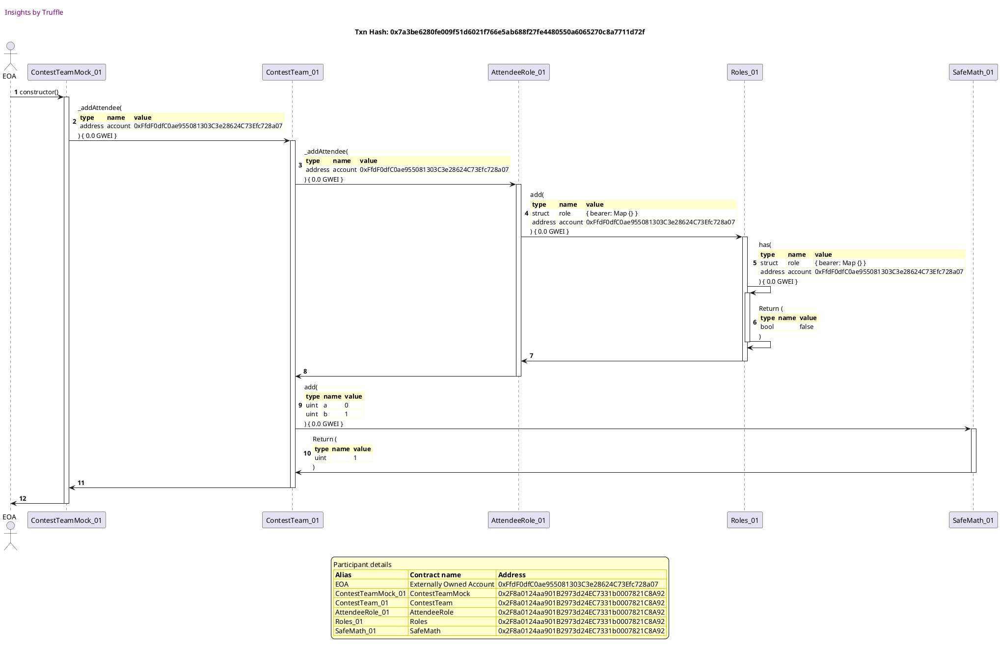
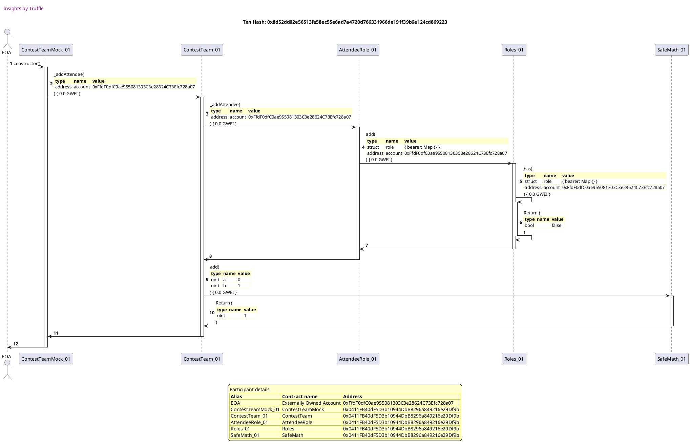
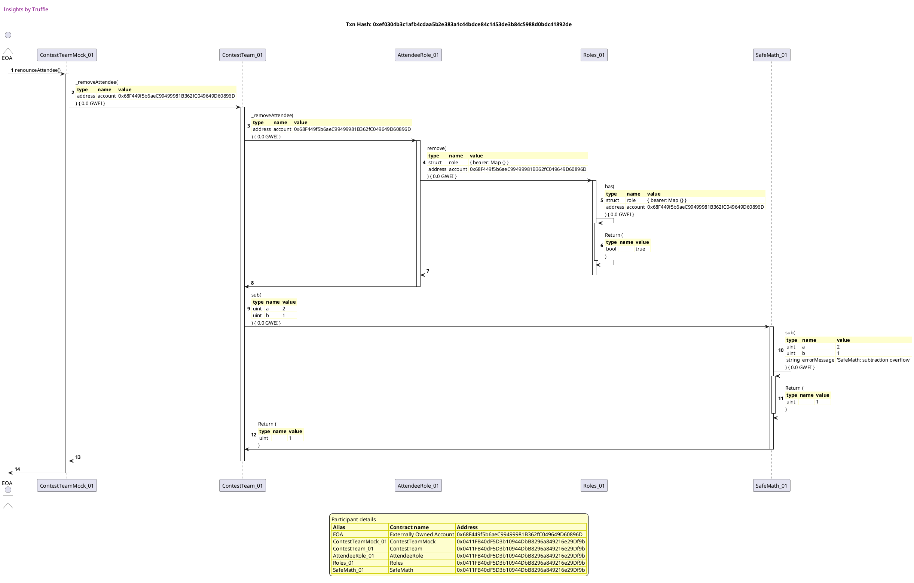
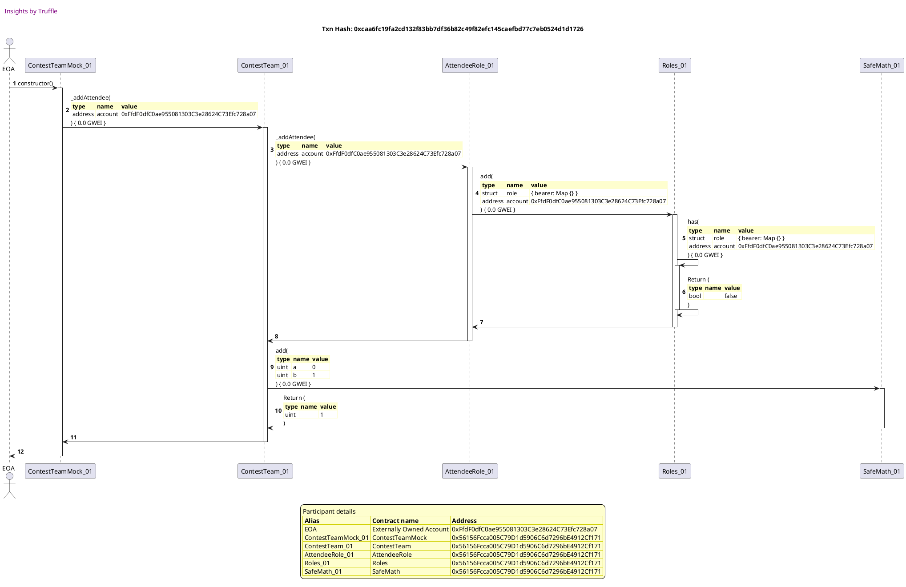
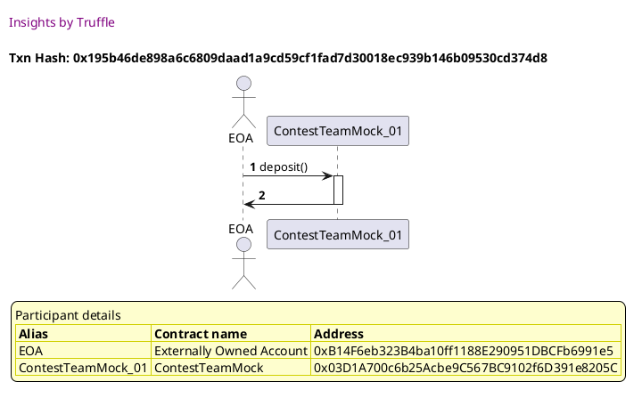
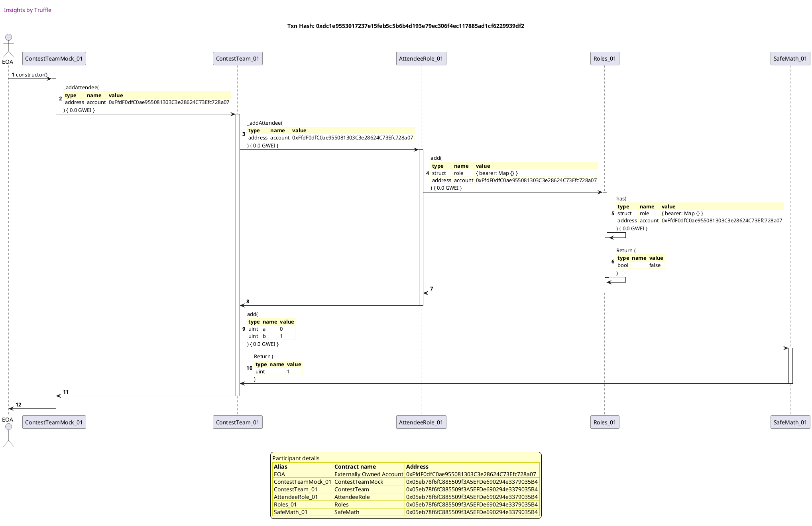
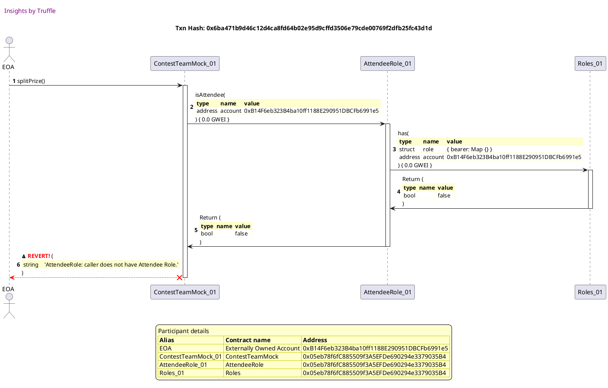
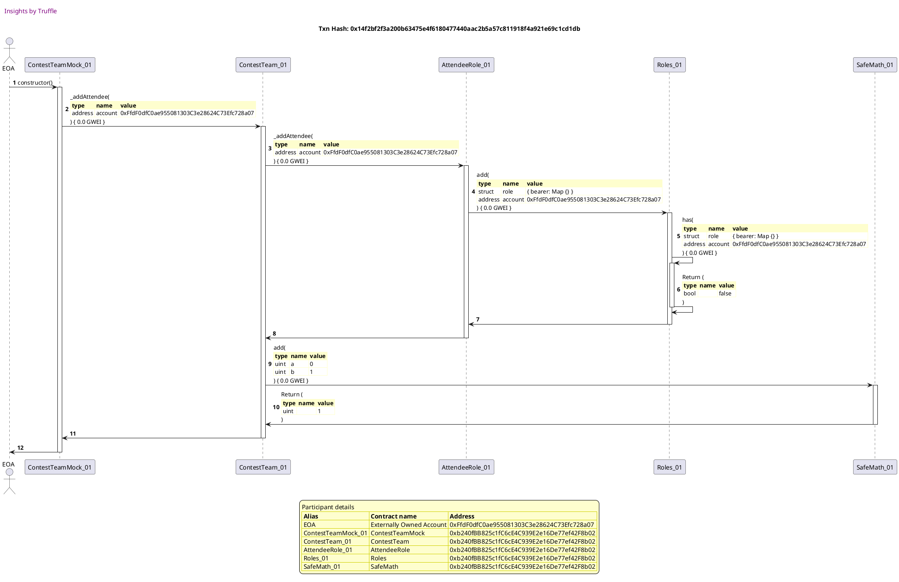
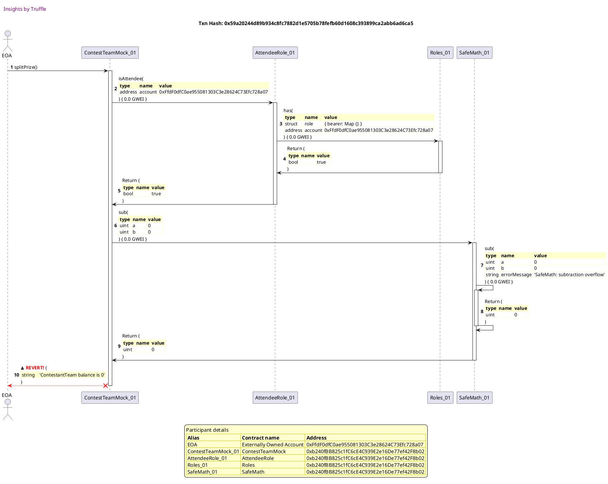
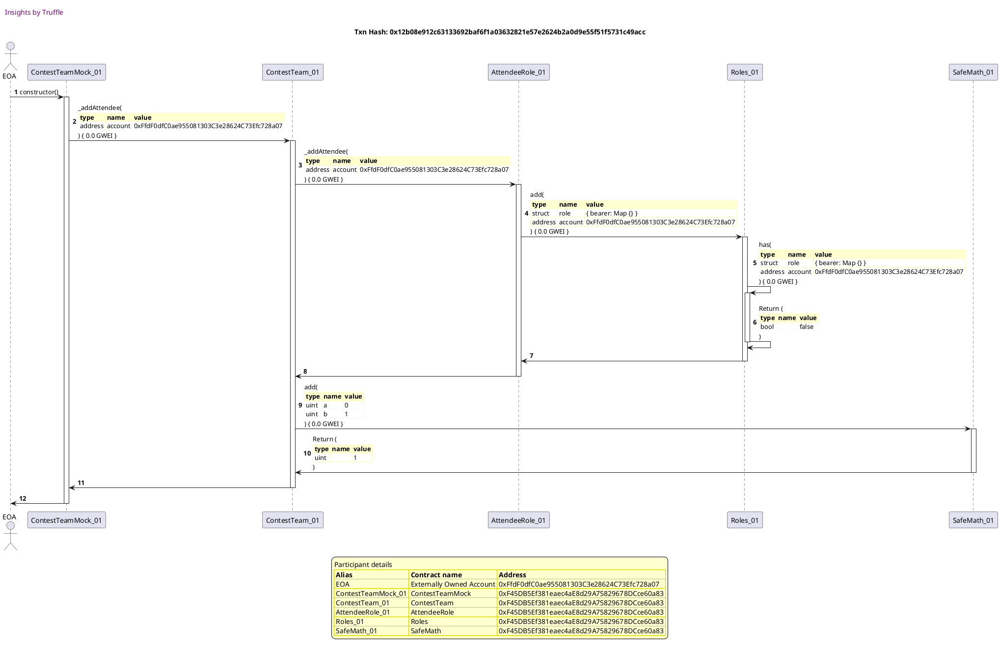

Test date: 2021 Mar 02


## has correct initial member count
[link to test...](http://github.com/fodisi/hackapay/blob/master/test/core/ContestTeam.test.js#L27)

##### d1, tx: 0x7a3be6280fe009f51d6021f766e5ab688f27fe4480550a6065270c8a7711d72f

[SVG :telescope:](https://www.planttext.com/api/plantuml/svg/tLPHRzem47xthpXrBwswRaw09A0EbL9O-r2rQYljfL9rIHo86XpaE1kKzh_l4W8D93oiQD8q56BxSlVvk_FbBeoT9HgLJYSHOvZgMAOJLoYMF8ToYWed48cHaFuvUiyZ5QVIxyTHhE3JS30Sz0UCdIPw7eakW_mt5kWB1OjY2N0Pg_0bbXgZNXIEv4H8JOY1NYiCwU4ISfggQIGs7jo7BmACvbfsYxuVoX4Ol12zvUFfru84A_Q_aaau6ki4t3ayg3G829VfK4S27cOIBZ4PTu3FR6oumZ8T7WZEsq7By2rk6e5jMQA5hkKuWMa7ejbqUAl5qU9MoxIvvw1j6uPlcm6Za7cQg0zkUe097D1um2XiElJ2APAhVN929Ff1uEGwzfwVk97hLSKxpMfCAkezhUc8XBYB8x7Itv9j6cJ2PAMvMcogt6CWhb6FLrgbzG5ZkQTmqgrr1OwFE-35Cj4gpS9pUCHgrRRCrwPFTCeh-eUFyf6T5jdskHYxhzz0pwS2Q9GuoSUV6AKqoTHVWG2KI1AWcUTHqcgQyTamy8VS3_eSHPiEr34QlD5l2DEnp6RVRWm2ppOTvFOIvGWMmBzm-FvZS4LvLc6QiTyEyZzClq8ruxy--fmuRVinlik39fAAy6XOW2jG2TM1Qvp2uWtU_gPdxqvKNHfZyZ-vT7BIWJkXKoNXOswvSHmHFxe2Z992VBIzOJLNQDyTALHvBNBLkfUbN47soxSqpAECMQItP2xzZVgWRko_Y_fUqIqub2ZKHwAs66x7RQDCBijjfiAM_PZTbcgrBpI6KL8YVC4lEESPOMgxLBvfaa4hQbThwhrLugxjkgzv9wFxJ0ibCOhcSFDB2Xzw7qhjCd1D9wm8StXpICQ6sKHiS-FSRDiDtsmE2BXXkEIJxPX6t-crpPtm5UWzOBSxwwPa3-1r1owcUq2LE_Nxway1oQaYizWPtUbxy3S0)




##### d2, tx: 0x5dd5d12e74ea2f070983303c45940cc94171047544789a77be4a48f8acd2aed8

[SVG :telescope:](https://www.planttext.com/api/plantuml/svg/pLTTRzem57tthx2wbrLRDoSO4gCEbVAnzg5grLRQIwNgaZWGDIJ8SJOexN_VJGWVWR1sPMX54Ditziavr_Sw5q9EOWrA9yE044Xq52R3dbGaVl334IWOqa3sPUYUWlFGLr4IkgqeY1JzqErqEwqE8SUndWIoGMZs6KXmfQBJV4ZfMQJynoZK43G3lnyEPQWHqTEB2LsyEOCS9MeKoCAD6_zHKeClR5VWkdxOfmRBJSzPU_mr9q7ovv-7iTyVw9Zs9lHM9Pw7k4JxEf3qTXpICuW7TSh6LTUjkeOfBIx1z9Z5X5sfi8h3gu8pnn7Si0p6hIhdbYt0idgI0xSz6npN1EdQ15tcQAJUkMnIYEa1jWS4tQPznny1IcsX21dhMmd3YyXvk6T6Dc_JN5pMr1fzBkLr5CZvcZLRSK5gZESpvuEjL4feR4o_0KzUW1xCvwwC3mZ9bDAZHgaK-kbJdU9EpHb_l0llo74UCP_pjl7qZUh9I59iGnXcxKy84koaqvzI02NZc6BFSJ3mDFROk6PtEHTUjLS3sHA22o5iuxHICxqMuwB6HRl6R55hpr0EwPIoBun-_z4vnrWf9PkAMFTjfi2Fzo6WwxbTvY9RaA9QPRQ10TUgIDEkcRnbLJgUOvasCAjSm0RHbFrYlpFQ0uZVnZVMAd5IaWhni9dIdWGbLPrUm8XEd-dpFfKjHPHkoD5HdLvBdQYGlarTBue2f8bVb9bR3xSuj3HCzaHWMqYkvMQsjVVlFQd-d53la_uhKWeV-tzIQZTbnPHw9wV4VYJzm-pq88YNwVcAO-dbGsHbQbcohBvQTuktnC-y3FWprcozfMtTgONdRwE-atTp3lWromw-5m_UxSVah0v9fv1PeKgkLeeOLshmWtY5S9kr6MCfOQn7iQx1JWgji8vRK6_E0tUnhl6KbNXu7MkfGWY22Rty5KgNDj_q0bm5BYaHDumPlDd5nOR90GGpJarXLLoJTn2uOlHGasMRHijk2hC8lrvA5Yqx02zAphox0zHQQLemx02xMi8kHtyBYBxA8ukSu1N_AFq6)


## updates member count on member removal
[link to test...](http://github.com/fodisi/hackapay/blob/master/test/core/ContestTeam.test.js#L32)

##### d1, tx: 0x8d52dd02e56513fe58ec55e6ad7a4720d766331966de191f39b6e124cd869223

[SVG :telescope:](https://www.planttext.com/api/plantuml/svg/tLPBJzj04BxlhnZH2uZIhf-98ue8UHGE20H8lI2XjNUSM3Xsj5wt2O7_th7ZX2HE3YMgL3LoFBlZsM-_cHtFcB7pJ0kbyr7CcCXrckGZ7nNBdgDaB9GOGOm3JEI529u7AiqJsKdZLC6dVg_Vw_GOEytqDCOp1kLlY4AYWbar1RXCLVII9bh4xJWQ92DCD266UcdGfuTpo76knZ6kFRYFNX0CUwcx5L96oG0CNgdUIddwjIB1glslaYmQ37K6_XGUL1w6XCjqf6E4Xqa2bo8Rje1Fcj8nfUGcEgvZM24wJGmS1rqX6y9kc5msNDUo3Czr9HgU4LgUxw9Xse5ikfvfMen25cYYthjfWyZWWEG1ex3fA8Z6Wbpja1EOwGSKe-iqU7xYHcbNL-zSjcL9pRojDHqHubqQuy9-GxU-e51c2yl5PDtaNeHuBVHmORKoFs2iz1HEphQw0iV7BGZI9DCgBy9pUCIsccqiNovzebDUq3zyJ1xPQPLjdojvzleDz7ICG38HerB-575EWyBy5GX0OPO1ZOA0abRJY4_weUnp6NQuGCznUDEmkDMnq6owfjrfMBqmQ9XDmHjpb2EO0V_2uVkFtXNbMOrfmNupoFym_HhLWl_ow4lYjEt7-CuFcaWgmYCn0n-5GjM2Qp66sHky_KtFtfsekpGKsV_aqib92-vGvog1ZxdbfsbC_EWAHPnLwgFD3UkvGllkIA7QQr6QRdjPLYl8VlcMHsMKHH7f3PrFVsDxKDVstqLzh-XM75OeR8_4rcAu6RUrCZaljuK9c_TZThjIgoLg4SNP2k4kxtBE2yBKTgbyqw20LjIkbjJRYyHThZjxBJiPtISQLIBYU0etlnAKqFvGQgy2R-c4DMK9pst3w5_ONFQThkKRtBFjhd_HD3rND6tFD5mqlMxe-JlXQz1xm6vsrdND7i3B3bmDzu1QxTJlipy59AUgp6BdTAVlmTy0)




##### d2, tx: 0x93a731efe0dba045718a4ad007861e266f53832f5adadaaf190b573b2f13d060

[SVG :telescope:](https://www.planttext.com/api/plantuml/svg/pLTjJzim4FxkNs6nBqCRc_FIDAvOHUdBu0C20TA-8A5BuhGHQL8vpjPI-E-xfEbBsdGmkcgqQMnVpkVdETyvLq9E4WLIfSEG44XL7AL3HqYIF0JH22GCQIZw8l9EmNteopYDl7OSnf9-w7LxtNQNaED4JKBH93J_30HuGj9fCQJqB9R1Onmf25jXq8-68b9eqLSBXHu-d9aSfN8KYjA3c-1HKCrSoAx0yuAeJpLMY9xpzlXh0O8Kwvz7IT0Vg8Gw4tehKzz7kqG5AXJqTXpHCqW63Sh6t82weGbVCCy1PjRgcWqcU8pLRKiJkcNvDSCsTBy67dx1rpXpQdN3qNtDy9Z52BhCLGYzUzcYaD03R0y8kaq5RZ02fDf64Y9HjmA65x7xSC-qN6zJN9xMKWfzBiHr78hvd3LPUK8cJEQQyy5MA1KmDjHlm1SNe0PptPNn0I4vKthKhAH2FtrgKDofEUAFTz4TEIuYvdFHDf--KJKP2Ofj1CEy_GbXYfrC_Iap84MIKEovBWQUmXuRMtRFDBbVSomGRSvDphcjdHgMxhUPoIsJToncSwipit98fvHzOVJxZ-uvnaebs8p4kczp1a6o3m8zt-in3z62uBKQipM36Mr3wBQbc-swqVNTkcu3grSJs02QeL_iTmvx0CdRy2PAfcu6Kg8zRARK4I25RD0B6D7fCttU9xCbYSeDEJfgq6kXKXdHjx5puZX4c7WXpK9wkCMXbM6o9m3RGd8jD_EjlN_lIVNdX7gVy5-HKhZi_qcftPYLK-gTd1BxeVGFizE7C5ccvokEfPSFaHNLgcHPVRNk5czfa7iPyAUjoPobRDsffVMtGT_9kmK6lFIgW-_5WtVxCJchGp8LCYjKoTLA4UC91K6Oh03ki0vZB0ECzIZMDTZ9J4kiunRGM_F0NSnhFkKb7jx7IiW8md12Btz5mgEjDxq0LmrNb8WRmjmyCpMjTseohrVh68x6k6bsd5DRvnRO9jSrI-YyutEdR7wzb2nBTZ2yA3cBxWwcrahJac07iwibx7BqjmRHLqLaaHEyun-btm00)


##### d3, tx: 0xef0304b3c1afb4cdaa5b2e383a1c44bdce84c1453de3b84c5988d0bdc41892de

[SVG :telescope:](https://www.planttext.com/api/plantuml/svg/tLRVJzim47xtNt5Y3mmnDgTrgwHYrVfpy810WBGN9EGabpOYTIh7uLVB_xvBI4lRX8UrcpQjQcBdSlxyVVOvTunzIupK9fr4ZCdKn2gTkAXPSXUggTHo0X6EKFbTwTsDT9mglnT7iOOFmy5mq1imTfoOfmZR3FBV6AMF6cR58y19hCFdM1aPTQ9mf2Qe3246Pkamf9UlaDDKJoDSUt4LFYDOOccxaBuVgX5Ol32zvEtnbu84A-O_LKau6fi4t2UurcaG42upeOaGhXyLdCXat0B-Y06lS-7MFKi6hl1yAHjk3UjsNLgU4AxleIqyIpJgFjPTwZOSs_OvsOLbEpMVC9dq354Vd7T09h17xHwZPJEX5qubIUsH24pCDSh9MUpTtN8hzokRtnrMCQJatZ66jWZnCevmuRzXMn-G6PE5v-9XtULA1dWcpNZXjVAynrYk58xQbLBWyB056XL5YuSB7XyFMANl1iPo_At6INp_Dln6tR3Z8ke-5Mrx_XNCqnI1MYKdUNilevGwcViSA5mq9WbGp_E8Zg4UVspQGo6SeE4s9VOSHpYEOrlTUhCMzBXmciBfDxdjDFklA0Sm0_wPm_SVWrEAjnBPJC3cOl_R2afiCmdBA2XsBwE-7UN4wDJBU6g2f6O6BagDkWLdSWgp5tZva-BUT9HLZMNoFqawEch19PfKAzXEbXl74V6ZF-ahh0URyvMZXQPz9uXAPoDthJengv-JV6-IrDrEH1hcYopfgctONBgiwZLTc_zl4Cg3AijbSq2jOtr6KID7MN3jBwZa78oc51F62kWywY2A7_Qt4RHpg1G2LXQqOiggxV_jirP5KsLYsOozjPJpchyo5_PQuB2BbUJdev5XbAmGxlC-vpmZJ7KCvKFgPD3PvYofTnPdVpckFSzB0xe_6jHAHj4Jd3yezA6prTTX5RYYj2WPStWkB6lO5TmVDlfrr-AE47stQzUSfhI5KxEQM7FwWUE-2r-2tW5sirHPj-m0l2nfYkuEKAkbpzlJhmAIg2Aos3UwKu7z4m00)





## returns active members
[link to test...](http://github.com/fodisi/hackapay/blob/master/test/core/ContestTeam.test.js#L38)

##### d1, tx: 0xcaa6fc19fa2cd132f83bb7df36b82c49f82efc145caefbd77c7eb0524d1d1726

[SVG :telescope:](https://www.planttext.com/api/plantuml/svg/tLPHRzem47xthpXrBwswRauW2Q0EbQMmzg5grLRQIwNAiHs86XpaE1sKzh_l4W854XvMD6aQWfnzFd_-xdovWv2pr31jid5C2CjCeh9n83L9do8rOPgD8PP3gSHtnf-6EicKy9CuqV1fq1_q_JuXfwcPnR9BeFYC91DImxoS0bmaEdf9b65nBuw6QYoLGSJGh0m6kBY0d6Hw4ikDXRleHOBLNEbkc12H6e95IzLR8K-_bYH8UVwbIgFXoAGGpE1UPs68kCH49fPmFrLmmT9H1-YKC-Q6t6g7pER2QjXXgn44dWWRRj2oURCTjco9wqs7Cna6mlEu9mFgs4rX2SkpNO8XumQfzwzxm58uG7b0C6mcuj64eQi-EY5JSo_P-2hXJu_KAkogwftRQhPKp7l6u1L9UPl4Scc_fTlSa2lJfULoicbonq9vnSneQRKsFo2ay1HEkhMkmF5n1tYYKgEpF3o7HwJMR6lxQkiZtlAI_k63UY2dPRPzBcNtzHkOsKG2IiN6XNncSOQ3tFmL443BD0KSSOv9Qt14fuDG3AW8VSfast5eoshGXj-GTikrcxxNw8VSirkCUWkK8vW3_KBXny_-9UPPXMdEVZl8_p3z2jMS_-hg2-9uxCVuBYuQIMh4Gp67G38jTGUks0JcR_3sDprxTwBgqeYb_vDB9oSTk9Kcqme-vbQG937oms_8uhHK7sqVMCqLF7T72bLUYyAqxcLPho3xvLiM5L5cUQItT07-hFgWRfo_Y_fUqIqvh56eZqHjCToEsqQPN9JRt8Gi-Z6vMQlLGXeMnUaQuNDwJYdD2MFRnVADWnnQOxjQKUyj4tUrh_jQT39yJetKYiNn3Av_AIcWzw7KNWUkwOGLPG7lk9RZ3ZXdb3g-rpwtXDEchkyApswxGR_Pjcm_j3nh9tm5UW_OxSwwgTa3UDM1o-4UKEkT-dtsfu3eL9bPv0oV-7_mDm00)




##### d2, tx: 0x7459a978bbc548d280c07b29857928d299a9a85b70d1193a0bc5ab126400abf6

[SVG :telescope:](https://www.planttext.com/api/plantuml/svg/pLTjJzim4FxkNs6nBqCRcvFcpHMhA6ax-810WBGlICX9d3OYJIhRsLeA_tsND7r9cmv6LuqgZUtp-V8yvpldWj29L4oeR1WZn3AL9jdGumB9XoWPCS66EEPzdWIdp7_eYpHB0ZUDKu4_zBgzhjj5w5YgISnR21U_0MS15tXQ3Z4-IqNqc2QAnUquwYT3dYYm6Ag5GWycPoP7cHZ5l39n4proh1aBsHKBWYZfOusKekUYFVvQWa3byyyJ6VK7Ic9lWcz55ePW5wb8nHpVZXDynkIWYSdODapAgErudcyQJg0xn2UsfrF7jAaEOmgpp34zcmIQHXkCW1xpDDqo265UQ25mcQy0UlUoZPd41z0U872RYlnen82g2oIuLBUS3IzI_-6UQ8NUfhYwhAqK-9ppwpJcypLhikg2N2ZdclF1LYWrC3RKRrZ8BvWQp7LNnWS85KpnKQkM2lxqgObXf-Q8FzubT-YuZ9ZFPTjw-eRLPCGnj0aR5krF5cVGoTMVSWE2IucXv_iGU0fwP6mvFSEWeUbPZBkK6fHIHpjjM7he4eDQ1krOnA5MPsRb44yn-KBmzn_TSuYLMh0vYNNV5WmYkGy2lJ3eaG3GCavDapXQWpJS1jSTIpTSkz4DVLjt6B7h2Mm0pT4lzhk0FM3oRNYb4fcVWnHW3vefzZWJN3Jn1HlXwJD-tYUp9OdQ3JawQk9hhZAHuBUnyz8q1fXm0SrIUhZ5eRLXiYS0sq9oBJUBhRr_xqdrvuHwd_1VaLBmsF-JKhingwRKEpabzaFf7sPdo6AvJCzN74il7o8hgdN9ilfgtItUigZmCeE_jYRpbh9rfrQUlmtwJjujCS2brnryBnwysu_9MHsIgw1PeOgkLegOW2iMnN85S8Tq224vOAX7eQw1JcvQG1stWDwU1-vYNUkfAF7WFbPS92oE9_ZoLy83t7xJ2t3LS4s9k24ip9kMPbeztsU4cAvDErfWKcAvLc3hrFAw1jLqDzHihMf-lPIiIdOml2Wvo-uEfjPAqufW1xEh9UnozBS6mLTbPA4JkCE7qcy0)


## allows deposits and emits Deposit event
[link to test...](http://github.com/fodisi/hackapay/blob/master/test/core/ContestTeam.test.js#L49)

##### d1, tx: 0x0f47dad732d32074d7c59ac94ab5a67f85c7609da0d3fb0a1eb4c74b2ca25840

[SVG :telescope:](https://www.planttext.com/api/plantuml/svg/tLRVRzem47xtNt7gNbfrtPnV1527IbDO-r2rQYljfL9rIHo86XpaE1kKzd_V9GGA11vMD6aQ2ZdxSlxytVbo5yRECerAvwE4CSnrAlEHBnJBdcCvHeKZICH0oF0SW-U1IdCPUccIAlZKx_LxNe-nqqnF4z5XKFw60aEXO5PD0IvJ5R-aKcFIJUA170cf2J7IIuC-FPn3ZdCrJiJQW_luHO1XBtMt68Qn7831AzLRAK-_LYHOjV-LpEB1K6VWJ-51vL54k4p7EX7mC95mYTcm3Np28ziDCNGjCxHCxjgX6pWj35es-WustAZf16w3jqBaeHNv70tXsu5h-sQ0fjEqEQEG1PgezswwW1aSa3nW53OT1_4OoLMFd12PVX0ukaw3voTkb7PrzSvbMvRKpBjQqn49SPScOc6_eLjVK2YpXULYicvoZv6uHZrSMAtC3nWhFOMJpbPNuFYu3K4gCwto8Zo7HsohsSRovT8dEkK5_SD7-SXEgspxNCdEwpVGqx40aX97fVo9IKw3mlmL2429B0CQ1G4bhQOHd_IZiC_3oECeMex3cuR5BSyIPhDXsfvhzQB0DPl8tJdA4So0V-7m_KVlYlAinhHWlndaVvX-ZMh1Vtdq9N7QzcDyvmTD91NXaPY1Br09rOPh7CFi3Tx-fcVlJjHT6cBsFxbqSjA6Ew5p9U5ZRlbfcX0_kY9CiafzjBbXFLTetnqfL7ijIjDjByjg1Talt_AuZ38MaTxG-VGtjWTrRVzTrFUARiLXXSBsI6mjXfjnMokJyt9RcB1vFsQtAxKw51hZ95iXVC4lEES5OMgxLBvfK40hQbTBwjr5uYxNTLxBJaRtYHPAOf9CuUQN525qFvJQgy1REc5DMS9pwyBekfm73Tzqke4lMfxJSC-zbi7Dg75XjGpHDBdZxOIlGUy1kzbPrpLx02yxS3NS0sgrKx_F_XIGdAeoYvtHdRu7VmC0)


##### d2, tx: 0x079d95211c90c138e353543f57246378fa3a8f4d248f078cbbf5d2c48dfbc661

[SVG :telescope:](https://www.planttext.com/api/plantuml/svg/pLTjJzim4FxkNs6nBqCRc_EULAoYfEtW0m81qhuW8IUnsuWqgMndQodyzrtIz3qTZAuQLHhRb_FvUSvtpWMX4wceKFaWGOZcAalpGS04aWznEgI23d32UYoDJcduq1DPdaP-bcG2V-XskXs_Wz2nLEE4DH4kVtr68oRmf1fYV9Q9-35B5KrQITnB1onLO96hkK8N7avD3dCnJDZAWvluaM7DdCkkQ1J5QGzhf18zb-tnrme4gjO_JsNSwok9Wp6-5JddO1UfM2KCtuvIV4Pblu79Y3XUv5cwfeKU2JN3POPbMAR1BKStRSDnEJMeoyr8DrrE73SC0cv5UcYw4Gz2szOGk2nK0BrpsS9KuWDe3n2uJSLXFAH0rGSIJAfRHWSNMVXmJxHIRrEyEgsb5FYSiUiiORCvQxBL2OLGpZHdWwrGQc1igDzGpYwewizqbyO729LCyL6pbWh-zAc1OQTcY3_UfNVek8gOprNRVFg6rNZ8CBGf7PJjJvhaq2dKdme3Wac9eHU647WAUcHakrtJzBWLs9JvdcTwdkTgfuQjSv-OdcrwRPkudjsUMZd44qo-4FpzH-SSOgKMR45YtRSbWrZkWq2NHrqI0LhAFCiYhcOGmpUOxjgwwJj6XuUExbBYr1FO05gWd-zt2RjFvTlmIYNoi00fm1uq4nmmAfXeu0iwn9Dd_BnFPWiIjHjoTDJ0rqpb8iLlOnTaMG8muGAQbVHmYqDhmsHF0BQ5v5fkbbjx_zwJwiy9zJxXloAbODd_arAxCLjDgNToIko7qZ_CJauJkKZFLnnBBnyYIwfroRByQjqjtlAuz3A5lxOc2nQoTQUkhByD-axUhJ30fTSTV2yUlDkFoMaTKgYWQQ6AhfQAc8Wf6YTo2N2Rj0aX1M2eHw6kWKvXMa0TDuVUcWNkV5xpgIpnu3vIJAGqISRuybVA8jnwqmjmsN1DYRWXBCqJewsr7492Ez2jLXWmpxTivzJtDA9pksru6dDrOlchvjTBoLN93eRd9MVLtS7KMccw8jZ1x789knZzhK7mLHLPw0JkyA7q6m00)


##### d3, tx: 0x195b46de898a6c6809daad1a9cd59cf1fad7d30018ec939b146b09530cd374d8

[SVG :telescope:](https://www.planttext.com/api/plantuml/svg/RL9DZzem4BtxLupOIwljgZRv84OKRGYWxQ7QbSgzSkm9H2GESXmLjjl_tY54gAl51pj-R-PbveqPUsozShwhAyPKvnlRrJawrkvBUr1ErL3X5grPABtVkgQp9ckgni7TUhLUPIl6Pgq_LJXdqAyTAeCE_WnNWAV6bQ-DzQfAgt9hQxIU50j_3LWJUP4yTEvGuJlYP_cA8C8hzgACAUqM11-Wl_qv-peKmOR_VxTjkTtv5l8JR5nN5AJBVEahXCtHmfDgTrFWHo6ZF8mD9Z9HiOuJBerIHYYfJIHr8Gfb9YRWN2IePI1p4SOvbr70jGaceKaOMQOzbRvwJa6rCA9pnCWsN-hoeAZLZ9h0rczGrJyQlV_5HH_t4HunrcV3m_mc3VVtKp1uQDhIV_hCReQSKoyQ3rDWx38uzl9VEGQzAgkMpORnVRbRyYNdVFxs3MW-L1fzdAKTzGLMrNW6KcCSjiHTy-PlVSkq7pqwgwhg1C-_BHf8jQP7uedYnuK8rp7cmJXOXBaIl2Y4I9BLM9A7Ohd8rdaifS3elV0Dopw0lJmFbYATSAxZV1obEaUPHV5aaKd1nqMy34Ww6VCe8tdoON23FT9EZ_qV)





## reverts on deposits with 1 value
[link to test...](http://github.com/fodisi/hackapay/blob/master/test/core/ContestTeam.test.js#L57)

##### d1, tx: 0x5a07abb1123195ac35ab3825c1a43fba5cb78fac1b79109d72e96fe0c3bfb372

[SVG :telescope:](https://www.planttext.com/api/plantuml/svg/tLRVRvim47xtNt7gNbfrtGoK4A8kQfeVQn-gLcsblLIg3Z09AZ6HCLlIjF_x3aBI9927DPeqBIASVPm_VtS-xc3iFDMeT3QE6SDC9p8RUqAnz3cI4rGuXbWCXGmkq7yUgYIJGJU94mMV1lr1lzjdx2pLirYq6HI_aS10A9YNKu3BH4KlYTGOT-9eACT2Qa8CzSfWG0yNa9DCJMAnyU0-UX5WdAvqjnW4aHo2mKlLMo7FlfOaMBd_bKoZuKYduCtWGMLXIBXCHpeMy32LS8dfg0LyQYDtqFCCmxGCrqRVij6pcgRj6tXgXHxQlkSqG_GDpt4DxWQEATn6ABXlUQ5dEIQZaFcQgFTlEe0f790yO1Gs7VdH1CdLBZaXKlqWS7oT-CzFt2ZigkgTosgMLCmxMjCH2N6Nn69flwNRN90hqwNbSh9fSe-Xk4OzMbgjpGyOApo5atQjAt1yt08_aQbMMHwUmoDMQxQrVBNqYKvvIV_mKJwoipBRFfUo_VeDz6mYWAJ4SI5_OfpH83T_1G9G8as1HhvFIQjfnAU3C1Zm8Eno5AvjywPXSQjh2RFPC4-xZjKFVSTiKaeiK8vW3lmBX-y_-bUKPnMcEVlj8F_3z2jKS_wheo-8qxOVuxiuQ2Af28_473o1IgWMNEC4vc_mzZSzUtUYwj88q__9fPEJ5jm9dIa97tFBIvAO-D4LOfoMwgFj3QkvGllkIA7AQr6OrhqiwnLaltpBeYBAc4TwI-VHtwWFwiR-kwZl5TsImng5-aZK5iFjk6sKoKMvpKtOeX-psxLQ7GYDKPok4Uxn7kSy9qnjbyet3N9eHUrgHRspJDpLklPhqSdeFjL2IOpZ6TpyaYA0peTIUnsufXDMb0LyHt3NDUt0x9c1sxsmWuPdyePZDdWp50FJ2WONJY-m-Kxu2lGUiDkTTLEp1_2g0vV3FQ3ME_Nxx4y1oQaoizWvtUbxy3S0)


##### d2, tx: 0x7d327f2ed5f4748394c4e0f01ea68ed7f5e25c445e66d9fdebaed17fe0a23830

[SVG :telescope:](https://www.planttext.com/api/plantuml/svg/pLTjJzim4FxkNs6nBqCRcvltLAoYjCtW0m81qhuW8JU-j15fKZdErbBuxxkawNiw65qrgZIsB-Vpyvpld0iX9wdYKcM3Y12UgIJE1bsG97q8uo6NV40Zw44iJhd_q9D95ejM4YMIVl0wNgVL8UGuLUC86eGMlpvm0P9EoY6bPuaC7vDOyQWPXRru0B52Yu6QAtZuS6focCbX12iFRi97e3LZBhlYGeHnZzPOANekskEl9GXIhdyUfs6lhrBQ7TDRcGK1sYKgL17Gsr5CptZQhrCsieMksO46mWmCst1qr_0DO06h0RSS47PWWcRwXc62PGat4D3b86fs08nhkgCpWYxp5KBlN3OfJ-a1jWS4tQP2FnnofDf24f2gM-23YyH_k6UrGczJl3gjgHJw7E0wYM0sPqssEY4NfZFDsM0hb0eO6-etF80BhleptQNn0I45KthKgAH2FtsgKzof6UAFT_4TEIuZvdFPDfw-KJKU0iKsveEY_ScZ33kv-bDkG4AQKkpvFWQUmXuRMOvd66vWTYqEBTSrNDTrQgUwfGKjPhYMuROjvhXMUshba4ue-yBezn-TSuoLIh0vYNNV5Wp2T1y4l41uJ21Q3gvfCgUcCxsbW-POcj6ozKxWsvh3cLrDO0DeZdw-tmNiFa_VXZTLClDpa1BjOJEXNU0IP9rUy26TFDFdVJ9RaAZSaAEZEhq6bScOlerTDqaYX8aNqYobXriSMXacUmAmBIJNShFOslltdbH_JgZt2VyLAONB_f-KsetPQagzarDYFvJ-ONO6F4eNwVcAO-dbGsH9jIfPbb-jkyLR5XPUvlYlhScw2zcwKrVMtmPz9--M6F3IgWw-5m_UxSVaj0x9LSYqK2LNIqMC0CN3A5q2t6PjnbWE6EjHh6kmavkMMCVDeJTdWJkVrtWgIZoyZnJ8c4VHc5x-Ya7GvfjUWCk6Aqh43M5XlWdCTJLJQ6rDkArJKrXTZLcsXlaIWAVfmZkrsy9ag-RNIybLoGw6voLdsTt1r5ffkYBOmUno2RiO_Qr1z5KPMUG4x_YXz1i0)


##### d3, tx: 0xd9f0620ca260766efbc57e8a24522a443ab53f9333ede7fb2e22ec89aca7b4a0

[SVG :telescope:](https://www.planttext.com/api/plantuml/svg/TLDjJzim4FxkNt43QK0Pmt5Usg0kecyH-p21MBKlOvekyIMDI9pASQ1btN-VsqO818iiN_BS-V7TSnV6BXk3shHLoHYsfbPjbP1cpNsXbgYnWf9oKdACwNskwrR9ILtM6WxZMJoRp1WRDcPTKiHWzom89Mduqtq2NDMwUAgLmN9K5hcgI1dBc9ddWDWwzvJBLYzBUkNuNZmHEDupTeDI5Ye7XtVGtvqTddT9iEx-hwefyeLf85d3NBTPPdcPAKn9C5yfkC9cSG5y9SEC1uAdA0BU3mBAajJlqm25vmk1dkTYuhjPwBekIUfdYI0XA1s4c68_yP0pArbgREgpwn5W0mVM7Z0hcodIOecsr8ajWXep9wo-rUdzR-xiujx21upjJiDPzAuRJaylGDAoRWfpVCBU3LcT_JpK97zjAVPSPnSm_FY8MbdH8XYc-zRPcAZNkvtzcDtEF_Hwm_CT7i7ndRfZmwwpdpeRRQ0nUYlw1kmwgfhyymEMBK7LDWOIWbmJceLLtInG0J-2pPRdX4couXGFQEW_1UydYzsyq4kImQ9iNcGnvLFEURJv0dQ0h7RsPKkcBJSeh6WBZAJKr5ZVypcRzROdTbyPqWhBSWtNZueaZDBKJh6nBhuQEruSKE8AT-mbwF0iSvp1O2P27lhET3o9ao0C7V9V4x_JqpVWZdv4F0o5ByLKo70ozcMG21xqxR0DCeg5A-DnVofzRkcj3fqQxDBkzc_y1m00)


## does not allow calls from not members
[link to test...](http://github.com/fodisi/hackapay/blob/master/test/core/ContestTeam.test.js#L63)

##### d1, tx: 0xdc1e9553017237e15feb5c5b6b4d193e79ec306f4ec117885ad1cf6229939df2

[SVG :telescope:](https://www.planttext.com/api/plantuml/svg/tLPHRzem47xthpXrBwswRav2244TAgMmzg5grLRQIwNAIIuGDJZ8SJOexN_V9GGA93oiQD8q57BsvVpvk_FbBeoTfLeedOrZnaIc4vcDFLGiVOxaH2WnXXY7A8DpuJyFLPB9e9V4YO9FW_wWt-ipTfhgMOmT1iLlX2901VDo2d2PgEWbaLh4tJWQoZ5AJOYXNXaCwE42SfAfIOmR3-wZ5mIZiTBTYY28v10CNghU2ddwjIJ1olslP1eDHpe5RmOFAWj3mcKwqZ72mrJ2fKX7RU3Jm3VGjMsB6uvfEMZO8NgsRtjDhn4OheMEYxx5cs43VSDmMYrR18OVDatJTIqt24r68VCrKU_VT46aS43oW57OTEH74q6kziW9JFK3Yl5ruZy_SQEmgwftBgjPKZ7lQar7X7YNnBYqtz9jBiYLwT9oETaqkHSXNWizMbgjpGyOApo5aqwjAt1yt0O_aQbMMHwUmoDMQxQrVBNqYKvvIV_mKJwoqpBRFfUoy_eDz6o2G5AASI5_YZYZGMx-2WIWC4s1HhvFIQjfnAU3C1Zm8EnnaPywRnaMjteMcgscsUWvLZ_q7RCbkBD0EO8vy2ySll_eNr6ULPZcxBU3_0_Jhr3D-Q-ElY1EstwCx-AWYQGYF19py50eL6su5XEOly7Rt_JitOcgIoEH_aykdPoquGvrfYHyp2qlIMBYHrSeuhHK7srlMCqLsdT72bLUYyAqxcLPho3xvLiM5L4MUQItT1xzZVgWRko_Y_fUqIqvh56eZqHjCToEsqQPN9JRt8Gj-Z6xNQlL0MeHnUaQuGj-mJdF2LFRfV9DWnnQKRjQKUyk4tUrhlDQT3AwJpKgAU9u1ZU_90RG_L1ghmFNTCAAie3dDdfEAso6FMguDdT3gslt1nVOTBdfDj2o79TRzdbZ9tm5UW_OxSwwgTa3UDM1o-4UKEkT-dtsfu3aL9bPx8pkz3tu6m00)




##### d2, tx: 0xd382d6b085bc7162af9c1b09065069fc49183ab7dcefc6834229a50a9bc5ed40

[SVG :telescope:](https://www.planttext.com/api/plantuml/svg/pLTjJzim4FxkNs6nBqCRc_FQk68L9Mq77n08aFO52Jc9qqQaIMKxMqlXl--IfYzfqy7egb6biNqvFtxkVETS43gHYWcL3ME4MARI91jwN23v42KZ9jWGnxpFa-2K-GzzaMP9uAPnAl27NhVNTRi87KirYNaBuU8tu2pW0a_B8SPdgOWUqqInk1r7_MJ84mM8eLeezE3X37AKYL7CAmzkeaUEDNCXks9142Lzh95Iz5oqnrzB4gXS_poHKN-W9FOc-5PaOGYuI4KgvlXsdE0p9WTDJCQ1uUY1xH77ylo6PkiifBxc4KfiYzWqz4sgEGRp6e7FGzzs35FNARC8evvlyS0a25pcAw3UlMnZ9l41j0S8tAOYFnenCDK58xXKjvmDBrB_uPveXTwck3gjhHJudFFhDERpEMkoweHSAEUQyy5MAZKqDjHlMCWlc1hCTLV61mWLbkAZLgqf-DEd9eQTcZF-U9VSeUCoOZwNRUlf6rQJ4SVG9cnOj3zPd44dLt_A0GIN4aFFzo7m5FJ8s7Pwfab3oxCPToarAQMETchOUkWIazecxTZ4eNPdXdA8fvXy8VZxZ-uvn4ejsTo8TTyM5aHo7mRqmg170c3BEBKiucW6CLo3wuwjcsx3w8P-GtSOQTGRi44qPx_OxuBsWCctyPLAP7vEKW0UD5FiSIQuQE8BDiBJP_oyJykMHjHkoD5H4rzpbOa4lyqwBqrZe0aNc5bA3xSuj3PCzaHWMqYkvMQnjVVlFQd-d53la_uhKWgM_JyfjPjbrPHw9wV4VapwXzaPibWkq_CLnzBBXyYAQbsohBvQTuktB2gypE2lhScyfMpTgPNrjr7VoRib1xZqkeFlnODt-p4vgqDo5JGhLD7LIX4JSCMYMAuGxf0E8IGd3FKer3NGoQ45r74Bwkrvu2xcjPwA4W_kOyL5mk9uWYz_9Jp0xJUz05U1Qqh43M41JopkDPpG3bt70NWQ6cshs-jmcnATcjmm6fGOrgbPXLyl9QkI7O0N9MVPtG5ghJIj27Q0NIrXbwE_1GHVbP65Jk0E7qg_0G00)


##### d3, tx: 0x6ba471b9d46c12d4ca8fd64b02e95d9cffd3506e79cde00769f2dfb25fc43d1d

[SVG :telescope:](https://www.planttext.com/api/plantuml/svg/jLLHRzem47xthxYrqhQsw-P04WXYQ433jeUgLOUsXtMQdFX2emO7sKv7I_lVTmc1bPO-hDCGufpBtUVlpkSFnZuOAxGjfXbZeh2vAgOHQcOkKpKJMamXmmagEH3nvKJdXPB3FCirx8x2KJWC6UiQUvrXZq7rkK0XKSEYVWJubElq9bTMPFqidQWfAak8YLq7ZEZb4d9Mw5c66o--f3S8ZhlsdGefKpK1XzUkkyfstzKaMBt_PsNIoOKr45t3M1T9GhZCfZP36CyLV1BceWDyxaV2RJbH85q_TXhIZKKxaRuRyGO6dWpY995DZ_lO2cA9dBVy86d896fuIUmsfICPjIosH3qywOCmi4DsXr7RR1gdCq6b3ga8D7QCOdgSnvS_kLF5FNPlflMjfPuZdkKPhd8U-3OJIgTPHQuUTXYh6C5XR-kMS73G0JFBKdjAXuIlzzZMg3BxuUPLQcfMxjVdwfnrwvbuKzlUxNkmrpC4iafCAtibie8MPVWjq65gD0Pe5SSqMfPMV3vmt96FKRFH7BYHS7YIE4wx7JO27dZEqM0uYlmWSD1Rekp10lXR3X-_XPzf6XuJBTcl6rBHlX3cUNoDrKLSajI4HsO14GgDkWF7OWQBExZxdvNzAMBhWHmUTk0CRQ4LFA-wACypeadVH6IcTkyzqT6jS_A_66pRR7xuVLUZ_56IMSuuxTvz-KjeHGBHWswyb2cAwUtlduLVmxFnY_tzxhlAttkAONd6fS1KB5xTBxq3iSWoqXQPem6LMvgZArpVrEe6ldsruYoHX26z4XQtNtQsL5LsUkyEIxGYpSmzLaVyY7DUzet4asusBKemJTZh3lPNexREeofAFQBVkKMjYFKrdFnIAA7_h66y3xn5pnuvAtZkOTHg9tuoRBSzZmT9i--5eoFq0zu8N6msMm5lUWDt4_wXxcrw_W5uhO_ryc-XY4DzOkm3_TA_vMy0)





## does not allow calls if contract balance is 0
[link to test...](http://github.com/fodisi/hackapay/blob/master/test/core/ContestTeam.test.js#L70)

##### d1, tx: 0x14f2bf2f3a200b63475e4f6180477440aac2b5a57c811918f4a921e69c1cd1db

[SVG :telescope:](https://www.planttext.com/api/plantuml/svg/tLPHRvim47xthpXrBwswReQGGA8kQah9seUgLLjfBvKg0tQ2Ianap9OqxN_VGKXA0dbOeqdJ8iBPn_dpT-VZ3aBEKisKpYOn8IpJYSmcFbSaVOxab2asWPYFk0pFMV0yKaacGpU94mMVXjxGSpr2JbCzZtcVGF4RSnPo1Ojo2d2PgEWbaPh5WpWQoGcN6X65NXiCyU4ISfgfQSmt7jn7BnmCQwsxPM4OoH4Oj5Iz5VBqQqc2bFjVoJGQZNKA_XmUL2O4uX8TwPZ3mqp29Kl7FQ0pmnAcBqpHOYQbVgTbsMrkYOxXKCksBOio5fX-cxNjm36Chk48YtLDWtUwWH64HkWJ35cWaRftCm2MmW7A0u9Xqr4GJHcwwg8JFDKFd4ska-3vYHg5NLszSrd3afhvG6iy8ixlafYlxBTqcmjoPRgoN4qsJUwPuDTCZrTMbVa18OMdSD9lT0MEZtiG93BLAil3StX46issbg-NFk4fh-WVFif7Sbfcs-TIzb-_WPvFEQ2KR5B8dopES92Rlm82A9wcWACWmAJLEAApeGY7D1GkPRpRRbF7QD6Ms-Acqp4jrsvv8h1DXr5xYN842w1VA7p_uLrXdjMOvkotW_mFqwzHpVclZxuWZjj-ZE_oe96aGZmK2_0vKrpru9fDOV46Rt_JitSdwYwDMVe_kNHoqeCxhZCbuMDk-KaI8p-y18lJKdsqlM4zLt3V7IbKUoqAqwQNfLf1ziktB2gYpF98R-by_1lDGTtOVnVrlQ9RSgXGQ8v4Op7SZjj6cLoMszo4BFinkQtKwf1h5iLfXV05lQ2KveInxMBvna4EhR1ThQaFLecxNjT_BJePtcUQAydYU0utloGFOV2XrAu2DtJ2chA0zqsBYlDpnsm7Xd0xWMUvtLRNCxdHkU2spOLb3XsVcZlXQz1xm6vtratD7i3h3bmEzu2gTkhtsPy2ebDbPf4plEFtu6y0)




##### d2, tx: 0x1786e19b2864a2459dfd190241918ad2e223d33f4433eefe745341e82a15c751

[SVG :telescope:](https://www.planttext.com/api/plantuml/svg/pLVVRvim47xtNs5rBwksRWOS0b4NDIN9seUgLLjfBvKg0qU2IY0oPakQzd_VGSXlidRDeZKYs3xEv-yxtvc3a9DK2QcoGKI8o5GIPmCN94aVmdWef1ZG27eG-wV2U-Z998jz9uaIIJzqEzsEqo7aE5NZ29g45hy-21yadPH3IiyI6JuciH9HAmfxyG1YXHO3DLVeuiEfoM4cXn6iFBW97u5gV2wx4huVnZsgiLBqNBJ7NqiGf5p_F4x3Nb-br1tJMva50TebAbGHqDjHJCz4sczGDjBgbWcQxUgMoONEQxOV-9hDTAxPcYLy7NJTy0qZuDmm00Aeyvh1DR1qeTMyUaqZw39F8VJEPOkAb1vWUq3GRIhqmg50gWwIW5JTWXXS9Dx3FTCAlKtnwhIMKkXpWEiaWjcSDTdgX5oOpZHdWwrGAc1igD-802w4wizqbyO7X1HCwL6paWhzzAb1SQTcY3_UnNVak8oOpsNRVFf6rNW85DjO38hsfuWoxEJgJxa12MbAiUTv67WAUsnaMbtExQ3ccW8Ss-QsRLlQgM7gWSEuRNAxRJBBDjjJAuTqGjaNHh__w9nZh5I2pKci-xPW4ARx8D0D_2xp4Qq0krPZbcOmmp40Gr3dJjte15vTjmIhLnFO09gZd-zt0RilqhVXJPNCl1oaH7lOJAWBGe9iq0inf9Dd-hnFPWiIbHjoTDIWrw0o6TEtiNEJ94AOU27DKdgunQ6LOR8d0Dj2SYqtYwszV-z9zUU4Uf_mNv5IkEp_IQdTcAscr3iv9VP3wHzcPo2YT96UhpYMNZv4bbIhacNvrRfRl6LXuMM1VsrDvYvawqvTMNyRz9syMsB0Iwyw-5uyUBSVazCw95SXqqALN2qLCJue4KRf4k0sQpF6Si1OZs9TWvtSjCGwRWwzDGlS-RpcKr7YuNsaGCOYYiRqybSCFcszwGMuRBYYHDmG5kPTdRFWzDJIQvuMEARNuOvjs1qTDBCDzJe4NEzQBjDNpQ-NagkI7GpFIywokuEfjT9qHR23sUKITZ7wMuFegpAoo0dUyKFfDm00)


##### d3, tx: 0x59a20244d89b934c8fc7882d1e5705b78fefb60d1608c393899ca2abb6ad6ca5

[SVG :telescope:](https://www.planttext.com/api/plantuml/svg/nLRVRziu37xNNy7hW6tjhZV5-MKNMR0qTMvxA5PqnVQm7GwqJIT65JcGvJPTs__zQCT9azHzM8hYWi2IQ8hyI7uWBSJ7pAAn-LG9WRbDTJuDo8ZiCj4pD3W5HMFIqJ66bsEJvZeQfYery6haZ_oXBqGlipUA-WBAtuGm8WEtrH7WKsgINwcsg0Og6UifQSiMOxjI6F7BXSbPRcQADbvyJNuHD5ehsHb6KQB7q92LwBvSU-yh4ABo_rbdoNXYCmXkuCBaSSnsXKsi8hYOQ_Y4sUG8vBpjeIETLYjolS1hja8t3hkkwqGDQdTbE-YwCSL1HqQDZdJ3fjTqFIz41uEWWr4dnBRWb8MMeVjV1e0PxF6w9pXjDWcJ6NAeGmw2Cdj1E3rDmyj_PQFKUopUl3QmbdDET9ugMjxPacrUA8JPKdDvs5JvYZ6TefqijTREUqAKqE6mNuiDthqxWcoc4dl6rQIt-w9MgxYzZRAyccHByTkV-gVeLUJvirhxTn_0tim8UDKuBTShL3bl2lKxuAeRoZBWNHWo1otlv7mKHoCPnKE9vBNRqcqqPNFO9CVjEArXj-bpCHqNPNTXPHzkGVubuU_l_cUcpMEW1VfLvahO4ynsmvjPauS5ICFsUBc5WD2GEO9JdC7jFTo_P6GFGTGMvF3m2Cx9vaR3Rj45QQeO9lyvp4gw_qH2QsdoGW2UekGwqHTCpeFT7ET9MI0iYhGb2nvas_NOyFz_02e9MRJDEo1ZKdFAZCDnGSmtIoWb1ckucoMfXlIAJApIwpUx1FJiybO1h2MqnkMB4AlESvsZ-U6FLuQYVmeWYxx9ddklhz5eJdCVUk5YHh9E_-3WtF_cdr_ySN3GUr_A-q-XUoXJKPhACRVkmZS4g527nBqKvB8k8gAYObTegNwcYCNm5cThSo0YYudArloVo1CfPP4Tdj4y6dXJ62lOiChJODceLlSORp7s-3ctP3GgTGDVhZL5CDYfbQqRhXcRZuIb-S1foVZus7NQOICUTaA_DVIQdkzGetD2tIx5BMVa1jBPDByzNZSbpp2y6iFLzXccriVrm-bt3N9G5GN4HtxoLzv_)





## does not allow calls if member prize is 0
[link to test...](http://github.com/fodisi/hackapay/blob/master/test/core/ContestTeam.test.js#L74)

##### d1, tx: 0x12b08e912c63133692baf6f1a03632821e57e2624b2a0d9e55f51f5731c49acc

[SVG :telescope:](https://www.planttext.com/api/plantuml/svg/tLPHRzem47xthpXrBwswRav28A0EbTAmzg5grLRQIwNAIIuGDJZ8SJOexN_V9GGA93oiQD8q57BsvVpvk_FbBeoTfLeedOrZnaIc4vcDFLGiVOxaH2WnXXY7A8DpuJyFLPB9e9_4YO9F0tVWzbt6JbCzYx7BeFYDK0IeO5vE0IuJ5RqaKeku5qT3EKQf2J7KAuC1FLn0JZ8rYN7ZmNtqWc0qLhfR4GIH78B1IzLR8K-_bYHOkV-LJAFXIAVWpU11PM58k4n7EaPuc4gu5Ece0tngc1vti6sOVjCoBAlPDZqHDaD3SAjfcOvfeDr2isasF5Fme8ss7Tf6QBSims-qXUyp2fclYRfxqmEHmW790qPXqv4VJGIvsYSdCDKFACRNYV_yn8t2hghUkQncISMyfpKT4U9T4kFIVaktkI1NfalBvMJJv5w4U2tqQ6crDZzWhF0KJhgrhi3nSGVyHAPQPNbu3ezOhTdMyjNI9phb9Vt3H_d8Jiji-rpAxkitqBC90aafneNyAUAC1hdvAn20mZG56la-9Qsc4PyEmc30Wx3F1RPjcpk6nQs-XQP39znlMMxejqn7yDO2vGZcmBzm-Fx3lQ8ygp3DsMy7-H-cNw6QyryTVK6SjlqOtyL14qb5U2JcuA5Gg3fmBIOmVuEtl-dPknDLbqOY_PzSEZdfm1tgJ4duc5jUaiJ4ZwvGn6cfFjhUi9ehjE-E5Agy5eLftSkoNa7soxSiAg8iyaXlwJpw6_L1tTX_5_MzebjoMADG7udQOhWTjuqokIYtkGbRz6DskrQh0zGYYjCrmXVyWdEU4wQsI-MR1ZcqedQrejvR9kvgNVUrw6HqdsfKKiJn36v-IGoWzw7KNWUkwOGLvGA-OL-SssveEGOAz1l2TGAptMlPZjbkjfoBlezDBXnh9tm5UW_OxSwwgTa3UDM1o-4UKEkT-dtsfu3aL9bPx8pkz3tu6m00)




##### d2, tx: 0x5878fec17b6dd627d14b6163b296e048e904320016b8e10d3320f649a9d2da26

[SVG :telescope:](https://www.planttext.com/api/plantuml/svg/pLTjJzim4FxkNs6nBqCRc_FIl5IiegJju0C20TA-824dkRGHQL8vpjPI-E-xfEbBsdGmkcfKQMnVpe-VEzyv5q9EKic5p8OH8JoJIPmDNH0aVGZZ4HTyI2FeG-oVSk-XBv8izfqaIWJzqElskawNaEDKJY9e4Lhy1i1z47HQ3YazIqJucCIIH-qexCT3Y2KY1dAXqCE7CyXH9aOHL1xSX8z05NqXk-A-7yPzgh1Iz5oqnrzB4gHS_pnEm_v0fjITq5kH1G7Y4XdA2EZjEAPdF1qqAHitBDCAm5DCr_1zGpLzHNSDnT1SrJQ0wHROJDTKnXJ3jK1XleQ3mD1jRlkgprM3eCiyYTIxbstAKtg0xG51jydG2qSSJNNG24ZbBV3XHU8zt3EbqDiKLwUrfKIV0rmd4SpdhCcg4t9XEjUS3xPIgQ6neNx30xZWSZ3NNHaV459OIezQjQRGJv-Q57TgplZZNNn7Zik8-LoshQTlL4v6GB6D-R1eV_8emqwk_fG324XJYZtFmy2Js6DZm-hfkXqqN8E3OzkwRTkMSgePQk0mtSQzwHZCietE3EMGJYdxmkZt7zrpZ9LQihaHwxujB0ZJVHZG2_mUyv4j1xlHO9QYCStHGBKCLNTChHjufcfnPjORi44qPx_OxuBsWATluvjAaNavIO5us4of2ro0QD8BFgBJP_gyJykMHjHkoD5Harw3p4HCtsQTcoGHqiGBpIobXriSMXicUoAmBIJNShFOslltdbH_JgZtIVyLAONB_f-KsisoQagzarDYFoRzm-mCU9Gkq_CLnzBBXyYAQbsohBvQTuktB2oypF6lhCdSfMpTgPNrjr7VoRib1xpKkeFlnODt-p4vgqDo5J8hLCdLIX7ZW-HXbAuGxh0EOomdZFKerZNOoQ45rd4Bwkrvu2xcjPwA4W_lOmaYvb4qePU_Ol1f-qqlm5NWcX9nGpY3rnkTqqOtq2m5E7Wwxrg-QhVDXeNbgcbr70yCnYsj2hzUIbObEm0lIiwokmFKMcbQ4Um0krh2BaT_2uY-AYEBdE0TFvH-0m00)


```plantuml


@startuml

autonumber
skinparam legendBackgroundColor #FEFECE

<style>
      header {
        HorizontalAlignment left
        FontColor purple
        FontSize 14
        Padding 10
      }
    </style>

header Insights by Truffle

title Txn Hash: 0x5878fec17b6dd627d14b6163b296e048e904320016b8e10d3320f649a9d2da26


actor EOA as "EOA"
participant ContestTeamMock_01 as "ContestTeamMock_01"
participant AttendeeRole_01 as "AttendeeRole_01"
participant Roles_01 as "Roles_01"
participant ContestTeam_01 as "ContestTeam_01"
participant SafeMath_01 as "SafeMath_01"

"EOA" -> "ContestTeamMock_01" ++: addAttendee(\n\
<#FEFECE,#FEFECE>|= type |= name |= value |\n\
| address | account | 0x68F449f5b6aeC99499981B362fC049649D60896D |\n\
) { 0.0 GWEI }
"ContestTeamMock_01" -> "AttendeeRole_01" ++: isAttendee(\n\
<#FEFECE,#FEFECE>|= type |= name |= value |\n\
| address | account | 0xFfdF0dfC0ae955081303C3e28624C73Efc728a07 |\n\
) { 0.0 GWEI }
"AttendeeRole_01" -> "Roles_01" ++: has(\n\
<#FEFECE,#FEFECE>|= type |= name |= value |\n\
| struct | role | { bearer: Map {} } |\n\
| address | account | 0xFfdF0dfC0ae955081303C3e28624C73Efc728a07 |\n\
) { 0.0 GWEI }
"Roles_01" -> "AttendeeRole_01" --: Return (\n\
<#FEFECE,#FEFECE>|= type |= name |= value |\n\
| bool |  | true |\n\
)
"AttendeeRole_01" -> "ContestTeamMock_01" --: Return (\n\
<#FEFECE,#FEFECE>|= type |= name |= value |\n\
| bool |  | true |\n\
)
"ContestTeamMock_01" -> "ContestTeam_01" ++: _addAttendee(\n\
<#FEFECE,#FEFECE>|= type |= name |= value |\n\
| address | account | 0x68F449f5b6aeC99499981B362fC049649D60896D |\n\
) { 0.0 GWEI }
"ContestTeam_01" -> "AttendeeRole_01" ++: _addAttendee(\n\
<#FEFECE,#FEFECE>|= type |= name |= value |\n\
| address | account | 0x68F449f5b6aeC99499981B362fC049649D60896D |\n\
) { 0.0 GWEI }
"AttendeeRole_01" -> "Roles_01" ++: add(\n\
<#FEFECE,#FEFECE>|= type |= name |= value |\n\
| struct | role | { bearer: Map {} } |\n\
| address | account | 0x68F449f5b6aeC99499981B362fC049649D60896D |\n\
) { 0.0 GWEI }
"Roles_01" -> "Roles_01" ++: has(\n\
<#FEFECE,#FEFECE>|= type |= name |= value |\n\
| struct | role | { bearer: Map {} } |\n\
| address | account | 0x68F449f5b6aeC99499981B362fC049649D60896D |\n\
) { 0.0 GWEI }
"Roles_01" -> "Roles_01" --: Return (\n\
<#FEFECE,#FEFECE>|= type |= name |= value |\n\
| bool |  | false |\n\
)
"Roles_01" -> "AttendeeRole_01" --: 
"AttendeeRole_01" -> "ContestTeam_01" --: 
"ContestTeam_01" -> "SafeMath_01" ++: add(\n\
<#FEFECE,#FEFECE>|= type |= name |= value |\n\
| uint | a | 1 |\n\
| uint | b | 1 |\n\
) { 0.0 GWEI }
"SafeMath_01" -> "ContestTeam_01" --: Return (\n\
<#FEFECE,#FEFECE>|= type |= name |= value |\n\
| uint |  | 2 |\n\
)
"ContestTeam_01" -> "ContestTeamMock_01" --: 
"ContestTeamMock_01" -> "EOA" --: 

legend
Participant details
<#FEFECE,#D0D000>|= Alias |= Contract name |= Address |
<#FEFECE>| EOA | Externally Owned Account | 0xFfdF0dfC0ae955081303C3e28624C73Efc728a07 |
<#FEFECE>| ContestTeamMock_01 | ContestTeamMock | 0xF45DB5Ef381eaec4aE8d29A75829678DCce60a83 |
<#FEFECE>| AttendeeRole_01 | AttendeeRole | 0xF45DB5Ef381eaec4aE8d29A75829678DCce60a83 |
<#FEFECE>| Roles_01 | Roles | 0xF45DB5Ef381eaec4aE8d29A75829678DCce60a83 |
<#FEFECE>| ContestTeam_01 | ContestTeam | 0xF45DB5Ef381eaec4aE8d29A75829678DCce60a83 |
<#FEFECE>| SafeMath_01 | SafeMath | 0xF45DB5Ef381eaec4aE8d29A75829678DCce60a83 |
endlegend

@enduml
```

##### d3, tx: 0xd914e3e44911caadc19e3ff88df46451ae2d4383f4dd5d467d4a4cb00c8b3b65

[SVG :telescope:](https://www.planttext.com/api/plantuml/svg/RL9DRzim3BthLn3fPKDNJ8fbnmwoeFcmqHs65bZk0otHYH5R3cGPIxhklqznZ615euDalKS-auzYxB5rQ5rNLunXvnhJrJbPrkvBSq2BDLIq9QENgFPRstH6hvggiN2NfLcwIXcRjUvKqPn1ltQ4cYpy6Qu0JuqjNnlZi5fKvTRKP9nNBDmr8FFaHVBGsKD5xuYVvIk1a5Vi1RKkpHO47w2__JdxEXJ1Xlz_DssvtRaMyXDiR5SKNfUvqbK4cwE19sntK-17dGX90KcP2A4GjH891KKHnxgGaGm5qbZB80uAgNMePJJH4gNAELTn7kHHoBnboldIq-S5O0iZVuwOjysLgZoWRtNbcw3MRGZh7utQ_-AYZ_i8ZnZhi-5XVfE6-_ifQ3eqRUa-VMOtGywf5us7AJ1s6Hnx-QySJGxBgcMpONnVxjPypJcVltq3FnzVclyuIrlV5nYiwGmijBRKUkwQDt_hM_RxqP4rM5KdUFvjICD2AVz8dAVuSIba5b4UZ8Ebp57meX0YZjDnmfDGh9UhB8-IH53uNlY6PH_0NZwJuNePfaKG2q9I4jDOZvF598p7IJI9roj54SSuyFBUXy4DzkXt_zZ_0G00)


```plantuml


@startuml

autonumber
skinparam legendBackgroundColor #FEFECE

<style>
      header {
        HorizontalAlignment left
        FontColor purple
        FontSize 14
        Padding 10
      }
    </style>

header Insights by Truffle

title Txn Hash: 0xd914e3e44911caadc19e3ff88df46451ae2d4383f4dd5d467d4a4cb00c8b3b65


actor EOA as "EOA"
participant ContestTeamMock_01 as "ContestTeamMock_01"

"EOA" -> "ContestTeamMock_01" ++: deposit()
"ContestTeamMock_01" -> "EOA" --: 

legend
Participant details
<#FEFECE,#D0D000>|= Alias |= Contract name |= Address |
<#FEFECE>| EOA | Externally Owned Account | 0xB14F6eb323B4ba10ff1188E290951DBCFb6991e5 |
<#FEFECE>| ContestTeamMock_01 | ContestTeamMock | 0xF45DB5Ef381eaec4aE8d29A75829678DCce60a83 |
endlegend

@enduml
```

##### d4, tx: 0xfecaf344a2b98717b04fe573616a6ccd006795cccce77b7ed96c19ee1957085e

[SVG :telescope:](https://www.planttext.com/api/plantuml/svg/nLTjRzf84Fw-ls8kbTecRQvhmDX459KIS-q7r2YDxZvSJzNQ7eCLiqQxwuIy_VURDOP0ufnwH2WMU7V7ipFFp3nu1yO-QIEKAQOPOw8mkIoc8IgcprCv4qfC8SCnolYpYCx7AYzaFCYpNC6hOJ0C1W5ZNMskCkmnAAy9YXWLt5HBW2-vIgzpQKJMpzAndA8qP34nAuKXFLoOd1Lgbk76W-_fDOBJMibEH1odSWmEhqHtvTZzK85WbV-lKgVZYT4GNi6PAfA4x3AJcWpXR2xXYz2J8-3p12EHD5ijqGWxlkTu8Mybw7hDjjCMxIYAEMzx7JUY2pqlz33kj2EdW-XqN8_xBjba8Z84FVZM1w5XZyOzHcapQPJE18Kwe21GcpCKqr4UdV_aJgdtMBovhMyCvHpnDCzmkUU1R7E35UgbvdAngV9T93WIPhBKMbllCLP2XyDUBJPuz-u8z2nBpGbL4z_kirejk_iXod9hgfVYjp_a3zQjoFE-6dkt7y5SpH1eb69QZXSYAsXYrM-1ggvGQw1P51473StuV9Z4Gnud0owmuxhSTvgyEMXYmsytMWEl6IIHr_05znPMzk46-EyS_lWh-4gqUGpKebzbheGz4NexlDge8h8W5TcZuGP250hL4Op436xku6wNaTq7KLkGmyCZE4LJA0dRHHVcUKOmwKDXLjBz9n9QIvCT0NYAakj4Np2v2BTpNAHbWGHzdGUoq1QklXuR_by2K4b8-zgy1LGgLoDYd1XROhvPGYan64LlipINa5-WIhByyiqs0Jsxl5K0zp7jrxZS2R7gFFyog-BqOYT5R6pBgXq3-YLM4OPKMqhHGNoDAdzfHl4NOnJ_JqRD3_z-fJ3-nm9PdCJakVlwKYX9AUv1DrfqNQJJEpWu3VuCJiz-EpZeVYZblQVGtPV8bcM4jhM3cJt3wKm6lgm6Yz7-yY-4mVhUX2sQG7Qora_4Q4IQwJMln_oOSsvpGhqUjHWqiSRiMsMLdVxom5lj8vIsVQBxtA2I8ikkuDkbn1ZwMns9wuPhsgz7meNvbdlysGsIfk-WmAWb0ZzkTFgUwpSwRSy_7aJOvi9lRff_sAPjIfvXUDNELTDdc5fl--vN_zSW1LLHW7sYE_rR-1S0)


```plantuml


@startuml

autonumber
skinparam legendBackgroundColor #FEFECE

<style>
      header {
        HorizontalAlignment left
        FontColor purple
        FontSize 14
        Padding 10
      }
    </style>

header Insights by Truffle

title Txn Hash: 0xfecaf344a2b98717b04fe573616a6ccd006795cccce77b7ed96c19ee1957085e


actor EOA as "EOA"
participant ContestTeamMock_01 as "ContestTeamMock_01"
participant AttendeeRole_01 as "AttendeeRole_01"
participant Roles_01 as "Roles_01"
participant SafeMath_01 as "SafeMath_01"

"EOA" -> "ContestTeamMock_01" ++: splitPrize()
"ContestTeamMock_01" -> "AttendeeRole_01" ++: isAttendee(\n\
<#FEFECE,#FEFECE>|= type |= name |= value |\n\
| address | account | 0xFfdF0dfC0ae955081303C3e28624C73Efc728a07 |\n\
) { 0.0 GWEI }
"AttendeeRole_01" -> "Roles_01" ++: has(\n\
<#FEFECE,#FEFECE>|= type |= name |= value |\n\
| struct | role | { bearer: Map {} } |\n\
| address | account | 0xFfdF0dfC0ae955081303C3e28624C73Efc728a07 |\n\
) { 0.0 GWEI }
"Roles_01" -> "AttendeeRole_01" --: Return (\n\
<#FEFECE,#FEFECE>|= type |= name |= value |\n\
| bool |  | true |\n\
)
"AttendeeRole_01" -> "ContestTeamMock_01" --: Return (\n\
<#FEFECE,#FEFECE>|= type |= name |= value |\n\
| bool |  | true |\n\
)
"ContestTeamMock_01" -> "SafeMath_01" ++: sub(\n\
<#FEFECE,#FEFECE>|= type |= name |= value |\n\
| uint | a | 1 |\n\
| uint | b | 0 |\n\
) { 0.0 GWEI }
"SafeMath_01" -> "SafeMath_01" ++: sub(\n\
<#FEFECE,#FEFECE>|= type |= name |= value |\n\
| uint | a | 1 |\n\
| uint | b | 0 |\n\
| string | errorMessage | 'SafeMath: subtraction overflow' |\n\
) { 0.0 GWEI }
"SafeMath_01" -> "SafeMath_01" --: Return (\n\
<#FEFECE,#FEFECE>|= type |= name |= value |\n\
| uint |  | 1 |\n\
)
"SafeMath_01" -> "ContestTeamMock_01" --: Return (\n\
<#FEFECE,#FEFECE>|= type |= name |= value |\n\
| uint |  | 1 |\n\
)
"ContestTeamMock_01" -> "SafeMath_01" ++: div(\n\
<#FEFECE,#FEFECE>|= type |= name |= value |\n\
| uint | a | 1 |\n\
| uint | b | 2 |\n\
) { 0.0 GWEI }
"SafeMath_01" -> "SafeMath_01" ++: div(\n\
<#FEFECE,#FEFECE>|= type |= name |= value |\n\
| uint | a | 1 |\n\
| uint | b | 2 |\n\
| string | errorMessage | 'SafeMath: division by zero' |\n\
) { 0.0 GWEI }
"SafeMath_01" -> "SafeMath_01" --: Return (\n\
<#FEFECE,#FEFECE>|= type |= name |= value |\n\
| uint |  | 0 |\n\
)
"SafeMath_01" -> "ContestTeamMock_01" --: Return (\n\
<#FEFECE,#FEFECE>|= type |= name |= value |\n\
| uint |  | 0 |\n\
)
"ContestTeamMock_01" x-[#red]-> "EOA" --: <&warning> <color #red>**REVERT!**</color> (\n\
<#FEFECE,#FEFECE>| string |  | 'Member prize is 0' |\n\
)
deactivate "ContestTeamMock_01"

legend
Participant details
<#FEFECE,#D0D000>|= Alias |= Contract name |= Address |
<#FEFECE>| EOA | Externally Owned Account | 0xFfdF0dfC0ae955081303C3e28624C73Efc728a07 |
<#FEFECE>| ContestTeamMock_01 | ContestTeamMock | 0xF45DB5Ef381eaec4aE8d29A75829678DCce60a83 |
<#FEFECE>| AttendeeRole_01 | AttendeeRole | 0xF45DB5Ef381eaec4aE8d29A75829678DCce60a83 |
<#FEFECE>| Roles_01 | Roles | 0xF45DB5Ef381eaec4aE8d29A75829678DCce60a83 |
<#FEFECE>| SafeMath_01 | SafeMath | 0xF45DB5Ef381eaec4aE8d29A75829678DCce60a83 |
endlegend

@enduml
```


## allows call from team members and emits event
[link to test...](http://github.com/fodisi/hackapay/blob/master/test/core/ContestTeam.test.js#L88)

##### d1, tx: 0x17f483c9bb7090134595d41be32498b893809103eb447a30e808eeb5f6486f4d

[SVG :telescope:](https://www.planttext.com/api/plantuml/svg/tLPHRzem47xthpXrBwssRWu9aA2kQaPXxKFLggsqbqgL4ryWQd2GusnGsl--ImWK23oiQD8q57BsvVpvk_FbBeoTPKPeauyInaHkKfMF0jGiUuhLM6WnWWG7gEGt4JuDT9ehsKsJLCE7Vg_Vw_OOEydCDC5J1kLlY4AYXbar1RX8TVoSAYCIFua7QeJA469abWPzUZY77ETwdE3QWxlu6S5obheR8MMi1c3nIlLQofCl5GbMxN-fidWmD1a4KxZNUHGHBZEnIH3k9mekH3Ri09zOxSXnxT0BWZRtk6KxJQyf7Ij0k-5uRk1wjiizYziOE4vRs1nTxY86pQZbkAt8aOn25XgYthlsGMHmGFA0KTXC7CPZGQvsoGdCp3sAqLKQFZrogxIhgtSksxAaPkuRGqU4U9ickB3VqAqlA9JPmd8nMJUv4n5U2JDSMAtC3nWhFONZqwskmCUF7GXJbHcT5-4vF69RpJQMBvS-qYalw1y-g0TsKcNRfqgUldm5CnqZa5HYLCgV8ibfK9Y_005ep3AWKHXIqXeQyKa_adqkeouNw3MRtBLiRdTjRBYjXjDjsxqeR3TSmTjpb2EO0V_CuVkFtYNbMOrfmNupoFym_HhLWl_ow4lYjEtx-CuFcaXgmYCnWm25Hjs1Ap66sIky_atFtfoekpGKsV_aql5n1sxHv5h1-zmAqZGXVdH58iagzT7cXlLSeNrtf53jjIXDjxqignLaltpBupBAeeZqXYwWlxKzg6lxxwA-LtGh3YiKjaTYQp7SZDjQcPoNsyA4pVinkrcfrHADY9DiXV0vF-US5uIfxLBvfa41hQbTBQdxYyHThZjzAJiPtIS6jH99CeNhNmeb-EzAxLNWBPsmfYpXcw7bE67B2gNZ-LQBXmtX-RPpxhJyK7PjlodHZRYKE-5hq7l0RdRMTSqUmCiEN0ttW5hjr6-pFmKafwhCOcTqf-_1tm00)


```plantuml


@startuml

autonumber
skinparam legendBackgroundColor #FEFECE

<style>
      header {
        HorizontalAlignment left
        FontColor purple
        FontSize 14
        Padding 10
      }
    </style>

header Insights by Truffle

title Txn Hash: 0x17f483c9bb7090134595d41be32498b893809103eb447a30e808eeb5f6486f4d


actor EOA as "EOA"
participant ContestTeamMock_01 as "ContestTeamMock_01"
participant ContestTeam_01 as "ContestTeam_01"
participant AttendeeRole_01 as "AttendeeRole_01"
participant Roles_01 as "Roles_01"
participant SafeMath_01 as "SafeMath_01"

"EOA" -> "ContestTeamMock_01" ++: constructor()
"ContestTeamMock_01" -> "ContestTeam_01" ++: _addAttendee(\n\
<#FEFECE,#FEFECE>|= type |= name |= value |\n\
| address | account | 0xFfdF0dfC0ae955081303C3e28624C73Efc728a07 |\n\
) { 0.0 GWEI }
"ContestTeam_01" -> "AttendeeRole_01" ++: _addAttendee(\n\
<#FEFECE,#FEFECE>|= type |= name |= value |\n\
| address | account | 0xFfdF0dfC0ae955081303C3e28624C73Efc728a07 |\n\
) { 0.0 GWEI }
"AttendeeRole_01" -> "Roles_01" ++: add(\n\
<#FEFECE,#FEFECE>|= type |= name |= value |\n\
| struct | role | { bearer: Map {} } |\n\
| address | account | 0xFfdF0dfC0ae955081303C3e28624C73Efc728a07 |\n\
) { 0.0 GWEI }
"Roles_01" -> "Roles_01" ++: has(\n\
<#FEFECE,#FEFECE>|= type |= name |= value |\n\
| struct | role | { bearer: Map {} } |\n\
| address | account | 0xFfdF0dfC0ae955081303C3e28624C73Efc728a07 |\n\
) { 0.0 GWEI }
"Roles_01" -> "Roles_01" --: Return (\n\
<#FEFECE,#FEFECE>|= type |= name |= value |\n\
| bool |  | false |\n\
)
"Roles_01" -> "AttendeeRole_01" --: 
"AttendeeRole_01" -> "ContestTeam_01" --: 
"ContestTeam_01" -> "SafeMath_01" ++: add(\n\
<#FEFECE,#FEFECE>|= type |= name |= value |\n\
| uint | a | 0 |\n\
| uint | b | 1 |\n\
) { 0.0 GWEI }
"SafeMath_01" -> "ContestTeam_01" --: Return (\n\
<#FEFECE,#FEFECE>|= type |= name |= value |\n\
| uint |  | 1 |\n\
)
"ContestTeam_01" -> "ContestTeamMock_01" --: 
"ContestTeamMock_01" -> "EOA" --: 

legend
Participant details
<#FEFECE,#D0D000>|= Alias |= Contract name |= Address |
<#FEFECE>| EOA | Externally Owned Account | 0xFfdF0dfC0ae955081303C3e28624C73Efc728a07 |
<#FEFECE>| ContestTeamMock_01 | ContestTeamMock | 0x5c144c61cd49A160c2a9A34D46AcdC3A5de8f0dd |
<#FEFECE>| ContestTeam_01 | ContestTeam | 0x5c144c61cd49A160c2a9A34D46AcdC3A5de8f0dd |
<#FEFECE>| AttendeeRole_01 | AttendeeRole | 0x5c144c61cd49A160c2a9A34D46AcdC3A5de8f0dd |
<#FEFECE>| Roles_01 | Roles | 0x5c144c61cd49A160c2a9A34D46AcdC3A5de8f0dd |
<#FEFECE>| SafeMath_01 | SafeMath | 0x5c144c61cd49A160c2a9A34D46AcdC3A5de8f0dd |
endlegend

@enduml
```

##### d2, tx: 0x99edbf172e5232d2082e8f93723c30b02bae01ea741302d8daf96c69bc9a98ea

[SVG :telescope:](https://www.planttext.com/api/plantuml/svg/pLTjJzim4FxkNs6nBqCRc_FIDAvOHUZBu0C20TA-824dlhGHQL8vpjRoyjzt2MbfIpeONJMgDBOlv_FpdE-S2o47cHPAvwEO497hDCb7FYYItKJ9M2WneZ4C89678hWPg3HFP2UDKqK_z7lzNgT7o7wcfp6q2Ir_Gn0I5BshXfGUfIgwJHCjOY-E1ia84eqMGprNwEF3HvFZN8rZM7fm4Tq2DUovx4n86IK3Qh1Az52s-ryh4AHQ_pZ9ei5GPzIVqakLXo7Q9JhICT3BIKAFH3PiKJRX7AGV6aqJ6gPbIfEv9hWXjvgc5LZCPwOlW1aWchPXCLEwKeJS2Hpk1rnm5mH1bmKQeVTEFIeokeFj3a6twIY8nWAfTf04PFeInEWa3MwkcL7gFHSlJ_EqHfy3dASnpEQio9Od5C9ifZaRh8LI0-EP-eK8uKJeuKntORn3ICcKxhLhgT1FdreKTsg6-EDLSaNsguZvNBNj-szKJyT0iKt4g6n_YZZ7Jg5-NnXGa6KKUq60WQUnnoQEsxTj7ZPyHq27SvjpxXg7bcE67MPpn-PTXxdSwJvQsQLtb7rXzFkFtZ76IYtOWiIgRqi6KROD0lrGzfb4j09uey5SZ2ohOu7fEgRTQLgzC6YQhc3DUWBFW1Rev_jTmXwAx6ruCwtoe02fq1usTzG7eK2rw8aOqxi7-h1DPayaQZTaRwz5pq7dAg5lO-UdQOmmyKAQbNHtZKDhmsHB0DQ5v4fkbbjx_TwJwiy9zJxXloAbSDd_arARCLjEgNToIco7qZ_Cpb34sLDwlk9OUlaGML2jIvR5L-jcyPP7fPS5_eqLcVyaMtNgqlhhe6_atGe3NcRTmVVYmRl-c7oiGmeLybYeahE58aQ25b6SBG3kiYvZh02CzIZMDTWfJ2kiu-RGlLdWpkUrxyiI3-yJ3IeHSJobfxyIaDHxqmjmqN1DYVXCM9fl18Pj1uuHI9jxXiC2Kt3FihksumMoOtaDYSKhatBP_6efkIpPmF2yvAow6vXQAKsN11kONInXdqP_Qn1zLKKMES0xVYZz1W00)


```plantuml


@startuml

autonumber
skinparam legendBackgroundColor #FEFECE

<style>
      header {
        HorizontalAlignment left
        FontColor purple
        FontSize 14
        Padding 10
      }
    </style>

header Insights by Truffle

title Txn Hash: 0x99edbf172e5232d2082e8f93723c30b02bae01ea741302d8daf96c69bc9a98ea


actor EOA as "EOA"
participant ContestTeamMock_01 as "ContestTeamMock_01"
participant AttendeeRole_01 as "AttendeeRole_01"
participant Roles_01 as "Roles_01"
participant ContestTeam_01 as "ContestTeam_01"
participant SafeMath_01 as "SafeMath_01"

"EOA" -> "ContestTeamMock_01" ++: addAttendee(\n\
<#FEFECE,#FEFECE>|= type |= name |= value |\n\
| address | account | 0x68F449f5b6aeC99499981B362fC049649D60896D |\n\
) { 0.0 GWEI }
"ContestTeamMock_01" -> "AttendeeRole_01" ++: isAttendee(\n\
<#FEFECE,#FEFECE>|= type |= name |= value |\n\
| address | account | 0xFfdF0dfC0ae955081303C3e28624C73Efc728a07 |\n\
) { 0.0 GWEI }
"AttendeeRole_01" -> "Roles_01" ++: has(\n\
<#FEFECE,#FEFECE>|= type |= name |= value |\n\
| struct | role | { bearer: Map {} } |\n\
| address | account | 0xFfdF0dfC0ae955081303C3e28624C73Efc728a07 |\n\
) { 0.0 GWEI }
"Roles_01" -> "AttendeeRole_01" --: Return (\n\
<#FEFECE,#FEFECE>|= type |= name |= value |\n\
| bool |  | true |\n\
)
"AttendeeRole_01" -> "ContestTeamMock_01" --: Return (\n\
<#FEFECE,#FEFECE>|= type |= name |= value |\n\
| bool |  | true |\n\
)
"ContestTeamMock_01" -> "ContestTeam_01" ++: _addAttendee(\n\
<#FEFECE,#FEFECE>|= type |= name |= value |\n\
| address | account | 0x68F449f5b6aeC99499981B362fC049649D60896D |\n\
) { 0.0 GWEI }
"ContestTeam_01" -> "AttendeeRole_01" ++: _addAttendee(\n\
<#FEFECE,#FEFECE>|= type |= name |= value |\n\
| address | account | 0x68F449f5b6aeC99499981B362fC049649D60896D |\n\
) { 0.0 GWEI }
"AttendeeRole_01" -> "Roles_01" ++: add(\n\
<#FEFECE,#FEFECE>|= type |= name |= value |\n\
| struct | role | { bearer: Map {} } |\n\
| address | account | 0x68F449f5b6aeC99499981B362fC049649D60896D |\n\
) { 0.0 GWEI }
"Roles_01" -> "Roles_01" ++: has(\n\
<#FEFECE,#FEFECE>|= type |= name |= value |\n\
| struct | role | { bearer: Map {} } |\n\
| address | account | 0x68F449f5b6aeC99499981B362fC049649D60896D |\n\
) { 0.0 GWEI }
"Roles_01" -> "Roles_01" --: Return (\n\
<#FEFECE,#FEFECE>|= type |= name |= value |\n\
| bool |  | false |\n\
)
"Roles_01" -> "AttendeeRole_01" --: 
"AttendeeRole_01" -> "ContestTeam_01" --: 
"ContestTeam_01" -> "SafeMath_01" ++: add(\n\
<#FEFECE,#FEFECE>|= type |= name |= value |\n\
| uint | a | 1 |\n\
| uint | b | 1 |\n\
) { 0.0 GWEI }
"SafeMath_01" -> "ContestTeam_01" --: Return (\n\
<#FEFECE,#FEFECE>|= type |= name |= value |\n\
| uint |  | 2 |\n\
)
"ContestTeam_01" -> "ContestTeamMock_01" --: 
"ContestTeamMock_01" -> "EOA" --: 

legend
Participant details
<#FEFECE,#D0D000>|= Alias |= Contract name |= Address |
<#FEFECE>| EOA | Externally Owned Account | 0xFfdF0dfC0ae955081303C3e28624C73Efc728a07 |
<#FEFECE>| ContestTeamMock_01 | ContestTeamMock | 0x5c144c61cd49A160c2a9A34D46AcdC3A5de8f0dd |
<#FEFECE>| AttendeeRole_01 | AttendeeRole | 0x5c144c61cd49A160c2a9A34D46AcdC3A5de8f0dd |
<#FEFECE>| Roles_01 | Roles | 0x5c144c61cd49A160c2a9A34D46AcdC3A5de8f0dd |
<#FEFECE>| ContestTeam_01 | ContestTeam | 0x5c144c61cd49A160c2a9A34D46AcdC3A5de8f0dd |
<#FEFECE>| SafeMath_01 | SafeMath | 0x5c144c61cd49A160c2a9A34D46AcdC3A5de8f0dd |
endlegend

@enduml
```

##### d3, tx: 0xf82b2d61f0621419b7dd71d72a7db894455cd88cac871658d27aba4ecd28bf87

[SVG :telescope:](https://www.planttext.com/api/plantuml/svg/RLBBRjim4BppAnREfKKQb9Ifb-4QaLz83qK2rFU2ub8sOOeoA0grq_JVIyk2qI3cWHHdTaUxioJaiVN2-QusX8ZEDxQhI-L8kzVs89oemQYjiZWNShzrJMTnqPZ6mTrwjLujLeHCMtyoQaQWNpibK3duCrm1dXgdNnlhXIcCtjfQMHyKAtyDM0Vo8ddetC6eTyHF_Qg0yIls8X2rtGAZ0_ItFwTVXoB8yF_ljjNRdM-XFC76TLKLT8dNtYZO72qyYNOt0NgiigYCC64LJIB6MLwcY2d3D18fbbdEUHnBp38fP9Qo9CumIaKfk98OPMMLfIHO9dqeVVLSW6XX5CuH2RPvBVL1X5ONeGdL-eqIzOz6xdzHriTzX4U4zDdmCBj9m_tz150TcbRxJv_9pP1pwaNZOGA4N0P7Nluh1vKNshHaEeplozsIBYcbixTl4EOJIWiVPsaN-W8hQdK62aIdsi1TysPlVSjXFthbh33c1C-_hK8ef0oFn0UA7kUChnDLZgFnd9U2qQfYBCjMKKxpc2tdYtMPv3bJyNlX6vPz07lvM3BEPS8ayhnW2PMHo8inN_AaaBWO5p6ghAA8GJxuCBX17iCU7li_)


```plantuml


@startuml

autonumber
skinparam legendBackgroundColor #FEFECE

<style>
      header {
        HorizontalAlignment left
        FontColor purple
        FontSize 14
        Padding 10
      }
    </style>

header Insights by Truffle

title Txn Hash: 0xf82b2d61f0621419b7dd71d72a7db894455cd88cac871658d27aba4ecd28bf87


actor EOA as "EOA"
participant ContestTeamMock_01 as "ContestTeamMock_01"

"EOA" -> "ContestTeamMock_01" ++: deposit()
"ContestTeamMock_01" -> "EOA" --: 

legend
Participant details
<#FEFECE,#D0D000>|= Alias |= Contract name |= Address |
<#FEFECE>| EOA | Externally Owned Account | 0xB14F6eb323B4ba10ff1188E290951DBCFb6991e5 |
<#FEFECE>| ContestTeamMock_01 | ContestTeamMock | 0x5c144c61cd49A160c2a9A34D46AcdC3A5de8f0dd |
endlegend

@enduml
```

##### d4, tx: 0x4a071a94578b35a381a70abb9725d3f19b9e2095107d82db0557a6c6b2b2b4ff

[SVG :telescope:](https://www.planttext.com/api/plantuml/svg/xLXjJzim4FxkNt5Y7pR4s9otlY26bfLsy06106bVa2OdTbeBDwbiXzVottT9qzAMCh5sREmbRMBxSdTvxkwfKvkGZyOoRVE-8eJbDalpVYGqCUSo7J3D-g14LwJy4ulFkphBKzxALARXLQVTQRVQX6mRUwt43e7ow0d6XORRQWYmbsbvawMMgL39RjeNgKMFYPqeTF3coEKWrmCbPcwSo1i1ZZ-H7J7EPTe5XrQYkxBTVb-18DNpzrCZkprh8Bg6Kvqd2VebLbebuFGgXJrcUbj0htn6wmvh-a6z4Na1yneEgrCMHSsw6t0lSPfHKxYq6JYqpXikZsWGr5ajhaKkVlma8PYos2Bqzc48pC0Qjci4qsPbB0SCGsrX4CBOKy7w1rby_fKwfTv3yQnPQ2tcN8ZZJ8cnpPnirg0Gch7cU32hSi8ISS1iRwmrDLuZf8GEcpiBiS76nXQOWPBs2AiftgoJXLg5zJpAqbIQiVZDMNf6jYlolAtQdU47iDS30TYch5-s5qpbs2dKXu1Lry8Om5uS8mSjzkXL9-4TofCMPQ8P1BJXUDHhUS9jr5o_LVVQILnt6rZXaPTrk0NwZiBdB-rzfCr3e0NwIUPAs3rcbiDhhCxZ0gH6VzZSGYIO5deB3jW0Rk_WxZaZkmzYOK4sDxVWMDXSfx1ST56MAOI9Nmopagu_aj25D7ac08zHSfhe8oRdqN8FpcLP88QdInySSrfHKSh55Pf1z38WbgGjfjOX2AqpVO2iPDs2lA_7u4fKLkEC9xCKiWkX4vLTlbucn9KfK0NmlIZN5u1u5Ze-3SkJsSdbnIyglRiiEtyvn2Un4r59Kr0JN_etGcU_cvdE2sAcypEOsS_LocLtVYep_uJVCxxYLyxQeXmzNjBVd3NdVzR-P-rVozhJvhKNcySNFTEvVrFMHkjin438Q6U574qjqhcmJ2ep1MgNxgBR0bIe9AxRiLEuBlw6J-25urNan6vdMEv9uFNA2fqofQxXy38L7CAbrfdJZXViQJmGbkw3sF7zkER4t6-6Jet6Bck6dh_hryAOjxmmuAAHKCvdtS_lVSnALd0ysIEfkYkucjvBkH_zg4CCgg80-OZNlA--0G00)


```plantuml


@startuml

autonumber
skinparam legendBackgroundColor #FEFECE

<style>
      header {
        HorizontalAlignment left
        FontColor purple
        FontSize 14
        Padding 10
      }
    </style>

header Insights by Truffle

title Txn Hash: 0x4a071a94578b35a381a70abb9725d3f19b9e2095107d82db0557a6c6b2b2b4ff


actor EOA as "EOA"
participant ContestTeamMock_01 as "ContestTeamMock_01"
participant AttendeeRole_01 as "AttendeeRole_01"
participant Roles_01 as "Roles_01"
participant SafeMath_01 as "SafeMath_01"

"EOA" -> "ContestTeamMock_01" ++: splitPrize()
"ContestTeamMock_01" -> "AttendeeRole_01" ++: isAttendee(\n\
<#FEFECE,#FEFECE>|= type |= name |= value |\n\
| address | account | 0xFfdF0dfC0ae955081303C3e28624C73Efc728a07 |\n\
) { 0.0 GWEI }
"AttendeeRole_01" -> "Roles_01" ++: has(\n\
<#FEFECE,#FEFECE>|= type |= name |= value |\n\
| struct | role | { bearer: Map {} } |\n\
| address | account | 0xFfdF0dfC0ae955081303C3e28624C73Efc728a07 |\n\
) { 0.0 GWEI }
"Roles_01" -> "AttendeeRole_01" --: Return (\n\
<#FEFECE,#FEFECE>|= type |= name |= value |\n\
| bool |  | true |\n\
)
"AttendeeRole_01" -> "ContestTeamMock_01" --: Return (\n\
<#FEFECE,#FEFECE>|= type |= name |= value |\n\
| bool |  | true |\n\
)
"ContestTeamMock_01" -> "SafeMath_01" ++: sub(\n\
<#FEFECE,#FEFECE>|= type |= name |= value |\n\
| uint | a | 2000000000000000000 |\n\
| uint | b | 0 |\n\
) { 0.0 GWEI }
"SafeMath_01" -> "SafeMath_01" ++: sub(\n\
<#FEFECE,#FEFECE>|= type |= name |= value |\n\
| uint | a | 2000000000000000000 |\n\
| uint | b | 0 |\n\
| string | errorMessage | 'SafeMath: subtraction overflow' |\n\
) { 0.0 GWEI }
"SafeMath_01" -> "SafeMath_01" --: Return (\n\
<#FEFECE,#FEFECE>|= type |= name |= value |\n\
| uint |  | 2000000000000000000 |\n\
)
"SafeMath_01" -> "ContestTeamMock_01" --: Return (\n\
<#FEFECE,#FEFECE>|= type |= name |= value |\n\
| uint |  | 2000000000000000000 |\n\
)
"ContestTeamMock_01" -> "SafeMath_01" ++: div(\n\
<#FEFECE,#FEFECE>|= type |= name |= value |\n\
| uint | a | 2000000000000000000 |\n\
| uint | b | 2 |\n\
) { 0.0 GWEI }
"SafeMath_01" -> "SafeMath_01" ++: div(\n\
<#FEFECE,#FEFECE>|= type |= name |= value |\n\
| uint | a | 2000000000000000000 |\n\
| uint | b | 2 |\n\
| string | errorMessage | 'SafeMath: division by zero' |\n\
) { 0.0 GWEI }
"SafeMath_01" -> "SafeMath_01" --: Return (\n\
<#FEFECE,#FEFECE>|= type |= name |= value |\n\
| uint |  | 1000000000000000000 |\n\
)
"SafeMath_01" -> "ContestTeamMock_01" --: Return (\n\
<#FEFECE,#FEFECE>|= type |= name |= value |\n\
| uint |  | 1000000000000000000 |\n\
)
"ContestTeamMock_01" -> "SafeMath_01" ++: mul(\n\
<#FEFECE,#FEFECE>|= type |= name |= value |\n\
| uint | a | 1000000000000000000 |\n\
| uint | b | 2 |\n\
) { 0.0 GWEI }
"SafeMath_01" -> "ContestTeamMock_01" --: Return (\n\
<#FEFECE,#FEFECE>|= type |= name |= value |\n\
| uint |  | 2000000000000000000 |\n\
)
"ContestTeamMock_01" -> "SafeMath_01" ++: add(\n\
<#FEFECE,#FEFECE>|= type |= name |= value |\n\
| uint | a | 0 |\n\
| uint | b | 1000000000000000000 |\n\
) { 0.0 GWEI }
"SafeMath_01" -> "ContestTeamMock_01" --: Return (\n\
<#FEFECE,#FEFECE>|= type |= name |= value |\n\
| uint |  | 1000000000000000000 |\n\
)
"ContestTeamMock_01" -> "SafeMath_01" ++: add(\n\
<#FEFECE,#FEFECE>|= type |= name |= value |\n\
| uint | a | 0 |\n\
| uint | b | 1000000000000000000 |\n\
) { 0.0 GWEI }
"SafeMath_01" -> "ContestTeamMock_01" --: Return (\n\
<#FEFECE,#FEFECE>|= type |= name |= value |\n\
| uint |  | 1000000000000000000 |\n\
)
"ContestTeamMock_01" -> "SafeMath_01" ++: add(\n\
<#FEFECE,#FEFECE>|= type |= name |= value |\n\
| uint | a | 0 |\n\
| uint | b | 1000000000000000000 |\n\
) { 0.0 GWEI }
"SafeMath_01" -> "ContestTeamMock_01" --: Return (\n\
<#FEFECE,#FEFECE>|= type |= name |= value |\n\
| uint |  | 1000000000000000000 |\n\
)
"ContestTeamMock_01" -> "SafeMath_01" ++: add(\n\
<#FEFECE,#FEFECE>|= type |= name |= value |\n\
| uint | a | 1000000000000000000 |\n\
| uint | b | 1000000000000000000 |\n\
) { 0.0 GWEI }
"SafeMath_01" -> "ContestTeamMock_01" --: Return (\n\
<#FEFECE,#FEFECE>|= type |= name |= value |\n\
| uint |  | 2000000000000000000 |\n\
)
"ContestTeamMock_01" -> "SafeMath_01" ++: add(\n\
<#FEFECE,#FEFECE>|= type |= name |= value |\n\
| uint | a | 0 |\n\
| uint | b | 2000000000000000000 |\n\
) { 0.0 GWEI }
"SafeMath_01" -> "ContestTeamMock_01" --: Return (\n\
<#FEFECE,#FEFECE>|= type |= name |= value |\n\
| uint |  | 2000000000000000000 |\n\
)
"ContestTeamMock_01" -> "EOA" --: 

legend
Participant details
<#FEFECE,#D0D000>|= Alias |= Contract name |= Address |
<#FEFECE>| EOA | Externally Owned Account | 0xFfdF0dfC0ae955081303C3e28624C73Efc728a07 |
<#FEFECE>| ContestTeamMock_01 | ContestTeamMock | 0x5c144c61cd49A160c2a9A34D46AcdC3A5de8f0dd |
<#FEFECE>| AttendeeRole_01 | AttendeeRole | 0x5c144c61cd49A160c2a9A34D46AcdC3A5de8f0dd |
<#FEFECE>| Roles_01 | Roles | 0x5c144c61cd49A160c2a9A34D46AcdC3A5de8f0dd |
<#FEFECE>| SafeMath_01 | SafeMath | 0x5c144c61cd49A160c2a9A34D46AcdC3A5de8f0dd |
endlegend

@enduml
```


## splits funds correctly
[link to test...](http://github.com/fodisi/hackapay/blob/master/test/core/ContestTeam.test.js#L93)

##### d1, tx: 0x6bc34e6279dbcee8cf9e9a1c37f34463365d73e73198dc9993cb904574dbe4c6

[SVG :telescope:](https://www.planttext.com/api/plantuml/svg/tLPHRzem47xthpXrBwswRaaS4e8wL4fXxKFLggsqbqgLarmWQd2GusnGsl--ImWK23oiQD8q57BsvVpvk_FbBeoTPLeedOyInaIkKvcFV5GiUuxbM2WnWWG7ACDp4JmFL9hBi9icgO9F_Lw_r-qnTfhfQO9j1kLlY2941RDg2d2PglWbbLeadIGUo15AJOYHNXhqwU4SSfohSO9h3-xZ5mJJNkfkHHZ6SW2cKQdUIddwjIB1glslP1OFXZe3VmeFAeyYmcKwrWd2mqJ2fSY6BJ0cZXzm6ntBzK8_G6m6aOUUC0FkHjos7SwTHkXoTBdfDSF0ypmU-9vXDrmxzD4E74OX2pHHxzrqG6HmGFA0KTXq7CHZGQvsoGdCz0EAqNKQF3yPPcbNL-zSjcL9pRoZDHqHubsQuC9-GxU-e51c2yl5PDtaNaHuBVHmORKoFs2iz1HEsbjTWUFZ5WIfpBJAY_0S7h6jPXlBbqkVw9GNz0yVvICxhRBjSoNRhzz0JyS89AKObVAdI78Q5EQlG00Aimne50IKj9f6ngGVXNqZZBg6GA_HC9ecDtYNezLqBBlhybuKk5PJ6EuSvGXcO7mnuFkFtXNbMOrfmNupoFym_HhLWl_ow4lYjEt7-CuFcaWgmYCn0n-5GjM2Qp66sHky_KtFtfsekpGKsV_aqib92-vGvqh2nzpoqpGXVdH58iagzT7cXlLSeNrtf53jjIXDjxqignLaltpBupBAeeZqXiwdlxazg6lxxwA-LtGh3YiKjaTYQp7SZDjQcPoNsyA4pVinkrsfrI5g4IVP2k4Buy8mZ88mjLqgtpGee1MrgoNrpY9nb-lQhsKde_j4ev8YIQPmyqjY29qFfVOgy9PEM5EMy8uPk6RVjZsEt7VCZcLnr-hrRPTpqRIiYuPvRjjk9ze9NuFU0tQpiwvhzW1UTk1gk0VKQgT-d_qf83bLPHOxepjz3_u6)


```plantuml


@startuml

autonumber
skinparam legendBackgroundColor #FEFECE

<style>
      header {
        HorizontalAlignment left
        FontColor purple
        FontSize 14
        Padding 10
      }
    </style>

header Insights by Truffle

title Txn Hash: 0x6bc34e6279dbcee8cf9e9a1c37f34463365d73e73198dc9993cb904574dbe4c6


actor EOA as "EOA"
participant ContestTeamMock_01 as "ContestTeamMock_01"
participant ContestTeam_01 as "ContestTeam_01"
participant AttendeeRole_01 as "AttendeeRole_01"
participant Roles_01 as "Roles_01"
participant SafeMath_01 as "SafeMath_01"

"EOA" -> "ContestTeamMock_01" ++: constructor()
"ContestTeamMock_01" -> "ContestTeam_01" ++: _addAttendee(\n\
<#FEFECE,#FEFECE>|= type |= name |= value |\n\
| address | account | 0xFfdF0dfC0ae955081303C3e28624C73Efc728a07 |\n\
) { 0.0 GWEI }
"ContestTeam_01" -> "AttendeeRole_01" ++: _addAttendee(\n\
<#FEFECE,#FEFECE>|= type |= name |= value |\n\
| address | account | 0xFfdF0dfC0ae955081303C3e28624C73Efc728a07 |\n\
) { 0.0 GWEI }
"AttendeeRole_01" -> "Roles_01" ++: add(\n\
<#FEFECE,#FEFECE>|= type |= name |= value |\n\
| struct | role | { bearer: Map {} } |\n\
| address | account | 0xFfdF0dfC0ae955081303C3e28624C73Efc728a07 |\n\
) { 0.0 GWEI }
"Roles_01" -> "Roles_01" ++: has(\n\
<#FEFECE,#FEFECE>|= type |= name |= value |\n\
| struct | role | { bearer: Map {} } |\n\
| address | account | 0xFfdF0dfC0ae955081303C3e28624C73Efc728a07 |\n\
) { 0.0 GWEI }
"Roles_01" -> "Roles_01" --: Return (\n\
<#FEFECE,#FEFECE>|= type |= name |= value |\n\
| bool |  | false |\n\
)
"Roles_01" -> "AttendeeRole_01" --: 
"AttendeeRole_01" -> "ContestTeam_01" --: 
"ContestTeam_01" -> "SafeMath_01" ++: add(\n\
<#FEFECE,#FEFECE>|= type |= name |= value |\n\
| uint | a | 0 |\n\
| uint | b | 1 |\n\
) { 0.0 GWEI }
"SafeMath_01" -> "ContestTeam_01" --: Return (\n\
<#FEFECE,#FEFECE>|= type |= name |= value |\n\
| uint |  | 1 |\n\
)
"ContestTeam_01" -> "ContestTeamMock_01" --: 
"ContestTeamMock_01" -> "EOA" --: 

legend
Participant details
<#FEFECE,#D0D000>|= Alias |= Contract name |= Address |
<#FEFECE>| EOA | Externally Owned Account | 0xFfdF0dfC0ae955081303C3e28624C73Efc728a07 |
<#FEFECE>| ContestTeamMock_01 | ContestTeamMock | 0x61c71F4493e3b61A22372EF4733a822D51B447Af |
<#FEFECE>| ContestTeam_01 | ContestTeam | 0x61c71F4493e3b61A22372EF4733a822D51B447Af |
<#FEFECE>| AttendeeRole_01 | AttendeeRole | 0x61c71F4493e3b61A22372EF4733a822D51B447Af |
<#FEFECE>| Roles_01 | Roles | 0x61c71F4493e3b61A22372EF4733a822D51B447Af |
<#FEFECE>| SafeMath_01 | SafeMath | 0x61c71F4493e3b61A22372EF4733a822D51B447Af |
endlegend

@enduml
```

##### d2, tx: 0x26bea0d112a3ed9777719e1b3799985ff83585beb6a18dbce41000c05fe5f82f

[SVG :telescope:](https://www.planttext.com/api/plantuml/svg/pLTjJzim4FxkNs6nBqCRc_EULAoYz6Nm0O40QL-Ga9DSseWqgHndQodyzrtIz2LjEXXTDQ8qjY_dy_ESxvmh8IUfv49cmuWGdiaapeOk298-XF682pwa4VGXza-vzz0NIHRxxIHA1FtGw_QwxIuXnwcSHD0ajBW6m7qGT5eEAJrBHFYOn997hIZinqE89LeCv4AXXozd9aUP64LGUN4JFW9Lz8NiYlj-6FUfmahHSz4UVor1a7BzypWD-mEPKdT2RqKM16YNo516G6_7CJtZwQ11sLWrNU3CLnILQ-0x5bwA0ughMOxZs4OGs9fX6owu9bTit_L0LnXZ7ZC2C09R3GYwp9C8lNlPeZob1zWU47IR3Brmn95g6qb0Ac-13oyIx-6UAONUfhWwhIKb-XpWEebWFcTDLfsG2zEvvdom5KeDZ0tr6nx01PU3kUxA-82GWYazQjPIePy-DIZkr1pnnxluZXoN4VEvR9jFtwYSZ81Y6_DXqVxaKOQTNFqfDo0WJIdsF0y3JsAFZKsxf-jEOE2MGDjnz7oZb5FDL8CsqnrJTpecinspCxDoIAUKVM7q-u_kESPABTYSnBfl2mPXkWy2lS3lCH_HSd0CWzcAnhIs1gfjgdhRqhg1PwasPrOzWGsWEVh5VXUm1pnz6zvKYipBGGgqXysKOdO840rwmKTq-aoVzybiIQ9sGuwE6lGQP2PY-ZPsRf9421Dlf5bA3xSuj3PCzWHWMqYkvMQnjVVlFQd-d53l4_uhKWgN_JyfjHkpQagzarDYFvJ-ONO6F4gNwVcAO-dbGsH5jIvPLZ-jkyLR5XPUvlXJrcJkKhRkrChwsw3lvDqI0zvgtS7tui6x_PYSrI6v2faLgkHgfOZnGV8mIbS0TrW7IxWSCDQZMDTW9pSji8vRG6_D0tSnh_bKb7Zu74iGCO-Y2Rty5ODFMs_w0AuQhYaHDuIpp54yIycJHmFDDPMMgcgMsktfbgPnMrKxXdAgwrOhg9fVBoMhaXqCBqhEihk3gRNIj2BOmUng2RiS_Qr1z5KPMUG4d_X7wJS0)


```plantuml


@startuml

autonumber
skinparam legendBackgroundColor #FEFECE

<style>
      header {
        HorizontalAlignment left
        FontColor purple
        FontSize 14
        Padding 10
      }
    </style>

header Insights by Truffle

title Txn Hash: 0x26bea0d112a3ed9777719e1b3799985ff83585beb6a18dbce41000c05fe5f82f


actor EOA as "EOA"
participant ContestTeamMock_01 as "ContestTeamMock_01"
participant AttendeeRole_01 as "AttendeeRole_01"
participant Roles_01 as "Roles_01"
participant ContestTeam_01 as "ContestTeam_01"
participant SafeMath_01 as "SafeMath_01"

"EOA" -> "ContestTeamMock_01" ++: addAttendee(\n\
<#FEFECE,#FEFECE>|= type |= name |= value |\n\
| address | account | 0x68F449f5b6aeC99499981B362fC049649D60896D |\n\
) { 0.0 GWEI }
"ContestTeamMock_01" -> "AttendeeRole_01" ++: isAttendee(\n\
<#FEFECE,#FEFECE>|= type |= name |= value |\n\
| address | account | 0xFfdF0dfC0ae955081303C3e28624C73Efc728a07 |\n\
) { 0.0 GWEI }
"AttendeeRole_01" -> "Roles_01" ++: has(\n\
<#FEFECE,#FEFECE>|= type |= name |= value |\n\
| struct | role | { bearer: Map {} } |\n\
| address | account | 0xFfdF0dfC0ae955081303C3e28624C73Efc728a07 |\n\
) { 0.0 GWEI }
"Roles_01" -> "AttendeeRole_01" --: Return (\n\
<#FEFECE,#FEFECE>|= type |= name |= value |\n\
| bool |  | true |\n\
)
"AttendeeRole_01" -> "ContestTeamMock_01" --: Return (\n\
<#FEFECE,#FEFECE>|= type |= name |= value |\n\
| bool |  | true |\n\
)
"ContestTeamMock_01" -> "ContestTeam_01" ++: _addAttendee(\n\
<#FEFECE,#FEFECE>|= type |= name |= value |\n\
| address | account | 0x68F449f5b6aeC99499981B362fC049649D60896D |\n\
) { 0.0 GWEI }
"ContestTeam_01" -> "AttendeeRole_01" ++: _addAttendee(\n\
<#FEFECE,#FEFECE>|= type |= name |= value |\n\
| address | account | 0x68F449f5b6aeC99499981B362fC049649D60896D |\n\
) { 0.0 GWEI }
"AttendeeRole_01" -> "Roles_01" ++: add(\n\
<#FEFECE,#FEFECE>|= type |= name |= value |\n\
| struct | role | { bearer: Map {} } |\n\
| address | account | 0x68F449f5b6aeC99499981B362fC049649D60896D |\n\
) { 0.0 GWEI }
"Roles_01" -> "Roles_01" ++: has(\n\
<#FEFECE,#FEFECE>|= type |= name |= value |\n\
| struct | role | { bearer: Map {} } |\n\
| address | account | 0x68F449f5b6aeC99499981B362fC049649D60896D |\n\
) { 0.0 GWEI }
"Roles_01" -> "Roles_01" --: Return (\n\
<#FEFECE,#FEFECE>|= type |= name |= value |\n\
| bool |  | false |\n\
)
"Roles_01" -> "AttendeeRole_01" --: 
"AttendeeRole_01" -> "ContestTeam_01" --: 
"ContestTeam_01" -> "SafeMath_01" ++: add(\n\
<#FEFECE,#FEFECE>|= type |= name |= value |\n\
| uint | a | 1 |\n\
| uint | b | 1 |\n\
) { 0.0 GWEI }
"SafeMath_01" -> "ContestTeam_01" --: Return (\n\
<#FEFECE,#FEFECE>|= type |= name |= value |\n\
| uint |  | 2 |\n\
)
"ContestTeam_01" -> "ContestTeamMock_01" --: 
"ContestTeamMock_01" -> "EOA" --: 

legend
Participant details
<#FEFECE,#D0D000>|= Alias |= Contract name |= Address |
<#FEFECE>| EOA | Externally Owned Account | 0xFfdF0dfC0ae955081303C3e28624C73Efc728a07 |
<#FEFECE>| ContestTeamMock_01 | ContestTeamMock | 0x61c71F4493e3b61A22372EF4733a822D51B447Af |
<#FEFECE>| AttendeeRole_01 | AttendeeRole | 0x61c71F4493e3b61A22372EF4733a822D51B447Af |
<#FEFECE>| Roles_01 | Roles | 0x61c71F4493e3b61A22372EF4733a822D51B447Af |
<#FEFECE>| ContestTeam_01 | ContestTeam | 0x61c71F4493e3b61A22372EF4733a822D51B447Af |
<#FEFECE>| SafeMath_01 | SafeMath | 0x61c71F4493e3b61A22372EF4733a822D51B447Af |
endlegend

@enduml
```

##### d3, tx: 0x59a473ace054ab61b0b00dbe7449590518b528ed8bc1c33c7514f7239be9cbed

[SVG :telescope:](https://www.planttext.com/api/plantuml/svg/RLBBRjim4BppAmZdqY8DIkfXIOPhHBObf8SY0UfxmSVA5YnH1acXTfh-UzUoO3I8UI35sTtHxWm9UNHUMD-t3I6YzvtfMmcMk7rj3iAAbZQm1QENGkstjkkDNdLDP-bTMPJ5gY1axlofWGMXmzg1q63fd_5AwLDdwzVEUD7aJRqrBHYFZ9M_9fGOl50UUdjeu5tWP_qAb4TNx4LeNPijvMo4_Wxd_ElO11d__zsuUhlpZieJtTY-gf2N-DetG3T7Gv-4syqeEyQPY99GA61n9EIKIoOPqnAIAChYZCKybN6GWawbuYeCLHBpg4g2C9EGAGcQe6JAO-l5Sqw5enCy9mHbyxMg3m97NU4GuFm6HFkZK_jVZ0zv7-498KCrVLZS3DFx-ndLSEXSxJzz9ZTJpgKNZeSP9UHY77dvhnqDNjID8_FHlYztQxPcZ2tUlb7q1rl3ZpErnRce4IsSWLnh2mvZrxh5sp0oxaSFreYcET7dtmOqpPN2H-8nn8vB7fLJa64GBYCfEAigpjEq23AMnNozN9LoccKSulV4DoJx00xqKwuINg9L8OHeNXu4OH8K9JeQYZG8rZ5VHb6ILqYFEenga4VSyR7_0m00)


```plantuml


@startuml

autonumber
skinparam legendBackgroundColor #FEFECE

<style>
      header {
        HorizontalAlignment left
        FontColor purple
        FontSize 14
        Padding 10
      }
    </style>

header Insights by Truffle

title Txn Hash: 0x59a473ace054ab61b0b00dbe7449590518b528ed8bc1c33c7514f7239be9cbed


actor EOA as "EOA"
participant ContestTeamMock_01 as "ContestTeamMock_01"

"EOA" -> "ContestTeamMock_01" ++: deposit()
"ContestTeamMock_01" -> "EOA" --: 

legend
Participant details
<#FEFECE,#D0D000>|= Alias |= Contract name |= Address |
<#FEFECE>| EOA | Externally Owned Account | 0xB14F6eb323B4ba10ff1188E290951DBCFb6991e5 |
<#FEFECE>| ContestTeamMock_01 | ContestTeamMock | 0x61c71F4493e3b61A22372EF4733a822D51B447Af |
endlegend

@enduml
```

##### d4, tx: 0xc3e61fb5fcf356421823108fee20287cec5f6a07b5abb7861554cab427b85f50

[SVG :telescope:](https://www.planttext.com/api/plantuml/svg/xLXjJzim4FxkNt5Y7mPYR7bj0c9eNMatFY3GXhGlI9EJN5eBDwbiXvMt_xvBcfOMoiJQyRADg8sTo_dot7DFdTgCVT26ArFq9MEyC7bMz2DKJ9-8RC0LxuF4BcR9HnwVT5LUP4ahbxc2LvrsfzrgCxQjpPd47GRLqKEUe8AB-XBWSwx4UPuPBfjITBC-PeOYfcRYqA6Rev23GWqapjpuAiuHR6zYE-H98h8ks5PjkghQxNSr25O_Vo_Jejip6g8pE595cb9SPeIH24V333vptTi2QnYxsB3Jo4_ZrFKRdcE7ZcjROOheM4uOn1ZxQODRGUJpA0h2XktxNimZpmcYq4zzYn5biI7exOCcS0qhrAumeis8M0mufTgY952R8-Jz_Jm--MxPbTzjy-omfZ74EUANNE9up0tRx83IgCUUuujPbwyynNrkUcElgUiLnYheiB4p5nkihs-17aXX3gcQkBh6vdgLes-Yh8OAFJQl7cV7RBiMpvkwtRby3-PiW41jnljLUyfbGPtI_HAewWgr1kh5CMdGKCyQTjAaOoLfo-AuwVjMQBkMstBH2HkErmhSTXe7JaZL6qLPWmkmtbhmwLjxZsHp6sY9Vi9S1Rl7zM9ujL55N89K58-Q2uYGArHRiCy7S745Lm-PsNKISmkoiR45Nz0KAeF5ieloN19C-b2QjNNj3aBdokI10DmboMcXZvHSH8izk11LWJXz7UlMSSChAaivlq8pY9u7n4gqvTHw2QXKhlP9bRnRYlVr65o5oYYQyKIUGNwAAfNvZzUBfBYq1Ee4VfNbsXmG3oB7-s6vjpeJSVf8fNSMLUUZGxoNEWcLqAKqwQL_ZYf_QcNQpqYPzfzGPh-GIvVT_gFA_1j-p_IANvgrUHpTNT8dPir-OUs5jV-DjVlDQy-MnsSzqpd_4ckZTJPXO6oqiy8EfnRf2Hekf9u2jMljKjWIL5CAMhTJfmnT_WsVm6kELv6JSJkNrPu4dOS6LSQbF8E37nacq5nedJaTUCwUnYrZ5RvXnu7TyRnD5zseOJSTnmsSTiSBN9U7ZhFhsnyzBsYci-5lxdtCMfO8FDaZgRjBX9hUIxc--js0b5Gj0VQ1paLV_WG0)


```plantuml


@startuml

autonumber
skinparam legendBackgroundColor #FEFECE

<style>
      header {
        HorizontalAlignment left
        FontColor purple
        FontSize 14
        Padding 10
      }
    </style>

header Insights by Truffle

title Txn Hash: 0xc3e61fb5fcf356421823108fee20287cec5f6a07b5abb7861554cab427b85f50


actor EOA as "EOA"
participant ContestTeamMock_01 as "ContestTeamMock_01"
participant AttendeeRole_01 as "AttendeeRole_01"
participant Roles_01 as "Roles_01"
participant SafeMath_01 as "SafeMath_01"

"EOA" -> "ContestTeamMock_01" ++: splitPrize()
"ContestTeamMock_01" -> "AttendeeRole_01" ++: isAttendee(\n\
<#FEFECE,#FEFECE>|= type |= name |= value |\n\
| address | account | 0xFfdF0dfC0ae955081303C3e28624C73Efc728a07 |\n\
) { 0.0 GWEI }
"AttendeeRole_01" -> "Roles_01" ++: has(\n\
<#FEFECE,#FEFECE>|= type |= name |= value |\n\
| struct | role | { bearer: Map {} } |\n\
| address | account | 0xFfdF0dfC0ae955081303C3e28624C73Efc728a07 |\n\
) { 0.0 GWEI }
"Roles_01" -> "AttendeeRole_01" --: Return (\n\
<#FEFECE,#FEFECE>|= type |= name |= value |\n\
| bool |  | true |\n\
)
"AttendeeRole_01" -> "ContestTeamMock_01" --: Return (\n\
<#FEFECE,#FEFECE>|= type |= name |= value |\n\
| bool |  | true |\n\
)
"ContestTeamMock_01" -> "SafeMath_01" ++: sub(\n\
<#FEFECE,#FEFECE>|= type |= name |= value |\n\
| uint | a | 2000000000000000000 |\n\
| uint | b | 0 |\n\
) { 0.0 GWEI }
"SafeMath_01" -> "SafeMath_01" ++: sub(\n\
<#FEFECE,#FEFECE>|= type |= name |= value |\n\
| uint | a | 2000000000000000000 |\n\
| uint | b | 0 |\n\
| string | errorMessage | 'SafeMath: subtraction overflow' |\n\
) { 0.0 GWEI }
"SafeMath_01" -> "SafeMath_01" --: Return (\n\
<#FEFECE,#FEFECE>|= type |= name |= value |\n\
| uint |  | 2000000000000000000 |\n\
)
"SafeMath_01" -> "ContestTeamMock_01" --: Return (\n\
<#FEFECE,#FEFECE>|= type |= name |= value |\n\
| uint |  | 2000000000000000000 |\n\
)
"ContestTeamMock_01" -> "SafeMath_01" ++: div(\n\
<#FEFECE,#FEFECE>|= type |= name |= value |\n\
| uint | a | 2000000000000000000 |\n\
| uint | b | 2 |\n\
) { 0.0 GWEI }
"SafeMath_01" -> "SafeMath_01" ++: div(\n\
<#FEFECE,#FEFECE>|= type |= name |= value |\n\
| uint | a | 2000000000000000000 |\n\
| uint | b | 2 |\n\
| string | errorMessage | 'SafeMath: division by zero' |\n\
) { 0.0 GWEI }
"SafeMath_01" -> "SafeMath_01" --: Return (\n\
<#FEFECE,#FEFECE>|= type |= name |= value |\n\
| uint |  | 1000000000000000000 |\n\
)
"SafeMath_01" -> "ContestTeamMock_01" --: Return (\n\
<#FEFECE,#FEFECE>|= type |= name |= value |\n\
| uint |  | 1000000000000000000 |\n\
)
"ContestTeamMock_01" -> "SafeMath_01" ++: mul(\n\
<#FEFECE,#FEFECE>|= type |= name |= value |\n\
| uint | a | 1000000000000000000 |\n\
| uint | b | 2 |\n\
) { 0.0 GWEI }
"SafeMath_01" -> "ContestTeamMock_01" --: Return (\n\
<#FEFECE,#FEFECE>|= type |= name |= value |\n\
| uint |  | 2000000000000000000 |\n\
)
"ContestTeamMock_01" -> "SafeMath_01" ++: add(\n\
<#FEFECE,#FEFECE>|= type |= name |= value |\n\
| uint | a | 0 |\n\
| uint | b | 1000000000000000000 |\n\
) { 0.0 GWEI }
"SafeMath_01" -> "ContestTeamMock_01" --: Return (\n\
<#FEFECE,#FEFECE>|= type |= name |= value |\n\
| uint |  | 1000000000000000000 |\n\
)
"ContestTeamMock_01" -> "SafeMath_01" ++: add(\n\
<#FEFECE,#FEFECE>|= type |= name |= value |\n\
| uint | a | 0 |\n\
| uint | b | 1000000000000000000 |\n\
) { 0.0 GWEI }
"SafeMath_01" -> "ContestTeamMock_01" --: Return (\n\
<#FEFECE,#FEFECE>|= type |= name |= value |\n\
| uint |  | 1000000000000000000 |\n\
)
"ContestTeamMock_01" -> "SafeMath_01" ++: add(\n\
<#FEFECE,#FEFECE>|= type |= name |= value |\n\
| uint | a | 0 |\n\
| uint | b | 1000000000000000000 |\n\
) { 0.0 GWEI }
"SafeMath_01" -> "ContestTeamMock_01" --: Return (\n\
<#FEFECE,#FEFECE>|= type |= name |= value |\n\
| uint |  | 1000000000000000000 |\n\
)
"ContestTeamMock_01" -> "SafeMath_01" ++: add(\n\
<#FEFECE,#FEFECE>|= type |= name |= value |\n\
| uint | a | 1000000000000000000 |\n\
| uint | b | 1000000000000000000 |\n\
) { 0.0 GWEI }
"SafeMath_01" -> "ContestTeamMock_01" --: Return (\n\
<#FEFECE,#FEFECE>|= type |= name |= value |\n\
| uint |  | 2000000000000000000 |\n\
)
"ContestTeamMock_01" -> "SafeMath_01" ++: add(\n\
<#FEFECE,#FEFECE>|= type |= name |= value |\n\
| uint | a | 0 |\n\
| uint | b | 2000000000000000000 |\n\
) { 0.0 GWEI }
"SafeMath_01" -> "ContestTeamMock_01" --: Return (\n\
<#FEFECE,#FEFECE>|= type |= name |= value |\n\
| uint |  | 2000000000000000000 |\n\
)
"ContestTeamMock_01" -> "EOA" --: 

legend
Participant details
<#FEFECE,#D0D000>|= Alias |= Contract name |= Address |
<#FEFECE>| EOA | Externally Owned Account | 0xFfdF0dfC0ae955081303C3e28624C73Efc728a07 |
<#FEFECE>| ContestTeamMock_01 | ContestTeamMock | 0x61c71F4493e3b61A22372EF4733a822D51B447Af |
<#FEFECE>| AttendeeRole_01 | AttendeeRole | 0x61c71F4493e3b61A22372EF4733a822D51B447Af |
<#FEFECE>| Roles_01 | Roles | 0x61c71F4493e3b61A22372EF4733a822D51B447Af |
<#FEFECE>| SafeMath_01 | SafeMath | 0x61c71F4493e3b61A22372EF4733a822D51B447Af |
endlegend

@enduml
```


## reserves contract's balance
[link to test...](http://github.com/fodisi/hackapay/blob/master/test/core/ContestTeam.test.js#L102)

##### d1, tx: 0x2ef719e985604d6f5504fd7a51ed3733e777fcbc440f94796167d49a93c7e497

[SVG :telescope:](https://www.planttext.com/api/plantuml/svg/tLPHRvj037w_Ns5rBwswRaU04A8kAgLaxKFLggsqbqhL1Ko2IY0wZYrfsly-GqYQ1FAmHfEcHGJV6Tztdtt6Xh6pJ0cfyd7CcCXLckJZ0KgMFKV9H4WnXXY7c0JdmdyUoZHF0ZUDKmcV-bxVSpt6JZCrYx77eFoDK0GeOLvD0IvJ6RsaYHAn4qV3P8o98iHGhGpwz701ESdb9CQD1_VH2u9ch7It8WYYP0WQhrHlfJpzMf5WrVvNIHODHog3mGmUP1w6XCjKf6A4Xsa2bo8RTO5FMnXQcersnsnp8sY7ficDCB24gM6WMxgEbcM5_i0t31xQXcMtjROL6BQmTTz2mxOOXSnNHDsxSK1aS43oW57OLEH74q6kkkG4Pke1nVWwzP-Vk5RQrTKxbpKigPaxIj4H8TwbCIxjjtIR2mfbjhHSJZPDxaM8rqADbbPhymF6Ia_XfDVe2XmVTy5Faqp9l0ZFuH5hDDjQlbhwHAUyf7_uc3ooqohRFbUoz_eDr6o2G38HurB-575EWyBy5GX0OfO1ZNoVabRHY4_xOT3dGUXoWJOTTKVJkUxgsEgqMuPhwLxeMwsEuDO2vGZcmBzm-Fx3kw8ygp4js6y7-H-cNwDQy5yTVKcSjlqOtyL14qb9U2JcC40XKNRXManW_WPlVzEpToVgBer4zZ-vT7BIXJjKkKpWOsuDqZGcVdI58iugzT7sXlLSeNrtf53jjIXDcrwMzGgoNxxbKHbbKKHwIpUWlzOSr8tzTr7VAxeLXpKApP5eB8RRSTieaujoMvYmHJzcjskrEa0beZXR8tp1BpZd1M5gkrI-QL10IsfNA-hECd5NwtglPIUZ-rIXJ4GSp-3cLu81E1zAxNNWXavOKvRmfjUvi2pNv0voZpkcgRMSSuiWMzmufmRTTjfekfplXAz1xm6xtLatDNi0hpfmDTm3QhrJly_-592SgZABdT6TlWT_0m00)


```plantuml


@startuml

autonumber
skinparam legendBackgroundColor #FEFECE

<style>
      header {
        HorizontalAlignment left
        FontColor purple
        FontSize 14
        Padding 10
      }
    </style>

header Insights by Truffle

title Txn Hash: 0x2ef719e985604d6f5504fd7a51ed3733e777fcbc440f94796167d49a93c7e497


actor EOA as "EOA"
participant ContestTeamMock_01 as "ContestTeamMock_01"
participant ContestTeam_01 as "ContestTeam_01"
participant AttendeeRole_01 as "AttendeeRole_01"
participant Roles_01 as "Roles_01"
participant SafeMath_01 as "SafeMath_01"

"EOA" -> "ContestTeamMock_01" ++: constructor()
"ContestTeamMock_01" -> "ContestTeam_01" ++: _addAttendee(\n\
<#FEFECE,#FEFECE>|= type |= name |= value |\n\
| address | account | 0xFfdF0dfC0ae955081303C3e28624C73Efc728a07 |\n\
) { 0.0 GWEI }
"ContestTeam_01" -> "AttendeeRole_01" ++: _addAttendee(\n\
<#FEFECE,#FEFECE>|= type |= name |= value |\n\
| address | account | 0xFfdF0dfC0ae955081303C3e28624C73Efc728a07 |\n\
) { 0.0 GWEI }
"AttendeeRole_01" -> "Roles_01" ++: add(\n\
<#FEFECE,#FEFECE>|= type |= name |= value |\n\
| struct | role | { bearer: Map {} } |\n\
| address | account | 0xFfdF0dfC0ae955081303C3e28624C73Efc728a07 |\n\
) { 0.0 GWEI }
"Roles_01" -> "Roles_01" ++: has(\n\
<#FEFECE,#FEFECE>|= type |= name |= value |\n\
| struct | role | { bearer: Map {} } |\n\
| address | account | 0xFfdF0dfC0ae955081303C3e28624C73Efc728a07 |\n\
) { 0.0 GWEI }
"Roles_01" -> "Roles_01" --: Return (\n\
<#FEFECE,#FEFECE>|= type |= name |= value |\n\
| bool |  | false |\n\
)
"Roles_01" -> "AttendeeRole_01" --: 
"AttendeeRole_01" -> "ContestTeam_01" --: 
"ContestTeam_01" -> "SafeMath_01" ++: add(\n\
<#FEFECE,#FEFECE>|= type |= name |= value |\n\
| uint | a | 0 |\n\
| uint | b | 1 |\n\
) { 0.0 GWEI }
"SafeMath_01" -> "ContestTeam_01" --: Return (\n\
<#FEFECE,#FEFECE>|= type |= name |= value |\n\
| uint |  | 1 |\n\
)
"ContestTeam_01" -> "ContestTeamMock_01" --: 
"ContestTeamMock_01" -> "EOA" --: 

legend
Participant details
<#FEFECE,#D0D000>|= Alias |= Contract name |= Address |
<#FEFECE>| EOA | Externally Owned Account | 0xFfdF0dfC0ae955081303C3e28624C73Efc728a07 |
<#FEFECE>| ContestTeamMock_01 | ContestTeamMock | 0x5E8D77C50Ae0E0A5512AB7728204B5046A6e5C00 |
<#FEFECE>| ContestTeam_01 | ContestTeam | 0x5E8D77C50Ae0E0A5512AB7728204B5046A6e5C00 |
<#FEFECE>| AttendeeRole_01 | AttendeeRole | 0x5E8D77C50Ae0E0A5512AB7728204B5046A6e5C00 |
<#FEFECE>| Roles_01 | Roles | 0x5E8D77C50Ae0E0A5512AB7728204B5046A6e5C00 |
<#FEFECE>| SafeMath_01 | SafeMath | 0x5E8D77C50Ae0E0A5512AB7728204B5046A6e5C00 |
endlegend

@enduml
```

##### d2, tx: 0x17cff38b94ebf8183f4704b45a3f74bb0a766e69d116a52da9fe574dc07e6aee

[SVG :telescope:](https://www.planttext.com/api/plantuml/svg/pLTjJzim4FxkNs6nBqCRczFcjM8L8Mq77n08aFO52Jd9fOr8ayfnjfR2VzybJL_IfeFHLQDAO_joVlpS-Swv47AIIYvaDem8uPbCucpeWY3fGnYFkE136a4VOl-KUmzzaMInxoHH8kY7NhVNTRg47ATo4a6RqE8t0Ew3eDDoIEbP8iB799OyigEm7myXbeWOo8L23n_E84UP64LGUN0JFW9Lr8NiYlj-6FUfmahHSz4UVor9a7BzypWD-mEPKdT2RqKM18XBP2WZeBVZc9xnTD2YRAmONX0qJTTImGrCnMm6gi5KLzLuCp1KrsNSq7NGBLzHTAurV6u5e1cgxp43T0w8IRWdaNhtqgOyfGVO7X1qcmozSCJHL0UDW5JU0XzU9Dx3FLCAlKrnTPej9VeSu3g9O3vdJLQTa0lJkUPyi9LA3OqDzHiUm0MNWxdkolY0aC9IUjIkDOL--jIYk5DpnX_luZjoN4RCvx9jFtsZSZ82YctCXqNxaqSPTdBrfnn0G9fIx7aU1fx47XlhPazLhK1pqV-EPQcMPPdAQLDl10vJBLsrEZepBRqpGpcaKyg-CFhzH_SSOwMMR6x4kcyB2y9q7mRq0h_7V6JBmT8qPYfDrdIQq33rXkeOpMxW6GsJCwFUW0sYEVl5VXUq1pnz6zzKYipBIGh4msPANU02H8jUy16TFjFdVLgsDA9sGuwEMlGQP2PY-ZRht2I9a2PUQ6OfFTpYqDemsHE1RI6vbfl5rjw_zwJwSqAzJ_glI2bSzl-ar6wMLLFgdPmI-p7f7sPdmADqcPwlE9PUFaHMLEkIPVNLkbkyPM7XPOv_PKtcBcNhJgsilutwJjujEU3Lg3luNZnujn-JipeaLo6pGfLShHGnFaWUHkaAuGxhCCPombYFObs3dHnQO1ste6xF0tSnh_rKb7Xu7qiGCO-Y2Rty5ODFxJUz05U1Qqh43M41htNDZc4u6hE1TPcjQKh3FZKGii7KKusfkgs3vZ1MXLyl9QkI7O0N9MVPtG5ghJIj27Q0NIrXbwE_1KHVbP55Jl2E7qg_0G00)


```plantuml


@startuml

autonumber
skinparam legendBackgroundColor #FEFECE

<style>
      header {
        HorizontalAlignment left
        FontColor purple
        FontSize 14
        Padding 10
      }
    </style>

header Insights by Truffle

title Txn Hash: 0x17cff38b94ebf8183f4704b45a3f74bb0a766e69d116a52da9fe574dc07e6aee


actor EOA as "EOA"
participant ContestTeamMock_01 as "ContestTeamMock_01"
participant AttendeeRole_01 as "AttendeeRole_01"
participant Roles_01 as "Roles_01"
participant ContestTeam_01 as "ContestTeam_01"
participant SafeMath_01 as "SafeMath_01"

"EOA" -> "ContestTeamMock_01" ++: addAttendee(\n\
<#FEFECE,#FEFECE>|= type |= name |= value |\n\
| address | account | 0x68F449f5b6aeC99499981B362fC049649D60896D |\n\
) { 0.0 GWEI }
"ContestTeamMock_01" -> "AttendeeRole_01" ++: isAttendee(\n\
<#FEFECE,#FEFECE>|= type |= name |= value |\n\
| address | account | 0xFfdF0dfC0ae955081303C3e28624C73Efc728a07 |\n\
) { 0.0 GWEI }
"AttendeeRole_01" -> "Roles_01" ++: has(\n\
<#FEFECE,#FEFECE>|= type |= name |= value |\n\
| struct | role | { bearer: Map {} } |\n\
| address | account | 0xFfdF0dfC0ae955081303C3e28624C73Efc728a07 |\n\
) { 0.0 GWEI }
"Roles_01" -> "AttendeeRole_01" --: Return (\n\
<#FEFECE,#FEFECE>|= type |= name |= value |\n\
| bool |  | true |\n\
)
"AttendeeRole_01" -> "ContestTeamMock_01" --: Return (\n\
<#FEFECE,#FEFECE>|= type |= name |= value |\n\
| bool |  | true |\n\
)
"ContestTeamMock_01" -> "ContestTeam_01" ++: _addAttendee(\n\
<#FEFECE,#FEFECE>|= type |= name |= value |\n\
| address | account | 0x68F449f5b6aeC99499981B362fC049649D60896D |\n\
) { 0.0 GWEI }
"ContestTeam_01" -> "AttendeeRole_01" ++: _addAttendee(\n\
<#FEFECE,#FEFECE>|= type |= name |= value |\n\
| address | account | 0x68F449f5b6aeC99499981B362fC049649D60896D |\n\
) { 0.0 GWEI }
"AttendeeRole_01" -> "Roles_01" ++: add(\n\
<#FEFECE,#FEFECE>|= type |= name |= value |\n\
| struct | role | { bearer: Map {} } |\n\
| address | account | 0x68F449f5b6aeC99499981B362fC049649D60896D |\n\
) { 0.0 GWEI }
"Roles_01" -> "Roles_01" ++: has(\n\
<#FEFECE,#FEFECE>|= type |= name |= value |\n\
| struct | role | { bearer: Map {} } |\n\
| address | account | 0x68F449f5b6aeC99499981B362fC049649D60896D |\n\
) { 0.0 GWEI }
"Roles_01" -> "Roles_01" --: Return (\n\
<#FEFECE,#FEFECE>|= type |= name |= value |\n\
| bool |  | false |\n\
)
"Roles_01" -> "AttendeeRole_01" --: 
"AttendeeRole_01" -> "ContestTeam_01" --: 
"ContestTeam_01" -> "SafeMath_01" ++: add(\n\
<#FEFECE,#FEFECE>|= type |= name |= value |\n\
| uint | a | 1 |\n\
| uint | b | 1 |\n\
) { 0.0 GWEI }
"SafeMath_01" -> "ContestTeam_01" --: Return (\n\
<#FEFECE,#FEFECE>|= type |= name |= value |\n\
| uint |  | 2 |\n\
)
"ContestTeam_01" -> "ContestTeamMock_01" --: 
"ContestTeamMock_01" -> "EOA" --: 

legend
Participant details
<#FEFECE,#D0D000>|= Alias |= Contract name |= Address |
<#FEFECE>| EOA | Externally Owned Account | 0xFfdF0dfC0ae955081303C3e28624C73Efc728a07 |
<#FEFECE>| ContestTeamMock_01 | ContestTeamMock | 0x5E8D77C50Ae0E0A5512AB7728204B5046A6e5C00 |
<#FEFECE>| AttendeeRole_01 | AttendeeRole | 0x5E8D77C50Ae0E0A5512AB7728204B5046A6e5C00 |
<#FEFECE>| Roles_01 | Roles | 0x5E8D77C50Ae0E0A5512AB7728204B5046A6e5C00 |
<#FEFECE>| ContestTeam_01 | ContestTeam | 0x5E8D77C50Ae0E0A5512AB7728204B5046A6e5C00 |
<#FEFECE>| SafeMath_01 | SafeMath | 0x5E8D77C50Ae0E0A5512AB7728204B5046A6e5C00 |
endlegend

@enduml
```

##### d3, tx: 0x899d055d584f3a79a157694f60a5cbb15d74c2afcbd06e947f563b1ea7e02e3a

[SVG :telescope:](https://www.planttext.com/api/plantuml/svg/RL9DZvim4BtxLuoobrRRLMs2-OZIQ84GRG_LhjJSAuC7Wc9CP8oQRBV_lGv1KLSR7spytinZveq9UUojC7Pe5I5Yi9qUsW8DwVUDFWWZMb1OevQfAFUrwGOjiqvr1kus-IRFSaAMlJqfN14Ormw5H0D_fYl0KsUQrqvReHBLrBf5RPrYPQy16qTU90-3EIXyH_niNX6OVyLUX9IDhe7H2VexdiklKn5a-lzttJVrplPGd61hXgfokiGsLY5iZngUHBzR03r6SImfvv97VZKNOImO3uFOhm8gU5aKZClGBprHbOMa0SP-MF5WNZ0K8L8Fvu8uoqhhIi-V4n0zpDmv8yussvJDGRXMCzS4zdQBeltHbVjVb8rn7-4P8MCsFAnkqd1_lm29XwvlxAVFv6R8EVMYyR00GYw38o__bIFHYaRrP3cDxylTcguffQktR-3cuqfp7sTfu_e2BLey0ucK1dl7NVDMRsFBRZzQD5eeTOBdtneb96Nf7ebr53scpDy4MCozUUeNWj6gOYoASY-cCMVhDDiKGHmpvE-5RrZs0HpbUHwjmp3ZD46QquHpvYLf67gHH_sKKpz80kGPfKxU-J2vGHxTxXxxFm00)


```plantuml


@startuml

autonumber
skinparam legendBackgroundColor #FEFECE

<style>
      header {
        HorizontalAlignment left
        FontColor purple
        FontSize 14
        Padding 10
      }
    </style>

header Insights by Truffle

title Txn Hash: 0x899d055d584f3a79a157694f60a5cbb15d74c2afcbd06e947f563b1ea7e02e3a


actor EOA as "EOA"
participant ContestTeamMock_01 as "ContestTeamMock_01"

"EOA" -> "ContestTeamMock_01" ++: deposit()
"ContestTeamMock_01" -> "EOA" --: 

legend
Participant details
<#FEFECE,#D0D000>|= Alias |= Contract name |= Address |
<#FEFECE>| EOA | Externally Owned Account | 0xB14F6eb323B4ba10ff1188E290951DBCFb6991e5 |
<#FEFECE>| ContestTeamMock_01 | ContestTeamMock | 0x5E8D77C50Ae0E0A5512AB7728204B5046A6e5C00 |
endlegend

@enduml
```

##### d4, tx: 0xbcf6db024a4da163cf032654d59d60483e21ef827d30fe439a29088652b283a1

[SVG :telescope:](https://www.planttext.com/api/plantuml/svg/xLXjRzCm4FxkNt4Q7s22WVFMPjEOoBeM-31jWabyGK9ESccjkKbbEsEl_vrBcdRjrg7HCXWlKHixb_FbkUUUEhKPUsEiqBOSAiP4QOky7CQecJcM-KXeCGI5VSpJNP4SztLHvccdK8M69xrkhzlfChPjx9d27GRrCK2HeeQBvXBWNQ7bUP5ReI8b-_aGSqiHCpjrwD7DSSXHgKSAvsvybES8ZZ-r7OeqbNaV7DwOhkfs-rK3WZNFVvyRsHzO0_4P7EaoooWkiz8gXAFJ7Du9CzW2VXedMIkDkUiBFnLEoqioxhcjm4-3pRJ5_T13ry4iTDkfnpFqlKtXRl8mR0Lkx8QUS1XHbbY2tZs8G1XOetQD4MrM9d8aADKE9O767g4OxXV9yHVkr7wtpVF38ck9SyGFXSB9c1ks-G6LqKmy9nVpBXz5Xll23YPUCzThZDNGOMDd8JPu_dmBp4X9UqZLn6VhRA5NDVecodgeD1Fpiy_vPxRTYET5q-vSlWPxDaAWDXV3kZqHggHEvNu9L7MDnW3raeGqQAd7JtjPskDfrk42DuE0Xux7lGwLB6ovVgVjTREaxOQ2jyTHrk42-4iERpzrtvDiRWEjq4-Pgs4FX5aEhx6wJ2gGck9HSm4n2erw2_R522wkuEeXCxjEOc51DZQsu0FQKkUmN7PnKIY2IHzAix6ktq7eGfay482x93ahzB6IotYv1vUoBf2Whyjl7JUyuggKYoiqX-XnGAn5Mqsjbu1Q5tgVL2dwbNYVJi3LgAoc6KyMEHGdg3DLV7swJ8ehIw19u7jPhYy0yI1ol1-MUwipbIU_gFJkikhyvH3lfKv29KqbJNhfdwCkVhSodKUaJETdA7DOgfNBxlnKPVu9lsTwnQ_CsYAExYxfRsRD-S_QVzR-DTRkDwyzMXuVzKpd_asiZTVPX86nySuAEvnPfATeXLHc1jGUtwEm5QX8ILgtKwSANVqDdyAB9gl8wRYTotfFWiwd5dKkb3g3WwyvfX0jjSwS3RnWJ-EMiGuVTCEzThiJy0XvbqT1uBZHRfj2kjpV3RZVYbeOT2hEPiFVtFkOjwmGUBf7qdHN23Mxbt9zzQC1AQb60kmDdSkX-WO0)


```plantuml


@startuml

autonumber
skinparam legendBackgroundColor #FEFECE

<style>
      header {
        HorizontalAlignment left
        FontColor purple
        FontSize 14
        Padding 10
      }
    </style>

header Insights by Truffle

title Txn Hash: 0xbcf6db024a4da163cf032654d59d60483e21ef827d30fe439a29088652b283a1


actor EOA as "EOA"
participant ContestTeamMock_01 as "ContestTeamMock_01"
participant AttendeeRole_01 as "AttendeeRole_01"
participant Roles_01 as "Roles_01"
participant SafeMath_01 as "SafeMath_01"

"EOA" -> "ContestTeamMock_01" ++: splitPrize()
"ContestTeamMock_01" -> "AttendeeRole_01" ++: isAttendee(\n\
<#FEFECE,#FEFECE>|= type |= name |= value |\n\
| address | account | 0xFfdF0dfC0ae955081303C3e28624C73Efc728a07 |\n\
) { 0.0 GWEI }
"AttendeeRole_01" -> "Roles_01" ++: has(\n\
<#FEFECE,#FEFECE>|= type |= name |= value |\n\
| struct | role | { bearer: Map {} } |\n\
| address | account | 0xFfdF0dfC0ae955081303C3e28624C73Efc728a07 |\n\
) { 0.0 GWEI }
"Roles_01" -> "AttendeeRole_01" --: Return (\n\
<#FEFECE,#FEFECE>|= type |= name |= value |\n\
| bool |  | true |\n\
)
"AttendeeRole_01" -> "ContestTeamMock_01" --: Return (\n\
<#FEFECE,#FEFECE>|= type |= name |= value |\n\
| bool |  | true |\n\
)
"ContestTeamMock_01" -> "SafeMath_01" ++: sub(\n\
<#FEFECE,#FEFECE>|= type |= name |= value |\n\
| uint | a | 2000000000000000000 |\n\
| uint | b | 0 |\n\
) { 0.0 GWEI }
"SafeMath_01" -> "SafeMath_01" ++: sub(\n\
<#FEFECE,#FEFECE>|= type |= name |= value |\n\
| uint | a | 2000000000000000000 |\n\
| uint | b | 0 |\n\
| string | errorMessage | 'SafeMath: subtraction overflow' |\n\
) { 0.0 GWEI }
"SafeMath_01" -> "SafeMath_01" --: Return (\n\
<#FEFECE,#FEFECE>|= type |= name |= value |\n\
| uint |  | 2000000000000000000 |\n\
)
"SafeMath_01" -> "ContestTeamMock_01" --: Return (\n\
<#FEFECE,#FEFECE>|= type |= name |= value |\n\
| uint |  | 2000000000000000000 |\n\
)
"ContestTeamMock_01" -> "SafeMath_01" ++: div(\n\
<#FEFECE,#FEFECE>|= type |= name |= value |\n\
| uint | a | 2000000000000000000 |\n\
| uint | b | 2 |\n\
) { 0.0 GWEI }
"SafeMath_01" -> "SafeMath_01" ++: div(\n\
<#FEFECE,#FEFECE>|= type |= name |= value |\n\
| uint | a | 2000000000000000000 |\n\
| uint | b | 2 |\n\
| string | errorMessage | 'SafeMath: division by zero' |\n\
) { 0.0 GWEI }
"SafeMath_01" -> "SafeMath_01" --: Return (\n\
<#FEFECE,#FEFECE>|= type |= name |= value |\n\
| uint |  | 1000000000000000000 |\n\
)
"SafeMath_01" -> "ContestTeamMock_01" --: Return (\n\
<#FEFECE,#FEFECE>|= type |= name |= value |\n\
| uint |  | 1000000000000000000 |\n\
)
"ContestTeamMock_01" -> "SafeMath_01" ++: mul(\n\
<#FEFECE,#FEFECE>|= type |= name |= value |\n\
| uint | a | 1000000000000000000 |\n\
| uint | b | 2 |\n\
) { 0.0 GWEI }
"SafeMath_01" -> "ContestTeamMock_01" --: Return (\n\
<#FEFECE,#FEFECE>|= type |= name |= value |\n\
| uint |  | 2000000000000000000 |\n\
)
"ContestTeamMock_01" -> "SafeMath_01" ++: add(\n\
<#FEFECE,#FEFECE>|= type |= name |= value |\n\
| uint | a | 0 |\n\
| uint | b | 1000000000000000000 |\n\
) { 0.0 GWEI }
"SafeMath_01" -> "ContestTeamMock_01" --: Return (\n\
<#FEFECE,#FEFECE>|= type |= name |= value |\n\
| uint |  | 1000000000000000000 |\n\
)
"ContestTeamMock_01" -> "SafeMath_01" ++: add(\n\
<#FEFECE,#FEFECE>|= type |= name |= value |\n\
| uint | a | 0 |\n\
| uint | b | 1000000000000000000 |\n\
) { 0.0 GWEI }
"SafeMath_01" -> "ContestTeamMock_01" --: Return (\n\
<#FEFECE,#FEFECE>|= type |= name |= value |\n\
| uint |  | 1000000000000000000 |\n\
)
"ContestTeamMock_01" -> "SafeMath_01" ++: add(\n\
<#FEFECE,#FEFECE>|= type |= name |= value |\n\
| uint | a | 0 |\n\
| uint | b | 1000000000000000000 |\n\
) { 0.0 GWEI }
"SafeMath_01" -> "ContestTeamMock_01" --: Return (\n\
<#FEFECE,#FEFECE>|= type |= name |= value |\n\
| uint |  | 1000000000000000000 |\n\
)
"ContestTeamMock_01" -> "SafeMath_01" ++: add(\n\
<#FEFECE,#FEFECE>|= type |= name |= value |\n\
| uint | a | 1000000000000000000 |\n\
| uint | b | 1000000000000000000 |\n\
) { 0.0 GWEI }
"SafeMath_01" -> "ContestTeamMock_01" --: Return (\n\
<#FEFECE,#FEFECE>|= type |= name |= value |\n\
| uint |  | 2000000000000000000 |\n\
)
"ContestTeamMock_01" -> "SafeMath_01" ++: add(\n\
<#FEFECE,#FEFECE>|= type |= name |= value |\n\
| uint | a | 0 |\n\
| uint | b | 2000000000000000000 |\n\
) { 0.0 GWEI }
"SafeMath_01" -> "ContestTeamMock_01" --: Return (\n\
<#FEFECE,#FEFECE>|= type |= name |= value |\n\
| uint |  | 2000000000000000000 |\n\
)
"ContestTeamMock_01" -> "EOA" --: 

legend
Participant details
<#FEFECE,#D0D000>|= Alias |= Contract name |= Address |
<#FEFECE>| EOA | Externally Owned Account | 0xFfdF0dfC0ae955081303C3e28624C73Efc728a07 |
<#FEFECE>| ContestTeamMock_01 | ContestTeamMock | 0x5E8D77C50Ae0E0A5512AB7728204B5046A6e5C00 |
<#FEFECE>| AttendeeRole_01 | AttendeeRole | 0x5E8D77C50Ae0E0A5512AB7728204B5046A6e5C00 |
<#FEFECE>| Roles_01 | Roles | 0x5E8D77C50Ae0E0A5512AB7728204B5046A6e5C00 |
<#FEFECE>| SafeMath_01 | SafeMath | 0x5E8D77C50Ae0E0A5512AB7728204B5046A6e5C00 |
endlegend

@enduml
```


## reverts on not enough balance
[link to test...](http://github.com/fodisi/hackapay/blob/master/test/core/ContestTeam.test.js#L124)

##### d1, tx: 0x915177e8675a42d6833e232eb5909ba23510ccb80cc73091057b28d350f13363

[SVG :telescope:](https://www.planttext.com/api/plantuml/svg/tLPHRzem47xthpXrBwssRavCI8AwgYmDQn-gLcsblLIgdCI1gC51ZhD1QV_xBY5G8E5XHPEc8V3Pb_FdxywNEmWvopLNkXYdXF12Px8O1qAH_2cH4wxu658n53BwniEdeSeA6NbPcYduCF07lkSJSfBhMIfE2LIVaU2HK32lbm0NcKgUCwbvsa-JeHmBgH4nrYk30JvSG4uADKd5neExv5c0qLdfRdWK9N881grLhvKy-LAJ8FNvbp9FXYETGp23UrN4CU8IdUXKmFrKmWNFHpsWKzUm3DiMJjUsUCUCkWvZmcIc22oNkW4tcMNGC0mS76n6NODQTc0w4RDeR33MPGH35cgaxb_tWUTmWFA0ODXq4YOJZgvww8J8zRtWuwiiV7gaHcNNLE_SrhAbOTxN6gz8YDii5KlxBTtcXbAPBosNYqsJEnwBAwv7IwkrzG4XbQTmVDhg2dpys8CmaxbMHHcUmoFIQhQrVRNr4MzvIV_mGJwGaphRFjNozEKhwDb404h9nvNyoTC29wNv2o204daEE0j3J5gDCpeTnD60Hh57kN0jYpe6eyp36tUwPiUpcH-7jkbmQYzGZc0Ez3E5xp_yIyop1jEI_NQG_s7w3Qeb_zNLLyJnsFVnNLmqabI8Xs8EWU1Ag1vSyGdCN-7rRthsvaJJfH7F_oUNZezxS2jqeIIypwqWorBaXz-OftcjFje-i9ahUEwE56gy5fLfsykoNa7soxSYgQBCoqXlwGBy6Ur1tJX_5_MzebjpMAFG7edMOhWTjuqokIYtfGbPz6DoirQh8w5vakPhXC_fEQMq98nj5yitJafeXUrgHRs_JDpLljENgfFXEDL2IPwcCxZ-9KK4_NUbzZfmIoTiA2juuL5RKCllKDDr6UtRNI-EMHouw923oeYv8VFFwKxu1lGUiDkTTLEp1_2g0zVJFQ3ME_NRway1qQawiyWPZlX_y3S0)


```plantuml


@startuml

autonumber
skinparam legendBackgroundColor #FEFECE

<style>
      header {
        HorizontalAlignment left
        FontColor purple
        FontSize 14
        Padding 10
      }
    </style>

header Insights by Truffle

title Txn Hash: 0x915177e8675a42d6833e232eb5909ba23510ccb80cc73091057b28d350f13363


actor EOA as "EOA"
participant ContestTeamMock_01 as "ContestTeamMock_01"
participant ContestTeam_01 as "ContestTeam_01"
participant AttendeeRole_01 as "AttendeeRole_01"
participant Roles_01 as "Roles_01"
participant SafeMath_01 as "SafeMath_01"

"EOA" -> "ContestTeamMock_01" ++: constructor()
"ContestTeamMock_01" -> "ContestTeam_01" ++: _addAttendee(\n\
<#FEFECE,#FEFECE>|= type |= name |= value |\n\
| address | account | 0xFfdF0dfC0ae955081303C3e28624C73Efc728a07 |\n\
) { 0.0 GWEI }
"ContestTeam_01" -> "AttendeeRole_01" ++: _addAttendee(\n\
<#FEFECE,#FEFECE>|= type |= name |= value |\n\
| address | account | 0xFfdF0dfC0ae955081303C3e28624C73Efc728a07 |\n\
) { 0.0 GWEI }
"AttendeeRole_01" -> "Roles_01" ++: add(\n\
<#FEFECE,#FEFECE>|= type |= name |= value |\n\
| struct | role | { bearer: Map {} } |\n\
| address | account | 0xFfdF0dfC0ae955081303C3e28624C73Efc728a07 |\n\
) { 0.0 GWEI }
"Roles_01" -> "Roles_01" ++: has(\n\
<#FEFECE,#FEFECE>|= type |= name |= value |\n\
| struct | role | { bearer: Map {} } |\n\
| address | account | 0xFfdF0dfC0ae955081303C3e28624C73Efc728a07 |\n\
) { 0.0 GWEI }
"Roles_01" -> "Roles_01" --: Return (\n\
<#FEFECE,#FEFECE>|= type |= name |= value |\n\
| bool |  | false |\n\
)
"Roles_01" -> "AttendeeRole_01" --: 
"AttendeeRole_01" -> "ContestTeam_01" --: 
"ContestTeam_01" -> "SafeMath_01" ++: add(\n\
<#FEFECE,#FEFECE>|= type |= name |= value |\n\
| uint | a | 0 |\n\
| uint | b | 1 |\n\
) { 0.0 GWEI }
"SafeMath_01" -> "ContestTeam_01" --: Return (\n\
<#FEFECE,#FEFECE>|= type |= name |= value |\n\
| uint |  | 1 |\n\
)
"ContestTeam_01" -> "ContestTeamMock_01" --: 
"ContestTeamMock_01" -> "EOA" --: 

legend
Participant details
<#FEFECE,#D0D000>|= Alias |= Contract name |= Address |
<#FEFECE>| EOA | Externally Owned Account | 0xFfdF0dfC0ae955081303C3e28624C73Efc728a07 |
<#FEFECE>| ContestTeamMock_01 | ContestTeamMock | 0xeC07e05E4029930A76Cff3fb90008402d39c3ED0 |
<#FEFECE>| ContestTeam_01 | ContestTeam | 0xeC07e05E4029930A76Cff3fb90008402d39c3ED0 |
<#FEFECE>| AttendeeRole_01 | AttendeeRole | 0xeC07e05E4029930A76Cff3fb90008402d39c3ED0 |
<#FEFECE>| Roles_01 | Roles | 0xeC07e05E4029930A76Cff3fb90008402d39c3ED0 |
<#FEFECE>| SafeMath_01 | SafeMath | 0xeC07e05E4029930A76Cff3fb90008402d39c3ED0 |
endlegend

@enduml
```

##### d2, tx: 0xcb7610f9962d80fa84dfbade616c5dead73b6bba2560cfa30cc6b68413ddde11

[SVG :telescope:](https://www.planttext.com/api/plantuml/svg/pLTTRzem57tthx2wbrLRD-U3aA0EbOQmzg5grLRQIwNAIMo86X9aEnkKzh_l9eIFG5YxChGYYEsRwvDphdsT2q8dKb6Xic6C4CrKccH3dmaa7w9aH0KTufZrMHAUqk2XBz8i2TqqJWN-qFDwdkiXT2pL96PjX8lFWD6G2JmjXnYVfI9wJ1D5uquSzPCXInGWShLmwC7D6UGe4wEOLMxSH8yCQ-R2TaN3C4hwM2EbwRbeZx-M953v_FD4Hls1ajYVu5kHSGwuI4KgPlXsdE0pAWSjJCQ1txGqmXt7qaERS6gR8VS1mDAie142LDFmBT-dUiCY0QS62GBBjsnJCy8mP9g686I10khUPGTJYG-WFK0GDXK5qOY2L1T4CAbk6HrUfC73FT4AlqrpTLf7AOWvOzTfpEPprcpL2RbHpZtdWwrKQcXikDzGpYwe6inzLyO721LAyL6xLWh-zAc5OQNcZ3_U9NVekDmndyks_VGDgyc8OMWJEYpQdpJEe9ExF-K0Wac9eHS4iF4KzCZOidkcwV26Rr7cEexfE8wjdHgMpbrYEfRfT2rYErPtXdA8fvXy8VZx3-ySzaejsLp4UcmB1P7SXu0U3tia1BQKEOq6iJM36Ax1TDlIJRTfU3newZObpNe16qHpzelrBcWFg7mRNwb45kGa1U11CyK-euA95hwW8pnzni_xLBOKKRiWHqSjVCrK9XByDdL-ciP04xuWixGURWbexJRP4u5jMt8jDukblN_lIVNdX7gVz5-HKl3O_vDIkochfjGxEINs8-aVPYUdiLocvokEfPSFaHNNkcHPVRNkjj-og8WoXP-sPlENjlMWLfw_ZVfEqIqvm5UlE_XUF7Yt7vEpEYHtGRD25Lsj534XKpIAvGhXBkaIGdB2K8z2NGET75f07RUWtfbltCMyzbDHui5rh9X8Q1nFyEMlX8MuywONu2fmJOcuOIpWcKkQZ3Gya-YEOv1Eqt8vDxZlW20RZA7X18RN9LNuzLAoQja1U55objqTeDPAqufX1zZL4dOv-bj0Y5Mviz09NE6Fqcy0)


```plantuml


@startuml

autonumber
skinparam legendBackgroundColor #FEFECE

<style>
      header {
        HorizontalAlignment left
        FontColor purple
        FontSize 14
        Padding 10
      }
    </style>

header Insights by Truffle

title Txn Hash: 0xcb7610f9962d80fa84dfbade616c5dead73b6bba2560cfa30cc6b68413ddde11


actor EOA as "EOA"
participant ContestTeamMock_01 as "ContestTeamMock_01"
participant AttendeeRole_01 as "AttendeeRole_01"
participant Roles_01 as "Roles_01"
participant ContestTeam_01 as "ContestTeam_01"
participant SafeMath_01 as "SafeMath_01"

"EOA" -> "ContestTeamMock_01" ++: addAttendee(\n\
<#FEFECE,#FEFECE>|= type |= name |= value |\n\
| address | account | 0x68F449f5b6aeC99499981B362fC049649D60896D |\n\
) { 0.0 GWEI }
"ContestTeamMock_01" -> "AttendeeRole_01" ++: isAttendee(\n\
<#FEFECE,#FEFECE>|= type |= name |= value |\n\
| address | account | 0xFfdF0dfC0ae955081303C3e28624C73Efc728a07 |\n\
) { 0.0 GWEI }
"AttendeeRole_01" -> "Roles_01" ++: has(\n\
<#FEFECE,#FEFECE>|= type |= name |= value |\n\
| struct | role | { bearer: Map {} } |\n\
| address | account | 0xFfdF0dfC0ae955081303C3e28624C73Efc728a07 |\n\
) { 0.0 GWEI }
"Roles_01" -> "AttendeeRole_01" --: Return (\n\
<#FEFECE,#FEFECE>|= type |= name |= value |\n\
| bool |  | true |\n\
)
"AttendeeRole_01" -> "ContestTeamMock_01" --: Return (\n\
<#FEFECE,#FEFECE>|= type |= name |= value |\n\
| bool |  | true |\n\
)
"ContestTeamMock_01" -> "ContestTeam_01" ++: _addAttendee(\n\
<#FEFECE,#FEFECE>|= type |= name |= value |\n\
| address | account | 0x68F449f5b6aeC99499981B362fC049649D60896D |\n\
) { 0.0 GWEI }
"ContestTeam_01" -> "AttendeeRole_01" ++: _addAttendee(\n\
<#FEFECE,#FEFECE>|= type |= name |= value |\n\
| address | account | 0x68F449f5b6aeC99499981B362fC049649D60896D |\n\
) { 0.0 GWEI }
"AttendeeRole_01" -> "Roles_01" ++: add(\n\
<#FEFECE,#FEFECE>|= type |= name |= value |\n\
| struct | role | { bearer: Map {} } |\n\
| address | account | 0x68F449f5b6aeC99499981B362fC049649D60896D |\n\
) { 0.0 GWEI }
"Roles_01" -> "Roles_01" ++: has(\n\
<#FEFECE,#FEFECE>|= type |= name |= value |\n\
| struct | role | { bearer: Map {} } |\n\
| address | account | 0x68F449f5b6aeC99499981B362fC049649D60896D |\n\
) { 0.0 GWEI }
"Roles_01" -> "Roles_01" --: Return (\n\
<#FEFECE,#FEFECE>|= type |= name |= value |\n\
| bool |  | false |\n\
)
"Roles_01" -> "AttendeeRole_01" --: 
"AttendeeRole_01" -> "ContestTeam_01" --: 
"ContestTeam_01" -> "SafeMath_01" ++: add(\n\
<#FEFECE,#FEFECE>|= type |= name |= value |\n\
| uint | a | 1 |\n\
| uint | b | 1 |\n\
) { 0.0 GWEI }
"SafeMath_01" -> "ContestTeam_01" --: Return (\n\
<#FEFECE,#FEFECE>|= type |= name |= value |\n\
| uint |  | 2 |\n\
)
"ContestTeam_01" -> "ContestTeamMock_01" --: 
"ContestTeamMock_01" -> "EOA" --: 

legend
Participant details
<#FEFECE,#D0D000>|= Alias |= Contract name |= Address |
<#FEFECE>| EOA | Externally Owned Account | 0xFfdF0dfC0ae955081303C3e28624C73Efc728a07 |
<#FEFECE>| ContestTeamMock_01 | ContestTeamMock | 0xeC07e05E4029930A76Cff3fb90008402d39c3ED0 |
<#FEFECE>| AttendeeRole_01 | AttendeeRole | 0xeC07e05E4029930A76Cff3fb90008402d39c3ED0 |
<#FEFECE>| Roles_01 | Roles | 0xeC07e05E4029930A76Cff3fb90008402d39c3ED0 |
<#FEFECE>| ContestTeam_01 | ContestTeam | 0xeC07e05E4029930A76Cff3fb90008402d39c3ED0 |
<#FEFECE>| SafeMath_01 | SafeMath | 0xeC07e05E4029930A76Cff3fb90008402d39c3ED0 |
endlegend

@enduml
```

##### d3, tx: 0x9af05f608ef4d133e9c6d34c83f9d4728e7f3e92270e0db75c5ea8bcb399c1cb

[SVG :telescope:](https://www.planttext.com/api/plantuml/svg/RL9DZzem4BtxLupOIwljgiuNYH552o5eUwXsfNAl77iC4Oc37AF2TllVEuG8TRNuOCVlpRpCl35ZZvsNpX-QcZ5vyAqzD2KwrkqgkvTEDb3Z1grUIBNRkFPWTTxMhOExLR4gyeAnQUTFDSuOz6kBKgE3FyCLuAbrrMjhlQpdTRMn3LfFYiPV0rP4NYJt1xUlyHtnitf52E8hzYArhkm60Zv0V_jp-dKeWWt__swxQhFr7PGdMBk3CQJBVELhXFNHmfFijXFWHo4DJyoOPsXY7KGH2ZNMKQooo0WTfs66gI4m35EEN9TfeXAKMQdAI0WLg9AHPSfJwSNp76G78pf7Z6ppbQhsabhDgGdi_1fbywDLkryywEC-mYF6-cnucDsauVv-0XhtRLVvJv_PpP1pwaNZOGACNGR7NluhHwENLTsnwJ2-BtTBlkISpzw-0Ss7IgEFixIZli3A1i_0N6k77N7NlDbRtpBjHu_Eohe-mVDlYnhcIj4ZyKJnuoA8LsCiep1QnAKCk351a6L5ABX8WkKYNvLZ8G9CtWlViEm3sCjZpbFaIH7pK8Y8pzDnRanaIa4DPGJgIAYeM7AI9ny6DzWZxVJO_m40)


```plantuml


@startuml

autonumber
skinparam legendBackgroundColor #FEFECE

<style>
      header {
        HorizontalAlignment left
        FontColor purple
        FontSize 14
        Padding 10
      }
    </style>

header Insights by Truffle

title Txn Hash: 0x9af05f608ef4d133e9c6d34c83f9d4728e7f3e92270e0db75c5ea8bcb399c1cb


actor EOA as "EOA"
participant ContestTeamMock_01 as "ContestTeamMock_01"

"EOA" -> "ContestTeamMock_01" ++: deposit()
"ContestTeamMock_01" -> "EOA" --: 

legend
Participant details
<#FEFECE,#D0D000>|= Alias |= Contract name |= Address |
<#FEFECE>| EOA | Externally Owned Account | 0xB14F6eb323B4ba10ff1188E290951DBCFb6991e5 |
<#FEFECE>| ContestTeamMock_01 | ContestTeamMock | 0xeC07e05E4029930A76Cff3fb90008402d39c3ED0 |
endlegend

@enduml
```

##### d4, tx: 0x005574ddcfd6ff30e4dbc15844a2d6253aaa77ff55094e35f2703d51967e997f

[SVG :telescope:](https://www.planttext.com/api/plantuml/svg/xLZVRzis47xdNt787jgWoqP9bcK5ML3FiTi-10tQ07ifCD3YqIP2ImP9fVdvl-yaowwTE4DcDsssLR15wdJyzDtTPyeaOw-T5zQN4yEOA7sHbvCXMkRET3uLLap0u0Xp-Rl8paQsA7FPAqnXuQT1Vz3lzHaxSFxIu263-XYZa6ZXkha4U5jOVLNaNfYkqQDyWhadHEKN3WEwEOESbdPgSEN6Hts54BGMjXCXfSv74F36T5kt1xys95Zp_7UvqwEnTp2yX5DRAaMup6jl44ulSdWht7WV-0NdSPoqfCoKR2iLSMp9OHR4dLPBXB8Tnf4G8acKYcEUjZ2ALPZmICP1saumJHF5A6MP9-hzzrqG3dQetM6KDgypFHKKQe-2GETFKKoEY-piJnxKVlVDgyEwtbFE4JyK1kTZxjXM1rH6D_USNwowV1GAZuKVpxsMhdSOgwd3tk5QRl3grJwugT7-XAg9BtVPMgzgz5sMzL3jvkQNd_9FxA0HpyzDUtZp6_ZBAGArkPZKxRam9NKgznkWgbjq3gYNPQH1Jpr-CL1omANgSO4fLQWJH3pgHHXssc6hbqHzbILXH_1aXh8Bry1_uV3cZ_uxairzeXNxHUPgscFXDkFhl2spYgGbF6gkOOZ2ejs7Op65wrkuVSh8lWInjY1xU_lm0NrfSzWikc5H6A997mgpiUu-aD2rCdaY0Wz9SbdeCoMNmyqUNEgwG8A-8RzttF4QLgLSNw4LHi-3OYtQQcgz0RIsiCUaIZ6gnFjYJgvcvItDUBh8eJX7gqpn-SKc8MujWIQ0lujoTms99v7ZuxWyMfrIdt-ZqeURglERKtoKEecLTfKqwQL_XRRutieCdf4oWw-Xp4bfjYvxy5ML-M_uFTChVkkihSlHmoNzpbaBVcJjHzR-RrbxtBpsRFFuh6UwyB-KjTawcpWmDjjPOITBYtI9NcZZbaWTyIE2hKXrZQPrEtKgwEfl-89UTxwAN8mxlAdt9EXyuT7cmfXBUFyvHmdTZTQPoy1hzZJk6MjuxF44UTnlyJ1D8zvDsZsb8ZLCAQ0E6MMKPb7_YA_2tztxMBLi0RpO8scwMq0jxwLykVgdW1HK8m7scixbnFm5)


```plantuml


@startuml

autonumber
skinparam legendBackgroundColor #FEFECE

<style>
      header {
        HorizontalAlignment left
        FontColor purple
        FontSize 14
        Padding 10
      }
    </style>

header Insights by Truffle

title Txn Hash: 0x005574ddcfd6ff30e4dbc15844a2d6253aaa77ff55094e35f2703d51967e997f


actor EOA as "EOA"
participant ContestTeamMock_01 as "ContestTeamMock_01"
participant AttendeeRole_01 as "AttendeeRole_01"
participant Roles_01 as "Roles_01"
participant SafeMath_01 as "SafeMath_01"

"EOA" -> "ContestTeamMock_01" ++: splitPrize()
"ContestTeamMock_01" -> "AttendeeRole_01" ++: isAttendee(\n\
<#FEFECE,#FEFECE>|= type |= name |= value |\n\
| address | account | 0xFfdF0dfC0ae955081303C3e28624C73Efc728a07 |\n\
) { 0.0 GWEI }
"AttendeeRole_01" -> "Roles_01" ++: has(\n\
<#FEFECE,#FEFECE>|= type |= name |= value |\n\
| struct | role | { bearer: Map {} } |\n\
| address | account | 0xFfdF0dfC0ae955081303C3e28624C73Efc728a07 |\n\
) { 0.0 GWEI }
"Roles_01" -> "AttendeeRole_01" --: Return (\n\
<#FEFECE,#FEFECE>|= type |= name |= value |\n\
| bool |  | true |\n\
)
"AttendeeRole_01" -> "ContestTeamMock_01" --: Return (\n\
<#FEFECE,#FEFECE>|= type |= name |= value |\n\
| bool |  | true |\n\
)
"ContestTeamMock_01" -> "SafeMath_01" ++: sub(\n\
<#FEFECE,#FEFECE>|= type |= name |= value |\n\
| uint | a | 2000000000000000000 |\n\
| uint | b | 0 |\n\
) { 0.0 GWEI }
"SafeMath_01" -> "SafeMath_01" ++: sub(\n\
<#FEFECE,#FEFECE>|= type |= name |= value |\n\
| uint | a | 2000000000000000000 |\n\
| uint | b | 0 |\n\
| string | errorMessage | 'SafeMath: subtraction overflow' |\n\
) { 0.0 GWEI }
"SafeMath_01" -> "SafeMath_01" --: Return (\n\
<#FEFECE,#FEFECE>|= type |= name |= value |\n\
| uint |  | 2000000000000000000 |\n\
)
"SafeMath_01" -> "ContestTeamMock_01" --: Return (\n\
<#FEFECE,#FEFECE>|= type |= name |= value |\n\
| uint |  | 2000000000000000000 |\n\
)
"ContestTeamMock_01" -> "SafeMath_01" ++: div(\n\
<#FEFECE,#FEFECE>|= type |= name |= value |\n\
| uint | a | 2000000000000000000 |\n\
| uint | b | 2 |\n\
) { 0.0 GWEI }
"SafeMath_01" -> "SafeMath_01" ++: div(\n\
<#FEFECE,#FEFECE>|= type |= name |= value |\n\
| uint | a | 2000000000000000000 |\n\
| uint | b | 2 |\n\
| string | errorMessage | 'SafeMath: division by zero' |\n\
) { 0.0 GWEI }
"SafeMath_01" -> "SafeMath_01" --: Return (\n\
<#FEFECE,#FEFECE>|= type |= name |= value |\n\
| uint |  | 1000000000000000000 |\n\
)
"SafeMath_01" -> "ContestTeamMock_01" --: Return (\n\
<#FEFECE,#FEFECE>|= type |= name |= value |\n\
| uint |  | 1000000000000000000 |\n\
)
"ContestTeamMock_01" -> "SafeMath_01" ++: mul(\n\
<#FEFECE,#FEFECE>|= type |= name |= value |\n\
| uint | a | 1000000000000000000 |\n\
| uint | b | 2 |\n\
) { 0.0 GWEI }
"SafeMath_01" -> "ContestTeamMock_01" --: Return (\n\
<#FEFECE,#FEFECE>|= type |= name |= value |\n\
| uint |  | 2000000000000000000 |\n\
)
"ContestTeamMock_01" -> "SafeMath_01" ++: add(\n\
<#FEFECE,#FEFECE>|= type |= name |= value |\n\
| uint | a | 0 |\n\
| uint | b | 1000000000000000000 |\n\
) { 0.0 GWEI }
"SafeMath_01" -> "ContestTeamMock_01" --: Return (\n\
<#FEFECE,#FEFECE>|= type |= name |= value |\n\
| uint |  | 1000000000000000000 |\n\
)
"ContestTeamMock_01" -> "SafeMath_01" ++: add(\n\
<#FEFECE,#FEFECE>|= type |= name |= value |\n\
| uint | a | 0 |\n\
| uint | b | 1000000000000000000 |\n\
) { 0.0 GWEI }
"SafeMath_01" -> "ContestTeamMock_01" --: Return (\n\
<#FEFECE,#FEFECE>|= type |= name |= value |\n\
| uint |  | 1000000000000000000 |\n\
)
"ContestTeamMock_01" -> "SafeMath_01" ++: add(\n\
<#FEFECE,#FEFECE>|= type |= name |= value |\n\
| uint | a | 0 |\n\
| uint | b | 1000000000000000000 |\n\
) { 0.0 GWEI }
"SafeMath_01" -> "ContestTeamMock_01" --: Return (\n\
<#FEFECE,#FEFECE>|= type |= name |= value |\n\
| uint |  | 1000000000000000000 |\n\
)
"ContestTeamMock_01" -> "SafeMath_01" ++: add(\n\
<#FEFECE,#FEFECE>|= type |= name |= value |\n\
| uint | a | 1000000000000000000 |\n\
| uint | b | 1000000000000000000 |\n\
) { 0.0 GWEI }
"SafeMath_01" -> "ContestTeamMock_01" --: Return (\n\
<#FEFECE,#FEFECE>|= type |= name |= value |\n\
| uint |  | 2000000000000000000 |\n\
)
"ContestTeamMock_01" -> "SafeMath_01" ++: add(\n\
<#FEFECE,#FEFECE>|= type |= name |= value |\n\
| uint | a | 0 |\n\
| uint | b | 2000000000000000000 |\n\
) { 0.0 GWEI }
"SafeMath_01" -> "ContestTeamMock_01" --: Return (\n\
<#FEFECE,#FEFECE>|= type |= name |= value |\n\
| uint |  | 2000000000000000000 |\n\
)
"ContestTeamMock_01" -> "EOA" --: 

legend
Participant details
<#FEFECE,#D0D000>|= Alias |= Contract name |= Address |
<#FEFECE>| EOA | Externally Owned Account | 0xFfdF0dfC0ae955081303C3e28624C73Efc728a07 |
<#FEFECE>| ContestTeamMock_01 | ContestTeamMock | 0xeC07e05E4029930A76Cff3fb90008402d39c3ED0 |
<#FEFECE>| AttendeeRole_01 | AttendeeRole | 0xeC07e05E4029930A76Cff3fb90008402d39c3ED0 |
<#FEFECE>| Roles_01 | Roles | 0xeC07e05E4029930A76Cff3fb90008402d39c3ED0 |
<#FEFECE>| SafeMath_01 | SafeMath | 0xeC07e05E4029930A76Cff3fb90008402d39c3ED0 |
endlegend

@enduml
```

##### d5, tx: 0x03caf6f9230fb4d8f815acbf58f98ac7c6ef1959bd7e06be99ba755a0e11bf8b

[SVG :telescope:](https://www.planttext.com/api/plantuml/svg/TLDjJzim4FxkNt43QMnb3ATfsWHr5Nr91nys4Aks3sEQdFZSHYHEvJYqXUw_xv965GY88j_bxlpuyNCNniuBAumjivGnKTfSbrc4XXLtYLuA8p98SOvQZaHyDpTvgUKuJtC3XzDm6ev3nlg5tQGuO50_2nGI3Jmsdm0NkKaUScr5EaoJkSvGMq9KTbymfUGESbcQPOhF4Z-I1mIdiuzT2oaJFGU7Dw5_jUsVDYHOS_wbBfBvmXOGRM1cIgK8bzd4fWYpjOOBKIpEWA-v6mlLLK7RvIhgI5_vZYVYI7c-2dmHz-8kAYVmWaZsa7SZ3898z3nFS7ISIFaH8ybYIzJ3go680Wx87Z2IpIPniXHqrJ5T0WixGv5zo-Exlzofwrw63nYhTyF9uDKq71-VmIgn2sd4wiEjlcNzfWMV6ZlOVW6xMIAGrIAhxRr8ItAgyYsK2H7QWiYeYvNZx18VuH7uPmvVVuMNfEUhXwzFVXyQb7ygSZkM9sVGVxyIHbCx1j2FTqD1DODMwoRy6TxCthLQ_TCwFe0t24DXJTNEBT1xz3stW3elvmk8H2fqZ4SDGoQHT4xkXSKtjDiDARj-8hr4AvAqU7BiX4yuvvLED8lK1d8gC4FOUyM6KXeiABVVHpIhzjAwjcYqIDCDNAqqIXZ6SICbNu-SphIBaTjsHvr8E5mfn_7zi1tmm7Cce_4qwWQ1Wzvpu5V6uqMmXiSnfn7qmWvl1u7BXxtkM2bNHG5ToAUWT8FO3IUSu4c7HWrsJYlzsFy1)


```plantuml


@startuml

autonumber
skinparam legendBackgroundColor #FEFECE

<style>
      header {
        HorizontalAlignment left
        FontColor purple
        FontSize 14
        Padding 10
      }
    </style>

header Insights by Truffle

title Txn Hash: 0x03caf6f9230fb4d8f815acbf58f98ac7c6ef1959bd7e06be99ba755a0e11bf8b


actor EOA as "EOA"
participant ContestTeamMock_01 as "ContestTeamMock_01"

"EOA" -> "ContestTeamMock_01" ++: withdraw(\n\
<#FEFECE,#FEFECE>|= type |= name |= value |\n\
| uint | amount | 1 |\n\
) { 0.0 GWEI }
"ContestTeamMock_01" x-[#red]-> "EOA" --: <&warning> <color #red>**REVERT!**</color> (\n\
<#FEFECE,#FEFECE>| string |  | 'Not enough balance' |\n\
)
deactivate "ContestTeamMock_01"

legend
Participant details
<#FEFECE,#D0D000>|= Alias |= Contract name |= Address |
<#FEFECE>| EOA | Externally Owned Account | 0xB14F6eb323B4ba10ff1188E290951DBCFb6991e5 |
<#FEFECE>| ContestTeamMock_01 | ContestTeamMock | 0xeC07e05E4029930A76Cff3fb90008402d39c3ED0 |
endlegend

@enduml
```


## allows withdraw and emits event
[link to test...](http://github.com/fodisi/hackapay/blob/master/test/core/ContestTeam.test.js#L128)

##### d1, tx: 0x5860692e18360be1541b75f57e72489eaac91337f4677f29cacd9286c70b1020

[SVG :telescope:](https://www.planttext.com/api/plantuml/svg/tLPHRvim47xthpXrBwswRWP2354NDQN9seUgLLjfBvKg0oP19IOoPakQzh_l82HD0dbOeqdJ8iBPn_dpT-VZ3aBECisLpiS98JpNgSp7lb0aUuxbX2i-XaGCXGpFUV0yL6akGozDKWMV1lr1t-iJSfhfMIAw1ChVIF1GA9XNKu3BLCKlgTGywINnK8w5r8WOwPN101yk82UvcYHYuy5z_2B0QArqjpmCOpa4WrQgjrAUVgr8a6h_Avd5mv7Em9_1WygZ2769ZdKYu64guP9demxGgUsqQTirXU5ORUeBmsuPFhCZcmbcjXnNS1wuXcMngDLcB3BTW0UXQphjW57Ve2Ob6B908_N-JGzu1WSe3mY6JST1FE7egeTEY4m_23w-JeFd9sgKTdNrpcKDIshcFQtnY8IuInEnjD_IRIuebDdISZdPDBddaRZcUhIqMfiV459w2YVTHbVW-BW3GIephV8YF8T7fD5iQ_bgwHEUyfB-uQDy9ATLjdskPFVr6-ZPH01AoSUb_CcJ70U5-IiWW19P1ZWA0anQZICw7KJXW8QHHxbmRPiwXaKjpn9ue6RBOrO_2fZfSCeMA4Sm1_g5mlSV_IlCinhJWlrsaFzX-ZMg1V_LqPV4STkFyLqSD99KY8TY3hxWIgWENFC9pD_WxMzwzkv4tQKHp_udbqvEEd0dTAuaVCmjFqqJv8TNn9EiKXzjRrZF5TntHmhLNelIjEbbMQyW--LR7fTHvaMajtG-_etce6xilulwNj6jEAnHQ8v4Op7SZjj6cLoKsyA4BFenkLshrQ7GF4woDS8Nz89IMX36jelb6mS5jC9sjQBUMoRkQbttjUnaU9zgeIHFaXdS_98YXDw7KdiTkA4JrfGbF6kRs79RRQDlXoQDgEaomwFKj5tc6OuJkArpnYpcx8IlGUy1kzrPDpLx0AywS3NS0sgzKx_F_XGGdQeoYvpX7Ry7VmC0)


```plantuml


@startuml

autonumber
skinparam legendBackgroundColor #FEFECE

<style>
      header {
        HorizontalAlignment left
        FontColor purple
        FontSize 14
        Padding 10
      }
    </style>

header Insights by Truffle

title Txn Hash: 0x5860692e18360be1541b75f57e72489eaac91337f4677f29cacd9286c70b1020


actor EOA as "EOA"
participant ContestTeamMock_01 as "ContestTeamMock_01"
participant ContestTeam_01 as "ContestTeam_01"
participant AttendeeRole_01 as "AttendeeRole_01"
participant Roles_01 as "Roles_01"
participant SafeMath_01 as "SafeMath_01"

"EOA" -> "ContestTeamMock_01" ++: constructor()
"ContestTeamMock_01" -> "ContestTeam_01" ++: _addAttendee(\n\
<#FEFECE,#FEFECE>|= type |= name |= value |\n\
| address | account | 0xFfdF0dfC0ae955081303C3e28624C73Efc728a07 |\n\
) { 0.0 GWEI }
"ContestTeam_01" -> "AttendeeRole_01" ++: _addAttendee(\n\
<#FEFECE,#FEFECE>|= type |= name |= value |\n\
| address | account | 0xFfdF0dfC0ae955081303C3e28624C73Efc728a07 |\n\
) { 0.0 GWEI }
"AttendeeRole_01" -> "Roles_01" ++: add(\n\
<#FEFECE,#FEFECE>|= type |= name |= value |\n\
| struct | role | { bearer: Map {} } |\n\
| address | account | 0xFfdF0dfC0ae955081303C3e28624C73Efc728a07 |\n\
) { 0.0 GWEI }
"Roles_01" -> "Roles_01" ++: has(\n\
<#FEFECE,#FEFECE>|= type |= name |= value |\n\
| struct | role | { bearer: Map {} } |\n\
| address | account | 0xFfdF0dfC0ae955081303C3e28624C73Efc728a07 |\n\
) { 0.0 GWEI }
"Roles_01" -> "Roles_01" --: Return (\n\
<#FEFECE,#FEFECE>|= type |= name |= value |\n\
| bool |  | false |\n\
)
"Roles_01" -> "AttendeeRole_01" --: 
"AttendeeRole_01" -> "ContestTeam_01" --: 
"ContestTeam_01" -> "SafeMath_01" ++: add(\n\
<#FEFECE,#FEFECE>|= type |= name |= value |\n\
| uint | a | 0 |\n\
| uint | b | 1 |\n\
) { 0.0 GWEI }
"SafeMath_01" -> "ContestTeam_01" --: Return (\n\
<#FEFECE,#FEFECE>|= type |= name |= value |\n\
| uint |  | 1 |\n\
)
"ContestTeam_01" -> "ContestTeamMock_01" --: 
"ContestTeamMock_01" -> "EOA" --: 

legend
Participant details
<#FEFECE,#D0D000>|= Alias |= Contract name |= Address |
<#FEFECE>| EOA | Externally Owned Account | 0xFfdF0dfC0ae955081303C3e28624C73Efc728a07 |
<#FEFECE>| ContestTeamMock_01 | ContestTeamMock | 0x762337461E5d20f02971C002597C188c94B77378 |
<#FEFECE>| ContestTeam_01 | ContestTeam | 0x762337461E5d20f02971C002597C188c94B77378 |
<#FEFECE>| AttendeeRole_01 | AttendeeRole | 0x762337461E5d20f02971C002597C188c94B77378 |
<#FEFECE>| Roles_01 | Roles | 0x762337461E5d20f02971C002597C188c94B77378 |
<#FEFECE>| SafeMath_01 | SafeMath | 0x762337461E5d20f02971C002597C188c94B77378 |
endlegend

@enduml
```

##### d2, tx: 0x10de19cea12505e017caae55a4d357b3cd0a31531524ee02155f9e81f7f52ae0

[SVG :telescope:](https://www.planttext.com/api/plantuml/svg/pLTjJzim4FxkNs6nBqCRc_EULAoYfEtW0m81qhuW8JUvj15fKZdErbBuxxkawKlQT32wQbHkR5_Eb-SvtpaNGavIoONCXX4XF9D9d0rx84Zw4COZBlYGHj27s3_btaDV95dikqcK2FgXs-bst0uXnwcSHD0ajFWDWFiWwBISKdgMYF0nYIMFMb7OZuSGIxGOo8L25s_EJ8uoCOgWSkCcV0Igw0lP5VVzCEvJXPMYvw8__bg28ENpp-Cqx0zaIdiJUYko842xH8Oo0dexZkaPJmSDoiOAyq5nFE2AQZ03c69vd8DXSDtN3AkdUJxZcc9WKtK0fYg64JXWAu4L62e7Hj1bdaJedSiMvIazmFw0eDjaw8KZZbHT906fl0K-l4YyXtkc57gRukgobfJeSu3h98BvcZLPTK4kJEUQyybMA3KmDjHlU00NN0xckYlp0q8AflIeMKk5VlhKeBXJSyGVx-8xSbn6pEUoRpvzet8o0efzp8T5_vD76GvozQVSW80qfJZoF0myYICsDkskhZk1qJCvk8wZEuvZAwUQgGOkqnrJTzecinspFRDoIAUKVM7q-u_EESPABTYSnBfl2mPXkWy2tS3lCX_HSd0CWzcAnZHN0zKsLTsrj4xWMQhDcLLFO0DeZdwntmNi0K_VXZUL8lDoa0BjOJUbFU02H8DUy16TFjFdVJ9RagZTaAEZ1hq6cOcOlerTBqaYX8aDQPRImoqEhGsJFG7O5f9hkLbixVrxJwe_9zJxXF-AbCB7_f-KserPDQNUoIcn7qh_C3i37gNBz7p5iVJo8RAYMfSigw_MtU8j2milS_mhQxBUKhRkrChpjq7VoRib1cngtS7tui6x_PYSrI6v2faLgkHgfOZnGV8mIbS0jrcRCPO3ndeKwneSvAO5rd4BwArvu2xMDP-A4W-lOmaYvb4qePU_Ol1fwqqlm5N3DINYXh0mRvcgfbcwgNGCNsK1KnrBSHbJ3STo5Tls7FtKiZJBhffVBoMhaXqCBqhEShY3gRNIj2BOmUng2RkS_Qr1z5KPMUG4h_YXz1i0)


```plantuml


@startuml

autonumber
skinparam legendBackgroundColor #FEFECE

<style>
      header {
        HorizontalAlignment left
        FontColor purple
        FontSize 14
        Padding 10
      }
    </style>

header Insights by Truffle

title Txn Hash: 0x10de19cea12505e017caae55a4d357b3cd0a31531524ee02155f9e81f7f52ae0


actor EOA as "EOA"
participant ContestTeamMock_01 as "ContestTeamMock_01"
participant AttendeeRole_01 as "AttendeeRole_01"
participant Roles_01 as "Roles_01"
participant ContestTeam_01 as "ContestTeam_01"
participant SafeMath_01 as "SafeMath_01"

"EOA" -> "ContestTeamMock_01" ++: addAttendee(\n\
<#FEFECE,#FEFECE>|= type |= name |= value |\n\
| address | account | 0x68F449f5b6aeC99499981B362fC049649D60896D |\n\
) { 0.0 GWEI }
"ContestTeamMock_01" -> "AttendeeRole_01" ++: isAttendee(\n\
<#FEFECE,#FEFECE>|= type |= name |= value |\n\
| address | account | 0xFfdF0dfC0ae955081303C3e28624C73Efc728a07 |\n\
) { 0.0 GWEI }
"AttendeeRole_01" -> "Roles_01" ++: has(\n\
<#FEFECE,#FEFECE>|= type |= name |= value |\n\
| struct | role | { bearer: Map {} } |\n\
| address | account | 0xFfdF0dfC0ae955081303C3e28624C73Efc728a07 |\n\
) { 0.0 GWEI }
"Roles_01" -> "AttendeeRole_01" --: Return (\n\
<#FEFECE,#FEFECE>|= type |= name |= value |\n\
| bool |  | true |\n\
)
"AttendeeRole_01" -> "ContestTeamMock_01" --: Return (\n\
<#FEFECE,#FEFECE>|= type |= name |= value |\n\
| bool |  | true |\n\
)
"ContestTeamMock_01" -> "ContestTeam_01" ++: _addAttendee(\n\
<#FEFECE,#FEFECE>|= type |= name |= value |\n\
| address | account | 0x68F449f5b6aeC99499981B362fC049649D60896D |\n\
) { 0.0 GWEI }
"ContestTeam_01" -> "AttendeeRole_01" ++: _addAttendee(\n\
<#FEFECE,#FEFECE>|= type |= name |= value |\n\
| address | account | 0x68F449f5b6aeC99499981B362fC049649D60896D |\n\
) { 0.0 GWEI }
"AttendeeRole_01" -> "Roles_01" ++: add(\n\
<#FEFECE,#FEFECE>|= type |= name |= value |\n\
| struct | role | { bearer: Map {} } |\n\
| address | account | 0x68F449f5b6aeC99499981B362fC049649D60896D |\n\
) { 0.0 GWEI }
"Roles_01" -> "Roles_01" ++: has(\n\
<#FEFECE,#FEFECE>|= type |= name |= value |\n\
| struct | role | { bearer: Map {} } |\n\
| address | account | 0x68F449f5b6aeC99499981B362fC049649D60896D |\n\
) { 0.0 GWEI }
"Roles_01" -> "Roles_01" --: Return (\n\
<#FEFECE,#FEFECE>|= type |= name |= value |\n\
| bool |  | false |\n\
)
"Roles_01" -> "AttendeeRole_01" --: 
"AttendeeRole_01" -> "ContestTeam_01" --: 
"ContestTeam_01" -> "SafeMath_01" ++: add(\n\
<#FEFECE,#FEFECE>|= type |= name |= value |\n\
| uint | a | 1 |\n\
| uint | b | 1 |\n\
) { 0.0 GWEI }
"SafeMath_01" -> "ContestTeam_01" --: Return (\n\
<#FEFECE,#FEFECE>|= type |= name |= value |\n\
| uint |  | 2 |\n\
)
"ContestTeam_01" -> "ContestTeamMock_01" --: 
"ContestTeamMock_01" -> "EOA" --: 

legend
Participant details
<#FEFECE,#D0D000>|= Alias |= Contract name |= Address |
<#FEFECE>| EOA | Externally Owned Account | 0xFfdF0dfC0ae955081303C3e28624C73Efc728a07 |
<#FEFECE>| ContestTeamMock_01 | ContestTeamMock | 0x762337461E5d20f02971C002597C188c94B77378 |
<#FEFECE>| AttendeeRole_01 | AttendeeRole | 0x762337461E5d20f02971C002597C188c94B77378 |
<#FEFECE>| Roles_01 | Roles | 0x762337461E5d20f02971C002597C188c94B77378 |
<#FEFECE>| ContestTeam_01 | ContestTeam | 0x762337461E5d20f02971C002597C188c94B77378 |
<#FEFECE>| SafeMath_01 | SafeMath | 0x762337461E5d20f02971C002597C188c94B77378 |
endlegend

@enduml
```

##### d3, tx: 0xe3eff36f0f28dde5101ee5479efce75616cf34d93ce5c0dc95166d2aefb814bc

[SVG :telescope:](https://www.planttext.com/api/plantuml/svg/RLBBRjim4BppAnREfKKQbDJJCbmZViX83qK2rFU28fUsO8aoA0grq_JVkvO5eq6i0qdDx0vtPydOO-kbyrrTCIOxtzYkBj2nTb_QWtIoXWgtQFL2gltMDPtLowPg7DojytM-p1cRjlvKuOn1_-rGQdJmP_W5U6fS-TfOBwjvLMvjZTQJel7NW3MH5yb3vmuLlYD-bgy88hfYBrBhqcv1y07ws-_JhqCHRBZ_kstBxSwtK9nWupfZI9VvqbS8cwE59zdk9i2F6A8nOMAu2SPQOoouG8oZD4EZC8qJaIWJHZeB5SQAQvN58abq8D4KOn4LYf5bobFf-VCSP0iZsaUCRFEbAW-IMbrI4zZw3ShwHwFslxZeupx28yRwR7YOtQJX_du26WzDM_fFdzdDa7FgHUDX0enT1iTU_Yj7evTbrRBfCBulTok-ufpFthu1pOTAeyDPsb5VO6MDPs2kjSEMk6lUxArlcTQZHsTbLPtW-RT53NEbw95uelXn8Q9rWaKOX8kea88R8yHud0SP9oDNY-MwIB9COFnU-8Pb7y1UFas2C4oZHEIn3hZXGPQA9UT1dALBkaTbqI9DmtHCykJ3u0Pxf9KU-py0)


```plantuml


@startuml

autonumber
skinparam legendBackgroundColor #FEFECE

<style>
      header {
        HorizontalAlignment left
        FontColor purple
        FontSize 14
        Padding 10
      }
    </style>

header Insights by Truffle

title Txn Hash: 0xe3eff36f0f28dde5101ee5479efce75616cf34d93ce5c0dc95166d2aefb814bc


actor EOA as "EOA"
participant ContestTeamMock_01 as "ContestTeamMock_01"

"EOA" -> "ContestTeamMock_01" ++: deposit()
"ContestTeamMock_01" -> "EOA" --: 

legend
Participant details
<#FEFECE,#D0D000>|= Alias |= Contract name |= Address |
<#FEFECE>| EOA | Externally Owned Account | 0xB14F6eb323B4ba10ff1188E290951DBCFb6991e5 |
<#FEFECE>| ContestTeamMock_01 | ContestTeamMock | 0x762337461E5d20f02971C002597C188c94B77378 |
endlegend

@enduml
```

##### d4, tx: 0xa5bfe15a0619f2ed828a685e5265f13c53a66f080f84523d95fc45e7c4012d5d

[SVG :telescope:](https://www.planttext.com/api/plantuml/svg/xLXjJzim4FxkNt5Y7nZQs9oaQLB4q4ffnpuWq8QqBqYJcrnQ2pUfR8Tt_likQLfQA1DhWR6Ng8sTo_dot7DFdTgCVJHMQ9iF56CYjrcQ3xgecJcMwL1eCG25FKpZRH4TztIMft4hKvc6LvrsfzrgCxPfxBd2BGRbqKSHeuRBwX9WDzFo8akjK4qbU-a0KqiH4pjnwD3DKSXXheSAPsvybHS8JcrYEn1nBDCUEBmoNPVjvliA1AkU_parijUt1hhdSAZp9A6up4gh40xFKjWLfhy1_4putGGTN_2wqqXSZ4Ct5FNGHz-j-udZHRudwlM4Xpm9QxxhnGq_YMe-1b6DEsxinumeYon1R-ytGHXOeNQ54MrMHd8eADKM9O767g8Ox6NHyNVkb7vtpRF3cjOIvuXVCeNZCRTiimCAenbxZYzcNRwA1FU4xO-zfgvN62kXm_hMN6pmviq6cA6Ize2gYQ_Ns5olOlHjbELGQSRcrqVf4TkinFEsQhUkFe0z7o9Gcuf1sPu8bLEdSBy2ghf6Ou1wKKGQjDJZPvqaxl0uQN613T_deUDnh-MX6zRTMYlmsaaKK3rvC8go1fV0tt7uzAtzcMHp5sY1Vi9S2Rilp69uZTLvL83K58-QI-YYqAWtO4yCuV8QhfyoiviavXPaVNq3lg3DTGgBPTVDCaKmwKDfLjQrUmYTAvCd0d2V9AU5Fb9otbtimRai2oJew_8xnoslRb7A-HMQGVGo89QYBQRMAq2jCxr7gXIzGhohOt0bAgjfnfDP2ja9waHbfwkBfBYq1Ae4VfRbsXmGJoB7Xs5vi3fZUV9CfNSNLUUpGtoGEWcLD8KqwQL_WJhxtSfqNf0odSTGvY1NIvVTULHb_Wc_Pth5BytQF8xkB-blPitvpzf_rlurrXushxrO7b_qJEV-JQoDrjc4WR7HpWexc5gansY5L6OAr0xVeR05gAQIj6wdJX6w-1i-WTSSho8duxQkoZq9EfzPrAbGwXpsJrECeRdGEdCwy9mzZJl6CdnGTpqlgDMTjX-xFE5k8t1QdBj-8sWvOHWrQjj1u0NXRFZRUn-pbYK2J_P8gkuIeQRtKcwkVZKW9LL9W7saSpvGFm00)


```plantuml


@startuml

autonumber
skinparam legendBackgroundColor #FEFECE

<style>
      header {
        HorizontalAlignment left
        FontColor purple
        FontSize 14
        Padding 10
      }
    </style>

header Insights by Truffle

title Txn Hash: 0xa5bfe15a0619f2ed828a685e5265f13c53a66f080f84523d95fc45e7c4012d5d


actor EOA as "EOA"
participant ContestTeamMock_01 as "ContestTeamMock_01"
participant AttendeeRole_01 as "AttendeeRole_01"
participant Roles_01 as "Roles_01"
participant SafeMath_01 as "SafeMath_01"

"EOA" -> "ContestTeamMock_01" ++: splitPrize()
"ContestTeamMock_01" -> "AttendeeRole_01" ++: isAttendee(\n\
<#FEFECE,#FEFECE>|= type |= name |= value |\n\
| address | account | 0xFfdF0dfC0ae955081303C3e28624C73Efc728a07 |\n\
) { 0.0 GWEI }
"AttendeeRole_01" -> "Roles_01" ++: has(\n\
<#FEFECE,#FEFECE>|= type |= name |= value |\n\
| struct | role | { bearer: Map {} } |\n\
| address | account | 0xFfdF0dfC0ae955081303C3e28624C73Efc728a07 |\n\
) { 0.0 GWEI }
"Roles_01" -> "AttendeeRole_01" --: Return (\n\
<#FEFECE,#FEFECE>|= type |= name |= value |\n\
| bool |  | true |\n\
)
"AttendeeRole_01" -> "ContestTeamMock_01" --: Return (\n\
<#FEFECE,#FEFECE>|= type |= name |= value |\n\
| bool |  | true |\n\
)
"ContestTeamMock_01" -> "SafeMath_01" ++: sub(\n\
<#FEFECE,#FEFECE>|= type |= name |= value |\n\
| uint | a | 2000000000000000000 |\n\
| uint | b | 0 |\n\
) { 0.0 GWEI }
"SafeMath_01" -> "SafeMath_01" ++: sub(\n\
<#FEFECE,#FEFECE>|= type |= name |= value |\n\
| uint | a | 2000000000000000000 |\n\
| uint | b | 0 |\n\
| string | errorMessage | 'SafeMath: subtraction overflow' |\n\
) { 0.0 GWEI }
"SafeMath_01" -> "SafeMath_01" --: Return (\n\
<#FEFECE,#FEFECE>|= type |= name |= value |\n\
| uint |  | 2000000000000000000 |\n\
)
"SafeMath_01" -> "ContestTeamMock_01" --: Return (\n\
<#FEFECE,#FEFECE>|= type |= name |= value |\n\
| uint |  | 2000000000000000000 |\n\
)
"ContestTeamMock_01" -> "SafeMath_01" ++: div(\n\
<#FEFECE,#FEFECE>|= type |= name |= value |\n\
| uint | a | 2000000000000000000 |\n\
| uint | b | 2 |\n\
) { 0.0 GWEI }
"SafeMath_01" -> "SafeMath_01" ++: div(\n\
<#FEFECE,#FEFECE>|= type |= name |= value |\n\
| uint | a | 2000000000000000000 |\n\
| uint | b | 2 |\n\
| string | errorMessage | 'SafeMath: division by zero' |\n\
) { 0.0 GWEI }
"SafeMath_01" -> "SafeMath_01" --: Return (\n\
<#FEFECE,#FEFECE>|= type |= name |= value |\n\
| uint |  | 1000000000000000000 |\n\
)
"SafeMath_01" -> "ContestTeamMock_01" --: Return (\n\
<#FEFECE,#FEFECE>|= type |= name |= value |\n\
| uint |  | 1000000000000000000 |\n\
)
"ContestTeamMock_01" -> "SafeMath_01" ++: mul(\n\
<#FEFECE,#FEFECE>|= type |= name |= value |\n\
| uint | a | 1000000000000000000 |\n\
| uint | b | 2 |\n\
) { 0.0 GWEI }
"SafeMath_01" -> "ContestTeamMock_01" --: Return (\n\
<#FEFECE,#FEFECE>|= type |= name |= value |\n\
| uint |  | 2000000000000000000 |\n\
)
"ContestTeamMock_01" -> "SafeMath_01" ++: add(\n\
<#FEFECE,#FEFECE>|= type |= name |= value |\n\
| uint | a | 0 |\n\
| uint | b | 1000000000000000000 |\n\
) { 0.0 GWEI }
"SafeMath_01" -> "ContestTeamMock_01" --: Return (\n\
<#FEFECE,#FEFECE>|= type |= name |= value |\n\
| uint |  | 1000000000000000000 |\n\
)
"ContestTeamMock_01" -> "SafeMath_01" ++: add(\n\
<#FEFECE,#FEFECE>|= type |= name |= value |\n\
| uint | a | 0 |\n\
| uint | b | 1000000000000000000 |\n\
) { 0.0 GWEI }
"SafeMath_01" -> "ContestTeamMock_01" --: Return (\n\
<#FEFECE,#FEFECE>|= type |= name |= value |\n\
| uint |  | 1000000000000000000 |\n\
)
"ContestTeamMock_01" -> "SafeMath_01" ++: add(\n\
<#FEFECE,#FEFECE>|= type |= name |= value |\n\
| uint | a | 0 |\n\
| uint | b | 1000000000000000000 |\n\
) { 0.0 GWEI }
"SafeMath_01" -> "ContestTeamMock_01" --: Return (\n\
<#FEFECE,#FEFECE>|= type |= name |= value |\n\
| uint |  | 1000000000000000000 |\n\
)
"ContestTeamMock_01" -> "SafeMath_01" ++: add(\n\
<#FEFECE,#FEFECE>|= type |= name |= value |\n\
| uint | a | 1000000000000000000 |\n\
| uint | b | 1000000000000000000 |\n\
) { 0.0 GWEI }
"SafeMath_01" -> "ContestTeamMock_01" --: Return (\n\
<#FEFECE,#FEFECE>|= type |= name |= value |\n\
| uint |  | 2000000000000000000 |\n\
)
"ContestTeamMock_01" -> "SafeMath_01" ++: add(\n\
<#FEFECE,#FEFECE>|= type |= name |= value |\n\
| uint | a | 0 |\n\
| uint | b | 2000000000000000000 |\n\
) { 0.0 GWEI }
"SafeMath_01" -> "ContestTeamMock_01" --: Return (\n\
<#FEFECE,#FEFECE>|= type |= name |= value |\n\
| uint |  | 2000000000000000000 |\n\
)
"ContestTeamMock_01" -> "EOA" --: 

legend
Participant details
<#FEFECE,#D0D000>|= Alias |= Contract name |= Address |
<#FEFECE>| EOA | Externally Owned Account | 0xFfdF0dfC0ae955081303C3e28624C73Efc728a07 |
<#FEFECE>| ContestTeamMock_01 | ContestTeamMock | 0x762337461E5d20f02971C002597C188c94B77378 |
<#FEFECE>| AttendeeRole_01 | AttendeeRole | 0x762337461E5d20f02971C002597C188c94B77378 |
<#FEFECE>| Roles_01 | Roles | 0x762337461E5d20f02971C002597C188c94B77378 |
<#FEFECE>| SafeMath_01 | SafeMath | 0x762337461E5d20f02971C002597C188c94B77378 |
endlegend

@enduml
```

##### d5, tx: 0xaa2c9be41d93c2ee36acd1b07a974c793d5f1a0766f96975f3369a1a88be398a

[SVG :telescope:](https://www.planttext.com/api/plantuml/svg/vLRRJjj047tVhnX19LfHshMT-1BHYDGaXGS4AaXzA5KryQuJ2sSThTSaWVJVEtPCcfIqAaL2LBLaprx6PyzSv6F63dA3sXIZb34iJAQAKLzgbbybQemQHv3AWLJYFKPN0vqLIeHPccdOxdLxtR3Bs7vkPgbiCwYkeKGXDTpMKu2ZJ2StcJAOTj9ae4PI6KACpTAXHviBo76XnwbSspXFRYHOZUNQ6GgHg05Ol5xwLjdzjpK9Lfz_hF9aC3Gvz6TmeOiu9bnc4fDAk9WgEC9ys08-HRIZe2yRbWYSo9RISJ4ILfzx67YDo0iSqOmjv9xhne4RUCtOSTm0BVJzldG27ncbB394lNlQ0SnXY-mMexIP94h6IA6658JCpON4qKaMNNtbLkLtVtdzjNECvGcQuPt_odoBiUeOs6jln87TtHPC4ZCK6YSlBzKbswzhzRgsxVaxCBEn1B8AHvMznhIWGUa-Xo8X2dF04PMx73JvpzV2ynNS0d_3uSEdxZ5LOYERakKg-ufUNlGVnunkY_-2rTAh_m3gQnIVAUSvv4QNtJy7gNMcJsIUuu3EWPqxjXLDewafaqn1TYrrd6QJdR-9UM-l1H-bARI2HyNzko9iuB2nXvw4ofDsh_qFTg_zVtQlzOpQrtfe_txU7cWfrPUIMwKQBNX1YLp2_C7NUo4s50DZYry1ThQYL48QJD9y9QX3VaZ0PL2a-2HUD2YXox8km-i8eQd-C5--rvvN8ahFgP5QOPhEu7IYf81E5DKwnAUzMFIuY4EECcWskMyvt0aTQVkktGWzfnj7dksJOAy3Rn3XUuiLlEVQZkCrNAlR53QFkHruLiYvtGoyqFBzA6Yyzpp7yzVXLyNwn-oXW9JOEhtiW9xqF_OT)


```plantuml


@startuml

autonumber
skinparam legendBackgroundColor #FEFECE

<style>
      header {
        HorizontalAlignment left
        FontColor purple
        FontSize 14
        Padding 10
      }
    </style>

header Insights by Truffle

title Txn Hash: 0xaa2c9be41d93c2ee36acd1b07a974c793d5f1a0766f96975f3369a1a88be398a


actor EOA as "EOA"
participant ContestTeamMock_01 as "ContestTeamMock_01"
participant SafeMath_01 as "SafeMath_01"

"EOA" -> "ContestTeamMock_01" ++: withdraw(\n\
<#FEFECE,#FEFECE>|= type |= name |= value |\n\
| uint | amount | 500000000000000000 |\n\
) { 0.0 GWEI }
"ContestTeamMock_01" -> "SafeMath_01" ++: sub(\n\
<#FEFECE,#FEFECE>|= type |= name |= value |\n\
| uint | a | 1000000000000000000 |\n\
| uint | b | 500000000000000000 |\n\
) { 0.0 GWEI }
"SafeMath_01" -> "SafeMath_01" ++: sub(\n\
<#FEFECE,#FEFECE>|= type |= name |= value |\n\
| uint | a | 1000000000000000000 |\n\
| uint | b | 500000000000000000 |\n\
| string | errorMessage | 'SafeMath: subtraction overflow' |\n\
) { 0.0 GWEI }
"SafeMath_01" -> "SafeMath_01" --: Return (\n\
<#FEFECE,#FEFECE>|= type |= name |= value |\n\
| uint |  | 500000000000000000 |\n\
)
"SafeMath_01" -> "ContestTeamMock_01" --: Return (\n\
<#FEFECE,#FEFECE>|= type |= name |= value |\n\
| uint |  | 500000000000000000 |\n\
)
"ContestTeamMock_01" -> "SafeMath_01" ++: sub(\n\
<#FEFECE,#FEFECE>|= type |= name |= value |\n\
| uint | a | 2000000000000000000 |\n\
| uint | b | 500000000000000000 |\n\
) { 0.0 GWEI }
"SafeMath_01" -> "SafeMath_01" ++: sub(\n\
<#FEFECE,#FEFECE>|= type |= name |= value |\n\
| uint | a | 2000000000000000000 |\n\
| uint | b | 500000000000000000 |\n\
| string | errorMessage | 'SafeMath: subtraction overflow' |\n\
) { 0.0 GWEI }
"SafeMath_01" -> "SafeMath_01" --: Return (\n\
<#FEFECE,#FEFECE>|= type |= name |= value |\n\
| uint |  | 1500000000000000000 |\n\
)
"SafeMath_01" -> "ContestTeamMock_01" --: Return (\n\
<#FEFECE,#FEFECE>|= type |= name |= value |\n\
| uint |  | 1500000000000000000 |\n\
)
"ContestTeamMock_01" -[#green]-> "EOA" : $ { 500000000.0 GWEI }
"ContestTeamMock_01" -> "EOA" --: 

legend
Participant details
<#FEFECE,#D0D000>|= Alias |= Contract name |= Address |
<#FEFECE>| EOA | Externally Owned Account | 0xFfdF0dfC0ae955081303C3e28624C73Efc728a07 |
<#FEFECE>| ContestTeamMock_01 | ContestTeamMock | 0x762337461E5d20f02971C002597C188c94B77378 |
<#FEFECE>| SafeMath_01 | SafeMath | 0x762337461E5d20f02971C002597C188c94B77378 |
endlegend

@enduml
```


## allows partial withdraws and updates contract's ledger properly
[link to test...](http://github.com/fodisi/hackapay/blob/master/test/core/ContestTeam.test.js#L134)

##### d1, tx: 0xac00f78f738d58b12384e48a0302155277dda4a93e58ded77cf8d9512b934e76

[SVG :telescope:](https://www.planttext.com/api/plantuml/svg/tLPHRzem47xthpXrBwswRav2I41TLSPWxKFLggsqbqhL9NOWQd2GusnGsl--ImWK23oiQD8q57BsvVpvk_FbBeoTPmQroKS9OvYRLEMZG6gMFSLgZ1f7aCY1LE8hXay3dUPATDCarV2Xt-ltkZt6JZCpJUGPW_8tb2YaXbar1RX8TVoSAeD99ua7QYIL8SJ8B0twz70EESxrE95h3-xYPmbMOwcxGI5YDG2BLwhNKfv-haYmQlzBbSM3eSaWcCAzpgE8S9c9JIBXVgBW0hDX6_W4GyuZpuyynnUk7rYsupTamqVkSDjoNTlpXC06jXpf-a8ApmiZNxHSomvQJaDwJKOX2mrHxrrt03Cu87d0A6mc3kCnagjTSa9cvbxYw2eDdnwvLThLrJkNRLbIC-yOGqSavMsQo8NzXcvzGQ7C5fQBoRh97KRo2irmORKoFs2iz1HEphQw0iV7RGXJbHcT5-4vF69RpJQMBvS-qYalw1y-g0TsMcNRnqgUlNm1CnrB8AbmLCgVcEGqACnVW02qp3AWKHXIqXeQyKa_4dqkeYv7sN9TxbiETxgEjFsctUXwJYyAFPiEtvkZ7C4C-2SEtt_qBYdFQamBzfj1_eVfrwWM_9T7NnAdRT_7TtxGH58J7eaP11Arr6sumZ7CNk7rRthsvaJTfI5c_vDB9oTjk9KcrmhUvrQGfWdneol29AlKHviRrdE5zjsHGhNNeZJTzhAiLf3zyYsFooXZ4UaDNK1_QtjGr_RVHNslw5OSLYXiZyJMOhWPjxKoEI-tXGcRzsDsirAhXJGO9zaAuM_y6-Uy84njbyet3GfeJUrgIRspIDpbkhENifFHVMAaLfWaKxZ-fQI0phjIUnLuIoUiAKjuFyHcf-dwt6j6sF9TRZk1rMlQRYCCQ0lFSrrisYsn4xu6lGViPcTTr-m1lEp0rN0FgDLE_JRxKq1ogieiTavt-Xxy3G00)


```plantuml


@startuml

autonumber
skinparam legendBackgroundColor #FEFECE

<style>
      header {
        HorizontalAlignment left
        FontColor purple
        FontSize 14
        Padding 10
      }
    </style>

header Insights by Truffle

title Txn Hash: 0xac00f78f738d58b12384e48a0302155277dda4a93e58ded77cf8d9512b934e76


actor EOA as "EOA"
participant ContestTeamMock_01 as "ContestTeamMock_01"
participant ContestTeam_01 as "ContestTeam_01"
participant AttendeeRole_01 as "AttendeeRole_01"
participant Roles_01 as "Roles_01"
participant SafeMath_01 as "SafeMath_01"

"EOA" -> "ContestTeamMock_01" ++: constructor()
"ContestTeamMock_01" -> "ContestTeam_01" ++: _addAttendee(\n\
<#FEFECE,#FEFECE>|= type |= name |= value |\n\
| address | account | 0xFfdF0dfC0ae955081303C3e28624C73Efc728a07 |\n\
) { 0.0 GWEI }
"ContestTeam_01" -> "AttendeeRole_01" ++: _addAttendee(\n\
<#FEFECE,#FEFECE>|= type |= name |= value |\n\
| address | account | 0xFfdF0dfC0ae955081303C3e28624C73Efc728a07 |\n\
) { 0.0 GWEI }
"AttendeeRole_01" -> "Roles_01" ++: add(\n\
<#FEFECE,#FEFECE>|= type |= name |= value |\n\
| struct | role | { bearer: Map {} } |\n\
| address | account | 0xFfdF0dfC0ae955081303C3e28624C73Efc728a07 |\n\
) { 0.0 GWEI }
"Roles_01" -> "Roles_01" ++: has(\n\
<#FEFECE,#FEFECE>|= type |= name |= value |\n\
| struct | role | { bearer: Map {} } |\n\
| address | account | 0xFfdF0dfC0ae955081303C3e28624C73Efc728a07 |\n\
) { 0.0 GWEI }
"Roles_01" -> "Roles_01" --: Return (\n\
<#FEFECE,#FEFECE>|= type |= name |= value |\n\
| bool |  | false |\n\
)
"Roles_01" -> "AttendeeRole_01" --: 
"AttendeeRole_01" -> "ContestTeam_01" --: 
"ContestTeam_01" -> "SafeMath_01" ++: add(\n\
<#FEFECE,#FEFECE>|= type |= name |= value |\n\
| uint | a | 0 |\n\
| uint | b | 1 |\n\
) { 0.0 GWEI }
"SafeMath_01" -> "ContestTeam_01" --: Return (\n\
<#FEFECE,#FEFECE>|= type |= name |= value |\n\
| uint |  | 1 |\n\
)
"ContestTeam_01" -> "ContestTeamMock_01" --: 
"ContestTeamMock_01" -> "EOA" --: 

legend
Participant details
<#FEFECE,#D0D000>|= Alias |= Contract name |= Address |
<#FEFECE>| EOA | Externally Owned Account | 0xFfdF0dfC0ae955081303C3e28624C73Efc728a07 |
<#FEFECE>| ContestTeamMock_01 | ContestTeamMock | 0x8ca6A658076fa985023b1E6254cb8627755a629d |
<#FEFECE>| ContestTeam_01 | ContestTeam | 0x8ca6A658076fa985023b1E6254cb8627755a629d |
<#FEFECE>| AttendeeRole_01 | AttendeeRole | 0x8ca6A658076fa985023b1E6254cb8627755a629d |
<#FEFECE>| Roles_01 | Roles | 0x8ca6A658076fa985023b1E6254cb8627755a629d |
<#FEFECE>| SafeMath_01 | SafeMath | 0x8ca6A658076fa985023b1E6254cb8627755a629d |
endlegend

@enduml
```

##### d2, tx: 0xc8d7f972ff30728de55606ce411f64cf28a1c05c6018f6ced7991266e7ce880f

[SVG :telescope:](https://www.planttext.com/api/plantuml/svg/pLTjRvim4FxkNs5rNrPjtGm10r4NDStBsWzLgxRIlbIg7B0JL0AHRRQaQV_x3a9UICZQDOlMY63xE9-Vvtnd3eHEb6PIfyC88PRg94w7FIwHUWZZ4PDiY2FUvt5molo7lapIE6WbKIBnXswdssbr43fMUXBn1iBvRy1Pm2MU5aECpn8PFYQnPb4p2llnaCSQB0gzKEZ2mvd9KIf74Iyzk0aVEJQiXUoA1K4Ozx512j5ptXv_BK2WOltpM8NzWLQuDy6tCXK2x28TweZZst6CpvWQr34P-sxW2CynXQWHntG3RjkKK9zRXY6evGlJPOPFR9yImnKW3npFCqnAkUDproK2WSjy3T0xbqtC53w0zW21stJeXoC6L5j0WYjzozdm8l4VxecHwssAozEQMeFFERzE8ZwVioOhJyY4Qguv7so5KW5ZG_s62Nx1z62kkp8-G2XdYeyQbLJmfqzr33irH_pnBhv3nqN4V2xQnjCth2SZZg6DsJ1lVx8eXKwc_fGPa5mf33tVXy3Jq2DZwdOjonDsZpBUyZpByppNEArHKxI8vL7BQrFYUhGzitA8fvXy8VZxZyuvn4ebs8p4kczp1g7Q1u6k2Bea0BICUxPDNAD6QgqQDrrgMYsdrX4-H28ZJZM13Q0P-iL-vx07JBqDhz8ozJEG4kn1CyKzpYINTNp1HdZwZ9_toMn9ed93Zexg-9hhLCRuRUnwIH81JBY0PY4ztEBGoZ3P4u1j8RcMc_dMth_tfFfpGhrF-Az8ALZs_wJKRipAAVLEJedzKFg7sIbOf9Rf-OfZwUL3P4MrAbbMNwsxnLiQvbvcy3VMPBsbRDsffVMtGT_9kmK6kCogW-_5WtVxCJchGp8LD2jKqTLA4HDmpS98hG1kapOX90CCzIZKDT39J4keunRGc_F0NSnhFEKb7jp7cikOHT44N_wAUO2RRte1hXgkA14tXBbvrsUqIMsNE5GmpxM9MUiP7MhQbj-39Hp7jXarlQ1iVhsKB4jsCBmeEOlk3gRMIjEIO0UpgoNiSlIt1i5NHMIX4xZ3Xz9l)


```plantuml


@startuml

autonumber
skinparam legendBackgroundColor #FEFECE

<style>
      header {
        HorizontalAlignment left
        FontColor purple
        FontSize 14
        Padding 10
      }
    </style>

header Insights by Truffle

title Txn Hash: 0xc8d7f972ff30728de55606ce411f64cf28a1c05c6018f6ced7991266e7ce880f


actor EOA as "EOA"
participant ContestTeamMock_01 as "ContestTeamMock_01"
participant AttendeeRole_01 as "AttendeeRole_01"
participant Roles_01 as "Roles_01"
participant ContestTeam_01 as "ContestTeam_01"
participant SafeMath_01 as "SafeMath_01"

"EOA" -> "ContestTeamMock_01" ++: addAttendee(\n\
<#FEFECE,#FEFECE>|= type |= name |= value |\n\
| address | account | 0x68F449f5b6aeC99499981B362fC049649D60896D |\n\
) { 0.0 GWEI }
"ContestTeamMock_01" -> "AttendeeRole_01" ++: isAttendee(\n\
<#FEFECE,#FEFECE>|= type |= name |= value |\n\
| address | account | 0xFfdF0dfC0ae955081303C3e28624C73Efc728a07 |\n\
) { 0.0 GWEI }
"AttendeeRole_01" -> "Roles_01" ++: has(\n\
<#FEFECE,#FEFECE>|= type |= name |= value |\n\
| struct | role | { bearer: Map {} } |\n\
| address | account | 0xFfdF0dfC0ae955081303C3e28624C73Efc728a07 |\n\
) { 0.0 GWEI }
"Roles_01" -> "AttendeeRole_01" --: Return (\n\
<#FEFECE,#FEFECE>|= type |= name |= value |\n\
| bool |  | true |\n\
)
"AttendeeRole_01" -> "ContestTeamMock_01" --: Return (\n\
<#FEFECE,#FEFECE>|= type |= name |= value |\n\
| bool |  | true |\n\
)
"ContestTeamMock_01" -> "ContestTeam_01" ++: _addAttendee(\n\
<#FEFECE,#FEFECE>|= type |= name |= value |\n\
| address | account | 0x68F449f5b6aeC99499981B362fC049649D60896D |\n\
) { 0.0 GWEI }
"ContestTeam_01" -> "AttendeeRole_01" ++: _addAttendee(\n\
<#FEFECE,#FEFECE>|= type |= name |= value |\n\
| address | account | 0x68F449f5b6aeC99499981B362fC049649D60896D |\n\
) { 0.0 GWEI }
"AttendeeRole_01" -> "Roles_01" ++: add(\n\
<#FEFECE,#FEFECE>|= type |= name |= value |\n\
| struct | role | { bearer: Map {} } |\n\
| address | account | 0x68F449f5b6aeC99499981B362fC049649D60896D |\n\
) { 0.0 GWEI }
"Roles_01" -> "Roles_01" ++: has(\n\
<#FEFECE,#FEFECE>|= type |= name |= value |\n\
| struct | role | { bearer: Map {} } |\n\
| address | account | 0x68F449f5b6aeC99499981B362fC049649D60896D |\n\
) { 0.0 GWEI }
"Roles_01" -> "Roles_01" --: Return (\n\
<#FEFECE,#FEFECE>|= type |= name |= value |\n\
| bool |  | false |\n\
)
"Roles_01" -> "AttendeeRole_01" --: 
"AttendeeRole_01" -> "ContestTeam_01" --: 
"ContestTeam_01" -> "SafeMath_01" ++: add(\n\
<#FEFECE,#FEFECE>|= type |= name |= value |\n\
| uint | a | 1 |\n\
| uint | b | 1 |\n\
) { 0.0 GWEI }
"SafeMath_01" -> "ContestTeam_01" --: Return (\n\
<#FEFECE,#FEFECE>|= type |= name |= value |\n\
| uint |  | 2 |\n\
)
"ContestTeam_01" -> "ContestTeamMock_01" --: 
"ContestTeamMock_01" -> "EOA" --: 

legend
Participant details
<#FEFECE,#D0D000>|= Alias |= Contract name |= Address |
<#FEFECE>| EOA | Externally Owned Account | 0xFfdF0dfC0ae955081303C3e28624C73Efc728a07 |
<#FEFECE>| ContestTeamMock_01 | ContestTeamMock | 0x8ca6A658076fa985023b1E6254cb8627755a629d |
<#FEFECE>| AttendeeRole_01 | AttendeeRole | 0x8ca6A658076fa985023b1E6254cb8627755a629d |
<#FEFECE>| Roles_01 | Roles | 0x8ca6A658076fa985023b1E6254cb8627755a629d |
<#FEFECE>| ContestTeam_01 | ContestTeam | 0x8ca6A658076fa985023b1E6254cb8627755a629d |
<#FEFECE>| SafeMath_01 | SafeMath | 0x8ca6A658076fa985023b1E6254cb8627755a629d |
endlegend

@enduml
```

##### d3, tx: 0xb463992c099f4593e47cfbfdd42dce001336b592cc497770e8a22c784c51d4a4

[SVG :telescope:](https://www.planttext.com/api/plantuml/svg/RLBBRjim4BppAnREfKKQb9Ie1mtNY1yoqaEH0FMzeCYLB5YY38f2xJJzzzAoO3I8UI35cTtHxYm9UUoSjAvlQa9axrhJDpbQqkqhSv1MDb1ZYKOlfTgNjksDNhLrQ-5kassoLKR8h7Ed6kS4XhL3gT72d_4AyDJQwhKrJjQBkYfDWyPvnS9T0pQUl4WUUdkeyHtnitf5OFoAlKYjArC2eoFqTpXdNySYoFZ_xwQhofth83_1rlP5uNM9groDi3qQU9BTRWhqcFCu529GL8Y2Ho94dgWYBxJcWLP8AGl3E8zyWE8YIHAAgGm2bQHSHKnpoOctJ3bVUlQy0Dd1n9yJucrpbQeEqhUwyarWvxOecn-jsl-YR8Zx24y86RBXONwJXllxAMWyj5tbFdqcDqFEgHUDXoaGSXaSUVcl78rELdL7PkFuljojwPfIEd_x1du-lZJ_SPQslYymii4piD3QOkUvQzxyRMZPxqU7riYwFi7pRuCQ5ahvH-8yHOzBnZSnvc4GBdak6IqAnj8q2mGL4LilLviy5e9Xz5xuXcKVm44-LJ9Un55AaxYG8ere4EOiYuE8gpoDWoI98Xa7GdjvxyFe1ddqkt_i_m00)


```plantuml


@startuml

autonumber
skinparam legendBackgroundColor #FEFECE

<style>
      header {
        HorizontalAlignment left
        FontColor purple
        FontSize 14
        Padding 10
      }
    </style>

header Insights by Truffle

title Txn Hash: 0xb463992c099f4593e47cfbfdd42dce001336b592cc497770e8a22c784c51d4a4


actor EOA as "EOA"
participant ContestTeamMock_01 as "ContestTeamMock_01"

"EOA" -> "ContestTeamMock_01" ++: deposit()
"ContestTeamMock_01" -> "EOA" --: 

legend
Participant details
<#FEFECE,#D0D000>|= Alias |= Contract name |= Address |
<#FEFECE>| EOA | Externally Owned Account | 0xB14F6eb323B4ba10ff1188E290951DBCFb6991e5 |
<#FEFECE>| ContestTeamMock_01 | ContestTeamMock | 0x8ca6A658076fa985023b1E6254cb8627755a629d |
endlegend

@enduml
```

##### d4, tx: 0x7695faa174d8b35f88ede73679c11dc72947a8b4341a0b9b256a8dab17d36852

[SVG :telescope:](https://www.planttext.com/api/plantuml/svg/xLXjJzim4FxkNt5Y7mRQsFBIl1GnHDUrOnyGQ4FQbqdJ9N5Q2pUfR0VAst_V9KrB2sLYxHXi8sfZ-t9tVkxkgLERiLrjK9bY81d3mkHPCOYuOlfOP4DKE039UpnBtcDyt5DvaINjNEOANdGxtKwxmzYsDcUIxp2ehZx7X2kug8S0UxaIvtbcKBQaw6K3dXdoc9gfGfSUZbqE2pMKVEx15t7EmMvCPOUO92BhWMtLegkgtNvRWs3r_9yoBNfzeo4wWoDLf2dvPKOOoU5ebC4UwluMMAF0RtefeXqqaZ1olJGCUS83rm-QiMqdSU0q6m66KSDjs6X5pSZnV0mJZEmWSVtGSnYbB3O4lNFG0jImHkqQexGP4OiXKgXj2e9hSyHni9_7nzyjkzAxBPutQnb3EUVySoxvnEQ6RDwW5Eg9vcGmh_85KxwFfZ_HcXclCLP1XysTXTZWrQijq4Cfp25Lawzli8LQfVLDb9Mfq1Fn-hVi6zkkoVEwRdSktu4v6tAWDiD1rPwWBAXJgby2LLrnhO5wSKmSDDIpHjqqwLf9shQGDptF2ctNSjikTqBVQRG3jvDI0KEqWh6N3RW0wuq57xzsFX5jRWCjqKypLy7keruEhpQgY4kGYlnHSm4HHyNL5kpZ42wkuEeX8xiEOc51DZUtu3CtXSfWkUYYF9S4apuKPYtTk2EX2sdoG03kekGiqSTCBgBb9Yv4LI2ahsFTkcveHMKf5rTe3j7JW5YHjbnQBu4hbQjzOYNsIlA-d82hK1b5Avx8CyXFk4fbVlfocH1Nfa0TmC-Yt5W0ua7eU3yizsPd8ax-KEcTPTdvno7UYvs4IkYIclJIF-SgVsncsa-8cVRlOEQWa2kNtVwjpFmRVi_qYbyvQujoT7T97pbhzdFMdhFslsNjVklQaytZarxfd7yfQ-DzDc5WR7oomWvdDka9DoYadW7rmVf0RajGBIbetqwTqdNvDtmAhpNPHKxjTYwhCmcwZmnN6Kfv1WUd6K-WjTG-SzRnWZEDMyBAVHYZt_Azq0hy59kXPpbkP7Tynsl44KqH19w7ljDCvjtVFFkObwpWU7f6KdTNS3Lxbd8z-bM755HD0RPBzs8WVm00)


```plantuml


@startuml

autonumber
skinparam legendBackgroundColor #FEFECE

<style>
      header {
        HorizontalAlignment left
        FontColor purple
        FontSize 14
        Padding 10
      }
    </style>

header Insights by Truffle

title Txn Hash: 0x7695faa174d8b35f88ede73679c11dc72947a8b4341a0b9b256a8dab17d36852


actor EOA as "EOA"
participant ContestTeamMock_01 as "ContestTeamMock_01"
participant AttendeeRole_01 as "AttendeeRole_01"
participant Roles_01 as "Roles_01"
participant SafeMath_01 as "SafeMath_01"

"EOA" -> "ContestTeamMock_01" ++: splitPrize()
"ContestTeamMock_01" -> "AttendeeRole_01" ++: isAttendee(\n\
<#FEFECE,#FEFECE>|= type |= name |= value |\n\
| address | account | 0xFfdF0dfC0ae955081303C3e28624C73Efc728a07 |\n\
) { 0.0 GWEI }
"AttendeeRole_01" -> "Roles_01" ++: has(\n\
<#FEFECE,#FEFECE>|= type |= name |= value |\n\
| struct | role | { bearer: Map {} } |\n\
| address | account | 0xFfdF0dfC0ae955081303C3e28624C73Efc728a07 |\n\
) { 0.0 GWEI }
"Roles_01" -> "AttendeeRole_01" --: Return (\n\
<#FEFECE,#FEFECE>|= type |= name |= value |\n\
| bool |  | true |\n\
)
"AttendeeRole_01" -> "ContestTeamMock_01" --: Return (\n\
<#FEFECE,#FEFECE>|= type |= name |= value |\n\
| bool |  | true |\n\
)
"ContestTeamMock_01" -> "SafeMath_01" ++: sub(\n\
<#FEFECE,#FEFECE>|= type |= name |= value |\n\
| uint | a | 2000000000000000000 |\n\
| uint | b | 0 |\n\
) { 0.0 GWEI }
"SafeMath_01" -> "SafeMath_01" ++: sub(\n\
<#FEFECE,#FEFECE>|= type |= name |= value |\n\
| uint | a | 2000000000000000000 |\n\
| uint | b | 0 |\n\
| string | errorMessage | 'SafeMath: subtraction overflow' |\n\
) { 0.0 GWEI }
"SafeMath_01" -> "SafeMath_01" --: Return (\n\
<#FEFECE,#FEFECE>|= type |= name |= value |\n\
| uint |  | 2000000000000000000 |\n\
)
"SafeMath_01" -> "ContestTeamMock_01" --: Return (\n\
<#FEFECE,#FEFECE>|= type |= name |= value |\n\
| uint |  | 2000000000000000000 |\n\
)
"ContestTeamMock_01" -> "SafeMath_01" ++: div(\n\
<#FEFECE,#FEFECE>|= type |= name |= value |\n\
| uint | a | 2000000000000000000 |\n\
| uint | b | 2 |\n\
) { 0.0 GWEI }
"SafeMath_01" -> "SafeMath_01" ++: div(\n\
<#FEFECE,#FEFECE>|= type |= name |= value |\n\
| uint | a | 2000000000000000000 |\n\
| uint | b | 2 |\n\
| string | errorMessage | 'SafeMath: division by zero' |\n\
) { 0.0 GWEI }
"SafeMath_01" -> "SafeMath_01" --: Return (\n\
<#FEFECE,#FEFECE>|= type |= name |= value |\n\
| uint |  | 1000000000000000000 |\n\
)
"SafeMath_01" -> "ContestTeamMock_01" --: Return (\n\
<#FEFECE,#FEFECE>|= type |= name |= value |\n\
| uint |  | 1000000000000000000 |\n\
)
"ContestTeamMock_01" -> "SafeMath_01" ++: mul(\n\
<#FEFECE,#FEFECE>|= type |= name |= value |\n\
| uint | a | 1000000000000000000 |\n\
| uint | b | 2 |\n\
) { 0.0 GWEI }
"SafeMath_01" -> "ContestTeamMock_01" --: Return (\n\
<#FEFECE,#FEFECE>|= type |= name |= value |\n\
| uint |  | 2000000000000000000 |\n\
)
"ContestTeamMock_01" -> "SafeMath_01" ++: add(\n\
<#FEFECE,#FEFECE>|= type |= name |= value |\n\
| uint | a | 0 |\n\
| uint | b | 1000000000000000000 |\n\
) { 0.0 GWEI }
"SafeMath_01" -> "ContestTeamMock_01" --: Return (\n\
<#FEFECE,#FEFECE>|= type |= name |= value |\n\
| uint |  | 1000000000000000000 |\n\
)
"ContestTeamMock_01" -> "SafeMath_01" ++: add(\n\
<#FEFECE,#FEFECE>|= type |= name |= value |\n\
| uint | a | 0 |\n\
| uint | b | 1000000000000000000 |\n\
) { 0.0 GWEI }
"SafeMath_01" -> "ContestTeamMock_01" --: Return (\n\
<#FEFECE,#FEFECE>|= type |= name |= value |\n\
| uint |  | 1000000000000000000 |\n\
)
"ContestTeamMock_01" -> "SafeMath_01" ++: add(\n\
<#FEFECE,#FEFECE>|= type |= name |= value |\n\
| uint | a | 0 |\n\
| uint | b | 1000000000000000000 |\n\
) { 0.0 GWEI }
"SafeMath_01" -> "ContestTeamMock_01" --: Return (\n\
<#FEFECE,#FEFECE>|= type |= name |= value |\n\
| uint |  | 1000000000000000000 |\n\
)
"ContestTeamMock_01" -> "SafeMath_01" ++: add(\n\
<#FEFECE,#FEFECE>|= type |= name |= value |\n\
| uint | a | 1000000000000000000 |\n\
| uint | b | 1000000000000000000 |\n\
) { 0.0 GWEI }
"SafeMath_01" -> "ContestTeamMock_01" --: Return (\n\
<#FEFECE,#FEFECE>|= type |= name |= value |\n\
| uint |  | 2000000000000000000 |\n\
)
"ContestTeamMock_01" -> "SafeMath_01" ++: add(\n\
<#FEFECE,#FEFECE>|= type |= name |= value |\n\
| uint | a | 0 |\n\
| uint | b | 2000000000000000000 |\n\
) { 0.0 GWEI }
"SafeMath_01" -> "ContestTeamMock_01" --: Return (\n\
<#FEFECE,#FEFECE>|= type |= name |= value |\n\
| uint |  | 2000000000000000000 |\n\
)
"ContestTeamMock_01" -> "EOA" --: 

legend
Participant details
<#FEFECE,#D0D000>|= Alias |= Contract name |= Address |
<#FEFECE>| EOA | Externally Owned Account | 0xFfdF0dfC0ae955081303C3e28624C73Efc728a07 |
<#FEFECE>| ContestTeamMock_01 | ContestTeamMock | 0x8ca6A658076fa985023b1E6254cb8627755a629d |
<#FEFECE>| AttendeeRole_01 | AttendeeRole | 0x8ca6A658076fa985023b1E6254cb8627755a629d |
<#FEFECE>| Roles_01 | Roles | 0x8ca6A658076fa985023b1E6254cb8627755a629d |
<#FEFECE>| SafeMath_01 | SafeMath | 0x8ca6A658076fa985023b1E6254cb8627755a629d |
endlegend

@enduml
```

##### d5, tx: 0x60d8f5c2d3e1ff663f36e535ae25d11f1c67791c18bb62ab188116234012c0a4

[SVG :telescope:](https://www.planttext.com/api/plantuml/svg/vLPRJzim57xthpY2IMnYR7RIN5gnYgwaWmS46aXx6DFan4uRaJgLuz0Mil--apHqxUYcCIJ4j4Z9yUNaytSkoXT23dB3jId6AI6yC9agng7K9BzAr8HhFePK3gKIxtbqDTHPeKG_IpCDsuDW4FG3GlPpCqzbbq1zZIGNKiDjCmKuodHoaod3qrwQ3DLOAeE8iLaw371p0Jafz2ILQnldoOq4rbgkdN4X4ZK4HfkbRxNTVzkG8CtvnofFXYEJGpY72rt4CU8IavXKmiLCmH7FHnsWCvSAFtOYIzYInR7hsh7jIiTskBGSmLZC8jVpsYnYVXYw5W-PxpFcMdQBCYkYl4KmPP51wi5f3tWEMsYt2ARD954ouHXg7uEGkRcGV7oIHLTVAQlzxY-lltREOtd2pUZEVsM-HKXz3EnrD-B0xcu7feaP2SsdBo_L9TblQlMwiTto7PZvH09QnSUrlUPfWOFAlOGYGGeby36MkneuzEThuVaARe6-eV3XKt2CbTZ8fcAvohwcbnVXuvZXpUWlM2szmWTGNwFuJ3cNa1jTTNy9KkjCdyWyvqCy1tRksDOqZSQcJ385sRNKSPfDT_ucvhsz3doKfj0A7XNtxugmWSF67deIAa_QlTO_sBtM_zczx1crBtje_txU7cefrPUAMwqQ7NY1YLp2_C7NUo4s60CXYry1ShQYL48QdgJvIb27z121gw1GyL6yS511LsLTXjSJGcFzeLo-rorh4SNdp4YjU9hEuNIgf81U53KwH6U3M0oeYFkKoxRZK9_PrExRql9TgzNtx22EFCldr5i7tY32znPhU3_YRizrVEgvCM_x3hNia0MkvRIY48_mFCVXhjKMw_2hOlrZzb10J6oJNdA0J_mV-mu0)


```plantuml


@startuml

autonumber
skinparam legendBackgroundColor #FEFECE

<style>
      header {
        HorizontalAlignment left
        FontColor purple
        FontSize 14
        Padding 10
      }
    </style>

header Insights by Truffle

title Txn Hash: 0x60d8f5c2d3e1ff663f36e535ae25d11f1c67791c18bb62ab188116234012c0a4


actor EOA as "EOA"
participant ContestTeamMock_01 as "ContestTeamMock_01"
participant SafeMath_01 as "SafeMath_01"

"EOA" -> "ContestTeamMock_01" ++: withdraw(\n\
<#FEFECE,#FEFECE>|= type |= name |= value |\n\
| uint | amount | 500000000000000000 |\n\
) { 0.0 GWEI }
"ContestTeamMock_01" -> "SafeMath_01" ++: sub(\n\
<#FEFECE,#FEFECE>|= type |= name |= value |\n\
| uint | a | 1000000000000000000 |\n\
| uint | b | 500000000000000000 |\n\
) { 0.0 GWEI }
"SafeMath_01" -> "SafeMath_01" ++: sub(\n\
<#FEFECE,#FEFECE>|= type |= name |= value |\n\
| uint | a | 1000000000000000000 |\n\
| uint | b | 500000000000000000 |\n\
| string | errorMessage | 'SafeMath: subtraction overflow' |\n\
) { 0.0 GWEI }
"SafeMath_01" -> "SafeMath_01" --: Return (\n\
<#FEFECE,#FEFECE>|= type |= name |= value |\n\
| uint |  | 500000000000000000 |\n\
)
"SafeMath_01" -> "ContestTeamMock_01" --: Return (\n\
<#FEFECE,#FEFECE>|= type |= name |= value |\n\
| uint |  | 500000000000000000 |\n\
)
"ContestTeamMock_01" -> "SafeMath_01" ++: sub(\n\
<#FEFECE,#FEFECE>|= type |= name |= value |\n\
| uint | a | 2000000000000000000 |\n\
| uint | b | 500000000000000000 |\n\
) { 0.0 GWEI }
"SafeMath_01" -> "SafeMath_01" ++: sub(\n\
<#FEFECE,#FEFECE>|= type |= name |= value |\n\
| uint | a | 2000000000000000000 |\n\
| uint | b | 500000000000000000 |\n\
| string | errorMessage | 'SafeMath: subtraction overflow' |\n\
) { 0.0 GWEI }
"SafeMath_01" -> "SafeMath_01" --: Return (\n\
<#FEFECE,#FEFECE>|= type |= name |= value |\n\
| uint |  | 1500000000000000000 |\n\
)
"SafeMath_01" -> "ContestTeamMock_01" --: Return (\n\
<#FEFECE,#FEFECE>|= type |= name |= value |\n\
| uint |  | 1500000000000000000 |\n\
)
"ContestTeamMock_01" -[#green]-> "EOA" : $ { 500000000.0 GWEI }
"ContestTeamMock_01" -> "EOA" --: 

legend
Participant details
<#FEFECE,#D0D000>|= Alias |= Contract name |= Address |
<#FEFECE>| EOA | Externally Owned Account | 0xFfdF0dfC0ae955081303C3e28624C73Efc728a07 |
<#FEFECE>| ContestTeamMock_01 | ContestTeamMock | 0x8ca6A658076fa985023b1E6254cb8627755a629d |
<#FEFECE>| SafeMath_01 | SafeMath | 0x8ca6A658076fa985023b1E6254cb8627755a629d |
endlegend

@enduml
```

