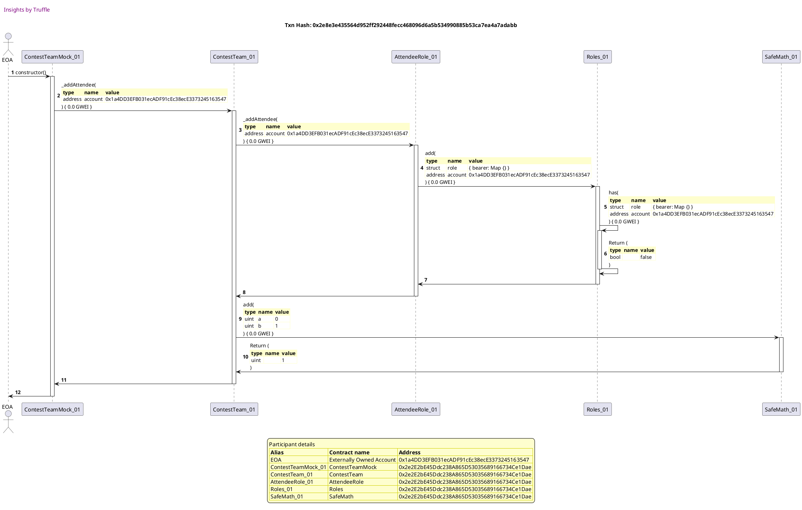
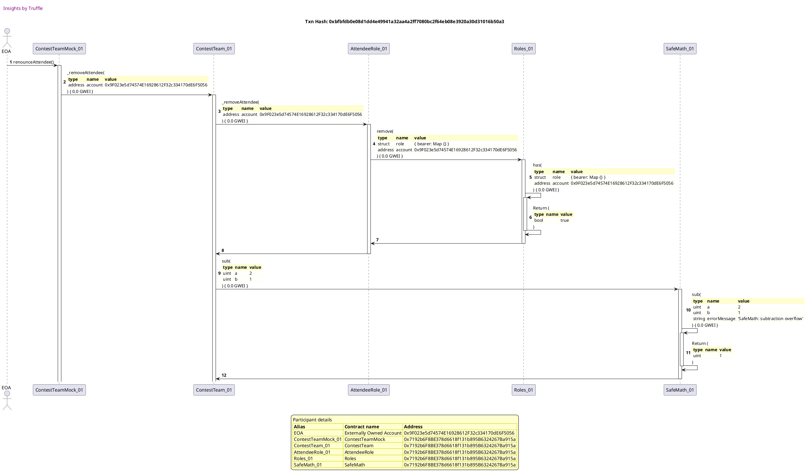
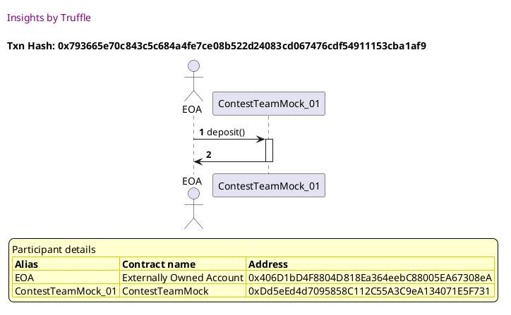
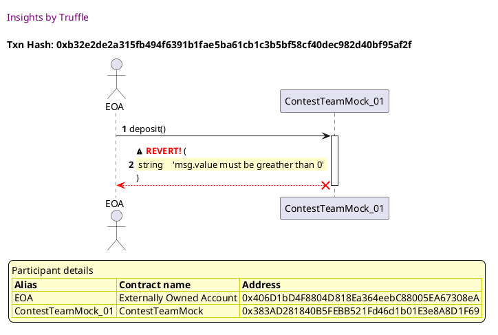
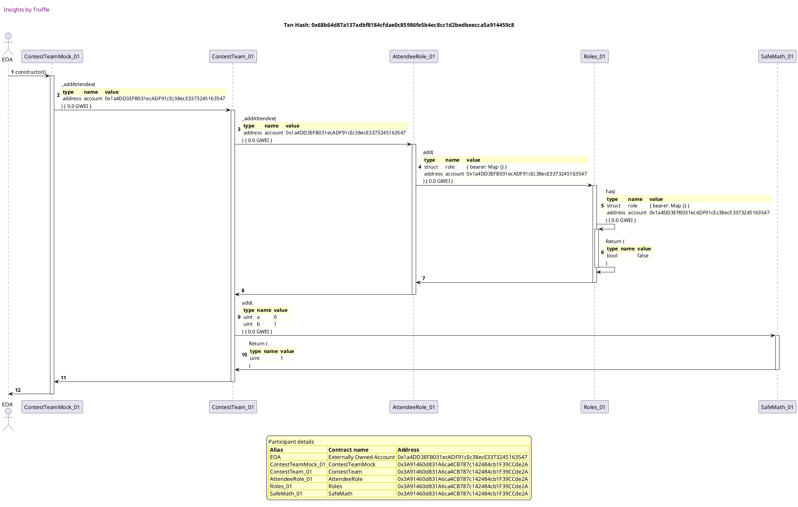
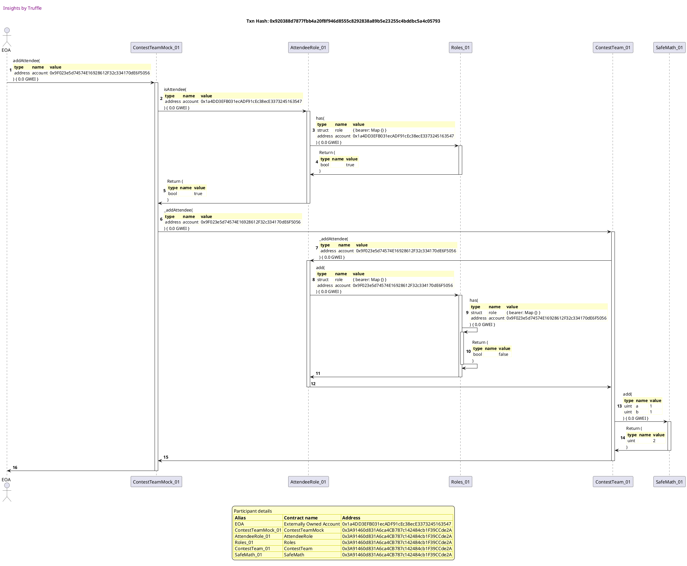
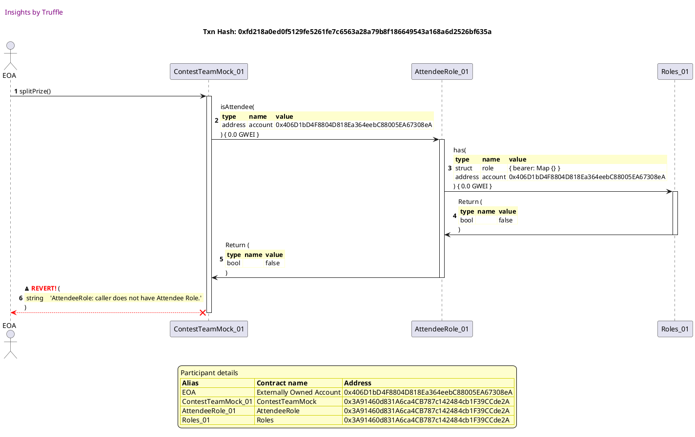
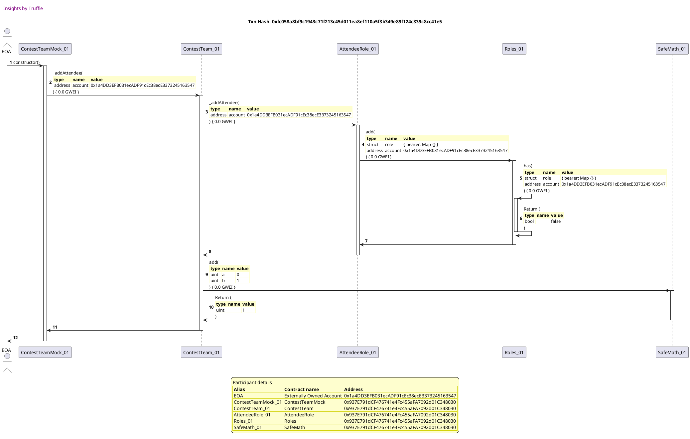
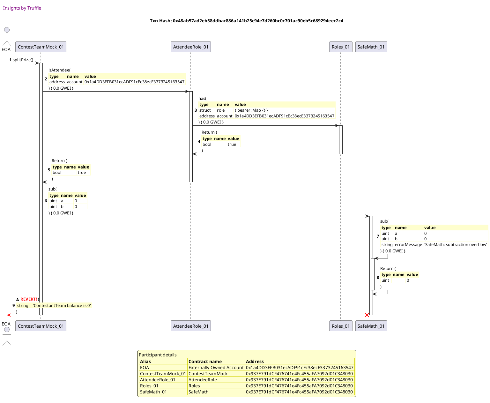

Test date: 2021 Mar 11


## has correct initial member count
[link to test...](http://github.com/fodisi/hackapay/blob/1746d2fc3fafc73d8b2843f0fed53fbd26643dc8/test/core/ContestTeam.test.js#L27)

##### d1, tx: 0x2e8e3e435564d952ff292448fecc468096d6a5b534990885b53ca7ea4a7adabb

[SVG :telescope:](https://www.planttext.com/api/plantuml/svg/tLRVJzj037w_ly9YBo36bjzDArPHQ3fuG210sWiIkYHE6v5UgijbQodyxtFIjBHD-Z2gITEgDBvpVDzzzZbs63lB59Sg7oUCyLob8X_xA5ds78i9btmC2GvHXESyU1xAD1VXHPga4ZuDl85tuJ5scgbPWbq6vM-4F4G9yseAS9dA-2KLYYUz91wACGf5Y95Q6GpeuG9oaij9WXiFxkCN1DrQwMvv6CPY2BfMgTvAUVgr8i6g_Qz45Wz7AWD_1WyoZoB2PIfM2SB3LC0bpqOTqAO6kcYYPTgsOuLjsuWYesrObXjX45YEgxMTqE6sRvjMkwsvRZ4AU0kvnLiyvBxFA6I18khUJGzu1WSa3nY5JSL1FE7awWKvWPbwG3w-JeFd9qqlxUhgdSiQbjJCUqhH4I7UfGakxRTqcmiAPRQqN4usJUvvXDTSZPPMQ_C3nafFuQJRw0eS7tSWI4McP5w4v_28DPfjBLyjVQ9JNj8_V1IFxBJAji-LxBv-0pMR890KV5pAdpp9QL2Olm81ICmoe54GKD8g6cbJdLlzlkaDpZLJnw3N7xJrm0jC5mFFD5kcOTcwOzfMQu5o17FGlcZm_OTtHNbMOrgmtmxoFqo_HhNWlphwaZXj-p6-YuCcafBmICp1HovHTk2QJs3-1cz_qxDt9-ekZNZsFxbqSjA1ErIv5F0nj_mqJOWVNH5FiafzjBrXFLTetnqfL7ijIjEcbsMzWkoNRtbSHfaNaTxI-VJNcuEwiVykwdj5j-AmHg4v4et5S3jk6sLoKMuB4xRen-nshLQ7g7YSP6k4-rfVqxI2CBLTAjyqAA0bjQiLzTuoSLVhkgzb9wFxLA4KF4bcSFDBO0Yz3wNsEd139wmfItW33S_mFSlkXu5XkZtNiVksgPcsuxPrnscPrWNgVOuxuMlGUy1kTzPDpHx0gmvS3VU0Mk_KxxC_1IIdginYPtIdxy7V)




##### d2, tx: 0x88388e043db7e2eb75949f92a1d2c5d206d33bedd671bfa5115752f2136fcfa9

[SVG :telescope:](https://www.planttext.com/api/plantuml/svg/pLTjJzim4FxkNs6nBqCRcntdhHL359eCFY0G8EqB4dAIInkH9fNZRENjl-yIqjAMT30wDAeqjY_dy_ESxvmB8Rk5bagNevGGMUeyAqS1A59S9TbOAZcYAGmWY_PaU3LGUPb5-tcQA_h1ztnltoDakz3NAUmGMl-682DGzBOPKdgGg-GcpxHCUsaoo4QGQRGOwvc2ZmyVJ8vBDKvXuS5PSWEKcpFPYOoY91jGpXhHVTrkVsr0a6Rzmwn81aDTqE2QdgioZj4kqObEWPvFCdeWYs6Niedh2jS5PeeeSC20mB4wPYVk6997HcX51hCZ8GA88jlXGImjpYt7CcA32piEOzaXwB9G8tJlk4TbGJUmtI3eDfs4oLWYrNqa0OK-1pawoiEhIyPhlQVYnMazhT7d0ATv2jCvIxB52PMmc6fE1okXjC1ueducOpYIUZZLdHjl458pfLixhLJefqzTYZirHVpn8hiWsqt4V6xQdRjlL5-FWMARoL7T_fHfYPrA_QuoeA0eAFR240DFOuzDEZup15YHOrgEwN6xOxWsDtnXX4AOt66HP_iMi-m7Avlqbh8lZ7x_uHrYhBI2hKWi-xPca1HlGO1BizyNdh_718Umr_SxFFH2uKBe2U48mxIuBIpJQIVm16Y5VhRVDUoXB5w7jz2g32kG2krXSqi3a0fKbnx9CRszf_TloUoHHEk6R6rrwIdeKcNqTUo2F4yH9bv8iv5khd1eQvYy4O1L8RcKc_NMNhxtfFfpGhrF-2z8ALps_wJKUimMK-gTd19lG-aVPcSiq-8nFLzmB3r_YCofjYNB_AjrlNWhazhB4lzyIHOyofQTkh3-AkXhURV1W9VHTl0zU_2kFYOVwf1AXJmKgkHaheY9GCiaBUO0zrcVCLO1ndeKwnhiLAOLrd4pwBrfuCxcxTpL9HxU9nfK9jFqcXx_oY2YlLUz0ESDjvI8JuIrUGCCpmWyq-f7eI7SdcjRVKimOTbkXzks8ynzu7q9Y-QNIyb5oHg6PoLdqrt3r59fkY1Om-ny2Viu-bk3wAiciiWktl53wJS0)


## updates member count on member removal
[link to test...](http://github.com/fodisi/hackapay/blob/1746d2fc3fafc73d8b2843f0fed53fbd26643dc8/test/core/ContestTeam.test.js#L32)

##### d1, tx: 0xbf39e0471f167d61be21ab83f1d2d414d3fa4ee0980d4c7219d99c0aad3bfbdd

[SVG :telescope:](https://www.planttext.com/api/plantuml/svg/tLPHRzem47xthpXrBwswRZ492K4TAfImzg5grLRQIwNAYHs86XpaE1iK-jzt2O422GyhcZGDXPnzEN_-xdov2o4NgMPAP-EO49RfH6PZNoYIlaHomXGRGoo6Gl8U2rw6AiaalqpYHC6dWJVmBZr2pbCzYqM7GF4R2SQ5Wdav1RXALFIQICtYRXmDvLX8ZOYXNXiCyE4ISfAfIIos7Zn4hmAejTRTCSuZEGHgbAgtGfv_BKcGSlzhcKR3aKx1dy6Zoi8GSOcET2pWSIhXYgMZDXXJFpHTOLWE3QdjS9lwea6Ptp93oXlSeXOtGsO9ORWjWrk1qw0kTzt0O8oRVkXpJZ1aWKRgtcqNM0f7A8y8Xar7GJHXwEebEY5I_IZO-2O9NfuDMjXLrNkNrIofc7UrnYCIuZw9nSf-HxUz85UcAylLPDlaWONYXkdHocfZVaH8uIcSTMfTWTFJDWI9JBNAyl0Sdv1QivtbwwNFUCeh-iTFyecSbzdskPITnJVGiua0b9AD2_cJnHaESlC5880IQGeu2W9CMeqZOqgPrU-Rtg1dc5G4tVx0fO4Nc2qHUARfc0shIMspQJbBb1EOW_75WEy_l6lCimhJdFrkaFzX-XMgEV_rqHV4STkFyLqUD99KY8TY3hvWIgWstB09pD_WxMzwzkv4rQKHI_ydbyxEsd0lTAOaVCmjFqbYv8TNoEAqL9_iRbZD5TntJmfLNel2jEvbsQmWX-LR5XLHPdcaTtG-_cbzKBVstqVzeEYM73Oer4UYjXZkncshJ2xBRMv2blsOt6tKQYuqY-9qWt3Vw1k6aHF6jelb6mSvjC9sjQRUNINkUbrdKNGol4-rK9B5yGnkVqd1eVkXrDu4hkc45MK1xr2tuTk3LiypdHQtRTeAgKdzbjlisGZUi9qUSscJxOMlG1y0kzjPjpK70AyxS3ay06gpKx_F_XGGdIepYrpW7Ry7VmC0)


##### d2, tx: 0x0f936fb104b8c15c7cfa3d6421e26b6855945a3e0e18a6f1ed4ad4697292e685

[SVG :telescope:](https://www.planttext.com/api/plantuml/svg/pLTjJzim4FxkNs6nBqCRcvttLAoYfSdW0m81qhuW8ITnseWqgHndQodyzrtIz2LjEXXTDQeqji_d9y-TxvmBGYUPP4BcmnWXbiiqoOSU5oXxY98H4so8OzxdIT1b_aDVf7aIdAPnAl07rt6TKmUXuqnEOjv6kFmDE0kumDDgYF5PAgB7D94ixiHHFndoH09YA1SABapE84Uv6CMyDd4JFN9CjONiYWL1bFGn9PNekMoFlrOaKFNyyoIB-WEPOM-2RqKUXe2BP2HZZc_72JvZsQ25oPY4jcg47YMQP_bKzqq_P6fWQ0hbYk4PbgxRcivKJZYrc15I7cWiq0pRL6o5mpG2b_aIg3kN7SmoV03j0GAtoSYFHWnCFGKZU2PlEHjUfFx3FQ6btgQulgmZ9VYSy-iqvlCrQxBwWaAOpJNdWwrK6cXigD-ma5ymEPZhhemF42ejnKVjHbFmfqyj33irP_pnBhb3nrN4VAxQzjCtB2SZZg5DsB1iVx8uXqwX_bG029vb67g-3u4deKV6jaiKbUk1gUccvb33LYo3Agwg-AggKPC4Zk7gH3TcA8TuYiaNWh__SCuXLXh95aQi-xQq8ChsOG1bMg-dEcwNg9JxdPvhKz_nLOlxZggQggBfr51rpMmsO8DemNwntoNj0SlUnZUJ8lSBaWBme9bYZpF1HGjVi16UFkFdVLgsDA9nGuwEMlYQorma-6tMUMaQ0qsumCnAUhZ5eOrXiYS2sq9oBJVBhRr_xqdrvuHwd_HVaLBmsF-JKhjPLa-fTt9AxCUaVvYT8OkpPNg-ubXw-H1PKMrAbjLNwsxnbaUbbndywPhCMyhMdLfx_ZRgEtctuW2NqdJmlNZmRZycPtL8eO9cXIgwMYbY0YvP56ShX7kaHmWf24Cz2dKDT0fe0NNSWdfd7hYBTUsdiiI3-rXoaR0udk3BNmaFSETDBy1Lu8OISKDOmflKLZp3jRgEQbg1OL0hf2hrB5ll6W2k66QNsLHdTVZrKh8ksG5uKN9MtHsWrahJcc07sDKITZdwMq3mLHLPw0JkyA7q6m00)


##### d3, tx: 0xbfbfdb0e08d1dd4e49941a32aa4a2ff7080bc2f64eb08e3920a30d31016b50a3

[SVG :telescope:](https://www.planttext.com/api/plantuml/svg/tLRVJzim47xtNt5Y3mmnDkT7qnzY5GNImKC50gIz824dkRGHgLCv3hIq_E-xXBIqJNbOgsdJgZQsBtUVlyy-ryVOIQg5qjamPanaEf7Pq4F5qiT8ZeGIGuYnZp8u5VvZNoMP3CwIE57mgUjstJENiUDKJs9iCoW-0nG1AfYMGu2BH4KlYTGYxiHHNmvHQa8CzSAXIo_V84UP6iMuyk8sUa4mx8NjMWH19FjWyDBqMhJ7tqeIh9p_KgPHVw1Jy2Pmfx8m95oc8nqZt8qbN8Xqq08-za8l33oEl14OGM2ZtMpQXh1C8MnXXc6TDxZdcw5ZeySRQ3LDBYmUM0Ot7Az6VKPBvckYxbvrGAImH-qUesNJaH-D14az8n6OwZiKmrxYFpvme_2hcZyCsn1ISUzeJLk4U9F4EFTViwq6vCPqxZaVhBhSYX1xGW_cNalZFSOAfN3KtYW53WzRe51IjlWuv_7vW6tqNSDOn3ye72PFx-7tyfuTbrdtfMpRi--W9oC4QgKO5ksJY3FgvEupe7HHcAP0FTydEffwVDpiSjF2Mb2tQtNRDPocsN0CiskPlcNPHfq7hjEjyPhpXd80K-1VEVpuwLvIlbN8vWBM5_lVLb1XcqjOP46vUpdrxIYdMcL-pbCH93LJy50eL2teYH5CN-7rJufxrr5LDH3f_oJfwAW5DwWp9M4xMLwInCIFlgIlj1wiprVD5fhsWoIgd8t2TTE9MVuxAVOcpRpjH6HHiSY2VkQQpQEViNbDL-R_6uIAfChliXcWKedgKTQ8VfvS-tCg1GUjw8g94Wbq7bKO9y_xsmZQELLA0KiBkc7AZTlFtWe8ThrqkGIeHHIdIpJE-JddFAT1TGBTDzJ9qNBn2qAT-TbQnBLdnTLBpx569KKSJ-3gMM80dQrEtpBmXgkxOYpWwqRJz9nkuzIrwet0SOn6Q5Y6rsZMJXtBj4sdVYgQHary25-1tW5slHHOjUm0l2WPokuEKCkbnVleTm59L9bPx8IULC3-0W00)





## returns active members
[link to test...](http://github.com/fodisi/hackapay/blob/1746d2fc3fafc73d8b2843f0fed53fbd26643dc8/test/core/ContestTeam.test.js#L38)

##### d1, tx: 0xdb0983c30c0ba31527e396015925267e279e0ee58853cab078580c4da31827e6

[SVG :telescope:](https://www.planttext.com/api/plantuml/svg/tLPHRzem47xthpXrBwswRWv9844TAYsmzg5grLRQIwNASGw86XpaE1kKzh_l4W850WyhcZGDXTY-VFxytVdY2sDdgH7QPAEOCP6PH6MZ03LBdoCr5bgC8CO1gl1SoEU1JZ8LNYHnek5JhzlhNdGPEqtDDCOMW-8tH16YXbav1BXCTFIIA2FYTXmDr0YL8SQ-MG9wz71EESxqECQr1_VH2uBbB6st8WmZDG2BbwQteZtzMefWvVfNAeq6GvD2C8K7dVNxnCjCP6A4Xuc2Iv4Ecy0dOS1zpvOsbpmGjkNM6cZxTMwvVisjrHjOQ_Z84LtFSsqf0jxmN8zB9oIiHzWwev19GzAxDsqGAHnGUy0eR2QIqLYGgnVa1ARc0SNeEf7FJzmgS5NppcbRfbJWRMDeYn3laXWN-0tR-eJSc2wGYy4wv5xqyLgOuGArCZvWhF0KJbfRNO7ZuoR8HAL6Ptbu3e_OLjZ6zENK9zhbXVp3H_N8Jiji-roshTTlOAPZ16gL61NjJn5drCdXhq046jCKg2Sb9QsX7fzOmkbqx6xldDiModQdvrkoAsqFPTUs6tRDSQswxJgDESiHp81_uV3zH_UAygoYD5U_6UH_M7v5Qgv_kVM5S5hsOthd6qqYDV5HCuC0XKRTX6inXjaRlFrDpzwTgBeq5Ed_vDB9IHFkq6HQmSVS2f8a9drqzKMSbkQZpGMhkKBhxaYXocjHGBUzBAido7xvbaL5b4KUwGrRG7zhUr3NrjybVQ_ebXfM96oFnDR3S3DkQyVa_BZD8MnUZzdjobaTeX5HdAu8xl0EvpmNJ6MNZc_gvDIQojLIUdkHkCjvhTUYaj5zOb0h4STJkFcbC8JsXr9xbNXB9QmO2tgxqNCSwTHbppaNt15juM6xuNBUhuMUYxujVT-sEkSxwIlKUz1kLjPronx4omfSTlUWMgtKxwC_9IIdoinYPtIdxy7V)


##### d2, tx: 0x12dcbaf3300282bc00bb17a32c902256e71c2a9497c6e7aeb7b20e6cc783899f

[SVG :telescope:](https://www.planttext.com/api/plantuml/svg/pLVVRvim47xtNs5rBwksRWP3254NbJImzg5grLRQIwNA69EW4eYCsPAc_Tzt4FARh5spQ8q8je_pv-_ET-P0w2HJJAfy42F4SfKc-S0N4cKFKJ9aaWrmB7eY2JgCF_HacYV1QHgd4d_mNCyzTH4wpjGu5cs4orzVi418FAc669-bCdfC4yLY9uvwoK0a2X13DLVmuE4KSfZBOInM7jn4Zm9hnbnsnO8WIdfO8vNekMoFlrOaKBN-UP95lRxAi3_6jp8FGy15AbAnmBUZ19-nhD_2PAJf0VTPI2aXUbFtEI6-hrcCwjmckcusXALndTc6RN7eC-5Rlav4WtEhIPks7I9m6LT0tRrqCClm0RG72Doc8XuD6PXw2aQ8JDqADhX8-SCzqKgzJV7gD4SfyBaGrsaiPdFMPAiJ2c4sqvmDjbAfeR6XViD2SS5KVwQxD3v0gBGK7xLhJS6VFhKmxDICySUxv0uTLn7pkMhRJz-m6Wy5XZPXWxBzoU8SEeNwKm4WHPPXw74EWQUWHqQsHtGgpC0oJCjmjOQjDnkQxi6MKMfe5WdSXcSIip55ESGJJBuG_Fs7UmwnKaksC6BTjwK5KROF0pHcTBlKzJg4Qe8xNS_MkCjfKt2NKelgXgarg6bOzGPi42tOp_UxfDrdsTluPahcl20f0G-Q2VO5aqAsy0KRuiapVjwdPGiZQZVawAY5huNAPOBVPfsVfZ7GX0lChAI7MnnQ6oPx8h0j9DToizpQ-_UUL7zEgFT9_nKf1Sl-dvJQpRBLb7edfyH-JFg7sHcoE5kavokEfPSFaINLkcHPVhNk5czvL7gPmLzRa_aBsRfJLzRVHdqdxrOSuDBh3huN3zxjn-Iq3YbKqBHGHLTBHKmW58lYR8bmbtG98GLXg4UXhe5E0IsXZfjJTsQ1Ev_NVYfBFBYFb909Y-CnlloLY00xRte1BWFNb8WRmXAUMfvXSAF1FQF3YC4SrXIEPH8Iwa7J53RbjasrRcSLVhsKN9Ni03mlEQlk3b1hfUcAO0VOvH9sCVfRGF1L5Lde1ExmeVGR)


## allows deposits and emits Deposit event
[link to test...](http://github.com/fodisi/hackapay/blob/1746d2fc3fafc73d8b2843f0fed53fbd26643dc8/test/core/ContestTeam.test.js#L49)

##### d1, tx: 0x396454ec5329ed91db4f5dd99518cd47a0e112590e2a07cc7d8b1df640bc1f81

[SVG :telescope:](https://www.planttext.com/api/plantuml/svg/tLPHRvim47xthpXrBwswRdQ04g8kAat8seUgLLjfBvKgWqs2IY0oPakQzh_l82HD0dbOeqdJ8iBPn_dpT-VZ3aBECysLpiSn8JpNQPAFVQb8zXmb4wxu668vb8cuuC7pKALv8dffd2huDF06NiyZv2pJirXs2PI_aUH2AfXNKu3BL4KlQQ9vxCRHC1dBH2DYg5S60touW9paQXBBZGVtqOi4Pgvqjro8A1a2evNghPHdNoiIfDh_AicYuKXduC_WGULXYBX4HpgMy31Du99demxGgU6ScfOf0yjeEL8uJFXcQ0dXE1Ph1yAqEPMCjIo7oXQdTX3Oekqp4PwQr0zOs6O4GnPefExTkC0pE41vG31iEWgY2KTNU-Y4pFI3vEFhD7X-egoqgwjtBcjOKZDtjSOZal8kZUNIVaktkQ1GPalBvMJJv9w7yfhhqT9gRNv0IEafd7GRNO7Zumu4QP9fbHVXEJmYZMPRorTBd_2Kb_GF7vD7SbPbs-TATb-_WPvD9A1C-BYKFtcSuw0mVmK4K3BB04T1W4chSKIdZ9lzlk4DBgZ1PE3s1muBlC1eoy0p3DjecHOxDIpJNg0SmHpe5mhVVtXNc6SrfWNxxI3_m_HhL0l-gwClYUEs7-ExE6WagH0FnHnyoPLK7RZc4vY_mTlVzEpTYRfB8vxzJowTd7JWJkfS9V0nj_mqZP4VNY6FiqfzjBrXFLTmtnqfL7ijIjEcbsMzWkoNRtbKHfaNaTxI-VXdpK7Ts7yNzRsYMt5Oez0SYSPYk1stZJAvABU52LdqOtAxLgk5r3oAipN2VTgdb1Q4iUrY-SP10QsmNQsekyl4NQthlfQT3EzJBLN2utW6DxyIAS3zK6gl0pTqmfgoXEyBIth253PrhBRLxc47xbcMQ_GSwJB3f3Rph85ji9tmDUWzOBSxwwPc3-1L1ww6Uq2jT-htsPy2ebDLPf5plEFtu6y0)


##### d2, tx: 0xafcce4eb79ded24a09cadb98284f5f53c41dc7929263b3d77bba1c50bb14e78c

[SVG :telescope:](https://www.planttext.com/api/plantuml/svg/pLVVRvim47xtNs5rBwksRZQ64AgkMfR0keTgqrffBvKgOryIL0AHCLj__kyxA4cJbAnTisgD2BQFy_dxpdVc8EHZOQMnvIGbH9Ospyf938OKPqasbKPEQ0eZoFGdgSv69YyptS_JtD1NKHY5_P2GlS9UfB1FQFqRWzHWw5KpfFGWDybbdbcPzj9ab4qWisXnQESA4JwyDJajpJI5fGT7oILGxivbtwJMIJQYd3MYcxhTUz-08CtwNx8Y6OrjGUCBUcpAuH3j4flO5EZnUKOFP37UfUnS3fK25s8_qA0TLx90IHq7NQVh3hsX9vJBjV839t0w8XRQz-DOSkMnEEOk-5r5q6NA8lJmQu_AWcvXkqNGRJPHoLGYrJwIWC8UWvmSvkhibF5QxxvuULhFMlGvmFSyXTcS5TdoX4fOp3HdWxLGMc3SKp-IGpYKTZpJNHXl4L8pfJlxhLJecpUx57TgXlZrINP2zfg8UTkq-zSVgBsO0iKsavEw_IdJ4ZkL-dLbm41HKEmfXO5diSVEWuWv0ZpjkvxlXhmJEDqEToBXA25SxZCTTYAFUPrRAzlqYh9tZ7x-4Nx1M6a5Mv5OzMtD82cUWm2Nxc0WmkWJ4nnKRn05N8LAT465GlZ2SJtU4PxhjnEu1xH2Fz_l6lPO5a_3MrXJgWgaGNlOND4Of06pIm_bb5xTq9ldP7P7edL3TdPswNUmfSdeqzZ5UPuYJBoGPYFTNkFGrZ1v9W3hGd8bD-kjFNtfIVNdX7gPy1-HKhZi_qcfpPWjfzGBEIMUXz8_pCwXJ8kxz7p4iVJm8RAWsfOiYw_MpUAjJ6elI_pp5Lby9rjrwjBwww1lvDq60rvEsy7tuC6x_fYyhKCg5N9Rg99l2qMC1YkJj5W0F603nbW56EjHh6kmKvasMCVDeVTcWJkVjtzTbtXuFxTWCfcc5_JhhmmqxJtf1RXekAL4l2UipG-q1w5sjSy2h-jr-vmxVS_hYNu0FIvSvlFGYtp1byslbfBBaWqCpqlEfhk1gPNIT4cmWTd54lPkzBS6qLTDP96FUCSFfTy0)


##### d3, tx: 0x793665e70c843c5c684a4fe7ce08b522d24083cd067476cdf54911153cba1af9

[SVG :telescope:](https://www.planttext.com/api/plantuml/svg/RL9HRvim47xthpYbBvkwQdQmWKHPL0P4tSFKIitxPEmZGG4J6QCbNVlVvn0KjMhyOEFlk_ku-yw4t7TEMjStDI6oTwtfcm8jwNQLsKih6wXnWqR_b6gtiMrlTDhMhOMRLRxAqvoGHUUEDIu936kBKgE5V-CLuA6rrKjhdAoJkjgO1etpYgMx1AmyUPRSztPVumVYkNf1OFo2FKcjAxC1HaVeRJWNtySYoFZ_NwQhDblNGN64jUtBqkiILxaQONqmy22xxHpe8Pe5OIWmeYhcWH8gZBda9KOAQLo8wLHFEOq3fMaOyIXKkXHynXWJWIeaa-MCUCkKywNdZmd83YR-d11lcwjKjPU-rTGtWPrResn-jshtXx8XxZCy8MJ8XhlbLHfkR-UWSTzsbVlobLmDEQMUDUxcGCXvSEJfNJaQdQpgZYp6yNsxoMX6ALs-_W0_7r-Q_pX9MzyN6DdW2KYqjjXvxfAtV1rQzll1eJMohe_m-DUWXaGf_qYSf-Y1qp1ZHSPNSKnv5hCubq784OlK0rJaIHW5DCRae_0Lopw1Wtoc1UQQwuZEH2pYbB5fAaGIf3DCMC1fn7AnYWAVJhmFenlatk_-iVy7)





## reverts on deposits with 1 value
[link to test...](http://github.com/fodisi/hackapay/blob/1746d2fc3fafc73d8b2843f0fed53fbd26643dc8/test/core/ContestTeam.test.js#L57)

##### d1, tx: 0x384fd26d65d3c76f2543635a1c4c602a50defffa5c3bfd131d3c331482e222bc

[SVG :telescope:](https://www.planttext.com/api/plantuml/svg/tLPHRvim47xthpXrBwswRXX3IgEkAcbWxKFLggsqbqgL0PEW4XCPioLD-zzt498cWJoiqQHf4U7iu_pvk_Dn1o7dkUPA5wEK45xeJ1QZG2YIFoTop1KVGIe6GaOz7ZuFL5R8w29BCmMVVC_tBZn2JdCzJSKPWUet53mI2cRr5E0oKybB9ZLFtJGPo96G6X5ZlJJmyU4SSboeSIhM7jmdBmAejTJTyYXAv02eKQlUAddwjIP1wlslP9uCXZg7O0eFgeXZn2KwqQc0Xuc4IvuFks1Cc6F5aTc9EdR4mkDERDeMwp2Rqz0AEuR9RICISHnpEsH17556qOmnQZccC4qp20c6BDH8tRjnWUUmXtAFODXq4YPZZgvUe1CYrm-2ZwwpyFd9e9LTKxrrMSkIXhchDHwH47TPAXRs6xhr1QKoNrWk9kiczpmMrrmF5rOhypr2Aa_XwApL5JWyx4AOoLoheWpF_W5fDTjOlbpwXAUyeB__A1_9QPrjdsjvzleDz7Gi0ANaeqh-v6c1WzBy5H10YJm778KX9gt6aJ6XtEhtcUVt34P5wFRz4nfw8ND4w35sp4pBfdZwrl4SvG1cO7mnuFiFxmhphC6qPByPv7-OVeDgoNzvz1LntFPZVES7ZIGLug6OGI2u4geBrtmCipTu-vkUlJlHT6d8y__9fQEZBjm9NIW97tChoB8K-U4LypIlrGUR6pPp1VVTaaADrw8oRNjPLYl8RlbM95MKUHdf3Ls0VzeUrBNzjr7VARerXnKAxP5eBOQRSLiha_DoMvgGUJycjokrEXAQ9sc-GhXlz0t3A0bZsyNoZOCIMc6xMb9t5ucxN7VsMdKol4-qK9AdwHHkVaaHWVkXr5u5Rkc43MK5pnpczas7EfRHitslrxDDwaTM9wA1GJqc7DVfKxzpiXM-0Rq3x6PdNTVi0BpimFLm1wZLJlq--rD0TAhEB7AET_mU_0q0)


##### d2, tx: 0xda919b7a9e53d26293cc78962b3b957c8730787ddd06aa654443a009467aa2f5

[SVG :telescope:](https://www.planttext.com/api/plantuml/svg/pLTjJzim4FxkNs6nBqCRcntdjM8LBKq67n08aFO52Jc9sqQaIUKuMqlXl--Ifk_fO7JLgDBOlfpFptE-Sou8dMIAIvKFOeHuhj8a7_X2ekmXIePSyW6EHKyaOPi73psPvabuciQfn1yyrtDFNOIECpMEHHFXyjSNF1GIJweXncUfZ1xJHF6u5KUzP20I1HQxQgxWmSEfoM4kXx5OUN0JFGfCzRdiYeTXbFGm9PNekMoFlrOWKBN-UP95lRxAi3_6jpBlTi4kKf6A1RuT9VYCP_q69gEGEzJnBUu8WuMQgJai22pRCJMV-OvX1RR5Y6LROHWIatFJq7MTSK8StRGurxe60fS52g2xbotCCtm0xG42jwaeY8OSg9u22P6fMy475sdmS4zegRSfNftMKWfyBiHr6elPd3NPweH2cCqqPuEjK6fWRAZVyAwuuAe_qrqQ7o1KCiL7pLeg-DEd1eQTcY7-U9VSeUCgOZvNRVFf6rRZeS3G9dnGjZzvd4EdK7yg34YHPHXwGG21fw17Hev7D2QCqD8DItUfwMYsIJMFQG5ZEhL8w9gUGGnpQkKGJp3vGl3t7-uvn4ejs8B4kczB1b6s3mAKwvqESxqsOLG4hOxdqC0Dc2q2bp6BQRf1JMReLZs13Q05-lb-bx3xF7iRtap9F2X0Ih07pGJxWaiX6_Y23_7a6J_lazc2HEs671qryBLGkKpmszZvQHe3JBY0PYKztEBGsZ3P4u1j8RcMc-NMth_tfFfpGhrF-Az8ALZs_wJKRinMK-gTd1BxeVGFixFBusoHdgyubbu-H9PKwv9b-TMwMxpbKUbb3d-w9lCNidMdhgo_3VfEtgqmmANL7Nml7hpRZybf7LAee6cXYgwMYfXGA1x5sHBW3kaGGWh0K8z2NGETmhI4EcuElJKBtFcyvbDPui5zf8HCU1oFyUMlH8IuzQONuBBXcX9nGrYQPpPhTJIRsZff6vxRRXiQzKBT3AbFgCk4tR8xr3ETLVFhfUIgP0V3yvApwkvWQgqqNH7iO7QvX5sC_jOW-AgAB7G2T_XG-Wq0)


##### d3, tx: 0xb32e2de2a315fb494f6391b1fae5ba61cb1c3b5bf58cf40dec982d40bf95af2f

[SVG :telescope:](https://www.planttext.com/api/plantuml/svg/TPDlJzim4CRV-rFSG1fGnd3-BaLTHDeaOYyc4AlsPaoJ4r_IYCIf70SATDzzrpP285WKsSbpvr_EppcCdNT6QDCtDMEYDwtgcmmrwsuhjHHQD51ZYKfEHNvRwhPNSjRMhORzD4cJMSBOf3CFDOOCjjS2XKGDJyChm4MhgyTM6L57TLMg1fKXOc6U4r8Axf3BNYzhV1NuKJqYMEwpTYMah5G95X-alzjvSZeKmORlVrDTLIvC1za3p7LV5CHbfZ8rmdobu49qYpFWgyonqPPe2yVoYimTkuNlZAtCAWHwcV2jFBDo9_EomWlomkKIyt5WIvTdnTWJXLqmiYmtL7fo6O7eO8_cFKQscIglbeAsEgDDO6VcA9hlRNxxXrlRlBVo7cFRrN0IlXk6u-CpaBXikyeS7h5tKrOdl_OrojyRn8vrSWQJZ_T2Ap8jX4c-QntbXAFHTV8pkPv_68qcfrizXCCRTSCcGsS_3NEuXixeZUbheFkWwShFTwBk4Pg-Cv0Xb1g5MP3hPY4Ky0DORpX7J2APKzq9W__PyEvaiQiNVaaqeggx5rN4FEQSX-klG0U8lAE73KmJ6vHeS2D4KchiAFQyZghUz8J6bK6jH5q_mEMzGWbHdjCfDXJYAvVxiPN5RXe4t8q3AqY4uxk8sOm4xYMH_yNX0KQlmU_qz8sunJk14yKsOLq-zT9aElLiAvMkBwsCMuc3GHJ4LkgF2Ky-36wmSnhfR_m7)





## does not allow calls from not members
[link to test...](http://github.com/fodisi/hackapay/blob/1746d2fc3fafc73d8b2843f0fed53fbd26643dc8/test/core/ContestTeam.test.js#L63)

##### d1, tx: 0x68b64d87a137adbf8184cfdae0c85986fe5b4ec8cc1d2bedbeecca5a914459c8

[SVG :telescope:](https://www.planttext.com/api/plantuml/svg/tLPHRzem47xthpXrBwswRaaJ8A0EDOMmzg5grLRQIwNASIuGDJZ8SJOexN_V9GGA93oiQD8q57BsvVpvk_FbBeoTfvehdOrZndYc4vcDVLGiVOxaX2i-XXY7A8CBBfw7Aibaq4lYHC6dWJVmUXvZPwcUnTXbKFn6o0DKC2-d09U9YbuIgNdinj5GZb5gGWproc103nUGaqnDOjnuS1-z89ZsIdVBWo2IGp2DKlLMoBEl9GbMxdybqsWuqYduCtXGMHWIBjEHZX4UfX8kUJhgW35jEdxJ3fmMDwqM3_pGCHrRX057GpYDjjCCiU7RA1mXpE3Kny17588tUDkqxKPRE8n29ZHHzsvSu2aSa3nW53OTYMZ2oTKUEO6fVa0-lax4yvDX5dPLzSvbDKigvgxMT4I8TqcCI_ijtUQ2N9akBPUJJPDx7k8rrwEbrThyWB72KpZfrhe2nyST48bCjShoy1mUiLgphUMhfKzqoalwXu_oaPsLsVQvbDtNRw1d4mIIaeyB-PF76GroyrSW08Lf2ZGIWf9MqyYOcjpkzorlS65O9WgtFsYRmXEMWyAph9PrQZVCfjMmMmkK8vY3ySM0xp-yAygp2jES_NQG_s7w5Qev_zNH5yHfsu_nNHmqaLI4Hs8EFdA5gWFNV0BpDtZxcvwzEr5rQSJJ_ycbavCEtA7Eb8IFkUKdIKpyw0fvd9Rge-qDgxb2--v8eSfhKPZMlIph5MI_VCkY8ieyZ_IMpgU_MH_KZVrtKTyhkYM7DGhraQWjXjjnsoYJYtARcx15FsQtQxKwGCsZE5qZt3VwXc7aXAdjKlccGGwjg5sjgBlBn5sjwxuMdOpkKurAyZYUmSqlYG6u7qhjTU2QJbXH5l2MI-srQGIEPRfDmUtUHSjf2TC-jQav--R0QlTw0PwwE-4hq7l0RdVMJSqUmAiEN0xtW5hlrE-pFmKafyhCOkTqf-_1tm00)




##### d2, tx: 0x920388d7877fbb4a20f8f946d8555c8292838a89b5e23255c4bddbc5a4c05793

[SVG :telescope:](https://www.planttext.com/api/plantuml/svg/pLTjJzim4FxkNs6nBqCRcnFdhHL3X3OPV40WGDeN9EGuJXkH9fNZR9J2VzybJT_JmUYgKQMnVJcVd-TyvrmGEiuLaweO90YnGcLfCGY4HFbzd0wPP0ESY9v8mnF6xtioAzAmaoMPn1zyp_Sw7aA7kHebuWZXwjSNB1GIZ-iXngUPZ1-pLB74JU9UEX2f0ekHcYduy71YSbZ8OIAM7bp7Zm9hnansoS8mJdjO8xNekMeFlzOWKBt-MPh7lRxASJ32DxA88h2BLAmIWMyUKdpAyduRauUMJgZZXBPZsr4G64mdaHEr32jqJDFaZjxI7UemfnMOGgSwY8mW30DkCeCJqsvH12xZ2g1x5ovcETw3TW-1srJCuo43gXqW8N9r8zZWFEFtTqIhzDR5ozDSfS3dGbnbYPZEMP4jJoY5-LHpEjW8fG76clerYyGvK_sfxi9u3w6AAJuuQgI2FtrgOzYfAUAFj-ajEgmZvdFT7Zrzmseq51ZQb0sgzYTB2kYKwa-b0Ido74EFSmWy1JtOCf_eL9YXRPYsuMaMR96bwJxLEQM6PfFGitoJcDR4oZuUO_A5uEy_l3E8bKQm9ObLtrOCudmN13HcTBlKyqy8rGHtktvBunwdZk0UfJRL3LEpg6dOpGJMW9ReP_jTmUwp_6ruSoKBNeAKO0-QCGu4aqAsyJaRul4pVjubipc9nWqvE6ZZAw4AcUAtiGkoB06OS07DMhg_mQ6DOR8Z09j2SYKtgwszU-z9zUU4Uf_mNv5IiEp_IQdjc2sdr3iv9NP3wHzcPyIIV9wUhpYMNZv45bIRacNnrRfTl1LnvMK6Vsr55inbgqvTMdyJzAsyMsE0Isyw-5uyU3SVavCwf5H1aq8LNIuKCQ5GB4xo1S1TqYM4b82X7eMw1ZgbQGbrt0owEmtSsRoZfwh4W_k34Z9bIJB25xzI4MBtJI_0HSCD9UAQi39FtPPcM2HqgEPQd1cT4oXSkMReXcFmGFDfgzC9XUukcryj9PSbMnYUbPnrTmjJAwNfac0Biuibx7pqjmR1LtLaeMEumuVIRm00)




##### d3, tx: 0xfd218a0ed0f5129fe5261fe7c6563a28a79b8f186649543a168a6d2526bf635a

[SVG :telescope:](https://www.planttext.com/api/plantuml/svg/jLLjKzf04Fv-lsAhCrMnsWk441ZA625KFpWwr6a_r4xdacmmOxWmTnS5N_vxDo5GN_13xSWmxEN9xdFFxkqjZ1re8vJ99obZ8ZUPp2S1AgQl4ZaLIamWnJ7Aw524LsELvJBgPsccO7Fe3_s-prXNctcAFGRbvn95X0hkgaU0eqmbjvaq8lNIP2mdA0qnncRbCAIN2yffhgOfFddnBRb5iEmLTYQYA95Zi7W5FPIs-xaImQhzZwLEnfT6Gp27SvN7CV4oavWKuNmcuKZeomxmMHpLBLTmZ7ZSjEhj69jrnugn5JfDfo7ghcYr0pUsNCUnsqsx8Ip75KvK9wyWTXfDmQXaeI7f_ga7GiC6sGr6PJD9c4m5fTgd952RSnIJaooy-isjqkyb_3JCCuPgZZZAKbp6FCEU1XIWNdek7pOOAnN1Nc_jbh2xsm4zJHDpHeU4spjihLSH_NppCZJHItZxGbwmRjKJdohRk_y2PZv582l5fBJN8irfKRZV0nscGgs1Lc58hMLenMSsTmPMCB27hiljWMkvlcWuDcBG9u0tVSzfDRYBte9b1-w0xtFu-iC_fcvuARHGlof8AVjIwBVfrKRbOI5I4H-PEmXGA5GTE15Jk7k0X_VCx6yIQmzaRwy38pIval2sx88iIqacVMEHwWhUUQMYQ_lalHIissosztDJOVIh4BFeSTgz-_56A4a3eWVTS36coATNgutyx_xe_4EjrlrSuhtN51PdN0oOKiNMuzGx48eqfTaIPQX1PeRww1fNDxMyWVjRIyqHqc18heN1zPUTBQOgEtjqXoCq8adr8rK3Fk2S5tMZuKatcnO5cIBkLGMzPQkjuYYBOXxHxyoWagHw3gSt4YFmtjICZudNpBCNO4dVyDgMxV38RLYU4mgxVzXoMw5brstN3WDhs6Zt-n7Mdz4_dtjFaVyWNit7QlclLAIXEZ5sGB_qR_a7)





## does not allow calls if contract balance is 0
[link to test...](http://github.com/fodisi/hackapay/blob/1746d2fc3fafc73d8b2843f0fed53fbd26643dc8/test/core/ContestTeam.test.js#L70)

##### d1, tx: 0xfc058a8bf9c1943c71f213c45d011ea8ef110a5f3b349e89f124c339c8cc41e5

[SVG :telescope:](https://www.planttext.com/api/plantuml/svg/tLPHRzem47xthpXrBwswRZOE3K4TAeLaxKFLggsqbqgLSHo86XBaE1kKzh_l4W854XvMD6aQ2ZdxSlxytVbo5qBEKoEqoSOH8I8pIPoD1qgJz3cC9qABCKHgg6B_GiZdeKwosEybKQBXa-TwRiybv2mriqXr21I_aHA-qZ0lfm2NYGvVajY8g1k5mtYiOeE8WLaPUFXm0Jd9z2HI6m_kmnS5p5hfReNlX_4G62rLRuKy-rgI8EN-Lt4Q3aScXS4C7dGM18XBJ6WY1G_J62v5Ece3dGQIDbkYDGWSoHoBIvi53SQbrVGfOqgqLC0O5Ss03xZbg9OJi8ObENTaIqgBgIR1a4c3rDsRBeWK3b0U40oR2MKu4UXg3vrGgNbGOdoToESdoWgxgdhdifeb5VEkCNX4IjqbaLhQR-as5-JAT6cvd6oQt8j0NGipMbgjpGy8AJo5aqwjAt1yt0QPnAdHMHwUmoDIQxQrVBNq2KzvIV_mCNuaPsMsVIvbv_KRcDb40SfOZ0lvKqGP3dBpLq00hT8KS2Gb9gt14PqoOVNxtFKkA6TATlkUmwGhUKj9btERDwmcE-LDorwW7C4Sw1SAtt-uLvXd5QOv--qW_yFqArHp_gkZBuZZjX_ZkpXe9AaH3yKS1afefTjmBIOmVuEtl-dPknDLbqOY_PzSEZbfmvqocOxXOsuDaYH2VdW58afBzT7sXjLSmNrtf53bjIXCwrwMzGgoNxvbOH5baKTwIpV0FwiFwiR-kwZl5TsImng5-aZK5iFjk6sKoKMvpKt8eX-JsxLQxIiZmYXT8zodVKffJXZRBfPl7EJG6jlLYdftcRYhTPtNefFXVMgKZaKKpU3cLwnyw7uejTU1QpfXHLd0EznsROVvFS-oJsriivQ77RaflAvDdGPsvXwtMfJJdV0Lw3rWjplhfcOFu5K7BeTxGArtwlVPdmAYKsLcaNEyu_VWRm00)




##### d2, tx: 0x89a89b79699c1781e29608ac2c19eb583103bc09be23e5b9c67a6886359d25ee

[SVG :telescope:](https://www.planttext.com/api/plantuml/svg/pLTjJzim4FxkNs6nBqCRcvttLAoYjCdW0m81qhuW8STnsuWqgHndQodyzrtIz3qTZAuQLHhRb_FvUSvtpWMXaqmngV91Z13BLPhaWq18b3r4oP19Di2nw8aaF6NyeIVJF0dRQPnA_C7tVA_j8NISgN4icWYNlxvWeP1uKWqnFajbz9WcYiMjEEeb0v4eiDXLSmKV7avD3dCvZCNAWvleKM1gp6LNB0oZf8SfgKJFPNlyjGA1glNFaopgzLM6Wp6-bNct2tQHYbGiyEqemMSiwpSm6JakSzp0TYtNvTHsgD1SYpYCQvow8Z0TdH8zuCGDXAOBCt2vPJFBSIpTT4FD560JCQu0kdVPmYp31z0U872RYdWqP42r3IH4fcu56roa_E6Uq59lKxmwhQKK-5o8wpGMipbhijK9XJ2RQSu6Mw7KmDXGls5TSS5KVwQxD3v0g6IAZvgrLF2dJmqCEpL3_F4kkKF7LSHyhjhcqpUinaE1eKtOe6n_iZY7Jg7-L1YG8iimz3Y7m5FG8oFN9yLUXBPXseP7BLTpBAhvkiPrtQ0s2JtBDubfJQqSuWacNmZ-_iCxXrYf1LkGMFTjoI3Aza60CgFJqJt_bEXKy5R7TodtkEu8xkcwhMk6II6-3BkUm0RG0lrylqlOVPQz3M-cPCuBa1BiGJF1WM1Io0Q-O4CyUSRF-sIs856x8KT73NmjL2uJ_3PsGPh601Cke5b93xSuj3PCzWHWMqYkvMQvjVVlFQd-d53l4_uhKWgM_JyfjHkprPHw9wV4VYZzm-piiZXRfEShZgMN3v4brRfaMNwrxXPlULHwcS6Vhic2XMpTgIlhRuE-atSh371fTGVVYmVlzcDoMeSKAcXQgAAhfI8c58f5SRO4k4CwX902CDIZKDT0fp0jeOwRGs_D0dS-h_bKbdXm7oaX4nR7OtpvAn4XRhtf1RXikAP4t11ECqUtFTkbOTitRCisg31yRfWcyrisSRMGqBPkE4Gdg-RNIybLoGw6voLdrTt1r5ffkYBOmUno2RiO_Qr1y5KLMUW4xl2Xz1i0)


##### d3, tx: 0x48ab57ad2eb58ddbac886a141b25c94e7d260bc0c701ac90eb5c689294eec2c4

[SVG :telescope:](https://www.planttext.com/api/plantuml/svg/nLPHRzf037w_N-5rqhPswtOXWK35q1Y4RG_LggxQ7hPfSYu6eeOBkbnQkhR_VKu852Xz6DKqXF2Tp-VxR7-o4U9TPj7OV988WRbDTJu9oOZiFDPJD3Y1X4Qae_UepaScpNNKIvFKmDD1C0XwWH3jp5ubr15GViQ44HcuhhO07rCJ_qwrnQIRn2Cz8MtPuz0k3GPyE7SvpSqqeRM3B_5l0iTRwaumYc8z0aTMgjjIjjzK84Jr_YUTnQEnpI2yWZEJ3uViLzZO9WHdCmqVCHiVWPnvJGphFaOr2klDA0fHDPiDT3mdhDLLooC_gZLagAJofOEg9TbCDPgj6X-HgYbFSCgKPUZ1vovW1diizmIdpSOgdYA7skCWABDdX9FZL9t_aavfTr-zVgrhBUUSw3HDQ75dGxT-eL1c2yl5Pjta2mxf6EruORMotnEYX0w7dQtOuENB8yYcIMnFk9hqObzijIfkRw8ihyRPGltYX_uXsXLvNbMoS_CMxDMKWAN6IIalCCbvKPZV05VTK9O1hvHY3bfUoPc3Nh_l1eFtqdL8TVk3bgC2vJP91QxhkpMlxZJSkkVFlUp3DSZN4Zvy2punRUu3BT0lCrV27cEs6zxCcbmL80txOt4D8Q4XSmJ7E8NhMxZzbv7T1R6r88U7Ht1ADZSQTeikJDE4OVANmwoq-myaT2jD_X60XoYvIlGva_DmjuVpk2mG5aNQq8LtkirwhBt_Fm2LX2pQvWsGCQavPiRXg23cymMK4eCrtCtYL4DwGMQOf9VFTmdeqUMj0bX9wCQJiyFlJmr5FukdvssBdsm_kqIZESeEjDLyHB5Dv-3WDFWQd9uzEJXelodrdOTWtMMfo4p59kwS1Q4Wn0Ir8cvb81Tf4H4L2Rj0InljTFLWMwyNyw4gJbRwSqGMuoHR0TQNVIbbaI-UdTooUL4uAwgqp5ntqK2MzpYGOXpnxyoIqPWaL_3vKbC4tPrQpAhZBUFidh9qttBzm6yvKM_W-GtVSyWRAAzUnq7NbwrQ99sUwpMbAzVTRuwzTSqZ72_7OxLyXAlLCNgt-rk775H50V6EV_dVrny0)





## does not allow calls if member prize is 0
[link to test...](http://github.com/fodisi/hackapay/blob/1746d2fc3fafc73d8b2843f0fed53fbd26643dc8/test/core/ContestTeam.test.js#L74)

##### d1, tx: 0x0b1915f6dec2c7d9aec7e6c0c5f803b47381f752b364923d88a3d20bf371e423

[SVG :telescope:](https://www.planttext.com/api/plantuml/svg/tLPHRzem47xthpXrBwswRWuE4527IajO-r2rQYljfLBbE1U86XBaE1kKzh_l4W850WyhcZGDXPnzEN_-xdov2sDdgP7QPAE8CPcP9Cv67cgMFeVnM6evWWW76FldKZqFT9B5_aKI9He-zTs-U-4oTfgQQOGT1iLlYD973RDo2d2PwF0bYOsCkb4uY4SO6q8CpDAWJm_daEDCZoDSUt0VlY1Ozb9tAtq_Z0TWyLBrLiZJhoK9Lkv_5QVXO6XIyARmeBCW85ncGXCXF4nYk9Jfi0rymZshPTM3Xe-gfff-Iw9gOaDnLGySBZoxAHmhQDPhdcZOhPhm7KSAlyQzG3Gjj6k2KSYK8UhkJHTa2WSa3nY5pOGg74jozOASmDGye1nT9-hvYLk5NLMzSzcM9HNphZ5qH8XtIOGB-mtT-e9ScIui5vDratiPuBKqmuNLolo0iS9JEEbiTGMEZzkWaZWrEil3StZ4jffjB5ykVQ9JNj0_V8mVsMcPRPzBsNdz1cOwHY0Por4XVyeeeq5k_We4e35DWKPAKT8Q6l699UrUJxZzSouiLDrUlsKfLma7bIj4KzJikjKGTRivHpc26V0l7Bx_SAyepofCS_QRGVw7wLUevloNHryGfsq_ndT-q4HI4nw96NWeDUesNCinpDxWxMzwzkv4rQMXJFydbqvEsd279jCnVCmjBqaYuaTN8AEqL1zjRbZD5TftHmfLNel2TDlBibf1ziktB2oYBFD8R-Wy-blRWxgs_oxgUqMtvB12ONiajXR3pRYjbSbvkSrDsBmVizkLMksZaM6KhX3kyHxdF2TCRPVADmroQ4tjQaczkqZSvRhEQz79w3ung6CPHLEu-HMZ3zqFfVOgy9PEM54My7qRtHflMOvrtdKS8QmUzYp7Hkuv3TwmXN8RBO_td9tm5UWzO3Sxwxfc3-1b1ow7Uq2jTkhtsPy2abDbPh4pkjFtu6y0)


##### d2, tx: 0x36f1987e826dadb181eb0d0dd338405dcd5502c42a3477cc38e5aa7ae7ecfa77

[SVG :telescope:](https://www.planttext.com/api/plantuml/svg/pLVVJzim47xtNs6nbw6DpOdpgnL359eC7X08aFQ2X1pdsaQaIUKuMqlXVzybfAKjwM1qQ5HfR5_Ev-yxtpaNGlPpBPGkXWaXej1PMWn3K2I_YTEHK6984-X36Xq8UTDNMP56XrcIAVeXy0F_q2TaDzUJ1FO8hNu3414eEgs7b1vbAhxDKYsIJXBtqo6a6Ytsz5mXm8SF9aU56YMmzE0YlWLgM7FPcOYYEErJWzMY-whT_Lg38FNwnsaUzmSwf-64NggYrqExHCSw0NevJkcHo0TjoiRSwHajpmNFT28HXOPdGCWY5aMSUnQp8ndPDZEbPGfkkQwKt0DR25U02x8dN9UWowH6wFvfXugSRc6xHT1jEfRnI23LGoG1kRu4CJp9vCqrCogzf-BbQHsjqUS0vra2ipahikK9fJ2VQSu6Qw4qm7YYVY5wS2BqOAQxCDuYf69AT_OQgT1FdzeKTsg6-EDLUaLswuZvNBTxTz-edeo0OfkAOTN-54c1dLBzhZIW8CyfzgJ4mDFOO-DMm4mETkHQjclvXjCoFSSm0svApYt3PP7l13QpdGShstHAsHT6l__mZp5M6i6M95PzMp68yxSWO0Yhs-L-SC2u0RBJ3Lg6zCl8aZxdBZSjst2uRRdD19u0BT7Fzxk2FH3vw_3cMXMo1AdG7ZPJ6e9GeDhqH8pez9xUloMpHnAD6xApqwRde0kLqjUn2xCiGPXu8SrQkht6eOrXyaO0reNaIcvMMtlztfFgpmdrFk6_8ALmsV-JKfinMqwfTt9Al0sbVvYTFP7aZ-dvWcFf-KDaGRKfMHPVhPl5Mn5NNXRuDrPauQDirQbBww-3lf5tQmnucKq7txC7x_fZyg4EALN8Gw5ApXQAc0YqY9Dy0N2NTHbZ9M2iHx6kmKvfMc4TDuVUcGNkVDxUNLNYuNsiGQKYIIRqz5SA4UsywWMuQBYXH7mYhCm75lWcQs6LUj3nFCwDBdGDpm8MUWvpB2vzfnMohhTiVhMKN9PiO7XUSjRT3KojbAPBWWtCBfQmZwE_DOY-gYEBxECTFvH-0m00)


```plantuml


@startuml

autonumber
skinparam legendBackgroundColor #FEFECE

<style>
      header {
        HorizontalAlignment left
        FontColor purple
        FontSize 14
        Padding 10
      }
    </style>

header Insights by Truffle

title Txn Hash: 0x36f1987e826dadb181eb0d0dd338405dcd5502c42a3477cc38e5aa7ae7ecfa77


actor EOA as "EOA"
participant ContestTeamMock_01 as "ContestTeamMock_01"
participant AttendeeRole_01 as "AttendeeRole_01"
participant Roles_01 as "Roles_01"
participant ContestTeam_01 as "ContestTeam_01"
participant SafeMath_01 as "SafeMath_01"

"EOA" -> "ContestTeamMock_01" ++: addAttendee(\n\
<#FEFECE,#FEFECE>|= type |= name |= value |\n\
| address | account | 0x9F023e5d74574E16928612F32c334170dE6F5056 |\n\
) { 0.0 GWEI }
"ContestTeamMock_01" -> "AttendeeRole_01" ++: isAttendee(\n\
<#FEFECE,#FEFECE>|= type |= name |= value |\n\
| address | account | 0x1a4DD3EFB031ecADF91cEc38ecE3373245163547 |\n\
) { 0.0 GWEI }
"AttendeeRole_01" -> "Roles_01" ++: has(\n\
<#FEFECE,#FEFECE>|= type |= name |= value |\n\
| struct | role | { bearer: Map {} } |\n\
| address | account | 0x1a4DD3EFB031ecADF91cEc38ecE3373245163547 |\n\
) { 0.0 GWEI }
"Roles_01" -> "AttendeeRole_01" --: Return (\n\
<#FEFECE,#FEFECE>|= type |= name |= value |\n\
| bool |  | true |\n\
)
"AttendeeRole_01" -> "ContestTeamMock_01" --: Return (\n\
<#FEFECE,#FEFECE>|= type |= name |= value |\n\
| bool |  | true |\n\
)
"ContestTeamMock_01" -> "ContestTeam_01" ++: _addAttendee(\n\
<#FEFECE,#FEFECE>|= type |= name |= value |\n\
| address | account | 0x9F023e5d74574E16928612F32c334170dE6F5056 |\n\
) { 0.0 GWEI }
"ContestTeam_01" -> "AttendeeRole_01" ++: _addAttendee(\n\
<#FEFECE,#FEFECE>|= type |= name |= value |\n\
| address | account | 0x9F023e5d74574E16928612F32c334170dE6F5056 |\n\
) { 0.0 GWEI }
"AttendeeRole_01" -> "Roles_01" ++: add(\n\
<#FEFECE,#FEFECE>|= type |= name |= value |\n\
| struct | role | { bearer: Map {} } |\n\
| address | account | 0x9F023e5d74574E16928612F32c334170dE6F5056 |\n\
) { 0.0 GWEI }
"Roles_01" -> "Roles_01" ++: has(\n\
<#FEFECE,#FEFECE>|= type |= name |= value |\n\
| struct | role | { bearer: Map {} } |\n\
| address | account | 0x9F023e5d74574E16928612F32c334170dE6F5056 |\n\
) { 0.0 GWEI }
"Roles_01" -> "Roles_01" --: Return (\n\
<#FEFECE,#FEFECE>|= type |= name |= value |\n\
| bool |  | false |\n\
)
"Roles_01" -> "AttendeeRole_01" --: 
"AttendeeRole_01" -> "ContestTeam_01" --: 
"ContestTeam_01" -> "SafeMath_01" ++: add(\n\
<#FEFECE,#FEFECE>|= type |= name |= value |\n\
| uint | a | 1 |\n\
| uint | b | 1 |\n\
) { 0.0 GWEI }
"SafeMath_01" -> "ContestTeam_01" --: Return (\n\
<#FEFECE,#FEFECE>|= type |= name |= value |\n\
| uint |  | 2 |\n\
)
"ContestTeam_01" -> "ContestTeamMock_01" --: 
"ContestTeamMock_01" -> "EOA" --: 

legend
Participant details
<#FEFECE,#D0D000>|= Alias |= Contract name |= Address |
<#FEFECE>| EOA | Externally Owned Account | 0x1a4DD3EFB031ecADF91cEc38ecE3373245163547 |
<#FEFECE>| ContestTeamMock_01 | ContestTeamMock | 0xF4eE209181BA88331DeD184e0b860643cE69b0D8 |
<#FEFECE>| AttendeeRole_01 | AttendeeRole | 0xF4eE209181BA88331DeD184e0b860643cE69b0D8 |
<#FEFECE>| Roles_01 | Roles | 0xF4eE209181BA88331DeD184e0b860643cE69b0D8 |
<#FEFECE>| ContestTeam_01 | ContestTeam | 0xF4eE209181BA88331DeD184e0b860643cE69b0D8 |
<#FEFECE>| SafeMath_01 | SafeMath | 0xF4eE209181BA88331DeD184e0b860643cE69b0D8 |
endlegend

@enduml
```

##### d3, tx: 0x895270bd77136dade3849a81b8079041ce5478901fee362d69b0c52971217e1b

[SVG :telescope:](https://www.planttext.com/api/plantuml/svg/RL9HRzem47xthpZHbqrjDPkOn44CDIL1tSFKIkDzSk838X87EOu6NVVVTuG8jIf-iEFlk_jozvqPUsYzThwhAyPqvnlRrJawrkvAkzTErr3X1grvrCLkuvhEcaLJDGvkbjaoMsICpLf_h73Ee5zRr0OT_1sk04-DAryRwtMLLEN6rcWzAQxz9M19v5botxbzXH-8N-KhWf0Nx4KRKzeD23v0__fpzcqeWWt__s7RShFrBUH7MBbklIPTvajV8QmE5fvqkvq2FwXuCevuRg981A6Xp439M2kHAnx5N8e29p9ICHThn20Scp3EUJ4Pnv4OYmX5piYombFfsNC2keKHdID6jlcoAFUQMbrG4zZw5UhwPrFiVdFHnts6HuprsN0_lqh3xUqK3EwRjlHVlhAh8QVKiyRz51Wx3uwzl2l7eDTbrRBPCBwxcvIddFFvstUW-L1fz76ITjGNM5tZ2KYCSTWITycRl_KjqtxmwAokgYCy_x5e82aAUYIUA7wGF4n5digbKbocIgXC1w54p1S4y4cMX5705IOVXQzOzWdivPSIip6FXHAFYL91859CXPB8SnNoK0P5TffNgaYUV1ZSO0-qqsF_3m00)


```plantuml


@startuml

autonumber
skinparam legendBackgroundColor #FEFECE

<style>
      header {
        HorizontalAlignment left
        FontColor purple
        FontSize 14
        Padding 10
      }
    </style>

header Insights by Truffle

title Txn Hash: 0x895270bd77136dade3849a81b8079041ce5478901fee362d69b0c52971217e1b


actor EOA as "EOA"
participant ContestTeamMock_01 as "ContestTeamMock_01"

"EOA" -> "ContestTeamMock_01" ++: deposit()
"ContestTeamMock_01" -> "EOA" --: 

legend
Participant details
<#FEFECE,#D0D000>|= Alias |= Contract name |= Address |
<#FEFECE>| EOA | Externally Owned Account | 0x406D1bD4F8804D818Ea364eebC88005EA67308eA |
<#FEFECE>| ContestTeamMock_01 | ContestTeamMock | 0xF4eE209181BA88331DeD184e0b860643cE69b0D8 |
endlegend

@enduml
```

##### d4, tx: 0xf4ee39079627b7795bd33de0488cdc40aab17b325d21cb6c0b7880e20eb1b527

[SVG :telescope:](https://www.planttext.com/api/plantuml/svg/nLPjRzf84Fw-ls8kbQv9sbpNs60JSQWacBOVKA8akdwudghrUW0hnaQxwuIy_VURDOO08L9A51M1PtTsPlQP5pp3s6TjX3B5E6LC52RFYd64YkdB99i89SQGuX2p-4Z8ow7AYom-pjDSmRjUs0kFGyPQsjoas6PGVaOeObHmLsq1lkOgkSqp8z9EcWopCMQ6B0xCGg17XpEJaq9DKbmvE4zk4HnlmJiLSPnaGt1unNeeQUjJ1O9Lzt_BT38S6GtH3LoeOZ0Wkyma9aMuc6RmLUZH8V3fm4DqcznlDcf-vFlDUXIxRepS2m8PIuyB4Jb-vDRgSSsHKKFoo0y2ZZMEaHFLQpwZa4b3qCEJ3WWDEqHt68ND93AP27Brc9n0RIvGZFkvlFp9dLBkANjLhMCCnHpnB4znhhF6MrMmJ3sNd6zMHSx50Fl2ZEPII_iTnaheSD3UY0q-V3W4FKaJSqhPnDqzjb7AQg-ZB5KJFMVl_iX-i5PLF1yhshx_6ypD185e9iOblH9fGGihVW-KTOLQ0wsaf1eqjE9JHtZThXlsZhZheEnqUqr7Xj8DK8Qkwxirh-uqtBhdpwpimHtmlpXy-Hv-ex9v2jIYNqIkX3qIUZkysgX2Mf2Ax16vWmY5GdK8VJ61kmTuU4lF7ftOc923WqCuGrEe3BRpBihpb63Ibzoik7lF17HZcRmHWETAShdGPvLSHDjTN2HbWWJzd3LUP1EtEHyhz_yEG6L1sjVcFQ1IkUfJnOcXBSptSoWb1gFeRPRa6UHNg0PfVlr-6uTUdTxAWKUVzbuImpYvUfCOrhPDwXi3Ub5I2KEYRKQf3zwYodztGldcX4uF_dsdCFxFNZthGtHbwyzheJBoi0qjEPivIAQzltyM_XEUNVonlz_wLFBRpy5wZ92DIX_jO0CJsy6e8m6V1uF5QEl-IXXSwuelEjZKozbiQ6AdI_qtHYEIL2_XxF8kvzo6ZsOZQicqiCRilt0HoCwyGIpqo2yxRj1pQb1b8arluEGwmnWwMxMGPSCRnfKdpD9ypyEmnfjEu1nrWi1rdIvsdS137WKDtl1S6JQQ4Uy6g-RNnvfLpYiCByQVQlaAKyjZqkFkLmsIKrK9iC_qfEdwVm00)


```plantuml


@startuml

autonumber
skinparam legendBackgroundColor #FEFECE

<style>
      header {
        HorizontalAlignment left
        FontColor purple
        FontSize 14
        Padding 10
      }
    </style>

header Insights by Truffle

title Txn Hash: 0xf4ee39079627b7795bd33de0488cdc40aab17b325d21cb6c0b7880e20eb1b527


actor EOA as "EOA"
participant ContestTeamMock_01 as "ContestTeamMock_01"
participant AttendeeRole_01 as "AttendeeRole_01"
participant Roles_01 as "Roles_01"
participant SafeMath_01 as "SafeMath_01"

"EOA" -> "ContestTeamMock_01" ++: splitPrize()
"ContestTeamMock_01" -> "AttendeeRole_01" ++: isAttendee(\n\
<#FEFECE,#FEFECE>|= type |= name |= value |\n\
| address | account | 0x1a4DD3EFB031ecADF91cEc38ecE3373245163547 |\n\
) { 0.0 GWEI }
"AttendeeRole_01" -> "Roles_01" ++: has(\n\
<#FEFECE,#FEFECE>|= type |= name |= value |\n\
| struct | role | { bearer: Map {} } |\n\
| address | account | 0x1a4DD3EFB031ecADF91cEc38ecE3373245163547 |\n\
) { 0.0 GWEI }
"Roles_01" -> "AttendeeRole_01" --: Return (\n\
<#FEFECE,#FEFECE>|= type |= name |= value |\n\
| bool |  | true |\n\
)
"AttendeeRole_01" -> "ContestTeamMock_01" --: Return (\n\
<#FEFECE,#FEFECE>|= type |= name |= value |\n\
| bool |  | true |\n\
)
"ContestTeamMock_01" -> "SafeMath_01" ++: sub(\n\
<#FEFECE,#FEFECE>|= type |= name |= value |\n\
| uint | a | 1 |\n\
| uint | b | 0 |\n\
) { 0.0 GWEI }
"SafeMath_01" -> "SafeMath_01" ++: sub(\n\
<#FEFECE,#FEFECE>|= type |= name |= value |\n\
| uint | a | 1 |\n\
| uint | b | 0 |\n\
| string | errorMessage | 'SafeMath: subtraction overflow' |\n\
) { 0.0 GWEI }
"SafeMath_01" -> "SafeMath_01" --: Return (\n\
<#FEFECE,#FEFECE>|= type |= name |= value |\n\
| uint |  | 1 |\n\
)
"SafeMath_01" -> "SafeMath_01" ++: div(\n\
<#FEFECE,#FEFECE>|= type |= name |= value |\n\
| uint | a | 1 |\n\
| uint | b | 2 |\n\
) { 0.0 GWEI }
"SafeMath_01" -> "SafeMath_01" ++: div(\n\
<#FEFECE,#FEFECE>|= type |= name |= value |\n\
| uint | a | 1 |\n\
| uint | b | 2 |\n\
| string | errorMessage | 'SafeMath: division by zero' |\n\
) { 0.0 GWEI }
"SafeMath_01" -> "SafeMath_01" --: Return (\n\
<#FEFECE,#FEFECE>|= type |= name |= value |\n\
| uint |  | 0 |\n\
)
"SafeMath_01" x-[#red]-> "EOA" --: <&warning> <color #red>**REVERT!**</color> (\n\
<#FEFECE,#FEFECE>| string |  | 'Member prize is 0' |\n\
)
deactivate "SafeMath_01"
deactivate "SafeMath_01"
deactivate "ContestTeamMock_01"

legend
Participant details
<#FEFECE,#D0D000>|= Alias |= Contract name |= Address |
<#FEFECE>| EOA | Externally Owned Account | 0x1a4DD3EFB031ecADF91cEc38ecE3373245163547 |
<#FEFECE>| ContestTeamMock_01 | ContestTeamMock | 0xF4eE209181BA88331DeD184e0b860643cE69b0D8 |
<#FEFECE>| AttendeeRole_01 | AttendeeRole | 0xF4eE209181BA88331DeD184e0b860643cE69b0D8 |
<#FEFECE>| Roles_01 | Roles | 0xF4eE209181BA88331DeD184e0b860643cE69b0D8 |
<#FEFECE>| SafeMath_01 | SafeMath | 0xF4eE209181BA88331DeD184e0b860643cE69b0D8 |
endlegend

@enduml
```


## allows call from team members and emits event
[link to test...](http://github.com/fodisi/hackapay/blob/1746d2fc3fafc73d8b2843f0fed53fbd26643dc8/test/core/ContestTeam.test.js#L88)

##### d1, tx: 0x81090f31e66692cbb8b83d8ce7b8cd653ed105d3387905265275460a3cdaf5a3

[SVG :telescope:](https://www.planttext.com/api/plantuml/svg/tLRVJzim47xtNt5YBo36vYJDZrQiej1ay810WBGN9EGuRXkHEfNZR2s5_tsND2rjapwCQjAqAitPb_FdxywNkn1obcccT3vE266vJcK-3eKYsNCi9qonCIHYA6HqplZpKAMvZ2xI95NmAV03_y8dv3JJiqHq2PI_aM2HK32lfW2NgOfVKgbPqalYeHmBgH5ne5S60JvSG4voDKd4neFx-4M0qLhfRbaKnN881grKRwKy_LgH8DN-LpABXoETGJY31vKF1eXBTAmJ0GzJ2PSi6tM0JZs3jkd0CeJZE6sJXw4NUbRaSU667eySsnAHGUt8iZotJMtJiKtNRZcKMJnY0vjP14F6DLBtRth0CZX0UK0mR3hcyOIXgnVeXCZqWs3ZwvG_Fr6ZjAkhTovhM58pxscDHoJ4NPg8fVsMRdD1eSoMbil9fiaz6uXhfaTBgxNv0I6bft3IRNG5Zeyxm5EPQPKNuJay8ercMyjNIv_mb9Vq3n_b8pcjikrp9Rkltq3F9W9GIZOkvK-Mv3Wep5y10PJ8Ci0HvvYq6aTqQh1Mls_vmJd58-UzVj0skCyjJt3VibpBRDc6OzajTu5o17EWNoXy_-5VOPxLc1RijuFy3zElKItuhuw-98xRVeplug2Hf48y57C81LD2TU2QJM3-1cz_qxDt9-ekZLZsFxbqSjA1Ew5p9U5ZReLfcY0_l0OioIhrqVQ6zLp1VNUaKEsrA4sRNfRr2h9VlkLn6MLMH7fB5-BVQ0xgnlwxgEyLtOh36eNcI3GMm-suRPJ9HRajJCYY7vFRjLeT2StY95iZtATzIcb16DikbcyS5D0AszMAUc-PkAjrtTUoa-5zgeMIB4bcSFDBYWXw7qhjTU26JbXJbl2cstBFVOEwZcbvdjrtWputsu8xGQzDQT3sFDyrcTdR2L-3tWDskxDkQlO0NdNWQhW7r7gdVf_zAI0wLMKMESCxVW_-1W00)


```plantuml


@startuml

autonumber
skinparam legendBackgroundColor #FEFECE

<style>
      header {
        HorizontalAlignment left
        FontColor purple
        FontSize 14
        Padding 10
      }
    </style>

header Insights by Truffle

title Txn Hash: 0x81090f31e66692cbb8b83d8ce7b8cd653ed105d3387905265275460a3cdaf5a3


actor EOA as "EOA"
participant ContestTeamMock_01 as "ContestTeamMock_01"
participant ContestTeam_01 as "ContestTeam_01"
participant AttendeeRole_01 as "AttendeeRole_01"
participant Roles_01 as "Roles_01"
participant SafeMath_01 as "SafeMath_01"

"EOA" -> "ContestTeamMock_01" ++: constructor()
"ContestTeamMock_01" -> "ContestTeam_01" ++: _addAttendee(\n\
<#FEFECE,#FEFECE>|= type |= name |= value |\n\
| address | account | 0x1a4DD3EFB031ecADF91cEc38ecE3373245163547 |\n\
) { 0.0 GWEI }
"ContestTeam_01" -> "AttendeeRole_01" ++: _addAttendee(\n\
<#FEFECE,#FEFECE>|= type |= name |= value |\n\
| address | account | 0x1a4DD3EFB031ecADF91cEc38ecE3373245163547 |\n\
) { 0.0 GWEI }
"AttendeeRole_01" -> "Roles_01" ++: add(\n\
<#FEFECE,#FEFECE>|= type |= name |= value |\n\
| struct | role | { bearer: Map {} } |\n\
| address | account | 0x1a4DD3EFB031ecADF91cEc38ecE3373245163547 |\n\
) { 0.0 GWEI }
"Roles_01" -> "Roles_01" ++: has(\n\
<#FEFECE,#FEFECE>|= type |= name |= value |\n\
| struct | role | { bearer: Map {} } |\n\
| address | account | 0x1a4DD3EFB031ecADF91cEc38ecE3373245163547 |\n\
) { 0.0 GWEI }
"Roles_01" -> "Roles_01" --: Return (\n\
<#FEFECE,#FEFECE>|= type |= name |= value |\n\
| bool |  | false |\n\
)
"Roles_01" -> "AttendeeRole_01" --: 
"AttendeeRole_01" -> "ContestTeam_01" --: 
"ContestTeam_01" -> "SafeMath_01" ++: add(\n\
<#FEFECE,#FEFECE>|= type |= name |= value |\n\
| uint | a | 0 |\n\
| uint | b | 1 |\n\
) { 0.0 GWEI }
"SafeMath_01" -> "ContestTeam_01" --: Return (\n\
<#FEFECE,#FEFECE>|= type |= name |= value |\n\
| uint |  | 1 |\n\
)
"ContestTeam_01" -> "ContestTeamMock_01" --: 
"ContestTeamMock_01" -> "EOA" --: 

legend
Participant details
<#FEFECE,#D0D000>|= Alias |= Contract name |= Address |
<#FEFECE>| EOA | Externally Owned Account | 0x1a4DD3EFB031ecADF91cEc38ecE3373245163547 |
<#FEFECE>| ContestTeamMock_01 | ContestTeamMock | 0x2747BE107623885D7FDc29ec6FA900F988E72a2A |
<#FEFECE>| ContestTeam_01 | ContestTeam | 0x2747BE107623885D7FDc29ec6FA900F988E72a2A |
<#FEFECE>| AttendeeRole_01 | AttendeeRole | 0x2747BE107623885D7FDc29ec6FA900F988E72a2A |
<#FEFECE>| Roles_01 | Roles | 0x2747BE107623885D7FDc29ec6FA900F988E72a2A |
<#FEFECE>| SafeMath_01 | SafeMath | 0x2747BE107623885D7FDc29ec6FA900F988E72a2A |
endlegend

@enduml
```

##### d2, tx: 0xbd7e5c0567f0725c1f3aa19ab22587cf24fb3c5d8c14a4bacc5dcba836894445

[SVG :telescope:](https://www.planttext.com/api/plantuml/svg/pLTjJzim4FxkNs6nBqCRc_EUL0mHQ3BuW420j2z8o76SDY9DAiVPMWh_VPSqVKcR3aPNZIgDxSlvyNFdE-U2q74kgP3584685Z9BYq701SeVudH81HtWXFTu6fvGzj0JMP66frcI2Vp1ztplr4FeC9VZX1yXNFtwd8PSu4aznFWi4_5ZbagQk4dSImSybO0OoRc23m-daCD231FUU70JFtAiw7FP5Gt3EErXXTIYvwez_5gJGFNwvsaUz_eony4OtueYYW0NoLWc7D-EKdn6ytu7ar4GMjnWn32jY5YgmPH8erHnQA2gXcsnIDMZG6D6Q3D5ftf06VHPG6tDj1rTrmq4BcCIg7kNBgOvteDs3u7RPCpY8GLJJy48dijRJWSN6Nku9qgbjovkJdEb19zpVfqbV3PdHTQSK0hpcUPii95A2uqrzHiQyGig-pFTfV4UGfMb-E2erHJywLC7mqxD67-yI-_GOHqnd-lswEaRbkCXnz2cT52rFsbIGATKVoe11Czp33t68F0azCZ8yOcgSIEqTCFIFSLqLDjKL5zJcQRfYaL2p_GDsD4foZwUOFA5uEy_l7E8bLQofH6hlgqiYFDT6A1GlTlLFF-4Q0fdRjTt5EOnpURCqpHBKtL3CJL3jzeDM2DQif_lTqMxJ_EtySsbA5X9KW0UD1CSS2guwE0BEiIJP_oyIyiMHhHkoC511rzpMOWKlysw8CiIe0aNc5bBzpSuj3LCTaHWKqYkv6QrjVVlFQd-d53la_uhKWgM_JyfjPrbpPHw9wV4RapwXzaPqIHVfEShZgMN3v4brRPaMNwrRXTlHLnvcS9VMP452zcgKnlhRwA-bNTh3d2fRGVVYmVlvcDoMeUKAcXQgAAhfI8cv9B6IRv4k4kwX92ICDIZKDT0fuGMKCVDgRkpm9tFEtggIZouZoGNAKsICRxybV8Gkszw0Iu3jvI8Qy8ANhLqwyHJY6MgccqRNSllCjNXpFHTXn3ViMtFKgdgDk5NIyccP0lWUSbPTxU0MYbD6u8jO9TBsCNeRm71LtLaeMEumuVIRm00)


```plantuml


@startuml

autonumber
skinparam legendBackgroundColor #FEFECE

<style>
      header {
        HorizontalAlignment left
        FontColor purple
        FontSize 14
        Padding 10
      }
    </style>

header Insights by Truffle

title Txn Hash: 0xbd7e5c0567f0725c1f3aa19ab22587cf24fb3c5d8c14a4bacc5dcba836894445


actor EOA as "EOA"
participant ContestTeamMock_01 as "ContestTeamMock_01"
participant AttendeeRole_01 as "AttendeeRole_01"
participant Roles_01 as "Roles_01"
participant ContestTeam_01 as "ContestTeam_01"
participant SafeMath_01 as "SafeMath_01"

"EOA" -> "ContestTeamMock_01" ++: addAttendee(\n\
<#FEFECE,#FEFECE>|= type |= name |= value |\n\
| address | account | 0x9F023e5d74574E16928612F32c334170dE6F5056 |\n\
) { 0.0 GWEI }
"ContestTeamMock_01" -> "AttendeeRole_01" ++: isAttendee(\n\
<#FEFECE,#FEFECE>|= type |= name |= value |\n\
| address | account | 0x1a4DD3EFB031ecADF91cEc38ecE3373245163547 |\n\
) { 0.0 GWEI }
"AttendeeRole_01" -> "Roles_01" ++: has(\n\
<#FEFECE,#FEFECE>|= type |= name |= value |\n\
| struct | role | { bearer: Map {} } |\n\
| address | account | 0x1a4DD3EFB031ecADF91cEc38ecE3373245163547 |\n\
) { 0.0 GWEI }
"Roles_01" -> "AttendeeRole_01" --: Return (\n\
<#FEFECE,#FEFECE>|= type |= name |= value |\n\
| bool |  | true |\n\
)
"AttendeeRole_01" -> "ContestTeamMock_01" --: Return (\n\
<#FEFECE,#FEFECE>|= type |= name |= value |\n\
| bool |  | true |\n\
)
"ContestTeamMock_01" -> "ContestTeam_01" ++: _addAttendee(\n\
<#FEFECE,#FEFECE>|= type |= name |= value |\n\
| address | account | 0x9F023e5d74574E16928612F32c334170dE6F5056 |\n\
) { 0.0 GWEI }
"ContestTeam_01" -> "AttendeeRole_01" ++: _addAttendee(\n\
<#FEFECE,#FEFECE>|= type |= name |= value |\n\
| address | account | 0x9F023e5d74574E16928612F32c334170dE6F5056 |\n\
) { 0.0 GWEI }
"AttendeeRole_01" -> "Roles_01" ++: add(\n\
<#FEFECE,#FEFECE>|= type |= name |= value |\n\
| struct | role | { bearer: Map {} } |\n\
| address | account | 0x9F023e5d74574E16928612F32c334170dE6F5056 |\n\
) { 0.0 GWEI }
"Roles_01" -> "Roles_01" ++: has(\n\
<#FEFECE,#FEFECE>|= type |= name |= value |\n\
| struct | role | { bearer: Map {} } |\n\
| address | account | 0x9F023e5d74574E16928612F32c334170dE6F5056 |\n\
) { 0.0 GWEI }
"Roles_01" -> "Roles_01" --: Return (\n\
<#FEFECE,#FEFECE>|= type |= name |= value |\n\
| bool |  | false |\n\
)
"Roles_01" -> "AttendeeRole_01" --: 
"AttendeeRole_01" -> "ContestTeam_01" --: 
"ContestTeam_01" -> "SafeMath_01" ++: add(\n\
<#FEFECE,#FEFECE>|= type |= name |= value |\n\
| uint | a | 1 |\n\
| uint | b | 1 |\n\
) { 0.0 GWEI }
"SafeMath_01" -> "ContestTeam_01" --: Return (\n\
<#FEFECE,#FEFECE>|= type |= name |= value |\n\
| uint |  | 2 |\n\
)
"ContestTeam_01" -> "ContestTeamMock_01" --: 
"ContestTeamMock_01" -> "EOA" --: 

legend
Participant details
<#FEFECE,#D0D000>|= Alias |= Contract name |= Address |
<#FEFECE>| EOA | Externally Owned Account | 0x1a4DD3EFB031ecADF91cEc38ecE3373245163547 |
<#FEFECE>| ContestTeamMock_01 | ContestTeamMock | 0x2747BE107623885D7FDc29ec6FA900F988E72a2A |
<#FEFECE>| AttendeeRole_01 | AttendeeRole | 0x2747BE107623885D7FDc29ec6FA900F988E72a2A |
<#FEFECE>| Roles_01 | Roles | 0x2747BE107623885D7FDc29ec6FA900F988E72a2A |
<#FEFECE>| ContestTeam_01 | ContestTeam | 0x2747BE107623885D7FDc29ec6FA900F988E72a2A |
<#FEFECE>| SafeMath_01 | SafeMath | 0x2747BE107623885D7FDc29ec6FA900F988E72a2A |
endlegend

@enduml
```

##### d3, tx: 0x5bda15d32adbe33ca63eb9200020688ee51dd363d4935d655c42bbfb795413cd

[SVG :telescope:](https://www.planttext.com/api/plantuml/svg/RL9DRzim3BthLn3fPKDNJBRy8GTPK3UsqHs65bZkWsmnYH5R3cGPIxlkluznZ615euDalKS-auzYxBvtohgXRHXJW-lCq9PeMR-lpK5PrKA3MpJwGLNxhUq6erTTqrcuAV8YN-MCBNhtqk2ImRXsg3HQ-3DT0HuxMxzsngacRUgjQT4uKjouIq11v5doCDX3W--8d_KhWXTSi6UbTMssuF49-ZkUYwzJ4Mpw_tVJrzkTww5yWRKTDXlIPQvs3SBwQE1HzRivy6DOQkM5MlXAboX4fIA1PU9ppdqUIOaOUbgBIEWW4Q6Emh0A_BBSb74I1fweD2FBAaUbvqyfg1vcTCuOsURggZueQdL5JM3lrgZQ7rsr_yMzCUuZF6Dip8QxvLKQRc_deF7GzRNxz9bT3JcbdZNkvi3OUN3i-RzoD3fLDprRJEFxSfFnZDfTldq3cW-LHXydQKjzWL4jde1KQuizSPUyvTlOCkr7XzQefdc1fzy6DQHLHO_44SMF0Oyohyo2GaeUPDAJkH9HW5Yk2E1XdaQnu1BJzy9NBFi0Zl9-7CGFkSVZo1TIXbbSP9MVO1KLQS9vaKYPnxxoJ_Bam-G6kwUT7li_)


```plantuml


@startuml

autonumber
skinparam legendBackgroundColor #FEFECE

<style>
      header {
        HorizontalAlignment left
        FontColor purple
        FontSize 14
        Padding 10
      }
    </style>

header Insights by Truffle

title Txn Hash: 0x5bda15d32adbe33ca63eb9200020688ee51dd363d4935d655c42bbfb795413cd


actor EOA as "EOA"
participant ContestTeamMock_01 as "ContestTeamMock_01"

"EOA" -> "ContestTeamMock_01" ++: deposit()
"ContestTeamMock_01" -> "EOA" --: 

legend
Participant details
<#FEFECE,#D0D000>|= Alias |= Contract name |= Address |
<#FEFECE>| EOA | Externally Owned Account | 0x406D1bD4F8804D818Ea364eebC88005EA67308eA |
<#FEFECE>| ContestTeamMock_01 | ContestTeamMock | 0x2747BE107623885D7FDc29ec6FA900F988E72a2A |
endlegend

@enduml
```

##### d4, tx: 0x3eebca5aece29aaf27e64938cccc8f5a241f2353dceb39b15aa9d908a1dc623d

[SVG :telescope:](https://www.planttext.com/api/plantuml/svg/xLVRJjj047tVhnZHXu9QMbyI4aSK4OXJ-X21MgI-LAh6wqbYiR6ZtJLt_hrZuuG4GaKJqTAgLkBT7S-EpvmviZr2x1gBskOZ9GJcDalpKKHQc9Ca7QF64IWQK1hleJmPw2nFu_rCPHfUTSDkk1yAiMtiXQ8T0UKn98n9mrMr13Z8T7APfHPLMoM3T4IfvOXzEtNeyiNRaEDSZnNDNVYIN1AujQdj2ECuIGVWEfNffXottrSWH7N_Jwb91aDh8Bg0Ovtt-nnNsCGgWkFp50xG35lWdFj4aSGwaYGlGEnx3Tgg1NvJyj7irz6hkNtFh_knfCWF8hUE6CI1qqGtbbkU7mkcJ5g67Xws0GsiyRWcc3QRo6ICdEe-9q767XEEUfay-UwufTz3y_osjhNCET7dJD5apptR_8R2Q2QUayMyonViKm_jSE8riruJeeGEcpiBiS6RDoqmOvNO8wuchM-8XLx5xlieows9cPZNlwNVn7ObdhVLk7Fz0Up5c83754VbU8egvqdXVWrSTKt60C-aP0rQdZddBjOw7J_ixZc-IxBTwGQk3ANV91dwViFtQdLtow_N6hTHDk0Ad7SEVFmQVcBPF0HQe9yoLy8UebaEhx4wbmL8pV5uk8A8K9DkGG_7S7K3Dy-PsLqI2mkokTc2psHpdS9osKLPfXWc_pZDohhn2A4BPV9C01wJvApGRvMSHylTE4_A0Y7_FUV1SSyhAagvk49pY5u6n5AqnQFr6aZhJFTObJWenFjw0gv4PJK_yP8iXUoKT5zbPw-NIN5b2LG9_2pBZQVm72UdlubdRraf_7Q8Jv82eqfCeGD-mrwIplwq3DoLP33ArSeSkyyh0tvJh0nn4Q37YVixI_cVf_yylJIUdlPeU7dCUIzIOTu_n5C1GeZR5biSpNHhCLbCb9b1rN4w7BT0nPqqDt0yARvuY--nARxsf9sOxjkvBfjJFfzRqYagTG67Pod5q5wguPWDlA2vVM0imtkDMcClT9q6DytDPhtJw7Qa5v3SwhO3n-a6pMROyD1hpuU_tmJFMrO8F6sMg-aAeMQRwhlLhmRaf2e9Y5q-voFr0m00)


```plantuml


@startuml

autonumber
skinparam legendBackgroundColor #FEFECE

<style>
      header {
        HorizontalAlignment left
        FontColor purple
        FontSize 14
        Padding 10
      }
    </style>

header Insights by Truffle

title Txn Hash: 0x3eebca5aece29aaf27e64938cccc8f5a241f2353dceb39b15aa9d908a1dc623d


actor EOA as "EOA"
participant ContestTeamMock_01 as "ContestTeamMock_01"
participant AttendeeRole_01 as "AttendeeRole_01"
participant Roles_01 as "Roles_01"
participant SafeMath_01 as "SafeMath_01"

"EOA" -> "ContestTeamMock_01" ++: splitPrize()
"ContestTeamMock_01" -> "AttendeeRole_01" ++: isAttendee(\n\
<#FEFECE,#FEFECE>|= type |= name |= value |\n\
| address | account | 0x1a4DD3EFB031ecADF91cEc38ecE3373245163547 |\n\
) { 0.0 GWEI }
"AttendeeRole_01" -> "Roles_01" ++: has(\n\
<#FEFECE,#FEFECE>|= type |= name |= value |\n\
| struct | role | { bearer: Map {} } |\n\
| address | account | 0x1a4DD3EFB031ecADF91cEc38ecE3373245163547 |\n\
) { 0.0 GWEI }
"Roles_01" -> "AttendeeRole_01" --: Return (\n\
<#FEFECE,#FEFECE>|= type |= name |= value |\n\
| bool |  | true |\n\
)
"AttendeeRole_01" -> "ContestTeamMock_01" --: Return (\n\
<#FEFECE,#FEFECE>|= type |= name |= value |\n\
| bool |  | true |\n\
)
"ContestTeamMock_01" -> "SafeMath_01" ++: sub(\n\
<#FEFECE,#FEFECE>|= type |= name |= value |\n\
| uint | a | 2000000000000000000 |\n\
| uint | b | 0 |\n\
) { 0.0 GWEI }
"SafeMath_01" -> "SafeMath_01" ++: sub(\n\
<#FEFECE,#FEFECE>|= type |= name |= value |\n\
| uint | a | 2000000000000000000 |\n\
| uint | b | 0 |\n\
| string | errorMessage | 'SafeMath: subtraction overflow' |\n\
) { 0.0 GWEI }
"SafeMath_01" -> "SafeMath_01" --: Return (\n\
<#FEFECE,#FEFECE>|= type |= name |= value |\n\
| uint |  | 2000000000000000000 |\n\
)
"SafeMath_01" -> "SafeMath_01" ++: div(\n\
<#FEFECE,#FEFECE>|= type |= name |= value |\n\
| uint | a | 2000000000000000000 |\n\
| uint | b | 2 |\n\
) { 0.0 GWEI }
"SafeMath_01" -> "SafeMath_01" ++: div(\n\
<#FEFECE,#FEFECE>|= type |= name |= value |\n\
| uint | a | 2000000000000000000 |\n\
| uint | b | 2 |\n\
| string | errorMessage | 'SafeMath: division by zero' |\n\
) { 0.0 GWEI }
"SafeMath_01" -> "SafeMath_01" --: Return (\n\
<#FEFECE,#FEFECE>|= type |= name |= value |\n\
| uint |  | 1000000000000000000 |\n\
)
"SafeMath_01" -> "SafeMath_01" ++: mul(\n\
<#FEFECE,#FEFECE>|= type |= name |= value |\n\
| uint | a | 1000000000000000000 |\n\
| uint | b | 2 |\n\
) { 0.0 GWEI }
"SafeMath_01" -> "SafeMath_01" ++: add(\n\
<#FEFECE,#FEFECE>|= type |= name |= value |\n\
| uint | a | 0 |\n\
| uint | b | 1000000000000000000 |\n\
) { 0.0 GWEI }
"SafeMath_01" -> "SafeMath_01" --: Return (\n\
<#FEFECE,#FEFECE>|= type |= name |= value |\n\
| uint |  | 1000000000000000000 |\n\
)
"SafeMath_01" -> "SafeMath_01" ++: add(\n\
<#FEFECE,#FEFECE>|= type |= name |= value |\n\
| uint | a | 0 |\n\
| uint | b | 1000000000000000000 |\n\
) { 0.0 GWEI }
"SafeMath_01" -> "SafeMath_01" --: Return (\n\
<#FEFECE,#FEFECE>|= type |= name |= value |\n\
| uint |  | 1000000000000000000 |\n\
)
"SafeMath_01" -> "SafeMath_01" ++: add(\n\
<#FEFECE,#FEFECE>|= type |= name |= value |\n\
| uint | a | 0 |\n\
| uint | b | 1000000000000000000 |\n\
) { 0.0 GWEI }
"SafeMath_01" -> "SafeMath_01" --: Return (\n\
<#FEFECE,#FEFECE>|= type |= name |= value |\n\
| uint |  | 1000000000000000000 |\n\
)
"SafeMath_01" -> "SafeMath_01" ++: add(\n\
<#FEFECE,#FEFECE>|= type |= name |= value |\n\
| uint | a | 1000000000000000000 |\n\
| uint | b | 1000000000000000000 |\n\
) { 0.0 GWEI }
"SafeMath_01" -> "SafeMath_01" --: Return (\n\
<#FEFECE,#FEFECE>|= type |= name |= value |\n\
| uint |  | 2000000000000000000 |\n\
)
"SafeMath_01" -> "SafeMath_01" ++: add(\n\
<#FEFECE,#FEFECE>|= type |= name |= value |\n\
| uint | a | 0 |\n\
| uint | b | 2000000000000000000 |\n\
) { 0.0 GWEI }
"SafeMath_01" -> "SafeMath_01" --: Return (\n\
<#FEFECE,#FEFECE>|= type |= name |= value |\n\
| uint |  | 2000000000000000000 |\n\
)
"SafeMath_01" -> "SafeMath_01" --: 

legend
Participant details
<#FEFECE,#D0D000>|= Alias |= Contract name |= Address |
<#FEFECE>| EOA | Externally Owned Account | 0x1a4DD3EFB031ecADF91cEc38ecE3373245163547 |
<#FEFECE>| ContestTeamMock_01 | ContestTeamMock | 0x2747BE107623885D7FDc29ec6FA900F988E72a2A |
<#FEFECE>| AttendeeRole_01 | AttendeeRole | 0x2747BE107623885D7FDc29ec6FA900F988E72a2A |
<#FEFECE>| Roles_01 | Roles | 0x2747BE107623885D7FDc29ec6FA900F988E72a2A |
<#FEFECE>| SafeMath_01 | SafeMath | 0x2747BE107623885D7FDc29ec6FA900F988E72a2A |
endlegend

@enduml
```


## splits funds correctly
[link to test...](http://github.com/fodisi/hackapay/blob/1746d2fc3fafc73d8b2843f0fed53fbd26643dc8/test/core/ContestTeam.test.js#L93)

##### d1, tx: 0x03f4359bbc0877df1bd23fb4fadaaf674a40e66f11cbc34084bc5dde787de432

[SVG :telescope:](https://www.planttext.com/api/plantuml/svg/tLPHRzem47xthpXrBwswRZ4915272YIiVQXQjPNsKgboR0UY1WSvpWQb_U-xX421mCEA9ar38MTVpf-_Er_kGiX5QfWssJWcX6KcKTaua9gapv6QCCt64CkXLAB7-FDG9vaI_IHED7mQ-0E_xnDodffPB3i4Yjz8CY4rpCifm6MYevT46HPtusYenb8PH0pDoc203nUGaqnFOhdnu3vwaK2TbUwM2H6f8L2hLBqLylnhIOAK-r-fD1gEJ0h131vq5eQ8IqnaOWaFKmMNB1srmPfQTkZOzLOGSAlfkYAaWQZPOU24J30MDbo7EPPiD49AUS1jnsew0QyB8TscAwHZrmY6Z1kaxjzqWQLmXFA8ODXCnAC9GrVxw8HCpODau-k4FpzPjB2hglSksx6aOjur1ez8ohiabalxBTtcWboPBYsNaqsJUnRAQsP6Iwkr-H4XXQTmrjdf2foUje4dAZKwoyDpV49sccqjNorzmbDUqZz-L8_alCospwNil7u3Cvj8GAdOk90_MPpX83T_1GJGCaq1HvnZqXeSMLFA7C-p_K7FigdaNM_GejpdTbDotxPTk-RKQSEkE-u2vGJcO7snuFiF_mhphC8qPxyTv7-OVeLgpdzrz0LntFPZV1S7ZIGrug6OGo2PbheDrsm2ypTu-vkUlJjHTMd4ql_9fREpDjn9asa57tChI98O-U4LiZWjrIVR6rPp1VVTaqALrw8mtVMoh5UGm_8jYueeippIMxe0_tHtK3VstqVzeEYM7DOex8x4pcAu7RUDChaejxa9MVHZShjMguKqB8hJDSAUvLcMbHF6jelb6mSvjCPsjQBUNIRkQbtdjUXaU9yQgHMBundS_59IGFT3gRqElACJLfG5l6XojzvhDMYZJxqQzwXeqfhDkvPRTpqlfEv0kBsMB_R2Lw0FWDtkh9kQ0u1N7RWS7W2rtgdVPtyAY4wLcKKky8xVWxy1)


```plantuml


@startuml

autonumber
skinparam legendBackgroundColor #FEFECE

<style>
      header {
        HorizontalAlignment left
        FontColor purple
        FontSize 14
        Padding 10
      }
    </style>

header Insights by Truffle

title Txn Hash: 0x03f4359bbc0877df1bd23fb4fadaaf674a40e66f11cbc34084bc5dde787de432


actor EOA as "EOA"
participant ContestTeamMock_01 as "ContestTeamMock_01"
participant ContestTeam_01 as "ContestTeam_01"
participant AttendeeRole_01 as "AttendeeRole_01"
participant Roles_01 as "Roles_01"
participant SafeMath_01 as "SafeMath_01"

"EOA" -> "ContestTeamMock_01" ++: constructor()
"ContestTeamMock_01" -> "ContestTeam_01" ++: _addAttendee(\n\
<#FEFECE,#FEFECE>|= type |= name |= value |\n\
| address | account | 0x1a4DD3EFB031ecADF91cEc38ecE3373245163547 |\n\
) { 0.0 GWEI }
"ContestTeam_01" -> "AttendeeRole_01" ++: _addAttendee(\n\
<#FEFECE,#FEFECE>|= type |= name |= value |\n\
| address | account | 0x1a4DD3EFB031ecADF91cEc38ecE3373245163547 |\n\
) { 0.0 GWEI }
"AttendeeRole_01" -> "Roles_01" ++: add(\n\
<#FEFECE,#FEFECE>|= type |= name |= value |\n\
| struct | role | { bearer: Map {} } |\n\
| address | account | 0x1a4DD3EFB031ecADF91cEc38ecE3373245163547 |\n\
) { 0.0 GWEI }
"Roles_01" -> "Roles_01" ++: has(\n\
<#FEFECE,#FEFECE>|= type |= name |= value |\n\
| struct | role | { bearer: Map {} } |\n\
| address | account | 0x1a4DD3EFB031ecADF91cEc38ecE3373245163547 |\n\
) { 0.0 GWEI }
"Roles_01" -> "Roles_01" --: Return (\n\
<#FEFECE,#FEFECE>|= type |= name |= value |\n\
| bool |  | false |\n\
)
"Roles_01" -> "AttendeeRole_01" --: 
"AttendeeRole_01" -> "ContestTeam_01" --: 
"ContestTeam_01" -> "SafeMath_01" ++: add(\n\
<#FEFECE,#FEFECE>|= type |= name |= value |\n\
| uint | a | 0 |\n\
| uint | b | 1 |\n\
) { 0.0 GWEI }
"SafeMath_01" -> "ContestTeam_01" --: Return (\n\
<#FEFECE,#FEFECE>|= type |= name |= value |\n\
| uint |  | 1 |\n\
)
"ContestTeam_01" -> "ContestTeamMock_01" --: 
"ContestTeamMock_01" -> "EOA" --: 

legend
Participant details
<#FEFECE,#D0D000>|= Alias |= Contract name |= Address |
<#FEFECE>| EOA | Externally Owned Account | 0x1a4DD3EFB031ecADF91cEc38ecE3373245163547 |
<#FEFECE>| ContestTeamMock_01 | ContestTeamMock | 0xd8c75B9616C1D2cD1d8123cA0757DDf17Fd7B9Ed |
<#FEFECE>| ContestTeam_01 | ContestTeam | 0xd8c75B9616C1D2cD1d8123cA0757DDf17Fd7B9Ed |
<#FEFECE>| AttendeeRole_01 | AttendeeRole | 0xd8c75B9616C1D2cD1d8123cA0757DDf17Fd7B9Ed |
<#FEFECE>| Roles_01 | Roles | 0xd8c75B9616C1D2cD1d8123cA0757DDf17Fd7B9Ed |
<#FEFECE>| SafeMath_01 | SafeMath | 0xd8c75B9616C1D2cD1d8123cA0757DDf17Fd7B9Ed |
endlegend

@enduml
```

##### d2, tx: 0x0fb2dc56d78d8ab3f3a0d857f4d56fc692779057b2d58369fcc645cca1be0419

[SVG :telescope:](https://www.planttext.com/api/plantuml/svg/pLTjJzim4FxkNs6nBqCRcvtN1Z548SdW0m81qhuW8TTsseWqgHndu_M_xvAcBsdJmUYgKQMnVJcVd-TyvrmGEiWrKxeO9WYnGcTfCUn9XVBRE1qnnOOuaNsPYaF6R_igAr9nb2MPmX_280oE0eJsSdsVo7s4gzz0CY4LVgo761zdAdx8KisIRXBtqw5CDLYCz5GXX8TZawD2ZHBPU70PFqXChQdid0aHftrCIIrwhjgzhpK8LAz_akPnVw1ptBl7Lwg88h2BTAmJYQ_kKdpCyi4k9dSawXc2suvmEwB3UcPaCY8wjXjPmdOYxdY6wth4Ta7BxfYE5t7kM3RdZFOaiQY7m6LS0_JWh8jPZhUWtKBWDXtpUCI0wX6GaBc-acnucl7R6q8hlMLnSrfNQ_2vb1TP8YTp5cJD2QKmdsXE1YkXjC1OKhzaaJnbUZ3HdHjl8LGnnJlxhLJmfq-x67PgWlZZTNgDzkg8-Lot-q_ViBuVIGnjoePL-vCb1NHAzQVIW99vZg77EGIUXXwvyq9YcD8MhcMxLa1XYpeEDKBJuAPfKPU8m0bjOZjZAzlu4PCl17__4Pn0hBI2BKai-hPY4EUR842PvVjc41uIaqhUzKEFye2R7Sa3qtHDmxAfOzgMsqvW2MY9VhhV5Um1oz-6DzUgu2L81VQWUSGzoPHKk_YKZV3ZCtxU9BCPYTODsTdPnHTI5oh5RsFNox84OC85D6lfzWg7jeR9XW2i2ic5tAoszkQz9zMV4-fzmdz5Ii6o_oUbrcFMJAbtSafiXj8_pCw89VaiFLznBBryYCofjYNB_AjrlNWhuihB3FvqGTQRoHQTsbX_5VIrl5jZWCjeE_XUF7XN7vFZEgHKGUD25PtF5J52QXOd-HnWd_Y4a18mrADGrq2dDAsWZfj2xqu2Tpfl_wagyU1-fwLAMPBSuxDVgHIu-wONuBpXbX9nILYP5ntkseUUGvqZwXlSfw933PDtYMkxlXzHDnJkeHU8fld5Kh8fMSFmjEIikskOMYXD6u8rpCwNiBFHtne4NzMHXGxW3XzAlm40)


```plantuml


@startuml

autonumber
skinparam legendBackgroundColor #FEFECE

<style>
      header {
        HorizontalAlignment left
        FontColor purple
        FontSize 14
        Padding 10
      }
    </style>

header Insights by Truffle

title Txn Hash: 0x0fb2dc56d78d8ab3f3a0d857f4d56fc692779057b2d58369fcc645cca1be0419


actor EOA as "EOA"
participant ContestTeamMock_01 as "ContestTeamMock_01"
participant AttendeeRole_01 as "AttendeeRole_01"
participant Roles_01 as "Roles_01"
participant ContestTeam_01 as "ContestTeam_01"
participant SafeMath_01 as "SafeMath_01"

"EOA" -> "ContestTeamMock_01" ++: addAttendee(\n\
<#FEFECE,#FEFECE>|= type |= name |= value |\n\
| address | account | 0x9F023e5d74574E16928612F32c334170dE6F5056 |\n\
) { 0.0 GWEI }
"ContestTeamMock_01" -> "AttendeeRole_01" ++: isAttendee(\n\
<#FEFECE,#FEFECE>|= type |= name |= value |\n\
| address | account | 0x1a4DD3EFB031ecADF91cEc38ecE3373245163547 |\n\
) { 0.0 GWEI }
"AttendeeRole_01" -> "Roles_01" ++: has(\n\
<#FEFECE,#FEFECE>|= type |= name |= value |\n\
| struct | role | { bearer: Map {} } |\n\
| address | account | 0x1a4DD3EFB031ecADF91cEc38ecE3373245163547 |\n\
) { 0.0 GWEI }
"Roles_01" -> "AttendeeRole_01" --: Return (\n\
<#FEFECE,#FEFECE>|= type |= name |= value |\n\
| bool |  | true |\n\
)
"AttendeeRole_01" -> "ContestTeamMock_01" --: Return (\n\
<#FEFECE,#FEFECE>|= type |= name |= value |\n\
| bool |  | true |\n\
)
"ContestTeamMock_01" -> "ContestTeam_01" ++: _addAttendee(\n\
<#FEFECE,#FEFECE>|= type |= name |= value |\n\
| address | account | 0x9F023e5d74574E16928612F32c334170dE6F5056 |\n\
) { 0.0 GWEI }
"ContestTeam_01" -> "AttendeeRole_01" ++: _addAttendee(\n\
<#FEFECE,#FEFECE>|= type |= name |= value |\n\
| address | account | 0x9F023e5d74574E16928612F32c334170dE6F5056 |\n\
) { 0.0 GWEI }
"AttendeeRole_01" -> "Roles_01" ++: add(\n\
<#FEFECE,#FEFECE>|= type |= name |= value |\n\
| struct | role | { bearer: Map {} } |\n\
| address | account | 0x9F023e5d74574E16928612F32c334170dE6F5056 |\n\
) { 0.0 GWEI }
"Roles_01" -> "Roles_01" ++: has(\n\
<#FEFECE,#FEFECE>|= type |= name |= value |\n\
| struct | role | { bearer: Map {} } |\n\
| address | account | 0x9F023e5d74574E16928612F32c334170dE6F5056 |\n\
) { 0.0 GWEI }
"Roles_01" -> "Roles_01" --: Return (\n\
<#FEFECE,#FEFECE>|= type |= name |= value |\n\
| bool |  | false |\n\
)
"Roles_01" -> "AttendeeRole_01" --: 
"AttendeeRole_01" -> "ContestTeam_01" --: 
"ContestTeam_01" -> "SafeMath_01" ++: add(\n\
<#FEFECE,#FEFECE>|= type |= name |= value |\n\
| uint | a | 1 |\n\
| uint | b | 1 |\n\
) { 0.0 GWEI }
"SafeMath_01" -> "ContestTeam_01" --: Return (\n\
<#FEFECE,#FEFECE>|= type |= name |= value |\n\
| uint |  | 2 |\n\
)
"ContestTeam_01" -> "ContestTeamMock_01" --: 
"ContestTeamMock_01" -> "EOA" --: 

legend
Participant details
<#FEFECE,#D0D000>|= Alias |= Contract name |= Address |
<#FEFECE>| EOA | Externally Owned Account | 0x1a4DD3EFB031ecADF91cEc38ecE3373245163547 |
<#FEFECE>| ContestTeamMock_01 | ContestTeamMock | 0xd8c75B9616C1D2cD1d8123cA0757DDf17Fd7B9Ed |
<#FEFECE>| AttendeeRole_01 | AttendeeRole | 0xd8c75B9616C1D2cD1d8123cA0757DDf17Fd7B9Ed |
<#FEFECE>| Roles_01 | Roles | 0xd8c75B9616C1D2cD1d8123cA0757DDf17Fd7B9Ed |
<#FEFECE>| ContestTeam_01 | ContestTeam | 0xd8c75B9616C1D2cD1d8123cA0757DDf17Fd7B9Ed |
<#FEFECE>| SafeMath_01 | SafeMath | 0xd8c75B9616C1D2cD1d8123cA0757DDf17Fd7B9Ed |
endlegend

@enduml
```

##### d3, tx: 0x632745d429f5e1eda8fcbfe9f024c31ff6130ddc0298cd066a1f05d6da880295

[SVG :telescope:](https://www.planttext.com/api/plantuml/svg/RL9DRzim3BthLn3fPKDNJF9tWYoe4ple3aCBBFT1bkZ4Y2q7iembNVVVnpX6iABHGRBU8v_9Hp7ss3bfNT_KZCdUjQPl2hIisrVc8ArieCOj6hsKQh-rRM_qggrR2tVhV9slSiRcdJlLk60mh1rAZHR-Z5U0fzPMhwrniaxhQciQD8uKItSDM1DvaJpqzb3ZE-9dzOeWWYls8hMkp1O47w6_mpd_EXR1nlz_DrsrtRaEYXDiR5-MfCjSvMg4pT70a-nsC-37oFVY8DI1Dor35AXbKggYn6d9lK3veYmZuNEj5VUcYT8yYgGeUQWZ2am82nbPfXoLdZ-d83kOq3bXP9khL7MGrEgAci3ERL0sFrgr_yN54FSHdZ0sPCF3uYODz_Spq7Xekyfz-inkXfnJBneFCs3iCZZsybyv6fsiwexDn_5zkSjunZbVl7q3cW-LHXzdQKjzWP4Dde5KQuiTSTUynTlGCkr7XzR8kZx1ys-36bAbw94uelWnu54cYYnOarj1beWabtuK81Oh0dYOfr7iymJJzy8tBFi03l8wKN6ud4OYMedCKvdGYV1ybV8uZBEi5F5QnyjfhacUV1ZTO8-qqsF_1m00)


```plantuml


@startuml

autonumber
skinparam legendBackgroundColor #FEFECE

<style>
      header {
        HorizontalAlignment left
        FontColor purple
        FontSize 14
        Padding 10
      }
    </style>

header Insights by Truffle

title Txn Hash: 0x632745d429f5e1eda8fcbfe9f024c31ff6130ddc0298cd066a1f05d6da880295


actor EOA as "EOA"
participant ContestTeamMock_01 as "ContestTeamMock_01"

"EOA" -> "ContestTeamMock_01" ++: deposit()
"ContestTeamMock_01" -> "EOA" --: 

legend
Participant details
<#FEFECE,#D0D000>|= Alias |= Contract name |= Address |
<#FEFECE>| EOA | Externally Owned Account | 0x406D1bD4F8804D818Ea364eebC88005EA67308eA |
<#FEFECE>| ContestTeamMock_01 | ContestTeamMock | 0xd8c75B9616C1D2cD1d8123cA0757DDf17Fd7B9Ed |
endlegend

@enduml
```

##### d4, tx: 0x272adf4d875c46d58c7fa1df147a3805b35a60e9805b62aa5eb552fd4f5ad0d0

[SVG :telescope:](https://www.planttext.com/api/plantuml/svg/xLTjJzim4FxkNt5Y7m0njhmsfMA8jaa77oeG8EqBqkJ4JXlX9fNjGClBVzybfAM5Ch5MC3OHjR5zEL-UU-vHaYDaNsagTJuGXD1SPsa-2BaawY99XrJI0GZUuobhqUYY9xCyPUrCP18-TO9Eq0u8sLLwBFWUWVBeSyguX9jg2N2GoUGwIpKLJP7qqW5FDKQCzTIXWnVlGmvpEHHyxi9fSit1TAQsOyfOalR0D2hJNJdkVgr0aEh-XwbAUdsj81p3cSpZ6ECIdMZ1uMoKmW5L_GOO8ykpA8iTLlVSoAanjnvvCJLPR3eUjUk66zekhHbyfvZMB4fT7hgk5JCdTYapc46GiaWZzE2e2LJ16evh16dJIPGCAQRQnYIuqcUS3hfPTF7JC4k_f-RvRKsjaNFEJpB19tiUsUOt54OryPmivbrEQSoxLFSdNZFhDK9AwB2zjn0RR6qrG0r5ee-ncdnZaopqAdO_HbbkJTJ4l76UdfFTIZoVgt7lzXleyP03ZYaTbECb5JbE2lTRmAfBhXJWB8fGWnfdniYaZk_RGQTbs2QFcdvdnuo2oAxpAB1jpxOSrwpPhkFTHzc46p2-6F3zHt28idaAj40_PQw4tQTgERnAopmgG4gCXyCDX9nABXlGfKEukOExrypi8Oc51TdURi09rxbCORdimYmJ21D_c6PbtNo6q8KoUIK0pqboLkZtIix3vMwS9sM1AFujuydno2iiIhcuGdE8tWV4KhJ5e_KMk9IPxA8gQQyGx_e4N8bAItpY9LaAsIMNiSYkrfT9SMK9L0dyBilDb_3CaiitujbQLWfl3l55Ka1KYIfqW6_OQowploq3SoKP37AnCiVcwye0tnGhGrm4w7dY_irIVl3qmTDxu-bbZuRtnvprBXLc_KSy5I08kM-noV5CjyQufebGCwXymyUu1IhifB61mqdnnLjyZqtnDIVjn7JVtctPdE9vfBbCgH1ZEBfAEOFcKWt7RE05pUqJOncUOMFjjdPgPgrj-bRacwnkMdRKD3pNy_tOz3hCQ-q4R3xyuoPuth92u6cpN4rN23NRL3-i_ZGW9bL9WEpZEH-8Nm00)


```plantuml


@startuml

autonumber
skinparam legendBackgroundColor #FEFECE

<style>
      header {
        HorizontalAlignment left
        FontColor purple
        FontSize 14
        Padding 10
      }
    </style>

header Insights by Truffle

title Txn Hash: 0x272adf4d875c46d58c7fa1df147a3805b35a60e9805b62aa5eb552fd4f5ad0d0


actor EOA as "EOA"
participant ContestTeamMock_01 as "ContestTeamMock_01"
participant AttendeeRole_01 as "AttendeeRole_01"
participant Roles_01 as "Roles_01"
participant SafeMath_01 as "SafeMath_01"

"EOA" -> "ContestTeamMock_01" ++: splitPrize()
"ContestTeamMock_01" -> "AttendeeRole_01" ++: isAttendee(\n\
<#FEFECE,#FEFECE>|= type |= name |= value |\n\
| address | account | 0x1a4DD3EFB031ecADF91cEc38ecE3373245163547 |\n\
) { 0.0 GWEI }
"AttendeeRole_01" -> "Roles_01" ++: has(\n\
<#FEFECE,#FEFECE>|= type |= name |= value |\n\
| struct | role | { bearer: Map {} } |\n\
| address | account | 0x1a4DD3EFB031ecADF91cEc38ecE3373245163547 |\n\
) { 0.0 GWEI }
"Roles_01" -> "AttendeeRole_01" --: Return (\n\
<#FEFECE,#FEFECE>|= type |= name |= value |\n\
| bool |  | true |\n\
)
"AttendeeRole_01" -> "ContestTeamMock_01" --: Return (\n\
<#FEFECE,#FEFECE>|= type |= name |= value |\n\
| bool |  | true |\n\
)
"ContestTeamMock_01" -> "SafeMath_01" ++: sub(\n\
<#FEFECE,#FEFECE>|= type |= name |= value |\n\
| uint | a | 2000000000000000000 |\n\
| uint | b | 0 |\n\
) { 0.0 GWEI }
"SafeMath_01" -> "SafeMath_01" ++: sub(\n\
<#FEFECE,#FEFECE>|= type |= name |= value |\n\
| uint | a | 2000000000000000000 |\n\
| uint | b | 0 |\n\
| string | errorMessage | 'SafeMath: subtraction overflow' |\n\
) { 0.0 GWEI }
"SafeMath_01" -> "SafeMath_01" --: Return (\n\
<#FEFECE,#FEFECE>|= type |= name |= value |\n\
| uint |  | 2000000000000000000 |\n\
)
"SafeMath_01" -> "SafeMath_01" ++: div(\n\
<#FEFECE,#FEFECE>|= type |= name |= value |\n\
| uint | a | 2000000000000000000 |\n\
| uint | b | 2 |\n\
) { 0.0 GWEI }
"SafeMath_01" -> "SafeMath_01" ++: div(\n\
<#FEFECE,#FEFECE>|= type |= name |= value |\n\
| uint | a | 2000000000000000000 |\n\
| uint | b | 2 |\n\
| string | errorMessage | 'SafeMath: division by zero' |\n\
) { 0.0 GWEI }
"SafeMath_01" -> "SafeMath_01" --: Return (\n\
<#FEFECE,#FEFECE>|= type |= name |= value |\n\
| uint |  | 1000000000000000000 |\n\
)
"SafeMath_01" -> "SafeMath_01" ++: mul(\n\
<#FEFECE,#FEFECE>|= type |= name |= value |\n\
| uint | a | 1000000000000000000 |\n\
| uint | b | 2 |\n\
) { 0.0 GWEI }
"SafeMath_01" -> "SafeMath_01" ++: add(\n\
<#FEFECE,#FEFECE>|= type |= name |= value |\n\
| uint | a | 0 |\n\
| uint | b | 1000000000000000000 |\n\
) { 0.0 GWEI }
"SafeMath_01" -> "SafeMath_01" --: Return (\n\
<#FEFECE,#FEFECE>|= type |= name |= value |\n\
| uint |  | 1000000000000000000 |\n\
)
"SafeMath_01" -> "SafeMath_01" ++: add(\n\
<#FEFECE,#FEFECE>|= type |= name |= value |\n\
| uint | a | 0 |\n\
| uint | b | 1000000000000000000 |\n\
) { 0.0 GWEI }
"SafeMath_01" -> "SafeMath_01" --: Return (\n\
<#FEFECE,#FEFECE>|= type |= name |= value |\n\
| uint |  | 1000000000000000000 |\n\
)
"SafeMath_01" -> "SafeMath_01" ++: add(\n\
<#FEFECE,#FEFECE>|= type |= name |= value |\n\
| uint | a | 0 |\n\
| uint | b | 1000000000000000000 |\n\
) { 0.0 GWEI }
"SafeMath_01" -> "SafeMath_01" --: Return (\n\
<#FEFECE,#FEFECE>|= type |= name |= value |\n\
| uint |  | 1000000000000000000 |\n\
)
"SafeMath_01" -> "SafeMath_01" ++: add(\n\
<#FEFECE,#FEFECE>|= type |= name |= value |\n\
| uint | a | 1000000000000000000 |\n\
| uint | b | 1000000000000000000 |\n\
) { 0.0 GWEI }
"SafeMath_01" -> "SafeMath_01" --: Return (\n\
<#FEFECE,#FEFECE>|= type |= name |= value |\n\
| uint |  | 2000000000000000000 |\n\
)
"SafeMath_01" -> "SafeMath_01" ++: add(\n\
<#FEFECE,#FEFECE>|= type |= name |= value |\n\
| uint | a | 0 |\n\
| uint | b | 2000000000000000000 |\n\
) { 0.0 GWEI }
"SafeMath_01" -> "SafeMath_01" --: Return (\n\
<#FEFECE,#FEFECE>|= type |= name |= value |\n\
| uint |  | 2000000000000000000 |\n\
)
"SafeMath_01" -> "SafeMath_01" --: 

legend
Participant details
<#FEFECE,#D0D000>|= Alias |= Contract name |= Address |
<#FEFECE>| EOA | Externally Owned Account | 0x1a4DD3EFB031ecADF91cEc38ecE3373245163547 |
<#FEFECE>| ContestTeamMock_01 | ContestTeamMock | 0xd8c75B9616C1D2cD1d8123cA0757DDf17Fd7B9Ed |
<#FEFECE>| AttendeeRole_01 | AttendeeRole | 0xd8c75B9616C1D2cD1d8123cA0757DDf17Fd7B9Ed |
<#FEFECE>| Roles_01 | Roles | 0xd8c75B9616C1D2cD1d8123cA0757DDf17Fd7B9Ed |
<#FEFECE>| SafeMath_01 | SafeMath | 0xd8c75B9616C1D2cD1d8123cA0757DDf17Fd7B9Ed |
endlegend

@enduml
```


## reserves contract's balance
[link to test...](http://github.com/fodisi/hackapay/blob/1746d2fc3fafc73d8b2843f0fed53fbd26643dc8/test/core/ContestTeam.test.js#L102)

##### d1, tx: 0x8bc798a025b5f64091137a4380f898588f716252b3c2c69b31f4b507e32df2ad

[SVG :telescope:](https://www.planttext.com/api/plantuml/svg/tLPHRvim47xthpXrBwswRWO38L4NDMt8seUgLLjfBvKg0oP19IOoPakQzh_l82HD0dbOeqdJ8iBPn_dpT-VZ3aBECisLpiS98JpNgSp7lb0aUuxbX2i-XaGCXGpFUV0yL6akmuiqIHLy6dW3xy8Zv3JJiqHq2PI_aU2XK32lfW2NgOfVKgbvqalYeHmBgH4nqYk30JvSG4voDKd4neFx-4M0OQrqjpmCOpa4WrQgjrAUVgr8a6h_Avd5mv7Em9_1WygZ2769ZdKYu64guP9demxGgUi7hRRBgMdxTkHOj6qOhCKjvjB8RRkswqOjmp5jqsU16JXjdncHvTkq9PWPHYOF2OOiq4ZTk-a1p-00vG71iEauY2SSNRr09qIc7mGVNwV1ynCrIhkwUkUoXYKryvxMU4H2tAM9MDflwJON5CfiQRcSR9hSyqXSSprQMgtD3mWfFOMJRgChS7pSWI2LcLPv4Px38z9ejhLyjVG9Jtb9__1HFfBJAji-LxBx-WtqR280fUJZKlxaIOw3mlmL4429B0CS1G4chSOHdHhSwlUPDpYdp111hpze6u4NC5S47cCjPbgsuJ3RQYrGZc0Ez0k5xp-yAyop6jE2_NQG_s7wDQe5_zNHbyHnsu_nNHmqabI8Xs8Elk1Ag0vSymdCt-3jRthsxaJTfH7F_YUNJauwS2TqhYHyp2q_JHFaXrV4awnI7srlMCyLt7T72jLUYzAqwMLPho3xvLiUbr7cHQItT3x-ZUQWRko_Y_fUqQquh55eZaHZCToEsqQPN9JRmeGi-Z6vNQlLeT0yJh8rmdtQfvGMXB7jOld6GG6ji5sjgFUMYRjQrtqjEndUfreeoPDa1ZU_f0YXzw7KNWTkw8GrPGdFFDzr79knDZCZshVRWOFDbngkwuRKi2tNPWvjsUPE-1hq7h3RdNLJimVmgWDNmpsWrZlr--nF0T6fAhF86TxnU_0t)


```plantuml


@startuml

autonumber
skinparam legendBackgroundColor #FEFECE

<style>
      header {
        HorizontalAlignment left
        FontColor purple
        FontSize 14
        Padding 10
      }
    </style>

header Insights by Truffle

title Txn Hash: 0x8bc798a025b5f64091137a4380f898588f716252b3c2c69b31f4b507e32df2ad


actor EOA as "EOA"
participant ContestTeamMock_01 as "ContestTeamMock_01"
participant ContestTeam_01 as "ContestTeam_01"
participant AttendeeRole_01 as "AttendeeRole_01"
participant Roles_01 as "Roles_01"
participant SafeMath_01 as "SafeMath_01"

"EOA" -> "ContestTeamMock_01" ++: constructor()
"ContestTeamMock_01" -> "ContestTeam_01" ++: _addAttendee(\n\
<#FEFECE,#FEFECE>|= type |= name |= value |\n\
| address | account | 0x1a4DD3EFB031ecADF91cEc38ecE3373245163547 |\n\
) { 0.0 GWEI }
"ContestTeam_01" -> "AttendeeRole_01" ++: _addAttendee(\n\
<#FEFECE,#FEFECE>|= type |= name |= value |\n\
| address | account | 0x1a4DD3EFB031ecADF91cEc38ecE3373245163547 |\n\
) { 0.0 GWEI }
"AttendeeRole_01" -> "Roles_01" ++: add(\n\
<#FEFECE,#FEFECE>|= type |= name |= value |\n\
| struct | role | { bearer: Map {} } |\n\
| address | account | 0x1a4DD3EFB031ecADF91cEc38ecE3373245163547 |\n\
) { 0.0 GWEI }
"Roles_01" -> "Roles_01" ++: has(\n\
<#FEFECE,#FEFECE>|= type |= name |= value |\n\
| struct | role | { bearer: Map {} } |\n\
| address | account | 0x1a4DD3EFB031ecADF91cEc38ecE3373245163547 |\n\
) { 0.0 GWEI }
"Roles_01" -> "Roles_01" --: Return (\n\
<#FEFECE,#FEFECE>|= type |= name |= value |\n\
| bool |  | false |\n\
)
"Roles_01" -> "AttendeeRole_01" --: 
"AttendeeRole_01" -> "ContestTeam_01" --: 
"ContestTeam_01" -> "SafeMath_01" ++: add(\n\
<#FEFECE,#FEFECE>|= type |= name |= value |\n\
| uint | a | 0 |\n\
| uint | b | 1 |\n\
) { 0.0 GWEI }
"SafeMath_01" -> "ContestTeam_01" --: Return (\n\
<#FEFECE,#FEFECE>|= type |= name |= value |\n\
| uint |  | 1 |\n\
)
"ContestTeam_01" -> "ContestTeamMock_01" --: 
"ContestTeamMock_01" -> "EOA" --: 

legend
Participant details
<#FEFECE,#D0D000>|= Alias |= Contract name |= Address |
<#FEFECE>| EOA | Externally Owned Account | 0x1a4DD3EFB031ecADF91cEc38ecE3373245163547 |
<#FEFECE>| ContestTeamMock_01 | ContestTeamMock | 0x3Eb866533932f0D59c62c601888d015485360752 |
<#FEFECE>| ContestTeam_01 | ContestTeam | 0x3Eb866533932f0D59c62c601888d015485360752 |
<#FEFECE>| AttendeeRole_01 | AttendeeRole | 0x3Eb866533932f0D59c62c601888d015485360752 |
<#FEFECE>| Roles_01 | Roles | 0x3Eb866533932f0D59c62c601888d015485360752 |
<#FEFECE>| SafeMath_01 | SafeMath | 0x3Eb866533932f0D59c62c601888d015485360752 |
endlegend

@enduml
```

##### d2, tx: 0x127c9255cb7ec1110b8bbd191ec6f50ad8ac6f525eb797068bc1c4e4ba7ed9e8

[SVG :telescope:](https://www.planttext.com/api/plantuml/svg/pLTjJzim4FxkNs6nBqCRcvttL0nHQ3BuW420j2z8o77SDY9DAiVPMWh_VPSqVKcR3aPNZIgDxSlv_3pdE-U2q76cc5Jv84Q8vIfDya4W9CeUecJ891lWMFH44fum_j2JQPw4fscSIlp1ztplr4FeC5FZM1mXNFxwWeL2uaarnFWibT5ZcYWMj-Eebmn4ei1YLyqLV7WuDJdCvJ0MjGStqQF0r9ZBhbWOHaaFKrA9dilsy6i50bNhdoTPrEkh30TZV2lpRXVi8XMfME3RKOBFMDPlOJAYcirTpJHvO0jEAIM14mGXTQdWLjSaB7HOqT5C4TYkJImdu9GRmWYOBK9NE0XSnXL0zoxRc6Lu3zez16vJ4O-63AYU0WcHgLl11XSfVxWdjDHR5zUdjPK2dmjndSPYDcT5LfzG2BEPvcom4Ke3Z3Nr6zOL5qprPxfBups4IgRuuAYH2lxqgOLXfsQ8FzubT-YmYfZFLNlqz0shyL1WQ1CsADkVBCwXKwW_5GQao38CFSuXy1JqoCZrYQOBCxGDqpOyQhcQOr7DrpMkwmQrIUXPlabCQsfb7qym-KBmzn_UESHA8zY2nAflImPHjWi2b1cTZkxv9qI7C6jtV9ToZ-kEu9wksxfccDJIJSDk9h06j40_t-yITfzbRyERAPdp0gG4Uz1CS22O5BA5BzWGJvxnyowPBKWqRiZ1GGjV2vNB1B-DNP2cCS242sXMqlqD3cqCanq1s1IIAxbPRktzUq-gFoVK-uJ_YfI2PVzFIct7h9vIx-IKs0sbVvYTNHPdY_HynR7qyY6ofDgKBCklrktYBOzABpFuqnLPi92jEhMs_YReMtctmW2NrdJmlNZmRZucftL8eOAcXIgwMYfYGg5O56TBW3kaGmWf04Cz2dKDT0hJ4kguEVJsB73dyuwUoX8FxYCbPCBYU8mlVoKYnEqtlG2N3JUKY6l2qhpk1OvbcRhkwbgNT4oNMngt27KS9oJKD1nJjuXjQdNpgwLaNRA5uNd9MNMtCBLIcjO4MvXTBc4Nexyr2Bwg8WiTmnq-b7u3)


```plantuml


@startuml

autonumber
skinparam legendBackgroundColor #FEFECE

<style>
      header {
        HorizontalAlignment left
        FontColor purple
        FontSize 14
        Padding 10
      }
    </style>

header Insights by Truffle

title Txn Hash: 0x127c9255cb7ec1110b8bbd191ec6f50ad8ac6f525eb797068bc1c4e4ba7ed9e8


actor EOA as "EOA"
participant ContestTeamMock_01 as "ContestTeamMock_01"
participant AttendeeRole_01 as "AttendeeRole_01"
participant Roles_01 as "Roles_01"
participant ContestTeam_01 as "ContestTeam_01"
participant SafeMath_01 as "SafeMath_01"

"EOA" -> "ContestTeamMock_01" ++: addAttendee(\n\
<#FEFECE,#FEFECE>|= type |= name |= value |\n\
| address | account | 0x9F023e5d74574E16928612F32c334170dE6F5056 |\n\
) { 0.0 GWEI }
"ContestTeamMock_01" -> "AttendeeRole_01" ++: isAttendee(\n\
<#FEFECE,#FEFECE>|= type |= name |= value |\n\
| address | account | 0x1a4DD3EFB031ecADF91cEc38ecE3373245163547 |\n\
) { 0.0 GWEI }
"AttendeeRole_01" -> "Roles_01" ++: has(\n\
<#FEFECE,#FEFECE>|= type |= name |= value |\n\
| struct | role | { bearer: Map {} } |\n\
| address | account | 0x1a4DD3EFB031ecADF91cEc38ecE3373245163547 |\n\
) { 0.0 GWEI }
"Roles_01" -> "AttendeeRole_01" --: Return (\n\
<#FEFECE,#FEFECE>|= type |= name |= value |\n\
| bool |  | true |\n\
)
"AttendeeRole_01" -> "ContestTeamMock_01" --: Return (\n\
<#FEFECE,#FEFECE>|= type |= name |= value |\n\
| bool |  | true |\n\
)
"ContestTeamMock_01" -> "ContestTeam_01" ++: _addAttendee(\n\
<#FEFECE,#FEFECE>|= type |= name |= value |\n\
| address | account | 0x9F023e5d74574E16928612F32c334170dE6F5056 |\n\
) { 0.0 GWEI }
"ContestTeam_01" -> "AttendeeRole_01" ++: _addAttendee(\n\
<#FEFECE,#FEFECE>|= type |= name |= value |\n\
| address | account | 0x9F023e5d74574E16928612F32c334170dE6F5056 |\n\
) { 0.0 GWEI }
"AttendeeRole_01" -> "Roles_01" ++: add(\n\
<#FEFECE,#FEFECE>|= type |= name |= value |\n\
| struct | role | { bearer: Map {} } |\n\
| address | account | 0x9F023e5d74574E16928612F32c334170dE6F5056 |\n\
) { 0.0 GWEI }
"Roles_01" -> "Roles_01" ++: has(\n\
<#FEFECE,#FEFECE>|= type |= name |= value |\n\
| struct | role | { bearer: Map {} } |\n\
| address | account | 0x9F023e5d74574E16928612F32c334170dE6F5056 |\n\
) { 0.0 GWEI }
"Roles_01" -> "Roles_01" --: Return (\n\
<#FEFECE,#FEFECE>|= type |= name |= value |\n\
| bool |  | false |\n\
)
"Roles_01" -> "AttendeeRole_01" --: 
"AttendeeRole_01" -> "ContestTeam_01" --: 
"ContestTeam_01" -> "SafeMath_01" ++: add(\n\
<#FEFECE,#FEFECE>|= type |= name |= value |\n\
| uint | a | 1 |\n\
| uint | b | 1 |\n\
) { 0.0 GWEI }
"SafeMath_01" -> "ContestTeam_01" --: Return (\n\
<#FEFECE,#FEFECE>|= type |= name |= value |\n\
| uint |  | 2 |\n\
)
"ContestTeam_01" -> "ContestTeamMock_01" --: 
"ContestTeamMock_01" -> "EOA" --: 

legend
Participant details
<#FEFECE,#D0D000>|= Alias |= Contract name |= Address |
<#FEFECE>| EOA | Externally Owned Account | 0x1a4DD3EFB031ecADF91cEc38ecE3373245163547 |
<#FEFECE>| ContestTeamMock_01 | ContestTeamMock | 0x3Eb866533932f0D59c62c601888d015485360752 |
<#FEFECE>| AttendeeRole_01 | AttendeeRole | 0x3Eb866533932f0D59c62c601888d015485360752 |
<#FEFECE>| Roles_01 | Roles | 0x3Eb866533932f0D59c62c601888d015485360752 |
<#FEFECE>| ContestTeam_01 | ContestTeam | 0x3Eb866533932f0D59c62c601888d015485360752 |
<#FEFECE>| SafeMath_01 | SafeMath | 0x3Eb866533932f0D59c62c601888d015485360752 |
endlegend

@enduml
```

##### d3, tx: 0xc970ceffc368816c7f7eb7330965bd9fca890215c3f00e67f3671a1837a3f58f

[SVG :telescope:](https://www.planttext.com/api/plantuml/svg/RLB1Rjim3BthAuZqig4h9aUsB0TPK2zsq1s65bZkWonHYH5R3cGPIxlstwSaHh2YqK6otYEVoKSHSjzxwVpGDeJ8mNTsQ2jqfD_LTY-TRA713LhzNQhTndM3rSkkwHpShCfLkIm9cVV-kS45WTFQejJeuEzu1NZeNFtIMI-RlAatjaNhWwBnbu1L8C-I-y7j6tn7_AfV4ABuWZr9hMkxWOYEqDlfd7yTYo3Z_t_OljviVG_LCwpTO4pG9Rxs3SBwOE51zjiPq8FAKghG6CMu415NgKcnIXcZ6KygdHabHKQdKQAOeHHvQXXF8na9bafc4c58i4pvK7hvc8FiOHBE2Gcs-LhLUnbQNOOciFThbEtFJkr-q-WKzn6U47BAXhl5LHfkRsUWST_rjV_qcLmDEQQUDUvcGCXvSEJflt8qUbatFPcFu_joKz22Khfu_GPXFg6qy76KTg4liBB58v1hxR0Ft2LlyNfgEUm7ZyxAfdc6npyMDUHAXKVY0qKFCUL5L1NnIWWQ5o8IfMGyHgoM0Q19cVEKKO7vU-4hbdq0J_Aih0Jd2MCPcnfQ99dYKyLf98JGD4fYaJ1EqsGQv8CFenlaFkpXiVy3)


```plantuml


@startuml

autonumber
skinparam legendBackgroundColor #FEFECE

<style>
      header {
        HorizontalAlignment left
        FontColor purple
        FontSize 14
        Padding 10
      }
    </style>

header Insights by Truffle

title Txn Hash: 0xc970ceffc368816c7f7eb7330965bd9fca890215c3f00e67f3671a1837a3f58f


actor EOA as "EOA"
participant ContestTeamMock_01 as "ContestTeamMock_01"

"EOA" -> "ContestTeamMock_01" ++: deposit()
"ContestTeamMock_01" -> "EOA" --: 

legend
Participant details
<#FEFECE,#D0D000>|= Alias |= Contract name |= Address |
<#FEFECE>| EOA | Externally Owned Account | 0x406D1bD4F8804D818Ea364eebC88005EA67308eA |
<#FEFECE>| ContestTeamMock_01 | ContestTeamMock | 0x3Eb866533932f0D59c62c601888d015485360752 |
endlegend

@enduml
```

##### d4, tx: 0xeb863e17858d9659a4726aa96c21bf4fc757c5e64f1dccc4c2d4cc925b3bb4bd

[SVG :telescope:](https://www.planttext.com/api/plantuml/svg/xLVRJjj047tVhnZH1q2KrlSaY282SKeVK551wWjIjLwF4ukD7Usk8Tp-lMFZf0c4YYQ2qWehyUwEPyTdpXpP7iPsjU7A50F962zCdXM321NJPsasv8eFG68FitYFYxEUoeiitizbhk1TD-o6-o5ZszfSIjnXK1rzv34gkAwN00UvIg_op73Pbcal6s1cA69Y9WvTkdWNSbYeeSIP2yVf5OBjJMn7F8xJh0UsLPjkgt7xOms2rVV_akcqrpSQeaiuKKMIK5ncKYCHJaOP773Ttm9hX54pSD5kDFrct0hy5lSQJi1vAn2E7ILU8Xf-G_WOU8aT2o4yuSIU42t7ZzmeygAO4MN24FJmQnkuXXKQLnZHPbAH3Zcbkaz9e3Odo0U7kJZxOTcLtqFpxBQsCSGvuhTSudZFFTliXjAenvxZnQpBCK_ma9l-s6jglS9O1HqsT-PYWusDBT13cPeZgYQkhREvNkNk-oYhhQaUczTEirEsNOldVJtkt7m2Spb4e37ZWseyvxAWIUb-0rHrXLe3pOGW3HgQMIERUvsE6tRtBDT6qUvqMxO8XTj44RfkmtKytmvStslSHLc7Qx0-MF3vU_Y5PFCGQ8b-mbm5ky_rOdYrKOKeGIgAHyCrHCWLgYquv4EuleNRvypiLn9p2xAvkGNVq1GgWyMoY_9S4apwKPgrTVqHGkVAv9a0F2R9QQ7VARc85hjnaLO5ulHth0V7FQ-eBENy2iqWUXqGAz6MZzORGALoTKYgvBrIlAjZS1Kge-Y9b-OPvEUe4fbVh2wIuj8Ig1FuNPRhJ-4vJizVY6TdKIcyECGdIO5GfRhK0RrXhr3bVri6zb8o61HoQOxjvvK1lIcMXZWFqEF4_PkbVEFfZQVNnjFJ7WslZpddLIhC-OzuAa4mTjTYiwEfRYr6mrEffr1rh0x5BL5H9qqD74tABzxoUso2hprk9oRxTcwgvfJE8uCgur9UmjUB36DeBzHmJ0UUqzm-C5RXtP0QxS1ttPRh95R7Rud04O5bDvlDsB9zh-cxWTNmdTdmzvlWMSiIWIVDSZrT8jHqK_rhzQS1AQbQ0coNpiL0_WG0)


```plantuml


@startuml

autonumber
skinparam legendBackgroundColor #FEFECE

<style>
      header {
        HorizontalAlignment left
        FontColor purple
        FontSize 14
        Padding 10
      }
    </style>

header Insights by Truffle

title Txn Hash: 0xeb863e17858d9659a4726aa96c21bf4fc757c5e64f1dccc4c2d4cc925b3bb4bd


actor EOA as "EOA"
participant ContestTeamMock_01 as "ContestTeamMock_01"
participant AttendeeRole_01 as "AttendeeRole_01"
participant Roles_01 as "Roles_01"
participant SafeMath_01 as "SafeMath_01"

"EOA" -> "ContestTeamMock_01" ++: splitPrize()
"ContestTeamMock_01" -> "AttendeeRole_01" ++: isAttendee(\n\
<#FEFECE,#FEFECE>|= type |= name |= value |\n\
| address | account | 0x1a4DD3EFB031ecADF91cEc38ecE3373245163547 |\n\
) { 0.0 GWEI }
"AttendeeRole_01" -> "Roles_01" ++: has(\n\
<#FEFECE,#FEFECE>|= type |= name |= value |\n\
| struct | role | { bearer: Map {} } |\n\
| address | account | 0x1a4DD3EFB031ecADF91cEc38ecE3373245163547 |\n\
) { 0.0 GWEI }
"Roles_01" -> "AttendeeRole_01" --: Return (\n\
<#FEFECE,#FEFECE>|= type |= name |= value |\n\
| bool |  | true |\n\
)
"AttendeeRole_01" -> "ContestTeamMock_01" --: Return (\n\
<#FEFECE,#FEFECE>|= type |= name |= value |\n\
| bool |  | true |\n\
)
"ContestTeamMock_01" -> "SafeMath_01" ++: sub(\n\
<#FEFECE,#FEFECE>|= type |= name |= value |\n\
| uint | a | 2000000000000000000 |\n\
| uint | b | 0 |\n\
) { 0.0 GWEI }
"SafeMath_01" -> "SafeMath_01" ++: sub(\n\
<#FEFECE,#FEFECE>|= type |= name |= value |\n\
| uint | a | 2000000000000000000 |\n\
| uint | b | 0 |\n\
| string | errorMessage | 'SafeMath: subtraction overflow' |\n\
) { 0.0 GWEI }
"SafeMath_01" -> "SafeMath_01" --: Return (\n\
<#FEFECE,#FEFECE>|= type |= name |= value |\n\
| uint |  | 2000000000000000000 |\n\
)
"SafeMath_01" -> "SafeMath_01" ++: div(\n\
<#FEFECE,#FEFECE>|= type |= name |= value |\n\
| uint | a | 2000000000000000000 |\n\
| uint | b | 2 |\n\
) { 0.0 GWEI }
"SafeMath_01" -> "SafeMath_01" ++: div(\n\
<#FEFECE,#FEFECE>|= type |= name |= value |\n\
| uint | a | 2000000000000000000 |\n\
| uint | b | 2 |\n\
| string | errorMessage | 'SafeMath: division by zero' |\n\
) { 0.0 GWEI }
"SafeMath_01" -> "SafeMath_01" --: Return (\n\
<#FEFECE,#FEFECE>|= type |= name |= value |\n\
| uint |  | 1000000000000000000 |\n\
)
"SafeMath_01" -> "SafeMath_01" ++: mul(\n\
<#FEFECE,#FEFECE>|= type |= name |= value |\n\
| uint | a | 1000000000000000000 |\n\
| uint | b | 2 |\n\
) { 0.0 GWEI }
"SafeMath_01" -> "SafeMath_01" ++: add(\n\
<#FEFECE,#FEFECE>|= type |= name |= value |\n\
| uint | a | 0 |\n\
| uint | b | 1000000000000000000 |\n\
) { 0.0 GWEI }
"SafeMath_01" -> "SafeMath_01" --: Return (\n\
<#FEFECE,#FEFECE>|= type |= name |= value |\n\
| uint |  | 1000000000000000000 |\n\
)
"SafeMath_01" -> "SafeMath_01" ++: add(\n\
<#FEFECE,#FEFECE>|= type |= name |= value |\n\
| uint | a | 0 |\n\
| uint | b | 1000000000000000000 |\n\
) { 0.0 GWEI }
"SafeMath_01" -> "SafeMath_01" --: Return (\n\
<#FEFECE,#FEFECE>|= type |= name |= value |\n\
| uint |  | 1000000000000000000 |\n\
)
"SafeMath_01" -> "SafeMath_01" ++: add(\n\
<#FEFECE,#FEFECE>|= type |= name |= value |\n\
| uint | a | 0 |\n\
| uint | b | 1000000000000000000 |\n\
) { 0.0 GWEI }
"SafeMath_01" -> "SafeMath_01" --: Return (\n\
<#FEFECE,#FEFECE>|= type |= name |= value |\n\
| uint |  | 1000000000000000000 |\n\
)
"SafeMath_01" -> "SafeMath_01" ++: add(\n\
<#FEFECE,#FEFECE>|= type |= name |= value |\n\
| uint | a | 1000000000000000000 |\n\
| uint | b | 1000000000000000000 |\n\
) { 0.0 GWEI }
"SafeMath_01" -> "SafeMath_01" --: Return (\n\
<#FEFECE,#FEFECE>|= type |= name |= value |\n\
| uint |  | 2000000000000000000 |\n\
)
"SafeMath_01" -> "SafeMath_01" ++: add(\n\
<#FEFECE,#FEFECE>|= type |= name |= value |\n\
| uint | a | 0 |\n\
| uint | b | 2000000000000000000 |\n\
) { 0.0 GWEI }
"SafeMath_01" -> "SafeMath_01" --: Return (\n\
<#FEFECE,#FEFECE>|= type |= name |= value |\n\
| uint |  | 2000000000000000000 |\n\
)
"SafeMath_01" -> "SafeMath_01" --: 

legend
Participant details
<#FEFECE,#D0D000>|= Alias |= Contract name |= Address |
<#FEFECE>| EOA | Externally Owned Account | 0x1a4DD3EFB031ecADF91cEc38ecE3373245163547 |
<#FEFECE>| ContestTeamMock_01 | ContestTeamMock | 0x3Eb866533932f0D59c62c601888d015485360752 |
<#FEFECE>| AttendeeRole_01 | AttendeeRole | 0x3Eb866533932f0D59c62c601888d015485360752 |
<#FEFECE>| Roles_01 | Roles | 0x3Eb866533932f0D59c62c601888d015485360752 |
<#FEFECE>| SafeMath_01 | SafeMath | 0x3Eb866533932f0D59c62c601888d015485360752 |
endlegend

@enduml
```


## reverts on not enough balance
[link to test...](http://github.com/fodisi/hackapay/blob/1746d2fc3fafc73d8b2843f0fed53fbd26643dc8/test/core/ContestTeam.test.js#L124)

##### d1, tx: 0xfee5463ee57567ec0f213d3ecc0254285e66705a433ecf61dfce3e2bb11542ae

[SVG :telescope:](https://www.planttext.com/api/plantuml/svg/tLRVRzem47xtNt7gNbfrtHmImWzrgBJ0seUgLLjfBvKgnxb0rE0WnzcWjF_xBY5G8E5XHPEc8SZPv_FdxywNEnWxIupG9Xr7Z8dKn2eTUwXPyXogYT1Y314EKVddGZuFTPmg_oAEOWsV1lr1_wBFs6bYPX5s6EIV4GeVDSoBAS1bhCENM1aHTQDmgCQe3246PcKmeCK5v2JLamWt5kx35mJBMUbkXU-7QWWMBrHlkJpzMf1WnVbNAWc78vE0DuC7dGO1uJ8JcWZXOQhWKYIZDl1fW5XtN9kUZRhRGCc3ccNxDah9QtMdrgoZwpPuNJWswGBNyWE9DjOypx9eMH0c4z8GzVvD5qG21oGF68NDX3AS27BrWfp0n3oW65_7ylc9MxbTMRrpMyMMaddN6BeYnBiumgNzbcvpGwPCbfRBoQR9lGZmMfZHqcfjVi1OxYcST2fTWUFZDiXO9KQdMNWEZrYbsTRsrTOdkkKb_SD7zSXEYspxNCZEwpSmima2IIN6kVmfefG6cVah4836904QIKb9QsZ4fvPmUZsxFpZdjeMosnkqBDcNTXDbtxORTisfMwvTTneBb2EO0__2uVkF_XNbMObfnduxoFym_HBLZF_gwdFYTEp7-2ukcaXgmYCn1m-5Hjs6Qp61-Hky_KtFtfqekpGIoV_aqib96-xGf5h1nzpouZWYVlGDH9GKwgFj0ykvGkVkIA7IQv6RLhqiwnLaltnBmppA8elqbiwZdrKTr8tpTr7VAxe5XpKArP6eB8RRSTieaujocvcmHJzcjskrsaSZmYXP8zpZFSvvHfZQBfLl6cJGcjhLYdftcRYhVPtNl9FHSsfGAn55CxZvfT27xeTIUnsueXEMb0Myz5lD2ycxiZaO2DlnMkTDrxNjPi-bPkq7ZPPhSTVQ2L-2tWDskxDkQlO0NdNWOhW7r7gdVf_zAI0vLMGMEwCd_H_y3G00)


```plantuml


@startuml

autonumber
skinparam legendBackgroundColor #FEFECE

<style>
      header {
        HorizontalAlignment left
        FontColor purple
        FontSize 14
        Padding 10
      }
    </style>

header Insights by Truffle

title Txn Hash: 0xfee5463ee57567ec0f213d3ecc0254285e66705a433ecf61dfce3e2bb11542ae


actor EOA as "EOA"
participant ContestTeamMock_01 as "ContestTeamMock_01"
participant ContestTeam_01 as "ContestTeam_01"
participant AttendeeRole_01 as "AttendeeRole_01"
participant Roles_01 as "Roles_01"
participant SafeMath_01 as "SafeMath_01"

"EOA" -> "ContestTeamMock_01" ++: constructor()
"ContestTeamMock_01" -> "ContestTeam_01" ++: _addAttendee(\n\
<#FEFECE,#FEFECE>|= type |= name |= value |\n\
| address | account | 0x1a4DD3EFB031ecADF91cEc38ecE3373245163547 |\n\
) { 0.0 GWEI }
"ContestTeam_01" -> "AttendeeRole_01" ++: _addAttendee(\n\
<#FEFECE,#FEFECE>|= type |= name |= value |\n\
| address | account | 0x1a4DD3EFB031ecADF91cEc38ecE3373245163547 |\n\
) { 0.0 GWEI }
"AttendeeRole_01" -> "Roles_01" ++: add(\n\
<#FEFECE,#FEFECE>|= type |= name |= value |\n\
| struct | role | { bearer: Map {} } |\n\
| address | account | 0x1a4DD3EFB031ecADF91cEc38ecE3373245163547 |\n\
) { 0.0 GWEI }
"Roles_01" -> "Roles_01" ++: has(\n\
<#FEFECE,#FEFECE>|= type |= name |= value |\n\
| struct | role | { bearer: Map {} } |\n\
| address | account | 0x1a4DD3EFB031ecADF91cEc38ecE3373245163547 |\n\
) { 0.0 GWEI }
"Roles_01" -> "Roles_01" --: Return (\n\
<#FEFECE,#FEFECE>|= type |= name |= value |\n\
| bool |  | false |\n\
)
"Roles_01" -> "AttendeeRole_01" --: 
"AttendeeRole_01" -> "ContestTeam_01" --: 
"ContestTeam_01" -> "SafeMath_01" ++: add(\n\
<#FEFECE,#FEFECE>|= type |= name |= value |\n\
| uint | a | 0 |\n\
| uint | b | 1 |\n\
) { 0.0 GWEI }
"SafeMath_01" -> "ContestTeam_01" --: Return (\n\
<#FEFECE,#FEFECE>|= type |= name |= value |\n\
| uint |  | 1 |\n\
)
"ContestTeam_01" -> "ContestTeamMock_01" --: 
"ContestTeamMock_01" -> "EOA" --: 

legend
Participant details
<#FEFECE,#D0D000>|= Alias |= Contract name |= Address |
<#FEFECE>| EOA | Externally Owned Account | 0x1a4DD3EFB031ecADF91cEc38ecE3373245163547 |
<#FEFECE>| ContestTeamMock_01 | ContestTeamMock | 0x1acd98Cc0Ac8FFa34b9B866338D6463df7961061 |
<#FEFECE>| ContestTeam_01 | ContestTeam | 0x1acd98Cc0Ac8FFa34b9B866338D6463df7961061 |
<#FEFECE>| AttendeeRole_01 | AttendeeRole | 0x1acd98Cc0Ac8FFa34b9B866338D6463df7961061 |
<#FEFECE>| Roles_01 | Roles | 0x1acd98Cc0Ac8FFa34b9B866338D6463df7961061 |
<#FEFECE>| SafeMath_01 | SafeMath | 0x1acd98Cc0Ac8FFa34b9B866338D6463df7961061 |
endlegend

@enduml
```

##### d2, tx: 0xef3aaa483608eabcf0b20a1c385725c4633cbe2a9292bc1a3c38fe8184f2d192

[SVG :telescope:](https://www.planttext.com/api/plantuml/svg/pLTjJzim4FxkNs6nBqCRcnsdQO8Oej1ay06106bVa93ZE6r4cbIsi_7wttT9q_TqCBfgL6bidyzFdZlVEHU43hJXoXI3525Uc3mh1g5KIDycsP0hFi2fxCaiEkJYjgVo8ekEyZHN-4FW1_wHZz2UDlUft4Uu-lKbZwJ2Z_KGu-DS9GzvPdZQIPDUDf2P0SJOJ1G2c1n13WirJENSn6No836r9x9p7aL9riEKrABdgjtxMfD0zVDFCftq-aRZy1vVgIAE0HUPnAGINzrb-9Zh_YucTp9cd7FRPGvn9Gz5J4ABS2gOssfRBM4xZ8bGMjopF2iKb3EOYQLBNJks8kfP25mc353tppgOQxm5xHO2jvb494CEfXw14LARAya7fxculI6qqbiMpo_h60C-b_8YJ-LupO9iVa4fr6FDyM0bbGOQI-gNF9QdtFJ7kZFZBOGgI_7EVgCf-DEdNGmxDMRyyJgxHdjrn7oks_sdRzZS3oM6DkE3glt9qm8wfVfJ2Q2arXXwGa3W6UYHEoyW5fEjg6stshPF7Szo7Me5p1ACsRHD8jy9MgJbZ52syICcNmZ-_iC_WLXf95iQiUZRoe94Ry80okrkb_d18M5KYautyAZm8Qway1bhCyjkKOUrx7Qp0Kj4I_QJ_Qvezxb-6rzjL25AaWhme7d4eUHAgbryoeVuyHa_RzAogH6D6xApiuilf2bKXjzcNPZdAT242yoifTih7DeO9XiYi2ea5tApsjgRzvvKVqwezqd_5Ia5Z_q_ARMUPVCfzKvEYSsOz0-pC-QfdgRdAuwbbm-H6TMcP9bzjQuNRqLIUPd3dox8mgbiqQbpprz5VItlrXpWifeElXSFtjN7vAWEALNGg515vpD5J2GDJr8zGxXBkeIGaZ3Ker3NGAU4Lb37JQXtne4xMRV_L9LuSBypKcKyJU_nsQzCHhZpfXVWB713YRWahE55vBb7WdI46mISsQ5tw3fGexfT1qhLA6vx3YKEdOTVB2Nd9Mi0JqhEkhi6r49fEYTO0tQsX9sE_XOGV5L75Zg0Etme_GO0)


```plantuml


@startuml

autonumber
skinparam legendBackgroundColor #FEFECE

<style>
      header {
        HorizontalAlignment left
        FontColor purple
        FontSize 14
        Padding 10
      }
    </style>

header Insights by Truffle

title Txn Hash: 0xef3aaa483608eabcf0b20a1c385725c4633cbe2a9292bc1a3c38fe8184f2d192


actor EOA as "EOA"
participant ContestTeamMock_01 as "ContestTeamMock_01"
participant AttendeeRole_01 as "AttendeeRole_01"
participant Roles_01 as "Roles_01"
participant ContestTeam_01 as "ContestTeam_01"
participant SafeMath_01 as "SafeMath_01"

"EOA" -> "ContestTeamMock_01" ++: addAttendee(\n\
<#FEFECE,#FEFECE>|= type |= name |= value |\n\
| address | account | 0x9F023e5d74574E16928612F32c334170dE6F5056 |\n\
) { 0.0 GWEI }
"ContestTeamMock_01" -> "AttendeeRole_01" ++: isAttendee(\n\
<#FEFECE,#FEFECE>|= type |= name |= value |\n\
| address | account | 0x1a4DD3EFB031ecADF91cEc38ecE3373245163547 |\n\
) { 0.0 GWEI }
"AttendeeRole_01" -> "Roles_01" ++: has(\n\
<#FEFECE,#FEFECE>|= type |= name |= value |\n\
| struct | role | { bearer: Map {} } |\n\
| address | account | 0x1a4DD3EFB031ecADF91cEc38ecE3373245163547 |\n\
) { 0.0 GWEI }
"Roles_01" -> "AttendeeRole_01" --: Return (\n\
<#FEFECE,#FEFECE>|= type |= name |= value |\n\
| bool |  | true |\n\
)
"AttendeeRole_01" -> "ContestTeamMock_01" --: Return (\n\
<#FEFECE,#FEFECE>|= type |= name |= value |\n\
| bool |  | true |\n\
)
"ContestTeamMock_01" -> "ContestTeam_01" ++: _addAttendee(\n\
<#FEFECE,#FEFECE>|= type |= name |= value |\n\
| address | account | 0x9F023e5d74574E16928612F32c334170dE6F5056 |\n\
) { 0.0 GWEI }
"ContestTeam_01" -> "AttendeeRole_01" ++: _addAttendee(\n\
<#FEFECE,#FEFECE>|= type |= name |= value |\n\
| address | account | 0x9F023e5d74574E16928612F32c334170dE6F5056 |\n\
) { 0.0 GWEI }
"AttendeeRole_01" -> "Roles_01" ++: add(\n\
<#FEFECE,#FEFECE>|= type |= name |= value |\n\
| struct | role | { bearer: Map {} } |\n\
| address | account | 0x9F023e5d74574E16928612F32c334170dE6F5056 |\n\
) { 0.0 GWEI }
"Roles_01" -> "Roles_01" ++: has(\n\
<#FEFECE,#FEFECE>|= type |= name |= value |\n\
| struct | role | { bearer: Map {} } |\n\
| address | account | 0x9F023e5d74574E16928612F32c334170dE6F5056 |\n\
) { 0.0 GWEI }
"Roles_01" -> "Roles_01" --: Return (\n\
<#FEFECE,#FEFECE>|= type |= name |= value |\n\
| bool |  | false |\n\
)
"Roles_01" -> "AttendeeRole_01" --: 
"AttendeeRole_01" -> "ContestTeam_01" --: 
"ContestTeam_01" -> "SafeMath_01" ++: add(\n\
<#FEFECE,#FEFECE>|= type |= name |= value |\n\
| uint | a | 1 |\n\
| uint | b | 1 |\n\
) { 0.0 GWEI }
"SafeMath_01" -> "ContestTeam_01" --: Return (\n\
<#FEFECE,#FEFECE>|= type |= name |= value |\n\
| uint |  | 2 |\n\
)
"ContestTeam_01" -> "ContestTeamMock_01" --: 
"ContestTeamMock_01" -> "EOA" --: 

legend
Participant details
<#FEFECE,#D0D000>|= Alias |= Contract name |= Address |
<#FEFECE>| EOA | Externally Owned Account | 0x1a4DD3EFB031ecADF91cEc38ecE3373245163547 |
<#FEFECE>| ContestTeamMock_01 | ContestTeamMock | 0x1acd98Cc0Ac8FFa34b9B866338D6463df7961061 |
<#FEFECE>| AttendeeRole_01 | AttendeeRole | 0x1acd98Cc0Ac8FFa34b9B866338D6463df7961061 |
<#FEFECE>| Roles_01 | Roles | 0x1acd98Cc0Ac8FFa34b9B866338D6463df7961061 |
<#FEFECE>| ContestTeam_01 | ContestTeam | 0x1acd98Cc0Ac8FFa34b9B866338D6463df7961061 |
<#FEFECE>| SafeMath_01 | SafeMath | 0x1acd98Cc0Ac8FFa34b9B866338D6463df7961061 |
endlegend

@enduml
```

##### d3, tx: 0xd48617fa02f6d77d28af685dd2ac997702040dd63d7ae0182fbab05629c39b2c

[SVG :telescope:](https://www.planttext.com/api/plantuml/svg/RLBBRjim4BppAmZdqY8DIZrCKOPhHB4af8SY0UfxiI8fMp156HI5EcdwxrtBWj4Wve4KPtP7kxCavBxtuFpG6a9Wy9qTsaexqkyRUm07BJLwgwrw0BdVkcwmQjsPpj6RiYYBTK78ilSlHgy87TTEWzAE_fckb3vshddjh0UJcMPhMsqzAjR-4b0YUPOy3EvWz3lYP_EgQH1Vi6TGgh5R6h09-ZkUowzJ4MJw_tVRDzkTxsdrGZTkg6lK9RxnHjFDqT97w7SBoeug5Zn8Qc1XpLMIg510pSLSgH1acYO92rdCbEAHIa2pG8Hr1HMRyp2LKLg5ag1bqcFfnLD6eQSpF6S4RVEDR0w0hQwn2TtxZORsHoVtlrWmnds4PuICsVHkTPMcjxSBglIXwnl_wJEv6d9AFMlSBIWXvy6Hv__AKTf3OtgodCRtvIPdEMDizVQDudomDFmuIJliYrfezGd8b7AwH-wIjteRMyRzwBMpOCmBVVfjjQAPbFX8F5Bi63EU1rKUbqAmE1U1A23YiTRL6W4sBpAUH4pexBtm5Si-WADy05AbOYrP9aLPGXHNwOFWF8f4pcESMPsaF60SqmdwCBb1xd77n_uF)


```plantuml


@startuml

autonumber
skinparam legendBackgroundColor #FEFECE

<style>
      header {
        HorizontalAlignment left
        FontColor purple
        FontSize 14
        Padding 10
      }
    </style>

header Insights by Truffle

title Txn Hash: 0xd48617fa02f6d77d28af685dd2ac997702040dd63d7ae0182fbab05629c39b2c


actor EOA as "EOA"
participant ContestTeamMock_01 as "ContestTeamMock_01"

"EOA" -> "ContestTeamMock_01" ++: deposit()
"ContestTeamMock_01" -> "EOA" --: 

legend
Participant details
<#FEFECE,#D0D000>|= Alias |= Contract name |= Address |
<#FEFECE>| EOA | Externally Owned Account | 0x406D1bD4F8804D818Ea364eebC88005EA67308eA |
<#FEFECE>| ContestTeamMock_01 | ContestTeamMock | 0x1acd98Cc0Ac8FFa34b9B866338D6463df7961061 |
endlegend

@enduml
```

##### d4, tx: 0x1a126f8c006dc09b825b5e585fbdab45401cfd500326184b6816bfae7dd89c2c

[SVG :telescope:](https://www.planttext.com/api/plantuml/svg/xLTjJzim4FxkNt5Y7w1YR7adHGnHsdJmeG81qhuWJOxZj15EKjaEx_ptNTAqj50crWh69g8sjY_dotFFFKfoXEmgJQKkKa48BNIU5Md89L7dIJQaagOWU9zdqHvbvtsP5rdKpaKkuLCtw0RjW91jfQy5to5G7GDE8oxXjbu2xESokSapJKLB9FqivPd6YB6UE7JnuYZai913mMSkd2Gt74ndOZkYKPHaVJ2DsdHVZTjVQn2allz1ffB-G2i8h-5K5d6CSObEjE1mUfN1FbM3BJ2kJ6fQNkmpm_0YPZH3tt93bxk-6uSH3HtNCKmMHwvXs9Pd-axe-QONnfHlHf7VP1OZI1dJ23quR05Li8BZ2a7QTCAI8SLKsvW4L_gKqxINi_EVXbdvFJNFRcjfZPnpVfmBFjxpo3QxeJIgiUTuCUjoGcFUetemzffQhn1IGOUDdRdOO7rz2zHG9Fe8gydN6cIkLxdxCSfgQwB6vhMpx8nir-BvN8yxTzz0Nmyvu9ZHj1elg2XmKhhV0LPTSgK0PuoX1ZNEokevdOuTTFSCs-IirUasJHOms-SiiErDst9SqxDTPtCKfG6tO7mnuFkFu01bynHeYNx2N0LxGDLYU9MM1Ij1Ieo7mos4d4ekjw17Xt1x3_UlcTb34dCBih6n1STS5pA3nR8ByrmWJFnXchMryGoXSsNoIW2Ua-Iqq4TABiB5RbmaLO4e_YtZoV78AonBERz2CuZU1yHAjEMZzGwubBdieIfflnJlwXXSXKfBVE8bUGRv1PUno2zN5qbnQGdK2VmkoyPBU8wIYpVYsLfK2cyEyKLIG5I9AdM0RzWRBlE_BGDpAHcaXLYQO_DrPO1lYgKXpWFqF77_PYa_UFhWwRtnzB97m_jZpdgN2hF-8vvA48ICMcnoDDMjHLpJHAWfL1sZWt5BLDX9OmE7a_ABj_mUc-1hZTk9oRwTkwevnVELvZAZGbp3uMN68sWjr71C1vxJt3unrk5PrFJRp6WnlzkbjXCsztpFiss_upcU7SMRJSyqF7Cs_ECcUDQoHE19irnFbmWrtLG_hFuq82PLIu3iuhb8nIy0)


```plantuml


@startuml

autonumber
skinparam legendBackgroundColor #FEFECE

<style>
      header {
        HorizontalAlignment left
        FontColor purple
        FontSize 14
        Padding 10
      }
    </style>

header Insights by Truffle

title Txn Hash: 0x1a126f8c006dc09b825b5e585fbdab45401cfd500326184b6816bfae7dd89c2c


actor EOA as "EOA"
participant ContestTeamMock_01 as "ContestTeamMock_01"
participant AttendeeRole_01 as "AttendeeRole_01"
participant Roles_01 as "Roles_01"
participant SafeMath_01 as "SafeMath_01"

"EOA" -> "ContestTeamMock_01" ++: splitPrize()
"ContestTeamMock_01" -> "AttendeeRole_01" ++: isAttendee(\n\
<#FEFECE,#FEFECE>|= type |= name |= value |\n\
| address | account | 0x1a4DD3EFB031ecADF91cEc38ecE3373245163547 |\n\
) { 0.0 GWEI }
"AttendeeRole_01" -> "Roles_01" ++: has(\n\
<#FEFECE,#FEFECE>|= type |= name |= value |\n\
| struct | role | { bearer: Map {} } |\n\
| address | account | 0x1a4DD3EFB031ecADF91cEc38ecE3373245163547 |\n\
) { 0.0 GWEI }
"Roles_01" -> "AttendeeRole_01" --: Return (\n\
<#FEFECE,#FEFECE>|= type |= name |= value |\n\
| bool |  | true |\n\
)
"AttendeeRole_01" -> "ContestTeamMock_01" --: Return (\n\
<#FEFECE,#FEFECE>|= type |= name |= value |\n\
| bool |  | true |\n\
)
"ContestTeamMock_01" -> "SafeMath_01" ++: sub(\n\
<#FEFECE,#FEFECE>|= type |= name |= value |\n\
| uint | a | 2000000000000000000 |\n\
| uint | b | 0 |\n\
) { 0.0 GWEI }
"SafeMath_01" -> "SafeMath_01" ++: sub(\n\
<#FEFECE,#FEFECE>|= type |= name |= value |\n\
| uint | a | 2000000000000000000 |\n\
| uint | b | 0 |\n\
| string | errorMessage | 'SafeMath: subtraction overflow' |\n\
) { 0.0 GWEI }
"SafeMath_01" -> "SafeMath_01" --: Return (\n\
<#FEFECE,#FEFECE>|= type |= name |= value |\n\
| uint |  | 2000000000000000000 |\n\
)
"SafeMath_01" -> "SafeMath_01" ++: div(\n\
<#FEFECE,#FEFECE>|= type |= name |= value |\n\
| uint | a | 2000000000000000000 |\n\
| uint | b | 2 |\n\
) { 0.0 GWEI }
"SafeMath_01" -> "SafeMath_01" ++: div(\n\
<#FEFECE,#FEFECE>|= type |= name |= value |\n\
| uint | a | 2000000000000000000 |\n\
| uint | b | 2 |\n\
| string | errorMessage | 'SafeMath: division by zero' |\n\
) { 0.0 GWEI }
"SafeMath_01" -> "SafeMath_01" --: Return (\n\
<#FEFECE,#FEFECE>|= type |= name |= value |\n\
| uint |  | 1000000000000000000 |\n\
)
"SafeMath_01" -> "SafeMath_01" ++: mul(\n\
<#FEFECE,#FEFECE>|= type |= name |= value |\n\
| uint | a | 1000000000000000000 |\n\
| uint | b | 2 |\n\
) { 0.0 GWEI }
"SafeMath_01" -> "SafeMath_01" ++: add(\n\
<#FEFECE,#FEFECE>|= type |= name |= value |\n\
| uint | a | 0 |\n\
| uint | b | 1000000000000000000 |\n\
) { 0.0 GWEI }
"SafeMath_01" -> "SafeMath_01" --: Return (\n\
<#FEFECE,#FEFECE>|= type |= name |= value |\n\
| uint |  | 1000000000000000000 |\n\
)
"SafeMath_01" -> "SafeMath_01" ++: add(\n\
<#FEFECE,#FEFECE>|= type |= name |= value |\n\
| uint | a | 0 |\n\
| uint | b | 1000000000000000000 |\n\
) { 0.0 GWEI }
"SafeMath_01" -> "SafeMath_01" --: Return (\n\
<#FEFECE,#FEFECE>|= type |= name |= value |\n\
| uint |  | 1000000000000000000 |\n\
)
"SafeMath_01" -> "SafeMath_01" ++: add(\n\
<#FEFECE,#FEFECE>|= type |= name |= value |\n\
| uint | a | 0 |\n\
| uint | b | 1000000000000000000 |\n\
) { 0.0 GWEI }
"SafeMath_01" -> "SafeMath_01" --: Return (\n\
<#FEFECE,#FEFECE>|= type |= name |= value |\n\
| uint |  | 1000000000000000000 |\n\
)
"SafeMath_01" -> "SafeMath_01" ++: add(\n\
<#FEFECE,#FEFECE>|= type |= name |= value |\n\
| uint | a | 1000000000000000000 |\n\
| uint | b | 1000000000000000000 |\n\
) { 0.0 GWEI }
"SafeMath_01" -> "SafeMath_01" --: Return (\n\
<#FEFECE,#FEFECE>|= type |= name |= value |\n\
| uint |  | 2000000000000000000 |\n\
)
"SafeMath_01" -> "SafeMath_01" ++: add(\n\
<#FEFECE,#FEFECE>|= type |= name |= value |\n\
| uint | a | 0 |\n\
| uint | b | 2000000000000000000 |\n\
) { 0.0 GWEI }
"SafeMath_01" -> "SafeMath_01" --: Return (\n\
<#FEFECE,#FEFECE>|= type |= name |= value |\n\
| uint |  | 2000000000000000000 |\n\
)
"SafeMath_01" -> "SafeMath_01" --: 

legend
Participant details
<#FEFECE,#D0D000>|= Alias |= Contract name |= Address |
<#FEFECE>| EOA | Externally Owned Account | 0x1a4DD3EFB031ecADF91cEc38ecE3373245163547 |
<#FEFECE>| ContestTeamMock_01 | ContestTeamMock | 0x1acd98Cc0Ac8FFa34b9B866338D6463df7961061 |
<#FEFECE>| AttendeeRole_01 | AttendeeRole | 0x1acd98Cc0Ac8FFa34b9B866338D6463df7961061 |
<#FEFECE>| Roles_01 | Roles | 0x1acd98Cc0Ac8FFa34b9B866338D6463df7961061 |
<#FEFECE>| SafeMath_01 | SafeMath | 0x1acd98Cc0Ac8FFa34b9B866338D6463df7961061 |
endlegend

@enduml
```

##### d5, tx: 0xcf122ef7f95a5138aaed55b11f2617e276171b4a95098ff9d96835fc8a64648e

[SVG :telescope:](https://www.planttext.com/api/plantuml/svg/TLDjJzim4FxkNt4hqjZA64xpqWHr5Q5D1nys4Aks3sEQBh7JHYHEvJYqXUw_xvf65GY88fzpBuyVFtTXxAmog4rTv8nXRKfL5x7KhBhBr08r5f3BcLJY79ExcIvh9KPbNceuc4IJQ1GnDgZCEfT31iqpboYaXiVs4-2YrDb3gGpcOPxDL26L8SJKx1Cc5Dn1BcgzoEMpm8_iGOBbx7tNA4IcPc3nrlMliOEJbWHhpxzKLJQRcmhYDKnrdQQ4oqncSWdJbO8BhEQdm5T9QlLwCksdWOkkPVk8KhXkR5bfpxFwijUdrOeT35mU-6aQYC3pRJTDVFGSp_49as5YY7fq5G9Mq27ROIIRoP9iWNJL4Lr2LcOgiVXM9dT_kTNalNHt66kguNZuQXYEZavXcPcvqBZySAjksQ1jmQVM3ZTVmAmN4iWgB1fxZtbDcstw1kgC26q02-hYTcFj0X_X4VXd3bz_HPUavwk7huv_7sWf_cp9xLWUdyBW_HAredOCOP3iXe9oXjtkJVGpkfc-wtO79ur_26yGXiheRJitGE_XzzA0L6KzcqECEQf47hOCcP2aStQFHhwXtMv8sVKJwOKqcENLasF7VCmvt-f4iqXjeCqMJ1FsNh5G22qhYkthYEQslRIkZDGAytmDLqib1OH9qah9LmxtnbOyTYQ-pvsnR_aHsfuZPJmY1tUZqElRt9VXS-1NnkE5iu6tC161FqfucFYJ2TfE79pxdcVR_fX6qHPfF_0ixb4v8nrQDTWPhVHZ_mS0)


```plantuml


@startuml

autonumber
skinparam legendBackgroundColor #FEFECE

<style>
      header {
        HorizontalAlignment left
        FontColor purple
        FontSize 14
        Padding 10
      }
    </style>

header Insights by Truffle

title Txn Hash: 0xcf122ef7f95a5138aaed55b11f2617e276171b4a95098ff9d96835fc8a64648e


actor EOA as "EOA"
participant ContestTeamMock_01 as "ContestTeamMock_01"

"EOA" -> "ContestTeamMock_01" ++: withdraw(\n\
<#FEFECE,#FEFECE>|= type |= name |= value |\n\
| uint | amount | 1 |\n\
) { 0.0 GWEI }
"ContestTeamMock_01" x-[#red]-> "EOA" --: <&warning> <color #red>**REVERT!**</color> (\n\
<#FEFECE,#FEFECE>| string |  | 'Not enough balance' |\n\
)
deactivate "ContestTeamMock_01"

legend
Participant details
<#FEFECE,#D0D000>|= Alias |= Contract name |= Address |
<#FEFECE>| EOA | Externally Owned Account | 0x406D1bD4F8804D818Ea364eebC88005EA67308eA |
<#FEFECE>| ContestTeamMock_01 | ContestTeamMock | 0x1acd98Cc0Ac8FFa34b9B866338D6463df7961061 |
endlegend

@enduml
```


## allows withdraw and emits event
[link to test...](http://github.com/fodisi/hackapay/blob/1746d2fc3fafc73d8b2843f0fed53fbd26643dc8/test/core/ContestTeam.test.js#L128)

##### d1, tx: 0xab1c2d125a5ae6ee45a5a696efe6432817da2a96953cf9b45ffd2f0ae49df91b

[SVG :telescope:](https://www.planttext.com/api/plantuml/svg/tLRVJzj037w_ly9YBo36bjzjAbPHQ3fuG210sWiIkYHE6v5UgijbQodyxtFIjBHD-Z2gITEgDBvpVDzzzZbs63lB59Sg7oUCyLob8X_xA5ds78i9btmC2GvHXESyU1xAD1VXHPga4ZuDl85tuJ5scgbPWbq6vM-4F4G9yseAS9dA-2KLYYUz91wACGf5Y95Q6GpeuG9oaij9WXiFxkCN1DrQwMvv6CPY2BfMgTvAUVgr8i6g_Qz45Wz7AWD_1WyoZoB2PIfM2SB3LC0bpqOTqARSrmCZr0sRsnmTHAiOEAw34JgMQRJrLiWDxZgkRGQHwrjs58L6f76qt31oTPzHo095rBsR7l0C3aWUC0gRYeDumidL2t82C_M0V7oT1izFcbxQrTKxbpKigPdtbA8ZGhnB4rpQR-as5nJAR6cvd6oQtFC8hxaQBQtMvWUCbPx2IRVH5JW-xa2GYap9l0ZFuH5hDDjQlbhwHAUyf7_uA1xPQPLjdolPVVq6QZP182duk9G_UPBJe31_1GAGc6L0eo2Wf5KqqgOwj_fzqnkSQwQEGQy_SFN02yms1fvfjap3idN7jAtM0kK8vg1zqU3x3--Aygp6j62_7UH_c7wDQi5_TVGbSThsOtmN1qqa9U6Hc8EFNABim3MVmFmDtlwcP-zEr5qQyUn_Skdaf0Dtg78fu6Dk-McQ43-w8fvabVfeUyDwhj2-ErAezbgKfaqlote5sI_VyhYCCYyYlQNpwQyt1tLZ_rtKzufknM6DGdCa6elXTjmsokIYt1OcRD6FsUrQhGvHyJZ9rWZtjRwcQGLXQhjKlcbGG4jgLolglMNYhjPrNyjEHlUfGYbuaipWvfV047eVIkrru8PEM5EMy6xej1p3Cspqj33WBS_nU-Tjn_1jksqERCSv3rtDqNV3rw3tWDtkh9kQFO1N7RWQxW6rtgdVPtyAI4vLcSNEw4xVWxy1)


```plantuml


@startuml

autonumber
skinparam legendBackgroundColor #FEFECE

<style>
      header {
        HorizontalAlignment left
        FontColor purple
        FontSize 14
        Padding 10
      }
    </style>

header Insights by Truffle

title Txn Hash: 0xab1c2d125a5ae6ee45a5a696efe6432817da2a96953cf9b45ffd2f0ae49df91b


actor EOA as "EOA"
participant ContestTeamMock_01 as "ContestTeamMock_01"
participant ContestTeam_01 as "ContestTeam_01"
participant AttendeeRole_01 as "AttendeeRole_01"
participant Roles_01 as "Roles_01"
participant SafeMath_01 as "SafeMath_01"

"EOA" -> "ContestTeamMock_01" ++: constructor()
"ContestTeamMock_01" -> "ContestTeam_01" ++: _addAttendee(\n\
<#FEFECE,#FEFECE>|= type |= name |= value |\n\
| address | account | 0x1a4DD3EFB031ecADF91cEc38ecE3373245163547 |\n\
) { 0.0 GWEI }
"ContestTeam_01" -> "AttendeeRole_01" ++: _addAttendee(\n\
<#FEFECE,#FEFECE>|= type |= name |= value |\n\
| address | account | 0x1a4DD3EFB031ecADF91cEc38ecE3373245163547 |\n\
) { 0.0 GWEI }
"AttendeeRole_01" -> "Roles_01" ++: add(\n\
<#FEFECE,#FEFECE>|= type |= name |= value |\n\
| struct | role | { bearer: Map {} } |\n\
| address | account | 0x1a4DD3EFB031ecADF91cEc38ecE3373245163547 |\n\
) { 0.0 GWEI }
"Roles_01" -> "Roles_01" ++: has(\n\
<#FEFECE,#FEFECE>|= type |= name |= value |\n\
| struct | role | { bearer: Map {} } |\n\
| address | account | 0x1a4DD3EFB031ecADF91cEc38ecE3373245163547 |\n\
) { 0.0 GWEI }
"Roles_01" -> "Roles_01" --: Return (\n\
<#FEFECE,#FEFECE>|= type |= name |= value |\n\
| bool |  | false |\n\
)
"Roles_01" -> "AttendeeRole_01" --: 
"AttendeeRole_01" -> "ContestTeam_01" --: 
"ContestTeam_01" -> "SafeMath_01" ++: add(\n\
<#FEFECE,#FEFECE>|= type |= name |= value |\n\
| uint | a | 0 |\n\
| uint | b | 1 |\n\
) { 0.0 GWEI }
"SafeMath_01" -> "ContestTeam_01" --: Return (\n\
<#FEFECE,#FEFECE>|= type |= name |= value |\n\
| uint |  | 1 |\n\
)
"ContestTeam_01" -> "ContestTeamMock_01" --: 
"ContestTeamMock_01" -> "EOA" --: 

legend
Participant details
<#FEFECE,#D0D000>|= Alias |= Contract name |= Address |
<#FEFECE>| EOA | Externally Owned Account | 0x1a4DD3EFB031ecADF91cEc38ecE3373245163547 |
<#FEFECE>| ContestTeamMock_01 | ContestTeamMock | 0x9d6762E25eE0dca7E6bAB862b5583F566Bd90617 |
<#FEFECE>| ContestTeam_01 | ContestTeam | 0x9d6762E25eE0dca7E6bAB862b5583F566Bd90617 |
<#FEFECE>| AttendeeRole_01 | AttendeeRole | 0x9d6762E25eE0dca7E6bAB862b5583F566Bd90617 |
<#FEFECE>| Roles_01 | Roles | 0x9d6762E25eE0dca7E6bAB862b5583F566Bd90617 |
<#FEFECE>| SafeMath_01 | SafeMath | 0x9d6762E25eE0dca7E6bAB862b5583F566Bd90617 |
endlegend

@enduml
```

##### d2, tx: 0x4b97fcee7e156cdab6f2225412b4f2678bd62d0d7b7c25e685e88b17b72e3aa0

[SVG :telescope:](https://www.planttext.com/api/plantuml/svg/pLTjJzim4FxkNs6nBqCRc_Fcj1MhQ6ao-810WBGlICX9hcr4cbIEixKK_likQVgU3aPNZIgDxSlv_3pdE-T2o4cgX5JP8294P2g9iu47agGFOJmKKWne13s8WxRm7teooUBWD8aIIJ-uZkkSEeGSfseSGPFGujS74O2aat98wLaYmySaLY9gHM4l7a2iq69NpHLSV3WrESpaC8AL1pVX8r3DdCkkH124SOzgh1Gz5-tnrn84ATS_ZzEmrrSfzSRqLcRTBjebAbGHqDjHJCz4sczGDZAzkjtr0MpGBEu7mkDTNTSjKzCziwjpk-O5N0zOO7kshrl0QnRKQfw6GnqC8HX1b_aAeJkNBIfIUe3j0K6tgT0FXmAfdY89IDKjYC55uZ_SCwtGsnIlJcifXJu7k4uYcCrPawrEo8NfJ7Css0gb0iQ6-etemeLG_PdkqlY0a88fFMfMKg6VFZKexjGCySUx-8uSbn7pkMoRJz-e6W-1OXkBGT7-5566dLpzAJSW8KqfzdmV0qzXZutgBjCDi0BRj6pJqNXTht5DTmtTDmnJirdWSDTY5fzQEQGJohum-ls7SuwnKWas9x7ksu91cEw3W2RCJiTmt3OpDF1R7RUk-OvlrC1t3CCsTDFIk66PTZM13Q0v-lb-5x3x8dqRtbJ9pCz1IhI7pOHw82J81hqGGpfvfi_xPBOWKRaXHqSDUWqgap5z6pilIIA4YHVIBAM7MnnQ6IPx0h0j9DToizZQ-_UUL7zEgFS9_nKfXSl-dvJQZTbgIhsJKs8_bFvXTdP5b2xIynN7qik7o99gLR8ilrftYxSiBBmiyA-joRo5RDsfA-jlWxwJTqiCUEbL1z-B1-_sOt9QX-GgP5geagkb8YO09S8eNGBSOHt6M0uOwr6iQx2JcvPOnysXjsQ1Ev_NV2fAFBoF5CXOHD6ONlwA8Q2jDxq0bmrNb8WRmcdc1DpckeE5gCC2NzWEzrhj6jSzowePhiLvEwWphgsPNoybLoKx69wNd6Lt1rDhfUcAO0UpooNiOlIt1j5NPMIH4xpZXz9l)


```plantuml


@startuml

autonumber
skinparam legendBackgroundColor #FEFECE

<style>
      header {
        HorizontalAlignment left
        FontColor purple
        FontSize 14
        Padding 10
      }
    </style>

header Insights by Truffle

title Txn Hash: 0x4b97fcee7e156cdab6f2225412b4f2678bd62d0d7b7c25e685e88b17b72e3aa0


actor EOA as "EOA"
participant ContestTeamMock_01 as "ContestTeamMock_01"
participant AttendeeRole_01 as "AttendeeRole_01"
participant Roles_01 as "Roles_01"
participant ContestTeam_01 as "ContestTeam_01"
participant SafeMath_01 as "SafeMath_01"

"EOA" -> "ContestTeamMock_01" ++: addAttendee(\n\
<#FEFECE,#FEFECE>|= type |= name |= value |\n\
| address | account | 0x9F023e5d74574E16928612F32c334170dE6F5056 |\n\
) { 0.0 GWEI }
"ContestTeamMock_01" -> "AttendeeRole_01" ++: isAttendee(\n\
<#FEFECE,#FEFECE>|= type |= name |= value |\n\
| address | account | 0x1a4DD3EFB031ecADF91cEc38ecE3373245163547 |\n\
) { 0.0 GWEI }
"AttendeeRole_01" -> "Roles_01" ++: has(\n\
<#FEFECE,#FEFECE>|= type |= name |= value |\n\
| struct | role | { bearer: Map {} } |\n\
| address | account | 0x1a4DD3EFB031ecADF91cEc38ecE3373245163547 |\n\
) { 0.0 GWEI }
"Roles_01" -> "AttendeeRole_01" --: Return (\n\
<#FEFECE,#FEFECE>|= type |= name |= value |\n\
| bool |  | true |\n\
)
"AttendeeRole_01" -> "ContestTeamMock_01" --: Return (\n\
<#FEFECE,#FEFECE>|= type |= name |= value |\n\
| bool |  | true |\n\
)
"ContestTeamMock_01" -> "ContestTeam_01" ++: _addAttendee(\n\
<#FEFECE,#FEFECE>|= type |= name |= value |\n\
| address | account | 0x9F023e5d74574E16928612F32c334170dE6F5056 |\n\
) { 0.0 GWEI }
"ContestTeam_01" -> "AttendeeRole_01" ++: _addAttendee(\n\
<#FEFECE,#FEFECE>|= type |= name |= value |\n\
| address | account | 0x9F023e5d74574E16928612F32c334170dE6F5056 |\n\
) { 0.0 GWEI }
"AttendeeRole_01" -> "Roles_01" ++: add(\n\
<#FEFECE,#FEFECE>|= type |= name |= value |\n\
| struct | role | { bearer: Map {} } |\n\
| address | account | 0x9F023e5d74574E16928612F32c334170dE6F5056 |\n\
) { 0.0 GWEI }
"Roles_01" -> "Roles_01" ++: has(\n\
<#FEFECE,#FEFECE>|= type |= name |= value |\n\
| struct | role | { bearer: Map {} } |\n\
| address | account | 0x9F023e5d74574E16928612F32c334170dE6F5056 |\n\
) { 0.0 GWEI }
"Roles_01" -> "Roles_01" --: Return (\n\
<#FEFECE,#FEFECE>|= type |= name |= value |\n\
| bool |  | false |\n\
)
"Roles_01" -> "AttendeeRole_01" --: 
"AttendeeRole_01" -> "ContestTeam_01" --: 
"ContestTeam_01" -> "SafeMath_01" ++: add(\n\
<#FEFECE,#FEFECE>|= type |= name |= value |\n\
| uint | a | 1 |\n\
| uint | b | 1 |\n\
) { 0.0 GWEI }
"SafeMath_01" -> "ContestTeam_01" --: Return (\n\
<#FEFECE,#FEFECE>|= type |= name |= value |\n\
| uint |  | 2 |\n\
)
"ContestTeam_01" -> "ContestTeamMock_01" --: 
"ContestTeamMock_01" -> "EOA" --: 

legend
Participant details
<#FEFECE,#D0D000>|= Alias |= Contract name |= Address |
<#FEFECE>| EOA | Externally Owned Account | 0x1a4DD3EFB031ecADF91cEc38ecE3373245163547 |
<#FEFECE>| ContestTeamMock_01 | ContestTeamMock | 0x9d6762E25eE0dca7E6bAB862b5583F566Bd90617 |
<#FEFECE>| AttendeeRole_01 | AttendeeRole | 0x9d6762E25eE0dca7E6bAB862b5583F566Bd90617 |
<#FEFECE>| Roles_01 | Roles | 0x9d6762E25eE0dca7E6bAB862b5583F566Bd90617 |
<#FEFECE>| ContestTeam_01 | ContestTeam | 0x9d6762E25eE0dca7E6bAB862b5583F566Bd90617 |
<#FEFECE>| SafeMath_01 | SafeMath | 0x9d6762E25eE0dca7E6bAB862b5583F566Bd90617 |
endlegend

@enduml
```

##### d3, tx: 0x72ca39154d745c298ca57a80e4d1754fad80b0b3f93ac585d5fc2164d09b9390

[SVG :telescope:](https://www.planttext.com/api/plantuml/svg/RL9DZzem4BtxLupOIwljgiw74mTHj062jeTgLohtoh4dO94uo75Ks6x_Uqs8K5UB3tRytipBp1iJyjWvOLtVr8I8thMcRqgqfDjhSn1MD53Z5erQ2BdVshOtQjdMhOMxTR4kbWKXiywTQfmJ6DOEXK8BVyOhm5DhzMjhdAZpMczDWyPvnSfT0zQUl4WUUdkeyHtnKxyY1F4LUn5AQRE5W8xGt-6SVHsB8EF_lvjERtUkW_846zjNbTSbJhiQONCqy2IwtHJeCGsbYBA0nIgDcGmpBWLB1QSOgo1bSIKKfoKjeogBX6ISALR9C4XYHRCoYp9Al6NI-TABvnn41nD_JeYtpMcf3yAtklHDOESsA9eVhTp_ei4Gzn6U439amyFy9WttzrDGU6WxxJvz9ZT3pgaNZOSf478P77dvhno5JkYw8xDnV5_kLdH5APs_VGC_7r-Q_pXBMzyN6D7W6SYLijXvxfetVnjQzllHeJMYha_m_DkWWbnA_qYSf-WnfiagA5VncdCQhtZ02n4bCMAvz01bHPwa4UMOlnU-OTa7S93FL98cOH4oBAYI8YsICb_m92mPuz6Q9Sb2PJG9KY_lVHZT88z-zu_z7m00)


```plantuml


@startuml

autonumber
skinparam legendBackgroundColor #FEFECE

<style>
      header {
        HorizontalAlignment left
        FontColor purple
        FontSize 14
        Padding 10
      }
    </style>

header Insights by Truffle

title Txn Hash: 0x72ca39154d745c298ca57a80e4d1754fad80b0b3f93ac585d5fc2164d09b9390


actor EOA as "EOA"
participant ContestTeamMock_01 as "ContestTeamMock_01"

"EOA" -> "ContestTeamMock_01" ++: deposit()
"ContestTeamMock_01" -> "EOA" --: 

legend
Participant details
<#FEFECE,#D0D000>|= Alias |= Contract name |= Address |
<#FEFECE>| EOA | Externally Owned Account | 0x406D1bD4F8804D818Ea364eebC88005EA67308eA |
<#FEFECE>| ContestTeamMock_01 | ContestTeamMock | 0x9d6762E25eE0dca7E6bAB862b5583F566Bd90617 |
endlegend

@enduml
```

##### d4, tx: 0x2f4b03e2eab8e12dd9990d88bc5a6ef5a78a570d36614d91260c40d9e363b1de

[SVG :telescope:](https://www.planttext.com/api/plantuml/svg/xLVRJjj047tVhnZH1q2KrfVOkOWY0d4A3n48aFg2LAszayHYOqUxQ-xyUyV62Ka85Kq4fHLMujqTpuxFd3coFOpjQCELoGQICPwPDCa68Igcp-Dao1KVWCGU9cANH-SzbMQ9s4jbgk1JEsW7Um5ZMzfSIzncK1nzv08Lt9PBWFrKnJTfOhXiohYN330n5B5hnWvjklWGSfYfeSIf2oVn3O9T6TkEk11nqWFRAattnRZrjGJ1oliV93hkzOs6y1fELTRjKbncOYCHJgyIsEUwtm3hokbMGij51tbOGziHebwlMw9M2oEF-zZrUBN6lQebND-tAw9kExuLLInHHzTtGrjGJCOZGz23moPm3IiqhZ2YpSHHFEIKwXubWTgS8XzqqkZyfsKNVa_DqzkQnX3dYCUfnD6U6TlqXjoeHvwZnRJB2UzYXvl-o6jYlS9O0Hqsj-TYWusD1kYXZCqHLHFNrjbShtptBCfYQwn7vhMpv8njbUBvN8xRTz_0N0yHQ4pue1WlkCneahlV0LLTeTP0ioWY3HgQMLSshxHQRj3UjLmResQhNRUZ879h60MkMtMTYcVxhbUfFaHPXrkmlbZm_KTmGB9v2ZH7FsQkWDtdUZ6ysgWioa4gYaV3BOJ85Qe6TFWGRk_X_ZKpUqnYRa4sDnjmZ2PJ2IoMNPYcac3IZz8ihUlF43fN9gy4u3b9JWhzGSbPkDYDixWe4AU_OpqvPhp2l9JpApI5w7r0B4IRFrhl09LALOTKoNkvU5T7u0fKHj4JBquJI2zGTMLwkRf8YajBe4pWTrckluHd4L-y4S_Eeb9uSuWlaWAXYdMk0th3tg1A_xOCxALaCCZaqXpRhoi3UbCi3N4UeEU9-pTB-S7J1q_lZQUNFHhU7tFEkrIOyn_nb8DWxA75PaSJtPf0msEf9r2rh1R5pL5H9qqD74toBzxyUsoChpbg9yRxjk-AvfJELmPLmgMyXiFB10Kq5seu9WFFQMwV68lmTU5NVITmF0mi4V5gu8VDtPhlX9vNSzkUx--AkkNRC-5dc-1fonA1nyroELqYr6HJ_RZwqu2KL2a1jaFdR21_0G00)


```plantuml


@startuml

autonumber
skinparam legendBackgroundColor #FEFECE

<style>
      header {
        HorizontalAlignment left
        FontColor purple
        FontSize 14
        Padding 10
      }
    </style>

header Insights by Truffle

title Txn Hash: 0x2f4b03e2eab8e12dd9990d88bc5a6ef5a78a570d36614d91260c40d9e363b1de


actor EOA as "EOA"
participant ContestTeamMock_01 as "ContestTeamMock_01"
participant AttendeeRole_01 as "AttendeeRole_01"
participant Roles_01 as "Roles_01"
participant SafeMath_01 as "SafeMath_01"

"EOA" -> "ContestTeamMock_01" ++: splitPrize()
"ContestTeamMock_01" -> "AttendeeRole_01" ++: isAttendee(\n\
<#FEFECE,#FEFECE>|= type |= name |= value |\n\
| address | account | 0x1a4DD3EFB031ecADF91cEc38ecE3373245163547 |\n\
) { 0.0 GWEI }
"AttendeeRole_01" -> "Roles_01" ++: has(\n\
<#FEFECE,#FEFECE>|= type |= name |= value |\n\
| struct | role | { bearer: Map {} } |\n\
| address | account | 0x1a4DD3EFB031ecADF91cEc38ecE3373245163547 |\n\
) { 0.0 GWEI }
"Roles_01" -> "AttendeeRole_01" --: Return (\n\
<#FEFECE,#FEFECE>|= type |= name |= value |\n\
| bool |  | true |\n\
)
"AttendeeRole_01" -> "ContestTeamMock_01" --: Return (\n\
<#FEFECE,#FEFECE>|= type |= name |= value |\n\
| bool |  | true |\n\
)
"ContestTeamMock_01" -> "SafeMath_01" ++: sub(\n\
<#FEFECE,#FEFECE>|= type |= name |= value |\n\
| uint | a | 2000000000000000000 |\n\
| uint | b | 0 |\n\
) { 0.0 GWEI }
"SafeMath_01" -> "SafeMath_01" ++: sub(\n\
<#FEFECE,#FEFECE>|= type |= name |= value |\n\
| uint | a | 2000000000000000000 |\n\
| uint | b | 0 |\n\
| string | errorMessage | 'SafeMath: subtraction overflow' |\n\
) { 0.0 GWEI }
"SafeMath_01" -> "SafeMath_01" --: Return (\n\
<#FEFECE,#FEFECE>|= type |= name |= value |\n\
| uint |  | 2000000000000000000 |\n\
)
"SafeMath_01" -> "SafeMath_01" ++: div(\n\
<#FEFECE,#FEFECE>|= type |= name |= value |\n\
| uint | a | 2000000000000000000 |\n\
| uint | b | 2 |\n\
) { 0.0 GWEI }
"SafeMath_01" -> "SafeMath_01" ++: div(\n\
<#FEFECE,#FEFECE>|= type |= name |= value |\n\
| uint | a | 2000000000000000000 |\n\
| uint | b | 2 |\n\
| string | errorMessage | 'SafeMath: division by zero' |\n\
) { 0.0 GWEI }
"SafeMath_01" -> "SafeMath_01" --: Return (\n\
<#FEFECE,#FEFECE>|= type |= name |= value |\n\
| uint |  | 1000000000000000000 |\n\
)
"SafeMath_01" -> "SafeMath_01" ++: mul(\n\
<#FEFECE,#FEFECE>|= type |= name |= value |\n\
| uint | a | 1000000000000000000 |\n\
| uint | b | 2 |\n\
) { 0.0 GWEI }
"SafeMath_01" -> "SafeMath_01" ++: add(\n\
<#FEFECE,#FEFECE>|= type |= name |= value |\n\
| uint | a | 0 |\n\
| uint | b | 1000000000000000000 |\n\
) { 0.0 GWEI }
"SafeMath_01" -> "SafeMath_01" --: Return (\n\
<#FEFECE,#FEFECE>|= type |= name |= value |\n\
| uint |  | 1000000000000000000 |\n\
)
"SafeMath_01" -> "SafeMath_01" ++: add(\n\
<#FEFECE,#FEFECE>|= type |= name |= value |\n\
| uint | a | 0 |\n\
| uint | b | 1000000000000000000 |\n\
) { 0.0 GWEI }
"SafeMath_01" -> "SafeMath_01" --: Return (\n\
<#FEFECE,#FEFECE>|= type |= name |= value |\n\
| uint |  | 1000000000000000000 |\n\
)
"SafeMath_01" -> "SafeMath_01" ++: add(\n\
<#FEFECE,#FEFECE>|= type |= name |= value |\n\
| uint | a | 0 |\n\
| uint | b | 1000000000000000000 |\n\
) { 0.0 GWEI }
"SafeMath_01" -> "SafeMath_01" --: Return (\n\
<#FEFECE,#FEFECE>|= type |= name |= value |\n\
| uint |  | 1000000000000000000 |\n\
)
"SafeMath_01" -> "SafeMath_01" ++: add(\n\
<#FEFECE,#FEFECE>|= type |= name |= value |\n\
| uint | a | 1000000000000000000 |\n\
| uint | b | 1000000000000000000 |\n\
) { 0.0 GWEI }
"SafeMath_01" -> "SafeMath_01" --: Return (\n\
<#FEFECE,#FEFECE>|= type |= name |= value |\n\
| uint |  | 2000000000000000000 |\n\
)
"SafeMath_01" -> "SafeMath_01" ++: add(\n\
<#FEFECE,#FEFECE>|= type |= name |= value |\n\
| uint | a | 0 |\n\
| uint | b | 2000000000000000000 |\n\
) { 0.0 GWEI }
"SafeMath_01" -> "SafeMath_01" --: Return (\n\
<#FEFECE,#FEFECE>|= type |= name |= value |\n\
| uint |  | 2000000000000000000 |\n\
)
"SafeMath_01" -> "SafeMath_01" --: 

legend
Participant details
<#FEFECE,#D0D000>|= Alias |= Contract name |= Address |
<#FEFECE>| EOA | Externally Owned Account | 0x1a4DD3EFB031ecADF91cEc38ecE3373245163547 |
<#FEFECE>| ContestTeamMock_01 | ContestTeamMock | 0x9d6762E25eE0dca7E6bAB862b5583F566Bd90617 |
<#FEFECE>| AttendeeRole_01 | AttendeeRole | 0x9d6762E25eE0dca7E6bAB862b5583F566Bd90617 |
<#FEFECE>| Roles_01 | Roles | 0x9d6762E25eE0dca7E6bAB862b5583F566Bd90617 |
<#FEFECE>| SafeMath_01 | SafeMath | 0x9d6762E25eE0dca7E6bAB862b5583F566Bd90617 |
endlegend

@enduml
```

##### d5, tx: 0x4ea3554ddc72f6ba3a03a0e1f5080c20d4377756d50810140709bbb27a254d68

[SVG :telescope:](https://www.planttext.com/api/plantuml/svg/vLPjJzim4FxkNt62IMnYRCvxMx6AbgQ33mWqaFPXJ9CJEsb4ubIEGrl8_lik8NGjTDCOqhHfKUBpo_dnS-VJNGWvA3HJkinIGbYfSrbcWL2ak4hab2cMGIfY8VcGXLUnoal93_CqLx0zziV-eK_8Vg4NgUWJQ9w9O5mek6s704UvIcvogLawI9DOPa9gH8pqKc6CYtUGqr9DKx6sS9xS233ivTmPupoHCHYqdVhQoFstBGdIddyiYoIUw0A21LoeCeeGb-X4fm8kvXAEM37f0PtRWbcEOtCUUcRa1inY55zXH0xjqD2atBOyptDSZcE36ZRrQ3S80jDZ9kvoEmHT5cgaxfyEW1MmXNABeDjq4YPJXgOUeX6Yq1U2PITvUFM56etUu-drRUSi4YTCJ-xrLyPRX3J7m5v_8mxixlPWbkW9Lspsyb9Ualtshbwtib-z0xsO2a0fMTR8QvQMsAdLAoWJf501o_2wwuv37pvtcg_W5kWR2ky_-iTu4nlPr2nNsJVqYZ9u7ZFy3Fe3Lakju0dKroZ-fPmhABIgexy2eLIkJaHHi1ZFWPrxjWrDhJ0earn2VYrKbEQpdT-nUM-l1n-4BfM4PzdziqluKtut_y5OCV_FM35-ELW-RSTA2FcvPjCan1wyGDRB_KzYJyXTcIDdArcO2ysIj5WnPqH7Y5oRWzKC4pDswgHNEt5fs81pXTw6QhclNpK50jkv5agoD5t0wKmA3eCmR7CidHlC7eqiVpoabY72mMZSDK8_j3eYz2tBiqpRCLpBiRrru0q5vj5a0z_bhkUQlka8d_AGURuR38OTrmmSfsED7TSTyYvrZGVmguNe--YfWEZOrhta05lyr_W6)


```plantuml


@startuml

autonumber
skinparam legendBackgroundColor #FEFECE

<style>
      header {
        HorizontalAlignment left
        FontColor purple
        FontSize 14
        Padding 10
      }
    </style>

header Insights by Truffle

title Txn Hash: 0x4ea3554ddc72f6ba3a03a0e1f5080c20d4377756d50810140709bbb27a254d68


actor EOA as "EOA"
participant ContestTeamMock_01 as "ContestTeamMock_01"
participant SafeMath_01 as "SafeMath_01"

"EOA" -> "ContestTeamMock_01" ++: withdraw(\n\
<#FEFECE,#FEFECE>|= type |= name |= value |\n\
| uint | amount | 500000000000000000 |\n\
) { 0.0 GWEI }
"ContestTeamMock_01" -> "SafeMath_01" ++: sub(\n\
<#FEFECE,#FEFECE>|= type |= name |= value |\n\
| uint | a | 1000000000000000000 |\n\
| uint | b | 500000000000000000 |\n\
) { 0.0 GWEI }
"SafeMath_01" -> "SafeMath_01" ++: sub(\n\
<#FEFECE,#FEFECE>|= type |= name |= value |\n\
| uint | a | 1000000000000000000 |\n\
| uint | b | 500000000000000000 |\n\
| string | errorMessage | 'SafeMath: subtraction overflow' |\n\
) { 0.0 GWEI }
"SafeMath_01" -> "SafeMath_01" --: Return (\n\
<#FEFECE,#FEFECE>|= type |= name |= value |\n\
| uint |  | 500000000000000000 |\n\
)
"SafeMath_01" -> "SafeMath_01" ++: sub(\n\
<#FEFECE,#FEFECE>|= type |= name |= value |\n\
| uint | a | 2000000000000000000 |\n\
| uint | b | 500000000000000000 |\n\
) { 0.0 GWEI }
"SafeMath_01" -> "SafeMath_01" ++: sub(\n\
<#FEFECE,#FEFECE>|= type |= name |= value |\n\
| uint | a | 2000000000000000000 |\n\
| uint | b | 500000000000000000 |\n\
| string | errorMessage | 'SafeMath: subtraction overflow' |\n\
) { 0.0 GWEI }
"SafeMath_01" -> "SafeMath_01" --: Return (\n\
<#FEFECE,#FEFECE>|= type |= name |= value |\n\
| uint |  | 1500000000000000000 |\n\
)
"SafeMath_01" -[#green]-> "EOA" : $ { 500000000.0 GWEI }
"SafeMath_01" -> "SafeMath_01" --: 

legend
Participant details
<#FEFECE,#D0D000>|= Alias |= Contract name |= Address |
<#FEFECE>| EOA | Externally Owned Account | 0x1a4DD3EFB031ecADF91cEc38ecE3373245163547 |
<#FEFECE>| ContestTeamMock_01 | ContestTeamMock | 0x9d6762E25eE0dca7E6bAB862b5583F566Bd90617 |
<#FEFECE>| SafeMath_01 | SafeMath | 0x9d6762E25eE0dca7E6bAB862b5583F566Bd90617 |
endlegend

@enduml
```


## allows partial withdraws and updates contract's ledger properly
[link to test...](http://github.com/fodisi/hackapay/blob/1746d2fc3fafc73d8b2843f0fed53fbd26643dc8/test/core/ContestTeam.test.js#L134)

##### d1, tx: 0xe4a5f1b5ab92958636810eec5ddec320242283f4ac3b8ebd4d65d8b9996abacd

[SVG :telescope:](https://www.planttext.com/api/plantuml/svg/tLRVRzem47xtNt7gNbfrtPmVK88wL0fXxKFLggsqbqgLurmWQaYGusnGslzzbn0eaF2meadJKCZPb_FdxywNkp1sdcgXT3QE61EPJk9ixA5YwNCOJuGIOuXmYB5_8UJpK2LPxFUIA57mQU0Et9xBs5cgPn5s61I_4GeV5SpBAS1beiAN9DOYwaRXC1vZh0anq2k30JrSG4uoDObmuy5z-89Ws2lThV3zC1w2mKlLMo7FlfOaMBd_LPo6mv5EmPl1Wyg2W72P3dM4y32DuLAaepRmATgY4HXUGtYEwJHQJQlPCZYYRFW-IilafcsQBIkmXRIy5dg-xJSRVijp7ASfF25zHY6JcgYxDrqGAHoGF60KDXtAS2B8rHuvWQb-G36-JkJp4pSAkwfwvxAQ9HNphjPqH8XtIOHB-otTve9ScIujbvDDatiHuBNGewNLslo0iS9JEEdKkWB7nssGIPngbUNXEJnYjMPRorTBd-YKb_GF7-D7TbPcs-TITbw_WPvD44Z6Obp8doBAQ92Rlm81A4nJe96KbBIQHdng2BlVjzp11RSCbDt-m36aAwqMIjUoJYtJRXXDgs6VBb2EO0xy2uVlFzmhohCAqvpzTf3_OVeLgZd_rT4Nn6dRZ_5T73IHL8H7OWuU2eMg3TTY0lCtUFkRdhqxKNLf9DB_oQMJapRSeSvK31zpoqkIYFZH5OWeBTL7snjMSuNstP52bTUYCArxMTOho7xvbeL5b4KUwIsTHt-ZFgWR---YlbTqImvh5EeZKLiCj-EsKIONvJOtOOj-p6xNQhMFMeHHkaQup_kSyvmmjLqgtpJ8eHMrgnNrxZ9nL-iwhqKde_jKeuf55CtWvbUCFdG_bDhhm3MTiA8iu0FRQWbh84yDYouJ7Mv9xd5lOFVyeEkYONiEcYRV2L-1tWDskxDkQlO0NdNWShW7r7gdVf_zAI0vLMOMEwSxVG_-1W00)


```plantuml


@startuml

autonumber
skinparam legendBackgroundColor #FEFECE

<style>
      header {
        HorizontalAlignment left
        FontColor purple
        FontSize 14
        Padding 10
      }
    </style>

header Insights by Truffle

title Txn Hash: 0xe4a5f1b5ab92958636810eec5ddec320242283f4ac3b8ebd4d65d8b9996abacd


actor EOA as "EOA"
participant ContestTeamMock_01 as "ContestTeamMock_01"
participant ContestTeam_01 as "ContestTeam_01"
participant AttendeeRole_01 as "AttendeeRole_01"
participant Roles_01 as "Roles_01"
participant SafeMath_01 as "SafeMath_01"

"EOA" -> "ContestTeamMock_01" ++: constructor()
"ContestTeamMock_01" -> "ContestTeam_01" ++: _addAttendee(\n\
<#FEFECE,#FEFECE>|= type |= name |= value |\n\
| address | account | 0x1a4DD3EFB031ecADF91cEc38ecE3373245163547 |\n\
) { 0.0 GWEI }
"ContestTeam_01" -> "AttendeeRole_01" ++: _addAttendee(\n\
<#FEFECE,#FEFECE>|= type |= name |= value |\n\
| address | account | 0x1a4DD3EFB031ecADF91cEc38ecE3373245163547 |\n\
) { 0.0 GWEI }
"AttendeeRole_01" -> "Roles_01" ++: add(\n\
<#FEFECE,#FEFECE>|= type |= name |= value |\n\
| struct | role | { bearer: Map {} } |\n\
| address | account | 0x1a4DD3EFB031ecADF91cEc38ecE3373245163547 |\n\
) { 0.0 GWEI }
"Roles_01" -> "Roles_01" ++: has(\n\
<#FEFECE,#FEFECE>|= type |= name |= value |\n\
| struct | role | { bearer: Map {} } |\n\
| address | account | 0x1a4DD3EFB031ecADF91cEc38ecE3373245163547 |\n\
) { 0.0 GWEI }
"Roles_01" -> "Roles_01" --: Return (\n\
<#FEFECE,#FEFECE>|= type |= name |= value |\n\
| bool |  | false |\n\
)
"Roles_01" -> "AttendeeRole_01" --: 
"AttendeeRole_01" -> "ContestTeam_01" --: 
"ContestTeam_01" -> "SafeMath_01" ++: add(\n\
<#FEFECE,#FEFECE>|= type |= name |= value |\n\
| uint | a | 0 |\n\
| uint | b | 1 |\n\
) { 0.0 GWEI }
"SafeMath_01" -> "ContestTeam_01" --: Return (\n\
<#FEFECE,#FEFECE>|= type |= name |= value |\n\
| uint |  | 1 |\n\
)
"ContestTeam_01" -> "ContestTeamMock_01" --: 
"ContestTeamMock_01" -> "EOA" --: 

legend
Participant details
<#FEFECE,#D0D000>|= Alias |= Contract name |= Address |
<#FEFECE>| EOA | Externally Owned Account | 0x1a4DD3EFB031ecADF91cEc38ecE3373245163547 |
<#FEFECE>| ContestTeamMock_01 | ContestTeamMock | 0xf438a3Fc7137132e903c0b0bF4CdfAEe14b9e220 |
<#FEFECE>| ContestTeam_01 | ContestTeam | 0xf438a3Fc7137132e903c0b0bF4CdfAEe14b9e220 |
<#FEFECE>| AttendeeRole_01 | AttendeeRole | 0xf438a3Fc7137132e903c0b0bF4CdfAEe14b9e220 |
<#FEFECE>| Roles_01 | Roles | 0xf438a3Fc7137132e903c0b0bF4CdfAEe14b9e220 |
<#FEFECE>| SafeMath_01 | SafeMath | 0xf438a3Fc7137132e903c0b0bF4CdfAEe14b9e220 |
endlegend

@enduml
```

##### d2, tx: 0x95194085838c2723537b5ffb603f31702f98a30f77615e8df3c0166007c4e672

[SVG :telescope:](https://www.planttext.com/api/plantuml/svg/pLTjJzim4FxkNs6nBqCRcntdfQrOHQ79u0C20TA-8277STg8DAaSPwCK_likQVgU3aPNZSgDxSlvyZpdE-U2q56ckTBv84Q8vpfDye4l5ShkesJ85H_WMFPa4XnpSTzJQPu49scSAlp1Spttn4NeCDEZMBOHBdzzoGEfyBYQOdoQgkWnJJIFEt7KImOoqM0nr3C53svEJ0vpDOpbqethw55YQivabpm8egI7AQb4psL_-BK2WQhddoLPrElh3FiZVAFoC0IxI4SwblZc8S6dFEktC7beMhHfaeRLO0rXE0QpcEDROUZRX8MCEiG8cmtEIEWuDhLa8mYP8DIs2N64AMt7GE0oeG6wUz71FCDxqEyXS9kEH3JaGFK4ICXCtqW-E4_5_HsXfTwwU7bPHslmkPHNQIodQrPaomiAOJRLd4usGgc1iQP-pKDvpdL_ghimtqEeP8eFshLKyATFBGmxDKNyyJQvHOTLn7ok-lRJDwn7GucXJ_YWx7_oE8T1eVvK650oop2CX830qp22BVE8mQGLEARbc2wrcqR3feR73C6O2LiMkBPd4SkUMDd7Oqo-4FpzXti6iL8BjY2nwjkIGPJjWW3bPhVBNE-OC2f5f-irgN05QqZXCkOmmxIepIpJgIUm1hH0Fzll4dQVPs_3cscLYmAa0dlGZR4lkPAgXS_v48-VyVCkcSr9r6x8mK4BNqcTgmI_ZPsVfZ70X0OqA-d-1eVMXicE06mAoPNSBBVsxhqdrPyJwdt2VqLAmMF_JqfjnsmvfTx9AR4RIlymEqCUP_FqVCMnzF8Xig1QbooBhzRjuYsFIYzp-DCLcJ-NhJfrwVcRe6_btGe3DAFku7lnuDryJ4xga485JGfLTBbGn0HIyoZE5W1tIPSGKW26UXJg6XWKfXNKSJFedMdWpjQrdyeI3wuFMgg4n_48N_nAP80xRte1BXgkAH7NXANvq6HGZNh2eGoQ8Pi4ob6V-9vv4eGTLrBJRqh38ClcLql9PSaMXcSbPpNSmjHAQReasCBiOWaxd_sjGV1L5Lde2AxmeVGR)


```plantuml


@startuml

autonumber
skinparam legendBackgroundColor #FEFECE

<style>
      header {
        HorizontalAlignment left
        FontColor purple
        FontSize 14
        Padding 10
      }
    </style>

header Insights by Truffle

title Txn Hash: 0x95194085838c2723537b5ffb603f31702f98a30f77615e8df3c0166007c4e672


actor EOA as "EOA"
participant ContestTeamMock_01 as "ContestTeamMock_01"
participant AttendeeRole_01 as "AttendeeRole_01"
participant Roles_01 as "Roles_01"
participant ContestTeam_01 as "ContestTeam_01"
participant SafeMath_01 as "SafeMath_01"

"EOA" -> "ContestTeamMock_01" ++: addAttendee(\n\
<#FEFECE,#FEFECE>|= type |= name |= value |\n\
| address | account | 0x9F023e5d74574E16928612F32c334170dE6F5056 |\n\
) { 0.0 GWEI }
"ContestTeamMock_01" -> "AttendeeRole_01" ++: isAttendee(\n\
<#FEFECE,#FEFECE>|= type |= name |= value |\n\
| address | account | 0x1a4DD3EFB031ecADF91cEc38ecE3373245163547 |\n\
) { 0.0 GWEI }
"AttendeeRole_01" -> "Roles_01" ++: has(\n\
<#FEFECE,#FEFECE>|= type |= name |= value |\n\
| struct | role | { bearer: Map {} } |\n\
| address | account | 0x1a4DD3EFB031ecADF91cEc38ecE3373245163547 |\n\
) { 0.0 GWEI }
"Roles_01" -> "AttendeeRole_01" --: Return (\n\
<#FEFECE,#FEFECE>|= type |= name |= value |\n\
| bool |  | true |\n\
)
"AttendeeRole_01" -> "ContestTeamMock_01" --: Return (\n\
<#FEFECE,#FEFECE>|= type |= name |= value |\n\
| bool |  | true |\n\
)
"ContestTeamMock_01" -> "ContestTeam_01" ++: _addAttendee(\n\
<#FEFECE,#FEFECE>|= type |= name |= value |\n\
| address | account | 0x9F023e5d74574E16928612F32c334170dE6F5056 |\n\
) { 0.0 GWEI }
"ContestTeam_01" -> "AttendeeRole_01" ++: _addAttendee(\n\
<#FEFECE,#FEFECE>|= type |= name |= value |\n\
| address | account | 0x9F023e5d74574E16928612F32c334170dE6F5056 |\n\
) { 0.0 GWEI }
"AttendeeRole_01" -> "Roles_01" ++: add(\n\
<#FEFECE,#FEFECE>|= type |= name |= value |\n\
| struct | role | { bearer: Map {} } |\n\
| address | account | 0x9F023e5d74574E16928612F32c334170dE6F5056 |\n\
) { 0.0 GWEI }
"Roles_01" -> "Roles_01" ++: has(\n\
<#FEFECE,#FEFECE>|= type |= name |= value |\n\
| struct | role | { bearer: Map {} } |\n\
| address | account | 0x9F023e5d74574E16928612F32c334170dE6F5056 |\n\
) { 0.0 GWEI }
"Roles_01" -> "Roles_01" --: Return (\n\
<#FEFECE,#FEFECE>|= type |= name |= value |\n\
| bool |  | false |\n\
)
"Roles_01" -> "AttendeeRole_01" --: 
"AttendeeRole_01" -> "ContestTeam_01" --: 
"ContestTeam_01" -> "SafeMath_01" ++: add(\n\
<#FEFECE,#FEFECE>|= type |= name |= value |\n\
| uint | a | 1 |\n\
| uint | b | 1 |\n\
) { 0.0 GWEI }
"SafeMath_01" -> "ContestTeam_01" --: Return (\n\
<#FEFECE,#FEFECE>|= type |= name |= value |\n\
| uint |  | 2 |\n\
)
"ContestTeam_01" -> "ContestTeamMock_01" --: 
"ContestTeamMock_01" -> "EOA" --: 

legend
Participant details
<#FEFECE,#D0D000>|= Alias |= Contract name |= Address |
<#FEFECE>| EOA | Externally Owned Account | 0x1a4DD3EFB031ecADF91cEc38ecE3373245163547 |
<#FEFECE>| ContestTeamMock_01 | ContestTeamMock | 0xf438a3Fc7137132e903c0b0bF4CdfAEe14b9e220 |
<#FEFECE>| AttendeeRole_01 | AttendeeRole | 0xf438a3Fc7137132e903c0b0bF4CdfAEe14b9e220 |
<#FEFECE>| Roles_01 | Roles | 0xf438a3Fc7137132e903c0b0bF4CdfAEe14b9e220 |
<#FEFECE>| ContestTeam_01 | ContestTeam | 0xf438a3Fc7137132e903c0b0bF4CdfAEe14b9e220 |
<#FEFECE>| SafeMath_01 | SafeMath | 0xf438a3Fc7137132e903c0b0bF4CdfAEe14b9e220 |
endlegend

@enduml
```

##### d3, tx: 0x36423c4cdcedbe5f8ed42d78f4e9a774e604516c514a9ed118b119209e3da283

[SVG :telescope:](https://www.planttext.com/api/plantuml/svg/RL9HRvim47xthpYbBvkwQZOu2KHPL9Q0keUfbPhtoTX7WW8cCaPBklQ_xq9GrAf1o3RVT_TnzvqPks-zShwhAyPKvnlRrJawrkvAkrTErL3X1gtvgVHkuvhEccLJDGvkiZHBbobZyzOVArmmw9yjAeCE_WsV00-DAryQwrMLLEN6rcWzAHR-4f0HUPRSTsvVuGVYkNn14FA2FIbZIhi1mGVehT_dtuSYsF3_NxOjDrlVGdw4jUkAWdIPBts5i3vOU53jTWRy44va46gfZKQJuxY8qCZ0JAD2OgocKuaJBiTYeiT2gXYD454kH1pm64EZWYXaP9dsL7hwc81gOKJxY95jljJbNb6hIse2Mxz6LVzkzEuF5ttSPtZ4M9yDTukhDDpUpi3WlcbB_-KhknfoIZrhtCs0iVFWsDExSWnwLLOjcm_Z-tQpuYlE-UBr1z1yg3GwdAGTzGLMrNW24cCSjiHTyXQlVSkq7Zmwgwhg28z_BHf8jAPBuedY1yadAv6lP1P5NAuY4QMA74VCbmJmSPfCfY6FCFaeVCMoJs0lNyWmKc6cfoAaDy2OXvhdFC_aqXH9YaBcCGO19tdoON23tTDAb_q_)


```plantuml


@startuml

autonumber
skinparam legendBackgroundColor #FEFECE

<style>
      header {
        HorizontalAlignment left
        FontColor purple
        FontSize 14
        Padding 10
      }
    </style>

header Insights by Truffle

title Txn Hash: 0x36423c4cdcedbe5f8ed42d78f4e9a774e604516c514a9ed118b119209e3da283


actor EOA as "EOA"
participant ContestTeamMock_01 as "ContestTeamMock_01"

"EOA" -> "ContestTeamMock_01" ++: deposit()
"ContestTeamMock_01" -> "EOA" --: 

legend
Participant details
<#FEFECE,#D0D000>|= Alias |= Contract name |= Address |
<#FEFECE>| EOA | Externally Owned Account | 0x406D1bD4F8804D818Ea364eebC88005EA67308eA |
<#FEFECE>| ContestTeamMock_01 | ContestTeamMock | 0xf438a3Fc7137132e903c0b0bF4CdfAEe14b9e220 |
endlegend

@enduml
```

##### d4, tx: 0x33bdee355f8c8c5017ef196a1c6c3a7ae525b608b87a523c63532bc9eecf3df1

[SVG :telescope:](https://www.planttext.com/api/plantuml/svg/xLTjJzim4FxkNt5Y7m0njYHkwOiOej1qyA420TA-84sESsaZtAIo7Txvxxk4jBHG9jOAnYQgDBOlvyjppprASenj6okqpGQACP7PDCa60Mfcpk9aABGOWC8U9k6Ea6SzdMP9k9kgLCEdZj_nTtt6DeszKhZ5eFZrKOIeuQPS0kobEhvE4ojKIyMzP829fOYH7JjqwE9zo66cXmgdBXp7rmXkPMmx564O9prmdT9qLuoRNqiGhBp_VcBYNjyQ2AxWH6THH76PZQr2EBbCO4-OVXESIyw3495Ngr5TrcNLSMiOkOqDuSeDoKLDODMh1XjEFQZNHDNZSeDNkHV81gACU1YvZ2YJbg3x1oqG1fPeN694curbF1IKwYubWSQUe1XqKtdsqt4BlwVcwMqjQubpnADKuMZF8zlqXjneHfwZnRJBiOYmAsn_v3MnNcAiW0xhMpEnmTfQ4ynGnVQGgeahgsocLxxxCSfYQsn6vfNJv9HjbkBvN8vRjz_0NWqHQ4p4e1ZFXSfeahlV0bLTep50Cob9WvPcpgKhAkqszpix3dTHjjgTXYjzoUieVSvhtAjKNIfOfNOVPHLkmFdYmFSV_Zx9vYdG7FsOkG9sNvZvy1ghCvc3r1IFXXi8K6ZKJUYA8TpSmTrhPlQGnCo2hAytuGXjfXEOBxiWJHN1f8FIBAshpn0wKoQl1E0vIKuA_Lx9MJ3VZREuA92Wl-Sy-Jto2l9IpgxG5ABt0R4GRVvelGNKEjLTKgNevU9T7e4hK5bDJxmuJI0zHnsfz69vdXGNba2PmE-oN7q9ps5y_aOyU_DAuSqXlaWAX2eskGxe3NkDEltRCd0Nai4WKmjpxBwk3EXDiJ34MO2U9-xVBEK7JnyylJUUNlPeU7_CUUzIOTv_n5CEWh7x5fiTJdHh8LeHApE1gksqAMwEYZffQk1ead_nvjzZOtojKJinthTrMpIdTBwqg1EXr1KSN2GOGckkXcCoy8pczecn21zLU5tmZgovd0uF6mwNJk04dSfk6BLyT2j10ptFcGx_k0cUjYmGUDmibzC5GaqsrG-hFmr8IPKIODjqpWRg5m00)


```plantuml


@startuml

autonumber
skinparam legendBackgroundColor #FEFECE

<style>
      header {
        HorizontalAlignment left
        FontColor purple
        FontSize 14
        Padding 10
      }
    </style>

header Insights by Truffle

title Txn Hash: 0x33bdee355f8c8c5017ef196a1c6c3a7ae525b608b87a523c63532bc9eecf3df1


actor EOA as "EOA"
participant ContestTeamMock_01 as "ContestTeamMock_01"
participant AttendeeRole_01 as "AttendeeRole_01"
participant Roles_01 as "Roles_01"
participant SafeMath_01 as "SafeMath_01"

"EOA" -> "ContestTeamMock_01" ++: splitPrize()
"ContestTeamMock_01" -> "AttendeeRole_01" ++: isAttendee(\n\
<#FEFECE,#FEFECE>|= type |= name |= value |\n\
| address | account | 0x1a4DD3EFB031ecADF91cEc38ecE3373245163547 |\n\
) { 0.0 GWEI }
"AttendeeRole_01" -> "Roles_01" ++: has(\n\
<#FEFECE,#FEFECE>|= type |= name |= value |\n\
| struct | role | { bearer: Map {} } |\n\
| address | account | 0x1a4DD3EFB031ecADF91cEc38ecE3373245163547 |\n\
) { 0.0 GWEI }
"Roles_01" -> "AttendeeRole_01" --: Return (\n\
<#FEFECE,#FEFECE>|= type |= name |= value |\n\
| bool |  | true |\n\
)
"AttendeeRole_01" -> "ContestTeamMock_01" --: Return (\n\
<#FEFECE,#FEFECE>|= type |= name |= value |\n\
| bool |  | true |\n\
)
"ContestTeamMock_01" -> "SafeMath_01" ++: sub(\n\
<#FEFECE,#FEFECE>|= type |= name |= value |\n\
| uint | a | 2000000000000000000 |\n\
| uint | b | 0 |\n\
) { 0.0 GWEI }
"SafeMath_01" -> "SafeMath_01" ++: sub(\n\
<#FEFECE,#FEFECE>|= type |= name |= value |\n\
| uint | a | 2000000000000000000 |\n\
| uint | b | 0 |\n\
| string | errorMessage | 'SafeMath: subtraction overflow' |\n\
) { 0.0 GWEI }
"SafeMath_01" -> "SafeMath_01" --: Return (\n\
<#FEFECE,#FEFECE>|= type |= name |= value |\n\
| uint |  | 2000000000000000000 |\n\
)
"SafeMath_01" -> "SafeMath_01" ++: div(\n\
<#FEFECE,#FEFECE>|= type |= name |= value |\n\
| uint | a | 2000000000000000000 |\n\
| uint | b | 2 |\n\
) { 0.0 GWEI }
"SafeMath_01" -> "SafeMath_01" ++: div(\n\
<#FEFECE,#FEFECE>|= type |= name |= value |\n\
| uint | a | 2000000000000000000 |\n\
| uint | b | 2 |\n\
| string | errorMessage | 'SafeMath: division by zero' |\n\
) { 0.0 GWEI }
"SafeMath_01" -> "SafeMath_01" --: Return (\n\
<#FEFECE,#FEFECE>|= type |= name |= value |\n\
| uint |  | 1000000000000000000 |\n\
)
"SafeMath_01" -> "SafeMath_01" ++: mul(\n\
<#FEFECE,#FEFECE>|= type |= name |= value |\n\
| uint | a | 1000000000000000000 |\n\
| uint | b | 2 |\n\
) { 0.0 GWEI }
"SafeMath_01" -> "SafeMath_01" ++: add(\n\
<#FEFECE,#FEFECE>|= type |= name |= value |\n\
| uint | a | 0 |\n\
| uint | b | 1000000000000000000 |\n\
) { 0.0 GWEI }
"SafeMath_01" -> "SafeMath_01" --: Return (\n\
<#FEFECE,#FEFECE>|= type |= name |= value |\n\
| uint |  | 1000000000000000000 |\n\
)
"SafeMath_01" -> "SafeMath_01" ++: add(\n\
<#FEFECE,#FEFECE>|= type |= name |= value |\n\
| uint | a | 0 |\n\
| uint | b | 1000000000000000000 |\n\
) { 0.0 GWEI }
"SafeMath_01" -> "SafeMath_01" --: Return (\n\
<#FEFECE,#FEFECE>|= type |= name |= value |\n\
| uint |  | 1000000000000000000 |\n\
)
"SafeMath_01" -> "SafeMath_01" ++: add(\n\
<#FEFECE,#FEFECE>|= type |= name |= value |\n\
| uint | a | 0 |\n\
| uint | b | 1000000000000000000 |\n\
) { 0.0 GWEI }
"SafeMath_01" -> "SafeMath_01" --: Return (\n\
<#FEFECE,#FEFECE>|= type |= name |= value |\n\
| uint |  | 1000000000000000000 |\n\
)
"SafeMath_01" -> "SafeMath_01" ++: add(\n\
<#FEFECE,#FEFECE>|= type |= name |= value |\n\
| uint | a | 1000000000000000000 |\n\
| uint | b | 1000000000000000000 |\n\
) { 0.0 GWEI }
"SafeMath_01" -> "SafeMath_01" --: Return (\n\
<#FEFECE,#FEFECE>|= type |= name |= value |\n\
| uint |  | 2000000000000000000 |\n\
)
"SafeMath_01" -> "SafeMath_01" ++: add(\n\
<#FEFECE,#FEFECE>|= type |= name |= value |\n\
| uint | a | 0 |\n\
| uint | b | 2000000000000000000 |\n\
) { 0.0 GWEI }
"SafeMath_01" -> "SafeMath_01" --: Return (\n\
<#FEFECE,#FEFECE>|= type |= name |= value |\n\
| uint |  | 2000000000000000000 |\n\
)
"SafeMath_01" -> "SafeMath_01" --: 

legend
Participant details
<#FEFECE,#D0D000>|= Alias |= Contract name |= Address |
<#FEFECE>| EOA | Externally Owned Account | 0x1a4DD3EFB031ecADF91cEc38ecE3373245163547 |
<#FEFECE>| ContestTeamMock_01 | ContestTeamMock | 0xf438a3Fc7137132e903c0b0bF4CdfAEe14b9e220 |
<#FEFECE>| AttendeeRole_01 | AttendeeRole | 0xf438a3Fc7137132e903c0b0bF4CdfAEe14b9e220 |
<#FEFECE>| Roles_01 | Roles | 0xf438a3Fc7137132e903c0b0bF4CdfAEe14b9e220 |
<#FEFECE>| SafeMath_01 | SafeMath | 0xf438a3Fc7137132e903c0b0bF4CdfAEe14b9e220 |
endlegend

@enduml
```

##### d5, tx: 0x2dc730cff015bcf44ff27bcb9941e18291775699d448751b08c254d3e529794d

[SVG :telescope:](https://www.planttext.com/api/plantuml/svg/vLPjJzim4FxkNt62IMnYR7PUI5EnYjAcm0S46aZxCAR9iIzjHEfKZaDRwFxxd12wTh1f36dQj2Zn-UNy-BdpwIw4x1U6QrEECq9uQN9LZcFKfBXArOHhFeOCXwZa0HTNGvsNIlRoBDUmEOW6KIyYPAymymmx1EfdX5oYXjjc272Kw_GcLuPdtImTgZ4gOn4JirGOsCKxo4cf9nckBPodDmZCMywTSIbJDGH6cwaljTnxsv0WpVd7gaY78rD0F8SBNIQ9nIKcDHd2nKp14Iz6RQ0pHuh0fI99AFDZaNXUaZX1BE8mz1YobXEo8F1tmr1wNYlmMKnRml4zwQBlX47eIM9T9eob7frsWHUmOUK6iMupgKWdt9hQiqPWOIwGZqzoSVMPibhluVJwjdEUu0atetlzbV468VKniDDv50UsjzimJSr8QZvzUQakoLvpLwyRsLcy0pEV85Yf-BYMrpmhRQTINq2PMWeBu6DxtLN7fzy_Tvglu1Re6mg77w9ZUnEFigbOhhAlwHLb_3nczcFq1woMMl4JgAzH_4ivBw0mkeh-1Q3MkJx1ek13UmvitREjQHfjWpBD5UJNg9CidsxzZiqxEsruZwRK2fvbzyykuK_vtVa7OyNvFsE5_NAmVDmSQaJrgM9J9yGslB2ib_kVn9wGkp97pbQoi4J3qwnOCQTF-nQvCiTMCvkORQTAUfKJbuPrfTJMsx1OxkiiwW9Xsvb1hNYMpU5qgb12LuWcnz8Purw_xqQ30-eo5Dt-86GY4cuBHUIwWUjuFjjrVIzO1twam3oOhE4JpsrnTo02vjhNmP2wWiOq7dWzcNGZP5uSekFGTVZLGlHjz5H0wzZ6lMJVjlPVuoi0)


```plantuml


@startuml

autonumber
skinparam legendBackgroundColor #FEFECE

<style>
      header {
        HorizontalAlignment left
        FontColor purple
        FontSize 14
        Padding 10
      }
    </style>

header Insights by Truffle

title Txn Hash: 0x2dc730cff015bcf44ff27bcb9941e18291775699d448751b08c254d3e529794d


actor EOA as "EOA"
participant ContestTeamMock_01 as "ContestTeamMock_01"
participant SafeMath_01 as "SafeMath_01"

"EOA" -> "ContestTeamMock_01" ++: withdraw(\n\
<#FEFECE,#FEFECE>|= type |= name |= value |\n\
| uint | amount | 500000000000000000 |\n\
) { 0.0 GWEI }
"ContestTeamMock_01" -> "SafeMath_01" ++: sub(\n\
<#FEFECE,#FEFECE>|= type |= name |= value |\n\
| uint | a | 1000000000000000000 |\n\
| uint | b | 500000000000000000 |\n\
) { 0.0 GWEI }
"SafeMath_01" -> "SafeMath_01" ++: sub(\n\
<#FEFECE,#FEFECE>|= type |= name |= value |\n\
| uint | a | 1000000000000000000 |\n\
| uint | b | 500000000000000000 |\n\
| string | errorMessage | 'SafeMath: subtraction overflow' |\n\
) { 0.0 GWEI }
"SafeMath_01" -> "SafeMath_01" --: Return (\n\
<#FEFECE,#FEFECE>|= type |= name |= value |\n\
| uint |  | 500000000000000000 |\n\
)
"SafeMath_01" -> "SafeMath_01" ++: sub(\n\
<#FEFECE,#FEFECE>|= type |= name |= value |\n\
| uint | a | 2000000000000000000 |\n\
| uint | b | 500000000000000000 |\n\
) { 0.0 GWEI }
"SafeMath_01" -> "SafeMath_01" ++: sub(\n\
<#FEFECE,#FEFECE>|= type |= name |= value |\n\
| uint | a | 2000000000000000000 |\n\
| uint | b | 500000000000000000 |\n\
| string | errorMessage | 'SafeMath: subtraction overflow' |\n\
) { 0.0 GWEI }
"SafeMath_01" -> "SafeMath_01" --: Return (\n\
<#FEFECE,#FEFECE>|= type |= name |= value |\n\
| uint |  | 1500000000000000000 |\n\
)
"SafeMath_01" -[#green]-> "EOA" : $ { 500000000.0 GWEI }
"SafeMath_01" -> "SafeMath_01" --: 

legend
Participant details
<#FEFECE,#D0D000>|= Alias |= Contract name |= Address |
<#FEFECE>| EOA | Externally Owned Account | 0x1a4DD3EFB031ecADF91cEc38ecE3373245163547 |
<#FEFECE>| ContestTeamMock_01 | ContestTeamMock | 0xf438a3Fc7137132e903c0b0bF4CdfAEe14b9e220 |
<#FEFECE>| SafeMath_01 | SafeMath | 0xf438a3Fc7137132e903c0b0bF4CdfAEe14b9e220 |
endlegend

@enduml
```

