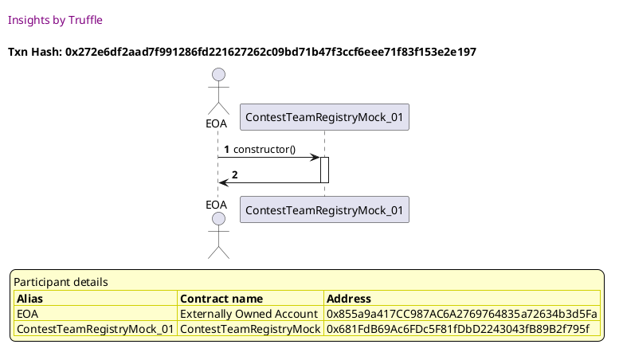
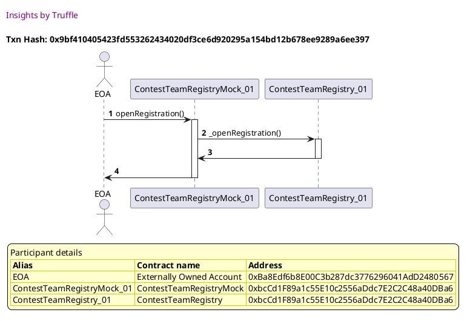
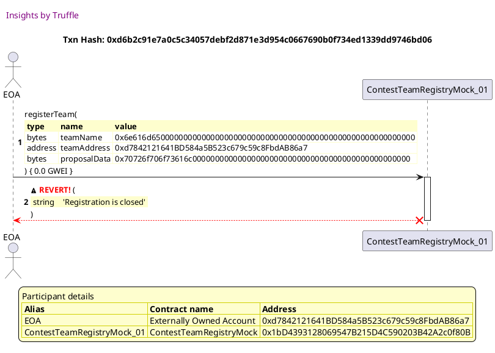
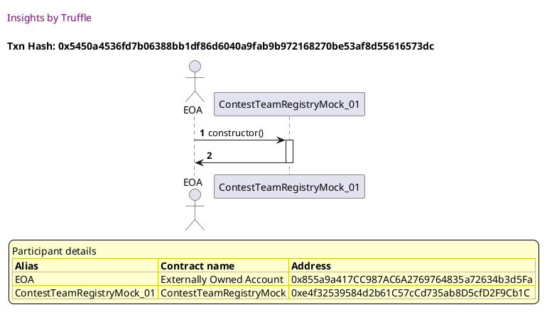
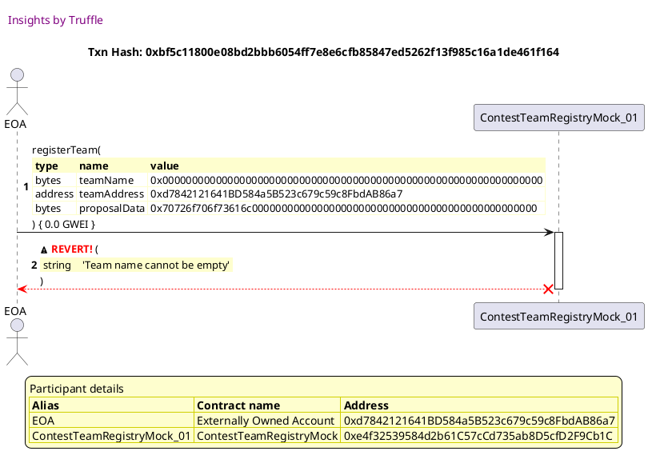
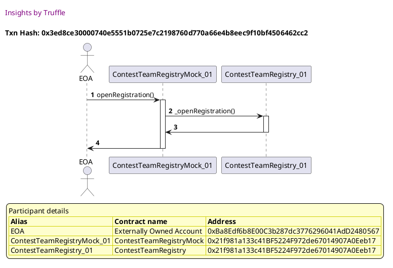
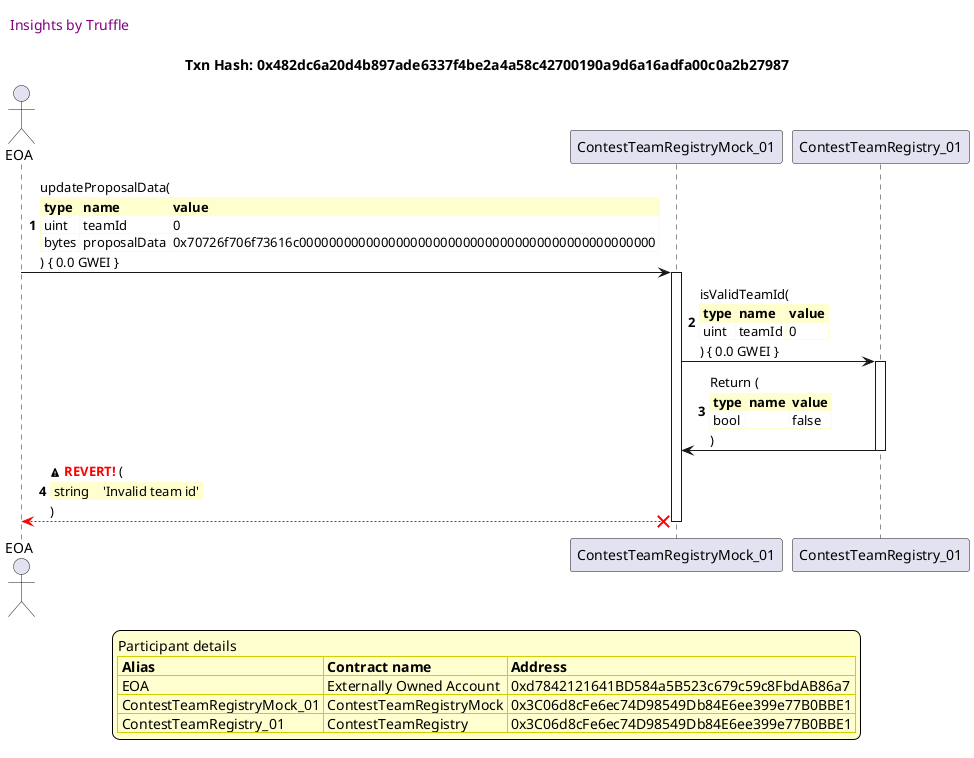
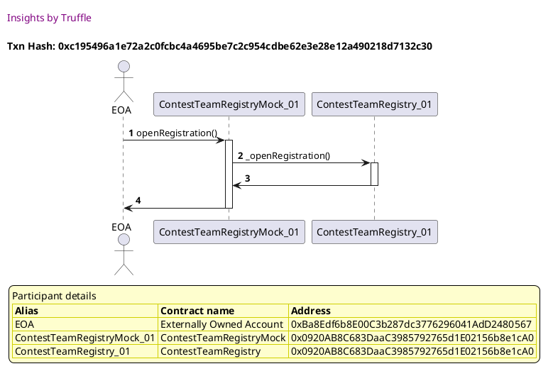
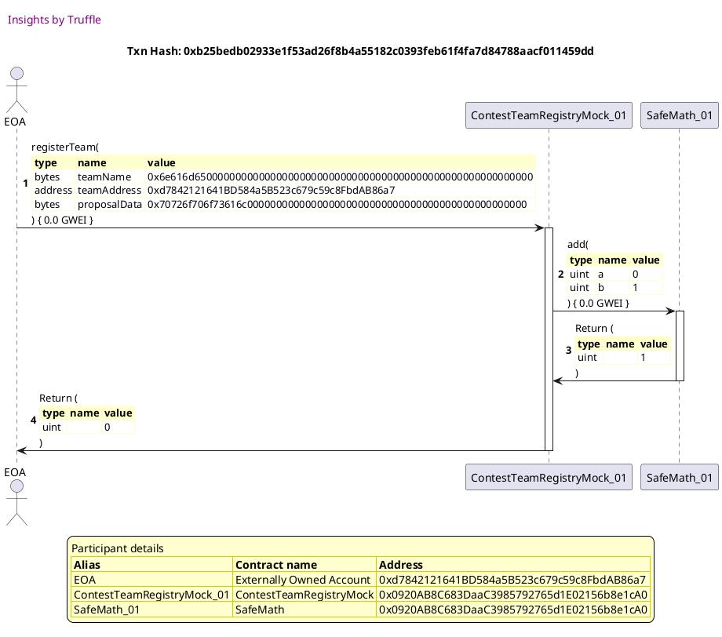

Test date: 2021 Mar 11


## creates contract and checks initial status
[link to test...](http://github.com/fodisi/hackapay/blob/1746d2fc3fafc73d8b2843f0fed53fbd26643dc8/test/core/ContestTeamRegistry.test.js#L29)

##### d1, tx: 0x272e6df2aad7f991286fd221627262c09bd71b47f3ccf6eee71f83f153e2e197

[SVG :telescope:](https://www.planttext.com/api/plantuml/svg/VLFBRjim4BppAmZdqY8DAb9lmpKYonRIGv6WzRsWoAKiMA8CYaBj9FtthcN1Q0u93wIuivgTdPK8kU-Ti6ve6qB4u3epj2LOqkzhSn1MjBI12enQ2RclR3SObNTDP-bDiIas-OQGHUzE3Im97TSEX09BNwOhfG-ThPyxuqIJDNLbMZ0E6RMx9XG8NYWFWpqqy0RuLJy3PS4rzYIKgar5cJU5_exdukiaWaprlvk-hdQkf-M9RksWDV8ILxi6wFPew8FeTtFg7NdC8LAQ2w5YdQQC9v5MdBC8WOXBBorLpCeWrhwKEWA0cEd4ropqWGDBOuAMIOVIDuyP5JsTuJaZQ9khPNqGs6gEJK3ljY3Qdr3LlREd7vtS__ROcFy-F2DaPADtom_JwEtjdChEO6muI_dqcNoOVgQxyDxDAI6NuPAd_oGhSA9kUhAOHlpbPksjFSzRldwZE4EKZG_d4XPxfqQqS0vaIbde4Rk-jtmTRS7zwC0QqJGd-lZ7WAAPbFWXEOIyOnA68XK1Y_CyJU8iZp8UHsaS1OaV2fo27vI-2WlnblW3Mzy5nt9HmWgrYj9CHiLQXaN2zBfSSnxuNk3hLPAkk8xJK6Cvz6LoXzpZZZ_8Fm00)





## Opens/Closes for registration and submission updadtes state and emits events
[link to test...](http://github.com/fodisi/hackapay/blob/1746d2fc3fafc73d8b2843f0fed53fbd26643dc8/test/core/ContestTeamRegistry.test.js#L37)

##### d1, tx: 0xbbcf8e3b08ff01619839cdff02b342b391d3ad9a833363265db330b5b8a54c65

[SVG :telescope:](https://www.planttext.com/api/plantuml/svg/VLDTRvim57tthx3IbqrTDOCn7r4MbHAYxc5gjULzkjY6e829ZD6Ijlllko4eMXyQ96npp-NSSyy5Gkvx1zODRKC83AupGrjeI_fTRVPWeQMDhhHH3o1tbUq6exAkwIozMUVhFCi9MVJksEWbeUErrQ2qfQ_J8wMFdQrVEkEWIPkwCgqs3XbBTqbO8tYct0zst-XtmA_wHLClkCIUGQdQLDHZK-Zlk2--JYB8LF-xwUjgwtfQ7Ed63cM9lCJLhj5qSp3q4VhjdB93KSWorhnWSLaoB_IIc2TIuTalU81tuYaEAe6OSnvoFnIgu9mLeeX1138K12sJ3gNdJoc5divmdn6qpTMotWEscc4JkdSR3UrFNTMziySVdTpzPjwO_p4y8sHaetVBgsdqzdPEPMSmDfoaVFfChgQVwCwyTtDAo7cuvFa_oKexg9kUBAOHVxbPiHLZRFdsZU8CKJOUJYKizauDjFeKI9MokaViyjxoRRG5ruFJra3J7EdJ7wCLJQN43yaXn0wn4910u4LPbiHHceMf7uL950On5n3v8GyAhiGQtXDViVL3S2nNo4nvwpW1JmgHUqpwGeImKZBA_SpFWXW2jdg04CkXBvCxv1vN_47-0G00)


##### d2, tx: 0x9bf410405423fd553262434020df3ce6d920295a154bd12b678ee9289a6ee397

[SVG :telescope:](https://www.planttext.com/api/plantuml/svg/bLHDRzim3BthLn3jPKDNJ9Q_WonewZZe3aEBBVT2bcX7Y2q7ie8bRVVVfpX6jXwIR3v8DX_v7abH9kIkizpOJLCJmZUsrPkcG4EwbT9hRdW3DLQevJqNgygq6ospjcuDNC_pUPxbX8mxkwjnGg1_biWb6dWTFW4UMgDUMcrvFQrLfHlKrZ6MzkWmT-21ShqnwnhV0J_K2u8N76rFN4gbA_3eOFhLx-FFGn9aqF-gErKjRGV53XPcKvQEbrXbQuJ5LiC3xvOZeDkqA0EF1ZGCc5_ACFHPn08_e8pAqXSOoPHHbeRS2uD2Ugo8uWGnPKdA8qG_ZObhcR0kzVnn2ho3AxTV4TSsguHQSrTgveh0pYwGDz-nKfqrks-jM3rJh_S_3L-aEKFHXvC-6RYTd5M1cviHj6lK0y2jQlM7Z-Hip0dE8z_pFnAU8_iZTZk2o-aSQjsxaiEyagU_sYVHSbLtP3nCxQVh6PrHIYTlNy2DfMkZUzbB67USe7c3UyDKIeETmuvnaxV-fDswjMWqh-iTFFxKA64gXBiRra5qUy-JN9PHaUIKPdx1abWAFuuZbaOqyAPoneA4Xb7ydlZCf9m4Uxb2PDARkvdqH1Zc7XKi32C-aoBEMSQo8E41dTtpwABSIQd_bN7j7mw1tBdL_Lf-0m00)




##### d3, tx: 0xc38011cddd93b29ef2a97e60502e2c608733a1549709d97e0111d9934144502d

[SVG :telescope:](https://www.planttext.com/api/plantuml/svg/bLHDRzim3BthLmZjPKDNJFAtWonewZZe3aEBDVT2bXH7Y2m7aembNVVVnpX6jXwIR3v8DX_v7abHHkZEUMPzrsY4METRqpMLjCYjbTamongiPIsDk6TyNTksCw9eTMlnzRoSbqM9qDZvdPOJXFjd9PcG5lySFZ5-QArwROrdUgfLRHffF30k_T5X3k21SjFPZPRlW6VrAZ6DZhOd9eGoDQPaCFtgz_7d8Gaqw7yrJjKhxt2rmmlRBPV0YxpoMkB5rk07vbOZJBOyp0YbN0YHXrMGosN0ybGc92Q137X2iZGC6OsZF2Mv00ISgSZpCA9H13u2GSkuXzJBnobc3b_1VeMWRLvnjM5GQW55IESNaZNVPQsSjxjlBL-_4DhxduOlqfoXwCDHdmo-dPnLmJSt8znkf7dkgaOvfrhpuICw6t62ySZsyazqvwZ-IDsEyELa3dNkNT5XLj7JNwqJqZEb7HeF4_lfUaPcX939snSC8majX9UzX8MZn8OrSc-O2c6b0-mODtdhJndMhPVMCArt-F67aG9FEOTxuG4YstkMbMAPL5b9I04pbQM2XscQ17b28ZeLio3AI9oaxudFJCb9i9UhU27eFCiPvN5SKiA3E4xOJF2q38gWY38MaTazIoxAdPJwNnbe_t08w0vM-Aty1W00)


##### d4, tx: 0x03ef5bca559492810ddccc130f8a84106feca644ffc503094a75a7ba3bf6ead0

[SVG :telescope:](https://www.planttext.com/api/plantuml/svg/bLHDRzim3BthLn3jPKDNJFvsWYnewZZe3aEBBVU2bcH7Y2m7iembRVVVfpX6jXwIR3v8DX_v7abH9kIkjMXiLoj2iBEDxkf26DAkfTwWmHgKg8JczyZMbMawpRD6DGQk5_aYpt929gtTAJ4bq3yhWLmOU1q-0HuQ8ryQRL7DbAnqBRHrZAKzEYmSUA3ST6QZn3lWXtmHu8L7snDoBdK57XrCl_fzydb8WWpwNtKhgvLjeTZ1qdHbwNY9bLO9M6urF62x6WFTqa2KKS4mYaRXo4yzoZbZp0jecM8QUZGk1SCu3CkIHJIWen2J29C2WwACdH0bhcNCkjJpnnbW2rTkloAkRLOokK5NQkQA4ArT2go_Yqgsrko-DMpzJBtU_pHyaUOCHHzE-cJWTdfM1Mvkni1Kque1GIiR_U4ZEHjqWlH8-FolZEVO_gZTZk5oFeTgzwxaCB7awQy6Sc5HgfPCXhdzT3sdSqhfzEqBkC5qZNGlUmdZ3XGqrc9lc75kHEkmOzpqhJzhjswjC1gLsi7ZJoqup1XpjyCwY6xlCSrv6HTfJcaM57wQS1OaIUoFOXfwCpxtmvH6SVAU-Coid0HxkO9bt5ka8_HO5EKUPNuKnJZdBCdzpC_254CwlyVuejn9gV-LSUqV3e7SkTNzN7u3)


##### d5, tx: 0xf4c5fe43d2b94ade94b09a14a62fea86c0d94cec3e7978e44ab35c2b3936d26f

[SVG :telescope:](https://www.planttext.com/api/plantuml/svg/bLHDRzim3BthLmZjPKDNJBRbho0BcZeEkiFGOisza2NQ4IBBWIHZITVzzobEaAs799iFair7laTIb16wiuuPrxSA8TQxJlTj1GRPbTHhPbYB5JIWnJtZgyPqlHP5fpg3h-Vbl2nAXCRMRHLC41wU9J011lyyV6Byq1dvscd7r5J9HhUWdMUitT5Xxi4zvRetQmNlW6Vv2ZYWHziJ4qBg1WVaOFerxEFFXoJGGV-hjh9PEekhBLwOlguzBtBIAS2BZSOFp2v7c6ngokCQQ2J2AgS-CASLoLb0MHBMmBA44v5J3Zo2D4ype9HLKSp3AigZH8H9ZNpBkFEfbuzJp2o-yliLycrpaiirywKMlWYmRW6i_GwDjCviltLyzKA2mVyqV97c3CKGZePayEtah0g-kHbXhZeBpttLIcjbfpzyH6T3Jb0UwLx-ZUySrn-jsn6-dCs-qfqhsayhUlghUG8SaygYyM5cFrtFo8mGCddxWlrG-YRwbvs4yOU9DMjXPvWAOS1wx1WtUHlEsQyR1qOpfRRuyOS6WQUS-vlXF4GszomhHPrKMKb84LLXbWeUfMaIvWcXmLJCGfgHE4dV4v-PavFW85VnGWJpp4yjZ-Co83oCuuJD14_Bi0WBcZ5APlSikIXtKkf_PNpx3uU0xlpgVoo_0G00)


## registerTeam reverts if registration is closed
[link to test...](http://github.com/fodisi/hackapay/blob/1746d2fc3fafc73d8b2843f0fed53fbd26643dc8/test/core/ContestTeamRegistry.test.js#L64)

##### d1, tx: 0xcb727cb4b1fc0e0f2b7b279c8b3c3ef22fdac89b0aa539aa10078e879417ddf2

[SVG :telescope:](https://www.planttext.com/api/plantuml/svg/VLDHRvim47xthx3IbqrTDMCWXYYBIaYYxc5gjULzEcn3h829ZD6Ijlllkn0KhG-j7snyt_7TTzy18VUT1-VxfYO4Uj_QlYcq8ztUs0CuQ6YjAstL4kI-ScrlLTxMhQCtc_LcdQy9cNV-LEi5eSFQQL3QqPVnIkb3wynpQptKMMqgssZhaR7qruGDWXVAG-yEjNu3_3BFcWRHDVO4IXbRqO2DeR_3EVywYY1Z_U-sCzNETxGuqQthon9vYJU-rdHxjFG1kjsCigCi11UoY8gWb4opaXUYu2ALIH7AK9USbmfaaXOC80vJW80naUX4f54Wb2evGSkaH-dhnun2HoTuJWZQveqq1y1MSsn2TtwheVcfAzDvT_hHolrl5WpvxyCJGWOsUhVuC8tUtiweR2t6-hEKJv_9X-bdkWlltOmISXakUVfFij8UJDsH-JZYBpShjcACBLw_KPmXoiQ7Smc7lLCBZJu7CgMSxX2xlhTu7Mp1_UYrir3N9_hunsf5CodnG_88iMCInv02-fddQIAoV9fnCKt5D4h260IVXb4HgdW3Rua_iFLTS2WN5AieJCE09soQnf5OyY1UHNcSCix2PSGpBbcPi2MMGrz6TyWzxlY3_0C0)


##### d2, tx: 0xd6b2c91e7a0c5c34057debf2d871e3d954c0667690b0f734ed1339dd9746bd06

[SVG :telescope:](https://www.planttext.com/api/plantuml/svg/dLHjJzim4FxkNt43QMnb3EVDQL1NqVHby643iMhxCAR9iTqIuJgHuq8BtN_VDGqLcmJJY1AVVRuyTxvxpeGSLuvRDvzfGlZS5MO-ovGbrNLkIcxv3BIQAYDJBgwdjfWRsIzqOM5tD1mD-qD2EfLRQjKbK3zNYajbuRvP0fmKDhyhZEEwf_EfcIdZ477YjWOZtDn0bdDRQlN7nfVyJe4NRdNdNChSJC6ZZUfNBJk7JH2ayNzggdnwvIh8bZ2syya4SOdBdLOmNXWuuTNL4T25P9al4a_5d8f8126DOgcoYI_RiQS2cKIXe8p5BA4PdSH1gAGN18cKIHooJ596C6N2OUZ3inxm2dPGxX1Ccyj5Nd8yQXyFeIetLdnseQPvvUpoKo6kVrAljdzwUuUG6WqEki-QmVx-4TXQgUpQuCsbkIITfZpl6jbTVG2tB1MWD7nMonkkvpXPcwymJ-W0Lk0GuNDjWEbXYdbCieY-y7a0nw9PLJt0zxOhB43S3dtFzrZefOEe7V8eZVn0i3WHKIBQeqpsqZRZyTzXbhOeYuhh0NUy1effxBD9JF4BC6Znib3VmZtGznG-VXkU8hMUpVlYuFkkLVB7kZwRGXqSGUVrBRS66Tg5ZjZq2TfqMwsBuTVXnVXLgzKvhFLTUA9EW4xM35y1ldkDL-xoma1UWT15fUHU4osH2kcNtt2d_a6bJG-JyqVCbChnN5UFGXZG0MPYJHLiLMGdJjQW5driIRCjtlO_37dDVXmNo433jLx2sQrH4df2u7tX_hFGZu6VwPudDsjtNZO8WoJm_3PbsCLnwdlH8En72VLfa8P-pnTqqgOfkiEyDDaXnpZYFVWR)





## registerTeam reverts if name is empty
[link to test...](http://github.com/fodisi/hackapay/blob/1746d2fc3fafc73d8b2843f0fed53fbd26643dc8/test/core/ContestTeamRegistry.test.js#L71)

##### d1, tx: 0x5450a4536fd7b06388bb1df86d6040a9fab9b972168270be53af8d55616573dc

[SVG :telescope:](https://www.planttext.com/api/plantuml/svg/VLDDZvim4BtxLunsBwssgveF6uZIQ2b9j3rKksfphsni20gOo3Pgijt-zqu8Yhg7ZGysdZUyD_C627bmNbW_T2qXOl2z6JgfBN6xnko55HsqkjP6VHNbhhRzO5JHjxs5s_LglIfMXCoTFxPwGM1SMosKjl1dkW8yzhPvwOqNRTusjUcqySXO-Kl26i4pvNwm-rQ_0NusBng2-19x5aerfeQ0Jg6_upd_F1L19lrlnZNrrZkGHzZOeQgGb_Z6jnes1mEFmcrdG0yiPbJ4BEALIYJbKPfA6QWgvOhJc8gi4ZAJMH86F0qJAZMBH9KgndZ0MHAfag1bfSVILqyv20StUDuGjCqtPRCNs6g1JMZdDrfqFtJTE6-Ft_jozui6O_xxy0qX8nlSBwwcmTtT3ChUO6mubVBX8xcQVg8xyzxFW93pSCdpVoKhxKNJEZAVHlpfTacNbDB5wnV06MBP-72IiDWx6D7fKo1Nocg7sEMznUje2-u7hwqHRNk4fzz6AyZB4ZyaZn0zf8o9JCH1KXHPckG5pyE4PmcFquY99EHHB2F5rk8jyHLRtmL7EHrNKSYYZAMn2YKF2fQKXKfGIwPBLbRBS9qLCYXG3dsPt24FkECFyWy0)




##### d2, tx: 0x445e3578cf179c1bcc3972ad5e187c3dabd75dcfd35f2513573c24c03aa025cc

[SVG :telescope:](https://www.planttext.com/api/plantuml/svg/bLHDRzim3BthLn3jPKDNJFwGvGHPqDHnq1s65blkXIp9ZX1P3cGPIzhklqznZ6mz9Dbya6m-yZsIeepGNUkOTLsj4MATQqnN5zAYTgtCXbbMWvQLDEAUyNLbcyw8hD6DXUj5liYp7A59wtPQJX7qpqeo8Isy3fy03urLBurnJC-qgamjZVECfJiwB3nueDnqTgFbE-27Uf4Gn4VR4nD2cGe2F9X-zVlayv046lI_cbPLAzT2iOEbxShIyoAdd9Qmt1fuOErg37WRnqH6XAQy3EY81mNdqOY6J10Pf9H7WXM24i5B4P4o985tZNWOSnmnXaF2EV8juywddZ_EWBLmvVShvDlc55SRvalDV16oTKl9wk-oKgspksyDNp_ZeFS_3L-aEKFHXwC-6RYTdbM1cvinD1jf1e0vrPWF7z7Pc1ESHxxdVoGyH_P7x7OCbzCvrBftHOTvHKz_jKz8nvHkqMIOsa_NSpp764_Vle0VIzz6_xANiFuumR1QxWqp8QniFNQCcxxr9-tNhPFMCArtyFZJI04ppltTS1x2stkMvg9CYZJ7E8kACAM2HvGcuIZ1SJ0Jyp1ECKdeU-8pat8IxELaN4OXYKOaZKLO9456ACy4ZGWhqZdXvJnSZB8Yo2xAdPJwNndV_k4Gq9rV_Q_bDm00)


##### d3, tx: 0xbf5c11800e08bd2bbb6054ff7e8e6cfb85847ed5262f13f985c16a1de461f164

[SVG :telescope:](https://www.planttext.com/api/plantuml/svg/fLHjRzCm4FxkNt5i4eEEiIJDMwTIhQzi7s3JgE03GyYnBrsqn8aSPsktyj-vf5ara3O4H8dFiI_FNPvxpemTbuPhKsKfOxmokQgo23KhhnDLSCqpI761Iewuk5xel59odAUvXjtPT3OTJndhbsQLue11SrqXbwZXldq5ECbrSfShmzDXcYnKXieGOcos3ZFQt40MbIvI_6NZKtA7OBlRjNCkPQ8MO5ljqe_6zW_R95WR_rILoUBAb12jOAwhE2PSPXAJ8ioN2avuUNK4rZAAFM7ReMMX5KRIYQB8jpmtZWCCqHTn57gX6w3q7D-9xMxS2ydTvxP4rxTZstSPKIOCfJuz6m8lOOVi3YFQJ2AIWjElZkadi3HpvDa5BfBIwDM7N5n_j-p6_-dj7SOQD3WOFEi6-_j7e9j5rBN3gqjroVfjUTwqTh1-1sPL891LF6li3KyhcjJkQ-A90i0Q325yR1o87ki_hmTmAfh6yW5-k7spbZ88NSTsY4fxD26okJVodAxmWvxmUYASHN8u2dqU_9vceVCYBtawuOOtG84LE7uSMFHqVTiN_vRgQxW7wwq5xxzCJqbQp_A-FFYwgr5-g-kpATJ14VHVtdAjIA43w8jDdv3FeDEvc7wUNinVT3hzmsPz04_K2IX8hV0rqBrNHzuKJ72bSWCH0cQ5MUsr2JE9fC3aXXlyWvesRSpE7ubJek59MZxAOc9DY8nQBTIj952QrA2QOcnriwtVzZlAkcu06fSaGiNJT0Ldjmeb38MW8yFyPQqV0p_JG4zkDk7GZRkEr-rH9EfitnvxWHZBeElnA9nu8fuuizuuiiSKZdXfsM77DD9H-1C0)





## registerTeam reverts if teamAddress already registered
[link to test...](http://github.com/fodisi/hackapay/blob/1746d2fc3fafc73d8b2843f0fed53fbd26643dc8/test/core/ContestTeamRegistry.test.js#L80)

##### d1, tx: 0x6549243e3d369493a56e4516d6dc683081086bb065c7eda28b2bf8a0a7efad54

[SVG :telescope:](https://www.planttext.com/api/plantuml/svg/VLF1RgCm4BtxAwpqigksMXkCWIWRbTAWxc7LQZVtrO07WW8cCaQRjDr_NuUWg3qqFjXutl3cpHiWvAwtOEpGDeJ0O3izj3aQqczhlGC3BMsmGgtkeTXMfXkqIhkcC_GgMsMhT4N8ehU71fU4Zck3eD3Gr-bAwMDdwfTEMsYIfgvqYzewnjAU4p87dYXtWzar-07uNRyWvU8SUmQbQbrHpgRGl_5SV9j4aAd-3ztNrSRsD3_GjHdAql4IMzi6wNglwIFqcpbbUnc8s1C--igNiOXz22IAW4ibLI4ZdqMSHJBFcGoA41LuKUxbPGGCGYn11O8uomhhfA-U4WezdRbpHfnjjYxg7RXMKzS4zdQDqFx2gkwjEVpiYkqVniVyp-4P8ICRlLrUJAFNrtDQTDh5XgEKBr_9nVGZtOdtTau9EGsNFB-JhD12tVHaCOtuvkg1FJ36bc_VgPkXa-qUZYMCwvrgQF4OI9Gos3li_DxoRRJ5xNkBHaFJ7EZJNusA9aNXFYJh8BQFWW1Y43nCqpWAarGcNYZZK8h83o3qf2zoNmKPV2I-OEkdu5ZEusKSSU2-NmX-dmMU9x8uz1JAa74Hip1XAynvwCevNoPto9tRtG_o7m00)


##### d2, tx: 0x3ed8ce30000740e5551b0725e7c2198760d770a66e4b8eec9f10bf4506462cc2

[SVG :telescope:](https://www.planttext.com/api/plantuml/svg/bLHTRvim57tthx3QbqrjDPilGvH59GbHzp2rsl9U6Vj2h829ZD6IjlllSmXAruSacnziyBdtdFi52DstbXlRrHL2lBEDxkeS36hNIc-uuJMke0GjfroiIzDqMiwQgZ7uUf4jibc6qBYrkmec2FTh1Lo2mQ_3AyOFZL4lZRQyIYjLwXgqTOo5FHei77YWt7HcKy47uATw0Ko3uzqJbrBf4bCoNFtkp_6N8GWqw7_JhIfNjiNv3YzDLnIE5rbbAy3BhSOFl5sDCDdw86C1Fd6B1GJ2CAGvOLu8J7WqYLb496E4Hn44UGmWaeAIl0X24WMH9uI7NCc4TQ5dZodcBRvovnLoPRDAg0rtgSvS4j3Q9V3w1vIgjMRtlH7hPq9x-zFmHPep5BqxweF1TvEpAlZcPeIR3UW1u5Or-jDdTDRd1EUHx_aV2S-HlOlTZV3bS0wvxatHOLxHqr_bas2vgbeq7gRszdfEvgxfaxUls8sbAwDxs4iOrqwiUGtxYrHA0wt3ZdwJjxxJRjzQC9fNrGu__j8WSIg4-pQiWyXsokDC5b4UPuJC_DoBcHG-Ov6NH2IWgPnxGKp2Y7qaFZCf9y5UpgD54bDEVLy4TBe8FIzO9CoJ4352WuImb6IGqyjo9wN-LyQLVsW2kdUx-xNy0G00)




##### d3, tx: 0x1deb8eb72b2d9743e132838115dfe8e21ecfee5e2f9725ca6bd62940172d975b

[SVG :telescope:](https://www.planttext.com/api/plantuml/svg/hLLjJzim4FxkNt5YNpPjR77UWrX5Izl11mO2f7r1cfpuqaQaJkGuMmlTVzybf5r00mIRfVXY-_BS-RcNC7PG6Q5DlSWP4xKfLBs8KRFgEbEbq681ESvGoP58hcUwg9KyBF92mvlfP3evd32sNvbLZWC6xPYZaAZXjbi271KwkocK4VampsPgWSeGOcgs2bCwl8CiQrtcUE_W8hj1uEvsxqn8cQaPSAlR-jNA_K-T4wopVwogR3Ot5SGhkDHrcX8kCvd94IwN2ev4DTy3QyabnY76WHtRCWfS1xbZXqx8kITJ3D7ccAI87jff5DXU8lnO-dRaMZnezBsO4MM98TSdfqCG5UoGt654cycIh1HqrKEw15Rc4iNY76TPPVJgf4YklrkyrN_y-3xCXKZnH9ZvvhlUUeUnrYpi3fx4W_Vlzq2tcwWRXRTNwehjTt7yqCd1-ZEOLOb0Keb5At-8lAQNHdrDX981M8CXXA-j0l7eeyzzwNlMAyS6dAAhiTh03xShQoc3qBMvpNsNZyPUw0flvDbEuWTHuaL9E8tbS1Jw8dZePgcBigX4FXP6j4215TX-6bZqEEHqyZfNty4jM1yj-F9jSamv-2JlJLpwyMe3GJTz7VzrHkb0J3MNUR0NqyF_xjyz-yybokxk7foZgRM2V_Anvyxp3DsbyF-pl0aKOtVzYvtroacY4LbUzV37rfY2s-1Jcw8AevV6OqtblRMqpSVjTuDrM_aqBwcebCZp5Pp-L2XXc2JKAyqBSxSF_4JdUFImDMVpD0gvu8wJaC6fPzlkbDgNH3-mk1jPmT2QOCmVcEjtc3-hbm8IqHtTx81c-gdy1W00)


##### d4, tx: 0xa99e141ae1833b6fe283ccff7250f5ea3a2b104a8e7a6bdbce86c00a38c34780

[SVG :telescope:](https://www.planttext.com/api/plantuml/svg/dLHjJzim4FxkNt43QMnb33llHLr5IzF1Xmt4gkt3cAQBuvI8rAaS5rhe_lik8LHi4amZIdn-kJpt-Ewn6JkiB1gxc1MCuSAMUZ5Bb67LLQxdQ706XPegdGvHNarDkT3fKLcK1hR7yJW-YXdhLNPLg3w3vhbKc2e3T-qGuBWq-MsfBHQ38f_gcTAM43ExSHZJuZtaV67cXVfZuKj-gq1ucxapJDDSJq7mTkfNOtlxBGdMnZ_HLJwzj1KaAvYOHPOHBhEvBHHCbXgEiRey0Bx4RbS9Jw0IaUicGQQSo9KooqB7vvclq4Kd4Tp3I8KO96aYLHH8pj6DfEk54MUKCcc9Udmw0AnWY-mMexJPNEPpfAqUqIPKPISAP-TgcbVMh3wLyked5ut_qyjRZ3LeiDT_rWrsTm_0D9FAr0vlBlG5wxNbUTVQ_le3sDLS0LcDiyPUOx6WJks-fZnH05Y39OJFZGEb9r212DB0vozy7i2fQ4PL3_23pOWlqp3o7E68m1F3aHzvw0zznvL1s9L-LqRZ91qCem33lsdEJJalAon6QB412dde15d8wNE9j7mPrRTm1_mzXu_VuXEIrhDvN-vztpOg_L7NvxvGUmVGUts3HfD2-z2Jz-U4VFgTpddyDJwVlEfqUllDV1-Ug1DGa5hXQw1tfuuCM1XIzMfJPPNkj7HPgaX_-JLQzGyjtHzYTlP8cgcoc1VL8muZFg9Kr5gXiqhof4uDQYZ6HZMRwct-8ywr_AbT4ZcDHR62qnkjKXX8IHU6_SzAFmP-vlWykTY4SqJMZGGArvKKSEmxZZVkXawgWf0Bhyl30OzL8kfmb9SsE-oGMhe8VmC0)


## updateProposal reverts if teamId is invalid
[link to test...](http://github.com/fodisi/hackapay/blob/1746d2fc3fafc73d8b2843f0fed53fbd26643dc8/test/core/ContestTeamRegistry.test.js#L89)

##### d1, tx: 0x8938e3a4fa8f455ae8306ae570ba26adbc355aea2686ec352331ef9f9d6a727b

[SVG :telescope:](https://www.planttext.com/api/plantuml/svg/VLDDRzim3BthLn3fPKDNp8c_WooeupZe3aEBBVU1jcZ7Y2m7iembRVVVnpX6i1vQ7IIAZtua7sKXxZkBnlQD4W9xs-g-oSc8Rb_h0nfiG555Mgwms5UcxRLCMzKQkDbacopDX5XqzgHeAM1OEq991bx6Ay13Q-hdLbjKYQehtP2sp5ZQQy26mGlbeJS7HM-0N_KpmTIx-fvGobfNC7L6rz_XN7mTYn1Z_k-wgwkTxI0_mTRqPScymjPM4MoF6Xwmsyt1EKQn6v6BNebHwVa-KkGw0P8VEZdE0fHvuPwzR4S1iJrptIcLSHdB0CDPc0kMhB1SUlQO07OmuNCYM3PR5_K1kTMKcw3ERWcRdrJLdJMd7ssn_-rCX_ZtuOaG0nlSBJyCWzlREHIjPbz_BkNJP_5X-9dkmdit1o4kmnLF_vKioMAjEh4OH_pbPksi7STPldu3dY6NpSOvXU7UGMD3PqSYfQ6EiUjtozT15jwFben6fKxm-4UJXAGe-25PXdW4B72CtZHCqpWAapH8Pc4GXu4NkJvh7BXUxaf_Ws-9Fv3rNN18vwPE8ADYGppFq5l7aU_5wppoie38ZMCAmvMpMcLC8rYNKHrnppl_8Fy0)


##### d2, tx: 0x482dc6a20d4b897ade6337f4be2a4a58c42700190a9d6a16adfa00c0a2b27987

[SVG :telescope:](https://www.planttext.com/api/plantuml/svg/hLLjJzim4FxkN-61D0QCpKdJlA2keY_fw8S9r5NimvYcY-qMYzI970TQOFzzbxHqyA5bJ8kQdEEpxtdkYUzAo4bXmTXobX82fSrqEKka8SMrqZaOcD5KJgKMNU3NKvELMlIoD3DqTn0FubvCIAkmYrIs2QslAmb26dg_UgNqD3FgBjCMqawgfdecjSM84xjUC43dCcHUcZoLpnnVrPsaZhUUEmSXb9vIXwscVjMszN55WgpmXxfGqojRq6H1nwQSJ30kiSgcaexdcfv2SNLCsTmBNS5zS9dmaZ0ASAlVQ0GJBv4kUD0CkUS6Z3aHWqZuuFWW9i0OP-0cRX250K79k4NgyLc7Ga5tqEuGbCqghdB0L7kOX2piMC9i9AUgi6Rn9UFNFvbJhz_iVZ7CbX3rTbAJeKVjhIZqyF2Obha0AyzDbcS5f7smyEvINvBMwXk_NzdsmoTg5xcaQ3NCQdi3QOc3Qla3BHLIVQ0MSOO21-pHaImG7oVo9n2LVnwmmFKd0SExuJi-Pw-ybW3xz9wo3un-_XOFyKHipNU37cijL741gHBZEeV_AiDViDp6y4y6HyTq96rfDFqtVacMfKWBVnD8YzNq_dRPvaVVTuqKFofootE5B5flRy5ehCSsRV5bLy0rxOE3KNmHZyPl3WvQ7-lvzYQc546gUgxPx0trJQLzhHnLOk-HcP1OPUe6p-ZsYY7BLaNEdrIEa1PKMZp1xhC-dfnA9Un8M44ug88Qn5ZhrH72o09zwtt8jIfoVCwjD1hIT47FRhKKjCCvjaLRdsSHX9xhk8xlETr-CyGUqcsw3Uu74Mz6F1maejCDVGYU1zxI93OwQxX6Z_aYv0FfInvu_IXiUb4_2RtObx8HHJ88kgpRZPqNuJP2lHO6vLzz17A2J_nN-Gq0)





## updateProposal reverts if teamId is not approved
[link to test...](http://github.com/fodisi/hackapay/blob/1746d2fc3fafc73d8b2843f0fed53fbd26643dc8/test/core/ContestTeamRegistry.test.js#L93)

##### d1, tx: 0xce0f5fd194d8d73a183a4b1a186a2b4f87d70069b4f00cb2c3632a3cb9c8f970

[SVG :telescope:](https://www.planttext.com/api/plantuml/svg/VLDDRzim3BthLn3fPKDNJFwsWooewpZe3aEBBVU1bcJ7Y2q7iembRVVVnpX6i1uQ7KI9Ztua7sN6xdkBnWvjmnWEjjD3MoZ3-bsjzsYmXKPLIii75BlAT8EMMTTq1cxM-JhFSiOMlJqsQibWN5k5KXbudQu0ZvsfNpfjiKcRkjAjqfOOIti9M1DufjmFPj-eTy2l-aM1urzypoXbhIjm-EJwEzh5rwa8DkN_hlkwsjeUYYDip52MnCjiRHi5cuE6H-otS-07eNWPbD99V1dBo4Cdzj0l7B8XkeLVnf6CE0yJEd8k2bTueUUY9uf4n6KISKQI2KkbvqyfO0ypiZD6ijbQr7kaLZDgGlLsex3zgQgwj-RuenExtzmPup-6PuoDR72tl1e6jxTp49qctt0gvTDdTZNyH7VclPi3O-VXikV_IfRAOjtqR36D-ClDYgyuvyktRq0pfBBfS4fXg7VGsAgJ8vNIg9wmotVBjr4MsWzM6OrDSuIdFrf9I8MWXsG9ueSu2311tucoB8cZD0jJDmgJAFHZBy383Js_y6ImnlV4LsJz41pJySJbwKESXR6tGioy90wYX386qicvwmHX4Ij7f9pIaIwJEkoUTlf1_W40)


##### d2, tx: 0xc195496a1e72a2c0fcbc4a4695be7c2c954cdbe62e3e28e12a490218d7132c30

[SVG :telescope:](https://www.planttext.com/api/plantuml/svg/bLHDRzim3BthLmZjPKDNJ9Q_WooeuxZe3aEBBVT2bXX7Y2q7ie8bRVVVnpX6jXwIR3v8DX_v7abH9kIkSyAwJLCJ8ZQkDPkc14kwbJPhOKL3QwZ0gAcGgygs6wFojcujlRulxeky86JSkLqD4qBxPmb2WQMlmoUb3wtLBwrneivgNPa6Z4F6XJiwt2Due5nlxBg6Ty0F_GBK2uws9w6KDXNrs63wrU_ZpqCIPD3_QZfTBLr7onsTsyrYWRp4QLS3dMyDVH3TSaJPLdff6AIHy23cWaksaAKCH12bOGcnv19HgKg8EFZ04_2u25B6lKJ5di-bpmYsJ3fClNZCgEZe5UvN1DlcjDHhWQNcM0HqRWwY-GwLxfpTVMlbwfbvlVzf-2BD6Oe-dFJ9qDl9MHLwSpEYxHhC00YdM_FX8paRSuBpoFVyZuJdoFw8tOxevNGEjUvToM5UoTDVxLFWXAuxCXwczjFrZCqOOvEtBnJ74jk8Bti9YyT9ZMXWRyYKij0XTeoRlFKdZUlMWJMYhdVqyQS1HJCfyMuuXDXsAf92BQ8oAHZB_P8diP9-74SyZLZWPMh6WuI5KVoU-Coad0HxEPPobasJF4hycH2vdoPXdF8u2fLNuB26c0XuCcCNvKvA_QyCjdyu17A7A_vQVWC0)




##### d3, tx: 0xb25bedb02933e1f53ad26f8b4a55182c0393feb61f4fa7d84788aacf011459dd

[SVG :telescope:](https://www.planttext.com/api/plantuml/svg/hLLjJzim4FxkNt5YNpPjR7RUWrX5NmSV60YGzWLfkiHE6v4wbUDiBNJ_VTUGTYqQ8DWinHVRb-VEpxs4iQFAeh7rj60CQrlgUfeemwgRNC_Gu1GADLPQzZ2z6Pkorh9V5gM1DwFXQDWVCdPOsKMXEWoQCL4ebO6xTWbmN9hyjjGMYswHZ_LKQKk8cTqeZEZm7d9McrcXTWukyri5mjlidQEKkHw3uEtMhqOUVcgTOAtz4rtbuucj85d0bQcpZ72PpMsXu6gkuHYhoG7mUUBuYP89TsBNLIBpNPHEa4M9Xxul8YVbRkncAWb4vcKOoiWBemWnpRWGdXzBoOYor9BhmxCkO0Lx9FSOqMRpD9yXNRLFbr2LlL8ulL3ZlB9cSLgcDz-vQFGVFzw5kSHCdQAThB_RMkynrfY5_SwJUF3-_G6OPbEPbSBRQttD3jiuVcXbP_aPx6AcWAJ6QID_O57JoqfzIOII0LY29OIlZGBn6AX013Bm-Il76foYQrIrXkzkLdmkmyXpX2C2J_G6VaG1wlcEcmPXdFfn6eqIsUr50OOFtPoPSbPMM0pGOWCKyf12779wN78wVPshx-0E-4SENxuDJoW7d-Hz5PVjU3M1e9k-ZlywftGWfbQNUR2Nq2F-xj-E_USIPN__02wKhOs6V_9novtd6RfFuVzdUHqenkxx5plVAYUfBEP5jOK_u0CAxWgVsXHL6BsiF3PKtXjBctpSVDTPDfLFyvoAIcDHBE3ifrOIkcbAlTA-C7UtWP_e78yUDkPux702x0UHEq3ikt7aXx4J1huKG-u8FqWY9T8ktpMttM7-h5uAI4ItTBCZckcdyXi0)




##### d4, tx: 0xe52dbf07a31318820fc69dec80170427532d513e497837d3d0f6865dbf242395

[SVG :telescope:](https://www.planttext.com/api/plantuml/svg/xPPjJzim4CVV-rESs9kXZSrvJX2hI9y6Bn08gkqD4d9Yfur8dSXnM0lTTzybX5AOMiRGn2OjKcBxplxVpxue5qBsIysKhgOP8QpIkQocaL2al4nbmHIRGYR6Gl8kYo_7Agyax-LPhk3DS30Sz0Q4x9LwdeaEWUQQ2CQ5Wfjs272Gg_GwbvfbOPQEvLH8ZOg9NauOelDMigXKaOa7ZhFqMe1XBsqdZFDKZi6WhUbxq-vzR2586_zGbkbueak8vZ1ILPAWBj6fpWICPX8EM3dP1JeJZicZX7hCCYp3zqsQn6x0HUnJmwEswJcMoHt34dRW-PR7BKuJrtSTN6FQfXKu18yireW-E0w1bR25xHR1OzDfd1OCjzh3JOXIZmIRdefnMcerFyhZomjgDFFNkv-KsI3nq_8pbeWZfYTtQrR6MuGqrB3JsOW3xzxjWXA5ogz4xNzxBi_9NliMl6_Rpk8Jw7aX05l9farxnR8AE_Nq1LGfqYn0ey0XnmwzTMp33T0F53v_7HnYIZTohE5SCbwy8kGl0QRb5vQbVDJ8_tM4EpkxS2fqfIJy7bkKvnaYrNZgphhzajEgpM7Hv9J_J-W_dT3NO5dzrZNfAgleHKbYU1kFRD6zxN7E7iJ_euVJigoyFi_EqlrN5c48kItzv6Ibb72XMPgLAtHzsgUKrdHOuR6wOATMLbWPbvmXvqgKw5kkwooQeedFcHPAiYoRm_4tAJY4SOo_6VLEw8nxlcqQfk7QHhVl-3PpkevfnQuNn4uG-yE8XrtVPTv3uGr5Twsp2KS3aw9Wp_MjFcCzA_0TBp0zhFZ6W9g6uqQ-CEAGFXbkRQWNX5ajulUZvmfYFjkiadryuc_V3m00)


```plantuml


@startuml

autonumber
skinparam legendBackgroundColor #FEFECE

<style>
      header {
        HorizontalAlignment left
        FontColor purple
        FontSize 14
        Padding 10
      }
    </style>

header Insights by Truffle

title Txn Hash: 0xe52dbf07a31318820fc69dec80170427532d513e497837d3d0f6865dbf242395


actor EOA as "EOA"
participant ContestTeamRegistryMock_01 as "ContestTeamRegistryMock_01"
participant ContestTeamRegistry_01 as "ContestTeamRegistry_01"
participant SafeMath_01 as "SafeMath_01"

"EOA" -> "ContestTeamRegistryMock_01" ++: reproveTeam(\n\
<#FEFECE,#FEFECE>|= type |= name |= value |\n\
| uint | teamId | 0 |\n\
) { 0.0 GWEI }
"ContestTeamRegistryMock_01" -> "ContestTeamRegistry_01" ++: _reproveTeam(\n\
<#FEFECE,#FEFECE>|= type |= name |= value |\n\
| uint | teamId | 0 |\n\
) { 0.0 GWEI }
"ContestTeamRegistry_01" -> "ContestTeamRegistry_01" ++: isValidTeamId(\n\
<#FEFECE,#FEFECE>|= type |= name |= value |\n\
| uint | teamId | 0 |\n\
) { 0.0 GWEI }
"ContestTeamRegistry_01" -> "ContestTeamRegistry_01" --: Return (\n\
<#FEFECE,#FEFECE>|= type |= name |= value |\n\
| bool |  | true |\n\
)
"ContestTeamRegistry_01" -> "ContestTeamRegistry_01" ++: isTeamApproved(\n\
<#FEFECE,#FEFECE>|= type |= name |= value |\n\
| uint | teamId | 0 |\n\
) { 0.0 GWEI }
"ContestTeamRegistry_01" -> "ContestTeamRegistry_01" ++: isValidTeamId(\n\
<#FEFECE,#FEFECE>|= type |= name |= value |\n\
| uint | teamId | 0 |\n\
) { 0.0 GWEI }
"ContestTeamRegistry_01" -> "ContestTeamRegistry_01" --: Return (\n\
<#FEFECE,#FEFECE>|= type |= name |= value |\n\
| bool |  | true |\n\
)
"ContestTeamRegistry_01" -> "ContestTeamRegistry_01" --: Return (\n\
<#FEFECE,#FEFECE>|= type |= name |= value |\n\
| bool |  | true |\n\
)
"ContestTeamRegistry_01" -> "SafeMath_01" ++: sub(\n\
<#FEFECE,#FEFECE>|= type |= name |= value |\n\
| uint | a | 1 |\n\
| uint | b | 1 |\n\
) { 0.0 GWEI }
"SafeMath_01" -> "ContestTeamRegistry_01" --: Return (\n\
<#FEFECE,#FEFECE>|= type |= name |= value |\n\
| uint |  | 0 |\n\
)
"ContestTeamRegistry_01" -> "ContestTeamRegistryMock_01" --: 

legend
Participant details
<#FEFECE,#D0D000>|= Alias |= Contract name |= Address |
<#FEFECE>| EOA | Externally Owned Account | 0xd7842121641BD584a5B523c679c59c8FbdAB86a7 |
<#FEFECE>| ContestTeamRegistryMock_01 | ContestTeamRegistryMock | 0x0920AB8C683DaaC3985792765d1E02156b8e1cA0 |
<#FEFECE>| ContestTeamRegistry_01 | ContestTeamRegistry | 0x0920AB8C683DaaC3985792765d1E02156b8e1cA0 |
<#FEFECE>| SafeMath_01 | SafeMath | 0x0920AB8C683DaaC3985792765d1E02156b8e1cA0 |
endlegend

@enduml
```

##### d5, tx: 0xde9d15658c4e510abbbf1828996b65a610f511976ede6c872ccacd0ca29546b1

[SVG :telescope:](https://www.planttext.com/api/plantuml/svg/pLPjJzim4FxkNt43QOmoXfCsRwYhw4iw-321MCK-Z6boRBT4f4xaED02---xfA633osmJMYHadFkd7iUtvtkGiX1RfWsnJGXX1KcLSKqafhabx7Ac6PJIEH4Aj5Z_7AYqqA9Vfga6ZQ7uJ3iXuIqSpDFP8T0TLr89gI6s_eLu33LyKsg34kwIJnHKwaCUXoRvOOX6XSkiq9dYNna-1BVIB1QIzq94o9M4x1ehVfPoVPUJOBK-4SgZoSN9eTe3YDTZCVebvZO9196CmM7BB_O1peJCX2Mupe-Rqd7eYoAeh7bstuGk97hCDUYOyUo0i-LGhhSzspE6HUKCpjmMcva4GmPDqWzFEu2os43vGR1i9cOnnd3e_Rn438t8yccft8IvqRFFwVyyWUrglshpK-wMUEY-fnKP62tinO5TdRseSW4C_94frcQisJ037jthiv9kyxn-rfsxZw2cMSIK2eshUGLImfSbDlle8YHwXqOn3aIkA3tXcYE-AZ87a2Kzfb7FTiTUnJlfckvdBxmMW1imotG3nG-VGsFi2BMddT5F9QnYFCpbiHYL9tXduRX6IpNCVnzWjrzE9Mcq0h-Z5-KfWdIAYdgU-tstqQjL7SpJF2L_A_2zlydzhMJ-jf5DcP9_hmgc-r-szHIV2_9BPeNicY_lMPQOTFlG9ilHW_kwJGQf-5PU3fwqsYqzofzPnLJG91oQ5HijafaB0PGgG5M5-pMFJqXiP_7LzWDr_TciXYAvEH1ZnRIi3Z97n0Oq07sg39KEFkmL-EYTAeHOncqhX1QvcXRVeU4ot62pvcHMh4acSFnjP82kfpZ03PLvnIUtx8jst9RLc_W-2tcz1oxoLqlu4x0_M4akZtVPTvZnsl6qKfZ1KS3cwB3lkit1uprcu7lU87jkOwmGchZ38ryQV4kVH9k9THBOJ3yTHB80Jxn_-KN)


```plantuml


@startuml

autonumber
skinparam legendBackgroundColor #FEFECE

<style>
      header {
        HorizontalAlignment left
        FontColor purple
        FontSize 14
        Padding 10
      }
    </style>

header Insights by Truffle

title Txn Hash: 0xde9d15658c4e510abbbf1828996b65a610f511976ede6c872ccacd0ca29546b1


actor EOA as "EOA"
participant ContestTeamRegistryMock_01 as "ContestTeamRegistryMock_01"
participant ContestTeamRegistry_01 as "ContestTeamRegistry_01"

"EOA" -> "ContestTeamRegistryMock_01" ++: updateProposalData(\n\
<#FEFECE,#FEFECE>|= type |= name |= value |\n\
| uint | teamId | 0 |\n\
| bytes | proposalData | 0x70726f706f73616c000000000000000000000000000000000000000000000000 |\n\
) { 0.0 GWEI }
"ContestTeamRegistryMock_01" -> "ContestTeamRegistry_01" ++: isValidTeamId(\n\
<#FEFECE,#FEFECE>|= type |= name |= value |\n\
| uint | teamId | 0 |\n\
) { 0.0 GWEI }
"ContestTeamRegistry_01" -> "ContestTeamRegistryMock_01" --: Return (\n\
<#FEFECE,#FEFECE>|= type |= name |= value |\n\
| bool |  | true |\n\
)
"ContestTeamRegistryMock_01" -> "ContestTeamRegistry_01" ++: isTeamApproved(\n\
<#FEFECE,#FEFECE>|= type |= name |= value |\n\
| uint | teamId | 0 |\n\
) { 0.0 GWEI }
"ContestTeamRegistry_01" -> "ContestTeamRegistry_01" ++: isValidTeamId(\n\
<#FEFECE,#FEFECE>|= type |= name |= value |\n\
| uint | teamId | 0 |\n\
) { 0.0 GWEI }
"ContestTeamRegistry_01" -> "ContestTeamRegistry_01" --: Return (\n\
<#FEFECE,#FEFECE>|= type |= name |= value |\n\
| bool |  | true |\n\
)
"ContestTeamRegistry_01" -> "ContestTeamRegistryMock_01" --: Return (\n\
<#FEFECE,#FEFECE>|= type |= name |= value |\n\
| bool |  | false |\n\
)
"ContestTeamRegistryMock_01" x-[#red]-> "EOA" --: <&warning> <color #red>**REVERT!**</color> (\n\
<#FEFECE,#FEFECE>| string |  | 'Team is not approved' |\n\
)
deactivate "ContestTeamRegistryMock_01"

legend
Participant details
<#FEFECE,#D0D000>|= Alias |= Contract name |= Address |
<#FEFECE>| EOA | Externally Owned Account | 0xd7842121641BD584a5B523c679c59c8FbdAB86a7 |
<#FEFECE>| ContestTeamRegistryMock_01 | ContestTeamRegistryMock | 0x0920AB8C683DaaC3985792765d1E02156b8e1cA0 |
<#FEFECE>| ContestTeamRegistry_01 | ContestTeamRegistry | 0x0920AB8C683DaaC3985792765d1E02156b8e1cA0 |
endlegend

@enduml
```


## updateProposal reverts if submission is closed
[link to test...](http://github.com/fodisi/hackapay/blob/1746d2fc3fafc73d8b2843f0fed53fbd26643dc8/test/core/ContestTeamRegistry.test.js#L100)

##### d1, tx: 0x123c478239e063d476721e85685a19dccd2dd92d5cda3e9fe700f33b0beef048

[SVG :telescope:](https://www.planttext.com/api/plantuml/svg/VLFBRjim4BppAnREfKKQb7fJXcj4yGFfeKZG-bvGv4eMB546HQ5salvxrx9WD8UO1rBSMStEpagCtNTEMjStDMEoTwtfcnmjwtQLsKih6wYnHACVfDgLjksDNhHrQ-5clLgl5Yl6PfqxrZXdCAmjIeqMNiShm6DhgvVME5bdTLMQ1eqZni9T4jO4dYdtlTtN-0xuLRqWUE4bzYorham97Xz3VuTpzdKKmSRwtqrNbLlNGNw4ZUsBWdYPgroDi3aOU9JTTWhyuFc12XFX1odoED1X4YU-XoAAHIIzL2kbVQrJNqTAom3J0XFEYo38UOvOy50miamvahvwoa1sCA5pmiWsLwbgBwdL1JM1dTkWR7vYMNNE7d-qQlURUqF-n_24iO4DxkPNq-3sTWggDHJhJr8-VMPNqqzqPzwxAJ1s7Yvx_a-oHYUhkcEpSSHVRfPyoJcVltq3cY79feTJ2KkzWv4DdWAPrXOxmYxlpTy6MsW_EBH6rlKHdluOr90fHH-I8uWVH1J9L8PUibYa8iaMSUOdSPh4eGWYcVXn4EQ1ZjRoFV4LMpy4Xt85ZuGlydZbPI95VvbYu1U1K99xyGC1opnRYumdL8vy6TrXzxJJ3_8F)


```plantuml


@startuml

autonumber
skinparam legendBackgroundColor #FEFECE

<style>
      header {
        HorizontalAlignment left
        FontColor purple
        FontSize 14
        Padding 10
      }
    </style>

header Insights by Truffle

title Txn Hash: 0x123c478239e063d476721e85685a19dccd2dd92d5cda3e9fe700f33b0beef048


actor EOA as "EOA"
participant ContestTeamRegistryMock_01 as "ContestTeamRegistryMock_01"

"EOA" -> "ContestTeamRegistryMock_01" ++: constructor()
"ContestTeamRegistryMock_01" -> "EOA" --: 

legend
Participant details
<#FEFECE,#D0D000>|= Alias |= Contract name |= Address |
<#FEFECE>| EOA | Externally Owned Account | 0x855a9a417CC987AC6A2769764835a72634b3d5Fa |
<#FEFECE>| ContestTeamRegistryMock_01 | ContestTeamRegistryMock | 0xf05828b6E1A89e2D9e32f38ca016B28bDbAF8A07 |
endlegend

@enduml
```

##### d2, tx: 0x41cff95796288d6e54e3dc1b0e49586eebf1cb5b420f1f6c0b7346bc2a2b7005

[SVG :telescope:](https://www.planttext.com/api/plantuml/svg/bLHDRzim3BthLmZjPKDRJFwMWooeapZe3aEBBVT27xGZn9O3MSQIjlllKnmZNGz9DXyacuzyZwGe8tJVMcPiLrS8iSuskgiv6DIkbTummsfSGGbQJfbObwRfj9mrLMFmzI9VvBCSeN5hTnLC4EwV5J091hyEdnW_D4QzDDgoAgjKgMlGrZ4MzkYmSE21SjEPJGKVW9_g1R0N7crFJ4gbI-oHmVIxtyTVXYJGeFzDjwfSsHRp7LwQhYWSBxBALe2NMuqVMBiQOR8DFL4KQPIaiK-fZ24A8P32umJ2DA8n02yymICU-gJmYbWGdWHXp8NFV9uG4Y7NCc5TwlbZXbcBhzn-XLpRh19gmrofCrS4j7O9hFu1fMgjsNrlnFgPUBt_QVWYpHcAFXproU2xoLaLV7Cpmiq6z00mgnhzwJCw6tE2yyZt_8-4vyZUnUv6-78wXrhthkWmh-Zfh_P9i4nLBHeFKtjxFITpGiZaxIjsO-dQw5xs4iOT9zQiXhqXaz90wx1ZtEIjFsctRYqOpQfgXnz_QP0u4yBT3UiWifqociiYvZGdP1PmdoPI14aI-sbCGY-JSp-a98gJZyHd9kKasCiL9A8-vN7kPJG5Vvv2u1S15OnuyTG1SvujQ4OkovsK-byPr_xX4D2zMzslvGy0)


```plantuml


@startuml

autonumber
skinparam legendBackgroundColor #FEFECE

<style>
      header {
        HorizontalAlignment left
        FontColor purple
        FontSize 14
        Padding 10
      }
    </style>

header Insights by Truffle

title Txn Hash: 0x41cff95796288d6e54e3dc1b0e49586eebf1cb5b420f1f6c0b7346bc2a2b7005


actor EOA as "EOA"
participant ContestTeamRegistryMock_01 as "ContestTeamRegistryMock_01"
participant ContestTeamRegistry_01 as "ContestTeamRegistry_01"

"EOA" -> "ContestTeamRegistryMock_01" ++: openRegistration()
"ContestTeamRegistryMock_01" -> "ContestTeamRegistry_01" ++: _openRegistration()
"ContestTeamRegistry_01" -> "ContestTeamRegistryMock_01" --: 
"ContestTeamRegistryMock_01" -> "EOA" --: 

legend
Participant details
<#FEFECE,#D0D000>|= Alias |= Contract name |= Address |
<#FEFECE>| EOA | Externally Owned Account | 0xBa8Edf6b8E00C3b287dc3776296041AdD2480567 |
<#FEFECE>| ContestTeamRegistryMock_01 | ContestTeamRegistryMock | 0xf05828b6E1A89e2D9e32f38ca016B28bDbAF8A07 |
<#FEFECE>| ContestTeamRegistry_01 | ContestTeamRegistry | 0xf05828b6E1A89e2D9e32f38ca016B28bDbAF8A07 |
endlegend

@enduml
```

##### d3, tx: 0x6780852d1e87e7651e06ea546f6e5c0c93f529d4136fed6b3a6bcb0a58d23059

[SVG :telescope:](https://www.planttext.com/api/plantuml/svg/hLNVJvn047xVls9YNzgqjWiS2nXxaVFkgWzMeoPzCMaM6Ew8t4AMfRtJw__U0RahcghHbWI6tHc-cVtc1umTL4PgKozoncHj2bKl8jIikivKARLSG8upLCb8njSpNTGgEIpoGiERwMGwEPmmjb-PLOv31kqrHvcWXjjk2N1KwEocK4RcOPxDr0AL8SJKR0scfBo3B6jTvdXFSP7T85Y3xTwPJ99CpS3YtTQlLkv_we9WdVzZLMMpkQaWMi6bhjEKS9d9J8vmkLHm9Alv7l2by7pkktPYeU-X9rmBkK3f3aGgq8rv73YfQmV9m794Yec872cYEEBIzHFRuMx0YBBOKEYJqn1a1JiaTnZHPh8uAoKTzP0EWPMvHBaunrbM6RqwAUBhxzngxHzNtuUva2cUI3FVVDTRxp3MkeNTuPDuyFxz7kXs4tLZyFPANR7zBeyVEZbSVmQpAX58AhbevG-Pr_JIcA-9K780Qp24yBKrQ7X4OOb4kFoLrmQSigknsi27snLV9fu_i2tR4WDhD7RzWNH7hkt4mWjYDuZzQPI48rz8xs6OfIxAefBvM1hP0ddSiqNgSReT2Zf-NQZlu1RuHmvVlasEgGQVvBt9IpzVRIBefA_Zlywe78YfvZ0FzYAwhR_7Ty__SuMokxi7vsXghU2VOko5ypn3ToNy_pnl4iNOtVnYPxrsIj38BAzw-6C-fkGs-3IcgCFefObOKtjlFMthSVlTSDrsFZsNr5HAvlaAJdygJ22COvgLveMrsmT-Od8ygcpTfTprRJyI4olq0xJ70JfswlYnv9OOaM8SXLC_v0_SzIVCdzLB0OdeZcvsG4_wgVm6)


```plantuml


@startuml

autonumber
skinparam legendBackgroundColor #FEFECE

<style>
      header {
        HorizontalAlignment left
        FontColor purple
        FontSize 14
        Padding 10
      }
    </style>

header Insights by Truffle

title Txn Hash: 0x6780852d1e87e7651e06ea546f6e5c0c93f529d4136fed6b3a6bcb0a58d23059


actor EOA as "EOA"
participant ContestTeamRegistryMock_01 as "ContestTeamRegistryMock_01"
participant SafeMath_01 as "SafeMath_01"

"EOA" -> "ContestTeamRegistryMock_01" ++: registerTeam(\n\
<#FEFECE,#FEFECE>|= type |= name |= value |\n\
| bytes | teamName | 0x6e616d6500000000000000000000000000000000000000000000000000000000 |\n\
| address | teamAddress | 0xd7842121641BD584a5B523c679c59c8FbdAB86a7 |\n\
| bytes | proposalData | 0x70726f706f73616c000000000000000000000000000000000000000000000000 |\n\
) { 0.0 GWEI }
"ContestTeamRegistryMock_01" -> "SafeMath_01" ++: add(\n\
<#FEFECE,#FEFECE>|= type |= name |= value |\n\
| uint | a | 0 |\n\
| uint | b | 1 |\n\
) { 0.0 GWEI }
"SafeMath_01" -> "ContestTeamRegistryMock_01" --: Return (\n\
<#FEFECE,#FEFECE>|= type |= name |= value |\n\
| uint |  | 1 |\n\
)
"ContestTeamRegistryMock_01" -> "EOA" --: Return (\n\
<#FEFECE,#FEFECE>|= type |= name |= value |\n\
| uint |  | 0 |\n\
)

legend
Participant details
<#FEFECE,#D0D000>|= Alias |= Contract name |= Address |
<#FEFECE>| EOA | Externally Owned Account | 0xd7842121641BD584a5B523c679c59c8FbdAB86a7 |
<#FEFECE>| ContestTeamRegistryMock_01 | ContestTeamRegistryMock | 0xf05828b6E1A89e2D9e32f38ca016B28bDbAF8A07 |
<#FEFECE>| SafeMath_01 | SafeMath | 0xf05828b6E1A89e2D9e32f38ca016B28bDbAF8A07 |
endlegend

@enduml
```

##### d4, tx: 0x0a9951027fb5ba761c74e4257350598dfa49777a7a5b9fa8e0909d8df3aab67a

[SVG :telescope:](https://www.planttext.com/api/plantuml/svg/pLRVJzim47xtN-61D4OPmqcRNwYhI6axU9X0fM8FOvekiLCiKYTo76Y1_U-xfAM3XvQnJHEHadFkdFk-kxFkGiX1OK2RSf8I0gN9L3c9X2R5bLGvQ9ZGL8o5ubs8hyOwAnK_pD9Cqyr1Vz0_x1FIBimi5Hr2w-jI01UQtYrUAJtAjBpDb84qJELOJOGow34nomq3DCvTvgNEK_74S2Pl1RLQIzqfS2xLc5fieVfHo_RUWWHPu1-hGeulJK6Z6HtfCadGBp7If8AEfeeUGN6vJzcKGH0u5hEz978Yy5mhzbgYPJjUqs5EuFC4Me7dUU214mK9-885BE2eRm94hWS4KnORfDu_2IaKT0Fb1i6q6HdB733KGmn256OaO38KOraOFVkSnLVVcLNlNsr-riqQ5_Ndf2P3TpjhKUZEpZujSmv6dEeipmf8Us3WtOMw8Er5ZTylPEV-8pMpN52K2YQrl8Qqn4Mr_PwM4gdUKuCunnmNxC4GpH0V5VaZYCe-zPXdkud7y6wwbXkp5rvpW6rwHza7HZzzwH_ZYLWRxufyB7CXYtD89H_LCVpJDFm6otKCVqMmkq-7mfHQqJ_Z5sLPYhGgYlf1k_stMQlKOOu5lXQlAcsllx3_kwYlzf1DTxzkQi6_LTpclGj9jD_UW5ROypkq7Syd3-xfD1h3_db_E7hJQBJtQdrd5L6A8DNCgCbidPNHH1Q5p1IU21gdMI7urWCzBh2TosjiXkjRCvdFH7Bwg4LpOK2cnIC2FTR35bLb2aSVjcfSL4urOYnp5dAkHO6svNT8k9ec-9mQeHMawOoUt2Z1QHZ7E7zDtJYvvxTioxRSbjNjENuBdAvZDsFN2s8dYFr1nCEkxuBtrF6QQRJIMCCbpF5jFtBxLkW7mku5ecadJJy6PhbTDFIYSE27x7cubL0lXS7qBuf03l29loy_0G00)


```plantuml


@startuml

autonumber
skinparam legendBackgroundColor #FEFECE

<style>
      header {
        HorizontalAlignment left
        FontColor purple
        FontSize 14
        Padding 10
      }
    </style>

header Insights by Truffle

title Txn Hash: 0x0a9951027fb5ba761c74e4257350598dfa49777a7a5b9fa8e0909d8df3aab67a


actor EOA as "EOA"
participant ContestTeamRegistryMock_01 as "ContestTeamRegistryMock_01"
participant ContestTeamRegistry_01 as "ContestTeamRegistry_01"

"EOA" -> "ContestTeamRegistryMock_01" ++: updateProposalData(\n\
<#FEFECE,#FEFECE>|= type |= name |= value |\n\
| uint | teamId | 0 |\n\
| bytes | proposalData | 0x70726f706f73616c000000000000000000000000000000000000000000000000 |\n\
) { 0.0 GWEI }
"ContestTeamRegistryMock_01" -> "ContestTeamRegistry_01" ++: isValidTeamId(\n\
<#FEFECE,#FEFECE>|= type |= name |= value |\n\
| uint | teamId | 0 |\n\
) { 0.0 GWEI }
"ContestTeamRegistry_01" -> "ContestTeamRegistryMock_01" --: Return (\n\
<#FEFECE,#FEFECE>|= type |= name |= value |\n\
| bool |  | true |\n\
)
"ContestTeamRegistryMock_01" -> "ContestTeamRegistry_01" ++: isTeamApproved(\n\
<#FEFECE,#FEFECE>|= type |= name |= value |\n\
| uint | teamId | 0 |\n\
) { 0.0 GWEI }
"ContestTeamRegistry_01" -> "ContestTeamRegistry_01" ++: isValidTeamId(\n\
<#FEFECE,#FEFECE>|= type |= name |= value |\n\
| uint | teamId | 0 |\n\
) { 0.0 GWEI }
"ContestTeamRegistry_01" -> "ContestTeamRegistry_01" --: Return (\n\
<#FEFECE,#FEFECE>|= type |= name |= value |\n\
| bool |  | true |\n\
)
"ContestTeamRegistry_01" -> "ContestTeamRegistryMock_01" --: Return (\n\
<#FEFECE,#FEFECE>|= type |= name |= value |\n\
| bool |  | true |\n\
)
"ContestTeamRegistryMock_01" x-[#red]-> "EOA" --: <&warning> <color #red>**REVERT!**</color> (\n\
<#FEFECE,#FEFECE>| string |  | 'Submission is closed' |\n\
)
deactivate "ContestTeamRegistryMock_01"

legend
Participant details
<#FEFECE,#D0D000>|= Alias |= Contract name |= Address |
<#FEFECE>| EOA | Externally Owned Account | 0xd7842121641BD584a5B523c679c59c8FbdAB86a7 |
<#FEFECE>| ContestTeamRegistryMock_01 | ContestTeamRegistryMock | 0xf05828b6E1A89e2D9e32f38ca016B28bDbAF8A07 |
<#FEFECE>| ContestTeamRegistry_01 | ContestTeamRegistry | 0xf05828b6E1A89e2D9e32f38ca016B28bDbAF8A07 |
endlegend

@enduml
```


## Add teams, emits TeamRegistered event and increases internal counter
[link to test...](http://github.com/fodisi/hackapay/blob/1746d2fc3fafc73d8b2843f0fed53fbd26643dc8/test/core/ContestTeamRegistry.test.js#L108)

##### d1, tx: 0xebac9a5fd930aac558418e46834d235280d9adeff6f7d715f65bf43b5e03a598

[SVG :telescope:](https://www.planttext.com/api/plantuml/svg/VLFBRjim4BppAnREfKKQL2_gORX6P5b6UYWIjBuNAv6I1KkKGLAedQJ_thKi6CqXuO4KTrQpixCIO_V6ehP3rpA6W-tLq1LICxDlr04rTj3AMYgnmd9VwtvG8klRNiFD9j_aMSxOmjXJAvSCnhMJAAI6b-aAyD3hvhbN5jkqRMhLIMM9iRBNX0s15yh3e0-jV0FyQfubkC4rzeH2DAe6rvb2VyTpyNKImQRwtvLfwfqrK9nWguUg8bvc6zjAs1uLFA3PpS4voWBB17ab4jz1B3cF0pUMGHZxWV1yxiMEI8Ylgi8g4f7Bgv0NLU0NN3e-yYHcP5bfINh-c08QcD4vOsIRRShcWDHgHar8OxSIkv-oRepLfnzzkV_jk6F--_2CiP4DxfOVfi7jxHpANb5iE4lvz9bzc7wck_3UpO6not3Pqt-IXRJOj8OjfX5_kLaxQyTnbg_VW6P8ikdXN49Jxw2ma-T0AeIMXh3hUylNqHRQZrPgXMrxWiS_IWf8ov8-94kGSumvnmG3Dygo98xIB4ozA4oYC8XzZf4N-a7X2xx1jyGVsFekE9Rp4hzOLy5A5dcIXKMKhi8i5fl0fucx-JeeFN_jSJUcSkJBv0wxfvr-a7y0)


```plantuml


@startuml

autonumber
skinparam legendBackgroundColor #FEFECE

<style>
      header {
        HorizontalAlignment left
        FontColor purple
        FontSize 14
        Padding 10
      }
    </style>

header Insights by Truffle

title Txn Hash: 0xebac9a5fd930aac558418e46834d235280d9adeff6f7d715f65bf43b5e03a598


actor EOA as "EOA"
participant ContestTeamRegistryMock_01 as "ContestTeamRegistryMock_01"

"EOA" -> "ContestTeamRegistryMock_01" ++: constructor()
"ContestTeamRegistryMock_01" -> "EOA" --: 

legend
Participant details
<#FEFECE,#D0D000>|= Alias |= Contract name |= Address |
<#FEFECE>| EOA | Externally Owned Account | 0x855a9a417CC987AC6A2769764835a72634b3d5Fa |
<#FEFECE>| ContestTeamRegistryMock_01 | ContestTeamRegistryMock | 0x293bDf4BebE9C6b7AB6C8dF4334d1ED4c23D2518 |
endlegend

@enduml
```

##### d2, tx: 0x2ebd160626a5121498a4109e095c75c288dfe78009e4e61372b1d26253c40446

[SVG :telescope:](https://www.planttext.com/api/plantuml/svg/bLHHRvim47xthx3QbqrTDTiO0r4MbH2Yxc5gjUMzClWWg60YOxIaxVxx78AozI79neCDzzrztztv349tdPN6zasDaEnjg_ic0uEwvqflf94Dhg44hUOoVovDsskLj7LhyFKoNQP9Yj2qixiQPWWFpnga0eDVnq-CxrjJlRJQoZgkgr8teArZBEpHOUd00-McDviQtW4_gXV0b1zjZrAfIfUOaj7qQzYddySaqAZ_LNTLkROTpdPuPVgYSBp8LhO6lDfgV2-xzGIJBODCKK444zAdZF8eb9oI24Zavu6Vip1K1GGXSIOEWde1owXYWlbUpWdd0hcMvTQbdZx4M7RuokrNoBNDLdcraQxKn1K1dLs1RBv3MNNMxBwr-VCJeOF_QVWYpHcA8HmDoU3RsLaLV7CpmUq6z0X8MxNwmqTqDkO4vv7lwHy9pv7z4RkTuClf76hTkwB3lAB7lzgdmCggxj1qdDfFrmko88JCthvWDvQkZUvbBs7SSM8j6zWROgKCT0uxnitUXfDswzQ2qRAkT_ZXfmQ5upntTyCwY6pdCanL8R8m9IJnCXO6AlU2GB1844vZjM0y9Bu8tXEVcPIJu2378YzR57mEMHeb8WlYkKX2jUIUnnLD5pndteBvDBmeTrBgVsLS-yT3G7TkTR-Mtm00)


```plantuml


@startuml

autonumber
skinparam legendBackgroundColor #FEFECE

<style>
      header {
        HorizontalAlignment left
        FontColor purple
        FontSize 14
        Padding 10
      }
    </style>

header Insights by Truffle

title Txn Hash: 0x2ebd160626a5121498a4109e095c75c288dfe78009e4e61372b1d26253c40446


actor EOA as "EOA"
participant ContestTeamRegistryMock_01 as "ContestTeamRegistryMock_01"
participant ContestTeamRegistry_01 as "ContestTeamRegistry_01"

"EOA" -> "ContestTeamRegistryMock_01" ++: openRegistration()
"ContestTeamRegistryMock_01" -> "ContestTeamRegistry_01" ++: _openRegistration()
"ContestTeamRegistry_01" -> "ContestTeamRegistryMock_01" --: 
"ContestTeamRegistryMock_01" -> "EOA" --: 

legend
Participant details
<#FEFECE,#D0D000>|= Alias |= Contract name |= Address |
<#FEFECE>| EOA | Externally Owned Account | 0xBa8Edf6b8E00C3b287dc3776296041AdD2480567 |
<#FEFECE>| ContestTeamRegistryMock_01 | ContestTeamRegistryMock | 0x293bDf4BebE9C6b7AB6C8dF4334d1ED4c23D2518 |
<#FEFECE>| ContestTeamRegistry_01 | ContestTeamRegistry | 0x293bDf4BebE9C6b7AB6C8dF4334d1ED4c23D2518 |
endlegend

@enduml
```

##### d3, tx: 0xca308240bb6eb29e70230c3d80470705ff0969d2f492d5f1ab7bec3bf61b8307

[SVG :telescope:](https://www.planttext.com/api/plantuml/svg/hLLjJzim4FxkNt5YNpPjRCvxWbX5swI33mm4IFk2D3csqqQaJkGuMmlTVzyrf5sA1WWsI_75zkMvytCl8UIeDaoRPbuGmXfJgcQUIatgcrnLJBCv578gbHWnVZFLPQF4k2nA3MycoIGP9uGSrcPPo061Tima4rB3NRS4E2vrVbigmufXaK_LN2g3Y9dPAapmy1woQdHLo9s3o_nMWkLkzywP4BcQWaMxhL-jFFpKEK4w-oUgpgSpKqEwX2lTP1dY4fERGiBLGi4ngsS7G1USEJIqNPgclapjI0RKTYXtH4ZTW0RKop8Q-P6mCpUoXPTPB0rIoPqqywqqT6X0a39kqFNaR0YiXZsKUmHfCpdFAuPN7UCbP6sk99jVo6bU6xqyBVdDTsgr-eyVxy9SiaoUCZFRVDTRxn7IceNzmPDuyFxz0UXsK-grmjjhTKqEkpX-wEHWzHdCifA0Kh5vAt-mei6NjVeA2KK3i0A325zR1UJHbxxb2z-ZhnmRS8okblK6VhXTqOK8GjUsRCjthL7iXIxpHfxjS3-8k1VnS9AAuIZqMV3GpKgNLLcp8cQ6jK0OLzlF0egFWqxprxdw3kw0VgJmvLjoWZdu9E_hkFJZrGO2R_ew_fiSqm6PMb_cmLwAZ_Lt_tRiFvSe-_i7S25DenNyauyzTvvdw3w5_v_bJQ08kUzVvBnNJa8QbXTr3p-cCGPtZOzj2YiCNzOUQoplhQLjFcw_6wpQoiTvWKMbM54iuUodaWA6d6ElD2_CtJxm4vtZqSFMd1qvQPov8vacqTXFW-787uTYuZgEAwmaThdjnBPdXRlc-Xtcp-gbW4XqHpSvmXb_Ahy1)


```plantuml


@startuml

autonumber
skinparam legendBackgroundColor #FEFECE

<style>
      header {
        HorizontalAlignment left
        FontColor purple
        FontSize 14
        Padding 10
      }
    </style>

header Insights by Truffle

title Txn Hash: 0xca308240bb6eb29e70230c3d80470705ff0969d2f492d5f1ab7bec3bf61b8307


actor EOA as "EOA"
participant ContestTeamRegistryMock_01 as "ContestTeamRegistryMock_01"
participant SafeMath_01 as "SafeMath_01"

"EOA" -> "ContestTeamRegistryMock_01" ++: registerTeam(\n\
<#FEFECE,#FEFECE>|= type |= name |= value |\n\
| bytes | teamName | 0x6e616d6500000000000000000000000000000000000000000000000000000000 |\n\
| address | teamAddress | 0xd7842121641BD584a5B523c679c59c8FbdAB86a7 |\n\
| bytes | proposalData | 0x70726f706f73616c000000000000000000000000000000000000000000000000 |\n\
) { 0.0 GWEI }
"ContestTeamRegistryMock_01" -> "SafeMath_01" ++: add(\n\
<#FEFECE,#FEFECE>|= type |= name |= value |\n\
| uint | a | 0 |\n\
| uint | b | 1 |\n\
) { 0.0 GWEI }
"SafeMath_01" -> "ContestTeamRegistryMock_01" --: Return (\n\
<#FEFECE,#FEFECE>|= type |= name |= value |\n\
| uint |  | 1 |\n\
)
"ContestTeamRegistryMock_01" -> "EOA" --: Return (\n\
<#FEFECE,#FEFECE>|= type |= name |= value |\n\
| uint |  | 0 |\n\
)

legend
Participant details
<#FEFECE,#D0D000>|= Alias |= Contract name |= Address |
<#FEFECE>| EOA | Externally Owned Account | 0xd7842121641BD584a5B523c679c59c8FbdAB86a7 |
<#FEFECE>| ContestTeamRegistryMock_01 | ContestTeamRegistryMock | 0x293bDf4BebE9C6b7AB6C8dF4334d1ED4c23D2518 |
<#FEFECE>| SafeMath_01 | SafeMath | 0x293bDf4BebE9C6b7AB6C8dF4334d1ED4c23D2518 |
endlegend

@enduml
```

##### d4, tx: 0x08f387d3d579df97041208997c109875815eede8d1125d6a474a974653d31def

[SVG :telescope:](https://www.planttext.com/api/plantuml/svg/hLLjJzim4FxkNt5YNpPjR7PUd0InYhP91nyO293s1MboOwUDI9t8SROMkl--QqXBYmG8jgZ9nUVBS-VdNah8KMs5iSsi84GqjjJDRAmCgMzoNGaZPb2eYT9o8DARYIaRBOTbKHfuDqf6oJ0XvB2sYqBr2BJNL0cf3DnrIu3ZqkItfRQYw1VvHC-KjeYOsOt123Vl8Ql6L8NQsRZCRnKmRwCx5rBcUWACTge_hJpyqWL1ElydkiudKrl3U05Nfiaon2KsjuM2gxc6Or5F3u3EQPYvOI1TwGUHpAA0UioXOHG5AQDH6FWXyvMIAfICERxamWiy4GKUzrtfCgaoWfIb5aDFpleWQjX3kKUGDfkdUINmg4CyXAhjbHAp2pN9QsiMfsLwyvEorlxfxLsOIv6fKs6dw--srdk4j6vXl_Si7dpyU02cLIgpCdX_hQ_9OPV7JvtiBR-2NLGAK6enQ-KlKJJuiZ9V8g7e09PW4U5xQu0ySiKPbzodRxpMu9XTe-erV7-pelFXm0jzln_xlenyrukYq0l3Y69UNCztEGyuPvWN_ZZCofHLMOiY5bQqG04D79u556yNWqxV5ke7k0FwcSAt7ya9rk2plA_oifslDX5uqhVnt-HO3iWKtkoHRloWUnpVZl-N2cL__m0kb6sCXd-A4NzE5yxB3DsNyF_pl2Q2aFlvHSwtsaagA_AYtiAFQOp9NU7ZcC8EmvTLn0RRU-DfKu-RxthBjlFnESUcqg8e5d3sMoi9_JJ5MMbVMRlRmCzCZYStMtTEv8xZp1keSH8D-JZe3_Wmb2FFTJt9ajXB7JTsV1RkkjkUC0-hrm8YqHtTv0YV-AVo5m00)


```plantuml


@startuml

autonumber
skinparam legendBackgroundColor #FEFECE

<style>
      header {
        HorizontalAlignment left
        FontColor purple
        FontSize 14
        Padding 10
      }
    </style>

header Insights by Truffle

title Txn Hash: 0x08f387d3d579df97041208997c109875815eede8d1125d6a474a974653d31def


actor EOA as "EOA"
participant ContestTeamRegistryMock_01 as "ContestTeamRegistryMock_01"
participant SafeMath_01 as "SafeMath_01"

"EOA" -> "ContestTeamRegistryMock_01" ++: registerTeam(\n\
<#FEFECE,#FEFECE>|= type |= name |= value |\n\
| bytes | teamName | 0x6e616d6500000000000000000000000000000000000000000000000000000000 |\n\
| address | teamAddress | 0xCB4855AD55d95349984889011234536676614656 |\n\
| bytes | proposalData | 0x70726f706f73616c000000000000000000000000000000000000000000000000 |\n\
) { 0.0 GWEI }
"ContestTeamRegistryMock_01" -> "SafeMath_01" ++: add(\n\
<#FEFECE,#FEFECE>|= type |= name |= value |\n\
| uint | a | 1 |\n\
| uint | b | 1 |\n\
) { 0.0 GWEI }
"SafeMath_01" -> "ContestTeamRegistryMock_01" --: Return (\n\
<#FEFECE,#FEFECE>|= type |= name |= value |\n\
| uint |  | 2 |\n\
)
"ContestTeamRegistryMock_01" -> "EOA" --: Return (\n\
<#FEFECE,#FEFECE>|= type |= name |= value |\n\
| uint |  | 1 |\n\
)

legend
Participant details
<#FEFECE,#D0D000>|= Alias |= Contract name |= Address |
<#FEFECE>| EOA | Externally Owned Account | 0xCB4855AD55d95349984889011234536676614656 |
<#FEFECE>| ContestTeamRegistryMock_01 | ContestTeamRegistryMock | 0x293bDf4BebE9C6b7AB6C8dF4334d1ED4c23D2518 |
<#FEFECE>| SafeMath_01 | SafeMath | 0x293bDf4BebE9C6b7AB6C8dF4334d1ED4c23D2518 |
endlegend

@enduml
```


## gets team by id
[link to test...](http://github.com/fodisi/hackapay/blob/1746d2fc3fafc73d8b2843f0fed53fbd26643dc8/test/core/ContestTeamRegistry.test.js#L127)

##### d1, tx: 0x76e7c24b1b4b4697196aadab7ed1634e450f61642e73632027702dc3b57ff837

[SVG :telescope:](https://www.planttext.com/api/plantuml/svg/VLDDRzim3BthLn3fPKDNJFwId20BwZe9kiFGOijze2tPCMBBWInZITlzzp6E4Qo7HWV9ugCV7nzjnkuxXzRrJSqOzgurVPDfoxfTPVPeiO5Qbzge1yntfMrxezAsRYtSh5VhLRfYRDwvOwqN38QrrQYqXTVn2l3OskgbDGxhfAvAqsZZYB5mbuGrWMVAVM_tjNu7_AfUD7ZX9VQCIbMc18-FeR_3EVywYc1Z_U-cgygjwo0xmiRsHK6yp5Mkrh0v67Z4RZi3Vf12ozmFCoyBir1CfJSLY0epgPKdWb274I-49q9Voq04FlUbvBxAWooIHH47af5bkIFfgwS4i8C9dHD6jhagh_P8hQRKXExSHcFpKvTLv-pnHvllVdDloFyOdZ0siC7TuceQtDxE86yDnVgJb4-VsTNq4zsPzsu6Z9s7ovx_awoqmwhks7mSyPUR9LzopXTltu1cIBBfuLJ2KkzWiD6dGAAKrHrXb_SMRuCjj1-SjWRh-WXFVunMaEGvVKYE87w8emYd67eoJQUnJ5AH-98c8S8uY53wD8KiKD4QtnDViVL3S2Z7LOJBKA-a86x1COgMOP95SH97mLHoNgJ5WnBBWCgHBwCxx9vs-a7-0G00)


```plantuml


@startuml

autonumber
skinparam legendBackgroundColor #FEFECE

<style>
      header {
        HorizontalAlignment left
        FontColor purple
        FontSize 14
        Padding 10
      }
    </style>

header Insights by Truffle

title Txn Hash: 0x76e7c24b1b4b4697196aadab7ed1634e450f61642e73632027702dc3b57ff837


actor EOA as "EOA"
participant ContestTeamRegistryMock_01 as "ContestTeamRegistryMock_01"

"EOA" -> "ContestTeamRegistryMock_01" ++: constructor()
"ContestTeamRegistryMock_01" -> "EOA" --: 

legend
Participant details
<#FEFECE,#D0D000>|= Alias |= Contract name |= Address |
<#FEFECE>| EOA | Externally Owned Account | 0x855a9a417CC987AC6A2769764835a72634b3d5Fa |
<#FEFECE>| ContestTeamRegistryMock_01 | ContestTeamRegistryMock | 0x0d5aD4eE7672660a55D4Ab58A8539700fCfBd6D3 |
endlegend

@enduml
```

##### d2, tx: 0xb4e925b8239f0114a41bbe5a67419affc4de0e68f56767fbda3401fcd0f07616

[SVG :telescope:](https://www.planttext.com/api/plantuml/svg/bLHDRzim3BthLmZjPKDNJFwIdI0BwYGkkiFGOikze2tA4MBBWInZITlzzocEaQs799iFair7laTIb0cvQoqOszKL8T3PHdTrZeQqQwKtOA2c5PQenGoATMcQJejvKpM6Njzdzzay8sJIsbs5KqBxPuKWqD3NuPFIXyQebqPRgD9AbRf6RHsZj4U7UmSUA3UTsLJu3lYXNf1wuT7s148eNLAF3QPV_JxvF2H11lslkbNbohOqtz6bwQHqlCGgMo5TRZLzW7OrfcoRXpZoeppnWv5adXT2wEKvHi3Zq1k1b4Kea25FPCHZ7ijSG10oJnQ2IHPpZnFNiiAwrBF7b49Bhzn-HLpRh2hK1bofSrS4jdQ9K7_7KhNMxBurnVgPURt_QVWYpHcAFfpqoT3RwLaLUdCpfiq6zG20LOt-y96SZJd1UUHx_aV2SsH_n6x7z78wXrhthkGmh-Jfh_O9jA2gbao6gVrqlM0BnjZqxGjrO-dQw5xs4iOT9zLGuzwG2c6mTTWnRlhMdxHRjnQDXghQqSUV6WLDYyBT3UiWjfr1aWd9yoHZR1xaVXAB8eXZxeyu2xrKBFmmOMwYtXEVcPIJO2_7H0IB43CteJxd3A9e4QPvbAH958nYnkHSpWHV11VbJahzhunh_t08vCwjxjVo6m00)


```plantuml


@startuml

autonumber
skinparam legendBackgroundColor #FEFECE

<style>
      header {
        HorizontalAlignment left
        FontColor purple
        FontSize 14
        Padding 10
      }
    </style>

header Insights by Truffle

title Txn Hash: 0xb4e925b8239f0114a41bbe5a67419affc4de0e68f56767fbda3401fcd0f07616


actor EOA as "EOA"
participant ContestTeamRegistryMock_01 as "ContestTeamRegistryMock_01"
participant ContestTeamRegistry_01 as "ContestTeamRegistry_01"

"EOA" -> "ContestTeamRegistryMock_01" ++: openRegistration()
"ContestTeamRegistryMock_01" -> "ContestTeamRegistry_01" ++: _openRegistration()
"ContestTeamRegistry_01" -> "ContestTeamRegistryMock_01" --: 
"ContestTeamRegistryMock_01" -> "EOA" --: 

legend
Participant details
<#FEFECE,#D0D000>|= Alias |= Contract name |= Address |
<#FEFECE>| EOA | Externally Owned Account | 0xBa8Edf6b8E00C3b287dc3776296041AdD2480567 |
<#FEFECE>| ContestTeamRegistryMock_01 | ContestTeamRegistryMock | 0x0d5aD4eE7672660a55D4Ab58A8539700fCfBd6D3 |
<#FEFECE>| ContestTeamRegistry_01 | ContestTeamRegistry | 0x0d5aD4eE7672660a55D4Ab58A8539700fCfBd6D3 |
endlegend

@enduml
```

##### d3, tx: 0xf681c577b8d63402f93bf3afdde1c8cd989bebd8b4ff56c03febb37e130d748b

[SVG :telescope:](https://www.planttext.com/api/plantuml/svg/hLNVJzim47xtNt5YBvisDgT9d1InYhHf1myC14XxGPeSssaZKYTodAs5xd_VDQHTYWO8DalnnVRbk_DtFqB8KMMviVKy9uJNjj3rF566L3UPBhdXSyZLL6avvE9cQefQor6H5mRUJCQJyMXCo65bbxaQ46Z6J76f3DorIu3ZmcItXROyZ_9igkTAMqHCxLPXWeVta6Ljobpj75ncjmeSRxjtpgNCz1GSscxzQkJXfzO9qje_qLKsdTaAaYLScJfD4PVOpEOAhXOQZdarEm2wI5de23y8ab0orwEzjEycgSjJAPKZGY7xOJzHYGmJBqrz9gYRgYHn0-MuL0PUc12aJ5XqVNmM0QzW3-KUGTfi9hAIurL7U0bLsIl5vnTgcbNMB4yBSVETEet-uyUxC9SyLQVSpZRVTTPxX3HcON_m91wyVty0fjbKPgtmzbfVayCsZXzQELXz1hii5Q3KVDx87polyMMjla92qG2im2B2rqO1UMIAEKmodxvoRC0nkaPL6_Xekw8B6OHUp-avp7E6iHzwt1_wFLUme2_ylWWdYOo68UF1GpTBKvH5nVEOMzu01JJeiJIW-BZej7YTg-_W3kX72b--ZKym1v_aVHsNRhoQGE1DNyT_dM4w85FhoppOI_1n_kxVZltd4cL__m0kbAsDXd_oiUFEympTf_3_ixm9527t_OkSTyf9AikplEhWnpJ6uAxniKrXXU7BscE3vRsrjCt7xNU3LLFvE2-mg3JFyoMS_THAGYG4zahxmjpj0Z_HEHuzRCnHwVFOK-E0OQOpodq_zgB43wFGT_i1fUae7KeMkxlckXtcp-gbW4XqIpSvmXb_Ahy1)


```plantuml


@startuml

autonumber
skinparam legendBackgroundColor #FEFECE

<style>
      header {
        HorizontalAlignment left
        FontColor purple
        FontSize 14
        Padding 10
      }
    </style>

header Insights by Truffle

title Txn Hash: 0xf681c577b8d63402f93bf3afdde1c8cd989bebd8b4ff56c03febb37e130d748b


actor EOA as "EOA"
participant ContestTeamRegistryMock_01 as "ContestTeamRegistryMock_01"
participant SafeMath_01 as "SafeMath_01"

"EOA" -> "ContestTeamRegistryMock_01" ++: registerTeam(\n\
<#FEFECE,#FEFECE>|= type |= name |= value |\n\
| bytes | teamName | 0x6e616d6500000000000000000000000000000000000000000000000000000000 |\n\
| address | teamAddress | 0xd7842121641BD584a5B523c679c59c8FbdAB86a7 |\n\
| bytes | proposalData | 0x70726f706f73616c000000000000000000000000000000000000000000000000 |\n\
) { 0.0 GWEI }
"ContestTeamRegistryMock_01" -> "SafeMath_01" ++: add(\n\
<#FEFECE,#FEFECE>|= type |= name |= value |\n\
| uint | a | 0 |\n\
| uint | b | 1 |\n\
) { 0.0 GWEI }
"SafeMath_01" -> "ContestTeamRegistryMock_01" --: Return (\n\
<#FEFECE,#FEFECE>|= type |= name |= value |\n\
| uint |  | 1 |\n\
)
"ContestTeamRegistryMock_01" -> "EOA" --: Return (\n\
<#FEFECE,#FEFECE>|= type |= name |= value |\n\
| uint |  | 0 |\n\
)

legend
Participant details
<#FEFECE,#D0D000>|= Alias |= Contract name |= Address |
<#FEFECE>| EOA | Externally Owned Account | 0xd7842121641BD584a5B523c679c59c8FbdAB86a7 |
<#FEFECE>| ContestTeamRegistryMock_01 | ContestTeamRegistryMock | 0x0d5aD4eE7672660a55D4Ab58A8539700fCfBd6D3 |
<#FEFECE>| SafeMath_01 | SafeMath | 0x0d5aD4eE7672660a55D4Ab58A8539700fCfBd6D3 |
endlegend

@enduml
```


## gets team by address
[link to test...](http://github.com/fodisi/hackapay/blob/1746d2fc3fafc73d8b2843f0fed53fbd26643dc8/test/core/ContestTeamRegistry.test.js#L137)

##### d1, tx: 0x45906ad34c834d941a543a312f091dbe3fdf026564b93a9cdb9dcbafd638f9f0

[SVG :telescope:](https://www.planttext.com/api/plantuml/svg/VLDDZvim4BtxLuoobrRRLGqsNr4QBM63jeTgLstkrO0DGJ4cCaPDThV_lGv1KVUmyS76yuOtRzu08VUzHME7LX62W-tqq1RIa7xNw3qQR479Mcgnmd9NcsxG8kjKP-0cN-VhR4t8ehT79PS4nhMLAAI1r-aAyDYPvgNJ5bMgcbgtKbl7MDbBGkx0C-L-C7ibtm6_cXS97h_4db68HjVWqIdqTpmNNoSHPAh_NVTDlRKz54VOcA6g72-nZLKIDWSDZzXlvq0FF4XeY8BnCcPS9Dp3W3Dadb_Hn1E5P9Meg1y68IyIXaafYaIK1LOYP76LL9GuoqhhfA-VKi0UPkwS4MURRSfcZwxLp3KXUxkHsFwKTTDRS_pHbRlVr1lpFuPdX8niSBUycWQtjtCeE-rYmqdAfy_aQlg9xinxDmT2piCbp_z95j9Yetgoc4RyvUQ1Fb1Abs_VmCtGoNOFfnB6zGuQMtaAf48OsJliyjxoRRJ5xGShZKQbZl3qHqi1QLcw3yawY1xY8C04kHTbMH97QHQcVXGcKSXZ5c3aXumNJ0GvlYU-Okk7u5WkY_p8Ppn4ll92pdr1yohnSe_bB8fNF8YY8cIOKrVE-JAvG-xTxdwGVm00)


```plantuml


@startuml

autonumber
skinparam legendBackgroundColor #FEFECE

<style>
      header {
        HorizontalAlignment left
        FontColor purple
        FontSize 14
        Padding 10
      }
    </style>

header Insights by Truffle

title Txn Hash: 0x45906ad34c834d941a543a312f091dbe3fdf026564b93a9cdb9dcbafd638f9f0


actor EOA as "EOA"
participant ContestTeamRegistryMock_01 as "ContestTeamRegistryMock_01"

"EOA" -> "ContestTeamRegistryMock_01" ++: constructor()
"ContestTeamRegistryMock_01" -> "EOA" --: 

legend
Participant details
<#FEFECE,#D0D000>|= Alias |= Contract name |= Address |
<#FEFECE>| EOA | Externally Owned Account | 0x855a9a417CC987AC6A2769764835a72634b3d5Fa |
<#FEFECE>| ContestTeamRegistryMock_01 | ContestTeamRegistryMock | 0xC7272346a4B16442d0Ff91F13F378B4577b63aF0 |
endlegend

@enduml
```

##### d2, tx: 0x6a44919987bb1057f5db63d0b9017aa0cda0fa5227abc6245a26233321f9ab82

[SVG :telescope:](https://www.planttext.com/api/plantuml/svg/bLHDRzim3BthLn3jPKDNJ9O_P0TPq2IrqHs65blk1Mt9ZX1R3cG5IzhklqznZ6mz9Dbya6m-yZsIeap8NMVHs4rJ4u8Rs-fDaqj3kfNIQpJOG2qhgSKCYrLbseqMyxPk3LndQPREKqB6dTtLSaAWVvOIXJJmEdm2FBH6lRJQOZsjLQKRgQrZBEtH8NFWWNAzCUjQlWD-g1S9Nd2qFQ4GIbVWqS7qgz_7duSaoA3_LNUgMjeEyXqipAOi7I-nojOI5biD3zWjHq2t4GP1uYL9pFFSeo4lGv57lg1vGZsEI0k1jCIGCOvv4R4WH1Ont_UPLoQOnuoubXNMfPu-JW4xk7Bx5N5jiwfGQtIbpbqHihCBYSrtMQdEcjstjbWzKw_tFmrVf3b3qOUJFXcudPnLWPkR4RHhgGS0hMhrXu_aRCm9pYFVypyIdYFx8tOxWilf76hTkvB3l9Adlzedf4LLTsGyJEsdwtjwJocTl7q1DvQkZUvbBs7SSOB6HkuDKo6Cx1nsZ9kyzIVjrgsLHcDTx-3nfvO2faNXxePr4DtEC4v56ULnIkdSprdCHU5p7h4aee4t5VSiY6aOyVV4PoRb9DZBpJdZp0_SBC-yA0YOe5cPU9ddPpwFPq78kPjfpEX5kPDI_olZsZyS0hbpg_kr_0O0)


```plantuml


@startuml

autonumber
skinparam legendBackgroundColor #FEFECE

<style>
      header {
        HorizontalAlignment left
        FontColor purple
        FontSize 14
        Padding 10
      }
    </style>

header Insights by Truffle

title Txn Hash: 0x6a44919987bb1057f5db63d0b9017aa0cda0fa5227abc6245a26233321f9ab82


actor EOA as "EOA"
participant ContestTeamRegistryMock_01 as "ContestTeamRegistryMock_01"
participant ContestTeamRegistry_01 as "ContestTeamRegistry_01"

"EOA" -> "ContestTeamRegistryMock_01" ++: openRegistration()
"ContestTeamRegistryMock_01" -> "ContestTeamRegistry_01" ++: _openRegistration()
"ContestTeamRegistry_01" -> "ContestTeamRegistryMock_01" --: 
"ContestTeamRegistryMock_01" -> "EOA" --: 

legend
Participant details
<#FEFECE,#D0D000>|= Alias |= Contract name |= Address |
<#FEFECE>| EOA | Externally Owned Account | 0xBa8Edf6b8E00C3b287dc3776296041AdD2480567 |
<#FEFECE>| ContestTeamRegistryMock_01 | ContestTeamRegistryMock | 0xC7272346a4B16442d0Ff91F13F378B4577b63aF0 |
<#FEFECE>| ContestTeamRegistry_01 | ContestTeamRegistry | 0xC7272346a4B16442d0Ff91F13F378B4577b63aF0 |
endlegend

@enduml
```

##### d3, tx: 0x14c47597950460be05dec0c8ca644ed2f97748635834cb83fc44a8589b43de62

[SVG :telescope:](https://www.planttext.com/api/plantuml/svg/hLLjJzim4FxkNt5YNpPjR4xYn0bY5NtBu0C30TA-84sEuxGHgLCvpjP2zzzt3McNeW62pL9yiNrvxlpSImWvggmmjfuLX8ZQbhgU9SgGwYRNSs7430erKJeT27apCMMjqs5Pb0RUnEDuF1mJSbZPPQ5w19enLI9L1kxQ9S1nQVBRKbjHz8jyecTAMqJCx5OXniDxo7bjveNQERZCRnKuRBjtBj8qrnDmQBlrgv67dredI6l_H5VvP6ehI9PmPUeiGrnYSriek5feE1RLz03emc6ISJ_YaKzPG1D5_LH9AaCf0iPKwcOHvomCF3_qc4n2BvECYT0FeuHvgGfSWfH9YwwFp_eWAjX3kKUGDflBV2xmgaEyXAhibHAp2pN9AskMfwMy-KwTHl_nursOIv6fKs6dc-ywwpr26hEmttiI3zw_Fm3JR2gpLdXxhQ_9OHl73wtihJw3NSuLeDHYriWVegZnPQs-GaBH0Ap08iBNHW5v35JW16dWqrUE3JX6rwXg0z_VhkWYvI5p7TS9c3CO-I4J_i1tFHdmIFgH3ECaxG_2GF27RivDEIyhKOo45GqGfzmDCaxnyT1f-JfNty4Tq8yKldmRds0EFidxEYxTU3M1m9k-ZlywntH0fjQNUR2NuEFytRyT-yybolx-0LmeMniD_-HZnvtd6RfFuVzdUHCeGkxx5pdlb5EghCYBgeC_eYCCxXeVsnHM6BwiFJPOtbjBstpSVjTRDPMFymABIekYMCBPJwrIw4k9lTA-C7Uxm4zqZaSF6tD3xdBNOu5W0pJ9t9J6MUJ4ZXTxF1mmd_Cay4HCTyrrEyoVrKi1aUYMRdA4C_vKVWC0)


```plantuml


@startuml

autonumber
skinparam legendBackgroundColor #FEFECE

<style>
      header {
        HorizontalAlignment left
        FontColor purple
        FontSize 14
        Padding 10
      }
    </style>

header Insights by Truffle

title Txn Hash: 0x14c47597950460be05dec0c8ca644ed2f97748635834cb83fc44a8589b43de62


actor EOA as "EOA"
participant ContestTeamRegistryMock_01 as "ContestTeamRegistryMock_01"
participant SafeMath_01 as "SafeMath_01"

"EOA" -> "ContestTeamRegistryMock_01" ++: registerTeam(\n\
<#FEFECE,#FEFECE>|= type |= name |= value |\n\
| bytes | teamName | 0x6e616d6500000000000000000000000000000000000000000000000000000000 |\n\
| address | teamAddress | 0xd7842121641BD584a5B523c679c59c8FbdAB86a7 |\n\
| bytes | proposalData | 0x70726f706f73616c000000000000000000000000000000000000000000000000 |\n\
) { 0.0 GWEI }
"ContestTeamRegistryMock_01" -> "SafeMath_01" ++: add(\n\
<#FEFECE,#FEFECE>|= type |= name |= value |\n\
| uint | a | 0 |\n\
| uint | b | 1 |\n\
) { 0.0 GWEI }
"SafeMath_01" -> "ContestTeamRegistryMock_01" --: Return (\n\
<#FEFECE,#FEFECE>|= type |= name |= value |\n\
| uint |  | 1 |\n\
)
"ContestTeamRegistryMock_01" -> "EOA" --: Return (\n\
<#FEFECE,#FEFECE>|= type |= name |= value |\n\
| uint |  | 0 |\n\
)

legend
Participant details
<#FEFECE,#D0D000>|= Alias |= Contract name |= Address |
<#FEFECE>| EOA | Externally Owned Account | 0xd7842121641BD584a5B523c679c59c8FbdAB86a7 |
<#FEFECE>| ContestTeamRegistryMock_01 | ContestTeamRegistryMock | 0xC7272346a4B16442d0Ff91F13F378B4577b63aF0 |
<#FEFECE>| SafeMath_01 | SafeMath | 0xC7272346a4B16442d0Ff91F13F378B4577b63aF0 |
endlegend

@enduml
```


## updates proposal data
[link to test...](http://github.com/fodisi/hackapay/blob/1746d2fc3fafc73d8b2843f0fed53fbd26643dc8/test/core/ContestTeamRegistry.test.js#L147)

##### d1, tx: 0x9cb8684225ceabaf59f55222e00f92056e934fc09fe2ea80d418924832308c18

[SVG :telescope:](https://www.planttext.com/api/plantuml/svg/VLDDZvim4BtxLuoobrRRLOtvCb4QBI54sqErgpRtojW3GG4J6QCckzl_NeUWg7lOzS76yuOtRzu08VUz5SOERKE866odXxP0G_fzhG_2Y1OQh52hbP3xodI3LbdNT0PkDlacpt925hqzDRWaCAuT2eK6NgOhm4DdwkTEMz6aJLtf5hLrZAMz9cmSUA4y3ERGu1lWL_sCu0NNs9DGgjOLU7GA_HtFnTT919dgVzTzNUri3yK9jcOeIyTBR6qRXErHmuFeTtEWnqGMFE81Ow54KOWoJCemP8mXfMN2Q1XXuWUbf4c930MdAl1umWBkCvzowN7YB9FMISyVKn0zpDmv8yusMylw85ohcMi2Uxj5qVx4gkwjEVtevFutzSRyz-4P8ICRt2q_J8FRspd8JhlOS9RowJFvCFrCT-6zcmCXb-6If_yaAxIYRdgoc4RyvMPDrvJIvUitS3Dqijt3kOHnlOCMBPu3gL86UuTTtrk-ZhQu_MZHQD4q9tZyer51AgNxaAo3w967eKX4uCLPbl0upQAKnL4IHyxaKCGiyeF2L-56l2N-mDPtmR7ScWL1NiQhl4ZyEE95x6-ydAxBEFHN0PLPuXMAbvIxSiwNoHroxtRtW_m3)


```plantuml


@startuml

autonumber
skinparam legendBackgroundColor #FEFECE

<style>
      header {
        HorizontalAlignment left
        FontColor purple
        FontSize 14
        Padding 10
      }
    </style>

header Insights by Truffle

title Txn Hash: 0x9cb8684225ceabaf59f55222e00f92056e934fc09fe2ea80d418924832308c18


actor EOA as "EOA"
participant ContestTeamRegistryMock_01 as "ContestTeamRegistryMock_01"

"EOA" -> "ContestTeamRegistryMock_01" ++: constructor()
"ContestTeamRegistryMock_01" -> "EOA" --: 

legend
Participant details
<#FEFECE,#D0D000>|= Alias |= Contract name |= Address |
<#FEFECE>| EOA | Externally Owned Account | 0x855a9a417CC987AC6A2769764835a72634b3d5Fa |
<#FEFECE>| ContestTeamRegistryMock_01 | ContestTeamRegistryMock | 0xD244Ef7BEb93768b73F1E0Df753B40cC91bd8f08 |
endlegend

@enduml
```

##### d2, tx: 0x90a15e9d959ce3270d7173cf2078a04511ae100cd3f6cb040b539717fb3fe0b3

[SVG :telescope:](https://www.planttext.com/api/plantuml/svg/bLHDRzim3BthLn3jPKDRZ8u_P0TPq7muw0v3YottGfPaHuWj1xAC9MtttwSuHheUacm-I3OV-Hv9KIRalh7CsBOg2M6jhNLRPTAGPgtqXXbMGIaBgSMKyNLXwbQBMLtM1guNwIATfOIC6hihvPX0zwma4zB0Q_y9y50RzL9hoyf9gGfTIMqTOswF3Wi77YWthTcKyWFmKxr8y8AZxOa9eNG17lQctzq--j8dGNhzRxfHnSesaErWQTeyTxp4AbjAM6urFB1cDGJS9iYyK2OY2HCk_G55GJtgyto0D6OOX9x7f8V8XPz7FCC0iz1Fd4kU-Rd4p2UkPTowrDF72R06hjn-HLpRhE9gmrofCrU4REnIikg7B5HZpUvxpTVFw7N-f-6BD6Sekd3I9GDtuxCgS7CpX7eZTGymgshzwJCv6tE2yyZt_8-4vyZUnUw6S3cTGwrxLtAOL_BqL_k4j4oL3HdrKtjxFSSv8exVle8RIzT6zxANCEuuGRDAxWqJ8Oni77QC6xzr9-tMhPL6ixBSmUClBGLCE7Ttmpe8jrCMfoAFiZX5dFdP8AQ2-vH6WoJ2m9k8-I28COpeH-8pat8IxEGSNP3cT9fcYK-ZEAF-majndjFGdmR8PucNYJZ7-ABSIQd_bN7jxm-1tBlL_Lh-0000)


```plantuml


@startuml

autonumber
skinparam legendBackgroundColor #FEFECE

<style>
      header {
        HorizontalAlignment left
        FontColor purple
        FontSize 14
        Padding 10
      }
    </style>

header Insights by Truffle

title Txn Hash: 0x90a15e9d959ce3270d7173cf2078a04511ae100cd3f6cb040b539717fb3fe0b3


actor EOA as "EOA"
participant ContestTeamRegistryMock_01 as "ContestTeamRegistryMock_01"
participant ContestTeamRegistry_01 as "ContestTeamRegistry_01"

"EOA" -> "ContestTeamRegistryMock_01" ++: openRegistration()
"ContestTeamRegistryMock_01" -> "ContestTeamRegistry_01" ++: _openRegistration()
"ContestTeamRegistry_01" -> "ContestTeamRegistryMock_01" --: 
"ContestTeamRegistryMock_01" -> "EOA" --: 

legend
Participant details
<#FEFECE,#D0D000>|= Alias |= Contract name |= Address |
<#FEFECE>| EOA | Externally Owned Account | 0xBa8Edf6b8E00C3b287dc3776296041AdD2480567 |
<#FEFECE>| ContestTeamRegistryMock_01 | ContestTeamRegistryMock | 0xD244Ef7BEb93768b73F1E0Df753B40cC91bd8f08 |
<#FEFECE>| ContestTeamRegistry_01 | ContestTeamRegistry | 0xD244Ef7BEb93768b73F1E0Df753B40cC91bd8f08 |
endlegend

@enduml
```

##### d3, tx: 0x119e9bd49c90ae9c9e30b2e6efb0096701a000dc9bf36fa32cc5217649472695

[SVG :telescope:](https://www.planttext.com/api/plantuml/svg/bLJ9Rjim4BtpAuZaqY8DIYtMOhX6lCX83qM2nlU0oqWc8b46IQ5sclvxnxBXDWVRhGv3QPRtPgC8kNEUMzyrDI6yywtf6W6Mk1TjrjpoXjPGWL5JBbygstP6pTgwjVHwKIoAMK78oFbj3MD2-sS5N86bFm-VbDwtLh-snlDwKklAD60y8fR-wB10unvotTbr3UyCJ_eLQ10VTOzSAMqg6h23wbT_ZZuVaY07_g_6wMhb7HLRkhHTMI8kyThNG9SRG--vMmqfsmH13hbGSIvpnW4bH4o4a40f6CkJb0MSCQPaBieeANaKIZa8WpI9ypWDatn0i6NIO-h5muHoHw_ml2BODg-bNdCiTOP5WFDBuCrtgBJpTlkjbI_FBEZzJvilmfo1wCD9dmoz7PzbeJStGzgkmJnrej7EwTPy-4ZEHfn0FA8z_nFSEQW_LBT3UZcPVPqxLxBVLVBuL-iKUAvhHqQ7ZVrqFMTpdEhuxGl5bSGMuikEmk8egU4Dx1GJfImuj1tZnc_zb55kF5Z3wtfB7tuOK7GY9TuBZoQscVAiK6KYieAnMIJ2B5KoIjCap1CM1nCr3-EC3PBqFV2PBJbfxEaGBYxAT5g8F4gJJAJH8YZOl4m7qJHcSfO7GcKbooxIdQJwNnfi_s48v0ub_bP-0m00)


```plantuml


@startuml

autonumber
skinparam legendBackgroundColor #FEFECE

<style>
      header {
        HorizontalAlignment left
        FontColor purple
        FontSize 14
        Padding 10
      }
    </style>

header Insights by Truffle

title Txn Hash: 0x119e9bd49c90ae9c9e30b2e6efb0096701a000dc9bf36fa32cc5217649472695


actor EOA as "EOA"
participant ContestTeamRegistryMock_01 as "ContestTeamRegistryMock_01"
participant ContestTeamRegistry_01 as "ContestTeamRegistry_01"

"EOA" -> "ContestTeamRegistryMock_01" ++: openSubmission()
"ContestTeamRegistryMock_01" -> "ContestTeamRegistry_01" ++: _openSubmission()
"ContestTeamRegistry_01" -> "ContestTeamRegistryMock_01" --: 
"ContestTeamRegistryMock_01" -> "EOA" --: 

legend
Participant details
<#FEFECE,#D0D000>|= Alias |= Contract name |= Address |
<#FEFECE>| EOA | Externally Owned Account | 0xBa8Edf6b8E00C3b287dc3776296041AdD2480567 |
<#FEFECE>| ContestTeamRegistryMock_01 | ContestTeamRegistryMock | 0xD244Ef7BEb93768b73F1E0Df753B40cC91bd8f08 |
<#FEFECE>| ContestTeamRegistry_01 | ContestTeamRegistry | 0xD244Ef7BEb93768b73F1E0Df753B40cC91bd8f08 |
endlegend

@enduml
```

##### d4, tx: 0x2670390b447753da0136b70f5db9640eee72b7df43c65e6f70892d6fdc0d407e

[SVG :telescope:](https://www.planttext.com/api/plantuml/svg/hLLjJzim4FxkNt5YNpPjRCwh4yGg-f8EFZ0G8EqBqkJ4JXkHEf7ZR2rq_tsNa7Of6Y3OBCKNsvVdplVSNGWvgWpNfbxaXF3Q5AfUn5AJwYPJ9TTy0RcSIIL6FBcPwQ9MObpaXOOtqsWQZID23YkpokM0G3lcaWkfuQvR0XmNEhijbE7vCCzcQY6LGSJKR1McU7WFMTQwpENEmMLsAy5ojtldN8XCpS2YtTQlLXv-wfmWdVqJLMMpkQaWNi6LhjCKSOd9J2xXQgdWc5Vp0w1BssVK2MdikenvZk3KSloOqTGJSUYxL4h9x9Y9r7KItvD-ocWGsi9FHKA5InbY4fuOT3qw6mAlO0_b7i6mcIp9IevN7UCbP6Mk95zSo5bM6RqwBPARxzHgzHy_teMvvAayvMQ--QwttYEaDGlxWoVnuFtx0z3jfjIDmjjhTKqEEnu_T7Am_WncLKf0gVYYbJzuNkDBexx6WA81M8D1XA-j0iRHbxxb2z-ZhnmRS6HNose3Fzokw5AmmBKjs_9TQpJn0fTx8yz6LbYOU64IJ6Cn70K-Pm_TB7LH5XNF9zpm5eXHPZT4ukEWqydhN7q7Tq0_KlZoBJh177moxWqlVRvQ8l2chuj_dM4wOAIQoppOY_6n_kxVZltd4cL__m0kfAcrWd_oiUVEyn6wJ-7_Ptb3527t_OkSzyf9ICEplEhXJ-W4oMtmiKrXXU5Bux76yjvQskRZzhl1kgryd9TOL8hd-GhEVYefO9Was2lD2tEt3_n4vtZqi3KtiLqtIjaeYaE7-K7CdAaLqKcA7MxaqcGSMh48KXhickjtc3-hbm9YeBjmaoESyQVo6m00)


```plantuml


@startuml

autonumber
skinparam legendBackgroundColor #FEFECE

<style>
      header {
        HorizontalAlignment left
        FontColor purple
        FontSize 14
        Padding 10
      }
    </style>

header Insights by Truffle

title Txn Hash: 0x2670390b447753da0136b70f5db9640eee72b7df43c65e6f70892d6fdc0d407e


actor EOA as "EOA"
participant ContestTeamRegistryMock_01 as "ContestTeamRegistryMock_01"
participant SafeMath_01 as "SafeMath_01"

"EOA" -> "ContestTeamRegistryMock_01" ++: registerTeam(\n\
<#FEFECE,#FEFECE>|= type |= name |= value |\n\
| bytes | teamName | 0x6e616d6500000000000000000000000000000000000000000000000000000000 |\n\
| address | teamAddress | 0xd7842121641BD584a5B523c679c59c8FbdAB86a7 |\n\
| bytes | proposalData | 0x70726f706f73616c000000000000000000000000000000000000000000000000 |\n\
) { 0.0 GWEI }
"ContestTeamRegistryMock_01" -> "SafeMath_01" ++: add(\n\
<#FEFECE,#FEFECE>|= type |= name |= value |\n\
| uint | a | 0 |\n\
| uint | b | 1 |\n\
) { 0.0 GWEI }
"SafeMath_01" -> "ContestTeamRegistryMock_01" --: Return (\n\
<#FEFECE,#FEFECE>|= type |= name |= value |\n\
| uint |  | 1 |\n\
)
"ContestTeamRegistryMock_01" -> "EOA" --: Return (\n\
<#FEFECE,#FEFECE>|= type |= name |= value |\n\
| uint |  | 0 |\n\
)

legend
Participant details
<#FEFECE,#D0D000>|= Alias |= Contract name |= Address |
<#FEFECE>| EOA | Externally Owned Account | 0xd7842121641BD584a5B523c679c59c8FbdAB86a7 |
<#FEFECE>| ContestTeamRegistryMock_01 | ContestTeamRegistryMock | 0xD244Ef7BEb93768b73F1E0Df753B40cC91bd8f08 |
<#FEFECE>| SafeMath_01 | SafeMath | 0xD244Ef7BEb93768b73F1E0Df753B40cC91bd8f08 |
endlegend

@enduml
```

##### d5, tx: 0xb8bea33b122cefb97480ed76b6f659609fa1a5b34609863f81c0ac497824bdb9

[SVG :telescope:](https://www.planttext.com/api/plantuml/svg/pLRTJzim47_tNs6nbo76vdpP2M8L_KW73nE8LTiBqcJ7JebmdSXnM0lT_xvh6ZfuQDcN9lpWS-xi-_tkpZe7ePFQSUkQcKQ8DwuqpKmeY-gRmbJSyXdMQggC7F3iPchBniXXgKkBNutJSJfC4JgktKAh7iBjk5PSAellkq-CJqjRt9N6STtNnTJCb77WCNUR3MCmhbrMZQsqUcBuLDmfx8KRtGMNiZ1Jx95EzRsLn-yw4gZ3FpDrCRrsDHOBFB5DdeDVv0gd5PxC3JxbzVKH9dCH2yM3G7Y-dwbS92oCYPAC2fhJAA4aoRd78n64i8nfaCTUHdWM9YpsGo55WY1bcGFgwNaVynhlWTn3a3PNP4N58TGX1A5gDr5yTgccHUtiucEPtNmbNhj_k_bPDpjSjCTHImOVzdQYu8E38znKaZjrOSkghBaUSSTVNvahTDpL-4qdUylts2qgXK4QFclbBTSDB5RRbxWfWEeIEy0vax0W3mQn07nGL8yWLlOvYnYX8VLOI2CQHeJvD0TDpWBgqOmyEzO0-_WUaxS4V_YIdi6Ds1dlbdniSb7KdxakvAIDuP-cuHTOxcBuCuB38tofN6CD_ZD-eYmrq5fHj0_Q_R_DsahThw30j-f5fUtb5_P_5_L5Nx9rpm9mXDRl3hfur0QbShpGzICs8pA2Dh1Y0yyBj4DOh20ijEKDhxwKLjLWsvphBTkE3VFSAMkurWjy_iqeYVjP1c-SQvkJP77eUxv7GsymYkAGHuF83pBAaYnAidWiP7yGKywUEjxHyRSQMxYH7uPfpWQfI096Oy62iPUIKSwYO12IR9XuGiOvYP-5smhrkp2G_gu8w0Hc-4Nu0G00)


```plantuml


@startuml

autonumber
skinparam legendBackgroundColor #FEFECE

<style>
      header {
        HorizontalAlignment left
        FontColor purple
        FontSize 14
        Padding 10
      }
    </style>

header Insights by Truffle

title Txn Hash: 0xb8bea33b122cefb97480ed76b6f659609fa1a5b34609863f81c0ac497824bdb9


actor EOA as "EOA"
participant ContestTeamRegistryMock_01 as "ContestTeamRegistryMock_01"
participant ContestTeamRegistry_01 as "ContestTeamRegistry_01"

"EOA" -> "ContestTeamRegistryMock_01" ++: updateProposalData(\n\
<#FEFECE,#FEFECE>|= type |= name |= value |\n\
| uint | teamId | 0 |\n\
| bytes | proposalData | 0x7570646174656450726f706f73616c0000000000000000000000000000000000 |\n\
) { 0.0 GWEI }
"ContestTeamRegistryMock_01" -> "ContestTeamRegistry_01" ++: isValidTeamId(\n\
<#FEFECE,#FEFECE>|= type |= name |= value |\n\
| uint | teamId | 0 |\n\
) { 0.0 GWEI }
"ContestTeamRegistry_01" -> "ContestTeamRegistryMock_01" --: Return (\n\
<#FEFECE,#FEFECE>|= type |= name |= value |\n\
| bool |  | true |\n\
)
"ContestTeamRegistryMock_01" -> "ContestTeamRegistry_01" ++: isTeamApproved(\n\
<#FEFECE,#FEFECE>|= type |= name |= value |\n\
| uint | teamId | 0 |\n\
) { 0.0 GWEI }
"ContestTeamRegistry_01" -> "ContestTeamRegistry_01" ++: isValidTeamId(\n\
<#FEFECE,#FEFECE>|= type |= name |= value |\n\
| uint | teamId | 0 |\n\
) { 0.0 GWEI }
"ContestTeamRegistry_01" -> "ContestTeamRegistry_01" --: Return (\n\
<#FEFECE,#FEFECE>|= type |= name |= value |\n\
| bool |  | true |\n\
)
"ContestTeamRegistry_01" -> "ContestTeamRegistryMock_01" --: Return (\n\
<#FEFECE,#FEFECE>|= type |= name |= value |\n\
| bool |  | true |\n\
)
"ContestTeamRegistryMock_01" -> "EOA" --: 

legend
Participant details
<#FEFECE,#D0D000>|= Alias |= Contract name |= Address |
<#FEFECE>| EOA | Externally Owned Account | 0xd7842121641BD584a5B523c679c59c8FbdAB86a7 |
<#FEFECE>| ContestTeamRegistryMock_01 | ContestTeamRegistryMock | 0xD244Ef7BEb93768b73F1E0Df753B40cC91bd8f08 |
<#FEFECE>| ContestTeamRegistry_01 | ContestTeamRegistry | 0xD244Ef7BEb93768b73F1E0Df753B40cC91bd8f08 |
endlegend

@enduml
```


## reproves team and emits event
[link to test...](http://github.com/fodisi/hackapay/blob/1746d2fc3fafc73d8b2843f0fed53fbd26643dc8/test/core/ContestTeamRegistry.test.js#L158)

##### d1, tx: 0xd0dbb65885db5db2ed5612a141afd19e9e1e663f5a9a3103d40ca1f46c4cfe9b

[SVG :telescope:](https://www.planttext.com/api/plantuml/svg/VLDHRvim47xthx3IbqrjDHk30r4MbT94tSFKQilxTDW7GG4J6QCbRVVVvn0KjGyDGZRSTtpttNU6aBlEWNLzKnC2lMjDt-HeIRUjp0uiDBJ64es-1xKjRTiRdRLrQ-dLQhbQPaj2vfqxrBWWTBWs21ejVHrVANriRVNI6WTrMbUbQT0uprYuSyBAWoVANMztDNu0VbSlI7buZZs3rfKfAMTZwD-mpx-D8iXO_uVfgdBZEfeVwDhsHU5vYQjSZNIzD_GHkisCihrcEizb5CUHplqTe8ua3u2770hD4qoGevIYY201mPdG8LF0Yr2gK1MOvCHRffoNldnAANHqulS9yRQvIbKxyArclWdit1gX-OLbrJbx-DcgxH_6X_pFuGaX0nkzNLnCezVNCwfQusFzKSgNh-HY-f7kn7ixeuISXakUtqdMwA2gEp8VHtnpzS0U66EBj-_Kpz3BzW_74jRtJWqqU0oaMbliF7R-Rl4ssEBNlKDheAuFzEclGKrJfVn1SXvY-pWwcXloQPObyJJDP1fCPJALOImYc0PIXBdGqGe-4b-mzLDmA2T45keWLuWiO2i1akU5u2e1gKMqPB68u_jSXjANyxwCxf0xl_eVv3y0)


```plantuml


@startuml

autonumber
skinparam legendBackgroundColor #FEFECE

<style>
      header {
        HorizontalAlignment left
        FontColor purple
        FontSize 14
        Padding 10
      }
    </style>

header Insights by Truffle

title Txn Hash: 0xd0dbb65885db5db2ed5612a141afd19e9e1e663f5a9a3103d40ca1f46c4cfe9b


actor EOA as "EOA"
participant ContestTeamRegistryMock_01 as "ContestTeamRegistryMock_01"

"EOA" -> "ContestTeamRegistryMock_01" ++: constructor()
"ContestTeamRegistryMock_01" -> "EOA" --: 

legend
Participant details
<#FEFECE,#D0D000>|= Alias |= Contract name |= Address |
<#FEFECE>| EOA | Externally Owned Account | 0x855a9a417CC987AC6A2769764835a72634b3d5Fa |
<#FEFECE>| ContestTeamRegistryMock_01 | ContestTeamRegistryMock | 0x33C4d2bcee020F3a61bf31c9a6d35E08388Bb646 |
endlegend

@enduml
```

##### d2, tx: 0x8e8b7e9ca6f5cc94a56c3d456335d22baacfda9a17faa298b681d0eadee851c4

[SVG :telescope:](https://www.planttext.com/api/plantuml/svg/bLHDRzim3BthLmZjPKDNJFwIvI0BcgGEkiFGOikze2NQCMBBWInZITlzzocEaQs799iFair7laTIb0cvQoqOszKL8T3PHdTrXeQqwr9lm41DAonGgnd8TM6QJgjvKpM6NY_IHJfF2HctTbVXXD3-MI4eDFHr-AJqeJ7bIwCjLDEgB7IDsZh6t1uT5WuyK6uwiwdm7V2ZV47gXKVR4oXLwe9wR33zwlVnvo49CkX_rMrPh6nBinrTcYxF7I-nfQsGBhUQFa2x6b6s5IYo61C9F8-aJ4A8k0nK6F4WY9JlPm0oLv205-S0VY8oBZp5zX8e8a-6nBLCMfTw-ZYbqD8hjryHrpPRod83hjIvAm9RkqIelsDHjjRilZLo_SoytlyqV97c34KVJlfawEtah0gzkHdHPeDw0C2MZVxmaPoDES5vv7l-Hy9pP7_4RaVqSZg7MlUkv32lvEclzYcqK5Oj6GzJ--dwdjqpnYPlNwWRIzT6zxANCEuugOOQzuQfKWPRXntZ9c_zIRjrQz5egAeTVVofKT6fbEvkM0UnxGn4gdAUYPInUP3v8bOoY6Fk9vo5tbJT-w5W4O_V4v-Pb9DWBnS4yr3vcKHaFbi4mBqi3poP05T1b38H237BUCWlofsK-byPr_xX4CYTMzslvJS0)


```plantuml


@startuml

autonumber
skinparam legendBackgroundColor #FEFECE

<style>
      header {
        HorizontalAlignment left
        FontColor purple
        FontSize 14
        Padding 10
      }
    </style>

header Insights by Truffle

title Txn Hash: 0x8e8b7e9ca6f5cc94a56c3d456335d22baacfda9a17faa298b681d0eadee851c4


actor EOA as "EOA"
participant ContestTeamRegistryMock_01 as "ContestTeamRegistryMock_01"
participant ContestTeamRegistry_01 as "ContestTeamRegistry_01"

"EOA" -> "ContestTeamRegistryMock_01" ++: openRegistration()
"ContestTeamRegistryMock_01" -> "ContestTeamRegistry_01" ++: _openRegistration()
"ContestTeamRegistry_01" -> "ContestTeamRegistryMock_01" --: 
"ContestTeamRegistryMock_01" -> "EOA" --: 

legend
Participant details
<#FEFECE,#D0D000>|= Alias |= Contract name |= Address |
<#FEFECE>| EOA | Externally Owned Account | 0xBa8Edf6b8E00C3b287dc3776296041AdD2480567 |
<#FEFECE>| ContestTeamRegistryMock_01 | ContestTeamRegistryMock | 0x33C4d2bcee020F3a61bf31c9a6d35E08388Bb646 |
<#FEFECE>| ContestTeamRegistry_01 | ContestTeamRegistry | 0x33C4d2bcee020F3a61bf31c9a6d35E08388Bb646 |
endlegend

@enduml
```

##### d3, tx: 0x63a766d816fb601481037ee78ce5565ede1ae6106945c9b41ffba36632ffc611

[SVG :telescope:](https://www.planttext.com/api/plantuml/svg/hLLRJzim57xthpXYBvisDZiN9qMiejV10mC1qbwG9iTnseZKYHndQw7xxpi9QPUY0OBDKdnY--Gxnz-vX92ZqWfZgqL6YAXihgj5f0mfRr9T22CMaAcPql5Go9kPoIiTZ_8iD_1cEfbEHXD23akxobIVG3FcIiJAm5sx13ZEJNgRQokoGPREz49fYuY9tIfCyV0UigXCaQcTWylqLW7pjdld8evJFGD6swrVZJpyr3f1MlidkandSrj2j88hKoK9uXARsap1rLB3iIZd1q2Nt1K1vt78U19nohoGKJTGAWYbydtkgrWneJYZlEVviXTvB4aYuNBkEaaYEMC4APCMNP-S3K2Ki8ToZo1jDfLf8V2g8xo4AksL4eiBDKjBQrQdkRpvJbcZ__ZnBiobIDIfiFFDTvtr7Y6DMTZlFua7xzyVW6asbQaLtbxhQtBOnl53A_lhps1NXGAKMYmQ-KDa5RxKwcia50t06YmYV6qKQXwH91vpdxvoRC0nkaQL6_Z1TaMNSH1w3dCOzzXmx8UUy8U-uqeUzAJVa-4qYWV3a8lWePk5oOky5DbOMD401JHmU19GV5nqMhxErNTm1_GZXI_V9YUOWq_oNiUb6wyc47ZJr_5VfPWEo5HzcGTx4Jxix_xjs7ykKVRt3-12sSfe-2SVE-uypz1z2ly_ovj04NBVlyXvfvnYPKMQbHtyCHrZS6jyR5DOOVXIUsomlBUMjlcu_Qw_RYeVvoKMbHPPjeApdrh5C90IUwLzOUvsWP_e78yUDkPST-J5JYILeWwTkeApA76Px0aUk_w4XcuO3YFkyLrptGxpP_LIG2IwfPiSuOm_bTy0)


```plantuml


@startuml

autonumber
skinparam legendBackgroundColor #FEFECE

<style>
      header {
        HorizontalAlignment left
        FontColor purple
        FontSize 14
        Padding 10
      }
    </style>

header Insights by Truffle

title Txn Hash: 0x63a766d816fb601481037ee78ce5565ede1ae6106945c9b41ffba36632ffc611


actor EOA as "EOA"
participant ContestTeamRegistryMock_01 as "ContestTeamRegistryMock_01"
participant SafeMath_01 as "SafeMath_01"

"EOA" -> "ContestTeamRegistryMock_01" ++: registerTeam(\n\
<#FEFECE,#FEFECE>|= type |= name |= value |\n\
| bytes | teamName | 0x6e616d6500000000000000000000000000000000000000000000000000000000 |\n\
| address | teamAddress | 0xd7842121641BD584a5B523c679c59c8FbdAB86a7 |\n\
| bytes | proposalData | 0x70726f706f73616c000000000000000000000000000000000000000000000000 |\n\
) { 0.0 GWEI }
"ContestTeamRegistryMock_01" -> "SafeMath_01" ++: add(\n\
<#FEFECE,#FEFECE>|= type |= name |= value |\n\
| uint | a | 0 |\n\
| uint | b | 1 |\n\
) { 0.0 GWEI }
"SafeMath_01" -> "ContestTeamRegistryMock_01" --: Return (\n\
<#FEFECE,#FEFECE>|= type |= name |= value |\n\
| uint |  | 1 |\n\
)
"ContestTeamRegistryMock_01" -> "EOA" --: Return (\n\
<#FEFECE,#FEFECE>|= type |= name |= value |\n\
| uint |  | 0 |\n\
)

legend
Participant details
<#FEFECE,#D0D000>|= Alias |= Contract name |= Address |
<#FEFECE>| EOA | Externally Owned Account | 0xd7842121641BD584a5B523c679c59c8FbdAB86a7 |
<#FEFECE>| ContestTeamRegistryMock_01 | ContestTeamRegistryMock | 0x33C4d2bcee020F3a61bf31c9a6d35E08388Bb646 |
<#FEFECE>| SafeMath_01 | SafeMath | 0x33C4d2bcee020F3a61bf31c9a6d35E08388Bb646 |
endlegend

@enduml
```

##### d4, tx: 0x3698b7732e6952145da75a0cda4aebbcb9be07eb2414fdcbbe837541ac0f6fe7

[SVG :telescope:](https://www.planttext.com/api/plantuml/svg/xPRVJzim4CVV_LUSsClGnkOqFujOHIdju061eDfUaD0vlhGHgLCv3ckX-z_dXb0AKyiOcjYaHKfitzbt7_iRvSBORc5GctAKCOQboLKv4gHPSPcgCMeSGKO3Kd8Fuyk1paibEtcMQtZJw_QwdIvZEuMPPjHYK5r3GaaQRkeXm46kq-jS6SpQMJfG8rB6HapCOaBFEcz3ZaizpkY1uooz9d2yXUq4fKpL01nUcxvNxSx76eBL-GzLaGw6fW0nXRukayJ6PIOr6K5_ek00Y-4sy8aRD2CHXcw3WgRVS3nVOkWZZoLwI4B4eYc8XoGQdkCbCXQ28ZVqFGTZdWG9XSmUMMmiUlUu3LZ0Xcqtc3qsayRf6ErMEtOJL9W-uUYK1cbXzFGeZoylk5FDN-r-CioQ43yjFyE4Zj0CxzOiZJSOgwXXgxKM1zwzsmPDOvrVqTp_zboTivtwBNXVjwtP9p3JCO5j5OwgzWgpqdRcqsTGffPc1iO6E9IsmsyTct03_0E7pr-xXrRIjHmhE1UC5wy8-Kk0QV45irJsg_1_7U7MrZQSaYcrWjzZ4tcUMQGvdhwpRhxajERczhZILFuNz9yMz3LObhzrbLn5ALua4jhRUMGJzxR7cZt8_qSFfsPPUdsUhTBzLzR2C7PR-jd9KYcHP33DYYMwVRxFEP_JsGflguljp2DhMnaNd6qfDHNMjrZNcbL5qpudXhJ2B9l2yJT54jfnR7ypvZlXayZtiOcU4tOwpIXiTu9s8moQOU15hezX8t0zuKg_Xmy3hocwAvrLEjVjUB8XOYBUu3qN0qSahXCtCP2kt-MH6qLx8l229zEjJFM2DCj5_7xqt81MprfLjckVzhVl1m00)


```plantuml


@startuml

autonumber
skinparam legendBackgroundColor #FEFECE

<style>
      header {
        HorizontalAlignment left
        FontColor purple
        FontSize 14
        Padding 10
      }
    </style>

header Insights by Truffle

title Txn Hash: 0x3698b7732e6952145da75a0cda4aebbcb9be07eb2414fdcbbe837541ac0f6fe7


actor EOA as "EOA"
participant ContestTeamRegistryMock_01 as "ContestTeamRegistryMock_01"
participant ContestTeamRegistry_01 as "ContestTeamRegistry_01"
participant SafeMath_01 as "SafeMath_01"

"EOA" -> "ContestTeamRegistryMock_01" ++: reproveTeam(\n\
<#FEFECE,#FEFECE>|= type |= name |= value |\n\
| uint | teamId | 0 |\n\
) { 0.0 GWEI }
"ContestTeamRegistryMock_01" -> "ContestTeamRegistry_01" ++: _reproveTeam(\n\
<#FEFECE,#FEFECE>|= type |= name |= value |\n\
| uint | teamId | 0 |\n\
) { 0.0 GWEI }
"ContestTeamRegistry_01" -> "ContestTeamRegistry_01" ++: isValidTeamId(\n\
<#FEFECE,#FEFECE>|= type |= name |= value |\n\
| uint | teamId | 0 |\n\
) { 0.0 GWEI }
"ContestTeamRegistry_01" -> "ContestTeamRegistry_01" --: Return (\n\
<#FEFECE,#FEFECE>|= type |= name |= value |\n\
| bool |  | true |\n\
)
"ContestTeamRegistry_01" -> "ContestTeamRegistry_01" ++: isTeamApproved(\n\
<#FEFECE,#FEFECE>|= type |= name |= value |\n\
| uint | teamId | 0 |\n\
) { 0.0 GWEI }
"ContestTeamRegistry_01" -> "ContestTeamRegistry_01" ++: isValidTeamId(\n\
<#FEFECE,#FEFECE>|= type |= name |= value |\n\
| uint | teamId | 0 |\n\
) { 0.0 GWEI }
"ContestTeamRegistry_01" -> "ContestTeamRegistry_01" --: Return (\n\
<#FEFECE,#FEFECE>|= type |= name |= value |\n\
| bool |  | true |\n\
)
"ContestTeamRegistry_01" -> "ContestTeamRegistry_01" --: Return (\n\
<#FEFECE,#FEFECE>|= type |= name |= value |\n\
| bool |  | true |\n\
)
"ContestTeamRegistry_01" -> "SafeMath_01" ++: sub(\n\
<#FEFECE,#FEFECE>|= type |= name |= value |\n\
| uint | a | 1 |\n\
| uint | b | 1 |\n\
) { 0.0 GWEI }
"SafeMath_01" -> "ContestTeamRegistry_01" --: Return (\n\
<#FEFECE,#FEFECE>|= type |= name |= value |\n\
| uint |  | 0 |\n\
)
"ContestTeamRegistry_01" -> "ContestTeamRegistryMock_01" --: 

legend
Participant details
<#FEFECE,#D0D000>|= Alias |= Contract name |= Address |
<#FEFECE>| EOA | Externally Owned Account | 0x855a9a417CC987AC6A2769764835a72634b3d5Fa |
<#FEFECE>| ContestTeamRegistryMock_01 | ContestTeamRegistryMock | 0x33C4d2bcee020F3a61bf31c9a6d35E08388Bb646 |
<#FEFECE>| ContestTeamRegistry_01 | ContestTeamRegistry | 0x33C4d2bcee020F3a61bf31c9a6d35E08388Bb646 |
<#FEFECE>| SafeMath_01 | SafeMath | 0x33C4d2bcee020F3a61bf31c9a6d35E08388Bb646 |
endlegend

@enduml
```


## re-approves team and emits event
[link to test...](http://github.com/fodisi/hackapay/blob/1746d2fc3fafc73d8b2843f0fed53fbd26643dc8/test/core/ContestTeamRegistry.test.js#L168)

##### d1, tx: 0x26f1e702ce2d5d2eb505520f2f0abf712c1ce88a9039dd9102c9e32339dbca07

[SVG :telescope:](https://www.planttext.com/api/plantuml/svg/VLDDZvim4BtxLrZPIwljgiPWFg8qMig2jeTgLstkrM0RWW8cCaPDjjl_tWb1KVUmuM3ZUOytCsyC8VU30-l6hYK4HjURiIkr9SEkCNkmqD5Mrzgeho1tjUr7exA-xIszAV8Ypt92LeCxjdfDwFHiDIXjwP_vIEbZRvkNtZXeqxQfJQUDGyNANGW5WcV9_MZthNu3_6nUDFM2I-mPb6fCJJqsX_vE--hpN0IPytypGrDltK3B8ztOiQfGbxZ6jPfk3eO-mh1TKdRWOUNfY76fkHAAwr8m8JYhUCMWh2AFIq_gE8Q4-ObIYOVCHFlSnrCfWKK4BPCEIy-VKWe3NU2-86YRQsIp1smrmoRqu3OQkX-wRWPdZzzxkVl5l8d_FhmWP5AZT-khD7fxkwIoDnWRJwLy-4YkqazoPzsx9INaF5po_5_9IZjese6ivX5_kdbW3uonzUiNYZF4il7bbC9YxzH0fq-1L2ch1yGktwrV9rjmFJXj3RJjaJxzDbhHL4gyI0uXTeY5W0G2Bygo98xIB4nv52PH6CI-W8Y7Vb3wIXJmLlYAhU-2KpeH-NwL9Q9GIUYBeepBo5Enn5lWyq015n064SjHXg0lipla7bVyGVu1)


```plantuml


@startuml

autonumber
skinparam legendBackgroundColor #FEFECE

<style>
      header {
        HorizontalAlignment left
        FontColor purple
        FontSize 14
        Padding 10
      }
    </style>

header Insights by Truffle

title Txn Hash: 0x26f1e702ce2d5d2eb505520f2f0abf712c1ce88a9039dd9102c9e32339dbca07


actor EOA as "EOA"
participant ContestTeamRegistryMock_01 as "ContestTeamRegistryMock_01"

"EOA" -> "ContestTeamRegistryMock_01" ++: constructor()
"ContestTeamRegistryMock_01" -> "EOA" --: 

legend
Participant details
<#FEFECE,#D0D000>|= Alias |= Contract name |= Address |
<#FEFECE>| EOA | Externally Owned Account | 0x855a9a417CC987AC6A2769764835a72634b3d5Fa |
<#FEFECE>| ContestTeamRegistryMock_01 | ContestTeamRegistryMock | 0x5733fC95Fd9635Fb8b71d8c1e7324da25a6470E1 |
endlegend

@enduml
```

##### d2, tx: 0x6b06d0c798f0530339b9eaa77f5589e1e60c634644e4995c6d1ccbf64ad8463f

[SVG :telescope:](https://www.planttext.com/api/plantuml/svg/bLHHRvim47xthpYrBvkwQYQ0WIYBcYP4tSFKQijxPUo3M04J6QCbRVVVvn2KhGyX6myst7VtVNVdCuJSDPORsrOb8RorjMwh30rfDaflkU4Lb5YWblTSR0fJjrhEwx8sSBrCb-ay9MJIs7s9KmBTiqOkqS1h_mdmK1lrKclBorcf2bsXjeunjoU7fGEFbDlMR4jy1_nGBmXUSB8zSIcLBi2ZlUbNjqy-zqcGNl-hRbInjWraUrYPDiyTBx7AbWYhdOO7tgp7G7SieqnI4ILnJaEV-dwI9SXv5ELX62Ve8QE2-G4B0WoI91HCUa9aEGkuZ0FcvyIrJ5YNUleu0zx0bTklY6kRLK9jkIjrxeh0ngwGLz-nK8qr-s-rs3nJh_C_3r-a6Q3emacN3DnE1rNWvcOCzHPr3t2hQltX8ncCESDvudl-Hy8XiZzYjsEudCwnreChESuhUVghVH8jLsL39ltKVhfUq0MbTFhs1TnOkZQwbuE4SSS9cbTuCCoaDDWux1GtVUjEsgqxYqRpijp3uq-D4cP2kBjX7KHtzpnEPSwoEALqxcUZE9B2Zo8sIXWDl9bSZ8AOXYnwJpmmAMV1JYwCV3-V9-5I9imFbrcSHPwCXOUHFmea7uMS1H5DlOjoPwN-LyQrlpy4SkTMzslv3G00)


```plantuml


@startuml

autonumber
skinparam legendBackgroundColor #FEFECE

<style>
      header {
        HorizontalAlignment left
        FontColor purple
        FontSize 14
        Padding 10
      }
    </style>

header Insights by Truffle

title Txn Hash: 0x6b06d0c798f0530339b9eaa77f5589e1e60c634644e4995c6d1ccbf64ad8463f


actor EOA as "EOA"
participant ContestTeamRegistryMock_01 as "ContestTeamRegistryMock_01"
participant ContestTeamRegistry_01 as "ContestTeamRegistry_01"

"EOA" -> "ContestTeamRegistryMock_01" ++: openRegistration()
"ContestTeamRegistryMock_01" -> "ContestTeamRegistry_01" ++: _openRegistration()
"ContestTeamRegistry_01" -> "ContestTeamRegistryMock_01" --: 
"ContestTeamRegistryMock_01" -> "EOA" --: 

legend
Participant details
<#FEFECE,#D0D000>|= Alias |= Contract name |= Address |
<#FEFECE>| EOA | Externally Owned Account | 0xBa8Edf6b8E00C3b287dc3776296041AdD2480567 |
<#FEFECE>| ContestTeamRegistryMock_01 | ContestTeamRegistryMock | 0x5733fC95Fd9635Fb8b71d8c1e7324da25a6470E1 |
<#FEFECE>| ContestTeamRegistry_01 | ContestTeamRegistry | 0x5733fC95Fd9635Fb8b71d8c1e7324da25a6470E1 |
endlegend

@enduml
```

##### d3, tx: 0x1032f89c25131291b96450b8d9e83cc7211401e9c43ed340126b01a1f8f42392

[SVG :telescope:](https://www.planttext.com/api/plantuml/svg/hLLRJzim57xthpXYBvisDZlt85RHw-21WG1fBqYJOpjjHEf4ZhErqFttdOQqIz40mHOfERuSV-VuEvSGSbHPRcmzpmdXjIrqFK-K8TLDfajk-1noDLLQ3hYucPgYrd9Ov8M1DvFnP3mS4t9OsMMkUWIQPwQuL0RksYd0SM6osq9RdlVpRAhdIbj4JErMOOARzv1bRSfSxMnSPhSAcBTTE-TIPdeAZBPBlnfv-AbrWhJsJtILJMUsWcG9LwPEKyGbDhEvWgk5XcDUpGw0BXXrdJIAXUCpbpanI-B0ysaIoLX5hX2XmvX7cOg5vohfuj094ieuIwFKSzpO8KYPiEZw-AmFl88zb7i4QREPo4gELntY9LHbhnIVNwXfLbcpF2t4pNVA6lt7jtTXBdcgJhcTRSvrvdk4D6PXl_Sa7hn_Vm2cMLHchV3sMb-JmpQE7rhPMtq6komLeDHytiWVFAzni5PV8Q5e05PW4U5heu0y1YfWWGny-ifd0uxHDQhQmFUtCxgGOUGvp661nmOZF_AuF_0TLmHXBFnOH9D4zWTHmCE7RfQcA8kAvoDkUGCKqj09qf3YwwBJudMkleCxe1yfVFasFi4SV9BtTLowyMe2WJTz7VzrXkc0JAqlys0jmPVztRyT-yybolx-0LmeMniD_-HZnvtd6RfFuVzdUHCeGkxx5pdlb9DKbcTvrS4VqH46TusFRGeh30ThZmsMzzRIDX-tvtghflBnky2YqZpFbt3sKoi9VI6mLzeNvcuN-8dEyUXcOyuFNJSTnlv4ne7hJv8e2PcC15EXwtYIEpuFl92EsQwvReVvCtif81BTqasEy8i_bTy0)


```plantuml


@startuml

autonumber
skinparam legendBackgroundColor #FEFECE

<style>
      header {
        HorizontalAlignment left
        FontColor purple
        FontSize 14
        Padding 10
      }
    </style>

header Insights by Truffle

title Txn Hash: 0x1032f89c25131291b96450b8d9e83cc7211401e9c43ed340126b01a1f8f42392


actor EOA as "EOA"
participant ContestTeamRegistryMock_01 as "ContestTeamRegistryMock_01"
participant SafeMath_01 as "SafeMath_01"

"EOA" -> "ContestTeamRegistryMock_01" ++: registerTeam(\n\
<#FEFECE,#FEFECE>|= type |= name |= value |\n\
| bytes | teamName | 0x6e616d6500000000000000000000000000000000000000000000000000000000 |\n\
| address | teamAddress | 0xd7842121641BD584a5B523c679c59c8FbdAB86a7 |\n\
| bytes | proposalData | 0x70726f706f73616c000000000000000000000000000000000000000000000000 |\n\
) { 0.0 GWEI }
"ContestTeamRegistryMock_01" -> "SafeMath_01" ++: add(\n\
<#FEFECE,#FEFECE>|= type |= name |= value |\n\
| uint | a | 0 |\n\
| uint | b | 1 |\n\
) { 0.0 GWEI }
"SafeMath_01" -> "ContestTeamRegistryMock_01" --: Return (\n\
<#FEFECE,#FEFECE>|= type |= name |= value |\n\
| uint |  | 1 |\n\
)
"ContestTeamRegistryMock_01" -> "EOA" --: Return (\n\
<#FEFECE,#FEFECE>|= type |= name |= value |\n\
| uint |  | 0 |\n\
)

legend
Participant details
<#FEFECE,#D0D000>|= Alias |= Contract name |= Address |
<#FEFECE>| EOA | Externally Owned Account | 0xd7842121641BD584a5B523c679c59c8FbdAB86a7 |
<#FEFECE>| ContestTeamRegistryMock_01 | ContestTeamRegistryMock | 0x5733fC95Fd9635Fb8b71d8c1e7324da25a6470E1 |
<#FEFECE>| SafeMath_01 | SafeMath | 0x5733fC95Fd9635Fb8b71d8c1e7324da25a6470E1 |
endlegend

@enduml
```

##### d4, tx: 0xb8e614422dd2647e15b4bb424731210f0bf3d2e06d59f26b4b11099250352936

[SVG :telescope:](https://www.planttext.com/api/plantuml/svg/xPRVJzim4CVV_LUSsCiGOtD-DuXLPA4TF20GLDiB4d9YfurmdSfnM0lT_xvB2AKmjOoXYKrQfSRsdNttiRzHpeJibOPfKuqb8QmoXQh6YT2alCpLX6as1Yc6Gl5FBBqSwg9IF2vaeU5DlzVlnJr2Taipaw9BeFcD1ED2mqqx13WeT7vTACDa9FEX6WjbC69c5XFwwBmDEQdqH8e7ZhFyMe3bBcmdZFDS3S6YhUbxq-v-Q258c_zGbVbmP4f8PZ3GLPPXN69o8mKCfWeEM3dQ0JfDEiAtNDUsERTzDn2MbxX9ujfku5YsHJEQP0wt1VMv5sQsZqxBec5eUzJnxD3n2HvPQX2zTnm1As43sms2nsRoD9ymt6gCcn2b6GWsFXN3l3HwTbIabnVKQkQlTZyPPas8dvQViKmSCJEwMxCqtY2aeORjxbeSsDhQ0IqckhWIjV_jkJedk-rRyAvjk_EFO6OJ0TWgDcxQAoOhxDJJvr3bI3C7Wm4EENRehMCJRe2-f_3vQ-yG9LtBiO9pmNZnYf2_19YNNvZC-Q09_zSHRc_lmAambLRmUsn9KKX4gl7qdNNp9QTLcwD9eod_B-W_BUXhi2n_wngvoYfvaKWC_zOZMt9lUwpPW_n_z71QbgNNvzagtNzb4OQGsz9FJfPA2HU6vR9Sejkd-vJIcWuhF5ONxDIHDLR61MV4kHOb-XRhklEcQE9pQeHMJCeP77zJWaEKfdZDg7T2fntFOo5phI2EmquGnNva1tuO-6x7yLXW-uwREDphiuU1rnJTbSucdHSuJXQ7Nf-7lkFraquIMBoJMY9mR9SpssDuIw0zwybqArEz8Cro4RyVFJSWwjcgIlRmYTU-7m00)


```plantuml


@startuml

autonumber
skinparam legendBackgroundColor #FEFECE

<style>
      header {
        HorizontalAlignment left
        FontColor purple
        FontSize 14
        Padding 10
      }
    </style>

header Insights by Truffle

title Txn Hash: 0xb8e614422dd2647e15b4bb424731210f0bf3d2e06d59f26b4b11099250352936


actor EOA as "EOA"
participant ContestTeamRegistryMock_01 as "ContestTeamRegistryMock_01"
participant ContestTeamRegistry_01 as "ContestTeamRegistry_01"
participant SafeMath_01 as "SafeMath_01"

"EOA" -> "ContestTeamRegistryMock_01" ++: reproveTeam(\n\
<#FEFECE,#FEFECE>|= type |= name |= value |\n\
| uint | teamId | 0 |\n\
) { 0.0 GWEI }
"ContestTeamRegistryMock_01" -> "ContestTeamRegistry_01" ++: _reproveTeam(\n\
<#FEFECE,#FEFECE>|= type |= name |= value |\n\
| uint | teamId | 0 |\n\
) { 0.0 GWEI }
"ContestTeamRegistry_01" -> "ContestTeamRegistry_01" ++: isValidTeamId(\n\
<#FEFECE,#FEFECE>|= type |= name |= value |\n\
| uint | teamId | 0 |\n\
) { 0.0 GWEI }
"ContestTeamRegistry_01" -> "ContestTeamRegistry_01" --: Return (\n\
<#FEFECE,#FEFECE>|= type |= name |= value |\n\
| bool |  | true |\n\
)
"ContestTeamRegistry_01" -> "ContestTeamRegistry_01" ++: isTeamApproved(\n\
<#FEFECE,#FEFECE>|= type |= name |= value |\n\
| uint | teamId | 0 |\n\
) { 0.0 GWEI }
"ContestTeamRegistry_01" -> "ContestTeamRegistry_01" ++: isValidTeamId(\n\
<#FEFECE,#FEFECE>|= type |= name |= value |\n\
| uint | teamId | 0 |\n\
) { 0.0 GWEI }
"ContestTeamRegistry_01" -> "ContestTeamRegistry_01" --: Return (\n\
<#FEFECE,#FEFECE>|= type |= name |= value |\n\
| bool |  | true |\n\
)
"ContestTeamRegistry_01" -> "ContestTeamRegistry_01" --: Return (\n\
<#FEFECE,#FEFECE>|= type |= name |= value |\n\
| bool |  | true |\n\
)
"ContestTeamRegistry_01" -> "SafeMath_01" ++: sub(\n\
<#FEFECE,#FEFECE>|= type |= name |= value |\n\
| uint | a | 1 |\n\
| uint | b | 1 |\n\
) { 0.0 GWEI }
"SafeMath_01" -> "ContestTeamRegistry_01" --: Return (\n\
<#FEFECE,#FEFECE>|= type |= name |= value |\n\
| uint |  | 0 |\n\
)
"ContestTeamRegistry_01" -> "ContestTeamRegistryMock_01" --: 

legend
Participant details
<#FEFECE,#D0D000>|= Alias |= Contract name |= Address |
<#FEFECE>| EOA | Externally Owned Account | 0x855a9a417CC987AC6A2769764835a72634b3d5Fa |
<#FEFECE>| ContestTeamRegistryMock_01 | ContestTeamRegistryMock | 0x5733fC95Fd9635Fb8b71d8c1e7324da25a6470E1 |
<#FEFECE>| ContestTeamRegistry_01 | ContestTeamRegistry | 0x5733fC95Fd9635Fb8b71d8c1e7324da25a6470E1 |
<#FEFECE>| SafeMath_01 | SafeMath | 0x5733fC95Fd9635Fb8b71d8c1e7324da25a6470E1 |
endlegend

@enduml
```

##### d5, tx: 0x13bcad4749571e4d66bd2fe4eb245c69e2b6a16d547228e476160186091cf73b

[SVG :telescope:](https://www.planttext.com/api/plantuml/svg/xLPjJzim4FxkNt5YNuOOMzvV4Al8GZlw0O6WshuWeKlij16kKpaEQw7xxtFIK8gs5XYRjacBb9nzTxvxpa_aCo47fKAfgZ4d12jLY6gSC4dAgrnCKE8OE1ioGJzWUZMKHILeNF12mgjUjzUDkuJibsh6MOT0yumOKYRXjfq271Koloc4GXxnV2Z6J2WTCLDBXvusBa9EAZdXx87XFBzXO3fBtIbIceiXc4Qh-jh8_NSj2DBcxuio7uvK2SaC1hBACXsNg5nn1eEfW2CiHtjWJ4qxIP4wlXEwliaSwda9jJBciCHotDGBcPLuQ7hKTNpB2fZZUwPdc85dX6QQ-NP2z9QbIaFldaI09MnfkKNqjgaypIUeIurr4QnK0uRZCpRCIoLdnqLwTMcOZVzwywDXDeJuRlavPkmOrUXkpSfyYv06DUnsDiA1dPqzmCb45jUijh--41Tal_qBthIoCtyFQZPXeAN0SIElaLTwKBlFeSercZae7Q1FzS1O6BRX5eot1dpytErhIZVYM8DpYV7o3u9y4i2y_8GyfuCc_5-7S7Tt3ywOggI0dyEM50NNa6fuyawx_PBTgjNHWbFwdz1_cj1VY2L3NZuDpEfXjpZ5wCjOmdk2bhf4l-QFINkG_xVkJejb1SgpQRe_PZMOnm_YHUUeNSdYca1ELzeEPGfpNguKScWS6ePH5w9l0xeJwK6TGkekkYmfebIoKjkMwphpfi7gxrGnAP3p6Pny4On2bARwIb8NRKm3ryKG7TEFup3mezYBBDyBVSy9R1TzoxETnAPk3ny6tj2WrngRTAvlsraSkZqQUhRRIuB4DscGciotBOUYvQBd-4RNV3JTsbGlIBFQyEzdpmse-MnP9GVwgw-8tm00)


```plantuml


@startuml

autonumber
skinparam legendBackgroundColor #FEFECE

<style>
      header {
        HorizontalAlignment left
        FontColor purple
        FontSize 14
        Padding 10
      }
    </style>

header Insights by Truffle

title Txn Hash: 0x13bcad4749571e4d66bd2fe4eb245c69e2b6a16d547228e476160186091cf73b


actor EOA as "EOA"
participant ContestTeamRegistryMock_01 as "ContestTeamRegistryMock_01"
participant ContestTeamRegistry_01 as "ContestTeamRegistry_01"
participant SafeMath_01 as "SafeMath_01"

"EOA" -> "ContestTeamRegistryMock_01" ++: approveTeam(\n\
<#FEFECE,#FEFECE>|= type |= name |= value |\n\
| uint | teamId | 0 |\n\
) { 0.0 GWEI }
"ContestTeamRegistryMock_01" -> "ContestTeamRegistry_01" ++: _approveTeam(\n\
<#FEFECE,#FEFECE>|= type |= name |= value |\n\
| uint | teamId | 0 |\n\
) { 0.0 GWEI }
"ContestTeamRegistry_01" -> "ContestTeamRegistry_01" ++: isValidTeamId(\n\
<#FEFECE,#FEFECE>|= type |= name |= value |\n\
| uint | teamId | 0 |\n\
) { 0.0 GWEI }
"ContestTeamRegistry_01" -> "ContestTeamRegistry_01" --: Return (\n\
<#FEFECE,#FEFECE>|= type |= name |= value |\n\
| bool |  | true |\n\
)
"ContestTeamRegistry_01" -> "ContestTeamRegistry_01" ++: isTeamApproved(\n\
<#FEFECE,#FEFECE>|= type |= name |= value |\n\
| uint | teamId | 0 |\n\
) { 0.0 GWEI }
"ContestTeamRegistry_01" -> "ContestTeamRegistry_01" ++: isValidTeamId(\n\
<#FEFECE,#FEFECE>|= type |= name |= value |\n\
| uint | teamId | 0 |\n\
) { 0.0 GWEI }
"ContestTeamRegistry_01" -> "ContestTeamRegistry_01" --: Return (\n\
<#FEFECE,#FEFECE>|= type |= name |= value |\n\
| bool |  | true |\n\
)
"ContestTeamRegistry_01" -> "ContestTeamRegistry_01" --: Return (\n\
<#FEFECE,#FEFECE>|= type |= name |= value |\n\
| bool |  | false |\n\
)
"ContestTeamRegistry_01" -> "SafeMath_01" ++: add(\n\
<#FEFECE,#FEFECE>|= type |= name |= value |\n\
| uint | a | 0 |\n\
| uint | b | 1 |\n\
) { 0.0 GWEI }
"SafeMath_01" -> "ContestTeamRegistry_01" --: Return (\n\
<#FEFECE,#FEFECE>|= type |= name |= value |\n\
| uint |  | 1 |\n\
)
"ContestTeamRegistry_01" -> "ContestTeamRegistryMock_01" --: 
"ContestTeamRegistryMock_01" -> "EOA" --: 

legend
Participant details
<#FEFECE,#D0D000>|= Alias |= Contract name |= Address |
<#FEFECE>| EOA | Externally Owned Account | 0x855a9a417CC987AC6A2769764835a72634b3d5Fa |
<#FEFECE>| ContestTeamRegistryMock_01 | ContestTeamRegistryMock | 0x5733fC95Fd9635Fb8b71d8c1e7324da25a6470E1 |
<#FEFECE>| ContestTeamRegistry_01 | ContestTeamRegistry | 0x5733fC95Fd9635Fb8b71d8c1e7324da25a6470E1 |
<#FEFECE>| SafeMath_01 | SafeMath | 0x5733fC95Fd9635Fb8b71d8c1e7324da25a6470E1 |
endlegend

@enduml
```

