Test date: 2021 Mar 02


## creates contract and checks initial status
[link to test...](http://github.com/fodisi/hackapay/blob/master/test/core/ContestTeamRegistry.test.js#L29)

##### d1, tx: 0x043e3ef584e3a2db7788d6b064794ff39ae4c09864fdf5f77e2d1925146bd43a

[SVG :telescope:](https://www.planttext.com/api/plantuml/svg/VLDDRvj04BtlhnWvbrPfrENBWELQ8GQK7gf4hU_LmivYP5YiPL7j9Ftl7MDaDOTu3xlilE7DcpV0s7rlXR53sp0c1jlfeItGi7vNwxqmeeK6AzJoGPIxodI3bkkkwGpSv5cUhJF6bhqzDhXYCAuj2ea6NgShm6DdwfTEMz4aJLtf5hKbHcKl2Jc1PyhzOFODlWD-rIy8Zd-9FGifQrs1mwVGt_5SVfr4iAd-TztNrTRsK1nXOmQbY9VPsZO8cuE6Hz5l5y0FtFVGGnL4Fdh2bKKOHf6S5tpkXx6lb1SBz4iUHtDVIHMeC4HNEh4REFwyaBud65bMMfAUFIKWUfZHEMDacwtBUY-erJKrWRtTe6X_ObNtrXn_TENkDtV6_8_X6MCZ6zojhgR1xUq2oavJR3X9-VIPNKq_qPrvxnR0s7cuxFa_oHAjg9kUBQSHVxb9USevNxrz0veXoQQ7Kmb3lOCMBPu2YPG6Uy8kxwtUHbjeFrWqMZJD4Px-Q9IGb2LzI9OWVl39vJWemwYKhYlNMUZ6fUzwUH86YV8IpcagWHEcxuclsFeXE9OhN2_WNXhC7_AGHn7dQQ0oz6ZS8eY3LAf8g2XoGof7lapki7lQwGVv1m00)


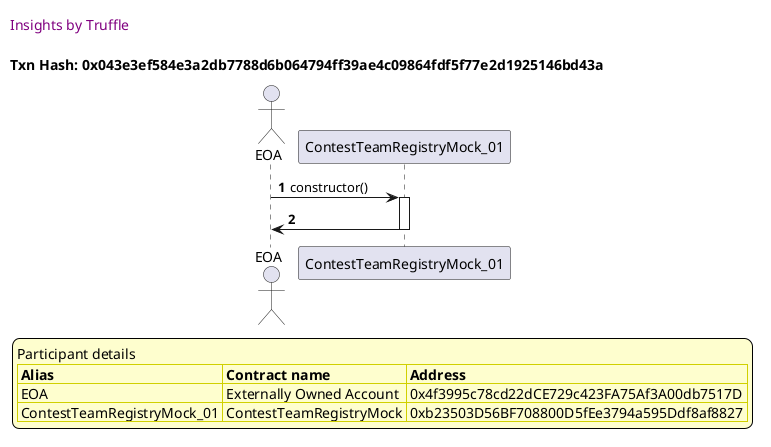


## Opens/Closes for registration and submission updadtes state and emits events
[link to test...](http://github.com/fodisi/hackapay/blob/master/test/core/ContestTeamRegistry.test.js#L37)

##### d1, tx: 0xad1f972f0b3de8b0ded2d2fbc0b09816f0c0747c8261dc326e77c7ee20d57129

[SVG :telescope:](https://www.planttext.com/api/plantuml/svg/VLDDRwCm4BtxLupIowxQQetvC4JPgEG3TG-hLhkvhumz41GmaJ7QfEt-ztK8Yjf3uuEDvmrlthm1GXuwAupjcveGqTjMzqsEXdIxIk-54GtKMA9M2o5tfMbxhPPjtHguoTRPUhacPDRPOurp0iFQeb1eu7My0ZosfdffjHLrMbUbRb1RnrZOIqBcm3FblZVx6Zy0lwiN12-un9w5KfKkmQDZwDzmphwD8iXO_uVkgd9hEyYFi35zKJXUOYjR8smE6Xv5jvq2FGZb5Gbd1SrzXN5E5IgcM95BcjCazgA2Iie3BcCMUKhwB4BE9KTaL8NSOmbnbadhfA-VKX0TJDmv8SusMybgBrohIzS4TdQ3elc5PTLPS_pPojqVwWtvdyCJGWOsk9zVJOFRsod8LhjOVvBovIkvcdwYE_FUJu6Gyt39ypl92gsewexCnX7VtQpeYb8wV_iERePEjdiubJ2kTz2YmLCWLSfWvx3BU_EtmHQt7omQBUhw24z_DIf8fNGVadKGFGI5doIXvB5KZAdbchD41ipFKXwcXPzIgd8UUdpraVYAhP-2GpcfA0Q9pxmW3YBXHynR2PR4GPY4uIB8ieKVUtuGHAwSysLqXpoutVqW_m40)


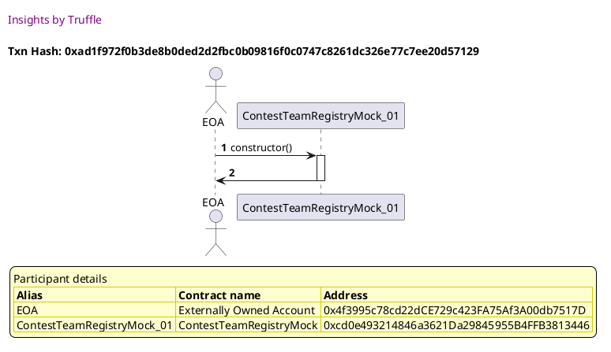

##### d2, tx: 0x52fed3d05c7ad42213d303f1b9a4715dd4bc0b936c9fb5f54573db96c9e1e383

[SVG :telescope:](https://www.planttext.com/api/plantuml/svg/bLHHRvim47xthx3QbqrjDHiR0b4MDI6Wxc5gjUMzClWWLi14ncX9s_ttEGIbwqEIZGSRttVtVNVd0uJkMokCxUeA8T7PHdTr1WQrQwKtmeWQLr22bdEHhqlJT5h6JTKOV9qcQH8d24rQkwjWYd3_h418CFXrE6Byq1ZrqcWhgbcbIbs3jewni4U7r847oardDXLy07wg5y2K7srFGagbIqp9OFhTxvClGn9eqF-cMrMkR8kp7LwQhYWSBxBALe2NMuqVHBiQOxBrlG8aayJFHq9opwDCCi8AcaM2ZwWl9SzoaaKioACYymkV-oCciyWTWG8B6N8jowrBFNcSOT7YAxTV8TSsgtAr4QxKs1K1hLs2g7z0gLfhTj-RVFrCQEz_6hv8SuQY3qTzClXkUbO5tzoCSRC1FG32gaP_-epEnfpWFF8z_oFXER9tiRinlfpEeTQzAphCAthwgtqIh51LYoR3rDvUByY2439z-uhTMBeskfUzX77NYRMeOM-OIMcWTTWnRlhMtxHRjnQC5bMrmu-_D4WyotFtRLW7aUri4J2I1AaNSnxxVXI6F5nuqIWE80WZdd398afey97upAIS17kvN1BW4VCe3taWME3HXV2YaFkHxyzvcivPI1ddb-LEIlslZ6l_S0detgtkr_87)


##### d3, tx: 0x0e27f7f43723a4cd69292c3a089d5e57f16af1c77bd2b3869899d3be72d14fa7

[SVG :telescope:](https://www.planttext.com/api/plantuml/svg/bLJVRvim47xtNs6rBvkwQWRC3qTPr9I0keUfrPhtok23M04JsKPBkkv_dqDGjZuasNYmuRwxxxixdq7epbYkRTys2F7UTgfl2z38hANQSCrRt40DIjppSbthhbSYxPfEu-iyoxCqGsXgxAw16SB3im8kGEEVuoV63vsMhvsol9atibOjAEiOAtjqo1rueDpqUjF0E-1PlWBswD7sn8MGgiOU6Ks_XdtwUKm2ZVfVbP7roXfSxF1IzrNbU96LjW6yt2hymCrgWicMW1zNSKM3s0yuBKN4VEQN0IS94o64SUL5lFBAE2w4NmH9n1B6H510x0kFLZn6hcMbTQbdZtFC3Rvo-nLoRREob1lkIarT4M3i4dZx7MffhDvzwyhr2_46_zFmHPep54Cu6fB1jxEpAlZcPeAx3QZdlcYbCR9J7pwYin4d68ziB_z4TuxgZzJj15zEvb3dtXKTPXKz_TKw0PRBng3fEB6VhXTaGGYPlNt1RYHT2ztBNaAxeyIAjx0tp8NGO1nsZ9kz3QVirgq5hNZJxF3Z3mK2pylItGlh8BATBwA0P57kfvIcOSYIX2OBdyLf1572Q4P5m3pYHU-9pqp9IN2GAmK1oWBVemcDU13vteBxBA4X2yDxckVtGU85b5wMEodrlpAk_UCXe3ktkj_ARm00)


##### d4, tx: 0x2fae87d89b92b4df140f73c7bf666292b80875ebbcde0c9d61d4d94778109d1c

[SVG :telescope:](https://www.planttext.com/api/plantuml/svg/bLHHRvim47xthx3QbqrTDHiCs54MDIMWxc5gjUMzCjWG56CYssX9s_ttEGHbwqEIZGSRxhlxlhlp6G3khEF6zQq2WFUkqtrRI0Fikj4RRdWBbQob5lUyNDUcwxL8EzKPU9rdUPPc04ojsoav0t1uLf8BQU3h-0dXGsUQbquxhkQggNKhjVECbJiwv1uyK6vwir7o7V2ZUP4GawFjYGlHw1fYD9f-3VlqyvW46FM_QjlKAsTXiODBqrULvmMkSKh2vLR31svN4uYsGSKbJGHb1GiA8YfCK9M4PL9KSHm7taOHJI9P5AMGg6GYne88HfA4OiG4Be5lMUbywjdZ778Bh_n-1NpRN5Cs6-vBJNqHqhgbvErtMJVMcTsthbm_8ppuduOlqfoX6CB1a0oydPrLWJSt4rYgpieHuQxfz8UFu6pG2T8ZuVE_CfvZ-wDsEu6NypbKktS5Xua5JtyrK4Z76sN1T9pRJzSBj408pTw-G3-Olf7-PIzX_852pLkvDyo5CD9wx1WtUnlEsgzR9utcIktWuqyj1PoNfRyTpaDeEr_48ShYF4W9IQE8KKhe8c196ikOCf8H4JACSFoU-Coid0G7kL8WILWOO499pCCum0iUC4eY5aNt9C_lGuf3GYxBdPJwNndV_l4Gm9rV_S_bDm00)


##### d5, tx: 0x2e639ae67c72df62459e8dc2efc5d246f379140f011d1408b79d5483121f0e3c

[SVG :telescope:](https://www.planttext.com/api/plantuml/svg/bLHRRvim57xthx3QbqrTDHiCWIYBcX9Gzp2rMlDUEVQ1M04JsKPBkkw_po4eMn-IR3pumBbytxaPXEwiuyPrJOqGxrohksO91jcrqXjkU8Dhg43BUoxMbMaxBREsRWs-Bl8YptA49jRjQfWYt3yhu18C_ZbyOlpG6lNQQiVhMQqgtO1s7h5qHuV26m-GcyviQdXdU5QlW2axwfwub4fNc991zQkNayz34cZW_wgjgbREukKEBqnNbXuNEULgm8kjnW_ShiQOR0E8mvH3F1AZG9PnmA8K4Ya2A4Ka0nQNuIYbZ9I4KkbbiXobCc99I0DQ4WW5yYqJpgUUFyumj_ZAoolas-QKK1lkIyry4M3T0dZp7IfbdTbzQyNwXT3U_xJv8imPY3uSzSdWs-bP5dnpCyQYRYqyTyj6MQjQ_U4ZEXjo0l88z_9lUEUm_d3TZl7bR0wLxbtHOLlHqr_Da-2ugYsQ33lxwNfEveIGwTiNx9VIDz6_x2cC7oRMl86zOYQb0UjjnxZfMpzdVsuT6CthUeSVVsYGU2Q4lndEcyXsDez3aiT5a36MHL6Q92oP1-aeYo5EKfOp6QQKqFWzy9azEMdiwOGamD8me2nXCG_ZWCvva2P-awFedXN5VPZGaB7BT2Uf_fV6jtyO0hhpf_-n_0O0)


## registerTeam reverts if registration is closed
[link to test...](http://github.com/fodisi/hackapay/blob/master/test/core/ContestTeamRegistry.test.js#L64)

##### d1, tx: 0xf603a225d02fd6ce6f6523fece25e29345cc6371f5a0ff3cd3beaa0d3bcc412e

[SVG :telescope:](https://www.planttext.com/api/plantuml/svg/VLDDRzim3BthLmZfPKDNJ9Q_uY0BwiG9kiFGOijza2NACIBBWInZITlzzp6E4Qo7rWVHvgCV7nzjGkuxBvpl6qE8w7rh-wO4HxfzRG_2YOOQgC2gfP3xohMzLQlMj8xURDQRzMfDoBpp9mCBGeTh1qA1eo_Z8wKFhQkVM-k5oKrTsGQiHqRjhmKR12-KXzuT3Bm1VjNFG8FecdiIIjMseW4RKt-7EFywYY1Z_--sgwkTxsXveblNQusynDVU0DqUBNqGtMv6sL4dB1ISnufnhH89YKvY7cgGm6FWMHZ5KYPX6kXOCAr3gS8IX60Of8m2Zfn4I8_Iruyv5HsTO9mGjCtNiZu877M5Gq3djo2Qdr3LdNUd7wtS_sR1KFy-F25aOADtYm_BwEtjZChMOgu_I_dqcNnOVgQxyDxDA26NvPAd_oGhyA8s7PcFA_voKx22CRPu_KPnXoWRRyuj7CvEhMZWdCYLSj0XTdrlyJhOWkVHWxF2c1Dz_6D1qLnA_90yGkmOwJ3BOfbEfU9ShTOfpsJ4mqsUnhaESyPKcSP1Mhmb_i3MTy6XtPALKy4ZdcG9H3ejbcnJXcavJLOiAo0h6LU1YWgKJT2NqHroZoV-8Fy0)


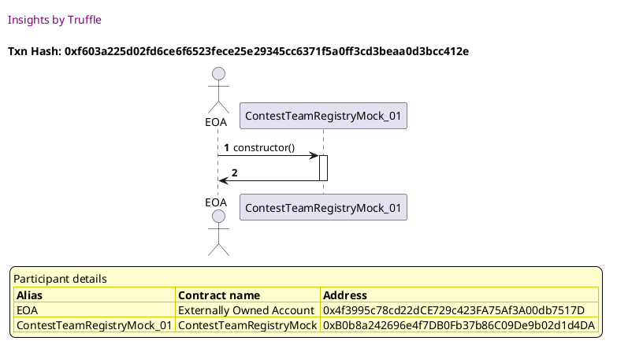

##### d2, tx: 0xb69c2842356f95b86f1544c1de38c4c56c77d3e07156de889c9c6f5bc018e691

[SVG :telescope:](https://www.planttext.com/api/plantuml/svg/dLHjJzim4FxkNt43QMnb32VDA-egIfiEFcmWLcqVnZGvzgL4f4xbkD12zzzt2Q5Yas0QKUAppvVdpdVFcR73oWfZ5xE2CR6mfLxCKZIikihrN1WnWmAdgDMHa5TJKowq6fP5QM1xd8oJOS9OhxAh0liCckSIXK83T-qIuBWq-MsfhIW6HJxLCzIM43ExCHZJvZtaV67c1VwnyIM_HN2yZUvCA9NhAJYyLVrgP6-_3OAr_azqbKylRGNf2YPcaMM4osnk2uJ9KiEng2uFW2_J89PkvBbTFyXYFus2pF4zJpeAkv7qf1_8C5HTvA7Z1mgZA9Qn338_bTo9C8WTHYcJba9FJWSWAjWYkSKeRJQN-LpGKOTq2Api1CNi7ATvPStgKoclVdAdiNzwUukn1Wts-i-QmUxk0PX6YQOsU7EXBrYlBS-xLlRN7y2kvWWajPWrybeK2vhKvclA4pc0DLX2-DmOK7e239n01Jv_uVC0JaKpM3t03pOhllISiHixiQjI9qkZD7H64aCU9L7N6VWu3EE1pvDK3FuESsxAULc9OYIiQ8127hf15dBwkXIqV5ceR-4E-7iE7xyb9qIjP_E-tFk-RL3zgEjpNwYz0-YzlX564qFxq9FtVK8s_KxdFFcQd4zUTJgz_KRVXoVg1EIaPlWQwDrflGgRbnho2cHHLgXsscYPGg9VVYqi_eDAzptCpXunKw4LUL4z2c74HvI9cYhKgiHEcjIWXdniIBCftkO_2hbcFurBOg0MHR62qnkD2WPIqdrX_xFGZu6VwPudDnjtHpoDXEkvGHoWbuMZ8pvEko4r-9378unJxYf7UQFQ7UMbpGuxf97kmTy0)


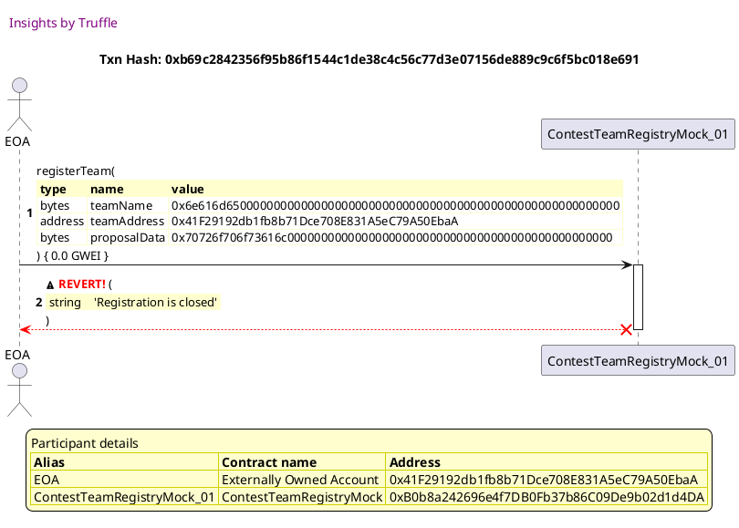


## registerTeam reverts if name is empty
[link to test...](http://github.com/fodisi/hackapay/blob/master/test/core/ContestTeamRegistry.test.js#L71)

##### d1, tx: 0x8974faf9178dd0539263d870f4439407299347d649186f3ebd281374f198c750

[SVG :telescope:](https://www.planttext.com/api/plantuml/svg/VLFBRjim4BppAnREfKKQb98eKpHS8ueVI0z5WjRtWYOfMR146II5sadwxrtBWj4SOXr8QMSvEpjB4NBlWtIXQsf2P1TQspKRuuZVLNOldMoWDgMn-a6gNUdQpkfvMxSERbRBrNA-96Jgmx4sCmBzipLI6mUlmoV0O-kgbzO6MUTrLTh6s82CHRWah10yK-uxjw_DE-1NzM8WOfVOizIwiYL4T0ZzxVVfrq446Uf_jxugjy73vWXhrnK5yf9GXTh0-c3XKVhj1EWX4vmLiX0HpxIcQIBYSQ8pJWl64i4eZuL86DTZ9g9iN2Hce-CiIl1C93B5KqhGCXLG-l8f1-bXXFk8e6sXKjLUOgjpRCBui3Qo-MdAoWTt_D6gtMyQzVaVmoD2UZQucrrDWzlR2QZMOgmxIVdqcLnDFz6TUUycGCXvkEJvFydQ15dLdao74N-vMT05fNJszWrmXYWRNqub7FOELZRc5CYrTiOZTZatU-jjmVKGZBEohe_mzCSQ3RbIU942GlJ0YaI8LF5CwJZMyoLwhbYSh7AUvaMIKwetF8tuuZtn5Li_1FjoIQPZASQ6BHGh2fKleYZ3eNCUnunHoMFsC9Oi5LWEVHdS8VUuuW_o3m00)


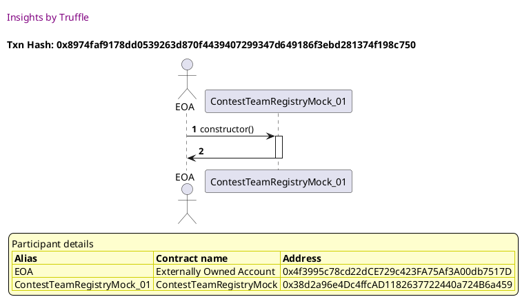

##### d2, tx: 0x6a389f42794bbaf6f9c6b4b50852bf3cb3b6d2ea6eb8ad00eb0fba71b30b05cd

[SVG :telescope:](https://www.planttext.com/api/plantuml/svg/bLHHRvim47xthx3QbqrTDGF6G9H5fOIeUvXQRNclpjWGAs0YOxIaxVxx78AozI79neCDzzrztztv349tdGLZ-wP627hRwhxXqg1khVG633IubfNKuXwATMNQNekihLk3hnVv8izoXAQTtTLoXl3mh2G8QV3h-8dnGslKIwijr6cjAjr8RHrZQOyE2mSUA3UzsTJo7V13lKZiqQFj2OHGki8U6Ks_XdtwUKm2ZVfVTQUgbUqmt-6bwSlIyIAhR2tnSgln0tIh2IPR1a6SbDIF4ievbAnC2iOf3qaS-hmC2Xvm9dm9JF8O126Iav93vF60S18M0hcM5TQbdZ-c63fyvVOhvDfcLQ4su4hDN16oiqi9pNTPgSwQtRUsM3yJR_0_3L-aEKCnXACX6NmxEwk2RsuckDr8FG9WLQi_V4HdOqvm7lcU_v7m7DaViTi9lfpEeTQzAphCAthwgtr2Mb1rXwRZr7wwdfCv8MJszWMxiNHjT2zx2UEE4sjevDwG2c5avx1ZtEnjE6ctRgqq6kfwXnz_QYbmMXJkRbW7aMqwPm79sSBFACt2C8bZ6i_z9CgOP752Sog2n2CUUqzyPb9EWeDS40iV4YRflA1bMQHppujz5aIHxrDA8FBfFGCQ9XVbJahzhunh_tW8wCwjxjVo6m00)


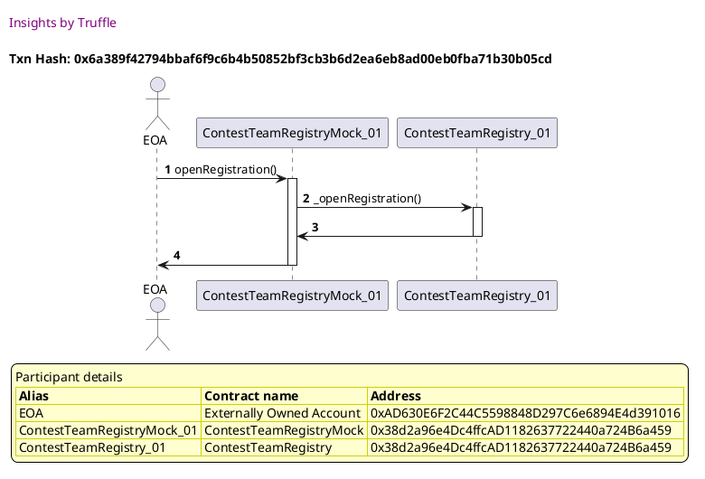

##### d3, tx: 0x82840076c90a4e16762a7b3812ecb5c520a81b54fe8c1eed4621fd97e8a102e5

[SVG :telescope:](https://www.planttext.com/api/plantuml/svg/fLHHJzim47xthxY1DBOoXfscIOgwYj2cWuSDnD3sCAR9SIub8dKYnuKMkl--InegDWccRL7Yiy-NxyvttvcnmyfAO-Upd34vjuMUps8qhBhET2cDd46EKzJ9aLJNKrFCTJ8gyiB0zYIQHAE8iK5bbpaE6JJF5Se43TotIu3ZmcHtXROo3_DigcUeBI6cTcCmeSqrP3atPOw_R7pAxX24kz6ToIJ9z1G4RrK_6ZdORuDWhVyJNMNJArj1l8GBCqzJmcKsipd2nKB3iQok3e0l0YTmEVSzrUVIHU7vdYFzk1i81rNSKps7oq34FJV5G0d4nFKSaIPz7mCfk8CzHYbJbaAFJaEG5MoHt6AKDfkfh9Hqr14T0YjxWN9sZjEiicRveL3Ntxbex9_UtcAiGOEzuRDciBjx0APHegaDNbtgIpPeo_EcbSFLEx3B4e6abhD6tiXyJfFQV4Lv8WUm0ai87ni3IW__p-S1d8fci7g03pShld35nEcBlfF48es3s1TZXJuFeg0hmXwE_7xOur4imz_3B4rH5fNCnzBA1iZdlkEbFgUlwmbF_Lkeh-4U-5iExxz49qIjP_E-sFkwRJ3vLjTdNQYz0nYyl9L64qE7C53hFY6ROQTp7dsEpYzUT3g3_KO_X2Vg1EIaPlWAwDsfFQyBfgJMXOKO0MUbNUwq0RC4YO7PZRJu1pQjsvYTFI9dWbPcUVKeYZ4VKp9gjb2t4a5fKeCQyh7XpQP-c_yewhe1Q5mG2RNCyoMStcfC85IAhWpxbxL-3FnC0psvsRZh1eaZ-nwwO-McgGh7GWIEr_Lznt5TBdt7FVAas-kJEyfBcnrsI2DTXJy1)


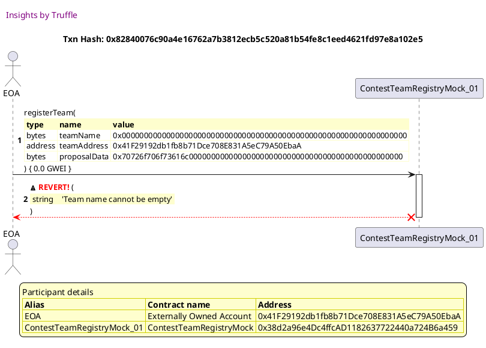


## registerTeam reverts if teamAddress already registered
[link to test...](http://github.com/fodisi/hackapay/blob/master/test/core/ContestTeamRegistry.test.js#L80)

##### d1, tx: 0x65c3b34f88bc689a6de0f5436c9ee105b6e6a5b9c6ed1038d0dbcd7f294ff073

[SVG :telescope:](https://www.planttext.com/api/plantuml/svg/VLFBRjim4BppAnREfKKQb7fBXcj4jYMaXo91wtj1yI4BfYY3eb0xIV-zQramcaF20odkh6PdPoL2xdl7h1jQJGWRN6U6jfAMzFl679XbBMXPIoDMZEzhsmr6h3lTMRWfYx9O5uGiUdVISabWN3l9XBJmCbq17ZhRF7V6CPthfZQjD0uPbRicb0XUA0-3FMZv1lZLF4lmmcliYGdHc1eyEeN-ZkVYwoI2JFM_cxwfTww7wWHREoY5lCGrJalO7Wqyi7ut1tgC8nvKGQZIjE9nch5OIAgYC8Xv9gL7eogMCOkgZCTIU3H81HKL5udoir0fcWG4BUCEfHUFER0UPdZE2Dhc6juS6BQwnYPaxxQIjJzbtVJEddvqVF-RUcF--_2Ca94DxfOVfi7jxHnuPp0sdALy-am-J3_JNNZlva38PRZawJ_9GZhMw9uifX5_kTdG3QLq-VeDS8Oe6n_E9Ips3eQryXp8XR2oH-pwtl9rj0NtevFMCArFyFZ7I04vv_WXEOJeCLH1baKyIRdmVR4k4Z_ZeH-KUHBbAiWfEfv4Nh9vI_o1hU-2Oxb89J5NAlAhigH-i8b46gk2nduGhbPfaYGUtMHb5cCvz6LoXzpZZZ_8Fm00)


##### d2, tx: 0xc564c88f0a5f036cbce6a2b2b7c06f5e4a6a1d14a2ec12b4c3c7d4bbdbcf491f

[SVG :telescope:](https://www.planttext.com/api/plantuml/svg/bLHDSvim4BthLsYIIpj9fWA408_hYSt7f8TECgtl6Q4Fh348Zn1JEqd_UsNCECt1Tij1Wdsxx-skLW1mtrbgRD_K0D3UjhflIc50jrPwGmrjO2qgeVc2idLbsbxpjArR0w-BlCZJ781fPtUrc04uF2j1kJ3mTVo4yA4rwgNLbjRpMbMw4TewHccF3eK33vIRtcngyG7ugLu4zF3HzaGvLxg27XfDluTz-cLC0epwttIdgfNjOBc3IzDBwNY1LROMSBdLy85sgmb4MnOIpE9O8XfA511MCa6eN_fbn12HeS2KK8zxcFg2UNw9MS0YZikIbqpYn9F0jOnPbth-E8UqWrTklmAkRLOnjQ6krDGL8Jgx5BJv8IhLMRFxthBrC_86_zFmHPep54Cu69A1TxEpAl3cPWBRZT0ZGArgzQVFu6pC2SuZt_C_4fuZUnUxcy3BwHngtRk2mxo2fx_QnuMbgkx0T9pQs-iCPGYXsTjNwCRIjT6zx2MCEqweQIFsXZddHdGEEyRDteQJTklM2gDfNU_WuoyjE9mpvkw6TH3QpZCIe9mKVefn6eP97ECuyvCe9OB42Sun3n8FUUGZyPb9EGaESg6C29CozCkYG7wGXJmcCaV43_1Y4KTHvA4iAPBBSYUb_bV6jNyy173lLlTh-GC0)


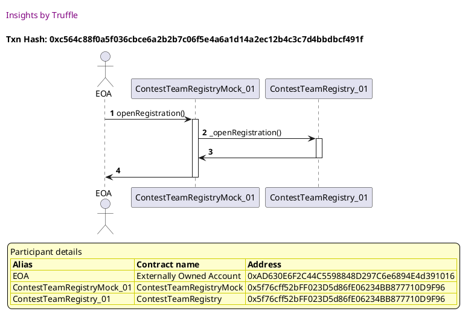

##### d3, tx: 0x4332dd5fddc258d420f4858f4bcaeac6844a1459485599ddf21f9c9b1a2c4b5c

[SVG :telescope:](https://www.planttext.com/api/plantuml/svg/hLNRJjj047tVhnZHbrOjxThn5T48azY51me2fBuWLUkz91REEbglMmBfltTYdDH11GIj9Nkyi-CpisSk9kIWjipOPbOImXfRwMQMIqFgwqBFcM4pAEL4Qd78-FN4L8qMewgi3Bp9qYmTfOJirtPHoY61zffA9gI1ksu9S5IPuhRIbfL9MKpqJ6gBYCfk33BSl8USDsPUogsDY-9MWkDjT6TCY49FmA6TwbShzpzrGP3E_x6kYydKrf0luD8qIY4kiOKj9LpUQ3XYzNGFw8qt6BX2-4e8xlgHy5oglCYFb9Tp9XaF8izZZkV7gFJZM0ZbEYhcSUumbtkvpmbInYs6dfucm6hOGRb3a3PRy6BEyAWZF8IixQLaitCvAMfh5YSLl_vEdTR-yUrjc0kcv0cpq_LtlVKE8QrRs1q-YGVlt--1QPNIh0pUNkahij_byKCdXylFO1Tp2IWrcxNo1oiRV5cPBv5GT01Bi8ZmjJL07WCPE848VFhAQmsEsJMoNiCdcnLcoidSs8bTaJigZ_BG6NCPqYYD1axYor4O9pvDSvOy37DkgdbLitBCB6k1GXgwWGeftWCCchykr7Tm1_GZXI_VqcEimITvN-Mbdwys4NZIr_7V55WEoDJgC0zqETxEt-FRylzSeUpkxi6vj8tHy4ynzi9vdg7x4lv_djU98kH-Vf6pNZi9QLbHrZtyCHrZSbVuEAQmm_1b5R71zjvusjJZvhlXikryVDvWKsbMbWiu_QcbW8Hpd9NsXRNR1tvYSZowsRhpLHXmfNmtppBg3iQ-Y0ALqi0TU8U7KHY63Xt7MHnik-jFc3-hbm8YqHtTv02V-5Fv3G00)


##### d4, tx: 0x3aee63aafe57c239ee0ea0debbfa91c4c9e7aadf1acaade369254ee9991b4b01

[SVG :telescope:](https://www.planttext.com/api/plantuml/svg/dLJRJjj047tVhvY2LDfGojgExHYb4RauXOSMHAFseLJLs1u72sSThJUGGFhl7JicefMWAfQzivVncRCpPrU8uzAWDejPBWGkJA4MiuYqAAypDKUDCyXfIYePO7mzrSL29SCYBpJiZiDnE0o5w9PcbLDFGFrS4IQauRuP0fmKEhihbC6ydsTJDIDb634rMuSnBsuWvmizp-cFXI_P7O7LtiwTOv9aQWgMRAP-rRPxs90GJVnJLMRJArD2j8A9NgGfumgJcPnWibHmWkNL4SYbWqIUWvYIwyUs4n19GfbG5AKOM74x3iX7J58BOpRaU87jjec28B2YTYGjmIcB3LCFp_g09UomtH6SDfF5sHnvgqFU19LcGZYxe6bM6htwLCJNFwLL-p-zl2D4ZGO7lMVTO7__27GzIRfoU7EfBaMtAS-xnlRM7y2ivWHi5SvgUuFvWZkL-vhpn05W3OOHFjSEd1wFFCjBF5U-y7a0vw9fAX_W-zkHNBQjiHrOWPr4LXfr8jyQnUJBJjXnhBvBGp_ekpACiFytpRakvaM9-GWDra2-z6qlzIL_3fEENqRrBTo3V2_XuxVmbANrRDwN1zztDIK_glfi2dLm1DtNjwWLAxG7tNXpJjYdrsfTX5_3YychLgjxMC_tu8aw0GUf5Bu6VlUgo82vPbMljbMcPA-XAn9Y_MKtQEWVMjeSOd7-I9e96SpoyX67aHnnAYgjy5bbUNAd0jKSOwkQRVMs_p7dIlxSBfcSmZnVmTcjeWJwSSmNXldFIZy6VkRuFBbOXtDJtulJrBMZyLZQpiXDEbuQIizsseD1n_TzIuw2SU1nECvBanrnp2rVXBy1)


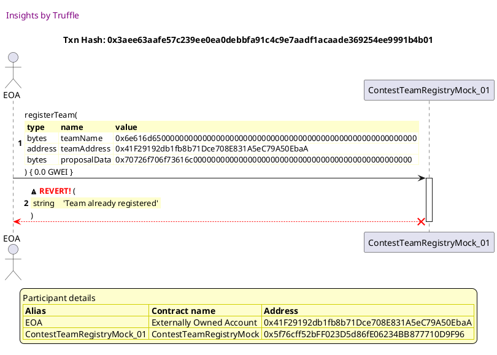


## updateProposal reverts if teamId is invalid
[link to test...](http://github.com/fodisi/hackapay/blob/master/test/core/ContestTeamRegistry.test.js#L89)

##### d1, tx: 0x364af5a94945bf5e3ae74b2133a9af86cd0cba55ad422ca3e932f9b2febaddea

[SVG :telescope:](https://www.planttext.com/api/plantuml/svg/VLDDRzim3BthLmZfPKDNJF5d76H1tSH6TnXQRBaFj4GvHcmva6KiQRl_FiOnWlNG-23PVFJZuwF4s7tdmBg-gHc3thMcRmgqhDjLPWyM6bvZYKOzWDoLjksDMhLrQ_bDdkNPAcDiqRbZZKl6XsUBeD3or_6JyyVMLY-jSL2dTLMQ1eqZHkqk2Jc1PyfzR_SrlWD-LI_8fy4bzWnALQRaKp66_WxxukieWetrlvkkAhUkuyMHRsolDV4oLxaQ-UPW-2DqspaN1pyAG8UG14aG5Zf47p0E2c_g-v20daLI2Lb0688AF4-2ZudlwQJmD1Oa186HPTAHzEmfvT3n2UqJHhQvIbPxe5PNr0HsReFG_CIowfmz_cZbxhUO3laVmnF61ZP-jxoQnczlvrosXcBzISgdp-ng-edkp7itvuoTXykU_vEiq45LTsmnZlZBpLgiXH3Bjs-SPaYowULKmbBlt423fq2gbCMEiCj_oxV15beF3gs1kZxofpy65K-bf8Fa21A7GFj94ifu9fNdgLKMUuaCF3zFup3LVYg4Ak9m6g_V4r-nzKDmA3TBuaWcIL484364aPPUy925mf_bQr_GEPX5EWe5K3doPNI7tTDA5-GV)


##### d2, tx: 0xe49dda5a758d5aa5ef26b675689d88c509077de1ada8be7793ca7ec6f1735b0a

[SVG :telescope:](https://www.planttext.com/api/plantuml/svg/hLNVRzem47xtN-6rqhhITNE0_AeOAeMmyZ2rOgXxMAVf4ZlKgd4YnscXxVxt7I5bxGDqdHP1REwS-xxxSdSGSbnOCBQSAKAWj9akPx4mfBYMEWS3Cwh4L6X-0idrr6IbvlrCPORk3gDXr8y8wHHseKINqEgw4i25eVVrJqfFCoFlCcr1zPISwfdG5YEcTdrWYCvLoBmqkHBF75_bdQ1EUsqx1ywbdbA7rQPVrThvM9CWDVv85t9wPGiQB-Z4b6cASOcLLWawcMjw2iNL4MLpqGuv1nTyD-0kW2lIfXTxlki58G-2n6KXytqk7E0GnCBtmrO2laYyrF5RRio0e6I9HUhHMOz2GNTmtI4ecvM9p05JxMCIeh0J0REncCh2ciMNBBd-oPpg_6RtYs6sXAWU9nKPUjZTYa8F3evecNEmujnaULQ06e25TvVwadJgT_o-NhiFdwXTv8BYgc5MhJUWIjmiZp_GKYBL1seHPyHnmnuTyGBnqP0_WLZwvpxpcrxgC_osFCTBs2kl5S0-lQVi0wEVlqKZh8Yj-MxGOws5B2v0IJwfSlYlClm5osqC_sHmU4J7mfP6qt_Z5sUPGbhuIK4LjNb_ksppm--xHl0VItAhka8MdRUtO3JsOvTsajLKm3FTHcCSNKJZoPj6e_EnidStCQK8ikpdYitUIDyijQ-KevBlFJBZ0hjCtc2DRkyOiXfLvFn9vt1XGQhY2VQ03R1obYhXHC8Emiqog46CjLuzpeqeqBT-3hakcnplSokC1gKMzEnM2qvxIO9ZqLRrt7Q6pT09cpnsqZY8VMUG29y5KT1oUgxe-s7FPL4ClUU1jmo9ZSuABWXzBmd364SHyy7rqgJPFebSrWg6WnPhX-t0IpsNmOjm6w5U2uForo-17ECT_rL-0m00)


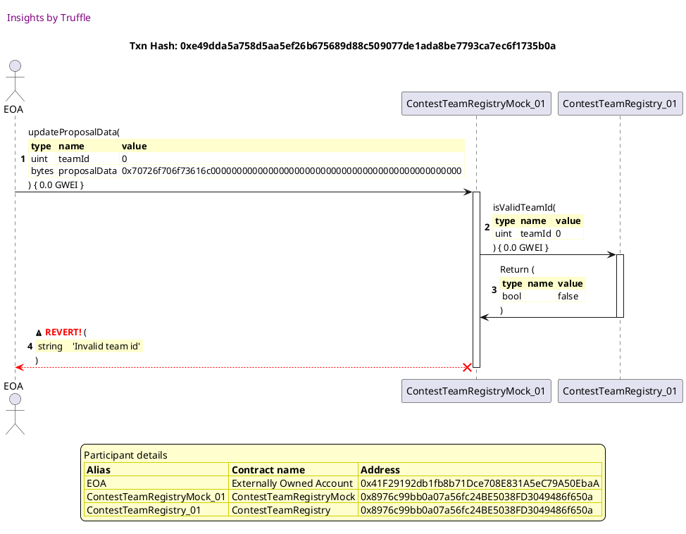


## updateProposal reverts if teamId is not approved
[link to test...](http://github.com/fodisi/hackapay/blob/master/test/core/ContestTeamRegistry.test.js#L93)

##### d1, tx: 0x4f9a7f04aa1a9731479a959977445680863962ed124c4102933b3f7b5642fe71

[SVG :telescope:](https://www.planttext.com/api/plantuml/svg/VLFBRjim4BppAnREfKKIbDIBfk4QKMq9wI58qFfUK2Gb2wOeWw9GEqt_lPGi6CqXve4KTrQpixCIGW-TuzRrZKQ8zwurVLCeYxfzRGxSyWQqgfIHtxZOLxRjZLotkhLmasTvjiuGMdRkfDKAmRXsYajbuSzq1NXiRVtQ6iTrgklADCeuprYwIqBkmJFbeRS7hTu1F-jN1IIwn5wubBMfWE0fz7Sybryc4MYg_zrqTRLp7HGdsDg-B3qlShNJ2hP70u-ysoq07wEISLhYY7F26Gr9H1bdCMEKHb6SpF4y2LaIA4c2I4G41omCYx2aHPn4GQaeGTuouRpqx3a5ti7CdpFaRNErg0_SjxhsJQZERHLlVgYgxfmzFRLY_mkJCVzZU8RGo0RtgwjfS7kx0D4Q7-i7APy-ewlf0zsPztu129s7Yrx-aooLuxNkq78QyTtD1cymngkth-1dw6NxXw64zRs3uOqQ0gcKLdKUkxotUXjjyVlHAMkurYTu_csKX5G8_o4v3mqZ21cB1PqB6GHodT60YIW8yvJ6QHcc6Ck2neHktXDViVL3S2oNf44Ymxp8sOP6R9Wu9f9bWfHvGJUOvK6SP0LDV3dlo-GEUl2x_q7-0G00)


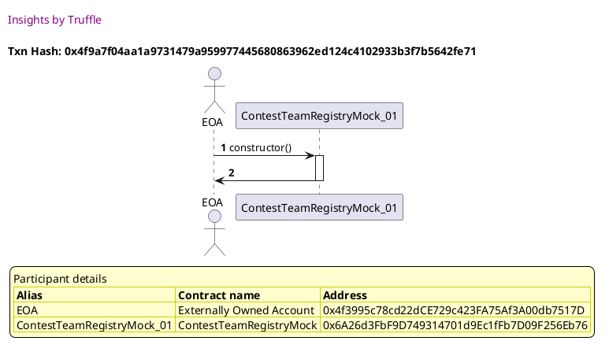

##### d2, tx: 0xe78b4a79fe047e20c0130c4414b2098eac5974d2cc8feeefc0540e29d1e19513

[SVG :telescope:](https://www.planttext.com/api/plantuml/svg/bLHDRzim3BthLmZjPKDNJ7Ba3mLPKCyVw0v3YottGfPenwWj1xAC9LtttwSuHhOUacm-I3OV-Hv9KKRehhV2sA5j41A3xVJG5c1G_rphZJ2YnGrKeDLd8PyhqmrQ9LtJ6NoTPtcMP0WjUhjhO8dm-An1A33uv_I9yNrdwfTEMz74JLtf5hHrZAKzEkGEF51k1hDfu0tmlNu1JDdHzYYKgdM5APbClyPzyN5A0atwNtHVLslRusA7LsOeIyUBR6qRmAkjnlUYNyynsK8O5Ko4l0J2Gl2897H696EK5HxX4GZfyv0fJyge181I4fyHyBYYGBbFPyYrJ5gNUlOGOz7ZAxTV8TSsMyjw8rofYIi2Uhi2qNw3gkwjsNtjvFCJeQF_QVWYpHcACHoDoU3RvLaLV7Cpnzq6z0G8MtVwtNjqDkO4vv7lwHy9pv7z4RkTuylf76hTkwB3lAB7lzgdm8gwwT5YcjeFrob92I7Brq_OZQLhetlPInXtd5YB5lQ6M2a3lSEESSlNyQJTkhLWj6YQ7NxueK7XM4ftDwo3o3PEWnd9WjnB64jydqSHYrAFXqa0GSHPnjICKqA3jyHd9kKaECe5iHUeMLxaF0qPdr4M4gfu9ccP5s5AUExvGLQ4b-LEIlslZ6l_T0Zepgtkr_8R)


##### d3, tx: 0x05f90c50ca588f8ea27e8614d150437a631a334992f35fdb2bdc6c0dcc131a35

[SVG :telescope:](https://www.planttext.com/api/plantuml/svg/hLLjJzim4FxkNt5YNpOnDZllGQmYQvF11mO2f7r1cXpRQIDIftAShONkl--Qlgn50mHRfEHYt-MvytCl8UIuiTpOTbmHmbjRwtQSAqEQsr9FkE5ZgDHGQVcPYzkXgLij-tLL6tYJfLdQJmavQkoiKZq2tJLIN2e3zwibm4bjohjQMrubLJdKOwKj8XPsOv2XSWavQSsaKZkAg_9E0VCsUnTSob8FWT7LrgzE7drS1K5M_azrKmv7je5y1jUcBGh49RQqbOBhgOOJtemEWKwfNyHK-5HmFugAI74dL570FCbywhaX3rp6NTUBOwTm_KBcJYv58AWKWYqqFa7AXCNGq_C4U0DxAFS8qcPBKKuu7hMFXr2DlLPyVAc6PMFDxAmMjzyfw-mVL-_2NF52dN4xMd-tjTuZf7CB1xqdyM1__n1CjwdCmk3jZRuXHwiylb_9tlmJsDb40KhDnvtymQiMNnRcSoGK7S0SB29yxGoGnq05B921JrzvhS4nkqOrQ_Xaiw9JZsLEp697vgp8epna0w526gMHon9VzSCuyMcQy-HXc1DJJ-g6LmDkUGSKqj09Yf3YxMBGudMXleDxe1yeVFcMdc8DFidx8Y_R-UeIWITz7VzjYUM0J2qEys0lnvlzFRuT_yyLoi718LmgsneD_nJZLZZFCxGiuV_dUPqeGfRpYrnijPDKbfTLiuK_e0DCxW8VnnHs6Bui8ZROtXjFcthSVDURTvsFpoasbUPLDOFpdrf9I8J0MMbVMBlRm4zCZaULosPCd42wMPx5Wz2BNUQ5bCau5Qp8yd10uypnWpGFWrrtsnFcp-gbW4ZqYcvoZ4_ygVm6)


##### d4, tx: 0xa4c5cc8c516a4f8f575706b80dfdb1079efab8ec5b568ead8fc1b1bd17fed7c3

[SVG :telescope:](https://www.planttext.com/api/plantuml/svg/xPPVJzim4C3V_IaizZB4sEosQHB4Ah8s6JmW45JR2nBolxGHgLCv3hJGVVTTqb1QffOnjB59gzISVMVV_UABV8VGGMwPiSKeHOWLDjF5Y2k3ygj4ZvbX8vogWTBo4nDN0vCLMdQpD3FuJHH6OJT4Q3-tqrHr4Av-GyMaClYkdc9yc9daDjEMfK6Q3FH8QGiUOxjO485nxd9Sc76gLWpdoQt2jBNGdJ8f4pt0bDIgRvNS_r13e3h-aSwJmT3cc4zntnHn37wHJMogS7-YyI7BXtkOJ5XBE49umg5jregzs74TbxIvHsGiEIMkhsB6FIKSxhGzyEp5WdBA9NLZ9LtHH71amW9wU19WbkCja5i8Ziqc8XapUDKkl8JARL-nqPaQ9Barq-DCN5qIMgrVRtxIpGONFsm_Px4wPdPulsTfleLGHOrtEnjnyCxE7ZPgRB9hLThVNkWBj5z_1UzgsPbzn7OwLXYaPgDANhEqW46vV8QB16Xcs8A38ma3CZTiupjCtXFy-Mju12dToB66Sy5u-OgGFmMOv5zOciX-vVwl8zpTtSDdoXP6urzZurcM0bA9P-wrsoyvhL8TZAkSoly9_QSJ-XeiotTTbQwyu2zA4eC_VQJZ3xh7ELk9_riFfsPP-doUdQM7M_OFmQnSw_Cw194HcZSTw7IfY4bbMPBcIoWzqYE4b2ZGMq1TWq4Pma1DNa05KXgLWssnhpEhoZKy9rOPpT9qYazkj98u408Qd1ARJ5eqQlZKRq0V47EFkxGdb4kyq6lIm55TrmyS4d8Mh3hUKExN6gjmxQ3Hbis8HtxFRVbDsd89bNueQ1nnjqVygE6qG-wsdmotDjGBmYot3m-pvpg4VDPPHGVmX8RpEm00)


```plantuml


@startuml

autonumber
skinparam legendBackgroundColor #FEFECE

<style>
      header {
        HorizontalAlignment left
        FontColor purple
        FontSize 14
        Padding 10
      }
    </style>

header Insights by Truffle

title Txn Hash: 0xa4c5cc8c516a4f8f575706b80dfdb1079efab8ec5b568ead8fc1b1bd17fed7c3


actor EOA as "EOA"
participant ContestTeamRegistryMock_01 as "ContestTeamRegistryMock_01"
participant ContestTeamRegistry_01 as "ContestTeamRegistry_01"
participant SafeMath_01 as "SafeMath_01"

"EOA" -> "ContestTeamRegistryMock_01" ++: reproveTeam(\n\
<#FEFECE,#FEFECE>|= type |= name |= value |\n\
| uint | teamId | 0 |\n\
) { 0.0 GWEI }
"ContestTeamRegistryMock_01" -> "ContestTeamRegistry_01" ++: _reproveTeam(\n\
<#FEFECE,#FEFECE>|= type |= name |= value |\n\
| uint | teamId | 0 |\n\
) { 0.0 GWEI }
"ContestTeamRegistry_01" -> "ContestTeamRegistry_01" ++: isValidTeamId(\n\
<#FEFECE,#FEFECE>|= type |= name |= value |\n\
| uint | teamId | 0 |\n\
) { 0.0 GWEI }
"ContestTeamRegistry_01" -> "ContestTeamRegistry_01" --: Return (\n\
<#FEFECE,#FEFECE>|= type |= name |= value |\n\
| bool |  | true |\n\
)
"ContestTeamRegistry_01" -> "ContestTeamRegistry_01" ++: isTeamApproved(\n\
<#FEFECE,#FEFECE>|= type |= name |= value |\n\
| uint | teamId | 0 |\n\
) { 0.0 GWEI }
"ContestTeamRegistry_01" -> "ContestTeamRegistry_01" ++: isValidTeamId(\n\
<#FEFECE,#FEFECE>|= type |= name |= value |\n\
| uint | teamId | 0 |\n\
) { 0.0 GWEI }
"ContestTeamRegistry_01" -> "ContestTeamRegistry_01" --: Return (\n\
<#FEFECE,#FEFECE>|= type |= name |= value |\n\
| bool |  | true |\n\
)
"ContestTeamRegistry_01" -> "ContestTeamRegistry_01" --: Return (\n\
<#FEFECE,#FEFECE>|= type |= name |= value |\n\
| bool |  | true |\n\
)
"ContestTeamRegistry_01" -> "SafeMath_01" ++: sub(\n\
<#FEFECE,#FEFECE>|= type |= name |= value |\n\
| uint | a | 1 |\n\
| uint | b | 1 |\n\
) { 0.0 GWEI }
"SafeMath_01" -> "ContestTeamRegistry_01" --: Return (\n\
<#FEFECE,#FEFECE>|= type |= name |= value |\n\
| uint |  | 0 |\n\
)
"ContestTeamRegistry_01" -> "ContestTeamRegistryMock_01" --: Return (\n\
<#FEFECE,#FEFECE>|= type |= name |= value |\n\
| uint |  | 0 |\n\
)
"ContestTeamRegistryMock_01" -> "EOA" --: 

legend
Participant details
<#FEFECE,#D0D000>|= Alias |= Contract name |= Address |
<#FEFECE>| EOA | Externally Owned Account | 0x41F29192db1fb8b71Dce708E831A5eC79A50EbaA |
<#FEFECE>| ContestTeamRegistryMock_01 | ContestTeamRegistryMock | 0x6A26d3FbF9D749314701d9Ec1fFb7D09F256Eb76 |
<#FEFECE>| ContestTeamRegistry_01 | ContestTeamRegistry | 0x6A26d3FbF9D749314701d9Ec1fFb7D09F256Eb76 |
<#FEFECE>| SafeMath_01 | SafeMath | 0x6A26d3FbF9D749314701d9Ec1fFb7D09F256Eb76 |
endlegend

@enduml
```

##### d5, tx: 0x20857b1f0419256fc881bdbe5a90fc530eca9f7bc68e094d161336b1c4034452

[SVG :telescope:](https://www.planttext.com/api/plantuml/svg/pLPHJzim47xthxY1D4OPmsdIf45THTOcWuS9r5NiOKoJ4pib8dKYnu4Ms7_V9GqTFBJ0DY4Y9UVSEVTzlZlTXP23GZEbosbA22jr9ijfA1GfBXAPCyMca8g9aFmJYoucAYib7sHffc0py0D_u1FIA_Gy5Nq2zNKk61SARffNWCDC9TUPr2prqcGYfq9gz1ZhvOO0ZGkNUQdoL3mmV4sk1HZMKdV2E4_a10pQg7xLihVNa20D_f4iaicvBY2SmrYLSOn-YKvqAc0yat38YlDzeBCsxNQSq8YfPRZjZXr7tQuHyb1qc4lZg6DI4J4tTiB8xWhgMjom3TEqGoEog6bPdJR1a4KQgVl77h02Db1k40oRJg8aPtZK0Hv257eis7Ga9acXrVnB5btyf4QzVxNvKJThNDIVaveCxFRNei3EpZwKEMTQdAWipmgM3fbcxyxa6UarENxVoFxjHz3pN01AoQQrl6HfYOjg-osK2LAz1OquHnmNzCuGpX4V5VazYCe-SwZJjcE7uctQXXtHPruBW6su0Vg1mkTl_X5MnDhpheZ7CXP9SShIX8_hC_pNC3o1vJg6VqwmkmyZeKibuU_uXLcM8gsAehhJRlzhr2grbsE2ByMh2jlhJ-nB9_MbYoncQV6qAfljVjzKWl-eo2sQ5xBelRrYIcBJxqClMemUtDDljKR-gJyQlscrUdkrlh-AAI18DJHgDbiLCXO3o4m3QmfswuuU5zZFaqliXkjxCraCHN9ohqTpeLcI5lS83EaGUrGLAfnzsAjnKJbLYB4CciUv4WNQbjyXuMgSu7EcXP8iJUTmV2K51o-AS03hkdDQHj1sSMfn75zXDtICOIGSslMxfk5rnC1nlGxrG-OzTBnc7Aqqrd2srxQv6OI1EtGirpGiXnhSzICZ3a9dIDq0nwSVElQZS2kXdWk3uM-IG0xmYVyllm40)


```plantuml


@startuml

autonumber
skinparam legendBackgroundColor #FEFECE

<style>
      header {
        HorizontalAlignment left
        FontColor purple
        FontSize 14
        Padding 10
      }
    </style>

header Insights by Truffle

title Txn Hash: 0x20857b1f0419256fc881bdbe5a90fc530eca9f7bc68e094d161336b1c4034452


actor EOA as "EOA"
participant ContestTeamRegistryMock_01 as "ContestTeamRegistryMock_01"
participant ContestTeamRegistry_01 as "ContestTeamRegistry_01"

"EOA" -> "ContestTeamRegistryMock_01" ++: updateProposalData(\n\
<#FEFECE,#FEFECE>|= type |= name |= value |\n\
| uint | teamId | 0 |\n\
| bytes | proposalData | 0x70726f706f73616c000000000000000000000000000000000000000000000000 |\n\
) { 0.0 GWEI }
"ContestTeamRegistryMock_01" -> "ContestTeamRegistry_01" ++: isValidTeamId(\n\
<#FEFECE,#FEFECE>|= type |= name |= value |\n\
| uint | teamId | 0 |\n\
) { 0.0 GWEI }
"ContestTeamRegistry_01" -> "ContestTeamRegistryMock_01" --: Return (\n\
<#FEFECE,#FEFECE>|= type |= name |= value |\n\
| bool |  | true |\n\
)
"ContestTeamRegistryMock_01" -> "ContestTeamRegistry_01" ++: isTeamApproved(\n\
<#FEFECE,#FEFECE>|= type |= name |= value |\n\
| uint | teamId | 0 |\n\
) { 0.0 GWEI }
"ContestTeamRegistry_01" -> "ContestTeamRegistry_01" ++: isValidTeamId(\n\
<#FEFECE,#FEFECE>|= type |= name |= value |\n\
| uint | teamId | 0 |\n\
) { 0.0 GWEI }
"ContestTeamRegistry_01" -> "ContestTeamRegistry_01" --: Return (\n\
<#FEFECE,#FEFECE>|= type |= name |= value |\n\
| bool |  | true |\n\
)
"ContestTeamRegistry_01" -> "ContestTeamRegistryMock_01" --: Return (\n\
<#FEFECE,#FEFECE>|= type |= name |= value |\n\
| bool |  | false |\n\
)
"ContestTeamRegistryMock_01" x-[#red]-> "EOA" --: <&warning> <color #red>**REVERT!**</color> (\n\
<#FEFECE,#FEFECE>| string |  | 'Team is not approved' |\n\
)
deactivate "ContestTeamRegistryMock_01"

legend
Participant details
<#FEFECE,#D0D000>|= Alias |= Contract name |= Address |
<#FEFECE>| EOA | Externally Owned Account | 0x41F29192db1fb8b71Dce708E831A5eC79A50EbaA |
<#FEFECE>| ContestTeamRegistryMock_01 | ContestTeamRegistryMock | 0x6A26d3FbF9D749314701d9Ec1fFb7D09F256Eb76 |
<#FEFECE>| ContestTeamRegistry_01 | ContestTeamRegistry | 0x6A26d3FbF9D749314701d9Ec1fFb7D09F256Eb76 |
endlegend

@enduml
```


## updateProposal reverts if submission is closed
[link to test...](http://github.com/fodisi/hackapay/blob/master/test/core/ContestTeamRegistry.test.js#L100)

##### d1, tx: 0x0ca8837c7d0a38c1b0cc38814497a922815b406ad866f1b6a112e36a0cd61205

[SVG :telescope:](https://www.planttext.com/api/plantuml/svg/VLDTRvim57tthxXANpPrrMm-R8Yog9GGTGzJgotlax4DGG4JsKPBskw_po4eMXyQFzZudikvvvuB2DrRnuqRkXOXFhXU3rsf3BAxHk-vuHsqgbPQFd2ngqq_Q9dtRM_WPbsiYxn0Q67TiLLB1EFQAYwLWTVf2l3Oc-QbruwtMTlKkbFQUSRANHBM7ZnJxWUpRzKxu5Vpee14bzWpbxBHDH0yXVwEv-Bh909DzRzhszHRPw4ymiOCLULvaMjSgs1pqF38xNOE-805JvAG2IOn3nD1IYn4c2GaYbB6qo18I5n6c7APK5gHad920XLIZeMa9C0nyfO9vwKNJnbm2pD_pf2tpJMYsNFVQkwRKDPj5Ez-ghgnpXn_z6Bt6vCn_sDuXj381dVBgsbmUpi7qMiV6qvIFdr6LzDFT6VUkpaWT1ukUlvFibIEDwr5Ysd4NsvMU8KnNhvz0pz3Bzi_d4eOtpjetgbJ89FIAEknotlBjz4Mln-SCfgtxH6U_cWb8HF2VqZEG_WGLM6Qne8bGWQ1p0iMf28AmdN6ugmACunboMB2Lk-9hzZw8JYMI-Ci2YX9rZ4jAaRB92WPpVE7XAgO1I5BOq9ND0vzEU_Bv0wwzxl_GVu1)


```plantuml


@startuml

autonumber
skinparam legendBackgroundColor #FEFECE

<style>
      header {
        HorizontalAlignment left
        FontColor purple
        FontSize 14
        Padding 10
      }
    </style>

header Insights by Truffle

title Txn Hash: 0x0ca8837c7d0a38c1b0cc38814497a922815b406ad866f1b6a112e36a0cd61205


actor EOA as "EOA"
participant ContestTeamRegistryMock_01 as "ContestTeamRegistryMock_01"

"EOA" -> "ContestTeamRegistryMock_01" ++: constructor()
"ContestTeamRegistryMock_01" -> "EOA" --: 

legend
Participant details
<#FEFECE,#D0D000>|= Alias |= Contract name |= Address |
<#FEFECE>| EOA | Externally Owned Account | 0x4f3995c78cd22dCE729c423FA75Af3A00db7517D |
<#FEFECE>| ContestTeamRegistryMock_01 | ContestTeamRegistryMock | 0x95A42618F56Ef76b82b76CCB86e572379516D653 |
endlegend

@enduml
```

##### d2, tx: 0x3118991256b3ad6c6d8783bf9831003912542a2d96041fcca5a6d26ea65e85e8

[SVG :telescope:](https://www.planttext.com/api/plantuml/svg/bLHTRvim57tthxXgNpPrrSoNCL4MbHAYxc5gjUMzCjWGAyP4ncX9s_ttEGHbwqEI3I4RVEuzvtu1GdUTPSRsZKA8zRRLVLC8Wxgrr1jcM0DAr4BpUrQkQzFsccUjQWrSB_95dkK8JJkxKsA6OBXMWd5Xu7Ly1NXeZNnfjMKgLRBMZT3MCLRsQB1mu85oqvkD4k-07_95W1SUpvuOvrBNuE7nwDUmJp-FGQ1H_wlkPBso7HGxM9g-gXmlij8g0SkjXWVMhIQ0ju7dqIJn_8WK0UEa99p6D2YgX0OUni4U2NtcyuJWqAlAaaMCS9y8HY91tOrSoKhhGiyVKs0TNBdz2hcoMLdA3NEfPYu9qTcbOCrtKSlEcjstjbm_Os-mFmrVf3b3CRYZ8HYudPrLWPkR2RGReKU0MTdg3n_HMPyJd4U-vtyaF4VsH-ns0fV3EUIwDqM7UKLFVvMF2ykawj1qdDfFrtCynnZFthw06qjNHlUmbp2kdQ1P8_O7AUT6T0ux-itUXawxTMk5qKof7Jp-r893MfRksx0EmjjqJWASauMVXM4MHGcb8PtxIPmHGMWIvY5tauKzyfxupAIS10Uv94f3dtXq4P6yYab1_I8cMNPFYOXYFuYJo2Dp4WKNvKvA_Q-CA__O17JdLlTh-Gq0)


```plantuml


@startuml

autonumber
skinparam legendBackgroundColor #FEFECE

<style>
      header {
        HorizontalAlignment left
        FontColor purple
        FontSize 14
        Padding 10
      }
    </style>

header Insights by Truffle

title Txn Hash: 0x3118991256b3ad6c6d8783bf9831003912542a2d96041fcca5a6d26ea65e85e8


actor EOA as "EOA"
participant ContestTeamRegistryMock_01 as "ContestTeamRegistryMock_01"
participant ContestTeamRegistry_01 as "ContestTeamRegistry_01"

"EOA" -> "ContestTeamRegistryMock_01" ++: openRegistration()
"ContestTeamRegistryMock_01" -> "ContestTeamRegistry_01" ++: _openRegistration()
"ContestTeamRegistry_01" -> "ContestTeamRegistryMock_01" --: 
"ContestTeamRegistryMock_01" -> "EOA" --: 

legend
Participant details
<#FEFECE,#D0D000>|= Alias |= Contract name |= Address |
<#FEFECE>| EOA | Externally Owned Account | 0xAD630E6F2C44C5598848D297C6e6894E4d391016 |
<#FEFECE>| ContestTeamRegistryMock_01 | ContestTeamRegistryMock | 0x95A42618F56Ef76b82b76CCB86e572379516D653 |
<#FEFECE>| ContestTeamRegistry_01 | ContestTeamRegistry | 0x95A42618F56Ef76b82b76CCB86e572379516D653 |
endlegend

@enduml
```

##### d3, tx: 0x5ad387c387950b8d9f7ad553ae9d1bb2455a663f6b894d79d447c18d8bb67f70

[SVG :telescope:](https://www.planttext.com/api/plantuml/svg/hLLjJzim4FxkNt5YNpOnjhpQ2M8LeKq77nW8aFO5QN9Yfur8dSXnM0lTVzyrf5sA1WYsICx5zlcvytCl8UImDboRPbOGmXjJgcQMI4tgcrnLNFCP578YbJZYwSr4buqImx8eDRmRn-Du61DoK9j58GS4scSgkP0Qxhifm76fyxjI6Lv4HJvHCwaC8cPcep36pGV8gj5L8RSsBlCx2RQtMJldGkHg0hRLBVrgvS7dpWdIsJzHTJwPcXgI1Lpf9iiGbvZS51AkvWgEUJtT1slkS-46BCKH-bOIY31ZNFY-osKex2HnFD_dbBePJOBG4omKdiTIEn11ab2MCOiWPQb1r-Ep27WDEoXt2D9cyZIlE5vrY9UGjRcIV7OX9tbjzEAqJ6z-M7Qh__JsDimbp-GfDzFrkTvyXv3MBEmDdiM3tTrzqEsYr2k5zzVgcXnqSVpOoS7o2vX59G6buhDMtlAYmO-L-X89HGEm18C8tre5v95AQbD1VUkDpneSewjblOQFDZDhxjbZ9xH3HoHsbWG9iqUfP5OG1wuT-NB8miYtueH7ZzsiT5cLDIz6tF0MY5dCeHWw72uwdRxDrGzm3zOd2xv-Zqym1v_bVHMNVhpQGE1DtyP_asCw85EhopnQIt3OV_Tlo_vBYRAtjmyNqZHQmJ_vs7FdPOOUKlZ_MLu7Yf27_aNEU-KafE5vKVVmHzO8Wxl2npQ55OOVAuyrblV6qYOVD-S6oxRoyJt7ebAyA1PmzbD90L6QOgyqhypTFl0pdUF9pTPSw4UUG-rWxDCuOzYwd8JHuV0eeD9dZekjpgOZwhlRvleTvi_ijO18T4StESGt_bH-0m00)


```plantuml


@startuml

autonumber
skinparam legendBackgroundColor #FEFECE

<style>
      header {
        HorizontalAlignment left
        FontColor purple
        FontSize 14
        Padding 10
      }
    </style>

header Insights by Truffle

title Txn Hash: 0x5ad387c387950b8d9f7ad553ae9d1bb2455a663f6b894d79d447c18d8bb67f70


actor EOA as "EOA"
participant ContestTeamRegistryMock_01 as "ContestTeamRegistryMock_01"
participant SafeMath_01 as "SafeMath_01"

"EOA" -> "ContestTeamRegistryMock_01" ++: registerTeam(\n\
<#FEFECE,#FEFECE>|= type |= name |= value |\n\
| bytes | teamName | 0x6e616d6500000000000000000000000000000000000000000000000000000000 |\n\
| address | teamAddress | 0x41F29192db1fb8b71Dce708E831A5eC79A50EbaA |\n\
| bytes | proposalData | 0x70726f706f73616c000000000000000000000000000000000000000000000000 |\n\
) { 0.0 GWEI }
"ContestTeamRegistryMock_01" -> "SafeMath_01" ++: add(\n\
<#FEFECE,#FEFECE>|= type |= name |= value |\n\
| uint | a | 0 |\n\
| uint | b | 1 |\n\
) { 0.0 GWEI }
"SafeMath_01" -> "ContestTeamRegistryMock_01" --: Return (\n\
<#FEFECE,#FEFECE>|= type |= name |= value |\n\
| uint |  | 1 |\n\
)
"ContestTeamRegistryMock_01" -> "EOA" --: Return (\n\
<#FEFECE,#FEFECE>|= type |= name |= value |\n\
| uint |  | 0 |\n\
)

legend
Participant details
<#FEFECE,#D0D000>|= Alias |= Contract name |= Address |
<#FEFECE>| EOA | Externally Owned Account | 0x41F29192db1fb8b71Dce708E831A5eC79A50EbaA |
<#FEFECE>| ContestTeamRegistryMock_01 | ContestTeamRegistryMock | 0x95A42618F56Ef76b82b76CCB86e572379516D653 |
<#FEFECE>| SafeMath_01 | SafeMath | 0x95A42618F56Ef76b82b76CCB86e572379516D653 |
endlegend

@enduml
```

##### d4, tx: 0x756a186f1bc1772075cd7e15f999136a45f321df9c66559f259c6ee06311a918

[SVG :telescope:](https://www.planttext.com/api/plantuml/svg/pLPHJzim47xth_106gEC4QTDqg2k8hJfu642bOezZ6boOgTOk4vaEz02---xfAM3XvQnJHEHadFkdFk-kxFkWj21iLJRSY8HegNDLJb9k4RcIgY2QZh1ae-vOeSqlHhhl5IibyjSuyr1F8XxCK8TOsUITn6khqjE6TVuRl6AyL6knMskB9MH56CruSg2nymkDmp0E7TPbBgG_8dXJDnoJ5fBtIbbJAWn9iv2zQEMdRq52RJ0FrP6Z2-jmSaCZtIPPU0NMM4bnwEfmaVKNEvZPnfuFYLjFoD9IeB0TG8lPG4dNXQ68MdwjELbJPUmB4nzt_F2pFLWnRdZDmcX8MaZI5bgWNfy4c5gy0R83GHfio8L1OLGUn04DtR4wMJ8ny9OFVkSfrVV7LBlNsr-riqQ5_Ndg2Q3TxjhKV3EpZuk2qOjFzLvaHig-zJITnVg0dKMDNw_aDtxZzZE2ev1AZgfvJML9IogxVUu543r7bl0EMQmS1uCoGpmGL4yWgZiqy09N3yB7BYRFl5JvuNN760Rts7dWuC_VOcFuKIiZNT5FfQv4EQSIi56TGp_D0s_mN8TmryHxExZ8RUbLlZF-2LvBe5MHL4_QBV_DckLEYgWmDVyLQNjzHVsVnVrrHwowUxNJStPjuhRl7S1YSxR6weLzFmkxgJpoGDxket6C3wFXwCtZKPdhzPtLn7505BDZ9hCrbcPJ8Gn8bTm8d0gSyFPrWCzng6TYsjeXkjRCvhFH7Jwg4KpRgcGvX61ljE75bLb2aOVj6fOL4urO2np5Z6ckG7RyZiWN4qJU4ujrufAESCdDuep7AKfp5zRDyuM6RWX2LsMa2nf9m7ffpnmsd6xIIAFzu8myfmueT5JnskcqKfZ3HTwKSlrINlW-N4M-4dRJGA_rpji-zmBt6OGUiJl-rxpMRYLK2-5WVGlYe0Eu0c_Bpy1)


```plantuml


@startuml

autonumber
skinparam legendBackgroundColor #FEFECE

<style>
      header {
        HorizontalAlignment left
        FontColor purple
        FontSize 14
        Padding 10
      }
    </style>

header Insights by Truffle

title Txn Hash: 0x756a186f1bc1772075cd7e15f999136a45f321df9c66559f259c6ee06311a918


actor EOA as "EOA"
participant ContestTeamRegistryMock_01 as "ContestTeamRegistryMock_01"
participant ContestTeamRegistry_01 as "ContestTeamRegistry_01"

"EOA" -> "ContestTeamRegistryMock_01" ++: updateProposalData(\n\
<#FEFECE,#FEFECE>|= type |= name |= value |\n\
| uint | teamId | 0 |\n\
| bytes | proposalData | 0x70726f706f73616c000000000000000000000000000000000000000000000000 |\n\
) { 0.0 GWEI }
"ContestTeamRegistryMock_01" -> "ContestTeamRegistry_01" ++: isValidTeamId(\n\
<#FEFECE,#FEFECE>|= type |= name |= value |\n\
| uint | teamId | 0 |\n\
) { 0.0 GWEI }
"ContestTeamRegistry_01" -> "ContestTeamRegistryMock_01" --: Return (\n\
<#FEFECE,#FEFECE>|= type |= name |= value |\n\
| bool |  | true |\n\
)
"ContestTeamRegistryMock_01" -> "ContestTeamRegistry_01" ++: isTeamApproved(\n\
<#FEFECE,#FEFECE>|= type |= name |= value |\n\
| uint | teamId | 0 |\n\
) { 0.0 GWEI }
"ContestTeamRegistry_01" -> "ContestTeamRegistry_01" ++: isValidTeamId(\n\
<#FEFECE,#FEFECE>|= type |= name |= value |\n\
| uint | teamId | 0 |\n\
) { 0.0 GWEI }
"ContestTeamRegistry_01" -> "ContestTeamRegistry_01" --: Return (\n\
<#FEFECE,#FEFECE>|= type |= name |= value |\n\
| bool |  | true |\n\
)
"ContestTeamRegistry_01" -> "ContestTeamRegistryMock_01" --: Return (\n\
<#FEFECE,#FEFECE>|= type |= name |= value |\n\
| bool |  | true |\n\
)
"ContestTeamRegistryMock_01" x-[#red]-> "EOA" --: <&warning> <color #red>**REVERT!**</color> (\n\
<#FEFECE,#FEFECE>| string |  | 'Submission is closed' |\n\
)
deactivate "ContestTeamRegistryMock_01"

legend
Participant details
<#FEFECE,#D0D000>|= Alias |= Contract name |= Address |
<#FEFECE>| EOA | Externally Owned Account | 0x41F29192db1fb8b71Dce708E831A5eC79A50EbaA |
<#FEFECE>| ContestTeamRegistryMock_01 | ContestTeamRegistryMock | 0x95A42618F56Ef76b82b76CCB86e572379516D653 |
<#FEFECE>| ContestTeamRegistry_01 | ContestTeamRegistry | 0x95A42618F56Ef76b82b76CCB86e572379516D653 |
endlegend

@enduml
```


## Add teams, emits TeamRegistered event and increases internal counter
[link to test...](http://github.com/fodisi/hackapay/blob/master/test/core/ContestTeamRegistry.test.js#L108)

##### d1, tx: 0x3aa08aadd60b2a30a1b9aa853ac24c3a38532cf60159480340a627f6ce7cddf0

[SVG :telescope:](https://www.planttext.com/api/plantuml/svg/VLDDRzim3BthLn3fPKDNJBRy4GTPK2UnqHs65blk0oF9ZX5R3cGPIzhkluznZ60zj3v8CX_z-FWeCtRVERIkRsh6i7UjwPkjjgpRL-Q05XkeTQcDMgBSbxRjZLgrTMlX9i_oR9KnDk_SgTOB1iEpqwYqXPVn5U2XjTLpQnpMQLsLfj764MFXhWavWHVAGsyFjNu3_AgUDNZ1DVQ4IbMc18-FeR_3FlywYc1Z_U-cgygTws1xWetjYu9ucQjShM5pDF20tMu6_2WG-HI9C-9R7mL7RviWJaE1qW-aG457NnOHzy8ac78HS8pyk8YaZgLI1MTacNGaFNjC0JkOq3vXP9khP7L0QdL5JUZERJGsFtLPTSwUVhHo_vjxG_xxy8InWGtk5X-cmUtj36HhADQVfNpwp3vCFzDTUEzcmDXbkEpfFybAEwpgZit74N-vMVCrvtpn-WreXYIR3kSIbde7Wuq-1rAbhEu8ktwtU1rieVNej3LOroTu_6EqWbHAkaYE87uC2f4aeOodKlc-McMndyZ05taQXsaXKixLDWwzUFsM-0DRtmM7Siao2KMon22KUP3mLR9ClK94MgWevp8IsW_oP9afAaU-ZEwmUrhf1_a7)


```plantuml


@startuml

autonumber
skinparam legendBackgroundColor #FEFECE

<style>
      header {
        HorizontalAlignment left
        FontColor purple
        FontSize 14
        Padding 10
      }
    </style>

header Insights by Truffle

title Txn Hash: 0x3aa08aadd60b2a30a1b9aa853ac24c3a38532cf60159480340a627f6ce7cddf0


actor EOA as "EOA"
participant ContestTeamRegistryMock_01 as "ContestTeamRegistryMock_01"

"EOA" -> "ContestTeamRegistryMock_01" ++: constructor()
"ContestTeamRegistryMock_01" -> "EOA" --: 

legend
Participant details
<#FEFECE,#D0D000>|= Alias |= Contract name |= Address |
<#FEFECE>| EOA | Externally Owned Account | 0x4f3995c78cd22dCE729c423FA75Af3A00db7517D |
<#FEFECE>| ContestTeamRegistryMock_01 | ContestTeamRegistryMock | 0x9B9539Ba45cF490C9BA1f36e3d6F0c63e24F9BEd |
endlegend

@enduml
```

##### d2, tx: 0x96b142517645ec7ab2a0600200bcfbf9554ebc23d6f4909546a3d07c88651764

[SVG :telescope:](https://www.planttext.com/api/plantuml/svg/bLHHRvim47xthx3QbqrTDGF6mL4MbH1Gzp2rsl9U6ViWg60YOxIaxVxx78AozI79neCDzzrztztv349tdHN6zasDaEXjg_ic1uEwvqflX14Dhg44hHP2FfUcxRLAsher-3fBipH94PfrTbV37E7XMODGOF3h-8dnVMkgbrPRKSTrLUe6j7MCXJqwP0uyK6vwiwdX7V2ZUW7iqQFjKIXLwH9xP3Jz6lRPvp49DEf_rLrLhcs7ynrUcRue72-obQq1hxOQtujkFSLaordkKJ_q9eo682SYzmLXXFY4vBB82nw657Bf1ueLb1CUKYO2HIOoYjWGX5pBf7Mffmyn5Xs-SliLScspbQmsmfMQk2AWioiGpNSegywQtRTMFZyHR_0_3L-aEKCnXACX6NmxFwk2RswckDs07W5XgrP_-8ZEnfpWFF8z_IFXER8_OhTJV3cTGwrxLtIOL_JuL_iKM57L7PgDK_lfUacMX93vsnVinjArqRti9OmxJgn50tj3h9I1pc77kFdRSD9ktLemMjJr3Z_yrA1mBAMx6zP1P1ilMK1Ibla9fKaOyYYYqTBdauG1YpXDgGguHppsdlZCf9m41pc-u6705uA6CdDJcl15x1K10pUr6P4i09zcV96gYt8dfVvNnhL_F0HqvrRtQ_aD)


```plantuml


@startuml

autonumber
skinparam legendBackgroundColor #FEFECE

<style>
      header {
        HorizontalAlignment left
        FontColor purple
        FontSize 14
        Padding 10
      }
    </style>

header Insights by Truffle

title Txn Hash: 0x96b142517645ec7ab2a0600200bcfbf9554ebc23d6f4909546a3d07c88651764


actor EOA as "EOA"
participant ContestTeamRegistryMock_01 as "ContestTeamRegistryMock_01"
participant ContestTeamRegistry_01 as "ContestTeamRegistry_01"

"EOA" -> "ContestTeamRegistryMock_01" ++: openRegistration()
"ContestTeamRegistryMock_01" -> "ContestTeamRegistry_01" ++: _openRegistration()
"ContestTeamRegistry_01" -> "ContestTeamRegistryMock_01" --: 
"ContestTeamRegistryMock_01" -> "EOA" --: 

legend
Participant details
<#FEFECE,#D0D000>|= Alias |= Contract name |= Address |
<#FEFECE>| EOA | Externally Owned Account | 0xAD630E6F2C44C5598848D297C6e6894E4d391016 |
<#FEFECE>| ContestTeamRegistryMock_01 | ContestTeamRegistryMock | 0x9B9539Ba45cF490C9BA1f36e3d6F0c63e24F9BEd |
<#FEFECE>| ContestTeamRegistry_01 | ContestTeamRegistry | 0x9B9539Ba45cF490C9BA1f36e3d6F0c63e24F9BEd |
endlegend

@enduml
```

##### d3, tx: 0xefb6325d560cfda7ffd616cb93c6ed2c953e91e72ca20fbe5385104557daa3f6

[SVG :telescope:](https://www.planttext.com/api/plantuml/svg/hLNVRvim47xtNt7gNZPjtGm425KNbIImzg5hrLRQIwN9u2D19GOPioLjzh_lGacML6khThE43zl7T-VlVi3OKMs4DisiO4mqfbJDB47DwfjSLKAB6HGuGIM78hsPwB9HSbGMfOOtSHH7euYnmzei2XmmQCSKXKGDTzqIuBZK-MsfZ2Z28f-e6If3Y9dPACHqU0zPDRegSEVWChz5i7gRlNCXPQucOF5kwrSh3pzrJh3E_ecgyydKr90iu4etMKQupEIcGBYQApWMzVG0-1opn7DiLxeUJpCf_2oJdkMbIU2a7aex3Lm70mjzEnKspn9qdRvhyPxh-b889_COKPOQSZqw2q7Ki4ToZn5j9a_pIj1LHtG9hCqLYja5JlBQwCLfcTvyvrQh__ZnBioboF1KcEdwkwtr7cEjMTWVF8a7xzyVW6utKQyKtbwhQtROnV539mVBps0M5G999MQj_26AXbvMwaiYb0p04WmXV6qLY4SFYJRfkVoLOmrEqTLOh-73pOhFUrPi1rPWoyJAadxYM-CKVTwF-euLkZZoWz3bKIB2XsvMkgpAMXHZOKGBv7FVzZAVq-EiOlqwLz_17V2F7BvyYque1v_aVHMNxNYrWQ2Rlex_9gTq8APMbtcmbz1Z_Ts_7VlF9Sh-_W5Se6cqWd_oSSkTvncwJ-7_PtaTACRk-nSxtoedYKRaHRs5F-PZ2kuAdzeKLHYzh3pMLDuRIvjyt7mtMBQLJ_ESYag9ebZ0sK-54i8qfLvfNfYxsy1FT8v73rjpmP3QLZ0KFJUDUm4V1SFGoXmF7Ud5FFKSj7jnC8pahhdj3lDdzL908hgZcntHJ3-Ltm00)


```plantuml


@startuml

autonumber
skinparam legendBackgroundColor #FEFECE

<style>
      header {
        HorizontalAlignment left
        FontColor purple
        FontSize 14
        Padding 10
      }
    </style>

header Insights by Truffle

title Txn Hash: 0xefb6325d560cfda7ffd616cb93c6ed2c953e91e72ca20fbe5385104557daa3f6


actor EOA as "EOA"
participant ContestTeamRegistryMock_01 as "ContestTeamRegistryMock_01"
participant SafeMath_01 as "SafeMath_01"

"EOA" -> "ContestTeamRegistryMock_01" ++: registerTeam(\n\
<#FEFECE,#FEFECE>|= type |= name |= value |\n\
| bytes | teamName | 0x6e616d6500000000000000000000000000000000000000000000000000000000 |\n\
| address | teamAddress | 0x41F29192db1fb8b71Dce708E831A5eC79A50EbaA |\n\
| bytes | proposalData | 0x70726f706f73616c000000000000000000000000000000000000000000000000 |\n\
) { 0.0 GWEI }
"ContestTeamRegistryMock_01" -> "SafeMath_01" ++: add(\n\
<#FEFECE,#FEFECE>|= type |= name |= value |\n\
| uint | a | 0 |\n\
| uint | b | 1 |\n\
) { 0.0 GWEI }
"SafeMath_01" -> "ContestTeamRegistryMock_01" --: Return (\n\
<#FEFECE,#FEFECE>|= type |= name |= value |\n\
| uint |  | 1 |\n\
)
"ContestTeamRegistryMock_01" -> "EOA" --: Return (\n\
<#FEFECE,#FEFECE>|= type |= name |= value |\n\
| uint |  | 0 |\n\
)

legend
Participant details
<#FEFECE,#D0D000>|= Alias |= Contract name |= Address |
<#FEFECE>| EOA | Externally Owned Account | 0x41F29192db1fb8b71Dce708E831A5eC79A50EbaA |
<#FEFECE>| ContestTeamRegistryMock_01 | ContestTeamRegistryMock | 0x9B9539Ba45cF490C9BA1f36e3d6F0c63e24F9BEd |
<#FEFECE>| SafeMath_01 | SafeMath | 0x9B9539Ba45cF490C9BA1f36e3d6F0c63e24F9BEd |
endlegend

@enduml
```

##### d4, tx: 0x450fed3ab39cd552a231187c7a7d01664b26bc76cc6a91ab0a1667566362c117

[SVG :telescope:](https://www.planttext.com/api/plantuml/svg/hLNVJzim47xtNt5YBviOcvEqJeDOHLkImGC30T9UaAQBuxGHgHCv3ckX-zzt3MbfaG315ZMv-7pvxlpTZp9sM5aqjfxcZ65j2rrFOsLOTPFf4WrE8LTZfPCXofknAMgTZ8gyCF0X2gDm539sKDbvhleCcckYC546xjibm75Xihj2Mym7UJRMKwKj8QPsRH3HvWDaMPioLriRbzcT0gUprfrZacHw30vlLNyQUV2r3OAr_azqbOqdje9u3bUcJbF2PJQpkOAhcOPZh2Rxm6UTBazLuc7i1JBfTbrqFSVf-T97F-6E49tO5R7qXPG20mTZZgJqkq9umfMEupEYJ5eAFJmR05QmGtA74Mqsarc9TDGH7K9LzahXz4ADiygQ-MaXRtvnfx5_VdiRvX9JTOfsilfkOxt3MECMzlelui7kxZwOHgdCqk3ZjRvc1sqUFxUol_W6Tbug8AbnsiXRp6jwMPelY51o00kmXF2ZCI0UXHAEI4INl_DQWLDsZQfMy8FrYiyIp_M3D12Zm4U7ZtYieXvNlLuSX3tAbEi9tnMz4NyQPccAigWmFqAB3P3FoJ3rETqU1ItV5-edk0V-XSFtd-49rU2Bl2_pifcl9X5qqlVnNsTK3iGKtSuJNVoeUnhVbl_N2cLlRnykbAsDXd-AaNvk6yxh33sKyF_pl2A2iOVvnSutsYbH5hEysi0_uaUKt2K-ZIdgC7fPHcoelTUUrlMu_gw_Q3gVdZDgAervFeUptrebC92IPgLzO-rk0hymEPxTRDm5mw3h1KFiT6NK2VWe60wSr1FAIqJ4fV2Ksuc2OPXikzkSC8-hjm8IqItTx92UzAVo5m00)


```plantuml


@startuml

autonumber
skinparam legendBackgroundColor #FEFECE

<style>
      header {
        HorizontalAlignment left
        FontColor purple
        FontSize 14
        Padding 10
      }
    </style>

header Insights by Truffle

title Txn Hash: 0x450fed3ab39cd552a231187c7a7d01664b26bc76cc6a91ab0a1667566362c117


actor EOA as "EOA"
participant ContestTeamRegistryMock_01 as "ContestTeamRegistryMock_01"
participant SafeMath_01 as "SafeMath_01"

"EOA" -> "ContestTeamRegistryMock_01" ++: registerTeam(\n\
<#FEFECE,#FEFECE>|= type |= name |= value |\n\
| bytes | teamName | 0x6e616d6500000000000000000000000000000000000000000000000000000000 |\n\
| address | teamAddress | 0xd3279f96C97a10C0beF80e88b9E80162367268C0 |\n\
| bytes | proposalData | 0x70726f706f73616c000000000000000000000000000000000000000000000000 |\n\
) { 0.0 GWEI }
"ContestTeamRegistryMock_01" -> "SafeMath_01" ++: add(\n\
<#FEFECE,#FEFECE>|= type |= name |= value |\n\
| uint | a | 1 |\n\
| uint | b | 1 |\n\
) { 0.0 GWEI }
"SafeMath_01" -> "ContestTeamRegistryMock_01" --: Return (\n\
<#FEFECE,#FEFECE>|= type |= name |= value |\n\
| uint |  | 2 |\n\
)
"ContestTeamRegistryMock_01" -> "EOA" --: Return (\n\
<#FEFECE,#FEFECE>|= type |= name |= value |\n\
| uint |  | 1 |\n\
)

legend
Participant details
<#FEFECE,#D0D000>|= Alias |= Contract name |= Address |
<#FEFECE>| EOA | Externally Owned Account | 0xd3279f96C97a10C0beF80e88b9E80162367268C0 |
<#FEFECE>| ContestTeamRegistryMock_01 | ContestTeamRegistryMock | 0x9B9539Ba45cF490C9BA1f36e3d6F0c63e24F9BEd |
<#FEFECE>| SafeMath_01 | SafeMath | 0x9B9539Ba45cF490C9BA1f36e3d6F0c63e24F9BEd |
endlegend

@enduml
```


## gets team by id
[link to test...](http://github.com/fodisi/hackapay/blob/master/test/core/ContestTeamRegistry.test.js#L127)

##### d1, tx: 0x5f997ae51918185d705d9d7ab49b6abaf38376c1005ad3d03f88dc19cedc8f66

[SVG :telescope:](https://www.planttext.com/api/plantuml/svg/VLDHRvim47xthpYbBvlQQdR00KTPL9Q0keUgrPRtoTY6e829ZD6Ihlllkn0KhG-D7snyt_7TTzy18G-TbyxtJKs8x7rh-oOtZdIxokwbamtKfZHMVvDgLxgsjthLrgs3copDqbLAoABpnzei2GnhQwGs3lwCLu37rbMlhVMoJkggj8sn7XaBVqd843nJxdkthyqxu6VrQe25bzYBrBgo9J0wXluEv-BBA8ACzR_RhYgtleFy21lN5mNo4b_vsi3cOE5HTjivq0ClX8YauKomcCLSHvHheIEPXoAVoLmMGHn4CyKevL87cWP576l5X39QnSLiHj0ovL5w-fo0x622vuIWRRvIrLvYgojimdH-OsJpmvHLvztngLMxNvGD-H_34q86DhXVNas3szivgDPYh3z9-VIPN4q_qPrvx-T0o7cuvEK_oTfuMTKTMOmZlhjPqpMbTFds5N26A1iVJYKSzWvMDkOKIBHsfaFiyjxoRR05zuCtpigwFiBpRsiq94hXX-GHeeUm28JWAegLdaxrAescGeNJ84iYdXH1GgdE8ywYzNlYAxP-20xb4Xsa1MCYv8Ad0QFhZ4ikc8g3OXRXVEagpeG8DPP3NqPto0Fk-8Fy0m00)


```plantuml


@startuml

autonumber
skinparam legendBackgroundColor #FEFECE

<style>
      header {
        HorizontalAlignment left
        FontColor purple
        FontSize 14
        Padding 10
      }
    </style>

header Insights by Truffle

title Txn Hash: 0x5f997ae51918185d705d9d7ab49b6abaf38376c1005ad3d03f88dc19cedc8f66


actor EOA as "EOA"
participant ContestTeamRegistryMock_01 as "ContestTeamRegistryMock_01"

"EOA" -> "ContestTeamRegistryMock_01" ++: constructor()
"ContestTeamRegistryMock_01" -> "EOA" --: 

legend
Participant details
<#FEFECE,#D0D000>|= Alias |= Contract name |= Address |
<#FEFECE>| EOA | Externally Owned Account | 0x4f3995c78cd22dCE729c423FA75Af3A00db7517D |
<#FEFECE>| ContestTeamRegistryMock_01 | ContestTeamRegistryMock | 0xAd3Ef1194595E310DF5a591c83f6703f0C8F994d |
endlegend

@enduml
```

##### d2, tx: 0x10da8b389ed3f4e9733d9dd5742cfa908a35cd5c98d8877ffc392853a493ccd0

[SVG :telescope:](https://www.planttext.com/api/plantuml/svg/bLHDRzim3BthLn3jPKDRJ8xy8GLPqConqHsA5blkXIB9ZX1R3cGPIxhklqznZ6mz9Dbya6m-yZsIeepGVUkuTLrT8SGxrvYkNYgBshKs6svv3PKgbP5Vk5YNjkcCJ9kgiN2TPtcMPWXDMhUhr1H1_wmKbyh2p-4JuA6n-hKnZbUpIfUcLiPvni8T7N8F7YWtdTrKwXtmNRyg2CAZxPbBgKq90HvCl_fzycb80WtwNqshovLhORc3XUsAmlCYfrsbOB4ryC3RrHZmDi2IqoMXJ4bIX8ebX4WcPPI48r5mXYadaP2HO5HIcYH58GWRqOZma14X94Q-PSBvrBEd6V0Mhln-XNpRd1PwmtsfgIz2jMwXUFrDbRfrTlVOYFKB3dh_q_15cZCKVJZgau6xwLaLkBaPGxDHPW2uqutvy16TZJd1UUHx-KV2SsH_nEx6S3cTGwrxLtIOL_JyL_kaSbnNBPeCKtjxFSTpZF7qxJFuiVHjz2zx2UkF4molrTumazAgrcF7kEbRVz9-tJfb3Q-g7JpzC4h2J0X_Dvo7y7OsZmdEudoKXc4QHOpIaCv7B4bZ5LCMPg4aBC11_9xupAIS10zoacH54B0mOb560ZpF8nwnG51In0ac1KvfpbWeBygTbFfV6T_-uH3GlL_zh-Kt)


```plantuml


@startuml

autonumber
skinparam legendBackgroundColor #FEFECE

<style>
      header {
        HorizontalAlignment left
        FontColor purple
        FontSize 14
        Padding 10
      }
    </style>

header Insights by Truffle

title Txn Hash: 0x10da8b389ed3f4e9733d9dd5742cfa908a35cd5c98d8877ffc392853a493ccd0


actor EOA as "EOA"
participant ContestTeamRegistryMock_01 as "ContestTeamRegistryMock_01"
participant ContestTeamRegistry_01 as "ContestTeamRegistry_01"

"EOA" -> "ContestTeamRegistryMock_01" ++: openRegistration()
"ContestTeamRegistryMock_01" -> "ContestTeamRegistry_01" ++: _openRegistration()
"ContestTeamRegistry_01" -> "ContestTeamRegistryMock_01" --: 
"ContestTeamRegistryMock_01" -> "EOA" --: 

legend
Participant details
<#FEFECE,#D0D000>|= Alias |= Contract name |= Address |
<#FEFECE>| EOA | Externally Owned Account | 0xAD630E6F2C44C5598848D297C6e6894E4d391016 |
<#FEFECE>| ContestTeamRegistryMock_01 | ContestTeamRegistryMock | 0xAd3Ef1194595E310DF5a591c83f6703f0C8F994d |
<#FEFECE>| ContestTeamRegistry_01 | ContestTeamRegistry | 0xAd3Ef1194595E310DF5a591c83f6703f0C8F994d |
endlegend

@enduml
```

##### d3, tx: 0x5ed746ea9823fa16bc09bb49ba1b9c0444d65490e8c61842649c04c1a3f02e55

[SVG :telescope:](https://www.planttext.com/api/plantuml/svg/hLLjJzim4FxkNt5YNpOnDhjvHwmYQzF11mQ2Ilk2D3cEqqQaJkGuMmlTVzybf5sA1WYsICd5vyjpv-TUGiXnPRWszI8dXDUcKFKYbffKDvagkUOBoELCgkGp5pSpNTGg6HLveU7D99f4euYGeygiSZaaq5vpoHEfuQvR0fmKEhijbE5vc6SpjP3A869gjWOJtBo7B6jTvd9duogxbS3ihUw29qccPi1ef_hLogEFNH2ayt-ggcmsDnN4AvZgEaqHbvZCv1AcImKdl9eV0bqwCl5iL_B07rWfPsuiQ137TX1p5WU2shQTk8uTKEaBb_dsmBKRhM3SIkb0EWv1oeJ1qAFp47W5UoZt2D9cCf6L78ywmaF8oambNrpAMLOPlJehnCrtobhxnxTtOQvuAi-ucM--wwtt26dTmi7mIJpOtpy4tIgbRWpUNgjhSjJbyNqdX-jFO5Qb19IABrhvW-SrlZJcQoGK7S0Q329yRGsGHrUwp4Mgw2kl3JXcLyjg0nzkLtHfiyaWOC4WYLaQ-x77na9wr8zyYuME77b1wD0evk73C4jTb4N5yp4tl0Nog3TmKu_YRM7GudMXleCxe1yeVFaMdM8DFibxavT-ljf4u4bVnt-TOJaWKyrX7kXYlDdVuzln_roX71mSmgKqjLRmJp7smdcUeViI_d-UDuaYv7v-aOjUEoNIy2olUlXZEiRaDlWufh33yAM9M6DxRprjwt7xtN3TTZu-bzXKYkVv2iv_Afb0A0JEIlF2skq3Fp4v7jritOM95QMC1ROJE975w7ZYS2TWmhTIrwCukKR-90ZiPDTTVyByMRqK48dkw2R7-CIVocy0)


```plantuml


@startuml

autonumber
skinparam legendBackgroundColor #FEFECE

<style>
      header {
        HorizontalAlignment left
        FontColor purple
        FontSize 14
        Padding 10
      }
    </style>

header Insights by Truffle

title Txn Hash: 0x5ed746ea9823fa16bc09bb49ba1b9c0444d65490e8c61842649c04c1a3f02e55


actor EOA as "EOA"
participant ContestTeamRegistryMock_01 as "ContestTeamRegistryMock_01"
participant SafeMath_01 as "SafeMath_01"

"EOA" -> "ContestTeamRegistryMock_01" ++: registerTeam(\n\
<#FEFECE,#FEFECE>|= type |= name |= value |\n\
| bytes | teamName | 0x6e616d6500000000000000000000000000000000000000000000000000000000 |\n\
| address | teamAddress | 0x41F29192db1fb8b71Dce708E831A5eC79A50EbaA |\n\
| bytes | proposalData | 0x70726f706f73616c000000000000000000000000000000000000000000000000 |\n\
) { 0.0 GWEI }
"ContestTeamRegistryMock_01" -> "SafeMath_01" ++: add(\n\
<#FEFECE,#FEFECE>|= type |= name |= value |\n\
| uint | a | 0 |\n\
| uint | b | 1 |\n\
) { 0.0 GWEI }
"SafeMath_01" -> "ContestTeamRegistryMock_01" --: Return (\n\
<#FEFECE,#FEFECE>|= type |= name |= value |\n\
| uint |  | 1 |\n\
)
"ContestTeamRegistryMock_01" -> "EOA" --: Return (\n\
<#FEFECE,#FEFECE>|= type |= name |= value |\n\
| uint |  | 0 |\n\
)

legend
Participant details
<#FEFECE,#D0D000>|= Alias |= Contract name |= Address |
<#FEFECE>| EOA | Externally Owned Account | 0x41F29192db1fb8b71Dce708E831A5eC79A50EbaA |
<#FEFECE>| ContestTeamRegistryMock_01 | ContestTeamRegistryMock | 0xAd3Ef1194595E310DF5a591c83f6703f0C8F994d |
<#FEFECE>| SafeMath_01 | SafeMath | 0xAd3Ef1194595E310DF5a591c83f6703f0C8F994d |
endlegend

@enduml
```


## gets team by address
[link to test...](http://github.com/fodisi/hackapay/blob/master/test/core/ContestTeamRegistry.test.js#L137)

##### d1, tx: 0x76ee9f36f810242d2969b9594b20d057548a8cc26abae7994172acca1a309fc8

[SVG :telescope:](https://www.planttext.com/api/plantuml/svg/VLDHRvim47xthx3IbqrjDUC0nb4MbIL4tKFLQilxPEo3e829ZD6Ihlllkn0KhG-D7spyVSTtTzy18G-TLyxtJKs8wdrh-oO7HxfTPVVAgORMK88rtvJUbQxjhLcsTUlepJfRPykCa7ddZpKi21tM5fG1H_-CLqeVMrUzjjQhEgshqZPWFIeM_XAmHl8ikU_TlePtnC_g5MWGNh0NPKnbIngm4VexdFClOn5apF_TTbMvzHtDZtJZ-g90NU8hNmFT72nzLDrsHjb1n02ocCP54Z0USiDbB7CPoJ3dpB18H66Y4grvh785Giem45nfhG8rPRBG2K7BjCVIi-UKgevEy9mGjCrNkjehR7M9JK3dDw2Q7r1MdNV7frRlVh5WYF-OdX0ogD7xnTKmUdixexgrYFMdKZvz9bV3Jt9dtViP9UGyNFBoNya6lAhgZip74T_ThDYACRPu-qfnXbWsFfnIEEoTMjN02KYDST0XTtblyJROWll1WxEghe_q-RS5GrEjyKFoIB53M4obZBH8jE7SB3F1fGxvT9sAA2scAMCc5r4WLk-5hzZw8Jca2u8LY3YA84duCebYPIAP5Oh70lF7Xl4J8g8Sqw4lepla0NVyGVu1)


```plantuml


@startuml

autonumber
skinparam legendBackgroundColor #FEFECE

<style>
      header {
        HorizontalAlignment left
        FontColor purple
        FontSize 14
        Padding 10
      }
    </style>

header Insights by Truffle

title Txn Hash: 0x76ee9f36f810242d2969b9594b20d057548a8cc26abae7994172acca1a309fc8


actor EOA as "EOA"
participant ContestTeamRegistryMock_01 as "ContestTeamRegistryMock_01"

"EOA" -> "ContestTeamRegistryMock_01" ++: constructor()
"ContestTeamRegistryMock_01" -> "EOA" --: 

legend
Participant details
<#FEFECE,#D0D000>|= Alias |= Contract name |= Address |
<#FEFECE>| EOA | Externally Owned Account | 0x4f3995c78cd22dCE729c423FA75Af3A00db7517D |
<#FEFECE>| ContestTeamRegistryMock_01 | ContestTeamRegistryMock | 0x11De7655e882C856ad59Efa267cd26d026ad575b |
endlegend

@enduml
```

##### d2, tx: 0x22fa9fc24bd25e7f21097434811c27aa4a9a249bd4c984de9a344810798d18b6

[SVG :telescope:](https://www.planttext.com/api/plantuml/svg/bLHDRzim3BthLmZjPKDNJ5Ra3mLPqCnnq1s65blk1MtHZb173cGPIxhklqznZ6mz9Dbya6m-yZsIeap8NUl0kcvT4mATQqotpj6IzbcR3LXOqnehDEep5C-LRJgZqgPkBBrUP8iipGYPj6vNuvJG_baXABJqv_19wNrZzKjZ7DIpMbTcZSPvnj8T7HOUF51kEhkfyGtmNRyW3SJHzWXAQLFHW0scN_q--JWaGGRzBwRLrSgrDD_HfUtAqlCIfrsDTBarz1xQrPYoBUSboBBW8bSynBZa0PEn68aa20eU0mYGm8NCbIXa8XHA60aFibWcAaZoYFYM5SwddZtCABJqokzNnBVDwK9lm9UQ-YAmTKk4zJUiTElixcjJF3-neFS_3L-aEKFHXvC-6NexFQj2Rsx6jDcW6G1mkZ7ltfEpCISuZtnF_qXuZkoFsEsONaxdKElUbHpcbJp-rJw53dJTaiamjH-kvspE69k-Vg9-B7qR_SjUmlhZf0RMk3VCbBBOUkmODttjJzglMuVMG5tlwCCFWuhEYiBV3USXjftDen7BeWLFXKZ3K2Q9IEPSncc4KI959jH81Yo8tXAVcPIJO2yN17ECep349E5f4aQWGfcLmAEuK3nIZEyjSPXVb3ifzRyollt38P0xl_fVosy0)


```plantuml


@startuml

autonumber
skinparam legendBackgroundColor #FEFECE

<style>
      header {
        HorizontalAlignment left
        FontColor purple
        FontSize 14
        Padding 10
      }
    </style>

header Insights by Truffle

title Txn Hash: 0x22fa9fc24bd25e7f21097434811c27aa4a9a249bd4c984de9a344810798d18b6


actor EOA as "EOA"
participant ContestTeamRegistryMock_01 as "ContestTeamRegistryMock_01"
participant ContestTeamRegistry_01 as "ContestTeamRegistry_01"

"EOA" -> "ContestTeamRegistryMock_01" ++: openRegistration()
"ContestTeamRegistryMock_01" -> "ContestTeamRegistry_01" ++: _openRegistration()
"ContestTeamRegistry_01" -> "ContestTeamRegistryMock_01" --: 
"ContestTeamRegistryMock_01" -> "EOA" --: 

legend
Participant details
<#FEFECE,#D0D000>|= Alias |= Contract name |= Address |
<#FEFECE>| EOA | Externally Owned Account | 0xAD630E6F2C44C5598848D297C6e6894E4d391016 |
<#FEFECE>| ContestTeamRegistryMock_01 | ContestTeamRegistryMock | 0x11De7655e882C856ad59Efa267cd26d026ad575b |
<#FEFECE>| ContestTeamRegistry_01 | ContestTeamRegistry | 0x11De7655e882C856ad59Efa267cd26d026ad575b |
endlegend

@enduml
```

##### d3, tx: 0x1229577e847fb6b8258f961f0ed4ecbb58d1f4e8f9a0c7d858705d985e3d4173

[SVG :telescope:](https://www.planttext.com/api/plantuml/svg/hLNVJzim47xtNt5YBviOcvqsSOfOHTUcWmS6WafxGPgS-D96f4xbE5iBtV--IsYx5WqGR96IYy-NxyxV_GXZnwLJrbNJd35LkS9KqnWjAsyoCrDMJI77CHhzMIKtOrjKHlUBlB3mPXWDetx4s57f5Zbs6JJN19L62tUh9S19ORFRmZYLz_9iRAPe726cRcCmfCrxo5bbPpdkR5nbjmYYlT5TAAqpCmR1LwfVZJpwk0g2hVoVcZ8RJrm9yG96jafJmcKkSpd2Q6xWH9MJG-1puNaTNqeCspADWpZq_33j12BbgDkOnB4VQf6saPIA9rA7VYYvhpkXZotT5hB5YBB4KUZHUGzK2NiaznZHvh8acoawQfyEWQKRePfUuZWhdLsS5SdDTouQ-yUtTs6kL8fdoatMtssjznXhtC91zqaysDy_1DieqTO6Rw_DDJjQvV7zIdQNdy0jPWWaZPesyeVAAtgfpPT4A3c09JX2-DeO48y11YBGWSzVUQt1ARiMopLyRxFYyxOOUXtHyNGiqZYCfHWaA7aOXItHyx4lEpsVHx7gFGnpPejPKQfye9ngW2INNf1AJdUBWavU5-exk0F-WSENRz4frU2JlDTvsSvNamWwwUluhp8g1sAgFim3NKot-7jyE_wVAvI3WqEuH5TP0_yKurOuppDqNyB_p_CwKOpTpozsiTLE6ftAyd8BVy07bDmQdyOKTHYzr15RQk-DfqqzRhxhBflEf-UScigeF5_0-K-36df9GhFIlR1sju6Vc1oFRZRkX1YW37mVmz3hXtwWjD-9KkK5Cj5UeBbNQwGVxxhRdZ1_LYy59A9NTBDZUj9FvJS0)


```plantuml


@startuml

autonumber
skinparam legendBackgroundColor #FEFECE

<style>
      header {
        HorizontalAlignment left
        FontColor purple
        FontSize 14
        Padding 10
      }
    </style>

header Insights by Truffle

title Txn Hash: 0x1229577e847fb6b8258f961f0ed4ecbb58d1f4e8f9a0c7d858705d985e3d4173


actor EOA as "EOA"
participant ContestTeamRegistryMock_01 as "ContestTeamRegistryMock_01"
participant SafeMath_01 as "SafeMath_01"

"EOA" -> "ContestTeamRegistryMock_01" ++: registerTeam(\n\
<#FEFECE,#FEFECE>|= type |= name |= value |\n\
| bytes | teamName | 0x6e616d6500000000000000000000000000000000000000000000000000000000 |\n\
| address | teamAddress | 0x41F29192db1fb8b71Dce708E831A5eC79A50EbaA |\n\
| bytes | proposalData | 0x70726f706f73616c000000000000000000000000000000000000000000000000 |\n\
) { 0.0 GWEI }
"ContestTeamRegistryMock_01" -> "SafeMath_01" ++: add(\n\
<#FEFECE,#FEFECE>|= type |= name |= value |\n\
| uint | a | 0 |\n\
| uint | b | 1 |\n\
) { 0.0 GWEI }
"SafeMath_01" -> "ContestTeamRegistryMock_01" --: Return (\n\
<#FEFECE,#FEFECE>|= type |= name |= value |\n\
| uint |  | 1 |\n\
)
"ContestTeamRegistryMock_01" -> "EOA" --: Return (\n\
<#FEFECE,#FEFECE>|= type |= name |= value |\n\
| uint |  | 0 |\n\
)

legend
Participant details
<#FEFECE,#D0D000>|= Alias |= Contract name |= Address |
<#FEFECE>| EOA | Externally Owned Account | 0x41F29192db1fb8b71Dce708E831A5eC79A50EbaA |
<#FEFECE>| ContestTeamRegistryMock_01 | ContestTeamRegistryMock | 0x11De7655e882C856ad59Efa267cd26d026ad575b |
<#FEFECE>| SafeMath_01 | SafeMath | 0x11De7655e882C856ad59Efa267cd26d026ad575b |
endlegend

@enduml
```


## updates proposal data
[link to test...](http://github.com/fodisi/hackapay/blob/master/test/core/ContestTeamRegistry.test.js#L147)

##### d1, tx: 0xaa368810a160c62b8afde5333e68096955b83c9b43e39ab43c76444fbbfdd23d

[SVG :telescope:](https://www.planttext.com/api/plantuml/svg/VLDDRvj04BtlhrWvbrPfr8NbQotN2hP1wQ5ArFfU3RiBHeR5MXRLJjB_tZ56LdD8EEp0lE7DcpT0o7tlmBgXRGY1mNLcQ0jjIR-lpG4ijBJHbJPg1N9VsMumQjqrdQKtUPPdwuoGHUzEZLuIEbux3KfR-Z8zKlhGsVgvCmwQjAahqshZaB5qru8SmGlbOR27Hhy1VjNFcdh1DVS4IjMceXwRKd_7kFWwYI1J_--chwkTwsbnebixb2No4bUxHjFjqT07w7Tpoeu0F4eIZu4NCHdvHGAbqY7dN4S94v48moBXKXG1rrm01Xb7GH2KHL4gvND5q3BfK7hsc5BewGpZZA1jhfRr0N3KDGwXUxVLqFxKLTqxU_hHoVrlvetrxyCpGaOsUhVyi8pUtiwfx0pcXhEKJv_9X-LdkWlltPmISbakUVfFij8EwgOdYsd5NsusRCCOMxv-exX3b8qtvnOMPwS6MdrEf4fPtIDsVM_vEjg2vz5fQw1fJlJnZz6AfbBYX-GGOiUWv4A4Cawaydsrpc9VoC3dUHg7QSbJnbGHXrwyUKlyWQtlWcExbUQ-M8ayu2j8SbzuFETQGYw4ppP91Z8iupBsVMo7lapka7iyyGVv1m00)


```plantuml


@startuml

autonumber
skinparam legendBackgroundColor #FEFECE

<style>
      header {
        HorizontalAlignment left
        FontColor purple
        FontSize 14
        Padding 10
      }
    </style>

header Insights by Truffle

title Txn Hash: 0xaa368810a160c62b8afde5333e68096955b83c9b43e39ab43c76444fbbfdd23d


actor EOA as "EOA"
participant ContestTeamRegistryMock_01 as "ContestTeamRegistryMock_01"

"EOA" -> "ContestTeamRegistryMock_01" ++: constructor()
"ContestTeamRegistryMock_01" -> "EOA" --: 

legend
Participant details
<#FEFECE,#D0D000>|= Alias |= Contract name |= Address |
<#FEFECE>| EOA | Externally Owned Account | 0x4f3995c78cd22dCE729c423FA75Af3A00db7517D |
<#FEFECE>| ContestTeamRegistryMock_01 | ContestTeamRegistryMock | 0xBe329B9F43Ba8F2913F3ecaF9920D8Eac5f7f722 |
endlegend

@enduml
```

##### d2, tx: 0x37be00962780d24a704bac4ac770af2bca5db9ca980fc5ff01245b35a88b3b51

[SVG :telescope:](https://www.planttext.com/api/plantuml/svg/bLHDRzim3BthLmZjPKDNJ9O_5MH14yT6TnXQRBaNj2GxGcqva6KiQRl_FiKnilMGPFD1ild8zqYACa9tdGLZ-wP627hRwhuff47Tiz8RCD3WMbPIYmNmvygqlHPfMxS6N-TPdgKPGjFExcevGtXurXA4DFXr_CJulZNgfTKMwdcjAjr8RHrZQOyEkGCFb9lUR6hv3lYXNYJsWgFj4OHGki8U6Ks_XdtwUKm2ZVfVTQUgjUrmiSChqvUbuqLMsLhYrLRZU-ZM4qosVbn8GbX4uuG86a1CWW9u03oE2PIqu12AWd5W2IbvM9R4eq5O-24aIU4NeOTSoxXrgMSFSmmTldBx5N9jiugh3RXIKrU4xEnAGlDTLggpPlUjvSzFn1lyJyCNQSvG3E5eI0RVpiwgu9kR2MutKey0MDNg3n_HsPWJd4U-ftyaF4VsH-nsWY-dSwXrxueEyueU_sgVa1PKtQ7fEBMVhfTaIGYPlNt1RYnT6ztBNiAuuyGQ6hatp8KmidFOCMxsDfoqMxTM6WrrlSCFFxKKUCwvknlMGMGxNqO-oQASfa6GXY5BaY1PKXQdaOmI5cI1y9b7lEWzyPb9EGaESWlfKxPWUU0l8Cafy_pSbnnonYXP9XcumOtBcDABSYUb_bV6jNyy17JdLlTh-Gq0)


```plantuml


@startuml

autonumber
skinparam legendBackgroundColor #FEFECE

<style>
      header {
        HorizontalAlignment left
        FontColor purple
        FontSize 14
        Padding 10
      }
    </style>

header Insights by Truffle

title Txn Hash: 0x37be00962780d24a704bac4ac770af2bca5db9ca980fc5ff01245b35a88b3b51


actor EOA as "EOA"
participant ContestTeamRegistryMock_01 as "ContestTeamRegistryMock_01"
participant ContestTeamRegistry_01 as "ContestTeamRegistry_01"

"EOA" -> "ContestTeamRegistryMock_01" ++: openRegistration()
"ContestTeamRegistryMock_01" -> "ContestTeamRegistry_01" ++: _openRegistration()
"ContestTeamRegistry_01" -> "ContestTeamRegistryMock_01" --: 
"ContestTeamRegistryMock_01" -> "EOA" --: 

legend
Participant details
<#FEFECE,#D0D000>|= Alias |= Contract name |= Address |
<#FEFECE>| EOA | Externally Owned Account | 0xAD630E6F2C44C5598848D297C6e6894E4d391016 |
<#FEFECE>| ContestTeamRegistryMock_01 | ContestTeamRegistryMock | 0xBe329B9F43Ba8F2913F3ecaF9920D8Eac5f7f722 |
<#FEFECE>| ContestTeamRegistry_01 | ContestTeamRegistry | 0xBe329B9F43Ba8F2913F3ecaF9920D8Eac5f7f722 |
endlegend

@enduml
```

##### d3, tx: 0x3495ac9591ff75c532b39c31c2875349b500edb536e96b28faf5f69e455f0bf8

[SVG :telescope:](https://www.planttext.com/api/plantuml/svg/bLHDRzim3BthLmZjPKDNJFwGOmLPq7pOw0v3YpNtGfOfHwWj1vAC9LtttwSuHhOUacm-I3OV-Hv9KKRepZfkNDVK2F7EjRfh2Z38lYYzuOOtk8OAT3ddugKoRQVBHLkt1b_dMPujCeGcrkrgc2BSFslW9HZyS_Z4-BurwhNLZjUpMbMw0UqyetH7Xzo31yfDPpOrl0EUr2lW83xQ7dbPAbtXW0ocN_q--JmaWGRzhzggQkqiBdPuPJefFIzoojM0LrkDxxbTZp7PHZ6ZN33A0Yb7LD0eB28cea24wOXwiA24G5dGA06M564gkQGoOH1JAaaXK-HR9fnFFNkOOMxnbT-la6-RKq9jk2zruOi0wrR0c-zGAUlCxbihNfv9qFkVXY_IdA7emr6V3BwTdbN1DpTZt6v0FtL5ewnLhVxm4PsDEC5uP7l-9xfpL7-aRiVuSZA7ElUkw32hwF6lrfNWkAejcWmJ--bwIPQ4aEdR5-n7qhVGl-mbZ3zAh7a3UyEiB0rOZntZfc_zAVjrwy1eNjSx_F13GubdGlXxuJn4jhDb4f4ioSD572yePMaQfykGZHO992cBixYCM422v3tncIav2VPoSuX2DcTv7CrvceSiYF881CyP2yaopRYWSYH7ONXHxgJK_yhuzW-7WExywdyhlm40)


```plantuml


@startuml

autonumber
skinparam legendBackgroundColor #FEFECE

<style>
      header {
        HorizontalAlignment left
        FontColor purple
        FontSize 14
        Padding 10
      }
    </style>

header Insights by Truffle

title Txn Hash: 0x3495ac9591ff75c532b39c31c2875349b500edb536e96b28faf5f69e455f0bf8


actor EOA as "EOA"
participant ContestTeamRegistryMock_01 as "ContestTeamRegistryMock_01"
participant ContestTeamRegistry_01 as "ContestTeamRegistry_01"

"EOA" -> "ContestTeamRegistryMock_01" ++: openSubmission()
"ContestTeamRegistryMock_01" -> "ContestTeamRegistry_01" ++: _openSubmission()
"ContestTeamRegistry_01" -> "ContestTeamRegistryMock_01" --: 
"ContestTeamRegistryMock_01" -> "EOA" --: 

legend
Participant details
<#FEFECE,#D0D000>|= Alias |= Contract name |= Address |
<#FEFECE>| EOA | Externally Owned Account | 0xAD630E6F2C44C5598848D297C6e6894E4d391016 |
<#FEFECE>| ContestTeamRegistryMock_01 | ContestTeamRegistryMock | 0xBe329B9F43Ba8F2913F3ecaF9920D8Eac5f7f722 |
<#FEFECE>| ContestTeamRegistry_01 | ContestTeamRegistry | 0xBe329B9F43Ba8F2913F3ecaF9920D8Eac5f7f722 |
endlegend

@enduml
```

##### d4, tx: 0x1eab0ee71f0906c053d5adfc1409653a59d81762775ab7c766f70332c807ab43

[SVG :telescope:](https://www.planttext.com/api/plantuml/svg/hLLjRvim4FxkNt7glcpQkXa86AekQbx8sWzTgxRIlbIQ3Z09AZ6HCLlIPlzz1oKPgTPMxMO97xQFvyxFlS3OKMbGcsgUCuQLALGrZwHcvKsc5gXn3hcSIfKCCRwPwg9IoQZ82mrl9k4a78MC7PPcbSi-WsRC92PImrsx13WkT7PRA8Fv8C-cQYwL8SJKR1KcT7WFkQZq8fSx1vVPhGIhjzqxnoJ9r1GitcxzQkJXfzO9rje_KMKsdPaIeXLSwIfD2PUPpEGIhfOAZh6S7G1VMX8ZBgMmKXvmB-QkaxYOfB7Luu7dEkW6YMy9pnR2nKZ4mlDImHt7ZdqkCEevZ2YB3RaUdWq0IzWZkSU8DfF5sGBfgYEwX2pDbSJvXPncfT6hqoA--SwjHl_nursOIqpbAPhPvhlEUe-nnYpizv_4W_Vl3q0tcrBN2c-lrJKxREFuePNzzMSmguK4aWhdZVo1UKKljVgQ22K3i0P325yR1UBHavxb9PxBNpasu1HTBSiD_62xuikUDR43Ax2Jo4eZFnBME9Q2-w7lM0DNZaGmS7aOuU2XcmjTB8eIyp4QR8045tOTHNeSSZf-dQllu0xuHmvVleKdb8DFybx7fHkl9X1qqzVnNsMK3iHKVPa7Un4zrj_zsx7_NABixn_0XJILLl1FFdRSUPwX-nJ-VvOtWMBild-nyquv9T9WbfST_34VKt1hV6fJL67qKdkigRotbhRvkFsklsugd-Ob5PN2F5_1sKyb4nZ4CVLAyyBSxG8_qJaUFMpC3QLZ1yDWqdE6wDUMdOaZOvm4WSt7VeYncufKsFQkkMw7-RDwAI0HtTBDZcYcdyfl)


```plantuml


@startuml

autonumber
skinparam legendBackgroundColor #FEFECE

<style>
      header {
        HorizontalAlignment left
        FontColor purple
        FontSize 14
        Padding 10
      }
    </style>

header Insights by Truffle

title Txn Hash: 0x1eab0ee71f0906c053d5adfc1409653a59d81762775ab7c766f70332c807ab43


actor EOA as "EOA"
participant ContestTeamRegistryMock_01 as "ContestTeamRegistryMock_01"
participant SafeMath_01 as "SafeMath_01"

"EOA" -> "ContestTeamRegistryMock_01" ++: registerTeam(\n\
<#FEFECE,#FEFECE>|= type |= name |= value |\n\
| bytes | teamName | 0x6e616d6500000000000000000000000000000000000000000000000000000000 |\n\
| address | teamAddress | 0x41F29192db1fb8b71Dce708E831A5eC79A50EbaA |\n\
| bytes | proposalData | 0x70726f706f73616c000000000000000000000000000000000000000000000000 |\n\
) { 0.0 GWEI }
"ContestTeamRegistryMock_01" -> "SafeMath_01" ++: add(\n\
<#FEFECE,#FEFECE>|= type |= name |= value |\n\
| uint | a | 0 |\n\
| uint | b | 1 |\n\
) { 0.0 GWEI }
"SafeMath_01" -> "ContestTeamRegistryMock_01" --: Return (\n\
<#FEFECE,#FEFECE>|= type |= name |= value |\n\
| uint |  | 1 |\n\
)
"ContestTeamRegistryMock_01" -> "EOA" --: Return (\n\
<#FEFECE,#FEFECE>|= type |= name |= value |\n\
| uint |  | 0 |\n\
)

legend
Participant details
<#FEFECE,#D0D000>|= Alias |= Contract name |= Address |
<#FEFECE>| EOA | Externally Owned Account | 0x41F29192db1fb8b71Dce708E831A5eC79A50EbaA |
<#FEFECE>| ContestTeamRegistryMock_01 | ContestTeamRegistryMock | 0xBe329B9F43Ba8F2913F3ecaF9920D8Eac5f7f722 |
<#FEFECE>| SafeMath_01 | SafeMath | 0xBe329B9F43Ba8F2913F3ecaF9920D8Eac5f7f722 |
endlegend

@enduml
```

##### d5, tx: 0x5799f3d4e6115a56bd22507e5cb8a845d3ef0cca342e99c7c56138987c412c22

[SVG :telescope:](https://www.planttext.com/api/plantuml/svg/pLPBJzj04BxlhrZHIn6bzVk1Q8IJE8L31Q9HUq6grhlZOB5PM-irJI3zxnqx9eL3Gb-gyC6pdbdFzyqtrgm9EQaDqwQPIq9OOqhLp3FGfBufLCKqcrC9Cr1YoFZDJ9UD4gDIbfg-cgIJT9GISboRfOG1eTrr3Ko0flVz8wMdfIxkIcMOJ6GnKtDG1ZFcPhDXWi5roghHbOGdWK_57L3Rs_Wkc125cb7RwbtVEtlyhYT1UlmpLHUpQrFJR4cdkibpp4jCOIJGwKBHKrPV7r5huOTndBl2Wy2sVUO7cN0Stmh1vrd48iyNBkGMvypr78XZ7d8_iDqeZaBksGvt78AISOFKq_E4ifhkeTqZA9ifU54nB7M4HK1jfi3cbp0hQgEN7qj-yzMok_tRmy-csP6YUvrqPEZXO2SAFJWueaqbc84BNLPbpUIO6VRwIbsHuxx7RtexMBsdPba1HQlOlBEtJ3QuQBUlQ5CWrHKrY7CcS64z1B8bugEZUWJHnXUX7rg15zYX5_Y1Xz8xGOwUF7G3E-3MizSQO9_UK-kjHJzyIS_mYzXPxnOzDbeKzMSc2p7jQlYdClm2orqCVrPmU4GlmJHQqJ_ZbvMbH5ejHVtWtVzRrLftKc63R-55oVRo6_k_c_gYFxBrp49mGjRd3hbuD0O565R8-X6RiJN6CT2omUC5no4kMWYDOtd3An52GusnpNk3LJUnyRume1MJSadFloaGDE4SppZJ3IVFdZYn7JiYi_Cioa9xp26qeZHoxSI7KHWdlfLcB7cQUCV4tnhiu8RWEl4mddZka4KjiZjnWRD973lME4ePz_Cm3ntdMRYjKByBW_BtJI0dUCTVX1y0)


```plantuml


@startuml

autonumber
skinparam legendBackgroundColor #FEFECE

<style>
      header {
        HorizontalAlignment left
        FontColor purple
        FontSize 14
        Padding 10
      }
    </style>

header Insights by Truffle

title Txn Hash: 0x5799f3d4e6115a56bd22507e5cb8a845d3ef0cca342e99c7c56138987c412c22


actor EOA as "EOA"
participant ContestTeamRegistryMock_01 as "ContestTeamRegistryMock_01"
participant ContestTeamRegistry_01 as "ContestTeamRegistry_01"

"EOA" -> "ContestTeamRegistryMock_01" ++: updateProposalData(\n\
<#FEFECE,#FEFECE>|= type |= name |= value |\n\
| uint | teamId | 0 |\n\
| bytes | proposalData | 0x7570646174656450726f706f73616c0000000000000000000000000000000000 |\n\
) { 0.0 GWEI }
"ContestTeamRegistryMock_01" -> "ContestTeamRegistry_01" ++: isValidTeamId(\n\
<#FEFECE,#FEFECE>|= type |= name |= value |\n\
| uint | teamId | 0 |\n\
) { 0.0 GWEI }
"ContestTeamRegistry_01" -> "ContestTeamRegistryMock_01" --: Return (\n\
<#FEFECE,#FEFECE>|= type |= name |= value |\n\
| bool |  | true |\n\
)
"ContestTeamRegistryMock_01" -> "ContestTeamRegistry_01" ++: isTeamApproved(\n\
<#FEFECE,#FEFECE>|= type |= name |= value |\n\
| uint | teamId | 0 |\n\
) { 0.0 GWEI }
"ContestTeamRegistry_01" -> "ContestTeamRegistry_01" ++: isValidTeamId(\n\
<#FEFECE,#FEFECE>|= type |= name |= value |\n\
| uint | teamId | 0 |\n\
) { 0.0 GWEI }
"ContestTeamRegistry_01" -> "ContestTeamRegistry_01" --: Return (\n\
<#FEFECE,#FEFECE>|= type |= name |= value |\n\
| bool |  | true |\n\
)
"ContestTeamRegistry_01" -> "ContestTeamRegistryMock_01" --: Return (\n\
<#FEFECE,#FEFECE>|= type |= name |= value |\n\
| bool |  | true |\n\
)
"ContestTeamRegistryMock_01" -> "EOA" --: 

legend
Participant details
<#FEFECE,#D0D000>|= Alias |= Contract name |= Address |
<#FEFECE>| EOA | Externally Owned Account | 0x41F29192db1fb8b71Dce708E831A5eC79A50EbaA |
<#FEFECE>| ContestTeamRegistryMock_01 | ContestTeamRegistryMock | 0xBe329B9F43Ba8F2913F3ecaF9920D8Eac5f7f722 |
<#FEFECE>| ContestTeamRegistry_01 | ContestTeamRegistry | 0xBe329B9F43Ba8F2913F3ecaF9920D8Eac5f7f722 |
endlegend

@enduml
```


## reproves team and emits event
[link to test...](http://github.com/fodisi/hackapay/blob/master/test/core/ContestTeamRegistry.test.js#L158)

##### d1, tx: 0x437c7b3edba4badf8c45cc15903544722db88069f853422c2fc6e95bee890907

[SVG :telescope:](https://www.planttext.com/api/plantuml/svg/VLDDRvj04BtlhnWvbrPfrEKRBDSAiK7feKhK-bujkmD6XiLQ5jLEql_UCKPMSuZtiClE6zwyUGECtVTM63kq3MDYi9qUsW8DwtUrtWiZMcYmGgqUXDnLfXkqMdLDP-0cp_9ibJ6swEsnmIM3SMrHA3JmEbq17ZjJltJQYYPjwagtg2qnblQIa1DufjmFPj_WE-1N_OBW-9VOir2grXKuV0hz7S_5rqa4c-f_rtrTRMqFnH4sPYXBucMsjWt2vg3XKVJREV23xqKoAZnKXV0BeSfO-e6KJf1mB_3zo7LL4SSyJCeuy7pNbMufGqo20Z5EUC8ZHfP9IzApfnH43pCwPuniixMizu9QNL4JsDiDYlOdLdLlpV579tU_kJFcVmpF61lPu6vvDGrkR-SWEqsnuIJbqsTsDVr4T-QzcmDZv-6ov_yaAxIYRdgsc4RyvMRDrvppvTite1cIR7eubJ3KEsZHuYcGAcMm9-potl9jj8NsWqMZHTCSuUcFHWMfbFGXMO9e1AMN986COgd8xbKMkOdqNIzFeo0jlPHpLKI14wtV4r-nzKDmB9VwCkHP6YSHpLKM3vWxYait2nFqoZWg2b_aIH24L8vycTnXzxJJ3_8F)


```plantuml


@startuml

autonumber
skinparam legendBackgroundColor #FEFECE

<style>
      header {
        HorizontalAlignment left
        FontColor purple
        FontSize 14
        Padding 10
      }
    </style>

header Insights by Truffle

title Txn Hash: 0x437c7b3edba4badf8c45cc15903544722db88069f853422c2fc6e95bee890907


actor EOA as "EOA"
participant ContestTeamRegistryMock_01 as "ContestTeamRegistryMock_01"

"EOA" -> "ContestTeamRegistryMock_01" ++: constructor()
"ContestTeamRegistryMock_01" -> "EOA" --: 

legend
Participant details
<#FEFECE,#D0D000>|= Alias |= Contract name |= Address |
<#FEFECE>| EOA | Externally Owned Account | 0x4f3995c78cd22dCE729c423FA75Af3A00db7517D |
<#FEFECE>| ContestTeamRegistryMock_01 | ContestTeamRegistryMock | 0xA4c60EA897806cbBeF1d0c2E69e3f87bb4aF9556 |
endlegend

@enduml
```

##### d2, tx: 0x0dc0dff19e14d4dbd8ac8bd6e4215637cc898bd108c65c4ac95b992e805dcc2f

[SVG :telescope:](https://www.planttext.com/api/plantuml/svg/bLHHRvim47xthx3QbqrTDKCCiQCiAYMWxc5gjUMzClP1h829ZACbRVVVvn2KhGz9DXviVD_TzzsT3n2wwvomRjFK28cDQyscAS2YRgNDMbZHu1egCEfUo5LbsurHQLkt5b_dMPwb6KBJpkrgc27SFqiG2Yn-7OuOFxHMlxJ6YJgfTMKQCCupbkxea7lmGBdUs7KDxu0V-WLmG8-s9w6KDXKEo63wrU_JpqCIQD3_QZfTBLs7YnrUs4rPUbxajAi1BxO6FuXkES5aIvGagYm33W5LL1MA2SaA5GCDWoWUZQLat9y3mcGSIIeaZmhEGs0aKbA69V8jaywddZqcM7JuokzNoBVDQQdNmfUQ-YAWSmiGpNUeTEVixbihLyyawFrFmnTfpb3quQXF1j_EpghWcvi9RjTW1a0utPeF7z7Pc1ESHxxdVoGyH_P7x7Q2BwTpg7NlYWxpYfx-Qfy29tJTeUamjP-kvsHE29czVS5-B7qR_SjUmlhhn4Oqi3SaIbdeF7QCcxtrD-tNhGDhH5tlyEDF0medKlflmtc8R9DvF29Pd8SffMaKSSOecuTydCOGCqupgaOy847ydlZCf9m43t9KnYHB61yp4ilY7l904HbcCOTHoSP5GKNEe-Yot4cf_vNnxHyk0TtvrVzQVWC0)


```plantuml


@startuml

autonumber
skinparam legendBackgroundColor #FEFECE

<style>
      header {
        HorizontalAlignment left
        FontColor purple
        FontSize 14
        Padding 10
      }
    </style>

header Insights by Truffle

title Txn Hash: 0x0dc0dff19e14d4dbd8ac8bd6e4215637cc898bd108c65c4ac95b992e805dcc2f


actor EOA as "EOA"
participant ContestTeamRegistryMock_01 as "ContestTeamRegistryMock_01"
participant ContestTeamRegistry_01 as "ContestTeamRegistry_01"

"EOA" -> "ContestTeamRegistryMock_01" ++: openRegistration()
"ContestTeamRegistryMock_01" -> "ContestTeamRegistry_01" ++: _openRegistration()
"ContestTeamRegistry_01" -> "ContestTeamRegistryMock_01" --: 
"ContestTeamRegistryMock_01" -> "EOA" --: 

legend
Participant details
<#FEFECE,#D0D000>|= Alias |= Contract name |= Address |
<#FEFECE>| EOA | Externally Owned Account | 0xAD630E6F2C44C5598848D297C6e6894E4d391016 |
<#FEFECE>| ContestTeamRegistryMock_01 | ContestTeamRegistryMock | 0xA4c60EA897806cbBeF1d0c2E69e3f87bb4aF9556 |
<#FEFECE>| ContestTeamRegistry_01 | ContestTeamRegistry | 0xA4c60EA897806cbBeF1d0c2E69e3f87bb4aF9556 |
endlegend

@enduml
```

##### d3, tx: 0x8495d1d4f08c5ef503c23c7e79c8b1361744f4b351d049bca8522f90e5612d48

[SVG :telescope:](https://www.planttext.com/api/plantuml/svg/hLLjJzim4FxkNt5YNpOnDZlDAs8LeKq77nW8aFO5QNASInkHEfNZi1Qw_xvhQBiM3H1ibkABxSjpv-TUmjXXRQMnpRXaJ3QsqiquHSFgcq9Ff95ZA768EZkIwcPegaPdlQgi3BmR98Eabp1sKDjPYLq6xHYXpD30_N89S5oPugxILfPnMGpr6BKbnDok5GPq-00vQSoanAs3o-8EGRZhlNEPPOKUWk3BhL-jFFYyT88jxP_ekXYER0tf3AvCa-U4osnXIuIhgOPZMO_sWKz3D_8oaRav3vM7kSSxokce08D8XQde-29mtTnDEvx8k1kbIeQUu-GHHyyNJkQ6Z2XJbbnFpcAGDUoGt654corKCP5qrHvT0cjxXN9yWSEYjcPsMgcR7roq-ayVRyDSoXnFfHsjljjOxp3MceMzxhDuiBkx3wRTHBDGU7-jhzd1CeuVbx8x_m9sDa4WgUMubRUoREXbeJudGia0pC4ImhTMWNZqqHT-vdlyZMC5Jj4rMA_Wu_MAJrqnS28HELagyZHC0z5N6F0m2JiYzh0NHB77arJ6ZzsSc6fIrRBiIojRe807Zfy7d1wAhw_Uvke7k0V-YSFNxya9vU2pl2_YiXclDX1qqxVntnIK3iJKuZAFzb9wnD_zsxB_KgBixUt31Th6QFWd7pVSUPcXXnJ-VvPNWMBieN-nyurooj3AegmtyFkyJy5Tu5EReWgZbuN7XifxRMcTZ-llklEsyccUKb5fMPOpEFkfCODOAUgLzfMvkmdyJETuyh0r5xlAvqaSHa78VPKUuO2wbt8IFy9E7WPfwif1v7d-jhdD3lDdzLf08df9DpkacNuglm40)


```plantuml


@startuml

autonumber
skinparam legendBackgroundColor #FEFECE

<style>
      header {
        HorizontalAlignment left
        FontColor purple
        FontSize 14
        Padding 10
      }
    </style>

header Insights by Truffle

title Txn Hash: 0x8495d1d4f08c5ef503c23c7e79c8b1361744f4b351d049bca8522f90e5612d48


actor EOA as "EOA"
participant ContestTeamRegistryMock_01 as "ContestTeamRegistryMock_01"
participant SafeMath_01 as "SafeMath_01"

"EOA" -> "ContestTeamRegistryMock_01" ++: registerTeam(\n\
<#FEFECE,#FEFECE>|= type |= name |= value |\n\
| bytes | teamName | 0x6e616d6500000000000000000000000000000000000000000000000000000000 |\n\
| address | teamAddress | 0x41F29192db1fb8b71Dce708E831A5eC79A50EbaA |\n\
| bytes | proposalData | 0x70726f706f73616c000000000000000000000000000000000000000000000000 |\n\
) { 0.0 GWEI }
"ContestTeamRegistryMock_01" -> "SafeMath_01" ++: add(\n\
<#FEFECE,#FEFECE>|= type |= name |= value |\n\
| uint | a | 0 |\n\
| uint | b | 1 |\n\
) { 0.0 GWEI }
"SafeMath_01" -> "ContestTeamRegistryMock_01" --: Return (\n\
<#FEFECE,#FEFECE>|= type |= name |= value |\n\
| uint |  | 1 |\n\
)
"ContestTeamRegistryMock_01" -> "EOA" --: Return (\n\
<#FEFECE,#FEFECE>|= type |= name |= value |\n\
| uint |  | 0 |\n\
)

legend
Participant details
<#FEFECE,#D0D000>|= Alias |= Contract name |= Address |
<#FEFECE>| EOA | Externally Owned Account | 0x41F29192db1fb8b71Dce708E831A5eC79A50EbaA |
<#FEFECE>| ContestTeamRegistryMock_01 | ContestTeamRegistryMock | 0xA4c60EA897806cbBeF1d0c2E69e3f87bb4aF9556 |
<#FEFECE>| SafeMath_01 | SafeMath | 0xA4c60EA897806cbBeF1d0c2E69e3f87bb4aF9556 |
endlegend

@enduml
```

##### d4, tx: 0xbc4cd474da9de5925f406e18d906195972638abb2ff93cbd266760e17d17c228

[SVG :telescope:](https://www.planttext.com/api/plantuml/svg/xPPVJzim4C3V_IbEx6M8iJbf_bQi8fHqy810K6qlICYndJR2TIh7OIrqttrE6ahBr3A6DZPfbPgpx-oxNtoHxn3QBpHHkXm9X4YfSrcE4gvGSPt9CL5a188Fk6G7X5uFL5vArir5hk1DB-x5tHYXlK9F1UyWg7z3JXXNSDTC0OvobTtcKXCHYMmWHrngup7LYmKzOvox79TgBFYAuIAxvM0v2zqPOIoJ0x1me_fMoxqF3GHguX_B8XiCTG795FggJ5FZ5-bC2mxzYOGZKWpRW2S9TIXpV8UHa74tjDtKmHwt0XPYpmhTqBUzLa2In4xJi4KJPdkUxs5k-SpogMq7o1mPrGOzFes05B1bv1OonwOpces9UTMkUGbUw3udetC-o0gjfYSvlRx2Lhr-lVb9DnjS_B3zWgJyXEZX_Pwb-HP2DJNiTZRYmCvE6nGVg_o6L_Qtb_8IxJLVmRj6TcOVGK_778oKP5JB6o9ACwYMpw3C3CqCj75mpCm0pmtRS0VuFOPFN-9ZazAD76iu5unNhmZvKu1PyPc8ZFLhztyTuUvk6ywvBfM4NsDBybmOf0fFtMktNt9QbJeQrpbb_nFwJoVqDLYMxxewNKMPl2X9nFojHxhaGVSuPolnV-lXD2nBdy-pi_Hmo_uXc9LhVLw7J6I4vaq7EbigOenhaebY2UKG7sACAnJJMvYwPWPL26LgyW8gOapnmjWM-pgpkboRvqHp9OaGKpZzAZc3Y5BJu5JOUEAahJ1qgHzGPjki6_jsI1sxrOjyDqfR4SOiyLtBFrnrlA7ShpNMuIA7UZYEWj0Fi4UJ0zwp6APsx8MybGP-aZYa5xgkzsIujQ5U46QvVNYOFTUXoMUJLRHldgRX_0u0)


```plantuml


@startuml

autonumber
skinparam legendBackgroundColor #FEFECE

<style>
      header {
        HorizontalAlignment left
        FontColor purple
        FontSize 14
        Padding 10
      }
    </style>

header Insights by Truffle

title Txn Hash: 0xbc4cd474da9de5925f406e18d906195972638abb2ff93cbd266760e17d17c228


actor EOA as "EOA"
participant ContestTeamRegistryMock_01 as "ContestTeamRegistryMock_01"
participant ContestTeamRegistry_01 as "ContestTeamRegistry_01"
participant SafeMath_01 as "SafeMath_01"

"EOA" -> "ContestTeamRegistryMock_01" ++: reproveTeam(\n\
<#FEFECE,#FEFECE>|= type |= name |= value |\n\
| uint | teamId | 0 |\n\
) { 0.0 GWEI }
"ContestTeamRegistryMock_01" -> "ContestTeamRegistry_01" ++: _reproveTeam(\n\
<#FEFECE,#FEFECE>|= type |= name |= value |\n\
| uint | teamId | 0 |\n\
) { 0.0 GWEI }
"ContestTeamRegistry_01" -> "ContestTeamRegistry_01" ++: isValidTeamId(\n\
<#FEFECE,#FEFECE>|= type |= name |= value |\n\
| uint | teamId | 0 |\n\
) { 0.0 GWEI }
"ContestTeamRegistry_01" -> "ContestTeamRegistry_01" --: Return (\n\
<#FEFECE,#FEFECE>|= type |= name |= value |\n\
| bool |  | true |\n\
)
"ContestTeamRegistry_01" -> "ContestTeamRegistry_01" ++: isTeamApproved(\n\
<#FEFECE,#FEFECE>|= type |= name |= value |\n\
| uint | teamId | 0 |\n\
) { 0.0 GWEI }
"ContestTeamRegistry_01" -> "ContestTeamRegistry_01" ++: isValidTeamId(\n\
<#FEFECE,#FEFECE>|= type |= name |= value |\n\
| uint | teamId | 0 |\n\
) { 0.0 GWEI }
"ContestTeamRegistry_01" -> "ContestTeamRegistry_01" --: Return (\n\
<#FEFECE,#FEFECE>|= type |= name |= value |\n\
| bool |  | true |\n\
)
"ContestTeamRegistry_01" -> "ContestTeamRegistry_01" --: Return (\n\
<#FEFECE,#FEFECE>|= type |= name |= value |\n\
| bool |  | true |\n\
)
"ContestTeamRegistry_01" -> "SafeMath_01" ++: sub(\n\
<#FEFECE,#FEFECE>|= type |= name |= value |\n\
| uint | a | 1 |\n\
| uint | b | 1 |\n\
) { 0.0 GWEI }
"SafeMath_01" -> "ContestTeamRegistry_01" --: Return (\n\
<#FEFECE,#FEFECE>|= type |= name |= value |\n\
| uint |  | 0 |\n\
)
"ContestTeamRegistry_01" -> "ContestTeamRegistryMock_01" --: Return (\n\
<#FEFECE,#FEFECE>|= type |= name |= value |\n\
| uint |  | 0 |\n\
)
"ContestTeamRegistryMock_01" -> "EOA" --: 

legend
Participant details
<#FEFECE,#D0D000>|= Alias |= Contract name |= Address |
<#FEFECE>| EOA | Externally Owned Account | 0x4f3995c78cd22dCE729c423FA75Af3A00db7517D |
<#FEFECE>| ContestTeamRegistryMock_01 | ContestTeamRegistryMock | 0xA4c60EA897806cbBeF1d0c2E69e3f87bb4aF9556 |
<#FEFECE>| ContestTeamRegistry_01 | ContestTeamRegistry | 0xA4c60EA897806cbBeF1d0c2E69e3f87bb4aF9556 |
<#FEFECE>| SafeMath_01 | SafeMath | 0xA4c60EA897806cbBeF1d0c2E69e3f87bb4aF9556 |
endlegend

@enduml
```


## re-approves team and emits event
[link to test...](http://github.com/fodisi/hackapay/blob/master/test/core/ContestTeamRegistry.test.js#L168)

##### d1, tx: 0x10257fc60f4f71503c7e13ec306e21aaf616453e8789b63c0c87d9f3a83400e6

[SVG :telescope:](https://www.planttext.com/api/plantuml/svg/VLDHRvim47xthpYbBvkwQZO6354MbIH4tSFKQilxvDW7GG4J6QCbRVVVvn0KhG-j7snyt_7TTzy18VUTazRrJKs8x5rh-cQBbdJxoXoabGtKMABH2wdsfMrxevTjtLguMUVhV9aJCklSgSOvWM7jK6gqy39U0HvQMpstniawgwlID6YSPopSDM7jmGlbeRU76jy0lwfd11PUOqzIwygKmEWO-ZkSiw-Z23BM_swwgjov3hOdsDY-A3mlSPMh4JP70m-osqs17XaD8b6ec1PX8LX4kHB8E2fEOmoOb4NCuZ3Yc8WatSPSKPK8dHPS9Zoa56FYBLFEIyyVCv0TJFmv8TusLwdg87shIzy4Tcw3ilc9PTKvU_hHglrloeRyz-498GCRtCq_J8FRsocerlXOVvRowJFvCFrCT-6zcm8Xb-6If_yaQtIogZio6qVyvMP5LvJI-Uity3Fqilt3kOJrlOEH3Pu3cTOMEuzTtvk_3hRu_UZG6bdN9tZyOr13ffJ_a9o7w34iU9f6IYHA1u5UvY98LHZmTIQYhE0PfNeh8YPMRua_iFLTS2Z7SrGq3V9j6Wf9eu2XI52a2sGPYqMOfNmHHDdIooRUbz4TSkzt_uFy0m00)


```plantuml


@startuml

autonumber
skinparam legendBackgroundColor #FEFECE

<style>
      header {
        HorizontalAlignment left
        FontColor purple
        FontSize 14
        Padding 10
      }
    </style>

header Insights by Truffle

title Txn Hash: 0x10257fc60f4f71503c7e13ec306e21aaf616453e8789b63c0c87d9f3a83400e6


actor EOA as "EOA"
participant ContestTeamRegistryMock_01 as "ContestTeamRegistryMock_01"

"EOA" -> "ContestTeamRegistryMock_01" ++: constructor()
"ContestTeamRegistryMock_01" -> "EOA" --: 

legend
Participant details
<#FEFECE,#D0D000>|= Alias |= Contract name |= Address |
<#FEFECE>| EOA | Externally Owned Account | 0x4f3995c78cd22dCE729c423FA75Af3A00db7517D |
<#FEFECE>| ContestTeamRegistryMock_01 | ContestTeamRegistryMock | 0x3Eec092Eb947a0521e78e79Be1A1674A93B25ACA |
endlegend

@enduml
```

##### d2, tx: 0xd19fd907e3684ad35acdb63685d83ee482643a3301339188793ddd0a28a39aaa

[SVG :telescope:](https://www.planttext.com/api/plantuml/svg/bLHDRzim3BthLmZjPKDNJBRyfI0BwZeEkiFGOikzO2p64MBBWInZITlzzocEaQs799iFaiL7laTIj0cvQoqOszKL8T3PHdVr0Wrfrqflm41DAonHotiergLfEYspfceClPxbippB2HctTbVXXD3-MI58DFHrE5Bwq1ZrqcWBLLgfKjUehMDSsgF3p847oardDXM-0twe5wHUSBGzWPHAbzHZW-bNluy_3qcGGV-hRbMviYrTxEZSTCkbuoLMsGhfVAlf0xIh4MLRwOcb52n67YK1I1v28HUHEuGouOX1uaS11ywPnxdmaYGMN4h9m4-02m0WhcM5TQddZoc5bbwv_OgujbbLg0suKZDN1BPsZb1_nrArrko-DSNwcNcz_sdu8iqPYZwSzCdGsybP5NfpCwBD1lK0W5MD_l2Hd8qvmNdaU_v7mdDaVyHkH_HoEeTQzwxaCA_awQ_sIRIWgfQCXwdzT3rbKyROvEqBTMFfskXUzXB6NIVLKEFUa4ffi7NOCMxorj-qMxSMZOQgsj77dnebJOl2VHlMGMoRJYFEycZcPq6GXQ58aY2P-YBE8emI4UI1TCF4lEWzyPb9EGdsSZp7WWa_NuWW1XRw7iO9nk8UlTIBuY0L_DuFqoozA7TIwdzbNFk7Io1tRdM_bjy0)


```plantuml


@startuml

autonumber
skinparam legendBackgroundColor #FEFECE

<style>
      header {
        HorizontalAlignment left
        FontColor purple
        FontSize 14
        Padding 10
      }
    </style>

header Insights by Truffle

title Txn Hash: 0xd19fd907e3684ad35acdb63685d83ee482643a3301339188793ddd0a28a39aaa


actor EOA as "EOA"
participant ContestTeamRegistryMock_01 as "ContestTeamRegistryMock_01"
participant ContestTeamRegistry_01 as "ContestTeamRegistry_01"

"EOA" -> "ContestTeamRegistryMock_01" ++: openRegistration()
"ContestTeamRegistryMock_01" -> "ContestTeamRegistry_01" ++: _openRegistration()
"ContestTeamRegistry_01" -> "ContestTeamRegistryMock_01" --: 
"ContestTeamRegistryMock_01" -> "EOA" --: 

legend
Participant details
<#FEFECE,#D0D000>|= Alias |= Contract name |= Address |
<#FEFECE>| EOA | Externally Owned Account | 0xAD630E6F2C44C5598848D297C6e6894E4d391016 |
<#FEFECE>| ContestTeamRegistryMock_01 | ContestTeamRegistryMock | 0x3Eec092Eb947a0521e78e79Be1A1674A93B25ACA |
<#FEFECE>| ContestTeamRegistry_01 | ContestTeamRegistry | 0x3Eec092Eb947a0521e78e79Be1A1674A93B25ACA |
endlegend

@enduml
```

##### d3, tx: 0x536120e14d7e7581cef40fbf0504c6a57bf4e5a694543de27a5c6a14b1d277e4

[SVG :telescope:](https://www.planttext.com/api/plantuml/svg/hLNVJzim47xtNt5YBvisDZjDuWQnYj2cWmS60gIz84rEScaZKYTodAs5xd_VDQHTGGC4MwJaulFbk_DtFyBOGMsLiSsiO4mrjjJDB4R3wkjSLyge6HGuGPqUgkHwOif6fyEoA0sy6KVZQ1Wnjb_RHO431kqrHPMYWTjk2N1Kclocr5OLOP5Fz0or9SJCRWp6j7a7MJMcAl3UnaL-Wo3SZUvCfMck9o1uf_hLolrFNH2iyt-iwtmojJN42xWqJPOHBhEvBH0kvngEL3tT0pxtUhvmE0etbIYzlaWmStaMPzpZRk8hJyQPYvxo0zTpUoawKdca5cuiKaTAT1bHbbWAFJeDGTMmGtA74MqsJ_9AqL67T0YixIMgsJbEyjgQnKcPN7_dehL_VFi-p8NAy4JPwVgxhVKEOwrRs1qyYGVlt--1QPLeLWPlh_GLs-_o-A6JW-Ldi8iAWQHMirR-K4L3Bolp9H5A3c09bX2-jWR4eu--y5FVuw-yrk2KNOFr6ZxShFZS5MCd486JnYAB-x4KemGbxqVzdWWz7CeWz7WKg_1Xc9Kfgx9MnKXPrG99BXq_avnkIhwVl2xKTt0B_2E7Bz-YOwh19tbVvMKxNsqYwAIlux_9gHo8gTLX7kXYkiNVuxld_xb2sTtTWtEqZT7mJp5kXVCyGtSb_FyyhnF5sDtyOcTRxPIYLNbHR-6F-8YIkyAdCKKTHY-hY0srzyRJfXuttmsMRUVJSqvDfLLHBE3qfyOKmYIXMMbVMBlRm4zCZaStMtUz21CUE54Sk59npn4e-oY3GnIXyAKR1hr3nmk73znjJvW_gvS24j4TtUo0dlHJ-Gq0)


```plantuml


@startuml

autonumber
skinparam legendBackgroundColor #FEFECE

<style>
      header {
        HorizontalAlignment left
        FontColor purple
        FontSize 14
        Padding 10
      }
    </style>

header Insights by Truffle

title Txn Hash: 0x536120e14d7e7581cef40fbf0504c6a57bf4e5a694543de27a5c6a14b1d277e4


actor EOA as "EOA"
participant ContestTeamRegistryMock_01 as "ContestTeamRegistryMock_01"
participant SafeMath_01 as "SafeMath_01"

"EOA" -> "ContestTeamRegistryMock_01" ++: registerTeam(\n\
<#FEFECE,#FEFECE>|= type |= name |= value |\n\
| bytes | teamName | 0x6e616d6500000000000000000000000000000000000000000000000000000000 |\n\
| address | teamAddress | 0x41F29192db1fb8b71Dce708E831A5eC79A50EbaA |\n\
| bytes | proposalData | 0x70726f706f73616c000000000000000000000000000000000000000000000000 |\n\
) { 0.0 GWEI }
"ContestTeamRegistryMock_01" -> "SafeMath_01" ++: add(\n\
<#FEFECE,#FEFECE>|= type |= name |= value |\n\
| uint | a | 0 |\n\
| uint | b | 1 |\n\
) { 0.0 GWEI }
"SafeMath_01" -> "ContestTeamRegistryMock_01" --: Return (\n\
<#FEFECE,#FEFECE>|= type |= name |= value |\n\
| uint |  | 1 |\n\
)
"ContestTeamRegistryMock_01" -> "EOA" --: Return (\n\
<#FEFECE,#FEFECE>|= type |= name |= value |\n\
| uint |  | 0 |\n\
)

legend
Participant details
<#FEFECE,#D0D000>|= Alias |= Contract name |= Address |
<#FEFECE>| EOA | Externally Owned Account | 0x41F29192db1fb8b71Dce708E831A5eC79A50EbaA |
<#FEFECE>| ContestTeamRegistryMock_01 | ContestTeamRegistryMock | 0x3Eec092Eb947a0521e78e79Be1A1674A93B25ACA |
<#FEFECE>| SafeMath_01 | SafeMath | 0x3Eec092Eb947a0521e78e79Be1A1674A93B25ACA |
endlegend

@enduml
```

##### d4, tx: 0xf7ed0df6d9ec48341174e1bc0d6611dc1f4aa3d0a6b9c01a59abe7b182b277b4

[SVG :telescope:](https://www.planttext.com/api/plantuml/svg/xPPHJzim483V_IjEx6M8iTbfsZGLgmWb7JmW45JR2n9ouaiRaJgHux0Mkly-9msbPMePGnkRj4hDsNVstHTVv3j2zdFDbIx62I6yqAainW4gab_7CkEAZo718KfnmCFheKeBANffaYfuq_VxViydP2_NqmIx1AhV2Bb01NVr5E0eLV5jAZLFl2GUoZ5ARJn6Uh6WRunpbrcXiWHN31VnBGAp5xepBaGiXy1ehVfMoRqFDGIfun_BF1wET0x150QgY2BZb-XO9mY3YOGZdeywG2UHWuAAg2LS3ErsmsRCiP458HMj5cCYP97DUKDGtWhSa3BUT7c0Ji3QLc0vJc0JSsIXDkZ-gGSyXoqZjuWvDXs7SSRDg_RCIs2k1yZ7vpYCSwsc9sbuVKLPjNwz-Kat6rpyiFs2HtZ2zUX-pz9yYv2A6dQx6t5WPwS32ZELtc1fVtifBybU_HMygsLtzX7qD4CmKl9n9MzuKfX1kNm6HMnePg2DWsDX1dHks8OxeEyfVFhY7vkKRkHOmxbWl7f5o9y2ZFFFF8d5e7B_rn7kxdRW77MX9FmQMv2cYK4gyTIzTlibfrMglQpAgVYVq7yweQ_1idpNLUdAY-15IUBcpnxfWWVTuvojnF-jXrEpB7q-pyxImotxXs1MhlLv7JAH2Pat7UHigOW9r3nEyYMKGtf8AIrHJ6zXwfePb26KgSaBA4y8XRcnBVPrPrMvDi-9HYLvaapXzAj40LuOcWQdnAOJEsguRZDqsg6mBD7p7SiDRQlHzvoc5pKyIaNWD9bpkEfuGxbVQwp2DNmCgMlvWMixd3OjXauR7VS0cSTQZksvZGEhwVMy9yEj3VM2CCljmyFikGvDFkkiadtpD0tdTm00)


```plantuml


@startuml

autonumber
skinparam legendBackgroundColor #FEFECE

<style>
      header {
        HorizontalAlignment left
        FontColor purple
        FontSize 14
        Padding 10
      }
    </style>

header Insights by Truffle

title Txn Hash: 0xf7ed0df6d9ec48341174e1bc0d6611dc1f4aa3d0a6b9c01a59abe7b182b277b4


actor EOA as "EOA"
participant ContestTeamRegistryMock_01 as "ContestTeamRegistryMock_01"
participant ContestTeamRegistry_01 as "ContestTeamRegistry_01"
participant SafeMath_01 as "SafeMath_01"

"EOA" -> "ContestTeamRegistryMock_01" ++: reproveTeam(\n\
<#FEFECE,#FEFECE>|= type |= name |= value |\n\
| uint | teamId | 0 |\n\
) { 0.0 GWEI }
"ContestTeamRegistryMock_01" -> "ContestTeamRegistry_01" ++: _reproveTeam(\n\
<#FEFECE,#FEFECE>|= type |= name |= value |\n\
| uint | teamId | 0 |\n\
) { 0.0 GWEI }
"ContestTeamRegistry_01" -> "ContestTeamRegistry_01" ++: isValidTeamId(\n\
<#FEFECE,#FEFECE>|= type |= name |= value |\n\
| uint | teamId | 0 |\n\
) { 0.0 GWEI }
"ContestTeamRegistry_01" -> "ContestTeamRegistry_01" --: Return (\n\
<#FEFECE,#FEFECE>|= type |= name |= value |\n\
| bool |  | true |\n\
)
"ContestTeamRegistry_01" -> "ContestTeamRegistry_01" ++: isTeamApproved(\n\
<#FEFECE,#FEFECE>|= type |= name |= value |\n\
| uint | teamId | 0 |\n\
) { 0.0 GWEI }
"ContestTeamRegistry_01" -> "ContestTeamRegistry_01" ++: isValidTeamId(\n\
<#FEFECE,#FEFECE>|= type |= name |= value |\n\
| uint | teamId | 0 |\n\
) { 0.0 GWEI }
"ContestTeamRegistry_01" -> "ContestTeamRegistry_01" --: Return (\n\
<#FEFECE,#FEFECE>|= type |= name |= value |\n\
| bool |  | true |\n\
)
"ContestTeamRegistry_01" -> "ContestTeamRegistry_01" --: Return (\n\
<#FEFECE,#FEFECE>|= type |= name |= value |\n\
| bool |  | true |\n\
)
"ContestTeamRegistry_01" -> "SafeMath_01" ++: sub(\n\
<#FEFECE,#FEFECE>|= type |= name |= value |\n\
| uint | a | 1 |\n\
| uint | b | 1 |\n\
) { 0.0 GWEI }
"SafeMath_01" -> "ContestTeamRegistry_01" --: Return (\n\
<#FEFECE,#FEFECE>|= type |= name |= value |\n\
| uint |  | 0 |\n\
)
"ContestTeamRegistry_01" -> "ContestTeamRegistryMock_01" --: Return (\n\
<#FEFECE,#FEFECE>|= type |= name |= value |\n\
| uint |  | 0 |\n\
)
"ContestTeamRegistryMock_01" -> "EOA" --: 

legend
Participant details
<#FEFECE,#D0D000>|= Alias |= Contract name |= Address |
<#FEFECE>| EOA | Externally Owned Account | 0x4f3995c78cd22dCE729c423FA75Af3A00db7517D |
<#FEFECE>| ContestTeamRegistryMock_01 | ContestTeamRegistryMock | 0x3Eec092Eb947a0521e78e79Be1A1674A93B25ACA |
<#FEFECE>| ContestTeamRegistry_01 | ContestTeamRegistry | 0x3Eec092Eb947a0521e78e79Be1A1674A93B25ACA |
<#FEFECE>| SafeMath_01 | SafeMath | 0x3Eec092Eb947a0521e78e79Be1A1674A93B25ACA |
endlegend

@enduml
```

##### d5, tx: 0x16fce9f86e17109bab98a2b5f4537008020820afe181b3f5c9b95c5c06dff160

[SVG :telescope:](https://www.planttext.com/api/plantuml/svg/xLPHJzim47xthpYnbo76vgHDao1M4KewU40WgBON9EJ4JXlXEf7ZG0lTVzyb3QLeQu6nQPkqICdPT-Uxx_n5FXEoLnYcJJcMXB3IPAeSHqAJuYfLETDi358CXUBxBBuQwgnKl9V9JCERVjWFUo4XkuMPIj4bK3yZmRZGSDTC0GupdTvcoZ0Po7Iena8PZ9YOXKCVZVEGUQbpAHuPpjDR0LPxeJjbdATg21PjL5zhkVkX0K6Q_4UgI8SZKq0qXO4kamJZ4fCQAM0mKN38Yj4Eq8dLIMBX9rv7MAv5_OX5liVio4dQJikbrACszMpA4c5vLjHAdDYFV2TsOjhXIM9rAC4jYmr23qy2O0LieDmWk6qcZTESOQazB48KPY3O-4mCqyBewN4MNrrIg_PVRNuop9eGtoq_nnAEcHdThrcQRn1IeuRjxbeuiBMr0opFTNOjAllR2tL1Tfk_u5qZkxEFOAQv09IAZMjvpMI9Wyfz1cMAQ6PWCC0Hnm6T6pRX3kXx2f--X4T8wLeSAt0kC5x-GP3F0fWMdvbC-Q0E_zSXtDxUWJDXIgtWvx15MIOHKWLFtsitNxDRbJgOSyh_4_fF4_eBiIHC5iy3itpOpKyn_ZgMs0D12rs4h_LZqXxb_wsxqs1PWl9YcXwEMGJpz44yxnoLAvbV4yZfKjlXmh1K5ak57D03IcbL2Du6i1FXe4gXiOikIWeurw90ss9TTrOtMFnEZD2AIJc5anibE0HnZ5UIgcWwQISj7xkpwyNSjdalT6q_RjkjVk0wGT8AAEMHwrZkmUF0QnhqIcEThXMAcFfs6Fbjbr77jeJh2TVV5rPWTTnsuBVsRIVe1K-cMvdg5McM6_x3xAK1aS-6LRA7NxmYVWC0)


```plantuml


@startuml

autonumber
skinparam legendBackgroundColor #FEFECE

<style>
      header {
        HorizontalAlignment left
        FontColor purple
        FontSize 14
        Padding 10
      }
    </style>

header Insights by Truffle

title Txn Hash: 0x16fce9f86e17109bab98a2b5f4537008020820afe181b3f5c9b95c5c06dff160


actor EOA as "EOA"
participant ContestTeamRegistryMock_01 as "ContestTeamRegistryMock_01"
participant ContestTeamRegistry_01 as "ContestTeamRegistry_01"
participant SafeMath_01 as "SafeMath_01"

"EOA" -> "ContestTeamRegistryMock_01" ++: approveTeam(\n\
<#FEFECE,#FEFECE>|= type |= name |= value |\n\
| uint | teamId | 0 |\n\
) { 0.0 GWEI }
"ContestTeamRegistryMock_01" -> "ContestTeamRegistry_01" ++: _approveTeam(\n\
<#FEFECE,#FEFECE>|= type |= name |= value |\n\
| uint | teamId | 0 |\n\
) { 0.0 GWEI }
"ContestTeamRegistry_01" -> "ContestTeamRegistry_01" ++: isValidTeamId(\n\
<#FEFECE,#FEFECE>|= type |= name |= value |\n\
| uint | teamId | 0 |\n\
) { 0.0 GWEI }
"ContestTeamRegistry_01" -> "ContestTeamRegistry_01" --: Return (\n\
<#FEFECE,#FEFECE>|= type |= name |= value |\n\
| bool |  | true |\n\
)
"ContestTeamRegistry_01" -> "ContestTeamRegistry_01" ++: isTeamApproved(\n\
<#FEFECE,#FEFECE>|= type |= name |= value |\n\
| uint | teamId | 0 |\n\
) { 0.0 GWEI }
"ContestTeamRegistry_01" -> "ContestTeamRegistry_01" ++: isValidTeamId(\n\
<#FEFECE,#FEFECE>|= type |= name |= value |\n\
| uint | teamId | 0 |\n\
) { 0.0 GWEI }
"ContestTeamRegistry_01" -> "ContestTeamRegistry_01" --: Return (\n\
<#FEFECE,#FEFECE>|= type |= name |= value |\n\
| bool |  | true |\n\
)
"ContestTeamRegistry_01" -> "ContestTeamRegistry_01" --: Return (\n\
<#FEFECE,#FEFECE>|= type |= name |= value |\n\
| bool |  | false |\n\
)
"ContestTeamRegistry_01" -> "SafeMath_01" ++: add(\n\
<#FEFECE,#FEFECE>|= type |= name |= value |\n\
| uint | a | 0 |\n\
| uint | b | 1 |\n\
) { 0.0 GWEI }
"SafeMath_01" -> "ContestTeamRegistry_01" --: Return (\n\
<#FEFECE,#FEFECE>|= type |= name |= value |\n\
| uint |  | 1 |\n\
)
"ContestTeamRegistry_01" -> "ContestTeamRegistryMock_01" --: 
"ContestTeamRegistryMock_01" -> "EOA" --: 

legend
Participant details
<#FEFECE,#D0D000>|= Alias |= Contract name |= Address |
<#FEFECE>| EOA | Externally Owned Account | 0x4f3995c78cd22dCE729c423FA75Af3A00db7517D |
<#FEFECE>| ContestTeamRegistryMock_01 | ContestTeamRegistryMock | 0x3Eec092Eb947a0521e78e79Be1A1674A93B25ACA |
<#FEFECE>| ContestTeamRegistry_01 | ContestTeamRegistry | 0x3Eec092Eb947a0521e78e79Be1A1674A93B25ACA |
<#FEFECE>| SafeMath_01 | SafeMath | 0x3Eec092Eb947a0521e78e79Be1A1674A93B25ACA |
endlegend

@enduml
```

