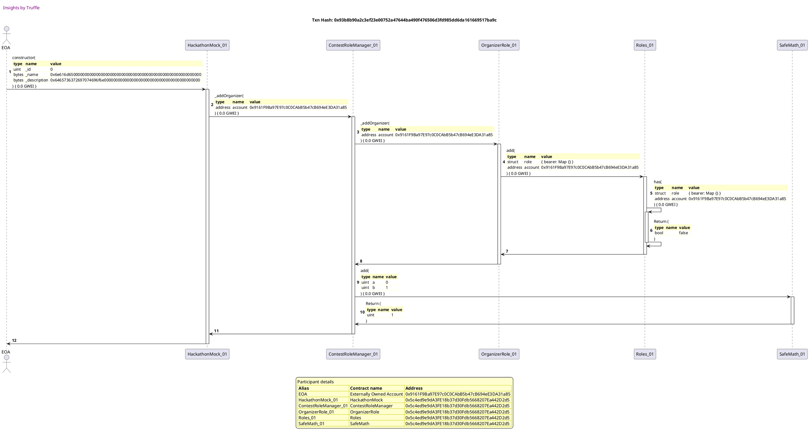
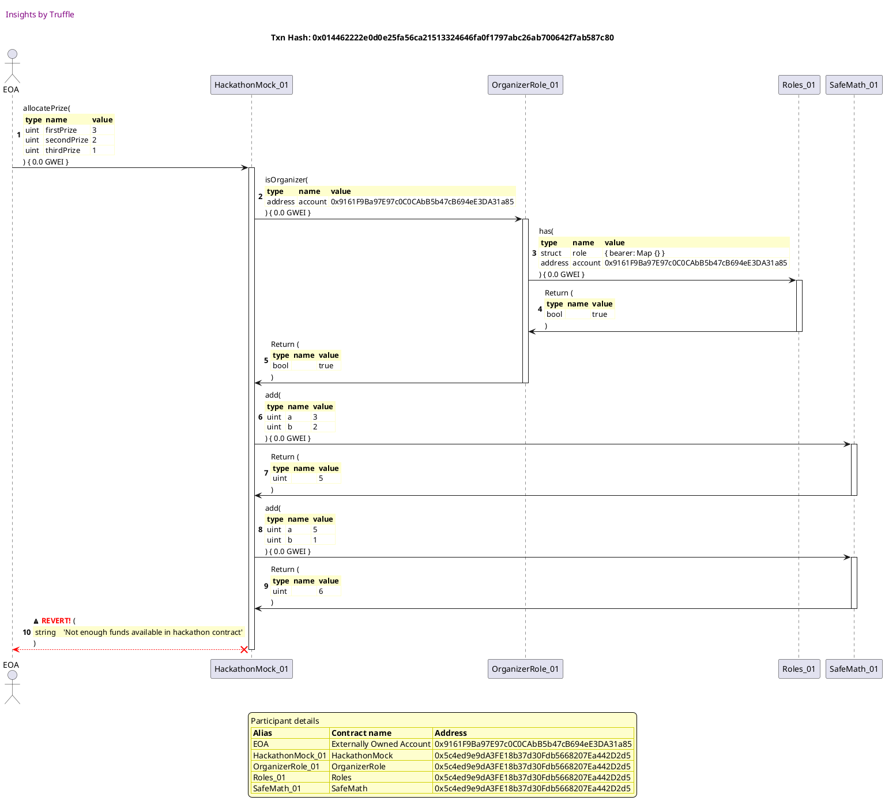
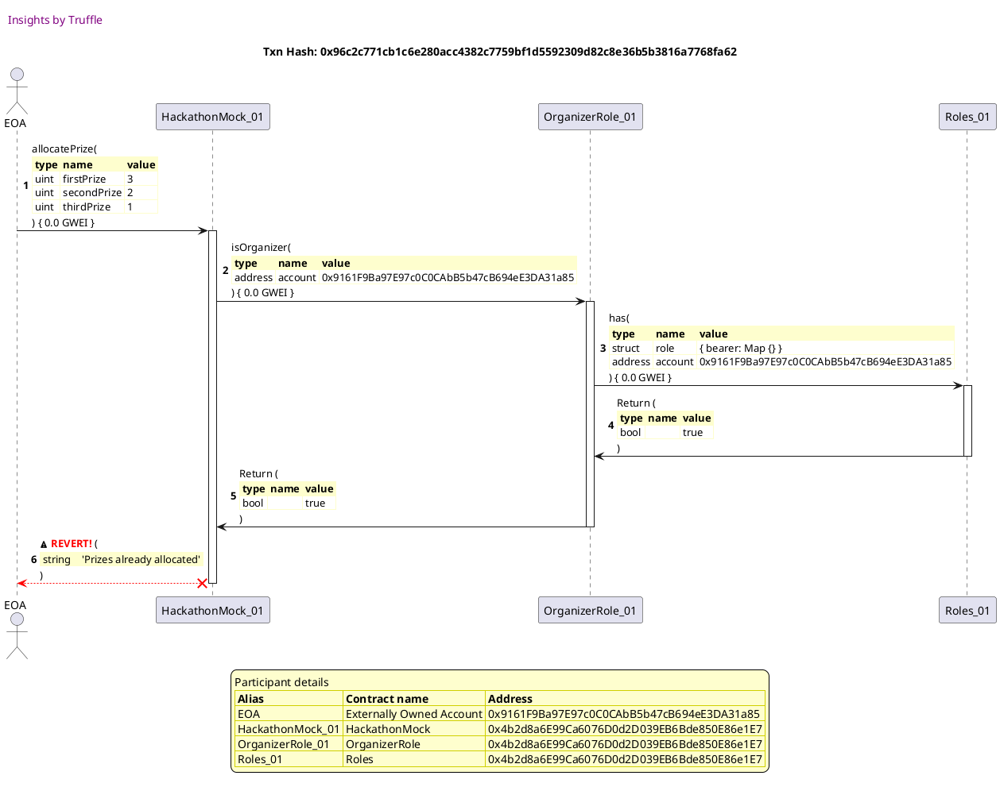
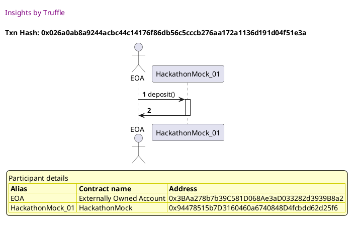
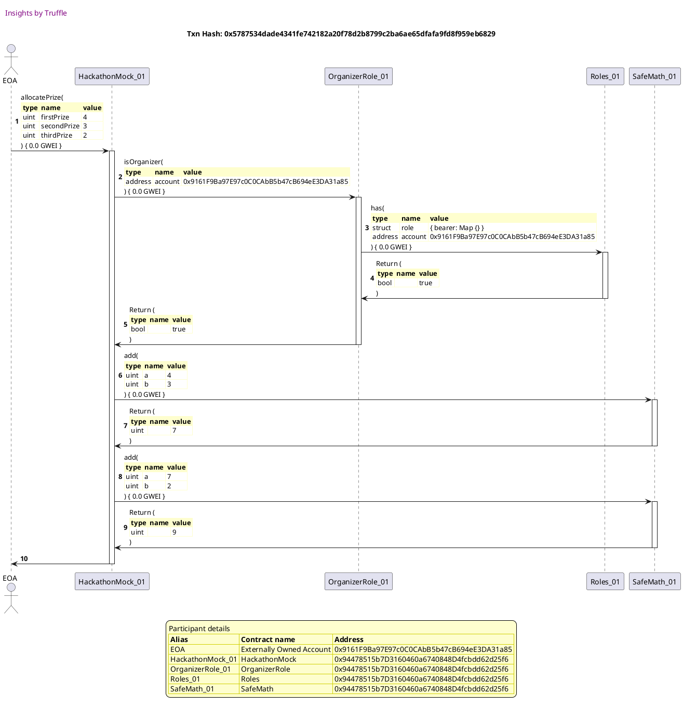
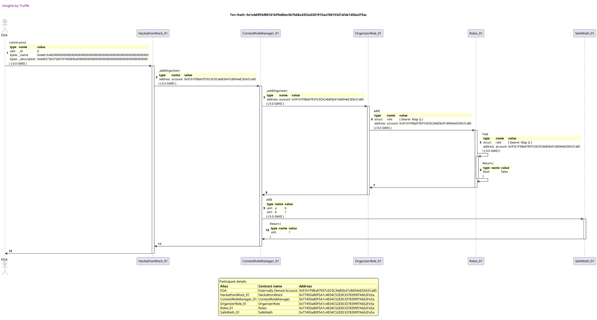
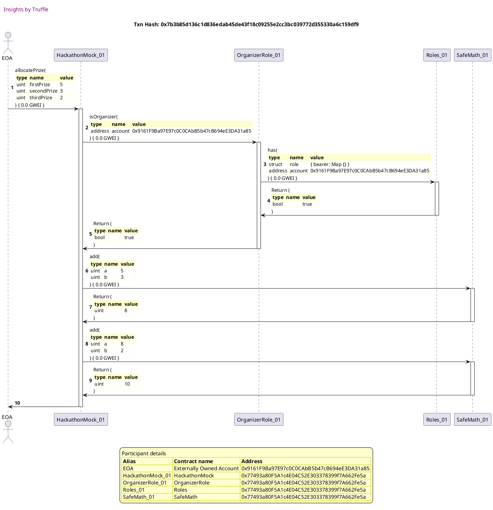
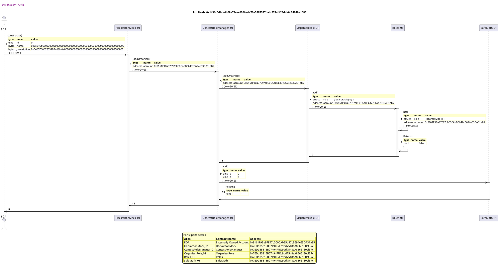
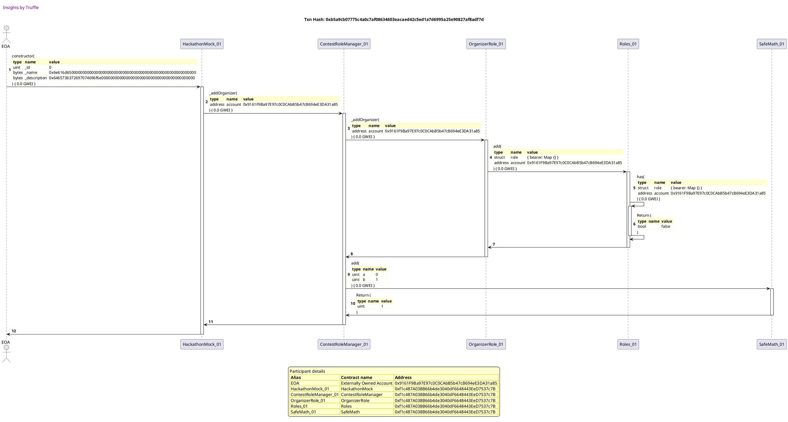
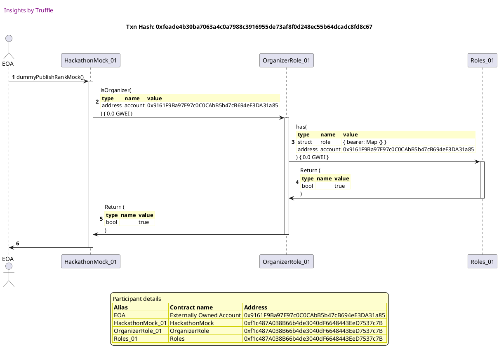

Test date: 2021 Mar 02


## reverts when contract has not enough funds
[link to test...](http://github.com/fodisi/hackapay/blob/master/test/core/Hackathon.test.js#L43)

##### d1, tx: 0x93b8b90a2c3ef23e00752a47644ba490f476506d3fd985dd6da161669517ba9c

[SVG :telescope:](https://www.planttext.com/api/plantuml/svg/tLPjRzCm4FxkNt4QNq0mS9gtPXeJNPUoVPY6619V9asNs6cZfKxbEB3kvRzpITEkBnbehP0GKHlR5z_TyvpFzZ7sgJ2eJJdE6CFIvAeSHrApuYPL4zGuXamEfHB76DyCTLugqS-pNCEhGJW8-o5ZXuMPPlA8GVsC90gfuRuP0fpcEhtBbS6ibwL3DPRAaCN4B2OCwEFCvAJKaqokVBXCxoHOpaBs1OL8rH0iteWUw_RmGmE2DVxFL94EHwQ0Q0hVT9aaP9UPr6GIljqgECLYT03yDh2ZRXHmxCIsJ3gsvDntE-ZudkD4w0GyeQxBFM4d8kYwGdW2BS_olC2r_0Y3c578OaFGmuiUO05xrEun2fj9utI2HFMKmePcbAlpFBwvvbOzQrsugj8dth8mN_DCdgF2eTHplTOlgyeNUeYAWgQhINEzTU6gIYKivbFdWzKfbvYGHpEQpreQxp5MiuRzenPYyFRj0SIvAemkgq2zlb9NxB39dNTDU_Jm4Snq8e5QXUEw_O5PIPrg-WEKAM5uWEjKq9lFfT6KWb69Ppgqd9wanH6qObi-6vQ5B6ATJaoQgva3ntDzsxFzZXVut7Uym4iy-L87R-0U-7iEdx-7PvJ0BL6hOjc-s7L0hsaNBDPqkv2I1IsBYYJ6CUrgK_CBABi7mJ46VXZuCU_pVYywTYF7Zu-zm96XVTApBUowxJoUGLoHsSZ0Vvd79jYAmc9drD39xtQ0Ppk1K6goHyqzH1Arr0TmZXEuVuJ7lqdjYSGcfH4M_nEb_Vq3-2fDgHLiHolAyupmqI_1h6Z4RzOTjYGBENukYPxR8hNAR_RFye6xM_urPoakdwIDBAA_rHxa5Vz_8B9Jq1ieIqX-6vUMexCEPVkHEhkdgWbiLjImBqkNd906qwnOmdp2J-ZGhZ1JxKBt7dKgB9hk_0NwtZob5tf73tKvGEzR8xN2B9l2nKyb1VIsIlfbmnlbn9geDkt6ZXI134JF7eHMDx9zOVE1Y5pFwtQu7wBZT4uwOirqUzdH9j_1oKPviYRQmVIYZ6cwEvXQBdUUHYyrIFdLP1dxH6ygi7y1)




##### d2, tx: 0x014462222e0d0e25fa56ca21513324646fa0f1797abc26ab700642f7ab587c80

[SVG :telescope:](https://www.planttext.com/api/plantuml/svg/pLPVRzis47_dfxYbmBgcoqh9-cC7db77aPS-f0dIO7jOX-4aKhOGcJ98AdMQvBlt9CkExQW3bY3O147KtP5tlplUySZOUsDHstAMCuQbBLGvYwLcvYfJSzGuWrnEf197c5nDT54gCIhoGiEhSJIEHX5ZVMDlSZbWK3zJYK9gk6r8W9D2PryBPJ4Vvjb4pQIof36rwmbZ4YvLpaizp-MMu5FsLOBZhNddA4Ic9k3mXdLVZ_rt3GZMsF-WJ3QPMWFn3LpgCar9BxEPpILSBXISe9aU0bzmn_C2bnx91PUkdw8V9EWwljFfk5xW1Idor0bx8SQ96s0SSXvuRagatmsJBcSKiiGIzEXi26XWZyOzHc6pMPBDaLmzeR2XdHRgj4Yk_kPEFMkNkRtaJ4zGaT_weiZbQiakStj9nJIhgIjYUyedJEKf6LtDsg3t6Ak1my6W1HkyVNi8cET5WbQUqsRAdpwhpwpV9C3FpJYu-nNipLm2ZGfdzNYDUKa_rVGxA3D2SGTffesjrH3HsH4QcHHAhAJkZjHECxqMEalX6xW5_Wk7t_w8Fb0ojC2ld7eKlTgfpApvJtE9ab5BOmWD9WcLHWMIBtfEu8nxHzWBerwOy14V3UCZF_R2v2ZeUJBg70yx3dRzTWSUGwqSMEzf3NoAvcc0ZTLbKg7Kf8-6MuWbQgaFuHJdS7iFzo_fseCJxNjoS7085zAMMi7Jt8kB8YUSLQhe5VVDzqBQaYalPByz9pSBS5bZGZohih2beEA7CjhTZItxBnIG1WMz_dyH3Ryb6ix_8Hh1FqHZSV3dAot5NnM8vQbCTli_Va6jgFCDe9yi-o_D6UplNqI_HnUNF-plzz_L_C7ti5MrNtNEslxhZuK5gOfoCeMKMhe1lCOinvXEXKpH-TA00ZgEhQOMzte5M4YYicjg1MrjZ2tl2knye_48QKcrsO1qp8yvvrMuw4f0lOX-HesTTU26g_DdlOvSgBeiVHTMQaKTwGRElYWfOFYa4sfJyQCklSEgLVk99qLFziImCuwSRjm9HOUFHUm7GTVbOOIUvnwxOaVresw-mtg6wdNNRtwVeMhpTl10_Lk5jFLD0h3tzAKhvJS0)





## reverts if prize allocation is already done
[link to test...](http://github.com/fodisi/hackapay/blob/master/test/core/Hackathon.test.js#L50)

##### d1, tx: 0xf817d674c567bb27ad37a87e7c597299d38470c3196695d5c0bb124a6740a5c5

[SVG :telescope:](https://www.planttext.com/api/plantuml/svg/tLRRRjiu47tdLmpIboswsQLiYRI2R51VbAOFGOgsG5yA12EHjeN8b45HRTma_xuZMNPzKRgeZGB52hOeZkPopcX83cEl2uVMbRECCInTRifPh2qhxb8pHuipoFH46pN0v6vYyzAeOPxb5bvSHfVHC6Bil72BJ5ymgA-fHgKjF3HJWAlSfjzoup3hP-d4pBHnv77irWgNz7BfSbxQUQQtNdn8lsdm_BNi7IgLcWbul14zrUFvtmq8riH_QufqCdK5n0luQClncFmobxfCmyTx0rTOJC-0tuzxdbH2-aaWP1nt9Agkn9xKCWb2sGb3rUtvaYTTBnGY35IGy3ZsEZwI2SSW2HYbB744FRhf0nPmGkC9exIvD4ddI5IlA6tefhcvpfExM-xLMhl2RPCXyTQ5Uvzd-XeDJhHTsRM-sJQ-iHCqb3HRAQtiTeNR9fMmMAck9jig7t1C4TrqfRKnFs6iPWsd5ot4uDMhCqXoKpXRLedwuxFvpCwRslcp6IyU_m6tc6kWqU2i7hzWLj93fVu8PKeO7k4sLNJdAscye6HKugKDVKwXXIUK2FY1rvvdfOl4fdENvcOPm1U1x8gkx8XGSkcBK8o5_ja0B-41-5yStdoAtb81jsIjocNxnwuJUakhOFrD3qifUR2wg4XYaj2gTZM_q1FUPJZ0K4QXJFYG3_ln88XzcGn4wEkeE-ftFUm5xJoUGLoHsQl0tvd7FjYAmdfbrD0fxc60bok1K5hoHyC3n1gjjcTmZNDuU8AdNqdjEubzIbCi_a-KJa_FuBrsfJLm6AquppF2HxynPaKZVhaRiALOAF1pHVJS4gbDVh1-DZVSu-glsKjnSoTjP37zlVOaRyN_3o979Rs1ie7aXtbfsJhhLBPlgSjpgb9WowQ6lTiuv9Hsc6R51kOH7z6cNM6cteNEFNgei5WwyzVe-wkINjjTFDRj0DtldRO6ism1Dr-DLj0_gEWt7U-r4pkYshKVTrGFHHI6GnHSYX5NdH7lXj5039Jk1Jpg2Ur5SjjrUzlH9ZyYo5vxiYCwmlMwZMaUZt2rsUvyd_siGwglfihOQxfJW_ql)


##### d2, tx: 0x45c7c7846643b9938bcaf6ca94ab99f90e194fce55fd66a6f7011da4485fa424

[SVG :telescope:](https://www.planttext.com/api/plantuml/svg/jLNVJzim47xtNt5YBo36vj0qQIfMqH_fu0616D9UaAQBuxGHhbFPpjPI-DztJTEEbkvXJ4HHxdpsVVxETxumTcuT6bTE56DOkaANaqGQPXzoFKM34r1o97NQG_4mCaMfqtwX2WCVXl4mxiUCdLatLxB3e7h64bDfO54F0IuAapyMsg7ggdoa9r8xGipSPi6G9bUGqz9CbToQ-9O_Il3yZUq6qpJN8_1uRNgkvDddcWIhzx_KDX-DdOLa3dUcp3B2PIvtIiBTJCC5sd4R-CnlYb24BJy8_4OIHOrM8Z0B14O-qZ2BkFGYFnEosSpI8C0W2xddfUZxhMQ6_gdFwCY48-hnTHVGmW790qR7vdAHJv52lQ1ZGpSkz5KX7dvmhrgrQznskJOZr1ItkIsKNBli6hTTbaQxNheU731MyO6JpfujuVYu3MavcSoxIXK2dRoXH4cxd3yyOdiSbZ2lQ5GmkTtO3-_rFJkhY-DZBJjFNy3Dfn98QfnKyYUgafJbyYUWh1ffBP0c1DMO8utF8Y_mXb4Fep2EGi7xlDzDUit43qKlY7mPDmRTXeUjvWhb21R0Ft7u-Zs-fBBOGtKPmEPmAk9Zj6yZR9qfnPAb8JmI2qWa6cdQS8LJM3p3ytk6zYU8_JavEMd3hNIbqV2sy9AYKCIJNegpjXxzxKZtLCexxR-_9bSrJbiojcfLxER5rKYbmrpP5nm6VC0vNtAWZaGNXfG-jHf3Dtd3fhlEsiQlyrHTSlhEd3GQbPh3zIyjK-Y-AQylWLyrYHrJ1UqdfsaBWpYA-XZmC1Zmz7J06r7S2tgfR3Lvt0ga5uVRqA-QoOxfFw0tJQTM_nMACbNdYvtJbtv0lm40)


##### d3, tx: 0x96c2c771cb1c6e280acc4382c7759bf1d5592309d82c8e36b5b3816a7768fa62

[SVG :telescope:](https://www.planttext.com/api/plantuml/svg/jLLRRzem57xthpXhfNMbOtK8v88OAfUmzg5gnQhjOPqc9p4GDJZ8TbeexN_VIGXP2_HXJECXJhvZd_ETYpy8ELEQIPrEOq9OgXEHJdqkYRgBn8n9DeMOZxa8koou6yia5M4lYHC9XmDluFKyGbfABsBU9f3_9fo5NCAo-0GuJsJqc0ZDuauSZSMK2uqUHxhSC43ZokKibREOlp9yZHuv6FKIksPX68an6BI0dlErTLgG84Ny2w6YyKGhy1Tm8zFH2FqI7UcOmyrSm3bJaoRGkMi5jS2sZS0t0elN7Cg2e6uw6TPm_P4HDXfkpQHkY933JSjl-APZMCosBMV4h1h1aWKQgNjN7M0A3d0z85Ws7GNHZ66gvrWsfYU9k4o2kr_Ko7TjWg-FNCan4vYt72OnNn_P15yVoK2rthh-E20avmFLzewGS7BI11R7IS0qlyOUyG-tufQqYhv-BDRsqsVGYna7N0MRvkizYrDyoRO_GHfX_2SOHLBft0r-c1j6nOD4X6jhRSEg9v4iZSRAU0nBe9yeVFdkNM2FTz3FajegIfvKf4fylvHmnYHN2jdWEE34PoHnLWpB6BXTvjgUQmUqHtiTlzlmwtRGjTmwzyn-npIOqzYTm3RLB86oLJdn2LFx4LPQfa76Kg8_N9RWSoQvRC8bcy7o6Px_Psf_ajZTasgr2KEkKobWl_Jy98cHPpOgSeqUlrNI7PFod-9lHvfNVnnA7lxCUAnk7ePklNzWKg1ejQ4LhAGJzxGhbQ7tpHlUlAjKMgSvtdwBNjRVJFHo2aVvJL5uTILAtQAymk7HcbZ8KPEYUyHsAGrPoJcvVY4V8TSiYjMBq7tQfvHcbK7LHb71bnxAiKJFPOqwwragpo7LJ0ZnETTS2gIsWAi7mKFex3LjBnrl2Ua6bBkk-xNGOPRdkZrcKTlgqx3MfwRhTQrko9q6zHoB6vxzslMMu6v0_-2w5ERYzMzTOQUAVf4pVEAVz6y0)





## allocates prizes when total prize equals balance
[link to test...](http://github.com/fodisi/hackapay/blob/master/test/core/Hackathon.test.js#L61)

##### d1, tx: 0x7f8570a7a4fcf0b55afb2549066218d4e95faf1f068b352bd0d95b8a6adb0f5c

[SVG :telescope:](https://www.planttext.com/api/plantuml/svg/tLRRRjiu47tdLmpIboswsILZYPA2R53RSPe-12dQ0dqf40mboXOYKmP5jN6J_FkEPDdrHUcYDWeKAzYYE9hBEQCXEOozBXrQLqrpnh1oXQccIbjMtcLcXXQdaEknDia0uxknBIgJ38kyiF3YSdGv6euOEolTFDVd39fheZ7H5XxQAS1LORDlXN6Oz_DiRARQEFAOkfN29RrSk9nLTfRhZHSVicyQXBUIlSCaoSmO16z5JyruzdSBWhNntveo6qzS2MeE7ssLfkINkSpb6ZxU6xZ2Sd8A_3v8Gp_W6A2NnYbNle-fEl6zY4jv8iB4qv6VOYfIBaFLyqzKmfF8Lo5AJ1HF_PXHoc97q4StVS0IZcWyOfGsbyNP38dg5QKDtQGmrqLyTyj5exKjt3GP4czTklT5hg_Hu5ZRfLtdcqtZ6pj6GqcpjTBIRbkuQL8BowNgShAfyW5JYkWcIwsr-H5Z3MiuFkyW1gzUdK9ScDBPgaxK7v_DPtRMriwVxNZ--0-u-Km3ZGQdpVW5yueUQlL7g3B2y0YtMK9tlfIgEIMZ5Yziw7DABOLCfC_tl7Oy9xgCRJPpMM4M0Jpf1ptP2qva5F30av5CfVxP02_X0VXV7Dvy6hsb0kx8MftBxe_T9FIMLi7gc-wNKl9WTLcJn3YcLUqQVf6GuZ8QO1ICeY3cGpxigu6ll20UoCZJezv5loSmzBjvF8Eu9hDJWRypZrsmDONLocYWKzpz02zM0g6qv8-61r0QhRQdS8qpU7Y2frz9xJk9NKeJBFzFb8wFJ-6zTfKri1yjLHGvuQDVYddPYbzk1-me5WhyN14zjqGQan-id_KDzx3wQ_TINDz9MvcYl-XEyaRy_o1oKD9RA6j8VfYNZgspIMNtbheufse5jcXgsBkrGoxH3hEyNCDymIzeqwunK-z2vnuzr5WidVahzFrbIQ_ipX-RTe3kzqvRWta-XvklHYVGtwlerntlj1DReiOrzoBXXrvVnBvKePASHxqWfADBY5x0XKZ3HAY1wc-wxcuxkkG71DbfJxP41xXUjJ7jum6krjkTxxEVTKZrrLOPUqrtQh3_1G00)


##### d2, tx: 0x2d2d02afa4e16d446fdfe9d076cd6743814a5c9b71578414f7e0ca0634f3f2dd

[SVG :telescope:](https://www.planttext.com/api/plantuml/svg/RLBBRjim4BppAnREfKKQb1Ifb-4QaLzm3qK29FU24YcRC4qP58NQQVBltSY2aQJXWHHdTqUpioJajWtIXsvl2P5TQ5otBxKdxSwuW_Ho3rPlj5CpMUqslkcScZUsyN2rMgwMyoKXapQSh9uIwDTMIwKz_1sk0El6cwV61MaBQpPkhrr0nZfS4bOOF5CUEd-m-btWmJnfOEA2tKkbZDi0emFqqf-JxuC8Clp_fslDPXjQA4_mwBkwHbuIJB0Q7eyErhBTZe4U8nKf6ibQ2iqI9KHIgrhdYgP9fP9Ky8m96LTvcR8upGGJTQff9Md2HSthI2c2bbK1fI_l2f0jZF0S4RGjcCeS9BQwHjjas3RkLrFjVbFMPtq4HuJqbN0p_IG8rzTZKFhGj2Py-Ke-INWjEzVVZ86Gyy38_HiPIWTfR4icmzY-NIteWb8wVVu1E1SKXHzpDDnZF-3aNhy2XL9UjnYxr4sV-rPnFmRjdRJs17T_d5PGL1K-Ze0XUkIpGaPfLgObp-TnnXOqoGhDvO9o7cMHuZdFPvcCtXF_PzK7gAUc8cTn9WfMnKcPbGcbESVH935ZFAMCrPbYvQn4YGGz69mWjxZZ0_y7)


##### d3, tx: 0x218b7860d3b1ad9cb30c57cf090463a5d1b6d74893fd41f67358a704d9dbf9cc

[SVG :telescope:](https://www.planttext.com/api/plantuml/svg/pLPVRzem47_tfpXrBwksRdRp7tMeG67jGzMghRINIfDZEn0rECXnDYZqk-y8WG9bcaPLRL6Ki-_Evz-TxtmXvBImtDXoc172IvlhSXWhGug7L8-uuKF8L5zfsURYeM_oKijEdkK6tlMwlMwdIyX9OIUPQXAede7YKXcOrbE0yzoaZxcsF6jbQLyFbRPeCR4hXHuA5oP7fHbbQaDmcpugOEwATysbJ7KV6ArPJnKz-Lo38FN-5xf8-mDRG3o1ErCc2TebDhMPWhknXdDU31f0nySiZ8FGfzA96PUHY1qgl40aDAAkxt1FijYNWHj6JY9TblY1uuKyeAwCP9n4GX0CcR08lNlL0bx00T83Wc6pgKX775qznx1nEyZrPIuUlbDMQMqpDvTScJxNwBUvoJErNBBDt5moPnPBrULaK-MM9-eIDrrghSqF2Ac0mr5p1pRuyA41FCjomQswniDKx-_rFJcf4-1ZJPkpBs0d8mL8DHzMz0VFIXpCrMTGfeXY1abg2bkPmOct9IoKoBLSIfqjgHsaPYKyNWWFOGhq4uMltxeNc0mxuC-TUX6zogcqMF7tSmcJqQYYG3HS22oDEKWwZfZFUb6RHq4t2WJjq4uhRdkn6uYs7xcgwvor7CP3RxS3Bw7E7LYTQGLym8lz01VMb6AEqg0z95E85JVADE2IZs3w14zlwTgp4xlFvEYe0JVAbaR3Vkx5UPuXpdcgc2Nty7SXtP4fRxJ_xfnSBy15ZKdvgihYEmegVYwZxTFOsF-D0bAZm3Vy5z48TqJZ-7-81gD_2CVYEiOD2LcqNtAzTfTBPNcQ5Mi8pkWPfNIE0BiiNkyuw63xDDYTLbXQov9UhMlEgiQ5tx5LHkCbFu6hdrf9QErLzEk6NpI-BLPbcheHyqAtnOJdns7iKnevGUZw7cDEG1bBGkp0xRYrQVf5WznYlSBqgf7MmrUOMc-upxE_DOX7NoS0ESKl_gNz0W00)


## allocates prizes when total prize smaller than balance
[link to test...](http://github.com/fodisi/hackapay/blob/master/test/core/Hackathon.test.js#L66)

##### d1, tx: 0xb92601092613fc82c45d82eb25fb3241da6e5114f0f82b4c0e9d6f81ccf0e115

[SVG :telescope:](https://www.planttext.com/api/plantuml/svg/tLPRJzim57xthpXYBqCRczqcJbEnYjBBu06106alICX9d3OYTIh7sIWj_tqdQLfw2KoqcZGjQktav5o-x-JOFeISf4PeaurYGaHc4fMDFAb9-X2fiT1Y1B4SI1MS2lzXe9DC1PqaJZHywFVwlKwFaEFKJ6BP8b1SGoa2gM5QFWAS9JfwIfGHSJkE1ceabK6FeLagzF7btEKuq-DOhhsuYPuaC6ifkn914Aa1C5gAdelv-6i9WfJnprKQ3OOc1My2jpeBG_HBJ6HY2RUF2iv4Ecm2VVJS6gUCuiZgeT-e-POTD6hIgzcXLwzPB11SsenP8GqRDS_ogNG37ZQOxuTKCcOJJ9bl47hliWqYXGES3mYcpKH-D1P8zGpJ9immKHU9_t1FMQ6rALmtwI1lcPhh99ONGec1r0kxoZVhnfTw81GcJUTA2xjDuRf9BamNgek7TPKR4M94CrnehJmV45AmXgDM1J7uzAa9Vg9IexCyKH_lr1qvBcldSpctPj_0JCOIS5PYLCm_HPpXJQu-Won233EuZm8SwKBgJJ0PkNXkWv-JIyvum6swuxNbEP2fhwEnYH8r3s1nswdpkbFZhaCTYxiyvFAz0GvX2lGBXUy_UkTOm1LPotDP_R6BXDxZAbX-qzrIYXwqJ7EImlTnLPk2dyiuwxkdmdLwhkFJ3ksqlLFRinp_bBkMxDMxxJeJ3RkQnok8Sp9R5VWlyzW6crDOhem2EiRT3V1y9I1AZVvmce8dXPQw2HTY3DDdUFwRr5v8R5CQYlH_edHqr8HhQJAjO3TQNfB4Y0z_eOZJKdou6R2YM33mQqNqsX8fJDvOFwiRxdxrL-wbOdKdBMKU_bbrajVY_u78NaaleQmWUJCl5LjdaShgBNL-JkKAPDxKaAkLGowGHaHnkeAvIxkuQUUOiNV1SmzlSYmQp_mb-lQYf9TshLdH3k3uQAHM8eudSFbBoG3QEnNzgkEjTc93D7TjMKx3PhRdTEkCKujJmHsBDgn6rmfzBmXuBS0EXw-xhcuxgkHx1DbgJpP4UxXUjZ7bxHwkLjkTbwVtEiJwAgkCdE283VPl)


##### d2, tx: 0x026a0ab8a9244acbc44c14176f86db56c5cccb276aa172a1136d191d04f51e3a

[SVG :telescope:](https://www.planttext.com/api/plantuml/svg/RLB1Rjim3BthAuZqig4h9jcoR0TPK2TEa1s65bZl0ot9YH553cGPIxhstwUwHh1srK6otYEVoKSHSjjvTBu_64Amzwtj3vLsfDitzeWE3s3qLbkrGBdVkhQtQjcQri7LUhLUBLU4p3f_DdfEO5WxZKex-3DU0JQjQnvRwz4KfjdQWxO-ADR-4h0EvAlaiNT7ezyGFvj73OnVi7jKgh5RO7I4deTpzdKiWep__swxPhlp7LHdU71zNGTTuXjlD3oSB6omsqs1dcWaa6ALOHvnZhAId4l6MIhgJAWg4JAHKbPHAX1P6Y5ZiL0iPuhoEc4wHX8iapwKlheh03kOX7D2Wcs-aSqHGwkRO1lwNMj_j7B_Yx8XwZqu8MJ8X9lv1oHSNqz1wMFRDVxJP_91m4lQQ_xD50Xv7HYv_wSCfJqsfYEpSMnVhafQKahdJzyWp2KK5JwMmN0N-W6B1_q254evtGNkaZT_6beD-ybhPz6OCzpzjbf18MLu73vGz1Gl2epIh4ghE5yc6Ikfo8fWLqdZECeY5UTnliWmUYlydrNle44wvppD4fPKQHapGRcWA59ECvwLl9QLKY9IKLAB81qy69qWjs4F3_ml)




##### d3, tx: 0x5787534dade4341fe742182a20f78d2b8799c2ba6ae65dfafa9fd8f959eb6829

[SVG :telescope:](https://www.planttext.com/api/plantuml/svg/pLPBRzim3BxhLn3TPSNMpNRy3BgWQHvh3qMBji0k1GRPaXEZZXn8yfOqwNyVxJXk7Xw6fIWsmp0bag8-KgHeGiwKfbBdavGGckjCv9EGIw8U4p6baauWvICks3cD7aSoomNhPMacuTrmC1pq1eISAZrFUOT0-OmvPLp2efe2N6GoUSg4fcatJKPYmeL6Yx6k5OOeN9cSvdAQyYt1NVB4mRHhtWrbB14ZC8sAzLpIqyyL25BjVobKCXfh1U4SxcKUnsYNw4Id7Evd0Ywe6hV1c3cUxpajc-4QksMRCVTio_GjQXcnvpChzBqWYAoGkfIx3ejfJ8EO-N7W13nqVIiW6B988_J1THUeWYEaHmJ3ffCecL9qzGB3HlKu4rTPzFZTC4kjNURsaciveWBzbhTPojTBTfdRImgcMgkk9zigTpJcLxZfMcjZVaH82HnEEWtOuCE7Dj0qpIAg-GqU9d__81x8QPK07olQMNu1FPzoG2hefAG_Q9hZe51VGfuWYYN4YLIwD8CJUqUeU9G9jfQsTgHwdCXQQAs4nx00uvC1NxyDBZ4P6k0NJkr5htGgKJN_C9Sm6ILN2j7GACBIA40Qiy1qpM5mJWDl47YHqJDwtV3S2MqlEdS3cmzQ_MxBfBxJxC0-rCA1-anBu6Eg3WEijCoZ0gL4UqWM478gkMp35Pt2uXcUtzAr5oUQp-Jaf0stNETIm67kXLcM8iuYLUIQU_oxa3PaoXljtvoJcmMugZ76NbLPjA6WmfSosZsDhVtVA20L2dozVn4Dho4QrlyGZU0FqLZTnhWV8QlkIsushdB6DKrIjG6WR_GDmoW0O9F5snq7FUoU4fjJ3QMxhkXwNMTPzYtypZIN0k_uELp_59n1zw2QtpIyr_TsM2lJjktvZkc4NhzbkeRj6jJrRCEt_RuTHo5ZhiKi9tQtJU_rnntMAqpNVRGQliBKPhzzcVsjGJpwAW786Nxn9-qN)





## emits PrizeAllocation event
[link to test...](http://github.com/fodisi/hackapay/blob/master/test/core/Hackathon.test.js#L71)

##### d1, tx: 0x1ab6995d96161bf9e86ec3b7b68a4353a3201915ae76015347afab1456a475ac

[SVG :telescope:](https://www.planttext.com/api/plantuml/svg/tLPjJzim4FxkNt5YNuOsjeGaJeDOHIdfu0C20TA-8A5BuhGHgLCvpaQX_FTTqhJq9J3HQjAqg8sJoxqyp_bi7sD7kKQbYs7A61OwayKm48hbzuaSeS8XfA8lP7ICuNrVPOMCkbcQAVZGytj-rsViCDVZLBGPLDT0O2GKFDMl0AUPIXupgJ7jf4bV3eNKv37MSuKUVPow71Lgb8gb3zV9em3JdiikCOeIsGVJg4NFrNZujGR1wlXdCa_w0vr3C8ORLSGn-MKwqQc0cmS9fvWF3i1uC37WdkT47ZUv6SIUQ74HMe4Ry1RQbcEXjM-OdkcWSBbXEfRjOeo1QJiSRTV1a57AGatG_OiEO0uxDEumIfjEmcI4HFMKqePwaCdpBBo_CynAQrMuRD8btYBNLragpb5YNwYPNUENPUCBrKT9ILEbqinkLRXiKWhpcUhiPLdb6cEAg0SphONt7SOgrh3NRY06dpuTG9Z9NAkYJDJ7MtdB3klQ-LoFxSatqEEH01eb3gln9wO5FPJg4oWImZ21koIYkp6J1cDAHYcUsj1qSa7p6777sF1Qyno9F5J9I2UPd0QmkUDQt7BtkUSQhiqz7dFntW2xy0J65mE-__3Fg80RibRcidcoguJUqIgOp-bcAIKFIkGbIGn3MjMwukVHCkXvn-YvlkU6HjVeTe9Z9x3Ty9Xxjl2jauvbOijfvl4AufBCMWN-oppMmPOKvYkZWavnDmCyNGc4Kf4_6fuW4AY4Ee1p7C7JCpp_JMel9DOf3J3_doZjxHt0bT25ah0PhI3BKi97lnZJl1RlhWPiA1OA_5eHlRP4AfCtri_YXhjT_TLxAIxkfBKieB_PdEIb-7yWibNIQoWBIDxCIyFMMQMoUKkTdbEb0fisDUnouP2BXCOapHSmdnWdj6cNcAbteNEF7aeiYixyEVhEhAJdTkr9rGxG_K4B9J5Dnt3nIue8EXiL_QBZjNPYHLIvTbtRix1bz9oE6Tg-ONUTVTyoBCjjMPuNkntEztl2mMNNpMr7atoB86ljoOfe2zVpDgP-tCBLOhlpylPUXrHVTPMn8xfJW_qR)




##### d2, tx: 0xc8861a377362092b2537c3e6dc27e850e43eafe7202fb8256d14b38c2bca5b57

[SVG :telescope:](https://www.planttext.com/api/plantuml/svg/RLB1Rjim3BthAuJqig4h9aks9GTPK2Tna1s65bZlWopHYH573cGPIxhstyUwHh1srK6otYEVoKSHSji5xKD_Q0ZHVMXTVoZ1asvVkwFs-a0Rs8Ap2stsMz_spYxRflNqQbsiYsL1oAmBvmRcX0vh1zg2ft_6AwMRrjUFhGkwoPjwwmxW0YfMuHAmHl9LyjZxOmDlY9_r8z0elc3tsjhQRMd4HkXvE6TVnoB8-F_lhgktkz3HyamVV5zLg4j27HgW3oT7DxhRJIax6QNII0ifHSfPnakU26a4fDPm2IfX40lG5KZEU5KgdgGsYakX32-DJif44hJC12ozkCkfxkW4pmb1sq9jwgF6LZTecmwxrlrepVuNYuQez-24a26Jtim_8EdrzPHQEBPT7Jvz9Xy4lAIzvjzCAI6l0oFt_vHX8UYwwSXi7DkNgnLRCSRcJzyepWMBmeyb6kwn7-hq0Lw0t5eF7NANlFdJq2hkfm3UwQOvqxlV3YpDZS774P1Y9x78DPUgbAN8becALYnLEGYzOa9mnQt8HBPGchyL_i-gTz0WBMMS2QtOEiaZ4nSiNYQy4AWhbSYoIkPfojUGQ9H63qOdo2tk-C3_0W00)


##### d3, tx: 0x7b3b85d136c1d836edab45de43f18c09255e2cc3bc039772d355330a6c159df9

[SVG :telescope:](https://www.planttext.com/api/plantuml/svg/pLPVRvim47_tfpXrBwksRYOE8KHTL9AIjGzLgxRINYfDnfW4bPZ8c2rfqk--Wv0qVvYcfQesX3Zxxdp-tVdE1o5dcU7QvEE449wRLENZG6gIFSPgmZKVGoA7KeKzBXw7EirLs4-JLCExWJ_m-puXfvcP9R9Be7n6aeTImxoQ0boaEdvAbU69byH3DPRAeCN8h1K6A5oQdEHwaiWjmLty9C5ghdatF0nZDGIBLgpdafv-ha2GQlzBbSN3aSaWcC6zpgC8xH8JcqJ2_LJ11Sz67Q1J9s11smujrX9Ms6Oj6VAWQOUooIAhBQZRi6tP4885WZBNSHeXist6A4TrsmqZbs38X47e_hK7F8CZf4S4msPY4Kyukdg1OUDcbAghL3n-frQfjSlSNdAjXroXt_esJUHgoIvpUqd1p5QggycsoXsFv1LkkjBQc1yHKWA7asuDDlZmeGCyILB1ZRp1mvJl7zG3EQqIu6D5kuilO6OJ2KWL7vVq1qzo71Jg2yXZHB60ADQPAStWnDuHPbAaAbn9sOxKZ6Az5ZQMmcEO0_r4uUit_nAJeGP-uTHUz4gducpDFymbJ4OjimpHS26mD0gGTEfQBMlWzhZh-AuZQ9_slQ1d1qr7z5fkK_hit6CMRzlr3kn3BHnOdsa9VCIpmm1dHkUYGAdH7f8v199hgJjmnISmVuRdjtJjnOdwCpavwS2jDBbMS9XxGPecYBD85RtY7lykf3MPyaRxr-VaPW4kQomCNrLPlAQWWfSosZsDhVtVA20L2dpR_o8QxPfeDFw7Q5Zq3-5ONiUu8I7BzajkDkxoK1eU9za6WdDwJYaj462NnUiT1tridngxqngBjohfzRhkecnS-9qQgHLUyZEu_gba2Dv1HRzfUA_nxR1AquxJT1blqu7jMQBfqsRVRlYCCkQqcUj6ZjTgDGRIvjkcznha3kiLfjUDj1g-mjHcmtsP_Qr1FFeg0SWPVl4lxHS0)





## reverts when rank is not published
[link to test...](http://github.com/fodisi/hackapay/blob/master/test/core/Hackathon.test.js#L85)

##### d1, tx: 0x1436c0dbcc4b08e79cec0206eda70e5597327dabcf784df23dde0c24040a1685

[SVG :telescope:](https://www.planttext.com/api/plantuml/svg/tLPRRzCm57xthpWQBo0OE4tYDDEOQBkKxM4QWacy84sExRJHKgTo75Xt-U-Sf6df9HkY5H8YQkFuv5o-x-JOFeHyA2mtjfnaXF3IvhgSnCgGuYRLKsxu138rKbhskRWPcRpKSf1dkO4NmsWO3I92ZWixozG9WVeQAowLWVjc2d2Mc_GkrvPdlImTwOdI5ZqcTgamn9TpbzFIJ3Erzk9BUgV0yPQoJrpAL8_0eOteiHwFtpKWI1F_N1VfQ6mBY6TmPSeaGR_4fZPJS7MhuOmNuoEWjuxdCa5bB8GNqwuAGg44xL2c90-eylqmS3k1vB58WgudauuhfQAYur6FSeTrVO8f4nQXHvSzu0KSu7X0C6qs5UcK8zKpJ1kturnVvEBccZgrrgPmtMI0l5LXF-UPkk2QZvHPsBM-MJU-D2EkCMccKbhORGhNJIfXiL1TJDPLll048zhnGcjbVa18pHeEJrg8mUlNHo1oNLXJLebw-Kr_8yTDxRnfnfE7zs1dKmKuQZwfn-yyA_6XKd-0CaKC3t2TIhpJXJIUOJ8gyTm6FoTJp66I-NJ7QykpL8KmwTIckPu7y9WVkCmDEYmCQE2na2LC_Mc0Lt0Fz2s5Zr-ZSopWbgnLkMp_s7L2ht4LBB_fRYb53qOL5Kak1AvgM_CB7UOCmpuFWoWC11tGGI_k-x4NY3uBFHMvfptNuLs_dSSJY2ioMnNuB_FO1bjHMAwC6Zh6tGtmV2KWIeF-SBY7M76Zp15Sy2dSFyBZtwJsYyGsfJ4l_YTAXuT7y5dPqcZOZLQSvndYmr_2iw8HlzeCs58i6FYf8dfgYTGcpwoVrGrtl_fhzbA-kfCsiXZ_JdkIr-B_XiXUIM-Wh21vDYyjMsUTolOjTNvELGfatjIGJok7d5IMfrcnWlcKdkAcNM76tWNFFNoei1WyyvVeUukINjgTFDJj0DvlhJAQPzaCBdze9Q6tKz6lEjvg9pP4jUiWEfMkttNyFXvHeJSC8X5A6VXUL_MwFcEEIqNI3yIww_Qseqs-Hv2jzcH3j8VhPHlJFExXQhNT-JNxKuTONqsLaGzunmRx9m00)




##### d2, tx: 0x93a969bfda519625d4ae9b26925f92fe6ea4a9202e24c45db2b0dc5d4a72aa12

[SVG :telescope:](https://www.planttext.com/api/plantuml/svg/TLHjJzim4FxkNt43QMnb3CTvHrr5sgQ33nE8eUt3cAPBxBOHgLCvBcsX---xfb456uiYdtq-FxvxdaiOEwyj6hkObOpXmbPwCSkKOVLzeUTeS0QbcYWj-vZVJqorq79GbPM1mr4wIWSfOztQhalLOz0yKuLI6NXgbm0NbIaUAssnJCfYecTAMq8Sstt0Y3PtaFE5cPVgnSRNub61u-rzroXbeIVWyDRrkx7TqpO9rjv_gUjYChKrP6kuDOlnc72PBMofu7QbuGBhwHdmLUnY7CJPMABln87mfOSgpaGG2tySYx4A57eO2owKy7BFbvd8kCotOQ50T0GZod9BgQTN2M0D1sGF6D5cYxoO8vLwGRIXdLRwIvNV_-9E4_Mtyu2nvYISz5xPXEFZCrWMTYeDBg-9JVNkJj-nRgl0XzRsDf_0hkSAo6gSDVO1omLDjk4R8EgCgclO49ZMoYJxDL_viPSxOJ_qNIy98fx4mP2Ba7EHZ_lfm17EOEZw0mnsME_X2VX73f-_fvUam2ifhqv-71ebVsuBsbLsSWRTjqiqckJhGJVVDH75z3gTc_HRUdFxfjFfdZR-7lodGgYjsSg_0NgFRb3VWwuiDKvM5lLKILWhUzJcoAGYROe7jEfLndTjpQwVYIMLnQAidrqyv4FE-PPQwbwIZYO3Qaj3o7kIzppkpr6YsuQWSMMLqLYMQxXQQieloNFwX6p3kTjFK8HH5cPkFF0ZPyY3A54k3hdhYaX8DtRZVeJY9V0_3VMNgu4Eqw5q2TBlyz2BlL6Ovh6KeUz5Aedy871SJiA6EK4J1oqJx9n6-Wty0G00)


## reverts when prize is not allocated
[link to test...](http://github.com/fodisi/hackapay/blob/master/test/core/Hackathon.test.js#L89)

##### d1, tx: 0xb5a9cb07775c4a0c7af08634603eacaed42c5ed1a7d6995a25e90827af8adf7d

[SVG :telescope:](https://www.planttext.com/api/plantuml/svg/tLPjRzCm4FxkNs6DBo0OE4jYDzEOQBkMyM4QOaXyGPekjjD6IvtASM1bst_dagPTNp8GhP0GKHl7btjvdilPFaBU5GwiAoSP8L2wt9IJM5jItAHc2XOcDDCZRLGFvCt8vgLH_JpBBNqs70m7_G4X9uMRPVgKqFeQQr3QqhjcIkbvRjCVkN6GTRDqP2RQEFIOkAN245_ENKvBEytqsekhz8UcNh2KVGIbKZEY7cj43_LuygO1GPhu7qoHZiQkeF6CVhPbag1VubANQVhvrj1pACR7bDt68KGoPaA8K0R0f824TRWVSEPhaA1LS2H3hJmGYaTH24UXZbZd2DKwe1AX2APCEeG-kEnIAEW1ZWS4q-PIcKu1gPvZsi2DStEHovjhvjLQcy9rapxoreNxb6Vw0WoCj5tOjRvPDxwq8p2OD5ifBUmsXUicbR1Og2ucwofNa614DrvehSmF2AbPqyFJ5cBqvSjZAdDJE5jMYNh-rNmb9qtjl6h6q_ktrCscck9eO5AFto0hyQ5IlwTbYXZkwNMgyCuMqdY6oQZ4Snlyd5npZoiUiXslBSzA5zAcKvVcPXuWuA7mkI-EU2IO27Z44wx_DC0BUaVPQqRVVnbym09koLgLo_QFNIVq6bV1yflkbbBqO7LHaGGfSLMxcb_aSMyOzI0IWqX8rcVzRjmBuq387ey2FV3Fkhu7dR2TnnE8Ap9R5VWlyzW6Mr5OhemQEiRT3V1y9I1AY_vmkAEn1gljCRs0ARrxe0z_azeZYMrAOoZ-9qg7XyVqatQbDNGtMd6UPuWFVmbaHID-iHcmfLWmy5D5zDGIgKr-iNvMDzpzwg_PIs5r9sraCVwzzYIlnVyDaRsIta1PGVBBlBHidNKgsxVK-JbLAP1vKqC-hXnoIZj8is85ynaxmqsxmeoz2vvx-51XiNZcBz5t5oMzj3kzhzi1lDywRGrasOnUVZTQqUvEHR_gUAkTs13LhXDF1XtHPNwdntaSAEspWAaXvq4d2Fo1FXEXBwJehRjkRplQv7i4sMfFDaHxk5wsCStZ7gvMsvt7sPywnFfggeoympiss3y1)




##### d2, tx: 0xfeade4b30ba7063a4c0a7988c3916955de73af8f0d248ec55b64dcadc8fd8c67

[SVG :telescope:](https://www.planttext.com/api/plantuml/svg/jLNTRzem47_tNt7gNbfjtSpo2UfG-GXh7wfMNQMzL9eSsu48uo3RsQ2q__ik8R12sSCw5Q7SvNp--NSVlX1oRXqphfmfGbZf2btEKcc8dUPwpWoRWP9ZgKMVyUdO5AKMWq8L1jwDab4oI0WviswfP9T0_Pj89gI1LVCAS56O_A7GZgcUoiTw9hL3nCnj7KQuk8QSbsQkvCx2j_n1GilVscwO4BaUGuisfgTQddrgI93c_4jjy_74MKYNS6VAB4DSudAd9DmjD5mmE-a0NMILjvzwD6KH3JtcSygYTXnphzqAsq4WPEInBCwe-Ep7aWT16lg2Cy7ZJCGyZ0YcZ3kadbptW5auGdb4C6qkv_cSOQWNc3Rc9eM-AlZq1stLNll6tItNPimqncrk2oKtM_QDkrigezsuRbwE2Advm6dtm97m_dq7H3cRBM_ALELsSilqj5eyFY47l2kC5nngZDnkxSVt-fwSDPtneP7Tno_WbdC9A3MRrV8dKoKgbViZO4cDj1PGunmRpA565rY0rgZTP-qeQKUS3kYWb_Q3r8zuFspxCl66FQ_5uc2DSW8he1yfVFsUN69F7A1Q1R3DJ4rymkph25jdIbwnD8Y7OWMfP4QQ3bonEQoUuEajG_iJnE6Qd9vsu5QwqcXuNNXfKIZaYN-Cix6U_2sb1phbZSu_t9Fh1iSZ2LdFANBpx5u8wLYkx3CEGpgab5OSS1pXRK5bW7F6u3NUikbjghRTrtsiRpW-5quQpPHQmlKlBGNqNbNNvy0l9iIUgOREMjoFenxruduOfhwG7lMf68MX7_k-byXX57WHZ_gxq2ycoPxfFw2t4wTH_nKAAzNKYvpZ4xy-lm40)




##### d3, tx: 0x4f110991a52554c48b2d50dd54b5438a7f95f19a78881ec23bf4aba26a0201ee

[SVG :telescope:](https://www.planttext.com/api/plantuml/svg/TLHjJzim4FxkNt43QMnb3ESzGLr5qgQ33nE8eUt3cAPBxBGHgLCvBcsX---xfb456uiYdtq-FxvxdaiOEsyCQhEOLOpXmjHgCSkaPirzgUQeSGQLd4Wb4ipl9xfUA36igrh3uJWTfyEKiNvZrfKSC6YVgKGXDJnrIu2BMfUFjJ9OnLKvKJEf324MPXymfiqTv7oXvvLyiV6rV9HWkNlVDGfHgWbOl7FzRct_j4k2TVTVggQSJ4q3sHfkzQ8e29UPqbGIRbSABh2PdW5VkOLbyIYoqBCzpytTCBE5nuNmtCnpdH238l8AAy8W34DBvhQJ5IvcQFl8RMv9mcIO6qezlOe16pWWUy28DbFcvHofr0kY3SsqLb_g_FuNjzgelvq7ZBKduMJmoYOS7v_1iZHJeN5vJMpATtVgZlKx1JvqTh3v16Ozbq1MuQor3rWjQB8Dtm1HfsNJm8R0b98wtg_voelSt0gIm7FSs0zv7FaZRWUSstcHf4FBjeOZnnkYlyDw3q_0FtBu_3sz90LUINbrykDGI_5pMz2kifCpwBzTebOatm3w-Qw9A6RGwzsatzARspUzNl-qzG_WFnL2O_HM_WtGUzHoqO2g3M1LrJaQAM0jpL6N9HEIr2aVoFygvxl6PjVFv1BIO5arpwuUyH7dV4ikzI-9HvCXDQOcv3tDUoRtvoZLRKlGk39IAqfl3LTBHVd5UKuVaMbPTv8OxI3CWio9XbveZRWVnjB14NSSExI54pbH4gBz4lYVblhBrK8N5dLp47CdJ7m_SuLqkCl5sFVTq7MTL8v8wY0F4e8c3Zecs3cDz2Fu0m00)


## reverts when account address is equal to contract's address
[link to test...](http://github.com/fodisi/hackapay/blob/master/test/core/Hackathon.test.js#L94)

##### d1, tx: 0xed081f532eacc213a69d3c470f5037b255a35c642d59ca775aee830f307c4520

[SVG :telescope:](https://www.planttext.com/api/plantuml/svg/tLRRJjj047tVhnZHbwAMTXtVOaGZaf0K7X08aFg2XCRsEh5mrj5wtH88_zwnuuHS31M9AbMr4gztF9TpnhExmzXnfb7fV9GmXhbEPJxoXMBPVIp7g704YHW86NOmk1-eD9TXDqrI1H_wlNwlssFiADEJHBGObDTGO2WKF5LJWDDKnO-fr9YqatWWHq9gyXZfXKAVNivSZdCrJiJAY-luKO1XBMIN68Qn7831Az5pEHvzhK2mAlwPpEB1K6VWJ-16vL54VfcETIBWva72AMR3G-0F8kHD8xBDXi0WQ1WcEbve1fRB8vkRhj-mRJJjmB4QeUq5wBes2j4qUMHoDx3i1cUKia0JzDv56p23FHht6ALDnq4yHg9wIcb3FKpbUHhStt6Zr5eNhffqYRV8z5MQY7EKE11gRbVxPjNuGWrGKj9KeJItMnUkcXJ2RAuwdwogN6D44VLmhhKqtsEiP0q7hHfYyEdJ8GIfpBJAYqHzl9MtxAYgdS_Ls9f-0pqP2w1HugWSVsAIqqEXFeKy9WnJk8j3klEvr9zGCWhnp8O-foCSmmaTcszvRNWEHHQeUApZLCu2M8xjcexfDXpFvQxbU4xaYFS6s8Sdu5yuVF_HEwC2hibQaSlwZrqcz8vMmUARRfTIyg14Lf2aogTLhKj-dk4OVQ-3djlpt81tURVjTspVSeEEurcYPvwqJGERTZsFLn0NP3Ogy5_ciGcseB1O6ILqYhiTuDbA89IA_D7m1Bv09TGXdECOdfxX-MzIUo6nIMc8sVz4wU3W4Aw4pfM4xMZvQPeGFlf5c6ILU7yzO4snKE3NYkYr9LAQlB5-bZVStUglsajnUIUjP3xzZVeahyJ_0v6Tabv1MKBoPbvgjiuobVLRwkoSAXJOhAbXbqk7N2WqnacsXFc4dz2cNM2cteNEFNeei2WwynVes_EINjYrfcKxGFS7BPJ499d0nIyfGcXlLVJBZZVQYJNHx9HomwRbc5OKDLtV3Eo-ovk-wTkUst54U1BQw3KiZpTMNTUt7NNo7O9ij2TheXrSBzgOwd47LyljpililGwflgegOyTqfmRxDm00)


##### d2, tx: 0x55fcba5e3677256b10c7a7c46bdfbfa6eca26306c1859dff272fbf5393ebffec

[SVG :telescope:](https://www.planttext.com/api/plantuml/svg/jLNTJzim47_tNt5YBo36vZHDqbIief-31mHYI7j1ccp7QQEwJcKxMqlXVzybJJjQkeSnKLMvo_dyy-y-V27amZfcN35JXB32vRgOSMc8dMPwpWoRWP9ZgPCU4zEnoGkTz7EL6_Wm6ew6_I4XvzOjbUmGg7uJoH9fO5M_0bpc9dlCjMEggxAndadj435rMuSHBguXvuMPAxcpy2rxbE0rjxPRbYIP7eD7QzDp9Sy_roH8VVwLjjbuuYpm9ToR8aqHbxZCAGdt2msNp4xQG1T1a0hE0kc7KTG8GkvH4R58D4EUf3nbeHIi4Veq55uhY9CqRKGDj0T-x4kUfb8GJ9bmI7ruqmLcuGZb4S6qkKnaSuQXNcBQc9la-ZeNqn_KgxpsZRjRRioOQOpRtELARhRi6tUtb4QxSTsy715IyO6ppe4ZuVIq3Kancorl2wuoExbZUbek7f-G0zubnYiE5KPcj_RZ1_r0pklE-5ZBpjCNSCkv19IQpIhvawa2bTBz2R2aHbeBg0c13UPGeulO2xrHt6DnD8mZGVkqt-MzW3SZqGlZfXpwWwxliLQmHZc15T1F5Bv-7rvXJnoWMWQmpKn5VCBismXRPmfHiZI8Xs85N38ZJHkksHnMp_3ydg7z2U9mJSxEsd0dNM4ql2qydkSAUU8Vuwoj9tzBwO5EUQVp3_Vaki7nI4BMSuhSlhWNYNGiK_O5Xm4TK4fB3ZYEyBQWqiSvO_0QRzbqDrNRxkiyLJSSdmidZMPABU7cbvO9TDzKrvV0hoR4dgc23gEarGpzPfgs8kwBO1JH5lTv44UzK2Q3961nendJnYxqgqcoP_eFwEt4gTL_XS9ArVKY5_Z4hyzl)


```plantuml


@startuml

autonumber
skinparam legendBackgroundColor #FEFECE

<style>
      header {
        HorizontalAlignment left
        FontColor purple
        FontSize 14
        Padding 10
      }
    </style>

header Insights by Truffle

title Txn Hash: 0x55fcba5e3677256b10c7a7c46bdfbfa6eca26306c1859dff272fbf5393ebffec


actor EOA as "EOA"
participant HackathonMock_01 as "HackathonMock_01"
participant OrganizerRole_01 as "OrganizerRole_01"
participant Roles_01 as "Roles_01"

"EOA" -> "HackathonMock_01" ++: dummyPublishRankMock()
"HackathonMock_01" -> "OrganizerRole_01" ++: isOrganizer(\n\
<#FEFECE,#FEFECE>|= type |= name |= value |\n\
| address | account | 0x9161F9Ba97E97c0C0CAbB5b47cB694eE3DA31a85 |\n\
) { 0.0 GWEI }
"OrganizerRole_01" -> "Roles_01" ++: has(\n\
<#FEFECE,#FEFECE>|= type |= name |= value |\n\
| struct | role | { bearer: Map {} } |\n\
| address | account | 0x9161F9Ba97E97c0C0CAbB5b47cB694eE3DA31a85 |\n\
) { 0.0 GWEI }
"Roles_01" -> "OrganizerRole_01" --: Return (\n\
<#FEFECE,#FEFECE>|= type |= name |= value |\n\
| bool |  | true |\n\
)
"OrganizerRole_01" -> "HackathonMock_01" --: Return (\n\
<#FEFECE,#FEFECE>|= type |= name |= value |\n\
| bool |  | true |\n\
)
"HackathonMock_01" -> "EOA" --: 

legend
Participant details
<#FEFECE,#D0D000>|= Alias |= Contract name |= Address |
<#FEFECE>| EOA | Externally Owned Account | 0x9161F9Ba97E97c0C0CAbB5b47cB694eE3DA31a85 |
<#FEFECE>| HackathonMock_01 | HackathonMock | 0x67d84634ff87b3c5F708b3b597B6edDd5a924902 |
<#FEFECE>| OrganizerRole_01 | OrganizerRole | 0x67d84634ff87b3c5F708b3b597B6edDd5a924902 |
<#FEFECE>| Roles_01 | Roles | 0x67d84634ff87b3c5F708b3b597B6edDd5a924902 |
endlegend

@enduml
```

##### d3, tx: 0x32f3f949c64285d64a65dd064f69205ecb93ad2c7c208676bb11eeb25f2509ce

[SVG :telescope:](https://www.planttext.com/api/plantuml/svg/jLNVJzim47xtNt5YBo36vlnkAbRHbdRmW40CQIz8asCxROJhLBQpjHJ-zrtJjAEbUnWJKPGxdtsVl_ETBuISMSUCgoQA45QvKbUJJ1fY7mezPOPDGCcHrAB7-CF8b9KM_LAL1ZuC1yD1Vq38gNLp9Ji4wcSicP065iqGuA8qnMEf7LDTLOpqH6g7YBdRB1ZYv0foMfcfabiJtuf72LwuiTqm8Gez0eysfkTQddvkI91c_qjjYz7OMSZcS6UgF4TSuWgd9DpDD5mmEsu3dGL-7kHfcF8uz5kHY4CMHqBGECpZrAUHv5aQCE7pXFkq5ITnbdcUb9aVvNv4KuwOX767r0VNNM0M3b0U43msL_1YoZ3K2pmsviQblYhvmm_grQjsZTikrsR4DCPjRaibrowxncsNfT6kbwu71uJKVE2aisTBE3vkWwWcatbNgP8p9symKT8kvm-Fo1w79Smh6ZLCOJVsmtjzJqwRulZOoCxJ5t3pgGIKcarg-PEf2fNbyYV0h1ffBQ36ETQOGutEKY_sXccFfSaWJJZjqtutwqLPcF1Ud8Po49nt0u-reXNA4Io0VgBmzVlW4ijY3zLb09l3gOcFcNqROUjCnPSi3UAXM40ccP6c3LTi2ejdU7xFqFu4iJyd9oTjk9MkCXhU5bvMbWfvuejnDjQZlntfdafvf_ttr-Ignd5BGbQjYjoyk1f2EbOe-uB3EJsdb2uvO4V22uDA7rkDmPkyOTDTPstZrtcgBpb-PquQpPIQm_KlBGLqtvJNby2lciIEgOQE4z4Auo3CyrQI1JmQ9hIL1LcK9hrOYdCHiTGFK-flGxzg9Zkc_u3UD9r6_LSep5IJBtA6N_m1_GO0)


```plantuml


@startuml

autonumber
skinparam legendBackgroundColor #FEFECE

<style>
      header {
        HorizontalAlignment left
        FontColor purple
        FontSize 14
        Padding 10
      }
    </style>

header Insights by Truffle

title Txn Hash: 0x32f3f949c64285d64a65dd064f69205ecb93ad2c7c208676bb11eeb25f2509ce


actor EOA as "EOA"
participant HackathonMock_01 as "HackathonMock_01"
participant OrganizerRole_01 as "OrganizerRole_01"
participant Roles_01 as "Roles_01"

"EOA" -> "HackathonMock_01" ++: dummyAllocatePrizesMock()
"HackathonMock_01" -> "OrganizerRole_01" ++: isOrganizer(\n\
<#FEFECE,#FEFECE>|= type |= name |= value |\n\
| address | account | 0x9161F9Ba97E97c0C0CAbB5b47cB694eE3DA31a85 |\n\
) { 0.0 GWEI }
"OrganizerRole_01" -> "Roles_01" ++: has(\n\
<#FEFECE,#FEFECE>|= type |= name |= value |\n\
| struct | role | { bearer: Map {} } |\n\
| address | account | 0x9161F9Ba97E97c0C0CAbB5b47cB694eE3DA31a85 |\n\
) { 0.0 GWEI }
"Roles_01" -> "OrganizerRole_01" --: Return (\n\
<#FEFECE,#FEFECE>|= type |= name |= value |\n\
| bool |  | true |\n\
)
"OrganizerRole_01" -> "HackathonMock_01" --: Return (\n\
<#FEFECE,#FEFECE>|= type |= name |= value |\n\
| bool |  | true |\n\
)
"HackathonMock_01" -> "EOA" --: 

legend
Participant details
<#FEFECE,#D0D000>|= Alias |= Contract name |= Address |
<#FEFECE>| EOA | Externally Owned Account | 0x9161F9Ba97E97c0C0CAbB5b47cB694eE3DA31a85 |
<#FEFECE>| HackathonMock_01 | HackathonMock | 0x67d84634ff87b3c5F708b3b597B6edDd5a924902 |
<#FEFECE>| OrganizerRole_01 | OrganizerRole | 0x67d84634ff87b3c5F708b3b597B6edDd5a924902 |
<#FEFECE>| Roles_01 | Roles | 0x67d84634ff87b3c5F708b3b597B6edDd5a924902 |
endlegend

@enduml
```

##### d4, tx: 0xc1b2502d408cb9c08171813e42abce78227196fa5a54d64b66306239fee08f54

[SVG :telescope:](https://www.planttext.com/api/plantuml/svg/bLHjJzim4FxkNt43QK0Pc_EUeAwYB-dWmmHYQFimfkaIEsr4wdIEGrle_lkkRLe1OnyMHJxxpZxVypoNC7PM6TIcdXICOMrALKyIgLbrbwifQfn08KTIYHwcToDTrahqowBKi3-CXt4_PgnTcKKXEmpMprYYa1eUcoN0UQdpXr8PBBf5Fb8JgGnbpCnkmv22cvJJMayB-Ipm9N-GOBaxtnKAaQiHMBnn_LxRzeUc2DRSVw6gV3Gs5IGBkD5rbb5UPd9JIBYPApZ7QdmAV9vQYUrnMxWyJ9CevQ4LMA7bIDV699L1QDk15VaPUkYvmdSJttUuRpjH9YKFCyzbH5bggFJuiWjOmHxPFKQqcJpDfqXGpuasDEDIVIxJkv_SMkzwwTnZR7qIJZgl1E7u-1HckHaBZRChObCUtgfRrcuKUDVOpl8ZcCLK0bc5axMznwAcoMhx4eWwBQiAbfHCAQcxkpMV-u48NTzniomC4YVrXW4F4oVneg3dIp4G7aQs6t5xa-i87e6_v_3fMtn12hnIylpa-xwMuiSAq0RPoIcqtyvGAvAl0-rqqqIqfzDgNSTVu-kRDwrM-yFQtu5_88JAw9NyIw3tO0iWHQLA0ua4-Ql60am9AVME9cdWq8ppwcYB_Q2fdmb9mVmUZNnLZKtBiwidGWffC2-g9qKD-81plgATEfjafKb_U-rMW1t7ktC4OjKiDCwDr0gBOW6NCoK5TDEKFY-priFfTT4EmeJ4YFfUQ0su7tQbWmFkE7Pe2oToebw8zlF4VpNR2zT_Iis8WuO9TaOZ_IB-0000)


```plantuml


@startuml

autonumber
skinparam legendBackgroundColor #FEFECE

<style>
      header {
        HorizontalAlignment left
        FontColor purple
        FontSize 14
        Padding 10
      }
    </style>

header Insights by Truffle

title Txn Hash: 0xc1b2502d408cb9c08171813e42abce78227196fa5a54d64b66306239fee08f54


actor EOA as "EOA"
participant HackathonMock_01 as "HackathonMock_01"

"EOA" -> "HackathonMock_01" ++: withdrawPrize(\n\
<#FEFECE,#FEFECE>|= type |= name |= value |\n\
| address | winnerAddress | 0x67d84634ff87b3c5F708b3b597B6edDd5a924902 |\n\
) { 0.0 GWEI }
"HackathonMock_01" x-[#red]-> "EOA" --: <&warning> <color #red>**REVERT!**</color> (\n\
<#FEFECE,#FEFECE>| string |  | 'Address cannot be equal to contract (this) address' |\n\
)
deactivate "HackathonMock_01"

legend
Participant details
<#FEFECE,#D0D000>|= Alias |= Contract name |= Address |
<#FEFECE>| EOA | Externally Owned Account | 0x3BAa278b7b39C581D068Ae3aD033282d3939B8a2 |
<#FEFECE>| HackathonMock_01 | HackathonMock | 0x67d84634ff87b3c5F708b3b597B6edDd5a924902 |
endlegend

@enduml
```


## reverts when account address is not a winner
[link to test...](http://github.com/fodisi/hackapay/blob/master/test/core/Hackathon.test.js#L103)

##### d1, tx: 0x8c23394fee217e670ccf2f2d424f0bfd996a748af14c01a2ef82b3e0dd119ae2

[SVG :telescope:](https://www.planttext.com/api/plantuml/svg/tLPjRzem4FxkNt7glgpQkZal90Hrg41XxOUgLLjfNofLJkn0rE0WnzbAeVzzbn1eWBHJGPEcHH37btjvdilPFa9EKisKpiOn8IpJYSp6lb0aVOZaX2asXbWCXUHT5ZmCLP99talYHC67GN_Gx_K9EKxrD1Pj0iKr4emB1RDo2d2MgEWfaPh5dJWQoh6G6Zs6UgKmm9SBbvDCJMAnzk8cUX9Ws2lP5UCyaaCmQ2bwBiRZhoK8KiO_bsaq7EaK_2dSgYmCqI_HaOu5t3vAE6Ffg0NqiHcObkNPeH2cuGh7fK4Gcg79RTCEgHzoptEOQpTPQDW1DPWfmgRfMu9oRXWU4oR1b0KQeVSlEy1IEC3nW63QT1H44uPKpp1jJ8yIUP443_VKABGsXUicFUGjKdsTnEA2IJOKQcbN-sRT-58DcSIagLnfQRSfN3V9XUbITJbPLxbX8KRKewLMPNv0IC4QZjernE3JfnO4YKorol94VRoJT-Iuh9tFvTYUVmCzdGZ0KR9nCVvaSOOFkVeSiWWnpE4-udYdIwa_nMJaueKDVav7E8R3dGRTyThop4KQg6YYeqGk0jXEmxKSopKTpwMkxNXEw8Zt1ZY46T0l5Bx_w9zZ0TTaBSzb_SSk4dgFgs3rJNTBANfG8ir9iY30LQqBVfxX60Elopotxxa1xT5Un-ysVDiDkevdYxvrsh4CrcpKytW5SKvcgmB_PHxRO7CAgvLHGCUukm5Uh0H4gT0V3ZFm1LD2jU22JM3s3Cz_azeBYMrA8vR-JvIEZbfmBNIc9En6oq-I6F7XBsHnMeeFDmFM50i6Vgs8NbiYXSaRwwUwuUvNV-LUogexQIdpyM_K9taj_X-8x9Nq4ae5oPjvgTawYrJMRwcBSofN88kcXbnL3ZakD8lYj8Bvb9xYffrZnju5ppryoB4eFFDNw3lBabxPjUT5Eu3tHosKP74yXSjVKd3ex5JqLSTRxSI6g70Td0xGXsSvTi-bJTumk6ir1dw3Yex93TjgMlR0SqrxtNLzsr4dtoF8Ldko8Th3zQgDAH_tS5LjTrvcxtM8zLLM6Jd1EpROlm40)


```plantuml


@startuml

autonumber
skinparam legendBackgroundColor #FEFECE

<style>
      header {
        HorizontalAlignment left
        FontColor purple
        FontSize 14
        Padding 10
      }
    </style>

header Insights by Truffle

title Txn Hash: 0x8c23394fee217e670ccf2f2d424f0bfd996a748af14c01a2ef82b3e0dd119ae2


actor EOA as "EOA"
participant HackathonMock_01 as "HackathonMock_01"
participant ContestRoleManager_01 as "ContestRoleManager_01"
participant OrganizerRole_01 as "OrganizerRole_01"
participant Roles_01 as "Roles_01"
participant SafeMath_01 as "SafeMath_01"

"EOA" -> "HackathonMock_01" ++: constructor(\n\
<#FEFECE,#FEFECE>|= type |= name |= value |\n\
| uint | _id | 0 |\n\
| bytes | _name | 0x6e616d6500000000000000000000000000000000000000000000000000000000 |\n\
| bytes | _description | 0x6465736372697074696f6e000000000000000000000000000000000000000000 |\n\
) { 0.0 GWEI }
"HackathonMock_01" -> "ContestRoleManager_01" ++: _addOrganizer(\n\
<#FEFECE,#FEFECE>|= type |= name |= value |\n\
| address | account | 0x9161F9Ba97E97c0C0CAbB5b47cB694eE3DA31a85 |\n\
) { 0.0 GWEI }
"ContestRoleManager_01" -> "OrganizerRole_01" ++: _addOrganizer(\n\
<#FEFECE,#FEFECE>|= type |= name |= value |\n\
| address | account | 0x9161F9Ba97E97c0C0CAbB5b47cB694eE3DA31a85 |\n\
) { 0.0 GWEI }
"OrganizerRole_01" -> "Roles_01" ++: add(\n\
<#FEFECE,#FEFECE>|= type |= name |= value |\n\
| struct | role | { bearer: Map {} } |\n\
| address | account | 0x9161F9Ba97E97c0C0CAbB5b47cB694eE3DA31a85 |\n\
) { 0.0 GWEI }
"Roles_01" -> "Roles_01" ++: has(\n\
<#FEFECE,#FEFECE>|= type |= name |= value |\n\
| struct | role | { bearer: Map {} } |\n\
| address | account | 0x9161F9Ba97E97c0C0CAbB5b47cB694eE3DA31a85 |\n\
) { 0.0 GWEI }
"Roles_01" -> "Roles_01" --: Return (\n\
<#FEFECE,#FEFECE>|= type |= name |= value |\n\
| bool |  | false |\n\
)
"Roles_01" -> "OrganizerRole_01" --: 
"OrganizerRole_01" -> "ContestRoleManager_01" --: 
"ContestRoleManager_01" -> "SafeMath_01" ++: add(\n\
<#FEFECE,#FEFECE>|= type |= name |= value |\n\
| uint | a | 0 |\n\
| uint | b | 1 |\n\
) { 0.0 GWEI }
"SafeMath_01" -> "ContestRoleManager_01" --: Return (\n\
<#FEFECE,#FEFECE>|= type |= name |= value |\n\
| uint |  | 1 |\n\
)
"ContestRoleManager_01" -> "HackathonMock_01" --: 
"HackathonMock_01" -> "EOA" --: 

legend
Participant details
<#FEFECE,#D0D000>|= Alias |= Contract name |= Address |
<#FEFECE>| EOA | Externally Owned Account | 0x9161F9Ba97E97c0C0CAbB5b47cB694eE3DA31a85 |
<#FEFECE>| HackathonMock_01 | HackathonMock | 0xcDFB699364C708d51d735Fb50eA2d143834F9724 |
<#FEFECE>| ContestRoleManager_01 | ContestRoleManager | 0xcDFB699364C708d51d735Fb50eA2d143834F9724 |
<#FEFECE>| OrganizerRole_01 | OrganizerRole | 0xcDFB699364C708d51d735Fb50eA2d143834F9724 |
<#FEFECE>| Roles_01 | Roles | 0xcDFB699364C708d51d735Fb50eA2d143834F9724 |
<#FEFECE>| SafeMath_01 | SafeMath | 0xcDFB699364C708d51d735Fb50eA2d143834F9724 |
endlegend

@enduml
```

##### d2, tx: 0x4fe43d584f7dd5d2d18e1e647a244a899d59c902b4ea2ad2b1f1fa0eaae01fae

[SVG :telescope:](https://www.planttext.com/api/plantuml/svg/jLNVJzim47xtNt5YBo36vhH9qrIieZy73mZ4aFQ2D5rYjutgEfNjR2s5_tsNDErewHx6H1JbpkVpv-zyvmjZ5zQXSVbCCOQvotG-YwLXTfhgEHgSWP9ZgKKNa-dOPBaMlKnb1ZuC1yD1Ry3OkNLB9TiCocSYKKW3gse8S9cPz37J3bL7fMCzazeHuiXj7OOqkOQSvsQkvCx4j_HHWkTlRRSeHAh7uF7Az5pAyyyL2LRjVwLjEfuu2_4Ixaq-6X4kSwbJ4kuN6YxHJbh05_v8-dKHDFrHA4GWQi9hIays_11hle_DA191b4Iy5liIQoXgiJVoHiWbekIa42R3n17rmKq7qC8HoID6n-RI99qZXNf9nuPkakdhB9d-u5xfjM_SNN9ZngWfRdENARbPic_SNL8OxSPrCpXYhEG3P-q3MyBfQGj4FfijR_DOfNPoXtfQJ1wVi0FU1SOh3YL6QhVsumVzmCwholXOoVRJ5t3BkGII6cUb_8ag9wLmVm9AgP7M0cb9GWNcIEEBo6jumwYBKJY8meJtUAyJTuFO3vDk8_BbeDxlr3ri1ckK4rW1_yJXw_V15TN40Qf50DkJAObFqBwDi7KcJmgMXl18h22MQAHfmJNEOVKCp-yPsfyW3kVaxAm5TzBbHiFRmekpJ15FUYdEodhojoCzK2dljF_XcbmNE6t9sBfFiTiNzq98XwcoBpZqUPzpNd2WTaItXPGUzHb3rtZBfhF9sdPT-wcyuVHTE6aqAhM4crzQ2kYyAQylWLzrY3rJ2PtqXuGHrHj-B-HD4NWYh0V3EE2oGqtBhpVh_Z0AQ_ukzAjEicVw3-XjnwdKVuMYJ5NvOXVqfR_FRm00)


```plantuml


@startuml

autonumber
skinparam legendBackgroundColor #FEFECE

<style>
      header {
        HorizontalAlignment left
        FontColor purple
        FontSize 14
        Padding 10
      }
    </style>

header Insights by Truffle

title Txn Hash: 0x4fe43d584f7dd5d2d18e1e647a244a899d59c902b4ea2ad2b1f1fa0eaae01fae


actor EOA as "EOA"
participant HackathonMock_01 as "HackathonMock_01"
participant OrganizerRole_01 as "OrganizerRole_01"
participant Roles_01 as "Roles_01"

"EOA" -> "HackathonMock_01" ++: dummyPublishRankMock()
"HackathonMock_01" -> "OrganizerRole_01" ++: isOrganizer(\n\
<#FEFECE,#FEFECE>|= type |= name |= value |\n\
| address | account | 0x9161F9Ba97E97c0C0CAbB5b47cB694eE3DA31a85 |\n\
) { 0.0 GWEI }
"OrganizerRole_01" -> "Roles_01" ++: has(\n\
<#FEFECE,#FEFECE>|= type |= name |= value |\n\
| struct | role | { bearer: Map {} } |\n\
| address | account | 0x9161F9Ba97E97c0C0CAbB5b47cB694eE3DA31a85 |\n\
) { 0.0 GWEI }
"Roles_01" -> "OrganizerRole_01" --: Return (\n\
<#FEFECE,#FEFECE>|= type |= name |= value |\n\
| bool |  | true |\n\
)
"OrganizerRole_01" -> "HackathonMock_01" --: Return (\n\
<#FEFECE,#FEFECE>|= type |= name |= value |\n\
| bool |  | true |\n\
)
"HackathonMock_01" -> "EOA" --: 

legend
Participant details
<#FEFECE,#D0D000>|= Alias |= Contract name |= Address |
<#FEFECE>| EOA | Externally Owned Account | 0x9161F9Ba97E97c0C0CAbB5b47cB694eE3DA31a85 |
<#FEFECE>| HackathonMock_01 | HackathonMock | 0xcDFB699364C708d51d735Fb50eA2d143834F9724 |
<#FEFECE>| OrganizerRole_01 | OrganizerRole | 0xcDFB699364C708d51d735Fb50eA2d143834F9724 |
<#FEFECE>| Roles_01 | Roles | 0xcDFB699364C708d51d735Fb50eA2d143834F9724 |
endlegend

@enduml
```

##### d3, tx: 0x3ea1d098354016107844fa86c83729ba0ad9fa75ab55a031995faeaa132564cf

[SVG :telescope:](https://www.planttext.com/api/plantuml/svg/jLNTRzem47_tNt7gNbfrtHoI488wrF0r-b2rwYhjfT9qIGn4DGwodGrA-x_l224hb3siKn7ANSw-dt_tuGjZ5yQYjiLCCeQ5pLKnYuLcvY5JSzGu0oacGgLTJ1ucEYzKsijbhk73S30Sz0QCdHkxbAB3eFnD1QP2mwfw1HZbEdlCbKKPoMoYPa9PGXpRUiEG5ZUGyqBFfTXP-9Oz2d2ysdQ3QPgf2JYyCZsNylnpHO9Lvrygaqscra2yX3jTZCU4osncfO2xXO8HccaR-C8LwAGyRBc-nvscmuEMvusnrKnQRj08O-IOXcCCV8nz7xdhXA4_He7ek0s_wILZHYbBB54VN4U01ev87Z5AcysIR8uKweZIXdQQgwiyUVZ1dNBNld7NvLfFK57S-ZQNOkkoRznrMHlDTklsvOYnaW-STGuS2QUdRKYBsMmPIPadQCKD5KgOzVhn2JlWi8PvHQE4oKnjFxvNz-oyQewFbUmyVG6xd0iWgN1Mofye2rBMsv-0ggg5CK1Qab2FMTBu8gII3CCkXi4W31BUuxqexlgn5oJTPkY9WTkFN0TR_WRb15R0Ft7u-drmIMrnWEewW3ev9V4fchSHDbONoPgb9ZmIAuW5Qg7RS8LpM3t3ytk6zYU8mpKvEsl3hR25Ll2syE8ybyIJ_XHdPJtvMqeFTCexdN-u9pSzJaSojXbLxER5rKY5nKoQ5npwlCyvNtEWYKGNXfGUZHfDDxbc4sshLljrdifBJi-55LgXb4ku_gL42j6RwleI-DMGs3ELq4b_I1YXs_Hw0M-blfC6hZ-CVIwYHkfuRilrXc7Gy7QXNmsJFTD_GDT3frB_5OegLTMBNT2JFa2_0G00)


```plantuml


@startuml

autonumber
skinparam legendBackgroundColor #FEFECE

<style>
      header {
        HorizontalAlignment left
        FontColor purple
        FontSize 14
        Padding 10
      }
    </style>

header Insights by Truffle

title Txn Hash: 0x3ea1d098354016107844fa86c83729ba0ad9fa75ab55a031995faeaa132564cf


actor EOA as "EOA"
participant HackathonMock_01 as "HackathonMock_01"
participant OrganizerRole_01 as "OrganizerRole_01"
participant Roles_01 as "Roles_01"

"EOA" -> "HackathonMock_01" ++: dummyAllocatePrizesMock()
"HackathonMock_01" -> "OrganizerRole_01" ++: isOrganizer(\n\
<#FEFECE,#FEFECE>|= type |= name |= value |\n\
| address | account | 0x9161F9Ba97E97c0C0CAbB5b47cB694eE3DA31a85 |\n\
) { 0.0 GWEI }
"OrganizerRole_01" -> "Roles_01" ++: has(\n\
<#FEFECE,#FEFECE>|= type |= name |= value |\n\
| struct | role | { bearer: Map {} } |\n\
| address | account | 0x9161F9Ba97E97c0C0CAbB5b47cB694eE3DA31a85 |\n\
) { 0.0 GWEI }
"Roles_01" -> "OrganizerRole_01" --: Return (\n\
<#FEFECE,#FEFECE>|= type |= name |= value |\n\
| bool |  | true |\n\
)
"OrganizerRole_01" -> "HackathonMock_01" --: Return (\n\
<#FEFECE,#FEFECE>|= type |= name |= value |\n\
| bool |  | true |\n\
)
"HackathonMock_01" -> "EOA" --: 

legend
Participant details
<#FEFECE,#D0D000>|= Alias |= Contract name |= Address |
<#FEFECE>| EOA | Externally Owned Account | 0x9161F9Ba97E97c0C0CAbB5b47cB694eE3DA31a85 |
<#FEFECE>| HackathonMock_01 | HackathonMock | 0xcDFB699364C708d51d735Fb50eA2d143834F9724 |
<#FEFECE>| OrganizerRole_01 | OrganizerRole | 0xcDFB699364C708d51d735Fb50eA2d143834F9724 |
<#FEFECE>| Roles_01 | Roles | 0xcDFB699364C708d51d735Fb50eA2d143834F9724 |
endlegend

@enduml
```

##### d4, tx: 0x88d0cfc5d4dc2c512226506600f10febe2465f9c50e787b2dd9dd75f9dc734b3

[SVG :telescope:](https://www.planttext.com/api/plantuml/svg/pLJVJzim47xtNt43QGmOc_CxGLr5cgQ3Xmd4q7WOq-J4JXkHEfNZq1RO_xvh6Z9-b8VjQL7aio-NpzzzzXqXHvLcIjVJWX1MwrBMqqGeKbtdSiOKcq8XnaBo0Kklnwgi9O_AebImFOf7SHGJqglqiX1z0iqp4OmB1NVj4k2uLFbjAJKhmY8VowcG6X4ptGMCyECQSbQhMI6UVFYQtmemxCvtnZZFvHWCshf-DRRtiIL1slrFP9MF9xg2P0aNgiuon2KwruM0YuM4OrPD3e4kV9_JD4iTRlFKJ1t3D4tNeQvBQMRGJ2J2j5qd2rA72i_t4fFpW7CFFJprB3kn24gMQgGUduR0AjX2kqLGDfsd-OnXgiSe6zEJKdufq-kVr6YYdZjV-UL5U1DAcatWeBy11_Rt3s6UwmbNR7w6mejtL_AAzDh3Uj_Q_lqdqCkP0BIIJHjxmueQ9wlmUq2LbQWgk4SmAOKAkpLTE86T6jx0SomxT7qQ1kwGcXwbPfeDuiWmZMXeEH5prrYxS0Vq0uNFb_497jO6oayIwPB8gyl7E_-tQRnCuKzY1uTmBdIj9FmR_QGi2-IARyQAgdNlRj9mSV1zMmd-OqLaVJjmxzxRELCIgwKFlNHTinZJtzixZx_5vnTlzlPw7nj__pL-K6crghQ6mqwOfbZ-kbCrhq2Mk6p5tNdWnmNMH7x3jDXqqycwdP2pHpUU2ytoedh4O4Y7bDALGjWri0Pm4c4xK8ZSQTMTPlSVCbuL8euBBPHaHR64qxaK71wuhqxU6eJCzFp4IwmWSdnZI5q_51ORKiioVPDRWHKCV6O-1NvHoCzS3NGw70tS8B1SE_Aepns3UvOpIh1zX2OtRCktx57WcVOhqCzW_nOIPMt59KSuOaV_3G00)


```plantuml


@startuml

autonumber
skinparam legendBackgroundColor #FEFECE

<style>
      header {
        HorizontalAlignment left
        FontColor purple
        FontSize 14
        Padding 10
      }
    </style>

header Insights by Truffle

title Txn Hash: 0x88d0cfc5d4dc2c512226506600f10febe2465f9c50e787b2dd9dd75f9dc734b3


actor EOA as "EOA"
participant HackathonMock_01 as "HackathonMock_01"
participant Hackathon_01 as "Hackathon_01"

"EOA" -> "HackathonMock_01" ++: withdrawPrize(\n\
<#FEFECE,#FEFECE>|= type |= name |= value |\n\
| address | winnerAddress | 0x594c17B7534A680A96D027002cfBEC121CD35Ca6 |\n\
) { 0.0 GWEI }
"HackathonMock_01" -> "Hackathon_01" ++: isWinnerAddress(\n\
<#FEFECE,#FEFECE>|= type |= name |= value |\n\
| address | winnerAddress | 0x594c17B7534A680A96D027002cfBEC121CD35Ca6 |\n\
) { 0.0 GWEI }
"Hackathon_01" -> "HackathonMock_01" --: Return (\n\
<#FEFECE,#FEFECE>|= type |= name |= value |\n\
| bool |  | false |\n\
)
"HackathonMock_01" x-[#red]-> "EOA" --: <&warning> <color #red>**REVERT!**</color> (\n\
<#FEFECE,#FEFECE>| string |  | 'Account address is not a winner' |\n\
)
deactivate "HackathonMock_01"

legend
Participant details
<#FEFECE,#D0D000>|= Alias |= Contract name |= Address |
<#FEFECE>| EOA | Externally Owned Account | 0x3BAa278b7b39C581D068Ae3aD033282d3939B8a2 |
<#FEFECE>| HackathonMock_01 | HackathonMock | 0xcDFB699364C708d51d735Fb50eA2d143834F9724 |
<#FEFECE>| Hackathon_01 | Hackathon | 0xcDFB699364C708d51d735Fb50eA2d143834F9724 |
endlegend

@enduml
```


## allows all winners to withdraw
[link to test...](http://github.com/fodisi/hackapay/blob/master/test/core/Hackathon.test.js#L170)

##### d1, tx: 0x52d4fd720766f58565b4c134b8fb6d371fc720e546263034b004c57aec388787

[SVG :telescope:](https://www.planttext.com/api/plantuml/svg/tLPRRvim57xthpZgNbPjtKm04w8kAad9seUgLLjfBvKg0oP19IOoPcjw-Uyx49BcGZirqQHfAC5mV2xVTpYs3o57kUPA5-EK45xeJ1RZG2YItoLomXKVGog6GaOz7juDLLR8g9-bcO8F0t_Wztr23dCzJKMNG7MD18-4WiVw5U0aKyb39ZLFlJGPoh6G6Zt6Ug4mmCcPoqcX9gbOcRXA7WGOra9smQCeaKCmQ2rwhiR3hpK8KiS_bNao7EaSWYbSgoAEqI_HYKu5NDzBEE7vg0Fqtcv5LXmvBUem5jjjczc15Hgc5RJZW4McOyGXJWhROYrcKfHJQeMsmqLejjjEso6Oib0ZTF_S0vx37evx1DEcap2PSAHwWcdZUfJ9iooykwL6fRKkN3Nf8s-Hwyii5MTSyg5GSxl6cLNZSpNa4fEcIgMvtRfmrQGKvdFL-SkgoXMFCQ8UpRMMtlS8gLZ3GRU167pwr84maxbMHPceZpVoXXpMjVEv7hjFtq1F9m9mb7nSZJzvMk13gVu4HO8Odk0sYV1Evz9WYiaenJCR_9nCC8D5pAPRNXkU8v67Afde99Ep01Qp7PEPJekv3dKivhAOYVS6s8T7e5yeVF_Xds81DsIjp6NpnwuIUekhOF5DjqifUb0YBqdoCCHLhIj-hi6CWTlZhkExJaZxjEy5FLmJJjXZhYLyyzWp3TwsctcyWhWair61_pAFJR0bXSNAgA1ZtEq0prO2ebJe3uT720HNGdNWZ4_WyHcU_oQr5nARb4Oy_vye7Hnqu5BeGadOZbQGPIdYmr_CqxmMxwy7R2WM3FnQ4RssH2gJDzRFyeQxM_tLUobVtabhMO1_epd9A_7_G6IdfDTGbf2ycPU6hRDAPVEMEZkdIWKoQsh8nT8X5mdDapHVmdnCZt7JBZ5ZxuBd7ZwKM1IU-Glqthoa5tRTfweTmFkz5ahoD9t2-Iyf8l2sAlfbnnljn9geScssJ3VqgE7PRHgOZ58l7WHsRCO3mx55d_hsiIiytrnrtTnsDCbt2BBHdgo9Td2zQ6FgnnrSBRSxBs_lTOZrLLSPES8xDjY_0G00)


```plantuml


@startuml

autonumber
skinparam legendBackgroundColor #FEFECE

<style>
      header {
        HorizontalAlignment left
        FontColor purple
        FontSize 14
        Padding 10
      }
    </style>

header Insights by Truffle

title Txn Hash: 0x52d4fd720766f58565b4c134b8fb6d371fc720e546263034b004c57aec388787


actor EOA as "EOA"
participant HackathonMock_01 as "HackathonMock_01"
participant ContestRoleManager_01 as "ContestRoleManager_01"
participant OrganizerRole_01 as "OrganizerRole_01"
participant Roles_01 as "Roles_01"
participant SafeMath_01 as "SafeMath_01"

"EOA" -> "HackathonMock_01" ++: constructor(\n\
<#FEFECE,#FEFECE>|= type |= name |= value |\n\
| uint | _id | 0 |\n\
| bytes | _name | 0x6e616d6500000000000000000000000000000000000000000000000000000000 |\n\
| bytes | _description | 0x6465736372697074696f6e000000000000000000000000000000000000000000 |\n\
) { 0.0 GWEI }
"HackathonMock_01" -> "ContestRoleManager_01" ++: _addOrganizer(\n\
<#FEFECE,#FEFECE>|= type |= name |= value |\n\
| address | account | 0x9161F9Ba97E97c0C0CAbB5b47cB694eE3DA31a85 |\n\
) { 0.0 GWEI }
"ContestRoleManager_01" -> "OrganizerRole_01" ++: _addOrganizer(\n\
<#FEFECE,#FEFECE>|= type |= name |= value |\n\
| address | account | 0x9161F9Ba97E97c0C0CAbB5b47cB694eE3DA31a85 |\n\
) { 0.0 GWEI }
"OrganizerRole_01" -> "Roles_01" ++: add(\n\
<#FEFECE,#FEFECE>|= type |= name |= value |\n\
| struct | role | { bearer: Map {} } |\n\
| address | account | 0x9161F9Ba97E97c0C0CAbB5b47cB694eE3DA31a85 |\n\
) { 0.0 GWEI }
"Roles_01" -> "Roles_01" ++: has(\n\
<#FEFECE,#FEFECE>|= type |= name |= value |\n\
| struct | role | { bearer: Map {} } |\n\
| address | account | 0x9161F9Ba97E97c0C0CAbB5b47cB694eE3DA31a85 |\n\
) { 0.0 GWEI }
"Roles_01" -> "Roles_01" --: Return (\n\
<#FEFECE,#FEFECE>|= type |= name |= value |\n\
| bool |  | false |\n\
)
"Roles_01" -> "OrganizerRole_01" --: 
"OrganizerRole_01" -> "ContestRoleManager_01" --: 
"ContestRoleManager_01" -> "SafeMath_01" ++: add(\n\
<#FEFECE,#FEFECE>|= type |= name |= value |\n\
| uint | a | 0 |\n\
| uint | b | 1 |\n\
) { 0.0 GWEI }
"SafeMath_01" -> "ContestRoleManager_01" --: Return (\n\
<#FEFECE,#FEFECE>|= type |= name |= value |\n\
| uint |  | 1 |\n\
)
"ContestRoleManager_01" -> "HackathonMock_01" --: 
"HackathonMock_01" -> "EOA" --: 

legend
Participant details
<#FEFECE,#D0D000>|= Alias |= Contract name |= Address |
<#FEFECE>| EOA | Externally Owned Account | 0x9161F9Ba97E97c0C0CAbB5b47cB694eE3DA31a85 |
<#FEFECE>| HackathonMock_01 | HackathonMock | 0x3239cA01A580b3600AfFb5f3fF175eC0E5D9eAE3 |
<#FEFECE>| ContestRoleManager_01 | ContestRoleManager | 0x3239cA01A580b3600AfFb5f3fF175eC0E5D9eAE3 |
<#FEFECE>| OrganizerRole_01 | OrganizerRole | 0x3239cA01A580b3600AfFb5f3fF175eC0E5D9eAE3 |
<#FEFECE>| Roles_01 | Roles | 0x3239cA01A580b3600AfFb5f3fF175eC0E5D9eAE3 |
<#FEFECE>| SafeMath_01 | SafeMath | 0x3239cA01A580b3600AfFb5f3fF175eC0E5D9eAE3 |
endlegend

@enduml
```

##### d2, tx: 0x316cd74675ac40936893c28a5e48626d7cccf439539a9416df7d1a30d822126f

[SVG :telescope:](https://www.planttext.com/api/plantuml/svg/tLRTJzim47_tNt5YBo36vdod5Qlev-01WG1fBqZ8TPms8dKgnzbQ2l_xBcbQsYPz6DMaQLMQio_ddtztljo5a8jKCwMpIKm8otGYiybGA98-HtBA59j0B4P21Xt6dqSgoMJGJU94mQT1Vz3lzWavJ_Ky5Yq2nMyiM20KBCefm6MYefT4QXQtusWa9q9gH0prsc203vUGqqnDOx7ru3vw4M3OQzqj2u98Zi2WfUgjaETVInAatFzAfj5eh5COpk51PM68k4H7EXRmC9DmoT9n4-ZCCbmUUBRhEOpRj66vViFYfiySOVkkwGOUvpoqhOPZDLZ3DjmWz0A3MJJmJTCmtP1WoBX6wlsRDh0KZb0U4GoRZdWqPUXg5vqGgNuGR7ATyESdQXHsLVNUPJLBAkPjhV68XBXBOh6otz5jByYLwSfoDTaskMUXk6PwlBBQc1yHKdWAPwrQL-3qj0ayaQbMMHwUunDIQxQpVBtq2KzvHV_uKJwIypBRFfUozVeDz7mg0ALaaqB-P766Wzpy5H10YJG5776EIQjnH6TEm-Q6r_4SoswxFcqtt1urFKfD7dRwNSCqkZtBwJ9tYN822w1VA7p_qR_2FAimpTdl1laVfb-XclDV7tr17BVz6D_bGID9XNWe5Z0KJ0dLX6isXSKRlFrDpzwTgBeqPkd_vDBPMHFkXCwKX8-vDKoI6FdX5R8uBTKdknjMSmNttPD2bTUYCArxMJOho67vbaL5b5aUwHtT4Fz6VL2tzjz7_Q3ebXmsADH7ehOOxiPjgqmkosrkGfRzcDnkrEf0Q1R5wGRX7krHIdF2s7QnVECWXrROhjRKswl4NQzhlHQT3EypBPHaSJo7crzI1D3-K6fl0jTqmegoWFSTgqTTtwC3myDswtkXJrshur3Fx9c2MNwxO_Kzd--5hq0V0BlRMRSr1m2lEt0vF01girE_p_uK49qgCujSu1s_1ty3)


```plantuml


@startuml

autonumber
skinparam legendBackgroundColor #FEFECE

<style>
      header {
        HorizontalAlignment left
        FontColor purple
        FontSize 14
        Padding 10
      }
    </style>

header Insights by Truffle

title Txn Hash: 0x316cd74675ac40936893c28a5e48626d7cccf439539a9416df7d1a30d822126f


actor EOA as "EOA"
participant ContestTeamMock_01 as "ContestTeamMock_01"
participant ContestTeam_01 as "ContestTeam_01"
participant AttendeeRole_01 as "AttendeeRole_01"
participant Roles_01 as "Roles_01"
participant SafeMath_01 as "SafeMath_01"

"EOA" -> "ContestTeamMock_01" ++: constructor()
"ContestTeamMock_01" -> "ContestTeam_01" ++: _addAttendee(\n\
<#FEFECE,#FEFECE>|= type |= name |= value |\n\
| address | account | 0x594c17B7534A680A96D027002cfBEC121CD35Ca6 |\n\
) { 0.0 GWEI }
"ContestTeam_01" -> "AttendeeRole_01" ++: _addAttendee(\n\
<#FEFECE,#FEFECE>|= type |= name |= value |\n\
| address | account | 0x594c17B7534A680A96D027002cfBEC121CD35Ca6 |\n\
) { 0.0 GWEI }
"AttendeeRole_01" -> "Roles_01" ++: add(\n\
<#FEFECE,#FEFECE>|= type |= name |= value |\n\
| struct | role | { bearer: Map {} } |\n\
| address | account | 0x594c17B7534A680A96D027002cfBEC121CD35Ca6 |\n\
) { 0.0 GWEI }
"Roles_01" -> "Roles_01" ++: has(\n\
<#FEFECE,#FEFECE>|= type |= name |= value |\n\
| struct | role | { bearer: Map {} } |\n\
| address | account | 0x594c17B7534A680A96D027002cfBEC121CD35Ca6 |\n\
) { 0.0 GWEI }
"Roles_01" -> "Roles_01" --: Return (\n\
<#FEFECE,#FEFECE>|= type |= name |= value |\n\
| bool |  | false |\n\
)
"Roles_01" -> "AttendeeRole_01" --: 
"AttendeeRole_01" -> "ContestTeam_01" --: 
"ContestTeam_01" -> "SafeMath_01" ++: add(\n\
<#FEFECE,#FEFECE>|= type |= name |= value |\n\
| uint | a | 0 |\n\
| uint | b | 1 |\n\
) { 0.0 GWEI }
"SafeMath_01" -> "ContestTeam_01" --: Return (\n\
<#FEFECE,#FEFECE>|= type |= name |= value |\n\
| uint |  | 1 |\n\
)
"ContestTeam_01" -> "ContestTeamMock_01" --: 
"ContestTeamMock_01" -> "EOA" --: 

legend
Participant details
<#FEFECE,#D0D000>|= Alias |= Contract name |= Address |
<#FEFECE>| EOA | Externally Owned Account | 0x594c17B7534A680A96D027002cfBEC121CD35Ca6 |
<#FEFECE>| ContestTeamMock_01 | ContestTeamMock | 0x853D06870F177d187f8063B5072D2ea38AB3E78c |
<#FEFECE>| ContestTeam_01 | ContestTeam | 0x853D06870F177d187f8063B5072D2ea38AB3E78c |
<#FEFECE>| AttendeeRole_01 | AttendeeRole | 0x853D06870F177d187f8063B5072D2ea38AB3E78c |
<#FEFECE>| Roles_01 | Roles | 0x853D06870F177d187f8063B5072D2ea38AB3E78c |
<#FEFECE>| SafeMath_01 | SafeMath | 0x853D06870F177d187f8063B5072D2ea38AB3E78c |
endlegend

@enduml
```

##### d3, tx: 0x45158c96d51cb5c33b91a4d67debf2469d7436b88a112767fae33e573ecd3b35

[SVG :telescope:](https://www.planttext.com/api/plantuml/svg/tLRVRzem47xtNt7gNbfrtHBo6tMeGCFQXwfLMsalbIedSI1gS93jR53e_xvB21H8U5ZHf6aevEpB-VDtvyjT2BcGYWgLZrD2QAuodey39eXyIVY42Zg6b0qPZteqV1cABETHFqip0Py6_i3l-uISIpLBMOT0-Hin6Z41yseAS9M9v3NZYgRTD1doCUCA4MErDXZWmoNa91UJb6qzU4XU6UZcMdT7eoZXGz2rIlLMolEl5GbIxN_DPJ8SAGd131v57iU8IrIYKWQFKmvNL8xQe4rDIxVSqBCZImy3ApICmDEf6TbEn8AuPTfUv9Y67RWkrVMMOpinPOR1BCTWOMG4XaKmPA52wlvj5wY48vH71CEcaZ2PK7IrZqumgHuP7TzauSkpffTsTVNUPGrBQkPTfV286BlFKhQotz5jBoYKScMvccoRFD2OtL0rMbbjp8y8AJs5iqwZAt1wseOmurA9l0ZFyGbfDDjPlbxwZAUyed_yn9_8UPLjdolPMNm3DPimGCdfk9G_QPhZe31V00889YNWA0mnQHMEjEd0PDJlcO7hXRPXkawlfqMEtV82onjO0qVNmwZVCYwT9Se9p47xei7t7_urvbcDQS5-DyZ_CFqQrOB_-kXBuhZjn_Wk3nf92iH3COU0KS546sxe1EPlyFOtFNjtekxIYCh_oQMpipRSCvKB3XzpAyYo5FdX5TDKLkgJtGthkOBxxacXscjHcZQzB9iLvB1yovCoohI8z8ukmB_U7DIj_VTHFoYw5OSD2isHQ2o6kt7RAfFBSbkOa6K_9dSRjJfYYYQft21ygLrgcbOGnhQBvHi71RJ0ThMctbqbxdfTPr5sChnF5HESfkaCRdzn5a7tGwcz2TpG2MlA4juUkARMTxN0Dtt3Crk1QxQeRVQr7kuNQd7O3vWNs_PU-1hq0R2xdNLRSm3mkWDNmmEWDZlr--nF0T6fAhF81TxnU_0t)


```plantuml


@startuml

autonumber
skinparam legendBackgroundColor #FEFECE

<style>
      header {
        HorizontalAlignment left
        FontColor purple
        FontSize 14
        Padding 10
      }
    </style>

header Insights by Truffle

title Txn Hash: 0x45158c96d51cb5c33b91a4d67debf2469d7436b88a112767fae33e573ecd3b35


actor EOA as "EOA"
participant ContestTeamMock_01 as "ContestTeamMock_01"
participant ContestTeam_01 as "ContestTeam_01"
participant AttendeeRole_01 as "AttendeeRole_01"
participant Roles_01 as "Roles_01"
participant SafeMath_01 as "SafeMath_01"

"EOA" -> "ContestTeamMock_01" ++: constructor()
"ContestTeamMock_01" -> "ContestTeam_01" ++: _addAttendee(\n\
<#FEFECE,#FEFECE>|= type |= name |= value |\n\
| address | account | 0xF4eaEB4b89c63487BB0d7629b59F5F711cdC23D7 |\n\
) { 0.0 GWEI }
"ContestTeam_01" -> "AttendeeRole_01" ++: _addAttendee(\n\
<#FEFECE,#FEFECE>|= type |= name |= value |\n\
| address | account | 0xF4eaEB4b89c63487BB0d7629b59F5F711cdC23D7 |\n\
) { 0.0 GWEI }
"AttendeeRole_01" -> "Roles_01" ++: add(\n\
<#FEFECE,#FEFECE>|= type |= name |= value |\n\
| struct | role | { bearer: Map {} } |\n\
| address | account | 0xF4eaEB4b89c63487BB0d7629b59F5F711cdC23D7 |\n\
) { 0.0 GWEI }
"Roles_01" -> "Roles_01" ++: has(\n\
<#FEFECE,#FEFECE>|= type |= name |= value |\n\
| struct | role | { bearer: Map {} } |\n\
| address | account | 0xF4eaEB4b89c63487BB0d7629b59F5F711cdC23D7 |\n\
) { 0.0 GWEI }
"Roles_01" -> "Roles_01" --: Return (\n\
<#FEFECE,#FEFECE>|= type |= name |= value |\n\
| bool |  | false |\n\
)
"Roles_01" -> "AttendeeRole_01" --: 
"AttendeeRole_01" -> "ContestTeam_01" --: 
"ContestTeam_01" -> "SafeMath_01" ++: add(\n\
<#FEFECE,#FEFECE>|= type |= name |= value |\n\
| uint | a | 0 |\n\
| uint | b | 1 |\n\
) { 0.0 GWEI }
"SafeMath_01" -> "ContestTeam_01" --: Return (\n\
<#FEFECE,#FEFECE>|= type |= name |= value |\n\
| uint |  | 1 |\n\
)
"ContestTeam_01" -> "ContestTeamMock_01" --: 
"ContestTeamMock_01" -> "EOA" --: 

legend
Participant details
<#FEFECE,#D0D000>|= Alias |= Contract name |= Address |
<#FEFECE>| EOA | Externally Owned Account | 0xF4eaEB4b89c63487BB0d7629b59F5F711cdC23D7 |
<#FEFECE>| ContestTeamMock_01 | ContestTeamMock | 0x6F840C80bE4E3942b842a64C0B9c6c0fcCbe9f66 |
<#FEFECE>| ContestTeam_01 | ContestTeam | 0x6F840C80bE4E3942b842a64C0B9c6c0fcCbe9f66 |
<#FEFECE>| AttendeeRole_01 | AttendeeRole | 0x6F840C80bE4E3942b842a64C0B9c6c0fcCbe9f66 |
<#FEFECE>| Roles_01 | Roles | 0x6F840C80bE4E3942b842a64C0B9c6c0fcCbe9f66 |
<#FEFECE>| SafeMath_01 | SafeMath | 0x6F840C80bE4E3942b842a64C0B9c6c0fcCbe9f66 |
endlegend

@enduml
```

##### d4, tx: 0xd9c41557732fbc4c6f263a6698d05cf124d86b6a520abfdef2f11a2b0d80c201

[SVG :telescope:](https://www.planttext.com/api/plantuml/svg/tLRVJzim47xtNt5YBo36vlnEArPHIZjuG210sWiISXAdZN2Tod6sbiB_lakQbhP97qOrQLgLvkpB-VDtvyjT23dBD5Cw7mj2MAvJcOy3haZsdCW9KsmCWW-vZCvP-3nKQIwZNYfI1Py6_K6_roVaDDCpmJi4oj-8iuWhc5TJWCjK9I-fr4nqHJAKOour8iPwPJ30Xml8IQucWcyyk4zUE1ZsIdVBeYYHGp1efNehvUdNYWIfzh-IMJ8SwGo26JoeF8uHb-X42muFKmcNB1krWKwZLcWRZkDvbXa7eHswiUbQp7LRVaITC3PCE_BTm6MEILaGHpmsOyDWPa0ZduOcDGY6BDH8lN_J1PR10Se3Wc7JIPXC6BhQGoTufXyu6r-duVCJDKgxkdhdieObDVEkrdX4dD-bWY_jjtIR2mfbjhHSJZPDxbdChvaUBQtMvWU4b9x2IQVH5JW-RaEOoaohl0ZFuH5fDDjQlbhwXAUyf7_uA1_9QPLjdolPUVq6UZRXW5AoSIb_Cf7Ze31_1GHGFCi0Hs68IQjnHAS-jHt32or6FSkYWUErpizfsBTRhdlX-OxX3mQnxvzR2vGZc0FzGk7xZ_uLvbcDQS5-EyZ_CFqQrOB_wkXBuhZjn_Wk3Xf9AiH3COU0CyLL6wxP1EPlyFOtFNjtekxIY6N_aqid9ssuupfN4ZxcLf2c0ldX5JEHLUgZxGthkOBxxaYXscjHcZQzBEiLPBzyovCoogo8z9OkmB_H7DID_NTHtokw5OSr2isHQ2o6st7RA9EBSbkOa4K_9hThjJhYcYKYMoDyGIyefGLXRBjOld5GG2jiLolgtMNYhjPrNijEXlUfvaeo8MPmyqlo2BeVIkrru8PEM5EMy3sR-jo90zCopS1fONSsUrsxxtgufMj5Xc7nWULPuKxu6lGUiDkTTLEp1_2g0rV3FQ3ME_Nxx4y1qQagiyWPtl5xy3S0)


```plantuml


@startuml

autonumber
skinparam legendBackgroundColor #FEFECE

<style>
      header {
        HorizontalAlignment left
        FontColor purple
        FontSize 14
        Padding 10
      }
    </style>

header Insights by Truffle

title Txn Hash: 0xd9c41557732fbc4c6f263a6698d05cf124d86b6a520abfdef2f11a2b0d80c201


actor EOA as "EOA"
participant ContestTeamMock_01 as "ContestTeamMock_01"
participant ContestTeam_01 as "ContestTeam_01"
participant AttendeeRole_01 as "AttendeeRole_01"
participant Roles_01 as "Roles_01"
participant SafeMath_01 as "SafeMath_01"

"EOA" -> "ContestTeamMock_01" ++: constructor()
"ContestTeamMock_01" -> "ContestTeam_01" ++: _addAttendee(\n\
<#FEFECE,#FEFECE>|= type |= name |= value |\n\
| address | account | 0x804517c3a07330b579BB0cE4966D78518FFf88B3 |\n\
) { 0.0 GWEI }
"ContestTeam_01" -> "AttendeeRole_01" ++: _addAttendee(\n\
<#FEFECE,#FEFECE>|= type |= name |= value |\n\
| address | account | 0x804517c3a07330b579BB0cE4966D78518FFf88B3 |\n\
) { 0.0 GWEI }
"AttendeeRole_01" -> "Roles_01" ++: add(\n\
<#FEFECE,#FEFECE>|= type |= name |= value |\n\
| struct | role | { bearer: Map {} } |\n\
| address | account | 0x804517c3a07330b579BB0cE4966D78518FFf88B3 |\n\
) { 0.0 GWEI }
"Roles_01" -> "Roles_01" ++: has(\n\
<#FEFECE,#FEFECE>|= type |= name |= value |\n\
| struct | role | { bearer: Map {} } |\n\
| address | account | 0x804517c3a07330b579BB0cE4966D78518FFf88B3 |\n\
) { 0.0 GWEI }
"Roles_01" -> "Roles_01" --: Return (\n\
<#FEFECE,#FEFECE>|= type |= name |= value |\n\
| bool |  | false |\n\
)
"Roles_01" -> "AttendeeRole_01" --: 
"AttendeeRole_01" -> "ContestTeam_01" --: 
"ContestTeam_01" -> "SafeMath_01" ++: add(\n\
<#FEFECE,#FEFECE>|= type |= name |= value |\n\
| uint | a | 0 |\n\
| uint | b | 1 |\n\
) { 0.0 GWEI }
"SafeMath_01" -> "ContestTeam_01" --: Return (\n\
<#FEFECE,#FEFECE>|= type |= name |= value |\n\
| uint |  | 1 |\n\
)
"ContestTeam_01" -> "ContestTeamMock_01" --: 
"ContestTeamMock_01" -> "EOA" --: 

legend
Participant details
<#FEFECE,#D0D000>|= Alias |= Contract name |= Address |
<#FEFECE>| EOA | Externally Owned Account | 0x804517c3a07330b579BB0cE4966D78518FFf88B3 |
<#FEFECE>| ContestTeamMock_01 | ContestTeamMock | 0xC408e5fb2322b595772CA4E677c363d113eF373c |
<#FEFECE>| ContestTeam_01 | ContestTeam | 0xC408e5fb2322b595772CA4E677c363d113eF373c |
<#FEFECE>| AttendeeRole_01 | AttendeeRole | 0xC408e5fb2322b595772CA4E677c363d113eF373c |
<#FEFECE>| Roles_01 | Roles | 0xC408e5fb2322b595772CA4E677c363d113eF373c |
<#FEFECE>| SafeMath_01 | SafeMath | 0xC408e5fb2322b595772CA4E677c363d113eF373c |
endlegend

@enduml
```

##### d5, tx: 0xd7ef8839a9f5939b1b82544d2a6dbaacc34a5419ba38912a11474412be0be8bd

[SVG :telescope:](https://www.planttext.com/api/plantuml/svg/pLTHRwCu47xthx2wBxVQwvqT843LgvOavBehLLrrLxgNbLO3689AJ6JCNhDj__iDbAH0I4_NR7MD4coFnpFVDumdDY7l2mrAbykC42XrBijb81GfhbEv0WLBceb4o6W2uNMYyb96qppB5Nqpz-V-r2VajD3hJ9mHMdyM0YAXw6qpfFGyL-cFN6h8l2nDv598ZHPZlLMOu-I3oLMfLfdeJ7nEVmZApQti4qHHAXFAMIEwhzlJtniGfF7_GHPfij053TRqYohZ6EqIdUfCq2ytafv3iJYXx2QoHUmuXWjkRBc66_306Lcc6OrW70K0OMYOO9dS3S1mN3u2patRDFae42mGJX0H35ce4Rf_wL4ew16sHmJ3fjCmNG5IFSUmWLxayY8FhxynNclrXTqbboe1YRpLLPw9pPA-iBka4XORrSsWgpB5Q8f2JnJw5lfA96cXrNgpPk_ie97AmmL8I8Jg6UZET1T_BAD4j3cr1LtLpn2Z6RtOQBR6HuJKKQR7PmE1fE_UdL3CaThqBr_bLtBQ9EglJNjszmVLwvMWs4fOrkrto4hiLEftrMebYe9YBmmntpNss4tCxObhJYE3su9nnpJ7F8BnP1ppsF2ioGmCruvTxZnOUKjlAVkDqJ__yZzWYWxWhD3llDCQVLfivJ-JWCl7VEvEmBLzrmxPb4szO685fXrEngufV6Fc6HmSQvZ0BjIAm3RJQk0BA9u765Ej32kK2krXSqi30Kge4te1AtfxJ-zVajeZYU5tSdnyGg-4BfMapwCNv7c6EF6BF1lfstqX7SYK5_8_d9Fx2q7zZh-zlhtr1E8MeLvXUkLa-cWh8frg-LhnTq7krWZq-V_KYCDeTMl4AobxBqFf9vQR6BBYiTvq7VOI1PqE9S--xL2hFx5NskU5m_AkJEjeGnNndYp07nyERiV_ln0vADWDb1QI9-FoLArintHVCHt-TzhtN_9mJAiKoCCTWdngdV4YeI7DYXRd6PinnYhEU5N0OnzsAZo8HM_PUvkji5rtTbUVll5veuMIa6LhUlct517rddL6Q1lUERttHBLfOsIueSUuPpaiCCQCUV4yi68ZddFR4bFcMpDNUBxHDRrpok-93Z2zlGqqtGDCxRyrx9ixt5dlTZ4aFy19vnRI6XvWidrRUHpzLuEuFvfTGjxZ4-_Z_m00)


```plantuml


@startuml

autonumber
skinparam legendBackgroundColor #FEFECE

<style>
      header {
        HorizontalAlignment left
        FontColor purple
        FontSize 14
        Padding 10
      }
    </style>

header Insights by Truffle

title Txn Hash: 0xd7ef8839a9f5939b1b82544d2a6dbaacc34a5419ba38912a11474412be0be8bd


actor EOA as "EOA"
participant HackathonMock_01 as "HackathonMock_01"
participant OrganizerRole_01 as "OrganizerRole_01"
participant Roles_01 as "Roles_01"
participant ContestBracketRegistry_01 as "ContestBracketRegistry_01"
participant ContestRoleManager_01 as "ContestRoleManager_01"
participant JudgeRole_01 as "JudgeRole_01"
participant SafeMath_01 as "SafeMath_01"

"EOA" -> "HackathonMock_01" ++: addJudge(\n\
<#FEFECE,#FEFECE>|= type |= name |= value |\n\
| address | account | 0xf17B94Cd317e0184461da6B6f1f3A5BDa397f918 |\n\
) { 0.0 GWEI }
"HackathonMock_01" -> "OrganizerRole_01" ++: isOrganizer(\n\
<#FEFECE,#FEFECE>|= type |= name |= value |\n\
| address | account | 0x9161F9Ba97E97c0C0CAbB5b47cB694eE3DA31a85 |\n\
) { 0.0 GWEI }
"OrganizerRole_01" -> "Roles_01" ++: has(\n\
<#FEFECE,#FEFECE>|= type |= name |= value |\n\
| struct | role | { bearer: Map {} } |\n\
| address | account | 0x9161F9Ba97E97c0C0CAbB5b47cB694eE3DA31a85 |\n\
) { 0.0 GWEI }
"Roles_01" -> "OrganizerRole_01" --: Return (\n\
<#FEFECE,#FEFECE>|= type |= name |= value |\n\
| bool |  | true |\n\
)
"OrganizerRole_01" -> "HackathonMock_01" --: Return (\n\
<#FEFECE,#FEFECE>|= type |= name |= value |\n\
| bool |  | true |\n\
)
"HackathonMock_01" -> "ContestBracketRegistry_01" ++: _addJudge(\n\
<#FEFECE,#FEFECE>|= type |= name |= value |\n\
| address | account | 0xf17B94Cd317e0184461da6B6f1f3A5BDa397f918 |\n\
) { 0.0 GWEI }
"ContestBracketRegistry_01" -> "ContestRoleManager_01" ++: _addJudge(\n\
<#FEFECE,#FEFECE>|= type |= name |= value |\n\
| address | account | 0xf17B94Cd317e0184461da6B6f1f3A5BDa397f918 |\n\
) { 0.0 GWEI }
"ContestRoleManager_01" -> "JudgeRole_01" ++: _addJudge(\n\
<#FEFECE,#FEFECE>|= type |= name |= value |\n\
| address | account | 0xf17B94Cd317e0184461da6B6f1f3A5BDa397f918 |\n\
) { 0.0 GWEI }
"JudgeRole_01" -> "Roles_01" ++: add(\n\
<#FEFECE,#FEFECE>|= type |= name |= value |\n\
| struct | role | { bearer: Map {} } |\n\
| address | account | 0xf17B94Cd317e0184461da6B6f1f3A5BDa397f918 |\n\
) { 0.0 GWEI }
"Roles_01" -> "Roles_01" ++: has(\n\
<#FEFECE,#FEFECE>|= type |= name |= value |\n\
| struct | role | { bearer: Map {} } |\n\
| address | account | 0xf17B94Cd317e0184461da6B6f1f3A5BDa397f918 |\n\
) { 0.0 GWEI }
"Roles_01" -> "Roles_01" --: Return (\n\
<#FEFECE,#FEFECE>|= type |= name |= value |\n\
| bool |  | false |\n\
)
"Roles_01" -> "JudgeRole_01" --: 
"JudgeRole_01" -> "ContestRoleManager_01" --: 
"ContestRoleManager_01" -> "SafeMath_01" ++: add(\n\
<#FEFECE,#FEFECE>|= type |= name |= value |\n\
| uint | a | 0 |\n\
| uint | b | 1 |\n\
) { 0.0 GWEI }
"SafeMath_01" -> "ContestRoleManager_01" --: Return (\n\
<#FEFECE,#FEFECE>|= type |= name |= value |\n\
| uint |  | 1 |\n\
)
"ContestRoleManager_01" -> "ContestBracketRegistry_01" --: 
"ContestBracketRegistry_01" -> "HackathonMock_01" --: 
"HackathonMock_01" -> "EOA" --: 

legend
Participant details
<#FEFECE,#D0D000>|= Alias |= Contract name |= Address |
<#FEFECE>| EOA | Externally Owned Account | 0x9161F9Ba97E97c0C0CAbB5b47cB694eE3DA31a85 |
<#FEFECE>| HackathonMock_01 | HackathonMock | 0x3239cA01A580b3600AfFb5f3fF175eC0E5D9eAE3 |
<#FEFECE>| OrganizerRole_01 | OrganizerRole | 0x3239cA01A580b3600AfFb5f3fF175eC0E5D9eAE3 |
<#FEFECE>| Roles_01 | Roles | 0x3239cA01A580b3600AfFb5f3fF175eC0E5D9eAE3 |
<#FEFECE>| ContestBracketRegistry_01 | ContestBracketRegistry | 0x3239cA01A580b3600AfFb5f3fF175eC0E5D9eAE3 |
<#FEFECE>| ContestRoleManager_01 | ContestRoleManager | 0x3239cA01A580b3600AfFb5f3fF175eC0E5D9eAE3 |
<#FEFECE>| JudgeRole_01 | JudgeRole | 0x3239cA01A580b3600AfFb5f3fF175eC0E5D9eAE3 |
<#FEFECE>| SafeMath_01 | SafeMath | 0x3239cA01A580b3600AfFb5f3fF175eC0E5D9eAE3 |
endlegend

@enduml
```

##### d6, tx: 0x04de3b7341c96c8eaf20f3854bb120acf89b95ddc13378f6a11829f5d10e4f4e

[SVG :telescope:](https://www.planttext.com/api/plantuml/svg/pLTHRvim47xthx2wbqrRDnCWGDLL8mbPDwdgr4tQowJf04DGYOcCsPgr_Uyx24c1a4vhLgrHWktp-UxxZlF59kHTha2gOfuI0eNAH37tkIJvPI8M865EKnvp4OuWk8nbLeXmdAMPfC-ctjGRUuGSvsgPyXD2gy-CGyWblQw7b9vcClcL2GMfcoQnc7EXq6AaDWfJd5oPN1HoaVBMnEVa5wUQiP5zWZ1CH4mrLejkg_RuJGs2rFu_Y3o9Pogd_f9-aKKKeLsY4fLo-kLAq5F8PqUKNJ4ZvBflwOOMECF0vX0DMAJRfk7xse114DcExvXX66YwRjdH43JD7ZYH6MgC6v61DWa42g5xvow5d1vWUq0mR2e9aWKWrLCC6wXP9iwouF8xqogjhh2zv5p6892tlCXIlbxI5RQNbC9yhReUj5N664sUgv54trnTy3Z9bLokr-oSxJLIUZW30J6N7GFjcVRYZqKOyoQdfg2j-XaYDADcQyt6-82GAihqyAGdaFJbooEAELAPVlvDV2F7TQA-gjkJcxTKBHUSOYjWNhK_82smKwhVbAibptEAlI30V5VOOrUwERADWMDRu-7KSi0o3F1iP-mCJ6OxkZMr1_h4D25QMNb1hobxpUZxhzu7JD4Ud2NwhNTQeK_oZVnV4d2qeJPrHk1OdcC5RCp6hZyoVSCAHaF7u9u-SNKDRBEVm3RKai0cqohWCyWV1XXJhGXAb1BjONDDVGwIooDw1WjwVKjl7vFQ7Od-Tt9uU4Glk2gae0-ZvsTPYZZnYpnhwOjT8Ut9b4Votv-Jkmj1zOw_FxszTG_Y1g5EONhYPBfeIoAjQlbKyRT1RjS8zFb_QiH-jDeruecKlSUXz0_BJGHfVbTlsWuxYO9E-v9drtQerE_PAytpmdvvLoHLj05_MaVctycwmMtv_mEHlO9TGy7lO1FeU-9oNwrindHNCUt_TzhrNx8wffKAP7M789yQPxoGAqZIlC5vmYQCiP8pNXNms8UT4WzYKHlsxdehRDQTt5IdRtnUAIu5fEcIdlyKFAJkWyu8JSDRf_UEQBKF1xeJk4npJPlv-f0nDvhwPgH7Kyqo-PXvviJXhgUtJM-TyZkYFKnlRWDrTmzJksyDk-RsTzQvNVJ9zt3IkeKqXdkORDvMxaP_Qn3tHxrBo3jyudtyDm00)


```plantuml


@startuml

autonumber
skinparam legendBackgroundColor #FEFECE

<style>
      header {
        HorizontalAlignment left
        FontColor purple
        FontSize 14
        Padding 10
      }
    </style>

header Insights by Truffle

title Txn Hash: 0x04de3b7341c96c8eaf20f3854bb120acf89b95ddc13378f6a11829f5d10e4f4e


actor EOA as "EOA"
participant HackathonMock_01 as "HackathonMock_01"
participant OrganizerRole_01 as "OrganizerRole_01"
participant Roles_01 as "Roles_01"
participant ContestBracketRegistry_01 as "ContestBracketRegistry_01"
participant ContestRoleManager_01 as "ContestRoleManager_01"
participant JudgeRole_01 as "JudgeRole_01"
participant SafeMath_01 as "SafeMath_01"

"EOA" -> "HackathonMock_01" ++: addJudge(\n\
<#FEFECE,#FEFECE>|= type |= name |= value |\n\
| address | account | 0x35B842987C6F79a744aE89C92508937F823D55af |\n\
) { 0.0 GWEI }
"HackathonMock_01" -> "OrganizerRole_01" ++: isOrganizer(\n\
<#FEFECE,#FEFECE>|= type |= name |= value |\n\
| address | account | 0x9161F9Ba97E97c0C0CAbB5b47cB694eE3DA31a85 |\n\
) { 0.0 GWEI }
"OrganizerRole_01" -> "Roles_01" ++: has(\n\
<#FEFECE,#FEFECE>|= type |= name |= value |\n\
| struct | role | { bearer: Map {} } |\n\
| address | account | 0x9161F9Ba97E97c0C0CAbB5b47cB694eE3DA31a85 |\n\
) { 0.0 GWEI }
"Roles_01" -> "OrganizerRole_01" --: Return (\n\
<#FEFECE,#FEFECE>|= type |= name |= value |\n\
| bool |  | true |\n\
)
"OrganizerRole_01" -> "HackathonMock_01" --: Return (\n\
<#FEFECE,#FEFECE>|= type |= name |= value |\n\
| bool |  | true |\n\
)
"HackathonMock_01" -> "ContestBracketRegistry_01" ++: _addJudge(\n\
<#FEFECE,#FEFECE>|= type |= name |= value |\n\
| address | account | 0x35B842987C6F79a744aE89C92508937F823D55af |\n\
) { 0.0 GWEI }
"ContestBracketRegistry_01" -> "ContestRoleManager_01" ++: _addJudge(\n\
<#FEFECE,#FEFECE>|= type |= name |= value |\n\
| address | account | 0x35B842987C6F79a744aE89C92508937F823D55af |\n\
) { 0.0 GWEI }
"ContestRoleManager_01" -> "JudgeRole_01" ++: _addJudge(\n\
<#FEFECE,#FEFECE>|= type |= name |= value |\n\
| address | account | 0x35B842987C6F79a744aE89C92508937F823D55af |\n\
) { 0.0 GWEI }
"JudgeRole_01" -> "Roles_01" ++: add(\n\
<#FEFECE,#FEFECE>|= type |= name |= value |\n\
| struct | role | { bearer: Map {} } |\n\
| address | account | 0x35B842987C6F79a744aE89C92508937F823D55af |\n\
) { 0.0 GWEI }
"Roles_01" -> "Roles_01" ++: has(\n\
<#FEFECE,#FEFECE>|= type |= name |= value |\n\
| struct | role | { bearer: Map {} } |\n\
| address | account | 0x35B842987C6F79a744aE89C92508937F823D55af |\n\
) { 0.0 GWEI }
"Roles_01" -> "Roles_01" --: Return (\n\
<#FEFECE,#FEFECE>|= type |= name |= value |\n\
| bool |  | false |\n\
)
"Roles_01" -> "JudgeRole_01" --: 
"JudgeRole_01" -> "ContestRoleManager_01" --: 
"ContestRoleManager_01" -> "SafeMath_01" ++: add(\n\
<#FEFECE,#FEFECE>|= type |= name |= value |\n\
| uint | a | 1 |\n\
| uint | b | 1 |\n\
) { 0.0 GWEI }
"SafeMath_01" -> "ContestRoleManager_01" --: Return (\n\
<#FEFECE,#FEFECE>|= type |= name |= value |\n\
| uint |  | 2 |\n\
)
"ContestRoleManager_01" -> "ContestBracketRegistry_01" --: 
"ContestBracketRegistry_01" -> "HackathonMock_01" --: 
"HackathonMock_01" -> "EOA" --: 

legend
Participant details
<#FEFECE,#D0D000>|= Alias |= Contract name |= Address |
<#FEFECE>| EOA | Externally Owned Account | 0x9161F9Ba97E97c0C0CAbB5b47cB694eE3DA31a85 |
<#FEFECE>| HackathonMock_01 | HackathonMock | 0x3239cA01A580b3600AfFb5f3fF175eC0E5D9eAE3 |
<#FEFECE>| OrganizerRole_01 | OrganizerRole | 0x3239cA01A580b3600AfFb5f3fF175eC0E5D9eAE3 |
<#FEFECE>| Roles_01 | Roles | 0x3239cA01A580b3600AfFb5f3fF175eC0E5D9eAE3 |
<#FEFECE>| ContestBracketRegistry_01 | ContestBracketRegistry | 0x3239cA01A580b3600AfFb5f3fF175eC0E5D9eAE3 |
<#FEFECE>| ContestRoleManager_01 | ContestRoleManager | 0x3239cA01A580b3600AfFb5f3fF175eC0E5D9eAE3 |
<#FEFECE>| JudgeRole_01 | JudgeRole | 0x3239cA01A580b3600AfFb5f3fF175eC0E5D9eAE3 |
<#FEFECE>| SafeMath_01 | SafeMath | 0x3239cA01A580b3600AfFb5f3fF175eC0E5D9eAE3 |
endlegend

@enduml
```

##### d7, tx: 0xe1b3fb3fb4c8f8bfe9fc12dcd1f2522c92bcfa9530ec4164c65431e03f8414e5

[SVG :telescope:](https://www.planttext.com/api/plantuml/svg/jLLHRvj037w_Ns5rBwssRaU094HTL9AIjGzLgwxINYfLns4IL794nx4bJVlVPmZ9cfGyh5KHmiPd-_oPxmnZfxaHsXJJb35Hc4mLqn0ronyIDHDQJ275CQfe8EJ3M6U5YePPccduD0f6mJ1Wx2GtYnJx3AfhWY923Slw5U0yqybZfen8_JGPgoagGnbZit4OqU8gvQpGinIt5ducZmYMix5TYoXAr1WiNfkUAtdohIw2rVjVg3mPJqmEuG9kTH77b9UPnAG8jtC5voAVz83FqGhjkBmTsOsxOOnUBArM92ChRhcjblHQeOo5vzeSfMEr7Tbs7Tj2RiTTntBGPTGoQQZquCe7aSC1oGD6RJE9J6Q2e9vJsuIPPEeoam_ttAgyTetR8LTwB1JXrZTPYkkGNUDsI6dCrwxhbssN8NKJStEBOdg3uoGtUh4EQ5uwOAo20yVzXehXy-SUP3DKTOGmIQOEZrY3Pnd_glmgFiatziCxTSTEQb9zgMN_wJkOnGo1f1BJIluMQK5AwVu4n0QDUGwaIKdSDAJnkMUrhP4t45udy3gI3_dG3mTkw7JaeEqv6DXdlcs9hhlASWHBu5yv_FWLN12T6aej0MoQMXK-4VdR2gPE5RAiKbC-4ai8KMZKFRWKCrW-m_D7Gli7elcR71_tu0PDeHMy3LwOPIdLIJVXhAr7-rhQm9GFsh-PatjeNttW-oPgxmlO3sRVrgjpLJgmrNHbro-EQeH696d-0luPF-ESb_1fYDAH9QKiHjFmsJJ2NnDc4zT_gkOIFUS6jH9fke2hFmeZyDz4gPU9Nysr7LELscxPdlIvvRjT7jfjplru5Bgn7O-iZej37hXd7lg1lPtwrVpRCRqZzMPErkexKksPfuqB_xiD4QAc1Jkb9_sQ_m80)


```plantuml


@startuml

autonumber
skinparam legendBackgroundColor #FEFECE

<style>
      header {
        HorizontalAlignment left
        FontColor purple
        FontSize 14
        Padding 10
      }
    </style>

header Insights by Truffle

title Txn Hash: 0xe1b3fb3fb4c8f8bfe9fc12dcd1f2522c92bcfa9530ec4164c65431e03f8414e5


actor EOA as "EOA"
participant HackathonMock_01 as "HackathonMock_01"
participant OrganizerRole_01 as "OrganizerRole_01"
participant Roles_01 as "Roles_01"
participant ContestTeamRegistry_01 as "ContestTeamRegistry_01"

"EOA" -> "HackathonMock_01" ++: openRegistration()
"HackathonMock_01" -> "OrganizerRole_01" ++: isOrganizer(\n\
<#FEFECE,#FEFECE>|= type |= name |= value |\n\
| address | account | 0x9161F9Ba97E97c0C0CAbB5b47cB694eE3DA31a85 |\n\
) { 0.0 GWEI }
"OrganizerRole_01" -> "Roles_01" ++: has(\n\
<#FEFECE,#FEFECE>|= type |= name |= value |\n\
| struct | role | { bearer: Map {} } |\n\
| address | account | 0x9161F9Ba97E97c0C0CAbB5b47cB694eE3DA31a85 |\n\
) { 0.0 GWEI }
"Roles_01" -> "OrganizerRole_01" --: Return (\n\
<#FEFECE,#FEFECE>|= type |= name |= value |\n\
| bool |  | true |\n\
)
"OrganizerRole_01" -> "HackathonMock_01" --: Return (\n\
<#FEFECE,#FEFECE>|= type |= name |= value |\n\
| bool |  | true |\n\
)
"HackathonMock_01" -> "ContestTeamRegistry_01" ++: _openRegistration()
"ContestTeamRegistry_01" -> "HackathonMock_01" --: 
"HackathonMock_01" -> "EOA" --: 

legend
Participant details
<#FEFECE,#D0D000>|= Alias |= Contract name |= Address |
<#FEFECE>| EOA | Externally Owned Account | 0x9161F9Ba97E97c0C0CAbB5b47cB694eE3DA31a85 |
<#FEFECE>| HackathonMock_01 | HackathonMock | 0x3239cA01A580b3600AfFb5f3fF175eC0E5D9eAE3 |
<#FEFECE>| OrganizerRole_01 | OrganizerRole | 0x3239cA01A580b3600AfFb5f3fF175eC0E5D9eAE3 |
<#FEFECE>| Roles_01 | Roles | 0x3239cA01A580b3600AfFb5f3fF175eC0E5D9eAE3 |
<#FEFECE>| ContestTeamRegistry_01 | ContestTeamRegistry | 0x3239cA01A580b3600AfFb5f3fF175eC0E5D9eAE3 |
endlegend

@enduml
```

##### d8, tx: 0x00d72947b788ad077c60bed889d18bc6052d5a585eef335fcbcf53ccedc9803a

[SVG :telescope:](https://www.planttext.com/api/plantuml/svg/hLNVRvim47xtNs5rBvkwRWR7DbHTL1B8seUkrLffBvKcOqo2IanaJ9UqsV--2_cn9CiUsWq9ZZiVtvs_ynq8dTTEMjUCIuHauohJZ5DjKVrGc8cqSenBFTGcwqdrCBHLOx9-LLOMlnaaWwIV87HMkrcfkmYtrqZBJ5lyl58nlgXiyLGP9ykeB8Pch8q3nDnj70Qmk8ISD7PIwfs5s-99Ow-piTt8B2lC47jaPVhPohEFgoJGAlwbgOlXoDKudU4xs-Gvu29Nk5BZkwd15x8UdM8o9IGJVjWHgGW2cH4X52Ufpe8WpBmW1ONv6PCiO5hdbB9SfIfdL2cTgJ0WL2AWJ3b8FRcEiApn4SWZ1BIvGXKJ2Lkz0Dga6rNcgb8FtudNUkqRTp-vbRc-WkMrzvP-X50R0fzq3w3Wu-DJRFMmg9ssTrgEtzwRUtIsgjJxbUpEFs4tcsWCqiXnAnzbsS3BmdqEb3bTupbsWF2bTG2ckEOUppWZhxpMu50_g-irVBJHo3HWD2Oy46JW2G7qYpmWdFOO4NxiQqc3g4SJ4QZzD2UscbIrB6Ffv3BL3cU2SYfy7WeYEZpaETSlJVKTViRa0y6VloMNSCeEiBsemNPjMlfXVwzZlIcWzC3FOWjxjXHkxt1ME_4F7ugJarFyLRl66lnFcMqbyJSsbaVp_yLRbmAXvGn2DrjjacadYxBUmez93ELRuCEeWSw1bpxC40ijkecqEN6RxxhpjdlXEOMsCR8iP_ZwXz4PZfI2UUVQGyN2Zl94Jp3QYNX0ef37n1U4-2hl9NtFz_enPNt9Tu7_wFuzKmjDVHggY7WH2qXAEI5HFaXPJdDe1ARx965ngAE4xa9lJudVsai1WTGLjUWSdl0J-0K0)


```plantuml


@startuml

autonumber
skinparam legendBackgroundColor #FEFECE

<style>
      header {
        HorizontalAlignment left
        FontColor purple
        FontSize 14
        Padding 10
      }
    </style>

header Insights by Truffle

title Txn Hash: 0x00d72947b788ad077c60bed889d18bc6052d5a585eef335fcbcf53ccedc9803a


actor EOA as "EOA"
participant HackathonMock_01 as "HackathonMock_01"
participant SafeMath_01 as "SafeMath_01"

"EOA" -> "HackathonMock_01" ++: registerTeam(\n\
<#FEFECE,#FEFECE>|= type |= name |= value |\n\
| bytes | teamName | 0x6e616d6500000000000000000000000000000000000000000000000000000000 |\n\
| address | teamAddress | 0x853D06870F177d187f8063B5072D2ea38AB3E78c |\n\
| bytes | proposalData | 0x6465736372697074696f6e000000000000000000000000000000000000000000 |\n\
) { 0.0 GWEI }
"HackathonMock_01" -> "SafeMath_01" ++: add(\n\
<#FEFECE,#FEFECE>|= type |= name |= value |\n\
| uint | a | 0 |\n\
| uint | b | 1 |\n\
) { 0.0 GWEI }
"SafeMath_01" -> "HackathonMock_01" --: Return (\n\
<#FEFECE,#FEFECE>|= type |= name |= value |\n\
| uint |  | 1 |\n\
)
"HackathonMock_01" -> "EOA" --: Return (\n\
<#FEFECE,#FEFECE>|= type |= name |= value |\n\
| uint |  | 0 |\n\
)

legend
Participant details
<#FEFECE,#D0D000>|= Alias |= Contract name |= Address |
<#FEFECE>| EOA | Externally Owned Account | 0x594c17B7534A680A96D027002cfBEC121CD35Ca6 |
<#FEFECE>| HackathonMock_01 | HackathonMock | 0x3239cA01A580b3600AfFb5f3fF175eC0E5D9eAE3 |
<#FEFECE>| SafeMath_01 | SafeMath | 0x3239cA01A580b3600AfFb5f3fF175eC0E5D9eAE3 |
endlegend

@enduml
```

##### d9, tx: 0x6d1ffa4bc2034c30a90813e231cc9dbcbad782770d615f4e24c61f5388099fec

[SVG :telescope:](https://www.planttext.com/api/plantuml/svg/hLNVRvim47xtNs5rBvkwRWOR0rKNbH1O-z2rMYljfT9aZ9sW4XE1sPes-zzt8IHDikwXtL32uVFntVcx7o1qsbXHstPQ8YHQMvbscgaQDNU5cObQJ76fnihaGo7lndNLcZokogh6Rz8aJU84ePF6pairGBYx9ahagiQF_HBZiwek7YfZHHcLnTXCbR60gEt688ND5UIihMUbsjcuBXuKTjX6ToNol31Zx91UzQkJ9n_x853l_zmqnNXY6vpDyKtTQWsuo1QsLFZctk0pqKoECRddkQErO9bq2MMI4X6ImA7AfOwKOPx9JEH-uFe-oRdZQQPS9hcZFHe490oraWWeanP2JouZB1fy0F800MssaCLCm57FW3PX9vMvgEJTT-9qLllAtLUkXLONiBsstbeV8DIvm4U3Pr3muU4nhjMuQAogRvIOlhqrj-YapzJxNWuMdx2TpnG6QSIqapz4sSB3qdm1b5dLu0MsWF2bCrWofRZ3S-wHLrvhSCXVhPerVBHPWOSqO2GEI9QmX8RCpGBc2ivYCWmbbqJBE5EXvdm_p5bTpQf6b2DXnGg8SS-ddFek3ttYCnvopTLBGts77p7vGF3dRyavLDapR2zpi9sRZduut-jORmj8FV03VsTFbptfzgFQyVzyKHmT7UElohQrmVyK6VpSFeY_iR4gpV_dRtreX5Op25rjjKckh2ZAPWj_H4QGlYK-Z1he77Y8OORKqA8RJvkAsxmtM7JT2_TxQ1iZodAEBtyQbUD8IfXtjYkgb2cH35aMG35I5lZ38SbzxeQP5wPUwZkEp6ENZlnTu3-wVq_LGLENXZ8YJkH1yLDEIAJJpDDKfuxlgPWatYXKKK9teRUdnDFgfO10QayjEeKxV0H-0m00)


```plantuml


@startuml

autonumber
skinparam legendBackgroundColor #FEFECE

<style>
      header {
        HorizontalAlignment left
        FontColor purple
        FontSize 14
        Padding 10
      }
    </style>

header Insights by Truffle

title Txn Hash: 0x6d1ffa4bc2034c30a90813e231cc9dbcbad782770d615f4e24c61f5388099fec


actor EOA as "EOA"
participant HackathonMock_01 as "HackathonMock_01"
participant SafeMath_01 as "SafeMath_01"

"EOA" -> "HackathonMock_01" ++: registerTeam(\n\
<#FEFECE,#FEFECE>|= type |= name |= value |\n\
| bytes | teamName | 0x6e616d6500000000000000000000000000000000000000000000000000000000 |\n\
| address | teamAddress | 0x6F840C80bE4E3942b842a64C0B9c6c0fcCbe9f66 |\n\
| bytes | proposalData | 0x6465736372697074696f6e000000000000000000000000000000000000000000 |\n\
) { 0.0 GWEI }
"HackathonMock_01" -> "SafeMath_01" ++: add(\n\
<#FEFECE,#FEFECE>|= type |= name |= value |\n\
| uint | a | 1 |\n\
| uint | b | 1 |\n\
) { 0.0 GWEI }
"SafeMath_01" -> "HackathonMock_01" --: Return (\n\
<#FEFECE,#FEFECE>|= type |= name |= value |\n\
| uint |  | 2 |\n\
)
"HackathonMock_01" -> "EOA" --: Return (\n\
<#FEFECE,#FEFECE>|= type |= name |= value |\n\
| uint |  | 1 |\n\
)

legend
Participant details
<#FEFECE,#D0D000>|= Alias |= Contract name |= Address |
<#FEFECE>| EOA | Externally Owned Account | 0xF4eaEB4b89c63487BB0d7629b59F5F711cdC23D7 |
<#FEFECE>| HackathonMock_01 | HackathonMock | 0x3239cA01A580b3600AfFb5f3fF175eC0E5D9eAE3 |
<#FEFECE>| SafeMath_01 | SafeMath | 0x3239cA01A580b3600AfFb5f3fF175eC0E5D9eAE3 |
endlegend

@enduml
```

##### d10, tx: 0x13a000084c106a7306ed4e223f9e60bb3cb00ad56a5bbc9b100d366c35b9ef21

[SVG :telescope:](https://www.planttext.com/api/plantuml/svg/hLLHRvim47xthx2wbqrRDnjZ0rKNbIImzg5hjLRQIwN9W4bGYK76R4cR_VTT2ScIB7jeDmiuV3v_TtntPn0wQwmqjfsL2CdMLhgT9SgWvhxGjJHoXairKJeRolH-OgfMPwEgh0n-5KTnD8eGEctiebG3XBinLJ9J1Z_sKupFArCyLDhACYoBYPufRG4njnk361PNa7LhwbBjBDmK3mfJTwExbbbMw0ccf5VzxEJfXpu8rFk_q4qncTe69mjyQzey1rna2rigV3lN-5msqnDCvfH90iDtKqg4z1WHAdELux0yK88a2KiJGcJ6XUH9aWO99IHZGgIC9u7A7Og0ijH2wD5LY6M3Zq0U8Q3D5cbHI_ZKSw1DsccbBwlq_XkXdTM-SdVBZSpL9IolhRVcHmXrBl3nu00AVlls11irAHghpAsIizTt-WwTzfbwryl1yYEsYrfXa5hEElbTbYsyF9alWJAh6hp45X0-TmR0b522YanmyiAn1eVy6TMiuSFDZCn7Bl4LpnE7EKx20-vvpYXq8-5vAHCievIfc7aitG-pDbLTDR8SIojNeRg2Ux35SqJW4SyLWSY5UcweR_0Z9ky9_lGrke0gEy3sKmwsSzFH3z_tCjRR0b8F_C3jxEaIkEdXg7Ry7owAu-CJ_4NPrcZyJv71nVeW_iR6gZJ_dpzdxG-jpY1qlTKccRAoA9ij_34PG_gUyE6eWSw1bn6S8GPQTEDfKt6RVODbrxtmd4FRQ5cM2tprGwiCXsaAvvtjYiedBgTGYP9uZ964Uy5mIDB83OGOUpwdVXpdlZzaky1_TF-UgeDc3WlIaD2G-oHXWf0mZnEUipoc7bSZ4l5neC9e3thxbFWzUouWaDfJYyxW2J-1Nm00)


```plantuml


@startuml

autonumber
skinparam legendBackgroundColor #FEFECE

<style>
      header {
        HorizontalAlignment left
        FontColor purple
        FontSize 14
        Padding 10
      }
    </style>

header Insights by Truffle

title Txn Hash: 0x13a000084c106a7306ed4e223f9e60bb3cb00ad56a5bbc9b100d366c35b9ef21


actor EOA as "EOA"
participant HackathonMock_01 as "HackathonMock_01"
participant SafeMath_01 as "SafeMath_01"

"EOA" -> "HackathonMock_01" ++: registerTeam(\n\
<#FEFECE,#FEFECE>|= type |= name |= value |\n\
| bytes | teamName | 0x6e616d6500000000000000000000000000000000000000000000000000000000 |\n\
| address | teamAddress | 0xC408e5fb2322b595772CA4E677c363d113eF373c |\n\
| bytes | proposalData | 0x6465736372697074696f6e000000000000000000000000000000000000000000 |\n\
) { 0.0 GWEI }
"HackathonMock_01" -> "SafeMath_01" ++: add(\n\
<#FEFECE,#FEFECE>|= type |= name |= value |\n\
| uint | a | 2 |\n\
| uint | b | 1 |\n\
) { 0.0 GWEI }
"SafeMath_01" -> "HackathonMock_01" --: Return (\n\
<#FEFECE,#FEFECE>|= type |= name |= value |\n\
| uint |  | 3 |\n\
)
"HackathonMock_01" -> "EOA" --: Return (\n\
<#FEFECE,#FEFECE>|= type |= name |= value |\n\
| uint |  | 2 |\n\
)

legend
Participant details
<#FEFECE,#D0D000>|= Alias |= Contract name |= Address |
<#FEFECE>| EOA | Externally Owned Account | 0x804517c3a07330b579BB0cE4966D78518FFf88B3 |
<#FEFECE>| HackathonMock_01 | HackathonMock | 0x3239cA01A580b3600AfFb5f3fF175eC0E5D9eAE3 |
<#FEFECE>| SafeMath_01 | SafeMath | 0x3239cA01A580b3600AfFb5f3fF175eC0E5D9eAE3 |
endlegend

@enduml
```

##### d11, tx: 0x03f99861a6ceecb5a0be18df37b268ccbf255b7c4df288a493ba7cff21150eb4

[SVG :telescope:](https://www.planttext.com/api/plantuml/svg/hLNTRvim47_tNs5rBvkwRZOV1gekAat8seUkrLffBvKcOuu4bPZ8c2vfi_zzLqAo9CiUsWq1Xy_7xuxVVK38QMsbiSsa94GsjjBD90L3wlj2JwMH4rh227Hs9jNzo5IDplfLMHdwPfWCatv2o4bjvoNq26sFCSWC37tgbfIULwPuhBILPLmM8pq1RH4njsk38Muk8QUDcPQmjN5JF0BbtbftBREiq2FAMQVwsSgJZrqGfFD_eUjYDBOrJUVqrZHvZhZ45hO4UZlJz5pMusFAPipDeoWKN0e5e59ViXHucELka3eYL2hD7TzF0-LbkHE6qelSL0OgpntEVGQfHv0oPJ7qv2gcigO7A0y8qcOBLKmbVkevqYRjkDANbRh_pdXhjQlSVkL6vd29solhZVK18QqBUjJRWq8F3u-fWL5HMp2t82Tlx_GTEUaozRwJlSKdQkTJe2YrdBJoGPODFZoRBv0o2pLTK8i8Nre3P4g0u28JFdlbiGB7_1ceL_3nUiLc78PElnyadBFG2J8tT5J4V9wwYaLdVgZYs8yyaKQxOKvDDQrgMGwabSjGFU47hd03HqG12pmHYLp0IqDzHvye-y3evs_91LRP7hQVSx2PcvP-_BxNiTuKc7ha1oztHvVYnVT7jUL_Vr4S7HtJhs0Re-a_HOQdrmNnDpQMfVd__BahVsGvWyZrHfjaO6LHrXlu0pR0z3tZuwZ1pi67FiuGWoswzhIkkFLxlKNRlNYVOTjeMPPpUlL3GqPZfN3UsHTMvoRm7zs_esgXNSUDLCnux8SiTGLZSJvC_TpDXppmeSyIVn11dBZRq9jJulVgfO18QaSjESKx_WH-0G00)


```plantuml


@startuml

autonumber
skinparam legendBackgroundColor #FEFECE

<style>
      header {
        HorizontalAlignment left
        FontColor purple
        FontSize 14
        Padding 10
      }
    </style>

header Insights by Truffle

title Txn Hash: 0x03f99861a6ceecb5a0be18df37b268ccbf255b7c4df288a493ba7cff21150eb4


actor EOA as "EOA"
participant HackathonMock_01 as "HackathonMock_01"
participant SafeMath_01 as "SafeMath_01"

"EOA" -> "HackathonMock_01" ++: registerTeam(\n\
<#FEFECE,#FEFECE>|= type |= name |= value |\n\
| bytes | teamName | 0x6e616d6500000000000000000000000000000000000000000000000000000000 |\n\
| address | teamAddress | 0x1eF2CC7E110827d382c9051b3c09B58cAA5946b9 |\n\
| bytes | proposalData | 0x6465736372697074696f6e000000000000000000000000000000000000000000 |\n\
) { 0.0 GWEI }
"HackathonMock_01" -> "SafeMath_01" ++: add(\n\
<#FEFECE,#FEFECE>|= type |= name |= value |\n\
| uint | a | 3 |\n\
| uint | b | 1 |\n\
) { 0.0 GWEI }
"SafeMath_01" -> "HackathonMock_01" --: Return (\n\
<#FEFECE,#FEFECE>|= type |= name |= value |\n\
| uint |  | 4 |\n\
)
"HackathonMock_01" -> "EOA" --: Return (\n\
<#FEFECE,#FEFECE>|= type |= name |= value |\n\
| uint |  | 3 |\n\
)

legend
Participant details
<#FEFECE,#D0D000>|= Alias |= Contract name |= Address |
<#FEFECE>| EOA | Externally Owned Account | 0x1eF2CC7E110827d382c9051b3c09B58cAA5946b9 |
<#FEFECE>| HackathonMock_01 | HackathonMock | 0x3239cA01A580b3600AfFb5f3fF175eC0E5D9eAE3 |
<#FEFECE>| SafeMath_01 | SafeMath | 0x3239cA01A580b3600AfFb5f3fF175eC0E5D9eAE3 |
endlegend

@enduml
```

##### d12, tx: 0x884695bfbd348d4b8978297764e8f1ffddc5e583143f1ee3ff97514c50124d7e

[SVG :telescope:](https://www.planttext.com/api/plantuml/svg/hLNTRvim47_tNs5rBvkwRWPZFgekAat8seUkrLffBvKc0-S4bPZ8c2vfi_zzLqAo9CiUsWq1Xy_7xuxVVK38QMsbiSsa94GsjjBD90L3wlj2JwMH4rh227H-9hFxaQaQdVUhiZBqpJ0P9ls4a9FQpale4TeUOv0v6FhKBIazhqpnM6ahoxWiHde2sYAYick38Muk8QUDcPQmjN5JF09rlBNkMkPveKVKOPtgPojFFdP1aCx_XQwBqTZMD9tJMzCeXRZ45hO4UZlJz5pMusFAPc7e-P58LPfpByozD8o2q8s2mFSWL8vIUPu9425tFAuS0AvK50Z7omHpN2yF49F8p6BeoLLCPKqFK1uGfCqMMJ6L-AddI9kquqfVLjdzT-QqLhlAxLTkf89Bt5vPRwmF26bTqAFU7XHwU7XC3OoAseAv1JbvUwVlo4cNgVUTx2q-KJkV0aMfvQIL3x9iyE7PV86KMQZfWbf4-D8Q85C--8wV-uAzybY1O_uCr2luUBrYC-RuKheyK2uN0y63n6Td8dG74HSybL85u2Lz9vUxOKvDDQrgMGwabSjGFLy4tEU1wqS12p33llBXfQ6-eq-KVM3qyxVa0gji3zlFETZCJKi_Vj_hM6yAJ3toWvUteqlnSlP7jUL_Vr4S7HtJhs0Re-a_HOQdw8Bu6nlBqln__hoLFxASGUHweqroiB8ewmty0HjW-fxnSTHWv-137sU8mHPTUrfNtFgztgBjNhpFi6sqBCivlVgX8QTnbk6yio-ipatWFxf_HzL2SvT7MSoSM8GivJvZiHgcGd4rT081VPQ8GGHnmhUXDwV4xzLB0P7KZbfoYdVy2Vm2)


```plantuml


@startuml

autonumber
skinparam legendBackgroundColor #FEFECE

<style>
      header {
        HorizontalAlignment left
        FontColor purple
        FontSize 14
        Padding 10
      }
    </style>

header Insights by Truffle

title Txn Hash: 0x884695bfbd348d4b8978297764e8f1ffddc5e583143f1ee3ff97514c50124d7e


actor EOA as "EOA"
participant HackathonMock_01 as "HackathonMock_01"
participant SafeMath_01 as "SafeMath_01"

"EOA" -> "HackathonMock_01" ++: registerTeam(\n\
<#FEFECE,#FEFECE>|= type |= name |= value |\n\
| bytes | teamName | 0x6e616d6500000000000000000000000000000000000000000000000000000000 |\n\
| address | teamAddress | 0x016aa237f235D537E60B582D9353baaf7e4EC1da |\n\
| bytes | proposalData | 0x6465736372697074696f6e000000000000000000000000000000000000000000 |\n\
) { 0.0 GWEI }
"HackathonMock_01" -> "SafeMath_01" ++: add(\n\
<#FEFECE,#FEFECE>|= type |= name |= value |\n\
| uint | a | 4 |\n\
| uint | b | 1 |\n\
) { 0.0 GWEI }
"SafeMath_01" -> "HackathonMock_01" --: Return (\n\
<#FEFECE,#FEFECE>|= type |= name |= value |\n\
| uint |  | 5 |\n\
)
"HackathonMock_01" -> "EOA" --: Return (\n\
<#FEFECE,#FEFECE>|= type |= name |= value |\n\
| uint |  | 4 |\n\
)

legend
Participant details
<#FEFECE,#D0D000>|= Alias |= Contract name |= Address |
<#FEFECE>| EOA | Externally Owned Account | 0x016aa237f235D537E60B582D9353baaf7e4EC1da |
<#FEFECE>| HackathonMock_01 | HackathonMock | 0x3239cA01A580b3600AfFb5f3fF175eC0E5D9eAE3 |
<#FEFECE>| SafeMath_01 | SafeMath | 0x3239cA01A580b3600AfFb5f3fF175eC0E5D9eAE3 |
endlegend

@enduml
```

##### d13, tx: 0x84648810727c99777f683df71d77811a9bf4e74ca9bb498fb822429da9eb3a3a

[SVG :telescope:](https://www.planttext.com/api/plantuml/svg/jLLHJwD047xVNp7nNZIUTqkX1HglaRRqzC5eF9DxCJ4BB2rnkpIxYzTQ_UytKDgpbJwSHaAOONRcsvdXsu6GCssOCiLK4C8AayjY6d55z4CcPqonAGW-vZBfi_XXhF929eDSv0g-ZC9HE0W9ETLc8NYFG7LDE4kuWcNz2d2Ug-mfbuQ9G6HZEUNI869gDWuZN5n1pWer4tnhuLVsnC5oDhPhbYIP78D5QzDB9K-_rqcGUlyBgRFnn6Y85d2hYZH5N68o8pZSpYMSCptf0frxJiVnF8kwBJVsVTTrquvd9wbh9QxhMHRpezJXhXEZ4Zc-bqPUg-Mq_8JvFBAPpGYsB3QOUdWL0DDmWFA0ODjC5cSpXgMUOzkOcUJoCeyVxgbLUUqQjqEkr9X9h5lTv8AlGtQDso6bKQzTro_RBWFi9jVcbhFf3HzdsgZ5Eg1vwO2GgXmuwJLa3CV7NOX5hdaTmaoMoyCZqk1Q0hp9lmB8zCP-U2Vlo6dDgg-rx3t_0BEOSK0fsRIIZqmKg9Jkpu1qK5nhG2sEaPm6DJhthOuryllCTqFVZUc03eAetuuSD-vtV8U7zZ2mBUQrLoX7i0JwZSBFt-45ygaXrRA0JLUhn2TClozXx5GHbragn4EnX8WpnLKNBjaCbY_myfcb_IkY-PkSd7JXXfj2INXVUL6U2ymJRwopjXxjQsa3Kpvf_sPExk5zzO7l6xczBs9_DVlsNfsiqe6ivYkvVdLO4svO9lIh-eTqI2ajwySnYeSMbJ8PXUDdqubWpPXDNE-vcapud1kk91DY0LT_94yWU1UdNWE_cMmxfWhQRjb-750hQ7iqiZkK1kaeQgTsEhBSDX_Gi3tqUH3Qsz1l9k2EwGFGcqbPgn-0sZDH6nV-TniaH4qBSePF_3d_1G00)


```plantuml


@startuml

autonumber
skinparam legendBackgroundColor #FEFECE

<style>
      header {
        HorizontalAlignment left
        FontColor purple
        FontSize 14
        Padding 10
      }
    </style>

header Insights by Truffle

title Txn Hash: 0x84648810727c99777f683df71d77811a9bf4e74ca9bb498fb822429da9eb3a3a


actor EOA as "EOA"
participant HackathonMock_01 as "HackathonMock_01"
participant OrganizerRole_01 as "OrganizerRole_01"
participant Roles_01 as "Roles_01"
participant ContestTeamRegistry_01 as "ContestTeamRegistry_01"

"EOA" -> "HackathonMock_01" ++: closeRegistration()
"HackathonMock_01" -> "OrganizerRole_01" ++: isOrganizer(\n\
<#FEFECE,#FEFECE>|= type |= name |= value |\n\
| address | account | 0x9161F9Ba97E97c0C0CAbB5b47cB694eE3DA31a85 |\n\
) { 0.0 GWEI }
"OrganizerRole_01" -> "Roles_01" ++: has(\n\
<#FEFECE,#FEFECE>|= type |= name |= value |\n\
| struct | role | { bearer: Map {} } |\n\
| address | account | 0x9161F9Ba97E97c0C0CAbB5b47cB694eE3DA31a85 |\n\
) { 0.0 GWEI }
"Roles_01" -> "OrganizerRole_01" --: Return (\n\
<#FEFECE,#FEFECE>|= type |= name |= value |\n\
| bool |  | true |\n\
)
"OrganizerRole_01" -> "HackathonMock_01" --: Return (\n\
<#FEFECE,#FEFECE>|= type |= name |= value |\n\
| bool |  | true |\n\
)
"HackathonMock_01" -> "ContestTeamRegistry_01" ++: _closeRegistration()
"ContestTeamRegistry_01" -> "HackathonMock_01" --: 
"HackathonMock_01" -> "EOA" --: 

legend
Participant details
<#FEFECE,#D0D000>|= Alias |= Contract name |= Address |
<#FEFECE>| EOA | Externally Owned Account | 0x9161F9Ba97E97c0C0CAbB5b47cB694eE3DA31a85 |
<#FEFECE>| HackathonMock_01 | HackathonMock | 0x3239cA01A580b3600AfFb5f3fF175eC0E5D9eAE3 |
<#FEFECE>| OrganizerRole_01 | OrganizerRole | 0x3239cA01A580b3600AfFb5f3fF175eC0E5D9eAE3 |
<#FEFECE>| Roles_01 | Roles | 0x3239cA01A580b3600AfFb5f3fF175eC0E5D9eAE3 |
<#FEFECE>| ContestTeamRegistry_01 | ContestTeamRegistry | 0x3239cA01A580b3600AfFb5f3fF175eC0E5D9eAE3 |
endlegend

@enduml
```

##### d14, tx: 0xe66a9e3a612d66cee614643e333a32b15bffdc6380a0521fec2f7250d95f0b2d

[SVG :telescope:](https://www.planttext.com/api/plantuml/svg/jLNRJjj047tVhnZH5n2bNSUnWoCQuIHEuG61A59VaD3Q7YSMpZhQNRS9WN_ls75ISgjK49RbMS_EzVZicB5pROGonJXZJ1GcbyKuHCNqOoedGeanP3X46NT5z3XKUI7ZNfxb2ZuDWa7G2nWxqsQMOOT1TOrGnAXWNhy2NEGgVSgb4PcVfKCvHcaeOc9M1WFQN8IS56gIuTh6Z_G9mMgkT3SYZbCv18lNgfTAddsjYs1r_akfq-78Q0XdSAUA9A6upAGcGxYRIhWGUjG6FaNN5HxQmhKQiUj6YAxLT9isshOjx4PeEM6In95hdtB1dOQLODH8MWs7nvwJyB0HCu8iCbHwSEs3q710ye0HR2QDqecWLYy8Dc56kRpAeyS7RbLMcyfrbsir59BwLhTvXakNJUMwIwdKIzFboxf9Zz14RRgASgEvnM6gZPejVVRk7Z1MDGKddHrrm_5n6_89ok2No0fXqbmU7h4TTgNtLWkLTwfN-iDxUS_EQc9zhcNd-HkOsGI1f1JZIfR9Q56QFmCnGg7MGAie8duQMl6fPxdMmEiAhnLuhOZtUCyFkqxOR4LTrsjYOFTzsnAdpYBA4So1V-7m_MTmIPJQKMhPm0hOgl2Hq6yhc90jeh9AHV58p254eL2ruKfCOFu2Bn_PsjycTd-JavCstA8fb8ItjHVcUKPrqarzrjgZVP3kOCe7vT_DoVsyhxxnmpQt_-6nlw5zwHSdgpHWYodBRbuTsHYDI3Fz2e8-xtFEImXecDAvfKLP3zLYLc3uIzAi_3hFrNoYvzIWaYBBPd3zMs8C_fjezJhmrdpRK5MXxORjHJwtVEUKXxRBkPyCGYUnau7LSh370wVleH_Oww6tvk26wXsXL_EoNhuZrFwvkc_lVvCHBMfoi7Dwqe_w3m00)


```plantuml


@startuml

autonumber
skinparam legendBackgroundColor #FEFECE

<style>
      header {
        HorizontalAlignment left
        FontColor purple
        FontSize 14
        Padding 10
      }
    </style>

header Insights by Truffle

title Txn Hash: 0xe66a9e3a612d66cee614643e333a32b15bffdc6380a0521fec2f7250d95f0b2d


actor EOA as "EOA"
participant HackathonMock_01 as "HackathonMock_01"
participant OrganizerRole_01 as "OrganizerRole_01"
participant Roles_01 as "Roles_01"
participant ContestBracketRegistry_01 as "ContestBracketRegistry_01"

"EOA" -> "HackathonMock_01" ++: openEvaluation()
"HackathonMock_01" -> "OrganizerRole_01" ++: isOrganizer(\n\
<#FEFECE,#FEFECE>|= type |= name |= value |\n\
| address | account | 0x9161F9Ba97E97c0C0CAbB5b47cB694eE3DA31a85 |\n\
) { 0.0 GWEI }
"OrganizerRole_01" -> "Roles_01" ++: has(\n\
<#FEFECE,#FEFECE>|= type |= name |= value |\n\
| struct | role | { bearer: Map {} } |\n\
| address | account | 0x9161F9Ba97E97c0C0CAbB5b47cB694eE3DA31a85 |\n\
) { 0.0 GWEI }
"Roles_01" -> "OrganizerRole_01" --: Return (\n\
<#FEFECE,#FEFECE>|= type |= name |= value |\n\
| bool |  | true |\n\
)
"OrganizerRole_01" -> "HackathonMock_01" --: Return (\n\
<#FEFECE,#FEFECE>|= type |= name |= value |\n\
| bool |  | true |\n\
)
"HackathonMock_01" -> "ContestBracketRegistry_01" ++: _openEvaluation()
"ContestBracketRegistry_01" -> "HackathonMock_01" --: 
"HackathonMock_01" -> "EOA" --: 

legend
Participant details
<#FEFECE,#D0D000>|= Alias |= Contract name |= Address |
<#FEFECE>| EOA | Externally Owned Account | 0x9161F9Ba97E97c0C0CAbB5b47cB694eE3DA31a85 |
<#FEFECE>| HackathonMock_01 | HackathonMock | 0x3239cA01A580b3600AfFb5f3fF175eC0E5D9eAE3 |
<#FEFECE>| OrganizerRole_01 | OrganizerRole | 0x3239cA01A580b3600AfFb5f3fF175eC0E5D9eAE3 |
<#FEFECE>| Roles_01 | Roles | 0x3239cA01A580b3600AfFb5f3fF175eC0E5D9eAE3 |
<#FEFECE>| ContestBracketRegistry_01 | ContestBracketRegistry | 0x3239cA01A580b3600AfFb5f3fF175eC0E5D9eAE3 |
endlegend

@enduml
```

##### d15, tx: 0x90705d1445ed6f143b1e974c7384f78f8cbec6b9156c9b78209d89b3364c439a

[SVG :telescope:](https://www.planttext.com/api/plantuml/svg/xLfDRziu4BtpLmoobnPrMZBw3h91PSTkia3G8WswXsrHK19b4v4bWwAwSPFyzwLasP4QsOkrOLWBA0TJ6Ww7RzwCdWA82BrF9HKocqO8qKmcSJRrc43f7OzdLD0fH6pCug1F_RknIB8u62HH8k2tqN0q70mHEalbF6Bd28g_2QC14_1GtW9S9eB_J6998pVYutZAOgaYXdBbC5AJYv2pJCmYLflup7yo8FhAzea60O_7G71fUYh6itSb25JkVnMdV3oHANXpk1LP6AguI78PCRYzZ-6IffDJmFSEjh0H45qtM626HDSymXnBzotDraFB3ctVOxxfESGmVSUpx1Fi1BRZQPgf-xhcKAGeywM2Flpe0atXI8r7ID4ckSzdLALwgMYZSfB4rub_znsJmkjNOtt97ramPZT9n9RkLKFTDJUcIxVbJTrbe5XagRnbT7h3nZoLOhvSq3pLkBml56GcrqHuELiFyfc6x5ebl5nMkJz2g20DZiyRU84tRquXpRmfbyCVDCgev4dywcly5PsL_TShn_F7tq7EPmpK6DDfCUOhr4Nk_WXK23g7Hv0gswiWLLT_0Uu1wS593xGUwF2joVM3KFsqy2RAtUw1rGEp1yRI_JKy07wBuSEVmolLZGqvv9dLIbXanTF2jcKoGI1OciEYlg-UIQcky7r8hBwZ3mADM0mJMzTD4b2phnexr5oZVq4rnmeTOZS3hqFCGQyQgW0yeUbsO5LBP7wEKAXuQdW0Zr71n2bSqnayFC7JFjDwJk9b7OwFJ-66oKp4i5rgNf942cFUAs9fVTr4PKDNx6dlvlvRywYNdVY5HZouBHwCxR1alAZLujdAYzPSYtKesizGRdPdCv7yO8UZgFr5N3ktfrB-3ngguTrOBLZnVjcfNkCyWXh9vderuMW3JTN_1GfYr4jW9pxeS-kkRDu6Vce0ziH82QEAeYLAJJgbtWD5xIzYfzI7Ksgx4-fDGcstGQVjTidqIIVJUw2e_KNiPFfmCcrrChr9fgqsoBJLBfdMEfdU0qNjBs8dquUJQREJwKqoRRP1firsoRJUoVGUA6f_4JkPFfnC6vrCRv9femqoRVmB6uiFzMe_X1Q7Gj2dobV-W4dAexG2u09VO8np06x4QPhldDTRrLgkeBZBRxwhTUUFnN4AzNilcOXf5CtXuzyn2y3TwgjmDV2BunY_c8hGsedc-2uchc5ZJpCnTiEHPuHQE2AMmGPuQ5mup1rgzT2rOnkLsnr2hevtb9SxX5fp3AHnOlTj6ewBh9lRORFgiPBdk_yQKBLnsSpelVhDfj4_)


```plantuml


@startuml

autonumber
skinparam legendBackgroundColor #FEFECE

<style>
      header {
        HorizontalAlignment left
        FontColor purple
        FontSize 14
        Padding 10
      }
    </style>

header Insights by Truffle

title Txn Hash: 0x90705d1445ed6f143b1e974c7384f78f8cbec6b9156c9b78209d89b3364c439a


actor EOA as "EOA"
participant HackathonMock_01 as "HackathonMock_01"
participant JudgeRole_01 as "JudgeRole_01"
participant Roles_01 as "Roles_01"
participant ContestTeamRegistry_01 as "ContestTeamRegistry_01"
participant ContestBracketRegistry_01 as "ContestBracketRegistry_01"
participant SafeMath_01 as "SafeMath_01"

"EOA" -> "HackathonMock_01" ++: submitEvaluation(\n\
<#FEFECE,#FEFECE>|= type |= name |= value |\n\
| array | teamIds | [ 0, 1, 2, 3, 4 ] |\n\
| array | teamGrades | [ 10, 8, 7, 6, 5 ] |\n\
) { 0.0 GWEI }
"HackathonMock_01" -> "JudgeRole_01" ++: isJudge(\n\
<#FEFECE,#FEFECE>|= type |= name |= value |\n\
| address | account | 0xf17B94Cd317e0184461da6B6f1f3A5BDa397f918 |\n\
) { 0.0 GWEI }
"JudgeRole_01" -> "Roles_01" ++: has(\n\
<#FEFECE,#FEFECE>|= type |= name |= value |\n\
| struct | role | { bearer: Map {} } |\n\
| address | account | 0xf17B94Cd317e0184461da6B6f1f3A5BDa397f918 |\n\
) { 0.0 GWEI }
"Roles_01" -> "JudgeRole_01" --: Return (\n\
<#FEFECE,#FEFECE>|= type |= name |= value |\n\
| bool |  | true |\n\
)
"JudgeRole_01" -> "HackathonMock_01" --: Return (\n\
<#FEFECE,#FEFECE>|= type |= name |= value |\n\
| bool |  | true |\n\
)
"HackathonMock_01" -> "ContestTeamRegistry_01" ++: isValidTeamId(\n\
<#FEFECE,#FEFECE>|= type |= name |= value |\n\
| uint | teamId | 0 |\n\
) { 0.0 GWEI }
"ContestTeamRegistry_01" -> "HackathonMock_01" --: Return (\n\
<#FEFECE,#FEFECE>|= type |= name |= value |\n\
| bool |  | true |\n\
)
"HackathonMock_01" -> "ContestTeamRegistry_01" ++: isTeamApproved(\n\
<#FEFECE,#FEFECE>|= type |= name |= value |\n\
| uint | teamId | 0 |\n\
) { 0.0 GWEI }
"ContestTeamRegistry_01" -> "ContestTeamRegistry_01" ++: isValidTeamId(\n\
<#FEFECE,#FEFECE>|= type |= name |= value |\n\
| uint | teamId | 0 |\n\
) { 0.0 GWEI }
"ContestTeamRegistry_01" -> "ContestTeamRegistry_01" --: Return (\n\
<#FEFECE,#FEFECE>|= type |= name |= value |\n\
| bool |  | true |\n\
)
"ContestTeamRegistry_01" -> "HackathonMock_01" --: Return (\n\
<#FEFECE,#FEFECE>|= type |= name |= value |\n\
| bool |  | true |\n\
)
"HackathonMock_01" -> "ContestBracketRegistry_01" ++: isValidGrade(\n\
<#FEFECE,#FEFECE>|= type |= name |= value |\n\
| uint | grade | 10 |\n\
) { 0.0 GWEI }
"ContestBracketRegistry_01" -> "HackathonMock_01" --: Return (\n\
<#FEFECE,#FEFECE>|= type |= name |= value |\n\
| bool |  | true |\n\
)
"HackathonMock_01" -> "SafeMath_01" ++: add(\n\
<#FEFECE,#FEFECE>|= type |= name |= value |\n\
| uint | a | 0 |\n\
| uint | b | 10 |\n\
) { 0.0 GWEI }
"SafeMath_01" -> "HackathonMock_01" --: Return (\n\
<#FEFECE,#FEFECE>|= type |= name |= value |\n\
| uint |  | 10 |\n\
)
"HackathonMock_01" -> "ContestTeamRegistry_01" ++: isValidTeamId(\n\
<#FEFECE,#FEFECE>|= type |= name |= value |\n\
| uint | teamId | 1 |\n\
) { 0.0 GWEI }
"ContestTeamRegistry_01" -> "HackathonMock_01" --: Return (\n\
<#FEFECE,#FEFECE>|= type |= name |= value |\n\
| bool |  | true |\n\
)
"HackathonMock_01" -> "ContestTeamRegistry_01" ++: isTeamApproved(\n\
<#FEFECE,#FEFECE>|= type |= name |= value |\n\
| uint | teamId | 1 |\n\
) { 0.0 GWEI }
"ContestTeamRegistry_01" -> "ContestTeamRegistry_01" ++: isValidTeamId(\n\
<#FEFECE,#FEFECE>|= type |= name |= value |\n\
| uint | teamId | 1 |\n\
) { 0.0 GWEI }
"ContestTeamRegistry_01" -> "ContestTeamRegistry_01" --: Return (\n\
<#FEFECE,#FEFECE>|= type |= name |= value |\n\
| bool |  | true |\n\
)
"ContestTeamRegistry_01" -> "HackathonMock_01" --: Return (\n\
<#FEFECE,#FEFECE>|= type |= name |= value |\n\
| bool |  | true |\n\
)
"HackathonMock_01" -> "ContestBracketRegistry_01" ++: isValidGrade(\n\
<#FEFECE,#FEFECE>|= type |= name |= value |\n\
| uint | grade | 8 |\n\
) { 0.0 GWEI }
"ContestBracketRegistry_01" -> "HackathonMock_01" --: Return (\n\
<#FEFECE,#FEFECE>|= type |= name |= value |\n\
| bool |  | true |\n\
)
"HackathonMock_01" -> "SafeMath_01" ++: add(\n\
<#FEFECE,#FEFECE>|= type |= name |= value |\n\
| uint | a | 0 |\n\
| uint | b | 8 |\n\
) { 0.0 GWEI }
"SafeMath_01" -> "HackathonMock_01" --: Return (\n\
<#FEFECE,#FEFECE>|= type |= name |= value |\n\
| uint |  | 8 |\n\
)
"HackathonMock_01" -> "ContestTeamRegistry_01" ++: isValidTeamId(\n\
<#FEFECE,#FEFECE>|= type |= name |= value |\n\
| uint | teamId | 2 |\n\
) { 0.0 GWEI }
"ContestTeamRegistry_01" -> "HackathonMock_01" --: Return (\n\
<#FEFECE,#FEFECE>|= type |= name |= value |\n\
| bool |  | true |\n\
)
"HackathonMock_01" -> "ContestTeamRegistry_01" ++: isTeamApproved(\n\
<#FEFECE,#FEFECE>|= type |= name |= value |\n\
| uint | teamId | 2 |\n\
) { 0.0 GWEI }
"ContestTeamRegistry_01" -> "ContestTeamRegistry_01" ++: isValidTeamId(\n\
<#FEFECE,#FEFECE>|= type |= name |= value |\n\
| uint | teamId | 2 |\n\
) { 0.0 GWEI }
"ContestTeamRegistry_01" -> "ContestTeamRegistry_01" --: Return (\n\
<#FEFECE,#FEFECE>|= type |= name |= value |\n\
| bool |  | true |\n\
)
"ContestTeamRegistry_01" -> "HackathonMock_01" --: Return (\n\
<#FEFECE,#FEFECE>|= type |= name |= value |\n\
| bool |  | true |\n\
)
"HackathonMock_01" -> "ContestBracketRegistry_01" ++: isValidGrade(\n\
<#FEFECE,#FEFECE>|= type |= name |= value |\n\
| uint | grade | 7 |\n\
) { 0.0 GWEI }
"ContestBracketRegistry_01" -> "HackathonMock_01" --: Return (\n\
<#FEFECE,#FEFECE>|= type |= name |= value |\n\
| bool |  | true |\n\
)
"HackathonMock_01" -> "SafeMath_01" ++: add(\n\
<#FEFECE,#FEFECE>|= type |= name |= value |\n\
| uint | a | 0 |\n\
| uint | b | 7 |\n\
) { 0.0 GWEI }
"SafeMath_01" -> "HackathonMock_01" --: Return (\n\
<#FEFECE,#FEFECE>|= type |= name |= value |\n\
| uint |  | 7 |\n\
)
"HackathonMock_01" -> "ContestTeamRegistry_01" ++: isValidTeamId(\n\
<#FEFECE,#FEFECE>|= type |= name |= value |\n\
| uint | teamId | 3 |\n\
) { 0.0 GWEI }
"ContestTeamRegistry_01" -> "HackathonMock_01" --: Return (\n\
<#FEFECE,#FEFECE>|= type |= name |= value |\n\
| bool |  | true |\n\
)
"HackathonMock_01" -> "ContestTeamRegistry_01" ++: isTeamApproved(\n\
<#FEFECE,#FEFECE>|= type |= name |= value |\n\
| uint | teamId | 3 |\n\
) { 0.0 GWEI }
"ContestTeamRegistry_01" -> "ContestTeamRegistry_01" ++: isValidTeamId(\n\
<#FEFECE,#FEFECE>|= type |= name |= value |\n\
| uint | teamId | 3 |\n\
) { 0.0 GWEI }
"ContestTeamRegistry_01" -> "ContestTeamRegistry_01" --: Return (\n\
<#FEFECE,#FEFECE>|= type |= name |= value |\n\
| bool |  | true |\n\
)
"ContestTeamRegistry_01" -> "HackathonMock_01" --: Return (\n\
<#FEFECE,#FEFECE>|= type |= name |= value |\n\
| bool |  | true |\n\
)
"HackathonMock_01" -> "ContestBracketRegistry_01" ++: isValidGrade(\n\
<#FEFECE,#FEFECE>|= type |= name |= value |\n\
| uint | grade | 6 |\n\
) { 0.0 GWEI }
"ContestBracketRegistry_01" -> "HackathonMock_01" --: Return (\n\
<#FEFECE,#FEFECE>|= type |= name |= value |\n\
| bool |  | true |\n\
)
"HackathonMock_01" -> "SafeMath_01" ++: add(\n\
<#FEFECE,#FEFECE>|= type |= name |= value |\n\
| uint | a | 0 |\n\
| uint | b | 6 |\n\
) { 0.0 GWEI }
"SafeMath_01" -> "HackathonMock_01" --: Return (\n\
<#FEFECE,#FEFECE>|= type |= name |= value |\n\
| uint |  | 6 |\n\
)
"HackathonMock_01" -> "ContestTeamRegistry_01" ++: isValidTeamId(\n\
<#FEFECE,#FEFECE>|= type |= name |= value |\n\
| uint | teamId | 4 |\n\
) { 0.0 GWEI }
"ContestTeamRegistry_01" -> "HackathonMock_01" --: Return (\n\
<#FEFECE,#FEFECE>|= type |= name |= value |\n\
| bool |  | true |\n\
)
"HackathonMock_01" -> "ContestTeamRegistry_01" ++: isTeamApproved(\n\
<#FEFECE,#FEFECE>|= type |= name |= value |\n\
| uint | teamId | 4 |\n\
) { 0.0 GWEI }
"ContestTeamRegistry_01" -> "ContestTeamRegistry_01" ++: isValidTeamId(\n\
<#FEFECE,#FEFECE>|= type |= name |= value |\n\
| uint | teamId | 4 |\n\
) { 0.0 GWEI }
"ContestTeamRegistry_01" -> "ContestTeamRegistry_01" --: Return (\n\
<#FEFECE,#FEFECE>|= type |= name |= value |\n\
| bool |  | true |\n\
)
"ContestTeamRegistry_01" -> "HackathonMock_01" --: Return (\n\
<#FEFECE,#FEFECE>|= type |= name |= value |\n\
| bool |  | true |\n\
)
"HackathonMock_01" -> "ContestBracketRegistry_01" ++: isValidGrade(\n\
<#FEFECE,#FEFECE>|= type |= name |= value |\n\
| uint | grade | 5 |\n\
) { 0.0 GWEI }
"ContestBracketRegistry_01" -> "HackathonMock_01" --: Return (\n\
<#FEFECE,#FEFECE>|= type |= name |= value |\n\
| bool |  | true |\n\
)
"HackathonMock_01" -> "SafeMath_01" ++: add(\n\
<#FEFECE,#FEFECE>|= type |= name |= value |\n\
| uint | a | 0 |\n\
| uint | b | 5 |\n\
) { 0.0 GWEI }
"SafeMath_01" -> "HackathonMock_01" --: Return (\n\
<#FEFECE,#FEFECE>|= type |= name |= value |\n\
| uint |  | 5 |\n\
)
"HackathonMock_01" -> "EOA" --: 

legend
Participant details
<#FEFECE,#D0D000>|= Alias |= Contract name |= Address |
<#FEFECE>| EOA | Externally Owned Account | 0xf17B94Cd317e0184461da6B6f1f3A5BDa397f918 |
<#FEFECE>| HackathonMock_01 | HackathonMock | 0x3239cA01A580b3600AfFb5f3fF175eC0E5D9eAE3 |
<#FEFECE>| JudgeRole_01 | JudgeRole | 0x3239cA01A580b3600AfFb5f3fF175eC0E5D9eAE3 |
<#FEFECE>| Roles_01 | Roles | 0x3239cA01A580b3600AfFb5f3fF175eC0E5D9eAE3 |
<#FEFECE>| ContestTeamRegistry_01 | ContestTeamRegistry | 0x3239cA01A580b3600AfFb5f3fF175eC0E5D9eAE3 |
<#FEFECE>| ContestBracketRegistry_01 | ContestBracketRegistry | 0x3239cA01A580b3600AfFb5f3fF175eC0E5D9eAE3 |
<#FEFECE>| SafeMath_01 | SafeMath | 0x3239cA01A580b3600AfFb5f3fF175eC0E5D9eAE3 |
endlegend

@enduml
```

##### d16, tx: 0xc6e4e2236b357025ef149b90c22772bd416bb4563cf00476038c32a2d1965f57

[SVG :telescope:](https://www.planttext.com/api/plantuml/svg/xLfTRvj857sVNt6LVTcgJZjyGvIDIXpSPAMeLHgr3ssr6c2mKJ1Omz2Dc-I_xu31XMRSrTgop4fObeUPkNFdt7ClXoWCGczoJXWlvWb2fE1PMinzob1-5wSBmiWS4ZgbQNXEWhifoueq76T9nk2tYJVnnXv2fpbV9lGCGVMPKH9I1Wzr5-0oO_7tBEKaSPDucivfoeN7YAyD9c9ovN9Hi4L2EnCVukyK57qzzfw4OPnEGS7rq5FLdhwkGQ1w_wiqZwSpdeE_X5jMH97mYtZC4mgtzobSadns0lW-CAbELLKpVSsmi6hGID4Tty61gbgMweUwOlg-RfXQ466iMoRMx41JYHegZcb4XeK4PG4NqBrtBf0SZaHxX0HjF0xY1H6XNWhQ29zbwNKMtFs5bShgvy7kaZ-BS4flieGsvks1hcavc3TcJQThCXOiqfpVKZA_eTCuvspPB91FIPUVCm6PyWqUdizsdNmW4RqM0JVBMlqZX2hIuFXCmWkyV7a2UU7FO-vz8qb1U9obltz9lw3Jklv6TNls-0VmvOA2Q5CohzfoXRWepH-1C4QMy0XSH7iLvkBgC-0HA2DGHw2DG8UlCjEtJDJJobeHvlO8h16O8p0QynVm0FWLXhUVl2jHZP8OoiWwAQoYYlDgRCjWmf3Hl8H5Wa3SarnSuNlDEBTrrR6jiJcn76BfEl5iP-oe1hOTpPhOgdPX62II0-z2B46l2we2F2FvTc15IHH1YP09Vw9v09yIHja9N9C5F3p1qpx3-X74ypmS7v_03UK5Is6xqFmiImJ6ibPOC_f2HgMaAlQqjxp-DjpgTIL-94aStbOtndPOYhZArUhUAfCcpyKc5Frdg1ns5mkMVQE7ewZ_ITmujwTK_WyAIl9iR2UiUhxibAzfwK6qog_p9SFH1vhQVmjKn8Y7m4vya1ONwq7_5mHr4Eo9aXg6-AguNrAj35Az1uhwdyH1gWydrVQWr8rIsnAXjlkWquhPBvrM1vtU0qNzJ-AWquVJQMlGwKQdBObEMxtGQRrVEgqDEhq7YlgVn46d3wVJvg3JZKwR4fqsUw7JQhzqMXzqUWyKzJ-9WquVJgUDGQSRdJOaEctqGgV_xV_JgxVrOaE4LYT3qFlMg_wGSX8dUGl11Rx069S8t2GcURbrcN2HRBx6uZOlVjVhpXwhCnNYzvvJbf8aMSAxlrCQWhlLg-6susTdCduQMhbMDITmiU8QDlOr4sCtclX6f4KJnJBe67l6XKDTJ-kwxfpTQ7LtSBa-ur5Vxk1gmraGwSJksqZEZ6oQss6pzjcI7xt_wb2KSLtCw8tuBUR9Fm00)


```plantuml


@startuml

autonumber
skinparam legendBackgroundColor #FEFECE

<style>
      header {
        HorizontalAlignment left
        FontColor purple
        FontSize 14
        Padding 10
      }
    </style>

header Insights by Truffle

title Txn Hash: 0xc6e4e2236b357025ef149b90c22772bd416bb4563cf00476038c32a2d1965f57


actor EOA as "EOA"
participant HackathonMock_01 as "HackathonMock_01"
participant JudgeRole_01 as "JudgeRole_01"
participant Roles_01 as "Roles_01"
participant ContestTeamRegistry_01 as "ContestTeamRegistry_01"
participant ContestBracketRegistry_01 as "ContestBracketRegistry_01"
participant SafeMath_01 as "SafeMath_01"

"EOA" -> "HackathonMock_01" ++: submitEvaluation(\n\
<#FEFECE,#FEFECE>|= type |= name |= value |\n\
| array | teamIds | [ 0, 1, 2, 3, 4 ] |\n\
| array | teamGrades | [ 10, 8, 7, 6, 5 ] |\n\
) { 0.0 GWEI }
"HackathonMock_01" -> "JudgeRole_01" ++: isJudge(\n\
<#FEFECE,#FEFECE>|= type |= name |= value |\n\
| address | account | 0x35B842987C6F79a744aE89C92508937F823D55af |\n\
) { 0.0 GWEI }
"JudgeRole_01" -> "Roles_01" ++: has(\n\
<#FEFECE,#FEFECE>|= type |= name |= value |\n\
| struct | role | { bearer: Map {} } |\n\
| address | account | 0x35B842987C6F79a744aE89C92508937F823D55af |\n\
) { 0.0 GWEI }
"Roles_01" -> "JudgeRole_01" --: Return (\n\
<#FEFECE,#FEFECE>|= type |= name |= value |\n\
| bool |  | true |\n\
)
"JudgeRole_01" -> "HackathonMock_01" --: Return (\n\
<#FEFECE,#FEFECE>|= type |= name |= value |\n\
| bool |  | true |\n\
)
"HackathonMock_01" -> "ContestTeamRegistry_01" ++: isValidTeamId(\n\
<#FEFECE,#FEFECE>|= type |= name |= value |\n\
| uint | teamId | 0 |\n\
) { 0.0 GWEI }
"ContestTeamRegistry_01" -> "HackathonMock_01" --: Return (\n\
<#FEFECE,#FEFECE>|= type |= name |= value |\n\
| bool |  | true |\n\
)
"HackathonMock_01" -> "ContestTeamRegistry_01" ++: isTeamApproved(\n\
<#FEFECE,#FEFECE>|= type |= name |= value |\n\
| uint | teamId | 0 |\n\
) { 0.0 GWEI }
"ContestTeamRegistry_01" -> "ContestTeamRegistry_01" ++: isValidTeamId(\n\
<#FEFECE,#FEFECE>|= type |= name |= value |\n\
| uint | teamId | 0 |\n\
) { 0.0 GWEI }
"ContestTeamRegistry_01" -> "ContestTeamRegistry_01" --: Return (\n\
<#FEFECE,#FEFECE>|= type |= name |= value |\n\
| bool |  | true |\n\
)
"ContestTeamRegistry_01" -> "HackathonMock_01" --: Return (\n\
<#FEFECE,#FEFECE>|= type |= name |= value |\n\
| bool |  | true |\n\
)
"HackathonMock_01" -> "ContestBracketRegistry_01" ++: isValidGrade(\n\
<#FEFECE,#FEFECE>|= type |= name |= value |\n\
| uint | grade | 10 |\n\
) { 0.0 GWEI }
"ContestBracketRegistry_01" -> "HackathonMock_01" --: Return (\n\
<#FEFECE,#FEFECE>|= type |= name |= value |\n\
| bool |  | true |\n\
)
"HackathonMock_01" -> "SafeMath_01" ++: add(\n\
<#FEFECE,#FEFECE>|= type |= name |= value |\n\
| uint | a | 10 |\n\
| uint | b | 10 |\n\
) { 0.0 GWEI }
"SafeMath_01" -> "HackathonMock_01" --: Return (\n\
<#FEFECE,#FEFECE>|= type |= name |= value |\n\
| uint |  | 20 |\n\
)
"HackathonMock_01" -> "ContestTeamRegistry_01" ++: isValidTeamId(\n\
<#FEFECE,#FEFECE>|= type |= name |= value |\n\
| uint | teamId | 1 |\n\
) { 0.0 GWEI }
"ContestTeamRegistry_01" -> "HackathonMock_01" --: Return (\n\
<#FEFECE,#FEFECE>|= type |= name |= value |\n\
| bool |  | true |\n\
)
"HackathonMock_01" -> "ContestTeamRegistry_01" ++: isTeamApproved(\n\
<#FEFECE,#FEFECE>|= type |= name |= value |\n\
| uint | teamId | 1 |\n\
) { 0.0 GWEI }
"ContestTeamRegistry_01" -> "ContestTeamRegistry_01" ++: isValidTeamId(\n\
<#FEFECE,#FEFECE>|= type |= name |= value |\n\
| uint | teamId | 1 |\n\
) { 0.0 GWEI }
"ContestTeamRegistry_01" -> "ContestTeamRegistry_01" --: Return (\n\
<#FEFECE,#FEFECE>|= type |= name |= value |\n\
| bool |  | true |\n\
)
"ContestTeamRegistry_01" -> "HackathonMock_01" --: Return (\n\
<#FEFECE,#FEFECE>|= type |= name |= value |\n\
| bool |  | true |\n\
)
"HackathonMock_01" -> "ContestBracketRegistry_01" ++: isValidGrade(\n\
<#FEFECE,#FEFECE>|= type |= name |= value |\n\
| uint | grade | 8 |\n\
) { 0.0 GWEI }
"ContestBracketRegistry_01" -> "HackathonMock_01" --: Return (\n\
<#FEFECE,#FEFECE>|= type |= name |= value |\n\
| bool |  | true |\n\
)
"HackathonMock_01" -> "SafeMath_01" ++: add(\n\
<#FEFECE,#FEFECE>|= type |= name |= value |\n\
| uint | a | 8 |\n\
| uint | b | 8 |\n\
) { 0.0 GWEI }
"SafeMath_01" -> "HackathonMock_01" --: Return (\n\
<#FEFECE,#FEFECE>|= type |= name |= value |\n\
| uint |  | 16 |\n\
)
"HackathonMock_01" -> "ContestTeamRegistry_01" ++: isValidTeamId(\n\
<#FEFECE,#FEFECE>|= type |= name |= value |\n\
| uint | teamId | 2 |\n\
) { 0.0 GWEI }
"ContestTeamRegistry_01" -> "HackathonMock_01" --: Return (\n\
<#FEFECE,#FEFECE>|= type |= name |= value |\n\
| bool |  | true |\n\
)
"HackathonMock_01" -> "ContestTeamRegistry_01" ++: isTeamApproved(\n\
<#FEFECE,#FEFECE>|= type |= name |= value |\n\
| uint | teamId | 2 |\n\
) { 0.0 GWEI }
"ContestTeamRegistry_01" -> "ContestTeamRegistry_01" ++: isValidTeamId(\n\
<#FEFECE,#FEFECE>|= type |= name |= value |\n\
| uint | teamId | 2 |\n\
) { 0.0 GWEI }
"ContestTeamRegistry_01" -> "ContestTeamRegistry_01" --: Return (\n\
<#FEFECE,#FEFECE>|= type |= name |= value |\n\
| bool |  | true |\n\
)
"ContestTeamRegistry_01" -> "HackathonMock_01" --: Return (\n\
<#FEFECE,#FEFECE>|= type |= name |= value |\n\
| bool |  | true |\n\
)
"HackathonMock_01" -> "ContestBracketRegistry_01" ++: isValidGrade(\n\
<#FEFECE,#FEFECE>|= type |= name |= value |\n\
| uint | grade | 7 |\n\
) { 0.0 GWEI }
"ContestBracketRegistry_01" -> "HackathonMock_01" --: Return (\n\
<#FEFECE,#FEFECE>|= type |= name |= value |\n\
| bool |  | true |\n\
)
"HackathonMock_01" -> "SafeMath_01" ++: add(\n\
<#FEFECE,#FEFECE>|= type |= name |= value |\n\
| uint | a | 7 |\n\
| uint | b | 7 |\n\
) { 0.0 GWEI }
"SafeMath_01" -> "HackathonMock_01" --: Return (\n\
<#FEFECE,#FEFECE>|= type |= name |= value |\n\
| uint |  | 14 |\n\
)
"HackathonMock_01" -> "ContestTeamRegistry_01" ++: isValidTeamId(\n\
<#FEFECE,#FEFECE>|= type |= name |= value |\n\
| uint | teamId | 3 |\n\
) { 0.0 GWEI }
"ContestTeamRegistry_01" -> "HackathonMock_01" --: Return (\n\
<#FEFECE,#FEFECE>|= type |= name |= value |\n\
| bool |  | true |\n\
)
"HackathonMock_01" -> "ContestTeamRegistry_01" ++: isTeamApproved(\n\
<#FEFECE,#FEFECE>|= type |= name |= value |\n\
| uint | teamId | 3 |\n\
) { 0.0 GWEI }
"ContestTeamRegistry_01" -> "ContestTeamRegistry_01" ++: isValidTeamId(\n\
<#FEFECE,#FEFECE>|= type |= name |= value |\n\
| uint | teamId | 3 |\n\
) { 0.0 GWEI }
"ContestTeamRegistry_01" -> "ContestTeamRegistry_01" --: Return (\n\
<#FEFECE,#FEFECE>|= type |= name |= value |\n\
| bool |  | true |\n\
)
"ContestTeamRegistry_01" -> "HackathonMock_01" --: Return (\n\
<#FEFECE,#FEFECE>|= type |= name |= value |\n\
| bool |  | true |\n\
)
"HackathonMock_01" -> "ContestBracketRegistry_01" ++: isValidGrade(\n\
<#FEFECE,#FEFECE>|= type |= name |= value |\n\
| uint | grade | 6 |\n\
) { 0.0 GWEI }
"ContestBracketRegistry_01" -> "HackathonMock_01" --: Return (\n\
<#FEFECE,#FEFECE>|= type |= name |= value |\n\
| bool |  | true |\n\
)
"HackathonMock_01" -> "SafeMath_01" ++: add(\n\
<#FEFECE,#FEFECE>|= type |= name |= value |\n\
| uint | a | 6 |\n\
| uint | b | 6 |\n\
) { 0.0 GWEI }
"SafeMath_01" -> "HackathonMock_01" --: Return (\n\
<#FEFECE,#FEFECE>|= type |= name |= value |\n\
| uint |  | 12 |\n\
)
"HackathonMock_01" -> "ContestTeamRegistry_01" ++: isValidTeamId(\n\
<#FEFECE,#FEFECE>|= type |= name |= value |\n\
| uint | teamId | 4 |\n\
) { 0.0 GWEI }
"ContestTeamRegistry_01" -> "HackathonMock_01" --: Return (\n\
<#FEFECE,#FEFECE>|= type |= name |= value |\n\
| bool |  | true |\n\
)
"HackathonMock_01" -> "ContestTeamRegistry_01" ++: isTeamApproved(\n\
<#FEFECE,#FEFECE>|= type |= name |= value |\n\
| uint | teamId | 4 |\n\
) { 0.0 GWEI }
"ContestTeamRegistry_01" -> "ContestTeamRegistry_01" ++: isValidTeamId(\n\
<#FEFECE,#FEFECE>|= type |= name |= value |\n\
| uint | teamId | 4 |\n\
) { 0.0 GWEI }
"ContestTeamRegistry_01" -> "ContestTeamRegistry_01" --: Return (\n\
<#FEFECE,#FEFECE>|= type |= name |= value |\n\
| bool |  | true |\n\
)
"ContestTeamRegistry_01" -> "HackathonMock_01" --: Return (\n\
<#FEFECE,#FEFECE>|= type |= name |= value |\n\
| bool |  | true |\n\
)
"HackathonMock_01" -> "ContestBracketRegistry_01" ++: isValidGrade(\n\
<#FEFECE,#FEFECE>|= type |= name |= value |\n\
| uint | grade | 5 |\n\
) { 0.0 GWEI }
"ContestBracketRegistry_01" -> "HackathonMock_01" --: Return (\n\
<#FEFECE,#FEFECE>|= type |= name |= value |\n\
| bool |  | true |\n\
)
"HackathonMock_01" -> "SafeMath_01" ++: add(\n\
<#FEFECE,#FEFECE>|= type |= name |= value |\n\
| uint | a | 5 |\n\
| uint | b | 5 |\n\
) { 0.0 GWEI }
"SafeMath_01" -> "HackathonMock_01" --: Return (\n\
<#FEFECE,#FEFECE>|= type |= name |= value |\n\
| uint |  | 10 |\n\
)
"HackathonMock_01" -> "EOA" --: 

legend
Participant details
<#FEFECE,#D0D000>|= Alias |= Contract name |= Address |
<#FEFECE>| EOA | Externally Owned Account | 0x35B842987C6F79a744aE89C92508937F823D55af |
<#FEFECE>| HackathonMock_01 | HackathonMock | 0x3239cA01A580b3600AfFb5f3fF175eC0E5D9eAE3 |
<#FEFECE>| JudgeRole_01 | JudgeRole | 0x3239cA01A580b3600AfFb5f3fF175eC0E5D9eAE3 |
<#FEFECE>| Roles_01 | Roles | 0x3239cA01A580b3600AfFb5f3fF175eC0E5D9eAE3 |
<#FEFECE>| ContestTeamRegistry_01 | ContestTeamRegistry | 0x3239cA01A580b3600AfFb5f3fF175eC0E5D9eAE3 |
<#FEFECE>| ContestBracketRegistry_01 | ContestBracketRegistry | 0x3239cA01A580b3600AfFb5f3fF175eC0E5D9eAE3 |
<#FEFECE>| SafeMath_01 | SafeMath | 0x3239cA01A580b3600AfFb5f3fF175eC0E5D9eAE3 |
endlegend

@enduml
```

##### d17, tx: 0x49102d42a3912d6aa285c2ba7796d82950d8865d02fce1d0c25449fbf1d377c8

[SVG :telescope:](https://www.planttext.com/api/plantuml/svg/jLLRJzim57xthpXYBo36vjoQfc8LQPiE7X288Uq52Jc9qqQuJcKxMqlXl-yaJJjQsaa34KKvpl6vVlbyGiYPDaoPSY88OQKfP3c9kIBw8PTJfjW411zncVPOyZ1IHIdJVY4A1P-6qJ3gHuISQZCNl4kWliQSfLp1eda5E2zK_bX8mqGeyf6SS6amOcRM1aFSN8QSbceg-CR6Z_oHW-MkTTSiJNCv0eisgkTQddvjYY1D_Wkfyz7OQ8ZdSAlABCEunEH6SBYTIJXdUjm1EdC3YzgfQpCdiEoqnPZTzX8xPhuVjDAs7NWqRRTRNahjBE5MIXFRSzqWYpChTNm_QHE4B35OUdGL0jDmWFA086mcJ_8fmrRF4JPcneMyB9A7UshLLjlAJPShDM8I-rOtXU0hbstbfakbr2lJrSkcIH_HvDhq5ERcveQFSctKVEMpT_U0aBefEEdkg1kEZpkGY4Bpw1SJ9JDv8G-Fo0x3olrL3xLxhjVwmpjvHquRPdrkPFVf6vZvb0DAoIQrh9BXeZ9_0gI4ube3hf842MfmHMU1rRA6GOy5VXJu2UtJVXZtlDZraruhS7da34B7Ocrl6UK85a2_KFZ-Cxf0JkqejMfWZMnT-9ZfjnMCq9P9LQN2U2WM47EckEh09Pl2uXcUFxArlqti_YOd9nsuuQPK4jxMNbmK0kl46_jij4Vx8Dt1b0_AlvkJ-ubVV-Fx7UJ-Xyl-ZlRbNvwjoe0ivoovVd5eKsvOBlGB30PqG2cjCC1nYYSN5rKzM8jPen6kMBFswpxL4mgVCyELP4BCuUgtv2c4R-BLoy2l9joMgWxjs4wGXDGAlJQDdHQbOJQClSp9XfRlyJwDl470myZP3Frg4cwftX5wFJ6RvJj2xP-i-_R-DndIeY47ESCd_gh_0000)


```plantuml


@startuml

autonumber
skinparam legendBackgroundColor #FEFECE

<style>
      header {
        HorizontalAlignment left
        FontColor purple
        FontSize 14
        Padding 10
      }
    </style>

header Insights by Truffle

title Txn Hash: 0x49102d42a3912d6aa285c2ba7796d82950d8865d02fce1d0c25449fbf1d377c8


actor EOA as "EOA"
participant HackathonMock_01 as "HackathonMock_01"
participant OrganizerRole_01 as "OrganizerRole_01"
participant Roles_01 as "Roles_01"
participant ContestBracketRegistry_01 as "ContestBracketRegistry_01"

"EOA" -> "HackathonMock_01" ++: closeEvaluation()
"HackathonMock_01" -> "OrganizerRole_01" ++: isOrganizer(\n\
<#FEFECE,#FEFECE>|= type |= name |= value |\n\
| address | account | 0x9161F9Ba97E97c0C0CAbB5b47cB694eE3DA31a85 |\n\
) { 0.0 GWEI }
"OrganizerRole_01" -> "Roles_01" ++: has(\n\
<#FEFECE,#FEFECE>|= type |= name |= value |\n\
| struct | role | { bearer: Map {} } |\n\
| address | account | 0x9161F9Ba97E97c0C0CAbB5b47cB694eE3DA31a85 |\n\
) { 0.0 GWEI }
"Roles_01" -> "OrganizerRole_01" --: Return (\n\
<#FEFECE,#FEFECE>|= type |= name |= value |\n\
| bool |  | true |\n\
)
"OrganizerRole_01" -> "HackathonMock_01" --: Return (\n\
<#FEFECE,#FEFECE>|= type |= name |= value |\n\
| bool |  | true |\n\
)
"HackathonMock_01" -> "ContestBracketRegistry_01" ++: _closeEvaluation()
"ContestBracketRegistry_01" -> "HackathonMock_01" --: 
"HackathonMock_01" -> "EOA" --: 

legend
Participant details
<#FEFECE,#D0D000>|= Alias |= Contract name |= Address |
<#FEFECE>| EOA | Externally Owned Account | 0x9161F9Ba97E97c0C0CAbB5b47cB694eE3DA31a85 |
<#FEFECE>| HackathonMock_01 | HackathonMock | 0x3239cA01A580b3600AfFb5f3fF175eC0E5D9eAE3 |
<#FEFECE>| OrganizerRole_01 | OrganizerRole | 0x3239cA01A580b3600AfFb5f3fF175eC0E5D9eAE3 |
<#FEFECE>| Roles_01 | Roles | 0x3239cA01A580b3600AfFb5f3fF175eC0E5D9eAE3 |
<#FEFECE>| ContestBracketRegistry_01 | ContestBracketRegistry | 0x3239cA01A580b3600AfFb5f3fF175eC0E5D9eAE3 |
endlegend

@enduml
```

##### d18, tx: 0xbb8e8ce8d2a0663e491b895b945c6d14c119564731c36401b6eb624bcc0d25bf

[SVG :telescope:](https://www.planttext.com/api/plantuml/svg/jLNTRzem47_tNt7gNbfrtHpo0K4TQe2mzg5grLNQIwN9TWn460VPpWQb_TztXC0APG_hr2ZANIxtyRiFNmYvi8uPLquL8QnqXIwdN1fY9xcUCSEceEH8wgpBn6HaYb9dlK8L1ZuCqa7QImavjswXP8T0TOqbowI1PVqAS5cO_B7GZgb4vICzbTgXnw7RAWpmuzhbh3Gp9NS-VCiV9NZ1LdRBiYpN8_1eBNgkwFdd6WIfurzfcu_6pW9VmBqfXqFqIrpkb8JxkOPBPiTje7FEMx8bP2jhC1f5lWnYZxVYaCT1AABC2uJdnM4KD7rF-550FHv97ZK2BWJD6Y4V4YoPS0WzlKc0MJX2UaImR2uN-OnXgfTODkR6XRuknEG7zIgjVU6koOqPCOrvcxj2oOt9ld3NP2Mq6zNDon4X5Huuwnm82QUdRQmuLxaTtp4zEJuX1vHMfgz2LwQvtSgF7_G3EQy7ucDDEqzVm2rc4f1gDgteJwPAP5RgJu2TDD9QG4u8d2k779t7NkGDuYwBcsdS5BH7UmdlXZneYcuK1pBr-udliLQuzd82Iw2VA7pzdbxXA1o0kafWMv0A-9ZPjm6spfHYXTAWFoHBu98PQTfmpMQmV8RdzqpjJnA7Ut9sreOxwKgZuMtfyQ9GY1DlpBEMdlojf0ScvPtY7vx9zLnZI4BMwudSlZWEcNGiL_O5XZxjKqfN670BuI51feVhnU3ftQ99DbtRsdMUgeEDpxcJHZEb5d3pIyiCaZVrzQNZLujXJrIvzXj-B1Bg9M6BSZ-YD1aEU3ZqXmEl6SeUJSD-B9FKttNzQe7iYVx3zNRHrEo_ki9ErVqY5_Z4dyvl)


```plantuml


@startuml

autonumber
skinparam legendBackgroundColor #FEFECE

<style>
      header {
        HorizontalAlignment left
        FontColor purple
        FontSize 14
        Padding 10
      }
    </style>

header Insights by Truffle

title Txn Hash: 0xbb8e8ce8d2a0663e491b895b945c6d14c119564731c36401b6eb624bcc0d25bf


actor EOA as "EOA"
participant HackathonMock_01 as "HackathonMock_01"
participant OrganizerRole_01 as "OrganizerRole_01"
participant Roles_01 as "Roles_01"

"EOA" -> "HackathonMock_01" ++: publishRank()
"HackathonMock_01" -> "OrganizerRole_01" ++: isOrganizer(\n\
<#FEFECE,#FEFECE>|= type |= name |= value |\n\
| address | account | 0x9161F9Ba97E97c0C0CAbB5b47cB694eE3DA31a85 |\n\
) { 0.0 GWEI }
"OrganizerRole_01" -> "Roles_01" ++: has(\n\
<#FEFECE,#FEFECE>|= type |= name |= value |\n\
| struct | role | { bearer: Map {} } |\n\
| address | account | 0x9161F9Ba97E97c0C0CAbB5b47cB694eE3DA31a85 |\n\
) { 0.0 GWEI }
"Roles_01" -> "OrganizerRole_01" --: Return (\n\
<#FEFECE,#FEFECE>|= type |= name |= value |\n\
| bool |  | true |\n\
)
"OrganizerRole_01" -> "HackathonMock_01" --: Return (\n\
<#FEFECE,#FEFECE>|= type |= name |= value |\n\
| bool |  | true |\n\
)
"HackathonMock_01" -> "EOA" --: 

legend
Participant details
<#FEFECE,#D0D000>|= Alias |= Contract name |= Address |
<#FEFECE>| EOA | Externally Owned Account | 0x9161F9Ba97E97c0C0CAbB5b47cB694eE3DA31a85 |
<#FEFECE>| HackathonMock_01 | HackathonMock | 0x3239cA01A580b3600AfFb5f3fF175eC0E5D9eAE3 |
<#FEFECE>| OrganizerRole_01 | OrganizerRole | 0x3239cA01A580b3600AfFb5f3fF175eC0E5D9eAE3 |
<#FEFECE>| Roles_01 | Roles | 0x3239cA01A580b3600AfFb5f3fF175eC0E5D9eAE3 |
endlegend

@enduml
```

##### d19, tx: 0xceb3c871e16576ad65c53a42af5c9fe505ebd08a7bc72d5f9c869131bbc38d7b

[SVG :telescope:](https://www.planttext.com/api/plantuml/svg/RLBBRjim4BppAnREfKKQb193FGpNY6pBS0z50ZJtWe-LJPYc38f2xJJvzpAsO3HfU235cTtHxYm9kUk2yA7VMK947rhNxoHwqcsDsmilTc1nZKxFXDgkVTixFMzjw-5gMI_hUKt8f0j7YrC2fxL1eT73d-4Ai6gzUMfT4BQoPkrsw49KRC8bO1d9i-I-ztkBRuYVvWaXkRrW3q9huzQGq05wEPsJhqCHPFZ_TzUPzIPq88_mwFkcYReac60H7WyELgBRZ84U54gcYZp19EDv9dJ65MVYDXKDLsM3d7AKcXOYbofFDMzALMHbmX8f5IjqBacqJ8LOUdrVWUXW5CyHYRO5eynUn5PNqJOHDgtxqQhjBvgSejw38q9EcN0p_O24w-inQDotdGcVFfCF0bxJplatOo3aF33oy4yP6eCmjYEJOMnVhXPqGIcTFd-3E9TOLFoOHyDzx0USsE4hK6djiOlS9M_wV6erxeU0tWbhZt3_sw66IgduE4Aaw87DAf7cXSmbA-UyI1OqAofaOa4PIujKivALiqAaRuN_i-eTT9PEMQagcbIye99bb5RDKlA6DSiavpYdDL-KMDKiIaSF1YV8NTpZ0_yB)


```plantuml


@startuml

autonumber
skinparam legendBackgroundColor #FEFECE

<style>
      header {
        HorizontalAlignment left
        FontColor purple
        FontSize 14
        Padding 10
      }
    </style>

header Insights by Truffle

title Txn Hash: 0xceb3c871e16576ad65c53a42af5c9fe505ebd08a7bc72d5f9c869131bbc38d7b


actor EOA as "EOA"
participant HackathonMock_01 as "HackathonMock_01"

"EOA" -> "HackathonMock_01" ++: deposit()
"HackathonMock_01" -> "EOA" --: 

legend
Participant details
<#FEFECE,#D0D000>|= Alias |= Contract name |= Address |
<#FEFECE>| EOA | Externally Owned Account | 0x3BAa278b7b39C581D068Ae3aD033282d3939B8a2 |
<#FEFECE>| HackathonMock_01 | HackathonMock | 0x3239cA01A580b3600AfFb5f3fF175eC0E5D9eAE3 |
endlegend

@enduml
```

##### d20, tx: 0xe2ef025e5be3a990e7106d2220c81035da33aac6fa61b0f07975c61049213167

[SVG :telescope:](https://www.planttext.com/api/plantuml/svg/pLRVRvim47xtNt7gNbPrtGm4254NbIHaxKFLggsqbqgJ0PEW4XCPioLD-h_l88JcLxSsLQSXnDd7-VZkynrdGaupnQJAHmaXB5Ufo4S-boIxZyMOIJQ2X0-u23iik1_8D1TXDqrI2H_wNj_hUeISP6gQy3Q1yXfo5d89iseAS9RA-24LYYLk4W_4Y0k57YDL6_JnvSBbE9VZXA-zk8aVE6YDMdV5mZ0M0z1efNeivScN2WIfldykidWmL1duKxYLUHIXNw9YbN2udGWuOzcm1NJ2THvHtUIcpmtcE9JR6hL2NTTfqDIeOORCC1WBh8XPcayZQZks6LWQRJYwPcYMJP2oG25qxz85bi41oWE2jAauYCSCGpr3sfWQfk8Y3Uv_KAsqsbIkBxcK0oOmRdcT9dovP5EvlgHGPalJvMJTv8P5_08_khHQcHyGKWA7u_OER71qr0AM96d05B_2pUGVxyGTEQaIu5Cbs_EleAPZ3YW56vNo9qjo71JcSyXZH367A9QPAjtWnAIRruPrneDKX4jpus_cQXZBsbf_nleGPa0_K_ZstJl7_DaHSS735k4b3t5Mw_TZ0VDNyYn3U2m8i9eAr7JYQ9RMTphCiJt73cYNTbs_O_eDE-XOJeDxHiyrDDOqTmUm3RK8e4w34lYGPVi1pfJCWmAbH7yePk1p9hbimGKRm-mH7jypjASWTk_9yN4BhhdAfO3zmlFJD46SHUx8fVRmEKftPCexVNztJgxMxA8im_1DnSXUKeF-7oflSx_M4BuJPHKil9lFeVgd13PVGg3-NnAeqTSokEWJY82GnRc0NAqqcP0h5YVP2gGUxQ7J0XAsV-mxEEXYNvVODcjmxlB7KQzhpykEYi-9ub9Wzvd2vI_1Gt3t-hMiEjxgo1kgqhMX6qxWKiqrczGtB4hTgE-RaH7rDTlaNUgPFOUxdh7kUgjpRwZUuBhkyDNm3QvMJm9FizSwnAsl4e2SuXEFZxy1)


```plantuml


@startuml

autonumber
skinparam legendBackgroundColor #FEFECE

<style>
      header {
        HorizontalAlignment left
        FontColor purple
        FontSize 14
        Padding 10
      }
    </style>

header Insights by Truffle

title Txn Hash: 0xe2ef025e5be3a990e7106d2220c81035da33aac6fa61b0f07975c61049213167


actor EOA as "EOA"
participant HackathonMock_01 as "HackathonMock_01"
participant OrganizerRole_01 as "OrganizerRole_01"
participant Roles_01 as "Roles_01"
participant SafeMath_01 as "SafeMath_01"

"EOA" -> "HackathonMock_01" ++: allocatePrize(\n\
<#FEFECE,#FEFECE>|= type |= name |= value |\n\
| uint | firstPrize | 500000000000000000 |\n\
| uint | secondPrize | 300000000000000000 |\n\
| uint | thirdPrize | 200000000000000000 |\n\
) { 0.0 GWEI }
"HackathonMock_01" -> "OrganizerRole_01" ++: isOrganizer(\n\
<#FEFECE,#FEFECE>|= type |= name |= value |\n\
| address | account | 0x9161F9Ba97E97c0C0CAbB5b47cB694eE3DA31a85 |\n\
) { 0.0 GWEI }
"OrganizerRole_01" -> "Roles_01" ++: has(\n\
<#FEFECE,#FEFECE>|= type |= name |= value |\n\
| struct | role | { bearer: Map {} } |\n\
| address | account | 0x9161F9Ba97E97c0C0CAbB5b47cB694eE3DA31a85 |\n\
) { 0.0 GWEI }
"Roles_01" -> "OrganizerRole_01" --: Return (\n\
<#FEFECE,#FEFECE>|= type |= name |= value |\n\
| bool |  | true |\n\
)
"OrganizerRole_01" -> "HackathonMock_01" --: Return (\n\
<#FEFECE,#FEFECE>|= type |= name |= value |\n\
| bool |  | true |\n\
)
"HackathonMock_01" -> "SafeMath_01" ++: add(\n\
<#FEFECE,#FEFECE>|= type |= name |= value |\n\
| uint | a | 500000000000000000 |\n\
| uint | b | 300000000000000000 |\n\
) { 0.0 GWEI }
"SafeMath_01" -> "HackathonMock_01" --: Return (\n\
<#FEFECE,#FEFECE>|= type |= name |= value |\n\
| uint |  | 800000000000000000 |\n\
)
"HackathonMock_01" -> "SafeMath_01" ++: add(\n\
<#FEFECE,#FEFECE>|= type |= name |= value |\n\
| uint | a | 800000000000000000 |\n\
| uint | b | 200000000000000000 |\n\
) { 0.0 GWEI }
"SafeMath_01" -> "HackathonMock_01" --: Return (\n\
<#FEFECE,#FEFECE>|= type |= name |= value |\n\
| uint |  | 1000000000000000000 |\n\
)
"HackathonMock_01" -> "EOA" --: 

legend
Participant details
<#FEFECE,#D0D000>|= Alias |= Contract name |= Address |
<#FEFECE>| EOA | Externally Owned Account | 0x9161F9Ba97E97c0C0CAbB5b47cB694eE3DA31a85 |
<#FEFECE>| HackathonMock_01 | HackathonMock | 0x3239cA01A580b3600AfFb5f3fF175eC0E5D9eAE3 |
<#FEFECE>| OrganizerRole_01 | OrganizerRole | 0x3239cA01A580b3600AfFb5f3fF175eC0E5D9eAE3 |
<#FEFECE>| Roles_01 | Roles | 0x3239cA01A580b3600AfFb5f3fF175eC0E5D9eAE3 |
<#FEFECE>| SafeMath_01 | SafeMath | 0x3239cA01A580b3600AfFb5f3fF175eC0E5D9eAE3 |
endlegend

@enduml
```

##### d21, tx: 0x75f62c6837934ba4ee0382efa353fe3a7277b2029682193f6abd315e3465a371

[SVG :telescope:](https://www.planttext.com/api/plantuml/svg/pLLDRvj04BtlhnYbbqHjseKrNr5g1TkuoQ5Ar4RA9LArm62ZuCLQbiPEtF_UCQRKYUr3sqiHOc1szksyURCBOnULaThKiu8nMPjIrRCODQiUSZMNMiwWm0cgT22JXuakQvKEowBKy6OSZQDXnDXvPPO5zXaqrnHbYXgUsq-0orBdJwKoiWYBVA9cg0mXPgOB6DFW1d9Uwtc1BmQ-vay8Lg_ptSWqpTK4BDwwVZJs_4ER16lNlr9LFfcQ2k8btEewomYNcTmK2BSB1PUocfu1NtXEvjg9wmil4BrOzX2vy6tCf714Xa9wjkV5DhS3rxUjG6IkZ5DXEIXwhYE5Pp4gMM8ezUWw15d14TaZHcKpUPBF9L6zfB99CotLvp9v-CQj9kgryy2KdV2Tq26L22jpYtAsZR_hFcAioGrE-tkMXxTlp-0nDzDKoySRqWkFxzKzEsyrVjVQ_keZcEKSWQoIiyP-bqLDB-lm5P0u6giALWIc5Egm--OBtn4ZxleU7rkUbrg-b_dS5GE7U_R8HYdyS20YpqysM2Vm3FmzXqztqHLfl2Vb5qGw4dbrjxtoVqjZby9lOgTdy0LDhHNyNVfnMHQKAzr6__AU72hXdbPf2fdYlAnoSqmJzuKSJltGGflkMmUmpO72RhOQEKKZywBQ8ZlY8yxvcYoT6zJKzB9EHDD-wsXtmdJp-gjcAz9pOL0hMHHBk7vKc4AO97HucKP4CGYbxVcn5ujWwFZMMj6Gjlk82s7xTYe24GnyQRy4tjdAhrmRQ5i4ISYjqF5vB5pEmsmSEvd8g5yS7FB86GKOHk80z2lOVu3SSpJiEF-mencfrch7BkX9luoV)


```plantuml


@startuml

autonumber
skinparam legendBackgroundColor #FEFECE

<style>
      header {
        HorizontalAlignment left
        FontColor purple
        FontSize 14
        Padding 10
      }
    </style>

header Insights by Truffle

title Txn Hash: 0x75f62c6837934ba4ee0382efa353fe3a7277b2029682193f6abd315e3465a371


actor EOA as "EOA"
participant HackathonMock_01 as "HackathonMock_01"
participant Hackathon_01 as "Hackathon_01"
participant ContestTeamMock_01 as "ContestTeamMock_01"

"EOA" -> "HackathonMock_01" ++: withdrawPrize(\n\
<#FEFECE,#FEFECE>|= type |= name |= value |\n\
| address | winnerAddress | 0x853D06870F177d187f8063B5072D2ea38AB3E78c |\n\
) { 0.0 GWEI }
"HackathonMock_01" -> "Hackathon_01" ++: isWinnerAddress(\n\
<#FEFECE,#FEFECE>|= type |= name |= value |\n\
| address | winnerAddress | 0x853D06870F177d187f8063B5072D2ea38AB3E78c |\n\
) { 0.0 GWEI }
"Hackathon_01" -> "HackathonMock_01" --: Return (\n\
<#FEFECE,#FEFECE>|= type |= name |= value |\n\
| bool |  | true |\n\
)
"HackathonMock_01" -> "ContestTeamMock_01" ++: deposit()
"ContestTeamMock_01" -> "HackathonMock_01" --: 
"HackathonMock_01" -> "EOA" --: 

legend
Participant details
<#FEFECE,#D0D000>|= Alias |= Contract name |= Address |
<#FEFECE>| EOA | Externally Owned Account | 0x3BAa278b7b39C581D068Ae3aD033282d3939B8a2 |
<#FEFECE>| HackathonMock_01 | HackathonMock | 0x3239cA01A580b3600AfFb5f3fF175eC0E5D9eAE3 |
<#FEFECE>| Hackathon_01 | Hackathon | 0x3239cA01A580b3600AfFb5f3fF175eC0E5D9eAE3 |
<#FEFECE>| ContestTeamMock_01 | ContestTeamMock | 0x853D06870F177d187f8063B5072D2ea38AB3E78c |
endlegend

@enduml
```

##### d22, tx: 0xe208251d3ca9dfb81873f78ee46c62cd87ac80d567c9e95a90c55dc94795d6f1

[SVG :telescope:](https://www.planttext.com/api/plantuml/svg/pLLDRzim3BthLn3TfSNMJVwsYoweupXh3qEBhK0l1GPPaXEZZXp8yfgqsNyVutXUsYI7RPSPXYbHr2CVISc4NDI6QTFCIa9OOohLp3AfIVrGg3dJR0Qbd4WbXem_J7JLA95KPQNXpJWTfqbAo7bjbgKS46YVgMH2QdZkfW2NbIwUAcLO6PV5HCsaCeYOczvWZ8iRo7cZvwLyiV2rU99WkRtkXWbHg0bOj5FzQENvXou8qlc_KdKncPeQiYNSwYRF4PUOmfGIRXSABbazFGEwa3ODRSyI3cUHoBFG2WCd3q8fNP_xDXTXm7X8XUS7F9AHnoBAFK_mo0qYJ_YvHJ1bt63ewNKCh8OZb4S4qsOANimPKht4j34phTJdYZzyerPhzLfvOCkE-OvfWYcIjRcLRBQDlwi-8gID3Ku7Uzp3sxTdy5YOgT3iyGRh9O_lrJqvxshyhfE3rKSmoxa4b8hDMlcTbGqErkOhmE9eMTUmGZ2bf8xxELtuuz2bIKYpr4sToBMpqBMPxoPq676VqvmdcOnotzzWdS0pqFSKFjsbLrZZFI6_8DAJAEgxRS__BOrT2h-9dPx15saQhU3lmi-ggiHOyJNwb_RaK0htj4gRI27dLLsOOzoup-Hmw8SSRRflRK0s5mgvsMfa8GqhodgBx8YEAALhidXlO5FZO1s8nlFMq-uBq-yRhDgZYD-5aLgnibp2zQEI0cBEyV8oRH6TOSpi8Co2p8aIBxH6r0zZwR0HTHmxj8KJET4mPFPBu9sZ_4grWRQTYCVKYZti4SUdDCx7cPSx-TWAF9dGr1j5CawT0z2lOFy1Si_LiAFymuucMBMkTkG2l_ZB-0a0)


```plantuml


@startuml

autonumber
skinparam legendBackgroundColor #FEFECE

<style>
      header {
        HorizontalAlignment left
        FontColor purple
        FontSize 14
        Padding 10
      }
    </style>

header Insights by Truffle

title Txn Hash: 0xe208251d3ca9dfb81873f78ee46c62cd87ac80d567c9e95a90c55dc94795d6f1


actor EOA as "EOA"
participant HackathonMock_01 as "HackathonMock_01"
participant Hackathon_01 as "Hackathon_01"
participant ContestTeamMock_01 as "ContestTeamMock_01"

"EOA" -> "HackathonMock_01" ++: withdrawPrize(\n\
<#FEFECE,#FEFECE>|= type |= name |= value |\n\
| address | winnerAddress | 0x6F840C80bE4E3942b842a64C0B9c6c0fcCbe9f66 |\n\
) { 0.0 GWEI }
"HackathonMock_01" -> "Hackathon_01" ++: isWinnerAddress(\n\
<#FEFECE,#FEFECE>|= type |= name |= value |\n\
| address | winnerAddress | 0x6F840C80bE4E3942b842a64C0B9c6c0fcCbe9f66 |\n\
) { 0.0 GWEI }
"Hackathon_01" -> "HackathonMock_01" --: Return (\n\
<#FEFECE,#FEFECE>|= type |= name |= value |\n\
| bool |  | true |\n\
)
"HackathonMock_01" -> "ContestTeamMock_01" ++: deposit()
"ContestTeamMock_01" -> "HackathonMock_01" --: 
"HackathonMock_01" -> "EOA" --: 

legend
Participant details
<#FEFECE,#D0D000>|= Alias |= Contract name |= Address |
<#FEFECE>| EOA | Externally Owned Account | 0x3BAa278b7b39C581D068Ae3aD033282d3939B8a2 |
<#FEFECE>| HackathonMock_01 | HackathonMock | 0x3239cA01A580b3600AfFb5f3fF175eC0E5D9eAE3 |
<#FEFECE>| Hackathon_01 | Hackathon | 0x3239cA01A580b3600AfFb5f3fF175eC0E5D9eAE3 |
<#FEFECE>| ContestTeamMock_01 | ContestTeamMock | 0x6F840C80bE4E3942b842a64C0B9c6c0fcCbe9f66 |
endlegend

@enduml
```

##### d23, tx: 0x61ff17011340290250294d341d15ffaff70dc433f6129c117138d0979bafaf61

[SVG :telescope:](https://www.planttext.com/api/plantuml/svg/pLLHJzim47xthpYn5n1Zi-EaIH2h26awU9X06n8lI9CJEsr4wbIE0orq_ttNjCiARH-slQogVCdv_Fc--yuE8UUr5SOsav8GqTXADvDK6L8_57egZ9X0gKPAomkHFOnCrMWPLsLbuDqm6IPnGiXPRUUbwXDeVsCbf3Bmidu5kAnCyLnfAygeB4PwehH5nDns0KESN45E6pCjrQk9RyMp0kPslXiXPQ57mEZQzQErPn_NIP3r_bUwBaPZMqCwXrlJv3dY4blOKi7jJCEbgCUdG6SzbkVCfunnbpeXTJmSNSbT9fcNvoBFVIepb_EynvmmOyndF90qzCDKu6oF4InPPZ7rv3e2KSC1sWE2PRD5Lam5Kht4iWaxhlINAdluJbaRzTQvPybM-5PeZ2LIjRrLOhA9l-q-8AJD3KxwExQ7u-DJU2hiM1hnT8DwgSDxVK_ErXg_Nzl-uXFO-LG1MYqchNqKPOCFo_05e3X6rJKi44nhPQBkdSvYbmRAorE7EqxgXPxlEt7a9ZtVptYFIvH03RdFinNM4Rm0_K3XyrroXHhlIFaLaOv4KTzjxlpVqjYcy9lOoIbyLROn6luk_RIgIimL_zRyyXxjA-6ELcaBATMqgWjxY0jtXUnFVTz6g-vR1f3LXK9kDXfPAYkAijuWEw03IkcIBDuRsDJui4p4u7dhQ7V2TElwY_OeuZYpocXHbdEuVj9AGfHbU7dPLaH-4Gd73r8_vM7i1Mn0Uq6ak1XGpft0aJpauKKWdDV0MqVvZMi5xV0mYoYBl82cl4Tfb0zJB-VvaFcUYcdY3K8L9NmFz1lOVu3SSJLiEV-memcgjjQEdEE8duoV)


```plantuml


@startuml

autonumber
skinparam legendBackgroundColor #FEFECE

<style>
      header {
        HorizontalAlignment left
        FontColor purple
        FontSize 14
        Padding 10
      }
    </style>

header Insights by Truffle

title Txn Hash: 0x61ff17011340290250294d341d15ffaff70dc433f6129c117138d0979bafaf61


actor EOA as "EOA"
participant HackathonMock_01 as "HackathonMock_01"
participant Hackathon_01 as "Hackathon_01"
participant ContestTeamMock_01 as "ContestTeamMock_01"

"EOA" -> "HackathonMock_01" ++: withdrawPrize(\n\
<#FEFECE,#FEFECE>|= type |= name |= value |\n\
| address | winnerAddress | 0xC408e5fb2322b595772CA4E677c363d113eF373c |\n\
) { 0.0 GWEI }
"HackathonMock_01" -> "Hackathon_01" ++: isWinnerAddress(\n\
<#FEFECE,#FEFECE>|= type |= name |= value |\n\
| address | winnerAddress | 0xC408e5fb2322b595772CA4E677c363d113eF373c |\n\
) { 0.0 GWEI }
"Hackathon_01" -> "HackathonMock_01" --: Return (\n\
<#FEFECE,#FEFECE>|= type |= name |= value |\n\
| bool |  | true |\n\
)
"HackathonMock_01" -> "ContestTeamMock_01" ++: deposit()
"ContestTeamMock_01" -> "HackathonMock_01" --: 
"HackathonMock_01" -> "EOA" --: 

legend
Participant details
<#FEFECE,#D0D000>|= Alias |= Contract name |= Address |
<#FEFECE>| EOA | Externally Owned Account | 0x3BAa278b7b39C581D068Ae3aD033282d3939B8a2 |
<#FEFECE>| HackathonMock_01 | HackathonMock | 0x3239cA01A580b3600AfFb5f3fF175eC0E5D9eAE3 |
<#FEFECE>| Hackathon_01 | Hackathon | 0x3239cA01A580b3600AfFb5f3fF175eC0E5D9eAE3 |
<#FEFECE>| ContestTeamMock_01 | ContestTeamMock | 0xC408e5fb2322b595772CA4E677c363d113eF373c |
endlegend

@enduml
```


## reverts if winners try to withdraw more than once
[link to test...](http://github.com/fodisi/hackapay/blob/master/test/core/Hackathon.test.js#L186)

##### d1, tx: 0x835dc4869ffbe9abbd54eb896f79d13ffabcc48cd530b059683e33ffe05148cf

[SVG :telescope:](https://www.planttext.com/api/plantuml/svg/tLPRJzim57xthpXYBqCRcqFk5Qle9Hqy810WxGK9EOdJHgHEvJWRfUM_xoHDIze69bfDcXQrSN9yBjztScmVGaupnQJAnmaXB5UfoCS-boHxYCM4IJQ6X0-v2BiiU1ZAD1TXBqrI2Hy6ti3hUOISP6gQy3Q1yXfn5d89i-eLu2oLyLCg54iwIJmKOouKUepKIc60amkNarnE4husSHC_ST2CbUoAXM4iXg3HIlHSZYTVAn2aYdykidWuKXduKxYLUHIXNw9YbN2uVHHmnh9H2-YZevjXO3YM6qK-TvdlXwR1VSUr8jiDDJsAc1_WV12QElMfwLgEpdKKSsfgA8u8fYnG2Dsxx03Bu0370u9fKt4GJnXIFSEqCJLAnKKQFDnJhTJQ5AwRz90tpzHrcl0B9jYGowLTuyowyQKSCe59auNIqcvJk6vI2BEbwl9bNUM6HHXHZPPQjVS3GahMSDHk80QVFhKWI4McP5uawkETk2CdLUryhiRs_1kewOG3ZeADo_4dIt9yADJdaCU8OGxtSOXtkfJwKqn68LxOuEUqkALPeMNI7Qyjpo7F0XbFL9oAHG33CctTqkrZoxMfRLXOAHP_Ru13c07zGk7x3-yS2xWXQqKkcpzscT1xN0MhRxfRIj63v5b1aWK1hcfLydCrInkuNURQdci7j4Tx7Rzh-eOTT2tNu9xUx-WQSync7gyWBiXiLU2_p6CRR45XjJ9Aw1XtDy2BbO0e9Vh3OGO-PvBB5bom2SoUuVblKdiXiKrfnBB_YTBHKGkkkSgbWDre-McQ83xyHIp9Al7XPi26Oi70hnNHQqkaD7bZ_TGttFtghzfBMNqdhMG-_hNc9A_5_mEHlP9UGQaXUJCl3LjdcShcBNLnJXKAPD7KaAlQ8HTonU8ags7kqpvksWLcx5tmtCE70el4Ct-5lhCiwPLTUrws0tX_L5mAbYHJkFmbU0YTdOg-xdYhdTWGbQxfCUltVC-9mi70qIp3rZfQw31gcdPVDsZlsEewfXtewwwRsuuc-Hv1jjgJ3T4UhbTjJFMuXwjwk_Fozbw7M5zLbP5Jl6E3_Hi0)


```plantuml


@startuml

autonumber
skinparam legendBackgroundColor #FEFECE

<style>
      header {
        HorizontalAlignment left
        FontColor purple
        FontSize 14
        Padding 10
      }
    </style>

header Insights by Truffle

title Txn Hash: 0x835dc4869ffbe9abbd54eb896f79d13ffabcc48cd530b059683e33ffe05148cf


actor EOA as "EOA"
participant HackathonMock_01 as "HackathonMock_01"
participant ContestRoleManager_01 as "ContestRoleManager_01"
participant OrganizerRole_01 as "OrganizerRole_01"
participant Roles_01 as "Roles_01"
participant SafeMath_01 as "SafeMath_01"

"EOA" -> "HackathonMock_01" ++: constructor(\n\
<#FEFECE,#FEFECE>|= type |= name |= value |\n\
| uint | _id | 0 |\n\
| bytes | _name | 0x6e616d6500000000000000000000000000000000000000000000000000000000 |\n\
| bytes | _description | 0x6465736372697074696f6e000000000000000000000000000000000000000000 |\n\
) { 0.0 GWEI }
"HackathonMock_01" -> "ContestRoleManager_01" ++: _addOrganizer(\n\
<#FEFECE,#FEFECE>|= type |= name |= value |\n\
| address | account | 0x9161F9Ba97E97c0C0CAbB5b47cB694eE3DA31a85 |\n\
) { 0.0 GWEI }
"ContestRoleManager_01" -> "OrganizerRole_01" ++: _addOrganizer(\n\
<#FEFECE,#FEFECE>|= type |= name |= value |\n\
| address | account | 0x9161F9Ba97E97c0C0CAbB5b47cB694eE3DA31a85 |\n\
) { 0.0 GWEI }
"OrganizerRole_01" -> "Roles_01" ++: add(\n\
<#FEFECE,#FEFECE>|= type |= name |= value |\n\
| struct | role | { bearer: Map {} } |\n\
| address | account | 0x9161F9Ba97E97c0C0CAbB5b47cB694eE3DA31a85 |\n\
) { 0.0 GWEI }
"Roles_01" -> "Roles_01" ++: has(\n\
<#FEFECE,#FEFECE>|= type |= name |= value |\n\
| struct | role | { bearer: Map {} } |\n\
| address | account | 0x9161F9Ba97E97c0C0CAbB5b47cB694eE3DA31a85 |\n\
) { 0.0 GWEI }
"Roles_01" -> "Roles_01" --: Return (\n\
<#FEFECE,#FEFECE>|= type |= name |= value |\n\
| bool |  | false |\n\
)
"Roles_01" -> "OrganizerRole_01" --: 
"OrganizerRole_01" -> "ContestRoleManager_01" --: 
"ContestRoleManager_01" -> "SafeMath_01" ++: add(\n\
<#FEFECE,#FEFECE>|= type |= name |= value |\n\
| uint | a | 0 |\n\
| uint | b | 1 |\n\
) { 0.0 GWEI }
"SafeMath_01" -> "ContestRoleManager_01" --: Return (\n\
<#FEFECE,#FEFECE>|= type |= name |= value |\n\
| uint |  | 1 |\n\
)
"ContestRoleManager_01" -> "HackathonMock_01" --: 
"HackathonMock_01" -> "EOA" --: 

legend
Participant details
<#FEFECE,#D0D000>|= Alias |= Contract name |= Address |
<#FEFECE>| EOA | Externally Owned Account | 0x9161F9Ba97E97c0C0CAbB5b47cB694eE3DA31a85 |
<#FEFECE>| HackathonMock_01 | HackathonMock | 0x02aDCbE8fdFF816471A1d8a0557D340C26B857c3 |
<#FEFECE>| ContestRoleManager_01 | ContestRoleManager | 0x02aDCbE8fdFF816471A1d8a0557D340C26B857c3 |
<#FEFECE>| OrganizerRole_01 | OrganizerRole | 0x02aDCbE8fdFF816471A1d8a0557D340C26B857c3 |
<#FEFECE>| Roles_01 | Roles | 0x02aDCbE8fdFF816471A1d8a0557D340C26B857c3 |
<#FEFECE>| SafeMath_01 | SafeMath | 0x02aDCbE8fdFF816471A1d8a0557D340C26B857c3 |
endlegend

@enduml
```

##### d2, tx: 0x1002c2b67d871899a7a71bad12bba8c0beb88b38cd7107ce8f21158ad8b0ab92

[SVG :telescope:](https://www.planttext.com/api/plantuml/svg/tLRVRvim47xtNt7gNbfrtMoQ18Ywg3G_rZvKhTfAUwbK7M0IL0AHCLlIjF_x3aBI9927DPeqBIASVPm_VtS-xc3iFDMeT3QE6CDC9t4sTgLYwNCOJr3X628vbB5_WTxpK2LPx7UJA57mQT0VzBjznivIFOjaXq7n6qdqfO9vEGMuJ5JuaiGQ8oSAX_5OnfeG0xqo6D331UGaKvD8RZou3ryaYCPATuk-7yP34BnKlHNox6j9WfNxNyLfE1pf5DmPFAWi20YNwL174XwcCLnYEce3dmhE3SzmMwPlcSAoRJJH52xwmd1Tj3pkIjUot5FByqt1JKzQWI54qqBVSZcwji4eP9ucwlqR1p250v87ZCAcGo-S8BdQ9ITagXyaZgyJx_c9YyAkgjwvh6P9nTpHcev8ohiaaalxBTtcWboPBYsNaqsJUmpaDUhHqcfjVi1OuIcST6fTWUFZDdX9d6gLvU4vF6ArPblBLqkVw9INz0yVuqTsLcRRvr9sNh-1daqaa8nnNCYV66KqoCrVWG2KJ5EWaUTHqceQyMdJRdZ2l32RfmsdPN77RlMuOUOv45pqky8GtTvfiukj1SeHp85_uV3zH_-Aygp2D6U_7UH_c7w5Qiv_TVG5SThsOtmN1qqa5U6Hc8ChKKdLXckSmFmDtlwcP-zEL5qQOVe_kNHoqeOxgJCLmyVSSfCa8dvq1HYbfVfeUyDghj2-ErAeybeKfdKlote5sI_Vih28CkQHtjAvz1VrGTtOVnVrlQ9RSbYZK1-9scAu7RUDChaejxa9M_HZThjMgtsfCOpIDS8ztkESvuIfxLBvfa4EhQXThQWxoyHThUky5fsCxbCjLOnHD8ERNx7qmVbGQgy3rtJ2Yd81RnZS3f3Rs3tbeZN0O20Drx5vWtjDYNPW-eYcANR2Lw3tWDtkh9kQFO1N7RWSxW6rtgdVPtyAI4wLcSNEwKxVWxy1)


```plantuml


@startuml

autonumber
skinparam legendBackgroundColor #FEFECE

<style>
      header {
        HorizontalAlignment left
        FontColor purple
        FontSize 14
        Padding 10
      }
    </style>

header Insights by Truffle

title Txn Hash: 0x1002c2b67d871899a7a71bad12bba8c0beb88b38cd7107ce8f21158ad8b0ab92


actor EOA as "EOA"
participant ContestTeamMock_01 as "ContestTeamMock_01"
participant ContestTeam_01 as "ContestTeam_01"
participant AttendeeRole_01 as "AttendeeRole_01"
participant Roles_01 as "Roles_01"
participant SafeMath_01 as "SafeMath_01"

"EOA" -> "ContestTeamMock_01" ++: constructor()
"ContestTeamMock_01" -> "ContestTeam_01" ++: _addAttendee(\n\
<#FEFECE,#FEFECE>|= type |= name |= value |\n\
| address | account | 0x594c17B7534A680A96D027002cfBEC121CD35Ca6 |\n\
) { 0.0 GWEI }
"ContestTeam_01" -> "AttendeeRole_01" ++: _addAttendee(\n\
<#FEFECE,#FEFECE>|= type |= name |= value |\n\
| address | account | 0x594c17B7534A680A96D027002cfBEC121CD35Ca6 |\n\
) { 0.0 GWEI }
"AttendeeRole_01" -> "Roles_01" ++: add(\n\
<#FEFECE,#FEFECE>|= type |= name |= value |\n\
| struct | role | { bearer: Map {} } |\n\
| address | account | 0x594c17B7534A680A96D027002cfBEC121CD35Ca6 |\n\
) { 0.0 GWEI }
"Roles_01" -> "Roles_01" ++: has(\n\
<#FEFECE,#FEFECE>|= type |= name |= value |\n\
| struct | role | { bearer: Map {} } |\n\
| address | account | 0x594c17B7534A680A96D027002cfBEC121CD35Ca6 |\n\
) { 0.0 GWEI }
"Roles_01" -> "Roles_01" --: Return (\n\
<#FEFECE,#FEFECE>|= type |= name |= value |\n\
| bool |  | false |\n\
)
"Roles_01" -> "AttendeeRole_01" --: 
"AttendeeRole_01" -> "ContestTeam_01" --: 
"ContestTeam_01" -> "SafeMath_01" ++: add(\n\
<#FEFECE,#FEFECE>|= type |= name |= value |\n\
| uint | a | 0 |\n\
| uint | b | 1 |\n\
) { 0.0 GWEI }
"SafeMath_01" -> "ContestTeam_01" --: Return (\n\
<#FEFECE,#FEFECE>|= type |= name |= value |\n\
| uint |  | 1 |\n\
)
"ContestTeam_01" -> "ContestTeamMock_01" --: 
"ContestTeamMock_01" -> "EOA" --: 

legend
Participant details
<#FEFECE,#D0D000>|= Alias |= Contract name |= Address |
<#FEFECE>| EOA | Externally Owned Account | 0x594c17B7534A680A96D027002cfBEC121CD35Ca6 |
<#FEFECE>| ContestTeamMock_01 | ContestTeamMock | 0x52209fa09aC3016FafFe2bA9040c5ea9f7daa771 |
<#FEFECE>| ContestTeam_01 | ContestTeam | 0x52209fa09aC3016FafFe2bA9040c5ea9f7daa771 |
<#FEFECE>| AttendeeRole_01 | AttendeeRole | 0x52209fa09aC3016FafFe2bA9040c5ea9f7daa771 |
<#FEFECE>| Roles_01 | Roles | 0x52209fa09aC3016FafFe2bA9040c5ea9f7daa771 |
<#FEFECE>| SafeMath_01 | SafeMath | 0x52209fa09aC3016FafFe2bA9040c5ea9f7daa771 |
endlegend

@enduml
```

##### d3, tx: 0x71a12eb78a61dd1bc36f0f121f971abf2a3fab90d2c50770c3208d0f207114ef

[SVG :telescope:](https://www.planttext.com/api/plantuml/svg/tLRVRzem47xtNt7gNbfrtPmG244TAZ_NFbIjsafxgLGviGDHZOCSPuFI_k-xX421X8SLJPg686UVpv-_Er_k8EGYCKoRT289OQc9LJhnXIR9SwIcJBC9I34IYdTPy3pISQfuBvQnXa_3mN3G6n1odfYv56q2-MSi61SQ5iKKu3BMqKki39CT6OtKH2Y3YA5P6mnnSGavJVLKYgs5--X5WEMiTRUCyqYDmAA5wYsNvryB4gGu_qebqMXi4l3dyA3JC4HSOY8Z1JpC55ooPDm2EdCjPjd2TvkiON5k-K6j4TBGigtGmoK_j5ajPBv7kHtKgUlIe6RJ9gUXJLtBSaH8C6I1GUg3cmwm18vG7X4Ccuc2QChGrHuw8HBp8DZaEWwUdwYLsvNLUxTLR2cPTup1AnBYBfPYPR-ZszwGAPELvMgoRNBFGd7Dp7XbjJ4_8YJt5CxQbQx0wMaBWbWbHgTPU8vFIANPplRrrYUyvHNzuqVrICwBRFjSoFRhDp3pgG2KYaro-PF950UP-IiWW1P90ZWA0anQWoCw6pg23RgEt_I2HirfkjqkvMx3zlowDwmFyKe3thDhVNU9SW8Be5yeVFynkC8yAp7DsEy6-H-cNwAQyLzVVKuSZ_qOt-L58qcDU2WMu0kcXMx1DPl2uWtU_gPdxqwKNHgpv7zowUoi1NV2f5h1nzpourWYF_o6J2Q5-cJtm7AkuBbxKgZqMkIcLI_BPWKvBD_IA8yoooAze_FnPrK7TUlyVTGFYcx1OOD2TIGgY-5ktBRAvBBSPYPasO_9xKQjviAmI2ORXFkqJodD26FRnVADWmnQOxjQK--i4dUzh_sQTp9ypepGYaavXvjVId3eV2YrDu4hEc59cSFRjD49FT7ZFT5qwipo7DljytxJejIfExRbDRk3UgDMsmjVWZu0ThUpRciE05vtu69u0DHcftwV_IaWEbLa5hd09_uV_0q0)


```plantuml


@startuml

autonumber
skinparam legendBackgroundColor #FEFECE

<style>
      header {
        HorizontalAlignment left
        FontColor purple
        FontSize 14
        Padding 10
      }
    </style>

header Insights by Truffle

title Txn Hash: 0x71a12eb78a61dd1bc36f0f121f971abf2a3fab90d2c50770c3208d0f207114ef


actor EOA as "EOA"
participant ContestTeamMock_01 as "ContestTeamMock_01"
participant ContestTeam_01 as "ContestTeam_01"
participant AttendeeRole_01 as "AttendeeRole_01"
participant Roles_01 as "Roles_01"
participant SafeMath_01 as "SafeMath_01"

"EOA" -> "ContestTeamMock_01" ++: constructor()
"ContestTeamMock_01" -> "ContestTeam_01" ++: _addAttendee(\n\
<#FEFECE,#FEFECE>|= type |= name |= value |\n\
| address | account | 0xF4eaEB4b89c63487BB0d7629b59F5F711cdC23D7 |\n\
) { 0.0 GWEI }
"ContestTeam_01" -> "AttendeeRole_01" ++: _addAttendee(\n\
<#FEFECE,#FEFECE>|= type |= name |= value |\n\
| address | account | 0xF4eaEB4b89c63487BB0d7629b59F5F711cdC23D7 |\n\
) { 0.0 GWEI }
"AttendeeRole_01" -> "Roles_01" ++: add(\n\
<#FEFECE,#FEFECE>|= type |= name |= value |\n\
| struct | role | { bearer: Map {} } |\n\
| address | account | 0xF4eaEB4b89c63487BB0d7629b59F5F711cdC23D7 |\n\
) { 0.0 GWEI }
"Roles_01" -> "Roles_01" ++: has(\n\
<#FEFECE,#FEFECE>|= type |= name |= value |\n\
| struct | role | { bearer: Map {} } |\n\
| address | account | 0xF4eaEB4b89c63487BB0d7629b59F5F711cdC23D7 |\n\
) { 0.0 GWEI }
"Roles_01" -> "Roles_01" --: Return (\n\
<#FEFECE,#FEFECE>|= type |= name |= value |\n\
| bool |  | false |\n\
)
"Roles_01" -> "AttendeeRole_01" --: 
"AttendeeRole_01" -> "ContestTeam_01" --: 
"ContestTeam_01" -> "SafeMath_01" ++: add(\n\
<#FEFECE,#FEFECE>|= type |= name |= value |\n\
| uint | a | 0 |\n\
| uint | b | 1 |\n\
) { 0.0 GWEI }
"SafeMath_01" -> "ContestTeam_01" --: Return (\n\
<#FEFECE,#FEFECE>|= type |= name |= value |\n\
| uint |  | 1 |\n\
)
"ContestTeam_01" -> "ContestTeamMock_01" --: 
"ContestTeamMock_01" -> "EOA" --: 

legend
Participant details
<#FEFECE,#D0D000>|= Alias |= Contract name |= Address |
<#FEFECE>| EOA | Externally Owned Account | 0xF4eaEB4b89c63487BB0d7629b59F5F711cdC23D7 |
<#FEFECE>| ContestTeamMock_01 | ContestTeamMock | 0x206Af9eCdCe845a19427DdD81004542198BE5633 |
<#FEFECE>| ContestTeam_01 | ContestTeam | 0x206Af9eCdCe845a19427DdD81004542198BE5633 |
<#FEFECE>| AttendeeRole_01 | AttendeeRole | 0x206Af9eCdCe845a19427DdD81004542198BE5633 |
<#FEFECE>| Roles_01 | Roles | 0x206Af9eCdCe845a19427DdD81004542198BE5633 |
<#FEFECE>| SafeMath_01 | SafeMath | 0x206Af9eCdCe845a19427DdD81004542198BE5633 |
endlegend

@enduml
```

##### d4, tx: 0xa55f8fd4de25db72b862d29374b8b71d325df172bdce7ae2646b11fb5a564920

[SVG :telescope:](https://www.planttext.com/api/plantuml/svg/tLRVRvim47xtNt7gNbfrtGo1GA8kQdx0seUgLLjfBvKg0oP19IOoPakQzd_VGKXA0dbOeqdJ8iBPn_dpT-VZ3a8kKiMaogOn8InJYSYc7fSaVOx4Z4asXPYFkGW6p7yUooGJmJ294mcVNCTrXWuXvwbQnBn7eFXDE0kuX6Kv1RXCPFII2CNYVXoDnPGBXOYXsXYu-705ESlaBEPR3-wZ5mwQiT7TiY28n1WqMghU2dd-jIH1olslH1gD9oe5Rm4FCWj3n2KgKZ67Xxc0IvPEka3dp3H3EmoCWEjcu5cwPxVrGE-qBCEpFKiBMgWEDTG7FhSOrzj6szEqq3EPsJOwEYKOCbyXTUUc3oo58vH71CEc8Z-QCNHrY4xmL3rmDhrE_ESdgXLsTVNUPGrBQkPzfV28EBzBOhwstz5jByYLwTfoFTaskMSXlsPgihQgp8y8AJo5irwZAt1wsWK_4QcIMHwUunFIQBQpVBFq2KzvJV_uKJoIypBRFfUoz_eDr6B60QLWqqB-P766Wzpy5H10yZG57Fa-9gt24PtRr30rosynQhLQr3Ejpc10VSVejDiZopOrstL3snwqLYWdi0JwXSBt7yuLvbcDQSv-DyZ_CFqQrPp_vkWBuhZjn_Yk3Xf9IiH3iGIFCybb5wxP39PlyFOtFNjtekxIXAN_aqjdPrsuuogJ0ZxcbfSaCVB3AsHnMgfFTZUivmhkkoU5Qgz5OThqibGho67vbaL5b5aUwHsTXt-jEQXR---ZVb1qImuL2isHQ2o6kt7RAfEhSfkRa5K_9hULMXrmnQ8uhH0UqH6bD2UCRHVBDmvoQ8djQaEzlqxSpRhUQz79y3vNN0eMnmku-ILu0FqFfNOLkA4JrfG5lD5oiGLJjwDpIn-6-j3F6s_7rZpRibp3S0P3Up1oxBtmDUW3O7SxwxRc0E1D1ow71q1LE_Nxx4y1qQaoiyW5tl5xy3S0)


```plantuml


@startuml

autonumber
skinparam legendBackgroundColor #FEFECE

<style>
      header {
        HorizontalAlignment left
        FontColor purple
        FontSize 14
        Padding 10
      }
    </style>

header Insights by Truffle

title Txn Hash: 0xa55f8fd4de25db72b862d29374b8b71d325df172bdce7ae2646b11fb5a564920


actor EOA as "EOA"
participant ContestTeamMock_01 as "ContestTeamMock_01"
participant ContestTeam_01 as "ContestTeam_01"
participant AttendeeRole_01 as "AttendeeRole_01"
participant Roles_01 as "Roles_01"
participant SafeMath_01 as "SafeMath_01"

"EOA" -> "ContestTeamMock_01" ++: constructor()
"ContestTeamMock_01" -> "ContestTeam_01" ++: _addAttendee(\n\
<#FEFECE,#FEFECE>|= type |= name |= value |\n\
| address | account | 0x804517c3a07330b579BB0cE4966D78518FFf88B3 |\n\
) { 0.0 GWEI }
"ContestTeam_01" -> "AttendeeRole_01" ++: _addAttendee(\n\
<#FEFECE,#FEFECE>|= type |= name |= value |\n\
| address | account | 0x804517c3a07330b579BB0cE4966D78518FFf88B3 |\n\
) { 0.0 GWEI }
"AttendeeRole_01" -> "Roles_01" ++: add(\n\
<#FEFECE,#FEFECE>|= type |= name |= value |\n\
| struct | role | { bearer: Map {} } |\n\
| address | account | 0x804517c3a07330b579BB0cE4966D78518FFf88B3 |\n\
) { 0.0 GWEI }
"Roles_01" -> "Roles_01" ++: has(\n\
<#FEFECE,#FEFECE>|= type |= name |= value |\n\
| struct | role | { bearer: Map {} } |\n\
| address | account | 0x804517c3a07330b579BB0cE4966D78518FFf88B3 |\n\
) { 0.0 GWEI }
"Roles_01" -> "Roles_01" --: Return (\n\
<#FEFECE,#FEFECE>|= type |= name |= value |\n\
| bool |  | false |\n\
)
"Roles_01" -> "AttendeeRole_01" --: 
"AttendeeRole_01" -> "ContestTeam_01" --: 
"ContestTeam_01" -> "SafeMath_01" ++: add(\n\
<#FEFECE,#FEFECE>|= type |= name |= value |\n\
| uint | a | 0 |\n\
| uint | b | 1 |\n\
) { 0.0 GWEI }
"SafeMath_01" -> "ContestTeam_01" --: Return (\n\
<#FEFECE,#FEFECE>|= type |= name |= value |\n\
| uint |  | 1 |\n\
)
"ContestTeam_01" -> "ContestTeamMock_01" --: 
"ContestTeamMock_01" -> "EOA" --: 

legend
Participant details
<#FEFECE,#D0D000>|= Alias |= Contract name |= Address |
<#FEFECE>| EOA | Externally Owned Account | 0x804517c3a07330b579BB0cE4966D78518FFf88B3 |
<#FEFECE>| ContestTeamMock_01 | ContestTeamMock | 0x43F2930F92e72Cf2Cce264981b877F44EBC8BDE8 |
<#FEFECE>| ContestTeam_01 | ContestTeam | 0x43F2930F92e72Cf2Cce264981b877F44EBC8BDE8 |
<#FEFECE>| AttendeeRole_01 | AttendeeRole | 0x43F2930F92e72Cf2Cce264981b877F44EBC8BDE8 |
<#FEFECE>| Roles_01 | Roles | 0x43F2930F92e72Cf2Cce264981b877F44EBC8BDE8 |
<#FEFECE>| SafeMath_01 | SafeMath | 0x43F2930F92e72Cf2Cce264981b877F44EBC8BDE8 |
endlegend

@enduml
```

##### d5, tx: 0x07b4f99e84773fc2a6d7fc50fd5e0c07052ad763313b8ac06f2eed958e6190ff

[SVG :telescope:](https://www.planttext.com/api/plantuml/svg/pLTjRzis4FxENq6aNrPqsKZhFSY2MdvPMY18aHRObmB5IQ9a8J9bK5GNDyb_tqcH7KcMConki1YsI1wFTyzpEfv9GjuN6fGkbnaXKEfSbij0A59Sft852fOq4ucGaG_XTQBoKaQJFCiLVJEVpMUJ6I6dXLvduepG-hCG40b5RviXfUUvId_aKaCspj94BeNKQ37MMuKvJZwON9LgbOdEnEVqXw3StCe-GHIbCg6SDQBxkZtzlG516lyVP94c2rtGO4s_g3AEqIxHgSu4_N8ZwJaKYnFARfWJcB7d2TTq72CEHs17JXnQB8uimKBcC6i4aMCR1ZS25q9cnoCX8izoXSqz5iS4GnPgX3wx75Cew16sHmJ3fjCmNG5IFSUmWLxayY8FhxynNclrXTqbboe1YRpLLPw9pPA-iBka4XORrSsWgpB1Q8f2-mfz2tqbahJGQhrPitTsq4ZbuG8a94Br37Hdkei_bb4YsfpQWgxgPuZHZ5viD5lZ8qBgADFZiu50qdVlJYZcI6twbw_oApbj4lNNfZsx-uFgzKfGR2Kiw_OxP2LsAlMxQhKIHK6n5uQOxnfxx2RcZk-PayZWZc3SDKsRHs3xTinZOspvKp0y9_Qu-s3bBRsbx3T6__nhzW5JT01dXNxddTReqs8h_va4F6xpkUU3vymy9sGJDXa7lXMOJkZRdYbcndHiS72jOGAxK2i2sqohWI-WU1vWJBKoh50gj8VDBGq4AA5Ew0MiwEqzlNz9QeyaXj_9yV49lHAwL98-ZrwGvndYn2_oRAHlzuLq85DUoFzmJkul1FKx_lRwzjOJY5k4UeNfbPFfews8TAhbQyNV1RbR8z3d_rCZ3gFLhH6lfEoz3AMVM6vYo8h7UjDrs4iKT3gKFFksGwt-n5vfdnSEoxiohQCDLSHxiW1_V3Yu7V__GkIWO3TGMaYUZCjJjR8Tqtt5TFZVQTz_oSCnhL8W3tS8ygbrnek4XZGhMfodRCeOgpZZLG6FVTYfy20MlMK_tco5xRgpk_hqZSyRBPI4B5lJox-bYEZuMMU4jk6TqtjFL9jc8vXEWfaRH_EvostJuMCUkS0iovaQ9fkCRD-rdD3ecjuvvVT41vZUtWQQxW6czjyQziqTxgntknYI7-2aSmjf3GymsRwjF8x-gq7S7yqk8U_nYVVnVm00)


```plantuml


@startuml

autonumber
skinparam legendBackgroundColor #FEFECE

<style>
      header {
        HorizontalAlignment left
        FontColor purple
        FontSize 14
        Padding 10
      }
    </style>

header Insights by Truffle

title Txn Hash: 0x07b4f99e84773fc2a6d7fc50fd5e0c07052ad763313b8ac06f2eed958e6190ff


actor EOA as "EOA"
participant HackathonMock_01 as "HackathonMock_01"
participant OrganizerRole_01 as "OrganizerRole_01"
participant Roles_01 as "Roles_01"
participant ContestBracketRegistry_01 as "ContestBracketRegistry_01"
participant ContestRoleManager_01 as "ContestRoleManager_01"
participant JudgeRole_01 as "JudgeRole_01"
participant SafeMath_01 as "SafeMath_01"

"EOA" -> "HackathonMock_01" ++: addJudge(\n\
<#FEFECE,#FEFECE>|= type |= name |= value |\n\
| address | account | 0xf17B94Cd317e0184461da6B6f1f3A5BDa397f918 |\n\
) { 0.0 GWEI }
"HackathonMock_01" -> "OrganizerRole_01" ++: isOrganizer(\n\
<#FEFECE,#FEFECE>|= type |= name |= value |\n\
| address | account | 0x9161F9Ba97E97c0C0CAbB5b47cB694eE3DA31a85 |\n\
) { 0.0 GWEI }
"OrganizerRole_01" -> "Roles_01" ++: has(\n\
<#FEFECE,#FEFECE>|= type |= name |= value |\n\
| struct | role | { bearer: Map {} } |\n\
| address | account | 0x9161F9Ba97E97c0C0CAbB5b47cB694eE3DA31a85 |\n\
) { 0.0 GWEI }
"Roles_01" -> "OrganizerRole_01" --: Return (\n\
<#FEFECE,#FEFECE>|= type |= name |= value |\n\
| bool |  | true |\n\
)
"OrganizerRole_01" -> "HackathonMock_01" --: Return (\n\
<#FEFECE,#FEFECE>|= type |= name |= value |\n\
| bool |  | true |\n\
)
"HackathonMock_01" -> "ContestBracketRegistry_01" ++: _addJudge(\n\
<#FEFECE,#FEFECE>|= type |= name |= value |\n\
| address | account | 0xf17B94Cd317e0184461da6B6f1f3A5BDa397f918 |\n\
) { 0.0 GWEI }
"ContestBracketRegistry_01" -> "ContestRoleManager_01" ++: _addJudge(\n\
<#FEFECE,#FEFECE>|= type |= name |= value |\n\
| address | account | 0xf17B94Cd317e0184461da6B6f1f3A5BDa397f918 |\n\
) { 0.0 GWEI }
"ContestRoleManager_01" -> "JudgeRole_01" ++: _addJudge(\n\
<#FEFECE,#FEFECE>|= type |= name |= value |\n\
| address | account | 0xf17B94Cd317e0184461da6B6f1f3A5BDa397f918 |\n\
) { 0.0 GWEI }
"JudgeRole_01" -> "Roles_01" ++: add(\n\
<#FEFECE,#FEFECE>|= type |= name |= value |\n\
| struct | role | { bearer: Map {} } |\n\
| address | account | 0xf17B94Cd317e0184461da6B6f1f3A5BDa397f918 |\n\
) { 0.0 GWEI }
"Roles_01" -> "Roles_01" ++: has(\n\
<#FEFECE,#FEFECE>|= type |= name |= value |\n\
| struct | role | { bearer: Map {} } |\n\
| address | account | 0xf17B94Cd317e0184461da6B6f1f3A5BDa397f918 |\n\
) { 0.0 GWEI }
"Roles_01" -> "Roles_01" --: Return (\n\
<#FEFECE,#FEFECE>|= type |= name |= value |\n\
| bool |  | false |\n\
)
"Roles_01" -> "JudgeRole_01" --: 
"JudgeRole_01" -> "ContestRoleManager_01" --: 
"ContestRoleManager_01" -> "SafeMath_01" ++: add(\n\
<#FEFECE,#FEFECE>|= type |= name |= value |\n\
| uint | a | 0 |\n\
| uint | b | 1 |\n\
) { 0.0 GWEI }
"SafeMath_01" -> "ContestRoleManager_01" --: Return (\n\
<#FEFECE,#FEFECE>|= type |= name |= value |\n\
| uint |  | 1 |\n\
)
"ContestRoleManager_01" -> "ContestBracketRegistry_01" --: 
"ContestBracketRegistry_01" -> "HackathonMock_01" --: 
"HackathonMock_01" -> "EOA" --: 

legend
Participant details
<#FEFECE,#D0D000>|= Alias |= Contract name |= Address |
<#FEFECE>| EOA | Externally Owned Account | 0x9161F9Ba97E97c0C0CAbB5b47cB694eE3DA31a85 |
<#FEFECE>| HackathonMock_01 | HackathonMock | 0x02aDCbE8fdFF816471A1d8a0557D340C26B857c3 |
<#FEFECE>| OrganizerRole_01 | OrganizerRole | 0x02aDCbE8fdFF816471A1d8a0557D340C26B857c3 |
<#FEFECE>| Roles_01 | Roles | 0x02aDCbE8fdFF816471A1d8a0557D340C26B857c3 |
<#FEFECE>| ContestBracketRegistry_01 | ContestBracketRegistry | 0x02aDCbE8fdFF816471A1d8a0557D340C26B857c3 |
<#FEFECE>| ContestRoleManager_01 | ContestRoleManager | 0x02aDCbE8fdFF816471A1d8a0557D340C26B857c3 |
<#FEFECE>| JudgeRole_01 | JudgeRole | 0x02aDCbE8fdFF816471A1d8a0557D340C26B857c3 |
<#FEFECE>| SafeMath_01 | SafeMath | 0x02aDCbE8fdFF816471A1d8a0557D340C26B857c3 |
endlegend

@enduml
```

##### d6, tx: 0x9042ad81f513a7bea61c090b74b71473053c847d4ec0dc8296a7ed23b672c947

[SVG :telescope:](https://www.planttext.com/api/plantuml/svg/pLTjRzis4FxENq6aNrPqsQWtKmgoeBOiBoqGf4WBx4k1uYJHiX2PCYYgYvlal--ao8uaonaMDrWCMoIFnxldEHtF927l2mrAbykC42XrBijbA1GfhbEv0WLBceb4o7W2qNMYybB6VfxbYhwP1RF03mWvBVGw4sU4rf-5W5WeUjiCAJtFLVeZbngoSPOcSYcaHejplLMOuUI3oLMfLfdeJ7nEVmXgs5lP9uZZL2RKO8telcvFVsz0aCR_1rcaoK8ND5pJBwgSpz4kqQdE1Fro8-av58iJocuyPfiGkyRSCIpWeO2H4J6FXTmEkM5pYpbMvDeyjaN4uiWrlH5m4PjMEE9cvDcSOCWYZT23op65WXvXUqGmR3gDqXKWrNCC6-X5BY_owFeRCsgjlh2xv58b896tkiepiLdI5tQNLC9YexePT5LyZAOez4IXRw6lH98MMgqtQ_RE3XgfF5o0X4Iede7kJ7Vnnp9EH9jJMz1L_GnpDACN6ytM-8YGEihq-6mWaFJTknEAELAR_kMh_4fEcqJzjMdFxlwWUhqI55i9oxhz3bc9dKhzhbgjH55Gx4KHvhl67hknd8bhcvxB_T6CUy1j6mBNyptJOQvdyPbhMbF7WVc3bRVqbhBV6Ftph-03fkW0pWhzpZkjqQV5Llup2NZ6o9Xv4_1uuF68-SmVXnCdj7aq6Ncs2Apfs3B0TOO9x4Aj26mphGQ-WE9vW37LogX2gT0UDhSKTw8IweHUm8hUtjFxbwJsI6BudHmVdz0heKibwVFeXNcU8Kxy8iz6-dPVI0SovONy3-Va_a9Gl-DlhszlFO6uHQXNc5uvcJxQYaYdMhvM_5sGkpK2VVu_DU8mMjqQyKhAtijG-edbPWvPyLXlkWvxYO9EXv9dttQerP_OA-tpmc5vLwPrj05_HayMFihwmUtu_nSY1mMxWO9VSnle9-BoLArintHVCHt-TzhtN_9mJAiKoCCTWdngdV5YeI7DYXRdAPionYhEU5N0OnzsAZo8HM_PZpTRORlkxAu-VUFpHWib8SlMzF9lAM8wVjOPeMruv_JU4zMccGbJFmpSUJoRkSR8viROY5rWZiEdbirySpHn7HvPNTCxf_oUw03Jszj0qpt0rFvRmxwvmvtrRXT3yWEST6uXhU419jktbSVHVpM8-wFP9UGzFl4-_Wy0)


```plantuml


@startuml

autonumber
skinparam legendBackgroundColor #FEFECE

<style>
      header {
        HorizontalAlignment left
        FontColor purple
        FontSize 14
        Padding 10
      }
    </style>

header Insights by Truffle

title Txn Hash: 0x9042ad81f513a7bea61c090b74b71473053c847d4ec0dc8296a7ed23b672c947


actor EOA as "EOA"
participant HackathonMock_01 as "HackathonMock_01"
participant OrganizerRole_01 as "OrganizerRole_01"
participant Roles_01 as "Roles_01"
participant ContestBracketRegistry_01 as "ContestBracketRegistry_01"
participant ContestRoleManager_01 as "ContestRoleManager_01"
participant JudgeRole_01 as "JudgeRole_01"
participant SafeMath_01 as "SafeMath_01"

"EOA" -> "HackathonMock_01" ++: addJudge(\n\
<#FEFECE,#FEFECE>|= type |= name |= value |\n\
| address | account | 0x35B842987C6F79a744aE89C92508937F823D55af |\n\
) { 0.0 GWEI }
"HackathonMock_01" -> "OrganizerRole_01" ++: isOrganizer(\n\
<#FEFECE,#FEFECE>|= type |= name |= value |\n\
| address | account | 0x9161F9Ba97E97c0C0CAbB5b47cB694eE3DA31a85 |\n\
) { 0.0 GWEI }
"OrganizerRole_01" -> "Roles_01" ++: has(\n\
<#FEFECE,#FEFECE>|= type |= name |= value |\n\
| struct | role | { bearer: Map {} } |\n\
| address | account | 0x9161F9Ba97E97c0C0CAbB5b47cB694eE3DA31a85 |\n\
) { 0.0 GWEI }
"Roles_01" -> "OrganizerRole_01" --: Return (\n\
<#FEFECE,#FEFECE>|= type |= name |= value |\n\
| bool |  | true |\n\
)
"OrganizerRole_01" -> "HackathonMock_01" --: Return (\n\
<#FEFECE,#FEFECE>|= type |= name |= value |\n\
| bool |  | true |\n\
)
"HackathonMock_01" -> "ContestBracketRegistry_01" ++: _addJudge(\n\
<#FEFECE,#FEFECE>|= type |= name |= value |\n\
| address | account | 0x35B842987C6F79a744aE89C92508937F823D55af |\n\
) { 0.0 GWEI }
"ContestBracketRegistry_01" -> "ContestRoleManager_01" ++: _addJudge(\n\
<#FEFECE,#FEFECE>|= type |= name |= value |\n\
| address | account | 0x35B842987C6F79a744aE89C92508937F823D55af |\n\
) { 0.0 GWEI }
"ContestRoleManager_01" -> "JudgeRole_01" ++: _addJudge(\n\
<#FEFECE,#FEFECE>|= type |= name |= value |\n\
| address | account | 0x35B842987C6F79a744aE89C92508937F823D55af |\n\
) { 0.0 GWEI }
"JudgeRole_01" -> "Roles_01" ++: add(\n\
<#FEFECE,#FEFECE>|= type |= name |= value |\n\
| struct | role | { bearer: Map {} } |\n\
| address | account | 0x35B842987C6F79a744aE89C92508937F823D55af |\n\
) { 0.0 GWEI }
"Roles_01" -> "Roles_01" ++: has(\n\
<#FEFECE,#FEFECE>|= type |= name |= value |\n\
| struct | role | { bearer: Map {} } |\n\
| address | account | 0x35B842987C6F79a744aE89C92508937F823D55af |\n\
) { 0.0 GWEI }
"Roles_01" -> "Roles_01" --: Return (\n\
<#FEFECE,#FEFECE>|= type |= name |= value |\n\
| bool |  | false |\n\
)
"Roles_01" -> "JudgeRole_01" --: 
"JudgeRole_01" -> "ContestRoleManager_01" --: 
"ContestRoleManager_01" -> "SafeMath_01" ++: add(\n\
<#FEFECE,#FEFECE>|= type |= name |= value |\n\
| uint | a | 1 |\n\
| uint | b | 1 |\n\
) { 0.0 GWEI }
"SafeMath_01" -> "ContestRoleManager_01" --: Return (\n\
<#FEFECE,#FEFECE>|= type |= name |= value |\n\
| uint |  | 2 |\n\
)
"ContestRoleManager_01" -> "ContestBracketRegistry_01" --: 
"ContestBracketRegistry_01" -> "HackathonMock_01" --: 
"HackathonMock_01" -> "EOA" --: 

legend
Participant details
<#FEFECE,#D0D000>|= Alias |= Contract name |= Address |
<#FEFECE>| EOA | Externally Owned Account | 0x9161F9Ba97E97c0C0CAbB5b47cB694eE3DA31a85 |
<#FEFECE>| HackathonMock_01 | HackathonMock | 0x02aDCbE8fdFF816471A1d8a0557D340C26B857c3 |
<#FEFECE>| OrganizerRole_01 | OrganizerRole | 0x02aDCbE8fdFF816471A1d8a0557D340C26B857c3 |
<#FEFECE>| Roles_01 | Roles | 0x02aDCbE8fdFF816471A1d8a0557D340C26B857c3 |
<#FEFECE>| ContestBracketRegistry_01 | ContestBracketRegistry | 0x02aDCbE8fdFF816471A1d8a0557D340C26B857c3 |
<#FEFECE>| ContestRoleManager_01 | ContestRoleManager | 0x02aDCbE8fdFF816471A1d8a0557D340C26B857c3 |
<#FEFECE>| JudgeRole_01 | JudgeRole | 0x02aDCbE8fdFF816471A1d8a0557D340C26B857c3 |
<#FEFECE>| SafeMath_01 | SafeMath | 0x02aDCbE8fdFF816471A1d8a0557D340C26B857c3 |
endlegend

@enduml
```

##### d7, tx: 0x243d0396423d0e154759ce4395d6e9eda30291a7b43ba4bb35014ae82c35b1e1

[SVG :telescope:](https://www.planttext.com/api/plantuml/svg/jLNVJzj037w_ly9YBo36TccIfgbOHN-aWmS4OaXxGKANn6qZqajrTs4jXVzzJffsjAGF0n55iUEpVVwSxnp6phGHokJJb36Hcqpcqn0Lqm-9d0abff3Y66NS4z73M6MvZFjPcYduCWo6GJzWx5IRHOeT1kKrGH6ZWcNr2d2UgUGfaqQatJGPoobAGnb7PkCmfCLLobckPYbkBVnAdX0iPsEx5d6So35Ol3AzbFBqUrK4g_Q_a3ePJuo6S06tAX-DA2ypYKaHRkSIpeMUj87F6uuTSzjlEWsIQBcEv_eHEhRlnatqCHOsR_YMy4B73eKJXhRBBKTWgn7PRcYXnQXbaQ7IWwik20q790yOjSqaKJ8J1FMSsYRC99ENMVHmpwtIQzUu7NAbna8IRdMJfRWEsJLkXnH6lNPTlsoxzAcRgCqjYkaDZXDjr68TKBzqm5W91quwDHN3yN4RiXdAAaAO99E7Hwp6iuX_KtuPd-YD_V1Eth7JYbHVAzbv_W5cCKCWASMqb8yYpKaft9-1sA1GQo0jYeYRXZG-zwscDVHxmlS2tujud_UxOSyD7I_gDNq70tlGjItHSbTPZc09_1k7dx-32w9JJQa5W4rJoy8dGh-lOEfK7XLLAif7OWaX2eMg3PTY1iiNUFbCQFz0r7-JavCstA39bOJtmGkpBAKwwIQSbVLeNqjhcF99-zTpSW_jomzyNqVjVG7xmUpRUdMk2WUscgxi-jLHZT689DMlu0_uW7DUmASXIaUMbA8OHSDdquZkcZ2RkCvpEPVeEJUef4ZJ1LpzaHX3zrsKUftupLpRCPMfUKCC-c7G6iN3OSjgEfxLjUAMuAxh3Mo7znlDNilr8dixzPlvjsFwGEhDdApK3wJQCqzh5_vt6o94HGjsHa_wDVy5)


```plantuml


@startuml

autonumber
skinparam legendBackgroundColor #FEFECE

<style>
      header {
        HorizontalAlignment left
        FontColor purple
        FontSize 14
        Padding 10
      }
    </style>

header Insights by Truffle

title Txn Hash: 0x243d0396423d0e154759ce4395d6e9eda30291a7b43ba4bb35014ae82c35b1e1


actor EOA as "EOA"
participant HackathonMock_01 as "HackathonMock_01"
participant OrganizerRole_01 as "OrganizerRole_01"
participant Roles_01 as "Roles_01"
participant ContestTeamRegistry_01 as "ContestTeamRegistry_01"

"EOA" -> "HackathonMock_01" ++: openRegistration()
"HackathonMock_01" -> "OrganizerRole_01" ++: isOrganizer(\n\
<#FEFECE,#FEFECE>|= type |= name |= value |\n\
| address | account | 0x9161F9Ba97E97c0C0CAbB5b47cB694eE3DA31a85 |\n\
) { 0.0 GWEI }
"OrganizerRole_01" -> "Roles_01" ++: has(\n\
<#FEFECE,#FEFECE>|= type |= name |= value |\n\
| struct | role | { bearer: Map {} } |\n\
| address | account | 0x9161F9Ba97E97c0C0CAbB5b47cB694eE3DA31a85 |\n\
) { 0.0 GWEI }
"Roles_01" -> "OrganizerRole_01" --: Return (\n\
<#FEFECE,#FEFECE>|= type |= name |= value |\n\
| bool |  | true |\n\
)
"OrganizerRole_01" -> "HackathonMock_01" --: Return (\n\
<#FEFECE,#FEFECE>|= type |= name |= value |\n\
| bool |  | true |\n\
)
"HackathonMock_01" -> "ContestTeamRegistry_01" ++: _openRegistration()
"ContestTeamRegistry_01" -> "HackathonMock_01" --: 
"HackathonMock_01" -> "EOA" --: 

legend
Participant details
<#FEFECE,#D0D000>|= Alias |= Contract name |= Address |
<#FEFECE>| EOA | Externally Owned Account | 0x9161F9Ba97E97c0C0CAbB5b47cB694eE3DA31a85 |
<#FEFECE>| HackathonMock_01 | HackathonMock | 0x02aDCbE8fdFF816471A1d8a0557D340C26B857c3 |
<#FEFECE>| OrganizerRole_01 | OrganizerRole | 0x02aDCbE8fdFF816471A1d8a0557D340C26B857c3 |
<#FEFECE>| Roles_01 | Roles | 0x02aDCbE8fdFF816471A1d8a0557D340C26B857c3 |
<#FEFECE>| ContestTeamRegistry_01 | ContestTeamRegistry | 0x02aDCbE8fdFF816471A1d8a0557D340C26B857c3 |
endlegend

@enduml
```

##### d8, tx: 0x12f8904efef4e14010a46696bf2dc80813b37d75876cc22278219e95a3f8d2c0

[SVG :telescope:](https://www.planttext.com/api/plantuml/svg/hLNTRvim47_tNs5rBvksRhO16wekAYN9seUkrLffBvMc2vW4bPZ8c2rfi_zz5_An9CiUsWq93f-Ftvr_zm4XPxK3wvfnIGWqhZBDUA0jgHyACm4BOrhgeJRPEQGFGrir9akgihBqLR_NxoKzGavhDojrXz3s6cd8jALFgoMb5vKj7YlZe8pBOcZ6sZX4pDt6e8-RIyX9OoUbtjcuBHurvVv6TmDPLfWXvMob-jdAqm-h8CZA_wMfY-78rNGmetUsoNF49QvmfQPtKqCle1wTK3Rb8WyZvkjSvxxcFkCCV2aZESX5beOivDx0KvaAGYNJL0YXGi4Z7GNWvM4cKaQGijHXwBthc49DZr0U4QJD5Man0Jpg1T86RbIPgofz-CPuQxMltFta5d9zXTjhwwtr4I6j2thSEO12txuzeLOFYzffUwTX_FhUt9FJLQRUhMHd_f6wsKHJb0R6hVmEPOCl2_CvKkPqJUVK8SBdrW2PabfocSc0lV1QWsF-hAxNyF5cnQQ142pAWKMGU8pBFkHzBGOnfeUbWOOeLnc0Kdm_p8cj9bKDPHSSB4FrPQ0ywIaX8yMKZ_dCfNvkg6_e4sNl6VtqjNU9LNQ0xKKEjdFJqe_dUndhJO6fHtuMHzZJ3V3cXwFQyN-uA8wFJ-WNxHfhw3z5jXN4tzXObkR_yxTE1I7B6KHkjjeaqmwAijx2xx8kfc-1ZwC6EmTV4fmX5bjqusbJSPllElEsU_4vnROnK9OpUlt3w8p6QOhppYshC_9JhivLuFcn35aSoIuJYZ6HvkUzX0kUTBqW0RaB_4VtxwbQQ2QWcmnwOPxr-o6Nlk8npq9WGQ2wdiyI8S_3GANUBlJsbFYzUYuWahgYbfpX4ty2lm00)


```plantuml


@startuml

autonumber
skinparam legendBackgroundColor #FEFECE

<style>
      header {
        HorizontalAlignment left
        FontColor purple
        FontSize 14
        Padding 10
      }
    </style>

header Insights by Truffle

title Txn Hash: 0x12f8904efef4e14010a46696bf2dc80813b37d75876cc22278219e95a3f8d2c0


actor EOA as "EOA"
participant HackathonMock_01 as "HackathonMock_01"
participant SafeMath_01 as "SafeMath_01"

"EOA" -> "HackathonMock_01" ++: registerTeam(\n\
<#FEFECE,#FEFECE>|= type |= name |= value |\n\
| bytes | teamName | 0x6e616d6500000000000000000000000000000000000000000000000000000000 |\n\
| address | teamAddress | 0x52209fa09aC3016FafFe2bA9040c5ea9f7daa771 |\n\
| bytes | proposalData | 0x6465736372697074696f6e000000000000000000000000000000000000000000 |\n\
) { 0.0 GWEI }
"HackathonMock_01" -> "SafeMath_01" ++: add(\n\
<#FEFECE,#FEFECE>|= type |= name |= value |\n\
| uint | a | 0 |\n\
| uint | b | 1 |\n\
) { 0.0 GWEI }
"SafeMath_01" -> "HackathonMock_01" --: Return (\n\
<#FEFECE,#FEFECE>|= type |= name |= value |\n\
| uint |  | 1 |\n\
)
"HackathonMock_01" -> "EOA" --: Return (\n\
<#FEFECE,#FEFECE>|= type |= name |= value |\n\
| uint |  | 0 |\n\
)

legend
Participant details
<#FEFECE,#D0D000>|= Alias |= Contract name |= Address |
<#FEFECE>| EOA | Externally Owned Account | 0x594c17B7534A680A96D027002cfBEC121CD35Ca6 |
<#FEFECE>| HackathonMock_01 | HackathonMock | 0x02aDCbE8fdFF816471A1d8a0557D340C26B857c3 |
<#FEFECE>| SafeMath_01 | SafeMath | 0x02aDCbE8fdFF816471A1d8a0557D340C26B857c3 |
endlegend

@enduml
```

##### d9, tx: 0x059b795187e6f748f50074c82eb56d29c76894c2ead26fba2009e03cf22b097d

[SVG :telescope:](https://www.planttext.com/api/plantuml/svg/hLNTJzim47_tNs6nbqsCpN4IEq6ieit7u8611j9Ua2OdTjg8rAaSPskX-zztf6bfE_O0MzJculFbT-VVVGIXqyOAOzjfXP1eRQtRQQOCQkvAFHD6J76bnahBaSZlngPkjOpggZRuJPgaIPGWTDBOHQK627VNH0cf37xebnYVrQQyhxKLrR0gntggj0N4mcuCKjXSGSvQCwlKpiPrUQ-musrqLqBAKe-nGthLhqwUVEo3GBt_SzsKuubjSBR0DwOj2i15jhILmZTpZSz4Cpd6P4xyCEEXxmHSiO9xGU4Jmhqye2hpcQHXpbaGUZa5KCgAJ512GaNSlA0q8o6N22ZBBOIUN0wnQF01o0C4jDaoBsS2Zde6j0axgVL5dTzz9qvdjQ_SVULQ5Ee2jjVMM-i3X3eN-6Zm30e-F3p6HetBnYfpeyJqxQs-HITzfjxtSh3yXErYfZ18BQQT_26g5XuUpPT0cLKDNc8B25yw0s2AAUOmoO2VrrrhSCYVKSqQVhXPaJabR5Y4AfAH2ZnVEA57UIpZm274yptgXC4eyPdhxeSvC_MiRaGL2ojMeNhCvovpEMKXXtIoa1LClJJKT_W1amy4V_wMd4ELFSFsOmwsSzFH3-Tx7Ujj2Qa7Vk3lxEco9zr-L3l-do-AewDZ_5NPrcZyJv71Z_P1_8sDLMd-Ft_hGoEqca7eQgjDfBAYh9ej_9Z4aBv7V1Wrq3dm4C4CCT2Y6q-RYjkyDrXstGltERID5bMrm9S_jP9ucESmxsnNLAcdH3BoiY3CcUi5V3GYaZCQPdwO-Ybtd5n6r8tvBl0VtR-dwg095N6K9K4XqpHmcCUTeIC3GNoVnwv78if6WSzpTnTwUqeyhLuA2AJsrA9JkCD7u3S0)


```plantuml


@startuml

autonumber
skinparam legendBackgroundColor #FEFECE

<style>
      header {
        HorizontalAlignment left
        FontColor purple
        FontSize 14
        Padding 10
      }
    </style>

header Insights by Truffle

title Txn Hash: 0x059b795187e6f748f50074c82eb56d29c76894c2ead26fba2009e03cf22b097d


actor EOA as "EOA"
participant HackathonMock_01 as "HackathonMock_01"
participant SafeMath_01 as "SafeMath_01"

"EOA" -> "HackathonMock_01" ++: registerTeam(\n\
<#FEFECE,#FEFECE>|= type |= name |= value |\n\
| bytes | teamName | 0x6e616d6500000000000000000000000000000000000000000000000000000000 |\n\
| address | teamAddress | 0x206Af9eCdCe845a19427DdD81004542198BE5633 |\n\
| bytes | proposalData | 0x6465736372697074696f6e000000000000000000000000000000000000000000 |\n\
) { 0.0 GWEI }
"HackathonMock_01" -> "SafeMath_01" ++: add(\n\
<#FEFECE,#FEFECE>|= type |= name |= value |\n\
| uint | a | 1 |\n\
| uint | b | 1 |\n\
) { 0.0 GWEI }
"SafeMath_01" -> "HackathonMock_01" --: Return (\n\
<#FEFECE,#FEFECE>|= type |= name |= value |\n\
| uint |  | 2 |\n\
)
"HackathonMock_01" -> "EOA" --: Return (\n\
<#FEFECE,#FEFECE>|= type |= name |= value |\n\
| uint |  | 1 |\n\
)

legend
Participant details
<#FEFECE,#D0D000>|= Alias |= Contract name |= Address |
<#FEFECE>| EOA | Externally Owned Account | 0xF4eaEB4b89c63487BB0d7629b59F5F711cdC23D7 |
<#FEFECE>| HackathonMock_01 | HackathonMock | 0x02aDCbE8fdFF816471A1d8a0557D340C26B857c3 |
<#FEFECE>| SafeMath_01 | SafeMath | 0x02aDCbE8fdFF816471A1d8a0557D340C26B857c3 |
endlegend

@enduml
```

##### d10, tx: 0xb440669a70e35e6172c51bff57bb00905c1acaefdc12259ad57b7bfd34ab4d14

[SVG :telescope:](https://www.planttext.com/api/plantuml/svg/hLNTRvim47_tNs5rBvksRWQC3LKNDNojVUXQhPNsKcaoO19KOf0nMz9c__kkX6H9bZsq6m8Edu_V7R_x0A6prWXjkbc5aEXChRfPAZLgxqlL22rck98JgV90PFSJNNSg3-kgrlXL4YTn62Dqsff59KS8zyTKYbng_3WiCJwlTVbGAoEgSLLEr4mg0uY5sHWaiBc2R3hTL79duwPyaDYY6zsroFDIJR151jNFNfv-6890W_yBrPQJgMbnki2tkYiAm4McD9N4jtE5pqKxFS5adb9A6FC59z9n9REudRbMMXGkJrD2VE9cbiY4BFBCictN5pbiyBJ87IfIcaDSG5bc8FJuQen5Yuz07Y6WpPHPsGZur7EWJPXfhIxhxFuRiNghVUNkApUYa9UmlRRUMXyXrBl0nwC3AFZjsnEivQHiZTItKinUtwaxT3fawjqWHykFs2mQYK4gCUlbTr5ryF1alWJAZ6pn4Xj0-DmR05CCs64vSyaBZpKuv4_BTWq_tgp8d3g9xJiayMt9xR2mmqpQZFgUbNgS9vJ6GUW5KUpjXzdekgbRKKN2Y5MebBdSOGwtcSy9fynd1PFF3VKDViJaFS6VliONK6K7s7xAmNPkUlhX-rx6UbT2we4VkEmzNGgNTJYg7V-7Y-Bu-0H_aQRJ2lzJP70wGn1_OsDLcl_FdxtsXrOp25rljKakZIYhTWi_8X6axmaVHWrq3Zo4C4CqjEZ6qwRYDk-DbdttmdqERQD4LItmrGybSppECfXtfYygZr3NufaZ27SSahhS3mAInTHdBEAUQtb9KdXUuEm2_z7zUweUcjWY2jFOA_8ayIn6kJMsSayGr-MHGqbeiy1pmVKkzFQK-BrwBY2GEb2Bpk0EFu5V)


```plantuml


@startuml

autonumber
skinparam legendBackgroundColor #FEFECE

<style>
      header {
        HorizontalAlignment left
        FontColor purple
        FontSize 14
        Padding 10
      }
    </style>

header Insights by Truffle

title Txn Hash: 0xb440669a70e35e6172c51bff57bb00905c1acaefdc12259ad57b7bfd34ab4d14


actor EOA as "EOA"
participant HackathonMock_01 as "HackathonMock_01"
participant SafeMath_01 as "SafeMath_01"

"EOA" -> "HackathonMock_01" ++: registerTeam(\n\
<#FEFECE,#FEFECE>|= type |= name |= value |\n\
| bytes | teamName | 0x6e616d6500000000000000000000000000000000000000000000000000000000 |\n\
| address | teamAddress | 0x43F2930F92e72Cf2Cce264981b877F44EBC8BDE8 |\n\
| bytes | proposalData | 0x6465736372697074696f6e000000000000000000000000000000000000000000 |\n\
) { 0.0 GWEI }
"HackathonMock_01" -> "SafeMath_01" ++: add(\n\
<#FEFECE,#FEFECE>|= type |= name |= value |\n\
| uint | a | 2 |\n\
| uint | b | 1 |\n\
) { 0.0 GWEI }
"SafeMath_01" -> "HackathonMock_01" --: Return (\n\
<#FEFECE,#FEFECE>|= type |= name |= value |\n\
| uint |  | 3 |\n\
)
"HackathonMock_01" -> "EOA" --: Return (\n\
<#FEFECE,#FEFECE>|= type |= name |= value |\n\
| uint |  | 2 |\n\
)

legend
Participant details
<#FEFECE,#D0D000>|= Alias |= Contract name |= Address |
<#FEFECE>| EOA | Externally Owned Account | 0x804517c3a07330b579BB0cE4966D78518FFf88B3 |
<#FEFECE>| HackathonMock_01 | HackathonMock | 0x02aDCbE8fdFF816471A1d8a0557D340C26B857c3 |
<#FEFECE>| SafeMath_01 | SafeMath | 0x02aDCbE8fdFF816471A1d8a0557D340C26B857c3 |
endlegend

@enduml
```

##### d11, tx: 0x8121c0cc782bc517dc0d9958fabb6dae7ff0b68c320fc13acfd978f2e63b61d1

[SVG :telescope:](https://www.planttext.com/api/plantuml/svg/hLNTJzim47_tNt5YBviOcvqF9q6ielHZyC100salI9DZEsr4wbIEmrhe_lSTQTgrNVS0MvJaulFbTvVVVOIGqye9w-f9GOYeNMdgIQejgUvpCnLMJA3G8stKcP3t8rlMHlNAehJmPZWO3de3GaugDozqXq1pZBLGsi9JkmGuBst-M1edYcwHZyn46uU8cLiR375p2JcjxRJGMnit-QC65gnrrqAft8o0qLRriv4d7ziWIEl_mbJvQEmgIETmQ-iiGrpYSbTek9qPE1VL-1ZeB6OUarJAAFPI6R98IQgI98mpaQPS2Hrb6KrvB7sFPfBvGcOgYUBCqznFELEC86NIOUY3gow82WvG7X2apUKodmhyr7EaJRXnQIvBUV-TiiPgLxdzoet8z2LkhwmtrWU4D2xWgBC71GuFZy7gKLuvRM-rcBozCtVafCtK-rPs5f_0pQSQK1enQUI3A6fyU3PV86LELx00XmXV6WDaYclEkE8XVUMn0iVyMLsjuBlh5PqnFVHwlMZ068szIFcn9nCQijIND3aBOzdjXad0qsGtpAajfsKbYhvmOXbgmCF8vtxayIIYKS0Jdd7zqb3VmHFG3nG-VnjSO9NjOViv1vkvQUZ7xtiTwtMEgKT-yF9tT2bUR7zKM_xt5yNHqJ5yrQws1lufCZo3DeY_iR4ipV_dpr_v8yiPHAutsaHf9_AYsi3lqpwcxnaVHmrs3ZxqS8PORD6rftN5hT_hB9hknViCsyQ8efZ3rG-Z5NIbn7ddNbYTcy1_TF-Ege6cdkZtqa6SgU4mPZo8M9UfMD0mZFf-G7iUFul3IFhRq9jJulVgfO18QaijESKx_WH-0G00)


```plantuml


@startuml

autonumber
skinparam legendBackgroundColor #FEFECE

<style>
      header {
        HorizontalAlignment left
        FontColor purple
        FontSize 14
        Padding 10
      }
    </style>

header Insights by Truffle

title Txn Hash: 0x8121c0cc782bc517dc0d9958fabb6dae7ff0b68c320fc13acfd978f2e63b61d1


actor EOA as "EOA"
participant HackathonMock_01 as "HackathonMock_01"
participant SafeMath_01 as "SafeMath_01"

"EOA" -> "HackathonMock_01" ++: registerTeam(\n\
<#FEFECE,#FEFECE>|= type |= name |= value |\n\
| bytes | teamName | 0x6e616d6500000000000000000000000000000000000000000000000000000000 |\n\
| address | teamAddress | 0x1eF2CC7E110827d382c9051b3c09B58cAA5946b9 |\n\
| bytes | proposalData | 0x6465736372697074696f6e000000000000000000000000000000000000000000 |\n\
) { 0.0 GWEI }
"HackathonMock_01" -> "SafeMath_01" ++: add(\n\
<#FEFECE,#FEFECE>|= type |= name |= value |\n\
| uint | a | 3 |\n\
| uint | b | 1 |\n\
) { 0.0 GWEI }
"SafeMath_01" -> "HackathonMock_01" --: Return (\n\
<#FEFECE,#FEFECE>|= type |= name |= value |\n\
| uint |  | 4 |\n\
)
"HackathonMock_01" -> "EOA" --: Return (\n\
<#FEFECE,#FEFECE>|= type |= name |= value |\n\
| uint |  | 3 |\n\
)

legend
Participant details
<#FEFECE,#D0D000>|= Alias |= Contract name |= Address |
<#FEFECE>| EOA | Externally Owned Account | 0x1eF2CC7E110827d382c9051b3c09B58cAA5946b9 |
<#FEFECE>| HackathonMock_01 | HackathonMock | 0x02aDCbE8fdFF816471A1d8a0557D340C26B857c3 |
<#FEFECE>| SafeMath_01 | SafeMath | 0x02aDCbE8fdFF816471A1d8a0557D340C26B857c3 |
endlegend

@enduml
```

##### d12, tx: 0x5c799739c1d21df27b7a4e273bcee0e4330f57cf6e7da7b74256afe50d924d77

[SVG :telescope:](https://www.planttext.com/api/plantuml/svg/hLLBJzj04BxlhnZHIojAktxj9eX6XCGf72Ye8FM2L4sywyJ2MKVhDKqW_UyT72TDqlG0hMLxlBFZRyRVFCpOQUdGkcgICuQLAqmr6MhBollCJD7Y178zqaQTON8_iaLbLA_82mjl1l4WxiMCdPHkdkiEW_eOQrJQmbEp13WlRFPO68TvDyz6PgAD8yJKhGq6jBc4d5PsckkjZPliKOCNhdNNg5HcHk3nHlMpbYSVco1Ou__2bDbex4eOpk7MLcbAkCnbBjTmEpDmZkNu6FWiIcIxBODsuYdVKwalXn93xSjWc6ZDTHW4F8raaWej5T9cw4S2KnrnrVP39IKZoX97eSTNNS0I3aWUCABDPKasHVhKSw8DtRWmbqLo_vrxjTMkSlkL6_9mITihwutr0MEr2pZgx461myDZi7gKbKxRMusJjtVcZfqqcNhVoCxY4xZvL0D9WvDQFc1UqSEp-O8eSxg41JX2-58R45D22qye4V5N7Yjmof_LvGg-krxn6VS4eX_8r0-YVXJ8MF2pgENtsq4K315JgSEuvodS3NDgYsbHOjv7XyjGGn79G0JI5st9PIZQWXBuqb3VmHFm3nm-VuilgChsiFsSWytSrFJJzxsEzIgZr1C_T8KxkY5TtlwejlplBugZesFugbrb3VnJP7H6JH1_OsDPcl_FNxZonvOpY5rlj8dI3hEytC3lypwbxncVHWrr3ZtqQ8POQj6rftN5hT_hBEhkfVkCsiPWdi_XweVH2hf9GlFElR0wDu7_wFuTrHBQntvl6BTIDHYqF15Ah-kf5l8ealqWv3rVdBLe20NRq9jJulVgfO14QaCjEwKx_GH-0G00)


```plantuml


@startuml

autonumber
skinparam legendBackgroundColor #FEFECE

<style>
      header {
        HorizontalAlignment left
        FontColor purple
        FontSize 14
        Padding 10
      }
    </style>

header Insights by Truffle

title Txn Hash: 0x5c799739c1d21df27b7a4e273bcee0e4330f57cf6e7da7b74256afe50d924d77


actor EOA as "EOA"
participant HackathonMock_01 as "HackathonMock_01"
participant SafeMath_01 as "SafeMath_01"

"EOA" -> "HackathonMock_01" ++: registerTeam(\n\
<#FEFECE,#FEFECE>|= type |= name |= value |\n\
| bytes | teamName | 0x6e616d6500000000000000000000000000000000000000000000000000000000 |\n\
| address | teamAddress | 0x016aa237f235D537E60B582D9353baaf7e4EC1da |\n\
| bytes | proposalData | 0x6465736372697074696f6e000000000000000000000000000000000000000000 |\n\
) { 0.0 GWEI }
"HackathonMock_01" -> "SafeMath_01" ++: add(\n\
<#FEFECE,#FEFECE>|= type |= name |= value |\n\
| uint | a | 4 |\n\
| uint | b | 1 |\n\
) { 0.0 GWEI }
"SafeMath_01" -> "HackathonMock_01" --: Return (\n\
<#FEFECE,#FEFECE>|= type |= name |= value |\n\
| uint |  | 5 |\n\
)
"HackathonMock_01" -> "EOA" --: Return (\n\
<#FEFECE,#FEFECE>|= type |= name |= value |\n\
| uint |  | 4 |\n\
)

legend
Participant details
<#FEFECE,#D0D000>|= Alias |= Contract name |= Address |
<#FEFECE>| EOA | Externally Owned Account | 0x016aa237f235D537E60B582D9353baaf7e4EC1da |
<#FEFECE>| HackathonMock_01 | HackathonMock | 0x02aDCbE8fdFF816471A1d8a0557D340C26B857c3 |
<#FEFECE>| SafeMath_01 | SafeMath | 0x02aDCbE8fdFF816471A1d8a0557D340C26B857c3 |
endlegend

@enduml
```

##### d13, tx: 0xbd42154b954c16b795adce657339eb9c4d07d199ef4ff7968a4ca181b762af77

[SVG :telescope:](https://www.planttext.com/api/plantuml/svg/jLNVJzim47xtNt5YBw2DpQ7vqLIieZ_ImGC2CQIz8277STe8rwbiPsif_E-xf6b7I_em45MLSyvtd--xVBaGScOiqxQOIa9OONDLJ6EXYNd8r8nfDWKfna8bVSOVnZelL3B8PQxXqoWQHOE8a5DZ5r9q2LI_YM29qB2iRm7ESvqzvieosPFPM4s5ieYOsat023TNaBD2pwJOslYPFGfmt8tlcYL9fiRWqDhrNDdJRtKHf3x_GfbiFB46uWNSwY9D4PVOp4e1jtC5vynCEa3dSUAUE9uRXvxB7JyEGeybNFXUq6g58Wwvcz0WSS9Gf6wQ1g7VPYvdJjk90_-4fK50i6NSOkdHLG-OWGEq1mJRPZEUpHXIFSUsCJl9rMNE7-wfKqNjEhTJhlIOAUIjRt8frYcxpksKqcdMeUkRxP01TbCOUolOz4QCCsFrOftGl7L0I4K7ZhiD5SFdpntWCZUYJc4sozNX4Ma8BG5UrLy1P6RZFxnJT-IqLjMNsdQVleDTp0IWLMnQsTzC5hWemvy0vQ25CO0hpb6S5bTq7Zg-CmhxB0oYCE1qG0UzkE_5Ri3xVkYAg3NijHpMzbOeHx04-fN2Zr_H1UgfeTIImAQhLU4JPjvMC7Qgu6ML6l7GB24MJ0lTWKisW-KpF7yajNyacf_9yN47ReGjj8AtqOlpN6AT-4UUjVTeNqiRbF91vpThSe_kgmTytwZjVHdxsUmxU_LcbG5aDL_9zOkNDH6MPTAyu3-aGqffoH_7ABwqk2YBqJX-DftehHMpoUi-LPC9htChj69IBk3gZn89zDwagPV0hoRRZgk2fYTiE8YZTfgCHct7TmEdvoHjHZql6BPSEZZn-sqluArjw5SJSCVr3kZDfAoNxu3QCr4RD_xt61H4BGjoXbVyEFy5)


```plantuml


@startuml

autonumber
skinparam legendBackgroundColor #FEFECE

<style>
      header {
        HorizontalAlignment left
        FontColor purple
        FontSize 14
        Padding 10
      }
    </style>

header Insights by Truffle

title Txn Hash: 0xbd42154b954c16b795adce657339eb9c4d07d199ef4ff7968a4ca181b762af77


actor EOA as "EOA"
participant HackathonMock_01 as "HackathonMock_01"
participant OrganizerRole_01 as "OrganizerRole_01"
participant Roles_01 as "Roles_01"
participant ContestTeamRegistry_01 as "ContestTeamRegistry_01"

"EOA" -> "HackathonMock_01" ++: closeRegistration()
"HackathonMock_01" -> "OrganizerRole_01" ++: isOrganizer(\n\
<#FEFECE,#FEFECE>|= type |= name |= value |\n\
| address | account | 0x9161F9Ba97E97c0C0CAbB5b47cB694eE3DA31a85 |\n\
) { 0.0 GWEI }
"OrganizerRole_01" -> "Roles_01" ++: has(\n\
<#FEFECE,#FEFECE>|= type |= name |= value |\n\
| struct | role | { bearer: Map {} } |\n\
| address | account | 0x9161F9Ba97E97c0C0CAbB5b47cB694eE3DA31a85 |\n\
) { 0.0 GWEI }
"Roles_01" -> "OrganizerRole_01" --: Return (\n\
<#FEFECE,#FEFECE>|= type |= name |= value |\n\
| bool |  | true |\n\
)
"OrganizerRole_01" -> "HackathonMock_01" --: Return (\n\
<#FEFECE,#FEFECE>|= type |= name |= value |\n\
| bool |  | true |\n\
)
"HackathonMock_01" -> "ContestTeamRegistry_01" ++: _closeRegistration()
"ContestTeamRegistry_01" -> "HackathonMock_01" --: 
"HackathonMock_01" -> "EOA" --: 

legend
Participant details
<#FEFECE,#D0D000>|= Alias |= Contract name |= Address |
<#FEFECE>| EOA | Externally Owned Account | 0x9161F9Ba97E97c0C0CAbB5b47cB694eE3DA31a85 |
<#FEFECE>| HackathonMock_01 | HackathonMock | 0x02aDCbE8fdFF816471A1d8a0557D340C26B857c3 |
<#FEFECE>| OrganizerRole_01 | OrganizerRole | 0x02aDCbE8fdFF816471A1d8a0557D340C26B857c3 |
<#FEFECE>| Roles_01 | Roles | 0x02aDCbE8fdFF816471A1d8a0557D340C26B857c3 |
<#FEFECE>| ContestTeamRegistry_01 | ContestTeamRegistry | 0x02aDCbE8fdFF816471A1d8a0557D340C26B857c3 |
endlegend

@enduml
```

##### d14, tx: 0x99b84d7e093eeb1eba5dec77e58bbab454a5f2497356b6e40a61f7ee3668ace2

[SVG :telescope:](https://www.planttext.com/api/plantuml/svg/jLNRJjj047tVhnZH5n2bNIU-HZGY5wVmW40KgIz8Q6rF4Wjd7UskMqBWtpjsd9JSAXL457dMitCzUtRCs9asGfbYaZ4c2fFBOXAXOleXbLEXn0Go7A5CkY9-6Acya4alpt85dmRX8Eo5Z9rgCykmpQ3wZL4ag61UlmASvofzogKHMITBHtA2qb34eLaP36Xp4N9Qg6c6Qni_qYS4orxfhaMIf7845gzLBvKy_LeNmUhy5rAdex7H4CtWLXN38SLb9ZKPmksZX7EXnotWZq4G-NRY8G-QY965aN0IZ3qF7J-AH6Gxjd263JlmceuRkMXpuLf33x7fkhw8iS48ijXGwU5L1uI60v87Z60pQPnE1RLwJh09CyxbPHu_t7EhijfKhhjSgP6GrBUwoJDSkcmgrrrAfLwQBb_MJNg49chJLPGRpGsEKctKREcpT_U0iQefE6dlg1kEZrkGJr66lqHM29Fcyl28xR0hlRTQgBnJlT8VtiaxTbeJwtCjsy_VmCoc22Ibc5IoJ4QBqlmPY14AjGPQnJ7nqz2AJjPohK7G5O4N1bxCUxpNYRfEP7jnrmri39lzJjCIlhE8SWHpu5yuVFyPNX2bTfHQDh02jYfyBFJR2YPaYxYiKb4y4dE8K2XKBRWKKvY_mCj7jlQtYTrdSdBIWXiqXPBmjlQYFC-eJlfJdxNsQ1-aEvZoGVbtSt8_xwiplj_czZyyzZUqB_tYPfK6R35bsVMhAvkW4MccNq7GvttEUGa13LEwjxGeww5Qp0gCpf8qAx_sSpMVwFbeK4cHPJEu-YqnWSwRQFKwyDPysr1LeNb3z7jHw0-JmS2tNDkpEbRY2-uuNhzfyrx3xVgE5pVNGs_DmGtLEqAlvcMzV4Ue_NDrtzx_9YDQrEHWP_Ia3_KV)


```plantuml


@startuml

autonumber
skinparam legendBackgroundColor #FEFECE

<style>
      header {
        HorizontalAlignment left
        FontColor purple
        FontSize 14
        Padding 10
      }
    </style>

header Insights by Truffle

title Txn Hash: 0x99b84d7e093eeb1eba5dec77e58bbab454a5f2497356b6e40a61f7ee3668ace2


actor EOA as "EOA"
participant HackathonMock_01 as "HackathonMock_01"
participant OrganizerRole_01 as "OrganizerRole_01"
participant Roles_01 as "Roles_01"
participant ContestBracketRegistry_01 as "ContestBracketRegistry_01"

"EOA" -> "HackathonMock_01" ++: openEvaluation()
"HackathonMock_01" -> "OrganizerRole_01" ++: isOrganizer(\n\
<#FEFECE,#FEFECE>|= type |= name |= value |\n\
| address | account | 0x9161F9Ba97E97c0C0CAbB5b47cB694eE3DA31a85 |\n\
) { 0.0 GWEI }
"OrganizerRole_01" -> "Roles_01" ++: has(\n\
<#FEFECE,#FEFECE>|= type |= name |= value |\n\
| struct | role | { bearer: Map {} } |\n\
| address | account | 0x9161F9Ba97E97c0C0CAbB5b47cB694eE3DA31a85 |\n\
) { 0.0 GWEI }
"Roles_01" -> "OrganizerRole_01" --: Return (\n\
<#FEFECE,#FEFECE>|= type |= name |= value |\n\
| bool |  | true |\n\
)
"OrganizerRole_01" -> "HackathonMock_01" --: Return (\n\
<#FEFECE,#FEFECE>|= type |= name |= value |\n\
| bool |  | true |\n\
)
"HackathonMock_01" -> "ContestBracketRegistry_01" ++: _openEvaluation()
"ContestBracketRegistry_01" -> "HackathonMock_01" --: 
"HackathonMock_01" -> "EOA" --: 

legend
Participant details
<#FEFECE,#D0D000>|= Alias |= Contract name |= Address |
<#FEFECE>| EOA | Externally Owned Account | 0x9161F9Ba97E97c0C0CAbB5b47cB694eE3DA31a85 |
<#FEFECE>| HackathonMock_01 | HackathonMock | 0x02aDCbE8fdFF816471A1d8a0557D340C26B857c3 |
<#FEFECE>| OrganizerRole_01 | OrganizerRole | 0x02aDCbE8fdFF816471A1d8a0557D340C26B857c3 |
<#FEFECE>| Roles_01 | Roles | 0x02aDCbE8fdFF816471A1d8a0557D340C26B857c3 |
<#FEFECE>| ContestBracketRegistry_01 | ContestBracketRegistry | 0x02aDCbE8fdFF816471A1d8a0557D340C26B857c3 |
endlegend

@enduml
```

##### d15, tx: 0x307ac535bf6da5e699ea401ac6e28cec3b0885dd5393bb65b48d058ea31eba63

[SVG :telescope:](https://www.planttext.com/api/plantuml/svg/xLhVRzis47xdNt78NbRKwIZhfuCigEtOJGO4BTAWUrY7uIHIjX1PCYYgYvlaVnybouxKo1vcmx06A0-cT3mUl_lkz2c0ICZxHAAGwIma15CPH-dCvO8azq4qHu4p2Fc4Hso0tlr4n6d4Xd4O2_XfF1gFXYD2pXEv2Fa5WVnlof5n0O_5BS1LB8BlSIGnx8V199hnIAg8lbmxZDNaCkGy5VEGLoO-1zyvQCRQzWaP2w89QBGmFUVZ-Iy525BiVnqbmMGg4t0NS2TItrTnYGnaoE7k8O8hJAPdG1zqQgDdwgRhMmnDRlLw70sgeMVnhkDnJtUfuvYCcNfFTrtBT0s7KTFXg6lSHKidYZ9FAkYZZtt014xKU48KRJBmWZcgLAyKRIYdSNGJU_T_KItt-j5ONV9RoYRyDWxvohrigBfcncJbjhgfkWmLYpoHTnndjtmI958iLWlgfsgN3uI2pEM62Azdgq4-eyzlLCAhPQNx4q9oqk3qeeONUFls39BKdGLoz0t356KGHpz_ZRwIywB_EiLuyVGhoCMSWneZdELZja9TPEvFW4BW0fv0gcolMQAk_W3Q0Qq3tGxe7J3WpphN3qBrqz9RK-vE1-mEM1qmL-vlu17eEmeVVXzTgswioI7Bh5B2FAiWoMqx9iEOu4a62prFFPDINT47NxC7FMF8TCtcL7CCmz8OMWFBrtozRmukKU_PVazpwe5N8MQWrmsL0vvYiXjOrHAfbo4KAfuQ7i7bABWuWnkSm-CpF1yohPSaNjVXzFGCRhbCHGIxfUR6SQWmPhqYLjOtTLJMTCM1zgxllmsFUj69Np0Cs5t-OEo69GtoMYsVhQnezRNOXABv36Nc_dmkuc_yU1GrluWRvmvKolz1GzMy6yi5ozylUzLhaaLGexQzNdKuca1J-N-1d1Zr4jYB3tnftRNDtS9F1S2162bWb54qHAcrLgaFG57pYzWgzV6Kscc5UfjGEqtGQQTPCjrjPVe053M_YArC7q-cxLQcjycqtGIPjfibqtehqmUWgFb5R6NwU39jjJAzJQQj9iYqrIoPDbgPFW15pIzYAzF7ascpbUbjCcqsGQRDVs5Z-Q5UxKV8yb08-LJwoi-un21CIW0kwIMbD0FG3mDCifspUgjQopMK_kgRxthTnLD-d4BzFaWk8Wp31NpyE-8C-Zjz5Iu7VdKSumTJ7ffsyNBeZXoVZSUEPXcsrjUOWzGqxKlTeCEkDN1CszEheIl7DagtUuHS7-yeBlS8jU4OIEt4_jlK71VPDBV7PkLZ9Izt_pMWQkEYcSbxzPlEmdy0)


```plantuml


@startuml

autonumber
skinparam legendBackgroundColor #FEFECE

<style>
      header {
        HorizontalAlignment left
        FontColor purple
        FontSize 14
        Padding 10
      }
    </style>

header Insights by Truffle

title Txn Hash: 0x307ac535bf6da5e699ea401ac6e28cec3b0885dd5393bb65b48d058ea31eba63


actor EOA as "EOA"
participant HackathonMock_01 as "HackathonMock_01"
participant JudgeRole_01 as "JudgeRole_01"
participant Roles_01 as "Roles_01"
participant ContestTeamRegistry_01 as "ContestTeamRegistry_01"
participant ContestBracketRegistry_01 as "ContestBracketRegistry_01"
participant SafeMath_01 as "SafeMath_01"

"EOA" -> "HackathonMock_01" ++: submitEvaluation(\n\
<#FEFECE,#FEFECE>|= type |= name |= value |\n\
| array | teamIds | [ 0, 1, 2, 3, 4 ] |\n\
| array | teamGrades | [ 10, 8, 7, 6, 5 ] |\n\
) { 0.0 GWEI }
"HackathonMock_01" -> "JudgeRole_01" ++: isJudge(\n\
<#FEFECE,#FEFECE>|= type |= name |= value |\n\
| address | account | 0xf17B94Cd317e0184461da6B6f1f3A5BDa397f918 |\n\
) { 0.0 GWEI }
"JudgeRole_01" -> "Roles_01" ++: has(\n\
<#FEFECE,#FEFECE>|= type |= name |= value |\n\
| struct | role | { bearer: Map {} } |\n\
| address | account | 0xf17B94Cd317e0184461da6B6f1f3A5BDa397f918 |\n\
) { 0.0 GWEI }
"Roles_01" -> "JudgeRole_01" --: Return (\n\
<#FEFECE,#FEFECE>|= type |= name |= value |\n\
| bool |  | true |\n\
)
"JudgeRole_01" -> "HackathonMock_01" --: Return (\n\
<#FEFECE,#FEFECE>|= type |= name |= value |\n\
| bool |  | true |\n\
)
"HackathonMock_01" -> "ContestTeamRegistry_01" ++: isValidTeamId(\n\
<#FEFECE,#FEFECE>|= type |= name |= value |\n\
| uint | teamId | 0 |\n\
) { 0.0 GWEI }
"ContestTeamRegistry_01" -> "HackathonMock_01" --: Return (\n\
<#FEFECE,#FEFECE>|= type |= name |= value |\n\
| bool |  | true |\n\
)
"HackathonMock_01" -> "ContestTeamRegistry_01" ++: isTeamApproved(\n\
<#FEFECE,#FEFECE>|= type |= name |= value |\n\
| uint | teamId | 0 |\n\
) { 0.0 GWEI }
"ContestTeamRegistry_01" -> "ContestTeamRegistry_01" ++: isValidTeamId(\n\
<#FEFECE,#FEFECE>|= type |= name |= value |\n\
| uint | teamId | 0 |\n\
) { 0.0 GWEI }
"ContestTeamRegistry_01" -> "ContestTeamRegistry_01" --: Return (\n\
<#FEFECE,#FEFECE>|= type |= name |= value |\n\
| bool |  | true |\n\
)
"ContestTeamRegistry_01" -> "HackathonMock_01" --: Return (\n\
<#FEFECE,#FEFECE>|= type |= name |= value |\n\
| bool |  | true |\n\
)
"HackathonMock_01" -> "ContestBracketRegistry_01" ++: isValidGrade(\n\
<#FEFECE,#FEFECE>|= type |= name |= value |\n\
| uint | grade | 10 |\n\
) { 0.0 GWEI }
"ContestBracketRegistry_01" -> "HackathonMock_01" --: Return (\n\
<#FEFECE,#FEFECE>|= type |= name |= value |\n\
| bool |  | true |\n\
)
"HackathonMock_01" -> "SafeMath_01" ++: add(\n\
<#FEFECE,#FEFECE>|= type |= name |= value |\n\
| uint | a | 0 |\n\
| uint | b | 10 |\n\
) { 0.0 GWEI }
"SafeMath_01" -> "HackathonMock_01" --: Return (\n\
<#FEFECE,#FEFECE>|= type |= name |= value |\n\
| uint |  | 10 |\n\
)
"HackathonMock_01" -> "ContestTeamRegistry_01" ++: isValidTeamId(\n\
<#FEFECE,#FEFECE>|= type |= name |= value |\n\
| uint | teamId | 1 |\n\
) { 0.0 GWEI }
"ContestTeamRegistry_01" -> "HackathonMock_01" --: Return (\n\
<#FEFECE,#FEFECE>|= type |= name |= value |\n\
| bool |  | true |\n\
)
"HackathonMock_01" -> "ContestTeamRegistry_01" ++: isTeamApproved(\n\
<#FEFECE,#FEFECE>|= type |= name |= value |\n\
| uint | teamId | 1 |\n\
) { 0.0 GWEI }
"ContestTeamRegistry_01" -> "ContestTeamRegistry_01" ++: isValidTeamId(\n\
<#FEFECE,#FEFECE>|= type |= name |= value |\n\
| uint | teamId | 1 |\n\
) { 0.0 GWEI }
"ContestTeamRegistry_01" -> "ContestTeamRegistry_01" --: Return (\n\
<#FEFECE,#FEFECE>|= type |= name |= value |\n\
| bool |  | true |\n\
)
"ContestTeamRegistry_01" -> "HackathonMock_01" --: Return (\n\
<#FEFECE,#FEFECE>|= type |= name |= value |\n\
| bool |  | true |\n\
)
"HackathonMock_01" -> "ContestBracketRegistry_01" ++: isValidGrade(\n\
<#FEFECE,#FEFECE>|= type |= name |= value |\n\
| uint | grade | 8 |\n\
) { 0.0 GWEI }
"ContestBracketRegistry_01" -> "HackathonMock_01" --: Return (\n\
<#FEFECE,#FEFECE>|= type |= name |= value |\n\
| bool |  | true |\n\
)
"HackathonMock_01" -> "SafeMath_01" ++: add(\n\
<#FEFECE,#FEFECE>|= type |= name |= value |\n\
| uint | a | 0 |\n\
| uint | b | 8 |\n\
) { 0.0 GWEI }
"SafeMath_01" -> "HackathonMock_01" --: Return (\n\
<#FEFECE,#FEFECE>|= type |= name |= value |\n\
| uint |  | 8 |\n\
)
"HackathonMock_01" -> "ContestTeamRegistry_01" ++: isValidTeamId(\n\
<#FEFECE,#FEFECE>|= type |= name |= value |\n\
| uint | teamId | 2 |\n\
) { 0.0 GWEI }
"ContestTeamRegistry_01" -> "HackathonMock_01" --: Return (\n\
<#FEFECE,#FEFECE>|= type |= name |= value |\n\
| bool |  | true |\n\
)
"HackathonMock_01" -> "ContestTeamRegistry_01" ++: isTeamApproved(\n\
<#FEFECE,#FEFECE>|= type |= name |= value |\n\
| uint | teamId | 2 |\n\
) { 0.0 GWEI }
"ContestTeamRegistry_01" -> "ContestTeamRegistry_01" ++: isValidTeamId(\n\
<#FEFECE,#FEFECE>|= type |= name |= value |\n\
| uint | teamId | 2 |\n\
) { 0.0 GWEI }
"ContestTeamRegistry_01" -> "ContestTeamRegistry_01" --: Return (\n\
<#FEFECE,#FEFECE>|= type |= name |= value |\n\
| bool |  | true |\n\
)
"ContestTeamRegistry_01" -> "HackathonMock_01" --: Return (\n\
<#FEFECE,#FEFECE>|= type |= name |= value |\n\
| bool |  | true |\n\
)
"HackathonMock_01" -> "ContestBracketRegistry_01" ++: isValidGrade(\n\
<#FEFECE,#FEFECE>|= type |= name |= value |\n\
| uint | grade | 7 |\n\
) { 0.0 GWEI }
"ContestBracketRegistry_01" -> "HackathonMock_01" --: Return (\n\
<#FEFECE,#FEFECE>|= type |= name |= value |\n\
| bool |  | true |\n\
)
"HackathonMock_01" -> "SafeMath_01" ++: add(\n\
<#FEFECE,#FEFECE>|= type |= name |= value |\n\
| uint | a | 0 |\n\
| uint | b | 7 |\n\
) { 0.0 GWEI }
"SafeMath_01" -> "HackathonMock_01" --: Return (\n\
<#FEFECE,#FEFECE>|= type |= name |= value |\n\
| uint |  | 7 |\n\
)
"HackathonMock_01" -> "ContestTeamRegistry_01" ++: isValidTeamId(\n\
<#FEFECE,#FEFECE>|= type |= name |= value |\n\
| uint | teamId | 3 |\n\
) { 0.0 GWEI }
"ContestTeamRegistry_01" -> "HackathonMock_01" --: Return (\n\
<#FEFECE,#FEFECE>|= type |= name |= value |\n\
| bool |  | true |\n\
)
"HackathonMock_01" -> "ContestTeamRegistry_01" ++: isTeamApproved(\n\
<#FEFECE,#FEFECE>|= type |= name |= value |\n\
| uint | teamId | 3 |\n\
) { 0.0 GWEI }
"ContestTeamRegistry_01" -> "ContestTeamRegistry_01" ++: isValidTeamId(\n\
<#FEFECE,#FEFECE>|= type |= name |= value |\n\
| uint | teamId | 3 |\n\
) { 0.0 GWEI }
"ContestTeamRegistry_01" -> "ContestTeamRegistry_01" --: Return (\n\
<#FEFECE,#FEFECE>|= type |= name |= value |\n\
| bool |  | true |\n\
)
"ContestTeamRegistry_01" -> "HackathonMock_01" --: Return (\n\
<#FEFECE,#FEFECE>|= type |= name |= value |\n\
| bool |  | true |\n\
)
"HackathonMock_01" -> "ContestBracketRegistry_01" ++: isValidGrade(\n\
<#FEFECE,#FEFECE>|= type |= name |= value |\n\
| uint | grade | 6 |\n\
) { 0.0 GWEI }
"ContestBracketRegistry_01" -> "HackathonMock_01" --: Return (\n\
<#FEFECE,#FEFECE>|= type |= name |= value |\n\
| bool |  | true |\n\
)
"HackathonMock_01" -> "SafeMath_01" ++: add(\n\
<#FEFECE,#FEFECE>|= type |= name |= value |\n\
| uint | a | 0 |\n\
| uint | b | 6 |\n\
) { 0.0 GWEI }
"SafeMath_01" -> "HackathonMock_01" --: Return (\n\
<#FEFECE,#FEFECE>|= type |= name |= value |\n\
| uint |  | 6 |\n\
)
"HackathonMock_01" -> "ContestTeamRegistry_01" ++: isValidTeamId(\n\
<#FEFECE,#FEFECE>|= type |= name |= value |\n\
| uint | teamId | 4 |\n\
) { 0.0 GWEI }
"ContestTeamRegistry_01" -> "HackathonMock_01" --: Return (\n\
<#FEFECE,#FEFECE>|= type |= name |= value |\n\
| bool |  | true |\n\
)
"HackathonMock_01" -> "ContestTeamRegistry_01" ++: isTeamApproved(\n\
<#FEFECE,#FEFECE>|= type |= name |= value |\n\
| uint | teamId | 4 |\n\
) { 0.0 GWEI }
"ContestTeamRegistry_01" -> "ContestTeamRegistry_01" ++: isValidTeamId(\n\
<#FEFECE,#FEFECE>|= type |= name |= value |\n\
| uint | teamId | 4 |\n\
) { 0.0 GWEI }
"ContestTeamRegistry_01" -> "ContestTeamRegistry_01" --: Return (\n\
<#FEFECE,#FEFECE>|= type |= name |= value |\n\
| bool |  | true |\n\
)
"ContestTeamRegistry_01" -> "HackathonMock_01" --: Return (\n\
<#FEFECE,#FEFECE>|= type |= name |= value |\n\
| bool |  | true |\n\
)
"HackathonMock_01" -> "ContestBracketRegistry_01" ++: isValidGrade(\n\
<#FEFECE,#FEFECE>|= type |= name |= value |\n\
| uint | grade | 5 |\n\
) { 0.0 GWEI }
"ContestBracketRegistry_01" -> "HackathonMock_01" --: Return (\n\
<#FEFECE,#FEFECE>|= type |= name |= value |\n\
| bool |  | true |\n\
)
"HackathonMock_01" -> "SafeMath_01" ++: add(\n\
<#FEFECE,#FEFECE>|= type |= name |= value |\n\
| uint | a | 0 |\n\
| uint | b | 5 |\n\
) { 0.0 GWEI }
"SafeMath_01" -> "HackathonMock_01" --: Return (\n\
<#FEFECE,#FEFECE>|= type |= name |= value |\n\
| uint |  | 5 |\n\
)
"HackathonMock_01" -> "EOA" --: 

legend
Participant details
<#FEFECE,#D0D000>|= Alias |= Contract name |= Address |
<#FEFECE>| EOA | Externally Owned Account | 0xf17B94Cd317e0184461da6B6f1f3A5BDa397f918 |
<#FEFECE>| HackathonMock_01 | HackathonMock | 0x02aDCbE8fdFF816471A1d8a0557D340C26B857c3 |
<#FEFECE>| JudgeRole_01 | JudgeRole | 0x02aDCbE8fdFF816471A1d8a0557D340C26B857c3 |
<#FEFECE>| Roles_01 | Roles | 0x02aDCbE8fdFF816471A1d8a0557D340C26B857c3 |
<#FEFECE>| ContestTeamRegistry_01 | ContestTeamRegistry | 0x02aDCbE8fdFF816471A1d8a0557D340C26B857c3 |
<#FEFECE>| ContestBracketRegistry_01 | ContestBracketRegistry | 0x02aDCbE8fdFF816471A1d8a0557D340C26B857c3 |
<#FEFECE>| SafeMath_01 | SafeMath | 0x02aDCbE8fdFF816471A1d8a0557D340C26B857c3 |
endlegend

@enduml
```

##### d16, tx: 0xf978207ef635845c1ed4685198eeec454b9653f1118203b8219706e843d0c61f

[SVG :telescope:](https://www.planttext.com/api/plantuml/svg/xLfTRzis57tdhxZ8NbRKwKXzKa4MrF57am51YpJe7jPXe2JA5Y9B1aLrSPFyzr6ov4gDt64s36k03CCKoSlBSy-zEWeY8lGsbKp8R14Xn3APnDd2vGAbzs6yP88j8E8p7lkNpBkVYIIB_L4I9G9-cawcaz44eVDKhY9-WQ3up3dpkO37iWjmbOZmQn9B5WsZS1OlU2oLnq1k3APgSkrocObbn1iJ7yEl78Yn6Vl0V3-CPq1mEVHSjEU_b21GkVzrd8QpkKp1NS6To890-KKob167kuSOhbWwFmFy43WsrR3D0qitgM5wXFk6HKtYKCwvPvY6wrYc7X12b9dkKequDhOuDNGVUnO9aABCamhwvFqGM0edgZr1YZOPUk6IgL2l56rCpfFu9l7k_yAaiFf-iBdajyoVyTiaufLvVQ1fcW-cbLdLQPgC58iybNUSBMxvB4obM5KBsgTQbryA1PdBBHvUpZQTV6G1lr41Lyjg_HE42jBWzAA55tZz-WpIp5s4SlA5HHcJOHB__3d-ZCxB-XkKxSNJho1NImwgZTcYQFCLwY8tVm8c15l14qWLxRMVggi_00-0340RW3u00_viCtqdL3sjhOaofmEm1s0DmApCNy4Zu3SOtlq-kLRLs1937baZXKLKOLgCxHYCxmkUvh2OvwbxKgeh_A2RbzJG76gFhAdjCDims8Gw8qSpCNLqUqerVMoQB6W7teIOWzuKL05upjBTmAgIoBmSeL3-LFC8BcU2YpEuOKjuV8RdGuRrBOYNUJWzFODRBZCHmswXkKaIAOnvhOXgz5KRbIrLSQ2zs-jlowrULk8d5eN-NN5Zx8Ob2ujShU-jF6djkTY6eliCvSF3vL8aN_ZnAEf-4hVE7IYL_uE2QdasrXDMF5_sojSizw1QykDyjU7e0atrlmKAOjH3O2y-M8sBpQ3x0u8Q20v4IGb3VJNSBQaclLGVWABk9x6NwkD9DUsLkb9gsYBKj0iwJQnkwRJMw_G1AEf-4dkTFfvEsxrELpfjj-YqtGcTDhgbqtglqmUWgFj9x7NwU3fjzJfTwRJLejDM9tHQwvPE6xrE7u2YxYUnr-dZwRJPwtIbqsQBJfkTqEb_-__q-cszsX2XzSaGzA7sgj_daeLHMaCmncECSOvW68KipRVE4wwIBJTOXjMBtyswYwVYJ8NwVP1Sn2oALl3-xvZxCDpfrN3TyOip6TyD5QwnniOZTq83Vpgbn39iCYG-PTWqxR5ku95cNLBJzlIcwyRPZLft3vURCnxbvHwkjfm5QPtOVvkMCoFRvlROh7wsv5lllpfKPLmMCtghVhD5z0y0)


```plantuml


@startuml

autonumber
skinparam legendBackgroundColor #FEFECE

<style>
      header {
        HorizontalAlignment left
        FontColor purple
        FontSize 14
        Padding 10
      }
    </style>

header Insights by Truffle

title Txn Hash: 0xf978207ef635845c1ed4685198eeec454b9653f1118203b8219706e843d0c61f


actor EOA as "EOA"
participant HackathonMock_01 as "HackathonMock_01"
participant JudgeRole_01 as "JudgeRole_01"
participant Roles_01 as "Roles_01"
participant ContestTeamRegistry_01 as "ContestTeamRegistry_01"
participant ContestBracketRegistry_01 as "ContestBracketRegistry_01"
participant SafeMath_01 as "SafeMath_01"

"EOA" -> "HackathonMock_01" ++: submitEvaluation(\n\
<#FEFECE,#FEFECE>|= type |= name |= value |\n\
| array | teamIds | [ 0, 1, 2, 3, 4 ] |\n\
| array | teamGrades | [ 10, 8, 7, 6, 5 ] |\n\
) { 0.0 GWEI }
"HackathonMock_01" -> "JudgeRole_01" ++: isJudge(\n\
<#FEFECE,#FEFECE>|= type |= name |= value |\n\
| address | account | 0x35B842987C6F79a744aE89C92508937F823D55af |\n\
) { 0.0 GWEI }
"JudgeRole_01" -> "Roles_01" ++: has(\n\
<#FEFECE,#FEFECE>|= type |= name |= value |\n\
| struct | role | { bearer: Map {} } |\n\
| address | account | 0x35B842987C6F79a744aE89C92508937F823D55af |\n\
) { 0.0 GWEI }
"Roles_01" -> "JudgeRole_01" --: Return (\n\
<#FEFECE,#FEFECE>|= type |= name |= value |\n\
| bool |  | true |\n\
)
"JudgeRole_01" -> "HackathonMock_01" --: Return (\n\
<#FEFECE,#FEFECE>|= type |= name |= value |\n\
| bool |  | true |\n\
)
"HackathonMock_01" -> "ContestTeamRegistry_01" ++: isValidTeamId(\n\
<#FEFECE,#FEFECE>|= type |= name |= value |\n\
| uint | teamId | 0 |\n\
) { 0.0 GWEI }
"ContestTeamRegistry_01" -> "HackathonMock_01" --: Return (\n\
<#FEFECE,#FEFECE>|= type |= name |= value |\n\
| bool |  | true |\n\
)
"HackathonMock_01" -> "ContestTeamRegistry_01" ++: isTeamApproved(\n\
<#FEFECE,#FEFECE>|= type |= name |= value |\n\
| uint | teamId | 0 |\n\
) { 0.0 GWEI }
"ContestTeamRegistry_01" -> "ContestTeamRegistry_01" ++: isValidTeamId(\n\
<#FEFECE,#FEFECE>|= type |= name |= value |\n\
| uint | teamId | 0 |\n\
) { 0.0 GWEI }
"ContestTeamRegistry_01" -> "ContestTeamRegistry_01" --: Return (\n\
<#FEFECE,#FEFECE>|= type |= name |= value |\n\
| bool |  | true |\n\
)
"ContestTeamRegistry_01" -> "HackathonMock_01" --: Return (\n\
<#FEFECE,#FEFECE>|= type |= name |= value |\n\
| bool |  | true |\n\
)
"HackathonMock_01" -> "ContestBracketRegistry_01" ++: isValidGrade(\n\
<#FEFECE,#FEFECE>|= type |= name |= value |\n\
| uint | grade | 10 |\n\
) { 0.0 GWEI }
"ContestBracketRegistry_01" -> "HackathonMock_01" --: Return (\n\
<#FEFECE,#FEFECE>|= type |= name |= value |\n\
| bool |  | true |\n\
)
"HackathonMock_01" -> "SafeMath_01" ++: add(\n\
<#FEFECE,#FEFECE>|= type |= name |= value |\n\
| uint | a | 10 |\n\
| uint | b | 10 |\n\
) { 0.0 GWEI }
"SafeMath_01" -> "HackathonMock_01" --: Return (\n\
<#FEFECE,#FEFECE>|= type |= name |= value |\n\
| uint |  | 20 |\n\
)
"HackathonMock_01" -> "ContestTeamRegistry_01" ++: isValidTeamId(\n\
<#FEFECE,#FEFECE>|= type |= name |= value |\n\
| uint | teamId | 1 |\n\
) { 0.0 GWEI }
"ContestTeamRegistry_01" -> "HackathonMock_01" --: Return (\n\
<#FEFECE,#FEFECE>|= type |= name |= value |\n\
| bool |  | true |\n\
)
"HackathonMock_01" -> "ContestTeamRegistry_01" ++: isTeamApproved(\n\
<#FEFECE,#FEFECE>|= type |= name |= value |\n\
| uint | teamId | 1 |\n\
) { 0.0 GWEI }
"ContestTeamRegistry_01" -> "ContestTeamRegistry_01" ++: isValidTeamId(\n\
<#FEFECE,#FEFECE>|= type |= name |= value |\n\
| uint | teamId | 1 |\n\
) { 0.0 GWEI }
"ContestTeamRegistry_01" -> "ContestTeamRegistry_01" --: Return (\n\
<#FEFECE,#FEFECE>|= type |= name |= value |\n\
| bool |  | true |\n\
)
"ContestTeamRegistry_01" -> "HackathonMock_01" --: Return (\n\
<#FEFECE,#FEFECE>|= type |= name |= value |\n\
| bool |  | true |\n\
)
"HackathonMock_01" -> "ContestBracketRegistry_01" ++: isValidGrade(\n\
<#FEFECE,#FEFECE>|= type |= name |= value |\n\
| uint | grade | 8 |\n\
) { 0.0 GWEI }
"ContestBracketRegistry_01" -> "HackathonMock_01" --: Return (\n\
<#FEFECE,#FEFECE>|= type |= name |= value |\n\
| bool |  | true |\n\
)
"HackathonMock_01" -> "SafeMath_01" ++: add(\n\
<#FEFECE,#FEFECE>|= type |= name |= value |\n\
| uint | a | 8 |\n\
| uint | b | 8 |\n\
) { 0.0 GWEI }
"SafeMath_01" -> "HackathonMock_01" --: Return (\n\
<#FEFECE,#FEFECE>|= type |= name |= value |\n\
| uint |  | 16 |\n\
)
"HackathonMock_01" -> "ContestTeamRegistry_01" ++: isValidTeamId(\n\
<#FEFECE,#FEFECE>|= type |= name |= value |\n\
| uint | teamId | 2 |\n\
) { 0.0 GWEI }
"ContestTeamRegistry_01" -> "HackathonMock_01" --: Return (\n\
<#FEFECE,#FEFECE>|= type |= name |= value |\n\
| bool |  | true |\n\
)
"HackathonMock_01" -> "ContestTeamRegistry_01" ++: isTeamApproved(\n\
<#FEFECE,#FEFECE>|= type |= name |= value |\n\
| uint | teamId | 2 |\n\
) { 0.0 GWEI }
"ContestTeamRegistry_01" -> "ContestTeamRegistry_01" ++: isValidTeamId(\n\
<#FEFECE,#FEFECE>|= type |= name |= value |\n\
| uint | teamId | 2 |\n\
) { 0.0 GWEI }
"ContestTeamRegistry_01" -> "ContestTeamRegistry_01" --: Return (\n\
<#FEFECE,#FEFECE>|= type |= name |= value |\n\
| bool |  | true |\n\
)
"ContestTeamRegistry_01" -> "HackathonMock_01" --: Return (\n\
<#FEFECE,#FEFECE>|= type |= name |= value |\n\
| bool |  | true |\n\
)
"HackathonMock_01" -> "ContestBracketRegistry_01" ++: isValidGrade(\n\
<#FEFECE,#FEFECE>|= type |= name |= value |\n\
| uint | grade | 7 |\n\
) { 0.0 GWEI }
"ContestBracketRegistry_01" -> "HackathonMock_01" --: Return (\n\
<#FEFECE,#FEFECE>|= type |= name |= value |\n\
| bool |  | true |\n\
)
"HackathonMock_01" -> "SafeMath_01" ++: add(\n\
<#FEFECE,#FEFECE>|= type |= name |= value |\n\
| uint | a | 7 |\n\
| uint | b | 7 |\n\
) { 0.0 GWEI }
"SafeMath_01" -> "HackathonMock_01" --: Return (\n\
<#FEFECE,#FEFECE>|= type |= name |= value |\n\
| uint |  | 14 |\n\
)
"HackathonMock_01" -> "ContestTeamRegistry_01" ++: isValidTeamId(\n\
<#FEFECE,#FEFECE>|= type |= name |= value |\n\
| uint | teamId | 3 |\n\
) { 0.0 GWEI }
"ContestTeamRegistry_01" -> "HackathonMock_01" --: Return (\n\
<#FEFECE,#FEFECE>|= type |= name |= value |\n\
| bool |  | true |\n\
)
"HackathonMock_01" -> "ContestTeamRegistry_01" ++: isTeamApproved(\n\
<#FEFECE,#FEFECE>|= type |= name |= value |\n\
| uint | teamId | 3 |\n\
) { 0.0 GWEI }
"ContestTeamRegistry_01" -> "ContestTeamRegistry_01" ++: isValidTeamId(\n\
<#FEFECE,#FEFECE>|= type |= name |= value |\n\
| uint | teamId | 3 |\n\
) { 0.0 GWEI }
"ContestTeamRegistry_01" -> "ContestTeamRegistry_01" --: Return (\n\
<#FEFECE,#FEFECE>|= type |= name |= value |\n\
| bool |  | true |\n\
)
"ContestTeamRegistry_01" -> "HackathonMock_01" --: Return (\n\
<#FEFECE,#FEFECE>|= type |= name |= value |\n\
| bool |  | true |\n\
)
"HackathonMock_01" -> "ContestBracketRegistry_01" ++: isValidGrade(\n\
<#FEFECE,#FEFECE>|= type |= name |= value |\n\
| uint | grade | 6 |\n\
) { 0.0 GWEI }
"ContestBracketRegistry_01" -> "HackathonMock_01" --: Return (\n\
<#FEFECE,#FEFECE>|= type |= name |= value |\n\
| bool |  | true |\n\
)
"HackathonMock_01" -> "SafeMath_01" ++: add(\n\
<#FEFECE,#FEFECE>|= type |= name |= value |\n\
| uint | a | 6 |\n\
| uint | b | 6 |\n\
) { 0.0 GWEI }
"SafeMath_01" -> "HackathonMock_01" --: Return (\n\
<#FEFECE,#FEFECE>|= type |= name |= value |\n\
| uint |  | 12 |\n\
)
"HackathonMock_01" -> "ContestTeamRegistry_01" ++: isValidTeamId(\n\
<#FEFECE,#FEFECE>|= type |= name |= value |\n\
| uint | teamId | 4 |\n\
) { 0.0 GWEI }
"ContestTeamRegistry_01" -> "HackathonMock_01" --: Return (\n\
<#FEFECE,#FEFECE>|= type |= name |= value |\n\
| bool |  | true |\n\
)
"HackathonMock_01" -> "ContestTeamRegistry_01" ++: isTeamApproved(\n\
<#FEFECE,#FEFECE>|= type |= name |= value |\n\
| uint | teamId | 4 |\n\
) { 0.0 GWEI }
"ContestTeamRegistry_01" -> "ContestTeamRegistry_01" ++: isValidTeamId(\n\
<#FEFECE,#FEFECE>|= type |= name |= value |\n\
| uint | teamId | 4 |\n\
) { 0.0 GWEI }
"ContestTeamRegistry_01" -> "ContestTeamRegistry_01" --: Return (\n\
<#FEFECE,#FEFECE>|= type |= name |= value |\n\
| bool |  | true |\n\
)
"ContestTeamRegistry_01" -> "HackathonMock_01" --: Return (\n\
<#FEFECE,#FEFECE>|= type |= name |= value |\n\
| bool |  | true |\n\
)
"HackathonMock_01" -> "ContestBracketRegistry_01" ++: isValidGrade(\n\
<#FEFECE,#FEFECE>|= type |= name |= value |\n\
| uint | grade | 5 |\n\
) { 0.0 GWEI }
"ContestBracketRegistry_01" -> "HackathonMock_01" --: Return (\n\
<#FEFECE,#FEFECE>|= type |= name |= value |\n\
| bool |  | true |\n\
)
"HackathonMock_01" -> "SafeMath_01" ++: add(\n\
<#FEFECE,#FEFECE>|= type |= name |= value |\n\
| uint | a | 5 |\n\
| uint | b | 5 |\n\
) { 0.0 GWEI }
"SafeMath_01" -> "HackathonMock_01" --: Return (\n\
<#FEFECE,#FEFECE>|= type |= name |= value |\n\
| uint |  | 10 |\n\
)
"HackathonMock_01" -> "EOA" --: 

legend
Participant details
<#FEFECE,#D0D000>|= Alias |= Contract name |= Address |
<#FEFECE>| EOA | Externally Owned Account | 0x35B842987C6F79a744aE89C92508937F823D55af |
<#FEFECE>| HackathonMock_01 | HackathonMock | 0x02aDCbE8fdFF816471A1d8a0557D340C26B857c3 |
<#FEFECE>| JudgeRole_01 | JudgeRole | 0x02aDCbE8fdFF816471A1d8a0557D340C26B857c3 |
<#FEFECE>| Roles_01 | Roles | 0x02aDCbE8fdFF816471A1d8a0557D340C26B857c3 |
<#FEFECE>| ContestTeamRegistry_01 | ContestTeamRegistry | 0x02aDCbE8fdFF816471A1d8a0557D340C26B857c3 |
<#FEFECE>| ContestBracketRegistry_01 | ContestBracketRegistry | 0x02aDCbE8fdFF816471A1d8a0557D340C26B857c3 |
<#FEFECE>| SafeMath_01 | SafeMath | 0x02aDCbE8fdFF816471A1d8a0557D340C26B857c3 |
endlegend

@enduml
```

##### d17, tx: 0x551d863a6a2616b6c20a5571798b65cc4d7c50262055f5e639efeeefce483ff4

[SVG :telescope:](https://www.planttext.com/api/plantuml/svg/jLLRJzim57xthpXYBo36vhIvD1Mhw2KTF20GGzeB4d8SfurmdSfsjfR2Vzz9cdQqj9C68efodEDp_VBvX90pOvcsnKGImWgRgs8I2qtCGwQcJBC9I34IAkan_Z3IUQ6IVYvp3P-6qJ3gHuIS6ZkNeaEWkiQ29KB3edu5ECzrzfWhosHNPYCr4SfYnDIk3OQukGmvBVHKYesD7zcZ0CTTwwvPacHg10wjLS-LFFrQ5q7g_1VAPAEnDH3FuLONQOfnYSsi570xKt3EpBWDTEPvJjBocynd3T_nOvytAFEym0d2LknxdBj9m3tQy1lKyr9F-CrGf4A8b0ktrKnJbo1at6BfqLKNc843b0S4ORCPpwOCMpr7s9WTv-eovm_trAcijfMRBbTwn1JshMzoALOksyfDbr9fLgQhbqsJFg8fZErfp2tiZHXbnkhvocVlxW4XLLDmqjbHDnmVju7Bt8Ze5vC5irck3e_83iFI_LKFbNjcrlh3EtL7JcjcVQvbv-aRsFbK04h59fKia-6YD7y2f8GMnW2kE4U2MbpHMUZupZ3iiJ28me3JFkrtuvuNkm7l-Q4hekQWstHOorj6EO85q2yKll-CBf1JEqej6rWZMnK-PkPj1IEq1I-hr1WFnG9YmRJGRRXaKrWym_D7jlQtYTtVvEIa3JV25bh1szgByrnYdNXZdxNsQ1-aEvZoGVbtSt8_yQjlVB-3tFzmsT_HllpBirKQaEMS9TSl3cqYBCkaUO71W0uefIK6E4xnvEAYh0ThiMiqkYlMhFqwJzM4mkVC2gsOb7Eu-gr40jqtyUfbu5SJRajLXQODDkZ7KIjDXiEMuxk1qyN9ot2i1eEcI_iDlzVo0jxS3Frg4cwftX5wFJ7hvJj2xP-i-_R-DndIeYO7ESCd_gh_0000)


```plantuml


@startuml

autonumber
skinparam legendBackgroundColor #FEFECE

<style>
      header {
        HorizontalAlignment left
        FontColor purple
        FontSize 14
        Padding 10
      }
    </style>

header Insights by Truffle

title Txn Hash: 0x551d863a6a2616b6c20a5571798b65cc4d7c50262055f5e639efeeefce483ff4


actor EOA as "EOA"
participant HackathonMock_01 as "HackathonMock_01"
participant OrganizerRole_01 as "OrganizerRole_01"
participant Roles_01 as "Roles_01"
participant ContestBracketRegistry_01 as "ContestBracketRegistry_01"

"EOA" -> "HackathonMock_01" ++: closeEvaluation()
"HackathonMock_01" -> "OrganizerRole_01" ++: isOrganizer(\n\
<#FEFECE,#FEFECE>|= type |= name |= value |\n\
| address | account | 0x9161F9Ba97E97c0C0CAbB5b47cB694eE3DA31a85 |\n\
) { 0.0 GWEI }
"OrganizerRole_01" -> "Roles_01" ++: has(\n\
<#FEFECE,#FEFECE>|= type |= name |= value |\n\
| struct | role | { bearer: Map {} } |\n\
| address | account | 0x9161F9Ba97E97c0C0CAbB5b47cB694eE3DA31a85 |\n\
) { 0.0 GWEI }
"Roles_01" -> "OrganizerRole_01" --: Return (\n\
<#FEFECE,#FEFECE>|= type |= name |= value |\n\
| bool |  | true |\n\
)
"OrganizerRole_01" -> "HackathonMock_01" --: Return (\n\
<#FEFECE,#FEFECE>|= type |= name |= value |\n\
| bool |  | true |\n\
)
"HackathonMock_01" -> "ContestBracketRegistry_01" ++: _closeEvaluation()
"ContestBracketRegistry_01" -> "HackathonMock_01" --: 
"HackathonMock_01" -> "EOA" --: 

legend
Participant details
<#FEFECE,#D0D000>|= Alias |= Contract name |= Address |
<#FEFECE>| EOA | Externally Owned Account | 0x9161F9Ba97E97c0C0CAbB5b47cB694eE3DA31a85 |
<#FEFECE>| HackathonMock_01 | HackathonMock | 0x02aDCbE8fdFF816471A1d8a0557D340C26B857c3 |
<#FEFECE>| OrganizerRole_01 | OrganizerRole | 0x02aDCbE8fdFF816471A1d8a0557D340C26B857c3 |
<#FEFECE>| Roles_01 | Roles | 0x02aDCbE8fdFF816471A1d8a0557D340C26B857c3 |
<#FEFECE>| ContestBracketRegistry_01 | ContestBracketRegistry | 0x02aDCbE8fdFF816471A1d8a0557D340C26B857c3 |
endlegend

@enduml
```

##### d18, tx: 0xdcec95a77349c3d839a446663b6495ffb93ebfaeb7ea6c62566994e70bdff0fb

[SVG :telescope:](https://www.planttext.com/api/plantuml/svg/jLLBJzj04BxlhnZH2uZIhl4hZcX47axXW40KgHUaQcol4okRTRIxRXC2_xqJnqaXf8TIOLcUyNWUtpnspDYviQXjDPMCOMLBLKqJePcP56g66gSWnKYeh8VfPAJBIcNzKfOQFWpZOToF6JipTY55Xq5zZGLcGiEoUGMuA7NnK2gBiYkBaPeAPSbZRhSAG_guTZchz4oA5n--5Gy276yhky4iAzG87Dw8dcfwzha1mPhubyeKex4ra2pWJbTvJdwPBQmKS3TNS85ct0O-prAHHZw6eUj5gPkrt0WzBmW2DmcyoC_p9795agD8Ge516fpwGH15dWXvakKvpnD69KijGO-lku063eWUC2gRBT9YXfJg1PKDxRXKLsKw-S6TMcjN-DBaMezGKTxwjfHYOx8hV6co4fgDwkRbWB4Q3vnqzeI4u-CsLJoHXHdVefeS7h4zIYlJLw5hqy9ivOVtwfwTDGFniQ6TnozW5pC1H1LEQ_eJPKNCIlqHg9DQ60F4fIdDbIMEpoCdS8PH3wCmZiAKztc_c_Jyn0lJNa2LZzr1rtMmvQ-z7C4I-2SENx_7bpGAUw2k4jWMf0O-HlCsmCRgAbsXrEIFo18IWLheDbpX39PFyFIUgVr9OdzFJaxQS2jifHMyBRsaB2NXf9loRAH7Volfdabvf_ZxPt8zrnIIiVLwOZVFZaCcB1RIFCCmu0FE-Ge3RI4w9CJqQRreEhrRDDrDrxPsdSVwODDpReLMAEK2hdyfaK7tJNrzxlZLOjWHrQxvAGxwITpAi-6mvGHUw7ITh8NSzyE1w_7-QT1h-M7gldJzQe7iYFx3zNRHDEo_kg9EDVrYv_Iadyvl)


```plantuml


@startuml

autonumber
skinparam legendBackgroundColor #FEFECE

<style>
      header {
        HorizontalAlignment left
        FontColor purple
        FontSize 14
        Padding 10
      }
    </style>

header Insights by Truffle

title Txn Hash: 0xdcec95a77349c3d839a446663b6495ffb93ebfaeb7ea6c62566994e70bdff0fb


actor EOA as "EOA"
participant HackathonMock_01 as "HackathonMock_01"
participant OrganizerRole_01 as "OrganizerRole_01"
participant Roles_01 as "Roles_01"

"EOA" -> "HackathonMock_01" ++: publishRank()
"HackathonMock_01" -> "OrganizerRole_01" ++: isOrganizer(\n\
<#FEFECE,#FEFECE>|= type |= name |= value |\n\
| address | account | 0x9161F9Ba97E97c0C0CAbB5b47cB694eE3DA31a85 |\n\
) { 0.0 GWEI }
"OrganizerRole_01" -> "Roles_01" ++: has(\n\
<#FEFECE,#FEFECE>|= type |= name |= value |\n\
| struct | role | { bearer: Map {} } |\n\
| address | account | 0x9161F9Ba97E97c0C0CAbB5b47cB694eE3DA31a85 |\n\
) { 0.0 GWEI }
"Roles_01" -> "OrganizerRole_01" --: Return (\n\
<#FEFECE,#FEFECE>|= type |= name |= value |\n\
| bool |  | true |\n\
)
"OrganizerRole_01" -> "HackathonMock_01" --: Return (\n\
<#FEFECE,#FEFECE>|= type |= name |= value |\n\
| bool |  | true |\n\
)
"HackathonMock_01" -> "EOA" --: 

legend
Participant details
<#FEFECE,#D0D000>|= Alias |= Contract name |= Address |
<#FEFECE>| EOA | Externally Owned Account | 0x9161F9Ba97E97c0C0CAbB5b47cB694eE3DA31a85 |
<#FEFECE>| HackathonMock_01 | HackathonMock | 0x02aDCbE8fdFF816471A1d8a0557D340C26B857c3 |
<#FEFECE>| OrganizerRole_01 | OrganizerRole | 0x02aDCbE8fdFF816471A1d8a0557D340C26B857c3 |
<#FEFECE>| Roles_01 | Roles | 0x02aDCbE8fdFF816471A1d8a0557D340C26B857c3 |
endlegend

@enduml
```

##### d19, tx: 0x24c49b62838bfd2204e7ad39c57d153989e9537e233f3783e8c3af40b2559cc6

[SVG :telescope:](https://www.planttext.com/api/plantuml/svg/RLB1Rjim3BthAuZqig4h9ajsB0TPKCTEa1s65bZlWop9YH553cGPIxhstyUwHh1srK6otYEVoKSHSji5wKD_i8J8FhIkFrJ6asxVkAFqyW3MR8tJIwdsMz_sJXUjRJrShLVhLR4YPDw5ipKB0iFQ6QcDXp_Z5M3J-kQnTK7Qt3PRTp0ke68TBW5h95ybZxq_MlE6-Day6eZY2tOljMxS5Y8wGi_3EVyw5a76_tztNRFTXGwgCppulgvHbuGcM0CF9mSRsUrcG4yiLd5MJPdWegerOpGsgTGyKqcgeuHd8ZDPmbF3EAzvAhWHYiiwfXLBaaofAK7BLC3ILtSvo0ucU4u8sXOQrHmbjhf1ssJOjUv7g_Q_Q3H4lGSdX0oPSBFuW8JhwnbeSsox9dpwJ3u8U4bxpR-P0I6l0oFt_vIXJP2DxSXy7DkNgvAMbDB5qpV0kM1H-56WuHxx0ISFvWN8jVQcG-wIjtWQMiNz58ntqjeptFrsHaEk53wEW1GzyMKkMIggjE9PaOYef5EH6ovBoZaJ30tcsL98zbRuFwlUGOCqPR8igfMezNejeccSHdcaXQH9afOyfWMRBaMIAexIwC7e1Bd57H_uNm00)


```plantuml


@startuml

autonumber
skinparam legendBackgroundColor #FEFECE

<style>
      header {
        HorizontalAlignment left
        FontColor purple
        FontSize 14
        Padding 10
      }
    </style>

header Insights by Truffle

title Txn Hash: 0x24c49b62838bfd2204e7ad39c57d153989e9537e233f3783e8c3af40b2559cc6


actor EOA as "EOA"
participant HackathonMock_01 as "HackathonMock_01"

"EOA" -> "HackathonMock_01" ++: deposit()
"HackathonMock_01" -> "EOA" --: 

legend
Participant details
<#FEFECE,#D0D000>|= Alias |= Contract name |= Address |
<#FEFECE>| EOA | Externally Owned Account | 0x3BAa278b7b39C581D068Ae3aD033282d3939B8a2 |
<#FEFECE>| HackathonMock_01 | HackathonMock | 0x02aDCbE8fdFF816471A1d8a0557D340C26B857c3 |
endlegend

@enduml
```

##### d20, tx: 0xebc918a38f93973bae2eb06b47d9d05fa258436d21a2cf25943723ecd00f6bcd

[SVG :telescope:](https://www.planttext.com/api/plantuml/svg/pLPjRvim4FxkNt7glgpgkXa80Q8kQbxNVgXQjPNsfT9ai4bGYOcCsP8c_Uyx2A5vwzQcwZI4EFiu7yyzlkDCo6cgcTBPA2Q4PJgHsSWNYgJtaHmpnKOGYu6GlCs2-u5ACiaxIPme-D3lzNkT7Y4dgPx6eacWk8Q2SQ5WLau1pX8LFIHIixWLHmCv4bAZnr1N1drykN0vpjGu5cilRg870KQjqbqnpYCv08EMgiT2ddmfGP3o--SoZGP3dO8_XLkLXI7w9JhIiO3RYOGpbWuRG2V23pp3PPORUfRdM3uJfl1ftQyvtEFK3fbfkpMhpas3cK5esbxDSanB19pIiEu7d21bWKRelSiMi1GEK1uGf4r7GJHc6EePqiRqC94NIN3_Wng5rQPoVScb6Z29SQlh91RB9PlAzIMvCbsQBYVh9ZSi51VuqQNLolo0a08u73TtO8EZemQmE4u2fiKLRgRuU2Vlo4cP09zAsPn_1JqT2q0fsQYGFrcSuI0tdqCM8OevX95ATU469pRTl3QiKn4aaY_DhR-Pws6aAclp6Uj3c07zJE7Rzzuvvi-EY7CUjWWlU8ZIIhyV2vY_IgGfmcD1WDMKewOJpwWRVQ_DFAVdEG7jq4xBRzkOXa6xxjL4p-gsB8Evzku0jg7c0LHfK00VidG_mAbMMP2ZLEWFnGnymPHG3RXWOvWzmkDxXlOKnEuzEJvkmBNGcPAmNtX-aiI8CyyTjTGUFaVfZanvf-_lpidLcbsK9UTlAaRsaXhq_r1vc_krXl2TA2jXuUq-X-gV4kY-X43ploJGeAzbSD4d404XYtC1kLffCbne5iNf2gGkxQBJ71AsV-mxEEXWNrVODYjmhUMFerhNd1ST5PyJBPJ4xZE5orzIS6ZjzMjPTRpLaJTKXMjgicx7xxaXx_TTervpZ9R1NKPjs-bQDTenwstNTW9htVLMvzvGlS5rrU7BuHjShPu4dcQlTOXRNoO0ESKd7Xz_0m00)


```plantuml


@startuml

autonumber
skinparam legendBackgroundColor #FEFECE

<style>
      header {
        HorizontalAlignment left
        FontColor purple
        FontSize 14
        Padding 10
      }
    </style>

header Insights by Truffle

title Txn Hash: 0xebc918a38f93973bae2eb06b47d9d05fa258436d21a2cf25943723ecd00f6bcd


actor EOA as "EOA"
participant HackathonMock_01 as "HackathonMock_01"
participant OrganizerRole_01 as "OrganizerRole_01"
participant Roles_01 as "Roles_01"
participant SafeMath_01 as "SafeMath_01"

"EOA" -> "HackathonMock_01" ++: allocatePrize(\n\
<#FEFECE,#FEFECE>|= type |= name |= value |\n\
| uint | firstPrize | 500000000000000000 |\n\
| uint | secondPrize | 300000000000000000 |\n\
| uint | thirdPrize | 200000000000000000 |\n\
) { 0.0 GWEI }
"HackathonMock_01" -> "OrganizerRole_01" ++: isOrganizer(\n\
<#FEFECE,#FEFECE>|= type |= name |= value |\n\
| address | account | 0x9161F9Ba97E97c0C0CAbB5b47cB694eE3DA31a85 |\n\
) { 0.0 GWEI }
"OrganizerRole_01" -> "Roles_01" ++: has(\n\
<#FEFECE,#FEFECE>|= type |= name |= value |\n\
| struct | role | { bearer: Map {} } |\n\
| address | account | 0x9161F9Ba97E97c0C0CAbB5b47cB694eE3DA31a85 |\n\
) { 0.0 GWEI }
"Roles_01" -> "OrganizerRole_01" --: Return (\n\
<#FEFECE,#FEFECE>|= type |= name |= value |\n\
| bool |  | true |\n\
)
"OrganizerRole_01" -> "HackathonMock_01" --: Return (\n\
<#FEFECE,#FEFECE>|= type |= name |= value |\n\
| bool |  | true |\n\
)
"HackathonMock_01" -> "SafeMath_01" ++: add(\n\
<#FEFECE,#FEFECE>|= type |= name |= value |\n\
| uint | a | 500000000000000000 |\n\
| uint | b | 300000000000000000 |\n\
) { 0.0 GWEI }
"SafeMath_01" -> "HackathonMock_01" --: Return (\n\
<#FEFECE,#FEFECE>|= type |= name |= value |\n\
| uint |  | 800000000000000000 |\n\
)
"HackathonMock_01" -> "SafeMath_01" ++: add(\n\
<#FEFECE,#FEFECE>|= type |= name |= value |\n\
| uint | a | 800000000000000000 |\n\
| uint | b | 200000000000000000 |\n\
) { 0.0 GWEI }
"SafeMath_01" -> "HackathonMock_01" --: Return (\n\
<#FEFECE,#FEFECE>|= type |= name |= value |\n\
| uint |  | 1000000000000000000 |\n\
)
"HackathonMock_01" -> "EOA" --: 

legend
Participant details
<#FEFECE,#D0D000>|= Alias |= Contract name |= Address |
<#FEFECE>| EOA | Externally Owned Account | 0x9161F9Ba97E97c0C0CAbB5b47cB694eE3DA31a85 |
<#FEFECE>| HackathonMock_01 | HackathonMock | 0x02aDCbE8fdFF816471A1d8a0557D340C26B857c3 |
<#FEFECE>| OrganizerRole_01 | OrganizerRole | 0x02aDCbE8fdFF816471A1d8a0557D340C26B857c3 |
<#FEFECE>| Roles_01 | Roles | 0x02aDCbE8fdFF816471A1d8a0557D340C26B857c3 |
<#FEFECE>| SafeMath_01 | SafeMath | 0x02aDCbE8fdFF816471A1d8a0557D340C26B857c3 |
endlegend

@enduml
```

##### d21, tx: 0x0766972cbaa94b7aae307383c450cef297df4820d052dc596790fd6a13f4c32b

[SVG :telescope:](https://www.planttext.com/api/plantuml/svg/pLLDRzim3BthLn3TfSNMJRRyMNH17ITUUnXQR0LwAJ3GbfmOTUH0bjUapVxx5CVpqYOvRBlCC4o9eXxvI4ecvABMg7GpAmd1HbUocQL2aVgXa7DKE8DIJ8JaGymU9gfg98-hibBm9XadutXCo7cjbwKO46YVgK0k53ntKu3BIXLFbTHOHcKnaJCXjK7CTM-GcCKDvBnHyrAyMFXQF0cmd5vtWvmNSW8MxLG_Mdd-eGk2TFwlP5rCfhg6T0ctgibpWqjqeKi1jmi9brXFpu0kgEzveMzdAMBef3wYODHd0SiSbsOYjqEVvqvWKqvTcsTkwFaXpRc75ikTZDafCIdBj0bzV1q1rd1av14nQTD5LipHKBqqQKCzhUJdAdluHgtMwhNom9OTyntJsAH8rFfMu6mRVrTzH4WR6vmEzhY7js_FuB7GKwxmySRKInpVotjotjNuNIS7gu-WbtC1HagSjV8xbeqPhCrNO8gZH5t3oe19ALJKp-d2jMqQvaX3Z1crl0JpHDXf55A7Pgx0CFSvekzR6wmJU0RwdiAdk_6LgV6Ua5yGwKaKzTssv_-MnYw5tyHEp-2Bq8sIy7VXfrLLcbZDgzKlxScX5EvfbJQHNCohkj37PkC-ayEX7tAqwRwr0TbSAEHcgv6vq5YKzHRP4HrHIjTapRrXcjeCre4eSzvwsdrX-ds3LNiKpNUXXP9ObakuVfI2GvHbvlBIRH7PC4BR3r8_PM7i1jQ8Ua4a68ueOtPWSnQoS1YW_H9uvoY_KhNGrCPHd8w3d2T9O7cERqKM3v2whZzY3erjRnYuViOEGB-2_GV8FLV3Zl8FEvgOgdMr8nVcQtuPFm40)


```plantuml


@startuml

autonumber
skinparam legendBackgroundColor #FEFECE

<style>
      header {
        HorizontalAlignment left
        FontColor purple
        FontSize 14
        Padding 10
      }
    </style>

header Insights by Truffle

title Txn Hash: 0x0766972cbaa94b7aae307383c450cef297df4820d052dc596790fd6a13f4c32b


actor EOA as "EOA"
participant HackathonMock_01 as "HackathonMock_01"
participant Hackathon_01 as "Hackathon_01"
participant ContestTeamMock_01 as "ContestTeamMock_01"

"EOA" -> "HackathonMock_01" ++: withdrawPrize(\n\
<#FEFECE,#FEFECE>|= type |= name |= value |\n\
| address | winnerAddress | 0x52209fa09aC3016FafFe2bA9040c5ea9f7daa771 |\n\
) { 0.0 GWEI }
"HackathonMock_01" -> "Hackathon_01" ++: isWinnerAddress(\n\
<#FEFECE,#FEFECE>|= type |= name |= value |\n\
| address | winnerAddress | 0x52209fa09aC3016FafFe2bA9040c5ea9f7daa771 |\n\
) { 0.0 GWEI }
"Hackathon_01" -> "HackathonMock_01" --: Return (\n\
<#FEFECE,#FEFECE>|= type |= name |= value |\n\
| bool |  | true |\n\
)
"HackathonMock_01" -> "ContestTeamMock_01" ++: deposit()
"ContestTeamMock_01" -> "HackathonMock_01" --: 
"HackathonMock_01" -> "EOA" --: 

legend
Participant details
<#FEFECE,#D0D000>|= Alias |= Contract name |= Address |
<#FEFECE>| EOA | Externally Owned Account | 0x3BAa278b7b39C581D068Ae3aD033282d3939B8a2 |
<#FEFECE>| HackathonMock_01 | HackathonMock | 0x02aDCbE8fdFF816471A1d8a0557D340C26B857c3 |
<#FEFECE>| Hackathon_01 | Hackathon | 0x02aDCbE8fdFF816471A1d8a0557D340C26B857c3 |
<#FEFECE>| ContestTeamMock_01 | ContestTeamMock | 0x52209fa09aC3016FafFe2bA9040c5ea9f7daa771 |
endlegend

@enduml
```

##### d22, tx: 0x1b560b638505f6c9b247eebccc8aa64087da322d485be20927bb53f2a5a27251

[SVG :telescope:](https://www.planttext.com/api/plantuml/svg/pLHDJzj04BtlhvY2L0gKTct7NoYDS1AdSAX059L3gQgnTvrOEEjelIO9qF_UYHDIFiAXFJMAFFPu_FRDstt3s55bK9jwN326jIbLFKwaPjLrhYQeSGo574ebkfXU3tLPAz4hYrB3zY0UnBsOiNPbveNiC6X-8ub2QhXRFG8Sbpg_BPN18YhoeHfBPGWnC-k20RrSGavgFIdaanTVyri9LckTEqCXSZK4YwzIlvhO_hWYmLRhdwWg7uvC1SaSBdITPOJBJ6uA2HSp1STOZGw1pwp4zNZYEO7BtSnBmyHk-L8cQPe6Y5wB1xv0nxP5At0JQVFGzfF4TJ8RNRHzsxKOIPOQeXwVHe0LR57SOYIRoTDyWjJgCSc6PbIgBsLw_PDRJTNpv2kVl2XlIbcp21nqDk30_luXJ7Cp4XgdPoIyV7UbhbXxjLdlLx5p_mdCV2A1ei9n4s-mgEbcKNuFfBAMLGNt1AQKrD7wcSzScuJ8a8VOSxZb3J0RI3k9GjxYgIinp4Wpz7rhYRKBTy0_SFXy6P_GPcsW_AIHTHDvTVbuvV-sZPSj_6diu13EfQcrWd-ZdvHbGLpfR_H3TdUJXBE3xzjQYXyB7il3GKkttqvHAp9B1zhfqh9KqzdREu-_nUSNR_RssX-RVESrUb0PlJ1RGs6dEKw0XIQ7pM62kO2CGBDSLmOc1QPovu6YaEIA_0QDt7JMsNAWiBD7Prv8WtbHFIBHvttE-K8ZcXla0hhfqK3GXBnMQxsVw--8zCAAT9qPgHKMnHnEfqeAYDAKXfTfzjxfHkJV8F4J9-ovWTNdNX191_lSSUp05axeXDq0xQV0BwpyBDL0SnlxlIGECZ4O19RNygt84W5or_NxJeltRAyRk7xgl0Bz3FPl8KdMbRZiYAuqqty3)


```plantuml


@startuml

autonumber
skinparam legendBackgroundColor #FEFECE

<style>
      header {
        HorizontalAlignment left
        FontColor purple
        FontSize 14
        Padding 10
      }
    </style>

header Insights by Truffle

title Txn Hash: 0x1b560b638505f6c9b247eebccc8aa64087da322d485be20927bb53f2a5a27251


actor EOA as "EOA"
participant HackathonMock_01 as "HackathonMock_01"
participant Hackathon_01 as "Hackathon_01"

"EOA" -> "HackathonMock_01" ++: withdrawPrize(\n\
<#FEFECE,#FEFECE>|= type |= name |= value |\n\
| address | winnerAddress | 0x52209fa09aC3016FafFe2bA9040c5ea9f7daa771 |\n\
) { 0.0 GWEI }
"HackathonMock_01" -> "Hackathon_01" ++: isWinnerAddress(\n\
<#FEFECE,#FEFECE>|= type |= name |= value |\n\
| address | winnerAddress | 0x52209fa09aC3016FafFe2bA9040c5ea9f7daa771 |\n\
) { 0.0 GWEI }
"Hackathon_01" -> "HackathonMock_01" --: Return (\n\
<#FEFECE,#FEFECE>|= type |= name |= value |\n\
| bool |  | true |\n\
)
"HackathonMock_01" x-[#red]-> "EOA" --: <&warning> <color #red>**REVERT!**</color> (\n\
<#FEFECE,#FEFECE>| string |  | 'Prize already paid for first place' |\n\
)
deactivate "HackathonMock_01"

legend
Participant details
<#FEFECE,#D0D000>|= Alias |= Contract name |= Address |
<#FEFECE>| EOA | Externally Owned Account | 0x3BAa278b7b39C581D068Ae3aD033282d3939B8a2 |
<#FEFECE>| HackathonMock_01 | HackathonMock | 0x02aDCbE8fdFF816471A1d8a0557D340C26B857c3 |
<#FEFECE>| Hackathon_01 | Hackathon | 0x02aDCbE8fdFF816471A1d8a0557D340C26B857c3 |
endlegend

@enduml
```

##### d23, tx: 0x0009939be08f23e3357e5f6bb278b1869a4197f3750aceac58c6535d89ee20e5

[SVG :telescope:](https://www.planttext.com/api/plantuml/svg/pLNTRvim47_tNs5rBwssRWRpOQekAe5axSFKQglKbqgJmKU2Ianap9gqsV--2ycoj4aUjhqC8GxEvv_lTryGSj5OQMmxgGYHhQrrEyd0aEQXr5Dfv8HMC0Aj-Z9_69cwrIgfgzhGDyF1S90C23blxBo27g7TDGQfmD3dzIUbbxKfdsfjPHLNvKXFG5j4BEp6O8YBAyXfQwOLl5ZuMZu1TRoDxaOgLUeHTTXQzQEJvn_MJf3r-LUwAKTZsz1iJczDMnI8IsnfAw2tCqqlPJC-esp668iY7cN0HE5ouDmFmI-2B7D3aJaYYAJdH671Gv_976JkYppmkQz41E0oy0c6BBVe-k0wfhAXHoYF28RDbdavbKZr4iCcxRZMd-lyuHjpEglNoWDRTintJ1CC4JJs5kHa6tzNVKH8vnizxUqvdhvzUqOVIpjMHZxUOBxW-5xVa_DrZj-jPM_naThv52XABIUT_2wh5b-MvWkAoJ7GD7I1O5g3YJVVREQo82uYI5G2mlEb4tbkcAfKE8nvlkSwaUWF_83p5TO9VQRiFQEVxWPNcECzBhyWiY5HDdVR9_-tD7Of_2PsUaQ_W6sDfd_dVbRN5VgAjpM_j2U7GhYdLBf0AfZMJMcFSUC-ayEk7pfeLNrB0x8QAEHcgv0LM5bMpHRPbANOdKkoE3UmgF5bwOZ1VjlGtYHciw-tw5eHdpCBHikgcjFhHmsAndcEmyjsIUJzM2uxFCnubFZ2ILaWOk0oPPoxmbKSPq9VIFSby4uhlr9rqCoLQP8DHA66G-44NkZ4ZXAI-NwOSeybRj0NVfZp0z2lOFy1Sizes57-OKKJpDewT-G2d_ZB-0a0)


```plantuml


@startuml

autonumber
skinparam legendBackgroundColor #FEFECE

<style>
      header {
        HorizontalAlignment left
        FontColor purple
        FontSize 14
        Padding 10
      }
    </style>

header Insights by Truffle

title Txn Hash: 0x0009939be08f23e3357e5f6bb278b1869a4197f3750aceac58c6535d89ee20e5


actor EOA as "EOA"
participant HackathonMock_01 as "HackathonMock_01"
participant Hackathon_01 as "Hackathon_01"
participant ContestTeamMock_01 as "ContestTeamMock_01"

"EOA" -> "HackathonMock_01" ++: withdrawPrize(\n\
<#FEFECE,#FEFECE>|= type |= name |= value |\n\
| address | winnerAddress | 0x206Af9eCdCe845a19427DdD81004542198BE5633 |\n\
) { 0.0 GWEI }
"HackathonMock_01" -> "Hackathon_01" ++: isWinnerAddress(\n\
<#FEFECE,#FEFECE>|= type |= name |= value |\n\
| address | winnerAddress | 0x206Af9eCdCe845a19427DdD81004542198BE5633 |\n\
) { 0.0 GWEI }
"Hackathon_01" -> "HackathonMock_01" --: Return (\n\
<#FEFECE,#FEFECE>|= type |= name |= value |\n\
| bool |  | true |\n\
)
"HackathonMock_01" -> "ContestTeamMock_01" ++: deposit()
"ContestTeamMock_01" -> "HackathonMock_01" --: 
"HackathonMock_01" -> "EOA" --: 

legend
Participant details
<#FEFECE,#D0D000>|= Alias |= Contract name |= Address |
<#FEFECE>| EOA | Externally Owned Account | 0x3BAa278b7b39C581D068Ae3aD033282d3939B8a2 |
<#FEFECE>| HackathonMock_01 | HackathonMock | 0x02aDCbE8fdFF816471A1d8a0557D340C26B857c3 |
<#FEFECE>| Hackathon_01 | Hackathon | 0x02aDCbE8fdFF816471A1d8a0557D340C26B857c3 |
<#FEFECE>| ContestTeamMock_01 | ContestTeamMock | 0x206Af9eCdCe845a19427DdD81004542198BE5633 |
endlegend

@enduml
```

##### d24, tx: 0x1f685043d41267f485dd763a40b3f85280733d09f108be066552f4717bbbbdfa

[SVG :telescope:](https://www.planttext.com/api/plantuml/svg/pLJVJzim47xtNt43QGmOc_FRHLr5cgI3Xmd4q7WOq-J4JXkHEfNZq1RO_xvhMZf-b8VjQL6KSyxdpzzzzXqXHxNXsZJZaX3Uc4erurHgKbyNQi8r7qCfXrA9Fi-kXxfgb8YgijAmFKW6IPGGqgtDl9Gz0kqpabn83NUhNu3ZIXUtbJAy3CjYgCPI6KJCpJfWW9DBo4cZ9wLyCl6rk9LWkMlV6HUYK4EmwChrgxNTZoiIPBN_YQgBuSZKaCxXGZTvZhZ45AQKS35JSCphqI7GcPNxpAEk8rpBzeFSPPuGWUzmbwPEpZoRqS1n1Eta5cMffBxlUNRk1bQGuYDoJb2op23rv3G4NiCMsYs2ifaYAoOSKpr6sRWPLUfBbLt_f5ORzTpvof8NuMqeQJU1Wzu67DZVFuHfOKP2y-aP2Y_VNQahqbqTrlkLxTr_0ZEVI42h-BYrDxniSB08lmTKMSkwXdi4KqhgSFrFPpRrmxmZ8n59vdhSwhXs48kOMPIwdcjR7TPFFDznbbYxS0Vq0uNFbya97jO6oayIMITHr9UFT_vlqtYPmf_43WxXN9f6A_Wt-cbLbSWLNwCVlBkR99mTVD_MKlnOy5XU3jow-tRAjS9YwK4tMvOinlJsziwJRydvnPkzlUx7rjzxZHxKHY-AhQMmqruduAN62fl3X1S2SWIjPLOf0PEIPtBdWQEGM1R53JToqsKdouv2pXvTUY4DByhw4OkOnfJIXKZOEB0CS11XHz28l9PhVQ3hTSXwKOludHcf5I_BEPnEbHGGPXbsBzCUljCFkHsmD4YTJkGnAwO-2wN3O-euDhE5qt4wVSRjfy0lQlcPguMcDe-ZD66v60oOvMEp22t1EFMy87PS6jb-dtb1vhm2_GpsRo5HrfMuv0Y_sDH_0m00)


```plantuml


@startuml

autonumber
skinparam legendBackgroundColor #FEFECE

<style>
      header {
        HorizontalAlignment left
        FontColor purple
        FontSize 14
        Padding 10
      }
    </style>

header Insights by Truffle

title Txn Hash: 0x1f685043d41267f485dd763a40b3f85280733d09f108be066552f4717bbbbdfa


actor EOA as "EOA"
participant HackathonMock_01 as "HackathonMock_01"
participant Hackathon_01 as "Hackathon_01"

"EOA" -> "HackathonMock_01" ++: withdrawPrize(\n\
<#FEFECE,#FEFECE>|= type |= name |= value |\n\
| address | winnerAddress | 0x206Af9eCdCe845a19427DdD81004542198BE5633 |\n\
) { 0.0 GWEI }
"HackathonMock_01" -> "Hackathon_01" ++: isWinnerAddress(\n\
<#FEFECE,#FEFECE>|= type |= name |= value |\n\
| address | winnerAddress | 0x206Af9eCdCe845a19427DdD81004542198BE5633 |\n\
) { 0.0 GWEI }
"Hackathon_01" -> "HackathonMock_01" --: Return (\n\
<#FEFECE,#FEFECE>|= type |= name |= value |\n\
| bool |  | true |\n\
)
"HackathonMock_01" x-[#red]-> "EOA" --: <&warning> <color #red>**REVERT!**</color> (\n\
<#FEFECE,#FEFECE>| string |  | 'Prize already paid for second place' |\n\
)
deactivate "HackathonMock_01"

legend
Participant details
<#FEFECE,#D0D000>|= Alias |= Contract name |= Address |
<#FEFECE>| EOA | Externally Owned Account | 0x3BAa278b7b39C581D068Ae3aD033282d3939B8a2 |
<#FEFECE>| HackathonMock_01 | HackathonMock | 0x02aDCbE8fdFF816471A1d8a0557D340C26B857c3 |
<#FEFECE>| Hackathon_01 | Hackathon | 0x02aDCbE8fdFF816471A1d8a0557D340C26B857c3 |
endlegend

@enduml
```

##### d25, tx: 0x6783e118d1d56fbec486edb643a99dd54180ac25c4c9bb38cddc3f3c22f575ab

[SVG :telescope:](https://www.planttext.com/api/plantuml/svg/pLLBRzim3BxhLn3TfSNMJRRya8ikgEF7siFGOYlGIu51bkJ4g2C7ihmcRVRVfpXPbZR9OTjbXc5A5FMH7qd925sqXcdJJMg4M6SQrKqAgL7xKAafqsm2jHn99OQCFunqqocHD7MZuKsUvLcI8NJUcdaj1mZwPooPa1gUrrE0oqPNJuqoh8xhQgGcKXcBM9gDGMuNLv3JJazh-MBXQ_KamV4skXicHAL6uE2rwaSlpp-iWq1h_rUghKPZqq8nXrlTbQN5HQOojOJRcO9BrexF0C-2a1BfE5GumW_AGdAF1b8KWKTO50dXUmx5ZBi-ztXK58Ho8JWf2NVTqWzzLY2RCcviwDbr3Ao58okFa4sRgNWrPPRgfKqRC-D6VMxumpViz5QlbGUsx9Zlc2OsHR8rjv9Djl5trKS8zR71wM2FUtZxzWmUApCMcZtUs7h9utjrZyxNDNwtbeF5Hp3pgGGh5PlqyZkhEpjOcY_05aVBjeM51LDAwdWpnpEFv6v4S1wvCdIJqasuT0Cleav1mp3tl6oOq66QqHNM2Jm3Ve_XqrrsPMky9-GNH3OaglPks_D_IsENmczYfsVmHPfEA_Yxy8kcgMsizZNwb_RaK0htj4gVI26dJLkPOxjndydXq0yvMdNVqW2jBXHqizN8GXfMrUqMsHId6ECbMNjlsAQsWsKWsfwt3UrDOJRx1el-ADhlp4YjM5tFuVfHIG4nv_RoCdqHoJ1cRaYBi21HubCdnG6D9M4f9iIbhY0HYOQKkI-1TuxoArKFZLsM9aL6Iv7dr0cyq8aTGHds_J0b7axSO4Zza9C3qAzW_m5opzMme_p3ZaQsQklQeGlxjR-Cdm00)


```plantuml


@startuml

autonumber
skinparam legendBackgroundColor #FEFECE

<style>
      header {
        HorizontalAlignment left
        FontColor purple
        FontSize 14
        Padding 10
      }
    </style>

header Insights by Truffle

title Txn Hash: 0x6783e118d1d56fbec486edb643a99dd54180ac25c4c9bb38cddc3f3c22f575ab


actor EOA as "EOA"
participant HackathonMock_01 as "HackathonMock_01"
participant Hackathon_01 as "Hackathon_01"
participant ContestTeamMock_01 as "ContestTeamMock_01"

"EOA" -> "HackathonMock_01" ++: withdrawPrize(\n\
<#FEFECE,#FEFECE>|= type |= name |= value |\n\
| address | winnerAddress | 0x43F2930F92e72Cf2Cce264981b877F44EBC8BDE8 |\n\
) { 0.0 GWEI }
"HackathonMock_01" -> "Hackathon_01" ++: isWinnerAddress(\n\
<#FEFECE,#FEFECE>|= type |= name |= value |\n\
| address | winnerAddress | 0x43F2930F92e72Cf2Cce264981b877F44EBC8BDE8 |\n\
) { 0.0 GWEI }
"Hackathon_01" -> "HackathonMock_01" --: Return (\n\
<#FEFECE,#FEFECE>|= type |= name |= value |\n\
| bool |  | true |\n\
)
"HackathonMock_01" -> "ContestTeamMock_01" ++: deposit()
"ContestTeamMock_01" -> "HackathonMock_01" --: 
"HackathonMock_01" -> "EOA" --: 

legend
Participant details
<#FEFECE,#D0D000>|= Alias |= Contract name |= Address |
<#FEFECE>| EOA | Externally Owned Account | 0x3BAa278b7b39C581D068Ae3aD033282d3939B8a2 |
<#FEFECE>| HackathonMock_01 | HackathonMock | 0x02aDCbE8fdFF816471A1d8a0557D340C26B857c3 |
<#FEFECE>| Hackathon_01 | Hackathon | 0x02aDCbE8fdFF816471A1d8a0557D340C26B857c3 |
<#FEFECE>| ContestTeamMock_01 | ContestTeamMock | 0x43F2930F92e72Cf2Cce264981b877F44EBC8BDE8 |
endlegend

@enduml
```

##### d26, tx: 0x86608f34af3736ea73430bfb8ca8762a7626f999bc87f17da51ffcef02c53ec5

[SVG :telescope:](https://www.planttext.com/api/plantuml/svg/pLJVJzim47xtNt43QGmOcnEdYOEwYZPD1myJYA7nCAR9YPqs8dKgnw4jiFzzrxHq_2WFszEYn9USBv-_--mxGeugAuojnmKXehQbhiU9CgIwplL46366GWsLbZsHNWzDMMiPbKLfO7iG3-8e9gHTsNcXEWIQQwI4L0RkLfy0nwN9RqjjHT4jyg4UAsqHCRFhW05EBY4djPaKwid4r_nMWUEjVMT2obmFmQ4hrw_6jZ-kI93L-YUwoeSZMq4oXmjJPndY4flRGi75JCEng4Q7G6VSzodFc2So5Z1VYO1vZ2PPmbF10zyL-FXP68P9oeFC2QHeELcMgeowQOkfj4LGijGYzVYq2wA2BRHR16MpUPfF1APwZB89EohrbpAz_acT9kgvyvLVNeGteQHP10uw6t1WV_yGfhaTIIEcPoYyUdUbhqXxjLdlLxPp_mdiVA80hHRZnjw8eiQNHVWzeCf6LHNS8vZModJNttJciO4RCZe8NHMuKUP6gN9zB-HEmeDWu7bnB-AzVioNMBjm1_G3XS-NyGbkrWRAJn9P9v5NbuzN_c_JU9d2dyGE3k5SsTfe-3VwILaMo1LlQnwykviad1rytpPA_bZmM1uENBhzTYgCncBfG3jTbYp6TFRspkDlyVd5cxszziV6ttcD7bJMB8gjeR3J72SGXS4AcyD4v18o1BMZt4YO529LEmyKfSAgo6-4LPlEEbas57BswCnBPKLUL8z8z6cVKhhG2Fi6LW6-HDWG32AlrLhlv_e_9BqeHHndLXajYc8EfrEj97JJ59kNRVQUzRh23NWI92oCMjpfKvzt5HDzofZBNSb25lQuS9y2loZbPwu6chgY7oKnp-HWm1tV2vok8xcWhLRGPnwDNB_7Mq7ANe5-1lkta2ZhIbnoX2FszDy0)


```plantuml


@startuml

autonumber
skinparam legendBackgroundColor #FEFECE

<style>
      header {
        HorizontalAlignment left
        FontColor purple
        FontSize 14
        Padding 10
      }
    </style>

header Insights by Truffle

title Txn Hash: 0x86608f34af3736ea73430bfb8ca8762a7626f999bc87f17da51ffcef02c53ec5


actor EOA as "EOA"
participant HackathonMock_01 as "HackathonMock_01"
participant Hackathon_01 as "Hackathon_01"

"EOA" -> "HackathonMock_01" ++: withdrawPrize(\n\
<#FEFECE,#FEFECE>|= type |= name |= value |\n\
| address | winnerAddress | 0x43F2930F92e72Cf2Cce264981b877F44EBC8BDE8 |\n\
) { 0.0 GWEI }
"HackathonMock_01" -> "Hackathon_01" ++: isWinnerAddress(\n\
<#FEFECE,#FEFECE>|= type |= name |= value |\n\
| address | winnerAddress | 0x43F2930F92e72Cf2Cce264981b877F44EBC8BDE8 |\n\
) { 0.0 GWEI }
"Hackathon_01" -> "HackathonMock_01" --: Return (\n\
<#FEFECE,#FEFECE>|= type |= name |= value |\n\
| bool |  | true |\n\
)
"HackathonMock_01" x-[#red]-> "EOA" --: <&warning> <color #red>**REVERT!**</color> (\n\
<#FEFECE,#FEFECE>| string |  | 'Prize already paid for third place' |\n\
)
deactivate "HackathonMock_01"

legend
Participant details
<#FEFECE,#D0D000>|= Alias |= Contract name |= Address |
<#FEFECE>| EOA | Externally Owned Account | 0x3BAa278b7b39C581D068Ae3aD033282d3939B8a2 |
<#FEFECE>| HackathonMock_01 | HackathonMock | 0x02aDCbE8fdFF816471A1d8a0557D340C26B857c3 |
<#FEFECE>| Hackathon_01 | Hackathon | 0x02aDCbE8fdFF816471A1d8a0557D340C26B857c3 |
endlegend

@enduml
```


## emits Withdraw event
[link to test...](http://github.com/fodisi/hackapay/blob/master/test/core/Hackathon.test.js#L204)

##### d1, tx: 0x740d0116acbc7bb3eee36008fa25a1591ca251146a46e28a16c1957a4eda7b90

[SVG :telescope:](https://www.planttext.com/api/plantuml/svg/tLPjRzCm4FxkNt4QNq0mS9h4MQOnqPUKyM4Q0YI-84qNnssZfKxbEB2oxRzpITFIbmn4AoH4rCREvLwUvtAsZx4tXKLZosd669Osr-KqLeOLDwcUeS4fP6giTD93UJCsUQcJVfxb1fuCes7KZnWxA-myK-SCwckYC546xff7W8lSfDzpRJ7hPkbOJvMsv75aLmf3UhbmEIlDB5CRBpwctnKutahs7fCarMDmU2DwgCUpLmq8riH_fujqFB45n7FuPChHYFmoczfCmQTR3HTOJ4w1tmOUJxZZ29In3EBOLKgvWlEJ4NPyTFpGaJHn74-W9rJd11qXdT0Fq5C91d786QLCMe8UNNK12pYYyOXHscmgqnaIrGjA6zf9hYzpUNFDdLfhMxXfqYVUgh0VyanTeiQnCakxrZURnbTcZ9gIPYgbfTssSDEa4XPBrUN3fif77554ErbghJqVCLQpXkFp5cBm_Fafo5mNrfHLefv-qL_OMLCxBvhn_FursFbC0OqQf_Nu5REI9fNwFPGfORY7wpIXErzAupaben8lREXp2YKSaGYVxtdjU4vK8Kqwisck5m4yuGUkS8EE20CUU28K8w7-DC0pk0F-aiFRpz4xAk2Mh5MvRF_OTKAlQHMilkb-AIKFHXKLIPIILhMj-OMES8PX3yCW2WF9-xpVZNj-x0Mo9q9FHUwWwpfuuhVpU0HnHMQd0lzb7hjWAmghbL53fxZx0Lwi149fo1yDTn0hDCgSmYNEuEu17lucjPyaTYbDiFYVA1qVdy87PKkZOJzQSPvdX8z-8yoAHlniEs1BiL3WnuheiILIc_nY_Qnlk8VLNxENulfEsiXY-ZljITw8_niY1oMzWRA6v9TvQTawwrIsRwcBSwfIO8kcXhrVE-GIPJ7DYZNC0pwWJRl2JBqBdNiqgR0OElDNwBlBabxPdT_NxG3TRwqo6hDi3bVVj4gWkrVHhplUQIUsHBNh0AEe5qIZH7e3fCFGLNxeTxZqXbmg5taK2AypwBYRhjlRZZRv0K5ssfCjqG6kLsrCCpt0rNgxy_FfJnrIVJLLnjxGdHhi7m00)


```plantuml


@startuml

autonumber
skinparam legendBackgroundColor #FEFECE

<style>
      header {
        HorizontalAlignment left
        FontColor purple
        FontSize 14
        Padding 10
      }
    </style>

header Insights by Truffle

title Txn Hash: 0x740d0116acbc7bb3eee36008fa25a1591ca251146a46e28a16c1957a4eda7b90


actor EOA as "EOA"
participant HackathonMock_01 as "HackathonMock_01"
participant ContestRoleManager_01 as "ContestRoleManager_01"
participant OrganizerRole_01 as "OrganizerRole_01"
participant Roles_01 as "Roles_01"
participant SafeMath_01 as "SafeMath_01"

"EOA" -> "HackathonMock_01" ++: constructor(\n\
<#FEFECE,#FEFECE>|= type |= name |= value |\n\
| uint | _id | 0 |\n\
| bytes | _name | 0x6e616d6500000000000000000000000000000000000000000000000000000000 |\n\
| bytes | _description | 0x6465736372697074696f6e000000000000000000000000000000000000000000 |\n\
) { 0.0 GWEI }
"HackathonMock_01" -> "ContestRoleManager_01" ++: _addOrganizer(\n\
<#FEFECE,#FEFECE>|= type |= name |= value |\n\
| address | account | 0x9161F9Ba97E97c0C0CAbB5b47cB694eE3DA31a85 |\n\
) { 0.0 GWEI }
"ContestRoleManager_01" -> "OrganizerRole_01" ++: _addOrganizer(\n\
<#FEFECE,#FEFECE>|= type |= name |= value |\n\
| address | account | 0x9161F9Ba97E97c0C0CAbB5b47cB694eE3DA31a85 |\n\
) { 0.0 GWEI }
"OrganizerRole_01" -> "Roles_01" ++: add(\n\
<#FEFECE,#FEFECE>|= type |= name |= value |\n\
| struct | role | { bearer: Map {} } |\n\
| address | account | 0x9161F9Ba97E97c0C0CAbB5b47cB694eE3DA31a85 |\n\
) { 0.0 GWEI }
"Roles_01" -> "Roles_01" ++: has(\n\
<#FEFECE,#FEFECE>|= type |= name |= value |\n\
| struct | role | { bearer: Map {} } |\n\
| address | account | 0x9161F9Ba97E97c0C0CAbB5b47cB694eE3DA31a85 |\n\
) { 0.0 GWEI }
"Roles_01" -> "Roles_01" --: Return (\n\
<#FEFECE,#FEFECE>|= type |= name |= value |\n\
| bool |  | false |\n\
)
"Roles_01" -> "OrganizerRole_01" --: 
"OrganizerRole_01" -> "ContestRoleManager_01" --: 
"ContestRoleManager_01" -> "SafeMath_01" ++: add(\n\
<#FEFECE,#FEFECE>|= type |= name |= value |\n\
| uint | a | 0 |\n\
| uint | b | 1 |\n\
) { 0.0 GWEI }
"SafeMath_01" -> "ContestRoleManager_01" --: Return (\n\
<#FEFECE,#FEFECE>|= type |= name |= value |\n\
| uint |  | 1 |\n\
)
"ContestRoleManager_01" -> "HackathonMock_01" --: 
"HackathonMock_01" -> "EOA" --: 

legend
Participant details
<#FEFECE,#D0D000>|= Alias |= Contract name |= Address |
<#FEFECE>| EOA | Externally Owned Account | 0x9161F9Ba97E97c0C0CAbB5b47cB694eE3DA31a85 |
<#FEFECE>| HackathonMock_01 | HackathonMock | 0x7aEEB7Efdc4Da5003e59520c4F0ce3a0E7642D23 |
<#FEFECE>| ContestRoleManager_01 | ContestRoleManager | 0x7aEEB7Efdc4Da5003e59520c4F0ce3a0E7642D23 |
<#FEFECE>| OrganizerRole_01 | OrganizerRole | 0x7aEEB7Efdc4Da5003e59520c4F0ce3a0E7642D23 |
<#FEFECE>| Roles_01 | Roles | 0x7aEEB7Efdc4Da5003e59520c4F0ce3a0E7642D23 |
<#FEFECE>| SafeMath_01 | SafeMath | 0x7aEEB7Efdc4Da5003e59520c4F0ce3a0E7642D23 |
endlegend

@enduml
```

##### d2, tx: 0x58fa918cedf861666b38df61818e8e5efe807519f1e0d3e857c56b192a5bcf70

[SVG :telescope:](https://www.planttext.com/api/plantuml/svg/tLPHRzem47xthpXrBwswRZOa8Q0EDL1O-r2rQYljfLBb91U86XBaE5ifxN_V9GGA93oiQD8q57BsvVpvk_FbBeoTfLegdKqYncIcapYRkAXO-XJ6Kwda128SOUptfFSqKaaM-_qaIXHy6Ww6W_w0iTDKpoBiCYX-OvG-AfYNKu2BH8KlIQnbv4JXA9vWh0anq2k38JrSG4upDOrmuy5T-88WZ9NkHlf-68z0y5BrLiZJhoK9Lkv_6QVXQAnJS6Tmhx8W85ocGnqXt3_7S27JSGVuisa7iYri3_t0jeHbMMxJzWDBsC966qqCqEOjKxG3WTnlecssFDDoHRiXJTSBMfnHo3nDr0VN3iWK3aWUC0gR3hrmAidLFZc1gRv7ERbAlAT7BWgxgdhdifeb5ND7QpeYnDiamgNzbcvpGQvCbvRBoQR9dGpmIkhnqcfjVi1OuIcST6jTWUFZ3dX9d6gLvU4vF6ArPblBLqiVwPINz0yVuWTsMcRRvr9sNx-1daqHICPoKiYVCifea9k_0W4eJ5EWaUTHqceQqN6t3K-qUYspQJYMpPssTSuRBSuRNj0Rz4L3zC-RPbzQ2vGZc0F_mk7xZy4bvLc5QSv-EyZ_CFqArPp_wkWBuhJjn_Wk3ff8Ai8ZCGSNfKBLWIivXVaRlFrDpzwTgBeqbkd_vDB9IGTkKMSgXe-vvIP9HFpe2cIKbkgZxGshkKBxxaYXocjHcDQzBEiLPBzyoy8YoZAFz9REfR-e3-h6_hkexnNTaiCQXVf8r1R3xRXjbCb5kSrDsA8VivkrMksZbc6KhX4-v-USyvmmjLqgtpJ8eHMrgnLrPvcugtNTrwAJqVrPeufb5CtW-bUCFZWVIkrru9fEM54My4F3C8QsORljzg1fkixGQ7BH5roqk2LwtEGDttQnOU-4hq3l0RlTMJSrUm2lEd0vt0DglLE_p_uKa9mgCukTqPs-1ty3)


```plantuml


@startuml

autonumber
skinparam legendBackgroundColor #FEFECE

<style>
      header {
        HorizontalAlignment left
        FontColor purple
        FontSize 14
        Padding 10
      }
    </style>

header Insights by Truffle

title Txn Hash: 0x58fa918cedf861666b38df61818e8e5efe807519f1e0d3e857c56b192a5bcf70


actor EOA as "EOA"
participant ContestTeamMock_01 as "ContestTeamMock_01"
participant ContestTeam_01 as "ContestTeam_01"
participant AttendeeRole_01 as "AttendeeRole_01"
participant Roles_01 as "Roles_01"
participant SafeMath_01 as "SafeMath_01"

"EOA" -> "ContestTeamMock_01" ++: constructor()
"ContestTeamMock_01" -> "ContestTeam_01" ++: _addAttendee(\n\
<#FEFECE,#FEFECE>|= type |= name |= value |\n\
| address | account | 0x594c17B7534A680A96D027002cfBEC121CD35Ca6 |\n\
) { 0.0 GWEI }
"ContestTeam_01" -> "AttendeeRole_01" ++: _addAttendee(\n\
<#FEFECE,#FEFECE>|= type |= name |= value |\n\
| address | account | 0x594c17B7534A680A96D027002cfBEC121CD35Ca6 |\n\
) { 0.0 GWEI }
"AttendeeRole_01" -> "Roles_01" ++: add(\n\
<#FEFECE,#FEFECE>|= type |= name |= value |\n\
| struct | role | { bearer: Map {} } |\n\
| address | account | 0x594c17B7534A680A96D027002cfBEC121CD35Ca6 |\n\
) { 0.0 GWEI }
"Roles_01" -> "Roles_01" ++: has(\n\
<#FEFECE,#FEFECE>|= type |= name |= value |\n\
| struct | role | { bearer: Map {} } |\n\
| address | account | 0x594c17B7534A680A96D027002cfBEC121CD35Ca6 |\n\
) { 0.0 GWEI }
"Roles_01" -> "Roles_01" --: Return (\n\
<#FEFECE,#FEFECE>|= type |= name |= value |\n\
| bool |  | false |\n\
)
"Roles_01" -> "AttendeeRole_01" --: 
"AttendeeRole_01" -> "ContestTeam_01" --: 
"ContestTeam_01" -> "SafeMath_01" ++: add(\n\
<#FEFECE,#FEFECE>|= type |= name |= value |\n\
| uint | a | 0 |\n\
| uint | b | 1 |\n\
) { 0.0 GWEI }
"SafeMath_01" -> "ContestTeam_01" --: Return (\n\
<#FEFECE,#FEFECE>|= type |= name |= value |\n\
| uint |  | 1 |\n\
)
"ContestTeam_01" -> "ContestTeamMock_01" --: 
"ContestTeamMock_01" -> "EOA" --: 

legend
Participant details
<#FEFECE,#D0D000>|= Alias |= Contract name |= Address |
<#FEFECE>| EOA | Externally Owned Account | 0x594c17B7534A680A96D027002cfBEC121CD35Ca6 |
<#FEFECE>| ContestTeamMock_01 | ContestTeamMock | 0xF444F848b99E35bAF4301C1017061B0502d8be28 |
<#FEFECE>| ContestTeam_01 | ContestTeam | 0xF444F848b99E35bAF4301C1017061B0502d8be28 |
<#FEFECE>| AttendeeRole_01 | AttendeeRole | 0xF444F848b99E35bAF4301C1017061B0502d8be28 |
<#FEFECE>| Roles_01 | Roles | 0xF444F848b99E35bAF4301C1017061B0502d8be28 |
<#FEFECE>| SafeMath_01 | SafeMath | 0xF444F848b99E35bAF4301C1017061B0502d8be28 |
endlegend

@enduml
```

##### d3, tx: 0xc0b68dfa5266cc795ec377c2e3e419f8683188fab62bbc955ef7e3bf7edf3808

[SVG :telescope:](https://www.planttext.com/api/plantuml/svg/tLRTRzem47_tNt7gNbfrtHmIye4wL3xNFbIjsafxgLGvZWDHWuCSPuFI_k-xX421X8SLJPg6m6TVpZ__xdovWv2BL3EbiqbC2Cjq8hE9BnH9doCvPOfD81OZ8OCkuyyZbMGow2Lnek3JS30Sz0Q4dATw7eisWU8p5YmG2XRb4k0oKT5B8ZMBEt4qaXCXDIA6Ucqmn8TBo6ccfh7OUd0VlGWmhBNkbWL194TWq5BrLiZphoK9Kfv_9TDeDDOf-7DuK5aO8YxHaOu5FCmaNB9qt08wuzIttI1apOPjS-vuJS5Dn-4DOGhBy4BNTat3TKFcsmtVvrwpAK97c3uEGMYwr2KOCgwH-k2c0oo58vH71CEc8nvD6RhQGoT4gXy4crmd_Fc96eLTLRrtMysMYdb7QxmY8UwIMApiTtJR6t9bkh9SBRPDxbaehfaUhwmsraU459x2MRlM5JWzRG5FPAfLbeVd-8JKckriNszzmbjUqJz-b8_alCospwLiltu3FPyAG2dPf90_MPpX93T_1GHG8aq1PvnZqcgSqTdG4cpGjNpNuxPfkKwtImF7RdX-qnisXuvXyA3NCFlE4kK45a2_KFZ-Ot25ULPXchFV3V8_JBz2DUU_llg2E1xxCRxBYqQI2l5GBC0NJ0dLWcisXSKRlFrDpzwTgBeqPkd_vDBPMGlkXCwKX8-vvIT9ZFpm6x8uBTKdkmTMSmNFtPD2bTUYCArxMJOho67vbaL5b5aUwHsTZp-ZFgXRv--ZVb1qImuR5EeZKLiCT-EsLIQNvJOt8Sj-J6utQdKWD8lYT8Dmd_OffJbXRBjOld6IGojiLslgdLNYhlUrNujEXkDC2oLP7C_XvfSK0NG-bDgRm3MTiA8iu3s7UZRbjD-thC3iXwuNUjGLVMCO-ev9NTTpBDjms5xu2lG1iBkTTLjp0F2w0vVJ0w0sE_Nxway1qQaoiyW5ZlX_y3S0)


```plantuml


@startuml

autonumber
skinparam legendBackgroundColor #FEFECE

<style>
      header {
        HorizontalAlignment left
        FontColor purple
        FontSize 14
        Padding 10
      }
    </style>

header Insights by Truffle

title Txn Hash: 0xc0b68dfa5266cc795ec377c2e3e419f8683188fab62bbc955ef7e3bf7edf3808


actor EOA as "EOA"
participant ContestTeamMock_01 as "ContestTeamMock_01"
participant ContestTeam_01 as "ContestTeam_01"
participant AttendeeRole_01 as "AttendeeRole_01"
participant Roles_01 as "Roles_01"
participant SafeMath_01 as "SafeMath_01"

"EOA" -> "ContestTeamMock_01" ++: constructor()
"ContestTeamMock_01" -> "ContestTeam_01" ++: _addAttendee(\n\
<#FEFECE,#FEFECE>|= type |= name |= value |\n\
| address | account | 0xF4eaEB4b89c63487BB0d7629b59F5F711cdC23D7 |\n\
) { 0.0 GWEI }
"ContestTeam_01" -> "AttendeeRole_01" ++: _addAttendee(\n\
<#FEFECE,#FEFECE>|= type |= name |= value |\n\
| address | account | 0xF4eaEB4b89c63487BB0d7629b59F5F711cdC23D7 |\n\
) { 0.0 GWEI }
"AttendeeRole_01" -> "Roles_01" ++: add(\n\
<#FEFECE,#FEFECE>|= type |= name |= value |\n\
| struct | role | { bearer: Map {} } |\n\
| address | account | 0xF4eaEB4b89c63487BB0d7629b59F5F711cdC23D7 |\n\
) { 0.0 GWEI }
"Roles_01" -> "Roles_01" ++: has(\n\
<#FEFECE,#FEFECE>|= type |= name |= value |\n\
| struct | role | { bearer: Map {} } |\n\
| address | account | 0xF4eaEB4b89c63487BB0d7629b59F5F711cdC23D7 |\n\
) { 0.0 GWEI }
"Roles_01" -> "Roles_01" --: Return (\n\
<#FEFECE,#FEFECE>|= type |= name |= value |\n\
| bool |  | false |\n\
)
"Roles_01" -> "AttendeeRole_01" --: 
"AttendeeRole_01" -> "ContestTeam_01" --: 
"ContestTeam_01" -> "SafeMath_01" ++: add(\n\
<#FEFECE,#FEFECE>|= type |= name |= value |\n\
| uint | a | 0 |\n\
| uint | b | 1 |\n\
) { 0.0 GWEI }
"SafeMath_01" -> "ContestTeam_01" --: Return (\n\
<#FEFECE,#FEFECE>|= type |= name |= value |\n\
| uint |  | 1 |\n\
)
"ContestTeam_01" -> "ContestTeamMock_01" --: 
"ContestTeamMock_01" -> "EOA" --: 

legend
Participant details
<#FEFECE,#D0D000>|= Alias |= Contract name |= Address |
<#FEFECE>| EOA | Externally Owned Account | 0xF4eaEB4b89c63487BB0d7629b59F5F711cdC23D7 |
<#FEFECE>| ContestTeamMock_01 | ContestTeamMock | 0x970960c0DD44d3Df89f908eD1Ffb73088974617a |
<#FEFECE>| ContestTeam_01 | ContestTeam | 0x970960c0DD44d3Df89f908eD1Ffb73088974617a |
<#FEFECE>| AttendeeRole_01 | AttendeeRole | 0x970960c0DD44d3Df89f908eD1Ffb73088974617a |
<#FEFECE>| Roles_01 | Roles | 0x970960c0DD44d3Df89f908eD1Ffb73088974617a |
<#FEFECE>| SafeMath_01 | SafeMath | 0x970960c0DD44d3Df89f908eD1Ffb73088974617a |
endlegend

@enduml
```

##### d4, tx: 0x103db22b099b8f4f0365a0fe330f2c4e3d6277e5c0219620f46046c3a8edfb1e

[SVG :telescope:](https://www.planttext.com/api/plantuml/svg/tLPBJzj04BxlhnZH2uZIhXC_8ngHP-60G83K2n9Qs-F4mh6ZzRfD2FptZXqd9B5pA56bgf7ZtHtFVllDmpDcx29LGgfi4Z4cCfN4sSH5oTBdC9uAAIOGuGXZlokyvv5CijZl9L4YuTDmC1pq1eoTfseUOPj1yHkZy572ebm2N2OoV4bY9Q9E58xY2SQA40ErLXZImoNaD9FJ2BSUt8Sl29g-bjqAtm_Z4MYy5BqLu_dNaWGhpx-Aqt0qLYcuStYGMH0GBbEXYX0UPZ5SYdJS0ZxJUDDt6msNEuvh1th0cwOXU83D9WyQdevDtsnO5XeURsYEsU21RdBTz9h2HZzmDS9ambD4VN3J0P724Or7ZDocGY-S2ZArHqPWgXvGJAuJx_c9QuLULRntMysMYdf7AGeHubqIuKf_HxQz8HUcAytLOblbNWHuBTHufRMnFcAii1JEshMcmEbf2xmaJfNCSlSSdx1QjPtjwwrF5EKL_UF7-96TbzdskHpRhzz0pQS8DCPYKem_HPJH95T_1GAGcAP0Cy-Zf5KqupERwuPcKVYuHH5s3SlfThatq1tJx5kseTd3OM3RtUOIvGGMmBzm-FvZS4LvLc6QizzryZzClq8rvxyEVK6SZlqOtsMWYQGaF1eMuAAGA5jmBQQmU8EtlsdPkn5LayOY_PzCEZjhmHsgJCRmCRFS98c87rs1YD9IVB9xO3LNwDmzALHvBGhLkfTbiu8SbczPM7XPv9xUaRdqr-gTkdN-Fke7URVai46XtXErnN3NRrjbSbbkSnMsxCViTgDM-wX46AKRXFkyppdF2LFRfV9DannQKhjQK--i4dUzh_rQT3AwpnJAM4JH76v-nUX3vqEflGbSqmahmWAUsyXzD3N3y7e3tq73i0VEqDBTlivj8p2Hch1ZwTvU-0hq0R2xdNLRSW3mkWENqmEWDZlr--fF0SceChFO1TtfU_0t)


```plantuml


@startuml

autonumber
skinparam legendBackgroundColor #FEFECE

<style>
      header {
        HorizontalAlignment left
        FontColor purple
        FontSize 14
        Padding 10
      }
    </style>

header Insights by Truffle

title Txn Hash: 0x103db22b099b8f4f0365a0fe330f2c4e3d6277e5c0219620f46046c3a8edfb1e


actor EOA as "EOA"
participant ContestTeamMock_01 as "ContestTeamMock_01"
participant ContestTeam_01 as "ContestTeam_01"
participant AttendeeRole_01 as "AttendeeRole_01"
participant Roles_01 as "Roles_01"
participant SafeMath_01 as "SafeMath_01"

"EOA" -> "ContestTeamMock_01" ++: constructor()
"ContestTeamMock_01" -> "ContestTeam_01" ++: _addAttendee(\n\
<#FEFECE,#FEFECE>|= type |= name |= value |\n\
| address | account | 0x804517c3a07330b579BB0cE4966D78518FFf88B3 |\n\
) { 0.0 GWEI }
"ContestTeam_01" -> "AttendeeRole_01" ++: _addAttendee(\n\
<#FEFECE,#FEFECE>|= type |= name |= value |\n\
| address | account | 0x804517c3a07330b579BB0cE4966D78518FFf88B3 |\n\
) { 0.0 GWEI }
"AttendeeRole_01" -> "Roles_01" ++: add(\n\
<#FEFECE,#FEFECE>|= type |= name |= value |\n\
| struct | role | { bearer: Map {} } |\n\
| address | account | 0x804517c3a07330b579BB0cE4966D78518FFf88B3 |\n\
) { 0.0 GWEI }
"Roles_01" -> "Roles_01" ++: has(\n\
<#FEFECE,#FEFECE>|= type |= name |= value |\n\
| struct | role | { bearer: Map {} } |\n\
| address | account | 0x804517c3a07330b579BB0cE4966D78518FFf88B3 |\n\
) { 0.0 GWEI }
"Roles_01" -> "Roles_01" --: Return (\n\
<#FEFECE,#FEFECE>|= type |= name |= value |\n\
| bool |  | false |\n\
)
"Roles_01" -> "AttendeeRole_01" --: 
"AttendeeRole_01" -> "ContestTeam_01" --: 
"ContestTeam_01" -> "SafeMath_01" ++: add(\n\
<#FEFECE,#FEFECE>|= type |= name |= value |\n\
| uint | a | 0 |\n\
| uint | b | 1 |\n\
) { 0.0 GWEI }
"SafeMath_01" -> "ContestTeam_01" --: Return (\n\
<#FEFECE,#FEFECE>|= type |= name |= value |\n\
| uint |  | 1 |\n\
)
"ContestTeam_01" -> "ContestTeamMock_01" --: 
"ContestTeamMock_01" -> "EOA" --: 

legend
Participant details
<#FEFECE,#D0D000>|= Alias |= Contract name |= Address |
<#FEFECE>| EOA | Externally Owned Account | 0x804517c3a07330b579BB0cE4966D78518FFf88B3 |
<#FEFECE>| ContestTeamMock_01 | ContestTeamMock | 0x08e0de6155cCEd9e558E9F74bD4085f6e460974c |
<#FEFECE>| ContestTeam_01 | ContestTeam | 0x08e0de6155cCEd9e558E9F74bD4085f6e460974c |
<#FEFECE>| AttendeeRole_01 | AttendeeRole | 0x08e0de6155cCEd9e558E9F74bD4085f6e460974c |
<#FEFECE>| Roles_01 | Roles | 0x08e0de6155cCEd9e558E9F74bD4085f6e460974c |
<#FEFECE>| SafeMath_01 | SafeMath | 0x08e0de6155cCEd9e558E9F74bD4085f6e460974c |
endlegend

@enduml
```

##### d5, tx: 0xb3bef884a383ae0f9cf9bcdcebe71c5f12425b2f35216117f4e653c7560b7141

[SVG :telescope:](https://www.planttext.com/api/plantuml/svg/pLVXRviw4F_klyBglhnfwvuT88Ighrf8oEicLPswIljIQJh045HY8cFschNzttTGaW8XVNhDgjSemVRvVFVx7UUBJSZ7N8FInI8b10gToMBX2qNowqGkGS62fY8MCdGXk8vLLiXmagMPeczctioRU8GSvtgLYXD2gyzSG2WKlQs7b9vcAlcPIGtfE4rYkH1IeyL8RnHcEFbWSbcePIfQ4r-Jdu9oSoFx0c6Oo9XoLelkg_Rupne4gVr_adaIptLE_HMzL4KKeLsY4vqAUdaZwIdayoFARdp35z5eP88nCa2mo0aYnm_2GFZ2ve4LyO4viFn1P5W3FkJSZamnj8p0jeRCjxd92OOiq0ZTEnzJoEa1jWS4mwQJ85a2KZt5i86UP_8i2ww_CrvfTONj9USg1ecyrKMMYlMIhh2zf1JcQzNreAqomMYANBiAVGjz8U8arsgrNhDpjjT8wU4C9CH2TGoqPzgBFnTXB9gSceAswbU8q8oUhpKRumD2gYZJmvEUGD9txuuevaXb-eyhUKMEwqHzNxSdTtzHlLeAYgs4HTN-WBJ0Jgb-LwvM8iyfze80yrrZZzr4t7OTSn8Qt1QCZqnpo4COkiE8HyROSgTWE7RayD63bRVqbh8FZFxzpVk4ATg3iqI_zKuhz4c-aVzE0WucyCnnmR4znmxOX4t6lclvfXsuGySKdZ4T6nn6LZ-1RQWbWKscLS3da3yFCAPQ4PGe5Th3vfRw0fHGH_GCblJsdjw_9BL74ltlvF3mY5u8NIX9dqVFpx8KSU8NUTRIjxj2sfCfB-I_FoTt5uBg7Nz_VNlh2SGDGft2zCh9TD6MH5hLyhNYRuFShX7ey_-f4VlHQjU8LrBsNeRIRomt4QJvOxrfE-ma2ZhjIvvTsw5IVsAlDCyB--LTaLJHXZBY7PcFFzuVt9R_Vo6oLx1hA0qaJyRbgLhPZEckOjh_xxJhl-JXc5Oga8Sx1FdIEEE5GaEIvWtEKpPbZ9MSyQg0npxib7WGYzwm7w-tmcRToLrr-iRdZHPAGfgkwFa_KeHq_AmpGjFmrkcz8wfCs-1vhkr5OM1EmMBC49PZ3LXWpbWW362UFJG7qu7HDhrrok-8zZ2zkGtKtJrCxRurx9hRtrddTj4dtyD9wnRI6EvXidbRUHpzLuEuF-fTGZxY4-_Zlm00)


```plantuml


@startuml

autonumber
skinparam legendBackgroundColor #FEFECE

<style>
      header {
        HorizontalAlignment left
        FontColor purple
        FontSize 14
        Padding 10
      }
    </style>

header Insights by Truffle

title Txn Hash: 0xb3bef884a383ae0f9cf9bcdcebe71c5f12425b2f35216117f4e653c7560b7141


actor EOA as "EOA"
participant HackathonMock_01 as "HackathonMock_01"
participant OrganizerRole_01 as "OrganizerRole_01"
participant Roles_01 as "Roles_01"
participant ContestBracketRegistry_01 as "ContestBracketRegistry_01"
participant ContestRoleManager_01 as "ContestRoleManager_01"
participant JudgeRole_01 as "JudgeRole_01"
participant SafeMath_01 as "SafeMath_01"

"EOA" -> "HackathonMock_01" ++: addJudge(\n\
<#FEFECE,#FEFECE>|= type |= name |= value |\n\
| address | account | 0xf17B94Cd317e0184461da6B6f1f3A5BDa397f918 |\n\
) { 0.0 GWEI }
"HackathonMock_01" -> "OrganizerRole_01" ++: isOrganizer(\n\
<#FEFECE,#FEFECE>|= type |= name |= value |\n\
| address | account | 0x9161F9Ba97E97c0C0CAbB5b47cB694eE3DA31a85 |\n\
) { 0.0 GWEI }
"OrganizerRole_01" -> "Roles_01" ++: has(\n\
<#FEFECE,#FEFECE>|= type |= name |= value |\n\
| struct | role | { bearer: Map {} } |\n\
| address | account | 0x9161F9Ba97E97c0C0CAbB5b47cB694eE3DA31a85 |\n\
) { 0.0 GWEI }
"Roles_01" -> "OrganizerRole_01" --: Return (\n\
<#FEFECE,#FEFECE>|= type |= name |= value |\n\
| bool |  | true |\n\
)
"OrganizerRole_01" -> "HackathonMock_01" --: Return (\n\
<#FEFECE,#FEFECE>|= type |= name |= value |\n\
| bool |  | true |\n\
)
"HackathonMock_01" -> "ContestBracketRegistry_01" ++: _addJudge(\n\
<#FEFECE,#FEFECE>|= type |= name |= value |\n\
| address | account | 0xf17B94Cd317e0184461da6B6f1f3A5BDa397f918 |\n\
) { 0.0 GWEI }
"ContestBracketRegistry_01" -> "ContestRoleManager_01" ++: _addJudge(\n\
<#FEFECE,#FEFECE>|= type |= name |= value |\n\
| address | account | 0xf17B94Cd317e0184461da6B6f1f3A5BDa397f918 |\n\
) { 0.0 GWEI }
"ContestRoleManager_01" -> "JudgeRole_01" ++: _addJudge(\n\
<#FEFECE,#FEFECE>|= type |= name |= value |\n\
| address | account | 0xf17B94Cd317e0184461da6B6f1f3A5BDa397f918 |\n\
) { 0.0 GWEI }
"JudgeRole_01" -> "Roles_01" ++: add(\n\
<#FEFECE,#FEFECE>|= type |= name |= value |\n\
| struct | role | { bearer: Map {} } |\n\
| address | account | 0xf17B94Cd317e0184461da6B6f1f3A5BDa397f918 |\n\
) { 0.0 GWEI }
"Roles_01" -> "Roles_01" ++: has(\n\
<#FEFECE,#FEFECE>|= type |= name |= value |\n\
| struct | role | { bearer: Map {} } |\n\
| address | account | 0xf17B94Cd317e0184461da6B6f1f3A5BDa397f918 |\n\
) { 0.0 GWEI }
"Roles_01" -> "Roles_01" --: Return (\n\
<#FEFECE,#FEFECE>|= type |= name |= value |\n\
| bool |  | false |\n\
)
"Roles_01" -> "JudgeRole_01" --: 
"JudgeRole_01" -> "ContestRoleManager_01" --: 
"ContestRoleManager_01" -> "SafeMath_01" ++: add(\n\
<#FEFECE,#FEFECE>|= type |= name |= value |\n\
| uint | a | 0 |\n\
| uint | b | 1 |\n\
) { 0.0 GWEI }
"SafeMath_01" -> "ContestRoleManager_01" --: Return (\n\
<#FEFECE,#FEFECE>|= type |= name |= value |\n\
| uint |  | 1 |\n\
)
"ContestRoleManager_01" -> "ContestBracketRegistry_01" --: 
"ContestBracketRegistry_01" -> "HackathonMock_01" --: 
"HackathonMock_01" -> "EOA" --: 

legend
Participant details
<#FEFECE,#D0D000>|= Alias |= Contract name |= Address |
<#FEFECE>| EOA | Externally Owned Account | 0x9161F9Ba97E97c0C0CAbB5b47cB694eE3DA31a85 |
<#FEFECE>| HackathonMock_01 | HackathonMock | 0x7aEEB7Efdc4Da5003e59520c4F0ce3a0E7642D23 |
<#FEFECE>| OrganizerRole_01 | OrganizerRole | 0x7aEEB7Efdc4Da5003e59520c4F0ce3a0E7642D23 |
<#FEFECE>| Roles_01 | Roles | 0x7aEEB7Efdc4Da5003e59520c4F0ce3a0E7642D23 |
<#FEFECE>| ContestBracketRegistry_01 | ContestBracketRegistry | 0x7aEEB7Efdc4Da5003e59520c4F0ce3a0E7642D23 |
<#FEFECE>| ContestRoleManager_01 | ContestRoleManager | 0x7aEEB7Efdc4Da5003e59520c4F0ce3a0E7642D23 |
<#FEFECE>| JudgeRole_01 | JudgeRole | 0x7aEEB7Efdc4Da5003e59520c4F0ce3a0E7642D23 |
<#FEFECE>| SafeMath_01 | SafeMath | 0x7aEEB7Efdc4Da5003e59520c4F0ce3a0E7642D23 |
endlegend

@enduml
```

##### d6, tx: 0xbccf1e2484cf25323b48b6a6fc527a2590f75214adb261fcf78979f1abfc5191

[SVG :telescope:](https://www.planttext.com/api/plantuml/svg/pLTjRzis4FxENq6aNrPqsQWtImgoe7wHbnO8KgG5zgL0SQ8eMOXC6HJLnKtottTIP4UIvGoB6oo6BPB7uztpd8vdaf3tXGQbosL629Gwb-Ko58eKrwbSWO8bpKGYP3G1Vfsel9JHDCzoHT_CWtam3GWvBVGw4sU4rf-5W4WeUjiCAJtFLVeZbngoSPOcSYcaHekntYhCSVB1vAfKgqnq9ZwdFmGrxAti4qHHAXDgi4PqNxUdlpSWIEF_WopIPA4B6gxf5rN6CTebEjMPe5zk93s7Od52sKt8UMm8q_Pi7fkEPLgXxOKZ6CNSCLqm7P_5hcCQDaIXEJ9Y7hkUx_gn0I5g6Bv1C6HS8_JWSaoXe4VO7X4CcqvvkWAaUevX0xt8vKNEhxynezRg2xjBBbK24dchgpmJcoLzONT99Imsgfj1LsMAqHI5dYZqBVILID92g_LcpTxPGIELXmkGa0ZLCz2TwIx-M4Q9Q7Dg2xggdo56CtgnqMoDZmYfeqoFpmO2IT-zEw6O8xNfNxxAh-IqITHVc_RixW-groj1iPMmhDlla9NOgTJlgjLA50N57kUOxnfxxCPo9fvj-fux7SrT7rpRXi3pfxxfCC-ttBbdMZF7WVZ1objwIzblZFxvL_01KtG0PuL-vvtMwDDYA_-P17nZPCpz2VXkuBkSJTbq74wSq7RvPEJR8h1cOyi0pnaci0kr8h3Dj1hu0ehd0SPKAtc5Kg4zR6vfA409TK8lO4Llx-dzIr9x937yJewFJ-YLqAMIz7dqmZpF42T-aMSZVRilf0EPyaB-XtDoVo6et_6trxUtda3S8jGhJA-SJ1zjHQHJBLyh_Yx8tHg1Fl-V6d4OhMwDU2LbxsKe_SHo4qDMFDQRhiDUeg3JeUJPjnrgzIVsIlkyS5ZUbMaTRS2VqPE5Zx9-S3l-_uN8GS5keE3Nt0RwYRWyLIlRCTrNJ8V_dVRzbpmSqoe5yd2789zQPxn8Q4YpeiLvncQCiOepNXNms8UT2WzYqLlsuyrMsAuxkwjFt_YyqK99oB8rlVnRYeYEdtL6Q1lUERttHBLf5u9WuWPnnEqPE8nPml4Tat5xphYmW0Nko3PdfjKrlNFAxuaECBsz3JJT0qpjlpNicplSMUzsCIG_m4dd5j8Q7c2oVLjv7FrNWxW_cbr2tkCJx-F_0000)


```plantuml


@startuml

autonumber
skinparam legendBackgroundColor #FEFECE

<style>
      header {
        HorizontalAlignment left
        FontColor purple
        FontSize 14
        Padding 10
      }
    </style>

header Insights by Truffle

title Txn Hash: 0xbccf1e2484cf25323b48b6a6fc527a2590f75214adb261fcf78979f1abfc5191


actor EOA as "EOA"
participant HackathonMock_01 as "HackathonMock_01"
participant OrganizerRole_01 as "OrganizerRole_01"
participant Roles_01 as "Roles_01"
participant ContestBracketRegistry_01 as "ContestBracketRegistry_01"
participant ContestRoleManager_01 as "ContestRoleManager_01"
participant JudgeRole_01 as "JudgeRole_01"
participant SafeMath_01 as "SafeMath_01"

"EOA" -> "HackathonMock_01" ++: addJudge(\n\
<#FEFECE,#FEFECE>|= type |= name |= value |\n\
| address | account | 0x35B842987C6F79a744aE89C92508937F823D55af |\n\
) { 0.0 GWEI }
"HackathonMock_01" -> "OrganizerRole_01" ++: isOrganizer(\n\
<#FEFECE,#FEFECE>|= type |= name |= value |\n\
| address | account | 0x9161F9Ba97E97c0C0CAbB5b47cB694eE3DA31a85 |\n\
) { 0.0 GWEI }
"OrganizerRole_01" -> "Roles_01" ++: has(\n\
<#FEFECE,#FEFECE>|= type |= name |= value |\n\
| struct | role | { bearer: Map {} } |\n\
| address | account | 0x9161F9Ba97E97c0C0CAbB5b47cB694eE3DA31a85 |\n\
) { 0.0 GWEI }
"Roles_01" -> "OrganizerRole_01" --: Return (\n\
<#FEFECE,#FEFECE>|= type |= name |= value |\n\
| bool |  | true |\n\
)
"OrganizerRole_01" -> "HackathonMock_01" --: Return (\n\
<#FEFECE,#FEFECE>|= type |= name |= value |\n\
| bool |  | true |\n\
)
"HackathonMock_01" -> "ContestBracketRegistry_01" ++: _addJudge(\n\
<#FEFECE,#FEFECE>|= type |= name |= value |\n\
| address | account | 0x35B842987C6F79a744aE89C92508937F823D55af |\n\
) { 0.0 GWEI }
"ContestBracketRegistry_01" -> "ContestRoleManager_01" ++: _addJudge(\n\
<#FEFECE,#FEFECE>|= type |= name |= value |\n\
| address | account | 0x35B842987C6F79a744aE89C92508937F823D55af |\n\
) { 0.0 GWEI }
"ContestRoleManager_01" -> "JudgeRole_01" ++: _addJudge(\n\
<#FEFECE,#FEFECE>|= type |= name |= value |\n\
| address | account | 0x35B842987C6F79a744aE89C92508937F823D55af |\n\
) { 0.0 GWEI }
"JudgeRole_01" -> "Roles_01" ++: add(\n\
<#FEFECE,#FEFECE>|= type |= name |= value |\n\
| struct | role | { bearer: Map {} } |\n\
| address | account | 0x35B842987C6F79a744aE89C92508937F823D55af |\n\
) { 0.0 GWEI }
"Roles_01" -> "Roles_01" ++: has(\n\
<#FEFECE,#FEFECE>|= type |= name |= value |\n\
| struct | role | { bearer: Map {} } |\n\
| address | account | 0x35B842987C6F79a744aE89C92508937F823D55af |\n\
) { 0.0 GWEI }
"Roles_01" -> "Roles_01" --: Return (\n\
<#FEFECE,#FEFECE>|= type |= name |= value |\n\
| bool |  | false |\n\
)
"Roles_01" -> "JudgeRole_01" --: 
"JudgeRole_01" -> "ContestRoleManager_01" --: 
"ContestRoleManager_01" -> "SafeMath_01" ++: add(\n\
<#FEFECE,#FEFECE>|= type |= name |= value |\n\
| uint | a | 1 |\n\
| uint | b | 1 |\n\
) { 0.0 GWEI }
"SafeMath_01" -> "ContestRoleManager_01" --: Return (\n\
<#FEFECE,#FEFECE>|= type |= name |= value |\n\
| uint |  | 2 |\n\
)
"ContestRoleManager_01" -> "ContestBracketRegistry_01" --: 
"ContestBracketRegistry_01" -> "HackathonMock_01" --: 
"HackathonMock_01" -> "EOA" --: 

legend
Participant details
<#FEFECE,#D0D000>|= Alias |= Contract name |= Address |
<#FEFECE>| EOA | Externally Owned Account | 0x9161F9Ba97E97c0C0CAbB5b47cB694eE3DA31a85 |
<#FEFECE>| HackathonMock_01 | HackathonMock | 0x7aEEB7Efdc4Da5003e59520c4F0ce3a0E7642D23 |
<#FEFECE>| OrganizerRole_01 | OrganizerRole | 0x7aEEB7Efdc4Da5003e59520c4F0ce3a0E7642D23 |
<#FEFECE>| Roles_01 | Roles | 0x7aEEB7Efdc4Da5003e59520c4F0ce3a0E7642D23 |
<#FEFECE>| ContestBracketRegistry_01 | ContestBracketRegistry | 0x7aEEB7Efdc4Da5003e59520c4F0ce3a0E7642D23 |
<#FEFECE>| ContestRoleManager_01 | ContestRoleManager | 0x7aEEB7Efdc4Da5003e59520c4F0ce3a0E7642D23 |
<#FEFECE>| JudgeRole_01 | JudgeRole | 0x7aEEB7Efdc4Da5003e59520c4F0ce3a0E7642D23 |
<#FEFECE>| SafeMath_01 | SafeMath | 0x7aEEB7Efdc4Da5003e59520c4F0ce3a0E7642D23 |
endlegend

@enduml
```

##### d7, tx: 0x5e0c5d442feba3831b61b69f1299bdab2b2734c44ddaf242264e31cf854ba93f

[SVG :telescope:](https://www.planttext.com/api/plantuml/svg/jLNTJzj037-_ly9YBw2DxVBLaefLz2CTF20GGzeB4d8kbpOYlLINozPI-D_df6b7I_em454KEpxRvv_pEuUnizoWDiKqPGmBawbY6ahDyeT4pL3Z558vbYhgetWOwwnGqI1BCmsVHi4e60ICdUPcaSekW-gQI8oaXcNz2d2UwUGnKmRJNfgCrLGgGnbZit4OqU8gvQpGirHkBVnC7YLOxiPsZL6Kg35Ol3OzL_BqMrq4g_U_K7aodfWSmWNSwYAEAIypYKabtCuLd6C-wG2VUv8BBt9TEvOXEYUE5RRezcFBzlqmmj0ExRRZ2jUD8enjrxPRhdGi4PzuReY-4pDgcJ1KUd3L0ypXWEG1exQPH2Gp9AZdr3OqaqnTPkBXdbkLrwvnE-HAZr4HRdsJfN8TiclS3YcD-Tfr_RBjCg1kojpSIfpUo76I6xrO1pGl7J1MmO7ZRaF5yFbp1xAPL7K4cYHJXqUimRECVrL-5P_a6_lXdRfZfpMfljIo-_GTp68cWQJ2QIL_OrgGKhe_0R51opm7qeGWRXhI-DotMjR8xwFV3losu0C-w8LzBtJRej_oNHaumvvZuOctod84I-1VEVpu5LmGdHfABG5icbeLFi7yRGLJfmfHLgaf7uabX1Arr1sun1aid-7v8w7z0z7yJOwFEt0ZJQ4Ll0rUc6KfrKatuQojH_jQsi2K3zg_cPDxQ5zzuFicQkyBs0zctzQhSrKwiDLqPTSlZcea3IPf_WB-a0yvvoLy6g9qP4afYz4qV3QDwAq9iudhFbLpYPvp8xN2D5t0rHyb8-YzYL8l4x-QQpkcAdKRWw3V3k98k4FqE7Uavtis5-w82-aW3zejrnxQpdRgL_Dln_IEr9ivMQllIBLddZOk_EysH8YQ5koCdlHh_Wi0)


```plantuml


@startuml

autonumber
skinparam legendBackgroundColor #FEFECE

<style>
      header {
        HorizontalAlignment left
        FontColor purple
        FontSize 14
        Padding 10
      }
    </style>

header Insights by Truffle

title Txn Hash: 0x5e0c5d442feba3831b61b69f1299bdab2b2734c44ddaf242264e31cf854ba93f


actor EOA as "EOA"
participant HackathonMock_01 as "HackathonMock_01"
participant OrganizerRole_01 as "OrganizerRole_01"
participant Roles_01 as "Roles_01"
participant ContestTeamRegistry_01 as "ContestTeamRegistry_01"

"EOA" -> "HackathonMock_01" ++: openRegistration()
"HackathonMock_01" -> "OrganizerRole_01" ++: isOrganizer(\n\
<#FEFECE,#FEFECE>|= type |= name |= value |\n\
| address | account | 0x9161F9Ba97E97c0C0CAbB5b47cB694eE3DA31a85 |\n\
) { 0.0 GWEI }
"OrganizerRole_01" -> "Roles_01" ++: has(\n\
<#FEFECE,#FEFECE>|= type |= name |= value |\n\
| struct | role | { bearer: Map {} } |\n\
| address | account | 0x9161F9Ba97E97c0C0CAbB5b47cB694eE3DA31a85 |\n\
) { 0.0 GWEI }
"Roles_01" -> "OrganizerRole_01" --: Return (\n\
<#FEFECE,#FEFECE>|= type |= name |= value |\n\
| bool |  | true |\n\
)
"OrganizerRole_01" -> "HackathonMock_01" --: Return (\n\
<#FEFECE,#FEFECE>|= type |= name |= value |\n\
| bool |  | true |\n\
)
"HackathonMock_01" -> "ContestTeamRegistry_01" ++: _openRegistration()
"ContestTeamRegistry_01" -> "HackathonMock_01" --: 
"HackathonMock_01" -> "EOA" --: 

legend
Participant details
<#FEFECE,#D0D000>|= Alias |= Contract name |= Address |
<#FEFECE>| EOA | Externally Owned Account | 0x9161F9Ba97E97c0C0CAbB5b47cB694eE3DA31a85 |
<#FEFECE>| HackathonMock_01 | HackathonMock | 0x7aEEB7Efdc4Da5003e59520c4F0ce3a0E7642D23 |
<#FEFECE>| OrganizerRole_01 | OrganizerRole | 0x7aEEB7Efdc4Da5003e59520c4F0ce3a0E7642D23 |
<#FEFECE>| Roles_01 | Roles | 0x7aEEB7Efdc4Da5003e59520c4F0ce3a0E7642D23 |
<#FEFECE>| ContestTeamRegistry_01 | ContestTeamRegistry | 0x7aEEB7Efdc4Da5003e59520c4F0ce3a0E7642D23 |
endlegend

@enduml
```

##### d8, tx: 0xaf56306ac1b5f1788866f7c5d9bd1d076d42cec9e60e8f786d2b0f89bd816aeb

[SVG :telescope:](https://www.planttext.com/api/plantuml/svg/hLN9Rjim4BtpAuZqqY9DIseXfI0ruaLgSaWJD05w2L1G96KBaIc3eb8xSV-zOtcfxRg7f1KWZJWSlHc-MOJGUUs4TSsuH4WqhZBDEDCMrG-5cGWhnhZKGsrKJyY7eQqQe_fLMLdy9atIf9yWT5QxMQax2BVNI0kbBNvUBJ6-g6pnL1adocvP3CrO6mU8kTiOfB2vX9mqTbBgdOtRuabZ6cnqDqAfmWmn9IlLprQUVLm5WLR-BqrT34UknjaCtzacpm4NkSAL6jzD3RuGzUWKawd8G-OJ9YJDmfpoA8eOoxaCLPmfgWXdAl2abh5cH4SvZvZoCf97i1jH9dI6W3Bf8FJakej5ZOz07Y6WpHMoc0WuwWNG9joeCbULVFXEQ6krhzpzv5Ra-WgsrzPRwoE4MXVuf7C01HyVdsAhXqNjjBtJOlpstjoZirMctgzaP_u9kzb4Ov16Z5lvACe6NXRcSw3CwHhFiGE4Bwq1CCKqeqonaBpoMeD3_gokr_3TpOfCqo08qYY8iZXE_33hfe5FQ9yIoWcZFH8IJqMPzgBzC2UscbIrA0V2YMMe0GkvptpkiPWJ7h2OvKo_DDHt-1cJ3mH__fPSGfKTO7kHW-tSjFJ3-Lx7UbD0we6VnH7sT1dSz71KE_uF5yN9oId-gbrZ3VwdoBQ2-1iRozByV_xMgK1eEOFGpLQRAEr4KTPR-0CoWFGjy67KGEV0InzcY8KMtNZQLDpckywyxLvuJg5jZ2ZB6Rx-ORJ2NIbXthcsgC8ua9JtUEW7NHQHRim6nEE4U3Bl9NtgqVx03_k2xGB_qVrxgXQQYoJfyIHNCXW8Q31VXt7e4HcaH6fVa8Ipm1ju_YxqzfJulNef892weXQTmnD-0hy0)


```plantuml


@startuml

autonumber
skinparam legendBackgroundColor #FEFECE

<style>
      header {
        HorizontalAlignment left
        FontColor purple
        FontSize 14
        Padding 10
      }
    </style>

header Insights by Truffle

title Txn Hash: 0xaf56306ac1b5f1788866f7c5d9bd1d076d42cec9e60e8f786d2b0f89bd816aeb


actor EOA as "EOA"
participant HackathonMock_01 as "HackathonMock_01"
participant SafeMath_01 as "SafeMath_01"

"EOA" -> "HackathonMock_01" ++: registerTeam(\n\
<#FEFECE,#FEFECE>|= type |= name |= value |\n\
| bytes | teamName | 0x6e616d6500000000000000000000000000000000000000000000000000000000 |\n\
| address | teamAddress | 0xF444F848b99E35bAF4301C1017061B0502d8be28 |\n\
| bytes | proposalData | 0x6465736372697074696f6e000000000000000000000000000000000000000000 |\n\
) { 0.0 GWEI }
"HackathonMock_01" -> "SafeMath_01" ++: add(\n\
<#FEFECE,#FEFECE>|= type |= name |= value |\n\
| uint | a | 0 |\n\
| uint | b | 1 |\n\
) { 0.0 GWEI }
"SafeMath_01" -> "HackathonMock_01" --: Return (\n\
<#FEFECE,#FEFECE>|= type |= name |= value |\n\
| uint |  | 1 |\n\
)
"HackathonMock_01" -> "EOA" --: Return (\n\
<#FEFECE,#FEFECE>|= type |= name |= value |\n\
| uint |  | 0 |\n\
)

legend
Participant details
<#FEFECE,#D0D000>|= Alias |= Contract name |= Address |
<#FEFECE>| EOA | Externally Owned Account | 0x594c17B7534A680A96D027002cfBEC121CD35Ca6 |
<#FEFECE>| HackathonMock_01 | HackathonMock | 0x7aEEB7Efdc4Da5003e59520c4F0ce3a0E7642D23 |
<#FEFECE>| SafeMath_01 | SafeMath | 0x7aEEB7Efdc4Da5003e59520c4F0ce3a0E7642D23 |
endlegend

@enduml
```

##### d9, tx: 0xa060b19cb995c0162424f8a1f3700a6de08ba7a83c3af661908a6eb8aefdcce7

[SVG :telescope:](https://www.planttext.com/api/plantuml/svg/hLNTJzim47_tNs6nbqsCpVcedI1MqJR9u8611j9UaAQBuxGHgLCvpjP2zx_lIDFITkm1jYZ9nUVpp-VVVOIGqzg2iSsq90GQM-bccYf3whj2py30b9Pgh7Gs17atDbMZir5LLeQ-IU8a7iM4dDHsKQe-eUqrKP0fGn-w8QLdbIdkAssX79J5M4-LjeYOsur1WfCho5bZPgNQcRWkxXLr_8tk2hAiq6Fgi4xrgvKd7pidIBV_kQwBySJMD5tG6zFaEU8IMzXIqPkvfcTGJuufcmFZB7L2cOPXJpA7kxxhvm4ukISO0vuf5gGW8F2a1pddJiW2u2eDGEMPb4eGf4nQT3s-752ewG7A0uAqsK8MCy2ZdY5jO2ULlgZatNVcj5Rxojqbrv2h2vnUMs-D3mXfjw17_MTGwE7XCJLgNDHMcHi5qxUt-fQST95wtyd-yXErYvcYA3LCM_a3oWO_7isNI9bLDLrIYmXVMWDaYYlky8pts2klDJZ6pwXw3J_OZDWy52paJB8eyltCY_8Wp95k5Jb9dWgF1K4eVEu8s7TpPgfPLKCPWOMLgpxl2OzxmkM8YOj2ddFrKbVVqGVAFZ3w-LjyZbds3DkFCTYEJKi_dkzrh3S5XXxvmSVPqwLFkdslTlP_FYcEZexfLsKRe-a_UOQtspdnDpPMgVd_zbiVcf1L3o9NMsMIAGj5MM_XHop2y3tYOwl1oi6F4VOGWoMwsMcJSPjr_MLRlVYUOzbeACi5lVofLKO7KcA_isrI9Rw2UEYdGIYvvmTYE6IPu6wOziAabmZ7aTd8zIAn2_n7zU-fMcW1SJmKCNOKFm8iC4_rmfxBf9ymgJnWiU2-6xdUBlHsbtWQlHGGIUse9QVunf_0Rm00)


```plantuml


@startuml

autonumber
skinparam legendBackgroundColor #FEFECE

<style>
      header {
        HorizontalAlignment left
        FontColor purple
        FontSize 14
        Padding 10
      }
    </style>

header Insights by Truffle

title Txn Hash: 0xa060b19cb995c0162424f8a1f3700a6de08ba7a83c3af661908a6eb8aefdcce7


actor EOA as "EOA"
participant HackathonMock_01 as "HackathonMock_01"
participant SafeMath_01 as "SafeMath_01"

"EOA" -> "HackathonMock_01" ++: registerTeam(\n\
<#FEFECE,#FEFECE>|= type |= name |= value |\n\
| bytes | teamName | 0x6e616d6500000000000000000000000000000000000000000000000000000000 |\n\
| address | teamAddress | 0x970960c0DD44d3Df89f908eD1Ffb73088974617a |\n\
| bytes | proposalData | 0x6465736372697074696f6e000000000000000000000000000000000000000000 |\n\
) { 0.0 GWEI }
"HackathonMock_01" -> "SafeMath_01" ++: add(\n\
<#FEFECE,#FEFECE>|= type |= name |= value |\n\
| uint | a | 1 |\n\
| uint | b | 1 |\n\
) { 0.0 GWEI }
"SafeMath_01" -> "HackathonMock_01" --: Return (\n\
<#FEFECE,#FEFECE>|= type |= name |= value |\n\
| uint |  | 2 |\n\
)
"HackathonMock_01" -> "EOA" --: Return (\n\
<#FEFECE,#FEFECE>|= type |= name |= value |\n\
| uint |  | 1 |\n\
)

legend
Participant details
<#FEFECE,#D0D000>|= Alias |= Contract name |= Address |
<#FEFECE>| EOA | Externally Owned Account | 0xF4eaEB4b89c63487BB0d7629b59F5F711cdC23D7 |
<#FEFECE>| HackathonMock_01 | HackathonMock | 0x7aEEB7Efdc4Da5003e59520c4F0ce3a0E7642D23 |
<#FEFECE>| SafeMath_01 | SafeMath | 0x7aEEB7Efdc4Da5003e59520c4F0ce3a0E7642D23 |
endlegend

@enduml
```

##### d10, tx: 0x94f45ae012bbbf774a631e282047c6cf7292148098cdbe380580dd46e4bbb2f0

[SVG :telescope:](https://www.planttext.com/api/plantuml/svg/hLNVRvim47xtNs5rBvksRWQC3LKNDGcmzg5hjLRQIwN969EW4eECsP8s-zzt9IHBikoXtL3WyFdytV7TZo1qrbXXR3ih4HAjhNGxIvL1pNsXQs7439TgedGs4l9-OgfMP-Egh0n-bSH9F8uHEctiebG3XBjhgaIc37xibnYVLwPugBGLvR0i9dgcj0N4t6uC4jXSGTQjgKkrit5JF2Ziq8tkMcHPeIVO8RtgPoTFF_H1eDx_XMwAoTGsE5tWMzFcEU0YMzXIuTkvnkUYcPvWCWzfJdsXYEEcQPfpJWNp7EK6Bg5SCfbpDtGT6f0ma5cgl83u0SaooXG5UpSd22YJ5aAFhuPODFW8v142scmXYrh0fvu3RS9EAtrPoVjlnEcizfMxHsv4hYvXUsszjJv2g7E1ZmS7KF3RjoVOg4dHM6LkbPYzljDtwBJFrBjU3fOViLtK2eFKOjR9xw9iuUN9V0cKMTNW9RQ0yBap0AQOOWxBc4zUUAt18Nz6DMluuMP5vYHG90CllY_7SHOgtm_YCE4qZIW9_1muPoJaLEw7MPkghXfHHiAALQYK-TnZ7dTPo0cdB6Hm-hcXli6FcBmd-DFN-0Agx03RJpdOpar7FtpVorXl2qWzy0EtkwTBuNOEHxNZ_t1H71-Vu2_AjaRZVueCVbuVnD_OM9Nc__FdhlsXrGn2rrjjaYahYhBPmez81EbxmeTH0vq3BsEO8GPQTEDfKt6RSuDbrxtmd4FRQ56M2tprGwiC3wM4UMUxeWe8zHqkFK6uvv7Kv-5eH6HCGyOY7lXEa2Hv48oyNU0_kdzFrK5p4SSZ7kUPf9601lEK7_ekaJGXKe73c3FgHkuUzFQK-BrwBY2GsbEBpk09VmA_0000)


```plantuml


@startuml

autonumber
skinparam legendBackgroundColor #FEFECE

<style>
      header {
        HorizontalAlignment left
        FontColor purple
        FontSize 14
        Padding 10
      }
    </style>

header Insights by Truffle

title Txn Hash: 0x94f45ae012bbbf774a631e282047c6cf7292148098cdbe380580dd46e4bbb2f0


actor EOA as "EOA"
participant HackathonMock_01 as "HackathonMock_01"
participant SafeMath_01 as "SafeMath_01"

"EOA" -> "HackathonMock_01" ++: registerTeam(\n\
<#FEFECE,#FEFECE>|= type |= name |= value |\n\
| bytes | teamName | 0x6e616d6500000000000000000000000000000000000000000000000000000000 |\n\
| address | teamAddress | 0x08e0de6155cCEd9e558E9F74bD4085f6e460974c |\n\
| bytes | proposalData | 0x6465736372697074696f6e000000000000000000000000000000000000000000 |\n\
) { 0.0 GWEI }
"HackathonMock_01" -> "SafeMath_01" ++: add(\n\
<#FEFECE,#FEFECE>|= type |= name |= value |\n\
| uint | a | 2 |\n\
| uint | b | 1 |\n\
) { 0.0 GWEI }
"SafeMath_01" -> "HackathonMock_01" --: Return (\n\
<#FEFECE,#FEFECE>|= type |= name |= value |\n\
| uint |  | 3 |\n\
)
"HackathonMock_01" -> "EOA" --: Return (\n\
<#FEFECE,#FEFECE>|= type |= name |= value |\n\
| uint |  | 2 |\n\
)

legend
Participant details
<#FEFECE,#D0D000>|= Alias |= Contract name |= Address |
<#FEFECE>| EOA | Externally Owned Account | 0x804517c3a07330b579BB0cE4966D78518FFf88B3 |
<#FEFECE>| HackathonMock_01 | HackathonMock | 0x7aEEB7Efdc4Da5003e59520c4F0ce3a0E7642D23 |
<#FEFECE>| SafeMath_01 | SafeMath | 0x7aEEB7Efdc4Da5003e59520c4F0ce3a0E7642D23 |
endlegend

@enduml
```

##### d11, tx: 0x3620f7a081a5229d2d560562cf102e5123238195890f742e9c650e16f03c5721

[SVG :telescope:](https://www.planttext.com/api/plantuml/svg/hLNVJzim47xtNt5YBviOc-qaJeDOHMdJmGC33QIz84skuxGHgHCv3ckX-zztf6dNTjq3R56JYy-NxyxV_IWXfvMJrjNJd11PkyBKqv6sfBhFJ2cjd4AknzeaPrBTZsrHcwHVv8M5DyDu6FTZGaugDyzrbq1pJRHCj8MdTWbmNjZiiJ1Evhqy6vkfDWuHKxSs6EBc4hAiRPdhhOsRx543yzUwQvaacHa3ewtgPoDFFhP1aDR_XQcoySHLC9h3hQtJ5769orokuNPcu5nMasEWCqzmceQITfWCE8yIdWI21eAhb56k0yOzxdLO57GYDFEvZfG8g6OYfPuAGiu8KgOSXXvVzK1MS83oW21jBbDPAV6evqYRT9F2N1Rg_ZjbZTMkSlkJ6vdgIznUMM-i3mXfNC1HTmyA71uUWzNZh7BQtcevVNjdxiX9cwdthUmkFe6RbnfG6Zbjv8FCQtnvDbyWPKvNi02725yQ0sHAQC54WgT_vRK2n_nPNQtWU-iLdJ4zvFr-63D6EpnCl0vN4GtOo5CqEWiwgjSB8b-CejqmIrkKHINpWNHo6QelWj0JNiX55DBG5v58XNvfgE_W2UW72f-_nHTOPNlOVix1PcuQ-l5yhsEzpZ3ro0_UtevkX3VR7zMM__r5SNHq35-rgws1VueCVtuRnD_OM9Rc__FdhVoHvGmYrnjjacWdixpQm1_G0QRl6Hz73NOEllHnXbXiqRMdTSMjl-ikckx5vmpRniWydyFL3wCJw2c5yywzi3etWV_e_XrL0ntAE3uBupHH_a1YWtawY09EbJ-aIdkIng7m-O1xsz2RK-BtwgM0I6fBBJd59_u9_080)


```plantuml


@startuml

autonumber
skinparam legendBackgroundColor #FEFECE

<style>
      header {
        HorizontalAlignment left
        FontColor purple
        FontSize 14
        Padding 10
      }
    </style>

header Insights by Truffle

title Txn Hash: 0x3620f7a081a5229d2d560562cf102e5123238195890f742e9c650e16f03c5721


actor EOA as "EOA"
participant HackathonMock_01 as "HackathonMock_01"
participant SafeMath_01 as "SafeMath_01"

"EOA" -> "HackathonMock_01" ++: registerTeam(\n\
<#FEFECE,#FEFECE>|= type |= name |= value |\n\
| bytes | teamName | 0x6e616d6500000000000000000000000000000000000000000000000000000000 |\n\
| address | teamAddress | 0x1eF2CC7E110827d382c9051b3c09B58cAA5946b9 |\n\
| bytes | proposalData | 0x6465736372697074696f6e000000000000000000000000000000000000000000 |\n\
) { 0.0 GWEI }
"HackathonMock_01" -> "SafeMath_01" ++: add(\n\
<#FEFECE,#FEFECE>|= type |= name |= value |\n\
| uint | a | 3 |\n\
| uint | b | 1 |\n\
) { 0.0 GWEI }
"SafeMath_01" -> "HackathonMock_01" --: Return (\n\
<#FEFECE,#FEFECE>|= type |= name |= value |\n\
| uint |  | 4 |\n\
)
"HackathonMock_01" -> "EOA" --: Return (\n\
<#FEFECE,#FEFECE>|= type |= name |= value |\n\
| uint |  | 3 |\n\
)

legend
Participant details
<#FEFECE,#D0D000>|= Alias |= Contract name |= Address |
<#FEFECE>| EOA | Externally Owned Account | 0x1eF2CC7E110827d382c9051b3c09B58cAA5946b9 |
<#FEFECE>| HackathonMock_01 | HackathonMock | 0x7aEEB7Efdc4Da5003e59520c4F0ce3a0E7642D23 |
<#FEFECE>| SafeMath_01 | SafeMath | 0x7aEEB7Efdc4Da5003e59520c4F0ce3a0E7642D23 |
endlegend

@enduml
```

##### d12, tx: 0xa615fc24d8dc4485ca6189289ea9246b7f20d1ad8ec1f02459157c499d090d41

[SVG :telescope:](https://www.planttext.com/api/plantuml/svg/hLNVRvim47xtNt7gNZPjtGmO4wekQjgGjGzTgxNINYfD5smIL68YOxQapVxtNGd9aYnxQ3S473uVtntV_O2naygXTVMaO0nhLvfwCjIMLVUvcQB52HHwf8qwnVH-PClQgBEoA2sy6YI3v2nXxBXoyq9t6JJ7MAFI5XxR9S1vQVE7qZWiUaK-CXDj725cRcqmeCqbvBIsqq9lRTpa3neyiTPTerAv6O77MzNFHXv_Q8DWhVyBK-MZiQjWE8TRMsSPuJANkqB3xSp0ELRZ8-0pb5wOfRvG7PKAqGbJKdHYlnDhZ7qXXr7cS-MXwkZKoxWlmjWBerJ4iU8nLy9ZH5dgAFJagWTOmG790qQqkJpDfqYVUawqeHkNvh9Cxxznhx7QLMw_SeEPlgJjbVN6-e2nnWKSTlUWmDktHs3rAA-SjhSQ9w_lp1qxRZFrhfNTnKTmywa6aWOdZVoEHKqFJ-OBeipf2XRW2E5pOq1CIIqzgMJ8NtYim2b_LbSh-DvwnMVSauX-G9G7OJyCeaJoqx3Zz-CW38Q8MQH5SkOft0rpQijfMM7HHuVBK8KCeq06aI_ZY4T2nZAJ-hcXle57uEyvVFgQN52LxM7xAGURkMdef-zx6UjrJgadVkWIExeXNTx-gBRyxo-AmyCZ-A9TRGtyKsHqXcqGVsDZMPh_pvzO-MFB6SIkDzf4QOTvKMtWztcVqlU4JwE6EeSUpcY6M6hHjQTrnQtVwowQxgNxZDh6O57CuUg7qGfwQKhppZspEZU1_-Z-7LK37M6Id4P9HYEeZzHWWGxZqEUf6F1K1yYJI0g_xmVRq9jJulVgkO14QaijEw4x_GH-0G00)


```plantuml


@startuml

autonumber
skinparam legendBackgroundColor #FEFECE

<style>
      header {
        HorizontalAlignment left
        FontColor purple
        FontSize 14
        Padding 10
      }
    </style>

header Insights by Truffle

title Txn Hash: 0xa615fc24d8dc4485ca6189289ea9246b7f20d1ad8ec1f02459157c499d090d41


actor EOA as "EOA"
participant HackathonMock_01 as "HackathonMock_01"
participant SafeMath_01 as "SafeMath_01"

"EOA" -> "HackathonMock_01" ++: registerTeam(\n\
<#FEFECE,#FEFECE>|= type |= name |= value |\n\
| bytes | teamName | 0x6e616d6500000000000000000000000000000000000000000000000000000000 |\n\
| address | teamAddress | 0x016aa237f235D537E60B582D9353baaf7e4EC1da |\n\
| bytes | proposalData | 0x6465736372697074696f6e000000000000000000000000000000000000000000 |\n\
) { 0.0 GWEI }
"HackathonMock_01" -> "SafeMath_01" ++: add(\n\
<#FEFECE,#FEFECE>|= type |= name |= value |\n\
| uint | a | 4 |\n\
| uint | b | 1 |\n\
) { 0.0 GWEI }
"SafeMath_01" -> "HackathonMock_01" --: Return (\n\
<#FEFECE,#FEFECE>|= type |= name |= value |\n\
| uint |  | 5 |\n\
)
"HackathonMock_01" -> "EOA" --: Return (\n\
<#FEFECE,#FEFECE>|= type |= name |= value |\n\
| uint |  | 4 |\n\
)

legend
Participant details
<#FEFECE,#D0D000>|= Alias |= Contract name |= Address |
<#FEFECE>| EOA | Externally Owned Account | 0x016aa237f235D537E60B582D9353baaf7e4EC1da |
<#FEFECE>| HackathonMock_01 | HackathonMock | 0x7aEEB7Efdc4Da5003e59520c4F0ce3a0E7642D23 |
<#FEFECE>| SafeMath_01 | SafeMath | 0x7aEEB7Efdc4Da5003e59520c4F0ce3a0E7642D23 |
endlegend

@enduml
```

##### d13, tx: 0x32fc076eb25a9ce196d1234ebfb028a2f8a0a7f5450eda50b26f6f8eec06d12f

[SVG :telescope:](https://www.planttext.com/api/plantuml/svg/jLLDJzj04BtlhnZH2wYbNJjs74SKaG-dS40WYjGB4bglnuc5iuxMwpOXyDyxTfoK1ETG457aMS_El9qtVXupTfOReKqnJHaJXSbKCGrHi_mXKJEXnHHI7AEA-a8-Z7LMg6YGfPc6JwDW50m2navoiqZnb47rcw28KCEolWKuptJoc2aZqbwQZDKKbI74s6m2HhIvWfmLUfRYriRFv171SZQ-Qn55YHg3nMlNSsLFljL5iFhy2vKduud98Lp0hIxYc72PIKoAS3jNS2xoIHVul6N7adjj36rN-18jlnrPTil1C0wvtH5st15SUB7hk1mZuVBGRiVjk8CeUHaPCsgPD5HwSDK3aSC1sGD6RJE9J6Q2g9vJsuIPPEeoam_ttAgYTftRALTwB1JnrZTPYkkKNUTsIkdCrw7hc-sG0NKJStEBOdg3uoGtUh5EQDuwOAoY0yUd3HN3vyzTa6cMOvqYJ9AfmoFM45e2lAg_0aZoZV_mJjsnarfLNsfx-lGTp6A6G5Q9QML_YxIWHHd-12G7ZNaEj9AIn6benUU-rRP6Vb_uNk1xaW_ue1VstT3nPB_jEnYqXhsM9Jhk2kK8bi2_SlZnAxWWFJMKMXBOTBKgV2BojnLCdIfaMQKcF39B255er5su53DOFiFpHrBxHwBvcHmVT-46JQ4Ll8rUc6KfrKb_ubbxZ_Qrj44f7tH-ioRtwBvwmFUDsjwNiP_DlhDNRrOPm5RpbLs_U5aZD299ynVyXtp8EI_vqnYbbvOMPJ6Qni-c4xsrOZPvfq_LPABhtA1M8aqNSFL7OGIzDsdg9V2hoRRZgg0z4GHzBuWZwGnfVl8MkhvhS-cCkCIMu87NTkoXtTg6VZK1TrplWDvCodhv3gWz4xLnut-F8K7Kic1dTAMFyry0)


```plantuml


@startuml

autonumber
skinparam legendBackgroundColor #FEFECE

<style>
      header {
        HorizontalAlignment left
        FontColor purple
        FontSize 14
        Padding 10
      }
    </style>

header Insights by Truffle

title Txn Hash: 0x32fc076eb25a9ce196d1234ebfb028a2f8a0a7f5450eda50b26f6f8eec06d12f


actor EOA as "EOA"
participant HackathonMock_01 as "HackathonMock_01"
participant OrganizerRole_01 as "OrganizerRole_01"
participant Roles_01 as "Roles_01"
participant ContestTeamRegistry_01 as "ContestTeamRegistry_01"

"EOA" -> "HackathonMock_01" ++: closeRegistration()
"HackathonMock_01" -> "OrganizerRole_01" ++: isOrganizer(\n\
<#FEFECE,#FEFECE>|= type |= name |= value |\n\
| address | account | 0x9161F9Ba97E97c0C0CAbB5b47cB694eE3DA31a85 |\n\
) { 0.0 GWEI }
"OrganizerRole_01" -> "Roles_01" ++: has(\n\
<#FEFECE,#FEFECE>|= type |= name |= value |\n\
| struct | role | { bearer: Map {} } |\n\
| address | account | 0x9161F9Ba97E97c0C0CAbB5b47cB694eE3DA31a85 |\n\
) { 0.0 GWEI }
"Roles_01" -> "OrganizerRole_01" --: Return (\n\
<#FEFECE,#FEFECE>|= type |= name |= value |\n\
| bool |  | true |\n\
)
"OrganizerRole_01" -> "HackathonMock_01" --: Return (\n\
<#FEFECE,#FEFECE>|= type |= name |= value |\n\
| bool |  | true |\n\
)
"HackathonMock_01" -> "ContestTeamRegistry_01" ++: _closeRegistration()
"ContestTeamRegistry_01" -> "HackathonMock_01" --: 
"HackathonMock_01" -> "EOA" --: 

legend
Participant details
<#FEFECE,#D0D000>|= Alias |= Contract name |= Address |
<#FEFECE>| EOA | Externally Owned Account | 0x9161F9Ba97E97c0C0CAbB5b47cB694eE3DA31a85 |
<#FEFECE>| HackathonMock_01 | HackathonMock | 0x7aEEB7Efdc4Da5003e59520c4F0ce3a0E7642D23 |
<#FEFECE>| OrganizerRole_01 | OrganizerRole | 0x7aEEB7Efdc4Da5003e59520c4F0ce3a0E7642D23 |
<#FEFECE>| Roles_01 | Roles | 0x7aEEB7Efdc4Da5003e59520c4F0ce3a0E7642D23 |
<#FEFECE>| ContestTeamRegistry_01 | ContestTeamRegistry | 0x7aEEB7Efdc4Da5003e59520c4F0ce3a0E7642D23 |
endlegend

@enduml
```

##### d14, tx: 0x6fe55ecc3140e1b50647660c07370ff7236fe5cab9aea1b59512e287cfe7f54a

[SVG :telescope:](https://www.planttext.com/api/plantuml/svg/jLLBJzj04BxlhnZH2uZIhcCx9X6DoCCf71288lM2XDRhSMBXhAFrkaq8_FUE7ISb3rSg2CloZESzus_7Z9rdHcYJJnB6H6vIbKy2r2nxZDLKQ36114UemfwGZoETvYhifqcguTFG7_fzdx6ppCmJx30ehp6A43KigbU0YrJ7Jwao8kacyKXDK1cA69crmP2Kov3JN4yJt53yY9yGB6Sjkn5X6AiHMBmIlPJqx6jL1AloNwei7erD1i4SxdGUHHINcTWa27Sp1HSY6xU1pveHkYvAQLiEHojmUTFncaqkkMTxF8gyXbrOI16q10hIjrohWOrJJqReHQuZ68rC6YhTl-w2oE20w06ZiPbOnbD1hLxGs8GPf-egbOyFt2gjjeMRBjTw91JrhM_J15Sksy9DbqAOhKnNBvicVPecPgQdAJUQMnp5cT7pbK-jze2niYauwUof6uwFsv1EKVc_H98B4wVgy8ZjiIkyTreelUDiBJ-yL_Vih0BMvufsdh-1cKyHY2enAMcHZ9Z2_1a84Hgp38YJal1fYEEpbjMqXgsUQ7b-ovEyp_lTeES6ZYTxpPQ3lZtesfOuTPTHZc01_0k7xp_zIuBKdbAB1jQ3BGiVY-nj1TDaSrbKgIaUaGK4A3JgDbo9AInUuEKZM_lRnFvlSdBIXbiqkLRmjlQ2D4seJhgfpqfwL3VIFKZveFpxCLcF-_8RF-nY-nyUzGtLfL-UhCA0BRSiktbrP4Cq8awoLoCOy07dl1W1BLCwjyGKzL0jPZsCxWeqQx_ESxcVw3apg9L8aZbS_rOOGlTDi7eTU6U_ROdAq9xm_PxdHw5q1iBbt4RQf0qkdI6NQ0lkUqsdCMZOcw5tzk2Mw1sXr_koOjyHgdwlrkd-Dnd1eW87EwSd_QZ_0000)


```plantuml


@startuml

autonumber
skinparam legendBackgroundColor #FEFECE

<style>
      header {
        HorizontalAlignment left
        FontColor purple
        FontSize 14
        Padding 10
      }
    </style>

header Insights by Truffle

title Txn Hash: 0x6fe55ecc3140e1b50647660c07370ff7236fe5cab9aea1b59512e287cfe7f54a


actor EOA as "EOA"
participant HackathonMock_01 as "HackathonMock_01"
participant OrganizerRole_01 as "OrganizerRole_01"
participant Roles_01 as "Roles_01"
participant ContestBracketRegistry_01 as "ContestBracketRegistry_01"

"EOA" -> "HackathonMock_01" ++: openEvaluation()
"HackathonMock_01" -> "OrganizerRole_01" ++: isOrganizer(\n\
<#FEFECE,#FEFECE>|= type |= name |= value |\n\
| address | account | 0x9161F9Ba97E97c0C0CAbB5b47cB694eE3DA31a85 |\n\
) { 0.0 GWEI }
"OrganizerRole_01" -> "Roles_01" ++: has(\n\
<#FEFECE,#FEFECE>|= type |= name |= value |\n\
| struct | role | { bearer: Map {} } |\n\
| address | account | 0x9161F9Ba97E97c0C0CAbB5b47cB694eE3DA31a85 |\n\
) { 0.0 GWEI }
"Roles_01" -> "OrganizerRole_01" --: Return (\n\
<#FEFECE,#FEFECE>|= type |= name |= value |\n\
| bool |  | true |\n\
)
"OrganizerRole_01" -> "HackathonMock_01" --: Return (\n\
<#FEFECE,#FEFECE>|= type |= name |= value |\n\
| bool |  | true |\n\
)
"HackathonMock_01" -> "ContestBracketRegistry_01" ++: _openEvaluation()
"ContestBracketRegistry_01" -> "HackathonMock_01" --: 
"HackathonMock_01" -> "EOA" --: 

legend
Participant details
<#FEFECE,#D0D000>|= Alias |= Contract name |= Address |
<#FEFECE>| EOA | Externally Owned Account | 0x9161F9Ba97E97c0C0CAbB5b47cB694eE3DA31a85 |
<#FEFECE>| HackathonMock_01 | HackathonMock | 0x7aEEB7Efdc4Da5003e59520c4F0ce3a0E7642D23 |
<#FEFECE>| OrganizerRole_01 | OrganizerRole | 0x7aEEB7Efdc4Da5003e59520c4F0ce3a0E7642D23 |
<#FEFECE>| Roles_01 | Roles | 0x7aEEB7Efdc4Da5003e59520c4F0ce3a0E7642D23 |
<#FEFECE>| ContestBracketRegistry_01 | ContestBracketRegistry | 0x7aEEB7Efdc4Da5003e59520c4F0ce3a0E7642D23 |
endlegend

@enduml
```

##### d15, tx: 0x8bf4c491e525e92153ba2f61cc2530b5024b91aee84e684dd592077f6a068632

[SVG :telescope:](https://www.planttext.com/api/plantuml/svg/xLhVRvj847xVlsAKUsbLfrr-uoWNrOv9avEYLcdKUxXMrG2BZOB1MfPUt2J_-oqOEz1WdywMPKuY3rwOdPtzvflX8n9BoFjK81VPD284Cv74sTHbdAHtOJn3ZbE8s9Z5_X2zkp5FijW_JwA4msyNpeLpxX1ocefvnCu857yJXZxZy53U0bmcFFoPn0AZGHIEuocBXOmOY9N3XPnSX9nbV1QnsiJdy2S3HL_PFg7lX_4O55gQdehnz5q9WfJxNyLfE9w85DmvtF8i26HS8a8HCRYzZ-4Iqya9q7lR3NHFxolCK0tMLnL3Sr4DJCNpL4EZha5LtUqho9YjCzFMVT_egzIo0XEfQPkQIYHbdf3GdOy3m1IEv7X496qYzC8PobGl9Mqe9abydNXttwbIUFrgh2_v8_F7x2Q9sDAzQgYxviPqwRQygRkSInPPAcuPJc_OE4m5doyND4yrBXzo2Pc9DH5UpjQ3VCQ0NSk4byigzqU45AJ1yLa3B_3cpGcacJiDXVC3emn5cCIlliPVoMdPVxroF7ly7SHyna2ECKwBCLyXBtBtHq3ESGwF86IsLtugh_u2sWEb1seFj1xeyAt9zGEN_RJmLgIxtGEh1sOFZANxQtW0-fR2Xp-TAzcD3JdacTLAM6GLfeLjosHydxCqXuMU9vz98Q_eVQ1Omxv-xckAnQXYwxgf-6WEpK09j84n7A7MjuA-OZS3hqFCGQyQgW0ymNGxiB8bCYz7o6KyEJo0ov0pVWBNE8E79tZQPrhFIRoim_7n2TmmaV4OjalDJP98OinxXI-jhvkeREYAFUtTt7zh7lMo4xzW5FgtnOEn7POiB6grUBRoeZNNOXsAzZEKcmUp6Kz-iCDHrFuYhftRKod_1mtLy6wi5gnul-nKht4UGOxAvderuMW3JTN_1GfYv4jW9pxmkNLNDdS3FpK0UsAaX555qHAbLZgbtWD5xIzYfzI7Ksgx4-fDGcstGQVjTicqsidq7YXgVn4xcJwSJ5kTJ6-IQQiDCcsrIwQrJgRtG57xYzZ9zE5asknaUfDCcssGQRDTCgrtChq7YjfVn4wc3oVJHYVJcsJQQ8DC6__2nk93lToFaCMX4FAfyfNVPmB3AAq06D4HfJG7C8X2JFETythBMeiLbC7oc-zgtTbZSPn2_juBncECeZby_3jcFWos-YfS3VpYECOlfYAqXOupj9p0z_GH6fHgpEWRAlNq2-en3QbZcRewKhLwwDgnZShj3Y5NnplAonr2hJa6qZYn-pODnqNMpUsmMVLOoVFTVmqesxXiPl9U_cRJw1y0)


```plantuml


@startuml

autonumber
skinparam legendBackgroundColor #FEFECE

<style>
      header {
        HorizontalAlignment left
        FontColor purple
        FontSize 14
        Padding 10
      }
    </style>

header Insights by Truffle

title Txn Hash: 0x8bf4c491e525e92153ba2f61cc2530b5024b91aee84e684dd592077f6a068632


actor EOA as "EOA"
participant HackathonMock_01 as "HackathonMock_01"
participant JudgeRole_01 as "JudgeRole_01"
participant Roles_01 as "Roles_01"
participant ContestTeamRegistry_01 as "ContestTeamRegistry_01"
participant ContestBracketRegistry_01 as "ContestBracketRegistry_01"
participant SafeMath_01 as "SafeMath_01"

"EOA" -> "HackathonMock_01" ++: submitEvaluation(\n\
<#FEFECE,#FEFECE>|= type |= name |= value |\n\
| array | teamIds | [ 0, 1, 2, 3, 4 ] |\n\
| array | teamGrades | [ 10, 8, 7, 6, 5 ] |\n\
) { 0.0 GWEI }
"HackathonMock_01" -> "JudgeRole_01" ++: isJudge(\n\
<#FEFECE,#FEFECE>|= type |= name |= value |\n\
| address | account | 0xf17B94Cd317e0184461da6B6f1f3A5BDa397f918 |\n\
) { 0.0 GWEI }
"JudgeRole_01" -> "Roles_01" ++: has(\n\
<#FEFECE,#FEFECE>|= type |= name |= value |\n\
| struct | role | { bearer: Map {} } |\n\
| address | account | 0xf17B94Cd317e0184461da6B6f1f3A5BDa397f918 |\n\
) { 0.0 GWEI }
"Roles_01" -> "JudgeRole_01" --: Return (\n\
<#FEFECE,#FEFECE>|= type |= name |= value |\n\
| bool |  | true |\n\
)
"JudgeRole_01" -> "HackathonMock_01" --: Return (\n\
<#FEFECE,#FEFECE>|= type |= name |= value |\n\
| bool |  | true |\n\
)
"HackathonMock_01" -> "ContestTeamRegistry_01" ++: isValidTeamId(\n\
<#FEFECE,#FEFECE>|= type |= name |= value |\n\
| uint | teamId | 0 |\n\
) { 0.0 GWEI }
"ContestTeamRegistry_01" -> "HackathonMock_01" --: Return (\n\
<#FEFECE,#FEFECE>|= type |= name |= value |\n\
| bool |  | true |\n\
)
"HackathonMock_01" -> "ContestTeamRegistry_01" ++: isTeamApproved(\n\
<#FEFECE,#FEFECE>|= type |= name |= value |\n\
| uint | teamId | 0 |\n\
) { 0.0 GWEI }
"ContestTeamRegistry_01" -> "ContestTeamRegistry_01" ++: isValidTeamId(\n\
<#FEFECE,#FEFECE>|= type |= name |= value |\n\
| uint | teamId | 0 |\n\
) { 0.0 GWEI }
"ContestTeamRegistry_01" -> "ContestTeamRegistry_01" --: Return (\n\
<#FEFECE,#FEFECE>|= type |= name |= value |\n\
| bool |  | true |\n\
)
"ContestTeamRegistry_01" -> "HackathonMock_01" --: Return (\n\
<#FEFECE,#FEFECE>|= type |= name |= value |\n\
| bool |  | true |\n\
)
"HackathonMock_01" -> "ContestBracketRegistry_01" ++: isValidGrade(\n\
<#FEFECE,#FEFECE>|= type |= name |= value |\n\
| uint | grade | 10 |\n\
) { 0.0 GWEI }
"ContestBracketRegistry_01" -> "HackathonMock_01" --: Return (\n\
<#FEFECE,#FEFECE>|= type |= name |= value |\n\
| bool |  | true |\n\
)
"HackathonMock_01" -> "SafeMath_01" ++: add(\n\
<#FEFECE,#FEFECE>|= type |= name |= value |\n\
| uint | a | 0 |\n\
| uint | b | 10 |\n\
) { 0.0 GWEI }
"SafeMath_01" -> "HackathonMock_01" --: Return (\n\
<#FEFECE,#FEFECE>|= type |= name |= value |\n\
| uint |  | 10 |\n\
)
"HackathonMock_01" -> "ContestTeamRegistry_01" ++: isValidTeamId(\n\
<#FEFECE,#FEFECE>|= type |= name |= value |\n\
| uint | teamId | 1 |\n\
) { 0.0 GWEI }
"ContestTeamRegistry_01" -> "HackathonMock_01" --: Return (\n\
<#FEFECE,#FEFECE>|= type |= name |= value |\n\
| bool |  | true |\n\
)
"HackathonMock_01" -> "ContestTeamRegistry_01" ++: isTeamApproved(\n\
<#FEFECE,#FEFECE>|= type |= name |= value |\n\
| uint | teamId | 1 |\n\
) { 0.0 GWEI }
"ContestTeamRegistry_01" -> "ContestTeamRegistry_01" ++: isValidTeamId(\n\
<#FEFECE,#FEFECE>|= type |= name |= value |\n\
| uint | teamId | 1 |\n\
) { 0.0 GWEI }
"ContestTeamRegistry_01" -> "ContestTeamRegistry_01" --: Return (\n\
<#FEFECE,#FEFECE>|= type |= name |= value |\n\
| bool |  | true |\n\
)
"ContestTeamRegistry_01" -> "HackathonMock_01" --: Return (\n\
<#FEFECE,#FEFECE>|= type |= name |= value |\n\
| bool |  | true |\n\
)
"HackathonMock_01" -> "ContestBracketRegistry_01" ++: isValidGrade(\n\
<#FEFECE,#FEFECE>|= type |= name |= value |\n\
| uint | grade | 8 |\n\
) { 0.0 GWEI }
"ContestBracketRegistry_01" -> "HackathonMock_01" --: Return (\n\
<#FEFECE,#FEFECE>|= type |= name |= value |\n\
| bool |  | true |\n\
)
"HackathonMock_01" -> "SafeMath_01" ++: add(\n\
<#FEFECE,#FEFECE>|= type |= name |= value |\n\
| uint | a | 0 |\n\
| uint | b | 8 |\n\
) { 0.0 GWEI }
"SafeMath_01" -> "HackathonMock_01" --: Return (\n\
<#FEFECE,#FEFECE>|= type |= name |= value |\n\
| uint |  | 8 |\n\
)
"HackathonMock_01" -> "ContestTeamRegistry_01" ++: isValidTeamId(\n\
<#FEFECE,#FEFECE>|= type |= name |= value |\n\
| uint | teamId | 2 |\n\
) { 0.0 GWEI }
"ContestTeamRegistry_01" -> "HackathonMock_01" --: Return (\n\
<#FEFECE,#FEFECE>|= type |= name |= value |\n\
| bool |  | true |\n\
)
"HackathonMock_01" -> "ContestTeamRegistry_01" ++: isTeamApproved(\n\
<#FEFECE,#FEFECE>|= type |= name |= value |\n\
| uint | teamId | 2 |\n\
) { 0.0 GWEI }
"ContestTeamRegistry_01" -> "ContestTeamRegistry_01" ++: isValidTeamId(\n\
<#FEFECE,#FEFECE>|= type |= name |= value |\n\
| uint | teamId | 2 |\n\
) { 0.0 GWEI }
"ContestTeamRegistry_01" -> "ContestTeamRegistry_01" --: Return (\n\
<#FEFECE,#FEFECE>|= type |= name |= value |\n\
| bool |  | true |\n\
)
"ContestTeamRegistry_01" -> "HackathonMock_01" --: Return (\n\
<#FEFECE,#FEFECE>|= type |= name |= value |\n\
| bool |  | true |\n\
)
"HackathonMock_01" -> "ContestBracketRegistry_01" ++: isValidGrade(\n\
<#FEFECE,#FEFECE>|= type |= name |= value |\n\
| uint | grade | 7 |\n\
) { 0.0 GWEI }
"ContestBracketRegistry_01" -> "HackathonMock_01" --: Return (\n\
<#FEFECE,#FEFECE>|= type |= name |= value |\n\
| bool |  | true |\n\
)
"HackathonMock_01" -> "SafeMath_01" ++: add(\n\
<#FEFECE,#FEFECE>|= type |= name |= value |\n\
| uint | a | 0 |\n\
| uint | b | 7 |\n\
) { 0.0 GWEI }
"SafeMath_01" -> "HackathonMock_01" --: Return (\n\
<#FEFECE,#FEFECE>|= type |= name |= value |\n\
| uint |  | 7 |\n\
)
"HackathonMock_01" -> "ContestTeamRegistry_01" ++: isValidTeamId(\n\
<#FEFECE,#FEFECE>|= type |= name |= value |\n\
| uint | teamId | 3 |\n\
) { 0.0 GWEI }
"ContestTeamRegistry_01" -> "HackathonMock_01" --: Return (\n\
<#FEFECE,#FEFECE>|= type |= name |= value |\n\
| bool |  | true |\n\
)
"HackathonMock_01" -> "ContestTeamRegistry_01" ++: isTeamApproved(\n\
<#FEFECE,#FEFECE>|= type |= name |= value |\n\
| uint | teamId | 3 |\n\
) { 0.0 GWEI }
"ContestTeamRegistry_01" -> "ContestTeamRegistry_01" ++: isValidTeamId(\n\
<#FEFECE,#FEFECE>|= type |= name |= value |\n\
| uint | teamId | 3 |\n\
) { 0.0 GWEI }
"ContestTeamRegistry_01" -> "ContestTeamRegistry_01" --: Return (\n\
<#FEFECE,#FEFECE>|= type |= name |= value |\n\
| bool |  | true |\n\
)
"ContestTeamRegistry_01" -> "HackathonMock_01" --: Return (\n\
<#FEFECE,#FEFECE>|= type |= name |= value |\n\
| bool |  | true |\n\
)
"HackathonMock_01" -> "ContestBracketRegistry_01" ++: isValidGrade(\n\
<#FEFECE,#FEFECE>|= type |= name |= value |\n\
| uint | grade | 6 |\n\
) { 0.0 GWEI }
"ContestBracketRegistry_01" -> "HackathonMock_01" --: Return (\n\
<#FEFECE,#FEFECE>|= type |= name |= value |\n\
| bool |  | true |\n\
)
"HackathonMock_01" -> "SafeMath_01" ++: add(\n\
<#FEFECE,#FEFECE>|= type |= name |= value |\n\
| uint | a | 0 |\n\
| uint | b | 6 |\n\
) { 0.0 GWEI }
"SafeMath_01" -> "HackathonMock_01" --: Return (\n\
<#FEFECE,#FEFECE>|= type |= name |= value |\n\
| uint |  | 6 |\n\
)
"HackathonMock_01" -> "ContestTeamRegistry_01" ++: isValidTeamId(\n\
<#FEFECE,#FEFECE>|= type |= name |= value |\n\
| uint | teamId | 4 |\n\
) { 0.0 GWEI }
"ContestTeamRegistry_01" -> "HackathonMock_01" --: Return (\n\
<#FEFECE,#FEFECE>|= type |= name |= value |\n\
| bool |  | true |\n\
)
"HackathonMock_01" -> "ContestTeamRegistry_01" ++: isTeamApproved(\n\
<#FEFECE,#FEFECE>|= type |= name |= value |\n\
| uint | teamId | 4 |\n\
) { 0.0 GWEI }
"ContestTeamRegistry_01" -> "ContestTeamRegistry_01" ++: isValidTeamId(\n\
<#FEFECE,#FEFECE>|= type |= name |= value |\n\
| uint | teamId | 4 |\n\
) { 0.0 GWEI }
"ContestTeamRegistry_01" -> "ContestTeamRegistry_01" --: Return (\n\
<#FEFECE,#FEFECE>|= type |= name |= value |\n\
| bool |  | true |\n\
)
"ContestTeamRegistry_01" -> "HackathonMock_01" --: Return (\n\
<#FEFECE,#FEFECE>|= type |= name |= value |\n\
| bool |  | true |\n\
)
"HackathonMock_01" -> "ContestBracketRegistry_01" ++: isValidGrade(\n\
<#FEFECE,#FEFECE>|= type |= name |= value |\n\
| uint | grade | 5 |\n\
) { 0.0 GWEI }
"ContestBracketRegistry_01" -> "HackathonMock_01" --: Return (\n\
<#FEFECE,#FEFECE>|= type |= name |= value |\n\
| bool |  | true |\n\
)
"HackathonMock_01" -> "SafeMath_01" ++: add(\n\
<#FEFECE,#FEFECE>|= type |= name |= value |\n\
| uint | a | 0 |\n\
| uint | b | 5 |\n\
) { 0.0 GWEI }
"SafeMath_01" -> "HackathonMock_01" --: Return (\n\
<#FEFECE,#FEFECE>|= type |= name |= value |\n\
| uint |  | 5 |\n\
)
"HackathonMock_01" -> "EOA" --: 

legend
Participant details
<#FEFECE,#D0D000>|= Alias |= Contract name |= Address |
<#FEFECE>| EOA | Externally Owned Account | 0xf17B94Cd317e0184461da6B6f1f3A5BDa397f918 |
<#FEFECE>| HackathonMock_01 | HackathonMock | 0x7aEEB7Efdc4Da5003e59520c4F0ce3a0E7642D23 |
<#FEFECE>| JudgeRole_01 | JudgeRole | 0x7aEEB7Efdc4Da5003e59520c4F0ce3a0E7642D23 |
<#FEFECE>| Roles_01 | Roles | 0x7aEEB7Efdc4Da5003e59520c4F0ce3a0E7642D23 |
<#FEFECE>| ContestTeamRegistry_01 | ContestTeamRegistry | 0x7aEEB7Efdc4Da5003e59520c4F0ce3a0E7642D23 |
<#FEFECE>| ContestBracketRegistry_01 | ContestBracketRegistry | 0x7aEEB7Efdc4Da5003e59520c4F0ce3a0E7642D23 |
<#FEFECE>| SafeMath_01 | SafeMath | 0x7aEEB7Efdc4Da5003e59520c4F0ce3a0E7642D23 |
endlegend

@enduml
```

##### d16, tx: 0xf5ac1bb25ce73f43660ed5fd6e0df841bb5556161b94390b6418f5f6a0101014

[SVG :telescope:](https://www.planttext.com/api/plantuml/svg/xLfTRzis57tdhxZ8NbRKwQWFIdAG1NLikSc0e4KQT0_hC50IPGkH9OEYkhX9_lieMNAbXkum6uOrG4bWYfUNbuVdNXqP4H5wcmdAHRw84QAvI9DyuJ6EilieML9E5n2p6Kk2I-hVptYQ9y4uZLCEFqtTgJjs4JhFn2fc5mZAdpcZ0UFmM7K1hb8UVKqJGUDH7CsI1Kk4Z1YAZSDK3gv3BdE-Z5bhu6FqbO5cRcmVQ114oGmqN9cUo_Rybme4gjQ_Jh9eDXSPU2kuutaOohX8H29cSFUGm1NDvcU07q92VStpTE8psmXDmx8m2qWOM0m7eMFA8KA8fLcQDpID8VOiKtD24beKQyMlYIHblf3GtVSZe1cSoFO4ITf4v4TBAhTw9McZOfucDwb__nVMIg_lZUqfl-N1ZDscCQlTcuQsQs7CQhUwqtOPInPP9kuONTooMPG9lgedg8UKqo-vXCp4bWWlHzj1FjAGtSWDrzCQ_HE4IjBWz4B12xn-VGPPxYqYuNwXSKv5b2O_Vqu-e_Eg_WPLU_7qAuZLae5i4xeessA6l2ZSdu1oJbVm14BkzZh8vDKVW0UW3K0VW3404_vKkRxZifxMtffqTmPW3y0Q0AdTNy4Zu3SOtltkNijgLEoXs5ahXUMkegoqxRYP8E0iAs1HtvVtf91N-C4Wbuwf3nrxR4tj8RLDaxhES3pK2NQ6XZrrT6D220tLmDiG2z2RWYe1pscs6rXP4hbV8EGodcmUmMEKCtu6DtG9Zy_mVCXjVTl4opoSdfx1BHCvJs2thNbf6akCHQtmslfAHQMYAWwqjhh-jjpgLIL-ed4Kt9KtncvOygZCrVhUAfAcpiKs5Drdg32FbakUVc77ewZxITmwTg1K_WyAIl5iR2QiVBxibQzP4K6sse_pfSBH1PgQtmLAOkH3O2y-Q8EBZT7x0K4j10UYf88X_tJSBQdMUga-04NTJs8lrSUJQgTNwbgf7OLGErtGQStgbaxhlKuVWABk9x7NwUFfjDthTAtJjaAdxKxejDajdJPwdJu0HTrFOg_JnzDfgzVfMgSjXKvRdT1flLiwRVOwVG2Akf_4NgUFfzEar-bQfub2fqadTFhV_Z-zVbil5qHeVJ84VMYywW-Oe56SDH1Cy0HZN20OnH7DYgMBXCjaYmsMKVtYTpFlugayKo4_7mJZ2OtZ5Rp_Es41Z7PwDTmC_E9CndUcChHDNVVITiF0DoUKO6mmCYGwziqfzfb1iMjRfZxHZNRerjcDHdUFa9ip7jNb7g6sd0LH3ko_ZEBCoBQnFHPhdYtvrlkl0MKPLyMCtihFV17_0m00)


```plantuml


@startuml

autonumber
skinparam legendBackgroundColor #FEFECE

<style>
      header {
        HorizontalAlignment left
        FontColor purple
        FontSize 14
        Padding 10
      }
    </style>

header Insights by Truffle

title Txn Hash: 0xf5ac1bb25ce73f43660ed5fd6e0df841bb5556161b94390b6418f5f6a0101014


actor EOA as "EOA"
participant HackathonMock_01 as "HackathonMock_01"
participant JudgeRole_01 as "JudgeRole_01"
participant Roles_01 as "Roles_01"
participant ContestTeamRegistry_01 as "ContestTeamRegistry_01"
participant ContestBracketRegistry_01 as "ContestBracketRegistry_01"
participant SafeMath_01 as "SafeMath_01"

"EOA" -> "HackathonMock_01" ++: submitEvaluation(\n\
<#FEFECE,#FEFECE>|= type |= name |= value |\n\
| array | teamIds | [ 0, 1, 2, 3, 4 ] |\n\
| array | teamGrades | [ 10, 8, 7, 6, 5 ] |\n\
) { 0.0 GWEI }
"HackathonMock_01" -> "JudgeRole_01" ++: isJudge(\n\
<#FEFECE,#FEFECE>|= type |= name |= value |\n\
| address | account | 0x35B842987C6F79a744aE89C92508937F823D55af |\n\
) { 0.0 GWEI }
"JudgeRole_01" -> "Roles_01" ++: has(\n\
<#FEFECE,#FEFECE>|= type |= name |= value |\n\
| struct | role | { bearer: Map {} } |\n\
| address | account | 0x35B842987C6F79a744aE89C92508937F823D55af |\n\
) { 0.0 GWEI }
"Roles_01" -> "JudgeRole_01" --: Return (\n\
<#FEFECE,#FEFECE>|= type |= name |= value |\n\
| bool |  | true |\n\
)
"JudgeRole_01" -> "HackathonMock_01" --: Return (\n\
<#FEFECE,#FEFECE>|= type |= name |= value |\n\
| bool |  | true |\n\
)
"HackathonMock_01" -> "ContestTeamRegistry_01" ++: isValidTeamId(\n\
<#FEFECE,#FEFECE>|= type |= name |= value |\n\
| uint | teamId | 0 |\n\
) { 0.0 GWEI }
"ContestTeamRegistry_01" -> "HackathonMock_01" --: Return (\n\
<#FEFECE,#FEFECE>|= type |= name |= value |\n\
| bool |  | true |\n\
)
"HackathonMock_01" -> "ContestTeamRegistry_01" ++: isTeamApproved(\n\
<#FEFECE,#FEFECE>|= type |= name |= value |\n\
| uint | teamId | 0 |\n\
) { 0.0 GWEI }
"ContestTeamRegistry_01" -> "ContestTeamRegistry_01" ++: isValidTeamId(\n\
<#FEFECE,#FEFECE>|= type |= name |= value |\n\
| uint | teamId | 0 |\n\
) { 0.0 GWEI }
"ContestTeamRegistry_01" -> "ContestTeamRegistry_01" --: Return (\n\
<#FEFECE,#FEFECE>|= type |= name |= value |\n\
| bool |  | true |\n\
)
"ContestTeamRegistry_01" -> "HackathonMock_01" --: Return (\n\
<#FEFECE,#FEFECE>|= type |= name |= value |\n\
| bool |  | true |\n\
)
"HackathonMock_01" -> "ContestBracketRegistry_01" ++: isValidGrade(\n\
<#FEFECE,#FEFECE>|= type |= name |= value |\n\
| uint | grade | 10 |\n\
) { 0.0 GWEI }
"ContestBracketRegistry_01" -> "HackathonMock_01" --: Return (\n\
<#FEFECE,#FEFECE>|= type |= name |= value |\n\
| bool |  | true |\n\
)
"HackathonMock_01" -> "SafeMath_01" ++: add(\n\
<#FEFECE,#FEFECE>|= type |= name |= value |\n\
| uint | a | 10 |\n\
| uint | b | 10 |\n\
) { 0.0 GWEI }
"SafeMath_01" -> "HackathonMock_01" --: Return (\n\
<#FEFECE,#FEFECE>|= type |= name |= value |\n\
| uint |  | 20 |\n\
)
"HackathonMock_01" -> "ContestTeamRegistry_01" ++: isValidTeamId(\n\
<#FEFECE,#FEFECE>|= type |= name |= value |\n\
| uint | teamId | 1 |\n\
) { 0.0 GWEI }
"ContestTeamRegistry_01" -> "HackathonMock_01" --: Return (\n\
<#FEFECE,#FEFECE>|= type |= name |= value |\n\
| bool |  | true |\n\
)
"HackathonMock_01" -> "ContestTeamRegistry_01" ++: isTeamApproved(\n\
<#FEFECE,#FEFECE>|= type |= name |= value |\n\
| uint | teamId | 1 |\n\
) { 0.0 GWEI }
"ContestTeamRegistry_01" -> "ContestTeamRegistry_01" ++: isValidTeamId(\n\
<#FEFECE,#FEFECE>|= type |= name |= value |\n\
| uint | teamId | 1 |\n\
) { 0.0 GWEI }
"ContestTeamRegistry_01" -> "ContestTeamRegistry_01" --: Return (\n\
<#FEFECE,#FEFECE>|= type |= name |= value |\n\
| bool |  | true |\n\
)
"ContestTeamRegistry_01" -> "HackathonMock_01" --: Return (\n\
<#FEFECE,#FEFECE>|= type |= name |= value |\n\
| bool |  | true |\n\
)
"HackathonMock_01" -> "ContestBracketRegistry_01" ++: isValidGrade(\n\
<#FEFECE,#FEFECE>|= type |= name |= value |\n\
| uint | grade | 8 |\n\
) { 0.0 GWEI }
"ContestBracketRegistry_01" -> "HackathonMock_01" --: Return (\n\
<#FEFECE,#FEFECE>|= type |= name |= value |\n\
| bool |  | true |\n\
)
"HackathonMock_01" -> "SafeMath_01" ++: add(\n\
<#FEFECE,#FEFECE>|= type |= name |= value |\n\
| uint | a | 8 |\n\
| uint | b | 8 |\n\
) { 0.0 GWEI }
"SafeMath_01" -> "HackathonMock_01" --: Return (\n\
<#FEFECE,#FEFECE>|= type |= name |= value |\n\
| uint |  | 16 |\n\
)
"HackathonMock_01" -> "ContestTeamRegistry_01" ++: isValidTeamId(\n\
<#FEFECE,#FEFECE>|= type |= name |= value |\n\
| uint | teamId | 2 |\n\
) { 0.0 GWEI }
"ContestTeamRegistry_01" -> "HackathonMock_01" --: Return (\n\
<#FEFECE,#FEFECE>|= type |= name |= value |\n\
| bool |  | true |\n\
)
"HackathonMock_01" -> "ContestTeamRegistry_01" ++: isTeamApproved(\n\
<#FEFECE,#FEFECE>|= type |= name |= value |\n\
| uint | teamId | 2 |\n\
) { 0.0 GWEI }
"ContestTeamRegistry_01" -> "ContestTeamRegistry_01" ++: isValidTeamId(\n\
<#FEFECE,#FEFECE>|= type |= name |= value |\n\
| uint | teamId | 2 |\n\
) { 0.0 GWEI }
"ContestTeamRegistry_01" -> "ContestTeamRegistry_01" --: Return (\n\
<#FEFECE,#FEFECE>|= type |= name |= value |\n\
| bool |  | true |\n\
)
"ContestTeamRegistry_01" -> "HackathonMock_01" --: Return (\n\
<#FEFECE,#FEFECE>|= type |= name |= value |\n\
| bool |  | true |\n\
)
"HackathonMock_01" -> "ContestBracketRegistry_01" ++: isValidGrade(\n\
<#FEFECE,#FEFECE>|= type |= name |= value |\n\
| uint | grade | 7 |\n\
) { 0.0 GWEI }
"ContestBracketRegistry_01" -> "HackathonMock_01" --: Return (\n\
<#FEFECE,#FEFECE>|= type |= name |= value |\n\
| bool |  | true |\n\
)
"HackathonMock_01" -> "SafeMath_01" ++: add(\n\
<#FEFECE,#FEFECE>|= type |= name |= value |\n\
| uint | a | 7 |\n\
| uint | b | 7 |\n\
) { 0.0 GWEI }
"SafeMath_01" -> "HackathonMock_01" --: Return (\n\
<#FEFECE,#FEFECE>|= type |= name |= value |\n\
| uint |  | 14 |\n\
)
"HackathonMock_01" -> "ContestTeamRegistry_01" ++: isValidTeamId(\n\
<#FEFECE,#FEFECE>|= type |= name |= value |\n\
| uint | teamId | 3 |\n\
) { 0.0 GWEI }
"ContestTeamRegistry_01" -> "HackathonMock_01" --: Return (\n\
<#FEFECE,#FEFECE>|= type |= name |= value |\n\
| bool |  | true |\n\
)
"HackathonMock_01" -> "ContestTeamRegistry_01" ++: isTeamApproved(\n\
<#FEFECE,#FEFECE>|= type |= name |= value |\n\
| uint | teamId | 3 |\n\
) { 0.0 GWEI }
"ContestTeamRegistry_01" -> "ContestTeamRegistry_01" ++: isValidTeamId(\n\
<#FEFECE,#FEFECE>|= type |= name |= value |\n\
| uint | teamId | 3 |\n\
) { 0.0 GWEI }
"ContestTeamRegistry_01" -> "ContestTeamRegistry_01" --: Return (\n\
<#FEFECE,#FEFECE>|= type |= name |= value |\n\
| bool |  | true |\n\
)
"ContestTeamRegistry_01" -> "HackathonMock_01" --: Return (\n\
<#FEFECE,#FEFECE>|= type |= name |= value |\n\
| bool |  | true |\n\
)
"HackathonMock_01" -> "ContestBracketRegistry_01" ++: isValidGrade(\n\
<#FEFECE,#FEFECE>|= type |= name |= value |\n\
| uint | grade | 6 |\n\
) { 0.0 GWEI }
"ContestBracketRegistry_01" -> "HackathonMock_01" --: Return (\n\
<#FEFECE,#FEFECE>|= type |= name |= value |\n\
| bool |  | true |\n\
)
"HackathonMock_01" -> "SafeMath_01" ++: add(\n\
<#FEFECE,#FEFECE>|= type |= name |= value |\n\
| uint | a | 6 |\n\
| uint | b | 6 |\n\
) { 0.0 GWEI }
"SafeMath_01" -> "HackathonMock_01" --: Return (\n\
<#FEFECE,#FEFECE>|= type |= name |= value |\n\
| uint |  | 12 |\n\
)
"HackathonMock_01" -> "ContestTeamRegistry_01" ++: isValidTeamId(\n\
<#FEFECE,#FEFECE>|= type |= name |= value |\n\
| uint | teamId | 4 |\n\
) { 0.0 GWEI }
"ContestTeamRegistry_01" -> "HackathonMock_01" --: Return (\n\
<#FEFECE,#FEFECE>|= type |= name |= value |\n\
| bool |  | true |\n\
)
"HackathonMock_01" -> "ContestTeamRegistry_01" ++: isTeamApproved(\n\
<#FEFECE,#FEFECE>|= type |= name |= value |\n\
| uint | teamId | 4 |\n\
) { 0.0 GWEI }
"ContestTeamRegistry_01" -> "ContestTeamRegistry_01" ++: isValidTeamId(\n\
<#FEFECE,#FEFECE>|= type |= name |= value |\n\
| uint | teamId | 4 |\n\
) { 0.0 GWEI }
"ContestTeamRegistry_01" -> "ContestTeamRegistry_01" --: Return (\n\
<#FEFECE,#FEFECE>|= type |= name |= value |\n\
| bool |  | true |\n\
)
"ContestTeamRegistry_01" -> "HackathonMock_01" --: Return (\n\
<#FEFECE,#FEFECE>|= type |= name |= value |\n\
| bool |  | true |\n\
)
"HackathonMock_01" -> "ContestBracketRegistry_01" ++: isValidGrade(\n\
<#FEFECE,#FEFECE>|= type |= name |= value |\n\
| uint | grade | 5 |\n\
) { 0.0 GWEI }
"ContestBracketRegistry_01" -> "HackathonMock_01" --: Return (\n\
<#FEFECE,#FEFECE>|= type |= name |= value |\n\
| bool |  | true |\n\
)
"HackathonMock_01" -> "SafeMath_01" ++: add(\n\
<#FEFECE,#FEFECE>|= type |= name |= value |\n\
| uint | a | 5 |\n\
| uint | b | 5 |\n\
) { 0.0 GWEI }
"SafeMath_01" -> "HackathonMock_01" --: Return (\n\
<#FEFECE,#FEFECE>|= type |= name |= value |\n\
| uint |  | 10 |\n\
)
"HackathonMock_01" -> "EOA" --: 

legend
Participant details
<#FEFECE,#D0D000>|= Alias |= Contract name |= Address |
<#FEFECE>| EOA | Externally Owned Account | 0x35B842987C6F79a744aE89C92508937F823D55af |
<#FEFECE>| HackathonMock_01 | HackathonMock | 0x7aEEB7Efdc4Da5003e59520c4F0ce3a0E7642D23 |
<#FEFECE>| JudgeRole_01 | JudgeRole | 0x7aEEB7Efdc4Da5003e59520c4F0ce3a0E7642D23 |
<#FEFECE>| Roles_01 | Roles | 0x7aEEB7Efdc4Da5003e59520c4F0ce3a0E7642D23 |
<#FEFECE>| ContestTeamRegistry_01 | ContestTeamRegistry | 0x7aEEB7Efdc4Da5003e59520c4F0ce3a0E7642D23 |
<#FEFECE>| ContestBracketRegistry_01 | ContestBracketRegistry | 0x7aEEB7Efdc4Da5003e59520c4F0ce3a0E7642D23 |
<#FEFECE>| SafeMath_01 | SafeMath | 0x7aEEB7Efdc4Da5003e59520c4F0ce3a0E7642D23 |
endlegend

@enduml
```

##### d17, tx: 0xcaa944fc64bca1e1d44c31410f20dc472ba0879d93f618e1e2ba9061412ee333

[SVG :telescope:](https://www.planttext.com/api/plantuml/svg/jLLjJzim4FxkNt5YNq2CpMdIfgbOHL_ImGS4OaZxWeGSvzf6f4vbErjBuR_lagOTBUsaWOYYd7E-roUFBuoT6IkqpISfOoAtcSed4Mfc7X8r5LfC8CKHghWhvCD8PxcAUrcQQVWq20TXBsJirDXvYcq6vJL64QE6HVKAS9xfv35JLgITD1cf2IfB4OTsRJ2WpMN8QQwdAMvi_4WU4HnlhRiMSPoe4JYyKZsNylHhLGIhybyeaup6ra0qXrkT3uSKbzd4fWYtCmNdmenRm6TIYC3pXhBXHL8uwCIU9rt7S_YmncFf-RL8yAOVn84xR3XDT90K0M-GHGtHTLr6a4bBfOTN7H063aWUC8BD9ZAP2chrd60JTfofoqm-t7EdjDfMRhfSwP5GrBU-oL9SkMmhDrqAfLcPhbusJNg49XhRrPGRxGsE4cFrVEMpT_U0iR8fE6dlg1kEZriWqynW-4kakR19fWwFs0x3mlrL3wLxOjRwmpjrnquhPdskPFlf6zZv586a4fDI5ibeKPW_0L52ep50Aoc9e9PMV1Ou3MSGT4NWXu4lUO_tEb6t7dc-x3O23qEttt4TqQmlenp10lWN3jz_XXV4gHsb5WsiaIqB7mlpje89sbmMLMgAHs814GgDkWMNOWgBPtZ-oDR-Dh7xcvoSjE06RQuLlAszACjIgfDkwhFI7ks3T0TJFYZ_Raxk9txvZUztaFiVBlixsfT_UROA0xQSi-pwnQ6DqOeaDIymwFC-vxp0WCOfdLnQ5FLGBNQDHcV5chLV-wcSKFISMTHAfEaShduhZA7p9bwz3Fngmcsfoj2-2CEk7mvfgFP5dNCNwq6zngKtu19TmKE_uTNwDNSpzAj9kALwH-ZrnAoMxmYrVxBks_lVP4IBYXpiZ9xqg_u3)


```plantuml


@startuml

autonumber
skinparam legendBackgroundColor #FEFECE

<style>
      header {
        HorizontalAlignment left
        FontColor purple
        FontSize 14
        Padding 10
      }
    </style>

header Insights by Truffle

title Txn Hash: 0xcaa944fc64bca1e1d44c31410f20dc472ba0879d93f618e1e2ba9061412ee333


actor EOA as "EOA"
participant HackathonMock_01 as "HackathonMock_01"
participant OrganizerRole_01 as "OrganizerRole_01"
participant Roles_01 as "Roles_01"
participant ContestBracketRegistry_01 as "ContestBracketRegistry_01"

"EOA" -> "HackathonMock_01" ++: closeEvaluation()
"HackathonMock_01" -> "OrganizerRole_01" ++: isOrganizer(\n\
<#FEFECE,#FEFECE>|= type |= name |= value |\n\
| address | account | 0x9161F9Ba97E97c0C0CAbB5b47cB694eE3DA31a85 |\n\
) { 0.0 GWEI }
"OrganizerRole_01" -> "Roles_01" ++: has(\n\
<#FEFECE,#FEFECE>|= type |= name |= value |\n\
| struct | role | { bearer: Map {} } |\n\
| address | account | 0x9161F9Ba97E97c0C0CAbB5b47cB694eE3DA31a85 |\n\
) { 0.0 GWEI }
"Roles_01" -> "OrganizerRole_01" --: Return (\n\
<#FEFECE,#FEFECE>|= type |= name |= value |\n\
| bool |  | true |\n\
)
"OrganizerRole_01" -> "HackathonMock_01" --: Return (\n\
<#FEFECE,#FEFECE>|= type |= name |= value |\n\
| bool |  | true |\n\
)
"HackathonMock_01" -> "ContestBracketRegistry_01" ++: _closeEvaluation()
"ContestBracketRegistry_01" -> "HackathonMock_01" --: 
"HackathonMock_01" -> "EOA" --: 

legend
Participant details
<#FEFECE,#D0D000>|= Alias |= Contract name |= Address |
<#FEFECE>| EOA | Externally Owned Account | 0x9161F9Ba97E97c0C0CAbB5b47cB694eE3DA31a85 |
<#FEFECE>| HackathonMock_01 | HackathonMock | 0x7aEEB7Efdc4Da5003e59520c4F0ce3a0E7642D23 |
<#FEFECE>| OrganizerRole_01 | OrganizerRole | 0x7aEEB7Efdc4Da5003e59520c4F0ce3a0E7642D23 |
<#FEFECE>| Roles_01 | Roles | 0x7aEEB7Efdc4Da5003e59520c4F0ce3a0E7642D23 |
<#FEFECE>| ContestBracketRegistry_01 | ContestBracketRegistry | 0x7aEEB7Efdc4Da5003e59520c4F0ce3a0E7642D23 |
endlegend

@enduml
```

##### d18, tx: 0xf2603299e181d9846515685c188d66ae83347e1a5d5a5e2336c90932a2344dad

[SVG :telescope:](https://www.planttext.com/api/plantuml/svg/jLLBJzj04BxlhnZH2uZIhf-98ngHXrCu8115wWMfcjYRnCfc7UsksuJ0V-_4SLmIqaEfi2pFU3oFRnuxPkp2MDIsc4d6iB2vAcP3ePcPPcgE6cSWnLYej8l9TAppGgMzNEOQFWpYGToB6JitTYb5cq5vJGIcGiEgUWMup7Nsc2kBiYEpiPe9PSdZoDOA0_guSJalz5oAdG_ViaS1Zb_BRZ5DCpK6XrUYvvAUVwv0i2h-bJBPU68D39TmhulHYFmocrafu7wXu1BDf0LyCN93xhbH99ocaqPDFmoS86m6YTDifc68ekbvVaCu6AG11iBrl329UEIvw7g-dsBAg6I99UZnJGVGm17H8qPbircIpP5IlQIoePtawZfFfZ-uKshj2tTDRlGO5UMjxt8fjYRxmbsJjT1iLRSlHuoLUE2iVI0ad9wsgE93cPd97QhfyGaxeBGsVHMwDCrCBJz-K0_il1g8ZnLjFtq1kvmB8AfmLjAVA0jYrkfFG9tKmXWWBabehYnnV14veJE8kXWrugYHy1xlTORTOEWtacuO-IBs-XtFmMQmyN82A-2VE7pz7b_HA1o0kawWBaW9V8BcRO2DrKMoHgd97v4L30LgeLjmZNDOFSFpUwRs9ud3FJaxQy6Ti8LMyBRqXdak2IVTb6SbFVbRIGzCoZl5FpoJcxcca8njrXExVN4SKc4na-O5XZxlSyxN66WBqI4XfaVhHTFfhT5qjbshxTfFvS6cvy8AhL3A9TpyKYA5pflw-jBngyMm9ofTDp2Ekurub2P-7mFEFH54WSiJVy0JuI6F6w7lzbrlr_Mh1R8d-W_NzQAfs7zrHPsg-iKkw4a_dTy0)


```plantuml


@startuml

autonumber
skinparam legendBackgroundColor #FEFECE

<style>
      header {
        HorizontalAlignment left
        FontColor purple
        FontSize 14
        Padding 10
      }
    </style>

header Insights by Truffle

title Txn Hash: 0xf2603299e181d9846515685c188d66ae83347e1a5d5a5e2336c90932a2344dad


actor EOA as "EOA"
participant HackathonMock_01 as "HackathonMock_01"
participant OrganizerRole_01 as "OrganizerRole_01"
participant Roles_01 as "Roles_01"

"EOA" -> "HackathonMock_01" ++: publishRank()
"HackathonMock_01" -> "OrganizerRole_01" ++: isOrganizer(\n\
<#FEFECE,#FEFECE>|= type |= name |= value |\n\
| address | account | 0x9161F9Ba97E97c0C0CAbB5b47cB694eE3DA31a85 |\n\
) { 0.0 GWEI }
"OrganizerRole_01" -> "Roles_01" ++: has(\n\
<#FEFECE,#FEFECE>|= type |= name |= value |\n\
| struct | role | { bearer: Map {} } |\n\
| address | account | 0x9161F9Ba97E97c0C0CAbB5b47cB694eE3DA31a85 |\n\
) { 0.0 GWEI }
"Roles_01" -> "OrganizerRole_01" --: Return (\n\
<#FEFECE,#FEFECE>|= type |= name |= value |\n\
| bool |  | true |\n\
)
"OrganizerRole_01" -> "HackathonMock_01" --: Return (\n\
<#FEFECE,#FEFECE>|= type |= name |= value |\n\
| bool |  | true |\n\
)
"HackathonMock_01" -> "EOA" --: 

legend
Participant details
<#FEFECE,#D0D000>|= Alias |= Contract name |= Address |
<#FEFECE>| EOA | Externally Owned Account | 0x9161F9Ba97E97c0C0CAbB5b47cB694eE3DA31a85 |
<#FEFECE>| HackathonMock_01 | HackathonMock | 0x7aEEB7Efdc4Da5003e59520c4F0ce3a0E7642D23 |
<#FEFECE>| OrganizerRole_01 | OrganizerRole | 0x7aEEB7Efdc4Da5003e59520c4F0ce3a0E7642D23 |
<#FEFECE>| Roles_01 | Roles | 0x7aEEB7Efdc4Da5003e59520c4F0ce3a0E7642D23 |
endlegend

@enduml
```

##### d19, tx: 0x10499f64df900bac46fc12762e3b3d31c16938bb8768775e67a0efdf88f20915

[SVG :telescope:](https://www.planttext.com/api/plantuml/svg/RLBBRjim4BppAnREfKKQb1BrD5mZiYN3FHG9aDmBYgHimZHbK1Hgfyc_ToCBHf961vAQsHtkpfAGsyvpv_kz8OJtlhNzlbQET3jj3zpnFHYrKLOkkDXjNDjRkMnDw-1gLQsgPKN8hFCde-O4Xc-hk5GE_ew_0ElMwQVMUcuAepTshwn7nSPV0bP8dYKFlJiOzOvuq4yAWkY2tNCfjTr0G4VePTXdtySYo7Z_JzlfpTPtK9_WqVLDWxh4QsyKF1ujh7ctdG8z1ZJAyoQ9P9DJMdCH9Oq8mZG95QkPP848afnbTPsbIPQciKfIJbKZconhGfe7CK7BXCVIgxi2U0SJt2S4RVDQw0F7LjTe6_VRrlvgnUut3OQeZ-24a24JRkQVa71zFGMf3csd_PUlv9E0rxHp_iqK23aFZDo_AKCgpxNfo6mSsxUhafQKqldp3y2vO55uMABX3li1o_Vg5IYaTAf3xf8tVnvQnVNebRFSc1FS_R5AGY44FWwF53soHS73DAlJckNBE0jAccI5OhoaZ8LPA5dEyaN6m_V2_rdr0HgaKrvLYxHgf8XA7bFAL9p78HNHYWgyWLPf4eLbo50QFHYT8BUuuWF_1m00)


```plantuml


@startuml

autonumber
skinparam legendBackgroundColor #FEFECE

<style>
      header {
        HorizontalAlignment left
        FontColor purple
        FontSize 14
        Padding 10
      }
    </style>

header Insights by Truffle

title Txn Hash: 0x10499f64df900bac46fc12762e3b3d31c16938bb8768775e67a0efdf88f20915


actor EOA as "EOA"
participant HackathonMock_01 as "HackathonMock_01"

"EOA" -> "HackathonMock_01" ++: deposit()
"HackathonMock_01" -> "EOA" --: 

legend
Participant details
<#FEFECE,#D0D000>|= Alias |= Contract name |= Address |
<#FEFECE>| EOA | Externally Owned Account | 0x3BAa278b7b39C581D068Ae3aD033282d3939B8a2 |
<#FEFECE>| HackathonMock_01 | HackathonMock | 0x7aEEB7Efdc4Da5003e59520c4F0ce3a0E7642D23 |
endlegend

@enduml
```

##### d20, tx: 0x7c30d380de5a5d7b9bdcee6892ffce068ed0dd3fd59a4d120893d4f322ed988f

[SVG :telescope:](https://www.planttext.com/api/plantuml/svg/pLPjJzim4FxkNt5YNuOOcviqJLAnYhwaWmy814ZxWZGvjjD6f4xbE5jBot_VDKrBtzYWY6bHbBClvyjpZ-zo9kGqCqoRV90GmdAJgdmGIaso-rWDcMO3I6HFAj5Y_Bwdqro9Tfga6ZvqWsxG3WWvoSmuaGq2nTMNJ4WDat8AS9Rg-25LXYND9EwfWLG6FKPcQT35btENmrmF4xdsuYP-a52fBdLNJ8XOzQ12IzLZ8K--b218-VrpbSMzliaW7CEjpgC8_H8JcqJ2xKZ16SlwTQ0ZbzjKs1uLqc6ES4C_55pAckTRKSGbhNbIK27iI3W-gugAHJtV5jN8jYmfVC-B25B63K8FBfl0CZX0UK2GDXFpUCWmr3EaZPb-gYvIVl-3LWghJUNwaalTOmhZrjTf8XTBDfNhIsRAR66wcAoRtB18Nk175rOhymD22k1mtDY13OwEwi2I9ENCo2lSJFdnJjsHap81FfMoCVqAPZoKW5AnGI5_iYJ7mSny2dcCAAOGnJepXHkSE7Jpsh3E94-LM9ZRVpCt_LWlhQrdh0zX0lGpXM_VWtFCdnqHptZO8hpW8SwM-lrOmFpLCiiG7kCSgsc6cexyIgtIzLlCTmFVvRHDsysmvOHLbxTgVbK6TgTfLvZdx0vW6-eiW6KQ5C3xBDiFS6PqpcSeDVf3CO5GCYrr7IxO42QFyFYUeJq5iNjFZe_hS2rDhXNi5rwOfWdYdEMENcWFdwDqHwQyq_Ttv-HgpSxBKeWt5IDxIGs6VwYypVrQG_XEb9MmyFQUG_LF2VHUGg3rNn9OeQzbSDud404XytC1kLffCa8Q5YVP2gGExQ3J6IHi_zXtSD36lgwnRIx1DHS_ZkMwnhJegFWS6QaLTfynNFvIKa1phr_BgkEjZhoXAboxB0XQRX09Nkqmh11REhvZKLxjKYvjHWEtLhKwbhtkUgjpRwZUu7hPuSlX6rojdWIUPgzrY5jV9W0vnISU7ty3)


```plantuml


@startuml

autonumber
skinparam legendBackgroundColor #FEFECE

<style>
      header {
        HorizontalAlignment left
        FontColor purple
        FontSize 14
        Padding 10
      }
    </style>

header Insights by Truffle

title Txn Hash: 0x7c30d380de5a5d7b9bdcee6892ffce068ed0dd3fd59a4d120893d4f322ed988f


actor EOA as "EOA"
participant HackathonMock_01 as "HackathonMock_01"
participant OrganizerRole_01 as "OrganizerRole_01"
participant Roles_01 as "Roles_01"
participant SafeMath_01 as "SafeMath_01"

"EOA" -> "HackathonMock_01" ++: allocatePrize(\n\
<#FEFECE,#FEFECE>|= type |= name |= value |\n\
| uint | firstPrize | 500000000000000000 |\n\
| uint | secondPrize | 300000000000000000 |\n\
| uint | thirdPrize | 200000000000000000 |\n\
) { 0.0 GWEI }
"HackathonMock_01" -> "OrganizerRole_01" ++: isOrganizer(\n\
<#FEFECE,#FEFECE>|= type |= name |= value |\n\
| address | account | 0x9161F9Ba97E97c0C0CAbB5b47cB694eE3DA31a85 |\n\
) { 0.0 GWEI }
"OrganizerRole_01" -> "Roles_01" ++: has(\n\
<#FEFECE,#FEFECE>|= type |= name |= value |\n\
| struct | role | { bearer: Map {} } |\n\
| address | account | 0x9161F9Ba97E97c0C0CAbB5b47cB694eE3DA31a85 |\n\
) { 0.0 GWEI }
"Roles_01" -> "OrganizerRole_01" --: Return (\n\
<#FEFECE,#FEFECE>|= type |= name |= value |\n\
| bool |  | true |\n\
)
"OrganizerRole_01" -> "HackathonMock_01" --: Return (\n\
<#FEFECE,#FEFECE>|= type |= name |= value |\n\
| bool |  | true |\n\
)
"HackathonMock_01" -> "SafeMath_01" ++: add(\n\
<#FEFECE,#FEFECE>|= type |= name |= value |\n\
| uint | a | 500000000000000000 |\n\
| uint | b | 300000000000000000 |\n\
) { 0.0 GWEI }
"SafeMath_01" -> "HackathonMock_01" --: Return (\n\
<#FEFECE,#FEFECE>|= type |= name |= value |\n\
| uint |  | 800000000000000000 |\n\
)
"HackathonMock_01" -> "SafeMath_01" ++: add(\n\
<#FEFECE,#FEFECE>|= type |= name |= value |\n\
| uint | a | 800000000000000000 |\n\
| uint | b | 200000000000000000 |\n\
) { 0.0 GWEI }
"SafeMath_01" -> "HackathonMock_01" --: Return (\n\
<#FEFECE,#FEFECE>|= type |= name |= value |\n\
| uint |  | 1000000000000000000 |\n\
)
"HackathonMock_01" -> "EOA" --: 

legend
Participant details
<#FEFECE,#D0D000>|= Alias |= Contract name |= Address |
<#FEFECE>| EOA | Externally Owned Account | 0x9161F9Ba97E97c0C0CAbB5b47cB694eE3DA31a85 |
<#FEFECE>| HackathonMock_01 | HackathonMock | 0x7aEEB7Efdc4Da5003e59520c4F0ce3a0E7642D23 |
<#FEFECE>| OrganizerRole_01 | OrganizerRole | 0x7aEEB7Efdc4Da5003e59520c4F0ce3a0E7642D23 |
<#FEFECE>| Roles_01 | Roles | 0x7aEEB7Efdc4Da5003e59520c4F0ce3a0E7642D23 |
<#FEFECE>| SafeMath_01 | SafeMath | 0x7aEEB7Efdc4Da5003e59520c4F0ce3a0E7642D23 |
endlegend

@enduml
```

##### d21, tx: 0x97f4f63ccd493254fca4c035355cea80aa83cbbd2ef1a92f747f057891441a31

[SVG :telescope:](https://www.planttext.com/api/plantuml/svg/pLLHRvim47xthpXrBwssRWPCWAgBIWYiVPXQRPNwKcawZ4bGYOcCMPCs--zp26DfapniUnb2d7q-VtVVtTaGSb5hLBgPbOHWeolPp5AXIFrGo3agd44f9a9c8-GF4rKrCekgibBm9ecJE8e9EQ_riXH30kqp5PW91S_T5E2oKiLJ9JMMOLbCv4n8RH1ptHiaPd43EM_Kl1Gl5huMJm8irkjkCCiAEG6BTgeVhJp_q0L1ElzNiYucKrr3keHRrUIvmIMwqAM0suM4IwodPq0NWPUpVE1mdh70iLsMSsISEgxZkboWJn5zXwTfPelSmi3EFURbrFNym6BCGiSY9cLScz3Zwn2mXYCZZuX9covuCKT3zTAa3VMqafyh_l2DMgtLQ-M1BJlcEwQHIP6ezQt0sJR-hlg8a3OsE1tkSGzltvx1Ow6dcSB76rClSNmlxybvL-DtdHokFe9UpWKOAN7MokzODcQmDb-1AOuITGqh0oQbK64_fuk4CPRup4-387RSD4oOGwt8efP71zQ8kjJE_5JO_WRh19w1lgVmwIw-CZNU4_8B8Zs9ehxRzlpVqjYby9lOwHby4RfH4luk_BIgIXEhURNwfJqvbC8zhT8cCXFpgYxqiTcup-Hmw8SSRRflRK0s5mgvsMhaJ6WiodgBx9YEAQLhikRUC4rj1kj0b3blFUs-CFs-uQezYkQxq499BCibN3zAaK78kRcyT5j4Ds3SyaQUwx1muDCm68ofxL5gytmKHvPjHMF7ZN3m4dZdABzIjT0Unl78Y_ECip6wb3h23LoRSfPGBXoaiJTWzjXs3a2_Wlq7o3rNmuxo3pkQcAfrjICNvcj-6Jy1)


```plantuml


@startuml

autonumber
skinparam legendBackgroundColor #FEFECE

<style>
      header {
        HorizontalAlignment left
        FontColor purple
        FontSize 14
        Padding 10
      }
    </style>

header Insights by Truffle

title Txn Hash: 0x97f4f63ccd493254fca4c035355cea80aa83cbbd2ef1a92f747f057891441a31


actor EOA as "EOA"
participant HackathonMock_01 as "HackathonMock_01"
participant Hackathon_01 as "Hackathon_01"
participant ContestTeamMock_01 as "ContestTeamMock_01"

"EOA" -> "HackathonMock_01" ++: withdrawPrize(\n\
<#FEFECE,#FEFECE>|= type |= name |= value |\n\
| address | winnerAddress | 0xF444F848b99E35bAF4301C1017061B0502d8be28 |\n\
) { 0.0 GWEI }
"HackathonMock_01" -> "Hackathon_01" ++: isWinnerAddress(\n\
<#FEFECE,#FEFECE>|= type |= name |= value |\n\
| address | winnerAddress | 0xF444F848b99E35bAF4301C1017061B0502d8be28 |\n\
) { 0.0 GWEI }
"Hackathon_01" -> "HackathonMock_01" --: Return (\n\
<#FEFECE,#FEFECE>|= type |= name |= value |\n\
| bool |  | true |\n\
)
"HackathonMock_01" -> "ContestTeamMock_01" ++: deposit()
"ContestTeamMock_01" -> "HackathonMock_01" --: 
"HackathonMock_01" -> "EOA" --: 

legend
Participant details
<#FEFECE,#D0D000>|= Alias |= Contract name |= Address |
<#FEFECE>| EOA | Externally Owned Account | 0x594c17B7534A680A96D027002cfBEC121CD35Ca6 |
<#FEFECE>| HackathonMock_01 | HackathonMock | 0x7aEEB7Efdc4Da5003e59520c4F0ce3a0E7642D23 |
<#FEFECE>| Hackathon_01 | Hackathon | 0x7aEEB7Efdc4Da5003e59520c4F0ce3a0E7642D23 |
<#FEFECE>| ContestTeamMock_01 | ContestTeamMock | 0xF444F848b99E35bAF4301C1017061B0502d8be28 |
endlegend

@enduml
```

##### d22, tx: 0x36a1035afaa52ca7bb790c76e96114b853e6711d162f1a3d0d1e2236ef51e6ed

[SVG :telescope:](https://www.planttext.com/api/plantuml/svg/pLLBRzim3BxhLmZTfSNMJNx7HHSqYUsrXw75Lg2N0WDjqObHHmvaUKtQxB-FSRmiRPB3jiiCmvGewXC_FcJ6Bce3sZJJaZ5eJAMQQOgQrG-5ce66AIznZ4eE8NiOwwfHSbILbUPlaZY9Hp5ZvxLPbDXdl7qc218rV-wcd5zMkdYgb85oK1PZDKLb234t6uE45jUGiqRFIdonyBLuGcwv6zqDI5ceCRT4f_hHolCFdHEiE_zArSLuOcgUBlYjRlASS9afJ8dyTgxu9TIJCoxcZW-MS3p80JmxWo1DWr1aWO-XRrbkslCSz0FBafPlvnOuKaWBRTlnCVSiz54o2bbcoFNuUi2XvaSaZnY5pHHPCGEYUabX0pEfrESgU_WchDRgjVB0bXtp7TCHXGXhSuimtSRVLHynrlh6J_jxZkTltvxnny9Cf8R76yeN7j-hUtRUvVXT9_lBZzmiPiX9AfYsyZkK3GrMvajEoT5Ortn9O4gX7cpcOXu68lH59gB8TQKJvRqm3qKF8ol9qy0HlLuOkBuLm1hhX3zpyLxmJtVn5ULuZyilY6n85FNTzid_BOrT2h-9dPxnBsWQhVZVkPzMLKc-qclqB-t9eH3kAPKsa19dLLsOOzgup-ImwuSEMbVVoe2jBnHsirN84WqKPRr5DXAH4695bkuDAceQh1pHr6yRsfl4RFRrbsqhqdTkK2ieomM_VbGe-I3BwF8oRH8J5o4UKd-7cU-ulM0u53BmxJ3rmiHBgE4pERATA7W9lDFAhrGjT01nF0pYN6Pk19uG3dgXPulCJKI63eWuy5qxifq3qAzW_m5opzMme_p3YcQKjIvtx8A-zClu2G00)


```plantuml


@startuml

autonumber
skinparam legendBackgroundColor #FEFECE

<style>
      header {
        HorizontalAlignment left
        FontColor purple
        FontSize 14
        Padding 10
      }
    </style>

header Insights by Truffle

title Txn Hash: 0x36a1035afaa52ca7bb790c76e96114b853e6711d162f1a3d0d1e2236ef51e6ed


actor EOA as "EOA"
participant HackathonMock_01 as "HackathonMock_01"
participant Hackathon_01 as "Hackathon_01"
participant ContestTeamMock_01 as "ContestTeamMock_01"

"EOA" -> "HackathonMock_01" ++: withdrawPrize(\n\
<#FEFECE,#FEFECE>|= type |= name |= value |\n\
| address | winnerAddress | 0x970960c0DD44d3Df89f908eD1Ffb73088974617a |\n\
) { 0.0 GWEI }
"HackathonMock_01" -> "Hackathon_01" ++: isWinnerAddress(\n\
<#FEFECE,#FEFECE>|= type |= name |= value |\n\
| address | winnerAddress | 0x970960c0DD44d3Df89f908eD1Ffb73088974617a |\n\
) { 0.0 GWEI }
"Hackathon_01" -> "HackathonMock_01" --: Return (\n\
<#FEFECE,#FEFECE>|= type |= name |= value |\n\
| bool |  | true |\n\
)
"HackathonMock_01" -> "ContestTeamMock_01" ++: deposit()
"ContestTeamMock_01" -> "HackathonMock_01" --: 
"HackathonMock_01" -> "EOA" --: 

legend
Participant details
<#FEFECE,#D0D000>|= Alias |= Contract name |= Address |
<#FEFECE>| EOA | Externally Owned Account | 0xF4eaEB4b89c63487BB0d7629b59F5F711cdC23D7 |
<#FEFECE>| HackathonMock_01 | HackathonMock | 0x7aEEB7Efdc4Da5003e59520c4F0ce3a0E7642D23 |
<#FEFECE>| Hackathon_01 | Hackathon | 0x7aEEB7Efdc4Da5003e59520c4F0ce3a0E7642D23 |
<#FEFECE>| ContestTeamMock_01 | ContestTeamMock | 0x970960c0DD44d3Df89f908eD1Ffb73088974617a |
endlegend

@enduml
```

##### d23, tx: 0x734d3b0603310fedc511509642a4920ef49bdb68fbdfbd800d77b8c2d358f2e4

[SVG :telescope:](https://www.planttext.com/api/plantuml/svg/pLLBRzim3BxhLmZTfSNMZOxVHHSq3tljOMYn5UYbm21BT6BKaGDPNfCs--zZd2nBc-ImxJB3C6sA-iYFf6Z6BcehZ6qc9MEYiPLk9XaQLZyKUYgCcF0IHwXLNyY7aQaQhGPLMHd-9atIP90mTbxRUObTnjjhZ4AXuS_hJyulArCyLTgAibSM8pr1RGanjnk3b1PNaDF6J4jyiV2rU4BkU1lTZL2gq2Fkm5hrevNd7zP1iBN_ArqNex6jUJRdjwR9Sy9bjh0byjkPvfUY7fznc8MkfzmC0d1T1t9KqdSS7-B0wmWlxW3cNfofB8ZoJD4T0QWmp2BPKQuVvHtq6ALCMWezkUvnKVCZaaUCqcOBMKm5KRsaj0axhlJdIZvy0wUrUgqyi6N7VCTqG2d2sjwYc6pZxwgF66jZuwVTFUxvsxTd_B6mOsN4umtL2u_lzJqxNzVutLfs5n-vdK-HazHYqihlecpePMc-u5GSWtND5mIcDPhUvXjc424e31pVbuD4nUZxKHAdePSDFOZyF40lW3Zqv0hhX3zpU0_yqrroHJNU4_8B8XiIHNstxVc_fR5BuJUnqpF-1MrZDF-xyBEgAYbMkgtvfJqvbC8zhT8cKk6qgWjxJ1ltcHmE_P2ZLVSj3TXgeB2RhKPMQ4LHrbjaXp04W2LPcXlKrFIo3CJGUTlGtXHciw-xQ8yYFMSMZHPbEUVNZneLxqb9myksHOp0yvrGkW92ruNC3-D-7sJYnK4m32FVYT8qZwA--n9uvoY_KhNGeKYIVfZaIdf3uGEuwCT-1wINWaHoc8GqN8QTGz2lOFy1Sizes57-OKSpgjgwTko2dlJB-0a0)


```plantuml


@startuml

autonumber
skinparam legendBackgroundColor #FEFECE

<style>
      header {
        HorizontalAlignment left
        FontColor purple
        FontSize 14
        Padding 10
      }
    </style>

header Insights by Truffle

title Txn Hash: 0x734d3b0603310fedc511509642a4920ef49bdb68fbdfbd800d77b8c2d358f2e4


actor EOA as "EOA"
participant HackathonMock_01 as "HackathonMock_01"
participant Hackathon_01 as "Hackathon_01"
participant ContestTeamMock_01 as "ContestTeamMock_01"

"EOA" -> "HackathonMock_01" ++: withdrawPrize(\n\
<#FEFECE,#FEFECE>|= type |= name |= value |\n\
| address | winnerAddress | 0x08e0de6155cCEd9e558E9F74bD4085f6e460974c |\n\
) { 0.0 GWEI }
"HackathonMock_01" -> "Hackathon_01" ++: isWinnerAddress(\n\
<#FEFECE,#FEFECE>|= type |= name |= value |\n\
| address | winnerAddress | 0x08e0de6155cCEd9e558E9F74bD4085f6e460974c |\n\
) { 0.0 GWEI }
"Hackathon_01" -> "HackathonMock_01" --: Return (\n\
<#FEFECE,#FEFECE>|= type |= name |= value |\n\
| bool |  | true |\n\
)
"HackathonMock_01" -> "ContestTeamMock_01" ++: deposit()
"ContestTeamMock_01" -> "HackathonMock_01" --: 
"HackathonMock_01" -> "EOA" --: 

legend
Participant details
<#FEFECE,#D0D000>|= Alias |= Contract name |= Address |
<#FEFECE>| EOA | Externally Owned Account | 0x804517c3a07330b579BB0cE4966D78518FFf88B3 |
<#FEFECE>| HackathonMock_01 | HackathonMock | 0x7aEEB7Efdc4Da5003e59520c4F0ce3a0E7642D23 |
<#FEFECE>| Hackathon_01 | Hackathon | 0x7aEEB7Efdc4Da5003e59520c4F0ce3a0E7642D23 |
<#FEFECE>| ContestTeamMock_01 | ContestTeamMock | 0x08e0de6155cCEd9e558E9F74bD4085f6e460974c |
endlegend

@enduml
```

