Test date: 2021 Mar 11


## reverts when contract has not enough funds
[link to test...](http://github.com/fodisi/hackapay/blob/1746d2fc3fafc73d8b2843f0fed53fbd26643dc8/test/core/Hackathon.test.js#L43)

##### d1, tx: 0x2dd8ee95145e5505c64980618475d145b0d70b9e73a4ec690a55f69a1bc40a97

[SVG :telescope:](https://www.planttext.com/api/plantuml/svg/tLPjRzCm4FxkNt4QNq0mSDh4QQOnqNOPuyCqn93uWZHTOgUDbZgLuy3Ajl_E9KsxlcGWMY4XeZQEB_VoF9UpVOozAomQMquonh2qkIudaJAik4dr50rE85CZfUK0uvkHoKijXtcM6tXs5fw5mv2nuyBECdN2eBx62gKoSDTC0Svpa_x8jSMidwKZFL7QaiV4BXNEwENSvRGqqqojlRXAVoXmtANi8qgPwX4ul14zrEFncmO4Q-9_q4Kw6ji2eXbyDcMIa5zcKvif-7ohuHoByH7msuwKFQK2pt4zvNdSYuKRzBXmUgxlIH96NFey2fJVHLV58k3eUOa8q8bYbsFWCqfPR0bwUDa7BE20nWD6QRDfd4wHg9vJsj2EStsHnpVNtAcrDeNh9aFYhGhxAS_K1MeSAREmQtspRdnfHgWfQQPIMjXj2jTDAc6nK5rCrbMkCA68ThpGMfaVC5QpXiEJ5cBmykKHnBakh2chH3t_gh-ouwPsNZNZoVrRiBEf0XerJkhn6sObFLJgzr2cXE4UhbD9TxwGHZDAHYMUsz3d54euGWgFxtXjUPQgY4qwjMckvm5SuVbTqVKx8l2vxuf094BzQO0NS0VyDOVtNy8FLC0jMQjosVwnwuHUqofOVjFTKaeUZ2egaXZ7jAfjpKyEJvsEco3LUZ_nXEHg43X9BmbxeUVJ4f0T7dW-L-qyda1SaTcgm7-PnpROYi9oPTJGAUvkWEShWL0QyaV37KGAZJ97S85Jk7k0Xxz9xP74DgKn5lyJfSF38_YaR6aqx4OholECyD4lmQnOHDyCs58i5FYf8dfgYTGclrW_gnlkVlNNxAMukfCsieZ-JdkIr-B_XiXUIM-Wh23vPLvQjiuwbUrRwloSgXJOlAbX7rSEEQaifbcnWlcKdzAcNM6cteNEFNgei1WwyvVe-ukINjgTtDVj0DrlhJ8Qism6bz-raj3VgUXN7M-r4nkYsdM4Rd_GLM7FaTru4FhezxapwA0dXDiJNJ6Cg9CPo7ZTTNlRqIRV8yXMUx8XsiFrierf7lTmjThkFCx-r27LLrDbx1tTgS7-2G00)


##### d2, tx: 0x30c6b862586efed9ecd1cdfffd38c84559118edd3c7627fde7db922e922c93ff

[SVG :telescope:](https://www.planttext.com/api/plantuml/svg/pLPHRzis47xdhxYbmBgcoohPbYm7db7RKPO-f0dIO7jOXu4YZxOGcJ98AdMQvB_t9CkExQW3bY3O35aKxuvttntlU6JilNNSk6AMCSOBb-jYbg1XzYhLSsxu33ASe9OZBguc9Y-q7ETPRk3LSNmSZsF6-jRTP3XWKFsco2KQkAsd02UvIR_csl5icAKJFKFjIADoQu5ZOYvLpWippt2ByIdzYk1trhHpBcMg9-1xDUc-6lllQX2ijlz1stGoTHQI6xWqXLAabxdKPGYN2mqdt4uFmLkqFH4cKTWAeX0LoXuAwGkfb9BjI4IT8EZvVeHIjaKtR7MLnAvCUgqMqb_qsaen2fbm13q-6mAti4VZ7gEmkLIaSqwkdb3Ok9lc-ZGNLtzxVYMrIznUScOcN9FVvYBFSBLabxYzf2JQbUXgiYtoYIiy9QChgOtv7cCLS3WOD623jsyFWMTPBhZ3SzfC_Ecp_ipwTGByN8-3kr_1tSmHQDHyLetNF2leenI_Wo8b57UWKcDTfOOcxHscHP5hkUAsThXkcferqryoty0jUBzuyDiVyGTAXWRufLEFebSvbTer_MakKJ8Qj9RGS26eD4gGtaAEZ_nMHt4KuL05eVHmrFDLfE8e3hgyWxBbzOAkXyqEF8PQEh3UqmhubDkd0RRE5A94QKWV3RUG83Te3k6Kp-7s7kvVqhK79vhtvE3W42xG5KR3qznByZmZd6Mgc1NrpVT2sf0fBsI_EISt2t1POr8-gx9uGq4b3sMqknjRzbye83KAUeB_8Xf1GpJy_qCqmd-8nkBWprS6vLybYEMfJ7RxFtxXHbFd6q1VBFiloGpszo_Yt-EBon_sz_llAlhWUzZAsYyxPsN_zSVS0Ugyc4n1KKktmAzvcl64JeLKq_bIWm8wZfsX5lTw1LWYpT9hQWLDROmjxmhiVAFnI7Iascv0ElAEFCyhmqLN0kf5z36kxQm3DroTF-jrv4BPPUczS6WqTQGREFkYKSBmIIVKfk97NNg7LAbEU6SuQcCS-NGV6CLTtXrw_gZ5Wp3iH64x72TXpnj9iQtwKJVV8Jr3zRhhrv_FKBLvEtYO_Lk5jFLr0h3tzAOhvJS0)


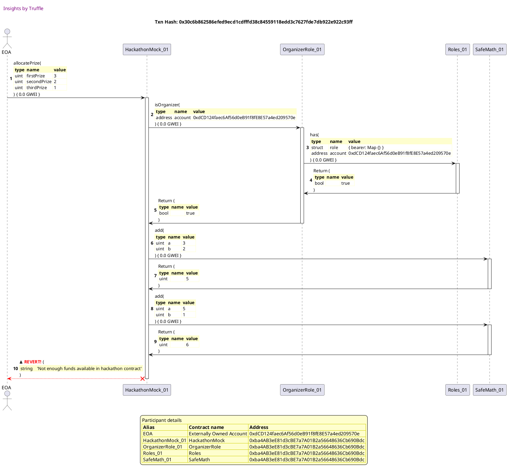


## reverts if prize allocation is already done
[link to test...](http://github.com/fodisi/hackapay/blob/1746d2fc3fafc73d8b2843f0fed53fbd26643dc8/test/core/Hackathon.test.js#L50)

##### d1, tx: 0x3609dd92a689cbbb35d9d1868bc1ace6a6a97598790c8e49f259d6d9ae8a90aa

[SVG :telescope:](https://www.planttext.com/api/plantuml/svg/tLPjRvj84Fw-lsAKVcdLImiO5ZPAezgES-c7A5LJgLygHGExs2XuiPRbBcwI_zu1OySlfAVQEkbqo6RPOLwUPvZT7SO-bXQDhQOvOrZPGbVJM1bMtcLwXWQdaAknqdA0oTtO59MMmo8l3Bow65sCXYF6JaixpzKPW-QQA9JAm4Cx1RWiJFQZq1RpVfwDzLHfInvJkrAue9SBbxFAp7AryU8c-w70zLUopoXbfiVWEgtegHbFtxSWM1l_aowpySIM4C_XgwdIbFmoczbSmTTx3PTOJax0kUznHqWfFEIHIE8uxWLII3VYKPouc2YE74KOY2WKJX8fNwHU82IN0bM4ma5abBB44lJHTH-mX2CQZnYbpMP9DaEYUabfGpifz5MHtDqwRgErBTmq6H9lLTelHQwkKEDOcQLTvvjDusipHar9CxNIqcvRk6bI2ykbwdAogNA3AKMqawNMslo8iOOr79zr48EtRqyWANHfJLKdwlLt_PsTjhNpHpkUFNu0Evyfe57Zj1d_mhoYXrhz4QgCC3p2RIRfxYobyPoIKOiNDlGvkU8kbpnmzhnsF4jL9YQRsQpGYm0-3y8UxuKU5w4J-bpmbAlV3V067i1vvy2VtqQVg80xibRdiljZDmczfLMm-gRxfPGy65NM9359Q5NRXfySdhkUdw9AU3yDk7JKGBXfb8wYKH2YhwJdY21qL3UF5n3NP7OgyB_COnTiJM6rCXhe57S_m8kLG2WD-QFX0MA5HfaJkC8PF3p1qxz9xPd4BgK9blydIiV79_15sSfes8zMN1GvuQDVYdcvZBuTiADOAF1BHVJI4cbCVh5-rZVSm-gltKjnVITjPJ7ztUuaRyJ_1o879Rs5ieRabtdfs3gRL7PlgOjpgbPWYwQ6VLuxvAIocENb6kPpvvmsxHepzIvqxj53ZSNGcRz2tr-MzChkxB5f1-X-RvNHcETpkFvRAmdzlOf-tV5EEx4bQbnxmtF74u7otL6G3eKx2DF8SmV2av4_y7g97tjfBuxTJTVTRKUN_80WE-t9bkW0rwisfdqymDLwk_Cy-rs7L5zjbR6FTAS6-oS0)


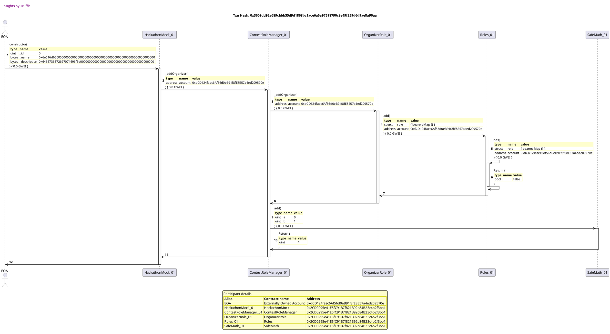

##### d2, tx: 0xa8e09747adc5060a47b56052358042203a7b29f78a21b5be80fc6f40a9b34687

[SVG :telescope:](https://www.planttext.com/api/plantuml/svg/jLNTJzim47_tNt5YBo36vgH9arIieX_fu0616D9UaAPBuhGHhbFPpjPI-Dzt3Mb7I_Sm9gegTpdxVlxTXo-CdHcBsbPJoHXMjbJLD16QcVj2pL3Z5AGO2vNrCRqVwx9IsQ2KfOOFetWK3sB6JerTID5bKFyc0ZEXOTcy0foNkdWebKNPayLOJOMoX9ZRpOOHBJv3pYezas9huLln8C3nDhPhpB92ZS7XZUcfbgUV6nAiEVz2cM8yiGQI1TpgAiy9bzd2IW6tSmNdQ2OTu7CC1Oy2By0izNcRenSaVflxRiiFkUUwl8L1uaPv4ABh97uYGfwdxTpZ62Kjhnq6Z5AMMg8UN_K03HoGF62KDbkanGmfr7DA6zf9gIxBzFu7T-fTkyPjboizHaLnwvjIYhNBhd7RPMKqwwthbmF6QZvmqjrp91mVTo2hfjD5JyeoHIkkgL32hDOFZzWUXnNCAnerJ64sziCxTSTEc-RusCZkunUmYva0aWgdjVo9iY9bjVqHgAfQ60EafIdrc2MDpxF1q76z74NQxkL-E-EY7pbvcCTXx0VeYSpbaH_m1kK8bi0_SVZwFRwWjjX3THN09ZaryGcQjn4sLbVfYgKcF19BI0HgeJjmYJDOFi7JUuRs9uZzDJavwS2Di9LMyBRmahAKn9F-5EUQnDzIkgTJtkdy_JtvtEDq96FFeufTlxWQcR1OIFE2mv0FEUSh3ZIHwCAGCg1He-acRzZqrbNR-7KVwqjEpxaLMg6K2xZwfKG6lJVLzINmgo6nOwgXtS6Gkv4lF2Vsyq7az8CyT9r-v6QXrtTRgPUuUIj9d6teLyDan_GVq9kXqwZ_2aMLQkh5pkX97w3V)


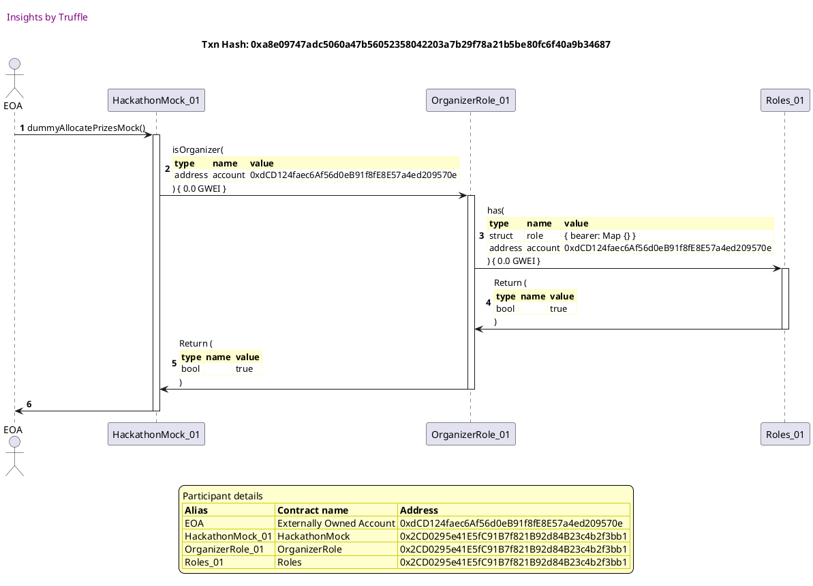

##### d3, tx: 0x984965a7107397b4f8d55db454fb88f5982b0b0c749308ac164640c168adba25

[SVG :telescope:](https://www.planttext.com/api/plantuml/svg/jLLBKzim4BxhLsnXfXHeYkpOYSsa6V8mXGC3GvdsK3eTsP8J3uwSaMH82Fpthft49GyEfTCSlDAkjFljGry8ET66APEFKa9ORZAPZqAXYBvBv9WfDe9K38JaNHRT3LIMIzxBqap1xcbm6lG2GbhQJ5FH9b3-Xe9neM2ss0ASPIfvpAHXQITD1d8af46FiQaEdA9nxdASgt4gLWnVaqS1bbFfhXZdYHo0HHUgvrAsZXOWo2B-kTJ9O6WqX5EuKNaSerzY4fCAk9b8E6DwU0nqudkEtt1PqwBDkjyCdTZZhij3ntNYqFDYr_Via8OqQZf-dNeiiXfEmw4eFCP3Phi4InOPX1vSTe1fs46vGx1i9ecICSDKpx1ip0mpUP55Tx-eLPvQLwvUkLG39Z5lTPsbOdbbNRbwfL3gvT7bPeUG4W_Ksbj2mk7XCR0qpI9cn1NsI7oubRUajUZhnuLiFtq6CnqBG2dPg9JtBCrnKHn_WZp1-4yG9qgRqWrkwcj6BQ9CygNLNhEQOQ8gepKtxiCCw2SANxu7vzZZBV2Bf3QAKYQLw4h_jfHmnfJG6j6mACA9Bq3I2U_rBTk9cOWQdTXjS2gwlXLxSU05RfCvWjlKTvjKR4zW4sgHGDMg4lYGwRS1raRbKO5IeJyKCmW5Kq8TmmKRm-mPdlzdQd-IsDwJMkqOheN9bOItfHTcMOeuYr5HI-t-QoNTCYd_AVvcf4djnwuI_6U1O_xoC7Jh_GDJ4ach3QreJfrufdrmS1ry2wvltXqSj8vAVVirU4L_2z8h8UoLBqNZqrL8TTFg2VEz9J0ka9EIUzHjOneoftDozO8-k30iIVMBq7tQfvGMbK7MHbB1HG_fMA7dgaQTvInLzn1gGOJudHYX94ARmkM351mwRvgsbuutY7HDLRgsUtrg-wvmhC2DUxxLRSQURNLzctjErwv7JcZ7zJ2qLbrl4EwQwXzSLyIyMFwjA-pKeb_a1B_u9_qR)


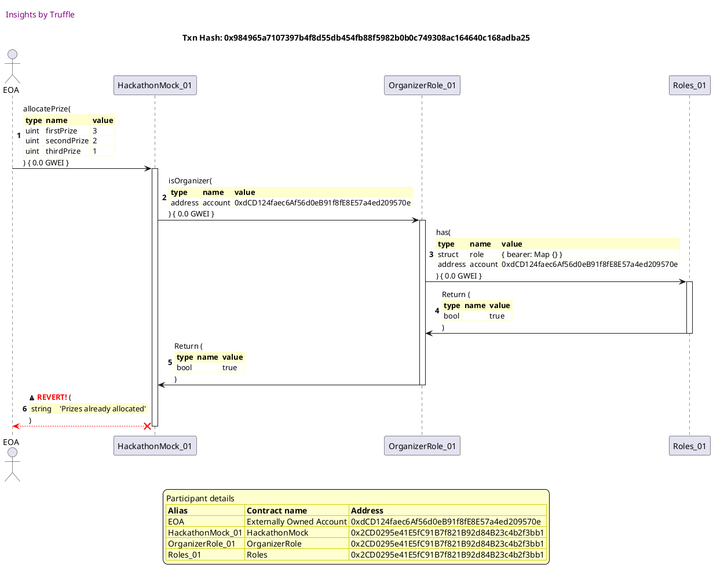


## allocates prizes when total prize equals balance
[link to test...](http://github.com/fodisi/hackapay/blob/1746d2fc3fafc73d8b2843f0fed53fbd26643dc8/test/core/Hackathon.test.js#L61)

##### d1, tx: 0x5c8dae4140915f165883577fc32c4051fa3cb872c60fccebf5bd5b64eda15169

[SVG :telescope:](https://www.planttext.com/api/plantuml/svg/tLPjRzCm4FxkNt4QNq0mSDhOIQTHKTgKyM4QsYRn1MboOgUDbZgLuy2wTV-TIvfsVSb0j492H6qSN-xbUIvd-mZva5jXR3592H65pNGn2PKX-MsYfyA82QHgfBJyAABRaSaABVjPcXbuCGo6GJyWv3ItirHr2LJNM0cf33pKKu2pp2JtcROYxQN9I4-KjkWnjYk58RvSk9mMPfggZHTNoRq2nrt9lWWf4pq2XzQYnseyVLU387NyppfFHcERGpY3QrF4CVebDh6fWkix3MSY7vy0lMEHBuLo7PTs71OxdFb-ctbU7BLRaKkP4ujs5FfUA-8qZY8LnYoKBEIkai9X3kyGJ5ba4NfmqGEHmn6EHmJJPfCecGgaUePf4tQSwVCikhsXJgMrBTmqwIDlbTlBB5NdGekHCakxnZURnXTc93GcpPHAIxjjuQP9ASoNgil9figLY36Y7I-rrkP7X5IiuRZRG0nUlpw1ADEvDKMPg9VVz3ToMjVEcthipj-3dKqLuAZ5f1g_YxJ0Xr9z3aM26EPmaqYyqwKqd64oIl721ZydLzpXaZEwvxNZMQeyCidK9fbU170vyzgyxRLunwEUopiyvkfF0xo21w1lANpw6dp60cx8MfdBvezT9VG6Ly7gc-wNKlHWL5wI5564gzfM_6H_uBJSMAY8zsB69LKVEqxinu4VC4zWsRTeXtbKDVDu1d59PgS2_sKUks1B2gkLKK77kFi1Ngm4H6dG7muF42fXb3c1Sp65XqTu_9lKdaZiKXgB_7-YT7ny0fVA5aR3VhJ2B4iH7_vYaURBwDi16ue50pzNHCyjaSha5-jdVSCzhFxglLIixwIrBCI_qvpaZVY_8N9GqcieQqX-cPU6hRDAPVEMkZYdIWMoQ6h8bxL3JYehaZHVmpoW0zoqIypOk-2vXmyb5eDd_WfzRrdIAxlkl6e7y7vdbT4YJMTmyKCh2RszYdxTyKuxiILQkExmNfy6ZjznMeEXy9aN32WUMRuAFUxwp9MIkOCXstJTt7OqoGy8ijEUR8aESBrgO-h70rojjpjFipzrYFLLLndvW7Tii7y2)


##### d2, tx: 0x80e129d0f8104d48baf0bfa95154f59b384ef10db0e0835662a93ae50717861d

[SVG :telescope:](https://www.planttext.com/api/plantuml/svg/RL9DRzim3BthLn3fPKDNJB8bVmHPK2-saHs65bZlWspHYH573cG5IxlkluzrZ63jgeDalKS-auzYx7RmsldZlcDC7trlZ_iA7HjshJref_VGuGQj-QhhtSRrHsjMVTSxk2gBibWLZ2q6_zZXai6ujgWDElWzNG7MlMkVUkjrbtNjnkxHUb9i_2MW9F8iUJYwGuUlY1_j4uAG5-nU6zFQ3GW-GN_6S_5vAe9D__zcXtQpzGDKZ_3WZar3kiotlaDuE5bOws4x1tvAE8eWDRn919T69fLkUDNeL0ab6vLMOIAn4TnK77aIgYWAT1fgL3mMSH89myYosbFfnLq6Ue0PdJD6jlcsRW-QMbsJRTflU_kzhtS_kHYZte8pniPCk5c-GyBrzHmC7lgXzHy-idS2NjBE-JTpOEmyC7R_Jna6lMwxWIsciNswoddEELy-Vm6Q2nL57oiot54_OFKUNu3C68S3SPUyvVFOAkqdZyxghdk4kryM3MHrJO_34yLFOSEZ61MAF0Wb5vaiLQfg5GVHgWZ29exh8f7IvA-5_xFg3JHAcpJALhmGIIg2lDI9YekSat22LHp9H4bZbCnBHTBamUG4kwMT7lXV)


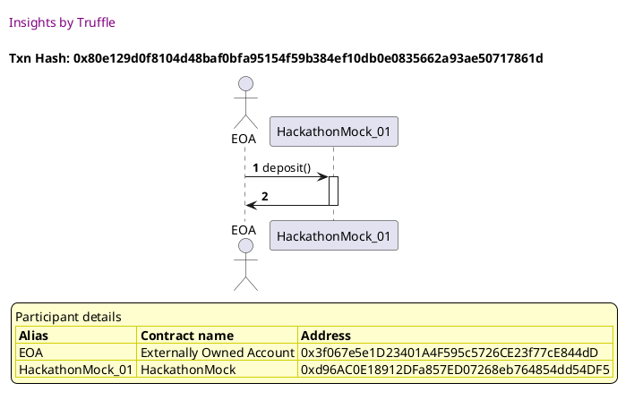

##### d3, tx: 0x984a8856b8d1c3354f1615d834a1a8b51d9c3c5a0109940eb4cb59b2a48fdcfa

[SVG :telescope:](https://www.planttext.com/api/plantuml/svg/pLPVRzem47_tfpXrBwksRWuaaA0EbK9O-r2rQYljfT9qYHs86XpaE1iK-jrt2O7oRvf6LMrHbBFlpkVVdUzyOUmiCwXDFaeOmzoaAXy5KhFiCLPZr3Y2H0wa4kSOFWvqcYlHJPDKmxk-t_UxFcEdcPaciisWV8OIXTGmgwO05wcEdr9bCEaayK2Df39aCJ8hXJu95oR7kHudSaDm5pz9iEmLxmQ5YDK0B5wndajw-ha2mQhzBrKM3uOcWs0AzpgF8hBBJ6mI2VSJ1HUO3Ll09vvhe-iwZS0LLbYlEtPaDIn7k7KRBNG3nn9UM0yTv1RtF9lBm0u3nmjgQBkH22Da5BBG47J_kWEOmH7H8qPXCt4OZv5SlQ2meHccwYeD7xzpgzJQPcukkTO3LEItlaqJkLoopTnSKZ2pfUfoigboXv6yeasNMclp8yPAu73IteCDFdne0IP96gAHDtIOyls3Uc2dLG9yh6Xx_WNCT2o1gC9HINzWajEWK9z37XEAEKInpanfXYREbZ2JOQh4KbhVaffXh5V2sa9u33FWdpXy_UPVKZBiWLyujHEzqgauM_4FSucIKSii8pGOXbGQ1KW-4TsULRCZb66Z4paDmUMvPqLkvBk-qqHRYXhtd2QN-ntOXLeui3hJ4lWGiyC0PqRdOO5IapqYCmWaQgbRS8LZc3t3yrkwzkB4_ZCvEMd1hJIvLd2OUq6Q9eIpI1Mzv1x_BgHxCkMDzj-Va-i5kAWn8LvLMRYde8ANCje-ZOtztoWW5GfwtNyH3NTFD6h_GpGi_eTmBAvZsf2nHVjbDsjtkP06uoHRGz3ZFSvvWO2wB5tlDEXI-zJKdLPOEikINgrhpyl6HT-9aLhH9J-5wvzA2kWSLFJhXdSQtnPhOTfhTBhSjrpFglNww3fDlyURjOOhWsR3TXrR2CVkzPrDqpiDSelr2jEhHbeDNs5glU6-pFxM81rzbG3iZBxqb_OB)


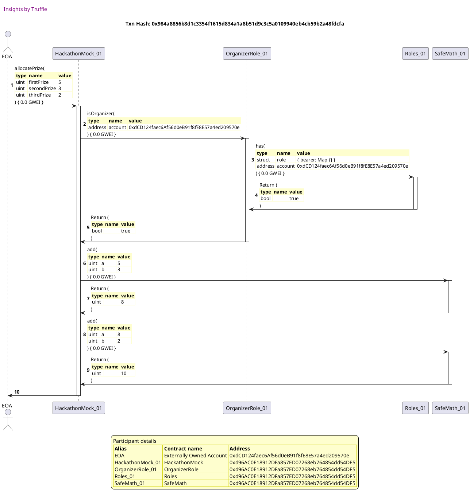


## allocates prizes when total prize smaller than balance
[link to test...](http://github.com/fodisi/hackapay/blob/1746d2fc3fafc73d8b2843f0fed53fbd26643dc8/test/core/Hackathon.test.js#L66)

##### d1, tx: 0x0c900755217f17718cf0f8088a1817bd9498bc3e5f526e14fa07f7692cd503d0

[SVG :telescope:](https://www.planttext.com/api/plantuml/svg/tLPRJzim57xthpXYBviOcvCsjueXIbi63mW4I7j1Gavijn6fKpdEHcdvxpj9qz9BOABLf6bH6ySdv_9z9yVs8UGuCqoRV9WGmdAJgdmO2asoXrYDc6P3I4HVA7x2eeU-JdF5EscIQlXmsZljTNg476Pcd8WZ0kKr48mB3PDg2d2MwlWfLOObxIJkgw5G1ZrAir0unPSpbwDSZnAnyk8cVX9WDHUoAyPvhFfWqKhqN8w7NoiGf8f_hhAuFp0PX6EurRcKw9UOs2G2RXyLdB5iq0BwIAE0KiznRCkJbkTPVYIfzAdlCyktl907pS0FeuPmf6ExmcfAHZtfkO4TSOSsE2MOiiWWzDvb6rW6UpZk4KoRYQDun93g6QQDcK6gBjBeuPvQfTQwSDMaWxn5PgxJH5mmnVf2p-rgtwmQN-e-KvWqNIZDxTQ5goQ5C9khpYUhAZTCOaGpc6ijpVS8ALd3mL4DCTZVRq6Kgipel4ZKnpjrHmwhslbSZKVJRs368m4uAZOinvyioV6XK9z27YE6ATp77EzqBWt7c8n2FBF1p-aArtAvwz0jhmtFN6IHZaScJjKiGDDrl8RRy6mtyAZNT0DNkkAz0Jx11EWN2jz_zCwnW6koLkIo_cEN2Rt7LR3ufjkb53reaHKaMHJXgZObFzxfMZPMkOZSjdHSJiL9O4bVzloUux6cu3OD78-AUXwl82x8R5JWlynZ4sn1OR4oIkWOTpl0ivM0A3Nwms42eM1Qw1PSi15Cdk7vRr9x8R59QS2o_udImK4BheN9jOBjQ8LfcY0-_4cMPFFewm5hYWK3lrP4hosHqkIDzREyuUvMVzLUofPtqaeMuj-gJ_9A_3yGsIdf5PGb96_cfMRhB5DPlwNEpgb2WSoQ6dArTCXnOLYSP4kOkxIBctQ16NiNFFVmeS2YySnVe6_FItfXTpGjsm6yFngX5KkICLp-Ke93UwkYNtQyqKwiYKhNGSVoRHfPLcYxikarkhuCsdRO3LoxYssB5tGyskss-Qhh-hQZJhv3a8tsP4sqW-j56rCzxk1gkTrvcRtN8TPNLMNa6E_OOFy6)


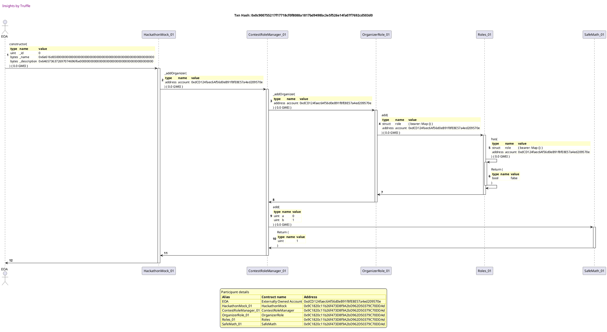

##### d2, tx: 0x9e7f135b3495af746e5cfe64759db51fb9e71c3390eb263bcbf4d7e07e8c669f

[SVG :telescope:](https://www.planttext.com/api/plantuml/svg/RL9DRzim3BthLn3fPKDNJFvK76H1FTj1TXXQOBqFiaGbHXmva6KixRh_FjOnWhMh3fBr7lbCFegnszvBvuT3ovWSV6U7GusEzVl67gMJ1sXnYrP_bMg_TTrWTT6rdOEhTRMkYegnPUyVMrmn6DSEfKO7lwShmAPppLDdlMppjjdQ0rfFYiPV0jP4dYMFWpks-8huqJmX1F45kvTQDtOB0P-WF-Ev_3mLmQR_VxDziztv7kf7U723CQJBVEDRX8UJXOtiTmlWfmo52QAaZk8iaKR4AIRAO1gB9DDr4fYQ0W8LHHd7EaoZMjKcrWAvmBbAqymmianvAhswoq7sCADpniWstwZcAAdL3Tac_Qwptpkr_yc3CUejE6Dip8IRrJiaN5ylGEEnwnl_uIDx9-0bxPn_im36pWDZz_-KeT7BfktPSXhRfwkIbvpprVCNeBbGKVHHaE6E-W4h3_W2v5exx8cxvAsUnrPfFtbqLhRj8zpzigWXLueUXoUAdoB3Ku491cKOnJp8utMI9IeHOLfKOMI4KDKyZdNvMlW_gzv0etHM1FEGgo2WUPXOHENSP7bObraQbWcFH5O8NfQv9cdoO7A2tT9E3_ml)


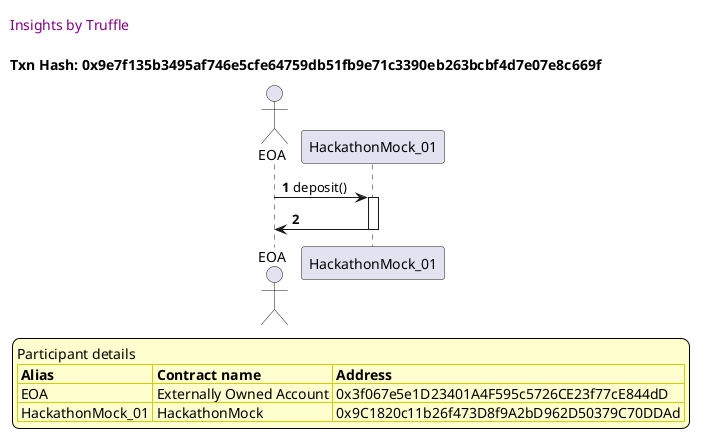

##### d3, tx: 0x37c97a7c21da2ad469ebfe6532fa76f390f6eb3b59c0f8c64bcb71dc89ec6638

[SVG :telescope:](https://www.planttext.com/api/plantuml/svg/pLPHRvim47xthpXrBwksRWOI254NDGtfseUgLLjfBvKcOvi4bPZ8c2rfql--Wn2Qf4pJKbKRGfnzTpv_TxxpGSX9PfWs-IGXXEKcLVaab9fa3x6QCiqcaCYHLEAKyOUHJdCb1ccIQdXtDZmR3eQ476TcdiWUWV8PIoQaXaKr1JXFTVoOAiEIVXAFr4GgWnOZKokSeN1bSfhhQIAt1BVnemIhLVEkcH2n6e55AzPJIOy_Lo18jV-5okBHs6GGpk5Evr64Tec9JIBXRgRWd6NZBj2Put7VOnwtBS5i9bgkByD8kct7ZfZdHevF8rU6JjZsEOqwt6s5FFGimJk-vAxhT0Y6Z1k4Fhpg0ylW0Ea1mR2PcCTJXgwUOzYO6QVgCkKFtwbLQkqojvTSwH5JwBU-IHEvNhBBt5vICBErwdgohNBB8dc9cwwrDkO7X9J0uQZNW0q-VEW2IvAKCoElyJ3b-tjrJuwh1FXOqTxo2vZvL09InIOb_S6I70U5-XBo654i8OfrPaepE6dj23F9KoNMKcT7QiQnheNsIdW82w2VA7pzDhp0P6Y0NpZr8dgbKt5My_Tp2PDHoon3D8npB8q299s9GM3PhOXXYlIZjYkeFFMjg1CDEyEsnrfIsDHlUrGsE_0IQk50VQOby37BzWES6Ptp0gL6UqWM44gcfUx29Pl2uWcUtjArPoUQp-Jeg0itqkHQmNxkXMcQ8CuYLVIQU_Yxa3PaoXljtvoJcmMugZ4XNbLPhA6WmkSosZsDhVtVA20L2dozVn4Dho4QzlyG3VyFqLZTnhWV8QlkIwuthd8X3OkJR0D0G0DAQG40copUxZWOOFVKs9ngAFrrHTVhUikoR-5tPgHMUCVFuUgdaWBwUzNyfk4NVM-7LPhs1rR7fjooGjkDMfuJT2A_RuU1xzf1cpgUF_1e4FJ5jkaN_N67zGhJTH-jXgymjTbldsT_Qn2Flae0Se9V_4dx1G00)


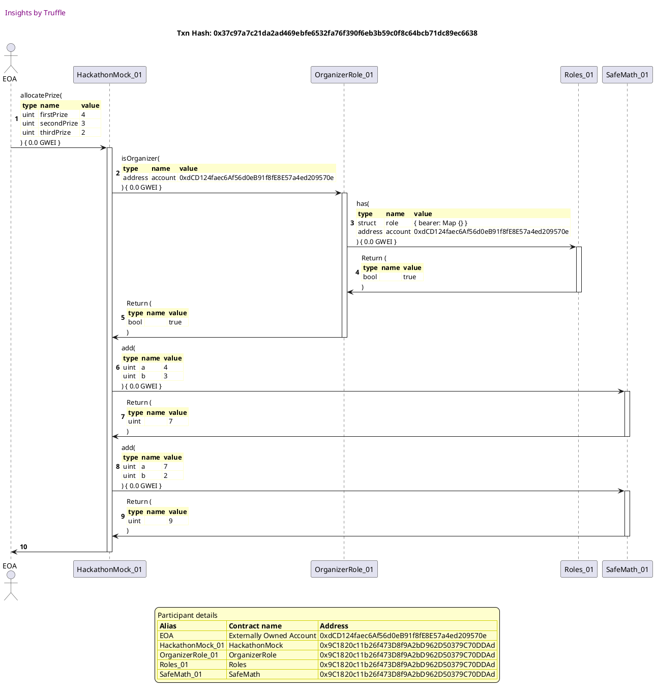


## emits PrizeAllocation event
[link to test...](http://github.com/fodisi/hackapay/blob/1746d2fc3fafc73d8b2843f0fed53fbd26643dc8/test/core/Hackathon.test.js#L71)

##### d1, tx: 0x682279399b12aff8f85052c1f5720bba722a1d35cd50520abd3efabf43740f7d

[SVG :telescope:](https://www.planttext.com/api/plantuml/svg/tLPjRzem4FxkNt7glcpgkZc6982wQXJesWzLgsxIlbIgBh43KOE376ShVVdlkuH0UKax3JHfMWHnVBcNvxcSxMFiSsRHs7oSC8QvJNK-3fHXsMsi9sXm38aQAYsFCRmTcZJNifScgO4t9uEJGM_0s65cfuawOb1U8uLI6NYefW2dgOdlKsqnwIRnK8-LjkGniWk54tevSpd9pIHHAo--nlSAdEP2TebInde83gz4J-Lu-B42mQhuPpgBXoERGJ25RoQF8lBBR6mJ1T_kD9nYDke0l_DQGlZjHhiTE0AZg1MrNEwAq8bSN_0WG5y8T6J33MKXvnZ8XeemY9eDlyaZNp9AMMW9-k2Y2vZ17erxZD9cup2U854zfRIX7QNwF0rlRxXJQgqBLqrwn5jbzYfDr3bg72epjwjzisfyOOQeAMccK9hRhGjNJGfXDbUTJrPLlc944UrehhKqtsEiP0q7HpN4O7-_0s6gCslo8b5lh_KrEwngvtqr7Zr-0ZkTAA1HuxWSVs2IqqEX_WXvJ1WUuIQMTETpQJ2bP1JYcKtnEPNdUD9p-PRNXcUfij344nkdUXQWwRb-mslumclxt6zwRI_or9y6U0SFm3zm-F9zS4O5N9Er8fVr7xjCw0sjWiKttIwbvC6eh229OKYhsfRyPA_lY6Q4AlIwaUj9hexR3YsBGMlW-jXKKl2swtDLp-C5n0MPZGhybtbiWYqeB5P62PtYRWTujX88fI5_D3n0eD0equ5pdC334ppzJMhF93OfZJ3xdoWT77JWIjdSQDYELf2c2U6ZNuH9De--7h2cM2ZmIqNqqX8fJLvPFyiRxcxrL-sbkBoJLhA0_avzabVY_uR8Jacle2mXUJKlDLjdcShwBNLsJXKARDRKiCkbGqugYt6IBM7kypvjsWLcwbtetAE70ekXCt-1lZilwONTqMFP3j3zpYgZCKccSF5JAmdThOf-sV56Ex4cAbstd8Pm1qAqUv704-4uhYiyl--B9ig-wWUIknvfz5TTrxSTTV8TWcoq9skY7LmlsfZgSGTNo-tEy-nF7L9zLLN6FjET6knV)


##### d2, tx: 0x1134a7b7a200fbf9d6761bbed8d5b582c8263d3c9dc12589a972d60b6e8e9669

[SVG :telescope:](https://www.planttext.com/api/plantuml/svg/RLBHRjiW57tdAwxIbqrTDS06sr4MDOiTPGzJAwtl4mQSe10SOQmbNVVl8uuLhLrv07FElSVtdWj2zrqGFlHxYv3eG-lwVQqzwdR67OGNUx1wevtwAkHkuzlUgMLhMmytgsfLBIk4PbquMJr7CAoj5afx-3rU0TQjDy-j2y8khDculNOXAZRX6h2Av4NoqFk3rQ-87-PP0qclsADGohWD43n2VuPpzdai0et__-Owizc63keJFFc-QQ8k2YPO3Kz71slHRQU0ZuGagSZgJ52Ccxef5CyugMkjSiLgbbEPKvweH1PA4ihoGXGPLHpNNEUwuBn0qJ8POkdLmm941vDuJb2qBHXf3YAskewsYR1jtVTMxdvYCaIz1IS83PbmDt-7XDlRAIXzQ3iJFdn4xmISqoxvTrD0w38mzFXF6Ke7OMo7PkFOFjsKkCGOpr--G9nBB2f-BAFXFlO3Jkpr6LWevNKNkMlU_6LeDUx7eBqJrfxWuPVJ2XPIniSH8eMFIODvffac9KrIJ1RfYXLCiepoPKMJ9ijabQUfAbyB_sVL6sYGpab2MKLfiMoeM5526ACyApEQ2bNgibQOyHXnbeuUZ4wW-xZ71_uN)


##### d3, tx: 0xd95faec68be222c48b2fd69ff6b0c9cf639cc484498403db924a0bb9c23578e8

[SVG :telescope:](https://www.planttext.com/api/plantuml/svg/pLPHRvim47xthpXrBwksRiQ11A8kQfgGjGzLgxRINYfD1fi4bPZ8cArfql--Wn2Qf4pJKbKRGfnzTpv_TxxpGSX9PhWs-JGXXEScLVaqa9fazx6QSSsdaCYnLEAKX_TZdUPA3D8arV1kv8_yWK_8SMRcYUmHA9-9v49gM5HJWBDKnu-fCZpf9_5OJQKoQ34ojS88XIkJirpF4habk8aV9LXspRlYGiHg31QjM4ybFVvSWI3L_kSgYySJaq4mXrkTHn7Q9IOsYOJR1mLdF9jqWJu8pucu3Djk81bZeUq6B19jBuhQ0GszC6gtl12vjksvDcs9m6Csfq7WXQpbT5pf4WnPQ12wVza7di41qWE2OJDn6Cyukdg6OUDcaggBDBp_JgrIQvUvlUHIZxb2l_LrciZrabtczfA2cQrLrvDjbHiUoGlSTAsrCJyWf0GEHxq6RF3XGnTuagGXD_8A3rE-lrDtvBXAW8yLxIs_W9dF921LV5hI7pp9SL2eBo6F4SKIebXdfZI34sT7cCamLM8jRUr8pIJMjP2jX8Um0Fg9mjTl_ZacGmFymgaNqIkTYhEQlvzBc8nQPXcYuM68fL60nAGQ32rcbtdLZvoseFBKio8tybtVwN1R2aOzfqDbimCleHOEr6TQ0f_mR3_0cT5vMA3KQ0_90WB9jTHTkE0pM3p1qrkwzkn4yvaS7NNXMffSAzZFlI1D4yHPf8fUSmz_5zA6J7cZ_PjpShC0LpKcnAigYpSKLF1SHhkdiRN_6mMaGe6l-o-YuJP4W_qFqR3e7yAnkevnGq9MxPTSRTpbGXeU9za6WY4TKaeB1DXbyNh7mG3RfyRkL6FfhqkwNjTRbeqBlmz6QeMN_1mkVoefeBzNqMyQVj7uTbYbQTTgCSTdp1j4Z8-OPJaEQtU67MopOYY7WQ1E6pM6swPVDCWTrYjCrusq6hx2r6R3VPxzhK4y-Ye1o0b-yI_j5m00)


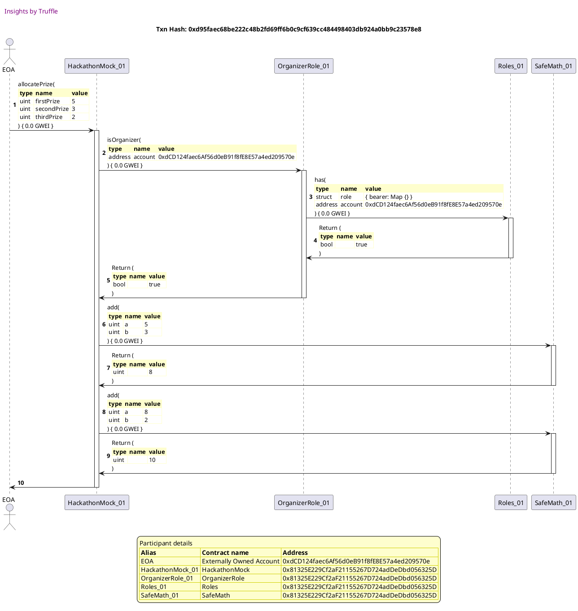


## reverts when rank is not published
[link to test...](http://github.com/fodisi/hackapay/blob/1746d2fc3fafc73d8b2843f0fed53fbd26643dc8/test/core/Hackathon.test.js#L85)

##### d1, tx: 0xdeef54a866892a8e1edbd2b931ef8b007c93fc77fc5e2812c18c950ef3421a1d

[SVG :telescope:](https://www.planttext.com/api/plantuml/svg/tLPjRvim4FxkNt7glcpQkfaa6AYwQbcIhlrGjUecxKkbok0ZGIKcCcPh-lBVTn2IveLsMg99qr22yN4lptESxMFiKswbiSKuPKmMDjF5E4J3yfj4JwIHOqXnY5fzbj7Dq6I5LhqipGoyEXuS3te3nWvpEqtnY45rZL0gD71VJm5ECfFSPThAj9icGpr6RSbZR1SAn_Hovd9Ic4cAAo--9dS8JcSXkv1A9Ne83gz5ZzLu-A46mUhufpfFXYERGpY5RwQ8O_BBR69JX6-t6avaFZe0VgiGOxSZVI7ye2LzT525gXK6RGTZF-JSYu9s77bU7BdOyfrMvFXHu7ACsvsM8nt5A6MH9UY3yox87FPet6EKDfj4oKGIrHDAcxIZJ9zbqSqrTogjTU6gIOzuOsulinJFf9P3D7ExnZUhnkTcA3KbpPHASxjruQf9ASpdglF9gifN6LD4EvfhBStt6AjOm_vH0p5u-_O0eapdrXHbebvVwIjsMDVEkteyUlW8TZf1e57BSJN-a6b13wNw0nG9ONY0wqJHdS-buPIIKOfdDlGv1Gf7AE7oBQyDpmhpo2GJcsHw5g0ZNAyjsbvB11xtEY8GiS0_3V06xe6_v_3b--2K2hWXQsKkcpzsbT1hMWMBRxfTIic3mRmaAQE8LhMj-AbUtsbrOecHwCQkK1m_1qxinmD_u7goWwh50zVZsCpZ6SGbcOqA_9TvR88jAInMHWMTucu7UBOI2AKXVpJSGuZIe3c0Cpc1-qTu_9lKdaXiKXh9_7-YjBz_09Te2wDXErfXbgM4ZtwnJFDvzFM03SL2WPyhekUMI6NomlfPtd1tgxzwBvNBEsaj2-dlD2Tv9VvlYEoKz1hA4f8NyzAmTLQfRDvIP-TKgS1cJGsxM3ha55gPfFaIvZxlqwPTOgRUXSuzUYYn63hp5-Yxyv9Us1qzLEq0tMyj6YtJT0hdFpKgw6vLzCkEDzg9DT7CjUztlOvB7OeV73jHA4JGuzJTk36FkDld8WpSTj3dgwwRsuuc-Gv1DjgJDT4EhXTjJFsuWwlbTkTfzgSEgRxgAcEVw4uDzYy0)


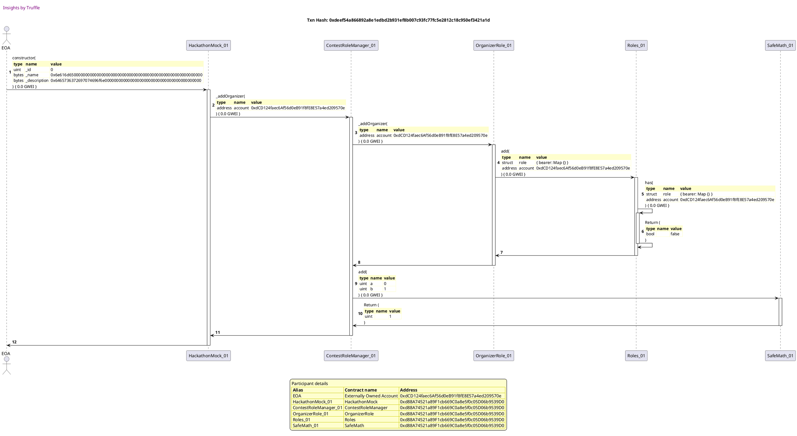

##### d2, tx: 0x0a9be74e3c4a01c6e043e63baeb0043297be848d567221a64e905dedfa463fd8

[SVG :telescope:](https://www.planttext.com/api/plantuml/svg/TLHjJzim4FxkNt43QMnb3ESzGLr5bwQ33nE8eUt3c2OdlhHHKwTo7Df2zzztJQCA68iYdtq-FxvxxaaOEw-DqAQPbuo9nbIgcQUeMJqhr49eCOSI9wZaPv7D9hfgb8ohij9mE4x6IPmmrg_DkiG1W_QPef2euR5R0bnKkdYeb17bi2mcQexA469kzW5Zsjn1BXgzAF7PnhVY0S5ozxvh8MMX9c3nplMdjVtJBWdMtN-fwc8oDJMaQxZLJPuJBZE5AH5kLmekH3qz0xxY8aenSD79NC6jp4VkEkWxgS2KqzIEWXH3DvIU7zYs9NmN8-v9bBbmVIUN8IFACaEf9rT343KSa3rWH9ific8XgDGBeasOQQM-LjdiDxVQg9VE0yRQat0oU6KJZe_FO5cOgTHYUKriuhixTSVwNGS-T7Qm-GHclK0WgyIyjVUYR6Yo3Ty0KQUnhc53O4gX7kxNVEKXzvnna3j-biJ2vvORMNmSHv4TkNxis64eV0zTVuVr7Xw1V-JmvKToIHru9UNLoSz3ZVBNjg1TPITdq7-x55fH-mRGptOYefX1htUJV4zkRj_qUltJrZ-0_rG8jT7Rzc-0tgCReMQWAaF2ISkYdgA4DPgZBaScaNfJt0k3hpA-apMxVj8iYKOKPVtauX4VSSwtr99wgNKqYKcMcf3t9Ezvt9-ZHBU2e75bK2jHbckuMYhARvXbz0cPbdCdvtw07beZst6vDNJ7NkHbNc3xSM8xUH1aIUYwSlGS-1z1lN2rq38CXu7haMJ3Q6nbgUz7CHSXUZdFk3VYVXfvJZJY14qST4omSnhfD_0N)


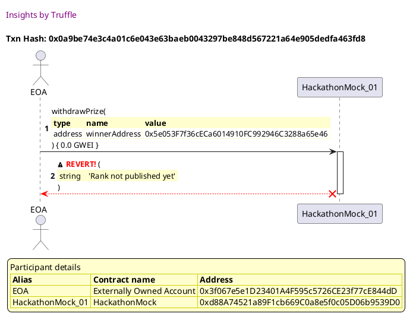


## reverts when prize is not allocated
[link to test...](http://github.com/fodisi/hackapay/blob/1746d2fc3fafc73d8b2843f0fed53fbd26643dc8/test/core/Hackathon.test.js#L89)

##### d1, tx: 0x3e2f77ace6a5e9472f27ad4dee79d98e6af4f6435242e39855ef6432a2b7e87f

[SVG :telescope:](https://www.planttext.com/api/plantuml/svg/tLPjJzim4FxkNt5YNpOnjYHDdAPYY4BRmGS40gHzGK9kV6aZKgTod8toyjztITFIby14gqdJ0etZoxqyp-Li7sE7cH7QvAE4CP6RLEMZFcgMtSLgBBGOGO83LF98X7S3dUPA7gT9gk53hzlh7dSPsy_C9C431kKrH25HmsCr1JX9TVoGAYEITX8Fr0YL8O-HcIlqwENKvJZNumINNbp53mYsEvTT22bZDG3RgaJFvRZ_jGB1glYdAei7GvD1VmBNEeyYyijCR1A4wti59o8Rji2wRw0J-Ru8aGiF0zTt8iSNqfM8VY239eaZD-9kmtDS1nj1q_Emc3h2wVlOz2D6AGiDGU-Ujq5ai4FZ3gEqcJYCnuAedb3QX1ccwYmDxsujkzHQ5IwR71DlpCnbck2PK6A0UcPN-sRP-5mFXAAawK9fPhSgN3OfXDbCTJPPLhaI4KKqmvdMmdo7iP8rx1tK48FTtHQ4gSgCpej4VRnHDso_gftFrNZmz0tCP8n0enAZSlmfafmU2lKdo6F2y0ItiQIxDPFs9vICGZoreS_9aTjSSi_Qy5hpB34BTJmsSQgc0Lpk-GtUy1qU-9Rlye177DyRu1CyWlN5Wky_kgTKm3LPAt9P_x7BXDxIAfX_qyrIIXuqPWL94OQqgat9JnvtRCUD18Qy7NbSMdWKs54pwZQxdYzSb8uLUBw5zJnUGLoGMQl0Vvd7EjY2mdnbbD0fxcQ0fok1K6hoHyCZz55er2qu4sDuV8RdlqdjXSGwfQ78_YTAUtijk4IJQmMRqUgdQKBuw3yIIJQBlXgmfbWey6j5zDeIAKtUM3-B6-vszLVjfM9n9wraVVhPzKbUYly78biblOAoWEJDlDHidMKgwxVKwJbLAB1fKyCk5WuvYKR4IRQ0kMDrQDCkC5FlGkSUFHHOD9tvS_JjMKdFxGwUodQ0xlS6jH99Ce7pNmebj3Sg-aN7Q-t4YgXq7LX7NgVRiRaJ-3tFiPhj9aSx2dod4T0VNToNjjjRTbtVTjJ9jmYorfwiYBPmFMzZgiSjN2ssEo-pzpga-gggZ1tIdHhitm00)


##### d2, tx: 0x705a26dffc1520617c43eff35518ab6a4caf6a4591457075b0c2bfbaec5b2e04

[SVG :telescope:](https://www.planttext.com/api/plantuml/svg/jLNTJzim47_tNt5YBo36veHyD1MhA6swye1036alI9EJs6rKrwbiPsif_E-xX3IZfNiO4sdbSyxddt_tuGiXvyOoRSkv98ILjb3bFE6Qc5ck5aopEKW-uIgxOEbieejIPOD25Xe-ZE9HF8W9EJDs9NcFGFrCESkuXdNp2Z0kTFvGACjaN-OJDUVA8gAmhS485vyX5wLUIBwry2r_uE1uhUw6PLck9k3GHlLKoxFF3GdId7-fJ3wPMWF92kvqAGJY4fjRoU5kgM3CpBGBT1bIdxb19aJg-2uDd33rJhaGfxxlT5WIC2zb0aS_SZm_fA6VqDHDHC9uwYSkfnx1aAKMgSVNVM063b0U40oRpTDymT3LCOQDsMcXhefqzeCwjTMkSdlBjPumXNxhsqBopPPTvVQMIcasffkN0q9gFd3IstCa71zt8IldyzLDcSZSJ6-PcbMBXqTaZtM5yOf3ZP6RLdzuh-x9MLCP7nlPU_m2ThNWW5AnUIr_CbdYf39_14ofviO0pj8K2ypYZ2wpmT1nFO6X3lh23pBABo97T4JSYVsGUJnpQOGvQL2EO0tq4uMlt-DBh8azL2i7siZKnAVCl8smiRfCAvOQyL2i8U5CSzs5AxQ0zHCylQThVvpOdvEJaoxSSbjg1MzpBoaAYJpnZtvkIFmjf7igvPtEtr-JpmMEHnBotAV8pOjxaN7BScbUS1ZI8QMque3j26yBJWROPpHUuvPDVvErTb_liRxXE2ujruf9kOBhNufdq7zJNby2l-eGEweQEg8N_Z0UEe4RXIDiLPr-9-2EY4BtDC8VFa6OETve6_fL9zbH_GTqst6QwRz2OQQQV95p7F7hyni0)


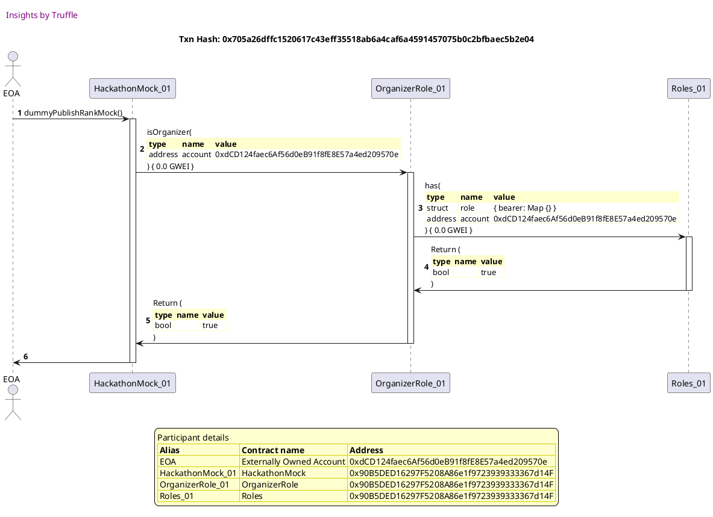

##### d3, tx: 0xef9d76ca2cf496280fa499e9778d32e404d5ebe640b49f46960121a966cd62b7

[SVG :telescope:](https://www.planttext.com/api/plantuml/svg/TLHHJzim47xthxY1D5WPmqaSfqPTHKcJmSC4OcXx6DFanauRaJgLuz8Mkl--QnfLm9WJ-Uoxy-UxxouXvAnsqhhvj2H4pbrbvjEHjgI-BynCMZc5Ke-rKUSokn_RQcvKN9MLXVqqIPCu8QHNkrMf-mIQCT5IQGjFxHRWehB5OsMSB0TbCJPJRHmYvcxdaA9n2pcRsrcfNnY-5OyQFBRJNKkb2ZC6ZxQgFutidRH1aFR-IrCNuuchORI2MplFSyGbhd2bXjkbWGjPJqw1BdKkLCGpwMSv4zplqbmo8RI8eguAVCqeKw4UQSxeY8cSSS6fvtjIS9ufxeyYWfHb3aDFhWOWQzX3kKUGDbTanKnYgXT8ctIJodojillVr6kyNYlt26bEmd7_3ICS7Pt2ed0JPUNY6jdKXtVcZlJQ2dniPN_z6TngfW6baTD6FiXoZekD-ngGEglh6jO8PeosWzsUBaDDmo2Dye1dIImnIoOyciP2-8BnEF2xNSb3pVWMwmCy0Vr4uSkFv18hy4R8o-EV-rQhNvk4jfaTdqBl_K9QW-NhGo_RDX7wz3kTc-HxSdFxhjFfdJJwFlmdGwYTtPH_3VWUD5pKO2e7iYohJ3gjOANTGHibKHghKpoW_atEjurDhf-LIsadYx9-TlMG3Ycb6tAnVx5uk8YnCIqYxsZUCRaxXw5kMWBdfTFMO7Whk5eOZ6-GPVWHkORr8ASyqg7sXdx0g3TWQIZ2B8ny7YT-a4THbdGPKyENmF-qr2jL0oteUJXCXXxtHPI6FkqEkbnxkOZyGE23WqVAOob28mSj4-GCP_mH_0K0)


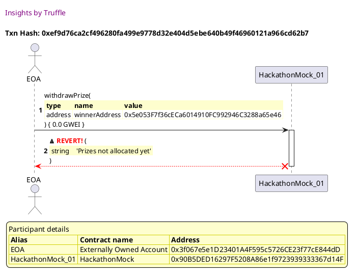


## reverts when account address is equal to contract's address
[link to test...](http://github.com/fodisi/hackapay/blob/1746d2fc3fafc73d8b2843f0fed53fbd26643dc8/test/core/Hackathon.test.js#L94)

##### d1, tx: 0x75eff421a05a8f9cf7be04c118d4a5e9e4e71b73b4775157a0f7a94f12a32c51

[SVG :telescope:](https://www.planttext.com/api/plantuml/svg/tLRRRjD047tVhnYL5n0KrealSLKgqZIbF5H5WCGBKZMsPnEhpZfQhw6XxRypTfoGYmiY4HB2IhpUyLpE6S_kZX1l2el6bfDC22njhij9H4OKDwcUei49P3GYdPnYV3CoUQcJGPxb1fwS3y-7Ww4GnuMTPNGYeBx6X0aPk6kc01UvIR_dscBMpzAHdf2sx57PfS8vlvoxd9Pccj7QYu_fTmB7NShUOvAaUWIER4GFzNZygW4XclZlT96EnhQ0Q0QVJAaK-nKsjHd1friD5rYCZq3U1XufvNOSb1xsL1Yh82BfnexJIrpqA2IN0YSAkf4R19xZ1IXLWA6hd0vsEx7d24vPR1dwyAeFMC01ZmU2qsRJE9qYKxtWjA4Tv_eoZs-kfLDhRGhNJGRCcmhx8S_e4ZMEo2piMj-i6r-P4MfEcgcK5dQRmdMJIbWiL1UJTPMFg3YY7I-qLkO7GjIiuV2aXHWyVtu4SQuBQyegKK-_w2_YkAcT5yruSlyQx6nAmAF6IJr-nQpaXqhz7igKCTp3TPhmNIwaqOoJKOddDlmvVV8TF_4zkUErvJcX8ZRfrAQvdWTmVI_e-jsWuuU135m_z9LFVnhW6To1V2dXxUVXEoxWbgnLkMp_s7L2htaLBB_fRYbb3uQAYYJ6CQzgM_DB1cTEnrL8iTzNdfz8EWqTrLF3tf2BtwMa8qClaDJEun745Pcj2loNUMo3hIWiLqODdUFk1dY-4XYbONyyt454QCWSmILEuUu17lucjPyajYcDiVYVA1qU7i47igNHi1kjACypniS_XLcnYBuPiALOEF1ZHVJO4gbDVh5-LZVS_UglsKjnTITjP17_dVOahyN_3P6zajv0MK7ooxoqR9rrAjktrFavLIc8ULCZtgySSWbPJBDY1VEPFEDDkyBClGkVU_nGOJ5yvY_HznSblRGxkQ_R0RxVMZ8Qism6Lzyq9T3VgUXN7M-r4nkYsdKWkwxZ33gza8Pkehok6iI-Tnf6VXJr8kn8sVUzhkUlksvlEzhaUmJPQaysH7kuNhOnpUCUhbRRdP-pFtN8zTLKcNZ3TswmVm00)


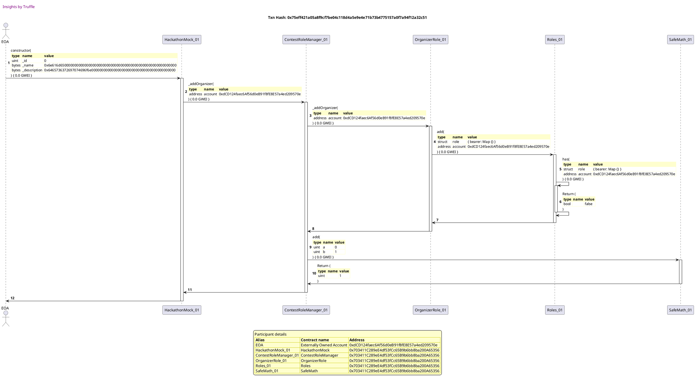

##### d2, tx: 0xf76dc567facd5b8f4a9164bbcdaf0bc8fcf04bb9b6da83e8847bd99b8d6b8933

[SVG :telescope:](https://www.planttext.com/api/plantuml/svg/jLLHJzim47xthpYn5n1ZSzeaJIfMKKeOF20GGzeBqcJ7TXlLTIhRsLeA_ttNa7QqT0zZ8efov_FvytU-yuMG4-UPzTL44y8gNvfgmgKbRboOARDi0beEfH6dB1yFRLaPCIXrQU73UNQU3J92ZfsVQzaZK3yZoOIqi6Y601UbBHvAuvdkws9e9j9uH5H-xN2Eay-GqyfEjToO-5OyI0Z2jUs62L6O8GIqCJtLylXpGu8q-ryQLmn7tW6Vmvsjb49SuWkl9TpD35mmD-e2dQbEBF8exYYMYuWdAcHf48USvu8folD4vOhYCEMnO4bR9adOuI9DUI9YdgJjDi4ZoprIpwxxm1pieTmZU6o-o8ifmr0lyDYO7vNcgip7FsXGUsqRDvTSso4p6BUzBRLSBTasRYvP6jtATJNO8wJc0qUz7Ll2uM4NH3MPp6yghWitkcLcl9pSFo0xl9SOhpZK68LRs_VlpJqvRYhZOoDxZr_0pwSIK1esgULFfYjKbkwFW2crqZb0BS-nm3ngT2O6Pq4hL4pcSLz5iQ3oD0rKeh8aYpeibA95qwX36vG3M03zHE7hz-mIQs87rMK0wvEfYO-OUnjXvssLBrbQn4En02wPbROBLsmAYoTuUi_G_WInEoT7HrsubRwo1juM7YzBZJpnnJXN9Fvsf3igvPtstrsJpmMEMnBotAV8pOjx8QHdXNOlE9pHCqhfaWEs8xmjg0omprYyncis_LNMrkjwZ_KDn-_CIskOrdEu_cMaWFwRyleI-5M7s3BLq1tQ3eDWq4fIcOL2HMqroEFe51iJvmbdBKhxSTIEuateLvrao_GVqEkEqwZ_2eMPQl95Jl2BVv_V)


```plantuml


@startuml

autonumber
skinparam legendBackgroundColor #FEFECE

<style>
      header {
        HorizontalAlignment left
        FontColor purple
        FontSize 14
        Padding 10
      }
    </style>

header Insights by Truffle

title Txn Hash: 0xf76dc567facd5b8f4a9164bbcdaf0bc8fcf04bb9b6da83e8847bd99b8d6b8933


actor EOA as "EOA"
participant HackathonMock_01 as "HackathonMock_01"
participant OrganizerRole_01 as "OrganizerRole_01"
participant Roles_01 as "Roles_01"

"EOA" -> "HackathonMock_01" ++: dummyPublishRankMock()
"HackathonMock_01" -> "OrganizerRole_01" ++: isOrganizer(\n\
<#FEFECE,#FEFECE>|= type |= name |= value |\n\
| address | account | 0xdCD124faec6Af56d0eB91f8fE8E57a4ed209570e |\n\
) { 0.0 GWEI }
"OrganizerRole_01" -> "Roles_01" ++: has(\n\
<#FEFECE,#FEFECE>|= type |= name |= value |\n\
| struct | role | { bearer: Map {} } |\n\
| address | account | 0xdCD124faec6Af56d0eB91f8fE8E57a4ed209570e |\n\
) { 0.0 GWEI }
"Roles_01" -> "OrganizerRole_01" --: Return (\n\
<#FEFECE,#FEFECE>|= type |= name |= value |\n\
| bool |  | true |\n\
)
"OrganizerRole_01" -> "HackathonMock_01" --: Return (\n\
<#FEFECE,#FEFECE>|= type |= name |= value |\n\
| bool |  | true |\n\
)
"HackathonMock_01" -> "EOA" --: 

legend
Participant details
<#FEFECE,#D0D000>|= Alias |= Contract name |= Address |
<#FEFECE>| EOA | Externally Owned Account | 0xdCD124faec6Af56d0eB91f8fE8E57a4ed209570e |
<#FEFECE>| HackathonMock_01 | HackathonMock | 0x703411C289eE4df53fCc65B9b6bb8ba200A65356 |
<#FEFECE>| OrganizerRole_01 | OrganizerRole | 0x703411C289eE4df53fCc65B9b6bb8ba200A65356 |
<#FEFECE>| Roles_01 | Roles | 0x703411C289eE4df53fCc65B9b6bb8ba200A65356 |
endlegend

@enduml
```

##### d3, tx: 0xa905c88500b0ac81393c0da449752076dc495588847261d07700f641fe003d3b

[SVG :telescope:](https://www.planttext.com/api/plantuml/svg/jLNTJzim47_tNt5YBo36vhJvh5X5AEdW0O4OqbwG9YTssWZNgMndQodyxxk4DAEbUnWJLPMxd7q__-x35q9EZ6NQLZD92AjigQfPAZGnzuMQCyrc8CL4A7xAilk9BYl5HwKiDNmO9-Dab11oREnIYY61vZSLZ0iDg_OLuBpKnKEfB9EnB2Pg9fH5nDns6yQu-0mvh_HSYes5RyM30CVjRDUCyq9DmA6jwQcHnvzR4gGz_qAPOZAr1j8btEegpn6NsC9A0RSB1UVCJ0T05ooYNXQ67gKfPLdezAD-HZbptIZmUZJmUUP6dXU6eHlqV8VJ8A0qzrqd5vJsUJybcBBC8lNaAWPcO0_b7i6qsI8hvWn3FSUqCJijrMMPtV-WJhDhsxZfSgKdJ67S-gQKOksoRTnqgOrclNNziaT8mmUEXZkEXCF30V1gDbl6KfOPi-8Q2oLClRv_G7Our32lQ3GmXUdi-tVgZXotpV6nbSF7Bs2NSm4e5PiryYUJ5IhrzaV0gcfX3A2MPTXZ5ZMwuACpf-VcJ6H-d7i-f-8qSl8mJyB42vWhU8z6Na1Rb0DO0Vr4uUltv0BROWVLEe0kEGtnAJDl8soihhAQfKOy52j81TD23-2IpM7r14_l6TgV87RNvEXe03V2Lbh1sy9Bor8YJ_nZd6iIVqlfZavvf_Dtz-HpZ-EHX3oFAdBzucfmOLaXpGiEP_ICKbfpm8c45mQL4OuQZJUvOnElgzRv3H-RIuxFXHLQCIcNSFLB2Gxnc-hw4lZLaDWoDT01xRkEC-g5aKXSddlzV9JvtccK-caQfgn7QUnxVS_VX7urJBPC_m7T3PrM_LSeh5HRBtA2J_m0_GO0)


```plantuml


@startuml

autonumber
skinparam legendBackgroundColor #FEFECE

<style>
      header {
        HorizontalAlignment left
        FontColor purple
        FontSize 14
        Padding 10
      }
    </style>

header Insights by Truffle

title Txn Hash: 0xa905c88500b0ac81393c0da449752076dc495588847261d07700f641fe003d3b


actor EOA as "EOA"
participant HackathonMock_01 as "HackathonMock_01"
participant OrganizerRole_01 as "OrganizerRole_01"
participant Roles_01 as "Roles_01"

"EOA" -> "HackathonMock_01" ++: dummyAllocatePrizesMock()
"HackathonMock_01" -> "OrganizerRole_01" ++: isOrganizer(\n\
<#FEFECE,#FEFECE>|= type |= name |= value |\n\
| address | account | 0xdCD124faec6Af56d0eB91f8fE8E57a4ed209570e |\n\
) { 0.0 GWEI }
"OrganizerRole_01" -> "Roles_01" ++: has(\n\
<#FEFECE,#FEFECE>|= type |= name |= value |\n\
| struct | role | { bearer: Map {} } |\n\
| address | account | 0xdCD124faec6Af56d0eB91f8fE8E57a4ed209570e |\n\
) { 0.0 GWEI }
"Roles_01" -> "OrganizerRole_01" --: Return (\n\
<#FEFECE,#FEFECE>|= type |= name |= value |\n\
| bool |  | true |\n\
)
"OrganizerRole_01" -> "HackathonMock_01" --: Return (\n\
<#FEFECE,#FEFECE>|= type |= name |= value |\n\
| bool |  | true |\n\
)
"HackathonMock_01" -> "EOA" --: 

legend
Participant details
<#FEFECE,#D0D000>|= Alias |= Contract name |= Address |
<#FEFECE>| EOA | Externally Owned Account | 0xdCD124faec6Af56d0eB91f8fE8E57a4ed209570e |
<#FEFECE>| HackathonMock_01 | HackathonMock | 0x703411C289eE4df53fCc65B9b6bb8ba200A65356 |
<#FEFECE>| OrganizerRole_01 | OrganizerRole | 0x703411C289eE4df53fCc65B9b6bb8ba200A65356 |
<#FEFECE>| Roles_01 | Roles | 0x703411C289eE4df53fCc65B9b6bb8ba200A65356 |
endlegend

@enduml
```

##### d4, tx: 0xb1f46a80a45cfcc57fca01ecd1fde4b739ad8e0cda76d548d20caaafa59b1957

[SVG :telescope:](https://www.planttext.com/api/plantuml/svg/bLJVJzim47xtNt43QK0Pmsb-jQYhA6qwU9X036qFOvekjjD6f4vn7Df2zx_lcgOLCFQmAFBPT_Rvlk-xXB7JmgAnvIHZ34kRwt8IAyEAkrHFqU04CZLIMfwXk1kPlDIodsUvWTrXD8pw4METmYuorMLGFME5KXbugfS0vxb97tDjCUjbwKXFbBQKCR7R3KCAhbDEIpFDr8l0r_HHWUDjVLSePQf7uF3QzRkodUEw25RVVw6BT3Is1SGBk35bab1UPbERARYPQpZ7Odm2V1uxYHTWYwFdYqG8Fqm4SaS9wIHIUN7ejb6s51SImq3wNaiskK341FrsxBJza15bmbBfqMKFi80TiZkCQBEfIAT8KC-9DhJZN7_9nTqlxbIxNZjt6AjEmb7tZI0S7fx0BBLZQN1sHMog_Ljzopgr0Xzgsrr-0hkOAY2hSLBP1ynAcgosBu6eCweeO4d9j5QcjrtpUSXTpt7wpLPRHPvCV3VfYy0_QyT17BTYR7BU2tpN3zQv3k09-4SEdxz75wJ06oNFZtxi6YL_hW2jaHsTGEVz38qc-RhG4UiceZtTHkCw-XPTtxnhD3h7bRyB_q08XJKh-PT0xzu6W42jSmkn0dLVOWOs1q6zOqWQsBVZj3ZOOD-hwsTIKJ1zGAlUL6FTykpgcP1IMKopubbH0pxWdAzefyucMMdItrox4M3ByVOSWLWr2urpgup6B5l0vKmh2JqXwFEobHvkmeDG-SePD5sFEprlwBTzwizcq8-QRXA68cfvdXoyJFnNixro_QVKZ3YecM2dDD8luWy0)


```plantuml


@startuml

autonumber
skinparam legendBackgroundColor #FEFECE

<style>
      header {
        HorizontalAlignment left
        FontColor purple
        FontSize 14
        Padding 10
      }
    </style>

header Insights by Truffle

title Txn Hash: 0xb1f46a80a45cfcc57fca01ecd1fde4b739ad8e0cda76d548d20caaafa59b1957


actor EOA as "EOA"
participant HackathonMock_01 as "HackathonMock_01"

"EOA" -> "HackathonMock_01" ++: withdrawPrize(\n\
<#FEFECE,#FEFECE>|= type |= name |= value |\n\
| address | winnerAddress | 0x703411C289eE4df53fCc65B9b6bb8ba200A65356 |\n\
) { 0.0 GWEI }
"HackathonMock_01" x-[#red]-> "EOA" --: <&warning> <color #red>**REVERT!**</color> (\n\
<#FEFECE,#FEFECE>| string |  | 'Address cannot be equal to contract (this) address' |\n\
)
deactivate "HackathonMock_01"

legend
Participant details
<#FEFECE,#D0D000>|= Alias |= Contract name |= Address |
<#FEFECE>| EOA | Externally Owned Account | 0x3f067e5e1D23401A4F595c5726CE23f77cE844dD |
<#FEFECE>| HackathonMock_01 | HackathonMock | 0x703411C289eE4df53fCc65B9b6bb8ba200A65356 |
endlegend

@enduml
```


## reverts when account address is not a winner
[link to test...](http://github.com/fodisi/hackapay/blob/1746d2fc3fafc73d8b2843f0fed53fbd26643dc8/test/core/Hackathon.test.js#L103)

##### d1, tx: 0x239ec52b4609640e41e76fc291cc8e154599f3fc5152a8a2b87c0f22a894e6ed

[SVG :telescope:](https://www.planttext.com/api/plantuml/svg/tLPjJzim4FxkNt5YNpOnjYGaJeCOehHby06106bVa93ZNDg8rAaSPwEy_FTTqhJq9J3HQjAqg8sToxqyp-Li7sE7kH7Q5CEKCL6OJ1N343NBxn8r4beC8SK-gkX8oBk-pWeLTR8qq_3Xk7VSw_GOsy_DECK31jKrG16XXiVw4U0aqyb3fen8ssdILqDKXZp6PgPmJ2ydBaU57gMuyE8gUK2mtPdiGaHHelfWMxNekHhtlzOWM1t_LEL9Vs1o2CTmhOiu9h_C92P5kBvNS2BomHvOzyvkWD9pGfTR0NSjT6tqUIoTm9QoXRRdUa4GxyRIipr7j8GJjdnfnGxD0nSvHenI9Wr1xvstGUImHUCMexIPH2OZGLHFA6t2339rbicxMykkj9Q5YoOTuesvkSnIF1DAz55FxHhVB1gVwxvGb3HTAatjbeMB9gKmdwfE7nPLhaHC4SrWgZNtlCLOnHfs3Xg8mVRs7iXCvKONPQ8-tgWRjb_NpkTwF7Zw1cOyGg1HYM4r_XHfGPDI_GcAX30ymMqIqTsQIiCn9QCKJspeStBaDe-uPwrvhNYEC9Sw6PaaKvC0BlVyNRxhEppmBT_b0OyvlZV09tW4wui5tt_qJgc06x9MvhBvOrS9lQLLCFkcwwMKF6ZCIv92IbhLfk8NTRgsuyO29M_77eyiF0hik1NtMZtF5ov6ZXLuleNDF5v1N99PgS1_cSSgs9B2R6LKq2dkUe0dAu5GQl97moE4A3JgFJWJ8tXyXkU_IUs5n2gbWSZ_9qexEtjmYQRG2jQZ5MPPIlZe5uiqdqPV3jXGB1JujI9wRObK9c-id_aDTxFwg_TICR-JrhAG_dPpaXVY_u78HacleSmXUJCl3LjdbShcBNLoJfKARDBKi8kvGov28v8qdyFSjRgqQPUOgNUXSuyc9HPDP_uCVNjQqZExWwUg7Q3xlK6jH9gEuVoNmWZQQnNzlEELTc99LBaEC733Ori60MyvaUtuF7Ixtb4dbDsUx0GjkujUJF4NNJUt7Kto3OAij2TBeWrSpzgOUhg1g_bsv-NflGwflkegOuTqfmRxDm00)


```plantuml


@startuml

autonumber
skinparam legendBackgroundColor #FEFECE

<style>
      header {
        HorizontalAlignment left
        FontColor purple
        FontSize 14
        Padding 10
      }
    </style>

header Insights by Truffle

title Txn Hash: 0x239ec52b4609640e41e76fc291cc8e154599f3fc5152a8a2b87c0f22a894e6ed


actor EOA as "EOA"
participant HackathonMock_01 as "HackathonMock_01"
participant ContestRoleManager_01 as "ContestRoleManager_01"
participant OrganizerRole_01 as "OrganizerRole_01"
participant Roles_01 as "Roles_01"
participant SafeMath_01 as "SafeMath_01"

"EOA" -> "HackathonMock_01" ++: constructor(\n\
<#FEFECE,#FEFECE>|= type |= name |= value |\n\
| uint | _id | 0 |\n\
| bytes | _name | 0x6e616d6500000000000000000000000000000000000000000000000000000000 |\n\
| bytes | _description | 0x6465736372697074696f6e000000000000000000000000000000000000000000 |\n\
) { 0.0 GWEI }
"HackathonMock_01" -> "ContestRoleManager_01" ++: _addOrganizer(\n\
<#FEFECE,#FEFECE>|= type |= name |= value |\n\
| address | account | 0xdCD124faec6Af56d0eB91f8fE8E57a4ed209570e |\n\
) { 0.0 GWEI }
"ContestRoleManager_01" -> "OrganizerRole_01" ++: _addOrganizer(\n\
<#FEFECE,#FEFECE>|= type |= name |= value |\n\
| address | account | 0xdCD124faec6Af56d0eB91f8fE8E57a4ed209570e |\n\
) { 0.0 GWEI }
"OrganizerRole_01" -> "Roles_01" ++: add(\n\
<#FEFECE,#FEFECE>|= type |= name |= value |\n\
| struct | role | { bearer: Map {} } |\n\
| address | account | 0xdCD124faec6Af56d0eB91f8fE8E57a4ed209570e |\n\
) { 0.0 GWEI }
"Roles_01" -> "Roles_01" ++: has(\n\
<#FEFECE,#FEFECE>|= type |= name |= value |\n\
| struct | role | { bearer: Map {} } |\n\
| address | account | 0xdCD124faec6Af56d0eB91f8fE8E57a4ed209570e |\n\
) { 0.0 GWEI }
"Roles_01" -> "Roles_01" --: Return (\n\
<#FEFECE,#FEFECE>|= type |= name |= value |\n\
| bool |  | false |\n\
)
"Roles_01" -> "OrganizerRole_01" --: 
"OrganizerRole_01" -> "ContestRoleManager_01" --: 
"ContestRoleManager_01" -> "SafeMath_01" ++: add(\n\
<#FEFECE,#FEFECE>|= type |= name |= value |\n\
| uint | a | 0 |\n\
| uint | b | 1 |\n\
) { 0.0 GWEI }
"SafeMath_01" -> "ContestRoleManager_01" --: Return (\n\
<#FEFECE,#FEFECE>|= type |= name |= value |\n\
| uint |  | 1 |\n\
)
"ContestRoleManager_01" -> "HackathonMock_01" --: 
"HackathonMock_01" -> "EOA" --: 

legend
Participant details
<#FEFECE,#D0D000>|= Alias |= Contract name |= Address |
<#FEFECE>| EOA | Externally Owned Account | 0xdCD124faec6Af56d0eB91f8fE8E57a4ed209570e |
<#FEFECE>| HackathonMock_01 | HackathonMock | 0x9e94bF1c99682d1276b4D5BCbcDEcC981De5fdCD |
<#FEFECE>| ContestRoleManager_01 | ContestRoleManager | 0x9e94bF1c99682d1276b4D5BCbcDEcC981De5fdCD |
<#FEFECE>| OrganizerRole_01 | OrganizerRole | 0x9e94bF1c99682d1276b4D5BCbcDEcC981De5fdCD |
<#FEFECE>| Roles_01 | Roles | 0x9e94bF1c99682d1276b4D5BCbcDEcC981De5fdCD |
<#FEFECE>| SafeMath_01 | SafeMath | 0x9e94bF1c99682d1276b4D5BCbcDEcC981De5fdCD |
endlegend

@enduml
```

##### d2, tx: 0xf1b0ff61f10fd9cdccae6c6c8264c954ee74558414f2b4f8a15d106316b0b384

[SVG :telescope:](https://www.planttext.com/api/plantuml/svg/jLNVJzim47xtNt5YBo36PfSaJIfMKTfqy81036alI9FZ7ss4wrIEixKK_lTTGzhHqZsCYQhANSxdxxxpdI-4d9QUErzD326yyeMj9fbofBpFxPGxFW6ZHihACoxkHwwehEmNfd3mOPWEqtvAo4dfvqPr2TI_iU9IELWqhm3dXSiV2kkvwPbyP2VAUaJKVkqmnCLdo6dbfaPjB7pB7nImO6sxvbBcTWICDgQdMfvyRaYG9lw5BVFHs9UGpU7MLLeZBl6vDmfkPnREUJdk09rfbb6j8wOPrJ8HKWYk8X69k1K58Wa3fTf16CO12tGh2tJCMIWPZOvPbD7iE0u87fdmI3szwW4lOG_b7i5Zyxd8fnnJFSTZutvSsCj2tF-WhFRQDcvkkN8ZRZ5lTrCOjTgoRTpSiZIMAzVLonuXDHyuwku82OU77P3LP3A_hZAJb-CRRk-NY_i7P8Vt4kCLXneZBzVs_JjxHqwQplZOoExZ5_3pgGAKbazg-PER2fMb-oDWIPqgIq1D26mmZngToVw0jGBDbOXwEemaLMS9qx5EupHiyq395at2DcrG3c01z1E5hz_J2-o97LIN2QnFfYO-vkNR29VULMB9qY4UYWLaYZlbEd39fx1uWgVtJErF4hjhSdJKWHlbAsVXRUbbHM6G9_unpnM9lntfZavvf_YxU_AvmJ4a8SzpYbo_k1TIUPwRyWM70HrGIfSSS1pXRK6bZtF6uJLUi-cjghRUrtsiRpW-PruvousPmzKlgoJqtbJNby2l9iIMgOPEL19aGoQI98fRahNQKHOCmhD-9WQfw2Sn6wXGO_nDw5UJPClq7z3hYTEe_mg5bMhgHKxnYL-Vtm00)


```plantuml


@startuml

autonumber
skinparam legendBackgroundColor #FEFECE

<style>
      header {
        HorizontalAlignment left
        FontColor purple
        FontSize 14
        Padding 10
      }
    </style>

header Insights by Truffle

title Txn Hash: 0xf1b0ff61f10fd9cdccae6c6c8264c954ee74558414f2b4f8a15d106316b0b384


actor EOA as "EOA"
participant HackathonMock_01 as "HackathonMock_01"
participant OrganizerRole_01 as "OrganizerRole_01"
participant Roles_01 as "Roles_01"

"EOA" -> "HackathonMock_01" ++: dummyPublishRankMock()
"HackathonMock_01" -> "OrganizerRole_01" ++: isOrganizer(\n\
<#FEFECE,#FEFECE>|= type |= name |= value |\n\
| address | account | 0xdCD124faec6Af56d0eB91f8fE8E57a4ed209570e |\n\
) { 0.0 GWEI }
"OrganizerRole_01" -> "Roles_01" ++: has(\n\
<#FEFECE,#FEFECE>|= type |= name |= value |\n\
| struct | role | { bearer: Map {} } |\n\
| address | account | 0xdCD124faec6Af56d0eB91f8fE8E57a4ed209570e |\n\
) { 0.0 GWEI }
"Roles_01" -> "OrganizerRole_01" --: Return (\n\
<#FEFECE,#FEFECE>|= type |= name |= value |\n\
| bool |  | true |\n\
)
"OrganizerRole_01" -> "HackathonMock_01" --: Return (\n\
<#FEFECE,#FEFECE>|= type |= name |= value |\n\
| bool |  | true |\n\
)
"HackathonMock_01" -> "EOA" --: 

legend
Participant details
<#FEFECE,#D0D000>|= Alias |= Contract name |= Address |
<#FEFECE>| EOA | Externally Owned Account | 0xdCD124faec6Af56d0eB91f8fE8E57a4ed209570e |
<#FEFECE>| HackathonMock_01 | HackathonMock | 0x9e94bF1c99682d1276b4D5BCbcDEcC981De5fdCD |
<#FEFECE>| OrganizerRole_01 | OrganizerRole | 0x9e94bF1c99682d1276b4D5BCbcDEcC981De5fdCD |
<#FEFECE>| Roles_01 | Roles | 0x9e94bF1c99682d1276b4D5BCbcDEcC981De5fdCD |
endlegend

@enduml
```

##### d3, tx: 0x43e6f28b71f7f188a3efb22ec24fa8b99a9648fb3e58bc99083db47399ec4e16

[SVG :telescope:](https://www.planttext.com/api/plantuml/svg/jLLHJzj037w_Ns6n5n1ZIz8qJIfMKTfqvG616D9UaAPBuhGHbqjrTzbQ2lzzJaWpMhg7CL5LiUCxV_vyzZcCdMd3bIbpmHWlJI7BF4B5z7qc5rpn70JEK2RdFBwVgQAKoQWGXO8Fat0IZaB6JhLP2Hmmg7zpv0agM3Ul0DD2PG-5D5mCHJQJEKf3YAbfDqneyHboKQg5mAs5Rza3WkssjckU99cSWMqrfgTQddvkIB0c_eNKsMnkD4Ghk5LbcX8kCvaH2BTB2LEkvtsmbcu7lTJnevwTzbBRzta7qyXnC7RSbFjH4F30S_qqwc3NZ-8WiFnE4hczJX1WxABjCJgos13ry6e8NCC1oGD6nsQoE5jmIdLAnyRDl92NHNp_mxBhNRl6RPShDUEIybOtXS2DowvnswKowitMpSi1OpKVE1di2Gd7ntr8oZnV3OKeOcxmcWg5kbe_F69x72gOLpHgc4otziCxUSTEc-RusCZ1unSmgmK2ISdpMlxaeYIbslu8L5M5MWDfSKmzPaYpbibeR5U5mDWRfbqliV0yi5C_3Vsms-Ck9euLT7jMWt84Qx0-MV3rUtX1RR67QfL0UpWryJdNRoEiZIhZYgKYF19hY90hL7suv0jOFy7JUwRs9udzDJavwSCDcb99U5jwKL48uab_odD3ucz7kgTJtYd-_fvyxd4AoTZpg6BNBwv6WePdGh_WCBR6bcLL76WYqOKXPKIZHj5DRjaCDrLh_GQFzIMdvzAWabo85LpzafZ0y4rrVGdyQaZic6he00CtcjWqXJpVIModvqNkk7i-Yk9n68y2tnvZDwNusz2lXicEwJ-Wsw7JgFyAHPLgwiNEw4aVeDy0)


```plantuml


@startuml

autonumber
skinparam legendBackgroundColor #FEFECE

<style>
      header {
        HorizontalAlignment left
        FontColor purple
        FontSize 14
        Padding 10
      }
    </style>

header Insights by Truffle

title Txn Hash: 0x43e6f28b71f7f188a3efb22ec24fa8b99a9648fb3e58bc99083db47399ec4e16


actor EOA as "EOA"
participant HackathonMock_01 as "HackathonMock_01"
participant OrganizerRole_01 as "OrganizerRole_01"
participant Roles_01 as "Roles_01"

"EOA" -> "HackathonMock_01" ++: dummyAllocatePrizesMock()
"HackathonMock_01" -> "OrganizerRole_01" ++: isOrganizer(\n\
<#FEFECE,#FEFECE>|= type |= name |= value |\n\
| address | account | 0xdCD124faec6Af56d0eB91f8fE8E57a4ed209570e |\n\
) { 0.0 GWEI }
"OrganizerRole_01" -> "Roles_01" ++: has(\n\
<#FEFECE,#FEFECE>|= type |= name |= value |\n\
| struct | role | { bearer: Map {} } |\n\
| address | account | 0xdCD124faec6Af56d0eB91f8fE8E57a4ed209570e |\n\
) { 0.0 GWEI }
"Roles_01" -> "OrganizerRole_01" --: Return (\n\
<#FEFECE,#FEFECE>|= type |= name |= value |\n\
| bool |  | true |\n\
)
"OrganizerRole_01" -> "HackathonMock_01" --: Return (\n\
<#FEFECE,#FEFECE>|= type |= name |= value |\n\
| bool |  | true |\n\
)
"HackathonMock_01" -> "EOA" --: 

legend
Participant details
<#FEFECE,#D0D000>|= Alias |= Contract name |= Address |
<#FEFECE>| EOA | Externally Owned Account | 0xdCD124faec6Af56d0eB91f8fE8E57a4ed209570e |
<#FEFECE>| HackathonMock_01 | HackathonMock | 0x9e94bF1c99682d1276b4D5BCbcDEcC981De5fdCD |
<#FEFECE>| OrganizerRole_01 | OrganizerRole | 0x9e94bF1c99682d1276b4D5BCbcDEcC981De5fdCD |
<#FEFECE>| Roles_01 | Roles | 0x9e94bF1c99682d1276b4D5BCbcDEcC981De5fdCD |
endlegend

@enduml
```

##### d4, tx: 0x9d312113cdabc5c72029d4b0a0a7bb399c4e01a236415f5dd7ba665f4991c642

[SVG :telescope:](https://www.planttext.com/api/plantuml/svg/pLHTJzim57tth_106gECpSvdZRgAagQ3Xmd4q7WOq-JOJXkHEfNZq1ROVzzj6Z8-oiFsj2ZojQ-lZyyzzZL2XwNbnbRJ725UsK9NqqGPL5vdUiODd-9SZPMMHrnSZqrHQHaLUM7mzYWUnL6CKA-qorpr4Qw_YU9I6NpN334-BansMsZByq6UZVLKQGk8gMq3HZ2vXfnLPfQh9nDVirk5gTVwphYKcHvZIXhNhzhsFZOaKBF_YIwpySIME5dY2rEbAU0YczbSuOk5niUyd1nWic3IfGwbhf0y4Ru87U8mwIM44nucYSkOy1IXt743Z_gfBsMOy23mKuynAWBFGI2Pi40zFXrWNk8ji5i8PBEPo6OSKZq6sRYT5FfB8Qv_4bf7FNU-ikH5U1sAwatmVdy33jxREy3pp4wauVCp45wzkz9NgDSSrll6zky_ORkSAGnMysbjRtXUGMSLVez1PQFA4jy3cDRA3DenMVYA-EueJDr0n14F2FKO9QE8COTvGUGwtIuFVEK5QwnTV8V91u8_NyOdS5WRA3z9f4qYAoyVx_pVfl4oXJ-9xH_WSsKhe_6_qK-A8WUkyASyBnltxYOD5_lVjusIFrP4rhS3zkwzdNEZeLhwk2VMDGin_KxdFFuMdr-ywNHw7sj__pL-kBHcLMqrXvs1453-jbKrAx4kODY8k_F0JogeYUo6MxNffgFrSuBE7jrugIpFyl8HWo4P4a9M2i6h0JK0dGYU0mF8hLRjQRRhWF6g4A5TM6Kqp_CbFfrh9V43zzN9koa9GkKhEdHSZz21D_APB_pG2QBOSTCm577Ny-JmAV2BGdxcgg6PObuoeeAneEj8weH1uWtzeoWHmrX4h4k7oazbz1hqCzY_XGHP6t7H8RJmely6)


```plantuml


@startuml

autonumber
skinparam legendBackgroundColor #FEFECE

<style>
      header {
        HorizontalAlignment left
        FontColor purple
        FontSize 14
        Padding 10
      }
    </style>

header Insights by Truffle

title Txn Hash: 0x9d312113cdabc5c72029d4b0a0a7bb399c4e01a236415f5dd7ba665f4991c642


actor EOA as "EOA"
participant HackathonMock_01 as "HackathonMock_01"
participant Hackathon_01 as "Hackathon_01"

"EOA" -> "HackathonMock_01" ++: withdrawPrize(\n\
<#FEFECE,#FEFECE>|= type |= name |= value |\n\
| address | winnerAddress | 0x5e053F7f36cECa6014910FC992946C3288a65e46 |\n\
) { 0.0 GWEI }
"HackathonMock_01" -> "Hackathon_01" ++: isWinnerAddress(\n\
<#FEFECE,#FEFECE>|= type |= name |= value |\n\
| address | winnerAddress | 0x5e053F7f36cECa6014910FC992946C3288a65e46 |\n\
) { 0.0 GWEI }
"Hackathon_01" -> "HackathonMock_01" --: Return (\n\
<#FEFECE,#FEFECE>|= type |= name |= value |\n\
| bool |  | false |\n\
)
"HackathonMock_01" x-[#red]-> "EOA" --: <&warning> <color #red>**REVERT!**</color> (\n\
<#FEFECE,#FEFECE>| string |  | 'Account address is not a winner' |\n\
)
deactivate "HackathonMock_01"

legend
Participant details
<#FEFECE,#D0D000>|= Alias |= Contract name |= Address |
<#FEFECE>| EOA | Externally Owned Account | 0x3f067e5e1D23401A4F595c5726CE23f77cE844dD |
<#FEFECE>| HackathonMock_01 | HackathonMock | 0x9e94bF1c99682d1276b4D5BCbcDEcC981De5fdCD |
<#FEFECE>| Hackathon_01 | Hackathon | 0x9e94bF1c99682d1276b4D5BCbcDEcC981De5fdCD |
endlegend

@enduml
```


## allows all winners to withdraw
[link to test...](http://github.com/fodisi/hackapay/blob/1746d2fc3fafc73d8b2843f0fed53fbd26643dc8/test/core/Hackathon.test.js#L170)

##### d1, tx: 0xe574c2005e7caacc25784272f0f0ea4497e65496d7eaa784e66bd110b53192cc

[SVG :telescope:](https://www.planttext.com/api/plantuml/svg/tLPjRvim4FxkNt7glcpQkXaAE5HTj2mbwpvKdTfA-pAfCd0agCH4ncnDc_xt7OIaUQ6RbcZID9HWED_Bynnd-nZxK1YfJJdE69EboLKv3b6puZPL4wdb638Seee_okXsgFDInVqyopMy60I3e1ymTbAOQOPT1lKrGXcZXeVc5U0ir-bzhepCUbawL6DKXZmcPgameCcvoqcf9nckJLobzmYMivHzaN6SgY5Ol14zrkF9kmO4Q-9_LaKw79a2mYbSwp99o2ypgSaGhkyKdCbYT0py3btXH3RdBef8oYYoNT5nR64dFE4e7SSNwBcExyK2fQGfzBmmjYmUkaUMRqSHevH5Xg075psG1HpGUC0eRIQDqeaagcUKDcb6kJhFeziRRjLQcy9rapxnni9SvXcUIoM7g1TshJFhnXTwA1KbJLTA2xjDuRf99ImMgekNTPKhcL14CrfehRmVC5QpXiDk2p5u_VeOebmLHfTLebv-Kz_OILCxRvgnEtiFPZf1e579SJr-brb93vNw3CgKCCpW9etfpXVIS4h9gCHp6_gS7dgM5tikt_7QyXnZ4UbqOj9SpGCudYkEl2DXUxxWml5yB_7mJmEyWWVWRpby-XfyfW9koLgLo_QFNIVqXbR1yflkbbBoeB6eI5BPqwesDR-uVshPJY8nydg9wyKSF_fMqac2Jk0AwM1iSzyL7DjvF8Eu8hDLWVyoZssm5ONbogYXKzpT0CzN0g7Kv8-61mXHQjJ7S2udyF08Zt-JsXE9RKeZMVnFb0uFZ-4IJQaLx4OhpFECyD4laLcnYBuPiALOAF1pHVJS4gbDVh5-LZVS_UglsKlbwaxQo4BwM-r9Nel_6o9x9Rs1ieBabtbfsJhhLBPlgVDpgb9WywQ6VLavv68qCisA5Sod_9GsxGepzIvqxj53XKNJcRz4trkKzDAkEwlR0RhV6THAPjaKBdueZA6tKz6lEjvg9pP4jMiXXEi8Q-3sST09xSIo1hxh1udTxuUdhkKBMqIY4mNhhjlRZZRv7a6ssfCDqHwkbsrCyxY7gzLsv-djJnrIVJLLnZxGdHhidm00)


```plantuml


@startuml

autonumber
skinparam legendBackgroundColor #FEFECE

<style>
      header {
        HorizontalAlignment left
        FontColor purple
        FontSize 14
        Padding 10
      }
    </style>

header Insights by Truffle

title Txn Hash: 0xe574c2005e7caacc25784272f0f0ea4497e65496d7eaa784e66bd110b53192cc


actor EOA as "EOA"
participant HackathonMock_01 as "HackathonMock_01"
participant ContestRoleManager_01 as "ContestRoleManager_01"
participant OrganizerRole_01 as "OrganizerRole_01"
participant Roles_01 as "Roles_01"
participant SafeMath_01 as "SafeMath_01"

"EOA" -> "HackathonMock_01" ++: constructor(\n\
<#FEFECE,#FEFECE>|= type |= name |= value |\n\
| uint | _id | 0 |\n\
| bytes | _name | 0x6e616d6500000000000000000000000000000000000000000000000000000000 |\n\
| bytes | _description | 0x6465736372697074696f6e000000000000000000000000000000000000000000 |\n\
) { 0.0 GWEI }
"HackathonMock_01" -> "ContestRoleManager_01" ++: _addOrganizer(\n\
<#FEFECE,#FEFECE>|= type |= name |= value |\n\
| address | account | 0xdCD124faec6Af56d0eB91f8fE8E57a4ed209570e |\n\
) { 0.0 GWEI }
"ContestRoleManager_01" -> "OrganizerRole_01" ++: _addOrganizer(\n\
<#FEFECE,#FEFECE>|= type |= name |= value |\n\
| address | account | 0xdCD124faec6Af56d0eB91f8fE8E57a4ed209570e |\n\
) { 0.0 GWEI }
"OrganizerRole_01" -> "Roles_01" ++: add(\n\
<#FEFECE,#FEFECE>|= type |= name |= value |\n\
| struct | role | { bearer: Map {} } |\n\
| address | account | 0xdCD124faec6Af56d0eB91f8fE8E57a4ed209570e |\n\
) { 0.0 GWEI }
"Roles_01" -> "Roles_01" ++: has(\n\
<#FEFECE,#FEFECE>|= type |= name |= value |\n\
| struct | role | { bearer: Map {} } |\n\
| address | account | 0xdCD124faec6Af56d0eB91f8fE8E57a4ed209570e |\n\
) { 0.0 GWEI }
"Roles_01" -> "Roles_01" --: Return (\n\
<#FEFECE,#FEFECE>|= type |= name |= value |\n\
| bool |  | false |\n\
)
"Roles_01" -> "OrganizerRole_01" --: 
"OrganizerRole_01" -> "ContestRoleManager_01" --: 
"ContestRoleManager_01" -> "SafeMath_01" ++: add(\n\
<#FEFECE,#FEFECE>|= type |= name |= value |\n\
| uint | a | 0 |\n\
| uint | b | 1 |\n\
) { 0.0 GWEI }
"SafeMath_01" -> "ContestRoleManager_01" --: Return (\n\
<#FEFECE,#FEFECE>|= type |= name |= value |\n\
| uint |  | 1 |\n\
)
"ContestRoleManager_01" -> "HackathonMock_01" --: 
"HackathonMock_01" -> "EOA" --: 

legend
Participant details
<#FEFECE,#D0D000>|= Alias |= Contract name |= Address |
<#FEFECE>| EOA | Externally Owned Account | 0xdCD124faec6Af56d0eB91f8fE8E57a4ed209570e |
<#FEFECE>| HackathonMock_01 | HackathonMock | 0x7775471F5CeF8b2f11F959Ef2CCbD519727c78cE |
<#FEFECE>| ContestRoleManager_01 | ContestRoleManager | 0x7775471F5CeF8b2f11F959Ef2CCbD519727c78cE |
<#FEFECE>| OrganizerRole_01 | OrganizerRole | 0x7775471F5CeF8b2f11F959Ef2CCbD519727c78cE |
<#FEFECE>| Roles_01 | Roles | 0x7775471F5CeF8b2f11F959Ef2CCbD519727c78cE |
<#FEFECE>| SafeMath_01 | SafeMath | 0x7775471F5CeF8b2f11F959Ef2CCbD519727c78cE |
endlegend

@enduml
```

##### d2, tx: 0xb9d3a8d11ce7753263f2587a4709c2457740de1eecd3c405fdad464f8738607d

[SVG :telescope:](https://www.planttext.com/api/plantuml/svg/tLRVJzim47xtNt5YBo36vlnkAbPHGZjuG210sWiIScAdZKYTod6sbiB_lakQbhPf7qOrQLgLvkpB-VDtvyjT23dBDLEw6AM4i49diXY5Gf7yEP5ZfjW8KZ4Gaf-pw7cWiaBo84ip1P_wlNulw15ockjfAZe4gjzGC2uKpEefm6McafTCQfPsqsGWHq9gH8prqg2F3-UGuqADKx7su3vv4M3OIzqjupoH0p1ehNghvEdNcWIfzx-IUJ8OwXp2AJoe8euHb-X4fm8U9X8kMJvi0vs4FhTOYnj693pFiKpNYasdvJ7RetvasexdsPGBGuY8Mv5DdPWpRhjstFAibaizJZ1aaKRglPiki1mEK1uG39jEecJCqDK0dH2vVX1iT9r5pq_KgEoQwftBjYnfc7UrnYCIuYvBnS9-GxU-e5Jc2yl5PDtadiNYckdXmcfbVa18vIcSTBQw0iV7ROWocMjLbE4vF29RpJQMBvS-uIalw1y-oaToMcVRvrfsNh-1deu5e9HiLCcVB2rmK9g_0W8eaUU0eoZ2fDKueXD7KCVgUx7bHhs0kTImVOFs0zytVTiDBBFLOguZR7UESWGpe5yeVF_Hky8yQp0jsMy6-H-ctw1QybyUVKKSj_qOt_b18qc5U2Xc40gcX6h3DHl3x0tU_gPdxquqNHgo_7zowUIa3NT25qh2nzmAion5VdZ5BCrhzT7cXirSmNrtf53ZjQXCjxqignLaltmhaYhAh8pqXYx4lx4zg6lxxwA-LtHh3YiKjaTYQp7SZDjQcPoNszA4pFinkLsfrLnebgJv2k4BUa4fBGbZsyNoZOCIMc6xMbBlBX9tkQxpMdKol4-qK9AbwHHkVad1eVkXr5u5tj896yeAtlAusV8CC_0TVk5QFIimpVCWxlQ3A0XD8moym3Lzpzm9tu3U0tQpiwvhzW1UTk1wk0VKQgT-d_qf83fLPnOvmpj-3_u6)


```plantuml


@startuml

autonumber
skinparam legendBackgroundColor #FEFECE

<style>
      header {
        HorizontalAlignment left
        FontColor purple
        FontSize 14
        Padding 10
      }
    </style>

header Insights by Truffle

title Txn Hash: 0xb9d3a8d11ce7753263f2587a4709c2457740de1eecd3c405fdad464f8738607d


actor EOA as "EOA"
participant ContestTeamMock_01 as "ContestTeamMock_01"
participant ContestTeam_01 as "ContestTeam_01"
participant AttendeeRole_01 as "AttendeeRole_01"
participant Roles_01 as "Roles_01"
participant SafeMath_01 as "SafeMath_01"

"EOA" -> "ContestTeamMock_01" ++: constructor()
"ContestTeamMock_01" -> "ContestTeam_01" ++: _addAttendee(\n\
<#FEFECE,#FEFECE>|= type |= name |= value |\n\
| address | account | 0x5e053F7f36cECa6014910FC992946C3288a65e46 |\n\
) { 0.0 GWEI }
"ContestTeam_01" -> "AttendeeRole_01" ++: _addAttendee(\n\
<#FEFECE,#FEFECE>|= type |= name |= value |\n\
| address | account | 0x5e053F7f36cECa6014910FC992946C3288a65e46 |\n\
) { 0.0 GWEI }
"AttendeeRole_01" -> "Roles_01" ++: add(\n\
<#FEFECE,#FEFECE>|= type |= name |= value |\n\
| struct | role | { bearer: Map {} } |\n\
| address | account | 0x5e053F7f36cECa6014910FC992946C3288a65e46 |\n\
) { 0.0 GWEI }
"Roles_01" -> "Roles_01" ++: has(\n\
<#FEFECE,#FEFECE>|= type |= name |= value |\n\
| struct | role | { bearer: Map {} } |\n\
| address | account | 0x5e053F7f36cECa6014910FC992946C3288a65e46 |\n\
) { 0.0 GWEI }
"Roles_01" -> "Roles_01" --: Return (\n\
<#FEFECE,#FEFECE>|= type |= name |= value |\n\
| bool |  | false |\n\
)
"Roles_01" -> "AttendeeRole_01" --: 
"AttendeeRole_01" -> "ContestTeam_01" --: 
"ContestTeam_01" -> "SafeMath_01" ++: add(\n\
<#FEFECE,#FEFECE>|= type |= name |= value |\n\
| uint | a | 0 |\n\
| uint | b | 1 |\n\
) { 0.0 GWEI }
"SafeMath_01" -> "ContestTeam_01" --: Return (\n\
<#FEFECE,#FEFECE>|= type |= name |= value |\n\
| uint |  | 1 |\n\
)
"ContestTeam_01" -> "ContestTeamMock_01" --: 
"ContestTeamMock_01" -> "EOA" --: 

legend
Participant details
<#FEFECE,#D0D000>|= Alias |= Contract name |= Address |
<#FEFECE>| EOA | Externally Owned Account | 0x5e053F7f36cECa6014910FC992946C3288a65e46 |
<#FEFECE>| ContestTeamMock_01 | ContestTeamMock | 0x37d28712C95dD63E3C22BCfAFCcCb21bC7C62972 |
<#FEFECE>| ContestTeam_01 | ContestTeam | 0x37d28712C95dD63E3C22BCfAFCcCb21bC7C62972 |
<#FEFECE>| AttendeeRole_01 | AttendeeRole | 0x37d28712C95dD63E3C22BCfAFCcCb21bC7C62972 |
<#FEFECE>| Roles_01 | Roles | 0x37d28712C95dD63E3C22BCfAFCcCb21bC7C62972 |
<#FEFECE>| SafeMath_01 | SafeMath | 0x37d28712C95dD63E3C22BCfAFCcCb21bC7C62972 |
endlegend

@enduml
```

##### d3, tx: 0xa5c3a2215b85fb8878da36039591234c1a12d42b5a9568655d51efb7d90b820e

[SVG :telescope:](https://www.planttext.com/api/plantuml/svg/tLPHRzem47xthpXrBwswRav28A0E5GAiVQXQjPNsKgcw90QY1WSvpWQb_U-xX421X8SLJPg6Giw-d3z_TxxSXR6BHAFIwIHY35CTotJY2SMIvr1EKU448Z4ICkYY_pnISIe3DuvY1Py6_K7VxJDsdkXv9DeCyjzOO20KB8efm6MimfTOQemwKJYI4o4r8Gxrsc103vUGqrHD8x7ru3vy4M3KrhfR389GZi3WXUejb-TV2nAisFzA9k5eh1Fmvl2Wqk6GS9aETIJWOIRX4fDn2_WCRTz2qpHipx67dkCqd02jEhUQTjCmhPfle646DTEpiMdNdRfj1xOXXbuZQ7BFCJbXClGrKU_VT00JE29vn2XiElJ3APAhBZaX4lqWS78T-yzFtCZjokgzoogMbCmxMjCH2N4NHs9blwFRNf0favNbQh9jSez3SOrwlBBQc1ynbdiAP-rAL-3qj0L-B1EjqYmynoUiqcnd-Nhf4vtoYlxnetnavqMsVIva-_KRwFbK04c9arp-n2YbGMR-2WIWH980ZNoVabRJYCzSnsfqknsl8QnUpNPDf-uOsEqr-uBNdKR7yKpVDVjUSubo0WlWNpXy_z6_eZmhCStOxmRv7wPVefhnNnzzJfos_HZVvK4JIKLu91RW2LH2jU0Qfx1uWxU_wTcx4sMNnfZyJowTdRNWJkXKIVYOMruSHyIFhY56IQ4-sTsmd2kqxvuKAhqMkMdLox9PGGxBjpJCeunPf7Tq7lsDwg1kxR-F-a7HBJXiKAYEH6Knt8tRLfbSbjlCX2txCRlTgDM1q1X6oGRX7kznpZF2r7QfVDCWWrRKhjRKEwl4NQzhl-QTZEupBPJ4A9h3pIyf0kXyABKtWIiwOKcPmrC_zXrkDInZo5t3i6pUw0PeDnrkr-s1Oza3e-voL-o5Bq4V0BlRMRSr1m2lEt0nF01girE_p_uKa9mgCejTq9s-1ty3)


```plantuml


@startuml

autonumber
skinparam legendBackgroundColor #FEFECE

<style>
      header {
        HorizontalAlignment left
        FontColor purple
        FontSize 14
        Padding 10
      }
    </style>

header Insights by Truffle

title Txn Hash: 0xa5c3a2215b85fb8878da36039591234c1a12d42b5a9568655d51efb7d90b820e


actor EOA as "EOA"
participant ContestTeamMock_01 as "ContestTeamMock_01"
participant ContestTeam_01 as "ContestTeam_01"
participant AttendeeRole_01 as "AttendeeRole_01"
participant Roles_01 as "Roles_01"
participant SafeMath_01 as "SafeMath_01"

"EOA" -> "ContestTeamMock_01" ++: constructor()
"ContestTeamMock_01" -> "ContestTeam_01" ++: _addAttendee(\n\
<#FEFECE,#FEFECE>|= type |= name |= value |\n\
| address | account | 0xC837BBAb7e3D45C28681aBD9Ee0687A8b2cC2Eb9 |\n\
) { 0.0 GWEI }
"ContestTeam_01" -> "AttendeeRole_01" ++: _addAttendee(\n\
<#FEFECE,#FEFECE>|= type |= name |= value |\n\
| address | account | 0xC837BBAb7e3D45C28681aBD9Ee0687A8b2cC2Eb9 |\n\
) { 0.0 GWEI }
"AttendeeRole_01" -> "Roles_01" ++: add(\n\
<#FEFECE,#FEFECE>|= type |= name |= value |\n\
| struct | role | { bearer: Map {} } |\n\
| address | account | 0xC837BBAb7e3D45C28681aBD9Ee0687A8b2cC2Eb9 |\n\
) { 0.0 GWEI }
"Roles_01" -> "Roles_01" ++: has(\n\
<#FEFECE,#FEFECE>|= type |= name |= value |\n\
| struct | role | { bearer: Map {} } |\n\
| address | account | 0xC837BBAb7e3D45C28681aBD9Ee0687A8b2cC2Eb9 |\n\
) { 0.0 GWEI }
"Roles_01" -> "Roles_01" --: Return (\n\
<#FEFECE,#FEFECE>|= type |= name |= value |\n\
| bool |  | false |\n\
)
"Roles_01" -> "AttendeeRole_01" --: 
"AttendeeRole_01" -> "ContestTeam_01" --: 
"ContestTeam_01" -> "SafeMath_01" ++: add(\n\
<#FEFECE,#FEFECE>|= type |= name |= value |\n\
| uint | a | 0 |\n\
| uint | b | 1 |\n\
) { 0.0 GWEI }
"SafeMath_01" -> "ContestTeam_01" --: Return (\n\
<#FEFECE,#FEFECE>|= type |= name |= value |\n\
| uint |  | 1 |\n\
)
"ContestTeam_01" -> "ContestTeamMock_01" --: 
"ContestTeamMock_01" -> "EOA" --: 

legend
Participant details
<#FEFECE,#D0D000>|= Alias |= Contract name |= Address |
<#FEFECE>| EOA | Externally Owned Account | 0xC837BBAb7e3D45C28681aBD9Ee0687A8b2cC2Eb9 |
<#FEFECE>| ContestTeamMock_01 | ContestTeamMock | 0x221c803731f0C113507Bda5980565F835F16C0Ce |
<#FEFECE>| ContestTeam_01 | ContestTeam | 0x221c803731f0C113507Bda5980565F835F16C0Ce |
<#FEFECE>| AttendeeRole_01 | AttendeeRole | 0x221c803731f0C113507Bda5980565F835F16C0Ce |
<#FEFECE>| Roles_01 | Roles | 0x221c803731f0C113507Bda5980565F835F16C0Ce |
<#FEFECE>| SafeMath_01 | SafeMath | 0x221c803731f0C113507Bda5980565F835F16C0Ce |
endlegend

@enduml
```

##### d4, tx: 0x4032a54e19294b1dc1fd7aaa25f6469ea39ccf7354d2924d042551fcd1129ba1

[SVG :telescope:](https://www.planttext.com/api/plantuml/svg/tLRVRvj037w_lyBgNbfrtOuV2I7gej86rZvKhTfAUwbK6JWIL0BHSMn9q_xlCuIaIKWUrcZIj8ZWE-FxxhFFs31sbYkKgXWbZ66XihGO-KAo_3bEnoXn18aOY3Gyn-1v8BCY3I-o99FmoNCzzy9bx3HNqqJq65I_eS1GI9ZLKu3BJCOlMQemSP9ua8v4gWWnKai3ZnxE8SU572TYxS5z_290CvUwMmp3E1s0nclLMoLFlzOaMBt_LPh7Ww7AmP_2WooYY72PYbKYu66ImYNcmoxmYSaD7Lkcq6pTDdqj3BGej11HRqLjisqBDEmWY2oZPOQwhPiXD_LMIuk2KDDqsqUDKSW2HTJT6mSmXmEI1up2fk8W7YEvUa5EY5mz21nTPy7p4zSgkwPwvx8jInhcZb9qH4BSPObOs6_erXUKodnXkPYicznZ9AvH3HTMA_C3nYfFuQItrHKuFkv2aAMvaaKPdiCZjjLiO_bowHETyeB-uMFwo4xhRFjSozxhDr3JiG2IAOug-HEJWWQb-IiGW1Hv3ZGA0afQHIC-iSIvRdkQnViM6gs-m_k6pLkXeGU1npjUmCyDta7RdgCSmGpu5mxVVxXNb6SDfYNxpI3_m_GRL4l-owElYDEs7-CxFsWYAGcFn0nyWLB8BbpZ66PlyFOtFNjtekdI4FF_oQMJaoxS2LN853xcbfzb2V6ZAy8ahzL7cnisSuNstP52ZTUYCjtsignMaFtohOYhA6CPwGsTJtzjUr3Nzjz5VQ_erXnMA6oFnDPYk1ctjJ8vBxUb2PltOtQxKgj3eJ1EyXN2VTxdd9U4gUrI-QP12IsfNIsfEul4NQxhlLQTZEuJ9MIAIJA5cr-f2C7vK6gl0c_fX0rb1HzvXclPBTHjAt3yJblJ3RTjTZgMwLbeNdYsOtEtO-o6Rq3l0RlPMTSrUm0lEt0zt0DgjLE_p_uKa9ogCukTqPs-1ty3)


```plantuml


@startuml

autonumber
skinparam legendBackgroundColor #FEFECE

<style>
      header {
        HorizontalAlignment left
        FontColor purple
        FontSize 14
        Padding 10
      }
    </style>

header Insights by Truffle

title Txn Hash: 0x4032a54e19294b1dc1fd7aaa25f6469ea39ccf7354d2924d042551fcd1129ba1


actor EOA as "EOA"
participant ContestTeamMock_01 as "ContestTeamMock_01"
participant ContestTeam_01 as "ContestTeam_01"
participant AttendeeRole_01 as "AttendeeRole_01"
participant Roles_01 as "Roles_01"
participant SafeMath_01 as "SafeMath_01"

"EOA" -> "ContestTeamMock_01" ++: constructor()
"ContestTeamMock_01" -> "ContestTeam_01" ++: _addAttendee(\n\
<#FEFECE,#FEFECE>|= type |= name |= value |\n\
| address | account | 0x7eB29F170D7a35DA0D3905d32ccF08Fc0B308a99 |\n\
) { 0.0 GWEI }
"ContestTeam_01" -> "AttendeeRole_01" ++: _addAttendee(\n\
<#FEFECE,#FEFECE>|= type |= name |= value |\n\
| address | account | 0x7eB29F170D7a35DA0D3905d32ccF08Fc0B308a99 |\n\
) { 0.0 GWEI }
"AttendeeRole_01" -> "Roles_01" ++: add(\n\
<#FEFECE,#FEFECE>|= type |= name |= value |\n\
| struct | role | { bearer: Map {} } |\n\
| address | account | 0x7eB29F170D7a35DA0D3905d32ccF08Fc0B308a99 |\n\
) { 0.0 GWEI }
"Roles_01" -> "Roles_01" ++: has(\n\
<#FEFECE,#FEFECE>|= type |= name |= value |\n\
| struct | role | { bearer: Map {} } |\n\
| address | account | 0x7eB29F170D7a35DA0D3905d32ccF08Fc0B308a99 |\n\
) { 0.0 GWEI }
"Roles_01" -> "Roles_01" --: Return (\n\
<#FEFECE,#FEFECE>|= type |= name |= value |\n\
| bool |  | false |\n\
)
"Roles_01" -> "AttendeeRole_01" --: 
"AttendeeRole_01" -> "ContestTeam_01" --: 
"ContestTeam_01" -> "SafeMath_01" ++: add(\n\
<#FEFECE,#FEFECE>|= type |= name |= value |\n\
| uint | a | 0 |\n\
| uint | b | 1 |\n\
) { 0.0 GWEI }
"SafeMath_01" -> "ContestTeam_01" --: Return (\n\
<#FEFECE,#FEFECE>|= type |= name |= value |\n\
| uint |  | 1 |\n\
)
"ContestTeam_01" -> "ContestTeamMock_01" --: 
"ContestTeamMock_01" -> "EOA" --: 

legend
Participant details
<#FEFECE,#D0D000>|= Alias |= Contract name |= Address |
<#FEFECE>| EOA | Externally Owned Account | 0x7eB29F170D7a35DA0D3905d32ccF08Fc0B308a99 |
<#FEFECE>| ContestTeamMock_01 | ContestTeamMock | 0xfF3E795a297cAb86123E648874F7a4CF9A90E839 |
<#FEFECE>| ContestTeam_01 | ContestTeam | 0xfF3E795a297cAb86123E648874F7a4CF9A90E839 |
<#FEFECE>| AttendeeRole_01 | AttendeeRole | 0xfF3E795a297cAb86123E648874F7a4CF9A90E839 |
<#FEFECE>| Roles_01 | Roles | 0xfF3E795a297cAb86123E648874F7a4CF9A90E839 |
<#FEFECE>| SafeMath_01 | SafeMath | 0xfF3E795a297cAb86123E648874F7a4CF9A90E839 |
endlegend

@enduml
```

##### d5, tx: 0xcb14b25c11394d7bf9668f6a226a40796dd39eeba276ae6de210f08f8a052b9a

[SVG :telescope:](https://www.planttext.com/api/plantuml/svg/pLTjRzis4FxENq6aNpPqsIXLhq4Mr2_oqW51YhH0lnGeJjB95Y9J1aLjSPFyzvqKsP5aESFY1ejXY-IHVEwvq_5yPEnzeK7fSfan1gNEPRaCKR7YEfKhKB3a6SvHncE8hkSgBsKyoRDSyJUpO1PC0iPE2xtEy8pn-hD0Y57nssR8-Nckqk-vr92DidGkboWr8IPwks16am-GgrAjCknCV4g_8pUihUmZn74gvzmGZUY-Raz_QqYmHly7MQJpXIvukEQVLPaaXCjqgZFadsyaFuTYSSB5JHGQLcZQaM6yywtO3HFVSRp40TDqm1AkxyJnEnyn1DDr09qOJKCamaiy4BOP-i38PP4cwi7bY4F1ZwWzOkGsdKRf2iZKSt8Rw4KkB_Be-fimwbLzONVBfPg39BlLLPxXPajVsDrI2OlDqisWksH2tiH2ZnNfHds5yxJGQhtPitTs4AJIS04IvgXw0DsPxkO_otYERPlQWkxIJv0GZ5viLhR6HupLNkR7PmEEv6_Vdd2AaHhwfw_oApjj0lMNfZsx-vthzGevjHAMTViNP2LrgkLtrMw5HS6f5qKKxvfwuYR6E8Z6OZmpC755OACt3I83RCT2tnC9E4A0vKoT1vIV-IqNlmh-nvVW0uNe0C-A_SuxhTcdnLR-GmsOJ0tJIW0ZPvJOJYnmx1k9bmHUOBjWOMmAttO53XkmIxKoO1jfDV455CyZJA5MHXLBHNZKtF8GGQ4wuHUmuhVt_FubJNiqOlYT71-Vy2lKfPByUUQ5UPuHJ_gIdHiI-rmw42alf7yu9lSdWleTVtjzP-i9nYs3UedfbHlJPriPqicMhvL_b-HkZY2T_rEEECYiRevuBMdlHKpwWUacWQnup3TTXRr08QL3mRFlEDJBdpWhxNhXiBWhqzhRK7cy9mlfPmmxjwF_NmmvoDaDbHQJ9_toLAwiVCeUQdtsiLMBnQWXpOeMjwcO2Y4gRbJIKtb6dGgOGFMMvMWJijjzPtTrbKpF6urAGfQj-UNV4cC-UjP_UHjufyhkYMfertLjopLczWHdNcWcXZ7pRJz8pCaadDg6xvfkv7fHq8NUgSPxeWEWjrLxqpq0Qdzrls_kS6MzMy2G_00bdTj2QtW0PFjMyJZwhu1qFffJmjxJa-xD_m00)


```plantuml


@startuml

autonumber
skinparam legendBackgroundColor #FEFECE

<style>
      header {
        HorizontalAlignment left
        FontColor purple
        FontSize 14
        Padding 10
      }
    </style>

header Insights by Truffle

title Txn Hash: 0xcb14b25c11394d7bf9668f6a226a40796dd39eeba276ae6de210f08f8a052b9a


actor EOA as "EOA"
participant HackathonMock_01 as "HackathonMock_01"
participant OrganizerRole_01 as "OrganizerRole_01"
participant Roles_01 as "Roles_01"
participant ContestBracketRegistry_01 as "ContestBracketRegistry_01"
participant ContestRoleManager_01 as "ContestRoleManager_01"
participant JudgeRole_01 as "JudgeRole_01"
participant SafeMath_01 as "SafeMath_01"

"EOA" -> "HackathonMock_01" ++: addJudge(\n\
<#FEFECE,#FEFECE>|= type |= name |= value |\n\
| address | account | 0xdedEcB0BF1ef70E5e8DEc1a564e980fa600a46D6 |\n\
) { 0.0 GWEI }
"HackathonMock_01" -> "OrganizerRole_01" ++: isOrganizer(\n\
<#FEFECE,#FEFECE>|= type |= name |= value |\n\
| address | account | 0xdCD124faec6Af56d0eB91f8fE8E57a4ed209570e |\n\
) { 0.0 GWEI }
"OrganizerRole_01" -> "Roles_01" ++: has(\n\
<#FEFECE,#FEFECE>|= type |= name |= value |\n\
| struct | role | { bearer: Map {} } |\n\
| address | account | 0xdCD124faec6Af56d0eB91f8fE8E57a4ed209570e |\n\
) { 0.0 GWEI }
"Roles_01" -> "OrganizerRole_01" --: Return (\n\
<#FEFECE,#FEFECE>|= type |= name |= value |\n\
| bool |  | true |\n\
)
"OrganizerRole_01" -> "HackathonMock_01" --: Return (\n\
<#FEFECE,#FEFECE>|= type |= name |= value |\n\
| bool |  | true |\n\
)
"HackathonMock_01" -> "ContestBracketRegistry_01" ++: _addJudge(\n\
<#FEFECE,#FEFECE>|= type |= name |= value |\n\
| address | account | 0xdedEcB0BF1ef70E5e8DEc1a564e980fa600a46D6 |\n\
) { 0.0 GWEI }
"ContestBracketRegistry_01" -> "ContestRoleManager_01" ++: _addJudge(\n\
<#FEFECE,#FEFECE>|= type |= name |= value |\n\
| address | account | 0xdedEcB0BF1ef70E5e8DEc1a564e980fa600a46D6 |\n\
) { 0.0 GWEI }
"ContestRoleManager_01" -> "JudgeRole_01" ++: _addJudge(\n\
<#FEFECE,#FEFECE>|= type |= name |= value |\n\
| address | account | 0xdedEcB0BF1ef70E5e8DEc1a564e980fa600a46D6 |\n\
) { 0.0 GWEI }
"JudgeRole_01" -> "Roles_01" ++: add(\n\
<#FEFECE,#FEFECE>|= type |= name |= value |\n\
| struct | role | { bearer: Map {} } |\n\
| address | account | 0xdedEcB0BF1ef70E5e8DEc1a564e980fa600a46D6 |\n\
) { 0.0 GWEI }
"Roles_01" -> "Roles_01" ++: has(\n\
<#FEFECE,#FEFECE>|= type |= name |= value |\n\
| struct | role | { bearer: Map {} } |\n\
| address | account | 0xdedEcB0BF1ef70E5e8DEc1a564e980fa600a46D6 |\n\
) { 0.0 GWEI }
"Roles_01" -> "Roles_01" --: Return (\n\
<#FEFECE,#FEFECE>|= type |= name |= value |\n\
| bool |  | false |\n\
)
"Roles_01" -> "JudgeRole_01" --: 
"JudgeRole_01" -> "ContestRoleManager_01" --: 
"ContestRoleManager_01" -> "SafeMath_01" ++: add(\n\
<#FEFECE,#FEFECE>|= type |= name |= value |\n\
| uint | a | 0 |\n\
| uint | b | 1 |\n\
) { 0.0 GWEI }
"SafeMath_01" -> "ContestRoleManager_01" --: Return (\n\
<#FEFECE,#FEFECE>|= type |= name |= value |\n\
| uint |  | 1 |\n\
)
"ContestRoleManager_01" -> "ContestBracketRegistry_01" --: 

legend
Participant details
<#FEFECE,#D0D000>|= Alias |= Contract name |= Address |
<#FEFECE>| EOA | Externally Owned Account | 0xdCD124faec6Af56d0eB91f8fE8E57a4ed209570e |
<#FEFECE>| HackathonMock_01 | HackathonMock | 0x7775471F5CeF8b2f11F959Ef2CCbD519727c78cE |
<#FEFECE>| OrganizerRole_01 | OrganizerRole | 0x7775471F5CeF8b2f11F959Ef2CCbD519727c78cE |
<#FEFECE>| Roles_01 | Roles | 0x7775471F5CeF8b2f11F959Ef2CCbD519727c78cE |
<#FEFECE>| ContestBracketRegistry_01 | ContestBracketRegistry | 0x7775471F5CeF8b2f11F959Ef2CCbD519727c78cE |
<#FEFECE>| ContestRoleManager_01 | ContestRoleManager | 0x7775471F5CeF8b2f11F959Ef2CCbD519727c78cE |
<#FEFECE>| JudgeRole_01 | JudgeRole | 0x7775471F5CeF8b2f11F959Ef2CCbD519727c78cE |
<#FEFECE>| SafeMath_01 | SafeMath | 0x7775471F5CeF8b2f11F959Ef2CCbD519727c78cE |
endlegend

@enduml
```

##### d6, tx: 0xbe9a10ceb31ef42494bb17e893a5881262dccc7b9eeda918418264d3d4063570

[SVG :telescope:](https://www.planttext.com/api/plantuml/svg/pLTHRvim47xthx2wbqrRDqmWGDLLInEoRbBLgPkqbqcJmGT19IOoPclMzh_le2G5GZgjMRL62RRFzdVV7UVBcP1tkUPA5_EK45xeJ1Rp01J9BnAvu8hFQGenI77CmujOPOKKuopD57qszQV-s2VaCDVB58u8hJupu08KlQg7b9vaAlcLIStJKPh4SWvI8sAarmkcE7aBkIZK8eNMnEVa5r1chMMVk129Z2apQj5DrHw-gKcGMly7cIVnJESqMD8lgeWYn2KwqIdGBvUIdl1yTa2Dom0ypemGWW63o38jpme2ve3h3RZjkimScY8CGoVm00Jtc6inrnnQOY0iOpYm7OEWoqADrFsp4UKvtSDsZw3RT18c2uwcdg3Rk9vbyZGBBxuRh5hL5RQtdAcOIxHRdMSfhBPqXUqjfJ1VBLqDsal6w4t8zR52tQ3F8KvohPQhFLjdUq5A3QTSyXXK1w0zqzxyiH0nD6rg2jfBF_C8OVHijR8ntYEayZBTF-fn97tvye1YZ5JGpx_9R-Im3jHNTNjq_PRgvG8ejfBFg_O7JmlibCklozqAyfnYBmmntZNsZ4lcHVQGCSSMlikjQ6IuZiL4v8m7mlDXC1aD0ywTu_0MvGMzeiPhWxx_wd_04EtXMRBVUASL-oHVo_-b0M8yOQOLSGY78pH5673iiSYDVDUt7Mw1C0qF8nhw3TYaMXgmZhIA-8pd3oECeLQ49Kk5UDXSqG2u0dL0J_c2NjtGcySqxSw8_dUoltz0pq4NIjA7cHTaMOeyyOjshaXiSsbFf3oI_lwOt9u8gdVy_UcThNiODmpg9AOdRaoNRMb8Ari-LVvjafiv0dN-dnoncrdj7F54qjxZcFGFqqt4q_mktxGLTW85bVO5pxRZK2s_vwmqwuNTugv8Aczp_B6EBBYJTPtRqly7GtPoTaq5l-RQqVVuvRvSMVgKtDRwv5EZ5XEWUPBc3MuJOs8OHiaDIteipx1J0YEeNhCShK9slU_ekggIyNcfGKcUfajwzbE2eAC7_PStWJUgx8weWdOSnxOSDhN7C7K3Cs9iwjcU7vdZSJ2ncUUOJkYueT-6tgZ6Ew8TeDTLUztT0MfxTRzjRdTbdLj0dtm79QtRGcEu0sJpLd4t-bj0F1_rAI7ly8dtvjy0)


```plantuml


@startuml

autonumber
skinparam legendBackgroundColor #FEFECE

<style>
      header {
        HorizontalAlignment left
        FontColor purple
        FontSize 14
        Padding 10
      }
    </style>

header Insights by Truffle

title Txn Hash: 0xbe9a10ceb31ef42494bb17e893a5881262dccc7b9eeda918418264d3d4063570


actor EOA as "EOA"
participant HackathonMock_01 as "HackathonMock_01"
participant OrganizerRole_01 as "OrganizerRole_01"
participant Roles_01 as "Roles_01"
participant ContestBracketRegistry_01 as "ContestBracketRegistry_01"
participant ContestRoleManager_01 as "ContestRoleManager_01"
participant JudgeRole_01 as "JudgeRole_01"
participant SafeMath_01 as "SafeMath_01"

"EOA" -> "HackathonMock_01" ++: addJudge(\n\
<#FEFECE,#FEFECE>|= type |= name |= value |\n\
| address | account | 0x19f561175dE8a4fA08741df7C3d9Ee3DA6baa7Bc |\n\
) { 0.0 GWEI }
"HackathonMock_01" -> "OrganizerRole_01" ++: isOrganizer(\n\
<#FEFECE,#FEFECE>|= type |= name |= value |\n\
| address | account | 0xdCD124faec6Af56d0eB91f8fE8E57a4ed209570e |\n\
) { 0.0 GWEI }
"OrganizerRole_01" -> "Roles_01" ++: has(\n\
<#FEFECE,#FEFECE>|= type |= name |= value |\n\
| struct | role | { bearer: Map {} } |\n\
| address | account | 0xdCD124faec6Af56d0eB91f8fE8E57a4ed209570e |\n\
) { 0.0 GWEI }
"Roles_01" -> "OrganizerRole_01" --: Return (\n\
<#FEFECE,#FEFECE>|= type |= name |= value |\n\
| bool |  | true |\n\
)
"OrganizerRole_01" -> "HackathonMock_01" --: Return (\n\
<#FEFECE,#FEFECE>|= type |= name |= value |\n\
| bool |  | true |\n\
)
"HackathonMock_01" -> "ContestBracketRegistry_01" ++: _addJudge(\n\
<#FEFECE,#FEFECE>|= type |= name |= value |\n\
| address | account | 0x19f561175dE8a4fA08741df7C3d9Ee3DA6baa7Bc |\n\
) { 0.0 GWEI }
"ContestBracketRegistry_01" -> "ContestRoleManager_01" ++: _addJudge(\n\
<#FEFECE,#FEFECE>|= type |= name |= value |\n\
| address | account | 0x19f561175dE8a4fA08741df7C3d9Ee3DA6baa7Bc |\n\
) { 0.0 GWEI }
"ContestRoleManager_01" -> "JudgeRole_01" ++: _addJudge(\n\
<#FEFECE,#FEFECE>|= type |= name |= value |\n\
| address | account | 0x19f561175dE8a4fA08741df7C3d9Ee3DA6baa7Bc |\n\
) { 0.0 GWEI }
"JudgeRole_01" -> "Roles_01" ++: add(\n\
<#FEFECE,#FEFECE>|= type |= name |= value |\n\
| struct | role | { bearer: Map {} } |\n\
| address | account | 0x19f561175dE8a4fA08741df7C3d9Ee3DA6baa7Bc |\n\
) { 0.0 GWEI }
"Roles_01" -> "Roles_01" ++: has(\n\
<#FEFECE,#FEFECE>|= type |= name |= value |\n\
| struct | role | { bearer: Map {} } |\n\
| address | account | 0x19f561175dE8a4fA08741df7C3d9Ee3DA6baa7Bc |\n\
) { 0.0 GWEI }
"Roles_01" -> "Roles_01" --: Return (\n\
<#FEFECE,#FEFECE>|= type |= name |= value |\n\
| bool |  | false |\n\
)
"Roles_01" -> "JudgeRole_01" --: 
"JudgeRole_01" -> "ContestRoleManager_01" --: 
"ContestRoleManager_01" -> "SafeMath_01" ++: add(\n\
<#FEFECE,#FEFECE>|= type |= name |= value |\n\
| uint | a | 1 |\n\
| uint | b | 1 |\n\
) { 0.0 GWEI }
"SafeMath_01" -> "ContestRoleManager_01" --: Return (\n\
<#FEFECE,#FEFECE>|= type |= name |= value |\n\
| uint |  | 2 |\n\
)
"ContestRoleManager_01" -> "ContestBracketRegistry_01" --: 

legend
Participant details
<#FEFECE,#D0D000>|= Alias |= Contract name |= Address |
<#FEFECE>| EOA | Externally Owned Account | 0xdCD124faec6Af56d0eB91f8fE8E57a4ed209570e |
<#FEFECE>| HackathonMock_01 | HackathonMock | 0x7775471F5CeF8b2f11F959Ef2CCbD519727c78cE |
<#FEFECE>| OrganizerRole_01 | OrganizerRole | 0x7775471F5CeF8b2f11F959Ef2CCbD519727c78cE |
<#FEFECE>| Roles_01 | Roles | 0x7775471F5CeF8b2f11F959Ef2CCbD519727c78cE |
<#FEFECE>| ContestBracketRegistry_01 | ContestBracketRegistry | 0x7775471F5CeF8b2f11F959Ef2CCbD519727c78cE |
<#FEFECE>| ContestRoleManager_01 | ContestRoleManager | 0x7775471F5CeF8b2f11F959Ef2CCbD519727c78cE |
<#FEFECE>| JudgeRole_01 | JudgeRole | 0x7775471F5CeF8b2f11F959Ef2CCbD519727c78cE |
<#FEFECE>| SafeMath_01 | SafeMath | 0x7775471F5CeF8b2f11F959Ef2CCbD519727c78cE |
endlegend

@enduml
```

##### d7, tx: 0x368782be874caa8d3229cf2659fb326fbe160d4172b6da55351f7d292e7c4627

[SVG :telescope:](https://www.planttext.com/api/plantuml/svg/jLLHJwD047xVNp7nNZHttW4M5XgliRRqzC5eF9DxCJ4B32sHBitkSjTQ_Uyt8EtPIXzEOzCmo-pCxFSD7mDZ9ze8PSffpfWeJI7BQOIAwVjCpeGIKyXnZ38v5V7zM1MbJ0P5NYZuD0f7uI1ax5YRHOuz1lLlWY911Slc5k2iKDb38Ot8-tasbbEKXYgcPXqmeitdahDIpNBSsFYPFI3OdRNlIYH99iTWMuthgRR7tneGh3d_NEfiF34QeWNSg39DgIupcSaHRkOIpeIUTC6Q7ta-zvq8VTw9XV2J8yS9ujJnt22DZXmlZT3shAHZSoVo4k6wHwwTyiG97EHnntCuevR5Xg27btqG6lR8xZ5gcydYR2Q8wXcrJPX98I-A-FxEikkeRUTcogKQ2qcyrNMHuofbsxcPKZdrAdHrinaoe6wYDZSefjSuphHHYrL2-zOUOpKTEEor88RFdxjGp50s6S9aXTm_O2sHLVuh-7L-fjV-_LjvouuRKNrfRE_nEvZ5386i5DFQ_XPvIOig_1583Ggr1bh5CMdJqCgQ9uEXxNHIWR7NJrqliV0qi5C_3VtGvQA3YMC5BhUQAWUm1Ekh1Jz-XUSafnQe5O5rKslW4w7V1fWwLSOLIaNro2mXGg5GTU52p63v14yVIUqVYVPdSdZOXMiqfPBmDdfHKUI4a_x4SmLYLqjRbF91vxThSeViwmTyroRjNGcxoUmw-lczgWBOytHbLozUrGIDo7BzWlxG6bgMLT6d8KglB2qgC8g6pxeH_PLWrdczntekqNLkK4cHvmku_2CnWVwR9FMoyAkvjkMgItFEtGwtH-u0HtxafBOz2jmWJ9t181gwTi0T7dC_3ZTBlvf_Mwvtb5xFoMRvZb8xvcdhnlyUGu9ePC5Ew4gVvhy0)


```plantuml


@startuml

autonumber
skinparam legendBackgroundColor #FEFECE

<style>
      header {
        HorizontalAlignment left
        FontColor purple
        FontSize 14
        Padding 10
      }
    </style>

header Insights by Truffle

title Txn Hash: 0x368782be874caa8d3229cf2659fb326fbe160d4172b6da55351f7d292e7c4627


actor EOA as "EOA"
participant HackathonMock_01 as "HackathonMock_01"
participant OrganizerRole_01 as "OrganizerRole_01"
participant Roles_01 as "Roles_01"
participant ContestTeamRegistry_01 as "ContestTeamRegistry_01"

"EOA" -> "HackathonMock_01" ++: openRegistration()
"HackathonMock_01" -> "OrganizerRole_01" ++: isOrganizer(\n\
<#FEFECE,#FEFECE>|= type |= name |= value |\n\
| address | account | 0xdCD124faec6Af56d0eB91f8fE8E57a4ed209570e |\n\
) { 0.0 GWEI }
"OrganizerRole_01" -> "Roles_01" ++: has(\n\
<#FEFECE,#FEFECE>|= type |= name |= value |\n\
| struct | role | { bearer: Map {} } |\n\
| address | account | 0xdCD124faec6Af56d0eB91f8fE8E57a4ed209570e |\n\
) { 0.0 GWEI }
"Roles_01" -> "OrganizerRole_01" --: Return (\n\
<#FEFECE,#FEFECE>|= type |= name |= value |\n\
| bool |  | true |\n\
)
"OrganizerRole_01" -> "HackathonMock_01" --: Return (\n\
<#FEFECE,#FEFECE>|= type |= name |= value |\n\
| bool |  | true |\n\
)
"HackathonMock_01" -> "ContestTeamRegistry_01" ++: _openRegistration()
"ContestTeamRegistry_01" -> "HackathonMock_01" --: 
"HackathonMock_01" -> "EOA" --: 

legend
Participant details
<#FEFECE,#D0D000>|= Alias |= Contract name |= Address |
<#FEFECE>| EOA | Externally Owned Account | 0xdCD124faec6Af56d0eB91f8fE8E57a4ed209570e |
<#FEFECE>| HackathonMock_01 | HackathonMock | 0x7775471F5CeF8b2f11F959Ef2CCbD519727c78cE |
<#FEFECE>| OrganizerRole_01 | OrganizerRole | 0x7775471F5CeF8b2f11F959Ef2CCbD519727c78cE |
<#FEFECE>| Roles_01 | Roles | 0x7775471F5CeF8b2f11F959Ef2CCbD519727c78cE |
<#FEFECE>| ContestTeamRegistry_01 | ContestTeamRegistry | 0x7775471F5CeF8b2f11F959Ef2CCbD519727c78cE |
endlegend

@enduml
```

##### d8, tx: 0x876d3bcc5c7bac19b4f478162978f2a269f61f31a8d87ee2b5e67a86a5ce45fe

[SVG :telescope:](https://www.planttext.com/api/plantuml/svg/hLNTRvim47_tNs5rBvksRfWF6wekQkh0seUkrLffBvKcOqo2IWmoPalQx7_VXP0ioRA7TaE2m-VZT-VVVO3GMME5iUsqH4YqjjBjD5K6DG-5heKHKrogiTBPkP0FOrErEkDLMHdyAecJcCS8dJPsNge1mjqrKI9J1Z_rIumlAbCyLjgASbWMOprLsW9YRZS62Mok8ElMrANQsRWj7XKc_aPt8xAiq6DCd5xrivEd7_eWKE__KZV5U68RdCxndMdp772HBMofyDrCumlHJ4wmCmiPpRnKoa2oL4WIfNxkiv1GDs9XxWgNHZabkKT4c8LCAJSD56KYf2AGoWzom4H2MWWzlXvYqU0Za4S8QBE5B6e1Hxq0seITLFggaW_V7D9PxIjtFxaLkRg2xRNrrle8eSu5FXuSGC5ltvvWeyP5OvMvKsBw-bxVezC-K-zwELXyn7PUAmnIYsadlukoXPUb-G8eiwh12sm1uNDd04nHHGdDQE2yy5g3G_wCQjRmmytAcNaiSqD6N1u5sOXwiSTTzvpdmuHBdheavOmly-BkXrcRgguQKOw45QjGVHemZteCqiSSvjE8vbGzDzGt-0axxntywMjy2LLsWErb3hPpqz4FvtiPwsq1gGT-baVOqwLmayDHxVW_N1J7noVuYxAjqVYV8jiAuczih4hp__bRfmAXrGn2DrjjaYahYhBPmXyv8qZV4Xz63NGEl72O8GPQTEDfKt6RxmQBhdlXEOEsqQ8iv_ZwXrOP7ae9yyvsHHKe9_0IbdjKnbnGX_WHSH8UHMxaK-wvOIXee7ow2_n7z--fEcZ6ME0paWHS9M7gveGaKH35kSjvEWe8b3oJB9JnBlJsbFYzUYuWaDfJYyxW2J-1Nm00)


```plantuml


@startuml

autonumber
skinparam legendBackgroundColor #FEFECE

<style>
      header {
        HorizontalAlignment left
        FontColor purple
        FontSize 14
        Padding 10
      }
    </style>

header Insights by Truffle

title Txn Hash: 0x876d3bcc5c7bac19b4f478162978f2a269f61f31a8d87ee2b5e67a86a5ce45fe


actor EOA as "EOA"
participant HackathonMock_01 as "HackathonMock_01"
participant SafeMath_01 as "SafeMath_01"

"EOA" -> "HackathonMock_01" ++: registerTeam(\n\
<#FEFECE,#FEFECE>|= type |= name |= value |\n\
| bytes | teamName | 0x6e616d6500000000000000000000000000000000000000000000000000000000 |\n\
| address | teamAddress | 0x37d28712C95dD63E3C22BCfAFCcCb21bC7C62972 |\n\
| bytes | proposalData | 0x6465736372697074696f6e000000000000000000000000000000000000000000 |\n\
) { 0.0 GWEI }
"HackathonMock_01" -> "SafeMath_01" ++: add(\n\
<#FEFECE,#FEFECE>|= type |= name |= value |\n\
| uint | a | 0 |\n\
| uint | b | 1 |\n\
) { 0.0 GWEI }
"SafeMath_01" -> "HackathonMock_01" --: Return (\n\
<#FEFECE,#FEFECE>|= type |= name |= value |\n\
| uint |  | 1 |\n\
)
"HackathonMock_01" -> "EOA" --: Return (\n\
<#FEFECE,#FEFECE>|= type |= name |= value |\n\
| uint |  | 0 |\n\
)

legend
Participant details
<#FEFECE,#D0D000>|= Alias |= Contract name |= Address |
<#FEFECE>| EOA | Externally Owned Account | 0x5e053F7f36cECa6014910FC992946C3288a65e46 |
<#FEFECE>| HackathonMock_01 | HackathonMock | 0x7775471F5CeF8b2f11F959Ef2CCbD519727c78cE |
<#FEFECE>| SafeMath_01 | SafeMath | 0x7775471F5CeF8b2f11F959Ef2CCbD519727c78cE |
endlegend

@enduml
```

##### d9, tx: 0x7cfce93ac6a65a3cf5a2a9fb5fa3ebfbba11448df671ec8cc3793d6d89baea57

[SVG :telescope:](https://www.planttext.com/api/plantuml/svg/hLNVRvim47xtNs5rBvksRXXY6wekQa9WxKFNQgsqbqhJOKo2Iam4PalQx7_VbP0qIRk7TaC9Xy_7T-VlVa38IMsXiisq80GQMvfcckYArBUvcK45KrheiJRf4DJjk2eRauPbKLRqJHp5KHWHSbpRHQ7xXBRNH4EgAthVBIazBQlyhZGMYa6HZyrK6uk8cTqOnBYvWfmrrQpGEnjN-PschBVHNKAQvcPCcTEfVhVo-5CN1Edydvaw7qziJPC5lQwQB4DSOdDRQ7ezD_GKwiaHTUPIPKe77YW1WeEdCWuk15d2C_1qaYK9CDRh-Mac9DFALygJWPUAr0yIqC0bGSgKnT2ZYm65cXwWF218cyrLFWCywYdI1dPIclDItVvmM6krhznzvGeoVOxRQ-kjzG4XhGjws7y6XRv_VqGhFSvhgwjh3TEtD-Q677UP-j39_l8pjOkPfYWDJ5lv4ue67nxCbqYPrJLTKei8Nri3P4femKGgkFFAQmsE-QjqlOOVR5REt7MPyXrFUYnpGiOyxiXX2Zpm7Ivux7iyPY9qmYTXpgfoLjPGZC32AjIUuD8JddH581tP4u78X7vfgE_eFNK-ElJBz-WCg-mPjXzoi9sRbduyt-jORt9CFVA3VxQdInvr-r7j-7--A0uFZ-WtRPlAq7-A37zk5yJVs5YLvl_pjpuq8QiPH2wtsYJL5lAYti8VEIDCtmC-ZXhi77m8SOPKsA8RJvkAsxpNNxRTY_Svjes1ebZGYrz6ftIW5CuxsnPLw7joE1maKdkZ7WzTN_WCXgCWqexmvS1FN1MwKHBi0Z_f_ZrL2osbv3t9OXxg674onkA01r7cXc4ouYoGhbJILz4kzFQKU5oz5119xQWb9tZ7Zy0V)


```plantuml


@startuml

autonumber
skinparam legendBackgroundColor #FEFECE

<style>
      header {
        HorizontalAlignment left
        FontColor purple
        FontSize 14
        Padding 10
      }
    </style>

header Insights by Truffle

title Txn Hash: 0x7cfce93ac6a65a3cf5a2a9fb5fa3ebfbba11448df671ec8cc3793d6d89baea57


actor EOA as "EOA"
participant HackathonMock_01 as "HackathonMock_01"
participant SafeMath_01 as "SafeMath_01"

"EOA" -> "HackathonMock_01" ++: registerTeam(\n\
<#FEFECE,#FEFECE>|= type |= name |= value |\n\
| bytes | teamName | 0x6e616d6500000000000000000000000000000000000000000000000000000000 |\n\
| address | teamAddress | 0x221c803731f0C113507Bda5980565F835F16C0Ce |\n\
| bytes | proposalData | 0x6465736372697074696f6e000000000000000000000000000000000000000000 |\n\
) { 0.0 GWEI }
"HackathonMock_01" -> "SafeMath_01" ++: add(\n\
<#FEFECE,#FEFECE>|= type |= name |= value |\n\
| uint | a | 1 |\n\
| uint | b | 1 |\n\
) { 0.0 GWEI }
"SafeMath_01" -> "HackathonMock_01" --: Return (\n\
<#FEFECE,#FEFECE>|= type |= name |= value |\n\
| uint |  | 2 |\n\
)
"HackathonMock_01" -> "EOA" --: Return (\n\
<#FEFECE,#FEFECE>|= type |= name |= value |\n\
| uint |  | 1 |\n\
)

legend
Participant details
<#FEFECE,#D0D000>|= Alias |= Contract name |= Address |
<#FEFECE>| EOA | Externally Owned Account | 0xC837BBAb7e3D45C28681aBD9Ee0687A8b2cC2Eb9 |
<#FEFECE>| HackathonMock_01 | HackathonMock | 0x7775471F5CeF8b2f11F959Ef2CCbD519727c78cE |
<#FEFECE>| SafeMath_01 | SafeMath | 0x7775471F5CeF8b2f11F959Ef2CCbD519727c78cE |
endlegend

@enduml
```

##### d10, tx: 0x082d63662caeb9b7c7e751314e8c7c70f97006782868d5af29269010454d5db0

[SVG :telescope:](https://www.planttext.com/api/plantuml/svg/hLNTRvim47_tNt7gNZPrtSoNZQikQfh0seUkrLffBvKc0oP19IOofalQx7_VbP0ioRA7TaF0uVFnk-Dt7n1oMbjfR3Cf2P6DhNGpIPGXzNsXfzB82PHgf7Hs9jFxaQaQdGsgiZBm9exYQ10HSbBRUQbw1DfZh6Ic33nrIu3poXIFbRQox9V5I4-KjeYOsxL1Z9jBo6bZfgNQshWf7XKu_bftBREiq2DmQAVwsSgJZrqGfFD_eUjYDBOr97EuDKsU8ownXIqLtCuqdCjwV0nqHaCtOnvZRYfL8XAUSiK3ntDy5QQueBdWb38UkY4Biq3chd2Pe0xr0pyBieGIf2or67fqrGTPmm7A0uAqsI8jfX8_zHnfatPSwSiglVzEdTPgLxdzoetCrILkhwmtrWU4j2xWgBS71GuFZy6eKL5RPMwLdBozqtVafClK-qxs5f_0pgSAK6evQUM3B1jyU3PV86LMrR00YmXVMWDaYYdci8m5z9N72XppPrIzWk-lLtIMnrx4HI1TmTD-4ZB7zIBcXo7tOoxzGIpwWaQX9tR3d9fgMjMo74ehbw7wBE0UypZcYbFkCy5ofbuQwZju0lg1mkTlqGLMsHwsdtEmcPkMVlo-rx7U59Xwv0SlTqUNuENiZshB__wYE3ewXg_ADaR3FqM6fzS5yJSsbgNv__ovAtzaEOF8zKQRPChAegmty8TqYEbxniTHWvs33mES8GPRTErfNN7hztgBjdlnFiEsqR8ivt3rGwiC-ccAyywsHSNLcIjYXzCXbrumxDEX9sYGUMwQnZICKthcqL0AiGtyH_Vlg9RGd0S-T-9WeE8mSNF7YKKWejmT399Xu0ZkuYWAqsWRUdDA_5wz5119xQWbftZ7dy0l)


```plantuml


@startuml

autonumber
skinparam legendBackgroundColor #FEFECE

<style>
      header {
        HorizontalAlignment left
        FontColor purple
        FontSize 14
        Padding 10
      }
    </style>

header Insights by Truffle

title Txn Hash: 0x082d63662caeb9b7c7e751314e8c7c70f97006782868d5af29269010454d5db0


actor EOA as "EOA"
participant HackathonMock_01 as "HackathonMock_01"
participant SafeMath_01 as "SafeMath_01"

"EOA" -> "HackathonMock_01" ++: registerTeam(\n\
<#FEFECE,#FEFECE>|= type |= name |= value |\n\
| bytes | teamName | 0x6e616d6500000000000000000000000000000000000000000000000000000000 |\n\
| address | teamAddress | 0xfF3E795a297cAb86123E648874F7a4CF9A90E839 |\n\
| bytes | proposalData | 0x6465736372697074696f6e000000000000000000000000000000000000000000 |\n\
) { 0.0 GWEI }
"HackathonMock_01" -> "SafeMath_01" ++: add(\n\
<#FEFECE,#FEFECE>|= type |= name |= value |\n\
| uint | a | 2 |\n\
| uint | b | 1 |\n\
) { 0.0 GWEI }
"SafeMath_01" -> "HackathonMock_01" --: Return (\n\
<#FEFECE,#FEFECE>|= type |= name |= value |\n\
| uint |  | 3 |\n\
)
"HackathonMock_01" -> "EOA" --: Return (\n\
<#FEFECE,#FEFECE>|= type |= name |= value |\n\
| uint |  | 2 |\n\
)

legend
Participant details
<#FEFECE,#D0D000>|= Alias |= Contract name |= Address |
<#FEFECE>| EOA | Externally Owned Account | 0x7eB29F170D7a35DA0D3905d32ccF08Fc0B308a99 |
<#FEFECE>| HackathonMock_01 | HackathonMock | 0x7775471F5CeF8b2f11F959Ef2CCbD519727c78cE |
<#FEFECE>| SafeMath_01 | SafeMath | 0x7775471F5CeF8b2f11F959Ef2CCbD519727c78cE |
endlegend

@enduml
```

##### d11, tx: 0xb4bcef1d41f0c3484c270b180c4a6f265df393abc8759247ab599e983d4deed4

[SVG :telescope:](https://www.planttext.com/api/plantuml/svg/hLNVRvim47xtNt7gNZPrtMmmE5HTr8oGjGzTgxNINYfDnfW4bPZ8c2rfi_zzLqAoDCiUsWq1Xy_7TyTtFo3aj7RIkcPQ4Y8RLvbcccfBwhl2pAILKoZrM9lierHtOrir9ekhihBmQfICaZWXvAHsYrBt2RJ7HCjCMtZebW1dbItkA-DaEIYBiPbgun0nTnk34Mwk86UDdPNwoSPrSQ-1yOtkIcPPOSR0QAVwsSgJzrqGfFD_RkfYF74rf0kuiKsU8ovnXIirtCmDdCbwSWnqdl9KwPnbdELK-Rp7bITeodfKSHdcNXXakH_vCbKz4KGU5p8DeaX7FJ_ZcTOP9qYPSXXwSZa0MSC1oWE2jBb25JE9dtg6j4atgSn5fUw-KTPQxIgVld8jSts1sslhhVK18QqBEEhlGO73msEmUbpKJjiRBQUlRyqjEUaozRQJ_UK7S8kP1fH6JblvNPODFZoQBv4ofsjOWaE4pwq1CXNga8LP6D0N7cjmp9_LzHf-i5bXBbBAVAReW0yrJNZCet0Wk6BUaCKYJ3XDsC0BecGtp9cjPbKjow5qSXKg3mFXXxxmmaXGmSCep4Fzt53Vm0FGTnG-VKtEiShsiFsOW-tSjFJZzxsCzQR0r2C_UFaxkXGljZ-g9_xt5yNHqJ5yqQwn1lufCZnv5yJVs5YLvl_pvw_zaTKC8bTRRP9f9ukoti8VqY6cxn4VHmrs3Zx4E4CijkZ6qwRYDk_rbsttudsERMDaMIxWyeVH6GoKmddddbcTsy1_TF-EgeKMGWHSi54Gwr4lzNB6HX4YvLuSfyE0HS8JIlJK3lJsbFYzUYuWajfHIqxnZZ-1Nm00)


```plantuml


@startuml

autonumber
skinparam legendBackgroundColor #FEFECE

<style>
      header {
        HorizontalAlignment left
        FontColor purple
        FontSize 14
        Padding 10
      }
    </style>

header Insights by Truffle

title Txn Hash: 0xb4bcef1d41f0c3484c270b180c4a6f265df393abc8759247ab599e983d4deed4


actor EOA as "EOA"
participant HackathonMock_01 as "HackathonMock_01"
participant SafeMath_01 as "SafeMath_01"

"EOA" -> "HackathonMock_01" ++: registerTeam(\n\
<#FEFECE,#FEFECE>|= type |= name |= value |\n\
| bytes | teamName | 0x6e616d6500000000000000000000000000000000000000000000000000000000 |\n\
| address | teamAddress | 0xbb0131c0A4De0E4C496A74c12D1C76E40E1A259E |\n\
| bytes | proposalData | 0x6465736372697074696f6e000000000000000000000000000000000000000000 |\n\
) { 0.0 GWEI }
"HackathonMock_01" -> "SafeMath_01" ++: add(\n\
<#FEFECE,#FEFECE>|= type |= name |= value |\n\
| uint | a | 3 |\n\
| uint | b | 1 |\n\
) { 0.0 GWEI }
"SafeMath_01" -> "HackathonMock_01" --: Return (\n\
<#FEFECE,#FEFECE>|= type |= name |= value |\n\
| uint |  | 4 |\n\
)
"HackathonMock_01" -> "EOA" --: Return (\n\
<#FEFECE,#FEFECE>|= type |= name |= value |\n\
| uint |  | 3 |\n\
)

legend
Participant details
<#FEFECE,#D0D000>|= Alias |= Contract name |= Address |
<#FEFECE>| EOA | Externally Owned Account | 0xbb0131c0A4De0E4C496A74c12D1C76E40E1A259E |
<#FEFECE>| HackathonMock_01 | HackathonMock | 0x7775471F5CeF8b2f11F959Ef2CCbD519727c78cE |
<#FEFECE>| SafeMath_01 | SafeMath | 0x7775471F5CeF8b2f11F959Ef2CCbD519727c78cE |
endlegend

@enduml
```

##### d12, tx: 0xfc7aed9c02aa0e532de13a92a6db59a0c1175d13494a26255491fc6ae6adf883

[SVG :telescope:](https://www.planttext.com/api/plantuml/svg/hLLBRvj04BxlhrYbbrPjsbqUkn2bLlo09eSqKHEfbqZL08kDWXThMLexSVzx9nYxjkiUaXO1myuEtmpVF23ahBPWR3Cj2O76LhgP9igG-hxGCp0mfQKQAvqD8BqVcwhHsR0gAqDVnL4S3ID2JckxA5MFqFQOACYKeO_TajBpoXGFbRPGzijYhATAMqJCxSOWniqLvAmnirBjRDmK3ufoRwExXYmhz9Xorgb-jlBqGnS4wVnVwBeOJsnDamMzDKsU8ownXIqLlPrhUWxrv8IoUPvAK5cOCWU0ATzrCiLT21qGMUA7m5BEfPznrmizS8JZ-rx8yrI04f3bGU0If2or67fqrQTGqoEKHmHfiqLQp00_zHnf0pkfz6MLtdzZlBNQL-w-SWEvkiJjjVNM-eYGrWKzxXr0eM_Vdb2ZnaLjbRbLC7rzf-_8QPUfTvtiBJzIkvWfYbB3j9NVeMpmuSbyYPHPLTCbjOZmkJL0feGIN6J2Poyyrk2OFwFgDNn_isBpC1ZaqetTmFFKW8q4ayc0Un5tcES7OPebN2OkSmRxOSvCDQjgA4TWOHMg9tpf2bSw8fHCUY8KkL3F3VKDVQJiFQEVlaONM6K7s7xAmNPkMlhn-rx6UbDWwf4VlBmzNO8NFnpLZl_3HN5yV4A_ADiOJVyfCZpzBeY_iR4gpV_dprlx8wiPHAwtsYHJ5egoti8ViH6cxmaVHmrs3ZuCSOOORD6Dfqt5RTxhBTlknViSsqP3MIxerG-jCjfFKvntzfdLkGtyH_VlgLfeAQNlIHxxGnK7YPDp7eT-6ENES9YCV1vAHwOoIADTwEqfyNlrN40ajQEMdE4TVmA_0000)


```plantuml


@startuml

autonumber
skinparam legendBackgroundColor #FEFECE

<style>
      header {
        HorizontalAlignment left
        FontColor purple
        FontSize 14
        Padding 10
      }
    </style>

header Insights by Truffle

title Txn Hash: 0xfc7aed9c02aa0e532de13a92a6db59a0c1175d13494a26255491fc6ae6adf883


actor EOA as "EOA"
participant HackathonMock_01 as "HackathonMock_01"
participant SafeMath_01 as "SafeMath_01"

"EOA" -> "HackathonMock_01" ++: registerTeam(\n\
<#FEFECE,#FEFECE>|= type |= name |= value |\n\
| bytes | teamName | 0x6e616d6500000000000000000000000000000000000000000000000000000000 |\n\
| address | teamAddress | 0x98Bf73F3844eB0D607bB14E1204589cdb17b302B |\n\
| bytes | proposalData | 0x6465736372697074696f6e000000000000000000000000000000000000000000 |\n\
) { 0.0 GWEI }
"HackathonMock_01" -> "SafeMath_01" ++: add(\n\
<#FEFECE,#FEFECE>|= type |= name |= value |\n\
| uint | a | 4 |\n\
| uint | b | 1 |\n\
) { 0.0 GWEI }
"SafeMath_01" -> "HackathonMock_01" --: Return (\n\
<#FEFECE,#FEFECE>|= type |= name |= value |\n\
| uint |  | 5 |\n\
)
"HackathonMock_01" -> "EOA" --: Return (\n\
<#FEFECE,#FEFECE>|= type |= name |= value |\n\
| uint |  | 4 |\n\
)

legend
Participant details
<#FEFECE,#D0D000>|= Alias |= Contract name |= Address |
<#FEFECE>| EOA | Externally Owned Account | 0x98Bf73F3844eB0D607bB14E1204589cdb17b302B |
<#FEFECE>| HackathonMock_01 | HackathonMock | 0x7775471F5CeF8b2f11F959Ef2CCbD519727c78cE |
<#FEFECE>| SafeMath_01 | SafeMath | 0x7775471F5CeF8b2f11F959Ef2CCbD519727c78cE |
endlegend

@enduml
```

##### d13, tx: 0x44ede232a0213ed36ff408093b6f51f197f9537015d4d6862d24ee623da0c728

[SVG :telescope:](https://www.planttext.com/api/plantuml/svg/jLLHJ-9047xVNp7nNZIUTzlIKY0U4Q6SFXYDPt8l9cPffz2uRCdkrWFH_txJMZZ1yd0Q2UbCPsU-dPdzTihOYR52stmg6HEvpLG-7Q5cvZvLCw7552IEKSMd8heVwonNSJ-JcOOlmt0OzaF6ZerTIEmoA7yJ535gM5Ql06UPJXypPONioNIifgWi8IPsxJ2anHV8MQvd4ZSMVgMF28wtjbs9E4xL61nUcPvBUVozIe9L-vyhauudri1e0JSwJnB2PJQr4k5chk1Cc4a7-DppC4QtuGhkEWsC6yqayNYBjnkZPk8xYTCEahRV2BZZnrxSR3NTsFKGcsuZ5ZmAt1QZbaMMKWylUo0Cx97SOzGscqRfJ52fPzGsOIUPkiYY-plkb5xRnisGIpqMYkhMrvd4LSYsSJEaC9gLw-fbqwLFtKHZRr1Cht6S6giNgu3wfJt6odBWg5kJCHmUTY2IcS4gHDWqK_i7hCQr07YJVmcGchLz_rRTikEALLyhsNtw0NOnGo2fnBIK3qBcf1JkJq1qq6WCa1P5H4vB6f_7_O7ZUed0gDbB_6RCyRJj9AqaR8L-8EZCNTxs0rwX7C0I-3SEFt-7vyIdcbIB0jPTBHEV2FE-XAbJULHagGcFn196A3Jg3bo86IoVuVapI_jNHFsP71rru1fjhXMyhxnHbadAa_vKvog9NIsjOSedxL_FoHsyBm_uhfRRko9sLxDhxvURLJYmb_dAhbvTrXYjIALvLV-03pZdHVqqHkdIab8aesdyh3lHMp5c7TTzAYSJFUSMjH9IBk3oZy8OUk_Yr6lWDvDjorH21q7WUu4pzFiuR8tSn766RRyT9cw_FnhuD5_T80fQKRW9_MO2Rfa-0BsUb9Nw0QWT4xLsuN-t8K9Kj60dzAIFyry0)


```plantuml


@startuml

autonumber
skinparam legendBackgroundColor #FEFECE

<style>
      header {
        HorizontalAlignment left
        FontColor purple
        FontSize 14
        Padding 10
      }
    </style>

header Insights by Truffle

title Txn Hash: 0x44ede232a0213ed36ff408093b6f51f197f9537015d4d6862d24ee623da0c728


actor EOA as "EOA"
participant HackathonMock_01 as "HackathonMock_01"
participant OrganizerRole_01 as "OrganizerRole_01"
participant Roles_01 as "Roles_01"
participant ContestTeamRegistry_01 as "ContestTeamRegistry_01"

"EOA" -> "HackathonMock_01" ++: closeRegistration()
"HackathonMock_01" -> "OrganizerRole_01" ++: isOrganizer(\n\
<#FEFECE,#FEFECE>|= type |= name |= value |\n\
| address | account | 0xdCD124faec6Af56d0eB91f8fE8E57a4ed209570e |\n\
) { 0.0 GWEI }
"OrganizerRole_01" -> "Roles_01" ++: has(\n\
<#FEFECE,#FEFECE>|= type |= name |= value |\n\
| struct | role | { bearer: Map {} } |\n\
| address | account | 0xdCD124faec6Af56d0eB91f8fE8E57a4ed209570e |\n\
) { 0.0 GWEI }
"Roles_01" -> "OrganizerRole_01" --: Return (\n\
<#FEFECE,#FEFECE>|= type |= name |= value |\n\
| bool |  | true |\n\
)
"OrganizerRole_01" -> "HackathonMock_01" --: Return (\n\
<#FEFECE,#FEFECE>|= type |= name |= value |\n\
| bool |  | true |\n\
)
"HackathonMock_01" -> "ContestTeamRegistry_01" ++: _closeRegistration()
"ContestTeamRegistry_01" -> "HackathonMock_01" --: 
"HackathonMock_01" -> "EOA" --: 

legend
Participant details
<#FEFECE,#D0D000>|= Alias |= Contract name |= Address |
<#FEFECE>| EOA | Externally Owned Account | 0xdCD124faec6Af56d0eB91f8fE8E57a4ed209570e |
<#FEFECE>| HackathonMock_01 | HackathonMock | 0x7775471F5CeF8b2f11F959Ef2CCbD519727c78cE |
<#FEFECE>| OrganizerRole_01 | OrganizerRole | 0x7775471F5CeF8b2f11F959Ef2CCbD519727c78cE |
<#FEFECE>| Roles_01 | Roles | 0x7775471F5CeF8b2f11F959Ef2CCbD519727c78cE |
<#FEFECE>| ContestTeamRegistry_01 | ContestTeamRegistry | 0x7775471F5CeF8b2f11F959Ef2CCbD519727c78cE |
endlegend

@enduml
```

##### d14, tx: 0xdba241d2c6c5ae333a74a37cde10e0c0d4253676ef52526b005198ee68206736

[SVG :telescope:](https://www.planttext.com/api/plantuml/svg/jLLjJzim4FxkNt5YNq2CpKcRfArOHMdJmGS4OaZxWeISv996f4vbEnkbyDzt2Mb7Np9f8AegvvplvRdpumjZ9ze8POffnfWeJ2wBQO2AwVjKpeGIKyWmGHcTYl0-KNaXes6UvGe-ZVsnF_GPEzPcdc6VGVMRe8XGmQ9-1JZBLVgOIoEoGPOcSehIKCJOh0p6jFaISbQeMOPh6p_IHmIhlT9TYIXAPG8MhrNFbJp-MeDWTVvpgTDaOZG4SxXHHHnJN6PIao7SF4Wu4thI0_uG1S9kMv4Tkg4ZiDLg2QyjMbuOeSMHXpngsqxBzLoC7TkntO1pn-fs4DsEpLslvJ9gMMW8kdyv0A5XZ-GUexQPD4ndWaezexO9CydbHHxUtt6hijfKhhjSgaH8gbjTvnakNJQLwowbKYzDbo_h9aFg9cfpgYWtccjCKctKVEdJkBl7M5KK7FLtu8R3mnxaCvJ-Bv4LmgIvt3zWE-nAxwqIAkzKh_Jxj_AM7TV4-bpB_jCtCFCP0aafffKiaz6YD7y2OeH2hO5MOKZyDBIYansEBBiT2mpTGUou4SVJhXLtOh_ZEvveOsJphkFnEie1B81_uV3zftzEbDe1jInWrTWA-4Jejm6cpXPXYL9HF18B250eL3su43DOFCFpHvRsjuZTPt9qr8DhD8MIyBRoWZpF22VzgSubYAQMxc3A1-NVpSbctbTdVBVDxNzuD1VKbFxbPfK6x6NAigjNLpP28z9Clsh1Y8yuvsKBQ9ZIlQL5YOUmc5Kp1alIhFpwJzLyekU3GIL5bitXyhV420PlejNhm5lpRKDLXVOypsbxrjWPuhWJsB5bZRjEru_juJ0OqKJrR2_qEg6_7dfh3cwetX5wDI_hvJj2DS_Lfht_JKQqgCd1JkX97-e_)


```plantuml


@startuml

autonumber
skinparam legendBackgroundColor #FEFECE

<style>
      header {
        HorizontalAlignment left
        FontColor purple
        FontSize 14
        Padding 10
      }
    </style>

header Insights by Truffle

title Txn Hash: 0xdba241d2c6c5ae333a74a37cde10e0c0d4253676ef52526b005198ee68206736


actor EOA as "EOA"
participant HackathonMock_01 as "HackathonMock_01"
participant OrganizerRole_01 as "OrganizerRole_01"
participant Roles_01 as "Roles_01"
participant ContestBracketRegistry_01 as "ContestBracketRegistry_01"

"EOA" -> "HackathonMock_01" ++: openEvaluation()
"HackathonMock_01" -> "OrganizerRole_01" ++: isOrganizer(\n\
<#FEFECE,#FEFECE>|= type |= name |= value |\n\
| address | account | 0xdCD124faec6Af56d0eB91f8fE8E57a4ed209570e |\n\
) { 0.0 GWEI }
"OrganizerRole_01" -> "Roles_01" ++: has(\n\
<#FEFECE,#FEFECE>|= type |= name |= value |\n\
| struct | role | { bearer: Map {} } |\n\
| address | account | 0xdCD124faec6Af56d0eB91f8fE8E57a4ed209570e |\n\
) { 0.0 GWEI }
"Roles_01" -> "OrganizerRole_01" --: Return (\n\
<#FEFECE,#FEFECE>|= type |= name |= value |\n\
| bool |  | true |\n\
)
"OrganizerRole_01" -> "HackathonMock_01" --: Return (\n\
<#FEFECE,#FEFECE>|= type |= name |= value |\n\
| bool |  | true |\n\
)
"HackathonMock_01" -> "ContestBracketRegistry_01" ++: _openEvaluation()
"ContestBracketRegistry_01" -> "HackathonMock_01" --: 
"HackathonMock_01" -> "EOA" --: 

legend
Participant details
<#FEFECE,#D0D000>|= Alias |= Contract name |= Address |
<#FEFECE>| EOA | Externally Owned Account | 0xdCD124faec6Af56d0eB91f8fE8E57a4ed209570e |
<#FEFECE>| HackathonMock_01 | HackathonMock | 0x7775471F5CeF8b2f11F959Ef2CCbD519727c78cE |
<#FEFECE>| OrganizerRole_01 | OrganizerRole | 0x7775471F5CeF8b2f11F959Ef2CCbD519727c78cE |
<#FEFECE>| Roles_01 | Roles | 0x7775471F5CeF8b2f11F959Ef2CCbD519727c78cE |
<#FEFECE>| ContestBracketRegistry_01 | ContestBracketRegistry | 0x7775471F5CeF8b2f11F959Ef2CCbD519727c78cE |
endlegend

@enduml
```

##### d15, tx: 0x51f0ce08729314d4eb42867f0cb60a20cd2196606c0b9ff589e863cf55460f3b

[SVG :telescope:](https://www.planttext.com/api/plantuml/svg/xLfDR-Cs4BtpLmpIInVhj9IiBmTfi8ujRr8Ws4KsQ0_Teg0aoYOYKmP9RUDDyjzBAR8ZRUG0jPDO1_bWYiFXwCsRqTD1HEY3L4IeR9uWH3ALycmUK87aDUCB8iWS4ZgbF3ebuVLKf1cFHccI2lXfua_yaO_GiLJBX9uWA7upIY8guBQS0fobWdrFkIB9C65JFgTSwOYnMZjCzE93o4Kc5WcjBNnXtoaOrjhscKGHurCmS6cwByRZNqiGgBp_EPTiEbCIWYLSYIoETLoac4eeNDrmE2DoTWJunZPY75BikUQWRrYHHGFBz1nN6mC74nE7aMaC70Sx8Gu6SMnx0-ev_J2sRSl1SJz0ch9GQUZ-fo4G2GTwF42QDiL2jY0wrJDD6r6pb5-auVK_s2YyVZJMj_oUHLDwcIPqvLurr5rperovhIPrbv5caKfrHSdyaawPL6Avsj2yrBZzL6Z8L6s8y7Ir7kGBYUc5JdYrhJ8_GAWW3GvF6dY1z--FG6R1d2d_6qaoebZAV_xAlwBZilzwvNXoznkevOA27ZcP5sE-Gr_axdT0X21Bk0EbipsFfBxw2t0FZ1wOFUZtm8A_crm_2jrF3zw6TlTwuFR0wO6zSdy7ju1_mV3nJ_zSTsD33dbcjH8MMJ5PsBPC9ee4bJai4eRwcLJw2jz4DFB3KtmwCMZiOj-ctjWF3M8x5XruE2OEniHonaupy3h47FIweGh0CoAt0wjR8WjpX4B7qyCj19G8AexWWYpWzXxkNpEjnoIUrk7my0WkgSe4X-rI2z8qqHZpNX4hwxicAZSyQcKd_44I5bqLZRaTZemLN3tqTavQCnURKBINcTmyN2n4-etkZvhs5s_ZsYkLiSMDrF0kgXQgqFETwZJD8-ZHUBvEJJZsIK_rdLiGeiLs9nx8OwkkRS4plDG0l08J9OGgWXOeiT4fyGjIq_xYTKhyzahiTKBS9CJUldNOQuyCcvqClo0rxIzU9yDlByDk9yDDCkpkMuRTziXmlvFX5wIc_SNhPFZjPTZfPBX9Xfrzox3J7XcsEXb-GMhQNxnEXjzUXkrEXfjasDwt3DlFiD3mxLRV6A674n3eS-MJTaGLOOci81dZCSOuHp9C694vXBpOkj1gZMcu-i2vtdToLvmTqFytYWfEacG9d_xbD8BXLfz0gu6Vd3tumLI4TbtNjbnZOe_en0lCs30c0tlWn-Pe58njO-2QRkXweLyFNJkZK9dk479zbg6yt27KXZCFZGkxtwRXRCIcjHrkLZr3yJZxlm5r6vVDZ3xe_soU_0S0)


```plantuml


@startuml

autonumber
skinparam legendBackgroundColor #FEFECE

<style>
      header {
        HorizontalAlignment left
        FontColor purple
        FontSize 14
        Padding 10
      }
    </style>

header Insights by Truffle

title Txn Hash: 0x51f0ce08729314d4eb42867f0cb60a20cd2196606c0b9ff589e863cf55460f3b


actor EOA as "EOA"
participant HackathonMock_01 as "HackathonMock_01"
participant JudgeRole_01 as "JudgeRole_01"
participant Roles_01 as "Roles_01"
participant ContestTeamRegistry_01 as "ContestTeamRegistry_01"
participant ContestBracketRegistry_01 as "ContestBracketRegistry_01"
participant SafeMath_01 as "SafeMath_01"

"EOA" -> "HackathonMock_01" ++: submitEvaluation(\n\
<#FEFECE,#FEFECE>|= type |= name |= value |\n\
| array | teamIds | [ 0, 1, 2, 3, 4 ] |\n\
| array | teamGrades | [ 10, 8, 7, 6, 5 ] |\n\
) { 0.0 GWEI }
"HackathonMock_01" -> "JudgeRole_01" ++: isJudge(\n\
<#FEFECE,#FEFECE>|= type |= name |= value |\n\
| address | account | 0xdedEcB0BF1ef70E5e8DEc1a564e980fa600a46D6 |\n\
) { 0.0 GWEI }
"JudgeRole_01" -> "Roles_01" ++: has(\n\
<#FEFECE,#FEFECE>|= type |= name |= value |\n\
| struct | role | { bearer: Map {} } |\n\
| address | account | 0xdedEcB0BF1ef70E5e8DEc1a564e980fa600a46D6 |\n\
) { 0.0 GWEI }
"Roles_01" -> "JudgeRole_01" --: Return (\n\
<#FEFECE,#FEFECE>|= type |= name |= value |\n\
| bool |  | true |\n\
)
"JudgeRole_01" -> "ContestTeamRegistry_01" ++: isValidTeamId(\n\
<#FEFECE,#FEFECE>|= type |= name |= value |\n\
| uint | teamId | 0 |\n\
) { 0.0 GWEI }
"ContestTeamRegistry_01" -> "JudgeRole_01" --: Return (\n\
<#FEFECE,#FEFECE>|= type |= name |= value |\n\
| bool |  | true |\n\
)
"JudgeRole_01" -> "ContestTeamRegistry_01" ++: isTeamApproved(\n\
<#FEFECE,#FEFECE>|= type |= name |= value |\n\
| uint | teamId | 0 |\n\
) { 0.0 GWEI }
"ContestTeamRegistry_01" -> "ContestTeamRegistry_01" ++: isValidTeamId(\n\
<#FEFECE,#FEFECE>|= type |= name |= value |\n\
| uint | teamId | 0 |\n\
) { 0.0 GWEI }
"ContestTeamRegistry_01" -> "ContestTeamRegistry_01" --: Return (\n\
<#FEFECE,#FEFECE>|= type |= name |= value |\n\
| bool |  | true |\n\
)
"ContestTeamRegistry_01" -> "JudgeRole_01" --: Return (\n\
<#FEFECE,#FEFECE>|= type |= name |= value |\n\
| bool |  | true |\n\
)
"JudgeRole_01" -> "ContestBracketRegistry_01" ++: isValidGrade(\n\
<#FEFECE,#FEFECE>|= type |= name |= value |\n\
| uint | grade | 10 |\n\
) { 0.0 GWEI }
"ContestBracketRegistry_01" -> "JudgeRole_01" --: Return (\n\
<#FEFECE,#FEFECE>|= type |= name |= value |\n\
| bool |  | true |\n\
)
"JudgeRole_01" -> "SafeMath_01" ++: add(\n\
<#FEFECE,#FEFECE>|= type |= name |= value |\n\
| uint | a | 0 |\n\
| uint | b | 10 |\n\
) { 0.0 GWEI }
"SafeMath_01" -> "JudgeRole_01" --: Return (\n\
<#FEFECE,#FEFECE>|= type |= name |= value |\n\
| uint |  | 10 |\n\
)
"JudgeRole_01" -> "ContestTeamRegistry_01" ++: isValidTeamId(\n\
<#FEFECE,#FEFECE>|= type |= name |= value |\n\
| uint | teamId | 1 |\n\
) { 0.0 GWEI }
"ContestTeamRegistry_01" -> "JudgeRole_01" --: Return (\n\
<#FEFECE,#FEFECE>|= type |= name |= value |\n\
| bool |  | true |\n\
)
"JudgeRole_01" -> "ContestTeamRegistry_01" ++: isTeamApproved(\n\
<#FEFECE,#FEFECE>|= type |= name |= value |\n\
| uint | teamId | 1 |\n\
) { 0.0 GWEI }
"ContestTeamRegistry_01" -> "ContestTeamRegistry_01" ++: isValidTeamId(\n\
<#FEFECE,#FEFECE>|= type |= name |= value |\n\
| uint | teamId | 1 |\n\
) { 0.0 GWEI }
"ContestTeamRegistry_01" -> "ContestTeamRegistry_01" --: Return (\n\
<#FEFECE,#FEFECE>|= type |= name |= value |\n\
| bool |  | true |\n\
)
"ContestTeamRegistry_01" -> "JudgeRole_01" --: Return (\n\
<#FEFECE,#FEFECE>|= type |= name |= value |\n\
| bool |  | true |\n\
)
"JudgeRole_01" -> "ContestBracketRegistry_01" ++: isValidGrade(\n\
<#FEFECE,#FEFECE>|= type |= name |= value |\n\
| uint | grade | 8 |\n\
) { 0.0 GWEI }
"ContestBracketRegistry_01" -> "JudgeRole_01" --: Return (\n\
<#FEFECE,#FEFECE>|= type |= name |= value |\n\
| bool |  | true |\n\
)
"JudgeRole_01" -> "SafeMath_01" ++: add(\n\
<#FEFECE,#FEFECE>|= type |= name |= value |\n\
| uint | a | 0 |\n\
| uint | b | 8 |\n\
) { 0.0 GWEI }
"SafeMath_01" -> "JudgeRole_01" --: Return (\n\
<#FEFECE,#FEFECE>|= type |= name |= value |\n\
| uint |  | 8 |\n\
)
"JudgeRole_01" -> "ContestTeamRegistry_01" ++: isValidTeamId(\n\
<#FEFECE,#FEFECE>|= type |= name |= value |\n\
| uint | teamId | 2 |\n\
) { 0.0 GWEI }
"ContestTeamRegistry_01" -> "JudgeRole_01" --: Return (\n\
<#FEFECE,#FEFECE>|= type |= name |= value |\n\
| bool |  | true |\n\
)
"JudgeRole_01" -> "ContestTeamRegistry_01" ++: isTeamApproved(\n\
<#FEFECE,#FEFECE>|= type |= name |= value |\n\
| uint | teamId | 2 |\n\
) { 0.0 GWEI }
"ContestTeamRegistry_01" -> "ContestTeamRegistry_01" ++: isValidTeamId(\n\
<#FEFECE,#FEFECE>|= type |= name |= value |\n\
| uint | teamId | 2 |\n\
) { 0.0 GWEI }
"ContestTeamRegistry_01" -> "ContestTeamRegistry_01" --: Return (\n\
<#FEFECE,#FEFECE>|= type |= name |= value |\n\
| bool |  | true |\n\
)
"ContestTeamRegistry_01" -> "JudgeRole_01" --: Return (\n\
<#FEFECE,#FEFECE>|= type |= name |= value |\n\
| bool |  | true |\n\
)
"JudgeRole_01" -> "ContestBracketRegistry_01" ++: isValidGrade(\n\
<#FEFECE,#FEFECE>|= type |= name |= value |\n\
| uint | grade | 7 |\n\
) { 0.0 GWEI }
"ContestBracketRegistry_01" -> "JudgeRole_01" --: Return (\n\
<#FEFECE,#FEFECE>|= type |= name |= value |\n\
| bool |  | true |\n\
)
"JudgeRole_01" -> "SafeMath_01" ++: add(\n\
<#FEFECE,#FEFECE>|= type |= name |= value |\n\
| uint | a | 0 |\n\
| uint | b | 7 |\n\
) { 0.0 GWEI }
"SafeMath_01" -> "JudgeRole_01" --: Return (\n\
<#FEFECE,#FEFECE>|= type |= name |= value |\n\
| uint |  | 7 |\n\
)
"JudgeRole_01" -> "ContestTeamRegistry_01" ++: isValidTeamId(\n\
<#FEFECE,#FEFECE>|= type |= name |= value |\n\
| uint | teamId | 3 |\n\
) { 0.0 GWEI }
"ContestTeamRegistry_01" -> "JudgeRole_01" --: Return (\n\
<#FEFECE,#FEFECE>|= type |= name |= value |\n\
| bool |  | true |\n\
)
"JudgeRole_01" -> "ContestTeamRegistry_01" ++: isTeamApproved(\n\
<#FEFECE,#FEFECE>|= type |= name |= value |\n\
| uint | teamId | 3 |\n\
) { 0.0 GWEI }
"ContestTeamRegistry_01" -> "ContestTeamRegistry_01" ++: isValidTeamId(\n\
<#FEFECE,#FEFECE>|= type |= name |= value |\n\
| uint | teamId | 3 |\n\
) { 0.0 GWEI }
"ContestTeamRegistry_01" -> "ContestTeamRegistry_01" --: Return (\n\
<#FEFECE,#FEFECE>|= type |= name |= value |\n\
| bool |  | true |\n\
)
"ContestTeamRegistry_01" -> "JudgeRole_01" --: Return (\n\
<#FEFECE,#FEFECE>|= type |= name |= value |\n\
| bool |  | true |\n\
)
"JudgeRole_01" -> "ContestBracketRegistry_01" ++: isValidGrade(\n\
<#FEFECE,#FEFECE>|= type |= name |= value |\n\
| uint | grade | 6 |\n\
) { 0.0 GWEI }
"ContestBracketRegistry_01" -> "JudgeRole_01" --: Return (\n\
<#FEFECE,#FEFECE>|= type |= name |= value |\n\
| bool |  | true |\n\
)
"JudgeRole_01" -> "SafeMath_01" ++: add(\n\
<#FEFECE,#FEFECE>|= type |= name |= value |\n\
| uint | a | 0 |\n\
| uint | b | 6 |\n\
) { 0.0 GWEI }
"SafeMath_01" -> "JudgeRole_01" --: Return (\n\
<#FEFECE,#FEFECE>|= type |= name |= value |\n\
| uint |  | 6 |\n\
)
"JudgeRole_01" -> "ContestTeamRegistry_01" ++: isValidTeamId(\n\
<#FEFECE,#FEFECE>|= type |= name |= value |\n\
| uint | teamId | 4 |\n\
) { 0.0 GWEI }
"ContestTeamRegistry_01" -> "JudgeRole_01" --: Return (\n\
<#FEFECE,#FEFECE>|= type |= name |= value |\n\
| bool |  | true |\n\
)
"JudgeRole_01" -> "ContestTeamRegistry_01" ++: isTeamApproved(\n\
<#FEFECE,#FEFECE>|= type |= name |= value |\n\
| uint | teamId | 4 |\n\
) { 0.0 GWEI }
"ContestTeamRegistry_01" -> "ContestTeamRegistry_01" ++: isValidTeamId(\n\
<#FEFECE,#FEFECE>|= type |= name |= value |\n\
| uint | teamId | 4 |\n\
) { 0.0 GWEI }
"ContestTeamRegistry_01" -> "ContestTeamRegistry_01" --: Return (\n\
<#FEFECE,#FEFECE>|= type |= name |= value |\n\
| bool |  | true |\n\
)
"ContestTeamRegistry_01" -> "JudgeRole_01" --: Return (\n\
<#FEFECE,#FEFECE>|= type |= name |= value |\n\
| bool |  | true |\n\
)
"JudgeRole_01" -> "ContestBracketRegistry_01" ++: isValidGrade(\n\
<#FEFECE,#FEFECE>|= type |= name |= value |\n\
| uint | grade | 5 |\n\
) { 0.0 GWEI }
"ContestBracketRegistry_01" -> "JudgeRole_01" --: Return (\n\
<#FEFECE,#FEFECE>|= type |= name |= value |\n\
| bool |  | true |\n\
)
"JudgeRole_01" -> "SafeMath_01" ++: add(\n\
<#FEFECE,#FEFECE>|= type |= name |= value |\n\
| uint | a | 0 |\n\
| uint | b | 5 |\n\
) { 0.0 GWEI }
"SafeMath_01" -> "JudgeRole_01" --: Return (\n\
<#FEFECE,#FEFECE>|= type |= name |= value |\n\
| uint |  | 5 |\n\
)
"JudgeRole_01" -> "HackathonMock_01" --: 

legend
Participant details
<#FEFECE,#D0D000>|= Alias |= Contract name |= Address |
<#FEFECE>| EOA | Externally Owned Account | 0xdedEcB0BF1ef70E5e8DEc1a564e980fa600a46D6 |
<#FEFECE>| HackathonMock_01 | HackathonMock | 0x7775471F5CeF8b2f11F959Ef2CCbD519727c78cE |
<#FEFECE>| JudgeRole_01 | JudgeRole | 0x7775471F5CeF8b2f11F959Ef2CCbD519727c78cE |
<#FEFECE>| Roles_01 | Roles | 0x7775471F5CeF8b2f11F959Ef2CCbD519727c78cE |
<#FEFECE>| ContestTeamRegistry_01 | ContestTeamRegistry | 0x7775471F5CeF8b2f11F959Ef2CCbD519727c78cE |
<#FEFECE>| ContestBracketRegistry_01 | ContestBracketRegistry | 0x7775471F5CeF8b2f11F959Ef2CCbD519727c78cE |
<#FEFECE>| SafeMath_01 | SafeMath | 0x7775471F5CeF8b2f11F959Ef2CCbD519727c78cE |
endlegend

@enduml
```

##### d16, tx: 0x33b64e2611da29b17f469be53b1cd6751d6cc1b1df34f8cf109e8b27c27e3edb

[SVG :telescope:](https://www.planttext.com/api/plantuml/svg/xLhVRzCm47xtNt4QBo0wYFFBwJGckYvbGvf0Ou87GCY9dJPQcbIE0olR_dUSB2q9IoVHRciUKbLrV3vVlllk-bLgZD3RL58Xisc44Cra4cTJZmkKNeJnZ0ewXOYFUSmEgNyn5aaMis4I9GAUZToHEtGHsa_bFE8728hNX5F61LoLKu3ZH8I_arZIQ125utZAOwaY1dBfC5ABjo5dcPX5lBRmAVpD0PjBsqVAM1YF0MkbwQOOzr-N851v_vCu3SSJcO8tXtEH1O6AYsGe8mxdbp4SqtIo1zgbONYsoNKROqRrleT9ODfzZrk6Xtrc4mips_UnXrbWc87Z1rZhSyVJYQyJRd3c8KMPBnLqzyC0Q0exQjn1YZOP-k6CgbIF5MrKJfBuDF4lVcYuyFhNMD_oFcDZVfP4VE5UDTHTSsEwS5jCwYv3nI9FvJcdqpC-3bCfveiDpKkDsm-5WipbYWXtL-j1Fj60dwg45zigyns42j9Wzw215tZvSW_Ip9k6qlr9eupAC8cVVuk_eVso_thbU73z1kHyna6DCPqMOxv3NUJkrq25e7Eu1gcoFM6fkleAMWzm3_GU63qmuNkJwpkX-kdM6ojtfmUa1tOFh8Nx2xW2xPK6xxwu9weR6tB8CwkLiCWgJ0lRciam9dYQmwA-hxwJKbrfbxWVMAgLYSLSXvh1G7E8gLgN30tMTxbnDB0zIicXtmoy3Z47lMoe0l24fkk1LIsH-Jb2eUAfuGeyJWKNUt1APt1r0pUFcTRV9ExMONTt3ywup4GCwwNc9KcaCEQz8XRM5qrKhlYgbPtmcKOXEoyQSpqSMLXmTTlREMdDNAn2qLvcSlDWDXF9JxuzQjfVl9LhZrJ65ZTImszHjL25dczKft4UGOtu_ZeruTWcFTNVt88G9RORyK0h72oDtZt4r10y0XKb1FNMjVP8CUwa-06fQN_nEYb-UYbsEYLs6eJOsROEOxizEgntElo0rBI_U9qEFxqEaqw7IOCEawthiDaU7JOw7Nv0QjfVl4w7drw7xKw7xGOTjhUkmtfxTDZiTFW1gMb_yJeTVdeTjZeTjXfqsDgw3j_t_t330rnrPuHkZq6WZvNdsenB6aPf1SgHTgHfMWvb48KqpJ7arLQLbajGWyLJpkM-W-lY087wl9HSn3IAvl3XLymP3DPw3beDVES0mZ-c8ZGXn3897bb3Fd8yFS1urBVwRg0FXzwHXVj49pvnVBSUkdPGeJBT8EJoG4DvkK6e5GSV6XSslqt30ObLQnlSh7gGuk_iVmEgDYwR6RrLdzaq-WC0)


```plantuml


@startuml

autonumber
skinparam legendBackgroundColor #FEFECE

<style>
      header {
        HorizontalAlignment left
        FontColor purple
        FontSize 14
        Padding 10
      }
    </style>

header Insights by Truffle

title Txn Hash: 0x33b64e2611da29b17f469be53b1cd6751d6cc1b1df34f8cf109e8b27c27e3edb


actor EOA as "EOA"
participant HackathonMock_01 as "HackathonMock_01"
participant JudgeRole_01 as "JudgeRole_01"
participant Roles_01 as "Roles_01"
participant ContestTeamRegistry_01 as "ContestTeamRegistry_01"
participant ContestBracketRegistry_01 as "ContestBracketRegistry_01"
participant SafeMath_01 as "SafeMath_01"

"EOA" -> "HackathonMock_01" ++: submitEvaluation(\n\
<#FEFECE,#FEFECE>|= type |= name |= value |\n\
| array | teamIds | [ 0, 1, 2, 3, 4 ] |\n\
| array | teamGrades | [ 10, 8, 7, 6, 5 ] |\n\
) { 0.0 GWEI }
"HackathonMock_01" -> "JudgeRole_01" ++: isJudge(\n\
<#FEFECE,#FEFECE>|= type |= name |= value |\n\
| address | account | 0x19f561175dE8a4fA08741df7C3d9Ee3DA6baa7Bc |\n\
) { 0.0 GWEI }
"JudgeRole_01" -> "Roles_01" ++: has(\n\
<#FEFECE,#FEFECE>|= type |= name |= value |\n\
| struct | role | { bearer: Map {} } |\n\
| address | account | 0x19f561175dE8a4fA08741df7C3d9Ee3DA6baa7Bc |\n\
) { 0.0 GWEI }
"Roles_01" -> "JudgeRole_01" --: Return (\n\
<#FEFECE,#FEFECE>|= type |= name |= value |\n\
| bool |  | true |\n\
)
"JudgeRole_01" -> "ContestTeamRegistry_01" ++: isValidTeamId(\n\
<#FEFECE,#FEFECE>|= type |= name |= value |\n\
| uint | teamId | 0 |\n\
) { 0.0 GWEI }
"ContestTeamRegistry_01" -> "JudgeRole_01" --: Return (\n\
<#FEFECE,#FEFECE>|= type |= name |= value |\n\
| bool |  | true |\n\
)
"JudgeRole_01" -> "ContestTeamRegistry_01" ++: isTeamApproved(\n\
<#FEFECE,#FEFECE>|= type |= name |= value |\n\
| uint | teamId | 0 |\n\
) { 0.0 GWEI }
"ContestTeamRegistry_01" -> "ContestTeamRegistry_01" ++: isValidTeamId(\n\
<#FEFECE,#FEFECE>|= type |= name |= value |\n\
| uint | teamId | 0 |\n\
) { 0.0 GWEI }
"ContestTeamRegistry_01" -> "ContestTeamRegistry_01" --: Return (\n\
<#FEFECE,#FEFECE>|= type |= name |= value |\n\
| bool |  | true |\n\
)
"ContestTeamRegistry_01" -> "JudgeRole_01" --: Return (\n\
<#FEFECE,#FEFECE>|= type |= name |= value |\n\
| bool |  | true |\n\
)
"JudgeRole_01" -> "ContestBracketRegistry_01" ++: isValidGrade(\n\
<#FEFECE,#FEFECE>|= type |= name |= value |\n\
| uint | grade | 10 |\n\
) { 0.0 GWEI }
"ContestBracketRegistry_01" -> "JudgeRole_01" --: Return (\n\
<#FEFECE,#FEFECE>|= type |= name |= value |\n\
| bool |  | true |\n\
)
"JudgeRole_01" -> "SafeMath_01" ++: add(\n\
<#FEFECE,#FEFECE>|= type |= name |= value |\n\
| uint | a | 10 |\n\
| uint | b | 10 |\n\
) { 0.0 GWEI }
"SafeMath_01" -> "JudgeRole_01" --: Return (\n\
<#FEFECE,#FEFECE>|= type |= name |= value |\n\
| uint |  | 20 |\n\
)
"JudgeRole_01" -> "ContestTeamRegistry_01" ++: isValidTeamId(\n\
<#FEFECE,#FEFECE>|= type |= name |= value |\n\
| uint | teamId | 1 |\n\
) { 0.0 GWEI }
"ContestTeamRegistry_01" -> "JudgeRole_01" --: Return (\n\
<#FEFECE,#FEFECE>|= type |= name |= value |\n\
| bool |  | true |\n\
)
"JudgeRole_01" -> "ContestTeamRegistry_01" ++: isTeamApproved(\n\
<#FEFECE,#FEFECE>|= type |= name |= value |\n\
| uint | teamId | 1 |\n\
) { 0.0 GWEI }
"ContestTeamRegistry_01" -> "ContestTeamRegistry_01" ++: isValidTeamId(\n\
<#FEFECE,#FEFECE>|= type |= name |= value |\n\
| uint | teamId | 1 |\n\
) { 0.0 GWEI }
"ContestTeamRegistry_01" -> "ContestTeamRegistry_01" --: Return (\n\
<#FEFECE,#FEFECE>|= type |= name |= value |\n\
| bool |  | true |\n\
)
"ContestTeamRegistry_01" -> "JudgeRole_01" --: Return (\n\
<#FEFECE,#FEFECE>|= type |= name |= value |\n\
| bool |  | true |\n\
)
"JudgeRole_01" -> "ContestBracketRegistry_01" ++: isValidGrade(\n\
<#FEFECE,#FEFECE>|= type |= name |= value |\n\
| uint | grade | 8 |\n\
) { 0.0 GWEI }
"ContestBracketRegistry_01" -> "JudgeRole_01" --: Return (\n\
<#FEFECE,#FEFECE>|= type |= name |= value |\n\
| bool |  | true |\n\
)
"JudgeRole_01" -> "SafeMath_01" ++: add(\n\
<#FEFECE,#FEFECE>|= type |= name |= value |\n\
| uint | a | 8 |\n\
| uint | b | 8 |\n\
) { 0.0 GWEI }
"SafeMath_01" -> "JudgeRole_01" --: Return (\n\
<#FEFECE,#FEFECE>|= type |= name |= value |\n\
| uint |  | 16 |\n\
)
"JudgeRole_01" -> "ContestTeamRegistry_01" ++: isValidTeamId(\n\
<#FEFECE,#FEFECE>|= type |= name |= value |\n\
| uint | teamId | 2 |\n\
) { 0.0 GWEI }
"ContestTeamRegistry_01" -> "JudgeRole_01" --: Return (\n\
<#FEFECE,#FEFECE>|= type |= name |= value |\n\
| bool |  | true |\n\
)
"JudgeRole_01" -> "ContestTeamRegistry_01" ++: isTeamApproved(\n\
<#FEFECE,#FEFECE>|= type |= name |= value |\n\
| uint | teamId | 2 |\n\
) { 0.0 GWEI }
"ContestTeamRegistry_01" -> "ContestTeamRegistry_01" ++: isValidTeamId(\n\
<#FEFECE,#FEFECE>|= type |= name |= value |\n\
| uint | teamId | 2 |\n\
) { 0.0 GWEI }
"ContestTeamRegistry_01" -> "ContestTeamRegistry_01" --: Return (\n\
<#FEFECE,#FEFECE>|= type |= name |= value |\n\
| bool |  | true |\n\
)
"ContestTeamRegistry_01" -> "JudgeRole_01" --: Return (\n\
<#FEFECE,#FEFECE>|= type |= name |= value |\n\
| bool |  | true |\n\
)
"JudgeRole_01" -> "ContestBracketRegistry_01" ++: isValidGrade(\n\
<#FEFECE,#FEFECE>|= type |= name |= value |\n\
| uint | grade | 7 |\n\
) { 0.0 GWEI }
"ContestBracketRegistry_01" -> "JudgeRole_01" --: Return (\n\
<#FEFECE,#FEFECE>|= type |= name |= value |\n\
| bool |  | true |\n\
)
"JudgeRole_01" -> "SafeMath_01" ++: add(\n\
<#FEFECE,#FEFECE>|= type |= name |= value |\n\
| uint | a | 7 |\n\
| uint | b | 7 |\n\
) { 0.0 GWEI }
"SafeMath_01" -> "JudgeRole_01" --: Return (\n\
<#FEFECE,#FEFECE>|= type |= name |= value |\n\
| uint |  | 14 |\n\
)
"JudgeRole_01" -> "ContestTeamRegistry_01" ++: isValidTeamId(\n\
<#FEFECE,#FEFECE>|= type |= name |= value |\n\
| uint | teamId | 3 |\n\
) { 0.0 GWEI }
"ContestTeamRegistry_01" -> "JudgeRole_01" --: Return (\n\
<#FEFECE,#FEFECE>|= type |= name |= value |\n\
| bool |  | true |\n\
)
"JudgeRole_01" -> "ContestTeamRegistry_01" ++: isTeamApproved(\n\
<#FEFECE,#FEFECE>|= type |= name |= value |\n\
| uint | teamId | 3 |\n\
) { 0.0 GWEI }
"ContestTeamRegistry_01" -> "ContestTeamRegistry_01" ++: isValidTeamId(\n\
<#FEFECE,#FEFECE>|= type |= name |= value |\n\
| uint | teamId | 3 |\n\
) { 0.0 GWEI }
"ContestTeamRegistry_01" -> "ContestTeamRegistry_01" --: Return (\n\
<#FEFECE,#FEFECE>|= type |= name |= value |\n\
| bool |  | true |\n\
)
"ContestTeamRegistry_01" -> "JudgeRole_01" --: Return (\n\
<#FEFECE,#FEFECE>|= type |= name |= value |\n\
| bool |  | true |\n\
)
"JudgeRole_01" -> "ContestBracketRegistry_01" ++: isValidGrade(\n\
<#FEFECE,#FEFECE>|= type |= name |= value |\n\
| uint | grade | 6 |\n\
) { 0.0 GWEI }
"ContestBracketRegistry_01" -> "JudgeRole_01" --: Return (\n\
<#FEFECE,#FEFECE>|= type |= name |= value |\n\
| bool |  | true |\n\
)
"JudgeRole_01" -> "SafeMath_01" ++: add(\n\
<#FEFECE,#FEFECE>|= type |= name |= value |\n\
| uint | a | 6 |\n\
| uint | b | 6 |\n\
) { 0.0 GWEI }
"SafeMath_01" -> "JudgeRole_01" --: Return (\n\
<#FEFECE,#FEFECE>|= type |= name |= value |\n\
| uint |  | 12 |\n\
)
"JudgeRole_01" -> "ContestTeamRegistry_01" ++: isValidTeamId(\n\
<#FEFECE,#FEFECE>|= type |= name |= value |\n\
| uint | teamId | 4 |\n\
) { 0.0 GWEI }
"ContestTeamRegistry_01" -> "JudgeRole_01" --: Return (\n\
<#FEFECE,#FEFECE>|= type |= name |= value |\n\
| bool |  | true |\n\
)
"JudgeRole_01" -> "ContestTeamRegistry_01" ++: isTeamApproved(\n\
<#FEFECE,#FEFECE>|= type |= name |= value |\n\
| uint | teamId | 4 |\n\
) { 0.0 GWEI }
"ContestTeamRegistry_01" -> "ContestTeamRegistry_01" ++: isValidTeamId(\n\
<#FEFECE,#FEFECE>|= type |= name |= value |\n\
| uint | teamId | 4 |\n\
) { 0.0 GWEI }
"ContestTeamRegistry_01" -> "ContestTeamRegistry_01" --: Return (\n\
<#FEFECE,#FEFECE>|= type |= name |= value |\n\
| bool |  | true |\n\
)
"ContestTeamRegistry_01" -> "JudgeRole_01" --: Return (\n\
<#FEFECE,#FEFECE>|= type |= name |= value |\n\
| bool |  | true |\n\
)
"JudgeRole_01" -> "ContestBracketRegistry_01" ++: isValidGrade(\n\
<#FEFECE,#FEFECE>|= type |= name |= value |\n\
| uint | grade | 5 |\n\
) { 0.0 GWEI }
"ContestBracketRegistry_01" -> "JudgeRole_01" --: Return (\n\
<#FEFECE,#FEFECE>|= type |= name |= value |\n\
| bool |  | true |\n\
)
"JudgeRole_01" -> "SafeMath_01" ++: add(\n\
<#FEFECE,#FEFECE>|= type |= name |= value |\n\
| uint | a | 5 |\n\
| uint | b | 5 |\n\
) { 0.0 GWEI }
"SafeMath_01" -> "JudgeRole_01" --: Return (\n\
<#FEFECE,#FEFECE>|= type |= name |= value |\n\
| uint |  | 10 |\n\
)
"JudgeRole_01" -> "HackathonMock_01" --: 

legend
Participant details
<#FEFECE,#D0D000>|= Alias |= Contract name |= Address |
<#FEFECE>| EOA | Externally Owned Account | 0x19f561175dE8a4fA08741df7C3d9Ee3DA6baa7Bc |
<#FEFECE>| HackathonMock_01 | HackathonMock | 0x7775471F5CeF8b2f11F959Ef2CCbD519727c78cE |
<#FEFECE>| JudgeRole_01 | JudgeRole | 0x7775471F5CeF8b2f11F959Ef2CCbD519727c78cE |
<#FEFECE>| Roles_01 | Roles | 0x7775471F5CeF8b2f11F959Ef2CCbD519727c78cE |
<#FEFECE>| ContestTeamRegistry_01 | ContestTeamRegistry | 0x7775471F5CeF8b2f11F959Ef2CCbD519727c78cE |
<#FEFECE>| ContestBracketRegistry_01 | ContestBracketRegistry | 0x7775471F5CeF8b2f11F959Ef2CCbD519727c78cE |
<#FEFECE>| SafeMath_01 | SafeMath | 0x7775471F5CeF8b2f11F959Ef2CCbD519727c78cE |
endlegend

@enduml
```

##### d17, tx: 0x27f632be9bea012891d586ef494e25975247296ef63550e7e984557f2edd7b22

[SVG :telescope:](https://www.planttext.com/api/plantuml/svg/jLNVJzim47xtNt5YBo36beIaRYfMKKewU40WXhGN9EGabpR2TIhRsLeA__ik8UreQISDH1JbdFFz-Exo-SBOiR52st8i6HEbBLGvZb4pSv-hYT1Y31A7gD8JaTmFTL6gj5_8GiEdGJI8-X5ZHyRE97OPrDS8HOeQviqhm5cXyuT2MI5xCX-gCIfB4JExD1ZGvdF8IQad4bSsVkGF2Aw_r5s9DCtL45odKJtLykXh0u8r-S-LoOSZQo2UmOqkiupYCfjRYN0pLN0cpAW3pjJZMUlGYp6CKJYkrmxTD6YtCFD37xqWv87dSoyaHUim21pa6BRz8E2PXsdAOyzZrBB44lJeiWV2m0x97KPjitcIJmILUaPj4tPKg8iYkRzptDfgNRdgSgc7Gb7T-hgGk71PLwwwL4gpC5syh9hqgPjex8cct6YlSPWRgsSBdwsxEupLHS51TmDksD_lG28BWz4l8KjXyqBjxh4DXfNxgnfgzzmizRktwfOTDSpwtCZkupUmima2IIN6jQoIqQ8oVmIYX4PZW5P9GWIrj7AcQV_KzVnCODBgPK4hTV0aTBDs5hMZW0iVKyy90-uqKVPW3iuN1xx_ZCw9KnkWLWKiEri37mdpDi3KsZAfK6gAHs8EH3-DkWCNOWBp9tZwoDB-5h7vcnmSTE0QRQaLlAsyk2WauQIRwbo0sDRI3KpveFoRERcT-FKtljj0xd-uRAzeM_xdirKPiESvowvU7DeKhSYbUT63K-VKSPog1pHEwUJIei93MEoo6xq5QvP-tSTwGj5pQb4h8UKCBdyhJA7t9bwz3Fngmgsfwj2Syy3dxY3euw0TUvdh3i8WZ3AltuzF0pVa7azuEubMGx-QX6kgTuHUJinc-OvGsoVhjht_JKQqQCZ1Zkb9l-e_)


```plantuml


@startuml

autonumber
skinparam legendBackgroundColor #FEFECE

<style>
      header {
        HorizontalAlignment left
        FontColor purple
        FontSize 14
        Padding 10
      }
    </style>

header Insights by Truffle

title Txn Hash: 0x27f632be9bea012891d586ef494e25975247296ef63550e7e984557f2edd7b22


actor EOA as "EOA"
participant HackathonMock_01 as "HackathonMock_01"
participant OrganizerRole_01 as "OrganizerRole_01"
participant Roles_01 as "Roles_01"
participant ContestBracketRegistry_01 as "ContestBracketRegistry_01"

"EOA" -> "HackathonMock_01" ++: closeEvaluation()
"HackathonMock_01" -> "OrganizerRole_01" ++: isOrganizer(\n\
<#FEFECE,#FEFECE>|= type |= name |= value |\n\
| address | account | 0xdCD124faec6Af56d0eB91f8fE8E57a4ed209570e |\n\
) { 0.0 GWEI }
"OrganizerRole_01" -> "Roles_01" ++: has(\n\
<#FEFECE,#FEFECE>|= type |= name |= value |\n\
| struct | role | { bearer: Map {} } |\n\
| address | account | 0xdCD124faec6Af56d0eB91f8fE8E57a4ed209570e |\n\
) { 0.0 GWEI }
"Roles_01" -> "OrganizerRole_01" --: Return (\n\
<#FEFECE,#FEFECE>|= type |= name |= value |\n\
| bool |  | true |\n\
)
"OrganizerRole_01" -> "HackathonMock_01" --: Return (\n\
<#FEFECE,#FEFECE>|= type |= name |= value |\n\
| bool |  | true |\n\
)
"HackathonMock_01" -> "ContestBracketRegistry_01" ++: _closeEvaluation()
"ContestBracketRegistry_01" -> "HackathonMock_01" --: 
"HackathonMock_01" -> "EOA" --: 

legend
Participant details
<#FEFECE,#D0D000>|= Alias |= Contract name |= Address |
<#FEFECE>| EOA | Externally Owned Account | 0xdCD124faec6Af56d0eB91f8fE8E57a4ed209570e |
<#FEFECE>| HackathonMock_01 | HackathonMock | 0x7775471F5CeF8b2f11F959Ef2CCbD519727c78cE |
<#FEFECE>| OrganizerRole_01 | OrganizerRole | 0x7775471F5CeF8b2f11F959Ef2CCbD519727c78cE |
<#FEFECE>| Roles_01 | Roles | 0x7775471F5CeF8b2f11F959Ef2CCbD519727c78cE |
<#FEFECE>| ContestBracketRegistry_01 | ContestBracketRegistry | 0x7775471F5CeF8b2f11F959Ef2CCbD519727c78cE |
endlegend

@enduml
```

##### d18, tx: 0xc6055d12549d1c15a1101b671705d39f0b0173e06a3adba6f7244111fd941d12

[SVG :telescope:](https://www.planttext.com/api/plantuml/svg/jLNTJzim47_tNt5YBo36PeUaQIfMKTfqvG616D9Ua2OdTjgehbFPpjPI-Dzt3Mb6I_Sm9g8eTxdSn-y-V27at3fkN3bJXF3I5RgS9T8GEytrd1i-0oN7KeiBdax7fYYrw1UgCF1X60_ZVap8cNLB9Ri4gciYkP06LlKhmAWm-KEX7LSzbO_rJ6g77ZFNA0pnuxFBUMdcIcvz-9O_I61-8xlXGkHw38pMegUAddskGP0w_gMs-NZYB2HBk3Dbbg5VudAd9DmjD8oudNI0Bj8M3GB1lC2F14jPm1cZB6c5BAI1E8qocb0MdahQugTS9BoLXPxlCyOo4VaCxGYMB7K8FRxk0RTmWFI0ODbSdkPpZgcEi6pSJGfzLQJJ7vHLMhl2RPDhC-OQypQtXP8RartXjibQQ3UgcvS3GYeySDBT4nAEZpjOyKJbTdBBzVJmYEnHMfk-2bsPvhQH7zxhUt9M3yJ7cdOVlu1RpYKWrNnMqPzSbSYirHy1EscajO1Sck9SEUJeGlG7pFCpBjDMBmjQWigBY6NjB6x7GSXzAJmQ1I6jlHp12kWd2b-_nvSu2dkWhXDe2b81dt3xDi3McJ9TepJe3yaA4icDD1suudDOFS7JUwRs9udzFJavwS2jTANHyBRqag9GY1Dlp7C3ucybtJCfxnH__qm-ppM69EHvFP6R5yT1ICTpPLzW6D01fNID0RSG7X9a-hXU39xU1arlqxN6hljO7MnyBfmqcYkrXEjVMWhelQclBns_MWmxeifr68Q17x9Xq9V3Tk9bZ0sZ88ephzzF1W6BGYzCmtOQRxj-jK1sHF_XkbaqDVklhh1JTR_8EJxnf_CR)


```plantuml


@startuml

autonumber
skinparam legendBackgroundColor #FEFECE

<style>
      header {
        HorizontalAlignment left
        FontColor purple
        FontSize 14
        Padding 10
      }
    </style>

header Insights by Truffle

title Txn Hash: 0xc6055d12549d1c15a1101b671705d39f0b0173e06a3adba6f7244111fd941d12


actor EOA as "EOA"
participant HackathonMock_01 as "HackathonMock_01"
participant OrganizerRole_01 as "OrganizerRole_01"
participant Roles_01 as "Roles_01"

"EOA" -> "HackathonMock_01" ++: publishRank()
"HackathonMock_01" -> "OrganizerRole_01" ++: isOrganizer(\n\
<#FEFECE,#FEFECE>|= type |= name |= value |\n\
| address | account | 0xdCD124faec6Af56d0eB91f8fE8E57a4ed209570e |\n\
) { 0.0 GWEI }
"OrganizerRole_01" -> "Roles_01" ++: has(\n\
<#FEFECE,#FEFECE>|= type |= name |= value |\n\
| struct | role | { bearer: Map {} } |\n\
| address | account | 0xdCD124faec6Af56d0eB91f8fE8E57a4ed209570e |\n\
) { 0.0 GWEI }
"Roles_01" -> "OrganizerRole_01" --: Return (\n\
<#FEFECE,#FEFECE>|= type |= name |= value |\n\
| bool |  | true |\n\
)
"OrganizerRole_01" -> "HackathonMock_01" --: Return (\n\
<#FEFECE,#FEFECE>|= type |= name |= value |\n\
| bool |  | true |\n\
)
"HackathonMock_01" -> "EOA" --: 

legend
Participant details
<#FEFECE,#D0D000>|= Alias |= Contract name |= Address |
<#FEFECE>| EOA | Externally Owned Account | 0xdCD124faec6Af56d0eB91f8fE8E57a4ed209570e |
<#FEFECE>| HackathonMock_01 | HackathonMock | 0x7775471F5CeF8b2f11F959Ef2CCbD519727c78cE |
<#FEFECE>| OrganizerRole_01 | OrganizerRole | 0x7775471F5CeF8b2f11F959Ef2CCbD519727c78cE |
<#FEFECE>| Roles_01 | Roles | 0x7775471F5CeF8b2f11F959Ef2CCbD519727c78cE |
endlegend

@enduml
```

##### d19, tx: 0x96ba516399cfce66b7e5501d0cfd250279f02155ef532fd6bec5c8df25bbf908

[SVG :telescope:](https://www.planttext.com/api/plantuml/svg/RLBBRjim4BppAnREfKKQbAH5qJ9S8wuimJqK2T3S2ueFMx1C6HI5Ecdwxzt8Wj6auO4KPtP7kxCavBQBAiJ-q12Y-jZw_b3PGBfzxOygg0CqTckz-QhqVXlQtfkyRTe0LsLH5db1oAABZurT4XZMpYfZ0_mUhm2RDjHFhO-gMJNrrX-iZwZeuYMWHF8iUUp3iR6lY1_ramMMNB1xPKpjjy3e2FqPpiNdiGWo_l-Rx-hjBdPGFS93w9r3NHBhs5XuE7dOg6ut1thAqae9bawpJ3jjqxIILWZA3DNES46vp1pbJ0Zhn9GxarPM2pqpZekgSXcT4RHCHoozk5k1wc22vuIWRR7MzL5XgnkqJSLTwx-tUl-JiY7gBJWXPCY4c-Kx95nVpy7OOzlLySD7yax0Izev_sOEX9m7Hkx_ASFOgEgc8ujnR9-krdHDALq-Vm6S2nQ57paQ7h0VyEfWNu2LCS5so5tobiz3gxYVeWrUDSqZtFtori1AQtmS4IbwcZgQefEMhVaqeMoLb28JMaYUvWMVEYbrCKiIituj_9zLRw11Maef4ibAaTjoLd77M9c9h70ypwkrO9daKikPBb0QFHYT8BUuumF_2m00)


```plantuml


@startuml

autonumber
skinparam legendBackgroundColor #FEFECE

<style>
      header {
        HorizontalAlignment left
        FontColor purple
        FontSize 14
        Padding 10
      }
    </style>

header Insights by Truffle

title Txn Hash: 0x96ba516399cfce66b7e5501d0cfd250279f02155ef532fd6bec5c8df25bbf908


actor EOA as "EOA"
participant HackathonMock_01 as "HackathonMock_01"

"EOA" -> "HackathonMock_01" ++: deposit()
"HackathonMock_01" -> "EOA" --: 

legend
Participant details
<#FEFECE,#D0D000>|= Alias |= Contract name |= Address |
<#FEFECE>| EOA | Externally Owned Account | 0x3f067e5e1D23401A4F595c5726CE23f77cE844dD |
<#FEFECE>| HackathonMock_01 | HackathonMock | 0x7775471F5CeF8b2f11F959Ef2CCbD519727c78cE |
endlegend

@enduml
```

##### d20, tx: 0x5f797babcf1692167dc120b7467532eae7fd3276b6fbb426ef5d84eae1fe6b52

[SVG :telescope:](https://www.planttext.com/api/plantuml/svg/pLRVJzim47xtNt5YBqECBGbDt5QiehJfu06106alI9EJs6r4wbIsixMq_E-xf6deBpOeObeKvUpB-VBTvxkS2JdHXYcJ3HD2M6PIcGq3heY-Z-M8AJQ4XFUvZ4vPUDzNQIQZJfga2Zxq_9xVyGavrcQIy1Q1uXfm5d45qt8AS9Qg-26LXYNj9ExB8PS6FGfJ6VJmvTpbA5EZXA-yk8aVEDYrIdV5eYYMVR2jKlLOoECl9GXIVlzSwhW_C1g22TogJ0ZqIqni4WwtOmbdJ0-QO8rTGHiqO44eRA_Xs1wDGjkn0bhpg7laSCQfY8uSwWMU28AQut7XHlKQwct1lS1r258M6eJkNxQ1QTX3kKUGDXE7yOXXg6T86pE3L5wauVqFoowirfMhIovLdqcCMrsd2LyiMLUkBicLUc6wcAoQt331B_2Z2wkb-HuX1N0uR6t11WS7JM19aeRCy2lSJFxnJjwHup81FfMoDViAPZBYW5AoOI5_iYJ3GMu-Won653CGiTAcS8CJrrg_rgmr3rCPBSoF_cPk1h6gh9rdhFTX2jPd2xvzzyynVxP4dFEmGNZ1Gwmh_MuiOFughZN2Os68rPIZjiPHfsixDS5uwBM5wqKMFstOeYxykkzILkEHOpLSQl7j0Mn2pGEeqg00Fc1wDy3Qg2pCKIhqXs8A0MUAgoPSi15C7-7nFKDx2cBxdXmUDk6Qcqn9s2sy84qJn9ddZbfezv-ZT4kclDFtj-VaSitEopAAtbICx2Kr6FoXyjRtQmNXEr5MmiAx_XogVqfW_IK4ElybWRRrMWRdVG8H438_5v2hfIOJSSFYH2z1wbfTT9f3mlQFVGS77Uph2jjc1Qwz-75KwrgpegFYSsouajXz9d3vI_88sZlzMfOTRtJaDLNXcbBgrgZTSpkyLmySOTkzXjlmXTFf15tNRb27XhGU-gkkDphtckeDhgiENmxVu6hv9F0qUwr3tFeo0SW9Fl7u-1i0)


```plantuml


@startuml

autonumber
skinparam legendBackgroundColor #FEFECE

<style>
      header {
        HorizontalAlignment left
        FontColor purple
        FontSize 14
        Padding 10
      }
    </style>

header Insights by Truffle

title Txn Hash: 0x5f797babcf1692167dc120b7467532eae7fd3276b6fbb426ef5d84eae1fe6b52


actor EOA as "EOA"
participant HackathonMock_01 as "HackathonMock_01"
participant OrganizerRole_01 as "OrganizerRole_01"
participant Roles_01 as "Roles_01"
participant SafeMath_01 as "SafeMath_01"

"EOA" -> "HackathonMock_01" ++: allocatePrize(\n\
<#FEFECE,#FEFECE>|= type |= name |= value |\n\
| uint | firstPrize | 500000000000000000 |\n\
| uint | secondPrize | 300000000000000000 |\n\
| uint | thirdPrize | 200000000000000000 |\n\
) { 0.0 GWEI }
"HackathonMock_01" -> "OrganizerRole_01" ++: isOrganizer(\n\
<#FEFECE,#FEFECE>|= type |= name |= value |\n\
| address | account | 0xdCD124faec6Af56d0eB91f8fE8E57a4ed209570e |\n\
) { 0.0 GWEI }
"OrganizerRole_01" -> "Roles_01" ++: has(\n\
<#FEFECE,#FEFECE>|= type |= name |= value |\n\
| struct | role | { bearer: Map {} } |\n\
| address | account | 0xdCD124faec6Af56d0eB91f8fE8E57a4ed209570e |\n\
) { 0.0 GWEI }
"Roles_01" -> "OrganizerRole_01" --: Return (\n\
<#FEFECE,#FEFECE>|= type |= name |= value |\n\
| bool |  | true |\n\
)
"OrganizerRole_01" -> "HackathonMock_01" --: Return (\n\
<#FEFECE,#FEFECE>|= type |= name |= value |\n\
| bool |  | true |\n\
)
"HackathonMock_01" -> "SafeMath_01" ++: add(\n\
<#FEFECE,#FEFECE>|= type |= name |= value |\n\
| uint | a | 500000000000000000 |\n\
| uint | b | 300000000000000000 |\n\
) { 0.0 GWEI }
"SafeMath_01" -> "HackathonMock_01" --: Return (\n\
<#FEFECE,#FEFECE>|= type |= name |= value |\n\
| uint |  | 800000000000000000 |\n\
)
"HackathonMock_01" -> "SafeMath_01" ++: add(\n\
<#FEFECE,#FEFECE>|= type |= name |= value |\n\
| uint | a | 800000000000000000 |\n\
| uint | b | 200000000000000000 |\n\
) { 0.0 GWEI }
"SafeMath_01" -> "HackathonMock_01" --: Return (\n\
<#FEFECE,#FEFECE>|= type |= name |= value |\n\
| uint |  | 1000000000000000000 |\n\
)
"HackathonMock_01" -> "EOA" --: 

legend
Participant details
<#FEFECE,#D0D000>|= Alias |= Contract name |= Address |
<#FEFECE>| EOA | Externally Owned Account | 0xdCD124faec6Af56d0eB91f8fE8E57a4ed209570e |
<#FEFECE>| HackathonMock_01 | HackathonMock | 0x7775471F5CeF8b2f11F959Ef2CCbD519727c78cE |
<#FEFECE>| OrganizerRole_01 | OrganizerRole | 0x7775471F5CeF8b2f11F959Ef2CCbD519727c78cE |
<#FEFECE>| Roles_01 | Roles | 0x7775471F5CeF8b2f11F959Ef2CCbD519727c78cE |
<#FEFECE>| SafeMath_01 | SafeMath | 0x7775471F5CeF8b2f11F959Ef2CCbD519727c78cE |
endlegend

@enduml
```

##### d21, tx: 0x1d4aed15aa29afa716948f22f791bea78ea5bedab6603a97af64c354da59954d

[SVG :telescope:](https://www.planttext.com/api/plantuml/svg/pLHDRzim3BthLn3TfSNMpP8_51TTq5Inrnw65bY1NWeCj2KdHXqviEKrQRF_FiKnZBHn3yCkyq6KAEgHV2HDo4Lji3BDeY046rFgPf6eYjIFkLvYXGier4nfUOdfuwmg6or5MPGLV8YZE18H8UUrMHTgJA3zvWgbgk2bEm9SbLN-N6g3nQJ8PtgXjB68cUaDOdkvWrmsrR9Ghov-vCyAgDVhRb7ANC-0EftgTolFltH1aCx_jQxpsTpKaApXhcgopE8Iavj2mTrAmnNMypDmLbHwg2Jr4Lc86N8QXDueOopZ8KqKyf52Fr4Iao1mN0mvPe6NkhudqGz3AuYbB3KszEXc0bZ3aPL7nD9cyZHVeatrojA6PbxgxsNw-DEXhTLRvJjF3imFJ8MbIDNcJk5Y7_zGVKH86nkSZWVSmyUFP_2KcxciyEdMraiTF-W7SjxL-5CdnvklODPB1LPgNBJo5nQDtMpDDs2BKwcwXeq5qrfLa_xih5mksOXJ9a9VJWCtSWLZboARn28L2QE9u29W8MSxh1Du0UUp0z_kesjRuu6GNoNI9v7Nz_kU_ziq-XG6IjKc8jMoh7DpV486JGwpFpqzWo470ynjBSbkgidjNZT9PJ0lwZt2fixKSPmjONPuRMVPpJQQoZPzJrtFJlzkl6ddmQuheogDHR66coUj94pIrFv1p8x9p0cuyXMTCjTpwCIB_T1FVSu24J4tupoDHfudfw-13-RfZQg5vfpx7gUnBrGyIbX6QHpwOPGn8PAfJsrvUCf7QVGEz1lOVu0ScCy3vL-s5R5Lwsf7Bkng_zj_0000)


```plantuml


@startuml

autonumber
skinparam legendBackgroundColor #FEFECE

<style>
      header {
        HorizontalAlignment left
        FontColor purple
        FontSize 14
        Padding 10
      }
    </style>

header Insights by Truffle

title Txn Hash: 0x1d4aed15aa29afa716948f22f791bea78ea5bedab6603a97af64c354da59954d


actor EOA as "EOA"
participant HackathonMock_01 as "HackathonMock_01"
participant Hackathon_01 as "Hackathon_01"
participant ContestTeamMock_01 as "ContestTeamMock_01"

"EOA" -> "HackathonMock_01" ++: withdrawPrize(\n\
<#FEFECE,#FEFECE>|= type |= name |= value |\n\
| address | winnerAddress | 0x37d28712C95dD63E3C22BCfAFCcCb21bC7C62972 |\n\
) { 0.0 GWEI }
"HackathonMock_01" -> "Hackathon_01" ++: isWinnerAddress(\n\
<#FEFECE,#FEFECE>|= type |= name |= value |\n\
| address | winnerAddress | 0x37d28712C95dD63E3C22BCfAFCcCb21bC7C62972 |\n\
) { 0.0 GWEI }
"Hackathon_01" -> "ContestTeamMock_01" ++: deposit()
"ContestTeamMock_01" -> "Hackathon_01" --: 
"Hackathon_01" -> "HackathonMock_01" --: 

legend
Participant details
<#FEFECE,#D0D000>|= Alias |= Contract name |= Address |
<#FEFECE>| EOA | Externally Owned Account | 0x3f067e5e1D23401A4F595c5726CE23f77cE844dD |
<#FEFECE>| HackathonMock_01 | HackathonMock | 0x7775471F5CeF8b2f11F959Ef2CCbD519727c78cE |
<#FEFECE>| Hackathon_01 | Hackathon | 0x7775471F5CeF8b2f11F959Ef2CCbD519727c78cE |
<#FEFECE>| ContestTeamMock_01 | ContestTeamMock | 0x37d28712C95dD63E3C22BCfAFCcCb21bC7C62972 |
endlegend

@enduml
```

##### d22, tx: 0xa49c14bc773247cc3196c852b333f9ac1ef0fe76a74997fe2d8c1536d73717a1

[SVG :telescope:](https://www.planttext.com/api/plantuml/svg/pLHHJzim47xthpYn5n1Zi-CuJX2hA6a2F4mW3OaNfCbrd3OYTIh76Irq_trkYA92myEqb-N1Pv_FtzrzTnU4pcihZ6qM9KAYiPLk5bDbKFrOwAKmOW6bcYcTNGZvE3DLexEuAYi3dz8aJU84eRFQhairGj1-SoKoPU2bEm9SLQPuhhGLvRWiPdgXj7M8kUqDKdVv2hbipB9KRov-5CyAYD_hRaMM5Ne617Ugtwqy-ze5WJh_rxekPdDRmtGDTwR9SuUBR65B1NSh3LUYdfy2NWa_aiIVIiwfvtCfAOa26J9lIYdD8o69od6kU22u7qKyLruMIi9ea77A2HS4ESgaTQ4dDsCGDHmuUO0SRRQGnLAuLAySRSBEA_szaey_CMcjtYi_UB9dlcSQEufKRU-KMEpYxwiF46fZWvFHW7iuFZw5fyBECoEURbszrE63Va1dNOq_TtAq-GPslLJWf1QBLluIPUCsM_CDkE8OLTUmSM1QApFkptZbUKI6c79ASXmJGXdc5vbWKOXPmDAGifG4COuxh2Du0Vm5m-LzSkrgF13ocqJw98hwVjVpVvj6dy90gTf4ChMiwi8U7g51a_tiJqvEOSZ107DRI_GwrUXsfvioPKLHrZk4JV04Oxmbp0slwootsKPZNDFtrFNizEz6ctOUtBgoocXHbckuUT8gWx6KxWzYMoPfZWEkc28JZ_gOZFsKHKmoxWLnuj6SSvc4lfzDtWBlpTCxLGlDEMS-9ocBLHfElPoGD69HadjnF9qm4d6FInxAv0FeTx3_03amdtlAlsmhvAhMrGwTkzNzj_y0)


```plantuml


@startuml

autonumber
skinparam legendBackgroundColor #FEFECE

<style>
      header {
        HorizontalAlignment left
        FontColor purple
        FontSize 14
        Padding 10
      }
    </style>

header Insights by Truffle

title Txn Hash: 0xa49c14bc773247cc3196c852b333f9ac1ef0fe76a74997fe2d8c1536d73717a1


actor EOA as "EOA"
participant HackathonMock_01 as "HackathonMock_01"
participant Hackathon_01 as "Hackathon_01"
participant ContestTeamMock_01 as "ContestTeamMock_01"

"EOA" -> "HackathonMock_01" ++: withdrawPrize(\n\
<#FEFECE,#FEFECE>|= type |= name |= value |\n\
| address | winnerAddress | 0x221c803731f0C113507Bda5980565F835F16C0Ce |\n\
) { 0.0 GWEI }
"HackathonMock_01" -> "Hackathon_01" ++: isWinnerAddress(\n\
<#FEFECE,#FEFECE>|= type |= name |= value |\n\
| address | winnerAddress | 0x221c803731f0C113507Bda5980565F835F16C0Ce |\n\
) { 0.0 GWEI }
"Hackathon_01" -> "ContestTeamMock_01" ++: deposit()
"ContestTeamMock_01" -> "Hackathon_01" --: 
"Hackathon_01" -> "HackathonMock_01" --: 

legend
Participant details
<#FEFECE,#D0D000>|= Alias |= Contract name |= Address |
<#FEFECE>| EOA | Externally Owned Account | 0x3f067e5e1D23401A4F595c5726CE23f77cE844dD |
<#FEFECE>| HackathonMock_01 | HackathonMock | 0x7775471F5CeF8b2f11F959Ef2CCbD519727c78cE |
<#FEFECE>| Hackathon_01 | Hackathon | 0x7775471F5CeF8b2f11F959Ef2CCbD519727c78cE |
<#FEFECE>| ContestTeamMock_01 | ContestTeamMock | 0x221c803731f0C113507Bda5980565F835F16C0Ce |
endlegend

@enduml
```

##### d23, tx: 0x8f85d1f0a66b7cabf1dc9493ed397645462b1fea4b55b5ba1c762194e6747c68

[SVG :telescope:](https://www.planttext.com/api/plantuml/svg/pLLHRvim47xthpXrBwswRXXi35KNDIEmzc5gjLNgIwN969EW4XCPioHjzj_d4CRI9ddOzZA4EFjy_kw-kxD1wB8sN9jcMYB46rEfPffAZUh7GisuvbCevLYgx2CNZsDTDIgBghBIy2Q9apYA4RgepRAK0mJjCv4yangUkod0LQMBfqePNWxBOgocKXcBc9lU8B6B6yXPesUbVB7mjNYIW4clk-LPLgWnOATJ_MZbnVik2DJvlrPrCPwO6j8btEacpoqkCeKf9Tmj55pnUd8EpYB80vhXtE6-dpB1qnnd8YIX9pClP3wXn7TJd4jEKafJcd8icE_Ya4YV4IRy0DcK2MD3Zs-6m6iuil88sRIPGXGpRgbUsRHnCwdKvqeyVdDmQ_LQUM3BZlcEQMHJ96jp9_bq6tzNVOHG6nkS3VQuXzFJSvWNPf9fFh-rzPB73-e1NNGrVjl9mUe3cELCWfMAJrlvdPUD7QpDLs2BesLTmyg2AINri9yxYppnOXPIxePC3DF0nwuN-oG864aO9r4I3aCd3hnmWtK2p-2yS-3JVNnjQxmdv1T4UX95VR_j-R-biKlXDx6pS_WYJQCL_5tuQLMLDbRx6lrBUt8eXNjQfKra9cTLNPXZkt6VoU7G3pdQTD_Q06qk57IxrSYPDBmewoso8sVaECwQhBqtR5FRmJeGRSzRJxilJBzli6gFelqkZDIAb-KIRkPAPZ0KmbvUfYsYbpi-arJYaUiH1mz9GaCgA7FzA7Qzd34H1uHaevV0EqVvbQg5PenHmd128va4gPjZd8GqZ7CtYj8HnI5pcM21Y0z0luBz1yWzLyEEyWyx6jcgTRL3b_PhVna_0G00)


```plantuml


@startuml

autonumber
skinparam legendBackgroundColor #FEFECE

<style>
      header {
        HorizontalAlignment left
        FontColor purple
        FontSize 14
        Padding 10
      }
    </style>

header Insights by Truffle

title Txn Hash: 0x8f85d1f0a66b7cabf1dc9493ed397645462b1fea4b55b5ba1c762194e6747c68


actor EOA as "EOA"
participant HackathonMock_01 as "HackathonMock_01"
participant Hackathon_01 as "Hackathon_01"
participant ContestTeamMock_01 as "ContestTeamMock_01"

"EOA" -> "HackathonMock_01" ++: withdrawPrize(\n\
<#FEFECE,#FEFECE>|= type |= name |= value |\n\
| address | winnerAddress | 0xfF3E795a297cAb86123E648874F7a4CF9A90E839 |\n\
) { 0.0 GWEI }
"HackathonMock_01" -> "Hackathon_01" ++: isWinnerAddress(\n\
<#FEFECE,#FEFECE>|= type |= name |= value |\n\
| address | winnerAddress | 0xfF3E795a297cAb86123E648874F7a4CF9A90E839 |\n\
) { 0.0 GWEI }
"Hackathon_01" -> "HackathonMock_01" --: Return (\n\
<#FEFECE,#FEFECE>|= type |= name |= value |\n\
| bool |  | true |\n\
)
"HackathonMock_01" -> "ContestTeamMock_01" ++: deposit()
"ContestTeamMock_01" -> "HackathonMock_01" --: 
"HackathonMock_01" -> "EOA" --: 

legend
Participant details
<#FEFECE,#D0D000>|= Alias |= Contract name |= Address |
<#FEFECE>| EOA | Externally Owned Account | 0x3f067e5e1D23401A4F595c5726CE23f77cE844dD |
<#FEFECE>| HackathonMock_01 | HackathonMock | 0x7775471F5CeF8b2f11F959Ef2CCbD519727c78cE |
<#FEFECE>| Hackathon_01 | Hackathon | 0x7775471F5CeF8b2f11F959Ef2CCbD519727c78cE |
<#FEFECE>| ContestTeamMock_01 | ContestTeamMock | 0xfF3E795a297cAb86123E648874F7a4CF9A90E839 |
endlegend

@enduml
```


## reverts if winners try to withdraw more than once
[link to test...](http://github.com/fodisi/hackapay/blob/1746d2fc3fafc73d8b2843f0fed53fbd26643dc8/test/core/Hackathon.test.js#L186)

##### d1, tx: 0x1a63d5963ab4e319768c7e97e7eef98fa101463d671ca6edb736487d4351baa5

[SVG :telescope:](https://www.planttext.com/api/plantuml/svg/tLPjRzCm4FxkNt4QNq0mSDR4QQOnqRKTuyCq14XyGPekoQMDbZgLuy3Ajl_E9KrBNp8GhP0GKHl7btjvdilPFY7U51QDBIUP45ZQN9UJa8meRb8zHOCJo6X4EZx3w6PaybB7_JpB3Jmv7vuF-qCXJWexo-XKG7sD2MCoSDTC0IvoatxFjSMibwKZFI5jsMDYbmhd_7BkSbgQQKPhBpwctmaSTobxZt6SwX4uiX4zrEF9gmQ4QEA_qqKw6ji2mXbyCcMIi5zXKviHVBhLS875-1ZahOEg4tk1wc3eKiS9VDMDV0fyyecIe9kW8nsNLPJlHAWe3lsEShj-x7Oy9qJq1ASiiWnzUDK3BE20nmF1QRDfb4wHgLvmsj2EStsPHpVNqgcrDeNh9dtcJONza6TqYHf7P1PshM_MZQ_C23KdpLHA2xjDuRf99ImMgel9kif7J3YY7I-qLkO7GjIiuV2qXHWyVtuCKQuBQyegKK-_w2_YfAcT5yruUlyQx6nAmAF6IJr-nQpaXqhz7igKCTp3THhpNIwauOoJKOddDlmv5Ib7nSgJErvRdcCg8fDERPhhUG1NULm27Vz81RxqNHMeHD6V1dW6To1VIdZxUVYE2xWbQrKkspzsdT1hNWNBRxfRIjc3eQ8YYL74gzhM_EB-m3bo4wH8zH9FnPBE0YVf9iFkqFFHfVX81fulgPt78uWhCbiL-2_ps0PRKLYkZ1ewnzqDy7mbC4h3_dYuWv3Ga3c6Ivp2tGCy_4rgFqbiKnfZyJzHEZmyXWzaIwDXDrfXdcUCZty9PiKY-cR0bcBXm8yLqMDBf3RvnVfPtN3tgxzcByNLdRIHXVntsfEy5lytHFPAUWDb1SalyzAoTTQfRDzIv-TKfI3cJOrultB8nMGnpOeLp0Cvu4sxmioz2vzx_51XCNpcBz7t5YMzj3kzhzi1ljzQCXgpR0PNtpJ5qDkfw5STRxKJ6wBQTTSBt2Fg9zJlanpqtAvt9X4xKYdLmzv0aYS3n_E7wwxRsuus-Hv1jjgJ3T4UhfTjJFEuXwlLTkVdx4yTSdqrLIRUy9qRx1y0)


```plantuml


@startuml

autonumber
skinparam legendBackgroundColor #FEFECE

<style>
      header {
        HorizontalAlignment left
        FontColor purple
        FontSize 14
        Padding 10
      }
    </style>

header Insights by Truffle

title Txn Hash: 0x1a63d5963ab4e319768c7e97e7eef98fa101463d671ca6edb736487d4351baa5


actor EOA as "EOA"
participant HackathonMock_01 as "HackathonMock_01"
participant ContestRoleManager_01 as "ContestRoleManager_01"
participant OrganizerRole_01 as "OrganizerRole_01"
participant Roles_01 as "Roles_01"
participant SafeMath_01 as "SafeMath_01"

"EOA" -> "HackathonMock_01" ++: constructor(\n\
<#FEFECE,#FEFECE>|= type |= name |= value |\n\
| uint | _id | 0 |\n\
| bytes | _name | 0x6e616d6500000000000000000000000000000000000000000000000000000000 |\n\
| bytes | _description | 0x6465736372697074696f6e000000000000000000000000000000000000000000 |\n\
) { 0.0 GWEI }
"HackathonMock_01" -> "ContestRoleManager_01" ++: _addOrganizer(\n\
<#FEFECE,#FEFECE>|= type |= name |= value |\n\
| address | account | 0xdCD124faec6Af56d0eB91f8fE8E57a4ed209570e |\n\
) { 0.0 GWEI }
"ContestRoleManager_01" -> "OrganizerRole_01" ++: _addOrganizer(\n\
<#FEFECE,#FEFECE>|= type |= name |= value |\n\
| address | account | 0xdCD124faec6Af56d0eB91f8fE8E57a4ed209570e |\n\
) { 0.0 GWEI }
"OrganizerRole_01" -> "Roles_01" ++: add(\n\
<#FEFECE,#FEFECE>|= type |= name |= value |\n\
| struct | role | { bearer: Map {} } |\n\
| address | account | 0xdCD124faec6Af56d0eB91f8fE8E57a4ed209570e |\n\
) { 0.0 GWEI }
"Roles_01" -> "Roles_01" ++: has(\n\
<#FEFECE,#FEFECE>|= type |= name |= value |\n\
| struct | role | { bearer: Map {} } |\n\
| address | account | 0xdCD124faec6Af56d0eB91f8fE8E57a4ed209570e |\n\
) { 0.0 GWEI }
"Roles_01" -> "Roles_01" --: Return (\n\
<#FEFECE,#FEFECE>|= type |= name |= value |\n\
| bool |  | false |\n\
)
"Roles_01" -> "OrganizerRole_01" --: 
"OrganizerRole_01" -> "ContestRoleManager_01" --: 
"ContestRoleManager_01" -> "SafeMath_01" ++: add(\n\
<#FEFECE,#FEFECE>|= type |= name |= value |\n\
| uint | a | 0 |\n\
| uint | b | 1 |\n\
) { 0.0 GWEI }
"SafeMath_01" -> "ContestRoleManager_01" --: Return (\n\
<#FEFECE,#FEFECE>|= type |= name |= value |\n\
| uint |  | 1 |\n\
)
"ContestRoleManager_01" -> "HackathonMock_01" --: 
"HackathonMock_01" -> "EOA" --: 

legend
Participant details
<#FEFECE,#D0D000>|= Alias |= Contract name |= Address |
<#FEFECE>| EOA | Externally Owned Account | 0xdCD124faec6Af56d0eB91f8fE8E57a4ed209570e |
<#FEFECE>| HackathonMock_01 | HackathonMock | 0x85942eCfeCCe0DA485B0aa30666AaAD0e509157E |
<#FEFECE>| ContestRoleManager_01 | ContestRoleManager | 0x85942eCfeCCe0DA485B0aa30666AaAD0e509157E |
<#FEFECE>| OrganizerRole_01 | OrganizerRole | 0x85942eCfeCCe0DA485B0aa30666AaAD0e509157E |
<#FEFECE>| Roles_01 | Roles | 0x85942eCfeCCe0DA485B0aa30666AaAD0e509157E |
<#FEFECE>| SafeMath_01 | SafeMath | 0x85942eCfeCCe0DA485B0aa30666AaAD0e509157E |
endlegend

@enduml
```

##### d2, tx: 0xd4f0796ad696b7db038115267a35e55606cb5ac0d9974e3b756086463e5d3014

[SVG :telescope:](https://www.planttext.com/api/plantuml/svg/tLPHRzem47xthpXrBwswRWuX2K4TAgMmzg5grLRQIwNAIIuGDJZ8SJOexN_V9GGA93oiQD8q57BsvVpvk_FbBeoTfLeedOrZnaIc4vcDFLGiVOxaH2WnXXY7A8DpuJyFLPB9e9V4YO9FW_wWt-ipTfhgMOmT1iLlX2901VDo2d2PgEWbaLh4tJWQoZ5AJOYXNXaCwE42SfAfIOmR3-wZ5mIZkTBTYY28v10CNghU2ddwjIJ1olslP1eDHpe5RmOFAWj3mcKwqZ72mrJ2fKX7RU3Je1bonxL5OBksvmGUDrk6OJLiHvWMMfRDRT-pXCy3rtMQQ7eEgLfsqpRH2anEl2XalYRg_PikY1GEI1um2fkE_6WYoDKUEO6fVa0nlaxyvoTk57PLzSvbDKigvbsjwOWGxv8Ob_PRkiq5kJ9TMYudcoRt8iHheKTBgxNv0ME5ft3IgNK5Ze_Ru2SorIhBmtDun6hDjfQlbZxHAI_f7pxAHtPQPjldKdPUlu6UJH18IZ4kv4yHPpJ8pL-101IcAT38zobfDOtur49kcGCdD6s_tnCs7Q1hy47FTHjkq-wPZLPBs1OsxGNA4So1V-7m_KV_YlAimZHdlntaVvX-XMhEVtNq1N7QzcDy5mTD91NXaPY3XqAXQiErcC3y3Tx-fcVlJbHT6edqVtBfvAGDTwWp9U5ZRdb94XC_ka8HfwNwQ7l3QgxGlZjIgF9Q5APrByjw1TaltxAeYBB88xsby-Xlr0TrO_zTrFUARibXZK9z96gBuNRSDihaejpc9cpHZzdjMgqEK8ieJjS8N_0BpdbEcDekbMyQvD2AsjMAUdUPkAjrdTUYaz5zgb594SSpkFabCO3kXr9x7RYc4rQK1RmfgBVoyw29hPR1MwxZ2FUSDvo-Ow3LjNZOSwWVM-PE-0hq7h3RdNLJimVmgWENmpsWrZlr--nF0ScfChFO6TtfU_0t)


```plantuml


@startuml

autonumber
skinparam legendBackgroundColor #FEFECE

<style>
      header {
        HorizontalAlignment left
        FontColor purple
        FontSize 14
        Padding 10
      }
    </style>

header Insights by Truffle

title Txn Hash: 0xd4f0796ad696b7db038115267a35e55606cb5ac0d9974e3b756086463e5d3014


actor EOA as "EOA"
participant ContestTeamMock_01 as "ContestTeamMock_01"
participant ContestTeam_01 as "ContestTeam_01"
participant AttendeeRole_01 as "AttendeeRole_01"
participant Roles_01 as "Roles_01"
participant SafeMath_01 as "SafeMath_01"

"EOA" -> "ContestTeamMock_01" ++: constructor()
"ContestTeamMock_01" -> "ContestTeam_01" ++: _addAttendee(\n\
<#FEFECE,#FEFECE>|= type |= name |= value |\n\
| address | account | 0x5e053F7f36cECa6014910FC992946C3288a65e46 |\n\
) { 0.0 GWEI }
"ContestTeam_01" -> "AttendeeRole_01" ++: _addAttendee(\n\
<#FEFECE,#FEFECE>|= type |= name |= value |\n\
| address | account | 0x5e053F7f36cECa6014910FC992946C3288a65e46 |\n\
) { 0.0 GWEI }
"AttendeeRole_01" -> "Roles_01" ++: add(\n\
<#FEFECE,#FEFECE>|= type |= name |= value |\n\
| struct | role | { bearer: Map {} } |\n\
| address | account | 0x5e053F7f36cECa6014910FC992946C3288a65e46 |\n\
) { 0.0 GWEI }
"Roles_01" -> "Roles_01" ++: has(\n\
<#FEFECE,#FEFECE>|= type |= name |= value |\n\
| struct | role | { bearer: Map {} } |\n\
| address | account | 0x5e053F7f36cECa6014910FC992946C3288a65e46 |\n\
) { 0.0 GWEI }
"Roles_01" -> "Roles_01" --: Return (\n\
<#FEFECE,#FEFECE>|= type |= name |= value |\n\
| bool |  | false |\n\
)
"Roles_01" -> "AttendeeRole_01" --: 
"AttendeeRole_01" -> "ContestTeam_01" --: 
"ContestTeam_01" -> "SafeMath_01" ++: add(\n\
<#FEFECE,#FEFECE>|= type |= name |= value |\n\
| uint | a | 0 |\n\
| uint | b | 1 |\n\
) { 0.0 GWEI }
"SafeMath_01" -> "ContestTeam_01" --: Return (\n\
<#FEFECE,#FEFECE>|= type |= name |= value |\n\
| uint |  | 1 |\n\
)
"ContestTeam_01" -> "ContestTeamMock_01" --: 
"ContestTeamMock_01" -> "EOA" --: 

legend
Participant details
<#FEFECE,#D0D000>|= Alias |= Contract name |= Address |
<#FEFECE>| EOA | Externally Owned Account | 0x5e053F7f36cECa6014910FC992946C3288a65e46 |
<#FEFECE>| ContestTeamMock_01 | ContestTeamMock | 0x3ad300Bd4e88108977a9B027E71e5A50fC7d9953 |
<#FEFECE>| ContestTeam_01 | ContestTeam | 0x3ad300Bd4e88108977a9B027E71e5A50fC7d9953 |
<#FEFECE>| AttendeeRole_01 | AttendeeRole | 0x3ad300Bd4e88108977a9B027E71e5A50fC7d9953 |
<#FEFECE>| Roles_01 | Roles | 0x3ad300Bd4e88108977a9B027E71e5A50fC7d9953 |
<#FEFECE>| SafeMath_01 | SafeMath | 0x3ad300Bd4e88108977a9B027E71e5A50fC7d9953 |
endlegend

@enduml
```

##### d3, tx: 0xf876001cb926d504b529fd9b6e92731f56e421d620bbee2690581115f3ef1a87

[SVG :telescope:](https://www.planttext.com/api/plantuml/svg/tLRTJzim47_tNt5YBo36PgVDLyKg-ZbuG210sWiISXAdZKYTod6sbiB_lakQbhP97qOrQLgLnlRbxkVVdIzt8UGYrLpfR18JmZETo6pY2KNIvqXEkU8JYCL8oA3B_UUHIZ8Pz98uKV1fE1WEUWD2pbCzZqMRGF4R2nu81Ojo2N2PgEWbaPh7dJWQoOcG6X53lLOOuiCbv3HJqrXiFRYFNWImvbfsouCWaYDWj1Iz5UFvrv84AVU_acaq6kiKl3ayg2mC4PVeICS27cOIBdawRW6TXOvjKSfyppMimAHDppJSC70zIxY6tM2XQOccmGBBe9udX66vr7GOOsRO427ZZaqmPBv6weER3l0KZd0y8XWs7VdHbAEhFNH2fFf1yCbruZy_KLReLSLxpMfCAkeThV68XBXBOh7Itv5j6-J2TAMvMcohtFDGN7CzNcbjh8y8AJo5itQjAt1wsW8_aQbMMHwUunDIgxPZlZPzmbDUqJz-b8_alCosp-NOVlq6UZuLWAFaasByoUCC9xdwAo204caAEFDzJ5gDCphhEGsxs-rujcZqcsRFS2o7yMxV7GXgENR7yGo_PmmyTubo0WkWNoXy_p6umZohCCtPxmRv7wPVePhpNnzzGHot_HZVvK4ZIOLuE2p04rm9rO9hFeN56xpzJS_UdQYwDERf_-JIsLaBxeJEb8IFkUKbIOpyy0fvd9RYazqDgxc2--v9eSfhKQZMlIoR5UImVCkY8ieyZ_IEpCC_gm_grlxxg1yKtPB31eNwIDGMmzsuRPN9PRdDLSYo7vFRZLeT2CsZEDqWtATzIcbE6Dikbc-SvD0AszMQUcULk6kxzclHoV0-qq997iTpkFabHG2T3wNs9d1D9wm82tZ36jgiQrgz9gL3PZBMT1brZOPZEWRlc9xmx32mS_Czy1Ne0s1tE-ksv03WTGSkfmT0RNRgzzMV0g9JPMQH2xpZz-1l)


```plantuml


@startuml

autonumber
skinparam legendBackgroundColor #FEFECE

<style>
      header {
        HorizontalAlignment left
        FontColor purple
        FontSize 14
        Padding 10
      }
    </style>

header Insights by Truffle

title Txn Hash: 0xf876001cb926d504b529fd9b6e92731f56e421d620bbee2690581115f3ef1a87


actor EOA as "EOA"
participant ContestTeamMock_01 as "ContestTeamMock_01"
participant ContestTeam_01 as "ContestTeam_01"
participant AttendeeRole_01 as "AttendeeRole_01"
participant Roles_01 as "Roles_01"
participant SafeMath_01 as "SafeMath_01"

"EOA" -> "ContestTeamMock_01" ++: constructor()
"ContestTeamMock_01" -> "ContestTeam_01" ++: _addAttendee(\n\
<#FEFECE,#FEFECE>|= type |= name |= value |\n\
| address | account | 0xC837BBAb7e3D45C28681aBD9Ee0687A8b2cC2Eb9 |\n\
) { 0.0 GWEI }
"ContestTeam_01" -> "AttendeeRole_01" ++: _addAttendee(\n\
<#FEFECE,#FEFECE>|= type |= name |= value |\n\
| address | account | 0xC837BBAb7e3D45C28681aBD9Ee0687A8b2cC2Eb9 |\n\
) { 0.0 GWEI }
"AttendeeRole_01" -> "Roles_01" ++: add(\n\
<#FEFECE,#FEFECE>|= type |= name |= value |\n\
| struct | role | { bearer: Map {} } |\n\
| address | account | 0xC837BBAb7e3D45C28681aBD9Ee0687A8b2cC2Eb9 |\n\
) { 0.0 GWEI }
"Roles_01" -> "Roles_01" ++: has(\n\
<#FEFECE,#FEFECE>|= type |= name |= value |\n\
| struct | role | { bearer: Map {} } |\n\
| address | account | 0xC837BBAb7e3D45C28681aBD9Ee0687A8b2cC2Eb9 |\n\
) { 0.0 GWEI }
"Roles_01" -> "Roles_01" --: Return (\n\
<#FEFECE,#FEFECE>|= type |= name |= value |\n\
| bool |  | false |\n\
)
"Roles_01" -> "AttendeeRole_01" --: 
"AttendeeRole_01" -> "ContestTeam_01" --: 
"ContestTeam_01" -> "SafeMath_01" ++: add(\n\
<#FEFECE,#FEFECE>|= type |= name |= value |\n\
| uint | a | 0 |\n\
| uint | b | 1 |\n\
) { 0.0 GWEI }
"SafeMath_01" -> "ContestTeam_01" --: Return (\n\
<#FEFECE,#FEFECE>|= type |= name |= value |\n\
| uint |  | 1 |\n\
)
"ContestTeam_01" -> "ContestTeamMock_01" --: 
"ContestTeamMock_01" -> "EOA" --: 

legend
Participant details
<#FEFECE,#D0D000>|= Alias |= Contract name |= Address |
<#FEFECE>| EOA | Externally Owned Account | 0xC837BBAb7e3D45C28681aBD9Ee0687A8b2cC2Eb9 |
<#FEFECE>| ContestTeamMock_01 | ContestTeamMock | 0x26F71B56C400F151149109238582aA5beb7fd701 |
<#FEFECE>| ContestTeam_01 | ContestTeam | 0x26F71B56C400F151149109238582aA5beb7fd701 |
<#FEFECE>| AttendeeRole_01 | AttendeeRole | 0x26F71B56C400F151149109238582aA5beb7fd701 |
<#FEFECE>| Roles_01 | Roles | 0x26F71B56C400F151149109238582aA5beb7fd701 |
<#FEFECE>| SafeMath_01 | SafeMath | 0x26F71B56C400F151149109238582aA5beb7fd701 |
endlegend

@enduml
```

##### d4, tx: 0xbc897198abfe888d21d32e3cd7c4dc6a45475ec0e683f5d3ebca7763132e91d1

[SVG :telescope:](https://www.planttext.com/api/plantuml/svg/tLRTRzem47_tNt7gNbfrtPmFI88wLBwozg5grLRQIwNASGn43Gvod0rA-x_l4W854XvMD6aQ2ZdxSlxvT-VBNGYvI3LJEfl4XB1C9pAR14AHz3cIKwRO168n4ZBiCluyKaacmruI9me--GD_q1iGSfxgUIpQ18hVMB1GA5YKKu3BH4KlYTGixiJHI4w4r8Wur6i37nyk8QUPciPYwy5zz2B0iDUwMnQ6aHo1GKlLMo7FlvOaIBd_bKoZqLYd4CpXGMN38U8I7UbOmCDCmYLBnosWiu2xdcDuBWk6mdNTq3H2onGM3nrkXxp9x8RjD0IdekbQmqPeYO0pnsbQ1bfvHcWG31dNI7rmqm6MmX7A8u9Xqn6FfWnTxQ4J8jKFWask4_xyH8t2hghUkwncISMyepKUaH1tIInMzZkwxGMvCbrPhYRR9lTiAAwP7g-iDkP7X1IUmbcxrXKuFMq1JsIgLPQ7v_Y4r9hjB5ylVS9JNj4_VfIFvBpCji-bRBz-0psV2a0fsQIGFrcSuI0tVmK4K29D0KUSOz9g7D6P8xgcvniExJlCQlGxj6zv58_LvDodhizfrw8kyxmboWaiW7wXyFt7u0hphC8qPxyRv7-OVeLgpdzzz0LntFPZV9S7ZIGLug5OG22O4ge5rsmAYpTu-vkUlJjHTMdCql_9fREp5jm9dIa97tChI98O-U4rP75QgazsDwpc2kwx9uKghqLXMlUoR5QGm_8jYueeippIExe0_qPzKBVstqVzeEYM73Oer4UYjXZkncshJ2xBRMv2blsOt6xKwb1e5iNf1k4-xLDASyBOTh5yuo27LjYkrjGxgyHThsk_5fqCxpCjb6HnF8URNrA4qFbGQcy2rtJ2YhA0vntVQnecPRJXqK73jR55EuR9REROdkbHq_PwNTVaU-4hq0V0xdRMRSq1mEiEN0uFWDhirE-pFmL4fyhC8XTun-_1tm00)


```plantuml


@startuml

autonumber
skinparam legendBackgroundColor #FEFECE

<style>
      header {
        HorizontalAlignment left
        FontColor purple
        FontSize 14
        Padding 10
      }
    </style>

header Insights by Truffle

title Txn Hash: 0xbc897198abfe888d21d32e3cd7c4dc6a45475ec0e683f5d3ebca7763132e91d1


actor EOA as "EOA"
participant ContestTeamMock_01 as "ContestTeamMock_01"
participant ContestTeam_01 as "ContestTeam_01"
participant AttendeeRole_01 as "AttendeeRole_01"
participant Roles_01 as "Roles_01"
participant SafeMath_01 as "SafeMath_01"

"EOA" -> "ContestTeamMock_01" ++: constructor()
"ContestTeamMock_01" -> "ContestTeam_01" ++: _addAttendee(\n\
<#FEFECE,#FEFECE>|= type |= name |= value |\n\
| address | account | 0x7eB29F170D7a35DA0D3905d32ccF08Fc0B308a99 |\n\
) { 0.0 GWEI }
"ContestTeam_01" -> "AttendeeRole_01" ++: _addAttendee(\n\
<#FEFECE,#FEFECE>|= type |= name |= value |\n\
| address | account | 0x7eB29F170D7a35DA0D3905d32ccF08Fc0B308a99 |\n\
) { 0.0 GWEI }
"AttendeeRole_01" -> "Roles_01" ++: add(\n\
<#FEFECE,#FEFECE>|= type |= name |= value |\n\
| struct | role | { bearer: Map {} } |\n\
| address | account | 0x7eB29F170D7a35DA0D3905d32ccF08Fc0B308a99 |\n\
) { 0.0 GWEI }
"Roles_01" -> "Roles_01" ++: has(\n\
<#FEFECE,#FEFECE>|= type |= name |= value |\n\
| struct | role | { bearer: Map {} } |\n\
| address | account | 0x7eB29F170D7a35DA0D3905d32ccF08Fc0B308a99 |\n\
) { 0.0 GWEI }
"Roles_01" -> "Roles_01" --: Return (\n\
<#FEFECE,#FEFECE>|= type |= name |= value |\n\
| bool |  | false |\n\
)
"Roles_01" -> "AttendeeRole_01" --: 
"AttendeeRole_01" -> "ContestTeam_01" --: 
"ContestTeam_01" -> "SafeMath_01" ++: add(\n\
<#FEFECE,#FEFECE>|= type |= name |= value |\n\
| uint | a | 0 |\n\
| uint | b | 1 |\n\
) { 0.0 GWEI }
"SafeMath_01" -> "ContestTeam_01" --: Return (\n\
<#FEFECE,#FEFECE>|= type |= name |= value |\n\
| uint |  | 1 |\n\
)
"ContestTeam_01" -> "ContestTeamMock_01" --: 
"ContestTeamMock_01" -> "EOA" --: 

legend
Participant details
<#FEFECE,#D0D000>|= Alias |= Contract name |= Address |
<#FEFECE>| EOA | Externally Owned Account | 0x7eB29F170D7a35DA0D3905d32ccF08Fc0B308a99 |
<#FEFECE>| ContestTeamMock_01 | ContestTeamMock | 0xcAF96120a0590E584971712a4a749290249CB82c |
<#FEFECE>| ContestTeam_01 | ContestTeam | 0xcAF96120a0590E584971712a4a749290249CB82c |
<#FEFECE>| AttendeeRole_01 | AttendeeRole | 0xcAF96120a0590E584971712a4a749290249CB82c |
<#FEFECE>| Roles_01 | Roles | 0xcAF96120a0590E584971712a4a749290249CB82c |
<#FEFECE>| SafeMath_01 | SafeMath | 0xcAF96120a0590E584971712a4a749290249CB82c |
endlegend

@enduml
```

##### d5, tx: 0xff9a91cf6e4c2b57c9f298f1f794be37391bca22260685e382bc506fc0a63a7e

[SVG :telescope:](https://www.planttext.com/api/plantuml/svg/pLTjRwD64FxEhrYbNrfTqouOC4HfT7uXpLMASigTr2yddGQOnIXuiPQbZI_9V-z0i0COfsfyKMFPxExixZFF3BFZMSDuNsXGkbncXW6bpcMv354PnKqgLw1WoJ9CKCPJY6uIbPSodkLPhjWFvy5vC0iCuxJGwmpF35P_5WWnAdRN31cxo5NwBPSQiacM9dA9KXEYqDi5vpJv2BagrIh3piIdz1ioqzxAFa8Sfp9X9cz43tLx-cj3mcZqVv15cYnqmS8r-wnA8GZNqAdEa7s-bUm2YiK9uxT2-E2RaN3HZgpG6KU-i7nFc6Biso6EnYFV32EmBClbhkVWoBF2oE6kY3Yu8nWJfW6H9kh1rOH1mOweFJB8RJgDqXMGgHVaDj2BN5xcqSrNRjQh-iBkbYkLW2IxrNMUuMPBNzZTKWcBpTBDeBjaHjx4GayLwKPzZKbQQBNUxDaxEmXIQRW42Gcg7a1tfhlvZp9Ei6rJMz1T-Wa4mUZ5PcLhV6GOjPVPyTc08zcxToUCOgI6_l6B_6ASDe7wSzEUtV_6z7g5Z5e9oxhz2xAIEjNo-sgtmg9Wr8iYYdTDFNuROnn4KpuzDr6CUU2WDmyY4npNHj_Z0bpEmNRdxYFAJ-oEyLyu-_tFu0E5w03FYltEEwtPfyLM_bqDcCrDonQ0aJiHZXjpdFgcy4JW1SuOR8mjxZjZZiC6x5Aj3DX6Mary0SNB25EebL75KX4UDNSiH52eJjWbhDZT0tjuJTEUZ1X-9yV79-mQTQaaUvbvOPvdn9E-PEU6n3wN3aJAA-aVZidzYQ1-nr_VtjbwXd7Be5vYUkF6zDbMXdIovLlbtoMvcoD8v_-K8muogviZtahQUnMJlcEw4P0LJ_ccgx0NAAHqA7Zs7OTw-JDdfLql71PtPLfx6ogFzsGX_SnXvtRq_uiX1pcxeT9YygnVdikLbK-DnrhV-DYgnMBKa6P5YzkSppdd5JSgwQayequ5JA1wotAo2TdjlhFxkagcvwr69I7BrkpgRuancxpelxmDl5DbzqGrjEVujeKpWRCPyld4zfmf1nXnrtKdC9bpTBXlEkEW2xrJZVT41q1lg_QcUm3K_kf-tzpXodgtW27v0KewjuNMy038zgtYQVHV0UbyDAV4U4zFkZV_0m00)


```plantuml


@startuml

autonumber
skinparam legendBackgroundColor #FEFECE

<style>
      header {
        HorizontalAlignment left
        FontColor purple
        FontSize 14
        Padding 10
      }
    </style>

header Insights by Truffle

title Txn Hash: 0xff9a91cf6e4c2b57c9f298f1f794be37391bca22260685e382bc506fc0a63a7e


actor EOA as "EOA"
participant HackathonMock_01 as "HackathonMock_01"
participant OrganizerRole_01 as "OrganizerRole_01"
participant Roles_01 as "Roles_01"
participant ContestBracketRegistry_01 as "ContestBracketRegistry_01"
participant ContestRoleManager_01 as "ContestRoleManager_01"
participant JudgeRole_01 as "JudgeRole_01"
participant SafeMath_01 as "SafeMath_01"

"EOA" -> "HackathonMock_01" ++: addJudge(\n\
<#FEFECE,#FEFECE>|= type |= name |= value |\n\
| address | account | 0xdedEcB0BF1ef70E5e8DEc1a564e980fa600a46D6 |\n\
) { 0.0 GWEI }
"HackathonMock_01" -> "OrganizerRole_01" ++: isOrganizer(\n\
<#FEFECE,#FEFECE>|= type |= name |= value |\n\
| address | account | 0xdCD124faec6Af56d0eB91f8fE8E57a4ed209570e |\n\
) { 0.0 GWEI }
"OrganizerRole_01" -> "Roles_01" ++: has(\n\
<#FEFECE,#FEFECE>|= type |= name |= value |\n\
| struct | role | { bearer: Map {} } |\n\
| address | account | 0xdCD124faec6Af56d0eB91f8fE8E57a4ed209570e |\n\
) { 0.0 GWEI }
"Roles_01" -> "OrganizerRole_01" --: Return (\n\
<#FEFECE,#FEFECE>|= type |= name |= value |\n\
| bool |  | true |\n\
)
"OrganizerRole_01" -> "HackathonMock_01" --: Return (\n\
<#FEFECE,#FEFECE>|= type |= name |= value |\n\
| bool |  | true |\n\
)
"HackathonMock_01" -> "ContestBracketRegistry_01" ++: _addJudge(\n\
<#FEFECE,#FEFECE>|= type |= name |= value |\n\
| address | account | 0xdedEcB0BF1ef70E5e8DEc1a564e980fa600a46D6 |\n\
) { 0.0 GWEI }
"ContestBracketRegistry_01" -> "ContestRoleManager_01" ++: _addJudge(\n\
<#FEFECE,#FEFECE>|= type |= name |= value |\n\
| address | account | 0xdedEcB0BF1ef70E5e8DEc1a564e980fa600a46D6 |\n\
) { 0.0 GWEI }
"ContestRoleManager_01" -> "JudgeRole_01" ++: _addJudge(\n\
<#FEFECE,#FEFECE>|= type |= name |= value |\n\
| address | account | 0xdedEcB0BF1ef70E5e8DEc1a564e980fa600a46D6 |\n\
) { 0.0 GWEI }
"JudgeRole_01" -> "Roles_01" ++: add(\n\
<#FEFECE,#FEFECE>|= type |= name |= value |\n\
| struct | role | { bearer: Map {} } |\n\
| address | account | 0xdedEcB0BF1ef70E5e8DEc1a564e980fa600a46D6 |\n\
) { 0.0 GWEI }
"Roles_01" -> "Roles_01" ++: has(\n\
<#FEFECE,#FEFECE>|= type |= name |= value |\n\
| struct | role | { bearer: Map {} } |\n\
| address | account | 0xdedEcB0BF1ef70E5e8DEc1a564e980fa600a46D6 |\n\
) { 0.0 GWEI }
"Roles_01" -> "Roles_01" --: Return (\n\
<#FEFECE,#FEFECE>|= type |= name |= value |\n\
| bool |  | false |\n\
)
"Roles_01" -> "JudgeRole_01" --: 
"JudgeRole_01" -> "ContestRoleManager_01" --: 
"ContestRoleManager_01" -> "SafeMath_01" ++: add(\n\
<#FEFECE,#FEFECE>|= type |= name |= value |\n\
| uint | a | 0 |\n\
| uint | b | 1 |\n\
) { 0.0 GWEI }
"SafeMath_01" -> "ContestRoleManager_01" --: Return (\n\
<#FEFECE,#FEFECE>|= type |= name |= value |\n\
| uint |  | 1 |\n\
)
"ContestRoleManager_01" -> "ContestBracketRegistry_01" --: 

legend
Participant details
<#FEFECE,#D0D000>|= Alias |= Contract name |= Address |
<#FEFECE>| EOA | Externally Owned Account | 0xdCD124faec6Af56d0eB91f8fE8E57a4ed209570e |
<#FEFECE>| HackathonMock_01 | HackathonMock | 0x85942eCfeCCe0DA485B0aa30666AaAD0e509157E |
<#FEFECE>| OrganizerRole_01 | OrganizerRole | 0x85942eCfeCCe0DA485B0aa30666AaAD0e509157E |
<#FEFECE>| Roles_01 | Roles | 0x85942eCfeCCe0DA485B0aa30666AaAD0e509157E |
<#FEFECE>| ContestBracketRegistry_01 | ContestBracketRegistry | 0x85942eCfeCCe0DA485B0aa30666AaAD0e509157E |
<#FEFECE>| ContestRoleManager_01 | ContestRoleManager | 0x85942eCfeCCe0DA485B0aa30666AaAD0e509157E |
<#FEFECE>| JudgeRole_01 | JudgeRole | 0x85942eCfeCCe0DA485B0aa30666AaAD0e509157E |
<#FEFECE>| SafeMath_01 | SafeMath | 0x85942eCfeCCe0DA485B0aa30666AaAD0e509157E |
endlegend

@enduml
```

##### d6, tx: 0x4691e91d2099dde97913db88b320c2454e5da18c7a8cd04d7a20b92850158aad

[SVG :telescope:](https://www.planttext.com/api/plantuml/svg/pLTHRwD647xdLwpIbrRNj8iD1g8qEcoJvYf5EULEwij9fu4TC0fUh6LfuqlotpiGx036gHfVr5Wskpkx-yqtm-nurZ3U5ngKBfUPOK2fSrakGrH6SPFA5IXOiWmJb68AqKsYybAAMPxbYlrm7fm7iy0mJWkzpl3COFLdWI1GiRjcoDX5hj9lkTIG-LcQo2LAJOYntYuufyb7o5MfLXbs9Zwbtv2PrbRs4OH8PS9CteWUwlRqruQ4qUZ_88iqMUY2XMlsMPLnJBY6JdM6xFEjP1TGB4uOlxKcdecUAKRSyuH0p_7CiGXTDnoFU3IoR0jj0QOREU16Wbl2WH4FlP5hSzDs0OH1BeiqKG-kV0O5EwBso22twJHALq2cNf3RG2zoUPb7Dr-vMQ_g2xjRhbG2aknMrtc6corzONTB9ImsIpU3xf8PUHCBFLMa6_Kr9ccXrNgpP-_i84YbuH8a9AXw0DsPxkO_If5WswQseBlq4yG4enURbQtnaM7KNcR7PmEEPE_UdJ2AaHhwno_oYt7Q1EhFJNjs_nlJwnKoQYKiw_Olo4hgLCllgzqAYu9HBueetZNr-AtfnVR4D1rR12vOiSzTnp95xCp6mWjmFFSd8O0pZHvHVc9tZF_2sUz_1XyeH0TuLknttcdDFYssykzfW9ZDpP4L0qOJdqmH7AUU6Rjnu0Qs0nPMPy1sE0uRi4krCc0RQJNn1HGl8qoXLaOLIqLurDon446XEc6Ni69t3-pXDKrxCcBudHmVdx1hrAMIx6NcXNcU4K_wafqR4ljSEX0fhwH_E2Rt9uBw7NzzUsVh6SOjWtg9wOqRqsTR6TB9bc-LVvVaReuWdVzFZZZCh6wEU2DfxtLC-exf9eQiUCetNOMzG26bGy6pxpZKovyvA-rwuR2uAzFQsq0_ioSBdsHzvtRq_uiX1pcxeKBVqTRHp_ZbkLnP-THuhFMDZwrQJA26D2jQtEPypZclk559J-KPTIfW0jLRblucPBVxpkxhAfcUjngLX2nRiwk_9Ghcl-Y_l0syKsNtH3MqQtlM26SnpcR8vxxbsbCECEQJoSG7VyxHvfvfEq4NUgSQxuaEWDvMxKtt0AZzrVs-kSELzMu1G_83b7Hk2wtX0P3jMyNJwBy2qlbeJedndfvqR_u7)


```plantuml


@startuml

autonumber
skinparam legendBackgroundColor #FEFECE

<style>
      header {
        HorizontalAlignment left
        FontColor purple
        FontSize 14
        Padding 10
      }
    </style>

header Insights by Truffle

title Txn Hash: 0x4691e91d2099dde97913db88b320c2454e5da18c7a8cd04d7a20b92850158aad


actor EOA as "EOA"
participant HackathonMock_01 as "HackathonMock_01"
participant OrganizerRole_01 as "OrganizerRole_01"
participant Roles_01 as "Roles_01"
participant ContestBracketRegistry_01 as "ContestBracketRegistry_01"
participant ContestRoleManager_01 as "ContestRoleManager_01"
participant JudgeRole_01 as "JudgeRole_01"
participant SafeMath_01 as "SafeMath_01"

"EOA" -> "HackathonMock_01" ++: addJudge(\n\
<#FEFECE,#FEFECE>|= type |= name |= value |\n\
| address | account | 0x19f561175dE8a4fA08741df7C3d9Ee3DA6baa7Bc |\n\
) { 0.0 GWEI }
"HackathonMock_01" -> "OrganizerRole_01" ++: isOrganizer(\n\
<#FEFECE,#FEFECE>|= type |= name |= value |\n\
| address | account | 0xdCD124faec6Af56d0eB91f8fE8E57a4ed209570e |\n\
) { 0.0 GWEI }
"OrganizerRole_01" -> "Roles_01" ++: has(\n\
<#FEFECE,#FEFECE>|= type |= name |= value |\n\
| struct | role | { bearer: Map {} } |\n\
| address | account | 0xdCD124faec6Af56d0eB91f8fE8E57a4ed209570e |\n\
) { 0.0 GWEI }
"Roles_01" -> "OrganizerRole_01" --: Return (\n\
<#FEFECE,#FEFECE>|= type |= name |= value |\n\
| bool |  | true |\n\
)
"OrganizerRole_01" -> "HackathonMock_01" --: Return (\n\
<#FEFECE,#FEFECE>|= type |= name |= value |\n\
| bool |  | true |\n\
)
"HackathonMock_01" -> "ContestBracketRegistry_01" ++: _addJudge(\n\
<#FEFECE,#FEFECE>|= type |= name |= value |\n\
| address | account | 0x19f561175dE8a4fA08741df7C3d9Ee3DA6baa7Bc |\n\
) { 0.0 GWEI }
"ContestBracketRegistry_01" -> "ContestRoleManager_01" ++: _addJudge(\n\
<#FEFECE,#FEFECE>|= type |= name |= value |\n\
| address | account | 0x19f561175dE8a4fA08741df7C3d9Ee3DA6baa7Bc |\n\
) { 0.0 GWEI }
"ContestRoleManager_01" -> "JudgeRole_01" ++: _addJudge(\n\
<#FEFECE,#FEFECE>|= type |= name |= value |\n\
| address | account | 0x19f561175dE8a4fA08741df7C3d9Ee3DA6baa7Bc |\n\
) { 0.0 GWEI }
"JudgeRole_01" -> "Roles_01" ++: add(\n\
<#FEFECE,#FEFECE>|= type |= name |= value |\n\
| struct | role | { bearer: Map {} } |\n\
| address | account | 0x19f561175dE8a4fA08741df7C3d9Ee3DA6baa7Bc |\n\
) { 0.0 GWEI }
"Roles_01" -> "Roles_01" ++: has(\n\
<#FEFECE,#FEFECE>|= type |= name |= value |\n\
| struct | role | { bearer: Map {} } |\n\
| address | account | 0x19f561175dE8a4fA08741df7C3d9Ee3DA6baa7Bc |\n\
) { 0.0 GWEI }
"Roles_01" -> "Roles_01" --: Return (\n\
<#FEFECE,#FEFECE>|= type |= name |= value |\n\
| bool |  | false |\n\
)
"Roles_01" -> "JudgeRole_01" --: 
"JudgeRole_01" -> "ContestRoleManager_01" --: 
"ContestRoleManager_01" -> "SafeMath_01" ++: add(\n\
<#FEFECE,#FEFECE>|= type |= name |= value |\n\
| uint | a | 1 |\n\
| uint | b | 1 |\n\
) { 0.0 GWEI }
"SafeMath_01" -> "ContestRoleManager_01" --: Return (\n\
<#FEFECE,#FEFECE>|= type |= name |= value |\n\
| uint |  | 2 |\n\
)
"ContestRoleManager_01" -> "ContestBracketRegistry_01" --: 

legend
Participant details
<#FEFECE,#D0D000>|= Alias |= Contract name |= Address |
<#FEFECE>| EOA | Externally Owned Account | 0xdCD124faec6Af56d0eB91f8fE8E57a4ed209570e |
<#FEFECE>| HackathonMock_01 | HackathonMock | 0x85942eCfeCCe0DA485B0aa30666AaAD0e509157E |
<#FEFECE>| OrganizerRole_01 | OrganizerRole | 0x85942eCfeCCe0DA485B0aa30666AaAD0e509157E |
<#FEFECE>| Roles_01 | Roles | 0x85942eCfeCCe0DA485B0aa30666AaAD0e509157E |
<#FEFECE>| ContestBracketRegistry_01 | ContestBracketRegistry | 0x85942eCfeCCe0DA485B0aa30666AaAD0e509157E |
<#FEFECE>| ContestRoleManager_01 | ContestRoleManager | 0x85942eCfeCCe0DA485B0aa30666AaAD0e509157E |
<#FEFECE>| JudgeRole_01 | JudgeRole | 0x85942eCfeCCe0DA485B0aa30666AaAD0e509157E |
<#FEFECE>| SafeMath_01 | SafeMath | 0x85942eCfeCCe0DA485B0aa30666AaAD0e509157E |
endlegend

@enduml
```

##### d7, tx: 0xbc09831384a51f43bbcc3dd120c27c19c4c5472b6de92c090857955173525b8c

[SVG :telescope:](https://www.planttext.com/api/plantuml/svg/jLLHJwD047xVNp7nNZHttYqKMcYyHcpnzC5eF9DxCJ7BChH4kZJBSjTQ_Uyt8EtPIXzEOzCmo-pCxFSD7mDZnuKHsfJJZ35HcboLqmWrA-vJDHDQJ273CQhuHCZxiSvB5G_pBDVmwJGy3OSXOqU5MMGuO53_9YXYrB1iRW7ESfq-vCg8BCZIiPgYCbGnCUk0KzfyBZahzIp3ZOsVwGE2vQnzLoAEKpK6YpUkfzeUVMj0iERySrMauuaf85h0ZIwJXEeoaveCuMQku4mKapxmUIIvxtMiZkS8rqgSJXH9sObZo-RIxadBbuvqdPuTTMFqROhbdjlpNTVgTLpRZJp9g6NI4FJmCW1Hm1xPFKPjCwbCPuAedb7RX9dawYANztVSggEsdPifbtei5F7Mrtc6gvHjvsPAvInMeQkRpP0XTHCBSuDYUetZj31wiKfetzfZhAO3XuCMnF3vSn_o6QecGvWqL_i7h2Moody5lyvFYxL__rRTigD6L5yQEtZy3cOnGo2hnBIslqLMqg8AVmHIWyQY05f9ITeqjEBpU3YoR2SHABj1udPZZYU-bNX9w8LkJpWOszntUxofSW1Bu5yv_FWLdfESMg1M1DPDhO5FHF4smDIfKbOeDTKZiuG8XKRTXminW-KJF7qajNyasf_9uM4Vhj6KMi7Rw4LvdX5E-XFF5OXTBMrHoWUTtwx97RAl7_1TcxHt9Umci-lev_Ug2c3FqvLTlNXLOpGYpOeNz4Tyn3clwDCGfLUM5XKOJSDdtOXW9PXrtk2ndajqdHlKIcJP0Yx_A8mXU9EaNXP-DTUsN7Lfp_KT6uS93eV8Hu7ZkITSY0xlThk124OSNUvRRY_SBFrg_csvtb5wFIURvJjAxPYdhHl_Umm9ef45EwOhVPh_0W00)


```plantuml


@startuml

autonumber
skinparam legendBackgroundColor #FEFECE

<style>
      header {
        HorizontalAlignment left
        FontColor purple
        FontSize 14
        Padding 10
      }
    </style>

header Insights by Truffle

title Txn Hash: 0xbc09831384a51f43bbcc3dd120c27c19c4c5472b6de92c090857955173525b8c


actor EOA as "EOA"
participant HackathonMock_01 as "HackathonMock_01"
participant OrganizerRole_01 as "OrganizerRole_01"
participant Roles_01 as "Roles_01"
participant ContestTeamRegistry_01 as "ContestTeamRegistry_01"

"EOA" -> "HackathonMock_01" ++: openRegistration()
"HackathonMock_01" -> "OrganizerRole_01" ++: isOrganizer(\n\
<#FEFECE,#FEFECE>|= type |= name |= value |\n\
| address | account | 0xdCD124faec6Af56d0eB91f8fE8E57a4ed209570e |\n\
) { 0.0 GWEI }
"OrganizerRole_01" -> "Roles_01" ++: has(\n\
<#FEFECE,#FEFECE>|= type |= name |= value |\n\
| struct | role | { bearer: Map {} } |\n\
| address | account | 0xdCD124faec6Af56d0eB91f8fE8E57a4ed209570e |\n\
) { 0.0 GWEI }
"Roles_01" -> "OrganizerRole_01" --: Return (\n\
<#FEFECE,#FEFECE>|= type |= name |= value |\n\
| bool |  | true |\n\
)
"OrganizerRole_01" -> "HackathonMock_01" --: Return (\n\
<#FEFECE,#FEFECE>|= type |= name |= value |\n\
| bool |  | true |\n\
)
"HackathonMock_01" -> "ContestTeamRegistry_01" ++: _openRegistration()
"ContestTeamRegistry_01" -> "HackathonMock_01" --: 
"HackathonMock_01" -> "EOA" --: 

legend
Participant details
<#FEFECE,#D0D000>|= Alias |= Contract name |= Address |
<#FEFECE>| EOA | Externally Owned Account | 0xdCD124faec6Af56d0eB91f8fE8E57a4ed209570e |
<#FEFECE>| HackathonMock_01 | HackathonMock | 0x85942eCfeCCe0DA485B0aa30666AaAD0e509157E |
<#FEFECE>| OrganizerRole_01 | OrganizerRole | 0x85942eCfeCCe0DA485B0aa30666AaAD0e509157E |
<#FEFECE>| Roles_01 | Roles | 0x85942eCfeCCe0DA485B0aa30666AaAD0e509157E |
<#FEFECE>| ContestTeamRegistry_01 | ContestTeamRegistry | 0x85942eCfeCCe0DA485B0aa30666AaAD0e509157E |
endlegend

@enduml
```

##### d8, tx: 0xb0133d2463ff63a11529d1dfc3a08fc63098f648284b3324cade7b0a2b491825

[SVG :telescope:](https://www.planttext.com/api/plantuml/svg/hLLBRvj04BxlhrYbbrPfseM51QBK2iQuoI5Dr4Jg9L8rXi56mOi5Isedxd_l63zgk-uXQP5WsDdXczbl7Z1sNXkeJ3Ck68F6bBeP3x1YzKEk9r31c1SuH9rs8NaOLcMZqwWioeg_wSVzE8ePEwlDhC0Eu-qrGaYnui-h9USNPPK_bTf04HRvK8zH6qBCpCQWJvjBo4bJJGhSsRZDdv1RpaPt0scQwo6tn4hrivLd7rT1i9N_Irtdmv6f-M36xwecomYNcTmKoE-ccbz0FJhbOZeGbfIfxIYPPKg2PRbsa5ffbaWGVfOeAG8_Kuvl-yv0Ijj92DmR2B07Jc3vjik8iiHGwF5roA7cHoIF6D5cyYIV01trWcW3CohrLPayV1TMQxMltFta5ZAyeksrzTRwYB7M1J_f743XnyUdlC9XNXkixX36R-_rFJjRPUhzIdRcdxYPJP2Jr31kvICK3RqipET4cS6QpxaXX2-j0J6bK5agLQvuvRK6f_nLMA_XmyrAJ2MaKeXkwg3lMy8FF0-2hh2zsBFG3LsHHLuQ1AxS3tDIbPEoXg871fQXEihrf9AUhG9FU8uALARmfQ6-uyzSV13yyxVuaghi0DkB76pdfgMVplSwrfkSKa_yB8wmfnlGRHsEQiV_uQ8uEJdbNz4qbUR_5DbM47zZOrcQ_y_VEXMCBMSGkzbganGDv4MzXTyJFKhV0fz63NKElKGqGofgqOsdJSLjlklCs-wbvvJQHaDHpFZr3uqf3vE4vfrfYyf5uSg-bqcLn14eOT404Fqe2Ep0KP6qVH-KYuxQ1VwZ-_TKBRJl1ewDKOPHXA8NEhxR5G1IAAL227i2NH5OhXVlGczFYT-hbm8IgIjgsJazwIVm2m00)


```plantuml


@startuml

autonumber
skinparam legendBackgroundColor #FEFECE

<style>
      header {
        HorizontalAlignment left
        FontColor purple
        FontSize 14
        Padding 10
      }
    </style>

header Insights by Truffle

title Txn Hash: 0xb0133d2463ff63a11529d1dfc3a08fc63098f648284b3324cade7b0a2b491825


actor EOA as "EOA"
participant HackathonMock_01 as "HackathonMock_01"
participant SafeMath_01 as "SafeMath_01"

"EOA" -> "HackathonMock_01" ++: registerTeam(\n\
<#FEFECE,#FEFECE>|= type |= name |= value |\n\
| bytes | teamName | 0x6e616d6500000000000000000000000000000000000000000000000000000000 |\n\
| address | teamAddress | 0x3ad300Bd4e88108977a9B027E71e5A50fC7d9953 |\n\
| bytes | proposalData | 0x6465736372697074696f6e000000000000000000000000000000000000000000 |\n\
) { 0.0 GWEI }
"HackathonMock_01" -> "SafeMath_01" ++: add(\n\
<#FEFECE,#FEFECE>|= type |= name |= value |\n\
| uint | a | 0 |\n\
| uint | b | 1 |\n\
) { 0.0 GWEI }
"SafeMath_01" -> "HackathonMock_01" --: Return (\n\
<#FEFECE,#FEFECE>|= type |= name |= value |\n\
| uint |  | 1 |\n\
)
"HackathonMock_01" -> "EOA" --: Return (\n\
<#FEFECE,#FEFECE>|= type |= name |= value |\n\
| uint |  | 0 |\n\
)

legend
Participant details
<#FEFECE,#D0D000>|= Alias |= Contract name |= Address |
<#FEFECE>| EOA | Externally Owned Account | 0x5e053F7f36cECa6014910FC992946C3288a65e46 |
<#FEFECE>| HackathonMock_01 | HackathonMock | 0x85942eCfeCCe0DA485B0aa30666AaAD0e509157E |
<#FEFECE>| SafeMath_01 | SafeMath | 0x85942eCfeCCe0DA485B0aa30666AaAD0e509157E |
endlegend

@enduml
```

##### d9, tx: 0x37e0ae1f50c710270164dcc8ada2c66454082228b69d82bab83e417894f192e5

[SVG :telescope:](https://www.planttext.com/api/plantuml/svg/hLNVRvim47xtNs5rBvkwRhO10rKNbH2ozg5hjLRQIwN9m96W4eF0R4cR_U-x4f8cMVVGRYZXyFduxlpT3mWvROogJJih256jANKxYw4cpLskArMh6IrW0ZeTgkHkKfUjJiEoA6lwPXoDep0YvAGnYm86X7RN55GADNtebvIUbNL-NsgZYg389te6sY1YPZO6OznSGLPjNHMmit6TtmFbzaPtfT8qrnFAMQ_wrScJZtqGfFT_hfjyCZKDZHVqfcwp3769oKq1z6QkwPbgfiUKpIqNc0AUEInnEHCkuz9EayHJgHA9bBPZCqy8uSNIJpqHgzYpmEQkvziPzmKu12bB38OUNGPKDVG0vG51saoUv9N2evuXRSfCItrH9dVV6U-izfMxhroh32vmUsszjJuWf7D1ZmRFeD33msDQmoHl3DGte6PlR_KjEUapzRwNW-KdQXOLK9HQpJhvGnKjFZoQBv4o0mrTKeC8Npe3P4g2v3AL3dlbjGR7_DNGhE63pOhDXHoxVEZ8q6Pip1tERPypNrYUumaLE374RfPYXlR3hEgoAXjLZ9HHgr1jwRYMj5mXVPUvjlHb9k6beRwZ3vHzOFJpj-WSg-mPjXzpi9sRZduyt-jORtDCFVA3VxwdYvzq-r7j-7--A8wEZkbNC6sjwJz5XZ_H1_4tDbQb-V_yhGzDo6e6aQkjDad1gBnejl17R8JfUyJ7KOETWmyXpf0QMtJZQLDnc_S6owvxyJx7jj6gA1RqygU6b0P9WlFET4KLUfOx70Qn2zR8TaBXIO-huSYFW4dF3RnO9A68OdyN-8_ktrDrq9xZsmB23C8Gs2YmFMV8bBAOb39GmOY1mtpkkD4kzFQKU5gz5119xQabftZ7Zy1l)


```plantuml


@startuml

autonumber
skinparam legendBackgroundColor #FEFECE

<style>
      header {
        HorizontalAlignment left
        FontColor purple
        FontSize 14
        Padding 10
      }
    </style>

header Insights by Truffle

title Txn Hash: 0x37e0ae1f50c710270164dcc8ada2c66454082228b69d82bab83e417894f192e5


actor EOA as "EOA"
participant HackathonMock_01 as "HackathonMock_01"
participant SafeMath_01 as "SafeMath_01"

"EOA" -> "HackathonMock_01" ++: registerTeam(\n\
<#FEFECE,#FEFECE>|= type |= name |= value |\n\
| bytes | teamName | 0x6e616d6500000000000000000000000000000000000000000000000000000000 |\n\
| address | teamAddress | 0x26F71B56C400F151149109238582aA5beb7fd701 |\n\
| bytes | proposalData | 0x6465736372697074696f6e000000000000000000000000000000000000000000 |\n\
) { 0.0 GWEI }
"HackathonMock_01" -> "SafeMath_01" ++: add(\n\
<#FEFECE,#FEFECE>|= type |= name |= value |\n\
| uint | a | 1 |\n\
| uint | b | 1 |\n\
) { 0.0 GWEI }
"SafeMath_01" -> "HackathonMock_01" --: Return (\n\
<#FEFECE,#FEFECE>|= type |= name |= value |\n\
| uint |  | 2 |\n\
)
"HackathonMock_01" -> "EOA" --: Return (\n\
<#FEFECE,#FEFECE>|= type |= name |= value |\n\
| uint |  | 1 |\n\
)

legend
Participant details
<#FEFECE,#D0D000>|= Alias |= Contract name |= Address |
<#FEFECE>| EOA | Externally Owned Account | 0xC837BBAb7e3D45C28681aBD9Ee0687A8b2cC2Eb9 |
<#FEFECE>| HackathonMock_01 | HackathonMock | 0x85942eCfeCCe0DA485B0aa30666AaAD0e509157E |
<#FEFECE>| SafeMath_01 | SafeMath | 0x85942eCfeCCe0DA485B0aa30666AaAD0e509157E |
endlegend

@enduml
```

##### d10, tx: 0xd5b06131d477f485cb8ef686f53c63cecafef96338792b6f9ab9c8863d9326ed

[SVG :telescope:](https://www.planttext.com/api/plantuml/svg/hLNVRvim47xtNs5rBvksRWQ3mLKNbOImzg5hjLRQIwN9CKU2Iam4PalQx7_VbP0ioRA7TaF0uVFntV7T3mWvgwsgR3Cj256DBKqp7K55wllSp5IbfhI0CPYqh_Jzk2eRamxAegpegsIO30T3GavhkoYWHsXxJ42bKD77RadfULdb3wMngeYAV6ocO2mYPdPZaE3c2dBMLBC2TZPkyWUWZhVHNQiqpSsOEgnJ_MpbwOSk2DBvlp1rFfxOceuMzBPgiWnnYSrj0VHsRkYvgYSdbCrJVyI4mvtK2uBC2tqz2Y4JeSXyhWNNe5K6cHISXu5qHoAJQYHr60gUIkuAI0bIfYs6FhoAgAhf4SeZWhJPNESpXPzwZhGfEodDPQdllp6djTfNxhvoWqulSNjjlRK-8gHrGOzx1r3esxSdj89nNbkeRa5DNz-PEtBQPUfT9tlBZzGkPa1H6ZLjvNTLDFZmPBv4oYpKT4aj8dnk3P0f0S8HgV3P2uyrEEQlWdeD7srMRAwZH0h7POhvaWtzq9E14pYkybJWILSorvE3VkZg_J1dLJahQrN4ogfLg9xm0ovuu0ePiC0JKcG2dXlg6_f8sNj6FtqTNc2L7M3xAGVRkMdfn-zx6UjDZgb7Vl1oztGZl9p3KUtuFrmKnySdz0lOfZBqdoB3atT1_8sDLMd-Ft_ksXzPpI1olTKcALYL5_KMVinYJDyJFeuQx1ny6E0CgR15Dvus5RTvhxTiknVlSsmReufYGQz-64Xff3NEEziMLG1zLoPEmE90SJ-EMCmbyrFkQfsmCD6iprcefDm5_gFxzrGjTEXBpuL11eC1i3Z2CTHdId4cX8XK53FmcNJyOBWBlJqbVg-U2uYaTjIICxpZJ-0N)


```plantuml


@startuml

autonumber
skinparam legendBackgroundColor #FEFECE

<style>
      header {
        HorizontalAlignment left
        FontColor purple
        FontSize 14
        Padding 10
      }
    </style>

header Insights by Truffle

title Txn Hash: 0xd5b06131d477f485cb8ef686f53c63cecafef96338792b6f9ab9c8863d9326ed


actor EOA as "EOA"
participant HackathonMock_01 as "HackathonMock_01"
participant SafeMath_01 as "SafeMath_01"

"EOA" -> "HackathonMock_01" ++: registerTeam(\n\
<#FEFECE,#FEFECE>|= type |= name |= value |\n\
| bytes | teamName | 0x6e616d6500000000000000000000000000000000000000000000000000000000 |\n\
| address | teamAddress | 0xcAF96120a0590E584971712a4a749290249CB82c |\n\
| bytes | proposalData | 0x6465736372697074696f6e000000000000000000000000000000000000000000 |\n\
) { 0.0 GWEI }
"HackathonMock_01" -> "SafeMath_01" ++: add(\n\
<#FEFECE,#FEFECE>|= type |= name |= value |\n\
| uint | a | 2 |\n\
| uint | b | 1 |\n\
) { 0.0 GWEI }
"SafeMath_01" -> "HackathonMock_01" --: Return (\n\
<#FEFECE,#FEFECE>|= type |= name |= value |\n\
| uint |  | 3 |\n\
)
"HackathonMock_01" -> "EOA" --: Return (\n\
<#FEFECE,#FEFECE>|= type |= name |= value |\n\
| uint |  | 2 |\n\
)

legend
Participant details
<#FEFECE,#D0D000>|= Alias |= Contract name |= Address |
<#FEFECE>| EOA | Externally Owned Account | 0x7eB29F170D7a35DA0D3905d32ccF08Fc0B308a99 |
<#FEFECE>| HackathonMock_01 | HackathonMock | 0x85942eCfeCCe0DA485B0aa30666AaAD0e509157E |
<#FEFECE>| SafeMath_01 | SafeMath | 0x85942eCfeCCe0DA485B0aa30666AaAD0e509157E |
endlegend

@enduml
```

##### d11, tx: 0x3de074f1ccf4b2abb22975efdeb591b6d35b3e20fd17567cdba3b301f31d6555

[SVG :telescope:](https://www.planttext.com/api/plantuml/svg/hLLBJzj04BxlhnZHIwkMTjUFDKOqmZYcSA2WWjGBKhMsnuc5iuxMwpQ1zBztS9mqfEa1MYlsU6V7tyn-ymXZnurLnhQJYZ7LsbgtanGDQ-vAFLL6JQ324UhyH6Lt8rEtEe_hgZRmwZGvJUA4iQF6pYiSCEYkCQeS3JpqIu2psfJtjRQgYgfof2UeBI4MTcrmIfjBo6bhfXK-sRWkxn64jzPTgJmlzGW4xrK_EtdqeG-2zVxFTLEEnhQ1T0utfYqAmcMsj1N2pKp3cMh6Xy1dReuyy0gHPOMNEYfD7ISCV2noJFrGf39t_TH5XnUv27mPP7cgtDJbed15BdtVPqHPPYdqv382rS0UoJr6jDaoAwUAZdf6j2axhlL5dTrzuwApsbO-_UHQ5NX1solhZVKUOvqBs1_iG86tRm_1uAXiB9eRL9FNj_gM7VMPUjVBmU8ZsFaKWQHMaqv-LrLBBu_c2wBCOWCBi8JmkJCWfYHA8UdC_8NN2fpoPx1PmKVh5P-bAHUko7Za3P4dNko5CWgyJ3X34GSoyNWY8iSFa-qmfwQUresgXiggPQYUz0DNke4Zmu3IAqDPI7nkg6_W0VXx3f--9kTKPJlOVip1Pcuw-kbyBsEzBIdrn0_TxfOkfLliZkg9_zr5iRz_25_GjaR3FqL6FwyFucziB4lp__bpL_xOSWQnguqsoT6gicesy8TyIEbxnATHGvr3Bp7D44CjklQqhhZrTuD5rxtqd57RQ5LLSxZyeJ67ACjetjbdLkScy1_TlwNge0_yq7CmBZ2EaGyZxy0_uKgvN4ePgMZ8qUUXy8CjwCqfyNlrN40YjQUM7TEJ_WH-0G00)


```plantuml


@startuml

autonumber
skinparam legendBackgroundColor #FEFECE

<style>
      header {
        HorizontalAlignment left
        FontColor purple
        FontSize 14
        Padding 10
      }
    </style>

header Insights by Truffle

title Txn Hash: 0x3de074f1ccf4b2abb22975efdeb591b6d35b3e20fd17567cdba3b301f31d6555


actor EOA as "EOA"
participant HackathonMock_01 as "HackathonMock_01"
participant SafeMath_01 as "SafeMath_01"

"EOA" -> "HackathonMock_01" ++: registerTeam(\n\
<#FEFECE,#FEFECE>|= type |= name |= value |\n\
| bytes | teamName | 0x6e616d6500000000000000000000000000000000000000000000000000000000 |\n\
| address | teamAddress | 0xbb0131c0A4De0E4C496A74c12D1C76E40E1A259E |\n\
| bytes | proposalData | 0x6465736372697074696f6e000000000000000000000000000000000000000000 |\n\
) { 0.0 GWEI }
"HackathonMock_01" -> "SafeMath_01" ++: add(\n\
<#FEFECE,#FEFECE>|= type |= name |= value |\n\
| uint | a | 3 |\n\
| uint | b | 1 |\n\
) { 0.0 GWEI }
"SafeMath_01" -> "HackathonMock_01" --: Return (\n\
<#FEFECE,#FEFECE>|= type |= name |= value |\n\
| uint |  | 4 |\n\
)
"HackathonMock_01" -> "EOA" --: Return (\n\
<#FEFECE,#FEFECE>|= type |= name |= value |\n\
| uint |  | 3 |\n\
)

legend
Participant details
<#FEFECE,#D0D000>|= Alias |= Contract name |= Address |
<#FEFECE>| EOA | Externally Owned Account | 0xbb0131c0A4De0E4C496A74c12D1C76E40E1A259E |
<#FEFECE>| HackathonMock_01 | HackathonMock | 0x85942eCfeCCe0DA485B0aa30666AaAD0e509157E |
<#FEFECE>| SafeMath_01 | SafeMath | 0x85942eCfeCCe0DA485B0aa30666AaAD0e509157E |
endlegend

@enduml
```

##### d12, tx: 0x43194e1ed872b5b3af8625f114e42cd00a20edfb5e2944decfdb39b1fe2a5bdf

[SVG :telescope:](https://www.planttext.com/api/plantuml/svg/hLNTRvim47_tNs5rBvksRWQCWQgBIhxMFdIjrafxgJGPV2Ien21ZjgJD_lTT2ScIB7jeDmGSFX-_Etxt0I5djPN6DhE24DdOKZUp10ofxtDTIIDdj809QDMNwVt4b8rMWx8e3Nqr7er7Wn4XfxLT5D0Zj3sc81KO-jWjAJqlJVvGQYkBkCWdUWRQ8c9cDmPZt5n1Lesf2jZPkCaVW3fyexkMIkLwGXtMgNwsylH35mJf_5_eEfzCRKsJ1RqrJPOXBh6vBO3UpZKzb_NqXB8vzvo8WmCg3Dp4JpoPXSBrCyVXmDrKCIPT1YfBV70ZpXMacKgyA74oSAMVg8mWPQd5q4TNCPKrFK9vH90scwTv9V5Jpv4sQQUblYpJ-s_CQQtsbRkltCWCBd5xRRsrFYAaTK6FUmTGwDkt9zJ09Ayjc5kGizTt-ewSTfbwrydUyYErYmeeIYrdhVmkYmOVdioNI9c5cYwfHOJFhG4o9K0uGWcVlV1OWsF-3DHh-7YpOlCex6U1D_P2pg7FXe85IT_X8yTbt0-ZL2LEa7ZCxU-7MPcoAcjP3AMLgr2vy0DFU84hee05N4GY4_3SKD_GHyhUC_hfw-W2g-m0sqyvsCvDIpz-tyjORt9CFVA35z_J9NWvXwFQyN-uA8wFJ-WNi8tHz9yYmzFlWlWR6wlI_7_--DeVMSqWShtL9Wgip8jw2t_8XfY-9tmSDTWv-3306MAmHJUUDXMtUQ-tRBiNxtDi6osBOa6lVcXGD4vJd7VscTMv3Vn7z--fMkZGZxWBWmm60s33c8T-dqdfCI54BECX0vz5ZX-CTg6tfyJlrNC1aTIEMdA6T_m9_080)


```plantuml


@startuml

autonumber
skinparam legendBackgroundColor #FEFECE

<style>
      header {
        HorizontalAlignment left
        FontColor purple
        FontSize 14
        Padding 10
      }
    </style>

header Insights by Truffle

title Txn Hash: 0x43194e1ed872b5b3af8625f114e42cd00a20edfb5e2944decfdb39b1fe2a5bdf


actor EOA as "EOA"
participant HackathonMock_01 as "HackathonMock_01"
participant SafeMath_01 as "SafeMath_01"

"EOA" -> "HackathonMock_01" ++: registerTeam(\n\
<#FEFECE,#FEFECE>|= type |= name |= value |\n\
| bytes | teamName | 0x6e616d6500000000000000000000000000000000000000000000000000000000 |\n\
| address | teamAddress | 0x98Bf73F3844eB0D607bB14E1204589cdb17b302B |\n\
| bytes | proposalData | 0x6465736372697074696f6e000000000000000000000000000000000000000000 |\n\
) { 0.0 GWEI }
"HackathonMock_01" -> "SafeMath_01" ++: add(\n\
<#FEFECE,#FEFECE>|= type |= name |= value |\n\
| uint | a | 4 |\n\
| uint | b | 1 |\n\
) { 0.0 GWEI }
"SafeMath_01" -> "HackathonMock_01" --: Return (\n\
<#FEFECE,#FEFECE>|= type |= name |= value |\n\
| uint |  | 5 |\n\
)
"HackathonMock_01" -> "EOA" --: Return (\n\
<#FEFECE,#FEFECE>|= type |= name |= value |\n\
| uint |  | 4 |\n\
)

legend
Participant details
<#FEFECE,#D0D000>|= Alias |= Contract name |= Address |
<#FEFECE>| EOA | Externally Owned Account | 0x98Bf73F3844eB0D607bB14E1204589cdb17b302B |
<#FEFECE>| HackathonMock_01 | HackathonMock | 0x85942eCfeCCe0DA485B0aa30666AaAD0e509157E |
<#FEFECE>| SafeMath_01 | SafeMath | 0x85942eCfeCCe0DA485B0aa30666AaAD0e509157E |
endlegend

@enduml
```

##### d13, tx: 0x31ee00da65a1b9119d649774029884f9233675da121c575f50aa74d24e0e1b61

[SVG :telescope:](https://www.planttext.com/api/plantuml/svg/jLLDJzj04BtlhnZH2wYbNIV-Y2CQOH9JE20GHUe52MtiSMBXhAFTTPiG-EyT6ySbmJaKH1HvrhCpRz-CdyUC7MiZb2bc6MEYCBaiPcDKJD-dSYwKc4664vJnYOZk9oelP3pCirp1fzFmD1o6Z1rfiynmmA3wJL74g61LtmASvIfzoAKHMP2b4pb3QGWnCKt0AMq-GyuBDSzmO-Dd-e1WsOtlIiHnAYTWyThrLDcZRpK9Lfz_BdKwcHeDuoNSg29929UPr6G8Dmi9Pq9F-y0NNGkHyrYuZh36lcNviMlxdcVpZj_hsOdVwNPTpuc5rR4YntCIXmlXsN77HexMsBKOjImoH3sy341es2ExnwXj9etIkQ1IpwXjmanpUP57ztVSggAsdPifbseY9DMjhlCCrodRpisKqgdNeUkRpP0XTHErkK4nkyP9gerQhXFQj_OOgyg1mq4BO_ZykGzHbckiKuH9Sxb_m5f2Iu1N_2k0L3V-_LjvouvgLNsfxU3nEvZb786i5BFA_XPPGOio_1583Wgr1bf54OdJq8eluk78wjY9mCWD4iUDEPxuLj9BmbxeUCB6kCDzn-CroW6iW7_byEDNU4vwQg5Q5j1qjI8-5VfjXAbJHLIoL8H7PWLZ50fL7ox475PFyFIHfVqhelsP71xsuHfDeIIyhRnndcV4a_vKvvh4hfQsAEM3pc_Nv0xTLm_uhbNRkp9sLxFhxEStgmnWp_ELNRruMMCq8itqY_f7VCGvB-kdCKelBIrACeh6JzE9OAsO9c_mM4qckYuCAYcoR0cNVoJ64Bn9Ko-1NqssBLS5tNDykuF318T3vAF0xZadD4Axt7NTG0GZZWxtBSSBDw5VJS0jrpkWcqbPBzy1jMEYjcxyxp4aY5eMx9Ykz77-2m00)


```plantuml


@startuml

autonumber
skinparam legendBackgroundColor #FEFECE

<style>
      header {
        HorizontalAlignment left
        FontColor purple
        FontSize 14
        Padding 10
      }
    </style>

header Insights by Truffle

title Txn Hash: 0x31ee00da65a1b9119d649774029884f9233675da121c575f50aa74d24e0e1b61


actor EOA as "EOA"
participant HackathonMock_01 as "HackathonMock_01"
participant OrganizerRole_01 as "OrganizerRole_01"
participant Roles_01 as "Roles_01"
participant ContestTeamRegistry_01 as "ContestTeamRegistry_01"

"EOA" -> "HackathonMock_01" ++: closeRegistration()
"HackathonMock_01" -> "OrganizerRole_01" ++: isOrganizer(\n\
<#FEFECE,#FEFECE>|= type |= name |= value |\n\
| address | account | 0xdCD124faec6Af56d0eB91f8fE8E57a4ed209570e |\n\
) { 0.0 GWEI }
"OrganizerRole_01" -> "Roles_01" ++: has(\n\
<#FEFECE,#FEFECE>|= type |= name |= value |\n\
| struct | role | { bearer: Map {} } |\n\
| address | account | 0xdCD124faec6Af56d0eB91f8fE8E57a4ed209570e |\n\
) { 0.0 GWEI }
"Roles_01" -> "OrganizerRole_01" --: Return (\n\
<#FEFECE,#FEFECE>|= type |= name |= value |\n\
| bool |  | true |\n\
)
"OrganizerRole_01" -> "HackathonMock_01" --: Return (\n\
<#FEFECE,#FEFECE>|= type |= name |= value |\n\
| bool |  | true |\n\
)
"HackathonMock_01" -> "ContestTeamRegistry_01" ++: _closeRegistration()
"ContestTeamRegistry_01" -> "HackathonMock_01" --: 
"HackathonMock_01" -> "EOA" --: 

legend
Participant details
<#FEFECE,#D0D000>|= Alias |= Contract name |= Address |
<#FEFECE>| EOA | Externally Owned Account | 0xdCD124faec6Af56d0eB91f8fE8E57a4ed209570e |
<#FEFECE>| HackathonMock_01 | HackathonMock | 0x85942eCfeCCe0DA485B0aa30666AaAD0e509157E |
<#FEFECE>| OrganizerRole_01 | OrganizerRole | 0x85942eCfeCCe0DA485B0aa30666AaAD0e509157E |
<#FEFECE>| Roles_01 | Roles | 0x85942eCfeCCe0DA485B0aa30666AaAD0e509157E |
<#FEFECE>| ContestTeamRegistry_01 | ContestTeamRegistry | 0x85942eCfeCCe0DA485B0aa30666AaAD0e509157E |
endlegend

@enduml
```

##### d14, tx: 0xbe2b2a63dd9e3b2a448e95c9c4852ee08ca94263669c3dd08146e877b9d53a0b

[SVG :telescope:](https://www.planttext.com/api/plantuml/svg/jLNRJjj047tVhnZH5n2btIIsOqSqmacSmWC2KQI-8A6rFKuid7MqksuJ0l_UiN5ISgjK457a6S_EvSpuUCpOcJP2cMAICIOAayjY4g9Y-Y6LKw74138SeOnx8deOgRoGSJ_FSWMVXi4mw0UCdMeppx3BeFgDKSIeO57V0fpdAdtCfH6PdwKZEK5fA6DYLWv3Edn9EItKDCErWn_f8qB3MjckHHodSWGDNfkUAtdwjGR1wleNKgUZiT4Gpk5M5Kb2UPb9JOPmEvDmBlIu0tmMOZDi2gSLnnwsIBCi5pqxyYBBjPk8t8s4PpMTbkDu4Jbnjs4vwBRReHVRBS53HYEB344FhdmG6Wv87Z0QcqcZT2gerNCQcp3ZN5xcqSCzRrHUcyRra2ir4fBwLZTvXikGJUDwI6dKIzVbpRfBdwQ9slGKrKPpWwDK6pLVnkmzFM2iQWfEkZjmm_5n1_8fok2No0fXqbmU7h4TVcNqLWjLTAfNziCxUSTEQs9zhcNtwHkO-HI1f1IJIfR5I2dTdu0OeL1h82sAY9-6D3wB-uD6qqe4HewVs4xCiUSr4ZS9tC1k2mlZ9lViDg-p7C42-1SEtty65qIf7L3B1bQ3hO2FXNuRO9fi4PKe5UKZiO0GXKBLWKinXSKpF7zaQt-RsFrCJauwS8EcK1BUrbwOvndXf3_rkGInRwGxcF91zNTpSZ_lgsTylytjVqJiRsXV-PStgtHWBrkMNRzwPMCq8itqgn4C-81pNew0bYczjwIKU0YBMGt3Nv9c5TTzglOJNMS6bHHPDeUhtn9ZyDz4gzU9j_RRXgbAxTgqHR6VOB-FVE3JSkrn8LhSSHnV-0EEDlSQTZjOJxsr1pTCxqYzsfUr-evK-_VglhF_BKQqgCd1pkXA7-e_)


```plantuml


@startuml

autonumber
skinparam legendBackgroundColor #FEFECE

<style>
      header {
        HorizontalAlignment left
        FontColor purple
        FontSize 14
        Padding 10
      }
    </style>

header Insights by Truffle

title Txn Hash: 0xbe2b2a63dd9e3b2a448e95c9c4852ee08ca94263669c3dd08146e877b9d53a0b


actor EOA as "EOA"
participant HackathonMock_01 as "HackathonMock_01"
participant OrganizerRole_01 as "OrganizerRole_01"
participant Roles_01 as "Roles_01"
participant ContestBracketRegistry_01 as "ContestBracketRegistry_01"

"EOA" -> "HackathonMock_01" ++: openEvaluation()
"HackathonMock_01" -> "OrganizerRole_01" ++: isOrganizer(\n\
<#FEFECE,#FEFECE>|= type |= name |= value |\n\
| address | account | 0xdCD124faec6Af56d0eB91f8fE8E57a4ed209570e |\n\
) { 0.0 GWEI }
"OrganizerRole_01" -> "Roles_01" ++: has(\n\
<#FEFECE,#FEFECE>|= type |= name |= value |\n\
| struct | role | { bearer: Map {} } |\n\
| address | account | 0xdCD124faec6Af56d0eB91f8fE8E57a4ed209570e |\n\
) { 0.0 GWEI }
"Roles_01" -> "OrganizerRole_01" --: Return (\n\
<#FEFECE,#FEFECE>|= type |= name |= value |\n\
| bool |  | true |\n\
)
"OrganizerRole_01" -> "HackathonMock_01" --: Return (\n\
<#FEFECE,#FEFECE>|= type |= name |= value |\n\
| bool |  | true |\n\
)
"HackathonMock_01" -> "ContestBracketRegistry_01" ++: _openEvaluation()
"ContestBracketRegistry_01" -> "HackathonMock_01" --: 
"HackathonMock_01" -> "EOA" --: 

legend
Participant details
<#FEFECE,#D0D000>|= Alias |= Contract name |= Address |
<#FEFECE>| EOA | Externally Owned Account | 0xdCD124faec6Af56d0eB91f8fE8E57a4ed209570e |
<#FEFECE>| HackathonMock_01 | HackathonMock | 0x85942eCfeCCe0DA485B0aa30666AaAD0e509157E |
<#FEFECE>| OrganizerRole_01 | OrganizerRole | 0x85942eCfeCCe0DA485B0aa30666AaAD0e509157E |
<#FEFECE>| Roles_01 | Roles | 0x85942eCfeCCe0DA485B0aa30666AaAD0e509157E |
<#FEFECE>| ContestBracketRegistry_01 | ContestBracketRegistry | 0x85942eCfeCCe0DA485B0aa30666AaAD0e509157E |
endlegend

@enduml
```

##### d15, tx: 0x826998213e6568aa571af86a698722ab8ff547766199bfa703f2072a1f47fc92

[SVG :telescope:](https://www.planttext.com/api/plantuml/svg/xLhVRwD647xVlsAKllHqJhjWM21Ae_CFSacbw4wvg7teLTKO5Xi5WxKir_YI_EzT27RWWYFLJc8Uy8ENdPqTllbc-7XW2VcGIXGocqU4O2QJE9jFk23fTHWlKE0S8ZxbiJz4xtegaYpsHqcK2FZfr3rrHouXnwbSHlo4GF6RSVIvWDjo2d2MYF1x4akC1b4uZUSybYfY8DSEfshn8UGY4uk8rnQ-XDyvQCRQzXbzFuodeD7IT5-Cnx-M84Xv__Cu3QSpcS9a2LSY2m8LbyXGHXokRc8umtHs1FJ6rfdZsBhMvynaDg9fQHZO39bZMxgE4pi8JCEo6DCSPnAWHVk1JYqTjS2m0i_HYQBCamgw-sa0cCA16W-8eas6NhX0bUgPeWtbB8al4k_w7weLNZyQwrj-p_mflqmYldAl6kgkkJ5TkQqcTPUHOf6dyehZ_99FmrIAvMf3yrBZzg5GaBdS4E7fQZt85mpuXKfujQqoFo2a80qEJnfuWVVlZo3D9lDGkjymob26IVppr_WhEIxxhrUE9tU_WLmkEAWnndanvZlKHUv-1oW4Bk4EfChst4_LrLz0Uw3rGEz1lmS6_Dta-b6eVdhmrfIxtGEh1wm7vihz7Tm2_ON2np_TSzMD3JdacTLAM6GLfeLjosHyN_0qXuMUfvv9gQxeZSzzrnlIuQd60ukw9hV7hgUXoGpks3H0HYaQRCoQWTSXvg3N3LK0dc6w7LZL4fcN8nGgdXfkOS9HS7445xY0stkuVysq7fDuMeV3moEuv38JCMoNsYH98eKnxnMnihvhedB3erPsmXyOXVvLqPZRuSZ2Wgk7tiv9Q-PY4uhsCfER1uk5IBxn_L7J_k9jN7kbChQuaHhUHTL25Ng-KvscUGGrQi_NgGd7FkcfldCBGfJOxiG3FhRgsZPvXfSQW5TWeeHGHT029TOw9Nv1QjfVl4w9trw9xKw8cuJOthSEs-sHORsJuHUaflt5wsJuxMNOwcIuIOQjVSkmrHuPxdSo_8BKjBzudGo_lGopJeQRP9ZjMuPPUsJOw6Ju1QbfV_4w6Nvx6JOx6MwIONFVCcm-mqB3jrjrOq8UJa2GpvLFsZwN64Pf1ScOZYcbEP9156AQGyYBhGejrvW6gm-SwtqdTyNP0VL_8xc8COgMyEdVcFimsEeJQ3NmaxC7FvYAqBRf63eV1NmqudGyC6npI17xb34smC6OSfCwcccvzT2rCmgLwGuXrsSPoiiTGcquyz2uiFjj6iv6R5hRuMRLCnIFi_yRKBLnsSpaW_hFvj5_)


```plantuml


@startuml

autonumber
skinparam legendBackgroundColor #FEFECE

<style>
      header {
        HorizontalAlignment left
        FontColor purple
        FontSize 14
        Padding 10
      }
    </style>

header Insights by Truffle

title Txn Hash: 0x826998213e6568aa571af86a698722ab8ff547766199bfa703f2072a1f47fc92


actor EOA as "EOA"
participant HackathonMock_01 as "HackathonMock_01"
participant JudgeRole_01 as "JudgeRole_01"
participant Roles_01 as "Roles_01"
participant ContestTeamRegistry_01 as "ContestTeamRegistry_01"
participant ContestBracketRegistry_01 as "ContestBracketRegistry_01"
participant SafeMath_01 as "SafeMath_01"

"EOA" -> "HackathonMock_01" ++: submitEvaluation(\n\
<#FEFECE,#FEFECE>|= type |= name |= value |\n\
| array | teamIds | [ 0, 1, 2, 3, 4 ] |\n\
| array | teamGrades | [ 10, 8, 7, 6, 5 ] |\n\
) { 0.0 GWEI }
"HackathonMock_01" -> "JudgeRole_01" ++: isJudge(\n\
<#FEFECE,#FEFECE>|= type |= name |= value |\n\
| address | account | 0xdedEcB0BF1ef70E5e8DEc1a564e980fa600a46D6 |\n\
) { 0.0 GWEI }
"JudgeRole_01" -> "Roles_01" ++: has(\n\
<#FEFECE,#FEFECE>|= type |= name |= value |\n\
| struct | role | { bearer: Map {} } |\n\
| address | account | 0xdedEcB0BF1ef70E5e8DEc1a564e980fa600a46D6 |\n\
) { 0.0 GWEI }
"Roles_01" -> "JudgeRole_01" --: Return (\n\
<#FEFECE,#FEFECE>|= type |= name |= value |\n\
| bool |  | true |\n\
)
"JudgeRole_01" -> "ContestTeamRegistry_01" ++: isValidTeamId(\n\
<#FEFECE,#FEFECE>|= type |= name |= value |\n\
| uint | teamId | 0 |\n\
) { 0.0 GWEI }
"ContestTeamRegistry_01" -> "JudgeRole_01" --: Return (\n\
<#FEFECE,#FEFECE>|= type |= name |= value |\n\
| bool |  | true |\n\
)
"JudgeRole_01" -> "ContestTeamRegistry_01" ++: isTeamApproved(\n\
<#FEFECE,#FEFECE>|= type |= name |= value |\n\
| uint | teamId | 0 |\n\
) { 0.0 GWEI }
"ContestTeamRegistry_01" -> "ContestTeamRegistry_01" ++: isValidTeamId(\n\
<#FEFECE,#FEFECE>|= type |= name |= value |\n\
| uint | teamId | 0 |\n\
) { 0.0 GWEI }
"ContestTeamRegistry_01" -> "ContestTeamRegistry_01" --: Return (\n\
<#FEFECE,#FEFECE>|= type |= name |= value |\n\
| bool |  | true |\n\
)
"ContestTeamRegistry_01" -> "JudgeRole_01" --: Return (\n\
<#FEFECE,#FEFECE>|= type |= name |= value |\n\
| bool |  | true |\n\
)
"JudgeRole_01" -> "ContestBracketRegistry_01" ++: isValidGrade(\n\
<#FEFECE,#FEFECE>|= type |= name |= value |\n\
| uint | grade | 10 |\n\
) { 0.0 GWEI }
"ContestBracketRegistry_01" -> "JudgeRole_01" --: Return (\n\
<#FEFECE,#FEFECE>|= type |= name |= value |\n\
| bool |  | true |\n\
)
"JudgeRole_01" -> "SafeMath_01" ++: add(\n\
<#FEFECE,#FEFECE>|= type |= name |= value |\n\
| uint | a | 0 |\n\
| uint | b | 10 |\n\
) { 0.0 GWEI }
"SafeMath_01" -> "JudgeRole_01" --: Return (\n\
<#FEFECE,#FEFECE>|= type |= name |= value |\n\
| uint |  | 10 |\n\
)
"JudgeRole_01" -> "ContestTeamRegistry_01" ++: isValidTeamId(\n\
<#FEFECE,#FEFECE>|= type |= name |= value |\n\
| uint | teamId | 1 |\n\
) { 0.0 GWEI }
"ContestTeamRegistry_01" -> "JudgeRole_01" --: Return (\n\
<#FEFECE,#FEFECE>|= type |= name |= value |\n\
| bool |  | true |\n\
)
"JudgeRole_01" -> "ContestTeamRegistry_01" ++: isTeamApproved(\n\
<#FEFECE,#FEFECE>|= type |= name |= value |\n\
| uint | teamId | 1 |\n\
) { 0.0 GWEI }
"ContestTeamRegistry_01" -> "ContestTeamRegistry_01" ++: isValidTeamId(\n\
<#FEFECE,#FEFECE>|= type |= name |= value |\n\
| uint | teamId | 1 |\n\
) { 0.0 GWEI }
"ContestTeamRegistry_01" -> "ContestTeamRegistry_01" --: Return (\n\
<#FEFECE,#FEFECE>|= type |= name |= value |\n\
| bool |  | true |\n\
)
"ContestTeamRegistry_01" -> "JudgeRole_01" --: Return (\n\
<#FEFECE,#FEFECE>|= type |= name |= value |\n\
| bool |  | true |\n\
)
"JudgeRole_01" -> "ContestBracketRegistry_01" ++: isValidGrade(\n\
<#FEFECE,#FEFECE>|= type |= name |= value |\n\
| uint | grade | 8 |\n\
) { 0.0 GWEI }
"ContestBracketRegistry_01" -> "JudgeRole_01" --: Return (\n\
<#FEFECE,#FEFECE>|= type |= name |= value |\n\
| bool |  | true |\n\
)
"JudgeRole_01" -> "SafeMath_01" ++: add(\n\
<#FEFECE,#FEFECE>|= type |= name |= value |\n\
| uint | a | 0 |\n\
| uint | b | 8 |\n\
) { 0.0 GWEI }
"SafeMath_01" -> "JudgeRole_01" --: Return (\n\
<#FEFECE,#FEFECE>|= type |= name |= value |\n\
| uint |  | 8 |\n\
)
"JudgeRole_01" -> "ContestTeamRegistry_01" ++: isValidTeamId(\n\
<#FEFECE,#FEFECE>|= type |= name |= value |\n\
| uint | teamId | 2 |\n\
) { 0.0 GWEI }
"ContestTeamRegistry_01" -> "JudgeRole_01" --: Return (\n\
<#FEFECE,#FEFECE>|= type |= name |= value |\n\
| bool |  | true |\n\
)
"JudgeRole_01" -> "ContestTeamRegistry_01" ++: isTeamApproved(\n\
<#FEFECE,#FEFECE>|= type |= name |= value |\n\
| uint | teamId | 2 |\n\
) { 0.0 GWEI }
"ContestTeamRegistry_01" -> "ContestTeamRegistry_01" ++: isValidTeamId(\n\
<#FEFECE,#FEFECE>|= type |= name |= value |\n\
| uint | teamId | 2 |\n\
) { 0.0 GWEI }
"ContestTeamRegistry_01" -> "ContestTeamRegistry_01" --: Return (\n\
<#FEFECE,#FEFECE>|= type |= name |= value |\n\
| bool |  | true |\n\
)
"ContestTeamRegistry_01" -> "JudgeRole_01" --: Return (\n\
<#FEFECE,#FEFECE>|= type |= name |= value |\n\
| bool |  | true |\n\
)
"JudgeRole_01" -> "ContestBracketRegistry_01" ++: isValidGrade(\n\
<#FEFECE,#FEFECE>|= type |= name |= value |\n\
| uint | grade | 7 |\n\
) { 0.0 GWEI }
"ContestBracketRegistry_01" -> "JudgeRole_01" --: Return (\n\
<#FEFECE,#FEFECE>|= type |= name |= value |\n\
| bool |  | true |\n\
)
"JudgeRole_01" -> "SafeMath_01" ++: add(\n\
<#FEFECE,#FEFECE>|= type |= name |= value |\n\
| uint | a | 0 |\n\
| uint | b | 7 |\n\
) { 0.0 GWEI }
"SafeMath_01" -> "JudgeRole_01" --: Return (\n\
<#FEFECE,#FEFECE>|= type |= name |= value |\n\
| uint |  | 7 |\n\
)
"JudgeRole_01" -> "ContestTeamRegistry_01" ++: isValidTeamId(\n\
<#FEFECE,#FEFECE>|= type |= name |= value |\n\
| uint | teamId | 3 |\n\
) { 0.0 GWEI }
"ContestTeamRegistry_01" -> "JudgeRole_01" --: Return (\n\
<#FEFECE,#FEFECE>|= type |= name |= value |\n\
| bool |  | true |\n\
)
"JudgeRole_01" -> "ContestTeamRegistry_01" ++: isTeamApproved(\n\
<#FEFECE,#FEFECE>|= type |= name |= value |\n\
| uint | teamId | 3 |\n\
) { 0.0 GWEI }
"ContestTeamRegistry_01" -> "ContestTeamRegistry_01" ++: isValidTeamId(\n\
<#FEFECE,#FEFECE>|= type |= name |= value |\n\
| uint | teamId | 3 |\n\
) { 0.0 GWEI }
"ContestTeamRegistry_01" -> "ContestTeamRegistry_01" --: Return (\n\
<#FEFECE,#FEFECE>|= type |= name |= value |\n\
| bool |  | true |\n\
)
"ContestTeamRegistry_01" -> "JudgeRole_01" --: Return (\n\
<#FEFECE,#FEFECE>|= type |= name |= value |\n\
| bool |  | true |\n\
)
"JudgeRole_01" -> "ContestBracketRegistry_01" ++: isValidGrade(\n\
<#FEFECE,#FEFECE>|= type |= name |= value |\n\
| uint | grade | 6 |\n\
) { 0.0 GWEI }
"ContestBracketRegistry_01" -> "JudgeRole_01" --: Return (\n\
<#FEFECE,#FEFECE>|= type |= name |= value |\n\
| bool |  | true |\n\
)
"JudgeRole_01" -> "SafeMath_01" ++: add(\n\
<#FEFECE,#FEFECE>|= type |= name |= value |\n\
| uint | a | 0 |\n\
| uint | b | 6 |\n\
) { 0.0 GWEI }
"SafeMath_01" -> "JudgeRole_01" --: Return (\n\
<#FEFECE,#FEFECE>|= type |= name |= value |\n\
| uint |  | 6 |\n\
)
"JudgeRole_01" -> "ContestTeamRegistry_01" ++: isValidTeamId(\n\
<#FEFECE,#FEFECE>|= type |= name |= value |\n\
| uint | teamId | 4 |\n\
) { 0.0 GWEI }
"ContestTeamRegistry_01" -> "JudgeRole_01" --: Return (\n\
<#FEFECE,#FEFECE>|= type |= name |= value |\n\
| bool |  | true |\n\
)
"JudgeRole_01" -> "ContestTeamRegistry_01" ++: isTeamApproved(\n\
<#FEFECE,#FEFECE>|= type |= name |= value |\n\
| uint | teamId | 4 |\n\
) { 0.0 GWEI }
"ContestTeamRegistry_01" -> "ContestTeamRegistry_01" ++: isValidTeamId(\n\
<#FEFECE,#FEFECE>|= type |= name |= value |\n\
| uint | teamId | 4 |\n\
) { 0.0 GWEI }
"ContestTeamRegistry_01" -> "ContestTeamRegistry_01" --: Return (\n\
<#FEFECE,#FEFECE>|= type |= name |= value |\n\
| bool |  | true |\n\
)
"ContestTeamRegistry_01" -> "JudgeRole_01" --: Return (\n\
<#FEFECE,#FEFECE>|= type |= name |= value |\n\
| bool |  | true |\n\
)
"JudgeRole_01" -> "ContestBracketRegistry_01" ++: isValidGrade(\n\
<#FEFECE,#FEFECE>|= type |= name |= value |\n\
| uint | grade | 5 |\n\
) { 0.0 GWEI }
"ContestBracketRegistry_01" -> "JudgeRole_01" --: Return (\n\
<#FEFECE,#FEFECE>|= type |= name |= value |\n\
| bool |  | true |\n\
)
"JudgeRole_01" -> "SafeMath_01" ++: add(\n\
<#FEFECE,#FEFECE>|= type |= name |= value |\n\
| uint | a | 0 |\n\
| uint | b | 5 |\n\
) { 0.0 GWEI }
"SafeMath_01" -> "JudgeRole_01" --: Return (\n\
<#FEFECE,#FEFECE>|= type |= name |= value |\n\
| uint |  | 5 |\n\
)
"JudgeRole_01" -> "HackathonMock_01" --: 

legend
Participant details
<#FEFECE,#D0D000>|= Alias |= Contract name |= Address |
<#FEFECE>| EOA | Externally Owned Account | 0xdedEcB0BF1ef70E5e8DEc1a564e980fa600a46D6 |
<#FEFECE>| HackathonMock_01 | HackathonMock | 0x85942eCfeCCe0DA485B0aa30666AaAD0e509157E |
<#FEFECE>| JudgeRole_01 | JudgeRole | 0x85942eCfeCCe0DA485B0aa30666AaAD0e509157E |
<#FEFECE>| Roles_01 | Roles | 0x85942eCfeCCe0DA485B0aa30666AaAD0e509157E |
<#FEFECE>| ContestTeamRegistry_01 | ContestTeamRegistry | 0x85942eCfeCCe0DA485B0aa30666AaAD0e509157E |
<#FEFECE>| ContestBracketRegistry_01 | ContestBracketRegistry | 0x85942eCfeCCe0DA485B0aa30666AaAD0e509157E |
<#FEFECE>| SafeMath_01 | SafeMath | 0x85942eCfeCCe0DA485B0aa30666AaAD0e509157E |
endlegend

@enduml
```

##### d16, tx: 0x5c1227e563baaa07ad6bfa7e6884593f6bbb62d9e01ea3e8ecfc319379a1231a

[SVG :telescope:](https://www.planttext.com/api/plantuml/svg/xLhVRvj847xVlsAKUxcgJcynveUZN5JYE4rEYbgbKU_XUZeDCDWe6AnbwSLDyh_VGh0B3OvqTXBpW6LvsTdPuPjlnfybiuozJoKAcSqYnZ2JIPpDN18ilGxZEGgSGKGJYlrZzAud8ibYVvH4YO1VJiUduz6OiSDKBY8wOb2yfeG-2RWjfm1dYGY_9x74o8d2IJoZMAg8WLmvdAh5Xv3pJCmZgYry3hyJQ8ELxHFwVXXFGEEbwRuO3tyhGR3o_kTn6awcCWLt0LSY2m8LbybGHWHNDp6SOJez07vZU5g_Rv5XwYuYSWjzqmtG8jEs1yPG3qpNTSs-FoIk4UfaanTukZRKhI5gVLr3fYZpf88-_kW0fh2dnZscQ9EX5yvHfNgcQ4CvJUABnBl-Xsk5ry_6-fO_Cdz2bqb4I_UgeUwQ6zEbst9ITnaf5YcLLuIpIvg4gHIBvORcfSRjnq919hacmkFLUf3F6D25IdYvhJBVOwmW3VQF6dY1jsyF8CtSMIZ7tp3AK8P9_ElN-2ixBFklLuv7Tx-3NCm9r1ZZh1Zp7UeYTxy3508NS0TIPNlkf-hgB-0zq7hGxu7UWm7ytUJwGQX-Ul3MbBlT0wi7PW-CfViRk0N-ZiE7FyVdgXiRSiWpgvMmo2fC2zk6oVY-e3I7XPwdlfDINV4RRHWOfgPPXZ-sSH0utBO6cXzO8zqVZaa_SKpLvTQnrmoy3Z47lMge0l0Kqyt0gfR8l1oXKF7KS0ikeI1n01SuXzjxk7_9j7uayRWE-_i7S4ao4p5ibfgR9972cFUAM5hVD56vvgjMTi8NZ4B_gcZCpN1aOS7LGs_df3LpiGv5Uvd9pSvyBf9lj3jgsb-yjMilLCOMDrB3Rr6rK8MURrMdIHv1ZThJTMh2iKjwgh-v1I5ARBVY0IiSh8pk4yJK4Bm05IK4zUxpzaYnradnCrBJ_k9rKlpwKcntIcmt2B6zQntMpFReSB_JuMUaflt5wtJuzNNOwdJOQj1XQ-SwF6YF3kkT3ZyZDUqlNgV3hw_3PgV3PeCEcplNuNvxT7ZGwV0pKjF-udKw_FewR7GwR3JeiB5p7Nxg_-661xZgpemz78DWdohFjNsI64Pf1Se9F-6Svr2SACGqnv1NMrLQha0vowUSgtr7TyK10lLv8qd464KB-FXlJ3uu6pq7hGP-T03X9rCHsZQ6WpwD0XgDY9yu0ziuveWwDqtJGUU4ay67cc6Dww5h1nKgqor2hWuqb9TRX5fpyA5nOVlRD1oGMBUsnSsg1ob-pFvlGDN6PJEpz-epcqN_0G00)


```plantuml


@startuml

autonumber
skinparam legendBackgroundColor #FEFECE

<style>
      header {
        HorizontalAlignment left
        FontColor purple
        FontSize 14
        Padding 10
      }
    </style>

header Insights by Truffle

title Txn Hash: 0x5c1227e563baaa07ad6bfa7e6884593f6bbb62d9e01ea3e8ecfc319379a1231a


actor EOA as "EOA"
participant HackathonMock_01 as "HackathonMock_01"
participant JudgeRole_01 as "JudgeRole_01"
participant Roles_01 as "Roles_01"
participant ContestTeamRegistry_01 as "ContestTeamRegistry_01"
participant ContestBracketRegistry_01 as "ContestBracketRegistry_01"
participant SafeMath_01 as "SafeMath_01"

"EOA" -> "HackathonMock_01" ++: submitEvaluation(\n\
<#FEFECE,#FEFECE>|= type |= name |= value |\n\
| array | teamIds | [ 0, 1, 2, 3, 4 ] |\n\
| array | teamGrades | [ 10, 8, 7, 6, 5 ] |\n\
) { 0.0 GWEI }
"HackathonMock_01" -> "JudgeRole_01" ++: isJudge(\n\
<#FEFECE,#FEFECE>|= type |= name |= value |\n\
| address | account | 0x19f561175dE8a4fA08741df7C3d9Ee3DA6baa7Bc |\n\
) { 0.0 GWEI }
"JudgeRole_01" -> "Roles_01" ++: has(\n\
<#FEFECE,#FEFECE>|= type |= name |= value |\n\
| struct | role | { bearer: Map {} } |\n\
| address | account | 0x19f561175dE8a4fA08741df7C3d9Ee3DA6baa7Bc |\n\
) { 0.0 GWEI }
"Roles_01" -> "JudgeRole_01" --: Return (\n\
<#FEFECE,#FEFECE>|= type |= name |= value |\n\
| bool |  | true |\n\
)
"JudgeRole_01" -> "ContestTeamRegistry_01" ++: isValidTeamId(\n\
<#FEFECE,#FEFECE>|= type |= name |= value |\n\
| uint | teamId | 0 |\n\
) { 0.0 GWEI }
"ContestTeamRegistry_01" -> "JudgeRole_01" --: Return (\n\
<#FEFECE,#FEFECE>|= type |= name |= value |\n\
| bool |  | true |\n\
)
"JudgeRole_01" -> "ContestTeamRegistry_01" ++: isTeamApproved(\n\
<#FEFECE,#FEFECE>|= type |= name |= value |\n\
| uint | teamId | 0 |\n\
) { 0.0 GWEI }
"ContestTeamRegistry_01" -> "ContestTeamRegistry_01" ++: isValidTeamId(\n\
<#FEFECE,#FEFECE>|= type |= name |= value |\n\
| uint | teamId | 0 |\n\
) { 0.0 GWEI }
"ContestTeamRegistry_01" -> "ContestTeamRegistry_01" --: Return (\n\
<#FEFECE,#FEFECE>|= type |= name |= value |\n\
| bool |  | true |\n\
)
"ContestTeamRegistry_01" -> "JudgeRole_01" --: Return (\n\
<#FEFECE,#FEFECE>|= type |= name |= value |\n\
| bool |  | true |\n\
)
"JudgeRole_01" -> "ContestBracketRegistry_01" ++: isValidGrade(\n\
<#FEFECE,#FEFECE>|= type |= name |= value |\n\
| uint | grade | 10 |\n\
) { 0.0 GWEI }
"ContestBracketRegistry_01" -> "JudgeRole_01" --: Return (\n\
<#FEFECE,#FEFECE>|= type |= name |= value |\n\
| bool |  | true |\n\
)
"JudgeRole_01" -> "SafeMath_01" ++: add(\n\
<#FEFECE,#FEFECE>|= type |= name |= value |\n\
| uint | a | 10 |\n\
| uint | b | 10 |\n\
) { 0.0 GWEI }
"SafeMath_01" -> "JudgeRole_01" --: Return (\n\
<#FEFECE,#FEFECE>|= type |= name |= value |\n\
| uint |  | 20 |\n\
)
"JudgeRole_01" -> "ContestTeamRegistry_01" ++: isValidTeamId(\n\
<#FEFECE,#FEFECE>|= type |= name |= value |\n\
| uint | teamId | 1 |\n\
) { 0.0 GWEI }
"ContestTeamRegistry_01" -> "JudgeRole_01" --: Return (\n\
<#FEFECE,#FEFECE>|= type |= name |= value |\n\
| bool |  | true |\n\
)
"JudgeRole_01" -> "ContestTeamRegistry_01" ++: isTeamApproved(\n\
<#FEFECE,#FEFECE>|= type |= name |= value |\n\
| uint | teamId | 1 |\n\
) { 0.0 GWEI }
"ContestTeamRegistry_01" -> "ContestTeamRegistry_01" ++: isValidTeamId(\n\
<#FEFECE,#FEFECE>|= type |= name |= value |\n\
| uint | teamId | 1 |\n\
) { 0.0 GWEI }
"ContestTeamRegistry_01" -> "ContestTeamRegistry_01" --: Return (\n\
<#FEFECE,#FEFECE>|= type |= name |= value |\n\
| bool |  | true |\n\
)
"ContestTeamRegistry_01" -> "JudgeRole_01" --: Return (\n\
<#FEFECE,#FEFECE>|= type |= name |= value |\n\
| bool |  | true |\n\
)
"JudgeRole_01" -> "ContestBracketRegistry_01" ++: isValidGrade(\n\
<#FEFECE,#FEFECE>|= type |= name |= value |\n\
| uint | grade | 8 |\n\
) { 0.0 GWEI }
"ContestBracketRegistry_01" -> "JudgeRole_01" --: Return (\n\
<#FEFECE,#FEFECE>|= type |= name |= value |\n\
| bool |  | true |\n\
)
"JudgeRole_01" -> "SafeMath_01" ++: add(\n\
<#FEFECE,#FEFECE>|= type |= name |= value |\n\
| uint | a | 8 |\n\
| uint | b | 8 |\n\
) { 0.0 GWEI }
"SafeMath_01" -> "JudgeRole_01" --: Return (\n\
<#FEFECE,#FEFECE>|= type |= name |= value |\n\
| uint |  | 16 |\n\
)
"JudgeRole_01" -> "ContestTeamRegistry_01" ++: isValidTeamId(\n\
<#FEFECE,#FEFECE>|= type |= name |= value |\n\
| uint | teamId | 2 |\n\
) { 0.0 GWEI }
"ContestTeamRegistry_01" -> "JudgeRole_01" --: Return (\n\
<#FEFECE,#FEFECE>|= type |= name |= value |\n\
| bool |  | true |\n\
)
"JudgeRole_01" -> "ContestTeamRegistry_01" ++: isTeamApproved(\n\
<#FEFECE,#FEFECE>|= type |= name |= value |\n\
| uint | teamId | 2 |\n\
) { 0.0 GWEI }
"ContestTeamRegistry_01" -> "ContestTeamRegistry_01" ++: isValidTeamId(\n\
<#FEFECE,#FEFECE>|= type |= name |= value |\n\
| uint | teamId | 2 |\n\
) { 0.0 GWEI }
"ContestTeamRegistry_01" -> "ContestTeamRegistry_01" --: Return (\n\
<#FEFECE,#FEFECE>|= type |= name |= value |\n\
| bool |  | true |\n\
)
"ContestTeamRegistry_01" -> "JudgeRole_01" --: Return (\n\
<#FEFECE,#FEFECE>|= type |= name |= value |\n\
| bool |  | true |\n\
)
"JudgeRole_01" -> "ContestBracketRegistry_01" ++: isValidGrade(\n\
<#FEFECE,#FEFECE>|= type |= name |= value |\n\
| uint | grade | 7 |\n\
) { 0.0 GWEI }
"ContestBracketRegistry_01" -> "JudgeRole_01" --: Return (\n\
<#FEFECE,#FEFECE>|= type |= name |= value |\n\
| bool |  | true |\n\
)
"JudgeRole_01" -> "SafeMath_01" ++: add(\n\
<#FEFECE,#FEFECE>|= type |= name |= value |\n\
| uint | a | 7 |\n\
| uint | b | 7 |\n\
) { 0.0 GWEI }
"SafeMath_01" -> "JudgeRole_01" --: Return (\n\
<#FEFECE,#FEFECE>|= type |= name |= value |\n\
| uint |  | 14 |\n\
)
"JudgeRole_01" -> "ContestTeamRegistry_01" ++: isValidTeamId(\n\
<#FEFECE,#FEFECE>|= type |= name |= value |\n\
| uint | teamId | 3 |\n\
) { 0.0 GWEI }
"ContestTeamRegistry_01" -> "JudgeRole_01" --: Return (\n\
<#FEFECE,#FEFECE>|= type |= name |= value |\n\
| bool |  | true |\n\
)
"JudgeRole_01" -> "ContestTeamRegistry_01" ++: isTeamApproved(\n\
<#FEFECE,#FEFECE>|= type |= name |= value |\n\
| uint | teamId | 3 |\n\
) { 0.0 GWEI }
"ContestTeamRegistry_01" -> "ContestTeamRegistry_01" ++: isValidTeamId(\n\
<#FEFECE,#FEFECE>|= type |= name |= value |\n\
| uint | teamId | 3 |\n\
) { 0.0 GWEI }
"ContestTeamRegistry_01" -> "ContestTeamRegistry_01" --: Return (\n\
<#FEFECE,#FEFECE>|= type |= name |= value |\n\
| bool |  | true |\n\
)
"ContestTeamRegistry_01" -> "JudgeRole_01" --: Return (\n\
<#FEFECE,#FEFECE>|= type |= name |= value |\n\
| bool |  | true |\n\
)
"JudgeRole_01" -> "ContestBracketRegistry_01" ++: isValidGrade(\n\
<#FEFECE,#FEFECE>|= type |= name |= value |\n\
| uint | grade | 6 |\n\
) { 0.0 GWEI }
"ContestBracketRegistry_01" -> "JudgeRole_01" --: Return (\n\
<#FEFECE,#FEFECE>|= type |= name |= value |\n\
| bool |  | true |\n\
)
"JudgeRole_01" -> "SafeMath_01" ++: add(\n\
<#FEFECE,#FEFECE>|= type |= name |= value |\n\
| uint | a | 6 |\n\
| uint | b | 6 |\n\
) { 0.0 GWEI }
"SafeMath_01" -> "JudgeRole_01" --: Return (\n\
<#FEFECE,#FEFECE>|= type |= name |= value |\n\
| uint |  | 12 |\n\
)
"JudgeRole_01" -> "ContestTeamRegistry_01" ++: isValidTeamId(\n\
<#FEFECE,#FEFECE>|= type |= name |= value |\n\
| uint | teamId | 4 |\n\
) { 0.0 GWEI }
"ContestTeamRegistry_01" -> "JudgeRole_01" --: Return (\n\
<#FEFECE,#FEFECE>|= type |= name |= value |\n\
| bool |  | true |\n\
)
"JudgeRole_01" -> "ContestTeamRegistry_01" ++: isTeamApproved(\n\
<#FEFECE,#FEFECE>|= type |= name |= value |\n\
| uint | teamId | 4 |\n\
) { 0.0 GWEI }
"ContestTeamRegistry_01" -> "ContestTeamRegistry_01" ++: isValidTeamId(\n\
<#FEFECE,#FEFECE>|= type |= name |= value |\n\
| uint | teamId | 4 |\n\
) { 0.0 GWEI }
"ContestTeamRegistry_01" -> "ContestTeamRegistry_01" --: Return (\n\
<#FEFECE,#FEFECE>|= type |= name |= value |\n\
| bool |  | true |\n\
)
"ContestTeamRegistry_01" -> "JudgeRole_01" --: Return (\n\
<#FEFECE,#FEFECE>|= type |= name |= value |\n\
| bool |  | true |\n\
)
"JudgeRole_01" -> "ContestBracketRegistry_01" ++: isValidGrade(\n\
<#FEFECE,#FEFECE>|= type |= name |= value |\n\
| uint | grade | 5 |\n\
) { 0.0 GWEI }
"ContestBracketRegistry_01" -> "JudgeRole_01" --: Return (\n\
<#FEFECE,#FEFECE>|= type |= name |= value |\n\
| bool |  | true |\n\
)
"JudgeRole_01" -> "SafeMath_01" ++: add(\n\
<#FEFECE,#FEFECE>|= type |= name |= value |\n\
| uint | a | 5 |\n\
| uint | b | 5 |\n\
) { 0.0 GWEI }
"SafeMath_01" -> "JudgeRole_01" --: Return (\n\
<#FEFECE,#FEFECE>|= type |= name |= value |\n\
| uint |  | 10 |\n\
)
"JudgeRole_01" -> "HackathonMock_01" --: 

legend
Participant details
<#FEFECE,#D0D000>|= Alias |= Contract name |= Address |
<#FEFECE>| EOA | Externally Owned Account | 0x19f561175dE8a4fA08741df7C3d9Ee3DA6baa7Bc |
<#FEFECE>| HackathonMock_01 | HackathonMock | 0x85942eCfeCCe0DA485B0aa30666AaAD0e509157E |
<#FEFECE>| JudgeRole_01 | JudgeRole | 0x85942eCfeCCe0DA485B0aa30666AaAD0e509157E |
<#FEFECE>| Roles_01 | Roles | 0x85942eCfeCCe0DA485B0aa30666AaAD0e509157E |
<#FEFECE>| ContestTeamRegistry_01 | ContestTeamRegistry | 0x85942eCfeCCe0DA485B0aa30666AaAD0e509157E |
<#FEFECE>| ContestBracketRegistry_01 | ContestBracketRegistry | 0x85942eCfeCCe0DA485B0aa30666AaAD0e509157E |
<#FEFECE>| SafeMath_01 | SafeMath | 0x85942eCfeCCe0DA485B0aa30666AaAD0e509157E |
endlegend

@enduml
```

##### d17, tx: 0x09dbe71caf8203370bab3a0e664e17f871d3e8ead359a439968704e690d58937

[SVG :telescope:](https://www.planttext.com/api/plantuml/svg/jLNRJjj047tVhnZH5n2bNIU-HZJ2IKpX0O4eKb-GqCOU9nREEjfTjmc1V-_OE2a9IQM2i2pFUdRcpCLdnuoTQ2EKAISvOw8qXImdGrHCtsToAfIOG8uZb4bFnFSZLPGowHTveU3JQNGQzIF6ZhMPvzXbK5zZ50agM3Il06U5oXuAQKGUvjb8Jb0QGapDok2KDfyXfwMQvhYsyIDxGB3ibUvA94acHs3nHlLKo-ElJHAiYNykTJOQ6mt3EToeCaq9bvdCv0WtCmbdGeyxm6SyI8ReMR58_HPljpq-5CEsuEYwDbfUwdjMqaQV8DjE8Ens4BY-nsrq0vuuVj3s6BKiDfHwT1c2qB17SezHsqmMPrD1fPvHsuGP5_AYYE_lk5LRRIhNNIxLI4YgMrqNEIvTDfNhBfLIBqsNB-icVUecQjDJ51lDDOuoRTHywRDpTu-nkYWuwcx96muFEn3dXSRebyXBOR92xX-mBOQL-wiQQlTCh_Jxj_AM7JVC-jp8xkCtCFCf0aaf9hMiWj6YCdy4eeH2hO5MSKm4DRJYiwG_i5fsAZ1smzHn4uwzm4hzDF8ZnnCs9YqUE1vlK0vW0VmBX-y_etFYr9PKgm9MdQqJ7mlzjeIfjMLSPQa8ZyG2XYWKgWvSY2aidk3f8qlxMyJsRt9qr85hDAMIyBRoXaMHKvvqKvtB97QrT0jJFYZ-Taxk9dxzZU-saFiVBhihsXN_-MnL1knvphAh5uSsGIEoNB_emO0FEETL3sYSqicbHPKFvM9MtGYNh5dvTH_h2KNFcK4bHPxFuVAtn0J2D_7g9V2h2RUXgg5z9x1Rs4-ntqS-26tVwN4XsjnrtL240uuE3op7YzQXNqt23TKxe5SJirc-0shtPDsrzx_1Y1ODETW9FUbN_GS0)


```plantuml


@startuml

autonumber
skinparam legendBackgroundColor #FEFECE

<style>
      header {
        HorizontalAlignment left
        FontColor purple
        FontSize 14
        Padding 10
      }
    </style>

header Insights by Truffle

title Txn Hash: 0x09dbe71caf8203370bab3a0e664e17f871d3e8ead359a439968704e690d58937


actor EOA as "EOA"
participant HackathonMock_01 as "HackathonMock_01"
participant OrganizerRole_01 as "OrganizerRole_01"
participant Roles_01 as "Roles_01"
participant ContestBracketRegistry_01 as "ContestBracketRegistry_01"

"EOA" -> "HackathonMock_01" ++: closeEvaluation()
"HackathonMock_01" -> "OrganizerRole_01" ++: isOrganizer(\n\
<#FEFECE,#FEFECE>|= type |= name |= value |\n\
| address | account | 0xdCD124faec6Af56d0eB91f8fE8E57a4ed209570e |\n\
) { 0.0 GWEI }
"OrganizerRole_01" -> "Roles_01" ++: has(\n\
<#FEFECE,#FEFECE>|= type |= name |= value |\n\
| struct | role | { bearer: Map {} } |\n\
| address | account | 0xdCD124faec6Af56d0eB91f8fE8E57a4ed209570e |\n\
) { 0.0 GWEI }
"Roles_01" -> "OrganizerRole_01" --: Return (\n\
<#FEFECE,#FEFECE>|= type |= name |= value |\n\
| bool |  | true |\n\
)
"OrganizerRole_01" -> "HackathonMock_01" --: Return (\n\
<#FEFECE,#FEFECE>|= type |= name |= value |\n\
| bool |  | true |\n\
)
"HackathonMock_01" -> "ContestBracketRegistry_01" ++: _closeEvaluation()
"ContestBracketRegistry_01" -> "HackathonMock_01" --: 
"HackathonMock_01" -> "EOA" --: 

legend
Participant details
<#FEFECE,#D0D000>|= Alias |= Contract name |= Address |
<#FEFECE>| EOA | Externally Owned Account | 0xdCD124faec6Af56d0eB91f8fE8E57a4ed209570e |
<#FEFECE>| HackathonMock_01 | HackathonMock | 0x85942eCfeCCe0DA485B0aa30666AaAD0e509157E |
<#FEFECE>| OrganizerRole_01 | OrganizerRole | 0x85942eCfeCCe0DA485B0aa30666AaAD0e509157E |
<#FEFECE>| Roles_01 | Roles | 0x85942eCfeCCe0DA485B0aa30666AaAD0e509157E |
<#FEFECE>| ContestBracketRegistry_01 | ContestBracketRegistry | 0x85942eCfeCCe0DA485B0aa30666AaAD0e509157E |
endlegend

@enduml
```

##### d18, tx: 0x17404e101adbe0d3f76b7e66a2b84ae3fc74ccf39e94e709e6a75d6e23ea26f3

[SVG :telescope:](https://www.planttext.com/api/plantuml/svg/jLLBJzj04BxlhnZH2uZIhXC_aeX6cCGK3WX4aNf1giRsEB5mrj7kkaq8_FTEZ9EIa1vAXMLvnkDvVFFOiH0dngAsrQGG0YjRgceIanRcFbTJr3Y1WaQaqbDCxaUwh5GwA8jImuUpw2mQH48S6pilg2-WliQ4AMbODAy0vwNE7qfbiGYBVAGcf2nxpEnQuOm_FhkSLdfQqCQ7R_a3WUEkPTUOfhaQWICRqLDDZpyt84GJ_qAPV3Is1k8vtEegozYliBaj26vd2ixHZ7iWPqxWIfSSwM0QaqpRMU370Va-jkAEYzJEai1DagpTfQvBWUoIZu6N-jHg4xRyh2suP8bbwD5L26XWZ-cUuBBPFCcdoAcUSzdGZajrMIRtFwHJQsqBDqskz0WLvwrloe9M9jl2JPEbqAnKLozxGjHuuAY_8oGS7lQuud6Hc_4Dgllz0x53QMdwAdHjcfkrVFzEtOdZPY0-DhJ_-0NiV4h0LE6afZ-ng9XPgZy2TrAJCS1Sal1SMURaB1qCdPQR8IL-c7b-AkcqwsITBEf4Ne0kfItPzGBPU3c01SXF4hv-Zovu57P0NIQmBaWDV8pcRO2DrLMoHAdP7vC5n8IQT0ykSGgB9tXwpzJ-9B6x9qT7FRWXMsa5RqilBik2SVBDUQv0_AsaEoRbdUBldiddkUQGGZol9t7zuZYaP34lp0iCGpcKKYuny1RYGyBCWDUBvjExHXEkkhQswp_M1vkVCqjQOL7CuUgNeXJ2D_NrfUDNYs5BLBlkU5stHOEC1WEImz3jUASIiIrztmyn74hoPDVnWcZJzQi5iYNw3zVhHTEm_-gAEzNqIvpmatywlm40)


```plantuml


@startuml

autonumber
skinparam legendBackgroundColor #FEFECE

<style>
      header {
        HorizontalAlignment left
        FontColor purple
        FontSize 14
        Padding 10
      }
    </style>

header Insights by Truffle

title Txn Hash: 0x17404e101adbe0d3f76b7e66a2b84ae3fc74ccf39e94e709e6a75d6e23ea26f3


actor EOA as "EOA"
participant HackathonMock_01 as "HackathonMock_01"
participant OrganizerRole_01 as "OrganizerRole_01"
participant Roles_01 as "Roles_01"

"EOA" -> "HackathonMock_01" ++: publishRank()
"HackathonMock_01" -> "OrganizerRole_01" ++: isOrganizer(\n\
<#FEFECE,#FEFECE>|= type |= name |= value |\n\
| address | account | 0xdCD124faec6Af56d0eB91f8fE8E57a4ed209570e |\n\
) { 0.0 GWEI }
"OrganizerRole_01" -> "Roles_01" ++: has(\n\
<#FEFECE,#FEFECE>|= type |= name |= value |\n\
| struct | role | { bearer: Map {} } |\n\
| address | account | 0xdCD124faec6Af56d0eB91f8fE8E57a4ed209570e |\n\
) { 0.0 GWEI }
"Roles_01" -> "OrganizerRole_01" --: Return (\n\
<#FEFECE,#FEFECE>|= type |= name |= value |\n\
| bool |  | true |\n\
)
"OrganizerRole_01" -> "HackathonMock_01" --: Return (\n\
<#FEFECE,#FEFECE>|= type |= name |= value |\n\
| bool |  | true |\n\
)
"HackathonMock_01" -> "EOA" --: 

legend
Participant details
<#FEFECE,#D0D000>|= Alias |= Contract name |= Address |
<#FEFECE>| EOA | Externally Owned Account | 0xdCD124faec6Af56d0eB91f8fE8E57a4ed209570e |
<#FEFECE>| HackathonMock_01 | HackathonMock | 0x85942eCfeCCe0DA485B0aa30666AaAD0e509157E |
<#FEFECE>| OrganizerRole_01 | OrganizerRole | 0x85942eCfeCCe0DA485B0aa30666AaAD0e509157E |
<#FEFECE>| Roles_01 | Roles | 0x85942eCfeCCe0DA485B0aa30666AaAD0e509157E |
endlegend

@enduml
```

##### d19, tx: 0x57547c8830360da627a80ed5770fd89203eb79f3bd1ab14cfad295386abb2a5e

[SVG :telescope:](https://www.planttext.com/api/plantuml/svg/RL9DRzim3BthLn3fPKDNJFwGPGTPKDTsa1s65bZl0stHYH573cGPIxhslqzrZ63jgeDalKS-auzYxBQtQEomRnd3mNPws9TaMBzhz04Dxg6b3MbrXzLkOxf1gwnhEmDNgs9LP0LZYzwUMbeo6DUMK961FzCLODsPvgdJ5jkqRJPwJzewnTfU0bQEF4iU1dDewGtnitaYyC8Bze1ADNe37f-Wb_5SV9sAODF_l-k-sMnj3-K97irGrqwNsSQs18z73MlijtFWHo55AAiu3dWGSOMHBp7cf8IKl5PnulE0IfdKGQayBBsmgb7vYGZY2ClIH-4q6LRMbLxSfu0zpDmvOyussrJD0LshQsSRscsdVtJLxXVtngZtu8onCHDkbX-GS7qz1qM7hc_ify_iWu3Nj7F-pHmOEm-CFVnJXYABJTkpnJIsBrSvppddo-TluERYYd8VcJFSk7v0uvvUWLGfGxtZBddBvx5Ljnyj6OrjUuBxtveKf5Nb7eTr53y6DOya2V9oFmYvbuOhaOXAI3_A2Z-efQoAE0nL_bRuFwlUGQDqB9BGfwocB2EUfs4ixZXYmACeIZ7DEGcUU48MJjfvC3d1Rjtk7lXV)


```plantuml


@startuml

autonumber
skinparam legendBackgroundColor #FEFECE

<style>
      header {
        HorizontalAlignment left
        FontColor purple
        FontSize 14
        Padding 10
      }
    </style>

header Insights by Truffle

title Txn Hash: 0x57547c8830360da627a80ed5770fd89203eb79f3bd1ab14cfad295386abb2a5e


actor EOA as "EOA"
participant HackathonMock_01 as "HackathonMock_01"

"EOA" -> "HackathonMock_01" ++: deposit()
"HackathonMock_01" -> "EOA" --: 

legend
Participant details
<#FEFECE,#D0D000>|= Alias |= Contract name |= Address |
<#FEFECE>| EOA | Externally Owned Account | 0x3f067e5e1D23401A4F595c5726CE23f77cE844dD |
<#FEFECE>| HackathonMock_01 | HackathonMock | 0x85942eCfeCCe0DA485B0aa30666AaAD0e509157E |
endlegend

@enduml
```

##### d20, tx: 0x2b041b903ab2f99862edaf533e2041797464ebd9e4afe982c8fc82fb4a9d5728

[SVG :telescope:](https://www.planttext.com/api/plantuml/svg/pLRVJzim47xtNt5YBqECpKcJDgbOHMdBu06106alI9EJNDg8rAaSPsjf-TztITFGNsnGnBGeYktp-VpTvxkS6JjEjL0w6yQCYKmdCXjwg5Xw7ycHK688CVPH1YV2l--h99D19uaJ1HzEUwUzJe-nerHFOcmnA9u1YW0LJCiXm5cYeeT4QX6tuwWlXoWrMGnrfN1AatEJeqoDOboPk8aU40ohabs988Xa7mnUYXwBzkXB2OAL-v_BDEeFT0hU16vL5ePab-b8nmYtOmbd8XqqWOzDZrk6v_AQyCpGTPswYO48xLeDJPfek0shRg4Nk6Y945t7z9tGTypGiuGRs0tJOKIPhmbwxx8D8eKzQlSOqQOZFne9SlMCQ1DwaCYBnB__mOr2QrsukkHIzOKalzLr4kDYoRfmTKakJ1UgYy6goWrvS46RBhIMndkC5S3XiBK56nmSD474SU8BZLTqcFZnJjwnep80FfLjQ_OLz6I4GAqKmwBzAUACEhdw3BA8KCmWZ5Ig2pCqiFdwiwQTef_8OA5U-vkw7aIgqZQVqTw7AV3F7BvzxvrJ_6pnEETXW_22XoYjvBknGF6hC4q9dl1zogOSDHy7dQvXMg50lzuExNh0ySGrGYViEJsx8ImCJExQ3OxR7TY4cZjGXK41V23ItG2dMcL-ZbAHFMgcuA5Gg9fm8KOmVOJ7ztJjoOdjPt9us8Hhr9cIi9jxNfB4X3EF7RMGxZz7wPP8UQVzjyVaSixEqp88tfICuYKvwFqXyzRFQmNXEr5MmgBNUGxLFoNGUGc1vdz9eC5Vo-2yJX02nkRt0dQrL6G2r2AAqoL8NTubepaaAlzKTwZJeRgkg6nMuDgB7qUrhZKhAYfznngLfEepWSjV4WDex_HhMJQyKP7NH8LfntOj4piXTZh8kstBiK-u43LUhzVRejtbQ7FNi1kzLTCRbNjDz0RJLOKlksymjNmJU1gzrY0TVHa0x9Y-T7ty3G00)


```plantuml


@startuml

autonumber
skinparam legendBackgroundColor #FEFECE

<style>
      header {
        HorizontalAlignment left
        FontColor purple
        FontSize 14
        Padding 10
      }
    </style>

header Insights by Truffle

title Txn Hash: 0x2b041b903ab2f99862edaf533e2041797464ebd9e4afe982c8fc82fb4a9d5728


actor EOA as "EOA"
participant HackathonMock_01 as "HackathonMock_01"
participant OrganizerRole_01 as "OrganizerRole_01"
participant Roles_01 as "Roles_01"
participant SafeMath_01 as "SafeMath_01"

"EOA" -> "HackathonMock_01" ++: allocatePrize(\n\
<#FEFECE,#FEFECE>|= type |= name |= value |\n\
| uint | firstPrize | 500000000000000000 |\n\
| uint | secondPrize | 300000000000000000 |\n\
| uint | thirdPrize | 200000000000000000 |\n\
) { 0.0 GWEI }
"HackathonMock_01" -> "OrganizerRole_01" ++: isOrganizer(\n\
<#FEFECE,#FEFECE>|= type |= name |= value |\n\
| address | account | 0xdCD124faec6Af56d0eB91f8fE8E57a4ed209570e |\n\
) { 0.0 GWEI }
"OrganizerRole_01" -> "Roles_01" ++: has(\n\
<#FEFECE,#FEFECE>|= type |= name |= value |\n\
| struct | role | { bearer: Map {} } |\n\
| address | account | 0xdCD124faec6Af56d0eB91f8fE8E57a4ed209570e |\n\
) { 0.0 GWEI }
"Roles_01" -> "OrganizerRole_01" --: Return (\n\
<#FEFECE,#FEFECE>|= type |= name |= value |\n\
| bool |  | true |\n\
)
"OrganizerRole_01" -> "HackathonMock_01" --: Return (\n\
<#FEFECE,#FEFECE>|= type |= name |= value |\n\
| bool |  | true |\n\
)
"HackathonMock_01" -> "SafeMath_01" ++: add(\n\
<#FEFECE,#FEFECE>|= type |= name |= value |\n\
| uint | a | 500000000000000000 |\n\
| uint | b | 300000000000000000 |\n\
) { 0.0 GWEI }
"SafeMath_01" -> "HackathonMock_01" --: Return (\n\
<#FEFECE,#FEFECE>|= type |= name |= value |\n\
| uint |  | 800000000000000000 |\n\
)
"HackathonMock_01" -> "SafeMath_01" ++: add(\n\
<#FEFECE,#FEFECE>|= type |= name |= value |\n\
| uint | a | 800000000000000000 |\n\
| uint | b | 200000000000000000 |\n\
) { 0.0 GWEI }
"SafeMath_01" -> "HackathonMock_01" --: Return (\n\
<#FEFECE,#FEFECE>|= type |= name |= value |\n\
| uint |  | 1000000000000000000 |\n\
)
"HackathonMock_01" -> "EOA" --: 

legend
Participant details
<#FEFECE,#D0D000>|= Alias |= Contract name |= Address |
<#FEFECE>| EOA | Externally Owned Account | 0xdCD124faec6Af56d0eB91f8fE8E57a4ed209570e |
<#FEFECE>| HackathonMock_01 | HackathonMock | 0x85942eCfeCCe0DA485B0aa30666AaAD0e509157E |
<#FEFECE>| OrganizerRole_01 | OrganizerRole | 0x85942eCfeCCe0DA485B0aa30666AaAD0e509157E |
<#FEFECE>| Roles_01 | Roles | 0x85942eCfeCCe0DA485B0aa30666AaAD0e509157E |
<#FEFECE>| SafeMath_01 | SafeMath | 0x85942eCfeCCe0DA485B0aa30666AaAD0e509157E |
endlegend

@enduml
```

##### d21, tx: 0xcb91c585c40cdb3aa180590fb21b9e49ed0ef3c77ed6fd1bc358af6c4c7c6fa8

[SVG :telescope:](https://www.planttext.com/api/plantuml/svg/pLHDRzim3BthLn3TfKNNJOujVnHTKCTnsXw65bY1NWeCiaGdHXqva9KrQRF_FiKnZBHn3yCkyq6KAEgHV2HDo6Ljk3RBUKa8NvfABUSPQb8_5Mh1DPz3YLDKSiJ5qrHNIoMJggmqV9gaapH92RcepRh48O7cco6NgE6rFG9SLxfugPJXPLmMKpL7PInYRZg3YRtSGIwMUb7YcuiVnGk2utMwEovbeQRWq5Rrkv4NNziWIEl_HjN5T6PgoDPmhvTvRd69AKo9SBzISCthsJdGbSWYHx2G2OyAcRcSEo5b4SspWPD5w4KeAUQk20AKVYwTJBWivBalF148F-SXiPG9OqDFRsFWDHnPUKGiRQOGnOBRLAyjRTpCAlMz4ay_gTDOlLT-yEJ0_C0qiHHXRUwHp_Vn3zL7X3InmTcmnpsSdfx3Ss5cKlFdErilF7vKZ-IYhV7dLWutty2i5mXMAZvlv2zUBkrcQxu1MnoDTGqR2wOKwhWxqvNBfKlfI7eOXWuDeo3WqOWEWZHmaCMCvaaWeuYvEwmJU0NwXSBLGtfZQzmJyfj4kYIA-c7Vyt-RHfT2JwcQH2GkghemnoUar-Gm-xEpS-XpqCFSrfBiffhSxNMJHCEBijuZR4p7bD8jONPuRMVPpJOQRPk-ewvZftitt3JpODULGQruMQxXzbcXX5W8-mSnEoPpwWV8q1aFN8ywiJTX4HCi6FX9Ed3p811fw7bo_1RuO9xUgHhea4NU09CSamJfEFP2DgASkzJt_PZ7OugCHWuBqW-Wty7-0sJFV1ue_xAjYArQMpjoQLVxt_u3)


```plantuml


@startuml

autonumber
skinparam legendBackgroundColor #FEFECE

<style>
      header {
        HorizontalAlignment left
        FontColor purple
        FontSize 14
        Padding 10
      }
    </style>

header Insights by Truffle

title Txn Hash: 0xcb91c585c40cdb3aa180590fb21b9e49ed0ef3c77ed6fd1bc358af6c4c7c6fa8


actor EOA as "EOA"
participant HackathonMock_01 as "HackathonMock_01"
participant Hackathon_01 as "Hackathon_01"
participant ContestTeamMock_01 as "ContestTeamMock_01"

"EOA" -> "HackathonMock_01" ++: withdrawPrize(\n\
<#FEFECE,#FEFECE>|= type |= name |= value |\n\
| address | winnerAddress | 0x3ad300Bd4e88108977a9B027E71e5A50fC7d9953 |\n\
) { 0.0 GWEI }
"HackathonMock_01" -> "Hackathon_01" ++: isWinnerAddress(\n\
<#FEFECE,#FEFECE>|= type |= name |= value |\n\
| address | winnerAddress | 0x3ad300Bd4e88108977a9B027E71e5A50fC7d9953 |\n\
) { 0.0 GWEI }
"Hackathon_01" -> "ContestTeamMock_01" ++: deposit()
"ContestTeamMock_01" -> "Hackathon_01" --: 
"Hackathon_01" -> "HackathonMock_01" --: 

legend
Participant details
<#FEFECE,#D0D000>|= Alias |= Contract name |= Address |
<#FEFECE>| EOA | Externally Owned Account | 0x3f067e5e1D23401A4F595c5726CE23f77cE844dD |
<#FEFECE>| HackathonMock_01 | HackathonMock | 0x85942eCfeCCe0DA485B0aa30666AaAD0e509157E |
<#FEFECE>| Hackathon_01 | Hackathon | 0x85942eCfeCCe0DA485B0aa30666AaAD0e509157E |
<#FEFECE>| ContestTeamMock_01 | ContestTeamMock | 0x3ad300Bd4e88108977a9B027E71e5A50fC7d9953 |
endlegend

@enduml
```

##### d22, tx: 0x216e71d331d75fee8ab24a820046acf7ff18e4d49739f414668fee144c4bcc3b

[SVG :telescope:](https://www.planttext.com/api/plantuml/svg/pLJVJzim47xtNt43QMnb3ATnVg6k8ctJmSC4OcWyZ6bouqiRaJgLuz8MklzzrxIgeC33tXP5Fljy_dpttPqPEwsiD7OwBXYJKrlgwNY0XbLtkPv88yTGu12rwiZqRcZAgLRTiYWDxFUJVj9D66jLTb5Wcq7zZL0gDF2uMGASbIP_ABMLHLpaGpr6RGanirk3Fcsk8ITJCodmsSRt_0714LlTfLGgrqDm-4RrfvQjuuqJR7F_kQxouSXMC5Z0jPbc6U4oczi2uNgkuKnMenFWywRZO-0ertLKu6M8eHmqXGoRd0jVfbcGPKw8GeaeSADCECBtGx9oX4Z584tT0IFAKakk9nSno0hsIEuneitcQJwH5EePqIRjgDJVolJkDtTggrtb6qTUcDUchBu4ZjgluC3XuGdCSZjIHiukYNZySAjlMMkJh4yRsLv-0RkO893KSbpBUrbCQR8oNmAnRB2gO4bWMgE9jsi-TwLoEUyeWM7ey30A0XbrU3D80WUzsEDPDr1HvBbhh8_m2FmpXwytoJabwnMNdmMo3IAlRfxU_D-6KJiyF_gvRr3zMeMoJixH2RJUpwJHLAnjQANhbY6RTgDnbVn8hgxVDHgjurhVXZUYWygQLR4lWVw3EfqW2qCLle29p1La19hbfh8mAMIA1njVcKAgolnUMjmjdbTtjbN8rgtEBfzKeq8hyw9wubwFzpZdA_Afewa-QTAbLZM4l4t3bkdjEGfdrIGqpYqQBOjY0HSpZGhYDALdnQwpad4_G0-TNjCLt8b5tukyr0kQVZTfkbaGf4aeXEez1txHP3kg6Zhq8j74ReRTBl9UB4AlmwLqkU_xiOnx73qUELwGl06z0_kla4JhXbnsIYEzjdy1)


```plantuml


@startuml

autonumber
skinparam legendBackgroundColor #FEFECE

<style>
      header {
        HorizontalAlignment left
        FontColor purple
        FontSize 14
        Padding 10
      }
    </style>

header Insights by Truffle

title Txn Hash: 0x216e71d331d75fee8ab24a820046acf7ff18e4d49739f414668fee144c4bcc3b


actor EOA as "EOA"
participant HackathonMock_01 as "HackathonMock_01"
participant Hackathon_01 as "Hackathon_01"

"EOA" -> "HackathonMock_01" ++: withdrawPrize(\n\
<#FEFECE,#FEFECE>|= type |= name |= value |\n\
| address | winnerAddress | 0x3ad300Bd4e88108977a9B027E71e5A50fC7d9953 |\n\
) { 0.0 GWEI }
"HackathonMock_01" -> "Hackathon_01" ++: isWinnerAddress(\n\
<#FEFECE,#FEFECE>|= type |= name |= value |\n\
| address | winnerAddress | 0x3ad300Bd4e88108977a9B027E71e5A50fC7d9953 |\n\
) { 0.0 GWEI }
"Hackathon_01" x-[#red]-> "EOA" --: <&warning> <color #red>**REVERT!**</color> (\n\
<#FEFECE,#FEFECE>| string |  | 'Prize already paid for first place' |\n\
)
deactivate "Hackathon_01"
deactivate "HackathonMock_01"

legend
Participant details
<#FEFECE,#D0D000>|= Alias |= Contract name |= Address |
<#FEFECE>| EOA | Externally Owned Account | 0x3f067e5e1D23401A4F595c5726CE23f77cE844dD |
<#FEFECE>| HackathonMock_01 | HackathonMock | 0x85942eCfeCCe0DA485B0aa30666AaAD0e509157E |
<#FEFECE>| Hackathon_01 | Hackathon | 0x85942eCfeCCe0DA485B0aa30666AaAD0e509157E |
endlegend

@enduml
```

##### d23, tx: 0xf8bb419f60d624879cacd5ab8def6db4d89fe45ee729a63633ad2aca12f68658

[SVG :telescope:](https://www.planttext.com/api/plantuml/svg/pLJVJzim47xtNs6n5n1ZStxOIH2h26aAF4mW3OaNfEaINzg8rAaSTxJG_UzpGnGL6XwclImFFljy_kxkkxiGSjuOq6OvhmY1fQdLSfwX9irZgHQWOKuhdAAI5v0_JdMzL3AfgrhJJvDqaYOf8MUDMLSu8hJzPWWIDNtfZfHUrRfyhfM1AgxAgPgZCXQnCBt1n5w-GYwMUb7XcuiVvJDIn-zrjo1bgQRKOPtgTolFldP1aCx_jMhAwSmqD5lJExqi2ejBJ6agf7ShHQ-WcPrIjYh2BFETg11C2jSFWoY7N7B8Gec5a9almwX0doC6RWJ24vu7qeKS7BSGeU0XiPJbneQUtiGK6dfWvG6nj9aoBnTWKxsoj86PrUfxdJ_-P4vhzLxvmPCzyptJn5A4ZRb3cE_YxwiF26bZeoUZ0VVq-FYKFfLc9ZKytTfwuU63UY1dNOq_TtAq-KRDUe7KIWNpLlw2QcatM_CDjSNHs3HqOy6KGXttPxPonIHmBhX8VCOc3dSSFt9Ov7eX3rs8UOPPKCZ09j1Y7T4NohumUdcVNjiQ3uJy9f4-YRAvt_NytwRHfp1GgZOHYOkwAStX4HaqsS_-vEIK3ZaOO6vhILwdcjpkT9D40sNLx10sPcF6s9OmExosi-nc6ussJTzJrxFJlnjjsdcmwygWLb1LQthpf53IEC_j7yIqJ7e54m5oTCQkvpCdzYSyuZaFN96ahbS4GPw6lY_7Ru7tvkcTgeKEUUIxc1IO9CZ6iH_o2mRWCI543F6O8MUHmuFq0-XtiFy0EJ2VUyg_R2jYgzRLZfpRrVwt_m00)


```plantuml


@startuml

autonumber
skinparam legendBackgroundColor #FEFECE

<style>
      header {
        HorizontalAlignment left
        FontColor purple
        FontSize 14
        Padding 10
      }
    </style>

header Insights by Truffle

title Txn Hash: 0xf8bb419f60d624879cacd5ab8def6db4d89fe45ee729a63633ad2aca12f68658


actor EOA as "EOA"
participant HackathonMock_01 as "HackathonMock_01"
participant Hackathon_01 as "Hackathon_01"
participant ContestTeamMock_01 as "ContestTeamMock_01"

"EOA" -> "HackathonMock_01" ++: withdrawPrize(\n\
<#FEFECE,#FEFECE>|= type |= name |= value |\n\
| address | winnerAddress | 0x26F71B56C400F151149109238582aA5beb7fd701 |\n\
) { 0.0 GWEI }
"HackathonMock_01" -> "Hackathon_01" ++: isWinnerAddress(\n\
<#FEFECE,#FEFECE>|= type |= name |= value |\n\
| address | winnerAddress | 0x26F71B56C400F151149109238582aA5beb7fd701 |\n\
) { 0.0 GWEI }
"Hackathon_01" -> "ContestTeamMock_01" ++: deposit()
"ContestTeamMock_01" -> "Hackathon_01" --: 
"Hackathon_01" -> "HackathonMock_01" --: 

legend
Participant details
<#FEFECE,#D0D000>|= Alias |= Contract name |= Address |
<#FEFECE>| EOA | Externally Owned Account | 0x3f067e5e1D23401A4F595c5726CE23f77cE844dD |
<#FEFECE>| HackathonMock_01 | HackathonMock | 0x85942eCfeCCe0DA485B0aa30666AaAD0e509157E |
<#FEFECE>| Hackathon_01 | Hackathon | 0x85942eCfeCCe0DA485B0aa30666AaAD0e509157E |
<#FEFECE>| ContestTeamMock_01 | ContestTeamMock | 0x26F71B56C400F151149109238582aA5beb7fd701 |
endlegend

@enduml
```

##### d24, tx: 0xb9fb4b2331b92fd89da6817618f68c5a8605dbbf7e3edc75172c9c00790ee9ff

[SVG :telescope:](https://www.planttext.com/api/plantuml/svg/pLJVJzim47xtNt43QMnb32VDJzHLX3OTF4mWXiR3c2OdlhGHgLCvBcs1_U-xfb441HxsjYZosUVpvxllxipOSMM4DlDfmPYOcrBDfmbgLjtcQYQqc4A1OrJoHAItOrtEbHoKHQbXTnIFua7CMAyogmBx3EflWaAYXeTc2N1Qwlo-L4OKKP6FrHIL8SJCj0OZsjn0pkPwLk2pZU_vFOBbjBeB8MMknc3nHlMdbht3nWdMt7-cgdmyCHKaAxZIyomZN6PoKo1SBHMSYcfo17oPX5dY97QtQoMXdSaWbC8BBD-pWimBKbS47dTbacG-Tb6clclvTXgcdFiXHmopZ15bgI7Nu_C8H0Kx97SOqMRoD9y92lMKQ1DcKgflPNhxcrkrrRRoZIClp6jJLby21_rNS61__mWMkPb8BHONH3n-k54thDSawrCZ-uzVmAnc22ILcDRoJXHpcgpD7u5OrbXLy4XWIg6EsZLVsjx8jqvSR-1mFh9Sot92YuTsDt03MqHkWecVIPzShx4-mWFmpno-NiTdbAnNN7uMI1j4Nbq_lVc_3QDsU7dmSrUZ_BKEPPESWoFelLy8hQXO-z1BDor3DlrEvpB-4LzUlUjqUeUrlWzlH0ULqUjYVmJwz-fqWYWqLVWAPYANa15eXMcf9CmAaU9UuooJI6MPtmc3szNpwavRXcpJw-pYIJbAD28lgYV-3VcGSxvcdrgQ2fGc0-fLJSXj7bggstCKpxfBQ5mQr4eKnGhE5mebH6bAxugfqzBDkEUZYzRGxZhSYfoH6xgfwzlU8BQxcU-dSU0uSlWS-4MNRQbgwC0D7Hi76Gu6o8UH4xWdN8Wkzpml4j6Geyj3o_NZDw2tOFyLacXjo6N7DD9p-nS0)


```plantuml


@startuml

autonumber
skinparam legendBackgroundColor #FEFECE

<style>
      header {
        HorizontalAlignment left
        FontColor purple
        FontSize 14
        Padding 10
      }
    </style>

header Insights by Truffle

title Txn Hash: 0xb9fb4b2331b92fd89da6817618f68c5a8605dbbf7e3edc75172c9c00790ee9ff


actor EOA as "EOA"
participant HackathonMock_01 as "HackathonMock_01"
participant Hackathon_01 as "Hackathon_01"

"EOA" -> "HackathonMock_01" ++: withdrawPrize(\n\
<#FEFECE,#FEFECE>|= type |= name |= value |\n\
| address | winnerAddress | 0x26F71B56C400F151149109238582aA5beb7fd701 |\n\
) { 0.0 GWEI }
"HackathonMock_01" -> "Hackathon_01" ++: isWinnerAddress(\n\
<#FEFECE,#FEFECE>|= type |= name |= value |\n\
| address | winnerAddress | 0x26F71B56C400F151149109238582aA5beb7fd701 |\n\
) { 0.0 GWEI }
"Hackathon_01" x-[#red]-> "EOA" --: <&warning> <color #red>**REVERT!**</color> (\n\
<#FEFECE,#FEFECE>| string |  | 'Prize already paid for second place' |\n\
)
deactivate "Hackathon_01"
deactivate "HackathonMock_01"

legend
Participant details
<#FEFECE,#D0D000>|= Alias |= Contract name |= Address |
<#FEFECE>| EOA | Externally Owned Account | 0x3f067e5e1D23401A4F595c5726CE23f77cE844dD |
<#FEFECE>| HackathonMock_01 | HackathonMock | 0x85942eCfeCCe0DA485B0aa30666AaAD0e509157E |
<#FEFECE>| Hackathon_01 | Hackathon | 0x85942eCfeCCe0DA485B0aa30666AaAD0e509157E |
endlegend

@enduml
```

##### d25, tx: 0x7bbb3c62f50270cd6d02286c2f2a5819a0d8632e6314d088f03d324587328ef3

[SVG :telescope:](https://www.planttext.com/api/plantuml/svg/pLLDRzim3BthLn3TfSNMJPQ_YwwewpXh3qEBhK0l1GR5eXEZZXp8yfgqsNyVusHPsYI7RPSPXYbHr2CVIScCdJTM6jkEAyPaQslTZWTeMFDGweaqSWmL3b6h2va_34tTQfNMLMtWJJ_hPsd6s6bZPnMUCUYU4Kg51fvNKu3BsfHFjRQoIgfogCUeBI4MTctGfyKbvAGramfVB7mjdn0SRwsxaKgLUWWENwb-TFBqmoe8jl9_fPjoEB8D36PmQzgY85ncIriXt4urNCfcT09y6Wu60pSFHE5p4V9S1OeB4GMvA8Jq8oUMN4M1Ap1m7K_nA2gugrpX-L7eYWWBbr7ASakXPzS9o0OEI1umIfijyt8YYUebfKtQKQq_r_d3D-vqLg-LUxPicM-PffGYREmjol4c_hRwWB4kDZW-s-4UthuzWSVIZfIHZpTKBpoyr_ViT5NZTojvDly8TZP18Adbk9FVPTNIO64-1ogEmQQ1EO5fZIPPp_aqJ_fnu0WkkH_pp8-yE7H2HqXFXbuiOYwyEBs8HBx4Ee9duEyvVBhBhgZ6Eq9-GMHDecpkDZt_jpIsAVmcTdm2Nz2sHiFVXJ-ewufYfTUQNzgZVIdSqIfT8XLEwgQqXxHnbyd-qFSvMdRVme0jBnHsiz782gqigsQ3R8_tEESBidHlK5FJO168eVEsfhqkp7hVsRmxYlITMZHQLjKChXyrAaZod2ulsnNHBNWGeezEJxWUTnAlxyT-xeSYI3FX5c6OPv7dgTvBuAsZ_4hLGKT-x0bC2qnJvBt4Y_mBBgNBWo18PDBZwFFOySDi3_Ghs7-0t74rR2d_iACPLMrLEtPEN_fb_0G0)


```plantuml


@startuml

autonumber
skinparam legendBackgroundColor #FEFECE

<style>
      header {
        HorizontalAlignment left
        FontColor purple
        FontSize 14
        Padding 10
      }
    </style>

header Insights by Truffle

title Txn Hash: 0x7bbb3c62f50270cd6d02286c2f2a5819a0d8632e6314d088f03d324587328ef3


actor EOA as "EOA"
participant HackathonMock_01 as "HackathonMock_01"
participant Hackathon_01 as "Hackathon_01"
participant ContestTeamMock_01 as "ContestTeamMock_01"

"EOA" -> "HackathonMock_01" ++: withdrawPrize(\n\
<#FEFECE,#FEFECE>|= type |= name |= value |\n\
| address | winnerAddress | 0xcAF96120a0590E584971712a4a749290249CB82c |\n\
) { 0.0 GWEI }
"HackathonMock_01" -> "Hackathon_01" ++: isWinnerAddress(\n\
<#FEFECE,#FEFECE>|= type |= name |= value |\n\
| address | winnerAddress | 0xcAF96120a0590E584971712a4a749290249CB82c |\n\
) { 0.0 GWEI }
"Hackathon_01" -> "HackathonMock_01" --: Return (\n\
<#FEFECE,#FEFECE>|= type |= name |= value |\n\
| bool |  | true |\n\
)
"HackathonMock_01" -> "ContestTeamMock_01" ++: deposit()
"ContestTeamMock_01" -> "HackathonMock_01" --: 
"HackathonMock_01" -> "EOA" --: 

legend
Participant details
<#FEFECE,#D0D000>|= Alias |= Contract name |= Address |
<#FEFECE>| EOA | Externally Owned Account | 0x3f067e5e1D23401A4F595c5726CE23f77cE844dD |
<#FEFECE>| HackathonMock_01 | HackathonMock | 0x85942eCfeCCe0DA485B0aa30666AaAD0e509157E |
<#FEFECE>| Hackathon_01 | Hackathon | 0x85942eCfeCCe0DA485B0aa30666AaAD0e509157E |
<#FEFECE>| ContestTeamMock_01 | ContestTeamMock | 0xcAF96120a0590E584971712a4a749290249CB82c |
endlegend

@enduml
```

##### d26, tx: 0xd07c92eda151d142e891c8130e4ceeb4d3423392ac21fd3a4a9d2c2daf07ad8e

[SVG :telescope:](https://www.planttext.com/api/plantuml/svg/pLJVJzim47xtNt43QOmoDkTNqw2k8hJfu642CJGUnZHTRQUDI9tASMWBx7_VDIqTFyh3zhGeoZddy-VlFlkEiSFIeh7LE6SCArleQZnGXfNNcPwWmJ7aQgYqF49nFJH5fMMto0i3s_sadtGJnjgbdUUgmw1-HWgbCd2t-WKuBansMsYBUPndGprMsX9YQjS1VPfSGaugCydLauclsQq2nr_xpb3AJ0_1uIlNhzgsFwv8iDN-9xhCXYDRmc0E5wPAKy9bDhEvWekPXcCiHmV0PvA78dALH2TmfEExgXKvekLuNFb2gO4lFT_rlCX5uJgfzD37IBh2bPZo46MBC1aAIzIJqnYmX2soMunaivd89aYf7fDiQ4U5_bA8wv_SgQEUErzPyYAy3cNr9h3VsO03Uti7CCtiI1gSdf7mwjsLlcBjrM6zNzdE_IUmyua2iXh7jRt1lAB18lmUI6MZoXBk2KnhPUBrFv-9k1yr7PSZ3oAU12q_2ftGSKcRq8_SYBj-r3rgkMA9jGjtm3zm-7oPdD1XRQ3y995r4bbv-NZd_pQDbodyIMp_0CwLhOo6VwC_A8gSkD9hpODtTvE4i_tlsqR97miUoyj1MxVVJj5eAfOEjCMoP2ccqsYS9z-IyuitZKRxO-tll4OFIciMnLPJsAcl4s1kgCBcCC5CGagWTfGP2PCSXTfve2WLLKLsWrPjkkjisL3OsQCxBvN5B2yVaUZn7kTyeH7r3Qe26dIf8HX2NgkrFi_rEYAzA4Nwpgmo6lDy3gTJhIJ4Gb3pilNPUoblXYfGJi_rVEx4VZ-80X64RhERk5uQXY9f-RxiFGL-KShFN3LqAuYeZNHJrUqgtelzLd344JtUR3PZZ7jS1JnoWZ1v1VePxDz2agmhSTaXVQcd_mO0)


```plantuml


@startuml

autonumber
skinparam legendBackgroundColor #FEFECE

<style>
      header {
        HorizontalAlignment left
        FontColor purple
        FontSize 14
        Padding 10
      }
    </style>

header Insights by Truffle

title Txn Hash: 0xd07c92eda151d142e891c8130e4ceeb4d3423392ac21fd3a4a9d2c2daf07ad8e


actor EOA as "EOA"
participant HackathonMock_01 as "HackathonMock_01"
participant Hackathon_01 as "Hackathon_01"

"EOA" -> "HackathonMock_01" ++: withdrawPrize(\n\
<#FEFECE,#FEFECE>|= type |= name |= value |\n\
| address | winnerAddress | 0xcAF96120a0590E584971712a4a749290249CB82c |\n\
) { 0.0 GWEI }
"HackathonMock_01" -> "Hackathon_01" ++: isWinnerAddress(\n\
<#FEFECE,#FEFECE>|= type |= name |= value |\n\
| address | winnerAddress | 0xcAF96120a0590E584971712a4a749290249CB82c |\n\
) { 0.0 GWEI }
"Hackathon_01" -> "HackathonMock_01" --: Return (\n\
<#FEFECE,#FEFECE>|= type |= name |= value |\n\
| bool |  | true |\n\
)
"HackathonMock_01" x-[#red]-> "EOA" --: <&warning> <color #red>**REVERT!**</color> (\n\
<#FEFECE,#FEFECE>| string |  | 'Prize already paid for third place' |\n\
)
deactivate "HackathonMock_01"

legend
Participant details
<#FEFECE,#D0D000>|= Alias |= Contract name |= Address |
<#FEFECE>| EOA | Externally Owned Account | 0x3f067e5e1D23401A4F595c5726CE23f77cE844dD |
<#FEFECE>| HackathonMock_01 | HackathonMock | 0x85942eCfeCCe0DA485B0aa30666AaAD0e509157E |
<#FEFECE>| Hackathon_01 | Hackathon | 0x85942eCfeCCe0DA485B0aa30666AaAD0e509157E |
endlegend

@enduml
```


## emits Withdraw event
[link to test...](http://github.com/fodisi/hackapay/blob/1746d2fc3fafc73d8b2843f0fed53fbd26643dc8/test/core/Hackathon.test.js#L204)

##### d1, tx: 0x2e1f5ba41e7dd98a243b0ed4ce395eb24c1083b056c9e614fa1e334cf6ba85fa

[SVG :telescope:](https://www.planttext.com/api/plantuml/svg/tLRRRjD047tVhnYL5n0KrhTrN9MAN5pAGrK4IBmWLMjxd5Xrrj5w3Grj_vsnuuHSN129a11MuhN7SpbdTdPt67jJ6gbDDSqPavKfL3MDKBFo9bCpgUKKSXoZIWOolXdhebB9iCWB3K_Em_Dm639sMffvZcSCcck2Ca4DT-qhm4MXi--5CZBlvzbOJL4PyfYQbS8vVLoud5LwbkF6Xu_PTmJBNSdUooJ9r1WiteeUcl7qLGk2jV7VgJ8RJqm9qHm-wIfDoIypcSaHFjqgk93bv0JuhOrMwaNIjT1Fag0dRTU9E2PkZ4xWOMIxiSLx9F947A2mt5HQw3Xkd8f8zhnKCafPR0XwUDK7MS8HZKUCqcQoE9j9edf1QPDcKgZB8hwvvbQZjItSD1aIRopDXoB7Iwda6FNIhlFBfl6L7aj5ITErqj9kMxXfKWlBfUhoPLFbeqmfefaijTRUZnXhMCFnMGSnUFxy1E92bKPNTQAUVb5Vs6bREo_QyUp-DPZv38569QVD-5Nc5JtKwlTGPOJX7gwpXEvyAOtcb8nQlB2XwHGqHo8H7j_psl6SO1dhR6QoGYq2kCBp7U7ujWXyxhiY4Ad0Fmtm3Ew0l-JmzdFuZWgu8sjrBhidkqdeDQs2rPpkbrBoeB6iISeufbLj6dx9S6JPLEKOYtxgYOJZ8B3INXhsGi-NBYOs3poVOpUFHn3NP7Ogy5_ciGksfh1Q6GrqYhiVuCLA89IQ_D5m1n5AZVe4BkKCxXxWuMzI-qbYbz94blyJfUFZ4_Y0fj8AzgCL5KLE-EYNohnSHjyEs54i5FYn8dfiYJGclrW_wnlkOVNNxgLoVITjPH7zhUuaRyJ_3P63ajv2MKFooxnqR9rDAhktrCKvLIkmHLF3tgyTSWaQcUNb6kOH7z6cNMEcteNEFNgeiMWwyrVe-ykINjcTtJVj0Drl3MebytmELzyK9j3Vg-ZN7U-q4rkYnZMtOnu6F7ISo1UZaFjzruc5RGt5m1fo-tmGZ3o1W_wcw-wseqj-G92TzcHBT83hLHlJFXxWQhtT-VdsfmwfljegOs_eJWts3m00)


```plantuml


@startuml

autonumber
skinparam legendBackgroundColor #FEFECE

<style>
      header {
        HorizontalAlignment left
        FontColor purple
        FontSize 14
        Padding 10
      }
    </style>

header Insights by Truffle

title Txn Hash: 0x2e1f5ba41e7dd98a243b0ed4ce395eb24c1083b056c9e614fa1e334cf6ba85fa


actor EOA as "EOA"
participant HackathonMock_01 as "HackathonMock_01"
participant ContestRoleManager_01 as "ContestRoleManager_01"
participant OrganizerRole_01 as "OrganizerRole_01"
participant Roles_01 as "Roles_01"
participant SafeMath_01 as "SafeMath_01"

"EOA" -> "HackathonMock_01" ++: constructor(\n\
<#FEFECE,#FEFECE>|= type |= name |= value |\n\
| uint | _id | 0 |\n\
| bytes | _name | 0x6e616d6500000000000000000000000000000000000000000000000000000000 |\n\
| bytes | _description | 0x6465736372697074696f6e000000000000000000000000000000000000000000 |\n\
) { 0.0 GWEI }
"HackathonMock_01" -> "ContestRoleManager_01" ++: _addOrganizer(\n\
<#FEFECE,#FEFECE>|= type |= name |= value |\n\
| address | account | 0xdCD124faec6Af56d0eB91f8fE8E57a4ed209570e |\n\
) { 0.0 GWEI }
"ContestRoleManager_01" -> "OrganizerRole_01" ++: _addOrganizer(\n\
<#FEFECE,#FEFECE>|= type |= name |= value |\n\
| address | account | 0xdCD124faec6Af56d0eB91f8fE8E57a4ed209570e |\n\
) { 0.0 GWEI }
"OrganizerRole_01" -> "Roles_01" ++: add(\n\
<#FEFECE,#FEFECE>|= type |= name |= value |\n\
| struct | role | { bearer: Map {} } |\n\
| address | account | 0xdCD124faec6Af56d0eB91f8fE8E57a4ed209570e |\n\
) { 0.0 GWEI }
"Roles_01" -> "Roles_01" ++: has(\n\
<#FEFECE,#FEFECE>|= type |= name |= value |\n\
| struct | role | { bearer: Map {} } |\n\
| address | account | 0xdCD124faec6Af56d0eB91f8fE8E57a4ed209570e |\n\
) { 0.0 GWEI }
"Roles_01" -> "Roles_01" --: Return (\n\
<#FEFECE,#FEFECE>|= type |= name |= value |\n\
| bool |  | false |\n\
)
"Roles_01" -> "OrganizerRole_01" --: 
"OrganizerRole_01" -> "ContestRoleManager_01" --: 
"ContestRoleManager_01" -> "SafeMath_01" ++: add(\n\
<#FEFECE,#FEFECE>|= type |= name |= value |\n\
| uint | a | 0 |\n\
| uint | b | 1 |\n\
) { 0.0 GWEI }
"SafeMath_01" -> "ContestRoleManager_01" --: Return (\n\
<#FEFECE,#FEFECE>|= type |= name |= value |\n\
| uint |  | 1 |\n\
)
"ContestRoleManager_01" -> "HackathonMock_01" --: 
"HackathonMock_01" -> "EOA" --: 

legend
Participant details
<#FEFECE,#D0D000>|= Alias |= Contract name |= Address |
<#FEFECE>| EOA | Externally Owned Account | 0xdCD124faec6Af56d0eB91f8fE8E57a4ed209570e |
<#FEFECE>| HackathonMock_01 | HackathonMock | 0x02c0E90E33b76DE07A43c621C6B1C02FB9D56eBA |
<#FEFECE>| ContestRoleManager_01 | ContestRoleManager | 0x02c0E90E33b76DE07A43c621C6B1C02FB9D56eBA |
<#FEFECE>| OrganizerRole_01 | OrganizerRole | 0x02c0E90E33b76DE07A43c621C6B1C02FB9D56eBA |
<#FEFECE>| Roles_01 | Roles | 0x02c0E90E33b76DE07A43c621C6B1C02FB9D56eBA |
<#FEFECE>| SafeMath_01 | SafeMath | 0x02c0E90E33b76DE07A43c621C6B1C02FB9D56eBA |
endlegend

@enduml
```

##### d2, tx: 0x7b8c8db3943e8de37c3fa27562211e7503a2d3fe36344ef92339803684842c93

[SVG :telescope:](https://www.planttext.com/api/plantuml/svg/tLRVJzim47xtNt5YBo36biJvMR6AKfh10m81qbwGa9CuRKJgL8wpjHJ-zrtIjBHD-Z2gITEgD6TVpf-_Er_kGiXPhfXKnJWbX1Kg4yKuu9BapucOCCd6aF8X5z4v2v-7CYj4rC_IJC8dV-0F-WD2JdCrItcNGFKRSHPn2VDw2d2PoUGb4ugblJGPYZ4N2X5ZjJBmyU42SbB8ISet7jmdBnnqSwMxPL6KY27eMgrwg-Jfrve4gVU_4dao7AaSWXayo2AE4PUeHAKS7gO2Bba-we0sTG8tTAE0UYRbRiIf4zAO6Ovb6uQkSyVIA3CY6dDgKzFaiMTGwhaQjLtJDOtGemH35YgaFhZf0SlX0EK1mR2f94mc35tjenCyLm-SZQ-pyFb9qokxfdhdifOb3VEUKdX4dDzbAL_QR-as5vJAV6cvd6oQtBEONpCrMbgjpGy8gJo5aswhAt1yt84m4xcIHHcUmoFIQhQrVBNq2KzvIV_mKJoIqphRFjUo-_eDr6p20QLWuqh-P6c1WzBy5H10yZm778KX9gt2aJQrk6PHtucf7GxwpDPqqzCrl-zvXcVQVMguBhCjRjeBb2EOW_P5W-y_1bUOPmsc9Vlj8F_3z1jKI_whew-8uxOVuxiuQ2Gf4G_570BE99STk6OJcB_1sz_qxDs9faiZblzFBfsSTE2Egq8A-9XRGPQbo0-lcALvhJxQth2PAxZlZXHgl1QLQTlBibv1zikt8gcYpCf8R-a2_EljGTtOVnVrlQ9RSrYZq1w9rcAu7RUDChaejwK9MVHZShjMgoEkM9BcQuGlj0jDqqh2s7QnVEEWX9ROhbRKUyl4NQthlbQT3EzJnQLWQJg3cr-2Hz3xK6gl0xTqmeQoWdTetnauphdXn7tTAk4DrxHyxaIM4r4_TFrp9x2CO2Ty0teFsEtEkgdP0tZLWUlX7b3hdVfzzgU0w5ITMUGCx_Wz-1i0)


```plantuml


@startuml

autonumber
skinparam legendBackgroundColor #FEFECE

<style>
      header {
        HorizontalAlignment left
        FontColor purple
        FontSize 14
        Padding 10
      }
    </style>

header Insights by Truffle

title Txn Hash: 0x7b8c8db3943e8de37c3fa27562211e7503a2d3fe36344ef92339803684842c93


actor EOA as "EOA"
participant ContestTeamMock_01 as "ContestTeamMock_01"
participant ContestTeam_01 as "ContestTeam_01"
participant AttendeeRole_01 as "AttendeeRole_01"
participant Roles_01 as "Roles_01"
participant SafeMath_01 as "SafeMath_01"

"EOA" -> "ContestTeamMock_01" ++: constructor()
"ContestTeamMock_01" -> "ContestTeam_01" ++: _addAttendee(\n\
<#FEFECE,#FEFECE>|= type |= name |= value |\n\
| address | account | 0x5e053F7f36cECa6014910FC992946C3288a65e46 |\n\
) { 0.0 GWEI }
"ContestTeam_01" -> "AttendeeRole_01" ++: _addAttendee(\n\
<#FEFECE,#FEFECE>|= type |= name |= value |\n\
| address | account | 0x5e053F7f36cECa6014910FC992946C3288a65e46 |\n\
) { 0.0 GWEI }
"AttendeeRole_01" -> "Roles_01" ++: add(\n\
<#FEFECE,#FEFECE>|= type |= name |= value |\n\
| struct | role | { bearer: Map {} } |\n\
| address | account | 0x5e053F7f36cECa6014910FC992946C3288a65e46 |\n\
) { 0.0 GWEI }
"Roles_01" -> "Roles_01" ++: has(\n\
<#FEFECE,#FEFECE>|= type |= name |= value |\n\
| struct | role | { bearer: Map {} } |\n\
| address | account | 0x5e053F7f36cECa6014910FC992946C3288a65e46 |\n\
) { 0.0 GWEI }
"Roles_01" -> "Roles_01" --: Return (\n\
<#FEFECE,#FEFECE>|= type |= name |= value |\n\
| bool |  | false |\n\
)
"Roles_01" -> "AttendeeRole_01" --: 
"AttendeeRole_01" -> "ContestTeam_01" --: 
"ContestTeam_01" -> "SafeMath_01" ++: add(\n\
<#FEFECE,#FEFECE>|= type |= name |= value |\n\
| uint | a | 0 |\n\
| uint | b | 1 |\n\
) { 0.0 GWEI }
"SafeMath_01" -> "ContestTeam_01" --: Return (\n\
<#FEFECE,#FEFECE>|= type |= name |= value |\n\
| uint |  | 1 |\n\
)
"ContestTeam_01" -> "ContestTeamMock_01" --: 
"ContestTeamMock_01" -> "EOA" --: 

legend
Participant details
<#FEFECE,#D0D000>|= Alias |= Contract name |= Address |
<#FEFECE>| EOA | Externally Owned Account | 0x5e053F7f36cECa6014910FC992946C3288a65e46 |
<#FEFECE>| ContestTeamMock_01 | ContestTeamMock | 0x73C7E77B27fC1560142845Fe7d57d3Fc8FB7b52b |
<#FEFECE>| ContestTeam_01 | ContestTeam | 0x73C7E77B27fC1560142845Fe7d57d3Fc8FB7b52b |
<#FEFECE>| AttendeeRole_01 | AttendeeRole | 0x73C7E77B27fC1560142845Fe7d57d3Fc8FB7b52b |
<#FEFECE>| Roles_01 | Roles | 0x73C7E77B27fC1560142845Fe7d57d3Fc8FB7b52b |
<#FEFECE>| SafeMath_01 | SafeMath | 0x73C7E77B27fC1560142845Fe7d57d3Fc8FB7b52b |
endlegend

@enduml
```

##### d3, tx: 0x7ee06f1680f46cd303bfc9f8faa35470675e94c0aa1f91b9a70588686e4f8b4e

[SVG :telescope:](https://www.planttext.com/api/plantuml/svg/tLPHRvim47xthpXrBwswRYOG854NDH2ozg5grLRQIwNAW4bGYOcCsPAc_Uyx24cJG1xMQDAqY73sSVxytVcuWv2BJ36fyab22CjLAlA9poN9dcCnPP9D8E4ZBaA71SyZcUOYTDCabV1fw0qzroFaF5FpXFS8bBynPo6NiAYc09UfZ5zIeLZIJ-AHc72X435IQuCXFbn2JdCvJVZMW_luXODch7MtB0nZCGADLggtKfv_hKYGQlyhaSMZiSh0dyE3pAC8SOcALSBXOIRWacNZBj2PnJar8ysqQMIOGQXJtO-2JcH7ZEbjmwAcrUOT8w2CQL57yplCectRDcsJ6v7j6uX9MA2GkdVJ1vR14SeZWc5JSH1F6RhgeXCyKm-SJQxJuFc9QgLTNRrtMSEIcdbVAJmYpk_IXA_iTtJR2mfbjh9SJRPDxbd4hvaQhwmsvaU4b9x2MQ_H5JWzxKAGYap9l0ZFyGbfDDjPlbxwXAUyed_yA1x9UPLjdolPU_q6QZxbW5AmIIb_iYJ7GM7-2WWWUPO1Ze80arRXYCvSMxSSf-zRN1yORRU59wanPz3nC0jigs_xhS1jUNvdYN822w1VA7p_uLrXdjMO5kntW_mFqwzHBVYlZxuaZjj-ZE_oe96aH3mK2_0varnsuPfDOV46Rt_JitSdwYwDMVO_kNHsreKxhd8fu6Dk-McQ83-y8fPabVfaTyDwhk2-UrAezbgKfaqlosO5EIpVyhYCCYiYlQFpyQyr1tLh_ttK3ufknM63GdCa6elXRjosokIot1OcPDcFoUr6hGwvOd6IRH0Uq06bj22CRHVBDmuAQ8djQaszlqhSzRhUQzd9y3vJN0gM97Eu-ILu2FqFfVOcS4Cdh2bBU7tecXO2EOPZMo6rey2mFArbkqx7CoDVjnrDzmngxuMlGHy0kzjPjpK70AyxS3Ky06gpKx_F_XGGdQeoYrpW7Ry7VmC0)


```plantuml


@startuml

autonumber
skinparam legendBackgroundColor #FEFECE

<style>
      header {
        HorizontalAlignment left
        FontColor purple
        FontSize 14
        Padding 10
      }
    </style>

header Insights by Truffle

title Txn Hash: 0x7ee06f1680f46cd303bfc9f8faa35470675e94c0aa1f91b9a70588686e4f8b4e


actor EOA as "EOA"
participant ContestTeamMock_01 as "ContestTeamMock_01"
participant ContestTeam_01 as "ContestTeam_01"
participant AttendeeRole_01 as "AttendeeRole_01"
participant Roles_01 as "Roles_01"
participant SafeMath_01 as "SafeMath_01"

"EOA" -> "ContestTeamMock_01" ++: constructor()
"ContestTeamMock_01" -> "ContestTeam_01" ++: _addAttendee(\n\
<#FEFECE,#FEFECE>|= type |= name |= value |\n\
| address | account | 0xC837BBAb7e3D45C28681aBD9Ee0687A8b2cC2Eb9 |\n\
) { 0.0 GWEI }
"ContestTeam_01" -> "AttendeeRole_01" ++: _addAttendee(\n\
<#FEFECE,#FEFECE>|= type |= name |= value |\n\
| address | account | 0xC837BBAb7e3D45C28681aBD9Ee0687A8b2cC2Eb9 |\n\
) { 0.0 GWEI }
"AttendeeRole_01" -> "Roles_01" ++: add(\n\
<#FEFECE,#FEFECE>|= type |= name |= value |\n\
| struct | role | { bearer: Map {} } |\n\
| address | account | 0xC837BBAb7e3D45C28681aBD9Ee0687A8b2cC2Eb9 |\n\
) { 0.0 GWEI }
"Roles_01" -> "Roles_01" ++: has(\n\
<#FEFECE,#FEFECE>|= type |= name |= value |\n\
| struct | role | { bearer: Map {} } |\n\
| address | account | 0xC837BBAb7e3D45C28681aBD9Ee0687A8b2cC2Eb9 |\n\
) { 0.0 GWEI }
"Roles_01" -> "Roles_01" --: Return (\n\
<#FEFECE,#FEFECE>|= type |= name |= value |\n\
| bool |  | false |\n\
)
"Roles_01" -> "AttendeeRole_01" --: 
"AttendeeRole_01" -> "ContestTeam_01" --: 
"ContestTeam_01" -> "SafeMath_01" ++: add(\n\
<#FEFECE,#FEFECE>|= type |= name |= value |\n\
| uint | a | 0 |\n\
| uint | b | 1 |\n\
) { 0.0 GWEI }
"SafeMath_01" -> "ContestTeam_01" --: Return (\n\
<#FEFECE,#FEFECE>|= type |= name |= value |\n\
| uint |  | 1 |\n\
)
"ContestTeam_01" -> "ContestTeamMock_01" --: 
"ContestTeamMock_01" -> "EOA" --: 

legend
Participant details
<#FEFECE,#D0D000>|= Alias |= Contract name |= Address |
<#FEFECE>| EOA | Externally Owned Account | 0xC837BBAb7e3D45C28681aBD9Ee0687A8b2cC2Eb9 |
<#FEFECE>| ContestTeamMock_01 | ContestTeamMock | 0x3FC67687B4B87d08fc47E128CB9E6fb38B13E408 |
<#FEFECE>| ContestTeam_01 | ContestTeam | 0x3FC67687B4B87d08fc47E128CB9E6fb38B13E408 |
<#FEFECE>| AttendeeRole_01 | AttendeeRole | 0x3FC67687B4B87d08fc47E128CB9E6fb38B13E408 |
<#FEFECE>| Roles_01 | Roles | 0x3FC67687B4B87d08fc47E128CB9E6fb38B13E408 |
<#FEFECE>| SafeMath_01 | SafeMath | 0x3FC67687B4B87d08fc47E128CB9E6fb38B13E408 |
endlegend

@enduml
```

##### d4, tx: 0xca82113d9bab11e265b72faeb6d4ce44084f30464b6855c81718dbe610bc22d6

[SVG :telescope:](https://www.planttext.com/api/plantuml/svg/tLRTRzem47_tNt7gNbfrtPmlI527oaTO-r2rQYljfLBb90QY6WSvpWQb_Tzt2O422GyhcZGDXPnzEV_yk_FbBeHSf9efdKq48IpJYSmc0LSaVOxbb2as0S57N4PT5ZwFL9B9g9U8HC6dWJ_mUpuXvwcU2zucKFp6d4LSmQAS0bmcAdv9f6QY8-AHd72f4N6ermO3VBY4d6PgAlZMW_luXODXhtMtB8fYEGA3bggtGfv_BKcGSlyhcSQZiKuXcCE3oeP3n2KwreB3mqp29Kl7BQ2paBccOLYH5x30CBZPS8AcEMGyQ4Hso6sRklRGedR33XgkuuIkqJJSAE0DWmQXQKODWY4BDLBtRph0KZX2UKGmR3eEuob3Ltle14_r0sUJwoHyVg96OLTLxrrMiwHYtj4QZuZpkqJmbVsERdj1hanNbgl9jiaz6_9hfiShgutv4I65ft3MhdK5JazR42OorIhBmtDyGchDTfQlbpxXAQ_e7p_AHt9UPjldKhPVlu6UJpcWb6nIo9zCP3Z8pLy10HHFKy1H66BIQXpHMPDtJMzWD6c_oIodtw5zowDEP9bXEA3k8AHTYxhCyvOe9x00-eN2zn_-5UPPXMdEVZV8_p3z2jMS__he2-AuxSVuBWyQIIh4Gx60W3F5LGkksHGMR_3sDprxTwBgqfYb_vDBPsSjkECwKn8-vbQG90BvuJLa8YtL9xiRLdC5zzsJGfNNeZ2jUrasAyXX-PR5HPHP7kaTNO1_epweM_lletvGT4iE6nJg8r5R37VZjbKcb-KsDo7BVankDsfrn3MBHRf1k4_xbDASCBPTBDyuoA4LjgirzSugSTVhsgz59yFxJ7CbcH1pkFabUGIT3wNs9d1D9wme2tZNxtT2F-hQ7lRZhcFuh64ws78zl-bRt3TTt-gPp0dsmbUW3u3TxQpRcWE0rnsu71u0jTcftsT_2eXEbPb5Bl2EtuE_0G00)


```plantuml


@startuml

autonumber
skinparam legendBackgroundColor #FEFECE

<style>
      header {
        HorizontalAlignment left
        FontColor purple
        FontSize 14
        Padding 10
      }
    </style>

header Insights by Truffle

title Txn Hash: 0xca82113d9bab11e265b72faeb6d4ce44084f30464b6855c81718dbe610bc22d6


actor EOA as "EOA"
participant ContestTeamMock_01 as "ContestTeamMock_01"
participant ContestTeam_01 as "ContestTeam_01"
participant AttendeeRole_01 as "AttendeeRole_01"
participant Roles_01 as "Roles_01"
participant SafeMath_01 as "SafeMath_01"

"EOA" -> "ContestTeamMock_01" ++: constructor()
"ContestTeamMock_01" -> "ContestTeam_01" ++: _addAttendee(\n\
<#FEFECE,#FEFECE>|= type |= name |= value |\n\
| address | account | 0x7eB29F170D7a35DA0D3905d32ccF08Fc0B308a99 |\n\
) { 0.0 GWEI }
"ContestTeam_01" -> "AttendeeRole_01" ++: _addAttendee(\n\
<#FEFECE,#FEFECE>|= type |= name |= value |\n\
| address | account | 0x7eB29F170D7a35DA0D3905d32ccF08Fc0B308a99 |\n\
) { 0.0 GWEI }
"AttendeeRole_01" -> "Roles_01" ++: add(\n\
<#FEFECE,#FEFECE>|= type |= name |= value |\n\
| struct | role | { bearer: Map {} } |\n\
| address | account | 0x7eB29F170D7a35DA0D3905d32ccF08Fc0B308a99 |\n\
) { 0.0 GWEI }
"Roles_01" -> "Roles_01" ++: has(\n\
<#FEFECE,#FEFECE>|= type |= name |= value |\n\
| struct | role | { bearer: Map {} } |\n\
| address | account | 0x7eB29F170D7a35DA0D3905d32ccF08Fc0B308a99 |\n\
) { 0.0 GWEI }
"Roles_01" -> "Roles_01" --: Return (\n\
<#FEFECE,#FEFECE>|= type |= name |= value |\n\
| bool |  | false |\n\
)
"Roles_01" -> "AttendeeRole_01" --: 
"AttendeeRole_01" -> "ContestTeam_01" --: 
"ContestTeam_01" -> "SafeMath_01" ++: add(\n\
<#FEFECE,#FEFECE>|= type |= name |= value |\n\
| uint | a | 0 |\n\
| uint | b | 1 |\n\
) { 0.0 GWEI }
"SafeMath_01" -> "ContestTeam_01" --: Return (\n\
<#FEFECE,#FEFECE>|= type |= name |= value |\n\
| uint |  | 1 |\n\
)
"ContestTeam_01" -> "ContestTeamMock_01" --: 
"ContestTeamMock_01" -> "EOA" --: 

legend
Participant details
<#FEFECE,#D0D000>|= Alias |= Contract name |= Address |
<#FEFECE>| EOA | Externally Owned Account | 0x7eB29F170D7a35DA0D3905d32ccF08Fc0B308a99 |
<#FEFECE>| ContestTeamMock_01 | ContestTeamMock | 0x8EDAcEdB49265B51Ea6256109E7E3eE28E3C2a5b |
<#FEFECE>| ContestTeam_01 | ContestTeam | 0x8EDAcEdB49265B51Ea6256109E7E3eE28E3C2a5b |
<#FEFECE>| AttendeeRole_01 | AttendeeRole | 0x8EDAcEdB49265B51Ea6256109E7E3eE28E3C2a5b |
<#FEFECE>| Roles_01 | Roles | 0x8EDAcEdB49265B51Ea6256109E7E3eE28E3C2a5b |
<#FEFECE>| SafeMath_01 | SafeMath | 0x8EDAcEdB49265B51Ea6256109E7E3eE28E3C2a5b |
endlegend

@enduml
```

##### d5, tx: 0xada8314e93653eca3f746d51fc6b8d2535e067da5c4efd4ac37fec654b73fc9f

[SVG :telescope:](https://www.planttext.com/api/plantuml/svg/pLTRRziw37xNhn1wNZPitUJubXHTiLoSTGSeEdG3pik0WR5fnwWZ1xAyDMlxtm_jEgdjE1tMh5Y3n98ewUD7cc8enjvd6fJE5mbZaEjKveiPAfPTnd892XOymGXbC0B_Cb9fBeDncgIA_pFrfjxOO-muqwi4JnWlFtE401M_heQSdwOg_fbA3SamYIEvGAa9CTIR1LEQl8DSvcgPO6FYS_mJkM5jP9yW268PSKDKejkoFNvRaM2L_eyoYwEvplXinR-eF0m9b-bO9yY_N4b-2jdyY8ih2A1l6XOEJCSsqGSpT2qdi8tGTsRze6URDWh73S3sBGm32tpJ3T5tR6lccg4_21cvpDT4tJiVSiZu0RK7ZDocOpzU0fbwIcu3FK_bMUfVVXD6kQejR6uvLn58ibjTf0ckjxI5pIs5C5ilNG-QIyRaJSpqI95kr1SOnPbMg_MUdRET88M6Cv0GeMe1D6UQc__DWmZhDjK5pQMV8IGOFL-lh8qF62kzp0zFEXp9NxqwuXGZ9VIBh_8hEwu2zNNLdjoyutgrH4wjX4NPVeSafqwn_AROhJ3BEFLyd-9TKqzS1HXu_aYCfWQ6hl1ix4yytm3ReU3fYn0S8S1o9iuToaj-pSKRmJ_yvtsa4EtWMR3VUgSb-pZRoF-e0UE9qRD2eF0TXhOJ21mDZB0VUdtFTi72e2S6jYkmsu1jgeK1cqWhYSyXUnnX2hNSBrWgmgFcciyG5AeZVWPBVdtBRv_Ij7iZkj_9uU4Hlq2TAyaVPzuiJHFYIL-oSqrYbqix8kM9z7V7vEv4KBxZRy_lR3t0k6PGAp4zSsFQR0j36jdokV9lajpE4QJpB-M8lSngveZdalQUnAG_c6v2IBBxVDDKs0eKKjeLFBkEGxdyWRDIhnVsYxiyBhqDXSTRiXdzZ6xdDlJ_mf2zd5rHgJ5vq2yFvSh2f-okrcUVQhLOW1hY9AjncuY94ABWHYKzbMVKAO09L6zO3jSXkzbtSbDMoVIyqgWa9CcAd_-G6F3Xe_xBwy1RLNPBL4ABdY-yWV1CS-Ow4q-uGylqdPunTaR6MFIcey74Td0qR49lLUCjqHxGcwgzwku1jRkwtpMtlxBMBQ1BleUIncsXDjm3idwhk1_zBY2TZ-gKiFVqf7lp_m00)


```plantuml


@startuml

autonumber
skinparam legendBackgroundColor #FEFECE

<style>
      header {
        HorizontalAlignment left
        FontColor purple
        FontSize 14
        Padding 10
      }
    </style>

header Insights by Truffle

title Txn Hash: 0xada8314e93653eca3f746d51fc6b8d2535e067da5c4efd4ac37fec654b73fc9f


actor EOA as "EOA"
participant HackathonMock_01 as "HackathonMock_01"
participant OrganizerRole_01 as "OrganizerRole_01"
participant Roles_01 as "Roles_01"
participant ContestBracketRegistry_01 as "ContestBracketRegistry_01"
participant ContestRoleManager_01 as "ContestRoleManager_01"
participant JudgeRole_01 as "JudgeRole_01"
participant SafeMath_01 as "SafeMath_01"

"EOA" -> "HackathonMock_01" ++: addJudge(\n\
<#FEFECE,#FEFECE>|= type |= name |= value |\n\
| address | account | 0xdedEcB0BF1ef70E5e8DEc1a564e980fa600a46D6 |\n\
) { 0.0 GWEI }
"HackathonMock_01" -> "OrganizerRole_01" ++: isOrganizer(\n\
<#FEFECE,#FEFECE>|= type |= name |= value |\n\
| address | account | 0xdCD124faec6Af56d0eB91f8fE8E57a4ed209570e |\n\
) { 0.0 GWEI }
"OrganizerRole_01" -> "Roles_01" ++: has(\n\
<#FEFECE,#FEFECE>|= type |= name |= value |\n\
| struct | role | { bearer: Map {} } |\n\
| address | account | 0xdCD124faec6Af56d0eB91f8fE8E57a4ed209570e |\n\
) { 0.0 GWEI }
"Roles_01" -> "OrganizerRole_01" --: Return (\n\
<#FEFECE,#FEFECE>|= type |= name |= value |\n\
| bool |  | true |\n\
)
"OrganizerRole_01" -> "HackathonMock_01" --: Return (\n\
<#FEFECE,#FEFECE>|= type |= name |= value |\n\
| bool |  | true |\n\
)
"HackathonMock_01" -> "ContestBracketRegistry_01" ++: _addJudge(\n\
<#FEFECE,#FEFECE>|= type |= name |= value |\n\
| address | account | 0xdedEcB0BF1ef70E5e8DEc1a564e980fa600a46D6 |\n\
) { 0.0 GWEI }
"ContestBracketRegistry_01" -> "ContestRoleManager_01" ++: _addJudge(\n\
<#FEFECE,#FEFECE>|= type |= name |= value |\n\
| address | account | 0xdedEcB0BF1ef70E5e8DEc1a564e980fa600a46D6 |\n\
) { 0.0 GWEI }
"ContestRoleManager_01" -> "JudgeRole_01" ++: _addJudge(\n\
<#FEFECE,#FEFECE>|= type |= name |= value |\n\
| address | account | 0xdedEcB0BF1ef70E5e8DEc1a564e980fa600a46D6 |\n\
) { 0.0 GWEI }
"JudgeRole_01" -> "Roles_01" ++: add(\n\
<#FEFECE,#FEFECE>|= type |= name |= value |\n\
| struct | role | { bearer: Map {} } |\n\
| address | account | 0xdedEcB0BF1ef70E5e8DEc1a564e980fa600a46D6 |\n\
) { 0.0 GWEI }
"Roles_01" -> "Roles_01" ++: has(\n\
<#FEFECE,#FEFECE>|= type |= name |= value |\n\
| struct | role | { bearer: Map {} } |\n\
| address | account | 0xdedEcB0BF1ef70E5e8DEc1a564e980fa600a46D6 |\n\
) { 0.0 GWEI }
"Roles_01" -> "Roles_01" --: Return (\n\
<#FEFECE,#FEFECE>|= type |= name |= value |\n\
| bool |  | false |\n\
)
"Roles_01" -> "JudgeRole_01" --: 
"JudgeRole_01" -> "ContestRoleManager_01" --: 
"ContestRoleManager_01" -> "SafeMath_01" ++: add(\n\
<#FEFECE,#FEFECE>|= type |= name |= value |\n\
| uint | a | 0 |\n\
| uint | b | 1 |\n\
) { 0.0 GWEI }
"SafeMath_01" -> "ContestRoleManager_01" --: Return (\n\
<#FEFECE,#FEFECE>|= type |= name |= value |\n\
| uint |  | 1 |\n\
)
"ContestRoleManager_01" -> "ContestBracketRegistry_01" --: 

legend
Participant details
<#FEFECE,#D0D000>|= Alias |= Contract name |= Address |
<#FEFECE>| EOA | Externally Owned Account | 0xdCD124faec6Af56d0eB91f8fE8E57a4ed209570e |
<#FEFECE>| HackathonMock_01 | HackathonMock | 0x02c0E90E33b76DE07A43c621C6B1C02FB9D56eBA |
<#FEFECE>| OrganizerRole_01 | OrganizerRole | 0x02c0E90E33b76DE07A43c621C6B1C02FB9D56eBA |
<#FEFECE>| Roles_01 | Roles | 0x02c0E90E33b76DE07A43c621C6B1C02FB9D56eBA |
<#FEFECE>| ContestBracketRegistry_01 | ContestBracketRegistry | 0x02c0E90E33b76DE07A43c621C6B1C02FB9D56eBA |
<#FEFECE>| ContestRoleManager_01 | ContestRoleManager | 0x02c0E90E33b76DE07A43c621C6B1C02FB9D56eBA |
<#FEFECE>| JudgeRole_01 | JudgeRole | 0x02c0E90E33b76DE07A43c621C6B1C02FB9D56eBA |
<#FEFECE>| SafeMath_01 | SafeMath | 0x02c0E90E33b76DE07A43c621C6B1C02FB9D56eBA |
endlegend

@enduml
```

##### d6, tx: 0xe3684d6c38bfa6b73248ad5954b5ecceb2106ec235e9ecd82b7bdc4f42a0910e

[SVG :telescope:](https://www.planttext.com/api/plantuml/svg/pLTjRzis4FxENq5aNpPqsQXtAyY2ohQoT42G8YsmBmKAIZp9GcJAeAWjRfB_lfCYEv8iPrZSO35iaJoIpprtEfwFXBmlDLUwMkQ4y4eNibf6e4XvayaLLtn9SqX1YYcFRr9LL5BCYhnGz8Vpy3oSXOISbdgTmncXpMS1N82YT-sGqej2PTyAgNaUv5agbo0r8YPwk-0S9nyXLvLQvT2R-9Hz0shOMzb7BaGcKsgmLlJGjAU_jYH8g_-3BBDqeKiQhUbdLIK9uXATwHpevrj9BtYvEA7i5YntOWitjYPHmjt8iqnxmeNZEtRaG1n3P1hCXTYq7F0X5XCpyY8HsubjSkOR3349ZpLI3wy2oajwXEqHGRVfBCvM74szGBTnlIZaPH7VV6L6iseex6-vKYcNQBUwBdBOR1aA-rjgORbPkXdqbypGcr3ggKBTeAyXpKgjrfizUsT7GMeDbrpo5DG0e3_Jt_n79LBesjGLz9T-uWd2wCLcPMTyH4ZZPNfyDk98-kxT2SKOQQ1__2A_aDCsK7zksxFxtwXUhu1YA_coQV_YUOMTUlbzlLj1MLBinJ76kyOUkpNyn74DmtD4EE5s4h29PniYyMQMy4Emve4RSUvDuqUKd-WTPRym-lkVuGSCqH6UDVkTTzgmpygj_7iQ86PpmxGJ3h4Re2c2mTGtaaaIJaB7upO8a_cEns3SW5sgjG7RI6k8BtZvCi8OQbLSirI8XyqTZO0hK2Vqag_etGDzU4tJdemOVoV7noVq6dIb97sPUL5HvCWJlsZdXiG-buv4oYlf7u_9_OcWUSTVtzxPUePnnw11OdhZnWpPreRqikLRvTydkPiZKEV_aoCECwkV8zv8sdiTaxvZkabuNZxbcxx2GQ2Wqh7WsNSSckNFd9LklN1Ot5LPussEFsCWYvvaG-VszF-B8GSvkwM2NtFhw6Vyybokh7rA7cjzyh5JYmdGFClB3hSvcpF6QcvOqcDvXfqQ647rbcMm2TdjlhFxfah6vwq69NcUh-dLtn843LxqNzu5tgco1w86cfan2tqMMbRakVEGUO5jnQvfpDofCMFc-TIVEovCWpxqJZK-41q0lQtQs-u1KFkh-trpXoiRt0B6v0SewTqMEiC38BktYgVHVmN4yz6U4l8UdtXl_WS0)


```plantuml


@startuml

autonumber
skinparam legendBackgroundColor #FEFECE

<style>
      header {
        HorizontalAlignment left
        FontColor purple
        FontSize 14
        Padding 10
      }
    </style>

header Insights by Truffle

title Txn Hash: 0xe3684d6c38bfa6b73248ad5954b5ecceb2106ec235e9ecd82b7bdc4f42a0910e


actor EOA as "EOA"
participant HackathonMock_01 as "HackathonMock_01"
participant OrganizerRole_01 as "OrganizerRole_01"
participant Roles_01 as "Roles_01"
participant ContestBracketRegistry_01 as "ContestBracketRegistry_01"
participant ContestRoleManager_01 as "ContestRoleManager_01"
participant JudgeRole_01 as "JudgeRole_01"
participant SafeMath_01 as "SafeMath_01"

"EOA" -> "HackathonMock_01" ++: addJudge(\n\
<#FEFECE,#FEFECE>|= type |= name |= value |\n\
| address | account | 0x19f561175dE8a4fA08741df7C3d9Ee3DA6baa7Bc |\n\
) { 0.0 GWEI }
"HackathonMock_01" -> "OrganizerRole_01" ++: isOrganizer(\n\
<#FEFECE,#FEFECE>|= type |= name |= value |\n\
| address | account | 0xdCD124faec6Af56d0eB91f8fE8E57a4ed209570e |\n\
) { 0.0 GWEI }
"OrganizerRole_01" -> "Roles_01" ++: has(\n\
<#FEFECE,#FEFECE>|= type |= name |= value |\n\
| struct | role | { bearer: Map {} } |\n\
| address | account | 0xdCD124faec6Af56d0eB91f8fE8E57a4ed209570e |\n\
) { 0.0 GWEI }
"Roles_01" -> "OrganizerRole_01" --: Return (\n\
<#FEFECE,#FEFECE>|= type |= name |= value |\n\
| bool |  | true |\n\
)
"OrganizerRole_01" -> "HackathonMock_01" --: Return (\n\
<#FEFECE,#FEFECE>|= type |= name |= value |\n\
| bool |  | true |\n\
)
"HackathonMock_01" -> "ContestBracketRegistry_01" ++: _addJudge(\n\
<#FEFECE,#FEFECE>|= type |= name |= value |\n\
| address | account | 0x19f561175dE8a4fA08741df7C3d9Ee3DA6baa7Bc |\n\
) { 0.0 GWEI }
"ContestBracketRegistry_01" -> "ContestRoleManager_01" ++: _addJudge(\n\
<#FEFECE,#FEFECE>|= type |= name |= value |\n\
| address | account | 0x19f561175dE8a4fA08741df7C3d9Ee3DA6baa7Bc |\n\
) { 0.0 GWEI }
"ContestRoleManager_01" -> "JudgeRole_01" ++: _addJudge(\n\
<#FEFECE,#FEFECE>|= type |= name |= value |\n\
| address | account | 0x19f561175dE8a4fA08741df7C3d9Ee3DA6baa7Bc |\n\
) { 0.0 GWEI }
"JudgeRole_01" -> "Roles_01" ++: add(\n\
<#FEFECE,#FEFECE>|= type |= name |= value |\n\
| struct | role | { bearer: Map {} } |\n\
| address | account | 0x19f561175dE8a4fA08741df7C3d9Ee3DA6baa7Bc |\n\
) { 0.0 GWEI }
"Roles_01" -> "Roles_01" ++: has(\n\
<#FEFECE,#FEFECE>|= type |= name |= value |\n\
| struct | role | { bearer: Map {} } |\n\
| address | account | 0x19f561175dE8a4fA08741df7C3d9Ee3DA6baa7Bc |\n\
) { 0.0 GWEI }
"Roles_01" -> "Roles_01" --: Return (\n\
<#FEFECE,#FEFECE>|= type |= name |= value |\n\
| bool |  | false |\n\
)
"Roles_01" -> "JudgeRole_01" --: 
"JudgeRole_01" -> "ContestRoleManager_01" --: 
"ContestRoleManager_01" -> "SafeMath_01" ++: add(\n\
<#FEFECE,#FEFECE>|= type |= name |= value |\n\
| uint | a | 1 |\n\
| uint | b | 1 |\n\
) { 0.0 GWEI }
"SafeMath_01" -> "ContestRoleManager_01" --: Return (\n\
<#FEFECE,#FEFECE>|= type |= name |= value |\n\
| uint |  | 2 |\n\
)
"ContestRoleManager_01" -> "ContestBracketRegistry_01" --: 

legend
Participant details
<#FEFECE,#D0D000>|= Alias |= Contract name |= Address |
<#FEFECE>| EOA | Externally Owned Account | 0xdCD124faec6Af56d0eB91f8fE8E57a4ed209570e |
<#FEFECE>| HackathonMock_01 | HackathonMock | 0x02c0E90E33b76DE07A43c621C6B1C02FB9D56eBA |
<#FEFECE>| OrganizerRole_01 | OrganizerRole | 0x02c0E90E33b76DE07A43c621C6B1C02FB9D56eBA |
<#FEFECE>| Roles_01 | Roles | 0x02c0E90E33b76DE07A43c621C6B1C02FB9D56eBA |
<#FEFECE>| ContestBracketRegistry_01 | ContestBracketRegistry | 0x02c0E90E33b76DE07A43c621C6B1C02FB9D56eBA |
<#FEFECE>| ContestRoleManager_01 | ContestRoleManager | 0x02c0E90E33b76DE07A43c621C6B1C02FB9D56eBA |
<#FEFECE>| JudgeRole_01 | JudgeRole | 0x02c0E90E33b76DE07A43c621C6B1C02FB9D56eBA |
<#FEFECE>| SafeMath_01 | SafeMath | 0x02c0E90E33b76DE07A43c621C6B1C02FB9D56eBA |
endlegend

@enduml
```

##### d7, tx: 0xf6163a3c468869b179712eaad14e52d38683d2b7a422c80d3a203fb56bbf5e1c

[SVG :telescope:](https://www.planttext.com/api/plantuml/svg/jLNVJzj037w_ly9YBw2DxPAqQLgnYlv81my8n93sWeGkYPD6f9VgxhAr5FxtEI7jQ4aV1gAgOiTd-pxxldCOEzL6A5FCCiP4ON9Pp09KJD-dSYwKc4662SfeACBxHEM5Z4PvbYluDF4d_iXdx4IRPOPz1jLlYY921Qlw5U0iL-b3Bet81bcQo1bAGnbZit6OqE9podcXvXbkBVnC7n2iriPs9Q8ebGbOl3OzLVBaMms2rVkVIvqcKwCXMCADAkAOyZAJcWpXPY7XJEXf3_WYTYtN4KxOSZtFxGPMfzknR1GYibhOjYF7SpqdieEEQDbswF784JPtug3j1a7SHYjarBBG47J_SW12mm790qPjCscOpWMLUaPj4sQQouiylB_ZLkMrQzmEkLI9a5ItkiupN8Vi6hT3IgDUkwvVjbr6r4tKvWR5x1gJL1krN0SqBnqmLfK3n_q6nF3vSm_oESewGfWqbuT7hC6pZ7y5lufFzSP-U2jlsKbDgY-rx3z-1xES8v2KObR9to8hI2dT7u7Oe51h82qCYPk6DBw8HcFBRiK2GtSGjzs8ux1hnLxiUtwRZX8ZctVR7LvdEO8LyAySVlpopubE3L3B0ZPDhO1FXNuROEfK4POe5UKZiO80XKBLWminXzKJF7raQV-AQ3wJu-CUNACfb8ItbHVaUKOuwKzrha7iQsa3Kpve_sPExg5zTS1tJTJU5x2_c7rRFz-hqe4zJrTszUAgHcX4ckaNvO_vc7DUbaz3bAuiAIKOHSDdquZ1cZ2RkFvZDPVekJ2efCYo9Lp-aHZ1u4sKUfdurLpRCLMfkHrolyjznmawxjZddK7B2LtR6hb3QyJjoR0xRhiu76odVZN_TaplIBsPaxNwZbHxvcdZmlzkGuIeQS5EwKcVvhy0)


```plantuml


@startuml

autonumber
skinparam legendBackgroundColor #FEFECE

<style>
      header {
        HorizontalAlignment left
        FontColor purple
        FontSize 14
        Padding 10
      }
    </style>

header Insights by Truffle

title Txn Hash: 0xf6163a3c468869b179712eaad14e52d38683d2b7a422c80d3a203fb56bbf5e1c


actor EOA as "EOA"
participant HackathonMock_01 as "HackathonMock_01"
participant OrganizerRole_01 as "OrganizerRole_01"
participant Roles_01 as "Roles_01"
participant ContestTeamRegistry_01 as "ContestTeamRegistry_01"

"EOA" -> "HackathonMock_01" ++: openRegistration()
"HackathonMock_01" -> "OrganizerRole_01" ++: isOrganizer(\n\
<#FEFECE,#FEFECE>|= type |= name |= value |\n\
| address | account | 0xdCD124faec6Af56d0eB91f8fE8E57a4ed209570e |\n\
) { 0.0 GWEI }
"OrganizerRole_01" -> "Roles_01" ++: has(\n\
<#FEFECE,#FEFECE>|= type |= name |= value |\n\
| struct | role | { bearer: Map {} } |\n\
| address | account | 0xdCD124faec6Af56d0eB91f8fE8E57a4ed209570e |\n\
) { 0.0 GWEI }
"Roles_01" -> "OrganizerRole_01" --: Return (\n\
<#FEFECE,#FEFECE>|= type |= name |= value |\n\
| bool |  | true |\n\
)
"OrganizerRole_01" -> "HackathonMock_01" --: Return (\n\
<#FEFECE,#FEFECE>|= type |= name |= value |\n\
| bool |  | true |\n\
)
"HackathonMock_01" -> "ContestTeamRegistry_01" ++: _openRegistration()
"ContestTeamRegistry_01" -> "HackathonMock_01" --: 
"HackathonMock_01" -> "EOA" --: 

legend
Participant details
<#FEFECE,#D0D000>|= Alias |= Contract name |= Address |
<#FEFECE>| EOA | Externally Owned Account | 0xdCD124faec6Af56d0eB91f8fE8E57a4ed209570e |
<#FEFECE>| HackathonMock_01 | HackathonMock | 0x02c0E90E33b76DE07A43c621C6B1C02FB9D56eBA |
<#FEFECE>| OrganizerRole_01 | OrganizerRole | 0x02c0E90E33b76DE07A43c621C6B1C02FB9D56eBA |
<#FEFECE>| Roles_01 | Roles | 0x02c0E90E33b76DE07A43c621C6B1C02FB9D56eBA |
<#FEFECE>| ContestTeamRegistry_01 | ContestTeamRegistry | 0x02c0E90E33b76DE07A43c621C6B1C02FB9D56eBA |
endlegend

@enduml
```

##### d8, tx: 0x8ca20331bc90ae29663ff07e775ff3208c53ba08ee3eb821491747f0c99d6a33

[SVG :telescope:](https://www.planttext.com/api/plantuml/svg/hLLBSvim4BxhLsZIIpjjMe50WapgYOsXoI5DfibCBvdf25WS9bXuX6ZjnFtlNUD7RTSz92q7Lbejtww-VK38MMELiUsu8aIrjjRjE0L3ceTIJvHHOrh127G-KDd3oDIjpgEwgWrzbSH97CM4d3PsLa6FqEwv1vM3eK-hBQNdjIaVQsrLrQ_AaHw3jeXOs8r1WeTBo4bh9XNi7DoKZq0TRwExLdbUwX5rs4hrivEd7rP1a9N_2zsKetlRq7H6RqrR58XBR6aheBTJJSzLStz2sJJ8bCiuTz8iP0hSK0XU54o2b7vHS9S5cSzJnG803cdWEbxeI4yMB0l3N2ZE2LAMMGmzlkfJrT0Zb4S4QRDbLauKNlKSQLFsljQNTVRmZJcTrRvozvCRLS0b7g-jj_P7X7Gkw77l00fz-_Q46XYLZGLp2shy-axVaTDLfjwjP6_-aThP12XAhSQT_Awg5XSBypbIPg6XSseHuNDdW4m948x8XSzU-Ap1CNy6cZLyVxDZKyaZ6KivS6KHERvWZkS6df-0p7sPyoGBae5CVJVT3tDYwadTg6geh5g6wWbVSi6bAqB9f2T2KGXuRgXlw1Dbxndzz3M-m2exmFOY1zkvwUZ7-xsCzRR4r2C_YoliwV3Ar3aSrOx_mqLnV7n2lu1jZQR_5DbM47zZOrcQ_y_VEXM4B6SGkTvganoiAgjc2t_8XfY-1JwE6kmSN4GuGmoswCRJfk8st_NcNVVYUufjerLLpUZL3mqvxMSPpZlR5PKFpEU9BBZ8uaWjgZDqM1A5eHjw8k9k42ZXWoTsWV_e_ZrL1ytSZCKXYpbFfHZ6JFOzdWdNYSJ0YPYR3CAXBs3GtuNUdXA_Tyy5H59Nr98pVEDFu1S0)


```plantuml


@startuml

autonumber
skinparam legendBackgroundColor #FEFECE

<style>
      header {
        HorizontalAlignment left
        FontColor purple
        FontSize 14
        Padding 10
      }
    </style>

header Insights by Truffle

title Txn Hash: 0x8ca20331bc90ae29663ff07e775ff3208c53ba08ee3eb821491747f0c99d6a33


actor EOA as "EOA"
participant HackathonMock_01 as "HackathonMock_01"
participant SafeMath_01 as "SafeMath_01"

"EOA" -> "HackathonMock_01" ++: registerTeam(\n\
<#FEFECE,#FEFECE>|= type |= name |= value |\n\
| bytes | teamName | 0x6e616d6500000000000000000000000000000000000000000000000000000000 |\n\
| address | teamAddress | 0x73C7E77B27fC1560142845Fe7d57d3Fc8FB7b52b |\n\
| bytes | proposalData | 0x6465736372697074696f6e000000000000000000000000000000000000000000 |\n\
) { 0.0 GWEI }
"HackathonMock_01" -> "SafeMath_01" ++: add(\n\
<#FEFECE,#FEFECE>|= type |= name |= value |\n\
| uint | a | 0 |\n\
| uint | b | 1 |\n\
) { 0.0 GWEI }
"SafeMath_01" -> "HackathonMock_01" --: Return (\n\
<#FEFECE,#FEFECE>|= type |= name |= value |\n\
| uint |  | 1 |\n\
)
"HackathonMock_01" -> "EOA" --: Return (\n\
<#FEFECE,#FEFECE>|= type |= name |= value |\n\
| uint |  | 0 |\n\
)

legend
Participant details
<#FEFECE,#D0D000>|= Alias |= Contract name |= Address |
<#FEFECE>| EOA | Externally Owned Account | 0x5e053F7f36cECa6014910FC992946C3288a65e46 |
<#FEFECE>| HackathonMock_01 | HackathonMock | 0x02c0E90E33b76DE07A43c621C6B1C02FB9D56eBA |
<#FEFECE>| SafeMath_01 | SafeMath | 0x02c0E90E33b76DE07A43c621C6B1C02FB9D56eBA |
endlegend

@enduml
```

##### d9, tx: 0xf3e668df047197dbd2f565add8e3c51a1a427af06db7296c01b9f17a0b6cd005

[SVG :telescope:](https://www.planttext.com/api/plantuml/svg/hLLRJzim57xthx3OooR6PkTY9uXLvDR10mCDfBqWJKxYj16f4pdEraBtttT8qz9sx06sgCs9Zq--S_oTIn0wROtGffjL28dErAgRfLAZzgvKZT1YXYivaIeFHNOtqNMdygYkQetVZ9Dn4YK8dRHcKSaHmlqrbIAN6ZyCIupFQbtUryg8AgZAYPf9PG2nC1k3CMok89jEDvNSsRWkxoMcpaPt9VAyL1DCoQ3wrSkJZqCGQF1_hjfoCZKjJXVuHdT50RZ8bAQI-6Qky9befyUOp0jRCkRb1N4uzNcUvbRXCXTyUDBEN2geS2mk2iBob5i-omXD_O9oGLAMvOIu22ZB38IUN0POjFW0v042saoPbOs0evu1RS9CQtLHPtVV2UsjzfMxhroBGbx0zjfwQts0KEy27usUGS67XyTOoqdP6gblf9YzlLMtw6J8rFj1ZfQVi5aq4eDKOjRB7wBguE7HV0cK6TdY9JQ0yAKt0AQOP9Jbp2MllDRWmAsMxHe-sAp8t1v7Z3EFXqxeyPnuHURmX5fU5Fe9ArBR2wcTECJR3xFHTLEteeg54QjG7UPoczdSOZudt64-AvXyQQZly0Cc7mZ-_2qvXofxXkt776pdfgSVplSwrhiIKW_ym9_kwT8dtNvKE_wVBugZesFyLPfEA_nFaS7F6eBu6nkhqln__jQ7HcWrWz3LLflaqeYoQhVmOn93-XxnOTH0vy1313D4GujkF6qgRlFUQDbtBzpdq3PALDK2N_vKCiT1bi6yCtrHHPxDmp18kRHZnuqiZtbKXB6VI08r6tYfbKLMalgxm7zq_vwgXoPMHXAV9BQTSXOdX0UEdJ6BHYoa4R76eH-xJ8R1BlJsb7XQlHGGI1seHQTmXu_0Rm00)


```plantuml


@startuml

autonumber
skinparam legendBackgroundColor #FEFECE

<style>
      header {
        HorizontalAlignment left
        FontColor purple
        FontSize 14
        Padding 10
      }
    </style>

header Insights by Truffle

title Txn Hash: 0xf3e668df047197dbd2f565add8e3c51a1a427af06db7296c01b9f17a0b6cd005


actor EOA as "EOA"
participant HackathonMock_01 as "HackathonMock_01"
participant SafeMath_01 as "SafeMath_01"

"EOA" -> "HackathonMock_01" ++: registerTeam(\n\
<#FEFECE,#FEFECE>|= type |= name |= value |\n\
| bytes | teamName | 0x6e616d6500000000000000000000000000000000000000000000000000000000 |\n\
| address | teamAddress | 0x3FC67687B4B87d08fc47E128CB9E6fb38B13E408 |\n\
| bytes | proposalData | 0x6465736372697074696f6e000000000000000000000000000000000000000000 |\n\
) { 0.0 GWEI }
"HackathonMock_01" -> "SafeMath_01" ++: add(\n\
<#FEFECE,#FEFECE>|= type |= name |= value |\n\
| uint | a | 1 |\n\
| uint | b | 1 |\n\
) { 0.0 GWEI }
"SafeMath_01" -> "HackathonMock_01" --: Return (\n\
<#FEFECE,#FEFECE>|= type |= name |= value |\n\
| uint |  | 2 |\n\
)
"HackathonMock_01" -> "EOA" --: Return (\n\
<#FEFECE,#FEFECE>|= type |= name |= value |\n\
| uint |  | 1 |\n\
)

legend
Participant details
<#FEFECE,#D0D000>|= Alias |= Contract name |= Address |
<#FEFECE>| EOA | Externally Owned Account | 0xC837BBAb7e3D45C28681aBD9Ee0687A8b2cC2Eb9 |
<#FEFECE>| HackathonMock_01 | HackathonMock | 0x02c0E90E33b76DE07A43c621C6B1C02FB9D56eBA |
<#FEFECE>| SafeMath_01 | SafeMath | 0x02c0E90E33b76DE07A43c621C6B1C02FB9D56eBA |
endlegend

@enduml
```

##### d10, tx: 0x4fce0569df889147eb04b3f697d679e17505ca3eaa3a05a0ff86e7d11850d817

[SVG :telescope:](https://www.planttext.com/api/plantuml/svg/hLNVRvim47xtNs5rBvksRZO66wekAWHO-z2rMYljfTBaW4bGYOcCsP8s-zzt9IHBikoXtL32uVFntVcx7o1qrbXfR3kj49AjhNKx7Ic3cljIpwIHKrofiT9v9BFxiQbRdG_hgZRuLPgaoJ11wBInYqeD4EwkYPAvClYnNs9yNfloeTPMLc5LZlLKQGk8XTqOfB2vWforPbQfdOsRya5XwcvqrpBFIpt6bFIgdvqy_T07WNh_5xefnnFRuD42tvgsA00NsT9M2j_EDJwNpUG4axbRP8fuFCWBtm-eAzI8k2DMy43aN0IA2ezucMHAIYQ99qbH-5o9d5BV8xbF1GBACWkX9rSXbWq-0dc4W3PRPkLCmb7FWJPf9xM-hBFxRuHsLllAtLTkPA4kONjjlRK-GgXpWOy71r3msxSdsAXnsLXbRfMSlhxJT-YqpzIxNWwM7x5Tp1G6gUMqazzbrSB3a_aIABEgmKji0U5pPm1CSSKfpxb7NdYjmI5_HZLh-72p8dC_YSCioICtSBWNUJIHtF4u9K4Y4gOInq_Oq97UQ3_CcQbdTIEhM5gv2jNbdc2S2GVoI8JB0rvmzTnGt-17JDuJ_EbhSW5LTe3jfnnivwQZ7yxtCjRR4b8F_C3VsTF1aJ4z7DME_yD5SNnyWhyesngD_oao-B4-YB-niIhD_-VFMVj3gnc4hhVQ95TMbbMpXH-J6DBtX0-Z1Ze77eOmGmoqwCRJfk8sxmsMNVV2VGvjesLLBV3L3wro76OPp3lR5PLGaHEaL91OIER58ObPGBoSELcM4Z_DICI8BuDW5_YFxjzJTT34oKWIa8InaU1nGaJeiemxTCWZEYHE6WMnnrKKxa9lJudVg-S20gazjUWCxl0H-0K0)


```plantuml


@startuml

autonumber
skinparam legendBackgroundColor #FEFECE

<style>
      header {
        HorizontalAlignment left
        FontColor purple
        FontSize 14
        Padding 10
      }
    </style>

header Insights by Truffle

title Txn Hash: 0x4fce0569df889147eb04b3f697d679e17505ca3eaa3a05a0ff86e7d11850d817


actor EOA as "EOA"
participant HackathonMock_01 as "HackathonMock_01"
participant SafeMath_01 as "SafeMath_01"

"EOA" -> "HackathonMock_01" ++: registerTeam(\n\
<#FEFECE,#FEFECE>|= type |= name |= value |\n\
| bytes | teamName | 0x6e616d6500000000000000000000000000000000000000000000000000000000 |\n\
| address | teamAddress | 0x8EDAcEdB49265B51Ea6256109E7E3eE28E3C2a5b |\n\
| bytes | proposalData | 0x6465736372697074696f6e000000000000000000000000000000000000000000 |\n\
) { 0.0 GWEI }
"HackathonMock_01" -> "SafeMath_01" ++: add(\n\
<#FEFECE,#FEFECE>|= type |= name |= value |\n\
| uint | a | 2 |\n\
| uint | b | 1 |\n\
) { 0.0 GWEI }
"SafeMath_01" -> "HackathonMock_01" --: Return (\n\
<#FEFECE,#FEFECE>|= type |= name |= value |\n\
| uint |  | 3 |\n\
)
"HackathonMock_01" -> "EOA" --: Return (\n\
<#FEFECE,#FEFECE>|= type |= name |= value |\n\
| uint |  | 2 |\n\
)

legend
Participant details
<#FEFECE,#D0D000>|= Alias |= Contract name |= Address |
<#FEFECE>| EOA | Externally Owned Account | 0x7eB29F170D7a35DA0D3905d32ccF08Fc0B308a99 |
<#FEFECE>| HackathonMock_01 | HackathonMock | 0x02c0E90E33b76DE07A43c621C6B1C02FB9D56eBA |
<#FEFECE>| SafeMath_01 | SafeMath | 0x02c0E90E33b76DE07A43c621C6B1C02FB9D56eBA |
endlegend

@enduml
```

##### d11, tx: 0xd254ba8433dffc6946fd1c08192fbbbcaa77638ed8b71b4cc61150ff9640b3cc

[SVG :telescope:](https://www.planttext.com/api/plantuml/svg/hLNVRvim47xtNt7gNZPjtMnmJAYwg2GXQn-wLckblLIQZ349AZ6HCLlIPl_xheHaIPOzj1i23f-FxuxlVa38MUMaTVMq84JMhZJrDD6MLFUvcKahfr3eiJPfNwhxiIrhamxAehJmQXIFua5Co6db5eNk4MYEYPQfjl3OBW7EIvi_bCR98YhoiPbgun0nSnk34Mwk86UrdHLwP-CcVz30-4PtBTCqDsDWj5NzREJfXpO8qlg_C5K-dhWAaWNSsZhB49Uut1KQRkS6pcKrEG4wJxqEJsIN-twQPKg4N6GfKxJBGYzBaaH96GJ2x-gqcmGiuKe9nZeqoqB1QU8hHP0ovJ3q-2e2MS4HoYE2jBbSvJE9dtgEj4atASrbgUw_KTPOxIjtNxcHcRx4xRNrrlg8aCO57FSEeC3RjoTWzJYldBQtMavVtvaxSjfcwbqhUykFu1Op3IYDd3RokongV7WoNo9bJbUm18S8dni3P4femKGgElI5nneSysTrjOQFDYiwJnBAV2G_uaDDOpxWeOW2hfWtP8D0n9p6BF8wORmVvioMixAInL0wkGgLYqxW2p_mH1ZGW8jGP48_DzGty0ZqFOLFN-CBhB83R3_bO3it3VtuVIzZlSunzSWFNlwUBi6B7Ovgn__XeZW-Fe4lsjNMm3z5XYTlW_WR6wlI_7_-_BK_iff1v7ghJLBjP5vKM_X3EiJqFU7ZgC7EmOS1pX2BBRhnjAcupNkzPTEzU9zZsnXP50ku-c5q2f5IEE_SCwjp6_YFxjzJDT3KKpGEQUpxII26CGqYxYlXiO7eim7rHlrms16w7-r2Rq-9twld0YAfBRNa3E_u4_W5)


```plantuml


@startuml

autonumber
skinparam legendBackgroundColor #FEFECE

<style>
      header {
        HorizontalAlignment left
        FontColor purple
        FontSize 14
        Padding 10
      }
    </style>

header Insights by Truffle

title Txn Hash: 0xd254ba8433dffc6946fd1c08192fbbbcaa77638ed8b71b4cc61150ff9640b3cc


actor EOA as "EOA"
participant HackathonMock_01 as "HackathonMock_01"
participant SafeMath_01 as "SafeMath_01"

"EOA" -> "HackathonMock_01" ++: registerTeam(\n\
<#FEFECE,#FEFECE>|= type |= name |= value |\n\
| bytes | teamName | 0x6e616d6500000000000000000000000000000000000000000000000000000000 |\n\
| address | teamAddress | 0xbb0131c0A4De0E4C496A74c12D1C76E40E1A259E |\n\
| bytes | proposalData | 0x6465736372697074696f6e000000000000000000000000000000000000000000 |\n\
) { 0.0 GWEI }
"HackathonMock_01" -> "SafeMath_01" ++: add(\n\
<#FEFECE,#FEFECE>|= type |= name |= value |\n\
| uint | a | 3 |\n\
| uint | b | 1 |\n\
) { 0.0 GWEI }
"SafeMath_01" -> "HackathonMock_01" --: Return (\n\
<#FEFECE,#FEFECE>|= type |= name |= value |\n\
| uint |  | 4 |\n\
)
"HackathonMock_01" -> "EOA" --: Return (\n\
<#FEFECE,#FEFECE>|= type |= name |= value |\n\
| uint |  | 3 |\n\
)

legend
Participant details
<#FEFECE,#D0D000>|= Alias |= Contract name |= Address |
<#FEFECE>| EOA | Externally Owned Account | 0xbb0131c0A4De0E4C496A74c12D1C76E40E1A259E |
<#FEFECE>| HackathonMock_01 | HackathonMock | 0x02c0E90E33b76DE07A43c621C6B1C02FB9D56eBA |
<#FEFECE>| SafeMath_01 | SafeMath | 0x02c0E90E33b76DE07A43c621C6B1C02FB9D56eBA |
endlegend

@enduml
```

##### d12, tx: 0xcbaf984db2d9c751fe85f4b74e6c79bd7a840498790b7724fbc56af2eebf3fb6

[SVG :telescope:](https://www.planttext.com/api/plantuml/svg/hLNVRvim47xtNt7gNZPjtGmO6wekQaZ8seUkrLffBvKc6qo2Iam4PalQx7_VbP0ioRA7TaF0uVFntV7T3mWvgwsiR3Cj296DBKqpLReYzNrkPhAIKoZqM9iqaidzk2eRamxAegpWrIWUnOEOaDFQBWhT8z0U4orJNS5ZjmGuBwlyeJHM5lqY7vkfDXOHCxin6E7c2dBMLBD2xspSv0yQ7BRHNSiqpSqO7DgfVhRoz4CN1EdyNvWw7qzi3Me1jrMJPOXBR6uB3RTp0-Uodfm0dITAPc70KkMcOI9y9zE1dp4bcEQ925KgPC0e2mCHKYM4opAL-5nchjOgypB52LAMM0mzlkg3hE48vH51scoUv3E9dtgEj4axASrbcTn_eqvhjQ_SVUL6PleIjzVMM-iZGbeNSDmxW09ltvv0fSTvRNLrg-NqzPsv8wTTfjvrihVy27Onqu3Io6ahlykYmOSdyoLIPdKDIx28yBarGAQuvWvFkKzVUAp1CN-LhjVm_SsApiCWoeGtyWB6T4I7d0eLEInsNChy84nIvGZbKJVQ3tDMbREobiLGMhaAbN5VUDmJBWy55Oo7FEFwkQ6-WKUWxoby-XfVO9KTOFif1zkvQUd7xtiPwqsEgKT-y69xEeMNSpYg7V-7Y-Bu-0I-QDjK1lufCZpzBeY_iR4gpV_dZwtzaTKC8jTRRP9gA_EYti8VqY6cxmaVHmrs3ZuCS8PKsA8RJvkAsxpNMxRTY_SvjesHHR60gnz6fz1F4fntzfdLkGtyH_VlgLfewYOq3cdiUKhmOKn5dta9Tvq1Zvm1TKTHEFIvZlgxqDjJulVgkO18QaSjESCx_WH-0G00)


```plantuml


@startuml

autonumber
skinparam legendBackgroundColor #FEFECE

<style>
      header {
        HorizontalAlignment left
        FontColor purple
        FontSize 14
        Padding 10
      }
    </style>

header Insights by Truffle

title Txn Hash: 0xcbaf984db2d9c751fe85f4b74e6c79bd7a840498790b7724fbc56af2eebf3fb6


actor EOA as "EOA"
participant HackathonMock_01 as "HackathonMock_01"
participant SafeMath_01 as "SafeMath_01"

"EOA" -> "HackathonMock_01" ++: registerTeam(\n\
<#FEFECE,#FEFECE>|= type |= name |= value |\n\
| bytes | teamName | 0x6e616d6500000000000000000000000000000000000000000000000000000000 |\n\
| address | teamAddress | 0x98Bf73F3844eB0D607bB14E1204589cdb17b302B |\n\
| bytes | proposalData | 0x6465736372697074696f6e000000000000000000000000000000000000000000 |\n\
) { 0.0 GWEI }
"HackathonMock_01" -> "SafeMath_01" ++: add(\n\
<#FEFECE,#FEFECE>|= type |= name |= value |\n\
| uint | a | 4 |\n\
| uint | b | 1 |\n\
) { 0.0 GWEI }
"SafeMath_01" -> "HackathonMock_01" --: Return (\n\
<#FEFECE,#FEFECE>|= type |= name |= value |\n\
| uint |  | 5 |\n\
)
"HackathonMock_01" -> "EOA" --: Return (\n\
<#FEFECE,#FEFECE>|= type |= name |= value |\n\
| uint |  | 4 |\n\
)

legend
Participant details
<#FEFECE,#D0D000>|= Alias |= Contract name |= Address |
<#FEFECE>| EOA | Externally Owned Account | 0x98Bf73F3844eB0D607bB14E1204589cdb17b302B |
<#FEFECE>| HackathonMock_01 | HackathonMock | 0x02c0E90E33b76DE07A43c621C6B1C02FB9D56eBA |
<#FEFECE>| SafeMath_01 | SafeMath | 0x02c0E90E33b76DE07A43c621C6B1C02FB9D56eBA |
endlegend

@enduml
```

##### d13, tx: 0x38e8170bd4b14d51f7048a76a4852c09410e35b8e53c10b0e8039adeddb3104b

[SVG :telescope:](https://www.planttext.com/api/plantuml/svg/jLLDJzj04BtlhnZH2wYbNSSVSI8QaG-dS40WYjGB4bhRuyJ2MKUxwpOXyDyxDavAWdCeY2Zoh6TdthuPFuyPEzL6A5FCCiP4ON9Pp49KJD-dSYwKc4664vJnG4Jt4vKNCXxcMQxWqpWO1yE0iHDjbXds65I_AOeO5QpgMu2pNAKFkJGYwsVfHCvG6a9Cp2PWJ9lFaFD2pJFSslYPFY1OpiPt9U8ubHEmUErwgkp9jve4gyy_bpgTJ8s6S0atgaWImcKcDHd2pKB2cT3JBl25xQDljNaOEw7bnAwLjBdZYxOd7DzjHRpZM1njD_JHjIEBXnnzRdVeW3WEROix8QEMHOQe1vTz41eEo1umQfj9etGkgDGpQfimqrnUvD7z7RUgg5tdTigbcWX9TQlhFCDrogvpEwLqwdNe-cOxP4ZTH6rkKCokSP9gevRhXEQj0yQgSk2ury0OFd_kGfJb6kiKOT9S7XwnXj0Iu1N_2Y3L6__XhRnb9xMgljIsz_WTp7AEG5QAMML_YwoWHHd-22G7XLe3hQA8n6benHVnS6Ird4HWvFKJruiv3ZfMuYU17xXjuM3SuXstpMkK8rW1_yhXnw_WdFJKGBKiODFLYlXKwBSHfauLKSbI4HwP5OGe5AekN8Wvh9xWwIDB-rT4ypCvFkx2DPf2INXRUM6UPyIJ_bJdciI-bZOevOFERzRa7jrN3_YkKTlxClPNi-_ivpUh363FyvLTlNXPOpGYpVIB-aTyn3alwwSnIYyjBKeoYiRFfXFzjM8sURt7QZBHTM5GIP5bIxZy8p66_fiqzHBurMJRSLNGdAPeqE61ROTjRnJmTj-n8wzb3Rs1DUIjyQ0pSZqSzBUXNqt07TSxe3UJibw-0shFH6tS-DzZI12rBDWfNUdZ_1S0)


```plantuml


@startuml

autonumber
skinparam legendBackgroundColor #FEFECE

<style>
      header {
        HorizontalAlignment left
        FontColor purple
        FontSize 14
        Padding 10
      }
    </style>

header Insights by Truffle

title Txn Hash: 0x38e8170bd4b14d51f7048a76a4852c09410e35b8e53c10b0e8039adeddb3104b


actor EOA as "EOA"
participant HackathonMock_01 as "HackathonMock_01"
participant OrganizerRole_01 as "OrganizerRole_01"
participant Roles_01 as "Roles_01"
participant ContestTeamRegistry_01 as "ContestTeamRegistry_01"

"EOA" -> "HackathonMock_01" ++: closeRegistration()
"HackathonMock_01" -> "OrganizerRole_01" ++: isOrganizer(\n\
<#FEFECE,#FEFECE>|= type |= name |= value |\n\
| address | account | 0xdCD124faec6Af56d0eB91f8fE8E57a4ed209570e |\n\
) { 0.0 GWEI }
"OrganizerRole_01" -> "Roles_01" ++: has(\n\
<#FEFECE,#FEFECE>|= type |= name |= value |\n\
| struct | role | { bearer: Map {} } |\n\
| address | account | 0xdCD124faec6Af56d0eB91f8fE8E57a4ed209570e |\n\
) { 0.0 GWEI }
"Roles_01" -> "OrganizerRole_01" --: Return (\n\
<#FEFECE,#FEFECE>|= type |= name |= value |\n\
| bool |  | true |\n\
)
"OrganizerRole_01" -> "HackathonMock_01" --: Return (\n\
<#FEFECE,#FEFECE>|= type |= name |= value |\n\
| bool |  | true |\n\
)
"HackathonMock_01" -> "ContestTeamRegistry_01" ++: _closeRegistration()
"ContestTeamRegistry_01" -> "HackathonMock_01" --: 
"HackathonMock_01" -> "EOA" --: 

legend
Participant details
<#FEFECE,#D0D000>|= Alias |= Contract name |= Address |
<#FEFECE>| EOA | Externally Owned Account | 0xdCD124faec6Af56d0eB91f8fE8E57a4ed209570e |
<#FEFECE>| HackathonMock_01 | HackathonMock | 0x02c0E90E33b76DE07A43c621C6B1C02FB9D56eBA |
<#FEFECE>| OrganizerRole_01 | OrganizerRole | 0x02c0E90E33b76DE07A43c621C6B1C02FB9D56eBA |
<#FEFECE>| Roles_01 | Roles | 0x02c0E90E33b76DE07A43c621C6B1C02FB9D56eBA |
<#FEFECE>| ContestTeamRegistry_01 | ContestTeamRegistry | 0x02c0E90E33b76DE07A43c621C6B1C02FB9D56eBA |
endlegend

@enduml
```

##### d14, tx: 0x6795bbf76dc9e85cd906916714547ebe07b9ba99ba60e4ce976b8046acbe5e38

[SVG :telescope:](https://www.planttext.com/api/plantuml/svg/jLNRJjj047tVhnZH5n2bNIU-n16DoCKfF20GHUeB4bhRuyJ2MKUxwpOXyEyT6oSbjqe5OSMUzUnSpepFJXWxqqOeKqmonaHXSbbCGbHCFwHoAfIOG8OZb75FH0yZbHSoxkTPhk3JC1W6_O2nKstc6NOOLDSOHOmA5lKhm7ckqiTS6f5ritGa9oWDHKpCoc18coyXfuMQPhYsyIDzHB3ibUvQn74gHs3nMlLSoTElDGXMvx-GEXsDZOPm3hUgI1AAoqngCeJRcOHpeSTju3FNyvqmJ3mtZdniEL7iSzUtNC-o7Tl34BaN-g7mwNOvsX7wdXkskEsAA4G7cor6BOiCGG-kkY0q790yODGsaqRfL52fvzGsOSQvlCoZXtjkLLQRodMNApKIakfMDtc6IvTDvRfBgTHBq-NBkacVkedQz1JbHdE3erGRDL_wxDqzOAmg2auwEt33yN4RyYdAu9V82c7IN1uUiHrsfVTM2PLtgbVwmpjvnqvhOdskPUVf6vZv586a59DAbibeKPe_0J52eTP0goWYVXfQyLdS7rWDEn4OkTt4SMEEFTzAMadG2XnFs1WtkEzul8vo10lWNpXy_nbS4ALsG2qBM3Ms0ZuM-cs0gRD5LA9K58_40a8K2bKRBiKK5i_m_96b_IrYzpSvEMd33Pf2INXRUM6UPuIJVbJd4iI-bkvWoWVbtyt9_Rolll7zDhV_uR6_e7tfNqvMQS1UfYoxVdLaOpGYpVIh5WpuW7DUje26APrRMfHu28jPDQEx9CtAh_DKpITwpWmgAR9i3bU_9SRGVHEjNWVUccyRgYeqRqGyy7dGR8QUEmYurxMRaTkm-cxFwlF6iESF71TxtVNGMtDmG_MEqAjvMI_V4Mh_NDstzx_9Y1OrETWPFUcF-Wy0)


```plantuml


@startuml

autonumber
skinparam legendBackgroundColor #FEFECE

<style>
      header {
        HorizontalAlignment left
        FontColor purple
        FontSize 14
        Padding 10
      }
    </style>

header Insights by Truffle

title Txn Hash: 0x6795bbf76dc9e85cd906916714547ebe07b9ba99ba60e4ce976b8046acbe5e38


actor EOA as "EOA"
participant HackathonMock_01 as "HackathonMock_01"
participant OrganizerRole_01 as "OrganizerRole_01"
participant Roles_01 as "Roles_01"
participant ContestBracketRegistry_01 as "ContestBracketRegistry_01"

"EOA" -> "HackathonMock_01" ++: openEvaluation()
"HackathonMock_01" -> "OrganizerRole_01" ++: isOrganizer(\n\
<#FEFECE,#FEFECE>|= type |= name |= value |\n\
| address | account | 0xdCD124faec6Af56d0eB91f8fE8E57a4ed209570e |\n\
) { 0.0 GWEI }
"OrganizerRole_01" -> "Roles_01" ++: has(\n\
<#FEFECE,#FEFECE>|= type |= name |= value |\n\
| struct | role | { bearer: Map {} } |\n\
| address | account | 0xdCD124faec6Af56d0eB91f8fE8E57a4ed209570e |\n\
) { 0.0 GWEI }
"Roles_01" -> "OrganizerRole_01" --: Return (\n\
<#FEFECE,#FEFECE>|= type |= name |= value |\n\
| bool |  | true |\n\
)
"OrganizerRole_01" -> "HackathonMock_01" --: Return (\n\
<#FEFECE,#FEFECE>|= type |= name |= value |\n\
| bool |  | true |\n\
)
"HackathonMock_01" -> "ContestBracketRegistry_01" ++: _openEvaluation()
"ContestBracketRegistry_01" -> "HackathonMock_01" --: 
"HackathonMock_01" -> "EOA" --: 

legend
Participant details
<#FEFECE,#D0D000>|= Alias |= Contract name |= Address |
<#FEFECE>| EOA | Externally Owned Account | 0xdCD124faec6Af56d0eB91f8fE8E57a4ed209570e |
<#FEFECE>| HackathonMock_01 | HackathonMock | 0x02c0E90E33b76DE07A43c621C6B1C02FB9D56eBA |
<#FEFECE>| OrganizerRole_01 | OrganizerRole | 0x02c0E90E33b76DE07A43c621C6B1C02FB9D56eBA |
<#FEFECE>| Roles_01 | Roles | 0x02c0E90E33b76DE07A43c621C6B1C02FB9D56eBA |
<#FEFECE>| ContestBracketRegistry_01 | ContestBracketRegistry | 0x02c0E90E33b76DE07A43c621C6B1C02FB9D56eBA |
endlegend

@enduml
```

##### d15, tx: 0x47cf2fe7faae81b22d347314b9615c517fd1c12ec875a88e3ee200a128b5be82

[SVG :telescope:](https://www.planttext.com/api/plantuml/svg/xLhVRwD647xVlsAKllHqJhkB-PKeZSu_y2MLeZlbelQXLrKB33OA1cjPhl4b-T-x4Ep01KUgdSGyu0SlEpixVFFDyF704l8XbLp8R1uHmZEPnDdSHK7Iwp1USC7d4E4KOt_8lUkfIBBO7oLH8k2dYJDnHWuX9wbSHdXAeFZDaFieuBQS0fmb8loUn997WoYSndECfOeOoBN3H2q-X5naOX5XRU5B-1s1wMlRP-xxOJm5HalJVJ6U_5g28ENzp-CqdCva2kuIhaGM12ekaQ6C4AvkOZZZwUmOw8rkUO4Me1LmZZPpDStlwrQVwUwHoGpFO5RWCuzfwDcMmMqR-uWQfPnfjckuQ6j4KUP91TtvD02Ume4Q3uYYJOPUkE0grJD56vUp9Bv8lEj_A2kyVZJMj_oU-LEyJ29SkLSDTTVScAxSLfEwoqYnYAcyGZw_n6cOIh5SRMXUQjm-50eooWqHdgxMWtpX0LweX5VRAlC3GWhIuF2qWHTu__uOqioTXzBvngECop29V_uQVoKdPV_rol7qxZUGomM26cC-ByPyXxh8tU-02y6NS0TIPNlkf-hgBw0zO3tGUj3lWGv_Dxb-5AgV7hoPShTxOFN0x86nSdy7jq1_eV3nJ-TSTMD33dbcjH8MMOLfOTio6TyNcEQmkEUfPrAgAthZe-zuGpgSC0miwXXeZnsFSSFKySYc0JTLw-hcs6m6NeUOWrutL05unjFjmAgMoBmSeL3nr70BBdA1uXWk-09kx-7-DTDwJE9f7GuFZ-4IPIPYs2urDqaYXJ7l5R6olckYSiEZLdR27pmA_QkYCRV3aOK5Lm-zdPFMpCKc5Erb9ZSF5WkHVCFzKTF-ucrSUwKojhYH6jv5rK8LUhvJdQPv13Mov-lKX6EVz5JVkGKXIcntue4_jkhQvZx3Imt0Ap1HGgWYQ84Iiqw9Nv2QzXUlK-AtLsAx4-8c8RRthSDsUsHOwsJu1QbfV_4w6Nvx6ROw6MwIOMlVCcorHuRxdGo_83NjBrudmsylmsOdmqqoREvRXitsoB3UoV0BKjF-udKo_FOoR7Got2J3nhvbs7Y6XOPlj-h6X3oSW22VAv-qVPGyZD8AaZ4TKqfp98Cev6aE8I-sAhHSOngiFd2kzvtU5MS7rF-DH17pA5h2ftzZz66mrIVGQk0dPmz-C1MXgUPHvuWw_RvhcME7MWEzxvaQ6vb3DgBQP7WqDamS3kgXQsSKAjCTGgxFCfINEuJQSEQXSM7tspISZTYqjiFDgcSe7cV_Dw1guxAPoGVrdysZ_m00)


```plantuml


@startuml

autonumber
skinparam legendBackgroundColor #FEFECE

<style>
      header {
        HorizontalAlignment left
        FontColor purple
        FontSize 14
        Padding 10
      }
    </style>

header Insights by Truffle

title Txn Hash: 0x47cf2fe7faae81b22d347314b9615c517fd1c12ec875a88e3ee200a128b5be82


actor EOA as "EOA"
participant HackathonMock_01 as "HackathonMock_01"
participant JudgeRole_01 as "JudgeRole_01"
participant Roles_01 as "Roles_01"
participant ContestTeamRegistry_01 as "ContestTeamRegistry_01"
participant ContestBracketRegistry_01 as "ContestBracketRegistry_01"
participant SafeMath_01 as "SafeMath_01"

"EOA" -> "HackathonMock_01" ++: submitEvaluation(\n\
<#FEFECE,#FEFECE>|= type |= name |= value |\n\
| array | teamIds | [ 0, 1, 2, 3, 4 ] |\n\
| array | teamGrades | [ 10, 8, 7, 6, 5 ] |\n\
) { 0.0 GWEI }
"HackathonMock_01" -> "JudgeRole_01" ++: isJudge(\n\
<#FEFECE,#FEFECE>|= type |= name |= value |\n\
| address | account | 0xdedEcB0BF1ef70E5e8DEc1a564e980fa600a46D6 |\n\
) { 0.0 GWEI }
"JudgeRole_01" -> "Roles_01" ++: has(\n\
<#FEFECE,#FEFECE>|= type |= name |= value |\n\
| struct | role | { bearer: Map {} } |\n\
| address | account | 0xdedEcB0BF1ef70E5e8DEc1a564e980fa600a46D6 |\n\
) { 0.0 GWEI }
"Roles_01" -> "JudgeRole_01" --: Return (\n\
<#FEFECE,#FEFECE>|= type |= name |= value |\n\
| bool |  | true |\n\
)
"JudgeRole_01" -> "ContestTeamRegistry_01" ++: isValidTeamId(\n\
<#FEFECE,#FEFECE>|= type |= name |= value |\n\
| uint | teamId | 0 |\n\
) { 0.0 GWEI }
"ContestTeamRegistry_01" -> "JudgeRole_01" --: Return (\n\
<#FEFECE,#FEFECE>|= type |= name |= value |\n\
| bool |  | true |\n\
)
"JudgeRole_01" -> "ContestTeamRegistry_01" ++: isTeamApproved(\n\
<#FEFECE,#FEFECE>|= type |= name |= value |\n\
| uint | teamId | 0 |\n\
) { 0.0 GWEI }
"ContestTeamRegistry_01" -> "ContestTeamRegistry_01" ++: isValidTeamId(\n\
<#FEFECE,#FEFECE>|= type |= name |= value |\n\
| uint | teamId | 0 |\n\
) { 0.0 GWEI }
"ContestTeamRegistry_01" -> "ContestTeamRegistry_01" --: Return (\n\
<#FEFECE,#FEFECE>|= type |= name |= value |\n\
| bool |  | true |\n\
)
"ContestTeamRegistry_01" -> "JudgeRole_01" --: Return (\n\
<#FEFECE,#FEFECE>|= type |= name |= value |\n\
| bool |  | true |\n\
)
"JudgeRole_01" -> "ContestBracketRegistry_01" ++: isValidGrade(\n\
<#FEFECE,#FEFECE>|= type |= name |= value |\n\
| uint | grade | 10 |\n\
) { 0.0 GWEI }
"ContestBracketRegistry_01" -> "JudgeRole_01" --: Return (\n\
<#FEFECE,#FEFECE>|= type |= name |= value |\n\
| bool |  | true |\n\
)
"JudgeRole_01" -> "SafeMath_01" ++: add(\n\
<#FEFECE,#FEFECE>|= type |= name |= value |\n\
| uint | a | 0 |\n\
| uint | b | 10 |\n\
) { 0.0 GWEI }
"SafeMath_01" -> "JudgeRole_01" --: Return (\n\
<#FEFECE,#FEFECE>|= type |= name |= value |\n\
| uint |  | 10 |\n\
)
"JudgeRole_01" -> "ContestTeamRegistry_01" ++: isValidTeamId(\n\
<#FEFECE,#FEFECE>|= type |= name |= value |\n\
| uint | teamId | 1 |\n\
) { 0.0 GWEI }
"ContestTeamRegistry_01" -> "JudgeRole_01" --: Return (\n\
<#FEFECE,#FEFECE>|= type |= name |= value |\n\
| bool |  | true |\n\
)
"JudgeRole_01" -> "ContestTeamRegistry_01" ++: isTeamApproved(\n\
<#FEFECE,#FEFECE>|= type |= name |= value |\n\
| uint | teamId | 1 |\n\
) { 0.0 GWEI }
"ContestTeamRegistry_01" -> "ContestTeamRegistry_01" ++: isValidTeamId(\n\
<#FEFECE,#FEFECE>|= type |= name |= value |\n\
| uint | teamId | 1 |\n\
) { 0.0 GWEI }
"ContestTeamRegistry_01" -> "ContestTeamRegistry_01" --: Return (\n\
<#FEFECE,#FEFECE>|= type |= name |= value |\n\
| bool |  | true |\n\
)
"ContestTeamRegistry_01" -> "JudgeRole_01" --: Return (\n\
<#FEFECE,#FEFECE>|= type |= name |= value |\n\
| bool |  | true |\n\
)
"JudgeRole_01" -> "ContestBracketRegistry_01" ++: isValidGrade(\n\
<#FEFECE,#FEFECE>|= type |= name |= value |\n\
| uint | grade | 8 |\n\
) { 0.0 GWEI }
"ContestBracketRegistry_01" -> "JudgeRole_01" --: Return (\n\
<#FEFECE,#FEFECE>|= type |= name |= value |\n\
| bool |  | true |\n\
)
"JudgeRole_01" -> "SafeMath_01" ++: add(\n\
<#FEFECE,#FEFECE>|= type |= name |= value |\n\
| uint | a | 0 |\n\
| uint | b | 8 |\n\
) { 0.0 GWEI }
"SafeMath_01" -> "JudgeRole_01" --: Return (\n\
<#FEFECE,#FEFECE>|= type |= name |= value |\n\
| uint |  | 8 |\n\
)
"JudgeRole_01" -> "ContestTeamRegistry_01" ++: isValidTeamId(\n\
<#FEFECE,#FEFECE>|= type |= name |= value |\n\
| uint | teamId | 2 |\n\
) { 0.0 GWEI }
"ContestTeamRegistry_01" -> "JudgeRole_01" --: Return (\n\
<#FEFECE,#FEFECE>|= type |= name |= value |\n\
| bool |  | true |\n\
)
"JudgeRole_01" -> "ContestTeamRegistry_01" ++: isTeamApproved(\n\
<#FEFECE,#FEFECE>|= type |= name |= value |\n\
| uint | teamId | 2 |\n\
) { 0.0 GWEI }
"ContestTeamRegistry_01" -> "ContestTeamRegistry_01" ++: isValidTeamId(\n\
<#FEFECE,#FEFECE>|= type |= name |= value |\n\
| uint | teamId | 2 |\n\
) { 0.0 GWEI }
"ContestTeamRegistry_01" -> "ContestTeamRegistry_01" --: Return (\n\
<#FEFECE,#FEFECE>|= type |= name |= value |\n\
| bool |  | true |\n\
)
"ContestTeamRegistry_01" -> "JudgeRole_01" --: Return (\n\
<#FEFECE,#FEFECE>|= type |= name |= value |\n\
| bool |  | true |\n\
)
"JudgeRole_01" -> "ContestBracketRegistry_01" ++: isValidGrade(\n\
<#FEFECE,#FEFECE>|= type |= name |= value |\n\
| uint | grade | 7 |\n\
) { 0.0 GWEI }
"ContestBracketRegistry_01" -> "JudgeRole_01" --: Return (\n\
<#FEFECE,#FEFECE>|= type |= name |= value |\n\
| bool |  | true |\n\
)
"JudgeRole_01" -> "SafeMath_01" ++: add(\n\
<#FEFECE,#FEFECE>|= type |= name |= value |\n\
| uint | a | 0 |\n\
| uint | b | 7 |\n\
) { 0.0 GWEI }
"SafeMath_01" -> "JudgeRole_01" --: Return (\n\
<#FEFECE,#FEFECE>|= type |= name |= value |\n\
| uint |  | 7 |\n\
)
"JudgeRole_01" -> "ContestTeamRegistry_01" ++: isValidTeamId(\n\
<#FEFECE,#FEFECE>|= type |= name |= value |\n\
| uint | teamId | 3 |\n\
) { 0.0 GWEI }
"ContestTeamRegistry_01" -> "JudgeRole_01" --: Return (\n\
<#FEFECE,#FEFECE>|= type |= name |= value |\n\
| bool |  | true |\n\
)
"JudgeRole_01" -> "ContestTeamRegistry_01" ++: isTeamApproved(\n\
<#FEFECE,#FEFECE>|= type |= name |= value |\n\
| uint | teamId | 3 |\n\
) { 0.0 GWEI }
"ContestTeamRegistry_01" -> "ContestTeamRegistry_01" ++: isValidTeamId(\n\
<#FEFECE,#FEFECE>|= type |= name |= value |\n\
| uint | teamId | 3 |\n\
) { 0.0 GWEI }
"ContestTeamRegistry_01" -> "ContestTeamRegistry_01" --: Return (\n\
<#FEFECE,#FEFECE>|= type |= name |= value |\n\
| bool |  | true |\n\
)
"ContestTeamRegistry_01" -> "JudgeRole_01" --: Return (\n\
<#FEFECE,#FEFECE>|= type |= name |= value |\n\
| bool |  | true |\n\
)
"JudgeRole_01" -> "ContestBracketRegistry_01" ++: isValidGrade(\n\
<#FEFECE,#FEFECE>|= type |= name |= value |\n\
| uint | grade | 6 |\n\
) { 0.0 GWEI }
"ContestBracketRegistry_01" -> "JudgeRole_01" --: Return (\n\
<#FEFECE,#FEFECE>|= type |= name |= value |\n\
| bool |  | true |\n\
)
"JudgeRole_01" -> "SafeMath_01" ++: add(\n\
<#FEFECE,#FEFECE>|= type |= name |= value |\n\
| uint | a | 0 |\n\
| uint | b | 6 |\n\
) { 0.0 GWEI }
"SafeMath_01" -> "JudgeRole_01" --: Return (\n\
<#FEFECE,#FEFECE>|= type |= name |= value |\n\
| uint |  | 6 |\n\
)
"JudgeRole_01" -> "ContestTeamRegistry_01" ++: isValidTeamId(\n\
<#FEFECE,#FEFECE>|= type |= name |= value |\n\
| uint | teamId | 4 |\n\
) { 0.0 GWEI }
"ContestTeamRegistry_01" -> "JudgeRole_01" --: Return (\n\
<#FEFECE,#FEFECE>|= type |= name |= value |\n\
| bool |  | true |\n\
)
"JudgeRole_01" -> "ContestTeamRegistry_01" ++: isTeamApproved(\n\
<#FEFECE,#FEFECE>|= type |= name |= value |\n\
| uint | teamId | 4 |\n\
) { 0.0 GWEI }
"ContestTeamRegistry_01" -> "ContestTeamRegistry_01" ++: isValidTeamId(\n\
<#FEFECE,#FEFECE>|= type |= name |= value |\n\
| uint | teamId | 4 |\n\
) { 0.0 GWEI }
"ContestTeamRegistry_01" -> "ContestTeamRegistry_01" --: Return (\n\
<#FEFECE,#FEFECE>|= type |= name |= value |\n\
| bool |  | true |\n\
)
"ContestTeamRegistry_01" -> "JudgeRole_01" --: Return (\n\
<#FEFECE,#FEFECE>|= type |= name |= value |\n\
| bool |  | true |\n\
)
"JudgeRole_01" -> "ContestBracketRegistry_01" ++: isValidGrade(\n\
<#FEFECE,#FEFECE>|= type |= name |= value |\n\
| uint | grade | 5 |\n\
) { 0.0 GWEI }
"ContestBracketRegistry_01" -> "JudgeRole_01" --: Return (\n\
<#FEFECE,#FEFECE>|= type |= name |= value |\n\
| bool |  | true |\n\
)
"JudgeRole_01" -> "SafeMath_01" ++: add(\n\
<#FEFECE,#FEFECE>|= type |= name |= value |\n\
| uint | a | 0 |\n\
| uint | b | 5 |\n\
) { 0.0 GWEI }
"SafeMath_01" -> "JudgeRole_01" --: Return (\n\
<#FEFECE,#FEFECE>|= type |= name |= value |\n\
| uint |  | 5 |\n\
)
"JudgeRole_01" -> "HackathonMock_01" --: 

legend
Participant details
<#FEFECE,#D0D000>|= Alias |= Contract name |= Address |
<#FEFECE>| EOA | Externally Owned Account | 0xdedEcB0BF1ef70E5e8DEc1a564e980fa600a46D6 |
<#FEFECE>| HackathonMock_01 | HackathonMock | 0x02c0E90E33b76DE07A43c621C6B1C02FB9D56eBA |
<#FEFECE>| JudgeRole_01 | JudgeRole | 0x02c0E90E33b76DE07A43c621C6B1C02FB9D56eBA |
<#FEFECE>| Roles_01 | Roles | 0x02c0E90E33b76DE07A43c621C6B1C02FB9D56eBA |
<#FEFECE>| ContestTeamRegistry_01 | ContestTeamRegistry | 0x02c0E90E33b76DE07A43c621C6B1C02FB9D56eBA |
<#FEFECE>| ContestBracketRegistry_01 | ContestBracketRegistry | 0x02c0E90E33b76DE07A43c621C6B1C02FB9D56eBA |
<#FEFECE>| SafeMath_01 | SafeMath | 0x02c0E90E33b76DE07A43c621C6B1C02FB9D56eBA |
endlegend

@enduml
```

##### d16, tx: 0x80ef9fd855f252282243535b5b752ffc75a8d1dcc4f668adbdf859f90adcd222

[SVG :telescope:](https://www.planttext.com/api/plantuml/svg/xLhVRzis47xdNt78NbRKwQZVSf05bMsboO2WHHfq3-imK29b4v4bWwAwk4d-zr6Ax4gD761s4kj1Xc6An-Ffk-_Edm6B2BtF914odyS8aLocIJuFc43PDKyMH90vn6pA4ZeYuVLKf7b2nscS2lZbr3_rnpv2nvbSnkm4GVcQCKAPWDjg2d2M2luzJII9lPXFapbBf8eOoRN3gLfy2Bd8nI9cZONF_3i3pLpRFX5AUJ853LUc-t8y_gq2WQhxdoSPdyva1i4IhaGUHIekabp63Avk4ZWZsUm8y8sBMJICg6jPaMxfkglhfc4PLc05ZgL7KUXOnAKQ3KCpicsNq816hZMCXfZGaEgwZXHbeLJG_OyUa0mEr7Y056sIXtn1LAfdYZOYPsboaORN_s2jzFhPsDpoHqwdx3ADsSgzRcYw5iPivRQQD5t6YaMMoIj6vfTioZCfbgiDxKkjsqT2GMPoGuJ7gyqWdqd4BbJ2gssr-G529MbmUDB22xnzUmHP7iovzB-HE2UIfyclNvElwBZglq4rdjpz3dAvOA36XCpBiTYXBWhtEo12a2NSWLJPdjDCNVq5U03Q0FG160CmuUysrmz2zTE3jwRStG4u0x07OAtSty0ju7SOFlpfdwjkRCcXoAnHmZ8hdfMsBPEXLB2iW4N2K7qdfRh2DzemicnDSopgkyICFEmwfaOZPspGeS-CYMS7X3YZi1ru4s81UjrG9U0PoRO3greY3mk4GiLJmoq4Z0WcZk22BE3s7kvVCgqVIJokm-7X4LmocOi4jaijIDDOOInwHQoiRzgetF1LgphX2uavlIeRSpiSEI-vUkZjWhHsBZQXw2upXTbRB4JwZUsFckuNR-FQ2vMnmutKybjKBrIfvplLQLf4KAFsT9tQSEoJdlflRac84jkTU20r3jR6u0bY6WXUW8eAWdhhk3jIhFLI_8pKTBzulHI_lXIxlHAxBKBixbk7DRixEgptEloCr7I_UBqElxuEExqEEoqwxEnTXytkwB3Hw_0pKjFzulKw_FewRFSwRBVeiBrt7TQxeyDchyFFI4ttYzVhyElhiDNhiDMYmzRUTVYf_uTR7k2gEoFqS0m2VQezrwPC4XvdDIWJFC4O5r2yc9Eim51KMrLQha5vgwUSwtqdT-K10lLv8vb8I1mluUE_2QFWRVKSj1xuqG64dqnbQAo7s1zYtp02nvxusF5C8xHrRMoFj37MJqV3YMMpaTSCtJYeK9lk479zeA6wt27KXeCFhGkxtwRbWCIcjHrkLZz8yMFsVmEgDgwQ6RrNd_ay_Wy0)


```plantuml


@startuml

autonumber
skinparam legendBackgroundColor #FEFECE

<style>
      header {
        HorizontalAlignment left
        FontColor purple
        FontSize 14
        Padding 10
      }
    </style>

header Insights by Truffle

title Txn Hash: 0x80ef9fd855f252282243535b5b752ffc75a8d1dcc4f668adbdf859f90adcd222


actor EOA as "EOA"
participant HackathonMock_01 as "HackathonMock_01"
participant JudgeRole_01 as "JudgeRole_01"
participant Roles_01 as "Roles_01"
participant ContestTeamRegistry_01 as "ContestTeamRegistry_01"
participant ContestBracketRegistry_01 as "ContestBracketRegistry_01"
participant SafeMath_01 as "SafeMath_01"

"EOA" -> "HackathonMock_01" ++: submitEvaluation(\n\
<#FEFECE,#FEFECE>|= type |= name |= value |\n\
| array | teamIds | [ 0, 1, 2, 3, 4 ] |\n\
| array | teamGrades | [ 10, 8, 7, 6, 5 ] |\n\
) { 0.0 GWEI }
"HackathonMock_01" -> "JudgeRole_01" ++: isJudge(\n\
<#FEFECE,#FEFECE>|= type |= name |= value |\n\
| address | account | 0x19f561175dE8a4fA08741df7C3d9Ee3DA6baa7Bc |\n\
) { 0.0 GWEI }
"JudgeRole_01" -> "Roles_01" ++: has(\n\
<#FEFECE,#FEFECE>|= type |= name |= value |\n\
| struct | role | { bearer: Map {} } |\n\
| address | account | 0x19f561175dE8a4fA08741df7C3d9Ee3DA6baa7Bc |\n\
) { 0.0 GWEI }
"Roles_01" -> "JudgeRole_01" --: Return (\n\
<#FEFECE,#FEFECE>|= type |= name |= value |\n\
| bool |  | true |\n\
)
"JudgeRole_01" -> "ContestTeamRegistry_01" ++: isValidTeamId(\n\
<#FEFECE,#FEFECE>|= type |= name |= value |\n\
| uint | teamId | 0 |\n\
) { 0.0 GWEI }
"ContestTeamRegistry_01" -> "JudgeRole_01" --: Return (\n\
<#FEFECE,#FEFECE>|= type |= name |= value |\n\
| bool |  | true |\n\
)
"JudgeRole_01" -> "ContestTeamRegistry_01" ++: isTeamApproved(\n\
<#FEFECE,#FEFECE>|= type |= name |= value |\n\
| uint | teamId | 0 |\n\
) { 0.0 GWEI }
"ContestTeamRegistry_01" -> "ContestTeamRegistry_01" ++: isValidTeamId(\n\
<#FEFECE,#FEFECE>|= type |= name |= value |\n\
| uint | teamId | 0 |\n\
) { 0.0 GWEI }
"ContestTeamRegistry_01" -> "ContestTeamRegistry_01" --: Return (\n\
<#FEFECE,#FEFECE>|= type |= name |= value |\n\
| bool |  | true |\n\
)
"ContestTeamRegistry_01" -> "JudgeRole_01" --: Return (\n\
<#FEFECE,#FEFECE>|= type |= name |= value |\n\
| bool |  | true |\n\
)
"JudgeRole_01" -> "ContestBracketRegistry_01" ++: isValidGrade(\n\
<#FEFECE,#FEFECE>|= type |= name |= value |\n\
| uint | grade | 10 |\n\
) { 0.0 GWEI }
"ContestBracketRegistry_01" -> "JudgeRole_01" --: Return (\n\
<#FEFECE,#FEFECE>|= type |= name |= value |\n\
| bool |  | true |\n\
)
"JudgeRole_01" -> "SafeMath_01" ++: add(\n\
<#FEFECE,#FEFECE>|= type |= name |= value |\n\
| uint | a | 10 |\n\
| uint | b | 10 |\n\
) { 0.0 GWEI }
"SafeMath_01" -> "JudgeRole_01" --: Return (\n\
<#FEFECE,#FEFECE>|= type |= name |= value |\n\
| uint |  | 20 |\n\
)
"JudgeRole_01" -> "ContestTeamRegistry_01" ++: isValidTeamId(\n\
<#FEFECE,#FEFECE>|= type |= name |= value |\n\
| uint | teamId | 1 |\n\
) { 0.0 GWEI }
"ContestTeamRegistry_01" -> "JudgeRole_01" --: Return (\n\
<#FEFECE,#FEFECE>|= type |= name |= value |\n\
| bool |  | true |\n\
)
"JudgeRole_01" -> "ContestTeamRegistry_01" ++: isTeamApproved(\n\
<#FEFECE,#FEFECE>|= type |= name |= value |\n\
| uint | teamId | 1 |\n\
) { 0.0 GWEI }
"ContestTeamRegistry_01" -> "ContestTeamRegistry_01" ++: isValidTeamId(\n\
<#FEFECE,#FEFECE>|= type |= name |= value |\n\
| uint | teamId | 1 |\n\
) { 0.0 GWEI }
"ContestTeamRegistry_01" -> "ContestTeamRegistry_01" --: Return (\n\
<#FEFECE,#FEFECE>|= type |= name |= value |\n\
| bool |  | true |\n\
)
"ContestTeamRegistry_01" -> "JudgeRole_01" --: Return (\n\
<#FEFECE,#FEFECE>|= type |= name |= value |\n\
| bool |  | true |\n\
)
"JudgeRole_01" -> "ContestBracketRegistry_01" ++: isValidGrade(\n\
<#FEFECE,#FEFECE>|= type |= name |= value |\n\
| uint | grade | 8 |\n\
) { 0.0 GWEI }
"ContestBracketRegistry_01" -> "JudgeRole_01" --: Return (\n\
<#FEFECE,#FEFECE>|= type |= name |= value |\n\
| bool |  | true |\n\
)
"JudgeRole_01" -> "SafeMath_01" ++: add(\n\
<#FEFECE,#FEFECE>|= type |= name |= value |\n\
| uint | a | 8 |\n\
| uint | b | 8 |\n\
) { 0.0 GWEI }
"SafeMath_01" -> "JudgeRole_01" --: Return (\n\
<#FEFECE,#FEFECE>|= type |= name |= value |\n\
| uint |  | 16 |\n\
)
"JudgeRole_01" -> "ContestTeamRegistry_01" ++: isValidTeamId(\n\
<#FEFECE,#FEFECE>|= type |= name |= value |\n\
| uint | teamId | 2 |\n\
) { 0.0 GWEI }
"ContestTeamRegistry_01" -> "JudgeRole_01" --: Return (\n\
<#FEFECE,#FEFECE>|= type |= name |= value |\n\
| bool |  | true |\n\
)
"JudgeRole_01" -> "ContestTeamRegistry_01" ++: isTeamApproved(\n\
<#FEFECE,#FEFECE>|= type |= name |= value |\n\
| uint | teamId | 2 |\n\
) { 0.0 GWEI }
"ContestTeamRegistry_01" -> "ContestTeamRegistry_01" ++: isValidTeamId(\n\
<#FEFECE,#FEFECE>|= type |= name |= value |\n\
| uint | teamId | 2 |\n\
) { 0.0 GWEI }
"ContestTeamRegistry_01" -> "ContestTeamRegistry_01" --: Return (\n\
<#FEFECE,#FEFECE>|= type |= name |= value |\n\
| bool |  | true |\n\
)
"ContestTeamRegistry_01" -> "JudgeRole_01" --: Return (\n\
<#FEFECE,#FEFECE>|= type |= name |= value |\n\
| bool |  | true |\n\
)
"JudgeRole_01" -> "ContestBracketRegistry_01" ++: isValidGrade(\n\
<#FEFECE,#FEFECE>|= type |= name |= value |\n\
| uint | grade | 7 |\n\
) { 0.0 GWEI }
"ContestBracketRegistry_01" -> "JudgeRole_01" --: Return (\n\
<#FEFECE,#FEFECE>|= type |= name |= value |\n\
| bool |  | true |\n\
)
"JudgeRole_01" -> "SafeMath_01" ++: add(\n\
<#FEFECE,#FEFECE>|= type |= name |= value |\n\
| uint | a | 7 |\n\
| uint | b | 7 |\n\
) { 0.0 GWEI }
"SafeMath_01" -> "JudgeRole_01" --: Return (\n\
<#FEFECE,#FEFECE>|= type |= name |= value |\n\
| uint |  | 14 |\n\
)
"JudgeRole_01" -> "ContestTeamRegistry_01" ++: isValidTeamId(\n\
<#FEFECE,#FEFECE>|= type |= name |= value |\n\
| uint | teamId | 3 |\n\
) { 0.0 GWEI }
"ContestTeamRegistry_01" -> "JudgeRole_01" --: Return (\n\
<#FEFECE,#FEFECE>|= type |= name |= value |\n\
| bool |  | true |\n\
)
"JudgeRole_01" -> "ContestTeamRegistry_01" ++: isTeamApproved(\n\
<#FEFECE,#FEFECE>|= type |= name |= value |\n\
| uint | teamId | 3 |\n\
) { 0.0 GWEI }
"ContestTeamRegistry_01" -> "ContestTeamRegistry_01" ++: isValidTeamId(\n\
<#FEFECE,#FEFECE>|= type |= name |= value |\n\
| uint | teamId | 3 |\n\
) { 0.0 GWEI }
"ContestTeamRegistry_01" -> "ContestTeamRegistry_01" --: Return (\n\
<#FEFECE,#FEFECE>|= type |= name |= value |\n\
| bool |  | true |\n\
)
"ContestTeamRegistry_01" -> "JudgeRole_01" --: Return (\n\
<#FEFECE,#FEFECE>|= type |= name |= value |\n\
| bool |  | true |\n\
)
"JudgeRole_01" -> "ContestBracketRegistry_01" ++: isValidGrade(\n\
<#FEFECE,#FEFECE>|= type |= name |= value |\n\
| uint | grade | 6 |\n\
) { 0.0 GWEI }
"ContestBracketRegistry_01" -> "JudgeRole_01" --: Return (\n\
<#FEFECE,#FEFECE>|= type |= name |= value |\n\
| bool |  | true |\n\
)
"JudgeRole_01" -> "SafeMath_01" ++: add(\n\
<#FEFECE,#FEFECE>|= type |= name |= value |\n\
| uint | a | 6 |\n\
| uint | b | 6 |\n\
) { 0.0 GWEI }
"SafeMath_01" -> "JudgeRole_01" --: Return (\n\
<#FEFECE,#FEFECE>|= type |= name |= value |\n\
| uint |  | 12 |\n\
)
"JudgeRole_01" -> "ContestTeamRegistry_01" ++: isValidTeamId(\n\
<#FEFECE,#FEFECE>|= type |= name |= value |\n\
| uint | teamId | 4 |\n\
) { 0.0 GWEI }
"ContestTeamRegistry_01" -> "JudgeRole_01" --: Return (\n\
<#FEFECE,#FEFECE>|= type |= name |= value |\n\
| bool |  | true |\n\
)
"JudgeRole_01" -> "ContestTeamRegistry_01" ++: isTeamApproved(\n\
<#FEFECE,#FEFECE>|= type |= name |= value |\n\
| uint | teamId | 4 |\n\
) { 0.0 GWEI }
"ContestTeamRegistry_01" -> "ContestTeamRegistry_01" ++: isValidTeamId(\n\
<#FEFECE,#FEFECE>|= type |= name |= value |\n\
| uint | teamId | 4 |\n\
) { 0.0 GWEI }
"ContestTeamRegistry_01" -> "ContestTeamRegistry_01" --: Return (\n\
<#FEFECE,#FEFECE>|= type |= name |= value |\n\
| bool |  | true |\n\
)
"ContestTeamRegistry_01" -> "JudgeRole_01" --: Return (\n\
<#FEFECE,#FEFECE>|= type |= name |= value |\n\
| bool |  | true |\n\
)
"JudgeRole_01" -> "ContestBracketRegistry_01" ++: isValidGrade(\n\
<#FEFECE,#FEFECE>|= type |= name |= value |\n\
| uint | grade | 5 |\n\
) { 0.0 GWEI }
"ContestBracketRegistry_01" -> "JudgeRole_01" --: Return (\n\
<#FEFECE,#FEFECE>|= type |= name |= value |\n\
| bool |  | true |\n\
)
"JudgeRole_01" -> "SafeMath_01" ++: add(\n\
<#FEFECE,#FEFECE>|= type |= name |= value |\n\
| uint | a | 5 |\n\
| uint | b | 5 |\n\
) { 0.0 GWEI }
"SafeMath_01" -> "JudgeRole_01" --: Return (\n\
<#FEFECE,#FEFECE>|= type |= name |= value |\n\
| uint |  | 10 |\n\
)
"JudgeRole_01" -> "HackathonMock_01" --: 

legend
Participant details
<#FEFECE,#D0D000>|= Alias |= Contract name |= Address |
<#FEFECE>| EOA | Externally Owned Account | 0x19f561175dE8a4fA08741df7C3d9Ee3DA6baa7Bc |
<#FEFECE>| HackathonMock_01 | HackathonMock | 0x02c0E90E33b76DE07A43c621C6B1C02FB9D56eBA |
<#FEFECE>| JudgeRole_01 | JudgeRole | 0x02c0E90E33b76DE07A43c621C6B1C02FB9D56eBA |
<#FEFECE>| Roles_01 | Roles | 0x02c0E90E33b76DE07A43c621C6B1C02FB9D56eBA |
<#FEFECE>| ContestTeamRegistry_01 | ContestTeamRegistry | 0x02c0E90E33b76DE07A43c621C6B1C02FB9D56eBA |
<#FEFECE>| ContestBracketRegistry_01 | ContestBracketRegistry | 0x02c0E90E33b76DE07A43c621C6B1C02FB9D56eBA |
<#FEFECE>| SafeMath_01 | SafeMath | 0x02c0E90E33b76DE07A43c621C6B1C02FB9D56eBA |
endlegend

@enduml
```

##### d17, tx: 0x1ad7ee098b5536b42238fe16351fa37663aaa2df7fc22c6dfce3414ef99141f3

[SVG :telescope:](https://www.planttext.com/api/plantuml/svg/jLNRJjj047tVhnZH5n2bNL_YN4GZSd4Q7X288lK52MtiSMAnMKUxwpOXyEyT6oSb8QbK49RbMS_EvSpux9YnCsE5jlbKCYPocwbyEaBDp7sgPaABAKWSeugx8heVwonNSI-JcOPFWt0GzaB6JerTI6mpAAy9YXWrBAjNW66cquTCMI4xCXshAIfB4HExDXZGvdF8MQvd4ZSsVgGF28w_rbs9E4xL61nUgPvAUVgr0i6g_EVAfEE9DJ1Qm8tEauJYCfjQYN0pLp0KPj82FdT4N4VapSQeLlE2aU-wNYD19_1gJYAyUX1uGWWtJkf9vBfH42SHUhxZOz9iEhwJU8nQ5bc27bvsG1Wu87d0g6qsZTAPe5A7r3PX9vcwoABxE-wKLjlAJPTBFHQAwjRNcSILoxPoqwLGcfNfwcNJf4VTH6ExcdAZlSPnQgnUh7psxXumLXO59-qTkE7uk0MHp0o6luJCXKqpTNZ4TXWMxgzgADrJizOVtgfRTbenwtCbsu_Vm2vc22ILc9QoI4QBmlmHY18QZG5QHH4HrDAAp-DUtt7zH60KT99Q47FiDfsaaOIDi5ONFiOkRzRgl8fo14lWNpXy_ncU4wTsG2qAM7Us13uHvcs0gRLvLA3K58_44aOeDEeMN8WPB9_WwIDB-rl4xczoSjA2QxIvLl2syaPP9WadtLJd2iI-bkvWoWVbtyt9_SGll_7T3dB_msL_HVloFv-jme0zprbszUBGncX5AisB7lHvdtDUz836APrSMXHu28jTTwEpOitQh_rOJYXwpYrg9QHSmELlXJ5qtiIhbu5VJRWjLHcQkn4Fcppql54zw8Uytl6zA72TNj1rUjmTT9lzMe3TpcReLvDmI_MEqEk9MItV4Mh_PDstzx_9Y1OLETWPFUbN_GS0)


```plantuml


@startuml

autonumber
skinparam legendBackgroundColor #FEFECE

<style>
      header {
        HorizontalAlignment left
        FontColor purple
        FontSize 14
        Padding 10
      }
    </style>

header Insights by Truffle

title Txn Hash: 0x1ad7ee098b5536b42238fe16351fa37663aaa2df7fc22c6dfce3414ef99141f3


actor EOA as "EOA"
participant HackathonMock_01 as "HackathonMock_01"
participant OrganizerRole_01 as "OrganizerRole_01"
participant Roles_01 as "Roles_01"
participant ContestBracketRegistry_01 as "ContestBracketRegistry_01"

"EOA" -> "HackathonMock_01" ++: closeEvaluation()
"HackathonMock_01" -> "OrganizerRole_01" ++: isOrganizer(\n\
<#FEFECE,#FEFECE>|= type |= name |= value |\n\
| address | account | 0xdCD124faec6Af56d0eB91f8fE8E57a4ed209570e |\n\
) { 0.0 GWEI }
"OrganizerRole_01" -> "Roles_01" ++: has(\n\
<#FEFECE,#FEFECE>|= type |= name |= value |\n\
| struct | role | { bearer: Map {} } |\n\
| address | account | 0xdCD124faec6Af56d0eB91f8fE8E57a4ed209570e |\n\
) { 0.0 GWEI }
"Roles_01" -> "OrganizerRole_01" --: Return (\n\
<#FEFECE,#FEFECE>|= type |= name |= value |\n\
| bool |  | true |\n\
)
"OrganizerRole_01" -> "HackathonMock_01" --: Return (\n\
<#FEFECE,#FEFECE>|= type |= name |= value |\n\
| bool |  | true |\n\
)
"HackathonMock_01" -> "ContestBracketRegistry_01" ++: _closeEvaluation()
"ContestBracketRegistry_01" -> "HackathonMock_01" --: 
"HackathonMock_01" -> "EOA" --: 

legend
Participant details
<#FEFECE,#D0D000>|= Alias |= Contract name |= Address |
<#FEFECE>| EOA | Externally Owned Account | 0xdCD124faec6Af56d0eB91f8fE8E57a4ed209570e |
<#FEFECE>| HackathonMock_01 | HackathonMock | 0x02c0E90E33b76DE07A43c621C6B1C02FB9D56eBA |
<#FEFECE>| OrganizerRole_01 | OrganizerRole | 0x02c0E90E33b76DE07A43c621C6B1C02FB9D56eBA |
<#FEFECE>| Roles_01 | Roles | 0x02c0E90E33b76DE07A43c621C6B1C02FB9D56eBA |
<#FEFECE>| ContestBracketRegistry_01 | ContestBracketRegistry | 0x02c0E90E33b76DE07A43c621C6B1C02FB9D56eBA |
endlegend

@enduml
```

##### d18, tx: 0x71ce27cc05d3901a11bcb39cf9c9fe428cd2dacfe8f6520fd68e0474b648f0a3

[SVG :telescope:](https://www.planttext.com/api/plantuml/svg/jLNTRvim47_tNt7gNbfrtGmX4A8kAad8qeUgLLTfBvKcOqo2ufZ8DblIjF_xBfIm9iqUrga8SSTn7x_xy478XR5Cst8k2M6bBLGvJuGcPfQh1TDi3b9CX4hxZCyckYXLEYXaeU73A1x5WvYGSsDNKlG8LDTKi5HeMDUl0ED2vm-5ian6Cf-ekL0MFMQsKHZXnsUNYr8lfDZvy2r_4E1uZUo6fMck9k3GMlHKqVFFDGXInxzK9fzChO5a1NUwp3BqIsnkfO2xfO8nCzCkq6NWSE46dDDssWgfmnmduKahv5d8mqnuReUdRifu9ZgPttPfbleTGRt0Itolar7M8bWoRX5wV1q1Ct24z8XWsMpEymN3LCTODcQdXReg-Em7TIgjVU6koRMUC8Lvwzj2Ygt9ld3NP2CqMzNjon4X5Huuwnq82QUdNQnu8dCplMLgTdn23YXjJ5-5hanpqyYFxzKzEQy7ucDDUuzVmAuM0f0gDg_eJoPBP3RgZu2TrC8OG8vpd2kB75scWw7ZUXaJt8-ojfzIqG-Th9F5dRWTC4-aBWtR0QszdC0Qw2SANx_7bpWA1w1k4cWAKW6VClCsmCRgaczGQlI7P0s9O5heBbon1QoVuEazK_kJnE6Ud9rruLROKYjuMtf9KKZ4YJVckGNnjv8Uc9HtYdzu9f_d6aCIyhoUoCsBuv0Aot9fNc0OqY6bT8C1jn0U4cG6k5uqdju6JRJjMcFNUwmEDZwNLcZ5f5p1zIybKeZUrDUNZbyjXZrHvPgwdCOXZLkj9F27CGqYhyLzrnduVMT0tL4_7BPzqOzsNRzQ87kY_t3TB9gQ_LTNsAcwN-G2d_ZJ-Gq0)


```plantuml


@startuml

autonumber
skinparam legendBackgroundColor #FEFECE

<style>
      header {
        HorizontalAlignment left
        FontColor purple
        FontSize 14
        Padding 10
      }
    </style>

header Insights by Truffle

title Txn Hash: 0x71ce27cc05d3901a11bcb39cf9c9fe428cd2dacfe8f6520fd68e0474b648f0a3


actor EOA as "EOA"
participant HackathonMock_01 as "HackathonMock_01"
participant OrganizerRole_01 as "OrganizerRole_01"
participant Roles_01 as "Roles_01"

"EOA" -> "HackathonMock_01" ++: publishRank()
"HackathonMock_01" -> "OrganizerRole_01" ++: isOrganizer(\n\
<#FEFECE,#FEFECE>|= type |= name |= value |\n\
| address | account | 0xdCD124faec6Af56d0eB91f8fE8E57a4ed209570e |\n\
) { 0.0 GWEI }
"OrganizerRole_01" -> "Roles_01" ++: has(\n\
<#FEFECE,#FEFECE>|= type |= name |= value |\n\
| struct | role | { bearer: Map {} } |\n\
| address | account | 0xdCD124faec6Af56d0eB91f8fE8E57a4ed209570e |\n\
) { 0.0 GWEI }
"Roles_01" -> "OrganizerRole_01" --: Return (\n\
<#FEFECE,#FEFECE>|= type |= name |= value |\n\
| bool |  | true |\n\
)
"OrganizerRole_01" -> "HackathonMock_01" --: Return (\n\
<#FEFECE,#FEFECE>|= type |= name |= value |\n\
| bool |  | true |\n\
)
"HackathonMock_01" -> "EOA" --: 

legend
Participant details
<#FEFECE,#D0D000>|= Alias |= Contract name |= Address |
<#FEFECE>| EOA | Externally Owned Account | 0xdCD124faec6Af56d0eB91f8fE8E57a4ed209570e |
<#FEFECE>| HackathonMock_01 | HackathonMock | 0x02c0E90E33b76DE07A43c621C6B1C02FB9D56eBA |
<#FEFECE>| OrganizerRole_01 | OrganizerRole | 0x02c0E90E33b76DE07A43c621C6B1C02FB9D56eBA |
<#FEFECE>| Roles_01 | Roles | 0x02c0E90E33b76DE07A43c621C6B1C02FB9D56eBA |
endlegend

@enduml
```

##### d19, tx: 0x09f1eb9cbbb5a30e167b1c077ebd61d822fa5699795205ec563cfb1fb701b2d7

[SVG :telescope:](https://www.planttext.com/api/plantuml/svg/RLBBRjim4BppAnREfKKQbDIBaU4QaIKPxg58WEPUyB6I1SkKGL6edIR_NaOMZ2OD3wIuipkQdIKXTxqJrWtxbX0nkCuCUucMzBl678GLUsYnHgDNGkrgsmr6vrtRMRXQb-ioBmbPzExKufB0kBOeD5huCrq1DfrjdZhZH9krJMtsQ9ndhDmbOUt1C-LXi8SMtm0_coS45brY3qBhnjJ0w1Hw6S_5rqa4cVx_tVHDlNKzo1Cysg6gF2znZMiH7ey6DgBVpe4UQLenbAcIKiOYfCWIBfcYdAFK2TEtGL29E4bJdiO1ZL75IQWgoIh9APE1viHRffoNNjvd87gO-ND6l6skKSr1-5OttZRXjftvqQdTByh6hFV16I5Z9TmiFm3X-deE6WzTtxXFdya72Qzbv_gREH1o7XXv-4U6HYUQjYUBQMnVhWfQK4gNpz_0pyMByX-vDzpwVi28FRu6CgqjzXwxr2sVnrRzVdHeZMZR4zp_DgWXKye_3kSXUWmhcd2CaHL1656MHUiuZLNCWoGlWx3YN9MtKQIBjyJ_MVKkD5BJGD4ofMKOIfuK9ULP5AeaO7coOZaDrgkqY1DSUOd4Up0vGUxyxX_uNm00)


```plantuml


@startuml

autonumber
skinparam legendBackgroundColor #FEFECE

<style>
      header {
        HorizontalAlignment left
        FontColor purple
        FontSize 14
        Padding 10
      }
    </style>

header Insights by Truffle

title Txn Hash: 0x09f1eb9cbbb5a30e167b1c077ebd61d822fa5699795205ec563cfb1fb701b2d7


actor EOA as "EOA"
participant HackathonMock_01 as "HackathonMock_01"

"EOA" -> "HackathonMock_01" ++: deposit()
"HackathonMock_01" -> "EOA" --: 

legend
Participant details
<#FEFECE,#D0D000>|= Alias |= Contract name |= Address |
<#FEFECE>| EOA | Externally Owned Account | 0x3f067e5e1D23401A4F595c5726CE23f77cE844dD |
<#FEFECE>| HackathonMock_01 | HackathonMock | 0x02c0E90E33b76DE07A43c621C6B1C02FB9D56eBA |
endlegend

@enduml
```

##### d20, tx: 0xdd82bb9e87cc6ecb0e8fe120c57ba40e45be7dbc1eae688602fc897092abb145

[SVG :telescope:](https://www.planttext.com/api/plantuml/svg/pLPjJzim4FxkNt5YNuOOcnFQDArOHL_ImGS40gHzGPeSvz96f4xbE1kbvR_lagQbRsnGnBGeojcNy-MvntSvCtQI6g5DDemP4vb9L3RqKRFqBb8ZeSKGOkoZ2jf2tlLragcWayI9XWyzh-TrFCQEKpEEiScWk0Oe0jGmAQS0fucE7X9bHDoAexuQeZBaCJGBWnwzdBaSPNeKuygBw-W1mQeiT9SY22BL1ukNgiT27dyfGR3o-sSgZVe3au8_XXkTXI7vPIOoCSBDlO9JaGuQmE-3mBLzluvkJKe7fS_H3T6okQpMV57XMAdwM0jyQQ50ntKTReVIhTTutHQ-RrMgZ2YJXg1x5oqGAUoHt6D4cubaD18KwYdH9imWKUU9lFl1hS9gNRcwv4BtXQAuzLKIutp9kd9rIQvCvwRpoQh9jGZnd3uwjrgQxp5M08V3vXPiS73G0177YHG6BsapyUEjkcN7PG9yAcLp-XNCU8H0KebX8N-AEAD1RZw5B28KKmWZdPh23KsgVFrQiqvH9YgOcn_zpTmC8hsmjf-nteS9yCySldttpYX_jaISyx11UC53b2xqkx50-QinJGcUa9AgAKTDUTZfMdOb52YTLbXr0exjkXMweUTwrPgeO63pUhN6SNi0cr3p01PfK00VY7GtmAdHcSnHQl97OW8-2esw0UTY19D7U7pFq9w2sBudXuSDk4AJQGMxXUSdIKmuyzpHS-t-SvHkoPHt-lxsd5oksLbP1i6RYb6yf0RzFrJU-dwj87mdoafOTBlFeVgd1Bel8T3-Bmcq-6iPdFK9Gi3Ox5p0BfUQJ816H76w1AdBk-GqXqJjd_eE3JhKrpMrpGMurlp7iLZNd1OTbPxt1hMYxZE6YryA0sZjz6jPThpHaTTKXMjkI-xLkNTqvDUShiThhSgHT6ohuxIj3hTxxNgtwc2xjUfwetElgTxWUj7Xo-4RN2sV19vchtL8Mryc03kX9nqVVmC0)


```plantuml


@startuml

autonumber
skinparam legendBackgroundColor #FEFECE

<style>
      header {
        HorizontalAlignment left
        FontColor purple
        FontSize 14
        Padding 10
      }
    </style>

header Insights by Truffle

title Txn Hash: 0xdd82bb9e87cc6ecb0e8fe120c57ba40e45be7dbc1eae688602fc897092abb145


actor EOA as "EOA"
participant HackathonMock_01 as "HackathonMock_01"
participant OrganizerRole_01 as "OrganizerRole_01"
participant Roles_01 as "Roles_01"
participant SafeMath_01 as "SafeMath_01"

"EOA" -> "HackathonMock_01" ++: allocatePrize(\n\
<#FEFECE,#FEFECE>|= type |= name |= value |\n\
| uint | firstPrize | 500000000000000000 |\n\
| uint | secondPrize | 300000000000000000 |\n\
| uint | thirdPrize | 200000000000000000 |\n\
) { 0.0 GWEI }
"HackathonMock_01" -> "OrganizerRole_01" ++: isOrganizer(\n\
<#FEFECE,#FEFECE>|= type |= name |= value |\n\
| address | account | 0xdCD124faec6Af56d0eB91f8fE8E57a4ed209570e |\n\
) { 0.0 GWEI }
"OrganizerRole_01" -> "Roles_01" ++: has(\n\
<#FEFECE,#FEFECE>|= type |= name |= value |\n\
| struct | role | { bearer: Map {} } |\n\
| address | account | 0xdCD124faec6Af56d0eB91f8fE8E57a4ed209570e |\n\
) { 0.0 GWEI }
"Roles_01" -> "OrganizerRole_01" --: Return (\n\
<#FEFECE,#FEFECE>|= type |= name |= value |\n\
| bool |  | true |\n\
)
"OrganizerRole_01" -> "HackathonMock_01" --: Return (\n\
<#FEFECE,#FEFECE>|= type |= name |= value |\n\
| bool |  | true |\n\
)
"HackathonMock_01" -> "SafeMath_01" ++: add(\n\
<#FEFECE,#FEFECE>|= type |= name |= value |\n\
| uint | a | 500000000000000000 |\n\
| uint | b | 300000000000000000 |\n\
) { 0.0 GWEI }
"SafeMath_01" -> "HackathonMock_01" --: Return (\n\
<#FEFECE,#FEFECE>|= type |= name |= value |\n\
| uint |  | 800000000000000000 |\n\
)
"HackathonMock_01" -> "SafeMath_01" ++: add(\n\
<#FEFECE,#FEFECE>|= type |= name |= value |\n\
| uint | a | 800000000000000000 |\n\
| uint | b | 200000000000000000 |\n\
) { 0.0 GWEI }
"SafeMath_01" -> "HackathonMock_01" --: Return (\n\
<#FEFECE,#FEFECE>|= type |= name |= value |\n\
| uint |  | 1000000000000000000 |\n\
)
"HackathonMock_01" -> "EOA" --: 

legend
Participant details
<#FEFECE,#D0D000>|= Alias |= Contract name |= Address |
<#FEFECE>| EOA | Externally Owned Account | 0xdCD124faec6Af56d0eB91f8fE8E57a4ed209570e |
<#FEFECE>| HackathonMock_01 | HackathonMock | 0x02c0E90E33b76DE07A43c621C6B1C02FB9D56eBA |
<#FEFECE>| OrganizerRole_01 | OrganizerRole | 0x02c0E90E33b76DE07A43c621C6B1C02FB9D56eBA |
<#FEFECE>| Roles_01 | Roles | 0x02c0E90E33b76DE07A43c621C6B1C02FB9D56eBA |
<#FEFECE>| SafeMath_01 | SafeMath | 0x02c0E90E33b76DE07A43c621C6B1C02FB9D56eBA |
endlegend

@enduml
```

##### d21, tx: 0xbaee7e9bc4c24407a470b4d555921d64f91c23ac8e17f8bccf5e7284c2b60d21

[SVG :telescope:](https://www.planttext.com/api/plantuml/svg/pLHDRzim3BthLn3TfSNMJVvKN7H14yTUUnXQO0LwAJ384fqOTUH0bjUapVxx5DSmqiOz3BlC1r6Yg4VoaJGX5xNXsZJBaX3Uc4erommrgHyAjUAQBw74EIevvU9Xhgj6oRWgAmqVqYHDueIGyzfiIXmJQBy5SeaQdhiZm6MbYwTA6LvEocAkbgYCHSnDRv3QonV8LQDN9Rww-54y8JX-hxlXKXPg3WxjLBzRUVwb2u9q_gzKNSmNfePi0xUwoNEBIqnXIeJRjO9BNY_EWAupZiWmoeGlND-dZFkCPhuCWY1o7HdwUUG8r-DYX0xBHvaGUO3C7LdhBAJITOYbJ1WRUd8z0Lx3aPL7nD9c2b6ik4trqjB6pQ9Itolny9CwhTLRvJjF3imFJ6DB4TRc5lbo7_zGVKH86nkSZWVSmyUFP_1Oc8NK_F76rWkFxzKzEUzg_AcJu-rNC9iLWfMABrlvYvUDtUpCjs2Bex6kOMl1b48zwSzqpRoO9OnDNPR7JX1InxSy1Yao6J3ffMAKJbaMkDaBrWay0_rCuTjTScLhF13ogqJw98hwRj_pVvj6dy90gTf49AwgkZ379sJGv33xqzCp678mmDpEahnCDRdPwoQ9XXTblKVOZCuefJl2xF3QphARNJJQDdrFNSzE_swyRUV1hck3Ml6otC3req894o7i7yIqJ0P80ozbkHUA9EOx9YE7fd4KkP4Vnfux6l4mG3zy3NmmJszKBJHr1KqYcdXUni9PGjd4zqJeEd4uTMBgfjDe5eGudRm3_GRs7o07vlD0-PTjHMpLkjgH2xlQ__OV)


```plantuml


@startuml

autonumber
skinparam legendBackgroundColor #FEFECE

<style>
      header {
        HorizontalAlignment left
        FontColor purple
        FontSize 14
        Padding 10
      }
    </style>

header Insights by Truffle

title Txn Hash: 0xbaee7e9bc4c24407a470b4d555921d64f91c23ac8e17f8bccf5e7284c2b60d21


actor EOA as "EOA"
participant HackathonMock_01 as "HackathonMock_01"
participant Hackathon_01 as "Hackathon_01"
participant ContestTeamMock_01 as "ContestTeamMock_01"

"EOA" -> "HackathonMock_01" ++: withdrawPrize(\n\
<#FEFECE,#FEFECE>|= type |= name |= value |\n\
| address | winnerAddress | 0x73C7E77B27fC1560142845Fe7d57d3Fc8FB7b52b |\n\
) { 0.0 GWEI }
"HackathonMock_01" -> "Hackathon_01" ++: isWinnerAddress(\n\
<#FEFECE,#FEFECE>|= type |= name |= value |\n\
| address | winnerAddress | 0x73C7E77B27fC1560142845Fe7d57d3Fc8FB7b52b |\n\
) { 0.0 GWEI }
"Hackathon_01" -> "ContestTeamMock_01" ++: deposit()
"ContestTeamMock_01" -> "Hackathon_01" --: 
"Hackathon_01" -> "HackathonMock_01" --: 

legend
Participant details
<#FEFECE,#D0D000>|= Alias |= Contract name |= Address |
<#FEFECE>| EOA | Externally Owned Account | 0x5e053F7f36cECa6014910FC992946C3288a65e46 |
<#FEFECE>| HackathonMock_01 | HackathonMock | 0x02c0E90E33b76DE07A43c621C6B1C02FB9D56eBA |
<#FEFECE>| Hackathon_01 | Hackathon | 0x02c0E90E33b76DE07A43c621C6B1C02FB9D56eBA |
<#FEFECE>| ContestTeamMock_01 | ContestTeamMock | 0x73C7E77B27fC1560142845Fe7d57d3Fc8FB7b52b |
endlegend

@enduml
```

##### d22, tx: 0x32c9d505e6f46f3668ba27c44e59f99305a758f7ef9269f02a57dc73dea6f88e

[SVG :telescope:](https://www.planttext.com/api/plantuml/svg/pLHDJzmm4BtxLupe1KHfdI_7GNH5aiq2Xmga8d51gfnaiXkHTLQEKrZO_lTwGnGjR3XKlJG7ZpqUlvbvCnD2pXijb6wN5I6YrRLiboagqZoKSYMKM4A5SvHv9BA7kQfRcSTrLIluD4jcIPmGSjReTOKJ0jstG96ZWfV-271Pg_AvbbfKOLNEvHAbDeY57Wncvl8LSjMgLOLlBdwKpmYME-XkH9wNSWuMxLM_EtdsjG-2zFwlP5FE5xg1T0stgYqAWqjqgIk4soS9bw9Pd09zSkmio3tg8IjSLZYCyLJOVkQww0L543ZK4xx72n-Bm6P1GMtX-NdcEpaALd1kC8d8j0azkGv1D71Wv04njEaoArV2f7ffQ1DwKSllTVRmargTrNlb1q_spFTCOqCHDleMnN8NVrzzG4WN6vnCHjp3yV4fF9PwaIlnU6FgXOVtyfwSzJN-tCl9vXlezGh1I2cMdVmbgjPijkORCCLHs3ImCM1IeWg7iw5w5ZEVSJzo8-xdb1UPwoUMpUCeI5YHEZoodCIb_1Nh25w0Vg5mSPTScHgFXFmcaI69ihdRzVpVfZ6aC5AgBf4SLtLJwiCZCcgod_t9oIcCEHXXRcj9NgUQtEnqKuvQb5MpGzYKJYcbMyBCy9hECfjjDCeq_K3TmCxmRhBfvi6iJngL55MrXkj7YJc4MMR-8BfZCkQE7qLXwgCpTRtOvenR8fe62LB3RyXJEulj90tU0k_DqpjL1qtjZ2O1JHmdzTaqeNxeEXcphPX5LapjMHHCFOPH-07qEzX_W1oPpptbNxOLCLNhQqVEpMh-sty0)


```plantuml


@startuml

autonumber
skinparam legendBackgroundColor #FEFECE

<style>
      header {
        HorizontalAlignment left
        FontColor purple
        FontSize 14
        Padding 10
      }
    </style>

header Insights by Truffle

title Txn Hash: 0x32c9d505e6f46f3668ba27c44e59f99305a758f7ef9269f02a57dc73dea6f88e


actor EOA as "EOA"
participant HackathonMock_01 as "HackathonMock_01"
participant Hackathon_01 as "Hackathon_01"
participant ContestTeamMock_01 as "ContestTeamMock_01"

"EOA" -> "HackathonMock_01" ++: withdrawPrize(\n\
<#FEFECE,#FEFECE>|= type |= name |= value |\n\
| address | winnerAddress | 0x3FC67687B4B87d08fc47E128CB9E6fb38B13E408 |\n\
) { 0.0 GWEI }
"HackathonMock_01" -> "Hackathon_01" ++: isWinnerAddress(\n\
<#FEFECE,#FEFECE>|= type |= name |= value |\n\
| address | winnerAddress | 0x3FC67687B4B87d08fc47E128CB9E6fb38B13E408 |\n\
) { 0.0 GWEI }
"Hackathon_01" -> "ContestTeamMock_01" ++: deposit()
"ContestTeamMock_01" -> "Hackathon_01" --: 
"Hackathon_01" -> "HackathonMock_01" --: 

legend
Participant details
<#FEFECE,#D0D000>|= Alias |= Contract name |= Address |
<#FEFECE>| EOA | Externally Owned Account | 0xC837BBAb7e3D45C28681aBD9Ee0687A8b2cC2Eb9 |
<#FEFECE>| HackathonMock_01 | HackathonMock | 0x02c0E90E33b76DE07A43c621C6B1C02FB9D56eBA |
<#FEFECE>| Hackathon_01 | Hackathon | 0x02c0E90E33b76DE07A43c621C6B1C02FB9D56eBA |
<#FEFECE>| ContestTeamMock_01 | ContestTeamMock | 0x3FC67687B4B87d08fc47E128CB9E6fb38B13E408 |
endlegend

@enduml
```

##### d23, tx: 0x8775df4e36324513518fbb79a345777d65faff7128887081839b12b93bfabaaa

[SVG :telescope:](https://www.planttext.com/api/plantuml/svg/pLNVJzim47xtNt5YBo36viJDByGgaiOPF4oW3OaNfCb9d3OYTIh70GhT_xvhcdM5jW_RNXP5EVjy_kw-kxD3o7bZX3Rjj294jAPMxJILcZJtfPe9BQPGoR5KUIIo-x6kMvMFwghMy2xX2HznGiuQCw_aa43tJAJ8fOQNVWfmKUlokLP6L65LZjLKAeE8XLaR9BYuWforUbR9LmlVocS9rc2jknPvNgenMBHN_UZasSS-2DBxlrHDEPwO1j8vtEYsA12NcD9K4cwU55o8Pd8AzCdtF2Sl1fAvp1uu5dCilqXJBn1iu7YUbxjE8Oh2ispVzptgMpuBKijE0vOM8XL244nPPZ1qVXM2QE00vG71j9aoAsS2gLvWseIPrEfBdTr_frPdzLQvPykM-PRf25Ca6tCZnNGJVrjzG4WN6vmCTxY7u-DJU2pD9DVYyHhh9G_lr1qvwslylfV3nISmyva4b4fCE_aWgXO7I_C5O76qR1fO89XIKeVhEQQQns76ysWGsAuJEHONhksu5Wsunvdaji_Po1PEki8wWXUW7oXylkMNMECT8RyYiYPHDhURdlzR6jiKVXCxEOMlqhHQmT-5dzPrXR7YQ_GlxT6-5EvebIwHkPpLJMaESUCka_sXxtEqwhwb0LbTAEHwev5pQKHPDHjaOnfJIfTayTx0fiR1CX2DvsrDUrsOzRxXeZkA-7qoKYjHLNEuUbGoXp3ByF8oNH4z6Tb1OdaqzWHpuf36BA1EpkmiIwYVP3HYr1T1y1fuwoY_KNNGrCue3oXdBFNSc5Cl7B3CjQsH6raZQYTH43kkZC8zq6zW_m5onzMmfVp3ZYPOjRvsv1o_-Clu2G00)


```plantuml


@startuml

autonumber
skinparam legendBackgroundColor #FEFECE

<style>
      header {
        HorizontalAlignment left
        FontColor purple
        FontSize 14
        Padding 10
      }
    </style>

header Insights by Truffle

title Txn Hash: 0x8775df4e36324513518fbb79a345777d65faff7128887081839b12b93bfabaaa


actor EOA as "EOA"
participant HackathonMock_01 as "HackathonMock_01"
participant Hackathon_01 as "Hackathon_01"
participant ContestTeamMock_01 as "ContestTeamMock_01"

"EOA" -> "HackathonMock_01" ++: withdrawPrize(\n\
<#FEFECE,#FEFECE>|= type |= name |= value |\n\
| address | winnerAddress | 0x8EDAcEdB49265B51Ea6256109E7E3eE28E3C2a5b |\n\
) { 0.0 GWEI }
"HackathonMock_01" -> "Hackathon_01" ++: isWinnerAddress(\n\
<#FEFECE,#FEFECE>|= type |= name |= value |\n\
| address | winnerAddress | 0x8EDAcEdB49265B51Ea6256109E7E3eE28E3C2a5b |\n\
) { 0.0 GWEI }
"Hackathon_01" -> "HackathonMock_01" --: Return (\n\
<#FEFECE,#FEFECE>|= type |= name |= value |\n\
| bool |  | true |\n\
)
"HackathonMock_01" -> "ContestTeamMock_01" ++: deposit()
"ContestTeamMock_01" -> "HackathonMock_01" --: 
"HackathonMock_01" -> "EOA" --: 

legend
Participant details
<#FEFECE,#D0D000>|= Alias |= Contract name |= Address |
<#FEFECE>| EOA | Externally Owned Account | 0x7eB29F170D7a35DA0D3905d32ccF08Fc0B308a99 |
<#FEFECE>| HackathonMock_01 | HackathonMock | 0x02c0E90E33b76DE07A43c621C6B1C02FB9D56eBA |
<#FEFECE>| Hackathon_01 | Hackathon | 0x02c0E90E33b76DE07A43c621C6B1C02FB9D56eBA |
<#FEFECE>| ContestTeamMock_01 | ContestTeamMock | 0x8EDAcEdB49265B51Ea6256109E7E3eE28E3C2a5b |
endlegend

@enduml
```

