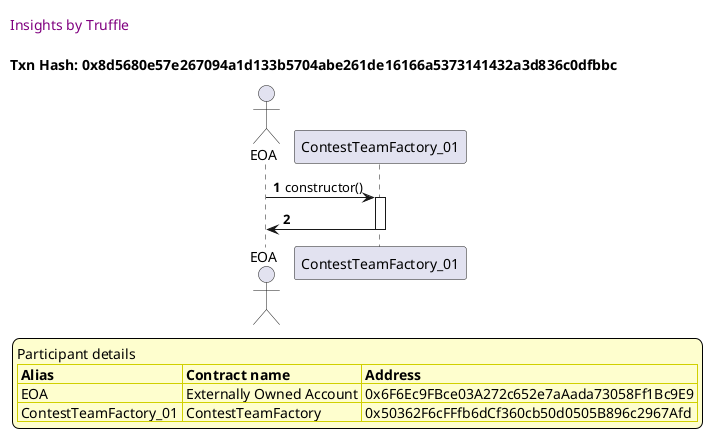
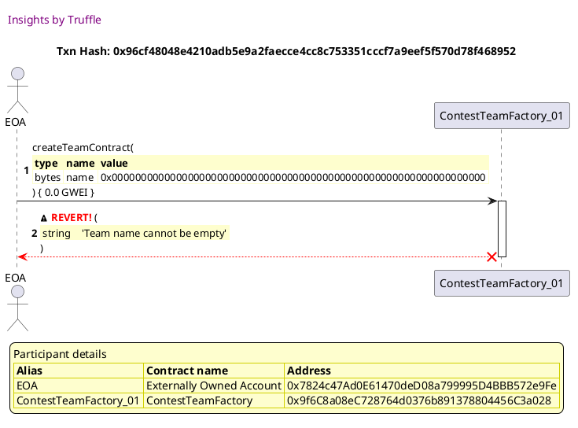
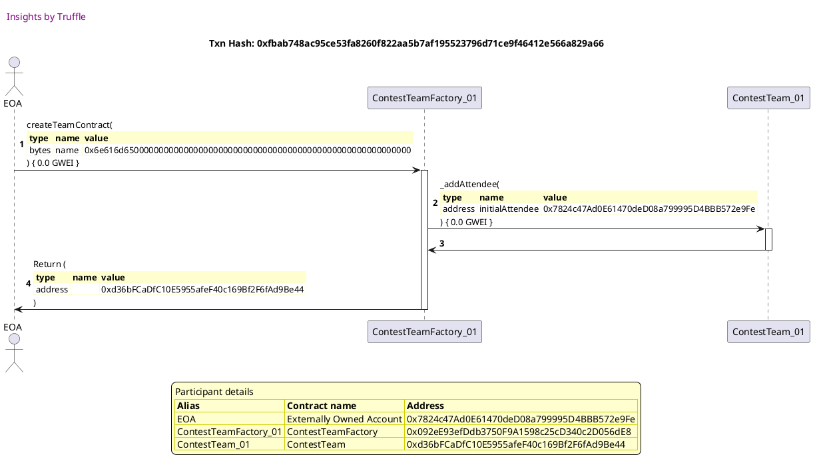
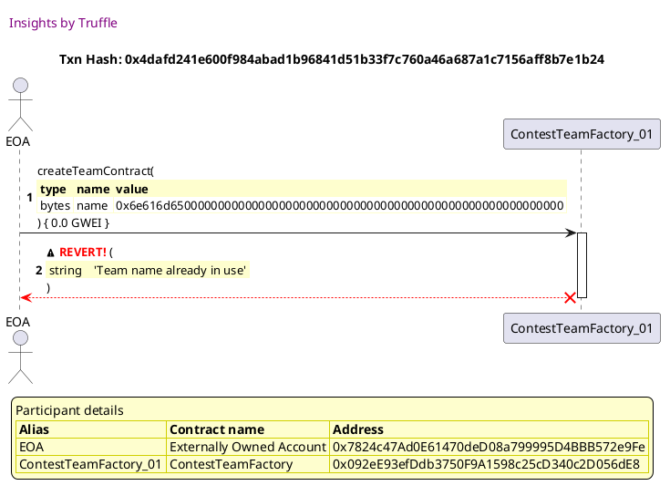

Test date: 2021 Mar 11

## deploys contract and triggers event
[link to test...](http://github.com/fodisi/hackapay/blob/1746d2fc3fafc73d8b2843f0fed53fbd26643dc8/test/factory/ContestTeamFactory.test.js#L45)

##### d1, tx: 0x225ae36701ed2d6f06d2e69d5433185809497f4273de2acd2691a0d8cc289d7d

[SVG :telescope:](https://www.planttext.com/api/plantuml/svg/TLDTRwCm47pthrYbBtVgLMVCTvIBIX9GxwcLclTgOoy9AfZ865tIQ__xEGH5LodbmOQPONOz2upTTnQDxPkQCUnjg_jcGuPrhvNUey46QjgILWkKhrlJzbejsxerS5FaHRxC6PjrzbZJdC5mxGWL6VWxFW8yjAPwQxN5EgkhhMv8M-TOsekWSEJPSj-RVKsVYEVgZS0BBjWJAbNfBNXyX3w6VVPpR8ADzN_hhjhkR0UR8wnDNvREbzdArWJhWuO7x7PJu0SXGYG_Yhb7IgYev94I5AKg37pVIyA4fq4Qbu68VKK2fH9HwY5NYPGYILMic8jCMjTw_fW1TZ1n-uIvs6mbgpsweoxT8QYpQyAc6AJ75-uDqglCXB710-xcNodWzdOAijMTDVq9_FQTVQKycPpTxgR0s7cGxEc_zXHPhEgEpSPn_hXPyHNdVFx-2zoyN9_kvkHkd2reREW4P4ePwXntUM_-FaJWreCbex6kZ_3uHvE2J4htqLX7yKDKHBbCYuKaxcSY5Z8A1SMOeSBOvs5IbDv2fddwsVXwXDVmeKXIvAM_IGF4K0IXv_agyGHbAn67lay1ZwD5N7e-TqLS6cCcxDwjxXVu1m00)

##### d2, tx: 0x2f71f1bf59accac4c278584ebddac029b3e990240a51c95d02be4e35933af7f3

[SVG :telescope:](https://www.planttext.com/api/plantuml/svg/fLJVJzim47xtNs6nbqsCpKxi_42i8ctImHDeGzeB4dBYIub8tSfnjXQw_ttND5ImjPjWVl3PllDtzzsTJSXfuvHrxRGcHBLkPjff3fOqTvMPAwkcj8O963rKnTt4pbgZHxDwPkcRSJREHXaX9urRrZ0Wj1kte3HO-j1lAJsRsUf-PfogaxgQc2aOXuYbsngCKRc1dBTsNiCpnTVg7YWNsxDBfNLb9fIp_kXd9qy-za6Gtl-vQQh9hMjelgHNjYrBn2MkSZNGguMXPwgvFQPiuPKXBtbUobWLXIf4uOMHZ0JaMgk2UN7kGnmpJp0bUH5BpRmS1FWozdrLXgLFC6M5mz2pYuIgXXwWF22ODbSLrLmXrH6IWCPTWPgEEzFb3UETwKxDtiixRdNcf7D9ZmRx0EdXuJ4jB2W7QytQoABsxRMv9YTz4T_tSh3wHDro3XIbKTDEVbTrYukr-GgpYHxegbTY0WC8UA03oLuvDi3lw0Db7nZz_2qxnuhkO_8RoIsx6soAn3biKe3NyK802ysQMMKgLs6lzd0ToJ3oH272HBCiu29a6b8MgJ368LCn70vbw44yXd-IsSNY6S6ZO_fNzfjQezKNSAqrz7_PTlHu6AaeaBd7rCYBiPQPui8JcWLfB7EPZkAyZFsexEaHilaGoEMJJjNWL5KtJs99MOhrNSU2xnux5nUFlRUDAdaCP7jliEgU4iuB1zQekbxIYny6D4sA0ZyVzyA2F0NU_HHtdNTEed5M-daib9AUa9pxEk8U9AaNIjy7mS9W69RSPtkT_87-mcmJJ7AVQdAAC_xGlm00)

## gets deployed ContestTeam contract by id
[link to test...](http://github.com/fodisi/hackapay/blob/1746d2fc3fafc73d8b2843f0fed53fbd26643dc8/test/factory/ContestTeamFactory.test.js#L52)

##### d1, tx: 0x8d5680e57e267094a1d133b5704abe261de16166a5373141432a3d836c0dfbbc

[SVG :telescope:](https://www.planttext.com/api/plantuml/svg/TLFHRfim57ttLrobBvkwQZOE9aHPL9A2kgTMMjudOryIL6CYOxIaQ_zz3a7HAgKys73EuTphSu6G-yvBv_l6429xtzg-AT6HxgMsU-ba0mQtQFLAgfUjQtkhrwrf7TmKUP6lSq8MdJyQN18OhXrAZGx-Zey0ZwshNrlhfSbClRKDMXySAtyH584yM-vxjpVuWVXLloAmwGLxbbhNTWkCZj3xi2--ZqsGiVvFszNRdU-WFCB6zLKLV8cllK7O72myocut1tgOwLZCACO9HYAXwLGopJWluuHEPHamff499eICUSBPb4rv9BcUSQ6ehifIaH2Pyg7r_2a3sS4ax1CIOlErglSo77KT3e6Ttw1iYa5w_4tP8BtAJ0WPFE1k-Pa2Rc_de5hRUTUVm2zVoMVAaydPxMuEX9m7IPx_Qq-ZbxNfo68SvxUR1_f0ALs-_O0mhz1dk3cvks0BLZPu0ZAj7NQ1kxotV1iY2El1exFIc2Cy_R6e8LCgV3G-KFGW2f6hj5Wff3oBaaY9EC94PbBBXDDuLbHifT8y_MXyFS9h-50afbn4XL15KPL2hoikg2fZgcbCuzKi5IfAHP9LEXG9QOoPaFkmXb_W7m00)

##### d2, tx: 0x0909ee9275ff61e3495ccdc777e858d2b9721d2e2401d5cb361a51a84f9c8aa9

[SVG :telescope:](https://www.planttext.com/api/plantuml/svg/fLHBRzim3BxhLn3TPKFNJVBRHHSqBwyzjTWAx5AWa2KwDUeeWInlIPlzzp6E6xHRig6T3g8aKX_vaPGOEwsTjAwPLep9nirCCytHilgkD7DfvHGgdA3H0wdk9dRM63sSLJCBRx9nDXwE6JkftRB27eDstABKQE6XsmASpMnvFpDELlsgd9Wf6aU8XTiQPAJSGCuREw_mcU9hUOyWWktPfTIwD1CGl3lwsSgJZrqGhFD_RkfoSkjgo9TmPPkY85pcIbSXN2qCdCdwzXZuWgSyHKozE2oAIA0VfA5IMiLnZ4cOQ2zFOqze3xs02nsgt8-438LCWY9LYPGfevGfHw6FB_eWQpWWUS0eRQvKvLmIrI6HmDfTePnchUdoXelMTATcx-KTjrfprhg4ezu-G3WyF0PbKJfSQzP6bhHlhyqrE-cA-BwJlTKdSCiv0aaZfwtyBgk65clp5MMJFC2gKr828un4fAEGlt9iWD_10_0F73v_6vzJHVSn-OtabjqDDKNVEMfInDVn8W2BzPfPQKfNKgzsS2t9EF425SHzpSUH26AkSSGJ6QSqmb4m60p2sCCqmt-IsSNY6S6ZO_Wh-qsjoUeBkiOQ-5-sBRsiY1DDZ4Go21GLK-3GrpxFfKXKab21QV85JpfwZ6q-17Rvf5CrEbbMzPDOHdn4zLt7Gk-UEfSMZxstZQh_6CZsNc_LFYMQ5mwjaLMrX8iV1ZNqbQBFnxsm84-1Tp_5NUUjav3xaPT5AikAFDB3me-uoaEkUSZ3GP96oakZk5_elKx-G7zXjXabkKirEwMPVkXV)

## gets deployed ContestTeam contract by name
[link to test...](http://github.com/fodisi/hackapay/blob/1746d2fc3fafc73d8b2843f0fed53fbd26643dc8/test/factory/ContestTeamFactory.test.js#L57)

##### d1, tx: 0xb1d719435488cdb5043198aed7216c56417f2d831cbeb5a8796c1f60fa364596

[SVG :telescope:](https://www.planttext.com/api/plantuml/svg/TLDTRvim57tthxXANpPrrMm-38wog2G5TK-jjBnFnhuag60YOxIaQ__x78AYLKfviE6SmxdNvm8XzxsJrWrjGuWSN6U6jaHB-fVQxAMLBJIuHQDNKhriRJSOlUwQpi9DaHVvEYTaqRjZWqi2uxL3gT72t-aHuB6pzMjdd6oofjwQ5etpZfMx20fFdYttWzqt-87uLRyYiEY2FKkjQxC5HYVeVTmNtwSco5J_f-dhxSxrK1vXOuUgyhx4rQv1s1mCFCf-DmTwA9bEc8Z2E4fJfSkOHY4JgKIT18ohc4SigGATXaoLMCOoJGHNhEAqaY6FOi69Zqmvtth-b87iOURt6V6nkLhLU-cFklQ7mDvjKBR5A3t-fcoKNcLcX8mUSBVyJ06tjtDGdUcT7KxWbw_aC-N9vEnsDmT2peCap_-rfz79kkd9OXhdjvi7-a0fNRxz03yltwU_ERbRRmj6jdW2CgqjzfwxlBTy6oFmwy6XDR9fZl3qnw26J2d_qJXFqGClUAv4iL98mon80iNZ01EPIIsJaCPfKR6L4hduQ7mzmcluM2GM8en3Ae8LYoigQ1QigdKOn6aUwaJnX26kcU29B-BJc38Xztxrly0_)

##### d2, tx: 0x83f4378b624598ab52b7023734c8d1f204ba8c629b51571ae17b3fefa7768a5a

[SVG :telescope:](https://www.planttext.com/api/plantuml/svg/fLHHJzim47xthx3OooR6PYTnx21MaRJDu0cq8Uq52Jd9fKIaRkKuMmlTVzyr3HLixIQO7tosx_pTVNTd4tBQE6rTEwq9qQsRcNQQWINDNMNcskefhM42faXqVZUnizOKmrazi_HDEax7mp4X9urRrZ0Wj1kte0kmzA7VKdesizNzp3XTntKrCLCm3X5BjpL8KRc1dBTsNiCpnTVg7YWFjcUNkYWgCw6SzKS_EtdoiG-2zFxFJLDDRbr3ioMzicrP8YvnbQk1NYqCFTFDxJ5b2-MNWIzL5dg1Y9JEX9T9vldI3t9LyD9ZGQPL7dfH9hYGN0ENcLz2gQKCbHQQOCfoXw6FBsAg6tg0ye1WsboLLtEDL8T80Xft1NgQTgRB6yOxqvsQlPTttEhCIUUI7Wts0TB3msEQMz0ErfgraKNjssjpJKxw8hxlvM3rYRhb72XAewUT_Axh5XThynLc4ptGLQ_418OGyh081Nlbs02_em-KVM3qyxVnELPq7vFVI6xPtM1JnCvXamAyZXS2M6ZMp2fJkGfxjOVhI4hb1NaWuuADGnv8Li28AIqZ768K94aYf0TH2lyaiul5Cu97n_Ilx3UrHgilu5fhwF-otT3JiQzAF_IK5mk88kL5QS17WO9HBhWIIHocF9AofqV8vaCWbqywjG2dgxfv4ik8ZR2-wrZmtMFdukAnzxPHnO-1REyDLjrJmddXm1fTrqjwySD0GUCyny_7lR0WJu5tFyLTvvqJ4KM-y5da9LoKB6AnbvH3tnDgx1So3oK76F8eb7kT_87-mcmJJ7AVQdAAC_xGlm00)

## reverts when ContestTeam name is empty
[link to test...](http://github.com/fodisi/hackapay/blob/1746d2fc3fafc73d8b2843f0fed53fbd26643dc8/test/factory/ContestTeamFactory.test.js#L64)

##### d1, tx: 0xc21771f767e3b1211497ede8598e574afa1f74bb9bc1c92e6985effee1f04765

[SVG :telescope:](https://www.planttext.com/api/plantuml/svg/TLDTRvim57tthxXANpPrrMo-354MbL1GzzHAo_jax0j11HCPeoLT-z_d41IjKig33USSphq-5mYv7wmmTknQGiHeUprs9Heol3HwBupeeCKQjTe8-LARVjGgwzlUm4sH5tcM4x8QxB75DO7fsg5GQE3l_0Zms9lcjTTMj6dRrBf3RPrZPI-2mf5do_rezYr-87urhmWik63FGgb6ry3e3BrF--hxt0IPw__KGrFlx03b4RPch2hdIsnZMuJjGSEZ67PBe0VfCSvPnIEEViayneA4ey8uJ68CUI0guSYWB9DICfbu62LnY5M5o2eQy2WaBZ9fNUlvKmfYW8NR5yJ5PXlPx8KxQkOEWOFTekYAINhyJTaalSei29ayu6xzcG9kRvSWUprOCvx0Br_9PygJoTdjRWc4d0T9dlzhJw4LJJkGrJpERpSFz85Ikdxx0MvUhaztSt8tpXQqwF04f4eP71ntUM_zDaNWreD5eqNR7k7fZqO5gPJkex6EeeUeY7AP51k9r4yzxiaez92BL2Z1VHh6HSKsCicJZyRN8xo6JqMIAifYGMFCk1VpA53Kvr4P9ypdSKo388moNr0lTaLS6dCcvDwjxXVu1m00)

##### d2, tx: 0x96cf48048e4210adb5e9a2faecce4cc8c753351cccf7a9eef5f570d78f468952

[SVG :telescope:](https://www.planttext.com/api/plantuml/svg/fLHjJzim4FxkNt43QMnb32VDA-eg-f8EFe5OjNqOq-JQbnAHEfNZG0lTVzybpIgGwATPaS-vkzpByvp3s7bfXR7L8cTCLBRGrMA6XfNtcLuA8nQGunor6WfvFpT5fTMeo0i3XvDaaemIndgbNUVOPz2iEnGA3Jothm0NXScU2cr5FiYpkLwWjXGnjJk72Hct8PULMURuol0jUq9ml9tkMYYLwJaul5NzQMJlj2s2jValTPdDxsm9ipLCJPMc59VPpEO8qvM62r7UdG5VnO5ClOXx4NgkmuMQ-HWBDnKe9NfIHZBqkrtVaLAceOWHKp_rGwx2AFM2AFPTHf19IwKdLmCG9HoGF604cyrajXJKweYQmD9EKImcZUlwDtSQrpSj1umrCU2alyy3Ze_FG1eK5cjBxMJ8-k5Mtx9UoygdLlOtNy2kbmWajLWqya7a5Hrgzmt1GnbWqne94VwVQnlu8pm3_ypXwu_aaYZQrydgvEUXGVMhRdRRzSaPzDu_2gE9v3xqv7RKoAVVwTmatvERwRjEftVQwFkmfsSehQc7P0Fq7DL9j_r9eNLXOOQ0YwLT7xMrCeLKK_P0WEvdPNi9sFKBQXLQaUNbYmB6V4mGrA3Jh1F7TFX7pmx-WL86IxBjlgE2w_6XVMNHQ97dQxXwrAXW82LTEDiG4qQk9xrme7WIE1uD8Ovv9CAObZ_sXiEX7xeOJ_1ruBV7xorzaoHEWr4aU8IZq8t2m5Ey6mQpA7QwOKJNnFE3KLTmDw8aX4QB2JkddNuVVm40)

## reverts if not a unique name
[link to test...](http://github.com/fodisi/hackapay/blob/1746d2fc3fafc73d8b2843f0fed53fbd26643dc8/test/factory/HackathonFactory.test.js#L74)

##### d1, tx: 0x059d5a6ebf66aaf17376310f2423a53ea71a4f77dfa6b6d88b3b7a52d9b207ec

[SVG :telescope:](https://www.planttext.com/api/plantuml/svg/TLFHRfim57ttLrobBvkwQWO23b4MbIIWxgcLblVfObyIL6CYOxIaQ_zz3aNHAgKys73EuTphSu6n-ywXTNsZ6SFUjQPlIhAiUwxD0Iqse6b7HgrGFkzisnkrRdLhuQR8YtoTCxRet4dJai5mxGaLMVWxFW8yjBP-QOr3dUbwPneopZjMxY8eFFbkUUZjGTC7ubVzGX1CBzWJAbMR7GHyXDw6VV5zR8ADzN-QhjxjNGVb2RQshohlorpjDC7sQE01k_qS-977gOeneR9A4iGg4958ee1NuJICC8u8HO3JIWXLOL8cQZOher9W7Agq3BaWoNnaqldMyySCi8E9toVCn-PgMH_G7tNj3q6Tsn8snI0z_UR18BtAJ1WRFE1k-Pa2Rc_d85lJETkVmIzVsMVAiycxszqS67iV97lwhpr53clTiSKupcyt6xxXd2zVVu2Vb-_JtvpThRS5WmsTWKmfIvtdBkyjNuS8_7fqP0rgVOB7FuOKP5BwZyPvYX-J8ibbMgmayIWBHIYJE2I16IeK4OzdHHMiP9gd7uslHtWD7uhmDAGyZQZQg38ICI_IB8ZJcGnZkOccN8OR7YSgd_aYFeqn4tRlL_yB_0C0)

##### d2, tx: 0xfbab748ac95ce53fa8260f822aa5b7af195523796d71ce9f46412e566a829a66

[SVG :telescope:](https://www.planttext.com/api/plantuml/svg/fLHHJzim47xthpYnbqsCpKaJ9q6i8csImHDeGzeB4dBYIub8tSfnjXQw_xvh6YhOsaqmF_Xit_cx--xEPkoqiTBOTbep9bixq-qqHyEQkqhFfP5Jg762MeraSJSnirQhyQoU6NYJfLawJXaxQUoonY63RjoYL6ZWeTy2dCrCTJ_JLjPnNKtq5BKbnD9k3J9IRY3dhPdN-4pnjRf7SBpjsQLKgj8JS7X_zBEJ9n_x85Zl_rmtrUJMDf0luSgqPKcup5QsHhXQQ3YJpUqny4MPoppmGbb4Ve7-e9IXAtWPkgwKVXx8qebytnq4aL21Ks1KUi9pNFI58CD82i4ePOMbqDEB66G31oGF6ANDLaKrbqHrJ2ImiLSefrbdkhpXJcUwKxFtyevRdJdhNCBHS1yW71uUGs5GMbnhraQ6j6-lzJKxwOlulfV3rIUmopa2IIsddVmkwvOMQ_CLPPCymAfNKW852aSeuVDNZWtmEtW0_e73vs_fELLq7vFVI6xPtL1JnDPIaoA-ZXS166pMp2fTsOfwjOVhI0QXwnLU42kU2iSBkCA4XpA8QFY9DngD_C35ACD_ajd5uXd1esFuA_jDhSdg2zhMQFXVjXqzDH1vDfP9ENPuwbF7on8pZnUEY4QbcuaoLj48FQ-dnzZcGs2NJpfLePLLtJo99U49rNST2xrxwbnQFFRUDghuCP3jlU6gUqeqBomQBUjw2HS_D2g8Yu8-7_l2WZm5tlqKTvrtJdZaOXeDi4nKFWXydaMnuqTXuVf5Cg3qk0dtXKh3lKx-G7zXjXabkKyrEwMPVkXV)

##### d3, tx: 0x4dafd241e600f984abad1b96841d51b33f7c760a46a687a1c7156aff8b7e1b24

[SVG :telescope:](https://www.planttext.com/api/plantuml/svg/dLHjJzim4FxkNt43QMnb7KwQrwghQ9jqy0d4gkt3c2OdlfI8rAqS1rhe_likQLQ1HB_CYdpEtULUdkSSnivB8xIf5WLZeZ9BLIqIrAoypzLAQB600kUev5YaztEzh9ISB8kbXkDfF8qdCME3qcmA739erXqAYHgUsrU0YwNEdvRAY69Kv7ErG6KeOcRs3bCoxaAkAhqgy9NXM_w4O3bxtRMGCbTpi7Yh-jF8mLbR16lpNweodz-P4f8Dp7ILPHINcTmK2BErWWjHtlM1hnqfCcax5dgSPs7WY4H8AmczmB6aQoMzNkQdliU5umaly8ML-fRhYImB4X-jn7OOGPOQAZs-6e4euOZa4IFOJ9xcAq6jJgW9BCqCnMBQk6v-SwjnVTDon5WJ0xh3GnvmUjg7LACmM5jg9qtM3xVgbWrQLZwrShZz0cQpGY2fnAAH3wAew52xRmaUoW3RraY8UEXPdlHS_fzh5_WZF0F_pE7hZ_YIA3hKoRhxyrYZ_5Ktk-kwsuV1-qUX5P4yX46w6pNo6NOwD_7t-6RshjCPd3Nw8Hpe6KgZwo7P0ZqdTT9TVw8WrEG6SWLLYITjgKmYbPG_49w7ITdT0NRzWbc9HkH5-I9_n2D2eCQSHfqefiC_TlReZwJKM99j_ntLMqyFxMk3MecYsC3Leq89epIb-sOQNlp0TbB77qaUUvRZSuaH3uGVqd8ZPpmUkxwDuHHV1tvx-jxIDqbuQ6CSzZ2BPDBpNJuDHvOR1gdjfb7FuQaTSTUJSK1928qM4tPEE_qz_W80)

