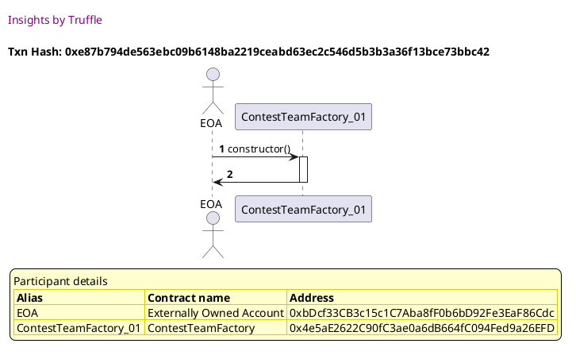
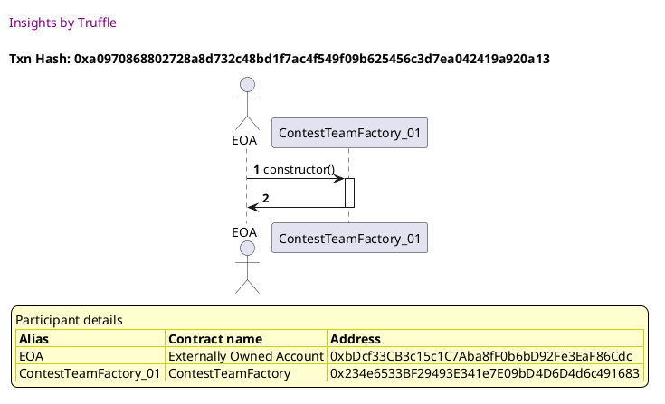
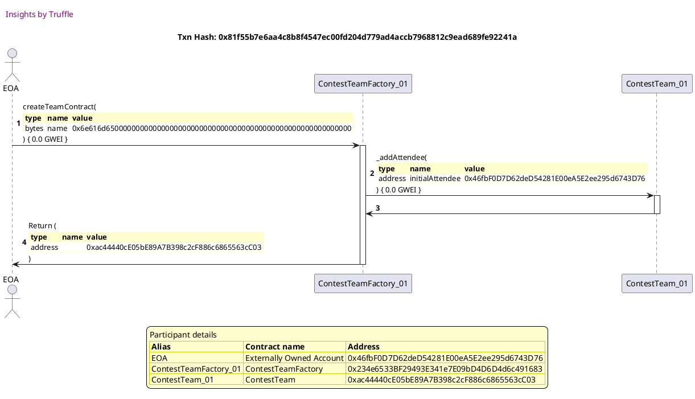
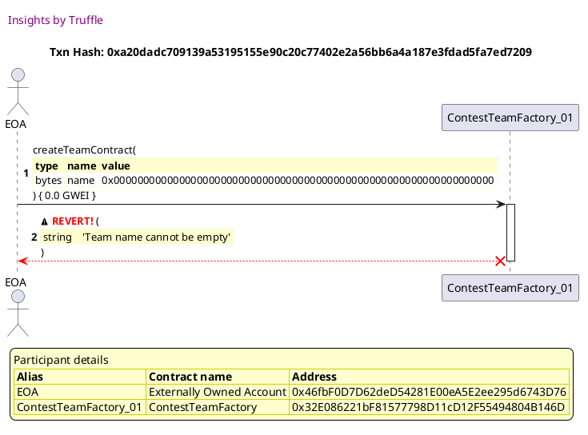

Test date: 2021 Mar 02

## deploys contract and triggers event
[link to test...](http://github.com/fodisi/hackapay/blob/master/test/factory/ContestTeamFactory.test.js#L45)

##### d1, tx: 0xe87b794de563ebc09b6148ba2219ceabd63ec2c546d5b3b3a36f13bce73bbc42

[SVG :telescope:](https://www.planttext.com/api/plantuml/svg/TLDTRwCm47pthrYbBtVgLMS-GaAKYveGKE-fbPhtQcql2QenaJ6wfDV-ztC8YgvIoeCDCyFiUXOOksyTMjVLcZ7iN6EwMf1bxMjbzcYn1arRCcg5ydLhcywehD6DXPiYB_8iPspUkgEc1OF-sX4gil1tU0HuQ6prrXY7UgchhQd9EEzOkekWyEJPSj_PlQPFn7FrHX345-m9bQhC5W8-G1_zFlyvDC66-hzDMsrthWLnX8tjojBxCbSvJR0v67Z0TZS3Vg3fH4pIMD4uYKX8deeaYAS2mp189Q5G7fQX7CU96ej8H1WbPH09IPD821c7p4ScdMyzVrm2jZ3o-uZvs5mbgptwesR-4DIw3M5TzDBZ2mzwwLLcn5Zl0NUBhnHmUpi3sPZMsUu4VllElbAUJCvkTpDWx3n8zlHVUueSLhfbys6SFsxMVCqvNxp_0ZyltwU_ERbRRmi6Qpe1IwKijPwxlBTuxoFmwy6HDQZr4Hx_65AmbD9_DCvJ_23MieoYR1N9O2o3RB8KE2qBBXAnJiE2eXoBQP8f-TduUeJNyBv8J6FCmoGCivINMOJ4CL6h98dBZATnGIh5CCcBjI_YqnWoOVT-zR_0Fm00)

##### d2, tx: 0xec0d7d5a8bf61499b3e0e8980e28fb077990e8da605d68f93c012342407650b1

[SVG :telescope:](https://www.planttext.com/api/plantuml/svg/fLJVJzim47xtNt5YBviOc-EaJe9OHPiVWoVGXhGN9EJ4bnAHkbNYR2rq__kkQQXWQpV1yf1BVEVlxllkRCPE6wjgsquhnbHhPwQTPbYpvguqSrMhALGuGQF7Ah-RrBFMw6XMpMfuaoPf4YMCdJHsMU6GGVVSej9OmqF_2t0sgylxcR6g6bNbn4pHM48ix3OW9US6SjxMymgVERwMzmYEjrsxL5gNPW8ExvT-TlRaOry4w_EVcwQStDe6iYLSrMrH42wpfQqGhXO6pbHpUmnyWJdNlXwe82kauuLXvYB780muYg38kE-78Vrh9Vb0ow08tPmxmlM4ntqvu9d3IBBSKkd9nGXK0mTa3nZ9Pikyd2kY6X49REmLgcdQXIvlkDE5xlJitRnZLnVEkfHmDDm728U7nv3Ng2okFUkWchnlhyqrE-cR-BwtmzKdiCiv0bcZfftzhggMFjRXArAJCi2gTvA04gKZDMdnocS3_0uUW7_WyFbRSauTtSVaDv9RTZSq52DhQKWHNyUB06firinAKzgIPhM7wqXwiiXI7lkn51hZWIS29-4SHuD488gGHiFttDYN_oIpYyKpWaV7y5VscrvJr1UqRMtWVzbsz8eW2COE7sUkaA4JYTG9CF0zALtk149Y8GG9e8gU7cER2u5TFfbKZLQLLVEabfZ7rDzrBNJkQNBfut7sjbMD7WlPxXkkkgD4xuN5sgYgMiB53uCQHdbEbuzzOKEU0ky-YhlMDqbme18XXOX2NaIkGgwa7alf5H4FlHHrg8HCqdXlaZ_GNwWs8v5xgTaflUc6_WK0)

## gets deployed ContestTeam contract by id
[link to test...](http://github.com/fodisi/hackapay/blob/master/test/factory/ContestTeamFactory.test.js#L52)

##### d1, tx: 0x6f56a96ae9beee129542b1f1a18139ae0d33ec02e3753e4996ca155e75333e5c

[SVG :telescope:](https://www.planttext.com/api/plantuml/svg/TLDDRwCm5BpxLrZfPLVTQcs-0b4sAY51tLChDVVgOJyIL32HCTgas_xtVI4esaef1nlF3EFdUOQn-yw1TNrJCmQzQqtV56XPzrgPFLXeU8rRD7e9wdLhszxehArRos_oTRxErepDEtUiSS7uyEmGD5h-Trno_j3Qwgqr3kgqhhQcGUF8iNGNGKxasNBVstsDduZdwWsv32xO4sXTcIsNOeG-Xdd-Soo2ZVl_DbsrtRcE5qU-iNrPaYzpbQkHRmw6Fq2tct5nYCemWYG2J0f4b5uI1buXImaobdu2ABJlen8U-jFGno198WKo395MH8IAKMJAKUdhnvH3noSqJnZ5vYfLxO6Ecj4Xi7CRX2OVfCSN8GVfLMR2sE31xnPVAVZjxOohrdJEzYVmstVsbV9aSdQxct76peraJ_-Lfz51LNTiFhRpnyrAh8GGY_TVdFf5TTBBoTsIBJVGu0b8jRRO4NVvRl4-H43ZmQ4rKDT7_lZ7eEQfKdHf757YKAnKwVlPqbSoL3ARfWN4PIwAg5WbNex-6l8uohJwR7mzmclui8c8X0TB6Ukb24MiapmeWi0FfqanJPTJuSLn6IWHaGEZDCPCs3sDz0ly0m00)

##### d2, tx: 0xa42804d27598fcec6957db7a881f790cd64f72cc3f8b71a0ba705004b495c63b

[SVG :telescope:](https://www.planttext.com/api/plantuml/svg/fLHHJzim47xthx3OooR6PgU9dI1MaJR9u0cq8Uq52JdnfKIaRkKuMmlTVzyr3HLixIPO7dA9x_pvlk_kJCXfuvHrxRGcHBLkPjff3fOqTvMPAwkcj8O963rInTt4pbgZnxDwPkcRBCtISKh8IUEMDGm9xPvRK1eiVUX_AJsRsUf-PfoguxgQc2aOXuYbsmPawDn0pbixh-6Pusjr3vJxsxLBfNLb9fIpVkbdPqy-zacG_lnpqrIJMzVGV4clR5kMY4jSvMgWLmj3prHpUqpPGlbUo7pjoI0Aom8A4GLIvrA58Izbn0ej_59wHJ4emrnonN8bMS2Od_jHK8X1Jb2omc7gwKLCLKCFq1uGbCrLHJLNI7MC9A1nLw2cMHUwl66y2ztfsRjvnwukd7H7qgFXFa1wU7XC2mlAmTgp3hBeVNjjhib9NyJtlHskFb6td0D5QzIqizzLtUB7Edo5Qk89TDKxKK01WWijK9FNFHlWT_I1iW-CVlwMdcD5zp7vZUIMtGqsHUmSDYd0wtWXW8LcpQmobQkmLtkuZgGloZnZYKo4fo49i6TuoXZ4GUe1U56WXVG7YHJ_9BEBnJE2HyVqh-mtjSQeB-1QQ-Z_ikteiIpHYdDiRoc0vmF9X6Qo6ATfaB98Z7dWZta6igT7oEP289TFEbM3KrNTFCabOGdMTvqBpZrsBduyzjusg_WnaUs-uQeR9Nml75YZwdf9BtuOq3Gk2hnyt0iByXHuzoZkMj_88fYdHZpK8npvK4SPJhq_26IKotWacHU6fLymmVSUyWVw2zKcA78lDJd5DzxGlm00)

## gets deployed ContestTeam contract by name
[link to test...](http://github.com/fodisi/hackapay/blob/master/test/factory/ContestTeamFactory.test.js#L57)

##### d1, tx: 0xa0970868802728a8d732c48bd1f7ac4f549f09b625456c3d7ea042419a920a13

[SVG :telescope:](https://www.planttext.com/api/plantuml/svg/TLFBRjim4BppAnREfKKQb19fFGpNYAq7qbC2rFTYHLAs48eoA0grq-JVIok2qG2E3gGqCvfTpag4tFSEhHjQJGWEhZD3MobB-kV67D1Y2rhjb94R5Cyxsmr6PftkBDoKHLba1I7BtfsqMX4Ohxr2gIpydHu17ZhRl7J6eLxhPcTQPPnthDr5K7hotV8ms8DM7uXVpOk2W5-m9vIoCJi8w0IzZVlo-zG4cUh_D7spsxiUgXDixL3NtfUunca5swE11-pt2w17f6bCaoX9Q1Y72IOoPg7WIIM3EaR1wpbFQvfMKJZdyqWm6IkaFEH1Ycb8CM34HoQSRxruN0FsCFFxZFZON2EQ0_gZPluGgdTRXMqvIa-_QJ1Ahp8pGaOFk5jzfe3RsmM8plJE3cVmorVocV9iykvsjm12tWT9dlvhJog7ZUx9SXhdjvkSvfJIrUiFyFFoVVgRixlrjc2mLMTWBQLLlUSkxwrUnmZyUdJA6jJw18z_Z9Am5i9_DCvJz5ZbecOisp0Hp4MGnUiAaxgaLLJbQLWgLc2PH9aK7uslHtWD7uk4ZAjepjYc35EUieBnGCM5dsBEyoZdCX8y3QA4-I8-ZIaJSkzN_mly0m00)

##### d2, tx: 0x81f55b7e6aa4c8b8f4547ec00fd204d779ad4accb7968812c9ead689fe92241a

[SVG :telescope:](https://www.planttext.com/api/plantuml/svg/fLHHJzim47xthx3OooR6vYIEao1M4Pfay0JQaFQ2X1pxKY9IjtASZKBtttTDGmLRkmdc1v_jEtzttztPX1otJbhNJHj2PETcffkMO4bxMvkvj79A6vY0qITItKxih3DwF6jcbhufyY8VvuGSjMxHm8ZGVjo0r63fmx2bz7Hcw_kPSR99ctfYfc0S8bPkOr2WSWqvx-oyWMUAh_KzK8zlpYwarhMPK8yDHpzxUVHn288C_izCMqzkN4lB1RsqNLKXBd6rQu1UtXbwAjkRGyhkOgyAmp828ILNSHbNFEGHACOgxJEkeoYHcakboYWHSUpvAa5u4ISL9BxFFKamPSfXwFbvIcLBzr3k4KoRgrKzbqXrZ2IWTPSWfqLlkhXcNc-wLRFpyfPRlJdfNTA3qIv0khz_I9K5wM2bMHbPrBwzCbVaQ2ZY-q6Ebf-eMyo1eZHosillikbmiJ9VOZRH0rqEIaoW0E49BKBsoh46VaSVAFl0wETl-HbMT1UJtqXks5rZKwJEOPC2l8uN0bXeLyngKxiQUtM0wqboKPK5ow9C-1goaFknbpC6QPZx07uIQX7n88l4FybiO_6CuC4X_IlxTQtHwWkupXhwlsnxUb9n74pbB2ppE4cZao29bQ-AE1PAn28CHQ36B1Ze4RB-4CZ5aqxLu6JTj4zYoLY6zLt5WkyUEnSNZxstYIfz36HpRxJidnBETmwiaKspeES_36YQAeMVZtjXGPu2Rt-Asyvx9tx0GOH1S5Bu2K-2FE0UH3bBoend8kDQA9vu8WvsEla3_ONP9fZa8TNa66VyeNy1)

## reverts when ContestTeam name is empty
[link to test...](http://github.com/fodisi/hackapay/blob/master/test/factory/ContestTeamFactory.test.js#L64)

##### d1, tx: 0xd74df427dbe05e6ac9c8642d15817ade41d8b27c3162c4fc40d2dc966a69a542

[SVG :telescope:](https://www.planttext.com/api/plantuml/svg/TLFBRjim4BppAnREfKKQbAIeb-4QiVL0Uag0-1vG96KBeIY3eb0xJVwzj2mO3U3eG4epezdbh8JGVU-uTKEh4UA3wypGLigY_hKnUsvv2rfjbP5hBbwtjXkCp3hTMRWfYxB82eGMlJjgjKGmNZl5fRBmTte4UEXiyzOPn_LADrlJAkEyO-qkWjAJPylzOFTQVIAUcpS5X5sm9ovbOxP0y0HzZFlYvzG4ckh_DdsptRaUgYDix53NtXUvnca5cuE11zxlve0FCcQoPZIMbSAXYhX8HH8nAacOaDWRCIAJYiOY814Lh1OCIof56aKyIdd8AFAH2UTRBnvNm7kO-Ns6V6ok4SsU-wDc_X2gTnl5stAK7bym6QLNcHb2emVSBRzImEtj74HdUcU74_ZjE_fAUJ8vkztD0Q7p8D7JV-r9vNYZUxIOnldZ9iSvndZv_Wlyl7oV_kRaRhqj6Dwg4x2IqghUSvVtbkzZ17uzE6KDr_e8Zt-Cah0ImdyqpbFuKEMY3e9i7GWI2fB5guedTOchgCfJMggWu6KIPL9yDhuUuJLyB1BG0YSHfQGg4nB6SPmcEI4Y9xGCGvQo1BCrOL7kY_WqfapGlL_zB_0F)

##### d2, tx: 0xa20dadc709139a53195155e90c20c77402e2a56bb6a4a187e3fdad5fa7ed7209

[SVG :telescope:](https://www.planttext.com/api/plantuml/svg/fLHjJzim4FxkNt43QMnb33lDIuEwYaAImISGgxOFOvgS-5eY4hTo76YX---xf5a54lqqA_8vTvTxUPvp63kjh3IsBWl6P6tdkYvJDAowp_L26bb2WJFKwanczpCphxKwdnTp0_j9dCJdCMF3oguA735ernrAXGQUkrU0Yxd9d-RQoc9Sv3DTehOKSMgt3WaPDo4NjLaK-ChmBNz24EvMTosLolKC1EzKVrevFEwAO5t-IrtbipjRGRg2YQcdKuhBR6uBXCbImuMixaw0BwN3bLHPm4FH3wNN5w4dF0z3dZay2mANE-X8pqzJNxfI30BiJydVcye0LU3ma15acQNIuwino0hsIEunWitcMRwGrEevDO6LdQ0iazPrzPkBrlLDonvZRGmu6ktoWCF34yWCIekDfN4oPFrmgs_Pi6FbKoT7wozWLmi4abgMhNoGHKs7ndrDy506M7T6GeJ_vze4_WZFm3zp-FeZlYIATdMoFFgvRr3zQfhTT7rq0iFtZz9e8da4msmpQkGpwlLkuk_npUHThpSyRlKZsD4pLDOqGx86UWwQf9l-Cgdrt4AAWEN2hWwwMfb2gYb_841tixAv1Epw1RKAhSoBwaK14Oy8WWPqcdNYc0x_wDd2FrRAO4MsxNTKS3C-j2yj6YsBOWLNZneLZBECBfnjYN7zQPhmA8XyHs7akSv0n9pZs8iTH2Vqb1-u_IZmNmT-U_pUqhT9-axC1xxZY3GP22y8Wd0G2P55maaypmtT0NVFXEj7b8JGw31XfxJJx-Cl)

## reverts if not a unique name
[link to test...](http://github.com/fodisi/hackapay/blob/master/test/factory/HackathonFactory.test.js#L74)

##### d1, tx: 0x33b13883713634576b0554550bcfae649ce110817dd07f4c53740def94585422

[SVG :telescope:](https://www.planttext.com/api/plantuml/svg/TLDTRvim57tthxXANpPrrKoCCKHPL4f0tLChBU-JiIy9AfZ862tfsly-Xw1ebL8_-EFSmxdNvnf2xdidhHlQXX0vkCuCROcMz2-rsKihMsXmYqO_IFMojTrWTDOrdOMR8Y_oB2TasRjZWoi2uzYXr6ZXxtG4UEni_TeP9vkqgRUcHUEyOkKkXC87pvBxmUuR_13uLRyY1E45UvPQrsOB0PsWzt5TVf-A85F-dwQljplNGtc4ZHsgokiILxi6ONCmy2ZxtGBeWR4oO77CHC0Y5d8HbPJpa7DQgafY52OAWu36WT2QYYfKd8cGQgoIaCSydC-9jqmvNth-b8BiOURN6V6skLhLU-clclbBOEysADjYf1v_qs2aNetC21aru6xr6GDkRnUWEjCxEvp0Br_9PyoJo5djRW64d1j9dlyhJwEJTTEJvTJERpThkgQKhjv-WE-NhzDlJkhMouAHBPw0L6kBlOzTlbkzZHRu-U3G6jaqHtZwOr13gfH_DCw7wA5Sgugnx86fWAiW4safuwgWPLIkatc1B9T576LQVHI-Rk4rV4p2Wp8DCw45Jtndvw9Q9o4MWea84nH9ZXcFqPzy4k_6v0cvzxF_1Vu1)

##### d2, tx: 0x60ef8815840a06d8fc2edbd66af48ba503acbed48d3d6591bebdff26418413d0

[SVG :telescope:](https://www.planttext.com/api/plantuml/svg/fLHHJzim47xthpYnbqsCpKaTnqMi8ckImHDeGzeB4dBYIub8tIfnjXQw_xvh6YhO2XCi3xd4T_xklk_EPkouSRfsxRHYJBTkPjjfXZLhRaexrxMUGeKJjEQppcyczQorPZohPZMyIPCq6IUC7JLkMU68GVTSepPOmrt_2t0ogylRcNMwYgfoOgTe7I4MRXkGadC3EM_hUOMF7D_AMmHFRDVEjJ6bdO37-wLVdJtws1V1-lodjYadrww1R0aNTLiKXCjSwIg4YuM54zrS7m9VI8w5KbwW1DTS6bNaFfhCIAaBeJ8Ty87ECpH2cO6HmT3BC3D5uKlXAU4D36SaMUwezEGi0jt07jazHhAvCY_dcgYEYGGsxWBrDEr2brVSwq9tUfxSl6DN5ywwb70mUWeGzlSF8QzHErnxra4rUTzUsajsr3VnVMz7gq_WbdC4ibPFE_j3LorzhCDNf2PbW5NlN0k8qfCa3N_bim5-1tV0Ft3uyZqvfOu-nUGFabjsLpGKaNCqf8YluqK0DJPhPgKjNKcpsiDr98KiifJ7OInzWt4WVEKbd6CK93wYFmoC3CKW3kK_oUnYyOZWmI4yotxJQuhwYgwjBVmlsuvUB0OoJlr4SKzmdXifCivLaN6QUZ_q_JZKgL9fsDDZR7CXiFC7ashGwR9g7jGIyvZwkww5pZrDBdtSpzwsgkY-aEs-qQexIlHUEAojhgebdFsqQ23ASxfyt0iRyX1uzr7SjTub2Rmi4kFGXC5GAHAYY8S2qt0GIXnYE4nm72WSF9FaB_GNgir8v5vgTanlkg5_0m00)

##### d3, tx: 0x6a8c750b46c7241ba7268e6ecabaee5499258c163e151ced3eba1abf218ace98

[SVG :telescope:](https://www.planttext.com/api/plantuml/svg/dLJVJzim47xtNt4hqjZA64cQE0dgAagJ3fv0hDeUnZGvyRL4k6xbED12zx_lacOLIFHbLkHpxYxtu_lEOUoijCBOQguO4vLTw6gUeM7bVQ6NmeWvA9oXbkSYlv-PHQNbQA4M1Wx6wJWTfOprIxjME63Gh3iK4Wqyjwy05mjJF2sq5MgeYfcUexOKSMft3cCoRaCkAxDK-ChmhNX2SFsTxbf8MUWPk4wh-jF8_abR16lpN-gocDtP4h8rJ4mrdL9SPWkh42Oh3HUYl3i5PyL5b8U1a_ay3ptVpKJeyGWvvY8JY84VnruGvIxleHkuESeUPi8LsTHp8v5Z7362BBTKUder1552XsI74Moso8kbe5P7r0IMTe9YFcvSrxyTjt5zqz9Xh8a1nuDz7d1qT0gvGM6njjHEXgmVRlKjwxUiV6hbOFC5x7g9G5ABUICVXAheKBjl21xA09lMM2E2tEMI1yv_hctWZ_0CpcS7llv8BucYVPsiZdyU69I_wcQtNH-VGl_zep2QI1v0Fz-E6laCkjsRz7jwCtdNxVPF6lq0zlGCfJNra6o0diCwwRO_eGWrkOP2GrNYOLigaqWb5G-4vtvIjdU0NRzWLg8LXIfVv4-SX12eCQTH9uhfy8-T7Vf3AGsMPDjzH_NMqqFxogBHGgarN3rgb33CSxfljk75vzDix2HXmZs9IU1xaPiw3Ww3r4Fqua3oqEyb8NyT-EtfUqlV90dSREYFGXa6SHJrl72Qn3wEmrx8CSOmJd4KHDXhaX0QBIRiZ7RwU_m5)

