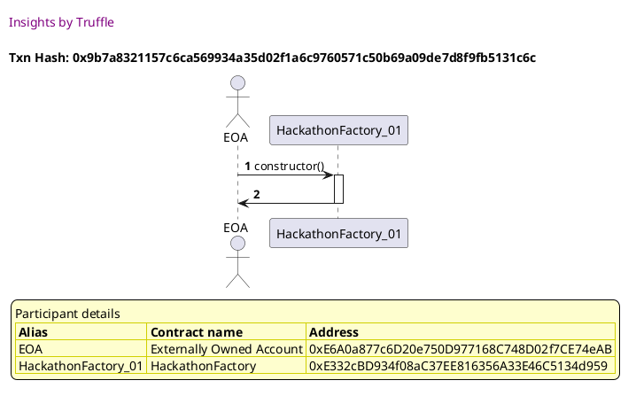
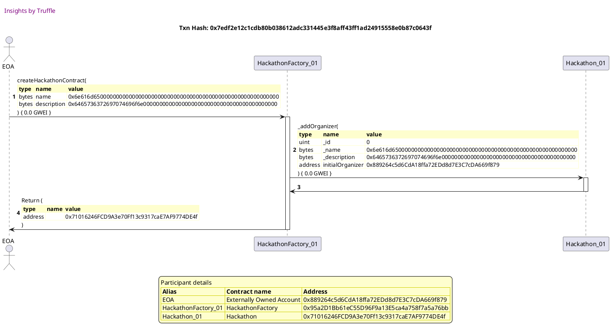
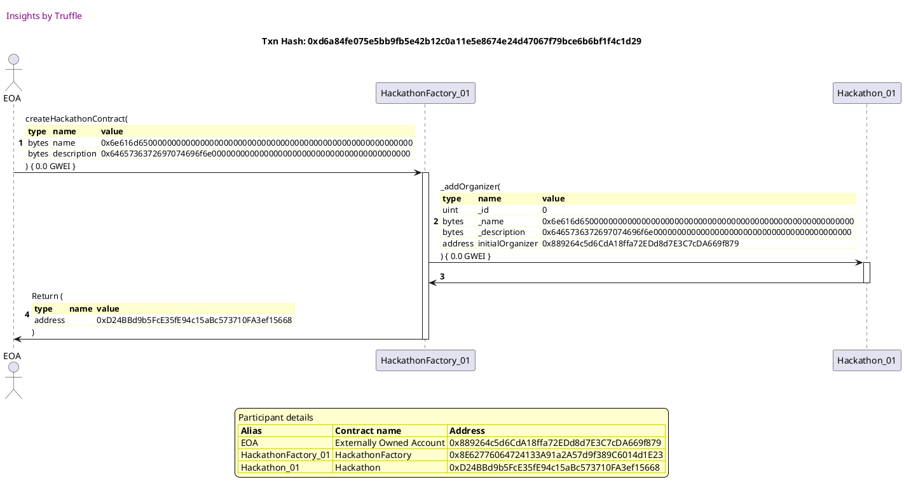
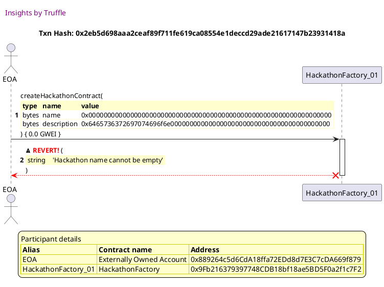
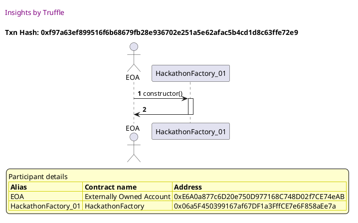
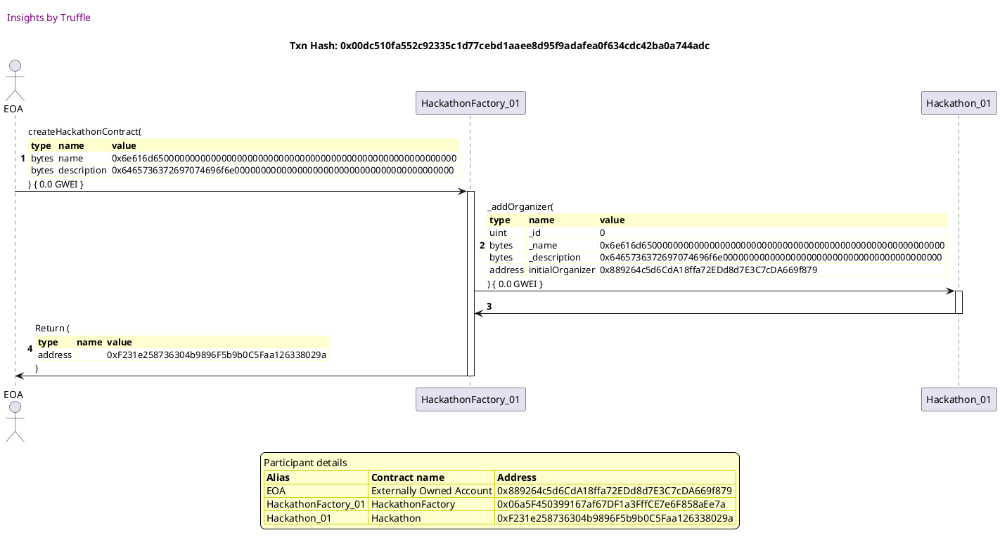

Test date: 2021 Mar 02

## deploys contract and triggers event
[link to test...](http://github.com/fodisi/hackapay/blob/master/test/factory/HackathonFactory.test.js#L47)

##### d1, tx: 0x9b7a8321157c6ca569934a35d02f1a6c9760571c50b69a09de7d8f9fb5131c6c

[SVG :telescope:](https://www.planttext.com/api/plantuml/svg/RL9DRzim3BthLn3fPKDNJ8e_P0TPKCTsa9rQOBqFZ2GdHXqva6KiwRh_FiOnWXMB3vByI3vIxucnnywZy_s-OGnxtzf-lp6ETQ-rFQ33FJHcQwnUedhTkhQtEc-Rri7TgboLUSdOlFEdnYmO3D_Ee3OEVe-_0ElMrM-jzTXaJRsrUsCzCLR-ch2Yu8NoqBj3Opu4VjHl1aHunPvHwzfkGV0H-ZFiyw_Z46pi_zrszNRdEzYSuCNrLKMypDU-CV1ojB36RZS3Vamt4fDWAaGaLQmmYjCq2368D9zM0cELofX7KgY8R-8KUQgDr4cLLfj8188g64ccF8rUFcM07Knedp2IpTUgFY1TTKsoeT-rTZKaddvoCIJUm2UC3VNmiBWTX_lx6QZMTjxrP_3JPtOxxqnmONgO0MCN0zdpFsDfux5kEZOVRVnoL_22Sxvu_mRa4qr8XvmCS4GB5lVc36HQEzDHx5gtU1-kJklH6sUnQKxmzCiQ3PbIz5WyXVYnZ3EEYIIDYoatCk95AgM8aro6IK5IoxoKeScM7ublIVS_UcaG15ErBCYyYYUO1x8i4n47KPm5GHd6ETaLwZHAgG4fCUh17ccbP_yN)

##### d2, tx: 0x8cf1ca303242f323af534496c265b2aeeaad03165723e3cbfda98f2670ce8728

[SVG :telescope:](https://www.planttext.com/api/plantuml/svg/jPNTJzim4C3V_LTOx6KJOqjYnquGGuGq7Jo1DgIz85MkxRGMgLCvpaQX-zztJKF7Hza44dd8EVRvFdvdNn0wQhnmlfrL28dMrxQTZRL3pPMnS-7435Twegqw5l9gukhMghokQeVV3OjXaHS87JH-KUb3XBjdgeNI3j_sdnYVrCxSrDQBAglCnCwqzM2nz1k58IokJSvRDw_qWuNlvaRZa6xcpeLInavm6FHJlpjvyBaF0lN-JsrZ9bFVuF42NxYsBC4kyiPN6bzSMtmYcka-3guJMOPIa814D2f9H4GP4qfJ9YCMZoEXjH0g826BUKGqaUDIYJGf8yO3gHCU9GYGIG-X5sSP5WtU0Rc309itqim5f7e2s8IVrdROAIv6GTWfRfb_PkEJ7PqgwbpXlSFjfl3kxZwMJWklDyivy7IWylxINgA3lduVUtcu_8BzOgunI2jcdVmfgXO6A_KbWFIwmSj-4TWnpKAcM1oyydbiMEb6EZFtfhPh-nIm4qPun58USCfILZBzKliVy2qEFWNuwu_Y50xBTbWFA6xmZU2idRc9i706tUkWjGOgkSGZerOfFSvuz6OiHsy3Sua1YTFDoeMnnXjHRG1rRf8aZHYLiMAvoiAaB0MFYe5A52z8pkKWOomj4vx-fpPFY_AWMdlx-1-5NDyBqFccVUiiVbtb_YRQ9HPm7a8QGQveI7C-79Pv54PfF23bW0x3BANyE8uvxHD3QDqqqVcz6wsq5wPgxiKo20R0TXKBz4Quup2ukwIRgBAxG3Rx3fTTku7tjTVEYgfQuBDVLYkSIGaDsh-m5FSDRsjNJsSx1mKXaJmUf8IMGI9omeiY2Hc9MKP8GLaUXuIgD7xEmIFBBwIC06wF61t16_vUVm00)

## gets deployed Hackathon contract by id
[link to test...](http://github.com/fodisi/hackapay/blob/master/test/factory/HackathonFactory.test.js#L55)

##### d1, tx: 0x234d8e88c20ea922341d1f7fa32c2a0a5d8b6f201f99c29bba3ef18c7f56943b

[SVG :telescope:](https://www.planttext.com/api/plantuml/svg/RL9DZvim4BtxLuoobrRRLGq1354QBG6YzBGhTU_LO1k2bfZ863NPRlzx9mH5NJK--EEzyPln6pFss3kqRjYtZE7WEZFiIsrP_zgO0rhSGwjhRTGQvMjjky6eh6ix2tURObDa1MFBtfrQlM8mZfr6fItydeu0syusRvrnsAPjKvkzDeuKAtSDs11vaJmCzj3g3yIFvas35ronPrIgCJLuV8B-ZElowrG4c_9_DtrJxrmFvGbUx51LfCjSureDBqS3M-nt2-17VnweMCUnzBd6nAUZfxnAL3ZtfOySGnMNKULphqeIwITbYNDTUR4KLHWbmRnaP9bqL7hnb0BsCADrniWsryZcWFJKBTc6RjUPpHXu-iczCV06FcDil0yFgziytDylG7QcTtOuWvy-izjnPu6BqiC26Biqa3t_KvRI3fksPykfZL_kSfvppbVltu3wH1NI9gC6M985Wtjz1bAbhEw9kzvRlOzFf_dej3NOjYTu-cMqWbHA-YoEA7uiefHZB8ICSZ9QX3nFXF2YE1D1d7E_4baX0fskFmhVikv_T4oGXEZdthgCF9s5OPv4cmIzUH5A3524SIKmH16L9IKW9oO_s2FDzEt_0W00)

##### d2, tx: 0x7edf2e12c1cdb80b038612adc331445e3f8aff43ff1ad24915558e0b87c0643f

[SVG :telescope:](https://www.planttext.com/api/plantuml/svg/jPNTJzim4C3V_LTOx6KJOulpOIU88KAJ39v06z9Ua2h7TbgBrAaSPwFG_U-xfg7Zesm2YJpaqlFvFdvdNn4wQXsthflL2F7EDQQRbSgYzagRERTyXcirKKOUSt4riKrdvAYf6ulV5NcHZtA43bgtgDKXmlqpLLmgYs-7dnYVD5RVDCRnEgtrnCoKSU2nSXk30XRNBkUTdTVgmS9tVQCm2JUwSowbDXDCl47rkvS7duSaq13_rBHwCdKjBXVumdPL1NwHqwvM-EBQu1FUJlUnTysKh7n5V464B6Elz8AO4fzB4GGa32CLL36lgZ2eAiAb7oOaYg9OUMNCX4T1ZG2PS91wVfPYtk8Ta3i8i3ajz9n3gIU0ZRjfOuhUS37sI6-uHV_CnYSxUbFKXy9xXzjTuTtTVIoiuavjbaV0quB9-qjpYGw6_dqSvE7o2tQBkS8W3P_ryYUlE_XOcIy1f5CjNWwBm8ugIgYaaVVAvx5ZgLfXzTpfngpzXpHY0GsOJnFciP0cjABgfVu_u5liVVBmrn_vAHoMxR0UKDpW6yDPExCJRk0CsjT1wpHqSed7MgvAUbpn-CrOZjy6vX834glQLGXjjDEytW3gmyHnujDGH9AEP4hYgkBCppCPIvO78oQobDAaYbdodzuyRSg3RktjutyqSdqlmEQRSfqr-7MT-rjeNnWZ7g5-I8jHbgI1ObvHaK0a0M62vomj4iR2B0-heJ24raCJdT-xqL8vhklsNYwPbm7RLIum6-6EmyVT9TrabTubijbtkEp73RoldRA6r_K2d_qoIk9K21ZGxeMjkEzusxXwgkq3917tCt9SKg96KPGbj4Wu2V98y92pAAuOZpYZPVbCW4UUNqWP0Tm1CJg2D_nx_G40)

## gets deployed Hackathon contract by name
[link to test...](http://github.com/fodisi/hackapay/blob/master/test/factory/HackathonFactory.test.js#L60)

##### d1, tx: 0x83b8c8ada323d92f4404cd3a836e98834a296eee881ae860d10af6190ed3dd05

[SVG :telescope:](https://www.planttext.com/api/plantuml/svg/RLBBRjim4BppAnR9fKKQb19baZ9S8ueimpqbG7ClrkBA5Y9J1aMXTfh-UsbPC1hKFF0nivnTpfAnXywZy_skOGnxtzf-joR7kjVQxj7X3XhQa3MFMBvkNDjRaxTDw-1sMIoBl61irlbZGtC6mzWI6dBmUpm2h5fNlxNMOvCrzSRkoFgWMFbBm3AGPybzx_ODVI1-r6y4KNB1dj6OscuWuYFqPrXdNySYs9Z_k-tgpTPti3x2Y-khAkWoN_k6uELWOONTTWhyeCLQbneDYbYODAwIX2Ub4QY5f5HhaM2SIYBIEaBIafk8OoMZb9CHnl092vQLFfHUF6M07To4zOO5stnTrdiCJrq5sz1lMxiS0ey_UJG4Ni5l61lkm_tyEWztTrCeMzjvrv_0Jv_PzRYJm5dfVWgCdHl8dlyfov37kkdOR6pZbzi5Nt3Ev-_V8FGfL1WsUMY02x9WSKSd83F6KHUuoxtv-_3qC1yyEOjDSuIdNvOCP6KPFeiF53yKCkEebIhb8kQa9doHAXL9dQj4BtXSgRnG2MMF7uMlMVS_EYJGXOoLabmcAauY8R8qmZYRA9DMGgUvv55YeY8M8K5mOlI3FOGvVFk_)

##### d2, tx: 0xd6a84fe075e5bb9fb5e42b12c0a11e5e8674e24d47067f79bce6b6bf1f4c1d29

[SVG :telescope:](https://www.planttext.com/api/plantuml/svg/jPNTJzim4C3V_LTOx6KJOulpOIU8LQHjEdW2RKXxGQgSs6ujKgTod8r2zx_lceQCZx899FAGI-tpVVpETqNek7RSkcPH8iGRLvbcaKkBwYjjbjpo1IxbJ1envCNLp5QD4QEgh2n-DyacsIX3wAXsgr8E46wVkUH2MdpR_SJufBBwfZAEbscfPsOXZGEBolKA4zZScbmsTbdA1nlVzOt49EpNphaGsimmyRgbtwqy-jm5WJh_fwRMixchSRx25xPH2kmYfrqfySMrmIUydXzYxrfG7eTAUYoIKPudAezawEV4BpnEY8naJ5ae_L24pADCiIGl9CrfheWA2oBy106oma7esLcAUOttGEuXmEPqePSSKZq1RDpDApDf5LTJZxIAEzQVEVZaHAkAMbVuOB3R5DxVFyI5bTp9Vdi4F2selByqb-Yegz_7JWxMNx1RBIK6QVYYbJzvsS37HdqD89siyRhR17PKKa85ZRnNFeyD2raNLY-ThipMVaWZ5j20-JHX7WjfGXMLBxN_0TzYxvE7l_x8Jk6ox8RrW6AFRmftxSpEk84xQ5y7hT5GoJMUQh59wN76qpTZENqRc6iCIAoiDowqqKxpiWVKkedZnATX4Gaw4Yc9bUBCpyOY5YmBHgmOfvGcAcR9Vshpj2WFgdLmYFzHo6rVWCutwHfhyEigzpVHDh6n7mw78icZIP45aSeIwF-83mk0oeWtIGEfI4Hft2M6q7PeelDx7IsauxgixyKoziR0TXCBp4ReSVYuQz8-glGkaFxSODsE6tXVEsaDByiLFljbfC1fKS20TYyinNt3kyRLqzMjWupwZ56FXimFIH2a2U5-6Z6Hg21EHjGZeI2P7ppZu97b5r960BT3Z8xX3VzUVm00)

## reverts when hackathon name is empty
[link to test...](http://github.com/fodisi/hackapay/blob/master/test/factory/HackathonFactory.test.js#L67)

##### d1, tx: 0xf6a09b9ae42d4e7e563ba6084273fc5613acdb9fa34aaabab9b14f57933000a0

[SVG :telescope:](https://www.planttext.com/api/plantuml/svg/RLBBRjim4BppAnREfKKQb7fICbmZiXvmJmdGt8kLHCb2QCgWADHEqt_lMXQC1hKE93MxdDsT8MEFWqLZnxrY34VRwt5VIiE6rquVqE0Ub6obhZTOlRQc7tMTzgetS5VaHPxcZAq6Ur9opM3wTX9hQU3t_0kmxKttrckBAb5Tg_TIMs9ix3MXeE25yZ2QWv8V0Z-wDmcEVyMUiQuxtOB3P-ZFjA--pasmkVvtFNJjpWvGdk35Z4r3lCnsLabuEMhOuh1R0Zys8VAuZ57wRkrB8OFGAp7aaUyAhwc2qF6mgikuGSz7n1BBk7Jy9X2nvt7EaJEIhBBKUlwK00wme7t1I3RRLTq1QTGjoOPsr-jYIZpzvCwKU0DVC3RTXuVrxJZSto-XwlLWpNW6Ftrcj_FE11UcXoKmTZ6GFV_JLYqjTcfWgzd6BtSPpsYazVit89-eGpgaP80XMj2ubsSWgMiZ1ufTxwtVfz5fFLffD2frWgTVMjQGL1Kz5aiXVip3X6CaH1LcBfSYu5aiX1D6gV2ZZBkDI7FXosJpaVYMTF-ZKu6uA5qdzCWN8lQZDDiuKTau4SfWamK5HxTnAb6uL82KcFLWZxJIi_yB)

##### d2, tx: 0x2eb5d698aaa2ceaf89f711fe619ca08554e1deccd29ade21617147b23931418a

[SVG :telescope:](https://www.planttext.com/api/plantuml/svg/fLHHJzim47xthxY1DBOojZXDumHr5QLD1qyWXhQ7CKskVMaZKYToN6YX---xfba5MtcOPaK-v-vyT_dkkp1sKZbftNoMCoRdhZ3psHWjgsupKqehPv3Z18q-bUfsOekvqOCYBopiZv9HCaWOwrPkcMEFGRscA3LQU6nU0SuAcpqKnicydsSJCqFZA6BgjWuZCcv2bdDRvlZCy3bxGE31LdSfjSxC1BZNg7xMilkXAO8r-SzDbKscheBn4gxjF4qfBdEPon6k5mREP3Kz1c_XuxYZmpYIKleAPHh5gU0ynP37IdfHfnCWrwYKzcCAw_EG2nw8iT-EsppWaMG4cN9KUdBH1rd17iazHh2vJ6Mbf4yz8zYacnPcL3ikVtYyTjoXtsEilWz7lTrsE3my1cLHEjoQ1mII9PStD-Q6TPkcl6jaR_KHtB9486dah9PtCf_JOUs-8dGSLh1gZ0I8zv_hpy0QAsMpqcM5gUE7GTWHxR0j_30MdWZ2E4n3_DVuR-4HlFSUVFgQd1C3TeErEFgsRr5_NwEvWVNe6BglxwKrnA0UTDM6n-JJQxMkaY_9rVMhLglxeTRtu0L4eN9spS0Lq7EmpRo1K4bZ2WTZ19oLRddGbCiqKc7P7JNkfSvlXenTFg6EHYUpl7fImz0R4WRhhj8i4OleyBl_s_xsjRPOaMrxZsfUqvFsXKDhP9uluUBUe8Q-KZJGhkvC5CL-62WQXu7kyoXDfV2JeOwqIDe3eORzC8pJICJF0--Yzz_QEa4y6jC0jKNSZeK8ei7mb4VZb8O8EwV3piYJVigL6FcKW91ey60djDElwHS0)

## reverts if not a unique name
[link to test...](http://github.com/fodisi/hackapay/blob/master/test/factory/ContestTeamFactory.test.js#L68)

##### d1, tx: 0xf97a63ef899516f6b68679fb28e936702e251a5e62afac5b4cd1d8c63ffe72e9

[SVG :telescope:](https://www.planttext.com/api/plantuml/svg/RL9DRzim3BthLn3jPKDNJ7PYoGwoe6vi8pkrm7eV69jAZ3fo8CjOqdN_VOnZ12iM7VJn7lL8FKg8XywZy_sk4G9xtzf-joOdkjVQxj7X3XhQaAqUiNpTkBQtrR9jMWUtHLxaoro8UUUF3Iq436DBM963t-CHODMw-gsr7fkqgJTsHzQpel6NW8B9i-I-T_k6FX0_wZU2O7h1dh6gQhk1G8xGds6TVnsB46F-xxQhDrlVmVe8BwutXdM5htr3y7AmiC9kEmDvC8b6DI4J9qaKAAFMAbOwCUimfcIYj0mfZ0ACI8Lei8pMqx8AghXK4sD8XvG8jgpqN7h-b09sSCFhZM3RV5tMU-IdhjWszDlM5aFWyQSCXi0h-8qGmtsuNrpduUvk1cLhE-_w4_ZfixWUTn8uAztFG8Xp0yNpFsLLvB5kEZ4Vs_ZbDfEPb7Bn_WsuJrmXRvRS0CUoO7579o2jAaSTSvTxY_VXwJmVF3cBJNE4fr-MAaZBaZ-BPqeUSfLAZBKkLHPAqf7C4gq35I_rDCvaQFGorrDA7pyANxFkVtH881L6nJIIaoG9b4QZT5O4E2cCOMLIHHp5c9D6Ji1EZ7w81vxvs_y5)

##### d2, tx: 0x00dc510fa552c92335c1d77cebd1aaee8d95f9adafea0f634cdc42ba0a744adc

[SVG :telescope:](https://www.planttext.com/api/plantuml/svg/jPNTJzim4C3V_LUSsCkcZStvSXB4Ahes6Jo1DgIz85KNssajKgTod8r2zx_FJKF7Hza44dd8EVRvFdvdNmWvQYmQsyuhGh2rjMxdXJIakLHwWGRdKCcfrE8ByikfgLijHdLL6tYJPtasoWWvREooaWC2tJEJAAI1c_uJuBWswhhM5gjXfQPwBhLr5akxLSZTuiRaeZMBIjvR-Awk9NZXTkuCXL1w2Xxjftvtyl1J7mJf_P_eHardje5Y2UUcBKjdbrXbAmddLngEiPaT0BsYLF38eoL6aSzJFmWYxeauvh8G7gAKYKYZCaM1fKHQiY3aWeT-WHJZC4J1YKF6hGizEnq2Dh3dv1vnsApYQe4krME73Usirdcdk9nGhrFSCV_4naSxEbNIkOBzmMvJyFxz0N0ZqShjyiZnD4xbxOM-88Tz_JxqSh3w37QvaE2andadVsBLki5QVUL0Mjd0gbzqx9Xa7XCieYzy7XeMik56BQogzSP-oA8uO47iipIcSSXILZBvNFllu0ReHmfVVsGdxh3iXdMFuXRVn9srKpD5xSwWUHcqLhbAhc2Yn3gbXnbFNetbv7LWhi0XCR9Pkr1QMONL5b3d9abIduKy4cmaXbvIbXZxsLWa8iw2KSp7GyRICedJ_zJcSL7kLMl_0FvHoCszS3hVf6sDXfTLxc-YNMAv7tZIZv8rGneMQPAoF2hIWewY7D7pMH0ar4-nJuoGJTCaPtTkj90MLTNSYMLCnuxjEXRN6zqTTuFRIxgDQdWRo7RVODMr6_U-ij9ehAebdFxIKi2GSzUWxJDBSTVmhdRrUBPpG1b6UHZH84qz5cF9ud7kOP2NvIYB9SkJAC5CnlY4WmUMdqcPEBWzOdBatkxlzGS0)

##### d3, tx: 0x33983902cbf17d8dee1315d21ef1a3ea766a40badd89185c2b09b4aac9500756

[SVG :telescope:](https://www.planttext.com/api/plantuml/svg/dLHHJzim47xthxY1DBOoHj8aTeAwYgvD1ayWXhQ7CKrkV6aZKgTo76YX---xfba5MtdOeiZdt9tlpjzt5yPEAokDhMS5OxAsfQvdOpIikitrN1evWm8dgDL7cTvEJ5bhDIoBqi1-4YVnC6QiLzbbWNq6pJD5gT30O_i9S5QQ_A7KLXQ38f_e6MfB4JExTKZ8k0avhysym6U6p_a3WkjlTPTIgLnFm7LQrSz6zexR8bYR_rnN-MHgAnWluThKMKPncSrjWN2zq70cg-a9E0lFYq8lShhfE7E52XMYwxc1whgOkT93AJYNlZEcf67aXa7Q7JlHs9SoZGB74G5d15bggVJuOW2oWZsIUunWitcQpoLTzOnWatPQwgHnNFvmtCPnXtwFiUOy7FLts-7my0HIWzBYrZmaa0ovlBdHDwpNalAkbVtL1x3BEG99BMUDl9D5JPkr-uhGiLZ1gZKI81ovonMds_tVysTWXLLgyhdDIxs9x_D0UDmJNHu9H_WyuXd7Vut_5Xx1UU_0fw_nENN0Rh0MHz_s3QhlQpGti1wTGE_rlJIQEgWFlNJJn-JJxtIkuY_nrVMhJgTttEZxy0AYK5cpxi0Lq7kmpRo1K1R4Zbf2hg6kyA2jbYcakl8xukqbuZSpnYwVT8v2A_EYUbB2o1aH16jIQPIeYMZpc_ujlGEb35PasvwZajVTIUl2ej6oA9PmSQzHmI1DQPvjGqmOHbtkfu7YGpLmmooJeXkFQ2H4x0r5EXfm7cMXY9u7tjNTVskR10wNGU87ZXT5BXSousAKq8mbMJQC1V8a348Pev2KW91eyM2djDAVwHS0)

