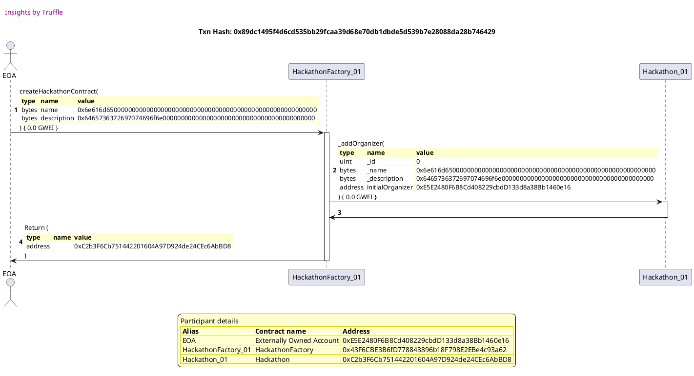
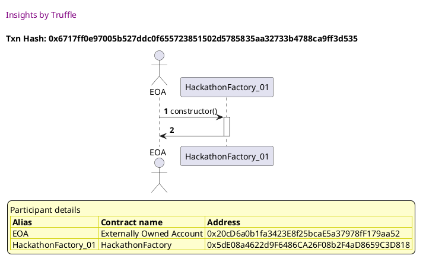
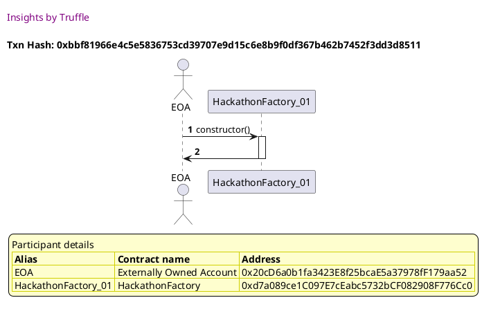
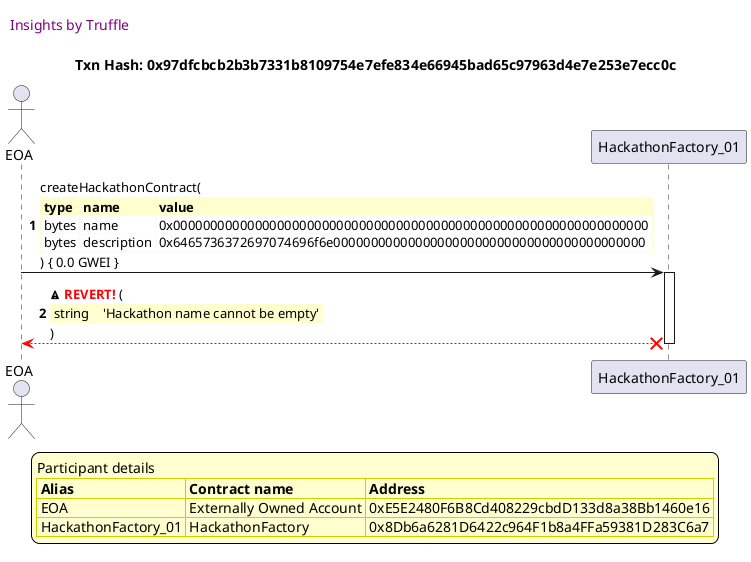
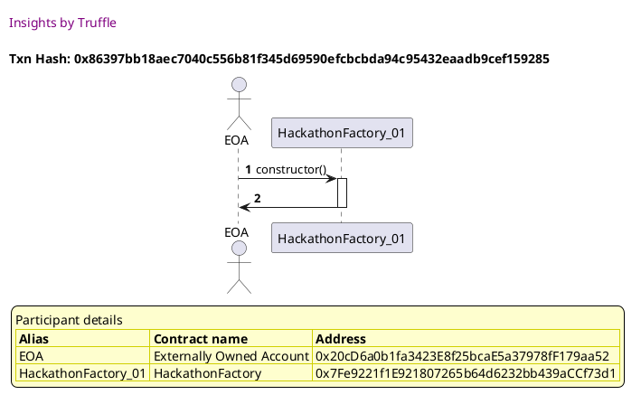

Test date: 2021 Mar 11

## deploys contract and triggers event
[link to test...](http://github.com/fodisi/hackapay/blob/1746d2fc3fafc73d8b2843f0fed53fbd26643dc8/test/factory/ContestTeamFactory.test.js#L45)

##### d1, tx: 0x4bd4c978ed80c0ac1ea718fa6ba3092268a650e7b88d93dd2daded0fcf735914

[SVG :telescope:](https://www.planttext.com/api/plantuml/svg/RLBBRjim4BppAnREfKKQb7fOeWpNY1yIt5C2DFTYHLAo49eoA0grq_JVkvO5eq7D0n-pozdXB1bxx3mwt-yDOzZxrlRxKZlMlJRsW0xtO7IjhLgXVArTsrkrRathuAx8YtoTCpRl_Cde1ODXx3GgxU3tU0JOjgvvQwr7ipHDRVVQUcAi_3MXeE25yj2xWz4V0Z-QDmr1VCMUKQd6rX3m4VephFElemWsrlzkkwRU-GxA4xoulgg8b_d66mqlHmjRx7OpuCUuLB7CKg6Lu9AZ33IcWQWmAJ7YMHWc0fCfrsafXCeYfK95x8fNiagZQKQwo3BfINh-j0JiO4BhX95jlf7D0UcfMx8D_QwrnP1u-ic38V46Fc5ik0yFYzjnkB-VWMnjvrr_1ZzzPhVppWGNfeSPC7Pf87l-HvRI7XlJiVdOnYzt6xxXd2_Ulm7rYHJIPaqDS4GB5lVw32oLShgZsFNUudruEir7hvr5OqxmzCjg1KifwRDu2l5ZoEKcGLu65KPn6EMY2gUbn7oAKKhkLqMGPeZJy2FnBUl-HuS2SLGawrKUhP9gawP2n978aZ8GHPg9FCnNcheSON8kG4wCVh17ckdR_mK0)

##### d2, tx: 0x89dc1495f4d6cd535bb29fcaa39d68e70db1dbde5d539b7e28088da28b746429

[SVG :telescope:](https://www.planttext.com/api/plantuml/svg/jPNTJzim4C3V_LTOx6KJOtCSnt4Gg-X7EdW2RKXxGQgSs6qjKgTod8r2zx_lceQCZx899FAGIttd-_YTVKNekFBI-NfH82HhNzfwaMc7gYjZbzB91IxqJ5iraFdLp9MrLSEoA1r-Dqx7wJ15wAZogqBt46wUkPPAEtpR_iJuf7JcfhHU5lt2pEn2MmyUfxup68Dowt9PksMX7oY-cnkD0zQjdKkbZ9tXWBHBlnjvzBbD0hNnJsrbPdDVuMo5BrmzdO9Vv8qlDBwujlX4LlD3JAv5elA09T6KAPwhA8ooZ2RJNCemKLpecAWiK9dI4UYIBDPK426Kf2AB6MSqGO0izv1wUjR7ii9x8FSGOFCcDqi9fPu0DkddfHqtXgi92Hh37UlFR7ooep55JIXyqDlj2k_l7-BSQUbrfnu2JmScxo_j9Jfg-_UnbRtr5-nNIur1Mhbev4zPrF2nCLy3IAyhl6wLm8vh7d358_BAvx5ZfQlScQKtfTtwPpoAGnx6b2Sn0Tu9dtBzKlyVy2qcdmZ--YCzXSEo6zO3YXs-2PorCpUJ5iwWUnsqsa0drtXYrAQannLFtepbv6rWhZ4WSRhQX33MU2EB3b0J9erIoWGPyu4OAaO4fKcUgL4GXah8K0ooW76Y0_wVtZnjoeDk7HpYVpHoUo_0vflsjRFuTPtxMsXJs91cuPWFipWA6AEK19omVXAF4igKfcoOvhoV3KQYBGoXxT14v_TkjD9UcgAwbyk8Z83j9XUOZN37uUFkadPPzUyIwVRrrisuWVUrryxAebZXirzMAzpFSnZG_eMjkEzurxXwkje4O1iWWpGSyEaeZeLWeKXu5eXnd8YKfWFDyYIKd3uJu97d5r960BT5Z8xX3VzUVm00)

## gets deployed Hackathon contract by id
[link to test...](http://github.com/fodisi/hackapay/blob/1746d2fc3fafc73d8b2843f0fed53fbd26643dc8/test/factory/HackathonFactory.test.js#L55)

##### d1, tx: 0x6717ff0e97005b527ddc0f655723851502d5785835aa32733b4788ca9ff3d535

[SVG :telescope:](https://www.planttext.com/api/plantuml/svg/RLBBRjim4BppAnREfKKQb295YJ9S8wujmJqbG78lLY9b2w4fWw9GEqt-lRGi60rY7lYOMSukPqd8VUVH-Nvd2C7UjxRVbTgHxgMnUtIu0wCtsggVMBriNDjRjMnDw-2co8jycHCow_pHw3c1OMmrAktWxtW4MBUkUMsjHxCmpSRkjFL1iVQNW2AGPybzx_P6Vo2UcbSDKNp17b6fncuWeYFqFgopxsCHPCp_otRDPkixA8_mxFgw3hh4DzveU3vOM6EtdG8z96cKrZNLMKgfA0LBbQfedGYHCYv592XJ8fL2Se78MSfv6QTILfZLDLU22n8igtmeFNzO07Om2Uk41DjyKpLx34zT1zlGRrjR3877tpGQ0g_W4qA6-t0tlyx3xUqKgjPstlKdyCjNSZtk971Mkfi28US6aiV_obBQOsCwCXlR-ErcHLUKqldR3mXz2XM6pJ8qm0LPiBZJ9s2XbDDTu2xtvc_3qyDyyDfPDEO83t-iLh2egl1PVA3eWT5gbI0jenfvp7WkQoRA2dE1FCrIMHTHcY4Azb7ucdMVqI61K3cL62UCgQn8Ofai5omfg2nP4UDA9Y9RyfMCP4WGd1Zz8FTX3j_-7m00)

##### d2, tx: 0x4cf827e44f970b407163928358107ed92503bd3fb9b2fd93a766e981a4122054

[SVG :telescope:](https://www.planttext.com/api/plantuml/svg/jLLDJzmm4BtxLrZqqehIsedZ98Yks8-aS0ArIBqWhPpOsRN8EYl7QLdO_lVEPaFAnz8A97B8EFRupSnxzWIXuze9wvf5YP1eN6MQHQOigg-qMGeh5hXKCsNaIEHNCrirHewhihBuNPgaoJX1wAXsgr8D46wVkH9IMNpRVM9yKbbzKnadoc6fPsQXZ0F4mlKEAInk8PUDNPRgmS9tVQCmPVtSkP1Icnccf9lwtTgZprqIg8j_QcezcxiQPojyOPkY05paj2iLlhWs-4JKyqDChbbUH5we62lYa6ICX9JxiHVvGKH9g6Ji1SJFf5zaSUOLClP5oBcA8oeOzJmIC0IKvGvIJyw6MDHu3-mU0jgSplLIGAadG9jmyygahUDgIcZhk6F-cOrFThIkg0s53mQxeV3-_Y7EhH9EzSjZuDE2o_jBSucEElq-TdQm_eBTQgamM2CMhVqfoWO66_Sr4EbKZTVT8d375QTSye2yydaCB5MTMxrqkZ9RVCQ3qET-w74G9sGyvWLNByN_W6yn-KJmrn_9AHoMtMGzOB6dRmfdxSpEX84pQ5z7MgD1oJMUQhafwN75qpVZSlesPAunK69LlGcXZNPQb3r1RPWaI3mMaPIFeh5a9FAyEC_aXFg-Z8GVZJBAE56K_qURfw8yKElW4Fz3oEsz09zloZNMuDSfzxVGjZ0LPeKCk4nOFcIKAfecfCZIeHSKOJpXCaXa6YiwwWf3QDiqqVcz6osL4xgix-Ko8HFWTfCBz4Quup2ukwHzLiExHFfzWtNRRk1zxPGreYnN-EoNKH8FynmQj7kX5FU1TxMhfxDjW40c91ACUvwCKyuYFXvwF2LHvgLCJ28Un6D_4j7ecG2Fa5_8CW9oEuhHCRpXx_K7)

## gets deployed Hackathon contract by name
[link to test...](http://github.com/fodisi/hackapay/blob/1746d2fc3fafc73d8b2843f0fed53fbd26643dc8/test/factory/HackathonFactory.test.js#L60)

##### d1, tx: 0xbbf81966e4c5e5836753cd39707e9d15c6e8b9f0df367b462b7452f3dd3d8511

[SVG :telescope:](https://www.planttext.com/api/plantuml/svg/RLBBRjim4BppAnREfKKQb98iKJ9S8wuimJqbG78lbW_PGcJAe2ZKJfD_xreMZ0On3tpCB6UNisJillFeVBzh6CFUjxRVIUDOzrBRFJhSGMCsnkgVg5ushksjpjkcTN1J5cMH5upDEtzip8B1CBO6jN7mTpm2h5jNlxRMOxDiwetT6Uj9iVANW9B8i-I-T_l6V22UwbS3mVI2FQBMjTr0m4VeVLZdtySYs9Z_b-tgpTPt88_mxFgg8btcQzyOU3vOM6EtdG4_I5cbGPOaPgfY4wTH8k98wIWJN9XC1x5AJ2gpYkkAA3bDGYccSLX5MaSwZOE0aMNAK-d5mnAmWmcj4qQs-LhLUwIdhiaszDlMbaFWyJSFXi0h-8InuJxSBQxpS7ix0zNQphl-17xvogx7dGJEIdSpOEpSGFRuNrdQUAoRZit7DdwxMV4LvtpnzWEeJrGXRN9gW2DPiBWp9s2fjJCTSPTxYxVXwJGVl74Mc-O83t-iqR1KYZwB9ueVGgvM2N8PL1XDmwX8gp2M2eiO8v69j2e3aI76uKVXQzPzHeS4MY1FCsM2d6UY4Af0gM8HXJ8lUHfcF2s5I7B5AG4vCVh1xcccR_yF)

##### d2, tx: 0x0959b51b4bf928ad9d423ebdcc151b1ca74dc68849acbb529648d3d22776cfa1

[SVG :telescope:](https://www.planttext.com/api/plantuml/svg/jLNTJzim47_tNt5YBviOc_Fb98XLb90Cda0RqbwGAiTsMulKgHndez3zxxkceUEZR089F_YSy_btTx-pBuGSDevRryugGdZhQjFEIcL9SwNDd5i-WqfDb957N5nDRDqQcTLLRU5TaHTvbXDoqBX5fGO4kZ5LN2eBj_qdm4bjzKrj7A-6bPwOcJ8E4STkOr3WvXfotjfvfHviVDSt2hnmepldKcep0O_sgj-TFFZS1q5w_wUcqPEfQw1Sm8LjnsF49KwxIi75jO4JtaptWLxJD4hBo2l3Sfpw2PUf3Fr0bL883xMUu74e1KkICEMYB2C_PM4Y0-dxSSp4c7i4AHCEGy_FXi0Rs46vGv0sfuMUSqpr16dZRbgReZDSZAZN6MxHFtFmoOdEb7IkO6-m7GfsT_T1MCMTscndoAT5a_UNvf8SzFNxsCl1yWkunLm1IiDddVp9gnONA_Cb4kbK0yj-4xbZYdbCieY-SZm6bgeHLi-ThiqQFsHH7B0WzbaQqpXaAHipzLBy3t0Bz1E5hp_oKxmisybwmEA6lX7UjJCxuGRle7qTQQt6IYvXfEKgfSSPZzwCoz7RaBa4fCIgPkL26-qqhpO4TMxoAFV3X1RiACbaI1FVJqKfZxqWa0aFagFI2nbL7ljFRPuMvK6rzlRX7uLSlmkq-QPSQmsyhd9_4-qIooBX-JHYYH-np0leCKr2hpYcAlQ7GJZ6rC8uvYhe4oDatJJ9-RqNBPNZkchknNACE9IkOi7UY6yS5tUFT1FLy2wGpRd1icitE5yxPGslgWMS_J9Amb08RD3kXQMu3xojNJtLTWvap6cI2kLbD8tpMEIy57Z7_38hq5jAamARP2ReCmuU8R-GPOBazXIJGvpnx_K7)

## reverts when hackathon name is empty
[link to test...](http://github.com/fodisi/hackapay/blob/1746d2fc3fafc73d8b2843f0fed53fbd26643dc8/test/factory/HackathonFactory.test.js#L67)

##### d1, tx: 0xa81359257e9c01ae60cf55c3b50318f601c9ed3ff4f70d39dba323c8b116bba0

[SVG :telescope:](https://www.planttext.com/api/plantuml/svg/RLBBRjim4BppAnREfKKQb1JrD5mZhYt1FIL0SYzM96KBaIc3eb0xJVwzQram6iGyy36pd5tEah7xpgFp_QvX37lVsdvN6iUwbzhkqU4E6hCnLlz4zR9nRM_ricrQ1pT5NkJBdB5Pvu-DcJCOnjQWDWx-ZaU0TUlgrzPwR1PDlR4xOpqfLluIK11vbjptRj-O3yHJ_Mf0X1Vi4RMkxGO47w7tOPrz7ujWO_vVjgitMzz1UOHdrrSLwJ9V-yR0yy726hlj5FW1Ko6ZB8WIaoakqCHSLL6aP1bnAT8gva9bHikg2gk4Qvdf4cKWLLeA4PSbSaQMAK-bvmyBm0ucj4uOsUPhLU-Hdhecsz1lMriCWSVVN0o1L_09OyDzk9jVv-7sTWggjPrt_GdyyfLTZpi9d9Nkfi3OkO7iyR-ojF5ODnsRZMtyThFYAyxv_Eq7K9-eGjeigG6EPC7Ypfo0XTRETCHTxitVXgVJVF36MMoQ8ppyiKR3GYdwB9ueVWYuMiN8Ir6X30EPfrKGbGhp26MI9MbLY2H3Z8AFmjUi-umE2T9L6MCSf68LXq6WiZWiH9bYM1GOPPBW89NB61DAG4wCVh1xckdR_mC0)

##### d2, tx: 0x97dfcbcb2b3b7331b8109754e7efe834e66945bad65c97963d4e7e253e7ecc0c

[SVG :telescope:](https://www.planttext.com/api/plantuml/svg/fLJVJzim47xtNt43QMnbRFbL9q5THMcJmHE8eUrXJ9DZNzk8r8aS5rhe_lTTqwo2hJnCioAVStU-ktptNHWxgQqmTZuh61DpM-hvB4F3wjjSLyA86HGuGQrEXRoTc7AkrR0iIWFxQP8cmuInNcsN1VOPD6kAGg61n_OLuAmq-KEfhIW6HJxHCzIM8exjrY4buoPaDJTLWSyCd_C713VOwYw5KhcUWEkqgf-Dx7reYs1j_dDTvvEfhI5RmhMPZySKbzdS5WZN2mrdefuUWxE8GpMMcSoypCz2ttUpo7NYi1jWY6EC_00vZuDk9XJloZYCkQ_M9g_hqowb8nb19YsLdbmCGDImHtAF4Mmsbtabw5FF23PXfwLE6yVb3yTj77VeznXhxiDHVxST3W-FGHeK5hVc8O5aoENDZRvXlROfxrhPNtq4kwmGI6enQ-ITAEPqMBkl21sBDQnQ8m7Y_EVwCx32Mfgyidcfc_WyuDtGvtxeyJXqme37VCpnN-E_XKTmtZlmwMjoJWpO3TRYwDk-GVLzZUO6rgDZwBs-5qOJW_hGaniUaq-_qxbAlYHNrwywdTw7Hj-75n25sfer0rT0py4symP2ARGkBMG8EAliyg0jbocaml8xQjnBdTyC6RjyGXs5LkH5_QI6aJCY3DPTfLaY5j7XT_-t_HqePR0cs_OUrRoc9-qBYqQBebZ2nRr61GCfQQ1jqvcactX1vAJyD1ggm8ayBvQP6hc-hoBXHwUP6t07NVuyy2vw_wrj4aIZZ0lkHUw81vudOnwaD6yYI5FHZNrIUv4_v2Aa18H4YmSxePr-JRy0)

## reverts if not a unique name
[link to test...](http://github.com/fodisi/hackapay/blob/1746d2fc3fafc73d8b2843f0fed53fbd26643dc8/test/factory/ContestTeamFactory.test.js#L68)

##### d1, tx: 0x86397bb18aec7040c556b81f345d69590efcbcbda94c95432eaadb9cef159285

[SVG :telescope:](https://www.planttext.com/api/plantuml/svg/RLBBRjim4BppAnREfKKQbA94IJHS8wujmJqbG78lbW_PGcJAe2ZKJfD_BoqBHeEO1pvcTeVBMH9ottbqljyrX63lMzllf76aUwdj7Xtke34RO_LFL2yRr_PMBzkcTN1J5cMnB0YPTVxOc3c1OMmDQkFWxtW4MBUkVcsjnsRHr1kxCzO7nSfV0if0dYNtlTitvWFnLByQY98BzeXQrtO34HsXzs6TVH-B8EFzlsnNRxQ-0tc4PzTNLT0bllQDWUU3XJLssodGGvx68fCooj6eZ2PKSPxAFAhYXEjKS45DfQII6aMY14zYPX2r5CfK4HSivoHOfdmelNXO07Om2Uk41DjyhUezXgUkWstejwqjXy3ZRneDWLVm2I53FjpDh_DmUpi5rThEk_u4VlbAhiUT1CvATrCWvDn0ylXVMTfuh9kEpCOsVhjPqHMbTFxs0qAVGeLXimmDS44MBExC2LXexKmNk4lU_6ruUfWFtZYBJNE4Xp_MQ5We5JwB3nGzCAfMAL8PLHWdB2xoYd6fiE0OPoBBgpBA129d7uMlMVSP7Ix8IYCOYwge42pAQSPIBjD4foncKYQnmEMooc8TyabmOlI3t8SvVFj_)

##### d2, tx: 0xd682a1f7377d766d50b3fd258836a8aa052d53974702e02e60f22c4a4167bec8

[SVG :telescope:](https://www.planttext.com/api/plantuml/svg/jPNTJzim4C3V_LTOx6KJOtFin4uGgsZJTF04sf3sWbGviTDQf6xbE1k5xd_VDGqT7sKJI4HHBh7Fz_4x-uBGSUsbyysiGaWsVcwRMQuTgg-CNKWdPxZI4stLG1PN4pTlh4hdrTpXTwDibAKPGaUrNrQwXt1xJRLKsk7RxXFZaxapDtFhPTMlpCJEjFLWiVHRXH5CRamk6hUez8E9x-P6uo3SZfrBfOoTu81qGxzRUVIv2m9r_azjRIPJN-DyYIzSKvPW5tdZAuqlhYq-aVNq49DhnMCgWr8m8PJWN4KaPwMYKHmpBcCfIKHLn18H2a8rt9oKb1QX30CkSbt4290L7aBFplfOrdWFv1u2RDuKPY4XrHF09lrqRaUjud9CWbPnn_Wp2v-iQ5LHwmeVz7QRmllxXxXmMdgzdKw1fmELzvVs4XrrzVlOoTxg2_RBXSOWhPorygUi6dXPgwy0fDSrNdMJm8vh7d358_BAwx5XfUl2cOKtSxkn7_98CCu4vOaW8kG9Bxb-gVqF-1QJJmH__P6TmcRP3Ui1nIs-CUorCpUH5lQWUnsqna0bLtXir3gbnncFtupb-6rWhZ0WSRfUkp3MU2EhBQ3MJHPbD8p9Y0_YL8KafZGfSZKC65EnPF4W3q9ETC3_KvkdHNbGhOD3_8z2Riu5w7pJld4MlwvoVnDj4zCiI4KYHARpViIYGWzJdaHKHoHYX9L2fiC-7R2YImoXJTD4v_TEjD9Ucgg-5ykG387jEXReZN36uUNka6wZwjy5ibtNMxNj1fxNNZihgsg9ptvPhN2_AA11-nUMuhxXNUtgwMZhG8nqGcbG1bb2WvZ0pefo7YfE6Stpa2KoJQ6ngk0P1uyilv0o0hWTOdGCJ_Xx_G40)

##### d3, tx: 0xa8f38df34f3449ef90e85c64cc28e3576488c10fc92ce6a1a8d69bc000472dd0

[SVG :telescope:](https://www.planttext.com/api/plantuml/svg/dLJVJzim47xtNt43QMnbRCwFEWdgAg2aWoSGGzl3c2RNlhGHgLCv3hJG_U-xfba5MtdOB2ldt9tFb-_x7CQEAYUjgwS5Ox9sfQcd8xIikitDJ5evXGB7QFI9LBTZMzP63ygYjB0xJ8Vf86MiLxb5WNq6pPYWr6ZXiNq5E2jj_b0Q9ulZ8X-RAHf75JEtIHXIS5roLjjPWSy2d_C712_S-2wbrhaPWyTRry_6zZwqJR3s_7DJvUE9gs2qW6jRPndLPIvt1SBrtC2Ph2Q7mESope9OPq58CqmmIpZ6NIL2fVmOWsuamZXM7izKuYiKqfEn5ib8SSx3oDUQCu9CEMezlJW6MS4EsHr6iBbSvJD9dtf6i4atASsmILpyu5wJkCM_mrYp7mxws-Emlty8og9qk0aF22HBAMzkp0thjQIyQsr_-H7SOeP0riXfO-zaKTDYbRuaT1nMi6o318X0uGajklm_nv-5DLRAvZENbsPTFnJTA111v8iaub4e4f49_DVwR-4H-7iEdxwcvwI0xM3D3xxjMjJVLsYkOJquXDxhUsaDAQWFFRNMCUNqEvshz4jwTVsgq-bzQFnzU05Hg9nTAN09DFSs9wyXb0MnenUG6wWht6kxPHgfh_oEU7k9-FKTOvTFbAFHoRoedhHmoay9WXMfT9L8HBJuJV-6tcEjBLOKs-oZbbVgfEVSeJMoA1PmSMzGmx5IT9zTGqpQJVqmvaDn4Wzqo6FVJzH8dtf1e6CPn2SZBnGSFV6yy3Pr_-rj3eY6cFY-btbfudin9m5qHoBKmW_yqIWC4ZaOP56WQJyZ95eys14zwS_q2m00)

