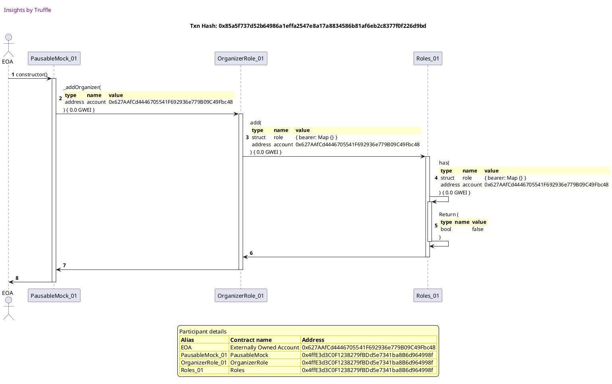
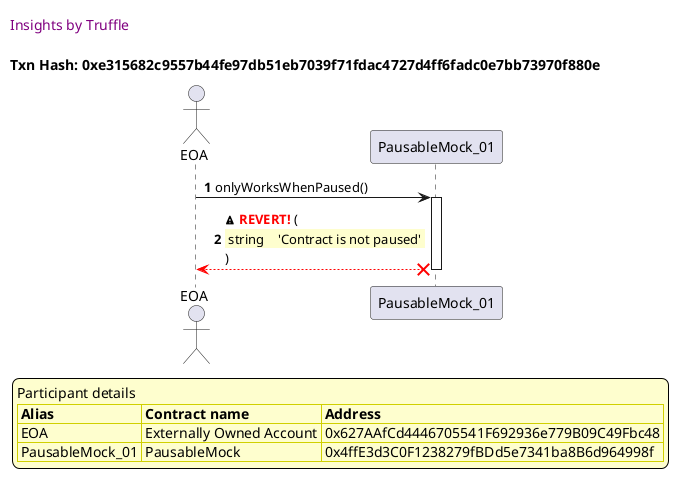
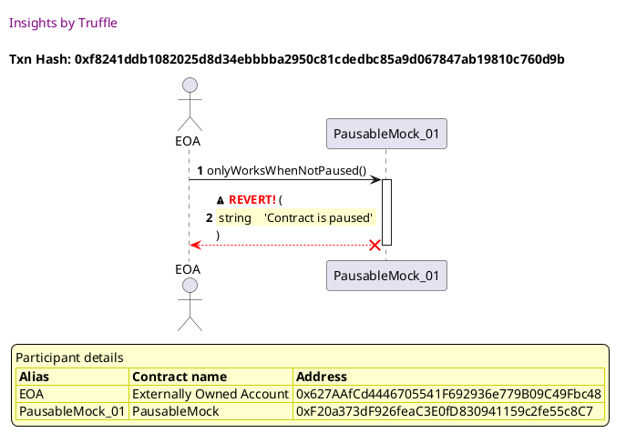
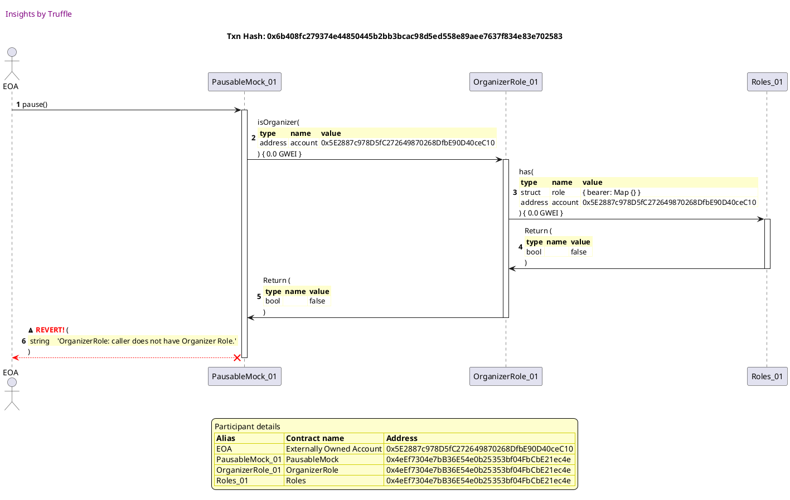
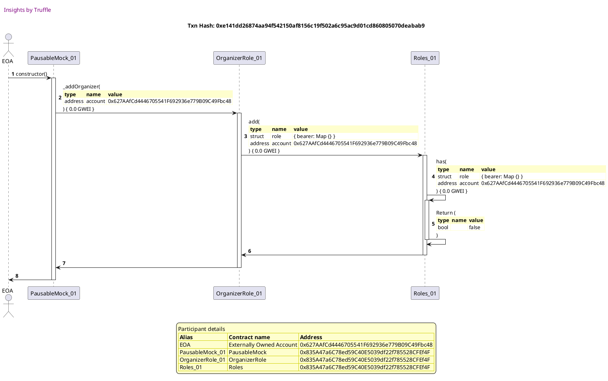
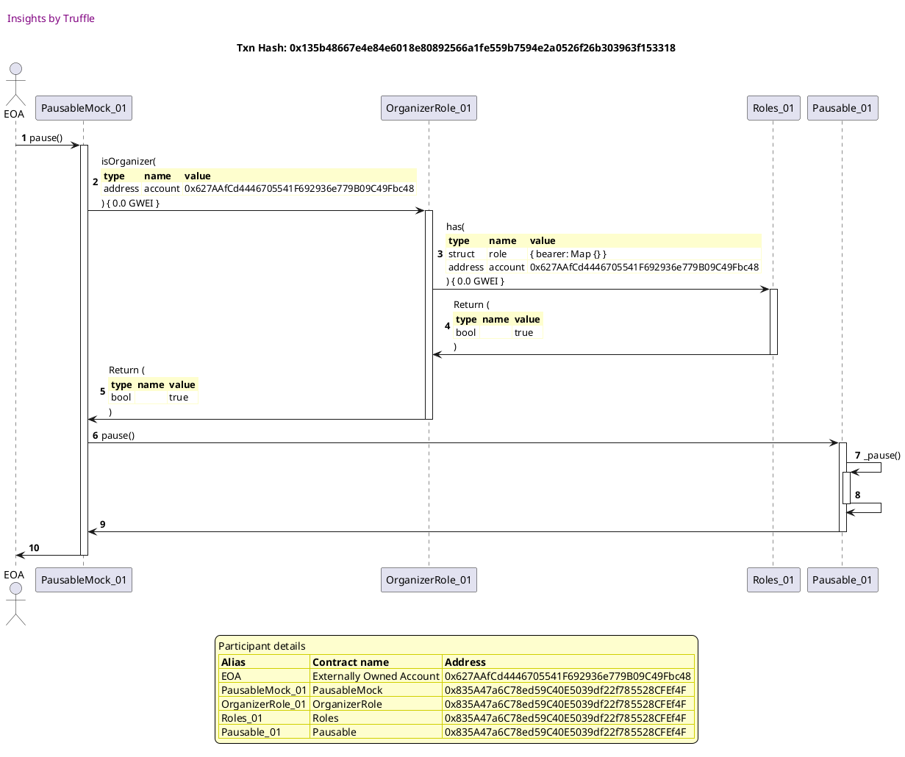
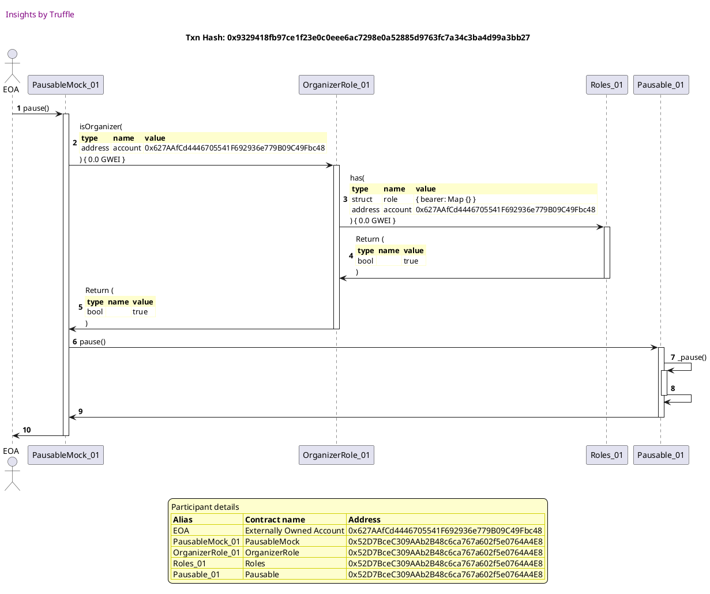

Test date: 2021 Mar 02

## reverts is calling onlyWorksWhenPaused when NOT PAUSED
[link to test...](http://github.com/fodisi/hackapay/blob/master/test/lifecycle/Pausable.test.js#L25)

##### d1, tx: 0x85a5f737d52b64986a1effa2547e8a17a8834586b81af6eb2c8377f0f226d9bd

[SVG :telescope:](https://www.planttext.com/api/plantuml/svg/tLNVJzim47xtNt5YBw2DpVcTLAoYBUtW0O4OqbwGa9FOROJhLBQpjHJ-zrtJDACjUnZJNbPLkSlvxhlxVFQ5a5DZcRRLL1B2AbkgQffoJSn3eMPCiob8FkOgxxFiOQpBIkM3KfOQtes6e-5WICY9iGl9kmJgtuIpd6jODgy0vwKk7ajbcUp9OgocN5b45BPr6E7Y6d9MwPdaMmjVYqSEZj_QhbcU5seC3crCpxKy-TGKGPhy5yeKuuara2xWLbT282wnXPKSRkSApfcPT83Euu058lAYF73Jq4_Ya3bS2EO6ViHZvaGiZZq_YCCqTfW8UUfciHT5WWhN3VCapGbkMMQnzE5L3vY10vG71BVD5banOqZrcbM6fP9Vbjd3FNLgfntRTi2L7ZE5hFLDAVacOjUu7R8ocethvkM0aBeQEExkPuJtxpkGbSfONQtgFpmY-pwhmBt4TUGzTg5TERnJT-IaEGuV6jbz-WnsCUE0Kh5fBRypMQ6oSdy2HD3S640jo_1KMTJeF7IZNayCSj_tmuW6WU-CmiHDl917KTAdoS1FHcdcnskK8rW2_KZXoxVX1Hw4LufTKMWtf2uTyxwjuFLMOPKQyL0i8ULCSzs1IpQ3vJCy_qjglqZiKvemypzHEZxkm0stbLRmDbffMKgi3_-2ITEOZtOJld9OCF7l3j7-vQYTNxqpwrktMYVhqKckNrpMd5jMIFE2rXazevIkQE64n2kCoW17dyR9qXBiRHhGndMVwg63pxdbMZ4f5t3rG_4SUczgqKlWtQ6rRQc1VI66NkuDwCXnlTYD4j4_omCUURwJihYFqn7dQHABRU2zuRPZ-WleTWWswfz2OP-QRf5JVEBdy2S0)

##### d2, tx: 0xe315682c9557b44fe97db51eb7039f71fdac4727d4ff6fadc0e7bb73970f880e

[SVG :telescope:](https://www.planttext.com/api/plantuml/svg/RLFRJjj047tVhvY2L20KiOulQwFK8WcEw4C5egWybAfQUyU95MSThTSbeUc_T-9O4PTQreuzbpCpPsOPkwojDBPPb8p9nbQwMQHeM3qlz58QkO0IfwZLI6RpgQaQhSPLMHaud2IJP9mmDgZjkiIOGVlCK2eqyAVx1RYkJF5SQIlBOLbCzGAr9SJSxXqcPDn1BXkpBF6LuLlnZE1uUzsjLAhGKt1uf_hRoi5vLmJhyd_HTJ6TsHhIDToR9iy9bzd2bWZtAmtNifvT05-Xw_X1sCyYtnUfv-KO2PNw3gQ2kr4kd5p9p1DzeRmy3tAfCeuYJOKR2Pw78ITC9ZDBfIStGv0r790yO4IRBR9YAQdLMzdKCYtnQvNDVt6dTNgZEs2iZOEp-BqDJayleDBb-g4oy_fXXdhhWUhuXBttNPtzE3IeVcw1TeXd5p3u-2ID9j9Y66IxqP5FtElT9T-Jk_iFlTxWlDN7SFoe7zcWc-odJiORgAtPahu1Ue_6D1P3NKDHWwuiBDjwZc2p3JvX2ibM_9OM_zVeRfVOxGk655fPbFMBl5VyYdCURpu3hGmHHX_xf5ekSAiOAcMm9ji-ZkhSJe7EbKMZPLckuUP9eu9Xbj7UMZBnLT0Nms4-Lfxd1OBxlkTCWgWVkG4A4OruDFQYIPfvuMlWjrDyhMc1QKCILxbZFd7wRjWNKJwwKZuArtDI6Ou25GLU58Kv0HC37G_iaawwUVy0)

## reverts if calling onlyWorksWhenNotPaused when PAUSED
[link to test...](http://github.com/fodisi/hackapay/blob/master/test/lifecycle/Pausable.test.js#L29)

##### d1, tx: 0xda6df53bb93a66e411cf0d0705f43e3d62cc5766097079a16114d5b74c726414

[SVG :telescope:](https://www.planttext.com/api/plantuml/svg/tLNVJzim47xtNt5YBw2DpMb-aOfLbD0C7X288Uq52JcEqqQuJcKxMqlXVzybJJFQieSnxMLLbNFETz_TvpjV23anbcbRJIKXhBAbggQfqCGy56h6D9k256EXibF67yQwh5GMbxBKy2uP9QDuHCYniGif1WIQtqImJ6XOjgy0vwKk7ajbcHpAOgocGbb4p6rdaE3c2d9MwPaK6njVYqS1ZjVfhbcM5MeC3crLpuqy_jGcGThu5yeKuuara2xWLbTvZhZ45bOAk9qhE6TcqWSwprYGvRwRff7BWa1uZiDpcj6G-hdd2ZSBUfpxOH3GAAHXn9p0SRpCJqEFXxt0mxpmoBZ5r4TNGs06zb3k4JmsM_1Ynf3gDQiCIwMuBFd3FNKQeotTfiEL7ZE5hFLDASNQOrkvwL8hpTfq_R97I9CD70vs8yBxzttWfJ9MLtN--mTarwPst0dSUDvZ5RgT_JjrHuxRTlZGoi7JPx2BcG2KYaqR-Pt92XUr-HCWWXR60AuunwwokABpe1SEXtcSUPuNO15ypqc2g1UvWGZ3w9H6iHSbAVUELYW7i0JwaSANRwCBR8HNagqfT0VIf8vntvRmwgWmIuruA9QG2gQ5xiCbcy7o6Px_9RLV97OfJPZvdoWT7lRXHjXAAtWRhRGi9UQ7_vn9qweFjWE-qYmO-7TDj7iv6kDNxypgrjNxP3KwoVMBove9omffNj0wesUKqfeMJaYymhY8SVHfd2mTmU6w09tVuAaPElYSMw4Lat81Lp-Ko63ufXAz1DuUMfkQ1ZZfKUQ6RfP4lI0NB7P7D3yxScc4CzIFU2yNli-Fud0JU6UuRQd-0heRWktoJw6mJcsro0a-yNFu4m00)

##### d2, tx: 0x83fc627c9405290fa793e80985a3d6900052af65fda9059e6385689dc7a52cff

[SVG :telescope:](https://www.planttext.com/api/plantuml/svg/jLLjJzim4FxkNt5YNq2CpMrUNR6AKfh11mHYIFk2XDp4QIDSfxAThQNmttT9qz8tfWr4LUNintUNvrvy8UJ4MAvjCPA4yCBcgXZrXIRc8LDZhla8f1W8bPpo-66Wyq8btLpc6Zv5lQZNxH5oREnKYZQ1wZSKF14QPlKMu3pNsMEkB9STcGtKI2YB7bExL8ZmSEvoNEYn56i7Fx970GrtYLtp9CdK01gqXfuhUVor9a7gzryeams6ra1_2hUwI5FqIsncfO3RYO9pReOje9FGIME_6SJCfLwJqPG7p14XPQ77dSHdb2BCKzzB4ywenuJlX9uViYGEkDUCqvHWocABr7jN7U06zb3k4KoRpU9ip37KQruOtfVYCeyVxccZKjh0rWskz80hZ5hVv58iB3R1TPCID0lLnMOtZKqAbIAfQCDHUviQ71wsO8oWs3yWswUboHQtoYOpItp_JjsHuxfVFjUo_VGDx7Gi0ANYeqh-uhB0HQd-15XeBOm1NCKnjft55PrWiJgTj9kuhki7rFFSHkIp9dDy4GJibBAkow9-x8PpBmSm0_g5mlUVlGlib1rKom2M6Qk83xbv6s5ZTH6NB3NwGp63lk1Qw1PSyZ7Cdk7v8qDx2M9tJOwEMd0ZRA4Ll2syVfvBv8b_ZBD63rvBwNQZVD3hTtRaQdFlRk3NLU__KRSCw2ywQu6_GdD-wSfpCX-nv7hbnYR2yaoQbKoTqJCSI6McS9BY9SP55qUanWcqp5bdqLfBk_PJDPpmER52Aoxb5Av-Av50vqtDj-fuSxYj8vNZg4cv4pX9n9f-AdZNwT7qB7GeSniDZyNDL7XU77Q3TSTRGt03UeVhvR2ib-zmjJfKNtR_wn0BNvUVdE0JlyD_0000)

##### d3, tx: 0xf8241ddb1082025d8d34ebbbba2950c81cdedbc85a9d067847ab19810c760d9b

[SVG :telescope:](https://www.planttext.com/api/plantuml/svg/RLDjJzim4FxkNt43QK0PmadpYhg84XAn3nk8eV5XJ9DZEsrKrwaS1rhM_VTTqwZYPLPa9y-TdxjxxaB8UMEPiUrS4S9QM-jsNaX3cbcb5yomEIWvaLfSC3wRcBhL8grLRM0_p_8ipGWPDNQbP4AWMrF9X3Jmf_y4kAfDzLnhozHOLHCzbzeYOsbt3ZaQjvIBrYoKV6NuNZrBSBmTTiE4gFG47Df3VxjpTDedGVhuNtHJJQQsWM85TwOjI-Gbjh9AmjrImnLhfcT0bsNaUeuGXKCZbxg-YCJGamKkviO-vP73XHG5ZtmM2ng4aHUomeaZX_8me28k24h6BQQUNO-1DR27vnv1sMp5gmN3KczOsx12oQyrd_scJkVq1jiZfBi79ybx6nmVdq6jrUg-DhFcVYhrjzfkdAGuF2BltPSdF_UD5BysN5lIapCOVNnYHgDk2Opujdleamm6jzcFxFRkms0mEktm10uVz0CPzStzr9_96XfhDhgl0P-353jZi72e6bXqkHp0UdFnY0Y9UFN8hFnVdTjH8ZSl11BIiaerBs9UqajAQRB-33Wng1U-x09gDfSRO2o4aGtQTlSmnqqJS5zQQJHJQWNNJreA67EEOslHH9U16ux7PIeypmj2wlkUamUn6my36ORn1OrJByuBxaMlYTysyJNI4USkPSDmAFBO3Kh9qc56oyjeI6FFSVoOkwNqVHwb8HAZ0hqEv1nt_F7-0G00)

## reverts if caller is not organizer
[link to test...](http://github.com/fodisi/hackapay/blob/master/test/lifecycle/Pausable.test.js#L34)

##### d1, tx: 0xb8214506e658a0d7b6ffcf0d1876307c71219854678badbb2e126a4cab00c5e0

[SVG :telescope:](https://www.planttext.com/api/plantuml/svg/tLNVJzim47xtNt5YBw2DpKdpewrOHIdfu0616D9Ua92TN4g4wrIsixKK_lTTqxIZBNiOqrvMLRdB-Uwx-yxsXR5ZwuHnrLWn9YfNwceiqJ3xKEY9C68C2aUeinEHFenCMUbiKAhImBjXCam62MD7riqKzXZKltiK6HgODwy0PwKf7aljXEghOgJ7g1qXvcxjCAJ59UIaCXE56mjVYqS4BrZRhaIM5Ne47czCpxKy-jGKmPhyvzeMetjdGSxWnbHvJhZC5KuXt4mrd0bxtmK-bMtV2q8UOHIs1SzY6ULvclFCQyTHYyTfxFbUfnq6KToM8fFIHy-FH90AoNaQ8cVKijHHwSbb7uI5FP9xZDhcYhIO2A9w9IehfCABCdsuurxjj6NR3BWq8w69jRak5QuYjesR8GkZNRckNlOOgwk1mzvkHdZ_lWjfgQqprQB-_GEswxC8t4bSHzxHBgnNzc_rBJjgZiE7HlQUFeERJH18QZ6kvNUXAb8Mxaz020Qj1TBIb4wL8urF8p_kz_D15WJKSXw6WJUCEdwd5M4STqvuPn1qXZ8DsakK0vW3_yZXoxVad0x2AyKkAAmRKfTEUTzMyB9LLAKXF19pa2WCcYvSY0dCd-7vNrBxHMANqhsm_nEbmyCkNAEhZ8QtqP9bgQW--kT2sSPyi9tmbSD2YNztY7OlH-tywfrPthh5EbkEJdRruh9cw4IXx0jQf_oKSxwWHHEIhZ0f0nfzXYRBcc1_jG7hkDvJFNJeENLej51g1fS_D6RGVzCMlGJU7bgRbXeum2IFMpp0M9wqeYGCa4i_R8KjcVDWA0SoyJrC0zm4tXbkMwQ_W5uFmKRzKoZQfsQts34zwNFu4m00)

##### d2, tx: 0x6b408fc279374e44850445b2bb3bcac98d5ed558e89aee7637f834e83e702583

[SVG :telescope:](https://www.planttext.com/api/plantuml/svg/jLLjJzim4FxkNt43QK0Pu3P9arPT1RJfu0C2TMZxCAR9IIub8dKgsu7ozjztITD2ANmO4rMLSyw-k-TU_8InVMs4ClauPKpa9fFvE435z5KY9qA9CQGuGXaTYl1gfB9SHhqipHIi3_o1t_CPwsXpcsANGVcxH16XWllg5U0eKybT9er83z9a9CSe3NcCpUB0W3PdBYUvcgIujF4zkKEesmlTcOYYH8wWpYlLOoaxUnK8LiK_bZePNHeDmIsSgpoEoIypYKaHpgSIZeI-R0EVDWERUt7OS5kMQwDjUmwtRITe184LX29iUP63aUDuwBK4ejkqtDYpRFGiT7d3yIn69GiDGVTF3q1eM2EvngXi9WcJYQ1KpqIkHP3YIHPU_U7ryj0BtRB1gHe9ILchOPRYtEAbSjcaKEhvqVdB6cCb6jZfhaQ4xUqsJ4Y9crjiTRSmMGbPsYHweT-ya1UiKut1bqfs7xw2kPqWa9HYNCfhaUQqA8u_0FLFeTP0gp2aQJAqubF7RtYU6xPSh-_4lORRQDejZqhSzFfnuBTut-OXzkfyvcKBxe7lSlZsqp-c0NW5Qf70eX0by4kXtmTO6vM71Kf5_aZSGu12eMh3YPZ0_ICyVcHgJqcytfETdJOCqUHAmllI2x8i9PpqZqMgA_NMMpLTdPIFYhyIQRhpQrrXzBk0CPjh2jtvV2EK94BeGYUSqHATwTPgG_-7Fpp_LAjrzafzzoruHNyBGYaXR2nbtOPGf2cHIPIX1faP6g9hVBgWvRtRtPX3Zf2e8BaM1b-vuMn6ekpisRMDq8WarSz0zNcVSrxKZBYIBZCjUaI2YXmlgdSmdxA57ILHq0yzfmQL9CotS7eZCOA3TytXSySlwMjPKpgsqOzTYzle1eTMqtTiv473iHmhYBaz27g1twXZQEEounMQUw7w3zSBEgoM_-gA-bHrY-tJapwCVm40)

## emits Paused and triggers paused state
[link to test...](http://github.com/fodisi/hackapay/blob/master/test/lifecycle/Pausable.test.js#L47)

##### d1, tx: 0xe141dd26874aa94f542150af8156c19f502a6c95ac9d01cd860805070deabab9

[SVG :telescope:](https://www.planttext.com/api/plantuml/svg/tLNVJzim47xtNt5YBw2DpGdvMR6AKjh10m8nfBqWeKlij16kKpdErbButtT9quwsx65CUrbLvIxdk-_kyzaNnavAYyPM4yKOLhRGrIIHXfKFkPwYmGaeEP9Qd6BwC395fKM_K8M1TyF1SD0VC7PSshcINGRDRonHI0EBzXNWl33vOw4jgfxAHteYjIN4pAuTXhIuX9nMPghaniBN_562uwrjroX4haVWyDRqtCZZJsqHhCr_eSjyDBOb97EuDLMM4IwpkLKIRcSQph4STu3FfECvGhX157g8iPVvdklu7BF8yOFKYJEVknYaiOzfBBYJYYZW4VTvo8N419EOqPQbbaeVNFK0IzWZkSTessoUvbCagjTObPWeULca3_VSQPosR9i1LsQ4cbYRcqB9LSIsSJEaDfOhrzNB7cDDDN3OtSq8xzzt82rqQKrLrxz_m7Pzwi2Tn4taFNLXlR9_f-_OSNiSFhIo-_GPx7mgWQJ6IIE_ewf8gTsVW12CB4iWBKtfL5dI-2nmmrulwmlFyuAG-xxd38FOZOy26ORnAO_xNZnCKYzQeXp00lX73b--3Ixe8BnIR4rXlI5DwPJtRGKljuggD8H7OW69H2DD1ovn2ejdUFwNr7wHsAKqnl9_edHus84RQIkZuMsqag9GL1_zCrHbQpxOJlZAOQ74lpj4kvUZSNxrpYnlNRtEbgEJNR-uh49Qp5NvWjOPF-ESrxHeGj8L9gLFey_GP5aJxAqQi8xhFZL3XvupAur6fUPmzKDB0RqtjUWbyFRGshGqmD6Ht_D23FfX98LFE7pWywDOPAwRXP7lkr5_ECYyuIRmpd3RClq5z7e8jkgVGb6Vscwn4thIv_0d)

##### d2, tx: 0x135b48667e4e84e6018e80892566a1fe559b7594e2a0526f26b303963f153318

[SVG :telescope:](https://www.planttext.com/api/plantuml/svg/jLLjJzim4FxkNt5YNq2CpNbFAbPHIZluW40CQL-Ga9CuROJhLBQpjHJ--ovfMlh6j86egjpvVFVakVFvGiY9DaoPSYG8OQKfP3cAkIBw8PTZfjW811zmcPwov66WYbActK8K2ZxrU_rUjqV8iJPJmTi4wj-GivGhc3LBWFD2vO-5D4nqH3wG8ouD8cPcwT37pJdak5HZmTSsVkIF72ntQRjcQPhB0LYqCJtNylXhGu8qxx-GEXyCZOPu2hUgp3B49IOtWiFjHC8vqyCMq8dbUB4R-dx0NHwwtATMo4CQHhRd-ypAkET5SU15BhSPzMm_i_tOeKxaEvdbEOuL4YnPOf1wxwe3JCCUoZs2PJDvaeyPfdhDIirYmI-BvE6UMhNJXcqzu4eDcCIirKqX-29YqxWUKXdrmdMns4rZaqBjI6hQSDJUfWQ7XoqOev7l7v3jtIfaYriTa-kbVVzEtf7Zfby-DxBzz0tCTCm1fMIZMlvYeaIbSdy2F6Z5jGRKaWJRpg169xuTT3fPDtLTrm-evxbMtu_ioF5v44IdDEgwKJzEt72ESW0pe5yeVF_Pky1EsK6rIc1PiPhuaEct4TP6bKd5KY4UYXd4d2ckMd39nZ1xXkUFJEqbYTrdSdJKWXjkIYNXRUd5HI6G9_unpyPwy5f9jnlbWrw_ioDNctjt0x_kUl-FlbL2V_5PI_mLclDBL-sJ-OWbroitDkM6vKAlLEgCdb5AgqhX9CLBZ4eNHwJ22RIiMMVHMikuzbCzdF0vCLn99iGKhdvBdaBdJSst2hmvtDOjDN3eU1qtO7ut27dg8GxjUJX1qyosio3qF3lizdkPsry7tXg26wPtG2-7PQE-0sfrgBwi_XSG3xuvVdA2J_mE_m40)

## emits Unpaused and lifts paused state
[link to test...](http://github.com/fodisi/hackapay/blob/master/test/lifecycle/Pausable.test.js#L54)

##### d1, tx: 0xd0513d9107a0b9c310de619666dced26fb4a68a16456e9b7bb9dc386ce27f54a

[SVG :telescope:](https://www.planttext.com/api/plantuml/svg/tLLHRzem47xthpXrBwssRau83a4TQg2mzg5grLNQIwNASHo8QXnaEnkKzh_l4W8hq3siqrw6KEvolllkFfzz8UJKEcvSELM4yD8LkfmcqX3xaEiPDtmAIewbJljSF8nDKUfqKAZ2mBlHS3GS30aviMwXP8z0_Pj8dae3o-OLuBmm-MEX7LUnoiTwAhL3nCnj74Quk8ASbMQcvDR2r_nHWXTiRDSyJNCz1eysfkTQddngYY1D_Wjjy_74MKWMS6lAB4DSudAd9DpEDPnpE-a2dQUqxRNIoACXfqaaMXvD9VCYnbWgPEgpB0auwt2F1MqceoHCaYWLhGuJqW-pTi09RfbmMFhmAWPkuG3b0S5jSxd8PnofNlFIyaJ9oq8yt5ElTjgnRGTScJ7NoDhS54gk8tQDso6LqQvTroy7XDJLm75lFoEyVzy5KMZhJ5dLVtX4zdsgmBt4TUGzTc6pSdYdxyX9Snm-DBBtz1dSOYO1fURJMdxdgaIbSdy2H33IMa1D23nL3ZKwPtuOnzaW3OA0XRJT3hmHY_oenMGOHdqQ3O9eb8YWiq8vWYNGZnI-V1jUu45ufTYAmcP3wj8nxziANcqLLcaG3yKI4icDD5suv3DOFiFplwJsYyG-fGct_nEbu-Ckt4XN6WrlevKKXSBwy9znPHlpqMx2LmuB9lxT8Tg_7BNpgtTcTUkgTR8QdUJwnMLDfUEviYzedT4pIcb52oSaNc5K1ZZw34wM3S5utO1DNE-f7Zhud3jfD5Tg0LS_j4mXVbEBNWBl3grjImtSzi_2lf235etYEF7xGKSmmKCMSaRzh2rfo88u6Eu0xmst7TDVG6-6OAF-AHJsgUaMESKdVWv_0W00)

##### d2, tx: 0x9329418fb97ce1f23e0c0eee6ac7298e0a52885d9763fc7a34c3ba4d99a3bb27

[SVG :telescope:](https://www.planttext.com/api/plantuml/svg/jLNVJzim47xtNt5YBo36vYPfqbIi8fHsy81036alICXnd3R2TIhRsLeA__ikQLhwYsa3KLMvy_dkotVdyuMG4sEPjiL84i8AcwjY50jDp4Ecnaop4KWn42evPVnXeFD29TrSvXe-zNlzNhT7oB6nKoaw1AhVKB14Q9ZLIu3pN6UFkR9CHZ8Rg95G5X5JktJeu-OSSbpeiHHh6p-oHm4DRscxPacIgG4qQ6rwhkJnrve4gTz_eKms65e3yHHkTP6cY4jiPgM0suc2SsQ6RQ2Jq7L2hz5Aup3Wef4whg2S2Y5ynWCdR0dAcawhrKp2m7TJ7Z3NusxCl2GCcHl7Ja2mPDmYzTvL1Cp07iezWcMp6S_635EzPeLXiHINEN-ufutAQSEs7d2b1qnXrlecbs8HiMbS3ocDPk6wMEociKcXSYGLRJZgR5E3myCsZD4ezW_8zcuPiiMjYidCqhv_f-x8STqldslPUVe6TZeMW5AnKIL_CLcWKhe_0Hwq5iO0QfnZsrdKwCHtWYXAkuddUNv0cqslqVT39tHz4GJXAGsxNjYFkTUQenp03EWN2jz_zYwmKtPGBHDOLgmYFcJcROIDrGKlMMh4Gp63M30jT1iksHXcp_3yaQcz9B7xJ8wEsd0ZRA4Ll2szECybyiG_vbbR3ruhwNQZVD3hTtRaQdFlRk3NNU__qRTCw2y-Quc_GdD-wSfzCX-nv7hbnYR2iaoQbKgTqJDAQLafdAHuYL7fueZKE86MDOiMhRMCwpnLmmcV4okqOb9EuUgt4Wb4Rsg-LU3DuRPkgO2RpbbmoaNNfM4KnSwfr-8-Pu4VC9ywQLFGmFSYhxS1l3K4DqplW5uEorfz1zJgK7rP_IyW7dnz_EG4d_WT_WC0)

##### d3, tx: 0x9f306233f54067f123907268fa2a6eb30d1a5fe681d889113060d948a363123c

[SVG :telescope:](https://www.planttext.com/api/plantuml/svg/jLLjJzim4FxkNt5YNq2CpNbfqbIi8Ytju0C2CQHzGK9EuhGHhbFPpjPI-E-xf6dfwxI1gAhS-NptvBdp-KB8cJPCcM8a2665oMKnYhWY-Z6JOwRO20GVS9bqMFmuK7aXasukSWMV-hr-hziZv5IRgU1j0jLlo5d25Spg9S15hhAdN1ecGf4Dv8XBWuYfMJhqSNCEEIxKMF2rZH_P4mVBNTfkM99aSW0MhKqlbJpzMfCWzVilfSu6GwCXciATAj8KSOd9ZE1mDv5mmVIm1NGIf0xrRCT96oxr_DIodO3wjjTCcSqy7ZaqiLWZvLxJIfhDmBBGcoQ1ssIEvw1pJB1aiK7glUiGc8O3b0S4osQoE1ipJFM65Pf5Wb_byUC3jIgd3TjwmBKQC8bPgzjSy4N4fd4zf3JgXUjYiPl69eNAaLIquQIzJGsEZrjGO2CKcXyUaUtzCcYBNHMLwQNzy5xUazEwOpxNilty3Snqp06bPADA_cAYGALqVmOyQiMr1jJY61lFe4Oddks7OTfDNDVrVDfek5RV2-p0yRZl1nqQTDsW7yLkSuvo13EWNoXy_zcxn5xPGRLCO5cpYlYGwRSHraOLSSbI8HwA6KISAQvQSCN6C7k1buzCxJM9tMToSjA2MsuA9U5jwKLvBf0d_Z7FsdgqhwJRZV91hz_PaQljlQ-5zpi__BDtcTHVVDQItqDrVlNAVJ8VjEHcvTuctB1Cw9LgdTDpIcbPBPodU9LHwUAWL3Y7bdKB5-srZ6i_LoCAdnF3bMH2JE7wj-G9X6zgm5NWpH6tRgc06_Qvtubvrw5164Psnst6NinypsSUjTC6fxxdXcvl0tXh56wOtW6z79cr-WwerT7wklfVG3pu-lZ96JxnQ_m7)

