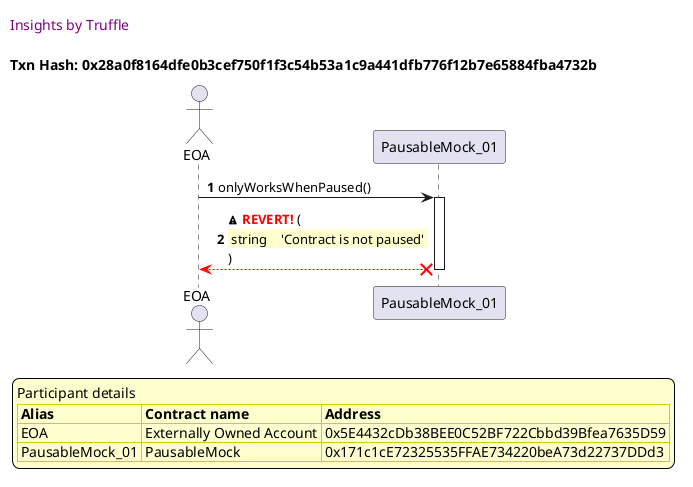
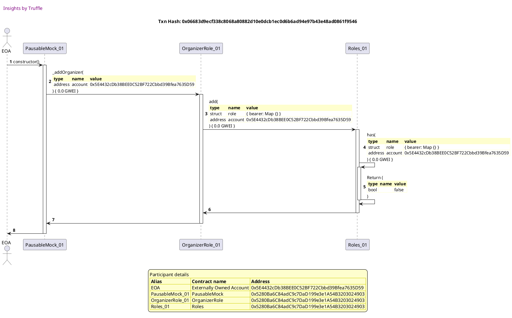
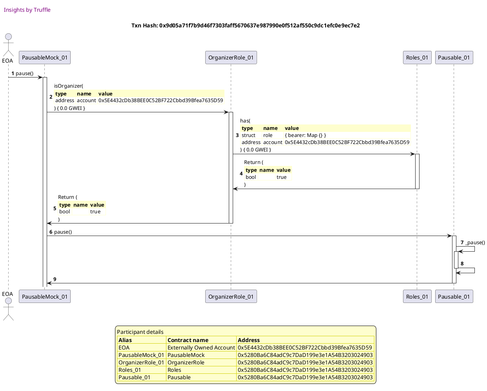
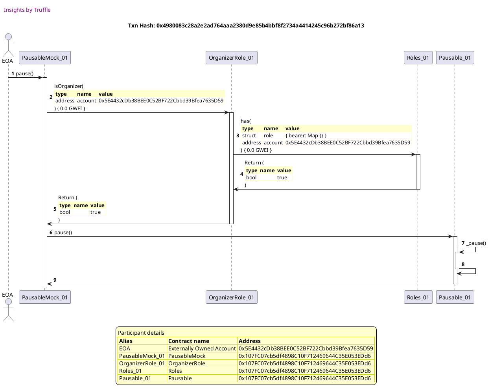
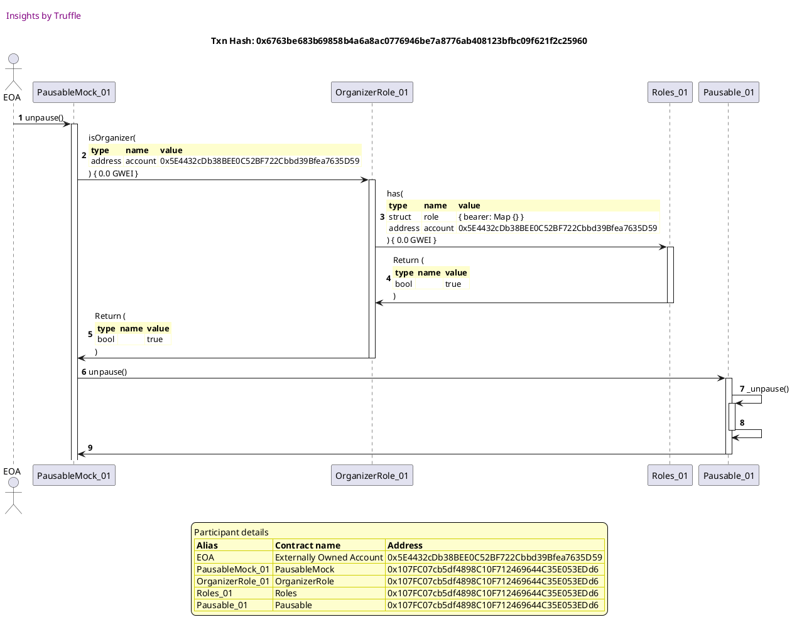

Test date: 2021 Mar 11

## reverts is calling onlyWorksWhenPaused when NOT PAUSED
[link to test...](http://github.com/fodisi/hackapay/blob/1746d2fc3fafc73d8b2843f0fed53fbd26643dc8/test/lifecycle/Pausable.test.js#L25)

##### d1, tx: 0x633117774a0d362a74e56da2e2449b958b56579ed7a3530847c1e725e8553936

[SVG :telescope:](https://www.planttext.com/api/plantuml/svg/tLNVJzim47xtNt5YBo36viH9tLQieZ_ImGC2CQIz824dSTi8rwbiXxKK_lTTqpIZBNiOqrvMLRdB-Uwx-tpsXP0pwuHnnLGH8WgNws8QIqFiGwPdmeWfA3cMEks9v65iyaAd_Lpb1ZuCes7KZmWvjMwXP8T0-Pj8aKe3o-eLu3mtsLEkdL1TbOtrL6g7Y2DNEmnnSGqvAynCoQs5RzcJ12-eRTSYJJCz1ezMffTIddwkYY1L_Wjji_74MOWNS6kAqGXnYSkSad0xrt0kxAGDTDvWpFCuvu6WAMluWWSoRAJ2btuGjE9Ms8p3HiXRCkM2XOms0vvualkXR8OXQx46mIrB79OUNNL1M3X0UK1msroMP3E1LAz5OKMiv6MUFDnJhtJQiMq7N9cnqCZQtEHARY9sZTiXAwFTk6vU3WWfgu6Jpdv6E3vkGv9hwqongl_mYEpxh0Bt4fUHzzY5UkNmJj-Hq-euVAnav_aBkCLC0aejfgLy5Af0PUN-38XWfBM0MfBWgNAeqNaO1G7paq7CchqeeltGxmsvx_VZE6MjtaWAtc3X86ojKOvW2VGJXQ_Vemiy26yKkw9GRqXPEkPzNy7hhS8g3UAXM48iXP6c3PTY1iiNUFcNr7wHsASq4VP_edHoqeORwGgZuNsquZnNM1_-HqBPodoqc_2DmuA9VtU8zYz7wVpcdLdVkjKwMOzESltgigRIYKpPLxG6T40fNT722ObN69K-ZZw3awKcsDqqe8xhF9T31vzp9uqMIYtWweUMANJVrQBNmBj3QzjI0dlSIxmauZxpSHI6ms4tuYpmVHhBBcUfxtF61uEKRGFl3RSTqrz0rqEmKlyK2ljKTOkSuHC_Xpy1)

##### d2, tx: 0x28a0f8164dfe0b3cef750f1f3c54b53a1c9a441dfb776f12b7e65884fba4732b

[SVG :telescope:](https://www.planttext.com/api/plantuml/svg/RLDjJzim4FxkNt43QK0Pmh6Jfg0keY-fs8S9nD3uCAR9RscZkavbEwDbtN-VcqOLBuiYNt8lpzqzTqReodbcVRtG2B7QLwPUS6MHcvTcoInRW5PJPUIGYVdKLhMHeqfN5Wud-IGVvGZrdLzhbI5edfbYKbduq_u2N5UsVAwCPtgWowbPAEC3Ok7t3fDWt44kQxlKwfNXM_ci88htkbicPMcc4E5MzRUH_VEs2DJc_s9SEPrv1tmDzxOkYe2BVEcrWlkLWMlcPfU0LwJ7SD6Bkh4i5EPKg29DS14LL2GnJoYBn0MBuqWMF4sxHKHughf9hnSNdCKf9Hm5oeGFfUSt0s0E3e8yG84sNufooKAhjwnsZ6lrjHBpNpXgdDxe3X1guk0iUs-3qzDBg8nUFrHsxXvcocmzb3m-GUzzLsS_3gsIFxT0EyIpI-X_V6BM1D8ow8lTw89FrkdSvT_pk_iFdKx_lD5dSFne7b6_dUodLcORSDvkITz0U8z6OImsT0sb0rDvM3Rr7C5c6to2f0gsyZVpwd-DxdO9tRvWI2hFIkrUv1tZCSOusto6i3A1iF2nJshOGcqL0ocjSi6sZmjrRgSGpfLNrZ2jrt3pP9I4WH1XRtqmuLMInp4bOinfRvZdU9IGuIGbPCIvf1V3Gh6qIvDnSl4Q-EqKNsiQu2YDH2Job52I93IPJ0PvIcD2C5U3b4f2KfgEnv86uC10omEw2cUuUVy0)

## reverts if calling onlyWorksWhenNotPaused when PAUSED
[link to test...](http://github.com/fodisi/hackapay/blob/1746d2fc3fafc73d8b2843f0fed53fbd26643dc8/test/lifecycle/Pausable.test.js#L29)

##### d1, tx: 0x06683d9ecf338c8068a80882d10e0dcb1ec0d6b6ad94e97b43e48ad0861f9546

[SVG :telescope:](https://www.planttext.com/api/plantuml/svg/tLNVJzim47xtNt5YBo36vlnecbIieatJmGC2CQIz824dTje8rwbiXxKK_lTTqxIZBNiOqrvMLRdB-Uwx-tpsXP0pOvcsrKGImYfRgcgI2atCGw6cJBC9I34IYlTPzZ3IPQLuNCfImuTXCapYX91JO-TIT0dKlx5WN6XODAy0vwKkdafbcUp9OgGcGbb4pEt6OOYBAyXffQTIR2ryAvu4EFx6TiquBzG87DgONcfv-hafWZJvBvGfHcDh89t3hQxo7769BQmKS3jJSCxCk0DqHeCWz7WaijppmYoaGSX26eOkTwYWF4iTaL4Uf07ZaI-YTkfxmWyPfs7Wv57B3mXkMMQnzEIg1yp00Se3WjjcYwoOCgHwpIh3KYako-pXdZgrquvjE-1AZvX2rlgcb68TiMlS3baQpTfr_N90I5qDd7JtCyBnSGUoKXchgsNzXqTatsSPk9UuZhp7BcnM3k_K7JbjZiF7HdQVlu2TJmMWL6nIoqScArIMxi-025eO0wXb6PugYngTjHBVzznia7fXFqbet7BxmxRhncdAlQYV2zOElDQW5QrGZc01z1E5hz-J2pm8RnIxfB3PaBfqpFk-WbTRXLLgn4EnW5GmBNG7BjaK5Y_myY-f_IAnJsdCpFz4wUIa0pV2Lbh1-sYbPIcnFlpdJ9h6VBIRy8t3Web_TuZsBqVj_EQTMTswvJfPZKvo_UgoSc5P8SqhMWCwe9GkQU64n2kCIeoZJ-DasH3ihHkmYUi-rqC7dpChj69Ipk7gXn8SUkzgqMlWtQ6rRLa1ko7jio0EVSRZA6iFsC298k49fzVo-vvBFUhw4VMsWVU6suxfBw0tGx1H_nGA-zHqYvpX4p-7Fm40)

##### d2, tx: 0x9d05a71f7b9d46f7303faff5670637e987990e0f512af550c9dc1efc0e9ec7e2

[SVG :telescope:](https://www.planttext.com/api/plantuml/svg/jLLjJzj03Fv-ly9YNq2CxP8qJLEnYhwaWmy8n93s1GbT4gUDI2_LtMLhAVptkMbQ-iQqWOYYsEUpdppsEGvZPze8POfHnfWeJ2wBKOYAwOTKZeKI8yXmW3BkYEXXeF92njqyonLywWVze1imTghDDCCMW_8QeeXHmQnQ0fpdAdtCfH5PEqi7SeJI469YLWvzsbn0ZWirpd1ZuqVwY63LLhPh4SUf7835AzDpAK-_LYHOzVuBgTF1q6W8ft2hYYGXN6PIao7SJYIS2pri0f_uCNU5PoLUwCUrUk8vt4b4ahXrZzST3_s6v_iSUU9QjaXSbqT-75cOH1nzZ3oq6PKiCaGzk6g3q710ye1HsKmQfMD1gLwBGeimmyiyUhZdLkcqPTiCk5838IbhTPDdk8pODcw6p8rwwRfSxAUnJQ5qP2LjE6djKeFZuoQCoOY7HsntTnwomwsCIVNAVdWdxzXfrI-VAzbw-WPcEaOWASMebBz4Lf0oTty2EcY5MWDfKKHjPqZZ4pUerHmxweLEenC4lElQdRvdszqmZ1s_aw3mwexRS_q5oX7CW7_XyFrdS46TieVgF85LnKhYGw7VHbWRLKHpbehmICmWHA5GDU5IZ67s3CyVcTfB4llFvEIa2JTe2YNXRUc5UPuHJxefpyfwz5f9TnlbWrw_joFNctj_0x_kUl-FllE4_kApaJXZYn7AhjU-o1YDI3EzLeaUxt7EvvMWIKaVAIbT6e6A9iog9krbwwpYMa_byA7dnA2I8ikcSFLROWpjDpNNEl3syDgqB83j1k-8UhTH4t7NZxoUw5c-ZmvQRRVMSMpkSBlcSsSJU6V8RPdU0RqQXfNw3gZreVco-bz0ElZg-DaPFUa_-mS0)

##### d3, tx: 0x7a6cc8d144abd4be154416a192b5cb6b523991fa9d14a5b962fbb78bfb78f50b

[SVG :telescope:](https://www.planttext.com/api/plantuml/svg/RLDjRzem4FxkNt5hfRMbg-gy0K4iAeIWxiFMgglM3-iqdMC78eA37AU5Zltt7H2XqYwApibpv-VEpvqPkwei6blF2yQmjgMkvq8PLirolK23SoZKH6avn7GsCMMjPLmMfO7ZSJ9EueInVcLNXOeOR9-fGgaC_6b-0QvBax-Ksc8nAFA9dYjjYJ6p-u0nENUKYzei2dNW-9w_A73yFNQBKkPw0WvleB_RjN_P5C6Q_5zqbK-cjWAnWdjJPndnCflRGi7zKiCrLjCUy6K7ssdQbOxlev2-K4xW-quRdT0LGIhQ8d2zC7Go32a40n6stKo8JbTaPBA02qQIfPPAJsu6W1KSqNh4I3QRf_a2wQYtM5Se2lMrJ6U_kRCDUeCTCRRT1nVHUn-Sd_UWrCNgeJIpwc6gzBVIReAKF3rZxyEN5p-FZPA_DbmxqeiUz3y-ez6aMmJzTDSzYebQhRlaHt9t_w7LwbzkyGXE7_KZwpVD_TIiqHegQpQwhu7UavWwO-ZWa5UmsDPo0klDnZCc5U7v4rhrltFkHedTlX98AejvKRtAEU8Zpdcq_WmqCQGNVUmJQfoh3J2GqgYAVFjzLEEc2MINLXcDHR62csUj90pIbCRMaeilWyJtFJST2QyxJ18U1-vmt77TM0ZfXSDCOQVj1QCWF2H-syH3P4ViTlaGst7NHnc7QMU48oSCbQUSGU0FFPTxtFL3xX4nAT3emAx8qiNx1m00)

## reverts if caller is not organizer
[link to test...](http://github.com/fodisi/hackapay/blob/1746d2fc3fafc73d8b2843f0fed53fbd26643dc8/test/lifecycle/Pausable.test.js#L34)

##### d1, tx: 0x2ee9500490fa3e9f6764e69d8f3637e77be4e553766793e5c86a2068a63fe049

[SVG :telescope:](https://www.planttext.com/api/plantuml/svg/tLLBJzj04BxlhnZH2uZIRlnsH2FoS0e71A98lI2XjJrEB3RhQBsc2O7_tedZf2IXXrBrqYZoZ6TdlfblPtVCs5bfX3RLH38cAbEeQXAZPkL3hgP2Ymb87A5AUo9v6EcYKcc_a8M63yDe6FKZnavBCvVOOL3_nYXIrB1eNW7E2vq_5Se8sPNvI4rG6KBCpCPXI8iho6cbfnAt5hxbJmWjPsEx5ccQgn6qU6DwgUNfvwO8rkI_K6K-6fiIuZdSwYhB29UPt4Y4svc2Sr6Esy1d5cBeSkw4F1CsXfddUmvwOHfajcVxwFinEkYwjkzvVcYZcmIUiBWN2C_EaC8ORLbYgFJegWkYX0EI1uospUH9FXL4zLfKfOWbNXR9mprlrKuxjks0ApqIYbZhcqBYEcBNk1soD9Phr_NB0MDrDN3IsSy8nyTjI0fL6bqjwpyyOli-oy2zn7NaFNLXit9uf-xOQNCSFZQoy_m5p7oAG5A9IIqVXQn8MRe_0o5eB4iWBKdeL1dI-CoD7CUsaa5i1xqeudtNwWrzo-h7SMg7lGo5xzdkm0rNA4Um0Fw9mzVlqGKTX3UANLBOR4XTEkLzNy6hhQ8gDU6HM42CGgDkmwMOmk85NlubjLyazYcDHVa_KJevQSCDcaehU1-jk2WarKV_JCYoCH_j9dpZi53YtnsY_SjHExzvPrQtRhdELgEJNR-wh2aQaSlo5Qq17t3EbxHeGj8L9gLFeq_JPDaGxAuRi8dhFDT3XvupWre9AUTmzKDX2jrtjUWryExGshRKm7vgMRRdzrgfvRU28CnSpmbQWtxWyyHnUpmCV2l2qDa6tXjkEwQ_WDuCmKRzKoZgKzCjTaPF-Xp-1000)

##### d2, tx: 0x6a00d0ac42fe2545bd088260e0db784e33140b8d0d84716b0cd1e95d2ca44032

[SVG :telescope:](https://www.planttext.com/api/plantuml/svg/jLNVKzf047w_lsAhCrMnw2K44XZA21Yg3uuETTg7skbSSWTa31Vcxg8W-hzt4m8Aw4Fjo33PozxjxhS_xWiX9zemPT9nJ0XBJIBJSI0KqRUHd335nX2BeP2ymyBReKfIoRj9d2ZOxVazl-iJqjHc5eiMWVmt4emB1VFY5U0iKT538WsBst4qb6CX3NeScDM17cukN4vIDOd5siRtw460vQnqLuppI0x1eeNgAPVDum84AUAVInqDHqP3C8DhbGu6w9UOoCG2hgSIpfWUDO1EQunIJbdes0DXLvrgmAddsJKgA0zSpn6LYkNGmEEKUuvhrG8QSalKgzmEcUFGYasmPA51wFvb6vY67PGx1CjceZ2QC4prYgMQ1R6uICBRFzJA3sterWqkrP19p5hrarWiBJQLwoQPKY-FBbzs2CdHGBcr7H4E3nimGQNOFo3Rkvd9LiZS9j8h_VwDl27DOWo-5BBr-1NCR280fMJZNDwnECL5TlmHi7zAQ0su2aES9eChx4F7ThisxrMTTbYhURHRxJXUnVRhxK6lPzNfm7LhGQNTMtWvW3dG8mhVVlhdE02lGCqIM1KY1pvY-ds0jL5fcA5Kw0_570B1b50Dk60Jc3_1qqUczfp4wpqfbnlG5oPL4jwNNf0aCUB4_u35kb0Vl5NJxKdvgFXRaQRbNxjAyDyPZCLSO-Zcvtkc91922vhXWfRmJAjKwli__FxrfrAfUPphMs_1o_gR4KeEOMyjwmQ4B8wHJ7WYDCZ4u13TYUSBcj-xexqbP2wG2g8xPiGhDvmiI9HSlRYsN1WMnVe5g5DwIYdDQePSYPSP5rqaGOMELzLhBwTiPOT9PFI3pwaHIYBc6LpUIy6X_QuvVEbuaxxMDRbZbzjsfUPsB6wxbkVL1zMQurcdNS-beLFjqBhdshweE-kEjsXkG_KVhbTqM2p_rHNsgUWMES4dVXZ_0W00)

## emits Paused and triggers paused state
[link to test...](http://github.com/fodisi/hackapay/blob/1746d2fc3fafc73d8b2843f0fed53fbd26643dc8/test/lifecycle/Pausable.test.js#L47)

##### d1, tx: 0x619a69925f55dec9873e2d00987236082627216fd05dc465c1120b1c2bdd3122

[SVG :telescope:](https://www.planttext.com/api/plantuml/svg/tLLBRzim3BxhLn3TfKNNJPOVUQ0BceUpzb2qw0hiKg2GBJangiY197T9q_xtCOwJDKbtM8TT5WGcJP4V-OaIJSYPTTouSg88uQKhT3b9f27s8TTJRlW4b1n9BNeyVHYPejIYNwZ2m8TXF8pxCI6drisLx12eVcF9XJImg5y1pWkJFnNQSTLL-KXFf7Q8cBcDmn0NLv3JqaoLt5hubZz9y8ADxPeBaUiHUBGslLJoz7DT1AdpNsYRZyREGZA7MrDc6U8IbpibuNQcuPpRSHleBF9QF6grM9Y5eP1fgzdm9HEKeiByY3PPn1hCYp91Gv46KPXw7gE9bx942DzZZE2MfGvBZw-wm2qSe3mWk6qkJ_CfHwhNlBGyKVAoI1_kgLSvxTYs0wxCY6jaRMuA9TSHkyRjaANHhbtNBmU4LDN0IMS_8nmVjo4jj7McNDP_U4JsVPQ1Uucho7limcRby4xVaTFwE7oiPUVv2xZvL09ApIULVEIgH6Nf_Wo8OAIrW5gQugbogD5P60U1pz91uZTxSKpx8UiD6upraqJuhLucUIFomq7OMg4SmGBe9mfVlySNU13UA7P9ORCXLUcOztq5hxOAgpI8Xs81YUH6cZPSyYaiNk3bNrBxHMAVqfZR_udIoKaRRgGhZORtqKgAGc5z-C-uihNvQ3VX6uS54__k4ErVZihvpJkpkdNBTR8QdUJwrMKLql5SsLUq1dH0ALtImWc9LnYLFeu-WvDbGx2xRi0chlDS3HrypfmqcYirXwiVMWhelgj5hu5tXzQsfGAEme3s0x_RYxD-awL960nwpQZN2ZcZNY039bWuR39_6tXlkEsO_W9wCmHhzK-Xi4zrjyWPFl5p-1C0)

##### d2, tx: 0x741e421853f3049948cb157fec96a5d629f31a14a3d691b4c1372aeaa97498bf

[SVG :telescope:](https://www.planttext.com/api/plantuml/svg/jLLjJzj03Fv-ly9YNq2CBQzjKx6AlgI33mZ4aFO52Jd9fOsuNggxozRIyj_dXhJqZMa34KMnpsS_UUnp7CREj45bYf5W30kJos8KSSNqGoR7g704WW-uJ3eOFmnKNiYacujSmQT-s0-x8MEdsam5Rp4eho77X2kOLKk0yrnbZxaqADeY6yWHbuOGKxDowDFcC-IuK6F1DpP-P8ySR6zbkyOaoUG0RAioFPNoz6j5WbNllv0w6moDXcWAjwf8Ky9b9ZE2m-r4mZdgOHEiITspkUVO3TzDNSiB0gyHHxPVJtaSrD1FQawGkZRQ7hf9BR0ZBxRTkeCSCQXxGIDA6PKiDaGzl6e3QZWWUS2eR2QBip5IgjTOQ8m4lypZXtlBBfssR9i1Lsg0ah9MDxdWouXjusR8mgYNhil5VXhR54f7LjA6azOkDJW-RiAOZFpmYEtkBa9sk9KncLxP3-_a7Jkj-kLp9LlpRs2cOmua9OvA-Gj5GSh2VGvqq8fh3QJ5CRMT8SsQ-A7dkKxSYzn69mojhkzq-dN7wKPHuWQTb6EzvlezFtX6EO8PM5yi-FuplA1EsKDraS2gOYNn8Ugt4TP65V62fI8y4ZE8E2gkcd29OvWzmTD7flQInFupEJbfmWqtXPBmjlIYF1V4asxAix8UlLRItKRveDVlxSZrvjxVmA-xtl-ZxoAXl_Xi9CxOymXbrsjVPC8DPaAlLQ9dzIpBMbI29YLzfAHqQGGgcZ2hchINhREAQytBuKFFYU5AeX1JkFejUGBjDpNNEl3syDgqbC0rtxEwdjlkX6ctuSIHx_KwZLedyD6nR8-6Q-Bu_ORZRWBl3BajqpkWLyEmKjy1jJuqNrR_2qW7Nnq_EwCd_MV_0000)

## emits Unpaused and lifts paused state
[link to test...](http://github.com/fodisi/hackapay/blob/1746d2fc3fafc73d8b2843f0fed53fbd26643dc8/test/lifecycle/Pausable.test.js#L54)

##### d1, tx: 0x71e947574e5790aa7c342b870889249a2e00dce2673dcaa34fdd832e54f7f9f9

[SVG :telescope:](https://www.planttext.com/api/plantuml/svg/tLNVJzim47xtNt5YBo36vkP7arIieatJmGC2CQIz824dSTe8rwbiXxKK_lTTqZIZBNiOqrvMLRdB-Uwx-tpsXP0pRPWovKmGmafJo78MSqNqGoxdJB4P23xXCXsov66YYbAcOI4A1H_6qJWA8q9EjLaAtYTG_wQSfLp1gda5E2zK_bH8myH0v1Cvuz8WOcPQXp4khY7dfPeBlhNmBN_Yq75QspLBqrnEe4CRqqijJpytHP0c_uNK-MHgDCHBk5LbbY4kCRaH76uN4iwPdlQ0BhmE3npFzHpkUW5bp4jinufzZ_f-O3a1ipYbQSAjhcUd2MEsawMfRrlSTJ8l2xA0u9Ob1akFhWR0D1oWF22uRIPFyZb3gjUir2mM_B987kvfftRQiMq7NAa9ayXQtHI2Ro9sZTiXbL5lN3Sl1uJKrS19VpyZ71_t82caDggiwZyy8li-LU1UuZho7hlGhXpUoJjosXo7ZutiFty1ivnpG2dPh9QFJ9IeLExFW0YAQmse9GcUAeCQNRYHuzXMCefjVnX5D7IjuTYph32EKpiOPfnvNTiTkS4QvGXMG3zH-Fezki23y4Qn5OLsG-hICU_x2bvl5LQf40_52cBE55Szk6HpMBt0ox-azel4FgKfq_yJfPEJ7jnmKoe9xwCL5uN0-l2VCQ4Ryz5kmZSE2oR-tI7QlnoryvjtPdthgdMo7fta-jLbJRbXkT2lQ8teY59QqS89YLSObH17dyB9qX8SR1hGnlMVww63puNXIZ8Xbd3rG_8K1kzgqMlWtQ6rRQc1EzGRXzHBOZVD73_mmmuTUntBwGPTnmbjDwAk7OtIxZRmtd3RCVq5T3i46_LFeR1FJRV86JxnS_WJ)

##### d2, tx: 0x4980083c28a2e2ad764aaa2380d9e85b4bbf8f2734a4414245c96b272bf86a13

[SVG :telescope:](https://www.planttext.com/api/plantuml/svg/jLNVJzim47xtNt5YBo36vYHEarQiegJfu0616D9Ua92Jk6s4wrIsixKK_lTTGrhwYsa3KLKvv_FTb-_EbmiX9yPoRSkH98INjb3bA16QcFjSZRdc8v1Y85HsojFxWIvAbKM5B3HywiMzE8e9EJPsAaMRGFKR2fu93RFw5k2iqFb3eIoN7PaFr4WeYunzktJeuUOpvRZKOodMDdxa3m8SjiIkU9RbQW0EhQ6doXv_hKMG-lddokI3eJMGJE56b_q-yXARModWPgBWZ9jX2-Y4DKDAGozrG-uAbsT1Wt7ENI-aMLE4ViAIf1_stS1Zd367kSnFcut43Lo46zpn29OijIWzlkm0Dx27TezWsMoUvcEEgLxnql14YeiYlR-ZJkMqWQq7NEe1LvYrlYwaM4HiWkiXSz0iN1StksLiIgWSIIKRZjhRqk3mi0LZ1CN-0TdUdOTiQQjYShF4zs_LBJck--LpRTkFty1EnmBGAZwgx2ykIrpCtHy13reBOm1NQOfjPt559txCcEUctSGBJ-EOHhvxsWjSDqgIp6kUzWKF6fxVzPlFB0Sm0_g5mlUVyJbsoWwfymIM5Qk43xbvcs1ZTPdELMhaGpE3H70jT0ik-1XcJ_3qaQcz9B7xJ8wEMd0jRAaLl2szf2WawiG_vbcZ1w-LTBjHFkZnEpjojRbtD_3hhdV_w3jFw2y-QuaJyZn2oTNA6va9otDfLYhHfLrAwRmIE2dn9SL5X2DGuuHPrgIpQ9rbNFkn6ZvudLYX5PTo2fU_bSYWywRcMYNU75xhI4NiqA0NqI1D_ApFmcOOERGNE2vhD1kCHPuVKz-BkrbZdNXho6r0xw1U3iDw-GwgrQ7vSlU_X7ZmzV6J4xpYT_OF)

##### d3, tx: 0x6763be683b69858b4a6a8ac0776946be7a8776ab408123bfbc09f621f2c25960

[SVG :telescope:](https://www.planttext.com/api/plantuml/svg/jLLjJzim4FxkNt5YNq2CpKdpMh6AagQ33mZ4aFO52Tc9qqQaJcKxMqlXl-yQqj8tfWr45ENEvxidpvql5q9Ej67ALAE245QPKbOZBXJHzxaSCyL6K8Y1aEafI-u7ggna6fL5gU1JF-x7KKp8iJRJGdG8rDTGi5Gec3LBWBDIvG-bDApe5lb0ZeGqY9YPfKCVDvyXnvKQ5s9juqV-8C1obhOhbgQv78156zDJBO-_DYH8y_vpgVF1q6ZWKxXHLPOXBZ6vAGJSJ2ISCJri0vruljVYmWjQt0i3D-0EyrZ04khxNkXuNFWiG9LnXmQMtU8PJsYOURQLsOdjXXubMBB48FNuiWjCmnxAFO9bCtcIZnccUiKgpNWXBiha_evQjTE6RJtWKWsOnApLTLc8HSIcSJraRjGBryLYDurD2hKZgMd3KMUR6XmUjg72HgYqs3yWs_lpe2rsTLIkb_RzMtbBZfkE-Tp8pkCtCDEn09IIZMhvYnKLAdFtHy2ZLa9hG2r9iF4CQdJYnexJifCURmMdSKmZrpxj-xOTSPwsmjDCC3nIj-U6poW7C0FwXSBtd_4vzieEglC4bZMhYG-PVXjXRLILp5agn4Cn0owO4geD5smCioTu-iZKNfBOVIP7Hssu5gPI4jwM7Y_B0ddYZNasreFNIhhTA1_q-fqTkThUhxNmwyvt_-mzJ-elFcl94_8yICdLodUP2iFoGgzKeqTxbD9vDN1UugUAIeI3KE6SMTQbksYVPLpdiHv1-9mOeIGhYYbS_fOYXUwR6cmLU7E4hLjgO8lw_OZw2NVJp0d28B9etxTinmiznubQRapTLjnBlNNWhL6tONe7z78aDkexe5P7vylgVm7nu9lZ9oVunB_j7m00)

