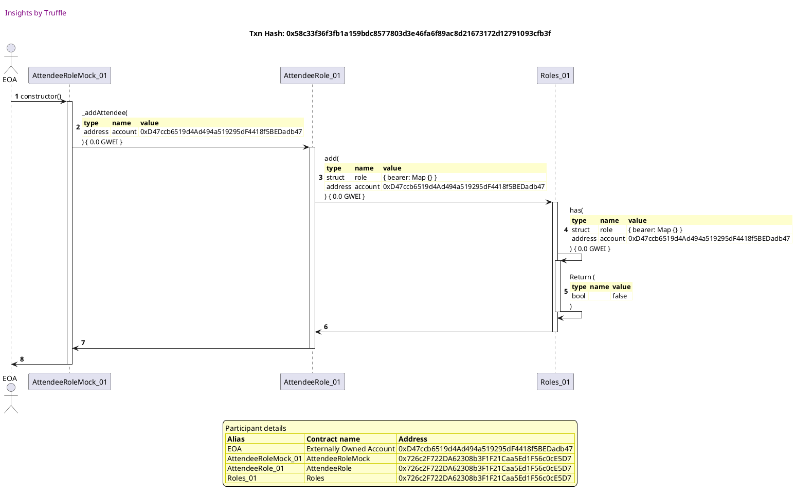
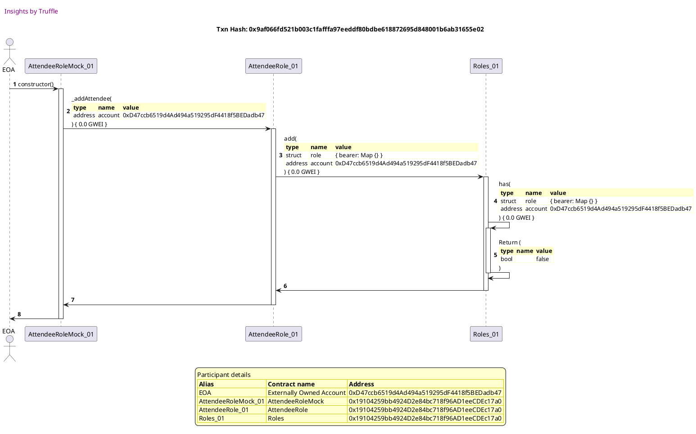
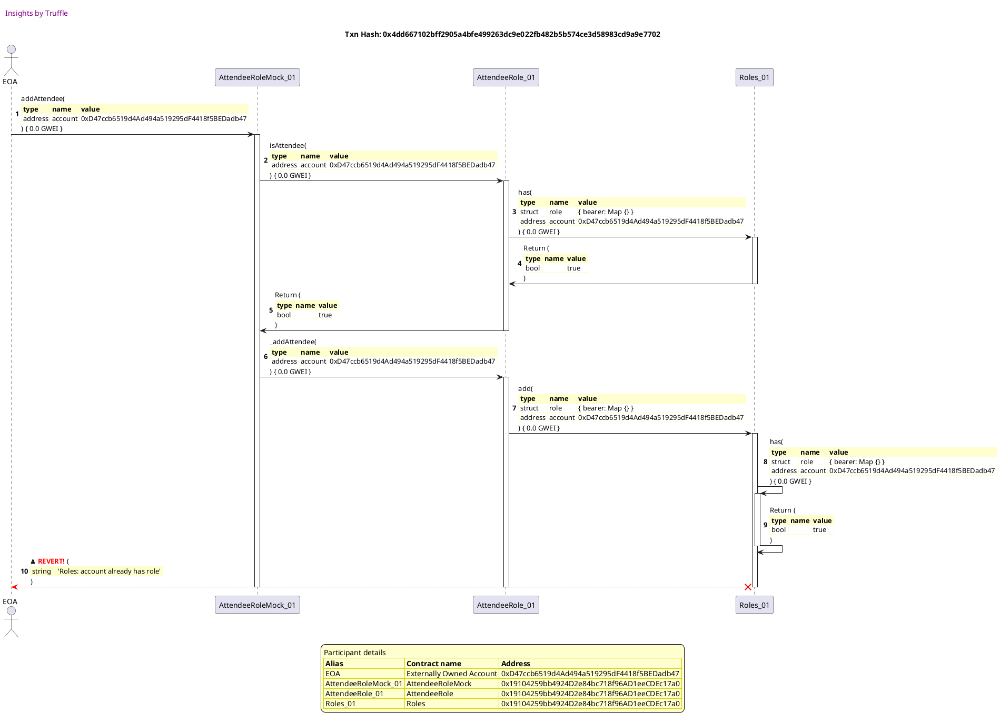
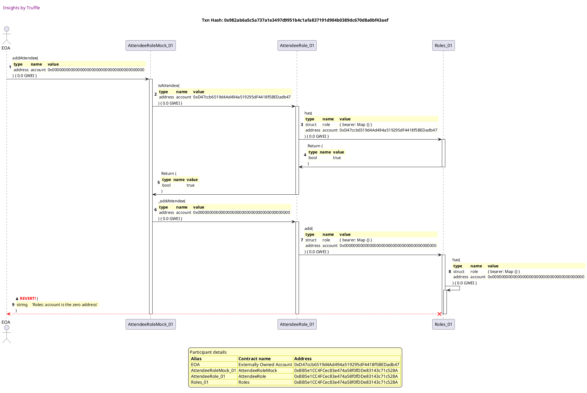

Test date: 2021 Mar 02


## emits events during construction
[link to test...](http://github.com/fodisi/hackapay/blob/master/test/roles/Role.behavior.js#L63)

##### d1, tx: 0x5109d8d29fdeccd1cb87e675f00634441966ba0ddc4a113d4c86a6af85e8a9bb

[SVG :telescope:](https://www.planttext.com/api/plantuml/svg/tLNTJzim47_tNt5YBo36vhHEcbIief-31mHYI7j1Gexjj16kKpdErbButtTDqmv8-p2clQogSfVptUy-V7SXv2nttBfYgWdXXSjCCOsL9Vb3QcRSyYbeDLP6zhXu6DkiCBAVwSp2Xz5mDEmF2JdDtKAh3e7oDr5SAWlBwXNWFBFfOsOSrrsTZirK6OU8YTigZF1m3Jahx4ohLmVVqaS57jlAhhcKgHc3HolHSqbFFrT1aCh_XSdJySJb42_WrXP9WhZ4fKuhk9qREEVvf0rqxdiqag5iH8bKGaXFn65B1Iq_eJHeCiQyA0XYJgKKZ7jUKp8H1ZpWIUYha4TnJB1amc7emwiky1mEa1uGB9jBHJhZc6hNEIoUKZUPLfUPUBYdNgcuGxxVS9THpM0bp3UQcvS3GigOuAIpsoSS7xT1P2PtjbXbSdX4Tkkz1TWQt-ELR0uExymTEQrQusD5EqzVm2rc2f0QFYtf3wuBP5RgJu00LkKv82S4TfX3Ziu7h2L47FXU95bNieXnP1kHBqTuBs7YzuO3BcFMMgCSmHBe9mfVlmyli2dgeQxYtrQb31pTlY_UTQqmI8juI9OGAswLRSCbdy7o6Px_PMQ_awYdDE7v_vJIoKaRRfGhh87tfHLdcSRuy9zmdLVYexSEwxs2VlUqqExPgEc_6flr0Avqo7gNakiNSokLuwdENoGte0DAwIevN9aupSZqSHTQN3NRDBkRQzZQTPxABOJFkLFMSAqNSFNJA0dTTrtKI-1TMwmkBHq8mHejclXUs63D0HEHz3oF1TuWR58g-ZqQjNf1u7VtEwY3_mNmTYjMx9z2OGpLdP4pVE9NyXS0)


##### d2, tx: 0x292fa14b16d4959a4d6c0395cf9cb432c60899544a644c696ebbf765d772b6f9

[SVG :telescope:](https://www.planttext.com/api/plantuml/svg/pLRVJzim47xtNt5YBqECpKcTjAvOHVfhy81036alICXnd3OYJIh7sLeA__kkQHfWf6F0sAYgtELidx_lxfmp8VkP4ThaavWGaPiqoIU-qYIxZ9Afq682iHgf9EWAUJdIQPu4lJHEDRmR3eQ3te2GlSpCOzKXKFp6IWHAmw9y1JX8TNIL9aR4NXoDaebA37eCJJLXY8ChbzDSJsDrR-1hTAN0OfNjH0H1b8p0egNfff1xdqeGfDp_CCcYqTXauC_XJETXY7w9YKoiu6oMm878ncsWCvlReR2ORxa1umuNB70bRN17Xbpwh65BbxOuTnWJBcFIvQxo_R3fEa6pQVjko0c6J1g4FZZsG6ImXNABODXC9AEfGAgUCHWyfKxJM1sbylA2MiN46llcXNMB7YnO6hFrpFNB5Y459jZjrEy9EpjjmA2knzwV9-TahqpkXr9shZ-3cKyLe4p4f93VHPoZifn-lNIWLPO1Qb9YZHZKwAp1BDcbJils7C6xNOypp_Rw3HPmnsc5tBSSny90koilsx00-f72bs-3GqnhFTfVQLGKekmr6FHPKqhVTImUC0zBX0bKRUu4GyQiLkXq1tqH-ApvE8CAVPMP0lPOPC_3cncTooL8ZVvGBC1NGYlTXYCnXSKDtBmciriIjGdPtMt3gJAvJk1vxFmqZH4c_f5cQTtU4D3wEla721uloeitVx0sb2Lk-t_AycNCxfVb6pbfhqFfBnPuAEBijiB_u6W_zI3-vjYiUjDo3bbTCyZ9dPOMA2EYEBj3ha_xbD8bERnDOAD3fOVN18rTkABfhTDGhUjS5mqQdpEZT2BYU0x7Fn8LWFUiJ-9TntKD_g6rs41APZTfw5WjcpNwJFB0iYpcMlrMWrBPwrBUxBgkustUuA7p5pYkBWob-bHNYA7C6Td79ruWVm80)


## reverts when querying roles for the null account
[link to test...](http://github.com/fodisi/hackapay/blob/master/test/roles/Role.behavior.js#L70)

##### d1, tx: 0xb7dc39e3bf023cece7edb37d26f47540b95e7752151314269fa829bb32ec5fe5

[SVG :telescope:](https://www.planttext.com/api/plantuml/svg/tLLBJzj04BxlhnZH2uZI-Xd74Oq8n2aS48WYzOA4zkN4OhEErkis8V3VEt4S5t1oA5KlZIBFU7RccyVEZ0avAImrjfmgGcXfSrrEcJIaUCZqZ1ew1IN7KejJoX_69Y-rECjLRk33A1abPmaXnuLTADadKFqcaWffO5c_0fpd9dlCjQLgeBAndafj4J6rZS883zUGizBCb7nry2rxbE06ZUoQ2f7fCRXEBNgkwF7dEWXI-x_GHJQUs0BO0cvDcQQ8IsncbOJRkOPpManwuCnP9BWVIv-bZkTpoMKa1VCZuNNI80e3XyMXZABGSqFNTmEl4wUqwyMC-PxaOIf3WYNZ5aDFhWP02zX3kaUmR3RZsOnYgWDhiNXItkHANkRyuTvnAyKjyjs6sunQ1YjXiT7SlEmHKiK4H_tjFk7mi0SyruKrvIgJ_GEoNUyjG6DyZrUoETY_qtVak6wDZpNjFtq1kvX9GAhfjA8_g2gHMQa_0G8OMHI07EVOOHOvPpuC8ivP9tHZ4Gn440SKMIyEnIW8t6uQdYP3AbWGhL4EO0dE9mU-Vayki2dQeQxYRwfI1OvktnVlkbOOf44y94jWaXffUd19Px1yXkT_cTdl9DefJMZnFwLqTDI36sbBe-5zQR4yLnWV_bEgYbfyyDPXkrVGxuuMsZuRBVrNOxCUm9KEMUzISlrYReMqD5F5Y-I6pj1nd5Lok39ncf4vmrreSDKqQGusrz3OzP-gBOJFkPL6KwKMSFLJIm63TrtKI-1jMwmjhHoCuZIbaTC9FHQ8CErquguN-IpXT13wWOFklCGTThtT3jhWVm7SRCMQ_LCeZA6-CtA2J_nA_W80)


##### d2, tx: 0x9006f8f60fdb27eb424ee45d03b4c9305360c37d46f4aafd45b4e3bafe2de966

[SVG :telescope:](https://www.planttext.com/api/plantuml/svg/pLPHJzim47xthpYnbo76vYHEsbIi8gNfu0616D9Ua90JsoKYJIh7sLeA_ttND0qmsZ5WR5HLxdAsxxxFTywPaDt2S6tAKKe8BqsUbQD8Qb9S9jcOQpw2L0vb9deylXpglCp4Nfxc6juDma6u5nAoKvXfAhi4gj-5v49gcDMl0FkvJgxopF0qI9DXDfAPGO_AD1C6EBXmEIxrE9Nt1hucLn8irjYEkH19DWIBrgQRIkvyga6GElv1LYJ32rD0D8LJNIg5Veb9J2hXT9B1FYykEa0dFgMUQYkFAX7PBHancqd9N46TYCM-Grt7ex7J4inJZ7Cbc1inwKHSILj8t_C8Rbbi47fu500lO0Fb1i5jCqcSZ3bI3Op1pPFo94_bOHvVdbEhchZ2ldxXgaKF5ioDnNBcycM3a0eJR7TNnuIjhGxWfYx7tfzbPsIdJkw7MdQlFuEPZYMWpFYeajzvMg8odtuzTw1bKG1gSOmrOb2Z4uTPSO-wRJjmkT_h1JuBxA3lCE6xRblvaUMwbl9ZR-5b4sP0FrBuyYqymBIkHlihZOP2Khm6WpvhnN7akPOlM22OppYgjk-A0MDMMxcziCz5n5gFCsZGDvcfO5_mudbu2wFBU0vIepyKCuWarr9tu92FONO3Dw_9x9R4oeHiRtVWH9fIP_0yTb6UfmWJ_qYpjcwksT3LTV8F43nUbETl_c2jAKiC-t_AycNCxfVb6pbfhqFfBnQuucbnM-5_SBIVUX1_SsmMlMa-Xook6UJuJaiJql0aBUwGwzC-fNHE3cyJsEXGsSDhWiOktD0CbcberdMlgmQDpucHEkDfEeMZ7vaK43phatZNyQe6_z1Q1HZuIl4MzLmxOi9LdkUtxPOJXJ4FN8TH36U7Lhzjhm_mqFaB73SNXbfzgYl4KEUCxE8JBv0_0G00)


## allows access
[link to test...](http://github.com/fodisi/hackapay/blob/master/test/roles/Role.behavior.js#L78)

##### d1, tx: 0xcbe7d4ee427dae96babf2b0b857d560c86825bb398434c97c814a3a91bc92da1

[SVG :telescope:](https://www.planttext.com/api/plantuml/svg/tLNTJzim47_tNt5YBo36vgHkFYfMKPfsy81036alICYEdJR2TIh7sLeA__kkQTe1BGzZsikgAdSvt_tkmtSNGavAnwsh9feGNhd2L1EXB2dlSpFbbaz0gv4oyfIdzoDRL4Rs2rrO-30S30Vz0I77fPjhrILG_yQAIsLXqRm2d1KsVoYCuxgdyv6PAECGCNCRXI4UhY2dbPrgzUBWM_wWm6CRsHMNCZSZy6WZUghfyUSc2DBuFpTbFXgx4iGSRcoLPOXBNEwqWfkPWJDUZZj0PwbGeMHACJ-KNCM1u2Bp1HLHEvJjWAPH4Fbj8Lfnn5eiZSCqyXXlyTWJQUnBxX4iMUemzC5b3tW9UqZt29RDvMa-vPXgppaidbBNXLONHNf_HxrQSOVyRSDTHbi6Is6vrbo_x15InmH7tTq-uV2m0sbXIcUhPIRx1sIttck0ZV4TNidwOF_Mt9BZfZK-DhJx-0NSVAe0gU6JclxWka9cgVu8261LMG9oQOeTvf2ZiuI5QIg2jXTBrfCiPXnPFsxB8MDUbBLF1mcNWeKhb0DO0Fr4uUltmJasnNQeo_WtLQa3HxVlYtTLAmpI8XwI1GZ5hR8TkE1JM3p1qx_Cx7SIsocDUVa_fNHqr85hvIfhu7rfYQBG61_-CwxBHdpmsk5shw3VDrfezsniwRyOczK0BdN8QfUIgsTpAvNZkIwV9PVGX5AwJ0vN9aupCdtSXHPNpIRDtleQDdRTnteBuNFcb3LSwpbS_ZHAGkzT5_KSUDSMsvRM3WQoHVtJBCHrcVXXa4G14n7h9w6V1RqXRIM1RFaUzTzsi0t-5y2RhTYmVmg5CJHtHaxmYL_9Nm00)


##### d2, tx: 0xfc94a78acb41ae9807fa4e8b7d82176c61e973a22dee5d11b71c2a7ecd512e1e

[SVG :telescope:](https://www.planttext.com/api/plantuml/svg/pLRVJzim47xtNt5YBqECBKxpis8LQTCE7X288Uq52JcsqqQaIUKuMqlXVzyrJGECTWmO6rMLkvpjp_Vvxd8cPB_GJEbod1B2IfrdvJYIYXINIJPXYeqXbKEPYIxZbqELbvdevMckuDsWF-Zt-eJi5NgMoWw1wZUIJ4W5y_eLu21NoLMUQPO6QJBCnZBJY1ZhPi801vUGar9DKdblu6jo9O5QZUs42P5aGw16RRgfvDwdsWbIxt-O5Sbmf0k8Pd2coZX6NA8JdKeucsPmm8fH6unfp7sBkHxZaKMPz3t3ZPablSWLdabTXpjK-cwBcQQGqXQKHYxb9dCb5pOr9KLCmhX6r_l70R02jb1k4JmsdV1amf1ge3KUdfIdUIgFSdvvOT1guXhxveNh5ZrOi30Mgvchbor2AfzWjxD-JzZPQGCUwchi_NbsJlRgu7wePUVwC-ZPH0BAZ8qh-Psb9IgBwTSB02MB0b3Z77D4esPCMnRbNSFspC1cVhSR-5PW1c7B4hvjUx4VKTkciS-T9SespC7uQC2NR_r33EjwRt-bqL18YjTW45ekvv5ZKrzOWR0mML0rVLiCB8jwiTtjXqn4bliuWyRx9ZALsoDMFC_VGgkIBvnKY8TY3f5aIges7B49p6_WvZMPtP9O6v3TtJQSIbsg39x7Bihp5Dt4FzAihTiR3dHzdlm33nvFoeitNrWRqXAt_Jzf-J9czzFoZLJQwr3wYmaUixIupV0_AEsd5k9locRPcnPpoFAQGKxkj3GXDKlIuWwvq0WDmrYGmzi4DZfKUdXDKDY56vh1AWpDkivrrQ3nETLIPInDPt3y8vC2WcTz4ky2hslm3wtL1dtHCinkx5hS3qtN2Jt7YZoh5xfcx0G3enKwecLImzoymKFm5m0t5uPQVIeK-b37ZEpZ4o-GFm40)


## reverts
[link to test...](http://github.com/fodisi/hackapay/blob/master/test/roles/OrganizerRole.test.js#L36)

##### d1, tx: 0x3a45ddd407a9ca70e9129bea2e44ac05de048bf2df6de532b477808ac35fbed0

[SVG :telescope:](https://www.planttext.com/api/plantuml/svg/tLLVJzim47_tfpYn5n1ZSr8dJIfMKTfcy81036alICY9dJR2TIh7sLeAtttNDCs0b8SnxMLLbRkSxtvtv_iJGauAouqjPueGNjfSbxDO6bBSPthE3P-1aXEfnIbFxYScBxKOvYety24QH-FXc93ZmYwLx1EeVbF9XJImgby1pdAJFUJQSZLGsKJFfBQ8cDf68SB33UIyD7CbNnnyonuaEAoHNN4XCZq1XzQYfueUVww38BN_Srraawaj85x2ZIdJ5769pQoISBFGSCQBQG_eeiEP9uHWjCl3X7Uf31qtZ2Lt9MCyePwGb0LnwehK5zBhk37hTWCQyAJZfR4KbE2L9HP37ryEW1UmXtIFuBNPBCdc75CTM8kN9-LrhkH5djpVKQTIt25_st2NKSjWBIoscjkNFKAgcE2elzid71xs8CbrOKsvpcJ_WEpMUmtG6DzXIRO7-xVwbXpNhV6nflt7Bs2NSmb8DPzLz0TN9J9hzKT002EB0f1B4kmmYnnTZ5WtIMBVSqB11eA5Z2FhXfw867E2r3iTZxZ0WcnG3c05z1E5hz_7vzWKxL3NyJUtKWMERjyNx-QkC4Y3U4XMW2rZfEd11P_3wWcU_cLclvDefpJbnV-Kqj5H3wwbBOs6zwKLvxd2-F2VSbNKueFN3jkzWdxVQA7Tiz7IVp4scm5Swv3DBYLNp-PMICipLJnBRaH7bD9rShWoSPgH6U8kDBXgcZG7sp8qTlt7QWlXSs6bqLof9Lp-r5B0u5s5UWwyQukrfPM3o8z6my0DV5zqHiploEZKPM6Nyf3oH7Q6dYDSdmRiRGTjyBy0RhPYpVuf5CPGruoSu1E_ahy0)


##### d2, tx: 0x9297ef3c8a34d68c6742c47e19f0de3e7d344206370787fc857bfd10d9138d9f

[SVG :telescope:](https://www.planttext.com/api/plantuml/svg/pLPjJzim4FxkNt5YNuOOcvCuRnMhIDy67n288UqB4d9Yfur8ayfnjfR2VzyrJGECTWmO6rMLkvpjy_FSdNCcPB_GNEbod1B2IvrdvJYKYXINIJRXYeyXbKEPYGwFBeSgBpFHpTDSmRj1Vz3lzWdPA_GibMq2rMyakP0AvlKhm46kagiyqpmDqcIOZMMcqMEicma375owd9Hgaifx0r-JAma6QsmdN8Wa6u91QzDD9VS-rI18lVzXLYJ3aIuWdC6PAkCO_HATw5J2sJI30rwCMa2dlkcxChOYZrjCE5xakCoCc2iDFwP2Mj8L5cCcTIoNkfuRHvxjXh4mgF0DonD-J31aaKRe_UC0U05RABS8XaqdKJBXI3NG6eCdvMcUogCykhoWHZLnZNtpmdMB7YnO68lLpDNB5Y4L9jXjhzyJTdPQW45TZRq_pyx9NftS3xLiNty6FPj8G9dnSIM_yxH4PJ7zUk50oQ80rA88QqIZHgSMCw8EjJqpiBdVwGG-2yoWXv7sRTkB_T2mRIFs8sVfPHlcG3zI-FAjVuXfNO_sLneDXQHu3GOzvaPHwDY6BrWWcCyuggPlYm5ZXXVRdNwFYv2vZpDeq3UPgM2FUF4yl8LMPRG0gT0VYZc4aYkfMd349p2_WPlNP7PBOcr2TdTRS2frgJ9u7himprE4YN-aMLktDmHqVPty0mIF5-N5cpzO6yeIj_q_PVaoPlVByesSjDUXz1SBFEPfSLlXVt2qdteGVtDibhrfCOSihndav4vB4rBp92tkaElH7gLqGGvl4zZeKEdYDK5X5sve1giqDElQrrM3nkTKIvNnD9t1yOzC2WYUzKcywtXTWtzehJOOE8DUrpCznn5MZpcM77HCvhkK-vH7qkhQXZ0Twh7D6pnq_WB7pOMXLf_g2Z7KEIFx-CGBv4y0)


## adds role to a new account
[link to test...](http://github.com/fodisi/hackapay/blob/master/test/roles/Role.behavior.js#L99)

##### d1, tx: 0xc61ddf1a24178b79ba09be8d1687431c9ab2c6b80fde462ae93227b79c071bc7

[SVG :telescope:](https://www.planttext.com/api/plantuml/svg/tLLBJzj04BxlhnZH2uZIhetZHqGZJ1w50m9Hf5wGq7ftdLXirj5wtIO4_didZkC2JWwbwgLHv1dFpdpps9an8QU5PSQMKqK8AsskosaY3IaUCZrZXar1oR7KuepnXx79IotwkSeDV1WDHyF-a92JmYwKx16eVXF9X3Imh5y1pdEJFURQCXMhRAodKbj4J6sZCCB3DUIiD3CbNnryonubE5uZksP2P7eC3gr5pnKz-Lm7GMh_5xh8nXDRGBA0MrEcAU8IcrabuNQkuPmLaoxGEVST8LA7kPuJX4aG9On6YGo5uuU1T-pmY2KkzvEGfa9wlijaTEow0Ifo6ZW93mYMZ5iCVNWL0ojW3-aUmRBPZ6SpXgd6rcBnfBp9bRpC-SCzTIh5BVBTXjkCMWOhOR7HtBpi4LB514UzxJxXyB0BFDU5DUKga_q3ibtlBK1ZV8zNiZdOlzDtvAHkZOyrxJrz0RkOIK2gsRIYFvWgaLcfFm4265aKW1pds64MEJeVU07dYTzn8k75meiyXgmRTSJ8yvmmxPmD1qmaNh16EO0bq4yKlduVNc1Jj4DTnTzKfGeStRultdMjC4Y3U4YMa4XcfEd29Pl1yXcU_sLclvDefpHXnV-Kqj5H5swaBOs6zwMLvBd2-F2VCbNKueEt3jkzWdvtjD3ssMZflngRzG2kTCXwbvBh5tChf6MPAbuaDw03IkagELoPECt8z74N6bmrJPhnvXeQkzvJjONmERVIQARK0gv-QYaWVjT5lGJUjiNQqif19-wxOUWuRkW6eZFo8zVnqmuFXhJVvpJqZWUXxyOTkjj16_mlW9kjMBD_2eKnr7T6Jl69NybV)


##### d2, tx: 0x535f7b4072cb51a2a1b58f4aaf2bd8562865963416ed4b14948894cf5d53bbb2

[SVG :telescope:](https://www.planttext.com/api/plantuml/svg/pLRVJzim47xtNt5YBqECBKdjDAbOHVfhy81036alICY9dJOYJIhRsLeA__kkQHfWj6F0sAYgtELidx_lxfmp8VlQS6MASKe8BqoU5UDGAg8lasp25Hz3AeSo4nqUNGvLNcIYcwUvWdU3_g3VxHEofyqibMq2vMyakP0AvjKhm46kagiyCpmDqcIOZMLcq6DiwWa375owd1Hgaifx0r-JAmashMqdN8Wa6u9jLQQRKkvzga2GQl_3J2V3aT4Gpk1C5N6CVeb9J2hXR9h10TUZ5bXJrc1nCwHMqub2PdE7so7pOifvx8J2OwxZkSnt6zHsfQ2XJNtgUJwDOYPO8mn3Xs388eFG-yS1S0rRABS8XiqaKJBXI3Km1eCdvMcUogCykhomx7BY6llcXUiMFLYmCEhLpDNB5Y4b9jXjhzyJTdPQW45TZRq_pyx9NfNS3vLiNty6Cvj8G9dnSIc_yxH0PJ7zUk50IQq1jIZ26Z6eMLECMzIncES4ZFkTJk3Jm0bw3IfyXb7sGvinE_OZT-bb6-PWVRJWoxV-8QPrFTfVQTGK4lqQ37gq6KMXosnVq41W-ZcgZi_4W5BRYrcdt-CYfCt76TJewyoKi4TSFm-lDgg85Y0L-aCnXr1o9LKBZlW4vZTmyvhCRaciJSZkRWjEfIbK1izZ5-PvYZ3nZpGhw_Q6WAwlat-0uF6Yl7Zp1sj3MUAs_wSiNyRiVbc-aPFsEfJ-Oe77FDMt5Vu7H_kf1_4tnsRPcnPpoFAQGKxkj3GX3KzIVOTSp-fPbhKWXxS9R7IeTF6QeB0BrpI3LHhgTUthia7ZSsgaodYQpk3uHoO51C_w9DvrlAx1FxIM6x2WwtYURJkUqnHiuFgExSOiQlQjRZUoFDheUIvMYRLvWuVEN-2ulZ1KwbDT8OOgPsGVdtY1_0a0)


##### d3, tx: 0xea31462360d374f056bb5e2d0f2a3412362b9198a2d4364c9cbdaeaaf277f07e

[SVG :telescope:](https://www.planttext.com/api/plantuml/svg/pLRVJzim47xtNt5YBqECpKcSNnMh26axU40WXhGN9EJ4Jeb8ayfnjfR2_xvhcWOOxHWmDgegTpcVFz_dE-TCo6wfkTBLA2E4Lxh8gr4a5IalqtpC5Hz19eSo5tiylXogeif5M6I5WdU3_g0VzWdPAVKqarq2zUz2SY4Lp9fNWFr2fLT5hdaMPEam7ybS8sAYMuS13YuWnvKQP_BUmDVqIeB1Mjin5oBDXs3GndHJovrFJH2aMVyWBzFXXIuXciAfgf84SObETIRXT9B3FYylEa0dabi6SqpBeS9oMK9j9ufiQGgQcDnY1WwOaM_u7ZS5inmM-t4akEGyCLqteIvY4Xvh3Br_500lOGFb1i5jqscSZZbI3RJ6pPFofCZaOH5VdbEZTbnXNpznrQG74-R6SkcvVDaWf8u9jhkhruIjhGxWfYx7tf_bPsIdIUw7HdQlFuEUZYMWpFcebjzvLg4oTx-U0oXPbe1Q76EDQDJen68zt_ICH7gX9nDBofvZM0QtJJTamHvp38T5CfB60cKJPa0_KlZohN-0QLqTxQyqMWff-HeCUioDuyYn3L-mG32VSLHDtnO3nWmliVVwFIuYvZxEe8s-pKmTzWKldnTlgLKLpuDKY8TY1f7aIgeE7F8np6xWvZMPtP9OcP3jxGwSI5sf79x7BYgA3CF4Fz9ih9jhDdHrdVo321ulolCtVx3Mb2Kk-t_AycNCxfVb6pbfhqFfBnPumhFojiB_u6W_zI3-vjWiUjFSXook6UJuJaiJKlCqA--Gwz4UfNHE3cyJsEXG2V6QeB0BjpI3PHhQUTthka7ZSwAbodcMJU7eHou51C_w9Du5NjNW7rhh1UmWD3tFC4pFT8KzS7pJS18xTliq36FgCQldEMPWq_KBF0H_0N1xOMZKfq9X34tEo2u-yGBv4m00)


## emits a AttendeeAdded event
[link to test...](http://github.com/fodisi/hackapay/blob/master/test/roles/Role.behavior.js#L99)

##### d1, tx: 0x58c33f36f3fb1a159bdc8577803d3e46fa6f89ac8d21673172d12791093cfb3f

[SVG :telescope:](https://www.planttext.com/api/plantuml/svg/tLLBJzj04BxlhnZH2wYbzViHqOYGs8K30b6aNf3GUdUTM6pMqNhT9WJ-UoUEum89bKhLIwF8CvwT-UQnCsD2ZYj3jQcdaX1QcrBLqqneKjqLQaOrdO8KOw7u2MLtOrtMYWzBMMfuboPfCam8EQhCGee-WUOt4PGB3Sls5U2qrCLzgGoL0rcCrLGeWuYvwHHIF5n3pceza-BPmTVYNe3jTR9BodcXnc1RhUYneKUVsY18w_zCLSLuOYh85d2jwpn7N68A8mLSpnMSqchI0slkHynrSpV8tJopgUt76MUH7uQHvN9NU45EWpoAAOkuOmUXQuSEjvqmjgtOPNdcvWHBnWo6dbmCW5QmXtIFODbCmOePnLG7nc3nXBWgfJWlsTsjPJUAE-Il6-uosZ9O2QkDvkPbZv0c9ZZix_O9xz_tW9MgChfUPR9_G7RhlGJeZ6_nIZO7-pVgXXorhV6XfVs7ps0MCm585Pqsz3kLDJ8hzGT002sg2f1Z33lC86VDHrx8M1RuTioz0VTYZoBhn3vFFS-ESlya6L6UUU4QvG2MO7squCktv0oROZlKLVnTLPh0qUtRubtN2eFKY8Ta2PcWMkWUdDCPB1_XyLzczYk9xPGcjFgVKZeyxC6LCBLMyBQqihAK61_-SoghLdpmqk5shw3VLrfezsniwJyRc_K0hdJ8UfUIooTpouMXXQoU93UoHfPbhPB3bOdJZCmGTw76LTEbETXSGsVNVsYs43xdHcX5fLp0nGybE0pUT55FWNTjiMrfuo1q0kQaeUEC1e7ZMb7cfdRgs4DA_OJRgHymYoN-w3SEji7_0hZRYYtxfr0OGtjdv1YV-9Ny2G00)




##### d2, tx: 0x37cd76be6aebf7e1ab4ab91dd5cc62f08ea337f9b445520b71e45bae42d56b2f

[SVG :telescope:](https://www.planttext.com/api/plantuml/svg/pLRVJzim47xtNt5YBqCRMvBQILEnYlH71Wy8n93sWeGSssaZqgHod8rI-DztJTC0ey20iL5LkSlPFd_VtJbdGdOAmxKf9oaXl3HvLauYfKbnbcHJhla4KZLIcUnnSJRIUPd9Vfxc6jw5mt3O7nAoNPXPghe4gjzOSQaqpEjNWDrS9nTvPdWQfCaecwZCeCVOD1D275owd9PwcgfR0z-I2mKsRMo7NCea6u5jrQQhIcv_ha6GUl-zh4X6OrD0D8DZNSOn-YKcCQc2u_CCTdanxe1rtlA4zDn8kLn5iQTi7b4U-RQKJ0ZNYQssugsM5_iHfOmvLkJPYhA8A-f8vaPEJ31amY3quK40l80Db1i4msOIaKmvKWsCmU0fTPIdQZyNPwUMNKrSOxz_uRf5TnOiZCLgvkfbWv0A4snrr-y97pvq08Ew6dj_afsGxJgv7slPlVm2PZPLW3BZaqh-u6c9ocBwvSA1LaK1g0c1DM9Gm-XIM_GirdO2nlrUB_1fu0I35fK-OsqCgisO7Vl2NNhPX3bOdopu-dsuXsbTZ_Pt6Ws5f7WD1WFg2H6vpFOb3IJrAKVLyPaCARNRCUiD1rn6r7kSGOE-oKm5UyoBv-4jZ2x50gH6VoZc42ckbUx0Ff_2_0gkNfFPDOcr2TdQwi2HCgNEu7dieZnF4IR-aMPjtRmdeElhv1yWUBmeJz_ymRgdB77R_rEMBsDskopVo4bx7Kf_iS1ZdXRN5Vu7H_kf1_61OxFiJOivP7dD88StMffKXYTfSOFSm1fObhKWXxS9R7IezF6QeB4BDpI3LHgQTTtBga7ZyzmedV4qdS71pqn929xrIRpfU5s3lskjDl0SLpYXvpY3m7LQLZjgXNRes7tEsL3Q8NE59OPiyC06Tvs_m75pOQZLfxf237NEo0u-yGBv2m00)


##### d3, tx: 0x552183065e890c205430cbdb12b5ddd05e19cf85bc495bb58f4d664b53fcc3d1

[SVG :telescope:](https://www.planttext.com/api/plantuml/svg/pLPHJzim47xthx3Ooz36PYTncbQi8ZJ9u0616D9Ua91ZEsr4cbIEixKK_lkkQHfW51WmDgegTpdRv--xE-UCq4vfk3RLE4E8LwR8gt6iD2hFqtp2DH_ZJ0rLBdUvE1_geihbeCWAZTz5OHGEGeIsIpFBL1_X-ZTIN2gDvyqhndk5JY-AtF3Cpz9XFbQv0O-9QIT4CBXqEQdq95Et1hwb5mfJfxKTSIdJV8WfQKnNjTp-t810pVxxUPaEHwR4yGoVw2f9m2yogSaKFfdcU8-NenucKyOiwjd4PShh4c4HvjX4n3AcLioab8GfsXM9nsBXT5aSCoznfEiwCRCJ8Mn94OHC680U7lgObtW3v0Q2i9bKf1CEL7rZ87XA7HUPEYZ4-HcXzSGrzliNhbjqPy72MAvchbus4AenuQt--ZtnXmyz345TZRq_pK_HTfFSZutiNtx1PZPH66JEnxNymRCAbCNqouK3hSeIWoO4r8W1ZKnj9-XQ7asKD_1KOYiLkDIcd5cTWUFlEYw5IAfOqQMNJJp7v1F1Nx-7-v3MzMX_fz5IIClNO10u7I5Ybz6kT7pfT1qEgjLbCd8SwYLiDmouZ9tEumnQz6rcQjWZNZuFRsbq9HOWDVW3CSUnubhf7ZxW4po_mbUloUoQnDg4R6tryB4obSxnyzZ5HP41JFW3pSQwUKz0rzV9Fq3mU56UlVc3TKzPmhR_fonVnknsMRwHa_OwbFvYWISyAwyh_0-EzbCFuWF7PjcR5dFGyfg1ZcwqDAaCJxFo1hc018IG1JcuJK2Z0sK0rmGDNRYbwQ_IqAxhNzOD6fvJetJEiso63t_cIcB_MP_4cuxNDVYxrdg3ZkKAA-fOLk2xbasys8vePD41vooKD6Ak829amGCRt7N-0iVjXQ5Hd-eAC3GvGplmX0laBm00)


## reverts when adding role to an already assigned account
[link to test...](http://github.com/fodisi/hackapay/blob/master/test/roles/Role.behavior.js#L109)

##### d1, tx: 0x9af066fd521b003c1fafffa97eeddf80bdbe618872695d848001b6ab31655e02

[SVG :telescope:](https://www.planttext.com/api/plantuml/svg/tLLVJzim47_tfpYn5n1ZSqAI9XMh24qwU40WXhGN9EJ4JXlXEfNZR2s5xxvhccP0seSnxMLLbRkSxtxtntSNGavBmxIfff8GLfb2LTD4Q58-v6h6D9k256EX-1bB7yQwg1GV5hBGy64KZ-9XJCX9QHPI30ZKlubWN6XODgy0vuNE7mjbc0nbFbPJeGmYPgPL6E7X6d9MwPaKhmw-vOy2BAULNJFESpK6YpQYvvgUV6w288t_2rNcuuaf8Ld0hQwo3769oOqKS3jNSCxAIH_eF60PzRoCkxQLK7gSMXdBiem5FI4uptoQy4Hubk_tR2zmkU_ub5g9nv9ZotDTGMs29KiDXXvVXS1As4EwHx1i9a_p6SDKGsEmU4BS559S5kd3FRLgnItotORRZ3e6As6vqToyx15InmH7W-q-uV2m3scXIgEhLIRx1sIxtbk0rlWUhsHpi7-dxiX9qneV6pfu-W9cCHE0LB5fJNymMI6pKdy21D2YB06vDCKECyZHUUJqqZJnN2lWJiYTm678sdWD8yUn_CmzYoF64wUtHZc09T1F5Bv-Zo-mARgXhk9lgr87ZcxV5--wLXYaHZmaIqW4qqBtuPBDOFaCp_yoizz9T5EQiF9_Ikdeg0ytmbHQmVlIIef2OdpupvWi6_71MuVTNa6_Erfe-snqz5-DpNe0LpfalKl9zOkvvSAmN9OlaejeH2bT9OSh4wSPcI7kGeshfaqpt5n3QpTughSGFkT6QCMaNC3LJoKuXE-wg9V0sxPOLrexi0ABEhOR98aJs4va2zz9qXv21ruOMK8CepYrUepkTj05_mlWTYisx9z2OGpDdP5JVE9NyXS0)




##### d2, tx: 0x239f5c7814c6ba98c23870eb15e16dc90d4da6284b228b8957410c1d06468c2f

[SVG :telescope:](https://www.planttext.com/api/plantuml/svg/pLPVJzim47_tfx3Oon1ZirCdZIjMaVuRF20GGzeB4d9ifur8ayfnjfR2TzyrJGECTWmO6rMLkvpFv_lTdNE7q7vkXR75E45853PBYt6e3SelutGYZ1ZZH0zrgZf2NWvDLgIgcoMPmUy6_K6_sqTeBxUpHBSHBdyZBPGsU5wzOdoGcVWgIwr8WYGUfcETMh0OsLfX08jBavF2J19zR-5hVAKnPRNiH2WLfqDCIIMwAUdUfye9L9r_cERnS6Hp7CxmcIcY2EmY6zj4uxDfYWz4FcfXCdKQF79bqwTCUg7WldGQVfFeaBgQUafoefWIdkEpq77yqETkar4YgI8Uyq0vGX0oQS7r_d60HOwtW6uX29kDPJmH03Mm5eAdzMcMwADCNbuGMYgkaM_Uk6xJWmqBORxINBri8LJwX7VRwy_4Epij345ThRq_Jy_HNfNS3nLjNt_6TZRH66WgnYNzBf82c8NwzSA0qNcEWPCIQiG2HwODHcM7kBuJk89tEW5dWHFq6annr_KZ3b5sQSIbjxIoZUUOV2JuoxV-8QHrlRU_mgWXnFbh8EYnffIXvrAkMA0OPm9OXxjgm1Zr8xVJxmaLikRZ26hlwyoKRez4_Zn_SsiAkN3IW3qWSnngORHfuICnmVCRVFEQo6v1h4t8xcuBdsfRc1G_3rsOPGcu2N-0MKctDmHqVPty0myUBygBDt-nDfGb7Fj_ol9boEwNvHkvQQy3wIyMU2II_BR2_-1gF_KY_kRQB7lJGWSjnmnqSgUbAMr5dEHtmFL8Zn2o00VJ13GwOBem9XZemZNCO9M6Ub_xkcpGy9nQRLAH93Dy_2FL2WVF-YJUDRokmJ-KbWTGJWbpN1w6Z3kivsYOAsGJJ7Clw56jkxs-f4r1DX_mqFWB3DS3GyK-rHJuKEKCxSCJ1iYV)


##### d3, tx: 0x4dd667102bff2905a4bfe499263dc9e022fb482b5b574ce3d58983cd9a9e7702

[SVG :telescope:](https://www.planttext.com/api/plantuml/svg/tLPjRzem4FxkNt5hfNMbOtDIXn34K2c4jH-gLgpQFgnJvSI6HWq9SfmMIllVTmaXPGCqhLEdRWZ5bxFzt7ClqHqX1udcIgUZa12UwZXAHvvK9BaEeZ5NV0IX7Cf877B_UgZYD1ATE8mLRFVSdjjn2MacUXhA5e7yToMva0fcnIl0KQo2kpZIF6o7mJ0QoKWZua2N1tguEOSSfseSoXysFWLt4WnMwiwu444q18CMgeTyRRulI932_d6K1CChdO0tXNEL3WQ8ItIWGmddamYEU7BL03fXGjHgja5DRp0m7MfnvWqaSnopjYzyHrBJ77YiRdgMPzdCb_l2gZlrVLyut96sJKs28VCrKdTFsy0JsC9rYs3OTE07OuwkjhN6u4dPZqDv4llNbzJ83wxHRxwuxjBAXKoPB4ukNhO8oJb1jRNU9kpjDG23kjXxSn5Ta6QHtBV5shh_07ewbe1hn4VvUiF358Ni-7q6e6II04g-ZpMYKQAJBhDztwjPXYDOMp27SHHDnn8znepwm3fqkrnup9wZxC8Cw3iA7x-unvZMzMn_TgDq8KXUjWSb-p8pEUqhdZoDRw9LwcSa5UBXCWDFSYLL0qxu66OFyF2SdZqwiJOXrMe3-bAdAeAdUUV5SOWqyOzk5jhT3G5TNoT_WS6lY_BonNzO6yeIpVxxPVaVVcbBRyzKu8yM9jMlsqgARvdTUGj1aytNjrn5s85RqFJdSm2UQLKgVVUpspz_LQaqt-VwrYPQMJop3fwRtidDDSfuyL1X_vvcoSh3lRFW9IJssU26QxdSsvQrAxrnqsRPRSbyi25dIqrKICs3C5dYtQLTIcaMJfnVa1OA7HnC58ANWMql4b_UGp-paG2V4orLnCDm2gUtaHJGVb9fB0El6obMjRa1mp4eCot7yvXZigufwyppROHsQksk8MMdw_g6pUbc0wlWVm1SZYY5-BjGoA786Jd09uwitm40)





## reverts when adding role to the null account
[link to test...](http://github.com/fodisi/hackapay/blob/master/test/roles/Role.behavior.js#L113)

##### d1, tx: 0x44c2550f4ef2351ee22b4a3683b71460874b991bf0eb5346acf87352a094d95e

[SVG :telescope:](https://www.planttext.com/api/plantuml/svg/tLNVJzim47xtNt5YBo36vZHEarQi8lqrU40WXhGN9EGabpR2TIh7sLeA__kkQTe1RH_6j9TLLUvoFd_tdNrtOUoiiDBOSg8OawNDTJc9qB3Y8TDJQUG458vG9rqPFunCNkgabwlSm8VXO3Ze3HWxBUnSOOT1zHkZJD30edu5ECzDzfXhArMeif6UeBQ4cDgDmv0MLv3JqamLlbhubZqYE69ZkvP9akaHEBmsFLVoz7DDWjNnBtIHZSQsW6WEjwPCKy9bDhCAuNQcuLmMupRmcH1nm_DuAZ1jk9w3s6X4GhhDm8ryHpHvu8kerNAYb6FakQ8fupJmNQyXUKiaBOymcOmjKHzSXI0BE21vmEZOR1PdKqcfXjRIuI7Uv0ely_ZXdZkLumxx_esxDcrjM1gBjUVwvO2nYXEST7R7XEFZDiIvBgmfbvaS7h7TVcy1DfllwKhM2uTt-ewTrgNniPQTfozWvrC4abfEAlb3gfAKfViJ4831eW3IufWgp9B6PttXnt7Kz9nM8i94j8GajT7oag4GJf1wtK5V9f7mLoX7i03-YSFNxuCBAefjgal-crEfY5FOz_5TdHMHD8H7OW4HIeEc3PTo2ejdUFwNcVrEOZkbiIp-fvHEJjfmWxOq6jwNLfJdYlZHFvMggCr7RmDkrmh5tLD2ktjZo_zLswmQSEd3LhEKNR_esmIjp5Jn8ha-xtFEbydHoAHk9gL7iz3GgDca6QwlORElyrHD8NhEB1ejbPh3rK-D2OJlkgYNmBkcsBQr2j3jUkZqUcBOmpXmKVWK8KXvskzZu3h2ZNqdzXf1k3_0DlXV06-cOgt-AHHngE-CdT6JlfA_0000)


##### d2, tx: 0xccb0353d5bb0aa9c7a596ac6019914b860d1d06c61a5a2d5271e995c43cd5155

[SVG :telescope:](https://www.planttext.com/api/plantuml/svg/pLPVJzim47_tfpYnbo76PhTncrIi8lqtU40WXhGN9EJOJXkH9fNZR2s5xxvhcWOOxHWmDgegTpdRT_UxE-UEaFtC2cFpSKo8o6sQvED06v9THib46366M0zreZf2NWvDcYUgcyQfWNU3_g3VxHEobzbPhDi4Yjz82wKDpCjNW8FKH5TfOaNinz4m6Ul4eiRGLXi6kBXKESdD9DRt5hv6LngOKybEX59HCWH6Iz5DGVS-bKwGqlvXaaN3aSqWcC6PoSCGzH8RsLZ3sJI10v6DMa2dKWQqpkkA1m4LmfDDmRs6a0tAF8yvWTkWYYdQa0qckAWfNcioxNbSEdMfEEESOCYaHTVxnpw83BQGRX4CcuraD148rRSMWwVrQHhherHUNb1MR5mZttnmtQ471nR2RBLpzR95IE4JxBRNsuITdHPWK5Thxy-JSx9N9lT3ITlNdy7E9XgG9c9SqEyYpf5PRBzUA30wom0vAR56B79qMdUOx53krdmkl4x7zno_vlVgZl8uTqClm02oq9EDfPPjc0FzIE7Bj_uXfdMzjx_2g214sMiWw3bDB946PvvoVELuZa2svd4rS1pcXhpJxmaLECt74LJULvaft1w9x7d-PjRaSk6aGNr8vX1eORHfmP6OmFm6RbuJsIs8jGdPtMt1gRQvIU1vw88qZT5D_2FCKhgz8Q3hw-GVUF1uKLwy-OkreIpHxFyfovSXkr-MR-IclGwalrZWeOYpsmh_Wwlzr8lucskpx4sBFMGvPf2JEorDQIkYEBi3haTxbD85E9mciD4XqyKnmM0Nhc3wgpHKvzhNHOF6vzHgauWudi7nZqGhy9_rIRohU5s3VoWj37GwNBDkrnbqjNJhsccY1JUaOQ-dtJh3cQB99A-v_cO33vM_G74rC9JiKrMX3sNEo3u-SO3y2G00)


##### d3, tx: 0x982ab6a5c5a737a1e3497d9951b4c1afa837191d904b0389dc670d8a0bf43aef

[SVG :telescope:](https://www.planttext.com/api/plantuml/svg/pLPjJzim4FxkNt43QOmoHa8JabHTHL_ImGS4wj3sOKp8iPqs8aqgnu6Mmd_V9KspihPYWx4HLJtdRDyzpzqvPq8E4qMbIeSX8JHLSPGEFI59SXL48ohf44BH5n5lKNRLbt4QyNOSnX8sksxNRRk4r1Cr2KM3GFuC1EL2mhHu1JYAPN0RHug6pJ3eHqCHARJegt915oTd9aUf78NYmSJdu5Q0RfIwCyfv4FL1rmhLVIxhUmK8KlW_ZfAWFr09U1CubwdlersY0XKAE1z7S4IJGGsqiMFlK--0cioaLjMYkgWQZiKTnzGzW-dKftRLqXsTEvhXQLNRuUp0qhXDDSytgbJu14F6549tJvj04zX0kK4mR2fWmOWYrQPI63mXUd4eJc9sTQdf-S8L-lKRLsrQsf0fa_dA-Si68Jacs6sizWaxEpN0eCxdtbr45wHU9FTz8Hjt7q5DHW9GHdIOosiQfZZ8bjzb1gH84i0HOrWZ2aVQMFlDPsPb6wQWVT3WqrVt6DEw6kslD4eAGV8I33g6nPXtOEeEDvhSS0oAmtt7v5t3q6tVRBaToZt3Ufn1YRxCJ0vxG9EduKsKJ5a6Kg8z55Fm19L2rk24Zc1w3_SloUmdYPK9sTsjGK-eL4RmD7PU78S84tz8iz1khmdewZhv1mWUByhBLt-mrfGbklq_PVayPW_ByfMSjBz5QRpxRLCA_ZsZDlkaOutNtzvG6M57R42TpVeohcbKAZttYzixVrEfrFToVMFTESZuPHqrh_Mjt5sjn1yae0O2ReMCv-osvcU12snzmJLLOh7TFAvTQcBh9iksI6Ot47AsqEsuK3G8amL27Qs3KSpIYHSDx84uQECDGgBnCh7DUORAVHY0h7VZ_rW96T4mdC3fJIGuD9_qjLmqlAhtBsjp1wsMAVHss-Ys1REhmh3GW-rhVgSZxAfkL9cbCtFVRgvti6py6ORBkqGn_5DJYA786Jd4VxnR_W00)





## removes role from an already assigned account
[link to test...](http://github.com/fodisi/hackapay/blob/master/test/roles/Role.behavior.js#L127)

##### d1, tx: 0x6d0da63caf5379195c816777a90d067b76739102f0a4a5ff43433830ddb42d4a

[SVG :telescope:](https://www.planttext.com/api/plantuml/svg/tLNTJzim47_tNt5YBo36vZGVRYfM4MWxU40WXhGN9EJ4JXlXEfNZR2s5_ttNDCs0j0zZsikgAdSvt_tkplSHGauAouqjfueGNjfSbzDO6b8yP7h63P-2acEfnIbF7iOcBxKuorLkuCDeE1gU3GavBkn2oJw1wZUHN4W3o_eLu3mtsMEkBLUHoiPwAhL5nDGs2YCyN4FEIZDJyjN1j-nHWkCricikHAR7uD1Qz5pHuyzr4AJsVw6BR3on1SGBk3LbcY8kiPbL4cxd6ivvCUa1dGU22Xwu2KzzbuLEw2TT9s2CyP0A6h2O1SmD7Tf9AVUudwQUwxbkrwL2n5v7U9pWbIKMGnzUHS0Bs4EwH_3QR9PaCuwfHjRYvKbvaojvcISFzzIf5BV8TnjkCsePh8J5HdFpiaT85HCSzRVxXCF37YIvBgmfLvdi7v3jUcy16kDxBCdcOFzEtv7ZkZK-rhJ_z0NiOYO1gURJYlxWgaHcfVu4261aKG1oIO8TPf6Zyu77aYGEV2SKNYIy40lWX9tG5oFFSxgfVpeSS2m3MwCSm1Be9mfVlmyli2dQeQxYRswb2XpTlY_UzLrXa0Rna2mXbjn8quDBFeFbCpp_oyn-9z5EQSAB_ocbewCUt4XR6WtlIolESuNnuJ_bggZ51syTjdi5_UveeUspqT9_DJRh0LpfaFKk9TSlvbP8opDLl4XkG0UKqbLok39ncf4vmrreSDKqQKQRCZHs_QTg2-5pRgNHNAa5NFtKKa3qhaAz1DwsnThIoa77znXpqjDErsSTdyQY6t3NSIFVzyCk6_XHmXtcTWQx7RJ1_mAusOer-wTG64DTCtA2J_nA_W80)


```plantuml


@startuml

autonumber
skinparam legendBackgroundColor #FEFECE

<style>
      header {
        HorizontalAlignment left
        FontColor purple
        FontSize 14
        Padding 10
      }
    </style>

header Insights by Truffle

title Txn Hash: 0x6d0da63caf5379195c816777a90d067b76739102f0a4a5ff43433830ddb42d4a


actor EOA as "EOA"
participant AttendeeRoleMock_01 as "AttendeeRoleMock_01"
participant AttendeeRole_01 as "AttendeeRole_01"
participant Roles_01 as "Roles_01"

"EOA" -> "AttendeeRoleMock_01" ++: constructor()
"AttendeeRoleMock_01" -> "AttendeeRole_01" ++: _addAttendee(\n\
<#FEFECE,#FEFECE>|= type |= name |= value |\n\
| address | account | 0xD47ccb6519d4Ad494a519295dF4418f5BEDadb47 |\n\
) { 0.0 GWEI }
"AttendeeRole_01" -> "Roles_01" ++: add(\n\
<#FEFECE,#FEFECE>|= type |= name |= value |\n\
| struct | role | { bearer: Map {} } |\n\
| address | account | 0xD47ccb6519d4Ad494a519295dF4418f5BEDadb47 |\n\
) { 0.0 GWEI }
"Roles_01" -> "Roles_01" ++: has(\n\
<#FEFECE,#FEFECE>|= type |= name |= value |\n\
| struct | role | { bearer: Map {} } |\n\
| address | account | 0xD47ccb6519d4Ad494a519295dF4418f5BEDadb47 |\n\
) { 0.0 GWEI }
"Roles_01" -> "Roles_01" --: Return (\n\
<#FEFECE,#FEFECE>|= type |= name |= value |\n\
| bool |  | false |\n\
)
"Roles_01" -> "AttendeeRole_01" --: 
"AttendeeRole_01" -> "AttendeeRoleMock_01" --: 
"AttendeeRoleMock_01" -> "EOA" --: 

legend
Participant details
<#FEFECE,#D0D000>|= Alias |= Contract name |= Address |
<#FEFECE>| EOA | Externally Owned Account | 0xD47ccb6519d4Ad494a519295dF4418f5BEDadb47 |
<#FEFECE>| AttendeeRoleMock_01 | AttendeeRoleMock | 0x254771fB2857250bd86a313A555987D5Aca1732D |
<#FEFECE>| AttendeeRole_01 | AttendeeRole | 0x254771fB2857250bd86a313A555987D5Aca1732D |
<#FEFECE>| Roles_01 | Roles | 0x254771fB2857250bd86a313A555987D5Aca1732D |
endlegend

@enduml
```

##### d2, tx: 0xbb62c9a165d3cf65333dbc2bdc2aad96de892ecaecec8ac28ebd944919d57f45

[SVG :telescope:](https://www.planttext.com/api/plantuml/svg/pLRVJzim47xtNt5YBqECBR_S91MhI6axU40WXhGN9EJOJeb8ayfsjfR2_xvhcWOOxHWmDgegTpdRv-_ptULCoAusJ9bob172IbFavIYMYkZBD1ypnKQGoQ7CHPVnow4gobpi5LcXuDsWF-ZlzGdPqMQQoGw1wdSXcP0APlKhm7wXqgiYDooBidIOZsHkq6DYcWa375ou79TgdCbx0r_JAmcsrzYEcH1fFWJRgaqtbTpvL8CWzVu7kKw75qP3F8LJLIO9-YKcDPc4qqaE-qnVjC6Qn77BuI6pMrIuF6bHrtL5p9rOS8Sn4RQ43497SYQvv07ZJY1Z4NfUQ8U2-eb72HuPDmYzVnG1qx21SeFWiPcKfsE6L2DZyF2aF2aoULZmotFBhYQkiAzVk6hHWmLperxENBvi459XWktEwZrXQwiDUAZBiVTd-HdPgOFxePQTwyzWfcC9A7CsgkHtbfMepATVpnqegJMWnZdcY47DchYUpRiM3Po8ih3RZK8lSgAUwucGqY09OvjIEmbvQ-5b4sPWVRJWoxV-0OPrDTfVQJGKKlqQ37gUptdSeXXlBn9Uw35KdP2AWUVPGKAx_HuJiUS_pg11tqIcWdt1zFFmQgDAFWUfq1-A6SIIAQdQSCZ6CBk1czTaTajYPK2sjzjm8asfSdWUkxWeCeI9VwHPMpVN7EZgFFa721vFolCtNrXhqXAt_Jzf-J9czzFoZLJQwr3wYmcUi4pVPlWVbFPJ2_4tPRFeJVCvP77D8CTtMfgGXgMPlaEkP_KiovgJmzi4DZfKzl2QeB0BDpIZPHYQTPthga7ZSsAaobcMJU7eHou5HC_w9DvrlAh1FxHM6pZKytqxwJe1zHrgnI9eCTTs8qff6FWz6d5c-wxJMx_1G-SlSDnS66hrgQuGGnqpiejFl43-1000)


```plantuml


@startuml

autonumber
skinparam legendBackgroundColor #FEFECE

<style>
      header {
        HorizontalAlignment left
        FontColor purple
        FontSize 14
        Padding 10
      }
    </style>

header Insights by Truffle

title Txn Hash: 0xbb62c9a165d3cf65333dbc2bdc2aad96de892ecaecec8ac28ebd944919d57f45


actor EOA as "EOA"
participant AttendeeRoleMock_01 as "AttendeeRoleMock_01"
participant AttendeeRole_01 as "AttendeeRole_01"
participant Roles_01 as "Roles_01"

"EOA" -> "AttendeeRoleMock_01" ++: addAttendee(\n\
<#FEFECE,#FEFECE>|= type |= name |= value |\n\
| address | account | 0x341cB0582A5a9BBA94A2AD34d9558f9b1551f9c6 |\n\
) { 0.0 GWEI }
"AttendeeRoleMock_01" -> "AttendeeRole_01" ++: isAttendee(\n\
<#FEFECE,#FEFECE>|= type |= name |= value |\n\
| address | account | 0xD47ccb6519d4Ad494a519295dF4418f5BEDadb47 |\n\
) { 0.0 GWEI }
"AttendeeRole_01" -> "Roles_01" ++: has(\n\
<#FEFECE,#FEFECE>|= type |= name |= value |\n\
| struct | role | { bearer: Map {} } |\n\
| address | account | 0xD47ccb6519d4Ad494a519295dF4418f5BEDadb47 |\n\
) { 0.0 GWEI }
"Roles_01" -> "AttendeeRole_01" --: Return (\n\
<#FEFECE,#FEFECE>|= type |= name |= value |\n\
| bool |  | true |\n\
)
"AttendeeRole_01" -> "AttendeeRoleMock_01" --: Return (\n\
<#FEFECE,#FEFECE>|= type |= name |= value |\n\
| bool |  | true |\n\
)
"AttendeeRoleMock_01" -> "AttendeeRole_01" ++: _addAttendee(\n\
<#FEFECE,#FEFECE>|= type |= name |= value |\n\
| address | account | 0x341cB0582A5a9BBA94A2AD34d9558f9b1551f9c6 |\n\
) { 0.0 GWEI }
"AttendeeRole_01" -> "Roles_01" ++: add(\n\
<#FEFECE,#FEFECE>|= type |= name |= value |\n\
| struct | role | { bearer: Map {} } |\n\
| address | account | 0x341cB0582A5a9BBA94A2AD34d9558f9b1551f9c6 |\n\
) { 0.0 GWEI }
"Roles_01" -> "Roles_01" ++: has(\n\
<#FEFECE,#FEFECE>|= type |= name |= value |\n\
| struct | role | { bearer: Map {} } |\n\
| address | account | 0x341cB0582A5a9BBA94A2AD34d9558f9b1551f9c6 |\n\
) { 0.0 GWEI }
"Roles_01" -> "Roles_01" --: Return (\n\
<#FEFECE,#FEFECE>|= type |= name |= value |\n\
| bool |  | false |\n\
)
"Roles_01" -> "AttendeeRole_01" --: 
"AttendeeRole_01" -> "AttendeeRoleMock_01" --: 
"AttendeeRoleMock_01" -> "EOA" --: 

legend
Participant details
<#FEFECE,#D0D000>|= Alias |= Contract name |= Address |
<#FEFECE>| EOA | Externally Owned Account | 0xD47ccb6519d4Ad494a519295dF4418f5BEDadb47 |
<#FEFECE>| AttendeeRoleMock_01 | AttendeeRoleMock | 0x254771fB2857250bd86a313A555987D5Aca1732D |
<#FEFECE>| AttendeeRole_01 | AttendeeRole | 0x254771fB2857250bd86a313A555987D5Aca1732D |
<#FEFECE>| Roles_01 | Roles | 0x254771fB2857250bd86a313A555987D5Aca1732D |
endlegend

@enduml
```

##### d3, tx: 0xba00e35ae97bd829190f0edebed2679a23c6573f1b1aca142d2c2fc21ad5fe1b

[SVG :telescope:](https://www.planttext.com/api/plantuml/svg/tLNVJzj037w_ly9YBqECBPSVJLAnYhHf1my8n93sWeGkEQUDI2_LvS9Q2l_xt3Rjsb5j0caFMnJ5Ff_FzcSdNnWxhOpGfXuNZ8dQbAeU9wXPTP-hYT1Y30KEKSckIE-7kgoLx9L5gU7Te3_ez_gCdLHcLc27mV8QeP2eOTui0SvAdJ-MoeWYAlAX6gCo534p6uS1RQv2JcezAN1dusl-YC3TZUrAI9ch8N2hCJqlvScdfWZMv3zNLJuScGgI6TpeEiieBZEvAH1kfWhEH3LgWpLDX6MXumaC_KG6TiX3AxDGOeBIRlcXi9sqvVbEnXCkKi5TMzgfdQKs5zBBa2UCMfOQAhr_6O6eu83a0QEscJpD9uAWHiPGyn2lom8lolJ-pk9BnptstOEBZMhjlLuSCBPC0SUT_I7WwAWD6iVb0wwttz-gMtRIZEj38pjFdy7C9WWabHWlvOCeQb8Mxaz0VTPOLK1QcjBK3MdMD7RzD4rQ7W-b6qatT0MfTkZ9WUlo8FEw_LZ8nFLNKGvX3jP72xvywv_JeFON_5iaT_ySbCsajYRnjh8he-jqKQkca2JcaA3GgDjm8IOmVuRdlmdm9uwNg4QY-fyW7H-tuHfDhHMy3LPIbWNLHpVXQwo7l-RR_yPGwjT-5tyuiwA7XGzR4JUxsc8LYKRaHRM5CRPYox8M68cVYMj8wH7nQkAr3TfeFOtDkSxJalBeEJMebIYA6Ln-LoWXsfgNuyQX7V0CWrw0cOCOjxZ3XMVxFJVgkYtUSXFYMhuRU1zblhGk4zYUw_iywzg1vzkUHHpU4Wvt8i_pmi2FlOX8stViU3V1XbeRzRMXg8wcjUoKdlJd_040)


```plantuml


@startuml

autonumber
skinparam legendBackgroundColor #FEFECE

<style>
      header {
        HorizontalAlignment left
        FontColor purple
        FontSize 14
        Padding 10
      }
    </style>

header Insights by Truffle

title Txn Hash: 0xba00e35ae97bd829190f0edebed2679a23c6573f1b1aca142d2c2fc21ad5fe1b


actor EOA as "EOA"
participant AttendeeRoleMock_01 as "AttendeeRoleMock_01"
participant Roles_01 as "Roles_01"

"EOA" -> "AttendeeRoleMock_01" ++: removeAttendee(\n\
<#FEFECE,#FEFECE>|= type |= name |= value |\n\
| address | account | 0xD47ccb6519d4Ad494a519295dF4418f5BEDadb47 |\n\
) { 0.0 GWEI }
"AttendeeRoleMock_01" -> "AttendeeRoleMock_01" ++: _removeAttendee(\n\
<#FEFECE,#FEFECE>|= type |= name |= value |\n\
| address | account | 0xD47ccb6519d4Ad494a519295dF4418f5BEDadb47 |\n\
) { 0.0 GWEI }
"AttendeeRoleMock_01" -> "Roles_01" ++: remove(\n\
<#FEFECE,#FEFECE>|= type |= name |= value |\n\
| struct | role | { bearer: Map {} } |\n\
| address | account | 0xD47ccb6519d4Ad494a519295dF4418f5BEDadb47 |\n\
) { 0.0 GWEI }
"Roles_01" -> "Roles_01" ++: has(\n\
<#FEFECE,#FEFECE>|= type |= name |= value |\n\
| struct | role | { bearer: Map {} } |\n\
| address | account | 0xD47ccb6519d4Ad494a519295dF4418f5BEDadb47 |\n\
) { 0.0 GWEI }
"Roles_01" -> "Roles_01" --: Return (\n\
<#FEFECE,#FEFECE>|= type |= name |= value |\n\
| bool |  | true |\n\
)
"Roles_01" -> "AttendeeRoleMock_01" --: 
"AttendeeRoleMock_01" -> "AttendeeRoleMock_01" --: 
"AttendeeRoleMock_01" -> "EOA" --: 

legend
Participant details
<#FEFECE,#D0D000>|= Alias |= Contract name |= Address |
<#FEFECE>| EOA | Externally Owned Account | 0x34D9281fe8C8ef3eeD6131a527C4AB46164bebe1 |
<#FEFECE>| AttendeeRoleMock_01 | AttendeeRoleMock | 0x254771fB2857250bd86a313A555987D5Aca1732D |
<#FEFECE>| Roles_01 | Roles | 0x254771fB2857250bd86a313A555987D5Aca1732D |
endlegend

@enduml
```


## emits a AttendeeRemoved event
[link to test...](http://github.com/fodisi/hackapay/blob/master/test/roles/Role.behavior.js#L127)

##### d1, tx: 0x8e4e50b5860e15ef30cf64e31687bed814b164b7c117abfcd8fca875fdf62e38

[SVG :telescope:](https://www.planttext.com/api/plantuml/svg/tLNTJzim47_tNt5YBo365jDyjM8LeMa73mZ4aFQ2X1pRQIDSftAShQNml--QfXcGzc5CUrbLvIxdkzzz-Ev2o6bXcR7bL172IflhSff8Gug7JC-OOLDGSYorE6FyOMpoKej1hd837qR3qN0m9EIai0ib-mIgtqGo8GqiwrU0yznaZxcsJ4Kg6-kfr1OHKzieZF1m3JahpKp9LmVViaS9r6rarqo8J8-1EhNekQ8dd-iWIEt_GXVPU68BI1PmQyeqHLnYCwiatCurdBDYqWDd7afNUaxYXRuZgIVJZiDJtvKTweT18aL8tOJwRX9mIWEMf5o4AMTXuAKYzOzb9oHOCcunzE5L1Ao0FQHx1CjcCvxD6AOQMOl5a_8cL_8ovm_t3gqKjyXt6supQXciXCL6S_EoHqWL4nprj_k4myCUy5mNrfIhJFOFo7Qzjm2DyJrUoUPW_qxVaPEwDJxMjF_q1UnY9W6fPjEA_c2gH6Qb_WG8O6HH07ASOuTPv9nvx0QS9xv7kyADXDjr6RB7NK-CN9U6gNSsZ9b8t62DSW1BS3uvyFNxy0AReXtgAlwcAbNWwFPzyQvhXK4Qn4EoX4Go8qqFBjaCbi_m_2yp-vr4EwK9A_wdb8wEUd0ZRMaql2-j9CyLneV_bAcY5X-yTTZk5VIxeuMspqPB_zNOh0TmfKFMkvHSlvXR8ItBLF4YkTY97STP9OSh4wSPcG7kGeEhfaapsbn3OzT_ghOGFkTM6isKMi3LJoq5HE-wg9V0sxPOMrevy4EFTfmuxevermk2CFHfI9E15_lXq8j6PxxF1-BOytOxQ8F_1N2p5MlsJw4mXlhEo2a-yIlv2m00)


```plantuml


@startuml

autonumber
skinparam legendBackgroundColor #FEFECE

<style>
      header {
        HorizontalAlignment left
        FontColor purple
        FontSize 14
        Padding 10
      }
    </style>

header Insights by Truffle

title Txn Hash: 0x8e4e50b5860e15ef30cf64e31687bed814b164b7c117abfcd8fca875fdf62e38


actor EOA as "EOA"
participant AttendeeRoleMock_01 as "AttendeeRoleMock_01"
participant AttendeeRole_01 as "AttendeeRole_01"
participant Roles_01 as "Roles_01"

"EOA" -> "AttendeeRoleMock_01" ++: constructor()
"AttendeeRoleMock_01" -> "AttendeeRole_01" ++: _addAttendee(\n\
<#FEFECE,#FEFECE>|= type |= name |= value |\n\
| address | account | 0xD47ccb6519d4Ad494a519295dF4418f5BEDadb47 |\n\
) { 0.0 GWEI }
"AttendeeRole_01" -> "Roles_01" ++: add(\n\
<#FEFECE,#FEFECE>|= type |= name |= value |\n\
| struct | role | { bearer: Map {} } |\n\
| address | account | 0xD47ccb6519d4Ad494a519295dF4418f5BEDadb47 |\n\
) { 0.0 GWEI }
"Roles_01" -> "Roles_01" ++: has(\n\
<#FEFECE,#FEFECE>|= type |= name |= value |\n\
| struct | role | { bearer: Map {} } |\n\
| address | account | 0xD47ccb6519d4Ad494a519295dF4418f5BEDadb47 |\n\
) { 0.0 GWEI }
"Roles_01" -> "Roles_01" --: Return (\n\
<#FEFECE,#FEFECE>|= type |= name |= value |\n\
| bool |  | false |\n\
)
"Roles_01" -> "AttendeeRole_01" --: 
"AttendeeRole_01" -> "AttendeeRoleMock_01" --: 
"AttendeeRoleMock_01" -> "EOA" --: 

legend
Participant details
<#FEFECE,#D0D000>|= Alias |= Contract name |= Address |
<#FEFECE>| EOA | Externally Owned Account | 0xD47ccb6519d4Ad494a519295dF4418f5BEDadb47 |
<#FEFECE>| AttendeeRoleMock_01 | AttendeeRoleMock | 0x685130DD9F19577886181bC5D68E5AFB66cCd255 |
<#FEFECE>| AttendeeRole_01 | AttendeeRole | 0x685130DD9F19577886181bC5D68E5AFB66cCd255 |
<#FEFECE>| Roles_01 | Roles | 0x685130DD9F19577886181bC5D68E5AFB66cCd255 |
endlegend

@enduml
```

##### d2, tx: 0xcda6bf548e96ea7467cab5f017ad443ec373b01f2ebe9308ed316fcd822357d7

[SVG :telescope:](https://www.planttext.com/api/plantuml/svg/pLRVJzim47xtNt5YBqECBMdY_AXOHTgqWmS4OaXxGKAExRGHQL8vpjPI-DztJTC0enq3naPLvIvd-_nzlhkS2TalD5Ew7AU4i5BdMJcEf2B5PP9Dc69ZIELGPgBB-ELGvMKcUdcQAtWtw0_wlJuXUuMUfR93eFgD91DImRn-1JZ8LNALPvgbGPeCix7CD7gCTJDXW8DBbvDIJL9vR-1hSYN1j1lR2HCYoOPW6hNfff9xdseGfDx_C2kIuKWN4CtWJ9LnZ7w9JdGguMoQmG4hHcqmfbmm9ugfxKdVaSor7PUpYCQ6wJ9XsvRabcj5XXctP2Hzo_2ai4mdvi9hjIpg2fVWaN6DqFl70R02jb1k4JmsdV1amf1ge3KUdfIdUIgFSdvvOPZLn3NspGlNBNgmO64iLZDNBrk4L9XWjxD-JzZPQGCUwchi_NbsJlRgu7wePUVwC-ZPH0BAZ8qh-Psb9IgBwTSB1qeM1Q36EUQ8HisOMhR9kmRrMW5bVhSR-7RG2aBB5ZwbNkn79gLcx7DdwMKRvc1yDE3Bj_uXXdKzsbzfD1IIuZKOXBRBUUHGqnTs86pVPgYsV2e6jcrwCUtsGoOYstsSGOE-YKm5UyIAv-4jj2hv0gH2VoZc44ccf6h34Pl0_0PkNfFPBOcr0TdTRSEfrANAu7dieZnF4IR-aMPjtTvmeElpv1yWU3mfBzvyOMr8Izps_wJbovZTJyitKcclG-al9dZCqk8sm_-Wj9zQYByfcsLlMimXosi6ERdJqeJKB4cBE-H28pGCOq4ERnFOw53fuJL1OHTkQ0QhC3JhEjTLWyRdL4kLiJITmV6FJ0e8dlL9lEjuNOD_QAqsS3ngMaOO-WFJfwxhUOxfcL6FXexNfy6WwpYy9rgKRjxWeVCNE6uk3BNwL5U8eOuPsSSdNY1_0W00)


```plantuml


@startuml

autonumber
skinparam legendBackgroundColor #FEFECE

<style>
      header {
        HorizontalAlignment left
        FontColor purple
        FontSize 14
        Padding 10
      }
    </style>

header Insights by Truffle

title Txn Hash: 0xcda6bf548e96ea7467cab5f017ad443ec373b01f2ebe9308ed316fcd822357d7


actor EOA as "EOA"
participant AttendeeRoleMock_01 as "AttendeeRoleMock_01"
participant AttendeeRole_01 as "AttendeeRole_01"
participant Roles_01 as "Roles_01"

"EOA" -> "AttendeeRoleMock_01" ++: addAttendee(\n\
<#FEFECE,#FEFECE>|= type |= name |= value |\n\
| address | account | 0x341cB0582A5a9BBA94A2AD34d9558f9b1551f9c6 |\n\
) { 0.0 GWEI }
"AttendeeRoleMock_01" -> "AttendeeRole_01" ++: isAttendee(\n\
<#FEFECE,#FEFECE>|= type |= name |= value |\n\
| address | account | 0xD47ccb6519d4Ad494a519295dF4418f5BEDadb47 |\n\
) { 0.0 GWEI }
"AttendeeRole_01" -> "Roles_01" ++: has(\n\
<#FEFECE,#FEFECE>|= type |= name |= value |\n\
| struct | role | { bearer: Map {} } |\n\
| address | account | 0xD47ccb6519d4Ad494a519295dF4418f5BEDadb47 |\n\
) { 0.0 GWEI }
"Roles_01" -> "AttendeeRole_01" --: Return (\n\
<#FEFECE,#FEFECE>|= type |= name |= value |\n\
| bool |  | true |\n\
)
"AttendeeRole_01" -> "AttendeeRoleMock_01" --: Return (\n\
<#FEFECE,#FEFECE>|= type |= name |= value |\n\
| bool |  | true |\n\
)
"AttendeeRoleMock_01" -> "AttendeeRole_01" ++: _addAttendee(\n\
<#FEFECE,#FEFECE>|= type |= name |= value |\n\
| address | account | 0x341cB0582A5a9BBA94A2AD34d9558f9b1551f9c6 |\n\
) { 0.0 GWEI }
"AttendeeRole_01" -> "Roles_01" ++: add(\n\
<#FEFECE,#FEFECE>|= type |= name |= value |\n\
| struct | role | { bearer: Map {} } |\n\
| address | account | 0x341cB0582A5a9BBA94A2AD34d9558f9b1551f9c6 |\n\
) { 0.0 GWEI }
"Roles_01" -> "Roles_01" ++: has(\n\
<#FEFECE,#FEFECE>|= type |= name |= value |\n\
| struct | role | { bearer: Map {} } |\n\
| address | account | 0x341cB0582A5a9BBA94A2AD34d9558f9b1551f9c6 |\n\
) { 0.0 GWEI }
"Roles_01" -> "Roles_01" --: Return (\n\
<#FEFECE,#FEFECE>|= type |= name |= value |\n\
| bool |  | false |\n\
)
"Roles_01" -> "AttendeeRole_01" --: 
"AttendeeRole_01" -> "AttendeeRoleMock_01" --: 
"AttendeeRoleMock_01" -> "EOA" --: 

legend
Participant details
<#FEFECE,#D0D000>|= Alias |= Contract name |= Address |
<#FEFECE>| EOA | Externally Owned Account | 0xD47ccb6519d4Ad494a519295dF4418f5BEDadb47 |
<#FEFECE>| AttendeeRoleMock_01 | AttendeeRoleMock | 0x685130DD9F19577886181bC5D68E5AFB66cCd255 |
<#FEFECE>| AttendeeRole_01 | AttendeeRole | 0x685130DD9F19577886181bC5D68E5AFB66cCd255 |
<#FEFECE>| Roles_01 | Roles | 0x685130DD9F19577886181bC5D68E5AFB66cCd255 |
endlegend

@enduml
```

##### d3, tx: 0xfd69572623d42a98758c70fe3a459c35d06772e9b5526193b7cbb07ba4dbfcfb

[SVG :telescope:](https://www.planttext.com/api/plantuml/svg/tLNTJzj037-_ly9YBqECBTyV5Qj8ctRmW40CQIz8w2xdj15fKbqkhANmlyzDqwuTrIQGzh15KUpp-Mp_xEGNnauhpPMk9pbZlDPbKKy4AbRTPyMKApw174TOo1vFxaUgh0lPB_DImRlXO3Ze3nWxgVGynow3vXeZbwXWqIu1pagLFPQ5vdcKPwDYWeMcYAdUE0nfSnLoMgjfZZiRNxD71DFPsAwub5an0jDeJS-DFFdK5i7Q_ET5bOt6kW8nXnjLfod5PJhJESBDh80pNeqxOCnIwOMkRtcMBHsBXu7l1eblf6XpnmqJsvM6v_iMXi9rBSyCRU4dGXY-u8uKQP8AHYrBD9K-k8o0Lt10ye1HstIMP5DEK2EjgNc8rsME5sLoVsUOZUCU--x1vKQrzbul3XXhKi1nTty8E3hgWC99-O3hxVUtnIqxQSVrePNTfy-WvrC4aWMVDFA1vpKfI_Sde3uhh2eWBKbewfeqOnOxVf88ppL3wKJI2HrEgXMwSkWuPf2wlK7CfN3yLPH3M83nqO0ltmRdDAZz1VyMoTq_1sKpgQr9lAtiIgiwMTQgA2I91GZa2bK7BlWK5i_m_3S1_iJn4jMOL_yJfEFZ3boZhbK1RuCboZAd-kWcVAtryDTy-zyOIltQx-8FPrRqiFHXA-9cLrki8b7pBA-sCCP6R1Z64YFnCt4DANqYNaMyja4RhQUnETTzQYYFdZEDgk1vFeVBxmLAYBRcPJjnQ0LcYa4_mDH6Z3tJDhbh-NqdwZcUwJa21PgxWVTHvajhay0BNDCsuZWSciJZVX1uPc2AlXjxmS2DXZtFI_hISjtT11jgRTNNXg8wsjQoKthId_C7)


```plantuml


@startuml

autonumber
skinparam legendBackgroundColor #FEFECE

<style>
      header {
        HorizontalAlignment left
        FontColor purple
        FontSize 14
        Padding 10
      }
    </style>

header Insights by Truffle

title Txn Hash: 0xfd69572623d42a98758c70fe3a459c35d06772e9b5526193b7cbb07ba4dbfcfb


actor EOA as "EOA"
participant AttendeeRoleMock_01 as "AttendeeRoleMock_01"
participant Roles_01 as "Roles_01"

"EOA" -> "AttendeeRoleMock_01" ++: removeAttendee(\n\
<#FEFECE,#FEFECE>|= type |= name |= value |\n\
| address | account | 0xD47ccb6519d4Ad494a519295dF4418f5BEDadb47 |\n\
) { 0.0 GWEI }
"AttendeeRoleMock_01" -> "AttendeeRoleMock_01" ++: _removeAttendee(\n\
<#FEFECE,#FEFECE>|= type |= name |= value |\n\
| address | account | 0xD47ccb6519d4Ad494a519295dF4418f5BEDadb47 |\n\
) { 0.0 GWEI }
"AttendeeRoleMock_01" -> "Roles_01" ++: remove(\n\
<#FEFECE,#FEFECE>|= type |= name |= value |\n\
| struct | role | { bearer: Map {} } |\n\
| address | account | 0xD47ccb6519d4Ad494a519295dF4418f5BEDadb47 |\n\
) { 0.0 GWEI }
"Roles_01" -> "Roles_01" ++: has(\n\
<#FEFECE,#FEFECE>|= type |= name |= value |\n\
| struct | role | { bearer: Map {} } |\n\
| address | account | 0xD47ccb6519d4Ad494a519295dF4418f5BEDadb47 |\n\
) { 0.0 GWEI }
"Roles_01" -> "Roles_01" --: Return (\n\
<#FEFECE,#FEFECE>|= type |= name |= value |\n\
| bool |  | true |\n\
)
"Roles_01" -> "AttendeeRoleMock_01" --: 
"AttendeeRoleMock_01" -> "AttendeeRoleMock_01" --: 
"AttendeeRoleMock_01" -> "EOA" --: 

legend
Participant details
<#FEFECE,#D0D000>|= Alias |= Contract name |= Address |
<#FEFECE>| EOA | Externally Owned Account | 0x34D9281fe8C8ef3eeD6131a527C4AB46164bebe1 |
<#FEFECE>| AttendeeRoleMock_01 | AttendeeRoleMock | 0x685130DD9F19577886181bC5D68E5AFB66cCd255 |
<#FEFECE>| Roles_01 | Roles | 0x685130DD9F19577886181bC5D68E5AFB66cCd255 |
endlegend

@enduml
```


## reverts when removing from an unassigned account
[link to test...](http://github.com/fodisi/hackapay/blob/master/test/roles/Role.behavior.js#L138)

##### d1, tx: 0x6e2c7f0e0c4524ff912b3b6c7551a846da0fd1db8a5cb021e3567932a7d5ddcc

[SVG :telescope:](https://www.planttext.com/api/plantuml/svg/tLNTJzim47_tNt5YBo36vgJvQ2fMaRRfu0616D9Ua91ZEss4wrIEixKK_lTTqxG3sZwCQI-hgjpbVFUx3zzT23ahBJEscYX2M6KBNKrIQKZvaEifCsm2Iewa5Zt67qQcgBJe5wemy66O39D-GiXfQUTATWdKlx5aGXfODAy0vuN97mjjcOfLFj8JgIqYPdQZCCJ35UIqCbCbNnryonybEDv6Tis4oFK87Dg8dcjw-ha9WZJ-BtIPZyQsX7GEjwRACiGbDhTAmkrCmpahnnsWiq2wFCoefDppNI_B8iTDMsd0GzztMDiB1AEPS4JQPZvFgUl8bX-4KSjbeV25u9nWoRZ5q9Eh65W91qWF29RDvZoVCamrjXQB9-LDeUHbmH_kgLChxf3lDznbj6Mm59PhpVNB0I5rJ73ItUqJZeyxm0jTMbCjCpay8hlrtW9iZE_nIjO7XtVwZfmshV6neTsdBs3dKmb8DPlKz0TJ5J9BzIT002FB4f3Z73lC8aTd0o_aF0ry9n9UBBp8OyYwaI-6dkUqCx-N39X8lN25SWGBe9yeVFsUN61JR8UwZ7zJbJfmTFk-U5UrmY0DuY5PG2gPaQO3bsmAYsTu_fUP_KvYEwKnA_-db4vEEd0ZRMKql2-jj2WKneV_ZAco4H-zTRZTA-XtJmljdeqj_LTZinh0fGvPxL9o_M9kXRGiL-MBv0PqG2bT9eSh4wSPcJxkGeEhPfDclBw6ZLttgTv2-9nPQJHJQWvNFxKK4B_hebu2xzfYszBQWHk88A1Ho_53qGzxGIzinUs8Kfvc0Mt9Z0-J9AHEjD_1DlXV06-sOiF-AHJ6qDmPESCdVYL_0G00)


```plantuml


@startuml

autonumber
skinparam legendBackgroundColor #FEFECE

<style>
      header {
        HorizontalAlignment left
        FontColor purple
        FontSize 14
        Padding 10
      }
    </style>

header Insights by Truffle

title Txn Hash: 0x6e2c7f0e0c4524ff912b3b6c7551a846da0fd1db8a5cb021e3567932a7d5ddcc


actor EOA as "EOA"
participant AttendeeRoleMock_01 as "AttendeeRoleMock_01"
participant AttendeeRole_01 as "AttendeeRole_01"
participant Roles_01 as "Roles_01"

"EOA" -> "AttendeeRoleMock_01" ++: constructor()
"AttendeeRoleMock_01" -> "AttendeeRole_01" ++: _addAttendee(\n\
<#FEFECE,#FEFECE>|= type |= name |= value |\n\
| address | account | 0xD47ccb6519d4Ad494a519295dF4418f5BEDadb47 |\n\
) { 0.0 GWEI }
"AttendeeRole_01" -> "Roles_01" ++: add(\n\
<#FEFECE,#FEFECE>|= type |= name |= value |\n\
| struct | role | { bearer: Map {} } |\n\
| address | account | 0xD47ccb6519d4Ad494a519295dF4418f5BEDadb47 |\n\
) { 0.0 GWEI }
"Roles_01" -> "Roles_01" ++: has(\n\
<#FEFECE,#FEFECE>|= type |= name |= value |\n\
| struct | role | { bearer: Map {} } |\n\
| address | account | 0xD47ccb6519d4Ad494a519295dF4418f5BEDadb47 |\n\
) { 0.0 GWEI }
"Roles_01" -> "Roles_01" --: Return (\n\
<#FEFECE,#FEFECE>|= type |= name |= value |\n\
| bool |  | false |\n\
)
"Roles_01" -> "AttendeeRole_01" --: 
"AttendeeRole_01" -> "AttendeeRoleMock_01" --: 
"AttendeeRoleMock_01" -> "EOA" --: 

legend
Participant details
<#FEFECE,#D0D000>|= Alias |= Contract name |= Address |
<#FEFECE>| EOA | Externally Owned Account | 0xD47ccb6519d4Ad494a519295dF4418f5BEDadb47 |
<#FEFECE>| AttendeeRoleMock_01 | AttendeeRoleMock | 0x26d66093157dC7B6B73A8900cbf603efcFEE7019 |
<#FEFECE>| AttendeeRole_01 | AttendeeRole | 0x26d66093157dC7B6B73A8900cbf603efcFEE7019 |
<#FEFECE>| Roles_01 | Roles | 0x26d66093157dC7B6B73A8900cbf603efcFEE7019 |
endlegend

@enduml
```

##### d2, tx: 0xc3f0b059fc18872f8b57d59f285edd696785827f8a6d22df5bcd416f194d4b25

[SVG :telescope:](https://www.planttext.com/api/plantuml/svg/pLPVJzim47_tfpYnbo76vgJvMx6Aj4q73mZ4aFQ2X1pRQIFIf7AShQNmtNTDqm2Z7GF6HXJbpcVxVB-xS-u8sIyqKxeSfuImKkTPEOwa8iLbaasOOcD8vL1ceiluvL3bPIPwUPehU3S81s4l96IlqBDKTWXKpqWo8HNCwo70GQwIgppJB0tIP9YDPQPHOwoR1GESNAgSb6gIodiJNvCh2ORLo4wO44as18FMefkAxdsgZI3r-OTPaGn7ke1e1cUgZ6FKItIYKmbdqmmEM35g0vtoLamZQlinDppFDMClibs1GzEpfH2ExxYUxPbkx357cAQ8xOWBot1YmxU45PasGPTnZQQ7nm6m0hQGRX5qcqvuCc48DT0QdIVbQPxAevnVNb2ZMhX6lddZkaqFDYo4nMhbQh15I6KJx7RMdmaxEsr0fwxctfzdvsIl3kw7cdQkFuEUJIGWpTYuejzPMYApM7wzKA1aKG1od6EEQEJej6KPl4lHWO7D_6utyAt03FejI_YsxSL-PDYs4VlSMMhPXZdGZnI-V0iFCQphhVqLHWCXALu3GTzoEOySs_255GZBjnYofc-BWMKPNcntmpuJaUK-Zg2nlebCPVQ85S-pjz2gv0iZ5Uf3CeT8CYLL6uxO1EOtSFEQo6v1h0t8xcuRJgKkLGRFGnVbUOfcueimQ-ds1eUkpvD_OC7ZINdnvY_MXhJ4O_zFMhuCsVsqV2CtxNKW_SK4ZrbQt6Ru7rpjfrx4troRPMrQh27BDeESt2bfGcgMfCKTS7tQfvGkm64tWOKEcHws2GghS0CpM8MXsTUvhWeqVgTQgeobwGoEVsHIGF2iN-9TnUiA_4DfTO3f2CUXVil09gFdTfsksmeydr8UnGvjoPWFmj2bXh_vW8VANw2uQHXgzgcgq8OwPcGVlzX0_WG0)


```plantuml


@startuml

autonumber
skinparam legendBackgroundColor #FEFECE

<style>
      header {
        HorizontalAlignment left
        FontColor purple
        FontSize 14
        Padding 10
      }
    </style>

header Insights by Truffle

title Txn Hash: 0xc3f0b059fc18872f8b57d59f285edd696785827f8a6d22df5bcd416f194d4b25


actor EOA as "EOA"
participant AttendeeRoleMock_01 as "AttendeeRoleMock_01"
participant AttendeeRole_01 as "AttendeeRole_01"
participant Roles_01 as "Roles_01"

"EOA" -> "AttendeeRoleMock_01" ++: addAttendee(\n\
<#FEFECE,#FEFECE>|= type |= name |= value |\n\
| address | account | 0x341cB0582A5a9BBA94A2AD34d9558f9b1551f9c6 |\n\
) { 0.0 GWEI }
"AttendeeRoleMock_01" -> "AttendeeRole_01" ++: isAttendee(\n\
<#FEFECE,#FEFECE>|= type |= name |= value |\n\
| address | account | 0xD47ccb6519d4Ad494a519295dF4418f5BEDadb47 |\n\
) { 0.0 GWEI }
"AttendeeRole_01" -> "Roles_01" ++: has(\n\
<#FEFECE,#FEFECE>|= type |= name |= value |\n\
| struct | role | { bearer: Map {} } |\n\
| address | account | 0xD47ccb6519d4Ad494a519295dF4418f5BEDadb47 |\n\
) { 0.0 GWEI }
"Roles_01" -> "AttendeeRole_01" --: Return (\n\
<#FEFECE,#FEFECE>|= type |= name |= value |\n\
| bool |  | true |\n\
)
"AttendeeRole_01" -> "AttendeeRoleMock_01" --: Return (\n\
<#FEFECE,#FEFECE>|= type |= name |= value |\n\
| bool |  | true |\n\
)
"AttendeeRoleMock_01" -> "AttendeeRole_01" ++: _addAttendee(\n\
<#FEFECE,#FEFECE>|= type |= name |= value |\n\
| address | account | 0x341cB0582A5a9BBA94A2AD34d9558f9b1551f9c6 |\n\
) { 0.0 GWEI }
"AttendeeRole_01" -> "Roles_01" ++: add(\n\
<#FEFECE,#FEFECE>|= type |= name |= value |\n\
| struct | role | { bearer: Map {} } |\n\
| address | account | 0x341cB0582A5a9BBA94A2AD34d9558f9b1551f9c6 |\n\
) { 0.0 GWEI }
"Roles_01" -> "Roles_01" ++: has(\n\
<#FEFECE,#FEFECE>|= type |= name |= value |\n\
| struct | role | { bearer: Map {} } |\n\
| address | account | 0x341cB0582A5a9BBA94A2AD34d9558f9b1551f9c6 |\n\
) { 0.0 GWEI }
"Roles_01" -> "Roles_01" --: Return (\n\
<#FEFECE,#FEFECE>|= type |= name |= value |\n\
| bool |  | false |\n\
)
"Roles_01" -> "AttendeeRole_01" --: 
"AttendeeRole_01" -> "AttendeeRoleMock_01" --: 
"AttendeeRoleMock_01" -> "EOA" --: 

legend
Participant details
<#FEFECE,#D0D000>|= Alias |= Contract name |= Address |
<#FEFECE>| EOA | Externally Owned Account | 0xD47ccb6519d4Ad494a519295dF4418f5BEDadb47 |
<#FEFECE>| AttendeeRoleMock_01 | AttendeeRoleMock | 0x26d66093157dC7B6B73A8900cbf603efcFEE7019 |
<#FEFECE>| AttendeeRole_01 | AttendeeRole | 0x26d66093157dC7B6B73A8900cbf603efcFEE7019 |
<#FEFECE>| Roles_01 | Roles | 0x26d66093157dC7B6B73A8900cbf603efcFEE7019 |
endlegend

@enduml
```

##### d3, tx: 0xf10b9c1c3b313bd9e38884093b3cadac7819111a2e74b8fe4586cef4c32b8fbf

[SVG :telescope:](https://www.planttext.com/api/plantuml/svg/tLLDRzf04BtlhvWcKjEGqdYnOmoYA7oO9eSe4OtQGrj5QtiCLimQhTS4GlBVEpQ64eMsQgGUMeGykxFZcJTlu2rZfwaMIcUJc36HwKHc4myLIsyZEHLAJ2364SgWA_pRaKeo6VIIE56mFt07Rizbh9NgHOnj1iLdZ2901Sjo2t2MgEW-aLh4dJWQoGbAJHb3lGaOqE4gvJHJqnYV77oCxX6ujV5TYI28v0YuKReU2ziwBa6milwvJAFHMAVWBU1QPM58UPcET8nmFPTm9j9n4unvo0sluNFVz4nkUa43JSTnBAD1Ury4mgyxlC4v5pMiMvuJedNYs3w6bc_MQEk5Z2ZpDK5tBpiWKjWZkyU8DXtvqLHGgnsjYJp4OHBZHUBVtXYy2DpXV_fYVf2kezURFSQA4b1jxqu1HqTDK3X9PhW-VlDLVcMjSbnlIzj-U0zwCKKWAyMai3CHPxJ8mn-0U5QOfa0htwUfQrePSzFgDseE3z7fEHYQY7sRcroSrEezgzErR6vR7dh8LraEOGd6EmC-V7RFQL2x0V-oavj_hfNDfBOcyJBOgLQPdsDLb9BC4ZmK2bKJBiGKbe_m-3SR_D77ywx68lsVMgfMcp14dIa9BslBIvAOyD4t575QkW-t2ywhN_OL1j_omgl_BzLilRuJIfAQjQ7bhpILOjgLoj3zv0wlNrKghUF2t_uPhfpGN0sBsWT5kUQ6i23156IYQLmpB1W_M2CBa5GhcWcDszAoxTqfJxyDOAkhWbrjwLY0MaHnkeM-R_GDmyXPfHk1r8qMFP9wHSat_7RMyz-yHztc8alFkKObHHmluF9EOW2T5_r2jXFl4kddtg90pGvicou8Vb8FUlMktQsR7QTX6BuNseQ9eJzmtRh16qyBRCIyNFvfAi9HKijEwKbtzNS0)


```plantuml


@startuml

autonumber
skinparam legendBackgroundColor #FEFECE

<style>
      header {
        HorizontalAlignment left
        FontColor purple
        FontSize 14
        Padding 10
      }
    </style>

header Insights by Truffle

title Txn Hash: 0xf10b9c1c3b313bd9e38884093b3cadac7819111a2e74b8fe4586cef4c32b8fbf


actor EOA as "EOA"
participant AttendeeRoleMock_01 as "AttendeeRoleMock_01"
participant Roles_01 as "Roles_01"

"EOA" -> "AttendeeRoleMock_01" ++: removeAttendee(\n\
<#FEFECE,#FEFECE>|= type |= name |= value |\n\
| address | account | 0x34D9281fe8C8ef3eeD6131a527C4AB46164bebe1 |\n\
) { 0.0 GWEI }
"AttendeeRoleMock_01" -> "AttendeeRoleMock_01" ++: _removeAttendee(\n\
<#FEFECE,#FEFECE>|= type |= name |= value |\n\
| address | account | 0x34D9281fe8C8ef3eeD6131a527C4AB46164bebe1 |\n\
) { 0.0 GWEI }
"AttendeeRoleMock_01" -> "Roles_01" ++: remove(\n\
<#FEFECE,#FEFECE>|= type |= name |= value |\n\
| struct | role | { bearer: Map {} } |\n\
| address | account | 0x34D9281fe8C8ef3eeD6131a527C4AB46164bebe1 |\n\
) { 0.0 GWEI }
"Roles_01" -> "Roles_01" ++: has(\n\
<#FEFECE,#FEFECE>|= type |= name |= value |\n\
| struct | role | { bearer: Map {} } |\n\
| address | account | 0x34D9281fe8C8ef3eeD6131a527C4AB46164bebe1 |\n\
) { 0.0 GWEI }
"Roles_01" -> "Roles_01" --: Return (\n\
<#FEFECE,#FEFECE>|= type |= name |= value |\n\
| bool |  | false |\n\
)
"Roles_01" x-[#red]-> "EOA" --: <&warning> <color #red>**REVERT!**</color> (\n\
<#FEFECE,#FEFECE>| string |  | 'Roles: account does not have role' |\n\
)
deactivate "Roles_01"
deactivate "AttendeeRoleMock_01"
deactivate "AttendeeRoleMock_01"

legend
Participant details
<#FEFECE,#D0D000>|= Alias |= Contract name |= Address |
<#FEFECE>| EOA | Externally Owned Account | 0x34D9281fe8C8ef3eeD6131a527C4AB46164bebe1 |
<#FEFECE>| AttendeeRoleMock_01 | AttendeeRoleMock | 0x26d66093157dC7B6B73A8900cbf603efcFEE7019 |
<#FEFECE>| Roles_01 | Roles | 0x26d66093157dC7B6B73A8900cbf603efcFEE7019 |
endlegend

@enduml
```


## reverts when removing role from the null account
[link to test...](http://github.com/fodisi/hackapay/blob/master/test/roles/Role.behavior.js#L142)

##### d1, tx: 0x7797e7502fdd998d81854e0d7cc3750a0668e7036c9f63dc4d5aeef871486c18

[SVG :telescope:](https://www.planttext.com/api/plantuml/svg/tLNTJzim47_tNt5YBo36vhJvh5X5Ifl10m8nfBqW8JTssWZNgMndQodyxxkcQGQaF8nfBwkgtELyzxiFtrq8EJ6MQLlE926ij8KgPsEXYRdFrPnfDWCf9aBn0Kll9xee5JyjPA7XGp9AHgSZGewDNKhH9r3zfe9neM5LlmAS5Jf_A9HbCfRvHCs4ieYOsKOXmSCDvBpKSobU77pB7mGuRYExOfpdQW8EhKLF5Jt-N0T1Ql_dokIJgJKmNiADBhCCSOdDhHHmir1mnioq1tGH154W0ezsCiwZAEIX4tgke3n8qowA6VNzK0IqwwTHvdTvwdAF2P65WUE6Vkg414kMMWnzT1a3Cx27T8zWsMoUvdE6gSRMOl64k2wak2ZI-plgL8exv6yRxZ9g6Qo5PgkvVTaZf8e9ZlgxVSBXOG_IGXchotKc-mTajzvhWCRu3gzaUx1_gsx9STqQ7slQV_m2TZaNW5InMKL_C5aYirP_10JGmXX0BasnmonoT35qyHR6lkT4t8sv6xaCsKxaySHrdJ3p1gCXusCtsA0Sm0he9mfVlu_EiIdQeQxZRwfI1OvktnVlfbOOf4Oy92iO2wQ5xi45cyFg2Px-PMQ_asYdD6NcVqhfwAW7ryAMMi7xqXeNXSJuy9ynQMhnmMk7xLv1ls-qqExPQEc_69lD0Avro6QNagjdSyk5PRaqpv8RqY6bT9qShaoSPcHESHTgN3LDcl7s6Xgx_cErXV2vi48h9kKIBdygmI5-rqKz1zwrnThIoW5YPudVTO9148nSB_867TzrieWdWdSSFukzAF47W-nj1stmlm1kjcBD_YaKnb3V6Jd19tubVm40)


```plantuml


@startuml

autonumber
skinparam legendBackgroundColor #FEFECE

<style>
      header {
        HorizontalAlignment left
        FontColor purple
        FontSize 14
        Padding 10
      }
    </style>

header Insights by Truffle

title Txn Hash: 0x7797e7502fdd998d81854e0d7cc3750a0668e7036c9f63dc4d5aeef871486c18


actor EOA as "EOA"
participant AttendeeRoleMock_01 as "AttendeeRoleMock_01"
participant AttendeeRole_01 as "AttendeeRole_01"
participant Roles_01 as "Roles_01"

"EOA" -> "AttendeeRoleMock_01" ++: constructor()
"AttendeeRoleMock_01" -> "AttendeeRole_01" ++: _addAttendee(\n\
<#FEFECE,#FEFECE>|= type |= name |= value |\n\
| address | account | 0xD47ccb6519d4Ad494a519295dF4418f5BEDadb47 |\n\
) { 0.0 GWEI }
"AttendeeRole_01" -> "Roles_01" ++: add(\n\
<#FEFECE,#FEFECE>|= type |= name |= value |\n\
| struct | role | { bearer: Map {} } |\n\
| address | account | 0xD47ccb6519d4Ad494a519295dF4418f5BEDadb47 |\n\
) { 0.0 GWEI }
"Roles_01" -> "Roles_01" ++: has(\n\
<#FEFECE,#FEFECE>|= type |= name |= value |\n\
| struct | role | { bearer: Map {} } |\n\
| address | account | 0xD47ccb6519d4Ad494a519295dF4418f5BEDadb47 |\n\
) { 0.0 GWEI }
"Roles_01" -> "Roles_01" --: Return (\n\
<#FEFECE,#FEFECE>|= type |= name |= value |\n\
| bool |  | false |\n\
)
"Roles_01" -> "AttendeeRole_01" --: 
"AttendeeRole_01" -> "AttendeeRoleMock_01" --: 
"AttendeeRoleMock_01" -> "EOA" --: 

legend
Participant details
<#FEFECE,#D0D000>|= Alias |= Contract name |= Address |
<#FEFECE>| EOA | Externally Owned Account | 0xD47ccb6519d4Ad494a519295dF4418f5BEDadb47 |
<#FEFECE>| AttendeeRoleMock_01 | AttendeeRoleMock | 0xb65fF6317B77E4595B2641f9dFed216fA59F6BBf |
<#FEFECE>| AttendeeRole_01 | AttendeeRole | 0xb65fF6317B77E4595B2641f9dFed216fA59F6BBf |
<#FEFECE>| Roles_01 | Roles | 0xb65fF6317B77E4595B2641f9dFed216fA59F6BBf |
endlegend

@enduml
```

##### d2, tx: 0xd34cb034a7aa96c931d337b1d5796f1275a0abb2c5b8802aa282c08f474fd2a2

[SVG :telescope:](https://www.planttext.com/api/plantuml/svg/pLRVJzim47xtNt5YBqECBJ-SfAbOHKBRmGC2CQIz824dTjg8DAbiPsjf-TztJTC0enq3naPLvIvd-_DzlhkS2TbNcabTZZ92MAcBl1n5GX9rbUPZ9ja8CZ4GEGzPV3MGHPdpWo8h9Bphz_gzWnuXUqfFCz4XKFs6Wd4XOLQ_0XmMChqkSiso84i7-KZa6X4JtKpeu-0ISbpASIRk3NnDhmMOjB6TCixJV02cKPjkAhdtgNQ2rFiVvIeT3BM2Q0hdiamIn2KwrPc0yqaEXqmDss1Ck4tZoB0fynZptTYtJMxRNcHon_FTnBGyXnaiYgpOYLejmsBCQbcnqKgeHnDkCOlWaSKQNU-T1C0KRA7S8dXiEetJCKEgWTPuU4AS5PauBkAhIyEi9gwnRrwuRj631GkZMirSlMmHKla4kvtrUyBEJXlmK5TZxo_o2x9N1_T3BJlppw2dOm4eSpQgv7UMbQWifiyN058e1QZ5CUQ8HisOsDICGyDfMO73_30CV1fOGTUct7USLk97fkEOYH-xIvHjc87nqO0lttf76DRrtlvAew6GgjTWqALU74UkO_gS1fpwbA5g-GxlKsgs4YViTHcFgFSuWyRx9ZALsqEcdkUlqhAC5qvAn4CnWqWmAMGRZjaOPZTmyvhCRaci3SZkRXlEX2vb3izZ5nL5XcxY7sdMrkqD1xe-J_w11uydvUMRBwmDQOdR_f-qV1cp-sdvHYhjTIZznGHFMAPkC_mFIlkfXVYRibdsfiKSihncaDCxBOqBpT9CtI7NDRg6OIp8uMq26nqg1tXDaDY56vh1AWpDkiwyQj3ud6WXSvPbKpZvaGiEmRC-YNU1rpNuXzPg0yHE-gvjUg7dzQZZEw7bKemzxmjkcMuIE7xV3SDaymOFmLy0t5mOQlMfKEX37JEoZq-yGFu4)


```plantuml


@startuml

autonumber
skinparam legendBackgroundColor #FEFECE

<style>
      header {
        HorizontalAlignment left
        FontColor purple
        FontSize 14
        Padding 10
      }
    </style>

header Insights by Truffle

title Txn Hash: 0xd34cb034a7aa96c931d337b1d5796f1275a0abb2c5b8802aa282c08f474fd2a2


actor EOA as "EOA"
participant AttendeeRoleMock_01 as "AttendeeRoleMock_01"
participant AttendeeRole_01 as "AttendeeRole_01"
participant Roles_01 as "Roles_01"

"EOA" -> "AttendeeRoleMock_01" ++: addAttendee(\n\
<#FEFECE,#FEFECE>|= type |= name |= value |\n\
| address | account | 0x341cB0582A5a9BBA94A2AD34d9558f9b1551f9c6 |\n\
) { 0.0 GWEI }
"AttendeeRoleMock_01" -> "AttendeeRole_01" ++: isAttendee(\n\
<#FEFECE,#FEFECE>|= type |= name |= value |\n\
| address | account | 0xD47ccb6519d4Ad494a519295dF4418f5BEDadb47 |\n\
) { 0.0 GWEI }
"AttendeeRole_01" -> "Roles_01" ++: has(\n\
<#FEFECE,#FEFECE>|= type |= name |= value |\n\
| struct | role | { bearer: Map {} } |\n\
| address | account | 0xD47ccb6519d4Ad494a519295dF4418f5BEDadb47 |\n\
) { 0.0 GWEI }
"Roles_01" -> "AttendeeRole_01" --: Return (\n\
<#FEFECE,#FEFECE>|= type |= name |= value |\n\
| bool |  | true |\n\
)
"AttendeeRole_01" -> "AttendeeRoleMock_01" --: Return (\n\
<#FEFECE,#FEFECE>|= type |= name |= value |\n\
| bool |  | true |\n\
)
"AttendeeRoleMock_01" -> "AttendeeRole_01" ++: _addAttendee(\n\
<#FEFECE,#FEFECE>|= type |= name |= value |\n\
| address | account | 0x341cB0582A5a9BBA94A2AD34d9558f9b1551f9c6 |\n\
) { 0.0 GWEI }
"AttendeeRole_01" -> "Roles_01" ++: add(\n\
<#FEFECE,#FEFECE>|= type |= name |= value |\n\
| struct | role | { bearer: Map {} } |\n\
| address | account | 0x341cB0582A5a9BBA94A2AD34d9558f9b1551f9c6 |\n\
) { 0.0 GWEI }
"Roles_01" -> "Roles_01" ++: has(\n\
<#FEFECE,#FEFECE>|= type |= name |= value |\n\
| struct | role | { bearer: Map {} } |\n\
| address | account | 0x341cB0582A5a9BBA94A2AD34d9558f9b1551f9c6 |\n\
) { 0.0 GWEI }
"Roles_01" -> "Roles_01" --: Return (\n\
<#FEFECE,#FEFECE>|= type |= name |= value |\n\
| bool |  | false |\n\
)
"Roles_01" -> "AttendeeRole_01" --: 
"AttendeeRole_01" -> "AttendeeRoleMock_01" --: 
"AttendeeRoleMock_01" -> "EOA" --: 

legend
Participant details
<#FEFECE,#D0D000>|= Alias |= Contract name |= Address |
<#FEFECE>| EOA | Externally Owned Account | 0xD47ccb6519d4Ad494a519295dF4418f5BEDadb47 |
<#FEFECE>| AttendeeRoleMock_01 | AttendeeRoleMock | 0xb65fF6317B77E4595B2641f9dFed216fA59F6BBf |
<#FEFECE>| AttendeeRole_01 | AttendeeRole | 0xb65fF6317B77E4595B2641f9dFed216fA59F6BBf |
<#FEFECE>| Roles_01 | Roles | 0xb65fF6317B77E4595B2641f9dFed216fA59F6BBf |
endlegend

@enduml
```

##### d3, tx: 0x040eb4926ba88ee93bb73df13ececa5507708fe3102d15fe2caee76ffff6042c

[SVG :telescope:](https://www.planttext.com/api/plantuml/svg/rLLjJzj03Fv-ly83QR0oHjxJLbr5NzB11mHYQFim9dH9d3OYlLIN2xGK_lkSDErQqOrjqZvmYiu-dsFxiPKdZ1rdYakLZnF6UAvIaOzzb2oxZSM4Ipw618SemYuFReSopKNOIvDKmkx06tWzZx5MfcO9jXcKQuGyH0dpwWXmaihu8HMA9vqa7een2aKH8xLo6D3b8kGabvC4Dou-nmy8khMoNV0mZCKGTAqoFPMoTLGLmQhyfoABXoELWJ-3Avb74SLbAbO9mjLKm0dFHatGffgbeMyr3CVdzJfYm_HzrmmZtSG00sxRckjgzGXDNJD2tOxG23YYwqIq7Cqo0aOj2nILxfrtW6UmGtA7KTjK7CGJJb0xIb7p42_J1C_IuFP6qql7BVRD5ukBREczFEmmLgQ0m_Rs471mq0I9u_GEbzVxr-AQjQfnlQza-_4ZgDa4WQJWurBUyIGdfN1_1Egpn2m3qeA0fgv8etxzuLf4UGTpq3veyEchTqg3sbxmRv7Sl3eegqcjJUBVoiwKp8EYLaaXISp1HovHDk6CJs3-14__4-1F7CzHZNZskY5D3x_jIWo_5z0MdzDX4rflxxaKH2vjQ0KBYYEVTgrswNtnBg_Ur6gjezBUXb-WB_0LvFG8zEoLwPgh-kCCr0ZX0MMwHBTNrSb291Q9xxZ2zK_zPUjM4ddHWIq8dLsiiKs8YiT9jWQgh_MfayL8YRU9WqZf4I5B2huQRcSvfTLxr8I22ccVAfI29yaCpky5Xj1PcwDfzHj6NO-mtgjZP2Bs7TtKkMsuFQlJjHpTiNpqKTyCl8rAdrlB1BvZHmF7rDskwtgMtR2xXcFfKICSO6ZeJjIn6mEdsuqs4wmejrB_DXJLKRMM7TDEVzGV)


```plantuml


@startuml

autonumber
skinparam legendBackgroundColor #FEFECE

<style>
      header {
        HorizontalAlignment left
        FontColor purple
        FontSize 14
        Padding 10
      }
    </style>

header Insights by Truffle

title Txn Hash: 0x040eb4926ba88ee93bb73df13ececa5507708fe3102d15fe2caee76ffff6042c


actor EOA as "EOA"
participant AttendeeRoleMock_01 as "AttendeeRoleMock_01"
participant Roles_01 as "Roles_01"

"EOA" -> "AttendeeRoleMock_01" ++: removeAttendee(\n\
<#FEFECE,#FEFECE>|= type |= name |= value |\n\
| address | account | 0x0000000000000000000000000000000000000000 |\n\
) { 0.0 GWEI }
"AttendeeRoleMock_01" -> "AttendeeRoleMock_01" ++: _removeAttendee(\n\
<#FEFECE,#FEFECE>|= type |= name |= value |\n\
| address | account | 0x0000000000000000000000000000000000000000 |\n\
) { 0.0 GWEI }
"AttendeeRoleMock_01" -> "Roles_01" ++: remove(\n\
<#FEFECE,#FEFECE>|= type |= name |= value |\n\
| struct | role | { bearer: Map {} } |\n\
| address | account | 0x0000000000000000000000000000000000000000 |\n\
) { 0.0 GWEI }
"Roles_01" -> "Roles_01" ++: has(\n\
<#FEFECE,#FEFECE>|= type |= name |= value |\n\
| struct | role | { bearer: Map {} } |\n\
| address | account | 0x0000000000000000000000000000000000000000 |\n\
) { 0.0 GWEI }
"Roles_01" x-[#red]-> "EOA" --: <&warning> <color #red>**REVERT!**</color> (\n\
<#FEFECE,#FEFECE>| string |  | 'Roles: account is the zero address' |\n\
)
deactivate "Roles_01"
deactivate "Roles_01"
deactivate "AttendeeRoleMock_01"
deactivate "AttendeeRoleMock_01"

legend
Participant details
<#FEFECE,#D0D000>|= Alias |= Contract name |= Address |
<#FEFECE>| EOA | Externally Owned Account | 0x34D9281fe8C8ef3eeD6131a527C4AB46164bebe1 |
<#FEFECE>| AttendeeRoleMock_01 | AttendeeRoleMock | 0xb65fF6317B77E4595B2641f9dFed216fA59F6BBf |
<#FEFECE>| Roles_01 | Roles | 0xb65fF6317B77E4595B2641f9dFed216fA59F6BBf |
endlegend

@enduml
```


## renounces an assigned role
[link to test...](http://github.com/fodisi/hackapay/blob/master/test/roles/Role.behavior.js#L152)

##### d1, tx: 0xb6ec395e4a974e57d8bcf374a83c49bba98974105b085a528db5ef04edb0eba4

[SVG :telescope:](https://www.planttext.com/api/plantuml/svg/tLLVJzj037-_Js6n5n1ZkxGNcbIieZJju0616D9UaD0bvxOHrqjrkMmjXUy-DqqpeEt3cFQogeeTd_tpdxCTnavp9wqh9fenMRZC59COBSiVKZELLav0umYDEfF9myXcXL6zJ6SMFWpwWtwlpzX9xkOQEmpAtnYbGWkBwXNWFBFfOsQSr5sTZim4ZIF4eQiL1dIuWfmMTghnrS6tz1714xNiMYgLcX5ul18zb_JaSnK4g_nVc3mTZLqEyHnkRJ4S4YvpgTC8jpC3vp8Vju7FucDCcg6FGeOjWNvB1N4oRBQ439g92EDOXW4TUDoFUU1Bln6esCSX5wXYZh4KZ4gME0gzVzK5cSCUqJr6PNDfaaubfTfrZeg7U9DflCoIXtlkbOfRvBiDjnbj62o5-Lfp_RB7M1aJ77Ms-uJ3mpOacScTBPQPx1-mxNfl0MhZUxgIzS7-dRbZ9rLhVAnev-aBkFaKWQYHavB-aBeWPgd-10HWCS-1k2IX3dF4yLaaMaaI7_jUg4HNYL18OXkXhmP2UC7GF-j7KiMYjK8vW0NmJno-VkzVK5DiXhgClwvA6JYvVL-ygrfHa9RmY2mWHcdHjk5IJc7n3C__ChFVIMocD9Rv_vJIqL4RRj0Lri3xqegpJ5Dyz1zAdLVYWxSEDtk5_EveeUspiQ7_QcnM0xZKOQjTogvVpAr29rETlqWkuX7dV9aShKoQPc9wj0ijhPewpUxw6cgxpbEvXUWvSsYDr7eELpyDAkY-ww9U0c_ROflIqe4NDPiyQ1sBfkybH1gYmRalU5C5KOJSHzaxarxWxtQm2VuNmFLMhDW_XQ8OgZjZf_Iah-Gl)


```plantuml


@startuml

autonumber
skinparam legendBackgroundColor #FEFECE

<style>
      header {
        HorizontalAlignment left
        FontColor purple
        FontSize 14
        Padding 10
      }
    </style>

header Insights by Truffle

title Txn Hash: 0xb6ec395e4a974e57d8bcf374a83c49bba98974105b085a528db5ef04edb0eba4


actor EOA as "EOA"
participant AttendeeRoleMock_01 as "AttendeeRoleMock_01"
participant AttendeeRole_01 as "AttendeeRole_01"
participant Roles_01 as "Roles_01"

"EOA" -> "AttendeeRoleMock_01" ++: constructor()
"AttendeeRoleMock_01" -> "AttendeeRole_01" ++: _addAttendee(\n\
<#FEFECE,#FEFECE>|= type |= name |= value |\n\
| address | account | 0xD47ccb6519d4Ad494a519295dF4418f5BEDadb47 |\n\
) { 0.0 GWEI }
"AttendeeRole_01" -> "Roles_01" ++: add(\n\
<#FEFECE,#FEFECE>|= type |= name |= value |\n\
| struct | role | { bearer: Map {} } |\n\
| address | account | 0xD47ccb6519d4Ad494a519295dF4418f5BEDadb47 |\n\
) { 0.0 GWEI }
"Roles_01" -> "Roles_01" ++: has(\n\
<#FEFECE,#FEFECE>|= type |= name |= value |\n\
| struct | role | { bearer: Map {} } |\n\
| address | account | 0xD47ccb6519d4Ad494a519295dF4418f5BEDadb47 |\n\
) { 0.0 GWEI }
"Roles_01" -> "Roles_01" --: Return (\n\
<#FEFECE,#FEFECE>|= type |= name |= value |\n\
| bool |  | false |\n\
)
"Roles_01" -> "AttendeeRole_01" --: 
"AttendeeRole_01" -> "AttendeeRoleMock_01" --: 
"AttendeeRoleMock_01" -> "EOA" --: 

legend
Participant details
<#FEFECE,#D0D000>|= Alias |= Contract name |= Address |
<#FEFECE>| EOA | Externally Owned Account | 0xD47ccb6519d4Ad494a519295dF4418f5BEDadb47 |
<#FEFECE>| AttendeeRoleMock_01 | AttendeeRoleMock | 0x1D3308764351c764242005403d8DDe05eaCBa185 |
<#FEFECE>| AttendeeRole_01 | AttendeeRole | 0x1D3308764351c764242005403d8DDe05eaCBa185 |
<#FEFECE>| Roles_01 | Roles | 0x1D3308764351c764242005403d8DDe05eaCBa185 |
endlegend

@enduml
```

##### d2, tx: 0x23cac6a1e2cd85b1ab56d7493246dc7da13f333d2f317d053ec6dae160aba525

[SVG :telescope:](https://www.planttext.com/api/plantuml/svg/pLRVJzim47xtNs6nbo76PYTssbIi8lqrU40WXhGN9EJOJXkH9fNZR2s5_ttND0qmsZ5WR5HLxdAspz_dkyiPeVtS2cEBSOAGA6oM5kDG6vHVnkb46376YHxgL7M4l1oQh4XLDqioWzyD-eD-ju_GNcvdYMuZNFv6MYXjyBnwnVWWC_5LbbgH14ayJCSwjU0nilM40GmkNKuACqdqlO6lyPN6bDMs4w5Kd0un9PNfffHxdoeGgDh_CCtZuSZcE9pXCrD44VX5DhQ9ncVJ51-8VDJ2PEguKaXFKEr8rUGX5I7tL8FvhiCy9HjAK3ToNLSvaKiRYd1NIqy9JJqYGi4TZk38f0Ne_UC0YnnlWTn2S6msbl540DN0MZWyhK-pH1zbylA2q7BY6llcXUiMFLYmCEQhcQkNBOHAJ7YtlNvFlBFJmd2egx7tv-avsgk2-w6IxUlFsCuc6eDCnRYKtqLIWBAOVhrmO7IUOz2aX1one96fowZi4Dvq0YxyJYVmMU04FPSfd_Dcv8UKSnhvqbjwsSPpJ3uI_ELR_n32kXxjhpHg2d7-6Wnwh25bw77gAnOevZC1gkDpDM2CDYFUwVU42bdZSGOr-Zeo9UoHo9-7DxUca0kG1lo1cEDG2wDD2n-92PxVu9lNP7PBOcr0TdTR-5JRmgJuUUp2B4i09lo1PcNTtd2Ww_Fa7o1uF2altdnXRKXBsFR_fENBcDrFopTIQQz3wIycU2II_3R3_w2qdrg8locRPMzQp47BQmOwkTFIbBOYJl8xv7gaHmXPa8FR13GwKBfmJJ3GXMkQmIeCzRhsTTcWuJcrsgGYIMRu-4Ug5GwUzKcywtXTWtzeBJUWFTSbpOR7N4ub28SvX716NDNizJJXMdGxWZRvvWqUEd-1u_h2KAbFTGKOgfYXVNZ21V8d)


```plantuml


@startuml

autonumber
skinparam legendBackgroundColor #FEFECE

<style>
      header {
        HorizontalAlignment left
        FontColor purple
        FontSize 14
        Padding 10
      }
    </style>

header Insights by Truffle

title Txn Hash: 0x23cac6a1e2cd85b1ab56d7493246dc7da13f333d2f317d053ec6dae160aba525


actor EOA as "EOA"
participant AttendeeRoleMock_01 as "AttendeeRoleMock_01"
participant AttendeeRole_01 as "AttendeeRole_01"
participant Roles_01 as "Roles_01"

"EOA" -> "AttendeeRoleMock_01" ++: addAttendee(\n\
<#FEFECE,#FEFECE>|= type |= name |= value |\n\
| address | account | 0x341cB0582A5a9BBA94A2AD34d9558f9b1551f9c6 |\n\
) { 0.0 GWEI }
"AttendeeRoleMock_01" -> "AttendeeRole_01" ++: isAttendee(\n\
<#FEFECE,#FEFECE>|= type |= name |= value |\n\
| address | account | 0xD47ccb6519d4Ad494a519295dF4418f5BEDadb47 |\n\
) { 0.0 GWEI }
"AttendeeRole_01" -> "Roles_01" ++: has(\n\
<#FEFECE,#FEFECE>|= type |= name |= value |\n\
| struct | role | { bearer: Map {} } |\n\
| address | account | 0xD47ccb6519d4Ad494a519295dF4418f5BEDadb47 |\n\
) { 0.0 GWEI }
"Roles_01" -> "AttendeeRole_01" --: Return (\n\
<#FEFECE,#FEFECE>|= type |= name |= value |\n\
| bool |  | true |\n\
)
"AttendeeRole_01" -> "AttendeeRoleMock_01" --: Return (\n\
<#FEFECE,#FEFECE>|= type |= name |= value |\n\
| bool |  | true |\n\
)
"AttendeeRoleMock_01" -> "AttendeeRole_01" ++: _addAttendee(\n\
<#FEFECE,#FEFECE>|= type |= name |= value |\n\
| address | account | 0x341cB0582A5a9BBA94A2AD34d9558f9b1551f9c6 |\n\
) { 0.0 GWEI }
"AttendeeRole_01" -> "Roles_01" ++: add(\n\
<#FEFECE,#FEFECE>|= type |= name |= value |\n\
| struct | role | { bearer: Map {} } |\n\
| address | account | 0x341cB0582A5a9BBA94A2AD34d9558f9b1551f9c6 |\n\
) { 0.0 GWEI }
"Roles_01" -> "Roles_01" ++: has(\n\
<#FEFECE,#FEFECE>|= type |= name |= value |\n\
| struct | role | { bearer: Map {} } |\n\
| address | account | 0x341cB0582A5a9BBA94A2AD34d9558f9b1551f9c6 |\n\
) { 0.0 GWEI }
"Roles_01" -> "Roles_01" --: Return (\n\
<#FEFECE,#FEFECE>|= type |= name |= value |\n\
| bool |  | false |\n\
)
"Roles_01" -> "AttendeeRole_01" --: 
"AttendeeRole_01" -> "AttendeeRoleMock_01" --: 
"AttendeeRoleMock_01" -> "EOA" --: 

legend
Participant details
<#FEFECE,#D0D000>|= Alias |= Contract name |= Address |
<#FEFECE>| EOA | Externally Owned Account | 0xD47ccb6519d4Ad494a519295dF4418f5BEDadb47 |
<#FEFECE>| AttendeeRoleMock_01 | AttendeeRoleMock | 0x1D3308764351c764242005403d8DDe05eaCBa185 |
<#FEFECE>| AttendeeRole_01 | AttendeeRole | 0x1D3308764351c764242005403d8DDe05eaCBa185 |
<#FEFECE>| Roles_01 | Roles | 0x1D3308764351c764242005403d8DDe05eaCBa185 |
endlegend

@enduml
```

##### d3, tx: 0x3584eaddb35a2a695fc3149e98b1533a168002f43f9468a50c9b835ba908ed29

[SVG :telescope:](https://www.planttext.com/api/plantuml/svg/tLLHJzim47xthpYnbw6DpMcSabIieZJju0616D9Ua90JNze8rwaSXxKK_lkkQLfWT9j0sikYA7Svdx-xxow-C7POEcbTDT6CoSeLffeaQ5bvavkfj7826aTer95CRqQsg8pg5xgmy6uu60xw0yOEIZVNs6LGNsEK2YqicbU0uyBcTuLnKlTqFZ8JD8uGCxTn6DBY2d9QsQd6PmlVyZi4JsnivrAft8p0uutfePO7dviaM1F_n9JvQEnAIEPmQQii8rpcSgSHBcS6ZcKvxW2V-K4eQ8DA_42sP3iAijJtH8HHc7Y1xqkl7NBUoeIVHQ8Toe2dKHBwGI8Z7g9gHOnAbZfAVN3M0rd23iaTHcLpUPfF9L7jEKV5GxmeD9uMwSqrzsh7BVRd6vSBvTfx_RB3M1q2zhhR8U33XmvODDId5DSExtVPTkS_ebnRd1ItZo1NveeTD5t_sCZk_HTmyoa2IICdjRoLkY9bwNuFL5kBPGcafIabvKZZirZifsdI3hn8YPuIaP2ajg903ONmmYmu6iHI9M9_XR8B2-2VE7pzFZYXVl-UogPAJHMMwRyjxTBPAbtcQWcIn08Ib1Pj1qxb51OFyF0l2JxoUCbgBCl_YTBUNWSkq5NMmDje9KMXAJ-wYLzZtVqrtlOlXaA_zbpyPS_gQ2vzs6feilCd9rgXaxakdt2CUSmvNtAasKZdd9G-3JrBCsN3jhVkncPVzxuUD_ISERH6QZs7iny65VJUrA-dmDl6rKjh7S2BVP-7-stX1rvAeYLQd0U2-ogCO-G1olwHzCBWUO3DM6lKrq9H7arfsI4zwQ_r4m00)


```plantuml


@startuml

autonumber
skinparam legendBackgroundColor #FEFECE

<style>
      header {
        HorizontalAlignment left
        FontColor purple
        FontSize 14
        Padding 10
      }
    </style>

header Insights by Truffle

title Txn Hash: 0x3584eaddb35a2a695fc3149e98b1533a168002f43f9468a50c9b835ba908ed29


actor EOA as "EOA"
participant AttendeeRoleMock_01 as "AttendeeRoleMock_01"
participant Roles_01 as "Roles_01"

"EOA" -> "AttendeeRoleMock_01" ++: renounceAttendee()
"AttendeeRoleMock_01" -> "AttendeeRoleMock_01" ++: _removeAttendee(\n\
<#FEFECE,#FEFECE>|= type |= name |= value |\n\
| address | account | 0xD47ccb6519d4Ad494a519295dF4418f5BEDadb47 |\n\
) { 0.0 GWEI }
"AttendeeRoleMock_01" -> "Roles_01" ++: remove(\n\
<#FEFECE,#FEFECE>|= type |= name |= value |\n\
| struct | role | { bearer: Map {} } |\n\
| address | account | 0xD47ccb6519d4Ad494a519295dF4418f5BEDadb47 |\n\
) { 0.0 GWEI }
"Roles_01" -> "Roles_01" ++: has(\n\
<#FEFECE,#FEFECE>|= type |= name |= value |\n\
| struct | role | { bearer: Map {} } |\n\
| address | account | 0xD47ccb6519d4Ad494a519295dF4418f5BEDadb47 |\n\
) { 0.0 GWEI }
"Roles_01" -> "Roles_01" --: Return (\n\
<#FEFECE,#FEFECE>|= type |= name |= value |\n\
| bool |  | true |\n\
)
"Roles_01" -> "AttendeeRoleMock_01" --: 
"AttendeeRoleMock_01" -> "AttendeeRoleMock_01" --: 
"AttendeeRoleMock_01" -> "EOA" --: 

legend
Participant details
<#FEFECE,#D0D000>|= Alias |= Contract name |= Address |
<#FEFECE>| EOA | Externally Owned Account | 0xD47ccb6519d4Ad494a519295dF4418f5BEDadb47 |
<#FEFECE>| AttendeeRoleMock_01 | AttendeeRoleMock | 0x1D3308764351c764242005403d8DDe05eaCBa185 |
<#FEFECE>| Roles_01 | Roles | 0x1D3308764351c764242005403d8DDe05eaCBa185 |
endlegend

@enduml
```


## emits a AttendeeRemoved event
[link to test...](http://github.com/fodisi/hackapay/blob/master/test/roles/Role.behavior.js#L152)

##### d1, tx: 0x16523749549479315214f5e1019aab1f43b45ee0a9a43397ecaf4b523e5910e3

[SVG :telescope:](https://www.planttext.com/api/plantuml/svg/tLLVJzj037-_Js6n5n1ZkpG9QIfM4Tfqy81036alIEYIE6t4zL9TBbjBuRlFJTCCIFimfhsigcB7P_zid_-4iTF226tAgMHCb2PNvJH2pOg7JCs45bEGE4QLd8duOQppKYM3NEOQFep2KJW86Jifp49Ydq7rcw18KCEoVWKuptNsc2iZP22piPgYCeIOcaPXH8Tho5cfPn9V7NpB7X4ifv5TYoJ9r1WiNekUAthokGw2rVulL96D9wQ0Q06tkanJmcKcCnBXTgxWN1IJ7l2vTUnsRC_nNSTtFD-st8xbf2vQtFA5YApKiIF7HUJ25uvj-nx68dKYia7NjpZQZAuiDXHwU1M0A62Fw1wZQpDPdCq4fHeOGvU7U9DBlCpZXtjkLOfRvBiDjncr35R2OgEvUTbZh8e9ZlhRVSBXOG_YN1L6bwjCzW_OThst08tnFPLaSx1_f-xOITqQ7slQV_e2PZ538Ah4jA8_X2o9MQa_0G5eB0eWBewfmmnnV3vql3YEZbtBJvmWeG89OZk-cumSn-gcxbau54daU6kK0rW2_yJXw_VmWfgY7Ueg_kPMgi39xVlYNTyL1Qa9ZyWI8XGQTGyknGoMp_3yBpFxdKGxfOae_gUKZevwS8Ecr0hUbrQKvvBYetygP56B3zuwRFSA-TtHGjjdewN_QcpM0xZIOUjTogvVp6s2HcIoU97Sa0yvvwlaQ6NID1Cpe5seQTKqQGQRCZHs_QTg2z5pRb0h8UK2hdugJ21uLw5U0c_ROcrfvS1r_Mx7yplU2DrHv9rvCLfXm3if3xf-rFKJJ4FRymQx7RJ1_mAusOer-wTG54DTCtPAJ_fA_W80)


```plantuml


@startuml

autonumber
skinparam legendBackgroundColor #FEFECE

<style>
      header {
        HorizontalAlignment left
        FontColor purple
        FontSize 14
        Padding 10
      }
    </style>

header Insights by Truffle

title Txn Hash: 0x16523749549479315214f5e1019aab1f43b45ee0a9a43397ecaf4b523e5910e3


actor EOA as "EOA"
participant AttendeeRoleMock_01 as "AttendeeRoleMock_01"
participant AttendeeRole_01 as "AttendeeRole_01"
participant Roles_01 as "Roles_01"

"EOA" -> "AttendeeRoleMock_01" ++: constructor()
"AttendeeRoleMock_01" -> "AttendeeRole_01" ++: _addAttendee(\n\
<#FEFECE,#FEFECE>|= type |= name |= value |\n\
| address | account | 0xD47ccb6519d4Ad494a519295dF4418f5BEDadb47 |\n\
) { 0.0 GWEI }
"AttendeeRole_01" -> "Roles_01" ++: add(\n\
<#FEFECE,#FEFECE>|= type |= name |= value |\n\
| struct | role | { bearer: Map {} } |\n\
| address | account | 0xD47ccb6519d4Ad494a519295dF4418f5BEDadb47 |\n\
) { 0.0 GWEI }
"Roles_01" -> "Roles_01" ++: has(\n\
<#FEFECE,#FEFECE>|= type |= name |= value |\n\
| struct | role | { bearer: Map {} } |\n\
| address | account | 0xD47ccb6519d4Ad494a519295dF4418f5BEDadb47 |\n\
) { 0.0 GWEI }
"Roles_01" -> "Roles_01" --: Return (\n\
<#FEFECE,#FEFECE>|= type |= name |= value |\n\
| bool |  | false |\n\
)
"Roles_01" -> "AttendeeRole_01" --: 
"AttendeeRole_01" -> "AttendeeRoleMock_01" --: 
"AttendeeRoleMock_01" -> "EOA" --: 

legend
Participant details
<#FEFECE,#D0D000>|= Alias |= Contract name |= Address |
<#FEFECE>| EOA | Externally Owned Account | 0xD47ccb6519d4Ad494a519295dF4418f5BEDadb47 |
<#FEFECE>| AttendeeRoleMock_01 | AttendeeRoleMock | 0x559827927Fe5Fb7B7ce1EA02f0A89b89defE377C |
<#FEFECE>| AttendeeRole_01 | AttendeeRole | 0x559827927Fe5Fb7B7ce1EA02f0A89b89defE377C |
<#FEFECE>| Roles_01 | Roles | 0x559827927Fe5Fb7B7ce1EA02f0A89b89defE377C |
endlegend

@enduml
```

##### d2, tx: 0x01abd874f8a31b229a427f5ff20254e180ee13600b14917688f871faad72cabd

[SVG :telescope:](https://www.planttext.com/api/plantuml/svg/pLPHJzim47xthpYnbo76PgT9arIi8ctJmGC2CQIz824dSTg8DAbiPsif_FTTqpJ0ICU0iL5LkSlPFd-VxovdGlQLvb8NavGGNkWyAoQ1a4HT9jcKIpw1L8n45lLuU3cIUP55_JpD9RmR-aE_xnEof_Gy5Lq2vMyiU2GaBAfNW8DS9bTvfddgfSaecuXCeyTOrnE6EBXoEItaD1Nt1hucLmAOMTjEU1GbsGWOhKmtfTpxL84WrVw7cKf6OwqWcCEPBE8O_HATw5J0sIo30wx67Q0podWGEROPExp50iDmkMdOiHN71ZKiKp272i5QRKe3PhhCRZjExDWivZooZH2N4ZooK2Dq_zW3hc0BvHR1OzD9c4mvKlMqniCJuZHFnL4UNbvGLavii6zUsBJemOAbKQrdhb-s22anmMwtUK_OsUa07kfwxFrvTaxsgk1-g6Jt-ZFe-LG0oenFIlcTfmKgo-dNImTIA0MeXI7cY4QDpbec2tlKSWpFucwlvxccPtY3bXcvbkN4Ri0iYyLks5vvsOO5q8yKldpp3p6ipMX_fL5JIDHhC1YOTXW6ROkvaUb5fcjoL0tNYeQcoPpOwla37WMc_JY36dqTcHBscAlduLLQ5k4If4H_A1OG22w5xC0HdyBY1cvUazajYSQ0xEvsu5JeGcRmF7P1dgS84_z8ix9kRpZGvZpv1mWUJygBDrzO6z8Ij_q_QVaoPlVJyerKskjG-ei97lDKtMRu7vJsKmlnDsMpwatBEMHrpI0dTrfQ93HFKdM7t80EAALBSdYRm4Q7IX-l2HAxS4tJMuUXNjUzBXiqFcTQo8odwHoEVsGY0kzPdyIxZfiQ_4DhkO5bkOvXkuOz5DOmi7jsA9ZlKIEcdkC6ZXk9s6_PTd_p1W-Tly1nVM6erAUwGWnLpCW-Fl42-HC0)


```plantuml


@startuml

autonumber
skinparam legendBackgroundColor #FEFECE

<style>
      header {
        HorizontalAlignment left
        FontColor purple
        FontSize 14
        Padding 10
      }
    </style>

header Insights by Truffle

title Txn Hash: 0x01abd874f8a31b229a427f5ff20254e180ee13600b14917688f871faad72cabd


actor EOA as "EOA"
participant AttendeeRoleMock_01 as "AttendeeRoleMock_01"
participant AttendeeRole_01 as "AttendeeRole_01"
participant Roles_01 as "Roles_01"

"EOA" -> "AttendeeRoleMock_01" ++: addAttendee(\n\
<#FEFECE,#FEFECE>|= type |= name |= value |\n\
| address | account | 0x341cB0582A5a9BBA94A2AD34d9558f9b1551f9c6 |\n\
) { 0.0 GWEI }
"AttendeeRoleMock_01" -> "AttendeeRole_01" ++: isAttendee(\n\
<#FEFECE,#FEFECE>|= type |= name |= value |\n\
| address | account | 0xD47ccb6519d4Ad494a519295dF4418f5BEDadb47 |\n\
) { 0.0 GWEI }
"AttendeeRole_01" -> "Roles_01" ++: has(\n\
<#FEFECE,#FEFECE>|= type |= name |= value |\n\
| struct | role | { bearer: Map {} } |\n\
| address | account | 0xD47ccb6519d4Ad494a519295dF4418f5BEDadb47 |\n\
) { 0.0 GWEI }
"Roles_01" -> "AttendeeRole_01" --: Return (\n\
<#FEFECE,#FEFECE>|= type |= name |= value |\n\
| bool |  | true |\n\
)
"AttendeeRole_01" -> "AttendeeRoleMock_01" --: Return (\n\
<#FEFECE,#FEFECE>|= type |= name |= value |\n\
| bool |  | true |\n\
)
"AttendeeRoleMock_01" -> "AttendeeRole_01" ++: _addAttendee(\n\
<#FEFECE,#FEFECE>|= type |= name |= value |\n\
| address | account | 0x341cB0582A5a9BBA94A2AD34d9558f9b1551f9c6 |\n\
) { 0.0 GWEI }
"AttendeeRole_01" -> "Roles_01" ++: add(\n\
<#FEFECE,#FEFECE>|= type |= name |= value |\n\
| struct | role | { bearer: Map {} } |\n\
| address | account | 0x341cB0582A5a9BBA94A2AD34d9558f9b1551f9c6 |\n\
) { 0.0 GWEI }
"Roles_01" -> "Roles_01" ++: has(\n\
<#FEFECE,#FEFECE>|= type |= name |= value |\n\
| struct | role | { bearer: Map {} } |\n\
| address | account | 0x341cB0582A5a9BBA94A2AD34d9558f9b1551f9c6 |\n\
) { 0.0 GWEI }
"Roles_01" -> "Roles_01" --: Return (\n\
<#FEFECE,#FEFECE>|= type |= name |= value |\n\
| bool |  | false |\n\
)
"Roles_01" -> "AttendeeRole_01" --: 
"AttendeeRole_01" -> "AttendeeRoleMock_01" --: 
"AttendeeRoleMock_01" -> "EOA" --: 

legend
Participant details
<#FEFECE,#D0D000>|= Alias |= Contract name |= Address |
<#FEFECE>| EOA | Externally Owned Account | 0xD47ccb6519d4Ad494a519295dF4418f5BEDadb47 |
<#FEFECE>| AttendeeRoleMock_01 | AttendeeRoleMock | 0x559827927Fe5Fb7B7ce1EA02f0A89b89defE377C |
<#FEFECE>| AttendeeRole_01 | AttendeeRole | 0x559827927Fe5Fb7B7ce1EA02f0A89b89defE377C |
<#FEFECE>| Roles_01 | Roles | 0x559827927Fe5Fb7B7ce1EA02f0A89b89defE377C |
endlegend

@enduml
```

##### d3, tx: 0x7ac3bf01b3b4e8617de23813da6893361bca23c2e586f87ab53fd44288676631

[SVG :telescope:](https://www.planttext.com/api/plantuml/svg/tLNTJzj037-_ly9YBqECBTyV5Qi8RJfuG226j1SaTCavRSJrKbqkq5But-UsQO7HRG9fBukYsF7vVlRFpZcC7TQ6QzEC9MEyCPLgnXbgLj-KQi8r7uF48IfnnFEReQuQ9NgLh3Hy6AI3j9SoTb2RcSGkW-KrGYvGmxnz1JYkT7bVASDb8ikX6gCoX5YOZSE05bUGaqPF9BvO-5xU8zZUndREXIZL46ohDJqkvS6NDWdMnZzHTJaScHgo6LpgfYW8bvdII8JBgO9ZNeywO4r3dhjPOTcPctaO1NOeq74ZsnKyY6BN3UmivuwRE-X7GH65FFFTGdYU4qL160IkpQXakQ7KqxC4U0qx97SObSsKUJdXH3KnXeg7U559FAtocslBNZfkiR_Sk5Yerzxhbnt6bY5WlxiT0lRsEg1HKPzoN3jyt6NRdV-8SgrnNDq-WLofAtRGTlrJAxiFNy7C9WWa5HylvIsN3IaBzmUWTcciQo0jpoafGverxNjXdcU1RyV2IuGNUvnK9_R5mFFigF2FqZuNcHUkK7PX3jPd2xxzI4-etx-digbIMuL5-kzBkpQwoHUvQe8aCOSCkKRTWLC-WVaZFFvBWayyNhCQyVf_ehI_tu4BD8rMy3vQMLL9oezkujTQTt-Dj_sBeT1lFHT_sRCwcWiVjXgQxFpPYHPeU2dhPnpxLj-oh0L7cerqpadfqT3JD5CsR9DrDpRxkW_BSKFFgK6jk9GpEBjJA21vLx-U0syRLw-jom2-7qTE63lX0Fr15Xw5ETffOZc5bKHn5iK2YzGDmzxB09knrgflXQ8ysjAoGthIN-id)


```plantuml


@startuml

autonumber
skinparam legendBackgroundColor #FEFECE

<style>
      header {
        HorizontalAlignment left
        FontColor purple
        FontSize 14
        Padding 10
      }
    </style>

header Insights by Truffle

title Txn Hash: 0x7ac3bf01b3b4e8617de23813da6893361bca23c2e586f87ab53fd44288676631


actor EOA as "EOA"
participant AttendeeRoleMock_01 as "AttendeeRoleMock_01"
participant Roles_01 as "Roles_01"

"EOA" -> "AttendeeRoleMock_01" ++: renounceAttendee()
"AttendeeRoleMock_01" -> "AttendeeRoleMock_01" ++: _removeAttendee(\n\
<#FEFECE,#FEFECE>|= type |= name |= value |\n\
| address | account | 0xD47ccb6519d4Ad494a519295dF4418f5BEDadb47 |\n\
) { 0.0 GWEI }
"AttendeeRoleMock_01" -> "Roles_01" ++: remove(\n\
<#FEFECE,#FEFECE>|= type |= name |= value |\n\
| struct | role | { bearer: Map {} } |\n\
| address | account | 0xD47ccb6519d4Ad494a519295dF4418f5BEDadb47 |\n\
) { 0.0 GWEI }
"Roles_01" -> "Roles_01" ++: has(\n\
<#FEFECE,#FEFECE>|= type |= name |= value |\n\
| struct | role | { bearer: Map {} } |\n\
| address | account | 0xD47ccb6519d4Ad494a519295dF4418f5BEDadb47 |\n\
) { 0.0 GWEI }
"Roles_01" -> "Roles_01" --: Return (\n\
<#FEFECE,#FEFECE>|= type |= name |= value |\n\
| bool |  | true |\n\
)
"Roles_01" -> "AttendeeRoleMock_01" --: 
"AttendeeRoleMock_01" -> "AttendeeRoleMock_01" --: 
"AttendeeRoleMock_01" -> "EOA" --: 

legend
Participant details
<#FEFECE,#D0D000>|= Alias |= Contract name |= Address |
<#FEFECE>| EOA | Externally Owned Account | 0xD47ccb6519d4Ad494a519295dF4418f5BEDadb47 |
<#FEFECE>| AttendeeRoleMock_01 | AttendeeRoleMock | 0x559827927Fe5Fb7B7ce1EA02f0A89b89defE377C |
<#FEFECE>| Roles_01 | Roles | 0x559827927Fe5Fb7B7ce1EA02f0A89b89defE377C |
endlegend

@enduml
```


## reverts when renouncing unassigned role
[link to test...](http://github.com/fodisi/hackapay/blob/master/test/roles/Role.behavior.js#L162)

##### d1, tx: 0xffcd5761b092afc400e9def4b7888aa86f3595344e72777b6b04af3ed6d531fa

[SVG :telescope:](https://www.planttext.com/api/plantuml/svg/tLLVJzim47_tfpYn5n1ZSngdIIfMqT9qy81036alICY9dJR2TIhRsLeAtttNDEs0beSnxMLLbRkSxtxtntSNGawiuyPL4qK8hrofgqag3R7tXPvomoUWv4XgqUVP_SYKbHQdfIeDV1Wcm-Gq8UJOkhcINGBrRoova0OMpIl0MMcAXr8xhdgg6Ec9r0uHSxTH6EBX2d9QcQcIBmw-5GyIFBQHNN4X2Zq2ZpQYfveUVsw288t_SssBqTXPIETmOweyHrpY2gSatCmqd74xxW2TvNacWh3jfJHkyJnZbCfOo9obOHH5d4Vjt0_Ym6TCXgqm3DDsIXdFVIdQ8l2zd1CiMUOmzEIo1zp27j8zWcLpHLPCEQRQSmwB9-LrgUH5cTtVKQzMt25_st2NqPR1KcZNckkNFKBgcE2ekzid71vs82krTQPQPh9_G7RhlGRO6D_XbQmFzc_rBJbkMkDZGxkFNy3DfnAGQZwfwG-kAcIMwe-004PQ2yXb6NQOGuxE1YpCihGTUB5WFS5Ynf5jnO4OCkP5UT1F1boaB5oX7C02w2SANxydvzWKsw4kuzzKfGuStRultbMjC4Y3U4WMa4fkfEd01P_2uWcU_cLclvFOJcdCxV-Kqj5H1wwbguo6zwMLbgN2-F2VSsKRyS5hXzkzWdxVQA7Tix6b_s9iLWEur26hNKgkdisja8uNoZvBRa07bD9bShWoSPgHESLTQ73LRDBihQzXOzTzhBSGFcTE6isLciFbJoq5zDvrKS-1TssnRMdjmEiF0fzw_OXxmT2JVYWZcdf1JDamxSL9cx9sv0zRmTiEji7_0dYp5HlsJw4mXkREo0a-yIlv2m00)


```plantuml


@startuml

autonumber
skinparam legendBackgroundColor #FEFECE

<style>
      header {
        HorizontalAlignment left
        FontColor purple
        FontSize 14
        Padding 10
      }
    </style>

header Insights by Truffle

title Txn Hash: 0xffcd5761b092afc400e9def4b7888aa86f3595344e72777b6b04af3ed6d531fa


actor EOA as "EOA"
participant AttendeeRoleMock_01 as "AttendeeRoleMock_01"
participant AttendeeRole_01 as "AttendeeRole_01"
participant Roles_01 as "Roles_01"

"EOA" -> "AttendeeRoleMock_01" ++: constructor()
"AttendeeRoleMock_01" -> "AttendeeRole_01" ++: _addAttendee(\n\
<#FEFECE,#FEFECE>|= type |= name |= value |\n\
| address | account | 0xD47ccb6519d4Ad494a519295dF4418f5BEDadb47 |\n\
) { 0.0 GWEI }
"AttendeeRole_01" -> "Roles_01" ++: add(\n\
<#FEFECE,#FEFECE>|= type |= name |= value |\n\
| struct | role | { bearer: Map {} } |\n\
| address | account | 0xD47ccb6519d4Ad494a519295dF4418f5BEDadb47 |\n\
) { 0.0 GWEI }
"Roles_01" -> "Roles_01" ++: has(\n\
<#FEFECE,#FEFECE>|= type |= name |= value |\n\
| struct | role | { bearer: Map {} } |\n\
| address | account | 0xD47ccb6519d4Ad494a519295dF4418f5BEDadb47 |\n\
) { 0.0 GWEI }
"Roles_01" -> "Roles_01" --: Return (\n\
<#FEFECE,#FEFECE>|= type |= name |= value |\n\
| bool |  | false |\n\
)
"Roles_01" -> "AttendeeRole_01" --: 
"AttendeeRole_01" -> "AttendeeRoleMock_01" --: 
"AttendeeRoleMock_01" -> "EOA" --: 

legend
Participant details
<#FEFECE,#D0D000>|= Alias |= Contract name |= Address |
<#FEFECE>| EOA | Externally Owned Account | 0xD47ccb6519d4Ad494a519295dF4418f5BEDadb47 |
<#FEFECE>| AttendeeRoleMock_01 | AttendeeRoleMock | 0x1BD5301B8a15F1e37e80b15904FbA9E604683F25 |
<#FEFECE>| AttendeeRole_01 | AttendeeRole | 0x1BD5301B8a15F1e37e80b15904FbA9E604683F25 |
<#FEFECE>| Roles_01 | Roles | 0x1BD5301B8a15F1e37e80b15904FbA9E604683F25 |
endlegend

@enduml
```

##### d2, tx: 0xced01279ca6f1c6dd93536007ab2ec13f6fa77de1e0460297ab9d976be1683b1

[SVG :telescope:](https://www.planttext.com/api/plantuml/svg/pLRVJzim47xtNt5YBqECpMv-rHMhI6axU40WXhGN9EJ4JXkH9fNZR2qj__kkQHfWj6F0sAYgtELidx_FTyuT8Vkv4TeKeuGGKPWiBKQ1qYI_YjEnq684YHgeL7P4U3NGMP7AWop9DBphz_gzWnuXUxcP9gfDeFmDbP1Amwnw1JZCT7oTfKOaVX8Fqf5A3NgCJ3sXZuDBb-D2ZnDrR-1hVAs0sRNjL4WPfmDWj3BTb7BlKmM2LFiVfNay69eSWYcSwoAAq2yniKaKd4zIE1Jvi0Lq4Yf9MSFZeN0Z5hfISiknN4ez4JHKoAp8ZOJdISKKjLtQu6Zdadjke9ZRj096yCX2Wz1x9pw87BPGRX4yDXE7yLWWLTyOF3obph947MVXrILbvSGrziqBrorwi61Xp5SpLozRX9IOOBUzVa_OsMa17kfgxFr5Ua7sgk1-g6Hx_XdCTAm0PIf6fVmkaWALnVJvme5MUGweXI7cY46DJYoRXHtgD1k-8tYdutFRR_XTovRSSPeH3vZZi8Y7xjBBDio0VgJmvLll2CEw7kslD6eASVuQ3Bgs5uQ1wp0kRL_Qt1QeDhWZ-xRDcf7JwNM536plSGOr-Zeo9UoXo9-7DpUw21SWDVf3COD02Qrq2ux566OtSFEQp6v9h0t8xcuBpfGfT0hFOnTaMO8myOyqA-lsXWDTdoV_0C7ZINdvvY_MXhJ4RVzFMhwCsVsqV2CtxNKe_SK4ZqIItsRu7rpjfrx4troRPMrQp27BDeEStYbfKXaH9_aTSbtQfPGko64tWOKEbGDi4pHMuPgclmf3lQuzBmiqFYT6wLGaoHHEVgHAWl-iJ-9Tn-iA_4DhkG7hT1sBiavJCAVFbEMf9iNmSsht0v_tNEmncbQ_uMpUuA7p5pYk6uPAVQehn535ZEpZ4nl8dm00)


```plantuml


@startuml

autonumber
skinparam legendBackgroundColor #FEFECE

<style>
      header {
        HorizontalAlignment left
        FontColor purple
        FontSize 14
        Padding 10
      }
    </style>

header Insights by Truffle

title Txn Hash: 0xced01279ca6f1c6dd93536007ab2ec13f6fa77de1e0460297ab9d976be1683b1


actor EOA as "EOA"
participant AttendeeRoleMock_01 as "AttendeeRoleMock_01"
participant AttendeeRole_01 as "AttendeeRole_01"
participant Roles_01 as "Roles_01"

"EOA" -> "AttendeeRoleMock_01" ++: addAttendee(\n\
<#FEFECE,#FEFECE>|= type |= name |= value |\n\
| address | account | 0x341cB0582A5a9BBA94A2AD34d9558f9b1551f9c6 |\n\
) { 0.0 GWEI }
"AttendeeRoleMock_01" -> "AttendeeRole_01" ++: isAttendee(\n\
<#FEFECE,#FEFECE>|= type |= name |= value |\n\
| address | account | 0xD47ccb6519d4Ad494a519295dF4418f5BEDadb47 |\n\
) { 0.0 GWEI }
"AttendeeRole_01" -> "Roles_01" ++: has(\n\
<#FEFECE,#FEFECE>|= type |= name |= value |\n\
| struct | role | { bearer: Map {} } |\n\
| address | account | 0xD47ccb6519d4Ad494a519295dF4418f5BEDadb47 |\n\
) { 0.0 GWEI }
"Roles_01" -> "AttendeeRole_01" --: Return (\n\
<#FEFECE,#FEFECE>|= type |= name |= value |\n\
| bool |  | true |\n\
)
"AttendeeRole_01" -> "AttendeeRoleMock_01" --: Return (\n\
<#FEFECE,#FEFECE>|= type |= name |= value |\n\
| bool |  | true |\n\
)
"AttendeeRoleMock_01" -> "AttendeeRole_01" ++: _addAttendee(\n\
<#FEFECE,#FEFECE>|= type |= name |= value |\n\
| address | account | 0x341cB0582A5a9BBA94A2AD34d9558f9b1551f9c6 |\n\
) { 0.0 GWEI }
"AttendeeRole_01" -> "Roles_01" ++: add(\n\
<#FEFECE,#FEFECE>|= type |= name |= value |\n\
| struct | role | { bearer: Map {} } |\n\
| address | account | 0x341cB0582A5a9BBA94A2AD34d9558f9b1551f9c6 |\n\
) { 0.0 GWEI }
"Roles_01" -> "Roles_01" ++: has(\n\
<#FEFECE,#FEFECE>|= type |= name |= value |\n\
| struct | role | { bearer: Map {} } |\n\
| address | account | 0x341cB0582A5a9BBA94A2AD34d9558f9b1551f9c6 |\n\
) { 0.0 GWEI }
"Roles_01" -> "Roles_01" --: Return (\n\
<#FEFECE,#FEFECE>|= type |= name |= value |\n\
| bool |  | false |\n\
)
"Roles_01" -> "AttendeeRole_01" --: 
"AttendeeRole_01" -> "AttendeeRoleMock_01" --: 
"AttendeeRoleMock_01" -> "EOA" --: 

legend
Participant details
<#FEFECE,#D0D000>|= Alias |= Contract name |= Address |
<#FEFECE>| EOA | Externally Owned Account | 0xD47ccb6519d4Ad494a519295dF4418f5BEDadb47 |
<#FEFECE>| AttendeeRoleMock_01 | AttendeeRoleMock | 0x1BD5301B8a15F1e37e80b15904FbA9E604683F25 |
<#FEFECE>| AttendeeRole_01 | AttendeeRole | 0x1BD5301B8a15F1e37e80b15904FbA9E604683F25 |
<#FEFECE>| Roles_01 | Roles | 0x1BD5301B8a15F1e37e80b15904FbA9E604683F25 |
endlegend

@enduml
```

##### d3, tx: 0xea2e372c740076211a774f1819a674b01efff87255f831692d0344662f7ac7ba

[SVG :telescope:](https://www.planttext.com/api/plantuml/svg/tLNRJjj047tVhvY2L0gKikiujXEb4RaM7X28elQXL6XjZuE5iuxMwn1k_zwnuuGWGgiYzQLHv1dFZcVEd8bF63l8ZDGc7oUCoToaAX_xg5bs7Qk9r78C2OvGXLqPN8zqcgkmboQfXitXO3Ze3HXhPUOsmJQ3ydE5CaGDzzKjm66guxjK6PbqadYangWCLOpCCc58X_EIarnF4dnsy3M-Gn3sCdOgmp1M8n2y2ZsMjhLVWM1L_oELnQChau5_2-SwZoAgoqni4eJpcO93cLqrWSzGMbXphS2rENSTImZfkdOaFD6GZclxN60KHPvhrUkHLnDEmmfvpROTnufS6RY-P4HPO0ZwuAG3CeCDiXkCQ3Dn44yaZTenXiX3F4iJF4w3wqikoiGryUSF5WVP8djniy5OsGBsskjBmEvk4pGgsbE0YuGFssnzyc-hN6eSfzEd8XVgWhMghN-iRFlXCvZR2G9P9SUbdSea9wT8Vm1QbyOi0_A2W40PylYiPlSRbYSYz7eUHZN4lYDgGjOjjsTtkhOZ7Dj77yMyoZRS0__4uSltmH7j-_LHbYnLB1JmtmOxCpeF2goQIfAv1n-bHjs4Opc1-qTu_9S3FitnSgehcVrF8-tjDU4CJQuLl6qiFqqJmaVVI2PP5TvURJZR-x6fCVnPD9w_EzIpzVv6QaLAqePMCDSpocdlx9mDlWtEpj_jxBJsotZxDLm5eOKIbRstodRD9M5XYXcerD2wfbWolhL05Y8fHZoL1bTVwzNeMcduOmARopGxNT6G48sCasm5VP_tEUS5gwJ6f2paz4XcDHLVyjjPx7_v74rR21nTPmQraabo2oSt2aFelEaNibfudK2-Z9ODHBTVht7HzQIe3mK9DthS5_K6juT-fp5mkErujQ5LVzvWAQIL-xUb24T5BJkWA_rF_W80)


```plantuml


@startuml

autonumber
skinparam legendBackgroundColor #FEFECE

<style>
      header {
        HorizontalAlignment left
        FontColor purple
        FontSize 14
        Padding 10
      }
    </style>

header Insights by Truffle

title Txn Hash: 0xea2e372c740076211a774f1819a674b01efff87255f831692d0344662f7ac7ba


actor EOA as "EOA"
participant AttendeeRoleMock_01 as "AttendeeRoleMock_01"
participant Roles_01 as "Roles_01"

"EOA" -> "AttendeeRoleMock_01" ++: renounceAttendee()
"AttendeeRoleMock_01" -> "AttendeeRoleMock_01" ++: _removeAttendee(\n\
<#FEFECE,#FEFECE>|= type |= name |= value |\n\
| address | account | 0x34D9281fe8C8ef3eeD6131a527C4AB46164bebe1 |\n\
) { 0.0 GWEI }
"AttendeeRoleMock_01" -> "Roles_01" ++: remove(\n\
<#FEFECE,#FEFECE>|= type |= name |= value |\n\
| struct | role | { bearer: Map {} } |\n\
| address | account | 0x34D9281fe8C8ef3eeD6131a527C4AB46164bebe1 |\n\
) { 0.0 GWEI }
"Roles_01" -> "Roles_01" ++: has(\n\
<#FEFECE,#FEFECE>|= type |= name |= value |\n\
| struct | role | { bearer: Map {} } |\n\
| address | account | 0x34D9281fe8C8ef3eeD6131a527C4AB46164bebe1 |\n\
) { 0.0 GWEI }
"Roles_01" -> "Roles_01" --: Return (\n\
<#FEFECE,#FEFECE>|= type |= name |= value |\n\
| bool |  | false |\n\
)
"Roles_01" x-[#red]-> "EOA" --: <&warning> <color #red>**REVERT!**</color> (\n\
<#FEFECE,#FEFECE>| string |  | 'Roles: account does not have role' |\n\
)
deactivate "Roles_01"
deactivate "AttendeeRoleMock_01"
deactivate "AttendeeRoleMock_01"

legend
Participant details
<#FEFECE,#D0D000>|= Alias |= Contract name |= Address |
<#FEFECE>| EOA | Externally Owned Account | 0x34D9281fe8C8ef3eeD6131a527C4AB46164bebe1 |
<#FEFECE>| AttendeeRoleMock_01 | AttendeeRoleMock | 0x1BD5301B8a15F1e37e80b15904FbA9E604683F25 |
<#FEFECE>| Roles_01 | Roles | 0x1BD5301B8a15F1e37e80b15904FbA9E604683F25 |
endlegend

@enduml
```

