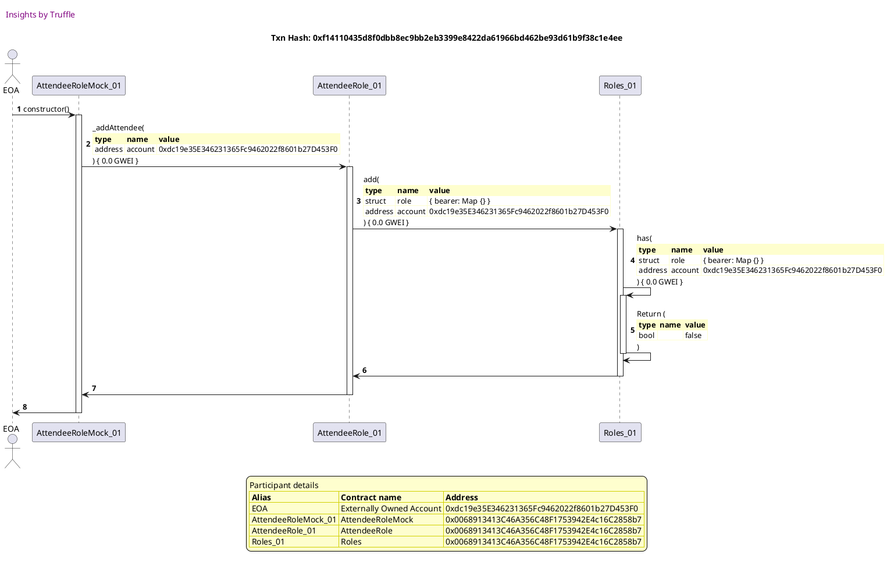
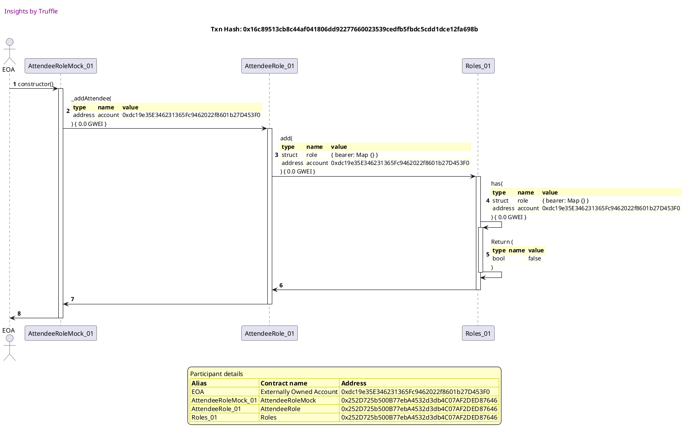
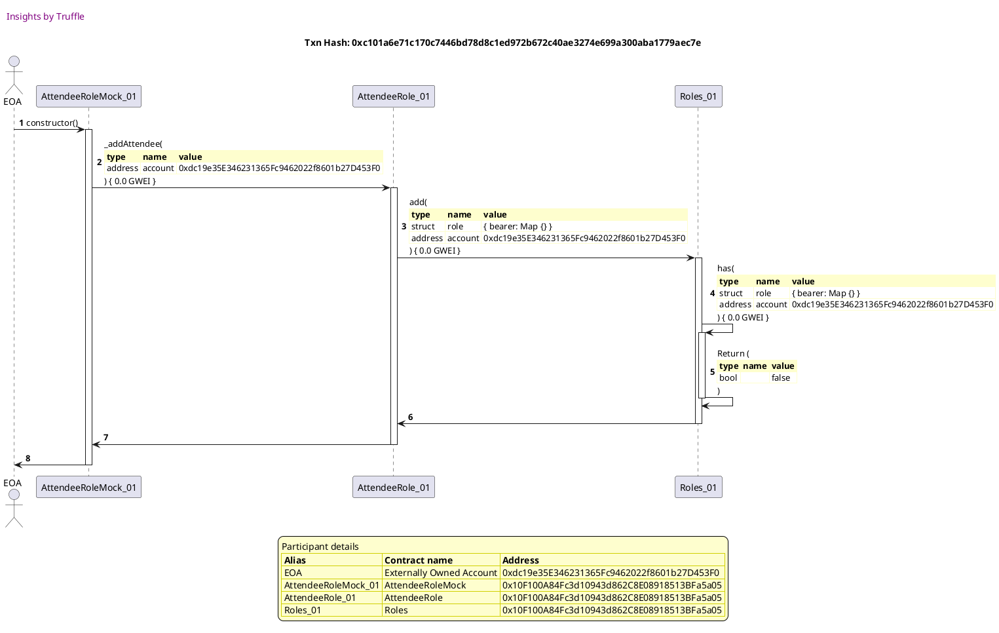
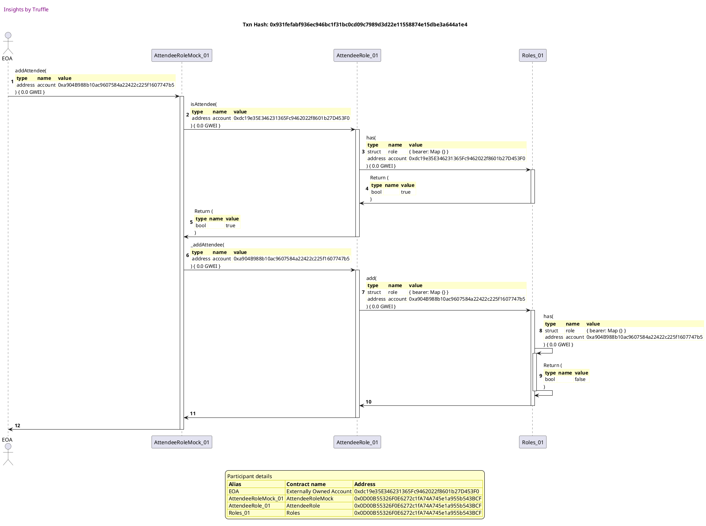

Test date: 2021 Mar 11


## emits events during construction
[link to test...](http://github.com/fodisi/hackapay/blob/1746d2fc3fafc73d8b2843f0fed53fbd26643dc8/test/roles/Role.behavior.js#L63)

##### d1, tx: 0xf14110435d8f0dbb8ec9bb2eb3399e8422da61966bd462be93d61b9f38c1e4ee

[SVG :telescope:](https://www.planttext.com/api/plantuml/svg/tLNTJzim47_tNt5YBo36PkUBf68LNKa73mZ4aFQ2X9p4QIDSfx8TrbButtTDqmn8UHZJNbPLkSlvxdSVlhiGScmirxQQIa9uPKjLJHEXYRahr8nhFWKfna9bNtbwDzPbfR9XAKiD7qRnA1x6X1mPkv2YJw3-JGJFX8PbymfmMkhYeLIMou4incegb4N4tBOA8pnSGyugFPFYnS7tua40yrhP9S-oGes1qKRqLDEZpqqGfF5_famndbW3oGAkTPNdY4jiOQM0wxc2KsucFQ3pd7cCKS_rip2dMPA48esIn169wqQH23t7oNZ0eY18CYzm4X6vMS2IA7V3b0bF82RXgSNGuui1S0CxI7S8biqMQJ7ZcEh0MYoU45Ub5ETbUdTBMQsuHVwsuJQZZi5AQ3QQcvSTGkgOuA2_tIVix_SWBPMnkbfbihj7jkkz1cYDR_5ADWUxD-g673MjyR6X_SSlO1Sp0KWLdzRqdiiAcPNw8o205iO0SccA7MQHe_CiPP5m_TZ5ohlC3VnH6Y5B7ISF0yeIv_34yzqHNQFimHBe9mhVViHds1JTK5VnjrMf0qUtxujtNIiCKYCUaYKaWckXUt3EPx1yWgT_cTdl9BefJRZvdr8wEEZ1bR2LLl2-j9Aob1WV_dCkJIFUU-smsolezuqMsZuR7VqNOxCUm9KEMUzISlbiRZDXUI7Di-HEw0cbT9KShaoSPcI6k0irhfespS7c6bgx_cEzXV0vjq8hBkK2BdugaS7WNHVr77ZR5kjAQmUK1c74N8-vGoyOk7umzC8HE_JTo7DYBsN1q0dzC3bysq4N_2-0swtOi7yAXJ4qTqQEyObVoLy0)




##### d2, tx: 0x62700da08b97cd0de822b149384a9e802204e11d634302c6f24754add2458397

[SVG :telescope:](https://www.planttext.com/api/plantuml/svg/pLRVJzim47xtNt5YBqECpR6TNnMhA6axU40WXhGN9EGaReb8ayfnjfR2_xvhcWOOxHWmDgegTpdRv-_ptULCo6vXf3RbA2L4bYRFob6eD2akasmijHn1geOgY_TaT3dKUPd5GPxc6jxrU_rUq2Dafp3JLBK9LByB9MEbOLQ_0kpdEhdACoFJJfeCiv7A37eSc6P27mSNBiUb7gVgti3Nv4g19HhRiOpZ91k2HMlJJILtFjKWIBt_GLOammjJG3Y5KrqE1kYNcCIa2aud6UpBug85TE8mbz9OKY_qtIYciV8O2otXSqz8NtcKCIgKPSKE5vooo1amuTe2CJ1XUznt2HvPP11wxwW3ie0Db1i4ZyqaKJAMIBLZ31wUKYTvgWxpwFASMjN45VRr2rSjUh1WRYoMCvSl6uHKc62xlNfFsDfg0H9QZhq_oyx8JXtS3xLiNty6CnqhG9d9KIM_oxH4PJxzUkv0gw80rA88SyIWHYSiYBcYLDhCndDsXNHTnZbrGixtkcx0zhfzfyk4l_2o2JEW7oby-TOxmB2kHlihZOP2Khm6WpYoVCNj7XSEunPtx7xaeufvCV0SQeNCxGgRz-dZ31hqJMGgs1UoU1xUmkWoceFKw0_5348bjT8jE9HZcDt0pMiokoMnCY3RsoquKQRK6JoFNPZdASB4FzAihPjh3dHrdlm318ydvVcRBwmrQOdR_f-qV1cp-sdvHYhjTIZznGGVoBIupV0_AEsd5k9locRHc-PpoEAQGOxljBHO6PcanHroNTgbbCx9uMq26nqg0LuJD7RXXcPd6OPcNVkwQj3ud1YbCvccKpZwaQaOEi_w9DvrlAh1FxHM6r3gUBx5XSK3uNIuxGJ2wrkkpNt1UYAod81vjXUwwpTuwFm5ZfiBGwq-rHLYg6D6Tl695yYV)


## reverts when querying roles for the null account
[link to test...](http://github.com/fodisi/hackapay/blob/1746d2fc3fafc73d8b2843f0fed53fbd26643dc8/test/roles/Role.behavior.js#L70)

##### d1, tx: 0x02b11588286645abf2bcd11c9e907104c8e573246e084d7939ba9990326e4c32

[SVG :telescope:](https://www.planttext.com/api/plantuml/svg/tLLBJzj04BxlhnZH2uZIxlhjY4QOa1GE24IHUa52QtkTM6pMqNhT9WJ-UoUEum9E3gNgfL7a6S_EVFFOcJ4X9wNXsbHJIGYlJA6gQImqAHzoDUEQJq6AiL3fAKyUnhgeL3eePA7XmsWu6Ww6X1oNPY55dq3zcmYU2WtBvXNWlD3vOw4Cbv7Cnsegb474pBGA8pnSGyugFPFYrS6t_540SrhPDK_JN8s1qKRqNDFZpqqGfF5_eSfyF34bn0kurLMM8IunkP42RkSApdavwG6TKojcp0q2A_0yn-LnPiL9obWIYf3wZ3f985pVjXnFqC19_T0EOnw68RKjJpY9RH4iMM8mzE5L1Bo4FQHx1CjcyYIVSKmrCWQB9yHD8SLbaJpSKrOhRf7lDjncr35O2SkDvkPbZv0w9ZZgR_S9XuSzI0fL6bsjCja_8DlrtWAqnlTu9Pk3_JjrHuwRrlZOqFxJ5p2BcG2aYazh-eFB2fcL-XCWW1Pb2SWb2NQOGOxEquI5mdQ7jkDPDhCzTvI4o5BBoWAFijZopnpN7j4roW4iWNwYyFNxy0AReXlgAlwsAdNWwFPzyQvhXK5gn4EoX5XmBNGFBlaCbi_m_2yp-vr4DwK9B_-db8wEUd0ZJAKLl2-jk2WaneV_ZCko4H-yTTZj5VIxeuMspqP7_zNOh0TmfKFMkvHSlvZRL1YUo_95ScVqZ5AwIWvN9aupCWFSXHfNJPjcjBc6rgx_L6yXVCwDq8fBkO2hdqga4Bthebu2RzjYNMdjmFApD62PxpX-ObdiT6IdmgPfmAC1YmBFfRxBR2iETZleWly5SBiL6_PFeJ26vix82JxnA_aB)


##### d2, tx: 0xf7c5aea1e93730534a9d844023988ef88acac4f71ba275042fd0845868f35369

[SVG :telescope:](https://www.planttext.com/api/plantuml/svg/pLPjJzim4FxkNt5YNuOOcsFdhHMhw5i67n288UqB4d8Ifur8ayfsjfR2Vz-rJGECTWmO6rMLkvpjy_Fuxd8cP5yReKmvoWWHfIdoSXHAHVHbce-54YF8v43cSKT4bmDLb7dSBR92mRkW7_IxVKBsj9bciaLWyHjA4Ki5i-eLuA1GwLMH6v6ritIGZsHkq6DYwWa13YvTZairpkIzWQ_fbGJBhcqd8exJV00MhKmt2xdtgG91glqFSvqEXaP3E8KpLIO9-YKcDPc4iqaE1q8Fcq0dYHSvGWfBDhZ7gSDjqOXzswQCDtnV9hul8X7PYMU5WdaEjLaIKzzsVDTFkCFT1i4ZYmn2xn-tGMZOGhb5yDXC6gLZWLJRnk3XINbQPFAeY2ulgBMOkCQ-UU6wHGyMp8rwDNFriaN80XFijjRl2JixJS13NOszFy_FoLuLt0-LR5r_1ZCTIq2PYz52VXTPYSfy-lNSWP9Q0sfHX3bYKACJresvf5Gup64UzMpXUOnpweQSTtfUbtLwWTjZTcFfPHjcG3zI-FAjVuXXNO_sLnerXLI_1eCuiXgIEtrkkunRt7M2g84gPIpnNMg5pElP3W_eumngz7La5h27GZyFhpQgZEOW5Vf3CODG2YLL4ux466OtSFEQp6v9h0t8xcuJJgKfLGxFOnSMHOOmyOyqA-lsXWDTdoV_0C7ZINdnvWjhGrhYjlydBL_6x7vQlf5AUnrAVp714v7fsmp_Wz9-QY7-fcoMlMa-Xool6UJaJakBfH5ffk-Gwz4UfNHE3cyJsEXGwU8rGM4NhccsLs6erxMk5mqQdnCZLIwoR0h7Ft8PG_jPdyIxZjSr-8VMPIPuIUnRYMVRNiIOrGbuB3cDVT7kMctVTQZdM9o5_kOD7Zf_WUFwmb2fJtM56AgOaNryuWNo9m00)


## allows access
[link to test...](http://github.com/fodisi/hackapay/blob/1746d2fc3fafc73d8b2843f0fed53fbd26643dc8/test/roles/Role.behavior.js#L78)

##### d1, tx: 0xa8191fcb25504ab4722211e74cf02c06c9f3a0977bcca3eb170c6f7c89963473

[SVG :telescope:](https://www.planttext.com/api/plantuml/svg/tLNTJzim47_tNt5YBo36vdmqQIfM4MWxU40WXhGN9EGuJXlXEfNjR2s5_ttNDCs0j0zZsikgAdSvt_tkmtSNGawCPTgMKqa8AssXocaYD34FkPenpQOWnLYez9JnXx4kIfMU5RBGy64q70tFXeGS6xkGea-W-aq4IuM6PVqAS5xe_B5GbibOvcCr5SeYOcORXH4UhY5dfPv9yUhWM_uemF4RsJLBqroDmQ6rwBcYnv_h84Zj_qAPV3on1f85tEeoon2NsDnA0RTp1UVCJ7f0vwphH4x64xVJeJvB_D1rNSSHeSypwd8Qy2Zp68t2CE6SUI9nGig3BEJTA0eyF_G8benR37ru5GCpi8TqZs3PRCxp6SDKOsknU4BS559S5lpXdZgLuXRvRiDjHYs3bT1iD3SlUuHKCS5HVxjFE3pi0I-KiRfSPR9_GBRhlGLeZE_nIZO7-tVgZXpNhV6nflsdBs0NCm585PjMz0UJ9J8hzIT002sC0UGunmwpoD5vofr8U9sXvmUkvtX1PyGZPAdhPjs0EeaR3loEDw9hb0DO0lr4uUltuGKsHJlKLVnDLQh0qUtxubtN2eFKY8Ta2ObWMkWUNB8PB9_X-LzczZk9TaeJPlwdb8wEUd0ZRAaLl2-jf2WaneV_Z4bJYm_UEcpt2lhTqKBRPwEb_sfirWEuqY7hNKgkNynjAYpBfNcHt80EAAMhv71buZGZSuQxKEEgQTACDzVGsFMVgYs4pxaLMZ4f5t3rKuaKudTTr4lWRLkiBQqSK1gpOH1rVPUddIHpWpWJRZU9JjCeyaQfur5d42UXlzj16_mlW9kjMBD_2eKnr7T6Jl29NybV)


##### d2, tx: 0x2922ecfe91aacaf5acfffebce967ce5030a2ec615b96e2597562f5ae6b54843a

[SVG :telescope:](https://www.planttext.com/api/plantuml/svg/pLRTJzj037-_ly9YBqECxNBvQYfM4VenU40WXhGN97H9d3OYJQhBPQCK_lUvQHfWj6F0sAYgsF7vVFxv8px6TWijbIx7AMEor7bMZWDKhBX8iebKSWmf3Z6BzcHuCLHvcKNTFCqLl1lq1_rkdx6TGazJx32eVYEK4IgOrQy0-xbAhl9CozHFas4snaoJnLWt2WDQN9YSb6gIuhs5hyaLWc4ricCPHKas18FNefkAxdogdM3r-GTPaGn7ke1W2gUgZ6EootIYKuJJompsPJ5g0xyKdX0OnkWPKeOojcKOnp468NgE6wBDJIvftJ7im7DGs9vhEuAqq0bigsMPab78Gaskzuzya0Li4DrW53QTXCb44bHVQmeUuacUuc4UNfnper9S8L-_STMc1nlcmcAfkNpPOApo2ROxgy-4hQqsK52NQ-_FiZEsKoVtGqqxrvz1JoS8H3CvhkXtcPR4pDMlvmOK5WKG5uPK8veuYcutCf5pQGjRkDorfEiAq-HEO9fxFRShzde3foSiRs5b4sR0FtBuygr_G6bTxUslC1e8IV4Q2ABGyD2q-wRb2DCm7NiGUiHo8UAMmur0k3tBDWVySGIDzqrcAhT7idYUluLMPJXtKf4z8ZC8K2fKRJYK4vZTmCrh8hi5iJ8XszjjE45TgWoUXox8yvJSf3_1hAMRQmAwkax-WGUF5-Nvcs-iDML9n_wVidmPiljb-KOwxNKW_SK2ZsLQt5Ru7xJsKnlnDsspc4rp7RQuPh3ZEoCjGYsJjBW3hiTxdFCvEBfDqA0ZfalN14LJk87fBzFGxEjSLmEQdfSQLIRJT0f7FpACm7_M9_6kuLK3_g6qEe1pN_OThsM9CBA3M3X-ZA8LU7kHvvc3o32vqVC3rrf_m4FZBp3SN1Xgzgcco8SwPsoNddI1_0a0)


## reverts
[link to test...](http://github.com/fodisi/hackapay/blob/1746d2fc3fafc73d8b2843f0fed53fbd26643dc8/test/roles/Role.behavior.js#L70)

##### d1, tx: 0x16c89513cb8c44af041806dd92277660023539cedfb5fbdc5cdd1dce12fa698b

[SVG :telescope:](https://www.planttext.com/api/plantuml/svg/tLLBJzj04BxlhnZH2uZIhjz9H2DC7eK30b6aNf3GUdUTM6pMqNhT9WJ-UoUEum8EXrBrqYZoZ6Tdlddip9YGay8oOykP8eILDjVbB9665FUPdZF3Pg3aH6fnolZznEIb5eDSvGO-Z4VZqM14o75Xbqhs2LI_gMH26bZLhm1dkSaUScsPYbKsqJEfBIAcjb4Ou-46SbwQkP8l3hvb3n8Slv5TCI4oFG67rgAdYXv_heCWjVzpNMIJgIqWMSADATCKSOdDh99miz1mneff3-Z22Ncd6pWUJphSzrbAVQT3Go6whXj5OKYfwmLUbqkH9a6Q21vm8Hp1fUEcBEns4e8bunP37rt6m0hOGxf7i6msuzcSOQgnjLWyAQzp9IzoVdz7dKfnX_njmrr6BOEriDXgRb_s2AbYWgF-RfzmUDW3dkl2cdAToVu1sQtt6g0nliChsHxit-fRSbotniUQzX-_W5tE9I3LR5RH7qoLoApL7m41Z2mAG8vpx32B75q8xdIb5umyFtGznmk3CUyYIrqtxOJKITnew0VUc6vG3c05z1E5hzz7vzWKxL3NyJTLgG97j--BTrCh3D8W7f8L998PQNfmmUQmUeAdVvdPxoJQAKrPyJ-bT7JKWsjfIwFXVMabUQumFlodJ1Mr-E2rmtQleDytMcZtRBJqNupDPW3NEcIpIydLixaLqh9C5S-I6z8XfNIT7AvCd6Pa1hWB3QwQ9iruUmsDNV-nsaBuN5XfD5Dg2PS_jHGGl-kYdWFlsc9jQUN03TnXv0P9GEbf5CaaHZXNU2Bn1pIAn-vmDEn4eH--xQ0D_XV0pLQisJ-5mXZgEoCd-CIlv2y0)




##### d2, tx: 0xaace64e01d3ec7237a4c848241fc9b479f534671da6cc9484c22960f4e0da4db

[SVG :telescope:](https://www.planttext.com/api/plantuml/svg/pLPHJzim47xthpYnbo76vZXEqbQiecsQmGC2CQIz824dSTg8rAaSPsif_FTTspJ0QCU0iL5LEUTiVxxlxfmxGlOB8xGfHnaXeZIvAaUXrAIuJDLOQ362J0waYhiYkXpel5HnByzo3U-2Vj3lzGdPAymqasq2YzzGYbXgc5Ml00UvJgzoPKJMoTA16abb434nzO809vUGurAFCtblucjw9S7YjUv4n76g1c3HIdMpa7kVAYD8TVwXAjB1q1GGJk5Cbqc2kCIa9fDmDb5m88fX2-X4Y4YwN58hjcNaCTiJF6hm1kDM4ZL3xZKJn-QkPyN2ZQ8cR_28iQPB4zmI2nw715qM6JIzVzm1KS0MoYs2RZDfb8u5KkqOWywJyZJFv54UNLvGQx5mZNxpndMR7coOAulLojNB5Y4Bcs2tlVvCsDbf0JfrDVV-N9sJlIgu7ohPlluCPZgMW5A9qK9-5rc9W_dowpc0baK1E8eYp1638pfXFNGhfS9X3lEenuM7BhQf6zfsr_TwhEi7hizuSuco3JEW7oby-TO_nB2kj_PN6ZM5j7WD1d5aDQNjz349c6tPhXDW5hYCCfOqN6g5pFEvOmVqSGQrzNLa5cOFHV4yUmkZosXkf4Oy53C8fT1Ij-18Z65s0pUloUoMnDg0xEwsu5IQKYju7himppCq4_z8iz9kRt3e-Zpv1nOydfGNR_vYRKXBFFR_fENBcDrFopToqrw7qbzCy4HanMs6_y7LVkf5_CsrMTQc-HgoR3F8oPsI5aiZqgouGywdFgLqJWwx2InqEEXXcw2n2jSqEwimrFlQrui2ZS-9aLg9B9l2yGybO-WywvDu5tXTWN-eNMQ2mtoFEQ53QTVpPDX1E1RRSSXxrEi4pE_x3S_bxkO37eA_0BXk6AhXKw7GXYfcP1-Vs43-1000)


## adds role to a new account
[link to test...](http://github.com/fodisi/hackapay/blob/1746d2fc3fafc73d8b2843f0fed53fbd26643dc8/test/roles/Role.behavior.js#L99)

##### d1, tx: 0xc101a6e71c170c7446bd78d8c1ed972b672c40ae3274e699a300aba1779aec7e

[SVG :telescope:](https://www.planttext.com/api/plantuml/svg/tLNVJzim47xtNt5YBo36PYTfVbIiefHcy81036alICXnt3R2TIh7sLeA__kkQPe1QH_6j9TLLUvoFd_tdNrt8UIaiDpOSge8uQNDTJbDf275GwPdtF0fA3cMEZtbuc5iybAdWrpb1Zx4mtWu619oNDY5aZq2rMyYUIeDBEjNWFFSP8-vjbprLJRMKwaj8eviun3ZuXfoLfgPagyMlcMF4fZNsAvvccPw38pMfkTA7d-kIP0w_eKkil745f0iuDQKen7Y4fjP9U5shk6S5vCkqBbWb75V1aomW8h0y_ma3S8q54ocKU0aVk08ZtBfEe4d_IZYBgKyuIm88Yv5W9Y42ulKXrTzu0NieTmZU6ms4zcCOwfzQ_7mfBp9bRpCnSCzPPNZ5llkZTisjJQiZCN6S_EoHqZ52OvwssF2uM4NHAuBQyfL9li7PBlVMu1cyprUoMPX_qxVaUEwD3xMilVq1UnY9W6bvjDA_k2gH6Nb_WG8O6HH06f2O8LPrEWy5IoIRcVeUhxZCjVln292bJhEAFGfIvpWpEkuCLsZ7C0Iw2SANxyFBx0esbHN_9jJgOXZsFVnNPyLaZI8Xs89YUH6cYvSyXaid-7vNsRsEubsIXDU_4yf7HrruKRQqcXuNrf9dYlaX_yHLqLjFdWRi5qh67T72MtlZPR_gxPPD-3AXwndARb-qRUfj3nJnOlapkWPfNIL78vCx6PK1ZWB3OwQ9it-vXgQVRsdQWhXSswbqLof1Lpzr3A5_hikwYNmjYdMjbO168qPfVtGYuMRCXfvRXhwpY0SqZ1YOOUvfp7lSDhP7Q0D_XV0pLIirJ-5GWxrdP4JVE9NyXS0)




##### d2, tx: 0x9dd54d8084ef5b6f1531ed1f9c52a78336457c2dc0a6b5c820c4a2ae92cf8592

[SVG :telescope:](https://www.planttext.com/api/plantuml/svg/pLPjJzim4FxkNs6nBqECpR7pMh6AlcNm0O4OqhuW8STsseWqgHndQodyzrtJDC1enu2nKLMvoza-Fu_lBcU4zWl3jId7AKAyD7bMZYEbKN6PP1Ek-HYdQgWosUNYSgZpCfEzFCqrVXSEma5lWD1UOMQfQYDS_KQAIwNnl7x5-23NoLMU6PvsqcIOZLLcm6DicWaX32vTJaezITMzWQ_9bSAMtTXEk9H9DiGMgKqtbTpxL8D0zVw7MP4CHwR0qGoVwJAEmIyoYKaLFfjc-80NenOcqq1AnvO-yMqLEv4RMmwpbBJYG3YKUpvZhkruWaf1k1ivmgT4s9no5L0H-qv04HoPC01zSDp1lC1R8BSG79j9H3BXGBLZ31oUKgTvgevoSNb1h6hY6llcXUiMFLYmC1QhcQkNBOGgJ7YtlNvFlBFJmd2egx7tvzavsgk3-w6MxUlFsCmc2eFC-BYIttbQWhAOVhrme5LHOD24W1mne94fxKcc2E4ETQX7F9jx7cMCk15ZtRxNezr-wFQf7IozRECv9Xy9_l9jS0XXNO_sLneDXQHu3GPIM85Ype3PBcKMSvrG1A0IIcFV9LP4lRxji90ypg11tqIcWZtYnVFm5aQNOW5IWpyGSnmfhfLkuIC-mVCRVFEQp6v9h0t8xcuBdofJwWm_ZrsKvod0X3_GhAtR6mvqVPxy0mIF9-N5co-i3Ma9s_wVj7mPi_jf-KOgxNKe_SK4ZtbQt6Ru7vJsKmlnDsMpx4sBEMXvpK0dTrgQL8OdQN67N9_q2I4BSd2RW4O7IW-k2HgwS4Epimf3iwvzNJLeU4wDqXbFqna-_f4fYJlF-YJUTRokmJ-qLXjO9BG8wVXsA9YqI60pwRkqvm-87rY-Ox5ko1rEdCqRF7J-0iVDXQ5Md-eACDGnG_lmX0laJm00)


##### d3, tx: 0xc7a3a495889f409768cd3c6f01590f51b0599a2facb669fb6ab74e237ed1c545

[SVG :telescope:](https://www.planttext.com/api/plantuml/svg/pLRVJzim47xtNt5YBqECpSxlLAoYb6RmW40CQIz8o76SDY9DAiVPMWh_-wvf6c2aOy3OgAhSvMoVlyztbpCXkuNcIfVZb11UwZmhnw5KfBXCiWbNV0of7CeiskFYSgZoCelwUPehU1SCWa5_GCXEeMUfx1AeVYF98wbWNhy27EGgkSeppTDUcWopiSmqUenrCo70mQNBIQacgRmty3Mvai2indR2eoZ9Xi1eRRgfvCwd6WIfzp_CYcGuqWM4CpXJPHoZNw8JdKeucsPmm8jH1-XKkDpabczxdXzRr7STJqIcS6BAR9_6DWkfxVlSYBa87SUFGuU7hYKDqvKH4xPb4pmoeH7wuBW7l80Db1i4Zqqd8fbmfDhJ6WzFojCybKUvkBoWh9hOOb-_i6tHWmKBOx6QkNhP8AJ21DlTzZrXQwi3UAYhiVVdsJdPgOFxePRTwy-WPnC9A3C-hkHtdfQeBAPVBnmeMHI0cX2O8nerEkK-jVPypmiPvS9tg6jx5ZSCop24OTWnGujhkQ6zzB89Sw0VANpvDZZ4iBQZ_PL6Go4fNeD199WlJNjWMevXCjEn0-6ZIWqZzXpAGiFTjsmpe8ypQD0taQbWZtZnFBo5LgLOW5Je3yKSGicLL1quuXEOty3DQpAx9T4QaEtj3fnANQeCdiSkpFCKOU8VQTRMpJK7sfud_m31uqbvyUOBQqrQuhR_9orVnkn-MhwHIdiTIdynmMEU5hSP_WUb_TH2_4tPB7lJOWvPNZF8oPsM5adDaxIuGswVxbDA5-JmDe6D3fK-NXCKTk66PcyLXcPTzxfgqFYSQgaodgOpEFwHoGXwp_eatdNSrk0VMgiD60qOfJtF2eGPCUfRPkGvHjyRKCzdditClO3RdDhhDtZe_0MEcmj3hJxL5MAeOqPsyOaNo9y0)


## emits a AttendeeAdded event
[link to test...](http://github.com/fodisi/hackapay/blob/1746d2fc3fafc73d8b2843f0fed53fbd26643dc8/test/roles/Role.behavior.js#L99)

##### d1, tx: 0x3beb9c7dcbe4ca2fcca4a8d419889fc541bda781f9a11f43d5470c80d9322f5f

[SVG :telescope:](https://www.planttext.com/api/plantuml/svg/tLNVJzim47xtNt5YBo36vlngcufLbD8C7X288Uq52JcEqqQuJcKxMqlXVzybJJCWxSEOzh8gobtEv---Ev-lX9mOoxGjPf8GLjXS5RDOQ68UCZLdcir0YebGoIdZ3nET5oePvJBNy24QH-FHc91ZOvTI30XKlwbWYT2mgZy1pdETFURACZcKsKJDXBA8cDh68SB5DUIyq7CfNYryonu5E7vZksP9aga9EBGsFLVo-7DDWjJnBvJ99bDh85x2hIxI5769pQmKSBjGSCxCj0zquSKY3datuR7mENDJpfdFUedlXBrUcFB0T-A4TNjE6ZB7INql2VmkvJsQX9xhfa5Ai6JS8lNnrH2OWJsKUmJBPZEUpHccEhGMYoV4JIx5PSuVxgbJEMwnxzwuRLDhGsaq6y_DnnuX5ISu6coF2OU7VU2vCbONPIRx1sIxtrk0PlCz7ibcOVzEtP7ZkZK-rdBmz0NiSYu0fMApIlvWia2bT7y21D32642DS-mmYnfT9Dm9XHUCFR_ZUexN2I8UeagnyBqETMAtU-O7NaJNA0Um0lg9mjVlumjiYZRLadzJbOeuXdqVttMjaAH6F1GhY0NJGlVXairXzGpF_pAptqcqKveoyp-bT7JKXnjX2wtWVMd5UIwH7pufawOs7xmDsEuLZBkZXRRVZPR_gskple2b3rdFKdBzujucmh9CcXV9dT4pIccP78vClCseZ70MQXmrJPh3pJ4q-mPFrHJ2zy8AhPYKIxZwgKG2mtSTr4lWRLEiRQq2bDnFWy1pEn4TTzokovrqsFNn2OJ3mY280zyx7KMx0xJ1_mAucOgr-gTGoA4-CtA2R_oN_0K0)


##### d2, tx: 0xafa8262cde36a335247d25c702591381b0de878f2f340e4b35ddbcea800e8371

[SVG :telescope:](https://www.planttext.com/api/plantuml/svg/pLPjJzim4FxkNt5YNuOOcsFdfQrOHTyo-81036bVa92JE6s4crIEixKK_lkkQHfWj6F0sAYYtELyFZ-Fxzmp8Vkv4TeKOqM8A4oM5kD0Qf9V9kb4Q3469OSoZReYl1pgh4YZNgOo3U_yWJ_e3GZPoyrCoJQ1yZUI8f8QvjKdm46cawiiDK9rL39Cnp8r634sjOEFWykGaq9FbBmty3Mvac3PjUr4H56I3i6YbUccb7kVAX2aMlympPFXoEGGpE1C5t6CSOb9Z99mDatXGEIZ5j2fY4M3kIoC97S5vmwplOWveKUPqxHummfe91jU8sOnjwcq0-v4KH1AqQ1KDhXd4Tooq23qmN47H0vRABS8Rfj9mcGYa6h76DmyAKyp9O-oyFA2MgNZ6llcYUicFPYmCEOhpzN75Y4b9jXjhryJTdPQW9kw6dj_dfwJlIgv7ohPlluCPZQHW38Lur9-5wf0PU5-lGYWPPu3Qc68DM9GerFMYxYaL3ZCOHxrRE5vZ7Fg1fnt-rwFTVk-ssTsSnbb6-P0FrBuycrmY6bTZ_PN6ZM597yD1b5eDILt1jns6RUuw_XX4rNAMDnmgHKmhsyxtAUFCwZHrvafOOz4_ZoykT55k02fCHwAEGHIQAbRS2GcCB-1czTaTajYRK9sTrjmAasXKtWUko3B5CB41sbMrkqD6xg-Jlu1WiUBykBD7wmDPOdB_f-oV1cp-sNvHaxQwr3wYmKU2vNVLlWV7Esd7iJV79jbRrhuaEKrWvpSQMcHD29H-HroVTgdb2x8uMq26nqgFRmcQEp2DStEAWtrlFPrsQ3nFJLIfqAf6Hp_I6K4dMVz9TuDlAx1FxIM2oomTns7CzUd0vTvBBJYZcVZuqXBD1qdS6pUxVcR5tWO_0M1wmj3fJur56AeSaRsyOqNo9y0)


##### d3, tx: 0x931fefabf936ec946bc1f31bc0cd09c7989d3d22e11558874e15dbe3a644a1e4

[SVG :telescope:](https://www.planttext.com/api/plantuml/svg/pLRVJzim47xtNt5YBqECpNP-DHMhQA4TF20GGzeB4d8Ifur8ayfsjfR2_xvBcWOOxHWmDgeevvpFv-_pdNj7oAusGfbYd18Y2fDdnJYGYkZB99i89SQGog7Cefu8BuSgBx9eBqzp1Uy6_K5_hq_8ZZQpL7O8LB-H595KCAy_0GvobLpbcH5fDqs6sLXc1Zt6fZ4OuEJ2vQHGarJUc_YQN4bWTgCx4L6KP4DWj5RTL7BdKms2rFiVPZePZeo6O0PdgeXZz4jCOb89PzCC3eGUjO5EVOl5CXP1x5kk37tR3K8MMom8QHXHF_JybXzP4UUICSTfjJnRCYSAf2LSsnPCsWIFB3G8lN_S1Q5X0-K6mMCpIPXC15Bj6eE79-LfdigZFBoyeAmoNA5Vlt3LeWSBIgLUMYu_DWYfCC5sP_MUiBNL1ZpKvTpxy-oSxDJ1_L3BplLdCBE919IP65VokqWB79JcrwK39RK678KXveZ14PqAdzezlzKA61MXxrBFQTc2Svlpa7CdPgZnR2zm5busOGxq8uKlt_g76DRLQ7-bqL18z6imY4BcIylfMxRBBMQvpg1C4auvZrikPG7tzct76j376JJecyXKi4T2Fm-lDge8Iv0A_Q6OGo25ageDHs82ynkuUKrcjoHM1cHxkmsdqXGgW-Un2_8yHPZu8CrQkxdcG5VdoJz0y7XINhpvYxKcBN7R_vEMBsDsFotVo4rx7Kf_CS5ZaUhR3F-3g_tKY_YRQxEeJQKDMRGPvEHEIOka4Kcgxv3Rf_kKqf8STXDOw72mXss2mYhSqEmkmz2iwrnN1HhVKoDL9j9q1iS_CXb1zrb_YNSThohm3xNL1YNsdkDOt1tGliizZir6rxFnSIGJlkC4ZctrzWRhDtZe_0MEcuQX7ZxL5MAeOqPsyOqDv4y0)





## reverts when adding role to an already assigned account
[link to test...](http://github.com/fodisi/hackapay/blob/1746d2fc3fafc73d8b2843f0fed53fbd26643dc8/test/roles/Role.behavior.js#L109)

##### d1, tx: 0x745f8bef697bdad84d8a2ad9f8cb1076b140a716a4096b0b736a90a4bb5fce9d

[SVG :telescope:](https://www.planttext.com/api/plantuml/svg/tLNTJzim47_tNt5YBw2DpSvtArRHqNJmW40CQIz8o8wTDi9rAiVPMWh_-wvfsW4j3sFQowegTpdV_Ux3TnT2ZYl7hQidcX1UkzBK4w4igUuAC-MMJq2haJBo2y_kHhQiZJmfTMdXtJ0TfYSf8KULcslL8z3ynefBPM7HlWASbhQuButZkg-BaPaeun0nTnk58Hwk8AUrdMhrxE1RSQ-01HlP9PUoC2DWj1KzDlJeKni4QVsVcQeOZLq5OWxNjivpn2MkS5h1zSp0AQ_6NQ2pE0ZpHAWywiH2Sfa4Ck4UbvqyoGIZSIHOG7dC8XxGJYIeYFs8ToWFX0ZpJ7KamP9b3aDFB_h0AzX3kaUmRAx8YYd7LFlEOV6KkYgrEY-pkrlA6iKTyjSDTnbj6Io5rLfp_R97I1CJ7FPs-uJtxxkGbQPojbvcidz0Tkkz1DWOt-ALh0_sRymDEMfRuqDBUm-VmSsd2f0QFcde3wvhP9Rg3u00LbKL89Tbs64EEJgJ6UieFqpz8F9yvaVXCEiWIpqlJoBAX1SFWj0VqXNA0Io0VgJmzNjwXasn7Ueo_arLci3HxTlYNTKAWxI8XsG1Gd6hR1VE-HGMZ_3uBpFxdSHsIcDU_Kyf7HvsuKgvsXfuMrgYB3N6X_-SwweL7xnqkDqhwFUL5jez6rlwpyPcDO1B7RBQfUJooTnAvNYXgoV93UY0KhfC3bScJZCo9xWBBQwQJPhzzJLix7eFpHR2vymfQxZMSxZuQPI4_fikwYdmhYssBMqSY3Zr5SkzEA0o2iA49dIGCy_tKXQoI8I3UC1ybiZN7Mo3_mNmPYksx9z2OGpjdP5ZVE9NyXS0)


##### d2, tx: 0x9e916a41d0dc0e66c7963dd135282d42aac36caa115024179da12cc2f1392674

[SVG :telescope:](https://www.planttext.com/api/plantuml/svg/pLPjJzim4FxkNt5YNuOOcr_oqbQieZJju0C2CQHzGK9Ex9I8DAaSPsif_FTTqxJ0QCU0iL5LkSlPFZ-FxovdGdOBAuqjXoaXihHvLWv3RKXncMGZQUGGKZtGcTgJqUN0v6MckdcQ6tZNx_LxtHuXEuMTfBfDeFfTQAcqWMdz2h2Vc-GgpwnCEsaoo8Owi-Wnjii9VHoSknoLPfJgUmDVaoiDp5dQZgLIIJO0HclJJILtFjKWIBt_GLOaWmjRG3Y1KrF6CVebDh6fXjDn1lkok6W17JTratdIOOggY6hFY_oc9vHYmkKDhXmkPIIyI4h6NCeTvZULP3oAUCn4atk-G_388elGUqSTa0LieDmWU6msYPAHHAeTQ_7mj3x9KtsOHvVdb5KJLzZNBrorwC62cR5Op5oyR11IOOBjzkezOMkh1NYeYx7tPzaPsQc3-w6MxUlFO2SZ3IWpEQpaTvcMgCocNyyS65qKW5eKOOvOrEYOTvNGb4gNkzodlYDzdmj1lL28lS3lyhsWxmNSQSwzRC8Kw4SANxxr3Z2igz7-IcD98IbUWu6AM5CBjoSSZmicFBSVDL6bdCSDZxAG-u7ZYZvzdC4I_J8o5UmBMJmFRs5D6Sr06lI7OWgXbaQR5XpA4KnluEOrcTsIM1cGxUqMd6XRcWoUnoxCynHXuXzfrjRDDGUwEa_-0OB7a_BypHVMchJ4RVzFMhwCsVsqV2ELzZgK_cA2np8jRZFy3qhxgONucxAPzwRP73A_Pf3ZEorDQIkJjBX3Bg01fNH63cyJsEXGwU8rmM0NNjBiBCAmNDU-hXeqFiTMcqocwGIEVcHQGUTPdyIxZbSr-8VMQeFGxmdDOkuxL7cEsw0D6iIC2zvZBlD2D_039bX3hT_WeVCNE5vU66hrgQuGGnqpiejFl43-1000)


##### d3, tx: 0xa27f10ffb6f1d0b737868b0d7602f21c220959f204c2ff4ec8253afee6474ad2

[SVG :telescope:](https://www.planttext.com/api/plantuml/svg/tLPjJzim4FxkNt43QOoo3kUzhRgAZgQ33mZKeUt3c92JE6r4wbIE0os5_xvBcePkj9h6nCGMHRdpsRvxxYMw8-GWLKogR1mJmZALY6piSKdIgqXCc6HZYFcGY-03yw-6Cib4S9Z4YOJjljjt3rr2sgcQnRn3e7X6d0LSmhnS0XmbChfDX69nDuw6Oio5GesXgWxqSNEXSfB9ISn_sFWKtNBGp4fsne8W4aFGQ2cwBsXxlmH1Ill78es68vM2DuDpcOKXwYKgKZ67ywc08vQEMa2dJ7T2ZOQXPuTQG3t7S1fsmwE1OrCzr3LVrsdJQeOwDNqz34tkDtJBO27djkcOBD09XinN2DqzxG9BOGlf5i6mgSYF9WnTxIg5mUDyaCJy9F6lBgbM75mZttnntQL75t9XkZovN6mHKc22UcUzJTZRQm46TRdtva9Sa7QPtBSbxToz1pMRS40gsBYWropEaCcFt-KA94zJGCxtiKOKSdGQ-5gJ6vPhcBPkQ8PjzVqcibJNmuPDDKztUgPbzEb2ooxCWRwZyF6BUunfNO_sPpSg5wBqPNjGeQyoKy0UiVHfU5CbCpy7AL4VaZbud4akMt329Z2_X_ldzEp1YRK9gTTRCE0gamAUvfsN9372n1VTBAMx6mAwlax-0e9V5-NbY_-nDfGbcltto_8__DDMLizKu0yMflMlsv87ttAxYnQ29jklRvWKs84xqFONSm2UwTHg0_UpEpX_LQkrzmjvPnEiF9vv1ozCxnJcMbMyM2onVy_oP1NXtbdY2ZZssUYQARxQsrQbZthZfisgsvB5O4FELffem1MBudG5Tu_sAALvE75-GLZ87E9W8b5v5TZkCl7LFVGp7mdmErLS2XR7CpYz4Jo0xfDAOrNnkf7YiRGmu3ckmRLGTqmQsARLe0tQ2pNTq5tDqcpFwZazpT0QmMO3ZvN_WU9gH2dPtrM56CgSaGFyuiZw7G00)


## reverts when adding role to the null account
[link to test...](http://github.com/fodisi/hackapay/blob/1746d2fc3fafc73d8b2843f0fed53fbd26643dc8/test/roles/Role.behavior.js#L113)

##### d1, tx: 0xce8bc2e0a35b6d3c0d76063ca1dfaee4bb04c02399069520c8043df8fee9425a

[SVG :telescope:](https://www.planttext.com/api/plantuml/svg/tLLBJzj04BxlhnZH2uZIhf_44OqmUHGE24IHUa52w_KuiTYie_MwJGZyzquI9mMS74hLIwF8CvwT-UQnCsF6JaihZAt6YZ5HsK9NumGDAnzoFH56Z47X47Lw9kJ3q1ILJhk5AWny6FG7_MwViPFIpXHs62n_8nGf6fZNhm3dXSaV2ss5YbK-r6FKbX0pkr4OqE4ASbAPYS9N1z_oHmJ7tyYkHPhcUWWEhqNFIthokGw2rVulT9aFHxQ4P0QtfieomcKsjmhXTghXN9IZDl2fn5OYNUJ22v8mzIHFZqCUUb8uQIOG_IJXlkIk5qKyZ0ANonRtlJHhPOYHxmQ2KScafT3xLp684lQ8xZ4gcyrbFX6KQcmj5G_nfb1uMSY7U-ui5RV8TnjkCseOB8JbMdFziiVOCYOuwcpt2OU7RP25Bgsf5fdi7x3jUcy1DiRtT2NhW_qxVSTEwjRuMDFEqnUmima2KIt6I_f3g8gOXVeJ4831iWJYfAGEiyJnQIgT2BsWx_cXwpbU60naH2nttQmLSYTnZtj-u0tu2kK0vi0_SVZwlNz1JT4CTH7_fYhBmCdj--9TrOg2D8H7P0u92eEc3PTY0lDdUFwNcVrEefdII9J_Kqf7HssuGLiP3UzBAoaAHV7HFnEghCK7RnqsUuNyxcYXxRFHq7yrDgi1NEYmrIvbro_cDaKhSbM-IAx7UvppHNAqCccQYUdIBZIqQZPfnkjhsDXrdfPRY9vJYqOBfMPmzLDZ2l6xBkebyBOjrfIk78YWc_PwuLcK-NxcTdaG9xwRkeCWYwC4lVx0QVN8ysu7JV2_0DvinPhzKoYAeRupTafF-ah-0W00)


##### d2, tx: 0x74e75ecac0de3a9b49ad74a58c22cba594b74158a88d18b38393e2df6383cfe1

[SVG :telescope:](https://www.planttext.com/api/plantuml/svg/pLPVJzim47_tfpYnbo76vjX9arIiecsQmGC2CQIz824dSTg8DAaSPsifVFTTspJ0ICU0iL5LkSlPlhlV_ScPaFr22wNBSKg8A7MUbUD0Ab9S9jb4A366L0vb5lL4U3bKUPb5_JpD5Rpp1_wWFo1ahz2pL7O8B7yZAIAfO5wz0XpaAhdACotIRfeCix7CD6gCTRt1nyMLoacf9gcyj_0rkP9WcBNiH4HHaWt1e9NePadtFbLEaCh-OLOamv4k89Z1cIhZ6FKIdUXKmjaqWmDHZDf0fxOfRKk68gIHvC8DJ5T4jYai9sGi38Jbce5j6fOZ72Sod80xtEMIHN4BkJ2M1i6GXHfT7nntGHImXNIBODXq4YOJWL2xMcFmf3pDKtcKXvSNr5XkR91lFjXqwC61XR1Oxro_R16oz0bsEyqsOMUd3HZKzThxy-oSx5N9_L3HplLdqBE91AIP62_fTv6Mo2osNoyKA5aKW5mOOerevEYKzICkAHKMivXDCQwspJYdhO3pdcVtMS_pMnuptPMMRPW3_KZXoxV18QQrsTjVOTGGak8r44IXuKfk3RZPOjpWBSiFNMGfOx7JeaR0RC-qk4yVHr1xNsTcwVP85C_pjz2g31TEAjI7P0w154ggDXo92SnluEOraTs2Q4p8xcuRJgKkLGRFGnVaUOfkuXzXLjBj3G5jhfD_uC7ZHNdnvXjhGrcYsVzJbYz3ThyitqYdlGwalrZWiKYBsmh_WzP-QYF-fcrMiscnXwok6UJapaYBf1P9Mjm1vr6FKhe0XxS977J8zF6Qe70Arp2xwpJKvphNom6DpwcMAXDfEeFZ7vcCeFkiJ-9TnKq3_g5qPK1O_SZpMZqtDisOzQdL3KmMCT-AksuW-S0t70yjRpRmKFaB5DSNXefzgYhqeSePsSSdNY1_0W00)


##### d3, tx: 0xe175b85a8af0d496ba23d6a921b31628eb7b0c786bc0cf149cbde88c310d7787

[SVG :telescope:](https://www.planttext.com/api/plantuml/svg/pLPjKzf04Fv-lsAhCxLYQVDEO2WZGgX-S7Ieqtwe7UUIN21Zk32NYuBeV-ycX1GBZ5PhQuPXBtjtky-pkvSzGlOJIOLCHn4XD9KnJqSk4oIv3FcO2Zg2Y0qOzm-eTpaGSShzJXp50hPxJi_fE8Gq4pcDM8j0_WmPzPc0MV4AS1YBy2RcaaRjA1pm4UCIBGQoND33oRd9SIh64RityIMyOQ0QfUwK-dx81w0gXUekbysF1GXI-3_YIJWOoWJSAPo9D0ZGBf6XZ1YSJJWSqcJO06N2r9hfsYQrQQ3uHjrogQRx5grhggkhbcOpj-OgNissN4_n0jMeUwxFRDlJLSMlrUmQmP1v4g4x9ssW2MoXt28ODXbwuPWYrRQK63p6-d74ZcFlya9HyuLhz9ithjkqiY5J9ekLYvSjGd9CK6sjzmbxUmt0e2xctftpSz8ialk-aAtRJo2dOmOeEHtbyef6AGwovRUP0S6I173aULWZ4aVAH7daCxUo2pDGFYZm-PjpX6bTZ_Pt6YM5C7a91hwdrfbkEhfXQRggMsRFg-DGqRJ0jXJLrMfTmzHxZs1GeYypayCUqkHfU1CfKYy3AT0UYXcuZ0ec6d1Cnp2xWxkNPFQBnDg4LAiDw3EP2WvFO-V6SOGmyOSq2-tkXe2khvD_WE3XehnuzGThGrcYs_zJbizZThyiNyb9-rkK9jNlsuBvFp9gyqywrdZpxJKL73jY2vhUl2_ZcbQbqdU-ElspDvLAysEkRsqw1nc_hAFcjRwJkskK-CC4v9313HFnWjtEuYpu35jVU4KbMsut3sjNcjYcoR8jalaDX9mkTJkVIHf6oHAXhjB5A6Rfn8i6za0STF068T1ucTZs8aFbFWn0rhlnVoAPu3IAfd1opPaFxITzBPSDh-lzgzgv0sfs_6xNEgW7XX5e7SLikuRcQpqpQDTTfZizrUwYvyqELeq_mt1vboY6VseACHGv8_luZtVBdm00)


## removes role from an already assigned account
[link to test...](http://github.com/fodisi/hackapay/blob/1746d2fc3fafc73d8b2843f0fed53fbd26643dc8/test/roles/Role.behavior.js#L127)

##### d1, tx: 0x881e97206b823719aeb687368bb4fd1aa8f99a8d43167bfcc0d36a209f569f55

[SVG :telescope:](https://www.planttext.com/api/plantuml/svg/tLNTJzim47_tNt5YBo36PkUhISKg2cq73mZ4aFQ2X1p7QIDSftAShQNml--QfXcGzc5CUrdLvYxdkzzz-EvAo4bXkR7bL172IvlhSXfBGug7JC-uuLDGSYnrSih5mzZafKxESfKR-30QZePdGqAE2xjGiaUW-amaJwI1PVqAS9wRx37Nbgk-oiPwAhL5nDGs2YCyN4FEIZDJyjN1j-nH0lCQsJLFaaoFWT5Qz5pHuyzr4AJsVw6BR3on1SGBk3LbcY8kiPbL4cxd6ivvCUa2dOSXar77eK4SEcw7HLp6GTXnWp2ElJHXd8Tf5F4myLmMTE9K29gu0NTebFe1_do29HCMGnzUzO4Ni8TqZs3PR2Qo6STK-zPYyQIyoPMypCN3FMMLuXRvRiDjHYs3bR3OQ6vUzWYfOeAZtdQVS7ZO1P7hmffobSd-0TckznQWCRx7AzaSxD_fEt9SjyR7clQUle1Tp2GWrNnQqHzSbSYir9y00Omi2a1E2EmmYnoT9u95qlM7hXSuBdC3VoGYPAdZf650MUnq1fxlZkWQvG2MG3zH-FfzU85DqGvr5NzJbIfmTFk-UDUrmY0DuY5PGYovaQOBbtm6osTu_fUP_KwYdTA45_zJIaT7NRYHjZGQtfTMdESAuyDlobLHYm_UEcpt2lhTqKBRPwEb_sfirWEuqY7hNKgkNynj8YtFLF4YkG4TK4fNoU7An6b6vWnteS5LqwJPtrn3OzTxghOGFkTM6isLMi3LJoqJwB_hebu2RzjYRMdbW3c939c3o7wVHK7YHXtcnNBW1UuW3ENeL0J25uwpsq4R_2-0cwrOityAXJ7KTqPEy8d_ahy0)


```plantuml


@startuml

autonumber
skinparam legendBackgroundColor #FEFECE

<style>
      header {
        HorizontalAlignment left
        FontColor purple
        FontSize 14
        Padding 10
      }
    </style>

header Insights by Truffle

title Txn Hash: 0x881e97206b823719aeb687368bb4fd1aa8f99a8d43167bfcc0d36a209f569f55


actor EOA as "EOA"
participant AttendeeRoleMock_01 as "AttendeeRoleMock_01"
participant AttendeeRole_01 as "AttendeeRole_01"
participant Roles_01 as "Roles_01"

"EOA" -> "AttendeeRoleMock_01" ++: constructor()
"AttendeeRoleMock_01" -> "AttendeeRole_01" ++: _addAttendee(\n\
<#FEFECE,#FEFECE>|= type |= name |= value |\n\
| address | account | 0xdc19e35E346231365Fc9462022f8601b27D453F0 |\n\
) { 0.0 GWEI }
"AttendeeRole_01" -> "Roles_01" ++: add(\n\
<#FEFECE,#FEFECE>|= type |= name |= value |\n\
| struct | role | { bearer: Map {} } |\n\
| address | account | 0xdc19e35E346231365Fc9462022f8601b27D453F0 |\n\
) { 0.0 GWEI }
"Roles_01" -> "Roles_01" ++: has(\n\
<#FEFECE,#FEFECE>|= type |= name |= value |\n\
| struct | role | { bearer: Map {} } |\n\
| address | account | 0xdc19e35E346231365Fc9462022f8601b27D453F0 |\n\
) { 0.0 GWEI }
"Roles_01" -> "Roles_01" --: Return (\n\
<#FEFECE,#FEFECE>|= type |= name |= value |\n\
| bool |  | false |\n\
)
"Roles_01" -> "AttendeeRole_01" --: 
"AttendeeRole_01" -> "AttendeeRoleMock_01" --: 
"AttendeeRoleMock_01" -> "EOA" --: 

legend
Participant details
<#FEFECE,#D0D000>|= Alias |= Contract name |= Address |
<#FEFECE>| EOA | Externally Owned Account | 0xdc19e35E346231365Fc9462022f8601b27D453F0 |
<#FEFECE>| AttendeeRoleMock_01 | AttendeeRoleMock | 0x12de8123655A196d39714beD463D88eFBc6c5c22 |
<#FEFECE>| AttendeeRole_01 | AttendeeRole | 0x12de8123655A196d39714beD463D88eFBc6c5c22 |
<#FEFECE>| Roles_01 | Roles | 0x12de8123655A196d39714beD463D88eFBc6c5c22 |
endlegend

@enduml
```

##### d2, tx: 0xb8094b8380736d5e78d3b80941fcac5367c513c84e598237bb6007a451458554

[SVG :telescope:](https://www.planttext.com/api/plantuml/svg/pLRVJzim47xtNt5YBqECpOdpgnMhQ9jsy81036alICXnt3OYJIhRsLeA__kkQHfWj6F0sAYgtELiVxxFTvSp8VlQS6MASKe8BqoU5UD8Ag8lasp25Hz3AeSoYpjSN0vLNcHnDqzp1U_wlNwlsoDaJvjPAbi4ojz8ybWgc5Ul00UvIgxopF2qdIR3R2mpWuW3Kq_eu-0ISbAeIIhl3NnDhYHOJcqxuN6SP4EmQ6MwAUNUfye9Kkr_cEbaE38QeXcSgM8mG5nY4fDAE9jcSC3rg0bq6WMquKG12wZFlDYLVX2pqcOD11SkytpXMam4ZdGRWStyAF8ezRdZMeuRkAv3yCY4GTTxnstW6hPGRX4yDfE8PCAHQjiOF3mfJ_DK7kNYye9QvSGrziqBrorwi61XrAkPgvSjGagVOBUrVa_OsMa27kfgxFrvTaxsgk1-g6Jh-ZEOsKG2oeoFI_cTfmKgY-dN2m0bjGRKXC0SCQZHgTsDcQIKkxPh-zHtkE_RZ54lOgmJ-bsx4_Qzq7OQIvHjc0FzIE7BjzuXXdMzjx_Ig2aa-ZKOnC9gIERscEFPp6AUsnSDLAbj3mAFMf7jXuxB-lHn1hNtTMHAjqTSFyzVRLGX5augn4CnXqXo9LKJZlW4vZTmyvhCRaci3SZkRXDEfIbK1izZ5-LvYcxY7sbMrkqD1xe-J_w11uydvSMRBwmDQOdR_f-qV1cp-sdvHYhjTIZznGGVy5JVPlWVbFPJ2_4tPRFiJOivP7dD82TtMbei3KzIVOTSI4DAwO8StYQmqQ7InMk2mYvSqsolmb2lQrsN3HgVKoDLnjDq1iS_CXb3-rcVnBl0wnhyGskvWMN7Ch1iH7RRLiEBMSEtd4Y6ZiV2893zZl24AsnxymOFmLy0N5yOAlMfKEX35JEoZq-yGFu4)


```plantuml


@startuml

autonumber
skinparam legendBackgroundColor #FEFECE

<style>
      header {
        HorizontalAlignment left
        FontColor purple
        FontSize 14
        Padding 10
      }
    </style>

header Insights by Truffle

title Txn Hash: 0xb8094b8380736d5e78d3b80941fcac5367c513c84e598237bb6007a451458554


actor EOA as "EOA"
participant AttendeeRoleMock_01 as "AttendeeRoleMock_01"
participant AttendeeRole_01 as "AttendeeRole_01"
participant Roles_01 as "Roles_01"

"EOA" -> "AttendeeRoleMock_01" ++: addAttendee(\n\
<#FEFECE,#FEFECE>|= type |= name |= value |\n\
| address | account | 0x2Cd3e00a52527074a7723306b33BD7C2BDF6D249 |\n\
) { 0.0 GWEI }
"AttendeeRoleMock_01" -> "AttendeeRole_01" ++: isAttendee(\n\
<#FEFECE,#FEFECE>|= type |= name |= value |\n\
| address | account | 0xdc19e35E346231365Fc9462022f8601b27D453F0 |\n\
) { 0.0 GWEI }
"AttendeeRole_01" -> "Roles_01" ++: has(\n\
<#FEFECE,#FEFECE>|= type |= name |= value |\n\
| struct | role | { bearer: Map {} } |\n\
| address | account | 0xdc19e35E346231365Fc9462022f8601b27D453F0 |\n\
) { 0.0 GWEI }
"Roles_01" -> "AttendeeRole_01" --: Return (\n\
<#FEFECE,#FEFECE>|= type |= name |= value |\n\
| bool |  | true |\n\
)
"AttendeeRole_01" -> "AttendeeRoleMock_01" --: Return (\n\
<#FEFECE,#FEFECE>|= type |= name |= value |\n\
| bool |  | true |\n\
)
"AttendeeRoleMock_01" -> "AttendeeRole_01" ++: _addAttendee(\n\
<#FEFECE,#FEFECE>|= type |= name |= value |\n\
| address | account | 0x2Cd3e00a52527074a7723306b33BD7C2BDF6D249 |\n\
) { 0.0 GWEI }
"AttendeeRole_01" -> "Roles_01" ++: add(\n\
<#FEFECE,#FEFECE>|= type |= name |= value |\n\
| struct | role | { bearer: Map {} } |\n\
| address | account | 0x2Cd3e00a52527074a7723306b33BD7C2BDF6D249 |\n\
) { 0.0 GWEI }
"Roles_01" -> "Roles_01" ++: has(\n\
<#FEFECE,#FEFECE>|= type |= name |= value |\n\
| struct | role | { bearer: Map {} } |\n\
| address | account | 0x2Cd3e00a52527074a7723306b33BD7C2BDF6D249 |\n\
) { 0.0 GWEI }
"Roles_01" -> "Roles_01" --: Return (\n\
<#FEFECE,#FEFECE>|= type |= name |= value |\n\
| bool |  | false |\n\
)
"Roles_01" -> "AttendeeRole_01" --: 
"AttendeeRole_01" -> "AttendeeRoleMock_01" --: 
"AttendeeRoleMock_01" -> "EOA" --: 

legend
Participant details
<#FEFECE,#D0D000>|= Alias |= Contract name |= Address |
<#FEFECE>| EOA | Externally Owned Account | 0xdc19e35E346231365Fc9462022f8601b27D453F0 |
<#FEFECE>| AttendeeRoleMock_01 | AttendeeRoleMock | 0x12de8123655A196d39714beD463D88eFBc6c5c22 |
<#FEFECE>| AttendeeRole_01 | AttendeeRole | 0x12de8123655A196d39714beD463D88eFBc6c5c22 |
<#FEFECE>| Roles_01 | Roles | 0x12de8123655A196d39714beD463D88eFBc6c5c22 |
endlegend

@enduml
```

##### d3, tx: 0x613144ee8addf8eb0bdba5ec9c78984175b5d031d4e791b048e8ab7a551699e0

[SVG :telescope:](https://www.planttext.com/api/plantuml/svg/tLNVJzj037w_ly9YBqECxIw_Kx6AGjl10m8nfBqWeSl5RIFIItMvG4lB_putf5qxgaaWxM6BejZdyzd-xEGBOyUbbSPMuvmnMTb2L-C43IllCpsHHeuXno7gz4Ig-w4fAfsU5dbXu4E_r--TzXWxAkqinpQ3-XgXJD70l5a2d1KcUogqbNadpuPwZDfIn85TE_HfyoNaf3AJ7BSslcTF2C9RswvaccPw288tfkTQ7drfYc1D_dDTPiEHBI6PmOsf1WEAosncSuIRgOOpMOvQmAU1S8Nd8KOKTX1XmfCqaJwgM8LH77aYz1C_vQv8FGnZaN0l8jSabBulWZX6pgXbobBflSiEo1BsIEunQflDL3QH1BLZBJKFyRh8yQ9GztTSr8uxxDi7bnlbodkrs6EiJW67xTqXuE2W1GR7nGEkjZ_Uwbjsr8phKoFRYwzWPnC4abgEQ_aWyugKfVi2g246on98KugcRadZqrI965s_vtg1umetyFig9fKxpY0Ak4YSiElvRf-_HDc7EV3F7Bxzw9tJe7ON_4SaT_ySbFMaDYRnlh9BQogrhDLGI19pI50QD2sua1EOFyFptmJu2yThL2DP_a-G3WzRS8ssCXhU1oifYfpgevlmDTRzt_FjVcCezLk_Y_eCUo5bThN162bQcUNbHlrTtkMSB-idxYKU8UMKIDKGPwsHT5QTNfzhBsewe-VKej4opsTm-QWnXSx6B6JClPCuYXB1fOe37lgH9nt7SnpbEFv0a2NqmiJV3hoB3bzRwmJ2IJ4I3atPxuWuIDqu55w2NIzmkr64_HCLA9zoRITOqsQZlZKKrT6qbXtJa_wAFm40)


```plantuml


@startuml

autonumber
skinparam legendBackgroundColor #FEFECE

<style>
      header {
        HorizontalAlignment left
        FontColor purple
        FontSize 14
        Padding 10
      }
    </style>

header Insights by Truffle

title Txn Hash: 0x613144ee8addf8eb0bdba5ec9c78984175b5d031d4e791b048e8ab7a551699e0


actor EOA as "EOA"
participant AttendeeRoleMock_01 as "AttendeeRoleMock_01"
participant Roles_01 as "Roles_01"

"EOA" -> "AttendeeRoleMock_01" ++: removeAttendee(\n\
<#FEFECE,#FEFECE>|= type |= name |= value |\n\
| address | account | 0xdc19e35E346231365Fc9462022f8601b27D453F0 |\n\
) { 0.0 GWEI }
"AttendeeRoleMock_01" -> "AttendeeRoleMock_01" ++: _removeAttendee(\n\
<#FEFECE,#FEFECE>|= type |= name |= value |\n\
| address | account | 0xdc19e35E346231365Fc9462022f8601b27D453F0 |\n\
) { 0.0 GWEI }
"AttendeeRoleMock_01" -> "Roles_01" ++: remove(\n\
<#FEFECE,#FEFECE>|= type |= name |= value |\n\
| struct | role | { bearer: Map {} } |\n\
| address | account | 0xdc19e35E346231365Fc9462022f8601b27D453F0 |\n\
) { 0.0 GWEI }
"Roles_01" -> "Roles_01" ++: has(\n\
<#FEFECE,#FEFECE>|= type |= name |= value |\n\
| struct | role | { bearer: Map {} } |\n\
| address | account | 0xdc19e35E346231365Fc9462022f8601b27D453F0 |\n\
) { 0.0 GWEI }
"Roles_01" -> "Roles_01" --: Return (\n\
<#FEFECE,#FEFECE>|= type |= name |= value |\n\
| bool |  | true |\n\
)
"Roles_01" -> "AttendeeRoleMock_01" --: 
"AttendeeRoleMock_01" -> "AttendeeRoleMock_01" --: 

legend
Participant details
<#FEFECE,#D0D000>|= Alias |= Contract name |= Address |
<#FEFECE>| EOA | Externally Owned Account | 0xa904B988b10ac9607584a22422c225f1607747b5 |
<#FEFECE>| AttendeeRoleMock_01 | AttendeeRoleMock | 0x12de8123655A196d39714beD463D88eFBc6c5c22 |
<#FEFECE>| Roles_01 | Roles | 0x12de8123655A196d39714beD463D88eFBc6c5c22 |
endlegend

@enduml
```


## emits a AttendeeRemoved event
[link to test...](http://github.com/fodisi/hackapay/blob/1746d2fc3fafc73d8b2843f0fed53fbd26643dc8/test/roles/Role.behavior.js#L127)

##### d1, tx: 0xa1b86c8c97a9375163e100735b87f51c432bf74c0f930d95f1ab7d89b9a65932

[SVG :telescope:](https://www.planttext.com/api/plantuml/svg/tLLBJzj04BxlhnZH2uZIhkDtH2D2x1GE24IHUa52QtkTM6pMqUwwJGZyzquSnmKS3gNgfL7a6S_EVFFOcJ4X9zemPQgP88HLffJLBE6AwFj2pfbYCn1ymcLsojBxYIehcOrAKIhuC8x7yIWcv5YRfU030lLlobd65QoQLu2pKXKFfJHC34KnaJCk3IBcfbKOu-46SbwfkU0l3huL3nmifvLTiImhv0GiseYUQdhykGc2DFxFfIucKwCXMSADgl8SSOafZE1miv1mnlIq3tJ1h2JmqY0DVHRQlcjvDhSezMqt2VpSjLB7xYMvxwGq3ssQXMvkiSJFWZ09cUU6TezWoLA3eSUNGs0Qzf3k4IoRAT9YpZ3LeJ5OFCwlIy4lolJ-ZbgruWxvsuQxZ3e6Qw7UQcvVzWYfOuAZmMwVS7ZOXxIKsgXgdSd-0TcjzngWDRx3AzaUxD_AMtBSjCR7XWuUlu1PpZaWbMnMqnzCLCYirHy10HJN6f1BK-mmWnnTPAaLSjkDRSVhsPRjkUCqH9RsUddWKIlf-P7ZscEwGJc05T1F5Bv-Zy-nARgXhkDlgr87ZcxV5--cLXYaGZmaAqWuKrpruOBDOVK4J_yoizz9T5EQClq_fNHqr8ThRYebuNrf9MKfC3xyvqpeHdpmsc6tLz3l6osqUpOw-Y_6PZE0QnsosQNawjdSPjomGkXdoKKqefIkayELYTECp0XteS9LqwOvt5v3QpTuhBSGFXU6Ayc4MCBbJyap6Bxhefu3xzfYNMdj88nyomuYQes2KJJsdS3nGoiA4ZiCmfXxRfhaCJrr_RSTTC7_0hZTYWtxfr0OGtDdv0IV-9Ny1G00)


```plantuml


@startuml

autonumber
skinparam legendBackgroundColor #FEFECE

<style>
      header {
        HorizontalAlignment left
        FontColor purple
        FontSize 14
        Padding 10
      }
    </style>

header Insights by Truffle

title Txn Hash: 0xa1b86c8c97a9375163e100735b87f51c432bf74c0f930d95f1ab7d89b9a65932


actor EOA as "EOA"
participant AttendeeRoleMock_01 as "AttendeeRoleMock_01"
participant AttendeeRole_01 as "AttendeeRole_01"
participant Roles_01 as "Roles_01"

"EOA" -> "AttendeeRoleMock_01" ++: constructor()
"AttendeeRoleMock_01" -> "AttendeeRole_01" ++: _addAttendee(\n\
<#FEFECE,#FEFECE>|= type |= name |= value |\n\
| address | account | 0xdc19e35E346231365Fc9462022f8601b27D453F0 |\n\
) { 0.0 GWEI }
"AttendeeRole_01" -> "Roles_01" ++: add(\n\
<#FEFECE,#FEFECE>|= type |= name |= value |\n\
| struct | role | { bearer: Map {} } |\n\
| address | account | 0xdc19e35E346231365Fc9462022f8601b27D453F0 |\n\
) { 0.0 GWEI }
"Roles_01" -> "Roles_01" ++: has(\n\
<#FEFECE,#FEFECE>|= type |= name |= value |\n\
| struct | role | { bearer: Map {} } |\n\
| address | account | 0xdc19e35E346231365Fc9462022f8601b27D453F0 |\n\
) { 0.0 GWEI }
"Roles_01" -> "Roles_01" --: Return (\n\
<#FEFECE,#FEFECE>|= type |= name |= value |\n\
| bool |  | false |\n\
)
"Roles_01" -> "AttendeeRole_01" --: 
"AttendeeRole_01" -> "AttendeeRoleMock_01" --: 
"AttendeeRoleMock_01" -> "EOA" --: 

legend
Participant details
<#FEFECE,#D0D000>|= Alias |= Contract name |= Address |
<#FEFECE>| EOA | Externally Owned Account | 0xdc19e35E346231365Fc9462022f8601b27D453F0 |
<#FEFECE>| AttendeeRoleMock_01 | AttendeeRoleMock | 0x9D7138D01C8CDF7484791D8b3989Ee65cbfE0B57 |
<#FEFECE>| AttendeeRole_01 | AttendeeRole | 0x9D7138D01C8CDF7484791D8b3989Ee65cbfE0B57 |
<#FEFECE>| Roles_01 | Roles | 0x9D7138D01C8CDF7484791D8b3989Ee65cbfE0B57 |
endlegend

@enduml
```

##### d2, tx: 0x47c6111bcb27584d586f6bd13b24b21b1d200885a6aeef7c0361d05fde576746

[SVG :telescope:](https://www.planttext.com/api/plantuml/svg/pLRVJzim47xtNt5YBqECpSxlLgoYRTB10m8nfBqW8ITnseWqgMndQodyxxkcQO3HZW5ZewfobxDz_ZxVNSw4x2lDfIx76I6yr4LUZaCXYRfCymcNV0oP68eyxl7eSYYBCe_xHLP8U3S81a4_86HFwLacEWIgtqZmM4YOrwy01uLChufSywoRfSDyB7AD7XFTJ1ZWuDBbf9IJJDmR-9fU2M1MOplXSPpcGs2qDjrKSkzJ3OBK-n_cAXsEj89m1cUoJ1BqItIgCm5dqnmEk1grWKujDt8OOs4K6gxjMR7jEOaJnimC3IiqMCXYWrBFixd3XKZSY9eEYwcTnC9s7TTo21vPf15wSDm5hc0BvHR1OzDfb4uuKkrgZOSdn6cHYQCYkhoWh9gunhvvuRf53nOiZ6erS_MoHKY52NOxw_U4dPqsuA6knjwVv-TahmxkXrfshZ-3daq4eCpvk9BVULQYifX-lN0WXLA0MXHXZcZKwDJenwQWbDk6RRZKjRZh6gP9dT0qUxxRDth-mF4DgxNqiWrpe1yfVFaM769OrwFzbKP38LMlmI2EM4kOTc1QZc4oqx47KGjLQXY9vr26MUDRjZcWZpDeq3UHgM2Fk7eUNgLb6Ir0IlI7OWwXu5B8DXpn2SnluEOrcTsIM1kGtTqsd0fToXoUnouiYWnXuXzfrjRj3GUwFa_-0OB7a_BYpHVMXhJ4RVzFMhwCsVsqV2ELzZgK_cA29pnJjnd-1wNzr4ByJTaiUzDY3bbUCyZ9dPOM2ytJJDqXvrEVKheWXxS9R7IezF6Q8B4BDpIxgp0qwphNLOF6vrGBcVCicy7nZrp4q7tM9_6kutKD_g6rsg3bkypqVChwNjyVk9PdkItcUw7Pybg1SEmeJ0BQiztD6pnq_WB7pOMXLf_g2Z7KCIFx-CGBv4y0)


```plantuml


@startuml

autonumber
skinparam legendBackgroundColor #FEFECE

<style>
      header {
        HorizontalAlignment left
        FontColor purple
        FontSize 14
        Padding 10
      }
    </style>

header Insights by Truffle

title Txn Hash: 0x47c6111bcb27584d586f6bd13b24b21b1d200885a6aeef7c0361d05fde576746


actor EOA as "EOA"
participant AttendeeRoleMock_01 as "AttendeeRoleMock_01"
participant AttendeeRole_01 as "AttendeeRole_01"
participant Roles_01 as "Roles_01"

"EOA" -> "AttendeeRoleMock_01" ++: addAttendee(\n\
<#FEFECE,#FEFECE>|= type |= name |= value |\n\
| address | account | 0x2Cd3e00a52527074a7723306b33BD7C2BDF6D249 |\n\
) { 0.0 GWEI }
"AttendeeRoleMock_01" -> "AttendeeRole_01" ++: isAttendee(\n\
<#FEFECE,#FEFECE>|= type |= name |= value |\n\
| address | account | 0xdc19e35E346231365Fc9462022f8601b27D453F0 |\n\
) { 0.0 GWEI }
"AttendeeRole_01" -> "Roles_01" ++: has(\n\
<#FEFECE,#FEFECE>|= type |= name |= value |\n\
| struct | role | { bearer: Map {} } |\n\
| address | account | 0xdc19e35E346231365Fc9462022f8601b27D453F0 |\n\
) { 0.0 GWEI }
"Roles_01" -> "AttendeeRole_01" --: Return (\n\
<#FEFECE,#FEFECE>|= type |= name |= value |\n\
| bool |  | true |\n\
)
"AttendeeRole_01" -> "AttendeeRoleMock_01" --: Return (\n\
<#FEFECE,#FEFECE>|= type |= name |= value |\n\
| bool |  | true |\n\
)
"AttendeeRoleMock_01" -> "AttendeeRole_01" ++: _addAttendee(\n\
<#FEFECE,#FEFECE>|= type |= name |= value |\n\
| address | account | 0x2Cd3e00a52527074a7723306b33BD7C2BDF6D249 |\n\
) { 0.0 GWEI }
"AttendeeRole_01" -> "Roles_01" ++: add(\n\
<#FEFECE,#FEFECE>|= type |= name |= value |\n\
| struct | role | { bearer: Map {} } |\n\
| address | account | 0x2Cd3e00a52527074a7723306b33BD7C2BDF6D249 |\n\
) { 0.0 GWEI }
"Roles_01" -> "Roles_01" ++: has(\n\
<#FEFECE,#FEFECE>|= type |= name |= value |\n\
| struct | role | { bearer: Map {} } |\n\
| address | account | 0x2Cd3e00a52527074a7723306b33BD7C2BDF6D249 |\n\
) { 0.0 GWEI }
"Roles_01" -> "Roles_01" --: Return (\n\
<#FEFECE,#FEFECE>|= type |= name |= value |\n\
| bool |  | false |\n\
)
"Roles_01" -> "AttendeeRole_01" --: 
"AttendeeRole_01" -> "AttendeeRoleMock_01" --: 
"AttendeeRoleMock_01" -> "EOA" --: 

legend
Participant details
<#FEFECE,#D0D000>|= Alias |= Contract name |= Address |
<#FEFECE>| EOA | Externally Owned Account | 0xdc19e35E346231365Fc9462022f8601b27D453F0 |
<#FEFECE>| AttendeeRoleMock_01 | AttendeeRoleMock | 0x9D7138D01C8CDF7484791D8b3989Ee65cbfE0B57 |
<#FEFECE>| AttendeeRole_01 | AttendeeRole | 0x9D7138D01C8CDF7484791D8b3989Ee65cbfE0B57 |
<#FEFECE>| Roles_01 | Roles | 0x9D7138D01C8CDF7484791D8b3989Ee65cbfE0B57 |
endlegend

@enduml
```

##### d3, tx: 0xd935391354709d71cf491e7a0290a90172ac685a0a9b31e8d3916c658d3e6652

[SVG :telescope:](https://www.planttext.com/api/plantuml/svg/tLNVJzim47xtNt5YBqCRcvtVgLX5QTB10m8nfBqW8STnsWZNgHo7KGh_-wuXxTfHJG9f3riKvSxdyzrzTyaNGevgourjfeeGtjXADzDC6bBVbdh63P-2acEfysCkRiUcQdG-h5HbuDqe7QN3b933siwLx1DehudakJImw9O09vKf7ofjkHgeSgodKbkCMDYrmmWtdqFE6ZDJSclZM_aWWNbhsmNFyrAFWT7EzDJAmyzT4QJBVwhhSZonDMHpk39DKM1SOakh95pTQpZXzQG7z3wFNT-DcUjx8Otpa8d2YvaCENLYocFAGeUB8F8vBZANoIX7vq04FYeo27o7OCk4nTBJym7m6lPGxX5icor5EUC8TM0jDa_Aoqh9iqhStb3MEkwmRnzSRjGhxzLYZv0s1HpqTuU03nzwOEIqkfEhxVVN-feSTkFwsCd-unUmyva4b9fFMtd7LOFAqlqHiCz6rZMW9WHEtQA6_H8ibgwVkbxWkCmD_968KQMEKqG1PPaJ9fxlZkXpb7rO0Fr4uUltz1G7jRlWFoAv-UUWh2UrCOctbLrRquXbhGP3ebX09hcHfWTdV0QB9tZwcm1_uNY9QiBh_mdImK4FBgLjZ8QtmSggIc5zU2E-phh_UxxTRmocVkrtqPuXpwHCBZOO8vUMbwhUg3-X2QLqMJzoB_88AaCaLOESjKOoM7LwVQx_sD8PFk-jD9ehDOVp7rhcCDYO1TAZTnn7KSOe5t50Gp_okEDuZYCSnoyOMa8lpFpjmBleyAMrJH0d8NEZXB9XD4n6eHTvOSoIA7FZA4vbu8kiIEcn7sudMDDcfxus5DRHjPOSuHF_YZy1)


```plantuml


@startuml

autonumber
skinparam legendBackgroundColor #FEFECE

<style>
      header {
        HorizontalAlignment left
        FontColor purple
        FontSize 14
        Padding 10
      }
    </style>

header Insights by Truffle

title Txn Hash: 0xd935391354709d71cf491e7a0290a90172ac685a0a9b31e8d3916c658d3e6652


actor EOA as "EOA"
participant AttendeeRoleMock_01 as "AttendeeRoleMock_01"
participant Roles_01 as "Roles_01"

"EOA" -> "AttendeeRoleMock_01" ++: removeAttendee(\n\
<#FEFECE,#FEFECE>|= type |= name |= value |\n\
| address | account | 0xdc19e35E346231365Fc9462022f8601b27D453F0 |\n\
) { 0.0 GWEI }
"AttendeeRoleMock_01" -> "AttendeeRoleMock_01" ++: _removeAttendee(\n\
<#FEFECE,#FEFECE>|= type |= name |= value |\n\
| address | account | 0xdc19e35E346231365Fc9462022f8601b27D453F0 |\n\
) { 0.0 GWEI }
"AttendeeRoleMock_01" -> "Roles_01" ++: remove(\n\
<#FEFECE,#FEFECE>|= type |= name |= value |\n\
| struct | role | { bearer: Map {} } |\n\
| address | account | 0xdc19e35E346231365Fc9462022f8601b27D453F0 |\n\
) { 0.0 GWEI }
"Roles_01" -> "Roles_01" ++: has(\n\
<#FEFECE,#FEFECE>|= type |= name |= value |\n\
| struct | role | { bearer: Map {} } |\n\
| address | account | 0xdc19e35E346231365Fc9462022f8601b27D453F0 |\n\
) { 0.0 GWEI }
"Roles_01" -> "Roles_01" --: Return (\n\
<#FEFECE,#FEFECE>|= type |= name |= value |\n\
| bool |  | true |\n\
)
"Roles_01" -> "AttendeeRoleMock_01" --: 
"AttendeeRoleMock_01" -> "AttendeeRoleMock_01" --: 

legend
Participant details
<#FEFECE,#D0D000>|= Alias |= Contract name |= Address |
<#FEFECE>| EOA | Externally Owned Account | 0xa904B988b10ac9607584a22422c225f1607747b5 |
<#FEFECE>| AttendeeRoleMock_01 | AttendeeRoleMock | 0x9D7138D01C8CDF7484791D8b3989Ee65cbfE0B57 |
<#FEFECE>| Roles_01 | Roles | 0x9D7138D01C8CDF7484791D8b3989Ee65cbfE0B57 |
endlegend

@enduml
```


## reverts when removing from an unassigned account
[link to test...](http://github.com/fodisi/hackapay/blob/1746d2fc3fafc73d8b2843f0fed53fbd26643dc8/test/roles/Role.behavior.js#L138)

##### d1, tx: 0xebbc239cd49fdcbc5302d0c57298aa0797376995f76bd3e6259c491575090027

[SVG :telescope:](https://www.planttext.com/api/plantuml/svg/tLLBJzj04BxlhnZH2wYbNR_ZY4QumIuS48WYzOA4rkjrOh5PH-jrcn3uxvquZWiu74hLIwF8CvwT-UQnCsD2ZYl3jAbdaX1McrBLirHeKjqLQiuqcu4K4w6oBupVJNHPgsnSobB3koHEud5Co55bbbAC23I_gM2PqB1gNm5EIrtSbyem6SbYecP26KJCJQUGuE46SbxhkHJF3huLzm8ijvDTiYmhr0GiseeU6thqgGs2jFxFL5LCfgQ2T0dNkivpn2McC5B0zKB1AQkcGw0BaQRSTaAUkM6UyPHx3hKpoht03WUCqI0CdC0FGoyF_3HpX6zx8NT3omiy6b9g1mHBnWs67bz4m2hOGxf7i6ocuCMSOQgHCLWy8QvAASvBVdTBhKPnX_nrmrr6FOEriDfgRb_s26bYWiFHRf_m_lqGUAage-jr9li7PBVUIu3E-1QlP7kmVwDko57R6XzQEdhu36Ov5u1KiLb3Vp1P8xDMVm04qAAg03dEiSCCSdIHSIiKZXSxhcyxbkDx2G-HfRQT3tngfNPmudfEGZSe1x02-f72r-_n6JP5FzHr_5rLci3HxTlYtTGAWzI8XsG5gM1Qw26Sipci7k7nNsRsEub-IbDM_Kyf7HuEuKgOMYjuMrffMKgC3_yvarKhFdZfiDyhwFUL5jez6ptzPsEp6S2r3jdiKdBvP6upOLWXgoV9dT0JIkawELoPECt8Z74NQbmrNPhHzXewkz53iuNmkJ12AoRb4Yv-Af51zAQBUWgyQulrfOs3T1pQGPHPr16M6pbvwAT1ciJMs1cmT90Atn-xB4pirntqmVy2kDkABVkdK1X3UsVa69_ubVm5)


```plantuml


@startuml

autonumber
skinparam legendBackgroundColor #FEFECE

<style>
      header {
        HorizontalAlignment left
        FontColor purple
        FontSize 14
        Padding 10
      }
    </style>

header Insights by Truffle

title Txn Hash: 0xebbc239cd49fdcbc5302d0c57298aa0797376995f76bd3e6259c491575090027


actor EOA as "EOA"
participant AttendeeRoleMock_01 as "AttendeeRoleMock_01"
participant AttendeeRole_01 as "AttendeeRole_01"
participant Roles_01 as "Roles_01"

"EOA" -> "AttendeeRoleMock_01" ++: constructor()
"AttendeeRoleMock_01" -> "AttendeeRole_01" ++: _addAttendee(\n\
<#FEFECE,#FEFECE>|= type |= name |= value |\n\
| address | account | 0xdc19e35E346231365Fc9462022f8601b27D453F0 |\n\
) { 0.0 GWEI }
"AttendeeRole_01" -> "Roles_01" ++: add(\n\
<#FEFECE,#FEFECE>|= type |= name |= value |\n\
| struct | role | { bearer: Map {} } |\n\
| address | account | 0xdc19e35E346231365Fc9462022f8601b27D453F0 |\n\
) { 0.0 GWEI }
"Roles_01" -> "Roles_01" ++: has(\n\
<#FEFECE,#FEFECE>|= type |= name |= value |\n\
| struct | role | { bearer: Map {} } |\n\
| address | account | 0xdc19e35E346231365Fc9462022f8601b27D453F0 |\n\
) { 0.0 GWEI }
"Roles_01" -> "Roles_01" --: Return (\n\
<#FEFECE,#FEFECE>|= type |= name |= value |\n\
| bool |  | false |\n\
)
"Roles_01" -> "AttendeeRole_01" --: 
"AttendeeRole_01" -> "AttendeeRoleMock_01" --: 
"AttendeeRoleMock_01" -> "EOA" --: 

legend
Participant details
<#FEFECE,#D0D000>|= Alias |= Contract name |= Address |
<#FEFECE>| EOA | Externally Owned Account | 0xdc19e35E346231365Fc9462022f8601b27D453F0 |
<#FEFECE>| AttendeeRoleMock_01 | AttendeeRoleMock | 0xbC927Ad103e14A3f96b7bFE1C38ab8be66C4a9F2 |
<#FEFECE>| AttendeeRole_01 | AttendeeRole | 0xbC927Ad103e14A3f96b7bFE1C38ab8be66C4a9F2 |
<#FEFECE>| Roles_01 | Roles | 0xbC927Ad103e14A3f96b7bFE1C38ab8be66C4a9F2 |
endlegend

@enduml
```

##### d2, tx: 0x16faa20d9293908ae52620644f0bf23678162658e6184394a03d442e145b8360

[SVG :telescope:](https://www.planttext.com/api/plantuml/svg/pLRVJzim47xtNt5YBqECpR7pis8L9Mq63mZ4aFQ2X9p4AH5fKZdErbButtTDqm2Z7GF6HbNbBcVx_7s-S-u8sIsrKBeQPOI8IXTvDGgb8kLbce-54YF8v53cyPw8BeUggFBOBx92mRjW40py0I4xfPvciakW_br84Ki5i-OLOBzGwLMHQv7ridIOZsIkqMEYsma13YvSZYirpkIzWQ_fbGJ3R6t78exJV0W6RKmtjTpvr80WpVu7UPaEBtG9uHHELPKaw9VeL6SIJYSvx8loeWDqOjY948p67lEuHrqXBMOpQfjcGiE4STjn3PlPbYjjmpMvPmhAOzDaqZ2jqEKs9NXaaKReWwCUY18sK6uGF3QTHkbO8DMUrdXuKfuKcJmieijpQjGJLzZNBrorwC62kR5Spbo-R11IOuBjxkezOMkh0tYeox7tP_aPsMc2-w6HtUlFeATZ2IXpCQhbTv5LgCodNyyTA5cMW5eKOOverEY4-J6Nb0gBMSoXZYaSXt5ExP3plRxZixr-OFUPwIsyRC8Cw4SANxuD3Z2igz7-IgEba9QlmI2E34zoQy1Dct63srOGUQXInXBNfaR8dBvfyO0-pg15tqQcXdqXokVXBRMgeZb8XVvGp22KGadLWKCnXjaDtBmciriIAmEolTs14wahbSFps8L5aI5C_2FDnhgvva1Nvya_GF1uKfw_-Okr9Yrns_-JbYzZTZyjtyXDUnrAVp714v6Ljnd-1rVxgHVnDzTcKPlcSyYYpI37TqfQBBL8i_8EkJxjKqhdvB2Rm4A7YezjWi8gtDBiBSFGhkjUrmKQdnCjLIwoR0f7Ft8PG-zPdyIxZbSL-8VMUeFGzvZJYmtAiO7eySIpGoSC1eRFNH6weRHjtnHUmDPlyD3v2not3KEZFjKLOcXYHdRnYGtaJm00)


```plantuml


@startuml

autonumber
skinparam legendBackgroundColor #FEFECE

<style>
      header {
        HorizontalAlignment left
        FontColor purple
        FontSize 14
        Padding 10
      }
    </style>

header Insights by Truffle

title Txn Hash: 0x16faa20d9293908ae52620644f0bf23678162658e6184394a03d442e145b8360


actor EOA as "EOA"
participant AttendeeRoleMock_01 as "AttendeeRoleMock_01"
participant AttendeeRole_01 as "AttendeeRole_01"
participant Roles_01 as "Roles_01"

"EOA" -> "AttendeeRoleMock_01" ++: addAttendee(\n\
<#FEFECE,#FEFECE>|= type |= name |= value |\n\
| address | account | 0x2Cd3e00a52527074a7723306b33BD7C2BDF6D249 |\n\
) { 0.0 GWEI }
"AttendeeRoleMock_01" -> "AttendeeRole_01" ++: isAttendee(\n\
<#FEFECE,#FEFECE>|= type |= name |= value |\n\
| address | account | 0xdc19e35E346231365Fc9462022f8601b27D453F0 |\n\
) { 0.0 GWEI }
"AttendeeRole_01" -> "Roles_01" ++: has(\n\
<#FEFECE,#FEFECE>|= type |= name |= value |\n\
| struct | role | { bearer: Map {} } |\n\
| address | account | 0xdc19e35E346231365Fc9462022f8601b27D453F0 |\n\
) { 0.0 GWEI }
"Roles_01" -> "AttendeeRole_01" --: Return (\n\
<#FEFECE,#FEFECE>|= type |= name |= value |\n\
| bool |  | true |\n\
)
"AttendeeRole_01" -> "AttendeeRoleMock_01" --: Return (\n\
<#FEFECE,#FEFECE>|= type |= name |= value |\n\
| bool |  | true |\n\
)
"AttendeeRoleMock_01" -> "AttendeeRole_01" ++: _addAttendee(\n\
<#FEFECE,#FEFECE>|= type |= name |= value |\n\
| address | account | 0x2Cd3e00a52527074a7723306b33BD7C2BDF6D249 |\n\
) { 0.0 GWEI }
"AttendeeRole_01" -> "Roles_01" ++: add(\n\
<#FEFECE,#FEFECE>|= type |= name |= value |\n\
| struct | role | { bearer: Map {} } |\n\
| address | account | 0x2Cd3e00a52527074a7723306b33BD7C2BDF6D249 |\n\
) { 0.0 GWEI }
"Roles_01" -> "Roles_01" ++: has(\n\
<#FEFECE,#FEFECE>|= type |= name |= value |\n\
| struct | role | { bearer: Map {} } |\n\
| address | account | 0x2Cd3e00a52527074a7723306b33BD7C2BDF6D249 |\n\
) { 0.0 GWEI }
"Roles_01" -> "Roles_01" --: Return (\n\
<#FEFECE,#FEFECE>|= type |= name |= value |\n\
| bool |  | false |\n\
)
"Roles_01" -> "AttendeeRole_01" --: 
"AttendeeRole_01" -> "AttendeeRoleMock_01" --: 
"AttendeeRoleMock_01" -> "EOA" --: 

legend
Participant details
<#FEFECE,#D0D000>|= Alias |= Contract name |= Address |
<#FEFECE>| EOA | Externally Owned Account | 0xdc19e35E346231365Fc9462022f8601b27D453F0 |
<#FEFECE>| AttendeeRoleMock_01 | AttendeeRoleMock | 0xbC927Ad103e14A3f96b7bFE1C38ab8be66C4a9F2 |
<#FEFECE>| AttendeeRole_01 | AttendeeRole | 0xbC927Ad103e14A3f96b7bFE1C38ab8be66C4a9F2 |
<#FEFECE>| Roles_01 | Roles | 0xbC927Ad103e14A3f96b7bFE1C38ab8be66C4a9F2 |
endlegend

@enduml
```

##### d3, tx: 0x3dcfbcd55493b1a83aa7bc4799c0992996733cab4d6916d0798ae4d848222bdb

[SVG :telescope:](https://www.planttext.com/api/plantuml/svg/tLNVRzem47xtNt5hfNMbOtL-G1B4K2aDQn-gLgpQ7hQficD3emO7EGw5qlxlkuJ0gCeshT8UjYZAEUVBtNVVmMT2ZZB3jCd72I4iDwdAnrngajt6Qi8q6qCYHrA9OnRTZdIQAz5BarJ3RZ_iXxsGa7Pcvedi42Yl6yc4rB2eNW5EKntVfygmf9l48pMMoc36eLa7z75pcNAIwqaYdsnyZEybMExQTyc4YDK8B5gv7alRFgn0aAh-cShYqOt9WC_XIkV38UOb9ZQ9XAkPWbEMtRI0pXmH3Naa6WqtSBZ5V8SnZqUk5mGH3G8x29gUuqICkw8PM4r1lS1dqXM-wzkspGKdI5ba47fuqGMMmGxQ7OAqcJYA9mnRxHg3v4avI1DvdaQtrzGg0xVudtvOR6IhwDNB3Y5b2QXtjgU0WuCMQ3bEftAr_UQh-ahQrRZULhRpy1xCV281hMBZqavPakEY27y0v5dBB0DSHH5EtU2ApbX0tUF0zxb5MHGqgTVmNMRRhcr7jjqOMkZnN8ytbbdsOG7q7OKFdyCp7DHsmB_ivFgVQsKzgOr9l0nsPdGU5LWrfaIp02wPbhe5vsm2YqTu_9iD_kZZULStBFkVMghNMp2G9jSANjOMJzC4yU4zP4bMkVSt2yxgNtQr5D-Amil_BzPilxvZMg6QTQ0TBJKLOpgrsY3y50wkNjLgxSFIt_aPheBGGWtBsdjbkTQQC97A35HgS5nJMJA-jq8c9AfMF6L6RahBfdUhFFqsW2oF2dAveMD26XOdsGRw4tf2AIrOnHC1rGqNFPHwZSdN_7PNyrz_XzqM8elFcP5QiIIPmyMTaWAwB_g5R2RU9jBFlMK1tWjihoiiwaZBxJh3eCaztW-jdkCpxdFPRFPS5lJjfmNMObuj_pGLugYe9KVunBFwEm00)


```plantuml


@startuml

autonumber
skinparam legendBackgroundColor #FEFECE

<style>
      header {
        HorizontalAlignment left
        FontColor purple
        FontSize 14
        Padding 10
      }
    </style>

header Insights by Truffle

title Txn Hash: 0x3dcfbcd55493b1a83aa7bc4799c0992996733cab4d6916d0798ae4d848222bdb


actor EOA as "EOA"
participant AttendeeRoleMock_01 as "AttendeeRoleMock_01"
participant Roles_01 as "Roles_01"

"EOA" -> "AttendeeRoleMock_01" ++: removeAttendee(\n\
<#FEFECE,#FEFECE>|= type |= name |= value |\n\
| address | account | 0xa904B988b10ac9607584a22422c225f1607747b5 |\n\
) { 0.0 GWEI }
"AttendeeRoleMock_01" -> "AttendeeRoleMock_01" ++: _removeAttendee(\n\
<#FEFECE,#FEFECE>|= type |= name |= value |\n\
| address | account | 0xa904B988b10ac9607584a22422c225f1607747b5 |\n\
) { 0.0 GWEI }
"AttendeeRoleMock_01" -> "Roles_01" ++: remove(\n\
<#FEFECE,#FEFECE>|= type |= name |= value |\n\
| struct | role | { bearer: Map {} } |\n\
| address | account | 0xa904B988b10ac9607584a22422c225f1607747b5 |\n\
) { 0.0 GWEI }
"Roles_01" -> "Roles_01" ++: has(\n\
<#FEFECE,#FEFECE>|= type |= name |= value |\n\
| struct | role | { bearer: Map {} } |\n\
| address | account | 0xa904B988b10ac9607584a22422c225f1607747b5 |\n\
) { 0.0 GWEI }
"Roles_01" -> "Roles_01" --: Return (\n\
<#FEFECE,#FEFECE>|= type |= name |= value |\n\
| bool |  | false |\n\
)
"Roles_01" x-[#red]-> "EOA" --: <&warning> <color #red>**REVERT!**</color> (\n\
<#FEFECE,#FEFECE>| string |  | 'Roles: account does not have role' |\n\
)
deactivate "Roles_01"
deactivate "AttendeeRoleMock_01"
deactivate "AttendeeRoleMock_01"

legend
Participant details
<#FEFECE,#D0D000>|= Alias |= Contract name |= Address |
<#FEFECE>| EOA | Externally Owned Account | 0xa904B988b10ac9607584a22422c225f1607747b5 |
<#FEFECE>| AttendeeRoleMock_01 | AttendeeRoleMock | 0xbC927Ad103e14A3f96b7bFE1C38ab8be66C4a9F2 |
<#FEFECE>| Roles_01 | Roles | 0xbC927Ad103e14A3f96b7bFE1C38ab8be66C4a9F2 |
endlegend

@enduml
```


## reverts when removing role from the null account
[link to test...](http://github.com/fodisi/hackapay/blob/1746d2fc3fafc73d8b2843f0fed53fbd26643dc8/test/roles/Role.behavior.js#L142)

##### d1, tx: 0x172144b3c9a8e3b941e3db05d43e840f9a1683b0788114153b8a8756d77d35d2

[SVG :telescope:](https://www.planttext.com/api/plantuml/svg/tLNTJzim47_tNt5YBw2DpSvtAbRHbNRmW40CQIz8o8cTDi9rAiVPMWh_-wvfcW4f3sFQowegTpdV_Ux3TnT2ZalBZQrcYX1UsK9NiqGQKjxbUiuDdu6I4wd55vxUJKnHQJ4iL67WtNWq7Wr7X1oLTgbadq3zcqekf85LymfmMfZylj2Mgu7A9tecjKN4pBOAOppSGCuhCrVosS6t_5u2yrhP9HSYrnDWj14zrlJeKnC4QVoVwJAVJ6q9oHAkJPLbY4jiRfM4wuM6KrvEUq0NB7IOvoLk6lD8kadiCUcAXFh2SsNaqIpcB8ZSX8PHn9Z7V3U9U1JwWGX3uVh28LYor6Beeui1y1BsaEuHB9lDqtpECTM1jLWyAQyA9S-BzEwMibfnX_nrmrr67OEriDngRb_s2AbZWiF-Rf_m_dqFqaANrbJhJFOFo6wzbm2jyIrUoVPW_qRVaAEcDJuqjF_m6UnoBW6fvhEQ_k2gGcQj_W08O6HP0d9fYXrcaQCBaR9Oklx8zGB7PMxWZzCOMUeuMHHGbZZXYUUxOxf1EO0Lq8yKlduVdM5JT4DTnzzMfGuStRujtasjC4Y3U4XMa4XkfEd1EP_3wX4U_sLclvFefZJbvV-Kqk5X3wwahOo6jwML58N2-F2VSLKsueEN3hkzWdvVQQ7Tiz7HVpOscm5Swv3DBYMNJ-PMICjpLJv9xeIUK4hNoU7An6b6PeYxqE2gQTCSRA-XjUi_r5i8dmihZUPABU7YfvO21c-wgAV0kxPOLrex248H9TJr_J0E0XOxGHI6VXovGJQCMUI56NKYoZBnkeCk-5y0jrknOVyK2cDexemSunE_ahy0)


```plantuml


@startuml

autonumber
skinparam legendBackgroundColor #FEFECE

<style>
      header {
        HorizontalAlignment left
        FontColor purple
        FontSize 14
        Padding 10
      }
    </style>

header Insights by Truffle

title Txn Hash: 0x172144b3c9a8e3b941e3db05d43e840f9a1683b0788114153b8a8756d77d35d2


actor EOA as "EOA"
participant AttendeeRoleMock_01 as "AttendeeRoleMock_01"
participant AttendeeRole_01 as "AttendeeRole_01"
participant Roles_01 as "Roles_01"

"EOA" -> "AttendeeRoleMock_01" ++: constructor()
"AttendeeRoleMock_01" -> "AttendeeRole_01" ++: _addAttendee(\n\
<#FEFECE,#FEFECE>|= type |= name |= value |\n\
| address | account | 0xdc19e35E346231365Fc9462022f8601b27D453F0 |\n\
) { 0.0 GWEI }
"AttendeeRole_01" -> "Roles_01" ++: add(\n\
<#FEFECE,#FEFECE>|= type |= name |= value |\n\
| struct | role | { bearer: Map {} } |\n\
| address | account | 0xdc19e35E346231365Fc9462022f8601b27D453F0 |\n\
) { 0.0 GWEI }
"Roles_01" -> "Roles_01" ++: has(\n\
<#FEFECE,#FEFECE>|= type |= name |= value |\n\
| struct | role | { bearer: Map {} } |\n\
| address | account | 0xdc19e35E346231365Fc9462022f8601b27D453F0 |\n\
) { 0.0 GWEI }
"Roles_01" -> "Roles_01" --: Return (\n\
<#FEFECE,#FEFECE>|= type |= name |= value |\n\
| bool |  | false |\n\
)
"Roles_01" -> "AttendeeRole_01" --: 
"AttendeeRole_01" -> "AttendeeRoleMock_01" --: 
"AttendeeRoleMock_01" -> "EOA" --: 

legend
Participant details
<#FEFECE,#D0D000>|= Alias |= Contract name |= Address |
<#FEFECE>| EOA | Externally Owned Account | 0xdc19e35E346231365Fc9462022f8601b27D453F0 |
<#FEFECE>| AttendeeRoleMock_01 | AttendeeRoleMock | 0x67d8b03557966192687759836fC91847f02801fd |
<#FEFECE>| AttendeeRole_01 | AttendeeRole | 0x67d8b03557966192687759836fC91847f02801fd |
<#FEFECE>| Roles_01 | Roles | 0x67d8b03557966192687759836fC91847f02801fd |
endlegend

@enduml
```

##### d2, tx: 0x05c109250041535e4cd5f0d9c8a3eb58fc15ba0af25c7bfc4601f2e2336fc13c

[SVG :telescope:](https://www.planttext.com/api/plantuml/svg/pLRTJzim47_tNt5YBqECpVbmFYfMKVenU40WXhGN9EGuJeb8ayfsjfR2_xvhcWOOxHWmDgegTpcVp_UxE-UEa5rjk3BbA2E4bwR8or4a5T6NQJxcYeyWaqEPntjSN0vLKUPnjyWA1Uy6_K6_soTaHvjf9ji4gj-5vB5KCAjV0VOBbLuLkU5P9qk7-KZc1Yqcfb4OuEB2vBXKuqpUM_YQNacmt4PspECupOTWqLfqKz6TJxKJf3x_8DVfyC9eYAPmgieaGRl4f2QJS3h9OP_hYnRG2MN2eg7DA7KjvZ3fYfWbD0v5m1qPiI0H5eiuvOdDX1ybmlMebTZITXmFbnn1C6J2eElzemvm3Hj8DmY6pQGY7NE4sZ46WoVbIP79mq9SdbEhKbmXNxznrQO76-P2lTHSlcmGKla4s-tLPyBMLWimgCkrzsVv6Tcfa_kXfkthps2cOmb8Spwgw7UUbSZCrQ_d1fJK6f0J0cl484SdTZTs9AMSsSpsgUzotyV8KIzodBsUtxNtUWElPxlXmiecp81-fF3bM_y0qxhQsrzXD11I_He8Oc65qc5zn_Lint8yDX0XijIsam1B8RBzdikS0NqSGUDzavdAxGkkd-UlDgeKSoSLsaCoWqXo9LKB3laOPZTmyvh8Ra6iJCZsTWjEf2bL3iz35nL5XcxY7s7Mqiqr0LrT9__0WyUBylpDNwmrPOd7_f-oV1co-sNvHcxQwq3wYmMUy4pVLlWVNEsdNiJVN9j5RvhhaCMOGOxljBHO6fvc-Wwu7krHIkVWS9h0HeTC5yS4XLsuWTbPfg7Prxwk6ZG-9qQgd6VP58v-v3A6phC-YNSDhshm3wNL0PuV1n5r6FD3pxD2smjyduK1pXBTq0fSFw5sWFD5lFw0XyPVOBWP66hsgQRGXpfdP1UVE43-1000)


```plantuml


@startuml

autonumber
skinparam legendBackgroundColor #FEFECE

<style>
      header {
        HorizontalAlignment left
        FontColor purple
        FontSize 14
        Padding 10
      }
    </style>

header Insights by Truffle

title Txn Hash: 0x05c109250041535e4cd5f0d9c8a3eb58fc15ba0af25c7bfc4601f2e2336fc13c


actor EOA as "EOA"
participant AttendeeRoleMock_01 as "AttendeeRoleMock_01"
participant AttendeeRole_01 as "AttendeeRole_01"
participant Roles_01 as "Roles_01"

"EOA" -> "AttendeeRoleMock_01" ++: addAttendee(\n\
<#FEFECE,#FEFECE>|= type |= name |= value |\n\
| address | account | 0x2Cd3e00a52527074a7723306b33BD7C2BDF6D249 |\n\
) { 0.0 GWEI }
"AttendeeRoleMock_01" -> "AttendeeRole_01" ++: isAttendee(\n\
<#FEFECE,#FEFECE>|= type |= name |= value |\n\
| address | account | 0xdc19e35E346231365Fc9462022f8601b27D453F0 |\n\
) { 0.0 GWEI }
"AttendeeRole_01" -> "Roles_01" ++: has(\n\
<#FEFECE,#FEFECE>|= type |= name |= value |\n\
| struct | role | { bearer: Map {} } |\n\
| address | account | 0xdc19e35E346231365Fc9462022f8601b27D453F0 |\n\
) { 0.0 GWEI }
"Roles_01" -> "AttendeeRole_01" --: Return (\n\
<#FEFECE,#FEFECE>|= type |= name |= value |\n\
| bool |  | true |\n\
)
"AttendeeRole_01" -> "AttendeeRoleMock_01" --: Return (\n\
<#FEFECE,#FEFECE>|= type |= name |= value |\n\
| bool |  | true |\n\
)
"AttendeeRoleMock_01" -> "AttendeeRole_01" ++: _addAttendee(\n\
<#FEFECE,#FEFECE>|= type |= name |= value |\n\
| address | account | 0x2Cd3e00a52527074a7723306b33BD7C2BDF6D249 |\n\
) { 0.0 GWEI }
"AttendeeRole_01" -> "Roles_01" ++: add(\n\
<#FEFECE,#FEFECE>|= type |= name |= value |\n\
| struct | role | { bearer: Map {} } |\n\
| address | account | 0x2Cd3e00a52527074a7723306b33BD7C2BDF6D249 |\n\
) { 0.0 GWEI }
"Roles_01" -> "Roles_01" ++: has(\n\
<#FEFECE,#FEFECE>|= type |= name |= value |\n\
| struct | role | { bearer: Map {} } |\n\
| address | account | 0x2Cd3e00a52527074a7723306b33BD7C2BDF6D249 |\n\
) { 0.0 GWEI }
"Roles_01" -> "Roles_01" --: Return (\n\
<#FEFECE,#FEFECE>|= type |= name |= value |\n\
| bool |  | false |\n\
)
"Roles_01" -> "AttendeeRole_01" --: 
"AttendeeRole_01" -> "AttendeeRoleMock_01" --: 
"AttendeeRoleMock_01" -> "EOA" --: 

legend
Participant details
<#FEFECE,#D0D000>|= Alias |= Contract name |= Address |
<#FEFECE>| EOA | Externally Owned Account | 0xdc19e35E346231365Fc9462022f8601b27D453F0 |
<#FEFECE>| AttendeeRoleMock_01 | AttendeeRoleMock | 0x67d8b03557966192687759836fC91847f02801fd |
<#FEFECE>| AttendeeRole_01 | AttendeeRole | 0x67d8b03557966192687759836fC91847f02801fd |
<#FEFECE>| Roles_01 | Roles | 0x67d8b03557966192687759836fC91847f02801fd |
endlegend

@enduml
```

##### d3, tx: 0xe8f4ff6496815ba9d0a65f4e214ed38239244d437205b0efce38f20fe4b1bf2f

[SVG :telescope:](https://www.planttext.com/api/plantuml/svg/rLNVJzj037w_ly83QMnbR9SqFwkkefGoU40WXhQ7CQ5BuciZqgIwNA2byB_FITEk5TtO9ks1g8eTd_FPdwryPMm_rqBfOfGm9WgTfSKeGCNocpWT2oL6aE00q-X0X3S3bHLfrCkIJC7sKV-et-iprixrDC4EW-eQeeXGmQn-13ZEL7oVfLeatIGUf2DCDI5AlKmueiCvvBXGumJN3Zx7zmY6jOoTYoYAqm4Ol0uzLhRzeMw2rVLFqZmU37KEmHGkLI4buJ8TwmJXSfB2iSY7BU0JzAGbfMFvZcVOWV0ZBXnRMcWQ5aPDpspwfcL5LjCrkHrmb24sFMboYLPW1DAKZ4OMQcgzVzO5aSCMsIr6OzDn68y5KUrgJSD3lCWIFCt2csjkL8aRukilbWVv8dlniCLOLGBsEfiXO7Ut1Gf7sIqkZjzSfLUiNQ_hNMqx3nz1JyS8P5CngkojI0foolG7e3ahp7CWBmnfwveyFk5_UCrHti8C-7iEdxxsJsXHcnl-BPFh5qTbkQcLJVnRsxbMHLZsgWYIp0m250fL2qx566QFyFW_2VxayPJLKEGlcz9axzksmkXxIMt-EUsreFtwJgYKnAK3xN0kSPJJQJGk-b_w5vUl6etsXohUWL-mB_cLulG0zDkfohMM_SSvw272FQfimMwdxfD5I2eItmgDgv_wyz6D8l9i0fiBEZjVKPi8jOYJV8NK8J-aIPOh9Tqc3IAdHuAi27ovtEvYIyltQ0Yb5D9zeb6b8accS7QNOWJTbJqAdri7lkS51XUXxt3NzYnXcfPfXgPfIuCYhkK6zZhm9Ybz6gqAE6xa1RnfswxlE8PlEfxhshxNT6JFDppBbTpqk26ZzG9BoQtTluMYFkhHidswqp_g3m00)


```plantuml


@startuml

autonumber
skinparam legendBackgroundColor #FEFECE

<style>
      header {
        HorizontalAlignment left
        FontColor purple
        FontSize 14
        Padding 10
      }
    </style>

header Insights by Truffle

title Txn Hash: 0xe8f4ff6496815ba9d0a65f4e214ed38239244d437205b0efce38f20fe4b1bf2f


actor EOA as "EOA"
participant AttendeeRoleMock_01 as "AttendeeRoleMock_01"
participant Roles_01 as "Roles_01"

"EOA" -> "AttendeeRoleMock_01" ++: removeAttendee(\n\
<#FEFECE,#FEFECE>|= type |= name |= value |\n\
| address | account | 0x0000000000000000000000000000000000000000 |\n\
) { 0.0 GWEI }
"AttendeeRoleMock_01" -> "AttendeeRoleMock_01" ++: _removeAttendee(\n\
<#FEFECE,#FEFECE>|= type |= name |= value |\n\
| address | account | 0x0000000000000000000000000000000000000000 |\n\
) { 0.0 GWEI }
"AttendeeRoleMock_01" -> "Roles_01" ++: remove(\n\
<#FEFECE,#FEFECE>|= type |= name |= value |\n\
| struct | role | { bearer: Map {} } |\n\
| address | account | 0x0000000000000000000000000000000000000000 |\n\
) { 0.0 GWEI }
"Roles_01" -> "Roles_01" ++: has(\n\
<#FEFECE,#FEFECE>|= type |= name |= value |\n\
| struct | role | { bearer: Map {} } |\n\
| address | account | 0x0000000000000000000000000000000000000000 |\n\
) { 0.0 GWEI }
"Roles_01" x-[#red]-> "EOA" --: <&warning> <color #red>**REVERT!**</color> (\n\
<#FEFECE,#FEFECE>| string |  | 'Roles: account is the zero address' |\n\
)
deactivate "Roles_01"
deactivate "Roles_01"
deactivate "AttendeeRoleMock_01"
deactivate "AttendeeRoleMock_01"

legend
Participant details
<#FEFECE,#D0D000>|= Alias |= Contract name |= Address |
<#FEFECE>| EOA | Externally Owned Account | 0xa904B988b10ac9607584a22422c225f1607747b5 |
<#FEFECE>| AttendeeRoleMock_01 | AttendeeRoleMock | 0x67d8b03557966192687759836fC91847f02801fd |
<#FEFECE>| Roles_01 | Roles | 0x67d8b03557966192687759836fC91847f02801fd |
endlegend

@enduml
```


## renounces an assigned role
[link to test...](http://github.com/fodisi/hackapay/blob/1746d2fc3fafc73d8b2843f0fed53fbd26643dc8/test/roles/Role.behavior.js#L152)

##### d1, tx: 0x06080d042e3d6e9929b596b6576388b36a3255db0eb647b68b07fc44e8a807e0

[SVG :telescope:](https://www.planttext.com/api/plantuml/svg/tLNTJzj037-_ly9YBo36TlbiMh6AjAI31mHYI7j1GfV4RIEkb-hkihKK_lUvQTe1BGzZsikgAdPyziyVPpkCdHWhjAqcaZ5HsL9LanGrC_U5cWej9Y1nX2hlYUn-fCjAvVrIbXe-3991qayOEpPsBh7BeFwDKUIeOT6y0foLkdWebHKobiL8JL1PGXpQZSA03bUGqqfF9Ruu-5Oy83Z-HdObyhnG8t1u8tggwV7d9WZM-3zNfXYDhO5q3ZUw6Wu9bzd2IeIRcO8pOSOTu3CUyeZdt7VHoqDijzrs6hJ3D0nQeHT5gHSApms2FEMOXduh3QEKjuQPxsCa8jv2pgXacQNGayiOX84zedkCocQBh9WAIZMsbeg7U5rAl2Yp-plkr8exv6yRxZBQCbWApLfp_RB7M1qJ77Lt-uJ3mmvafJ9MLyjCzW_ORhtN01lZExgIzS7-hRfbnqrhV6nez_4BsFaKWQWIavh-4B8YPgd-20IWqHWWBikemonnV9PdJXkz8F7yqFKSBmm6MPjOxhh3AEHEwhPE_S0Ry1NA0Io0V-BmzNjoJasn7Ueo_arLwi39xVlYNTMAWjI4HsG1AGgDkWCNOWgB9tZwbvdzJc8xfR4m_rDAHqSTk4PRQGNlIoijIqdnqNyef6d41wyTRlSA-NsZXNRFnfR-Yx5P3U1IXwrsARjwDhSvMb58yoovKtxAELycHokJffcOFkr2JQjcasQyleQDNVUntaBqd5dKIaWvXykV2dE8ttLHpu5tRR5jQUt0Z_ekeKTnomkJdXltWvwJzlA-7thSmLmC7UwrWX3VTh0D_XV0cwtOi7yAHJ4qTyPEw4bVoLy0)


```plantuml


@startuml

autonumber
skinparam legendBackgroundColor #FEFECE

<style>
      header {
        HorizontalAlignment left
        FontColor purple
        FontSize 14
        Padding 10
      }
    </style>

header Insights by Truffle

title Txn Hash: 0x06080d042e3d6e9929b596b6576388b36a3255db0eb647b68b07fc44e8a807e0


actor EOA as "EOA"
participant AttendeeRoleMock_01 as "AttendeeRoleMock_01"
participant AttendeeRole_01 as "AttendeeRole_01"
participant Roles_01 as "Roles_01"

"EOA" -> "AttendeeRoleMock_01" ++: constructor()
"AttendeeRoleMock_01" -> "AttendeeRole_01" ++: _addAttendee(\n\
<#FEFECE,#FEFECE>|= type |= name |= value |\n\
| address | account | 0xdc19e35E346231365Fc9462022f8601b27D453F0 |\n\
) { 0.0 GWEI }
"AttendeeRole_01" -> "Roles_01" ++: add(\n\
<#FEFECE,#FEFECE>|= type |= name |= value |\n\
| struct | role | { bearer: Map {} } |\n\
| address | account | 0xdc19e35E346231365Fc9462022f8601b27D453F0 |\n\
) { 0.0 GWEI }
"Roles_01" -> "Roles_01" ++: has(\n\
<#FEFECE,#FEFECE>|= type |= name |= value |\n\
| struct | role | { bearer: Map {} } |\n\
| address | account | 0xdc19e35E346231365Fc9462022f8601b27D453F0 |\n\
) { 0.0 GWEI }
"Roles_01" -> "Roles_01" --: Return (\n\
<#FEFECE,#FEFECE>|= type |= name |= value |\n\
| bool |  | false |\n\
)
"Roles_01" -> "AttendeeRole_01" --: 
"AttendeeRole_01" -> "AttendeeRoleMock_01" --: 
"AttendeeRoleMock_01" -> "EOA" --: 

legend
Participant details
<#FEFECE,#D0D000>|= Alias |= Contract name |= Address |
<#FEFECE>| EOA | Externally Owned Account | 0xdc19e35E346231365Fc9462022f8601b27D453F0 |
<#FEFECE>| AttendeeRoleMock_01 | AttendeeRoleMock | 0x48C2E348A736EB2AC5B1bBdC46301edaf103756e |
<#FEFECE>| AttendeeRole_01 | AttendeeRole | 0x48C2E348A736EB2AC5B1bBdC46301edaf103756e |
<#FEFECE>| Roles_01 | Roles | 0x48C2E348A736EB2AC5B1bBdC46301edaf103756e |
endlegend

@enduml
```

##### d2, tx: 0x4fc0d354533a646ee5268212936ab53704be60466bb5e4f14c22412d651d49ff

[SVG :telescope:](https://www.planttext.com/api/plantuml/svg/pLPHJzim47xthpYnbo76vjY9qrQieatRmGC2CQIz824dSTg8DAaSPsif_FTTqpJ0QCU0iL5LkSlP_doVxovdGlPp8xKfnWaXiZ1PMenzfKb-6QSJgUKO4ZLKQTYLmULGPqKQUbcIQNWtw0_wNf-GlTpC4jKcKFv6IePAmxnw1JZ8T7oLfKOcdIGUfcEL6aICJ3rXW8DBo4cX9ucwD_0rlb9WsRNjH8PXd0x1efNfffHxdoedIBN_OPh7mv79mP_1cIwY2769YKsYu6oQme7CHosWKpiAQCWTs-5S2bievJ3HO1PhSY5zXxlKzfMWjX2-xoWxiko0CTjYeN2iq6v64S4Z2mowtZ_kWCnX2-KMmMCpSH1F95Bj68E7fzHfbgYZBBYye5OvSOrzyy9rYnuiM1ZprSpLonOXfK-msrw_9-pij00FTJNs_Zmz9tjLS3zKidtz6SnieW1bAiUb_2wJ0fN5zEi5W5Pv3gW50UQ8GOrEcHToHQbqcCDSwjhITHddLFYSTtkknxgzWUWnkxb4sOOvq8yKldph7s9OrtlxAusQGfo_1eCmi9gAEtrk2yOjBfn1q4ILCXOr1BLyvlOmTmRqSGQrztLaIhT7Cd-UlxdHHR1mKYCUYZduIcgbMt0a9p2_WPlNP7PBOcr0TdTRSAfCeLDu7Zi_on9q4_z8ix9kRpZGzNdo3pnuF2altdnXRKXBtFR_fENBcDrFopTIQQz3wIycU2IJ_3R3_w2qdrg8locRPMzQp27BQmOvkTFIGcLadEHtoFLeZrAw88Ut2Mnqg7XuJT3OXMkQdLKOwdNjwx91utDgb4vbaipW-4UgGkWywvDu5tXTWtzeBJUm6nv3z4R7vQBVPHtFwLf-D_HimQcbGXbPbBkEK9itU0Z-0k3wmb2fJuL27wgOaNryuWNo9m00)


```plantuml


@startuml

autonumber
skinparam legendBackgroundColor #FEFECE

<style>
      header {
        HorizontalAlignment left
        FontColor purple
        FontSize 14
        Padding 10
      }
    </style>

header Insights by Truffle

title Txn Hash: 0x4fc0d354533a646ee5268212936ab53704be60466bb5e4f14c22412d651d49ff


actor EOA as "EOA"
participant AttendeeRoleMock_01 as "AttendeeRoleMock_01"
participant AttendeeRole_01 as "AttendeeRole_01"
participant Roles_01 as "Roles_01"

"EOA" -> "AttendeeRoleMock_01" ++: addAttendee(\n\
<#FEFECE,#FEFECE>|= type |= name |= value |\n\
| address | account | 0x2Cd3e00a52527074a7723306b33BD7C2BDF6D249 |\n\
) { 0.0 GWEI }
"AttendeeRoleMock_01" -> "AttendeeRole_01" ++: isAttendee(\n\
<#FEFECE,#FEFECE>|= type |= name |= value |\n\
| address | account | 0xdc19e35E346231365Fc9462022f8601b27D453F0 |\n\
) { 0.0 GWEI }
"AttendeeRole_01" -> "Roles_01" ++: has(\n\
<#FEFECE,#FEFECE>|= type |= name |= value |\n\
| struct | role | { bearer: Map {} } |\n\
| address | account | 0xdc19e35E346231365Fc9462022f8601b27D453F0 |\n\
) { 0.0 GWEI }
"Roles_01" -> "AttendeeRole_01" --: Return (\n\
<#FEFECE,#FEFECE>|= type |= name |= value |\n\
| bool |  | true |\n\
)
"AttendeeRole_01" -> "AttendeeRoleMock_01" --: Return (\n\
<#FEFECE,#FEFECE>|= type |= name |= value |\n\
| bool |  | true |\n\
)
"AttendeeRoleMock_01" -> "AttendeeRole_01" ++: _addAttendee(\n\
<#FEFECE,#FEFECE>|= type |= name |= value |\n\
| address | account | 0x2Cd3e00a52527074a7723306b33BD7C2BDF6D249 |\n\
) { 0.0 GWEI }
"AttendeeRole_01" -> "Roles_01" ++: add(\n\
<#FEFECE,#FEFECE>|= type |= name |= value |\n\
| struct | role | { bearer: Map {} } |\n\
| address | account | 0x2Cd3e00a52527074a7723306b33BD7C2BDF6D249 |\n\
) { 0.0 GWEI }
"Roles_01" -> "Roles_01" ++: has(\n\
<#FEFECE,#FEFECE>|= type |= name |= value |\n\
| struct | role | { bearer: Map {} } |\n\
| address | account | 0x2Cd3e00a52527074a7723306b33BD7C2BDF6D249 |\n\
) { 0.0 GWEI }
"Roles_01" -> "Roles_01" --: Return (\n\
<#FEFECE,#FEFECE>|= type |= name |= value |\n\
| bool |  | false |\n\
)
"Roles_01" -> "AttendeeRole_01" --: 
"AttendeeRole_01" -> "AttendeeRoleMock_01" --: 
"AttendeeRoleMock_01" -> "EOA" --: 

legend
Participant details
<#FEFECE,#D0D000>|= Alias |= Contract name |= Address |
<#FEFECE>| EOA | Externally Owned Account | 0xdc19e35E346231365Fc9462022f8601b27D453F0 |
<#FEFECE>| AttendeeRoleMock_01 | AttendeeRoleMock | 0x48C2E348A736EB2AC5B1bBdC46301edaf103756e |
<#FEFECE>| AttendeeRole_01 | AttendeeRole | 0x48C2E348A736EB2AC5B1bBdC46301edaf103756e |
<#FEFECE>| Roles_01 | Roles | 0x48C2E348A736EB2AC5B1bBdC46301edaf103756e |
endlegend

@enduml
```

##### d3, tx: 0xc486c9929d268b019770c95305621b7cb7d3ef1a12cf559e709c23f235cf2c19

[SVG :telescope:](https://www.planttext.com/api/plantuml/svg/tLLHJzj037w_Ns6nbo76TacQfAbOHLhImGC2CQIz8A7BnMaZhfVgSc4jXVy-DwG5HZS9fBqiYcB7v_lysSuvZ1rMLXXRJnLZehQbhgSf6bRT57ecZ9Y2mZ7gR23apTYKjSw6fIeDV1WbesIOC7PGsON2FeFccg38qC2oVGKuBarnLsehLAoAiPwYjeIOsut3Y1OV8MUrcIbyiV2zk4DmEXlRkSYoGe_1uQtfeP47NreIh8r_egjYFB4Lf0kuD7MU4owpXLK8btCDnwAQz83FPQSRo2XoeymDkYbteZ3aCl8zxWUkauOo3JCFSqSuhinzFyAGHzBrSjVpPUvA9s9KCcc9Ud8MWwXWX-GEexBPGXOpGQd6rbBn42zAXQUblBdcJkEunVvousgXMdklNtOOQqB0Vdyx1EpjzS2WfZv9N3jyt6NRdV-AScrmMju-WLpfAtRGTlrJA_ltNy4kPWWajPWsybQecfIL-prGkmnM5P0c9P6ofF5vHgL3pq-yJk1wZXVu8ncHobqtxmRSITtmgEDx8_w8iWjBu9yvVFkHd52__vpAfafj5LRqtqUxigQMAww684ai8KLXqFJWLCnW-G0F_pB1fpnUPpKHrV-Kqlv-3oxGraR3-z9Aor8HFxeflzQw-tkyxLyCXNxhkMZsiCU1oCwVdTOChIXKzOp_4J_YdA_uqzoZCqpAa0QQeNcnoIHULtgpht_VZ19wpYqQBPHQmDbFZHd4x-h5S-1je-YrjGdGwGvTGk_6eHSa0pSU-WCd7MJ3Jk1n1pEHEzmB_G1V1jYCh5PzAnJnQ4lB3kb9VwHV)


```plantuml


@startuml

autonumber
skinparam legendBackgroundColor #FEFECE

<style>
      header {
        HorizontalAlignment left
        FontColor purple
        FontSize 14
        Padding 10
      }
    </style>

header Insights by Truffle

title Txn Hash: 0xc486c9929d268b019770c95305621b7cb7d3ef1a12cf559e709c23f235cf2c19


actor EOA as "EOA"
participant AttendeeRoleMock_01 as "AttendeeRoleMock_01"
participant Roles_01 as "Roles_01"

"EOA" -> "AttendeeRoleMock_01" ++: renounceAttendee()
"AttendeeRoleMock_01" -> "AttendeeRoleMock_01" ++: _removeAttendee(\n\
<#FEFECE,#FEFECE>|= type |= name |= value |\n\
| address | account | 0xdc19e35E346231365Fc9462022f8601b27D453F0 |\n\
) { 0.0 GWEI }
"AttendeeRoleMock_01" -> "Roles_01" ++: remove(\n\
<#FEFECE,#FEFECE>|= type |= name |= value |\n\
| struct | role | { bearer: Map {} } |\n\
| address | account | 0xdc19e35E346231365Fc9462022f8601b27D453F0 |\n\
) { 0.0 GWEI }
"Roles_01" -> "Roles_01" ++: has(\n\
<#FEFECE,#FEFECE>|= type |= name |= value |\n\
| struct | role | { bearer: Map {} } |\n\
| address | account | 0xdc19e35E346231365Fc9462022f8601b27D453F0 |\n\
) { 0.0 GWEI }
"Roles_01" -> "Roles_01" --: Return (\n\
<#FEFECE,#FEFECE>|= type |= name |= value |\n\
| bool |  | true |\n\
)
"Roles_01" -> "AttendeeRoleMock_01" --: 
"AttendeeRoleMock_01" -> "AttendeeRoleMock_01" --: 

legend
Participant details
<#FEFECE,#D0D000>|= Alias |= Contract name |= Address |
<#FEFECE>| EOA | Externally Owned Account | 0xdc19e35E346231365Fc9462022f8601b27D453F0 |
<#FEFECE>| AttendeeRoleMock_01 | AttendeeRoleMock | 0x48C2E348A736EB2AC5B1bBdC46301edaf103756e |
<#FEFECE>| Roles_01 | Roles | 0x48C2E348A736EB2AC5B1bBdC46301edaf103756e |
endlegend

@enduml
```


## emits a AttendeeRemoved event
[link to test...](http://github.com/fodisi/hackapay/blob/1746d2fc3fafc73d8b2843f0fed53fbd26643dc8/test/roles/Role.behavior.js#L152)

##### d1, tx: 0x660a5f81b3c04feb77053d30cbe027fbad686fe29797dc00da241dc924549348

[SVG :telescope:](https://www.planttext.com/api/plantuml/svg/tLNTJzim47_tNt5YBo36vdmt5QleIZjuG226j1Sav3XE6-4wbUsmbfR_VTSqpO2KXp7jPLMLkvplVlVXkmiX9yOoRSkf98ILjb3bD16QcFjSpPXcKv1YB5JwbV7xiIvAbGuAMMZuC1gEXeCX8SV6BgJe4QX-4y5IeM5PlmAS5Jf_B9HbiY_piPeAPH4niut220ytaBDIpwHuSV0zVnJW-8tiYgLfhiRWq5hqLD7ZptKGfFP_ham-dbW3oG9kT9bbY4jiRgM0cxc2CsOcNQ3pCAGio3fEud7gPoA98XfugKTv8gWRPGbBmqwO2JUEuYZbbARCzPsKnwuV-B7dTmYMZ5iCVNZP1sPW3-aUmRBPdESpXgdshSNY2N5TI75HyFixwbIAE-Hl6-uoQXciXMQhkNtP8wIA2Ovwktt2uM4NUA6CrUKwa_q3ibllDK1ZV8TNiZtOlrMtvBXkZOyrxQs-W5tC121LR5hH1oPBPDRgAq00BOm1v3Z73hF8qNdAdLXumT3pGzTpl30OyHXPwhfP9wHEuaQdVk2Dw0Rb09P0Fr7uzcDuZatH3dKTVrELAd1q-xvuDxN283NY8Lb28fWMkWiNR0RB9tZwbvdzJgATqeIP_ocbewCkN0jRQWNlIoif2ednuJzZqjJYWzSEsxs2VjzeeTspqT9_CJQR0LphaCqk9LVFvZOLbkNIF4lkb9vIIjV9uSh4QKPcWBjGuwffqknlhw6nwwsgBOJFkHLQCIaNSFbJYHJwxxgevy2xjbXRMZa8moZEw8Y6t7Fy960HwmZN7VWExMHna52QnVqmZlZR3jhWVm7SRCMQ_LCeZA6-CtA2J_nA_W80)


```plantuml


@startuml

autonumber
skinparam legendBackgroundColor #FEFECE

<style>
      header {
        HorizontalAlignment left
        FontColor purple
        FontSize 14
        Padding 10
      }
    </style>

header Insights by Truffle

title Txn Hash: 0x660a5f81b3c04feb77053d30cbe027fbad686fe29797dc00da241dc924549348


actor EOA as "EOA"
participant AttendeeRoleMock_01 as "AttendeeRoleMock_01"
participant AttendeeRole_01 as "AttendeeRole_01"
participant Roles_01 as "Roles_01"

"EOA" -> "AttendeeRoleMock_01" ++: constructor()
"AttendeeRoleMock_01" -> "AttendeeRole_01" ++: _addAttendee(\n\
<#FEFECE,#FEFECE>|= type |= name |= value |\n\
| address | account | 0xdc19e35E346231365Fc9462022f8601b27D453F0 |\n\
) { 0.0 GWEI }
"AttendeeRole_01" -> "Roles_01" ++: add(\n\
<#FEFECE,#FEFECE>|= type |= name |= value |\n\
| struct | role | { bearer: Map {} } |\n\
| address | account | 0xdc19e35E346231365Fc9462022f8601b27D453F0 |\n\
) { 0.0 GWEI }
"Roles_01" -> "Roles_01" ++: has(\n\
<#FEFECE,#FEFECE>|= type |= name |= value |\n\
| struct | role | { bearer: Map {} } |\n\
| address | account | 0xdc19e35E346231365Fc9462022f8601b27D453F0 |\n\
) { 0.0 GWEI }
"Roles_01" -> "Roles_01" --: Return (\n\
<#FEFECE,#FEFECE>|= type |= name |= value |\n\
| bool |  | false |\n\
)
"Roles_01" -> "AttendeeRole_01" --: 
"AttendeeRole_01" -> "AttendeeRoleMock_01" --: 
"AttendeeRoleMock_01" -> "EOA" --: 

legend
Participant details
<#FEFECE,#D0D000>|= Alias |= Contract name |= Address |
<#FEFECE>| EOA | Externally Owned Account | 0xdc19e35E346231365Fc9462022f8601b27D453F0 |
<#FEFECE>| AttendeeRoleMock_01 | AttendeeRoleMock | 0x6679f0F06c314b5a7a8e22C4108f95b00f9A697c |
<#FEFECE>| AttendeeRole_01 | AttendeeRole | 0x6679f0F06c314b5a7a8e22C4108f95b00f9A697c |
<#FEFECE>| Roles_01 | Roles | 0x6679f0F06c314b5a7a8e22C4108f95b00f9A697c |
endlegend

@enduml
```

##### d2, tx: 0x5da9c9bb46ecb5cc2ef205cefe9637cf82d1dd51fd059d70fb1798ad4918bec7

[SVG :telescope:](https://www.planttext.com/api/plantuml/svg/pLPjJzim4FxkNt5YNuOOc_FULAoYz6Nm0O4OqhuW8STsseWqgMndQsdvxxkcQO3HZW5ZewfobxDzVXxVNSw4x6l3b2b6AI6iC7bMZ2AfYBvAiZ5JR0If7CXC731-DL1vaObEdkOAtlLx_LwdHyYUDjDKjWYKlw5aGYgOLQy0XxbAhlFCiBIT9eDi93E37cDJJ-ZZuDBbk53ZLDuR-9fSIx3SsdRAX4Yo0LYqCjsKSkzJ1O9K-nzbEXaCZOPe2kUgY6FqIqnYKWddammEcHusWKuymK8UHf7hInvvdDiojgd7PIn3tmbutB259OHdnO9weGXe75b1s6323Qr697b0yCYuGUYzapOm3LiejmWUcqbuCcP8jMqC7fwKPtagZtD-TKcjSk8Q--Q5wnOzMB0mwjNCrSiM8IKcs6sjtnDsTfg0XxeQUt-HNP2zAhWVAjcQVmOp7Kj0cR5HAR-pj41bCNs-SA2are0QvvWZ1ZKwiJl2aPGop_RiW0Ok2mBRSQWVESv1D-ZO1zs-txNTSEbb6sP0FrBuygrtX65TZ_PN6ZM5HBy60y6jK3fUpt5zsx4St-lp45Lgst73frPa1rtNS_hqSGOr-Zeo9UmXqy_3guqg-0AaGdyePX19fgHgmZ4Rm-m6RbwJsIs9jG7PtMt2cJI5ok1vxA8yJn4c_f5cPTtUSA3hy-GV87WyAI_VV65jI4lSzl-avSkOtK_BDr9fhqFfBoPup59zc-5_KDfFBSJVbCsoDotcaEKrWvpUQMb26fQa-WwvBkrIIXVay3Q1ZGwL3buJ57RXccPx5OPwNMjUDcXyJenK6KlJAPpyoAI0zhC-YNSThslm3wtb1huVX37jKvyxbXjvB60DQTiTrwADEFGYIkEmxOS1txp1G-SlS5nV62hrgQuGGnKpiezFl43-1000)


```plantuml


@startuml

autonumber
skinparam legendBackgroundColor #FEFECE

<style>
      header {
        HorizontalAlignment left
        FontColor purple
        FontSize 14
        Padding 10
      }
    </style>

header Insights by Truffle

title Txn Hash: 0x5da9c9bb46ecb5cc2ef205cefe9637cf82d1dd51fd059d70fb1798ad4918bec7


actor EOA as "EOA"
participant AttendeeRoleMock_01 as "AttendeeRoleMock_01"
participant AttendeeRole_01 as "AttendeeRole_01"
participant Roles_01 as "Roles_01"

"EOA" -> "AttendeeRoleMock_01" ++: addAttendee(\n\
<#FEFECE,#FEFECE>|= type |= name |= value |\n\
| address | account | 0x2Cd3e00a52527074a7723306b33BD7C2BDF6D249 |\n\
) { 0.0 GWEI }
"AttendeeRoleMock_01" -> "AttendeeRole_01" ++: isAttendee(\n\
<#FEFECE,#FEFECE>|= type |= name |= value |\n\
| address | account | 0xdc19e35E346231365Fc9462022f8601b27D453F0 |\n\
) { 0.0 GWEI }
"AttendeeRole_01" -> "Roles_01" ++: has(\n\
<#FEFECE,#FEFECE>|= type |= name |= value |\n\
| struct | role | { bearer: Map {} } |\n\
| address | account | 0xdc19e35E346231365Fc9462022f8601b27D453F0 |\n\
) { 0.0 GWEI }
"Roles_01" -> "AttendeeRole_01" --: Return (\n\
<#FEFECE,#FEFECE>|= type |= name |= value |\n\
| bool |  | true |\n\
)
"AttendeeRole_01" -> "AttendeeRoleMock_01" --: Return (\n\
<#FEFECE,#FEFECE>|= type |= name |= value |\n\
| bool |  | true |\n\
)
"AttendeeRoleMock_01" -> "AttendeeRole_01" ++: _addAttendee(\n\
<#FEFECE,#FEFECE>|= type |= name |= value |\n\
| address | account | 0x2Cd3e00a52527074a7723306b33BD7C2BDF6D249 |\n\
) { 0.0 GWEI }
"AttendeeRole_01" -> "Roles_01" ++: add(\n\
<#FEFECE,#FEFECE>|= type |= name |= value |\n\
| struct | role | { bearer: Map {} } |\n\
| address | account | 0x2Cd3e00a52527074a7723306b33BD7C2BDF6D249 |\n\
) { 0.0 GWEI }
"Roles_01" -> "Roles_01" ++: has(\n\
<#FEFECE,#FEFECE>|= type |= name |= value |\n\
| struct | role | { bearer: Map {} } |\n\
| address | account | 0x2Cd3e00a52527074a7723306b33BD7C2BDF6D249 |\n\
) { 0.0 GWEI }
"Roles_01" -> "Roles_01" --: Return (\n\
<#FEFECE,#FEFECE>|= type |= name |= value |\n\
| bool |  | false |\n\
)
"Roles_01" -> "AttendeeRole_01" --: 
"AttendeeRole_01" -> "AttendeeRoleMock_01" --: 
"AttendeeRoleMock_01" -> "EOA" --: 

legend
Participant details
<#FEFECE,#D0D000>|= Alias |= Contract name |= Address |
<#FEFECE>| EOA | Externally Owned Account | 0xdc19e35E346231365Fc9462022f8601b27D453F0 |
<#FEFECE>| AttendeeRoleMock_01 | AttendeeRoleMock | 0x6679f0F06c314b5a7a8e22C4108f95b00f9A697c |
<#FEFECE>| AttendeeRole_01 | AttendeeRole | 0x6679f0F06c314b5a7a8e22C4108f95b00f9A697c |
<#FEFECE>| Roles_01 | Roles | 0x6679f0F06c314b5a7a8e22C4108f95b00f9A697c |
endlegend

@enduml
```

##### d3, tx: 0xbebd3fc23abe7f4d543ad7fe53e99d97abbed82dc4edf22b074f09cf78156109

[SVG :telescope:](https://www.planttext.com/api/plantuml/svg/tLNVJzim47xtNt5YBqCRc_ExgLX5Lzh10m8nfBqW8SU-j16kKpaEQodyxxk6jC3e9e6qbqLHxd8-V_VTNNnXxA1omhfwgXaJjIjDFStGikgwC3DXnHGqZj6ehq9UZsrP6pKeTMdXtMWu6Ww6ZErNRg6nnw2v9YWKMbYshm17fIrkI-E4xkjYRAPe727cRkCmeiK7o5bjPngVBNmlRX6yS6Cx4qeLPWmURqttZTp_t99WRVnZKnNZYQiWMy25hVESS9ahd4Quc1iu4jMa2toUOQQ2NFg1o339GnM5WL19Zb60QQhIH6GPgewlP8Wgz_sC9s7EKvad7I-AFPuoAfbqH7rusWTHmGx97KPbSuKiPe9IxJj7nKCyBpMUbFBwYdkDunRxyushXMhjlNxPOQm90NkzxH3muKCNB1hgayIrm_jTjjtvhoXN5gVbpIF8fRba-stNFxQoT_S5t6A6GDA8QIDlXAv9MRdV0RNBObK1QL8IAKSQdolffHX4mo2C_S0BucWaKrAvx-UTc7kPdno6KJ3Y3oYxi0J-YSEt7yDZwlUVKzbKgQt2YlxRQ5VErdB5rH8aYILaA2pQBfo86IpluVvV9lYOnyki9gBwdrBQs-l2ERhQ6dXRMbbPQk97D-NNMdT_ZxVzYw7GhpqNpHxsC13PsPFJgj29GbTF-1_oGyxvYZ_DFJh3f0nee5cQ5vjC-kjAR_RrxffHGi-vGsk4rWiu_MbGGVzDlNWAl6qKlRGs0U8uINC-uh4Cl32BH28wwFk3qEETF8qoplEq7wU9V1vWCx9QzRLGnACjBJkW9_sHVW40)


```plantuml


@startuml

autonumber
skinparam legendBackgroundColor #FEFECE

<style>
      header {
        HorizontalAlignment left
        FontColor purple
        FontSize 14
        Padding 10
      }
    </style>

header Insights by Truffle

title Txn Hash: 0xbebd3fc23abe7f4d543ad7fe53e99d97abbed82dc4edf22b074f09cf78156109


actor EOA as "EOA"
participant AttendeeRoleMock_01 as "AttendeeRoleMock_01"
participant Roles_01 as "Roles_01"

"EOA" -> "AttendeeRoleMock_01" ++: renounceAttendee()
"AttendeeRoleMock_01" -> "AttendeeRoleMock_01" ++: _removeAttendee(\n\
<#FEFECE,#FEFECE>|= type |= name |= value |\n\
| address | account | 0xdc19e35E346231365Fc9462022f8601b27D453F0 |\n\
) { 0.0 GWEI }
"AttendeeRoleMock_01" -> "Roles_01" ++: remove(\n\
<#FEFECE,#FEFECE>|= type |= name |= value |\n\
| struct | role | { bearer: Map {} } |\n\
| address | account | 0xdc19e35E346231365Fc9462022f8601b27D453F0 |\n\
) { 0.0 GWEI }
"Roles_01" -> "Roles_01" ++: has(\n\
<#FEFECE,#FEFECE>|= type |= name |= value |\n\
| struct | role | { bearer: Map {} } |\n\
| address | account | 0xdc19e35E346231365Fc9462022f8601b27D453F0 |\n\
) { 0.0 GWEI }
"Roles_01" -> "Roles_01" --: Return (\n\
<#FEFECE,#FEFECE>|= type |= name |= value |\n\
| bool |  | true |\n\
)
"Roles_01" -> "AttendeeRoleMock_01" --: 
"AttendeeRoleMock_01" -> "AttendeeRoleMock_01" --: 

legend
Participant details
<#FEFECE,#D0D000>|= Alias |= Contract name |= Address |
<#FEFECE>| EOA | Externally Owned Account | 0xdc19e35E346231365Fc9462022f8601b27D453F0 |
<#FEFECE>| AttendeeRoleMock_01 | AttendeeRoleMock | 0x6679f0F06c314b5a7a8e22C4108f95b00f9A697c |
<#FEFECE>| Roles_01 | Roles | 0x6679f0F06c314b5a7a8e22C4108f95b00f9A697c |
endlegend

@enduml
```


## reverts when renouncing unassigned role
[link to test...](http://github.com/fodisi/hackapay/blob/1746d2fc3fafc73d8b2843f0fed53fbd26643dc8/test/roles/Role.behavior.js#L162)

##### d1, tx: 0x9300adf851af65c10d2f663e0d72dd52558383653e45d0633f91ae6122e4a7e5

[SVG :telescope:](https://www.planttext.com/api/plantuml/svg/tLNTJzim47_tNt5YBo36vYJDHojMqRN9u0616D9Ua90REss4wrIsmreA__kkQPe1AGzZsikgAdSvt_tkmtSNGawCPTgMCqa8AssXojbOQ6BkSZLdcir0YebG_2jBxoQwA1KV5hBGy269atWO4t9ix5AAFe7gDnMC2msh-XNWjD3vGw4iamEPJzHCA8k8cMqK4ZpSGCvBFPVYnS7t_460qsbabuppN4t0eRNegQB7d-iWIEt_J9byChK6nakurcMM8IwnkPK2hXSAJfcPze0kkXwbZ6UHxx0iy5E7SZSB0azG7hgS-wxlHrxa1RudEZwdWUTbNOU9m75TqM6Xy0cMBBKOUdmn06PW3-aUmRBPFCtd35CTM8l54-AgaEAyIEzkgLCfxf2_RRZBg6Mm5fgjvlPbZv0g9ZZgx_O9XuSzI0jbh2xNcUmVaDrwhm4Qurkyakt1_esw8STrQtoiQV_n2zZbN01InMOLlMUoH6Qj_WW8e8KnW5oQOeTPvEY2fqvNU7xiTGBNS_0IahIBB7NTB0geCtR3KSVt4hf1EO0Lq4yKlls8px0fsg6kus-gKWMERjyNxwPM6AH6F2Gh60kcXUx1EPl3wWcU_cLclvDefpHbvdzAwUYe1rV2bbh1-z8Q5uN4-F2VCMbgyS5hX-rUGRzljD3ksMZflnYRpG2kTSXcbvBBPtFBXMMvDC-I6z4HfNIT7AvCd6PaXhWBDQwQ9it1zXeQk_vZjONmkR12AoRb4Yv-Ai5XyAwBUWwyQukrfPM3GJheZcX4uoWEmg2JXeaVkQbWJfA6Gne6lfE4_eYwRpjeW_y5SBCLQ_PFeJ26-ix82JxnA_aB)


```plantuml


@startuml

autonumber
skinparam legendBackgroundColor #FEFECE

<style>
      header {
        HorizontalAlignment left
        FontColor purple
        FontSize 14
        Padding 10
      }
    </style>

header Insights by Truffle

title Txn Hash: 0x9300adf851af65c10d2f663e0d72dd52558383653e45d0633f91ae6122e4a7e5


actor EOA as "EOA"
participant AttendeeRoleMock_01 as "AttendeeRoleMock_01"
participant AttendeeRole_01 as "AttendeeRole_01"
participant Roles_01 as "Roles_01"

"EOA" -> "AttendeeRoleMock_01" ++: constructor()
"AttendeeRoleMock_01" -> "AttendeeRole_01" ++: _addAttendee(\n\
<#FEFECE,#FEFECE>|= type |= name |= value |\n\
| address | account | 0xdc19e35E346231365Fc9462022f8601b27D453F0 |\n\
) { 0.0 GWEI }
"AttendeeRole_01" -> "Roles_01" ++: add(\n\
<#FEFECE,#FEFECE>|= type |= name |= value |\n\
| struct | role | { bearer: Map {} } |\n\
| address | account | 0xdc19e35E346231365Fc9462022f8601b27D453F0 |\n\
) { 0.0 GWEI }
"Roles_01" -> "Roles_01" ++: has(\n\
<#FEFECE,#FEFECE>|= type |= name |= value |\n\
| struct | role | { bearer: Map {} } |\n\
| address | account | 0xdc19e35E346231365Fc9462022f8601b27D453F0 |\n\
) { 0.0 GWEI }
"Roles_01" -> "Roles_01" --: Return (\n\
<#FEFECE,#FEFECE>|= type |= name |= value |\n\
| bool |  | false |\n\
)
"Roles_01" -> "AttendeeRole_01" --: 
"AttendeeRole_01" -> "AttendeeRoleMock_01" --: 
"AttendeeRoleMock_01" -> "EOA" --: 

legend
Participant details
<#FEFECE,#D0D000>|= Alias |= Contract name |= Address |
<#FEFECE>| EOA | Externally Owned Account | 0xdc19e35E346231365Fc9462022f8601b27D453F0 |
<#FEFECE>| AttendeeRoleMock_01 | AttendeeRoleMock | 0xAcA9D080E8E6764c7F582cea1Fc7C07651F75D02 |
<#FEFECE>| AttendeeRole_01 | AttendeeRole | 0xAcA9D080E8E6764c7F582cea1Fc7C07651F75D02 |
<#FEFECE>| Roles_01 | Roles | 0xAcA9D080E8E6764c7F582cea1Fc7C07651F75D02 |
endlegend

@enduml
```

##### d2, tx: 0x189358496be8d4e1b50d2cba4bb3658a6ea8dd8cf55614a5188d9342d81bc82a

[SVG :telescope:](https://www.planttext.com/api/plantuml/svg/pLRVJzim47xtNt5YBqECpVcTLgoYDCdW0O4OqbwGaEEuROIRL8wpjRJyxxkcQO3HZW5ZewfobxDz_ZxVNSw4x1UQALsE926ir7bMZcAXI76LPcEcs0Ya68WiEM3yQg3oCajwkSmLl8l2AEo5XEmLUYf5Xq3r6mgM20Mp-XNWC5VfTPvf9hio7MGZaMdqsDVDX0W7box7fHfBSM_WQtejmB0RsobBaZGRW45hqqqbzpxL84Yz_r5Mf8EXBY2Umhag-ttqItIgfO3pIGQ7h1YsWKuClsKvljroO-4djZ1YXoOcZvaTnvRh-CmLp4yId_STnpLivXY-dxGisqny8-Q-oGWU6TS8FJpf0YjW2-KMmMFJAK_73AbsjSR34-8ib-8uvrUNrAWchh5lNhXkqOC52sEnchbwsIAamWIxdVLxmivE6_1GLsFlBx8BibS7zqCjE_FFeATZ0IWpDghaToPBL1RJvmi7IXG5eCOvveX6ZKxCNc89IfbZEgP7FPjvdcbPr8qjwo3mUkP14Bc1QRUMNhPX1lGZXI_VmYCCwtgqlz9eAAJ5Qp18kD4IbXDQjcjQ1gP4n5keKjFi-ourOjCBRCUAwECC6lHDP2hOGrOy3s-XLSaN81NwGp63M30bL1kEsHXcDt3pcinkIQmDoEvk6yw4BbK6psCNvxb4cFX7chLrUyE1hi-JVu3WyQIyVFE5jI4jSTl_avOlOtO_BTz8fRqEfR-Ou7qcYziC_uFIVceX_gPibhrfCOSihndaz4vBIuHcgIpka0jeG2bTaCFR13OwL7fuJL3OXHkQtLKOcdMTUTMWyJdHGcLCoYcS_CX40jrdVHBlEbxNu1zQgmswlDiAg4z3FtGzr-PUvFWc5yo8kDUZdkiOaUS4rDoymKFdBt3SN1XgzQck44CTCxAFJxn0_WG0)


```plantuml


@startuml

autonumber
skinparam legendBackgroundColor #FEFECE

<style>
      header {
        HorizontalAlignment left
        FontColor purple
        FontSize 14
        Padding 10
      }
    </style>

header Insights by Truffle

title Txn Hash: 0x189358496be8d4e1b50d2cba4bb3658a6ea8dd8cf55614a5188d9342d81bc82a


actor EOA as "EOA"
participant AttendeeRoleMock_01 as "AttendeeRoleMock_01"
participant AttendeeRole_01 as "AttendeeRole_01"
participant Roles_01 as "Roles_01"

"EOA" -> "AttendeeRoleMock_01" ++: addAttendee(\n\
<#FEFECE,#FEFECE>|= type |= name |= value |\n\
| address | account | 0x2Cd3e00a52527074a7723306b33BD7C2BDF6D249 |\n\
) { 0.0 GWEI }
"AttendeeRoleMock_01" -> "AttendeeRole_01" ++: isAttendee(\n\
<#FEFECE,#FEFECE>|= type |= name |= value |\n\
| address | account | 0xdc19e35E346231365Fc9462022f8601b27D453F0 |\n\
) { 0.0 GWEI }
"AttendeeRole_01" -> "Roles_01" ++: has(\n\
<#FEFECE,#FEFECE>|= type |= name |= value |\n\
| struct | role | { bearer: Map {} } |\n\
| address | account | 0xdc19e35E346231365Fc9462022f8601b27D453F0 |\n\
) { 0.0 GWEI }
"Roles_01" -> "AttendeeRole_01" --: Return (\n\
<#FEFECE,#FEFECE>|= type |= name |= value |\n\
| bool |  | true |\n\
)
"AttendeeRole_01" -> "AttendeeRoleMock_01" --: Return (\n\
<#FEFECE,#FEFECE>|= type |= name |= value |\n\
| bool |  | true |\n\
)
"AttendeeRoleMock_01" -> "AttendeeRole_01" ++: _addAttendee(\n\
<#FEFECE,#FEFECE>|= type |= name |= value |\n\
| address | account | 0x2Cd3e00a52527074a7723306b33BD7C2BDF6D249 |\n\
) { 0.0 GWEI }
"AttendeeRole_01" -> "Roles_01" ++: add(\n\
<#FEFECE,#FEFECE>|= type |= name |= value |\n\
| struct | role | { bearer: Map {} } |\n\
| address | account | 0x2Cd3e00a52527074a7723306b33BD7C2BDF6D249 |\n\
) { 0.0 GWEI }
"Roles_01" -> "Roles_01" ++: has(\n\
<#FEFECE,#FEFECE>|= type |= name |= value |\n\
| struct | role | { bearer: Map {} } |\n\
| address | account | 0x2Cd3e00a52527074a7723306b33BD7C2BDF6D249 |\n\
) { 0.0 GWEI }
"Roles_01" -> "Roles_01" --: Return (\n\
<#FEFECE,#FEFECE>|= type |= name |= value |\n\
| bool |  | false |\n\
)
"Roles_01" -> "AttendeeRole_01" --: 
"AttendeeRole_01" -> "AttendeeRoleMock_01" --: 
"AttendeeRoleMock_01" -> "EOA" --: 

legend
Participant details
<#FEFECE,#D0D000>|= Alias |= Contract name |= Address |
<#FEFECE>| EOA | Externally Owned Account | 0xdc19e35E346231365Fc9462022f8601b27D453F0 |
<#FEFECE>| AttendeeRoleMock_01 | AttendeeRoleMock | 0xAcA9D080E8E6764c7F582cea1Fc7C07651F75D02 |
<#FEFECE>| AttendeeRole_01 | AttendeeRole | 0xAcA9D080E8E6764c7F582cea1Fc7C07651F75D02 |
<#FEFECE>| Roles_01 | Roles | 0xAcA9D080E8E6764c7F582cea1Fc7C07651F75D02 |
endlegend

@enduml
```

##### d3, tx: 0x7debd19a1e930b5171f92eb4b0858386c83364a784db0f31dae857c3c7483224

[SVG :telescope:](https://www.planttext.com/api/plantuml/svg/tLNVJzj037w_ly83QGnOnoLDchJgAWgaWmS4wj3sC2PqkRWb8hrKbqjf-V6_pqdJKaJPDAIzhAfYn-VOdpytNndRpupG9XybZ8dSf2eVXQXPTXEhiT1Y10aEKKK7GjuCTPghw31DKWsRlQ0N70QCjJCpIx33eFnSeuXGmtrr2t2SwlWkLKOatIGUgX4gGnK7PfdGeyDvoN6knma-E_WQto5OpZ9sBg8eLaEmU1LwB6rxhmB1gludAek7roQ3S0ONEXyCg2upiKaGBgOAZaLstG8-zI8C8wifB6pMUUXQdZLesXWw8VTTl-utf5-lDnpX-KuKya7TYWJwhYVhqdFykcqxZ2YJXg07PrqG6MoGtM14cubbF1OqQjSO8W-ndoPucigRAswLYMlYpnyi3h95zk9cWx6o1TGwwql0xcuBD2hQayH5meTjjZxvjrMkD8xIoLEHItN9sjNMFrQsy_0Pp6oCG5Q9KMad8id9AT8VWDQbCSk0F2a9b26FJqMJEmTDtmyjBcIpmJtNTmJHQTlIjjs1HH7FyK9tNcKRxe5_ul3bUt12-tvzb2LB5Gi5_BV1pepEPO5LKqaozn2YqAXRS2h6SFy8Z_zomASvNavrBRB_QQHQhGLzDBbMyBQnmZHD21zz1oB9gl3sQiDfxSUcnkXdqNZ-xb3FzljReHKfIGVQSgvdbDFPsUa7tuB-nRkTdVPU6U-yXgiWj52YilTMsQwr92nACGEL6bhN14l6jnR88YJ5Y2V2uEfhlHfTAmr_J61pcMRdAneIeH5nagsWF-97dFE2LL9ZKXPo3abcDHLVyjjTx7_v74rR21nTfmQr4aaoWxDRXH5qt_GBMIsyJY1VHii6NTbj7d6V1txGy1gEz7gkRqiKLazwXznhk5RFSu-u_Rp1KaWhzszB4OwAMhPFL_gV_0K0)


```plantuml


@startuml

autonumber
skinparam legendBackgroundColor #FEFECE

<style>
      header {
        HorizontalAlignment left
        FontColor purple
        FontSize 14
        Padding 10
      }
    </style>

header Insights by Truffle

title Txn Hash: 0x7debd19a1e930b5171f92eb4b0858386c83364a784db0f31dae857c3c7483224


actor EOA as "EOA"
participant AttendeeRoleMock_01 as "AttendeeRoleMock_01"
participant Roles_01 as "Roles_01"

"EOA" -> "AttendeeRoleMock_01" ++: renounceAttendee()
"AttendeeRoleMock_01" -> "AttendeeRoleMock_01" ++: _removeAttendee(\n\
<#FEFECE,#FEFECE>|= type |= name |= value |\n\
| address | account | 0xa904B988b10ac9607584a22422c225f1607747b5 |\n\
) { 0.0 GWEI }
"AttendeeRoleMock_01" -> "Roles_01" ++: remove(\n\
<#FEFECE,#FEFECE>|= type |= name |= value |\n\
| struct | role | { bearer: Map {} } |\n\
| address | account | 0xa904B988b10ac9607584a22422c225f1607747b5 |\n\
) { 0.0 GWEI }
"Roles_01" -> "Roles_01" ++: has(\n\
<#FEFECE,#FEFECE>|= type |= name |= value |\n\
| struct | role | { bearer: Map {} } |\n\
| address | account | 0xa904B988b10ac9607584a22422c225f1607747b5 |\n\
) { 0.0 GWEI }
"Roles_01" -> "Roles_01" --: Return (\n\
<#FEFECE,#FEFECE>|= type |= name |= value |\n\
| bool |  | false |\n\
)
"Roles_01" x-[#red]-> "EOA" --: <&warning> <color #red>**REVERT!**</color> (\n\
<#FEFECE,#FEFECE>| string |  | 'Roles: account does not have role' |\n\
)
deactivate "Roles_01"
deactivate "AttendeeRoleMock_01"
deactivate "AttendeeRoleMock_01"

legend
Participant details
<#FEFECE,#D0D000>|= Alias |= Contract name |= Address |
<#FEFECE>| EOA | Externally Owned Account | 0xa904B988b10ac9607584a22422c225f1607747b5 |
<#FEFECE>| AttendeeRoleMock_01 | AttendeeRoleMock | 0xAcA9D080E8E6764c7F582cea1Fc7C07651F75D02 |
<#FEFECE>| Roles_01 | Roles | 0xAcA9D080E8E6764c7F582cea1Fc7C07651F75D02 |
endlegend

@enduml
```

