Test date: 2021 Mar 02

## does not allow non-organizers to add/remove judges
[link to test...](http://github.com/fodisi/hackapay/blob/master/test/roles/ContestRoleManager.test.js#L25)

##### d1, tx: 0xa20c494d59956de2fa3b261d865d7b214247647ebeaf20cef85b13867913fa99

[SVG :telescope:](https://www.planttext.com/api/plantuml/svg/tLRVRzem47xtNt7gNbfrtPAGX1Xrg1J2seUgLLjfBvKg9t4WQd2GusnGwF--ImWfFngg5KsQXY1ddy_VtNUSVI7aB5LCgcmK4y8obOXiv759qgT8Z9ba8uZvW8lWdFbF0vba8kWcSIBXKz_jkrsNaDDKJMFU9b1yXfm5NCAid09S939wJeHYSIUE1cB4XKB4K5K6VLnSG8upEOxvsi9TzCn1DolT3Gk2I0n0rqhLIo5FlvP1aDB_fKYZmL2bu4tXNcPXYBX4HIhcS3yHSC7IOGkq2JCqtwHcO55gsG4tGjRm35iF7DiAcfwXcuRPjCqczpWBqPI7ZkNf3STkKhqHCae9finN6BfxtG6MmW7A0u9fKv4VZHbIxI89dghR9EPNJB01brU9__IewOLvxUfx8FK0MvklvO09JAFCZPRxDfNhMt9bkZHTJjPDxbY87jLmQRKoFo2ao0ESj7SnXEFZ5lY9I9NCyXmU7f5Trc-3LK2FM1WLgSC7yK1EomhzNChs_1kewPW3Ii56XVp9uWm7kVaS447oD0KS-JuMkiAHDZ5fGxEftNHxJiVH7KFhzwXZ-ESwjHohswSDksSPRbYY7C4Cj2yQVF_XNc9jraMSazdw2_vb7jl1vXIgqYX2HxyV2tXH0HYbH3mKCy3p9hbimHKRm-m5NlucjLSIsvI6BFsVA9sSjE2MgqmA-1WjBqbYZ0-_8OlJfVTDXsyK2pgkAwAw8r9isN5-Lc-S_UelYugiippp6peFV_hRILxp_mwHlP9UXh8IoSwyxBf3QtAwTiakhkxSaYmwFxbPkVS3hbWKfoiiUbfFqxIS1JPuR0Kuo3r8R8mLdywooAjzxNdHC_4vKLmA5iTJkFubU02T3ns3LU3wdbktLZWpAAL6q6FSvvI5fklwzhdbz5t3z3Ly3Q1Dqx1viwUzvwpEqHvEjdhuXceFwAhNbyCze5RV2LvdVmg85LVM7Jd39xwN_WO0)

##### d2, tx: 0x96f7cd8414cc64f6fbaf49db40e47857e3c1b771c3b80b8ba1affc7ed57aedd1

[SVG :telescope:](https://www.planttext.com/api/plantuml/svg/pLLjRzCm4FxkNt4C2TXWB6cpfAbAjQvDsP2cJME23u2GOr-wQAbJsSxMlVrtBcbQLaOhCOH4LUKkv_FTStVEOyRsZENQ5kECCLxON1NZ63Kp5wcQSCt7aE48bTpducAayqB9Vfxb6fuFes7KZnZh67kTOPT1zJj7Bb73RVqAS93hz2PNbcUzB1sfCIfB4HExS1ZIuYpafD2J39SMFgOt2Awti9rmALCr0jUfJVULxEpK85YT_r2PT7Hk3SJNSAQB9A6upAOsGpYRAZZWvhmDpZJqaq38bkTwGlXUuYSnJxnGnfw3Nj3Q3R0ft3W8ND6CMqxSYhdBaqG4A7S3ZbAwZ5ecB46FZdl03MoGt63KDfkATCAfr3uLWSQUvXaUSSL7g8zoSV7TSIltbQlBGOxrY2lgX2uTvtj_DIvlAOrcxZf_sM2iGWZRtNMvuVNhDb2ZFnHoXA--gg-iKq_xJIsxT-_0NayGI2e-hkGbpmfIIlUxShT6Ou0q8UZGMDASQUHwl3M81Y4FlD1DlBuhmuRdnqqf1lscxmvHz7mHD6THDk4MdBSElFyS7TASrm4kwtdKZwgCr2pi_qybZw6M1IocL04_v-PfW8tLXIXHQef7uXPYv1fr6uxu16xluVvVblQpYD_FP7kx3QTe2wtWQUN5UPuHJledF3ErUNDLJzUTcN-5P4tEwVQNvnhbjnBQx4Ca49qNLrmhOhKkTCICMycdkxLr6dsAJi-URMrrTYfxTnNGSkObArPWNYvreWs2PnaneipHWCej7QnB_Cae5L6yVJa7Bv7uBBta5jUI4vlT2Upa0UD8j3pDp0Du0sVWE4xPHw9-uY5IofYQKYmwsfkVmSK-AgTaKtfEBMf5wA_X-4gXXDwJJkd3mAlPUDLQbQmHXc533ZWA3Ec2Y2BXx--sXb734uuN-67WDNmC1ivoiaUi_OlfBq8lsBrM_pGKpQwU8DkZ9ztzFm00)

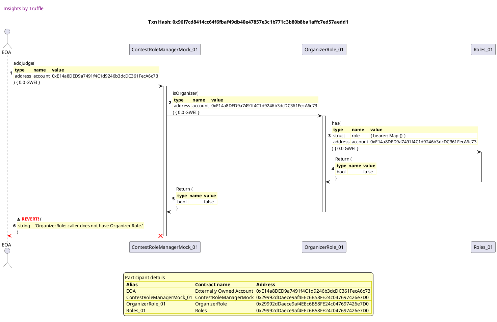

##### d3, tx: 0x9caf6ce8eae400aa14ad52ebf731cb152f13f06099d9efe69f071d3b7bd58f9d

[SVG :telescope:](https://www.planttext.com/api/plantuml/svg/pLLjRzCm4FxkNt4CYS5WczDcwLALQbsRyY9DGsE23u2GOr-wQAbJsKxNCVRVkQHfMHcjn10IKPIxdCztpzqvJnWxiauOLumpnaJXSbsCOpJCNgPw8emOGuOZrEfOoCkHoGkj-dcM6tWyZ8PHFsAiOzrrXbq6rNM1Gg61c_eLu7Lkqc-vTYBhPUb8Zr4xYfYufSEG5kSX9uMPPBYoy3xzXk3vIzixeLIgH-3nsdHRoSv-3OBL-Tzecuukd8Nu6ivDaIGKbxdKPGZdCmslXRre0v-5KYI1n4CKw7CkXESBTT30E6arFHbx1ut4QoOyu66eGamm21FUybGpRiNgu3095QEMIKVGezCU20jR9BSOjSsbCfq8AhLFHQ1rPtc69qAB4PgJN5v-vLxbldPrDSYf6GbDdJ2busBlhyRLBQNHBbmNBrkCLGXXjxifDpn_tWQ3utoARmirmgUVzMVMgGV-efRTxo_1NKyGI6enhkHKP0KffVjte4aPj1P8avBEZIEDpo9gyU4W6eIYvOTUulSz5JRy86ugEUWt0s-8iXV8LdCUvHdS0D_ZyEfZz8P6lGbpMTAzbbILf7Pf_tygkG-rB60vg0huXR0F0soTAMI9qb0y4ZSGep1esd0Y9d1p2xV_ihIVHVn-9hkxRJX3LnWD3oilplECSDATYCpMvcVhUhhfpFmh91jopdO_FJQelfJGvjyYWUWykH964x5reIFdz4e-tPsTi-X3T7R-Q6Udir_Pk-k0bZClYR42ixtIYJP8aML4YYf72pftTB2c-9DKAgxOsrw0LqYKbaw5mutynEQ_1VRk3kaeT2BDx1ru0pxWd9Tz9FOdAYAbZ6aenRAZlSKPNEwZSaf2fUVCeT64_XfEhpGgw3tebDuDl9wGrwrLoHfX63RKGA34K2H-5CdW-E1m63LyoVrM4BRyHe2j0LzDTe-uVp7zHUWbmTVgduQYsTKJP4VqfD__3m00)

## allows organizers to add/remove judges
[link to test...](http://github.com/fodisi/hackapay/blob/master/test/roles/ContestRoleManager.test.js#L36)

##### d1, tx: 0xd9ffebfe2a0061c27525cd28e306ee73a6a573284b99238585971a5d824734f6

[SVG :telescope:](https://www.planttext.com/api/plantuml/svg/tLRRJjj047tVhnZH5n2bNTlnBQ8HkHOU40YG-eA4rlOwiN3MqNhT9WJ-lMF7CRdWe19LgXebtjlicJcJipicv2nLJAfi71F2CfM8REnnITB7I4oOP6E8-P2BeCFynw5CCX5qapYHy6dG7_IxVK9EKpMBUOj0yHbn5d09yt88S9x8w2aHYiNjE1gACHSA4KDL6GnmSG4voUGavciBjz4J1wrHpLsp88Z443HQJhqKxUdNCWXI-hyGQJGSgHIy6Tp9B0mHbwX8nHpkfWBEMJfg0fq6RXXoB-GwezJIVDqsTTCFT8SRrEBSDfZ5JDlGdORdkhhXc8xfsXep0qTls4OZj0Ycp5SOUl-g3Io50smF2APDHNuqOKYrYoHugcwIc5yomOPSNYR-umFL2lFQrVT0wW6sDb_98HEOHfaRBVTjJgvloIVJfUboi6vooqBqg4PBgvNn0I557k2ajOiX71ytmKz4gcIMv_3mYEooVXki0df0OLIa3k_5FJaj5VgvR5lFtq3D9Xom5MnSj3zPd64dDty6H90yJG5xlez2LzYZquQBMd0jkzzpsexcw7JGSntTxsWkgg4xS0shP-hzi4GvWZdGBnI-_-XVe3Rh8ix9RFq5_pAFxM1p2fKqYj3HxyS2NYW0evI8XyqSFCuabqsuP1EOly3BtwJsIcARqeYb_nEbavCct72LIG4Ve-KbIOpnuJTaSRhqlkdm3R6WupeHrHsHOikEyxDwu-odlomgiixop6_CUVZJtaxoclztYEoLz3AKbKXsvcNN7LgJqxLBTd5rvvPaKVd9zSgz7t35eZXTOT6ZFKffpW8BF9O2xEGU91R6YazxAV9gN-kvg9dud2ek1OlZ6Lpz4Zo0zeUEmIfmVSsjMokS3QZXqaR7r3g-RJbEestQjk4Qdc44lcMwMFeDdtdjpdlEwXpjuMIhXczCxG5TrVgokmVKwZl1w-XF0L5nfUx86JxnlVGt)

##### d2, tx: 0x12ab2bdb54eb3fb37acdd9add5f8194e687d9521a934e23ee994e661f6a123ff

[SVG :telescope:](https://www.planttext.com/api/plantuml/svg/rLTjJzim4FxkNs6nBviOMzuJLwoYB-bW4W81qhuW8ITnseZKgHndQodyzrtIj2HzrIXeh6fZ-tA-UvxpNN95w2ILLCXi62D4CvdmREWnWTBxY8-ee4CSipxZGPlwztsHP3pe974Yy8UUstCxBaB7gPp4h8bmyHam6Z21f-KIuzD4H0y9bpHknL6V3ncNO36K2uKUt9oP76LY5BFQZUleWM7LMCWkQH14l8zLfHGz5UFnrn84AlsVyJJg3sIAlGc-4LaOWbqa8napV3Fc-9IcWmPMngf6FSqBFDDWdXvwkatz823WmmmTbHZCSko0c9fAYMumJMUCv49B3IsgQdeO8WYPBm6wUz72DCK7C1uW29kC_6X4WMe7IB1KNYKnEwUSzfauJ_pxEqKjr3VUhHkv47tA8H8YLvplNHRMj-J2TAuwN-o2jXdMokOVMT1dLJXLGLtrcePWHWxccfNr0K95oF1HSrimyE5X0yEf53u-tl9RT5oct-ToR3v-mt8oOXX6JeV5-8l66KnozSTyjs1fYc7c-v354cRAs5KDwdJTBg6sGTJGwAW1qGpBqmE_sz4jjSVybkNR-ipA9pp5oXS5V__fda7YRGESyrave896b2xahyd48BfY4SjskqxBKHrDwNM9e_bjbPYEsUaHtUgQcXkozKnMeUO45cbJ01_Gz6M0KoaoFqSfm1uCK-mnAfXeu7CwmjCd_FIMr9v9h3-JewC6lc8o4no_Z9wN937WX2_md8FO5D9jAVD6G7PawVfQBqxyxdyekGMHsWFelUAlWrmjCl3vRufiFrhr8didpusteVIAPHhIE7skqxh3fKG1f-kIPrCv5EfRQgNw2julxxAeY3RD8xuay-2dhWzkpVyE8di5kuHIGR8rBZiUppiVfhDU9jT4iwuPNLOQeO196iLfXKLNwIgAahE0vXXw8vZa7WGqbGi-hNboB_Or7uj-4wvZoGIdSJp15xyv2t3hHQ_Dgk7D_UgcUuMpdg8JnMYRQjktBSSnMgPjwqJtT2WsooGciNMVUgrstTbANxiasiFqelyjftkOMjydhvFluQJMJrUMUvYizjtFgxyr24bSfZ8wWIlyJVm3)

##### d3, tx: 0x98905cb1c87c4cad94ead985ab7e23fe3f8b34cd2c0902151397068dc9647f3b

[SVG :telescope:](https://www.planttext.com/api/plantuml/svg/rLTjRzis4FxENt78FdH3busoNXbaGVqYjnqGf6WBx4k1Wg8eMuXC6HJL9atottUIPSNoMp2xGJl3DidZyUvvZdSIISYhmd1jobb622zDhifP93KfhbCrvvhF89CJgU815zSJdPSg7kPPhk6NSJWEXo4XvuMvpUG5WVepbJoM6kwQ8S2RNAVVScLuri_IYPf9PT1YObg5CKukJCvBFSzaP-93-as2vRIoTpoEKpK1YpQYXxez_xC1GHh_RrMHJgQcWEWMFkeoIT0kCQd997oyKV265zCpe3SiODGLaIK2NpY2nyp1vInmUUJBdfr8EmaYsn5nJr16UvPhsSodNX0BvZb-OaS4GoOCGW-l-i0BEC7sX63OJ2hIEKUgGoGX2_C-p-GbLtmYzMKkhZzJgrRVETirSgKdN64aTAMuNBikx2wfXCLITJbu2jfkM1kB_oxZYLo5iohegdxW2PenqwNcolY4a3faS7gnBnZmykKPQ3dBlyZQpQ-Vr2TotcJWxqrxSVyNcDkv16mLdzNj5vwLsAdKxm5JHykY0Em9WObii4TlGilXmIWSCUuxp4gSeHMpdkD5TYn6GzkpnbBqFU7R2ok_mHtGFoYy_YTyYxct3tD5QMEFQYPfqSg_9nE7sTHZdX-EWdvW1Jqw7h6W9mOMSmDtE6QsDt9xOIAtCzc4MX5eCwS6FkN5OO0BeqjHeTHe3vixY2JNKf_19P_3tGCyF2UrHnBRz-Jqz0pUIrDg1OVHY_8yGvpuHPvB4Bj2kYzbdWd84rcwlTph7V_yFwcwbaldCVGJK-ZYt2or1UWVKst7CUjMsq_o07aUIizLhrr_Qwc2FhUbpwwQgDNt5CpgsxZUewAC3YDJfdMmEVwiDLdqA5kFRSV_Zm1K9rTrfhm7gNMkBp5xC48uVB64KcCm6ezwQQu0wr8dMVxrnI64ZawPXa2LrMs-RBZSampVtVcUt7hYLVVaYsbnDAmqoU8IGjwjd2jZQNYQ5IiiHdH4AQrOu5q3ZvhOgJnK6zVowI-V3-swY_lw-8x_DqPgnRFi5gw-AXb3_w0ZoAhXtSV_NNErip6r6NK6hZKGlXS4Jj_rVPlPaOtFAyzbBlDjmQF-eEjiuvgm9Zh2T7kTQBf7cDf-xTWcFy99vtgoCZp2vEervd7qNmrY4ZUfJ5xXFzww_mK0)

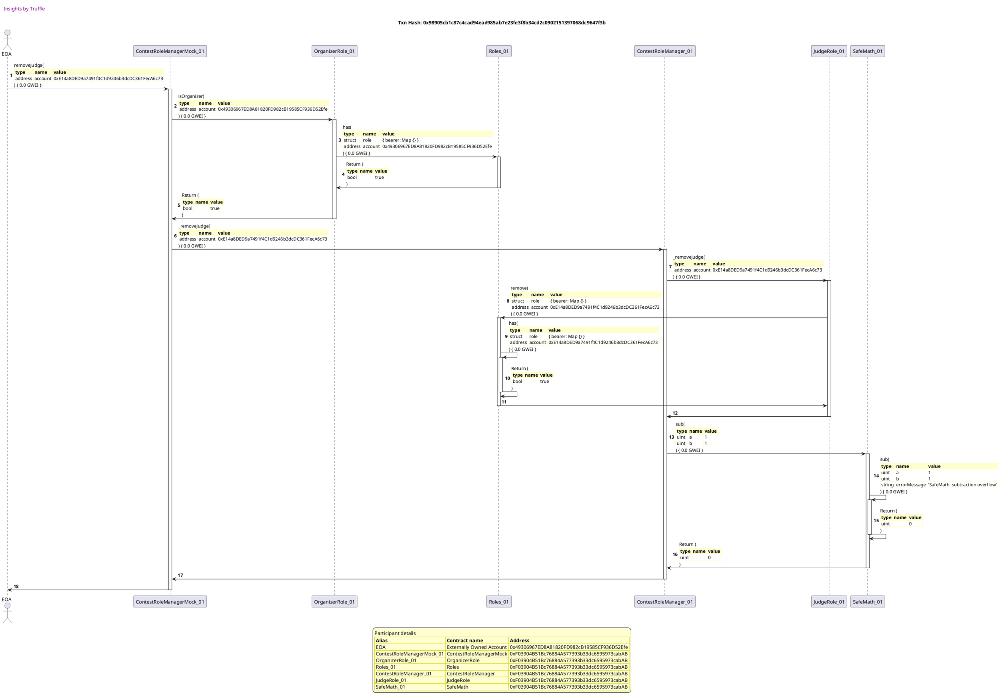

## has correct initial organizer count
[link to test...](http://github.com/fodisi/hackapay/blob/master/test/roles/ContestRoleManager.test.js#L55)

##### d1, tx: 0xcbccdf1f5c8bed2bc085854ad5b2a39d80996320b3ec16c509396ce969e84f66

[SVG :telescope:](https://www.planttext.com/api/plantuml/svg/tLRRJjj047tVhnZH5n2bNSUNs155X5mA3mW4I7r1GklrEh5mrj5wtIO4_hrZnp6vuA0ILQeQ9TxRx9avaxCx9kGqrKpfR1GJmZATo6pa2qNInqYEcM8ZYCL0oE2CySU1IZ8PT98uKV2ft-ltEZr2ZbCzZSK9WU8p52mG2cRb4E0yKT5J8ZMBst4qa2CXDIA6kZBeu-8SSfofSInM5cwZ9m66LSrTio28v00CMawz5Etnrp88Klg_a6aq6EeK_2dSgImC4PVeICS2xYOIpbawR06TS9_p83H2cxk-21e-fwxjsXOBRB_1J2zmgUSvPeFwfk26mstgcPx3XUTumhL2no6OCgunzDvL6rWAUzZk4KoRZdWqPaYrWoH4gc-IM5mooGP2NIRyyO4QXNdjwdiWzG0Rcw_KW4bCeygD5llM9rUtv9FfmdGnM3MvPI5wrCE5rT9uZv0Y3t1qieqX71wsW2SorIhBSxX_GBPPlmrM0JsWC2fI-_VodXoN2lrSjYVFtq1FnmAmbMnKj3zPd64dDty6H50YJG5xdAFGDVRenF9CwdXEizTrswxXDcY_wxaDVcPug9HEtpEThjteXINA0So0Vg7m_KVl0hLP5t5EPkCl-9TvR0QRKwYaKOIEVZyMy5m16AL2F6ncu0kcX6h19Hl3x0LU_YQrLnARb8Oi_Pye7Hsru4ReJ4du62q_IMAC3xyXYzE5ztM7RuW57TU9gEw855ksd9_b6sSt_MLHaNMMPtvjpiUVyNQIL_o_GsIdf9UXB4MoDI_Rxj2QdAvSilEhExSayyfFhfVk_K1e5iNf4eikxL9ASnPOuB4KO2VteB0mLdpQ2v5N-qwUYvg9puaMIh8udiBLBoa2Q7_e62m3rzVSkhN2cSEwJMfPpOxdXkZ5z6rcMbtQSRm6iqrks_scRRMTxdlEwXpju6IZXgzDxG1TrVgokmFKyZl1w-XF0L5nfUx8AJxnlVGt)

##### d2, tx: 0xe210fd890cf532bfa77ca4c30551b5ded3400bdfda922231777fe787245d4f32

[SVG :telescope:](https://www.planttext.com/api/plantuml/svg/rLTRRvim57xthx2wbqrTDtDnWAYBcWQozg5grLRQIwNAW4bGYOcCsP9U_liEbDolQnQjYmYsZ-rplkzmZZaWT98f9bNUIn1YkKf5tlEvHDb3BFfCiXvEU8UBy9G53nsPvY9ifKagyOUsr_PQ7aB7cHecl85m-Ujo5dA9dweXncUfZ1zJeLZIJEAEw76XG6EanWlQCFcgif_BVi9d9cxYHuurSooxOc4OYmxMI2LwATlZhnK8LDa_5rdSwQeC-qDyA_Ce0hr8nIhX-7OWy1dBkdLC1bpNI1JQ3WaYQkX-n2mhO6PW44erduOyD4n2_30AcQFhkg5PbXLnoxPqauPcPEW8N1OeWEvTDZ7By06q1mZSfk8WxZEWsW8IF5FNQS8lc60TBY_IuE6UQENobREpIYvbXmdmX2mMZlRE2sUt5C9ij7Gqs0HjDQo5pJSiWZdL7MsP6XyWLFe17pNMCSI7XtKCZtFCu-ETk4F7LLnzhjh6ypUiXdsEeHMiLxO_MP93frZ-N6YGFCimz880mbD1ZmmCCw2EtMfJTcfxXgDHssLsJJSirpH3ptPeTEffn2AlMZxX9qo-4FpzXtSE4RKETC5fmVCbbJZR2nFJCKZDgLcUQpTjpTP9stLiFJZL76hJLjinQYxLlOWlPx88jI0mZeSIU9TbRmESAPa71Ke9-g1vmZvdaiiwlc1z_FI2N_P9RK9Y-JCvEghZQwvoAV3RwFbfcW1Ek83d2CGgbwuBcJq1sH2bovEuVEBt_qlQRKYvTyfZcwG3k_ycwNQZDfjqx-GSsG-blvYs4KkoITvkSt1jVynCRLcJFzElvztYBuzBhpFuQtCoVoART_AC_Gr4Td9w1GKkVSr1kUsnlV6GVQrpYfNejKn6LrD5KiWLYvDiYeLBN498mGAgOQYRe5DOa515ZlaqHq4-tjTuBWjCk0yKbu8boH1V_X8ynCqtlKwd5QykK5VDbSPgpBM8QLejnux0Yk5JPfWkQTKSdL4ZeBHjKRDPSsUDBHIoSw8TL8yBtggxWwhbXV4o-Gv6fWleoUXF5KB4LN67Jk0E7t6_0G00)

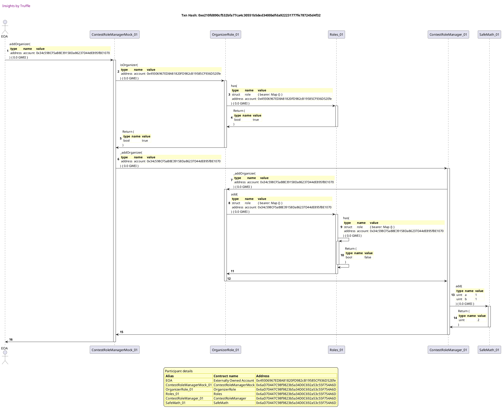

##### d3, tx: 0x1b4dd10105331c9b1f17c80730dc4df6df62ac031cb6858f74e3e9f62e5e6956

[SVG :telescope:](https://www.planttext.com/api/plantuml/svg/rLTjJzim4FxkNs6nBviOczEyLmnHcdGm2O40QL-Ga9CuRKJgL8wpjHJ--ovf6fA-QXGqLhMnVJxVFS_bBhaYT9nAAcGsZ16YcKnuDlIOGEbzn4TKq26EMP_nu8JwztsHP3pe9d4Yy8UUstExBaA7gPp4x0ZXuZDWD602JyibngU9Y1uIBcdSYQC-7p8kmM8eAuKURCvCZZ8nYbbZupfwO5ZHAjab3OA8zx52Ij5JCHv-BK6WqlyPJwF-GAROc-0RaOKXs4KoaZ73DsEEJsawQ6CoLZmj21IY45rL5T_sb50nVOkOAWbyBGWD-BQeJs3FCopT2asDgSm68TEPOUi6Wf3v4g2x5nrCKxm7unw2iCd8ZqOKg7Q114lbLHApSyffdudpnB-_8qgXldQtQUH2z2c7I8XSSNvsKTWyaWlJkUfyiGtQUbXBXtzaGP_LuTG5JTLh6e8PEPXhrjPx21KXmmT7cuA1z_VR6EvyuUFZBRz5XsNwVIx7eyTlM4v63CF8wR0OVz4uWqck_fYV5YnDCSny7x9OmeoCNKMZbkCwDZKrMmcrhXBOBStmrC1tkggXz9ZVCNnJdLdvXAUOV27u-q_t319l4-2Spz8DAcX4QIL_JIQQhHB3DapNiJgMOhL8px6jbd-YsBgbTtksQZXwomtPQYRBK7C2LTeKm0SqVHdWL8hCpr4Ai0V357kC2YRQ-9oEyFG9FxqbjMSIg-_9mK4RNp6P2OvVHizBaXXmmXTupa6i2-ccb7aZ85koT7Mj5tVyxdyekOf8um7qNl4tGIuN6VZyDqMs6wrcaRsJvyRRK7h5CWrfd3xNQTFXGgA0qrN9iwuS2lKDjL9_1U-MTrbKH9lc4L-GUV1JLWUtuNyBaPs2NKAf8TaObosFvwqFqralaskYMTUCBckDKC0aZUAqni8X3Y4aPm7DCVH6CCaz26WgApwTUN9NvuuUYtuJhcF91ATnFC4NlpaBSET5hyswuVNzwhgzmfb17PDecjcrhH2yg9vELSqXNSDkKLtrTRrdwbh7S9hEblhQ1T4Efgl-jvpkO6frdxnAleEJHZzTM-vWijvtFw_-rY0aSPdAw1Yky3Vn3m00)

##### d4, tx: 0x99e9390fbbcb9113b8f66e408ef5068bf3274029b83976768fb22598635be763

[SVG :telescope:](https://www.planttext.com/api/plantuml/svg/rLTjRzem4FxkNs5rNpPjtPpt17MebC3QILMhjjA-LAgSn86emK6Eiq5f__ik8K32wrPQhKE0xSlvxddET-P0w3YLLCXi42D4CvdmRE0nWTBxY0-fe0CSinxZmGdrxtiYoNZGJk94u7VTJhVJxY1qbCfnp9e85wy-em4JU58kCJvDHFIGS4dZLXpr-81n2HP3ELVemiEfoM4cXZ6hFRYE7XXMzBdiaWP1n7jO8QNegHYFlfGWKEd_ZATHhozJx8tnZSZ24EmY6ScOuPiHnwSqxJSm6JaESpI7X9xdUuwYQ9uTcYRJYSr2WvYs5sggfHFLyMpDiKpBj4DFLGt7DZN3OvQf8GYPBm5wvwA5QOeFO3n043OP-T6G0jKsa62fl4fYTauvxJ5ndlZtTqGfr3S-hHkv43tA8H8YLvpjNHRMj-J2TAOwM-o2jXdMokRlMT1ZLJXLGLtrcePWHlPdcfNr0K95oF1XSrimyCUF3GmdN_XuVyjlqL6PVf_AiVdu5Slna64OEHqKuqyQPp39rH_ptOAbAOQPxqCMIvYHaKqe7AMcXRgc4hjjmSe9GpK8g46xeU4PYkMg7KAcLZxW2IQV2VxsetC6YRSDSCvdvO0A6b4wbxya4ztHYEcOLiUrMxPYgwJhEhRgdoYEOHljhgEPhg5sGhQUoIhKdC0yRGhWVPe-3t0gHURdA0NOWs62FKO54mryJeTuyeIVNfFQWiJwCpayRE0h9ZF1yVFeUKaI0qvu0yyPY4qXtPOohmHaHvQkh_NYnE_-XvAR4wbTG6yLVntaQf61ptzJPFlHgXVP6xatNeVI2vPfIEDqKQTrXqk90axN9S-cSYZKjzHAzITulxpBeYBQ53xAainRo9Q3M_E_WyXUmIwXm5lTSY7-wVMyypATzZAv9ffspUYoqWW5JD8eJYiiNE8IGd8Mq1n3RmIJt8E0fdBEfpLBxlc-vcFHRyBtI3B1QHoFySKlpWBSUjRFPjNmvdvrqxF2cKbTY-YwrNRi4Bneda4rtILjqr6feVc6qRKClMMwTMShVUsIQ0_Jy_wtdEvXQdsVl4w-XvDQFrrPxc6osdSlLdzh49AuJ6Lq3D_mD_4t)

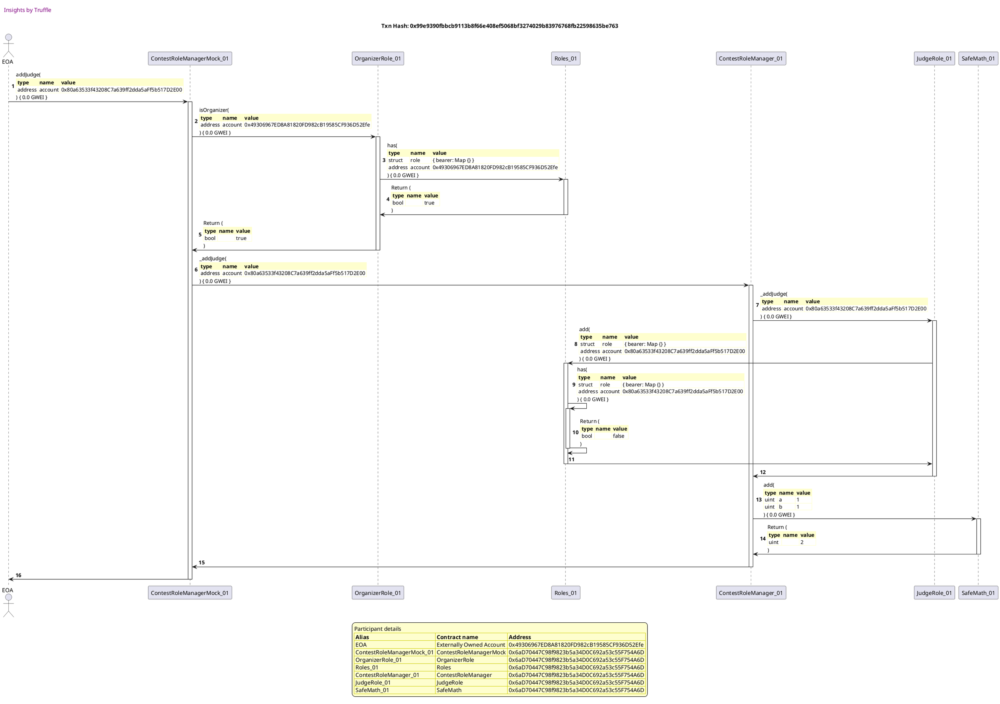

## has correct initial judge count
[link to test...](http://github.com/fodisi/hackapay/blob/master/test/roles/ContestRoleManager.test.js#L61)

##### d1, tx: 0x6c091f1587730715f0eecaee6925433e04b67c28a84d0e477dd9a6b5b6864bdd

[SVG :telescope:](https://www.planttext.com/api/plantuml/svg/tLPjJzim4FxkNt5YNq2CpKdpMh6AlWu-810WxGiISXAdZKYTod6sbi9_toLDGrz8qQWcJQlId7q-FtVFvU8B8MUfOb9buvWGbgb4P6EFIv8-HcB291j3p8TS11tcFmvbaecWcyI9X4-3_g3VxHDocgfPp5i4Yj-8iu1Bc9TJWFD4Ha-9K2nknz5GZBbGY1Ygoc20Yml8IIOdCLzRk8sUE6X6fRjcGH298MYqLBqKylHh6GGf_L-8D1gEL0hU3Eva5eQ8IrIaOWvtKm7dB1qrWKujdxfQg9cERJUehPaXvTndd5kkRXgD1gU6Pzc-xZ3722WtR3i8N6PvfcSvbk450S6K-Gf3xr-rWQLmWFA0ODfKv4SJXbIxI8AdwYQ9-IKJRCZbPU8_Fb2jCAzTVG-a7c1hyvKSCe5fbBdHSj-cSdrBhaoNfil9kiaj2z6Z6YsjLkO7X1HvW9FMBePmVDm4Fn6fabcUmyCZiilwRR0Aw04Beo9rU2_koMbPePzBsNh-1cesuO1Ii74XVx8umq5k_Wo887cQ0evy7mjTuOXE3RT1BTUo-psdxMYEJWSzrz7zZkQQZjaTk0shP-hzi4GvWZdGBnI-_-XVO6tMHPoJsNe4_pAFxM1p2bLf5A6Ztuy5lAW0Z58Y7eevU9n9BfjmoIOmVu6NlqdjbSGsfH5B_oTA9oTDkE4gam8-HijBaXZZmojaSRhqlkdmZM91ntL5LFUA55jsl3-h9yv-zPT5HTPPdlaDdOT_xUqah_b_XyXUIIz3MObaPrvsdQ4rELqxP1T7Tsv95fsVNA-S-m5NB8hJ5HOzsgEKvYommMChm47kGM9ZhFYqbqLUxMiz5pqJxrF5fM1nF8EhNu87qFxGQx0ANDzpwzOAPxhM2MX3mylfjcsNievF3SCEj43dkDPezqoNwmFpFMTrZlPmijN3DrHxG5UzlXpk0RNwJV0w-rD0hBYoxiWPtl6xz3S0)

##### d2, tx: 0x1bc9ec1a2e0942fd55ac94f8ec3638e7e32fb6cabc6c87f82899c8e6f28f800c

[SVG :telescope:](https://www.planttext.com/api/plantuml/svg/rLTRJzim57xthx3OooR6vjnQfsA8NjB10m81qbwGaEiuRKJgL8wpjHJ--qxIz7uTNJLMfR5zR9_pVIVdE2S8dIUQAPrs8uHOgcEPTbj2eUGfb3scM1T7eYsaNsFygQtYLFhrE8eL_j3qcbxTG-WqqOD8d26S_pg2-KBXOJ74-29MuNCiDOkgKTYMNI4rQ0pqP44J9aSgUwdgHM9kuYvy5jYm9x8RvlkXR6E35ABNl3tzMe10XVrBcOJjZavmQu3lLHe4e1VfK4S2t_Sblc19fu99tsXnLt23cOAujXduZiEuQmTKSAjaKL4MbXcqIforU8dJSa1DwhgSYb9Wqe0ImX6uZ6k0xbrNCKlm4RH72DocGnxs652j0mcHwDiu4bTCihPGLp5_UYH6ldpjxBoIQzLc4ZoXieNZlOl2-IsPC1al7G-sGLiFQsdp7GjWJdV6MsR6HmZbVi0dPviOukFZ2eR7EU7nyK4-eDCYhZuNxTdBDwm7FO6XbQoRjpzPb48dM_wIQL0YIJ3qE8VmrD0ZVSlcZalhJOVLg6UvXaCRZ9PCgzomRT-ZhXFKF8EKoKZB9pp4v0l1ttzubn1Hcq1dd9OydrC9auCmiLsBbDnIsMlGAZMeIPeDbvgyPhWETUfDroer7DCBn6ecor0p0fDuo85tMF8sm8bMASzGAj07pH2t15D2LV0Lw-7XAtuz9BKfYTNFvEIaWc-5JfN4RwFNYkC8SC85FCSWrhbqKyWS2CYMA5sTnFaJV_nVqcvBohrJ7hia7TZzDqct7xNvf7idvyXXAFt5j0rOb4ppTfU3Q_TZPcRBXloPVJtl5tzfc7kTmTzOaBMciaKdpzdVGcGlfnTGu38t79Ix7jjR3zbHdPEjHACo6TtC54c-q2oCaXaM3T8WX6Gie1g6kWawcGK5LUI4JtKSv9DzPozvWGdtlXPAiYWQuEjVKlYu-gRNwQpYzGNgkhdSc6dKV68PSD5wjUmILkF4jik-uPi2vgngmt65sNJcZIqLiWkYFLHF2jwYkuUgrONnAlaUHcOBwEdeJnL2n1LnXyxX3Xznlm40)

##### d3, tx: 0xe25b5b600b6bfc504927c5a65cc3415f6417e08b72309a3765c2de6ffe80904a

[SVG :telescope:](https://www.planttext.com/api/plantuml/svg/rLTjJzim4FxkNs6nBviOc_EU88OeJJgOX420j2z8o4cSDY9rAiVPMWh_VPSq3GbzqoXeh6fZ-to-UvxBNN95w2YJLCXyc214SvdoVEWpWRAxc8-ee4ESi3xZuJ4DxleYpNdOJPDKu0yzh-TrFOGECZb9s272vMV0QCW4dbPBZ4zI4T-dNDAaayHzFcHSWiL8rWezs9oP7ELYbB3MnbLypx2Yrx8B6eOnxsE5LAB7SZpuMe50bVzJdiNzWSomFy7N8eyYi8jaB1E6hySSdz1ii8_9cAc6R_Wc8RxfHu51T4Ur0eEQHX1ekc94fgvOZDY-fMh4ePe56sh8p2XYDd68JX64B900tJllO9hX7HXt48HDna4yea2r2oHO9Y_JX9rHJljCdAN1tIrHIlMLksqZvw9FEKH258hpiy-5xIE5C9khpXUReAs6jN3uHnxsMHDEKz1MlQ8Hc963kMPZlODG6JAyTxWk67XtTn_3dIzzVBpXD-YWIh_FrNZuy0tBoOXX63aTbkClckGmATGVYjE2PHc6MH105akOaR6dwDHsFTUXbkueaTvLGaVLJLyB0xUhcKgF1HqpiBIPbKzuYiaNWh__z4uXyTO1BlWitA2IHfpLyjTaeZiQCHtJyboxOoksIdgkOwl1iU8Ojj7jEPhf6geNiULC5g4M1EgqAO4FQFOom9aKUL2W560FXYds6HLCxECpEiBJH_pubjIUI2o_9tjx-_YIoLnm_39wVfecW1E-m7CEObL8rwNC6m7PaANBQxsyuxV_GydLH5eFeFUAlmroiSZ0vxyfikrejOlidJmtteRIAvPfH9FigKxR3fyb2ZXTbZohog5KNrChpLVmTdcNnsMqQH7nPp8VVihouBRyRo2oLR0hA0qaQ-EouV6yyM4wwsKAJJJhcj55en4AcQHnaZLOkCGbX1Gie3c6tWWcXGS1JMNDfpDFxlhSuKFPRy9rB9dWD4ac-FmtPo7klEYrsJIykbzTjLSwKvNZa6WAVErknt88FGw8hbkX4geCzhIEQpXCxHbjPmjzxJFH5gRh_hUQRc5gUP-yJBw5arO_tLXkORBPTp-j_jOW976LokW8hl0tyGy0)

##### d4, tx: 0x74438b27cec6f813e9fb05a021b5d62cbf67b41ce9c8d3238b4ff3efce085205

[SVG :telescope:](https://www.planttext.com/api/plantuml/svg/rLTjJzim4FxkNs6nBvisDkUjIIfMKVeoc8H0WBGlICX9d3GYTIh7sLeA_tsND4sJlcuKD8P2RP_FTyzpkNEl21qdaWgP3YE4Q2fZdWuT9b1o7_8H5NI88nOmxfrGzpuGSSgzJXp50h_hz_gzJW-XeqHE8jP2EFyRCEenWQV54kFJM8GFCPSqQaTXm8UCIx3eorAX3vipawDKZ29MsxWE7nXMz59sIJqlv05MI25woiUZBmK8LFW_uqaO36I2dGc-4QdlWrqaGnanV3Fc-9GcWoOcOrFNDSjHJPUv3TzID6Rx3Z4eKHN7y1ggw_WDqz4LbzckvMagwEg-hp7VPSGoL68W29ah0NhleerfWWzWF40GDXcwuOW2rGwGO8cyYYDsJZaDc3YFtVixekJg6tVhHYv4G3b4GcIAyxFBmlgHJ9ZCLUUBNT0smrev_3tr0bQ5KnNKLQ-f3sRaOAvPMHyWb8SC7xQs1GD__DZ4yEPp7-zl-IqwAjBlKp6s7hzYEHan32EdmtpyIQCK9fdwOtPQi2J1C7DTo689CpAs26reXgRvkgOIgsF2olPzrVEeGVk-uHYAsLLxXCoiVC1JJ3uJ_Er7xmmIRnlWZC_A2yffX4afVqackgsHXjqmUrshRIcMIlfTsrBT4yKsBAFJjxL6rr1xFblFP1LgHg1CcnpuW2RF0vn8aRePIW7sO9XYXr71H1EVqn6UFk6drwIs8B7-dHmUDl4LawdW-7dqd3YE02Sym7CEObD8jwNCAm7PaQNhQpr_utV_GycLH6eNq5l5NmUvMcJWyzyKsNwqwaNsHkwDrw7qWcNgqoXPr6dTuLAYWDDroREf77BrBRLI_GhUB-_IC8ysXNzbIUOiPCl1hVdVGMIlO1TGu56tN8X_UZtll4ndlKocYMPTCxgiD48UapICaWgBBkaIGZ8Mq1n3RmIJp8E0fhBaqvudTtckzPZtc_0vbanm6aKJVF6BCm-td_MrMJMykL_Tj9SxKvKJZsWAF5QdRTg4dhX4rqrFyLG6UrgxQzXCxHjrPojzxP9e3zDb_rjCzp2rlazU9z_3IQsVhYptC5djknUhlpK8ILoaCZg6J_YP-1i0)

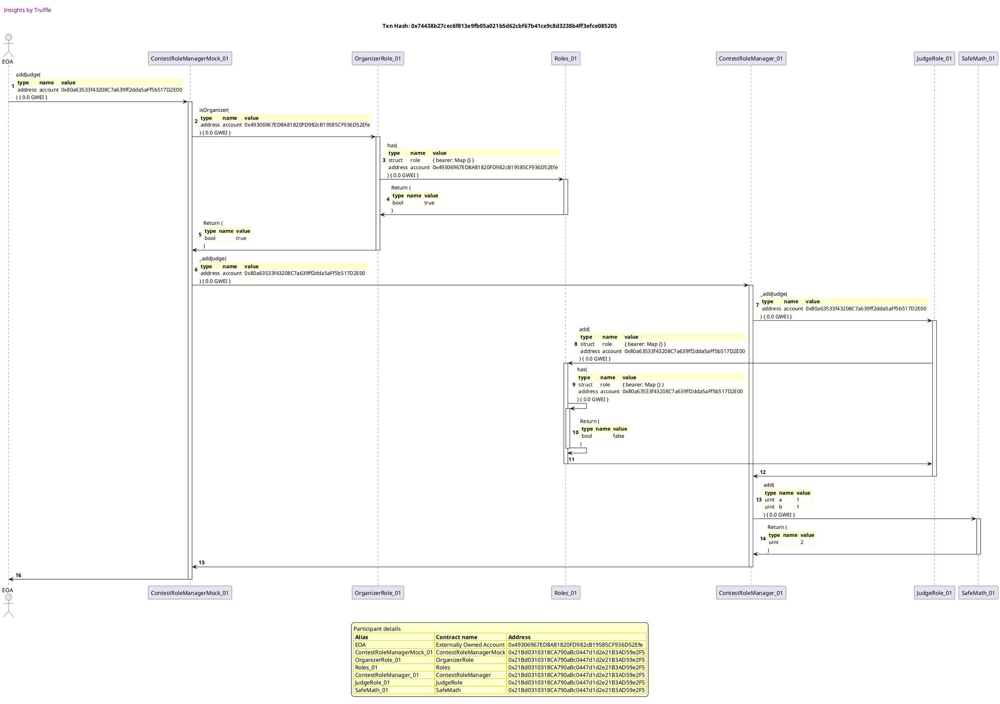

## updates organizer and judge count on member removal
[link to test...](http://github.com/fodisi/hackapay/blob/master/test/roles/ContestRoleManager.test.js#L67)

##### d1, tx: 0x6dd8c69db27f315390f05efeaae6193ba5044fe0e11636e10a97611226c5b3b6

[SVG :telescope:](https://www.planttext.com/api/plantuml/svg/tLPjJzim4FxkNt5YNq2CpKwRDAbOHLy77n08aFO52Jc9qqQaJkKuMqlXl--Ifg4lf6XKawPLRSu-dv-xvthsXP2pH7Ebqt5424zrBDEnAnH97aCvuOgF8H938VqEznw7AawbtusZMC6dGN_Gx_O9EKtqB18j0lbd9BWl5CoBAS1vhCAdM6eUjQDmACT2QaGCT6ammCK5v2HLaqYiBTo6Jm9OlTHTSzyFvH0OBLGlkJpzMWH12lyNCWc78vs0EuCxbGO1uX8TwaZ0tLJ2EKz6JQ1Jo_Tjpt9yrsW4DMRM71fGKmI2Ss4nf-PoazRhWQ22CQjc2KQvqx0OCmpBCzsQQn5CcQSnzFvL6tW21oWF2APDXruuuKYrYoH4ec_YI5nooOT2NSRUumDbkNdbwdiWrG1Rcw_Ka4jCeygCblisbUjRCcMoD5rErarkUO0UzMXfjJ8_82JF0voqTZ64u-CcUB5Cj4gp71uUaLtMRuELG0zO62MfmtjvJqwB2lrSoDRpDz2pYG2Kaezp-PD7AGuoysT012MI173aULZe6aTqMdTgr7AiHhzdjsrc6tJGSsp3wp37jCtkmAbPFTFe1mNA4So1Vg7m_KV_0ckpAkACpDPVy2_ps0user2MHXuw-lrOm8iAm2WLug6OWoku4ge9btm2ynTu-PlKNabiKnhnv7-YT7BIX1kXKoNXOxJSE8umFlm6F4gMtZSTlb4iwBYgYAgEIBvbn_bPlN7sgxyqpBFEiynlw5pyiRUJlER_7I9x9Rq8PIMIdNdPTOTMv7JjabrStPabMNH-Shrox_j2yp1ALbZqQ8zIch701e-j00UP1uMDiUJJNXPvkQ_rdFTCV4wrK997qGokVadXG_j3ns0LkBhdLgtbpWoR6QPbrHj6eysykcasEdNMSMpJ653VwTWc3UoEs_7VSrRbQ0ydMpryGxK7TDdhY-4UKAll1A-pFmN4YYlgZfpX4zzBVmC0)

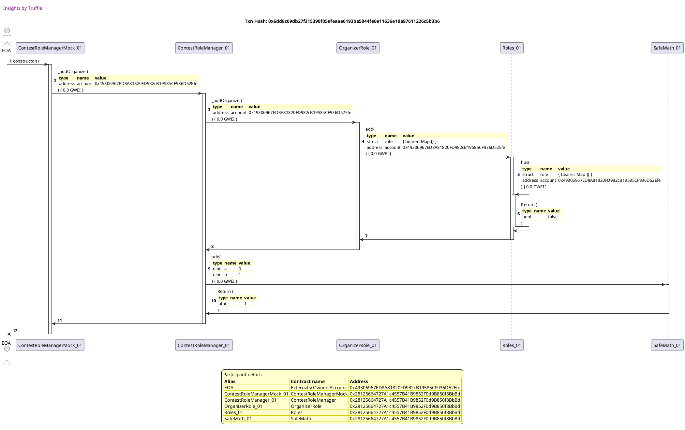

##### d2, tx: 0x8a6186848f962182b70604767ea1c6a33c3b08ff962e05be13e0d977492faf54

[SVG :telescope:](https://www.planttext.com/api/plantuml/svg/rLTRJzim57xthx3OooR6vjmTn11DcmuU40YGzeA4dCHf8rAdSfojvVBVTvAcznkZGsDL6jl7zZdVTtAESuBGIQwOL4KlHOWLAXD5B-0IvVU9w3F9UZZb7IuYZuNt7PaL8cfcQIRnXxRVzfi-GaUv6gRy6E7gr-KiuX8_raECJpEPF6H2iRIH9XtHuqA1nbXD5hHXSgIoNyX-okSchfC7ZZLp8hjaKPI83jP8BNgksgElDGXKspyJUTBfgXm7GtmZYpW6lKWbAkNuPY3mASkxXvWCABCrQbEJngwjQrGF768Jqx4TphJGPeOH6W6XSJdBYHLmpU0aSXt7TFMOnPQ9m6MX0kZ-HGEp7Ez1kuV0RIe9apu3gaqWmNDrbQNyd0dMuV8y2-_lY5OjNpixh-H2TfW0JyXouNZled1-IodCnql7WstGriDQsdpDOfXJtV6McV4UGfKVyC7n9ePuV_yGm-ESyFXuAsxHKHrNd-ls-EaRLiC-nz0ArglQdomje5CkVoerI9xd67fX2E6fe4S6XXbQBcssBUPHtt0rYxOOjNN3QPbcv5FNYZrV8muPQVc47p7vGl3t7_uPHDGcq2Md9SzNL9ByJPYOha5irtRy5crG257IRhbK3ptDjQZLRBk6tR9qF-QhcIn3BGbCug42tcNvwm3dIXPXYLA2FcWUSS2PvF8GdxC-Vdp6psz9RKfYzJCvE3Z4LrmLKk3NqGkoB0MSS07FCOXrBjqKCcy4P4kKhaxYwedV_IzfjoNbtYcFboGTsFqtIRSRjVcaUoVdoDjG-ejf6xCqd-RjImwkbnypCrisvC_iwtct-2kIokiC_jg2B9ZA5fqyPtyBaPsSNaE1IzzmKBxqsDvwo8xgd78b6fN9w7AcI8guOacQpx1eaHOXf6G1rJ3KJT0fBKYe8YTy6kCWd-mxVgeAJBWF59U2fUaGN_mIFCADLxrEPnMlBr3NpLN6TAhfbcsRZkuqjD2qBCSpDS-bbjw62jcZ5ecf5tZHlB6bGdP1j8FgIS5RTtTGjRemNYNVmSXi0JqT_Qb2YBWwxj09tE4ZxZS0)

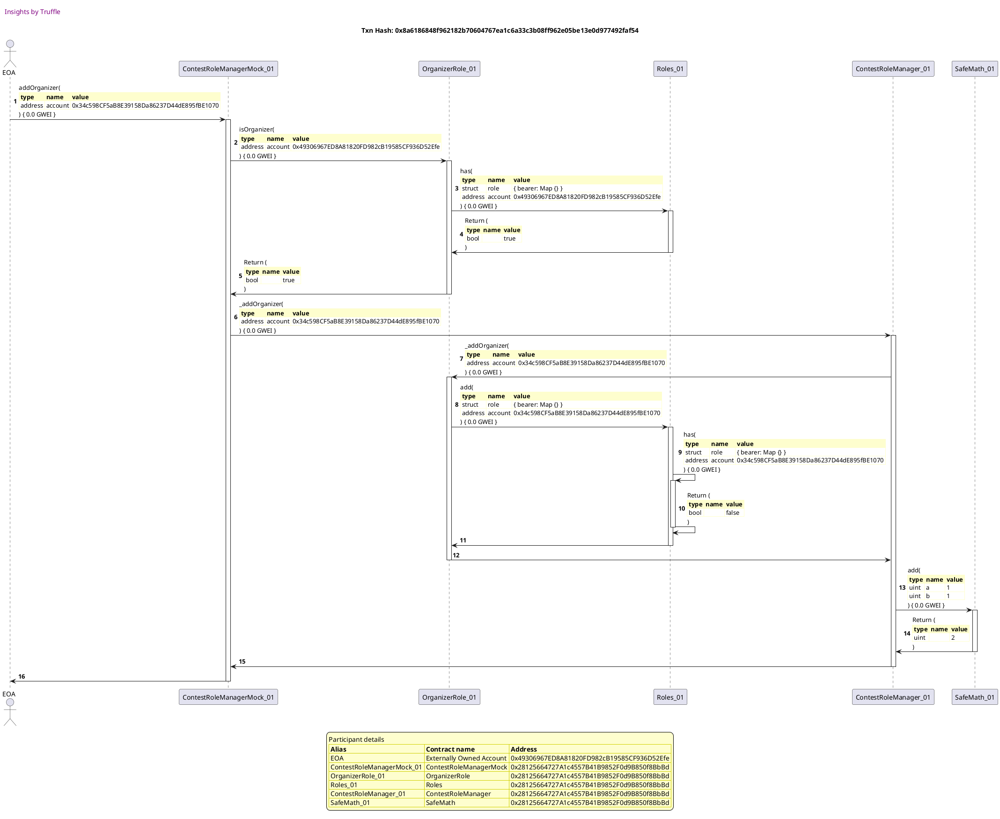

##### d3, tx: 0xe06f3490845a828bf8a77cbe30d64382c872b5e29b0beb33f2bc62c14862f028

[SVG :telescope:](https://www.planttext.com/api/plantuml/svg/rLTjJzim4FxkNs6nBviOc_FkLAoYB-bW4W81qhuW8ITnseZKgHndAs__VPUGbeI-QHGqLhMnVJdVFS_vBhaYT90f9bK-JX1YkKf5FlQvHDbrB2PCiZ5E-92BiCk2ww5CSn7sqYIL-CF06tWz3w7zJDqal8rm-Hbn5dA9xwebneUfZ6zJeLZIIUAX67EXm6AavWe3kFbeSfBBIS8RDyxZMuurSouxPM4OYo7MI2LwACVzhnK8LFa_4bay7AaC-pVuGkPH17QHYbN2ySLKu4EMZLgOJ3cn8yDq2JKjHdNgHvGvJk1pWuIsQL0ze8xkMrntVU9ptp0YtGziFT1CQkiHqIc2a0KAe7id7Smol0FZ3eAmgJY89moeze04pzHPcl1Z9jYGo-CqkBuYMgc-ycxJo8aSCW6Ha8NYREzpONDB8SncghF59cYhOIri_f67Grw7KnSqLSzP16RKQAPPM-yWL8OCxxNN1GFlxhOmd7pfu-Ebk4JxLVfzhiRs_JUiRYOSmoZOk1n_iII7IQ5-N-oMFCimp880ibZ1Z4mzpMIqx_LTvfYk5fazBNHrq_QDCEZt35iRyA1Z1uxnQEKJliFa2y7VVtf7a7Zh01Ty5Wwef15dS_bhCZ5TWzYkxNXzsg4QrScWxqB-TZNNebPlu1fstzAzY2zdiWYr831FcnBuY6Kl0vmfcGS5IWdsOBZ3FcUIonO-PXDyzu0VtfBQ4udbPxAtry9dNELIu9VHyzCq0Ppm1Pup4Aj2kYvbtWZ8XYnTNklbYL_z3oKt9z9u0BrN_4sGYqK6FlzDaMr7grbax-IvyJQKNh5C8vPaJtNQTFWiKS3fikHPLGwb-ffQgR-2jykxF2wZpOg8FvFvyDEM1xVXVmEHhO9TGQaXMHkN3O_dZG_Jnrwcq4IFNJCwhJL28LSiJh8QYpxf4q8A5j0SGsy4ayA3XAPopgSpI-xvllPzsM_2TQgu52n9Rl39Ry53t7dHQxDkU7M_kkfUwKodccxPjkdeJaSBJCjokgRMTQcb3qZeTgb58jhrks7JsK9V-qoqXUbv_rjDjp2rl4zU9j_2IQEVhYstC5dlkvzMVsiGahXAPNG0L_YR-0S0)

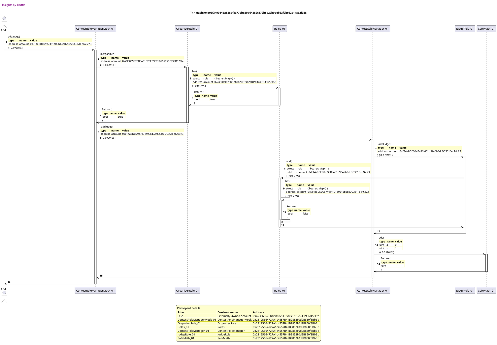

##### d4, tx: 0xe0b7d77a0c147e8df310f0506c8c5a17c2e1ad65083f3b1569c3b2c71beb9029

[SVG :telescope:](https://www.planttext.com/api/plantuml/svg/rLTjRvim4FxkNs5rNpPjtGo4jwYBcjUrawfMRQLzgLGPC0ILcCYOBMdQ_xw3409vwzQqMXSbs3xETyzpt9aBGiU9f4AcemWXcigOfoE72PJSXNnC1HtXY0MCUntgtWKYJhdNZQDOu7U3_g3VxIDqbCXfn5e8vvyXenuJU5OiCJw9HNWVSqcZTXG6VCIu18k-B1K6S7DkSfoASSHgDwx2UuQLHYcxe9uNyW0hf10zvkFHbm84AloVyYGCXZB1pXHVYzJtmIwIeOmOlfvmV4AJOHEJ2IEEwPac9QxIC9db-Pf2VA8JmxLSdIgcgpA5UePEBCtN74KtR5TpLDTK7EROHBKHXCoL0Br_tiOqmGSm7Y08cmpTS4o1QXT8i4HUnX4xevm6J9p5xjqjKNBrhNVhHiv5G3b4GcIAYxshmlgMJ9WiL1UBfw1jXxMs-Nlg1QmAfogegrvH7yp8uKApiZv0A0yPFcpj2WR--B69uSddFjxVy1jqLAJVfs9iFNp5SZfc64PEH_duaqOfJ3BrXsotO4c2OUQwaCKIPcHY4MfekgRv3KqbLjU4bUtxgkTHdGvytT4LiwVs2PbR-O1dc7mc-DkF_YaatYx06P-r1vJJ29DI_f9C6hP63Dim-pshRIcMIWOzsrBTZcBhbjuTs9hHqzM-ppOpMOUQ4IZJ9WS-fCdp02TIf6w6Ke0z66ROOLGmqSHdT8ndZ_ZnDQajIMn-9eU7JNp9P2euVXuz9uuZm0bVuBa0iIsakrBcbO0yaQMRQpr_uhV_GycLH6e7q5l5NmUvNcJWyzyKsNwqwaNsHiwDrw7qWcNgqoXPrcdTuKgYWDDDoREj77Br7RLIVGNlbtTfc4URmazPaJbBsMfmQ_wV8B9Ni0iey5Lt78X_UZm_UPZEUvbC4ysxPdHHQOGy9caO9HKMFT8ZX6Gie3c6tWWccGS1JMN9fxr8xd9Vwo7lD-4waKnm6aLJVFwBCm-td_NQh1hUtgzkkvSxKor5rGsZOQfcMt4Rkcvs6ah7jdHrG3oxO-d4jpfEnwixM-jhLqHxc2xxtsAwXwdDVV8c-HvEQlrqPRc7oMhVlLpzhK58uYALqJ5SuM_YRm00)

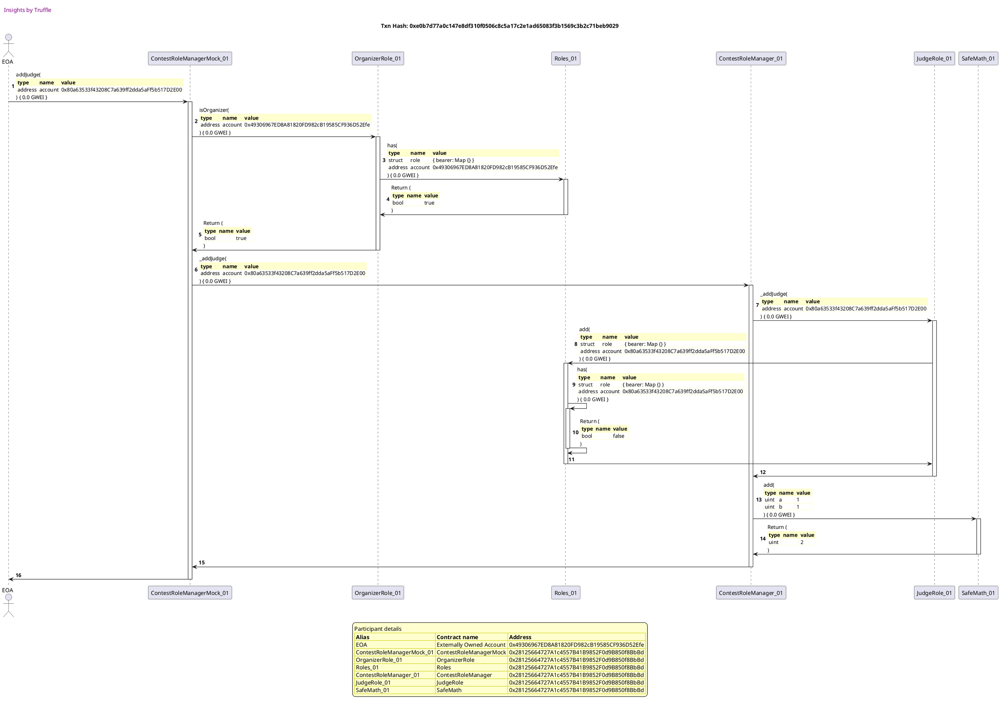

##### d5, tx: 0xd22fa2510ec66c9b9ed9a1425d560daace6934482407357a3d3b4873cb070f31

[SVG :telescope:](https://www.planttext.com/api/plantuml/svg/tLRVJzim47xtNt5Y3mmnDkTNco26rhJfuA420T9Ua92JE6r4wbIE0mNA_xvBI4jAIT7AfashcjW-d-_kEt-EZv1lcM9IvUE449QhLEHZdqkINSTYmYGRGyA7N8Gk2ww7Cir5s4sJLCA7ljVtkXuX1vcwI_WXWV8tuYpa4Xwg8S1HAkFxL2YMT99uACPSABGOgOL27oUVJ4voEKduqiHvVCz1CnUoKnQ6iHY2HYlHOzaUVAc289N_Ov75mv7AmB-32vb74TebAbO9XukfW2EMZVQ1JaDTZvXkQPG7hLRW-0uF7QQPkXLQBHeo5l2MOvYchPkqRLXjPeI6Rzfj8_1fcqQ6HZ1bWSBGlPCEi0osiDqYc3OL1_648TGkWk2PEaiJFc223RaSfC7r5TLAzSRPjumq6rXPV2A7J60QPQ4qN_TIkBoa46PprVbWMUMSHUXHZUPQjV4M8MKUOEzm7KBOtTq7oGLIAk2BU3xka7LhNZUvC7Sb-JYzgLcx59VaeABgfwezd7q5TJVXWArWuxAzOKcEdK9z1iWnoRCCi1S469x27fqQPc0vThTlCTVs34Upx1wpMxhHxfbcwDcE5RcUXhHuih833q0_K_Z-mpj6aZO5NU1PsOj_7Cfgl0MA1KsgVIs2topcJCayA0ALQ1AR1_0varpkmu1DuE4H7lyakcSSgwX6BFkV8EtjxSCPLxaKi1aiFqqJZ0__YA-IxhpqzmfTq6yJZPhEIRbapI6gVt_AlSfoVpDGULmcdU6Zlv3v-6YlvtZ9_zy8g2HPSJNEW4kPoW6o23E4m-rvA6KCIkAD5QS2y7pAA4bljpS1z6xgL01g2Nt5vHeo_7RdQxYrxZvguENIXVLq6HQQvAcM8gUrcpJaYiL9LaFHeprAQO42IoQyNB5JU2WsRe6dC_zEBDOTpieg1DzJnQLWIN879xU2Xz3Pw4jIDznSnJJDbSvqMzEjLijiw-sE5fYMrNPDpNLiI-_Jq75jYqQswxlXMywQ7Bt3oKfLz4Bq3jEBwgdgliDKlSfw7lsgGMHSnJlo3TzOwVy4)

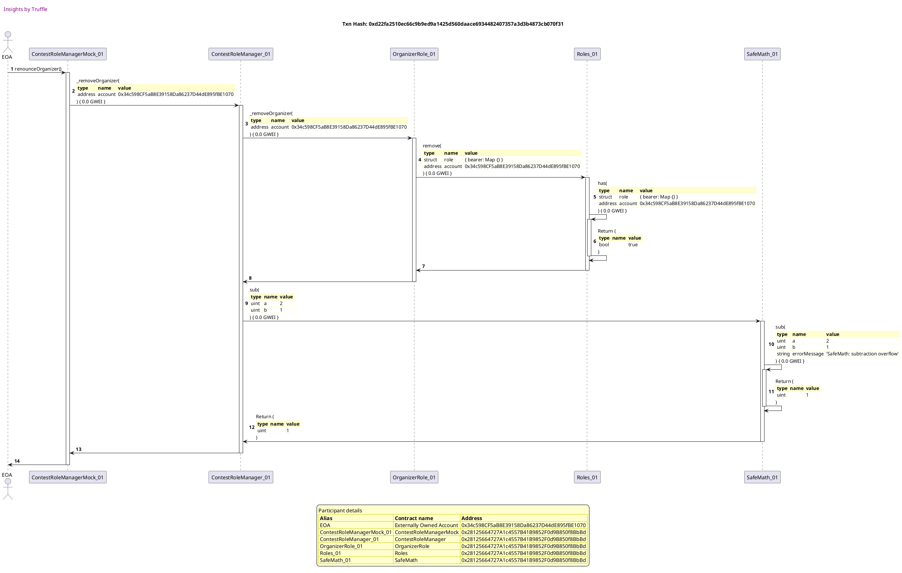

##### d6, tx: 0xee9173e9118f06b0dd9c645376be1d424f57eadc42f6bcfbea6216e53c11544d

[SVG :telescope:](https://www.planttext.com/api/plantuml/svg/tLRRJjj047tVhnZH1ueexTgndOjeH1AIGgK814XzGK9hUvrOEEjelOQ4X7_ls7623N5GarQj6iNUs_ZCdF5Pxn1o4YacLJmA266n2aKyihaaqRqlnaoo4GHym8NRPixzG8QnS3jX44huqElskfqk8SUHcWQyII3z3JbpkOHPDWGu2wN_50h5WbRW3yI82uM8dbePz71n0JcEvJZWXOLh_uc3PgpcBfdh-c806iscdjFs-4iM1Cdydul87mnL1FOKRcJiUOXBbAy23ZSJ0MSi6ZQ0JZYlQzKAthIQHosRkcxTiGopKhLihhc6RdXc5G4TG_Sis_5ipYnTixXPSJJDD0oNOCeSXQ5tBrh08jZ3TezWsfJl-6E6L3j8WaVgAWnudmasuB8VElTtL4lDIrVV0oa7UFFmzzWTyCHW-Kn-ecYQJ4PBi-MWQ7BDFFIaXakht7YFa9G_73KtCOF3mmP8Bb1A3azZ-NX0DjclXrj1tKa-2Xyof5jnIuupQNxAskRyAwZfc0EsWetIze45CNOIypcWfYIF8i2Uus1O2djqKgFCgfYLYcTKT5hhL75KzppTTPd9UfvfcrhrLEzIka0vW1dGpnI-_UYUeoZB0awu5FB_3rCenfb4lf94zWwJeBUBDr8oTf8W9K9YCmFSMvBB1lJP66RFyFmdcRtmUCjgoAB_YTBHKGEkk8gbWEresM4OO7puHtxPxC5hVw-aWZxNoQTiJwJc6pPC_XkJlgCejhSZ4_jfiXbU-giv6ozjVMuB_lz6GAcuacDl3bpAKFPHFPWX7EulGqbZK19F8pyKWFjIUa7ukByDePqban789NIDomrY-EtEDsXhqxbJeil2mRGuy19BigYJo6Nkj7IvOduGvLYSqbDAQS82oo4yGB6JU4XUt8fFQ_bzM3tNdASL1judYal1Wc0A5u-2kz3QwWkI1owlKChMKcTwJTDDopAgUhMbEOPfLjk6rgxNJBr7tNgxPbAlrhRRxdlEoXpjuAHGyUI6Eq2kAgEikmDKle9w6Vqg82ejqnivmJjMxpy1)

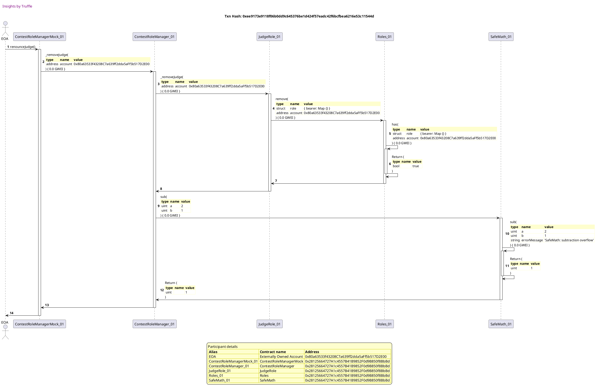

