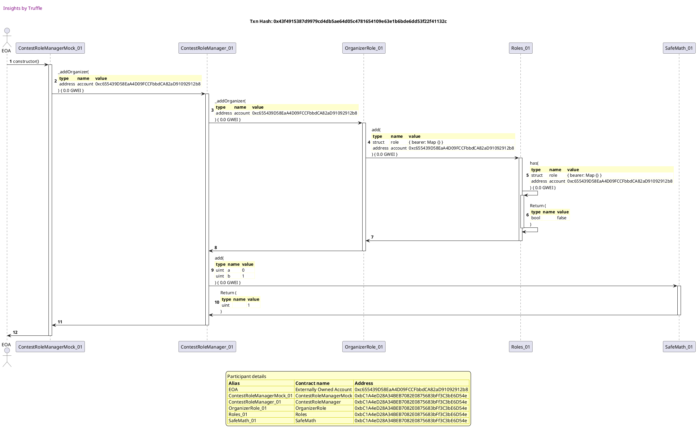
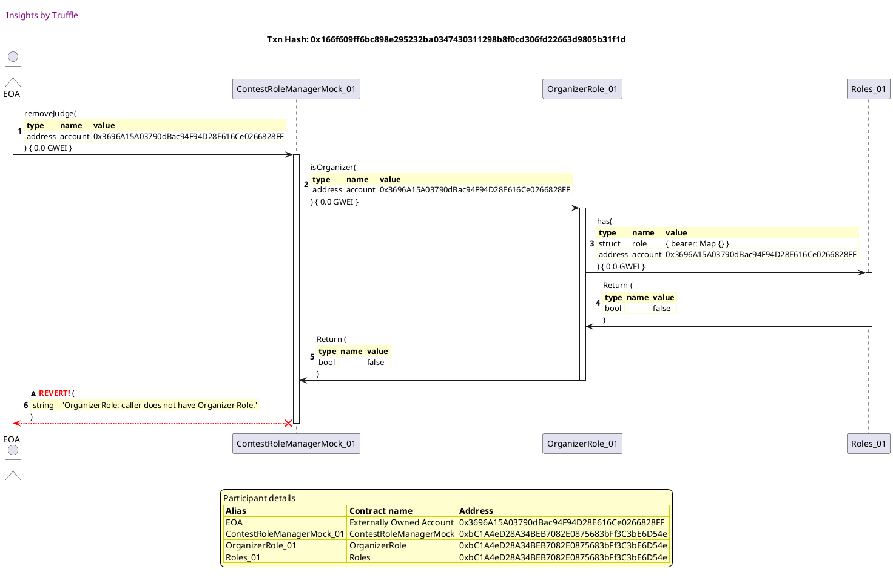
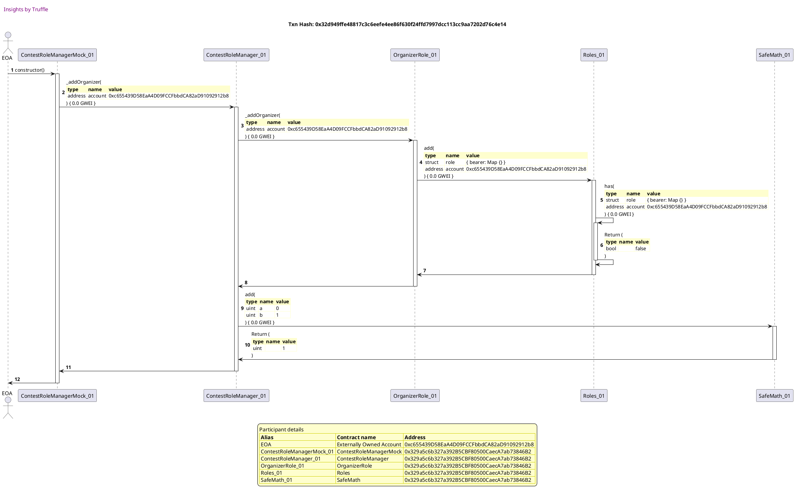
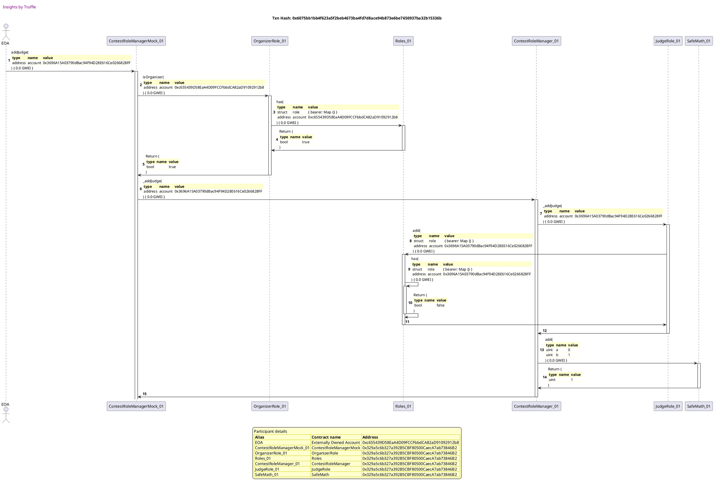
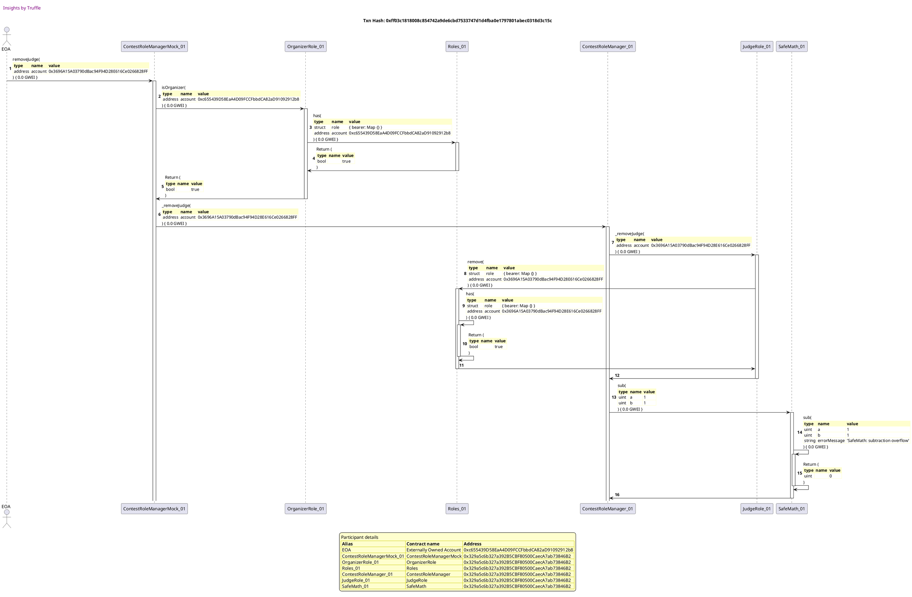
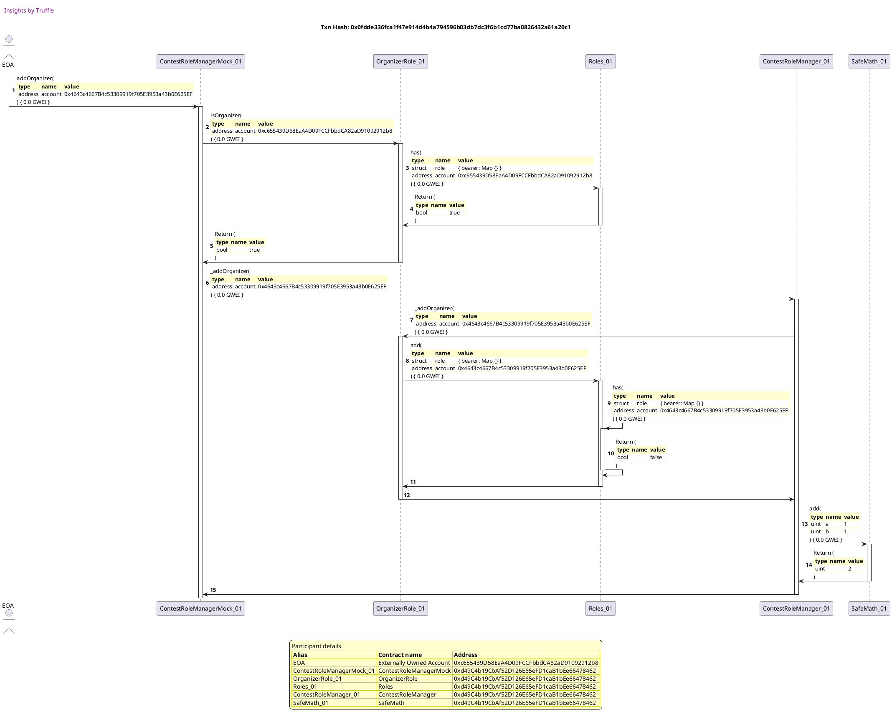
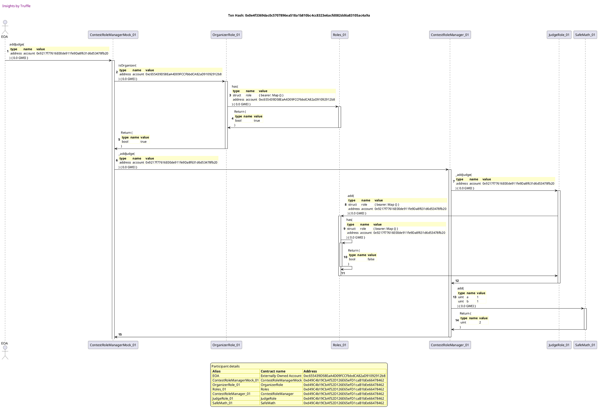
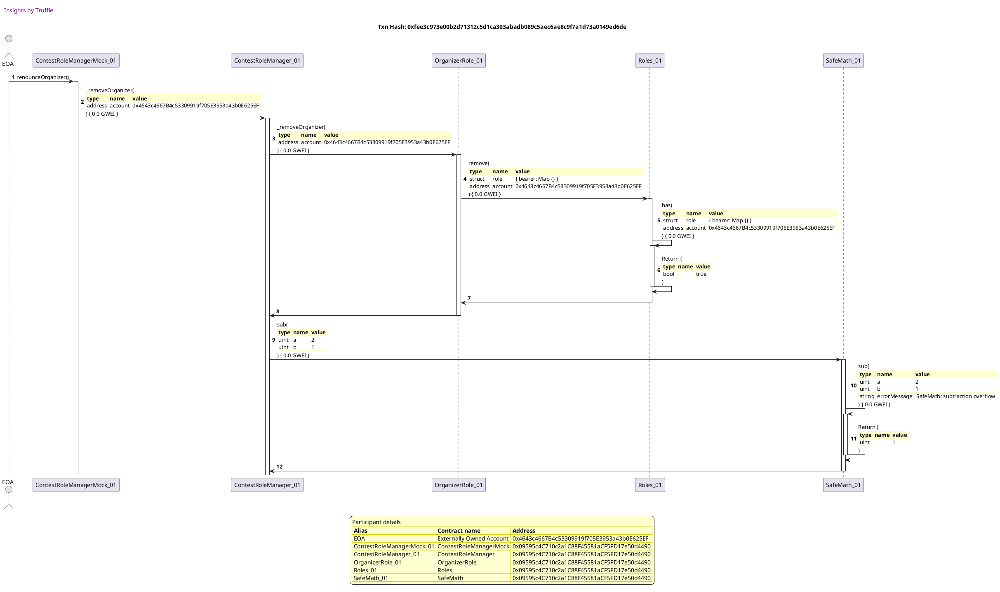
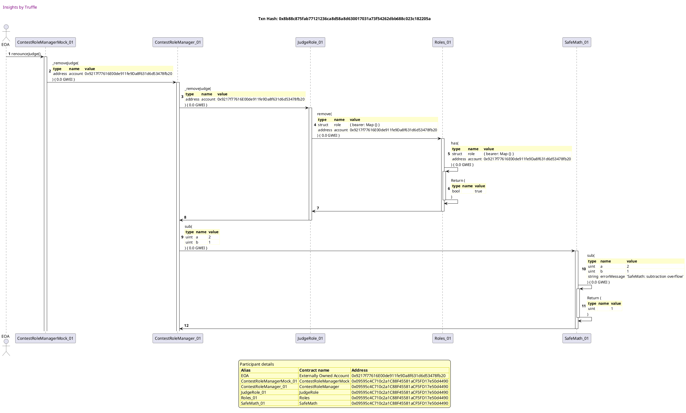

Test date: 2021 Mar 11

## does not allow non-organizers to add/remove judges
[link to test...](http://github.com/fodisi/hackapay/blob/1746d2fc3fafc73d8b2843f0fed53fbd26643dc8/test/roles/ContestRoleManager.test.js#L25)

##### d1, tx: 0x43f4915387d9979cd4db5ae64d05c4781654109e63e1b6bde6dd53f22f41132c

[SVG :telescope:](https://www.planttext.com/api/plantuml/svg/tLPjJzim4FxkNt5YNq2CBUzDAeO8QJhuW420j2z8o4cSDY9rAiVPMWh_VPSq3NqXHQEQDArgS_Rv_DmzrxClX9pcaWfPZ592Q24pNem29aZ-cF0n5NG4AHim7ftHy74Wie97NfPc0Zxr_Rxl-OGSvtAQiXC2rMV8QCG4pEefm7acagUCIvgwQJBW8yOb8iQoCUZZuXnoN8XnobOMRfCd1ghHwAvf52Ly0AfIgrugUVor3eBK_YzudWo6CeTW2dUYY6F49JAHAOEx2OTpcW-xe4mCFJOSrTJjJkGu7IUCZ2WmARECI353esEhbcceYiCidQc15KJCYY9JZpKjDbHLrqA2AGibXkvVkK1ps4EvHp1jCWcJCKMg7f9WkRp9KdP9EHqmSPc5Zm-AMfcthhu7qWwmiVbA32Z7D8hIQB5lNRcwfLJc2zF5PDNabiReKGuNLalpFKAgFC3HoJQ6S7ZOXJ3ZkHH5cSFz0xBD-csm1kW12wCXjN_FxybnNQ6VQtdo_0taTCm09QUZIlwaQO63qlmP446mF0SSXI4MkiIHCWajqpHqfsVQFdMDdkBqFQyV197dsXhjELWTcgDgWJr7EO0PA5yK-Fx3ly3QR8ku9BFn5_pBF3Q3BIaqfL65Zdu_5l2y0Z1AWNWePX0mAfZemYKTm-m5NlucjLSIcvI6DF-VA1qTTU66oK9m-1Yj8CjIZ0-_CKtpMdsmxl2DOa77RKNKTaIgBLlEp_ADirlz5KcLTLfcVaqNu4zzEyah_jyXibFIwr2M8jcQbsrtQ4jELoxP-TLTMf9vvoVNI_T-n2HDqdo9HK_fAOfIii06Zwq01wK7WOsnuUCkYhpPT_9SzKnyJYGJdARf5Av-SHQ1-w5Zi0pStdFRrYfdWQUw1kjfjgiRP_vPHx4rNx4xfcNhGJ_MFJtmhPvfiFUSjJdQmSb63rzJxG3TzFfwk0FKyZl1w-nF0R7YwheZf_Z4zzBV)

##### d2, tx: 0x81842d24393b22a19dbfc89fd94f404a72e8c79ba358f70eb216313548d7a8e3

[SVG :telescope:](https://www.planttext.com/api/plantuml/svg/pLLjJzim4FxkNt5ZqjZO0EUbQL9r5QMa6vCGYA7jmpPDJd8f4QbJsGwKCVxxBcbQAAoLnZHfKPHppkUxvrxoXB4zROGovJXdJ9IcaEKuGiNqHIOdGeanv3X2cUoB-6AaYb8cWo8l53mVXiDm43BMrUOwnnw3-Zf7aQ22c-OLu7sXiX-5D2Blvzb8Zb4QyfYQXS6GDcSk9wMQvBYqyJ7xWM2v2zs9I99CZi3YZUgsbjtT1WHhuXzAdOtEZORe6ivKcQRabvdCv0XdKmdlXJxl09_wbk_QYUqwWHFPjh2294fZFqYJm4rTxegsZNxS3YBXjFoqpJ6oBS-nd9Rh9stXeyEePB4XwE5n7uI63P8RZCfciZYR24frG4cWDgT5ZaT2YX6geoA--CwjsdpbxhAJOpKIaYgXAiFvsOVAvIELKizDvoyRZDK8ORktBZQyVjq1AlI7CXdXow_oA-istNxJoDxFjs2k9mWafHZNybBa9Iqgyv_LQOLQ0wtYc8R6q8fF7I_m-bQhpvrsmAk92jnXu1xOVkXPtW2vxNc-xG-7Co-lu0Ru3eTtdyD3wlCwm5K-Z-fHfv7fXVx_oUGnr2g1HPTguET2FmsmDggCAvIA_96uWGY5GjM18p61crku_PUftINn-vviRtVW54sf93mjlQWeSi99TofotQXVhQhfkfdvLqZMn9nkVtckCFbMGPjzY0IY--9AA4cireDkFEDMikbjRPs6dyBJisTRMztTMjzR1RJgUSMADPZDfKfq81PvJeoO5AX15eO6wnBl6AKcYftDEVW4YS-oIs5mBJcnsJ-1dTnZd0IDo79z3zu1F-2SLtKawYSUeaNbKr68HKNxynbSdADqAZQbvzIWaeJ-6ewl92RGVzAKtdUycerNxTN1ee7LTv6SznrtFznlSzyEkTzkURuJ3LDdu4IXTz1oSJdO8zP-eFeBrmjsRvP_wefwrtIGxT6J_ls_0000)

##### d3, tx: 0x166f609ff6bc898e295232ba0347430311298b8f0cd306fd22663d9805b31f1d

[SVG :telescope:](https://www.planttext.com/api/plantuml/svg/pLLjRzCm4FxkNt5i4h2DCITfqwGgrResXI5Dcye47m0X9xbqqLAdifsjszX_vvAcPMMq4aD8H57EEP_lddl94yOEjH7A59ECCL6ON1QJ41NJbwcS2YKcaE4OPNmaeiknoWiPz_CiLx0z38P1Fs2ieyrDXbq6rNM18aO5T_KhmBjSfRUvD2BhPUbOJb0QyfYOfS6GDkSkfuMQPhYoyI6zHR0QIzsPYEDKZi7YjUg-afs36WIhunzBdOulZ8Rm1ivLaIJabvdKP0ZdCmdlXBve0vzPhfkut4yIDumytqFRRzgE7GhkD5eDXpkMPVjUw2KyYXtk9h5jkwuJ-nvlXewLM36ZaaM6e0UdFH0QjaXkCIgRIQDqAYZLFYM1sepo34-456DK9tbq-OrRbVdQtLKdfsei95L2bOQBixygLu-KIhqmNRniCLOXXFtkfjYmjzS6XPFy2jyNyHXVVf5VMATk-AjQTh-_0NCpHI0fnQIILo8hQ56QVmVgb4AjWLPHH7DZQCLdZkkxFQlPuqxBv-LG-OsXtnZONk1QRXyv5TYplU5mxcK7xe2_vl3sKt1ChTw4kKpfKKcgJ5AzrFy_cJo6MYQmR5G5_4Befm7MHXLHYLAHFn9t4A9GgDfm8gPmTm_t_pArdqdylYVx-sqOeIcKXAUb5-PvHZZfJaIcQ_NEkffkcfb_XMH3pDd-vss5yTSIslnR912TvzT2IIAsBdIYERsIJNTtTnHy34RdptPtEmULlhiEQDdpaXWhC2zMAj66I6GPaMASemQP6ngiA_n9AXLNl7wn01yZKLfw9Gnkv2Ss_osmimUa4wCHQQOVm1lm0UUyh2EnFr4HBKgVYa8iAzfRpE3o7ALJ4YezPmQL9FGtS7ejCORUawRqeUFrXBnkhmeMzgrU0ybvpsaS1KSjxja1zrfDrtF2OUBqdJ1m1yq6hWPxHDo_gFx2zPBWw-MVkgBUrHraX_Iat_yF)

## allows organizers to add/remove judges
[link to test...](http://github.com/fodisi/hackapay/blob/1746d2fc3fafc73d8b2843f0fed53fbd26643dc8/test/roles/ContestRoleManager.test.js#L36)

##### d1, tx: 0x32d949ffe48817c3c6eefe4ee86f630f24ffd7997dcc113cc9aa7202d76c4e14

[SVG :telescope:](https://www.planttext.com/api/plantuml/svg/tLRVRzem47xtNt7gNbfrtPm4I88wL0Ymzg5grLRQIwNASHo86XpaE1kKzd_V9GJAZuPgHPEc8SZPv_DtznrdNmWvIpLJEXl5XB1C9p8R-KAHz36IOwRO268n43BeCFuuK4ac0o-94mMV-hr-p-iHSfhgQInQ18hFKB10A9YLKu3pH4LFYTGiRiVHG8w4r8WOwgL17nVdaEDCZMEnjd0RFGamQalTDGk2I0x0eANgfP2dNyiWIEd_GgRHOAXJyATmfx8mH5oY8nqBk9j8E6Vfi0bqOfc1MtF3KDGSnx2vnHj2u4G8fn4sB1gQjJ0CRDUr0yuDm-BSPSmsgHdO3LuJ61UcZ6iClNVL1fR20Se3WcdJ4O_63AbwI4Aa-YQ9nIMJR23KPS8V7wXHc5UklWTI3R2r-KeDcCGqgjneiMzJkRubLwOBqyLatUIMXUXH3nTMA_C3Geeym4bh5qCuFcu2JsIgLPRdyF28xB9-6sm9z825iIHrU2_loMbPePzBsNh-1dew5e1Iib4XVx8umq5k_Wo8e4IQ0euunqBNEA8JtgZNQvRRhJizrgvrgTltlBxl1rxRCLdNDQXhkeRfEtEK8vW1_KBX-u_U1TPcLSGvcQs_u5_ciHriJc5P6aNewFTZ0Syh0ADKY8TY1hvWIgWcNB8np5xWvMzIUoMnJMd8ql-9qib94sw4pfI4Zz7oaoJ6-F0RiZWjrKUR3jye5dHSLKHLHwJOikFyhDuu-zLV5XLPPtdcDtG-_eotaxpc_nqYUoMz36KbafrvsNM7LkHqxPATNzsv9PbtVdAzSky7GhCeJbTOT6cNKfgpm0QFhG07kGU5ZN79fxqeykM-rdFHC_4vqK995iTJkFebHG3j3ns3LU3gdbkrLZYpJ9VLUSEtJ9jPhjcfUvs-G-kKUapmjiryst9gZOxvdhCgHtiusUhX6weze9UzlXpk0RNwJl0w-rD0hBYoxiWPFl6zz3S0)

##### d2, tx: 0x6075bb1bb4f623a5f2beb4673ba4fd7d8ace94b873e6be7650937ba32b15336b

[SVG :telescope:](https://www.planttext.com/api/plantuml/svg/rLTjRzCm4FxkNs6DBo0OEE_9D2QojE55ceRO9BuWeNFYjj5Ift8SsEj_vvAbNRA-JAnCGDN6zkLyzppdk-HAoBjIWzBLD2S4Abt8Qig58kLP9cUWO4fpCHOoFOJaRAoAIgPHaHUAFek7yJ0Q4h9VwejS713QV2O2Kg7eLRkaz4EXiij2QiZ3F1lBgP0QBOxqGY76cxScPvMQvQ9tuoIx5DIm5xBFaAQP75E3jQARPjn_qu8WhV-Fiip64rrIVa5FLJKQeLsYCvqBUdekwGSe9tkKdRlCSpWtEBT7hcc1CpAvuBRhMHpiKUgbFYGYiBdlMSBbmdCT5bWU1ylaXcDPBYSOiaGZzE5nIA6aEpZk40oRpf9i1aWrGXAYr5-AN1o1XB5GHqLozfqPZVhQktqZnseC4YEXQiNvtll2_fPQMCvLvuk7eAs7jRJvKvMEHHTELz1NFO4Hcj6JkMPdlKD84pAwUx0f6FJbopsA9z_uUFvDVYFxRVgzQiU3wxTKNym4nL72j1b_G5xXf5Q_hdShKPOKPqc2MQnnniujDt13mmcPvGMiJl70ZWDxOFf3rt0ZmKpNzKq_Zc-jlA1NbBrczFtNuKTCl4s0QpvB1zJGoCg5_4yoILp7iQrWuFX32Eq12-8eYZbFez0tOH0OB303m-J-QYRBK6i2YxHfW4-WV1pWKgiggL4gj8V35UK2b51xz0XczEg6tZmbjJiIgyzaTtUFVX6wKf8-ZXulYXnnuXTvjj8NwqAwAMMU2CW3MRgwrfiJ__u_bDo2IEy1zA_YxuDSBZBq-NUAR3jQ_IBxHvuRJqFf3vRf2FBohaxx3kyb2ZfTbJphog5Htr0htLVmTdbNPKsqeOxuFHd7dx4wk3t_3n3PAjWjb0wIZN5vuF5Co6qlJ3vtsfjKQCZoieDjm0QCiHeRjhpOyU2aDgomLLoW3ESfkzXtSDrqaNWzrq99oFCBUlnJYfI6ZtePTWslxqBNtRkj83C09t6vPNfW1UQX4nt6FdCOYq0aeGVSitpRFJJxpfQwrNkYBKmlkjfskeMfrTtlAlaMJdfTScUvXSbkDtst-bs3cCHjAfDtUCK_Vxy0)

##### d3, tx: 0xff03c1818008c854742a9de6cbd7533747d1d4fba0e1797801abec0318d3c15c

[SVG :telescope:](https://www.planttext.com/api/plantuml/svg/rLTjRzCm4FxkNt4Q7m31m7bFfZ6HfGqlqZG4I7n1GaxYjj5IftASiR7jltD9qopf6w9b0gesjY_s-NdEpoLNGbuNYabLJZD2MAboKKuZBabnaOePasmA6HzpaPoo-68iyr8aGPxb4Xw5mt0O30avBjHrnay8r9y9PmcNSDCC0TxcClsH2yKoFql7Oig5GeyZrKu8yURSvQoKiuptRdnAVt3GpDRsWIL9AiQWqSPqLxV7BniGfDd_dIZIyKGL45t3PrcEHkYNg5Hb73vV2NZBYiaHqAlHY1gnvcekfMxiMgPZwinBk1r7YMCPXcCwYPQOeuXHhZcUurADHJocXkOckCwA2OOiLWXzUEu3A-00smE2OLDfdCuOKWsG12_KnppZPqomCPTdUNpnZMhrz8rt-qxEvPW9Z8Ii9YxMBXlxIofZiPYw6FmAscPOAulVbycOT-5q3VsfdzW8tQZ9OcPdV4187J8uFDaM37Zsx0Wad-QNlDxcoLVnbHmt2dpUj2Uthq1TppXWAzYqRYzPLcAdcduBA1t9YmAm5ySeP8KzUcNOdkrhbayDnwELoZqpzCo1xWvjpGuurMtRrTqmd7jv2ZT0Nr1uysNu3hMt3ND5QUMCQYPfqTh_99FOjYpJy0QMEsI-EQ1U60HX52M1x-fiu6dKqprDZzprJ5QXLWHQvTJ09wpO3N2XP1bNA2Nwm-O68iuabqTmncPmSmTt3qdjdiJwCpayF8AFN9LIm6xqeZpF42T-aMTZVReffDiayq10Vg7IzUbUd_Yt_oJhMYwznz0_JA6FSpNLvg3_JhRjnwoVRV_80-HXA3rKllRtMv8AxhbEFfjoefw-9M6wR-FwZ8eoserCcTR1PlZJbcpHlMqvjhtz_mQWMbnLJNaBNCfSdg5wC48uVBo0KcDG4akzD1U0UIb7MVxzyIw4zfPCGw1ITQkNbIstYO7CwtdoeLEY9LonD2iwQ0PqG2cjq63PZbKRTYgdLGnQNFuYrTfr9xTr9OpNAyMbO5bs3UVV1K_0t-bjtdMykPBUT6-U-Rh7hDYE3DrXXgUVMi5fw5ABqe3ns7TOv1YkQP_g_SrMAkubqnwksygywUxXQdq5lyw-noQzIhyptCDbzn_1_UXt7QA86ocJrtZ5Fx0_0G00)

## has correct initial organizer count
[link to test...](http://github.com/fodisi/hackapay/blob/1746d2fc3fafc73d8b2843f0fed53fbd26643dc8/test/roles/ContestRoleManager.test.js#L55)

##### d1, tx: 0x5b29b20f172f03351c84316d912774ba1d0ff48b2d53e194dfafc180f7e409de

[SVG :telescope:](https://www.planttext.com/api/plantuml/svg/tLPjJzim4FxkNt5YNq0RcvCc9AaOeklBu0C20TA-8A5BuhGHgLCvpjPI-E-xf6df2oaQrQHfLPkpp-VdxhcUVM7iDDEeT3vC6CDSfp8V-aAnx26M8rGuX4JqXGo_OV3GLsakmtQQf0e-zBgzRhlBs76c9uauOL1-1W93eM1QJG7EKXK_fb9ZqahYlXmAgGanqWk37YtE84Uv6YLYPU4cVXHWM0lT5OPXBFjWy4hrNChZBrKGhF9_BhEuFz0P-1EuLNaK4IxJiKu4t8ubd64sQ08Vsxxf-IQF3CUCUADX6u5hDOoZq3DCnx5yD48UHPRhcw7T48PdXH56WU7oo14MzqB2P1Xe2hrxsGBCO8_a7gEqwJY8HqXKsqH2PFewJSG5IkmBTP463_VSACrhLzy2gGVOs7of-YWfZQemckzRLwvkAPJPt7G-MJMvmOWywi7SQcc-nrYP1pWysSOGFdviGf3AJAkyoE7-0Tjc_JhO0kYU2cD1QlzEth7Zga8_LVBawIleoKW0IOd3Klx49AT1OVu4XA14bW6DWe0ANTE8ZuCZsxOQNiTskzYoEjphjTiztm_RBTV4ZcTmpwHgyTqPoW5CWN_cyFr7zvngioxYWip6N_0lyzWCjg2mA8qoTFBxle1d5K1HAi8ZCGLVe1Ag2HSuWkapFFzDQYyaDYaDCFkVA1qUDk5Qw5n9U1yjFqqJYe--4IPPfJvOT_XAiP3ZkYAgEoBbbYtdP_d6sQt-yhZCEXQPNzFvz3DUJ_AA_pU8x9JqAfIbIBRcPTiTMfFJbKjsTdKNbcpM-TdLqhqV2ernaYsnwF0EvxnWGGsUMW4D2W-A6kE2JsjUv8jz9qzbpwJdM0ibCKacSFbBYX1Qxpe6oy3rFRTkhNHc1r7NiCp6aMEWAJpXj7tBjLkDHiTr0lJGDeNlkexnbhCwHpiusUZXQweTe1UzlXhk0BNyJl0o-rD0ghYgxjWfFUczz3S0)

##### d2, tx: 0x6c4c26695701169963c04f080374dfe8c0ea53e159df591eaf27de2716a23a69

[SVG :telescope:](https://www.planttext.com/api/plantuml/svg/rLTjJzim4FxkNs6nBqCRc_CU8uOeRJhuW420j2z8w98uRKJgL8wpyVhVTmdfAsrXT6YiIdFssJu_p-NEkH2oLsXGkXnaX42fSraEGg58SPNA8IWOq4pqX8pt8RhggRoKSJlFSaK_T8Dkq0u8sIdqJIPs2Qr_VG6nKFIkwL9waAlqDfSQibQMzkH0I8qM4psUqCN1HvF3KWqpCJDmbjuAQjXZtGd4SIfxr62Dwg6MEryR4AJP_r0MQQ-l2nhUq7DL9WdQ9JhLcQ3drv8UGD7VfkpQZUp8T5tkUCmmNCvTAs9smdncUNQS23zY0XnB60wF4uSR0XBJYuNf6IwO5hYSeCiYZT23unQ5WcwWt23eDfr6wH2GQXj9Y4AVvfau0WazeOxowEgI6VNqfQEpHevL3oHwGbKJHsldbRDBAcKncZhgF0TjEQmdYyyWmJ7T7osPwcyGKlk1RkskOaW_VTgc-3Z7F3vUo0koqyJLvqRktd-Z-cOeA4e9Wrh-XAp4HZNzlhAWH55GR4KHXgV65hksNTkARDVrzkt8iIp6kS4JZpc1nHqBR2jaWMiwGVVHoYQze-mBezz_18SOKQj0LvoUUBwcaXPlmYHo7SUsUCVn0sZP7SQxxNOt3EDsopUXmmt6JMwOeR-OoLEe5O5nFDJ0-r2y3d2XLHbLA1NQGt57Gm5Ag6rw14Dwzq0VtfBQXCJYPxArjKrFXIwLfA-Z5-PvXZZnGfwDTdEPIrU5p1i1UIPA5oTn_SGl_vUqUoRbtYcFboGTxljlacuzQhD9zqxEaRUXz1VJDe6icEJjImwkbnypKqjMvC_qwtcz-2lJskk0VsDE5qvqyqwUsVyP8civlO62bxdYe7pfiKt8O_5BJgPAdrXeIBDY2bk7THXZ5JQiSR4QmaPbM65jE4RP6eNkUDtkVLqsulrQ2oKXosxeyIyfOjfwrKjosl3oidFPMBsP4oM1OPkMwnbW2YwyTcZxJikoEhuN0GV75A7lUyRiPa_AqpdL6gR7PMpJNCFKud9taNwDJQRBuadlJmrYn3LnH_RmZfzclm40)

##### d3, tx: 0xa02b9094fde708ea72e35c4ffe96f559fe17331292b4f858fafba1241379b885

[SVG :telescope:](https://www.planttext.com/api/plantuml/svg/rLTjJzim4FxkNs6nBqECpNbjKZ54rfV190G2f7r1GfV4QIDIftAShRpzzrr2MfA-eL7GMDN6zkLyzppdk-HAo46cGAfyb102kKf5FlAv9DbrBCOWOKGJFk0Y_0R1zK2ckGWxQP9A-g7Vw_SwFKBsCdMJy7r2oy-GGyWblQkMb1wcChvDXOB4I-A1676Xq6AaPWfzlFbeSfpBSS8RDyxZMqurSoOxXJ2CnO1gh18zbEFUbme4gVmVYImU35L6_Hjw8VCeGhj4nIhXz68Yw25ampPb4s2wxpBNZ4BUOWw7biuDAp2ZYBjsP5bknBMMOMYwg_jcv5XE194FccvgHilr7SSY6B908VJUYKSXeriuRX4Ccug3U0n8jOCaUAREqeGVWu01byTfS7t5j59zvTscaHCv086Ha8NYTE-yiBcb46PJrUdYEMYhOIri_f670rw7KnSqLSyXGZDgEDMihRS8AKD6T_VN1OFkxBGfddpfu-Ebk2HxLVfzgiRz-wzKtOmvnL70g1n_GPBZf52_BtPBdcKKPq60MQnmnYQ6xTgUPdaCpvCLAUwQVTViwaxFrkmEPxfjExhJxpzQsQPtb7rczFlFtX4ctZh01P-50offnDbC_ffC0jkoJCFjMauFFBFBt7wdq_VziECvEdHTZRcwg-c-ivp98jI2m2njIk13o5u6E5Co3mgK4ktXS4Tz3fBBDZs6CRrxe0zlIUs9nF8psTrjqpEkSYdeo-ZvQPeWJlmYpqgwlIgawrBcZO0yawNBQxqyyQl_eUHcH1eFeFUAlmboiSZGvxyfiireDOlidJmtteRIAvPf14dsLATDXtE9WawN9S-gSYZLrzHA_HMyMTxbSHbjA28-9_FnfoqFRiF_CqGs2dO5fOPaRLoUUJmJyjWBazDQUnDo1N6IrR1rMPSnLc33bXSx7fmKXYMsYZEKtZHbP_lsxyik4gyJnQM09BcX9xy53wdtefTXtV3gBdJLlTAP5KGzpTGDkwM1pbtUwlYcOtc6qNLQ0RXWwHoxu9RMTBRGhSw9DZ0zwsghwGQcbdU_o-GRE6bqoRNb1YRhtVJJwcyDOX9NgKmEy8f__lu0)

##### d4, tx: 0xdebe3954a98d90f80d977bf4ac477d8ef21a00fe8d3491b245c340c08e9cbec7

[SVG :telescope:](https://www.planttext.com/api/plantuml/svg/rLVRRjiu47tdLn3fonPjkjJDae8qgElBjWM256s1lXGeHkB85Y9J1aLrS_ttZXJPaNpBRjnWkuOjaaDovfpX33Lcx4rXG9jobZ46fSbLEOjGi-8yLNFGCECPJb39jn2VJtHUAZd8irppP-FHU3GOCNPScCiCJnYlFrC4YPfVDqFEt-KwlSgLWQoVfHCrGsL8OsAM2yOqUQToNkfvXfs9p-aLSijToZw2bAcQS4iqejkwFVwp0S4Q--zLaKwcfk3H9V-YooGXlSoa9aF-vKBnTr1CZxYua1YX4tekX84CHH886Vf-bBWGkxul0qni2uH8C92E6rgHxNgnuufO11Z64SO-8vV5Xg2FpleS2dv0xG4ZjvaqJkT0L0T40WlpAS_m51HCK9_cyVbtOTNBjyvsbPpf2IZoXAuMBlQk2hjRAc6nMBeOF0HjEworpHzAES4sdBQWk_Gp9AJ6J1ShM-C3ncgNySEJNSxWBruSSJhvsiOVtzGtTjo4tykcFRbvpStb73cr2cPr-mEoaZhLyfjgjyQYuDIBOufYGprn4TgMd_X-p-gDX90OMbQ2uH22fETOiYSzn_M39BB5dPRd_9gBLuB_zNNqdW9l5-2Apze1rJJIOYd_bKpYdkUvJZZqWX7qtQ48nuF1E8hae1_OC0mj4TgXPKV1PYRhK2i2ox2fWK-XU1pWmkWohb1gqaVDDOyGDEeZVWfpVdtBRv-IsZs9pMToU7Z4Fw4fjUAFenVbUKOuwKiy6-dpRIxT5J9F1EI1ADsSw_M9V_y_fDoIIES2-btnTq6k9ndP_6-IR3zQtIJxJUwDfw7q2zCqWQoupzEkmPL08QERWcTREjJBT-HA-nMyNzoLQUrje9-r8elkPQlExTX_WCXUpcwWqDVUSI7-q-kPiRjQc7ribJSI3QHPqS8s54CXH8MDIbwgUAXJATPKAYvHzXSXkzntSbDNaVIyCAWLPDabF_jReUJzHxqCsugtLw7RvcfZNfoCBDTsUhu5DeRe3o8tyFgECmpy64BmR8o2mBUwnjQgrHNH7ggNLMtJtKFLvkftatmF8vqgkJNSGsMxchuV_Lk55CHDABCtzAG_Vpy1)

## has correct initial judge count
[link to test...](http://github.com/fodisi/hackapay/blob/1746d2fc3fafc73d8b2843f0fed53fbd26643dc8/test/roles/ContestRoleManager.test.js#L61)

##### d1, tx: 0xe8304e3d2e190ab05b956c5b3e54331fcb4c159a02c4df405cfc881d4607ddb6

[SVG :telescope:](https://www.planttext.com/api/plantuml/svg/tLRVJzim47xtNt5YBo36vgH9Q2fMKT9sy810WBGN96GdJXkHEfNZR2s5_tsND0tzGOf6DMbQrURiy_cx-wvdNmWvJJLJEXl5XB1C9p8RSQ58-XZ9CLDi1B4O21cSCVzne99C1buI9me-zNlzdjSZv2JLqrYq2HIVeM21K30hfm3dYOgU4gbPt8cZWHm9gH4nr9L17nVdaEDCZMEnid0RFGamh4ftpO8WaWCmQAbwAUJ9rp88Klg_a6aq6EeK-1JkL1Q6Y4jqf6C1TnC9vomTje1EHBD1BT48J66ub75gSzTsV9itX6qr6aReSyitR9THqxU2qAAs7_hDfX5O3ZqE0kuGJ9clCVJULGTO2diezmYcJKT-D6P8rKCI8jKtIImkcMG3eIuJ__616eLvxUfx8FK06vklr819JAFAZHRxrfMhMt9bkZ1TJ5PDRbc87lLmORKqtoEao0CSjRSnXCF35lY9JBNAyXpk7v1jrc-3LK0FM1WLgVrxUKzEoWhzNChsypVGqx40b9AD2lcJnHaESlDdG0GbqXHmvFjOw1f7TE8xDjQ2sxMRFTQnkjJjUrwVyy3hD4tMTGtgcgvXykOSvG1cGBzG-FwZTu6rMHTnJcRZB_YNUMm6crEeIgC87Vr-BE1v1M2K2l5Gp80BfeHgmIKRm-m5NlucjLSIcvI6BFsVA1qTjU16w4n9-1WjdYGnneVVaCLfgJvOT_X6iQ3ZkYAgEoB5bYtdP_d6sQt-igZ8EiiplwRZ-3FUJlAA_tU8x9JqCfIbIBRcPTiTMfFJbKjsVdNdbcJU-SdrqhqV2CsYE5rYqQLTIcdE0XiyjW8Sv1uKDiQAJsTHvDM-zdFHC_4vqK995iTJkFebHG2T3ns3PU3wdbktLZWBBDUpkE5wl1FQPjSmdPvZYtxNyDcPmNl2SQpZfkMOxpchSxI3auqUlgRQ0RhgzULm1wZbTuBNsPy2OiMLTKTEyOdlfRy1)

##### d2, tx: 0x0fdde336fca1f47e914d4b4a794596b03db7dc3f6b1cd77ba0826432a61a20c1

[SVG :telescope:](https://www.planttext.com/api/plantuml/svg/rLTjJzim4FxkNs6nBqCRcvCuQOCOehJfu0C20TA-8A5puhGHgLCvpiRhVzybfAKjVM5qQAngS_RPFZ_F-Swv4hAN6z2c6AI4G64oLGo4r2I_IjGGD0neAdjIHViGNlLqLgYedQMPfX-wGJTe1uJivEOcbRk4Lf--X4XgUbTtAJt8T7ARAGDfAqrwQY2LGOkn6K_euk2ZoM6XXwcS6ZXBRYMr-5Xt0b6Kg1wrMArwgEJErne4gVS_L7dIwvkSYXjwheiuHhl492QLzFnQqGF8-zkKNRCuYgJZU748LimRqhTun0M7XizTtnFCYKGZ2ftO4rOODHe2MDFsk6E3Pu7DGekWoqA3q8FZ5eMSRg3S8EWsauJ9491g6qd8t9ncgJm21JsfZxBmwf9PrVI5ezD6ZdKF57f2bnD7QsULqqjAPJwQEkgiWhOOrhF5Pn3ZcEcFbapqDmYf_42tTfSnf9y-RLCypZ6FZnVgWkpKSVMvbhlttwYv6KgAKi6WaZyXBR1HJhylBMYPvnHROOZXQR35hZcUKiWzhx7FGzTncEzRVjnWRk3uhWFS4IpmR3VeFbhPf7UKVM7q-u_W42Dg6UYIqpFFLrII_4sOX9xhSiVlkCq0Mhp3_6wxtHKYQhUQDdHyY_csRzcYEP_9SwWbWN4yLC3xaByES6vq4POeDTf3SKU512trDZs28Rrxe0zlIUs9nFmpsThQfgVI55hHrz4JMPOYJlmYprgxkSYboqBcZO2iYDBvILoT-EN_adOhKkwTydX9qk6-_oRfrgCsdNJlv1vv6qf_CMrZIFEdl7t9nVNoQsPYoPBycNmzhnT_HL9v7V1dpUZ4asxMoLFxho2objDhAFYrbroKBxss2NaiVid9HEaJIGD9cazWwx0EOwp4XZKkLaFOA0rhh0t7A5kZq1slsxsloaPyNXkf5QJf3Jt-fMH4MwzwIKuQNbnsBXghDekut-R2yjkY5RjsnxAzm7DbjsE5i6-9G7eURpIvPqzlzgmydL6jONfSnjRDDKpDBtVdwTVOPB8iVkhzgK6Ck3hko1u-yQ_PRm00)

##### d3, tx: 0x32f25d7ab4a59edc207a7ef8458d187e5a21f289482f72800019a26fad4eb65b

[SVG :telescope:](https://www.planttext.com/api/plantuml/svg/rLTjJvn04Fw-ls9ZlzIqjh021yOQaODg4wDHatunCGCiTqHkkInBw-j_xu3S2TwBgQUflTonkyFipFFCpi0S8Rk50gdAKKO8b2eNvIZaaXINgHY3X17D-82BU0-You7CIn5xUPPB-Y7m0z_p2Takr7N6TmYjFqCECPVqjbbIkf_Bz2ON2Z8tImTYn8L2YucQAWHuyy7ak9JZZ7TkdAOtdEh6L7OCSPoA0TMrHdHVZzjV6n2ayNyWYdGmL0KDh-cPB9C4xHALgepJioj1zw4ORb7jQfCbp8nx41fWEZoEcDQ37azimxHZtUvn4vYUCDinR9RqcArfcku0inA83HvQPaWmP952wFwHIw6WQpYk4GoRIgDq34ZLGnAyK2TvnWz1m83BmpowlD3qMdtXtQwH8pa0WP6GbU9axrDXTqibB2QgayLpq1R3cjdyeum7l0sdBUYgdaA2PjHmejbQhn5IXunkx2mB1ltqQOlYoTS-FfwBSxBTfD_dPjov-qRLzPXJ70MCwl4NP2LEAlMxQhVaHK5n5aMOnGfdUFwMOxcwwMgRFKUhKjmn0iVeCzktTClZ6hCiczb1y61bdTvIxOj6l__q3p3nbW6k-CmSK4qZBQRorsGIMQPfR3fzq_R1DVgQ4tXU48QnvzeC-ewkESpHMMZFPp8BjI8mJPiQ-12Abm4kb2oZ2gL4UpZSqf23v7AB7iAOtjxJ-xUazaXY_fbiR6pH4wvAAUZBw8LvdY5E_2BFHhg-AAJBKkQDW3oJfVDhlJxnY_-XvAP4EW-Wzug_2tAsoD3dlocorMXrY-oTF3VUXj8hbca2MV5Ofrs7Jn85dSvBdaNbKAilgPNsAtYrl2lJEjfGHVo9BCIVFZ-u7V_F45afs0sK5fAbSNdcyKp8GozCZbljJSmLf5dHmjRN-jWfLjYmvSME1oULOOcjuXIbEqdPwRwTkxgBnEkLub90bbtJez-2nzHzqSkmRNXn5xheNkqiDXpF27N72zt4P7sTMRvbyg2lHx2dXpwtBADd6nRhEflfLf-8LZ0zxMgRwGgcvdU_y-GhEEbqoQtb2YRRtVJZwcyDOX8tgKnsyOf__lu0)

##### d4, tx: 0x0e4f3369dac0c5707896ea518a1b810bc4cc8323e6acfd082dd6a83105ac4a9a

[SVG :telescope:](https://www.planttext.com/api/plantuml/svg/rLTjRzCm4FxkNs6DBo0Os6cI9jEOA6tAXZGD0H9VaD0bTjfegLCv3kprltF9qYxfss3TnAZQs3xRTyzpldEkXBpB3MXJJ592e32PAYQXr2G_JTGKD4neAaTIYVSGdOvqLYZHpz9CqsV3O1Zq0qBsStEUoWD2gyzOWf2QNjP3IWypdLnaoa3QIvEHcaXbK6DivWk6E7cZSbheQIfR4r-I2qcvFPTz0Y4IDQASrQBhgjr_KuCWjVqZbIUZiSbfU4w_wYAEKIynYKab_Ngcw27auptApfYquqx7zGL4B7AwhElvhWI7Uy13ZxCmigF8wrWTwK8K2-PPGhZWTJXp8BB11u8kYmn23qvw57AwW-qEGRUP94gcW5JxI4BcvdEMocDGC9BwE8jEVp1UBLyxsrPoeaUWq1EwN3ZRkoXiRoc5-MpfR70NjFMmbZP_BCH8Dk4q1UsbNo16DMOyMzaOxn1IkOpk7cno1dtvSe_YoLSsddzNtyb-7NwlwlRWwYqrvrD9iLKmgTgVa1ROAPTVbRkrp7EAlIZ2A3ROOsU-nRjnj-joDs1CI9_pMFe3y6AtmuKhd8xTzUBGOZTQNj1Bobup-k5RS8I1jmbmoMVfW2eQIJwNFoIJo7KSk-CF72-0dZrW_h3V7uQXwFSy2mO-PxxbSolqLZDPXbeIc8TD1NmC-Vq0vqONKObIepviBcaeGKkzHuzXIY-lwVLZKhibiVfCTdVtw6Tf2gte_UY5MPOYJlmYprhwOfrBDuNC8m6v8qfNvtfruZ_-XvIR4sbTG4yLVnlaSfAXpN-JPDlHQYVP4xat7eVI0wPf36b-cwTjWmk1WaPN1S-wTAYMRyYLvYjukxWhaihRW3--80jlPOlERTc_WyXMpgwXuDVQS27-wVLCo4qjJ3uroXiX3IHfti0sO0F6M8aDIrwiUB1JAjPOAivHzcOXEzztS5LLaVWyCr8hIDDpUl9BIK5xztePDXMlhqBNpLN6XEttxP3x_R0NEzQ0MsxWEd8uu16yvs4WNHTJo7Qjjh6bQdL1j8NgULLRTxTGjRhwNINVmaYhIcuCjr3PhAPlHt-h48Eu3cNo3f_uv-yt)

## updates organizer and judge count on member removal
[link to test...](http://github.com/fodisi/hackapay/blob/1746d2fc3fafc73d8b2843f0fed53fbd26643dc8/test/roles/ContestRoleManager.test.js#L67)

##### d1, tx: 0x94ae30400ecb76e438b092a5402abe63ed9baf0d0c44db231b195c6aecefa2f0

[SVG :telescope:](https://www.planttext.com/api/plantuml/svg/tLRVJzim47xtNt5YBw2DpMcJqbGCqQNDu06106alIEYIE6r4wbIEixKK_lTTqZJq1oaQrQHfLPkpp-VlxhkUVM7iDDMeT3QA6SDC9p8RUKAnz26IOrGuWbWCX0o-eVymK4ac0oU94mKVtBxRT_gC7QTw6eiJ1iLdA30G2cRb5E0iKT5Z8ZN6tJWQo96GcX13NHcuj3Y776Tg78kLXPleKO1XLheh38983i3WfUgvaCTVoY1OwVzSfj5Wg5Fmfd2hiZ0aNAOZ7GkudKWumtJO0JwnJHHDRd8kVE-e9Sncs-Ds0osJDz0JhQO8R0z37d3VD0ElqJGymxRy5WfVXDW8EQEK-Pf2xrzs0LFO8xd7A6qwygCn4bM7I8XKNoUnk4290w4k4l_XdXk5UUtgMo3r01kRBzK09QLHvKQBVUlArIsvCbsOBYQh9ZSOaaSzN5WjpVSOA_80XoVR6CB7Zntm4vbgbUKvt3zWswnV1wk0xgamAbBxT_AE7PSL-gcK9qzVGK_70aXA71No9yOP3NBp9o049T8KQEJxLEYQHdpYjopBRDezgzt7hjdZjkiuhkS5JhVTm9vjKBtOHiDhpr4EO0RyCuVlF_hdL9jr4UTaDlw2Vvd7Ph0vXQeqYj39x_i2dbS0HQa8ZyGCF85Ag0vSu1Xcp_3yDwczaDYaDCJqVw9qUDY1Qw4p9U5zjBmaYIa--eOOfwNwODtXAyL2ZkkAgEw855ksd9_b6sUt-ikY8kkOPtvDvz7FU3t9A_xV8B9JqijGbYBPcfTjTsXDJbSksVdLdLkoUUTdLqltVY0qHd6wnAB7Uvppd0KrU6e5DCWzA6gC5P_keiYhVITFHS-avqGB9J6Eft3vIue0kkyw1il0zJstRgrmncsBchlf71dSRw3XjDkkQLbj0ntNSdl6aR1uO9esVyjPdQCTd6pqy3NL3j1Lho-7Eq0jlnEypFuKa2gkh3jsIazwB_qD)

##### d2, tx: 0x7b92339c4fe09ee631d35a6a170b1ceebdcbe77a9d7ee0090229c84229df8271

[SVG :telescope:](https://www.planttext.com/api/plantuml/svg/rLTRJzim57xthx3Ooz36vjoQk6A8aYQ31mG2fBqW8ITnsuZKgHndQodyzvs4z7uTNJLMfRuSsyVVTtoESuBGQQQOL7atGOZbAXLvD-0IPO-nw379kZZXRIwYCnO-jcMQYyXDarJY3xxdUww7q76c1Wa_GRZyTJYBkCJ3gelnUIhZfrGebZIIk2swN2ZGs5BZ2JuClghivRANy9c1s_Y9OyqSowvP5CMYZJLIYLxA-lXh1G9L-r-8B6vtL8Q30RwJUQi5Uf6ALSBnNL_WSvPrwfZqxO3gXa53iyK9vRncQ95XiHhJR19e8UT150RSjXcDRCu9eKJNQUYOK4OjHxSr12OB5K3thXgOPVW0wWC4PbDn6FSOK7M11C_KJPhmIoPOcylBD7ny85evVUNeh98hsMO2B26BYQEryyBP9OKm6qqTTJP1MmrhOV4jQy6OweoMJFKF42hjW8zErZ74dpxLCHpdcCV7Ut6FZYk_-bpL9y_Vi1hqE8PQi6vP_sH93erY-dEXGV8imz0AGt1F1ItIDskc4PgrcdrcXfPX44ershA9vHdKCfXf1CIhwPRdlsevn4DClX3y_OTt0Hwr3dJ1QS7o9PKusmkJi6PPfa6RbkEnXjaar7TTFmWYj-7eh4arGdMgwO6pdCaYr8B0s1zAu1sMlGrmfcGU5YWbw8DgY0FE99TrVCbwUFY2N_P9RK9Y-PaS7TNn3LUv5FXjz88qJG0dFC2paXwkCkawbzaJa0rUkZo8onD_-5_2RaF8lLCUsmGTxFjlWcutQhD1zqxkaVrG-ejXss99DedRRIwkxQ-PgILhucVwzRoR_-LnQNK6VsrE5anayqQUsNy3aPsCNa61HrzpKMvxRIFqcloYwwdK9-AAnKasXQr9ceIG0Xlak90DGQDGB24t7ADiZ5ntlExakKmReUmhBWLBaW6--YLuX1jlUabEArwTTguQApSZrA9MQBgsHaATQQxZ-APbEHfpVSjlQZQtI6IQbCnkjf2UpebsK3rEOwlc3ggMfxlBv3jiCfqMJtf_gX0yhl8xT0ebV9hz1W00)

##### d3, tx: 0x439f1d4e199e5b5842781a83ee2be18bfc86f65d2b1ab58637c628c94ae2366c

[SVG :telescope:](https://www.planttext.com/api/plantuml/svg/rLTjRvim4FxkNs5rNrPrtGm10b4NDIDXxQIgLLjfNofL1Wn19IOoPakQzh_le8H2NhMcrReemVRvVFSynnrS43fE9HKo6yK8qKmcF1kvJA3qBk9ZAkW8nonatFz6lRjG91dtxIHE1FxW39o1FK3eA9NJc7KHBZv3HdqcyAnSOdoIYEW-uPB6lJWA-OXn2HO3MIauiFbaSfo9SSmQ6rVHFSEALiakgEz7FCGAAKMFnNZqfGI1Il-dF8t2eKonEyNN8Wi2i8ja96E6hoSSdz1qsC5aehMiGF4rfbWMqrtTrDIsgL2pnPZgCiLq0yyq0aFtLLUXi6sqsfwXcfwbKQQs3CD3439F0lJ1UG_J5E_1k8SWR3BoeZ45gZQGOAcyJ69sHZaDcJXBlBjReXJgQtURHiv5I3b4GkIAyxEBmkQHN9ZELUUBRT3Mmrew_2FpGrQ7KnSqLQze06RaSAvPM-yXL8GC7tOt1GCV77GmtFd2nySRVeEEolJxL8xTXwzOJiSCmyZfg1X_qJY3IQx-a9yMB4qnp3mFibZ2Z4nQXcNq5Br7McsBv2bkQOwbzLLpO2Y6pOXg6APgEiwJbNqym-GpmTz_3auXyJO1plaitQ22HfHMyjTauXcw3jdSryq1xMbzOZcsxRYkR_TCbVOjXLYgfQYkkPh9CjISG9Ks1V0XJLy6E9KYytAK0kp1CCCkeuA93ZwZOpnxn8zlIUsPnEfxSdZOmPTCPeBZbz5paoG6dF05dgLqVrr8DwNC6m7PagMhQxsuuxV_GybLH1eFeFUAlmbokSZ0vxyfijreDOlidJmtteRIAvPfGEFqkKwR3XSI1PokIfvrvL2eRwYL-YjujxpBeYBQD8_uWio5dx8wk0t_MuZi5EmIIWt9nhXiUJmZzDGBeujQU-CpIQCuhM7hapuX9CS6BIzqF3393Gje5IkKlNdALkUw3qKN2TU9P8BJE9xYyz-S-RZtefTXtV3wBdJTNk6CMBgbUvhTLeYdKiKsJKVJTUYGRKTt-agRwSJND8iqdIrrgmkY7KnNNMqvtS7KwkvtbNm79uqkkRRSmMIzctvU_Qr1IE8obT4nNE7Ftny0)

##### d4, tx: 0x05d4846a9031cd7ca2f375bcbbdb2acb1b47f8eba8ef76015d08a3cab7ae7985

[SVG :telescope:](https://www.planttext.com/api/plantuml/svg/rLTjJzim4FxkNs6nBqCRcvqcJO8OealRmIG40gHzGKANn6aZKgTod8tN_xvBI4lIDpOA6glQs3xRTyzpldEkXEnb6fJEHmaXaEjKvYDVA99Tnd8C2aOq4GCXmwyGN0vKcilGIvDKqNVzNh_dzGZPoVHr8dO9BJz30Q5GzBOQKhgVglWcbHgIJX8Fv4X8ZHeZFLtGnya7bUDSZHFHc3YDRmJbvbHs364Oom7bh1BTb-tEvme4gUmVo2mU37L6_Mjwfl8eGhr4npeHzEnAqdt8XjkKNJ4hD1sp3IvhyI2q0p2YbctvWU-7lW61pttJZXpXWoCYkysu5J87MW7uDWZRTIo2BWiqGkyTTIXaT0FR3O9kqt4GZm6fUaX2PFeaJSGXI1W8TPW6bnUCbykNpZQL7Aa1IFI4AXPEziuAcriAOJPPEXay1MqvhBdDt_Dm8EfmweBcqbE8K8qUJbRMnXk4b2wZMxkhd44_VDYcUFAbZVVdyfpiLE7tiMftxxvGVJqM55i9exBz2KcEdMBvNR5RYIoZs0i2Z6ADFNRb6joERBlDspt6Gk5o7Wct2qxKRl6m7LejqtOYts0FMZRfBMMV6FtsetU0WRSASC5dxe1A6d4sbRyaaw1jMMRBxLfE3pfcbxbzp-jZ67iTnu2kovbhkDpmdSLCvg4M1APXKm8VGlOym9bMUL2WLAWFcrlg2r12RTD36DFRUth_cjGUIIm-awsjRNeYTAuaVHuzFqqJn8bVv5b9DvUvT5N8l1AG9w9qSQwN9txnFwJSb4ZZ0dgh-9iWvvCCRVwR95kFLZF9tiYzyJgKNZ1D8qYonpnj6fm953IwA7YMfKEvV4Mkr5_1wyLT7fVU1lpn6Pd_A9jrRiF-4qJMSdO51R_6YWlnJwzdGXvgON9SAsz2eI5EiXgsBkionWfiMF9YnOETGh72Kd6AiZC9sUc-tRkoYiJdbHPAGf9SqwDVKeIqywoNOLtnyYfqsLnfZBcMQmMcPtCM6C0zn-cRbkLmyFfMlyjjOR7GD5tMD3PNhSw8rb0zhMghxXgg5bU_Y-Hh66bKoRNX6YhhrVJZw6yLOX1NeKpsy8b__du3)

##### d5, tx: 0xfee3c973e00b2d71312c5d1ca303abadb089c5aec6ae8c9f7a1d73a0149ed6de

[SVG :telescope:](https://www.planttext.com/api/plantuml/svg/tLRRJjj047tVhnZH1ueexJgsapYY20X9uG610AalI6YytYGMpZfQhxab_7l7nZ4cDzIWgbMZn7kRFNFEU3OxZEqd1hL9Xn5Zc9fOfKDVQfRSXcg46eSGoRvKmI6AsxwEKnMquoZMyAdRwNRQ7SPs4_COoJq6-MSWCP0QniKGu3ZMuLEi34O7KTXNGwaC8VPCQT2bnHV8KQf7aNopS1a-IR2SSkuSWo1KVR1uCVMSjxlV2XAiy7-Yah0_C0duZt2bqrwFS9a9JIJXwa71CIQ35l27dfIsy1gsvDol1GtBjch23Io1DhVHny3dJK-uA4KTPLDulGPQGSD6RZcU3Ee1OJ8KXgXtpWu04zYWTeDHs4memX6Ir3Q9a8cvY2DvYWhxKf_6ulQ6MxdvqjNtG9O3p6q-qtrK54QT6KttpKw-tP9D9bFJwU2joINsoACPJAqgumt6yZZ0pjugXR2ztG8j5QMKa2MVprjirPx5a2NSZPR3-Aw2TgsksMwHgb-ATc_o7SpZI0Ar2eTvUuTHIftCV0AKOrec2L1F2A9dgCSVdBfZ2wTURnmwmhLjxdaM9GHtExRdskZOFk_KQswd-uAo1MFWNpdy-DaveIHTHZhJC_Sk_d4fytmp5MMQ5Eyr8xyUvyJeL6H4DK5ICmPVefQw1QSuWl4pFFz9TQywvbKDCFcV9EtijE12cbGhM4-M7ySHyQClwIjcjsRzBKWNyhiiZPQTatpBYaDK_V_9trMI-kk9IiCyw4Y_sioSJpzhSOpV-FyRXF8aowx62KYjOtrAMKGHek7cb4hEmMYwiS9O0PrFtOlY-yrr17quTGe1bO0kSBag6TXBMSBEAvTI80s6KL9XSyIFEESP6we-w9wYJWQQnQ3aTJ0zSkM-lKb-eTFpmKYjC8eUuUnUoG0ErZgKLU3b1S6ojTmPzrpF5KwxON5HGwlTR7OTrsrQsEwwtIEh8LqUE8x7ttEspD47dCmL63DJ7u0k2v6Y-m6eQi7oElfTGCgu8k_OFZsfQFu5)

##### d6, tx: 0x8b88c875fab77121236ca8d58a8d630017031a73f54262dbb688c023c182205a

[SVG :telescope:](https://www.planttext.com/api/plantuml/svg/tLPRJzim57xthpXY3mmnDZjjBgrOHTVBO5850gIz824dSTg8rAaS1rfQ_ljEGbfIQ8lMQjgqgl7r-3lVTt8Scv2JH7Ebqs5424zrBDEXAnH9xa8vueeF8H9z8VrltBlhgpYLVYkEOWKVkfrkfzKXv3ZHaqWq2EI_WU2-K30jkW2diGeVOwbvr8p2lXmAgH4nq0k3Bau-GuvIDOh4qiHL-2Y0LHTZ5zptGza7HekXfxm-_bAG88N_Cvc4_O5Em9t0jKg307693dKau7eiuPGdWphGiUCwZkVOPi1TssO6CogMnntVTB2mAfGocrOOjok1MJKimtTT2-sfKV6OOnZKv0H3vccatZbl0azW3-izWc7JeHUEE4fjeGYHwCiu4ZqkUL-eNkpTtLAMcw-TVGzaFS2RnJzIloyoW_cQyi2oQJQOpCtcdMMJAnwW9psOMvNwUuJa-k6eiKaP71xMGGc9gUI9dCl70xB9VZNS0kfMYM5yNo3To1joNAJcfw9kpBw2dem4O2tvCA_lUPHY8pEV0UQK4aa2sF8yfAMnHSSrWzc1RLlCwb3gYnfZWQYrkHDO5UPRlbcfsaxW6lGPvG2cG3zJ-FwpSuP9kOvmfcKf_l-mX6MU6VD5IXJlC2Ez7Tz4gzJBI2g4n6eAhk1Ag3hq-0YcJ_3q9vMzw7YhQi2J_qdIqL4TBeLEbOJjPBbn724__AE-OlJWjRzNgO8-LwNFkZsHcs_OCELlJFwEajJTJamQvi7c-1YlnbnysEhOBld_6uJovCgElHa8fMBLm-p1265tVqubvw0LdaPXB07tfGgY-65_6q4xfqmXe1JG5Iut9GDvldAGYzB1umlDmoWfiMdJDgKqOuCt2poBi961PZ5Oy6hEjzfYNMEM7zPOZhLGaaVH1CuVfF2XkTLcB0ElF-pNpUNEQCsicLwrPJFg6Por7ATRDKs7yLRNxBQPBKpgLwkrTvsjSxI3awNBGwcx0-JYab4qTu0gNqPUUhyBY9bMv1ivmH8lmhy0)

