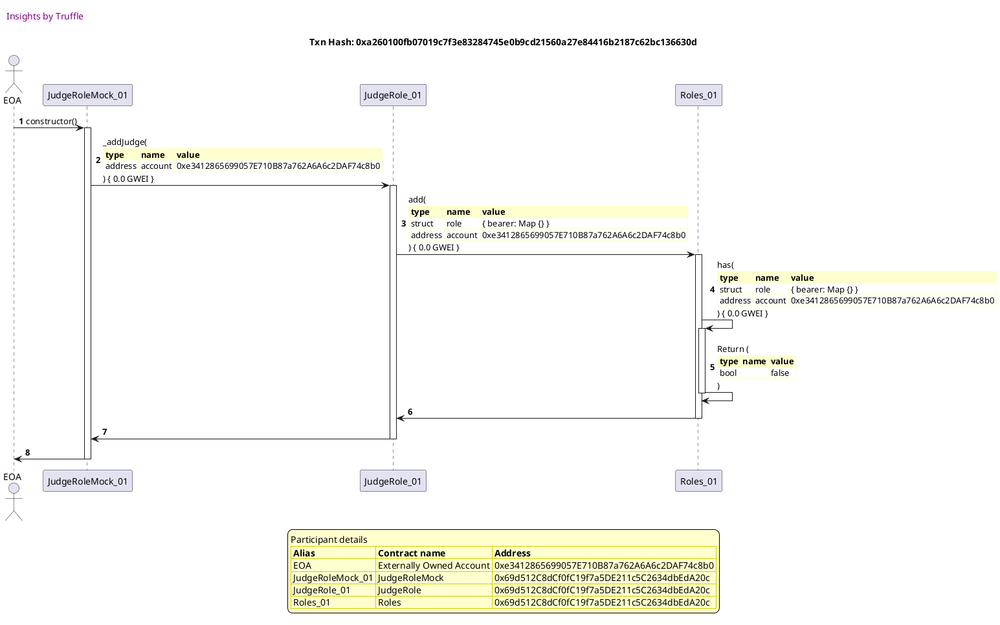
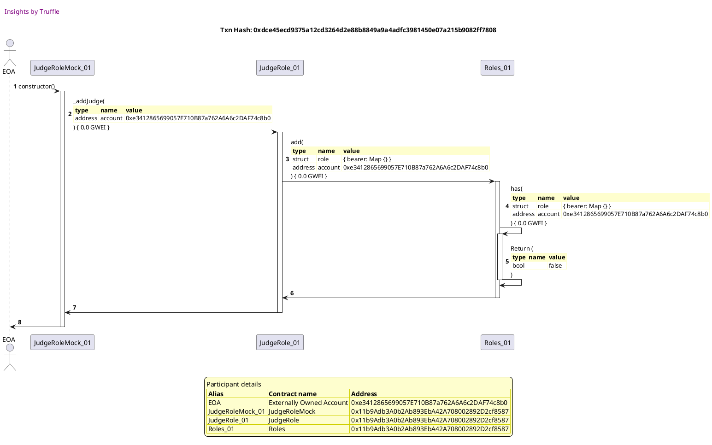
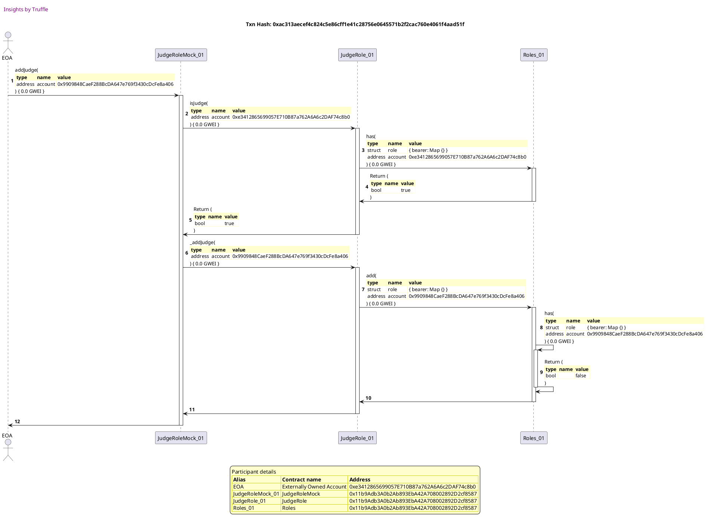
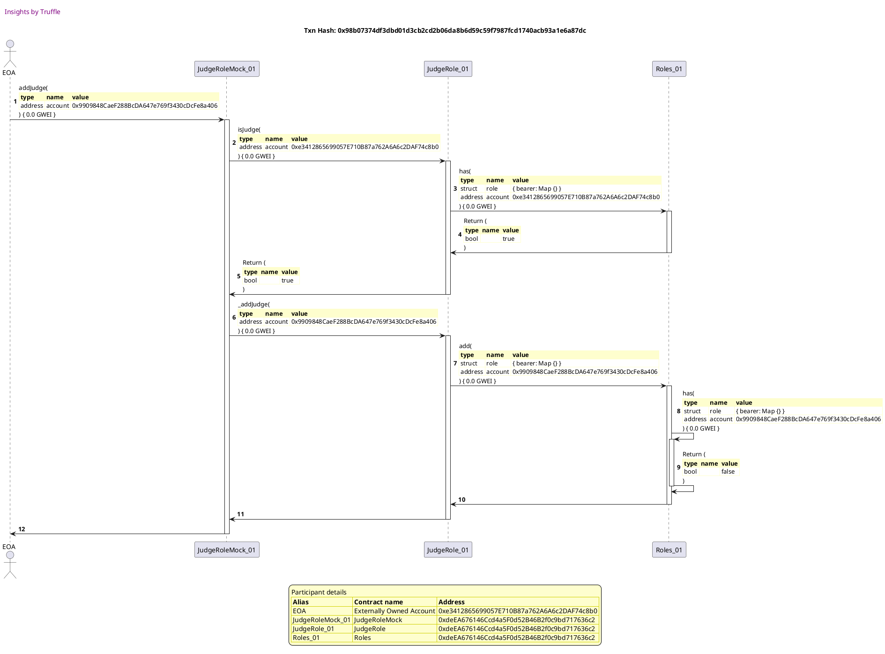
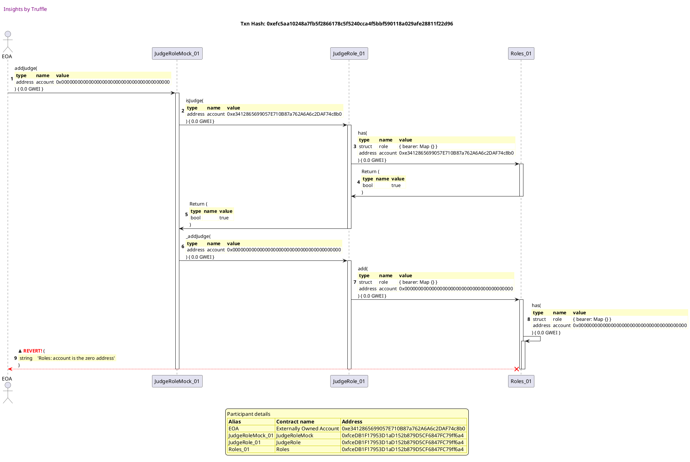

Test date: 2021 Mar 02


## emits events during construction
[link to test...](http://github.com/fodisi/hackapay/blob/master/test/roles/Role.behavior.js#L63)

##### d1, tx: 0x87e3208949dd094edc4a6d72d26d6c86ccf4f9191654a9e0804f3d52ba7f9629

[SVG :telescope:](https://www.planttext.com/api/plantuml/svg/tLNVJzim47xtNt5YBw2DpKbJ9wbOHGhjO182CQIz824tTje8rwbiPsif_E-xfY6ZFtWOqruMHRdBvVpTTsVVXP1ZwxXnvKGHmajNw78ob8RO-rnFkU4JK78ajUZnz7vaYbABaq8L1juD-eF-IP-G8-lcIdO9LDTOSY4DBEfNWBF2v0-5TbmbAX_fYTGE4JFNE0pmumfoMfgfaciVlkKF4hoWiLrn8N8z0e_MfgTA7dsgIP0w_hcs-MZiB0pdS6FAB4DSudAd9DpCD9nnE-u0dKMXRFaqYeDO21e7KgG1PoBqXSy4IoEMfbcGnLxiiNR0OqaZ6cGjqVQ7FCnYviS4IvOwfDw_J81Rs4EvHx1iBa_pASTKlvPY9AyB9I-AzFwEUfNNfl6L9LlkMwvBetrsUtxP8wJY0OVT7Q7W_ViEf8MspfHBwli7P8VJsj9csHrMlxBkt-fRSbGVWG-rx3v-1ZUVIa2f-QIIFxWgKLcwFmAkDj9QG2rDyIGvrEXCjWBFZrYRnJ5jX_tGexqev27p4vQmr3zD1c6GHaEwGZc01T2F5Bvyxv_Zvc-GND9kob1HnfXl8xkg3p8qY8TY0KF9ZJGTkE1JM3p1qxzCwtSIsocDkVsVKZeyxC2rTANHyBQqXaMXa1_U6LUsDXzi1jmuA1Xqr-7PqGdhdciTikgofGDP3KbozQ8vXNGyL_P5GgVqb5AwJ0Xd8ROiAYSuv0pEa2QrvBdqpRhkOpLUy3bpqcYkr1mkVsef87dJvhm4tXfF6wOAEg4ywiKjYgCoyobjz_eiRh4my7s9uN0wUWbh9L7s2lG6x5z0DkEkLlyK2dUetYToZ4_yvVq2)


##### d2, tx: 0xd2f0a8b78b516d5de2c1992e669299940dc5ac6f09f0d2642f87f5aab38b07c5

[SVG :telescope:](https://www.planttext.com/api/plantuml/svg/pLPjJzim4FxkNt5YNuOOc_Fc91MhIDy6an288UqB4d8Sfur8ayfnjfR2Vzyr3U6bhTXuqQYgtELyFZ-Fxvmp8Vk5vagNuvGGNkeyAyUXLAIuJB89LtmCgHpABEfmSJbKUPb5tJpD5NmOz0VzRf-GlKBFKjacKFr6aaTImRn-1JZ8LNALPvgdGPeCix7CD4QCTUCmmC5bo4cf9gbyCF0ZkP9Ws8tjX4THaWt1eBNfff9xNseGf5x_C2kIuKWN4CxWJ9LnZ769JdGguMoQmG4lHYsWqyYCAVT2rmiTWqLE94rX-Buf6VDDt_Tj6Wc72nPJFwQHoMmpzjpOuJoql92wmY6uPK8ZzFvn0Bo0BPHR1BTD9oAPSAJwlOo6yZHFvL4kBY-eKNazDcwOikA-uhem5hTkjozRX5GuOBUzPYdOsMa1xc8ryF4yEoTxTIe_rR9z_HNqR281PSR7bVp5qnALXVlrOhQIHG6e2O4LeL6ZKz-dlcTxNIu7fkTrH2zWjYjTviUMRL7H4mFfSPkoPPHjc0FzJE7Rp_uX9d4DpWVe6-H9yUh0fMKRfiSSXWmSj-yQjEEvt6Lcm08cp5umS6s1-Nu2U0EwoKC5UCIBvu4jj2h50g72U2Zc44gkf6h14P_0_0PktfBM7OdLFEpkjk1Kwb9by3ngOPwdY17_oB6sRg_RoZLLyTPhFr5_5-_uw6oeG5pp_rJWosWzhC1tSgZUXj8h5dNCq-AkgfywnNz_vZQTa6MZMJYGvJs1dDphJv7KF4cBUuHwj4SfNH32wm1sBLIwsESLjj66Md2xzSsyzdNLOV4vrL9bF4rdSFmxan44p_hYtG-yqg4VcQhG0LuJEhv5BPF69gLEfyzyYxcsQKfSpl0D8s1MuCKRGZyA-uAGJSUlrNyDXHcgyqJsyOctlZy0)


## reverts when querying roles for the null account
[link to test...](http://github.com/fodisi/hackapay/blob/master/test/roles/Role.behavior.js#L70)

##### d1, tx: 0xa260100fb07019c7f3e83284745e0b9cd21560a27e84416b2187c62bc136630d

[SVG :telescope:](https://www.planttext.com/api/plantuml/svg/tLNTJzim47_tNt5YBo36PgVvQiKgGfiE9Y4GGzeB4d8SfurmdSfnM4lXVzyr3Htzu65CUraKvIwNkvz_T_PT23afBJUs6Yj2U6KBNOqJQKXvd-i9DtmCIWwbJa-vk1-Qej9fhr25WG-3U13tOaAEIpjJiakWlaQIfzB0l7a5E2jC_bXeorMayg4UIsqHCRChXm5-N49EAZDHSkt3z_nH0dDNjYkUfhaU0gEDwRcMnvyR4gHP_roN-N1aIqXcS6EgB4DSOdEh9DnCDPpnSjG1EkMEJncbMK83ojeYo5eoR3cX6xYUf4bRf0xpVCgTG8Qko_p4OM4WV2SHhENxBPeIB9cmI3s-Z82Ni8ToZs3PR2xo2STKlrNfK5uNIbuKulwEijfhq_X6o9Rxbkl2MBwulRpi4LBpWAFkZgNWyB03ej2bDTM2-lu1sU6q5heAkyFgrzRzMtrBZfiZyB6HtQSlO6SJ2IWr7zVoWQiAbONx4s2qaMK9g0c19ycYHgUovJ8dz3s_tQPU40UCdeO13tmdyYDVEFre4BWYJEWIvG3cG3zH-FeZFiVDto2veBqgGqqPrtmVsMLzaA51F1HpI2GtqdJWWazW_WpF_pAjtqbifpJYvV-Kqj5H1wwbhOo6zwML58L2VdXdN9MD-M1pmOs3WelkEZmxEc7TSwr3bbssS23B8KckNZLdAYtFLVageJxjKqeN2U4in9P5fOT3pk0CMQKMlPH-5TTzgiSBFgTM6isLci7bJorJYDwrEQ-1jyRJXgc6zjkfnvnUcFOoclLOEmkuruyTneJNS_oMcoPn6ZbKl06z0ViNaAjnrwX_2eKxrEmJES4d_l9-0G00)




##### d2, tx: 0xcbe80f60f98b1b7b29d9594858df25d0fdb0a41bc19cf4d4fbf5b91102f2366a

[SVG :telescope:](https://www.planttext.com/api/plantuml/svg/pLPjJzim4FxkNt5YNuOOcvFcjM8L8Kq7an288UqB4dByKYBIfBAThQNmt-Uc8Roq5Hil6bMLkvpFZv_pdND6Q5Tf8dKroX4YbIwBQfHoYTHbLeo992F8-P0NR8_Gow4iguB5PLvA-3181acS8BIZz3JdFGJrxu8JnYNCcbU0_L9cLsMXIHxbsR0OyK8RHA5RXu4PN42EApdE-OE17zaL1yjfRSU4iQmOWeKRqqqjTxuq952p_a6Xik65Lf1EuLHMGXXSf3ETSpYT5B1Fr4KNy8IcFC32mo8CKYlrKpjaeHiwWHimORiC2vPYubWfjK8g7EQ8LBXfQ5dO5dR7ymWoMqQrePuSHK0KR1YvWSoswOncOs92_Lwn8JyfStvOqijpRDLUZurhfYovBxdEZUhMxVPb0w6Q1sptLYm5MrjTCBjO3tmyAyxGJfFAJutiNNy5FHrpCB8Werh-8dbbbBdxzNosv4g1qIWr5Q6DXYTXYCF02MB21tOGxD5-v3a-zxrGT9mEfdqwu05niBT0sOGPuCyOllrC3amIL_1ymBvbdgbN9yuxZcK7dkkP25m_yIsy5_Z4z-p8YpngzwE1xz0WnKyGRqctUQW9Nn3rFB9AouhE6Kg3PyGCKauabrqu96EOtS3DMuPr5yHo7hQtkt32TIKBU5veQLdcXgFvcnWRw-QghLnH5M-zzXFrT_wEZywQ2ZHh_fyAV5bO3olmdHogjmdf5OjQa5pTLVLJf_Zlpzow4x9eD7C7jBWdeEDx_ObnJR9StGkeZ_iOutb0vZfWkfPHOjFdfMcZRMZHxTQtythNTOSrpudciY1vFeMZtmLd43thYtSVUAb3FpBLq5x8NCkE0nOBB68h53vn-ubjMTIDRQ_Zi3HXaOtf6kX7i2-0R3j-e_uhbCbGaoUqQvxcrlS7)


## allows access
[link to test...](http://github.com/fodisi/hackapay/blob/master/test/roles/Role.behavior.js#L78)

##### d1, tx: 0x646a9e7389f06098dfd49de2c780c83b262aae778d6ebc79dcbb23dce9a2d987

[SVG :telescope:](https://www.planttext.com/api/plantuml/svg/tLLBRzim3BxhLn3TfSNMJN4IFu8kgFDQEw1eqHNOfK0XIt9YL943ITwIfltlOnpNQnuzhCCkCmoJfibF7ocH9kJKEcPSCLM4iCBbkfWcqX1xd-aPCsmAIewb5Zt6xyScBxJevoety6uq70txGq9Eh5iesILGNXF9X3Imh5u1pdAJFUJQCHMhRAodKZj4J5tjCCAFQyXPOMPARdpubZr8QBHgsnKJ8jDZQD3Az5JAaqyL2LAjVwvjDfuu2ya2RaoHfeXBNEQKX9kvXZDc9nsWSx_biqW6pJ1AgK-ZKAIY5GdfyI2aF6mcdkyn9eCW5BvCU109dYHUKt0PCKz4OK2mPDmXzU5b3Cp20Se3WcLp6Szc35FzMeYnlCwLlCZv_Hrjb5xRnbT2TjntN5T6--ps_790ICa3ZhjxbeBtxpl0SssTALRK3u_87gUDq3hi3gjVMWzlzIqvgOx0Xqfs7p-3MymaeDHiMieVJ1MehDmV0QEDj1PGunnFaaEDpcMprV12l-r74Mq7mw11Us700j-B_TZdtY0U1IqU9dIDSWHBe1yfVFa-FCVDtoAvebsNeQICQxwDxBe-oD0W7eeb998PQJfmmMQmV8AdVvdMxoHsKvem-p-bT7pSWMlf2gFXRMabUQwG7zufKxOo7sqlk7LGSD5zXsTF9snwRdJ8kijM3cGz9CdLY-OKqh5CsHS93UY0KhfA26SXjYmgVHno1cT8dLhyNFewhljOZXTypfqqcYcrWCkVMWg8txGvBu5tnjEMgOHkzvAuqKvfsninsV8zEgAoJxrcEuvZYbEp5mNjP92chq1lmVu5P3tkAlLFeN27gdqYf_Z4Nzul)


##### d2, tx: 0xaac84b595b3d60778779f34976443a5ba1b1dad014fb0ad6d146d7eb3fb054d8

[SVG :telescope:](https://www.planttext.com/api/plantuml/svg/pLPjJzim4FxkNt5YNuOOczFchHMhI5yoc8H036bVa90JEss4crIsixKK_lkkQGWlRSN6YqPLvPpp-VmyT-US2TdNXYbJZ2KXh31vLemZeOY-JBC9KsmCKWn5nhiilXoglCXuBvUvWW_X81pq1eJiQJEJeaEW_8q4uqB1l7e5ECXLUfLdXib0fiDiB3A37XDJ6uGukNGvATH4YWSJFz8h0PPTwquOvsas18jMgfjIxdsfG91g_yDCfyEHqH3Du4mLIO9-YKcD570spU20wL4Rw9InsBSZf-L4JUvIp_CzhvKqxPRdsdQJEH6p8eipJYqxYIZZBhTibtiYQkAhOtEVOCXYWz07nm4m3LiejmY6pQHnEc58zNl1X-8qb-8eZoylg5LQFLPkMB9YlcAwKEfRizkNBK9A7B3RMRCLxEoq0QDOJdmypyx9NfNAJvNiN7y5Cvi8G9cnSIb_CLdWO65-lLYjXDQ0epZ6YZ0uejDMYxPys-yn4JPylnlt0zVsXESk0jgaSJyEXSziwYwzRCCSw6SAttuE3Z69Qt0-G5yZJ_Mh0nTDsshuhkCY0ySRU1Rj-Xxpt4RW1cxSw0UXPyT-H9y0NeEkyr027Z7zFB3Qg29U85Je3yKS8i6KK6quOXEOty3DMzAw8x6QXztTDfmAKwWCdaSjodE96F6F72ljzhfGhgcAjzxxYVgxUCT7PqC5ufx_fm9VHkjX1RwJG_Ksb5wng1CczLrLFtMA__xCRJeXoqQpC23BUm8vkTUVk30ibVeUeJxjKqeNXF0wW5qB1ptiymhRQ4qjk0rzlQvpNNPOV4wDK1cJSWR7lpF18NZM5---uvKE_KXLkdQwKM0v2NKQ8HEssw0X5JtQQ3f1450iYMxBSw9-acnm_SZj2rpM7RyQ_gihp52L9xAFJxpr_G40)


## reverts
[link to test...](http://github.com/fodisi/hackapay/blob/master/test/roles/AttendeeRole.test.js#L36)

##### d1, tx: 0xdce45ecd9375a12cd3264d2e88b8849a9a4adfc3981450e07a215b9082ff7808

[SVG :telescope:](https://www.planttext.com/api/plantuml/svg/tLNVJzim47xtNt5YBw2DpKcJngbOHQ3fO182CQIz824dSTe8rwbiPsif_E-xfY6ZFtWOqruMHRdBvUxpTsVVXP1ZOxcsrKGImYjRgcgI24tCVQ6cNFC9I34IAZlXwVr8bvNAJajPQdWtZ8VnQKp8aR5pAVe4wciiU2OqB9fNWBDI5m-bibn6iXYfYL0M4NFREWpnumfoMkcf56iVlXKF0XoljLtnB2lK21pQc9vgUVIf8K6QzS-LAKPZQo2PmuskyXnnYIsi570pKt36pRW7T9QbmlD5ceMTmEUEcsOTj-jbhc0iOSmBUSWzdkLf9sIEvrD10-uwVX9IvkPvm2WZMBBK8lNuCW9kO0_b7i6osI8jfXnJ_Lfb8t5TId5HflTtrAczDeslX6ovRxakZURPxVbbZv2Q1npsTom5xz_t82sLiRfQKjy_83kSraBRi3kiVctTlrMtvAWv0XyQsN_y37O-5O1IyKajVt1PeR9qVmICri8OG2rDyIHPrEXCT3p7PLs_6uRK3-B0eISiu47NZRfHDtK7qJ3mKfRG5Se1B81-fF3bUtoEcxz1SacxBKDD6TTy6zbLVP2XHZmK2qW4rqBtu89FOV44J_yohTz9RASqvkP_Ikdmi0VNmbPQmTlIIifI8Z-ySovDOpxON73ZeE2YkmxFZavOzrpha5MNBHt8QaYIgnVDcGdB2sbU93IW0qhfCY6SXTYog9pYaDCuGzhKekVIjt7zntgyu7DcXLPSoZbS_bGYW-XDc_CIU6iyRPXgQCT9mYXBEX5Dt2XXOITE8i-D0ieeTLde3jmqPpuBNe7UWFqBo7RSDUgVGk4EDVj4Zl69lxnV)




##### d2, tx: 0xac313aecef4c824c5e86cff1e41c28756e0645571b2f2cac760e4061f4aad51f

[SVG :telescope:](https://www.planttext.com/api/plantuml/svg/pLPjJzim4FxkNt5YNuOOcvFchHMh27qPJ48WXhGlICXnd3R2JIhRsLeA_ttND8INjc8he55LEUTyFZ_FtJbdGlQrOSeK8qa8AqoU5QD8AAAlqcpC51k150EHnGUCNmrKNcHn9vUvWW_zNh_NwH6ofyrKYZQ1yZSKB1OAPjKhm66kqkiyCqo6CXra8v4Pz9YOsg2FamkNuqADfNWqyIEz5c0vjUwKnN6Q3S2YbUgsb7jVAX2aslyeq-bWQ3H4KpXNHPAWNs9I8mMSJp8uP7hO0ZfXl64rcE0YSNXWEzmLWSUJn1AEnUt0Tpr1FSTrVIko4vipxdjKEDIp4eUnsBKIWY7Z1g7tJa9W6hPGRX4CcqbvEcP8zNiH3yHPBiLnpgykgLLQFLMkMR9alcGwL-exixkNBK9A7B3RNh4LxEoq0ADOJdoyo2x8NfNAJvLittm5CnqBG9cnKIb_CLdWO6v-Cr-jXDQ08ywn8WoEwAJPfCt02JfCzEqWEE3Tq7DyuNlDfE4qAE_olWWO1c_XPHjcG3zJ-FQpTuH9N87p4VeQUQfV7RXeE9OTUAw735o_vrlq8F2PxzcX5thSxePz7wiZeiy0hq7NUIW13vdU3Amsgk1pX0hzePX199WIgWN7R0opMxXzIrht99RpiBlRWZDX2fN1PjIYF9U84V_8iT9khmhbYgfuwxsVgR_BTtnqrbGWxlb_Al1bj1vNu3ivL6z3wHMBEc5ItrVrSwVuxy_SkXEoQ3Hp0xAu9v3J1_qf5eQbKZyWrALTIkcS45u7i6lXe8DzNc4RhQc5Tw6lrxLloWwBpuaHAcDIJk7aToPY23VwuZrqlDIXdwXArvOLDSCuQeGqiiCeQ3PwKUZOeKy3IksWQNTjdWHkuAzn_SJj2rpM7RyQ_gihp52L9xAFJxpr_G40)





## adds role to a new account
[link to test...](http://github.com/fodisi/hackapay/blob/master/test/roles/Role.behavior.js#L99)

##### d1, tx: 0x1839dbbb1ea024a33582c71194b499cf50f8e96f023b08b6fcb5bee4c858d5b3

[SVG :telescope:](https://www.planttext.com/api/plantuml/svg/tLNTJzim47_tNt5YBo36vdmd5Qj8IpkOX40CQIz8o4wSDi9rAiTXBON_VTSqPFI3Xp7jPL6KkrpEl_lTsNSXvAGqJ9jg8WbXbIbKDU52a_8-LrEcsGIa60cLzbXoFz95fT9-8GiD7uQ3uQ0_8EIuD7CfkWJgQonOAZGicbU0iqBdZuKoJCOo7wc9K0OHCzCw3F7Z2d9QwQaKQn--vuy2BBUrNR4qpTK8BDgOdcjv_BaXGPhuvwhCHsDJ0f_3ZQwo3769oOqKS3DJSCRASGVep0gTAEMSMu9HssMEuuLs4bXMv78tYfBCerae8Z-ZjiDfoFqiuHuNmar2BqmzxX0iMMAG-k0o1bR27iezWcKpUP9F6QRwhKf7uhgGug98xk-eLNjj6jzOikM-vReqbYzkBozxXDGyuAYx8nGS7dOWALHfTBMaldz0TZYjBMsNtM7rQ-l-hRebnyqH-DZ8xjCNCFEf09IAJMhvm6I5ojBz2N2r5cK9g2K9dYI36fq9nxNiqFVyAA9UC0WisWi35lXsxCT-Of_6mm3hpUaAvG0MG3zH-FfZS8wRlq5oIRijGqqPOxwFxAe-o50Z7ee5SC6qq1suO5DOFCFplqphTnBRAOrP-J-bT7JKWMjXAgtWVMdnef383--CoR8n7sm6t3We67JNuTdH2UkUQnsowhAb0raDINBrgZbJOLWkorS9dT9JIkao8Po5sBAez778QPmXRMhnI-dRTTsdUhpWSsQ4LapAELp-L2A5-5sRynfuQpnjc6heL0nYF_0jr-ydgSky8Kqzk-VwFJkZISJJm0fy1sEy0Rq1-nUGxRXhr3-5mXrgzecSu1D_URy0)


##### d2, tx: 0x98b07374df3dbd01d3cb2cd2b06da8b6d59c59f7987fcd1740acb93a1e6a87dc

[SVG :telescope:](https://www.planttext.com/api/plantuml/svg/pLPjJzim4FxkNt5YNuOOc_DI9wbOHVesc8H036bVa91ZEoKYJIh7sIY5_xvh6i9BMx7neb5LEUTyFZ_FtJbdGdOBmxKfnoaXl3HvLeuZfKbnaMGJhlaOKZLIcUnoSJ7IUPd9Nfxc6ZuC1yD1Rq38Jc6cgUeGg7xdYakbOLQ_0kpbEhdACyFJC4r6sLXb1Zt6fZ4OukJ2vQJKarGzcFYHN2cmt4PtnALCiX5Oj5RTL7BdIms2rFllPqKoEZS5H5CuqMKSerzY4fCgEBdCO8yNvssWbu4VKS_nN1axCfBKaew8R27jY3B9_OZ9LY1QGUm5lXSBQNakvI8A76ufndrF2e8X4mQX3mv3u0LieDmW63QJY6J2aUhtKexKSPwgWrnSd56hidgiNBDaoNp9TAuiRirkNpO8gN30TcV5Lh2rrGQCOZNnyJGx9JjrAZ_LidFz5SnqeW1bniUL_CNJ4WTpy-lvQgsA0d0a15Q4mH76Cg21x_ezheQsxtT5FsIkfpmMn8xhKD4NG-LpbxA5bqsO0VrCuTlFmJucSGNE1-WRv4dnwi2LurgspreC6RIyWMVHhkznZzaX2vcm--7GSmKMoXF06z1D7Yh0vxnu7jZ2w5BC4MhqXs86aU9QwJOSy0dCRk3cBMdTaLZEm_Ps6uwLANK6pwCMvNcA6F6F76ljvgfGhgYAjzxxYVexUyT7Pqq5ufx_fm9VHkjX1RwJG_Ksb5wng6EU5dTL_TGf_lipj-w4B1hDt80ixWdaw5v_aihm92tk4UhJFgLqJWYl0zYrSD33Fg-nZJRKmjlGD-iwrrM7nUUbKJhZQJg5mz-PaX0-wujtt_5IXtwagbnBDGYPnooNzOHqUMj8PSlkkgnhnrG4aVGiZpcunnhNZzo-m6NJyUlXlxh23DLv8hlun5lV7m00)




##### d3, tx: 0x4f0fafa79340623b2117093708bf181862ac21e02b05b6386ab7fb9253f189a8

[SVG :telescope:](https://www.planttext.com/api/plantuml/svg/pLPjJzim4FxkNt5YNuOOc_Fc91MhI4iwc8H036bVa92JE2KYJIhRsLeA_ttND8INjcBZHQEgSfVp-V5pldFEXEmgpQMkHZaXlD9bKOqY8Ocwp8enbtm4kHYA8kdn-78eowf8-cLUIlWm20TXFoHaH-bfBhe4wj-5u8cGC6jU0VPBcLsLXUPva6V3OYGAZOYfRXq6EBY075Tod8i70p-oAm66tTgEUP9anH0CsfXkQhdpfI51clKF2fKDBxI2Q0gdiafJn2Kwqxc0qqa1-rnTT81Ex9IcFEMkRzcKcLPa6ePBVSkbNfGQdk4nayUc8QWPKITYbiTuvAQHRpeM3llS8xXbiKRguL40NC46oWs2swQpE1jp3FLxbGp5IPcBmpA-FAT6xVNOk6RAalkIwzoeRjrkNpO8gNd0TdV5Kh2rrG7SnNhWurbnHdQQL7vgPFVwA-ZfM03AWezg-Old5Ifpz-lvR2cK0jJY62j2eqOdhfK6FkEUqxSyhyTDqw2kupWsywbhEI5rcS7w1XiiK3PX1lGpXMy_mmDCuWgU3zYtp3FrwiI5PHkcnnpc-zHnGzUWFS_bBZC35h3Ot0i6hXrx4Ns2U4kwpKDD-8Ahvv5LMbRndA54F1GpY0INGdRWa8zXTWCtRndMNH3BUTZUxi29q9Kiu7cXHMMP8qVyOuoDTNFLLgweYhTU-udwEt_7HsTD1UAQ_wS2NnRMmmfy9uVgRK9wnQ9EUQxkglgfK_ptPsxT2Laqcha3MTmJoF6z_fG8pRDStGjeZ-vHIkS1uNK0knOgVUpp4jje6rfmk_NjlEvrtM7nET525ZpFft3qkn091C_wujq7NkhGZqmrT2B2W65oRTQF4vix0veuPizcFJEbiHybhk4o2zTO0_q8zWMGRSTlr7-5mWmrUIAx-CHRtny0)


## emits a JudgeAdded event
[link to test...](http://github.com/fodisi/hackapay/blob/master/test/roles/Role.behavior.js#L99)

##### d1, tx: 0xe8739b027199fc6706a1b904bb64a68e3db0ebc91392b7e3347e95e7e7f95c10

[SVG :telescope:](https://www.planttext.com/api/plantuml/svg/tLNTJzj037-_ly9YBw2DxTAakQHY5Q4VWqa8n93sWeGkYTj6N2_LvR9H2l_xt3Haz8E7CUrbKHHV7Fldd-qxXx7ZmafZowbYJ9Osr-KqHiEAkqpFf95JK3X6dPx8v6viybAdlLpb1juD1yD1Ry3OKM7d2hiCgck2CaK3Y_eLu3GtsKEkhLIHoiPwYjeIuiWs1aFwk8ASbMQcSEt3j-m1mV4QtQLCqqoFmU6rwgcIHvzg4goEVwQBR3on1SHpk3RbQ4Iup6PM8LpVQpYLnQG3_1u3uOOnRmad34U9BxWldJZaNXpxdlG3TDEOOvo4ZXksOe6kwmaCsoXGZC9sGYIeP8abweEB26G1UoJt69NDPaasavJgrp8TurMky3nFxcwvKrbjAbznsJBVCbqgYsUpvvSznYeUSDZT4GhUl-z0akl2cd99VV-0xJ1QSstSRgdwbNR_Hj-meteBVAXbz_4psFaCWQIMqqh-aAganTBy4SZRO540hPA4TfAb5VN0zPnMuBVzCEHjCH0EFmc457uhyYC_QVMZeV2I8EOhb0DO0F_8uSltmHarVuFaadPJXeeonNmRsLLzYA4XF18BY54QD1qubpDOFC7JlqphTnBRAKrayJ-bT7ZOWIkqfT7mjhJYF5V4Z-wHL4MjFjWCkB5HAEYkpRFZ9AnRhfsGrIbR6h3La6INBmvdYbPcgdYHK9_tEUVBX6WMqf6bHO-6dA4PqgGMFPU-yUi-LkE5dlSMZPPApU7YfyOKeZSrvoNmrdZQKAsWXHW6lekzLYXyj-s9o7UYVYneFhR3mEVXoSYDNVHVWTw0_Gl8PjpLop-5eWxLVMB7zAHVtYy0)


##### d2, tx: 0x4a2f1638e14600c5386a002504140e7caf197d650dbcd0556064904ac1c4873f

[SVG :telescope:](https://www.planttext.com/api/plantuml/svg/pLPjJzim4FxkNt5YNuOOczCaJbAnYlGbWqa8n93s1GavZjD6f4dbE5jBuR_lceRmqbPil6XKLUvoFZz-pdVEcP3zGdEbot5A22zrdfNZK2fIN2RPX2i-XbGEPHPrkRWSghpCebwUvWe-18DWq1iGibVeMIex1AhVIF98AfZNhm07kKgkyappr4-JOJQMcKR4M3SE0Guk8IUbcgJomS2Fv4g2OJMs4nv5IJO4WzQccqhkVQb9a7hzmwn8XYDTG3Y3CrN6CU8IdUXKmjaqWmDUZDf0fnPlnGOpNMbOZ59XcoxZbBPiQXaMbOxWiU4v4RDf58g8sZQZpFAenOKXBDSnOu9R9ZHI7npxm0lOGhb5SDjq8f89nr2_bz5GdkQfFCh5vGKrAg_7nWrJLjnNN1V6ujRjzcMBa8e7x7RMB0KxEst0NQm6FfvdvsIlJkMdMdQkluAUJIIWpFYuahzuMgAoSBzUp5QoA00r8R0YD6fqwddKSostnsNGSjskwFlCSgJ3lDYqJ2hw8f0kjoXRecp37EXd2jz-3WunYMjuFc3VC4-ALoSkJSjekSnc687j31o3Tbs7EwpbCv-9LjyF74ku8Ns2U4EwoKD5UCIBvv4jj2h5Wg52F1Hp22LNKhNXY4zWVWCtRndMNH2hUTZTRSEfrANAu7cXXNcU8aVyOuorTNlTLgwfYhTU-udwktZ7HsT31UAQ_wS2NnRMmmfy9uVgRK9wnQAEULhSLVLJf_Zlpzoc4x9iD0i7ihmda9Dx_IcIcYTfSI-WFkrJIXS1uNK0knOgFUpp2jje4vf_k_NDlCvrrM7nETLIPJnDPt3yEvCH-C_wujq7NkdGZqnBQCS9N6RANijpc6bRZiyClnywhZHjpsNKwyPcQ4gs0VeHx0iWcuvVg_yAXHcgyqJsyOctlZy0)


##### d3, tx: 0x55c02a50ba4c583f09794d085690e6ace9b9597f643199165089a5914ec8a979

[SVG :telescope:](https://www.planttext.com/api/plantuml/svg/pLPRJzim57xthpXYBqECpMbYEwbOHNeRJ48WXhGN9EGaJXkH9fNZR2s5_xxJDeHBMx5nqQYg7EVu-FDtBiun8Vk5aTgKevGGMPeyAqU1qgIuJBAnr784gHgeB6hBy7AWypABEdcQQ_ZGx_LxdHuXUuMPfgf5OF4RAXaf3RFg5U0WrybLdXcP-caoo4OgCuWOczgWZvDBo76fnwbwCF4ZkL9WERNkH4PHaWt0efNgPY7tlbGaIBN_OLOaWw4f89Z2cIxZ6769IKogu6oImO4iXasW4yP2sf2C1j89cMl7r1EU4r6NSOygBaFb1HxpHCmTs_8yYpFgUf9vbgD2Lw8jmP251gdtZdsG1MoXt28ODfE4oLYYgz_BQA1EyrGTvU7b1RKMLe-L6vQicA-OpfN5hTdjonOX2nwmsrgp5UpiD06Zk9ZuU9wTaxqgbPygsRh-2cOwLe0oawE5_2NJ4WTpy-lvQgsA0d0KXbWH1aTq8kpOzxXqMSTstRPiD2mg66CEXbBOh4S5jtZ7ulqboZRCW7wcyErdxn2Jk8Rd0_OrywHuTUBATgo6op7d7cMY9opQTeKKlE5pduUDhjyNJkW6z0dYDUaw3ml2GrayZsnXT1dE6Mh4Gp63G4cjT1EEv1XcDt3pbcxTER6QXztT9fmgK-eCdkTQaESfSiG_-bXfjzU5SarLlFNUJzJVnJi-EXig4FVyFnNuChSULk0xELHluz8h5dKiq-AkgfywnNz_vZQTa6MZcHkGvJs1dDphJv4oCacBUmvrQPTIEdS8hmFOjN3GmJwliOtMhlcteQ_NjQuN7HQV4wDq9jDq2iU_CnM1_wmltdtWbGxzIBM45gBlSbjr6fxWDdE4pos_6mXNsSnpEVNQiHtOYc-0VWJx0iYwurV3VuN235Lv8llun5lV7m00)


## reverts when adding role to an already assigned account
[link to test...](http://github.com/fodisi/hackapay/blob/master/test/roles/Role.behavior.js#L109)

##### d1, tx: 0xd06f6a776b21b12d2b5564cd4454429025c74b4d16d1a77dc2056f892cc5fc75

[SVG :telescope:](https://www.planttext.com/api/plantuml/svg/tLNVJzim47xtNt5YBo36vgI9qrIi8hJfO182CQIz8277Tjg8rAaSXxKK_lTTqz3H7poCQI-BejpbyjtdkxFlGiX9QRcnrJWdX5UsqDKuKOQKzvcUSCF7aAkXqlAKY_kXAIejUqLU6FWmY0TnBoRakBIpN7K9rDT8SQaCp9jNWBF2P8-5jZoFycoenqfRP4pj2Z30ZqlAIMKckLhxy3rxLE1uAziLbpBJGt1eOtgkvV7d9WZIh7-kosmuiYKaCxWnLPeYBx6PpHNSJ3MSyNBK0JgLbAMC1m5BN2TnNEacliyy8JtFzpmtfAul0Y_nfCEaWp0fNEgpj1swGlYf27o29HCMGuyl8-0bxA7S8rWscubimZ7LRvKSgkiYLnU5kB-ZJetQDBxXiWNVWYwCvGlivMMFa3eEEEhkM0eE3piW2brQKor2tpyWEq1hhYktEwn-RTs_rRVak3a27nlPVVe2TZPHW5BpSIqVU5wXie0_0NeRLPQ0cX1uaYngTAfQdkEscS_2aFf173Zqj1tmWBaHYvXm-z4Wy4GxeKkM0vW3_KJXwu_u73T_8yX5sAior27ZckyBTbaVZD0W7uev98eRPJfmmISmVuRdVvdMxoIsKnhnydzAwUYe0zVALaR3-z9AYYB7-F1EULusveFD1JSE2Ywww_3iw8Hrv5g7BBji0I3B8KckNZMdL9PdUVageJxjKqeN2U4in9P5fOT3pk0CMQKMlPH-vTTzgiSBFgTM6StpV0QNFxMI4BrhSruJRusd3LDD7RWiY9917D9sBt6396RHm0bzvijMwBejps_rPUYmz0tg3Tg_e5oDkqRzKohSeMQVo0a-yPVt2m00)


##### d2, tx: 0x3901971ce1796e37056519efb7aee0454bb34098da17dcc08d6d974914d1f763

[SVG :telescope:](https://www.planttext.com/api/plantuml/svg/pLPRJzim57xthpXYBqECpRaqJYfM4TfaC0c16D9Ua92JE2KYJIhRsLeA_tsdQGYNjcBZeb5LESxnyUVlN9nZGdQLvb9NevmGNkcog4QHa4HTPiMOIpw2N0n5aUpn-78eowf8-cLUIlWG1c7G3mZPKNgQYnw1-dSXU28ap9fNWFrIPbTbeNdkvzcm68b28sAgMuCG9nUGuqgES_5WuaTs9S2mMzqnJvAi68916zLDBNU-D2H8i_z1eRBXXLOGJU5KLccAk4HdEXTmEYbWdwkBBj29vL73OqOi3EOvmcAqutGCJwGHuq9GksD7aMLJpqsumP8ufcxY91wpFSDEZ9Gv5i6GnHgf1qS-S0KRA3S8XardSJRcwEhtAXcAap8NXsLyUKwDskgnSisI9VCbqxbItPhTlcmGKlE0xTwAhM1hgmiOnNhYurbnHdQQL7vgPE_wA-ZfM03AWezg-Old5GxcvjVprL8e1JYAOwm8ZICwyJmCbEtskGXDrzsB1xvZCy4SBxLiYyQ3E1GkjwcpGDc46T3F5Bxz30umYIjuFc3VCi_KgnCNbcsOhjDnq8CE2vX1zrp6cMFwZk_4vi0FcHsx4Ns2U4kwpKDD-8Ahvv5LMbRndA54F1GpY0INGdRXa8zXTWCtR-dMdHFBUTZUxiA9q9Kiu7ckHMMP8qVyeu-DTdDLA5TKnLll_KJzdR_ZexEc0d7F_rE1BtFhOGM-aqFrDYwzOb6dF5TtLVtKAVxxCxVkX2mQpTo0BEu9vFXUVqg4vbckxZaqe0DAwTmXl0vWry917_kyn3RQkkRVXhvTrxkkEom-9rh8WkVv58v-5o81_rbVlFl0IntwaQg6PgR3_2WCFEhs8vD5WUE7XeUtXSJoJDEoEzOWyGmdNGFz2FO5a6t7RuR_2eKPQl94Tl69jxu_)


##### d3, tx: 0xb04dbed4e65a019d4c1cd157ef8bf4357789e53b62cc7a359879dd81ad602e67

[SVG :telescope:](https://www.planttext.com/api/plantuml/svg/tLPHJzim47xthxY1D4PPDoTjagRgAaAR3YOXK8UsXp4X9tPBH9fKZWCjXV--Ivg6GbjDOq9YgwgSSpv_z_dkeZj2zXF5f4f78I4iLN6KZZmXIN8LH6CcsGX2CHGHFs3-rL36QSGxSHXBsEwvFRVZ4j9Ar3GKRGBvxr8mBYJCYbU0mrW6jt6aMEY4mJ0QYKWXua2L1ZtSd4EEKpaEnQEDhy6j0ArUwauPvq4q18qMgljSjZuM94ZX_oXAWk6bIi2RmfbC1mF49IfGeO2pIGI7BBbi0frujCuzmUl2D1ZLR5xtDPzhXYK63MzGhncMrR25KVDCtVSjLZFiXcLptj0ODwakJ8jWo7o5rDqJ1rW2MoYt28PD1NumPdZLBoaVYduSYkFOlxgWMcxrLBdXo8hvYcccJ1PcYvSjGd8UK6slSGLxUqt0AEORxywZSz8gKlc-aEsxJw2cOm4e8pRAvJKBKrnavdVPQIcI173b-rWH2bTq8cfrJM-OXcdRrB1SIwC73OjPfkwOZkdhNQTdrVs6H-Sekp03-e72v-_k4IPn3Sz7x4lcGV9QYPUaoppaX2zPyZooYPAfdp6KY8TY1fvWKiWc7BCnpExX_YMlzN29rJnKgqte2vNA29vtDI-EG-I8VxnZeTrT5yerLV7IldzJVnUl-DFPK87eyz-lmF_merfwUw6YVl0mgVxObeB_pFpEUmEwRBszOJB2Tjg6bZzlwcZJhbJwxZUtV_QcKcbzpFNjJRIoU6RjE7Uzaxjhbl5YeSHcFCsIbOTxPy6B2soQmJLJOhbfBMiVTxorEsNh9FFvX9mkzKKk50l2P8bnbtOffLaWSGn1GhZeu7mX4RaCgRD8UNaERvXrTdnEb90H2yCfdDn4WeFphA9O1bwP39weScXBDot7wxasRNGytV9Sq-bfjc4Ql6RhUgrkrBhSrip11kWdi7y1MKuQnV9FeJ13HPx8FZvnslm5)


## reverts when adding role to the null account
[link to test...](http://github.com/fodisi/hackapay/blob/master/test/roles/Role.behavior.js#L113)

##### d1, tx: 0x3d18c86c6e8c39ea5ca9db64bc4117b77626bac4bf3bd5076df158f528dd04e5

[SVG :telescope:](https://www.planttext.com/api/plantuml/svg/tLNTJzim47_tNt5YBo36vhJvh5X5Q9h190HYI7j1GexZj16kKpaEQodyxxkc8QCVF8nfBukYtELoz_FlphuB8IUbOTfK4qa8gqoXgaaYD2dlSpLbcar0Yf5GwIdZzoDTL2eT5BBGy24UniF1a93Zqiobw1Eehx5WgT2mQ5u1pWgTFnRAC1dAVAGcGXb4p4ph4EF75UIqqbCfrZvypny5M7Phks9fcgiHMBGnFTVo-7D3WZJhdwio7urD2SaSRdILPOXBJ6waW9kPWZDMZdj0PztKyhdlSbVul1i8vd0Mf8bh9zosB2_nFBVZ9epRITPDKeTwRffPZfyv7JzDgIqSWYNZ1gaFBqDW9UoXt2DODfFpVCemrMzLEXBNXHGN1R-_erRjjMby8sJBVSjrQInVt5vUzWYfUS1HVyTIS7ZO0rweqkXgINt_WEnmMWjjm-wm-hLr_rRTakFc27niPF_f2vZvL01AnIQrV62oGcNf_WGOhKLP0cgSuqaogD6PwDfMntSTDmYeumqzYvxw7iFAXsxeyauKnfxD_OIkK0vW0VGJXQy_XkUu-HiabxJRCjIKSSttaLtL1nbgn4EnW4GmBNGFBjWK5i_m_2_J-ft4TafZLlvFAHqTzU1Qc4ehU5zQIL58v8TtncJPc0ys5zmuABZehiEpenFMFTSwPDLbImUo6fBawbLpfiAmN9Ql4efeH2bT9eIp45iMbG4EEOqpf4qjV2bz6zT_giSBFcT6QCMadCFbJoLI2D-rEQ-1jyRJXgc6phY8JgtOyWAd6raiifnEudj1v0nYrxUzUE05MUOo-mte3TY_W6p7NQF-AHJkKBDFv0IV-Clx1G00)


##### d2, tx: 0xebf9927a010cfa28fc95bc09f25afde595ccbb5aea89b48334bf8efa74e2f147

[SVG :telescope:](https://www.planttext.com/api/plantuml/svg/pLPjJzim4FxkNt5YNuOOcvFcjM8LRTCC9Y4GGzeN9EGuTXkH9fNZR2s5_xvh6i9BMx7neb5LkSlv_FWvtpbdGlOBpPGknoaXhDHvLeuZeKXncMGJfjWOKZ4KMTnZ_7AeyZAB-tcQA_WG3i91Vq38Ng5dgUWGg7uZmMAXO5w_0XpaAhdACytIRfeCix78D29AtJY4EBY4d9Hgaee70p-IAm66rTXEM1mdsH0CMfjkAhdtfIP1wlKFio8PZdG1qGpEL2abuXATw5J0sJI30rQCsa2d8fA-RxgC6fHBPdgI-tR4gIzDcybOsBxDUHJPJ33FZoolrR8YwGd9N4kOqh1SWbl6DL8V77U15R25SelWjkc49nE6eNuluw4upLDnbFFB2sfKNe-D6wQikA-uBep5hTljonOX5G_OxQnP2dPsse2xM0ryFC_EoLwToa-rx5n_1JsR242PiN4bVx6qH6NXVhsOhKHH06gSOqLerEZKzwdlMLwVYT3ql1uFkexb2jVnPSjgKHxmK7ZCeiuIPHlcG3zJ-FPpS8X9NCFp0Vk6ULAyEd7HiWpJSsm78x3TWMlGdkSorp6xJjVXPj0DNOjx4Ns2U4EwoKD5UCIAvv4jj2hvWg52F1HpY0HJGhNXY4rWVWCtRndMNH2hUTZTRSEfqANAu7cXHNcU8aVyOuorTNlTLgwfYhTU-udwktZ7HsT31UAQ_wS2NnRMmmfy9uVgRK9wnQAMB2tkglgfK_ptPsxJ2LasceK3MTuJoCcz_XGBpPAqk1TGG0DAwI8Wl0vWrqAbZtrUOHjjGklURdqphtDTTLXyJhLG6KlJ6Hp_paGCtMTzyUu3htJeHwOAMd8Hz8pGS7sx5HWiC6mpybm_iFkXurbks7TzAHrcRO1-1Fi2oARZr-g_Gc66wZoHVNpYhUyF)


##### d3, tx: 0xefc5aa10248a7fb5f2866178c5f5240cca4f5bbf590118a029afe28811f22d96

[SVG :telescope:](https://www.planttext.com/api/plantuml/svg/pLPjJzim4FxkNt43QOooZYGqRrLNKTfqC0c1EhHz61Do4gUDI9tASQ2byDztITEifKLil6X4KUoSpu-VntV9cP3zH58Xqs5424rbpDEXomH9BaC-ee8E8M9znlq3wbtsHPnolnr7iO3DhjDrsWuXZKHE8jOaa5y3HdqcO5gy0Xp68ho9kQHHAmhxVCYuHCH0bWvT79n1Zb8nYjZImBVmXe5QAssdrFT3tWTLAKntUTlOBKYGOlqZdeJzWKp0dS2PI8C0SOaCPSJWRCpXa2Q3EYXZ5dWwfQgYrIng1guUQ9PXgARbwO6krHJFexL0Tzr0jnLLjQYYsJHWccMfQg1flcqGt39F8dNdf0KqWGriDmXkcmozS4HHwjVKxxDU7B7ZsBkyKDJSwxxnWIahxYkkcJ6PkyrVDWZ9UK2rkMOfsDcf0-vYFl3Xd9-JHX7AZqNRlFqCSZ9YW2sdmxozeb6AdSpzDfijM980zZmFCq9YJnahVtdDKBPX2ied1RxyS8umY6juBh4lcOV9YnDdUpKLuwuRjgtefcEgoe5bKjFGMaRByBHEgslMFCjzZ7X9ken3JdX0awUHJQH8lOoXG3nifk0oAfYemp4TmVGExbvJrXyHgt6eLklGOp8L79ucpOtZ23dYZHeBw_QwhLoJ5Q-zzYFvT_66Fvq7CX3N_3yP-3nPonduHZwgbv8qhlxS5Cp_bKcR_QinhnllhwdWMDwQqF1cHHPzcfLAp_dkzCxULIgDtTpUV2ZtCtrPUSppUojVhbxo3nEG0mOtJCHpTLlp_FSPrh7mYagsM4SUjowNfhKZPOqZiuC4ELqeO3wJD8oI1IaTfOFxbmKIpmjOrh3JneE0GEGofArvRCfvA3qhmVWSIoOuZQ89d5npvaFhIR_4HU2L4dxFb4C77kiSg5tLjFMzZaexggwvbcbtz7RNi6fcjstQGM3GsWFGzs2V0LaU2Ohklq9XX8euaNryuh7mDm00)





## removes role from an already assigned account
[link to test...](http://github.com/fodisi/hackapay/blob/master/test/roles/Role.behavior.js#L127)

##### d1, tx: 0xe5c4176510f4c548e1e194d448ef33a233d6e9b8d031925a27d7eae9d8703e45

[SVG :telescope:](https://www.planttext.com/api/plantuml/svg/tLLBJzj04BxlhnZH2wYbNR-JY4QOn2bKGY2Ar0iIMk-k4ulDEbglMqBWltVY69SyE9IgbrgMPpoU-UQrCoRakBJCs6gg266LBNGrJQKXvLskPyomAIWvbbgSC7utDaMbnQ1GXO5tesIK3192ZaexLx9FeBucaWbfOD6y0fmM9dyej6KgLlbOJwMsY9ZPLc647rUGiyhCb5pxy2r_aE3uhUoI2P7hCJYq4JtLzEXJ4mHf_9_fCXzFR0df7AvDbMM8IsnkbOJhUmsdh9pqWDxBWFjE50OEpNmU-1tfIAVh2n-vpFEOwtaYbDsq8wZdTDs0kP6899DTqOce9_s0OCcunT2JYnXO2Nj8zmYMpUOydp5CzMibnlAgKFAyu7UtrAcrDeMlc6ofRwakXUMpslFB7Y5r773Ot-4Ath_l0IzqQKsr37t_WEnGMZDjpMwn-hLq_qRVaAFc27neQF_nCzZvJ09IpQOr_S5KXSnI_H7GsiYo1EGunvDaaSCUUBxZTi8Wx7Pf42MHGqyw4Oj2DmxZaBl3U1Jvl9FI5Se1B81-fF3bUtA6pTy8SXbsMuOwPFJvjc1NzS483U8XMK0gcP6c1-Ti1eidUFgNQVrEOZkb2Il_fvGE3tjm9MrbDBmjhRGe5CQ7TyPKsOWFDXrk71Hqkklmx9Y4TSsr2LbDsLA1h9OakNmnd49QbgloHK93EgIKBXF2NOWZYym0bvp17TAc5Z-NlhNhFzRh1P_tLXhDb9h3nKyj1SHlQivBuAtrj26geMFgT4OfzpWNhl2YW6R34UNXmEEZn0qJbj1kxBXH-Whq1knVGBRhhc7_50exrFI97ECJVtc_0000)


```plantuml


@startuml

autonumber
skinparam legendBackgroundColor #FEFECE

<style>
      header {
        HorizontalAlignment left
        FontColor purple
        FontSize 14
        Padding 10
      }
    </style>

header Insights by Truffle

title Txn Hash: 0xe5c4176510f4c548e1e194d448ef33a233d6e9b8d031925a27d7eae9d8703e45


actor EOA as "EOA"
participant JudgeRoleMock_01 as "JudgeRoleMock_01"
participant JudgeRole_01 as "JudgeRole_01"
participant Roles_01 as "Roles_01"

"EOA" -> "JudgeRoleMock_01" ++: constructor()
"JudgeRoleMock_01" -> "JudgeRole_01" ++: _addJudge(\n\
<#FEFECE,#FEFECE>|= type |= name |= value |\n\
| address | account | 0xe3412865699057E710B87a762A6A6c2DAF74c8b0 |\n\
) { 0.0 GWEI }
"JudgeRole_01" -> "Roles_01" ++: add(\n\
<#FEFECE,#FEFECE>|= type |= name |= value |\n\
| struct | role | { bearer: Map {} } |\n\
| address | account | 0xe3412865699057E710B87a762A6A6c2DAF74c8b0 |\n\
) { 0.0 GWEI }
"Roles_01" -> "Roles_01" ++: has(\n\
<#FEFECE,#FEFECE>|= type |= name |= value |\n\
| struct | role | { bearer: Map {} } |\n\
| address | account | 0xe3412865699057E710B87a762A6A6c2DAF74c8b0 |\n\
) { 0.0 GWEI }
"Roles_01" -> "Roles_01" --: Return (\n\
<#FEFECE,#FEFECE>|= type |= name |= value |\n\
| bool |  | false |\n\
)
"Roles_01" -> "JudgeRole_01" --: 
"JudgeRole_01" -> "JudgeRoleMock_01" --: 
"JudgeRoleMock_01" -> "EOA" --: 

legend
Participant details
<#FEFECE,#D0D000>|= Alias |= Contract name |= Address |
<#FEFECE>| EOA | Externally Owned Account | 0xe3412865699057E710B87a762A6A6c2DAF74c8b0 |
<#FEFECE>| JudgeRoleMock_01 | JudgeRoleMock | 0xA018Fbc3ccd2d3750fDF0c6C3cFE26EaE09A127b |
<#FEFECE>| JudgeRole_01 | JudgeRole | 0xA018Fbc3ccd2d3750fDF0c6C3cFE26EaE09A127b |
<#FEFECE>| Roles_01 | Roles | 0xA018Fbc3ccd2d3750fDF0c6C3cFE26EaE09A127b |
endlegend

@enduml
```

##### d2, tx: 0x85d25edc6deb57429cb295d8f1902ee23714d6a048531f1d733e04fcde8cb5d4

[SVG :telescope:](https://www.planttext.com/api/plantuml/svg/pLPjJzim4FxkNt5YNuOOc_EULAmYjCbW4W8nf7r1Gexjb8WqgHndQodyzrtJK5xQYeqNZQhANSxdny_vpZaJibjffdGzp0bXjIwBUfX8HQhBh1WnnOQGou4in1xZbmDLreNebNcfu4CSnL4l8cIdqfDSTWaqlml9X5GmRLy1zakLNPM5PdcOPuDYA0kDYAbUECGuE8SSrMgKomS3Fx8h2OQzi1qp8R9Y00PjJJUDtFdIaY3j-WT5bGqkT0N914vLdQQ8ItIcSmcdumBsMNNH0Jhs7M4wKd1NoCJnR3FWYHauma-DW9fIcfPdsC9brFOToqWDuLcMf7RAXVHvuWYRu9PnZTIZen1O1HieDmXkcyvuDc8OwlTQ3EH9cSl3ab-UKwFnUcnSCsN9VSbrPgnktMvVDWXfUC1sTyLIiBNL0Tp5Pk3ZMN56TjfKVcfbz_ehwCb80ig23HlvY-KrAZFtwzbi9QiAKECSAqAZHiT1G0FVzdjCngRlx_5-wDgUzDmWjMoByZwFfSziwivHDc4Az3E5Rp-Z0qpY2fuFs2-OPzMh4vUMRPY-wxWOWUD5da7tV8zvhXcweSlDVXXxDlSJ-WJn1Ub57Xh25wnw7jbAgvhF62h4Gp65H38bLGSEsGYcDt3pbc7T1R6SX-tj3fn8NQi2dXTQKfOvSiG_njXQDrTjvOggUEkrdwY_ytTyTDPK8AxvVohmPM4zhC1tSgZU9gHNBEgKvTLTLJzrYl_-pAqx8VD6CtCWyti2ERxNduJKBCkhUm7rQPzIEWi8hmFOjL3fOPzNs4ONeOMtMx-OrxrkEYm-nrggWkNv18v-5r90-AmltdtWfGxzoDH0XzJmuuHRd0jJM9v3qtvCkTkpU1oPRiGY6eI6wILhe1_1lW1oqV5RzL-XC4DjdiWkFl7MzmS0)


```plantuml


@startuml

autonumber
skinparam legendBackgroundColor #FEFECE

<style>
      header {
        HorizontalAlignment left
        FontColor purple
        FontSize 14
        Padding 10
      }
    </style>

header Insights by Truffle

title Txn Hash: 0x85d25edc6deb57429cb295d8f1902ee23714d6a048531f1d733e04fcde8cb5d4


actor EOA as "EOA"
participant JudgeRoleMock_01 as "JudgeRoleMock_01"
participant JudgeRole_01 as "JudgeRole_01"
participant Roles_01 as "Roles_01"

"EOA" -> "JudgeRoleMock_01" ++: addJudge(\n\
<#FEFECE,#FEFECE>|= type |= name |= value |\n\
| address | account | 0x9909848CaeF288BcDA647e769f3430cDcFe8a406 |\n\
) { 0.0 GWEI }
"JudgeRoleMock_01" -> "JudgeRole_01" ++: isJudge(\n\
<#FEFECE,#FEFECE>|= type |= name |= value |\n\
| address | account | 0xe3412865699057E710B87a762A6A6c2DAF74c8b0 |\n\
) { 0.0 GWEI }
"JudgeRole_01" -> "Roles_01" ++: has(\n\
<#FEFECE,#FEFECE>|= type |= name |= value |\n\
| struct | role | { bearer: Map {} } |\n\
| address | account | 0xe3412865699057E710B87a762A6A6c2DAF74c8b0 |\n\
) { 0.0 GWEI }
"Roles_01" -> "JudgeRole_01" --: Return (\n\
<#FEFECE,#FEFECE>|= type |= name |= value |\n\
| bool |  | true |\n\
)
"JudgeRole_01" -> "JudgeRoleMock_01" --: Return (\n\
<#FEFECE,#FEFECE>|= type |= name |= value |\n\
| bool |  | true |\n\
)
"JudgeRoleMock_01" -> "JudgeRole_01" ++: _addJudge(\n\
<#FEFECE,#FEFECE>|= type |= name |= value |\n\
| address | account | 0x9909848CaeF288BcDA647e769f3430cDcFe8a406 |\n\
) { 0.0 GWEI }
"JudgeRole_01" -> "Roles_01" ++: add(\n\
<#FEFECE,#FEFECE>|= type |= name |= value |\n\
| struct | role | { bearer: Map {} } |\n\
| address | account | 0x9909848CaeF288BcDA647e769f3430cDcFe8a406 |\n\
) { 0.0 GWEI }
"Roles_01" -> "Roles_01" ++: has(\n\
<#FEFECE,#FEFECE>|= type |= name |= value |\n\
| struct | role | { bearer: Map {} } |\n\
| address | account | 0x9909848CaeF288BcDA647e769f3430cDcFe8a406 |\n\
) { 0.0 GWEI }
"Roles_01" -> "Roles_01" --: Return (\n\
<#FEFECE,#FEFECE>|= type |= name |= value |\n\
| bool |  | false |\n\
)
"Roles_01" -> "JudgeRole_01" --: 
"JudgeRole_01" -> "JudgeRoleMock_01" --: 
"JudgeRoleMock_01" -> "EOA" --: 

legend
Participant details
<#FEFECE,#D0D000>|= Alias |= Contract name |= Address |
<#FEFECE>| EOA | Externally Owned Account | 0xe3412865699057E710B87a762A6A6c2DAF74c8b0 |
<#FEFECE>| JudgeRoleMock_01 | JudgeRoleMock | 0xA018Fbc3ccd2d3750fDF0c6C3cFE26EaE09A127b |
<#FEFECE>| JudgeRole_01 | JudgeRole | 0xA018Fbc3ccd2d3750fDF0c6C3cFE26EaE09A127b |
<#FEFECE>| Roles_01 | Roles | 0xA018Fbc3ccd2d3750fDF0c6C3cFE26EaE09A127b |
endlegend

@enduml
```

##### d3, tx: 0xb81d3bd25814965d053d7fb3753127b0c031563b2457247f921811e0b6e50bf3

[SVG :telescope:](https://www.planttext.com/api/plantuml/svg/tLRVJzim47xtNt5YBqECpKwQ7wrOHMYJmIG4OaXxGKAEuxGHgLCv3hGK_lTTqz2LjcmQqnvOLUKkvyld-toNkn1oM1gkJJNA2U6LALGrYgKcvKscnbpp4UHo85LonCNDG1ULIdf5NcXu5uLHs0i9EIZDD9TT0lLlA7aYDSoQMu3ZGcVtXJ8y3_9ie4PI6KHCpT8XmiK5vBZIurm-M_YMtKjWhQNjd2T9fWR0Q6DwhEN1foO8qkn_eifiC3Gbn5Eur5MQ8YuncSabN4uK7FDos04wYNsMs75YEJvhjLqdeOwTU6biUuxDB2-cWjhCSUtOQZcUrVBIjiLynYIDNUdGEBK97fam67fu5W0lOGVb3i5ZCvd8nXofVgsIWRmeSdbQY9jhocglTUCBZsouRxZEZUMJszFD3Y5r7B3VtR8LxErrGCjHSIlhjVTNweeSDDdyqCZkmsSmqx44b8gFQddBymgLkVi3O1gqB4j0JGWi2eCQdKYxnIpVTTnscpfUw35wv7lSSwt03LnXzOF8Qma_fWkKNPW1_KZXo_Vm1FEu9TIN2Lo_HGPl9VfbvCkAMYcQryLR6bs9UP0Q8L7C89PSIzs1Kpw6sICy_ajcFtbiiXhoyd-YjB_VWGjfAgtWTRJYeiWnFlmZlyQwkxxVMgdWdjlAPylhyDppDo_whxmN3MxkG1RpYPolzCL46fxbvGhxFkrJIkViSGnXjqIbX_D5O_jUdaFmbAVbSzs7khFZTMAaLZpFft1sfsG2mKecFJiDsYxtdPxj-qVSiXZr7CTfkMtgsKv8FPUvFUP6pu4t9iEQgOOEAFEZMDX295Q2Oucc_OWAjsUBABJSa8Uq7SmdrGlGQx1_0RcSD8twfr2OeIPFv12l-BNn0m00)


```plantuml


@startuml

autonumber
skinparam legendBackgroundColor #FEFECE

<style>
      header {
        HorizontalAlignment left
        FontColor purple
        FontSize 14
        Padding 10
      }
    </style>

header Insights by Truffle

title Txn Hash: 0xb81d3bd25814965d053d7fb3753127b0c031563b2457247f921811e0b6e50bf3


actor EOA as "EOA"
participant JudgeRoleMock_01 as "JudgeRoleMock_01"
participant JudgeRole_01 as "JudgeRole_01"
participant Roles_01 as "Roles_01"

"EOA" -> "JudgeRoleMock_01" ++: removeJudge(\n\
<#FEFECE,#FEFECE>|= type |= name |= value |\n\
| address | account | 0xe3412865699057E710B87a762A6A6c2DAF74c8b0 |\n\
) { 0.0 GWEI }
"JudgeRoleMock_01" -> "JudgeRoleMock_01" ++: _removeJudge(\n\
<#FEFECE,#FEFECE>|= type |= name |= value |\n\
| address | account | 0xe3412865699057E710B87a762A6A6c2DAF74c8b0 |\n\
) { 0.0 GWEI }
"JudgeRoleMock_01" -> "JudgeRole_01" ++: _removeJudge(\n\
<#FEFECE,#FEFECE>|= type |= name |= value |\n\
| address | account | 0xe3412865699057E710B87a762A6A6c2DAF74c8b0 |\n\
) { 0.0 GWEI }
"JudgeRole_01" -> "Roles_01" ++: remove(\n\
<#FEFECE,#FEFECE>|= type |= name |= value |\n\
| struct | role | { bearer: Map {} } |\n\
| address | account | 0xe3412865699057E710B87a762A6A6c2DAF74c8b0 |\n\
) { 0.0 GWEI }
"Roles_01" -> "Roles_01" ++: has(\n\
<#FEFECE,#FEFECE>|= type |= name |= value |\n\
| struct | role | { bearer: Map {} } |\n\
| address | account | 0xe3412865699057E710B87a762A6A6c2DAF74c8b0 |\n\
) { 0.0 GWEI }
"Roles_01" -> "Roles_01" --: Return (\n\
<#FEFECE,#FEFECE>|= type |= name |= value |\n\
| bool |  | true |\n\
)
"Roles_01" -> "JudgeRole_01" --: 
"JudgeRole_01" -> "JudgeRoleMock_01" --: 
"JudgeRoleMock_01" -> "JudgeRoleMock_01" --: 
"JudgeRoleMock_01" -> "EOA" --: 

legend
Participant details
<#FEFECE,#D0D000>|= Alias |= Contract name |= Address |
<#FEFECE>| EOA | Externally Owned Account | 0x73fA96a85C388Ba221075554690735E07616C16F |
<#FEFECE>| JudgeRoleMock_01 | JudgeRoleMock | 0xA018Fbc3ccd2d3750fDF0c6C3cFE26EaE09A127b |
<#FEFECE>| JudgeRole_01 | JudgeRole | 0xA018Fbc3ccd2d3750fDF0c6C3cFE26EaE09A127b |
<#FEFECE>| Roles_01 | Roles | 0xA018Fbc3ccd2d3750fDF0c6C3cFE26EaE09A127b |
endlegend

@enduml
```


## emits a JudgeRemoved event
[link to test...](http://github.com/fodisi/hackapay/blob/master/test/roles/Role.behavior.js#L127)

##### d1, tx: 0x75dd86805796ef26f9d48b50aea8985259f005d6e6ff588f64502de5c543f113

[SVG :telescope:](https://www.planttext.com/api/plantuml/svg/tLLBJzj04BxlhnZH2wYbNJj-h2CQ4O9Jg8H05AaN9BIsrud5PXtjhjk4m7_ln34kUN0eLI-rBCzuFFFDQsTCoB6nNDjg8WdXbIrLDKc49kQ-K5Ek-GIa60cLdV3qVgJBIcM3KfOQtWtZOJo82JaoTYv5Zq1zZGNFX8P5ymfmLkhYeLIMoxuiHceYb4N4tBOAG_ouWfnMUYh5seTlnOC0nsjbLppB2ZK2XpQYfveUVMg288t_SsMAqTWQIEPmewiyHrnY2oi5tCmKd74pxWATXNwMiO1HFum2aRj17cKUItpA1MSHyrq_oYdriq04UUupbWUUJzrC-AdlTNB7wH0iMMenzFYo3zp07j8zWcMpHLfCEQRwjSf6uhgKug9Cx--eKsjj2bynsLBVKbqApRFQyyiU8NKSSDZRuGhUl-z2MYfZTRKCVV-0x51QCstDxh3wjNJ_LjsIe-O8V6Xex_4psFbK05B59pNzmMM5p5Bz4T1Q2sC0kJJ5asIHepFHyHoN1NuGHTY7E7Je2Gjv6BZze1-axcb_67efI-WAvG0MG3zI-F8zFiVcRmIv3BijGnqo-dnRiAlwO8GQyP0i815S2zs52pw5nHCy_SkqVYUndTAOc_yffSF3BbmBMsa5RqihAKk9yU6TSsaQyS6cmus3Wavt7PuTax2kkJOXgobRAf3LaYHNBuOp4vONqhn8w9IUKagN2U4kn955Pe1BJkCEQLFhFvU-jUizrki5dpChjE9Ipk7ofn8PzD_Kd9V0M-jfGrH3Kzo3momCn83vmo29mfXrN7GGCzUbJkI5VZHmcN1VWTw0_Gl8Tjqrx9z2OOUQFf5ZVE8lxnS0)


```plantuml


@startuml

autonumber
skinparam legendBackgroundColor #FEFECE

<style>
      header {
        HorizontalAlignment left
        FontColor purple
        FontSize 14
        Padding 10
      }
    </style>

header Insights by Truffle

title Txn Hash: 0x75dd86805796ef26f9d48b50aea8985259f005d6e6ff588f64502de5c543f113


actor EOA as "EOA"
participant JudgeRoleMock_01 as "JudgeRoleMock_01"
participant JudgeRole_01 as "JudgeRole_01"
participant Roles_01 as "Roles_01"

"EOA" -> "JudgeRoleMock_01" ++: constructor()
"JudgeRoleMock_01" -> "JudgeRole_01" ++: _addJudge(\n\
<#FEFECE,#FEFECE>|= type |= name |= value |\n\
| address | account | 0xe3412865699057E710B87a762A6A6c2DAF74c8b0 |\n\
) { 0.0 GWEI }
"JudgeRole_01" -> "Roles_01" ++: add(\n\
<#FEFECE,#FEFECE>|= type |= name |= value |\n\
| struct | role | { bearer: Map {} } |\n\
| address | account | 0xe3412865699057E710B87a762A6A6c2DAF74c8b0 |\n\
) { 0.0 GWEI }
"Roles_01" -> "Roles_01" ++: has(\n\
<#FEFECE,#FEFECE>|= type |= name |= value |\n\
| struct | role | { bearer: Map {} } |\n\
| address | account | 0xe3412865699057E710B87a762A6A6c2DAF74c8b0 |\n\
) { 0.0 GWEI }
"Roles_01" -> "Roles_01" --: Return (\n\
<#FEFECE,#FEFECE>|= type |= name |= value |\n\
| bool |  | false |\n\
)
"Roles_01" -> "JudgeRole_01" --: 
"JudgeRole_01" -> "JudgeRoleMock_01" --: 
"JudgeRoleMock_01" -> "EOA" --: 

legend
Participant details
<#FEFECE,#D0D000>|= Alias |= Contract name |= Address |
<#FEFECE>| EOA | Externally Owned Account | 0xe3412865699057E710B87a762A6A6c2DAF74c8b0 |
<#FEFECE>| JudgeRoleMock_01 | JudgeRoleMock | 0x0259Fd76eC85F6b97E832710E8220194759C28e2 |
<#FEFECE>| JudgeRole_01 | JudgeRole | 0x0259Fd76eC85F6b97E832710E8220194759C28e2 |
<#FEFECE>| Roles_01 | Roles | 0x0259Fd76eC85F6b97E832710E8220194759C28e2 |
endlegend

@enduml
```

##### d2, tx: 0x7c8861dbb70cd9578882fe10eb9f8cd61bb3d6dcc13a92bc4b991262d01372c9

[SVG :telescope:](https://www.planttext.com/api/plantuml/svg/pLPjJzim4FxkNt5YNuOOcvEcYLEnYj0cWqa8n93s1GavZbiYqgIodQsbyDztJKDuQIisNZIgAdSvdny_vpldJCYkDboPSfGHmajJvEKebeheopGVSyL7aCcXp9CzBYw7gYZpf5TaXO8FKHY5lP2G7MsccUmIg7uNaYTImQn-1TWlL7fLv8PdGPOEyv7C3I8EJECGuU02SbogSIOV3Fn8hoHOJcCxvacIvaEmQ6swgUJEbve4gTS_o7Kwl30QuYcSgd8mG5nYKfD9E9taiC_rHGVen1ECkLOInnuLYT_s66FsG5fKnlw0YSIruhYLk8aGLelxTYoSsFSjsxKJQhKyM_W4jqmOf1uU1S0rRA3S8BXj9XNfc6EetyjaA4-AJ1uMulASMfNNO-EQAKlkIwvpexvrkttP8AJY0TlT5Kl1rbO7S1UhWOzd-HdPgLFvgPRTwwzWfcC9A7C-gkGldfMepDslvxELr1fG4m8hmg169xvFVUQm7fUHpTYUw0UkuqdFzGSjfqL5NqIISOUw2vHDc07zJE7Rp_00axY2vmFs3VDKlpfnsN8icxbj5oDeUw5dqJtcSS-r0pTmXTqF8iyHBAPF46z8Dtce25zm_JoosgXIp1agn4CnWrXo9LK73laOPZTmyvPXtGMnd8VjxGwSI5Eg79uNMbmK6NB4FyPOMpTNRUMAgdZhjP-el_DtV7JML22k-Nygy6LXFQp0TtAetYQaLopg0S_qNLK_TOh__iojEo6BHZDt88jx0Zc-rvyIQNYQwNi1zMcVKZeF2Ay3sBLGwM6VLzX6cz22swrlvdMlgmwBpucHAkTPDeMZtxbC87ZM5-y-y5A7VcIgeAdTzgF4SsMFjICtzhsGjMnS86IsJItVyTf-psRINWFz2FO5a4t7hzL_XS8CrNaYk_Z4MzyV)


```plantuml


@startuml

autonumber
skinparam legendBackgroundColor #FEFECE

<style>
      header {
        HorizontalAlignment left
        FontColor purple
        FontSize 14
        Padding 10
      }
    </style>

header Insights by Truffle

title Txn Hash: 0x7c8861dbb70cd9578882fe10eb9f8cd61bb3d6dcc13a92bc4b991262d01372c9


actor EOA as "EOA"
participant JudgeRoleMock_01 as "JudgeRoleMock_01"
participant JudgeRole_01 as "JudgeRole_01"
participant Roles_01 as "Roles_01"

"EOA" -> "JudgeRoleMock_01" ++: addJudge(\n\
<#FEFECE,#FEFECE>|= type |= name |= value |\n\
| address | account | 0x9909848CaeF288BcDA647e769f3430cDcFe8a406 |\n\
) { 0.0 GWEI }
"JudgeRoleMock_01" -> "JudgeRole_01" ++: isJudge(\n\
<#FEFECE,#FEFECE>|= type |= name |= value |\n\
| address | account | 0xe3412865699057E710B87a762A6A6c2DAF74c8b0 |\n\
) { 0.0 GWEI }
"JudgeRole_01" -> "Roles_01" ++: has(\n\
<#FEFECE,#FEFECE>|= type |= name |= value |\n\
| struct | role | { bearer: Map {} } |\n\
| address | account | 0xe3412865699057E710B87a762A6A6c2DAF74c8b0 |\n\
) { 0.0 GWEI }
"Roles_01" -> "JudgeRole_01" --: Return (\n\
<#FEFECE,#FEFECE>|= type |= name |= value |\n\
| bool |  | true |\n\
)
"JudgeRole_01" -> "JudgeRoleMock_01" --: Return (\n\
<#FEFECE,#FEFECE>|= type |= name |= value |\n\
| bool |  | true |\n\
)
"JudgeRoleMock_01" -> "JudgeRole_01" ++: _addJudge(\n\
<#FEFECE,#FEFECE>|= type |= name |= value |\n\
| address | account | 0x9909848CaeF288BcDA647e769f3430cDcFe8a406 |\n\
) { 0.0 GWEI }
"JudgeRole_01" -> "Roles_01" ++: add(\n\
<#FEFECE,#FEFECE>|= type |= name |= value |\n\
| struct | role | { bearer: Map {} } |\n\
| address | account | 0x9909848CaeF288BcDA647e769f3430cDcFe8a406 |\n\
) { 0.0 GWEI }
"Roles_01" -> "Roles_01" ++: has(\n\
<#FEFECE,#FEFECE>|= type |= name |= value |\n\
| struct | role | { bearer: Map {} } |\n\
| address | account | 0x9909848CaeF288BcDA647e769f3430cDcFe8a406 |\n\
) { 0.0 GWEI }
"Roles_01" -> "Roles_01" --: Return (\n\
<#FEFECE,#FEFECE>|= type |= name |= value |\n\
| bool |  | false |\n\
)
"Roles_01" -> "JudgeRole_01" --: 
"JudgeRole_01" -> "JudgeRoleMock_01" --: 
"JudgeRoleMock_01" -> "EOA" --: 

legend
Participant details
<#FEFECE,#D0D000>|= Alias |= Contract name |= Address |
<#FEFECE>| EOA | Externally Owned Account | 0xe3412865699057E710B87a762A6A6c2DAF74c8b0 |
<#FEFECE>| JudgeRoleMock_01 | JudgeRoleMock | 0x0259Fd76eC85F6b97E832710E8220194759C28e2 |
<#FEFECE>| JudgeRole_01 | JudgeRole | 0x0259Fd76eC85F6b97E832710E8220194759C28e2 |
<#FEFECE>| Roles_01 | Roles | 0x0259Fd76eC85F6b97E832710E8220194759C28e2 |
endlegend

@enduml
```

##### d3, tx: 0x0f695613f200bfe9968a05d57b6df435bcd440263de6ada73579ca4651835b8e

[SVG :telescope:](https://www.planttext.com/api/plantuml/svg/tLRVJzim47xtNt5YBqCRc_F3JbAnYb3ImIG4OaXxGK9EuhGHgLCv3cif_E-xfg4hRTaqfZsmACfTpfVFz-KkTo7ae392ctfK429gKwfw54jDgfjSZOKM8oZaGAhqK2Gt0rtMAksLHQdXJJ_gHxs8aFtAJ0lP9T0SGobIgM7MtW8Sbpg_AvKHHLZa0pMIoY1YPfOEVLnSG8vhFIxaauMl-Pq4ortQpaMQvce05crD3utS_zW6GThzJrIL3uQcWdWAbxhECiGb9ZU5XCk9WcDH3Jj09pJZ0UEMazcKnfaC0kuBobBcnJpDN8V5IUgwrEPEAhb8XUSmBqY4ovdbuwAFc4Ga1aEFpa8G5UoWt27usaoUv6E1LB_KwK1Ub8KyBPERQserNkl6PnxPSDzmdHkhHxV7cnr2cZXWhxjbAtZthWDQZifRsQozlL9NPB_DvljMTky_WPcE9Q1KOjJ8Mr7KgCpTxm7Je6LL0Mf9WaLXKACJwRYMxNF6Wu0oB_8iUkXxmkDso4EUs4TXttCJFwOBb5sO0Vr0uVEtw0Jpk2NKvmbSlqO6hoNwPUJBYbefcfV5MnbT9_CWDKAYc44iXPQw0wTY3BC7UFYNp7xos6Gr5DN_H6blhmCNqjHQmSjenMLPO7nu8h_Mkhk-trgfu9xRocVBv_3KypSV-g-y5mrkxa0MyucSh_J5L1gH5zKA-oDwH2cTiySnXDqIbHxE5utjU_aUmiSyBP_htZUT7QyJ8xKIHJ65i-zAfX2kPD9piZ3WmcSzn_SFXMrRr6ECkJoWE34Ywd6BzopUVmgyCHdMJ0qqjLdGJpqkUpxhypZm8j-niLGYtxQf5RWU2tgsB-rdeDTW_m9oEMbQzK-XC4DjdiW1Nl5lumS0)


```plantuml


@startuml

autonumber
skinparam legendBackgroundColor #FEFECE

<style>
      header {
        HorizontalAlignment left
        FontColor purple
        FontSize 14
        Padding 10
      }
    </style>

header Insights by Truffle

title Txn Hash: 0x0f695613f200bfe9968a05d57b6df435bcd440263de6ada73579ca4651835b8e


actor EOA as "EOA"
participant JudgeRoleMock_01 as "JudgeRoleMock_01"
participant JudgeRole_01 as "JudgeRole_01"
participant Roles_01 as "Roles_01"

"EOA" -> "JudgeRoleMock_01" ++: removeJudge(\n\
<#FEFECE,#FEFECE>|= type |= name |= value |\n\
| address | account | 0xe3412865699057E710B87a762A6A6c2DAF74c8b0 |\n\
) { 0.0 GWEI }
"JudgeRoleMock_01" -> "JudgeRoleMock_01" ++: _removeJudge(\n\
<#FEFECE,#FEFECE>|= type |= name |= value |\n\
| address | account | 0xe3412865699057E710B87a762A6A6c2DAF74c8b0 |\n\
) { 0.0 GWEI }
"JudgeRoleMock_01" -> "JudgeRole_01" ++: _removeJudge(\n\
<#FEFECE,#FEFECE>|= type |= name |= value |\n\
| address | account | 0xe3412865699057E710B87a762A6A6c2DAF74c8b0 |\n\
) { 0.0 GWEI }
"JudgeRole_01" -> "Roles_01" ++: remove(\n\
<#FEFECE,#FEFECE>|= type |= name |= value |\n\
| struct | role | { bearer: Map {} } |\n\
| address | account | 0xe3412865699057E710B87a762A6A6c2DAF74c8b0 |\n\
) { 0.0 GWEI }
"Roles_01" -> "Roles_01" ++: has(\n\
<#FEFECE,#FEFECE>|= type |= name |= value |\n\
| struct | role | { bearer: Map {} } |\n\
| address | account | 0xe3412865699057E710B87a762A6A6c2DAF74c8b0 |\n\
) { 0.0 GWEI }
"Roles_01" -> "Roles_01" --: Return (\n\
<#FEFECE,#FEFECE>|= type |= name |= value |\n\
| bool |  | true |\n\
)
"Roles_01" -> "JudgeRole_01" --: 
"JudgeRole_01" -> "JudgeRoleMock_01" --: 
"JudgeRoleMock_01" -> "JudgeRoleMock_01" --: 
"JudgeRoleMock_01" -> "EOA" --: 

legend
Participant details
<#FEFECE,#D0D000>|= Alias |= Contract name |= Address |
<#FEFECE>| EOA | Externally Owned Account | 0x73fA96a85C388Ba221075554690735E07616C16F |
<#FEFECE>| JudgeRoleMock_01 | JudgeRoleMock | 0x0259Fd76eC85F6b97E832710E8220194759C28e2 |
<#FEFECE>| JudgeRole_01 | JudgeRole | 0x0259Fd76eC85F6b97E832710E8220194759C28e2 |
<#FEFECE>| Roles_01 | Roles | 0x0259Fd76eC85F6b97E832710E8220194759C28e2 |
endlegend

@enduml
```


## reverts when removing from an unassigned account
[link to test...](http://github.com/fodisi/hackapay/blob/master/test/roles/Role.behavior.js#L138)

##### d1, tx: 0x5c071f617bb0f0f4c3d88e6b1e84105c5c941e25be78448377c2c6247a8e6b09

[SVG :telescope:](https://www.planttext.com/api/plantuml/svg/tLNTJzim47_tNt5YBo36PgVvh5X5wCTW4W8nfBqW8STnsmZNgHo7jHJ-zrtIqD4F7iQqbqLHxdBvtSztPz-5a9F2ScFBYIA4bpRNvIIHXXJtcPvomoUWv4Zgz9IB-v79IvrsSvKR-33e3_hTFY77XPqhsI5GNsF9KsbWqRm2dEKcUyorvIfMsKXFfBR8EBGhm00_BYcdfPagkVRXU_OeWRahsnLFqqoFWD76z5pBuyzD4AHP_rmNsMXi2qZcS6FAuH1vYSsiad0pqt36Yt4RwCmJD613dmL9GeTqw8fM6eRIJvWCNKOzuOd8PTBn4Xc4hXksWa0umdVSW5Se6X4icR0OUlyo1bx07iezWcMpcSYc75FzLgOZUPqhUP6B-plAQjIcyGsNBVWMj38MBx2Nbpr2wZZWgBDZAJWyR8F8TM5DMOM-Vq1sWDPSLsvtMFtQkd-hRybnSmG-DhBpz0NiV2e1fUQJMZvmLQ9ImPy0lOqi2a1D23n95ZKwaosNEQ7l-L54lQ0VC7eQ1ZpmdTYFVU7qua7WYZ2XIvO3M03zHE7hZ_uvRlv6a5NOgpBK8UEQxmjsMH-Cq20VYWKaaXjfsd31fx1uXkT_cTRl9BPJ6lFYVqhfwAWDrzAMHiFxqahoN65yU0-vAXhpmUQ26mS55zrrU7PqmZfohKEMNLO1o798agjNpPbAopDLl4geHtkKqYeXd8NOigXqSSWPd26hrEANqg_yEa_rUC7dp4gZkL9pkFofPGhnkpRdDV7MUDemrTJTD0sJAF8zn-bHnsC-2mUS-L78ep3qPOl5GIWyvhv1lK7x5vIhSTUeVqg5EzJi4pd19_xoVW40)


```plantuml


@startuml

autonumber
skinparam legendBackgroundColor #FEFECE

<style>
      header {
        HorizontalAlignment left
        FontColor purple
        FontSize 14
        Padding 10
      }
    </style>

header Insights by Truffle

title Txn Hash: 0x5c071f617bb0f0f4c3d88e6b1e84105c5c941e25be78448377c2c6247a8e6b09


actor EOA as "EOA"
participant JudgeRoleMock_01 as "JudgeRoleMock_01"
participant JudgeRole_01 as "JudgeRole_01"
participant Roles_01 as "Roles_01"

"EOA" -> "JudgeRoleMock_01" ++: constructor()
"JudgeRoleMock_01" -> "JudgeRole_01" ++: _addJudge(\n\
<#FEFECE,#FEFECE>|= type |= name |= value |\n\
| address | account | 0xe3412865699057E710B87a762A6A6c2DAF74c8b0 |\n\
) { 0.0 GWEI }
"JudgeRole_01" -> "Roles_01" ++: add(\n\
<#FEFECE,#FEFECE>|= type |= name |= value |\n\
| struct | role | { bearer: Map {} } |\n\
| address | account | 0xe3412865699057E710B87a762A6A6c2DAF74c8b0 |\n\
) { 0.0 GWEI }
"Roles_01" -> "Roles_01" ++: has(\n\
<#FEFECE,#FEFECE>|= type |= name |= value |\n\
| struct | role | { bearer: Map {} } |\n\
| address | account | 0xe3412865699057E710B87a762A6A6c2DAF74c8b0 |\n\
) { 0.0 GWEI }
"Roles_01" -> "Roles_01" --: Return (\n\
<#FEFECE,#FEFECE>|= type |= name |= value |\n\
| bool |  | false |\n\
)
"Roles_01" -> "JudgeRole_01" --: 
"JudgeRole_01" -> "JudgeRoleMock_01" --: 
"JudgeRoleMock_01" -> "EOA" --: 

legend
Participant details
<#FEFECE,#D0D000>|= Alias |= Contract name |= Address |
<#FEFECE>| EOA | Externally Owned Account | 0xe3412865699057E710B87a762A6A6c2DAF74c8b0 |
<#FEFECE>| JudgeRoleMock_01 | JudgeRoleMock | 0xCdd8b996522D0251618Fa1698a9886e31A78c514 |
<#FEFECE>| JudgeRole_01 | JudgeRole | 0xCdd8b996522D0251618Fa1698a9886e31A78c514 |
<#FEFECE>| Roles_01 | Roles | 0xCdd8b996522D0251618Fa1698a9886e31A78c514 |
endlegend

@enduml
```

##### d2, tx: 0x07bf77ce81266dd44b05833379fd488ed85351118bcb1da218bf9aefc85b6fc6

[SVG :telescope:](https://www.planttext.com/api/plantuml/svg/pLPjJzim4FxkNt5YNuOOcvCcZbEnYj2NmIG4OaZxWeGSnoaHQL8vpjPI-E-xfY6yj1KRBnfLbRkSp-VdyPrp9cItC4ARSfGI8agJP-KeL9eKbqas5bgC85L3bKLxGbuETLvcKJTFSmqV1lr1lzidPASmqrHr25I_2oKYfM5MlmBivpgvoZCZqY1DXjb8PGOZngPn6E3W8kIurEDKFHZuaLmfi9p6TYoYACc6OD7QT5F9dIyr25AlVv0LoV32511EuLINSOnnYKbCgk1qai6-A2xQG2VK2sFFaufRDcDHv3WXTNchrVByE78uLn5tMwvbMJoKeHK96vNO5ogMt0rPB1d1BPC6eVUF0X05RA3S8BXj9f79M23LxsKqL2TvgWvpUNbEhShhiN7Db2Nt9TUviRXrkttP8AJ20TkT5Kl1rbORS1UhWOzdsHdPgLFvgPQTwwzWfcC5A3CngkGlaPQepDslvxErAWf0JKgi28CQdVW-zRd3kq8DRCxtP2zWZgSyviSjfqLbJmuK5mvbYoYRC0FwcSAtd_q3JE8Ad0_GDyYJujM1gvPZsPov31cuNj-pw1xtXCViW0LCshrWu3cIX_G9u0te9WyLu0jHF0ziONGfvmWrnaCnWr09hNGR3iKOPZTmyvQqxaWivs5xkmqdofGwW-TH2_CyHOpuHuwrTNFLLgweYhTU-udwEt_7HsTD1UAQ_wS2NqRhOGM-aqFrDfHUiQXZaHPtLVtKAVxxCxVkX2mQpTo1BEu9vFXUVugK4KbQt2FKeprAwPmGNWUmQw7InJwliOqsr8BRhM_cTQwh3elFYL4w4sawXQFVcOeWUDONxtxWfGxzo5I5xaOH3tsVkRRTexPhCOiFXCLyBdpEcMfPWSUbQpbhGZyA-uAGJSUlrNyDXHcgyqHsyOctlZy0)


```plantuml


@startuml

autonumber
skinparam legendBackgroundColor #FEFECE

<style>
      header {
        HorizontalAlignment left
        FontColor purple
        FontSize 14
        Padding 10
      }
    </style>

header Insights by Truffle

title Txn Hash: 0x07bf77ce81266dd44b05833379fd488ed85351118bcb1da218bf9aefc85b6fc6


actor EOA as "EOA"
participant JudgeRoleMock_01 as "JudgeRoleMock_01"
participant JudgeRole_01 as "JudgeRole_01"
participant Roles_01 as "Roles_01"

"EOA" -> "JudgeRoleMock_01" ++: addJudge(\n\
<#FEFECE,#FEFECE>|= type |= name |= value |\n\
| address | account | 0x9909848CaeF288BcDA647e769f3430cDcFe8a406 |\n\
) { 0.0 GWEI }
"JudgeRoleMock_01" -> "JudgeRole_01" ++: isJudge(\n\
<#FEFECE,#FEFECE>|= type |= name |= value |\n\
| address | account | 0xe3412865699057E710B87a762A6A6c2DAF74c8b0 |\n\
) { 0.0 GWEI }
"JudgeRole_01" -> "Roles_01" ++: has(\n\
<#FEFECE,#FEFECE>|= type |= name |= value |\n\
| struct | role | { bearer: Map {} } |\n\
| address | account | 0xe3412865699057E710B87a762A6A6c2DAF74c8b0 |\n\
) { 0.0 GWEI }
"Roles_01" -> "JudgeRole_01" --: Return (\n\
<#FEFECE,#FEFECE>|= type |= name |= value |\n\
| bool |  | true |\n\
)
"JudgeRole_01" -> "JudgeRoleMock_01" --: Return (\n\
<#FEFECE,#FEFECE>|= type |= name |= value |\n\
| bool |  | true |\n\
)
"JudgeRoleMock_01" -> "JudgeRole_01" ++: _addJudge(\n\
<#FEFECE,#FEFECE>|= type |= name |= value |\n\
| address | account | 0x9909848CaeF288BcDA647e769f3430cDcFe8a406 |\n\
) { 0.0 GWEI }
"JudgeRole_01" -> "Roles_01" ++: add(\n\
<#FEFECE,#FEFECE>|= type |= name |= value |\n\
| struct | role | { bearer: Map {} } |\n\
| address | account | 0x9909848CaeF288BcDA647e769f3430cDcFe8a406 |\n\
) { 0.0 GWEI }
"Roles_01" -> "Roles_01" ++: has(\n\
<#FEFECE,#FEFECE>|= type |= name |= value |\n\
| struct | role | { bearer: Map {} } |\n\
| address | account | 0x9909848CaeF288BcDA647e769f3430cDcFe8a406 |\n\
) { 0.0 GWEI }
"Roles_01" -> "Roles_01" --: Return (\n\
<#FEFECE,#FEFECE>|= type |= name |= value |\n\
| bool |  | false |\n\
)
"Roles_01" -> "JudgeRole_01" --: 
"JudgeRole_01" -> "JudgeRoleMock_01" --: 
"JudgeRoleMock_01" -> "EOA" --: 

legend
Participant details
<#FEFECE,#D0D000>|= Alias |= Contract name |= Address |
<#FEFECE>| EOA | Externally Owned Account | 0xe3412865699057E710B87a762A6A6c2DAF74c8b0 |
<#FEFECE>| JudgeRoleMock_01 | JudgeRoleMock | 0xCdd8b996522D0251618Fa1698a9886e31A78c514 |
<#FEFECE>| JudgeRole_01 | JudgeRole | 0xCdd8b996522D0251618Fa1698a9886e31A78c514 |
<#FEFECE>| Roles_01 | Roles | 0xCdd8b996522D0251618Fa1698a9886e31A78c514 |
endlegend

@enduml
```

##### d3, tx: 0x529c35205d5b8e3717fa5c6b7d5538d766949df08e80e9d7a928d88982515935

[SVG :telescope:](https://www.planttext.com/api/plantuml/svg/tLPjJzim4FxkNt43QGmOmsbmubHTHIdfO182CRHz61DoOxT4f4xbEANbvR_laeQil4qQqpwmACevvyjppzrPTo5aExF2s7oK429oc-fyr5U6P1Un7WiZHf2eeT9oHqGNGvFcMdRJ93Mmt0jxOJSaf9NPMQBQ1ChhN0cf35nNhm1xgOclKcr5qadYeHufRH5nO6k37cxE8SUv6IVgtiQN-4g1irNhZeIKiHw2GolLRIbRcnK9KldVrrayFBSPz6TmOlB10769ZMsYu6IgOKzavqsWKzO88fSrA9EipvNhE_v0iCZh-v8nbqlVyuAjG0ueLvogGFeYQ739US0Rp661omYcBB98FJpiWCXW2UKImRJPE8h70aFzdCkXEauJTP165sVKAQqUAf_vv97v8zD2cTsPtRqi4LBoW8ts4wvWVRq9HetIYIhttftgKzAgglc-aksRZs1dOmKejHYLSYAI71U5-GrW6OpACi1L5E6XiBYYKzyTT09FSDPrETyHZOP3VSRObXTGtsKXzJt7wpfURuwo2jT0Fr3uz2tSnpe-GVNv0CvUOmIlXNtDl3vH2uVcPNmpQ_Ae86aG4iKrz9KmoZJXG8pX-XPk_sLal-9u7DMvoFwda3Oscd2iR6uql2oiVfeco0_lWKYoIhsww72wyNtPAFcZS3plC-YpzVPI68sjkGsjQ3uWqAQzjdOSVWsFJzwihRKsIttxELv5GelMNlfUATqrwuJ9L6MWKulbcgWouojtpAJ25XnFX5MBBN1HUxz_FhbJD-BVxvBvB2H72prOAYlY95k8Q9VkKagBJEF8mywCYoxECeF8TSuxTsUY_WupK4mHV4wjCbeaoGmEBxMIq7dHgLa4VZI57gXAwAwKl1y47ciqTYaEEC_XFU5u0HS1vvvodOxF8-PiFGFz0FOl8EkfLYt_50ehLDM9RECJ_sn-0W00)


```plantuml


@startuml

autonumber
skinparam legendBackgroundColor #FEFECE

<style>
      header {
        HorizontalAlignment left
        FontColor purple
        FontSize 14
        Padding 10
      }
    </style>

header Insights by Truffle

title Txn Hash: 0x529c35205d5b8e3717fa5c6b7d5538d766949df08e80e9d7a928d88982515935


actor EOA as "EOA"
participant JudgeRoleMock_01 as "JudgeRoleMock_01"
participant JudgeRole_01 as "JudgeRole_01"
participant Roles_01 as "Roles_01"

"EOA" -> "JudgeRoleMock_01" ++: removeJudge(\n\
<#FEFECE,#FEFECE>|= type |= name |= value |\n\
| address | account | 0x73fA96a85C388Ba221075554690735E07616C16F |\n\
) { 0.0 GWEI }
"JudgeRoleMock_01" -> "JudgeRoleMock_01" ++: _removeJudge(\n\
<#FEFECE,#FEFECE>|= type |= name |= value |\n\
| address | account | 0x73fA96a85C388Ba221075554690735E07616C16F |\n\
) { 0.0 GWEI }
"JudgeRoleMock_01" -> "JudgeRole_01" ++: _removeJudge(\n\
<#FEFECE,#FEFECE>|= type |= name |= value |\n\
| address | account | 0x73fA96a85C388Ba221075554690735E07616C16F |\n\
) { 0.0 GWEI }
"JudgeRole_01" -> "Roles_01" ++: remove(\n\
<#FEFECE,#FEFECE>|= type |= name |= value |\n\
| struct | role | { bearer: Map {} } |\n\
| address | account | 0x73fA96a85C388Ba221075554690735E07616C16F |\n\
) { 0.0 GWEI }
"Roles_01" -> "Roles_01" ++: has(\n\
<#FEFECE,#FEFECE>|= type |= name |= value |\n\
| struct | role | { bearer: Map {} } |\n\
| address | account | 0x73fA96a85C388Ba221075554690735E07616C16F |\n\
) { 0.0 GWEI }
"Roles_01" -> "Roles_01" --: Return (\n\
<#FEFECE,#FEFECE>|= type |= name |= value |\n\
| bool |  | false |\n\
)
"Roles_01" x-[#red]-> "EOA" --: <&warning> <color #red>**REVERT!**</color> (\n\
<#FEFECE,#FEFECE>| string |  | 'Roles: account does not have role' |\n\
)
deactivate "Roles_01"
deactivate "JudgeRole_01"
deactivate "JudgeRoleMock_01"
deactivate "JudgeRoleMock_01"

legend
Participant details
<#FEFECE,#D0D000>|= Alias |= Contract name |= Address |
<#FEFECE>| EOA | Externally Owned Account | 0x73fA96a85C388Ba221075554690735E07616C16F |
<#FEFECE>| JudgeRoleMock_01 | JudgeRoleMock | 0xCdd8b996522D0251618Fa1698a9886e31A78c514 |
<#FEFECE>| JudgeRole_01 | JudgeRole | 0xCdd8b996522D0251618Fa1698a9886e31A78c514 |
<#FEFECE>| Roles_01 | Roles | 0xCdd8b996522D0251618Fa1698a9886e31A78c514 |
endlegend

@enduml
```


## reverts when removing role from the null account
[link to test...](http://github.com/fodisi/hackapay/blob/master/test/roles/Role.behavior.js#L142)

##### d1, tx: 0x9284eb6854085ff9af59be358133b00600f68206412ca116df285f489d63e727

[SVG :telescope:](https://www.planttext.com/api/plantuml/svg/tLLBJzj04BxlhnZH2uZIhX_n8w8H9d4AbH288lM2XDRsEh7OhAFTDKq8_FTE7EEI1uTIzLBByep7Czz-Cxip9kH46wPCDH64iCgKifeaN15zNyWfKsm2We-up4vPUZzIPIMpVYbA1H-6yJ3knuGSQpCNl4UWliQSPLp1eda5E2jLyLXAmqGaYf6SS6aGCJUjmn0_hY2dbPeAllRXU_78mN9RsnNBiaAEmAADwRcMnvyR4gHP_rpgOZGs6f8vtAWgpn6NcC883ZSp2MTCZxj0Pw4Tk3pnWevBWqwUXoplX0btEe7bE0cb7gMv5zZKSoqxPPRbPRcDVcuGPfx3VTidMBBK8FNuCWAcOG_b7i6ocI8jfWnJ_LPb8tvT2dvHflTtrAgzDerlX6ovRxakZVh5xULbZv2Q1nprTYm5XuTTI4kfZQgMrFSFo0wdjT0sx0whNrltR-KjEMwEmCT6zfw-W9bFEQ2KR5BB1oOgL9RkJu3HYciDgAKfdYI36frn1wiRU1ql36d7ZtsBdWO-ypqxyY8ljGVHq7VJ8A4hb0DO0Fr4uUkF-1mtVuFaadPRXfeohla-iglw84E5U2WMa72ckEh21Pl2uXcU_sLQlvFOJcdCzF-Kqj5H5wwvgPI4zwMLbAL0VdZdJEZ6VB2vuCP1mKLt7PuTdR3kkTOXgovREf3La2HNhvepuuOLGhzAQ407bD9bGZWBiMLHwUEGKpX3sjIYbzAtSRsdUhpWSsQuaao8ELp-b3o3w5sRynfuQpnjc6heOHpP7WzJYx4uiFe3U-2uBZrDQEfq71jlYmR-C7RUWDw0_Gl8Tjmrwfz2uGur-qHEy8c_l5y0)


```plantuml


@startuml

autonumber
skinparam legendBackgroundColor #FEFECE

<style>
      header {
        HorizontalAlignment left
        FontColor purple
        FontSize 14
        Padding 10
      }
    </style>

header Insights by Truffle

title Txn Hash: 0x9284eb6854085ff9af59be358133b00600f68206412ca116df285f489d63e727


actor EOA as "EOA"
participant JudgeRoleMock_01 as "JudgeRoleMock_01"
participant JudgeRole_01 as "JudgeRole_01"
participant Roles_01 as "Roles_01"

"EOA" -> "JudgeRoleMock_01" ++: constructor()
"JudgeRoleMock_01" -> "JudgeRole_01" ++: _addJudge(\n\
<#FEFECE,#FEFECE>|= type |= name |= value |\n\
| address | account | 0xe3412865699057E710B87a762A6A6c2DAF74c8b0 |\n\
) { 0.0 GWEI }
"JudgeRole_01" -> "Roles_01" ++: add(\n\
<#FEFECE,#FEFECE>|= type |= name |= value |\n\
| struct | role | { bearer: Map {} } |\n\
| address | account | 0xe3412865699057E710B87a762A6A6c2DAF74c8b0 |\n\
) { 0.0 GWEI }
"Roles_01" -> "Roles_01" ++: has(\n\
<#FEFECE,#FEFECE>|= type |= name |= value |\n\
| struct | role | { bearer: Map {} } |\n\
| address | account | 0xe3412865699057E710B87a762A6A6c2DAF74c8b0 |\n\
) { 0.0 GWEI }
"Roles_01" -> "Roles_01" --: Return (\n\
<#FEFECE,#FEFECE>|= type |= name |= value |\n\
| bool |  | false |\n\
)
"Roles_01" -> "JudgeRole_01" --: 
"JudgeRole_01" -> "JudgeRoleMock_01" --: 
"JudgeRoleMock_01" -> "EOA" --: 

legend
Participant details
<#FEFECE,#D0D000>|= Alias |= Contract name |= Address |
<#FEFECE>| EOA | Externally Owned Account | 0xe3412865699057E710B87a762A6A6c2DAF74c8b0 |
<#FEFECE>| JudgeRoleMock_01 | JudgeRoleMock | 0xFEA26e9c1aaE81CD2D3440Bb0c35325321087FE3 |
<#FEFECE>| JudgeRole_01 | JudgeRole | 0xFEA26e9c1aaE81CD2D3440Bb0c35325321087FE3 |
<#FEFECE>| Roles_01 | Roles | 0xFEA26e9c1aaE81CD2D3440Bb0c35325321087FE3 |
endlegend

@enduml
```

##### d2, tx: 0x21b66ecf0e7b244db1b53e4eeff8c3527dc37478c17238cabcffbc0185d7883a

[SVG :telescope:](https://www.planttext.com/api/plantuml/svg/pLPjJzim4FxkNt5YNuOOc_FInArOHTecWqa8n93s1GavZjD6f4dbE5jBuR_lceRmqbPil6XKKUvoFZz-pdVkcP3zGdEbot5A22zrdfNZK2fIN2RPX2i-XbGEPHRrkBWSghpCedwUvWe-17xWztr2zWezIsMNGFKRIHv91VFw4-0WLybLdccUUcaopCOoquWOwyOXmC4bvAHKarG-6FYHN4amxCPsmgCeoOPWqDfqKyczBpK9Kgz_c1N9SAGB26TmfieuHboY4vrAE9jcSC2BKGVer3H2nv4Yfj8DJTkEGYDiMTAMCewPi5gc6mdBjLqc3DUqcE2XYEDGK8Er8fSnYnFSCg6Hkd_i0IzW2-KMmMtJYKWc74FzNaP3UPgdyYWNbnVKgBmU6pTCMN5VSLqOYrktsuyjGYeUiDjTinJix7G0Tx4Q-7YUdPEzEfMVQjcz_WfwDf60CkFZIlxYQOdAmlrwCLl9eW3KXC2AqAZHQRjDsyncVIu3ax6U67YExKhNQSUMRL4n485atARE4cKRva0_K_Zsqp_49AxX-O1zmpmfNfsuj6p3P4xBmGXQhkyQjCTSxZgcvtYEC0TUuDg2XVG9uWtf9WyLuH4ldaUsqAeK2uOAyL3C8PHSITM18pw1-GtSl6LOTq6ivc5tjmEdKfSgW-U55kPvYXpnmHXhw_QwhLnJ5M-zzXFrT_6EZyw62iGr_qy5lYoiXnNuJWxLsuJqYaKTyxIug-gdJl7VdxbD9sJPQ1OEP7bF82Vt-bCaDK_Iubv00pgWb2u2mki0TYrK-jZd5RRH9ZJlTkkRUTthgiFYUwgbodYQpk3uToOZy9xrZtSVUAL3Fp9Lq87lcOvi2uDpdndzWJcmR9lsGegt1Cl4nw3C3Nnh0_GZs1T0DXs_LlyL2ZDKvudiunjlVNy0)


```plantuml


@startuml

autonumber
skinparam legendBackgroundColor #FEFECE

<style>
      header {
        HorizontalAlignment left
        FontColor purple
        FontSize 14
        Padding 10
      }
    </style>

header Insights by Truffle

title Txn Hash: 0x21b66ecf0e7b244db1b53e4eeff8c3527dc37478c17238cabcffbc0185d7883a


actor EOA as "EOA"
participant JudgeRoleMock_01 as "JudgeRoleMock_01"
participant JudgeRole_01 as "JudgeRole_01"
participant Roles_01 as "Roles_01"

"EOA" -> "JudgeRoleMock_01" ++: addJudge(\n\
<#FEFECE,#FEFECE>|= type |= name |= value |\n\
| address | account | 0x9909848CaeF288BcDA647e769f3430cDcFe8a406 |\n\
) { 0.0 GWEI }
"JudgeRoleMock_01" -> "JudgeRole_01" ++: isJudge(\n\
<#FEFECE,#FEFECE>|= type |= name |= value |\n\
| address | account | 0xe3412865699057E710B87a762A6A6c2DAF74c8b0 |\n\
) { 0.0 GWEI }
"JudgeRole_01" -> "Roles_01" ++: has(\n\
<#FEFECE,#FEFECE>|= type |= name |= value |\n\
| struct | role | { bearer: Map {} } |\n\
| address | account | 0xe3412865699057E710B87a762A6A6c2DAF74c8b0 |\n\
) { 0.0 GWEI }
"Roles_01" -> "JudgeRole_01" --: Return (\n\
<#FEFECE,#FEFECE>|= type |= name |= value |\n\
| bool |  | true |\n\
)
"JudgeRole_01" -> "JudgeRoleMock_01" --: Return (\n\
<#FEFECE,#FEFECE>|= type |= name |= value |\n\
| bool |  | true |\n\
)
"JudgeRoleMock_01" -> "JudgeRole_01" ++: _addJudge(\n\
<#FEFECE,#FEFECE>|= type |= name |= value |\n\
| address | account | 0x9909848CaeF288BcDA647e769f3430cDcFe8a406 |\n\
) { 0.0 GWEI }
"JudgeRole_01" -> "Roles_01" ++: add(\n\
<#FEFECE,#FEFECE>|= type |= name |= value |\n\
| struct | role | { bearer: Map {} } |\n\
| address | account | 0x9909848CaeF288BcDA647e769f3430cDcFe8a406 |\n\
) { 0.0 GWEI }
"Roles_01" -> "Roles_01" ++: has(\n\
<#FEFECE,#FEFECE>|= type |= name |= value |\n\
| struct | role | { bearer: Map {} } |\n\
| address | account | 0x9909848CaeF288BcDA647e769f3430cDcFe8a406 |\n\
) { 0.0 GWEI }
"Roles_01" -> "Roles_01" --: Return (\n\
<#FEFECE,#FEFECE>|= type |= name |= value |\n\
| bool |  | false |\n\
)
"Roles_01" -> "JudgeRole_01" --: 
"JudgeRole_01" -> "JudgeRoleMock_01" --: 
"JudgeRoleMock_01" -> "EOA" --: 

legend
Participant details
<#FEFECE,#D0D000>|= Alias |= Contract name |= Address |
<#FEFECE>| EOA | Externally Owned Account | 0xe3412865699057E710B87a762A6A6c2DAF74c8b0 |
<#FEFECE>| JudgeRoleMock_01 | JudgeRoleMock | 0xFEA26e9c1aaE81CD2D3440Bb0c35325321087FE3 |
<#FEFECE>| JudgeRole_01 | JudgeRole | 0xFEA26e9c1aaE81CD2D3440Bb0c35325321087FE3 |
<#FEFECE>| Roles_01 | Roles | 0xFEA26e9c1aaE81CD2D3440Bb0c35325321087FE3 |
endlegend

@enduml
```

##### d3, tx: 0xacb695df2c14bba331c61d9e1cbdab8da38c42eea8285d73f1d6d83b687c4454

[SVG :telescope:](https://www.planttext.com/api/plantuml/svg/rLPjJzim4FxkNt43QMnbR7blMdKLfKq7an28eUt3c91Zksr4wbIE0os5_xvBccQ5qhrg7uYYtENkylWUdtjNGlPJJPNEnZ4XDDE9pCQXK2IzYkI4AZg6M0o5v0UKNGrLaadUJU94mNO_w0VTW91MgcUnQ1Cehf6WN2YObwy0XucARXEfQTo9ew4S2waHSQ2hW3uw5v2JJ4rYyS3nAReLO3gLxPHo7iaXc4PfkYzawrsP12dNFv9fD1pf5C8PdAjiC41SeYCT2pYVIZYawQW9nfIoq6kuV60nqmb3QjicyqpU42OBEGrzJcsVEPOGrBTybzVjWSazxjkXvzUPuxWEmIrZ6bCFJZf0KzX2kKLmstJ4eWb5gXypFXHdIIoE4tPrQPX5r6FZXa_MmjT2SsEw35k-R15Iv05xxIUMWjtT9YWnJgv5uNjr8Iz8gwpccrAsxzw3daq4e9HqNCXh6cUevE5tW6LG8aq1DSRmK6ZKZAdnczS2vJNCmNXhm8SlmH7MyObKDnEuV8uCdalsLURLYLevD7-NRwfLnl8a5KAYc4Ceg1Ag2STq0lDxkF-Vp7xmM6SrekdpfZJT-xgj1F-MKrlyxFUQq7fvGvN4Jjc65blqQunfrsfdmUVWxFn5hTPwLzZRi85zpY_lj7U0zqwnNBFAFqf1ZmJS2fKisUsKUH8ki2L6rrIBrPRqQ-l3BlUafsgNF_UInSGYfokTaWjDepXT8TepUhYxUPbnC67_HAMB4qSXSbNmph9orNUuCNcln-TK2oLf7C_Wv4OA3fsLskAaw3GywhjTs_SFg6MPHjrrNSTh67NR3OowPtfTq-i_15wR5OzC1NG_w5YUQ32Jqi0tkpshPpkESH0Qp7Pj2s_JyElzmDu0_GZs7o2hsLEgVmg55IhhHFRnYVy_lWC0)


```plantuml


@startuml

autonumber
skinparam legendBackgroundColor #FEFECE

<style>
      header {
        HorizontalAlignment left
        FontColor purple
        FontSize 14
        Padding 10
      }
    </style>

header Insights by Truffle

title Txn Hash: 0xacb695df2c14bba331c61d9e1cbdab8da38c42eea8285d73f1d6d83b687c4454


actor EOA as "EOA"
participant JudgeRoleMock_01 as "JudgeRoleMock_01"
participant JudgeRole_01 as "JudgeRole_01"
participant Roles_01 as "Roles_01"

"EOA" -> "JudgeRoleMock_01" ++: removeJudge(\n\
<#FEFECE,#FEFECE>|= type |= name |= value |\n\
| address | account | 0x0000000000000000000000000000000000000000 |\n\
) { 0.0 GWEI }
"JudgeRoleMock_01" -> "JudgeRoleMock_01" ++: _removeJudge(\n\
<#FEFECE,#FEFECE>|= type |= name |= value |\n\
| address | account | 0x0000000000000000000000000000000000000000 |\n\
) { 0.0 GWEI }
"JudgeRoleMock_01" -> "JudgeRole_01" ++: _removeJudge(\n\
<#FEFECE,#FEFECE>|= type |= name |= value |\n\
| address | account | 0x0000000000000000000000000000000000000000 |\n\
) { 0.0 GWEI }
"JudgeRole_01" -> "Roles_01" ++: remove(\n\
<#FEFECE,#FEFECE>|= type |= name |= value |\n\
| struct | role | { bearer: Map {} } |\n\
| address | account | 0x0000000000000000000000000000000000000000 |\n\
) { 0.0 GWEI }
"Roles_01" -> "Roles_01" ++: has(\n\
<#FEFECE,#FEFECE>|= type |= name |= value |\n\
| struct | role | { bearer: Map {} } |\n\
| address | account | 0x0000000000000000000000000000000000000000 |\n\
) { 0.0 GWEI }
"Roles_01" x-[#red]-> "EOA" --: <&warning> <color #red>**REVERT!**</color> (\n\
<#FEFECE,#FEFECE>| string |  | 'Roles: account is the zero address' |\n\
)
deactivate "Roles_01"
deactivate "Roles_01"
deactivate "JudgeRole_01"
deactivate "JudgeRoleMock_01"
deactivate "JudgeRoleMock_01"

legend
Participant details
<#FEFECE,#D0D000>|= Alias |= Contract name |= Address |
<#FEFECE>| EOA | Externally Owned Account | 0x73fA96a85C388Ba221075554690735E07616C16F |
<#FEFECE>| JudgeRoleMock_01 | JudgeRoleMock | 0xFEA26e9c1aaE81CD2D3440Bb0c35325321087FE3 |
<#FEFECE>| JudgeRole_01 | JudgeRole | 0xFEA26e9c1aaE81CD2D3440Bb0c35325321087FE3 |
<#FEFECE>| Roles_01 | Roles | 0xFEA26e9c1aaE81CD2D3440Bb0c35325321087FE3 |
endlegend

@enduml
```


## renounces an assigned role
[link to test...](http://github.com/fodisi/hackapay/blob/master/test/roles/Role.behavior.js#L152)

##### d1, tx: 0xd8c7cff9dc98acc057c1bf431249ca038c42fddc59c98a3d9eed0f35009ab50e

[SVG :telescope:](https://www.planttext.com/api/plantuml/svg/tLNTJzim47_tNt5YBw2DpVbgaefL19eE9Y4GGzeB4d8SfurmdSfnjfR2_xvB6ZBwmSEOzh8eobqkl_lvxkox479S6gPDDPM4iCeKgfecGfFoFbSpfjaKf1WBbPumVZ_MHQNIqq8M6jwDub5y6XDoL9g550C2pJKHB1KQbkqhm5cXyuT26IOZcO_LL2Y3Z9df02FykAASLNecnTg7R_c30CljR5SiJNCr1eksfgT67drgWo3j-kUgpCSJKqAoW1jTPHdo4fCRAU1chk2CbPC-q7aQS9zdMPZoC62SKy_dLfAvZcMx8MVK2RXhPsdAlR06E6aeH4epnwCqP8b7aPCmRZ3q-382Li8UoZs2PJCvpsSCK_rQfMDnNKXnKV3xEserg4tZAovRy2reRIoVOSylUuGqSS3XOCTIyFvz7tYXIgEhElJz0x83jERQkTrXzHlh_gsw9KVj4VZGoi7ZPp2BcG2KYaqR-OF92fKQ_WZehKLP0cgSuqaogD6vS5pB3dfUBmon_h5lqPF0PtxFZdfHZzl3QEIxF4ZeYkK0ba0_KlZoFJx7pTy8iWwxAqCJCgxvjc1NzS48DVAXM48Yc1Qw3nTi1iidUFgNQVrEOZkb2Il_fvGE3_jmBKob5RmjhQGe9CQ7TyPasPeFDXVSE2YuwAx3iwCJrf5h7RBgiXf0LaEINBrepbGObiloHK93EgIKrWdXBCIMHUKKXvp66TAb5ZsNllCRF3RZ1Pzp8xHYKYxWygSIAKHlsfoNn5lZQSFKK4UiTs8xeyYcpZ1aZckxVk2DR0jdf1Lx6G-TZDfEuhv2lK7x5vJTk6lLFwN27MhtYHpZ4tzvlm00)


```plantuml


@startuml

autonumber
skinparam legendBackgroundColor #FEFECE

<style>
      header {
        HorizontalAlignment left
        FontColor purple
        FontSize 14
        Padding 10
      }
    </style>

header Insights by Truffle

title Txn Hash: 0xd8c7cff9dc98acc057c1bf431249ca038c42fddc59c98a3d9eed0f35009ab50e


actor EOA as "EOA"
participant JudgeRoleMock_01 as "JudgeRoleMock_01"
participant JudgeRole_01 as "JudgeRole_01"
participant Roles_01 as "Roles_01"

"EOA" -> "JudgeRoleMock_01" ++: constructor()
"JudgeRoleMock_01" -> "JudgeRole_01" ++: _addJudge(\n\
<#FEFECE,#FEFECE>|= type |= name |= value |\n\
| address | account | 0xe3412865699057E710B87a762A6A6c2DAF74c8b0 |\n\
) { 0.0 GWEI }
"JudgeRole_01" -> "Roles_01" ++: add(\n\
<#FEFECE,#FEFECE>|= type |= name |= value |\n\
| struct | role | { bearer: Map {} } |\n\
| address | account | 0xe3412865699057E710B87a762A6A6c2DAF74c8b0 |\n\
) { 0.0 GWEI }
"Roles_01" -> "Roles_01" ++: has(\n\
<#FEFECE,#FEFECE>|= type |= name |= value |\n\
| struct | role | { bearer: Map {} } |\n\
| address | account | 0xe3412865699057E710B87a762A6A6c2DAF74c8b0 |\n\
) { 0.0 GWEI }
"Roles_01" -> "Roles_01" --: Return (\n\
<#FEFECE,#FEFECE>|= type |= name |= value |\n\
| bool |  | false |\n\
)
"Roles_01" -> "JudgeRole_01" --: 
"JudgeRole_01" -> "JudgeRoleMock_01" --: 
"JudgeRoleMock_01" -> "EOA" --: 

legend
Participant details
<#FEFECE,#D0D000>|= Alias |= Contract name |= Address |
<#FEFECE>| EOA | Externally Owned Account | 0xe3412865699057E710B87a762A6A6c2DAF74c8b0 |
<#FEFECE>| JudgeRoleMock_01 | JudgeRoleMock | 0xAa6B23FA203D9a3424785F2149c1E5fc93f023b4 |
<#FEFECE>| JudgeRole_01 | JudgeRole | 0xAa6B23FA203D9a3424785F2149c1E5fc93f023b4 |
<#FEFECE>| Roles_01 | Roles | 0xAa6B23FA203D9a3424785F2149c1E5fc93f023b4 |
endlegend

@enduml
```

##### d2, tx: 0x71c1a8245b571fec455fd83453ae0645f43b904682d64e94bf67ba804f811c61

[SVG :telescope:](https://www.planttext.com/api/plantuml/svg/pLPjJzim4FxkNt5YNuOOcvCuRnMhI5yoc8H036bVa93ZE6r4cbIEixKK_lkkQIWlRSN6YqPLvIxdy-FdVEUS2TalDLUw6cM4y4eNUJMAf2BbPPgFkU8ZoEH0vd67Yyk1AgeyxXPPeU13s0_xtJuXUwMUPh9DeFuD9O-bWbdp2d1GgFIgo3NFWYmTv2EPQqHCzD8XnC45vBXIuqm-6FYHNaamsD9smkCupGTWqCPqKykzBmq9qgn_c9VfOAXBYAPmfgeaGLoYKvr9E9laSC3BOGlen3M4mJsJsP7j6eaKpBQJsBEORN597MOdp8fyoXpFZ1qcVHObZXjnZxB4CmpX60ItJ6YatZyEW9UmXNABuBRfLAHZZg5-h-A1F2qoULI8omjgr5wFZHkchBYlkCwDvQtRxSiM8JKFs6slMGfsTbg0krWFV3pFpybUayfFZMnVVmKz7Kj0cVDHBN_nh49bxduzdwraMG9gGc15QDJenFUfxp6losLeUbv7z0A7kT9r_CHY5XKz4KgFC-eiKBPX1lGpXMy_-uUOn3Ky7x1VCa_BLoSkBMQOdcCx687jzbs3TZoNkuuPE84Zp5uGkanu4Ns2-9BqCWyruI4ldqUsrAeISuOAyL3C899SITM28pw6sGtSl6LOTq6ivc5tjmMdKbSgX-U55XL5XXpnZp4srkrrMxccAjvwxIVgx-8T7vqD5OXh_fyAV5bO3olmdHogjmdf5OiwuLbvLzLFdUA_FtERJiYYqSmToEAUG4xkzQTOQfvcvRs0UhH7APq7XDS1x5geTB7FAsoZoz22swrVpcjVrnqMdnCjLSwpR0h7ltCPG_2iBzvzu9KE_SXKGmVSwPXM69ZKwldSOYPpFJiq3UOBesydmhSIQbeHsm3z2FO5aCkEtwZ_2eKPQl94zl69jxu_)


```plantuml


@startuml

autonumber
skinparam legendBackgroundColor #FEFECE

<style>
      header {
        HorizontalAlignment left
        FontColor purple
        FontSize 14
        Padding 10
      }
    </style>

header Insights by Truffle

title Txn Hash: 0x71c1a8245b571fec455fd83453ae0645f43b904682d64e94bf67ba804f811c61


actor EOA as "EOA"
participant JudgeRoleMock_01 as "JudgeRoleMock_01"
participant JudgeRole_01 as "JudgeRole_01"
participant Roles_01 as "Roles_01"

"EOA" -> "JudgeRoleMock_01" ++: addJudge(\n\
<#FEFECE,#FEFECE>|= type |= name |= value |\n\
| address | account | 0x9909848CaeF288BcDA647e769f3430cDcFe8a406 |\n\
) { 0.0 GWEI }
"JudgeRoleMock_01" -> "JudgeRole_01" ++: isJudge(\n\
<#FEFECE,#FEFECE>|= type |= name |= value |\n\
| address | account | 0xe3412865699057E710B87a762A6A6c2DAF74c8b0 |\n\
) { 0.0 GWEI }
"JudgeRole_01" -> "Roles_01" ++: has(\n\
<#FEFECE,#FEFECE>|= type |= name |= value |\n\
| struct | role | { bearer: Map {} } |\n\
| address | account | 0xe3412865699057E710B87a762A6A6c2DAF74c8b0 |\n\
) { 0.0 GWEI }
"Roles_01" -> "JudgeRole_01" --: Return (\n\
<#FEFECE,#FEFECE>|= type |= name |= value |\n\
| bool |  | true |\n\
)
"JudgeRole_01" -> "JudgeRoleMock_01" --: Return (\n\
<#FEFECE,#FEFECE>|= type |= name |= value |\n\
| bool |  | true |\n\
)
"JudgeRoleMock_01" -> "JudgeRole_01" ++: _addJudge(\n\
<#FEFECE,#FEFECE>|= type |= name |= value |\n\
| address | account | 0x9909848CaeF288BcDA647e769f3430cDcFe8a406 |\n\
) { 0.0 GWEI }
"JudgeRole_01" -> "Roles_01" ++: add(\n\
<#FEFECE,#FEFECE>|= type |= name |= value |\n\
| struct | role | { bearer: Map {} } |\n\
| address | account | 0x9909848CaeF288BcDA647e769f3430cDcFe8a406 |\n\
) { 0.0 GWEI }
"Roles_01" -> "Roles_01" ++: has(\n\
<#FEFECE,#FEFECE>|= type |= name |= value |\n\
| struct | role | { bearer: Map {} } |\n\
| address | account | 0x9909848CaeF288BcDA647e769f3430cDcFe8a406 |\n\
) { 0.0 GWEI }
"Roles_01" -> "Roles_01" --: Return (\n\
<#FEFECE,#FEFECE>|= type |= name |= value |\n\
| bool |  | false |\n\
)
"Roles_01" -> "JudgeRole_01" --: 
"JudgeRole_01" -> "JudgeRoleMock_01" --: 
"JudgeRoleMock_01" -> "EOA" --: 

legend
Participant details
<#FEFECE,#D0D000>|= Alias |= Contract name |= Address |
<#FEFECE>| EOA | Externally Owned Account | 0xe3412865699057E710B87a762A6A6c2DAF74c8b0 |
<#FEFECE>| JudgeRoleMock_01 | JudgeRoleMock | 0xAa6B23FA203D9a3424785F2149c1E5fc93f023b4 |
<#FEFECE>| JudgeRole_01 | JudgeRole | 0xAa6B23FA203D9a3424785F2149c1E5fc93f023b4 |
<#FEFECE>| Roles_01 | Roles | 0xAa6B23FA203D9a3424785F2149c1E5fc93f023b4 |
endlegend

@enduml
```

##### d3, tx: 0x38eaffb21b9b78ab3f98cfe779a3a2fe1494ef6a2c5e3324bbc743cd1671d50a

[SVG :telescope:](https://www.planttext.com/api/plantuml/svg/tLNVJzim47xtNt5YBqECpVdH9ArOHQ3fO182CQIz8277kRGHgLCv3hGK_lTTqz11MuR6j8UjgdANy_dpz_cSCsFxfH7QLAESCL6PGbMZ63KhhpCr5bgC8CS1gkH0oEk1BYgL71PveU5TF-f7Xn5ZUwMPvjXbKF-6A1BKC6jU0OuAdTqLoeWypBE16g4oX9YQPKAV1XUGuqgFStmsy2sxGx3SPUnC94cc1c3n9lHGsxrF3GdMh7-iocmmD2N4KxZGLPeIBZEPoH4k9WgEH3di09yu0OeqZMqhRiT-868dRGSoHTzl2qVOALfksyNK4xPieUFORXnBttLaOdc-bRIuOBHbqX3rw3G4KS8MsIr6ssOocOq5IVrQ9GCyBt8yAUJr5RVghDNW2rFMqjTIvy7oCUtnPOkncWViTZSi1Jix7T2eg98Iwz7tssn3sikJhpIEYfjcxgMwP7lDMVZGsExzPp3JCG9P9KQrlH5vHSuy_HweY1hB4iYJaeWOylW47TUo0w_bjTkyvKU-nGy2N_YU7NgX9-rUsFTT6SHyWR8DC-0VENpv7XtJANXDmR_2VibyMSscO7FIR-DR6bt9EKbDa6Hc4AFGg3jm8iOmUu27lwdifuvrLKDH_a-ITdSxS8wcqWhU9YikYfpuqP_qDT7jrVLMZWgjkUduRFWSdcU-yg7_AdlHNEO9R74tiBCdFIb18xAyVAA-ntkSyxbwkWAeKv5pIBrTK-jSxaFuMAVblEvztLNfEJ6ebSZpAPpUAamWV5CbdmAlTUMLK0qT2k_0TlgXpPqUtGUkxVf1gs_JdI2jg9NAjfDosudT5w1NOFy0Sjdb6_TteQX2JPtOFZtffly1)


```plantuml


@startuml

autonumber
skinparam legendBackgroundColor #FEFECE

<style>
      header {
        HorizontalAlignment left
        FontColor purple
        FontSize 14
        Padding 10
      }
    </style>

header Insights by Truffle

title Txn Hash: 0x38eaffb21b9b78ab3f98cfe779a3a2fe1494ef6a2c5e3324bbc743cd1671d50a


actor EOA as "EOA"
participant JudgeRoleMock_01 as "JudgeRoleMock_01"
participant JudgeRole_01 as "JudgeRole_01"
participant Roles_01 as "Roles_01"

"EOA" -> "JudgeRoleMock_01" ++: renounceJudge()
"JudgeRoleMock_01" -> "JudgeRoleMock_01" ++: _removeJudge(\n\
<#FEFECE,#FEFECE>|= type |= name |= value |\n\
| address | account | 0xe3412865699057E710B87a762A6A6c2DAF74c8b0 |\n\
) { 0.0 GWEI }
"JudgeRoleMock_01" -> "JudgeRole_01" ++: _removeJudge(\n\
<#FEFECE,#FEFECE>|= type |= name |= value |\n\
| address | account | 0xe3412865699057E710B87a762A6A6c2DAF74c8b0 |\n\
) { 0.0 GWEI }
"JudgeRole_01" -> "Roles_01" ++: remove(\n\
<#FEFECE,#FEFECE>|= type |= name |= value |\n\
| struct | role | { bearer: Map {} } |\n\
| address | account | 0xe3412865699057E710B87a762A6A6c2DAF74c8b0 |\n\
) { 0.0 GWEI }
"Roles_01" -> "Roles_01" ++: has(\n\
<#FEFECE,#FEFECE>|= type |= name |= value |\n\
| struct | role | { bearer: Map {} } |\n\
| address | account | 0xe3412865699057E710B87a762A6A6c2DAF74c8b0 |\n\
) { 0.0 GWEI }
"Roles_01" -> "Roles_01" --: Return (\n\
<#FEFECE,#FEFECE>|= type |= name |= value |\n\
| bool |  | true |\n\
)
"Roles_01" -> "JudgeRole_01" --: 
"JudgeRole_01" -> "JudgeRoleMock_01" --: 
"JudgeRoleMock_01" -> "JudgeRoleMock_01" --: 
"JudgeRoleMock_01" -> "EOA" --: 

legend
Participant details
<#FEFECE,#D0D000>|= Alias |= Contract name |= Address |
<#FEFECE>| EOA | Externally Owned Account | 0xe3412865699057E710B87a762A6A6c2DAF74c8b0 |
<#FEFECE>| JudgeRoleMock_01 | JudgeRoleMock | 0xAa6B23FA203D9a3424785F2149c1E5fc93f023b4 |
<#FEFECE>| JudgeRole_01 | JudgeRole | 0xAa6B23FA203D9a3424785F2149c1E5fc93f023b4 |
<#FEFECE>| Roles_01 | Roles | 0xAa6B23FA203D9a3424785F2149c1E5fc93f023b4 |
endlegend

@enduml
```


## emits a JudgeRemoved event
[link to test...](http://github.com/fodisi/hackapay/blob/master/test/roles/Role.behavior.js#L152)

##### d1, tx: 0x872991748ab0aa1a56f151ba4da0d38f5e3951b37c67597491d9315cd2e0c084

[SVG :telescope:](https://www.planttext.com/api/plantuml/svg/tLNTJzim47_tNt5YBw2DpMdpMR6AKDB190HYI7j1GexZj16kKzdErbButtTDGqO_U1ZJNbPLkVFb_BlVdNqNGewDPTfM4qa8gsofgaagD37tXPeopIOWnKYex8Jn-v4kAvKDIbbgU3TCXiaW8UJ8sBaKVGBrRonO9ZGicYN0MQcBXr9P9cDPZDH4A8k8kMqTXlXo1Jcjz5IAjHVVYWS1ZjlQhbYM5Me43crCJxKy-jIG84tySsMAqTWQIETmewiyHrnY2oi5tCmKd34pxW6TXK4dYfp03LbA6NEOv-UEvwJCpHZDkc7kYMw4wsx0_S2B0ZToigZhU3ph2Cffw18i6RT8FRcCWHdOGxb7i6osuCMKOQfVgsmahaifBaf-VqUTsclJ-CgMBVSjrwNHFBizB_O8gNd0ONz7A7Z_lWUyLCRgQabz_u3iS5hRscwxm-hNrlrRTKkEcYlmeP7znyzWvrC1A1MRrF87anKgI_T7mDrQ60EeSOutoQ96PwBhEftGz_meebwG10uz2GCM-9tOZttUEOs7WSl3bAvG3c01z2E5Bz-JSppy3P9BscqPQieOysraL_L1XXhnK2mW5KmBtOCBDeN54ppzoxH-9x6TqfYP_ocbmyCUN0jRQGLlIoijIudyy9ypQHhpmMR0ZOk2GNTTdXsTiEwvrY6hBbiwaDMG95SlcZCJbXNIl4Zeb9vIIfS9uIp4baLbW4DEumnfKukVIz_kwp_MumMVCokqObBEuVAd4Xd4RpgSby1Rusd3L4Ex7XM3o663864-5Laq3F8mZXmQnoBrt8x0o9pJz1Ne3TY_W6p7NQF-AHIUK7DEv1YV-Cdx1G00)


```plantuml


@startuml

autonumber
skinparam legendBackgroundColor #FEFECE

<style>
      header {
        HorizontalAlignment left
        FontColor purple
        FontSize 14
        Padding 10
      }
    </style>

header Insights by Truffle

title Txn Hash: 0x872991748ab0aa1a56f151ba4da0d38f5e3951b37c67597491d9315cd2e0c084


actor EOA as "EOA"
participant JudgeRoleMock_01 as "JudgeRoleMock_01"
participant JudgeRole_01 as "JudgeRole_01"
participant Roles_01 as "Roles_01"

"EOA" -> "JudgeRoleMock_01" ++: constructor()
"JudgeRoleMock_01" -> "JudgeRole_01" ++: _addJudge(\n\
<#FEFECE,#FEFECE>|= type |= name |= value |\n\
| address | account | 0xe3412865699057E710B87a762A6A6c2DAF74c8b0 |\n\
) { 0.0 GWEI }
"JudgeRole_01" -> "Roles_01" ++: add(\n\
<#FEFECE,#FEFECE>|= type |= name |= value |\n\
| struct | role | { bearer: Map {} } |\n\
| address | account | 0xe3412865699057E710B87a762A6A6c2DAF74c8b0 |\n\
) { 0.0 GWEI }
"Roles_01" -> "Roles_01" ++: has(\n\
<#FEFECE,#FEFECE>|= type |= name |= value |\n\
| struct | role | { bearer: Map {} } |\n\
| address | account | 0xe3412865699057E710B87a762A6A6c2DAF74c8b0 |\n\
) { 0.0 GWEI }
"Roles_01" -> "Roles_01" --: Return (\n\
<#FEFECE,#FEFECE>|= type |= name |= value |\n\
| bool |  | false |\n\
)
"Roles_01" -> "JudgeRole_01" --: 
"JudgeRole_01" -> "JudgeRoleMock_01" --: 
"JudgeRoleMock_01" -> "EOA" --: 

legend
Participant details
<#FEFECE,#D0D000>|= Alias |= Contract name |= Address |
<#FEFECE>| EOA | Externally Owned Account | 0xe3412865699057E710B87a762A6A6c2DAF74c8b0 |
<#FEFECE>| JudgeRoleMock_01 | JudgeRoleMock | 0x450eC91aC7Ea60ed9F7f8A910AAeb542e412cc0b |
<#FEFECE>| JudgeRole_01 | JudgeRole | 0x450eC91aC7Ea60ed9F7f8A910AAeb542e412cc0b |
<#FEFECE>| Roles_01 | Roles | 0x450eC91aC7Ea60ed9F7f8A910AAeb542e412cc0b |
endlegend

@enduml
```

##### d2, tx: 0x5746bbb0c3e0c3f17e4e908f494616896276dd8b7df56b699a6f8cb2a17efc88

[SVG :telescope:](https://www.planttext.com/api/plantuml/svg/pLPjJzim4FxkNt5YNuOOcrDI9wbOHUZBO182CQHzGKAESsaZqgHodAsbyDztJKDuQIisNZIgDkUSpu-VUt7FZEtbHcfJZ1B6P66oj1W5g5b-6QTZgUK84XnW6kvBTJdGMP66dIp9D7pez_gzJe-ntTnC4smpA3z3b25gc5Ml00UPZg-orCZ4J-91EiBK469aQeC-JIuWnuKU9_XWuaTyXM3PjUv4Xc6S3i3YbUgcbBjVAXAislympUF1qEGGJE5C5r54kCp49a4ucwHm8FDX2_YawTWY20AkTf1-aUMWZHvt8zkpXILSJpGS4OPku8HHKmJ2ywI8N1Kq95b6odKPXKmPejuxza7ci45oWr7OJApYiIHNlnVX04-p18yoTNd1hTBgiNBDaYNp9TEvChyrkttPOApa0Tlj5Ll1rbOBA8hbnCVpz9pjLgdyLCdszLSmqp42oLIEIlbB9WKDvkRNyzKQynnef1HLXA4HdtWUzrpRxKZiDrntNtLzOJle22_QiNUuwge-kjBcOe6o2JFWdpby-zaxf2IkuFc0VSqypb-TEExOLiCLJKelRpezn-BxhYCTqV25BrIZw_STMxa1Vu9uJRhEGqbuAFFdaSsDBjISeIOy4ZC8K6hKBJYIOvZTmCrRkdNdn78UjhTRS8gcq2aypxKWonBYI5_oiT9khWhbYgfuwxsVgB-BTtnqrbGWxVb_Al1bRZsim7TogDx6fLSiwaWc-LrLFtMA__xChJiXYqOpDs2BUm8xkTUVGZGoJl9x3dLvbtC-TuYk0zIrQD2XFg-fZTQk-RUXhzUrhyiEIy-9GPtA99d2yUyKG_2VzOzt7tYfGpzIbT1sasF7isJ7wKd1CVJwJkJwdiLz7uEctK3QMIaUh85-1Fi2oBhZLyD_XQ8CLNbYU_IaMzyV)


```plantuml


@startuml

autonumber
skinparam legendBackgroundColor #FEFECE

<style>
      header {
        HorizontalAlignment left
        FontColor purple
        FontSize 14
        Padding 10
      }
    </style>

header Insights by Truffle

title Txn Hash: 0x5746bbb0c3e0c3f17e4e908f494616896276dd8b7df56b699a6f8cb2a17efc88


actor EOA as "EOA"
participant JudgeRoleMock_01 as "JudgeRoleMock_01"
participant JudgeRole_01 as "JudgeRole_01"
participant Roles_01 as "Roles_01"

"EOA" -> "JudgeRoleMock_01" ++: addJudge(\n\
<#FEFECE,#FEFECE>|= type |= name |= value |\n\
| address | account | 0x9909848CaeF288BcDA647e769f3430cDcFe8a406 |\n\
) { 0.0 GWEI }
"JudgeRoleMock_01" -> "JudgeRole_01" ++: isJudge(\n\
<#FEFECE,#FEFECE>|= type |= name |= value |\n\
| address | account | 0xe3412865699057E710B87a762A6A6c2DAF74c8b0 |\n\
) { 0.0 GWEI }
"JudgeRole_01" -> "Roles_01" ++: has(\n\
<#FEFECE,#FEFECE>|= type |= name |= value |\n\
| struct | role | { bearer: Map {} } |\n\
| address | account | 0xe3412865699057E710B87a762A6A6c2DAF74c8b0 |\n\
) { 0.0 GWEI }
"Roles_01" -> "JudgeRole_01" --: Return (\n\
<#FEFECE,#FEFECE>|= type |= name |= value |\n\
| bool |  | true |\n\
)
"JudgeRole_01" -> "JudgeRoleMock_01" --: Return (\n\
<#FEFECE,#FEFECE>|= type |= name |= value |\n\
| bool |  | true |\n\
)
"JudgeRoleMock_01" -> "JudgeRole_01" ++: _addJudge(\n\
<#FEFECE,#FEFECE>|= type |= name |= value |\n\
| address | account | 0x9909848CaeF288BcDA647e769f3430cDcFe8a406 |\n\
) { 0.0 GWEI }
"JudgeRole_01" -> "Roles_01" ++: add(\n\
<#FEFECE,#FEFECE>|= type |= name |= value |\n\
| struct | role | { bearer: Map {} } |\n\
| address | account | 0x9909848CaeF288BcDA647e769f3430cDcFe8a406 |\n\
) { 0.0 GWEI }
"Roles_01" -> "Roles_01" ++: has(\n\
<#FEFECE,#FEFECE>|= type |= name |= value |\n\
| struct | role | { bearer: Map {} } |\n\
| address | account | 0x9909848CaeF288BcDA647e769f3430cDcFe8a406 |\n\
) { 0.0 GWEI }
"Roles_01" -> "Roles_01" --: Return (\n\
<#FEFECE,#FEFECE>|= type |= name |= value |\n\
| bool |  | false |\n\
)
"Roles_01" -> "JudgeRole_01" --: 
"JudgeRole_01" -> "JudgeRoleMock_01" --: 
"JudgeRoleMock_01" -> "EOA" --: 

legend
Participant details
<#FEFECE,#D0D000>|= Alias |= Contract name |= Address |
<#FEFECE>| EOA | Externally Owned Account | 0xe3412865699057E710B87a762A6A6c2DAF74c8b0 |
<#FEFECE>| JudgeRoleMock_01 | JudgeRoleMock | 0x450eC91aC7Ea60ed9F7f8A910AAeb542e412cc0b |
<#FEFECE>| JudgeRole_01 | JudgeRole | 0x450eC91aC7Ea60ed9F7f8A910AAeb542e412cc0b |
<#FEFECE>| Roles_01 | Roles | 0x450eC91aC7Ea60ed9F7f8A910AAeb542e412cc0b |
endlegend

@enduml
```

##### d3, tx: 0x8290ed44ab79e10c84bc890dac48a97ecb1dde3a464e5e4c2bda663f3d903e4b

[SVG :telescope:](https://www.planttext.com/api/plantuml/svg/tLNVJzim47xtNt5YBqECpMdJ_AXOHIZjO182CQIz8277lhOHgLCv3hGK_lTTqv11MuR6j8UjgdANy-VFt_cSCsFxkHN65kEKCL7OJ1VZ60tBhnCz4KQC8SKXQdKWvFNGP8LMtIpD3Bphz_gzRe-nlTpEKkmmA7yZ50eDpAjNWAFC97UPjYADqcIenwWjCGvi3UZJu99oKfX9Yiy6lYLt28vRnyw4KeaUWiEhq4DfzpvL8bYr_h7Ea-78vX3FuC8KWm7nCflO5E5Ygk58vACsy6dG23agrnMn7wB3PU36CWYv4j8DHEYZZ1sbi2bSpyKMkh8HA-5vpK5JXRo9RineowGbwRtJ24GEMsIt66sRJMGo4PJgrq8DyJnByIIJrrVSAL6hmHUchC7Ne8jW_WXxVDbYhDG1kvqDIy7EJXiCQggan7Bq_JRR07jvyfN1SNPJpRtKbsolEWiVAjkv_mnsDa4WgyMuj3SYBSXPmE-1YcWmpu4yAKc89OzFiUawZS1hUM78MtxFT_X1u0lVQqHUvCd6OTJtNHd4VCco3NFW7pby-TuxfbFmMWR_YlfQULtDgc0BqM_JcrjJo8L8GvHavX2ZC6ZQS28cC7-0Xx-PsSyyrhCQYVn_IcbtjmtdQ0kZuMrfnLcMaZxwKtvLT7jrlPMZGcjkEZuRFeVdo5S-z5-Xbyrb0M3Bku6TFUb92gr8qln9zeVya7E-o9wk0EfKv7IfjnjgdVK-H8zrgkTrxikkIi-fHQD5cixWz5QZWkXDbNnAlDQLLq8bjTlYs0qTqVLxmgDh8kpxWo0A7Hv56BVS1jBAKlBu1UeLsZ-WhBjyvVuk5LMegXFRfoVTz3y0)


```plantuml


@startuml

autonumber
skinparam legendBackgroundColor #FEFECE

<style>
      header {
        HorizontalAlignment left
        FontColor purple
        FontSize 14
        Padding 10
      }
    </style>

header Insights by Truffle

title Txn Hash: 0x8290ed44ab79e10c84bc890dac48a97ecb1dde3a464e5e4c2bda663f3d903e4b


actor EOA as "EOA"
participant JudgeRoleMock_01 as "JudgeRoleMock_01"
participant JudgeRole_01 as "JudgeRole_01"
participant Roles_01 as "Roles_01"

"EOA" -> "JudgeRoleMock_01" ++: renounceJudge()
"JudgeRoleMock_01" -> "JudgeRoleMock_01" ++: _removeJudge(\n\
<#FEFECE,#FEFECE>|= type |= name |= value |\n\
| address | account | 0xe3412865699057E710B87a762A6A6c2DAF74c8b0 |\n\
) { 0.0 GWEI }
"JudgeRoleMock_01" -> "JudgeRole_01" ++: _removeJudge(\n\
<#FEFECE,#FEFECE>|= type |= name |= value |\n\
| address | account | 0xe3412865699057E710B87a762A6A6c2DAF74c8b0 |\n\
) { 0.0 GWEI }
"JudgeRole_01" -> "Roles_01" ++: remove(\n\
<#FEFECE,#FEFECE>|= type |= name |= value |\n\
| struct | role | { bearer: Map {} } |\n\
| address | account | 0xe3412865699057E710B87a762A6A6c2DAF74c8b0 |\n\
) { 0.0 GWEI }
"Roles_01" -> "Roles_01" ++: has(\n\
<#FEFECE,#FEFECE>|= type |= name |= value |\n\
| struct | role | { bearer: Map {} } |\n\
| address | account | 0xe3412865699057E710B87a762A6A6c2DAF74c8b0 |\n\
) { 0.0 GWEI }
"Roles_01" -> "Roles_01" --: Return (\n\
<#FEFECE,#FEFECE>|= type |= name |= value |\n\
| bool |  | true |\n\
)
"Roles_01" -> "JudgeRole_01" --: 
"JudgeRole_01" -> "JudgeRoleMock_01" --: 
"JudgeRoleMock_01" -> "JudgeRoleMock_01" --: 
"JudgeRoleMock_01" -> "EOA" --: 

legend
Participant details
<#FEFECE,#D0D000>|= Alias |= Contract name |= Address |
<#FEFECE>| EOA | Externally Owned Account | 0xe3412865699057E710B87a762A6A6c2DAF74c8b0 |
<#FEFECE>| JudgeRoleMock_01 | JudgeRoleMock | 0x450eC91aC7Ea60ed9F7f8A910AAeb542e412cc0b |
<#FEFECE>| JudgeRole_01 | JudgeRole | 0x450eC91aC7Ea60ed9F7f8A910AAeb542e412cc0b |
<#FEFECE>| Roles_01 | Roles | 0x450eC91aC7Ea60ed9F7f8A910AAeb542e412cc0b |
endlegend

@enduml
```


## reverts when renouncing unassigned role
[link to test...](http://github.com/fodisi/hackapay/blob/master/test/roles/Role.behavior.js#L162)

##### d1, tx: 0x7cc2d0a0d31d3091232b74ffe50c3f262d0a73c78df306c301b3c0d9807f2348

[SVG :telescope:](https://www.planttext.com/api/plantuml/svg/tLNTJzim47_tNt5YBw2DpVbeabQi8atRmIG4OaXxGKAEuxGHhbCvpjPI-DztIKD6FtWOqrvMLRdB-Uxdtvrz5q9E2yEqAMUI45QQN9MpM6XIt6TgpZIRWHGJeP81u_SJdPSgYNAPQtWt7er7qOYGay8ifUWJg7zJmHAXOTMy0fpbEdl8bM4obDb4pOGoY9YQrc6CYsl8UQddKcmiVCiU15XkQxjYIPAf2LYqCJtLykHJGu8q-v-h8fjCJG7n4cvqcQQ8Iqncf82RXO8pLanxG1S-vtP26KqSAt5erx8TE_RTD1KToftKzgf5t-5-aAGEzRX3hTZXDEa6r4zjnmq8bemRf3ww384LS83oW63PJCQpESDKlvR9H5pdKbpa_FwEMhNNjl6La1tt7TVAM3oxFRyS45BpWEF-dgtW_ViUy5mLHfSLzSCZiiTf8xGDkyFgrzR3MtLBJfehyA6H_SVFO9Pp0IWLczNo1vCbAfNx8s2q5aK1g76EDycWHXV2SIqxy3fUjqix_iYtw23mcU_PeHTwt1w6Oz_bGKpNA4Um0lgHmfVletCy_2sI5Uss33LbtFDjPDVrGOOQyL2i81PC2zs32pQ7rHCy_SkqVYUnczAK5VzJIiV7FRWMfjGAtfPMdESI-U4_PR9ep4VR6svT5Dnqt-NPqmcRdXiTikwooe6iXoIvUj6SYJ0iayMBX8PqI2cj4i9PY2sBIeH3JkCCQLCBdqlVnlKVw_62puKHMZ4fbt3vKua4mZSTpalWdV6qPQgXRSyDniE83Q8E7LYnAmAQ9gdd1xxdH5qlYdsRMSEEzGhq5knVGBRZhb7_50fFg3adSefF_EJz0W00)


```plantuml


@startuml

autonumber
skinparam legendBackgroundColor #FEFECE

<style>
      header {
        HorizontalAlignment left
        FontColor purple
        FontSize 14
        Padding 10
      }
    </style>

header Insights by Truffle

title Txn Hash: 0x7cc2d0a0d31d3091232b74ffe50c3f262d0a73c78df306c301b3c0d9807f2348


actor EOA as "EOA"
participant JudgeRoleMock_01 as "JudgeRoleMock_01"
participant JudgeRole_01 as "JudgeRole_01"
participant Roles_01 as "Roles_01"

"EOA" -> "JudgeRoleMock_01" ++: constructor()
"JudgeRoleMock_01" -> "JudgeRole_01" ++: _addJudge(\n\
<#FEFECE,#FEFECE>|= type |= name |= value |\n\
| address | account | 0xe3412865699057E710B87a762A6A6c2DAF74c8b0 |\n\
) { 0.0 GWEI }
"JudgeRole_01" -> "Roles_01" ++: add(\n\
<#FEFECE,#FEFECE>|= type |= name |= value |\n\
| struct | role | { bearer: Map {} } |\n\
| address | account | 0xe3412865699057E710B87a762A6A6c2DAF74c8b0 |\n\
) { 0.0 GWEI }
"Roles_01" -> "Roles_01" ++: has(\n\
<#FEFECE,#FEFECE>|= type |= name |= value |\n\
| struct | role | { bearer: Map {} } |\n\
| address | account | 0xe3412865699057E710B87a762A6A6c2DAF74c8b0 |\n\
) { 0.0 GWEI }
"Roles_01" -> "Roles_01" --: Return (\n\
<#FEFECE,#FEFECE>|= type |= name |= value |\n\
| bool |  | false |\n\
)
"Roles_01" -> "JudgeRole_01" --: 
"JudgeRole_01" -> "JudgeRoleMock_01" --: 
"JudgeRoleMock_01" -> "EOA" --: 

legend
Participant details
<#FEFECE,#D0D000>|= Alias |= Contract name |= Address |
<#FEFECE>| EOA | Externally Owned Account | 0xe3412865699057E710B87a762A6A6c2DAF74c8b0 |
<#FEFECE>| JudgeRoleMock_01 | JudgeRoleMock | 0x2648FDCaBC50B1b4e80fdf678763C96Cb72a1D51 |
<#FEFECE>| JudgeRole_01 | JudgeRole | 0x2648FDCaBC50B1b4e80fdf678763C96Cb72a1D51 |
<#FEFECE>| Roles_01 | Roles | 0x2648FDCaBC50B1b4e80fdf678763C96Cb72a1D51 |
endlegend

@enduml
```

##### d2, tx: 0xda72aef4b6920a2a596d1cec22ed04d19a28be6c62a8d45f7feea8e98cfdb16b

[SVG :telescope:](https://www.planttext.com/api/plantuml/svg/pLPjJzim4FxkNt5YNuOOcvEcJbAnYlHjC0c16DA-824dkRGHQL8vpjPI-E-xfY6yj1KRBnfLbRkSp-VdyPrpPcm_rrBfOfmm9WkTfSNOHyNoopYTI2N7aE0Gqx0ZWykXoeeqx6P9fk33e3_eT_kCxULwbc2RGVaReGnHmRnw1JZ8L7oLfLecNX8Fqp6ccY96kdOOqE0ovAHGamGV3Fo8hn0CgxQTo32Cqo4Ol3BTb7BlImM2LUiVfday7EaS_1cSgIAAA2xJiKuGpgOf7CXyr08-3QLjIemiNxWcbwPikY8q0WnC4qDkXOOhJST74GXJEg7LZEm8KJheEa4K-eRm6MrPe0bw_zW3cSCMoIr6swRZ89v8elgz28TucYLub0MN5zmelHuRDqnPSLznNHZpMxVRbot6IXomsrwp5Epij81siHpuU9wUixqgbPygsRx-2desGI2Pod4fVyca86NXVhsOhJ3FWRGWe8hGfF6fwtBNiPokn87fE9sWvmdBHbkuKSDgyA0N3D2H5XVBADim1_wPmxUV_KDAuXgS3z3NoEFyrO5Zmp9CHpG5CMZQVTlW7SUMjZ0zuOd0x7a3smeSdpy1l0PTvw44F9Bvyy3cMXN10g6YU2JcuADKg5fm92Smlu6RjwHrHs8r3xkxBJX5NQWKdaVDpxA4CDAVE5RMxNLRkQOgtdhj9-hluXqVdGqLI6l-dmfy6Qs75VXE3jNRK7h5eevaajzLzLEd-E_FtAOJicmq2mUsl2UmatlzAKGjuoI_HwZ7Uvpp1I6w3b3N8gLBVLvH6wsfURTRNyzhNvSTbfvJZIgLIJA3uzyfXk0zwujtF_1AXtvaAaERmd86lQxiT9kyO_WMEZmA8s4xjcXqNT7rwHvXz9h6Xj2FmhuWPDtnA_LVGr66gZonVNhIhUyF)


```plantuml


@startuml

autonumber
skinparam legendBackgroundColor #FEFECE

<style>
      header {
        HorizontalAlignment left
        FontColor purple
        FontSize 14
        Padding 10
      }
    </style>

header Insights by Truffle

title Txn Hash: 0xda72aef4b6920a2a596d1cec22ed04d19a28be6c62a8d45f7feea8e98cfdb16b


actor EOA as "EOA"
participant JudgeRoleMock_01 as "JudgeRoleMock_01"
participant JudgeRole_01 as "JudgeRole_01"
participant Roles_01 as "Roles_01"

"EOA" -> "JudgeRoleMock_01" ++: addJudge(\n\
<#FEFECE,#FEFECE>|= type |= name |= value |\n\
| address | account | 0x9909848CaeF288BcDA647e769f3430cDcFe8a406 |\n\
) { 0.0 GWEI }
"JudgeRoleMock_01" -> "JudgeRole_01" ++: isJudge(\n\
<#FEFECE,#FEFECE>|= type |= name |= value |\n\
| address | account | 0xe3412865699057E710B87a762A6A6c2DAF74c8b0 |\n\
) { 0.0 GWEI }
"JudgeRole_01" -> "Roles_01" ++: has(\n\
<#FEFECE,#FEFECE>|= type |= name |= value |\n\
| struct | role | { bearer: Map {} } |\n\
| address | account | 0xe3412865699057E710B87a762A6A6c2DAF74c8b0 |\n\
) { 0.0 GWEI }
"Roles_01" -> "JudgeRole_01" --: Return (\n\
<#FEFECE,#FEFECE>|= type |= name |= value |\n\
| bool |  | true |\n\
)
"JudgeRole_01" -> "JudgeRoleMock_01" --: Return (\n\
<#FEFECE,#FEFECE>|= type |= name |= value |\n\
| bool |  | true |\n\
)
"JudgeRoleMock_01" -> "JudgeRole_01" ++: _addJudge(\n\
<#FEFECE,#FEFECE>|= type |= name |= value |\n\
| address | account | 0x9909848CaeF288BcDA647e769f3430cDcFe8a406 |\n\
) { 0.0 GWEI }
"JudgeRole_01" -> "Roles_01" ++: add(\n\
<#FEFECE,#FEFECE>|= type |= name |= value |\n\
| struct | role | { bearer: Map {} } |\n\
| address | account | 0x9909848CaeF288BcDA647e769f3430cDcFe8a406 |\n\
) { 0.0 GWEI }
"Roles_01" -> "Roles_01" ++: has(\n\
<#FEFECE,#FEFECE>|= type |= name |= value |\n\
| struct | role | { bearer: Map {} } |\n\
| address | account | 0x9909848CaeF288BcDA647e769f3430cDcFe8a406 |\n\
) { 0.0 GWEI }
"Roles_01" -> "Roles_01" --: Return (\n\
<#FEFECE,#FEFECE>|= type |= name |= value |\n\
| bool |  | false |\n\
)
"Roles_01" -> "JudgeRole_01" --: 
"JudgeRole_01" -> "JudgeRoleMock_01" --: 
"JudgeRoleMock_01" -> "EOA" --: 

legend
Participant details
<#FEFECE,#D0D000>|= Alias |= Contract name |= Address |
<#FEFECE>| EOA | Externally Owned Account | 0xe3412865699057E710B87a762A6A6c2DAF74c8b0 |
<#FEFECE>| JudgeRoleMock_01 | JudgeRoleMock | 0x2648FDCaBC50B1b4e80fdf678763C96Cb72a1D51 |
<#FEFECE>| JudgeRole_01 | JudgeRole | 0x2648FDCaBC50B1b4e80fdf678763C96Cb72a1D51 |
<#FEFECE>| Roles_01 | Roles | 0x2648FDCaBC50B1b4e80fdf678763C96Cb72a1D51 |
endlegend

@enduml
```

##### d3, tx: 0xf4e2cd29d013286f0cb4f12e88e6b57d29353d08121b9db6e9cd752e06f54b60

[SVG :telescope:](https://www.planttext.com/api/plantuml/svg/tLPjRzD03Fv-ly9i4cCRWqlQlBGg5MtMmf0cq9ZW0qFJ9UTqqT9BTRcCbhB_ZfDceNi3CSG7gAhuOliUFxQllZBsCZT2csAQCYOAawbY6g9c-NcYPaABAQGuGIM78ZgVwAnGCiZIJCFcU3GU1IF6UhbPfDXdK7tEK4ZKiAnV0LvdElcQAIFIGPfCr1IL8SJOD0vZCguWPuMUfNZDy3xvYc2r6zqx8MMY9c3nMdLPoTxpcWIhun-eF9cScHp21Hph8eu9bvd4f0Z7SmMlHNxM1JwFssX7qkv8RhLiturv5BPZoqRVHpTqFBAqd9RalcLROKU6BdOYwJasSZTssg7B6PKiCaHzz7O08eSDaXkCocQIA9a9IlLD8ITubALuc4Ndfzogl6ugxzboo_sMQwdChzokNZOOgtZ0Nl-EKB2xsmMDYZePOMLziitkSBj_ywd6QNPHxprH9wnNduMdjUn_Um5cCKCWgSIqaXSYBMXHkdy3QgB6F0TQHH4HCRJYSwyL3pgky9sWvVj3OTiMznp7QRiTxhMS4VTSomqiTxn2sOOby6SSNdqS7T0f-5K6_mhxXddJpRfX9Uc7ySsDBgAIf2P84ai8KMZKNJWKCrXUmkNVpEn77hUpEXFv_vJItbuNZj0KMi73qWgpB2L-z8r5cjVgxVM0yxrFcnhbvpBmwZTECNkFlmYjQ2pseHUjXZFvz7TsZaOVHaV7ZtPsUiyhVVy-NcL1ox5QnTwgmdMRWiaCSr2PeNPTO5NnhIjc4cdy9HV2uFhuMTTUdrrtMfeX-7ChMzr3xDtQ_9DeH9BcQndjyttEULbfkcveAj8Ye7j44t9Jyy7LcMZsKGNA2KxFkK6jH9ekuEqNXH863perwy2tRe0RgWhQTjl-U3yGmy3XGojieyzZ6RkUxxcjeEC6eMSBQz-nxe6-0Vi7aCsDKYz_5uewLFU9lQGd_Qlu3W00)


```plantuml


@startuml

autonumber
skinparam legendBackgroundColor #FEFECE

<style>
      header {
        HorizontalAlignment left
        FontColor purple
        FontSize 14
        Padding 10
      }
    </style>

header Insights by Truffle

title Txn Hash: 0xf4e2cd29d013286f0cb4f12e88e6b57d29353d08121b9db6e9cd752e06f54b60


actor EOA as "EOA"
participant JudgeRoleMock_01 as "JudgeRoleMock_01"
participant JudgeRole_01 as "JudgeRole_01"
participant Roles_01 as "Roles_01"

"EOA" -> "JudgeRoleMock_01" ++: renounceJudge()
"JudgeRoleMock_01" -> "JudgeRoleMock_01" ++: _removeJudge(\n\
<#FEFECE,#FEFECE>|= type |= name |= value |\n\
| address | account | 0x73fA96a85C388Ba221075554690735E07616C16F |\n\
) { 0.0 GWEI }
"JudgeRoleMock_01" -> "JudgeRole_01" ++: _removeJudge(\n\
<#FEFECE,#FEFECE>|= type |= name |= value |\n\
| address | account | 0x73fA96a85C388Ba221075554690735E07616C16F |\n\
) { 0.0 GWEI }
"JudgeRole_01" -> "Roles_01" ++: remove(\n\
<#FEFECE,#FEFECE>|= type |= name |= value |\n\
| struct | role | { bearer: Map {} } |\n\
| address | account | 0x73fA96a85C388Ba221075554690735E07616C16F |\n\
) { 0.0 GWEI }
"Roles_01" -> "Roles_01" ++: has(\n\
<#FEFECE,#FEFECE>|= type |= name |= value |\n\
| struct | role | { bearer: Map {} } |\n\
| address | account | 0x73fA96a85C388Ba221075554690735E07616C16F |\n\
) { 0.0 GWEI }
"Roles_01" -> "Roles_01" --: Return (\n\
<#FEFECE,#FEFECE>|= type |= name |= value |\n\
| bool |  | false |\n\
)
"Roles_01" x-[#red]-> "EOA" --: <&warning> <color #red>**REVERT!**</color> (\n\
<#FEFECE,#FEFECE>| string |  | 'Roles: account does not have role' |\n\
)
deactivate "Roles_01"
deactivate "JudgeRole_01"
deactivate "JudgeRoleMock_01"
deactivate "JudgeRoleMock_01"

legend
Participant details
<#FEFECE,#D0D000>|= Alias |= Contract name |= Address |
<#FEFECE>| EOA | Externally Owned Account | 0x73fA96a85C388Ba221075554690735E07616C16F |
<#FEFECE>| JudgeRoleMock_01 | JudgeRoleMock | 0x2648FDCaBC50B1b4e80fdf678763C96Cb72a1D51 |
<#FEFECE>| JudgeRole_01 | JudgeRole | 0x2648FDCaBC50B1b4e80fdf678763C96Cb72a1D51 |
<#FEFECE>| Roles_01 | Roles | 0x2648FDCaBC50B1b4e80fdf678763C96Cb72a1D51 |
endlegend

@enduml
```

