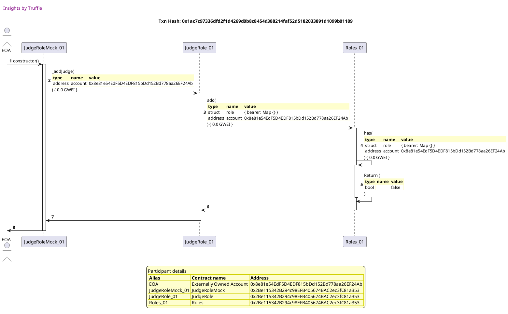
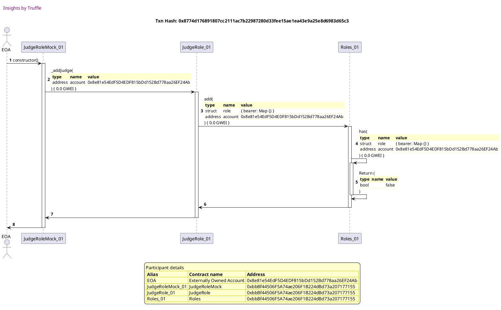
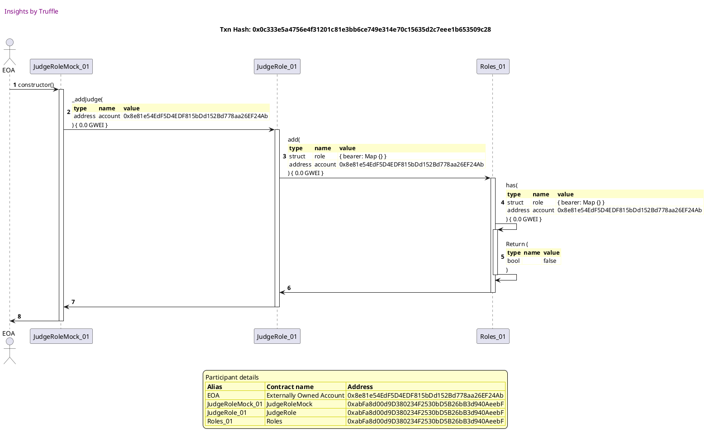
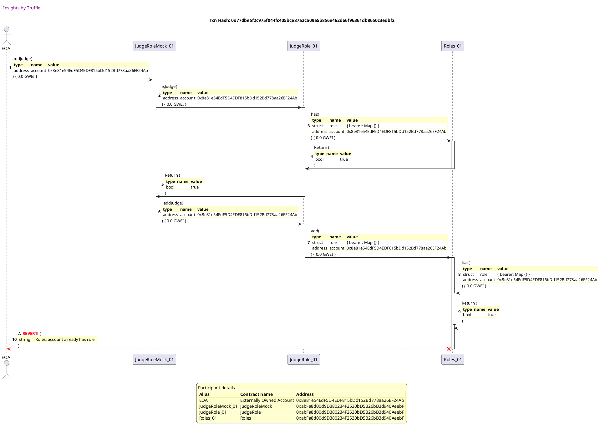
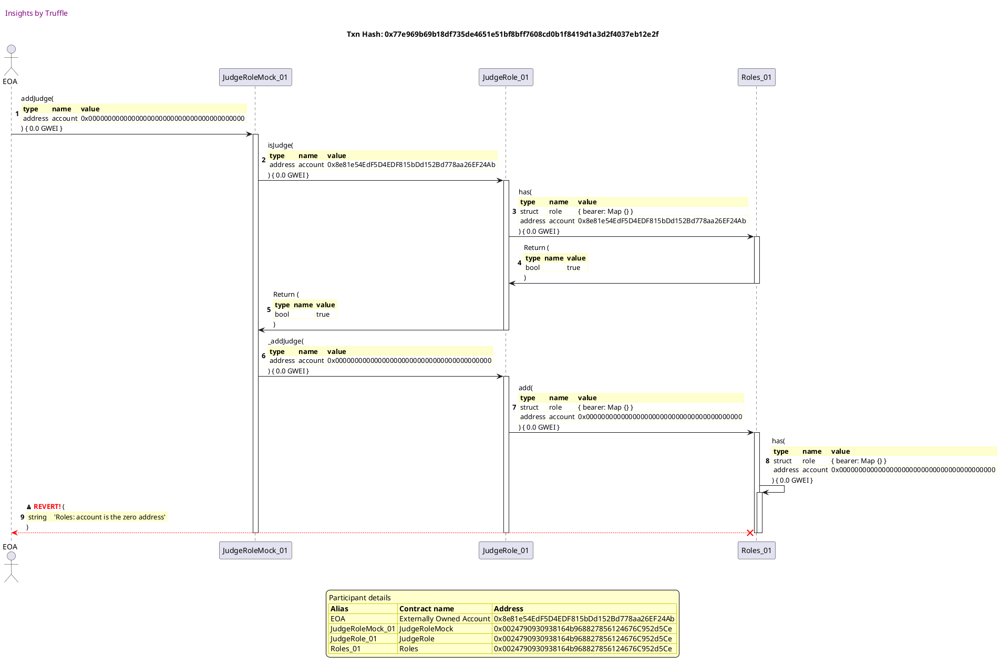

Test date: 2021 Mar 11


## emits events during construction
[link to test...](http://github.com/fodisi/hackapay/blob/1746d2fc3fafc73d8b2843f0fed53fbd26643dc8/test/roles/Role.behavior.js#L63)

##### d1, tx: 0xd058fadd453599cc749d81c2972098b4fef68ab48b07f4a3a38b885f034bcb2b

[SVG :telescope:](https://www.planttext.com/api/plantuml/svg/tLNTJzim47_tNt5YBw2DpVaYJiKgGfiE9Y4GGzeB4d9YfurmdSfnjfR2_xvh6ZhwmSEOzh8eobqkTp__xkox479IMMviFLQ4yDgMkXwdqf3glj0JRlWOb1nABKvvTZyqPQr5hrIbWNU3P93q4aAEApjJiakWkKQI2sbWthu2d9McU2YrvIfMnL2FfRQ8cDkLmm0_BY4djPaekVRXM_4WmV5NjYikHA67uD3MzDJ8uqyj2TAkVwwhOZYo5QGpk35rdYCkiOLL4cwc6ivuDUe0dGeQi1mX_S0BeYZBGZyIpCdSA7Hfn58_b_aHuwdFKXhcFlUunrB6WfnwVfgbRagmP9b5wibb3Bo2FPHx1CjcYwoOS4prQos6yhfKygBCxk-eqtXj6by9sNBVSbqOgsUtvvSzGXeUSDZTiHIyVz-1hDILDVM2-lu1sU6q5heAkyDIDTRzMtrBZjiZyA6LtSVFO6SJ2IWr7pVo1rSrAWltHy1e8wiAKCioF4aMDJfbaZaoy1Cn2Ff-qXym9qZxmWdSKn66Z7FtA1cuVfmkKGvW3lGZXI_VatFS_0sI2zghCZIKSSstaLtM1naQn4CnXrHo8qq7BlW4va_mz2_J-ft4TaeZNlrFAHqUTk1QsjfeU5jQQLagv8TtpbNLcWys5zmuABZehiEpenFMFTSwPDbb2mUo79BawaLp2cbveQeN2VLfdrAwI0Xd8ROiAZqSSWPdo2gr-BdqgxZkOpDUy3crqcYkr0mkVsef87xJvhm4tXfF6wO6sfD2X3vrGu-vlfDwSUoB9A2z9E177eiy9uy3pgBe5UWDsB-0N8sxLlrJADoXTf_82Jxnb_SB)


##### d2, tx: 0x50955cfafe626f26384cae960d9586809cf4274ee5026a0ca818933f6f88d72f

[SVG :telescope:](https://www.planttext.com/api/plantuml/svg/pLPjJzim4FxkNt5YNuOOc_FkLgmYq6Gm2O4OqhuW8ITsseWqgHndQodyzrtJ45xQYeqNZQhANSxdny_vpZaJibjghdGroWZXbIxoQXH9HShBD1zpnKUGoO7CnHwFBmUgg7AnNsI5WWzX40Rx0I4xfPvciaUW_Wqb5rB1h7a5E2XKUbNaccT-bWxoaSmr8YQwTGXnS04vhjGuamy6VgHN4WoxjPrm8T9y00PjJ3UrtFdIa23D-eTvcGw6keHe2cUgIXB49JhLcOIpIGu7l1nsWKuSsd6SEE69T4qtCLsBsJ6N7PUAZiDSHZjnOfkUBQL3JPVJc3E3TImhSHF6X6Sc1BSiraWzEFQ1bx21SeFWjkaqJiSSG_rUYO4yBJ9vLCIN5zIelHuRrqnPSbzodHlBMxVRbmr2QXwmtLkn56njTG5tiHxuU9wVavqcbPyQsRl-2dewbe0ovwDQ_k9PXShS_Ne-Myco1DJY62j2eqOdpEbJDxOzmmu34LYEavYCXHOrlSXWdci7BB7yoFOMA9im0_gPmhUVmI4cSGNF1-nRvcdv-iGbCwHZ1o9q-dRG3vdXH7rXEEQUy3p6kUa6eMdxqHF4Mz9j7ch2Gru-ZsofLHNF6Ih4Gp63I78bLHUE-1XcDt3pbc7T1R6SX-tjBfnANQaSdXTQL1GPSiG_njXODrTjvOggUEkrdwY_YtTyTDPK8AxvdohmHM4zhC3tSgZU9AHNBEg4P-LTLJzrYl_-pAqx8Oj6CtSWYti2ERdNduJKFCtAUm7rQPzIEWy8hmFOjL3Pnpwli8sseVctMz_EwrtN7HQV4orLphDi2iU_Sod0VzONxpxmKeT-PAgXBIc4PsEQBMRQHcJvlYq2X-u73iTBGySo4j_XhDDP0_q8zWMGRSTlr7-5mWmrUIAx-CHRtny0)


## reverts when querying roles for the null account
[link to test...](http://github.com/fodisi/hackapay/blob/1746d2fc3fafc73d8b2843f0fed53fbd26643dc8/test/roles/Role.behavior.js#L70)

##### d1, tx: 0x1ac7c97336dfd2f1d4269d0b8c8454d388214faf52d5182033891d1099b01189

[SVG :telescope:](https://www.planttext.com/api/plantuml/svg/tLLBRzim3BxhLn3TfSNMJV8ZiOCkQ1xssW55Ywx0BWKAsP8JeueSoFAMDEr_7-EuMVFeOHrscM6OD4r--aY9D26dfUN6LXD52AzieQj98WqfxtCzvOPFGCcHrABFq_kHAIej1eKg3BoBepWQH8ISb7QkP9T0VOqb5zB0eda5E2jC_b1eorLFvICzaTeYOcRN3Z5-N45EApDLSkF3j_n10lFMjYikHAv7m6XZUghboQU616dMFzTbFXhR4f8vt9Wgon2NsDmg2JSp3MUy77U0pXXFssdOTjsMo8IJCU4vhL3G94W3p_U46mGEypAU-OxmMU1Grmr29XWDmuGo5eG4IvPQf1vTze2NS83oW63PR9xcKuwfVgt4I5uNIbuKwVqTPRNNjl6La1tt7TUbiNnsUtuv8AJc0SVTFKl1-_STI0jTMbCjgHyUaJrE6w7hi3kiVcqzlDMtvAGv0XyQsNty37O-bO1IyqajVt1LeR9qVmICDh8i0RKqnPDaKQEpG0PC-buaOd_eHSCuO7uo5Cnt-gBT3ZXtMb7iUBraXN842w0VANpv7ftZvc-HND9Ubw6cZ6k-ZUogFiZG81wA1III6sawSC6di7Y2ft-PrkyaTbCQy_9_Ikduk0FNqbP6mzlIIef28J-yCwxAndoqlU3MGS55znsUFPsmwRdH8QikMpgGrP0aLo-QKqZBSrM-I6X8XvJIPK8u2x5bKHdWa3CuGzQfzPvBluxhFjRZ1PypAutcIitXygUM0dflsfoNm3lZQSjKGpjzoPZlUaxV2Rqq3AAuxr6_rVRwlO4ZKpSR18oxlliAz1RiNq2knrsZ_YaKxb2pJ-GKd_ZB-mK0)




##### d2, tx: 0x13a120a305fd2d548b1847126906b3a5cae73a2a90b78aa1911e5789740cf78c

[SVG :telescope:](https://www.planttext.com/api/plantuml/svg/pLPRJzim57xthpXYBqECpRarQSKgUaa6an288Uq52Jc9qqQuJkKuMqlXl-ya3U7ILcnSDAegnpa-_loTYtDCo7wkcTB5H1322ft9OX9oHVBBL4wPOXCGVCHbt6VHvKXbXOm7cSWKV0Zym1_uXEpbUYvubq3r6tCMSmMB-XNW85FfLIOr4psHZkI4Ius8YMuC0fnSGauBDHNymSIFz8g3OJUw4nR7gHo1GMlLJINtljGaIBt_eSpJqLZd4CxXJ1L9WhX4frfmE9j9E63vk0DqPbZCC2cpg9F4PkpONcXujckOhJPjXHPp8iPTYvciJKFNOyne6mPtNA_jsZHAN2yY6B988tN_k0SiXosKMmJ3fjCedJ9qzNiHZ_Xf9lXH5brUKAEoUgpSi6J5VCMqLEQtPhSlMuHKF62tksOhsDdf04QnclXuBi_9NftAJxNiNdy5FPzoG2dPf9A_c2XmK9fVbwiLptF0KHHXHMWSqPdd36ahmkZPWH_xbkCafkS55ZLT3AhRidqliNgXxIvHjc41z3E5Rp_zGqpY6fuFs3VCq_prYNCFishxSU0CRNyOU8OJ3cF3CVknMsRTRFc1QVV29uWtf9iyL8J7B7yUsLoh8YePAiH3iO2GCyLL1uxO51OtSFEMRjqviPg7tTqEd79TA0dFSotCCe4SyOy-rjhjTQ5SKnLllVSJzNVnZe_EXWh4FVzJ1Rx8hOSL-5uErPkuz8f5dJ2HtrNrKwVuxy_SfXEoR3Ib0LdU4yZ9lVuKSyrIaTzpQ4Y7bDBI8RmEODV2mG3xlC8sshZMkmrziwvxNNLOVCuqLv89COVZtvB7q7lM5-y-y4g7VgIgeCq-Dmp7iis-sRQZjkS7VPiwBTVkzmOcZwnau1dCSgmDq8zWNm3PTFnw-AzGcA4wJsGVdtZh-mC0)


## allows access
[link to test...](http://github.com/fodisi/hackapay/blob/1746d2fc3fafc73d8b2843f0fed53fbd26643dc8/test/roles/Role.behavior.js#L78)

##### d1, tx: 0xfa8ffecf453611598f2545a247efa2b54a14ed9d333135fb460c5f335b7f65c1

[SVG :telescope:](https://www.planttext.com/api/plantuml/svg/tLNTJzim47_tNt5YBw2DBLzkqufL59eE9Y4GGzeB4d9YkurmdSfsjfR2_xvh6ZBwmSEOzh8eobqkTp__xkox479i7JEkd2X2MEaANKvIOOYzp_MK6JO19KP2ynEMtOzCKMf-MgZ2mBjXCanE4qAEh9ihqIDGNMF1k32mg5y1pWgJFnJQCTLN-KXFX7Q8A5tZCCIFAyXfQQPAh7tubZy8yAF6TiKup_K8VAysFLNow5DDWjJhdskRZyREGZg76rDAYRZ4vKu9k9bfE6Dst0Ll9baifSXaHCEMxzDEB0CQKHP4RI5PaDA8-P7W7Hw6eHzIcKOjBwCo36dQbYsQ-GHBbZcadbpsWLdOGxb7i6mkp_8fmrI_bdmahWibBehi_ixpAwzDuoiXM-vRhakZVNPxVjaZfE81XxqTIy7xzrt82csTAPVKzm_83gUrq2Ri3gjVMVTlzIqvge_0Xrhs7Z-3cqy5eDHiKiaVJ9MeBDqV0QEDi1PGop8yIGurRnQBs1SqIlYG3g9aC8nzcWwuJuCJtcx7Z0MjP1X4_NI5SW0By3vwyELxSewRlq5oIRifGqKPrtmRsLLzaA51F1GBI0KpmdJXWarXyGHF_pAjtqbifpHczdzAwV2m2zV2bKR3sz9AYq8XFxmbKxOs7smkk75GSD5TXsT79wnxhdN8gikM3cGr9CdLY-Ramh5SsHS93Ro1vtdBX70MOikYSef3pk0CQLBhFvU-YUizLkC5dpCdZ6PApU7ofnOS-c_Qd9V0M-DfmrH12qexdKwM1An5urOdR7lIepZ_A8xBTaX3Zx6KzqFn2lG6x5z0DkEkLlyK2dUetYToZ4_yvVq2)


##### d2, tx: 0x4b59bad81365c65c683dceca6e053d0b1b1c6f50e155e9b25489a8bef86701ef

[SVG :telescope:](https://www.planttext.com/api/plantuml/svg/pLPjJzim4FxkNt5YNuOOc_FY9ArOHQ79O182CQHzGK9ExBGHRbBPpjPI-EzpqX1UsegD5uqgobtEvyVF-Suz8xIhD9Mw70k4QAcBl1p7N29rcUKJAkaO11_odEtHv78eYp9d-uKe97o8mYZS3n7QKNecU0z1_HjnohY4UVC9S538xAh8DHLzaGtpCS-rGKnrwn2PmGNaf9GJmHyC_CYkE5XkQpkXZ6Nv42pSc6vgkVEb8O6QzGzpbGr7Ma4yWpDPfgd1HJhJWiFPD8S3gaPTm5Ct9fsOii1oF99KJ-2mX2VKuvWu3CTMR2LUIZ2t2E6Ts2PkqA51pDF0yx75KsIsBD66UdZS1wfWmyWDPBPDPqaseIRKxoKRyjD2yACYkRp0LktrsBXcofBxacjbLBTkjnyR2DKyOBktOYdOskg2sSLwuEDvVevscbH-QcJl-YlesOI3aJaTr_8N5QLHAlVhQhRaIe7HaiHKX3OQdWPaWBt4zIqt2bde49BQGH0vsFPZA_0zDmnIfn-x_W9b4-Q0FsFuzZCyD4bSmVC1-vPvfbwVE0yiJjoGHMJWXeCei4WyO1QnzvZl1vJQNXZPRZz-WdXBkir3JNX4rVF8AYtBf68e3PuHSuWvbLnsuOXEO7u3DsyPrbqGotdOtkx2ATUbpE5veSL58Gn7yvWO6-lcggrSKHLllVOJzNVnZe_EcWeqQ_wd2dnHM0yhyBqSgZS9wHMBEgL2tLNrKwVuxy_SkXEoQ3IL0rhS4z39lVx4kAQPKFS26k01nhWAo5m7JDSoohxfyzAqqJQq_ktMj_DwrtM7DU-fvZAdGipW-7VE6VIVzOzt7tYfGpyorT2Sa4wdauGszKZWTHmVfvYa7Y51QliESJ2bCUixV0tq8zWNGBOTlr7_5SfagCaJsZLlS-lx0m00)


## reverts
[link to test...](http://github.com/fodisi/hackapay/blob/1746d2fc3fafc73d8b2843f0fed53fbd26643dc8/test/roles/OrganizerRole.test.js#L36)

##### d1, tx: 0x8774d176891807cc2111ac7b22987280d33fee15ae1ea43e9a25e8d6983d65c3

[SVG :telescope:](https://www.planttext.com/api/plantuml/svg/tLNTJzj037-_ly9YBw2DBPScJLgnYfOcWqa8n93sWeGkERUDk5wgosMZ5FxtkMd8w0SFOzhBeYXs7FldhxF3s75XXR7bL34cIflhSfgWOSLTfcV2Y2ae7AEM0v7UZKrUQdcIgzp0kpYAevE8iQF2pXNs65JN18L40ulw5U0qDzb3hgrGVPMDzHIr9SIHRHHY-hY2d9Lcfd3jmxVi0O5xZUnII9dfCN2d5ZrLzEXJ7GIh_P_f8XjFR0797AvDEHeHBhEPLGZNznfEHJ7fWdCV1e4dUT0EEpnqWZHrEUSY3HBNxOI16pgorHeXSbyWH-6ri2DS7qFPxeGjsVRJ5gEIfPP2Zoxw80hO8xh7g6msIxEPe5I_bdACLxd2ypozktLufRKfVCLaItrBTIaidjMUN_OOg-A0mzuEL_3-VHVIN1VMbClGzm_O3gKrqyRibgfVIVTlz0qxge_0Xvhs7Z-3dSyGY6enhUWFeKfYbkgFGDO6YmA8IrCwIPOuwW6677qlah4_zA9X778_6KhkkmCP1A4GRZkANQ-Vh50EO07EHmU-V8_EgFaRGIx3RifGXKm-tnRigZuKeI4y8Wj8K1WqNJWNCrWymTE_JEjt4jifJKJnFwLqUDY5AxIbqV2sj98yLnGVtIEXYbfyiEbmuw2Gqrs7PySah6kkJSXgofOARBKasUMBuPHeHQQA5maDdQ7ZECk4Q1VIo19pGalEq0vfKki_bxwnwprMwuMUznQD5ahDuUAdHWdzDpNd9V3MUjeGLT19CXXvdk-qOxyVU09TulZ0TJr9s2tXEW4F0kxxhq1lmFu5PBFkQlPFeQX3TP_OCJtfb_SB)




##### d2, tx: 0xec73eb31bdcd3bb920c54665aab2096e60d97b6ea681dd40ad46362934df92ec

[SVG :telescope:](https://www.planttext.com/api/plantuml/svg/pLPjJzim4FxkNt5YNuOOcvCuBwrOHQ79O182CQHzGK9sxBGHQL8vpjPI-E-xfg6yj1KRBnfLbRkSpu-Vyvrp9cItD5oRQfWHmYjJvDLGA4tAopGVSSs7aAc-okKUZo_xkgXokLzaXOOFKHY5-o4XEwMPPAf3eFuD59TAmxHv1JWeT7fLv8PdtIpjvqEL6qHCpC8Xmi4vvAZIeqmz6FYHNYcmsC9smgLCypvOj37Tr7BdIqE2DEiVvcNQ7vWIn0JET9KaY4jCQZ85P-CS3dWvQ0CTgzXtb70i8MFf2D6oQUmoptCv5pPjUSgZikKBJt4liAHab4lcEPxTSfXCMhQA2MvPR91wUDm5Ni86oWs2ssRIE1rn3FLx9VlgjCZKKH5VNb2hzdfiN3DboNt9TMOiRzrkNpO8gNd0TcV5Kh2rrGRSnNhWutb-JdQQL7vgPEVwAvZ9I07Ad0zh-Ojd5Iepz-lPRAtA4b2BOwm8WneT1swFUZ7pBHQ5CdHSDx6387AexGihy3qM1edJ5SoVesp25EXd2jz-XeUOn1Ky7x1VC4_BroUk0akvB9IHssDXBmeiL_IavTfxqlS3pcqlZ6pM5KyGNv1UvA4cFE3byyYMHbVnZA56F1HJ48fhfTjmn4SmlO6RjmphBeZbF6nlj-5KcKhdyBpGH55ao17_66DZtLorbIkgugtNVgB-BjxnqLbJWRZcVwh05uNri0BVow5wav1UiQWJdfLtLVtKAVxxCxVkXCmRpSo1pEy9vEHUVvBAy3GhxmNKeprAwImWl0vWrq9b7_kynZQw2Arxk_MBUPthkiFYSsoKpdcMJU3uTwuaT9_rnRiFlDIX7vbgQ27s4iPSwaLkrsTSsQXPUxRD968xtAQ-vVkMwww1VWJx0iX5ns_KVuN233Lv8hlun5lV7m00)


## adds role to a new account
[link to test...](http://github.com/fodisi/hackapay/blob/1746d2fc3fafc73d8b2843f0fed53fbd26643dc8/test/roles/Role.behavior.js#L99)

##### d1, tx: 0x40a290326ea7bdd8170885399b54856b421b7f233e3a9c79b9420a5a75d2d78b

[SVG :telescope:](https://www.planttext.com/api/plantuml/svg/tLNTJzim47_tNt5YBo36vdmrISKgGfiC9Y4GGzeB4d9YjurmdSfnM4lXVzyr3Hdzu65CUraKvIwNkvz_T_PT23af3TEccaX2M6KALKrIeKbvdwifqsm2Keo4ugSikn_febAyNyX2muSaJk9-JCXnQUPIz0ZKrrWmBZGicbU0iqBdZuKoJ4Oo7wc9K0OHXwPrIF3Z2d9QwQaKQn--vuy2BBUrNJ7ESpK2YpQcvreUVsv8a6RzSrNcex4f8Pt3ZQw6GyGb9ZTImCrCmHahnrsWCvSoEwIEtH7CJpaFB9y6WUU4OUgvWTT9NTjA_Q7jEC9XOUQ7QUZQb7dCzxZD_I0bMBBC8FNuCW9MmXxAFO9bCtcMJncc-gtY8t5TI75HPFTtrAgzDerlX6ovRxakZUMBsylB7Y4r3pZgxLWA3W-xa1MgDBfQKjy_83kSraBRi3kiVctTlrMtvBWv0XyRsNlw0cO-5O1IiKaj7vYiK5cwFm56Qr6MW5gMuKaogD5P809BU6xC4s_WneCaiBnqm2tFFkM-7p1cT-B4TgDqXN802w2VA7pz4P_Zvc-GND9kor1JnZNVHtPL7sIe4G_50bB1jD1Tk61JM3p3yxzCwtSIsocDMVa_fNHqr8LhOIgju7rffKKXaH_UGoRBndomkU36GS55TnsU7PsmxhdM8QikMpgGrP0aLw-Qaml3Sbc-IcX01vJIPK8u2x5bKUdZaDCuGzhKefVIjt6zftgyu7DcX5PCoZbS_bI2G_IkpNaDl3MUDamrj12frR6OiEpC2KKIsdRK3vpJ40UZR_782uAXPVTv-0Rq1knVGBRZhb7_50ftgDadSe9F_ENz0W00)


##### d2, tx: 0x0b5c802f4c278a43cf9ba32cf8f9e5e67692434bbf3da7a146b8963f038c55b2

[SVG :telescope:](https://www.planttext.com/api/plantuml/svg/pLPjJzim4FxkNt5YNuOOMzvVAbOHscGm2O4OqhuW8JjsseWqgHndQodyzrtJ45xQYgs0HbNbBkVpu-Tyvvm9sIyLbQeQPOJGIXLvDM92al8gpSTKqX5aOY1oVa3Zgu4igfptYgoGy24Aex0N4h9NgcackWJgtr1GBYJCcbU0mqAcrqMkQ1PawI0VYLmXOg9QXmW75v3ZIeupyMZWHtejGBTQsodbFCq7e6kDwRQMUryQ4gHP_oWlqy5GbS2cS2wh945SebAL2JYVv718os47j8d6xDZJZCIA3TUZbXadFgEc4ITUuWjREAxZ6vPfCPQOdBfKjnpc-OwPQAONspOp26vPh91wU180BM4BvHR1RLDfd8ufXlgzuWDnLcJYk8YlBZMzzdfgN3DboNt9TMuixzpkNhO8gNd0RdV5Kh2pqm7SnNhWuqL-GVQQL7vgPFVcAwZfM03Ad8vg-Ojc5IfpzvlvR2dA4b2BOwm8XPesyUo-viIMgrjHo4FJjXF3yo9JCrocUwvZXLvY1ino5oZRC0FjimRVVeP7cCGLF1-nRvcdvUiJ5vukR2laaTstmdxawJRhSzqs3hYBLK4D9umCAs3F46z9jtce2GzfkHdPKiagdZEKY8TY1anGAMG7ZkaOPhTm-vPXtGUnd8VTtGwS2LN973OBZHL5XXpnZp4srkrLMxcYAjvwxMVgx_8T7vqr5OXh_gSAV55OZolmlHogDmdf5OiweLbvNzNFdUA_FtFhJiYYqSmToEAUG4uVz2Sk54spya50VQslQTey8BmEODT2fOTzNc8RRKCBxhQ-dTUzgJiiFYTAo9ncsHHEVkU2Gx3H5-yXy5A7VcAgeOLWkgDJeHknwOl8DuoWvva7VcAOhiu3s_CItUXnVmtq4zWNGBOTlr7_5GeprEI9xECJRtr_0000)


##### d3, tx: 0x547aebd7b38fa272be26940f0c3beb8ca2bd092f86c763f7b8367493b1a7e06d

[SVG :telescope:](https://www.planttext.com/api/plantuml/svg/pLPRJzim57xthpXYBqECBVTBnIf2ammc8H13sWiIikEJDY9DAiVPA8N_FZSDuT9MR5mqgYh7EJx-_9sBSqp8RYMfaFKu9uJMiYpgCKD1gekic511nv3Z40k-HvEBeIZhWW_Al1Jm8OxYQ10HibF9QOvz0irlX9IZW5dx2h1VYkogB2JDWpmR5cCif49CPMSGgya5vAGManmVJFp8hX1qgzCTKywpOWYwrgfk6hdpfIL1slqFYYeRZcG5R0gdeavJXKja9dE4qyi2zcarwe5sQLikHSPTPdefDLo3eU7ubfPgYScGUGar6DTy8_MSn7NCr6MUwRYMRpATkgWvdAYG9L9HZuu2e1LiABb1LDXabcGJgbpzNlCXdfGv7fR9nRccDrQFbMkMB9alcSwLrQtPxSi68GqFsEwls0gsjdgWejXCV3mhpiXEcyfFhUnVVmKvdI0eMT1n8t_Hl5Q3kVdrVBN0gW8rIX9L4LADL2pTACPqm5pNjXrJjqF727Jk-jImq0njsmvDozRIS86o2JFGFclmxMTqe9AuWkS3zXtph7fruXvwEjfMn6CxjA8mzdIRXLotZJtkkXwbXXF5XXMm9uXtfBiyD8H7j7eUsKgAEfap50fFYHamf0953mxf16OtSFEMRjqviPo7xUqUdA2iHG7FSusLPQuugh_oiTLkhWhbYgfuwxsVgB_pTtnqrbIWslF_LE3Bt7fOWU_aKBsDIwzOr2dDgxkgVkeK__sPMtT25ercRa0MzmHoVAy_SPGqowjx3eLQg6dQt25r7L1TImq6giyBrKOxruBRq7Vh-jTDXrNFIucYe7a-XQFV1N88dlN5km-yrA4VgHfeHAOxEaNTI4mVOzymWe5dxlcfORew3spFItLZmFqrq8zWNm3PTVns-AzGAaDjdiYkUgfRtny0)


## emits a JudgeAdded event
[link to test...](http://github.com/fodisi/hackapay/blob/1746d2fc3fafc73d8b2843f0fed53fbd26643dc8/test/roles/Role.behavior.js#L99)

##### d1, tx: 0xc091aef3d364df9ce1d8608ecc355d33bda85e66bffb3826540d2b5b867273c5

[SVG :telescope:](https://www.planttext.com/api/plantuml/svg/tLNVJzim47xtNt5YBo36vYHDcbQiehJ9O182CQIz824xTje8rwaSXxKK_lTTqv3H7poCQI-BejpbSlVvkxFlGiX9OPcnvKGHmagRwtB2fI75VQQdpB09A3cIMfoov7vaybABGQvo0n_YA8u64I77XPqhsIDGNMF9X3Img5y1pdAJFURQCjLNsKXFfBQ8cDh68SQFAyXfQQPAhdtudZrAS5gDxOe9aUaHEBGsFLVo-7DDWjJhd-iY6urj0NmEDwPCKyGbDhDAmirCmnahnbsWiuHs72PJJtX1IwITH3eY36WeayJpVU5vNB3Gbq70qvHxeHluBIfSxlCmQBjjB_49bYonI3swx0ChO0_b7i6osIp9fWnJ_LQAaRpEbRp8a_ixwbHUcyOtGhRSjroNnkB5xULbZv2A1nprTYm5XuTTI79TM5CkgUyVa1rEQw5Ds1rMlxBkt-fRSbmVWO-rx3rz0JkVIa2fsQII3qoLg2pTdm2ZZImAG2r9y2HPrEWibA4Z_LOaOd_OYePnwFXyA1pVFHNjTiYO6qIns-hp5Se1B81-el3rHtIEcxz1SacxAKD56TTy7zbLVP2XGJmK2-2I6McwSC6ci7Y6vt-PrkyajbCQi-9_Ikdeg0lNqfP6m_lIudcka1_UALD5RJxON73ZeE2YkmxFZavOzrpha5MNBHt8QaYIgrVDAQHbcIfU9JIaGqhfCY6SXTYog0nmo1cS8Krg_PVIDt6zfsgyu7DcfT5CgJbS_jHIGFzTc_CQU6iyRPWgw0334qhzaBOTEk3EW0QTc7A_4qSq6Bf1G6CHy47_3UWDsB-0RCPThVuf5EvGlK_a19_uo_i5)


##### d2, tx: 0xd4ce20027cd58608986f99c5b98f4be0e3fc6513c9c50b0cfab5c924d9a380eb

[SVG :telescope:](https://www.planttext.com/api/plantuml/svg/pLRRJjj047tVhnZHbo9AktPinuveH4ZiGYK4eaXzGK9xSx1mx6YzRXC2_zw9OymbYMYvg4IHPpqxU_RCPJrBo6vXc3RbA2M4bIRFoX5NcXINIJPcceqWLKELoJqcBeSwBpFPpzDSmuSeZC9-ICXEOQQfwXAeVXUAIQLXLhy2xESwkSepmz9UcWopaSeC8iQcCOXmSW4vBlKuLGycVYHN2YodqHqpAPDi21QjLJULtFbIao3r_WTPaGmlJ05y2gUwZ6F49IOngOBJIGRxhBZe09r8HoYRKhijfEjxr0zyBmu2uVB0Znskg6h5mdEjba0TvLJ4ZBiYi1qPi9PF5ISOCc6GUdZK0rR01ieDWc4pYKZ635tzNigXEibJTPYBotDgLLQFbMkMB9alcSwLnQtPxSi68HKFsEwks0gsjZg0KQmcFfvbPsIdJkMdMdQlluAPZXMWpDYeahzOMk9WRduzNwrLKG2EXC2AC3YY4zyTK4yuRSk9GXcsN3UsVJzgON2vvRSz9_JZLeyxxGNA9io0VgRmxMTuW4bSmVC1-uPvKhm-SULRodL26Ra39nn4lkNoWRHSUq-sspvZjXT6jjFZJn1lI3Tvg0XViE9vP0kZIp5dg14FnGouObhf3XooCSnkuEOjtRfpOZaFsziTE56cr1ayppMUvobon3_wM6itLuLoHLMyzTvFrD_vEpuwQoeGz_nF5VWYjnvMu7ivL6_YqYiMTSpIugwgdph5Vt_crfsGHQEP6v35FO4St-jFKXcMfCKzXmPqG2cTEuJN0UnQEEXZdzVOHXlNUhUXRzPrhwiEYy-9KJfZQJg5ez-Paj1xrXVlFl1IXtwagg0zN2ueTNtQjcYVMttg1H7bRX25r1lOdaSZwV5-Rmtq8zWNG3OTlnx-AnHcgCuJsSKdtlh-0000)


##### d3, tx: 0x62247a2e0c8c9f0cb6dee29a64253362b1863cb0b187e01c81c84d49adc4883f

[SVG :telescope:](https://www.planttext.com/api/plantuml/svg/pLPjJzim4FxkNt5YNuOOcvF6ILgnYj8aWqa8n93s1GaviTD6f4dbE5jBuR_lceRmqbPi1JIgA7Svdny_vpltJCX-eRdIvIWbX9SwpyfHA1Kfhf9ip1KVGIe7CXC7FBeQgBpCH3zFSmKV0Z_m-puXUuMUfh9BeFeD9HTImQp-13ZCLNATPvgdlJGPP2EPQKICTUCGuE02SbogSIeV3Vn8hYKOLcCxvK8asG0CMfjkAxdtfIP1wlMFiY8P37K1uHJELHd7Y4jqebC9vvCC3danx02TsAPfEToKD7AZTaoZq1PIccrkMoPhjMmpD5ox5OKKfIEf4RduMC9gSn5PhjkA2MvPf96wVz83Ni0MoYs2swQJA1bp3FLxAGRoB4_bSHvTNLAZydfgN3DboNt9TMuixjpkFhO8gNZ0RdV5Kh2pqm7SnMhWuqLsGVRgL7wgPVVcA-ZfM0BAZ8yg-Okd9IfpzvlvR2MB0b2B8gm8ZHgTCCSFPDmF7OSnksKmppPxXd3QtBHaosECUIsBqTXRe6p33EXd2jz--aUOn1Ky7x5lc2V5gnDtfMj8PlaYO9xbUu5hiD0J1ZCFXEEud9ks7vXMBto6U4EwoKD5UCYBpSWMMfNHdA52F1Gp22LNKdNWc8zXTWktRndMVH3BUTZTxS2PrANAOBFGmZnFaIC-66DjtLwrbIkgugtNVgR-Bj_nqLbJWRZc_wd0buNrk0BVoQ5wcv1UiQXZdXRtLVtSAVxxCxVkX2mQpTo1BEu9vFH1Vn9IyoGj7WJaKOzIEWy8hmFOjL3fOvzNs4QRq7ftMz_CwzvK7HRV4orLnjDq2YU_CocWjz4_taFWfGxzn5H1spWzefIvr35eFpJwr6u7D6JjmAUsPzes3OGTzdjhe9_0lW2owVYr-gzGcA4wJsGVttZh-mC0)


## reverts when adding role to an already assigned account
[link to test...](http://github.com/fodisi/hackapay/blob/1746d2fc3fafc73d8b2843f0fed53fbd26643dc8/test/roles/Role.behavior.js#L109)

##### d1, tx: 0x0c333e5a4756e4f31201c81e3bb6ce749e314e70c15635d2c7eee1b653509c28

[SVG :telescope:](https://www.planttext.com/api/plantuml/svg/tLLBJzj04BxlhnZH2uZIhbzvYKOan2vKGY2Ar0iIMdidYSLc7QtND27mtpjnZ4iU74hLIotBCnxFVFlDxCwOiPFS2cEBYM9C53RJnIH6m_BxL4-54HDGE48j-oAv7vciqF8qKvc13r4OXQSXOyUvdIliCYYlCGg91XRLAy1PPjB7J5kXUYeTwGbgIuX3Mpj4z745EItCLE7QX-_f8uBZrxOh8MMgH-3molHSokFF5GbMhN-kytGqjZd4SxWnnN18kCocLY7Sp3ISYNpS0JxZYUTv60Y_6JJG7tgEovsavQ0Nnuq4ctuRFSV79a-SeE45qasQYEZ4ZS0BU3jnMunAbbYY7bxsGEImHtAFKTbicgHJGQb-A-G8hpE55rboVyUTqclJ-4R8blkMwzAOlxYzlEmnLlA0e-wEfU3mi0D9fdDhYYNr_GEsmsajj0wxe-gNrlrRVSkEgoFmiPBTfozWvrC4abfCIlaWL47Aqlq9ADfWdWDfIK8doPB6PosaWWT-AADWu8U3gEK4yK0wWTkNpMPB2BSHHgxVYrSe1x00_ed3rn_XEMt-1iabxReC9MLQytraL_KXXeRmI2mWHc7GTE12J67n3C__CgtVIModD1Rv_vJIqL47hj4MHiFxqegpJ14_keT2vPNvO7F1ZOD2Y-uwF3iwOTrphKDMNRPqOAiXoQvUDQT4ArALlqfem0USysL2D0kfPKavfI5dQ8RKgVLUIb_7TP_AyKBFcKMZXL9pkFofKKBlNPlp6dXhF6sOIcWHHw8bEPVjWTVYhkT7Rk3nU13qtKRSzsJRvpt4E7e3UWFsBo3hSLUfVmf5ErJj4pkX9_toVW40)




##### d2, tx: 0x46d0ef7483f52a02e8b63ebf76d5eb8ecd9639320e20f1d79dd96acdcd36c5b2

[SVG :telescope:](https://www.planttext.com/api/plantuml/svg/pLPjJzim4FxkNt5YNuOOc_EULgoYa6Gm2O4OqhuW8JjsseWqgHndQodyzrtJ45xQYeqNZQhANSxdny_vpZaJibjgfdGroWXXbIxoQiIb8kLbce-POYF8v43cOe_5bmDLLBdOBx92mOSeZCBza92TKaypsIDG_uQI2QbWrhm271GglIfopR9-bWxoaSmr8YQwTOXmS04vhjGuamy6VgHN4WoxjPqm8T9y00PjJ3UrtFdIa23D-eTvcGw6kWG-XJDL9GdY4ftgJCBP98S3LWwxG2UsAwXCFDkt4iTar9G-Tot94yyLZkI-Z4N7jJgMIQL94qDu7O465ejOM6xiS9FWbiKQgOV7VM0bRA3S8BXjEetJCSDGlrTY84-BJ1uLyUK5DMglnyOrKvRSbrpdnlBMxVPbWv2Q1sptLYm5MrjTm5si1pwUv-TafqdbfqRshh-2deubeCpPg9Q_M5QXCdU_dizMiYm1jJZ6Yj2eqOdl1DIDRS-mer24bkCafkz75ZKzRlYUQuT-OlMvxIrGDc46z3E5Rp_3GqpY2fuFsBVCq_BrYKlVa8uTYiW9x328VCFXWJ0SSqzudi-OwOQHQVVv4yHRqcqUQi93LZwFRAbL5SyPAiH3CGCkcPAg2qTi3BCRk7dBiEw2MCx3zdONJgMkL0xF2uqNHOOSyOynDjRDLLkveYhUUkqdwk_Y7H-TDHM8Q_wd2dnHM0yhyBqSgZS9wHMBEc5PULVLJvtYlpzpwqx8ej7C7SZYda1ExlKd8JLBi_9UG04DAANpWF0wW5qBbNtiymhRQ1jQ_tRhstczwxh3udEYfSfPbatX-7Sk1VIVzSMx3xpKeH-PQcZ68-OBIaKdi7ngMdPaEXRbWRDdkdpF4XsRzgNaqHheHx0lW6mxVgF-AnHcgCaJsSKdtlh-0000)


##### d3, tx: 0x77dbe5f2c975f044fc405bce87a2ca09a5b856e462d66f96361db8650c3edbf2

[SVG :telescope:](https://www.planttext.com/api/plantuml/svg/tLPHJzim47xthxY1D4PPDpTDqhJgAbgQ32OXK8UsXp4X9tPAH9fKZWCjXV--Ivg6GbjDOq9YgwgSSpv_z_dkeZj2zXF5f4f78I4iLN6KZbmXIN8LH6CcsGX2CHGHxp7lQYZZDE87SHXBs7Pinpwm2MadQXgA3e7yToaO5n9cnIl0OIo3spXIBEo6mJ0QYKWXegzA0mStvv3ZL8v3yMZZQt0heAQNkbF6UH0DeKOBrNqksnyB4gJmVnGbmV1I9U1EuKocle-uH0Kg570sYU2G9PSje9D6Wxl2y3MlsJ1ygkk-frF3zOJLO9h7Q9CPhcMOGZSrRff-qwoRDUvQfa6zkk2khn4CcQUGkdtI1PR05iejWc5JWHUC6LxrIyg7OX27uZZshYveBRTwgjnmPCLynJHJ9WkpnSiM8JaFg7RMk8AzlHPW5FEDT-VHEMaNgNnVoCxT9r3JiG2K4Hlbyfg5AIuoyxlij1H90hZoFAm8XIiwiOHL4uPkSyVewtRViMg6s-SrG-lnHiDYJ3DjHzExxXnb5sP0Fr3u_Dq-mYIkuVc8VSayI5uhyP9qcOUSy2LBdaSsKJBrCeOIyL3Cm1LC2jc2OpQ6sJtSl-Ir7YwnceTgjGK3eL8PmVEkviPnY1pnZtSijBlhGhccAbxQzs_gx-8LVpeRAX1z_liL-1z-L4jlBrJK3nucrH_RKl2VcTzvRq2NxRStJ4ROJZlGzkPD7MqwbSh0_cOFpjvKAksFkRwpYLOMpwmTvwvtSdUjCbuibDYCfrcoyd3lB7XnWKqpk6PAB3UjPUtZZhTsfsoTP3wVaDEbliY5Oa6OB37kqpwbD0iaZY5821S7E5z8H2v3sbsal3o7DymwEpudIiY8XU4KJcuYmQ7xhA9O1bwP39weScZcEipYbF9clsvHhQuxcb6dRj_eQQRRg_EcJhj2kCu6w2UmVm5PJXh5ya-XC4D5diW-Fd7Q_0K0)





## reverts when adding role to the null account
[link to test...](http://github.com/fodisi/hackapay/blob/1746d2fc3fafc73d8b2843f0fed53fbd26643dc8/test/roles/Role.behavior.js#L113)

##### d1, tx: 0x18eb83e536b798dc0ffa56df50dd478f1856fc8cc5172e077f6820bfaeb71e80

[SVG :telescope:](https://www.planttext.com/api/plantuml/svg/tLNTJzim47_tNt5YBw2DpGdvS2jMKTfqC0c16D9Ua90JEss4wrIsixKK_lTTqz3H3nx6j9T5KUvokVlvTsVVXP0JwxXnrLWHmYjNwcgSIaFiVQ4dtF0nA3cKMfpox7veoagBNgbA0-y6oI3f9OGSMpTJiaEWlaQI2sbWthm2d9McU2YruwghYg4UI-qGCNShXm5-N49EAZDHSkt3j-91WXUiR5TSY48FmQEDwQcMnvyQ4gHP_rpROZXo5j8Pt9Wgpn6NkC8f2JTJ3MVSZjf0fnwJAJkIuL6KnYqcCfhdF8n47b8XWfZb7WkZF6DP5dgnBsaSvn7pQPfpcSQUP9HWoJA7r9FBBd0BUoZt29RD5LanuPZgrqeCvNMfv4MPtTzHh_RQDBuIikM-vRemscUtvvSzGceUSDZPiHIyVz-6hDJMcMf1VV-0x71Q2rs5tM7rQ-l-hRubnyqH-D38pkDdSBE919IQZslvWwiAbONx8s2qaTO2Qbc69ycXHgTCCa-6GI86OJz8-WFcXMbVUA5_AkAOSUv7oS0FkkaIvG3cG3zI-F8zESVDto2veBqgGqqPrtmRsMLzaA51F1HpI2KtqhJXWazW_WHF_pAjtqbifpJYzdzAwV2m3TVILKR3sz9Aor8XFxnphcnZFjXSSEEWuAAx3i-EJbZtNEkGPPSj7CXoI9Ah5yqffEE5iYyIwjC-fNIH4Cv2R5bKUZZa3CwGLMhTvzAluZgFzNZ1vzH9exbICxZygQM0xfisvoNmrdZQCDNGbFf1tAAj8xoP5mLfAsBCZt4sUduGnL6l5VeYxCbNe3TW_m9oDUuQzK-XS8UQVI8d-CHVtYy0)


##### d2, tx: 0x0adb6af64297f37be695516d0466330eac1974937b087209689dd191ba4835d6

[SVG :telescope:](https://www.planttext.com/api/plantuml/svg/pLPjJzim4FxkNt5YNuOOc_EULAoYjCbW4W8nf7r1Gaxib0WtgHndQodyzrtJ45xQYeqNZIhANSxdny_vpZqJibjgfdGraeImIXTvDOg58kLbbe-POYEGOYXoliUIow4ggfpt2rae-125KTWF2TafzLIABe7wTo4O5mfcpIV0Vg6ogoBNJFPaDin78jU8cEhM8SB11UIuKcCf7WpyoAu467PhEsQSP_aG3DgORcgvywKXGPhr3_8o6rxe4k8fdAegJH6Nw4nB0QUJ7FPPUT41Eg6CnovBNTiClDJoOk46ZcEudDgkQrbKiCG8F3l04Ufx9WrSF-3S28oOsRxbS9VWbYKQgOT7FM0bRA3S8BXjEakoCSDGlrTyA4uAAGwBvFAS6hNNO-EQAKlkIwvpOtdhTlknGKZD0xQxAvQ2hQqEu2xM0n_FyZEoqwJoKoExrrz1JyS2KEPiLCjVJ5QepDslvxELA4j0BKcm8ZHgTE8x0-ecjcVOKSX3ot5Iq_SZYvfURFYUQuT-QlLYsrkWRC8Cw6SAttw61vZ45JmVi6-PP-Nh4nU-8Hmxv94piCD1v1jEFE26O-vnp_CPCzqmCkrU_0JnbdIRXvhm1IkVHxRKgahc31NYePX1B9WIgWE7R0op6xXvox3kWbZEm_Ps1qw4hbGEpmijBWg97F7161lhvggjN54LRxts4_Lt_ewFpfeAn3N_KmM-AAo75VXU3jMRXFIAHPqoMTvLzLEd-E_FtBeJicWqSmUok2UGutlzYGlDCbdU2sX01vJIUK1u7S2kXKeV-xp2Djg6rhlT-dPUzxhkiFYUQA5o9kKKZdxdWaFlMVzuzu6NElGZKmrDgMbx0GqiV7p3jMEy2lYcvpkkOTgkv_O3n-HENwo1VWJx0iYsupVglq9XXfeyaLryuwtl3m00)


##### d3, tx: 0x77e969b69b18df735de4651e51bf8bff7608cd0b1f8419d1a3d2f4037eb12e2f

[SVG :telescope:](https://www.planttext.com/api/plantuml/svg/pLPjJzim4FxkNt43QOooZYJDMwkkehJfO182CRHz61DoOgUDI9FASQ1G-E-xf6dMqbPil6X4Liuvdy_FupldJCXU8gcGwJ0aXAOoZjAXomL9BeDeH0KTGiZxF6BxrBliYpYDM2SEOm6RFQVdT1n2cecy2NcBGFuCE6LSmAJu13Y8HN0RHvA6xJ3eHqCUIVJeozAWXuDJbwDKZ4A-CF0jkEMWwgNkX38MH7rGbK9rdylcRW625EiVHadG7yW4t1iu4wdleryY0nboE1j7S42JGGEKiMNnkbbtiQasywsQmRXk6YetLDUtNT-tJCNscEAglgshTQRI6jDyNQbPt5Krhla4jyoJ2DqvRWDDO0Fb1i5jau4NZ2XI_PgoFZ-DGtuKUvSNYffRFLIkcR9alcIQAPEPsUnZWv0S1rHRAvQ2dPq6u2xc0n_EetFIB4BviP2jkyyWRqOSK4PqcCih6gROoSplijc29mbWp_Cm8oJsbB7oby_KopPCGFcam9SVpY46SGNE1VGbyY1vSU0sjp7YkiDwHbTtkZrRDTmkKmrjdrcMJQbcEZrDRxkF02z1bt780GzeyZImYHIfbo4Kw0_515nE1HSDEA8ZcDp3_MlI-aDYEGxLQWDEkKn514-ZviPnY1Yn8ST2kxrgArTanMkl_KZ-NRpXexCc0t7D_vE1pwErc85lv52z5ALnzUUcuEnNHctwhyQyRhw_fYB2yjQ2fZSjicZJgbHEdU_EwTcxIgMvc-jRwt8_uvULnpo_j_Bb6YN-804vu73BHJnZjpNBVyQnZWLNLFBvElAuTh4qhHmfQnoPNYJ8oLm1OrpI84pcg7ILBkvV5aYyBs1Pmqu7Bm82FPSXRSzYKyv3wba9nlTOSX7HCBo1u-k8CsW_wPSuxtYfX3zG5OcXwLPTgTUmsQgfktNJjZNBDanLqqtBxDGDZHaTliRr0xVFS5bU2Ohklxh221Ln8dlunclXRm00)





## removes role from an already assigned account
[link to test...](http://github.com/fodisi/hackapay/blob/1746d2fc3fafc73d8b2843f0fed53fbd26643dc8/test/roles/Role.behavior.js#L127)

##### d1, tx: 0x79e993cc93e166acf09629304a114cc27a388bf5a3dfbb31e7d025c979aa2d03

[SVG :telescope:](https://www.planttext.com/api/plantuml/svg/tLLBRzim3BxhLn3TfSNMJNx4ZeCkQ1xEsW55Ywx0BWKAsP8JeueSIFAMDEr_7-EuNlFeOHrscM6OD4r--aY9D26dnZ9jowaaX9MsKEKq4PgO-rpDc6PJa68i5E-pz7wiYrBnGI4B3Uz6yIWUn8IS6BkGeakWkYQ2SQ5XMRy2d1KwVoYKPR8dyx6Q2cKHCREDmmW_hY5dfPv9iV7XM_uWmF4RsnNZF5TZS6XjUghaoQUQ1AdNFrSc7q-iWMG1DxhCCiGbDhTImCrSmHapamxGUHY9AFBIDFA44mGipMWKk957VUOuVfgw8VFQxIHhCOzdIU8v8kJKRQLH637cSkeHB5bgaNfysGDcu03b0S6osJpDPmnJ_LhoiRWkfBWeqlixwbHUsyPNGdRSTrnNHlFizlnoG4Z50uwxUvQ2z-yxa1RAM5skg1yUaJrE6w5Ds1rMlx8UtgfRSb8VWG-rx3v-1hkO2K2fsBIIFvWiKLcvFm96Qs4Ce9QcU98iQdJU5cr7jFoOZrf3FnwEsauh6NAdvVPv6BQnpa4ySlrUiaOvWYNGZnI-V8_FSVEtIAveDsMeAEEQRoExhWyor8Y7OWc9O5he3bom6IoVuEbVflKxYTsK9ipyJoaT7tVWMjXIAtXRMabHIEI7TyQagSr7smjk7HHSTD_XsTC9cvuR7RBkifK3MGz9SlMYERcmB9VcHK93EgIKhXB2MOWjYye0Xvp66TAardikVHFNVQp62pxdLcZ5f5p0vKybEFJUj3alWNV6qvQfWexZp0r4pmyyD-exmo6d0wVFWyWT-Cpl9q4GUgxmejUWjs3_0h8PTxNwfr2uG_K-aLDyuY_l5m00)


```plantuml


@startuml

autonumber
skinparam legendBackgroundColor #FEFECE

<style>
      header {
        HorizontalAlignment left
        FontColor purple
        FontSize 14
        Padding 10
      }
    </style>

header Insights by Truffle

title Txn Hash: 0x79e993cc93e166acf09629304a114cc27a388bf5a3dfbb31e7d025c979aa2d03


actor EOA as "EOA"
participant JudgeRoleMock_01 as "JudgeRoleMock_01"
participant JudgeRole_01 as "JudgeRole_01"
participant Roles_01 as "Roles_01"

"EOA" -> "JudgeRoleMock_01" ++: constructor()
"JudgeRoleMock_01" -> "JudgeRole_01" ++: _addJudge(\n\
<#FEFECE,#FEFECE>|= type |= name |= value |\n\
| address | account | 0x8e81e54EdF5D4EDF815bDd152Bd778aa26EF24Ab |\n\
) { 0.0 GWEI }
"JudgeRole_01" -> "Roles_01" ++: add(\n\
<#FEFECE,#FEFECE>|= type |= name |= value |\n\
| struct | role | { bearer: Map {} } |\n\
| address | account | 0x8e81e54EdF5D4EDF815bDd152Bd778aa26EF24Ab |\n\
) { 0.0 GWEI }
"Roles_01" -> "Roles_01" ++: has(\n\
<#FEFECE,#FEFECE>|= type |= name |= value |\n\
| struct | role | { bearer: Map {} } |\n\
| address | account | 0x8e81e54EdF5D4EDF815bDd152Bd778aa26EF24Ab |\n\
) { 0.0 GWEI }
"Roles_01" -> "Roles_01" --: Return (\n\
<#FEFECE,#FEFECE>|= type |= name |= value |\n\
| bool |  | false |\n\
)
"Roles_01" -> "JudgeRole_01" --: 
"JudgeRole_01" -> "JudgeRoleMock_01" --: 
"JudgeRoleMock_01" -> "EOA" --: 

legend
Participant details
<#FEFECE,#D0D000>|= Alias |= Contract name |= Address |
<#FEFECE>| EOA | Externally Owned Account | 0x8e81e54EdF5D4EDF815bDd152Bd778aa26EF24Ab |
<#FEFECE>| JudgeRoleMock_01 | JudgeRoleMock | 0xEEf26eA46329B1DDd0C1Bd692C4a4Bb66732e39b |
<#FEFECE>| JudgeRole_01 | JudgeRole | 0xEEf26eA46329B1DDd0C1Bd692C4a4Bb66732e39b |
<#FEFECE>| Roles_01 | Roles | 0xEEf26eA46329B1DDd0C1Bd692C4a4Bb66732e39b |
endlegend

@enduml
```

##### d2, tx: 0xb43af37af6376aa4c0d44e364e80cdeadb544caf26c4691e79a9ffd0904745c5

[SVG :telescope:](https://www.planttext.com/api/plantuml/svg/pLPRJzim57xthpXYBqECpKcSIojMqKioc8H036alICY9dJOYJIh7sLeA_tsdQGYNjcBZeb5LESxnyUVlN9nZGlOBpPKknoaXlDHvLev3gKXncMGJhlWOKZcKcUZnw7AeyZ8J_JpD5Nm8_C3l-uJi5NgMoWw1wZUIN4W5y_eLu21NoLMUQPvsqsIOZMMc4J7MZK60aql8IQacgNmmyIEvac2mHdV2XKYo8HYqLjrKSkzBJOBK-nzcHJ8SwGB26PofCeuHb-X4fnBEfXaSy6BK1ZeDcSLZo-MnOxaEvooYWZ5fEKnwD1885TgCHJmsdOWvBKEwBTwAOq5RbBdCZco28OiqKlUFky0Bs4AvHJ1iEecI2KTNlvTYA4_pL1xbqUK5DIghnyeDIrRCLqmNokBMxFPbYv2A1-nsrcm5Epjjm2XM4n_FitEoLwVoKoqxrrz1poOIK6PyNCbVF2rni32_NgnMiYW0Hr645Q5nHAUUFQ0O9jTWWIzyoxPZq_C2YvfkQ7YkmtmljheXSvSesp07-fd2jv_-8IPn3Sy7x1lcIV7wnALdI9lv8h07p1y4dc670s7OPa-uhiUvwVY1oRhX4yGRqaqUAi8ZNZoFRA5L6IqOAiH3COTGSYLL6uxu1EOtSFEMRjqviPg7tTqsd4fTgWoUvrgOvobon3_wM6ktruLoJLMyzTvFrD_5Epuw6oeGz_nF5VWYjnvMu7ivL6_YqYiMTSpJugwgdph5Vt_cDfsGPQDP693bFO6StEjFGcgUfCKzXmPqG2bTE8JN0UnQEEXZdrVOHXlNkhUXRzPrhgiEYy-fbYhZQJg3uz-P5D1zrXVlFl1AXtwagg1z7-y0iiiSosprZC50qBxH4qxBx3FEUg7Zk9OfhTOcw4UmBu1iEduz_5Sep52T9xAFJxpr_G40)


```plantuml


@startuml

autonumber
skinparam legendBackgroundColor #FEFECE

<style>
      header {
        HorizontalAlignment left
        FontColor purple
        FontSize 14
        Padding 10
      }
    </style>

header Insights by Truffle

title Txn Hash: 0xb43af37af6376aa4c0d44e364e80cdeadb544caf26c4691e79a9ffd0904745c5


actor EOA as "EOA"
participant JudgeRoleMock_01 as "JudgeRoleMock_01"
participant JudgeRole_01 as "JudgeRole_01"
participant Roles_01 as "Roles_01"

"EOA" -> "JudgeRoleMock_01" ++: addJudge(\n\
<#FEFECE,#FEFECE>|= type |= name |= value |\n\
| address | account | 0x85D06c4714FEdE355f288F3027b18764E8f3Ab47 |\n\
) { 0.0 GWEI }
"JudgeRoleMock_01" -> "JudgeRole_01" ++: isJudge(\n\
<#FEFECE,#FEFECE>|= type |= name |= value |\n\
| address | account | 0x8e81e54EdF5D4EDF815bDd152Bd778aa26EF24Ab |\n\
) { 0.0 GWEI }
"JudgeRole_01" -> "Roles_01" ++: has(\n\
<#FEFECE,#FEFECE>|= type |= name |= value |\n\
| struct | role | { bearer: Map {} } |\n\
| address | account | 0x8e81e54EdF5D4EDF815bDd152Bd778aa26EF24Ab |\n\
) { 0.0 GWEI }
"Roles_01" -> "JudgeRole_01" --: Return (\n\
<#FEFECE,#FEFECE>|= type |= name |= value |\n\
| bool |  | true |\n\
)
"JudgeRole_01" -> "JudgeRoleMock_01" --: Return (\n\
<#FEFECE,#FEFECE>|= type |= name |= value |\n\
| bool |  | true |\n\
)
"JudgeRoleMock_01" -> "JudgeRole_01" ++: _addJudge(\n\
<#FEFECE,#FEFECE>|= type |= name |= value |\n\
| address | account | 0x85D06c4714FEdE355f288F3027b18764E8f3Ab47 |\n\
) { 0.0 GWEI }
"JudgeRole_01" -> "Roles_01" ++: add(\n\
<#FEFECE,#FEFECE>|= type |= name |= value |\n\
| struct | role | { bearer: Map {} } |\n\
| address | account | 0x85D06c4714FEdE355f288F3027b18764E8f3Ab47 |\n\
) { 0.0 GWEI }
"Roles_01" -> "Roles_01" ++: has(\n\
<#FEFECE,#FEFECE>|= type |= name |= value |\n\
| struct | role | { bearer: Map {} } |\n\
| address | account | 0x85D06c4714FEdE355f288F3027b18764E8f3Ab47 |\n\
) { 0.0 GWEI }
"Roles_01" -> "Roles_01" --: Return (\n\
<#FEFECE,#FEFECE>|= type |= name |= value |\n\
| bool |  | false |\n\
)
"Roles_01" -> "JudgeRole_01" --: 
"JudgeRole_01" -> "JudgeRoleMock_01" --: 
"JudgeRoleMock_01" -> "EOA" --: 

legend
Participant details
<#FEFECE,#D0D000>|= Alias |= Contract name |= Address |
<#FEFECE>| EOA | Externally Owned Account | 0x8e81e54EdF5D4EDF815bDd152Bd778aa26EF24Ab |
<#FEFECE>| JudgeRoleMock_01 | JudgeRoleMock | 0xEEf26eA46329B1DDd0C1Bd692C4a4Bb66732e39b |
<#FEFECE>| JudgeRole_01 | JudgeRole | 0xEEf26eA46329B1DDd0C1Bd692C4a4Bb66732e39b |
<#FEFECE>| Roles_01 | Roles | 0xEEf26eA46329B1DDd0C1Bd692C4a4Bb66732e39b |
endlegend

@enduml
```

##### d3, tx: 0x8a219afba4b165fe6fab1f61a36671c286eb06be651d0687ad9f28891b2af5ab

[SVG :telescope:](https://www.planttext.com/api/plantuml/svg/tLRVJzj037w_ly9YBqECBPVcLojMqJRfO182CQIz8A6xdDD6f4brkJ1AuN-V6q9Nsg9fJ7jWLHKxFkSxVsV73cE7fH7QL9ECCL6P8gyc4ZKhhzDyAhIOG8OZp5LVnDSZNLIv6XHPeU7TC1f6WuYnWzBCCkmog7zZ50erp9jRWAD2ftT5RaJMoz9HFi7S469YbWv3Mdo4d5Pwck6pXM_f7G9tbhOpeLIQZu1RZUcXbWUVcY1Oi_znNgQZiIb1pk12Lqb2kCoa9aEukCtXI9JZ3bYtWR1vMoHIE99xRe9U8YHFF2vQdkVps0uyb9OdqNEvihp05wgTs47Gvj8MYIiaeoEB3OKUdVP0bB13SeVHiPaqJgU2g7wjr0ZFYmnFYlZwokArrxhnXKSst3TS5yRooUtfPeUnEWxOxsxP2lRsEg1nKjnWlVR-Chza1qqsFpIoU_yPp6oAG38NarhUYAmYPU5-3vG6ZMK9fCKn5OKXZOuJ0uwk4wcX6pfHE0ouAqF5NRklV3yGmlQYeUtqv2FABip1-cZ1b-_HCULnIwWl4xXwYmpUIlJBo9SLjL8qhuktDBgA5q5gWYGn1ub2e-x0YPZ2_04U_YMpNpmsMOr5-JzHsj_lm3cQIkVmEbgoA3AAZ_x4hx7khk-tLYgqvxRosV8wFFVypOjUUxF7ySFELjgUGYFIh5mX5rgXPLaBSZHbg1cICg3neQaxBsdsdjAmVAvxNpTkkjuQrBd8iXcS_iXHGMybKQuV3J4PIDztNQ_5tT2pUrpvRM4xs0fTrmrRZcibuNFWZSQ_PggXeoYnFUmvNijkztaOAcl0-yfhsmD7E7r9GwXbOwijNu1UW_qBoEKWQTG_XQ8CDNbYXtIbZucV)


```plantuml


@startuml

autonumber
skinparam legendBackgroundColor #FEFECE

<style>
      header {
        HorizontalAlignment left
        FontColor purple
        FontSize 14
        Padding 10
      }
    </style>

header Insights by Truffle

title Txn Hash: 0x8a219afba4b165fe6fab1f61a36671c286eb06be651d0687ad9f28891b2af5ab


actor EOA as "EOA"
participant JudgeRoleMock_01 as "JudgeRoleMock_01"
participant JudgeRole_01 as "JudgeRole_01"
participant Roles_01 as "Roles_01"

"EOA" -> "JudgeRoleMock_01" ++: removeJudge(\n\
<#FEFECE,#FEFECE>|= type |= name |= value |\n\
| address | account | 0x8e81e54EdF5D4EDF815bDd152Bd778aa26EF24Ab |\n\
) { 0.0 GWEI }
"JudgeRoleMock_01" -> "JudgeRoleMock_01" ++: _removeJudge(\n\
<#FEFECE,#FEFECE>|= type |= name |= value |\n\
| address | account | 0x8e81e54EdF5D4EDF815bDd152Bd778aa26EF24Ab |\n\
) { 0.0 GWEI }
"JudgeRoleMock_01" -> "JudgeRole_01" ++: _removeJudge(\n\
<#FEFECE,#FEFECE>|= type |= name |= value |\n\
| address | account | 0x8e81e54EdF5D4EDF815bDd152Bd778aa26EF24Ab |\n\
) { 0.0 GWEI }
"JudgeRole_01" -> "Roles_01" ++: remove(\n\
<#FEFECE,#FEFECE>|= type |= name |= value |\n\
| struct | role | { bearer: Map {} } |\n\
| address | account | 0x8e81e54EdF5D4EDF815bDd152Bd778aa26EF24Ab |\n\
) { 0.0 GWEI }
"Roles_01" -> "Roles_01" ++: has(\n\
<#FEFECE,#FEFECE>|= type |= name |= value |\n\
| struct | role | { bearer: Map {} } |\n\
| address | account | 0x8e81e54EdF5D4EDF815bDd152Bd778aa26EF24Ab |\n\
) { 0.0 GWEI }
"Roles_01" -> "Roles_01" --: Return (\n\
<#FEFECE,#FEFECE>|= type |= name |= value |\n\
| bool |  | true |\n\
)
"Roles_01" -> "JudgeRole_01" --: 
"JudgeRole_01" -> "JudgeRoleMock_01" --: 
"JudgeRoleMock_01" -> "JudgeRoleMock_01" --: 

legend
Participant details
<#FEFECE,#D0D000>|= Alias |= Contract name |= Address |
<#FEFECE>| EOA | Externally Owned Account | 0x57EFefCb77556315D62A1d79a24e3D555D3450fD |
<#FEFECE>| JudgeRoleMock_01 | JudgeRoleMock | 0xEEf26eA46329B1DDd0C1Bd692C4a4Bb66732e39b |
<#FEFECE>| JudgeRole_01 | JudgeRole | 0xEEf26eA46329B1DDd0C1Bd692C4a4Bb66732e39b |
<#FEFECE>| Roles_01 | Roles | 0xEEf26eA46329B1DDd0C1Bd692C4a4Bb66732e39b |
endlegend

@enduml
```


## emits a JudgeRemoved event
[link to test...](http://github.com/fodisi/hackapay/blob/1746d2fc3fafc73d8b2843f0fed53fbd26643dc8/test/roles/Role.behavior.js#L127)

##### d1, tx: 0xaf88388f29dd1b5f24d7364f563128cd47cf370be80866b6f9f38a41aec9361a

[SVG :telescope:](https://www.planttext.com/api/plantuml/svg/tLNVJzim47xtNt5YBo36PZTfwbQiehJ9O182CQIz824dTje8rwaSXxKK_lTTqz3H7poCQI-BejpbSlVvkxFlGiX9uOHrvLWJ8agNct8SAqkA-ynCX1LZq6geZ3mLoVtGvgMH_Lpd5Zv4OHJsGqAE2pVJgakWkaPAI6LXNhy2dEKsUyoD4xgdiw4PA-CGCNKhXmW_BY4dfPrejVRXU_QeWFahsvMGCZD3OBGsFLVo-7DDWjJhdviY6uvS0V4CRcoPfeXBNEQqWfkfWJDHZ3f0foBbtECyRRIbP74pRVYovGL-sWmyrk29z5j9whLeh3ZbGH07QJlrkF2PK4dR2vWWMBB48VNmiWUYW3sKUmJBvh8acmXCzLifX-ewr-eYJ-xlAAkyDerlX6ovRxakZCMBsylB7Y4L3pZgxbWA3WyxaEIcSBPSKDy_83kSra9NONTO_SgwVsjkoN5z13xMillq1TnieW2b4UDAFWXTeh9mVmACjgee0BKamPFaKADJhZXJJJ-KKNFWXuE8isOyaApPE9Mj5XUY4OHHm-_5IvG3c0FzHE7hZ_0SDt-3v8BsgWmLPLppVMINzK665l5Gp25MmYhRWGinWVapFF_Bj7udiPtII1J_Kqf7HnsuLgwq1jwNLfpd6ldXdGfTrEQ3pGKt3WekkklmxEY4TS-r3bbssSA1B8SakNhLd58vaUdYLK83Eg2KBXB2MOWjYqeVXvp56R9AhVTI-bLSzwaQB_YSEcMDq7e6bp-Daj1xr-Qy1juQJnkc2fgrepRlHvG6dYTwQOyrswp1MYt5ebJ6J0H-ulEGyZUWDs3_0d8rxchrJw5mX-fz8YVun5_UBm00)


```plantuml


@startuml

autonumber
skinparam legendBackgroundColor #FEFECE

<style>
      header {
        HorizontalAlignment left
        FontColor purple
        FontSize 14
        Padding 10
      }
    </style>

header Insights by Truffle

title Txn Hash: 0xaf88388f29dd1b5f24d7364f563128cd47cf370be80866b6f9f38a41aec9361a


actor EOA as "EOA"
participant JudgeRoleMock_01 as "JudgeRoleMock_01"
participant JudgeRole_01 as "JudgeRole_01"
participant Roles_01 as "Roles_01"

"EOA" -> "JudgeRoleMock_01" ++: constructor()
"JudgeRoleMock_01" -> "JudgeRole_01" ++: _addJudge(\n\
<#FEFECE,#FEFECE>|= type |= name |= value |\n\
| address | account | 0x8e81e54EdF5D4EDF815bDd152Bd778aa26EF24Ab |\n\
) { 0.0 GWEI }
"JudgeRole_01" -> "Roles_01" ++: add(\n\
<#FEFECE,#FEFECE>|= type |= name |= value |\n\
| struct | role | { bearer: Map {} } |\n\
| address | account | 0x8e81e54EdF5D4EDF815bDd152Bd778aa26EF24Ab |\n\
) { 0.0 GWEI }
"Roles_01" -> "Roles_01" ++: has(\n\
<#FEFECE,#FEFECE>|= type |= name |= value |\n\
| struct | role | { bearer: Map {} } |\n\
| address | account | 0x8e81e54EdF5D4EDF815bDd152Bd778aa26EF24Ab |\n\
) { 0.0 GWEI }
"Roles_01" -> "Roles_01" --: Return (\n\
<#FEFECE,#FEFECE>|= type |= name |= value |\n\
| bool |  | false |\n\
)
"Roles_01" -> "JudgeRole_01" --: 
"JudgeRole_01" -> "JudgeRoleMock_01" --: 
"JudgeRoleMock_01" -> "EOA" --: 

legend
Participant details
<#FEFECE,#D0D000>|= Alias |= Contract name |= Address |
<#FEFECE>| EOA | Externally Owned Account | 0x8e81e54EdF5D4EDF815bDd152Bd778aa26EF24Ab |
<#FEFECE>| JudgeRoleMock_01 | JudgeRoleMock | 0x19F98CF00633aAfA15912177e1Ffdb1a64c48E08 |
<#FEFECE>| JudgeRole_01 | JudgeRole | 0x19F98CF00633aAfA15912177e1Ffdb1a64c48E08 |
<#FEFECE>| Roles_01 | Roles | 0x19F98CF00633aAfA15912177e1Ffdb1a64c48E08 |
endlegend

@enduml
```

##### d2, tx: 0xdf970b37bf7b1c0c60cd373d447ef90c32ccaf5480c8a226c156bd2532b75c4a

[SVG :telescope:](https://www.planttext.com/api/plantuml/svg/pLPRJzim57xthpXYBqECpRcd5Qi8D1bCGY26j1SavDXE6v4cbUDiBON_ljCqX4jRiN7HgAeSv_ZuytSkpZ4XkwLcIbUZZ11MwIAlHh5KfBnCyp5JR0IP7CXSx35-EL15bOlz8YiKV8Z2ADmF2TafzJIJFGBrRoYPa0fcpIl0GQ7IgoBNB0koT92FPAuHCT6jGOIJ2yXnfSQPV33n8xsIODYjxeG9aUO3C6YZkgdbpfU616dsFypBT33K9SHJE5DLaY0kqQdE99nDSZXWvR0BT2AIZaTZouiJBpOuvIxbml8iOTkUJ3gKMoRdB75idtAVcQRB3SUDXUbOPkmvt6O4GyOrKW-F0s0bRA3S81WsdV9qpD3LxvKOoDCYaqS5lxoWHctrMBbcoPBvakbSMTwQtRvi45BpWEtUYgrWQwiB6CLwukDvVavscbH-QcJl-YlewLW2ofoDQlcBPHKEvkRNyzLAbYNWY7Ei28qZEl6TFdMvxHbs58hGSfp4zFt8eYQ6rlTSE_GJAuXjRu6o2JEWdoby-naUOX9Ny7p0lcMUbgzFNFg6TEnGH4xV3lkHRpXnNnYEkISypsVCTCF8j8Fu2U8jwJOFDU4XAvz7jjIgudE62l5Gp22MJ4dLXICsXjaDtBobMtTEBETXUxiBfr9NAeVdkHONHOOSyOy-DjhDLQ5SKHLllVSJzNVnZe_EcWh4FVzJ1Rx8hOSL-5uErPkuz8f5dR2ilAlgfqxntv-vTITaqMZc1cHnJo0dz_gJa9gbMNdFeJxjKqhd3k5r0BiM3lQnpojiewrhmMtestMzwxh3udEYfSfPbatX-7Sk1GJF-kBT1rxgq8zKDRJHYJh-VaIfQraiI0B3wHYcuNdIY18H6yorkUs7r5y3_GZs1P1jns-6_mg56MhoH7RnYRU-Fm00)


```plantuml


@startuml

autonumber
skinparam legendBackgroundColor #FEFECE

<style>
      header {
        HorizontalAlignment left
        FontColor purple
        FontSize 14
        Padding 10
      }
    </style>

header Insights by Truffle

title Txn Hash: 0xdf970b37bf7b1c0c60cd373d447ef90c32ccaf5480c8a226c156bd2532b75c4a


actor EOA as "EOA"
participant JudgeRoleMock_01 as "JudgeRoleMock_01"
participant JudgeRole_01 as "JudgeRole_01"
participant Roles_01 as "Roles_01"

"EOA" -> "JudgeRoleMock_01" ++: addJudge(\n\
<#FEFECE,#FEFECE>|= type |= name |= value |\n\
| address | account | 0x85D06c4714FEdE355f288F3027b18764E8f3Ab47 |\n\
) { 0.0 GWEI }
"JudgeRoleMock_01" -> "JudgeRole_01" ++: isJudge(\n\
<#FEFECE,#FEFECE>|= type |= name |= value |\n\
| address | account | 0x8e81e54EdF5D4EDF815bDd152Bd778aa26EF24Ab |\n\
) { 0.0 GWEI }
"JudgeRole_01" -> "Roles_01" ++: has(\n\
<#FEFECE,#FEFECE>|= type |= name |= value |\n\
| struct | role | { bearer: Map {} } |\n\
| address | account | 0x8e81e54EdF5D4EDF815bDd152Bd778aa26EF24Ab |\n\
) { 0.0 GWEI }
"Roles_01" -> "JudgeRole_01" --: Return (\n\
<#FEFECE,#FEFECE>|= type |= name |= value |\n\
| bool |  | true |\n\
)
"JudgeRole_01" -> "JudgeRoleMock_01" --: Return (\n\
<#FEFECE,#FEFECE>|= type |= name |= value |\n\
| bool |  | true |\n\
)
"JudgeRoleMock_01" -> "JudgeRole_01" ++: _addJudge(\n\
<#FEFECE,#FEFECE>|= type |= name |= value |\n\
| address | account | 0x85D06c4714FEdE355f288F3027b18764E8f3Ab47 |\n\
) { 0.0 GWEI }
"JudgeRole_01" -> "Roles_01" ++: add(\n\
<#FEFECE,#FEFECE>|= type |= name |= value |\n\
| struct | role | { bearer: Map {} } |\n\
| address | account | 0x85D06c4714FEdE355f288F3027b18764E8f3Ab47 |\n\
) { 0.0 GWEI }
"Roles_01" -> "Roles_01" ++: has(\n\
<#FEFECE,#FEFECE>|= type |= name |= value |\n\
| struct | role | { bearer: Map {} } |\n\
| address | account | 0x85D06c4714FEdE355f288F3027b18764E8f3Ab47 |\n\
) { 0.0 GWEI }
"Roles_01" -> "Roles_01" --: Return (\n\
<#FEFECE,#FEFECE>|= type |= name |= value |\n\
| bool |  | false |\n\
)
"Roles_01" -> "JudgeRole_01" --: 
"JudgeRole_01" -> "JudgeRoleMock_01" --: 
"JudgeRoleMock_01" -> "EOA" --: 

legend
Participant details
<#FEFECE,#D0D000>|= Alias |= Contract name |= Address |
<#FEFECE>| EOA | Externally Owned Account | 0x8e81e54EdF5D4EDF815bDd152Bd778aa26EF24Ab |
<#FEFECE>| JudgeRoleMock_01 | JudgeRoleMock | 0x19F98CF00633aAfA15912177e1Ffdb1a64c48E08 |
<#FEFECE>| JudgeRole_01 | JudgeRole | 0x19F98CF00633aAfA15912177e1Ffdb1a64c48E08 |
<#FEFECE>| Roles_01 | Roles | 0x19F98CF00633aAfA15912177e1Ffdb1a64c48E08 |
endlegend

@enduml
```

##### d3, tx: 0xfb4b48dbd7e654e70f932716427f3e9490e9b95538effcff3a0a944ab58ef9e7

[SVG :telescope:](https://www.planttext.com/api/plantuml/svg/tLPHRvim47xthpXrBwkwRYRW054NbGPOEwbgrLNQIwNAm96W4eYCwPAc_U-xK9gbIQffdVRG8SITpyVd-tp76SOEAosLhiSvOxBMPL6F8rIikicAYLHo33aEiKYEP7mpL6LT98CoBnMy2uCm60IC7LHwbcEVGNEDK2QeODuE0OvBbTsLXPQvbsV3Oeo59iHKBnr2cdo4dDHgakEpYM_P7O9XBMtdCacoOWW6RqqFZJpur0R1slLFYYeRZdG5qGmkLPscXCjqfdE4osa1nx8QzO1FqyYAB2U94XkxmaARfwxPiOskrR5J4rtBvUX6hX2cWsaQfwafkNGjIqQ232xQZBOirXHwSEQ1h627v0wZRTDPd4qaKVrQ9qEyA7CyBUERQsuqNkl65rxPSDzmNHYh9xUdmGvZJHomtz-o5EpjzK3XkBp5PkxzLN753jfiVcXb__upwDa4WMGXnusybNbDoiBz7YWD2giAI8jZAWfD6fyww1Weh209XMy5VkWO8l8JGtIE4jjsfEnqWx1ZUT4ZoYxCWN_ayELxS49vt1BgomIktoA3jnBzCl9bHQqKpUlYhRIguqMGYY19p252gL3ru5HEOFu03_-IsIyUcwn6ilgVAEtlz-02TQqAU1sjg2npYezkujTQTzVNMoiLMdDR-Mpv79vx_kP3RxpPu_73pbVQNe9QPdcrGixdFkTyGOvE6Mg6f0pe-53KdPSqlQSqBD_htpUDcvvJZQgGUJw3iny59k2j94hOGOZf8B9j8Rgc8VnknpCIsvKT2qrV2E6Rbk2f_nnue_6lcHfemmrTPn1otZLDwQMU8LoZOzWs6c6QH8RiMh7b1Dnv0NeDzYyWbmT9g_uf56MepHCxf2VzJFm4)


```plantuml


@startuml

autonumber
skinparam legendBackgroundColor #FEFECE

<style>
      header {
        HorizontalAlignment left
        FontColor purple
        FontSize 14
        Padding 10
      }
    </style>

header Insights by Truffle

title Txn Hash: 0xfb4b48dbd7e654e70f932716427f3e9490e9b95538effcff3a0a944ab58ef9e7


actor EOA as "EOA"
participant JudgeRoleMock_01 as "JudgeRoleMock_01"
participant JudgeRole_01 as "JudgeRole_01"
participant Roles_01 as "Roles_01"

"EOA" -> "JudgeRoleMock_01" ++: removeJudge(\n\
<#FEFECE,#FEFECE>|= type |= name |= value |\n\
| address | account | 0x8e81e54EdF5D4EDF815bDd152Bd778aa26EF24Ab |\n\
) { 0.0 GWEI }
"JudgeRoleMock_01" -> "JudgeRoleMock_01" ++: _removeJudge(\n\
<#FEFECE,#FEFECE>|= type |= name |= value |\n\
| address | account | 0x8e81e54EdF5D4EDF815bDd152Bd778aa26EF24Ab |\n\
) { 0.0 GWEI }
"JudgeRoleMock_01" -> "JudgeRole_01" ++: _removeJudge(\n\
<#FEFECE,#FEFECE>|= type |= name |= value |\n\
| address | account | 0x8e81e54EdF5D4EDF815bDd152Bd778aa26EF24Ab |\n\
) { 0.0 GWEI }
"JudgeRole_01" -> "Roles_01" ++: remove(\n\
<#FEFECE,#FEFECE>|= type |= name |= value |\n\
| struct | role | { bearer: Map {} } |\n\
| address | account | 0x8e81e54EdF5D4EDF815bDd152Bd778aa26EF24Ab |\n\
) { 0.0 GWEI }
"Roles_01" -> "Roles_01" ++: has(\n\
<#FEFECE,#FEFECE>|= type |= name |= value |\n\
| struct | role | { bearer: Map {} } |\n\
| address | account | 0x8e81e54EdF5D4EDF815bDd152Bd778aa26EF24Ab |\n\
) { 0.0 GWEI }
"Roles_01" -> "Roles_01" --: Return (\n\
<#FEFECE,#FEFECE>|= type |= name |= value |\n\
| bool |  | true |\n\
)
"Roles_01" -> "JudgeRole_01" --: 
"JudgeRole_01" -> "JudgeRoleMock_01" --: 
"JudgeRoleMock_01" -> "JudgeRoleMock_01" --: 

legend
Participant details
<#FEFECE,#D0D000>|= Alias |= Contract name |= Address |
<#FEFECE>| EOA | Externally Owned Account | 0x57EFefCb77556315D62A1d79a24e3D555D3450fD |
<#FEFECE>| JudgeRoleMock_01 | JudgeRoleMock | 0x19F98CF00633aAfA15912177e1Ffdb1a64c48E08 |
<#FEFECE>| JudgeRole_01 | JudgeRole | 0x19F98CF00633aAfA15912177e1Ffdb1a64c48E08 |
<#FEFECE>| Roles_01 | Roles | 0x19F98CF00633aAfA15912177e1Ffdb1a64c48E08 |
endlegend

@enduml
```


## reverts when removing from an unassigned account
[link to test...](http://github.com/fodisi/hackapay/blob/1746d2fc3fafc73d8b2843f0fed53fbd26643dc8/test/roles/Role.behavior.js#L138)

##### d1, tx: 0xde62d2b2560dd5c91e16293f0c502296f05de5d6caf721f007bd727f045c011b

[SVG :telescope:](https://www.planttext.com/api/plantuml/svg/tLNTJzim47_tNt5YBo36vhXD-Y5MKTfaC0c16D9Ua90JEss4wrIsmreA__kkQSZe1mzZsikYA7UvtFtykxFlGiY9TTouOg88uONBTJ69fI7sFjDJRlW4b1n9BKvvSZyoUQ7585UvWGzH68M3a91Zw-PAzWYKrrXo8GqigbU0iznaZxbsNFLLDj8JgHqYfgvsYF3Z2d9QcAcIQn--PuyIl6Pjk-92P7e47grCpwKy_boH8DNwvzfcex6p4C_XnXHfYhZ4PKv9k9bfEEDst0Kw4p9WWiNC3wWGVjBnf1UmJYEbYKyPwmGfzONqHP3mjCMybD9MB5gibTAcdr3FYmcMB758FRpi0xUmXtAFODbSbcHJZgb-AyH8NkTANkJ9_HtrIgzDuniXM-vRhakZVN5xUTaZfEG1HxqTIy7XOHUIN5jdYYNr_GEomsajj0wxm-gNrlrRVKkEgoFmiPAzfo_WvbC9A3MVbFA1gmALfViJOBIHrW9gIO8doQ56PstPzgJV34Na3vlXC6fxVZmKdizEHQlLvfm5OSIQ_NY5SW0Be9yeVFqHdkFcRv1SqgxBK5B6DTz7TbKVP6WG3yK2OicDD5suu5DOFCFplqphTnBRAOsv_PzIEZhgmhLqXT7mlhJYF5V83--KArkP3pONt3WekEYkmxEZ4zOzrpfarMLB1x8QakJgLNCAwNYcxAk4XdH8ALqcXBCGMnQL0GuvWpEaJgt_KlewhlTKZXTypfmqcYirXykVMWhelsjpNWDlZQSDKmcDeozAF4R3W4MDA1XGlzFt6o9kuEZq1wpTm6dORj7JDw0tOFy2iXvtbVgdKBX3rJwH4tpYB-yN)


```plantuml


@startuml

autonumber
skinparam legendBackgroundColor #FEFECE

<style>
      header {
        HorizontalAlignment left
        FontColor purple
        FontSize 14
        Padding 10
      }
    </style>

header Insights by Truffle

title Txn Hash: 0xde62d2b2560dd5c91e16293f0c502296f05de5d6caf721f007bd727f045c011b


actor EOA as "EOA"
participant JudgeRoleMock_01 as "JudgeRoleMock_01"
participant JudgeRole_01 as "JudgeRole_01"
participant Roles_01 as "Roles_01"

"EOA" -> "JudgeRoleMock_01" ++: constructor()
"JudgeRoleMock_01" -> "JudgeRole_01" ++: _addJudge(\n\
<#FEFECE,#FEFECE>|= type |= name |= value |\n\
| address | account | 0x8e81e54EdF5D4EDF815bDd152Bd778aa26EF24Ab |\n\
) { 0.0 GWEI }
"JudgeRole_01" -> "Roles_01" ++: add(\n\
<#FEFECE,#FEFECE>|= type |= name |= value |\n\
| struct | role | { bearer: Map {} } |\n\
| address | account | 0x8e81e54EdF5D4EDF815bDd152Bd778aa26EF24Ab |\n\
) { 0.0 GWEI }
"Roles_01" -> "Roles_01" ++: has(\n\
<#FEFECE,#FEFECE>|= type |= name |= value |\n\
| struct | role | { bearer: Map {} } |\n\
| address | account | 0x8e81e54EdF5D4EDF815bDd152Bd778aa26EF24Ab |\n\
) { 0.0 GWEI }
"Roles_01" -> "Roles_01" --: Return (\n\
<#FEFECE,#FEFECE>|= type |= name |= value |\n\
| bool |  | false |\n\
)
"Roles_01" -> "JudgeRole_01" --: 
"JudgeRole_01" -> "JudgeRoleMock_01" --: 
"JudgeRoleMock_01" -> "EOA" --: 

legend
Participant details
<#FEFECE,#D0D000>|= Alias |= Contract name |= Address |
<#FEFECE>| EOA | Externally Owned Account | 0x8e81e54EdF5D4EDF815bDd152Bd778aa26EF24Ab |
<#FEFECE>| JudgeRoleMock_01 | JudgeRoleMock | 0x721Fc120E62F3F6C059A53db3d2b5C28345c870B |
<#FEFECE>| JudgeRole_01 | JudgeRole | 0x721Fc120E62F3F6C059A53db3d2b5C28345c870B |
<#FEFECE>| Roles_01 | Roles | 0x721Fc120E62F3F6C059A53db3d2b5C28345c870B |
endlegend

@enduml
```

##### d2, tx: 0xe5ed4c510404af49f55221eedf843c2e74011e6d4af2a762b755b22ccd08d689

[SVG :telescope:](https://www.planttext.com/api/plantuml/svg/pLPjJzim4FxkNt5YNuOOc-F4IQXOHMcJmIG4OaZxWeISs6aZqgHodAsbyDztJKDvQIisNZIgAdSvdny_vpldJCXUQOGsrJ0ZH5IcoAjXf3GfBzDy9BGOGgRwAfVx8hxiwwBAPRV82WqVmY0CkW4XkwMPPAfDeFuDb91AmxHv1JWeT7fLv4PadIpjvqEL6qHCpC8XnC4vvAZIeqmz6FYHNYcmd8NjH4YPvdsmQ6EwgUNkbuO4QTO_pCkqFp0bH1CuqrMI82ungSaKd8rpE13be0LqhBYIJimjwb179CvEmZbZbb8oyHqxPifpg6KfL-8W4vxB8e_pYB4ubjINhhz3SCjYWzI3umw84ZPGRX3SDfF6wKXWgDyhsLUdHQQEYlZoWbgrrsFZcYbBxakkCsDvwtRxia58pGEssokMWgsj5k0krWCVp_DpijkaybCZszTVmKn62b3cObZBNoAhK9cvNyzcQrMMW5eSOqKOrEZOvptgnevdEM4W0vlpXFb-Q5FcHPRlkKxW9tOdShmvoYPCWNwcyErdS8X9NC7p0Vi5yxHyVUBAjnHt0XdodXFqGj_YKKzQdErBp_E5O6uGCgSJFK5yGNgHXvhmG9JF8riQNSKpXXhnK4mXKa8htO8ZCOBf3ToyPLXtGIpdONkx1QVAL3g7vuKM5KM67F6FCJRMpLLRkQ8gtdhj9-hluXqVdJKLY6l-fmfyKLWFA_2z7Aet2UaLYpeHMNbNrK-Tuhy_S-jEoBpHp1p8_9v0Jkxr9wcCIBFoNa0zsgEKpWB2wm1sBLIwsESrjj55Q9tRhL_CQr_N7HQVOwDqBh9i0iU_SoMXywmltdtWfGxzo5H3UymAOulHm6MX7RfTodSwt9QHBLd4kyot7Hxx7jrV0_q8zWMGYuxVgFyAXHbgyaJsy8ctlZy0)


```plantuml


@startuml

autonumber
skinparam legendBackgroundColor #FEFECE

<style>
      header {
        HorizontalAlignment left
        FontColor purple
        FontSize 14
        Padding 10
      }
    </style>

header Insights by Truffle

title Txn Hash: 0xe5ed4c510404af49f55221eedf843c2e74011e6d4af2a762b755b22ccd08d689


actor EOA as "EOA"
participant JudgeRoleMock_01 as "JudgeRoleMock_01"
participant JudgeRole_01 as "JudgeRole_01"
participant Roles_01 as "Roles_01"

"EOA" -> "JudgeRoleMock_01" ++: addJudge(\n\
<#FEFECE,#FEFECE>|= type |= name |= value |\n\
| address | account | 0x85D06c4714FEdE355f288F3027b18764E8f3Ab47 |\n\
) { 0.0 GWEI }
"JudgeRoleMock_01" -> "JudgeRole_01" ++: isJudge(\n\
<#FEFECE,#FEFECE>|= type |= name |= value |\n\
| address | account | 0x8e81e54EdF5D4EDF815bDd152Bd778aa26EF24Ab |\n\
) { 0.0 GWEI }
"JudgeRole_01" -> "Roles_01" ++: has(\n\
<#FEFECE,#FEFECE>|= type |= name |= value |\n\
| struct | role | { bearer: Map {} } |\n\
| address | account | 0x8e81e54EdF5D4EDF815bDd152Bd778aa26EF24Ab |\n\
) { 0.0 GWEI }
"Roles_01" -> "JudgeRole_01" --: Return (\n\
<#FEFECE,#FEFECE>|= type |= name |= value |\n\
| bool |  | true |\n\
)
"JudgeRole_01" -> "JudgeRoleMock_01" --: Return (\n\
<#FEFECE,#FEFECE>|= type |= name |= value |\n\
| bool |  | true |\n\
)
"JudgeRoleMock_01" -> "JudgeRole_01" ++: _addJudge(\n\
<#FEFECE,#FEFECE>|= type |= name |= value |\n\
| address | account | 0x85D06c4714FEdE355f288F3027b18764E8f3Ab47 |\n\
) { 0.0 GWEI }
"JudgeRole_01" -> "Roles_01" ++: add(\n\
<#FEFECE,#FEFECE>|= type |= name |= value |\n\
| struct | role | { bearer: Map {} } |\n\
| address | account | 0x85D06c4714FEdE355f288F3027b18764E8f3Ab47 |\n\
) { 0.0 GWEI }
"Roles_01" -> "Roles_01" ++: has(\n\
<#FEFECE,#FEFECE>|= type |= name |= value |\n\
| struct | role | { bearer: Map {} } |\n\
| address | account | 0x85D06c4714FEdE355f288F3027b18764E8f3Ab47 |\n\
) { 0.0 GWEI }
"Roles_01" -> "Roles_01" --: Return (\n\
<#FEFECE,#FEFECE>|= type |= name |= value |\n\
| bool |  | false |\n\
)
"Roles_01" -> "JudgeRole_01" --: 
"JudgeRole_01" -> "JudgeRoleMock_01" --: 
"JudgeRoleMock_01" -> "EOA" --: 

legend
Participant details
<#FEFECE,#D0D000>|= Alias |= Contract name |= Address |
<#FEFECE>| EOA | Externally Owned Account | 0x8e81e54EdF5D4EDF815bDd152Bd778aa26EF24Ab |
<#FEFECE>| JudgeRoleMock_01 | JudgeRoleMock | 0x721Fc120E62F3F6C059A53db3d2b5C28345c870B |
<#FEFECE>| JudgeRole_01 | JudgeRole | 0x721Fc120E62F3F6C059A53db3d2b5C28345c870B |
<#FEFECE>| Roles_01 | Roles | 0x721Fc120E62F3F6C059A53db3d2b5C28345c870B |
endlegend

@enduml
```

##### d3, tx: 0xa694fc09a3e51fb11a3e3ad2c4bb24ea05595ff815bb7c3f2f120391ba9deaea

[SVG :telescope:](https://www.planttext.com/api/plantuml/svg/tLPHRzf037w_N-6rqhhIiLuI3WfYg1J2sabLArPj3-jKNP8BH0qNTBbGAEr_dnD2HWjCMgSzT0XXn-Ty_coVR0WvZZLNEXc5XF14Hp8PEKAH-3QGOwxu248n4D8xuUxjG4M9z3fH62dOxTazksCJqeprB1Gj0jbdABWd5CppHu3JI0NtaTGyR8V1G8w4r8ZewyAXXuSBo76Yng5uSl0bk1TWL0hR9VUyG0x0eBdfCPFDmvm4oUEVoJWO37KCpWokLEBxY4jqe4C1LrC9fpmUDe1EURLUyLrQvvPWXkyO1YeMzqotuZXcHN3AM9tv_f717AVcMhxf6oQrweR3wvxWWXCicQkHkdtH1Xx33ieTWcNJWHkCEQRwEV46eX-5uZnoRs-eaNazDsvvPSrzpJKrnaktvSCE8HaFABSsX8A3WmOeCOec8ZjxToslIJFlvljSjXu-WfwD1Q2KV9J92GyJL5Bt1y0sA177W9hhugNGgD4fgzazuNUSMesngcMmRjLi6rwjph6MLfSnrhKgZFhT1Se-p85-eF3fcts6VTn0TNi2DwynWzV2lc1UtAYLI_Colh5MYPkIL0Y9OWwEu4ge1fppCSmVuV5VPlOhZ_MiXZp-dr8gbnlG5pfH4bwMbXD58VB3hy_3E3VlhmQSbh_lAk7zI0ClvWp6RBwzuqhYQ6v1qrqi2FHfbKfz-wlTltfJAZKFCtjh6w-qeEbepsBlPU4QHS6yICGW8utjceYiudjBPZY8NHrCk1Qh8t3L-dH-RZmf1l7lJybY5vBBbHdi2Ss3C5x9g4kxbDAqqhZoS3AZqi5TfX2vg7bxUIUAzx02wHR1twaMIl8mdC75dHGUj5zqQrQ1rxRGCrC6NJEDdelxpQwQFQjNxL1MRpFBSopFT5Z7F49WzwX6JxP0FuFz2yXYg-Ngdq9XX_8-aMFynNysFm40)


```plantuml


@startuml

autonumber
skinparam legendBackgroundColor #FEFECE

<style>
      header {
        HorizontalAlignment left
        FontColor purple
        FontSize 14
        Padding 10
      }
    </style>

header Insights by Truffle

title Txn Hash: 0xa694fc09a3e51fb11a3e3ad2c4bb24ea05595ff815bb7c3f2f120391ba9deaea


actor EOA as "EOA"
participant JudgeRoleMock_01 as "JudgeRoleMock_01"
participant JudgeRole_01 as "JudgeRole_01"
participant Roles_01 as "Roles_01"

"EOA" -> "JudgeRoleMock_01" ++: removeJudge(\n\
<#FEFECE,#FEFECE>|= type |= name |= value |\n\
| address | account | 0x57EFefCb77556315D62A1d79a24e3D555D3450fD |\n\
) { 0.0 GWEI }
"JudgeRoleMock_01" -> "JudgeRoleMock_01" ++: _removeJudge(\n\
<#FEFECE,#FEFECE>|= type |= name |= value |\n\
| address | account | 0x57EFefCb77556315D62A1d79a24e3D555D3450fD |\n\
) { 0.0 GWEI }
"JudgeRoleMock_01" -> "JudgeRole_01" ++: _removeJudge(\n\
<#FEFECE,#FEFECE>|= type |= name |= value |\n\
| address | account | 0x57EFefCb77556315D62A1d79a24e3D555D3450fD |\n\
) { 0.0 GWEI }
"JudgeRole_01" -> "Roles_01" ++: remove(\n\
<#FEFECE,#FEFECE>|= type |= name |= value |\n\
| struct | role | { bearer: Map {} } |\n\
| address | account | 0x57EFefCb77556315D62A1d79a24e3D555D3450fD |\n\
) { 0.0 GWEI }
"Roles_01" -> "Roles_01" ++: has(\n\
<#FEFECE,#FEFECE>|= type |= name |= value |\n\
| struct | role | { bearer: Map {} } |\n\
| address | account | 0x57EFefCb77556315D62A1d79a24e3D555D3450fD |\n\
) { 0.0 GWEI }
"Roles_01" -> "Roles_01" --: Return (\n\
<#FEFECE,#FEFECE>|= type |= name |= value |\n\
| bool |  | false |\n\
)
"Roles_01" x-[#red]-> "EOA" --: <&warning> <color #red>**REVERT!**</color> (\n\
<#FEFECE,#FEFECE>| string |  | 'Roles: account does not have role' |\n\
)
deactivate "Roles_01"
deactivate "JudgeRole_01"
deactivate "JudgeRoleMock_01"
deactivate "JudgeRoleMock_01"

legend
Participant details
<#FEFECE,#D0D000>|= Alias |= Contract name |= Address |
<#FEFECE>| EOA | Externally Owned Account | 0x57EFefCb77556315D62A1d79a24e3D555D3450fD |
<#FEFECE>| JudgeRoleMock_01 | JudgeRoleMock | 0x721Fc120E62F3F6C059A53db3d2b5C28345c870B |
<#FEFECE>| JudgeRole_01 | JudgeRole | 0x721Fc120E62F3F6C059A53db3d2b5C28345c870B |
<#FEFECE>| Roles_01 | Roles | 0x721Fc120E62F3F6C059A53db3d2b5C28345c870B |
endlegend

@enduml
```


## reverts when removing role from the null account
[link to test...](http://github.com/fodisi/hackapay/blob/1746d2fc3fafc73d8b2843f0fed53fbd26643dc8/test/roles/Role.behavior.js#L142)

##### d1, tx: 0xd41836ff357fa1b70a17bee0f069f3347520a8e1428446f1f7826e10feaa77e7

[SVG :telescope:](https://www.planttext.com/api/plantuml/svg/tLNVJzim47xtNt5YBw2DpKwJ9bIieZJfO182CQIz824dkRGHhbCvpjPI-DztJKD7V_0mfhsigdoNoztdxyw-2sCdfPN6LcF5cAnieQjnZ8QLzxcUI2F7e728EZsLoVtG59LE-uKg3BmRH8Ee7p5sNDgPmYw3-ZT2cQA1UVC8S5QO_A7GLggUoeTwZDeIOcPN3WDwkOISL6QYSEt5j_m1GRWhsvLCqrmFGV36z5JBuqyD2TRiVwxBV3Yo9SGpk35LbX4kixbL23TJ3MUo77M0JrDN1ArsbhKyFvCYzhaKVep8Czu-obejr_SSBWCKhXEuRZiJcHyuRHGyGobz7tr69KiiKOykUo1Bs2EvnwXiDa_oYQHKlrRf4AyBXHT5Sd_7HUsrQNmbPCjzotLXB9_TdX_s6Ajvm65tnrRm_dq7aaANrbGBwli7R8VJMkWgx8wgNrltR_KjEswkm8T6TXy_WvrD44XgEQxb3wagKXRkZq3H1iiII4iIkacMD3uDC13ekL4wy48t2WU1yE8m5Pvpclf-8ANJZWQEsukNA0Sm1_wHmvVlqJaT_WR91UrL6MhAjEVRo2xhGmmDuP6OGupIeEd0XPp0_0cU_cLQlvFOJcaao_yffSF33boZhOo6jwKL5uKYVlJFf2eRyy7cXXiNXJRTTNbsTCAwvrg7BBjiuS2MGv9TlMZE5AtCLVaYeP27dFD5GZGBgML9wTEGCpH3Lgdrdak_Yki-rkE5rgb5ewLICxZygJ65tfiEvoNmrdZQCDNGuL6SUk5fNxPRJXZ4YJWIj70l5fxVHjTt_DZXMT1_1Ne3zYyWL-EkKVyKYaweEITsGYjzydu1)


```plantuml


@startuml

autonumber
skinparam legendBackgroundColor #FEFECE

<style>
      header {
        HorizontalAlignment left
        FontColor purple
        FontSize 14
        Padding 10
      }
    </style>

header Insights by Truffle

title Txn Hash: 0xd41836ff357fa1b70a17bee0f069f3347520a8e1428446f1f7826e10feaa77e7


actor EOA as "EOA"
participant JudgeRoleMock_01 as "JudgeRoleMock_01"
participant JudgeRole_01 as "JudgeRole_01"
participant Roles_01 as "Roles_01"

"EOA" -> "JudgeRoleMock_01" ++: constructor()
"JudgeRoleMock_01" -> "JudgeRole_01" ++: _addJudge(\n\
<#FEFECE,#FEFECE>|= type |= name |= value |\n\
| address | account | 0x8e81e54EdF5D4EDF815bDd152Bd778aa26EF24Ab |\n\
) { 0.0 GWEI }
"JudgeRole_01" -> "Roles_01" ++: add(\n\
<#FEFECE,#FEFECE>|= type |= name |= value |\n\
| struct | role | { bearer: Map {} } |\n\
| address | account | 0x8e81e54EdF5D4EDF815bDd152Bd778aa26EF24Ab |\n\
) { 0.0 GWEI }
"Roles_01" -> "Roles_01" ++: has(\n\
<#FEFECE,#FEFECE>|= type |= name |= value |\n\
| struct | role | { bearer: Map {} } |\n\
| address | account | 0x8e81e54EdF5D4EDF815bDd152Bd778aa26EF24Ab |\n\
) { 0.0 GWEI }
"Roles_01" -> "Roles_01" --: Return (\n\
<#FEFECE,#FEFECE>|= type |= name |= value |\n\
| bool |  | false |\n\
)
"Roles_01" -> "JudgeRole_01" --: 
"JudgeRole_01" -> "JudgeRoleMock_01" --: 
"JudgeRoleMock_01" -> "EOA" --: 

legend
Participant details
<#FEFECE,#D0D000>|= Alias |= Contract name |= Address |
<#FEFECE>| EOA | Externally Owned Account | 0x8e81e54EdF5D4EDF815bDd152Bd778aa26EF24Ab |
<#FEFECE>| JudgeRoleMock_01 | JudgeRoleMock | 0xD9bd5DBCa632D8bc191bc105b1576e4727b20f8C |
<#FEFECE>| JudgeRole_01 | JudgeRole | 0xD9bd5DBCa632D8bc191bc105b1576e4727b20f8C |
<#FEFECE>| Roles_01 | Roles | 0xD9bd5DBCa632D8bc191bc105b1576e4727b20f8C |
endlegend

@enduml
```

##### d2, tx: 0xbb7b437f4182e361267c67454ccc0119ddb3cffaf81ae1c184ff1ff362d7367b

[SVG :telescope:](https://www.planttext.com/api/plantuml/svg/pLPjJzim4FxkNt5YNuOOMvntAbPHccGm2O4OqhuW8JjsseWqgHndQodyzrtJ45xQYeqNZIZoEUVpu-Tyvvm9sIirKxeQPOImIXTvDU9IaV8opSTCiH5aSY1piS_You4ggbpqYwnGy24Aex0V4h9RwcackmJgPoYPa0fcpIV0GQ7IgoBNBEjbwI0VoLmZOg9RWmW75v3ZIeqp-M3WHtebWTgjxeG9aUO3e4QZkgdbxfU616dMFypBT33K9V0fdAagIH2Nw5Hd4iucEHomSjW1OyAvnstBIspgcz9ogUbwiUlPZXt7iK7fZX3SYfE49JvbaiRKjvE49edbciApN8yJtB9O8_Nmk0UiX0sK6mItJQTnEcRewlTA3EHfaScZ8hwyC6XjzLYvPigI-PBfN5dUcjr-R11Iyu3jxegbO6kh0xYBzS37y_oSx3QX_DJ8xlLNqDEn19Gv6zNo5yigxCpDh-UpbInBm5uSOqPex1aJtmaCDxOzQaUX22t7IKpVZop3z3ZrFTSE_SJgSTjRe6p238pF1dpx6HvY45VmVC2-PPwMhqzS-bGwTYWY9x338FAfmmD17NDVU9xFcEc6aMdt-1F4Mz9j76h2GrO-ZsofLHNF6Ih4Gp43BfcIgWD7R0op6xXvIxVkd5YEm_Ps1qwbhbGEptED5qM67F557nljvggjN94LRxts4_btyOwFpfeCn3N_KmQ-oAs76VXU3jMRkFIAIPsmhBpBwgTEyT-VkNKdP55evWPaSKyW9_Vgav2QfLbvpw7020p3c3k4rm6iMjZfOvrNM4PRrtgtMz_EwrxN5HRRYPOgPrasXUFVkHJGUzOVxpxmKeL-fAgXWnqkd62_prpB37mUqnsAZU5mwdYkj3sClsaaVdyDz2FO5q2s5R_f_YiKHgY94zd35czzVm00)


```plantuml


@startuml

autonumber
skinparam legendBackgroundColor #FEFECE

<style>
      header {
        HorizontalAlignment left
        FontColor purple
        FontSize 14
        Padding 10
      }
    </style>

header Insights by Truffle

title Txn Hash: 0xbb7b437f4182e361267c67454ccc0119ddb3cffaf81ae1c184ff1ff362d7367b


actor EOA as "EOA"
participant JudgeRoleMock_01 as "JudgeRoleMock_01"
participant JudgeRole_01 as "JudgeRole_01"
participant Roles_01 as "Roles_01"

"EOA" -> "JudgeRoleMock_01" ++: addJudge(\n\
<#FEFECE,#FEFECE>|= type |= name |= value |\n\
| address | account | 0x85D06c4714FEdE355f288F3027b18764E8f3Ab47 |\n\
) { 0.0 GWEI }
"JudgeRoleMock_01" -> "JudgeRole_01" ++: isJudge(\n\
<#FEFECE,#FEFECE>|= type |= name |= value |\n\
| address | account | 0x8e81e54EdF5D4EDF815bDd152Bd778aa26EF24Ab |\n\
) { 0.0 GWEI }
"JudgeRole_01" -> "Roles_01" ++: has(\n\
<#FEFECE,#FEFECE>|= type |= name |= value |\n\
| struct | role | { bearer: Map {} } |\n\
| address | account | 0x8e81e54EdF5D4EDF815bDd152Bd778aa26EF24Ab |\n\
) { 0.0 GWEI }
"Roles_01" -> "JudgeRole_01" --: Return (\n\
<#FEFECE,#FEFECE>|= type |= name |= value |\n\
| bool |  | true |\n\
)
"JudgeRole_01" -> "JudgeRoleMock_01" --: Return (\n\
<#FEFECE,#FEFECE>|= type |= name |= value |\n\
| bool |  | true |\n\
)
"JudgeRoleMock_01" -> "JudgeRole_01" ++: _addJudge(\n\
<#FEFECE,#FEFECE>|= type |= name |= value |\n\
| address | account | 0x85D06c4714FEdE355f288F3027b18764E8f3Ab47 |\n\
) { 0.0 GWEI }
"JudgeRole_01" -> "Roles_01" ++: add(\n\
<#FEFECE,#FEFECE>|= type |= name |= value |\n\
| struct | role | { bearer: Map {} } |\n\
| address | account | 0x85D06c4714FEdE355f288F3027b18764E8f3Ab47 |\n\
) { 0.0 GWEI }
"Roles_01" -> "Roles_01" ++: has(\n\
<#FEFECE,#FEFECE>|= type |= name |= value |\n\
| struct | role | { bearer: Map {} } |\n\
| address | account | 0x85D06c4714FEdE355f288F3027b18764E8f3Ab47 |\n\
) { 0.0 GWEI }
"Roles_01" -> "Roles_01" --: Return (\n\
<#FEFECE,#FEFECE>|= type |= name |= value |\n\
| bool |  | false |\n\
)
"Roles_01" -> "JudgeRole_01" --: 
"JudgeRole_01" -> "JudgeRoleMock_01" --: 
"JudgeRoleMock_01" -> "EOA" --: 

legend
Participant details
<#FEFECE,#D0D000>|= Alias |= Contract name |= Address |
<#FEFECE>| EOA | Externally Owned Account | 0x8e81e54EdF5D4EDF815bDd152Bd778aa26EF24Ab |
<#FEFECE>| JudgeRoleMock_01 | JudgeRoleMock | 0xD9bd5DBCa632D8bc191bc105b1576e4727b20f8C |
<#FEFECE>| JudgeRole_01 | JudgeRole | 0xD9bd5DBCa632D8bc191bc105b1576e4727b20f8C |
<#FEFECE>| Roles_01 | Roles | 0xD9bd5DBCa632D8bc191bc105b1576e4727b20f8C |
endlegend

@enduml
```

##### d3, tx: 0x0af7a432a894922d67a302a78f45f12a88b258d254a7a1d92cf4e2daa1b11d10

[SVG :telescope:](https://www.planttext.com/api/plantuml/svg/rLPjRvim4FxkNt5hfNLBrmq8X2JAegQ1h9rKjUggxSCwLGSs2Ig1o9WsQTh_leCGbZRDNhKFHSXdpiVZv_6PCupjfmgboiOHOvYf9Cx6df0ilGhZ2KeSGoI68kO7w5yDPPB5l9z4YOJjWJjm-ovZdLJD8j5bK5mZWLn8c9UF08U936-JM67KYy9XF1Qn8iH0LG436bn0JZ8vYSI3WK_XhG3Th7odo7aO3q7NIjTzOJllIXAidFyeJiFXIANWpU1SPa50k4o5AX9mFetX4DDH6xIfXe6DPjt0Piji6GPls5ZN3BIRWMa5EhcRdc4rkM6PQAFEMuOVcCBWYBgdwvn8q9BvYgYx9pt05BR8RZ5QDXNwuGH9wiUC3yLP4edZnB-wrFGYwh5pmojhuMkXkJDTXYqVjXWhUC1UzucfO7Ut3LACasjHZBswY2zOfypccz9sxzw3caq4a8rnNDXhZ3BgvE5tG6cG8as1UhvFcq9HZvRpDwy5ockOW_PMWmzVt2FAunDKDmkuV8uAdWlxYdcrerOspT_nJPNC_9oa94WoS_04IY7RS8mJcD_3_VzKzaF7kgeHfizRqdJlwxOK_5ikRV7PxxMXy_86PKoLiWiTVr6lAQPRgvsvdzspynUrMkTTuU_21lMvlhpItW7TEyLqxOf_c88Q2RWLCbcgsobvCYwe98RNgCHgIVgrzs6LUtAaAfS_7sMB4ukThbHABXI6KReYrD4SMjqypNGmKVsaJfzE74d8LS9xoynLxz72vBMUsgaICiOeci79JImuz5PoQzdkG0HzpxOjgr7NBQTXz7Hkjz0mHTsnBCkfcvOME0-1rywAHwu2scbvt78E-jYe6qxJy_MMJercURfbDuHf6xPdQ46plm7w4Um_G5PdJzdzKoZAK9adjayj_Nzy1m00)


```plantuml


@startuml

autonumber
skinparam legendBackgroundColor #FEFECE

<style>
      header {
        HorizontalAlignment left
        FontColor purple
        FontSize 14
        Padding 10
      }
    </style>

header Insights by Truffle

title Txn Hash: 0x0af7a432a894922d67a302a78f45f12a88b258d254a7a1d92cf4e2daa1b11d10


actor EOA as "EOA"
participant JudgeRoleMock_01 as "JudgeRoleMock_01"
participant JudgeRole_01 as "JudgeRole_01"
participant Roles_01 as "Roles_01"

"EOA" -> "JudgeRoleMock_01" ++: removeJudge(\n\
<#FEFECE,#FEFECE>|= type |= name |= value |\n\
| address | account | 0x0000000000000000000000000000000000000000 |\n\
) { 0.0 GWEI }
"JudgeRoleMock_01" -> "JudgeRoleMock_01" ++: _removeJudge(\n\
<#FEFECE,#FEFECE>|= type |= name |= value |\n\
| address | account | 0x0000000000000000000000000000000000000000 |\n\
) { 0.0 GWEI }
"JudgeRoleMock_01" -> "JudgeRole_01" ++: _removeJudge(\n\
<#FEFECE,#FEFECE>|= type |= name |= value |\n\
| address | account | 0x0000000000000000000000000000000000000000 |\n\
) { 0.0 GWEI }
"JudgeRole_01" -> "Roles_01" ++: remove(\n\
<#FEFECE,#FEFECE>|= type |= name |= value |\n\
| struct | role | { bearer: Map {} } |\n\
| address | account | 0x0000000000000000000000000000000000000000 |\n\
) { 0.0 GWEI }
"Roles_01" -> "Roles_01" ++: has(\n\
<#FEFECE,#FEFECE>|= type |= name |= value |\n\
| struct | role | { bearer: Map {} } |\n\
| address | account | 0x0000000000000000000000000000000000000000 |\n\
) { 0.0 GWEI }
"Roles_01" x-[#red]-> "EOA" --: <&warning> <color #red>**REVERT!**</color> (\n\
<#FEFECE,#FEFECE>| string |  | 'Roles: account is the zero address' |\n\
)
deactivate "Roles_01"
deactivate "Roles_01"
deactivate "JudgeRole_01"
deactivate "JudgeRoleMock_01"
deactivate "JudgeRoleMock_01"

legend
Participant details
<#FEFECE,#D0D000>|= Alias |= Contract name |= Address |
<#FEFECE>| EOA | Externally Owned Account | 0x57EFefCb77556315D62A1d79a24e3D555D3450fD |
<#FEFECE>| JudgeRoleMock_01 | JudgeRoleMock | 0xD9bd5DBCa632D8bc191bc105b1576e4727b20f8C |
<#FEFECE>| JudgeRole_01 | JudgeRole | 0xD9bd5DBCa632D8bc191bc105b1576e4727b20f8C |
<#FEFECE>| Roles_01 | Roles | 0xD9bd5DBCa632D8bc191bc105b1576e4727b20f8C |
endlegend

@enduml
```


## renounces an assigned role
[link to test...](http://github.com/fodisi/hackapay/blob/1746d2fc3fafc73d8b2843f0fed53fbd26643dc8/test/roles/Role.behavior.js#L152)

##### d1, tx: 0x30772ee493ec5b77eeaca285ec1c139d85f4b035149607c2ce71d80cedb23670

[SVG :telescope:](https://www.planttext.com/api/plantuml/svg/tLLHJzim47xthpYn5z36vgH9arQiehJfO182CQIz8277lhOHhbCvpjPI-E-xfg63jZoCQI-BejpbSlxkkxFlmjXnuOHrvKGp9agNctAIecN5NMQcmee9Q1oXKIT2teriNXhLotLkuTqW6IIzXB6ZmiqrTXXKrnY5GWkB-XNWDBVPVMwSq5sTZSm4ZIF4eLix3EZZ2d9Qsgd65n--PVS8Nh2sNGgbCZC2ZzUcnqeUVQf9i3h-cIcoqTWLaCxXsfR38U4obpcDS3qpS2gASHluhC6Zo4SCMWsKOHf5Y48AFmvHUj9hj5GS3eEKDq8lQ3Lv97s9aQTYBb6bVgCPSKObauwe9nTT40NiaTnZL3QNoMmgADMlfHhXLQxnF9Ttjzohl3QDhopPSjzoNHgB9xUdbpt6AXvmsDaH2jw_RuFCJU5ikQI-Vy1sEBrOkbvsIzMlhFitveOTrKVWGoqx3v_1pQS898sOLFA7q2KfI_S7eDKMYm98av9EaYEDpsACFGo3H0t2Vf3q1x4NfdtbXVw9Yg9O2B-P3FoWcwvG3c01_2E7Bz-JCzhy3P9BskioL9Gfvjl8hkf332tXaLX0YiAYRSEvcCBY4Hx_PLg_azXEQIoA_ocbmyCsNA4hhO6tfPNckIP-T0-5BchpmMR0ZOD2GNSTdXsTyDBpHOUikcpfm5P3abq-Qqw5JcIwU9PGd_Svvyk4Q1PIovBIeo5dQOQiK-i-bNwzhlDGZHTwpXnQ8xIUmyLFWmgwRzgSvy1Rusd3j8AEOqyq6ohbKJyHNZEGlLOwv9ulurPJYP2hEEvHc5UWDs3_0d8zxchrJw5eX-fzOiVqf5_UBm00)


```plantuml


@startuml

autonumber
skinparam legendBackgroundColor #FEFECE

<style>
      header {
        HorizontalAlignment left
        FontColor purple
        FontSize 14
        Padding 10
      }
    </style>

header Insights by Truffle

title Txn Hash: 0x30772ee493ec5b77eeaca285ec1c139d85f4b035149607c2ce71d80cedb23670


actor EOA as "EOA"
participant JudgeRoleMock_01 as "JudgeRoleMock_01"
participant JudgeRole_01 as "JudgeRole_01"
participant Roles_01 as "Roles_01"

"EOA" -> "JudgeRoleMock_01" ++: constructor()
"JudgeRoleMock_01" -> "JudgeRole_01" ++: _addJudge(\n\
<#FEFECE,#FEFECE>|= type |= name |= value |\n\
| address | account | 0x8e81e54EdF5D4EDF815bDd152Bd778aa26EF24Ab |\n\
) { 0.0 GWEI }
"JudgeRole_01" -> "Roles_01" ++: add(\n\
<#FEFECE,#FEFECE>|= type |= name |= value |\n\
| struct | role | { bearer: Map {} } |\n\
| address | account | 0x8e81e54EdF5D4EDF815bDd152Bd778aa26EF24Ab |\n\
) { 0.0 GWEI }
"Roles_01" -> "Roles_01" ++: has(\n\
<#FEFECE,#FEFECE>|= type |= name |= value |\n\
| struct | role | { bearer: Map {} } |\n\
| address | account | 0x8e81e54EdF5D4EDF815bDd152Bd778aa26EF24Ab |\n\
) { 0.0 GWEI }
"Roles_01" -> "Roles_01" --: Return (\n\
<#FEFECE,#FEFECE>|= type |= name |= value |\n\
| bool |  | false |\n\
)
"Roles_01" -> "JudgeRole_01" --: 
"JudgeRole_01" -> "JudgeRoleMock_01" --: 
"JudgeRoleMock_01" -> "EOA" --: 

legend
Participant details
<#FEFECE,#D0D000>|= Alias |= Contract name |= Address |
<#FEFECE>| EOA | Externally Owned Account | 0x8e81e54EdF5D4EDF815bDd152Bd778aa26EF24Ab |
<#FEFECE>| JudgeRoleMock_01 | JudgeRoleMock | 0x8881a63db07DEa164cC9bf012c896da50d88CBd7 |
<#FEFECE>| JudgeRole_01 | JudgeRole | 0x8881a63db07DEa164cC9bf012c896da50d88CBd7 |
<#FEFECE>| Roles_01 | Roles | 0x8881a63db07DEa164cC9bf012c896da50d88CBd7 |
endlegend

@enduml
```

##### d2, tx: 0x4748371bfee06facd3170d43edd7dd0a39c1d0115fe7e60c3cd9b503c40da860

[SVG :telescope:](https://www.planttext.com/api/plantuml/svg/pLPjJzim4FxkNt5YNuOOczsyjc8LfKq6an288UqB4d9Yfur8ayfsjfR2Vzyr3U6bHMoyQ5HLxd8-FtxETywPa5rjk3BbE2E4bwR8ot4a5T4NQJxXYeyXaqEPYpqUNmnLKUQYNsI5WWzX40RzW90TRMQPx1AeVYF9XLGmhry1zWkLNXQvuLalIuVvMEO64HFJE8Guk8ISb6gIoNi3Fz9B2SnkRCTSY3GV0gErwRgIErzg4gHU_o3NwN1aD4GpE5LbaY0kCQd999nESzZdUjG1EhKzsxSy5YLIKZVXiR2OHuLjII4y8IYtsZ4Jb34daPvqQMp5eXqvr8fjAhZlKe9R5Xka7XprW6lOGBb1SDjC6gSJZg5-ByLGdXIPF2pYYtFAAg-7naUchBYlk2wC-iRjvcM3a8e7R7VNB0LRMnt0NQm6FfxbPsIdJkMdMdQlleAPJIIWpFcuahzuLgAoSBzQp5PIQq0jZh4Y36fqwZi3wiQsn-mm487bE4dBzqEBjho8-Pvh1tvYzIBRMw9imXpePmhVVWO7cCGrFE-nRvYd-lM9Ivz9nmv4w0piO13wp8a6WZcjFU5vFkSjDmXRTYzwWdX3kib3HNZ4zVF8QgFAUC5G8HwAEKIIAwawSCWdCB-6wxSCwpQ8rJniRtVWH9fIvV2yqAAYo90Z_Z76shgvRYlNLCLRh_r4_Ps_uwFpI0NYcl-f0byKrlqAV2-7war2UiMYJdYcRwlwgLFyzsVkiHEoR3GB1xAy9v3ZE_r9ICFJJDy9Q407bD95G7WTmAw5IX_xlC8sseJMkzdwPbxtgkgm-9mQgNAUPJCu-frB0RrdVV7k0gzqw0Uc9RJlC-vQ8gBU8E3CjUD-EqeeQyL-snNSeSBt-xZC8z0FO5y0sNJyMlrNACnGdIUoYq-yzVq1)


```plantuml


@startuml

autonumber
skinparam legendBackgroundColor #FEFECE

<style>
      header {
        HorizontalAlignment left
        FontColor purple
        FontSize 14
        Padding 10
      }
    </style>

header Insights by Truffle

title Txn Hash: 0x4748371bfee06facd3170d43edd7dd0a39c1d0115fe7e60c3cd9b503c40da860


actor EOA as "EOA"
participant JudgeRoleMock_01 as "JudgeRoleMock_01"
participant JudgeRole_01 as "JudgeRole_01"
participant Roles_01 as "Roles_01"

"EOA" -> "JudgeRoleMock_01" ++: addJudge(\n\
<#FEFECE,#FEFECE>|= type |= name |= value |\n\
| address | account | 0x85D06c4714FEdE355f288F3027b18764E8f3Ab47 |\n\
) { 0.0 GWEI }
"JudgeRoleMock_01" -> "JudgeRole_01" ++: isJudge(\n\
<#FEFECE,#FEFECE>|= type |= name |= value |\n\
| address | account | 0x8e81e54EdF5D4EDF815bDd152Bd778aa26EF24Ab |\n\
) { 0.0 GWEI }
"JudgeRole_01" -> "Roles_01" ++: has(\n\
<#FEFECE,#FEFECE>|= type |= name |= value |\n\
| struct | role | { bearer: Map {} } |\n\
| address | account | 0x8e81e54EdF5D4EDF815bDd152Bd778aa26EF24Ab |\n\
) { 0.0 GWEI }
"Roles_01" -> "JudgeRole_01" --: Return (\n\
<#FEFECE,#FEFECE>|= type |= name |= value |\n\
| bool |  | true |\n\
)
"JudgeRole_01" -> "JudgeRoleMock_01" --: Return (\n\
<#FEFECE,#FEFECE>|= type |= name |= value |\n\
| bool |  | true |\n\
)
"JudgeRoleMock_01" -> "JudgeRole_01" ++: _addJudge(\n\
<#FEFECE,#FEFECE>|= type |= name |= value |\n\
| address | account | 0x85D06c4714FEdE355f288F3027b18764E8f3Ab47 |\n\
) { 0.0 GWEI }
"JudgeRole_01" -> "Roles_01" ++: add(\n\
<#FEFECE,#FEFECE>|= type |= name |= value |\n\
| struct | role | { bearer: Map {} } |\n\
| address | account | 0x85D06c4714FEdE355f288F3027b18764E8f3Ab47 |\n\
) { 0.0 GWEI }
"Roles_01" -> "Roles_01" ++: has(\n\
<#FEFECE,#FEFECE>|= type |= name |= value |\n\
| struct | role | { bearer: Map {} } |\n\
| address | account | 0x85D06c4714FEdE355f288F3027b18764E8f3Ab47 |\n\
) { 0.0 GWEI }
"Roles_01" -> "Roles_01" --: Return (\n\
<#FEFECE,#FEFECE>|= type |= name |= value |\n\
| bool |  | false |\n\
)
"Roles_01" -> "JudgeRole_01" --: 
"JudgeRole_01" -> "JudgeRoleMock_01" --: 
"JudgeRoleMock_01" -> "EOA" --: 

legend
Participant details
<#FEFECE,#D0D000>|= Alias |= Contract name |= Address |
<#FEFECE>| EOA | Externally Owned Account | 0x8e81e54EdF5D4EDF815bDd152Bd778aa26EF24Ab |
<#FEFECE>| JudgeRoleMock_01 | JudgeRoleMock | 0x8881a63db07DEa164cC9bf012c896da50d88CBd7 |
<#FEFECE>| JudgeRole_01 | JudgeRole | 0x8881a63db07DEa164cC9bf012c896da50d88CBd7 |
<#FEFECE>| Roles_01 | Roles | 0x8881a63db07DEa164cC9bf012c896da50d88CBd7 |
endlegend

@enduml
```

##### d3, tx: 0x27f2c532a3aecbe8a3ca90b7252ffe84e84fafed2cb73d6af62b63fc3bc119e6

[SVG :telescope:](https://www.planttext.com/api/plantuml/svg/tLLHJzj037w_Ns6nbo76bgHjcbQiehJfO182CQIz827dpcaZqajrkR2Mmd-VcuOEsY8qfZriLHGxFj_dxuilhX27kKLZYt4g11OsqyKu8YFocqHFqE0OKXgILaSeRuOcAxJgPMbcuDqW78IzK8Y3tCvIwWWeVoD2HGRcrIF0SMQIkqnRJBjfCjHZqfOHOxjA6F3Y4d9Ic4bApnQ-9NS4RdqLEqUb4Zq4rwb23wKz-5IH45Nz4vqdmv7D8Ph1fIdYc765JMnAS3dLS8pvg0tEr6l6dcpKFAmXoOW2h4biEL7JQtXnJ46ThnXZKfwCcZNbO-nxaL-BPIsIhjiYN_0havQfXsTTm1nssEu8VcqsaSa4MUhNGWtf8alfD9CtruvRPgq7NzYoaRwHkWZcZscF3pj2b3nWlxEb5EpjjS6GvavAAbVVxuejQIzllZOqpcwhlLVwIXnKP-53PJltdy7E9WHiDOvBUujfmSuY_HwuYORo7DYJaebOzfnfG85BZNge1er-FUmF0hSHzPNRy8vKinaWUduuyEhTQ8co2tDmFZhmvNjumgVWDGN_2liLyrKtguOjIB-DRsvD8HSa3KEocKD4QCYquHGdC7-0Xx-fx9UEJLKZpFydIVlxRRWWMnWDRvCLPLdA_FXYVLLqTxtUsb7XcjkEpvRFuNdcAnzwcIsMer-SFnavYYmcQVv4ND_fEuwp4CSJdWSHEpqUtOOduqfczx4DgtsT-t9eydrgoMXCqncS_T2aeFkcHZq5tXYwQw4bT12uwDTKv3Jx8Rf-NVPQKUoudWnQliA6euAWnsLUW5w3_GF8rH2ltD-5uWvLVHA7VES_yfy0)


```plantuml


@startuml

autonumber
skinparam legendBackgroundColor #FEFECE

<style>
      header {
        HorizontalAlignment left
        FontColor purple
        FontSize 14
        Padding 10
      }
    </style>

header Insights by Truffle

title Txn Hash: 0x27f2c532a3aecbe8a3ca90b7252ffe84e84fafed2cb73d6af62b63fc3bc119e6


actor EOA as "EOA"
participant JudgeRoleMock_01 as "JudgeRoleMock_01"
participant JudgeRole_01 as "JudgeRole_01"
participant Roles_01 as "Roles_01"

"EOA" -> "JudgeRoleMock_01" ++: renounceJudge()
"JudgeRoleMock_01" -> "JudgeRoleMock_01" ++: _removeJudge(\n\
<#FEFECE,#FEFECE>|= type |= name |= value |\n\
| address | account | 0x8e81e54EdF5D4EDF815bDd152Bd778aa26EF24Ab |\n\
) { 0.0 GWEI }
"JudgeRoleMock_01" -> "JudgeRole_01" ++: _removeJudge(\n\
<#FEFECE,#FEFECE>|= type |= name |= value |\n\
| address | account | 0x8e81e54EdF5D4EDF815bDd152Bd778aa26EF24Ab |\n\
) { 0.0 GWEI }
"JudgeRole_01" -> "Roles_01" ++: remove(\n\
<#FEFECE,#FEFECE>|= type |= name |= value |\n\
| struct | role | { bearer: Map {} } |\n\
| address | account | 0x8e81e54EdF5D4EDF815bDd152Bd778aa26EF24Ab |\n\
) { 0.0 GWEI }
"Roles_01" -> "Roles_01" ++: has(\n\
<#FEFECE,#FEFECE>|= type |= name |= value |\n\
| struct | role | { bearer: Map {} } |\n\
| address | account | 0x8e81e54EdF5D4EDF815bDd152Bd778aa26EF24Ab |\n\
) { 0.0 GWEI }
"Roles_01" -> "Roles_01" --: Return (\n\
<#FEFECE,#FEFECE>|= type |= name |= value |\n\
| bool |  | true |\n\
)
"Roles_01" -> "JudgeRole_01" --: 
"JudgeRole_01" -> "JudgeRoleMock_01" --: 
"JudgeRoleMock_01" -> "JudgeRoleMock_01" --: 

legend
Participant details
<#FEFECE,#D0D000>|= Alias |= Contract name |= Address |
<#FEFECE>| EOA | Externally Owned Account | 0x8e81e54EdF5D4EDF815bDd152Bd778aa26EF24Ab |
<#FEFECE>| JudgeRoleMock_01 | JudgeRoleMock | 0x8881a63db07DEa164cC9bf012c896da50d88CBd7 |
<#FEFECE>| JudgeRole_01 | JudgeRole | 0x8881a63db07DEa164cC9bf012c896da50d88CBd7 |
<#FEFECE>| Roles_01 | Roles | 0x8881a63db07DEa164cC9bf012c896da50d88CBd7 |
endlegend

@enduml
```


## emits a JudgeRemoved event
[link to test...](http://github.com/fodisi/hackapay/blob/1746d2fc3fafc73d8b2843f0fed53fbd26643dc8/test/roles/Role.behavior.js#L152)

##### d1, tx: 0x166ba00964489c5da5035b0030de112ca133c8b3c7b4cb4149792aaae8020376

[SVG :telescope:](https://www.planttext.com/api/plantuml/svg/tLNTJzim47_tNt5YBo36vdod5QieRJAOX40CQIz8o8dTDi9rAjjXBON_VTSqTFI3Xp7jPL6KkrpkVlxTsNSXvCHOfcqrbeImofQg6cT24tDVg0dJR0nI38NYfoo_7-goKhnNobB3XpH9arv2oB6nCoaw1Efh91WN6kRDAy1PgOl7Kbackx8Ogh5G5X47TkMGuiSbvAJI4odMFdml7WKu_ifsnJWlr10SsfYUQtdykI51clNFbIc68siWcy6DhWO3n2Msi5B0pLJ16JEZDj2f4uOPexGL-dxSoWFE0ke56QKUvS9nt9mvdfV7cPT7cPzdlkEtefRB61CnTQaNXGHBbbkadbnsWHdOGxb7i6oso8i9mrI_LNmehaifBihy_euwjTUcyOsGBVSjruNHlBYzlEmHKlE0eywEfU3mi0rvgOpLrOBw_W7PuRGMkWgxm-hNrlrRTKkEcoFmiP6TfozWPnC1A1KRr_A1oGgLXViJOBGMnW1gUOudoQ96fx687H7u2K-3lf_qqzW9iZvt0lUKHr7Cc1icgUjtioNA0So1VgBmzKToZfk_GN91UrM6cZAk-Jwoo_eWGuruAEQG2QQ5RiC5cy3y6Px_PLg_azXEQSJC_vJIqL4RheMjj8BtfPMLfKH-U0-OD8tvO7F1ZOE2Y-uwF3iwOTrphKEMNRPm8CiXIQvUDISNbXNIl4geJ_kKqaL2E0knPL7fuP3JE4DMgNLVIh-AwppLumMVKokqObBEuFAd4XowxzgSry1Rusd3L4D7RfO42O-JRYkWVjZtMsxF6IHUwlcny6aOKoVgnJH_0te3zYyWL-EkKVyK2dUesIToWa_yvVq2)


```plantuml


@startuml

autonumber
skinparam legendBackgroundColor #FEFECE

<style>
      header {
        HorizontalAlignment left
        FontColor purple
        FontSize 14
        Padding 10
      }
    </style>

header Insights by Truffle

title Txn Hash: 0x166ba00964489c5da5035b0030de112ca133c8b3c7b4cb4149792aaae8020376


actor EOA as "EOA"
participant JudgeRoleMock_01 as "JudgeRoleMock_01"
participant JudgeRole_01 as "JudgeRole_01"
participant Roles_01 as "Roles_01"

"EOA" -> "JudgeRoleMock_01" ++: constructor()
"JudgeRoleMock_01" -> "JudgeRole_01" ++: _addJudge(\n\
<#FEFECE,#FEFECE>|= type |= name |= value |\n\
| address | account | 0x8e81e54EdF5D4EDF815bDd152Bd778aa26EF24Ab |\n\
) { 0.0 GWEI }
"JudgeRole_01" -> "Roles_01" ++: add(\n\
<#FEFECE,#FEFECE>|= type |= name |= value |\n\
| struct | role | { bearer: Map {} } |\n\
| address | account | 0x8e81e54EdF5D4EDF815bDd152Bd778aa26EF24Ab |\n\
) { 0.0 GWEI }
"Roles_01" -> "Roles_01" ++: has(\n\
<#FEFECE,#FEFECE>|= type |= name |= value |\n\
| struct | role | { bearer: Map {} } |\n\
| address | account | 0x8e81e54EdF5D4EDF815bDd152Bd778aa26EF24Ab |\n\
) { 0.0 GWEI }
"Roles_01" -> "Roles_01" --: Return (\n\
<#FEFECE,#FEFECE>|= type |= name |= value |\n\
| bool |  | false |\n\
)
"Roles_01" -> "JudgeRole_01" --: 
"JudgeRole_01" -> "JudgeRoleMock_01" --: 
"JudgeRoleMock_01" -> "EOA" --: 

legend
Participant details
<#FEFECE,#D0D000>|= Alias |= Contract name |= Address |
<#FEFECE>| EOA | Externally Owned Account | 0x8e81e54EdF5D4EDF815bDd152Bd778aa26EF24Ab |
<#FEFECE>| JudgeRoleMock_01 | JudgeRoleMock | 0x72bE5Ed8EA95046D492C1fE3F348e4068017C80c |
<#FEFECE>| JudgeRole_01 | JudgeRole | 0x72bE5Ed8EA95046D492C1fE3F348e4068017C80c |
<#FEFECE>| Roles_01 | Roles | 0x72bE5Ed8EA95046D492C1fE3F348e4068017C80c |
endlegend

@enduml
```

##### d2, tx: 0x98fb7c352d32dbd29b72effbbefefe5908380679d24d2c28785a68aee0c70d11

[SVG :telescope:](https://www.planttext.com/api/plantuml/svg/pLPRJzim57xthpXYBqECpRarRiKgIfiC9Y4GGzeB4d9YfqIaJkKuMqlXl-yq3U7ILcnSDDegnpa-_loTYtjCo6vXk3RbA2E4boPNvIYIcXINgHfppKUGoQ5KOe_7bqETbqhqyopNy24Cmg0V4B9Jc6ackmIgpuNaGcgOrQy0-xbEht9bUDRBqg4QIMKGCJ6DGOYJ2yXngSUPV33n8xsIOBcDxfWBaQeXMBHMtLHovqjDWjJx7wWY7LwO0g8fdEeoIH2NcDHa4aud2lPvST41Eccp9F9ZnxE5Ouj8sEt8jsMIH95CyEkrANCORVbjORl2ZctcCu-t69UInZuLbaKmPB51wi5H3tW16oWt28RDf74wvkZgzr8CvKcUoSCylZodLcNrMBbcoPBvakbSMToQtRvi45BnWEtkYgrWQwi36CLgukEPEYCxTIe_rR9x_HNCT2m1fUAZIlxYMOc3kVdrVBMMHG4uYcEi28CZEc7UWBPYrxVSC121utc9pLZeKDkFBEQtt80bJYzo_GNA9io0VgRmxMTmW4bSmVC1-uPvMhm-SSaiwRc12Bs16mn2PddHG5YUlITydt5kjuBGTdlH4yGRqaqUAi8Nl7WUsSBeCfupr8Y7OWQHv5hg3XpoCSnkuEOjtRfpOZaFsziTE96cr0gUvrgKvnbon1_wM6itLuLoHLMyzTvFrD_vEpuwQoeGz_nF5VWYjnvMu7ivL6_YqYiMTSApugwgdph5Vt_crfsGHQEP6v35FO4St-jFGXgUPiKzXmPqG2cTEuJN0UnQEEXZdzVOHXlNUhUXRzPrhwiEYy-9aLhnB9l2qMyb1VIUzOzt7tYfGpzILT2-7GLU85ZGQtlKRGtSjjstai097PT9bxOOjVm-e_4Qw4UmBu1iEduz_5Sep52T9xABJxpr_G40)


```plantuml


@startuml

autonumber
skinparam legendBackgroundColor #FEFECE

<style>
      header {
        HorizontalAlignment left
        FontColor purple
        FontSize 14
        Padding 10
      }
    </style>

header Insights by Truffle

title Txn Hash: 0x98fb7c352d32dbd29b72effbbefefe5908380679d24d2c28785a68aee0c70d11


actor EOA as "EOA"
participant JudgeRoleMock_01 as "JudgeRoleMock_01"
participant JudgeRole_01 as "JudgeRole_01"
participant Roles_01 as "Roles_01"

"EOA" -> "JudgeRoleMock_01" ++: addJudge(\n\
<#FEFECE,#FEFECE>|= type |= name |= value |\n\
| address | account | 0x85D06c4714FEdE355f288F3027b18764E8f3Ab47 |\n\
) { 0.0 GWEI }
"JudgeRoleMock_01" -> "JudgeRole_01" ++: isJudge(\n\
<#FEFECE,#FEFECE>|= type |= name |= value |\n\
| address | account | 0x8e81e54EdF5D4EDF815bDd152Bd778aa26EF24Ab |\n\
) { 0.0 GWEI }
"JudgeRole_01" -> "Roles_01" ++: has(\n\
<#FEFECE,#FEFECE>|= type |= name |= value |\n\
| struct | role | { bearer: Map {} } |\n\
| address | account | 0x8e81e54EdF5D4EDF815bDd152Bd778aa26EF24Ab |\n\
) { 0.0 GWEI }
"Roles_01" -> "JudgeRole_01" --: Return (\n\
<#FEFECE,#FEFECE>|= type |= name |= value |\n\
| bool |  | true |\n\
)
"JudgeRole_01" -> "JudgeRoleMock_01" --: Return (\n\
<#FEFECE,#FEFECE>|= type |= name |= value |\n\
| bool |  | true |\n\
)
"JudgeRoleMock_01" -> "JudgeRole_01" ++: _addJudge(\n\
<#FEFECE,#FEFECE>|= type |= name |= value |\n\
| address | account | 0x85D06c4714FEdE355f288F3027b18764E8f3Ab47 |\n\
) { 0.0 GWEI }
"JudgeRole_01" -> "Roles_01" ++: add(\n\
<#FEFECE,#FEFECE>|= type |= name |= value |\n\
| struct | role | { bearer: Map {} } |\n\
| address | account | 0x85D06c4714FEdE355f288F3027b18764E8f3Ab47 |\n\
) { 0.0 GWEI }
"Roles_01" -> "Roles_01" ++: has(\n\
<#FEFECE,#FEFECE>|= type |= name |= value |\n\
| struct | role | { bearer: Map {} } |\n\
| address | account | 0x85D06c4714FEdE355f288F3027b18764E8f3Ab47 |\n\
) { 0.0 GWEI }
"Roles_01" -> "Roles_01" --: Return (\n\
<#FEFECE,#FEFECE>|= type |= name |= value |\n\
| bool |  | false |\n\
)
"Roles_01" -> "JudgeRole_01" --: 
"JudgeRole_01" -> "JudgeRoleMock_01" --: 
"JudgeRoleMock_01" -> "EOA" --: 

legend
Participant details
<#FEFECE,#D0D000>|= Alias |= Contract name |= Address |
<#FEFECE>| EOA | Externally Owned Account | 0x8e81e54EdF5D4EDF815bDd152Bd778aa26EF24Ab |
<#FEFECE>| JudgeRoleMock_01 | JudgeRoleMock | 0x72bE5Ed8EA95046D492C1fE3F348e4068017C80c |
<#FEFECE>| JudgeRole_01 | JudgeRole | 0x72bE5Ed8EA95046D492C1fE3F348e4068017C80c |
<#FEFECE>| Roles_01 | Roles | 0x72bE5Ed8EA95046D492C1fE3F348e4068017C80c |
endlegend

@enduml
```

##### d3, tx: 0x83c551909aa95c4b05bd2a07174069e7c5e17379f674059f270bce8d28223326

[SVG :telescope:](https://www.planttext.com/api/plantuml/svg/tLLHJzim47xthpYnbo76vgH9arIiehJfO182CQIz824dlhOHhbCv3gCK_lkk8MJG5g4nxM6hgfnpFd_-lfppXR7zmWfZowbYJ9Gsr-KqGSEAgqpFX15JK3X6BGz4UZKsUQbbFrUvWNV3U1ZtOyRs2ZjNs6LG_IOe91fOrBS0Xxd9RdDjXUgfRAodg2qXZcnJCAJ91yXPQMOAdqryosuH7A_9dGefCpq6XzUf-ohkVQf9i7h_8rrauuaj89d3kIb78y9bDhCAuVn6mw4e9XtWDs4hzNqduf4GaPzw2VSJwGeUE877sn46gOzEq0gYKPiIVZHo0vwa64etTDrMosqpUcIf9UhnIGz40LiKjnWzDfkbsKoGrA-b7EDPhl0uJwykkLDLhIPVMB9MlbQwJ1QFPOytMunLF62tks4hsDdfW45DdKoncds_pJQKlRpuqk0qlwxNNkWBjbUVXGzrxDvz1ZkV8L3KObh5Qw5A6YpBxu2QQB0eW4PfIaGiZQWP63heUx4S-WCl7Wn3nqy6ql7T0na4eH1kEnwwNYzvGDc61V2F7BvyZu_e5Bocu5zXtp1lkbatR4dwRNmBQyfqIT8G98K592WCcWuSYnaixk7-RohxfMDTrKGK_vEatTqEdA4jZOQtoKhoN14_-fE-Ehkzkj_AKQ4zDnsV3Q_3yyfNNlIgcZrOFpjzOZaIhSXKyKJSW0yuvqjnvF1aH3JeatKRSiP6Pk-n3SswxbrbcdIziMYqK6eE9pyqIkYzgL5FWTTCToLLGGTk4lkn3EDUv7ElFV0Yj--CujQmvOL8zXzo9-Y7F7q1UWNs3o0R4w-7lmj57QhxnFRfIX_odm00)


```plantuml


@startuml

autonumber
skinparam legendBackgroundColor #FEFECE

<style>
      header {
        HorizontalAlignment left
        FontColor purple
        FontSize 14
        Padding 10
      }
    </style>

header Insights by Truffle

title Txn Hash: 0x83c551909aa95c4b05bd2a07174069e7c5e17379f674059f270bce8d28223326


actor EOA as "EOA"
participant JudgeRoleMock_01 as "JudgeRoleMock_01"
participant JudgeRole_01 as "JudgeRole_01"
participant Roles_01 as "Roles_01"

"EOA" -> "JudgeRoleMock_01" ++: renounceJudge()
"JudgeRoleMock_01" -> "JudgeRoleMock_01" ++: _removeJudge(\n\
<#FEFECE,#FEFECE>|= type |= name |= value |\n\
| address | account | 0x8e81e54EdF5D4EDF815bDd152Bd778aa26EF24Ab |\n\
) { 0.0 GWEI }
"JudgeRoleMock_01" -> "JudgeRole_01" ++: _removeJudge(\n\
<#FEFECE,#FEFECE>|= type |= name |= value |\n\
| address | account | 0x8e81e54EdF5D4EDF815bDd152Bd778aa26EF24Ab |\n\
) { 0.0 GWEI }
"JudgeRole_01" -> "Roles_01" ++: remove(\n\
<#FEFECE,#FEFECE>|= type |= name |= value |\n\
| struct | role | { bearer: Map {} } |\n\
| address | account | 0x8e81e54EdF5D4EDF815bDd152Bd778aa26EF24Ab |\n\
) { 0.0 GWEI }
"Roles_01" -> "Roles_01" ++: has(\n\
<#FEFECE,#FEFECE>|= type |= name |= value |\n\
| struct | role | { bearer: Map {} } |\n\
| address | account | 0x8e81e54EdF5D4EDF815bDd152Bd778aa26EF24Ab |\n\
) { 0.0 GWEI }
"Roles_01" -> "Roles_01" --: Return (\n\
<#FEFECE,#FEFECE>|= type |= name |= value |\n\
| bool |  | true |\n\
)
"Roles_01" -> "JudgeRole_01" --: 
"JudgeRole_01" -> "JudgeRoleMock_01" --: 
"JudgeRoleMock_01" -> "JudgeRoleMock_01" --: 

legend
Participant details
<#FEFECE,#D0D000>|= Alias |= Contract name |= Address |
<#FEFECE>| EOA | Externally Owned Account | 0x8e81e54EdF5D4EDF815bDd152Bd778aa26EF24Ab |
<#FEFECE>| JudgeRoleMock_01 | JudgeRoleMock | 0x72bE5Ed8EA95046D492C1fE3F348e4068017C80c |
<#FEFECE>| JudgeRole_01 | JudgeRole | 0x72bE5Ed8EA95046D492C1fE3F348e4068017C80c |
<#FEFECE>| Roles_01 | Roles | 0x72bE5Ed8EA95046D492C1fE3F348e4068017C80c |
endlegend

@enduml
```


## reverts when renouncing unassigned role
[link to test...](http://github.com/fodisi/hackapay/blob/1746d2fc3fafc73d8b2843f0fed53fbd26643dc8/test/roles/Role.behavior.js#L162)

##### d1, tx: 0xa57ce4c5d65ad5d6cd41e9a95d5b6fd60b22d93258b60c91186c8724c4cf5c12

[SVG :telescope:](https://www.planttext.com/api/plantuml/svg/tLNVJzim47xtNt5YBo36PeSaJIjM4KWwc8H036alICYntJR2TIh7OIs5_ttND7Jq1mzZsikgodUvt7t-xkox479SEcvTDTA4yCeLfXfbofBoFZTZRla8j1ee8q-uk1_OeZBojD25XG-zj9UUfeGSbMwgLPT0_HigBfM5MVC8S5RO_B4mZkjOvmCpKiOXOjyj7NhuSW4vhknOgvKNt_D71SnVsgwubBaP0AEDwRcMHvyR4gJP_zoK-M3eIiYcS6EhVXznYSkTLd0pCN36os47w8G7BQ5y4SWmu19N8NscshmTo20B-pAacUV9zg4NH5b8HPknA1HHo_E5B_g1O1x1aWc7rDFB67W9EoXt29RDvI8VSqprMoK7whhGwg8GztUKrLxhnZT2DjmtNEV6yiNjvM67a9e777ItR0Nx-nqGXIcThURKT_V85gULq6NO7LQ_jkxUcbjor5o1ZutiFdq1DnqhG6dug9OFN5UepDsV0AEjAaj0JGYyIGurEebKn5JWfx8N97wQz28MP8baWNSYMws8SozCUvuVPmkKFPW1_KJXwu_q70z_ZUISzh8CDMNSytra5_L1XXRnKCmWKzmgsu4BFeRPCpp_oxH-9x6Pqf2N_rDA1mSTk5QkiWRUbrPM51hvuR_FTTcOzzOtNBiekEcsoxEb4rOzLpfaqMLp1x8OakJgLNDAvNYkorS99JIXbCuJmbc8BOlAAGuvYpDacLhyKlfbNFUf7Y-uJfooXcizXSkVHac8ttKuhu4tnjEQgOPknOBoZ77Pfc4x4OBIGyLPwx0ViBWNnKd20XoO2Ni3UWtsBo2NuwvH_nGAJwWv9tACAtxoVW40)


```plantuml


@startuml

autonumber
skinparam legendBackgroundColor #FEFECE

<style>
      header {
        HorizontalAlignment left
        FontColor purple
        FontSize 14
        Padding 10
      }
    </style>

header Insights by Truffle

title Txn Hash: 0xa57ce4c5d65ad5d6cd41e9a95d5b6fd60b22d93258b60c91186c8724c4cf5c12


actor EOA as "EOA"
participant JudgeRoleMock_01 as "JudgeRoleMock_01"
participant JudgeRole_01 as "JudgeRole_01"
participant Roles_01 as "Roles_01"

"EOA" -> "JudgeRoleMock_01" ++: constructor()
"JudgeRoleMock_01" -> "JudgeRole_01" ++: _addJudge(\n\
<#FEFECE,#FEFECE>|= type |= name |= value |\n\
| address | account | 0x8e81e54EdF5D4EDF815bDd152Bd778aa26EF24Ab |\n\
) { 0.0 GWEI }
"JudgeRole_01" -> "Roles_01" ++: add(\n\
<#FEFECE,#FEFECE>|= type |= name |= value |\n\
| struct | role | { bearer: Map {} } |\n\
| address | account | 0x8e81e54EdF5D4EDF815bDd152Bd778aa26EF24Ab |\n\
) { 0.0 GWEI }
"Roles_01" -> "Roles_01" ++: has(\n\
<#FEFECE,#FEFECE>|= type |= name |= value |\n\
| struct | role | { bearer: Map {} } |\n\
| address | account | 0x8e81e54EdF5D4EDF815bDd152Bd778aa26EF24Ab |\n\
) { 0.0 GWEI }
"Roles_01" -> "Roles_01" --: Return (\n\
<#FEFECE,#FEFECE>|= type |= name |= value |\n\
| bool |  | false |\n\
)
"Roles_01" -> "JudgeRole_01" --: 
"JudgeRole_01" -> "JudgeRoleMock_01" --: 
"JudgeRoleMock_01" -> "EOA" --: 

legend
Participant details
<#FEFECE,#D0D000>|= Alias |= Contract name |= Address |
<#FEFECE>| EOA | Externally Owned Account | 0x8e81e54EdF5D4EDF815bDd152Bd778aa26EF24Ab |
<#FEFECE>| JudgeRoleMock_01 | JudgeRoleMock | 0x7Ac0ab1ad9069Dcc003ea173f51AF8ADD155d5D1 |
<#FEFECE>| JudgeRole_01 | JudgeRole | 0x7Ac0ab1ad9069Dcc003ea173f51AF8ADD155d5D1 |
<#FEFECE>| Roles_01 | Roles | 0x7Ac0ab1ad9069Dcc003ea173f51AF8ADD155d5D1 |
endlegend

@enduml
```

##### d2, tx: 0x0ef82e28fde617ffb9ff2852a31a23e84f5b8481fbaf7fd07da9e47d0b90df11

[SVG :telescope:](https://www.planttext.com/api/plantuml/svg/pLPjJzim4FxkNt5YNuOOcvqcJLgnYa2ImIG4OaZxWeISs6uZqgHodAsbyDztJKDvQIisNZIgAkUSpu-VUt7EXEoMXcjJ3JD2U6MAl1h6KfFoCir7NFCXPB8lSx77ayk-BgfSx1TPeU5354RXVaZ8JcaccUmHg7y3oONKC6rU0GuAdLuLkU6PdwNzV2XpWuZAB0mYd9n3ZYezokI3YH_fbGHcBtGdN8WqxmEZZUgcbZjV6XAasVymBzF-m9GGJ-1CLqeXBZ6foIISZNCuuEMW2tHCfV8iQNbAo3PpbOexIbcUO_4MurPBUhPoOi_sc8gvSfMWhk0TQRk2nXqg56C4GvOOf1uU-y1Bs42vGJ1i9atI4KTNlrUYBq-BJ1uLoUK5PRNLO-MQ9KlcIwOpPNbhTlkoGKZD0xPxAxQ2hQqkO1JhYO_d-JdPQLBvgP6zwwzW9YC9A7C-hEKldbKuc9bVprPhMPQ0eoJ1YZ0uecFF2MWxiLrcHw48Muw3aVIY5hNSc7bksmuzrV9ZsvsZRC8Kw6SAttw6XvZ45JmVi5ymJylN9ouz9Xqx594Js64GUSo90y4SQq-uhiUvrGuZo_RZ9uWlI2_oK1CUyF9vP4kZgsJ6K2CUYYd4ackfkt34Hp2zWPktTElEYUKyR6ztuLIQIkVmFDVYeiYG8_xHnqQxkIgKAwhYhVT-eluktl7HMLE1kET_gi0NkVMm0j_BeNeJbrwng1NFohkgVkeK__sPMtT2vercPa3czmHoSgy_2MbucfNt70feG2cTEOJN0UnQEDZ7Fg-nZIvSysz3lrZNkwuxB3x7HkgSPza4Zd_dKe3_h2_UVU2b3lr8LKExVa9vpBZeq7OdI19AMv8pjwKSvaUU7mJCSOGJi3NGZs1V0Bde-CtmNw4mGqsUo2u-yTRt1m00)


```plantuml


@startuml

autonumber
skinparam legendBackgroundColor #FEFECE

<style>
      header {
        HorizontalAlignment left
        FontColor purple
        FontSize 14
        Padding 10
      }
    </style>

header Insights by Truffle

title Txn Hash: 0x0ef82e28fde617ffb9ff2852a31a23e84f5b8481fbaf7fd07da9e47d0b90df11


actor EOA as "EOA"
participant JudgeRoleMock_01 as "JudgeRoleMock_01"
participant JudgeRole_01 as "JudgeRole_01"
participant Roles_01 as "Roles_01"

"EOA" -> "JudgeRoleMock_01" ++: addJudge(\n\
<#FEFECE,#FEFECE>|= type |= name |= value |\n\
| address | account | 0x85D06c4714FEdE355f288F3027b18764E8f3Ab47 |\n\
) { 0.0 GWEI }
"JudgeRoleMock_01" -> "JudgeRole_01" ++: isJudge(\n\
<#FEFECE,#FEFECE>|= type |= name |= value |\n\
| address | account | 0x8e81e54EdF5D4EDF815bDd152Bd778aa26EF24Ab |\n\
) { 0.0 GWEI }
"JudgeRole_01" -> "Roles_01" ++: has(\n\
<#FEFECE,#FEFECE>|= type |= name |= value |\n\
| struct | role | { bearer: Map {} } |\n\
| address | account | 0x8e81e54EdF5D4EDF815bDd152Bd778aa26EF24Ab |\n\
) { 0.0 GWEI }
"Roles_01" -> "JudgeRole_01" --: Return (\n\
<#FEFECE,#FEFECE>|= type |= name |= value |\n\
| bool |  | true |\n\
)
"JudgeRole_01" -> "JudgeRoleMock_01" --: Return (\n\
<#FEFECE,#FEFECE>|= type |= name |= value |\n\
| bool |  | true |\n\
)
"JudgeRoleMock_01" -> "JudgeRole_01" ++: _addJudge(\n\
<#FEFECE,#FEFECE>|= type |= name |= value |\n\
| address | account | 0x85D06c4714FEdE355f288F3027b18764E8f3Ab47 |\n\
) { 0.0 GWEI }
"JudgeRole_01" -> "Roles_01" ++: add(\n\
<#FEFECE,#FEFECE>|= type |= name |= value |\n\
| struct | role | { bearer: Map {} } |\n\
| address | account | 0x85D06c4714FEdE355f288F3027b18764E8f3Ab47 |\n\
) { 0.0 GWEI }
"Roles_01" -> "Roles_01" ++: has(\n\
<#FEFECE,#FEFECE>|= type |= name |= value |\n\
| struct | role | { bearer: Map {} } |\n\
| address | account | 0x85D06c4714FEdE355f288F3027b18764E8f3Ab47 |\n\
) { 0.0 GWEI }
"Roles_01" -> "Roles_01" --: Return (\n\
<#FEFECE,#FEFECE>|= type |= name |= value |\n\
| bool |  | false |\n\
)
"Roles_01" -> "JudgeRole_01" --: 
"JudgeRole_01" -> "JudgeRoleMock_01" --: 
"JudgeRoleMock_01" -> "EOA" --: 

legend
Participant details
<#FEFECE,#D0D000>|= Alias |= Contract name |= Address |
<#FEFECE>| EOA | Externally Owned Account | 0x8e81e54EdF5D4EDF815bDd152Bd778aa26EF24Ab |
<#FEFECE>| JudgeRoleMock_01 | JudgeRoleMock | 0x7Ac0ab1ad9069Dcc003ea173f51AF8ADD155d5D1 |
<#FEFECE>| JudgeRole_01 | JudgeRole | 0x7Ac0ab1ad9069Dcc003ea173f51AF8ADD155d5D1 |
<#FEFECE>| Roles_01 | Roles | 0x7Ac0ab1ad9069Dcc003ea173f51AF8ADD155d5D1 |
endlegend

@enduml
```

##### d3, tx: 0xf5f6c511837bc6772ab691d1266dd94dae842eaedf8e4aaa3d38262c6676df89

[SVG :telescope:](https://www.planttext.com/api/plantuml/svg/tLPHRzf037w_N-6rqhhIiIL04a0CbH5OEwbgnQhjOPsg8-VGgE62BXSAfVtlSqB8Q2cRrcaF6qBnnUVx_Da-R1WxZ3LNEXc7ZF54Hp8P3r6n-3gG4wxu648SeHJlkNSzKb4YHJSA8mMx_Lw_r-qnrehrFCGsW-npXLoWWaN-2d0KgU0safg7dJ0OoJ5AJOY-BWpwjBc4d2Hg4kA3ZK_1BO9PAtHdN8X0Zi0qSjLz9bjlSn8iztyius1qfMCOpk5S9RvFk4m7EaGudqauul5L4uoPR_csPvbclUeCFTjnAdneDqnXLcnRY4PDSApNAiXH-7MiSSwhebgls1NFjXsRT0r6AVCqKU-TTe37i4DoXr7QTE054qwXVap420THY2UHTtrfc9dLO-MM8nlc6wQfCbwPhLvs6CjuGBdzX2iuE6Y2GacLz33RVRNFdZ3RVlXIuJYQvcSlv0LhvNVXTIxRT-z0poS892KVPtBAmuGMgVaTK14LnZ7GolE8YAQLCRESNX_zxj1nBCkkcfPhLpgcS1gyKiEgQrcMMwrPXkykKVPX0SOR0pvywHtJBVXL1FyA-u9vKSsyO2dfv_6DjKgybAGYI18B629Ng9fmmYUmk8VxlndPZpWsexhYyVyKKhdSX07gH4buNbZ3A0g97trz7iQvUd_TuQpyTLUX-9OwNlx6oMVhvGrNajfY6rhUiZcJJRjK6lG-zmRdBqgbrjjCtzx6AqresbOpttkPksQHC15X33BILAufPXdVMp4JIEqlc7ADw-rdNVkmTpsvKpJ1d--ovHnYPslzJw3cGHYlHUGQhc4OQQPft51Nf4MNveWYv2BddTMTACvH1j8EJi-PHYLv6CxXz4QYWCwpRiqwyCO4UAJAe9sEP_2XoKN3i1kkvnb65RdfL7tBxFJh7TSrBKjOhha5-X7i7q0M4oLV_YuKLIYl4pka9_sh-0u0)


```plantuml


@startuml

autonumber
skinparam legendBackgroundColor #FEFECE

<style>
      header {
        HorizontalAlignment left
        FontColor purple
        FontSize 14
        Padding 10
      }
    </style>

header Insights by Truffle

title Txn Hash: 0xf5f6c511837bc6772ab691d1266dd94dae842eaedf8e4aaa3d38262c6676df89


actor EOA as "EOA"
participant JudgeRoleMock_01 as "JudgeRoleMock_01"
participant JudgeRole_01 as "JudgeRole_01"
participant Roles_01 as "Roles_01"

"EOA" -> "JudgeRoleMock_01" ++: renounceJudge()
"JudgeRoleMock_01" -> "JudgeRoleMock_01" ++: _removeJudge(\n\
<#FEFECE,#FEFECE>|= type |= name |= value |\n\
| address | account | 0x57EFefCb77556315D62A1d79a24e3D555D3450fD |\n\
) { 0.0 GWEI }
"JudgeRoleMock_01" -> "JudgeRole_01" ++: _removeJudge(\n\
<#FEFECE,#FEFECE>|= type |= name |= value |\n\
| address | account | 0x57EFefCb77556315D62A1d79a24e3D555D3450fD |\n\
) { 0.0 GWEI }
"JudgeRole_01" -> "Roles_01" ++: remove(\n\
<#FEFECE,#FEFECE>|= type |= name |= value |\n\
| struct | role | { bearer: Map {} } |\n\
| address | account | 0x57EFefCb77556315D62A1d79a24e3D555D3450fD |\n\
) { 0.0 GWEI }
"Roles_01" -> "Roles_01" ++: has(\n\
<#FEFECE,#FEFECE>|= type |= name |= value |\n\
| struct | role | { bearer: Map {} } |\n\
| address | account | 0x57EFefCb77556315D62A1d79a24e3D555D3450fD |\n\
) { 0.0 GWEI }
"Roles_01" -> "Roles_01" --: Return (\n\
<#FEFECE,#FEFECE>|= type |= name |= value |\n\
| bool |  | false |\n\
)
"Roles_01" x-[#red]-> "EOA" --: <&warning> <color #red>**REVERT!**</color> (\n\
<#FEFECE,#FEFECE>| string |  | 'Roles: account does not have role' |\n\
)
deactivate "Roles_01"
deactivate "JudgeRole_01"
deactivate "JudgeRoleMock_01"
deactivate "JudgeRoleMock_01"

legend
Participant details
<#FEFECE,#D0D000>|= Alias |= Contract name |= Address |
<#FEFECE>| EOA | Externally Owned Account | 0x57EFefCb77556315D62A1d79a24e3D555D3450fD |
<#FEFECE>| JudgeRoleMock_01 | JudgeRoleMock | 0x7Ac0ab1ad9069Dcc003ea173f51AF8ADD155d5D1 |
<#FEFECE>| JudgeRole_01 | JudgeRole | 0x7Ac0ab1ad9069Dcc003ea173f51AF8ADD155d5D1 |
<#FEFECE>| Roles_01 | Roles | 0x7Ac0ab1ad9069Dcc003ea173f51AF8ADD155d5D1 |
endlegend

@enduml
```

