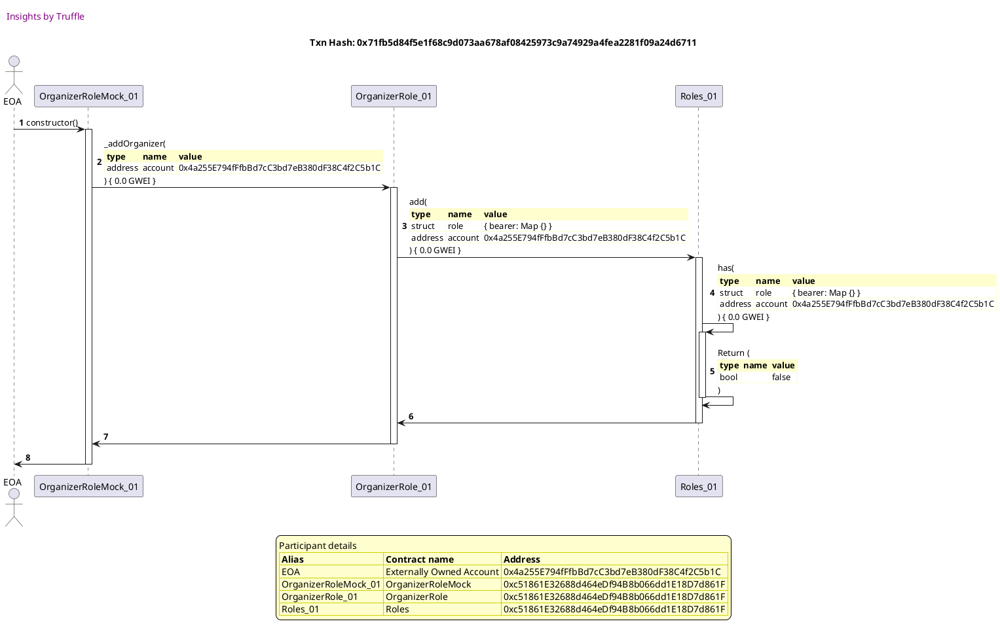
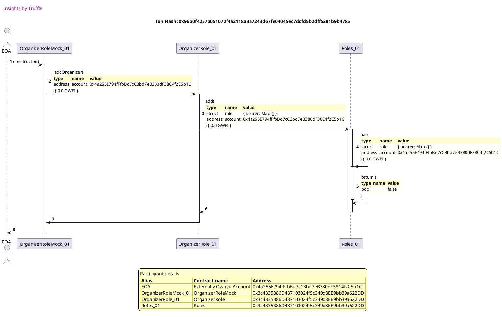
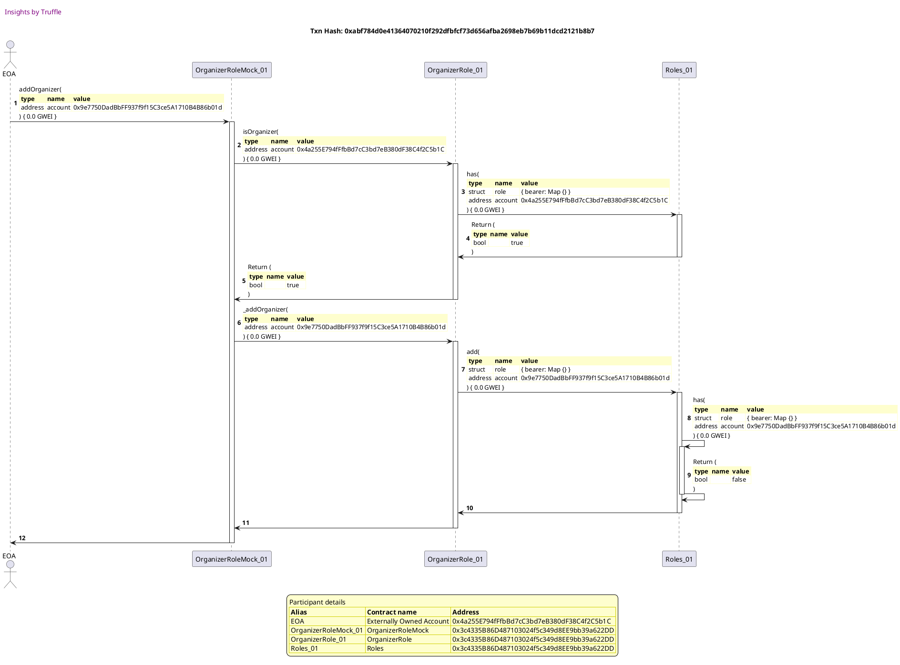
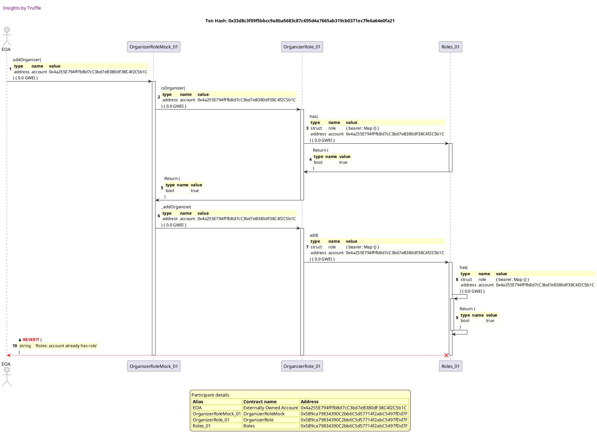
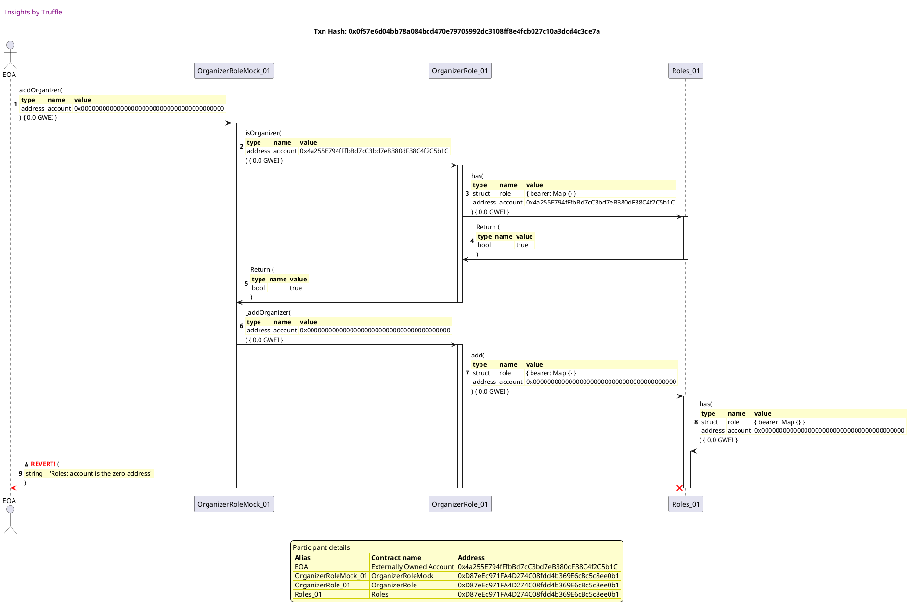

Test date: 2021 Mar 11


## emits events during construction
[link to test...](http://github.com/fodisi/hackapay/blob/1746d2fc3fafc73d8b2843f0fed53fbd26643dc8/test/roles/Role.behavior.js#L63)

##### d1, tx: 0xe75b92e0f72711618cfc60e380a2a62b9e4d9131d3e52be8f5b2f2fece50bf88

[SVG :telescope:](https://www.planttext.com/api/plantuml/svg/tLNVJzj037w_ly9YBw2DxVAhRIfMqOPqy81036alIEYIE6t4zL9TBbjBuN-VcuOCrXHfJ7jPLSMEp_xixtpdC7PS6A5DEPECYTBagfn5g5bnbwcvq6864YUeaf68xoOwBrKIv3BNy6uSZiCWPEoeC4k90mRLRueYGGsh-XNWDDVPVQwCa4EPJTGCbI74r3GEOrhSGCvBFPVuOk5hTezWkOtjKYH9fYPWyThqMCcZJtKHhCv_fefiCZK5H4kurcMQ4YupcP48rmi5fwAOze4liEj5leqyxTfTo-fOlJYDEnoT7XUswDYHZsxYMuwLEEZP4VPIBx9JEyKOFHwblHwZBOiDbHvU344Ki4ToZz6scIpEveAeNkY9K4H2N-KIp_FuxfPRbMVRmYkXhM5R8MjZyUJwzBB7M5KN70vsf8Ntx_iGvwemkbpJsJzWEnot89hmM-fCix9_esxOKNr4FjHoyF0Pp7AEG5A9MIM_2rcIidP_04BGM1H0MXpJIJEayOKhRCyBkxwRZjDeb7JZm8cIBeweISdOwGLkQWTUP0KRb0DO0V_8uSkty8mEHqknQmhDrbIbKzwt5RpPBwfI4nw95KGeDEe-d8ivh1xXyLzI-qLYcz9K5FyJfSF3FboXARM2jz6AybnIVVHFXIngyy7l2LiE2oNUTOXst93jY1UtPtCJrqviCrZPvRCBdA0HcIoU4JpX9vppDK6QdtIjIGbeC6gQEmtLuLChchZ1GpMIwBamg9MGSWaNFnGcC7nJivu3juwq5dELmkTUOebnwFgkuw8zZ2qx29tGyhZdXoDhw3iuxFIiw9KKBV1_0TsCo5hzKoZgMDqtTanF-cp-1000)


##### d2, tx: 0x4c740f7cc12199a85d9c8abfad37c5e09af267466f850c86b8db6ccfb968059c

[SVG :telescope:](https://www.planttext.com/api/plantuml/svg/rLRTJzim47_tNt5YBqCRczCaJLAnYZGaWmS4OaXxGKAExPI8rAaSPsif_E-xjY60Q14VOnzLbRlOv_FzxYDtXEnKXcbJZmf2M6rALOzIgKbraQinqsm4XHnA9GQCNmnrMIiHbKMfuLqI9t4K4x9TcMaX-mGMltF9XDGmQru1zagTNvRAi28iyg4QIMLGOsPQWGGtboh7jHuNyjx6j_nIWkMqQqTCY5mDmQBDqlM2RdzkZ23D_VkgoeVdfe9q2YUwpZBKIqnk2Wad4mLxh3hl0Pqut7Devd5kTQmWOBuh0kwpD6F2zhWhQS2oJjTpkjtCTodtkwalqYxdMHfqVUe6dA3Bk47JuyCGM0KRI3S8kitaF1ypX7geXqmX27rS5lAWv1Tdr5f8hjfuvEZAOm-Ep1Uh6z6Rbmr25dR1Ld_DjV3XGm_Gi-tc-rDrIhQR47ziQF_g2vZfM09InKOB-eCLDJ9pyQkv1Ysh2f3Z73F584SdWVGyb-uoCKYJ9B2zBCWiDxAvT4FBi-Z06Q1VgIMMMZPX1lGJXQ_VutqCxXfx7o1fKUJLcu1mMCTrOozmiYHB1yBZaPqAJmviduh4zYCdwqHkQaLF0D42QEEpCFoSLIypk3AwvdChDUf3CeDKCYrr3mxO66RNSFsMq6v1h8x9rbOFZgMfjOANmKlBia0xyOyuczNDTIvTaor_meOdvERPVr1YQx8Jx_qxsVawQFUpynyfkBU1z1kJF6D5TPlbJwdmvzVZOzMpR5Pp8RASFSZHdHudf65vKTq1k4jtAQLpW3XYOET39iBPGMDhRg66Dw5ep_Ml5bqRdnCZjM95CON3dqeA25_qTRohU6NNNx6yp0Vg2eibiHCujYCx8GuZKMp7beiJHZommi2MOTUtqaUkMA7-5QhRAQ9XdwiA8zR4ZUpW4oVBNm00)


## reverts when querying roles for the null account
[link to test...](http://github.com/fodisi/hackapay/blob/1746d2fc3fafc73d8b2843f0fed53fbd26643dc8/test/roles/Role.behavior.js#L70)

##### d1, tx: 0x57c6f22cce9812ca80d0edcc3b2ef114ecfa9200c5c269364ee686c01fffa3c5

[SVG :telescope:](https://www.planttext.com/api/plantuml/svg/tLNVJzim47xtNt5YBw2DpKdpis8LRMW73mZ4aFQ2X1p7RYDSftAShQNml--QXWpM5cbCUrbLvIxdk-_kyzaNGevBouojfeeGLjb2LzDK65BUvNh639k24cEXim7ZTsDJL3fB2bKOU3SQZeR9a92ZqYwKw16eVnF1Cc5WsRm2d1Oclo-qPQglyh6U2cqHKThMOOIBQyXPPMPAl5ZucjyBSBpMTicoBDTZS6XZUgpbqQUc2DBaFzDbFfxO4j85N9jAIiGbDhTAmFLSmoah9rsWSp_aWNHTpaKSEIvd4Sseo3ZlfAwGZkC9BbdiKifzxWPn9_242AA0KqTAoJhS9xXbt6Bfmui-i1BsKEuHt3QRytp6aEg56JED9CnLeSHvmUzkgLDxRbju9NHhs4R8obW-kJwzx15IrmM7lHrfuVtxBl12bzPKAphx1sI7umP46twBdMbNzc_q3JbgZiY7HlOUFeDTp0IWr6nQo-zCLQYit1y04OmeIq2DSpnf5ZKwzvZh-yCmzkH8feCiv4adpK8nw62pHfqeyQIR-AcJh54EO0dq8uKltuPdU3Ys5BkYq6vDNJhcVLl1w_t2AWtYeLX2AfWHfWldR0RBHtZybzH-aTYaD67b_qJfyB0BLy9MHiFRQAL5eR0-_4kcoiPyy7l2BOS54-ywH3jko6R4Yzkpleah9x8UhEJosGNEX6MvAfyHFA4dbD8LGPoVUArHIN0m6fmxBTN-KolQkDv3FPBmERV2QARK0Yv-Q951_qtDUWwyTQHjCTSfGYVWeIUJD3m98ndxKJmQzIENUYo9gHEuVYBSO32GhwJO0lyNqEs8RDG_XSAEDNqZn_Z4p-PF)


##### d2, tx: 0xf5be50420f39cc27d887e744604510edf792c0a3900c239d0212dcfc4de8f5d6

[SVG :telescope:](https://www.planttext.com/api/plantuml/svg/rLRhJzim4F_kl-B4lWnjRCwhIIfMqQJDu0C2CQHzGKAE7sr4wbIEixKK_lUvQGWWMiHZx55LkSlvV7S_tpbt2EsLcYXTJNA4IAKBMKrIhb1vaSafKMG2EHznoI92BqQgg2IBYxnGy2uP9iDuYD1kgUSvxo6eVsDE65UmQ5u1zWkLNHPIaxoVPoCvuL8RYqAt2ebPN9cSLcgQytiBtx9B3fRRoeu9OvaSWOKRqNLDTpytGQ36_u4iiz5Obv3EuLHLGXYxI6Swvt0wax1Fod4Ny4nuAVUmQsFXX9JQFWi2d_kksy6kPs7EX1_Q51Cdn9ZQJiYmRTcC2keo7WYFTP0vCgfDwCEZFf0IjWpTGkROT4QpAJ5GZzI8I0D2dHGvFopenJcsQirr2uziNRljmPQbiBnHlNdPGgYE2tPw6zp2XmzTC2VRBhu_asTejqdnnuRshhw0dayv62h9fAO_I5uPPgb-jRIWU5c2uIWrbQ8DXsSXztqF3mYBqYG97L-4ml9YXtAlR_aMZjmewAJOOYihsx00_0d3r-_30vFS3V4-GDAYoCet0U4Is_E6VkYAHAGHysdifCpdaHDWbZX1x0exzb8hVWA85a2RdphmCIbV5d2fLKMNKIfZpv05f9mehhfmIAQmk8RhjuHs2s9zJdPskd32TQKal0nUMXIvYTFy3Sv6khtfI3TKov-8uGcrUVuVNB4DrMdy_ftgV1sq-zNvZrouju7q6ujSaBoyhVAdtF3dtyV7Ri-gMIsLq6hsGCTtUXpZccHvUGVW00ymnak0PiGmdSymiPaTb6dDBTJ-JIhQVRshkckRvqnp9KcUp-7ef-GC-Y_wEjurlBRhhn7NBdohGtrNnAa_y0CHUa6O9Ft0nYw9GsnrR2_cTYUAn2CkrfX_XUbsYcZOvveo6MloXlRCqqoMlm00)


## allows access
[link to test...](http://github.com/fodisi/hackapay/blob/1746d2fc3fafc73d8b2843f0fed53fbd26643dc8/test/roles/Role.behavior.js#L78)

##### d1, tx: 0x71fb5d84f5e1f68c9d073aa678af08425973c9a74929a4fea2281f09a24d6711

[SVG :telescope:](https://www.planttext.com/api/plantuml/svg/tLNTJzim47_tNt5YBo36vgJvh5X5FzB10m8nfBqW8ITssWZNgHo7jHJ-zrtJaC6Q8erfBwkgd7E--ztzVESB8IU5OTgKCqa8AqskobaiD2dkCZLdcir0YebGVC2IkudEIyM7kSmrV1X7usWO4N9ScAKKFGBLRoeO5nfMzIl0QQwpXrmP9liocwYPK0OHKzCOZ75p0palzLoALnlViWS1bjFeBXddcPg0HMlLKoMFFzT9a3h-cIgooTGK42_XMfTfYhZ4P4OAk5ueE6N5j0jquLjfxFB0ILrXfLwGX9pw7SOyFs0f3HpR3VrE4ZBV2UsGEQbWjXrOAGsPxN3Fjoo2HvOOJ3sww0ChO0_b7i5ZCrcIpHbIlT0Jff24ligbEC-JkrjgLPPj6s-ujhfjkQoLnRFfyyiU8LLUSDJR4HOE3xkGvAemkbpJsJyWEmot81htMwnCixD_esx8STqY7slPU_m2PZaNW5AnMINlcInniJP_14JGeYW0Lqc2dMPmHHSEirqtyaCd7QVnWFl9i1DpNmmw0UNZJZ1qKdlenjPmWt80Aw2VA7pz7frXSxGakwRG74sLEiPzNyARyy8iDUAXM44ic1Qw2-Ti3gidUFgNr7wHsAOqPSN_HEdeg0jNmfHQmVjenNakCJ_yfqmMjVhWzu0jpOA1TpNHZXkoxV7gzcnkujg8R0OhkNnnWRamB9F52u8ZEgAKhWdY_CHhZOiX3aQDSwUXsdykHUFNUwn64ZuNHcZ5f5p2nGybEFJVLQoNmAqZhKLTXKXSA_2ig6DxGS0Tpn6ZD7G6GKmzZtChieAHpz5W_4Q85lY_W6v6PBtyKoYiM5qtSe9F_6p-1000)




##### d2, tx: 0x72a03ff0dd0003514cacc7b7abd1af1541731a076cf29f258bc40c108bd4fd91

[SVG :telescope:](https://www.planttext.com/api/plantuml/svg/rLPjJzim4FxkNt5YNuOsDhj9chHY5MsQ33uW44FQ5oJas4uRaIQLusmjXV--Qne2Y1RnClPILJddV7vypzqvPqBs2iErAISf8RmqULPE8gL9SP5aKwxv158rKfaSS74nqdcPIJzFSmtlmY0C_82GtSBCKzKZKFt6YakbOL6_0kpdEhdCCyFJVfgCiedA32B6fZ48SN85EItrD5Nt9hubbmgOtUYEkPH9DW96QzLr9NS_rqwGUl-3h4X6OrD0D8TJNSOnuXAJc5J1wIo3VLwCkq1dRejJAuwfb9HIos6su4AuaSiZoNZC79kv5kFKROkurObRZXS9cmf6lKZQiUmmWY4J1bqFZlh02zX2kKKmR2OHoPGZrICzuXcIq2TvgWvpSN5EMMMvRkAHfMkNFLYoL1OtfZSlMuHKVi5ERyEsyE535p2opUJxi-oCxDOf_bZBtjKNCFEf0fGPdrJo1qzB72pDhvO8MXK5u4W8h1I38phhADTrw93BGHI67SkDEnXOtnBAwJENqO4zyDeHPNA5iWqBe9yeVFqU761oD_ZxW4d38YdUX8JDMuuJk1qx3kDe85tXMv5qrS3og0mjpxVZbkz4p7y2YOP0av_AyJ4lNkPmONGfbbvgn4EnW4XnhNGN3laK5jTm_PRKRacipydEJXTEb2br1Y-Z5-LvYdxY7tdMskrD8TrGBN_2XoVKvlb_SCGsL2Vk-tUgytNKxbVdFtBWteRIRopocAV5RPK_vOG__pm-TdfMpMffH5Pt3t9yfyT9PNYI5dS83kaGs_UI85uniFFXmCUxWyRMt53jtwIYMTUxghesFcT6wOodwHoEVcPAGlz5NyUxm6kx_XfrjOLmcDTcWTLgUvwqsxOQnXsiWOYssrAoW7b3Lw91-CWMQ-1V0TtS8khXSw4mOtNUo1u-yMRv2m00)


## reverts
[link to test...](http://github.com/fodisi/hackapay/blob/1746d2fc3fafc73d8b2843f0fed53fbd26643dc8/test/roles/OrganizerRole.test.js#L36)

##### d1, tx: 0x7f5ed6b5a368a4e79bb12fad44ceff641623f08723300f68f7c609bc2b1a7b87

[SVG :telescope:](https://www.planttext.com/api/plantuml/svg/tLNVJzim47xtNt5YBw2DpVcTLgoY3StW0O4OqbwGa9FOROJhL8wpjHJ-zrtJaC6Q8erfBwkgd7E---u-t_b2o75fc3RLJ1B2AbEeQfPmJSgxNCsPPZEGVC9LDcBftKGNbSgYGXOQtiNZU1oD2JagpLBo0O7wD-KiunfMpIl0QQ7p-q8P9eSodwWPLmOHXMaDOjpSGCuhFPVynSRN_9w3vRQwIvPbkPg0HHlLOosFFZL9a2R-cIhpoTIKa2pXMbT282unkP4ShXSAJbavxGDT1CBZcPzupF53vlAWboIMBLZckYaNmdSjttO43GFRSIWLVYY2rAUz9BKJYmL9610yijHWwkEB8R0Izb3k4JmsawVvd27L2prX2adegqBoyoAzkwLMRTcryOfhfzkMorfPFfa-lUmHKkS5XuCTOU7z-pwaXIgDhjPqzW_83iCjYDRz5YlJxkpVg1jorBJ8XqOE7Zw3MSuve5HiLillJ5QuM9i_029eNfQ0gpJ5JZEueWkNsPut3dgkY4Kooe8qSf8iu2Cdf5diX94hxCXBh6Y3SW0he1yfVFasFiFcw4XsJQ4zcZfrZFksX3VdXLbgn4EnWeGppNKVpjaSLe_m-2-f_IAnJMdAol-9qk5X7wwugRI2jz5AYa9YVlWNJ9QD-k3tW1tDWe5tDT6E6xBjyUBsR6xYseXi1YkvV7Q1CsvOBijd14_e2QLqJH3d9rvhN4Gu63NEdPRgyAaKhT_WeHv9-5mOhXMJSWaNFnJFOFYcOZq7xXnf7UewX0Xz9pjnuv4hafvb-svW3ntFimBgEJXh7TUoNSy9urT2TC3_1NGx8flbdq9XnPgwaMDyucVp9m00)


##### d2, tx: 0xd2a3bc409c30142abec6cac3fad1727b11480b52640d769e2868f9267916075e

[SVG :telescope:](https://www.planttext.com/api/plantuml/svg/rLPjJzim4FxkNt5YNuOsDZllgLX5cpQ33mZ4aFO52JcnqqQaIUKuMqlXl--QXW2YHRoClLHLpZdRpztZE-UEaBrISwMhIKO8htIHLvD8Ab9UfFcKApw1J8vaBleylXYfeif5K6I5WdVXC1m6Gq9sIptFP9T0_HjBBgI2HVCAi5-ezBB8DSzwMJhA9pBNY9ZeTa68aol8QQMccRmtyIszbC2iLdVCXKZp4J3QgAvhkVkvSO8qzW_oCXsDTGdH74vLbII8ItIgCmcdinpsUJdk09q9WvjHR54_DYcp31x9s8bvR2PSCDTm8yOiZqQsuLXKk8ul3S_n4jzmN9yvrBKHa_1Oe-l3enxm4hPGRX4yDft6wPGZrICruZcIK2T59W-B-EASidhbkeb7jgxTzc3BKbdUBBrvsIAazWjskXlCmeSF7S2JRIVVd-LdPBS9yST6Tg--W9vF9Q3C-QIMFtXMuM2v_6g9e6HP0exY63D5uuZEVEcwDXrmqO_2q3VTn4-O7PYnj7lCPRHlzJqdeaoiKBPX0VGJXQ_VXmSOt0t-Fc3IiaZBDo5XSSEsXwvl9M4IzOKR1sOaNDatFIf2qmkin0ZiY0LF8D4IQEDJEpxcvSiSBhMgugMN2l5GB22IN4dLWKC-XSKrNBybjLiIwsEoizE14wahbSFBw4L5aQ6V-4UUZNPxqv5ko9O_uSCJSlFyFxXY6x8JxVwTx7mTjVlP-OzSkBUXz1kJFE5PUPlbJxdXpx-FZzsULR5QBYAhteCStwbnGcgUPkKTWWCwe9Gk2MABWPKF1m7s3WfBSqkrTnEATb_tggxQ-9nfgNAUPNCu-fbB0RqNVHtl0g-j-clKjOd4SqmniCA-bKG-mrx3DNgcRJENscR43DDYXcMRNlY8YJNmhu1kkuXc-5meZ5WJDxA7J-miVm40)


## adds role to a new account
[link to test...](http://github.com/fodisi/hackapay/blob/1746d2fc3fafc73d8b2843f0fed53fbd26643dc8/test/roles/Role.behavior.js#L99)

##### d1, tx: 0x96b0f4257b051072f4a2118a3a7243d67fe04045ec7dcfd5b2dff5281b9b4785

[SVG :telescope:](https://www.planttext.com/api/plantuml/svg/tLNVJzim47xtNt5YBo36vlngqefLj6awU40WXhGN9EJ4JXlXEfNZi9R2_xvh6Z9OKwGnxMLLbRkSxxwxpsTV23af3DEcd4b2M6boLSvYeKbnbwavqsm6Kao4uaEMt4rqNYeUvZBNy64SZQCm8kIuC4if-WIgtrGmBZIiwbU0qrnd3xaoJ0vaDb4peGmYfgPn6EFY1d9UwhaKhnQ-PGy2BBUnNJBECpK1YzQcfqeUVwwB87N-CrLaawaf85x2jIxJ5769oOmKSBrGSCgAQG_eejk9QUhQdXzJpwA-dRhCjgo0ESotNOTt_5HGbxgUI7oUfDoBRPwcdXrOSJTs_S0Zk6M9mTAZYm6m0lPGxX7SDfCbsPmXrGizOGf9wAjSYlCykRkbLkNPjl16Q6lOLiZQM3oxFh_i4LBL1KVz7MdXyB07IQuAeyirdVq3iiDn2w89lyNED2lxD-g67DT7v6Cj-uzVm2pd0b0gDglaFPCbAcltHq04BOe2K4iIF6a6DRh0bdXUv7VTT9p6G-udeHDpNmoTWFAn4uHkQeTUR8KRb0DO0Vr4uUltw0mFHqknQmhDrbIbOzxt5RpPBwnI8nwA5SI2QQ5xSCxci7g2ftz9xHU9RKfJLlnFb8wEUd0bJAaLl8zMdESIwyD_ocHHcmz-JzXoM33nhaEquuPiHxowFPkRk7OYcy5ABbzSO2uCosJnWk28ZYYbQu8uF_5QenBYODGuTnggW-TMD77znseauNDXX5PCoYLS_522m-1TpNe9t3hIMinL2YTn7SSR1fsH6_WMTQZjfbxYk5qUH54tZfqkwzZsQFH6YXRulu1kHcIj_YaKTgpk6pd19tusVm80)




##### d2, tx: 0xabf784d0e41364070210f292dfbfcf73d656afba2698eb7b69b11dcd2121b8b7

[SVG :telescope:](https://www.planttext.com/api/plantuml/svg/rLRTJzim47_tNt5YBqCRc_FL91MhQDDsy81036alICYExJOYJIh7sLeA__kkQGWWMiJ7s4TLvIxdyztzVEVS4R9N6APDEKa9OQN9itB2fIR5HP9DcMOJIEL8PgB7uekHpijCH7cQQtWt70m7qO2GtSBCKzaXKFt6aWcfOL6_0kpdEhdCCyFIRfgCiedC35fKfb4OukBAvBJKqrJUM_YMN4gmt4Psp8H8iX5Oj1PTLtJtSnq4gVqVP4Ko6fi2-1nETQaKsYKcCQc4qra6-wmOju7E65T-u0egNSjfkTIdjaML7Tf2SHKhtn4jhyKKPtOh32JtUIlabYLYOLksnGFk4poos63eWwCki0Asa6uHF3QJnCcK8TGZFM8PWj0dUIeFy_ZYd5gLvhg5HxQktVPWor9OtAZUl6mHKiK5EvqDRk73XpRWoJQBxy-oCx9Rf_XZJJjNNy3CfnAGPcnIqHyiBP5PgbyjBMXP581S76Eb6EJeB9I-xz4-4pq-78QEhq9bUP4JIwzh-HRjkRsWnQabLbQsOG7q4uMltmS7cDmDyJv0qg18YZS1uJBRymP-wAgXuZtXnv73XIzxJa35q0aYLzcHnwte2I0Q04r-gi37h7XPm8NHPRoCKgCz90lWaccfst38fh2uXkktX7OBOdrETdRQS29DgJDu6JoUvod6YN_4MKktDntfXchv4p4yeJRF_uChjg4wqU_VgSxNGRjVdV_8XNiRIB-no1LBYzigVyeDV_vzVEpsh9hLKeciPWzoVAV72MbOaXPt0FPfdrAw18WZ1dO-P2AS7JIsvWPgzoOLpRxELTMryJapKcSiJUTmz3EJ0hel-ZhUDRoswwyHLowSs7KS3vFUTmFClqDjLtcnuuOY60n2pfsGjMoxtt_4nHhphp3TJ14r-rnJcB4wRsGFdpXP_W80)




##### d3, tx: 0xb36ef8f0bb2cc640c90cc8babbe4a4cbf337b2447b7267f783a4fd6346b01549

[SVG :telescope:](https://www.planttext.com/api/plantuml/svg/rLPjJzim4FxkNt5YNuOsDYTntYfMqJRfu0C2CQHzGKAsuxGHgLCvpjPI-Ezpqn10j8YNiPUgoZbd-_4zT-VS8RHNQgfqDSaHefKkP3LXGg7o8fDJgkW4SZ4ICkbJVZ5IHIMJGP4N2juDus4yY17QBVKy5rq4zMyiQ28KB9fNWFr2PPU5r3JlvTb8JeJK1Z7LxOAXcLn1JYirpSMzYM_PfG2BjBfZcYIP78656zLrBNS_DqQWvlm3MMQZiIw1pU5KLMbgS97ET2xWT2PXdvRZ3k0PSpoH1YbcpERS8vY7cFE0KSO4eOIpr75yPXFYCz_s_DGF74hIn7E8nx3baX0Pbt5jJ8-FUa1Bs39o2nctwOndKsge7gaHbOQ4EYboSLZmYtDirIlNJJooTUss1rkMol9cwStB5aArNR3JtN0iVFZG0UFPTlBzcJn3kqs8FpQoU_K5z7mgm4X99xNyGVFA39RBhvO8IfGbc17d9bEq6U6PQxn78eBjC23OiqH2R7VOmswVMX6nV2SCF8l6_MY5iWqBm9ymVFqU7vZWRh3t0PEMHLQ-2Gb2RTUD_P2amvJr4vyF79Rueky4E1awmO2azi1brk0995e2RNngmyUqV9d1fLOLNrgf39uH2s22Ag4wS4YdiBY6wxUaTajYVKnsTZfm8dIb9BoC7YkAtDXf_ePdeztUvD8DsV8dR7X2Rfx_1rTiGtQQS_zEThwEslti_4SktDjG-er9djAylCtofzpmvz_7nsxFgbWj5w5Lxu6ExzIuH6YQvUKTWX6ECCPBWgR5C9NF30QcTr2cDBTKUpUXQFTrh-ggRPupBPIaUJw7evzI9D1xqTVnBl3Qghz6NH_XSE8uRZ_m8XBu5dQmJLANEoHCWZWE6ND2wjbs53ron1huLq2tNKGpV2wKYLWJDxHddgQp_0K0)


## emits a OrganizerAdded event
[link to test...](http://github.com/fodisi/hackapay/blob/1746d2fc3fafc73d8b2843f0fed53fbd26643dc8/test/roles/Role.behavior.js#L99)

##### d1, tx: 0x061597b940ee7d84c1fdd2d0724b63e3a476a6cd0c5a998a4e961cd3e048e99f

[SVG :telescope:](https://www.planttext.com/api/plantuml/svg/tLNVJzim47xtNt5YBo36vlnkAbRHfktW0O4OqbwGa1CxROJhL8x3MWh_-wvfo61DaSQqbrLLpZdVVNUVxtmXvAGmJ9jo9WbXfSbLEOk59iLTfkPCinb8CH6A3rXoDz5vgNYKorp3X_5eF8f6X1mNPYb5Zq3rcmh6XOPL_Gfmckli8LU6oRxC9cecb474r3G6OzpSGCvBFPVYrSQtx460vJQwIyPvfYPWqLhrLCdZptKIf8v_fefiCZK5n4kurcMQ8YuncP42hXSAJbanxG9TKD_omY0ENIf4m3jkOgMSsvm6jXlxZd2O6_ZCJpXDF1Q67UQAqBSIxWZgTaGOfWIFB36O-kYY3wo0FPHx18_DP4asPqZrGa-OGXBwAfVYF4_kRgbLMRPjlE7QwhRbibOMpwRFBtk4L7d1KMz7M3Wyx4AIgyBeSard_u3iCDo2QDnliJBDplwDkY77TOjyh6NlyGkOvLm0IiLcbRndiiJ5slmH446BeW1S9Gbsci4LNRZCzhnH4BhfE8q7F4WY9-Q163WToiTE9t9JE_9YAzgW7C0Aw2SANx-Fph0vMf9TKsYEfaeTuxuluSrvOPOQyL2i81PC2zs5SpQ7rHCy_KjglqXiKvgoud-YT7JKXIjXIgtWVRJYF9UO7_vJ9ejQVV1xm9PcmS2xccZ73TdsU7LxDZTnRKGsWvLSlhZ0N1YMoU85mI4TKahN175-uhN6HOI3KUFSQQZsdqlH-FKUgv64puKHMZ4fbt3nGmaE_NSLwoLmwqXhKLSXVDzEwC0F6RLSuVKxGpSQEewNMDorQPXQhXsEgIViDqAqmFy5T3CYw-MVGc75whgH4tpYP_Cd)


##### d2, tx: 0xde475c185ebba1431f9758e2443566751168955a5e9b4b0623e4d6b4f7192636

[SVG :telescope:](https://www.planttext.com/api/plantuml/svg/rLRTJzj037-_ly9YBqCRsoMvV5MieasRmGC2CQIz8A5BScaZqajrkMmjXVzzRXe2Y1RnCVPHLR7Zyzd-dNsn2TahDLUwckI4y4eNiff4Gf7o8fDJhlW4SZ4ICkdp-6AaYaecGP4N2jw5mt0O30dPBVKy5rq2zMyiU28KB9fNWFr2PPU5r3plvTb8JeJKQ37LhKA8YokJqqfDSt5luLjsAS1WhUoO9qacHs3GHdHTqztFJH2ayNyWosmqrYL4SpXLLPgYNQ8pdGiudKdOv-Mu0tIM2ERQiU7P8egumImZzLtR4oPZbkquhcqOZkVRDhU57x68EgObME94B7KDttGiX-2HnHf37nxrW9UmXNIBuB7fBCwc7A4UgH6N24AT5BauBEABSshKckiM7jcwTjk3BKjXUQDwyx95I1qNx7Gtk8KF7pg09ziklZ-JPsItIV77XdQlle2UJmKWbNnIqnyyhv1PgbyjBIXHbe1S76EbQEJep1UkQzC1J_fH6FgMc_gfOGTMBEoUuHgqp_gU4r4ZMLdPXWNGJnI-VXyUO78tnFi0IOiYAzy41EEcRGzTdwLX6lKJDmwiA755t_9e4bfUm58pi2CZU0A85a2RdphmCIzV5d2fLHKlerHe3ya28i6LK1quv5DONCFrMqAx1R4-9pix7JWHkb8INWOlAeeSuyG_ucoasvkET4Er_8aOdb2Rv__15TjGdUZtxrJdww3Thyv_vCAz3QJVMEGfpylRAd_A3N_-VNpizgoQrLA9h6OFSdodnoL2yomlxm0Sq06bT0aGHmpiVCW4E3ieRCqjrDvDAjfztQkwQ-DpfeMIFC_dSFHJYWHwB_ewtZMyjkkl4TSk7CUCQT_nEJKOre0tOC70id0iIPX9iJQOwOVK5kOZBjQOVuNfTefesEUQmemrUIDx-CJ9yXS0)


##### d3, tx: 0x9726e2738e664921a20e8ed0e78a3fac5b37078c5921ef2c8a0aacea1a2a6196

[SVG :telescope:](https://www.planttext.com/api/plantuml/svg/rLRRJjj047tVhnZHbwAMTdst8ngHQ-41WIXINv3Gs5ud5iuwMg_RXC2_T-8O0o91N4elKUHPxyoUdRCpurd6zWgDIfUJZ34iTIxBIIWKAovIEKM54yZ4ICYuYz75IEMbZ7jvbYjuDnmC1xq1Oxk5dcUYpQ3wZGN6Gi6YVWNOprLwcKkDMITBHt8Yf2R4H3S6GrAk8AUbccRYdk9RUYd0i9kvOupZL8x0uFNKTILtFzTEi7h_0rcaex4k89p3gIgJX72PJdKcu7GcOH-BSGluBF1CLvYUvGlNjGFJG9CBNyHSU3vQ2KPEQ7dSyoE7T28n8nyvOYIG3D4r0fVHaKMQN1ySTG0Bs2AvnUZOT1gbKoIgHsg4aaYeapmJXtbqSSwDodATuf6bQvSzMBASB6vCRrws6AlyWftsXctXmuSMqCasolTdyepjrY7-MClsrHVGywa0aX8dbVo1MKc3fVdL4a69eW0QHH5bYgOHdpcs5zfzcvk1RtFN4B5jEiCETxfez6t3imBVDN3GxQzGjc41_1E7hzy71nJS3Vu-ODAmI8it8M6ZwJW3Bx2JOH9sOo_gMM7iYQxbytXe-JqxCNjEQFIUGA8XqCIdSdoCnSiSBhGgewMNYl18B20Kg8HgmI5EON4Drsz9xPR4-fZixBJWHEXIINWPlJ3FC_AJ_iIpdjtUTAGRikLF-F24t3p_3qfiGtRIldydErz7xNvs_YC5zpQKVcEI9vWLjrd-b0f_VZq-LZshPhKqOgkx1pk-q-DYeJ7DYZi4-xpFELyIf2i6TJuQzEZkeAWrDrGxDw5erhMlggvDpvaMIcAMpU7efnGnT5xqTRmBlBRhhvckjd1TC-9TDq1ksCBf-7sxrxSi9p8eCNYG6BOP3BaZp4UsM0F_2kZc5b4Fdmj54QlZnlReIJVBNm00)


## reverts when adding role to an already assigned account
[link to test...](http://github.com/fodisi/hackapay/blob/1746d2fc3fafc73d8b2843f0fed53fbd26643dc8/test/roles/Role.behavior.js#L109)

##### d1, tx: 0xa7108c345fbd916b007064aca96f732d80b4d0bb5292eae9bd5dc0195fe571a3

[SVG :telescope:](https://www.planttext.com/api/plantuml/svg/tLLHJzim47xthpYn5z36vZH9qrIieWtju0616D9Ua90TEss4wrIsixKK_lkkQSXWRP76j9TLLSuvttrtd-zy8UJOEcPSELM4iD8LkfnoQOYzo_MC6JO59STIYm5BxyQcABL82bKOU3SQZeR9a90ZwnPAzWXKlubaGXfOrgy0fuN9xmljcEghVAodKZj4p5nZCCBDDUIiD3CbNsnypUybU46ZksH2v7eC7grLZvKy-bGdGUhuPzhcuucpm1TmRSeiGrpYSgSaNCyrd38xwGATiyYZdTGFmeoBs6jpIYFQ3bZAudOM-ItHeJmGbFEm5RSaap4NeKYf5uUP32EF-GIFB7MO-l2Y3yp27iezWiVcyZIVCQHwOSPC8mbpLIXvNgHtjzIhBBTjlEAwrMt3PQMqJwPFBtk4L7d1OMz7M7Z_lWjfeQqpvOhE_W7PORW1qRZVOcMQdVqRVKEEwXRvKClUmsTmYva4b9fDA_cTgH8NA_C7G0GZhGLSfIbsciCLdGUi5OR3A0woKSO78aeJduj83lmE5IE_amHPAmcvbwnH3c09z2E5Bz-6PzWSMv9TKMYEfaeTuxujuVLvOPO6yL0iWKjcfEd2EPl1yX4U_oMrNoGsAKsO_Pye7HvsuKgwqcXu6orU50hpmt_6bAtL1xy7tD8i67XN4-su8PiUBsxF-YQkZCXwi9BBPnTOICToPPyHFA4dbD8LGPoVUArnaU1WD3Xt6ghzfr8qVhs7QYJXS-waqKof1Lpyq590_qt5UWwyTQHjKLSXma6SiYZk-84VqwJ5UJi9HHX57c8pdeH176Kd8Xgz4c8B_5z0DoEoNluf55QihXivnYT-Ddy2)


##### d2, tx: 0x3865283b295b4378dcbea0806a6637d520c9098f9e440f8feba0a5664271dd07

[SVG :telescope:](https://www.planttext.com/api/plantuml/svg/rLPjJzim4FxkNt5YNuOsDgTvSLAnYZPj1XyGY27j2n9oOgUDI9tASRQMmd_VjGq1H8ju6Nkfgfnpjf-xntVE7I5xfU7QLEES45wPGbNZM6fINcHgmZKVGow7KeaUJow6kgYK28kyqF0k6aI3S438RcbckUmGMFv6aWkfOLw_0kmNEhiibE5vDy-6QYoLGSJKD0iYd5n1JYezoUMzYM_PfGJBQNJ7N8XC3S6YjUfwANS_rqwGslw1AhFXo9GGp-1KLscAkCHa9fTmEbMmpyjH6-ZKzZstvTjnAt1ZnsQ-I6B9gKyzxdas4swB9W4D_3IGZaDJFvKnfzprFAV5B24e8tXaYK7N1qTTu2LieTmYU6mcIx89Hwf7UiWLaj0dHIuFY-JYd5hBbUic7jcwTjk3BGjbURFqvcMBaALViDFPO1O-V6W3dcmp-VvCdP7TEiGVQzcv-W9cDf60Kl7nKlxWUOM3nVAh1OAMPGauIXBC58CZEWqaOoxjSz6BeoYmMHgabXlQYNIx5hDep-dvNamjiKBPXZdGJnI-VXySO70t-Fk0ISCYAz-4XCDRhZjWWPD6QTmJB0djM33Pitqg8jiFdRGLkh4LFe54Gw29pzBn4IzVvd1fT9KilDI8Xs8EcCDQwZOSyWdCh-7wBQdTabWVavsTDfn8Ksa5BwCN5qMEVk8VUTRQxKr7kY5R_eGFJyZDy__WYct8JhJxTxBpTTJkP-S_Sk7UXj9lJFAKv-LjbZ_bXZ__FZvsUrR5Qh68h7eFSdodnWbfU9QNTmZsQPzIkY28BGPMFXo4s3jeBCqDrUvDA9fzdQjbrSRdr4YjU9xFuEYdaWAwB_ewtWLUM_NNg9Sct5wGS1RujcC7D6p5iHUwmcNCGcmUXwuJiBGlMFI8YJNmhu1kkeXw-5meZ5WTDxA7J-miVm40)


##### d3, tx: 0x33d8c3f09f5bbcc9a8ba5683c87c695d4a7665ab319cb0371ec7fe6a64e0fa21

[SVG :telescope:](https://www.planttext.com/api/plantuml/svg/tLPjJzim4FxkNt43QOooZgHfcgRgAjgG3ZuWK8Us3sD2ZkEq4QbJEGwq5FxxBcaQEj6YZObfhAfopjb-xhcNw8wGWqHHgT9nH0XDLIpIiSSbIQv2CQ6IZY7YGoxy7cLNGncdmdVYA9QmtNVxhkCIqaxKBE8T0lblnAdF9SoBLu2ZM8QtiL0qwaRXK8ovK8WOgF907pSNa9DKJYB-qyRdy9Q3NYzrPzJtGp44NIjKzxbixnSaI67_M2JXSAGIy6PmBjCWG5oYGXLnE9yAEAB9g0NQr33y9ZC2pGvCpsFCfasFcescmPeMQzYcNwTMes5Ipz1jvcc6fNDc1Rn16tMk1RIc4mmPKqZTFUq2JM0BvHR1iAcGXHEAhfxA8HNeX1p44J-9sTMbfkSdrsqySNNjjKTNCcMoFBfysI8avmNLpWQpiBVN0enikVdkGboGTf7YzuNit7q4DPjmG2deE9VND4fnaHs_on0aJnB05MDOAGfNshHEQwRfMdOzw0TUpxUOOtY-nNj6K_FxHjEf1pN7z7HdWR8BSz0-QF3fgtkCoTt0zv4dfHTXygyxKJfGvYSdFgB9ymWdIgOiOoaH3yKSF4ubboqueHEOtyFzIxhsuCJwd5IhBHXmbKe1ptFFY-C8UU8V_Ioqkvj2kg5Q_WQ7NwZDorVmYMseJhJx-glpF_pWLjvUgCWVB4ohtxObzxzdTXVz14sstzvGAR0bTw3D5eC1dkbKAWFtYpiuVrEfjFTpVMSJhIoUMKlFJU_avbfbl6WaiQ7FicJbuTvPyl8vDjxmcYg-skXMjOyxvSRTilsInQn3pbPwgiyL3QDaXVcXTgXfMXPG76cG62uSd5KaefUXxIvJNzv3JxCf0PzJnQMWKJI3qnl1VUW-gpXMWTTE6MlKkGcpPpDgsKsZRjYQK_EyXcFwfcNfY4qznwpRLd3eM_qdJAo1_mFeScefbhyBXHahyaOEy8cJx0y0)





## reverts when adding role to the null account
[link to test...](http://github.com/fodisi/hackapay/blob/1746d2fc3fafc73d8b2843f0fed53fbd26643dc8/test/roles/Role.behavior.js#L113)

##### d1, tx: 0x631398bde583abf44b530af0dc3f9d97fbcd7736f53de20c3d6d4b908577c4fa

[SVG :telescope:](https://www.planttext.com/api/plantuml/svg/tLLHJzim47xthpYn5n1ZSvkaIIjMqQRfu0616D9Ua91ZEss4wrIEmreA_ttND6ImfaXZsikgAkUSxxwxptU-47AIMsPiCLE4iC9ckfZ5qf3yBjLpPjWCb9n8BOQCtqrCLcWHPYepy64SZQCm8kGujqib-mJAtrGo8GsigbU0qyoa3vcsJ0rKEj4pgIqY9hOs6EFc1d9UcBcIhpQ-fGyIMcwjksH2f7e2BLgfdafv_BbAWbJnptIUJgOsXtW9rwP84iGbDhLAmlL2modBfpsWYuxJShf1BAGNE2nEN3Vs7CeIAhYJT4NNJs8kVD_f99uZP9joHtI46tTfuFa-TnD6yCYunTIZYm6m7FPGxX4yDfloTCwGweMPC8qap5Mcv7d6xsvfgxHisdZ3jT5josMjp9zDdr_s22dpWgF-Zh1mUDW3dkdScc9DP_-0x33SWgZTRx4ozSx-ZRuXnrMBVAna__4BsELS0ahDPgMyPwh0nThy4H31o3m7N76EdMPnHHSkQtjUv7VTP9p4G-7pq8c5BuTEGCNO2K8tQOTUt0etA0Um0lg9mjVlqHasHqEoQmhrqPIfOzpt9RmvBypI81wA5SII6MbwSCxci7g2ftz9xHU9RKfJblzFb8wEUd0bRM4ql8zMd6KAyyD_mbHUgGz-3zZGB1XuLnFjk27R7gzkp-Ochet8Ph2IonSNM4ZBKfM_83YY8qhfcY3EJxpMk0XnC1gSEpNLmNCfQh_-OpcIyBcmqcYcr18kVcWfOF2kOhq4RXnf3Ueon2ZmPSIxVciyS4Tjtmrfa0YSeKwd6tNua7iya9B6hJT2DC3_1NGz8glbdq9XnQgwaHDyucVp9m00)


##### d2, tx: 0x2f832bc6a3faa1791b3eb112fea185407113283c4a9be19e11eaa7f49be084d3

[SVG :telescope:](https://www.planttext.com/api/plantuml/svg/rLPjJzim4FxkNt5YNuOsDhj9cgHY5KsQ33uW44FQ5oJa94uRaJgLusmjXV--Qne2Y1RnClOIHJc_d1_VupldZf2zKdEbgqbE2Azq8Qj991GfBp8vvOfF81SZ8HEFnnSZLLGoyOkyKF0k3CB03mZPBVKy5tq2zJCMF14A5aqNOBzGsMKXDSy7UJQI4o4r8gQwLGXnSWKvhTGq5_SclcMN0fZPZXtp9Cda21XjXgvhkVkvCO8q-n_8CXkDTGdH74vLbQQ8ItIcSm6dCmdxl1ptWCuwgMDqehZBZPHpPhiiCaJ4M2SLd3cMIMt6Z8vZn2Pt8y5SmPZWt4vDx577J0o2HnPhD3qu6W0lOGlb5i5ZqrcSJJbIFL8ZBf64EYboSLZ45-UKrPhh9XvPkdRPWoNBmV96zQQpHKXj5-pqDsmB7pxq04-sdNn_9i_8RkFYZutiNtq1FPyAG2dvf9O_U5vXOwb-jKHGeYm1Mt6CaQAnHMUki6sB3ddYHM7e6dRgfipoZLXO0sOpwfcUquqeIrOesx00-ed2r-_10JftWxqFcBGiil9DI9YyOrc1xPffc4PUOiU-4IMsy0o79g7X-6RQyQs8-KyWqH9e_LCRFkRbommkjQhYfPKAyL0i819S2TM3Gpw5nJLSloMrMnBhVRApquCJeIibuMNqegB8qKvyaMSpkhtfI3T4ov-muGcnUVuVNB4DqOdx_fteV1sr-z7vZroujw7q6uCyvNbv6-LFkU7Flu-FtPvLibegaLNjGOxlvBX4Q9xbvHs2Gpgab2u9Oec1cGyRFjOE2bDpItLmuufsNV-gpjhudMcX9C_pEHpzb2A1mOl-ZdU1rsRzDSFr5aF75a7isYmScCEERVhKIPF4Z8ok6tHZBxPYHmWQiKUsM0F_2kYsYcYQpuL2ZpL-8tlunSho5m00)


##### d3, tx: 0x0f57e6d04bb78a084bcd470e79705992dc3108ff8e4fcb027c10a3dcd4c3ce7a

[SVG :telescope:](https://www.planttext.com/api/plantuml/svg/rLPVKzf047-_Jx7LcLgnjWa40mnbX12g3uuETTg7sd4kTnV862xCvQ8W-jsx2I754QpLsZyPXhtixUtkRtSlkuJinvegdOn2GcYY8vcCFA58V178CLLq1A4O2Caxb5qCL9H8xaHXf62pv_PSnoMa6UjfA5e4icSeA1SAPlahm46aWkj8QXgsms0WHq9grEZhGg27ctELuqIDGt5durDmBS2q2ju9vJoG0p2Dd7MRqURxt0cIsp-KSJ0OwXYyAPognFTHBz613WMSJYGSq7ZO06DY-5LRx773yZoxHesQvJ5ksOQmwxPHhTVBd5LCe-RxDM7vp3FADZCDMk4en2fCs9HWo9X6rztZDj0ODf1k40oR3bWmfWZrM0seH12g7uNYA68NvuQPIQxQUE3eocFtZgJCU26wUDaW9FCBTbjhpCBEJWCmiiNccpDvHffvYj_cj7Np0VHqB02ffAECNj8mmKKgVfDgK2AE0LUCOQLeN66C7_dCjMp338nt1dpyuXvYSjVuUmz9WIA8NmI4HSlLgclNBR_dUnrkCwVYSLjqAZM3zoern_BBJjKpdKU0A00K-SaS7zBuQGx7MYKizLAXFYGpy0HLGZNWY8vXTWktBmdj1uZLETdTRK1Vw4H9U1eyBuf2z1D_Y3FdRgyBwPfg-HC-FA8sp_-3AxQcEj7ktwdEvq6xMvt_o8NxNP0ckrytbU3VKcZpxplMUVFr5LKIMsGBccpUg56cLIhrtSzk__HLgTHyd_5Rw-v2YYzjiLczRsNc6eN_GGnwA02B9LgWsrhS1owm5mQNL8lbtlDpxlsMjdQtw9DaFfIGawNcnuMcGHWlGUeQNOnZcb2SFR0buiB1eKAXzYArxKMEYdCOWhITu_z42oLf64xX-4eA3kqdVJQN5QyS1rQmCnFTcYrSLhVDNjlgbctBmL64SykhxDNTFTPXLLOJml3C1qoiKFyCrSLuaIz_LHLcBCyRsST_73c_0m00)





## removes role from an already assigned account
[link to test...](http://github.com/fodisi/hackapay/blob/1746d2fc3fafc73d8b2843f0fed53fbd26643dc8/test/roles/Role.behavior.js#L127)

##### d1, tx: 0x194521894b1c6a63d3d34af4b9f493a06076795f97ef284306ddfd15d8274395

[SVG :telescope:](https://www.planttext.com/api/plantuml/svg/tLNTJzim47_tNt5YBw2DpVbeFYfMaOPqy81036alICY9dJR2TIh7sLeA__kkQSXWRP76j9UrLUvolllT_UppbP3ZoZ1jwgaaXDMcLFKq5PfKTuMQCSsc8CLOA3vasTrObxNYSIbB3Uz6oIY94qAEAhEGOa2W-Km4uqB3idq5E2rrSLygmsGaYx6Q2cKGCJUTmmWNrv2pMi-aUB7mjRWNOBcTxP9nNgWnMBGrFJRow5DR16dpdwcg64zC1Ua2hdMTvuXBJ66aWEkvWbDMJVf0vrRezcmh2DtKoZpcEHo_BilTDCpTq67KexxdXxqyz4Lk1wv3FSvpRlLuOFkk4_O8RbbciFJa8W9MmHxAFOBRPegic36aUg77J249VLLASLvcTxVKQZotBRmIkZLi8sHbh9vSdrxs26dgWiF1ZhJm_dqVib9LHjShEli7P8VZ1aGNVeidqwtitwWRSjIso8TM3Xu-WrdC1A1KRDh8xqpMgApS7m0HjAWgG2tBiDCCQdJkChlNI_pGpKTvEkH-5ZifzyNG2IWVEK7ivdRSIwruZN80Iw0VANpvbfnXSsmfTaMXsvgcTCpxjeBN-uLLQiH3iOHKC2rq7yxP39QFyFWlgVqYiKbfmgh_YTBXOH-kXAcrWhVHIijIOdtuovciMlF1xmctD0ictjL4Esx8PiIBsxE-YIidiXwivFBP1UR2i49MpmYUq1DAwOeWpa-yrgZ4E1WrpfsEQlHq55tSuA4PIVYS6w4Lat815p-Ku12zwR2U0syTQLlCJGexiWASeadCVJyO3ZsBHxQTfq7c15bEew6NUO7hsIUlfDW2_nVGtOXirJ-5mXDhpuqSunF_Ddy2)


```plantuml


@startuml

autonumber
skinparam legendBackgroundColor #FEFECE

<style>
      header {
        HorizontalAlignment left
        FontColor purple
        FontSize 14
        Padding 10
      }
    </style>

header Insights by Truffle

title Txn Hash: 0x194521894b1c6a63d3d34af4b9f493a06076795f97ef284306ddfd15d8274395


actor EOA as "EOA"
participant OrganizerRoleMock_01 as "OrganizerRoleMock_01"
participant OrganizerRole_01 as "OrganizerRole_01"
participant Roles_01 as "Roles_01"

"EOA" -> "OrganizerRoleMock_01" ++: constructor()
"OrganizerRoleMock_01" -> "OrganizerRole_01" ++: _addOrganizer(\n\
<#FEFECE,#FEFECE>|= type |= name |= value |\n\
| address | account | 0x4a255E794fFfbBd7cC3bd7eB380dF38C4f2C5b1C |\n\
) { 0.0 GWEI }
"OrganizerRole_01" -> "Roles_01" ++: add(\n\
<#FEFECE,#FEFECE>|= type |= name |= value |\n\
| struct | role | { bearer: Map {} } |\n\
| address | account | 0x4a255E794fFfbBd7cC3bd7eB380dF38C4f2C5b1C |\n\
) { 0.0 GWEI }
"Roles_01" -> "Roles_01" ++: has(\n\
<#FEFECE,#FEFECE>|= type |= name |= value |\n\
| struct | role | { bearer: Map {} } |\n\
| address | account | 0x4a255E794fFfbBd7cC3bd7eB380dF38C4f2C5b1C |\n\
) { 0.0 GWEI }
"Roles_01" -> "Roles_01" --: Return (\n\
<#FEFECE,#FEFECE>|= type |= name |= value |\n\
| bool |  | false |\n\
)
"Roles_01" -> "OrganizerRole_01" --: 
"OrganizerRole_01" -> "OrganizerRoleMock_01" --: 
"OrganizerRoleMock_01" -> "EOA" --: 

legend
Participant details
<#FEFECE,#D0D000>|= Alias |= Contract name |= Address |
<#FEFECE>| EOA | Externally Owned Account | 0x4a255E794fFfbBd7cC3bd7eB380dF38C4f2C5b1C |
<#FEFECE>| OrganizerRoleMock_01 | OrganizerRoleMock | 0x2A18607ECd778BB61dA22fb8c38cf0AB6c68462D |
<#FEFECE>| OrganizerRole_01 | OrganizerRole | 0x2A18607ECd778BB61dA22fb8c38cf0AB6c68462D |
<#FEFECE>| Roles_01 | Roles | 0x2A18607ECd778BB61dA22fb8c38cf0AB6c68462D |
endlegend

@enduml
```

##### d2, tx: 0x6514cc85dbf73e7d926fae601edde7dd122f79af73d80ca7304c11effe408938

[SVG :telescope:](https://www.planttext.com/api/plantuml/svg/rLRTJzim47_tNt5YBqCRczEaILgnYYHj1my8n93sWeGSssaZKgTodAsbyB_lceO0eaLyZ7r4KUxii-_kvpldZf2zmZ1joab622jDhif9B3KfBb8rPPfD89CZgKJ8-CL8vwKIKPxb6juD1yD1D21ajp3pJFO8LCzOCY4rBEeXm7wkqyjS6PO5MJfI4waCQanCis28mfNAQQcdcRmd-9PUIh2SPkwO2P6g4LYqdhgkwExdsWbIspzGHJeQcmBYEPpgCabGBp6foIISpXJiisBS1JfpsvR3kTyMSUBPqXETbfimwL9B2e53ORLQYTTXA1G-vSopgSCjIoQ9TAZViNs2HyODkZuu2e0Li8LqY-2ncPIdKuPGZ_I8AGIXJ_9C7kRyufnQrSfrWaUshjtsOCjoihXPUZFO8gJo2tPw6yp2XmzTm9DjXE_Fr1dPhKFyiQQzgozWvbC9I1MRLFG7oqfabiklbXgqB0f0ZdFC58CSdNMavxLfduam7WuxjfTq4giTsLos0ykpQEY4lXjJIwoqRCC2w2SANxyF3Z2u6_nzWAH1aHPl0i9XhNPxu7MSP9Z4eV1uPCV2aw7jKp6q_SX9Mb4xjg8dW6W0DF6f71-pucKE5qQNVEcbHdr85X1BfgNkmY6Rmk8QhjyIsYs8zJ7PsUd2YJIbLl0oU76UP-WdleYpdjtUTAGRikLF-F24t3p_3wxOXkn4ktydEry7xNvs_YCNxcqW_SOaJrXMt6RvKsxuy-_ZOxTdLQoMYyYgzo37TsgSa8QbMN47O9_sAQLBWDXYOEL39iBUGMDfRg06Dw5ezlMkgggDtvcHMh4icyFHJoK512_wEzvLlBRghvckJBG2otUfDuY4v_bXw5eYmBOZzhdjyuG6eSjTtt5R_KTCh57_2jLD5r6pprM54QlZHlRmYvtbBm00)


```plantuml


@startuml

autonumber
skinparam legendBackgroundColor #FEFECE

<style>
      header {
        HorizontalAlignment left
        FontColor purple
        FontSize 14
        Padding 10
      }
    </style>

header Insights by Truffle

title Txn Hash: 0x6514cc85dbf73e7d926fae601edde7dd122f79af73d80ca7304c11effe408938


actor EOA as "EOA"
participant OrganizerRoleMock_01 as "OrganizerRoleMock_01"
participant OrganizerRole_01 as "OrganizerRole_01"
participant Roles_01 as "Roles_01"

"EOA" -> "OrganizerRoleMock_01" ++: addOrganizer(\n\
<#FEFECE,#FEFECE>|= type |= name |= value |\n\
| address | account | 0x9e7750DadBbFF937f9f15C3ce5A1710B4B86b01d |\n\
) { 0.0 GWEI }
"OrganizerRoleMock_01" -> "OrganizerRole_01" ++: isOrganizer(\n\
<#FEFECE,#FEFECE>|= type |= name |= value |\n\
| address | account | 0x4a255E794fFfbBd7cC3bd7eB380dF38C4f2C5b1C |\n\
) { 0.0 GWEI }
"OrganizerRole_01" -> "Roles_01" ++: has(\n\
<#FEFECE,#FEFECE>|= type |= name |= value |\n\
| struct | role | { bearer: Map {} } |\n\
| address | account | 0x4a255E794fFfbBd7cC3bd7eB380dF38C4f2C5b1C |\n\
) { 0.0 GWEI }
"Roles_01" -> "OrganizerRole_01" --: Return (\n\
<#FEFECE,#FEFECE>|= type |= name |= value |\n\
| bool |  | true |\n\
)
"OrganizerRole_01" -> "OrganizerRoleMock_01" --: Return (\n\
<#FEFECE,#FEFECE>|= type |= name |= value |\n\
| bool |  | true |\n\
)
"OrganizerRoleMock_01" -> "OrganizerRole_01" ++: _addOrganizer(\n\
<#FEFECE,#FEFECE>|= type |= name |= value |\n\
| address | account | 0x9e7750DadBbFF937f9f15C3ce5A1710B4B86b01d |\n\
) { 0.0 GWEI }
"OrganizerRole_01" -> "Roles_01" ++: add(\n\
<#FEFECE,#FEFECE>|= type |= name |= value |\n\
| struct | role | { bearer: Map {} } |\n\
| address | account | 0x9e7750DadBbFF937f9f15C3ce5A1710B4B86b01d |\n\
) { 0.0 GWEI }
"Roles_01" -> "Roles_01" ++: has(\n\
<#FEFECE,#FEFECE>|= type |= name |= value |\n\
| struct | role | { bearer: Map {} } |\n\
| address | account | 0x9e7750DadBbFF937f9f15C3ce5A1710B4B86b01d |\n\
) { 0.0 GWEI }
"Roles_01" -> "Roles_01" --: Return (\n\
<#FEFECE,#FEFECE>|= type |= name |= value |\n\
| bool |  | false |\n\
)
"Roles_01" -> "OrganizerRole_01" --: 
"OrganizerRole_01" -> "OrganizerRoleMock_01" --: 
"OrganizerRoleMock_01" -> "EOA" --: 

legend
Participant details
<#FEFECE,#D0D000>|= Alias |= Contract name |= Address |
<#FEFECE>| EOA | Externally Owned Account | 0x4a255E794fFfbBd7cC3bd7eB380dF38C4f2C5b1C |
<#FEFECE>| OrganizerRoleMock_01 | OrganizerRoleMock | 0x2A18607ECd778BB61dA22fb8c38cf0AB6c68462D |
<#FEFECE>| OrganizerRole_01 | OrganizerRole | 0x2A18607ECd778BB61dA22fb8c38cf0AB6c68462D |
<#FEFECE>| Roles_01 | Roles | 0x2A18607ECd778BB61dA22fb8c38cf0AB6c68462D |
endlegend

@enduml
```

##### d3, tx: 0x9d8cc24ce2daec960aa7d67f0eaec40eecda74d5a57be0707e9fa457cfab6227

[SVG :telescope:](https://www.planttext.com/api/plantuml/svg/tLPHJzim47xthpYnbo76vgH9d5Qi8adRmGC2CQIz8277Tjg8DAaSXxKK_lkk8MHbj6XZsWEhgjpvxFlkljpLLq8EIyErgQOP8RmoHLvDOwL9UPtcCwxv538rLhaCkRWUwwBAPLHaXOPte-5e60q9EIZD8bDz0lLdehXK6fRD4k2eqEbjaHkU1LawpgSgDuYOcFR023SV86ULdcNgoSRNz5Q1vRIsCovbce_1eetflfO7dveaI1F_E2_JySIK42_WGbT9WhZ4f2PJS37FuOYNanxGULVwGjYEKBRaIdGzoZcJ7akemgL3bHAICqUwt6MneemorKsuupAHyDYpRKRmbGc3gGzF0-0bxA3S8VZQJ2hI6KUgfthCSoIXpujCdHJY-efQzSbD6o-uRdHxvh8obez77nSxXDHvmNv_IrZOs-k1LjFYHhNxxo_pItBGLFb38_jtdy4iPWfGvdnQonkULQYiZjy1baUhiWJKXC1cCQZHkSDjrnsohfECaZYKJ4ITM38LTdmgHnq_SX8xScChUa3PXINGZnI-V1iUOtstfFmocQktpkQjCMbPj5strbIloxaqkXAhH3L2ebX2hBXMkWSdV0RBUxZ_b-n-ydZEQiBB_udI_duFpfMfT0wlenKNHORvuHVvDTRTN-DjQ1UCkwsDjlnCddlyneLGUv67CKRErgvBgGnFitADy80EAAKhmZYjy1959S8nfF6MRwa7ZwLf_VftzG30vzmedVCiMy3fzrn92DQAvpeiTWOEjRk-GprBISTsHm5rGsuD78jrkhvdyM4uU0gySO1iCDSXxC3oFSg6aMJC3qFFae5j9x4lEhv8Q11wmlCTptufn0Rulu1k1rAZ_YaKLgof6pd49_v9-G40)


```plantuml


@startuml

autonumber
skinparam legendBackgroundColor #FEFECE

<style>
      header {
        HorizontalAlignment left
        FontColor purple
        FontSize 14
        Padding 10
      }
    </style>

header Insights by Truffle

title Txn Hash: 0x9d8cc24ce2daec960aa7d67f0eaec40eecda74d5a57be0707e9fa457cfab6227


actor EOA as "EOA"
participant OrganizerRoleMock_01 as "OrganizerRoleMock_01"
participant OrganizerRole_01 as "OrganizerRole_01"
participant Roles_01 as "Roles_01"

"EOA" -> "OrganizerRoleMock_01" ++: removeOrganizer(\n\
<#FEFECE,#FEFECE>|= type |= name |= value |\n\
| address | account | 0x4a255E794fFfbBd7cC3bd7eB380dF38C4f2C5b1C |\n\
) { 0.0 GWEI }
"OrganizerRoleMock_01" -> "OrganizerRoleMock_01" ++: _removeOrganizer(\n\
<#FEFECE,#FEFECE>|= type |= name |= value |\n\
| address | account | 0x4a255E794fFfbBd7cC3bd7eB380dF38C4f2C5b1C |\n\
) { 0.0 GWEI }
"OrganizerRoleMock_01" -> "OrganizerRole_01" ++: _removeOrganizer(\n\
<#FEFECE,#FEFECE>|= type |= name |= value |\n\
| address | account | 0x4a255E794fFfbBd7cC3bd7eB380dF38C4f2C5b1C |\n\
) { 0.0 GWEI }
"OrganizerRole_01" -> "Roles_01" ++: remove(\n\
<#FEFECE,#FEFECE>|= type |= name |= value |\n\
| struct | role | { bearer: Map {} } |\n\
| address | account | 0x4a255E794fFfbBd7cC3bd7eB380dF38C4f2C5b1C |\n\
) { 0.0 GWEI }
"Roles_01" -> "Roles_01" ++: has(\n\
<#FEFECE,#FEFECE>|= type |= name |= value |\n\
| struct | role | { bearer: Map {} } |\n\
| address | account | 0x4a255E794fFfbBd7cC3bd7eB380dF38C4f2C5b1C |\n\
) { 0.0 GWEI }
"Roles_01" -> "Roles_01" --: Return (\n\
<#FEFECE,#FEFECE>|= type |= name |= value |\n\
| bool |  | true |\n\
)
"Roles_01" -> "OrganizerRole_01" --: 
"OrganizerRole_01" -> "OrganizerRoleMock_01" --: 
"OrganizerRoleMock_01" -> "OrganizerRoleMock_01" --: 

legend
Participant details
<#FEFECE,#D0D000>|= Alias |= Contract name |= Address |
<#FEFECE>| EOA | Externally Owned Account | 0x547b4D402984061ed425FA05Ba1D41739861aEBD |
<#FEFECE>| OrganizerRoleMock_01 | OrganizerRoleMock | 0x2A18607ECd778BB61dA22fb8c38cf0AB6c68462D |
<#FEFECE>| OrganizerRole_01 | OrganizerRole | 0x2A18607ECd778BB61dA22fb8c38cf0AB6c68462D |
<#FEFECE>| Roles_01 | Roles | 0x2A18607ECd778BB61dA22fb8c38cf0AB6c68462D |
endlegend

@enduml
```


## emits a OrganizerRemoved event
[link to test...](http://github.com/fodisi/hackapay/blob/1746d2fc3fafc73d8b2843f0fed53fbd26643dc8/test/roles/Role.behavior.js#L127)

##### d1, tx: 0x983693c443c36b1d9b5b60abf3207d2096762884103f17f56a75ca80e13a50e6

[SVG :telescope:](https://www.planttext.com/api/plantuml/svg/tLNVJzim47xtNt5YBo36vZI_ArRHfktW0O4OqbwGa9CuROJhLBR3MWh_-wvfo61DaSQqbrLLpZdVVNUVxtmXv4GRfamv4uImqXIodCLS4NsNopbJR0Q2JxXC1oovcwYYb6bKY4B1X_5eF8f6X1nhinIyHw3wJJbBkO9L_GfmMgZyeP26YRx89tB6fK74p3G6OzpSGCvBDHVyrSQt_863vJIwIvQckPo0HMlLKoMFFzT9a3h-cTJvP6eqn4kuLcMM8IunkH4ShXSIJfcUTe4kmi3sGZjn73knlTXAmzYDFShYpEvGF-tGqFEzJX0u5hKpoyzSZ_bkmWBABPkvb7i4ZomncFheeWzCmnxAFOB7Pl8adpEaUg4cJ289TLK8VbuaTxVKgYpRDjvmRNNRSbahzRFfyyiU8LLUSDJR4HOE3xkG558RLQxfx1-G7OPR48txBLQcsTc_aJVak6wHZxNiFNu1ivnpG2dPh9BtJ9IuM9i_0Y8ehZNWAacmqmokwC9X7TST-Q6JZRDuaFf9PCUfpmTsGDEn7KHEredSs8esA0Um0lg9mjVlepDiZfParnIQewbInxZlItXpNfYbGZmKAuWvKrnruPpDOVK4J_-IsYyIsvIcJFzFb8wEkd35JQaal8zMN1G2yyD_neIkrGU_1snf5Woygubst91jZrUtPtCJrqPaCrZ9vOiBd7B3Sg5V41pI8QLqJH3d9rvhN4Gu61NEdOPg_xaKZL_liHf9-5mOhYGJOWaNFoHFeV-kOhq4RXrfBUeg17MyU6WxZ7f37aH9YECqf44KEa6I3eTkGEd02vBuhH0jy7y1tOp8UlcdK5Ynkcxa19_usVm9)


```plantuml


@startuml

autonumber
skinparam legendBackgroundColor #FEFECE

<style>
      header {
        HorizontalAlignment left
        FontColor purple
        FontSize 14
        Padding 10
      }
    </style>

header Insights by Truffle

title Txn Hash: 0x983693c443c36b1d9b5b60abf3207d2096762884103f17f56a75ca80e13a50e6


actor EOA as "EOA"
participant OrganizerRoleMock_01 as "OrganizerRoleMock_01"
participant OrganizerRole_01 as "OrganizerRole_01"
participant Roles_01 as "Roles_01"

"EOA" -> "OrganizerRoleMock_01" ++: constructor()
"OrganizerRoleMock_01" -> "OrganizerRole_01" ++: _addOrganizer(\n\
<#FEFECE,#FEFECE>|= type |= name |= value |\n\
| address | account | 0x4a255E794fFfbBd7cC3bd7eB380dF38C4f2C5b1C |\n\
) { 0.0 GWEI }
"OrganizerRole_01" -> "Roles_01" ++: add(\n\
<#FEFECE,#FEFECE>|= type |= name |= value |\n\
| struct | role | { bearer: Map {} } |\n\
| address | account | 0x4a255E794fFfbBd7cC3bd7eB380dF38C4f2C5b1C |\n\
) { 0.0 GWEI }
"Roles_01" -> "Roles_01" ++: has(\n\
<#FEFECE,#FEFECE>|= type |= name |= value |\n\
| struct | role | { bearer: Map {} } |\n\
| address | account | 0x4a255E794fFfbBd7cC3bd7eB380dF38C4f2C5b1C |\n\
) { 0.0 GWEI }
"Roles_01" -> "Roles_01" --: Return (\n\
<#FEFECE,#FEFECE>|= type |= name |= value |\n\
| bool |  | false |\n\
)
"Roles_01" -> "OrganizerRole_01" --: 
"OrganizerRole_01" -> "OrganizerRoleMock_01" --: 
"OrganizerRoleMock_01" -> "EOA" --: 

legend
Participant details
<#FEFECE,#D0D000>|= Alias |= Contract name |= Address |
<#FEFECE>| EOA | Externally Owned Account | 0x4a255E794fFfbBd7cC3bd7eB380dF38C4f2C5b1C |
<#FEFECE>| OrganizerRoleMock_01 | OrganizerRoleMock | 0x046bD34a06De8Cc9628908C948cdDD5800B68cbC |
<#FEFECE>| OrganizerRole_01 | OrganizerRole | 0x046bD34a06De8Cc9628908C948cdDD5800B68cbC |
<#FEFECE>| Roles_01 | Roles | 0x046bD34a06De8Cc9628908C948cdDD5800B68cbC |
endlegend

@enduml
```

##### d2, tx: 0xc277a8f7b9f751e4e28387d18fa15d349d8981d074aab4f4b3180c0641f22d09

[SVG :telescope:](https://www.planttext.com/api/plantuml/svg/rLRTJzim47_tNt5YBqCRczCaZLEnYZPj1Wy8n93sWeISs6aZKgTodAsbyB_lceO0eaLyZ7rKLUvoFj_TptVE7I5xXU7Qb9EC45wQN9MJI6fINAHgoZMVG2P7Kea-Zoz6EY-L2F8ir_0k78R3O4Z8Rc7ccUmIg7vZoONKiAXV0VPpdLxcol2ibwKZDP7AeCN4D0eXBgvCJaizpUIzXM_ffGJBQMJ7N8XKZS2YjUYwehkVwo18xVz05UbeR0g8vd2gooH1kyIa9fDmEbEmpujn1-WiRdaUPuaN-OddMjAHBMOpJrWiuPOhRCSNp6UMe9x3UUGaJcHRZCQqxLX9goMeJ_38OeEX3uzwm0lOGhf5yDXC6gTJZb2Fz8Wh1A5FyamUvl75ERKgpNKBZsnTk-t1bgMmk56zUTaYf8eBTheRtCA73nt0asqMtv-fCx9Rf_XZJRjNNy3CfnAGAZwfw0-UbSWirQ-M5hGi2a0kZh5I379qvalFS-c0YtuKXhxj9NvYkO4TIxTdUHRjEttMZgWbLbQsOG7q4uMltuS7cDmDyJv0qg18YpS1uV2Mwmuztqd29EeBBmxiI7YoRpCgGfi5Jj8AtCWAdW2Y0T3afmfyp8kN1LmONSRBA3NQGxA0I78jTGSE-HGMrt3zbj1kGQpFoSvE1qwaARM2by6ByZp3EF6FE6lfzgOZtL0jVoA69zJc-NzmnJPK9_hzEzNvEcZtg_CVkN1l0-at5dd2i-Asofzomvz_7n-xFQjcjLGYgzc37D_fSK8QdcR57O03Eg2KBW7YY86T3va0PmUDhRc1shj9HRElUrLrRNpEZDIAPzaSZdugAQ3teg_ZNSDhk_uQSUM2EkreO3kSjWUI1R7VRZ6Vii1tM2m60vTHsc-pE7hCnHhphp3TJ14r-rnJcB4wRsGFdpXP_W80)


```plantuml


@startuml

autonumber
skinparam legendBackgroundColor #FEFECE

<style>
      header {
        HorizontalAlignment left
        FontColor purple
        FontSize 14
        Padding 10
      }
    </style>

header Insights by Truffle

title Txn Hash: 0xc277a8f7b9f751e4e28387d18fa15d349d8981d074aab4f4b3180c0641f22d09


actor EOA as "EOA"
participant OrganizerRoleMock_01 as "OrganizerRoleMock_01"
participant OrganizerRole_01 as "OrganizerRole_01"
participant Roles_01 as "Roles_01"

"EOA" -> "OrganizerRoleMock_01" ++: addOrganizer(\n\
<#FEFECE,#FEFECE>|= type |= name |= value |\n\
| address | account | 0x9e7750DadBbFF937f9f15C3ce5A1710B4B86b01d |\n\
) { 0.0 GWEI }
"OrganizerRoleMock_01" -> "OrganizerRole_01" ++: isOrganizer(\n\
<#FEFECE,#FEFECE>|= type |= name |= value |\n\
| address | account | 0x4a255E794fFfbBd7cC3bd7eB380dF38C4f2C5b1C |\n\
) { 0.0 GWEI }
"OrganizerRole_01" -> "Roles_01" ++: has(\n\
<#FEFECE,#FEFECE>|= type |= name |= value |\n\
| struct | role | { bearer: Map {} } |\n\
| address | account | 0x4a255E794fFfbBd7cC3bd7eB380dF38C4f2C5b1C |\n\
) { 0.0 GWEI }
"Roles_01" -> "OrganizerRole_01" --: Return (\n\
<#FEFECE,#FEFECE>|= type |= name |= value |\n\
| bool |  | true |\n\
)
"OrganizerRole_01" -> "OrganizerRoleMock_01" --: Return (\n\
<#FEFECE,#FEFECE>|= type |= name |= value |\n\
| bool |  | true |\n\
)
"OrganizerRoleMock_01" -> "OrganizerRole_01" ++: _addOrganizer(\n\
<#FEFECE,#FEFECE>|= type |= name |= value |\n\
| address | account | 0x9e7750DadBbFF937f9f15C3ce5A1710B4B86b01d |\n\
) { 0.0 GWEI }
"OrganizerRole_01" -> "Roles_01" ++: add(\n\
<#FEFECE,#FEFECE>|= type |= name |= value |\n\
| struct | role | { bearer: Map {} } |\n\
| address | account | 0x9e7750DadBbFF937f9f15C3ce5A1710B4B86b01d |\n\
) { 0.0 GWEI }
"Roles_01" -> "Roles_01" ++: has(\n\
<#FEFECE,#FEFECE>|= type |= name |= value |\n\
| struct | role | { bearer: Map {} } |\n\
| address | account | 0x9e7750DadBbFF937f9f15C3ce5A1710B4B86b01d |\n\
) { 0.0 GWEI }
"Roles_01" -> "Roles_01" --: Return (\n\
<#FEFECE,#FEFECE>|= type |= name |= value |\n\
| bool |  | false |\n\
)
"Roles_01" -> "OrganizerRole_01" --: 
"OrganizerRole_01" -> "OrganizerRoleMock_01" --: 
"OrganizerRoleMock_01" -> "EOA" --: 

legend
Participant details
<#FEFECE,#D0D000>|= Alias |= Contract name |= Address |
<#FEFECE>| EOA | Externally Owned Account | 0x4a255E794fFfbBd7cC3bd7eB380dF38C4f2C5b1C |
<#FEFECE>| OrganizerRoleMock_01 | OrganizerRoleMock | 0x046bD34a06De8Cc9628908C948cdDD5800B68cbC |
<#FEFECE>| OrganizerRole_01 | OrganizerRole | 0x046bD34a06De8Cc9628908C948cdDD5800B68cbC |
<#FEFECE>| Roles_01 | Roles | 0x046bD34a06De8Cc9628908C948cdDD5800B68cbC |
endlegend

@enduml
```

##### d3, tx: 0x4b7d5068be057b1d8c881e265321474c5ff4fcb24e14c0524532ac8ba8242bee

[SVG :telescope:](https://www.planttext.com/api/plantuml/svg/tLRVJzim47xtNt5YBqECpKcT7wrOHPkqWmS4OaXxGKAsuvI8rAaSXr4A__kk8MHbj6XZsWEBejp5v_lkljpLLqBsIykDhQOv8RooXQwcGXbINcLwnWsVGgucIYT3BgycfgXq4XLvOU3TU3GUHID2zaexprMVG7rTAfue0ulc5U2WCDbjeItF1tasqLEbBIAcjjqmHkC3vAmoirmzCNpDRXKuh5qxuKcIwGauj5cwh-NUfoO9qiG_r6KskRGbY3cScIfD4PVOpEOApcuq7F3oiWVqXeaWyQWV2aMzG3X9ACFGKQxlTLo71KnwQSfIALoc72Qfvp8qS1aA7hhC5Gen2PSMKnyT3u2Ni8LoY-1divdCPXof7fi9rqZ2d1QvEYharGLrwfth32-uhdLxvh9SB1-tFhvi4LBd1Rlz3M5XPwS7HasBQzNQtv_hSxBNLFb38_jtdy7EPmfGQZwjvJNFArIMs-y0osDKMG9gKcApMDJmCtFNyqP1bwNZL0oJG4OTaGHgs0bfCkw44KlTo1DEz82o3GkW7oby-JOwnFfkIFbbCXTldSrROzAoQBjkfQbUbtDfJIMNYHg4HB40eRXHfWT7V0QBUxZ_b-n-ydZEwfAN_nEbtTqUd2fR6GsleoMA8iVyy4P-pUhsh_7Mj0l6tTH66tucppr-uq2elSZ362CdAyTbeYpFydA5S4nZIkcIC4uhF4HHYN0C6JpbM-g3nzAqVlsxUW3WyyOgetcUp-7ukrO935QAvx50i9XHjniowZigOQut7b1lo9sOEK6d6_eE7mtZfy1h1yYQvJe4PRw8EunJFrPX9Bk-6tPf67LPA9Cuza9AXtueHVH2Y3NmVm7T3gH6_LCeh5XJDxAFJ_oJyWC0)


```plantuml


@startuml

autonumber
skinparam legendBackgroundColor #FEFECE

<style>
      header {
        HorizontalAlignment left
        FontColor purple
        FontSize 14
        Padding 10
      }
    </style>

header Insights by Truffle

title Txn Hash: 0x4b7d5068be057b1d8c881e265321474c5ff4fcb24e14c0524532ac8ba8242bee


actor EOA as "EOA"
participant OrganizerRoleMock_01 as "OrganizerRoleMock_01"
participant OrganizerRole_01 as "OrganizerRole_01"
participant Roles_01 as "Roles_01"

"EOA" -> "OrganizerRoleMock_01" ++: removeOrganizer(\n\
<#FEFECE,#FEFECE>|= type |= name |= value |\n\
| address | account | 0x4a255E794fFfbBd7cC3bd7eB380dF38C4f2C5b1C |\n\
) { 0.0 GWEI }
"OrganizerRoleMock_01" -> "OrganizerRoleMock_01" ++: _removeOrganizer(\n\
<#FEFECE,#FEFECE>|= type |= name |= value |\n\
| address | account | 0x4a255E794fFfbBd7cC3bd7eB380dF38C4f2C5b1C |\n\
) { 0.0 GWEI }
"OrganizerRoleMock_01" -> "OrganizerRole_01" ++: _removeOrganizer(\n\
<#FEFECE,#FEFECE>|= type |= name |= value |\n\
| address | account | 0x4a255E794fFfbBd7cC3bd7eB380dF38C4f2C5b1C |\n\
) { 0.0 GWEI }
"OrganizerRole_01" -> "Roles_01" ++: remove(\n\
<#FEFECE,#FEFECE>|= type |= name |= value |\n\
| struct | role | { bearer: Map {} } |\n\
| address | account | 0x4a255E794fFfbBd7cC3bd7eB380dF38C4f2C5b1C |\n\
) { 0.0 GWEI }
"Roles_01" -> "Roles_01" ++: has(\n\
<#FEFECE,#FEFECE>|= type |= name |= value |\n\
| struct | role | { bearer: Map {} } |\n\
| address | account | 0x4a255E794fFfbBd7cC3bd7eB380dF38C4f2C5b1C |\n\
) { 0.0 GWEI }
"Roles_01" -> "Roles_01" --: Return (\n\
<#FEFECE,#FEFECE>|= type |= name |= value |\n\
| bool |  | true |\n\
)
"Roles_01" -> "OrganizerRole_01" --: 
"OrganizerRole_01" -> "OrganizerRoleMock_01" --: 
"OrganizerRoleMock_01" -> "OrganizerRoleMock_01" --: 

legend
Participant details
<#FEFECE,#D0D000>|= Alias |= Contract name |= Address |
<#FEFECE>| EOA | Externally Owned Account | 0x547b4D402984061ed425FA05Ba1D41739861aEBD |
<#FEFECE>| OrganizerRoleMock_01 | OrganizerRoleMock | 0x046bD34a06De8Cc9628908C948cdDD5800B68cbC |
<#FEFECE>| OrganizerRole_01 | OrganizerRole | 0x046bD34a06De8Cc9628908C948cdDD5800B68cbC |
<#FEFECE>| Roles_01 | Roles | 0x046bD34a06De8Cc9628908C948cdDD5800B68cbC |
endlegend

@enduml
```


## reverts when removing from an unassigned account
[link to test...](http://github.com/fodisi/hackapay/blob/1746d2fc3fafc73d8b2843f0fed53fbd26643dc8/test/roles/Role.behavior.js#L138)

##### d1, tx: 0x7ae4020f19c29f0a8931330889978effdf7904a09c13e977ffb335a35e7844f5

[SVG :telescope:](https://www.planttext.com/api/plantuml/svg/tLNVJzim47xtNt5YBo36vlnearIieasRmGC2CQIz824diTi8rwaSXxKK_lTTqv31cYADQI-hgfnplllkFj_vGiX9OPWsvKmImagJgt8MSqsAkqpDcMOpa7p2LJfaoTr4vwLAmrpc6Zv4usWSZWavBinIyZw1wZVbBEKQLlKhm6ckiuTS6IO7Cfke6LS64OLf32BSt43EIpsN_DN6j-o1W-KskakMffcQW4LhrLCbZp_NIP0w_fagiidK510luLgNGY0kCPcH7AuN2avPCUq1NNYCkzIcmWeIEn2K-O5ZEGxr_I3mV2v4Aho0kem6YUNmmFE4Y1sdmvmEztpN5Hs2HvOOJ7ryCG1Mm1xAFOB7Ph8acpEaUg4dJ249VPLBVfudTxVKgYpRDjvmRNNRSbahYsVJvvSzGggyuAY_8omS7lOWoLLXTBccitz0TXXkGJJkjrYPPcV_HjsGuxf5FjQo__W5p7BE0QLYiqhUCrdYOct-28YWUL40hf84EytWYYvSPdSwOozmHIJYOUebeHEd7XywFaqZnmzTOOUTs0etA0Um0lg9mjVlupDiZfParnIQewbInxZlItXpNfYbHZmKAuWvqrptu9pDOVK4J_-IsYyIsvIchFYVA1qTzU2Acr8hU1-jECybveT_mMHHgmz-3zZIB1XuLnFjk27R7gzkp-Ochet8Ph2IonSNEEM6PR9uGN14HvJIDK6SdtYjSH7YODGuTnggW-TID7xznseauNDXk5PCoYLS_50yXS6xYlKIk7MajQYh4BPDWzHElCHtkw4p21qQU67NxKOiSYZhshGx6WqzR_H6Y1Rulu1kHcIz_5Ceh5XTDtA2J_ni_WG0)


```plantuml


@startuml

autonumber
skinparam legendBackgroundColor #FEFECE

<style>
      header {
        HorizontalAlignment left
        FontColor purple
        FontSize 14
        Padding 10
      }
    </style>

header Insights by Truffle

title Txn Hash: 0x7ae4020f19c29f0a8931330889978effdf7904a09c13e977ffb335a35e7844f5


actor EOA as "EOA"
participant OrganizerRoleMock_01 as "OrganizerRoleMock_01"
participant OrganizerRole_01 as "OrganizerRole_01"
participant Roles_01 as "Roles_01"

"EOA" -> "OrganizerRoleMock_01" ++: constructor()
"OrganizerRoleMock_01" -> "OrganizerRole_01" ++: _addOrganizer(\n\
<#FEFECE,#FEFECE>|= type |= name |= value |\n\
| address | account | 0x4a255E794fFfbBd7cC3bd7eB380dF38C4f2C5b1C |\n\
) { 0.0 GWEI }
"OrganizerRole_01" -> "Roles_01" ++: add(\n\
<#FEFECE,#FEFECE>|= type |= name |= value |\n\
| struct | role | { bearer: Map {} } |\n\
| address | account | 0x4a255E794fFfbBd7cC3bd7eB380dF38C4f2C5b1C |\n\
) { 0.0 GWEI }
"Roles_01" -> "Roles_01" ++: has(\n\
<#FEFECE,#FEFECE>|= type |= name |= value |\n\
| struct | role | { bearer: Map {} } |\n\
| address | account | 0x4a255E794fFfbBd7cC3bd7eB380dF38C4f2C5b1C |\n\
) { 0.0 GWEI }
"Roles_01" -> "Roles_01" --: Return (\n\
<#FEFECE,#FEFECE>|= type |= name |= value |\n\
| bool |  | false |\n\
)
"Roles_01" -> "OrganizerRole_01" --: 
"OrganizerRole_01" -> "OrganizerRoleMock_01" --: 
"OrganizerRoleMock_01" -> "EOA" --: 

legend
Participant details
<#FEFECE,#D0D000>|= Alias |= Contract name |= Address |
<#FEFECE>| EOA | Externally Owned Account | 0x4a255E794fFfbBd7cC3bd7eB380dF38C4f2C5b1C |
<#FEFECE>| OrganizerRoleMock_01 | OrganizerRoleMock | 0x2209d2c7c846C3AC3097C646FaF30a6206DDB77D |
<#FEFECE>| OrganizerRole_01 | OrganizerRole | 0x2209d2c7c846C3AC3097C646FaF30a6206DDB77D |
<#FEFECE>| Roles_01 | Roles | 0x2209d2c7c846C3AC3097C646FaF30a6206DDB77D |
endlegend

@enduml
```

##### d2, tx: 0x85b34fb9dffbecd5fa8e553c75e1b1bc73909497d6bbb25603c8714488ea253b

[SVG :telescope:](https://www.planttext.com/api/plantuml/svg/rLRTJzim47_tNt5YBqCRczDyLwoYJPl10m8nfBqW8JjsseZKgHndQodyxxks8O1e4HzZ7rMLkvpFT_VpdND7o5vfc3RLE2U4LQPGrPXBJSgBJ4sOPcF8vL0gqMF9nL0NbH9HaHSQtiM3U10D2DajpIoN7GBBtqWo8JNCwrU0_K9dbuKoBE_csL2DfJ9eCJMDGeoBAvEJIazoUM_XMtOfmN8QsJ4J8bD3i6WjkbxItSzr4AJsVw3AR3Wo9V0PdEegJT4kCPd99PnE5UopSjG6EWrSRZif3qMQSfa8DsM1T5qxyLrfSOidlXtIq0bzuN7EMwv7xIJmBSS90ibQhiq97bbYCFJ1KHTO2Lj8jmWUcycIRC8Gwf4UCeKWz4cHoyCYkJYdrb9ptS8ZMzTkUx1b8InlL6zUjWXPnWKxdGrkuSE7Dk39DellpzGPsQrJ_B6cdQilO6OJ2KWL6o_f3vPNo2pKhnOMj2nBG2v9i58CSdGQIjztQP-97e_ZqFRJCBNSo4wasxLyY_QSNk1nQecLbMsO0_r4uUltmG4cTqEy3v0qABBoJK0uc6vtu8TE6gUy9_maihdmPSyEg8Zj87BILkHoAte2Y0P0avzbu2DMlYpWqkWgMKIfqHwIEN39jDHjE6GJc5_3zLj2kmMnFYSxEsquaQRI2bu6ZnT5Zd7Y7t7MqkrDHxgXMlv434-epVF_u8fjg4xq-tUgytNGxbVdFtBXtWRIRopobENbRPK_vOO__pu-TdjMpMgXH5Qp1pc-q-E4D2pBopi0-xHFALq0n143Enyo4SuE6bjp0xLxaufcN-TgsRNnEJLIAvRdCpZwgQI0xek-ZdSDh-twQyHB5wqM3KKhyPF0yIAx6zaqz2FFyM8MsvHvBUhr-ptVxp_YOetvLvXkfeYQVQufp5YTDxA7JvmiVm40)


```plantuml


@startuml

autonumber
skinparam legendBackgroundColor #FEFECE

<style>
      header {
        HorizontalAlignment left
        FontColor purple
        FontSize 14
        Padding 10
      }
    </style>

header Insights by Truffle

title Txn Hash: 0x85b34fb9dffbecd5fa8e553c75e1b1bc73909497d6bbb25603c8714488ea253b


actor EOA as "EOA"
participant OrganizerRoleMock_01 as "OrganizerRoleMock_01"
participant OrganizerRole_01 as "OrganizerRole_01"
participant Roles_01 as "Roles_01"

"EOA" -> "OrganizerRoleMock_01" ++: addOrganizer(\n\
<#FEFECE,#FEFECE>|= type |= name |= value |\n\
| address | account | 0x9e7750DadBbFF937f9f15C3ce5A1710B4B86b01d |\n\
) { 0.0 GWEI }
"OrganizerRoleMock_01" -> "OrganizerRole_01" ++: isOrganizer(\n\
<#FEFECE,#FEFECE>|= type |= name |= value |\n\
| address | account | 0x4a255E794fFfbBd7cC3bd7eB380dF38C4f2C5b1C |\n\
) { 0.0 GWEI }
"OrganizerRole_01" -> "Roles_01" ++: has(\n\
<#FEFECE,#FEFECE>|= type |= name |= value |\n\
| struct | role | { bearer: Map {} } |\n\
| address | account | 0x4a255E794fFfbBd7cC3bd7eB380dF38C4f2C5b1C |\n\
) { 0.0 GWEI }
"Roles_01" -> "OrganizerRole_01" --: Return (\n\
<#FEFECE,#FEFECE>|= type |= name |= value |\n\
| bool |  | true |\n\
)
"OrganizerRole_01" -> "OrganizerRoleMock_01" --: Return (\n\
<#FEFECE,#FEFECE>|= type |= name |= value |\n\
| bool |  | true |\n\
)
"OrganizerRoleMock_01" -> "OrganizerRole_01" ++: _addOrganizer(\n\
<#FEFECE,#FEFECE>|= type |= name |= value |\n\
| address | account | 0x9e7750DadBbFF937f9f15C3ce5A1710B4B86b01d |\n\
) { 0.0 GWEI }
"OrganizerRole_01" -> "Roles_01" ++: add(\n\
<#FEFECE,#FEFECE>|= type |= name |= value |\n\
| struct | role | { bearer: Map {} } |\n\
| address | account | 0x9e7750DadBbFF937f9f15C3ce5A1710B4B86b01d |\n\
) { 0.0 GWEI }
"Roles_01" -> "Roles_01" ++: has(\n\
<#FEFECE,#FEFECE>|= type |= name |= value |\n\
| struct | role | { bearer: Map {} } |\n\
| address | account | 0x9e7750DadBbFF937f9f15C3ce5A1710B4B86b01d |\n\
) { 0.0 GWEI }
"Roles_01" -> "Roles_01" --: Return (\n\
<#FEFECE,#FEFECE>|= type |= name |= value |\n\
| bool |  | false |\n\
)
"Roles_01" -> "OrganizerRole_01" --: 
"OrganizerRole_01" -> "OrganizerRoleMock_01" --: 
"OrganizerRoleMock_01" -> "EOA" --: 

legend
Participant details
<#FEFECE,#D0D000>|= Alias |= Contract name |= Address |
<#FEFECE>| EOA | Externally Owned Account | 0x4a255E794fFfbBd7cC3bd7eB380dF38C4f2C5b1C |
<#FEFECE>| OrganizerRoleMock_01 | OrganizerRoleMock | 0x2209d2c7c846C3AC3097C646FaF30a6206DDB77D |
<#FEFECE>| OrganizerRole_01 | OrganizerRole | 0x2209d2c7c846C3AC3097C646FaF30a6206DDB77D |
<#FEFECE>| Roles_01 | Roles | 0x2209d2c7c846C3AC3097C646FaF30a6206DDB77D |
endlegend

@enduml
```

##### d3, tx: 0xaacade482289cf5bcb41223fe8cd2d5e83d7ca04c7a3427cf91aabc02e8ada07

[SVG :telescope:](https://www.planttext.com/api/plantuml/svg/tLPVRzf037-_J-6rqhhIiLv2880OAd_NFbIjMBKzh5DbBWT43HTqkL0exNUV2I5ZAdHQfprq2CKNssVxPrjs63k936eJZmF6C3QXYiTzgLbqwwi9QXn388TIUKqKjqCTnifhXK6eOR_RwNPQ7SPgaPa7iiuW-OqaUbB38dq5E0srVnygWq4Zy8TgB9KXYmEJANH9k38vYVKaaBy8Fllt4YmdursYv_bg21PFMOy9hHsdGR3K_vcA_E78HD2VmvME1mEoounl0WbNCmMd68sgm6U8WjITicsNAs9Gx8k-OzbsOI3BmhEzeYmNF5SWTuIB1STsnQ1Y8VO5jsKPFUGkevG9Gw5tBXg04UmHtMEKDkCBVu84zK8FKH48tGi3UHwAsnjk9PhR1CzStNhjoPKbCrghhb_s64lYWdnzXriuEgg2bkDmAZFvksjrpMffbT-djFxm4Sny8e6emd52fnZ4T5YgFm2LHyie0Ze9GSrYwCHdHSVjEss7svMomqkMz1oxs6tmOXEjjcEvXKgvP66dsLvPEOG5y0ySFdtjd55zTuJyF9YRruxcjI79K6HTjz5KBuivCZeMoq0rcIIoWBv4BNKLpd42YqTu_9VeVk9uYcg4qVy4AP-lGa-QM2ju6Qn-60OK7_q764Gf-t3JuIp_RLzBx_lIyMeMaS_QsplKYiPv7MfYjLH8fvxBzJfVEhshDxbSxJZXrtV5jKpeSXqalWyITzKiOLue8r2XeN9DPPBnWtLadgInxK_HoCqnkSbzEcTtIhFX_NiDjjgbx79ZPdlIe1z46-ZQlCqvNsQTLYPDSZgqQ1Tgifxblx7kZ-mUPMEvXUWvCr8h388vNDmfwK7ZHHsqQNZh5jl2JbpODgzujd15sIcr2erMWLVSLiafTR5Ru5YoUQdTRhhkSowscFyBqzbMJ8z_QeegbjQDdT2JlfH-0000)


```plantuml


@startuml

autonumber
skinparam legendBackgroundColor #FEFECE

<style>
      header {
        HorizontalAlignment left
        FontColor purple
        FontSize 14
        Padding 10
      }
    </style>

header Insights by Truffle

title Txn Hash: 0xaacade482289cf5bcb41223fe8cd2d5e83d7ca04c7a3427cf91aabc02e8ada07


actor EOA as "EOA"
participant OrganizerRoleMock_01 as "OrganizerRoleMock_01"
participant OrganizerRole_01 as "OrganizerRole_01"
participant Roles_01 as "Roles_01"

"EOA" -> "OrganizerRoleMock_01" ++: removeOrganizer(\n\
<#FEFECE,#FEFECE>|= type |= name |= value |\n\
| address | account | 0x547b4D402984061ed425FA05Ba1D41739861aEBD |\n\
) { 0.0 GWEI }
"OrganizerRoleMock_01" -> "OrganizerRoleMock_01" ++: _removeOrganizer(\n\
<#FEFECE,#FEFECE>|= type |= name |= value |\n\
| address | account | 0x547b4D402984061ed425FA05Ba1D41739861aEBD |\n\
) { 0.0 GWEI }
"OrganizerRoleMock_01" -> "OrganizerRole_01" ++: _removeOrganizer(\n\
<#FEFECE,#FEFECE>|= type |= name |= value |\n\
| address | account | 0x547b4D402984061ed425FA05Ba1D41739861aEBD |\n\
) { 0.0 GWEI }
"OrganizerRole_01" -> "Roles_01" ++: remove(\n\
<#FEFECE,#FEFECE>|= type |= name |= value |\n\
| struct | role | { bearer: Map {} } |\n\
| address | account | 0x547b4D402984061ed425FA05Ba1D41739861aEBD |\n\
) { 0.0 GWEI }
"Roles_01" -> "Roles_01" ++: has(\n\
<#FEFECE,#FEFECE>|= type |= name |= value |\n\
| struct | role | { bearer: Map {} } |\n\
| address | account | 0x547b4D402984061ed425FA05Ba1D41739861aEBD |\n\
) { 0.0 GWEI }
"Roles_01" -> "Roles_01" --: Return (\n\
<#FEFECE,#FEFECE>|= type |= name |= value |\n\
| bool |  | false |\n\
)
"Roles_01" x-[#red]-> "EOA" --: <&warning> <color #red>**REVERT!**</color> (\n\
<#FEFECE,#FEFECE>| string |  | 'Roles: account does not have role' |\n\
)
deactivate "Roles_01"
deactivate "OrganizerRole_01"
deactivate "OrganizerRoleMock_01"
deactivate "OrganizerRoleMock_01"

legend
Participant details
<#FEFECE,#D0D000>|= Alias |= Contract name |= Address |
<#FEFECE>| EOA | Externally Owned Account | 0x547b4D402984061ed425FA05Ba1D41739861aEBD |
<#FEFECE>| OrganizerRoleMock_01 | OrganizerRoleMock | 0x2209d2c7c846C3AC3097C646FaF30a6206DDB77D |
<#FEFECE>| OrganizerRole_01 | OrganizerRole | 0x2209d2c7c846C3AC3097C646FaF30a6206DDB77D |
<#FEFECE>| Roles_01 | Roles | 0x2209d2c7c846C3AC3097C646FaF30a6206DDB77D |
endlegend

@enduml
```


## reverts when removing role from the null account
[link to test...](http://github.com/fodisi/hackapay/blob/1746d2fc3fafc73d8b2843f0fed53fbd26643dc8/test/roles/Role.behavior.js#L142)

##### d1, tx: 0x8d2ad850b6f8812eb807c4807eadc97436cf8835be2aab593cc2564c809df544

[SVG :telescope:](https://www.planttext.com/api/plantuml/svg/tLNVJzim47xtNt5YBw2DpVdL91MhA6apU40WXhGN9EJOJXlXEfNZR2s5_ttNDcImjaXZsikYoEVOTz_TvpjV23ckB3EsdYX2M6rBNKyoQKXrL-WfCsm2Iewa5YUCturCMMkHbAeqy2uTfiDaICXHPUTAzWYidh5aGXfOD9y0fwKfxajjcUghOgGdKbj4p6shaEBc6d9QcwcIBpQ-5lSI7BzTksH257e43csM7bVow5CJ16dyd-cg68rj1TaShasTvuXBR66LXEkPXbDMZRj0Pv5mcOW2cdNoA79ScKKqv3uEYCBZqFSw73Uy89CkOraGUvoxGSVd4Or57lW-mIFZ5aCVNlI1LR27Se_WiTc25rE6L2_CY6aaOQvA9SzBVdTBdPNcjerNJBUQRPWi5widrQUFFK9MSS5XRuTRUF--2xpKbJNraix-0TcXk07HcjzYPjgT_HjzGuwQ4ldGoDx3Px3pgGIKcarMyZjJDKwMwW-024PM5U2CSwmqYpCwyvaR1CCmzlCqpqv4o1Cl4w4yyI8gKYzA_DnDWin9rYW7i03waSANRyCpB8ujmIufj4Up2XtzlYtWzNbXb0RnK2mWayn8quLpDeN58pp-Isg_I6nI6hFgVw9qUDY5Asbhe-5jjBAoL1WVlZbJLRDyyBl3BSM2ZdSLqOuRicdnulQiR-9IYQmRAxbyTe65jAnGrJE20pgWb2u9Ol_4QusJ11kZmRxJKkq_fQArwpsiMXAECokDPahDuUA7bWBwRqhMS-2jBMtByjf5HyI-wmN2ZGOy74Ws7AHnns5E6Zif4ruSieYxr7l5nHRulu1kMsGp_LCep5YJDtAC8_usVm80)


```plantuml


@startuml

autonumber
skinparam legendBackgroundColor #FEFECE

<style>
      header {
        HorizontalAlignment left
        FontColor purple
        FontSize 14
        Padding 10
      }
    </style>

header Insights by Truffle

title Txn Hash: 0x8d2ad850b6f8812eb807c4807eadc97436cf8835be2aab593cc2564c809df544


actor EOA as "EOA"
participant OrganizerRoleMock_01 as "OrganizerRoleMock_01"
participant OrganizerRole_01 as "OrganizerRole_01"
participant Roles_01 as "Roles_01"

"EOA" -> "OrganizerRoleMock_01" ++: constructor()
"OrganizerRoleMock_01" -> "OrganizerRole_01" ++: _addOrganizer(\n\
<#FEFECE,#FEFECE>|= type |= name |= value |\n\
| address | account | 0x4a255E794fFfbBd7cC3bd7eB380dF38C4f2C5b1C |\n\
) { 0.0 GWEI }
"OrganizerRole_01" -> "Roles_01" ++: add(\n\
<#FEFECE,#FEFECE>|= type |= name |= value |\n\
| struct | role | { bearer: Map {} } |\n\
| address | account | 0x4a255E794fFfbBd7cC3bd7eB380dF38C4f2C5b1C |\n\
) { 0.0 GWEI }
"Roles_01" -> "Roles_01" ++: has(\n\
<#FEFECE,#FEFECE>|= type |= name |= value |\n\
| struct | role | { bearer: Map {} } |\n\
| address | account | 0x4a255E794fFfbBd7cC3bd7eB380dF38C4f2C5b1C |\n\
) { 0.0 GWEI }
"Roles_01" -> "Roles_01" --: Return (\n\
<#FEFECE,#FEFECE>|= type |= name |= value |\n\
| bool |  | false |\n\
)
"Roles_01" -> "OrganizerRole_01" --: 
"OrganizerRole_01" -> "OrganizerRoleMock_01" --: 
"OrganizerRoleMock_01" -> "EOA" --: 

legend
Participant details
<#FEFECE,#D0D000>|= Alias |= Contract name |= Address |
<#FEFECE>| EOA | Externally Owned Account | 0x4a255E794fFfbBd7cC3bd7eB380dF38C4f2C5b1C |
<#FEFECE>| OrganizerRoleMock_01 | OrganizerRoleMock | 0x46d94235d28Dc7DeaEDF961a1F91Fad397a8c203 |
<#FEFECE>| OrganizerRole_01 | OrganizerRole | 0x46d94235d28Dc7DeaEDF961a1F91Fad397a8c203 |
<#FEFECE>| Roles_01 | Roles | 0x46d94235d28Dc7DeaEDF961a1F91Fad397a8c203 |
endlegend

@enduml
```

##### d2, tx: 0x7da1a2dc8b32475f6e92fadc42aa79410647b60b074ef6cba1830e38f996268c

[SVG :telescope:](https://www.planttext.com/api/plantuml/svg/rLRhJzj03Fz-VuN5lWnjR9TtKh6AlZBuW40CQL-Ga9Exj15fKbqkMqlXVv_RXW2YHJp67bKLEpwVxT_P5vknlLAZqjKuOmmhNUJLE9AAbHTfFa65OyZaKEQYY_75K1LLBdf5LYXu5mx2GM_0s6wfPvbiCrZ-HXA5L32lNm7s2vLU5hd6h9EbmtmiSqqM4zqeXBIuCZcfr2IJznQ-fPSI3BkH7QCGQJu4WzUYwoNT_Lm7mMh_1tcP3aUwX6W6fwfA4hBBTAep2QVJ7FQn7BM0Jps11feYzYFBj3qdSMLW9YXYsqJq0jlWhkr5Be-uPyl4ZICqV8jBoq-2m3LTFsPqPB6cq0T77S0IjeXkCJesdSRf10dgaHfYJY3KIP79moA-EEV6KdFTmYDRrsvxi6KXB6zKRrws65l61Jlj3MxXmuSMqCasY-_FyZEsMwVuOqtRLrz0poOIYEOuNj8Vc5N4BDIl5XQKB4iWBewfKZHnV1f8ptDu7qKt2iF0yf8WCPoU5KkdOtW6xzfTtusu8LPMjc4E_1E7hzy71vJS3V4-GDAWICit0M6ZwJW3AeaaJAAkyEAU5GbFTYsVYz3oUtPYzfp8w3q1H0EWoSyoy16MBmkurAgA5r4giaTa3f549LKB3d42yskuVajejo3MvsHdfmKdKbSgXvV1YueYepZfJpXhwVQc8zrGBNyYXYVKvlb_SCKsL2Vv_JlL-Jfezwlp7xbmRmFfDnPvWbbvM-LFkU7Flu-FtPvLireeiTNimOxlz3WXDQPPUGTWd_Svvmk0D69GvoEcHxE3ejRSGEtSfABPrxvQTcrwJhLKEMRP38v-vb90vqLVnxk6rtRzDUAL2rS4jcavmlJxiTUNEEY7WMkW4GP6YC8AFFHZarkFk5XZ_XMccocYPfzhYZ9MvutjqPCcory0)


```plantuml


@startuml

autonumber
skinparam legendBackgroundColor #FEFECE

<style>
      header {
        HorizontalAlignment left
        FontColor purple
        FontSize 14
        Padding 10
      }
    </style>

header Insights by Truffle

title Txn Hash: 0x7da1a2dc8b32475f6e92fadc42aa79410647b60b074ef6cba1830e38f996268c


actor EOA as "EOA"
participant OrganizerRoleMock_01 as "OrganizerRoleMock_01"
participant OrganizerRole_01 as "OrganizerRole_01"
participant Roles_01 as "Roles_01"

"EOA" -> "OrganizerRoleMock_01" ++: addOrganizer(\n\
<#FEFECE,#FEFECE>|= type |= name |= value |\n\
| address | account | 0x9e7750DadBbFF937f9f15C3ce5A1710B4B86b01d |\n\
) { 0.0 GWEI }
"OrganizerRoleMock_01" -> "OrganizerRole_01" ++: isOrganizer(\n\
<#FEFECE,#FEFECE>|= type |= name |= value |\n\
| address | account | 0x4a255E794fFfbBd7cC3bd7eB380dF38C4f2C5b1C |\n\
) { 0.0 GWEI }
"OrganizerRole_01" -> "Roles_01" ++: has(\n\
<#FEFECE,#FEFECE>|= type |= name |= value |\n\
| struct | role | { bearer: Map {} } |\n\
| address | account | 0x4a255E794fFfbBd7cC3bd7eB380dF38C4f2C5b1C |\n\
) { 0.0 GWEI }
"Roles_01" -> "OrganizerRole_01" --: Return (\n\
<#FEFECE,#FEFECE>|= type |= name |= value |\n\
| bool |  | true |\n\
)
"OrganizerRole_01" -> "OrganizerRoleMock_01" --: Return (\n\
<#FEFECE,#FEFECE>|= type |= name |= value |\n\
| bool |  | true |\n\
)
"OrganizerRoleMock_01" -> "OrganizerRole_01" ++: _addOrganizer(\n\
<#FEFECE,#FEFECE>|= type |= name |= value |\n\
| address | account | 0x9e7750DadBbFF937f9f15C3ce5A1710B4B86b01d |\n\
) { 0.0 GWEI }
"OrganizerRole_01" -> "Roles_01" ++: add(\n\
<#FEFECE,#FEFECE>|= type |= name |= value |\n\
| struct | role | { bearer: Map {} } |\n\
| address | account | 0x9e7750DadBbFF937f9f15C3ce5A1710B4B86b01d |\n\
) { 0.0 GWEI }
"Roles_01" -> "Roles_01" ++: has(\n\
<#FEFECE,#FEFECE>|= type |= name |= value |\n\
| struct | role | { bearer: Map {} } |\n\
| address | account | 0x9e7750DadBbFF937f9f15C3ce5A1710B4B86b01d |\n\
) { 0.0 GWEI }
"Roles_01" -> "Roles_01" --: Return (\n\
<#FEFECE,#FEFECE>|= type |= name |= value |\n\
| bool |  | false |\n\
)
"Roles_01" -> "OrganizerRole_01" --: 
"OrganizerRole_01" -> "OrganizerRoleMock_01" --: 
"OrganizerRoleMock_01" -> "EOA" --: 

legend
Participant details
<#FEFECE,#D0D000>|= Alias |= Contract name |= Address |
<#FEFECE>| EOA | Externally Owned Account | 0x4a255E794fFfbBd7cC3bd7eB380dF38C4f2C5b1C |
<#FEFECE>| OrganizerRoleMock_01 | OrganizerRoleMock | 0x46d94235d28Dc7DeaEDF961a1F91Fad397a8c203 |
<#FEFECE>| OrganizerRole_01 | OrganizerRole | 0x46d94235d28Dc7DeaEDF961a1F91Fad397a8c203 |
<#FEFECE>| Roles_01 | Roles | 0x46d94235d28Dc7DeaEDF961a1F91Fad397a8c203 |
endlegend

@enduml
```

##### d3, tx: 0xec3fbe2816e718e7c29169a4bf041e6a162c33a19bd111d02becf3b709cedcb1

[SVG :telescope:](https://www.planttext.com/api/plantuml/svg/rLRVJzj037w_ly83QMnbZ5mIsgRgAWf91my8nD3sC2PqoRbjH9fKbmkq5FxtEMcQ5T72VcWFH5NisBxl_9rFTXdRJxLGEXj5Z8bC9t4syb6nz3gCnqA94KGum5WUYE1we98ibeT9b2ZOx7azxz1Zh9tgQOGT1iKpH25HmQpy13XAL7YNn5f4tIWSn2ECDI7sTHNG8-SSSfofSOIF75_2EmHkLxOp8MKO3u0RfUcXaEtTCWbMxdySf-5Wg5Fmft2XidwVS9aETOHmCOdXIAJ35XWJ3Ao-ZsQJrx71czW8J8VN7M7xVSFcM1UyRWQM9RZZIywvD4mVWxxbDmmdG1dudD6H1PfIzqwx85BO8Bd1wDXq68HZGLHFrK34H4AT9n6U9C7rbS6Bo5MEPvQkNFPaIMvC5w6BZmt6YhnWfxDcMzZURe72KNA3bV_TPNp9scMLFvIoS_y9z7ICG38MeqBUY2WZ9G-_1ogFmZG5qeA0BeicpPWOl_dCKTx338oF1dp-vXrJVTUa_3oPgzVEvhKngLXKjsxfKlrTpgbMMP0dgWYIn0ny50fL2qx466OFyF0_sVtYyPJLKAIlcz9av_kcGlaZfpPl3JijQB-z5Igcxjg1TZ3lyHJJgTNElQ_U-SMRMgszMzWxi8PzpY_lplT0lwrYkrQLVvY27YBGVKaMxBRAF9b4QgFXZT2utBPUjZxjXckzLOjzEOBD9nuxM-gi4hK8etI9j6kuTD9voMcmKRybvP0cbYBqglZTHHMhTNH8-QoWzqIZYaKKJU7qDaO9tQKwxzaDttPjmtIQjb7dA6rphzSrzWu4TstUi9ncdGllm7qCl7BMh30NMzXrwTYcjIVDfXiqN1IUstC8bVSStXFISXgY6PY6zSmMA-3_0RgQNQNwfr1KiR9kR9_Uz7_c9m00)


```plantuml


@startuml

autonumber
skinparam legendBackgroundColor #FEFECE

<style>
      header {
        HorizontalAlignment left
        FontColor purple
        FontSize 14
        Padding 10
      }
    </style>

header Insights by Truffle

title Txn Hash: 0xec3fbe2816e718e7c29169a4bf041e6a162c33a19bd111d02becf3b709cedcb1


actor EOA as "EOA"
participant OrganizerRoleMock_01 as "OrganizerRoleMock_01"
participant OrganizerRole_01 as "OrganizerRole_01"
participant Roles_01 as "Roles_01"

"EOA" -> "OrganizerRoleMock_01" ++: removeOrganizer(\n\
<#FEFECE,#FEFECE>|= type |= name |= value |\n\
| address | account | 0x0000000000000000000000000000000000000000 |\n\
) { 0.0 GWEI }
"OrganizerRoleMock_01" -> "OrganizerRoleMock_01" ++: _removeOrganizer(\n\
<#FEFECE,#FEFECE>|= type |= name |= value |\n\
| address | account | 0x0000000000000000000000000000000000000000 |\n\
) { 0.0 GWEI }
"OrganizerRoleMock_01" -> "OrganizerRole_01" ++: _removeOrganizer(\n\
<#FEFECE,#FEFECE>|= type |= name |= value |\n\
| address | account | 0x0000000000000000000000000000000000000000 |\n\
) { 0.0 GWEI }
"OrganizerRole_01" -> "Roles_01" ++: remove(\n\
<#FEFECE,#FEFECE>|= type |= name |= value |\n\
| struct | role | { bearer: Map {} } |\n\
| address | account | 0x0000000000000000000000000000000000000000 |\n\
) { 0.0 GWEI }
"Roles_01" -> "Roles_01" ++: has(\n\
<#FEFECE,#FEFECE>|= type |= name |= value |\n\
| struct | role | { bearer: Map {} } |\n\
| address | account | 0x0000000000000000000000000000000000000000 |\n\
) { 0.0 GWEI }
"Roles_01" x-[#red]-> "EOA" --: <&warning> <color #red>**REVERT!**</color> (\n\
<#FEFECE,#FEFECE>| string |  | 'Roles: account is the zero address' |\n\
)
deactivate "Roles_01"
deactivate "Roles_01"
deactivate "OrganizerRole_01"
deactivate "OrganizerRoleMock_01"
deactivate "OrganizerRoleMock_01"

legend
Participant details
<#FEFECE,#D0D000>|= Alias |= Contract name |= Address |
<#FEFECE>| EOA | Externally Owned Account | 0x547b4D402984061ed425FA05Ba1D41739861aEBD |
<#FEFECE>| OrganizerRoleMock_01 | OrganizerRoleMock | 0x46d94235d28Dc7DeaEDF961a1F91Fad397a8c203 |
<#FEFECE>| OrganizerRole_01 | OrganizerRole | 0x46d94235d28Dc7DeaEDF961a1F91Fad397a8c203 |
<#FEFECE>| Roles_01 | Roles | 0x46d94235d28Dc7DeaEDF961a1F91Fad397a8c203 |
endlegend

@enduml
```


## renounces an assigned role
[link to test...](http://github.com/fodisi/hackapay/blob/1746d2fc3fafc73d8b2843f0fed53fbd26643dc8/test/roles/Role.behavior.js#L152)

##### d1, tx: 0xa01f980f0bec0884779803df5e3f2b5ad4beac9bb75e382fa896dc27c8e486de

[SVG :telescope:](https://www.planttext.com/api/plantuml/svg/tLLHJzim47xthpYn5n1ZSzAKE1MhQ4ixU40WXhGN9EJ4TXlXEfNZi9R2Vzyr3HciATAOzh8eojddk-_kiyyNGevpnwqhffeGNhZC5DDOMfBVfMR6BP-2bcDfH9ydTsER5KOCCfrP-30QZeQ38I57kLjesILGFXF9XRImhAO0fvbD7pBZkExfT6ocqZX4LAus6E7Y6d9Ms9cMhnQ-fGyIlA3MNN8XKZC6ZrQgfr8UVQwI85NyCvEduudB8Lx0jIsKGbpYKgSbNCyDdF9yqW4wvzHJ4QEAnZAXZ0LXYBEMK6tPKdxSvYA89K-YE0vHmtp5MNGe4ZzCc0pOeK1CmXE7gGylUi1ps46vGt3RN9gaCuvKB-oO6oHXhp8jpxFaxfPwfMNJmXkkZMuRBYjb_cpwFDaXfCmB3hfRmiB-VWUIpEJE5YiwktjaY-46HEr-YoTJh-pUc1joL9N8nqfs7x-0Mymae3HyMifxhWiShCmV0H6ip7F0KP9WfJaSqNd0_NPx64Q16gcuBy9aq8f5AFijHiMenGQ1yWVjs1kiKVPW2VGJXQ_VXsTO70t9hYZKMrEcZd7Vb_1wlp1BYtWebe3bOgNjm3cVmV89dlubjLyaDYbDUFu_KJeuwC2LT8Kry3vQSPPfp0zVnNLUgVT-3zXGB1XuMn5jkI6R7gzkp_echep8kh6IonSNM4Z7Kvs_87X2JoYbAuBOF_5Qus20ZT5YtwcfzfwFelRhFfOj2Rzp9wtXMY_WueUH0dhlEgoNm8qjhK5TXZZfC-LJrHg5KNZ8ee05CX9juJ6kVAOy5b0Qnq6_zqQ81lY_WAvRP3NyKoWyiUhSo35-yRVv4m00)


```plantuml


@startuml

autonumber
skinparam legendBackgroundColor #FEFECE

<style>
      header {
        HorizontalAlignment left
        FontColor purple
        FontSize 14
        Padding 10
      }
    </style>

header Insights by Truffle

title Txn Hash: 0xa01f980f0bec0884779803df5e3f2b5ad4beac9bb75e382fa896dc27c8e486de


actor EOA as "EOA"
participant OrganizerRoleMock_01 as "OrganizerRoleMock_01"
participant OrganizerRole_01 as "OrganizerRole_01"
participant Roles_01 as "Roles_01"

"EOA" -> "OrganizerRoleMock_01" ++: constructor()
"OrganizerRoleMock_01" -> "OrganizerRole_01" ++: _addOrganizer(\n\
<#FEFECE,#FEFECE>|= type |= name |= value |\n\
| address | account | 0x4a255E794fFfbBd7cC3bd7eB380dF38C4f2C5b1C |\n\
) { 0.0 GWEI }
"OrganizerRole_01" -> "Roles_01" ++: add(\n\
<#FEFECE,#FEFECE>|= type |= name |= value |\n\
| struct | role | { bearer: Map {} } |\n\
| address | account | 0x4a255E794fFfbBd7cC3bd7eB380dF38C4f2C5b1C |\n\
) { 0.0 GWEI }
"Roles_01" -> "Roles_01" ++: has(\n\
<#FEFECE,#FEFECE>|= type |= name |= value |\n\
| struct | role | { bearer: Map {} } |\n\
| address | account | 0x4a255E794fFfbBd7cC3bd7eB380dF38C4f2C5b1C |\n\
) { 0.0 GWEI }
"Roles_01" -> "Roles_01" --: Return (\n\
<#FEFECE,#FEFECE>|= type |= name |= value |\n\
| bool |  | false |\n\
)
"Roles_01" -> "OrganizerRole_01" --: 
"OrganizerRole_01" -> "OrganizerRoleMock_01" --: 
"OrganizerRoleMock_01" -> "EOA" --: 

legend
Participant details
<#FEFECE,#D0D000>|= Alias |= Contract name |= Address |
<#FEFECE>| EOA | Externally Owned Account | 0x4a255E794fFfbBd7cC3bd7eB380dF38C4f2C5b1C |
<#FEFECE>| OrganizerRoleMock_01 | OrganizerRoleMock | 0xDB8f20f3F797689484e9d5d18af28f18400bb4BA |
<#FEFECE>| OrganizerRole_01 | OrganizerRole | 0xDB8f20f3F797689484e9d5d18af28f18400bb4BA |
<#FEFECE>| Roles_01 | Roles | 0xDB8f20f3F797689484e9d5d18af28f18400bb4BA |
endlegend

@enduml
```

##### d2, tx: 0x6454b21de7facd7b899279380752408a20ae3a528697eb95bef69d8eb4aaa010

[SVG :telescope:](https://www.planttext.com/api/plantuml/svg/rLRTJzim47_tNt5YBqCRcvCcJLAnYgPj1Wy8n93sWeJis6aZKgTodAsbyB_lceO0eaLyZ7rKLUvoFj_TptVE7I5xXM7Qb9EC45QQN9KJBZKfBb8rPPfD89CZgKJ8uekHpaib-dcMQtWN3QDXVqZ8Rc7ccUmIg7vZoOJKiAXV0VPpdLxcoh2ibwKZDP7AeCN4D0eHBgvCJaizpUIzXM_ffGJBQMJ7J8XKZS2YjUYwehkVwo18xVz05UbeR0hWSpZLPPAWNM9IaqaudIdOPyMu0tJMTbo7svQGNi9YuN4_26mlQFdKSss7-iocJBQOQ_ljm9CySBbCse7m9NSOOnI3m2EB3OO-FEe1As0BwHR1OpDfd4uPGZtI8wOGX3x9CtcOnnVdrAeqroqyidNjjWTRbiBYHlNcPOkGAYxOwMvm2ny-T01FjbbyVwREo6wTueyrxLvz0JEVIa2gsAIYFrXM8hDKlrfQqB8e0BaunaenoD5P83tFfGCcGXv5GSjBWiHo-wrOkZtBisZeX7wRKqkih6p30kWd2b-_3mymkHlYVO2aGP4MRmB2ORRh3ht0IQA4XyAB-oqkF1bYgOYevVUTnEwxtEe_0KG3eCbF5VYO5IyBk32wZ9THQhI7P05SCYrr1mxP51RNSFsMq6v1hC_9pau7JgGfjOANmUDvdc6S-4USjNHxqv5kg9O_4SCJQlFyFxXY6weJ_VwTwdmTjFlL-OzSkBU1z1kBF65PSLlbJxdXpx-FZzsULRDQAf7Lx46Ex_Gu8GrBi-8Em04TK4gN0774mCw7J1zd1usjkO7Qkqb5iwzxLNLjVCwCr8fbsHoEVYefeFUYh-DTmskx_XfnvM8G-ebDarRa1LxR3npVaO5mXUMpnFOJotSevTm9Uu-uM6F-5QQRAQ9cdsiACrRdZUpX4oVBNm00)


```plantuml


@startuml

autonumber
skinparam legendBackgroundColor #FEFECE

<style>
      header {
        HorizontalAlignment left
        FontColor purple
        FontSize 14
        Padding 10
      }
    </style>

header Insights by Truffle

title Txn Hash: 0x6454b21de7facd7b899279380752408a20ae3a528697eb95bef69d8eb4aaa010


actor EOA as "EOA"
participant OrganizerRoleMock_01 as "OrganizerRoleMock_01"
participant OrganizerRole_01 as "OrganizerRole_01"
participant Roles_01 as "Roles_01"

"EOA" -> "OrganizerRoleMock_01" ++: addOrganizer(\n\
<#FEFECE,#FEFECE>|= type |= name |= value |\n\
| address | account | 0x9e7750DadBbFF937f9f15C3ce5A1710B4B86b01d |\n\
) { 0.0 GWEI }
"OrganizerRoleMock_01" -> "OrganizerRole_01" ++: isOrganizer(\n\
<#FEFECE,#FEFECE>|= type |= name |= value |\n\
| address | account | 0x4a255E794fFfbBd7cC3bd7eB380dF38C4f2C5b1C |\n\
) { 0.0 GWEI }
"OrganizerRole_01" -> "Roles_01" ++: has(\n\
<#FEFECE,#FEFECE>|= type |= name |= value |\n\
| struct | role | { bearer: Map {} } |\n\
| address | account | 0x4a255E794fFfbBd7cC3bd7eB380dF38C4f2C5b1C |\n\
) { 0.0 GWEI }
"Roles_01" -> "OrganizerRole_01" --: Return (\n\
<#FEFECE,#FEFECE>|= type |= name |= value |\n\
| bool |  | true |\n\
)
"OrganizerRole_01" -> "OrganizerRoleMock_01" --: Return (\n\
<#FEFECE,#FEFECE>|= type |= name |= value |\n\
| bool |  | true |\n\
)
"OrganizerRoleMock_01" -> "OrganizerRole_01" ++: _addOrganizer(\n\
<#FEFECE,#FEFECE>|= type |= name |= value |\n\
| address | account | 0x9e7750DadBbFF937f9f15C3ce5A1710B4B86b01d |\n\
) { 0.0 GWEI }
"OrganizerRole_01" -> "Roles_01" ++: add(\n\
<#FEFECE,#FEFECE>|= type |= name |= value |\n\
| struct | role | { bearer: Map {} } |\n\
| address | account | 0x9e7750DadBbFF937f9f15C3ce5A1710B4B86b01d |\n\
) { 0.0 GWEI }
"Roles_01" -> "Roles_01" ++: has(\n\
<#FEFECE,#FEFECE>|= type |= name |= value |\n\
| struct | role | { bearer: Map {} } |\n\
| address | account | 0x9e7750DadBbFF937f9f15C3ce5A1710B4B86b01d |\n\
) { 0.0 GWEI }
"Roles_01" -> "Roles_01" --: Return (\n\
<#FEFECE,#FEFECE>|= type |= name |= value |\n\
| bool |  | false |\n\
)
"Roles_01" -> "OrganizerRole_01" --: 
"OrganizerRole_01" -> "OrganizerRoleMock_01" --: 
"OrganizerRoleMock_01" -> "EOA" --: 

legend
Participant details
<#FEFECE,#D0D000>|= Alias |= Contract name |= Address |
<#FEFECE>| EOA | Externally Owned Account | 0x4a255E794fFfbBd7cC3bd7eB380dF38C4f2C5b1C |
<#FEFECE>| OrganizerRoleMock_01 | OrganizerRoleMock | 0xDB8f20f3F797689484e9d5d18af28f18400bb4BA |
<#FEFECE>| OrganizerRole_01 | OrganizerRole | 0xDB8f20f3F797689484e9d5d18af28f18400bb4BA |
<#FEFECE>| Roles_01 | Roles | 0xDB8f20f3F797689484e9d5d18af28f18400bb4BA |
endlegend

@enduml
```

##### d3, tx: 0xc88a6592c9d59e7498aa71692a9f72f8dd2d5581642bae3582d837207d892f71

[SVG :telescope:](https://www.planttext.com/api/plantuml/svg/tLPHJzim47xthpYnbo76vgH9urIieWtju0616D9Ua90JEss4wrIE0oqj_ttN4B9kj8WnxM6Bejp5lllklfnxLq8E2ykDBIUA45xQN9UJM1fIt6HwoWsVW98ZgKMV9pSZavTQHBdA3RmR3eQ3Q438GM7dIdO9LDTOSY4DBEfNWEFSPFUvjbprL3RI4waj8gQsCHZYvYFaj3HJ9N_Q-9hTIt2yPksS2v7f4JYqNdgevC6dEWbInp_HHJOQsmBYELoQCaqHbzZCAWcNCmt7l1XtWCuIndZR3zqa57ue0ozad0TEEtHvc0PkoeHmXUypf-svCPSjdxc2jGAN1eA5RXeu13zPOZ7rmLaFU04xA7S8VZQR9TcK8zKpC-8QIPYBNCdJFBcvfavbkMdZ1TUDRizSLel5a-dJomuXLLwmtzqI5lRsEc2ankecih5ulqkscByCT6ta9BzTmxdIL-IWFYyVQjbTVWOxdqf0gVcaahTSbQYip9U0XJQoA02r9C74B6fqvd7NzmT1wAN3DEwB88bQiGXalyMe6BPOvALkvCTEz8Yo2mkW7oby-JOumPFoMZR_6fE6HLFnkg2hvD-MSs5DcQmIDGY9OW6nv4QQ3fpoAImUuE5lill1upchCI_-9qhx-nsuaBOq6jv6AyvpXVdXZVpgrTrVusquBXXtsp7QyZDvxl6AXb1vaSSHGixNMfMGbcUgM2DyH8yefIl2E2cmWQ4IuGWms64RwhsdqZH-tMNLVF4viz9ehjGSpkwq5D1xK_7MWJSsxmtBLOYZFajTchQ6GHYqMUWnJ-9K4GxZgSjIXtcKnh7NxxqGOWFy7q0tmw1MVnSAArRNZHpY4_yWV0S0)


```plantuml


@startuml

autonumber
skinparam legendBackgroundColor #FEFECE

<style>
      header {
        HorizontalAlignment left
        FontColor purple
        FontSize 14
        Padding 10
      }
    </style>

header Insights by Truffle

title Txn Hash: 0xc88a6592c9d59e7498aa71692a9f72f8dd2d5581642bae3582d837207d892f71


actor EOA as "EOA"
participant OrganizerRoleMock_01 as "OrganizerRoleMock_01"
participant OrganizerRole_01 as "OrganizerRole_01"
participant Roles_01 as "Roles_01"

"EOA" -> "OrganizerRoleMock_01" ++: renounceOrganizer()
"OrganizerRoleMock_01" -> "OrganizerRoleMock_01" ++: _removeOrganizer(\n\
<#FEFECE,#FEFECE>|= type |= name |= value |\n\
| address | account | 0x4a255E794fFfbBd7cC3bd7eB380dF38C4f2C5b1C |\n\
) { 0.0 GWEI }
"OrganizerRoleMock_01" -> "OrganizerRole_01" ++: _removeOrganizer(\n\
<#FEFECE,#FEFECE>|= type |= name |= value |\n\
| address | account | 0x4a255E794fFfbBd7cC3bd7eB380dF38C4f2C5b1C |\n\
) { 0.0 GWEI }
"OrganizerRole_01" -> "Roles_01" ++: remove(\n\
<#FEFECE,#FEFECE>|= type |= name |= value |\n\
| struct | role | { bearer: Map {} } |\n\
| address | account | 0x4a255E794fFfbBd7cC3bd7eB380dF38C4f2C5b1C |\n\
) { 0.0 GWEI }
"Roles_01" -> "Roles_01" ++: has(\n\
<#FEFECE,#FEFECE>|= type |= name |= value |\n\
| struct | role | { bearer: Map {} } |\n\
| address | account | 0x4a255E794fFfbBd7cC3bd7eB380dF38C4f2C5b1C |\n\
) { 0.0 GWEI }
"Roles_01" -> "Roles_01" --: Return (\n\
<#FEFECE,#FEFECE>|= type |= name |= value |\n\
| bool |  | true |\n\
)
"Roles_01" -> "OrganizerRole_01" --: 
"OrganizerRole_01" -> "OrganizerRoleMock_01" --: 
"OrganizerRoleMock_01" -> "OrganizerRoleMock_01" --: 

legend
Participant details
<#FEFECE,#D0D000>|= Alias |= Contract name |= Address |
<#FEFECE>| EOA | Externally Owned Account | 0x4a255E794fFfbBd7cC3bd7eB380dF38C4f2C5b1C |
<#FEFECE>| OrganizerRoleMock_01 | OrganizerRoleMock | 0xDB8f20f3F797689484e9d5d18af28f18400bb4BA |
<#FEFECE>| OrganizerRole_01 | OrganizerRole | 0xDB8f20f3F797689484e9d5d18af28f18400bb4BA |
<#FEFECE>| Roles_01 | Roles | 0xDB8f20f3F797689484e9d5d18af28f18400bb4BA |
endlegend

@enduml
```


## emits a OrganizerRemoved event
[link to test...](http://github.com/fodisi/hackapay/blob/1746d2fc3fafc73d8b2843f0fed53fbd26643dc8/test/roles/Role.behavior.js#L152)

##### d1, tx: 0xe1a856a0f5af7a3f794ea44c82e3c84cd95e8bb9eff02ebe49d618cf0197c10d

[SVG :telescope:](https://www.planttext.com/api/plantuml/svg/tLNVJzim47xtNt5YBw2DpMcIDgbOHMcRmGC2CQIz8277Fze8rwaSPsif_E-xfY63jKKQqrvMLRdB-Uwx-tpsXP3ZmZ7hogacX9KkD-KqbPOKTvcPCSkceELO6d72-DtOvgKHWrpd5jubesGq615oLBY5bZq2rMyYcP0MblKhm6bki_lSEARxEXkRgJGE4PLh719SN4FEIZlJyiN2r-nUWXSqjaicH6R6uD7Qz5Z9eqzr4QJEVsQAR3nn1QGBkBQbKeXBNEQqXEkvWLDMJBf0vz9ZKTXcL8LCTPYlEd4WMH3mg2Lz7WLSnA6CqZIMIj6MJ6KGYxONSKMzkCCzAWXk6NTO-kYY3wo0FPHx1BVDPJoRCQHwOSVC80bxbMjvdlExM-fLdjiMNWdT6hOHiZ8MJwvFBtk4L7N1OMz7MdZ_lWiyDuMpvOhE_W7PuRW1qOJVOcUQbVqRSqEEwYFoePQzXy_W5ZC9A0sRLl8xqoKgA_S7G0GhYm9GunnFcaEDpWFM2iCHTaObAZqH7JxmKz6H9tv4HU97Wq2r1c7g3TOe1x04-f72bs-ZCpmSMufTKMYsfYeTyxwjuFL-OPKMyL0i8PNCIjk5SpQ3vICy_ajglqXiKfgmud-YT7ZOXIlfIclWRRJIFDTO7_uLqqLjFlWzuPR3Webt7Q8TDsGpuiNjMT_4bHDP3rPo-Um22-bOfejd18TqI2bT4SJvYTSQbG4EHejpfw7QVsf54zTxg4OIFkTEMiEqNi353oC5zD_KhEV0MqVQ5dELmc_7WijM72P3hnCaIHW5WjAHptqLn14EtA5gjSEsV2N55lY_W6v6PAt-AHHshEuRESOdVZP_0W00)


```plantuml


@startuml

autonumber
skinparam legendBackgroundColor #FEFECE

<style>
      header {
        HorizontalAlignment left
        FontColor purple
        FontSize 14
        Padding 10
      }
    </style>

header Insights by Truffle

title Txn Hash: 0xe1a856a0f5af7a3f794ea44c82e3c84cd95e8bb9eff02ebe49d618cf0197c10d


actor EOA as "EOA"
participant OrganizerRoleMock_01 as "OrganizerRoleMock_01"
participant OrganizerRole_01 as "OrganizerRole_01"
participant Roles_01 as "Roles_01"

"EOA" -> "OrganizerRoleMock_01" ++: constructor()
"OrganizerRoleMock_01" -> "OrganizerRole_01" ++: _addOrganizer(\n\
<#FEFECE,#FEFECE>|= type |= name |= value |\n\
| address | account | 0x4a255E794fFfbBd7cC3bd7eB380dF38C4f2C5b1C |\n\
) { 0.0 GWEI }
"OrganizerRole_01" -> "Roles_01" ++: add(\n\
<#FEFECE,#FEFECE>|= type |= name |= value |\n\
| struct | role | { bearer: Map {} } |\n\
| address | account | 0x4a255E794fFfbBd7cC3bd7eB380dF38C4f2C5b1C |\n\
) { 0.0 GWEI }
"Roles_01" -> "Roles_01" ++: has(\n\
<#FEFECE,#FEFECE>|= type |= name |= value |\n\
| struct | role | { bearer: Map {} } |\n\
| address | account | 0x4a255E794fFfbBd7cC3bd7eB380dF38C4f2C5b1C |\n\
) { 0.0 GWEI }
"Roles_01" -> "Roles_01" --: Return (\n\
<#FEFECE,#FEFECE>|= type |= name |= value |\n\
| bool |  | false |\n\
)
"Roles_01" -> "OrganizerRole_01" --: 
"OrganizerRole_01" -> "OrganizerRoleMock_01" --: 
"OrganizerRoleMock_01" -> "EOA" --: 

legend
Participant details
<#FEFECE,#D0D000>|= Alias |= Contract name |= Address |
<#FEFECE>| EOA | Externally Owned Account | 0x4a255E794fFfbBd7cC3bd7eB380dF38C4f2C5b1C |
<#FEFECE>| OrganizerRoleMock_01 | OrganizerRoleMock | 0x369dce295FD174FF584d00E3c3f498f79Df2656e |
<#FEFECE>| OrganizerRole_01 | OrganizerRole | 0x369dce295FD174FF584d00E3c3f498f79Df2656e |
<#FEFECE>| Roles_01 | Roles | 0x369dce295FD174FF584d00E3c3f498f79Df2656e |
endlegend

@enduml
```

##### d2, tx: 0x417fd88c0dcad5ab772904888cdaa31b7cdd2a477cd76c68723a86d19740033f

[SVG :telescope:](https://www.planttext.com/api/plantuml/svg/rLRTJzim47_tNt5YBqCRczCaTLAnYZPj1Wy8n93sWeISs6aZKgTodAsbyB_lceO0eaLyZ7rKLUvoFj_TptVE7I5xXU7Qb9EC45wQN9MJI6fINAHgoZMVG2P7Kea-Zoz6EY-L2F8ir_0k78R3O4Z8Rc7ccUmIg7vZoONKiAXV0VPpdLxcol2ibwKZDP7AeCN4D0eXBgvCJaizpUIzXM_ffGJBQMJ7N8XKZS2YjUYwehkVwo18xVz05UbeR0g8vd2gooH1kyIa9fDmEbEmpujn1-ZCiLWYF2-c8kR2vH5ZBPyw7ae4vxOLiLY85dSOKjQEsnvhsTnh2yjd3gMsdH0yijXWwCEZ7l02jf1k4JmsayRfb2FK8ptY2a7eapoJXtbySKwjIdFTmYDRrsvxi6KfB6vKRrws2AdYWftk1hVmuKC7y6IRnVTdwepirYd-MDFkrHSmywa4f8fFAlg3PoKoI_MhfGKjYmAGYsEi58CSdVcICPSEkEX7OUZRBF4JomtiMBezYrcqx_IzTaGjiRAo3GkWdoXy_JuymEHkYFS1aWP5Mhm928UtN7V8V2S9awWlM1pOaM2oRtjKXBONE4ahS2ChU0A81a2JdohmCIzU5d1XT1alezHe3ya28icrr1quv5DONCFrMqAx1R4-9pix7JYHfjGANWOlolCCuyG_ugobsvkET4Er_8aOdb2Rv__15TjGdUZtxrJdww3Thyv_vCAz3QJVMEG9puhRAd_A3N_-VNpizgoQrLA9h6OFSdodnmbfU9eLTm0Ew81IkWI88mPsFcG2d1qqjkO6Qkyc5Ss-xbNLjV4vCr8hdcLpEFgff83UYxwETmslxVfhn9KBk-sBMBPyDnnOp0b3rtC4fKCxjXF7znBc3v9MsstBHroiCVyAqyqKKRFFDOKPg_D6zl29a-Kl)


```plantuml


@startuml

autonumber
skinparam legendBackgroundColor #FEFECE

<style>
      header {
        HorizontalAlignment left
        FontColor purple
        FontSize 14
        Padding 10
      }
    </style>

header Insights by Truffle

title Txn Hash: 0x417fd88c0dcad5ab772904888cdaa31b7cdd2a477cd76c68723a86d19740033f


actor EOA as "EOA"
participant OrganizerRoleMock_01 as "OrganizerRoleMock_01"
participant OrganizerRole_01 as "OrganizerRole_01"
participant Roles_01 as "Roles_01"

"EOA" -> "OrganizerRoleMock_01" ++: addOrganizer(\n\
<#FEFECE,#FEFECE>|= type |= name |= value |\n\
| address | account | 0x9e7750DadBbFF937f9f15C3ce5A1710B4B86b01d |\n\
) { 0.0 GWEI }
"OrganizerRoleMock_01" -> "OrganizerRole_01" ++: isOrganizer(\n\
<#FEFECE,#FEFECE>|= type |= name |= value |\n\
| address | account | 0x4a255E794fFfbBd7cC3bd7eB380dF38C4f2C5b1C |\n\
) { 0.0 GWEI }
"OrganizerRole_01" -> "Roles_01" ++: has(\n\
<#FEFECE,#FEFECE>|= type |= name |= value |\n\
| struct | role | { bearer: Map {} } |\n\
| address | account | 0x4a255E794fFfbBd7cC3bd7eB380dF38C4f2C5b1C |\n\
) { 0.0 GWEI }
"Roles_01" -> "OrganizerRole_01" --: Return (\n\
<#FEFECE,#FEFECE>|= type |= name |= value |\n\
| bool |  | true |\n\
)
"OrganizerRole_01" -> "OrganizerRoleMock_01" --: Return (\n\
<#FEFECE,#FEFECE>|= type |= name |= value |\n\
| bool |  | true |\n\
)
"OrganizerRoleMock_01" -> "OrganizerRole_01" ++: _addOrganizer(\n\
<#FEFECE,#FEFECE>|= type |= name |= value |\n\
| address | account | 0x9e7750DadBbFF937f9f15C3ce5A1710B4B86b01d |\n\
) { 0.0 GWEI }
"OrganizerRole_01" -> "Roles_01" ++: add(\n\
<#FEFECE,#FEFECE>|= type |= name |= value |\n\
| struct | role | { bearer: Map {} } |\n\
| address | account | 0x9e7750DadBbFF937f9f15C3ce5A1710B4B86b01d |\n\
) { 0.0 GWEI }
"Roles_01" -> "Roles_01" ++: has(\n\
<#FEFECE,#FEFECE>|= type |= name |= value |\n\
| struct | role | { bearer: Map {} } |\n\
| address | account | 0x9e7750DadBbFF937f9f15C3ce5A1710B4B86b01d |\n\
) { 0.0 GWEI }
"Roles_01" -> "Roles_01" --: Return (\n\
<#FEFECE,#FEFECE>|= type |= name |= value |\n\
| bool |  | false |\n\
)
"Roles_01" -> "OrganizerRole_01" --: 
"OrganizerRole_01" -> "OrganizerRoleMock_01" --: 
"OrganizerRoleMock_01" -> "EOA" --: 

legend
Participant details
<#FEFECE,#D0D000>|= Alias |= Contract name |= Address |
<#FEFECE>| EOA | Externally Owned Account | 0x4a255E794fFfbBd7cC3bd7eB380dF38C4f2C5b1C |
<#FEFECE>| OrganizerRoleMock_01 | OrganizerRoleMock | 0x369dce295FD174FF584d00E3c3f498f79Df2656e |
<#FEFECE>| OrganizerRole_01 | OrganizerRole | 0x369dce295FD174FF584d00E3c3f498f79Df2656e |
<#FEFECE>| Roles_01 | Roles | 0x369dce295FD174FF584d00E3c3f498f79Df2656e |
endlegend

@enduml
```

##### d3, tx: 0xffe5ba89eda618dee413078c5b194d1cb212f85b7b3e483dd273b4786107158f

[SVG :telescope:](https://www.planttext.com/api/plantuml/svg/tLPHJzj037w_Ns6nbw6DxT8aJLgnYf8cWmS4OaXxGKANdDD6f9VgSc4jXVy-DuIi6orYJ7lOeYXsVFPdV_7LLyOEIYEqgQOvOw8oXQgcCMfMNcTg9hIOGevZLF9G9DTZNLHA1aLUQ7WJXL4OX8pjbsQHuu11VKrGIDImR5u1ZWgTtHRAY7oOPsCrHMK8CJMjGqIB3v2pIizo_6dXItQBO3cjxKn8cQanMBmntTTo_sDJ16lo7wio6qzC2V42BdILfeJBJ6PoX8kvWYDHJlh0vscARYpy7ahHjNo9w5Wsz_p4ZQsU8wqaxbYTr7TZBxRHyMqfEvuTEvxVjRXdkNxAw9CbXaeFJuSWIjWXkSFeivaioMQ2g9xgiL14GfyNEPuKoVKLjshFJGlFX6uCUnAoCfQFheylEupLTS7UO4jQUFUk3neLTJV1rkFjBjlY_ZpGbSPfSRE6SwaksNwpNzutSd3t2SnYXa1IYMajRqHUaR9olmDgjCQo1DAIX0epfF6v8pgk6tez9utI-51wIM37qiD3s-Soilt0IJi1DIzuGDc59V0F73v_3OzffxoKpR_6f6NHThnfwAhurzLS6bqbgq8rGP9OGen2e-x3YPZ1yXxk_oQx7poUifg8yd-YjBVNXtCqbLRmEbfnKUHK7zt4hx7k_fflmtQXlDksqPQVoTE85mo4Eeez727iR6rKIJGYoyirmYC-ufol2DD9GGECb82E04qJjgK-V6nD6pUuguSlFUS6jH9vle3JRmeb35_Ll7NWZSDxWxbEONTxCi5Epur6bkT4aUixalFGJkpKwVcfrnkbdQxRnMTIR83_0-ZsC6ZKtuMYZZLzOmVqf3y8tm40)


```plantuml


@startuml

autonumber
skinparam legendBackgroundColor #FEFECE

<style>
      header {
        HorizontalAlignment left
        FontColor purple
        FontSize 14
        Padding 10
      }
    </style>

header Insights by Truffle

title Txn Hash: 0xffe5ba89eda618dee413078c5b194d1cb212f85b7b3e483dd273b4786107158f


actor EOA as "EOA"
participant OrganizerRoleMock_01 as "OrganizerRoleMock_01"
participant OrganizerRole_01 as "OrganizerRole_01"
participant Roles_01 as "Roles_01"

"EOA" -> "OrganizerRoleMock_01" ++: renounceOrganizer()
"OrganizerRoleMock_01" -> "OrganizerRoleMock_01" ++: _removeOrganizer(\n\
<#FEFECE,#FEFECE>|= type |= name |= value |\n\
| address | account | 0x4a255E794fFfbBd7cC3bd7eB380dF38C4f2C5b1C |\n\
) { 0.0 GWEI }
"OrganizerRoleMock_01" -> "OrganizerRole_01" ++: _removeOrganizer(\n\
<#FEFECE,#FEFECE>|= type |= name |= value |\n\
| address | account | 0x4a255E794fFfbBd7cC3bd7eB380dF38C4f2C5b1C |\n\
) { 0.0 GWEI }
"OrganizerRole_01" -> "Roles_01" ++: remove(\n\
<#FEFECE,#FEFECE>|= type |= name |= value |\n\
| struct | role | { bearer: Map {} } |\n\
| address | account | 0x4a255E794fFfbBd7cC3bd7eB380dF38C4f2C5b1C |\n\
) { 0.0 GWEI }
"Roles_01" -> "Roles_01" ++: has(\n\
<#FEFECE,#FEFECE>|= type |= name |= value |\n\
| struct | role | { bearer: Map {} } |\n\
| address | account | 0x4a255E794fFfbBd7cC3bd7eB380dF38C4f2C5b1C |\n\
) { 0.0 GWEI }
"Roles_01" -> "Roles_01" --: Return (\n\
<#FEFECE,#FEFECE>|= type |= name |= value |\n\
| bool |  | true |\n\
)
"Roles_01" -> "OrganizerRole_01" --: 
"OrganizerRole_01" -> "OrganizerRoleMock_01" --: 
"OrganizerRoleMock_01" -> "OrganizerRoleMock_01" --: 

legend
Participant details
<#FEFECE,#D0D000>|= Alias |= Contract name |= Address |
<#FEFECE>| EOA | Externally Owned Account | 0x4a255E794fFfbBd7cC3bd7eB380dF38C4f2C5b1C |
<#FEFECE>| OrganizerRoleMock_01 | OrganizerRoleMock | 0x369dce295FD174FF584d00E3c3f498f79Df2656e |
<#FEFECE>| OrganizerRole_01 | OrganizerRole | 0x369dce295FD174FF584d00E3c3f498f79Df2656e |
<#FEFECE>| Roles_01 | Roles | 0x369dce295FD174FF584d00E3c3f498f79Df2656e |
endlegend

@enduml
```


## reverts when renouncing unassigned role
[link to test...](http://github.com/fodisi/hackapay/blob/1746d2fc3fafc73d8b2843f0fed53fbd26643dc8/test/roles/Role.behavior.js#L162)

##### d1, tx: 0x457a70e036fa33c5e711a8bd9ad18991ec6505c66e6ba321b9bd0347b94c57b0

[SVG :telescope:](https://www.planttext.com/api/plantuml/svg/tLNVJzim47xtNt5YBo36vZI_cefLjA4TF20GGzeB4d8SfurmdSfs6ANml--QXWpM56bCUrdLvYxdk-_kyzbNGewCPTgMCqa8AssXobaYD36tkPeppMOWnKIeTCZuxKGNfKhZGXOQFen7ur4y8kJGs8KKVGBLPofOAZGiwrU0aqBd3uMoJ0vaFb4peImYPhPn6EFY6d9UwhaKhnQ-vGy27A-nNR0qpTK475gRdYfv-BakWjJvJvN99rDh85d0bIwp3769pQqKS7Mlu8IPQG_elUU7BAI2ka76N9Vx8dGSratIYALEDueSmGEV-Zm8H90mj-CaKP9IrmkJoED-c522MyOjbZuw7m0pi8DoX-2ssPpdSuPKp_M4AIIXBmifpWf-UqETohDjuOtGrh2Da9NHFBi-l-mGKjK51_qjQM5_lmUyKCRgSaLdTuziSTo0QC9li3FDokwrkYQ7zH7vMCl-unUmYxa0b8hDAdd7P8dAolqH444BOm0rpl6aMTImHwpZ-wCmyh9nbWpJaCTkaePYw7PfEdQxiPTrOZznuZNA7Yo1VgBmzVle50z7Ix4h2itMLALZtlSLlDulh58Z7eeb989feNjmnkQmV8AdVqdj5ubDIbDc_YTA1mSzk1Isr0hUHoif2edruJTZqjJclTyJjXmMJBpj46sv8PiHhsxF-YQkdCXwi9AB5nSu5PRbqhmWU4oFAQKhWZW_yLgZ4kDWr3Xt6gg3vrOqSVt7QYJXyzuAhPYK2pZ_eKGAWtSrwoLmwqXhCLSf714ClGuVkpo8kduS14uty_17Gp_qFUR7VXY5RX2zaQ85_Y-Wcn5PgtyAXHsh-qQEy8b_cpy1)


```plantuml


@startuml

autonumber
skinparam legendBackgroundColor #FEFECE

<style>
      header {
        HorizontalAlignment left
        FontColor purple
        FontSize 14
        Padding 10
      }
    </style>

header Insights by Truffle

title Txn Hash: 0x457a70e036fa33c5e711a8bd9ad18991ec6505c66e6ba321b9bd0347b94c57b0


actor EOA as "EOA"
participant OrganizerRoleMock_01 as "OrganizerRoleMock_01"
participant OrganizerRole_01 as "OrganizerRole_01"
participant Roles_01 as "Roles_01"

"EOA" -> "OrganizerRoleMock_01" ++: constructor()
"OrganizerRoleMock_01" -> "OrganizerRole_01" ++: _addOrganizer(\n\
<#FEFECE,#FEFECE>|= type |= name |= value |\n\
| address | account | 0x4a255E794fFfbBd7cC3bd7eB380dF38C4f2C5b1C |\n\
) { 0.0 GWEI }
"OrganizerRole_01" -> "Roles_01" ++: add(\n\
<#FEFECE,#FEFECE>|= type |= name |= value |\n\
| struct | role | { bearer: Map {} } |\n\
| address | account | 0x4a255E794fFfbBd7cC3bd7eB380dF38C4f2C5b1C |\n\
) { 0.0 GWEI }
"Roles_01" -> "Roles_01" ++: has(\n\
<#FEFECE,#FEFECE>|= type |= name |= value |\n\
| struct | role | { bearer: Map {} } |\n\
| address | account | 0x4a255E794fFfbBd7cC3bd7eB380dF38C4f2C5b1C |\n\
) { 0.0 GWEI }
"Roles_01" -> "Roles_01" --: Return (\n\
<#FEFECE,#FEFECE>|= type |= name |= value |\n\
| bool |  | false |\n\
)
"Roles_01" -> "OrganizerRole_01" --: 
"OrganizerRole_01" -> "OrganizerRoleMock_01" --: 
"OrganizerRoleMock_01" -> "EOA" --: 

legend
Participant details
<#FEFECE,#D0D000>|= Alias |= Contract name |= Address |
<#FEFECE>| EOA | Externally Owned Account | 0x4a255E794fFfbBd7cC3bd7eB380dF38C4f2C5b1C |
<#FEFECE>| OrganizerRoleMock_01 | OrganizerRoleMock | 0x1e6B42cF3c6985C6618f418f075754a5C5797369 |
<#FEFECE>| OrganizerRole_01 | OrganizerRole | 0x1e6B42cF3c6985C6618f418f075754a5C5797369 |
<#FEFECE>| Roles_01 | Roles | 0x1e6B42cF3c6985C6618f418f075754a5C5797369 |
endlegend

@enduml
```

##### d2, tx: 0xa8e37cfcae9681be1a9a2a10c81133273ca49daeb756ee45151e3bc143fe1971

[SVG :telescope:](https://www.planttext.com/api/plantuml/svg/rLRTJzim47_tNt5YBqCRczryLwoY3StW0O4OqbwGaECu9I9rAiVPMWh_-wvf221QnCVOHzNcBkVptVryTpqJibCQhaqrpWdXbIbKDOwb9kL5fYPSyp7aSYHLCk3YOgIBIYLXaHSQtaN3Q1WE2TakpIoNFGBrvrpoH6gODwy0UuNEBWjbUDxFiv4QIsNGOcfQXGWNboOdbPxayjx2j-nI0hDRsH5FaaoDWD56T5tJxSzD4AJnlw_AR7HkIeXdSAAhD4Mxn6Gcbt0oLR37o_Ckq2dtfUM9L70Pk3wB9UC1xt16XS-OPNKyIt0xIBYCFSULqdQOmwGL2sPRgMI1nmWUcJ0O-l2m3xo43QGR18_DP2ARS8Hwg4TS8GXzNEJoe10NPvJLcgiM7jcwSjk3BGjXUQDwyx91I1qNRFNMk8KF7xg09ziklZzLfsIxIV77XlQkle2PJIGWLNnSqnyyhv1Pg5yjB6XPbe2S45Wf1Zaw3QJdENIN9uCuYWBBIuEKEQ4bfDDd7gC3U-2xCMN9qiecp85-el3r-t0VaxictWT8MXHP-IOWRDvndA4Ns6cKneF44w4L9vuSM3vD8iiFxRGJEZ4Bdm2Y1T3cfmxyd9Sl2xWqkXABA3NQGpA7M78jTHSE-0Jcrt3zbj1kGQpEoTPM5uwbgRI2by6BYoB7EF6BE1lfvheZNLCjVoA69zJcsN_GOckg4_t-dUfy7RJxrVcFDDpRGFgDHPxolBojygTq-FFxyR7kMGwhXH9PtZt8qPqPbqZ3ixoy0t2Nxb9A5m3nYe6J3vaGxmuQHtCBjN-JYdPVxwgUslYS6gaLp_CP7FvKCe7-Y_uTxnfUEVLNY6iNJBe3koCYIxY1xuIko_pKnX_r7C-nkHCwNk1PRl28YnNcNs6wlKKqx7DDOSQQl94TVEBDyXS0)


```plantuml


@startuml

autonumber
skinparam legendBackgroundColor #FEFECE

<style>
      header {
        HorizontalAlignment left
        FontColor purple
        FontSize 14
        Padding 10
      }
    </style>

header Insights by Truffle

title Txn Hash: 0xa8e37cfcae9681be1a9a2a10c81133273ca49daeb756ee45151e3bc143fe1971


actor EOA as "EOA"
participant OrganizerRoleMock_01 as "OrganizerRoleMock_01"
participant OrganizerRole_01 as "OrganizerRole_01"
participant Roles_01 as "Roles_01"

"EOA" -> "OrganizerRoleMock_01" ++: addOrganizer(\n\
<#FEFECE,#FEFECE>|= type |= name |= value |\n\
| address | account | 0x9e7750DadBbFF937f9f15C3ce5A1710B4B86b01d |\n\
) { 0.0 GWEI }
"OrganizerRoleMock_01" -> "OrganizerRole_01" ++: isOrganizer(\n\
<#FEFECE,#FEFECE>|= type |= name |= value |\n\
| address | account | 0x4a255E794fFfbBd7cC3bd7eB380dF38C4f2C5b1C |\n\
) { 0.0 GWEI }
"OrganizerRole_01" -> "Roles_01" ++: has(\n\
<#FEFECE,#FEFECE>|= type |= name |= value |\n\
| struct | role | { bearer: Map {} } |\n\
| address | account | 0x4a255E794fFfbBd7cC3bd7eB380dF38C4f2C5b1C |\n\
) { 0.0 GWEI }
"Roles_01" -> "OrganizerRole_01" --: Return (\n\
<#FEFECE,#FEFECE>|= type |= name |= value |\n\
| bool |  | true |\n\
)
"OrganizerRole_01" -> "OrganizerRoleMock_01" --: Return (\n\
<#FEFECE,#FEFECE>|= type |= name |= value |\n\
| bool |  | true |\n\
)
"OrganizerRoleMock_01" -> "OrganizerRole_01" ++: _addOrganizer(\n\
<#FEFECE,#FEFECE>|= type |= name |= value |\n\
| address | account | 0x9e7750DadBbFF937f9f15C3ce5A1710B4B86b01d |\n\
) { 0.0 GWEI }
"OrganizerRole_01" -> "Roles_01" ++: add(\n\
<#FEFECE,#FEFECE>|= type |= name |= value |\n\
| struct | role | { bearer: Map {} } |\n\
| address | account | 0x9e7750DadBbFF937f9f15C3ce5A1710B4B86b01d |\n\
) { 0.0 GWEI }
"Roles_01" -> "Roles_01" ++: has(\n\
<#FEFECE,#FEFECE>|= type |= name |= value |\n\
| struct | role | { bearer: Map {} } |\n\
| address | account | 0x9e7750DadBbFF937f9f15C3ce5A1710B4B86b01d |\n\
) { 0.0 GWEI }
"Roles_01" -> "Roles_01" --: Return (\n\
<#FEFECE,#FEFECE>|= type |= name |= value |\n\
| bool |  | false |\n\
)
"Roles_01" -> "OrganizerRole_01" --: 
"OrganizerRole_01" -> "OrganizerRoleMock_01" --: 
"OrganizerRoleMock_01" -> "EOA" --: 

legend
Participant details
<#FEFECE,#D0D000>|= Alias |= Contract name |= Address |
<#FEFECE>| EOA | Externally Owned Account | 0x4a255E794fFfbBd7cC3bd7eB380dF38C4f2C5b1C |
<#FEFECE>| OrganizerRoleMock_01 | OrganizerRoleMock | 0x1e6B42cF3c6985C6618f418f075754a5C5797369 |
<#FEFECE>| OrganizerRole_01 | OrganizerRole | 0x1e6B42cF3c6985C6618f418f075754a5C5797369 |
<#FEFECE>| Roles_01 | Roles | 0x1e6B42cF3c6985C6618f418f075754a5C5797369 |
endlegend

@enduml
```

##### d3, tx: 0x974b5e655a2408543c51b2650b14563cb2c0b6e9a75be5fc847bf99790353e1c

[SVG :telescope:](https://www.planttext.com/api/plantuml/svg/tLPjJzj03Fv-ly83QGmOuzBcagRgAafV1XyGYA7jmvZG9N5BH7gfBXTeUVdlSzAGTQ9b6zC-R5KRNto-ntxiart6zb8ZjSd6CMCoCudAnZvgbbv5QYAr74EC8rJXlWokHZh9LDXDuaJ3-g0_w7VxZBLICuknpQ3uNA8CKSDT-GfmaEZeDb56nfqu6ganAaE8GrCP36Xp3Zd9z2J67pO-HhS8bbtfJcGOHce45YzL3uLixPP1iDB_eKgZqQL9mP_1cSw6Gy9b9Z8nmjbKmO5CBvl0fvvh-m8T8MJDvWrXrmDX-JL7SD-oXLCF_5h0VGSzwGeVnJ1esAu_z3pNutLHHojWbBB0KEZzumx85DP8hZ5Acuc2Q2A9wh4UIKKaz6aIur4IN5rmgx1Sjl7CqQN7dXp9bUcZwUFB6cD5NB3JNk4MjhURe55HTGEiBDviiXNcpmDTQ1mdrmiuv-gSjShxyhQKxVltO6OJ199AZWjvBUEC5hdvFL2XDQOfq2e8A313ApuLL02xP_EQrx2vOs5eryIWmyM-j7gsvTQzXcF9_dvlZh89Ty3VSVZmkNz8D-LNsVnhJ2eMLSNBWkR1lopcrEWio0FL14dY3doK6dKJZkG4xXxWuM-o-yxZAQjBcVvFb7Pscd2A9jCANaRBJvAOugFlKCPfgTvST3ZT-RAkCVoQEvxt0VBPUdqZjQ9MsePMC6_ePDFUsZhjV-gVdhtQschj5lhsghZoXEQjkF2zKRXhLWaB4qn19ORATOr5nZSU8mkHMcPqBGqkjgX5xTCUjtAtQfm_js3pESPE5lfbY4P6SRh0hiTxdFCywpIkg8lIeajpI1DwbV_Eu_sepb4syWb0pwb1hMGSp-3uHc48dHVTe4NWfHDaYRfmOQ6pRzU2GJrml8ReEexL6DhquwvmXIr5LxYUMtUyPrmiWVy3w6eYbSlVXQAAbNLZU_IaVodV0000)


```plantuml


@startuml

autonumber
skinparam legendBackgroundColor #FEFECE

<style>
      header {
        HorizontalAlignment left
        FontColor purple
        FontSize 14
        Padding 10
      }
    </style>

header Insights by Truffle

title Txn Hash: 0x974b5e655a2408543c51b2650b14563cb2c0b6e9a75be5fc847bf99790353e1c


actor EOA as "EOA"
participant OrganizerRoleMock_01 as "OrganizerRoleMock_01"
participant OrganizerRole_01 as "OrganizerRole_01"
participant Roles_01 as "Roles_01"

"EOA" -> "OrganizerRoleMock_01" ++: renounceOrganizer()
"OrganizerRoleMock_01" -> "OrganizerRoleMock_01" ++: _removeOrganizer(\n\
<#FEFECE,#FEFECE>|= type |= name |= value |\n\
| address | account | 0x547b4D402984061ed425FA05Ba1D41739861aEBD |\n\
) { 0.0 GWEI }
"OrganizerRoleMock_01" -> "OrganizerRole_01" ++: _removeOrganizer(\n\
<#FEFECE,#FEFECE>|= type |= name |= value |\n\
| address | account | 0x547b4D402984061ed425FA05Ba1D41739861aEBD |\n\
) { 0.0 GWEI }
"OrganizerRole_01" -> "Roles_01" ++: remove(\n\
<#FEFECE,#FEFECE>|= type |= name |= value |\n\
| struct | role | { bearer: Map {} } |\n\
| address | account | 0x547b4D402984061ed425FA05Ba1D41739861aEBD |\n\
) { 0.0 GWEI }
"Roles_01" -> "Roles_01" ++: has(\n\
<#FEFECE,#FEFECE>|= type |= name |= value |\n\
| struct | role | { bearer: Map {} } |\n\
| address | account | 0x547b4D402984061ed425FA05Ba1D41739861aEBD |\n\
) { 0.0 GWEI }
"Roles_01" -> "Roles_01" --: Return (\n\
<#FEFECE,#FEFECE>|= type |= name |= value |\n\
| bool |  | false |\n\
)
"Roles_01" x-[#red]-> "EOA" --: <&warning> <color #red>**REVERT!**</color> (\n\
<#FEFECE,#FEFECE>| string |  | 'Roles: account does not have role' |\n\
)
deactivate "Roles_01"
deactivate "OrganizerRole_01"
deactivate "OrganizerRoleMock_01"
deactivate "OrganizerRoleMock_01"

legend
Participant details
<#FEFECE,#D0D000>|= Alias |= Contract name |= Address |
<#FEFECE>| EOA | Externally Owned Account | 0x547b4D402984061ed425FA05Ba1D41739861aEBD |
<#FEFECE>| OrganizerRoleMock_01 | OrganizerRoleMock | 0x1e6B42cF3c6985C6618f418f075754a5C5797369 |
<#FEFECE>| OrganizerRole_01 | OrganizerRole | 0x1e6B42cF3c6985C6618f418f075754a5C5797369 |
<#FEFECE>| Roles_01 | Roles | 0x1e6B42cF3c6985C6618f418f075754a5C5797369 |
endlegend

@enduml
```

