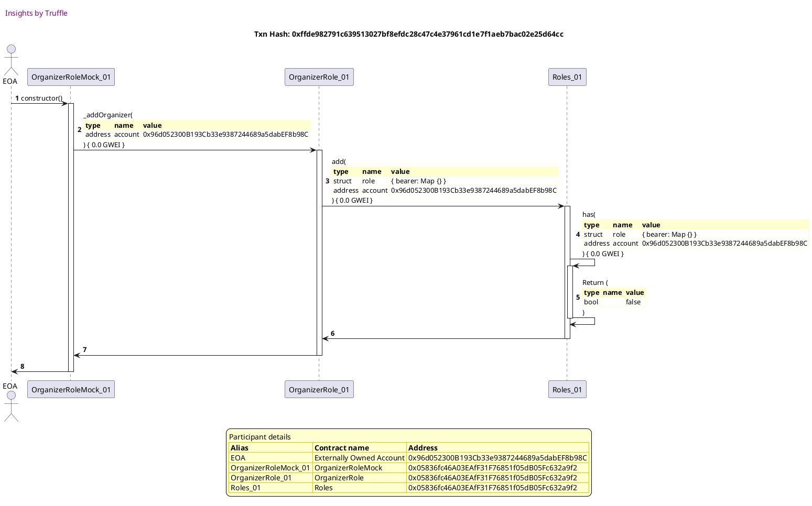
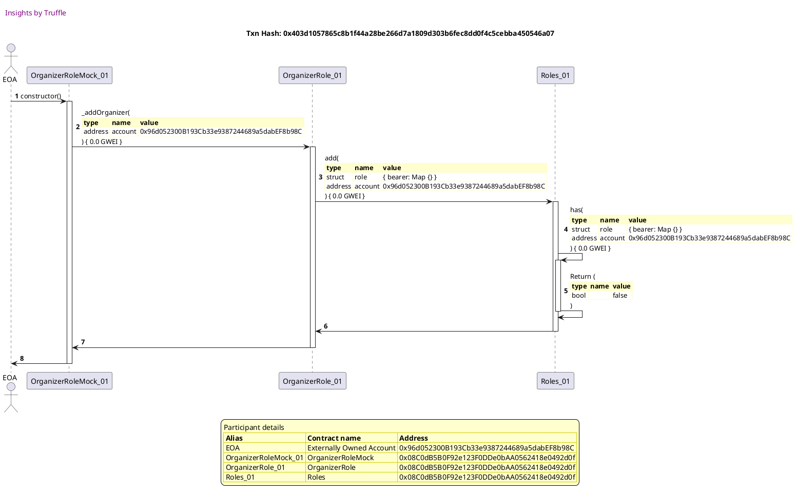
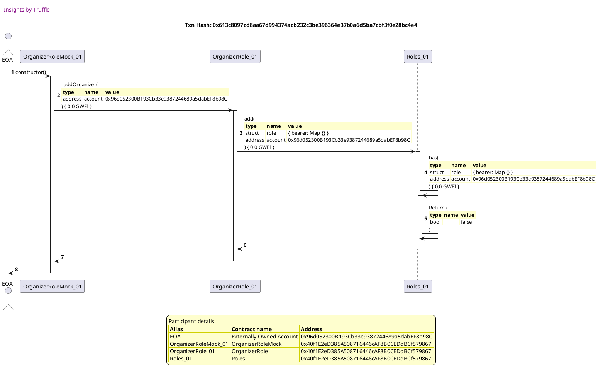
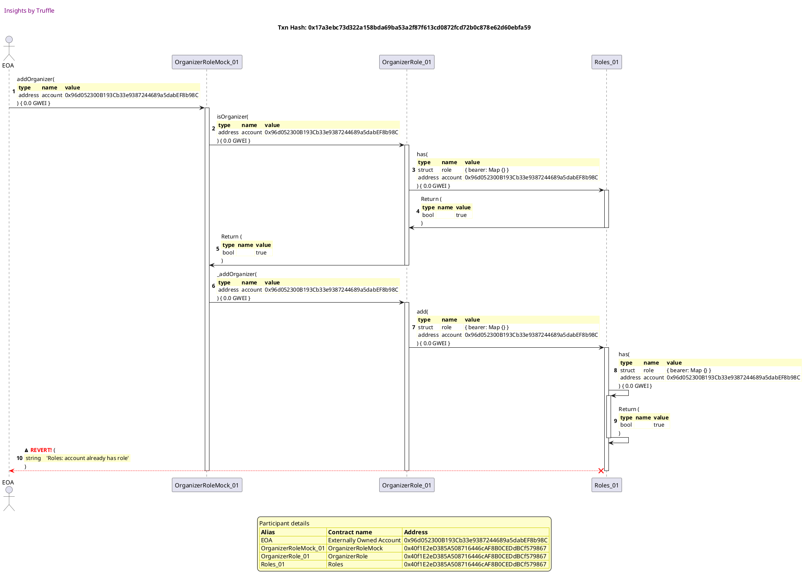
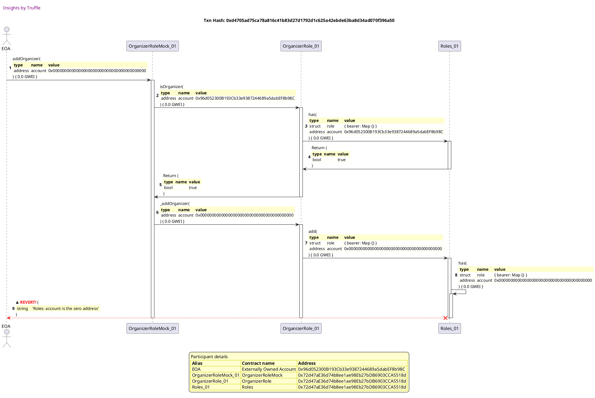

Test date: 2021 Mar 02


## emits events during construction
[link to test...](http://github.com/fodisi/hackapay/blob/master/test/roles/Role.behavior.js#L63)

##### d1, tx: 0xad5678a6b8d73e47a4a4e458577abbb3f0d6c39ca4427728b8d50814e89e458d

[SVG :telescope:](https://www.planttext.com/api/plantuml/svg/tLNTJzj037-_ly9YBo36Tir7arIieX_fu0616D9Ua92JNDk8wwMwN5XBuN-VauOCrXPfJ7jPLSKNd_spVsUVmzX9Rb2ROYOPmy9agfX5GhFyBbLpr3W3AIP29NsCxoOwArGoo6IcuSCe78M3aB7Zt2obw3AeVbE1YT2mgby1JZETFcJAeEp9TA9cGXb279l6O4IRQyXveUTIlDhubZu8Q3cDxXAJ95KJQF5QzLJ9uyzr4goEVwRoT38rEKHBkDR5U4oupAH62hXUA3Z5VDe1li34RNi-jYC_yMpXUEYW8npNTpqFeoYonpnfntOGe-DOdcVvPETol-K8FoZD4aP75XjAFRpe0UQmHtAFqR6PD4xdI5Glz0GLaT1NcHJdMNntorkLvRQDDrotkcsubChysVJvPO-nAYyuwku82uU77OWpbHjTb7Js3zWEmms8nlsMAjFixD-e6tPSjyZ7MdOVlu1PpWMGL3Yhv3tAWXQb-ICGWXPv3hIAO-eqGok-2De9TosRytuhi0UHROl0zZtBSTf-W6w2KJZoey0Vh54EO0Ny4uUltyCpQeujoPOKcgEfKgUuxqjuVLwKfIOy4Yk816gXEt2ESrWzmTE_fFQBn2QbAUR_4wMZemvS2LDe1U-Z5MMPfFpeFqQPr-g3tmDkQHOAlAk9TjoGJOzNjsTz4qiZjXwixFB51Kw4mLJcBmWE-P1pNXAa-KdNcXO36eoQvav3jVTSYiQl-rYD97ekZD0AfLp2nGyb4kYzgrWlWRUEj2tgAaJ8mp6tsyFGjMtNywt-gEzQxLuGqFX4BxGyHoJ3dZLw8yGM-B-0RaPalVnJAAfONJTsGa_wRFu4)


##### d2, tx: 0xb7424da7db2250bebd41bdb9752141a521c722268569bbb74fea228b0187a276

[SVG :telescope:](https://www.planttext.com/api/plantuml/svg/rLRTJzim47_tNs6nbw6DpN4-d5Ii8atJmGC2CQIz824xSTk8rAaSPsif_E-xfY60Q14VOnzHv7FEvxlx-SwvGsYlD5oRQf8Zn2jJg6eYf4RbHQQcNFC9pkL8ghJ7aukHBYgLHaLUQFnk40_YA4PejpJpN7OHhf-nvAdKUD5yOhnVwEooK8RdOPwDr4Gg0ng7fXKOmE9AvRJIqrpUM_YMNKfiEItlcATffaRO8WthkgQxdnidK6F_G9NPQ6nABERuL5V38UX59ZEvnASpXVTvEUvWCXFCeKxAMIeeTOcG8dKiaOg0kTHoB0vZmYYbdkzwWH0WFPISKbyGosUSCW_1aIK6N8-FGinBl0Lq2y6ncIp9fXoW7kaHLm12dnIvF2oIYtDYrPBh5XxPkdRRWorBPdaZUlEnXL3j5zxfRZ2BFtpeO3ZPTl7zcJf3kqs8FpQqU_K5c_bKOg2AJshwW-SLJ9RYLqiDMfObXbcIGAOOc95Pq7FTo0eTosMUPAplngxlHp4BPU3t1qENnN74Kfklj6pZ1IQV2FxwFJw0u6xmzm6I5aLMlWq8BoKkjGdfMO4T2TkMWUqpwZYU7t0tvI8U-2BmeoU0Q06qyQaT7_FoPGwNHbV9qaiD-e0ii91SIzt1XtoA5zVu-YsXtO9O7vETdGu-aQRI2hyCdYYA7Fo45t0stErDHxeXM_w43q_8pVF_u8fjo4wm-vUoyrNGxcVdltBXtWJIRqpo8S_Bson_oWr__dryxFQiYjLI2Arw3tHyfyQbql0iB-y0x9C-8MG945eCg7mmYQ1tq52QMwZXJIZQVTshkch3E3DIAvxdStpqKyaKXo_wEzvLlBRghs7N9c8I3udjzMFNjbtcqzwWvr8l30B7zJcBANDasW_fu14JQzI_GdNRHJJJvwg2Y3LnGtimGcVv2m00)


## reverts when querying roles for the null account
[link to test...](http://github.com/fodisi/hackapay/blob/master/test/roles/Role.behavior.js#L70)

##### d1, tx: 0x266019c98d096ef264071927c5c49b31f8eff55a8661bffef039b14d948baa81

[SVG :telescope:](https://www.planttext.com/api/plantuml/svg/tLLHJzim47xthpYn5z36vZHf4bUieYtfu0616D9Ua92JE6s4wrIsixKK_likQSXWRP76j9TLLSuvttrtd-zy8UJOMAvjEPE4yD8Mgfp5GXDpbwivrtm6Kao4IeSykPleebJfg925XdVZQ1oD8aAEZ5rAqITG_wQ2fqB3gda5E2rqVbyeo-L0vXCr4yeYOcPRWp5khY7dfPvByMBZQtulmF5QtILFqrnDmA6Dwh6MHv-Q94WJ_qoPV3Ar1k8bNEioon2NsDnA0TSB1QVSJ7j05ntVfmvBM9XIvekiutiqS5WdIBg9nsBNoKAHPTqk3ttVYRDCPDHbiUEbp0jZpaE7u94b5bEFBWR03UoXt2DuR3PFyZb7gXTwmXMIq5U55ET5SdTBdTfosyOhhblTDbmgfNaoVNhP8wJE2mxxEyB2-_SzI0fbh2uhEli7P8VX1aJhVekLQNVsRzGDEMfQv4CZ-m-VmIxd0b0gFglbTovBN5Jc3u08MXW3k4eIx3IBAxfWVagx7PVIeSFSKUowWhbXqF4yFsIyc_8u6eSn2qThb0DO0Vr8uSktw0oROqko5ONsQEhKCUxR4bwV5sQf4G_52cB1jT0zEETpM3t2ux-azel49gKfD_yJfSF37bm9Mse5RwCL5uN4_F2VSMaQzS7l0RSq2mRUrKGxRiYcnulRixw9bH5P3rPo-Um2fyBoN9fd14_e2QMq8eZp4wyrBaOu63NEdPRguAaKhL__eHv9-5nOeHMNSWaNFvH8OV2cOZq7tZhIjgZh44d0CXu6iJU8KoSQnb7cTe8AT1Ybr1j6GySPC3TmNmcn1VuleDiHsIp_50ehrjID7ECJFvi_0G00)


##### d2, tx: 0xcc89baaaa91e0cbc09f0afa24e1ee4759048d9e576847f1bdf5082c85ed12f4c

[SVG :telescope:](https://www.planttext.com/api/plantuml/svg/rLPjJzim4FxkNt5YNuOsDgT9I5AnYZIaWmy8n93s1GaviTD6f4vbErjBuR_lceO0eaMyZBr4LSxnotFt-EvwHyYkDaoPQbmGmYfJocgS24NqHIudJB4n568e9E-pz6Aeoahog2nA1Uy6yI2EOa9sj9aLeaUWVaQ2SQ5Wtdm2x9SgloobOKLOv4Cv5j8WOcRQ3GDSN49EAZKfnBs5R_cb0CjfvuuPvxaSWaMRgUjQxdnkZ22D_WEfy-78Q4XcSAggB4DSOd9J23YTIjXdUjG5EarJFqWOFe4bQ9gaDCWeorZ74POGZkS6rF5v85nlstUyp4fuvbA_a_gku5OdSrA2LvOQD3q-2e5fs42vGV3QJ9xc4uPKZzIGIIIXJif279RfnJcrwfsh5XuvklBOWoEBINspzUPZWv3QBjZghL4B7pvq0M-sNNn_9i_8JkFYZutiNNq1Cvi8G2dPk9O_M57XOB7zQe6WXDQ0epJ5I34uejEWxxgH5JeMtgBml3qtTdq_YhrG1FxU87EzE8uyRhCboYRCWNwYyFLxV83ENMFl0oOjYro_3ObjJjsEJMdV2kmeiMqHsBxNSPnjFs0kPqayy9F0Zvv0eYNG-gSsVCJqompMHbNfmag5U2Zca0YcXEh28Pl0_1gktvBQBOdLFjdQwiA9C9MIy39wILaMQ2V-a6SpkxdkIjT4ov-muGcnUVuVfDYQw4IzVoawNqNjVdJ-Amdt9fH-Ov1dhD2tKVwK37z-FZwMFSjYjTX4bhq7ERvJuxWmB2_q7O9xT8zIkY28BGPMFXn4s3ieBCqjrV365UsvtbLTjV4zDK99LXGpEFef1OVmHV-ETu5NLlqLqxMAr0iovdk94oRSYlj9dDaTRm7QZpbr-d7ViiB0zkn7LAo0VmLqsqKqm-T2eSSQlv5TV6Dd-Gi0)


## allows access
[link to test...](http://github.com/fodisi/hackapay/blob/master/test/roles/Role.behavior.js#L78)

##### d1, tx: 0x111b2a6dd8a3113b4a938f6173e188cfca34d6a415a7007399d40e92bd6222b6

[SVG :telescope:](https://www.planttext.com/api/plantuml/svg/tLNTJzj037-_ly9YBw2DxVBHV5IieYt9u0616D9Ua92JkxOHwQMwNBQMmly-DmqPh2tIcFQogeeTd_spV-SxXx7Zqg0srJHd32jJg6gQICtAkqpDKECKSZcMIWmmlHlheb9YMEI5XdTn54V3YB6ZqYnosMDG_oOIXTImR5u1JWkTtHVAODxFix6QIcK8SMHQXvWMrv2pIizo-MBXQtOlmN9RsoKAaQanMBmnFTRow5DJ16lodwao6qzC2Sa2hdKr6X4kCvd99LpF5PnYEUa2drkMbTZe2H6WOrbEucBe12FFyXrf1K4wIj5nXOUkrK6VSzy9G-5o6Tg9y6pRJZn6MvOQAZsww0EMi4ToZz6scIpDPaXKB_GO5P7GLqKkpulqxfPRjUUsXLT2juPjXAoCvPFhqyiUOtLTSDZRaHRUl-z2MgZIw6f5P_-0xN3SW6Z3RwapxSh-ZRfXHyqH-T38tiDdC8kP198AfxNyZdb5oihz0GX1ox84qjAKJfeXZSz3J_2ExN0-i49dc3YEf1xvjkjwGOWTWKaK1qaO3DSe1x04_f73bs_H6HsEBSMkABHRKvTEUTzMy7g_g4fDU2IMa4ZKKdVX76UmV8J7Vqdj5ubDIXCi_oTAXuTTk9AcqWhUHYifYfpge_y8yx8n7_oUSCjXeSIx3j6E6x8PyUBsh6_Yoecj1okxV7Q1XJIOvUKpWYVyX7E-8aZpawurAKCQZ9hcJakr_zIADgxtK8yaUiwDr0hpV04NFvGKq7zJivu3RnrfMynrYg4tIcCxilj-BBrG22j0D-AE7td1O11tOkxQ7Fs8lv9Y2_nVGBSZib7_58ewrlID7TEJFfi_0G00)


##### d2, tx: 0x5e0537825faa4637513d9517f61fbf9be3bdb8b153f3fb1b74e3fb13048b6189

[SVG :telescope:](https://www.planttext.com/api/plantuml/svg/rLRTJzj037-_ly9YBqCRswNvhbX5coQ31mHYI7j1GdV9fOr8BzNbihKK_lUvQGWWMiJ7s4TLnOxFP_jtziKcPA_KJEbgaXF2Abt8QiA58kL59gTCiGdaOYHaCc3nnKWLbKo28YyKl8l2A0n2GdPBFSz5Zq3z6mkM20MBvXLWlr3PPI4ro_jvDf8J8JLQJ7Mh4E7YokIqKjDSt5lubbqACAnMTioI99CZC6WZkgxfxkSc2DBuFv1bDXhh4lWSJbMLfcYNw4pd0avd4lPPEUu2dTc2sgRhTUoKCSinNTim4zystDGnKfxwN9WyuHutR3CrKsvmrn9BQbBBuuxX-GIFBDOOUdZK1rR25j8jWiUcipYRCeHwf4PC8WXrKkJYi8WlpgbHQwvRU6JhscqFjYo5vOtgpSiM8NLSiDFRu1O-VEW2dcox-FvCdf7T9iKV6zgx-W9wFXM0LB99JN-ml49cgNwrjA14MG9oSOoLef6ZCtzWsu7HjmpRTOJh3ktGzhmWTFl2zuPHQhjX6BY9oLPMjc41z1E5hz_30qpkXdWV86bHPENRW70IQdTCIWU6RmRSD8LlUcx7iXpFPtR2U1XvtFU29u1e0RJvgGCVi_9b0PTQLV4oIeNsa2o02wQ4wi8XcyBY6gxV4jejYFKvsTdfmedGbPBmCdYyA7AC4_-8iv5kRphI3TNo9s9uGcsU_mTNR4Drej-_L9slWdQ_El-L2_Sca7vZaQSiBs-h_2at_FdtyR7RisfMIoMocZt8yPqUbmZDihoy0t18XvJI9K0SCR3p8HFWxA2mDRTG-pUfQFVrhkgkZS-P5agoF9_3qKyf4kY_wEjur_3Qhhz6NBi8d3IEEc6dxqR2yPF4y9WLKjCD7MymYEo8MXtAt90-ucAD-LUORgU8XdskASnOapUoXq-SB7y1)


## reverts
[link to test...](http://github.com/fodisi/hackapay/blob/master/test/roles/OrganizerRole.test.js#L36)

##### d1, tx: 0x4ca1b6bd8bf85be1209e09ab991f071519cd583f174da37e84cb36a00044c37b

[SVG :telescope:](https://www.planttext.com/api/plantuml/svg/tLLHJzim47xthpYn5z36PjTfcrIiehJfu0616D9Ua92TE6s4wrIEixKK_lkkQSXWJP76j9TLLUvolllkFfzz8UGuTyAwOgO94ONBJ36JofByBZLpOSKCj9ee4v-8w6vYiyB4mqnd5jwDmt4u30avojrIgpw1yZTL8bOMLjKhm6bcq_lCEA47EfsOcJ8E4HDNEunnSGCvB-nSgnSBNzDx1SohRPSYZbCp0KOhqsCfZpvLHP0g_vd9qydKvI2NS6sB945SubAd5Lml39oAVDe3kl0YmMH7nhvC_BPKh4K3HGCXWu0bjClQB8ZYjiyJrlLYmRlAzoB9Eu9IwdaHxqg2MnOvB3sy6838OG_b7i5jSscKpWLIlR0JOP24lSgqEi-YkrlAIi-cXLT26yEsGjR6_CdrwMMFaB8kEEplI0llt_SWoapkRB6citz0TZXkGTJXjzYPUcN_njoGe-g8VAXa_-4pkELS0KeZPgNyBdI1ojhz0H31gZm7rA88Jvf3ZIw2JapRBKxf2GluK7Ak0kvtMvxNyGFHZeKCnxuC_E46vG1MG3zI-F8jFCF3qL3icaAzDMNfcFTj1M_s2wkqY8TY1L89gsmFpiKSLe_m-2-f_IAnJMagyl-9qk5X3wwKAwo1jz6IMQQnFlmdGkUL-U3tX0s71HFlEaGxRiXsn8lRixc9QoUo6Qpayja5ZfKJgSwV4HpH4OwRDK6SdtYjKHdYOBGuTsggWwTMr77zXt8auNFXb3L2woLS_30gXi6RclKSk76aDPYh5667SN-aV1Oa8tOouZoaRPhmGJTgKSOzWNR6Hw-aQ83_2-XwH5Rgdq9Xnwg-aMDyucVp9m00)


##### d2, tx: 0x10b535ba34ef32424beb8ff3cdbe88469573574ab481c119dff01de4761bd60a

[SVG :telescope:](https://www.planttext.com/api/plantuml/svg/rLRTJzim47_tNt5YBqCRcrqdJLAnYZP91my8n93sWeISn6aZKgTodAsbyB_lseO0eaLyZ7rKLUvoFj_TptVE7I5xfH7QLEES456PGbNZI6fINcHg8hGOGow7KYLz4LyCTL6fn2_oGiExGJW8_P2GtTBCSjabiFoDf4YaXddz2h1VwEooK4RalJmRgh5K1Yscfb4OuEBAvAJIarpUM_YMNKfWLYCx5acIgI4mMekkbtJtSnq4gVqVg38RZam9qGnETPMcQ9UOpEGIJgSAzaKvwW2TCXhPt8u4jsJAMrRBYcJafYcFaqYwhjNsR8VRZYKYosKnOrwIffGbqdBQB4hQL10yijXWwE5H3qG9MqYt21wRoU9i8X3gaHuAXI3qIP7BmoA-EATigRbkuP6jQxSzsB8GbZUgDozRX2pZWftk1hVmuKC7y6IRnVTdwepirYd-MDFkrHSmiua4f4gCb_I7o2ja5kfN2mjQbYKW5yTOAGOvElNwjkspdiLifoqT9x13stNzqEb9pmq6gUs4eUyaNAoiRCCSw2SANx-71vZS3V4-GDAWoCgt0T5EgDtYbFQPn_s8S-bnrsbPLjlrX9s8A1ouaUVwJm3H06Zoimny9CgN1LmQNSMBA3NQGpA7I0ejTGSEnGJcrt3zbj1kGQpFoSvE1qwagRI2by6BYYB7EF6FE6lfzgOZtL0jVoA69zJc-NzmnJPK9_hzIzNvAcZtg_DVkN1l0kat5dagylAsofzomvz_7n-xFQjcjL0Ygzc37D_fSOaq8ilBEm036b1A5m1nnC3EXuoFiuF6rjn0xTsaejdNlLfsRNnEZTHAvFaCZdugcK3lHL_7kuRNTlqrujf5s6RS3QJBl3HW_O3paDeqvJqdRb76BO5oneD7NAmn_mhJpHHHiyyrXHchyqRsy8cJvIy0)


## adds role to a new account
[link to test...](http://github.com/fodisi/hackapay/blob/master/test/roles/Role.behavior.js#L99)

##### d1, tx: 0xffde982791c639513027bf8efdc28c47c4e37961cd1e7f1aeb7bac02e25d64cc

[SVG :telescope:](https://www.planttext.com/api/plantuml/svg/tLNVJzim47xtNt5YBo36vlnEAbPHIZDuG226j1Sav3XE6-4wbUEmbiB_lciQCbXJf37jPLMLSyvttztdEry8EIeDqwQQIa9OPGfLJHEXINcNgndJR0fIZ8LAZnc_6-kYKkcma8M63_4e7Wr7X1oMPY55dq3zcmYM2WtBvXNWjD3vGw4CamEPZzLKA8E8cMaDOjnSGyugFPFYrSQt_460vRQwIvQckHg3HHlLKoqFFpT9a2R-cIhpySIKa2pWMbTPXhZ4v4OAk9uhE6Nbf0TqdcMfY48xY2pkEv5dETGEaYmKMShjaBi1TuKJHBx5Kqi4cSL44YICKrlONkgxd1CyCcumzT7505W9EoXt21wRoNa-OqZrGe-PGXBwgf3YlE1tjzIgBRistd3jTDjmMIdBPzFdbnr2whpWeBybBEplzu0NgZIwMj7PtIDR33SWMlTRh4oxitkZRiXXqo8V6zb__09cCHE0Kh5fBU-Ph72nCdy4HD2YB05Nd6Ed6LpHUUIdrBCTIe-jo1acZYCY9mnir_N3Y7afIqPnc4JXS8so1qkWdoXy_Juwm-ReI7P5eJsQEdMC-xw4r-U5MMh4Gx64H30jT0_EsGoMJ_3qBwdz8h59QSBA_udImK4FheIfj8BtqKgAGc9--C-OB1lrtky1Eve50szheYqtPDFZrUrPtyIL4LaFLdBvuWAdmh1SbYy8dj0JIkcA8CvFlDQu6E9Wr3XtMgg3vrAqVlt7UYJXSsw4LapA1LpyK2A5mRkAzHAuSwHrgEiGr0iTF-EkFw3EQ935ZXK7VkXP6VNIO-h5E7Tj5cNs6o4wuFy2kXsHpV9FeR1YJTt84Jxni_aJ)




##### d2, tx: 0x384059b13d77142073b9067f2abf0e4915fc379b323865014f189292bdc010b9

[SVG :telescope:](https://www.planttext.com/api/plantuml/svg/rLRTJzim47_tNt5YBqCRcnF7-QXOHPecWmS4OaXxGK9EuhGHgLCvpjPI-D_dfY60Q14VOnzLbRkSptVtyvrpXz1UfPXKzQH0YDMg5FKavX9L5xcOCiacKF0H5-c09HSZMTOY3SgYbF0k2gCm217QhTIyu7q4pM_CMSebBDfNWFrIvfUbKApmYtma9bmeRJ5JdKAa5rScfxMS5lpUmhVyaeDXTR9ZbgQv6861Mz5rGtS_jq6Wrl-1gFBHM5KGp-5KrbccxIALguB3wKp0Fgl6FS0pubgOUh51KiSnB1Cx9FQmxMGcYpFCBS-WMK8SBoOcSMsA3IipNC_qp3XDi85Z3-aZIvGEFJpoWLMmfUaMqiUcyYIVCWtrI8wOq23aILdmmpAvECT6exbkuP6jQxSzsB8KLZUgDozR23LnmKv_WrluyA47-cIxnVTduWpjjYd-sDB-rHTGyoa7JGMRDFG7AshDBDMlbXOahohGN9BeIb6QmpDlG6bW-9P17Pixpf26r7M3qF6vvmwZZ3fX63WfOIihsx00_0d3r-_XWKxkXdWV8EbGvDNRWB1JJ4s2yS3mI10JmZtYEgPbsQx7QChYC79ZpmsU0A83qEMd2NpCgfS5N2bP9yiefRQdoG9YpYINFJXaKrXSm_LRGhi5iJudEpizEE6gbW9U1YykoqB7gVyQPolTtdIa6whbJyJmXDey_m-ks8Rgr7x_KdM-2jhzwlnNBjoRGFgDHPwnehgjygVSyEVVnyTkpwfPBPNGQlP0ntTwNCeLoulg3i0X7cACbm3rYA4xdsO2FJj8tPexgFvDAhfz_QkcQ-ldJ74fM57CuUYdu2duB_ewtZMyjkkl4JSkC7M9dIMMxMCI-bb4ZCYnNMfacAO3JAF49YRpClCH5slCly9qDqMqx7DDwOorUKDx-gadory0)


##### d3, tx: 0x14be5e4e1e79208169b3dafb56748106b232380d6db264ad32b094f954d769da

[SVG :telescope:](https://www.planttext.com/api/plantuml/svg/rLRTJzim47_tNt5YBqECpOcJDAbOHLkQmGC2CQIz824dTjg8rAaSXxKK_lTTqn10j8YFiO-gobtEvxlx-Swv8sItC5oRSfmHmakJgt8SIKsAYrHDkEPZoEHGAj7ZySLGvwKI_JpBDNm81-6WFo1afp2pJ7O8LB-Hv49gcDUl0FkvJgzoPNZMpTAX6ajbq69Y6eKG5vSc9wMUPFB1mlVqIeBbDB9ZBaIgXc3HMdHJqPqlTH2azd-WYdGuCWL4CpZLPPAWNM9IaqaudIhOvyMe3NHgEP5qfICjsGfiwbjU4371ayZrMevlKI-ocSryAZmHsPx31RCZ6ZX9u3gYvGM24poos63eWwCky08sa6uGF3QJnkc48zGZFUGAGUYJF9E7UNnnJgrASzN24rjNRdkqPI4iRbLlNpO8gUA2xSuQjx2rrGOysMRnuvaw8pjrYZ_Lj7Fz5Sni8W6fukEANlAiH6QXVhsme6LH079nZ9LYaADJfySjtgUkROTTEmZs66KzdqM9vVX-p3mPKek6qhQMLZPX3lGpXMy_1WUOt3NnFaBIe4YBTm4HU08HC4fxLi3w4MCoO7xBTXpF3xWhU3G8_IZm-yy0qG1eybC5FkB5wm8kZ2xZHPGQxI6PGoIvbheDXtm2ynkuUKzeTo1MvsHxkmqdqfHQmUlWHNcUOPpuHvorT7FTaQwfbZyHmpDgy_m_k69hgXFz_ftgV1kqXzNvZrouzu7q6uiyuLbnL-NFkU4lluzFtPvbireeaUNiGOxlzJWX3K-puXx0FRf7ALq0n143EnyoVPmTDBRc1chtDXNDlivrrRNnEJLIAvvbCpZwgQI0xgk-ZlSDh-pwAyIL2-hwp4jYn-jIDkWc8RF2bkUxLa9TqQDk67lCva5YF-5YXVatc6wcY9fzgIdCM9qtiejFd2n_0G00)


## emits a OrganizerAdded event
[link to test...](http://github.com/fodisi/hackapay/blob/master/test/roles/Role.behavior.js#L99)

##### d1, tx: 0x403d1057865c8b1f44a28be266d7a1809d303b6fec8dd0f4c5cebba450546a07

[SVG :telescope:](https://www.planttext.com/api/plantuml/svg/tLNTJzim47_tNt5YBo36vdmsgLX5FmSF2CIGzeA4dDXj8rodiXtMKlZVTqr31ckADAQzhAfopldkT_VpdI-4d1ZBj2rcaX1Ms5mLiqHeOkuoDMUQpK2AYL2ynzAxYSuBnVkvp3Ly60r7m_wGa6DZbr9q29I_gM1SQ5XLhm2dkSuUScMPxCfiecP2MKGSszfWX9iRo7cXvrAyslYMFGXm_5ftoJZFr0GSMgcUIddykKg2LF7FbCacKsiWMSArBiPZn2KsirB0zKB1AJFJDj25JptkqA0LXK4Q9SxOzvaR9S8DGzvYJaHZxb4l2SSYZJYdOpyDKf4ap0zeu8UCjWWUMMenzU555vY1FPHx18_DPcasPqZrGa-OGXBwAfVYF4_lRgbJMZPjlE7QwBRbibQQPzFdbpr2ohpWgBCZB1mUjY7DbR6wMDFPFo0x3BSWQlTRh4ozit-ZRiXnrI8VAzbv_09sEHU0Kh5PAU-PB72nDdy4HD326C1LccAdMLpHHHno6hWUfJqdzlg9vudOYrgkxuTHp0BEak4eIkAelq4vW1NGJnI-VX-UONCq9BkcK1zDcJh6VL_2c_F2B3NYeLX18fWMkWtdR0wh9tZwbzH-aTYcD6NcVw9qTDI6As4BhU1zj98ybvWV_iTCcafzy7l0XcR1mBkQQCSDsVPuTNisDt5jH3Q3bLo-kC1SM9P9yuBWW0uefMk2E3_nMkEYZuDHuzofgNQVIr7xTHxBaOJFXHLQCIcNSF532GxTTnNh9N3ZI6jGbo5erAUy5_JeA7Q5uteZEXW8cdIxD0XTtua4zMCNH-iR8HhW_mAw7f7Lya-Xi69LtSW9Fl6p-HC0)




##### d2, tx: 0x9877e74e418e1400beca29c980fa1cd7cec524dc06f99161ac9ace30cc86d1d9

[SVG :telescope:](https://www.planttext.com/api/plantuml/svg/rLPjJzim4FxkNt5YNuOsDYTDcgHY5McQ3ZuW44FQ5oJas4w9I9tASJPAuR_lceO0eaMyZBrKLSuvsu_lkJldZf2TqZ1jgabE2AjCeQf98ZKfppCrPPfD89TZgSI0yVEnBYebeY8lDBmRnQCuYWdPBiqibtq2zUzCCY4rp9jNWDr2PvU5CYmFysoi9b8PH4nDks24aql8QQMdkRmtyIsxb60vhUwG2P6fCLYqKLtNSljpOmHfpjzJPJO-CoKaCpZMLPeYBZ6PoIKSNoZOPULP3-X5u7kUz1pfMBwq74eJoPaTyC2dAREuyBZahkq8Jhjf45XTY_60STcXdFjTOOc0eCkuGTFZWn1O2HieDmYwpMGycpAaUg37J249VLJaSh_WvwVKgbUkcdXawyfj3xOibENDqfkN3K9gks2hl-PO-F2X1-ZPTlBzYJeXsqs8FpQoV_K5p6mg0QLYarh-O7c5WyNogmM2bcK9EE8SCyNW27qySDt82XtBzRhIyuPkxFf-57kX3FpXA7MzE8uyqM5Bb4sO0_r4uUltU0-3kyRU1qnQ5bdvDYIwWhfsXzA15NIYfDEHGSVtRCVf-W5p1KlYaPy4VlG44Ys1DZwruMUiV9d1fT4LNrYf4G_571B9jDGzs6TJc5_3zLjIkoMnEYPRMpquagRI2bv6BocA7Et4F_9ij9lhNBecM_w43K_8pTF_u8gjoKuyzozbvwketS_EV-N2lGcbtvZaASlBson_oWr__dryxFOiYzLY4Lds7kJmJeqJqh0iB-yG7D8XfNH145iCh7muYB1tq5YQMwhXJIZQVVshkchZyy98hLYUp-3Wfv82mXTz7Uy2hwpwAzJr4TIFg1Yu0peAR6dPdH4T3YLDmf2wNNlHcL0di0LD7pbY1VmheDikeXa-5meZriIDxE0JEyjV)


##### d3, tx: 0x9c3c9582b6eab84c4e8470d2da089205e6a74e2214eb13cbf4d9f77d70066aa2

[SVG :telescope:](https://www.planttext.com/api/plantuml/svg/rLRhJzim4F_kl-B4lWnjRCwZQLAnYlIHmGS4OaZxWeISs6aZNATodAsbyB_lceO0eaKynXvLbRkSptVtyvrpHyXUOPWsvKGImagJgt8I2qsAYqnDcMOJa68a5E-nv6AayrBnVYvp3U-YOJJi3mdPBSnSYYw1wZSMZ0iDY_eLO3_NsMMk39EXp4Pg8fH1Ywbf529SN9cSbdegnRs5Rzcb0CjjPCUCyqoDmAArwBgYkv_h84Zj_q0LsMXi2eZdSAhBD4Mxn6H62ZYTATXdnRW3T1OaJXAqV3ls18jzDt65xxOfjpcZVc3Jbl1OsnMsRRaYjfmaJbqUfEqsRrFgUOpP18yiCHZwy2W4Li0MqYs2nsQo99ioX7gaHqmX27sIIt6O9nVdrAeqroqyidNjjWTRbiBYHlNcPOkGAYxOwMvm2ny-T01FjbbyVwREo6wTueyrxLvz0JEV2a2gsAIYFvWiaLcgNoqjQ54KW5oIOAKOvEZCxJ6BzMdBjgFG3eA1GvsUxyIfvVf-udWYeXQDX6sjh6p30kWd2b-_3mymkHlYVO2aGP4LRm8Yy3WYS2ZjMO7JZnr718xVjbtNymFMuYmUHduS-FqdW6W0DFcf0X-pucK15qQNoJ9AZVQGB20MJ0lTWKCsXSKrNBybj5iGwtEoizE14s5AhU1byE8ybnWd_X5dBTtUTAGRgkLFnF24sZp_3wxOXkf4lt-dEby7xNvr_YCNxcqW_SOYJvaiRglyAJVy-VVniTkpQbPB9RAQFSZndHx7XM6PBEu07D01fNG944SCx7p8z75sqDYQ6wZXJIgQVTshgclZSsQ4LapAEHpzL893-AAlurt3Qxl-6d7bWlfzodkj7eq2MrYs4z71GD0u36dBirtB5zGDR4xJHroiCVyAqyqKKRFFDOKPg_D6zl29a-Kl)


## reverts when adding role to an already assigned account
[link to test...](http://github.com/fodisi/hackapay/blob/master/test/roles/Role.behavior.js#L109)

##### d1, tx: 0x613c8097cd8aa67d994374acb232c3be396364e37b0a6d5ba7cbf3f0e28bc4e4

[SVG :telescope:](https://www.planttext.com/api/plantuml/svg/tLNVJzim47xtNt5YBo36vZHfVbIieatJmGC2CQIz824dSTe8rwbiXxKK_lTTqv31cYADQI-hgfnplllkFj_vGiY9DaoPSYO8OQKfP3cBkIBwBfTpfjWC19zmcGvPSZTHHIdJi125WW_ZQ1o54I77sYm5xnEeVbFEKgvWLRy2d1OgVoYaOM8WyecSSMaGCJEDmHWtDv3pKiq5VxNnBN_WO3cDxfAbQIudOD5QzLJ9uyzr4gIEVoPrFfaQ3V4IhbMPPOXBJ6u4X-k5X5EcfpsW2zUo4vy6NfBwZBbU6WIExJaiYJjs9x5ZRWUkxJhSzcBAtBGRCo-9CpkZlEF7YSCTWaUM64mzkXW0qx27Se_WiPayoUSCgLwe2PD8GbqLWfyNoTqjjIhBjeqtN5lTjbpMIlri-looHqYL5nprTuI5myCU98NKHfLhEli7P8VX5aJZVekLQNRsR-GDEQvRv6Cj-uzVm2pd751ADglaFHCbBjRcZu08YciDk4eIx3I3Axe8t9HsEpQbGokmmzYsUM3xNiTnN3zWtPJ5qTYF0p_Se1p02kWd2b-_HsVO72t9hYaqHrEbZd7Vb_3cl31BXNWeLX1pfhZgmJcRm-e9dlubjLyajYbDcVwVA1qTzU2Acr99U1-jk2W4veV_Z0bTgmz-3zZIB1XuLnFjk27R7gzkp-Ochet8Ph2IonSNEEM6vKA_83YY8qhfcY3EJxpMk0XnC2gSEmtLmNCf6h_-OpMIyBamN4acn18kVaYUmk1TnNe9t3hIMjHL28TcLjJX8zll3hhKzomNqPF1s1_IC1gbmp3hUe7lUc-4Q87_2-XcHDRBFuN2YjLr8oVunC_cJm00)




##### d2, tx: 0xe3d5f1f04c6cd226536bda9dd8a2c9b7093aec29103011c3fe95daa836e18c5c

[SVG :telescope:](https://www.planttext.com/api/plantuml/svg/rLPjJzim4FxkNt5YNuOsDYTftYfMaQRfu0C2CQHzGK9ExBGHgLCvpjPI-E-xfY60Q14lOozLbNFEzdFt-Cwv8sIlr4pfQf8JmYfTo6eI2qNAYqnEcM8JoCL8IDvdoSL85PNaOP4N2juDes4KHeJibdgUYnw1-ZSMZ0i5Y-OLOBzGsMKXDSk3F1l9YP0Q4LFTBXZYv0foMgbfBkvDVCik1HYTLdVCEC_a20pQgAvhkVkvSO8qzWzacOt6keHu3gUgIbF49JhJkO3JcOHzLewxG6V2udPgfBIJE0atJSUsd9WpdtEFcOaVkzItc4XCtw0MDOp4IeLlSyOyon66bzW9mIDBDBeU7GN0IjX2kKNms7IMP5E6L8_KY4aaeKwAN1mMoSKvDUgLwoOUsRfssuCjIsLvi_JcPOkGsY_OwMqm2ny-T05FjfryVoRFo6uJue-Dx5rz0JsV2a0fsQIMFrXUuM2v_6g9e4HP0ewI13D5uuZE_BvjXqRGCMpN4Quxi2FRyyB83OJl3OQfxKPHw7ABhL2sOG7q4uMltwC33Eu6VnymQLbavTkGS3YrJOlIlk5ROMnPmhSyr-nq7Czdc19nDFHYtmkVGA8bqCQdTdpCofSvN6fL9Kil5UAXM40ic1Ag2uTi2ejhk7vBQhSariTaPwSB9q9NIiBBwCL5aQEV-4UUZNPxqv5ko9O_uSCJSlFyFxXY6x8JxVwbx7mLjVlP-QzSk3UXz1kJF6LvUPlbJxdXpx-FZzsULR5QBYAhteCStwbnN6YMvUKTWWCwe9Gk2MABWPKF1o7s3WfBSqirk0b5kwztLLTjVCwqK9Bb-HoEVah18NZHr_4kyDgglqPTc-ZGr8XCCR0yEx2fvneEeYV1qElJC1hmVeWfuNkE-uY9DV2lW6wxY6RuN2YCM1CtieTFx2n_0G00)


##### d3, tx: 0x17a3ebc73d322a158bda69ba53a2f87f613cd0872fcd72b0c878e62d60ebfa59

[SVG :telescope:](https://www.planttext.com/api/plantuml/svg/tLPjJzim4FxkNt43QOoo3YVfIrfr5Nr91nyGg4FRXp4X9tPAHEfKZWCjXV--Ivg6JhHeOs8QgwgSSxQVU-ubkYFa8DPCwMGS4i8I7Sbax0f5ugj0JfXYOmZ5I4ZUPTxLI4M9vBqeZ1Hi3vo1qtC8QSLw5eesWUntAHWN2kRvAy1Xf8BRI6eMTi9W9CT2QaJqTN5WW9iBo4cY9g7uQUDpS2l0g1IwKyPv84TWq5nrdydMVaw2vFQFP1oCBdKCxWpELEBxY4jqe4C1PrC9Xoo-R0AT6dLc2TUhMzmoJMPKRPUpMiDbLOkPlbttQuRbSMhNJT_ZTTEbdbstHStaDIfSdrKR14FcQQJkd7I0nR25SejWs7JW1HE6hfwe4PFeX1f6eJYElAiBQcGdrsqySNNjjKTNKcMyFBfysI8aumNbzWQpiBVN18niiVdkN9wJLfxYzxbittq4FPi8G2dPE9FNB4nmaHw_In6KY6F0bUTXfMXSqMcZncdLj2Zj6WshvrgMQ5WOqKgbPZTObJFN6TXkm-ujK7PX3lG3XKzVdIDCxWQ-Zpmfl0ZYVzs9me4YFndnInO_Zt2iLUAbB1NYePY3AvWIgWd7R0BpUxX_ITSUd5YVatAv2KEX4oNXUUwvKHGYJ_oZdxbsTrD8DrJBt-3m2xLvyGe-iGtLYNPVVtN-Xn_SojiB5Vc3XMdvsxOI_7jgTz5Fq6JhxGrJ4bjo6rhUOZ30C-rIQUXySOPdRqgbrdwcRs-YbSOpRUcPwPtCNBE85miLDlHPcgmit3jBNbnWumskcHQhZMvL-xXJRjmjsYzPp3haTAMdSg5P4COhpFkqJobD0ueZ3HB3HGzd5ONeHMWxozGNzz3JT4h0vrGB9LaOpk3aHWeEdMSLnohmsYbZZJepKQ6-uPYYRzdLJXM76wE6w5vdO7Tfp-dpRi-lrXjshVw4YJNmVm1TJ2tvydUXC6DvtiW1Fd6I_G40)





## reverts when adding role to the null account
[link to test...](http://github.com/fodisi/hackapay/blob/master/test/roles/Role.behavior.js#L113)

##### d1, tx: 0x38edb229b3bfad0dacff62737e14cff15a4ec07e5a16411d07570334bce0e652

[SVG :telescope:](https://www.planttext.com/api/plantuml/svg/tLNVJzim47xtNt5YBw2DpVdL91MhA2KTF20GGzeB4dBYQubmdSfnjfR2_xvh6Z9OMwGnxMLLbRkSxxwxp_PT63iihJ2scYZ6H6KBNKrIDAoyo_LK6341XMFKyaXaTsDJL5eE2bKOU3TCXiaWOUoWj7E5FGRrxnQ5H0EBvXNWf33vVQ6jK7sLZ_K4jIN4aMqTXhIuWfnMPghmnSBN_1x1yLlRXP0orsDmU6DwhEN1fwO8rkG_rMK-lhKbf7EuCjLeHBZCvbOXNCqqd8ZojWjyvaKeKzUDKoyT2Scbo4QZZXjw8Je-gKuWVCnuY85mEhxZI1u68VSyFysGOoTm6MrPPgdqvBmFeeGTaZkCjitcMJuLHFNSZ8Kc4kQoK7XMP7SttAazDosy4henR2raQIoVN9zUTXYhwuBztfQqyFvz5x92bzPKIpgxUsoBunf46tv39zEkx5xhQtRGN94FZUmzV0OxdoAGr69Io-z2LQGitH-040oM9P2MPNJJB6by5dSa3roFyoCdzWQfvs7iHQ7h-vqe5e4KQJACqZWQh53sO07y8uSltv9JkXmRYbrIQBUcBftolgtWrNvHbORmI2mWHM7GTE5CJ67n28__ajel4kkKRaNvFr7Qt-_29ThAQ7WRhRGe5DL7_v5GPMFU-ptXXij2YRTTeYqTiXxnedjMdRXqOgl1oYwUDR14At9LFYDup8yvvqk2D3-fhKaPq60qD7TQglsdesZZUW_rIABdpABHGgavdF_GAA7_fiDw3hnnf6qmrob2L_gXIBoE3FqqGdG4nb6Ikc5wVDI9kJSOz8F0YUGhAJR0_mLqEo8RzK-XwCIQSsE7zAJFvay0)


##### d2, tx: 0x48c35705ed7cc26397f0285b5b91889681ab213be5b63c7b70edbee04e40eb7d

[SVG :telescope:](https://www.planttext.com/api/plantuml/svg/rLRTJzim47_tNt5YBqCRczDyEAbOHPkcWmS4OaXxGK9suhOHgLCvpjPI-DztJKC0qI8-nZwgAdSvd-_kvpldZf2zmd1joab622zDhig9a9eK5wcQSiqdaCcHL4cFnnSZdPSg2VCir_1k40sYC29ajp3pJ7O8LB-nv8dKiAXV0VPpdLxcol2icwKZDP7AeCMXQHG6kBWoEItrD9Ft5hwbbn8ifv4TyoH9rGWiMekkAxhxkGw2rFuFL96EngO0COTJNGw7Q9UOr6GIJcSAzdanRWETENvikuowCc5ntFBiW0rfotU5AmBBzmFFjxXeMRQGhl3ic0b6PIAaf8vqg1Gi8NXaiS7GewCky0Asa6uHF3QJnkcK8zGZFU8AGUYJF9E7UNnnJgrASzt28rlNRdkmPIaiRbHlNhO8gUA2dSu6j_3XGnlmP9l5zsVgZEpMAVvOqyxL5p3pgGIaYayg-eDd9J9BzQkb1IsB0f2BOwmKWnoT1JtN3QskOxdCauprtSZr_J1YNHdu_S7GPL4KiiJcAolRi03wYSBNxz419dT3l0-GD2ZIucr0U0brMpQbFIkmGs7RCh1zrd8Spm-uct0H3NmH-E4JG3G0clnKWOzvyRA02wFBU1cbHdj85Y0arrAtuP1FON4Drsy9xHR4-fpixBJXH9fIAtWPF97d6SQ9VyHPIxSt7Uc6QlaJCJoXDi__WokseJhHxr-gpbT1kr-T_yg5UnD8lx78XpmhRglyAJVy-VVniTkpQbPB9RAQFSZndHwNICFJhBW3i4_xbD8bG1mniFCX4-BieB4rDr2xDwbezdMkggwDpvcHMl4icyFHJoKJwBxewtZNyDgklqPSkM2jn64yihs4ESANqk9O295eCT7lUG6rmx3hkfQVFE9YZVbNc6wcY9fzhYdCM9qtieTFd2n_0G00)


##### d3, tx: 0xd4705ad75ca78a816c41b83d27d1792d1c625a42ebde63ba8d34ad070f396a50

[SVG :telescope:](https://www.planttext.com/api/plantuml/svg/rLPjJzim4FxkNt43QOooRdbfcgJgAaf91nyGg4FRXp4X9tRRYDIf70TQ2lzzbpJDYcWPWx6NACevP_lkdhkpxmZPJHILAXr5XD1KnI8T-LoIv28KOohf228-u8BjqU1Y8EDKi4uSnH8skrxNwtY4D1CrZNYBGFuCEMLSmgpu1JY8PNWT2qMZTXGEn8WBXHBxgbpGnScvo74gnn6_C_4flEQWrqhU2MKi50FGjO9rczFc-y88KkW_54au6Ae4_2cSohJVHxb4XIhYS3eHS42JOGEq2QlPcaMPRGNKTgYZruEQxZicCsocswx1zA1kMBHcS9_nkkbJXvaroZHRwvjkdLeQGPS52attZjj04zX0ka7GRIeCmZ55gCToG0M2aBquuaTnS76kwVdALHCFR5svxTwMZ9aibYv-DWZ9xO9gQurQsDbf07gsd7np9iv8imZnsuAsRZw0ceuv81LqbDDB6gKuo9RVP18aJnB0KH1WfYWSQHFjaSzSoZRCG7kdmSSltY46Tuszzv2KACBaHK2uTQPPXgbfUxfhTdpJvAxfs4QjLdTSQZ7gUrt7TvtE8q2K0Chuv8OFQV8qWnCbqo2pKg8y93FmEPLSDk28Zc5s2xSl2Uq7YDKngLORqECgbGAU1i-FumZjn1Tn5jpjTIvTaor_meP7vERvVt34rcGdwlqxsVayQ7UpynyvSByBqgJwTLDozYs3Dh_VCS-Rhw-e55WYMz0CveKQrxGgbPxtsUkTlgfKckzpVclTMSZmPIKsp_UjN5sZj3zCG0qvOBB42tHRY_F0EDR2y98glbnxViwzNzBMpfPraioR4dAoLFmOLpICaYL8-ze--Z4BAFOUM19nqC6cGgBqChJjHOpAVUY2h9pZTwAu53IAfd1y9JY3zfEkpMN1Azk15UnSXMrWVq8ziyxickzmhbFkEfvlsFx-NjtLp4wdRLcwmnvGiKByCqINxKKn_5LH6B4YRcGNlzXoVWS0)





## removes role from an already assigned account
[link to test...](http://github.com/fodisi/hackapay/blob/master/test/roles/Role.behavior.js#L127)

##### d1, tx: 0xe7640040db2421de642b39de0bb3675ee91b569b85174c444b0cdde853e125e2

[SVG :telescope:](https://www.planttext.com/api/plantuml/svg/tLLHJzim47xthpYn5n1ZSn8dJIfMKKexU40WXhGN96GdRXlXEfNZi9R2Vzyb3HciATAOzhAgoZddk-_kyvqlX1pbbXjRp1GXlB2PBcP26fBVfNhE3P-1aXEfasCUtqrCLkXaaAdCm8VHS3GS30avpErIoHw1wZULF946LlKhm6bcqeTCMwxwAftecTGM4SUsCHZXvXfoNfYvagyslgKF4XpMw2vvagHw0WwjLK-LFFnS9q7g-6SwJoTJcuDOmhKfncF49JQrIiBrGiCfpwTTe0lP2HYbZ2R2PQwJo82vmeiIIONmWeulPUG8FuX4w3iT5ZF618sJH8Q-9ntNbox18uijfZwyw0FFOGVb3i5ZiscSpZbIlJ0Jhf64kSgKFC_YkrlgL9Pj6s-ujhfjk9JA_Ddq-MM7a2elEEXj2Glx-rs8CvrRKvHqTlV85iCDYCRz5YlJxEpUw1joMBV8nrhs7h-0NSubeDHyLibxhWfSbEQFW0X6vZdWAewnqookw28A4kgx7gN7JkGDXEV9o0ixBcD1674_uM8u2aKK3jOeUx02-ed2r-_3CsoEbcHB2itHLAbZtFSbl3ulpD8W7eeL2CcDD5quvtDOFS7JlwJsYyGcfIdF_oTA1mTTk9AsC1hUHqjacSByy3_cAg_LUxy7R6aM3BojYRRSa4sFLxTdVHDB8x8UhEJonGLEfEMfobyGFA4dbDAI8CvFlDQu6E1WD3Xt6ghzvr8qVht7QYJXSs6bqLof9Lpyq3A1_hkAzHAuTQIrgAiGp6Cq73inwxEHe9oLu0CUHS7nIHW5ZijexBgkO6-4Q87_2-XcHDRBFuN2YjLr8qVunC_cJm00)


```plantuml


@startuml

autonumber
skinparam legendBackgroundColor #FEFECE

<style>
      header {
        HorizontalAlignment left
        FontColor purple
        FontSize 14
        Padding 10
      }
    </style>

header Insights by Truffle

title Txn Hash: 0xe7640040db2421de642b39de0bb3675ee91b569b85174c444b0cdde853e125e2


actor EOA as "EOA"
participant OrganizerRoleMock_01 as "OrganizerRoleMock_01"
participant OrganizerRole_01 as "OrganizerRole_01"
participant Roles_01 as "Roles_01"

"EOA" -> "OrganizerRoleMock_01" ++: constructor()
"OrganizerRoleMock_01" -> "OrganizerRole_01" ++: _addOrganizer(\n\
<#FEFECE,#FEFECE>|= type |= name |= value |\n\
| address | account | 0x96d052300B193Cb33e9387244689a5dabEF8b98C |\n\
) { 0.0 GWEI }
"OrganizerRole_01" -> "Roles_01" ++: add(\n\
<#FEFECE,#FEFECE>|= type |= name |= value |\n\
| struct | role | { bearer: Map {} } |\n\
| address | account | 0x96d052300B193Cb33e9387244689a5dabEF8b98C |\n\
) { 0.0 GWEI }
"Roles_01" -> "Roles_01" ++: has(\n\
<#FEFECE,#FEFECE>|= type |= name |= value |\n\
| struct | role | { bearer: Map {} } |\n\
| address | account | 0x96d052300B193Cb33e9387244689a5dabEF8b98C |\n\
) { 0.0 GWEI }
"Roles_01" -> "Roles_01" --: Return (\n\
<#FEFECE,#FEFECE>|= type |= name |= value |\n\
| bool |  | false |\n\
)
"Roles_01" -> "OrganizerRole_01" --: 
"OrganizerRole_01" -> "OrganizerRoleMock_01" --: 
"OrganizerRoleMock_01" -> "EOA" --: 

legend
Participant details
<#FEFECE,#D0D000>|= Alias |= Contract name |= Address |
<#FEFECE>| EOA | Externally Owned Account | 0x96d052300B193Cb33e9387244689a5dabEF8b98C |
<#FEFECE>| OrganizerRoleMock_01 | OrganizerRoleMock | 0x43408f1c4A4Fb0a42446Ca996BD8961240c222b4 |
<#FEFECE>| OrganizerRole_01 | OrganizerRole | 0x43408f1c4A4Fb0a42446Ca996BD8961240c222b4 |
<#FEFECE>| Roles_01 | Roles | 0x43408f1c4A4Fb0a42446Ca996BD8961240c222b4 |
endlegend

@enduml
```

##### d2, tx: 0x8504aa32ff7cfa65fcb2ce14d8ce7206b802216a768cde4ad2d5f94b70f9b73a

[SVG :telescope:](https://www.planttext.com/api/plantuml/svg/rLPjJzim4FxkNt5YNuOsDkSzgLX5cwQ33mZ4aFO52LqIfur8dSfsjfR2Vv-RXW2YHRoClLHLpZdRpztZE-UEa3sfKAXgKX22bIfvDOcP8F8YvrCKE862ZHXF-vXSZ4HPyJGiYrB0ks4qZCA8a5sfvWNh4gX_OuOf4x1eNW7sIv5VbbnXqIlo4PymhZHYfje5GpsvWfnMObgmUnFVyai6XjtgZZ5DSpu2WpQgwrhkVcwS88tz0oxpqLX9YETmAgeiqxX4vQfWS3hZi8zot04wynrg8rfcbdb9XgwJ9R6PCCDE_OHv9dLZdvgcuQBd-adAR4pDrCa2E_Pe5iIUXKGVMQAqwz5H3r32bfPRH1-RofDyYfhgaHWXroJ4ILcmmpAvEAT6lNBTn2DRrsvxi6Mfb3TBRrws2AdzWftk1hFmuKC7zCcsa-_F-1dPRKByiP7Tgo-WvbC6MdASrF875fKUB9TVBH44anBqA4bqfYWzehEWxpYXqRCDntEPvmsSoF7zCF9wBF07mypneYZqKWjNADkm0Fg9mjVlqO4ExWP_7p1fMUJoRKYuANLCYzA-4LXXR5aii7pFj6tN3z19COw6VXpuuHD8j0JQ-DIEZr6-p66fH9KilHGQJui5n0m54nqun2aihk7wBQdTabWVavsT3fmmLGaEBwCNbsMX_TH_pRFHRcywqWtPyYTyU49kdly7Lsn3TcgxVoaxNqNjVdR-AnVkJIZznYJFi92tMVwK6_xy-_ZOxLaLg-KYikezoF6T6fSoXNaXxn0Sq06bT4bGjnYwykb1g7i7eKjpIxLt4ufsN_UghjhwELDCS2oAEHpzv2o5tek-ZdU1rrRzDUhQX6tPrC-CnExPmvYYlGGFCGZS_i0FNCEqQMAQPcm_Oc8D_2kWsowY6JuNIaUiYHlPqq_TMVu2)


```plantuml


@startuml

autonumber
skinparam legendBackgroundColor #FEFECE

<style>
      header {
        HorizontalAlignment left
        FontColor purple
        FontSize 14
        Padding 10
      }
    </style>

header Insights by Truffle

title Txn Hash: 0x8504aa32ff7cfa65fcb2ce14d8ce7206b802216a768cde4ad2d5f94b70f9b73a


actor EOA as "EOA"
participant OrganizerRoleMock_01 as "OrganizerRoleMock_01"
participant OrganizerRole_01 as "OrganizerRole_01"
participant Roles_01 as "Roles_01"

"EOA" -> "OrganizerRoleMock_01" ++: addOrganizer(\n\
<#FEFECE,#FEFECE>|= type |= name |= value |\n\
| address | account | 0x9B55C1A41576e77D5E588CE7Ae98DFf57EEC7d3a |\n\
) { 0.0 GWEI }
"OrganizerRoleMock_01" -> "OrganizerRole_01" ++: isOrganizer(\n\
<#FEFECE,#FEFECE>|= type |= name |= value |\n\
| address | account | 0x96d052300B193Cb33e9387244689a5dabEF8b98C |\n\
) { 0.0 GWEI }
"OrganizerRole_01" -> "Roles_01" ++: has(\n\
<#FEFECE,#FEFECE>|= type |= name |= value |\n\
| struct | role | { bearer: Map {} } |\n\
| address | account | 0x96d052300B193Cb33e9387244689a5dabEF8b98C |\n\
) { 0.0 GWEI }
"Roles_01" -> "OrganizerRole_01" --: Return (\n\
<#FEFECE,#FEFECE>|= type |= name |= value |\n\
| bool |  | true |\n\
)
"OrganizerRole_01" -> "OrganizerRoleMock_01" --: Return (\n\
<#FEFECE,#FEFECE>|= type |= name |= value |\n\
| bool |  | true |\n\
)
"OrganizerRoleMock_01" -> "OrganizerRole_01" ++: _addOrganizer(\n\
<#FEFECE,#FEFECE>|= type |= name |= value |\n\
| address | account | 0x9B55C1A41576e77D5E588CE7Ae98DFf57EEC7d3a |\n\
) { 0.0 GWEI }
"OrganizerRole_01" -> "Roles_01" ++: add(\n\
<#FEFECE,#FEFECE>|= type |= name |= value |\n\
| struct | role | { bearer: Map {} } |\n\
| address | account | 0x9B55C1A41576e77D5E588CE7Ae98DFf57EEC7d3a |\n\
) { 0.0 GWEI }
"Roles_01" -> "Roles_01" ++: has(\n\
<#FEFECE,#FEFECE>|= type |= name |= value |\n\
| struct | role | { bearer: Map {} } |\n\
| address | account | 0x9B55C1A41576e77D5E588CE7Ae98DFf57EEC7d3a |\n\
) { 0.0 GWEI }
"Roles_01" -> "Roles_01" --: Return (\n\
<#FEFECE,#FEFECE>|= type |= name |= value |\n\
| bool |  | false |\n\
)
"Roles_01" -> "OrganizerRole_01" --: 
"OrganizerRole_01" -> "OrganizerRoleMock_01" --: 
"OrganizerRoleMock_01" -> "EOA" --: 

legend
Participant details
<#FEFECE,#D0D000>|= Alias |= Contract name |= Address |
<#FEFECE>| EOA | Externally Owned Account | 0x96d052300B193Cb33e9387244689a5dabEF8b98C |
<#FEFECE>| OrganizerRoleMock_01 | OrganizerRoleMock | 0x43408f1c4A4Fb0a42446Ca996BD8961240c222b4 |
<#FEFECE>| OrganizerRole_01 | OrganizerRole | 0x43408f1c4A4Fb0a42446Ca996BD8961240c222b4 |
<#FEFECE>| Roles_01 | Roles | 0x43408f1c4A4Fb0a42446Ca996BD8961240c222b4 |
endlegend

@enduml
```

##### d3, tx: 0xca6dfe7d6c3c40b9983783e57b08555697f6893078b721ee3620d96203df566c

[SVG :telescope:](https://www.planttext.com/api/plantuml/svg/tLRTJzim47_tNt5YBqECpOdJV5IieasRmGC2CQIz824dSTe8rwaS1reA__kkRSZAQDd6j0SMHRwBVL-_kwklX1oMXcjJZIKXl3A5giQnqAIypjM4Qpu6AOP2fJsUN0zrKQaqB6IXuLqqY0RXW923qioaw11OFYF1Kw5XNdy271KwlokKuR8hyw4Q2sNGOcOQWGWFLoOdbPv8yUJWQtudm7AQlJEUfhaQWaNhhOSbFVXK1q5g_yUgp8SZKq8yWmjTPHdQ9IOtKi35LC4HBqTjeDE4ksaclDHDMEBGE0XyvlbCjBoO-grMomsypFK3HZq_zcnB2ERQD0rmOMdMSjs4OCeIWw4FJhl0IzX1kaCmRIPFyWb7gATwo1M2qEU552T5Sdr5hQNafeCNL3UgFLDPR9QFeeyVEuGiuuBzpXQtiBVN1Yt6nOrepjzVgajoK5VvGqqxzv_1p2O2a2e-Nj8RBYja5kBtWENHeYm1kIJ1PZ78qMdWfhHbCqfxLi32c34HCD-p7GUJorifZmUH7mT-kBAo2tEW7oby-JOunlfk2VbbC5Tl7SrRGzAWQBfkhQbU5tDfT9Ki0jLe4iaSOi6rq6quuHEOFy33lqJt0yTpL2DU_a-GzlVRS2vCfHMy3bPS51BZmnVnrRkxF_lRq2xeTriRRVcPFDVuZGlXLrghot4XH5QpZfojtQcfC3oNvLfM-hHFALra1KSQthJ8X3YhD8w29Z_Tn_erUftxvPJ0TMg4LbpA6PpUAf52Twt2JezRFCGYsr7N3e8-ewpdipYp7DzFc2iYQj58sDPJmnkdp8RjbGlcK3-p4gVhH37bpg9zGXu4Rg_l1wvbEpInRJjsNd2nmVnVc6wcLit-gIciM5qtSeWh_fFv3W00)


```plantuml


@startuml

autonumber
skinparam legendBackgroundColor #FEFECE

<style>
      header {
        HorizontalAlignment left
        FontColor purple
        FontSize 14
        Padding 10
      }
    </style>

header Insights by Truffle

title Txn Hash: 0xca6dfe7d6c3c40b9983783e57b08555697f6893078b721ee3620d96203df566c


actor EOA as "EOA"
participant OrganizerRoleMock_01 as "OrganizerRoleMock_01"
participant OrganizerRole_01 as "OrganizerRole_01"
participant Roles_01 as "Roles_01"

"EOA" -> "OrganizerRoleMock_01" ++: removeOrganizer(\n\
<#FEFECE,#FEFECE>|= type |= name |= value |\n\
| address | account | 0x96d052300B193Cb33e9387244689a5dabEF8b98C |\n\
) { 0.0 GWEI }
"OrganizerRoleMock_01" -> "OrganizerRoleMock_01" ++: _removeOrganizer(\n\
<#FEFECE,#FEFECE>|= type |= name |= value |\n\
| address | account | 0x96d052300B193Cb33e9387244689a5dabEF8b98C |\n\
) { 0.0 GWEI }
"OrganizerRoleMock_01" -> "OrganizerRole_01" ++: _removeOrganizer(\n\
<#FEFECE,#FEFECE>|= type |= name |= value |\n\
| address | account | 0x96d052300B193Cb33e9387244689a5dabEF8b98C |\n\
) { 0.0 GWEI }
"OrganizerRole_01" -> "Roles_01" ++: remove(\n\
<#FEFECE,#FEFECE>|= type |= name |= value |\n\
| struct | role | { bearer: Map {} } |\n\
| address | account | 0x96d052300B193Cb33e9387244689a5dabEF8b98C |\n\
) { 0.0 GWEI }
"Roles_01" -> "Roles_01" ++: has(\n\
<#FEFECE,#FEFECE>|= type |= name |= value |\n\
| struct | role | { bearer: Map {} } |\n\
| address | account | 0x96d052300B193Cb33e9387244689a5dabEF8b98C |\n\
) { 0.0 GWEI }
"Roles_01" -> "Roles_01" --: Return (\n\
<#FEFECE,#FEFECE>|= type |= name |= value |\n\
| bool |  | true |\n\
)
"Roles_01" -> "OrganizerRole_01" --: 
"OrganizerRole_01" -> "OrganizerRoleMock_01" --: 
"OrganizerRoleMock_01" -> "OrganizerRoleMock_01" --: 
"OrganizerRoleMock_01" -> "EOA" --: 

legend
Participant details
<#FEFECE,#D0D000>|= Alias |= Contract name |= Address |
<#FEFECE>| EOA | Externally Owned Account | 0x4Ba1aC0522FA299D303B83bf1488c36eF010Fe21 |
<#FEFECE>| OrganizerRoleMock_01 | OrganizerRoleMock | 0x43408f1c4A4Fb0a42446Ca996BD8961240c222b4 |
<#FEFECE>| OrganizerRole_01 | OrganizerRole | 0x43408f1c4A4Fb0a42446Ca996BD8961240c222b4 |
<#FEFECE>| Roles_01 | Roles | 0x43408f1c4A4Fb0a42446Ca996BD8961240c222b4 |
endlegend

@enduml
```


## emits a OrganizerRemoved event
[link to test...](http://github.com/fodisi/hackapay/blob/master/test/roles/Role.behavior.js#L127)

##### d1, tx: 0x863004301ab43dadd5016cc2d11607779f4ee19368c3dc49aff2e418a5a15375

[SVG :telescope:](https://www.planttext.com/api/plantuml/svg/tLNVJzim47xtNt5YBw2DpVcTLAoY2StW0O4OqbwGa9CuROJhL8wpjHJ-zrtJaC6Q8erfBwkgtCM---w-E_j2o76bcTBrJ132QbtAUfPmHQgxGiwPOZCGVC9b5hBqRgBAMcPHAKe5x-9nF8x6X1nLUYdua43pctAMSGMhzXNWj5J5VIar4oDHJEICIus8kUuCOjpSGCvhDHVynSRNufw3ONThbopB2Za1WxPBZuqy-jGcGThuPx8g9bDTGRA4QrNdEU8INMZ1uNeXuPHLqm7GXUzQbDeMDLXYMnbYEzHmqzJC3CEbdkS5kSsv4LYkdrfPQWSipqrk6pvpcE5OdaEmPAd6rCSN8s0LxA7S8rWsNQJ5d27L2pLX4acegrBmypAzkwL6OzctyOfhhzkMotgnUZ9zUjaZfCaB3eSxmiBxzmD8IrbfLQ_fx1-G7OPR49txBLQlszc_aJVag3qY7revVFWCUZddW5AoMIE_Cr6ZiZP_04HGlAe0jJJ5awPHeul0pQXZOfz2R4IKM1OFBDypRTlr0-PaB1d7VXBuqGRb05P0FrBuycryXeUZ9zarXQuqJUeOzsq9R-g5MIh4Gx62X3F5rG3EsHnMZ_3uBwdz8h5DQSgg_udIuU40hhYkbOItqKhAKc1--C-PgDhbWzy3zXmM3Bph4Esu8TiUBsxFvYQkZSXci9BBPnSuuveLedf6y8IUK4hN175-uhL69SB1g73kT5H7Jwte_8OFpKZ2vq9p9PaGIxZu8Na6epSrwpbmxqZhMMv2UCd8Z68UHePXUt5aE74OXgOPkv7bvPRjcmRIyuBmbH0zy7y1tOt8LlrJAEnOspToZ4_yRFu4)


```plantuml


@startuml

autonumber
skinparam legendBackgroundColor #FEFECE

<style>
      header {
        HorizontalAlignment left
        FontColor purple
        FontSize 14
        Padding 10
      }
    </style>

header Insights by Truffle

title Txn Hash: 0x863004301ab43dadd5016cc2d11607779f4ee19368c3dc49aff2e418a5a15375


actor EOA as "EOA"
participant OrganizerRoleMock_01 as "OrganizerRoleMock_01"
participant OrganizerRole_01 as "OrganizerRole_01"
participant Roles_01 as "Roles_01"

"EOA" -> "OrganizerRoleMock_01" ++: constructor()
"OrganizerRoleMock_01" -> "OrganizerRole_01" ++: _addOrganizer(\n\
<#FEFECE,#FEFECE>|= type |= name |= value |\n\
| address | account | 0x96d052300B193Cb33e9387244689a5dabEF8b98C |\n\
) { 0.0 GWEI }
"OrganizerRole_01" -> "Roles_01" ++: add(\n\
<#FEFECE,#FEFECE>|= type |= name |= value |\n\
| struct | role | { bearer: Map {} } |\n\
| address | account | 0x96d052300B193Cb33e9387244689a5dabEF8b98C |\n\
) { 0.0 GWEI }
"Roles_01" -> "Roles_01" ++: has(\n\
<#FEFECE,#FEFECE>|= type |= name |= value |\n\
| struct | role | { bearer: Map {} } |\n\
| address | account | 0x96d052300B193Cb33e9387244689a5dabEF8b98C |\n\
) { 0.0 GWEI }
"Roles_01" -> "Roles_01" --: Return (\n\
<#FEFECE,#FEFECE>|= type |= name |= value |\n\
| bool |  | false |\n\
)
"Roles_01" -> "OrganizerRole_01" --: 
"OrganizerRole_01" -> "OrganizerRoleMock_01" --: 
"OrganizerRoleMock_01" -> "EOA" --: 

legend
Participant details
<#FEFECE,#D0D000>|= Alias |= Contract name |= Address |
<#FEFECE>| EOA | Externally Owned Account | 0x96d052300B193Cb33e9387244689a5dabEF8b98C |
<#FEFECE>| OrganizerRoleMock_01 | OrganizerRoleMock | 0x7bA2CFeBC1147FC15FBBB22F6C37f34821D0079B |
<#FEFECE>| OrganizerRole_01 | OrganizerRole | 0x7bA2CFeBC1147FC15FBBB22F6C37f34821D0079B |
<#FEFECE>| Roles_01 | Roles | 0x7bA2CFeBC1147FC15FBBB22F6C37f34821D0079B |
endlegend

@enduml
```

##### d2, tx: 0xc45cb34aed96154ecfe6e99dc73d48cd098012c6c409f777068d201e234120d7

[SVG :telescope:](https://www.planttext.com/api/plantuml/svg/rLRTJzim47_tNt5YBqCRc_Fff68LJPeC7X288Uq52JcnqqQaJkKuMqlXVv-RXW2YHNoCVLHLxd8-tztFTyuTGdkLebBLam8XMgjIr9E4IrHTv69A9Pr0mKTSi82c5oDPreA5PL5AU1T7SHH62ErMQbxmFeBcD-QKSGcBzXLWlvJvPIaKBGP5FX8JBfIscAbE8TQBAvFJMauBVc_XMtx9mR0xsJ5bB1SZC70hkcxexkSs2DJwFn1LFXgh2f8vdCewoxHTf79LS3YT2TYdrRW7U9RQJffODkNCTmt7vcd6NUxxB2KMixsKOT_3XfcwgOtzZ122NO-PsE2cPHicPWJf8qkL3Zqw6W2jO4lJBQIFJULfFgKQwf4SKQ51o9Eou8TbUd6EZKPptS8ZMzTkUx1bAQnkL6zUjX1gueAT_WQtyE533_J9TellpyGPscrJ_B6b_QileEPJ3feAEcde3rhKcbcgNoqjI5vLeBaqrPMYD8TdVk0ueJ6m3OUud92X4pcU5qPam7rl66SEYQAGC8kkh6p30l0d35-_HmSwkHlYVO2aGv5NRmF2PTWnBOm3mxV2nBAuRtd4j6tNywd3Q1B5Nk9xuHD0T02w_3I1Zsdrie0h9Ujq6QNKzZHPGCAfvB87XtGAYskuVajejo3MvsHdfmSdNDLImClW9MLPw3ZrN-DifTkRZdH3jVo969vGc-V_mHNRK9tQxr-gpbT1kr-T_yg5UnD8lx78CrfKjrN-b1l-_FlusErPDQkb4bhD7kZuJezZND6ygEu07E8XndW9K8yOklDf9jIpWzIjkOCwk4b5jwz_rNHj_PmfBWKjYZaS_HISmU15NyUxXjTs_JNYnWL91cOOyo0q39l4eU74GH2OPko65iaispCD3O_umICkrfX_XUbkYcZPvvhI6MlpXlRqKq-Mlm00)


```plantuml


@startuml

autonumber
skinparam legendBackgroundColor #FEFECE

<style>
      header {
        HorizontalAlignment left
        FontColor purple
        FontSize 14
        Padding 10
      }
    </style>

header Insights by Truffle

title Txn Hash: 0xc45cb34aed96154ecfe6e99dc73d48cd098012c6c409f777068d201e234120d7


actor EOA as "EOA"
participant OrganizerRoleMock_01 as "OrganizerRoleMock_01"
participant OrganizerRole_01 as "OrganizerRole_01"
participant Roles_01 as "Roles_01"

"EOA" -> "OrganizerRoleMock_01" ++: addOrganizer(\n\
<#FEFECE,#FEFECE>|= type |= name |= value |\n\
| address | account | 0x9B55C1A41576e77D5E588CE7Ae98DFf57EEC7d3a |\n\
) { 0.0 GWEI }
"OrganizerRoleMock_01" -> "OrganizerRole_01" ++: isOrganizer(\n\
<#FEFECE,#FEFECE>|= type |= name |= value |\n\
| address | account | 0x96d052300B193Cb33e9387244689a5dabEF8b98C |\n\
) { 0.0 GWEI }
"OrganizerRole_01" -> "Roles_01" ++: has(\n\
<#FEFECE,#FEFECE>|= type |= name |= value |\n\
| struct | role | { bearer: Map {} } |\n\
| address | account | 0x96d052300B193Cb33e9387244689a5dabEF8b98C |\n\
) { 0.0 GWEI }
"Roles_01" -> "OrganizerRole_01" --: Return (\n\
<#FEFECE,#FEFECE>|= type |= name |= value |\n\
| bool |  | true |\n\
)
"OrganizerRole_01" -> "OrganizerRoleMock_01" --: Return (\n\
<#FEFECE,#FEFECE>|= type |= name |= value |\n\
| bool |  | true |\n\
)
"OrganizerRoleMock_01" -> "OrganizerRole_01" ++: _addOrganizer(\n\
<#FEFECE,#FEFECE>|= type |= name |= value |\n\
| address | account | 0x9B55C1A41576e77D5E588CE7Ae98DFf57EEC7d3a |\n\
) { 0.0 GWEI }
"OrganizerRole_01" -> "Roles_01" ++: add(\n\
<#FEFECE,#FEFECE>|= type |= name |= value |\n\
| struct | role | { bearer: Map {} } |\n\
| address | account | 0x9B55C1A41576e77D5E588CE7Ae98DFf57EEC7d3a |\n\
) { 0.0 GWEI }
"Roles_01" -> "Roles_01" ++: has(\n\
<#FEFECE,#FEFECE>|= type |= name |= value |\n\
| struct | role | { bearer: Map {} } |\n\
| address | account | 0x9B55C1A41576e77D5E588CE7Ae98DFf57EEC7d3a |\n\
) { 0.0 GWEI }
"Roles_01" -> "Roles_01" --: Return (\n\
<#FEFECE,#FEFECE>|= type |= name |= value |\n\
| bool |  | false |\n\
)
"Roles_01" -> "OrganizerRole_01" --: 
"OrganizerRole_01" -> "OrganizerRoleMock_01" --: 
"OrganizerRoleMock_01" -> "EOA" --: 

legend
Participant details
<#FEFECE,#D0D000>|= Alias |= Contract name |= Address |
<#FEFECE>| EOA | Externally Owned Account | 0x96d052300B193Cb33e9387244689a5dabEF8b98C |
<#FEFECE>| OrganizerRoleMock_01 | OrganizerRoleMock | 0x7bA2CFeBC1147FC15FBBB22F6C37f34821D0079B |
<#FEFECE>| OrganizerRole_01 | OrganizerRole | 0x7bA2CFeBC1147FC15FBBB22F6C37f34821D0079B |
<#FEFECE>| Roles_01 | Roles | 0x7bA2CFeBC1147FC15FBBB22F6C37f34821D0079B |
endlegend

@enduml
```

##### d3, tx: 0x5155dc73d927bbd076f03087ac6cfab5b852b508046f8231f1f2356eecfe969c

[SVG :telescope:](https://www.planttext.com/api/plantuml/svg/tLPBJzj04BxlhnZHIr5Bk_Rw6T68sCI50m9Hf5wGqDfU9nREEbglQKBWltVY63UKXBPKFT0eyendv_NDJ7P2o46bkTBrf224rxgKzIGMYbJNkPnonITGY96GQS2Jwv4gQvc6PL4gU1CDes4u96I_qlD2z0aqdx7WgL2mQ5y1ZagLtvPIys9Gv2Cv4LAZnqnt2X4UhbnEQpKjnAE3B_cj0CFgP6SyJNCv0eEselk6xdziao1j_6DPvQEnhY2UmuMgimpz4fthGi35JC8HhyOze3FRiEqqSLdgcsuSfzHrCigev_B4IJ8Usx5dcx5DFMevcMSo8pCoazcE44acVCTF29OiqPZwy7G0l88Tf3i4owRp99zoX7ggHbmY27LU5kAaJAwlgD5eRZfundIZsHEJfR1wK7rusI6aoGls-bl2mhjtFL1YKjw8xlpjfRma-ssNtxUqV_S9z7mg0AdaauRUyA96Pgb-1zWU9QeAa4iI71QD79tvJafjar4Q63uBOyQ4pppNj2p7yxcTydWOUR7lXIilkx00-e72vw_3O-plbfIV1tFrsj6yDYGTYcxgreRgPJbNMjN9Cb65Bf4i81PS2TM34pw5nJtS_qjqFt0yHJNcrVy4QM-l1-T2rqh2os35PLbWVlX5VArqz-Tu6yO5usuReoq_awSMlt4X_CfgTJakbSXgrv6pjJir5PhdHRLMbKDwI2bTLWLN6jwqo8IugnIkWgu-WuV-TNRzksPBu7EcXPAyAEPm-asA50Ph7RO2Rl0Gcsn60zFt3nbbWSVYpB0yBs6EYAX18s4QZnrlt38Rn4q8DnwOOII2q30iDmeDEmg20ECv8NCpPdccWV1SFtWcn0RtV-6wsrej-wUki6DjtyW1Fl6Vp7S0)


```plantuml


@startuml

autonumber
skinparam legendBackgroundColor #FEFECE

<style>
      header {
        HorizontalAlignment left
        FontColor purple
        FontSize 14
        Padding 10
      }
    </style>

header Insights by Truffle

title Txn Hash: 0x5155dc73d927bbd076f03087ac6cfab5b852b508046f8231f1f2356eecfe969c


actor EOA as "EOA"
participant OrganizerRoleMock_01 as "OrganizerRoleMock_01"
participant OrganizerRole_01 as "OrganizerRole_01"
participant Roles_01 as "Roles_01"

"EOA" -> "OrganizerRoleMock_01" ++: removeOrganizer(\n\
<#FEFECE,#FEFECE>|= type |= name |= value |\n\
| address | account | 0x96d052300B193Cb33e9387244689a5dabEF8b98C |\n\
) { 0.0 GWEI }
"OrganizerRoleMock_01" -> "OrganizerRoleMock_01" ++: _removeOrganizer(\n\
<#FEFECE,#FEFECE>|= type |= name |= value |\n\
| address | account | 0x96d052300B193Cb33e9387244689a5dabEF8b98C |\n\
) { 0.0 GWEI }
"OrganizerRoleMock_01" -> "OrganizerRole_01" ++: _removeOrganizer(\n\
<#FEFECE,#FEFECE>|= type |= name |= value |\n\
| address | account | 0x96d052300B193Cb33e9387244689a5dabEF8b98C |\n\
) { 0.0 GWEI }
"OrganizerRole_01" -> "Roles_01" ++: remove(\n\
<#FEFECE,#FEFECE>|= type |= name |= value |\n\
| struct | role | { bearer: Map {} } |\n\
| address | account | 0x96d052300B193Cb33e9387244689a5dabEF8b98C |\n\
) { 0.0 GWEI }
"Roles_01" -> "Roles_01" ++: has(\n\
<#FEFECE,#FEFECE>|= type |= name |= value |\n\
| struct | role | { bearer: Map {} } |\n\
| address | account | 0x96d052300B193Cb33e9387244689a5dabEF8b98C |\n\
) { 0.0 GWEI }
"Roles_01" -> "Roles_01" --: Return (\n\
<#FEFECE,#FEFECE>|= type |= name |= value |\n\
| bool |  | true |\n\
)
"Roles_01" -> "OrganizerRole_01" --: 
"OrganizerRole_01" -> "OrganizerRoleMock_01" --: 
"OrganizerRoleMock_01" -> "OrganizerRoleMock_01" --: 
"OrganizerRoleMock_01" -> "EOA" --: 

legend
Participant details
<#FEFECE,#D0D000>|= Alias |= Contract name |= Address |
<#FEFECE>| EOA | Externally Owned Account | 0x4Ba1aC0522FA299D303B83bf1488c36eF010Fe21 |
<#FEFECE>| OrganizerRoleMock_01 | OrganizerRoleMock | 0x7bA2CFeBC1147FC15FBBB22F6C37f34821D0079B |
<#FEFECE>| OrganizerRole_01 | OrganizerRole | 0x7bA2CFeBC1147FC15FBBB22F6C37f34821D0079B |
<#FEFECE>| Roles_01 | Roles | 0x7bA2CFeBC1147FC15FBBB22F6C37f34821D0079B |
endlegend

@enduml
```


## reverts when removing from an unassigned account
[link to test...](http://github.com/fodisi/hackapay/blob/master/test/roles/Role.behavior.js#L138)

##### d1, tx: 0x24895e08724b9c0abed0fe7bec88becdc090e608d3e8f0364f59723f01f5c461

[SVG :telescope:](https://www.planttext.com/api/plantuml/svg/tLNVJzim47xtNt5YBw2DpVdPf68LRKa73mZ4aFQ2X9p4QIDSfxAThQNml--IXWpM56bCUraK-HpxxhlxVESB8SVQC6NAkI24bQQGvJpcYkYxN2wOOdCGVCfbEcB9tLGLfKp7XIWKl9j4asWS4NAapKhm0O7wcN6MSWNhvXFWj53vVI4D4qEHJ-MSIuE8cMaL9hYvWLoKQY7uYusl-Jq7ostNBbcQvd8A5csM7cjvzAa9WZJ-pwJEfpEZ8Lx1jIgp3769oOtWSBsKSChqh0zqQRj1w74Qz6mt3XFAOfxIZFTYdWG13cb2Gyfz6gGE3pBg-6xcXJtRoQYLUOdhMmIFB34OUdGn1APX3-KUmMCpUP8l65AzK5CcaOIwAWG_BvAxMshLcbqRhvXsccsPL8lwIVNfOu-GEYuu7Enm2-_Vzo4ff3QghEZi7v0TYbiGhVajPgRTsR-HD-IeAP4FZHmyV0QpMd10ATcybj-PA75IgJy08YYkDU0iIR3I3CxeClHJwjaEfIChTCQnu_3GgHBc-a78l9J5qII8ms2yGJc0DT2F5BvyYywmE3g2hIYqHrE7ZdxV5l3cl31AXNWerX1pfhZgmpbRmFeH7lybjLyajYdDcFwVA1qUzk6Acr99U1kjk2W4neTlneHkbWz-TzXHBEXuLn7jk27R5Yzkp-OcLafaqrZ9vRCBd7B3Sg6V4JoX9vJIYY3sJxpME1bZOrJOTrggmwTKj7Q3XxebuRWqN4acn0ekVaYUml1DoNeEtDdIEfPh5prhw8sP4qRK2aUZIPh5TiIeRVkUxzdSYK9gkQxbMw-uw83_2-YsHJRJFuN2Z3Lv8ySuuc_p9m00)


```plantuml


@startuml

autonumber
skinparam legendBackgroundColor #FEFECE

<style>
      header {
        HorizontalAlignment left
        FontColor purple
        FontSize 14
        Padding 10
      }
    </style>

header Insights by Truffle

title Txn Hash: 0x24895e08724b9c0abed0fe7bec88becdc090e608d3e8f0364f59723f01f5c461


actor EOA as "EOA"
participant OrganizerRoleMock_01 as "OrganizerRoleMock_01"
participant OrganizerRole_01 as "OrganizerRole_01"
participant Roles_01 as "Roles_01"

"EOA" -> "OrganizerRoleMock_01" ++: constructor()
"OrganizerRoleMock_01" -> "OrganizerRole_01" ++: _addOrganizer(\n\
<#FEFECE,#FEFECE>|= type |= name |= value |\n\
| address | account | 0x96d052300B193Cb33e9387244689a5dabEF8b98C |\n\
) { 0.0 GWEI }
"OrganizerRole_01" -> "Roles_01" ++: add(\n\
<#FEFECE,#FEFECE>|= type |= name |= value |\n\
| struct | role | { bearer: Map {} } |\n\
| address | account | 0x96d052300B193Cb33e9387244689a5dabEF8b98C |\n\
) { 0.0 GWEI }
"Roles_01" -> "Roles_01" ++: has(\n\
<#FEFECE,#FEFECE>|= type |= name |= value |\n\
| struct | role | { bearer: Map {} } |\n\
| address | account | 0x96d052300B193Cb33e9387244689a5dabEF8b98C |\n\
) { 0.0 GWEI }
"Roles_01" -> "Roles_01" --: Return (\n\
<#FEFECE,#FEFECE>|= type |= name |= value |\n\
| bool |  | false |\n\
)
"Roles_01" -> "OrganizerRole_01" --: 
"OrganizerRole_01" -> "OrganizerRoleMock_01" --: 
"OrganizerRoleMock_01" -> "EOA" --: 

legend
Participant details
<#FEFECE,#D0D000>|= Alias |= Contract name |= Address |
<#FEFECE>| EOA | Externally Owned Account | 0x96d052300B193Cb33e9387244689a5dabEF8b98C |
<#FEFECE>| OrganizerRoleMock_01 | OrganizerRoleMock | 0x71A5Ca39E019BBFdfb2Ea02265652e3E90144161 |
<#FEFECE>| OrganizerRole_01 | OrganizerRole | 0x71A5Ca39E019BBFdfb2Ea02265652e3E90144161 |
<#FEFECE>| Roles_01 | Roles | 0x71A5Ca39E019BBFdfb2Ea02265652e3E90144161 |
endlegend

@enduml
```

##### d2, tx: 0x3e8ba5191a555ee3e2802dc09f30699d99c2c923b27e4b6780fa566bcf5568f6

[SVG :telescope:](https://www.planttext.com/api/plantuml/svg/rLRTJzim47_tNt5YBqCRcvFKILonYZPD1my8n93sWeISn6aZKgTodAsbyB_lseO0eaLyZ7rKLUvoFj_TptVE7I5xfH7QLEES456PGbNZI6fINcHg8hGOGow7KYKz4LyCTL6f92ZoGiExGJW8Wv2GtTBCSjaXiFoDf4YaXddz2h1VwEooK4RatJmRgh5K1Yscfb4OuEBAvAJIarpUM_YMNKgmMetiM2H9fePWqLfqlQIxd-iWIEt_G9NPS6HAY6PmggiqHRl4P2QNS3fLi2_AKHler95-99Z5BS4OazAHja_j9AOyTQZBUS9vRCVSTYBRawt8zNoQ2kQwKPmovlgfI_38OeEXXqTT42Li8TqYU6mcYxE9GAX7UYWKWj0dHIuFY_ZYd5fBpNKBZsnTk-t1beMml56zUTaYP1aNx7Gsk8KF7zg09ziilZzJPsItJl77cdQkle2PJIGWLMAyf3z4NY6pKBzQMD2oB06vECPACSZHAUyn5bZTbiKyLtfUduNCzuFGwqhkzmSfyy8my197hAnimnpe9mfVluS7cDmDyJv0qg38ohS1uIQKsGwbFOixGUGuaZk-PxTQhiy5IqGK3lo8-y4JG3G0clmi0n-9ycK1bqPNyI9AZVQGp26IGalTXaCnWVarNBybj5iGwtEoizE64saghU1byAAYo35E_2FEMhgzwKWtLCkVYE49jNd-7ron3TM9VlzITRuAsltg_5Skt9j0-er5degylAtofzpmvz_7nsxFgbajbCXgzY37TtfS8et8yl8Em3xjKqeN0774mCw7J82pWyRMt43jtgIYsTUvMdPjV4wDr4ha-GoEVYgPGFT5NyUxXjTs_JNYfGlFwh90E3oa5k_r1aaQsQ6WjkqobzdI2JcrMYtBjHvniSRyAqmtKqJDFjSKPgpE6zd39qwMlm00)


```plantuml


@startuml

autonumber
skinparam legendBackgroundColor #FEFECE

<style>
      header {
        HorizontalAlignment left
        FontColor purple
        FontSize 14
        Padding 10
      }
    </style>

header Insights by Truffle

title Txn Hash: 0x3e8ba5191a555ee3e2802dc09f30699d99c2c923b27e4b6780fa566bcf5568f6


actor EOA as "EOA"
participant OrganizerRoleMock_01 as "OrganizerRoleMock_01"
participant OrganizerRole_01 as "OrganizerRole_01"
participant Roles_01 as "Roles_01"

"EOA" -> "OrganizerRoleMock_01" ++: addOrganizer(\n\
<#FEFECE,#FEFECE>|= type |= name |= value |\n\
| address | account | 0x9B55C1A41576e77D5E588CE7Ae98DFf57EEC7d3a |\n\
) { 0.0 GWEI }
"OrganizerRoleMock_01" -> "OrganizerRole_01" ++: isOrganizer(\n\
<#FEFECE,#FEFECE>|= type |= name |= value |\n\
| address | account | 0x96d052300B193Cb33e9387244689a5dabEF8b98C |\n\
) { 0.0 GWEI }
"OrganizerRole_01" -> "Roles_01" ++: has(\n\
<#FEFECE,#FEFECE>|= type |= name |= value |\n\
| struct | role | { bearer: Map {} } |\n\
| address | account | 0x96d052300B193Cb33e9387244689a5dabEF8b98C |\n\
) { 0.0 GWEI }
"Roles_01" -> "OrganizerRole_01" --: Return (\n\
<#FEFECE,#FEFECE>|= type |= name |= value |\n\
| bool |  | true |\n\
)
"OrganizerRole_01" -> "OrganizerRoleMock_01" --: Return (\n\
<#FEFECE,#FEFECE>|= type |= name |= value |\n\
| bool |  | true |\n\
)
"OrganizerRoleMock_01" -> "OrganizerRole_01" ++: _addOrganizer(\n\
<#FEFECE,#FEFECE>|= type |= name |= value |\n\
| address | account | 0x9B55C1A41576e77D5E588CE7Ae98DFf57EEC7d3a |\n\
) { 0.0 GWEI }
"OrganizerRole_01" -> "Roles_01" ++: add(\n\
<#FEFECE,#FEFECE>|= type |= name |= value |\n\
| struct | role | { bearer: Map {} } |\n\
| address | account | 0x9B55C1A41576e77D5E588CE7Ae98DFf57EEC7d3a |\n\
) { 0.0 GWEI }
"Roles_01" -> "Roles_01" ++: has(\n\
<#FEFECE,#FEFECE>|= type |= name |= value |\n\
| struct | role | { bearer: Map {} } |\n\
| address | account | 0x9B55C1A41576e77D5E588CE7Ae98DFf57EEC7d3a |\n\
) { 0.0 GWEI }
"Roles_01" -> "Roles_01" --: Return (\n\
<#FEFECE,#FEFECE>|= type |= name |= value |\n\
| bool |  | false |\n\
)
"Roles_01" -> "OrganizerRole_01" --: 
"OrganizerRole_01" -> "OrganizerRoleMock_01" --: 
"OrganizerRoleMock_01" -> "EOA" --: 

legend
Participant details
<#FEFECE,#D0D000>|= Alias |= Contract name |= Address |
<#FEFECE>| EOA | Externally Owned Account | 0x96d052300B193Cb33e9387244689a5dabEF8b98C |
<#FEFECE>| OrganizerRoleMock_01 | OrganizerRoleMock | 0x71A5Ca39E019BBFdfb2Ea02265652e3E90144161 |
<#FEFECE>| OrganizerRole_01 | OrganizerRole | 0x71A5Ca39E019BBFdfb2Ea02265652e3E90144161 |
<#FEFECE>| Roles_01 | Roles | 0x71A5Ca39E019BBFdfb2Ea02265652e3E90144161 |
endlegend

@enduml
```

##### d3, tx: 0xfd3da3f8fb386b07be7f1298679c2c57272d8df3c2fc4aec9c48dc7673d834c2

[SVG :telescope:](https://www.planttext.com/api/plantuml/svg/tLPVRzf037-_J-6rqhhIiLuI_WJ4K866jGzLArPj3-jKNUukD6gueCk5Gcc_-qm86LEXqphjeKCeljW-sp_RiaF8KMAODkae8eIb9bRfo9UQ9BUX6ZFDHX39eLIYo_ZjKCUf4hquYZNizhs-r_C8QILc5iasWUnt8vcG6kRvAy19hCFxM1aMTQ9mg4PI6RGOc4AXZyAboN6gnv7yHV0vl9TWLGhU1HCYL4EmQCvwp6ZhC0-2vFvFLH8ERqm2_WmkTHe4Q9UOq4GIBgSAJbXoqmGw3OGZc1EuWU-uDP_MVLaFBBlXrkeDRlDgtQxRmXM1m-s0LvZa3Lvn1Q_NwevmdGgt2QQC6mpTE-y0Is07wGx1j9cGXsE6KC_ra2a4eGTn9CzYVdjDhKnpa-2PgnklFRcoO2OhrTNB3Y5PN51kRt4B1mTDq78KJsGXVtUbhaWhh_BxdBOVFeAPZIKWLMoKqGcBKZmir1y0owDbaW2UECTcCNYYqqgNMQn7gxRTxzYDnh53dQxh-85LSLtkr6IVMhGlRMjfPH_cG3zG-FJLEyNwRWdvUJ3NhntDQqDIe2YwRgsfNXPpOdJA5u5gD8ba3hvaMkecdB4np1_XyL-Y-udZAQeRblnFaChb9WoaIRM2by7oupZ2-F0Vi2Z9sVlh3gVbRxjQYkyBnyjPX3vRR--OLZZEsz3YowM2EkrIQU1zyGQNRqgbrc76Rs-BQv7GnJh8VEzbxff5maGi4r2nmN9DP9RnlLLaGkBO3YVCoFKnkSvzEcUtIelX_NiDijobv69jPWjfM1WbQ-YEwJ6bT95rN9auoV7GmrseqNgH_ywgFufxc8t55iBdr4YjM1JDuFnEIG6T5tNGkk6DMsm3EtDHjphL7dCQ7hKQtMvV1BxjCMhRjMgjQal7Qr2hKh5gpxdOOFulJ1TRCJ_-gIciM5utSeHF_5Bw0G00)


```plantuml


@startuml

autonumber
skinparam legendBackgroundColor #FEFECE

<style>
      header {
        HorizontalAlignment left
        FontColor purple
        FontSize 14
        Padding 10
      }
    </style>

header Insights by Truffle

title Txn Hash: 0xfd3da3f8fb386b07be7f1298679c2c57272d8df3c2fc4aec9c48dc7673d834c2


actor EOA as "EOA"
participant OrganizerRoleMock_01 as "OrganizerRoleMock_01"
participant OrganizerRole_01 as "OrganizerRole_01"
participant Roles_01 as "Roles_01"

"EOA" -> "OrganizerRoleMock_01" ++: removeOrganizer(\n\
<#FEFECE,#FEFECE>|= type |= name |= value |\n\
| address | account | 0x4Ba1aC0522FA299D303B83bf1488c36eF010Fe21 |\n\
) { 0.0 GWEI }
"OrganizerRoleMock_01" -> "OrganizerRoleMock_01" ++: _removeOrganizer(\n\
<#FEFECE,#FEFECE>|= type |= name |= value |\n\
| address | account | 0x4Ba1aC0522FA299D303B83bf1488c36eF010Fe21 |\n\
) { 0.0 GWEI }
"OrganizerRoleMock_01" -> "OrganizerRole_01" ++: _removeOrganizer(\n\
<#FEFECE,#FEFECE>|= type |= name |= value |\n\
| address | account | 0x4Ba1aC0522FA299D303B83bf1488c36eF010Fe21 |\n\
) { 0.0 GWEI }
"OrganizerRole_01" -> "Roles_01" ++: remove(\n\
<#FEFECE,#FEFECE>|= type |= name |= value |\n\
| struct | role | { bearer: Map {} } |\n\
| address | account | 0x4Ba1aC0522FA299D303B83bf1488c36eF010Fe21 |\n\
) { 0.0 GWEI }
"Roles_01" -> "Roles_01" ++: has(\n\
<#FEFECE,#FEFECE>|= type |= name |= value |\n\
| struct | role | { bearer: Map {} } |\n\
| address | account | 0x4Ba1aC0522FA299D303B83bf1488c36eF010Fe21 |\n\
) { 0.0 GWEI }
"Roles_01" -> "Roles_01" --: Return (\n\
<#FEFECE,#FEFECE>|= type |= name |= value |\n\
| bool |  | false |\n\
)
"Roles_01" x-[#red]-> "EOA" --: <&warning> <color #red>**REVERT!**</color> (\n\
<#FEFECE,#FEFECE>| string |  | 'Roles: account does not have role' |\n\
)
deactivate "Roles_01"
deactivate "OrganizerRole_01"
deactivate "OrganizerRoleMock_01"
deactivate "OrganizerRoleMock_01"

legend
Participant details
<#FEFECE,#D0D000>|= Alias |= Contract name |= Address |
<#FEFECE>| EOA | Externally Owned Account | 0x4Ba1aC0522FA299D303B83bf1488c36eF010Fe21 |
<#FEFECE>| OrganizerRoleMock_01 | OrganizerRoleMock | 0x71A5Ca39E019BBFdfb2Ea02265652e3E90144161 |
<#FEFECE>| OrganizerRole_01 | OrganizerRole | 0x71A5Ca39E019BBFdfb2Ea02265652e3E90144161 |
<#FEFECE>| Roles_01 | Roles | 0x71A5Ca39E019BBFdfb2Ea02265652e3E90144161 |
endlegend

@enduml
```


## reverts when removing role from the null account
[link to test...](http://github.com/fodisi/hackapay/blob/master/test/roles/Role.behavior.js#L142)

##### d1, tx: 0x158ebddae932a153453254f83b1f319133d05f5b331c1d3c60dc8ee9db4ce84f

[SVG :telescope:](https://www.planttext.com/api/plantuml/svg/tLNVJzim47xtNt5YBw2DpQdpis8LRMa73mZ4aFQ2X9pOQIDSftAShQNml--QXWpM56bCUrbLvIxdk-_kyzaNGeuBouqjPueGNjfSbxDO6bBSPNhE3P-1aXEfnO0dTnEJbreCSvKRU3SUZKV34I57XLqgsIDG_QQI2sbWLRy2dEOcky-rvQgliecUIMqHCRMDmnWNDv3pqioLVB7mDRkNuBYDxP8BaUa9EBGsFLRow5DT1Adpd-aYcqnj0V4IhasPfeXBR6QLXEk5XbDUJBj05uuNobW8BYFMuOx7N8zrF3SDMUoap8aSnWJrKYzcp4aSmHAVYYIKCXAncyZGJGbkMMAnzD557tW1UoZt26wRpP9ipf7gXPbmZIJCLQxaUPxStLAdycnRU2MqDMmhP6qidboVNlO8gUg2mzwEjF3-VHUIN1VMb6iw-mTaX-CMH1D-YvrfLlPlz0qvge_8Xrhs7Zw3NSubeDHyLidlN9MehDqV016CB0f0BKdmf5dKw2BoiGSTHkd0YTWGMu7D2eEEw_fXn3t1uz4uZADmk44vW1NGZnI-V1kTuU5eANPDeTcQgdJC-xQ2D_k5LHh4Gx62M78ZJHVE-HnMZ_3uBwdz8h5DQSgB_udIuM4NhgGjZOQtqOhpN65z-4-vAchpmUy9MmuB9jvrY7RSaEs85xTdSnFNJcGpMCdbimiifEMPAfuHFA4dbD8rGPoVUArH6U9WD3Xt6ghzfrOqSRs7QYJXSs6bqLof9Lpyq590_qtDUWxSEj9Qp9iKiU_JmI0EVUP7lYkS8F2yJZ1muo5ZYPC47HcmW7LUIT42_nVGpOYirJ-5mexLVIF7-CJFvay0)


```plantuml


@startuml

autonumber
skinparam legendBackgroundColor #FEFECE

<style>
      header {
        HorizontalAlignment left
        FontColor purple
        FontSize 14
        Padding 10
      }
    </style>

header Insights by Truffle

title Txn Hash: 0x158ebddae932a153453254f83b1f319133d05f5b331c1d3c60dc8ee9db4ce84f


actor EOA as "EOA"
participant OrganizerRoleMock_01 as "OrganizerRoleMock_01"
participant OrganizerRole_01 as "OrganizerRole_01"
participant Roles_01 as "Roles_01"

"EOA" -> "OrganizerRoleMock_01" ++: constructor()
"OrganizerRoleMock_01" -> "OrganizerRole_01" ++: _addOrganizer(\n\
<#FEFECE,#FEFECE>|= type |= name |= value |\n\
| address | account | 0x96d052300B193Cb33e9387244689a5dabEF8b98C |\n\
) { 0.0 GWEI }
"OrganizerRole_01" -> "Roles_01" ++: add(\n\
<#FEFECE,#FEFECE>|= type |= name |= value |\n\
| struct | role | { bearer: Map {} } |\n\
| address | account | 0x96d052300B193Cb33e9387244689a5dabEF8b98C |\n\
) { 0.0 GWEI }
"Roles_01" -> "Roles_01" ++: has(\n\
<#FEFECE,#FEFECE>|= type |= name |= value |\n\
| struct | role | { bearer: Map {} } |\n\
| address | account | 0x96d052300B193Cb33e9387244689a5dabEF8b98C |\n\
) { 0.0 GWEI }
"Roles_01" -> "Roles_01" --: Return (\n\
<#FEFECE,#FEFECE>|= type |= name |= value |\n\
| bool |  | false |\n\
)
"Roles_01" -> "OrganizerRole_01" --: 
"OrganizerRole_01" -> "OrganizerRoleMock_01" --: 
"OrganizerRoleMock_01" -> "EOA" --: 

legend
Participant details
<#FEFECE,#D0D000>|= Alias |= Contract name |= Address |
<#FEFECE>| EOA | Externally Owned Account | 0x96d052300B193Cb33e9387244689a5dabEF8b98C |
<#FEFECE>| OrganizerRoleMock_01 | OrganizerRoleMock | 0x9b660BBb8636964d1775527B4bC33c1c72e73732 |
<#FEFECE>| OrganizerRole_01 | OrganizerRole | 0x9b660BBb8636964d1775527B4bC33c1c72e73732 |
<#FEFECE>| Roles_01 | Roles | 0x9b660BBb8636964d1775527B4bC33c1c72e73732 |
endlegend

@enduml
```

##### d2, tx: 0xf7d48f864cb88debc83ffb9262f5eb4978628449e5b471768a81c1b47b5179b1

[SVG :telescope:](https://www.planttext.com/api/plantuml/svg/rLRTJzim47_tNt5YBqCRMz9ysAbOHPkcWmS4OaXxGK9suhGHgLCvpjPI-DztRKC0qI8-nZwgAdSvd-_kvpldZf2zqd1jgd5E2AzCeQgna9gK5vcQSCt7aCkXL4cFnnT3NLGg2OkyqF1k40sYC29ajpIpN7O8B7yZoHEfOLw_0kmNEhiibE5vDy-6QYoLGOkfQHG6kBWoEQdq99Vt5hvbbn9ijv4TyoJ9r11ignPTB-dkvpe8Kli_K6Ks79aIn0nETPMcQ9UOpEGIJgSAzdavQeCrJMdYifJvRYmOIwI8cPEc8cZvhTIJmWqeyrlCTGFf2PVQr6USsR6DlF1i6WYRu9751aEFZhh0IzX2kaNms4mMPnEEK8_qa2i4eK-AN1uMySMvPIyrroqyidNjjWTR5iBoHlNcPOkGPLomqzdW5ZvyQ0EURBFu_aoTaTqwnHzhshdw0cOsaO1KyV6I_k1vXSn2_MfXGSko1EJY62l586TDWvxdXNRNjJtgIqhxNkGn5aQqAmFM7wGUZQAG9WvVMTc6ELYVBFZwFJh0v6w8zm6I1aLMlWq8Fx6ybcDPFJjmGk4uCd0ORRckpmBk9Ln40oO25Zu1H0EWoSyoy14lNnPmQNGLBwBKQ0_978JaMkes7F89pA_X-YsXtO9OdvETdJQSI5Df1I-39ueYnpZnZpXhwVQc8zrGBNyYXYVKvlb_SCKsL2Vw_KlL-IfezwlpNxbmRmBfDnPvolFojigVSiEVVnyVkpshPhLG8glPWnpVwN69D3pBopi0-rRVigm5G1mniFCX4-BieB4rDr2xDwbezdMkbbqRdrCZjU9vFeEZdqecq7tHr_6kuRLTVuruvKBuljNh2UOxVk2xYKsfvxLepnMXuyHsJ5kIEjHfFU9YZVbNc6wcY9fzhYdCM9qtieTFd2n_0G00)


```plantuml


@startuml

autonumber
skinparam legendBackgroundColor #FEFECE

<style>
      header {
        HorizontalAlignment left
        FontColor purple
        FontSize 14
        Padding 10
      }
    </style>

header Insights by Truffle

title Txn Hash: 0xf7d48f864cb88debc83ffb9262f5eb4978628449e5b471768a81c1b47b5179b1


actor EOA as "EOA"
participant OrganizerRoleMock_01 as "OrganizerRoleMock_01"
participant OrganizerRole_01 as "OrganizerRole_01"
participant Roles_01 as "Roles_01"

"EOA" -> "OrganizerRoleMock_01" ++: addOrganizer(\n\
<#FEFECE,#FEFECE>|= type |= name |= value |\n\
| address | account | 0x9B55C1A41576e77D5E588CE7Ae98DFf57EEC7d3a |\n\
) { 0.0 GWEI }
"OrganizerRoleMock_01" -> "OrganizerRole_01" ++: isOrganizer(\n\
<#FEFECE,#FEFECE>|= type |= name |= value |\n\
| address | account | 0x96d052300B193Cb33e9387244689a5dabEF8b98C |\n\
) { 0.0 GWEI }
"OrganizerRole_01" -> "Roles_01" ++: has(\n\
<#FEFECE,#FEFECE>|= type |= name |= value |\n\
| struct | role | { bearer: Map {} } |\n\
| address | account | 0x96d052300B193Cb33e9387244689a5dabEF8b98C |\n\
) { 0.0 GWEI }
"Roles_01" -> "OrganizerRole_01" --: Return (\n\
<#FEFECE,#FEFECE>|= type |= name |= value |\n\
| bool |  | true |\n\
)
"OrganizerRole_01" -> "OrganizerRoleMock_01" --: Return (\n\
<#FEFECE,#FEFECE>|= type |= name |= value |\n\
| bool |  | true |\n\
)
"OrganizerRoleMock_01" -> "OrganizerRole_01" ++: _addOrganizer(\n\
<#FEFECE,#FEFECE>|= type |= name |= value |\n\
| address | account | 0x9B55C1A41576e77D5E588CE7Ae98DFf57EEC7d3a |\n\
) { 0.0 GWEI }
"OrganizerRole_01" -> "Roles_01" ++: add(\n\
<#FEFECE,#FEFECE>|= type |= name |= value |\n\
| struct | role | { bearer: Map {} } |\n\
| address | account | 0x9B55C1A41576e77D5E588CE7Ae98DFf57EEC7d3a |\n\
) { 0.0 GWEI }
"Roles_01" -> "Roles_01" ++: has(\n\
<#FEFECE,#FEFECE>|= type |= name |= value |\n\
| struct | role | { bearer: Map {} } |\n\
| address | account | 0x9B55C1A41576e77D5E588CE7Ae98DFf57EEC7d3a |\n\
) { 0.0 GWEI }
"Roles_01" -> "Roles_01" --: Return (\n\
<#FEFECE,#FEFECE>|= type |= name |= value |\n\
| bool |  | false |\n\
)
"Roles_01" -> "OrganizerRole_01" --: 
"OrganizerRole_01" -> "OrganizerRoleMock_01" --: 
"OrganizerRoleMock_01" -> "EOA" --: 

legend
Participant details
<#FEFECE,#D0D000>|= Alias |= Contract name |= Address |
<#FEFECE>| EOA | Externally Owned Account | 0x96d052300B193Cb33e9387244689a5dabEF8b98C |
<#FEFECE>| OrganizerRoleMock_01 | OrganizerRoleMock | 0x9b660BBb8636964d1775527B4bC33c1c72e73732 |
<#FEFECE>| OrganizerRole_01 | OrganizerRole | 0x9b660BBb8636964d1775527B4bC33c1c72e73732 |
<#FEFECE>| Roles_01 | Roles | 0x9b660BBb8636964d1775527B4bC33c1c72e73732 |
endlegend

@enduml
```

##### d3, tx: 0x7412062b4426ea7015544795e89817bd72affa40d0b003a57bb5c275838c656b

[SVG :telescope:](https://www.planttext.com/api/plantuml/svg/rLPjJzim4FxkNt43QMnb3ESzhRgAjhI33mZ4qFPXJCX9t3OYTIhRWPR2VzybJRCYMjYBze6eobtkpe_lyLbt9UH0QIPrDau8OPbEHJOEk2JgEXOJ9jaO4Zxa8kgmy7eeqqn4tJH99MptU_rUjqT8K-bPmbi4YcV4MSGbpCjFWADKndUfq2nf9_5GZBdGY3ZGLK0VdGl8IIOd2N_a-1BVSJ3iodR6eYWMGp1eQNeeP7E_J8AK-nyB5Gz7Ma4mWmkP3GQ8ItIi4muNKm57J8qQGAUURPZKDGFRDbtEF6euZcrxTOVxTT_mWiWpsM30R1hHW5ABELuGEA7fERxbXwxZ1WIFBDIOUk-q3Kp15iejWiUcup2UCAHwAeTC80bvdYRy90slhwXHHAvpFBDqxR8dItAZMeOkFxO8AVA2lTQ6RM5tjm6IZzCRNldVNOfBqYoh_A6KhVjFe6SJ3YW56nVoXYKPAdduFM1v95SAK0j3l2mQDJgbl_aiKDx37EX72f-_zOwnlXjIVfxCrMjdyzgOL2ogMxTogVukPwLb5kQ9IeH4COU0Cybb0qxO1EOFyF0_sVtYyPJLYAdNJMcwztrRykX7JctH6lOQq7nxowJ0xjg2PhZeyHZJgjNEUrzxvnTlQhNcVc5lmGRsER-yEzy3_dQAxHfL_h42FUA0zoLTijifyoGHnpOQtp3DLzlMozQdtN2ZjsgnBqUGnSGZPokTDUAQnObQ8Nr83_6ayvBZOCD-YqeN9vP4zAhuxMKLgtLuIFcimFTKSobOaipWz5Rm2DehTROxp61TwfXclstMwuSMjJg-5GmCs_T3o-LzQj0-Dut7m6jdpHfpiKKzS5tQwGI-QxbrruuCptCSq-lOGTUoGYFqJEvPdcK-iyKQ-7-0hcPNgVuf55Qih1ivm3V-d_a9)


```plantuml


@startuml

autonumber
skinparam legendBackgroundColor #FEFECE

<style>
      header {
        HorizontalAlignment left
        FontColor purple
        FontSize 14
        Padding 10
      }
    </style>

header Insights by Truffle

title Txn Hash: 0x7412062b4426ea7015544795e89817bd72affa40d0b003a57bb5c275838c656b


actor EOA as "EOA"
participant OrganizerRoleMock_01 as "OrganizerRoleMock_01"
participant OrganizerRole_01 as "OrganizerRole_01"
participant Roles_01 as "Roles_01"

"EOA" -> "OrganizerRoleMock_01" ++: removeOrganizer(\n\
<#FEFECE,#FEFECE>|= type |= name |= value |\n\
| address | account | 0x0000000000000000000000000000000000000000 |\n\
) { 0.0 GWEI }
"OrganizerRoleMock_01" -> "OrganizerRoleMock_01" ++: _removeOrganizer(\n\
<#FEFECE,#FEFECE>|= type |= name |= value |\n\
| address | account | 0x0000000000000000000000000000000000000000 |\n\
) { 0.0 GWEI }
"OrganizerRoleMock_01" -> "OrganizerRole_01" ++: _removeOrganizer(\n\
<#FEFECE,#FEFECE>|= type |= name |= value |\n\
| address | account | 0x0000000000000000000000000000000000000000 |\n\
) { 0.0 GWEI }
"OrganizerRole_01" -> "Roles_01" ++: remove(\n\
<#FEFECE,#FEFECE>|= type |= name |= value |\n\
| struct | role | { bearer: Map {} } |\n\
| address | account | 0x0000000000000000000000000000000000000000 |\n\
) { 0.0 GWEI }
"Roles_01" -> "Roles_01" ++: has(\n\
<#FEFECE,#FEFECE>|= type |= name |= value |\n\
| struct | role | { bearer: Map {} } |\n\
| address | account | 0x0000000000000000000000000000000000000000 |\n\
) { 0.0 GWEI }
"Roles_01" x-[#red]-> "EOA" --: <&warning> <color #red>**REVERT!**</color> (\n\
<#FEFECE,#FEFECE>| string |  | 'Roles: account is the zero address' |\n\
)
deactivate "Roles_01"
deactivate "Roles_01"
deactivate "OrganizerRole_01"
deactivate "OrganizerRoleMock_01"
deactivate "OrganizerRoleMock_01"

legend
Participant details
<#FEFECE,#D0D000>|= Alias |= Contract name |= Address |
<#FEFECE>| EOA | Externally Owned Account | 0x4Ba1aC0522FA299D303B83bf1488c36eF010Fe21 |
<#FEFECE>| OrganizerRoleMock_01 | OrganizerRoleMock | 0x9b660BBb8636964d1775527B4bC33c1c72e73732 |
<#FEFECE>| OrganizerRole_01 | OrganizerRole | 0x9b660BBb8636964d1775527B4bC33c1c72e73732 |
<#FEFECE>| Roles_01 | Roles | 0x9b660BBb8636964d1775527B4bC33c1c72e73732 |
endlegend

@enduml
```


## renounces an assigned role
[link to test...](http://github.com/fodisi/hackapay/blob/master/test/roles/Role.behavior.js#L152)

##### d1, tx: 0x113000a12484a1e1014d2430f79ee71aa7f510d6f0a5ffd245b3b6c2c76dccd6

[SVG :telescope:](https://www.planttext.com/api/plantuml/svg/tLNVJzj037w_ly9YBo36TldH9gbOHGdju0616D9Ua92JNDg8wwMwN5XBuN-VcuOCrXHfJ7jPLSMEp_xixtpdC7PK6DIcd4h6i3IvAgUHqAouozGCDKv1Yh5GoJ76TsETboe9Svbh-30QZeRXaB73mYoaw3EeVXE1YT2mh5y1JdETFUJAe1p8RAocGXb2J4tZCAB5DUIir3CfNYryonu4M6vZkyGaoTGOB5wRdYfv-BakWjNvprIHZIUcW6W1rxfCKy9b9ZDImFLSmIaManxmkMKvd7EqRDTtqH8Mjzp4TXsUUe4GdeNefHsB9zsKOoTDQQaJEL4tjcElcyHnqcMqPR6XqeSN0y02TaZkCDesayNP38dgXHwZ8XBwAfVYF8_lRhbLUROjl17Q6hOHiZ8MpwxFBpkCLNN1GNzBMjZVxq6SgyBeSaLdTuzjSTo0QC9lgJFDokwDkc67zH7vMCl-unSmYva0aWgdbRn7MPAoSdy4Gj2YA82qEAQJPaZZyw2Ry8vDVJgs0YUC74S4Zk_Phjlr0-ma60r7VXJuuHfb3vR0Ft7u-druHeUZfTWLXMPhgj8fx_iANkyNLQa9ZyGI8e5Qw1wSumoMJ_3qBwdz8h59QOB5_qJfuA07LyAKMi7xQ4LvBga--gSeYzgyztl2biD2YRSTeYqtP3FYrUrPtyIL4riFLdRvuW8dmc0cYnS4J_W9ZQWLGPgVTAr92MamQfex3TN1SokQkFvZDPBeEJT2AvHo0HS_b4XWyAvclGHk7MajvYe53paF0ZSzTdtRzWR2vpwAmFVSeMtxNXHwQ4UTaSlVID42_nVGpOYirJ-5eexLVMD7zAJFvay0)


```plantuml


@startuml

autonumber
skinparam legendBackgroundColor #FEFECE

<style>
      header {
        HorizontalAlignment left
        FontColor purple
        FontSize 14
        Padding 10
      }
    </style>

header Insights by Truffle

title Txn Hash: 0x113000a12484a1e1014d2430f79ee71aa7f510d6f0a5ffd245b3b6c2c76dccd6


actor EOA as "EOA"
participant OrganizerRoleMock_01 as "OrganizerRoleMock_01"
participant OrganizerRole_01 as "OrganizerRole_01"
participant Roles_01 as "Roles_01"

"EOA" -> "OrganizerRoleMock_01" ++: constructor()
"OrganizerRoleMock_01" -> "OrganizerRole_01" ++: _addOrganizer(\n\
<#FEFECE,#FEFECE>|= type |= name |= value |\n\
| address | account | 0x96d052300B193Cb33e9387244689a5dabEF8b98C |\n\
) { 0.0 GWEI }
"OrganizerRole_01" -> "Roles_01" ++: add(\n\
<#FEFECE,#FEFECE>|= type |= name |= value |\n\
| struct | role | { bearer: Map {} } |\n\
| address | account | 0x96d052300B193Cb33e9387244689a5dabEF8b98C |\n\
) { 0.0 GWEI }
"Roles_01" -> "Roles_01" ++: has(\n\
<#FEFECE,#FEFECE>|= type |= name |= value |\n\
| struct | role | { bearer: Map {} } |\n\
| address | account | 0x96d052300B193Cb33e9387244689a5dabEF8b98C |\n\
) { 0.0 GWEI }
"Roles_01" -> "Roles_01" --: Return (\n\
<#FEFECE,#FEFECE>|= type |= name |= value |\n\
| bool |  | false |\n\
)
"Roles_01" -> "OrganizerRole_01" --: 
"OrganizerRole_01" -> "OrganizerRoleMock_01" --: 
"OrganizerRoleMock_01" -> "EOA" --: 

legend
Participant details
<#FEFECE,#D0D000>|= Alias |= Contract name |= Address |
<#FEFECE>| EOA | Externally Owned Account | 0x96d052300B193Cb33e9387244689a5dabEF8b98C |
<#FEFECE>| OrganizerRoleMock_01 | OrganizerRoleMock | 0x0C00994fB48227Ae808ae9874E2287bC7a2b5F40 |
<#FEFECE>| OrganizerRole_01 | OrganizerRole | 0x0C00994fB48227Ae808ae9874E2287bC7a2b5F40 |
<#FEFECE>| Roles_01 | Roles | 0x0C00994fB48227Ae808ae9874E2287bC7a2b5F40 |
endlegend

@enduml
```

##### d2, tx: 0x0636839ce75c685e4d176644d9a0c6a3402b6b25f12a8485d96f63530c632c7e

[SVG :telescope:](https://www.planttext.com/api/plantuml/svg/rLPjJzim4FxkNt5YNuOsDkSzgLX5cwQ33mZ4aFO52Jc9qqQaJcKxMqlXl--QXW2YHRoClLHLxkApdxl7TywPa3sbcTJLf224LReKrIJcagYBN4oPP1Ce-8YBjC-IYv4iAv66PL5AU3UCXb4O4RAhzBpWNGBrRynPoYKicbU0_LBcbwNGhEWL-KXCkD28cEbsmX2DAyXf9QS5lsVubbzoCEnsx9YbQIv6OD1cwBgMkv-R84ZZ_q2eV3JM2k8vdCegon2Nw5mN74vd0lQP6dU0pgXhkRuL9Dnp4jTtk9qQdklQTXemchZCigaPkx7fP8R9VDjtqi3DNCknq6YPYOUOX2KQGu-EUi0KRA7S8hXjEa_oAKEgHtB419AG9sN13ylaufmQzSnrXaUMhbtsOCboKDrClNdP8gIE2tQw6zp2XmyTm9rjZU_Fn1dPRLByiP7Tgo-WvrCEA0MRrF87AofKbjElbWYIAmMe9GbMYaQDpeA-uuH6ppOSp-MUDt0Yn_V3oElnm1yCCyUBej1BBRP2sOO5q4yKldwF3Z2v6-9zmAHbaQkt8U6cr34jIlj6O8MnPV70yZtJjbq_O4xAucZenu4VFe54Iw3DJntucAcN1Qoqh99bb1BnK2mWvanosO53DeN5DLo_9RLR4kjpihFJWHEkAodWPVJYiYmmJlmZpsPqUzEMRgYMFn734shp_3yuOXkg4_t-fUfy5RNxrVcl7BWteVGRYpnZXRgjygUSyEUVnyTEpwfPBIUHrTs37D_fSIdNB2_K7O83Eg2KBWdY5GCx7oeXtXqajkQMQkyc5UswxbNTjV4vqrmALXHpEFefU0gz5tqTxmAlxVfhXciNDAGq2EoiR_kcYLNWKvzXANXsP9g-5uSUCsDdQDD7NAo1VmLqUujerET2OSQQl94zVEBDyXS0)


```plantuml


@startuml

autonumber
skinparam legendBackgroundColor #FEFECE

<style>
      header {
        HorizontalAlignment left
        FontColor purple
        FontSize 14
        Padding 10
      }
    </style>

header Insights by Truffle

title Txn Hash: 0x0636839ce75c685e4d176644d9a0c6a3402b6b25f12a8485d96f63530c632c7e


actor EOA as "EOA"
participant OrganizerRoleMock_01 as "OrganizerRoleMock_01"
participant OrganizerRole_01 as "OrganizerRole_01"
participant Roles_01 as "Roles_01"

"EOA" -> "OrganizerRoleMock_01" ++: addOrganizer(\n\
<#FEFECE,#FEFECE>|= type |= name |= value |\n\
| address | account | 0x9B55C1A41576e77D5E588CE7Ae98DFf57EEC7d3a |\n\
) { 0.0 GWEI }
"OrganizerRoleMock_01" -> "OrganizerRole_01" ++: isOrganizer(\n\
<#FEFECE,#FEFECE>|= type |= name |= value |\n\
| address | account | 0x96d052300B193Cb33e9387244689a5dabEF8b98C |\n\
) { 0.0 GWEI }
"OrganizerRole_01" -> "Roles_01" ++: has(\n\
<#FEFECE,#FEFECE>|= type |= name |= value |\n\
| struct | role | { bearer: Map {} } |\n\
| address | account | 0x96d052300B193Cb33e9387244689a5dabEF8b98C |\n\
) { 0.0 GWEI }
"Roles_01" -> "OrganizerRole_01" --: Return (\n\
<#FEFECE,#FEFECE>|= type |= name |= value |\n\
| bool |  | true |\n\
)
"OrganizerRole_01" -> "OrganizerRoleMock_01" --: Return (\n\
<#FEFECE,#FEFECE>|= type |= name |= value |\n\
| bool |  | true |\n\
)
"OrganizerRoleMock_01" -> "OrganizerRole_01" ++: _addOrganizer(\n\
<#FEFECE,#FEFECE>|= type |= name |= value |\n\
| address | account | 0x9B55C1A41576e77D5E588CE7Ae98DFf57EEC7d3a |\n\
) { 0.0 GWEI }
"OrganizerRole_01" -> "Roles_01" ++: add(\n\
<#FEFECE,#FEFECE>|= type |= name |= value |\n\
| struct | role | { bearer: Map {} } |\n\
| address | account | 0x9B55C1A41576e77D5E588CE7Ae98DFf57EEC7d3a |\n\
) { 0.0 GWEI }
"Roles_01" -> "Roles_01" ++: has(\n\
<#FEFECE,#FEFECE>|= type |= name |= value |\n\
| struct | role | { bearer: Map {} } |\n\
| address | account | 0x9B55C1A41576e77D5E588CE7Ae98DFf57EEC7d3a |\n\
) { 0.0 GWEI }
"Roles_01" -> "Roles_01" --: Return (\n\
<#FEFECE,#FEFECE>|= type |= name |= value |\n\
| bool |  | false |\n\
)
"Roles_01" -> "OrganizerRole_01" --: 
"OrganizerRole_01" -> "OrganizerRoleMock_01" --: 
"OrganizerRoleMock_01" -> "EOA" --: 

legend
Participant details
<#FEFECE,#D0D000>|= Alias |= Contract name |= Address |
<#FEFECE>| EOA | Externally Owned Account | 0x96d052300B193Cb33e9387244689a5dabEF8b98C |
<#FEFECE>| OrganizerRoleMock_01 | OrganizerRoleMock | 0x0C00994fB48227Ae808ae9874E2287bC7a2b5F40 |
<#FEFECE>| OrganizerRole_01 | OrganizerRole | 0x0C00994fB48227Ae808ae9874E2287bC7a2b5F40 |
<#FEFECE>| Roles_01 | Roles | 0x0C00994fB48227Ae808ae9874E2287bC7a2b5F40 |
endlegend

@enduml
```

##### d3, tx: 0x794fbefae55f37479497da77f71f2288f621ffa362e58092e739fa68193c6648

[SVG :telescope:](https://www.planttext.com/api/plantuml/svg/tLPBJzj04BxlhnZHIn6btTYE7n6D22Of71288lM2XDRsEB7OhAFrcYOa_FTE7EEc9Q6KgeVMiZpxcFbclftDJ1WxB8pGfXnBnaHfSbME8zIikCtKH6Wn1eb3LCcHY6-7EYzL4kOor_1cq1_qmpvZ1uMPIUmog9uHYWGrpEifm4cki_jS6I5xCXkgCIf3YAbf50QqkOASb7eYyOUDpzazGijfrYv4acHg22rUBprKyk137GIh_P-g8XkEJ07H3AvqcQQ4oqnc9CBLLC69A4OTu5ClSD88Ku7jTcfx3aq3Bn6UbtgjrB9yFtMjLfeAsxMmxVF0GiyEKk7whS2ENTVn6HrPR2Zq_daFH04x97SO7Pl9ucmYYEgv7Wf59FHbBl4iZszlUAlItBJnZEb6ioScoyNYKVLniiDO5HViTxUuXRsz3cXKbDqO6ustksoB-lD0Dnh7-TqQphMwPWVrVNbNo-xY8vZP186a4kDAtWbPqc2flW1AjCQY01h5CGLcQCIdWPlmjcLpVaGf22FRni3sFSjnN3yGxKH4_O4V1NwuGjc5EV3t73vzwP_IJNafct-DISEYoNYTq6NmhukvCBgCbu5gWYGnXmY5Hjs1Cp61-GCy_4rsttayPJKInVz4QN-_0vTeIgtWTRIYF9SK7xt4hrxT_TdVXkj2VhTTeoq_awSMBoW8lx9Q5QQb4blr6NQnLiyID2AJnTgf7FDZpldoLAYTK9MZGKXzGbCPRiwdzvY_ngwxg2eqVQS6jH9Ipk3ygy84Ug_Ay3hmnWg_ORbomKFE0sewHuvlMLuFVUuB37pFwLExyQBG4rRK7ZZy6HSRuFy0kkaOzV1teIXZTTxO8NtfNyGt)


```plantuml


@startuml

autonumber
skinparam legendBackgroundColor #FEFECE

<style>
      header {
        HorizontalAlignment left
        FontColor purple
        FontSize 14
        Padding 10
      }
    </style>

header Insights by Truffle

title Txn Hash: 0x794fbefae55f37479497da77f71f2288f621ffa362e58092e739fa68193c6648


actor EOA as "EOA"
participant OrganizerRoleMock_01 as "OrganizerRoleMock_01"
participant OrganizerRole_01 as "OrganizerRole_01"
participant Roles_01 as "Roles_01"

"EOA" -> "OrganizerRoleMock_01" ++: renounceOrganizer()
"OrganizerRoleMock_01" -> "OrganizerRoleMock_01" ++: _removeOrganizer(\n\
<#FEFECE,#FEFECE>|= type |= name |= value |\n\
| address | account | 0x96d052300B193Cb33e9387244689a5dabEF8b98C |\n\
) { 0.0 GWEI }
"OrganizerRoleMock_01" -> "OrganizerRole_01" ++: _removeOrganizer(\n\
<#FEFECE,#FEFECE>|= type |= name |= value |\n\
| address | account | 0x96d052300B193Cb33e9387244689a5dabEF8b98C |\n\
) { 0.0 GWEI }
"OrganizerRole_01" -> "Roles_01" ++: remove(\n\
<#FEFECE,#FEFECE>|= type |= name |= value |\n\
| struct | role | { bearer: Map {} } |\n\
| address | account | 0x96d052300B193Cb33e9387244689a5dabEF8b98C |\n\
) { 0.0 GWEI }
"Roles_01" -> "Roles_01" ++: has(\n\
<#FEFECE,#FEFECE>|= type |= name |= value |\n\
| struct | role | { bearer: Map {} } |\n\
| address | account | 0x96d052300B193Cb33e9387244689a5dabEF8b98C |\n\
) { 0.0 GWEI }
"Roles_01" -> "Roles_01" --: Return (\n\
<#FEFECE,#FEFECE>|= type |= name |= value |\n\
| bool |  | true |\n\
)
"Roles_01" -> "OrganizerRole_01" --: 
"OrganizerRole_01" -> "OrganizerRoleMock_01" --: 
"OrganizerRoleMock_01" -> "OrganizerRoleMock_01" --: 
"OrganizerRoleMock_01" -> "EOA" --: 

legend
Participant details
<#FEFECE,#D0D000>|= Alias |= Contract name |= Address |
<#FEFECE>| EOA | Externally Owned Account | 0x96d052300B193Cb33e9387244689a5dabEF8b98C |
<#FEFECE>| OrganizerRoleMock_01 | OrganizerRoleMock | 0x0C00994fB48227Ae808ae9874E2287bC7a2b5F40 |
<#FEFECE>| OrganizerRole_01 | OrganizerRole | 0x0C00994fB48227Ae808ae9874E2287bC7a2b5F40 |
<#FEFECE>| Roles_01 | Roles | 0x0C00994fB48227Ae808ae9874E2287bC7a2b5F40 |
endlegend

@enduml
```


## emits a OrganizerRemoved event
[link to test...](http://github.com/fodisi/hackapay/blob/master/test/roles/Role.behavior.js#L152)

##### d1, tx: 0x33e04b6ecba816200e79ed7e5dc4a264aeeb955946d5fe2810bd665b11d07614

[SVG :telescope:](https://www.planttext.com/api/plantuml/svg/tLNTJzim47_tNt5YBw2DpVbiKh6Aqe_10m8nfBqW8JjnsmZNgMndQodyxxka8OCrHHhJNbPLkSlvxdVtyzaNGewDPTeMSqa8AsokYZaNcfYxJ2sOPdEGOYfKUiAIkwdE2vKESfbhU3SUZKU34I57ngwaw16eVZF1Kg5XNRy2dEOwky-LPR8liwcQ2sKHSM8RXp4kRY0NXLv8yMBXQtOlmF4RsoLBqqnDmQ6rwR6IHv_g8aYT_qoPR3gp1lWAhdKncI0kiPcL0gwN2awPcNM1BZrFK9-78k4iSaANKj69HTeHGPhup0rz9WIFWo3smpIO23ToA4_3CE2Eaz9EY7NXbYKMInzTz84Ps4EvHt3RR9Pa2uPKB_IKAIIXht8fplFaxfOwbMVRmYkXhM5R8QNHFBa-lUmHKjK5XxqTQU7z-ouakJ9M5oMT_GEomt4BeWc_nSuqA_itweOSrKVaGorx3v_1hXO2K2esh-Ht9WjKIlS7G0GjZ07KaWHFcaMDBkCmfO7hKNhYnDw0OyjYB-gulXz6CGjInaVZYCVHO8Do06kW7oby-JOwmyFHKcn9eTcQgdJC-xQ2D_k5LMh4Gx46BfWMkWldR07hHtZybzH-aTYcD6FcVw9qUDY5As4BhU1jj7YUIwmF_nCcJMq--3rXos71nBiEqOuRiXtnulPiRcBfH3Q3bLm-ky2fi2oJvXd18HrIIak2E3_nMgComC6eSUuqLFjFhMZYUW_LICBdqWgjc9GhkFYXH0hzDpNhEN3hI6inLod2CF9Ypn-w7SSFHHmw_MWuP2UKkjpZlXCCE-Doa4Qlf6Y1_mlePaJMwfz2OSVglf5ZVE9dyoS0)


```plantuml


@startuml

autonumber
skinparam legendBackgroundColor #FEFECE

<style>
      header {
        HorizontalAlignment left
        FontColor purple
        FontSize 14
        Padding 10
      }
    </style>

header Insights by Truffle

title Txn Hash: 0x33e04b6ecba816200e79ed7e5dc4a264aeeb955946d5fe2810bd665b11d07614


actor EOA as "EOA"
participant OrganizerRoleMock_01 as "OrganizerRoleMock_01"
participant OrganizerRole_01 as "OrganizerRole_01"
participant Roles_01 as "Roles_01"

"EOA" -> "OrganizerRoleMock_01" ++: constructor()
"OrganizerRoleMock_01" -> "OrganizerRole_01" ++: _addOrganizer(\n\
<#FEFECE,#FEFECE>|= type |= name |= value |\n\
| address | account | 0x96d052300B193Cb33e9387244689a5dabEF8b98C |\n\
) { 0.0 GWEI }
"OrganizerRole_01" -> "Roles_01" ++: add(\n\
<#FEFECE,#FEFECE>|= type |= name |= value |\n\
| struct | role | { bearer: Map {} } |\n\
| address | account | 0x96d052300B193Cb33e9387244689a5dabEF8b98C |\n\
) { 0.0 GWEI }
"Roles_01" -> "Roles_01" ++: has(\n\
<#FEFECE,#FEFECE>|= type |= name |= value |\n\
| struct | role | { bearer: Map {} } |\n\
| address | account | 0x96d052300B193Cb33e9387244689a5dabEF8b98C |\n\
) { 0.0 GWEI }
"Roles_01" -> "Roles_01" --: Return (\n\
<#FEFECE,#FEFECE>|= type |= name |= value |\n\
| bool |  | false |\n\
)
"Roles_01" -> "OrganizerRole_01" --: 
"OrganizerRole_01" -> "OrganizerRoleMock_01" --: 
"OrganizerRoleMock_01" -> "EOA" --: 

legend
Participant details
<#FEFECE,#D0D000>|= Alias |= Contract name |= Address |
<#FEFECE>| EOA | Externally Owned Account | 0x96d052300B193Cb33e9387244689a5dabEF8b98C |
<#FEFECE>| OrganizerRoleMock_01 | OrganizerRoleMock | 0x6683934D27146e961A8DDaB002b3b415D7F76148 |
<#FEFECE>| OrganizerRole_01 | OrganizerRole | 0x6683934D27146e961A8DDaB002b3b415D7F76148 |
<#FEFECE>| Roles_01 | Roles | 0x6683934D27146e961A8DDaB002b3b415D7F76148 |
endlegend

@enduml
```

##### d2, tx: 0x2cd0eb76b2e1e77f31da7cc34005baace797e62c7ba546d44277a1c6e62654ed

[SVG :telescope:](https://www.planttext.com/api/plantuml/svg/rLPjJzim4FxkNt5YNuOsDkVLISKgsYGTV40WXhGlICX9t3OYTIh7sLeA_ttND0GGBU9bxAMgSixv_FWUtpbtXEoLcYjTJN92UAKBMKrYeKXvaSafLtm2kHW9cVPvSZ5IHINJeCWB1Uy6qI0A8a9sIptFHPT0_HiBdWe5Y-OLOBzGsMKXDSzxUJQI4o4r8WvrQp30oHNaj5BJNDoR-9PT2Z3iLdVCqpIJ8p1eexgkvUxdnWdIx7yWosmqrYN4SpXLrN28k4HdEXTmEfEmpyjn1-ZCJ58gOkR6fZ04OqFBI3bB4ikcr8avJmJpcN3DXCNSiTtKjat6k96ug7CTMwG4ZopHw7fqr0DUmXRABOB7fhCactAaUgH6N289TLBauh18BiwfKLkkctXawTfb3vOibUMDwStB5Y6rNx3JtR0jVFZG0JpPTlBzcJmZkqs8FpQoU_K5z7mg0ANaarh-u7c5WwNvrH91YR8472K9Peh64PtvVSS9Z9vjECp5CmwToF6y868zuNlXOEYmA0fOQl4LoZOiW7wYyFLxT831tU3l0oOjYwny6n9kIXtJehHl-5OGMvRmBO-PjkrwFdTI7aS3B_Qzu0aaMW9jV6h7nxnycSEbLbMoz58X7ee5n88heJfmoAUmk8RhjwHsIs9zJ7PsEd0YTAKal8nUN1Gv-eb_vDbejpSTwOPi-HC-F24tp_-3AxOXEt7VlvIThw9sFpl_bGlt9fH-Ov8FULxUPlbJRlZpx-DZjsTLh9P6PDLxaECxDIuLccTvUOTWI4DAwP8WjXXO-N0GOE-Wi3ItL7iteMZNTQ_ggetFcHPAyZoVmz5FALBelUZhU1TuRTLVewwtS5tFyYqxD9bXky9tZPuNXhnFgHbRCMP9o0RCDMplaItMmBy2kkqYck5peJ1YJTp87Zwni_m5)


```plantuml


@startuml

autonumber
skinparam legendBackgroundColor #FEFECE

<style>
      header {
        HorizontalAlignment left
        FontColor purple
        FontSize 14
        Padding 10
      }
    </style>

header Insights by Truffle

title Txn Hash: 0x2cd0eb76b2e1e77f31da7cc34005baace797e62c7ba546d44277a1c6e62654ed


actor EOA as "EOA"
participant OrganizerRoleMock_01 as "OrganizerRoleMock_01"
participant OrganizerRole_01 as "OrganizerRole_01"
participant Roles_01 as "Roles_01"

"EOA" -> "OrganizerRoleMock_01" ++: addOrganizer(\n\
<#FEFECE,#FEFECE>|= type |= name |= value |\n\
| address | account | 0x9B55C1A41576e77D5E588CE7Ae98DFf57EEC7d3a |\n\
) { 0.0 GWEI }
"OrganizerRoleMock_01" -> "OrganizerRole_01" ++: isOrganizer(\n\
<#FEFECE,#FEFECE>|= type |= name |= value |\n\
| address | account | 0x96d052300B193Cb33e9387244689a5dabEF8b98C |\n\
) { 0.0 GWEI }
"OrganizerRole_01" -> "Roles_01" ++: has(\n\
<#FEFECE,#FEFECE>|= type |= name |= value |\n\
| struct | role | { bearer: Map {} } |\n\
| address | account | 0x96d052300B193Cb33e9387244689a5dabEF8b98C |\n\
) { 0.0 GWEI }
"Roles_01" -> "OrganizerRole_01" --: Return (\n\
<#FEFECE,#FEFECE>|= type |= name |= value |\n\
| bool |  | true |\n\
)
"OrganizerRole_01" -> "OrganizerRoleMock_01" --: Return (\n\
<#FEFECE,#FEFECE>|= type |= name |= value |\n\
| bool |  | true |\n\
)
"OrganizerRoleMock_01" -> "OrganizerRole_01" ++: _addOrganizer(\n\
<#FEFECE,#FEFECE>|= type |= name |= value |\n\
| address | account | 0x9B55C1A41576e77D5E588CE7Ae98DFf57EEC7d3a |\n\
) { 0.0 GWEI }
"OrganizerRole_01" -> "Roles_01" ++: add(\n\
<#FEFECE,#FEFECE>|= type |= name |= value |\n\
| struct | role | { bearer: Map {} } |\n\
| address | account | 0x9B55C1A41576e77D5E588CE7Ae98DFf57EEC7d3a |\n\
) { 0.0 GWEI }
"Roles_01" -> "Roles_01" ++: has(\n\
<#FEFECE,#FEFECE>|= type |= name |= value |\n\
| struct | role | { bearer: Map {} } |\n\
| address | account | 0x9B55C1A41576e77D5E588CE7Ae98DFf57EEC7d3a |\n\
) { 0.0 GWEI }
"Roles_01" -> "Roles_01" --: Return (\n\
<#FEFECE,#FEFECE>|= type |= name |= value |\n\
| bool |  | false |\n\
)
"Roles_01" -> "OrganizerRole_01" --: 
"OrganizerRole_01" -> "OrganizerRoleMock_01" --: 
"OrganizerRoleMock_01" -> "EOA" --: 

legend
Participant details
<#FEFECE,#D0D000>|= Alias |= Contract name |= Address |
<#FEFECE>| EOA | Externally Owned Account | 0x96d052300B193Cb33e9387244689a5dabEF8b98C |
<#FEFECE>| OrganizerRoleMock_01 | OrganizerRoleMock | 0x6683934D27146e961A8DDaB002b3b415D7F76148 |
<#FEFECE>| OrganizerRole_01 | OrganizerRole | 0x6683934D27146e961A8DDaB002b3b415D7F76148 |
<#FEFECE>| Roles_01 | Roles | 0x6683934D27146e961A8DDaB002b3b415D7F76148 |
endlegend

@enduml
```

##### d3, tx: 0x2e6a958df1fe774791295bfcf9126d18b98ce3fd1526fc97ef21dd53d1b9d08f

[SVG :telescope:](https://www.planttext.com/api/plantuml/svg/tLRTJzim47_tNt5YBqECpSvtAbPH-Z5uG226j1SavCHE6v4wbUEmbiB_laiQicwqZ37jOQkgtCM--ztzxjnp2Jai3DUcd6Q4yDBagfn6KfFY9bKphlaKCZcMIXpn-6QiyrA9Vfxb6jwCXgDXVqZ8GM4McUmIg3yJoONKi6nU0OvpdTxbol2ibwLZDPNA869YMeCHRguWPwMUPVA7ZS_fdGJcj6ldN8XKZO7HPkcXbWSVcYH84_z45UbuOWg85d2fooH1N69Iaqcud2iuviMa0tHkIO-7RY0IbaZVT_oGMQ4R9N62YYTO48L1BEr4CDVoaZZqPM8n8LnRi2WKD4W8bYmscFhmh0UyW1sKEmJBPj8udN6aUgR7N249VP5dyZIFRwufgoqtRJpZkj7jYKkrM3oQFhxi45Bd1VlTBM5XRwy3MYhiRYnRYxUxP8lvyq3NMaxpspMSAtL53fhpygwHtVkFO1Op2IWLdzRobcSbAfNvFM2ZjImAG2sECJ636fs7dg2kPLDwn4Ax7zcs3Et0jnp72qBk2XuDHrNJ-YkKNLW2VK_XqvVX2PwKbxBvrvYqBDgEDmsjadzTpeNHPLmbgX4InH8YoRNK7JZbCrW-mCFVPFUTnrDM4rxyJvJszpjm8Ksf5RoELfJd6UQ7N-JNhEx-76_3SS6usuxHbf_9KuyN38HVUQq6KsL4LlSCEL-RPq8QdcR5MbK6T40fhQg2rmbEELJwU4ze7CDjVNgF_MlzklVrXCRdt4YjU9OjuEohaW9wh-hmEl362RzXkGxXUO4Tsix0yfdZoT1ZlM0mu4UKMf4TESmT-2FVOqxmJ8WDy7y0tTuOZVgxKDYnfc_a49_uB-8R)


```plantuml


@startuml

autonumber
skinparam legendBackgroundColor #FEFECE

<style>
      header {
        HorizontalAlignment left
        FontColor purple
        FontSize 14
        Padding 10
      }
    </style>

header Insights by Truffle

title Txn Hash: 0x2e6a958df1fe774791295bfcf9126d18b98ce3fd1526fc97ef21dd53d1b9d08f


actor EOA as "EOA"
participant OrganizerRoleMock_01 as "OrganizerRoleMock_01"
participant OrganizerRole_01 as "OrganizerRole_01"
participant Roles_01 as "Roles_01"

"EOA" -> "OrganizerRoleMock_01" ++: renounceOrganizer()
"OrganizerRoleMock_01" -> "OrganizerRoleMock_01" ++: _removeOrganizer(\n\
<#FEFECE,#FEFECE>|= type |= name |= value |\n\
| address | account | 0x96d052300B193Cb33e9387244689a5dabEF8b98C |\n\
) { 0.0 GWEI }
"OrganizerRoleMock_01" -> "OrganizerRole_01" ++: _removeOrganizer(\n\
<#FEFECE,#FEFECE>|= type |= name |= value |\n\
| address | account | 0x96d052300B193Cb33e9387244689a5dabEF8b98C |\n\
) { 0.0 GWEI }
"OrganizerRole_01" -> "Roles_01" ++: remove(\n\
<#FEFECE,#FEFECE>|= type |= name |= value |\n\
| struct | role | { bearer: Map {} } |\n\
| address | account | 0x96d052300B193Cb33e9387244689a5dabEF8b98C |\n\
) { 0.0 GWEI }
"Roles_01" -> "Roles_01" ++: has(\n\
<#FEFECE,#FEFECE>|= type |= name |= value |\n\
| struct | role | { bearer: Map {} } |\n\
| address | account | 0x96d052300B193Cb33e9387244689a5dabEF8b98C |\n\
) { 0.0 GWEI }
"Roles_01" -> "Roles_01" --: Return (\n\
<#FEFECE,#FEFECE>|= type |= name |= value |\n\
| bool |  | true |\n\
)
"Roles_01" -> "OrganizerRole_01" --: 
"OrganizerRole_01" -> "OrganizerRoleMock_01" --: 
"OrganizerRoleMock_01" -> "OrganizerRoleMock_01" --: 
"OrganizerRoleMock_01" -> "EOA" --: 

legend
Participant details
<#FEFECE,#D0D000>|= Alias |= Contract name |= Address |
<#FEFECE>| EOA | Externally Owned Account | 0x96d052300B193Cb33e9387244689a5dabEF8b98C |
<#FEFECE>| OrganizerRoleMock_01 | OrganizerRoleMock | 0x6683934D27146e961A8DDaB002b3b415D7F76148 |
<#FEFECE>| OrganizerRole_01 | OrganizerRole | 0x6683934D27146e961A8DDaB002b3b415D7F76148 |
<#FEFECE>| Roles_01 | Roles | 0x6683934D27146e961A8DDaB002b3b415D7F76148 |
endlegend

@enduml
```


## reverts when renouncing unassigned role
[link to test...](http://github.com/fodisi/hackapay/blob/master/test/roles/Role.behavior.js#L162)

##### d1, tx: 0x2c9ee749ba159d492c2e401b0c76e7358edf27ada007325b7c6104833fdc2fd6

[SVG :telescope:](https://www.planttext.com/api/plantuml/svg/tLNVJzim47xtNt5YBw2DpVdL91MhQ4ixU40WXhGN9EJ4JXlXEfNjR2s5_ttND6ImfaXZsikgAkUSxxwxptU-479iBDEsd4b2M6aBLSuIeOcvozMSQJO3AIP2yG5BxoQwA1KV5hBGy6uy6e-68qAEZ5rAqIDG_QQ2SQ5XLRy2d1Owlo-KPR8lyucQ2MKHCREDmHWtDv3pKi-bUB7nDRyNuFYDxf9ndgi9EBHMFLRow5ET1AdZdocJJwRMGBA4Qrrc6U8Icrifu7gXu9IPQHVemarZ8K8_JfWJnDoFtTGLFdKIceOT4Nf197ZcXempIaFF3P8mxJZKZpmluwcRyGx18qijfZwww0Cpi8ToZ-2nsJpDvmofNkW9KqX2NnLId1VftIrrAiksZLTSMzssNDPAysJwzB97I9KN7FPsX8NtxxkG5ifONQxfx1-G7OPR48txBLQcsTc_KJVag6wH3xNiFNm6kvmBGAdOh9BVcInniJP_04JGmXZ0LPfYfrbSqKNSuJHmFKe7JkmD4yyJiHU5hkztefW5d2MZSPJ4qN23SW0he1yfVFasEiFcQ4bsJQ4vcYfrZFksX3VdXLbgn4EnWaGmBNGNpjaSLe_m-2-f_IAnJMdApFz4wV2m2rV2bbh1ssWbHI4nF_ndJ9fQVV1xm9PcmS2xccZ73TdsU75xDZTnRKGsWvLSFhl0N5YMI_ECu0azePIk2UByn6kDYo4EHerpfw7QVof5uzTxg4OIFXTMQCMaNCB53oKuzDzKhEV0hIEjHLs5Y38_46uO1pvbFCtyGTW9ec0WU3HcGJXsAFSZ8JhfAo5QuFy2kXcHzV9FeR1YTTt8CJxni_aJ)


```plantuml


@startuml

autonumber
skinparam legendBackgroundColor #FEFECE

<style>
      header {
        HorizontalAlignment left
        FontColor purple
        FontSize 14
        Padding 10
      }
    </style>

header Insights by Truffle

title Txn Hash: 0x2c9ee749ba159d492c2e401b0c76e7358edf27ada007325b7c6104833fdc2fd6


actor EOA as "EOA"
participant OrganizerRoleMock_01 as "OrganizerRoleMock_01"
participant OrganizerRole_01 as "OrganizerRole_01"
participant Roles_01 as "Roles_01"

"EOA" -> "OrganizerRoleMock_01" ++: constructor()
"OrganizerRoleMock_01" -> "OrganizerRole_01" ++: _addOrganizer(\n\
<#FEFECE,#FEFECE>|= type |= name |= value |\n\
| address | account | 0x96d052300B193Cb33e9387244689a5dabEF8b98C |\n\
) { 0.0 GWEI }
"OrganizerRole_01" -> "Roles_01" ++: add(\n\
<#FEFECE,#FEFECE>|= type |= name |= value |\n\
| struct | role | { bearer: Map {} } |\n\
| address | account | 0x96d052300B193Cb33e9387244689a5dabEF8b98C |\n\
) { 0.0 GWEI }
"Roles_01" -> "Roles_01" ++: has(\n\
<#FEFECE,#FEFECE>|= type |= name |= value |\n\
| struct | role | { bearer: Map {} } |\n\
| address | account | 0x96d052300B193Cb33e9387244689a5dabEF8b98C |\n\
) { 0.0 GWEI }
"Roles_01" -> "Roles_01" --: Return (\n\
<#FEFECE,#FEFECE>|= type |= name |= value |\n\
| bool |  | false |\n\
)
"Roles_01" -> "OrganizerRole_01" --: 
"OrganizerRole_01" -> "OrganizerRoleMock_01" --: 
"OrganizerRoleMock_01" -> "EOA" --: 

legend
Participant details
<#FEFECE,#D0D000>|= Alias |= Contract name |= Address |
<#FEFECE>| EOA | Externally Owned Account | 0x96d052300B193Cb33e9387244689a5dabEF8b98C |
<#FEFECE>| OrganizerRoleMock_01 | OrganizerRoleMock | 0x8f45e279540adcf4B76585Bed8Fa57F10d48ee6c |
<#FEFECE>| OrganizerRole_01 | OrganizerRole | 0x8f45e279540adcf4B76585Bed8Fa57F10d48ee6c |
<#FEFECE>| Roles_01 | Roles | 0x8f45e279540adcf4B76585Bed8Fa57F10d48ee6c |
endlegend

@enduml
```

##### d2, tx: 0x31e06e1f9ae92d5fd212bd98deee09ff793347a90cc2f3fd11c3e382da211c90

[SVG :telescope:](https://www.planttext.com/api/plantuml/svg/rLRhJzj03Fz-VuN5lWnjR9TNarIieezqy0616DA-8A5BpcaZqgIwNBQMmly-Dmq1H8juZ3sgAdPyFjk_ioysOtk55agNavGnKUeyAoSXAbPS9DbKA36154UOoPw8BaOgBpFPpzDSmRjXC0pw0MExXPwds65G_SOe92fOrAy0-xbABlDCYxIR9gDiWfacYx5k58Qqk38vBTKqnNiBtv9B1CDkPCT2oYGRWS5hqNL5Tp_NGR3Q_q5M9AEnBY2SmwaguvZiCfte5E5qbi6-ACPju3FBGDv28_O5-gPqOcaQPYXzJo8Yz-FOzItBTeNFeyYChLWQHcIXvPbIcCJwdD6HHPf23uww80hO8hh5wDXq4YLJGL2Fr4Xa14ATv2aUvj75EJSgpNKBZsnTk-t1bgMmk56zUTbYh8eBTZeRtCA73ssWasqMtvzbPsotJl77cdQkle2UJn68Pc9IqHyYBObPgbyjBIWi2Y0kYgXID75yvlSSfszqRSDnM-Yw0oTmFAyVk5tqlS4mTjmWwBlI4Yihsx00_ed3r-_10ILtGxmFa3Geak9jGBGaTqoByvxXM_tGij2tFDUqxPRd2qUAC1XweU_rdm2Y0T3afmfyB8gN1LneLKRBA1NP8xA048L2rOP3CON5DLo_9RHR4EjpihFJXXFKfShWPV32F4yfJleJpbgwlUb8DrJBduZX2RLv_XzSiGtLINx_KdM-2jhzwlnNBjoRGFgDHHwBjBYjygVSyEVVnyTkpwfPBPNOQlPWntTwd4GjahIu0t301vpp9K0QCQZp4TEdsK5HQswWTczIqUphN5LTcvupZIeJQJg7evyPIkY-wEjur_3Qhhz6NBdmOjj1q_KTcmiPnNRFRJcUqqFf3ONZ3WqkRG-n5JtYOetvLvXkfeYQVQufobYTDxP7JveiVm40)


```plantuml


@startuml

autonumber
skinparam legendBackgroundColor #FEFECE

<style>
      header {
        HorizontalAlignment left
        FontColor purple
        FontSize 14
        Padding 10
      }
    </style>

header Insights by Truffle

title Txn Hash: 0x31e06e1f9ae92d5fd212bd98deee09ff793347a90cc2f3fd11c3e382da211c90


actor EOA as "EOA"
participant OrganizerRoleMock_01 as "OrganizerRoleMock_01"
participant OrganizerRole_01 as "OrganizerRole_01"
participant Roles_01 as "Roles_01"

"EOA" -> "OrganizerRoleMock_01" ++: addOrganizer(\n\
<#FEFECE,#FEFECE>|= type |= name |= value |\n\
| address | account | 0x9B55C1A41576e77D5E588CE7Ae98DFf57EEC7d3a |\n\
) { 0.0 GWEI }
"OrganizerRoleMock_01" -> "OrganizerRole_01" ++: isOrganizer(\n\
<#FEFECE,#FEFECE>|= type |= name |= value |\n\
| address | account | 0x96d052300B193Cb33e9387244689a5dabEF8b98C |\n\
) { 0.0 GWEI }
"OrganizerRole_01" -> "Roles_01" ++: has(\n\
<#FEFECE,#FEFECE>|= type |= name |= value |\n\
| struct | role | { bearer: Map {} } |\n\
| address | account | 0x96d052300B193Cb33e9387244689a5dabEF8b98C |\n\
) { 0.0 GWEI }
"Roles_01" -> "OrganizerRole_01" --: Return (\n\
<#FEFECE,#FEFECE>|= type |= name |= value |\n\
| bool |  | true |\n\
)
"OrganizerRole_01" -> "OrganizerRoleMock_01" --: Return (\n\
<#FEFECE,#FEFECE>|= type |= name |= value |\n\
| bool |  | true |\n\
)
"OrganizerRoleMock_01" -> "OrganizerRole_01" ++: _addOrganizer(\n\
<#FEFECE,#FEFECE>|= type |= name |= value |\n\
| address | account | 0x9B55C1A41576e77D5E588CE7Ae98DFf57EEC7d3a |\n\
) { 0.0 GWEI }
"OrganizerRole_01" -> "Roles_01" ++: add(\n\
<#FEFECE,#FEFECE>|= type |= name |= value |\n\
| struct | role | { bearer: Map {} } |\n\
| address | account | 0x9B55C1A41576e77D5E588CE7Ae98DFf57EEC7d3a |\n\
) { 0.0 GWEI }
"Roles_01" -> "Roles_01" ++: has(\n\
<#FEFECE,#FEFECE>|= type |= name |= value |\n\
| struct | role | { bearer: Map {} } |\n\
| address | account | 0x9B55C1A41576e77D5E588CE7Ae98DFf57EEC7d3a |\n\
) { 0.0 GWEI }
"Roles_01" -> "Roles_01" --: Return (\n\
<#FEFECE,#FEFECE>|= type |= name |= value |\n\
| bool |  | false |\n\
)
"Roles_01" -> "OrganizerRole_01" --: 
"OrganizerRole_01" -> "OrganizerRoleMock_01" --: 
"OrganizerRoleMock_01" -> "EOA" --: 

legend
Participant details
<#FEFECE,#D0D000>|= Alias |= Contract name |= Address |
<#FEFECE>| EOA | Externally Owned Account | 0x96d052300B193Cb33e9387244689a5dabEF8b98C |
<#FEFECE>| OrganizerRoleMock_01 | OrganizerRoleMock | 0x8f45e279540adcf4B76585Bed8Fa57F10d48ee6c |
<#FEFECE>| OrganizerRole_01 | OrganizerRole | 0x8f45e279540adcf4B76585Bed8Fa57F10d48ee6c |
<#FEFECE>| Roles_01 | Roles | 0x8f45e279540adcf4B76585Bed8Fa57F10d48ee6c |
endlegend

@enduml
```

##### d3, tx: 0x8ca577547b25abb1ffdaf1e74c46c75821b3eabaf5eeca9c37e311fee2eb080a

[SVG :telescope:](https://www.planttext.com/api/plantuml/svg/tLPHJzj037w_N-61D0Qiuz8cD5HTHLlQmGC2CRGzZ0bTBauRaLwgowMq5Fxxd3HadMZPnhI7hQhYYy_tsPzziiFOOMA4DkaeOaoa9bRfo4FDafjGZOKM8uXmWChl27apq76g_6uSnHes-xr-hzjZh9cOMOGj1lblYC973VFY5U0urk5Th8o8sb4uK2DKXX03KnhqQNC1EKxrEC8VDZw6TmYMNUhEXU-7QW0MBrGFkMpk5K6mml-9IiB1q2JWpU1Ifq50kCo49aAud2eu5icm0NpgIk7KwuvTzwgEy3mh27mHM5YtfRqlwuvRjRmQ2ay43g8K1x9Mnvfb1OXLzBZB1QEKIKEXzyxQ81BO8Bd1A6qcbE5O4DKpFH2AIEYBECBJMDvSSoktNBNnpD6LnvuSoPJ9e-dZomPZULnGQQrn2xkx3T2egBeIIuitssoD-VD0rnf7yMG9vqfTiMPnNzuMidN_7iniZ41IYL4k9o9AQP6PtmCLMcEI0AsafC0ChVZKxWXBTBbJhVRRrOE3englTToQ5rYswyhQFlQvnVjOjHOesp07_ex3Xy-z4xeflyhcNsDIiYWhNXGq2_vbCIT6fp8BL1CaYJbuA3Jg1foACSmVuE5lillEuocheKZ-9qgLIWCkqAHQmSjeUN4SKNpq3qIK5EhjPOVJofTDZVxNpF6Y3v3FvkjReHMrqXOqvQAXaqrhP-UYzwbtSVbgPwUvb-jRw-BA4fgrujptLkwkKIRCZp415HigrmJpZ6yzHkOZjSnm8WmkjwXbxTCUjtQtR9m_js2BESREb_gbZqQ4KRB4xeWVSSwphDEueYvAYoxD8KtePVxRZ_UZF4VPo2O0FQS6jH9HD8EpMuK-j5zqWvQ1LqwG5UhSXHlO3bRh1uxDXIy3krFVTrodWxxRfqdNjxXlkuZxyXaNA-3_0BgSICNoTw6eOaNTs24zwIlb6m00)


```plantuml


@startuml

autonumber
skinparam legendBackgroundColor #FEFECE

<style>
      header {
        HorizontalAlignment left
        FontColor purple
        FontSize 14
        Padding 10
      }
    </style>

header Insights by Truffle

title Txn Hash: 0x8ca577547b25abb1ffdaf1e74c46c75821b3eabaf5eeca9c37e311fee2eb080a


actor EOA as "EOA"
participant OrganizerRoleMock_01 as "OrganizerRoleMock_01"
participant OrganizerRole_01 as "OrganizerRole_01"
participant Roles_01 as "Roles_01"

"EOA" -> "OrganizerRoleMock_01" ++: renounceOrganizer()
"OrganizerRoleMock_01" -> "OrganizerRoleMock_01" ++: _removeOrganizer(\n\
<#FEFECE,#FEFECE>|= type |= name |= value |\n\
| address | account | 0x4Ba1aC0522FA299D303B83bf1488c36eF010Fe21 |\n\
) { 0.0 GWEI }
"OrganizerRoleMock_01" -> "OrganizerRole_01" ++: _removeOrganizer(\n\
<#FEFECE,#FEFECE>|= type |= name |= value |\n\
| address | account | 0x4Ba1aC0522FA299D303B83bf1488c36eF010Fe21 |\n\
) { 0.0 GWEI }
"OrganizerRole_01" -> "Roles_01" ++: remove(\n\
<#FEFECE,#FEFECE>|= type |= name |= value |\n\
| struct | role | { bearer: Map {} } |\n\
| address | account | 0x4Ba1aC0522FA299D303B83bf1488c36eF010Fe21 |\n\
) { 0.0 GWEI }
"Roles_01" -> "Roles_01" ++: has(\n\
<#FEFECE,#FEFECE>|= type |= name |= value |\n\
| struct | role | { bearer: Map {} } |\n\
| address | account | 0x4Ba1aC0522FA299D303B83bf1488c36eF010Fe21 |\n\
) { 0.0 GWEI }
"Roles_01" -> "Roles_01" --: Return (\n\
<#FEFECE,#FEFECE>|= type |= name |= value |\n\
| bool |  | false |\n\
)
"Roles_01" x-[#red]-> "EOA" --: <&warning> <color #red>**REVERT!**</color> (\n\
<#FEFECE,#FEFECE>| string |  | 'Roles: account does not have role' |\n\
)
deactivate "Roles_01"
deactivate "OrganizerRole_01"
deactivate "OrganizerRoleMock_01"
deactivate "OrganizerRoleMock_01"

legend
Participant details
<#FEFECE,#D0D000>|= Alias |= Contract name |= Address |
<#FEFECE>| EOA | Externally Owned Account | 0x4Ba1aC0522FA299D303B83bf1488c36eF010Fe21 |
<#FEFECE>| OrganizerRoleMock_01 | OrganizerRoleMock | 0x8f45e279540adcf4B76585Bed8Fa57F10d48ee6c |
<#FEFECE>| OrganizerRole_01 | OrganizerRole | 0x8f45e279540adcf4B76585Bed8Fa57F10d48ee6c |
<#FEFECE>| Roles_01 | Roles | 0x8f45e279540adcf4B76585Bed8Fa57F10d48ee6c |
endlegend

@enduml
```

